# 电脑爱好者2020合订本（一）

ISSN 1005-0043

2020年1期～6期精华内容集合

邮发代号 82-528
零售价 39.80元

精选每期实用技巧文章，收入内容更多更全；
栏目归类深度整合，便捷查阅触手可及

# 电脑爱好者

2020年合订本（一）

电脑爱好者杂志社

# 《电脑爱好者》2020年合订本（一）

| 项目 | 内容 |
| --- | --- |
| 主管 | 中国科学院 |
| 主办 | 北京《电脑爱好者》杂志社<br>中国计算机世界出版服务公司 |
| 编辑出版 | 《电脑爱好者》杂志编辑部 |
| 顾问 | 郭传杰 |
| 社长 | 葛程远 |
| 总编辑 | 张博 |
| 出版部 | 聂静（主任） |

| 项目 | 内容 |
| --- | --- |
| 作者 | 《电脑爱好者》编辑部 |
| 发行部 | 杨波（发行总监） |
| 读者服务部(发行) | 手机短信/电话：13801293315<br>（周一至周五 9:30～11:30 13:30～17:00） |
| 上门订阅杂志地址 | 北京市海淀区翠微中里14号楼5层 |
| 订阅 | 全国各地邮局（所） |
| 编辑部地址 | 北京市海淀区翠微中里14号楼5层 |
| 邮编 | 100036 |
| 国内发行 | 北京报刊发行局 |
| 邮发代号 | 82-528 |

| 项目 | 内容 |
| --- | --- |
| 中国标准连续出版物号 | ISSN1005-0043<br>CN11-3248/TP |
| 印刷 | 北京新华印刷有限公司 |
| 广告经营许可证号 | 京海工商广字20170127号 |
| 出版日期 | 2020年3月30日 |
| 法律顾问 | 周涛律师<br>网站：www.zt148.cn<br>电话：13366185341 |

本书如有印刷或装订质量问题，我们负责调换。
图文版权所有，未经同意不得转载、翻印

定价：39.8元

# CONTENTS目录

《电脑爱好者》2020年合订本（一）

[邮发代号 82-528]

###### 特别话题

- 温故而知新 回顾智能手机的这一年 ·············································································· 7
- 年度DIY大事记 我们这样玩转2019 ·············································································· 21
- 火眼金睛 如何快速判断移动芯片的性能 ············································································· 28
- 搭配的艺术 装机中的最佳拍档 ·················································································· 39
- 聚焦CES 2020 来自移动战场的碰撞 ··············································································· 45
- DIY新时代来临 感受CES 2020 ··················································································· 56
- 双屏折叠渐成趋势 漫谈笔记本屏幕的变化 ········································································ 63
- 一次全说清 装机单中的省略项 ·················································································· 74
- 管中窥豹 如何快速判断笔记本性能 ··············································································· 80
- 扮美桌面 从这些做起 ··························································································· 92

### 系统应用

- 随心所欲 更改窗口组件字体大小 ················································································· 99
- 打印机“故障” 修改系统能解决 ··················································································· 100
- 获取Windows 10应用和程序的版本 ················································································ 101
- 自动清空回收站的几种实现方法 ·················································································· 102
- 在Windows 10中自由控制同步内容 ················································································ 103
- 用“云内容”策略管好Windows聚焦 ·················································································· 104
- Windows 10系统自带输入法两问 ··················································································· 105
- 全面修复“该文件没有程序与之关联”错误 ·········································································· 106
- Windows 10任务管理器另有巧用 ··················································································· 108
- 怕微软窃你隐私？禁用选项不纠结 ·················································································· 110
- 自定义“开始”右键控制菜单 ························································································ 111
- 自己动手找回不见的“网络计算机” ··················································································· 112
- 离线备份/安装Windows 10商店应用 ················································································· 113
- 解密Windows 10图标上的相对蓝箭头 ··············································································· 114
- 鼠标连接时自动关闭触摸板 ······················································································ 115
- 正确处理Pagefile.sys文件 ························································································· 116
- 用组策略管理Edge主页按钮配置 ··················································································· 117
- 定制属于自己的“懒人”文件夹 ························································································ 118
- 拒绝平淡 让任务栏用出个性 ························································································ 119
- 硬盘管理用好Macrorit Partition Expert ·············································································· 120
- 挖尽Windows 10“关于”窗口潜能 ···················································································· 122
- 补齐设置短板 用好Microsoft Edge ··················································································· 123
- 正确处理软件放行与禁用的矛盾 ···················································································· 124
- 藏起“开始”菜单与任务栏的危险选项 ················································································· 126
- 自己动手解决网络共享失效难题 ···················································································· 127
- 用好Windows 10的“专注助手” ······················································································ 128
- 再解决文件资源管理器的一些问题 ·················································································· 129
- 如何留住系统原有版本的Edge ······················································································ 130
- 重启Windows 10诊断策略服务 ······················································································ 131
- 深入用好Windows 10的磁盘管理工具 ················································································ 132
- 改造Windows 10找回熟悉的“Windows 7” ············································································ 134
- 删除Windows 10应用新保存位置的隐藏文件夹 ········································································ 135
- 再用“文件夹选项”解决实际问题
- 藏起驱动器号 确保数据安全
- 关闭从Windows获取更多信息提示
- 格式化磁盘 五种方法任你选

### 软网生活

- 用第三方工具高效编辑注册表
- 创建移动版Windows 10
- 五款小软 不同程度藏起文件夹
- IOBIT UNINSTALLER卸载Windows 10程序
- 巧用功能扩展完成上网难题
- “文叔叔” 帮忙传递文件更便捷
- Windows 10下快速修改文件名
- 合二为一 视频合并有高招
- 自己动手DIY手影视频
- 双管齐下 不同需求选择不同的截图方案
- PowerToys为系统操作提效
- 系统垃圾与隐私 Wipe一擦即消
- 揪出利用NTFS漏洞的隐形文件
- 文件自动生成 分类报告
- 全面细致 监视系统性能
- 多样化的文件同步解决方案
- 多项全能 一个软件搞定系统维护
- Windows 10也用Spotlight风格搜索栏
- 让软件像系统服务一样安静自运行
- 激活隐藏功能让谷歌浏览器更方便
- 视频压缩可以更简单
- 微信小程序制作趣味电子相册
- 完善功能 让MPC播放器更好用
- 强制自律 自己打造上网防沉迷系统
- 激活DoH加密让DNS解析更安全
- 解放双眼 以听代读自制音频素材
- 轻松取得文件完全访问权限
- “软”指示灯 同时监控键盘磁盘网络
- 多种方法 开启PDF缩略图预览
- 免费DiskBoss 实现磁盘强力管理
- 巧用PotPlayer书签标记视频内容
- 让Foobar2000也能显示歌词
- 自己动手创建个性化字体
- 注册表搜索可以更加灵活
- 自动去除及更换背景
- 映像备份还原 不怕系统出问题
- CD音轨提取与格式转换全用它
- 对移动硬盘实施密码保护
- 轻松实现PDF与其他格式互转
- “沙漏” 出马 灵活搞定倒计时
- 文件和文件夹比较与同步只用Meld
- TagLyst Next智能“标签”分类文件
- 浏览器二维码快速传递网址
- 微软爱写作 给英语作文打打分

## 目录

- 社交媒体中更好地发布长文 ………………… 196
- 视频在线剪辑也简单 …………………………… 197
- 送你上热门——文字、图片和视频都“抖”起来 ………… 198
- 轻松管理字体 即用即销省资源 ………………… 200
- 保存Windows 10锁屏壁纸 ………………… 201
- 自己制作个人证件照 …………………………… 202
- 笔记本触摸板防误触二法 ………………… 203
- 各具特色 创建与管理系统还原点 ………… 204
- 版面防闪失 用好文档内嵌字体 …………… 206
- 背景换花样 视觉不寻常 ……………………… 207
- 为窗口控制菜单添加扩展控制命令 …… 208
- 快速搭建个人在线知识库 ………………… 209
- 搜索结果中过滤百度自家信息 …………… 210
- 画中画实现屏幕的局部监控 ……………… 211
- 不用同步 让OneDrive网盘更方便 ……… 212
- 批量下载自己QQ空间上的相册 ………… 213
- 利用规则巧妙完成文件的归类整理 …… 214
- 在新版Edge浏览器中使用经典功能 …… 215
- 取代并增强资源管理器的复制功能 …… 216
- 图像批处理 开源利器更轻松 ……………… 217
- 简单复古外表 资源管理不平凡 …………… 218
- 给Windows添加程序快速切换栏 ………… 219
- 保护数据 按需创建多种加密磁盘 ……… 220
- 方便直观 改善Windows驱动程序管理 … 221
- 压缩文件可以更灵活 ………………………… 222
- AI在线分离歌曲中的伴奏 ………………… 223
- 浏览无障碍 在线翻译更简单 ……………… 224
- 远程办公有高招 ……………………………… 226
- 同一平台完成多媒体文件编辑 …………… 228
- 不再烦人 隐藏Windows 10的更新 ……… 229
- 告别点击 关键时刻键盘替代鼠标 ……… 230

### 办公世代

- Word “安全模式” 用通透 ………………………… 232
- 剑走偏锋 PPT中打造动态图表 ……………… 234
- 用好Excel 特殊日期提醒更智能 ……………… 236
- 合二为一 打造Excel组合饼图 ……………… 238
- 圆环+自选 图表更独特 ………………………… 240
- 快速求取最小公倍数或最大公约数 …… 241
- Excel单元格内容掐头去尾怎么做 ……… 242
- 挽救失效的Office “自动保存” 功能 ……… 243
- 化整为零 妙用PPT文本框拆分 ……………… 244
- 用好“平滑”切换让PPT更出彩 ……………… 246
- 封面项目下划线无法对齐有办法 ……… 248
- Word文字对齐就用制表位 ………………… 249
- Word文档超链问题全解决 ………………… 250
- 图表动态引线巧实现 ………………………… 252
- 不用Excel 在线制作漂亮的3D图表 …… 254
- 不走寻常路 用Excel绘制圆弧图表 ……… 256
- 控制条柱形图表还可以这样制作 ……… 258## 办公一族

- 公式之中用名称 调用数据不犯晕 ......................................... 260
- 巧用通配符 插入替换事半功倍...................................................261
- Word自动项目符号用通透...................................................262
- 巧用Excel散点图绘制时间线...................................................264
- 制图不求人 自己动手制作桑基图...................................................266
- 定时提醒不慌张 Excel制作智能提醒器...................................................268
- 不走寻常路 玩转PPT图片个性排版...................................................270
- 无缝融合 PPT图表制作更酷炫...................................................272
- 制作简明的工程进度完成表...................................................273
- 制作具有自动计算功能的选购单...................................................274
- 制作自动判分的单选试卷...................................................275
- 举一反三 简历设计需“对口”...................................................276
- 快速制作PPT漏斗图...................................................278
- 巧用圆环 制作雷达式记事图表...................................................280
- 不再辣眼睛 PPT渐变设置有技巧...................................................282
- Excel数据汇报更快捷——即拉即统计 ...................................................284

### 移动新天地

- 安全基石 Android系统的权限管理...................................................286
- 将QQ邮箱客户端变成手持扫描仪...................................................288
- 表情包不够 输入法来凑 ...................................................288
- 利用微信完成日常的记账操作...................................................289
- 酒店防偷拍 揪出隐藏摄像头 ...................................................289
- 告别打扰 Android系统的通知管理...................................................290
- 节能护眼看这里 走进Android手机的显示设置 ...................................................292
- 构筑安全防线 了解Android手机的加密功能...................................................294
- 声效设置全在这 了解手机声音和振动选项...................................................296

### 傻博士

- 傻博士................................................................298

### CFan为你选

- 窄边诱惑 机械革命S1 Plus 对 华硕VivoBook 15s...................................................328
- 拍照实力派 vivo S5 对 小米CC9 Pro...................................................330
- 记录新的风姿 摄像头大升级 ...................................................332
- “全面屏”的诱惑 RedmiBook 13 对 华为MateBook 13锐龙版...................................................336
- “两面派”的较量 华为MatePad Pro 对 三星Galaxy Tab S5e ...................................................338
- 主流大屏新秀 戴尔灵越15-5593 对 神舟精盾X55A1...................................................340
- 4G时代的最后标杆 OPPO K5 对 Redmi K30 ...................................................342
- 入门级显卡迎来新架构 AMD Radeon RX 5500 XT...................................................344
- 指端感觉自定义 键帽高度...................................................347
- 手腕上的战争 小米手表 对 HUAWEI WATCH GT2...................................................350
- 5G标杆的较量 vivo X30 对 OPPO Reno3 ...................................................352
- 体验与性能的较量 荣耀MagicBook 15 对 神舟精盾U65A青春版...................................................354
- 大视界的较量 惠普战66 Pro G2 对 清华同方精锐Z1-550...................................................356
- 隔代才是好选择 显卡升级策略...................................................358
- 入门之争 小米显示器 对 AOC I2490VXH...................................................362
- 超值5G手机的较量 Redmi K30 5G 对 realme真我X50 5G...................................................364
- 摆脱线材束缚 无线充电鼠标购买推荐 ...................................................366


### 温故而知新

### 回顾智能手机的这一年

策划《电脑爱好者》编辑部

俗话说“温故而知新”，回顾过去才能更好地展望未来。在2019年中，智能手机应该算是变化最大的计算设备，它经历了屏幕形态的革新、SoC架构的升级、存储性能的飞跃、破亿的摄像头像素、更极速的充电技术以及迎接5G时代等过程。本期特别话题，就让我们聊一聊智能手机的这一年吧。

## 形态之争：更加“全面”的屏幕

对智能手机而言，“好不好看”是影响用户换机的至关要素，而屏幕的形态在很大程度上就决定了手机外观设计的风格。那么，在这一年中智能手机的屏幕形态又有了哪些变化呢？

“全面屏”这个关键词最早诞生于2016年，但是它一经问世就饱受争议，因为只要是采用了18:9显示比例屏幕的手机，就都可以冠以“全面屏手机”的称号。然而，“全面屏”却并不代表整个正面都是屏幕，第一批全面屏手机的屏占比能超过80%就算“良心”了。经过2019年的大浪淘沙，智能手机在屏幕形态上已经达成了新的共识。

#### 滑盖全面屏惨遭淘汰

前置摄像头是最容易影响屏占比参数的存在，为了彻底解放手机的“额头”，2018年以OPPO Find X、荣耀Magic 2、小米MIX3和联想Z5 Pro为代表的产品带来了“滑盖全面屏”的设计，它们在屏幕和机身之间藏有滑轨，握住手机上/下滑屏幕（Find X内置马达）就能露出隐藏的前置摄像头模块（图1），动感十足。

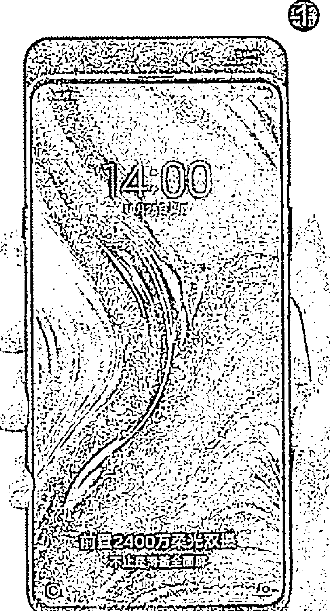

原本以为滑盖全面屏会成为未来一段时期的潮流趋势，没想到它们却遭遇了“诞生即绝唱”的待遇，纵观整个2019年也没有知名新品接过Find X、Magic 2、MIX3和Z5 Pro的“衣钵”。没办法，滑盖设计势必要将手机从中间一分为二，从而导致用来安置前后摄像头和电池的空间变小，进而影响续航和拍照质量。

> 魅族黄章曾对这一设计做出过点评：“滑盖可以说是穷途末路倒退的设计，抛开复杂机械带来的麻烦，要么手机厚得像砖头，要么拍照成像质量大减。这是为了中看不中用的噱头，营销大师才会干的事，产品工程设计师不会这么做”（图2），现在来看真的是一语中的。
**J.Wong**
回复了：滑盖可以说是穷途末路倒退的设计，抛开复杂机械带来的麻烦，要么手机厚得像砖头，要么拍照成像质量大减。就为了中看不中用的噱头营销大师才会干的事而不是产品工程设计师。

> **【J.Wong 回复】J·wong 魅族16x有**
魅族16x存储器是UFS2.1吗？谁知道？拍照手机不配UFS2.1是否很遗憾！
来自魅族社区

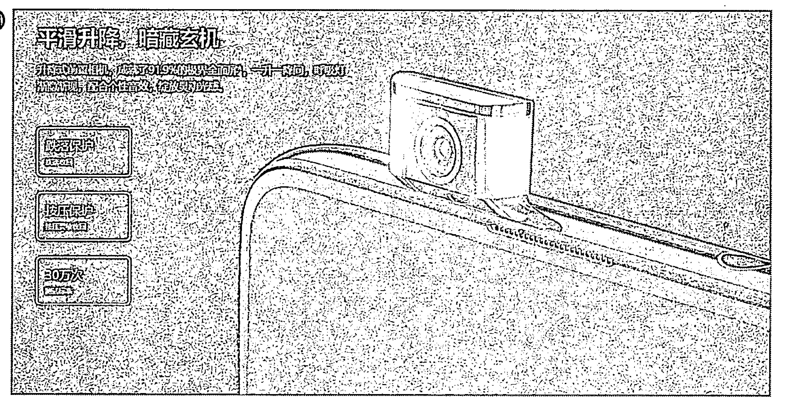

#### 升降摄像头顺利接班

导致滑盖全面屏遇冷的另一个因素，则是升降摄像头方案的不断成熟。这项最早诞生于2018年初并仅限旗舰手机享用的技术，在2019年逐渐呈现出了普及的态势，上有vivo NEX3这种顶级旗舰，中有OPPO Reno和Redmi K20等主流代表（图3），下至realme X和荣耀9X这种千元价位的手机，都通过可随时弹出的前置摄像头获得了超过90%的屏占比。

当然，为了提升辨识度并与竞品拉开差距，升降摄像头方案也有很多改进的空间。比如集成两颗摄像头、改用独特形状结构（图4）、添加额外的柔光灯、在升降模块两侧添加LED呼吸灯效等等。从使用寿命和安全角度来看，采用这种设计手机的镜头模块都拥有至少20万次的升降次数，并引入了跌落保护功能，当系统监测到手机下坠时摄像头会自动降回手机体内。

可以预见，在更先进的屏下摄像头技术进入商业化量产以前，升降摄像头是现阶段实现“真·全面屏”设计最经济的解决方案之一（图5），它在2020年也将继续发挥余热。


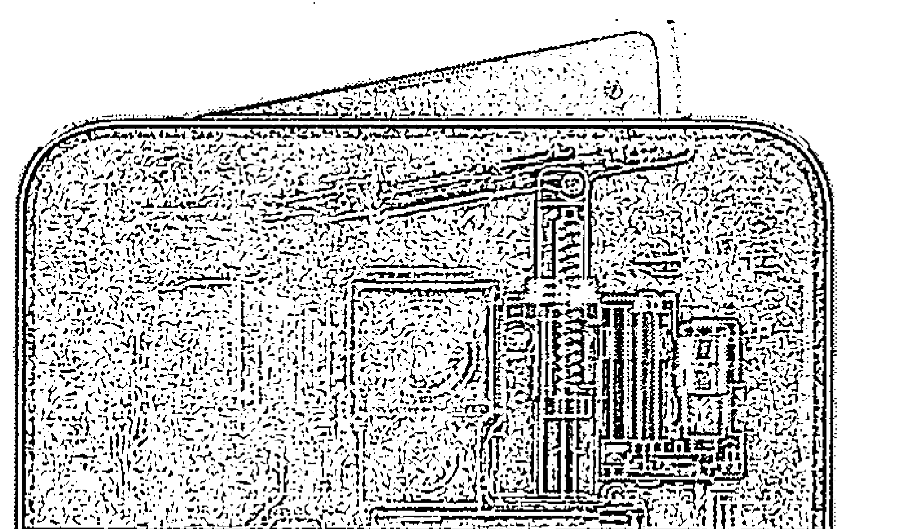

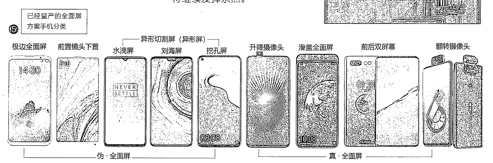

#### “挖孔屏”渐成主流

从成本的角度来看，“异形屏”较之升降摄像头更具优势，也因此成为普及度最高的全面屏方案。在2019年，原本占据统治地位的“水滴屏”正在遭受“挖孔屏”的冲击，华为/荣耀、三星、Redmi、vivo、摩托罗拉和诺基亚等品牌都先后推出了采用该方案设计的产品。

2018年底，三星Galaxy A8s和荣耀V20成为了“挖孔屏”方案手机的鼻祖，它们都在屏幕的一角“挖”出了一个小孔，里面镶嵌着前置摄像头模块，从而“解放”了原本属于刘海、水滴和珍珠屏幕上方顶部的凸起空间(图6)。这种设计的好处是，在熄屏状态下实现了“正面几乎都是屏幕”的感官特效，在亮屏后这个小孔的位置也不算特别醒目，在优化过的UI界面的帮助下可以带来更完美的沉浸感。

而采用挖孔屏方案的手机之间，比拼的则是挖孔位置、屏幕材质，以及挖孔背后的技术是“通孔”还是“盲孔”技术。对LCD(IPS)屏幕材质而言，“盲孔”方案可以让摄像头的孔径更小，比如华为/荣耀旗下的挖孔屏手机就能将摄像头开孔控制到4.5mm。反观采用LCD+“通孔”方案的三星Galaxy A8s则要大于6mm。相对而言，OLED(包括AMOLED)+挖孔屏可以实现更完美的显示效果，也能将孔径进一步缩小(图7)。以vivo S5为例，其前置摄像头的孔径只有2.98mm，可以进一步还原纯净屏幕。

好消息是，“双挖孔”屏幕已不再是三星Galaxy S10+手机和OLED材质屏幕的专利，2019年底以荣耀V30系列、华为nova 6和Redmi K30系列为代表的采用LCD材质屏幕的手机也实现了“双开孔”设计(图8)，2020年采用前置双摄的挖孔屏手机将成为中高端新品市场的一道靓丽风景。

#### 终结左右边框的“瀑布屏”

无论是挖孔屏还是升降摄像头方案，它们只能最大限度压缩手机屏幕的“额头”(上边框)，最先进的COP屏幕封装工艺也只能压缩屏幕的“下巴”(下边框)，对屏幕两侧的边框毫无办法，哪怕是3D双曲面屏幕也无法摆脱左右边框的束缚(图9)。

随着2019年9月vivo NEX3和华为Mate 30 Pro的上市，这个问题终于得以解决。这两款新品的最大特色，就是采用了全新的3.5D“瀑布屏”设计，屏幕两侧边缘以接近垂直的状态向下弯曲，犹如两泓飞瀑，恰好可以覆盖整个边框，在主视角下几乎是0mm的边框。以vivo NEX3为例，它给人的第一眼印象就是两侧边框彻底不见了，好像手机两侧直接被屏幕包裹了起来，其屏占比参数也达到了业内最高的99.6%（图10）。


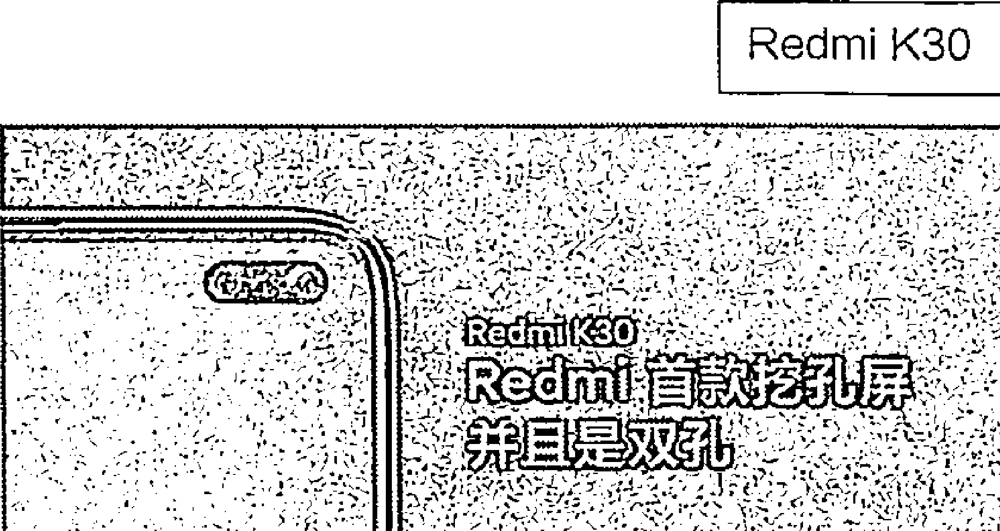

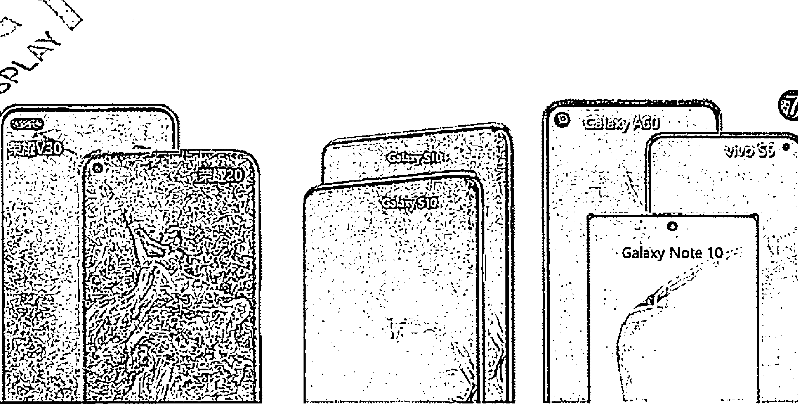

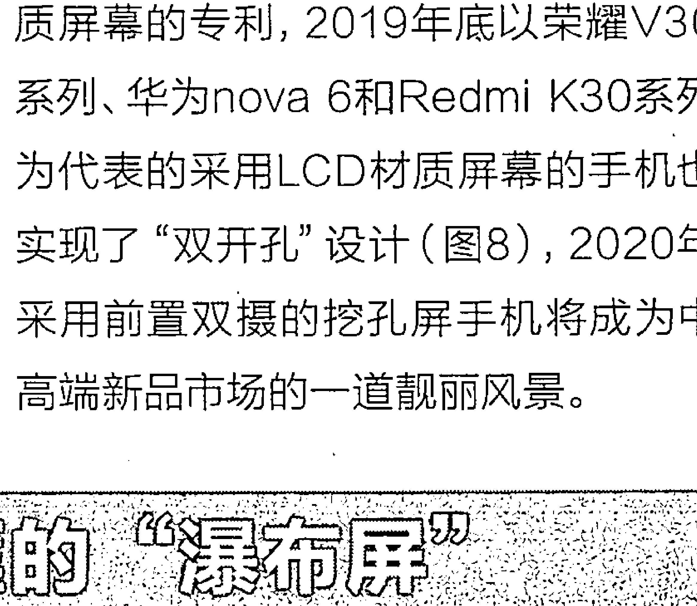

为了避免持握时的误触，采用瀑布屏设计的手机都会在系统层面对屏幕两侧的触控功能进行限制，瀑布屏边缘向下垂直的部分只能用于显示而无法操作，只有正对用户部分的正面屏幕才能对触控操作进行响应。

可惜的是，瀑布屏的良品率不高，这意味着它仅适用于顶配旗舰手机，短期内无法降到3000元以内的中高端价位市场，容易碎屏的隐患也进一步限制了它的潜在客户。


### 未来已在招手

除了偏概念的瀑布屏以外，折叠屏技术也终于在2019年从梦想照进了现实。柔宇科技的FlexPai、三星Galaxy Fold、华为Mate X和摩托罗拉Razr折叠屏手机都实现了商业化量产，前面3款可以瞬间获得平板电脑的视野（图11），而Razr则在保留足够“视界”的同时进一步提升了智能手机的便携性（图12）。

需要注意的是，折叠屏的成本比瀑布屏还要高，所以在2020年它也仅是有钱人的玩意儿。

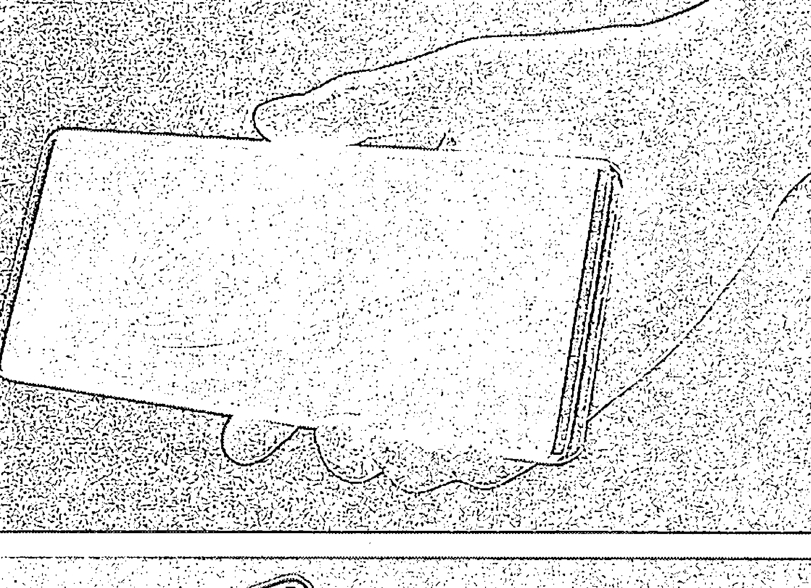

如果你不在乎屏幕的左边框宽一点，对折叠屏的体验也不感冒，2020年“真·全面屏”领域还将出现一项全新的技术——屏下摄像头方案。

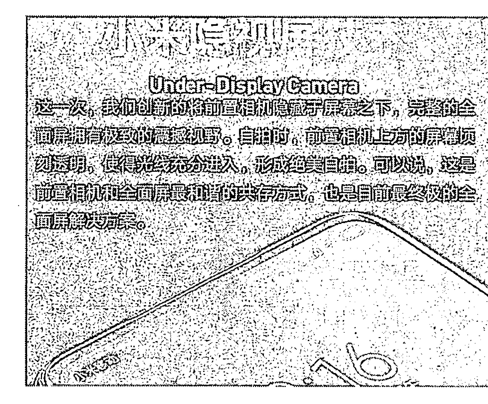

2019年6月初，OPPO和小米高层先后曝光了采用屏下摄像头技术的工程样机，并分别命名为“隐视屏”和“透视全景屏”（图13）。两个品牌屏下摄像头技术的原理相同，都是建立在AMOLED屏幕面板的基础上，采用两块屏幕拼接的方式，在前置摄像头对应的表面覆盖了一层“透明屏”（定制阳极材料的AMOLED面板），外部光线可以透过这部分屏幕区域直达摄像头内部的传感器（图14），从而提升成像品质。在不使用摄像头时，这一小块“透明屏”还能正常显示屏幕内容。


屏下摄像头技术的出现，可以让“真·全面屏”手机无需改变现有形态，彻底摆脱复杂机械结构的束缚，不会增加机身重量影响续航。可惜的是，该技术在2019年还处于工程验证阶段，预计在2020年下半年才会有少数量产机型问世。

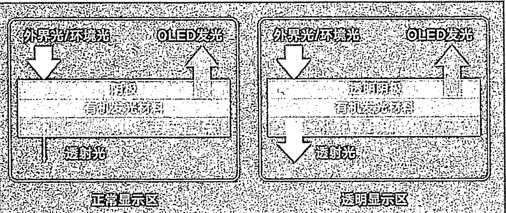

### 屏幕形态之外的变化

2019年，智能手机的屏幕在形态之外还呈现出了诸多变化。首先，就是显示比例正逐渐从18:9、19:9、19.9:9过渡到20:9，对应2400×1080像素的分辨率(代表产品包括三星A70、OPPO Reno2、一加7T、荣耀20青春版、荣耀V30 PRO和华为nova 6等)。这种比例的屏幕可以在不影响持握感的前提下进一步“拉长”屏幕，从而获得更为震撼的视界。

以vivo X27 Pro为例，该产品采用了6.7英寸屏幕(图15)，显示比例为更加修长的20.5:9，较6.4英寸的X27增加了0.3英寸的视野，但机身宽度并没有发生变化，持握感非常优秀，依旧维持了与昔日5.5英寸(16:9)手机相似的握感。

为了提升游戏体验，在这一年中有更多的产品引入了更高“采样率”和“刷新率”的屏幕(图16)。其中，屏幕采样率是针对手机屏幕在触控操作时的灵敏度指标(60Hz为标准，最高可达240Hz)，通俗理解就是屏幕每秒对手指触摸采集样本的次数，采样率越高的屏幕触控响应时间越短，翻译过来就是越“跟手”。

屏幕刷新率代表屏幕每秒画面被刷新的次数(60Hz为标准，90Hz和120Hz则常被称为“流体屏”)，刷新率越高可以显著降低图像显示时的闪烁和抖动问题，减轻眼睛的疲劳感，又不容易引起眼睛酸痛和头晕等问题。

为了契合用户追求护眼的消费心理，今年有更多的手机厂商都开始选择做TÜV莱茵的低蓝光认证，通过该认证的手机屏幕能够有效降低导致眼睛疲劳的蓝光含量，结合护眼模式下的色温亮度调节，可以进一步减少长时间观看屏幕对眼睛的伤害。此外，随着采用OLED材质屏幕的手机越来越多，可降低低亮度下屏闪问题的软件DC调光功能已经逐步普及，而还有更多新品在系统层面引入了全局黑色背景显示的功能，可以充分挖掘OLED屏幕黑色背景下几乎不耗电的省电优势(图17)。


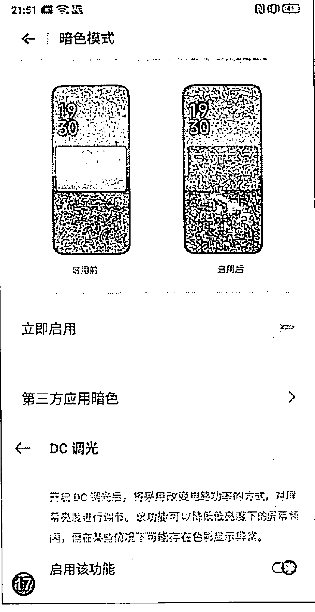

## 芯的变化：围绕5G展开的较量

智能手机每一次的形态革新，往往也伴随着硬件平台的同步升级，毕竟内外兼修的新品味道才更诱人。2019年诞生的智能手机“心脏”有很多，只是这些SoC（处理器，也可视为移动平台）之间的竞争已经不再限于绝对的性能，是否支持5G网络也是它们之间比拼的核心要素。

#### 聚焦主流移动平台

在2018年，高通骁龙660、骁龙710、海思麒麟710和联发科Helio P60堪称主流价位手机（1000元~2000元）芯片领域的“四小天王”，其中骁龙710凭借相对更强的性能，成为了这一市场公认的“中流砥柱”（图1）。然而，步入2019年后这颗“神U”却遭遇贱卖，成为了很多千元价位手机的标配。既然骁龙710都已不值钱，其他小天王的境遇自然更为尴尬。

为此，高通、海思、联发科和三星在2019年都更加聚焦主流市场，纷纷祭出了全新的SoC家族成员（表1）。需要注意的是，表1中涉及的发布时间并非商业化量产的时间，比如高通骁龙675在2018年10月就已发布，但直到2019年3月才被魅族Note 9和红米Note 7 Pro首发。

在这9颗SoC中，骁龙675的优势在于将CPU架构升级到了由ARM Cortex-A75架构魔改而来的Kryo 460核心，但其集成的Adreno 612 GPU却远不如骁龙710集成的Adreno 616，属于“CPU惊喜但GPU入坑”的存在；Helio P90的综合性能与骁龙675相似，但它诞生以来仅被OPPO Reno Z这么一款产品列装，属于“名不见经传”的代表；骁龙665虽然属于2019年诞生的新品，但实际性能却和骁龙660差不多，落后意味着挨打，鲜有问津；麒麟810、联发科Helio G90T和骁龙730属于2019年真正的“中端悍将”，它们都采用了较新的Cortex-A76架构CPU和更主流的GPU，常见的3D游戏都能满帧运行，也是近期1600元以内价位手机的良心之选，它们之间的性能依次略有降低。麒麟810常见于华为/荣耀品牌旗下1300元~2000元价位的手机（图2），Helio G90系列由Redmi Note 8 Pro首发，而骁龙730系列已经呈现四处开花之势，普及度最高；Helio P65的规格介于Helio P60和Helio P90之间，它的境遇和Helio P90相似，迄今也只有vivo Y7s一款产品列装；Exynos 980和骁龙765是三星/高通在2019年底才刚刚发布的5G SoC（图3），它们的特色还体现在Exynos 980武装了ARM最新的Cortex-A77架构，骁龙765的核心则与骁龙855同源（A76魔改）。据悉，海思将在2020年初推出麒麟820，而它也将与Exynos 980和骁龙765，成为2020年2xxx元价位5G手机的御用“心脏”。

表1: 2019年上市的主流移动SoC基本参数对比

| 芯片型号 | 骁龙675 | Helio P90 | 骁龙665 | 骁龙730 | 麒麟810 | Helio P65 | Helio G90 | Exynos980 | 骁龙765* |
| :--- | :--- | :--- | :--- | :--- | :--- | :--- | :--- | :--- | :--- |
| 制程工艺 | 三星11nm | 台积电12nm | 三星11nm | 三星8nm | 台积电7nm | 台积电12nm | 台积电12nm | 三星8nm | 三星7nm+EUV |
| CPU大核 | 2×Kryo 460 | 2×A75 | 4×Kryo 260 | 2×Kryo 470 | 2×A76 | 2×A75 | 2×A76 | 2×A77 | 2×Kryo 475 |
| CPU小核 | 6×Kryo 460 | 6×A55 | 4×Kryo 260 | 6×Kryo 470 | 6×A55 | 6×A55 | 6×A55 | 6×A75 | 6×Kryo 475 |
| 最高主频 | 2.0GHz | 2.2GHz | 2.0GHz | 2.3GHz | 2.27GHz | 2.0GHz | 2.05GHz | 2.2GHz | 2.4GHz |
| GPU型号 | Adreno 612 | PowerVR GM9446 | Adreno 610 | Adreno 618 | Mali-G52MP6 | Mali-G52MP2 | Mali-G76MP4 | Mali-G76MP5 | Adreno 620 |
| 基带 | 4G | 4G | 4G | 4G | 4G | 4G | 4G | 5G (集成) | 5G (集成) |
| 发布时间 | 2018-10 | 2018-12 | 2019-4 | 2019-4 | 2019-6 | 2019-6 | 2019-7 | 2019-11 | 2019-12 |
| 综合性能 | ★★★ | ★★★ | ★★ | ★★★☆ | ★★★★ | ★★★ | ★★★★ | ★★★★★ | ★★★★★ |

\*骁龙765采用的是1+1+6的三丛集架构，包括最高2.4GHz的超级核心、2.2GHz的性能核心和1.8GHz的效能核心

### 顶级移动平台的变化

2019年的旗舰手机领域处于“三足鼎立”阶段，麒麟980、三星Exynos 9820和高通骁龙855都代表着当时的最强音，只是搭载Exynos 9820处理器的三星Galaxy系列手机只在韩国等少数国家和地区销售，国内用户无缘享用。和过去几年的旗舰级SoC相比，这三颗芯片最大的特色就是可以“外挂”5G基带，从而获得接入5G网络的能力。在2019年，骁龙855/Plus+X55基带是5G手机普及度最高的组合（图4），小米、OPPO、vivo、iQOO、三星、联想、索尼等品牌都已推出了相关的新品。

步入2019年底，旗舰手机领域即将进入“四国争雄”阶段，除了海思麒麟990 5G、高通骁龙865和三星Exynos 990之外，联发科也终于重新参与到顶级SoC的竞争中来，其首发的天玑1000采用了ARM最新的Cortex-A77 CPU和Mali-G77 GPU架构组合，而且还是首款支持双载波聚合且最省电的5G单芯片（图5），在纸面参数上已经超越了麒麟990 5G（表2）。根据联发科一贯的价格策略，天玑1000的采购成本应该明显低于骁龙865，这意味着2020年5G旗舰手机的售价有望降至3000元以内。

| 参数对比 | 麒麟980 | Exynos 9820 | 骁龙855/Plus | 麒麟990 5G | Exynos 990 | 天玑1000 | 骁龙865 |
| :--- | :--- | :--- | :--- | :--- | :--- | :--- | :--- |
| 制程工艺 | 台积电7nm | 三星8nm | 台积电7nm | 台积电7nm+EUV | 三星7nm+EUV | 台积电7nm | 台积电7nm |
| CPU架构 | 2×A76<br>2×A76<br>4×A55 | 2×M4<br>2×A75<br>4×A55 | 1×Kryo 485<br>3×Kryo 485<br>4×Kryo 485 | 2×A76<br>2×A76<br>4×A55 | 2×M5<br>2×A76<br>4×A55 | 4×A77<br>4×A75 | 1×Kryo 585<br>3×Kryo 585<br>4×Kryo 585 |
| 最高主频 | 2.6GHz | 2.7GHz | 2.96GHz | 2.86GHz | 不明 | 2.6GHz | 2.84GHz |
| GPU型号 | Mali-G76MP10 | Mali-G76MP12 | Adreno 640 | Mali-G76MP16 | Mali-G77MP11 | Mali-G77MP9 | Adreno 650 |
| 5G基带 | 巴龙5000（外挂） | Exynos 5100（外挂） | 骁龙X50（外挂） | 巴龙5000（集成） | Exynos 5123（外挂） | Helio M70（集成） | 骁龙X55（外挂） |
| 组网方式 | NSA/SA | NSA/SA | NSA | NSA/SA | NSA/SA | NSA/SA | NSA/SA |
| 发布时间 | 2018-8 | 2018-11 | 2018-12/2019-7 | 2019-9 | 2019-10 | 2019-11 | 2019-12 |
| 综合性能 | ★★★★☆ | ★★★★☆ | ★★★★☆ | ★★★★☆ | ★★★★☆ | ★★★★☆ | ★★★★☆ |

### 5G时代悄然来临

2019年是“5G元年”，所以产业链相关企业都在争抢5G的首发冠名（图6）。具体到5G智能手机领域，按时间先后发布的5G手机包括：

- 中兴天机Axon 10 Pro (2019-5, 骁龙855+X50)
- 华为Mate 20X 5G (2019-7, 麒麟980+巴龙5000)
- iQOO Pro 5G (2019-8, 骁龙855 Plus+X50)
- 小米9 Pro 5G (2019-9, 骁龙855 Plus+X50)
- 三星 Galaxy Note10+ 5G (2019-9, 骁龙855+X50)
- 三星 Galaxy A90 5G (2019-10, 骁龙855+X50)
- vivo NEX 3 5G (2019-10, 骁龙855 Plus+X50)
- 华为Mate 30系列5G版 (2019-11, 麒麟990 5G)
- 荣耀V30系列 (2019-11, 麒麟990 5G)
- 华为nova 6系列 (2019-12, 麒麟990 5G)
- Redmi K30系列 (2019-12, 骁龙765)
- OPPO Reno3系列 (2019-12, 骁龙765)

虽然早在2019年5月就有5G手机上市，但直到2019年10月底国内三大运营商才正式公布了旗下的5G套餐（图7），5G手机才真正有了用武之地。在已上市的5G手机中，采用骁龙855/Plus+X55基带组合的方案代表最多，它们最大的缺陷就是仅支持NSA（非独立组网），无缘享用SA（独立组网）特有的低于1毫秒的延迟（uRLLC，超可靠低时延通信），以及可以万物互联（mMTC，海量物联网）的特性。至于其他的5G方案，它们都支持NSA/SA双模组网，差异主要体现在CPU/GPU性能以及最大的上行/下行速率，前者我们可以通过表1和表2加以对比，后者大家则不必过于关注，因为三大运营商针对5G网络都采取了最高1Gbps（下行速率）的限速，基带性能再强也很难体现出来。

> **火速链接**
>
> 如果你对5G技术和三大运营商的5G套餐之间的差异感兴趣，请参考本刊2019年第23期《辞旧迎新 理性分析5G套餐和手机》这篇文章。

### 全面改进的散热设计

在过去，智能手机的散热主要以多层的石墨和铜箔为主，只有极少数的高端手机才会引入热管液冷散热模块（图8）。到了2019年，不仅热管已经入驻更多主流价位手机，在高端手机领域甚至开始流行起了更豪华的VC（Vapor Chamber）“均热板”（又称“均温板”）设计（图9）。简单来说，VC均热板内的冷凝液可以向多个水平面传导（热管只能在单个方向），因此冷凝的效率更高，而且它与热源以及散热介质的接触面积更大，能够使表面温度更加均匀。如果你对手机散热设计很感兴趣，可参考本刊2019年第23期《热管的替代品 浅析VC均热板》这篇文章。

| 月费 | 流量 | 语音 | 联通会员 | 网络服务 | 套外 |
|---|---|---|---|---|---|
| 129 | 30GB | 500 | 4项内容权益 | 优享(500Mbps) | 套外每分钟0.15元<br>短信0.1元/条<br>套外流量3元/GB |
| 159 | 40GB | 500 | 4项内容权益 | 优享(500Mbps) | 套外每分钟0.15元<br>短信0.1元/条<br>套外流量3元/GB |
| 199 | 60GB | 1000 | 4项内容权益 | 优享(500Mbps) | 套外每分钟0.15元<br>短信0.1元/条<br>套外流量3元/GB |
| 239 | 80GB | 1000 | 4项内容权益 | 优享(500Mbps) | 套外每分钟0.15元<br>短信0.1元/条<br>套外流量3元/GB |
| 299 | 100GB | 1500 | 4项内容权益 | 极速(1Gbps) | 套外每分钟0.15元<br>短信0.1元/条<br>套外流量3元/GB |
| 399 | 150GB | 2000 | 4项内容权益 | 极速(1Gbps) | 套外每分钟0.15元<br>短信0.1元/条<br>套外流量3元/GB |
| 599 | 300GB | 3000 | 4项内容权益 | 极速(1Gbps) | 套外每分钟0.15元<br>短信0.1元/条<br>套外流量3元/GB |

### 存储性能缩短你的等待时间

除了SoC的强弱与否，智能手机的存储性能同样重要，抛开各种系统层面的加速引擎技术不谈，启动APP和复制大量文件数据所需的等待时间，都与内存和闪存这两个参数密不可分。

#### 更大更快的内存

我们都知道，一款手机的内存容量越大（图10），在后台可同时驻留的APP也就越多，在多任务切换时可最大限度避免因内存不足被后台查杀而需要重新启动的问题。在2019年，内存的容量和速度都在稳步地提升之中。

在容量方面，千元价位的手机已经开始普及4GB内存，而8GB已经成为更多中端手机的标配，3000元起步的顶级手机甚至开始流行12GB——要知道，现在90%以上的笔记本标配内存容量也不过才8GB。12GB内存的手机已经足够让无数笔记本用户“羡慕嫉妒恨”了。

问题来了，在LPDDR4X标准全面普及之际，当2000元价位和3000元价位的手机都配备了8GB LPDDR4X内存时，它们的内存性能相同吗？答案自然是否定的。以高通骁龙为例，7系列（如骁龙730）只支持（2×16bit）双通道LPDDR4X-1866，而8系列（如骁龙855）则支持（4×16bit）四通道LPDDR4X-2133，内存频率和通道数量的不同，导致二者内存带宽相差巨大。

步入2020年之后，以高通骁龙865和Exynos 990为代表的少数旗舰级SoC将支持最新的LPDDR5内存标准（图11），据说其性能是LPDDR4X的1.5倍。到2020年底，新一代中端SoC也有望引入这一内存技术，届时手机系统的响应速度将变得更加迅捷。

| 图标 | 组件 | 规格 |
| :--- | :--- | :--- |
|  | 中央处理器 | Dual-core (Custom CPU) + Dual-core (Cortex®-A76) + Quad-core (Cortex®-A55) |
|  | 图像处理器 | Mali™-G77 MP11 |
|  | 神经网络处理器 | Dual-core NPU |
|  | 制程 | 7nm EUV |
|  | 显示 | WQUXGA (3840x2400), 4K UHD (4096x2160) |
|  | 存储 | UFS 3.0, UFS 2.1 |
|  | 内存 | LPDDR5 |
|  | 相机 | Single-camera 108MP, Dual-camera 24.8MP+24.8MP |

#### 超越SSD的闪存

和内存相比，2019年智能手机在闪存方面的提升更加明显（图12）。自三星Galaxy Fold首发UFS 3.0闪存以后，从2019年5月上市的一加手机7系列开始，国产旗舰级手机也纷纷武装这一闪存技术，从而获得了接近1500MB/s的读取速度，可媲美PC领域的主流PCIe SSD！与此同时，很多千元价位的新品也纷纷告别老迈的eMMC 5.1闪存，改用单通道的UFS 2.1闪存，将读取速度从300MB/s左右提升到了500MB/s以上。

有了更大容量的内存和更高速的闪存支持，2019年整个Android手机阵营的流畅度都有了明显的提升，高端机型在体验上已经不输于iOS，千元价位的新品也告别了不定时的卡顿问题。

### 多摄矩阵 数量和像素的游戏

自2012年诺基亚808 PureView首次尝鲜4100万像素摄像头，直到6年后的2018年华为P20 Pro才再次让智能手机摄像头跨入4000万像素时代。令人意外的是，在短短的一年时间里，4800万像素摄像头就实现了全民普及之旅，而智能手机也在这一年完成了“破亿”的梦想。

#### 更多的镜头数量

在2018年，后置双摄是主流，后置三摄则是高端旗舰的专利。步入2019年后，哪怕是千元手机也用上了三摄矩阵，而部分中高端手机则开始逐渐尝试搭配四颗摄像头，以Nokia 9 PureView和小米CC9 Pro为代表的手机更是塞进了5颗镜头（图3）！

#### 镜头的排列变化

在前面的章节中我们提到过手机屏幕形态的变化，作为未来趋势的“瀑布屏”和“双挖孔屏”固然新奇，但它们对整体颜值的影响却显然不如手机后盖来得直观。而手机后盖时尚与否，除了各种渐变色和纹理的搭配，摄像头模块的排列也至关重要（图1）。

纵观2019年上市的新款手机，它们后置摄像头的排列主要以5种类型为主，分别为左上角竖直条形排列、左上角竖直矩形排列、左上角方形浴霸排列、居中竖直对称排列、居中圆环形排列（图2），至于哪一种更好看，就得视个人的审美观，以及厂商在配色和细节方面的优化了。

#### 镜头类型的搭配学

需要注意的是，手机摄像头的数量并不与成像质量成正比，后者需要更高品质的传感器、多类型镜头的搭配以及成像算法的结合才能趋近完美。Nokia 9 PureView和小米CC9 Pro就属于两种搭配的极端案例——Nokia 9 PureView配备的5颗镜头都是索尼旗下的IMX386传感器（1200万像素），其中2颗为彩色镜头，其余3颗为黑白镜头，通过独立的Light协处理器和特殊的合成算法，将汇集的总计6000万像素内容合成为一张更高品质的1200万像素照片。

小米CC9 Pro采取的是多类型镜头的混搭，包括主摄、人像、长焦、超广角和微距，通过不同焦段的覆盖，满足用户在不同场景下的拍摄需求。

微距镜头，分别适用于不同的拍照场景（图4）。在索尼IMX586和三星GM1等4800万像素传感器渐渐普及之际（成像质量已经足够好），通过更多类型镜头搭配的方式，赋予手机更多拍摄功能其实更具实际意义（表1）。毕竟，专业单反相机要想获得如今手机的拍照体验，也需要携带更多镜头套装才能搞定。

| 代表手机 | 摄像头数量 | 摄像头组合 |
|---|---|---|
| vivo X27 Pro | 3 | 主摄+超广角+夜拍 |
| vivo Z5 | 3 | 主摄+超广角+景深 |
| 小米9 | 3 | 主摄+长焦+超广角 |
| Redmi K20 Pro | 3 | 主摄+长焦+超广角 |
| 华为Mate 30 | 3 | 主摄+长焦+超广角 |
| 荣耀V30 | 3 | 主摄+长焦+超广角 |
| 荣耀V30 Pro | 3 | 主摄+长焦+电影镜头 |
| 魅族16s Pro | 3 | 主摄+长焦+超广角 |
| 一加7 Pro | 3 | 主摄+长焦+超广角 |
| OPPO Reno2 | 4 | 主摄+长焦+超广角+黑白 |
| 华为P30 Pro | 4 | 主摄+长焦+超广角+ToF |
| Redmi Note 8 Pro | 4 | 主摄+超广角+人像+微距 |
| realme X2 Pro | 4 | 主摄+长焦+超广角+人像 |
| realme X2 | 4 | 主摄+超广角+人像+微距 |
| 联想Z6 Pro | 4 | 主摄+超广角+人像+夜拍 |
| 小米CC9 Pro | 5 | 主摄+长焦+超广角+人像+微距 |

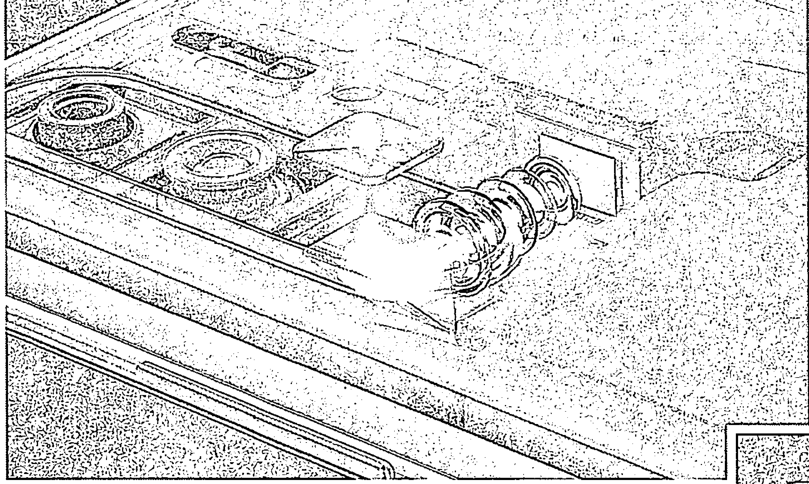

### 光学和混合变焦的混战

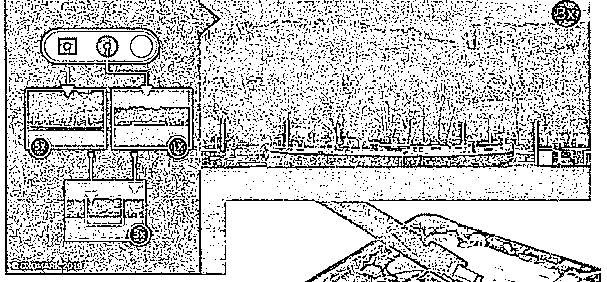

细心的朋友可能发现了一个问题，在2019年上市的新款手机中，经常可以看到“光学变焦”、“混合变焦”和“光学混合变焦”等宣传标语，支持30X或更高变焦拍照功能的产品也越来越多。如果你想选择一款拍得更远更清晰的手机，就需要先对这些名词加以了解。

在智能手机的多摄矩阵中，只要存在长焦镜头，就肯定支持“光学变焦”。目前手机专用的主摄镜头标准焦距约为27mm，传统长焦镜头主要以等效2X（56mm焦距）或3X（80mm焦距）为主，它们就支持真正的2X或3X光学变焦。以华为P30 Pro和OPPO Reno 10倍变焦版为代表的产品则配备了采用潜望式结构的长焦镜头（125mm和160mm焦距），它们才支持真正的5X光学变焦（图5）。

所谓的“混合变焦”，就是不止一颗镜头参与成像，比如通过主摄+超广角、主摄+人像，它属于传统纯数码变焦的改进版（图6）。现在很多手机虽然没有配备长焦镜头，但依旧支持2X或3X的混合变焦。其原理是新款4800万/6400万像素摄像头通过裁幅的2X照片，已经无限接近2X长焦镜头的成像。而“光学混合变焦”就是有长焦镜头参与更长焦段的多摄成像，比如传统长焦镜头参与的5X模式、潜望式长焦镜头参与的10X模式。我们以华为P30 Pro和小米CC9 Pro为例，看看它们在不同焦段拍照时的变焦模式（表2）。


总的来说，潜望式长焦镜头是让智能手机看清5X处风景的关键，只是它存在成本高和更占用空间的缺陷（图7），在华为P30 Pro和OPPO Reno 10倍变焦版上市大半年后，才被2019年12月发布的vivo X30系列重新列装。据悉，2020年三星Galaxy S11和小米MIX4等旗舰手机也将采用这种结构的长焦镜头，希望经历2019年的初试啼声，潜望式长焦镜头能早日用在更多主流价位的手机身上，让10X混合光学变焦功能走向普及。

| 说明 | 华为P30 Pro | 变焦模式 | 小米CC9 Pro | 变焦模式 |
| :--- | :--- | :--- | :--- | :--- |
| 1X | 主摄 | 正常拍照 | 主摄 | 正常拍照 |
| 2X | 主摄 | 裁幅 | 人像镜头 | 光学变焦 |
| 3X | 主摄+长焦 | 混合变焦 | 长焦镜头 | 光学变焦 |
| 5X | 长焦 | 光学变焦 | 长焦镜头 | 裁幅 |
| 10X | 主摄+长焦+超广角 | 混合光学变焦 | 主摄+长焦+人像 | 混合光学变焦 |
| 50X | 长焦 | 数码变焦 | 长焦 | 数码变焦 |

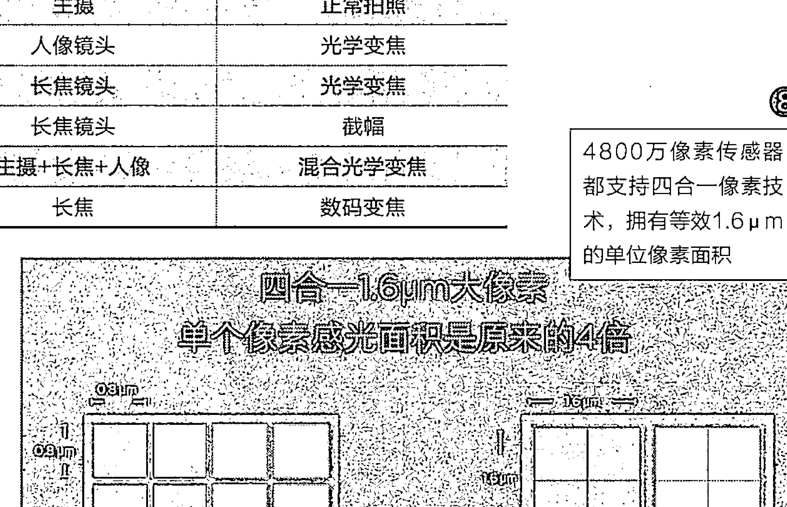

### 像素破亿的传感器

2018年底，荣耀V20和华为nova 4将4800万像素摄像头（索尼IMX586）带入2xxx元价位。2019年初，魅族Note 9和Redmi Note 7进一步将4800万像素摄像头（三星GM1）杀入1xxx元市场。好似忽如一夜春风来，转眼之间这种超高像素的传感器就在Android手机领域全面开花（图8），如今很多不足千元的新品也都将它们纳入标配。

2019年手机摄像头进入了新一轮的像素战争，8月底Redmi Note 8 Pro首发6400万像素的三星ISOCELL Bright GW1传感器，随后这颗CMOS还先后被realme X2、realme X2 Pro、vivo NEX 3 5G、OPPO K5、三星 Galaxy A70s等手机列装。和我们熟悉的GM1/IMX586相比，GW1传感器的“底子更大”（图9），夜拍表现得以进一步提升。

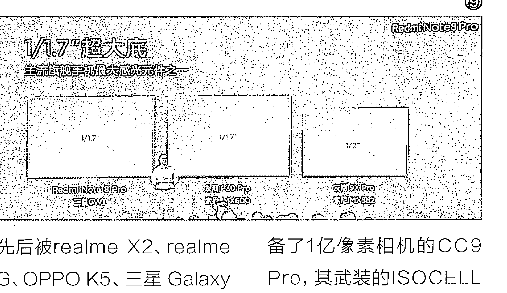

2019年11月，小米正式发布了全球第一款配备了1亿像素相机的CC9 Pro，其武装的ISOCELL Bright HMX传感器像素值达到了破天荒的一亿零八百万像素，像素数量比次一级的6400万像素传感器提高了60%，是手机史上图像传感器行业的最高纪录。同时，这颗传感器的尺寸也达到1/1.33英寸，同样是以Android/iOS为代表的智能手机历史上的最大值（图10）。

> > 作为对比，索尼IMX586的传感器尺寸为1/2.0英寸，更高端的IMX600/IMX650传感器尺寸也不过1/1.7英寸，ISOCELL Bright HMX这次将“底大一级压死人”的优势贯彻到底。

| 传感器型号 | 像素值 | 分辨率 | 传感器尺寸 | 单像素面积 | 代表产品 |
| :--- | :--- | :--- | :--- | :--- | :--- |
| ISOCELL Bright GM1 | 4800万 | 4032×3024像素 | 1/2.0英寸 | 0.8μm<br>等效1.6μm | 魅族16Xs |
| ISOCELL Bright GM2 | 4800万 | 8000×6000像素 | 1/2.25英寸 | 还未上市 |
| ISOCELL Bright GW1 | 6400万 | 9280×6944像素 | 1/1.72英寸 | Redmi Note 8 Pro |
| ISOCELL Bright HMX | 10800万 | 12032×9024像素 | 1/1.33英寸 | 小米CC9 Pro |
| 索尼IMX586/582 | 4800万 | 8000×6000像素 | 1/2.0英寸 | OPPO Reno2 |
| 索尼IMX600 | 4000万 | 7296×5472像素 | 1/1.7英寸 | 1.0μm<br>等效2.0μm | 荣耀V30 |
| 索尼IMX650 | 4000万 | 7296×5472像素 | 1/1.7英寸 | 华为P30 Pro |
| 索尼IMX686 | 6400万 | 9248×6944像素 | 1/1.7英寸 | 0.8μm<br>等效1.6μm | Redmi K30 |

2019年12月，Redmi K30系列首发6400万像素的索尼IMX686传感器，其理论表现还要在ISOCELL Bright GW1之上（表3）。可以预见，2020年的中高端新品都将以6400万像素主摄纳入标配，届时我们将可以记录更清晰的照片和视频内容。

需要注意的是，像素值只是影响手机实际拍照效果的因素之一，光圈和ISO大小、是否支持光学防抖、光学镜片数量以及相机成像算法也是不容忽视的环节。以索尼IMX600和IMX650传感器为例，虽然它们的像素值只有4000万像素，但其成像质量却依旧可以媲美ISOCELL Bright HMX，在改用RYYB滤镜之后的夜拍表现更加趋于完美（图11）。如果你对手机摄像头方面的知识感兴趣，可以参考本刊2019年第11期《从RGGB到RYYB 浅析手机镜头传感器的结构》和第19期《破亿不是梦 理性看待手机摄像头的像素值》这两篇文章。

### 体验革新方方面面的升级

除了前文涉及的变化，2019年智能手机领域还在很多领域进行了革新，并显著提升了我们日常的使用体验。

#### 更爽的快充体验

虽然快速充电技术早就在中高端Android手机领域普及，但在2018年绝大多数产品的功率还停留在18W~24W，而且很多快充技术在手机亮屏时会瞬间变成5V/2A的普通充电模式。2019年，更多的快充技术开始支持亮屏快充，在电荷泵技术的帮助下充电功率也不断攀升。比如，小米在年初宣布了功率达100W的Super Charge Turbo技术；

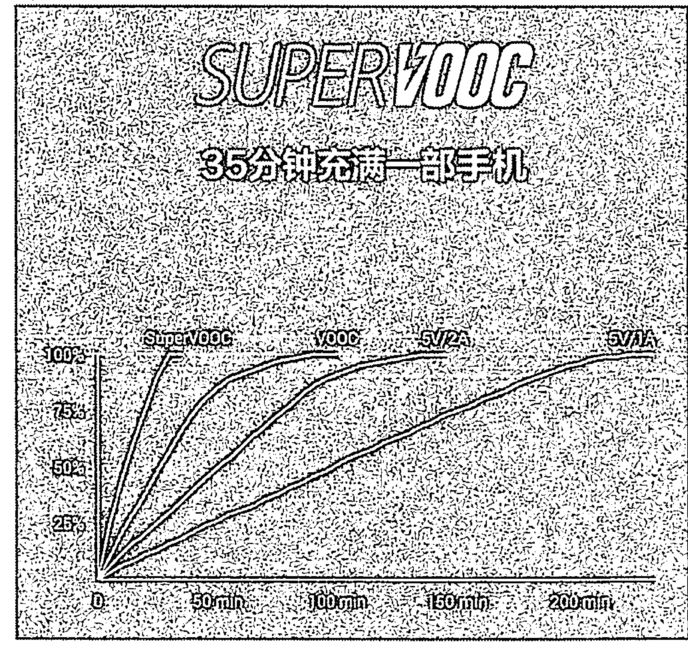

和vivo NEX 3为代表的手机开始支持44W超快闪充；realme X2 Pro支持50W的SuperVOOC（图12），OPPO Reno Ace更是支持65W的SuperVOOC2.0，面向主流市场的VOOC4.0技术也从上代的20W提升到了30W标准。有了上述快充技术的加持，半小时充满手机的全部电力将不再是梦想。

在无线充电技术方面，小米和华为已经开始支持27W的无线快充，OPPO在2019年9月则发布了30W的无线VOOC闪充，同时双向无线充电功能（手机可给无线耳机充电）也逐步普及。2020年，我们只需碎片化的时间就能解决电量低的问题，从侧面弥补因电池容量难以提高的续航缺陷。

#### 更舒心的网络体验

2019年除了5G网络崭露头角以外，其他网络功能也得以优化升级。比如所有新品都开始支持双卡双VoLTE功能，双频GPS、双Wi-Fi技术（同时接入2.4G和5G）和双通道网络加速（WLAN和4G网络同时使用）也逐渐成为更多主流价位手机的标配（图13）。

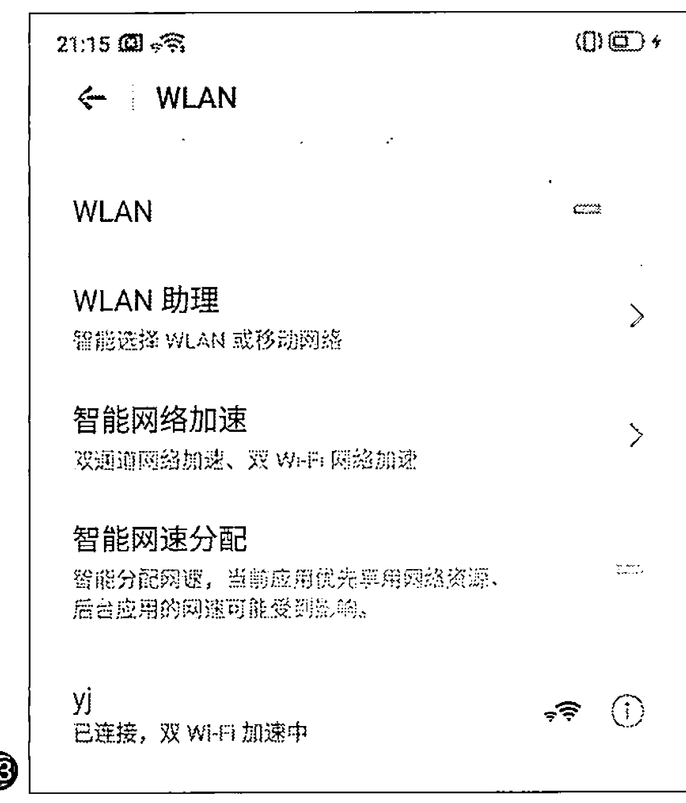

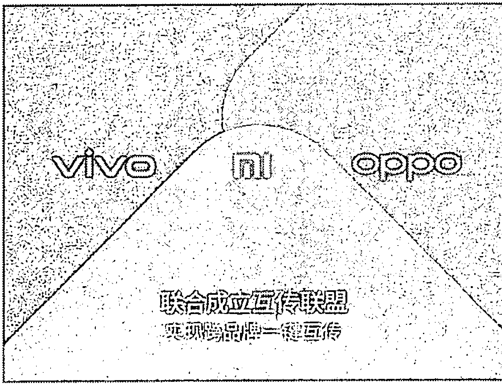

#### 更方便的传输体验

华为/荣耀手机可以通过Share一碰传功能在不同设备之间分享数据，其中的高端型号还能实现无线投屏功能，将手机画面投射到显示器或电视屏幕上并以Windows 10风格界面显示和操作，着实令人羡慕不已。2019年8月，OPPO、vivo、小米成立了互传联盟，今后三大品牌的手机无需安装第三方应用就可实现跨品牌的一键互传（图14），互传支持多种文件格式，具有高速、稳定、无需流量的特点，甚至数据迁移也能一触即达。

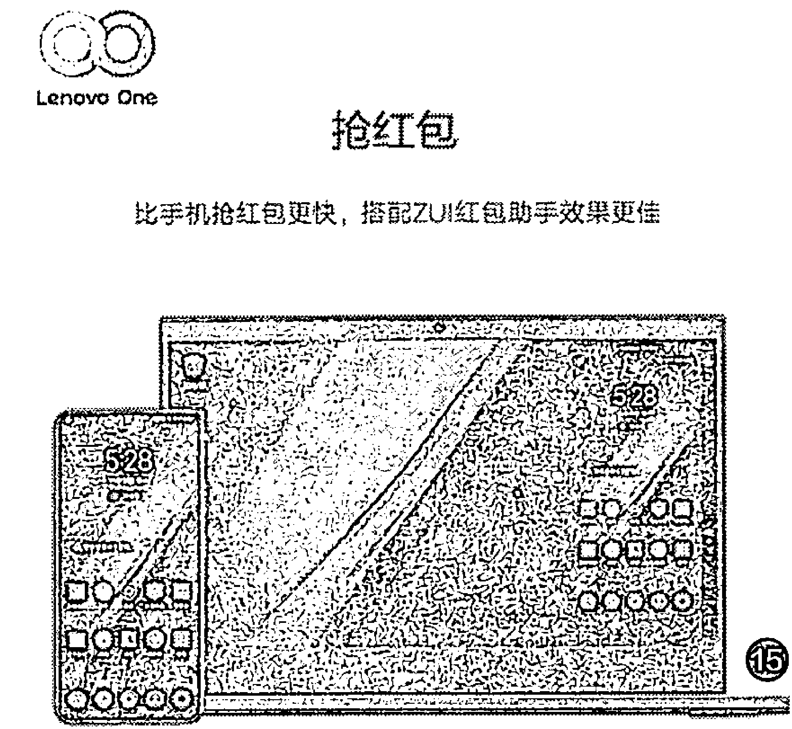

2019年11月，联想在ZUI11.5内测版中新增了全新的Lenovo One功能（图15），它可以将Windows和Android融合为一，可将手机屏幕投屏到电脑上，而且能够实时操作，在体验上无限接近华为/荣耀的分布式终端体验（图16）。类似的跨平台交互功能，有望在2020年全面普及，届时我们可以直接在电脑屏幕上看到手机实时画面，并通过鼠标对着屏幕远程控制手机，实现办公和玩手机两不耽误的梦想。

#### 智慧全场景 打造便捷生活

荣耀MagicBook系列、荣耀Flypods系列、荣耀手表等多种IoT产品与荣耀V30 PRO全场景智能连接，分布式多终端体验，智享5G精彩生活，更快更便捷。

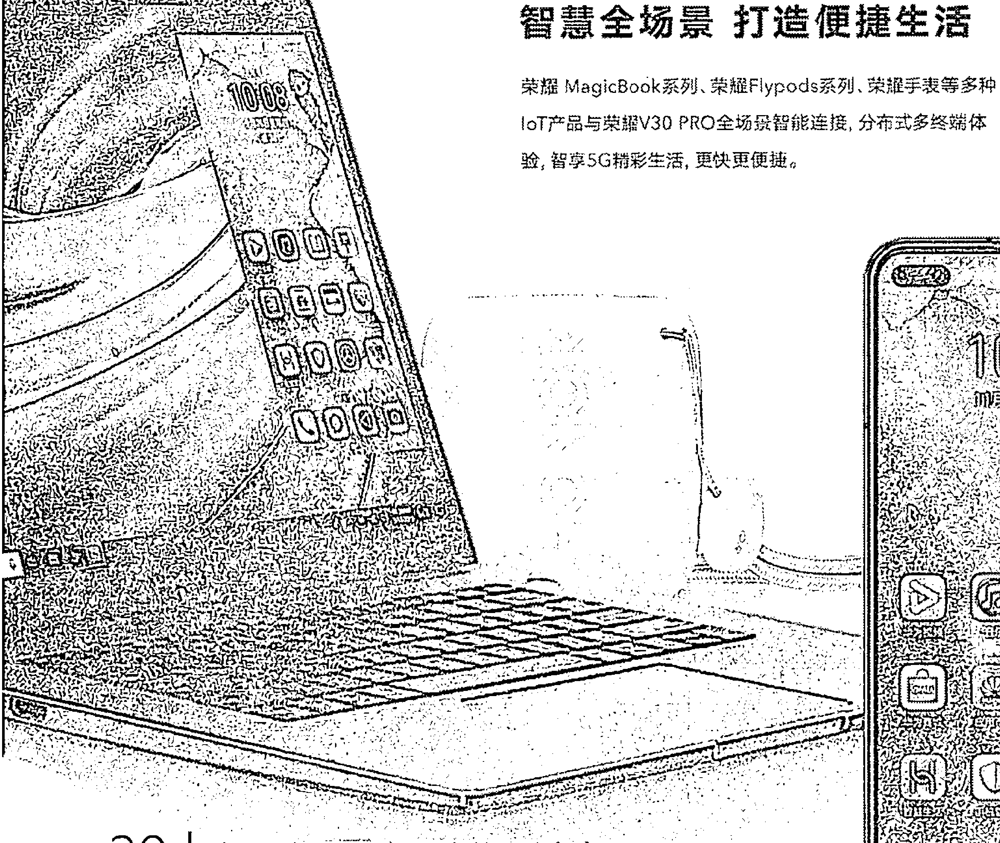

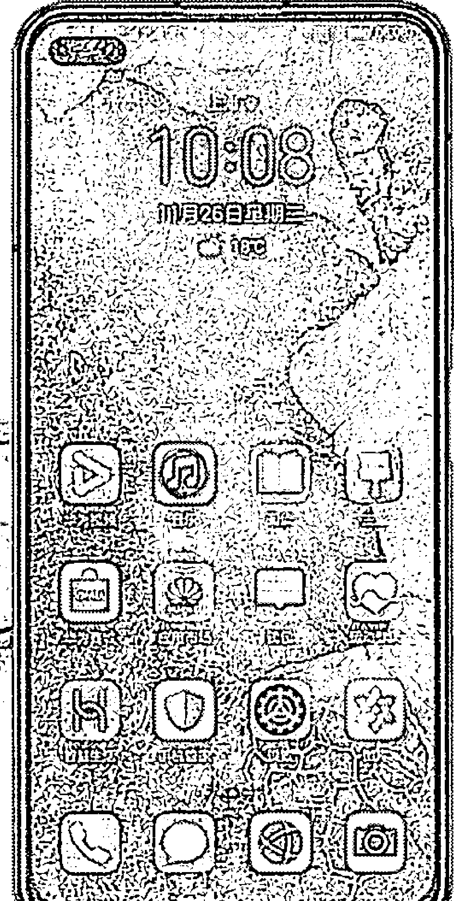

在2019年，Android手机还经历了从9.0向Android 10系统版本的革新，各种游戏加速、AI场景识别、语音助手等功能趋于同质化，NFC也逐渐在中端机型身上开始普及。受文章的篇幅限制，本文我们就不再进行赘述了。

## 年度DIY大事记

### 我们这样玩转2019


在2019年，有哪些值得我们留在记忆中回味的产品、技术和应用，它们又如何影响了市场乃至业界呢？恰逢年关将至，我们不妨来好好盘点一下。除了留在脑中的纪念之外，其中也有一些也许正是大家现在最为需要的，那么完全可以作为自己或家人的新年礼物，把它当成辛苦一年的回报，陪伴我们温馨的新的一年。

那么，就让我们沿着这一年四季的脚步来整理我们的记忆，看看每个季度让人最印象深刻的那些重磅产品和事件吧。

#### 第一季度

在每一年的年初，最吸引电脑爱好者的总是CES大展而不是真正上市的产品们。其实恰恰是因为CES上的产品过于亮眼，才使得真正在这一季度上市的、常常是前一年就透露或发布的产品才会显得有些不够震撼。不过回头来看，会发现第一季度上市的最重要产品均为显卡，而且都是相当有意义的型号。

-   RTX 2060
RTX 2060（图1）是目前为止RTX系列的最低端产品，从核心规格上看，RTX 2060已经超过了GTX 1070，就更别说前辈GTX 1060了。而从性能上看，它更是完全超过了GTX 1070。当然，作为一款中端显卡，英伟达还是以使用6GB显存这种方式，限制了它在4K分辨率等高端需求下的能力，以免影响RTX 2070等高端显卡的销售。
刚上市的RTX 2060价格是很让人诟病的，3000元左右的价格远超GTX 1060的发布价格，使其定位显得很模糊。当然和它的手下败将GTX 1070对比，这一价格还是比较值得的。

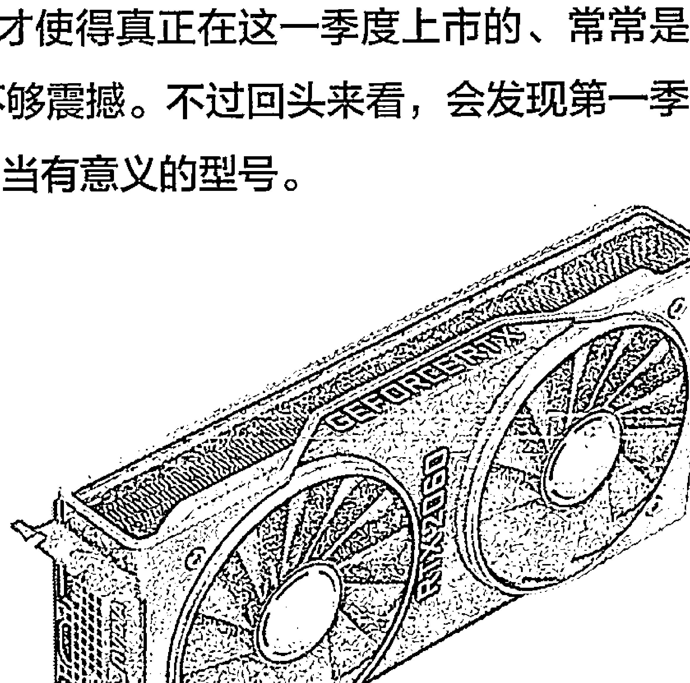

##### GTX 1660 Ti/1660

不久之后发布的GTX 1660 Ti（图2）应该就是RTX 2060奇怪价格定位的一个答案。它虽然借用了1000系列的名称，但实际上是新的“图灵(Turing)”核心产品，只是因为取消了光线追踪等功能而不适合使用“RT”的名称以及2000系列的型号了。当然，因为在CUDA核心等规格上也有缩减，GTX 1660 Ti和RTX 2060的“传统”游戏性能也有着20%以上的差距。

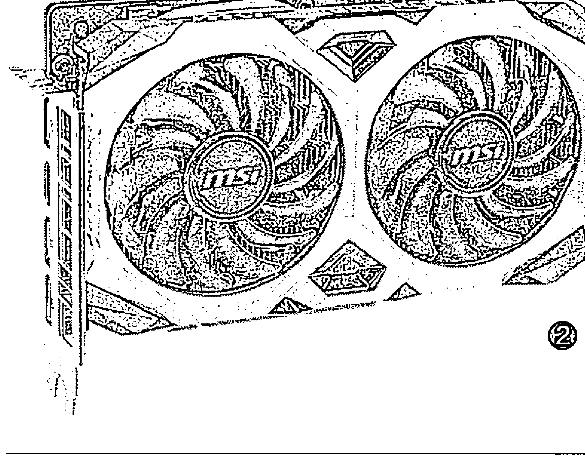

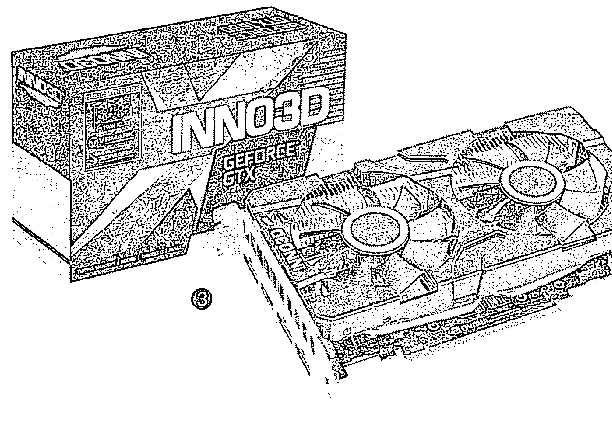

其后英伟达又发布了1500元级别的GTX 1660（图3），它的上市价格让人马上联想到了GTX 1060，而其性能恰好可以完胜RX 590，更与GTX 1060拉开了一定的距离，即重新确立了甜点价位的新标杆。比较有趣的是，不断上市的新中端显卡并没有完全取代GTX 1060和RX 590等原有显卡，而是将它们逐渐赶向千元级，大幅降低了主流游戏平台的价位。或者说是大幅提升了入门级游戏平台的能力。

#### 其他

Radeon 7（图4）是一款比较特别的产品，从架构上看，它其实就是一个高频率、大显存的RX Vega 64，在性能方面的表现比较一般，甚至寿命短得有些离谱。但不考虑实用性和市场表现，它却有着非常巨大的另一重意义，那就是AMD终于将7nm工艺制程正式引入消费级芯片。

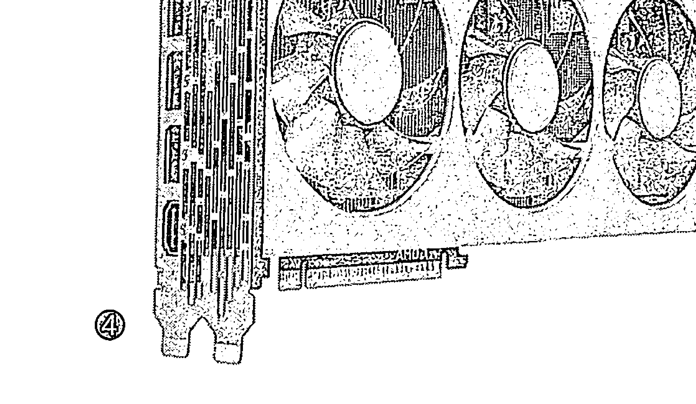

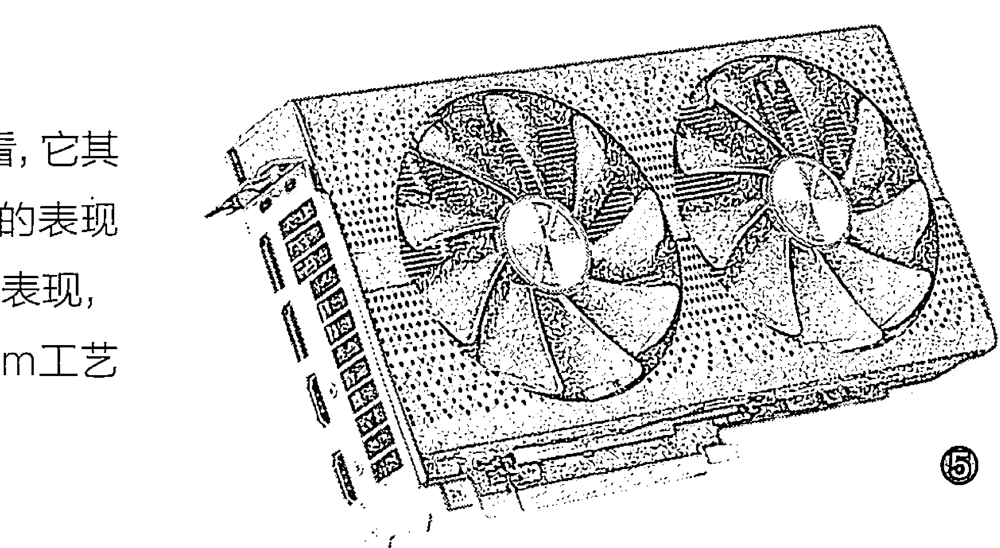

其实AMD还为用户提供了一款相当不错的入门级产品——RX 560 XT（图5）。看名称它似乎是一种性能羸弱的显卡，但实际上却是主流级产品RX 470的“复刻版”，游戏性能超过GTX 1050 Ti，价格却更低。不过它带有实验性质，支持的品牌都只有蓝宝石一家，而且随着GTX 1650快速上市，将入门级显卡性能提升至新高度，RX 560 XT最终只是昙花一现。

##### 典型配置

以RTX 2060和GTX 1660 Ti为代表的中端显卡无疑是这一季度最引人瞩目的产品，因此我们选择了一款中端游戏平台作为这一季度的典型配置。由于英特尔处理器长时间大范围的缺货和涨价，很多急于装机的用户只能选择AMD处理器。其实有心的读者还可以参考一下这款配置，看看在哪些方面与近期的常见选择有区别。

| 部件 | 描述 |
|------|------|
| CPU | 锐龙5 2600X |
| 主板 | B450主板 |
| 内存 | DDR4 3000 8GB×2 |
| 显卡 | GTX 1660 Ti/RTX 2060 |
| 存储 | 240GB~256GB M.2 SSD 2TB机械硬盘 |
| 散热器 | 自带或超频散热器 |
| 电源 | 500W以上 |
| 机箱 | 中端MATX或ATX机箱 |
| 合计 | 约6000~7000元 |

这套配置放到现在也是不错的中端游戏电竞平台，不过其中几乎所有的配件相对于目前的价格都偏高，如果现在购买的话，其总价会下降1000元~1500元。而且此时的配置单中，250GB级别SSD仍是主流，因为SSD容量较小，大家还是倾向于为其增加一块TB级别机械硬盘作为补充。

#### 第二季度

第二季度的市场相对沉寂一些，特别是前一季度非常火热的显卡市场，除了英伟达新核心产品线已经基本完善外，还因为AMD的Navi核心产品即将正式推出，吸引了太多的目光。

##### F系列处理器

随着酷睿i9-9900KF的正式上市，不含核芯显卡的新型酷睿处理器终于来到了大家面前，从包装盒（图6）就可以看出它是一款以成本取胜的产品。不过初上市时英特尔将其定价设定得和i9-9900K几乎一样，盒装版的实际零售价和i9-9900K也只相差400元左右。其后推出的i5-9600KF/9400F、i3-9350KF/9100F也是如此。

虽然对必备独显的玩家来说，F系列处理器仍然不失为一个略微划算的选择，但它真正因为明显更高的性价比而广受欢迎，其实还要等到几个月后。

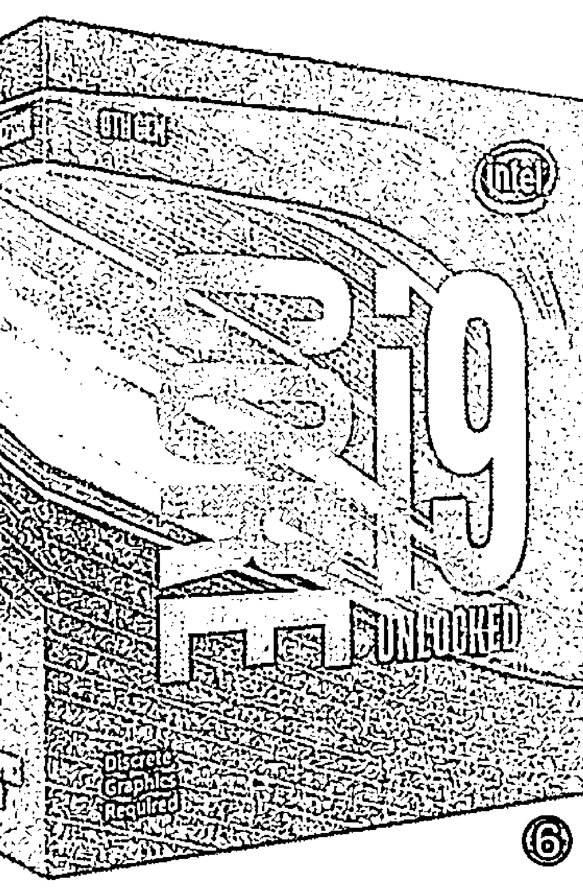

##### GTX 1650

英伟达继续用GTX 16系列补充市场空白，推出了面向入门级游戏平台的GTX 1650（图7）。其规格大幅落后于GTX 1060和GTX 1660，与GTX 1050 Ti非常接近，这也符合它的定位。好在新的架构使其游戏性能比GTX 1050 Ti高30%左右，能够让大部分3A游戏在1080P分辨率下达到比较流畅的帧速。大幅提升的游戏性能和仅高100元的定价，使得GTX 1650快速取代了GTX 1050 Ti。

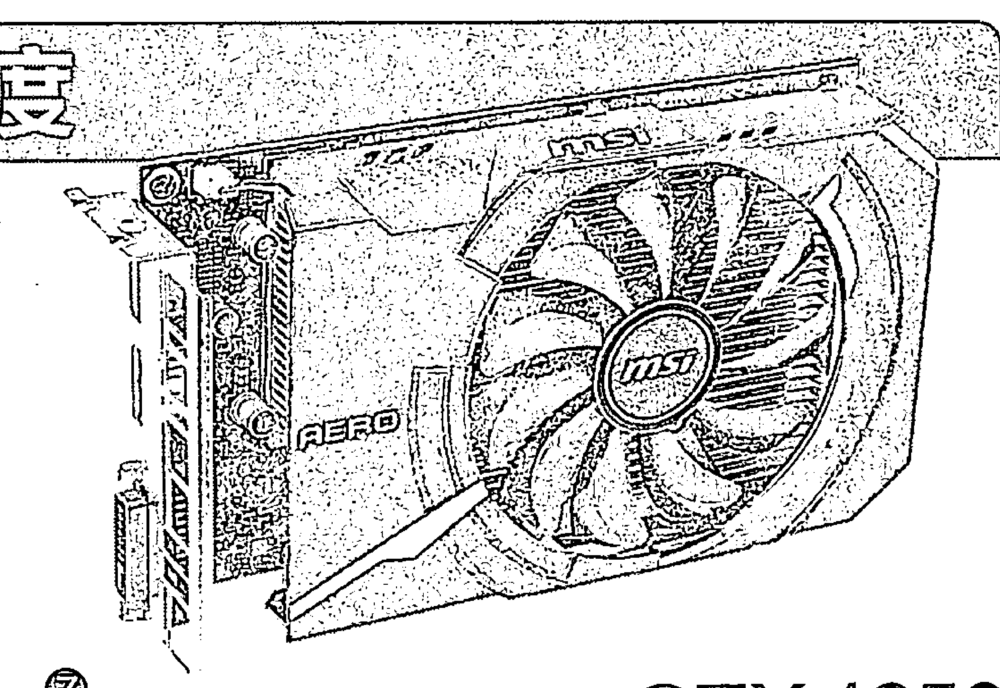

#### 其他

在这一季度，英特尔处理器的供货逐渐恢复正常，同时带来的还有酷睿i5-9500，不过它远不如F系列处理器那么受欢迎，真正广受好评的还是新的F系列处理器，例如i3-9100F。

#### 第三季度

第三季度是一个比较特殊的时间段，虽然缺少节日等亮点，年中的6·18促销也很难吸引国际厂商跟进，但实际上重磅产品的数量很多也很重要。这是因为很多以年度为节点完成了设计定型，在CES大展上确定了商品化的主要产品和技术在此时完全成熟、上市。

##### 典型配置

GTX 1650和i3-9100F的组合让人马上意识到入门级游戏平台可以更新配置了，在它们的配合下，我们可以在3000元出头的价位上获得能流畅运行大部分3A大作的游戏主机。

##### 第三代锐龙/X570

7月7日正式推出的第三代锐龙处理器（图8）无疑是这个季度最闪亮的明星，其巨大的影响力贯穿并改变了整个下半年。这一代锐龙同时大幅更新了架构与制程，性能得以明显提升，同时在功耗等方面的表现也很不错，不仅获得了传统AMD用户的肯定，还拉到了很多新用户。在第三季度结束时，很多地区的零售市场上，第三代锐龙就成为了领先者。

| CPU | 英特尔酷睿i3-9100F |
|---|---|
| 主板 | H310主板 |
| 内存 | DDR4 2666 8GB |
| 显卡 | GTX 1650 |
| 散热器 | 盒装自带 |
| 硬盘 | 希捷2TB 256MB 7200RPM |
| 电源 | 400W |
| 机箱 | 入门级MATX机箱 |
| 总价 | 约3200元 |

随着第三代锐龙出现的，还有AMD亲自操刀设计的X570芯片组（图9），以及首次进入消费级市场的PCIe 4.0总线和插槽。X570芯片组功能全面、性能强大，而在PCIe 4.0总线中收益最多的其实是SSD，以海盗船MP600为代表的PCIe 4.0 M.2 SSD传输速度达到了5GB/s，远超PCIe 3.0产品。

当然强大的X570成本同样较高，造成相应的主板价格居高不下。好在第三代锐龙可以使用B450、X470、B350、X370等旧芯片组，因此不仅升级更方便，而且成本更低，这也是下半年第三代锐龙受到DIYer欢迎的重要原因之一。

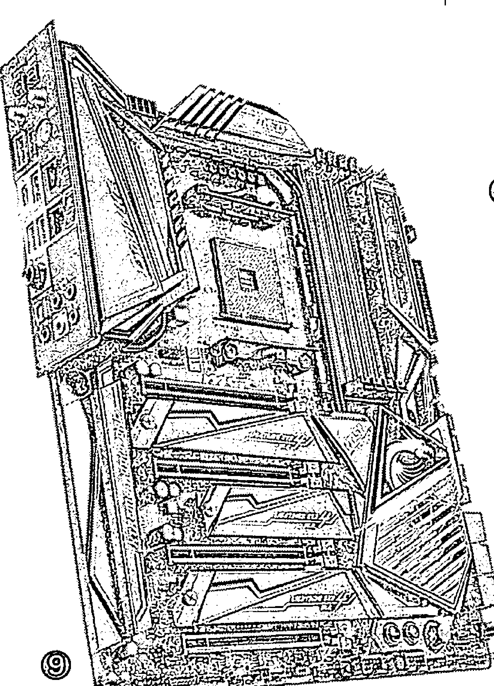

THE RYZEN™ 3000 SERIES
MORE CORES, MORE CACHE, MORE TECH, MORE I/O

| 型号 | 基础频率/加速频率 | 核心/线程 | 游戏缓存 | PCIe支持 | 建议零售价 (USD) | 对比型号 | 基础频率/加速频率 | 核心/线程 | 缓存 | PCIe支持 | 建议零售价 (USD) |
|---|---|---|---|---|---|---|---|---|---|---|---|
| Ryzen 9 3900X | 3.8/4.6 | 12/24 | 70MB | 4.0 | $499 | Core i9-9900K(1) | 3.6/5.0 | 8/16 | 16MB | 3.0 | $488 |
| Ryzen 7 3800X | 3.9/4.5 | 8/16 | 36MB | 4.0 | $399 | Core i7-9700K(1) | 3.6/4.9 | 8/8 | 12MB | 3.0 | $374 |
| Ryzen 7 3700X | 3.6/4.4 | 8/16 | 36MB | 4.0 | $329 | | | | | |
| Ryzen 5 3600X | 3.8/4.4 | 6/12 | 35MB | 4.0 | $249 | Core i5-9600K(1) | 3.7/4.6 | 6/6 | 9MB | 3.0 | $262 |
| Ryzen 5 3600 | 3.6/4.2 | 6/12 | 35MB | 4.0 | $199 | | | | | |
| Ryzen 5 3400G | 3.7/4.2 | 4/8 | 6MB | 3.0 | $149 | Core i5-9400 | 2.9/4.1 | 6/6 | 9MB | 3.0 | $182 |
| Ryzen 3 3200G | 3.6/4.0 | 4/4 | 6MB | 3.0 | $99 | Core i3-9100 | 3.6/4.2 | 4/4 | 6MB | 3.0 | $122 |

##### RX 5700/5700XT

与第三代锐龙同步推出的AMD新核心显卡RX 5700/5700XT（图10）当然也是意义重大，Navi核心和新的RDNA架构是否能让AMD显卡重回巅峰呢？答案比较尴尬，虽然在上市前狂降数百元的情况下，这两款产品的性能确实可以和对手同价位显卡比肩，但远没有达到让人惊艳、全面压制对手的程度，而且其温度有些过高，又不支持对手的光线追踪、AI辅助等感觉很酷（虽然可能暂时用不上）的最新功能，因此失分不少。

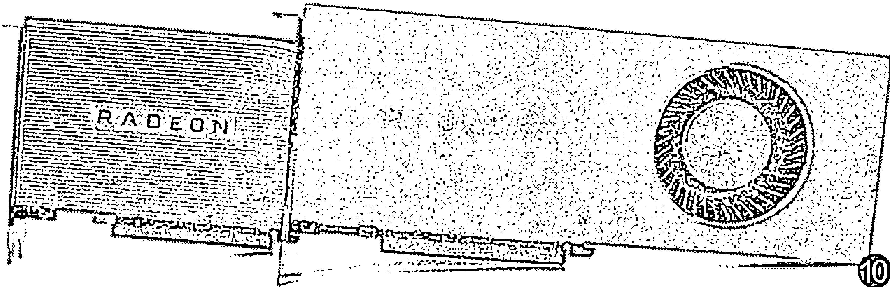

直到数个月后，大量品牌的公版卡上市，才解决了温度的问题，并通过适度超频略微提升了一些性能，使其性价比得到了肯定。总体看来，RX 5700/5700XT更像是一种实验性产品，其实际效果并不是很理想，这也影响了后续Navi核心的发布和上市。

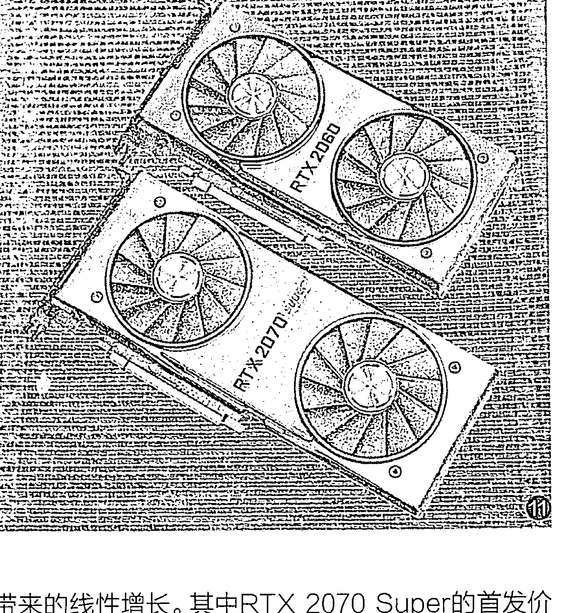

###### RTX 2060/2070 Super显卡

相对于初次现身的Navi核心，英伟达仍然采用Turing核心的Super系列产品无论是产品设计还是定价定位都要成熟得多了。从实际效果看，Super系列与其说是之前产品的补充，还不如说是一次应对强劲对手、吸引挑剔用户、延续核心市场寿命等任务的综合产物。

从实际性能上看，RTX 2060/2070 Super（图11）和“标准版”RTX 2060/2070显卡相比，性能提升在10%~20%之间，这基本就是频率和CUDA群组数量提升带来的线性增长。其中RTX 2070 Super的首发价和RTX 2070几乎相同，而RTX 2060 Super则因为显存提升至8GB而有一定的涨价，不过从性能表现来看，两者的性价比都很不错。

而从最终的市场态势来看，它们都将“标准版”型号的价格逼向更低，比较好地完成了新的市场布局。而可以用原本只能购买“标准版”的钱，买到性能更好的Super版产品，也确实吸引了不少用户出手。

#### 其他

在第一批Zen2核心处理器、Navi核心显卡、首次出现的Super系列显卡等意义非常大的产品之外，其实还有很多值得了解的产品。它们同样改变了年度甚至是未来的电脑配置。

例如罗技G502 LightSpeed（图12）虽然是一款定位主流偏高的游戏鼠标，但却从内到外进行了大幅革新，实际上代表了罗技新一代游戏鼠标的发展方向。当然这也出现了一个问题，那就是G502 LightSpeed的价格目前居高不下，甚至比G903还贵不少。

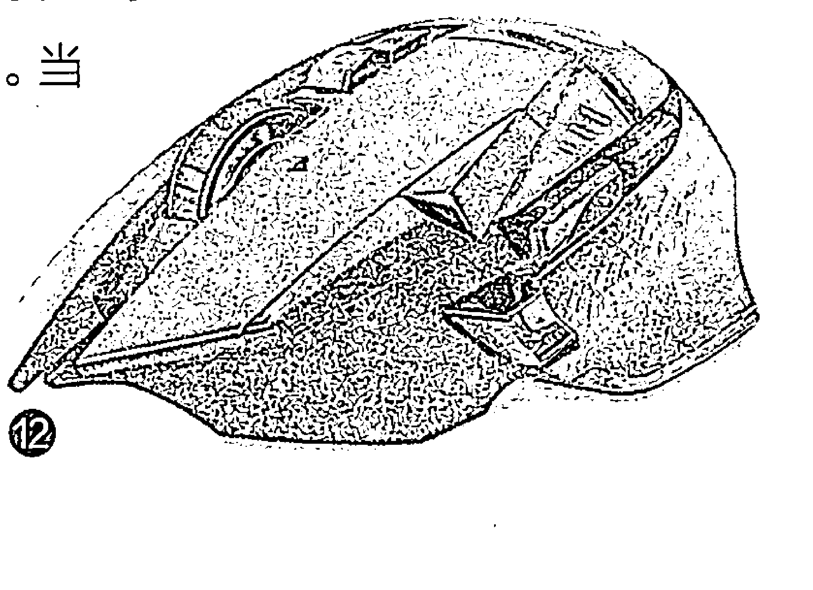

此外，大容量、高速SSD的价格不断调整，老牌硬盘厂商希捷也推出新一代SSD，其中包括非常吸引人的两款高速M.2 SSD（图13），同时更偏向于稳定性的金士顿则推出了高速M.2 SSD，市场选择迅速转向大容量M.2 SSD的态势已经非常明显。


##### 典型配置

在这个季度，第三代锐龙的表现在中高端处理器中绝对是非常突出的，配合本季度更新的两款中高端定位显卡，足以轻松挑战2K甚至4K分辨率的各种游戏大作，高速M.2 SSD更让游戏载入痛快无比，使玩家的体验大幅提升。这套配置的价格略高于第一季度的典型配置，不过处理器平台、显卡、SSD都替换为更高性能的产品。因为内存和M.2 SSD价格的大幅下降提供了一些额外的价格空间，因此在大幅提升性能的同时，价格增加幅度并不算很大。

| 配置 | 详情 |
|---|---|
| CPU | 锐龙3700X |
| 主板 | X570主板 |
| 内存 | DDR4 3200 8GB×2 |
| 显卡 | RTX 2060 Super显卡 |
| 硬盘 | 高速M.2 SSD 500GB |
| 电源 | 600W以上电源 |
| 机箱 | 中端ATX机箱 |
| 总价 | 约8000元 |

#### 第四季度

作为2019年的收官时期，很多重点产品如第十代酷睿、Ryzen 4000系列APU等很可能宁愿等到即将到来的圣诞销售季上市，或在CES上进行进一步预热后再上市。不过也有例外，比如已经具有相当国际影响力的双11大促销就吸引了不少厂商推出新品，另外准备在年内“补完”整个系列的型号，如英伟达入门级新显卡、AMD最后的第三代锐龙等也会按时推出。

##### 双11大促

双11大促的影响力越来越大，在消费者层面上不仅扩展到了各个年龄层，还在地域上扩展到了海外用户。在产品方面，则表现为大量产品，当然也包括IT商品也将双11作为推出上市的最佳机会。这也使得很多电脑用户在这场消费盛宴中，不仅能廉价获得心仪已久的产品，还能找到很多最新的产品。

##### 英伟达GTX 1660 Super/1650 Super

GTX 16系列也迎来了自己的Super型号，这两款产品的表现更加突出，以几乎一样的上市价格提供了远超“标准版”的性能。例如GTX 1660 Super（图14）的实际能力已经接近GTX 1660 Ti，但价格却在GTX 1660的定位区间内，而GTX 1650 Super（图15）更是简化版的GTX 1660，实际能力远超GTX 1650，价格也几乎相同。这两款产品不仅是重新规划了GTX 16系列的产品线，也让仍活跃于1100元~1400元区间的老显卡们的性价比不再突出，难以为继。

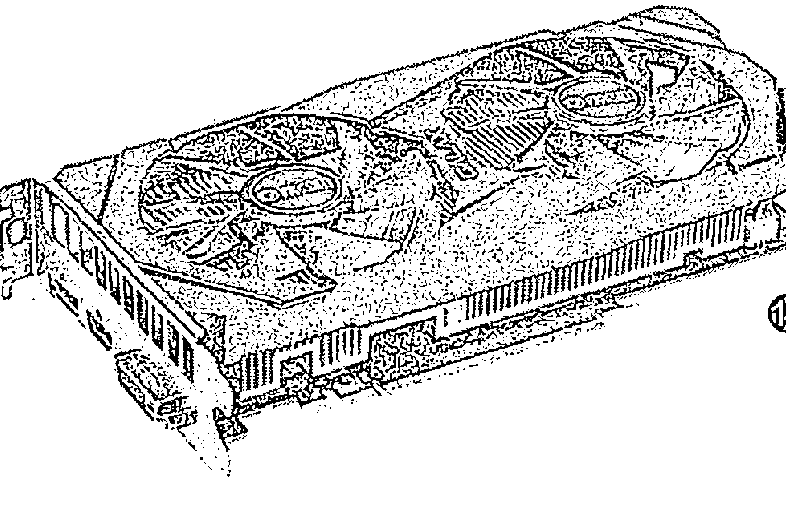

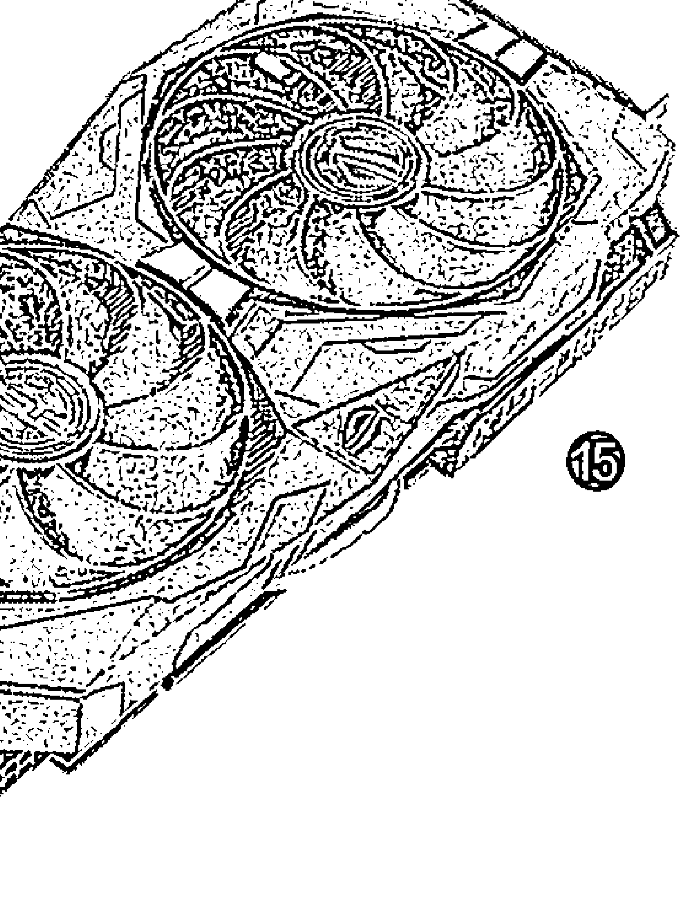

##### AMD锐龙5 3500X

作为完成第三代锐龙布局的型号，AMD 3500X（图16）看似被大幅精简，但实际表现却远超用户预期。因为在日常应用和游戏中，6核心已经完全够用，它被精简的超线程技术本身就有些浪费。


在实际配置时，不管是和价格略高但性能稍逊的酷睿i5-9400F相比，还是与同样支持超频、性能更强但价格也更高的酷睿i5-9600KF相比，其同样配置下的表现都可圈可点。如果是同价位配置，则3500X平台更可以将省下的资金投入显卡等更见效的配件，获得超过对手的游戏、娱乐性能，同时具有升级到下一代处理器的独特能力。

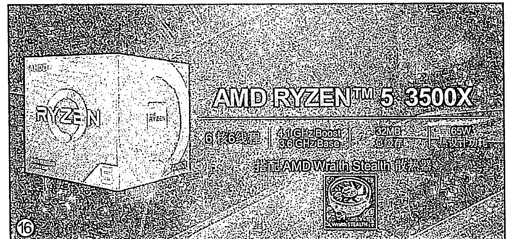

##### AMD RX 5500 XT

第二款基于新Navi核心、新RDNA架构的RX 5500系列显卡终于在年底前上市，而且定位是销量巨大的入门级游戏显卡市场。从首批上市的RX 5500 XT（图17）测试看，其实性能略高于GTX 1650 Super，但价格也同样更高，而且与对手相比功耗仍然显得过大，所以它是否能获得期望中的成功仍需一段时间来观察。


##### 走过2019

2019年在我们身后逐渐关上了大门，这一年的精彩与感动也随之成为历史，不过大家也不用伤感，我们即将迈入的2020年中，PC的变化很可能远超前些年，甚至可能超过大家的预料。让我们收拾心情和钱包，勇敢走向新的一年吧。GF

##### 酷睿F系列大调价

英特尔在第四季度对酷睿处理器进行了一次大调价，其中降幅最大的统统是不含核心显卡的F系列产品，让这些处理器的性价比大幅提升，其中入门级酷睿i3-9100F（图18）价格降到了700元以下，几乎进入了传统上的奔腾处理器定价区域，此外酷睿i5-9400F、i5-9600KF也都广受关注。

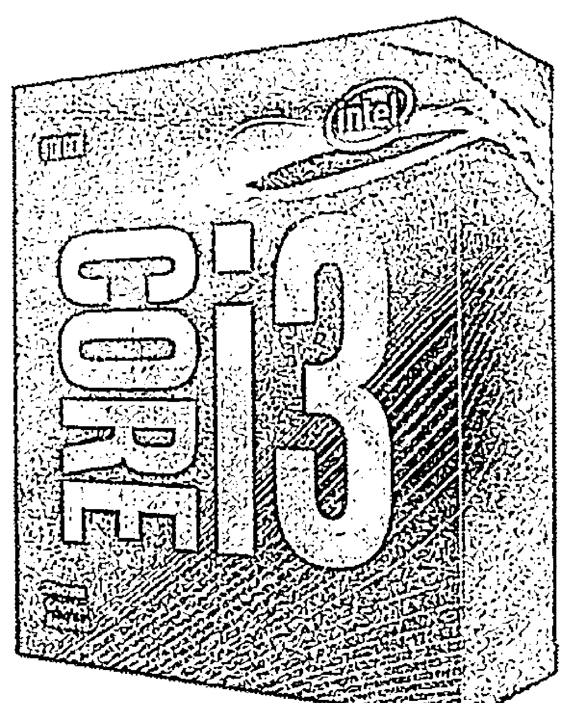

#### 其他

在这个季度，罗技仍然在外设领域不断推出具有一定业界引领作用的外设，例如矮轴、可换键轴的G系列键盘新品。此外小米进入电竞显示器领域，很可能说明这一配件市场中比较少见的、仍有丰厚利润的领域又要出现大震荡了。

##### 参考配置

| 类别 | 配置 |
|---|---|
| CPU | 锐龙5 3500X |
| 主板 | B450主板 |
| 内存 | DDR4 3200 8GB |
| 显卡 | GTX 1650 Super显卡 |
| 硬盘 | 高速M.2 SSD 500GB |
| 电源 | 500W电源 |
| 机箱 | 主流机箱 |
| 总价 | 约5900元 |

这一季度的入门级游戏平台又是最热闹的，其中RX 3500X处理器和GTX 1650 Super的组合可以满足入门级玩家的需求，实际性能远超第二季度的入门级游戏平台。除了新配件外，我们选择用价格合理的M.2 SSD大幅提升了存储性能，降入谷底的内存则让入门级平台可以获得更充足的内存配置。

### 火眼金睛：如何快速判断移动芯片的性能

策划《电脑爱好者》编辑部

2019年底，Helio G90、麒麟990、Exynos 980、Exynos 990、骁龙765、骁龙865、天玑1000等芯片扎堆发布，让人眼花缭乱。随着智能手机“心脏”竞争的日益激烈、迭代频率的不断加速，我们时不时就会看到“新面孔”。但是，有关这些新面孔的评测报道总是迟到的，在没有太多参考资料可以查询时，如何判断它们的强弱和功能差异？本期特别话题，我们就简单聊一聊影响（手机专用的）移动芯片性能强弱和功能体验的关键指标。


#### 掌握最基本的常识

PC（包含台式机、笔记本、一体电脑、二合一设备等）和移动设备（智能手机、Android和iOS系统的平板电脑）的“心脏”都是一颗芯片（图1），但它们却有着本质上的不同，从而让这两种类型的计算设备走向了迥异的发展道路。在深入了解移动芯片之前，我们需要提前了解一些最基本的常识。

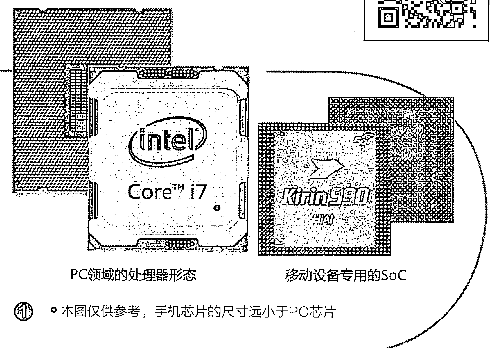

#### 架构和指令集的天赋属性

虽然如今手机性能越来越强，但我们依旧不能指望它们可以取代PC，在3D游戏和很多专业设计领域，二者的表现在依旧有着云泥之别。究其原因，就是两类计算设备的“心脏”采用了不同的架构和指令集，各自存在“先天不足”。

##### ARM和X86架构

首先我们需要知道，手机处理器几乎都是“ARM架构”，而PC处理器则都多以“X86架构”为主。但在某些领域和特殊时期，ARM和X86存在“跨界”的行为（图2）。比如英特尔就曾推出过手机专用的X86架构处理器（如Atom Z2580），而现在很多主打能效比的服务器也改用了ARM架构处理器。

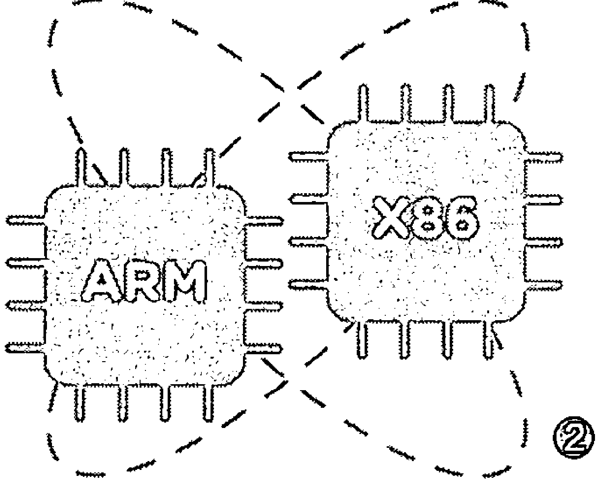

##### RISC和CISC指令集

ARM架构处理器源于“RISC”（精简指令集），它最适合针对常用的命令进行优化，赋予其更简洁和高效的执行环境，对不常用的功能则通过各种精简指令组合起来完成。RISC将复杂度交给了编译器，牺牲了程序大小和指令带宽，从而换取了简单和低功耗的硬件实现。

X86架构处理器源于“CISC”（复杂指令集），其适合更加复杂的应用环境。CISC是以增加处理器本身复杂度作为代价，以牺牲功耗为代价去换取更高的性能。不过，X86架构可通过对新型指令集的支持（如SSE4.1、AVX-512等），提高指定任务的执行效率和降低功耗。

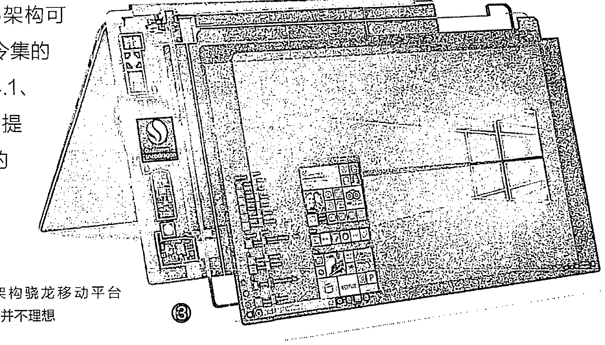

> 目前搭载ARM架构骁龙移动平台Windows设备的口碑并不理想

换句话说，RISC拥有高效率、低能耗的先天优势，与智能手机、平板电脑这种主打能效比的计算设备完美契合，如果用于PC，虽然可以延长续航时间，但在性能、兼容性和专业软件的运行效率上会大打折扣（图3）；CISC虽然拥有高性能的天赋，但它同时也具备高功耗的先天缺陷，像智能手机这样的“小身板”很难驾驭它的发热和耗电（图4）。

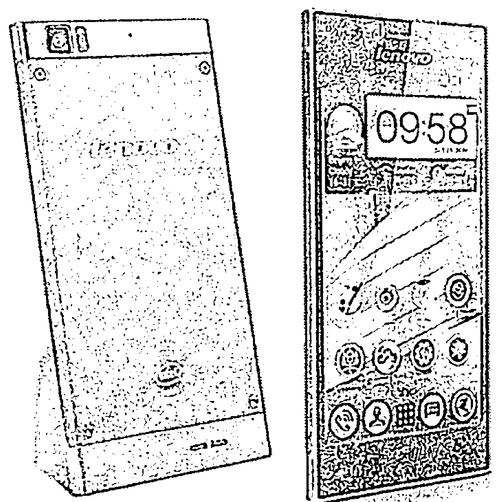

> 搭载X86架构Atom Z2580芯片的联想K900手机，兼容性、发热和续航表现同样不佳

> 火速链接
如果你想了解更多有关RISC和CISC指令集的知识，请参考本刊2018年第23期《跳动的“芯”ARM能否取代X86》这篇文章。

##### RISC-V架构强势出击

为了打破X86架构的垄断和ARM架构极高授权费用的问题，在RISC指令集的基础上还出现了名为“RISC-V”的全新指令集架构（图5）。和同宗的“ARM”架构相比，RISC-V最大的特点就是免费和开放，它可以自由地被用于任何目的以及任何人设计、制造和销售基于RISC-V的芯片或软件。这种开放性，在处理器领域是彻底的第一次。

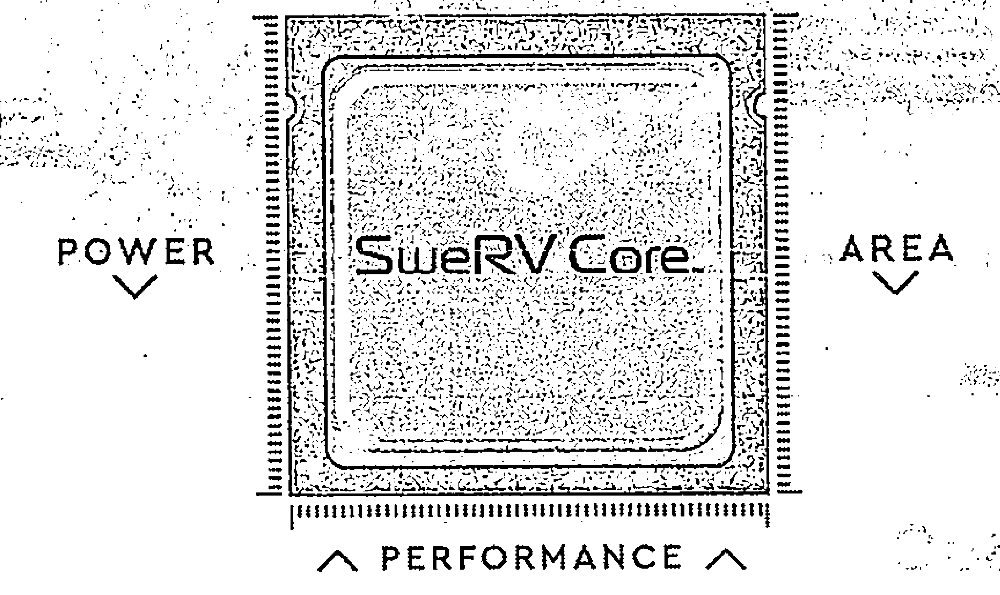

> 西部数据开发的基于RISC-V指令集的自主通用架构SweRV处理器

可惜，RISC-V架构的生态还在建设和完善之中，目前它主要被用于嵌入式芯片领域，比如西部数据、高通、英伟达、阿里巴巴、三星等巨头就都已经加盟RISC-V架构，用于硬盘主控（图6）、GPU显存控制器、移动SoC、AI加速器以及5G RF射频前端模组的毫米波射频处理等不同领域。有消息称，以RISC-V现在的发展速度，2022年就有机会与ARM争夺高通、苹果、三星、联发科等手机处理器客户，2025年有望挥师服务器市场。


##### 不是所有处理器都是SoC

家用PC和智能手机都只有一颗“心脏”，但在前者口中这颗芯片就是“处理器”，但在后者口中却总强调这是一颗“SoC”。那么，处理器和SoC到底有什么区别？

##### PC领域的处理器

在PC领域，酷睿i5-9400F、锐龙5-3600这些芯片都是单纯的“CPU”（中央处理器），因为它们在PCB基板上只集成了唯一的CPU核心（图7）。但是，在以笔记本为代表的低功耗领域，处理器们正逐渐向SoC转型，将CPU、GPU、内存控制器和PCIe控制器等单元全部整合在一颗芯片或一块基板上（图8）。

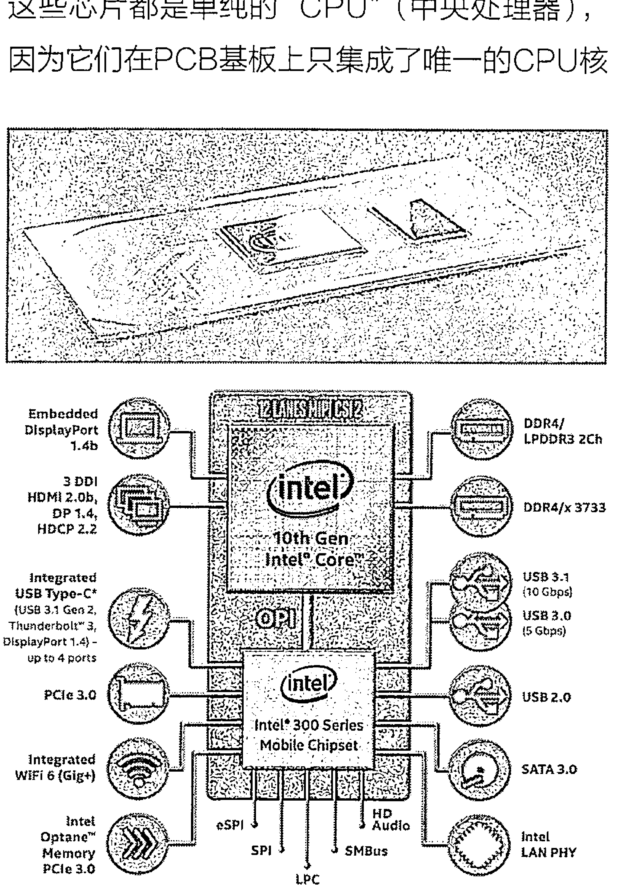

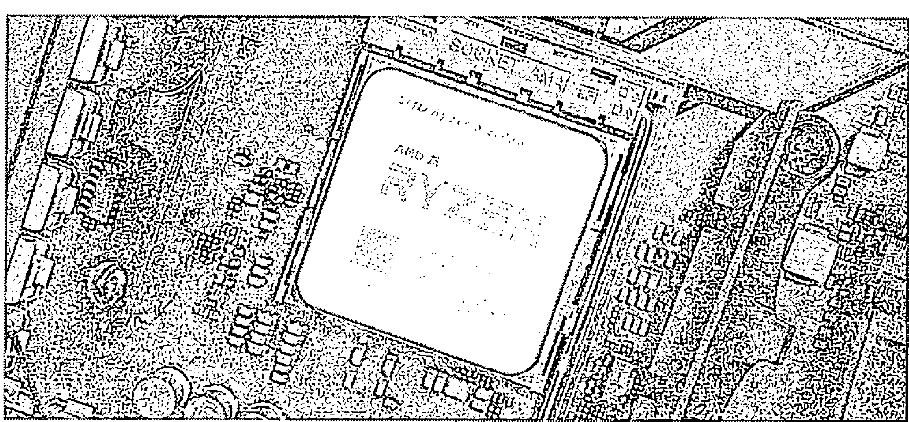

本刊曾在2019年第24期《功耗性能兼顾 英特尔参与大小核之争》一文中介绍过英特尔最新的基于Foveros 3D封装技术打造的Lakefield处理器，这颗芯片在一枚硬币大小的面积内就集成了1颗Sunny Cove架构的大核CPU、4颗Tremont架构的小核CPU、Gen 11代的GPU核显，同时还讲不同的IP单元整合在了一起（图9）。换句话说，Lakefield完美实现了X86架构芯片从处理器到SoC的华丽转型，这意味着今后部分笔记本（包括二合一设备）所搭载的芯片也不再是单纯的CPU了。

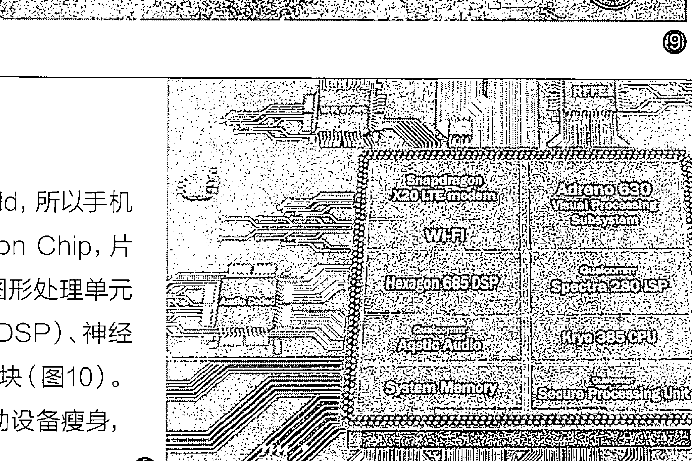

##### 手机平台的SoC

每一颗手机“心脏”的集成度都不逊于Lakefield，所以手机搭载的处理器芯片都是一个完整的SoC（System on Chip，片上系统），在一颗芯片内包含中央处理器（CPU）、图形处理单元（GPU）、图像处理单元（ISP）、数字信号处理器（DSP）、神经处理单元（NPU）、调制解调器（Modem）等功能模块（图10）。SoC的单芯片设计可以最大限度节省主板布局，帮助设备瘦身，提升各个IP单元的交流速度，还能显著降低整体功耗。

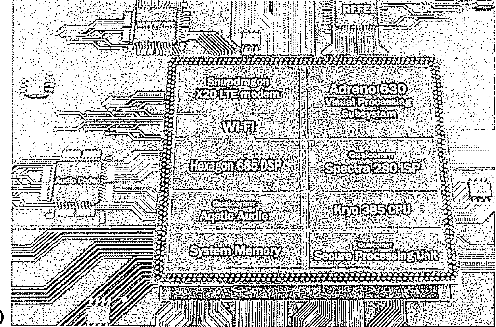## 制程工艺决定战斗力

和PC领域的处理器相同，智能手机专用的SoC也是由一整块晶圆上切割而来（图11），它的性能潜力与制程工艺息息相关。一颗SoC，它选用的制程工艺越先进，往往意味着可以解锁更高的主频、发热量更低、功耗更低、不易降频、运行更强更稳定。

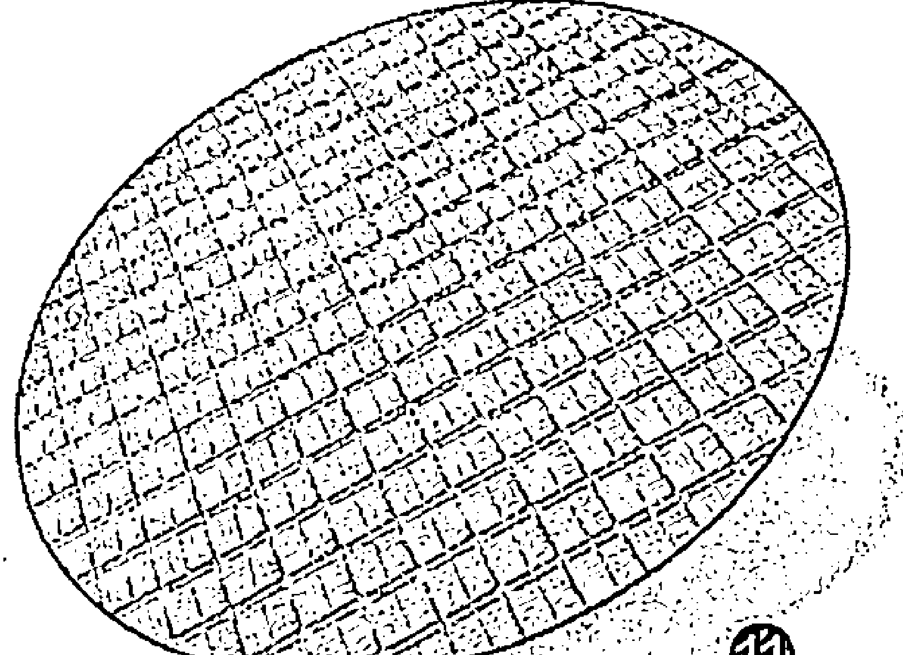

#### 工艺的迭代更新

制程工艺的单位为“nm”（纳米），“理论上”数字越小越先进，比如7nm就比8nm强、12nm优于16nm。目前，除了联发科Helio P65、P90和G90等少数芯片以外，其他最新上市的SoC都已经跨过了10nm工艺的门槛(表1)，整体能效比较14nm和16nm的前辈们有了明显的提升。

## 表1：SoC常见制程工艺的代表汇总

| 制程 | 代表 | 制程 | 代表 |
|---|---|---|---|
| 7nm EUV | 麒麟990 5G | 7nm EUV | 骁龙765、Exynos 990 |
| 7nm DUV | 天玑1000、骁龙865、麒麟980、麒麟810 | 8nm LPP | 骁龙730、Exynos 9820 |
| 10nm FF | 麒麟970 | 10nm LPP | 骁龙845、骁龙710 |
| | | 11nm LPP | 骁龙675、骁龙665 |
| 12nm | Helio G90、Helio P90 | | |
| 16nm FFC | 麒麟960 | 14nm LPP | 骁龙660 |

#### 工艺数字背后存秘密

无论是英特尔和台积电，还是三星或格罗方德，不同晶圆代工厂都有着一套制程工艺的定制标准，相同的工艺在鳍片间距、栅极间距、最小金属间距、逻辑单元高度、逻辑晶体管密度等指标上可能存在极大的差距。比如，英特尔14nm工艺在上述指标就都比三星和台积电的10nm还先进，而当年台积电16nm的口碑也比三星14nm还要好。

制程工艺在进行10nm→7nm这种大版本升级之余，每隔一段时间也会对现有工艺进行小幅革新。比如台积电16nm工艺就曾衍生出第一代FinFET（16nm FF）、第二代FinFET Plus（16nm FF+）和第三代16nm FinFET Compact（16nm FFC），三星则习惯用第一代Low Power Early（LPE）、第二代Low Power Plus（LPP）、第三代Low Power Compact（LPC）和第四代Low Power Ultimate（LPU）加以区别。

> **火速链接**
> 如果你想了解EUV极紫外光刻对工艺性能的影响，请参考本刊2019年第22期《“芯”希望来自新工艺 浅析EUV和GAAFET技术》这篇文章。

#### 来自未来的预期

在首发7nm+EUV工艺之后，台积电最新的6nm和5nm制程工艺也做好了量产前的准备，前者有望在2020年Q1试产，后者最早将被麒麟1000和苹果A14 SoC列装，相较于第一代7nm DUV，基于Cortex A72核心的全新5nm芯片能够提供1.8倍的逻辑密度，速度增快15%，或者功耗降低30%，同样制程的SRAM也十分优异且面积缩减。接下来，台积电将迎来晶体管结构大改的3nm工艺，2nm工艺也被提上了日程。

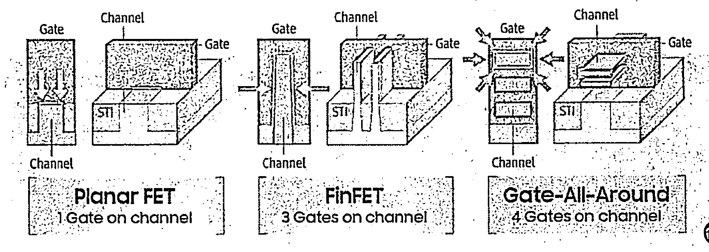

三星在量产10nm LPP工艺之后跳过了第一代7nm DUV，直接启动最新的7nm+EUV工艺。2020年往后，三星还会陆续导入6nm LPP、5nm LPE和4nm LPE，并于3nm节点开始引入闸极全环场效应晶体管（GAAFET）来取代现有的FinFET（鳍式场效应晶体管）（图12）。

### 深入SoC的内部世界——性能篇

手机的“心脏”只有指甲盖大小（图1），但凭借着高集成度的SoC身份，这种芯片却完美诠释了“麻雀虽小五脏俱全”的定义（图2）。接下来，我们就将SoC分解，并先来看看影响其绝对性能的功能模块。

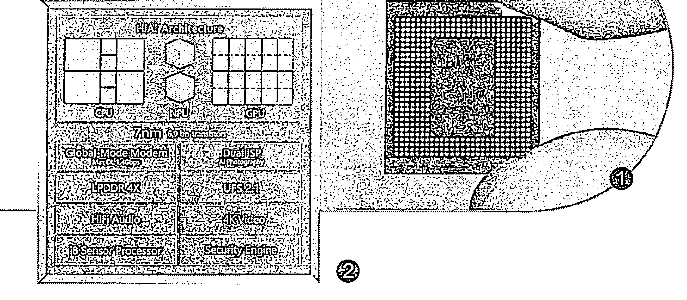

#### CPU——性能基石

在SoC的组成部分中，CPU是最关键的核心单元之一，我们可以将它理解为PC上的酷睿处理器，而它的强弱主要受到以下几个参数的影响。

##### 核心架构

手机专用的SoC都属于“ARM处理器”，而ARM公司与芯片厂商的合作则存在3种形式。

- 1. 原生Cortex-A系列架构
ARM公司平均每年都会推出全新的“原生”（公版）架构，包括性能级的Cortex-A7x，以及效能级的Cortex-A5x，前者可以作为CPU中的“大核”，目前SoC正好处于Cortex-A76向Cortex-A77之间的过渡阶段，2020年中旬ARM还将祭出Cortex-A78架构（图3）。后者则属于CPU中的“小核”，Cortex-A73或更早期的大核都会与Cortex-A53搭配，从Cortex-A75开始则与Cortex-A55“联姻”，短期内ARM还没有更新效能级核心架构的计划。

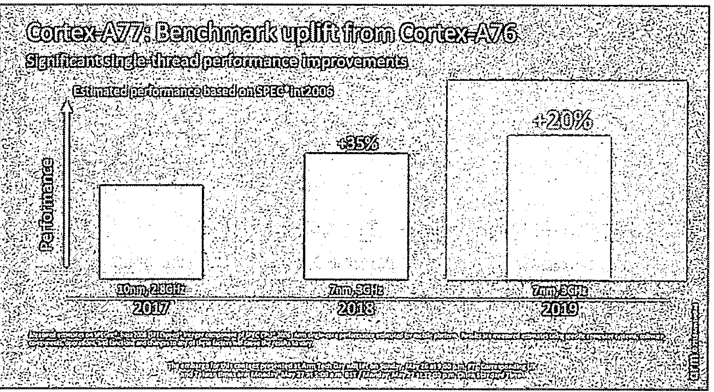

- 2. 基于Cortex的半定制化架构
芯片商在拿到ARM原生Cortex-A的架构后，可以对其进行一定程度的改造，从而实现更高性能、更多功能或更低功耗。高通旗下的骁龙SoC总会采用名为“Kryo”的核心架构，而它们就都是基于原生Cortex-A架构半定制化而来，业内人士还习惯将这种形式称为“魔改”。

- 3. 基于指令集的自研架构
如果芯片商只凭借ARM的指令集授权，并在此基础上研发芯片，则可被归类到“自研”架构。比如骁龙820采用的Kryo核心、三星猫鼬（Mongoose）核心、苹果从A5往后的SoC就都采用了在ARM指令集基础上的自研CPU架构（表1）。

从ARM授权的成本角度来看，采用原生架构的授权费用最低，魔改次之，基于指令集的授权最高，而且芯片商想在ARM指令集基础上加以定制优化以形成自己独特的设计，还需要强大的研发实力，所以目前只有苹果、高通和三星有所涉猎。从性能的角度来看，不同时期的架构之间则存在明显的性能压制，比如Cortex-A77天生就比Cortex-A76更强，但同一时期的原生、魔改和自研架构之间的差异其实并不大，主要还是受制于核心数量、多丛集和最高主频方面的影响。

###### 特别话题

## 表1：原生Cortex-A架构与同期采用魔改和自研的架构汇总表

| 架构原生 | 代表 | 魔改 | 代表 | 自研 | 代表 |
| :--- | :--- | :--- | :--- | :--- | :--- |
| Cortex-A77 | 天玑1000 | Kryo 500系列 | 骁龙865 | Mongoose M5 | Exynos 990 |
| Cortex-A76 | 麒麟990 | Kryo 400系列 | 骁龙855 | Mongoose M4 | Exynos 9820 |
| Cortex-A75 | Helio P90 | Kryo 300系列 | 骁龙845 | Mongoose M3 | Exynos 9810 |
| Cortex-A73 | 麒麟970 | Kryo 200系列 | 骁龙835 | Mongoose M2 | Exynos 8895 |
| Cortex-A72 | 麒麟950 | | | Kryo | 骁龙820 |
| | 麒麟960 | | | Mongoose M1 | Exynos 8890 |
| Cortex-A57 | 骁龙810 | | | | |

##### 多丛集设计

我们都知道Cortex-A7x性能比Cortex-A5x更强，为什么没有SoC采用全部由Cortex-A7x打造的多核处理器？答案很简单，高性能的背后就是高功耗，为了让智能手机可以具备至少一天一充的续航底线，手机SoC必然要采取“大小核”(Cortex-A73之前称Big.Little，Cortex-A75之后为DynamIQ Big.Little)的搭配策略(图4)。

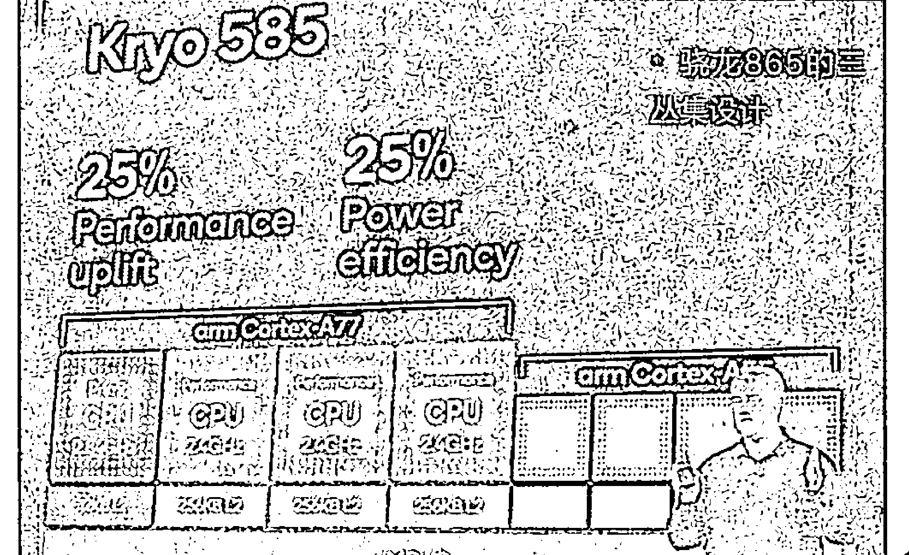

共计8个CPU核心构成；麒麟990和骁龙865都是三丛集的代表，差异是前者采用了“2+2+4”（2×A76+2×A76+4×A55），后者则是“1+3+4”（1×Kryo 585+3×Kryo 585+4×Kryo 585），即大核+中核+小核三种核心搭配的策略。

##### 运行频率

CPU的性能强弱，除了受制于核心架构和多丛集设计，运行频率的影响总是更加立竿见影。我们都知道Cortex-A77架构比Cortex-A76架构强，但2019年底才刚刚量产的联发科天玑1000L（大核为Cortex-A77）的CPU性能却还不如2018年底上市的麒麟980（大核为Cortex-A76）。原因很简单，联发科1000L的大核主频只有2.2GHz，而麒麟980的主频则高达2.6GHz，更高的主频足以弥补核心架构和大核数量上的劣势。

因此，对于同期同级别的SoC而言，谁的CPU主频更高，往往更容易取得性能上的优势。当然，前提是手机自身的散热设计必须过硬，可以让CPU长时间运行在预设的最高主频上(图6)。

在不考虑功耗的前提下，自然是大核架构越先进、数量越多性能越强。但是，现实中SoC在全速运行（玩游戏）时CPU非常容易因过热而触发降频机制，从而导致性能骤降引起卡顿问题。因此，“2+6”的双丛集和“1+3+4”或“2+2+4”的三丛集设计正逐渐成为主流（图5）。

为了更好地权衡性能和功耗，手机SoC在“大小核”的基础上还引入了“多丛集”的概念，比如联发科天玑1000就是“4+4”双丛集的代表，由4×Cortex-A77和4×Cortex-A55

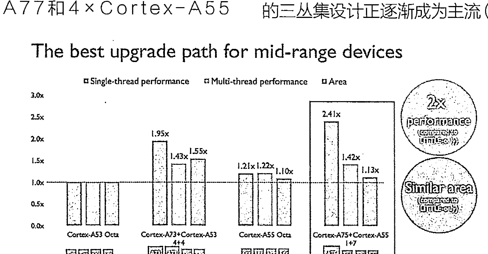

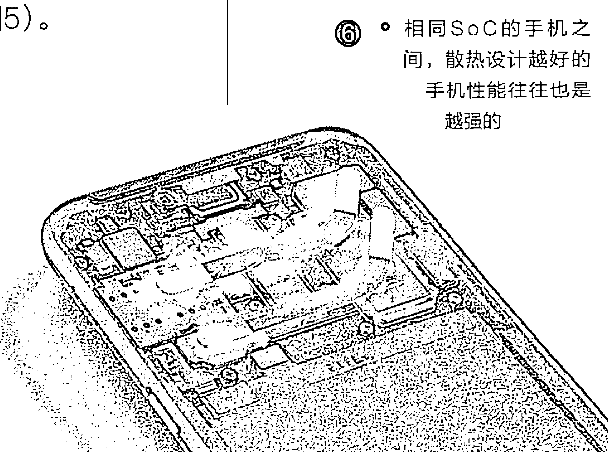

从Cortex-A75开始，DynamIQ技术可以实现更灵活的核心搭配

#### GPU——游戏引擎

GPU是SoC中重要性仅次于CPU的单元，我们可以将它理解为PC上的独立显卡，一款手机能支持多高的分辨率、刷新率，玩游戏能跑出多少帧数，几乎都需要看GPU的脸色。

##### GPU品牌

和SoC中的CPU单元由ARM一家独大不同，其集成的GPU单元还未江湖一统，在Android手机领域正处于“三国争霸”的格局——高通旗下的骁龙SoC全部集成自家Adreno品牌的GPU，华为/三星旗下的SoC则青睐ARM公司推出的Mali品牌GPU，联发科则经常“脚踏两只船”，ARM Mali GPU和Imagination公司的PowerVR GPU都有所涉猎。据悉，三星已经携手AMD，未来Exynos SoC很可能会集成由AMD授权的RDNA架构GPU，而华为也正在开展自研GPU的项目。

##### 核心架构

和ARM CPU架构总在不断升级一样，各个品牌的GPU每隔1年~2年也会完成一次迭代。其中，高通Adreno GPU刚刚完成了Adreno 500向Adreno 600的全面升级，从定位中低端的骁龙665（Adreno 610）到最新的顶级旗舰骁龙865（Adreno 650），Adreno 6x0中的“x”数字越大代表性能越强。ARM Mali品牌的高端GPU正经历由Mali-G76（与Cortex-A76 CPU搭配）向Mali-G77（与Cortex-A77 CPU搭配）过渡（图7），而中端GPU很快也要从Mali-G52升级到Mali-G53。在大的方向上，Mali-G7x肯定强过Mali-G5x，并同样是“x”数字越大代表性能越强。Imagination GPU很快也要从第九代（PowerVR 9）过渡到第十代（PowerVR IMG A），考虑到该系列GPU比较小众，我们就不在本文赘述了。

##### 计算单元

在现实中，很多GPU都采用相同架构的核心，但它们的GPU性能却存在很大的差异。比如，骁龙675（Adreno 612）和骁龙730（Adreno 618）集成的都是Adreno 61x系列GPU，麒麟990和Exynos 980集成的也都是Mali-G76 GPU，但它们两两之间的3D性能却不可同日而语。DIY用户都知道，PC领域的独立显卡会根据不同数量的“流处理器”来划分档次。手机SoC内的GPU也是如此，只是这里的“流处理器”叫法不同，高通Adreno GPU称作“ALUs”，ARM Mali GPU则叫“Shader Core”，我们习惯将它们统称为“计算单元”。还是以麒麟990和Exynos 980为例，前者为Mali-G76 GPU搭配了16个计算单元，即Mali-G76MP16，而后者的计算单元数量只有5个，即Mali-G76MP5，所以麒麟990的3D性能至少2倍~3倍于Exynos 980。

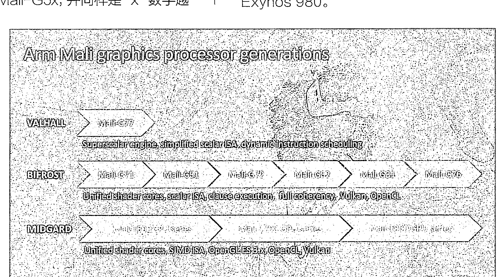

> > **火速链接**
> > 如果你想了解更多手机GPU的历史和相关技术，请参考本刊2019年第16期《游戏娱乐的动力之源 浅析手机GPU的“核战争”》这篇文章。

##### 图形接口

在3D游戏的开发中，API图形接口越先进，GPU的执行效率越高。如果手机GPU恰好支持这种API，就能最大限度避免“负优化”，还有机会实现“越级挑战”。手机SoC GPU所支持的API主要以OpenCL、OpenGL、Vulkan和DirectX为主，目前它们最新的版本分别为OpenCL 2.0FP、OpenGL ES3.2、Vulkan 1.1和DX12，很多最新的GPU加入了多神经网络加速器的优化，可配合NPU单元进一步加速AI运算。从2018年底开始很多中端手机玩《王者荣耀》也能启动60FPS模式并比同时期的旗舰级还要流畅（图8），就是因为该游戏推出了Vulkan API的优化版，可以进一步释放新款GPU的全部潜力。

##### 运行频率

和CPU一样，GPU的强弱除了架构之外，也受到运行频率的牵制。联发科Helio G90、骁龙730和骁龙765是最具代表性的SoC，它们都存在一个后缀带“G”的型号，通过提升CPU和GPU的频率获得了更强的性能(表2)。

如果你只关注绝对性能，看到这里就能告一段落了。当我们看到一款陌生的SoC时，可以先看制程工艺，如果它能采用7nm或7nm+EUV就代表它具备更加节能省电的特性。然后看CPU架构和主频，Cortex-A77和Kryo 500核心代表着当前架构的最强音，当CPU主频高于2.6GHz，那它就具备旗舰级的CPU性能，如果低于2.4GHz就是中等偏上。如果你喜欢玩游戏，就需要看它的GPU是Mali-G7x还是Mali-G5x，并数一下计算单元的数量，多多益善。

然而，手机并不仅限于跑分和玩游戏，在追求更强的性能之余，它在日常应用环境下的表现，往往要比绝对的性能更加重要。

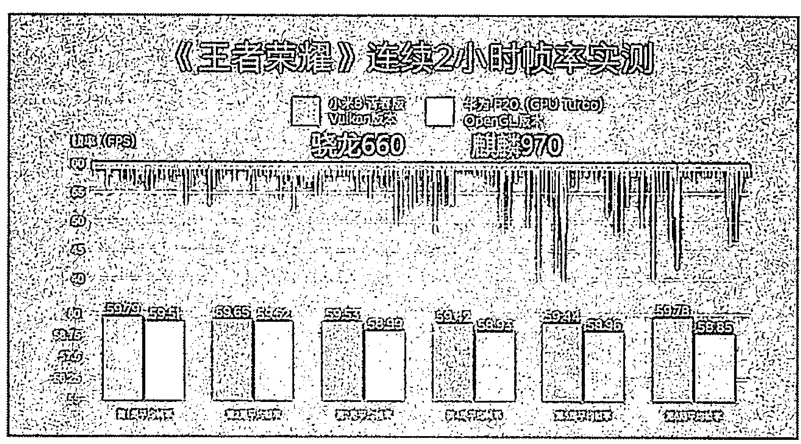

表2：典型SoC标准/超频版对比
| SoC型号 | CPU最高主频 | GPU最高主频 |
| :--- | :--- | :--- |
| Helio G90 | 2.0GHz | 720MHz |
| Helio G90T | 2.05GHz | 800MHz |
| 骁龙730 | 2.2GHz | 700MHz |
| 骁龙730G | 2.3GHz | 825MHz |
| 骁龙765 | 2.3GHz | 不明 |
| 骁龙765G | 2.4GHz | 性能提高10% |
| 骁龙855 | 2.84GHz | 585MHz |
| 骁龙855 Plus | 2.96GHz | 672MHz |

### 深入SoC的内部世界——体验篇

在Android系统生态中，单纯的处理器（CPU+GPU）性能并不能决定最终的用户体验，其背后还涉及到网络、系统和应用层面的优化（如各种游戏、网络加速引擎）、多核调度能力以及安全设计。接下来，我们就再来探秘一下SoC中其他构成单元的作用。

#### Modem——网络先锋

PC要想无线上网需要安装无线网卡，但在手机SoC领域，“无线网卡”（基带，又称调制解调器或Modem）则是SoC芯片内部的组成部分之一，它将决定一款手机所支持的网络制式以及上网、下载速度。

##### 可集成可外挂

Modem并非SoC的必选项，芯片商可以根据产品定位，选择将Modem直接集成进SoC，或是以独立芯片的形式与SoC一起焊在手机的主板上。比如，高通骁龙855就直接集成了骁龙X24 Modem，而骁龙865则取消了内置Modem设计，需要搭配额外的骁龙X55才能联网(图1)。相对来说，直接集成Modem的SoC可以节省主板空间，在能耗方面的表现更好。

2020年，新款手机都会搭载5G SoC，即集成或外挂支持5G的Modem。有关5G SoC的网络性能对比，以及影响它们最高速率的因素，感兴趣的朋友可以参考本期技术殿堂栏目的《极致网速全靠它 浅析毫米波频段对5G的影响》这篇文章。

##### 理性看待Modem性能

目前，三大运营商对4G和5G网络都采取了限速的策略，其中4G最高下行速率为300Mbps，而5G网络也不过1Gbps。这意味着，无论SoC集成或外挂的Modem性能有多强，短期内都无法超过这个上限。因此，在选购SoC和手机时，我们也无需太过在意Modem的最大理论速率，而是应该把注意力放在它对5G功能的支持上，比如是否支持双模组网、支持多少频段、能否实现双卡5G全网通等等。

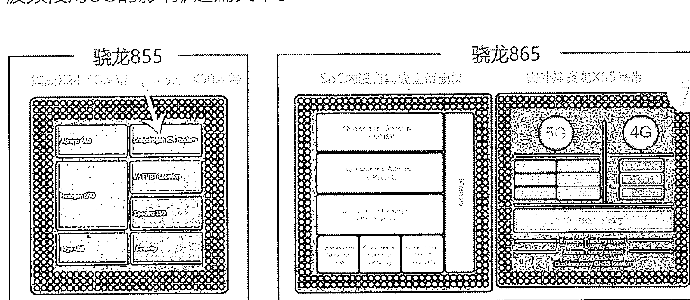

> > 小提示
> > 和Modem一样，SoC的Wi-Fi和蓝牙模块也能选择直接集成在SoC，或是通过外挂芯片的形式实现。比如，骁龙855就直接集成了Wi-Fi和蓝牙单元(图2)，而骁龙865则需要外挂独立的FastConnect 6800芯片(图3)，才能支持最新的Wi-Fi 6和蓝牙5.1网络。

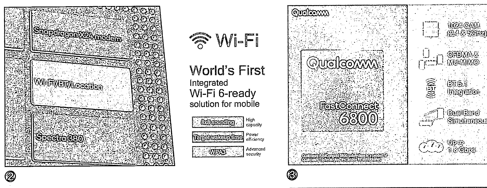

#### ISP——成像关键

如今配备相同4800万或6400万像素传感器的智能手机有很多，但它们拍照成像的实际效果却存在很大的差距。源于手机厂商方面的成像算法优化属于“软实力”，SoC内集成的ISP单元将决定“硬实力”。

##### ISP的意义

ISP即图像处理单元，一款SoC能支持几颗摄像头，支持最高多少像素的传感器，可以录制多少分辨率和帧数（如8K/30FPS）的视频，支持拍摄多少FPS的慢动作，是否支持HDR视频，以及拍照成像的计算(图4)，都离不开ISP的支持。换句话说，ISP规格越强，就支持更先进的摄像头，在搭配相同摄像头时具备更好的成像底蕴(不是绝对，成像算法需要复杂的软硬协同，弄不好就变成了“负优化”)。

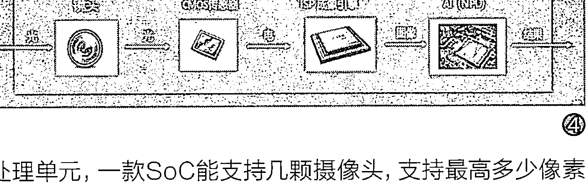## ISP的命名规范

在ISP的命名中，高通骁龙的命名也许是最规范的，比如骁龙710集成的ISP单元型号为Spectra 250，骁龙765为Spectra 350，骁龙865是Spectra 480，通过后缀数字我们一眼就能知道谁更强。麒麟家族则喜欢用x.0标注，比如麒麟980/麒麟810集成了ISP4.0，而麒麟990则升级到ISP5.0。联发科的ISP更爱“堆核”，比如Helio G90系列集成了3核心的ISP，而天玑1000的ISP则拥有5个核心。

#### DSP——不再单纯

DSP即数字信号处理器，它原本主要用于处理音频信号，比如语音降噪、数模转换和实现特殊音效等。只是，在高通骁龙家族中，DSP单元的作用得以进一步升华。

##### 熟悉又陌生的DSP

我们都知道DSP是SoC的组成部分之一，但在海思麒麟、联发科和三星旗下SoC的结构图中，我们根本看不到DSP单元的影子。但是，在高通骁龙移动平台中，DSP往往会被重点标注（图5），从骁龙660的Hexagon 680一路升级到骁龙865的Hexagon 698，后缀数字越大性能越强。

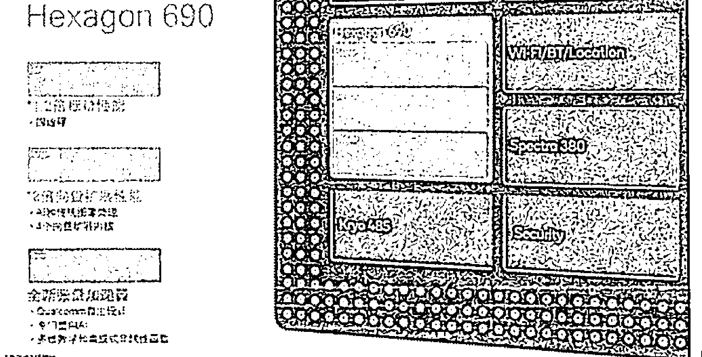

##### DSP的跨界应用

随着VR/AR应用以及AI人工智能的兴起，高通赋予了DSP单元更多的能力，其中就包括向量扩展（HVX）和Tensor张量加速器。没办法，骁龙SoC一直都没有集成独立的NPU单元，其主打的“高通人工智能引擎AI Engine”需要CPU、GPU、DSP、内存、缓存等模块协同作战。而其他芯片商的SoC很早以前就引入了NPU模块，所以无需让DSP进行太大的改变。

#### NPU——聪明靠它

2017年底，华为推出的麒麟970第一次引入了NPU（神经网络处理器）概念（图6），让SoC也具备了更强的本地（端侧）AI运算能力（类似于“硬解”），执行效率可以秒杀CPU的“软解”。至此，NPU单元就与AI划上了等号。

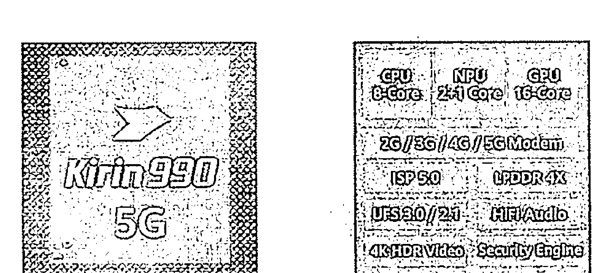

World's 1st Big-Tiny Core Architecture NPU

从麒麟970的单核NPU、麒麟980的双核NPU，到最新的麒麟990 5G已经集成了2+1三核NPU

##### 无处不在的AI

最开始，AI主要还是用于拍照，比如取景时的智能场景识别功能，让系统可以快速识别拍摄的物体和场景，并自动作出优化调教。随后，AI功能逐渐拓展，从手持超级夜景、AI语音助手、AI游戏引擎、AI网络加速、AI节能优化、AI智慧识别、AI识图翻译……几乎所有的应用场景都离不开AI加速运算。因此，一颗SoC芯片如果没有足够的AI动力，都不好意思出门打招呼。

##### 不一样的AI单元

不同品牌的SoC，对AI单元的命名和实现方法略有不同，除了高通骁龙AI Engine引擎之中没有独立的NPU单元以外，联发科在Helio P60/P90引入的NeuroPilot AI技术最早也是通过多个单元协同计算（APU+CPU+GPU，这个时期集成的APU并非单独的硬件，它更像是骁龙DSP中全新集成的张量加速器）。但从天玑1000开始，联发科也推出了独立AI处理器（APU3.0）（图7），这颗旗舰级SoC在苏黎世AI中的跑分成绩已经可以超越麒麟990 5G。

三星从Exynos 9820开始在SoC内部集成了独立的NPU单元，最新推出的Exynos 980和Exynos 990集成的NPU单元性能也得以进一步增强（图8）。需要注意的是，如今AI单元在手机日常的应用领域还处于初级阶段，它的重要性还远不如CPU、GPU和ISP，属于锦上添花的存在。

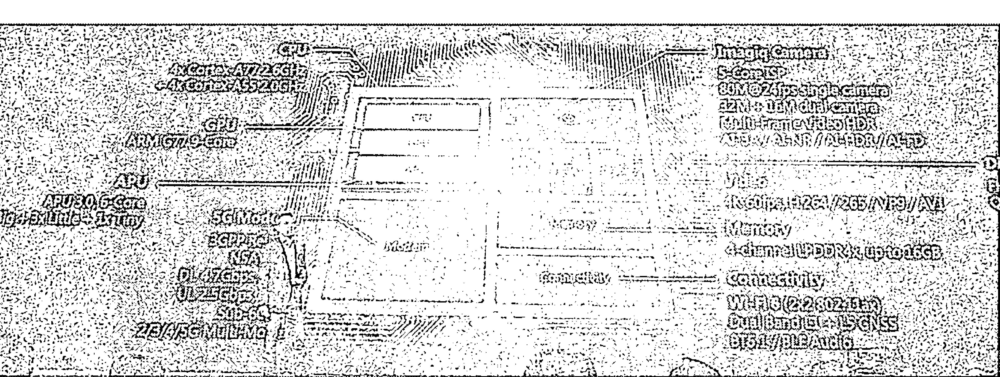

图8 三星Exynos 980 SoC的构成

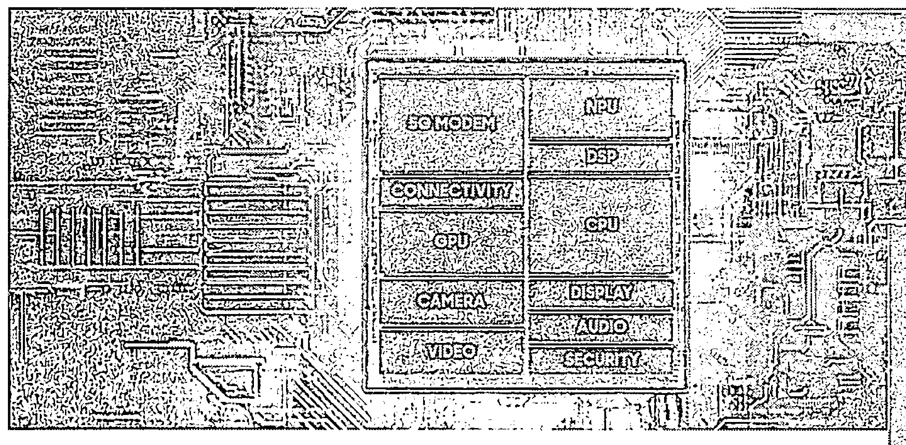

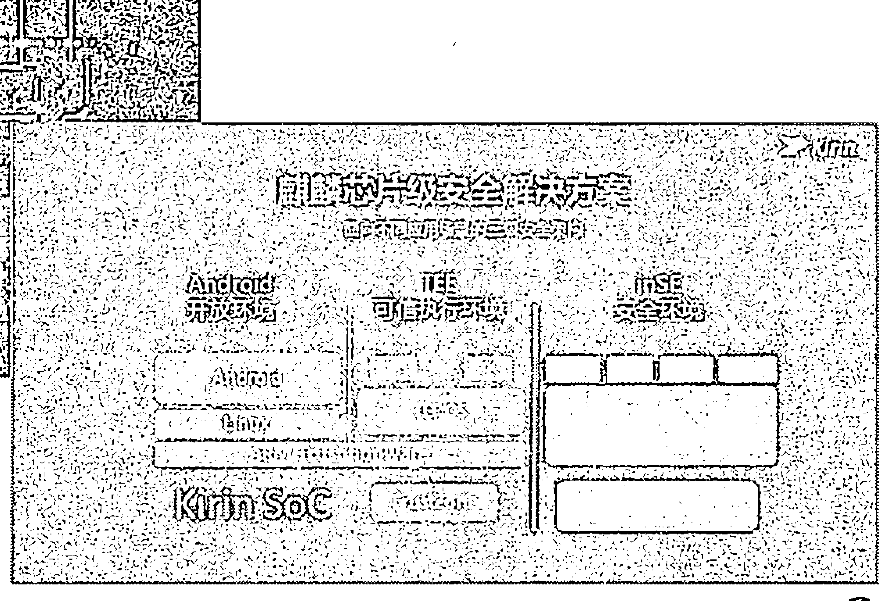

图9 麒麟芯片级安全解决方案

#### 其他——寂寞英雄

除了上述“知名”的单元，手机SoC内还集成有很多功能模块，它们虽然不太起眼，但背后承担的任务也非常重要呢。

##### 内存/存储控制器

我们都知道即将量产的LPDDR5内存性能远胜当前主流的LPDDR4X，而UFS3.0闪存的读取速度也可以秒杀UFS2.1，但并不是所有SoC都支持这些最新的技术标准。以LPDDR5内存为例，暂时只有骁龙865和Exynos 990有资格享用，麒麟990和联发科天玑1000只支持到LPDDR4X。

##### 安全模块

得益于更加方便的移动支付，很多用户都已经习惯了“无现金消费”。然而，谁来确保手机内隐私数据和支付相关认证的安全？为了解决这一问题，很多SoC都开始集成专用的安全模块，比如麒麟芯片内置的inSE安全芯片（图9）、骁龙芯片集成的SPU安全处理器等等。它们的作用，就是可以将人脸识别、指纹信息、ISP、DSP、内存等所有参与模块生成的安全数据都保存在本地而无需上传云端，从而最大限度提升系统的安全性。

##### 协处理器

很多SoC内都集成有一个名为“协处理器”的单元（如高通骁龙SoC内集成的Sensor Hub、麒麟980内集成的i8），它们大多采用更加省电的ARM Cortex-M系列架构打造，作用是辅助CPU，用于对加速感应器、陀螺仪、指南针和全新气压计等传感器进行7×24小时不间断的检测、统计、再加工，可让你安心进行计步、开启GPS定位等功能而不必担心耗费电力。

##### 其他模块

SoC中还集成有显示、音频和视频单元，它们会影响手机能使用多少分辨率的屏幕、支持哪些格式的音频/视频编解码。此外，一款手机所能兼容的快速充电技术，也受到SoC内某些单元的牵制，比如骁龙710仅支持QC4快充，而骁龙675却能支持效率更高的QC4+。还好，这些单元模块对SoC的性能几乎无影响，我们只需简单了解即可。


### 搭配的艺术

#### 装机中的最佳拍档

在如今这个一切都标准化、透明化的时代，装机的门槛已经越来越低。你想要一台入门、主流、高端电脑？还是学习、游戏、设计电脑？只要提出需求，相应的硬件和成套的配置会从各个途径跑到你的面前。
但这就足够了吗？当然不够，要想让电脑运转起来，其实只要按照标准接口、软件安装完成，一般就没有太大问题，但要让它顺滑地“跑”起来，让每一个配件都尽量发挥全力，而不是相互牵制，其实还是有一些讲究的。

##### 配置见真章

搭配是否合理这件事，大家理所当然地会马上想到配置单、配件表。没错，要想获得一台平衡的电脑，首先配置单上就得足够平衡。关于配置的平衡、合理，以及一些情况下的必备搭配非常多，好在我们之前也已经有过很多相关的文章，所以这里只针对近期的配置进行简单的盘点。
在这里我们强调的是“最佳”拍档，而不是必需的选择，比如哪种芯片组支持哪一代处理器这样的基本需求并不在本文的考虑之列，而某种处理器在哪一种芯片组上运行得更好一类的问题，才是我们今天要讨论的内容。

###### 内置显卡的锐龙与标准频率双通道内存

目前的市售处理器中，大部分型号的性能虽然会受到内存带宽的影响，但影响幅度都不大，在很多时候，我们攒机会综合考虑内存的价格和处理器的对应内存频率来进行选择，因此常常倾向于使用价格更便宜的单条内存。不过内置显卡的锐龙处理器（图1）是个例外，由于其内置显卡对内存需求很高，需要和CPU进行内存带宽的“争夺”。因此在使用这些处理器时，内存是否使用双通道，有没有达到其标配频率，会特别明显地影响到内置显卡的表现。


| 锐龙5 2400G   | DOTA2 | CS:GO | 守望先锋 |
|---------------|-------|-------|----------|
| 单通道DDR4 3200 | 25.3  | 52.0  | 31.3     |
| 双通道DDR4 2400 | 40.0  | 85.0  | 52.8     |
| 双通道DDR4 2933 | 45.0  | 89.7  | 53.5     |
| 双通道DDR4 3200 | 45.3  | 95.0  | 53.6     |

很明显，如果不使用双通道内存的话，即使是超高的内存频率也无法让显卡正常发挥；当内存频率明显低于标准时，也会对显卡发挥造成一定的影响，而达到了这款处理器标准支持频率后，再提升内存频率对显卡性能影响也不大了。

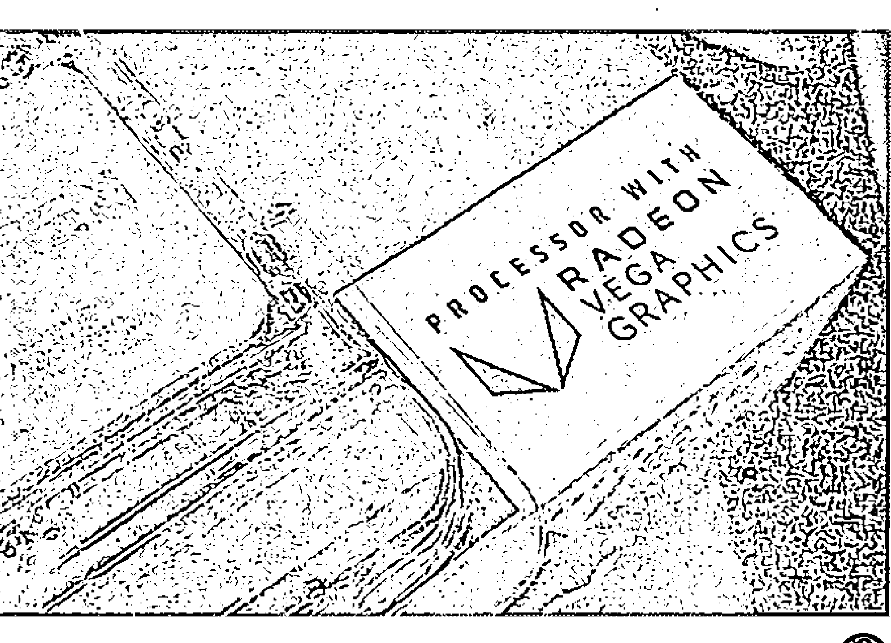

##### 酷睿i3-9100F的良伴是B365/B360

酷睿i3系列处理器一般被作为入门级处理器，常常被与入门级芯片组H310联系在一起。在精简掉核芯显卡后，酷睿i3-9100F的价格更是降至700元以下，接近奔腾处理器的价位，似乎也更适合与价格最低廉的H310主板为伍。

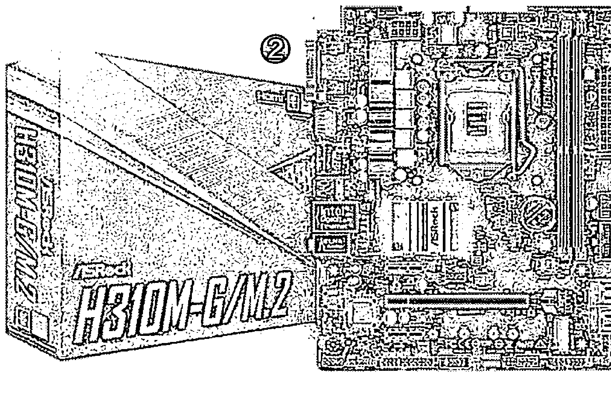

不过从实际能力来看，这显然是一种错误的搭配，由于H310芯片组提供的PCIe通道很少，因此大部分相应主板的板卡插槽、M.2接口或者数量不够，或者PCIe通道不足，比如仅提供一个PCIe ×2通道的M.2接口（图2）。而对于性能已经达到入门级游戏平台水平的酷睿i3-9100F来说，这些限制了显卡、SSD性能的配置显然都会影响处理器的发挥，在英特尔的官方配置建议中，这款处理器的推荐平台也是B365主板。当然，目前同档次的B360、B365主板与H310主板价格非常接近，也是我们更推荐使用前者的原因。

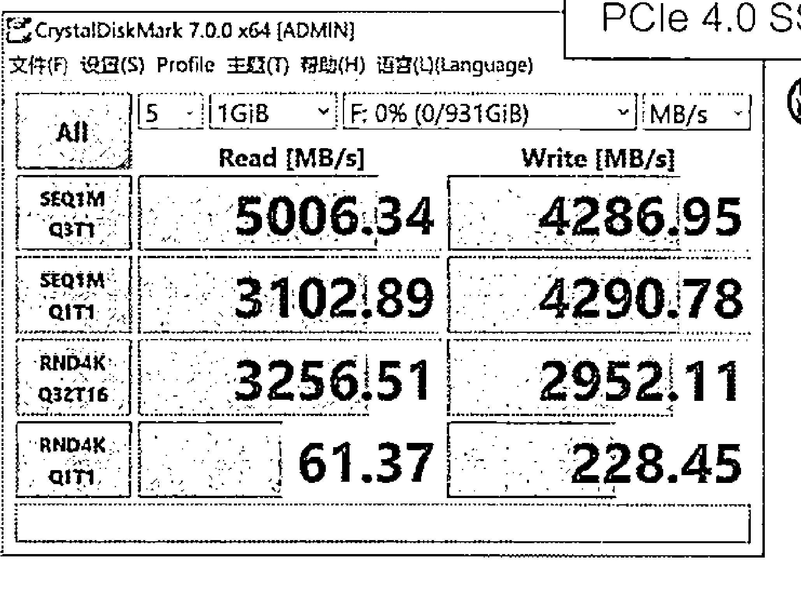

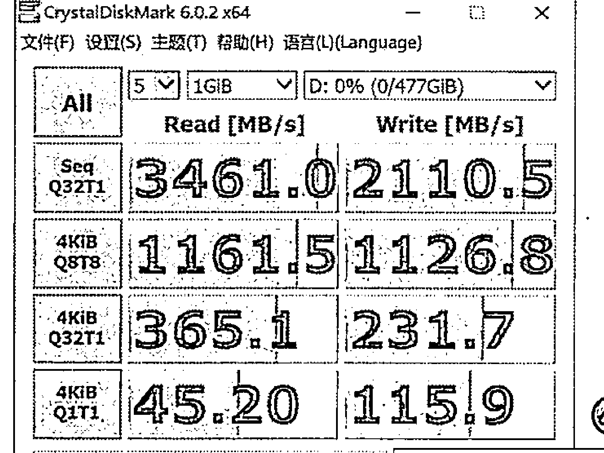

##### 第三代锐龙和PCIe 4.0 SSD

第三代锐龙及其配套的X570平台带来的一个重要升级就是PCIe版本提升至4.0，带宽则直接提升了一倍。虽然AMD随之推出了支持PCIe 4.0的显卡，但从目前来看，从这一升级中获益最大的其实是M.2 SSD。
从性能对比来看，使用PCIe 3.0或PCIe 4.0通道，显卡的实际表现差别不大，但SSD却不同，目前已经推出的支持PCIe 4.0的SSD，读取速度都达到了5000MB/s左右（图3），远超高端PCIe 3.0 SSD的3500MB/s左右（图4）。另外PCIe 4.0还让SSD在并行存取线程较少、文件尺寸较小时，也能保持更出色的响应和存取速度。

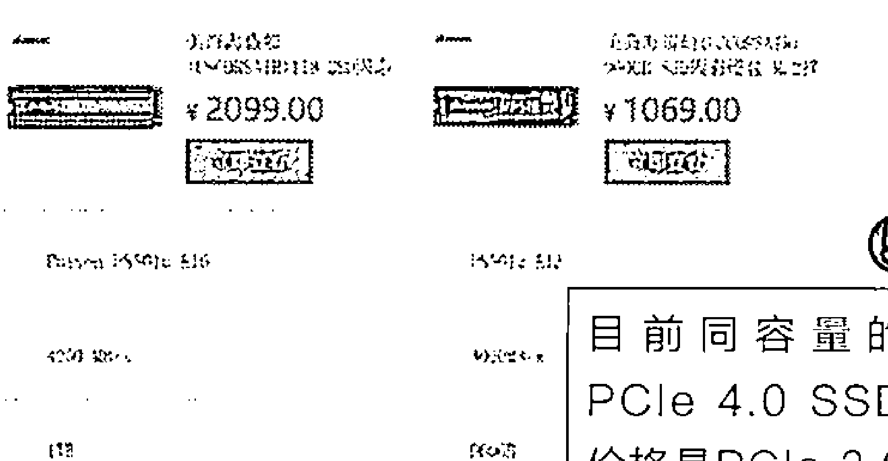

与前述几种最佳搭配不同，目前的PCIe 4.0 SSD价格仍然偏高（图5），更适合追求最高性能的用户，一般消费者可以关注相关产品，并注意在配置时留下一些M.2接口即可（好在X570、B450等中高端主板一般都会提供两条甚至更多的M.2接口），暂时可以不购置。

##### 接口线缆的讲究

我们常常会看到一些使用中高端外设但无法像宣传那样开启高端功能，或者性能与宣传完全不符的情况，很多用户会因此对产品性能产生怀疑，其实这些问题很可能是接口与线缆的选择不对。

##### DP才是发挥电竞显示器能力的最佳选择

由于电竞显示器的价格门槛一路下降，目前2K分辨率、144Hz甚至更高性能的产品已经成为很多玩家的首选，但在实际使用中会发现无法将刷新率设置到这么高，这是因为实现超高刷新率的前提是使用较新版本的DP接口（图6）。

而另一种高带宽视频接口——HDMI其实是更适合多媒体、家电等平台的接口技术，不仅带宽比DP小，而且缺乏刷新率控制等方面的设计。这一情况也体现在防止画面撕裂的同步技术如G-Sync（图7）上，目前它同样需要使用DP接口才能实现。

当然，随着HDMI版本的提升，也可能会在这些方面有所突破，例如G-Sync就将支持HDMI 2.1版本。但针对目前的电竞显示器、显卡和连线来说，使用DP接口仍然是最好的选择。

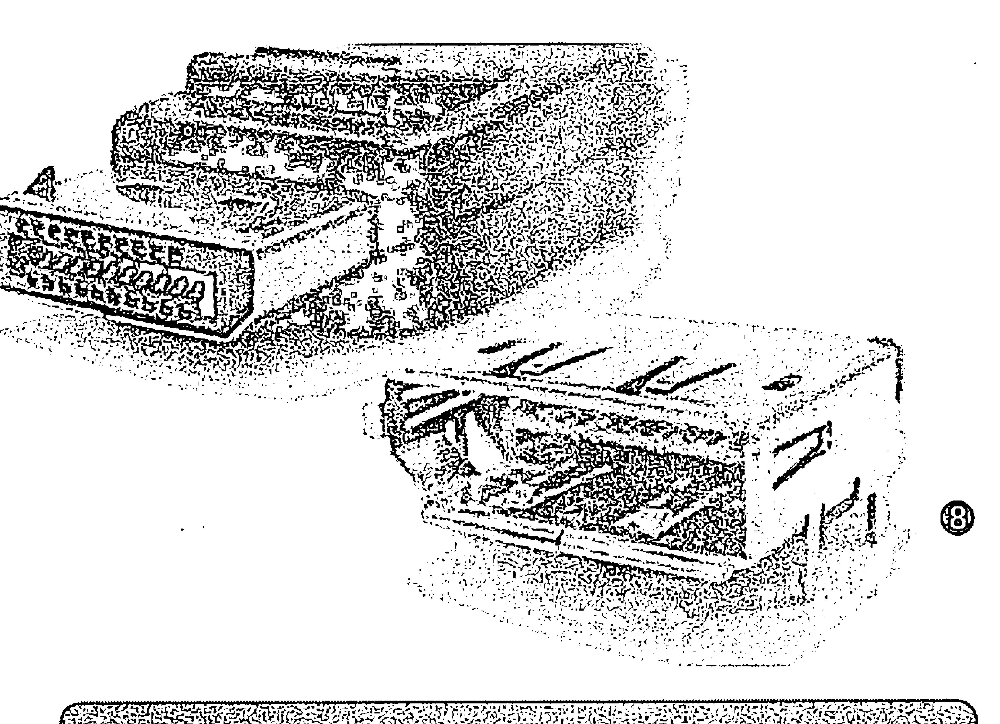

##### 不光是粗细的问题线缆版本有讲究

在USB、DP、HDMI等接口的版本不断升级、性能越来越强（图8）的同时，对线缆也有着越来越高的要求。这里必须注意，有时在版本升级时会说对线缆没有更高要求，或者向下兼容，这一般是指版本接近的线缆。例如HDMI 2.0没有对线缆提出新的要求，但这里指的是可以较好地兼容HDMI 1.4的线缆（可支持4K及一些新功能），而HDMI 1.4其实已经提出了较高的要求，如果用一根HDMI 1.3（1080P）时期的线缆连接HDMI 2.0接口，仍然可能出现性能下降甚至无法识别的问题。

在选购线缆的时候要知道，越粗越好的观念早已过时，通过更精密的制造、更好的选材等方式，一些支持更高标准、更大带宽、更高性能的线缆可能比低端产品更细更柔软。除了在购买时确认厂商的版本之外，大家也可以在线缆上看到一些特殊标识，比如HI SPEED HDMI CABLE WITH ETHERNET（支持网络功能的高速HDMI线缆）等，一般就是支持较新版本的标识（图9）。这里要注意，目前视频接口认证组织不支持在DP、HDMI连线上做版本标识，所以遇到线缆上直接印着HDMI 1.4一类版本标识的线缆，反而极有可能是山寨货。此外在USB等线缆中也有这样的问题，例如一些耗电较大、速度较高的USB 3.0版本或更高速的设备，使用旧线缆时就可能出现供电不足、速度受限等情况。如果是用原本为USB设计的Type-C线缆连接雷电3设备(图10)，也可能出现类似的问题。

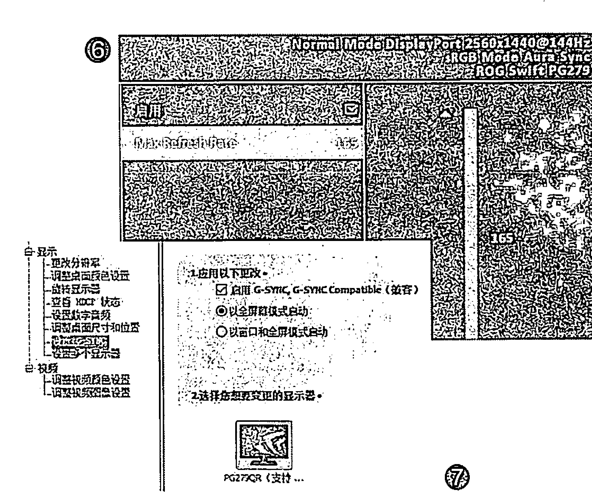


##### 这样才是成熟的设计

除了我们在配置层面的选择外，配件、设备本身的一些配置也决定了它是否能良好、稳定地运行，发挥能力，但有些配置因为并不起眼，常常被厂商和用户有意无意地“忽略”了。但要想让电脑稳定而高效，我们自己必须了解，并且有可能的话，在必要的时候自行补上这些不足。

由于目前的M.2 SSD价格逐渐向SATA SSD靠拢，很多用户开始选择速度更高的M.2 SSD。不过这种产品有一个比较明显的缺陷，就是散热一直不得力。它自身集成度高，且没有金属壳体辅助散热，加上越高速的芯片越容易发热，M.2 SSD上比SATA SSD更高速的控制、存储芯片当然也不例外。而且紧贴主板、靠近显卡的M.2接口还“窝”在整个机箱最热的位置，让它无法被散热气流直接触及。长时间的高温工作会降低M.2 SSD的寿命，也明显影响性能。与其他芯片一样，当温度超过安全限度后，M.2 SSD上的芯片也会适当降速以降低温度，造成其性能低于厂商的设计指标(图11、图12)。而解决M.2 SSD的过热问题，最简单的当然就是为其安装散热片。目前最常见的M.2 SSD散热器有两种，一种是鳍片式(图13)，它一般重量较轻，但因为鳍片有一定的高度，可能会影响在M.2接口上方安装显卡等设备。另外一种则是比较厚重、没有设计鳍片的金属散热板，很多中高端主板会直接提供这种散热板(图14)，它的效果一般，但对周边配件的影响更小。对大多数M.2 SSD来说，使用一块较大的金属板辅助散热就可以保证它处于较好的工作温度下。而一些“性能先锋”式的SSD可能会尝试使用更高集成度的芯片，甚至将控制芯片超频使用，这时效能更好的散热片才能压制其超高的发热量。好在使用此类SSD的用户通常也会使用多个M.2接口的高端主板，可以考虑将这些SSD安装在远离显卡的位置上，应该会有足够空间容纳大型散热鳍片。

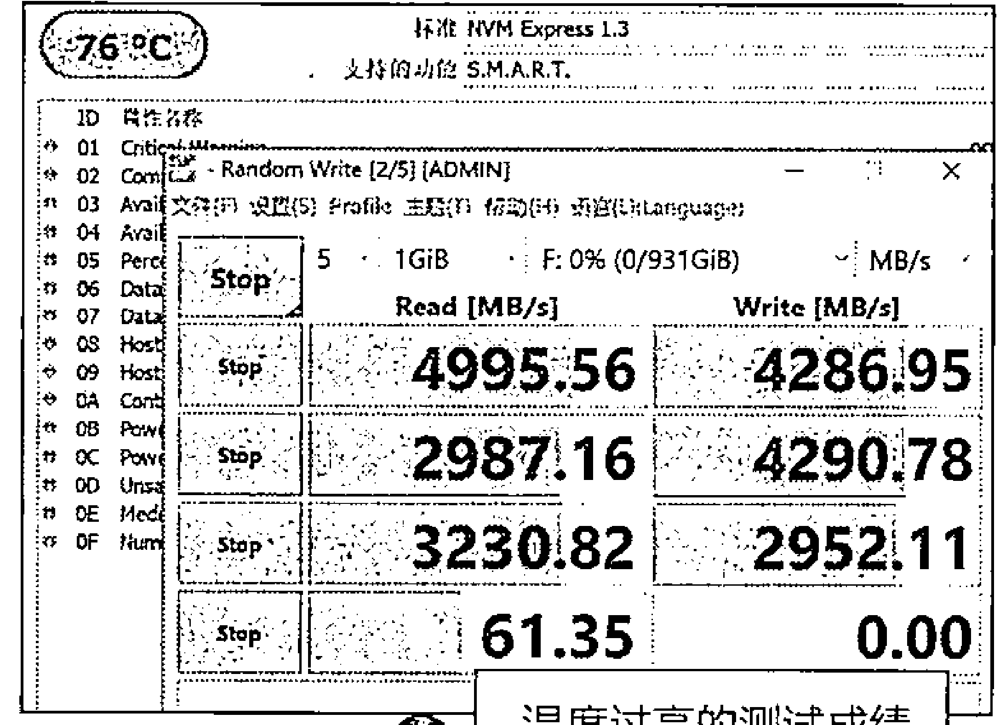

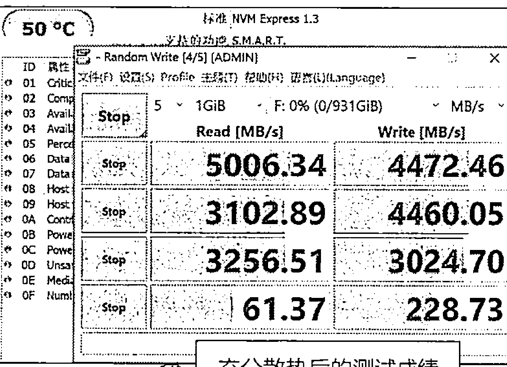


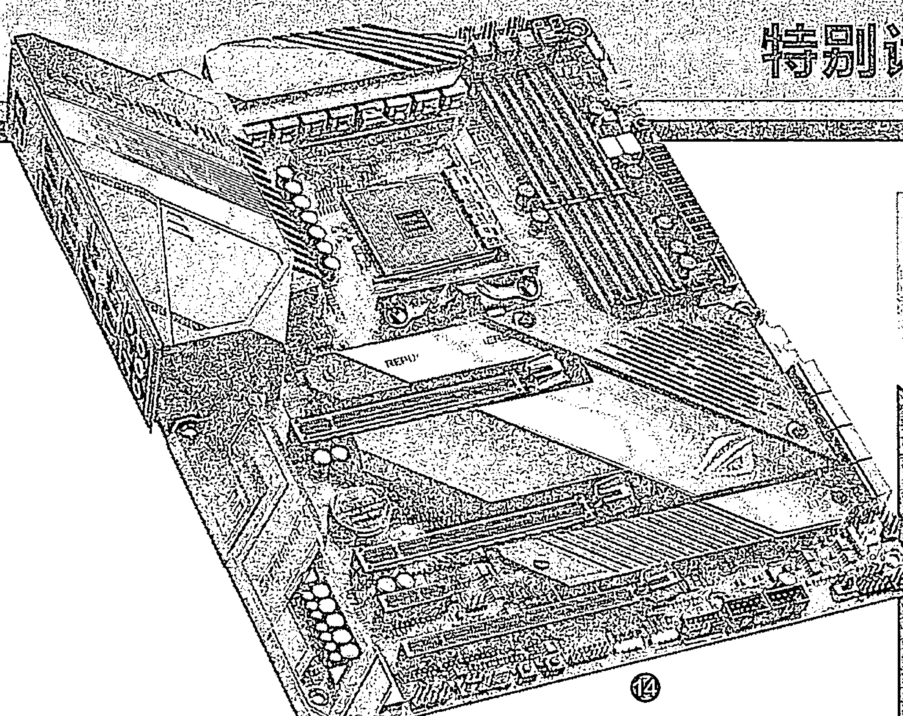

如果手中有一些换下的M.2 SSD，准备其作为移动硬盘使用的话，也一定要注意散热问题。不仅要配置金属外壳，而且最好选择外壳比较厚、有足够热容量的产品，否则不仅容易出现SSD温度过高的情况，甚至有可能因为外壳升温太大而在拔出设备时烫到手(图15)。

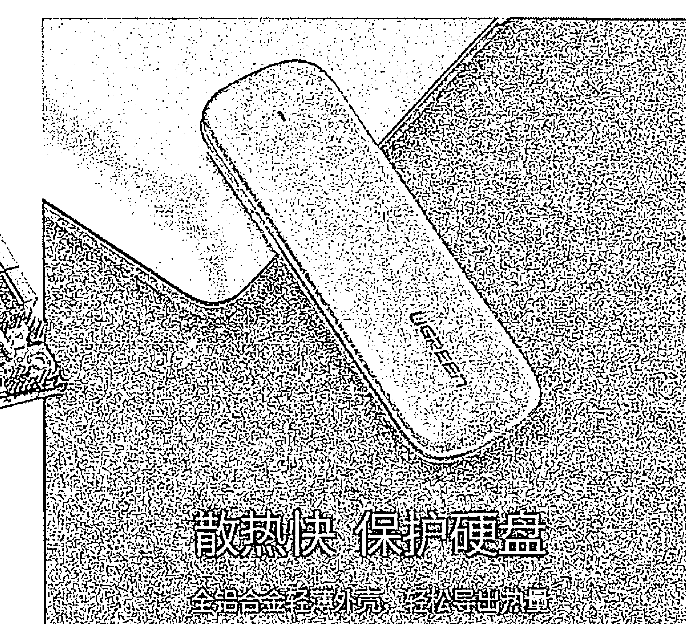

##### 显卡背板的重要性

在很多显卡的背部都带有一块金属板，它是随着高发热量、配备涡轮式一体散热器的显卡到来的，理所当然地被认为是散热系统的一部分。但是要注意，其实它还有一些其他的功能，对特定的显卡可能还更重要一些。

此时背板的作用除了直接加强PCB板之外，也让散热器的螺丝可以安装在金属背板而不是PCB上，不再直接拉扯PCB板的特定点，而是将拉力分摊在背板及其下的PCB上。要注意强调加固、支撑作用的背板应该比较厚实，不易变形，但不一定覆盖整个PCB板。

首先就是对一些板型较长、散热器比较厚重的显卡来说，背板的支撑、加强作用就更加重要（图16）。因为现在的显卡安装在常见的机箱中时，散热器部分是“悬空”挂在显卡PCB上的，如果比较重的话，长时间拉扯会造成PCB弯曲变形、显卡损坏。

另外，对于要装入窄小机箱的ITX显卡，背板可以遮蔽背部裸露的元件、触点，防止其他的配件、线缆钩挂此处造成损伤或短路（图17）。这样的背板可以做得比较薄，但一定要尽量大，以便保护背部的所有裸露触点和元件。

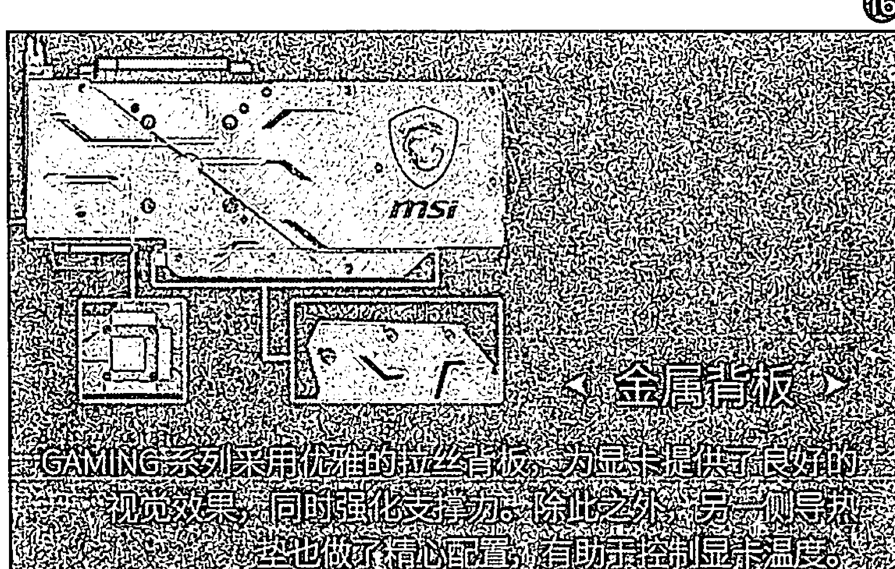

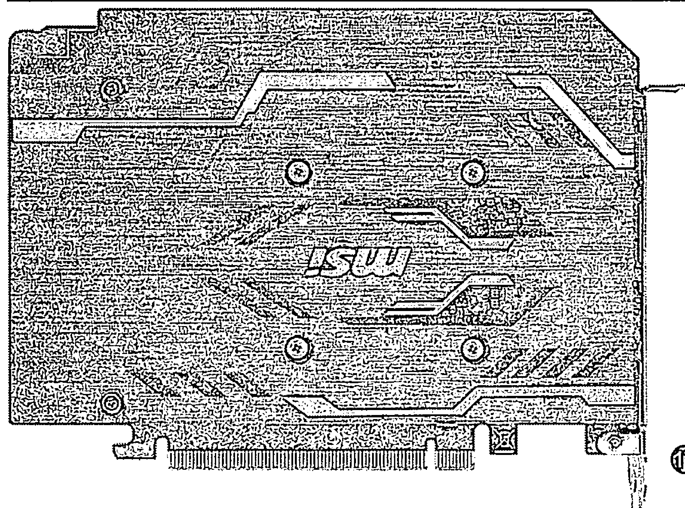

##### 选游戏显卡，显存变得很重要

我们谈到的显卡档次主要是根据显示芯片(GPU)划分的，在一般情况下，显卡上的另一种重要芯片——显存的容量、频率等也是随着显示芯片的档次设置的，它们的平衡可以确保显卡在最适合的设置下很好地运行。不过目前部分显卡的显存配置出现了一些问题，我们在选择显卡时还必须了解显存对性能的影响，并据此进行挑选。

游戏中的3D物体实际上都是框架外面贴个材质图的空心“布景”，其中材质图和框架就是显存里最主要的数据，因此画质或分辨率越高，贴图和框架的精细度越高，数据量越大，对容量的占用也就越大。

如果数据量超过了显存的容量，那么显卡就只能去内存里面存取这些数据了。从速度上看，现在常用的内存等效频率是2.66GHz~3.2GHz，位宽64位；而入门级游戏显卡的显存则是8GHz、128bit位宽，中端显卡的显存更达到10GHz以上、192bit~256bit位宽。很显然，系统内存与显存的带宽差距是非常巨大的，借用系统内存会大幅拖慢3D数据的存取，进而影响显卡的整体处理速度。

所以要想在高分辨率、高画质下爽玩游戏，还得尽量把主要数据放进显存。在全高清分辨率下玩主流游戏的话，显卡至少应该有4GB显存，高端游戏需要6GB以上显存；要想画面更好、使用2K超高分辨率，那就得有8GB以上的显存才行。

我们前面已经提到，一般来说，显存的配置应该和GPU能力及显卡的定位相吻合，而目前受到厂商市场策略的影响，出现了一些不匹配的问题。例如从英伟达的GTX 1660与GTX 1660 Super配置、性能变化就可以看出，原来为GTX 1660配置的显存显然过于强调降低成本了，实际上大大抑制了GPU的性能发挥。

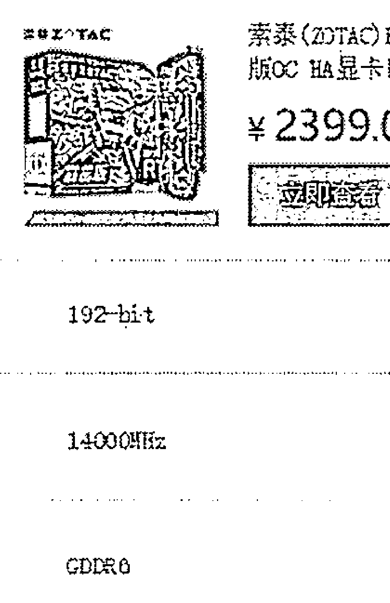

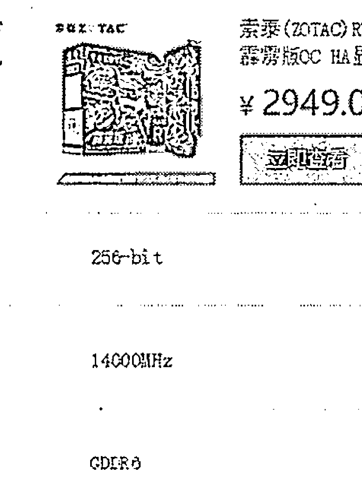

> 火速链接
关于GTX 1660和GTX 1660 Super的配置差别与性能对比，可以参考本刊2020年第1期的《Super时代 英伟达GTX 1660 Super》。关于配件选择和周边搭配的技巧，也可参考本刊2017年第10期《何为老鸟？——看DIY中的细节》。

类似的情况还有GPU足以应付2K应用的RTX 2060，因为只配有192bit位宽的6GB显存，因此只能作为一块超快的全高清分辨率显卡使用，而其后的RTX 2060 Super的GPU变化也不算大，但以更高的成本配置了更大位宽的8GB显存(图18)，才成为了不错的2K游戏显卡。

##### 篇后语

本文所提到的让电脑性能更平衡、运行更完美的搭配选择技巧，其实只是针对近期的一些热点问题和产品，远远算不上全面。另外，对于硬件和驱动的选配、硬件功能的需求选择，其实也是DIY中的重要搭配，这些内容因为与时间/版本的关系更大，或者与用户复杂纷繁的实际需求关系更大，很难简单地说清，本文就没有涉及。有志于DIY的朋友们可以通过本刊或其他媒体的报道以及自己的摸索逐渐了解它们，乃至最终掌握其规律，这也正是一个DIYer成长必须经历的过程。希望本文能在这条成长道路上起到抛砖引玉的作用。

### 聚焦 CES 2020
来自移动战场的报道


# ARE YOU CES READY?
JANUARY 7-10
LAS VEGAS

策划《电脑爱好者》编辑部

2020年1月初，2020年国际电子消费展讯（CES 2020）在美国拉斯维加斯拉开帷幕。每一年的CES都是电子产业的盛会，在年初就汇集了可能影响未来一年甚至数年科技走势的新技术和新产品。随着AI和自动驾驶等技术的兴起，近两年的CES更是有向“车展”转型的态势。考虑到这些技术太过科幻，所以本期特别话题，我们还是聚焦于“移动战场”，看看CES 2020中那些将引领笔记本电脑和智能手机发展趋势的存在吧。

### 全面开战 AMD移动锐龙4000系列问世

在本届CES 2020中最重磅的消息和产品，无疑就是AMD全新发布的锐龙4000系列移动处理器，凭借全新的工艺和架构，锐龙4000将进一步蚕食原本属于英特尔酷睿家族的移动市场蛋糕。

#### 第二代移动锐龙出击

如果将时间的指针拨回到3年前，移动领域（笔记本市场）还是英特尔一家独大，AMD主打的APU平台境遇岌岌可危，很多高端APU型号只有英特尔同期酷睿i3的水平。

随着2017年底Ryzen锐龙移动处理器的发布，AMD终于扳回一城，凭借Zen CPU和Vega GPU两套底层核心架构的融合（图1），让移动锐龙有了和同期酷睿叫板的底气。随着2019年初

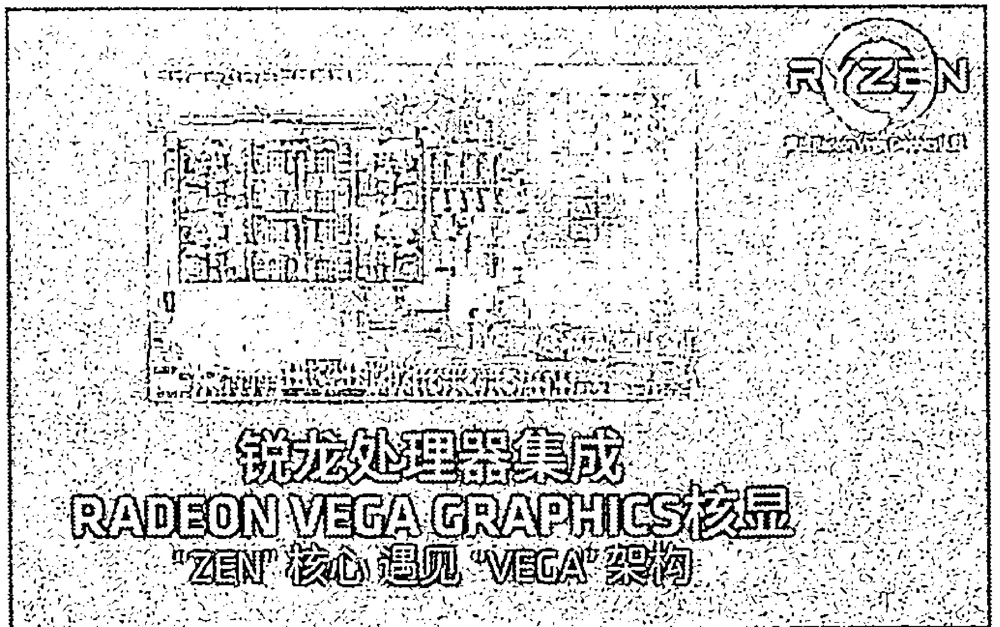

#### 移动和桌面版之间的差异

需要注意的是，AMD第一代移动版锐龙处理器的命名是从Ryzen 2000起步的，所以其在数字序列上总是比桌面版+1000。因此，第三代移动锐龙Ryzen 4000对应的其实就是第三代桌面版锐龙的Ryzen 3000（图3），二者同宗同源。

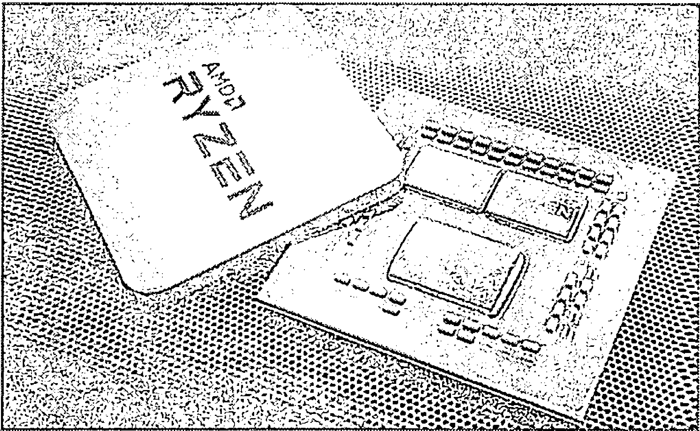

第三代桌面锐龙的平台代号为“Matisse”（马蒂斯），而第三代移动锐龙的平台代号则是“Renoir”（雷诺阿）。由于移动锐龙全部集成Radeon Graphics核显，所以业内更习惯将新一代移动锐龙称为“Renoir APU”。

在处理器芯片的外观方面，桌面版的Matisse Ryzen处理器在一块CPU基板上封装了独立的CPU Die（7nm）和I/O Die（14nm），通过模块化来组合不同核心数量的处理器（图4）。而移动版的Renoir APU则取消了Die分离的设计，将CPU、GPU和I/O单元都整合在一个Die内（图5），我们一眼就能看出它们之间的差别。

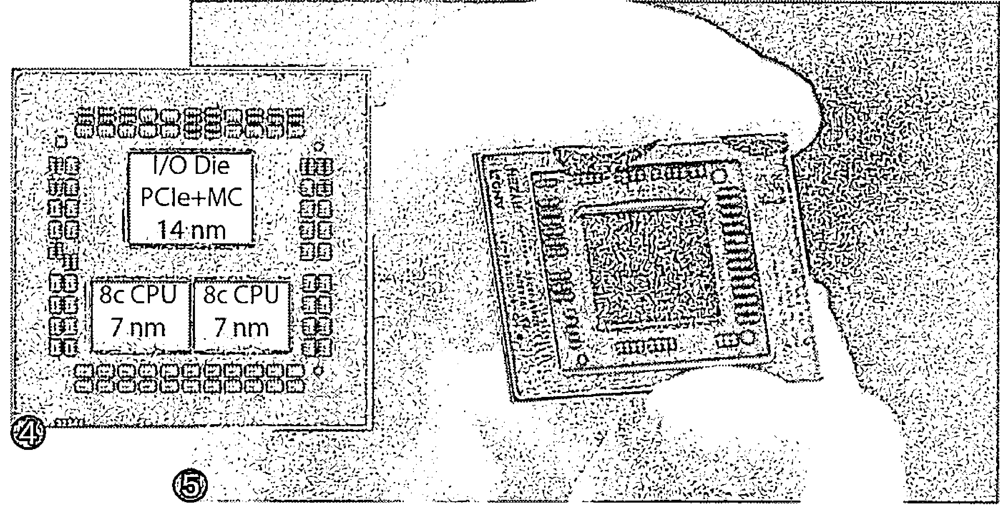

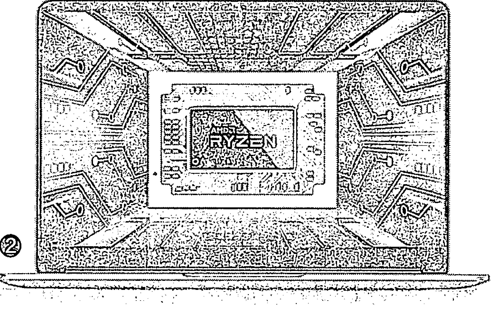

#### 新工艺和新架构的诱惑

既然和桌面版的第三代锐龙同源，AMD移动锐龙4000自然也将制程工艺升级到了台积电7nm，较之上代产品所用的12nm工艺，在电气性能上有了质的提升。同时，移动锐龙4000同样改用全新的Zen 2微架构，据AMD表示，移动锐龙4000的能效相比上代移动锐龙3000翻了一番还要多，其中七成来自7nm新工艺，另外三成来自Zen 2新架构，而对比一代移动锐龙2000更是提升了124%（图6）。

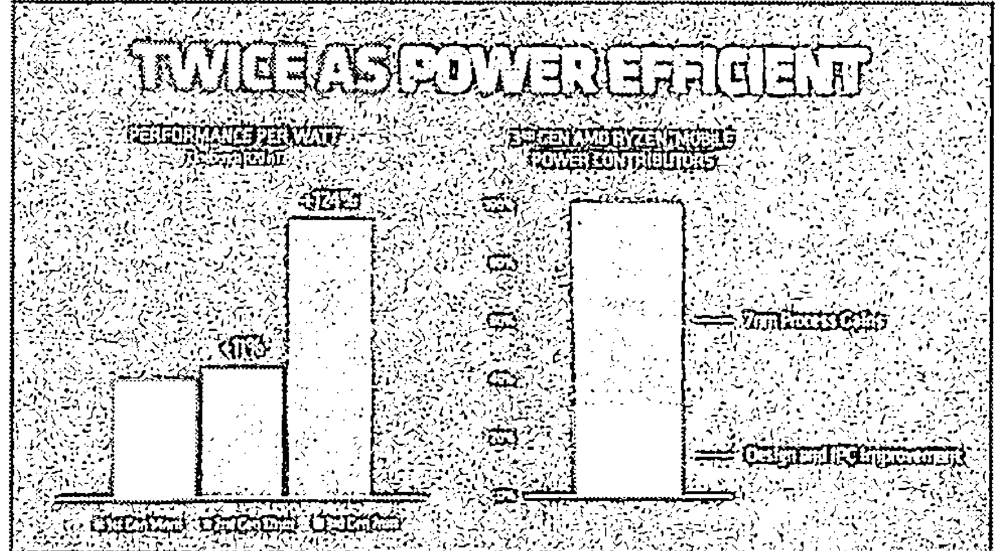

据悉，AMD移动锐龙4000的内部采用了和桌面版处理器相同的CCX布局，其中8核产品被拆分为2个CCX单元，通过内部的Infinity Fabric结构进行通讯。只是，移动锐龙4000采用了单Die设计，并将TDP从65W降到了15W或45W，同时大幅调低了主频，并削减了L3三级缓存的容量，不支持PCIe 4.0技术。

AMD Ryzen™ 7 3700X
| 规格项 | 数值 |
| :--- | :--- |
| CPU核心数量 | 8 |
| 线程数量 | 16 |
| 基础时钟频率 | 3.6GHz |
| 最大加速时钟频率 | 高达 4.4GHz |
| 一级缓存 | 512KB |
| 总二级缓存 | 4MB |
| 三级缓存 | 32MB |
| 不锁频 | 是 |
| CMOS | TSMC 7nm FinFET |
| 封装 | AM4 |
| PCI Express 版本 | PCIe 4.0 x16 |
| 散热解决方案 (PIB) | "幽灵"Prism 带RGB LED灯 |
| 散热解决方案 (MPK) | Wraith PRISM |
| 默认 TDP/TDP | 65W |
| 最高温度 | 95℃ |
| 最高内存速度 | 3200MHz |
| 内存类型 | DDR4 |
| 内存通道 | 2 |

以桌面版的锐龙7 3700X处理器为例，它的L3缓存达32MB（图7），而同样采用8核心16线程的锐龙7 4800系列却降到了8MB。因此，哪怕解锁移动锐龙4000的TDP并将其超频至桌面版处理器的频率，它们之间的性能依旧存在较大的差异。

#### 轻薄本和游戏本两手抓

和过去一样，移动锐龙4000系列被AMD细分为面向轻薄本的U系列、游戏本的H系列和商务本的PRO系列，取代现有的锐龙5 3500U、锐龙5 3550H和锐龙5 3500U Pro等产品线。

在本届CES 2020上，AMD主要展示了其中的U系列和H系列，其中最高端的锐龙7 4800U和锐龙7 4800H都采用了8核心16线程设计（图8）。作为对比，英特尔U系列中的“皇帝”——第十代酷睿i7-10710U也只有6核心12线程，H系列中高端的i7-9750H也是6核心12线程，只有面向顶级游戏本市场的i9-9880H和i9-9980HK才采用了8核心16线程。

换句话说，从物理和逻辑核心的数量来看，锐龙7 4800U和锐龙7 4800H已经和移动版的酷睿i9打平！

#### 第三代移动锐龙解析

在移动锐龙4000系列中，针对轻薄本定制的U系列包括锐龙3 4300U、锐龙5 4500U、锐龙5 4600U、锐龙7 4700U和锐龙7 4800U共计5款子型号，它们都拥有15W的TDP，和上一代移动锐龙3000系列相比，可配置cTDP略有降低（7nm工艺让其以更低的功耗就能释放更强的性能），同时支持更高频率的DDR4-3200MHz内存，并支持更低功耗的板载LPDDR4-4266MHz内存颗粒（表1）。

需要注意的是，后缀为单数的锐龙3 4300U、锐龙5 4500U和锐龙7 4700U不支持超线程技术，但也因此获得了更高的默认主频。而后缀为双数的锐龙5 4600U和锐龙7 4800U虽然拥有双倍的逻辑核心，但为了兼顾满载时的功耗不得不调低了默认主频。

如果把锐龙5 4600U和锐龙7 4800U的TDP解锁到45W，它们就能华丽变身成移动锐龙4000系列中针对游戏本定制的H系列，以更高主频的锐龙5 4600H和锐龙7 4800H出现。

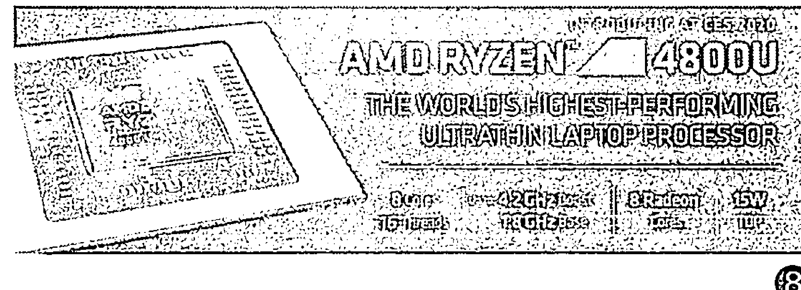

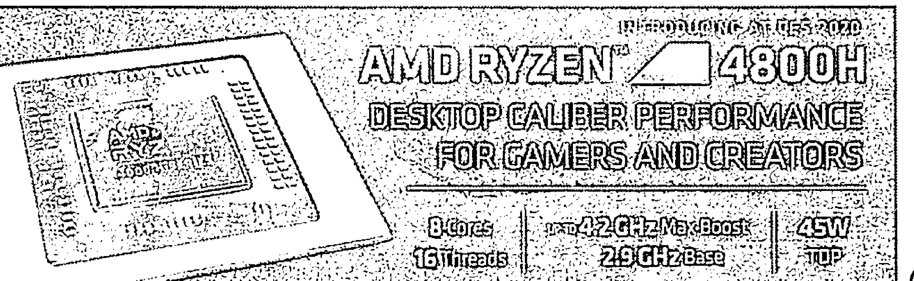

表1：AMD移动锐龙4000/3000（U系列）规格对比
| 型号 | 锐龙3 4300U | 锐龙5 4500U | 锐龙5 4600U | 锐龙7 4700U | 锐龙7 4800U | 锐龙5 3500U | 锐龙7 3700U |
| :--- | :--- | :--- | :--- | :--- | :--- | :--- | :--- |
| 制程工艺 | 7nm | 7nm | 7nm | 7nm | 7nm | 12nm | 12nm |
| 默认TDP | 15W | 15W | 15W | 15W | 15W | 15W | 15W |
| 可调cTDP | 10W-25W | 10W-25W | 10W-25W | 10W-25W | 10W-25W | 12W-35W | 12W-35W |
| 核心/线程 | 4C/4T | 6C/6T | 6C/12T | 8C/8T | 8C/16T | 4C/8T | 4C/8T |
| 基础频率 | 2.7GHz | 2.3GHz | 2.1GHz | 2.0GHz | 1.8GHz | 2.1GHz | 2.3GHz |
| 加速频率 | 3.7GHz | 4.0GHz | 4.0GHz | 4.1GHz | 4.2GHz | 3.7GHz | 4.0GHz |
| 二级缓存 | 2MB | 3MB | 3MB | 4MB | 4MB | 2MB | 2MB |
| 三级缓存 | 4MB | 8MB | 8MB | 8MB | 8MB | 4MB | 4MB |
| 核显型号 | Vega 5 | Vega 6 | Vega 6 | Vega 7 | Vega 8 | Vega 8 | Vega 10 |
| 核显频率 | 1400MHz | 1500MHz | 1500MHz | 1600MHz | 1750MHz | 1200MHz | 1400MHz |
| 内存支持 | DDR4-3200MHz, LPDDR4-4266MHz | DDR4-3200MHz, LPDDR4-4266MHz | DDR4-3200MHz, LPDDR4-4266MHz | DDR4-3200MHz, LPDDR4-4266MHz | DDR4-3200MHz, LPDDR4-4266MHz | DDR4-2400MHz | DDR4-2400MHz |

以8核心16线程的锐龙7 4800H的姿态呈现在世人面前（图9）。需要注意的是，锐龙7 4800H集成的Radeon Graphics核显从Vega 8降为Vega 7（表2），一方面是牺牲部分GPU性能获得更多的物理和逻辑核心数量，另一方面则是“用得起”锐龙7 4800H的游戏本，自然也会额外搭配更强的独立显卡，集成更强的GPU反而会有所浪费。看到这里，相信不少朋友已经发现了移动锐龙4000系列的“缺陷”：其集成的Radeon Graphics核显的计算核心数量（CU单元，每个CU都包含64个流处理器）较之上代移动锐龙3000有所降低。要知道，上代锐龙5就已经用上了Vega 8，锐龙7更是武装了Vega 10，而最新一代的锐龙7最高也不过是Vega 8，锐龙5则降到了Vega 6。

AMD对此并没有避讳，只是强调由于移动锐龙4000集成的Vega核心经过了7nm工艺的升级优化，即使只有8个CU（Vega 8）运算单元，其性能也足以媲美过去的Vega 10。实际上，这个结论还能从另一个角度来解释，移动锐龙4000的Radeon Graphics核显运行频率较同级别的上代锐龙提升了300MHz，而且平台所支持的内存规格也有所加强，理论上也足以弥补CU单元减少所带来的性能损失了。值得一提的是，AMD还为移动锐龙4000系列带来了名为“SmartShift”的技术，它能够在CPU和GPU之间根据当前运行的程序类型和负载情况动态分配功率及散热，从而实现最佳的功耗预算要求。根据AMD的官方测试，在开启“SmartShift”技术后，测试平台在《全境封锁2》中的帧率可提高10%，Cinebench R20 NT的速度则能提高12%。

表2：AMD移动锐龙4000/3000（H系列）规格对比
| 型号 | 锐龙5 4600H | 锐龙7 4800H | 锐龙5 3550H | 锐龙7 3750H |
| :--- | :--- | :--- | :--- | :--- |
| 制程工艺 | 7nm | 7nm | 12nm | 12nm |
| 默认TDP | 45W | 45W | 35W | 35W |
| 可调TDP | 35W-54W | 35W-54W | 12W-35W | 12W-35W |
| 核心/线程 | 6C/12T | 8C/16T | 4C/8T | 4C/8T |
| 基础频率 | 3.0GHz | 2.9GHz | 2.1GHz | 2.3GHz |
| 加速频率 | 4.0GHz | 4.2GHz | 3.7GHz | 4.0GHz |
| 一级缓存 | 3MB | 4MB | 2MB | 2MB |
| 二级缓存 | 8MB | 8MB | 4MB | 4MB |
| 核芯显卡 | Vega 6 | Vega 7 | Vega 8 | RX Vega 10 |
| 显卡频率 | 1500MHz | 1600MHz | 1200MHz | 1400MHz |
| 内存支持 | DDR4-3200MHz, LPDDR4-4266MHz | DDR4-3200MHz, LPDDR4-4266MHz | DDR4-2400MHz | DDR4-2400MHz |

> 小提示
为了照顾“大客户”，AMD为华硕定制了TDP为35W的锐龙7 4800HS处理器（半年独家供应期），拥有更好的能耗比表现。

#### 超出想象的理论性能

那么，有着最多8核心16线程的移动锐龙4000系列有多强？从官方给出的测试数据来看，当锐龙7 4800U遇到英特尔第十代酷睿平台（10nm Ice Lake）中的i7-1065G7，其CineBench R20单线程性能可领先4%，多线程领先90%，3DMark Time Spy Extreme性能提升28%，内容创作领先最多49%（图10）。锐龙7 4800H的性能更是抢眼，它的测试成绩不仅可以秒杀第九代酷睿中的当家花旦i7-9750H，甚至还超越了桌面级的i7-9700K处理器（图11）！

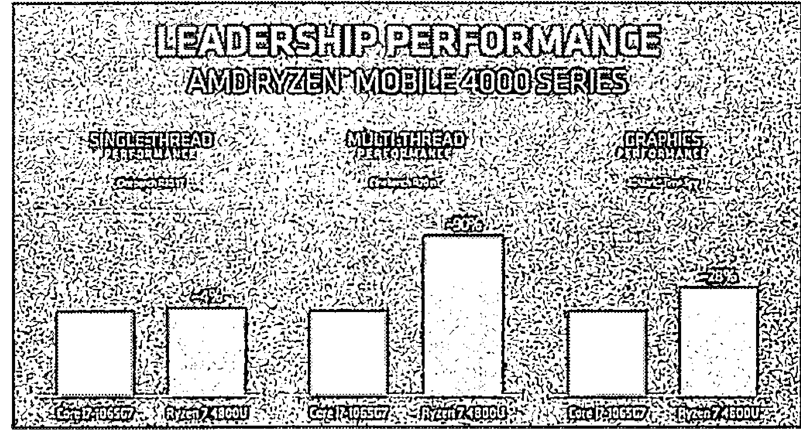

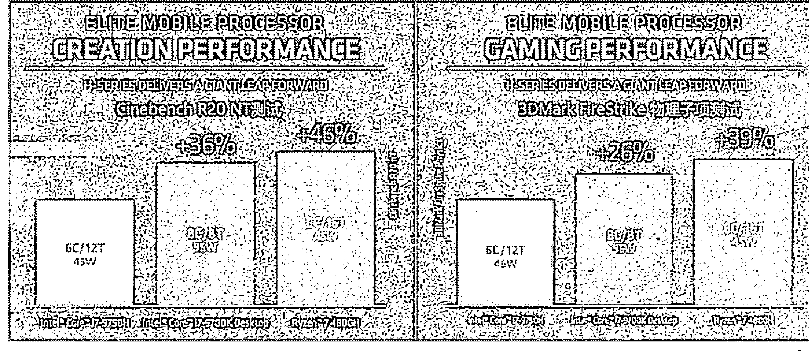

#### 速龙3000低端补刀

除了移动锐龙4000系列以外，AMD此次还发布了全新的速龙3000系列，并参考英特尔的金牌、银牌奔腾/赛扬命名，通过速龙Silver 3050U和速龙Gold 3150U予以还击。我们可以将它们理解为第二代移动锐龙3000的缩水版，速龙Gold 3150U的规格和上代锐龙3 3200U非常接近，而速龙Silver 3050U的定位则更低，双核CPU与Vega 2 GPU的组合，并不比最新的银牌赛扬强多少（表3）。

考虑到如今不少搭载第一代移动锐龙（如锐龙5 2500U）的笔记本已经跌破了3000元，搭载这些速龙3000的新品除非售价更低，否则并不值得注重体验的用户买单。

表3：AMD移动速龙3000系列规格对比
| 型号 | 速龙Silver 3050U | 速龙Gold 3150U | 锐龙3 3200U |
| :--- | :--- | :--- | :--- |
| 制程工艺 | 14nm | 14nm | 14nm |
| 默认TDP | 15W | 15W | 15W |
| 可调TDP | 12W~25W | 12W~25W | 12W~25W |
| 核心/线程 | 2C/2T | 2C/4T | 2C/4T |
| 基础频率 | 2.3GHz | 2.4GHz | 2.6GHz |
| 加速频率 | 3.2GHz | 3.3GHz | 3.5GHz |
| 二级缓存 | 1MB | 1MB | 1MB |
| 三级缓存 | 4MB | 4MB | 4MB |
| 核芯显卡 | Vega 2 | Vega 3 | Vega 3 |
| 显卡频率 | 1100MHz | 1000MHz | 1200MHz |
| 内存支持 | DDR4-2400MHz | DDR4-2400MHz | DDR4-2400MHz |

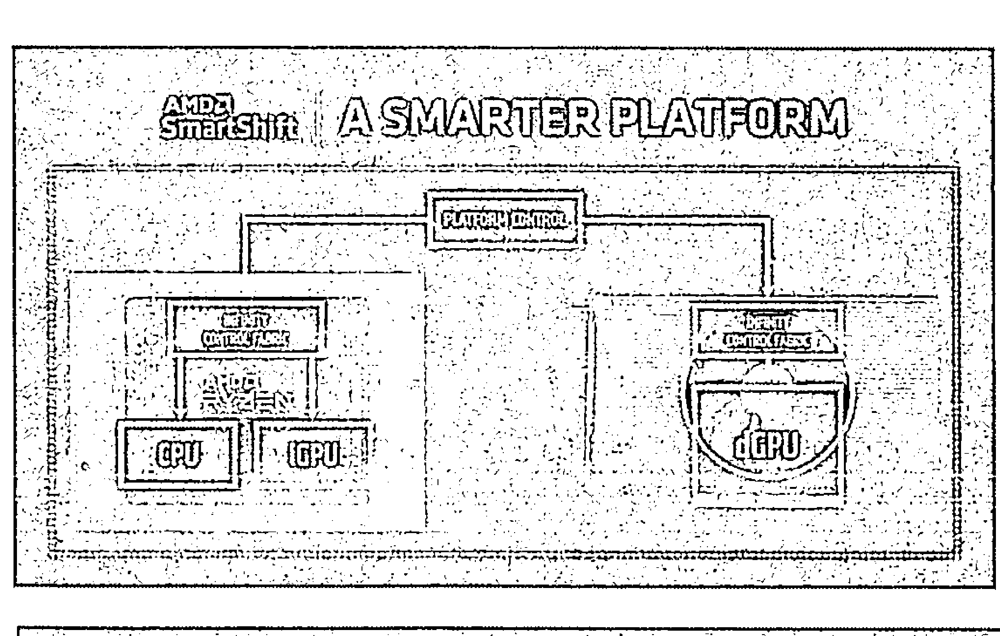

#### 更强移动独显问世

虽然2019年已经有不少搭载第二代移动锐龙的游戏本上市，但它们的市场反响却表现平平。一方面是锐龙7 3750H的性能与同级别的第九代酷睿i7-9750H还有一定的距离，另一方面就是AMD没有拿得出手的移动版独显，现有的Radeon RX500系列性能一般，而AMD处理器和英伟达独显的搭配却又显得怪怪的。

在CES 2020中，AMD终于针对游戏本市场祭出了新一代的Radeon RX 5700M和RX 5600M独显（早前还发布过RX 5500M），它们的规格与桌面版的RX 5700和RX 5600相似，性能足以媲美英伟达同级别的RTX20系列独显。在与移动锐龙4000H系列处理器搭配时还能借助SmartShift技术统一协调管理处理器和独显的功耗分配（图12）。可以预见，2020年，移动锐龙4000H+RX 5700M / RX 5600M的组合，会成为高端游戏本市场中的另一道靓丽风景（图13）。

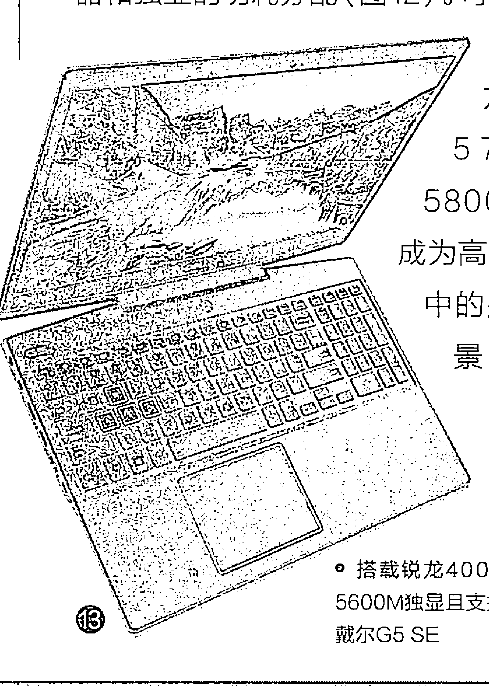

#### 小结

总之，凭借7nm工艺和Zen 2架构的双重优势，AMD移动锐龙4000系列在性能上实现了质的飞跃，其单线程性能足以媲美英特尔10nm版本的第十代酷睿Ice Lake，而多线程性能则“英雄无敌”，集成的Radeon Graphics核显性能也要领先于锐炬Plus核显，足以对英特尔现有的移动平台（第十代酷睿U系列、第九代酷睿H系列）保持压制，其续航表现也要远远超过上一代锐龙笔记本（图14）。如果今年上市的锐龙4000系列笔记本依旧可以保持过去的性价比，英特尔在移动战场的霸主地位将岌岌可危。

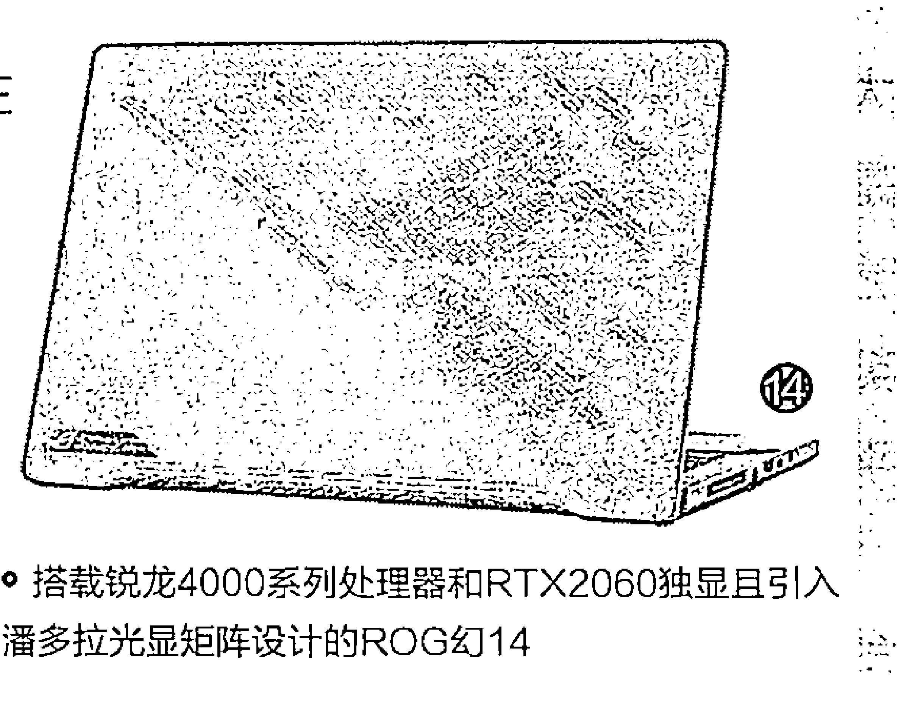

电脑爱好者 2020年合订本(一)

特别话题

### 防守反击
#### 英特尔新独显新生态即将来袭

AMD新一代移动锐龙4000可以让轻薄本品尝到8核心16线程，并赋予游戏本挑战酷睿i9的硬实力，一时间风景独好。然而，面对竞争对手的猛烈攻势，作为笔记本领域的传统霸主，英特尔自然要予以坚决的回击。于是，我们便看到了首款基于Xe架构的独立显卡、下一代Tiger Lake移动平台、即将突破5GHz大关的游戏本以及梦幻般的双屏笔记本。

#### Xe架构显卡来势汹汹

提起独立显卡，相信很多玩家只认识英伟达GeForce和AMD Radeon品牌。实际上，英特尔也曾经是独显俱乐部的成员，早在1998年该公司就曾推出过i740独立显卡，只是英特尔后来更加看重芯片组整合GPU的发展趋势，并一不小心成为了整个显卡市场的霸主。这里的“霸主”指的不是性能，而是最高的占有率，毕竟如今几乎每一颗酷睿、奔腾、赛扬处理器内都集成着一个核芯显卡。

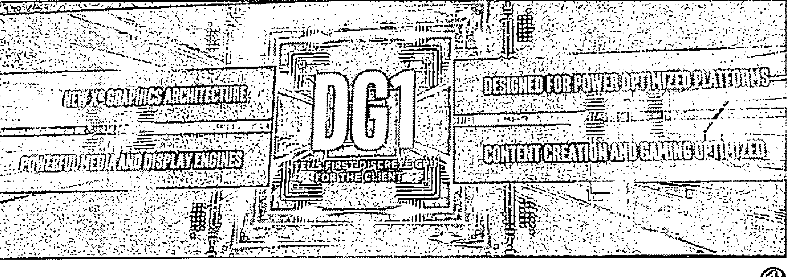

在本届CES 2020上，英特尔正式发布了代号为“DG1”的消费级独立显卡(图1)，它基于全新的“Xe”GPU架构设计，集成强大的媒体与显示引擎，专为功耗优化平台而设计，并针对游戏和内容创作进行优化。据悉，Xe架构将被分为三个级别——Xe HPC、Xe HP及Xe LP，性能和功耗依次降低。包括DG1在内，未来笔记本领域所用的GPU都将隶属于Xe LP架构(图2)。


如果不出意外，英特尔下一代“Tiger Lake”平台将首先整合Xe架构的核芯显卡。需要注意的是，新一代核芯显卡虽然也采用Xe架构，但它并不是DG1哦，后者将以独立显卡的身份首先入驻笔记本体内，其定位和性能与现有的GeForce MX250接近，而且功耗更低。

#### Tiger Lake平台抢先亮相

代号为“Ice Lake”的第十代酷睿处理器首次大规模商用最新的10nm工艺，而“Tiger Lake”则是“Ice Lake”的接班人，它将采用更新的10nm+工艺，并以“第十一代酷睿”的身份呈现在世人面前。英特尔对该平台寄予厚望，称要靠它“重新定义移动平台”(图3)。


○ 英特尔将在2020年主打的三套低功耗平台，分别为第十代酷睿Ice Lake、引入Foveros 3D封装技术的Lakefield以及本文涉及的Tiger Lake

简单来说，Tiger Lake是专门针对轻薄本和二合一设备定制的低功耗酷睿处理器平台，它将被划分为酷睿i3、i5和i7三大序列，CPU部分采用全新的Willow Cove架构（对比Ice Lake的Sunny Cove架构），GPU部分则升级到了Xe架构（对比Ice Lake的Gen 11架构），并集成Willow Cove架构的缓存子系统和全新的Xe图形引擎，内存控制器也升级到了LPDDR5。根据英特尔的官方数据，Tiger Lake的AI性能将是Ice Lake的2倍以上，图形性能提升幅度更是高达2倍以上，并首次在笔记本平台引入对Thunderbolt 4的支持。

50 | 电脑爱好者 2020年合订本(一)分成Tiger Lake-U(15W)和Tiger Lake-Y(9W)，取代现有的Ice Lake平台中的i5-1035G7和i5-1030G7等产品线(图4)。

Tiger Lake将升级Willow Cove CPU架构，其IPC性能较Ice Lake上的Sunny Cove CPU架构要再提高10%。正如前文所述，Tiger Lake集成的GPU也将换成Xe架构的Gen12核芯显卡，它与DG1独显同宗同源，性能将大幅领先现有最强的锐炬Iris Plus 64核显，理论上也可以媲美AMD最新发布的移动锐龙7 4800U集成的Vega8。

除了新一代CPU和GPU带来的性能增益外，Tiger Lake还将重点提升AI能力。据悉，该平台将通过DL Boost机器学习加速、Xe图形架构、低功耗加速器(Low Power Accelerators)组成全新的AI引擎(图5)，可以胜任深度学习和超算市场。此外，Tiger Lake将继续支持Wi-Fi 6并集成下一代Thunderbolt 4接口，从而在整体性能和功能层面实现巨大的飞跃。

在性能大幅提升的同时，Tiger Lake的核心面积控制得也很好，英特尔在CES 2020现场展示了基于Tiger Lake-Y平台设计的完整PCB主板(图6)，只比手掌大不了多少，这意味着基于该平台打造的超薄本和二合一设备可以做得更轻薄，或是塞进更大容量的电池。

从英特尔目前的规划来看，其已经不再过于关注绝对的CPU和GPU性能，而是在制程工艺、封装技术(如Foveros 3D)、核心架构、内存存储、互连、安全和软件这六大支柱加持下的系统级应用和各项新技术的融合。就拿Tiger Lake主打的全新AI引擎为例，AMD暂时就没有相匹配的解决方案，所以在深度学习的应用领域，哪怕AMD移动锐龙4000系列再强也难以威胁到英特尔的固有地位。

可惜，Tiger Lake暂时只处于PPT阶段(图7)，其实际的上市时间至少要等到今年暑期。换句话说，在这个时间节点之前，AMD移动锐龙4000U系列的日子将相当“滋润”。

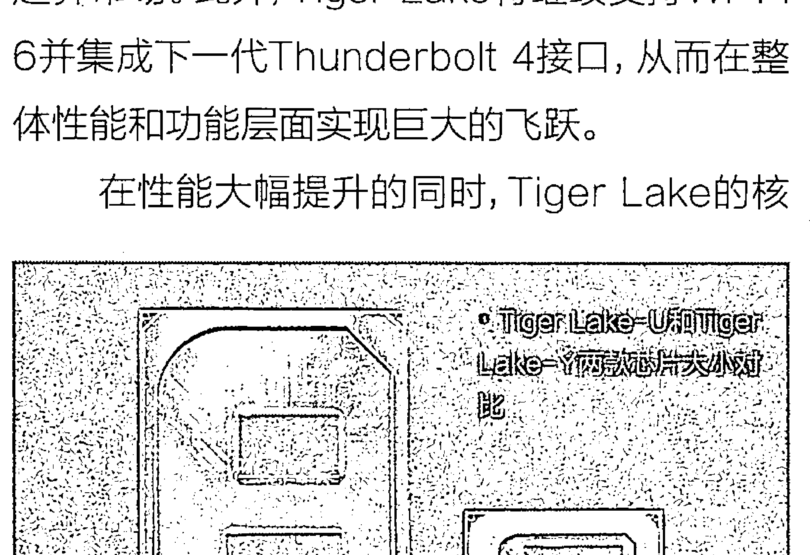

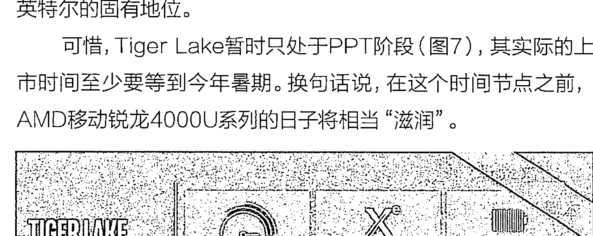


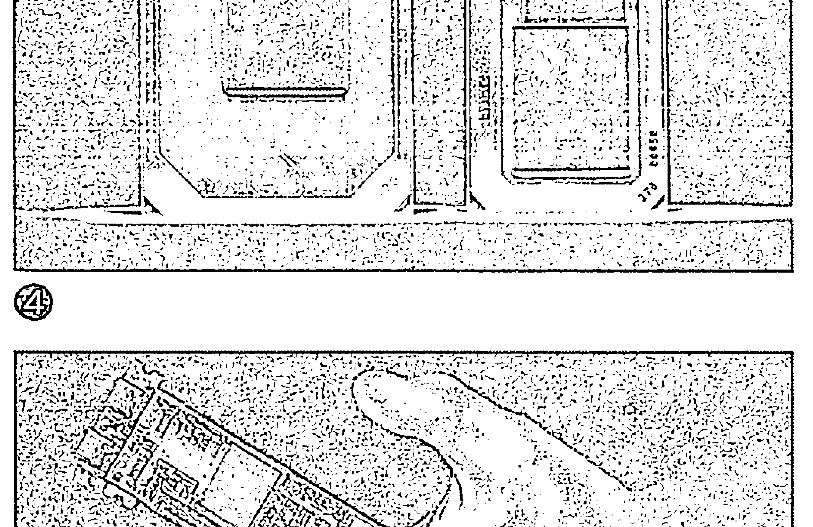

#### 游戏本迈过5GHz门槛

CFan曾在2019年第11期《九代酷睿遇到GTX16独显 新一代游戏本值得买吗》一文中详细解读过代号为“Coffee Lake Refresh-H”的第九代酷睿平台。作为九代酷睿中的当家花旦，i7-9750H(6C/12T)的最高睿频加速频率为4.5GHz，更高端的i9-9880H(8C/16T)也只有4.8GHz，唯一触碰到5GHz天花板的就只有“皇帝”级别的i9-9980HK(8C/16T)。

在CES 2020中，英特尔宣布了代号为“Comet Lake-H”的第十代酷睿H系列标压高性能移动版，其具体的上市时间大约会在今年4月之后。终于，继轻薄本后，游戏本很快也可以用上第十代酷睿处理器了。

###### 特别话题

英特尔并没有公布有关Comet Lake-H平台的更多消息，只知道它的最高规格为8核心16线程，并首次在移动级处理器(包括酷睿i7)中引入超过5.0GHz的睿频加速频率(图8)！

从网上陆续曝出的消息来看，H系列的第十代酷睿与第九代酷睿规格相似，比如第十代酷睿i5-10300H依旧是4核心8线程，而i7-10750H还是6核心12线程，与现有的第九代酷睿i5-9300H和i7-9750H一样。

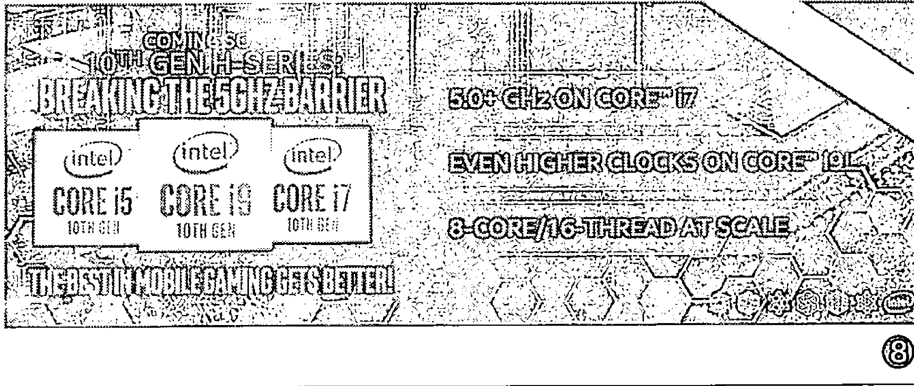

因此，我们可以将Comet Lake-H视为上代Coffee Lake Refresh-H的超频版，通过更高的主频带来性能上的增益。那么，5.0GHz的第十代酷睿i7能否战胜AMD旗下8核心16线程的锐龙7 4800H？主频和更多核心究竟谁更主要？这个话题还是留到实物上市后我们再来进行分解吧。

#### 全新的雅典娜计划

经常关注CFan的朋友肯定听说过“雅典娜计划”(Project Athena)，自2019年初英特尔推出这项计划以来，迄今为止已经有25款笔记本通过了雅典娜计划目标规范1.0和关键体验指标认证(图9)。据英特尔透露，2020年还会有大约50款使用Windows和Chrome操作系统的设备加入这个大家庭，并在CES 2020期间公布了全新的针对新兴双屏幕折叠设计的笔记本目标规范。

2019年，以华为Mate X、三星Galaxy Fold和MOTO Razr为代表的折叠屏手机轰动了整个世界。正所谓风水轮流转，2020年将轮到折叠屏笔记本震惊天下了。实际上，2019年微软发布的Surface Neo就已经算是折叠屏笔记本的预演了(图10)。没想到CES 2020上亮相的折叠屏笔记本更加惊艳，英特尔、联想和戴尔都展示了自家的折叠屏笔记本的原型机或产品。

先来看看英特尔带来的“Horseshoe Bend”(马蹄弯)，这款产品采用了可折叠的柔性OLED屏幕，体型接近12英寸产品，当屏幕展开后可以获得接近17英寸的视野，既可当做单屏显示器，也可作为双屏设备使用(图11)。Horseshoe Bend将搭载Tiger Lake-Y平台，采用无风扇的静音设计。

联想ThinkPad X1 Fold采用13.3英寸4:3比例的柔性OLED屏幕，折叠屏幕后尺寸减半，它搭载了英特尔Lakefield平台处理器，屏幕铰链经过了3万次折叠测试(图12)。戴尔则展示了Concept Ori和Concept Duet两款原型机。


对这款产品感兴趣的朋友可以参考本刊2019年第23期《树立新标杆 浅析微软Surface系列新品》一文。

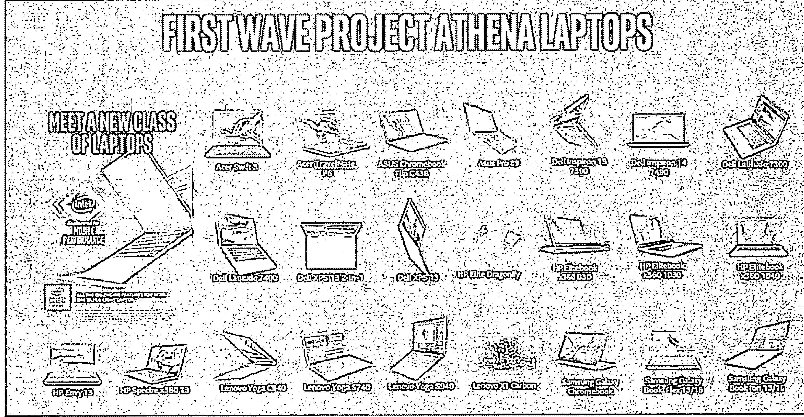

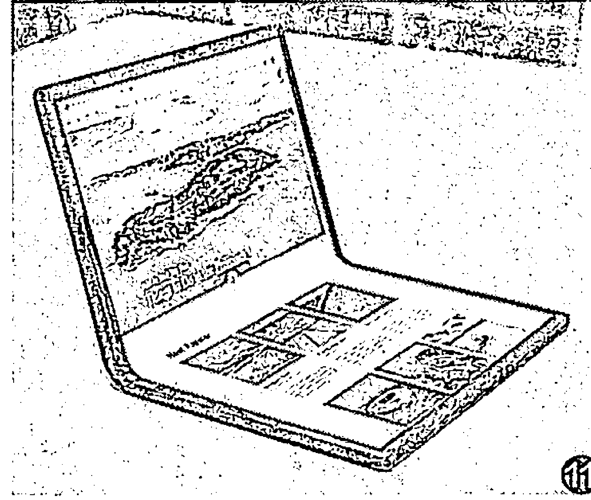

其中Concept Ori采用了和ThinkPad X1 Fold相似的设计，都是13英寸可折叠的柔性屏幕，而Concept Duet的设计则与Surface Neo接近，是由两块13.3英寸屏幕通过传统铰链拼接而成，双屏中间的转轴铰链会破坏整体感(图13)。但是，无论Horseshoe Bend、ThinkPad X1 Fold还是Concept Ori，在屏幕中间也存在较为明显的折痕，同样存在一点点瑕疵。除了这些偏概念的双屏或折叠屏新品外，雅典娜计划家族还迎来了两款通过了雅典娜计划认证的Chromebook笔记本，它们分别是华硕Chromebook Flip(C436)和三星Galaxy Chromebook Flex。其中，Chromebook Flip号称是“市场上最薄、最轻的Chromebook”，它在13英寸镁合金外壳里塞进了14英寸的NanoEdge触控翻转屏幕，搭载第十代酷睿处理器，内置全指向四声道扬声器，兼容USI手写笔，并集成指纹传感器，重量只有1kg左右(图14)。三星Galaxy Chromebook Flex采用了13.3英寸可触控翻转的AMOLED材质屏幕，厚度仅有9.9mm，重量约为1.16kg。该产品同样搭载第十代酷睿处理器，并主打支持无线充电功能的触摸板，平时可以将(支持无线充电的)手机、耳机放在触控板上，看完一部电影后电量也就充满了(图15)。

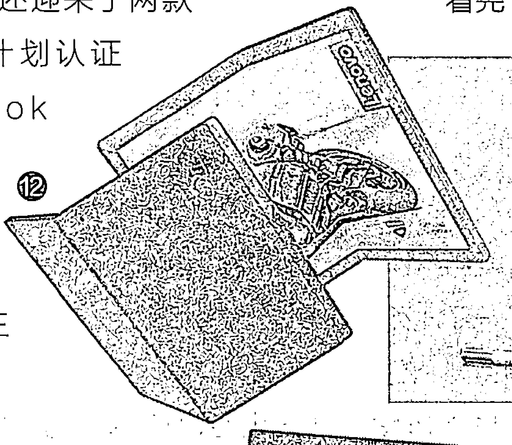

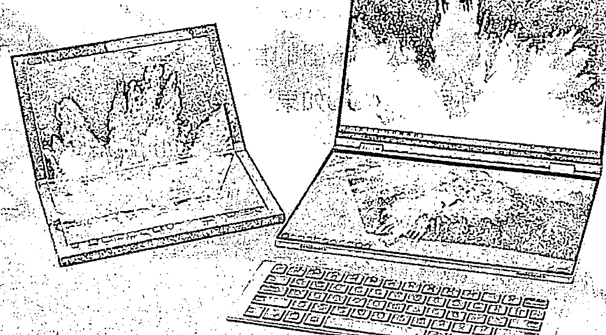

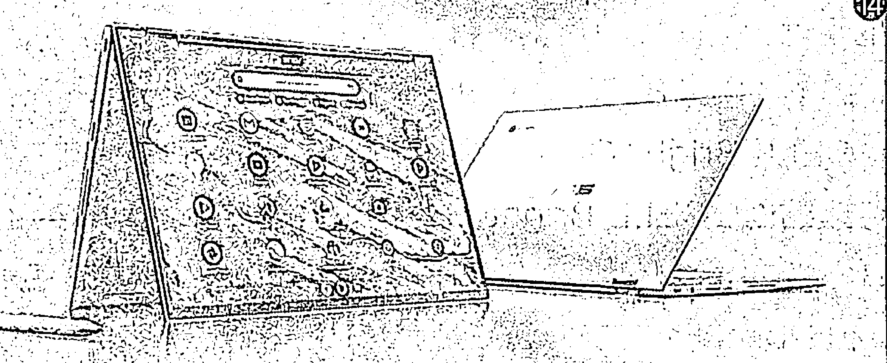

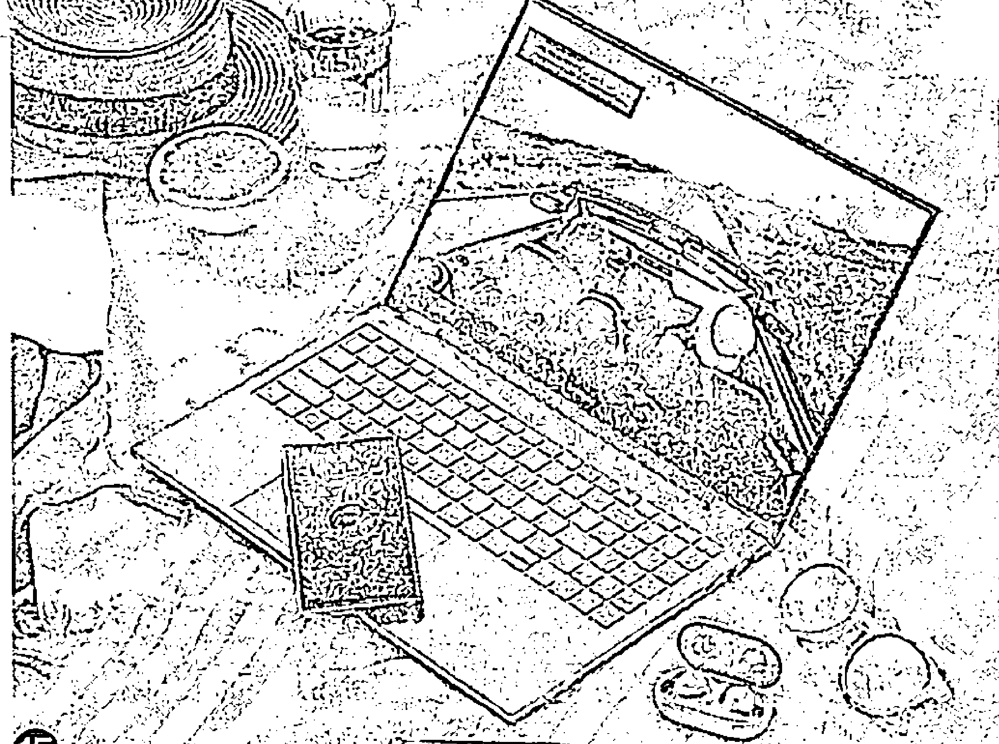

#### 小结

和AMD的蓄力反击相比，英特尔在CES 2020上的态度更像是不计较一城一地的得失，并不急于参与到8核心16线程的游戏中来，而是放眼未来，并携手更多合作伙伴完善PC生态。比如，第十代酷睿(H系列)能在14nm工艺的基础上就突破5GHz大关，让我们看到了英特尔10nm乃至未来7nm的无尽潜力；Tiger Lake平台和Xe架构显卡不仅限于性能更强，它们携手低功耗加速器组成的AI加速引擎，也更符合未来端侧AI运算的发展潮流；雅典娜计划四处交朋友，有基于微软Windows 10X系统的双屏折叠本，也有预装谷歌Chrome系统的Chromebook，在设计和体验上同样引领未来。

但是，上述的一切，都是需要更久时间的酝酿(量产时间较晚)，以及消费者投入更多的预算才能享受(贵)。至少在6000元以内的主流价位轻薄本和游戏本市场，2020年注定要被AMD移动锐龙4000系列抢走不少风头，而我们也希望英特尔能加以重视，从而终结被网友戏称的“挤牙膏”策略，让每一代酷睿平台的升级都能带来性能上的飞跃。

#### 智能手机新技术前瞻

除了笔记本电脑，以智能手机为代表的移动设备也成为了CES 2020展会中的一道靓丽风景。抛开一些常规性的参展产品不谈，本文我们主要还是汇总一些可能引领未来趋势的产品和技术。

##### 旗舰CMOS不再限于索尼三星

在手机的主摄传感器(CMOS)中，能被称为旗舰级的型号代表都是4000万或更高像素的型号，比如4000万像素的索尼IMX600(1/1.7英寸)、4800万像素的IMX586和三星ISOCELL Bright GM1(1/2.0英寸)、6400万像素的ISOCELL Bright GW1和IMX686(1/1.72英寸)以及1.08亿像素的ISOCELL Bright HMX(1/1.33英寸)。
经常关注手机圈的朋友可能发现了一个问题，为啥这些旗舰级传感器中没有看到OmniVision(OV，豪威)的身影？要知道早些年OV品牌的传感器可占据着智能手机领域的小半江山呢。


好消息是，OV终于在CES 2020中发布了旗舰级4800万像素CMOS——OV48C（图1）。与索尼和三星同级别传感器相比，OV48C的传感器尺寸达到了惊人的1/1.3英寸，已经和1.08亿像素的ISOCELL Bright HMX持平，可以将“底大一级压死人”的优势发挥到极致，并支持8K视频录制。同时，这颗传感器的单位像素面积也达到了1.2微米，在弱光条件下它可使用4合1像素技术输出1200万像素的照片或录制2K/4K视频，此时单位像素面积相当于2.4微米！
按照惯例，OV同等级传感器的售价普遍会低于索尼和三星，所以拥有更好素质的OV48C如果还能搭配更低的采购价格，应该会被更多主流价位手机所列装，成就更好的拍摄底蕴。

##### 看不见的潜隐式摄像头

为了实现更高的屏占比，手机厂商们都在想办法隐藏前置摄像头，于是才有了旋转摄像头、升降摄像头和屏下摄像头等解决方案。既然都知道摄像头的开孔会影响整体观感，为什么就没有人想到将后置摄像头给藏起来呢？一整块光滑的后盖玻璃不是更好看吗？
一加在CES 2020上发布的OnePlus Concept One就是业内第一款可以将后置镜头隐藏起来的手机（图2），它通过全新的电致变色技术带来了开创性的“潜隐式后摄”解决方案，平时黑色的玻璃镜头与周围的整块玻璃融为一体，看不到任何摄像头的开孔。当你启动相机程序后，后摄镜头表面的玻璃则能在0.7s内从全黑变透明，使镜头显露（图3）。


最关键的是，Concept One的“潜隐式后摄”技术几乎不消耗电量，而且其玻璃板非常薄，单块仅有0.1mm，合计也不过0.35mm。当镜头显露后这块玻璃还能作为偏光镜使用，可以帮助用户在强光下获得更清晰、更精细的照片。
可惜，OnePlus Concept One暂时还处于概念阶段，一加方面表示目前正在努力完善这项全新的技术，希望在未来能够进行大规模量产。

##### 联发科再发中端5G SoC

为了提升在5G时代的竞争力，联发科在CES 2020中发布了第3款5G SoC——天玑800(MT6883)(图4)，其规格低于旗舰级的天玑1000和偏高端的天玑1000L，和三星Exynos 980、高通骁龙7/6系列和麒麟8系列定位相近(表1)。就规格而言，天玑800可谓喜忧参半。喜的是，它同样集成和天玑1000系列相同的Mali-G77 GPU，只是计算单元从天玑1000L的7个再次下降到4个，即Mali-G77MP4。可惜的是，天玑800的CPU不再是ARM最新的Cortex-A77架构，而是上一代Cortex-A76，由4个2.0GHz的A76核心和4个2.0GHz的A55核心构成。此外，天玑800集成独特的4核架构APU3.0，由3种不同类型的核心组成，可提供2.4TOPs的AI性能。从已知的参数来看，天玑800的CPU核心较旧而且主频太低，它的CPU性能很难超过现有的骁龙765系列和Exynos 980，其主要的竞争对手应该是高通下半年推出的骁龙6系5G SoC，所以大家不要对它的性能抱有太大的期望。

表1：已发布中端5G SoC规格对比

| 芯片型号 | 骁龙765系列 | Exynos 980 | 天玑1000L | 天玑800 |
|----------|-------------|------------|-----------|----------|
| 制程工艺 | 三星7nm+EUV | 三星8nm | 台积电7nm | 台积电7nm |
| CPU大核 | 1×Kryo 47 (2.4GHz)<br>1×Kryo 47 (2.2GHz) | 2×A77 (2.2GHz) | 4×A77 (2.2GHz) | 4×A76 (2.0GHz) |
| CPU小核 | 6×Kryo 475 (1.8GHz) | 6×A75 (1.8GHz) | 4×A75 (2.0GHz) | 4×A55 (2.0GHz) |
| GPU型号 | Adreno 620 | Mali-G76MP5 | Mali-G77MP7 | Mali-G77MP4 |
| AI算力 | 5.5TOPS | 5TOPS | 4.5TOPS | 2.4TOPS |
| 5G模式 | SA/NSA双模 | SA/NSA双模 | SA/NSA双模 | SA/NSA双模 |
| 5G频段 | Sub-6毫米波 | Sub-6 | Sub-6 | Sub-6 |
| 载波聚合技术 | 不支持 | 不支持 | 支持 | 支持 |
| 最高下行速率 | 3.7Gbps | 2.55Gbps* | 4.7Gbps* | 不明 |
| 最高上行速率 | 1.6Gbps | 1.28Gbps* | 2.5Gbps* | 不明 |
| 备注 | - | Exynos 980在4G-5G双连接峰值上行/下行速率分别为3.55Gbps和1.38Gbps；天玑1000的最高上下行速率为4.7Gbps和2.5Gbps，暂时还查不到天玑1000L的详细性能参数 | - | - |

##### 其他值得一提的产品

在本届CES 2020中还出现了不少颇具亮点的移动新品，比如Pico Neo 2 VR一体机，这款搭载骁龙845的VR设备可以带来更出色的沉浸式娱乐体验；华米科技发布了更加专业且续航持久的户外智能手表Amazfit T-Rex；联想推出了搭载高通骁龙8cx 5G平台的Yoga 5G；Razer展示了更酷的分体式手柄；海信带来了全球首款彩色水墨屏手机(图5)，屏幕刷新速度较黑白电子墨水屏幕快了很多，使用体验明显提升，堪称电子书发烧友的绝配。

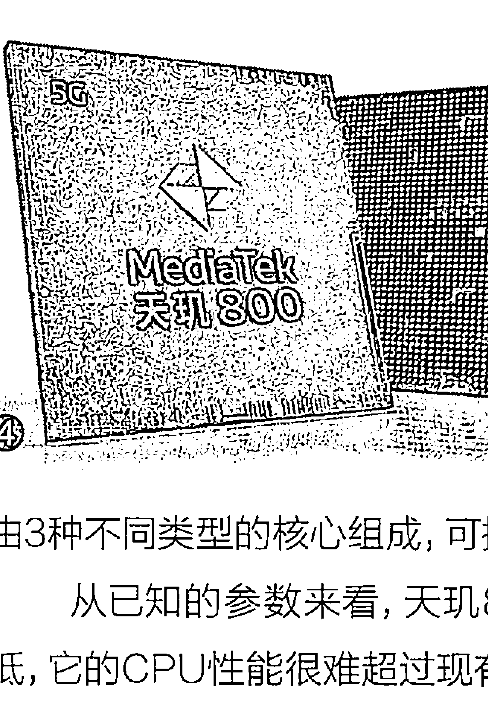

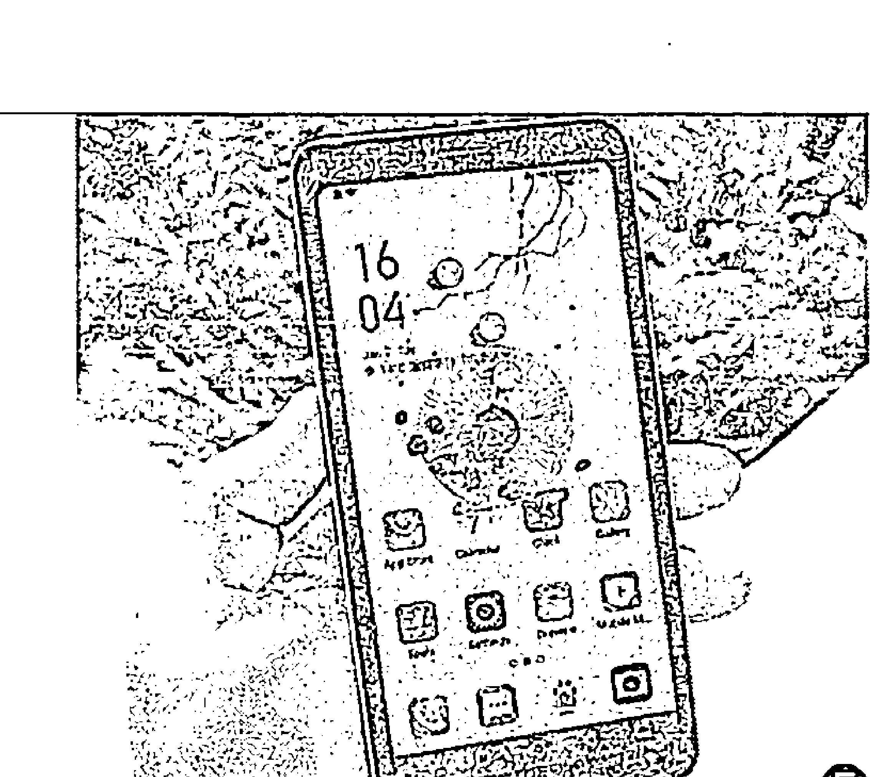

#### 小结

和PC产业相比，上述移动设备和相关技术并非是CES展会的主力，如果你想第一时间了解2020年手机、VR/AR和可穿戴设备的潮流趋势，还是需要关注将在2月份举办的MWC 2020世界移动通信大会，而CFan也会在第一时间为大家带来详尽的报道，敬请期待。

#### DIY 超时代来临 感受CES 2020

每年初的CES展会堪称一年内IT、数码消费市场的风向标，特别是21世纪20年代的第一场CES，其重要意义更是不言而喻。在前一部分，我们主要总结了CES 2020上的各种移动设备，下面我们再来梳理一下桌面产品市场的相关产品与技术，看看未来一年乃至新的十年中，DIY和台式机领域会有什么变化吧。

##### 核心部件AMD独秀

在最重要的核心部件厂商中，英特尔的重点在移动平台上，英伟达也没有新产品和消费级的新技术曝光，AMD成了唯一发布桌面级重要产品的厂商。

AMD这次发布的锐龙Threadripper（线程撕裂者）3990X（图1）拥有极具冲击力的64核心128线程。它首次在消费级领域引入了百线程产品（虽然从能力和价格上看，它肯定会更多地出现在专业级电脑而非消费级电脑中），在可见的未来几乎是完全没有对手的存在。超多的线程使其成为3D动画、带有光线跟踪的视觉特效（VFX）以及8K视频编码等数据内容创作者的顶级解决方案。

在线程数量的绝对优势下，即使在未对AMD Zen架构优化的软件中，其表现也可以非常出色。例如在Cinebench R20.06测试中，其得分高达25399分；在用MAXON Cinema4D渲染器进行3D光线追踪时，其性能比之前最强的Threadripper 3970X又提升了51%。

本次发布会上，存在感最低的AMD的Radeon RX 5600 XT显卡（图2）反而是最值得主流DIY用户关注的产品。它的核心规格与RX 5700相同，只是降低了频率，缩减了显存，因此


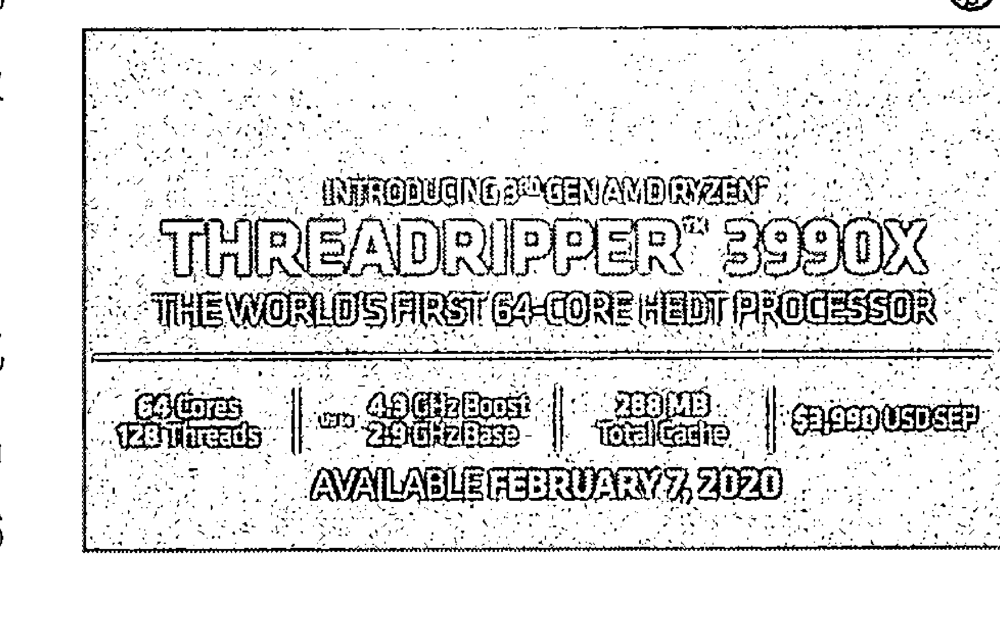

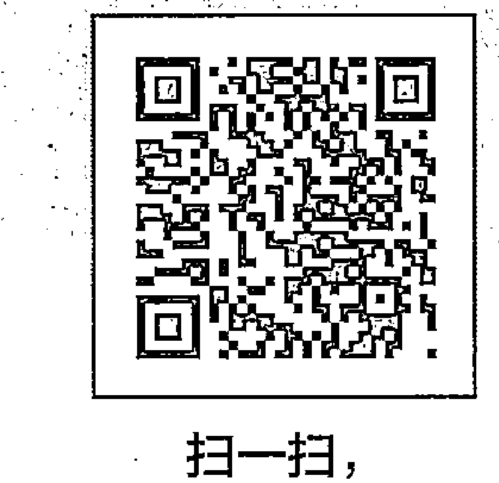性能表现很好，拥有与2000元级别对手一战的能力。其核心频率降低到了目前主流显卡中很少见的程度，而相关显卡的散热配置却基本都没有缩水，这为超频提供了更大的空间，有经验的超频玩家一定会对它更有兴趣。

除了正式展示的这款桌面级核心装备，在CES 2020期间，AMD高层也正式确认了光追版Navi显卡核心（RDNA2架构）的存在（图3）以及Zen3核心的高效能，并且确定都会在年内推出。相对于可以正式展示、公开发布的产品，这两款新核心的推出日期当然要晚得多，不过预计也就在2020年下半年，相信大家还是等得起的。

#### 引人注目的显示器

在CES 2020展会期间，如果说哪一个品类的桌面级产品表现最抢眼，那么非显示器莫属。从产品上看，有近期刷新率突破200Hz后便直奔360Hz的电竞显示器，也有Mini LED大规模铺开的普及态势；从技术上看，Micro LED已经“蠢蠢欲动”，同步防撕裂技术的分级、与HDR的结合等已成趋势。

#### 刷新率飙升 同步技术分级

在目前最热的电竞显示器领域，刚推出的280Hz/300Hz的显示器，马上就被CES上展示的360Hz刷新率显示器——华硕ROG联合英伟达发布的ROG Swift 360Hz（图4）超越。这是一款24.5英寸显示器，分辨率为1920×1080，使用DP 1.4和HDMI 2.0接口。目前只知道它采用友达光电提供的面板，具体类型没有透露。这款显示器的每帧延迟低至2.8ms，几乎已经和液晶面板响应时间相同。

ROG Swift 360Hz还首次搭载了英伟达的G-Sync Esports同步技术（图5）以适应这样的超高刷新率，这一标准认证也将适配未来的其他超高刷新率显示器，而这些显示器将被称为“G-Sync Esports Displays”。此外之前的G-Sync HDR预计会更名为G-Sync Ultimate认证，而支持Adaptive-Sync或FreeSync的显示器，在兼容G-Sync技术后会获得名为G-Sync Compatible的认证。

与英伟达类似，AMD也在CES上发布了新的FreeSync认证标准——FreeSync Premium Pro（图6），要求显示器至少具备120Hz刷新率、1080P分辨率以及低帧率补偿技术（LFC），并且支持HDR。此外还有FreeSync Premium和FreeSync两个级别，前者减少了对HDR的要求，后者则是最基本的入门级认证，不需要使用低帧率补偿技术，对刷新率也没有要求。未来购买显示器除了尺寸、分辨率、刷新率等基本参数外，看来还要再加上一个同步技术认证标准了。

#### 背光革新 Mini LED涌现

大量的Mini LED显示器成为了本次CES 2020上的一大亮点，其型号之多甚至会让人感觉已经普及在即。其实这也不奇怪，因为它实际只是在背光层采用更多更小的LED灯作为背光源（图7），并且将其分成了很多可独立控制亮度的背光区域，前者在技术上早已不是问题，后者则只需要控制芯片和软件成熟即可快速商业化。

虽然从物理构造上看，Mini LED似乎和一般的LED没有太大区别，但更灵活的亮度控制却带来了显示能力的大幅进化。一般的Mini LED显示器至少有数十到数百个可独立控制亮度的区域，而华硕ROG Swift PG32UQX这样的最新高端产品可控亮度区域达到1152个，戴尔UP3221Q（图8）甚至拥有2000个可控亮度区域。

那么，独立控制亮度到底有何好处呢？首先就是可以在同一幅画面中通过亮度控制让阴暗的地方更黑、明亮的地方更亮（图9），画面震撼感倍增，更便于实现HDR功能。而且这种有背光变化参与的明暗差异，实际上与现在的所谓动态对比度类似，可达到数十万乃至数百万、上千万：1。而在传统液晶显示器中，因为每一幅画面内背光亮度永远是统一的，所以在同一幅画面中最高亮度与最低亮度区域的对比（静态对比度）只有1000：1左右。

其次则是一些游戏中并不需要特别强调黑暗与明亮的区别，玩家反而希望尽量减少过亮与过暗的区域，以便可以看清其中隐藏的物体和敌人，此时Mini LED显示器可以对背光进行反向操作，就可以让黑暗的角落略微亮一些，明亮的区域则稍暗一些，以呈现更多的细节。

至于Mini LED的极限设计，就是索性在每个像素的色块下都部署一个可独立控制亮度的光源，实际上也就变成了Micro LED（图10）。由于这样的情况下亮度控制能力达到像素级别，因此显示能力可接近每个像素都自发光的OLED屏幕。

除了这几大趋势外，在CES 2020上有特色的显示器还有很多，例如三星的奥德赛（Odyssey）CTG9游戏显示器（图11）采用超宽曲面屏设计，尺寸达到49英寸，分辨率为5120×1440，刷新率为240Hz，支持HDR1000、FreeSync、G-Sync等技术。微星的Optix MAG342CQR则是一款34英寸的1000R曲率显示器，极大的弯曲程度让用户的最佳观看距离更近，临场感更强，而3.5K的分辨率和144Hz刷新率可满足中高端玩家的需求。

此外还有自带状态显示小屏的微星MEG381CQR、刷新率高达240Hz的便携显示器微星Optix MAG161。OLED屏幕方面则有LG、宏碁等公司的产品，其中宏碁CG552K（图12）达到55英寸，拥有4K分辨率、120Hz刷新率、4面窄边框设计，支持AMD和NVIDIA的同步刷新率技术。

#### mini主机的盛宴

英特尔的新一代NUC，特别是其中的高端产品“恶魔峡谷”（Ghost Canyon）是本次展会上最受关注的桌面电脑。它们采用第九代智能酷睿处理器，其中恶魔峡谷内置了睿频可达5GHz的酷睿i9处理器，只是外形也因此从轻盈的“掌上舞”变成了ITX尺寸（图13）。

更大的体积也让新一代恶魔峡谷的连接能力大幅提升，它有4个USB 3.1（USB 3.1 Gen2）Type-A接口、2个千兆网线端口、1个HDMI 2.0a接口、2个雷电3接口和1个3.5mm音频接口。此外它的内置电源达到了500W，不仅能安装独立显卡，还能选用RTX 2070等中高端型号，加上顶部双80mm风扇的强力散热能力，使其功能与性能达到了顶级ITX“小钢炮”机型的水平。

英特尔还宣布NUC 9的模组设计将完全开放，第三方厂商能够直接进行参考设计，估计在新的一年中，高性能mini主机将获得快速的发展。

英特尔NUC只是一个缩影，其实在CES 2020上，大出风头的桌面系统几乎是清一色的mini主机。例如一直在高性能mini主机领域耕耘的索泰推出了面向设计师的INSPIRE STUDIO（图14），内置8核酷睿i7处理器、32GB内存、512GB固态硬盘、2TB机械硬盘、RTX Super显卡，配有双网口，支持Wi-Fi 6，预装Windows 10专业版系统，性能强大，外形简洁，而价格定位应该比之前内置专业显卡的产品要低一些，更适合主流设计师。其主打极致轻薄的ZBOX EDGE系列则让人想起了之前的恶魔峡谷系列，厚度仅有28.5mm，配置却相当不俗，酷睿i5搭配64GB内存与双M.2固态硬盘，除了3D游戏性能略低，其他方面都是高端PC的水准。在索泰产品中，我们还可以看到使用AMD锐龙处理器的ZBOX NANO系列，功耗非常低，使其可以完全放弃风扇散热，成为一台全静音主机。而索泰VR GO背包则进化到3.0版本，RTX 2070显卡使其性能更强。

AMD处理器的出色表现当然不仅受到了索泰的注意，华擎同样使用锐龙处理器构建了Jupiter A320。它造型扁平，体积仅有一升，却能支持32GB内存，拥有多达8个USB接口，支持Wi-Fi 6、千兆有线网络。更有趣的是在CES 2020上，华擎并没有公布它内置的处理器类型，估计很可能是AMD新的嵌入式产品，那么其价格将具有一定的优势。

而酷冷至尊推出的NC100则直接标明是使用了开放的英特尔幽灵峡谷NUC 9模组设计，不过尺寸略有变化，可容纳更长的显卡。

#### 不想退场的机械硬盘 与新固态存储

目前的电脑中，存储系统仍然是速度最慢的配件之一，特别是机械硬盘，和其他配件的速度差距是数量级的，不过由于它较高的容量价格比，目前仍是比较重要的存储设备。在CES 2020上，希捷展示的Lyve Drive移动存储系统（图15）中，就内置了应用新技术的希捷银河机械硬盘，其中Lyve Drive移动阵列使用的硬盘采用HAMR（热辅助磁记录）技术，容量高达18TB，Lyve Drive模块化阵列则内置带MACH.2双磁臂技术的硬盘，使读写速度倍增。这两款硬盘原本为数据中心设计，Lyve Drive是希捷首次将它们投入消费级市场，让高端用户也可以体验到这些新型硬盘技术和产品。

在这两种新技术中，HAMR是用加热方式加速存储磁性单元翻转，可以提升写入速度，它使用的激光对存储单元更精确地聚焦加热，也可减小存储单元的体积，提升存储密度。而双磁臂技术则是通过两个磁臂的独立摆动（图16），创建两个数据读写通道，让硬盘速度得到倍增。

在目前更受关注的固态硬盘领域，SK海力士等公司将堆叠推到了百层以上，加上QLC、PLC等技术的引入，闪存模块容量大幅提升，数TB乃至十几TB的消费级产品已经出现。比如群联（PHISON）与Enmotus联手推出的MiDrive（图17），使用QLC与SLC搭配，在标准的M.2 2280规格下提供了高达16TB的容量。

除此之外，CES 2020上还有更多的PCIe 4.0标准固态硬盘、转接卡等产品，将固态硬盘的速度与容量都推向新的高峰。

#### 继续争奇斗艳的机箱

在每一年的CES上，创意最层出不穷的大概就是机箱了，今年也不例外，我们来欣赏两款比较典型的新机箱吧。

酷冷至尊推出的MasterBox TD500 Mesh（图18）是ATX机箱，它有黑白两色，设计既保留了高效的通风性能，又具有艺术感。前面板的菱形冲孔网使用精细网格技术，同时提供高气流、灰尘过滤、强化结构功能。钢化玻璃侧板则没有使用传统的平板方式，而是在表面切割出多道几何造型的线条，与前面板的菱形结构呼应，也让内部RGB灯效折射出迷人炫幻的光线。

迎广的B1（图19）则是异形机箱，采用同心圆环层叠设计，中间有空隙，可以帮助散热，空隙也经过了防尘处理。它附带一个垂直支架，可以竖放也可以横放，顶部（或者说侧面）为钢化玻璃。其内部可以安装两块2.5英寸的硬盘，支持最高60mm的处理器散热器，预装80mm风扇和200W电源。虽然它理论上可以安装显卡，但电源功率和高度大大限制了实际扩展能力。

#### 小小惊喜不可忽视

除了这些比较吸引眼球或者集中推出的新产品之外，CES 2020也有一些零散分散在各个厂商展台、似乎不起眼但非常有特色的产品。例如面向内容设计者的惠普的新Envy 32 AiO一体机（图20），它据称是一款挑战iMac的产品，搭载第9代英特尔酷睿i7处理器、英伟达RTX 2080显卡，拥有32GB内存和高达1TB的固态硬盘或双存储配置。它支持英伟达Studio Stack，提升了创意应用程序性能，拥有更好的工作流程管理能力。其标配4K显示器支持HDR 600，拥有98%的DCI-P3颜色范围，显示器底部内置Bang&Olufsen定制扬声器，可提供出色的声音播放效果。

微星推出的MAG系列一体式水冷散热器（图21）散热能力可达280W，是线程撕裂者3990X的好搭档。它不仅散热能力出色，而且设计巧妙，可270度旋转的水冷头便于安装和布线，性能可靠的陶瓷轴承水泵安装在冷排而非水冷头部位，减少了处理器、主板部位的振动，噪音也更低，也让这一最容易漏液的部位远离主板，即使漏液也不会直接滴落到主板上。

外形美观的TT新Toughram内存（图22）则取消了RGB灯光，代之以美观又坚固耐用的铝合金散热片，在装满内存时，其特殊设计的散热片不仅不会降低散热效果，反而能形成一体式的大型散热模块。

奥睿科的雷电3硬盘盒（图23）则是为高速M.2固态硬盘准备，高达40Gbps的传输率可满足最高速PCIe 3.0 M.2固态硬盘的需求，甚至安装PCIe 4.0 M.2固态硬盘也不会有带宽不足的问题。它的三种型号均采用厚重的金属外壳，有利于散热，其中两种还分别采用加厚金属板与鳍片，增强了散热能力，可防止M.2固态硬盘高速运行时过热、烫手。

#### 后记

热闹的CES 2020虽然落下了帷幕，但它带来的新产品与新技术将持续影响IT数码消费市场一年乃至数年，也许我们下一次购买的产品，享受的技术就是在这次展会上推出或披露的。那么，在展会上琳琅满目的展品中，你最感兴趣、希望收入囊中的是哪些呢？

#### 双屏折叠派成趋势

##### 漫谈笔记本屏幕的变化

策划|《电脑爱好者》编辑部

扫一扫，更多精彩内容立现！

在上期特别话题中，我们曾介绍了在CES 2020上露面的，引入双屏和折叠屏元素的新一代笔记本电脑。全新的设计形态，赋予了这些产品更丰富的使用场景，并有望改写传统PC的操作体验。实际上，笔记本电脑每一次的革新，都最容易从屏幕层面得到体现，而双屏和折叠屏形态，也不是什么新鲜的设计思路。只是，当软硬件生态趋于成熟时，这种形态的笔记本电脑终于不再置诸高阁，而是真正有了走进千家万户的机会。本期特别话题，就让我们聊一聊和笔记本屏幕有关的那些事儿。

##### 为什么是 展翼

能“移动”的电脑（Osborne 1）在1981年诞生，而被更多业内人士公认的第一款笔记本电脑（东芝T1100）则于1985年问世。历经30余年的沧海桑田，这种便携式的移动PC已经从“傻大个”华丽瘦身（图1），为快节奏的移动办公和生活奠定了坚实的基础。笔记本的“卖相”与其轻薄程度成正比，所以时下的新品都在追求更极致的屏占比，只为可以吸引消费者的回眸一望。然而，当你面前的几乎所有新品都拥有了相近的身材和设计，以及完全同质化的硬件配置时，还有什么元素可以刺激消费者的肾上腺素呢？没错，就是基于屏幕领域的创新。无论是触控屏、翻转屏、双屏还是折叠屏，都是足以彰显辨识度的优选元素（图2）。其中，双屏和折叠屏设计并非CES 2020上展示的那些新品的专利，早在十余年前它们就已经在笔记本领域初露峥嵘了。

#### 双面佳人

在过去的十余年间，采用双屏设计的笔记本电脑有很多，它们的形态和体验各异。首先，我们就将目光投向那些采用一大一小两个屏幕的“双面佳人”。由于版面有限，本章节无法网罗所有采用类似设计的产品，只能展示其中知名度较高的热门型号，并以双屏位置和形态为线索进行梳理。

##### 内外皆可秀：AB面双屏

于2007年问世的华硕W5Fe应该算是双屏笔记本的鼻祖，这款12.1英寸的笔记本在A面外壳部分嵌入了一块额外的320×240像素分辨率的2.8英寸显示屏（图3）。需要注意的是，这块屏幕并不支持触控，需要通过旁边的物理按钮进行操作。

W5Fe的诞生原本是为了配合微软在Windows Vista操作系统上主打的“SideShow”功能，哪怕笔记本没有开机，用户也能通过这面小小的屏幕直接播放音乐和视频，浏览相册或查看邮件（图4）。

可惜，W5Fe的外屏无法直接读取硬盘中的数据，需要我们在电脑开机状态，通过Vista系统中的SideShow选项将所需的文件和信息保存到外屏自带的1GB存储空间中，实用性并不理想。要知道，当年随便买一台MP4也能胜任类似的任务，何必为功能重叠的笔记本付出更多的资金呢？

因此，引入SideShow功能的笔记本仅限华硕W5Fe、东芝## 与键盘共舞：BC面双屏

Portege R400、富士通Q2010和LG Z1等极少数型号，而它们也没能掀起太多的波澜就被湮灭在历史的尘埃中。

2012年，华硕借着超极本的东风，推出了全新的“TAICHI”（太极）系列产品线，包括TAICHI21（11.6英寸）和TAICHI31（13.3英寸）两个家族成员（图5）。TAICHI系列超极本最大的特色，就是在A面外壳内嵌入了一块与B面屏幕同尺寸的触控显示器，在合盖状态下可以扮演平板电脑的角色，再结合微软首次针对触控大幅优化的Windows 8系统，该系列双屏幕笔记本在当时还是吸引了不少发烧用户的关注。

可惜，TAICHI系列超极本售价高昂，而且正反面双屏幕的设计需要付出更高的物料成本。同样在2012年，联想发布了全球首款采用360°翻转屏幕设计的ideapad Yoga系列（图6），只需一块触控屏幕，配合独特的可360度翻转的转轴设计就能实现远超TAICHI系列的体验和便携性，堪称所有AB面双屏设计的“终结者”，能在笔记本、帐篷、演示（直立）、平板四大使用模式之间随意切换，已经成为如今所有采用翻转屏幕设计的二合一设备的标签。

那么，在联想Yoga系列出现之后，在A面添加副屏的设计就真能扫进垃圾堆了吗？反正联想并不是这样想的，在今年的CES 2020大展上该品牌就带来了全新的双屏笔记本电脑——ThinkBook Plus，这款产品在A面嵌入了一块10.8英寸的电子墨水触控屏（图7），在没有开机时也能通过这面墨水屏接收重要的通知信息，还能配合手写笔随时进行输入和备注，在开会时带上ThinkBook Plus就无须额外携带纸质笔记本了，对商务用户的吸引力很大。要知道，电子墨水屏耗电量极低、可以独立使用的特性，让ThinkBook Plus在仅使用A面墨水屏时的续航时间达到了相当恐怖的水平。

###### 扩展阅读：Table笔记本

在以Yoga为代表的翻转触控本上市之前，笔记本领域还有一种触控屏幕可以旋转的品类，代表型号就是ThinkPad品牌旗下的Table系列（图8）。只是，这种旋转结构的受力点将承担极大的损耗压力，在寿命、便携和体验方面都不如可以360度翻转的铰链结构，所以在很早以前就淡出了市场。

视野，在C面键盘的上方也嵌入了一块4.8英寸（480×272像素）的触控屏（图9）。与W5Fe是通过Vista系统SideShow功能呈现的方式不同，N7010的副屏可以作为一个独立的APP Launcher使用，我们可以将其视为一个标准的小尺寸屏幕，除了可以更加方便控制媒体回放、显示状态和启动程序以外，用户还能直接将程序拖到这个屏幕内运行（图10）。

这种在B面和C面分别配备一大一小两块屏幕设计的影响一直持续到了今天。最具代表性的新品就是2019年上市的惠普幻影精灵X以及华硕灵耀Deluxe14s（其前身是2018年推出的灵耀X Pro）。

其中，惠普幻影精灵X的第二块屏幕位置与富士通N7010相同，它在C面键盘的上方嵌入了一块6英寸1080P触控屏（图11），它可以作为独立的第二块屏幕使用，可以在玩游戏的同时查看游戏攻略，追剧的同时聊QQ微信，同时还主打实时屏幕投射功能，甚至可以切割和放大主屏幕的指定部分，比如FPS类游戏的准星部位，瞄准时瞄一眼副屏就好像打开了8倍镜效果，可以帮你更精准地射杀敌人。

华硕灵耀Deluxe14s将触控板换成了一块5.65英寸的高解析全彩辅助屏，并将其称为“ScreenPad”，它不仅可以模拟数字小键盘，还能实现类似MacBook Pro上的Touch Bar功能，比如同步打开一些办公软件的便捷工具，进行协同工作和复杂组合按键的一键式自动化控制管理，还能直接在副屏上进行微信、QQ、音乐等Windows应用的开启，不必再安装额外版本的软件，从而为用户带来更便捷的多窗口多任务使用体验，提升操作效率（图12）。

真正将B、C面一大一小双屏设计发挥到极致的，同样是来自华硕，包括2019年上市的灵耀X2 Pro（ZenBook Pro Duo， 15.6英寸设计本， 2.5kg）以及2020年推出的灵耀X2 Duo（ZenBook Duo， 14英寸轻薄本， 1.5kg），它们在键盘和屏幕之间嵌入了与主屏幕等宽的二级触控屏（图13），官方将其称为“ScreenPad Plus”，它能与主屏幕无缝交互，提供应用程序切换、添加应用程序、扩展双屏视野、主屏副屏切换、自定义多任务启动、应用切换导航和手写输入等功能（图14），无论是玩游戏时查攻略、办公同时炒股票、Adobe全家桶的快捷交互按钮，ScreenPad Plus都能给你带来接近完美的体验。

可能有朋友会问了，既然C面的副屏已经占用了一半的空间，为啥不彻底抛弃键盘，而将整个C面都换成一块更大的屏幕呢？这个问题，咱们还是留在下个章节讨论吧。

##### 双倍视野：折叠更精彩的视界

在CES 2020中，在B面和C面嵌入屏幕，采用折叠或双屏设计的笔记本吸引了无数玩家的目光。实际上，类似的设计“自古有之”，只是直到今天才终于趋近完美。这个章节中，我们以时间为线索进行梳理。

###### NDS的“亲戚”来袭

还记得任天堂旗下的NDS吗？这款于2005年上市的第三代便携式游戏机，凭借双屏的特色带来了全新的操作体验（图1），虽然其性能不如索尼PSP，但销量和口碑却得以逆袭。在当时笔者就曾想，什么时候PC也能让便携和视野得以兼顾，实现类似的折叠+双屏设计呢？

2010年，一款类似NDS掌机的双屏笔记本终于问世，它就是来自东芝旗下的Libretto W100（图2），这款产品在B面和C面分别嵌入了7英寸支持多点触控操作的LED背光屏幕，每面屏幕的分辨率都是1024×600像素。针对W100的独特双屏设计，东芝为其预设了通屏显示模式、扩展显示模式、功能模式以及阅读模式，在不同环境下可任意进行切换以满足不同用户的阅读和使用需求。

可惜，Libretto W100在当年预装的操作系统还是Windows 7（缺少对触控的优化），而且其屏幕尺寸太小，匹配的输入法也不够人性化，续航时间只有2小时左右。诸多的缺陷足以抵消其新奇的双屏和超便携设计，最终也没能引领潮流趋势。

Libretto W100的重量只有653g左右，在当年可谓极致轻薄便携的代表

###### 双屏本的正式预演

东芝Libretto W100的设计思路没问题，只是受限于较小的屏幕，在体验上减分不少。同样在2010年底，Acer（宏碁）发布了一款在当年堪称概念机的14英寸触屏笔记本——Iconia（图3），这款产品并没有像传统笔记本一样配备物理键盘及触摸板，而是在C面嵌入了一块和主屏相同的触控屏幕，从而带来了平行视界的诱惑。

我们可以将Acer Iconia理解为外接触控显示器的笔记本，处于C面的屏幕可以复制、扩展主屏幕的内容，还能虚拟触控键盘，并提供丰富的触控皮肤（图4）。两块屏幕可以让该产品同时处理多任务，比如一边玩游戏一边看攻略，一边看财报一边炒股盯盘等等。

可惜，Acer Iconia依旧诞生于Windows 7系统时代，脱离了实体键盘和鼠标，仅依靠触控操作的体验谈不上友好，再加上超过万元的售价，Iconia的结局可想而知。实际上，Acer Iconia的设计形态和思路没有半点问题，只是“生不逢时”。

Project Precog未注明屏幕尺寸，从已有资料来看应该是13英寸左右

###### 扩展阅读：双屏的另类实现方式

历史上双屏笔记本还曾出现过很多另类的呈现方式，其中最具代表性的就是ThinkPad W700ds和Onkyo DX系列。ThinkPad W700ds诞生于2009年，它是一款拥有17英寸震撼视界的图形工作站，并采用了创新的“抽取式双屏”设计，在主屏幕内隐藏着一面10.75英寸的副屏，可以通过屏幕右侧的开孔抽拉出来从而拓展视野（图5）。Onkyo DX在2010年发布，它是一款采用了两块10.1英寸屏幕的上网本，翻开顶盖后，沿着屏幕两侧边框外拉可以让两块屏幕并排显示（图6），还能利用旋转铰链让屏幕进行180度自由旋转，为用户在欣赏电影或者做演示的时候提供便利。

###### 走向正轨的双屏设计

随着Windows 10系统的诞生，全新的交互界面、平板模式和UWP版本的APP，让基于该系统的PC获得了相对友好的触控体验。此时，类似Acer Iconia形态的双屏笔记本总算迎来了春天。

2018年6月，华硕发布了一款概念型双屏笔记本——Project Precog，这款产品采用了和Acer Iconia相似的双触控屏设计，只是得益于近些年软硬件设计和产业链的成熟，Project Precog引入了超窄边框并实现了超轻薄设计，屏幕转轴也支持360度翻转，可以带来平板模式、帐篷模式、平铺模式和正常笔记本模式四种使用形态（图7）。

这款产品还融入了AI技术（搭载英特尔Movidus视觉处理器VPU），让笔记本具备了视、听以及距离感应等感知的能力。比如它的C面屏幕可以感知手部的位置，只要用户将手指放上去就会出现相应的虚拟键盘区域，当系统监测有外部键盘接入时则会自动退出键盘模式，释放整个C面屏幕空间。再比如，一旦触控笔靠近Project Precog就会自动进入触控笔模式，并自动关闭屏幕的触屏功能，从而防止用户误触。

在一般状态下，Project Precog的虚拟键盘只占用了C面屏幕的一半空间，剩下的横条空间则可用来放置应用窗口（图8），功能和体验与前面章节提到的灵耀X2 Pro和灵耀X2 Duo相似。

2019年10月，微软也发布了一款概念型的双屏笔记本——Surface Neo（图9），我们可以将其视为小号的Project Precog，它同样在B面和C面嵌入了两块触控屏幕，铰链转轴支持360度翻转，只是Surface Neo的屏幕只有9英寸，每一面的厚度只有5.6mm，整机重量为655g。没错，它是用来和iPad Pro “叫板” 的双屏Windows设备（图10）。

Surface Neo的特色在于搭载英特尔最新的Lakefield处理器平台，并解决了虚拟键盘手感差、实体键盘没处摆的尴尬——其配套的无线键盘可以吸附在屏幕上，根据键盘摆放的位置不同，系统也会呈现出不同的操作界面。比如，键盘放在屏幕上方，屏幕下方就会出现类似笔记本触控板的操作区域。当键盘放在屏幕下方，屏幕上方则会出现名为WonderBar的输入区域。

在2020年的CES 2020上，戴尔也带来了和上面两款产品相似的Concept Duet，它采用了两块13.3英寸触摸屏幕，转轴可以360度翻转（图11）。和Surface Neo一样，Concept Duet的键盘也能吸附在屏幕上，进入笔记本模式时可以带来完美的输入体验（图12）。可以预见，未来双屏笔记本+吸附式键盘的组合将成为标配。

可惜，无论是Project Precog、Surface Neo还是Concept Duet至今都没有上市，前两款产品预计会在2020年量产。

###### 第二块墨水屏参战

将时间的指针拨回到2016年，联想在这一年发布了第一代Yoga Book系列双屏产品线，它用“灵光键盘”取代了C面传统的实体键盘（图13）。严格来讲，Yoga Book算不上双屏笔记本，因为它的C面只是一块覆盖着玻璃的电容触控屏，上面只能显示QWERTY键盘一种布局，无法变化内容。这款产品主打“纸屏同步”，C面玻璃可以充当手写/绘图板，只是你在上面手写的内容只能通过B面的主屏幕查看，容易写歪画歪。因此，Yoga Book正确的书写方式是在键盘上盖一张纸，然后拿笔在纸面上书写，从而确保手绘内容与屏幕显示内容一致（图14）。

2018年，联想发布了第二代Yoga Book 2，将C面的电容触控屏换成了可触控的电子墨水屏（图15）。LCD+E-link两块屏幕的组合，后者除了可以带来Kindle电子书功能以外，还能与主屏联动，比如充当手绘板，开会时LCD屏做会议演示，E-link屏同时还能做会议纪要。E-link屏还能显示3D效果的虚拟键盘，打字时可以感受到振动，同时也会有音效提醒，输入体验和手机输入法（开启音效和振动功能）类似。

这种LCD+E-link双屏的设计还曾受到过英特尔的青睐，2018年英特尔展示过一款名为Tiger Rapids的概念产品，其设计理念与Yoga Book 2相似（图16）。只是，随着类似Surface Neo双彩色触控屏设备的兴起，E-link副屏刷新率低、无法承担彩色绘制和显示动态内容的缺陷将被无限放大，未来的前景堪忧。

###### 从双屏到折叠屏的进化

以上介绍的所有产品都属于“双屏笔记本”，它们的共性是配备了2块屏幕，并通过转轴铰链拼接而成，只是两个屏幕中间的转轴区域会破坏“视界”的完整感。CFan在上期特别话题中介绍的英特尔Horseshoe Bend、联想ThinkPad X1 Fold和戴尔Concept Ori则属于它们的“进化版”，通过可折叠的OLED柔性屏幕，可以让传统笔记本的尺寸瞬间减半或视野瞬间翻倍，具备更为浓烈的科技感（图17）。

随着折叠屏手机在2020年走向成熟，消费者对折叠屏笔记本的期待也将与日俱增。但是，折叠屏笔记本普及的时间点将大大落后于智能手机，因为此类产品虽然炫酷但实用程度不高，除了屏幕中间容易出现折痕以外，转轴和内部相关材料的耐久性还不够完美。想在设备体内塞进两块触控屏幕、性能级处理器平台和较大容量的电池，还需面临发热和主板布局、排线的重新设计，相关产业链也远没有达到成熟和可量产的规模。如果不出现意外，2023年将会是此类折叠屏笔记本的爆发元年，在此之前的产品大多只能处于小批量试产的概念机和演示机阶段。相对而言，双屏笔记本新品的批量上市时间，则更加值得期待。

可触控的高色域便携显示器售价普遍不足千元，最大缺陷是亮度稍低

#### 双屏/折叠笔记本适合谁

和智能手机不同，以华为Mate X为代表的折叠屏手机可以从手机形态瞬间变成平板电脑，更大的视野可以带来体验上的质变，而厚度和重量的增加也在可控的范围之内。然而，笔记本增加一块屏幕，更多的是用来匹配特殊的使用场景，而代价则是要付出远高于同配置传统笔记本的开销。对普通消费者而言，传统笔记本+可触控便携显示器的这种移动双屏环境的搭建成本更低（图18），外出携带的体验也不会太差。就笔者的体验而言，双屏/折叠笔记本其实更适合从事证券交易、创意、设计和艺术类工作的用户，双屏一体的设计更轻巧，易于户外使用，而额外的屏幕空间则能最大限度提升工作效率（图19）。换句话说，双屏/折叠笔记本更适合扮演“设计本”的角色，在其售价未能打入普及价位前，普通消费者了解一下即可。

- 亮度调节
- 任务组
- 一键切换
- 应用程序导航
- 键盘锁
- 设置

#### Windows 10 X将成催化剂

阻挡双屏/折叠笔记本普及的因素除了高昂的售价以外，较高的上手难度也会抵消普通用户的入手热情。在当前的Windows 10系统环境下，双屏笔记本的第二块屏幕的功能和体验与外接一台触控显示器相似。想要发挥额外显示空间的潜力，需要OEM厂商自行开发配套的驱动和程序。比如，华硕就为旗下最新的双屏笔记本开发了ScreenPad Plus（图20），而戴尔也为Concept Ori和Concept Duet开发了一套适合它们的操作方式，比如三指手势可以将一个APP由Concept Duet的一个屏幕送到另一个，或是四指双击可以将APP拉伸横跨两个屏幕。另外，当我们把键盘配件放到下方的屏幕上时，没被遮住的部分会自动显示触控板，让使用体验更像传统笔记本。在Concept Ori身上，当其屏幕在折起到一定的角度后，会自动在屏幕下方约1/3左右处显示虚拟键盘。

实际上，双屏笔记本在技术和设计上已经趋近成熟，整个产业链都在等待微软全新Windows 10 X系统的上市。Windows 10 X是微软专门为双屏电脑设计的专用操作系统，我们可以将其理解为一种定制版的Windows 10，它不再有“开始菜单”的概念，取而代之的是一个名叫Launcher的启动器（图21）。从已知的资料来看，这个启动器界面更像是智能手机系统，通知中心的很多设置（如音量、亮度）都能使用滑杆的方式调节，更符合触控操作的手感。和同样属于定制版本的Windows 10 S系统相比，Windows 10 X支持传统的旧版Win32桌面应用程序，并用容器技术替换虚拟机技术，在确保兼容性的同时不会给电池续航造成太大的损失。而最适合Windows 10 X系统的则是渐进式Web应用程序（PWA），以及通用Windows应用程序（UWP）及将本地代码和Web代码混合在一起的APP，可以最大限度发挥出双屏显示的优势。可以说，Windows 10 X的正式发布将成为双屏笔记本爆发的重要时间节点，而将在2020年上市的微软Surface Neo将成为首款尝鲜该系统的双屏设备。至于Surface Neo和Windows 10 X携手后的真实体验如何，还得等时间来验证。

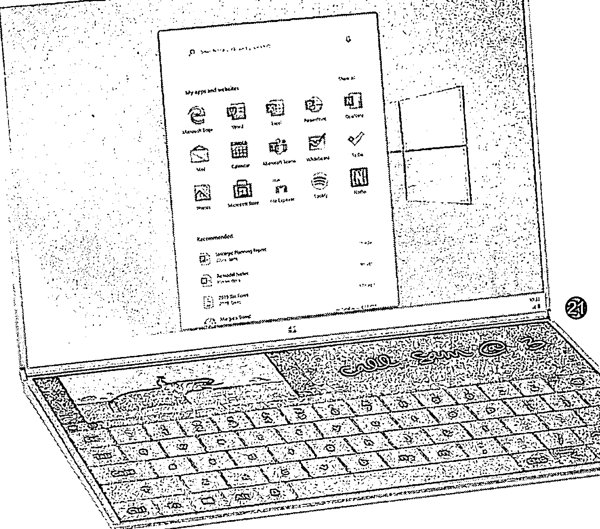

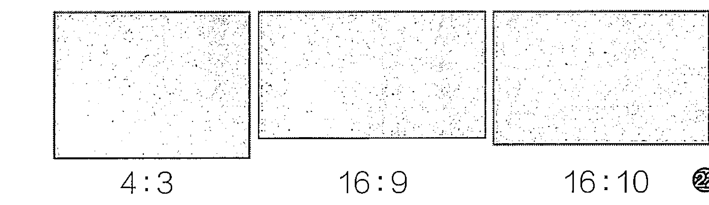

#### 关注16:10屏幕比例的回归

对绝大多数普通消费者而言，与其过多关注面向未来的双屏笔记本和Windows 10 X系统，不如放眼现在，即2020年新款笔记本在屏幕上的新趋势——16:10显示比例屏幕逐渐回归。

我们都知道，笔记本屏幕比例曾经经历多个阶段的变化，从最早的4:3（1024×768像素）的普屏，先后过渡到16:10（1280×800像素）和16:9（1366×768像素）的宽屏（图22）。如今，16:9比例的FHD（1080P，1920×1080像素）成为了笔记本屏幕领域的绝对霸主，上到数万元的顶级旗舰，下到千元出头的入门产品，它们的屏幕几乎都是这一规格。只是在FHD的基础上，还能通过刷新率、2K或4K分辨率、亮度、色域、对比度、材质（OLED）来划分档次。然而，随着笔记本开始追求更轻更薄，其屏幕的比例又开始出现了变化——现在的笔记本都在追求更高的“屏占比”，需要想办法压缩屏幕上下左右的边框宽度。其中，屏幕左右边框最容易被压缩，绝大多数新品都已经将其控制到了5mm以内，上边框只需处理好摄像头的安置，也可以压缩到较低的水平。

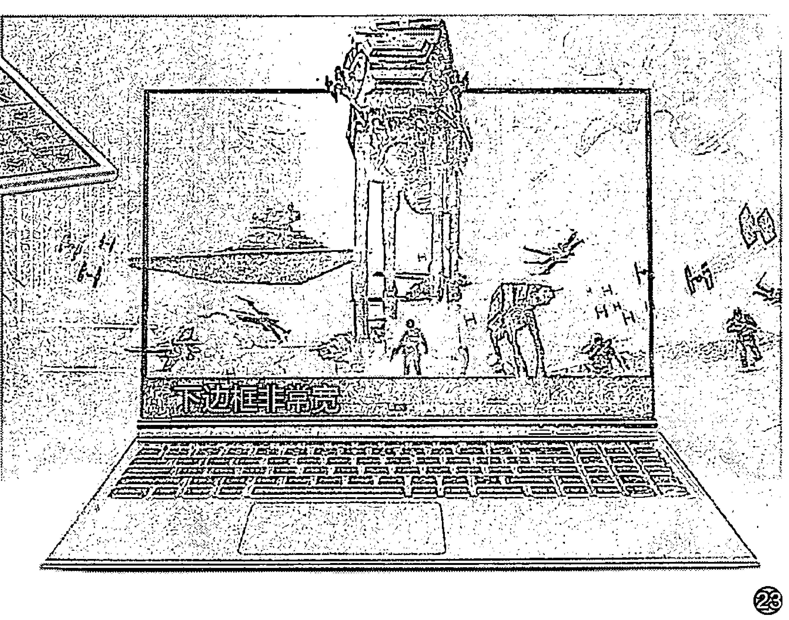

下沉式转轴可以隐藏起一部分下边框

一系列的创新工艺设计，让全面屏在拥有沉浸视野的同时，依然安全可靠。

- Bend180° U型 「太空舱」
- 屏幕模组封装技术
- 屏幕定制背板
- 定制保护框架

相对而言，笔记本屏幕的下边框最难处理，有些笔记本为了压缩上边框，会把摄像头放在下边框，从而导致它变得更宽（图23）。三面窄边但下面“特别宽”，已经成为了当前笔记本领域的常态。为了不让屏幕下边框影响观感，在坚持16:9比例屏幕的基础上，笔记本厂商还经常通过下沉式转轴设计，在开合屏幕时将一部分下边框藏到机身水平面以下，让它看起来没有那么宽（图24）。

此外，以华为MateBook 13为代表的笔记本（还常见于微软Surface系列）还改用了小众的3:2显示比例屏幕，这种变短（宽）变粗（高）的屏幕面板，同样可以减少对下边框的占用。同时，由于同尺寸的3:2屏幕有效的显示面积比16:9更大，按照屏占比的计算公式，此类产品的屏占比参数更加好看。

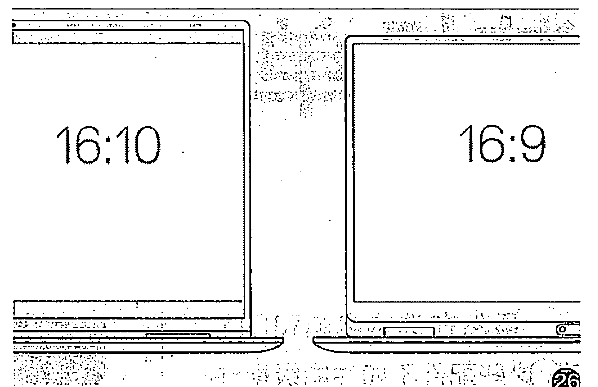

积增加、边框等宽时，16:10比例屏幕的机器屏占比参数自然也就更高了。

还有一些产品，比如RedmiBook 13在下沉式转轴的基础上还引入了U型屏幕定制背板，可以将屏幕排线和相关电路折叠到屏幕面板背面，从而进一步压缩了下边框的宽度（图25）。如今采用16:9屏幕但下边框依旧很窄的机器，基本都是采用了这一技术。

如今，以联想小新Pro13和戴尔新版XPS13为代表的产品又开始“复古”，重新选用16:10显示比例的屏幕。在同尺寸的情况下（13.3英寸16:9对比13.4英寸16:10），16:10屏幕可以增加近百万点像素，有效显示面积提升了7%，单屏可以显示更多内容，让Word、Excel等办公软件更具效率（图26）。同理，在屏幕面

在未来的一段时间里，我们将看到3:2、16:9和16:10三种显示比例的四面窄边笔记本（图27），而采用16:10比例复古屏幕的产品将越来越多。如果你非常在意笔记本的屏占比参数和卖相，不妨多多关注此类新品，其较之面向未来的双屏和折叠屏笔记本要更实在。

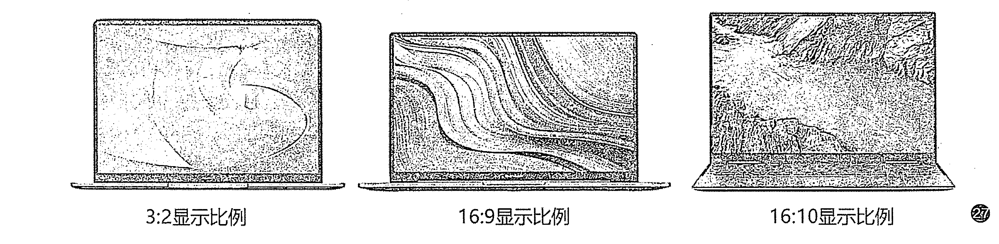

3:2显示比例

16:9显示比例

16:10显示比例

#### 一次全说清
装机单中的省略各项

虽然在选购电脑和DIY时，这些配件不如性能级配件那样重要，可以决定电脑的定位，但它们对电脑使用能力的影响可不容小觑。对性能并不敏感的用户和应用中，适合的支持设备和外设对使用体验的影响甚至超过了“性能级”配件。对性能有要求的使用方向中，这些配件则是使用体验和使用效率的“倍增器”或者保障。那么，针对不同的使用需求，应该如何搭配这些配件才最合适呢？咱们这次就来系统地讲一讲吧。

> **火速链接**
针对不同需求的主机性能级配件选择，可以参考本刊2019年第11期《过犹不及 DIY中的搭配误区》等文。

##### 机箱电源

咱们先从比较简单，在推荐配置中常常会提及，但语焉不详，让大家“随意”选择的配件——机箱和电源说起吧。

一般来说，选择机箱的主要决定因素是主板的尺寸和自身的审美需求，电源的首要决定因素则是其他配件的供电需求。不过在某些攒机方向中，对这两个配件也有一些特殊的要求。

##### 静音电脑

目前的电源几乎都带有散热风扇，而且它与最常见的处理器散热器、机箱风扇不同，是无法安全地自行拆卸并替换为低噪声或无噪声散热系统的，那么就只能在选购上下功夫了。

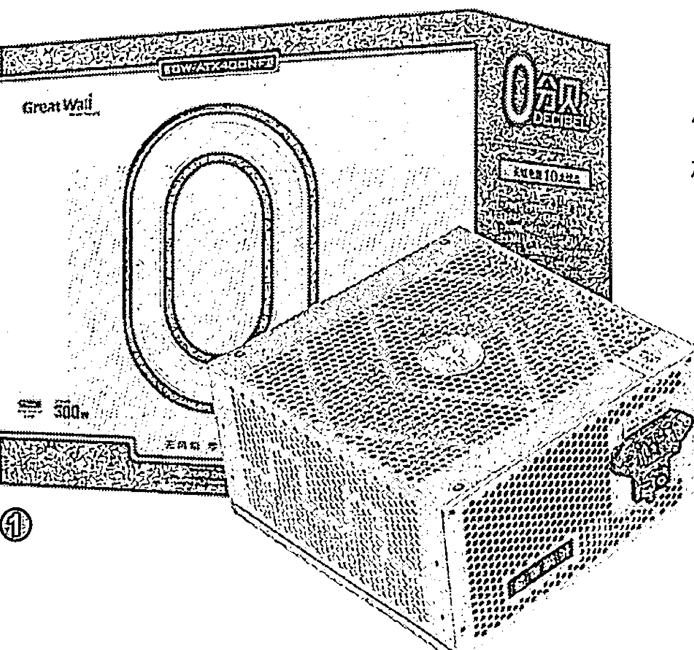

需要绝对静音的用户可以考虑无风扇电源，这些产品大都价格高昂，例如额定功率只有300W的长城GW-ATX400NF（图1）售价就达到了389元左右，海韵（SEASONIC）的无风扇600W电源售价达到了1600元左右。

此外，因为处理器和显卡的无风扇散热系统需要使用更多、更大的鳍片进行被动散热，所以体积都比较庞大，因此需要绝对静音的话，在选择机箱时也要考虑内部容积。建议机箱的规格至少应比主板规格大一号，比如使用ITX主板的话应搭配MTX机箱，而使用MTX主板则应搭配ATX机箱，以容纳较大的散热系统。

如果不要求绝对静音，只是希望电源风扇声不要大到影响工作思路、游戏效果等，那么使用低转速大口径风扇的产品就可以，目前更是出现了不少具有风扇启停设计的电源。例如450W长城电源HOPE-5500ZK具有智能风扇控制，低负载低温度时风扇会停转，也可实现低负载使用时0分贝无噪声，其售价为249元左右，与一般电源的价格差不多。

##### 超频电脑

对于爱好超频的用户来说，强力的散热系统也是必需的选择，而这些散热系统通常采用大型散热片、大直径或多个风扇、液冷导热等设计，体积都比主流产品要大得多。要容纳这些散热系统，当然足够的机箱容积也是必要的，笔者建议至少应使用中塔式机箱，如果要尝试液氮（图2）等高端玩法，又不想直接使用开放式安装，就应选择全塔式机箱，开盖后才有足够空间进行超频操作。

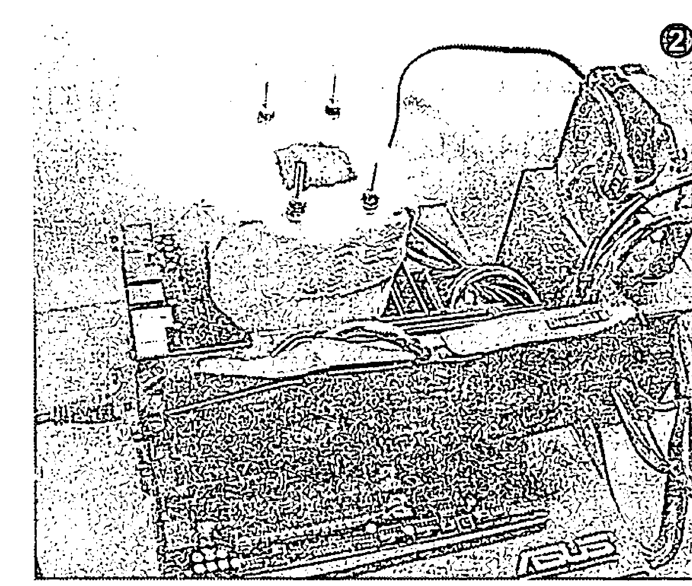

##### 家庭存储中心

一说到自己DIY的家庭服务器，很多人都会参考市售的NAS产品，使用美观小巧的ITX机箱。其实这种方式并没有考虑到产品的设计。一般的ITX机箱都是为2.5英寸硬盘优化的（图3），通常只是勉强提供了一个3.5英寸硬盘位，类似尺寸的NAS则可提供2个~4个3.5英寸硬盘位。这样的ITX机箱作为家庭网络服务器、影音中心等使用尚可，但2.5英寸的硬盘（包括机械硬盘和固态硬盘）最高容量只有1TB~2TB，价格也比较昂贵，因此容量扩展能力较低，扩展的代价也较高。

所以对数据量要求较高的家庭存储中心，例如收藏了大量高清晰度影视、需要存储家庭监控数据等，还是放弃美观小巧，选择硬盘安装位较多的MATX或中塔式机箱比较好。

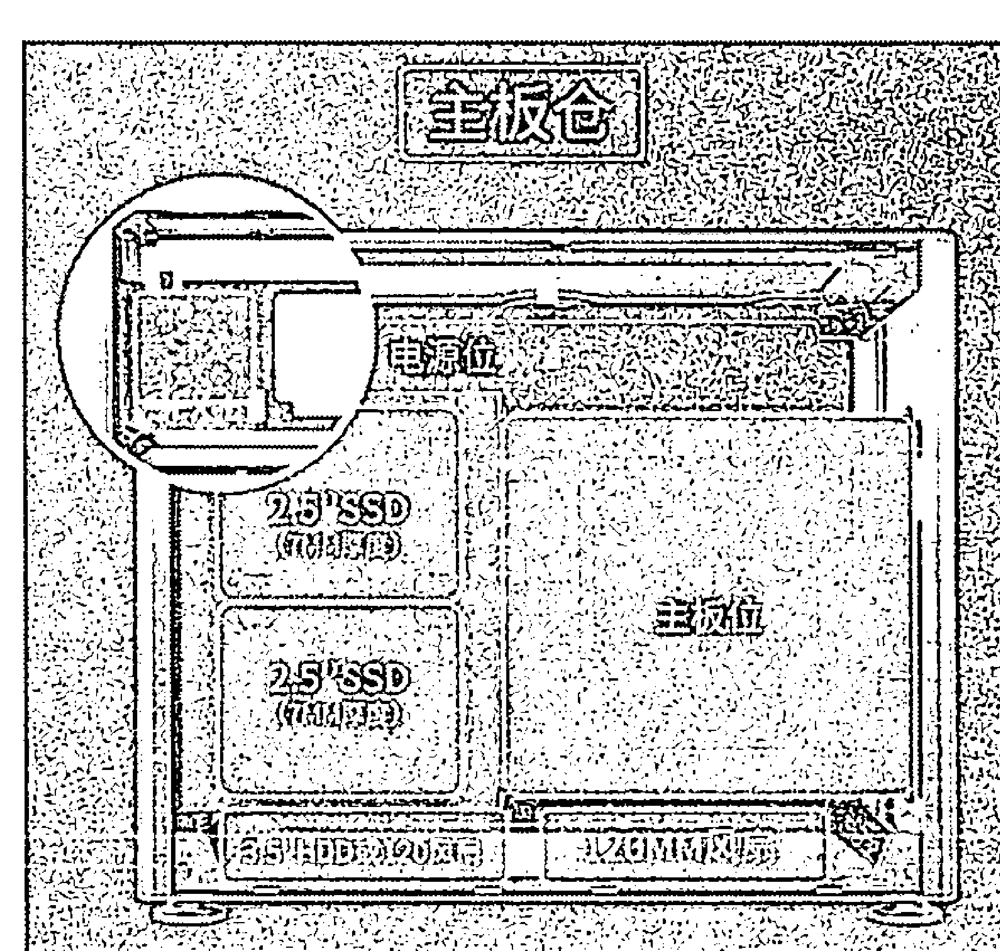

##### 显示器

显示器同样被很多电商置于常见配件而非外设产品中，这彰显着其重要性，再加上最近发展迅速、价格降低，因此是近期很多用户装机时很关注的项目。

##### 游戏电竞

游戏显示器还是电竞显示器，这两个概念在目前其实已经有所混淆。一些仅提供了较高刷新率、一些简单的游戏优化模式的显示器也会宣称自己是电竞显示器，相对来说，一些显示器大厂则在产品线中小心地维护着普通游戏显示器和电竞显示器的区别。

其实要分辨电竞显示器和游戏显示器也非常简单，游戏相关的参数方面，电竞显示器更高也更全面，比如目前1080P分辨率、100Hz以上刷新率，带有区域加亮等功能的显示器即可标称为游戏显示器，而电竞显示器则应拥有2K分辨率和144Hz刷新率，且采用VA或IPS面板（拥有200Hz以上超高刷新率的电竞显示器可以采用1080P刷新率和TN面板），支持反模糊效果、自带准星等高端游戏优化技术。更高的性能使得电竞显示器的成本大幅提升，与一般游戏显示器的价格差距很明显。

此外，电竞显示器则对电脑的硬件性能要求更高。例如对高端游戏来说，在高画质下达到电竞显示器的2K分辨率、144Hz帧速，就至少需要英伟达RTX 2070、AMD RX 5700 XT甚至RTX 2080这种高端显卡（图4），主机性能达不到这个水平的话，完全没必要追求电竞显示器。而满足一般游戏显示器的分辨率和刷新率，则只需要GTX 1660 Super等主流显卡即可。

游戏玩家推荐超宽屏弧形显示器，无论是用于模拟飞行、驾驶，还是模拟战略游戏、环绕显示都可以造就更好的沉浸感（图6），更大的可视角度也有利于玩家更好更快地掌握周围的情况，打出好成绩。这种产品比之前多采用的多显示器方式更方便，无需使用多个接口、多条连线、额外设置等，而且因为没有接缝，所以显示效果也更好。其实FPS类游戏也可以考虑使用这种显示器，可大幅提升两侧的观察范围，不过FPS对中心准星区域的观察很重要，宽大的显示区域也可能造成分神，影响体验。

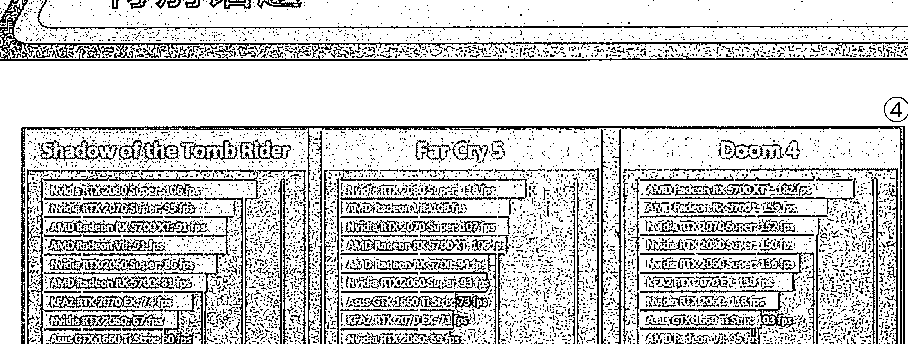

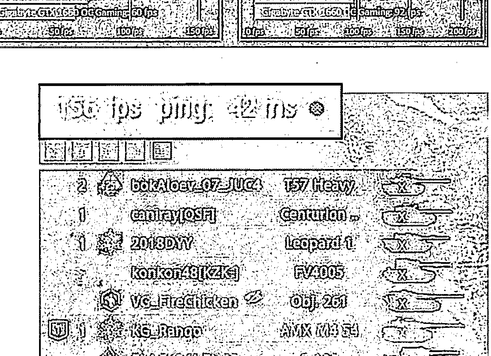

的游戏总体延迟（显示延迟+玩家反应延迟+网络延迟）中根本表现不出明显差距（图5），只是为玩家提供了看起来更舒适的流畅画面而已，对成绩的提升意义不大。

当然，这里要注意的是，随着技术的进步，其实电竞显示器和游戏显示器的能力、价格也是在变化的，例如一些早期的电竞显示器，拥有1080P分辨率、144Hz刷新率、动态抗模糊等高端游戏优化技术，如今在技术和价格方面，都成为了主流甚至入门级游戏显示器，但仍然拥有“电竞显示器”的称号和型号，对硬件性能较高的普通玩家，也是一种不错的选择。

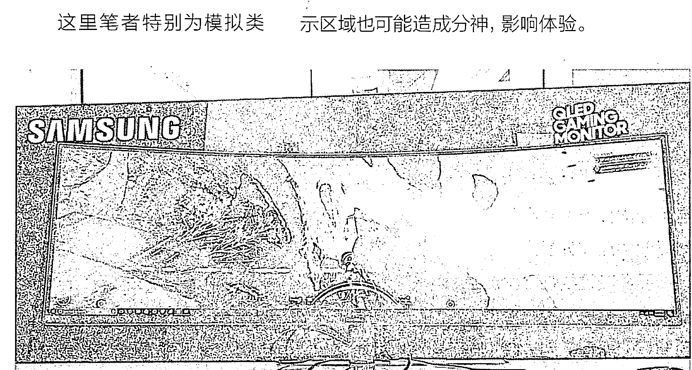

##### ● 办公设计

对很多用户来说，办公显示器似乎没什么特别的要求，甚至常常只关注价格。但笔者认为，作为每日使用时间比一般家用显示器长得多，同时也是真正创造价值的显示器，办公显示器的性能、效果、体验，乃至健康效果都应该更好一些。

对一般办公用户，笔者建议至少应考虑24英寸1080P显示器；如果需要制作大型表格、图片、视频、PPT、版面等，则建议使用27英寸2K分辨率产品；如果需要使用或监控多个窗口，平面超宽屏显示器是不错的选择（图7）。需要注意的是，显卡配置不高的办公用机不建议配用4K分辨率的显示器，过高的分辨率会拖累显示性能，可能造成刷新率过低，长时间使用容易造成眼睛疲劳。

此外这些显示器即使对图像色彩要求不高，也建议使用显示效果更好的IPS、VA类面板产品，其价格已经与TN面板显示器很接近，较为自然的色彩可以降低长时间使用的疲劳感。长时间进行文字工作的话，可以尝试打开显示器的防蓝光等设置，减少对眼睛的刺激，不过色彩也会变得不准确。

至于图形处理、影视制作、设计工作等，则对显示器的性能有更高的要求，除了常见的尺寸、分辨率要在习惯的基础上越大越好，还要特别注意色彩数、色彩指标。

##### ● 入门家用

对家庭娱乐、上网、学习等用途的电脑，我们的建议与入门级办公一样，至少应使用24英寸全高清显示器，并且以IPS或VA面板产品为宜。

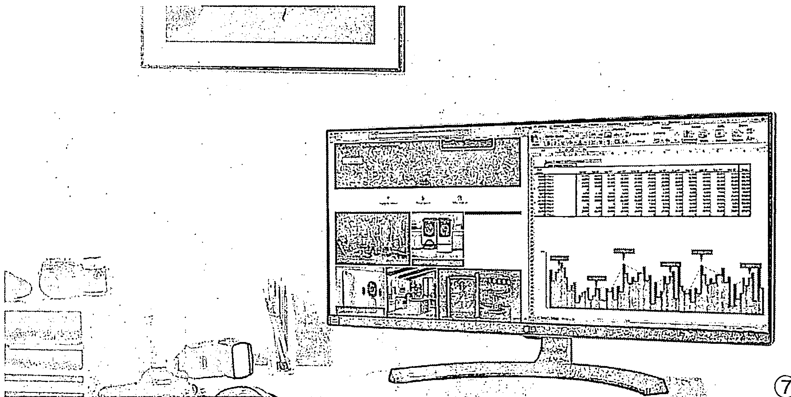

##### 键鼠

键鼠是最重要的电脑操控设备，目前机械键盘、无线鼠标等产品正当红，不过它们是否适合所有人呢？

##### ● 游戏电竞

与显示器类似，键鼠也有所谓的游戏型、电竞型产品。其实选配原则也与显示器类似，笔者不建议一般玩家选择电竞型产品，但这里主要是因为价格，毕竟电竞键鼠对电脑的其他软硬件配置没有什么特殊的需求。

对入门级玩家而言，100元~200元的游戏鼠标和入门级机械键盘就够用了，当然这里还涉及了有线或无线连接方式、是否具有灯效等，这些额外功能都需要付出一定的成本，例如无线连接的游戏键鼠价格通常比同型号的有线版本贵100元以上。这里要注意，对游戏鼠标来说，目前2.4G无线连接仍是最好的选择，蓝牙连接可能价格更高，但效果其实比较差，不太适合游戏。

至于非游戏鼠标和薄膜键盘，因为目前的价格已经没有明显的优势，所以并不建议玩家选择。而游戏鼠标的高速、机械键盘的快速响应、无冲突按键、牢固性等却是这些产品无法比拟的。

很多500元以上的高端游戏、电竞鼠标和机械键盘在基本参数和功能方面与入门、主流游戏键鼠差异不大，更多的差别是在一些普通玩家觉得并不起眼的地方。例如精心优化的表面曲线和按键设计、脚垫材质与布置、重量/重心调整能力、更好的按键力度等等（图8）。但实际上看似提升不大的性能提升常常是在极限之上的提升，而这些细节设计则需要长时间的琢磨、测试和调整，这都大大影响着价格。例如为了保证高端玩家高速甩动和精细定位的需求，仅使用光学引擎已经不够，高端游戏鼠标不仅采用高速光学引擎，还会引入姿态感受器并使用更强的处理器对数据进行高速综合处理，这几种元件及其需要的软硬件适配成本都较高，当然会让相应产品的价格明显提升。

> **火速链接**
关于入门级机械键盘，可以参考本刊2020年第3期《“入坑”好选百元机械键盘选购》。

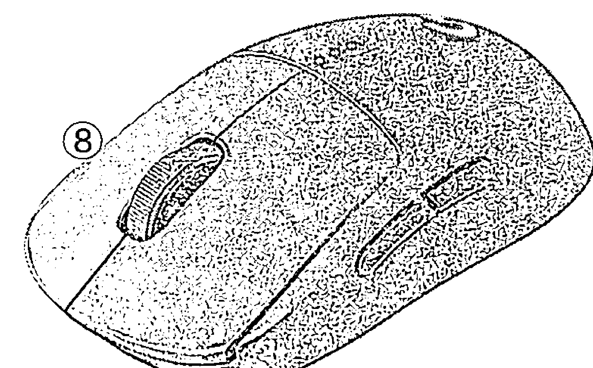

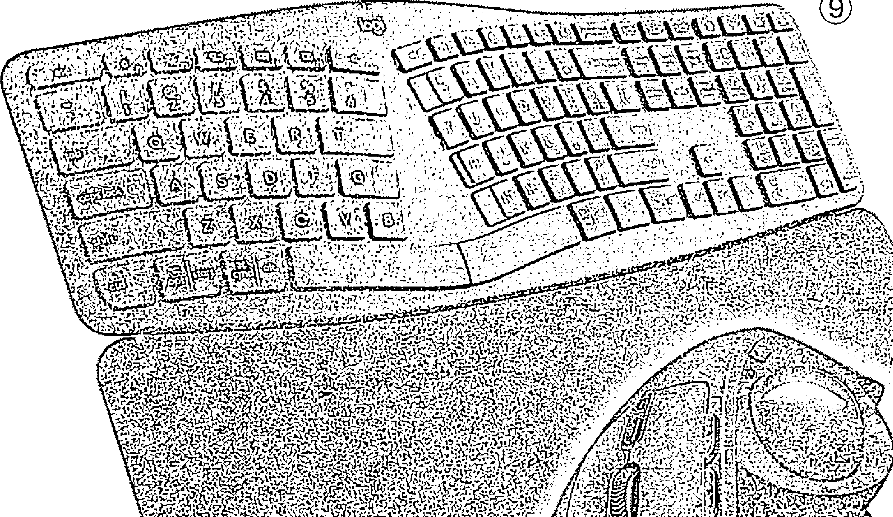

##### ● 办公设计

对一般办公用户来说，目前的入门和主流键鼠性能完全可以满足使用需求，所以笔者推荐大家关心另外一些方面。首先是针对长时间连续使用，更舒适健康的使用姿态显然会大幅提升使用体验。例如凹凸有致的人体工学键盘（图9）、“竖立”起来的人体工学鼠标，它们可能无法使用机械键轴，运动速度也不能太快，因此性能与同价位的游戏键鼠无法相比，但对办公来说也足够了，而抓握的自然舒适感，长时间使用后腕、肘的轻松感都是一般键鼠和游戏键鼠无法比拟的。

其次是在办公室中使用，鼠标与键盘的声音不能过于响亮，经常打字的键盘更不能力度太大，否则容易引起疲劳，这就是为什么市场上的办公机械键盘产品会以红轴和棕轴为主，而且薄膜键盘仍在这一领域大行其道的原因。

最后，随着办公电脑的发展，目前一般办公和设计用户，都有同时使用笔记本电脑与台式机，有时还一起使用移动设备的习惯。在这种情况下，无线键鼠，特别是支持多个设备的蓝牙无线键鼠就从“奢侈品”成了“必需品”，让用户无需在办公桌上同时摆两三套键鼠。罗技MX Master 3更提供了独特的Flow技术（图11），可在它连接的多台电脑间传输信息甚至文件。

设计用户对鼠标的定位精确性有更高要求，这一点高端游戏鼠标可以做到，不过轨迹球在小范围内的精确操控更直观，定位效果也很好，是可以考虑的对象。特别是将轨迹球与人体工学鼠标结合的产品（图10），可以同时提供较快的移动速度、精准的定位、接近标准的按键和舒适健康的握持，是最好的选择。

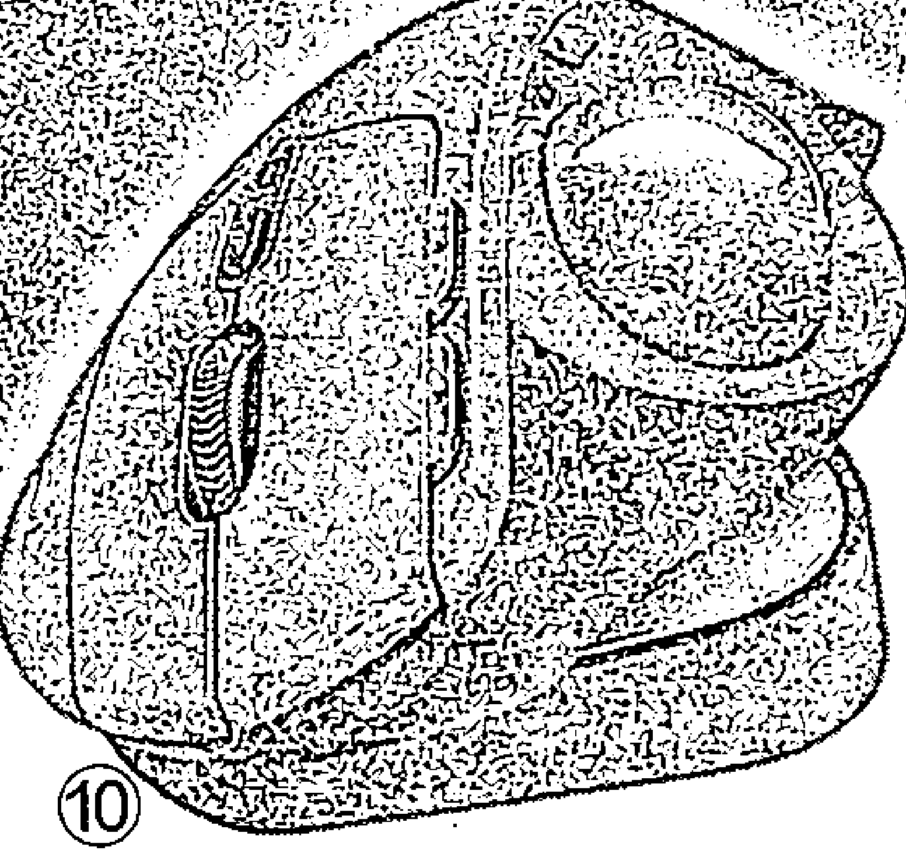


##### 家用入门

对于家用和入门电脑，笔者现在强烈建议使用无线鼠标，目前其价格已经很合理，很多50元~100元的产品（图12）性能已经足够。没有线缆的束缚可让鼠标的使用体验提升一个档次，也缓解了台式机背面和桌面上堆放大量线缆的问题。

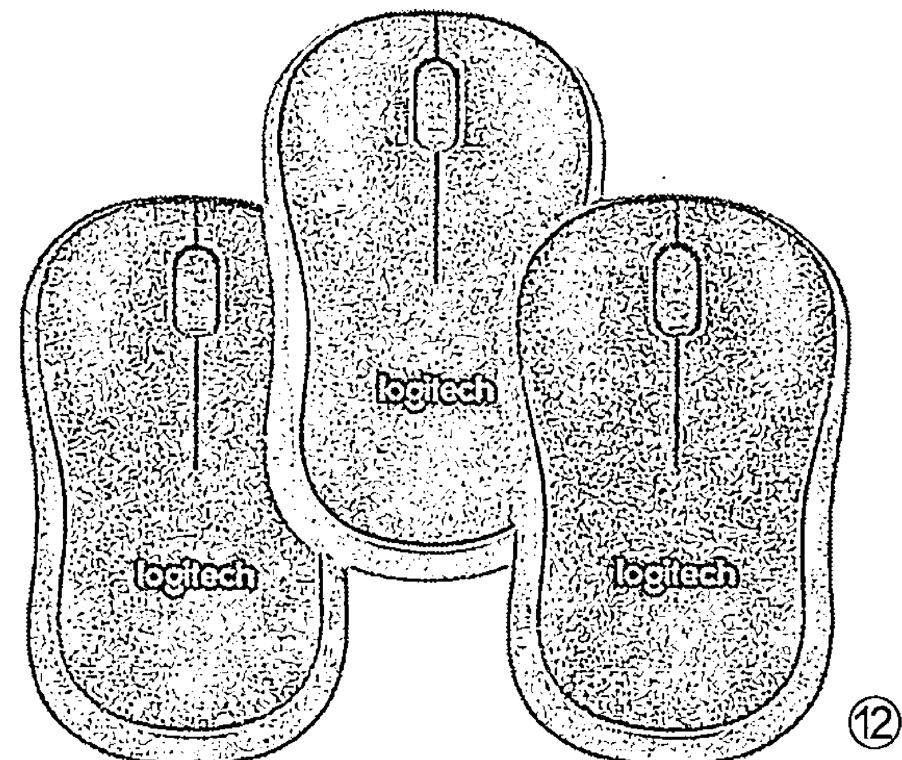

##### 耳机与音箱

声音播放设备也是电脑的重要交互设备，目前耳机是大多数用户的选择，不过如何选配适合自己的耳机？音箱是否还有必要配置呢？

##### 游戏电竞

游戏与电竞耳机的区别主要是在性能方面。对入门级玩家来说，耳机在游戏中的主要任务是表现背景音乐、各种音效，100元左右、无需是游戏向的耳机就可以达到要求。

对中高端玩家、电竞游戏玩家来说，耳机对细微声响的表现力、对声音的定位能力都比较重要，因此为游戏应用进行了优化的游戏、电竞耳机更合适，而且在耳朵的分辨能力下，尽量购买高端耳机，对游戏体验和游戏能力都有所帮助。需要注意的是，如果需要团队合作，那么耳机一定要拥有防噪麦克风，以减轻紧张游戏中不可避免的粗重呼吸声等噪声干扰通话问题。另外对不存在声音定位需求，但战斗时间很长的塔防类游戏玩家，可以考虑选择佩戴更轻松的单耳耳机（图13）。


##### 入门家用

对一般用户来说，耳机当然是好用易用的选择，但如果电脑同时负有分享视频等任务，那么入门级音箱也是可以考虑的，100元左右的桌面双音箱系统即可（图14），低音炮也不是必备选项，可根据空间自行掌握。这样的音箱在音量、分辨力等方面的表现对一般家庭用户来说已经足够，而且连接方便，可以和耳机同时连接，快速切换。

需要注意的是，目前有一些为笔记本电脑甚至手机、平板电脑等移动设备设计的迷你音箱，有些价格还特别便宜，但其表现力只是比这些移动设备好一些，远逊于100元左右的桌面双音箱系统，不建议选择。

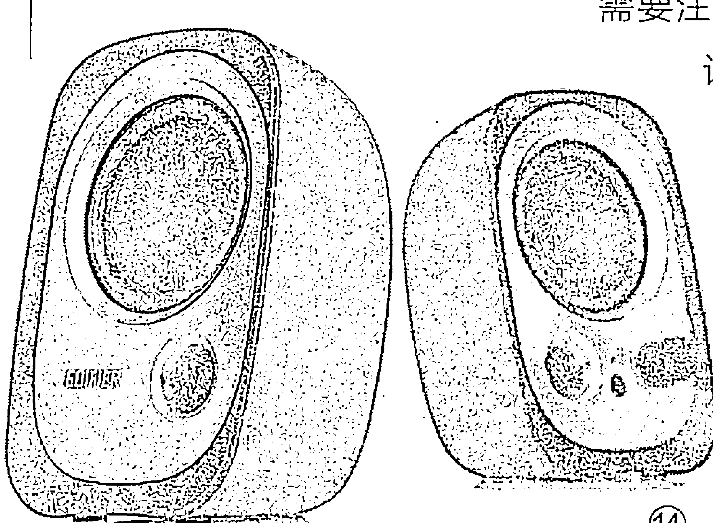

#### 其他

对于一些特殊的装机和应用需求，还有一些值得选配的外设产品，例如迷你主机，特别是准系统型主机，USB接口数量通常是不够用的，此时扩展坞就很重要了，它可以扩展出成倍的USB接口，虽然其上的接口速度较低，但用于连接键鼠等低速设备已经足够了。

另外为台式机配置无线网卡可以减少布线的麻烦，也减少了桌面线缆的数量，是家庭和办公用户的好选择，但网游玩家和电竞玩家最好还是使用有线连接，可提供更好的稳定性和更低的延迟。

策划《电脑爱好者》编辑部

本刊曾在2020年第2期《火眼金睛 如何快速判断移动芯片的性能》一文中介绍过智能手机专用SoC移动平台性能的比拼方式。作为同属移动设备的笔记本电脑，它们在快节奏的学习生活中也扮演着重要的角色，也是很多家庭和商务用户的必选装备。需要注意的是，笔记本的集成度远没有智能手机高（处理器并非SoC），它在运行的过程中涉及到多颗芯片参与。那么，如何才能快速判断笔记本相关芯片的强弱和功能差异？本期特别话题，我们就来简单聊一聊影响笔记本芯片性能和体验的关键指标。

扫一扫，更多精彩内容立现！

#### 处理器 运算性能的基石

和手机专用的SoC一样，笔记本（包括台式机）运算性能的基石也是处理器（如果没有特殊说明，本文涉及的处理器都属于专供笔记本使用的“移动版”），也就是CPU芯片（图1）。问题来了，如今笔记本领域的CPU家族众多，我们应该如何进行梳理和对比呢？除了众所周知的核心数量越多性能越强、主频越高性能越强的理论，我们还应注意哪些问题呢？

#### 了解平台代号

在最近一年中，笔记本领域的移动处理器处于“混乱之治”时期，无论是英特尔还是AMD都“重兵云集”。想要了解笔记本的性能，首先要做的就是了解这一期间常见处理器平台和处理器型号间的对应关系。比如，在媒体评测和各种新闻中经常出现的Whiskey Lake、Comet Lake、Ice Lake、Lakefield、Raven Ridge APU和Renoir APU等代号都是谁？

为此，笔者整理了时下笔记本市场中正在热销的，以及即将在2020年上市的最新笔记本平台名称，以及它们对应的代号、微架构、TDP、型号和发布时间（表1）。英特尔和AMD目前都有三套在售平台，其中英特尔阵营包括第八、第九和第十代酷睿，而AMD阵营则包含第一、第二和第三代锐龙，2020年笔记本市场的战场主力将逐渐过渡到第十代酷睿对第三代锐龙，其他世代的平台大家简单了解一下即可。

> **小提示**
>
> 英特尔和AMD针对入门级笔记本市场还分别推出了奔腾、赛扬；速龙、A6和A4等产品线，它们的性能与同期的酷睿/锐龙相比相差巨大。对绝大多数普通用户而言，哪怕选择酷睿i3或锐龙3，在体验上也要远胜于这类入门级处理器。因此，本文就不再赘述这类低端产品了。

**表1：近期常见笔记本处理器平台汇总表**

| 厂商 | 平台名称 | 平台代号 | 微架构 | TDP | 代表型号 | 发布时间 |
| :--- | :--- | :--- | :--- | :--- | :--- | :--- |
| **14nm工艺** | | | | | | |
| AMD | 第一代移动锐龙 | Raven Ridge APU-U系列 | Zen | 15W | 锐龙5 2500U | 2017-10 |
| | | Raven Ridge APU-H系列 | Zen | 35W | 锐龙5 2600H | 2018-09 |
| 英特尔 | 第八代酷睿 | Amber Lake-Y系列 | Skylake | 5W | i5-8200Y | 2018-08 |
| | | Kaby Lake Refresh-U系列 | Skylake | 15W | i5-8250U | 2017-08 |
| | | Whiskey Lake-U系列 | Skylake | 15W | i5-8265U | 2018-08 |
| | | Coffee Lake-H系列 | Skylake | 45W | i5-8300H | 2018-04 |
| | | Kaby Lake-G系列 | Skylake | 65W/95W | i7-8709G | 2018-04 |
| | 第九代酷睿 | Coffee Lake Refresh-H系列 | Skylake | 45W | i5-9300H | 2019-04 |
| | 第十代酷睿 | Comet Lake-Y系列 | Skylake | 4.5W~9W | i5-10210Y | 2019-08 |
| | | Comet Lake-U系列 | Skylake | 15W | i5-10210U | 2019-08 |
| | | Comet Lake-H系列 | Skylake | 45W | i5-10300H | 2020-04 |
| **12nm工艺** | | | | | | |
| AMD | 第二代移动锐龙 | Picasso APU-U系列 | Zen+ | 15W | 锐龙5 3500U | 2019-01 |
| | | Picasso APU-H系列 | Zen+ | 35W | 锐龙5 3550H | 2019-01 |
| **10nm工艺** | | | | | | |
| 英特尔 | 第十代酷睿 | Ice Lake-Y系列 | Sunny Cove | 9W | i5-1030G7 | 2019-08 |
| | | Ice Lake-U系列 | Sunny Cove | 15W | i5-1035G7 | 2019-08 |
| | 不明 | Lakefield SoC | Sunny Cove+Tremont | 5W~7W | 不明 | 2019-01 |
| | 第十一代酷睿 | Tiger Lake-Y系列 | Willow Cove | 9W | 还未上市 | 2020-08 |
| | | Tiger Lake-U系列 | Willow Cove | 15W | 还未上市 | 2020-08 |
| **7nm工艺** | | | | | | |
| AMD | 第三代移动锐龙 | Renoir APU-U系列 | Zen 2 | 15W | 锐龙5 4600U | 2020-01 |
| | | Renoir APU-H系列 | Zen 2 | 45W | 锐龙5 4600H | 2020-01 |

*发布时间早不代表上市时间早，比如英特尔Lakefield SoC在2019年1月发布，但至今依旧没有进入量产上市状态

#### 频率取决于工艺

就工艺层面而言，AMD阵营清晰明了，第一、第二、第三代锐龙处理器分别采用14nm、12nm和7nm工艺，闭着眼睛都能知道它们的性能是依次递增。

英特尔阵营就比较混乱了，14nm工艺被细分为14nm+和14nm++，并分别用于第八、第九和第十代酷睿(Comet Lake)。问题来了,英特尔第十代酷睿还包含采用10nm工艺的Ice Lake (图2),而它的接班人,计划在今年秋季发布的第十一代酷睿Tiger Lake则会将工艺升级到10nm+。一种工艺经过优化后就能横跨多套平台,也因此让这些处理器无法透过工艺来判断理论性能。现在我们只能说,制程工艺越先进,可以在功耗不变的基础上增加核心数量(四核变六核)或进一步提升主频,从而实现性能增强的目的;又或是在保持相近性能的同时进一步减小功耗,显著提升笔记本的续航能力。

#### 微架构决定IPC

业内用于计算处理器性能的公式是: CPU性能=时钟频率(MHz或GHz) × IPC (CPU每一时钟周期内所执行的指令多少),相同核心数量和主频的处理器之间之所以会存在性能差异,就是IPC在背后“捣鬼”。既然时钟频率取决于工艺,那IPC又是受谁影响呢?没错,决定IPC的就是“微架构”,也就是CPU的内核。在这里还要夸一下AMD。在过去的很长一段时间, AMD旗下移动处理器的表现非常差,很多高端型号的性能也就是同期英特尔酷睿i3的水平。2017年底问世的Ryzen锐龙之所以备受关注,就是因为它采用了最新的Zen CPU微架构,实现了震惊世界的52%的IPC性能提升,直接获得了与英特尔最新第八代酷睿处理器竞争的本钱(图3)。第二代锐龙采用了升级版的Zen+微架构,虽然其IPC性能只提升了3%,但AMD依旧通过改用12nm工艺和提升主频的方式,换来了大约10%的实测性能提升和更低的功耗表现。即将量产的第三代锐龙将采用最新的Zen 2微架构, IPC性能较Zen+再度提升了15%,并凭借7nm工艺在保持功耗不变的基础上增加了额外的核心数量且提升了主频,因此第三代锐龙处理器有望帮助AMD摘得笔记本部分领域(主要是轻薄本市场)的性能桂冠(图4)。相对于AMD,英特尔近几年在CPU微架构层面总在“原地踏步”。从第六代酷睿开始,第七、第八、第九和第十代酷睿(14nm Comet Lake平台)使用的微架构都是基于“Skylake”的缝缝补补(主要是功能层面增强,比如支持LPDDR4X和更高频率的内存,引入英特尔Adaptix动态调优等技术),每次迭代时IPC几乎都没有提升。还好,英特尔对14nm工艺的优化也变得愈加炉火纯青,每一代酷睿处理器平台的主频都有着显著的提升,核心数量也得以缓步增加(图5)。比如,第六代酷睿i7-6700HQ还是4核8线程(2.6GHz~3.5GHz),第九代酷睿i7-9750H则进化到了6核12线程(2.6GHz~4.5GHz),增加的核心数量和更高的睿频加速频率,足以弥补IPC提升乏力的缺陷。

> 小提示
>
> 如今处理器都采用了多核设计,所以CPU性能最终还需要乘以核心数量。

得益于更多核心和更高主频，英特尔从第六代酷睿开始，U系列每一代都有着大约10%的性能提升

英特尔未来移动平台CPU微架构发展计划

###### 火速链接

如果你对AMD第三代移动锐龙平台感兴趣，请参考本刊2020年第4期特别话题的报道。如果你对英特尔Sunny Cove微架构感兴趣，请参考本刊2019年第13期《10nm工艺+第十代酷睿 英特尔移动处理器能否“十全十美”》这篇文章。有关英特尔两个版本的第十代酷睿平台背后的技术，请参考2019年第18期和第20期CFan为你选栏目。

#### 功耗影响战斗力

通过表1我们不难发现，无论是英特尔还是AMD，都会对不同时期的笔记本平台进行拆分。比如AMD锐龙就存在“低功耗”（U系列，15W）和“高性能”（H系列，35W/45W）之别，而英特尔则习惯细分为“超低功耗”（Y系，4.5W~9W）、“低功耗”（U系列，15W）和“高性能”（H系列，45W），通过不同的TDP实现更加精准的定位——Y系列用于无风扇的极致轻薄的二合一设备，U系列用于轻薄本，H系列专供游戏本和设计本（图7）。

TDP功耗设定越高，处理器就越“敢”塞进更多的物理和逻辑核心，并可以长时间运行在更高的主频上，从而获得更强的性能。下面，我们就以十代酷睿i5-1035G7、十代酷睿i5-10210U和九代酷睿i5-9300H三款处理器为例，看看工艺、IPC、TDP等参数是如何协同影响性能的（表2）。

就实际的CPU运算性能而言，三款处理器的排名是i5-1035G7≤i5-10210U<i5-9300H。采用最新10nm工艺和全新Sunny Cove微架构的i5-1035G7性能之所以垫底，是因为它的默认/睿频加速频率最低，抵消了来自微架构的IPC性能提升。但是，i5-1035G7却集成了不逊于入门级独立显卡的锐炬Plus 64核显，从另一个角度来看则是另一番风景——i5-1035G7在TDP保持15W不变、强化了核显、降低了频率的前提下，CPU性能却依旧可媲美主频更高的i5-10210U，这也足以彰显全新Sunny Cove微架构的不凡实力了。

i5-9300H的强悍则源于45W功耗，如果将它的TDP强制降低到15W，那它的性能不会比i5-10210U强多少。反之，如果将i5-10210U的TDP开放到45W，那它就变成了i5-9300H；如果将i5-1035G7的TDP提高到45W，那它的性能只可能更强。同理，AMD旗下的锐龙5 3500U和锐龙5 3550H也能看作是一颗处理器，分别设定在15W和35W TDP状态下的存在。

总之，在同一时期上市的处理器，只有相同TDP的产品之间才有可比性。而相同TDP的处理器之间，则可通过比拼工艺（主频、核心数量）和微架构（IPC性能提升）来判断性能。

**火速链接**
TDP（热设计功耗）是CPU的发热量而不是真正的功耗，TDP越高需要搭配越豪华的散热模块（图8），以及更高功率的电源适配器。有关TDP背后的秘密，感兴趣的朋友可以参考本刊2020年第1期《只了解TDP还不够 真正的功率要这样看》这篇文章。

**表2：三款酷睿i5规格对比，以及各项参数所代表的意义**

| 处理器型号 | i5-1035G7 | i5-10210U | i5-9300H | 参数意义 |
| :--- | :--- | :--- | :--- | :--- |
| 隶属平台 | Ice Lake-U | Comet Lake-U | Coffee Lake Refresh-H | i3<i5<i7<i9和锐3<锐5<锐7，留意后缀，U代表低功耗，H代表高性能 |
| 制程工艺 | 10nm | 14nm | 14nm | 制程数字越小，代表工艺越先进 |
| 微架构 | Sunny Cove | Skylake | Skylake | 微架构越新，IPC性能往往越高 |
| TDP功耗 | 15W | 15W | 45W | TDP越高，CPU就能肆无忌惮提高频率 |
| 核心/线程 | 4C/8T | 4C/8T | 4C/8T | C代表物理核心，T代表逻辑核心，数量越多性能越强 |
| 默认主频 | 1.2GHz | 1.6GHz | 2.4GHz | 系统处于低负载模式下的运行频率 |
| 单核睿频 | 3.7GHz | 4.2GHz | 4.1GHz | 在TDP和散热允许的情况下，CPU可瞬间达到的最高主频 |
| 高速缓存 | 6MB | 6MB | 8MB | 缓存越高，性能底蕴越出色 |
| 集成显卡 | Gen 11 | Gen 9.5 | Gen 9.5 | Gen是英特尔核显的迭代序列，数字越大架构越新 |
| EU单元 | 64 | 24 | 24 | GPU的计算单元数量，越多性能越强 |
| 显卡频率 | 1.05GHz | 1.10GHz | 1.05GHz | GPU的工作频率，越高性能越强 |
| AVX指令集 | AVX-512 | AVX2 | AVX2 | 指令集会影响指定工作环境下的运行效率 |
| 内存支持 | DDR4-3200<br>LPDDR4-3733 | DDR4-2666<br>LPDDR4X-2933<br>LPDDR3-2133 | DDR4-2666<br>LPDDR3-2133 | 支持内存的规格越高，有助于提升PC整体性能 |

#### 影响体验的功能参数

处理器的绝对性能固然重要，但在实际应用中往往并不需要它们火力全开，否则再大的电池容量也禁不起消耗。因此，我们还需关注一下影响处理器体验的其他功能、技术和参数。

##### 智能调频技术

为什么相同的处理器，在散热设计更好的笔记本本身上往往可以跑出更高的分数？这就涉及到更聪明的调频技术了。除了我们熟悉的“睿频加速”以外，英特尔和AMD都在最新的移动平台里引入了更智能的调频技术，比如英特尔第十代酷睿主打的“Adaptix”，该技术可以在CPU温度不断提升的同时，让CPU的功率进行阶梯式调节从而压榨出CPU的更多剩余性能，确保CPU在温度与功率之间的平衡（图9）。AMD锐龙处理器则新增“mXFR”，它可以让CPU的频率最大值随散热方案进行自动调整，散热方案越好最大值越高。

##### 全新指令集

我们之所以期待CPU微架构升级，是因为全新微架构能改进大量应用的性能和能效，并针对未来特定使用场景、算法进行架构上的扩展，包括新的指令集、新的软件编译器/库等。比如说英特尔第十代酷睿（仅限10nm Ice Lake）采用的Sunny Cove微架构就通过新加入的指令集，让7-Zip软件的压缩解压性能提升多达75%，这种方法显然要比CPU火力全开去处理压缩任务更经济（省电）。

##### 端侧AI运算

AMD锐龙处理器家族都支持神经网络预测，为端侧AI运算进行了优化。而英特尔第十代酷睿（仅限10nm Ice Lake）首次加入了DLBoost指令集，实现了AI性能的革命。

##### I/O连接性能

无论是英特尔还是AMD，每一次平台的迭代，都会对I/O连接性能进行优化升级。以第十代酷睿Ice Lake平台为例，它将CPU和芯片组封装在同一块基板之上，CPU部分将决定这颗芯片原生支持的视频输出接口规格，支持最高的内存版本和规格等，而芯片组部分则决定该芯片能否原生支持雷电功能和Wi-Fi 6，支持多少条PCIe总线，最多可以配备多少组USB、M.2接口，以及其他多媒体输出功能的表现，比如是否配备语音助理模块等（图10）。

处理器还存在很多针对性的技术，比如博锐平台、可信执行技术、稳定映像平台计划和TSX-NI指令集等，只是这些与普通用户关系不大，本文就不再进行赘述了。

#### 核显和独显：游戏动力的源泉

显卡是以笔记本为代表的PC能否流畅驾驭3D游戏的核心硬件，在很大程度上它比处理器更加重要。本刊刚刚在2020年第5期《决定游戏底蕴 了解笔记本的显卡》中介绍过集显和独显的分类，以及目前常见显卡的性能档次划分，所以本文主要解读影响显卡性能发挥的主要参数（图1）。

##### 移动显卡分类

如今笔记本领域的显卡品牌主要有三，分别为英特尔、AMD和英伟达。其中，英特尔和AMD旗下的移动处理器内部都集成核心显卡，属于“买一送一”。英特尔Xe架构独立显卡计划在2020年上市，未来我们还将看到这三个品牌在独立显卡领域割据的场面。而独立显卡除了更适合玩游戏以外，还衍生出了面向图形工作站的专业级显卡（表1），如果你从事专业的设计类工作，需要认准此类产品（图2）。

**表1：笔记本显卡品牌和分类**

| 显卡类型 | 英特尔 | AMD | 英伟达 |
| :--- | :--- | :--- | :--- |
| 集成显卡 | UHD 锐炬Iris Plus | Radeon Vega | 暂无 |
| 独立显卡 | Xe LP（计划） | Radeon RX | GeForce MX、GeForce GTX/RTX |
| 专业工作站 | Xe HP HPC（计划） | FirePro、Radeon Pro | Quadro |

核显的规格，如今顶级核显的性能已经不逊于入门级的独立显卡（如GeForce MX110、Radeon 520等）。但如果你喜欢玩大型3D游戏，还是需要更高性能的独立显卡来帮忙。

##### 谁在影响核显性能

如今影响核显性能的因素主要有三，一是计算单元，二是运行频率，三是内存规格。以时下热门的AMD移动锐龙处理器为例，它们都集成了Vega架构的GPU，通过不同数量的CU单元（每组CU单元集成64个流处理器）划分档次，比如第二代锐龙5 3500U集成Vega 8，后缀的8就代表8组CU单元，而锐龙7 3700U集成的Vega 10就代表10组CU单元。

在GPU核心架构相同时，计算单元越多性能就越强吗？理论上是，但这个问题却还受到运行频率和内存规格的影响。以AMD第三代锐龙5 4600U为例，它集成的Vega 6只有6组CU单元，但其在3Dmark Time Spy测试中的GPU子项分数却达到了839分，而上代锐龙5 3500U在此项测试中的成绩只有705分（图3）。

###### 为什么Vega 6比Vega 8还要强？！

答案很简单，第三代锐龙5 4600U采用了最新的7nm制程工艺，在增加2个物理核心和4个逻辑核心以及更大规模缓存容量的基础上，还将集成的Vega 6核显的运行频率大幅提升到了1500MHz。可见，更先进的制程工艺不仅是处理器的福音，在显卡领域同样起着至关重要的作用。

与此同时，最新锐龙处理器还支持DDR4-3200MHz内存，核显是利用内存虚拟的显存，内存频率越高意味着显存频率越高。作为对比，第二代锐龙5 3500U集成Vega 8的运行频率只有1200MHz，其内存规格也只有DDR4-2400MHz（表2），相当于GPU的核心/显存频率都处于劣势，以致于更多的计算单元都无法弥补。

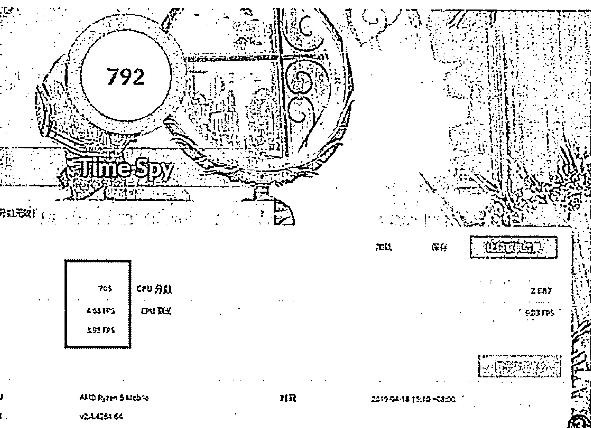

###### 表2: AMD两代移动锐龙5处理器规格对比

| 处理器型号 | AMD锐龙5 4600U | AMD锐龙5 3500U |
| :--- | :--- | :--- |
| 制程工艺 | 7nm | 12nm |
| 默认TDP | 15W | 15W |
| 可配置TDP | 10W~25W | 12W~35W |
| 核心/线程 | 6C/12T | 4C/8T |
| 基础频率 | 2.1GHz | 2.1GHz |
| 加速频率 | 4.0GHz | 3.7GHz |
| 二级缓存 | 3MB | 2MB |
| 三级缓存 | 8MB | 4MB |
| 核芯显卡 | Vega 6 | Vega 8 |
| 显卡频率 | 1500MHz | 1200MHz |
| 内存支持 | DDR4-3200MHz | DDR4-2400MHz |

> **小提示**
> 想100%发挥核显性能，需要内存运行在双通道模式（图4）。英特尔处理器集成的核显主要是受EU单元数量的影响，最新的第十代酷睿存在64、48、32和24个EU单元的核显，它们的性能依次递减。

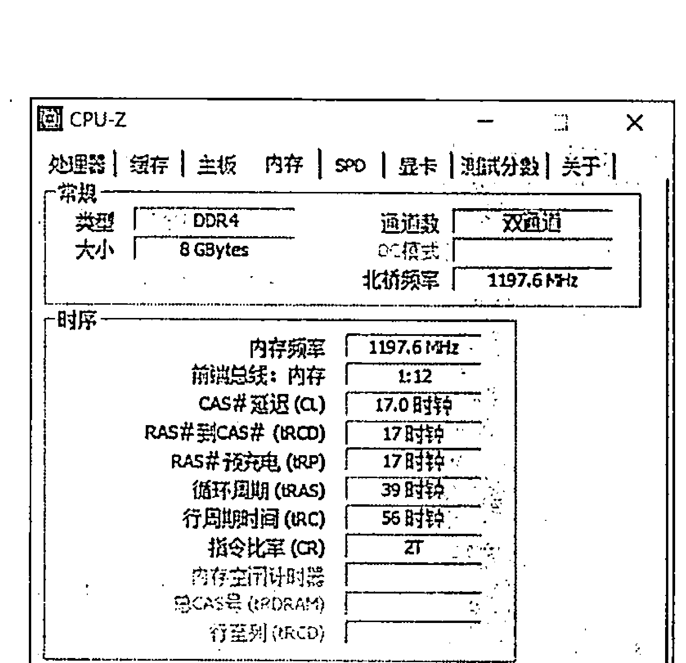

##### 谁在影响独显性能

与核显相比，影响独立显卡的因素就比较复杂了。考虑到当前笔记本领域的独显市场英伟达一家独大，所以本章节我们主要以GeForce系列独显为例加以梳理。待AMD最新Radeon RX5000系列移动显卡正式量产后，我们再单独发文章解析。

###### 从型号名称看定位

在消费类笔记本领域，英伟达GeForce系列独显主要分为MX、GTX和RTX系列。MX系列主要用于轻薄本，目前最新型号包含GeForce MX330和MX350，其中MX330是MX250的“马甲”，而MX350则是GTX1050的缩水版。感兴趣的朋友可以参考本期《轻薄本的新力量 GeForce MX350独显是否值得期待》这篇文章。

GeForce GTX系列定位中高端，目前最新型号包含GTX1050（3GB版）、GTX1650、GTX1650 Super和GTX1660Ti，性能依次增强。GeForce RTX定位高端，包含RTX2060、RTX2070和RTX2080，该系列独显除了性能更强以外还支持硬件级的光线跟踪功能。

那么，MX、GTX和RTX独显之间又是根据什么划分档次的呢？

###### 工艺、微架构和核心型号

英伟达平均每隔2年就会更新一次显卡的微架构，并采用同期较新的制程工艺。比如，Pascal架构2016年问世，采用16nm工艺；Turing架构2018年诞生，采用12nm工艺。新工艺可以让新架构在保持功耗不变或下降的基础上增加晶体管规模，从而塞进更多的计算单元和功能模块，并进一步提升运行频率，也就是前文提到的增加IPC性能。

为了划分独显定位，英伟达会在同一微架构的基础上细分出无数子型号核心，用于匹配不同的GeForce MX、GTX或RTX家族的显卡（图5）。比如Titan RTX、RTX2080、RTX2070和RTX2060就分别对应TU102、TU104、TU106-400和TU106-200核心。一般来说核心后缀数字越小，该显卡的定位和性能越高。


###### 神奇“刀法”划定位

作为英伟达消费级独显中的“皇帝”，Titan RTX采用了Turing架构中最完整的TU102核心，在一颗芯片内集成了6个GPC单元，包含36个TPC、72个SM、96个ROPS、288个TMUS、4608个CUDA流处理器，以及576个Tensor核心和72个RT核心（图6）。同时，TU102核心还拥有高达384bit的显存位宽，搭配的GDDR6显存频率更是高达7GHz。

作为同属Turing架构的GTX16和RTX20系列显卡，它们的核心都是基于TU102精简而来，网友更是习惯将其称为英伟达的神奇“刀法”——GPC、TPC、SM、ROPS、TMUS、CUDA、Tensor、RT单元和显存位宽都是可以拿来开刀的部分（图7），只是砍掉的单元种类和数量越多，该显卡的定位也就越低（表3）。

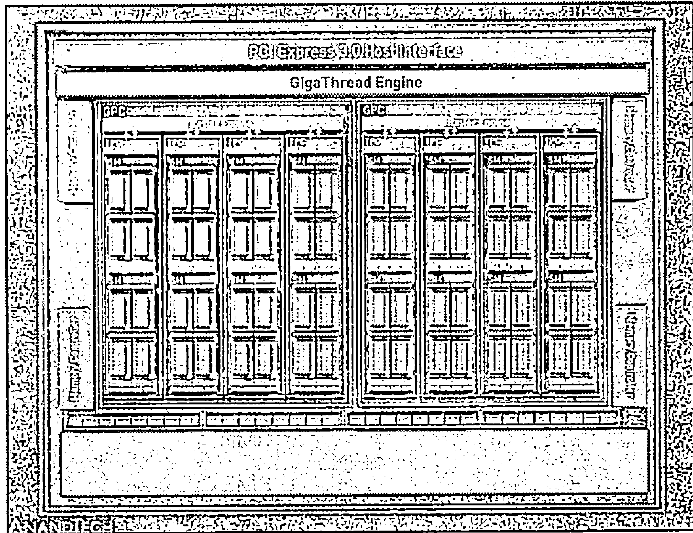

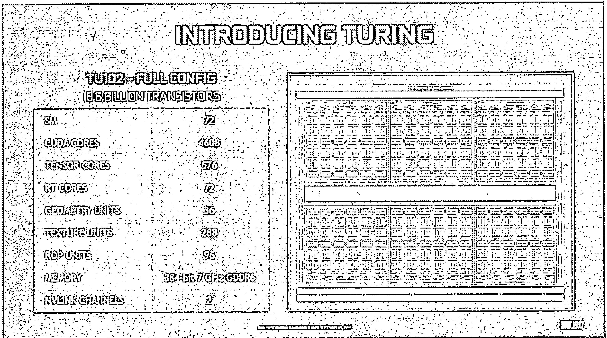

| 组件 | 数量 |
| :--- | :--- |
| SM | 72 |
| CUDA CORES | 4608 |
| TENSOR CORES | 576 |
| RT CORES | 72 |
| GEOMETRY UNITS | 36 |
| TEXTURE UNITS | 288 |
| ROP/UNITS | 96 |
| MEMORY | 384-BIT 7Gbps GDDR6 |
| NVENC/NVDEC | 2 |

对GeForce系列独显而言，比较性能强弱可以先看流处理器单元数量，再看显存位宽，然后是显存类型，最后再比其他计算单元的数量。如果你觉得太麻烦，那就直接比型号后缀，同级别显卡后缀数字越大性能越强，比如GeForce MX300比MX200强，GTX16xx比GTX10xx强，RTX2080比RTX2060强。

还有一个问题：轻薄本为什么只能搭配GeForce MX350而不能用RTX2060？

###### 表3：英伟达热门独显规格对比，以及各项参数所代表的意义

| 参数对比 | MX250 | MX350 | GTX1050 | GTX1650 | RTX2060 | 含义说明 |
| :--- | :--- | :--- | :--- | :--- | :--- | :--- |
| 制程工艺 | 16nm | 16nm | 16nm | 12nm | 12nm | 工艺越先进，GPU能耗比表现越出色 |
| 核心架构 | Pascal | Pascal | Pascal | Turing | Turing | 架构越先进，定位同级的显卡性能越强 |
| 核心型号 | GP108 | GP107 | GP107 | TU117 | TU106 | 架构相同时，核心型号数字越小定位越高 |
| 流处理器 | 384 | 640 | 640 | 1024 | 1920 | 架构相同时，流处理器数量越多性能越强 |
| TMUS单元 | 24 | 32 | 40 | 56 | 120 | 纹理单元越多，图形渲染性能越强 |
| ROPS单元 | 16 | 16 | 16 | 32 | 48 | 光栅单元越多，光影和抗锯齿性能越强 |
| Tensor核心 | 无 | 无 | 无 | 无 | 240 | 深度学习单元，常用于DLSS和AI运算 |
| RT核心 | 无 | 无 | 无 | 无 | 30 | 用于实时光线追踪功能的硬件单元 |
| 默认频率* | 1519MHz | 1354MHz | 1354MHz | 1395MHz | 960MHz | GPU核心在低负载时的工作频率 |
| 加速频率* | 1582MHz | 1468MHz | 1493MHz | 1560MHz | 1200MHz | GPU核心在高负载时的工作频率 |
| 显存位宽 | 64bit | 64bit | 128bit | 128bit | 192bit | 显存位宽影响数据吞吐量，越高性能越强 |
| 显存类型 | GDDR5 | GDDR5 | GDDR5 | GDDR5 | GDDR6 | GDDR6显存频率更高，性能更强 |
| TDP* | 25W | 25W | 50W | 35W~50W | 80W~90W | 显卡的性能通常与TDP成正比 |

*OEM厂商可以根据产品定位，对核心/显存频率和TDP进行微调

答案很简单，想在一颗独显芯片内塞进更多计算单元需要付出额外的代价，除了成本以外还包括更高的TDP功耗。GeForce MX350的TDP只有25W，只需一根热管和只比手机充电器大一圈的电源适配器就能搞定（图8）；GeForce RTX2060的TDP高达90W，需要多根热管和多组风扇才能镇压它的“热情”，同时还需辅以1kg以上的电源适配器才能“带得动”，这意味着搭配它的笔记本不可能太过纤薄，外出时很是累赘。

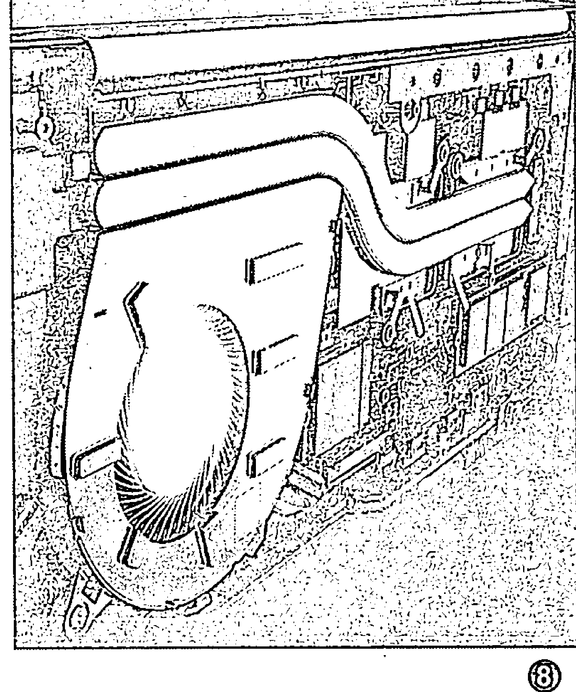

> 小提示
> 英伟达为了帮助游戏本“瘦身”，还推出了Max-Q设计的高端独显型号，其TDP较之标准版有30%以上的降低，代价是降低频率而牺牲了部分性能。目前移动显卡的性能排行，可以参考2020年第5期《决定游戏底蕴 了解笔记本的显卡》这篇文章。

#### 其他芯片还有谁在影响体验

处理器和显卡对性能的影响是立竿见影，很容易通过跑分软件量化对比。然而，在笔记本本身上还有很多芯片在偷摸着影响性能，进而有损实际体验。

##### 内存颗粒芯片

除了少数板载内存的轻薄本，如今笔记本新品都已经升级到了DDR4内存。影响内存性能的因素主要有三，它们分别是内存芯片的制程工艺（包含3D堆叠技术）、运行频率和时序。

制程工艺对内存最大的影响就是单颗芯片容量。目前已量产的笔记本内存单芯片最大容量为2GB，此时8GB、16GB和32GB内存的PCB板上分别对应4、8和16颗。有些笔记本内置的内存型号较老，单芯片容量只有1GB，8GB内存条就嵌有8颗芯片（图9），相较于4芯片的8GB内存，前者运行时的功耗偏高，对续航有一点影响。如果你日后要给笔记本升级内存，建议也购买表面芯片数量更少的同容量内存条。

笔记本DDR4内存的常见频率以2400MHz、2666MHz和3200MHz为主，理论上频率越高性能越好，但不同时期处理器平台所支持的最高内存频率存在差异。从表2可见，哪怕你给第二代锐龙笔记本换上了DDR4-3200MHz内存，它也只能运行在2400MHz的频率上。至于时序，主要对应内存条的“体质”，有些内存在2400MHz频率下的时序为17-17-17-39，超频到2666MHz时就会增加到19-19-19-43，在实际测试中二者几乎没有差别。笔记本内存不涉及超频，所以大家不必太过在意它们的时序参数。


##### SSD硬盘芯片

无论是2.5英寸的标准SSD，还是M.2插槽的迷你SSD（图10），它们的性能都受制于闪存、缓存和主控这三颗芯片。需要注意的是，有些SSD会利用主控在闪存中虚拟缓存功能，所以不再单独集成缓存芯片。

其中，影响闪存芯片性能的因素包括制程工艺、3D堆叠层数以及闪存存储模式（SLC、MLC、TLC、QLC），工艺和3D堆叠层数决定单颗芯片容量，SSD单芯片容量越高能耗比表现越出色。如今SSD闪存存储模式主要以TLC和QLC为主，TLC闪存性能更强，寿命更久，而QLC闪存的成本更低，有利于GB级别SSD的普及。主控和缓存芯片的组合对SSD实际性能的影响巨大。主控芯片决定SSD支持SATA还是PCIe总线，PCIe是双通道还是四通道，是否支持NVMe高速协议等。同时，主控芯片的算法也至关重要，通过对指定批次闪存的深度优化以及TRIM和GC等技术，可以显著提升QLC闪存的寿命，减少掉速问题出现的几率，获得不逊于TLC闪存的性能体验。如果你对SSD芯片这个话题感兴趣，可以参考本刊2020年第5期《固态硬盘大降价 杂牌值得买吗》这篇文章。

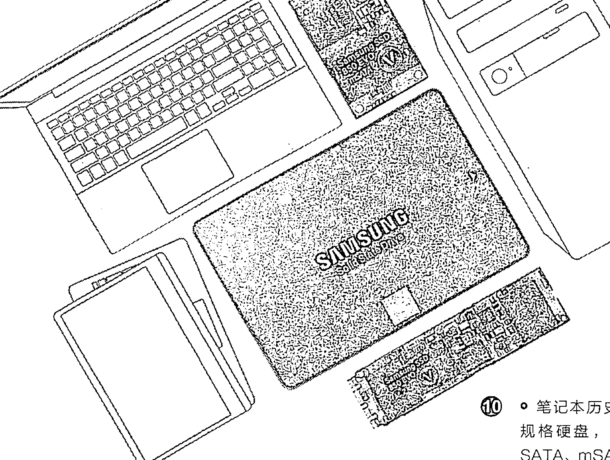

##### 无线网卡芯片

对喜欢玩网络游戏的玩家而言，哪怕游戏本配备了再强的处理器和独显，如果网速不给力，经常遭遇延迟掉线，游戏体验也只能用糟糕来形容。而影响笔记本网络体验的核心，就是其内置的网卡芯片。笔记本网卡包括有线网卡和无线网卡，其中英特尔平台笔记本大都采用英特尔自家的网卡，而AMD锐龙笔记本则经常携手瑞昱（Realtek）或博通（Broadcom）品牌的网卡（图11）。目前主流的有线网卡性能差别不大，但无线网卡就需要分出高下了。

从2019年开始上市的笔记本都内置802.11ac标准的无线网卡，支持2.4GHz和5GHz双频。但是，在这些产品中有些内置的802.11ac无线网卡仅支持1×1 MIMO单路天线（如英特尔3160和3165），又或是笔记本内部的天线（埋线）只有一根，最高理论网速只有433Mbps。想要发挥802.11ac无线网卡应有的性能，需要搭配2×2 MIMO双路天线，可以实现867MHz的理论网速。2020年最新上市的笔记本，逐渐开始过渡到支持Wi-Fi 6技术的无线网卡（如英特尔AX200），理论网速最高可达2400Mbps（图12），速度更快更稳定。

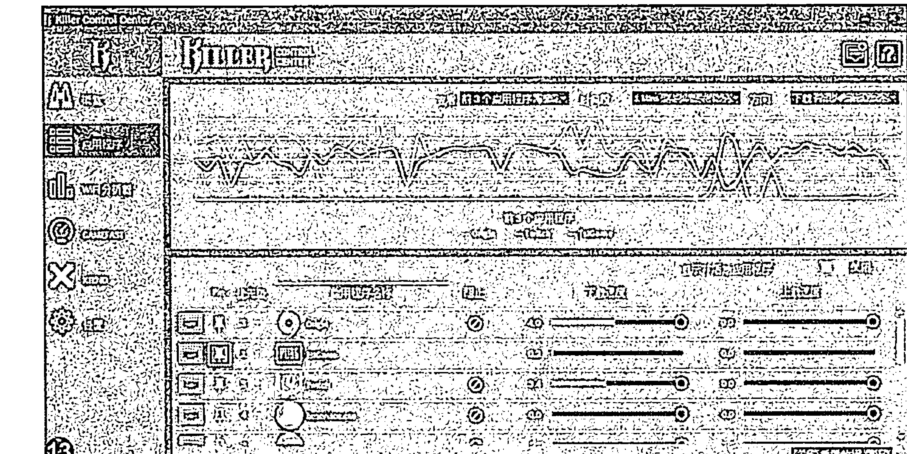

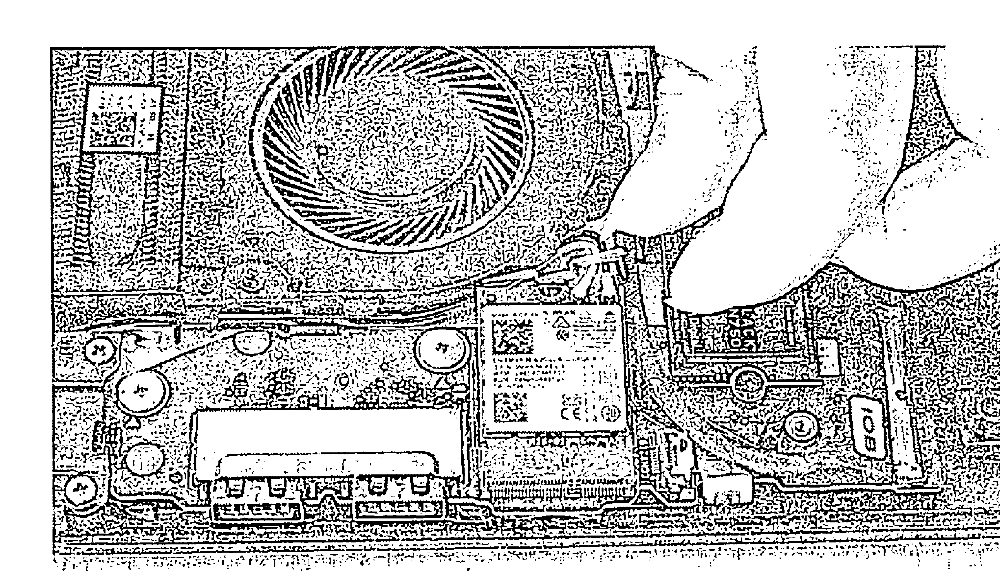

升级网卡前，要和商家提前确定与自己主机的兼容性

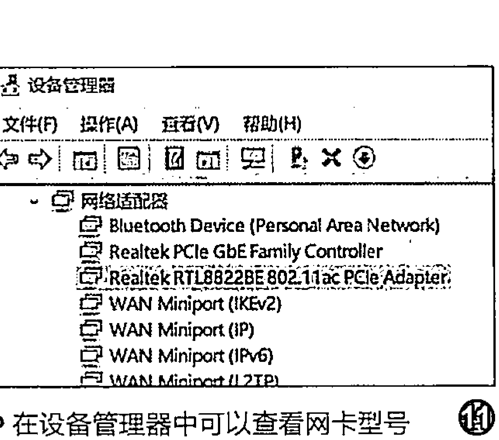

在设备管理器中可以查看网卡型号

此外，部分游戏本还素以武装“杀手”（Killer）品牌的网卡为荣，和同期同级别的其他品牌无线网卡相比，杀手网卡主打更低的延迟，并提供了Killer Control Center特色软件（图13），可以由用户自行管理分配网络资源，100%保证游戏的低延迟体验。

总之，如果你计划新买笔记本，尽量挑选标配Wi-Fi 6无线网卡的机型。如果你想给自己的老款笔记本升级Wi-Fi 6无线网卡（图14），则建议在淘宝自行购买英特尔AX200，只是该网卡仅支持64位版本的Windows 10系统，还需手动将5G信道设置在5GHz（160MHz）模式下，再安装最新驱动。

可能还有朋友发现了一个问题，在介绍处理器芯片组时，不是提到第十代酷睿处理器原生支持Wi-Fi 6了吗？为何还需额外搭配专用的无线网卡呢？答案很简单，英特尔第十代酷睿的芯片组内仅集成Wi-Fi 6媒体访问控制器（MAC），还需要专用的RF硬件（如AX200一类的无线网卡）才能触发处理器芯片组内的Wi-Fi 6功能。

##### 新一代英特尔Wi-Fi 6 (Gig+)

无线传输快约3倍 速度就是效率

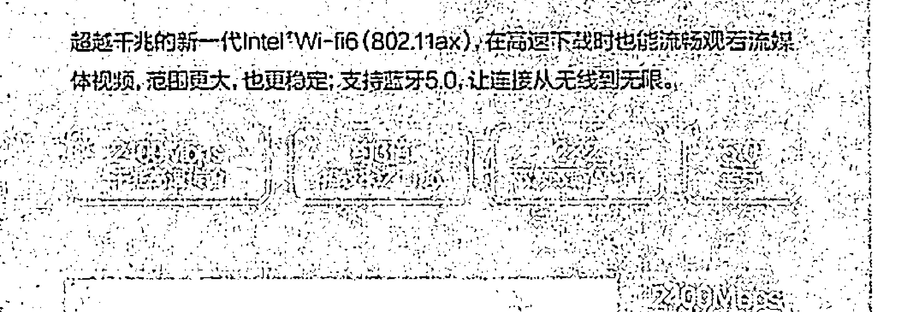

##### 其他功能芯片

都说第十代酷睿原生支持雷电3，但该功能的境遇和Wi-Fi 6类似，也需要搭配额外的认证芯片才能让最新笔记本身上的USB Type-C支持雷电3。此外，笔记本身上的USB能否支持USB3.1 Gen2，电源适配器能否支持快速充电等功能，也需要额外的控制或电源管理芯片支持，这些都很容易被普通消费者所忽视。

#### 桌面整洁 从这儿做起

在手机、平板电脑、笔记本电脑占据了大家更多时间的今天，很多人对桌面系统，也就是俗称的台式机越来越冷淡，一个重要原因就是它过于“傻大黑粗”，一些DIY主机和扩展外设更是让整个桌面都显得乱糟糟，和时尚的家居、办公环境格格不入，更是远不如手中的移动数码设备。如果索性彻底舍弃桌面系统呢？很多朋友可能又会犹豫了，台式机更好的性能、显示和交互能力等确实难以放弃，在能力与美观之间必须做一个抉择吗？当然不是，其实从很多优秀的品牌台式机设计和应用范例可以看出，台式机、DIY系统与美观、整洁并不是矛盾的。那么我们应该从哪些方面着手，才能获得一个使用更舒心、观感更美好的台式机及整个桌面呢？


扫一扫，更多精彩内容立现！

##### 规整和减少线缆

从方便和实用程度上看，减少桌面线缆是第一选择，它不需要用户购置和更换重要的设备。而从效果上看，杂乱的线缆占据的空间和造成的视觉“冲击力”可能更甚于设计无趣的主机和显示器，经常被家人唠叨的朋友们应该深有体会吧。

##### 整理和束线

在设备配置已经基本定型的情况下，最简单省钱的方式还是进行整理，其中束线是很重要也是决定性的一步。不过必须注意，束线并不等于整理，规划得不好很可能反而影响使用。在整理线缆时，笔者建议从电脑背部的I/O接口端开始理顺，在线束自然垂降到桌面后及时使用绑线固定，避免在这一端出现缠绕问题。然后在转向桌面、桌下之前和之后再分别进行束线，而转向桌面的视频线、鼠标线等线束以及转向桌下的电源线、网线、键盘线等同样在再次分束前后都进行束线。特别注意转向桌下的线缆一定要固定而不能任其垂坠，否则它们对其他线缆的拉动会造成麻烦，甚至可能被脚拉到造成危险（图1）。

###### 特别话题

### 电脑爱好者 2020年合订本（一）

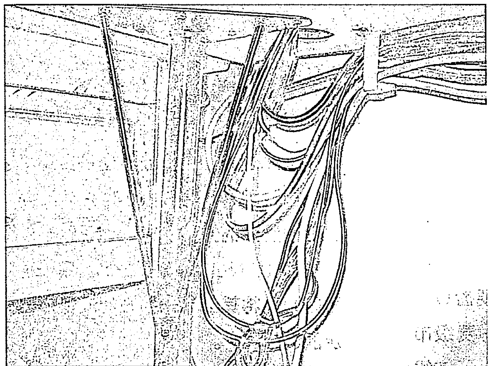

至于工具，笔者比较推荐带有粘贴固定面的理线器（图2），它同时具有束线、固定和调整走向的功能，且价格并不昂贵。在无需调整走向和固定位置的时候则可使用最便宜的绑带，几元钱就可以买到一大包，不仅可以用于捆绑多条线缆，还可以捆扎同一条线缆，调整其长短。这里要注意的是，在捆扎后最好将多余的部分剪去（图3），可以让线缆束更爽利。因为其非常廉价，所以未来调整时直接剪断再用一条新的即可，无需考虑留下调整的空间。

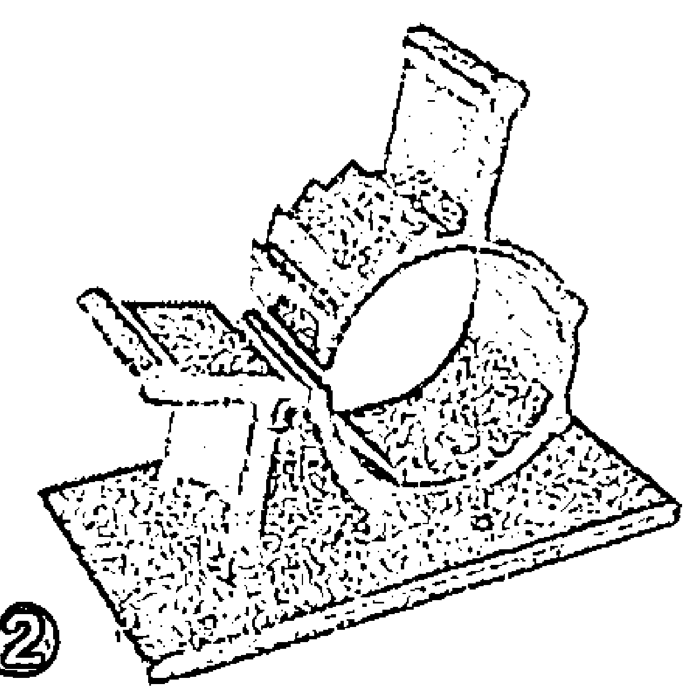

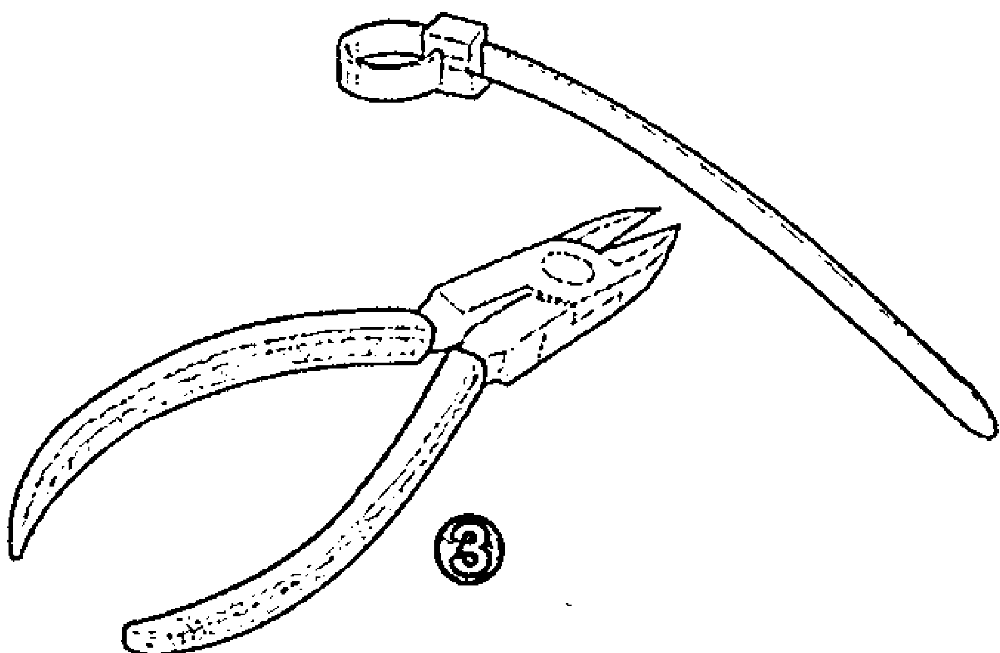

至于一些临时性或希望独立分群的连线，例如移动硬盘、手柄、多声道音箱等，可以使用便于拆装的魔术贴理线带（图4），它们不仅可以随用随拆，也大都可以通过色彩等特征进行明确区别，便于识别使用。


> 火速链接
> 关于绑带的应用和选择，可以参考本刊2019年第12期《装机小细节 它们助你成高手》一文。

##### 无线化外设

可能的话，尽量减少连线当然是让桌面更加整洁的最佳方式，不过这种方案有诸多限制。比如更换为无线外设肯定需要一定的成本，无线连接方式的速度可能较差，无线信号容易受到干扰等，所以在选择的时候有相当多的讲究。


对一般用户来说，百元级的无线键鼠就足够使用，当然这里要强调的是，在价格类似的情况下，应尽量选择推出较晚的产品，因为从2018年左右，蓝牙与2.4G这两种最常见的键鼠无线连接技术都有了决定性的进步，可以大幅提升使用体验。对办公用户而言，可以更关注支持蓝牙技术的产品（图5），便于连接多个设备、配合笔记本电脑使用，此外对耐久度、静音型有更高的要求。当然这两种用途都要考虑美观度及其与主机、显示器、桌面其他设备的外观配合度。

至于游戏玩家，笔者建议还是以键鼠、手柄的

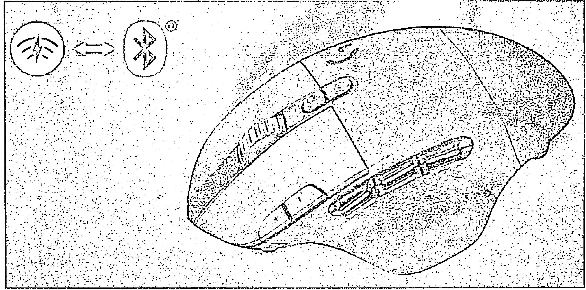性能为优先考虑, 本刊近期有较多相关文章, 如2019年第19期《奋战再无束缚 无线游戏外设》等, 大家可以进行参考, 这里就不再赘述了。不过大家还是要注意, 虽然已经有一些游戏鼠标采用了2.4G+蓝牙方式或纯蓝牙方式, 这多是为了便于连接笔记本电脑, 兼容办公应用, 如本期介绍的罗技G604鼠标（图6）。当然它们也可以用蓝牙模式连接笔记本电脑玩一些主流游戏, 但目前蓝牙连接方式的游戏性能仍显不足, 无法应对激烈游戏或电竞游戏的高速、低延迟要求, 玩游戏时最好还是使用2.4G接收器。

无线连接也并不局限于键鼠手柄等操控外设, 目前无线显示器、无线耳机、无线硬盘等产品也逐渐成熟和走向消费级市场, 未来一台基本无需外部连线的台式机已经可以期待了。

##### 微型主机

ITX主板、短板显卡和小机箱的组合, 是如今的DIYer已经很熟悉的产品, 它们的组合就是强力又小巧的所谓小钢炮（图7）。当然对性能要求并不高的用户, 不使用显卡也没有问题, 我们真正想要感受的还是小巧主机带来的宽敞桌面和独特观感。

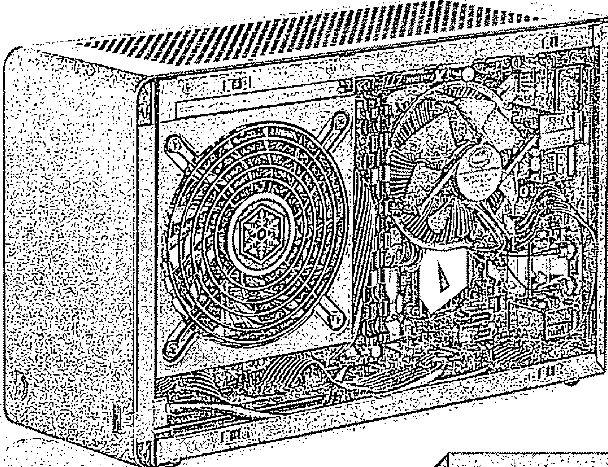

还有一种特殊的DIY方式可以获得体型极为小巧的电脑, 即以英特尔NUC为代表的准系统。它们提供了主板、处理器、电源等部分, 用户可自行添加内存、硬盘（2.5英寸和M.2规格）（图8）。这些电脑仅有巴掌大小, 几乎可以说根本不占用桌面面积。

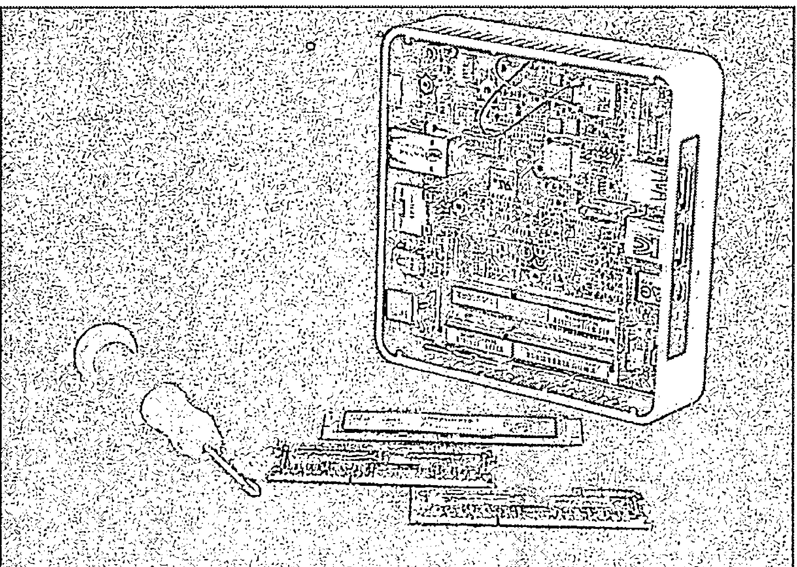

与英特尔NUC的设计、大小类似的产品还有索泰ZBOX、技嘉BRIX等, 它们各有特色, 例如ZBOX有一些体积稍大的型号集成了高端显卡, 用最小的体积组建高性能游戏甚至专业设计用主机。

##### 小型与整合

除了连线之外, 主机当然也是占用桌面的重要因素, 将其缩小也是让桌面更宽敞整洁的方法。第一种思路当然就是ITX、NUC等微型主机, 另一种思路则是将其与另一种必备设备如显示器进行整合。

> 火速链接
NUC的配置和设计会随着英特尔处理器的升级而不断变化, 近期的主流NUC介绍可参考本刊2019年第7期《准系统当道 教你挑选英特尔NUC》一文。

此外还有一些已经固定配置的品牌主机也有着小巧靓丽的外形，例如戴尔的OptiPlex系列商用主机就经常会推出中塔、小型、微型机箱版本供用户选择（图9）。其中的微型机箱版本非常纤细，贴墙放置或者卧置作为显示器底座占地也非常少。惠普推出的幻系列Elite Slice外形与NUC类似，但可以通过模块扩展提升音频能力、增加光驱等，设计也相当巧妙。

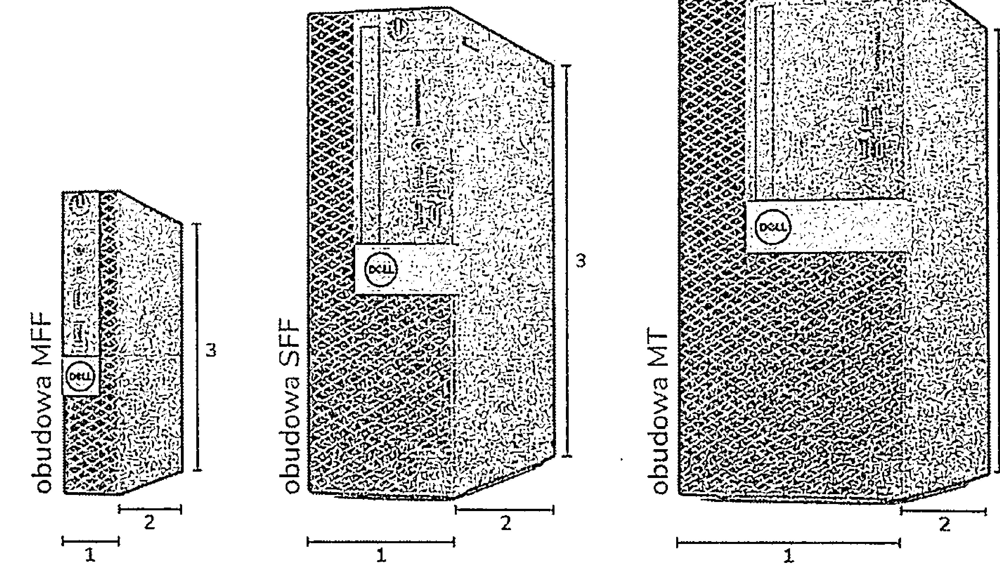

##### 一体整合

将主机直接与其他设备，主要是显示器整合到一起，既可以节省桌面空间，也可以减少这些设备间的连线。这里我们首先想到的当然是一体机，它将主机装入显示器内，省去了主机电源线、视频连线等，外形简洁清爽（图10）。

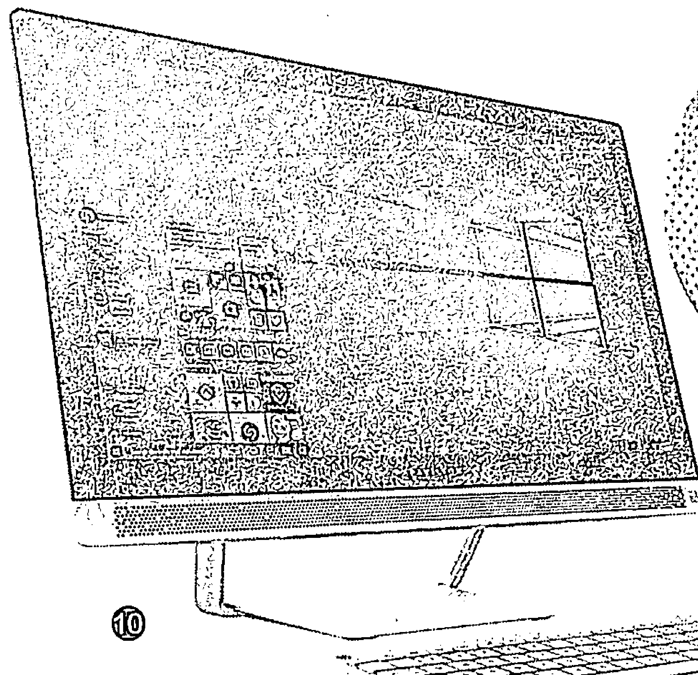

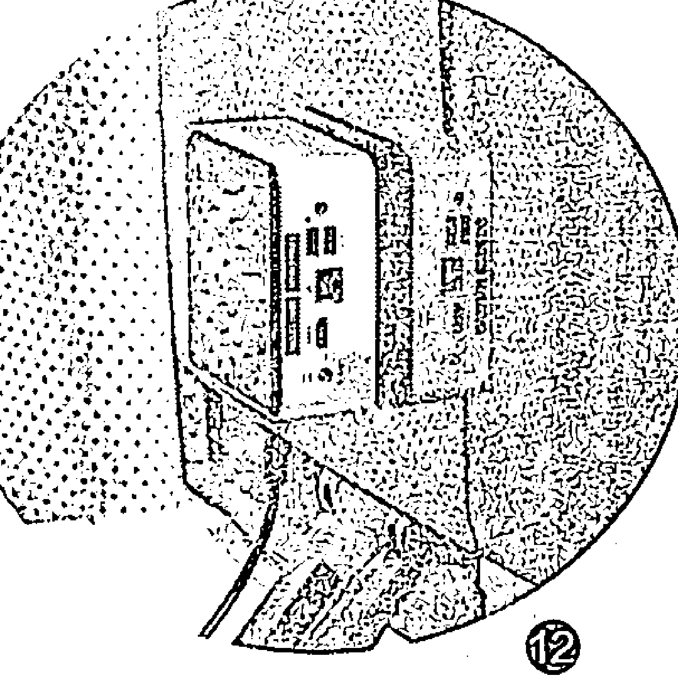

主机也设计了与显示器整合的能力，例如英特尔NUC可以通过底部的VESA支架固定在显示器背部，形成类似一体机的效果（图12）。

其实目前线缆也在逐渐进行着整合，USB一统通用数据传输后，雷电3、USB4等接口正在努力将电源、视频信号、数据信号等进行统一（图13）。未来如显示器等需要拖着数根连线的设备很可能只需要一根线就可以了，这会让桌面更整洁，也让这些设备更便于连接。

目前一体机的发展已经很成熟，既有面向日常应用、入门性能的高性价比产品，也有高性能、高颜值、特殊设计和用途的产品。而对于有一定DIY经验，或者对性能、功能有独特需求的用户，可DIY的一体机无疑是最好的选择，其中一些产品甚至可容纳高端处理器、显卡等配件（图11）。

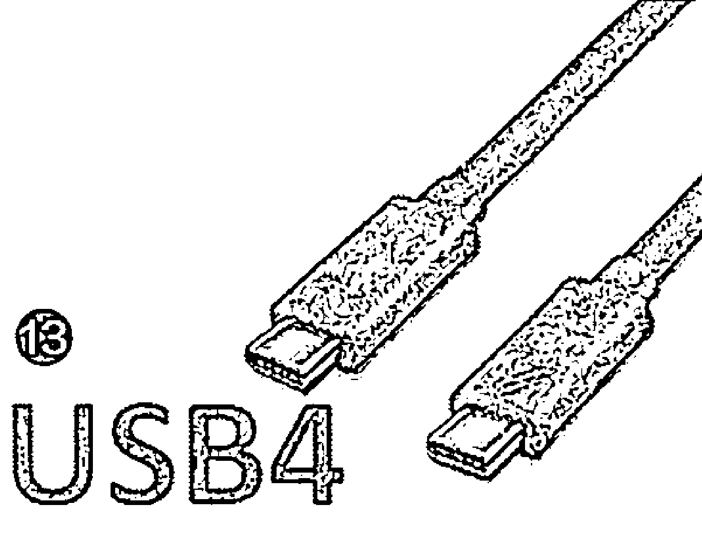

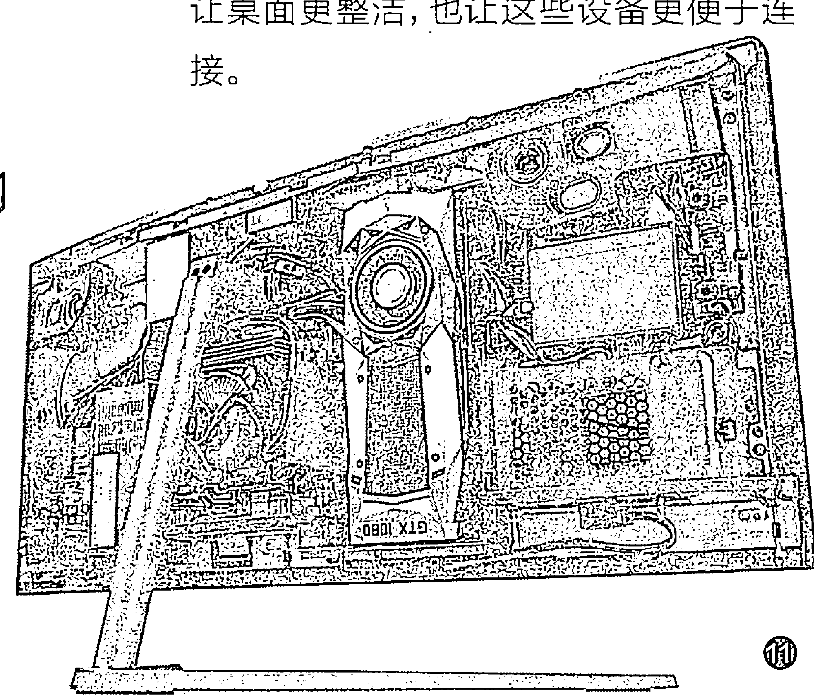

除了“真正”的一体机，其实前面提到的很多微型

##### 多彩个性

除了精简之外，我们当然也可以使用更漂亮的设备提升台式机的颜值，让整个系统更加美观，同样能扮靓桌面甚至整个房间。

##### “脸面”的重要性 美型机箱与显示器

作为桌面上最显眼的两个大家伙，显示器与机箱无疑是一款电脑的脸面，也彰显着用户的个性。在产品的选择上，笔者的推荐是颜色第一，其次选择形状、图案等个性化设计，因为大型设备的颜色会留给观看者深刻的第一印象，同时也是配合周边设备、房间陈设的最重要因素。

在机箱方面，黑色是最常见的，不过与目前主流的房间陈设大都是格格不入的，笔者认为在可能的情况下，白色、银色这种也比较常见的色彩很值得考虑，既不会因为过于个性化而有明显溢价，又特别容易与主流的房间装修、陈设颜色搭配。

对于追求更加个性化的用户，其实目前市场中色彩和形状非常个性化的机箱也是相当多的，而且部分产品的价格并不昂贵，例如乔思伯（JONSBO）、银欣（SilverStone）的小型机箱，安钛克（Antec）的军绿机箱等。而目前性价比更突出的则是从超炫设计变成了主流设计的侧透乃至全透机箱和铝制机箱等（图14）。

至于特别个性化的异形机箱（图15），虽然更加美观和个性，但目前的价格非常昂贵，而且为了外观设计，常常会牺牲空间和易用性。比如以中塔式机型的体积，只能安装ITX、mATX主板，还可能无法安装全长显卡，所以目前笔者并不是很推荐。

受到面积巨大的屏幕影响，显示器在外观设计方面可发挥的余地并不大，除了在游戏/电竞显示器中常见的红色装饰和棱角设计外，很少见到黑、白之外的色彩。不过我们可以考虑另一种选择，那就是简洁型设计，包括占用空间更小的窄边框、薄面板，以及占地更小的底座，当然还有便于理线的支架等。目前这类产品比较常见，例如戴尔的主流显示器支架就普遍采用小底座和带束线孔的支架（图16）。这里需要注意的是，看似更小巧的爪式底座实际上可能展开了更大的面积，会占用较大的桌面。

对性能要求不高的用户则可以在市场中挑选一些色彩、外观出色的产品，比如三星S24D360HL（图17）等，虽然参数、指标并不高，但外观相当靓丽醒目，绝对是桌面上的一道风景。

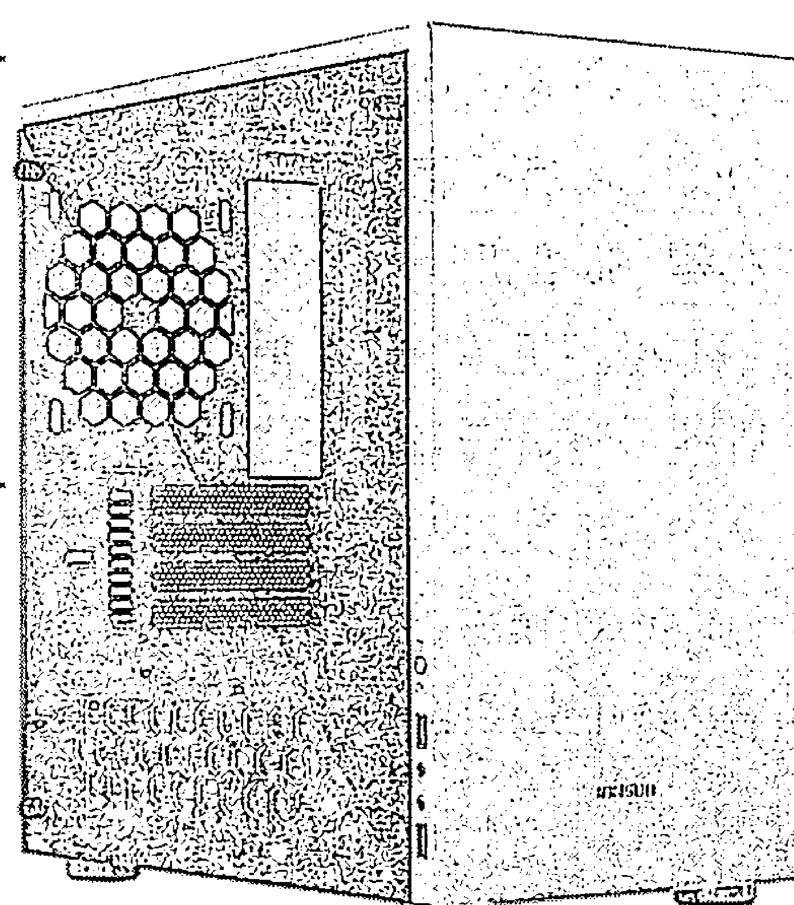

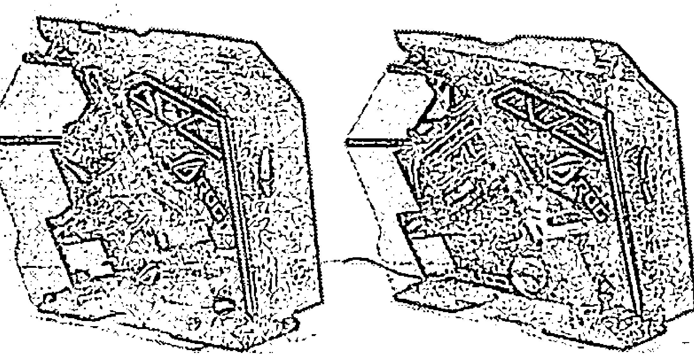

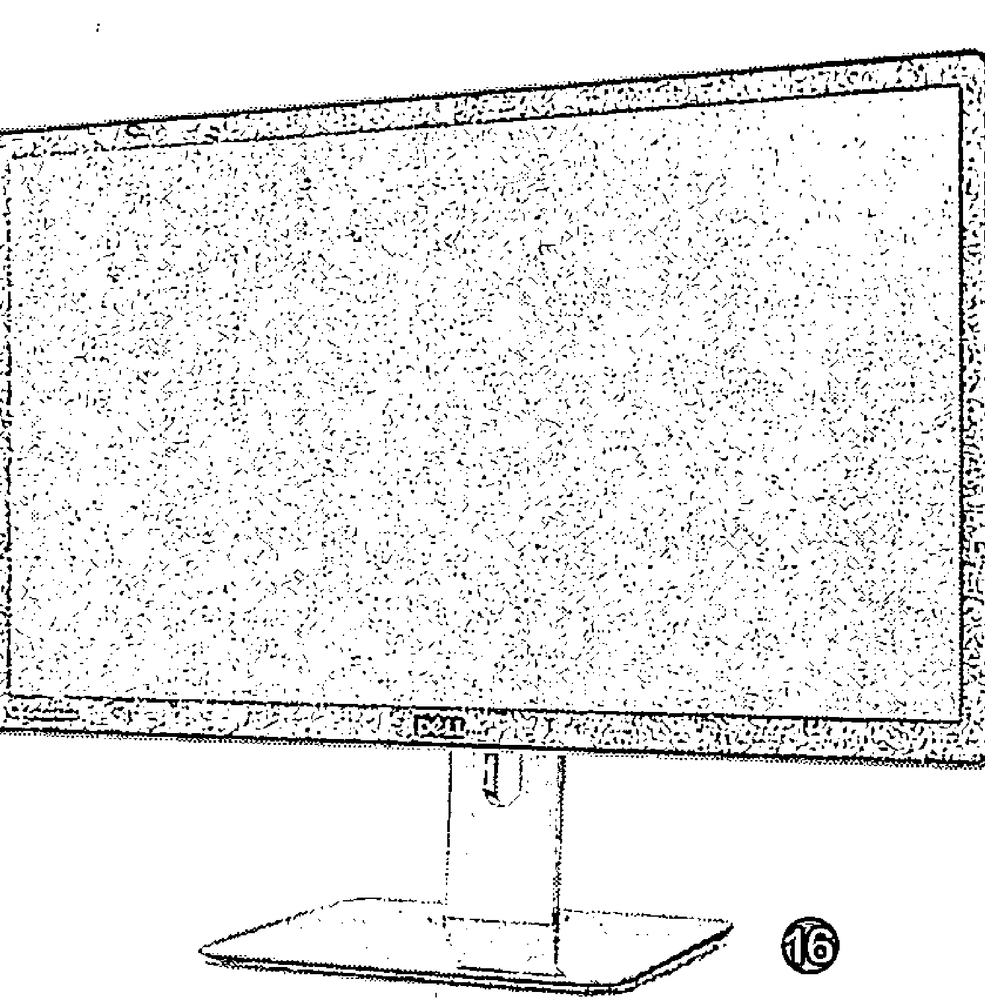

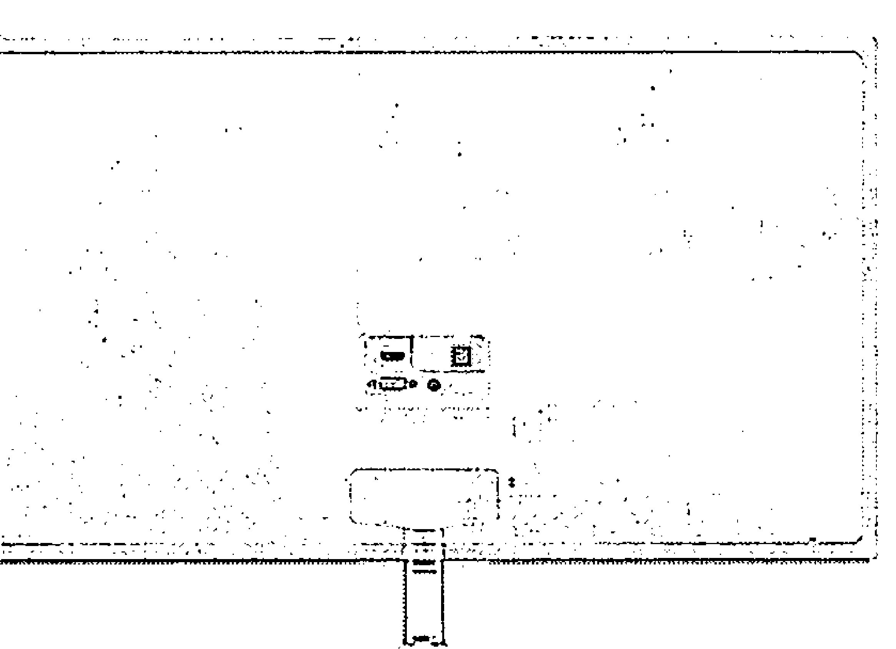

##### 个性键鼠

放置在桌面显眼位置的键鼠当然也要足够靓丽，在外形方面，没有了线缆约束的无线键鼠的设计更胜一筹，可以做得更轻薄、更圆润，没有线缆也使它可以在桌面上更充分地展示自己的存在感（图18）。

虽然目前流行的机械键盘大都是有线设计，在整体外形、厚度等方面受到了限制，但它拥有更自由的键帽配置和自由更换键帽的功能，可以进行个性化改造（图19），充分展现用户的风格。

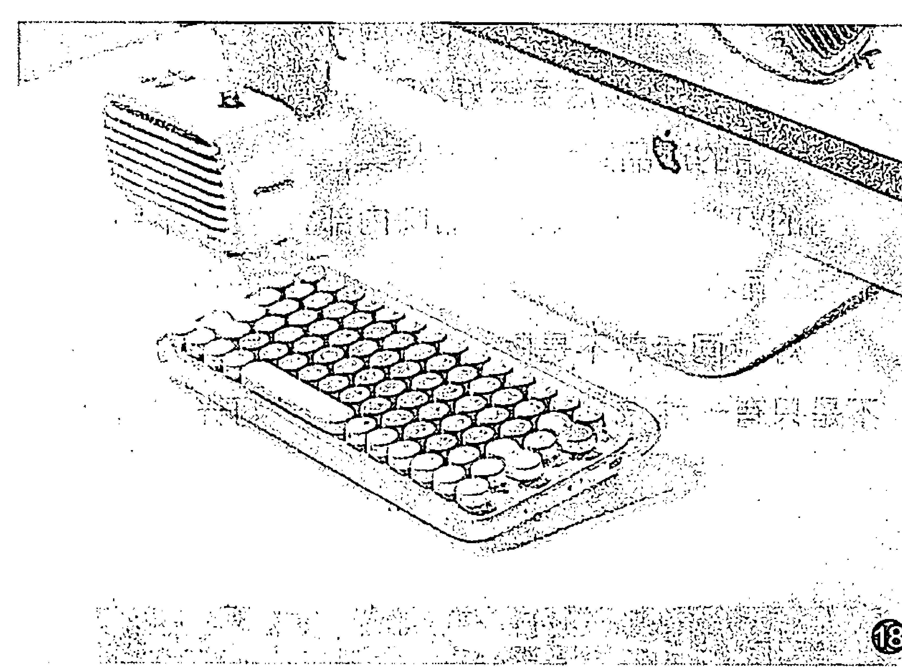

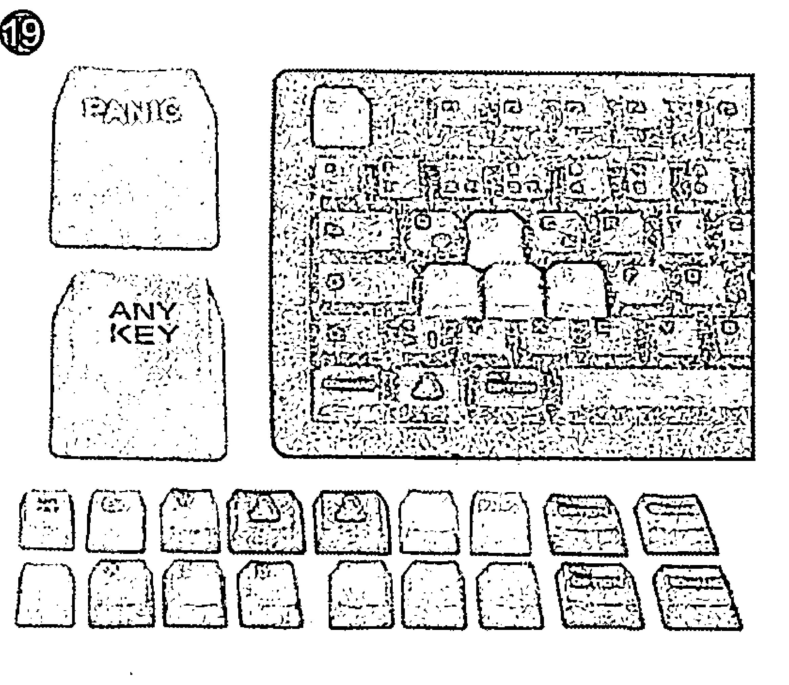

> 火速链接
需要注意的是，键帽除了色彩之外，其实也有不同的外形、高度等设计可选，相关介绍可以参考今年第4期《指端感觉自定义 键帽高度》一文。

##### 其他外设与设计

其实我们还可以选择一些其他外设或者设计，来提升桌面的整洁度。比如对常常搅乱桌面的耳机，就可以使用耳机挂架或者通过显示器的耳机挂架设计来降低其影响。此外还有更容易布置的线型音箱、更容易与显示器结合的摄像头等，因为需求相对较少，这里就不作为重点进行介绍了。

##### 光之影像

在色彩、外形之外，现在的电脑系统有一种新的个性化装饰，那就是灯效。而且随着灯效的普及和发展，能够让电脑整体观感更加统一的灯效同步技术取代简单的灯效、RGB色彩等，成为了新的热点。

目前在主机上，华硕、技嘉、微星、华擎这几大板卡厂商的灯效同步方案都已经很成熟，特别是前三者，得到了其他板卡、机箱等产品的广泛支持。而且因为这些方案的控制原理大同小异，其实只要是能兼容控制接口的针脚和电压（12V/4Pin和5V/3Pin），就基本能保证灯效同步，而内存更是无需连线就能支持（图20）。

在外设方面，Tt、罗技、海盗船、酷冷至尊等厂商也都有自己的灯效同步技术。其中Tt与酷冷至尊也支持前述四大板卡厂商的灯效同步，使用灵活度较好，但罗技与海盗船的产品则大都不支持其他厂商的灯效同步，只能在品牌内部产品间同步。

灯效同步并不是默认选项，也不是只有一种选择，在确认各部件支持灯效同步后，还需要使用软件进行设置。在设置时，笔者建议大家考虑动感的灯效，与游戏、音乐同步就很不错，所有配件也可使用不同的色彩规划，因为整个电脑及外设同步为呆板的相同颜色或同频率的灯光，观感其实并不好。

在针对外设使用时，一定要注意保护为键盘常用键设置的识别背光，实用化的设定最好保存为预设方案，千万不要为了“统一性”而牺牲了灯效的实用价值。另外显示器和机箱等处的灯光强度和颜色、闪烁效果也不要过于刺眼。

##### 其他方式与技巧

其实和装机高手的一些小心思、小工具一样，要扮靓桌面，如果能在一些看似不起眼的方面有自己的巧思，可能会有事半功倍的效果，而且效果大都很独特。

例如难以让键盘、鼠标的外形、色彩统一的话，不妨使用大型桌垫或鼠标垫，可以将显示器前部桌面的观感统一起来，相对较小的键鼠都会成为鼠标垫的“点缀”而不会太过突兀。另外钟情于某些主题的用户，可以考虑使用贴纸来为主机、外设增加相应的效果。比如我们很难找到动漫、游戏、明星、运动、动物等主题的外设产品，但相关贴纸很容易买到（图21）。


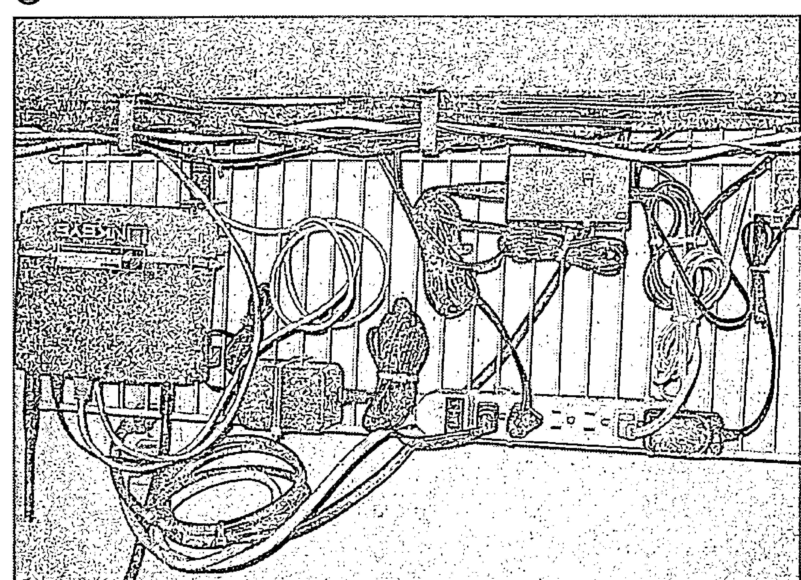

将其贴在机箱、显示器、键鼠、耳机上，配合同类型的电脑桌面壁纸，同样能让电脑体现出自己的兴趣和个性。

另外还有一些小技巧，例如使用钢丝托盘或托架来整理线缆，可以将接线板、电源线甚至一些设备直接绑在上面（图22），有一种IT数码产品试验台的观感。对经常要插拔各种设备的用户来说，这样的“工作台”上线缆路线、设备位置都特别明确，非常易用。

### 系统应用

#### 随心所欲 更改窗口组件字体大小

在Windows 10之前的低版本系统中，我们可以通过“显示”设置，分别更改窗口标题栏、菜单、调色板标题、消息框和工具提示中字体的大小。但是，目前的新版Windows 10中已经取消了更改这些设置的入口，要想在Windows 10中完成上述字体修改，我们需要借助于注册表或第三方软件来完成。

##### 1 注册表修改法

按下Win+R组合键，打开“运行”对话框，执行REGEDIT命令启动注册表编辑器。在注册表编辑器窗口中定位到“HKEY_USERS\.DEFAULT\Control Panel\desktop\WindowMetrics”项，该分支下保存了显示窗口组件字体的有关信息。其中，数值项IconFont用来设置图标字体；CaptionFont项设置标题栏字体；MenuFont项设置菜单字体；SmCaptionFont项设置调色板标题字体；StatusFont项设置状态栏字体；MessageFont项设置消息栏字体（图1）。

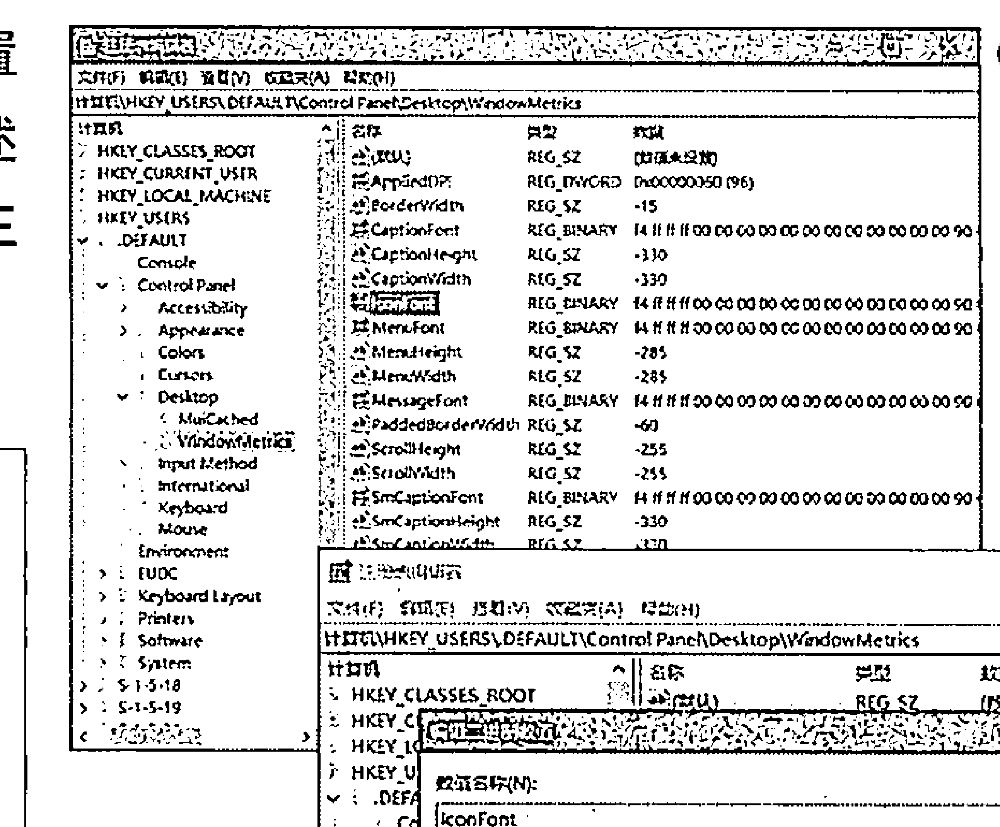

> 火速链接
关于System Font Size Changer软件的更多用法，如原有字号备份、字号方案导出等操作，参见本刊2018年第11期文章《找回调整Windows 10字号功能》（http://www.cfan.com.cn/2019/0513/132421.shtml）。
更多关于Windows 10资源管理器功能的扩展用法，可参看本刊2019年第17期文章《资源管理功能缺失第三方软件弥补》。

双击其中的某个项目，会以二进制和十六进制的方式显示对应项目字号的数值数据。其中，默认以F4 FF FF FF段开头的数值，F4表示使用的是小五号字（9磅）。如果要将字号修改为五号（10.5磅），只需将F4修改为F2（图2）。修改完毕后，注销并重启系统。

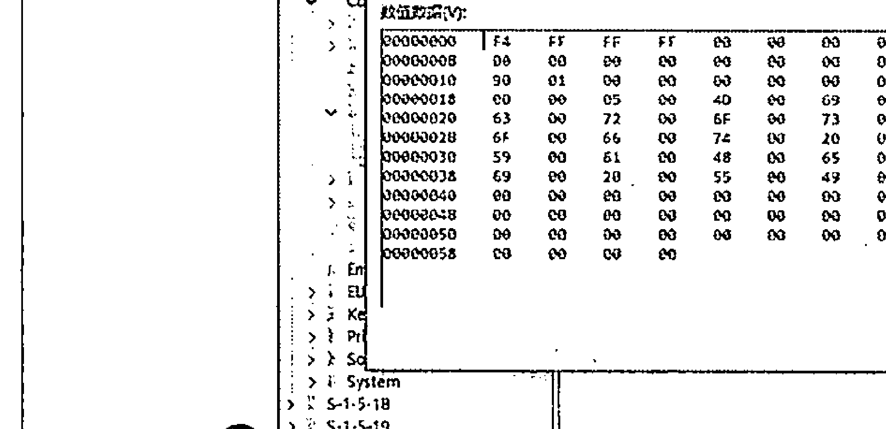

> 小提示
由于低于Windows 10版本的系统中可通过显示设置手动设定Windows组件的字体大小，通过手动修改字号并观察注册表中相应值的变化，可得出常用字号与十六进制码的对应关系（见附表）。

| 中文字号 | 对应磅值 | 十六进制码 |
|---|---|---|
| 小五号 | 9 | F4 |
| 五号 | 10.5 | F2 |
| 小四号 | 12 | F1 |
| 四号 | 14 | F0 |
| 小三号 | 15 | E9 |
| 三号 | 16 | E8 |
| 小二号 | 18 | E6 |
| 二号 | 22 | E2 |
| 小一号 | 24 | E0 |

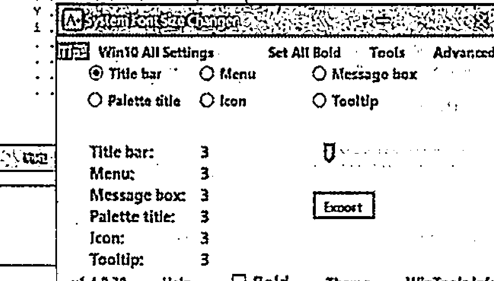

##### 2 软件修改法

除了用编辑注册表的办法修改窗口组件的字号外，我们还可以使用第三方工具软件System Font Size Changer for Windows 10来进行修改。在软件中选择要修改字号的项目，然后用滑动块调整字体的大小即可（图3）。

#### 打印机“故障” 修改系统能解决

> **火速链接**
重启打印服务设置的具体方法，请参见本刊文章《非常规打印的小窍门》( http://www.cfan.com.cn/2015/1216/124154.shtml )。

有时，我们会遇到打印机无法添加、无法打印、无法删除等故障，重置打印机设置或检查电缆、接口等均没有效果，重启电脑或打印机也无法解决。在确认网络和打印机本身均无问题时，可尝试在系统中重置一下打印服务，或者修改组策略来解决。

组策略中关于打印机的设置策略，可通过在本地组策略编辑器内依次打开“本地计算机策略→用户配置→管理模板→控制面板→打印机”，用该分支下的选项来进行设置(图1)。注意，该分支下的某些策略项目不适用于常用的Windows 10或Windows 8，本文所选策略对上述两个版本均适用。

##### 1 无法浏览并找到网络打印机

在组策略窗口的上述路径中选择“浏览网络以便查找打印机”选项并双击进行设置。由于该项被设置为“已禁用”时，打印机向导中将会删除网络打印机浏览页，用户将无法搜索网络打印机，这时必须键入准确的打印机名称才能搜索到该打印机。因此，在此处只要将选项设置为“已启用”或“未配置”即可恢复(图2)。

##### 2 默认打印机无法设置保存

添加的打印机如果设置为默认打印机后无效，则可双击“关闭Windows默认打印机管理”项，将其设置为“已禁用”即可。如果设置因某种原因被修改为“已启用”，Windows就不会管理默认打印机，因此用户的设置将不会被系统理会。

> **小提示**
启用“阻止添加打印机”组策略设置不会阻止用户使用添加硬件向导来添加打印机，也不会阻止用户运行其他打印添加程序来添加打印机。此设置也不会删除已添加的打印机。但是，如果用户在应用该设置后添加打印机，则无法打印。

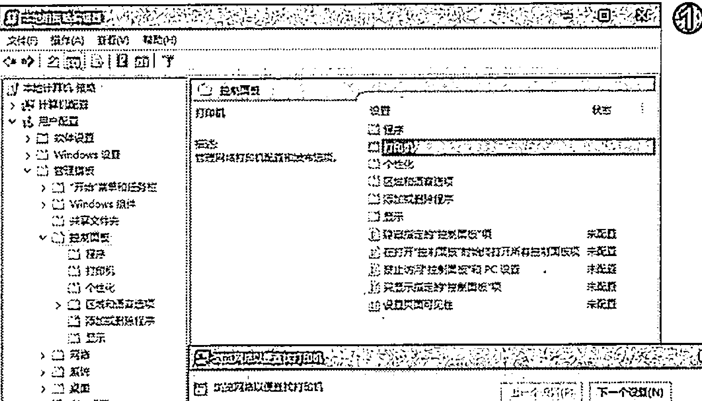

> **小提示**
若是启用上述设置，如果用户试图删除打印机，例如使用“控制面板”中“打印机”中的“删除”选项来删除打印机，则会显示一条阻止删除操作的消息。

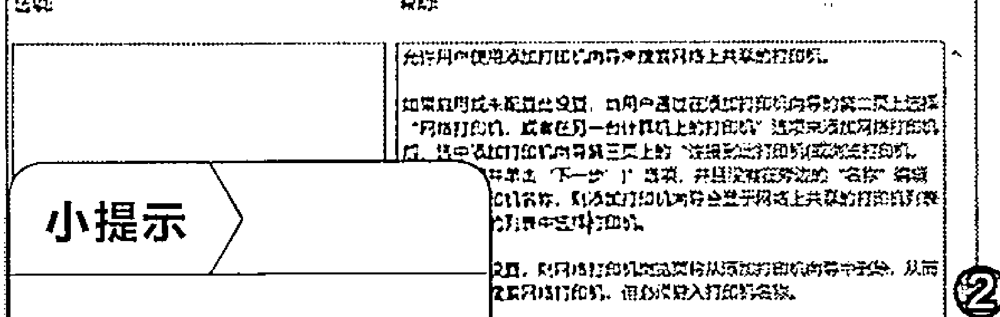

##### 3 无法找到添加打印机入口

有时，我们甚至无法通过常规渠道(如开始菜单或控制面板)找到添加打印机的入口，也无法通过拖动打印机图标的方式将打印机添加到“打印机”文件夹。若遇到这种情况，可双击“阻止添加打印机”项，并将其设置为“已禁用”或“未配置”即可。

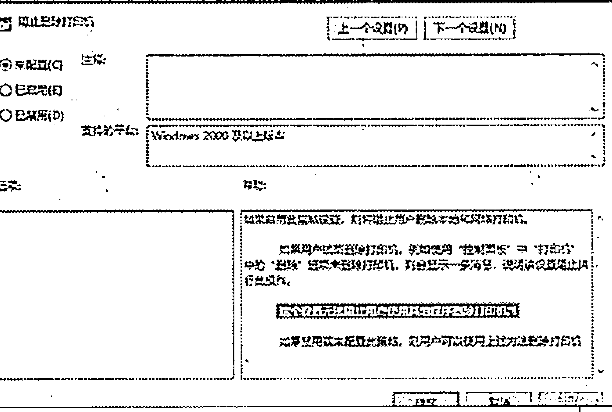

> **小提示**
如果是启用上述设置...

##### 4 无法删除现有的打印机

有没有遇到过打印机列表中的某个打印机无法删除的情况？若遇到这种情况，可通过将“阻止删除打印机”项禁用来解除(图3)。
但是，这个设置无法阻止用户使用其他程序删除打印机。因此，在不动用组策略的情况下，我们还可以尝试使用第三方打印机控制程序来删除打印机。

#### 获取Windows 10应用程序的版本

文|童乐安

当Windows 10环境下的商店应用或传统程序出现问题时，若需要反馈问题给开发者并获得在线帮助，往往需要明确告知技术支持人员你所使用的软件版本。那么，如何才能获知当前软件的版本呢？这里介绍三种方法。

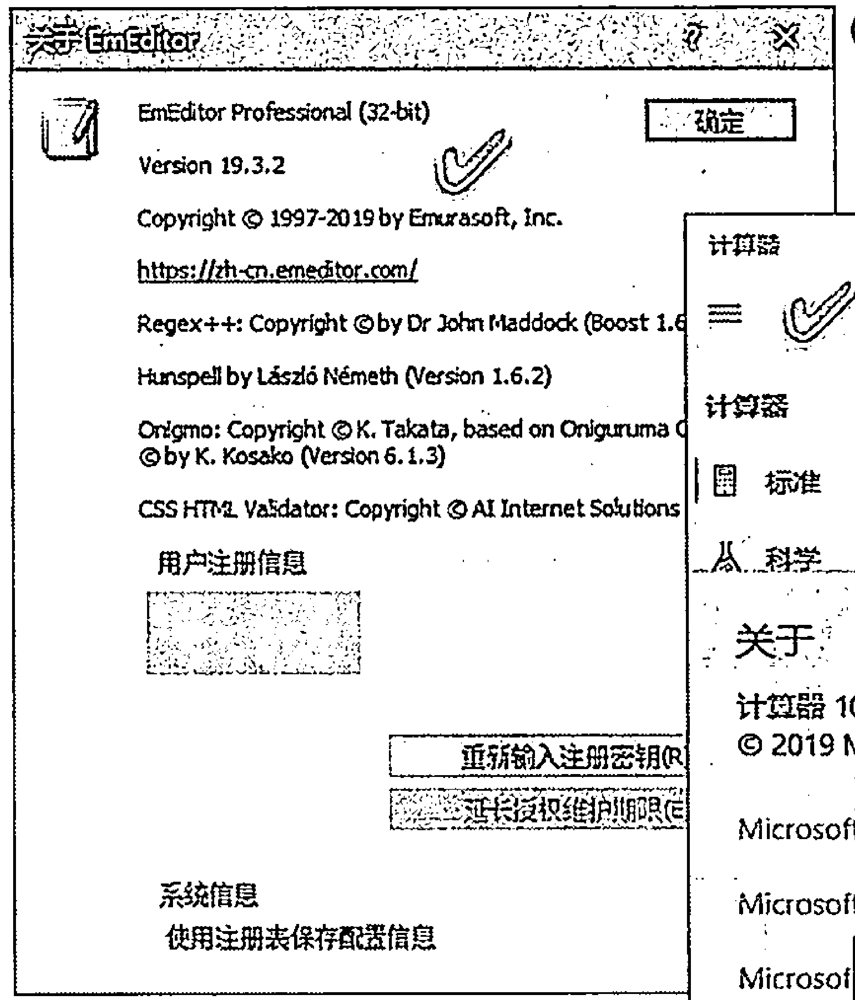

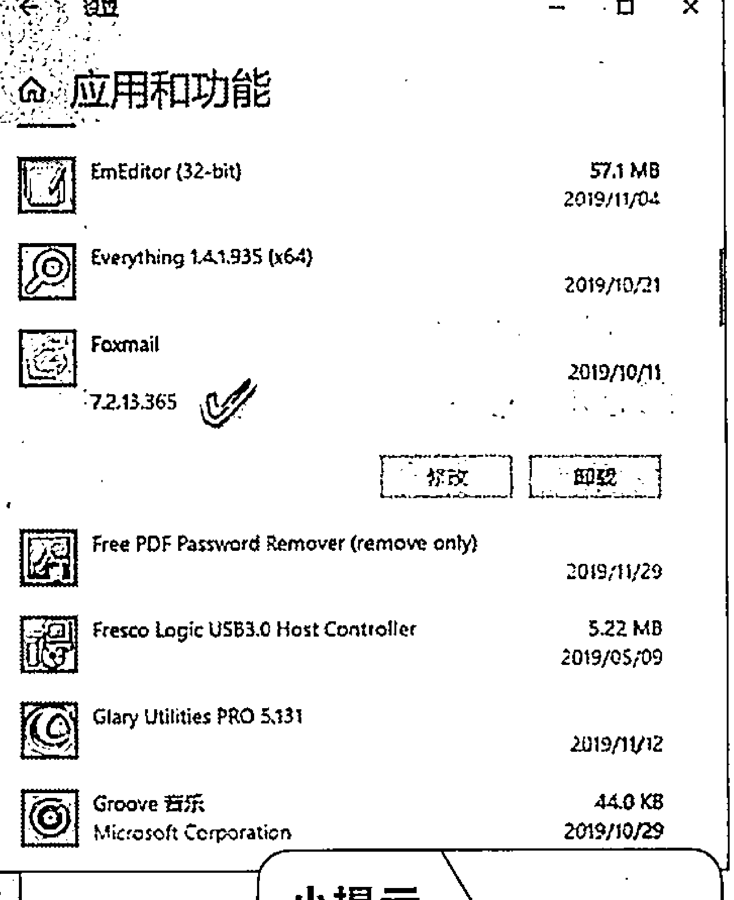

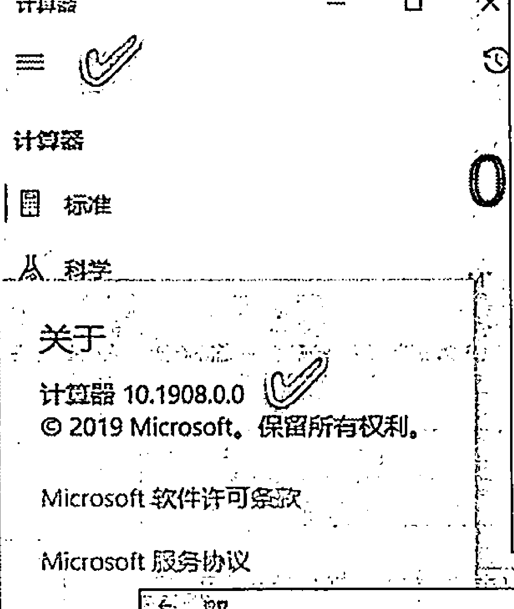

> 小提示：如果“版本”列不存在，右键单击列表标题行，选择“更多”，然后选中“版本”复选框，单击“确定”。

##### 1 从软件内部查看

当发生问题的软件尚可以启动时，我们可以通过软件自身来查找软件的版本信息。一般来说，在软件的“帮助”菜单中有“关于”软件的信息，从中可获取当前软件的版本（图1）。或者通过应用左上角的控制菜单，选择“关于”选项，查看应用的版本（图2）。

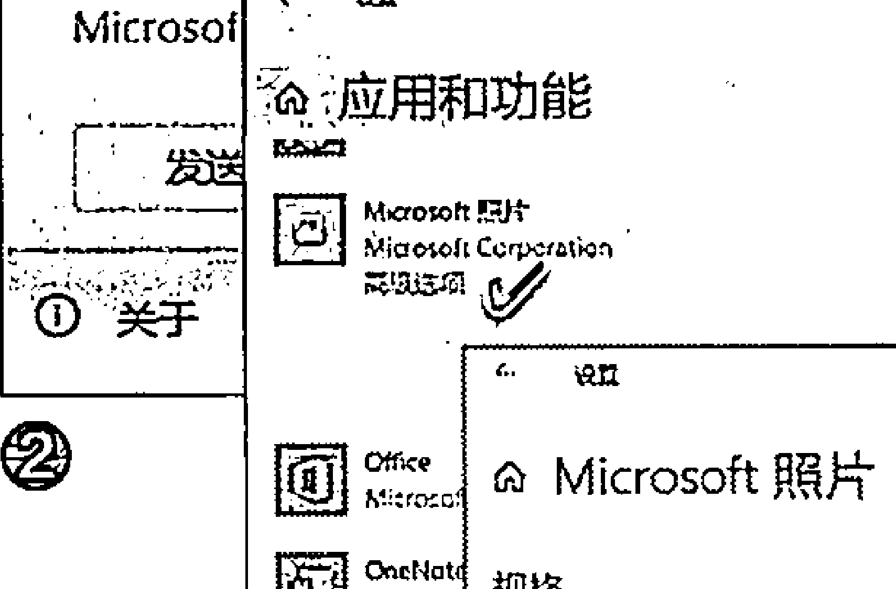

##### 2 利用系统设置查看

如果要查看版本的软件已经无法启动，那么可以通过系统设置来查看其版本。右键单击“开始”按钮并选择“应用和功能”。在接下来出现的应用和功能列表中，可以看到本系统中已经安装的商店应用和经典应用程序的记录。
要查看一个经典应用程序的版本，只需在列表中点击该应用程序的条目，下方就会出现该软件的版本信息（图3）。而要查找一个商店应用的版本，需要在点击该应用条目后，点击“高级选项”，然后才能看到详细的版本信息（图4）。

##### 3 利用控制面板查看

除了在Windows设置中查看应用程序的版本号外，我们还可以通过经典的控制面板来显示已安装的程序的版本号。这里需要注意的是，传统的控制面板中没有列出从应用商店安装的应用，查找商店应用版本只能用上面的方法。
我们首先通过任务栏搜索框搜索“控制面板”，启动控制面板后点击“卸载程序”（也可以用Windows 10直接搜索appwiz.cpl，一步到位）。在“卸载或更改程序”列表中，“版本”一列便显示了所有已安装的应用程序的版本号（图5）。

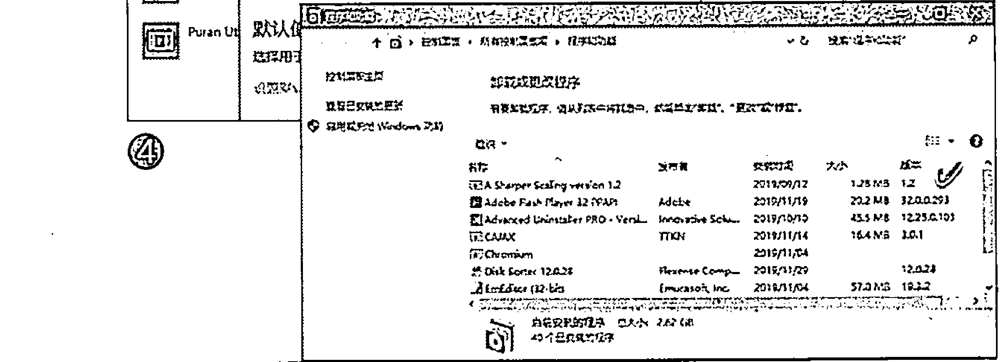

#### 自动清空回收站的几种实现方法

文|波哥

桌面回收站中的文件总是需要手动去清空，是不是觉得比较麻烦呢？那么，我们何不想法，让回收站根据我们自己的意愿能自动清空？

##### 1 用回收站本身的设置

首先，我们可以利用系统回收站本身的设置来实现自动清理。右键单击桌面的回收站图标，然后选择菜单中的“属性”一项，在随后出现的“回收站属性”对话框中，将“不将文件移到回收站中，移除文件后立即将其删除”选项选中，应用并确认之后，回收站便具有了实时自动清空的功能。这样，在你将文件丢入到回收站的同时，就等同于执行了两个动作，一个是将文件放入回收站，紧接着是清空回收站（图1）。

上述方法显然比较“武断”，它切断了我们删除文件后直接找回的后路，因此一般不建议采用。当然，通过反删除软件，还是有办法找回。

##### 2 用存储感知设置实现

利用Windows 10系统的“存储感知”功能，也可以实现回收站的自动清空。依次点击“开始→设置→系统→存储”，打开“存储”设置窗口，点击“配置存储感知或立即运行”链接（图2）。接下来，在配置存储感知窗口中开启“存储感知”开关，并设置运行存储感知的周期；在“临时文件”选项下，先选中“删除我的应用未使用的临时文件”选项，接着在“如果回收站中的文件存在超过以下时长，请将其删除”列表下，选择自动删除回收站文件的周期（图3）。这样，也达到了自动清空回收站的目的。

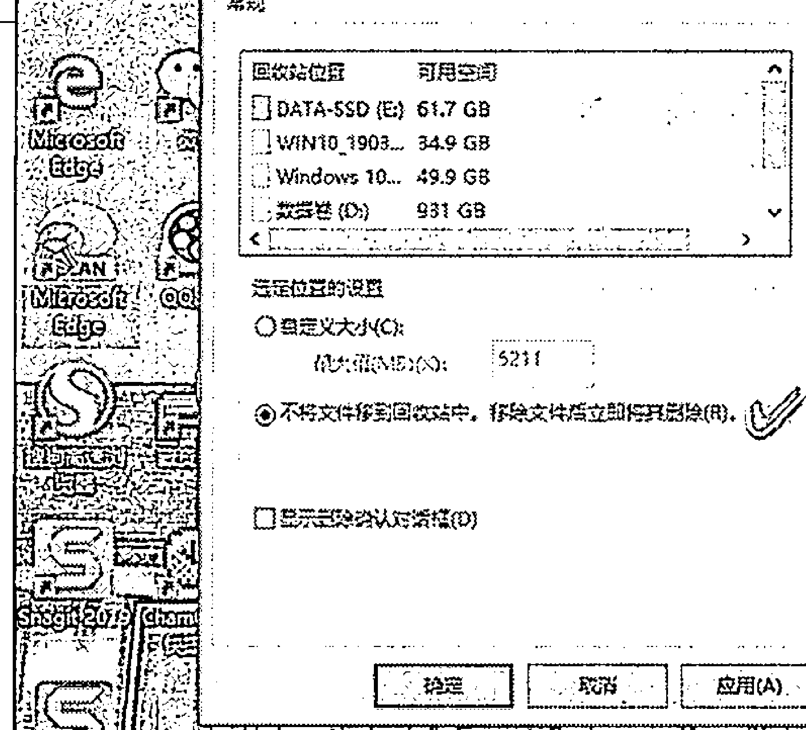

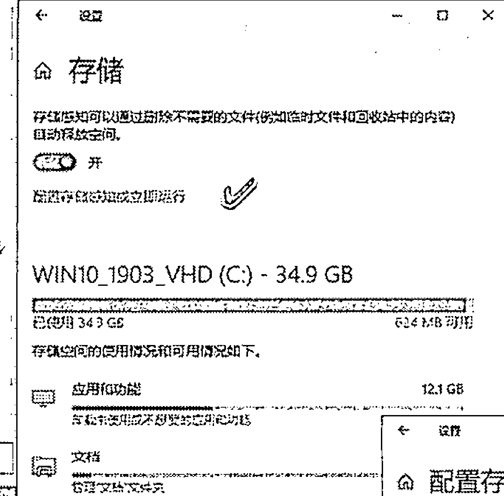

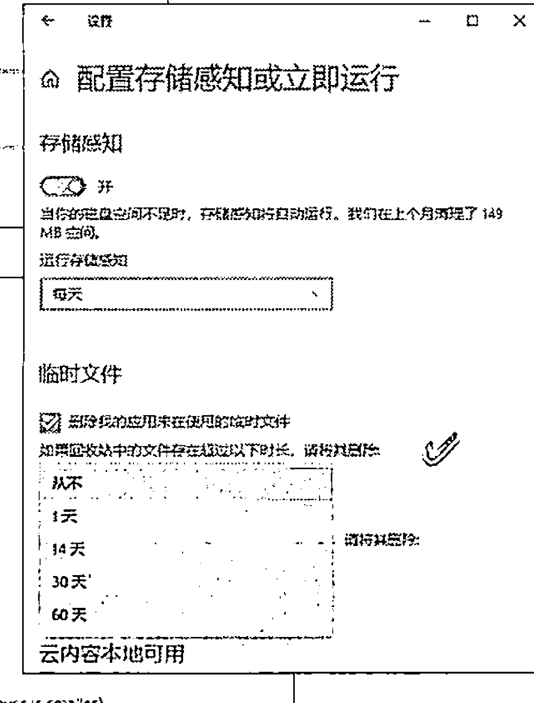

##### 3 编制简单批处理实现

我们还可以通过手动编制批处理文件，达到自动清空回收站的目的。有关方法，详情可参考本刊2017年第19期的文章《手动打造自动清空的回收站》。

##### 4 用第三方小工具实现

如果觉得上面的方法均比较繁琐，那么，最省事的办法莫过于通过一个第三方小工具Auto Recycle Bin来实现。只需安装设置运行，即可实现自动清理。

运行Auto Recycle Bin软件后，首先选择清理方式（手动、系统启动自动清理、定时自动清理），这里我们要选择第三个选项。然后选择要设置的分区，并完成清理周期和回收站大小的设置（图4）。最后点击Process all按钮完成设置，等待条件满足后自动执行清理任务。

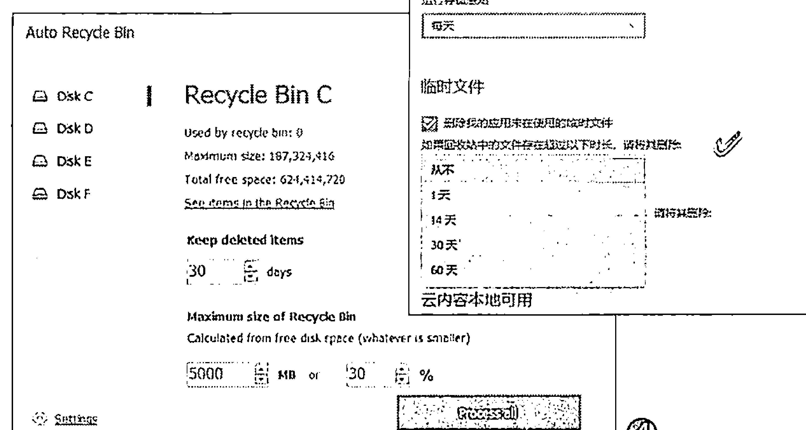

■

#### 在Windows 10中自由控制同步内容

文|樱子

许多人使用不止一个Windows 10设备，每个设备中的工作内容和进度有所不同，因此选择性地开启Windows 10中的同步内容很有必要。那么，如何控制Windows 10中的同步内容呢？

> 本刊文章《无处不在的微软账号》（http://www.cfan.com.cn/2016/0120/124723.shtml），曾详细讲述过Windows同步设置、OneDrive文件同步的内容。

##### 1 单个用户的Windows 10同步设置

对于单个用户来说，Windows 10的内容同步可通过“设置→帐户→同步你的设置”进行设置（图1）。用户文件可通过OneDrive进行同步。注意，需要使用Windows网络账号登录。

虽然Windows 10 Mobile将失去支持，但与Windows 10使用相同的用户账号登录，同步功能仍可使用。

##### 2 所有用户的组策略同步设置

对于多用户使用Windows 10的情况，如果希望灵活控制所有用户的同步项目，可以借助组策略编辑器来完成。首先，点击“开始”菜单并键入gpedit.msc，按下回车键，启动组策略编辑器。然后，导航到以下路径：“本地组策略编辑器→计算机配置→管理模板→Windows组件→同步你的设置”（图2）。

这里所列出的几个策略允许配置不同的同步行为，包括是否同步：应用、应用设置、密码、桌面个性化、个性化、开始设置、按流量计费的连接、浏览器设置、其他Windows设置等。所有这些策略在默认情况下都是禁用的（效果为可同步），若要阻止某个同步项目，需要双击打开此策略并将其切换到启用状态。保存更改时不需要重新启动系统。若是要禁止所有项目进行双向同步，双击“不同步”选项，然后将设置改为“已启用”即可（图3）。

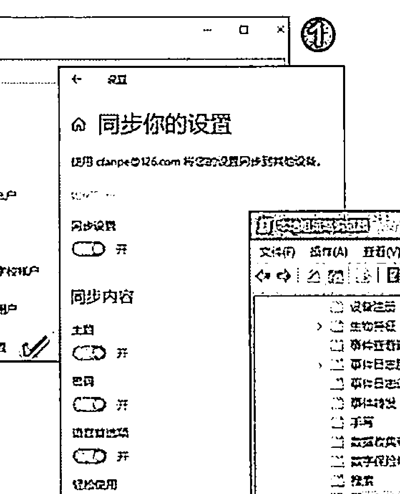

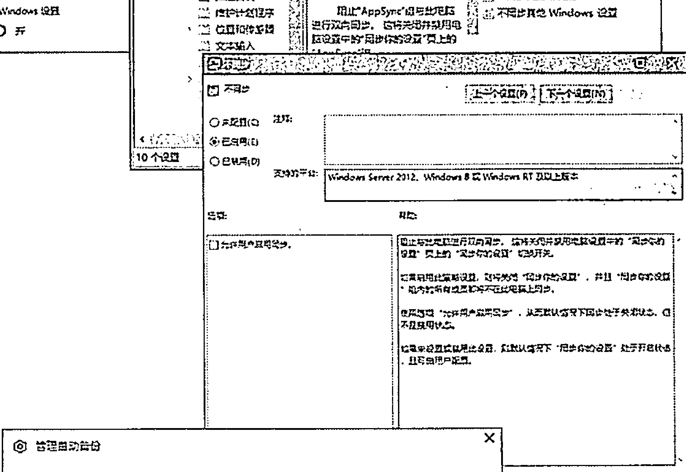

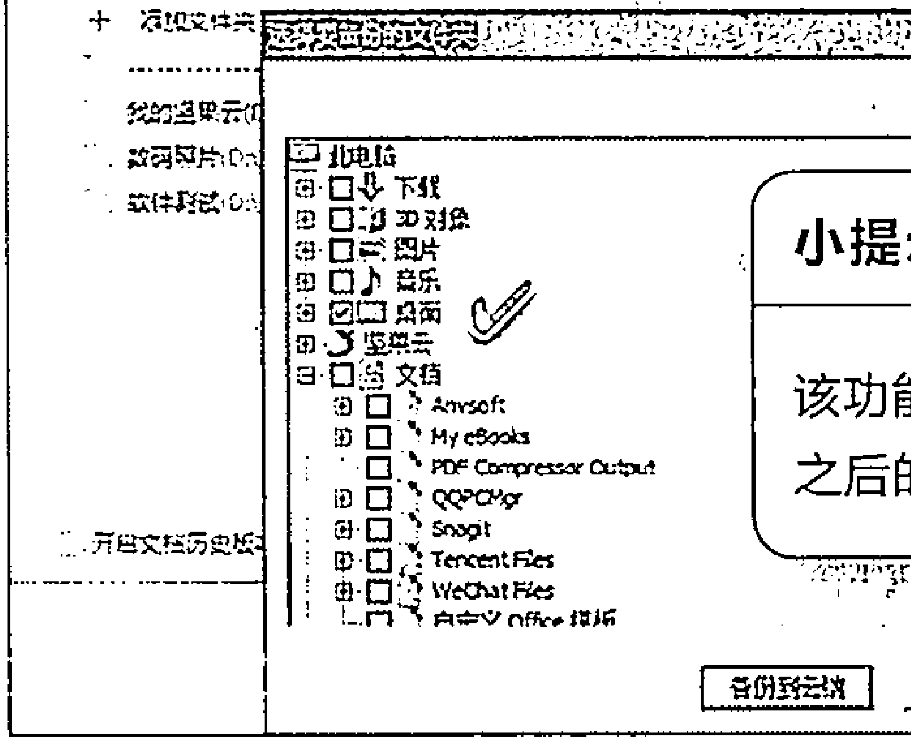

> 小提示：该功能在Windows 10 1703之后的版本中均可用。

##### 3 利用第三方软件弥补同步

在Windows 10自身的同步功能外，我们可用第三方工具来同步自己的内容。例如通过百度网盘的“自动备份”服务，进行指定内容的网络单向同步（图4）。

如果希望本地指定的文件夹内容在多台设备上实现同步，可使用坚果云之类的双向同步软件。用户可以指定需要同步的系统文件夹（如桌面）和用户文件夹。

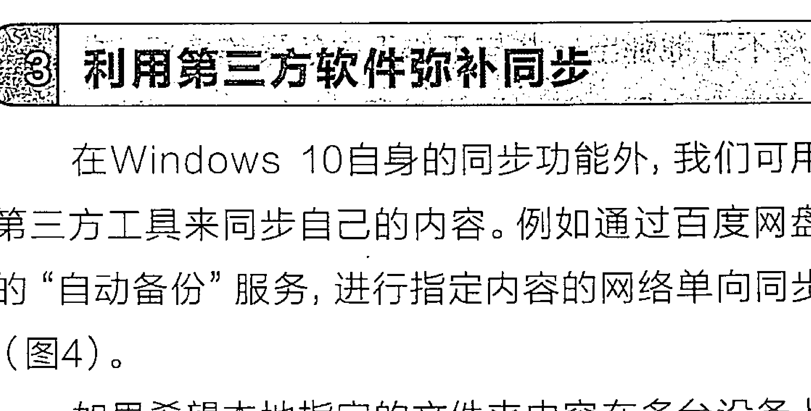

#### 用“云内容”策略管好Windows聚焦

文|童乐安

Windows 10的Windows聚焦功能不单单是指系统“设置”中的聚焦锁屏背景及其信息提示，还包括系统中许多方面的聚焦提示内容。通过“云内容”策略，我们可以对Windows聚焦进行更为全面和有效的管理。

首先，按下Win+R组合键启动“运行”对话框，输入并执行GPEDIT.MSC命令，启动本地组策略编辑器。随后，依次定位到“本地计算机策略→用户配置→管理模板→Windows组件→云内容”。有关Windows聚焦的所有设置均从这里开始（图1）。

##### ① 屏蔽所有Windows聚焦功能

如果想安心干活，不希望Windows系统冷不丁地弹出一些与工作无关的聚焦信息，或者正在使用一部以流量计费的Windows平板或PC，希望节省网络流量，这时可以用“关闭所有Windows聚焦功能”的“云内容”策略设置，一次性关闭所有与聚焦有关的内容。

具体设置方法：双击“云内容”，点选并双击“关闭所有Windows聚焦功能”（图2）；在随后弹出的配置窗口中，将配置选项选择为“已启用”（图3）。这样就不会弹出任何聚焦提示信息了。

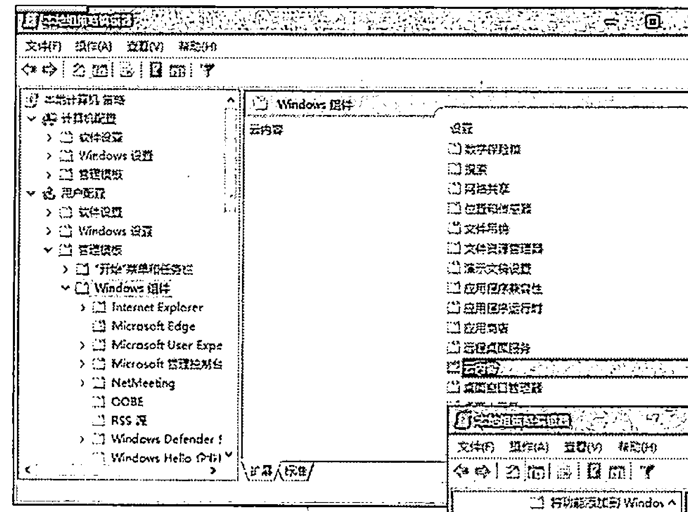

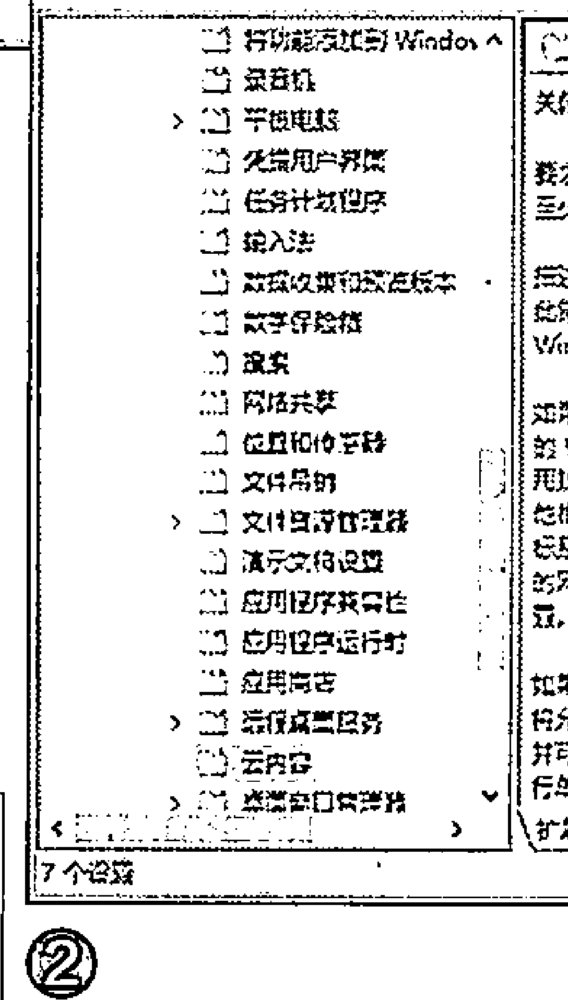

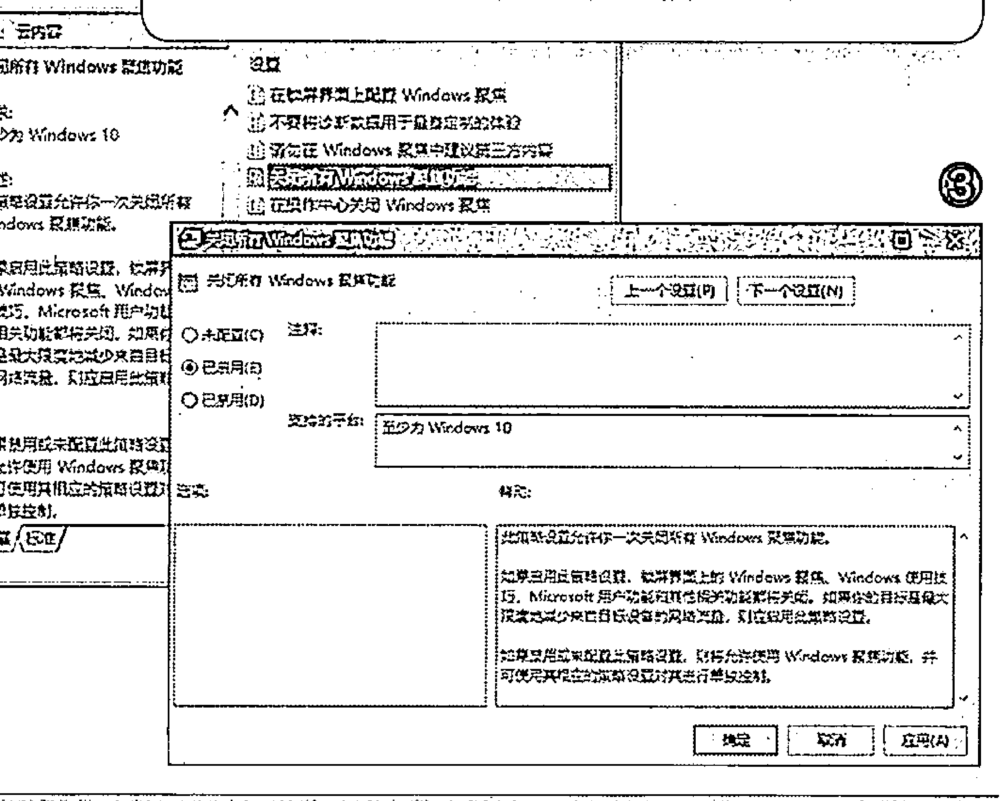

> > 小知识：全面认识Windows聚焦
> 除了锁屏界面上的Windows聚焦背景外，Windows聚焦功能还包括Windows使用技巧、Microsoft用户功能和其他相关功能通知提示。Windows聚焦通知可能会出现在操作中心，在“设置”应用中也会出现Windows聚焦建议内容；一些其他Windows应用也会发出欢迎体验相关的聚焦信息（如Edge启动时的新功能提示）。此外，Windows聚焦也包括来自第三方应用的推送信息显示。

##### ② 选择性关闭Windows聚焦内容

有时，我们只希望对Windows本身某些方面的聚焦内容进行独立控制。这时，只需按需分别对“关闭‘欢迎使用Windows’体验”、“在‘设置’中关闭Windows聚焦”、“在操作中心关闭Windows聚焦”、“不要将诊断数据用于量身定制的体验”、“在锁屏界面上配置Windows聚焦”等选项，进行单独或组合性的设置即可。

##### ③ 只屏蔽第三方聚焦内容

由于聚焦提示信息内容还可能包括来自第三方软件发行者的应用和内容，而第三方软件的名目和内容具有许多不确定性，因此，我们也可以一次性关闭所有第三方软件相关的聚焦内容，只保留Windows系统自身的有关聚焦内容。我们只需双击“请勿在Windows聚焦中建议第三方内容”，将其设置为“启用”，而同时不要禁用Windows自身的聚焦功能即可。

#### Windows 10系统自带输入法两问

Windows 10自带的输入法基本能够满足用户的使用。但在使用过程中可能还会遇到一些问题，例如系统升级后原有的输入法使用出现异常；想用双拼方案实现更为均衡的输入效果，苦于代码不好记忆等。其实这些问题不难解决。

##### 系统升级后输入法使用异常怎么办

有的用户发现，当自己的系统从较低版本的Windows 10升级到最新版的Windows 10之后，在使用内置的输入法时，常常会出现中文标点无法输入，只能输入英文标点，或者遇到一些其他莫名其妙的问题。

要解决上述问题，只需在Windows设置窗口的“时间和语言”窗口中点击“语言”，在“首选语言”下选中“中文(简体，中国)”，然后点击下面的“选项”按钮(图1)；在“语言选项：中文(简体)”设置窗口，找到“键盘”下的“微软拼音”和“微软五笔”输入法，点击当前使用的输入法，然后点击“选项”按钮(图2)；在随后出现的输入法设置窗口中，将“使用以前版本的微软拼音输入法”开关置于“开”的位置，然后点击“确定”按钮，即可使用原有版本的输入法实现正确的输入(图3)。

小提示：如果直接全新安装最新版的Windows 10系统，则不会出现上述选项和开关。

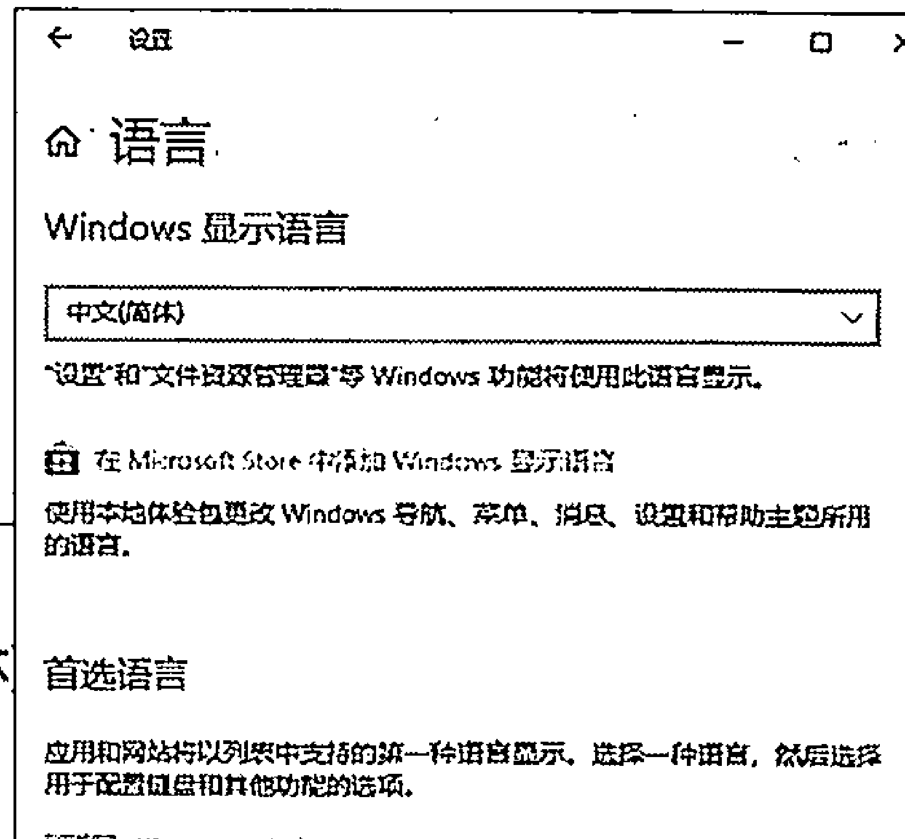

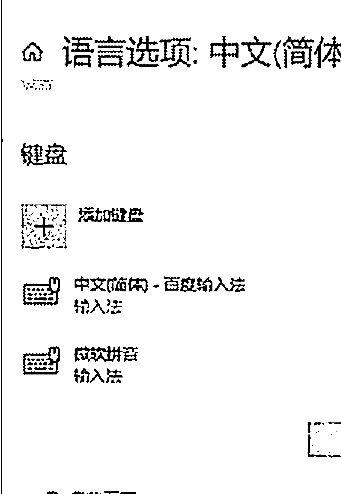

小提示：由于双拼方案较多，编码各不相同，因此要认准一种坚持使用，这样才能发挥最高效率。从通用性考虑，建议优先选用系统自带的微软双拼或智能ABC双拼方案。

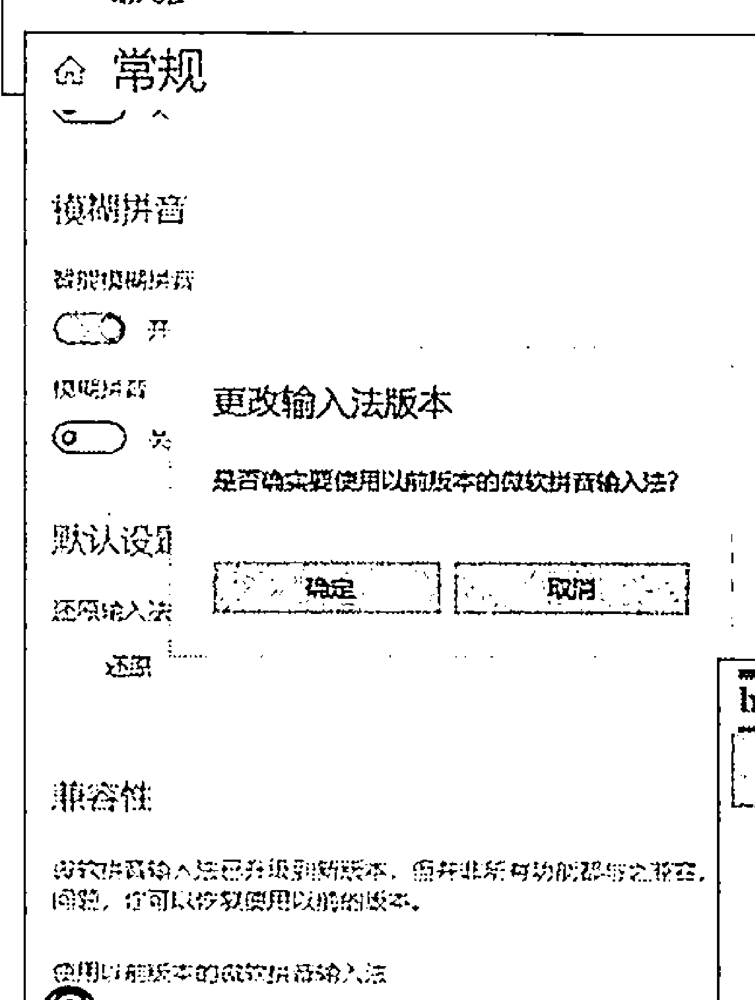

##### 不看代码表 如何快速学习双拼输入

微软拼音输入法提供的双拼输入方案，其特点是码长相对固定和重码少，可以提供击键次数与准确率之间更均衡的输入。但要用双拼实现高效输入，需要记忆一些代码。那么，如果手边没有代码表，或者不想用代码表，如何才能快速获知键盘上的26个键位分别代表哪些声母或韵母呢？

先进入微软拼音输入法的设置窗口，点击“常规”，选择“双拼”和一种双拼方案(例如微软双拼)，并保证“自动扩展到全拼”选项开关置于“开”的位置。这样，在输入环境下按下一个键位时，就会出现它所代表的声母或韵母。例如，当按下bh编码时，屏幕上出现“帮”的完全拼音bang，这时我们就会知道，原来b键除了代表声母b本身外，还代表韵母ang。同理，输入vs编码，屏幕出现“中”的全拼代码zhong，我们就可以知道v代表声母zh，s代表韵母ong(图4)。这样，只需在闲暇时，随便按下两个字母组合，反复练习和观察，很快就能掌握26个字母代表的声母或韵母了。

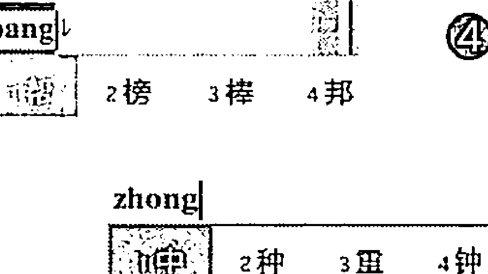

#### 全面修复“该文件没有程序与之关联”错误

文/波哥

在打开某种文档时，若出现“该文件没有程序与之关联来执行该操作”，只需重新设置一下该文档与程序的关联即可。但若在打开任何文件或文件夹时，或者右击“此电脑”启动“管理”时也出现此类错误，就不是简单设置一下文件关联可以解决的了。

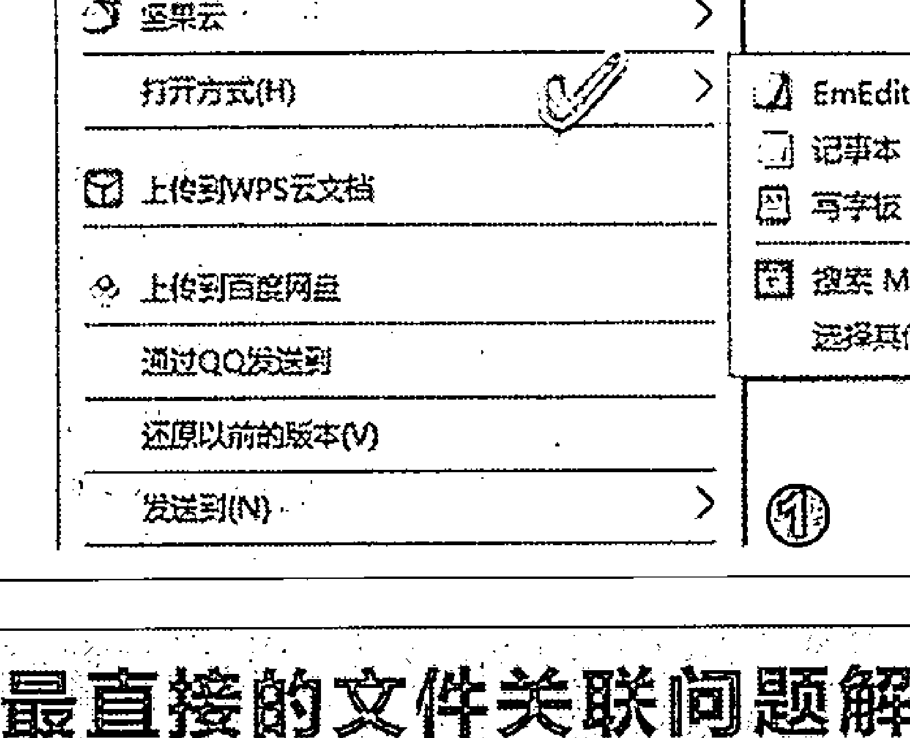

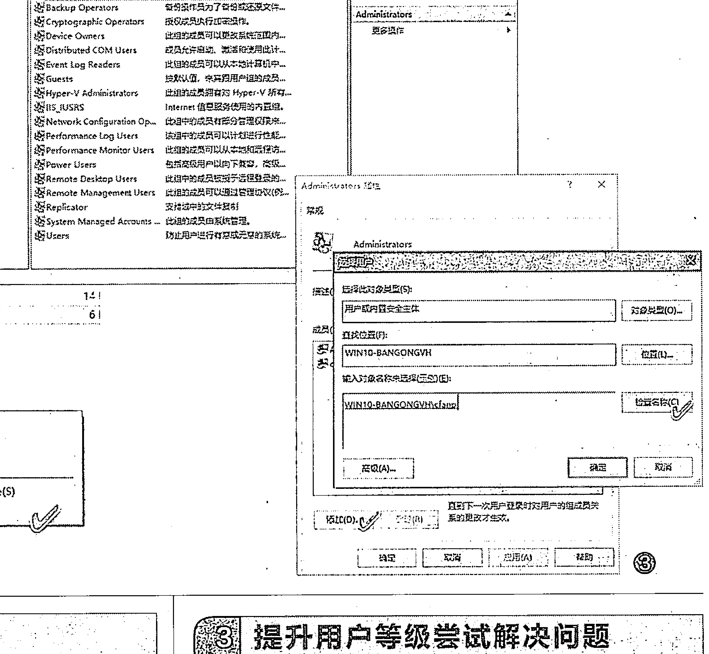

##### 1 最直接的文件关联问题解决

个别文档的程序关联问题，可通过右键菜单的“打开方式”命令重新设置（图1）。如果多种文件扩展名关联出现问题，可以通过Windows 10的“设置→应用→默认应用→重置”，将其重置为系统默认的文件关联方案。

##### 2 与“自动播放”有关的磁盘分区关联问题

当双击打开某分区或磁盘时，如果遇到没有关联的问题提示，一般是由于“自动播放”功能被更改所引起。分区或磁盘因为病毒等原因可能被加入了Autorun，实际应对的解除方法是先通过在Windows设置中依次点击“设备→自动播放”，禁用“在所有媒体和设备上使用自动播放”选项，确保可移动驱动器和内存卡设置为“不执行任何操作”。然后再通过资源管理器检查并删除分区或磁盘根目录下的Autorun文件，并进行病毒查杀来解决。

##### 3 提升用户等级尝试解决问题

有时，因为登录用户非管理员账户，在打开某些资源时也可能会因权限不足出现没有关联的提示。这时，可尝试将当前用户账户添加到管理员组。具体方法：按下Win+R组合键启动“运行”对话框，输入“lusrmgr.msc”（无引号）命令后回车，启动“本地用户和组”窗口。点击窗口左侧栏的“组”文件夹，然后双击右侧窗格中的Administrators组（图2）。当“属性”窗口出现后，点击“添加”按钮。单击“输入对象名称”部分下面的框，输入提交用户名，然后单击“检查名称”。一切就绪后，单击“确定”。还可以通过单击“高级”按钮，然后选择“立即查找”，手动搜索用户名。执行这些步骤后，账户将添加到管理员组。单击“应用”和“确定”保存更改（图3）。之后，尝试问题是否得到解决。

###### 创建一个新的Windows账户

如果出现错误提示后急于完成工作，还可以创建一个新的Windows账户来临时应急。首先点击“开始→设置”进入系统“设置”窗口，选择“账户”，转到左窗格菜单，然后单击“家庭和其他用户”。接下来，单击“将其他人添加到这台电脑”（图4）。随后，选择“我没有此人的登录信息”，选择“添加没有Microsoft账户的用户”，提交创建新账户所需的详细信息，然后单击“下一步”。创建一个新账户，在新账户下工作。

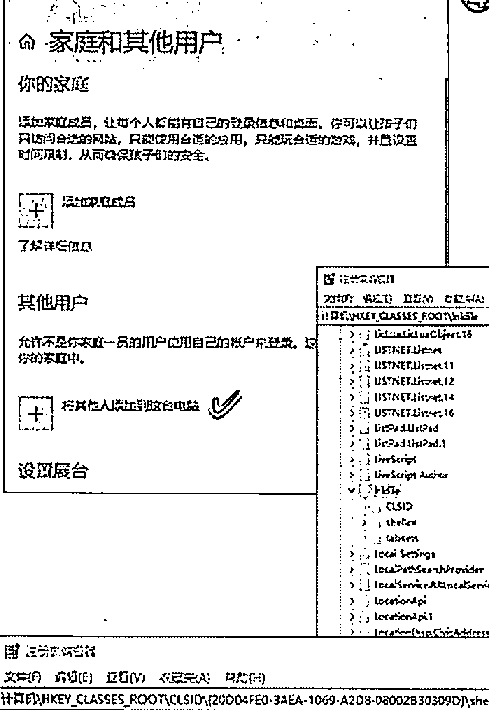

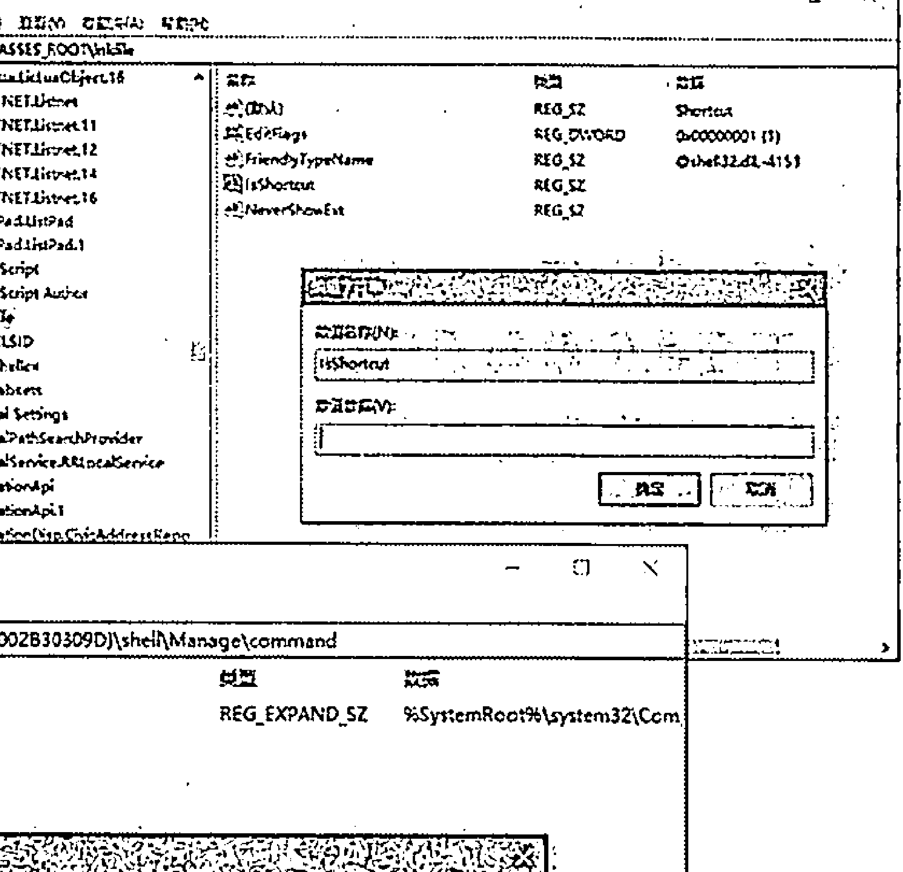

###### 通过注册表或组策略修改解决

对于在其他方面遇到的没有关联的问题，我们还可以通过修改注册表或组策略来针对性地解决问题。

- 调用“管理”时出现的关联问题

如果是在右键单击选择“此电脑→管理”时出现上述错误，可在注册表编辑器中，依次导航到路径“\HKEY_CLASSES_ROOT\lnkfile”。转到右侧窗格，然后检查IsShortcut值是否存在。如果缺少，单击右窗格上的空白区域，然后选择“新建”和“字符串值”。再将新字符串值命名为IsShortcut。完成后，关闭注册表编辑器（图5）。

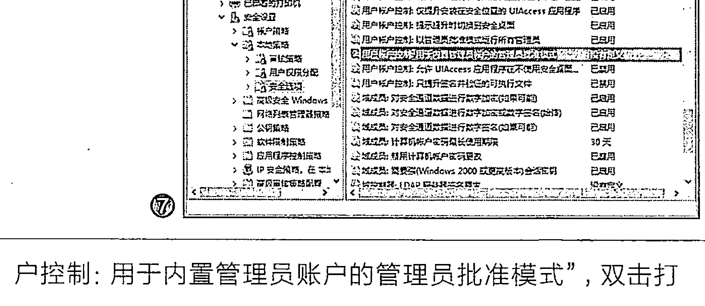

接下来，导航到路径“\HKEY_CLASSES_ROOT\CLSID\{20D04FE0-3AEA-1069-A2D8-08002B30309D}\shell\Manage\command”，转到右侧窗格，然后双击（默认）值，将数值数据设置为“%SystemRoot%\system32\CompMgmtLauncher.exe”。单击“确定”保存更改（图6）。

此外，调用“管理”时出现的问题还可以通过修改组策略来解决。在组策略编辑器的“计算机配置→Windows设置→安全设置→本地策略→安全选项”路径下，找到“用户账户控制：用于内置管理员账户的管理员批准模式”，双击打开后设置为“已启用”，应用保存，最后重启系统（图7）。

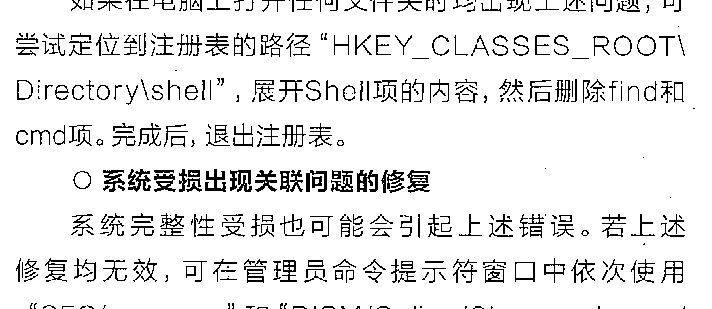

- 打开文件夹时出现的关联问题

如果在电脑上打开任何文件夹时均出现上述问题，可尝试定位到注册表的路径“HKEY_CLASSES_ROOT\Directory\shell”，展开Shell项的内容，然后删除find和cmd项。完成后，退出注册表。

- 系统受损出现关联问题的修复

系统完整性受损也可能会引起上述错误。若上述修复均无效，可在管理员命令提示符窗口中依次使用“SFC/scannow”和“DISM/Online/Cleanup-Image/RestoreHealth”命令修复系统。

#### Windows 10任务管理器另有巧用

文|吕梁

本刊曾讲述过不少关于Windows 10任务管理器的用法技巧，其实，任务管理器的实用技巧不止这些。下面我们就看看还有哪些技巧可为我们所用。

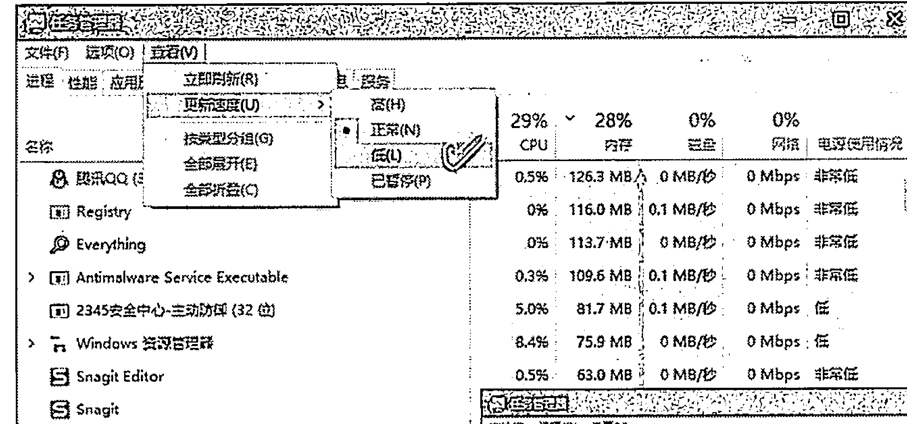

> 更多关于任务管理器的使用技巧，可参阅本刊2016年第20期文章《用好Windows 10任务管理器》。

##### 1 放慢刷新节奏 看清资源占用情况

在任务管理器中，如果我们以“内存”或CPU等项目排序，查看资源占用高的进程时，由于排队刷新时间过快，很容易出现在没看清具体数值时，排序就自动刷新了的情况。这时，通过更改更新速度设置，便可以让我们看清资源占用的排序情况。

依次点击任务管理器中的“查看→更新速度”菜单命令，然后从列表中选择一个速度比当前所选速度更慢的档次。其中，选择“已暂停”表示暂停当前检测到的数据，选择“低”为4秒后更新列表，选择“正常”为1秒后更新列表，选择“高”为0.5秒后才进行更新（图1）。

##### 2 不用第三方工具 查看进程耗电情况

此前，我们查看进程的耗电情况，可能需要借助于第三方工具。现在，我们只需在Windows 10的任务管理器中，就可以查看进程的耗电情况了。首先点击“进程”选项卡，然后在列表标题栏右侧的“电源使用情况”或“电源使用情况趋势”项目上点击鼠标，即可对进程的电源使用情况进行排序，这样就能很快查到最耗电的进程（图2）。

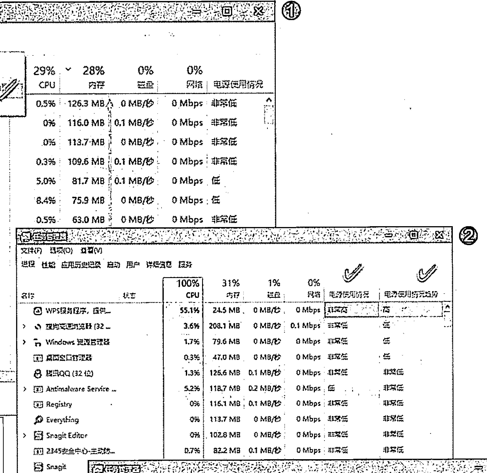

> 如果进程列表中没有上述两个项目，只需在项目标题栏内单击鼠标右键，然后在右键菜单中将这两项选中即可（图3）。此外，如果我们使用笔记本或平板，还可以通过“设置→系统→电池→查看哪些应用影响电池使用时间”，查看应用程序对电池使用时间的影响。

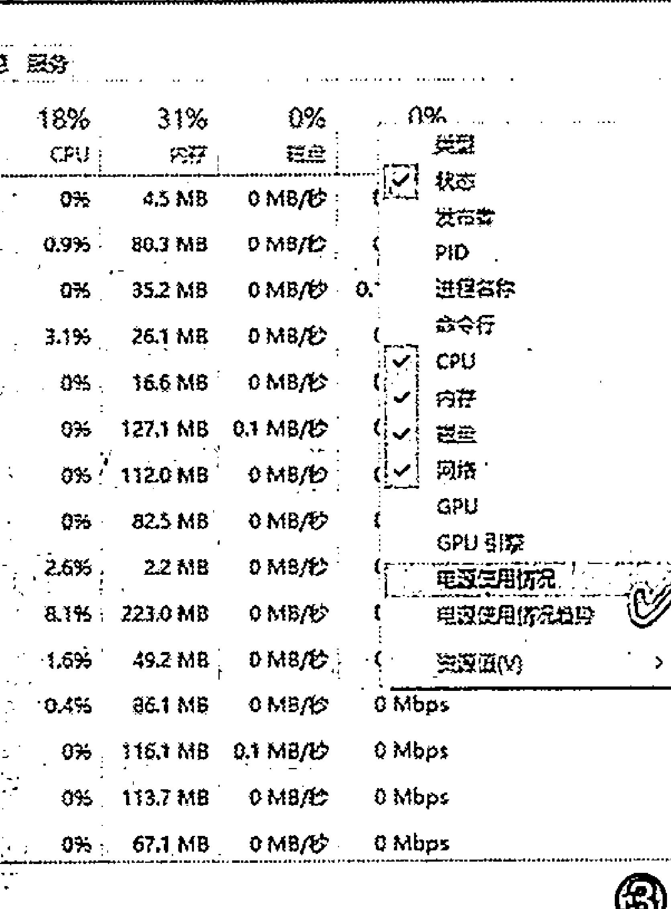

##### 3 快速复制系统硬件组件信息

同样，抛开第三方硬件参数查看工具，在Windows 10的任务管理器中，我们照样能够查看并轻松复制出CPU、内存、硬盘等组件的具体参数信息。

点击“性能”选项卡，在CPU视图窗口中单击右键，选择“复制”，复制CPU参数信息（图4）。接下来，转到编辑环境进行粘贴，就可以获得详尽的CPU参数信息（图5）。内存、硬盘、网络等配置参数的获取方法与CPU参数的获取方法类似。

##### 4 开启桌面浮动资源监视小窗

在任务管理器里，虽然我们也能直观地看到CPU或内存的使用情况，但当还在执行其他任务时，如果要随时监测它们的使用情况，老开着任务管理器窗口总不是回事。为此，我们可以定制桌面浮动组合式或分体式监测面板。

如果要将CPU与内存等放在同一个浮动面板中监测，只需在“性能”选项卡的左侧栏右键单击并选择“摘要视图”，即可生成一个简易的监控浮动面板（图6）。如果只希望出现一个CPU（或内存）的浮动面板，选择右侧窗格的右键菜单命令“图形摘要视图”即可（图7）。浮动面板出现后，任务管理器窗口自动关闭。如果要退出浮动面板，点击该面板并按下Esc键即可。

##### 5 挽救崩溃的任务管理器

之前本刊曾介绍过启动任务管理器的多种方法，但在系统发生某些问题的情况下，这些方法可能也会失效。这时，如果组策略编辑器还可 用，可尝试用它来挽救任务管理器。

按下Win+R组合键打开“运行”框，执行gpedit.msc命令，启动本地组策略编辑器后，依次定位到“用户配置→管理模板→系统→Ctrl+Shift+Del选项”，然后在该分支下找到“删除任务管理器”项并双击，将其设置为“未配置”或“已禁用”状态。应用并确定后，再尝试用Ctrl+Shift+Del启动任务管理器（图8）。

> 小提示
> 如果上述组策略配置正确，但仍无法解决问题，可尝试用SFC或DISM命令扫描并自动修复系统。或者在相同版本的Windows系统中拷贝“C:\Windows\System32\Taskmgr.exe”文件进行替换。

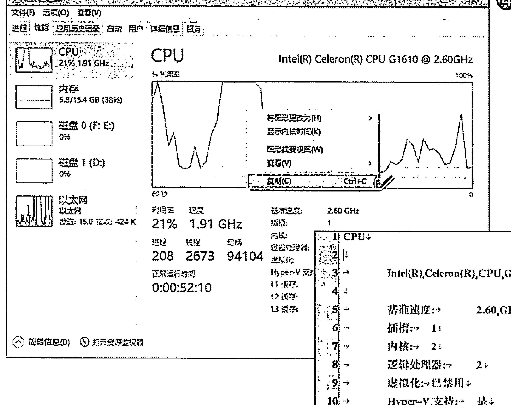
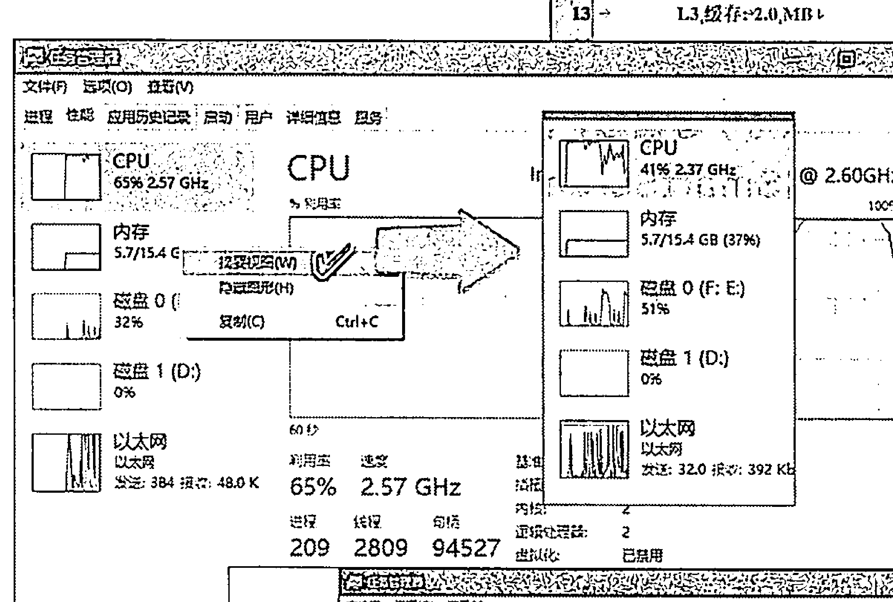
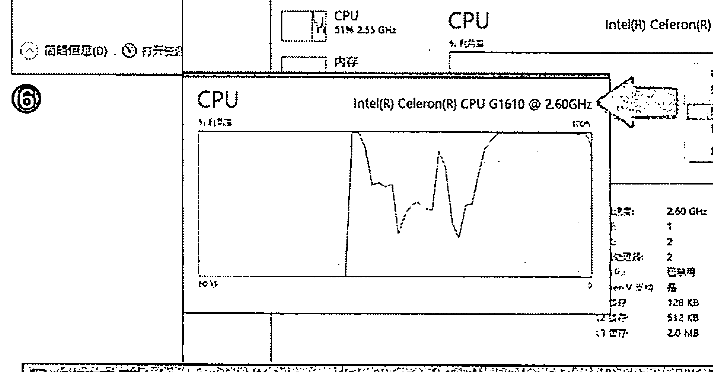
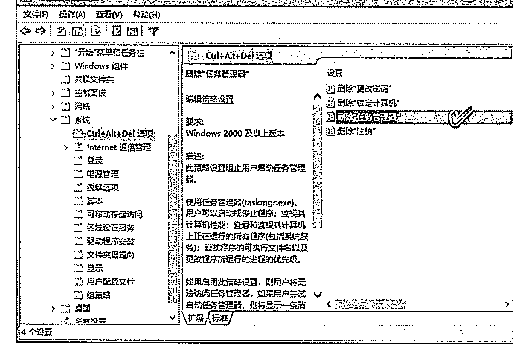

#### 怕微软窃你隐私？禁用选项不纠结

文/波哥

SmartScreen筛选器是一种帮助Edge浏览器检测仿冒网站的功能。SmartScreen分析用户在浏览器中输入的链接，并将其与标记为危险的网站列表数据库进行比较。如果用户试图加载一个有风险的页面，浏览器会发出警告，让用户意识到如果继续访问这个网站将面临的风险。由于默认启用SmartScreen功能后，浏览器将加载的URL提交给Microsoft进行分析的同时，还可以包含如安全标识符或SID（SID是与账户绑定的唯一标识符）等信息，因此一些用户可能担忧：开启SmartScreen之后，微软是否会将用户的一些信息告诉其他人？虽然这只是用户单方面的猜测，但在目前使用的1903版Windows 10中，我们可以轻松地完全禁用SmartScreen，从而避免为这个隐私问题而纠结。

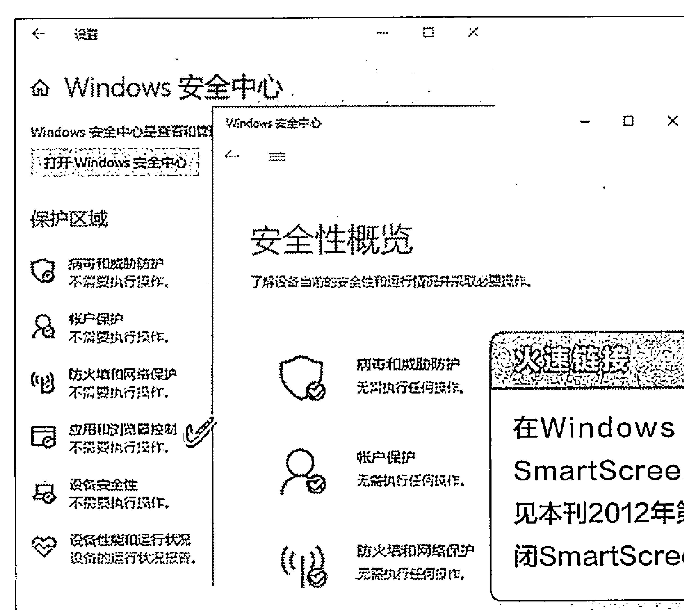

> 小提示：若访问网页时明知存在误报，暂时将上述总开关设置为“关闭”，就可以正常访问该网页。

> 知识延伸：在Windows 8的IE浏览器中，关闭SmartScreen的方法相对简单，可参见本刊2012年第22期的一个小技巧《关闭SmartScreen避免信息泄露》。

##### 在Windows 10中禁用SmartScreen

首先点击系统托盘中的安全中心图标，启动Windows安全中心。如果没有该图标，可依次点击“开始→设置→更新和安全→Windows安全中心”，也可以在任务栏搜索框中键入“安全中心”调用。

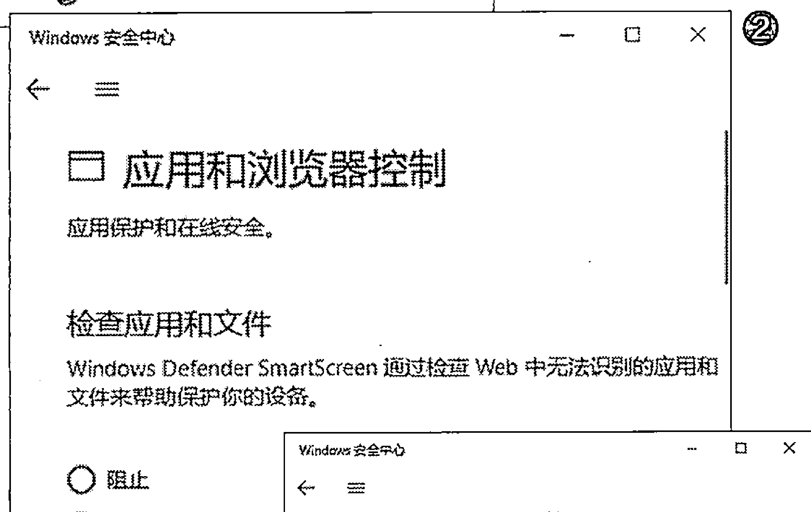

接下来，在Windows安全中心“保护区域”选择区域或“安全性概览”列表下，点击“应用和浏览器控制”选项（图1）。随后，将SmartScreen总功能设置为“关闭”，SmartScreen总功能关闭后，就不再单独关闭Edge浏览器或应用商店的隐私设置，一切与此有关的隐私上传渠道就被切断（图2）。

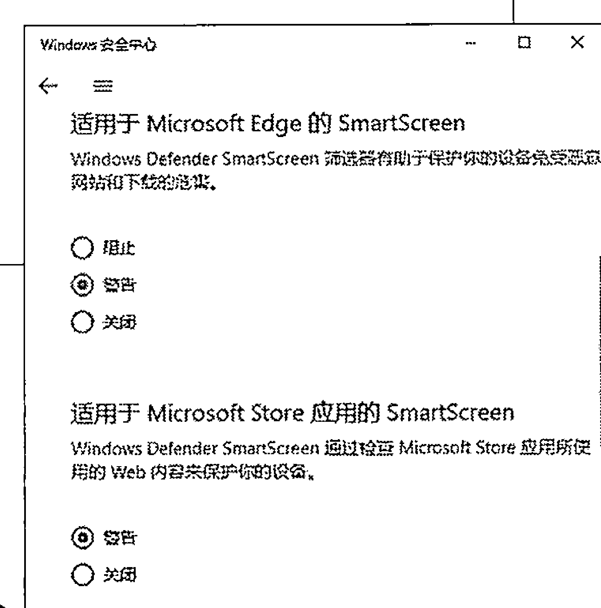

##### 用不同的浏览器替代的方案

在SmartScreen总功能开启的情况下，若希望单独控制Edge浏览器的SmartScreen，可以在“适用于Microsoft Edge的SmartScreen选项中，选择“关闭”选项。同理，还可以选择“适用于Microsoft Store应用的SmartScreen”为“关闭”，切断通过访问应用商店向微软传送个人隐私的渠道（图3）。

我们也可以换用一个不同的浏览器，达到避开SmartScreen控制的目的。例如，更换为国际知名的浏览器Google Chrome或Mozilla Firefox等。

#### 自定义“开始”右键控制菜单

“开始”按钮的右键菜单为我们提供了方便的系统控制功能。但是，在默认情况下，该菜单中的项目是固定不变的，其中有的项目我们自己可能很少用到，而经常用的控制功能这里面又没有（图1）。那么，如何才能自定义“开始”按钮的右键菜单项目呢？

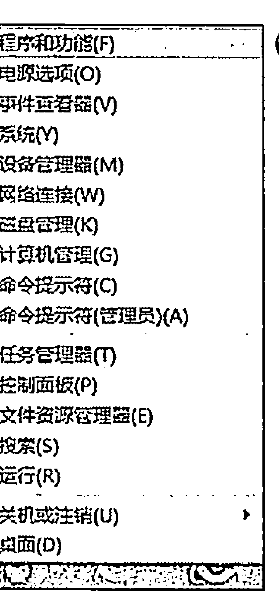

> 系统功能项的快捷方式，可以通过“上帝模式”（The God Mode）功能列表，用右键菜单命令创建。创建方法为：先创建一个名为“GodMode.{ED7BA470-8E54-465E-825C-99712043E01C}”的文件夹，双击打开即可看到二百多个系统控制功能选项。然后从中选择需要的功能（这里以“指定单击或双击打开”这一项为例），右键单击该项，选择“创建快捷方式”到桌面，将其作为创建“开始”右键菜单项目的原材料（图2）。

##### 1 准备“开始”右键菜单项目原材料

首先准备要加入“开始”右键菜单项目的快捷方式，这些快捷方式除了系统功能项的快捷方式外，还可以是程序的快捷方式、文件或文件夹的快捷方式等。

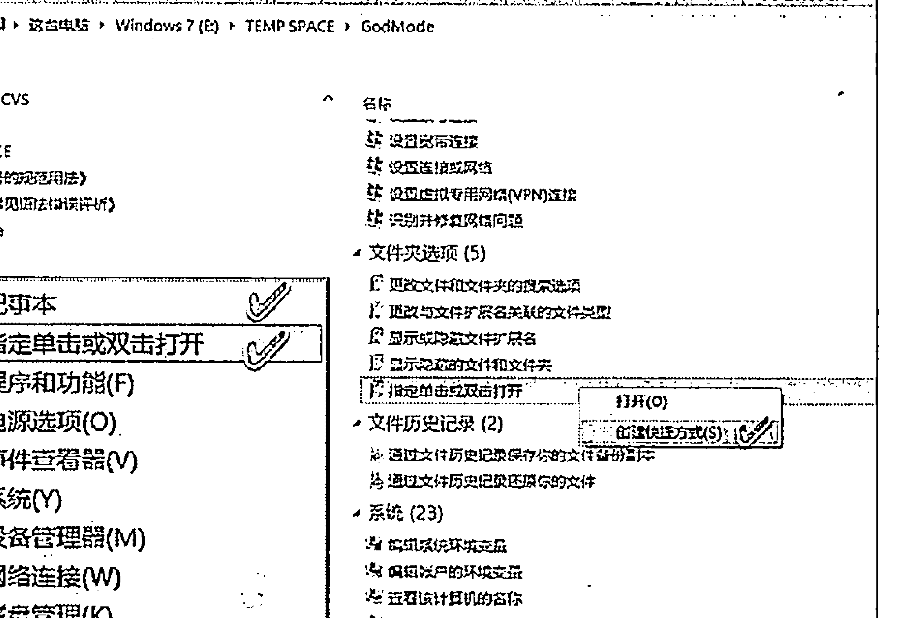

##### 2 自定义“开始”右键菜单项目

自定义“开始”右键菜单，首先需要在文件资源管理器中导航到路径“C:\Users\用户名\AppData\Local\Microsoft\Windows\WinX”。在这里，我们可以看到三个Group文件夹，其中包含“开始”右键菜单项的三个分组。我们只需删除自己不用的项目，将需要的项目拷贝到这里即可。这里我们拷贝上面生成的“指定单击或双击打开”快捷方式，再拷贝一个“记事本”的快捷方式。之后，还不能马上显示修改后的右键菜单，需要下载一个名为hashlnk的小工具。在该工具所在的文件夹下开启命令提示符窗口，然后执行“hashlnk <快捷方式完整路径>”命令，这里的“快捷方式完整路径”可通过Shift+右键单击上述2个快捷方式，选择“复制为路径”获得。执行完带有路径的hashlnk命令之后，重启电脑，即可看到修改之后的“开始”右键菜单了（图3）。

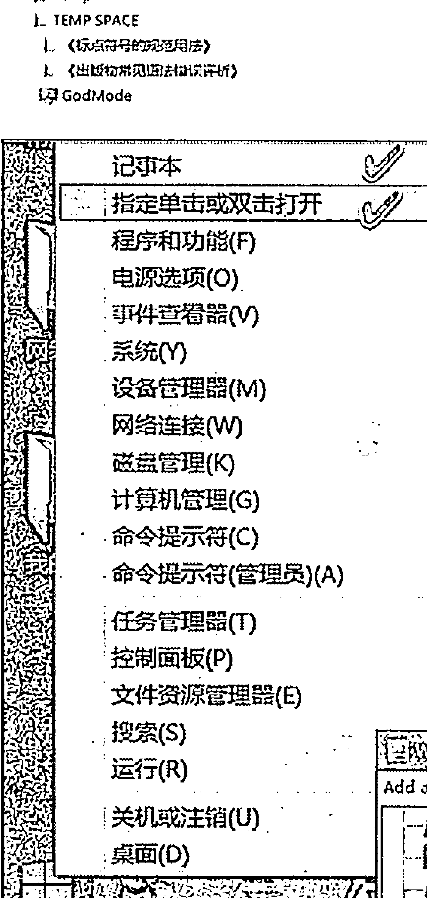

> 以上操作是在Windows 8.1中进行的，Windows 10中同样适用。

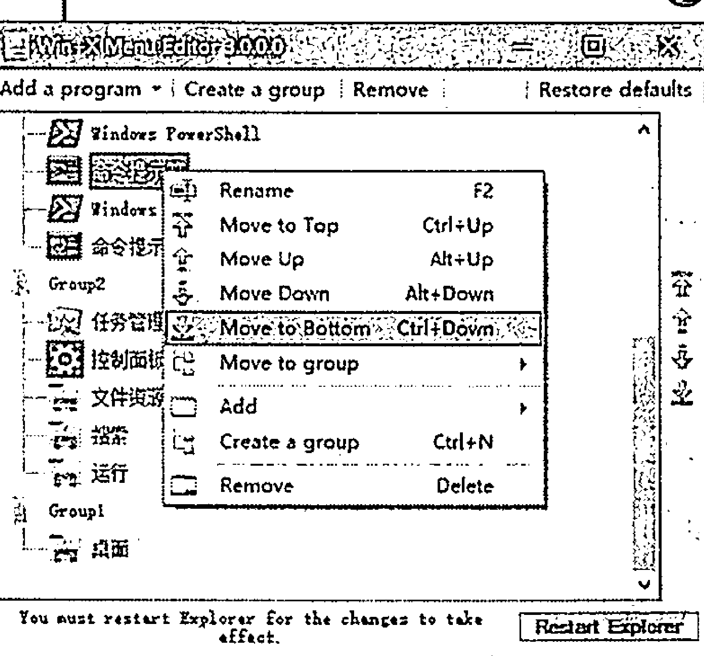

##### 3 使用第三方软件自定义项目

除了手动设置“开始”右键菜单外，我们还可以借助于第三方软件Win+X Menu Editor来设置。在该软件中，我们只需在默认的三个组菜单中使用右键菜单，即可对项目进行增删改操作。我们甚至还可以用Create a group菜单命令，为开始右键菜单创建更多的分组（图4）。

#### 自己动手找回不见的“网络计算机”

文|俞木发

一些Windows 10用户在日常使用中经常会发现找不到“网络计算机”的问题，遇到这种情况时无需着急，本文将为大家介绍两种解决方案。

##### 火眼金睛

新版Windows 10更新后默认关闭了“SMB 1.0/CIFS 文件共享支持”，也会导致看不到网络共享，具体解决方法参考2019年第17期“傻博士—网络问答”部分。

##### 修复系统自身服务

默认情况下，我们打开“资源管理器→网络”可以看见局域网内所有的计算机，如果无法显示，这种原因大多是由于“FDResPub”系统服务没有开启所致（比如误用某些优化软件导致该服务被关闭）。这个服务的作用是“发布该计算机以及连接到该计算机的资源，以便能够在网络上发现这些资源”，没有开启该服务自然也就无法在本机上看到网络内的计算机了（图1）。

这种情况下的解决方法很简单。首先在搜索框中直接输入“服务”并按回车键，等到打开系统服务设置窗口，在服务列表找到“Function Discovery Resource Publication”（对应FDResPub服务显示的名称），双击这一服务，然后在打开的窗口中将其“启动类型”设置为“自动”（图2）。

按提示重启电脑后，再次打开资源管理器，展开“网络”组件就可以看到局域网内的计算机了。

##### 借助第三方工具

系统服务的设置操作比较复杂，如果设置不当还有可能导致系统崩溃，所以对于新手来说，笔者建议大家可以到https://www.rizonesoft.com/downloads/complete-internet-repair/下载ComIntRep，它可以一键快速修复Windows 10中很多常见的网络问题。

启动软件后，在修复列表选中“Make Network computer Visible in file Explorer”，点击“GO”进行修复就可以了，相当简单、便捷。当然通过这一工具，还可以修复其他常见的网络故障，比如重置TCP/IP设置、重置代理服务等，同样在选择相应的项目后点击“GO”即可（图3）。

##### 小提示

遇到Windows 10常见的系统故障，还可以先启动系统自带的“疑难解答”尝试自动修复。只要点击“设置→疑难解答”，按自己遇到的问题类别激活该组件即可（图4）。

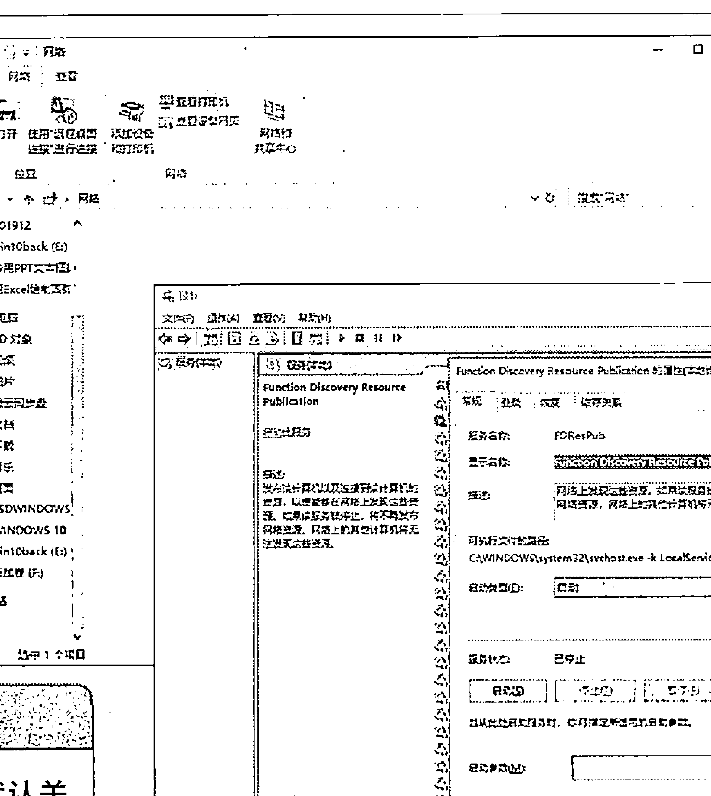
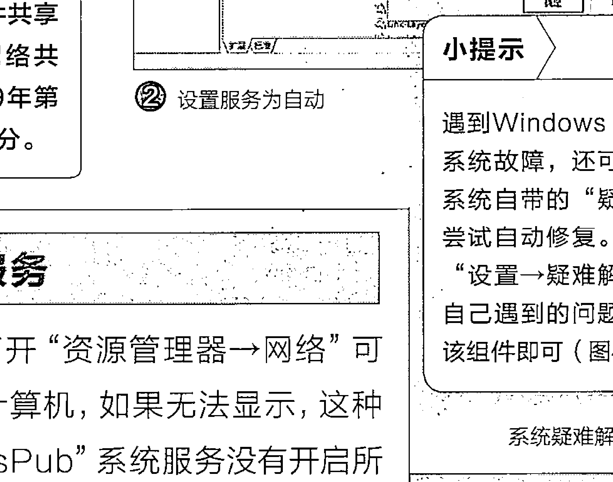
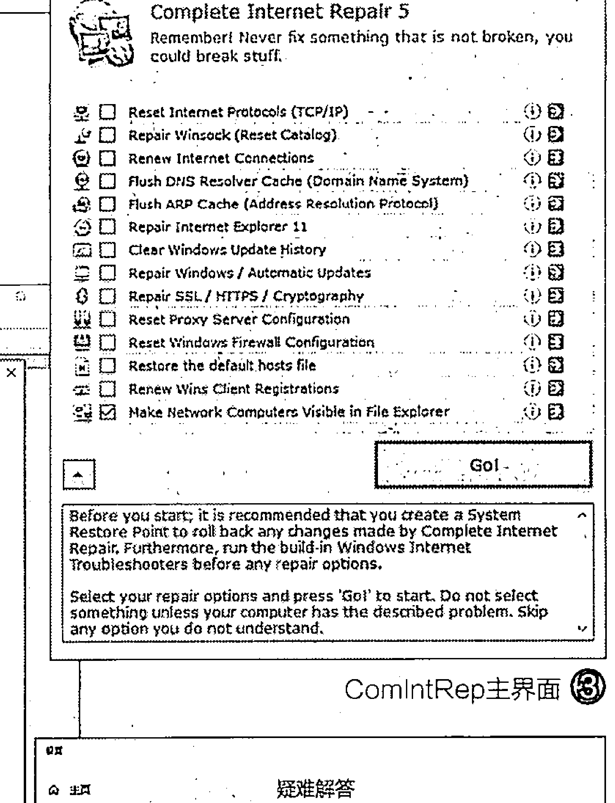
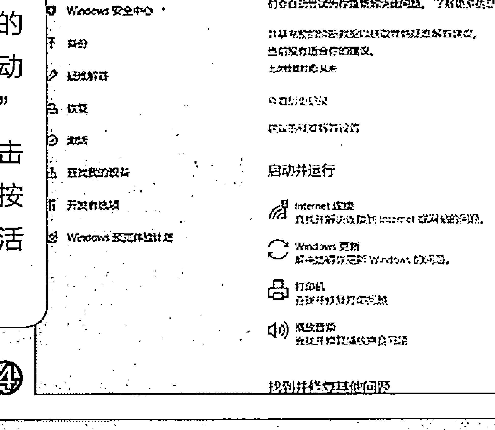

#### 离线备份/安装Windows 10商店应用

文/技术宅

默认情况下，每次重装系统后Windows 10都会自动下载各种应用。不过由于应用商店服务器的原因，在线下载的速度不仅缓慢，而且很多时候应用商店还会无法使用（如提示网络连接错误、应用商店启动后闪退），导致我们无法在应用商店中下载应用。对于这些问题，现在我们可以借助“Online link generator for Microsoft Store”在线服务（以下简称为OLGFMS），通过它手动下载其中的应用安装文件并实现离线安装。


首先在Windows 10正常的时候，启动应用商店搜索并安装“应用安装程序”（一款可以直接安装.appx、.AppxBundle的应用），安装完成后将其添加到开始菜单。现在只要有应用的网页地址，我们就可以借助OLGFMS手动下载（即使是其他国家的应用），然后使用“应用安装程序”离线安装。

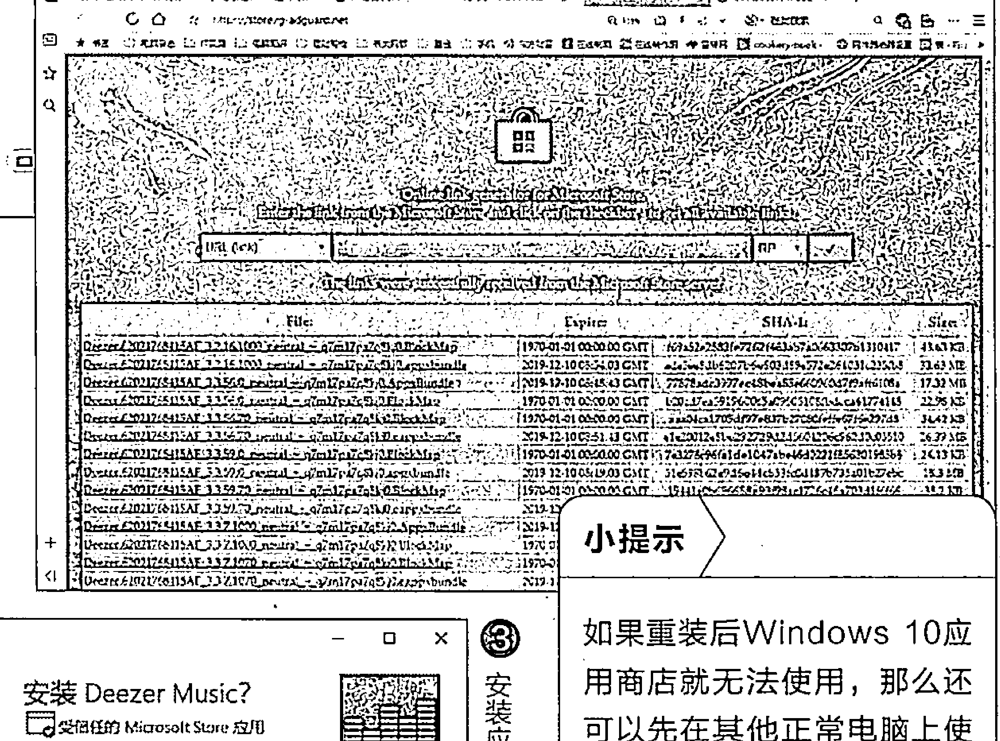

比如“Deezer Music”是一款Windows 10设备上优秀的音乐播放应用，它的应用商店的地址是https://www.microsoft.com/en-us/p/deezer-music/9nblggh6j7vv?activetab=pivot:overviewtab。在浏览器中打开上述地址后点击“Get”，系统会自动调用“应用商店”，不过默认情况下是无法直接下载的，应用商店会提示当前不可用（图1）。

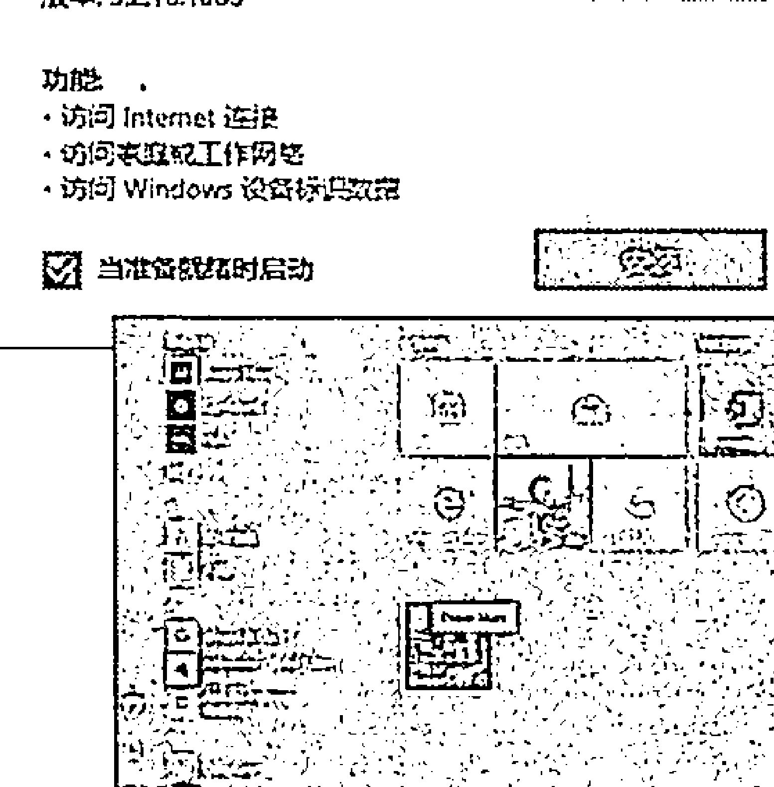

> > 小提示
> >
> > 如果重装后Windows 10应用商店就无法使用，那么还可以先在其他正常电脑上使用应用商店下载安装“应用安装程序”（应用下载后默认保存位置为C:\Windows\SoftwareDistribution\Download），然后将其提取到自己的电脑上，先使用Powershell命令行安装“应用安装程序”，其他应用安装同上。Powershell命令行的使用请参考2013年第24期《Windows 8应用离线安装》一文的介绍。

现在在浏览器中打开https://store.rg-adguard.net/，接着在文本框中输入上述应用的地址，点击其后的勾选图标，网站会将应用的地址自动进行解析（图2）。

我们可以看到，网站解析的时候会将应用的所有版本全部进行解析，按发布时间提示，点击最新版本进行下载，下载到的将是一个扩展名为“AppxBundle”的应用包文件。按提示双击下载到的“Deezer.62021768415AF_3.2.16.1000_neutral___q7m17pa7q8kj0.AppxBundle”，激活安装后即可完成离线安装（图3）。

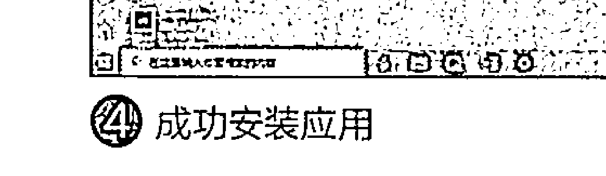

这样完成安装后，即可在开始菜单Metro界面看到安装好的“Deezer Music”，点击即可启动它，通过它欣赏音乐了（图4）。

中国区应用商店的地址是“https://www.microsoftstore.com.cn/”，只要在其中找到应用网页地址，然后使用上述方法离线下载，重装系统后再次离线安装即可。当然这个方法也可以在当前Windows 10应用商店无法使用的情况下手动安装所需的应用。

#### 解密Windows 10图标上的相对蓝箭头

文|波哥

大家知道，桌面图标左下角带拐弯状蓝色箭头的是快捷方式图标，但有时我们会遇到图标右上角有一对相对指向的蓝色箭头（图1）。这种文件代表什么？为何会出现这一图标？图标上的双箭头又能不能去掉呢？

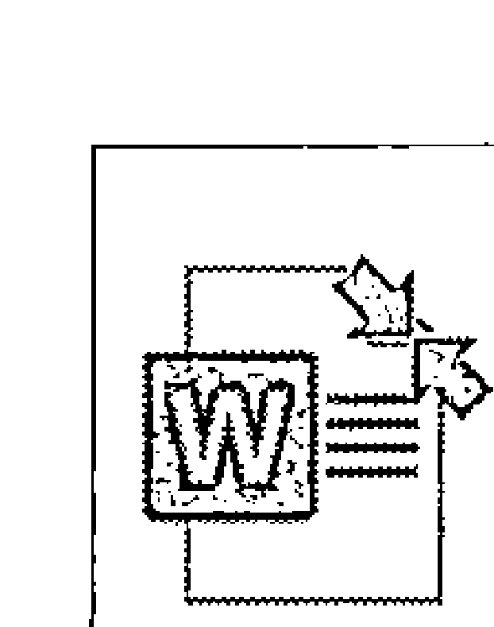

> 小提示
> 如果仍有两个蓝色箭头，请清除图标缓存。

##### 为何出现蓝色双箭头

Windows的NTFS文件系统有一个压缩特性，当Windows 10系统存储感知功能开启后，感知到分区空间不足时，会启动分区的压缩功能以腾出更多运行空间，这样分区中被压缩过的文件图标上就会显示一对蓝色箭头。另一种可能的情况，某些文件夹或文件被别人或别的软件开启过压缩选项，这样不知情者看到后也会觉得奇怪。如果整个驱动器或分区中的文件带有这一图标，说明这个驱动器或分区被压缩处理过。

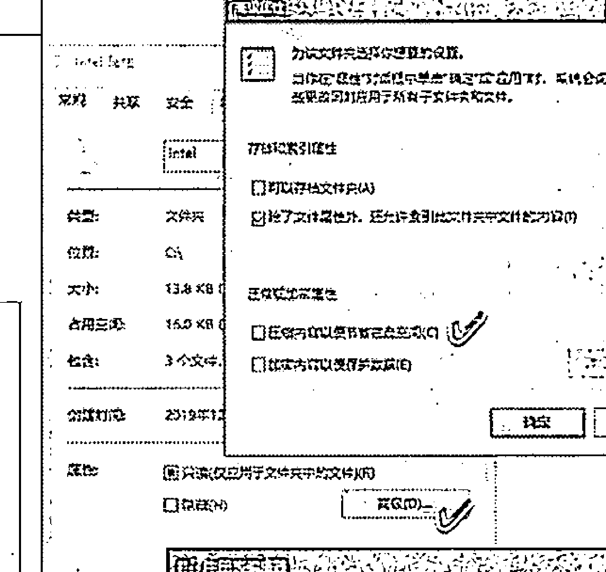

> 小技巧
> 关闭系统压缩功能的方法是：关闭存储感知，执行“compact /compactos:never”命令，然后右击系统盘符并选择“属性”，在“常规”选项卡下去掉对“压缩此驱动器以节省磁盘空间”的选择。主动开启某文件夹或文件压缩功能的方法是：右键单击文件夹或文件，然后选择“属性”；在属性窗口的“常规”选项卡下点击“高级”按钮，随后在“高级属性”对话框中选择“压缩或加密属性”一栏下的“压缩内容以便节省磁盘空间”复选框，确定即可（图2）。

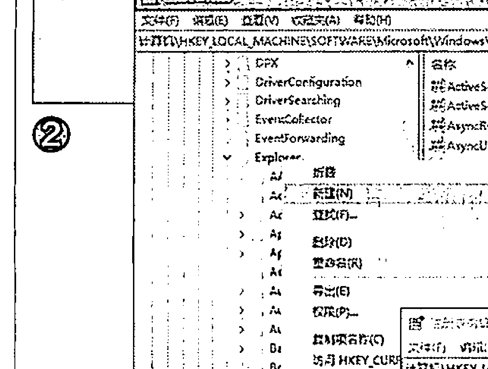

> 小提示
> 如果想用一个不同的图标替换双箭头，可从网上下载或自己制作一个别的图标，并把它的路径写在数值数据框即可。

> 小链接
> 重置系统图标的方法，可参见本刊2018年第15期文章《告别重启Windows 10后的桌面混乱》。

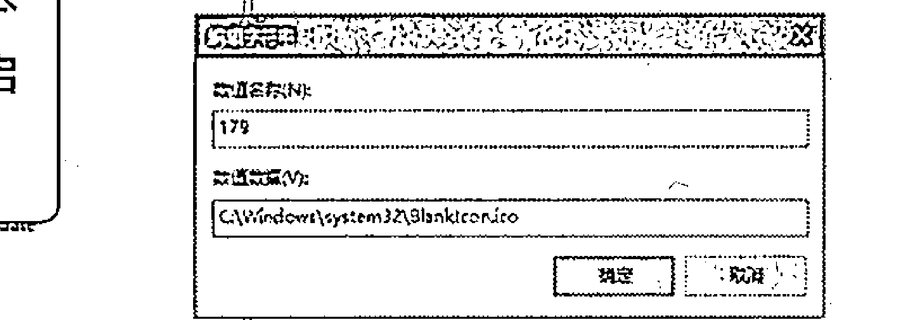

##### 去掉图标蓝色双箭头

-   ○ 系统设置的方法
    如果要去掉某个文件上的双箭头图标，且不准备再让文件采用压缩的形式存储，那么只需按上面的方法，在文件“属性”的“高级属性”窗口中将压缩选项去除即可。

-   ○ 修改注册表的方法
    如果仅仅是希望去除图标上的双箭头，而压缩格式继续保留，那么可以用修改注册表的办法来解决。其原理是用一个空白的图标替换原有图标上的双箭头。

    先准备好一个空白图标BlankIcon.ico并将其存放在“C:\Windows\system32\”。接下来，按下Win+R组合键打开“运行”对话框并执行REGEDIT命令。在开启的注册表编辑器窗口中，依次导航到“HKEY_LOCAL_MACHINE\SOFTWARE\Microsoft\Windows\CurrentVersion\Explorer”。接下来，展开Explorer查看Shell Icons分支项是否存在，若不存在，右键单击Explorer项，选择“新建→项”（图3），并将新建项命名为Shell Icons。选择Shell Icons分支，在右侧窗格空白处右击新建一个字符串值，将其命名为179。最后，双击179字符串值，并粘贴路径“C:\Windows\system32\BlankIcon.ico”到“数值数据”框中（图4）。重启系统应用新图标。如果未生效，请清除一次图标缓存。

#### 鼠标连接时自动关闭触摸板

文|吕梁

如果笔记本电脑插上鼠标来使用，那么触摸板就暂时成了一种多余的配置，甚至会在操作键盘时因误触而碍事。如果能在插入鼠标之后，自动关闭触摸板功能，就不会有这种麻烦了。下面的方法就可以实现这一想法。

如果使用的是配备ELAN或Synaptics触摸板的笔记本或上网本，则在鼠标属性下应显示一个类似“连接鼠标时禁用内部指向设备”的选项。我们可以尽量利用这一选项。

##### Windows 10中的设置法

对于正在使用Windows 10的用户来讲，可以使用如下设置方法：

打开“设置”，单击“设备”图标，然后单击“触摸板”。在“触摸板”右侧窗口中，点击“相关设置→其他设置”，然后在打开的“鼠标属性”对话窗口中，点击ELAN（有的电脑可能是“设备设置”）选项卡，选中“插入外置USB指向装置时禁用”复选框（图1）。

> 小提示
> 有的设备的复选项内容正好与上述选项相反，例如为“鼠标连接时保持触摸板打开”，这时便要取消对复选框的选择才行。

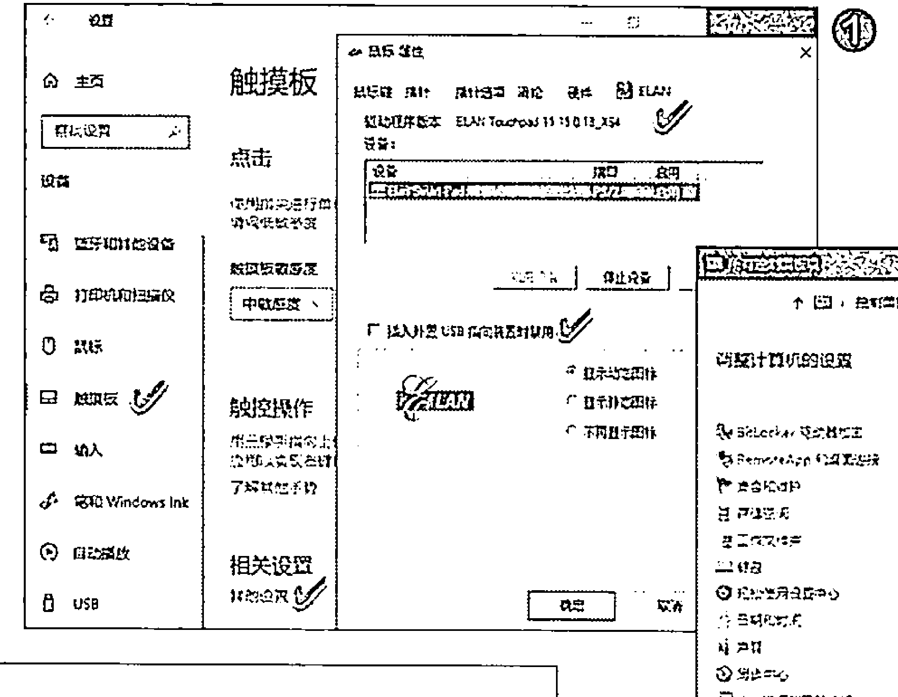

##### 多种Windows通用的设置法

上面讲述的是在Windows 10中的设置方法。下面这个设置方法则在Windows 10、Windows 7和Windows 8/8.1中通用。

在Windows中搜索“控制面板”，点击打开“控制面板”。将默认视图更改为“小图标”。查找名为“鼠标”的条目，单击该条目打开鼠标属性窗口。接下来，切换到ELAN（或“设备设置”）选项卡，再按上述同样的方法选中“插入外置USB指向装置时禁用”复选框即可（图2）。

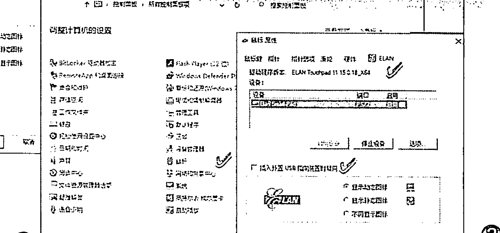

> 小提示
> 在更改默认项之前，用备份还原点或使用注册表备份软件等方法创建注册表的备份。

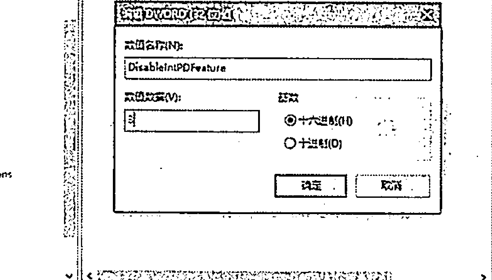

##### 修改注册表添加选项

如果上面的选项不存在，并且笔记本电脑正在使用Synaptics触摸板，可以尝试下面给出的方法显示上面提到的选项。

按下Win+R组合键打开“运行”对话框，输入REGEDIT并回车，启动注册表编辑器。在注册表编辑器中，导航到以下项：

```
HKEY_LOCAL_MACHINE\SOFTWARE\Synaptics\SynTPEnh
```

在右侧，创建一个新的DWORD值并将其重命名为DisableIntPDFeature。最后，将其值更改为3（图3）。关闭注册表编辑器并重新启动电脑，再查看是否开启了连接外部USB指向设备时禁用内部指向设备的选项。

#### 正确处理Pagefile.sys文件 文/波哥

Pagefile.sys作为Windows 10系统中虚拟内存的临时页面文件，一般会占用系统分区上GB级的磁盘空间。有时为了达到系统效率与空间之间的最佳平衡，我们需要转移、重设甚至删除这个文件。那么，如何才能找到Pagefile.sys文件，并以正确的方式对其加以处理呢？

> 小提示
> 分页文件修改后，需要点击“设置”按钮并重启系统，才能使设置生效。

- 1. 首先按上述方法，在注册表里将DisablePagingExecutive的数值数据设置为0；
- 2. 然后到系统高级属性设置中，设置开启虚拟内存页面文件选项，设置由系统自动管理页面文件或手动设置一定数量的页面文件大小。

##### 1 Pagefile.sys文件及其位置

在默认的情况下，Pagefile.sys文件是在Windows系统所在分区的根目录中。由于其同时带有“系统”和“隐含”两种属性，因此仅通过文件资源管理器中的显示隐含文件复选框还看不到这个文件，只有在“文件夹”选项窗口中，同时开启显示隐含文件和系统文件的选项，才能看到此文件。

出于系统加速或空间腾挪等目的，有时我们还会将该文件转移到内存虚拟盘、其他空间充足的分区或附加的固态硬盘等处。这时，可先右击“开始”并选择“系统”，然后依次点击“系统信息→高级系统设置”；接下来，点击“高级”选项卡下的“性能→设置”；随后，点击“高级→更改”（图1）。最后，在“虚拟内存”设置窗口中通过指定自动管理或手动选择，指定分页文件所在的位置及分页文件的大小（图2）。

##### 2 Pagefile.sys文件可否删除及正确的删除方法

在系统运行期间，Pagefile.sys文件被系统锁定，无法删除。但是，如果用另一个系统启动机器，则可以删除当前不共享的Pagefile.sys文件。Pagefile.sys文件被删除后，如果再次启动其所在系统，只要系统设置中的页面文件设置没有关闭，系统还会自动重建该文件。

如果机器增加了足够的物理内存，或因磁盘空间不足希望腾出空间，也可以采用科学的方法删除Pagefile.sys文件。

首先，用上面介绍的路径，在系统高级设置中关闭页面文件设置。接下来，打开注册表编辑器，依次定位到“HKEY_LOCAL_MACHINE\SYSTEM\CurrentControlSet\Control\Session Manager\Memory Management”，双击DisablePagingExecutive，将其数值数据修改为1，禁用页面文件(图3)。

最后，重启系统后到原页面文件所在的分区根目录下查找Pagefile.sys文件，找到该文件后删除即可。由于压缩软件可直接显示隐含或系统属性的文件，因此我们可直接使用WinRAR或好压等压缩软件，打开分区直接查看和处理。

| 名称 | 类型 | 数据 |
|------|------|------|
| ClearPageFileAtShutdown | REG_DWORD | 0x00000000 (0) |
| DisablePagingExecutive | REG_DWORD | 0x00000000 (0) |
| ExistingPageFiles | REG_MULTI_SZ | ... |
| FeatureSettings | REG_DWORD | 0x00000001 (1) |
| LargePageDriver | REG_DWORD | 0x00000000 (0) |
| NonPagedPoolSize | REG_DWORD | 0x00000000 (0) |
| NonPagedSystemSize | REG_DWORD | 0x00000000 (0) |
| PagedPoolSize | REG_DWORD | 0x00000000 (0) |
| PagingControl | REG_DWORD | 0x00000001 (1) |
| PhysicalAddressExtension | REG_DWORD | 0x00000001 (1) |
| SecondLevelDataCache | REG_DWORD | 0x00000000 (0) |
| SessionPoolSize | REG_DWORD | 0x00000004 (4) |
| SessionViewSize | REG_DWORD | 0x00000030 (48) |
| SystemPages | REG_DWORD | 0x00000000 (0) |

```
HKEY_LOCAL_MACHINE\SYSTEM\CurrentControlSet\Control\Session Manager\Memory Management
```

#### 用组策略管理Edge主页按钮配置 文|章乐安

Edge主页配置一般可以通过Edge软件设置页面的自定义Microsoft Edge打开方式列表来进行选择（图1）。但有时，我们需要指定某种主页的形态并将其锁定，甚至会根据环境需要，将主页按钮隐藏起来。通过Windows组策略设置，便可以轻松完成这些任务。

> 小提示
> 本文所涉的具体设置方法，在Windows 10 1809以上版本中有效。

首先，按下Win+R组合键启动“运行”对话框，在其中输入GPEDIT.MSC命令并回车执行，启动本地组策略编辑器。然后，依次定位到路径“本地计算机策略→用户配置→管理模板→Windows组件→Microsoft Edge”（图2）。接下来，在Microsoft Edge分支下，找到并双击“配置主页按钮”选项，即可对主页按钮所涉及的各项功能进行锁定、选择、解锁等配置。主页按钮加载默认的起始页面、新选项卡页面或在主页按钮地址策略中定义的地址。通过定义新的策略，可实现主页按钮的用户个性化配置管理（图3）。

如果要将Edge中的主页按钮隐藏起来，在配置主页按钮的“配置主页按钮”选项列表中，选择“隐藏主页按钮”选项，即可隐藏Edge中的主页按钮。

> 小技巧
> 如果要将Edge中的主页按钮隐藏起来，在配置主页按钮的“配置主页按钮”选项列表中，选择“隐藏主页按钮”选项，即可隐藏Edge中的主页按钮。

##### 锁定不同形式的主页按钮

- - 单击主页按钮只加载起始页面
  在配置主页按钮列表中选择“显示主页按钮&设置为起始页面”选项，即可实现单击主页按钮后只加载起始页面。
- 点击主页按钮加载指定的页面
  如果希望在点击主页按钮后，开启设定的一个具体页面，则需要选择配置主页按钮列表下的“显示主页按钮&设置具体的页面”选项。具体页面可从Edge设置页面添加。
- 点击主页按钮开启新的页面
  选择“显示主页按钮&设置为新标签页面”选项策略，则可以在点击主页按钮后开启一个新的标签页面。

##### 阻止更改Edge主页界面

在默认的状态下，“配置主页按钮”策略处于禁用或未配置状态，此时，单击主页按钮将会加载浏览器默认的起始页面。启用该策略后，主页按钮将根据用户选择的模式被锁定，用户对Microsoft Edge主页界面的设置将会被阻止（图4）。

解锁主页按钮的方法：在同一个分支下启用“解锁主页按钮”策略，可以实现对主页按钮界面更改限制的解除。

#### 定制属于自己的“懒人”文件夹

文|樱子

为了便于访问，许多人会将经常访问的文件夹放到桌面上。因此，我们也经常看到一些“懒人”，桌面上放有许多属于自己的文件夹。其实桌面上的“方便”也是相对的。那么，除了桌面外，还有哪些渠道可以定制自己的“懒人”文件夹呢？

> 关于将任务项目加入到“开始”右键菜单中的方法，请参见本刊第2期文章《自定义“开始”右键控制菜单》。

##### 1 在任务栏中建立资源链接

首先，我们可以借助于任务栏上暗藏的一个“链接”工具栏来创建自己的资源链接。先在工具栏的空白处单击鼠标右键，在弹出的快捷菜单中依次选择“工具栏→链接”（图1）。随后，我们可以看到在工具栏上出现一个“链接”的文字按钮。这时，我们就可以将自己常用的文件夹或其他资源，通过拖动的方式放到这个“链接”上。拖动之后会出现“移动到/复制到链接”的提示，松开鼠标之后，可见“链接”按钮右侧出现右向的双箭头图标，点击该图标展开菜单，就可以看到刚才拖进去的内容了（图2）。

##### 2 借用任务栏“桌面”菜单

我们还可以借用任务栏上隐藏的“桌面”菜单，结合“发送到桌面快捷方式”命令，将我们常用的资源以“桌面”菜单的形式显示在任务栏上。
首先，右键单击任务栏空白处，在弹出的菜单中选择“工具栏→桌面”（图3）。之后，我们可以在工具栏上看到“桌面”按钮（右侧带有双箭头小按钮），点击该按钮会看到桌面资源。之后，我们在使用过程中有需要经常访问的资源，只管将其发送到桌面快捷方式，然后就可以通过任务栏的这个按钮菜单，访问我们发送到的快捷方式了（图4）。

> 若觉得发送到桌面的东西太多引起桌面纷乱，还可以通过桌面右键菜单命令“查看→显示桌面图标”，将桌面图标统统隐藏起来，眼不见心不烦。由于有了“桌面”菜单，故不会影响使用。

##### 3 利用“开始”菜单左右键操作

在Windows 10的“设置”中设置“选择哪些文件夹显示在开始菜单上”，从该设置列表中选择“个人文件夹”为“开”（图5）。然后，将自己常访问的资源放在系统“个人文件夹”中，就可以随时通过“开始→个人文件夹”访问这些资源了。
另外，我们还可以将经常使用的项目安放在“开始”右键菜单中。

### 系统应用

#### 拒绝平淡 让任务栏秀出个性

每天使用Windows 10，你是不是会觉得千篇一律的任务栏很平淡无奇呢？如果是这样的话，不妨动手设置一番，让自己的任务栏用出个性来。

##### 清爽干净 去掉搜索框与按钮

右键单击任务栏空白处，在快捷菜单中选择“显示Cortana按钮”项，Cortana按钮就会从任务栏上消失。选择“搜索→隐藏”，可将搜索框或搜索图标也隐藏起来。

##### 可增可删 只留自己所需图标

托盘区域图标去留：在系统“设置”窗口中搜索“选择哪些图标显示在任务栏上”和“打开或关闭系统图标”，从中选择系统托盘中想留下的图标。托盘左侧图标去留：只需采用右键菜单命令固定到任务栏或解除固定即可。

##### 调整行数 一次看清所有图标

若任务栏已经被锁定，先通过任务栏右键菜单命令解锁任务栏；接下来，用鼠标向上拖动任务栏上方的边界，直至取得自己希望获得的显示行为为止（图1）。调整完毕后，再将任务栏锁定。

##### 显示标签 辅助看清图标内容

右击任务栏空白区域，选择“任务栏设置”；随后选择“合并任务栏按钮”为“从不”。这样，任务栏上的图标后面就会出现该任务的文字标签。

##### 添工具栏 访问任意位置文件

在任务栏空白区域单击鼠标右键，选择“工具栏”，然后单击“新建工具栏”；接下来，通过浏览定位到保存文件夹的位置，然后单击“选择文件夹”按钮即可。

##### 隐藏“开始” 控制只用快捷组合

如果出于特殊需要（例如公用展示电脑的安全考虑），希望隐藏“开始”按钮，可通过7+ Taskbar Tweaker for Windows 10免费工具，选中“隐藏开始按钮”选项即可（图2）。

##### 或隐或删 处理“显示桌面”按钮

在删除显示桌面按钮前，先关闭该功能：打开任务栏设置窗口，将“当你将鼠标移动到任务栏末端的显示桌面按钮时，使用速览预览桌面”选项置于“关”。接下来，在7+ Taskbar Tweaker for Windows 10软件中选择“隐藏显示桌面按钮”复选框。之后，系统设置中对该按钮的设置将无效。

> 小提示：若只是嫌搜索框占地方，但仍要使用搜索功能，只需选择“搜索→显示搜索图标”即可将搜索框更换为一个搜索图标显示，减少对任务栏空间的占用。
> 小提示：删除已建立工具栏的方法：右击任务栏空白区域，单击“工具栏”，然后单击新建的工具栏项目名称，即可将其删除。

#### 硬盘管理用好Macrorit Partition Expert

文/平淡

平时我们经常需要对硬盘进行管理，比如为了释放空间，需要将隐藏分区删除并重建分区；出于隐私的保护，需要彻底删除硬盘分区上的数据；硬盘出现坏道，需要将其屏蔽等等。诸如此类的操作，现在借助免费且图形化操作的分区软件Macrorit Partition Expert（以下简称MPE）即可轻松完成。

> **警示**
> 磁盘操作是一项极为危险的操作，所以在操作前，一定要先做好数据备份，将重要文件备份到安全的地方。

##### 隐藏分区一键删除

品牌机都会包含隐藏分区，这会占用大量的硬盘空间。如果隐藏分区没有作用，比如笔者的电脑上已经自行重装过系统并安装了PE系统，现在就可以将这部分空间释放出来。虽然系统自带相应的分区工具——Diskpart命令行和磁盘管理组件，但是前者是命令行界面并不适合普通用户使用，而后者则功能有限，比如无法对隐藏分区（有不少品牌机自带的恢复分区）进行操作（图1）。

##### 敏感数据彻底删除

大家电脑上保存的隐私文件越来越多，对于那些不用的文件，如果只是进行简单的删除或者格式化操作，一些别有用心的人很容易通过数据恢复软件找回这些文件。所以对于一些重要的隐私文件，如果想要彻底删除，就可以借助MPE提供的“Wipe Unallocated Space”（擦除未分配的空间）来彻底删除它们。

首先在MPE中删除保存隐私文件的分区，接着选中被删除的空间，点击左侧窗格的“Operations→Wipe Unallocated Space”，在打开的窗口中单选“Fill Sectors Zero”（如果要更高的安全性，可以选择“DoD 5220.28-STD”）。这样MPE会在这个未分配空间填充大量的零字节数据，完成上述操作后再右击分区选择“Creat volume”（创建分区），即可让恢复软件再也找不到被删除的数据了（图4）。当然技术总是一把双刃剑，如此操作之后，就是连你自己也无法恢复数据了。

##### 3 各种坏道一键修复

硬盘在使用一段时间后很容易出现坏道，坏道分为逻辑坏道和物理坏道。前者是磁盘磁道上面的校验信息（ECC）跟磁道的数据和伺服信息对不上号所致，通常都是因为一些程序的错误操作导致。后者则是真正的坏道，需要进行屏蔽才能更好地保护硬盘上的数据。

我们可以借助MPE扫描并修复硬盘的逻辑坏道，比如很多逻辑坏道位于硬盘的系统分区上，它可以直接扫描系统分区（Windows 10自带组件则只能在重启并再次进入系统前扫描）。同上选中需要扫描的硬盘，接着在其分区列表中选择需要扫描的分区，点击左侧窗格的“Operations→Check volume”，激活扫描组件后进行扫描和恢复即可（图5）。

对于物理坏道的检测则可以借助其表面检测工具，同上选中扫描的硬盘后，点击左侧窗格的“Operations→Surface Test”激活扫描，这样MPE会对整块硬盘的所有区域进行扫描，发现坏道的区域会以红色标注（图6）。

如果发现坏道，为了更方便地标记出坏道的实际位置，这里建议对发现坏道的硬盘再次扫描。以笔者的硬盘为例，在扫描完成95%时（根据发现坏道时“Complete”完成数值判断）发现了第1个坏道。该硬盘总计160GB（精确数值为149.1GB），分为C（41.63GB）、D（60GB）、E（47.42GB）三个分区，因此对应坏道在E区（约在硬盘149.1*0.95=141.64GB左右位置）。再次激活扫描组件后，点击“Sacn area”，在弹出的窗口中初始扫描位置选择140GB左右处开始（Area size预留“9269”MB左右空间，多预留点起始量，通过拉动滑块可以看到扫描起始位置），再次扫描以确定坏道的位置（图7）。

现在我们就可以根据坏道的位置，将硬盘后部大约10GB的空间独立出来。同上按提示将包含坏道的E分区删除，接着右击删除分区选择“Creat volume”，在弹出的窗口中，将“Unallocate space after”的值设置为“10240”MB，也就是预留后部10GB左右的空间（坏道所处区域）不分区。这样坏道就会在这个未分区空间中，可以避免频繁读取造成坏道扩散，最后点击“Commit”提交保存即可（图8）。

当然MPE还有很多功能，如可以将MBR转换为GPT磁盘、将主分区和逻辑分区无损互换（数据不会丢失）、4K对准等，可以帮助我们解决许多硬盘问题。

> 小提示：删除隐藏分区一定要事先做好权衡，因为品牌机大部分内置正版操作系统，一般就保存在特定的隐藏分区中，如果将其删除，将无法再对电脑进行恢复原厂设置的操作。

#### 挖掘Windows 10“关于”窗口潜能

文|童乐安

软件的“关于”窗口一般显示软件的名称、版本、版权、官网链接等信息，Windows 10也不例外。但是，仔细研究，我们可以发现，通过这个窗口，我们还可以完成上述功能之外的一些实用任务。

首先，沿着“开始→设置→系统”的操作路径，在“系统”设置列表中点击“关于”进入Windows 10“关于”窗口。或者直接在“设置”窗口中搜索“关于”，并选择“电脑信息”或“设备规格”、“Windows规格”也可以进入（图1）。接下来，我们按照窗口从上到下的顺序，逐步挖潜。

##### 1 系统安全否 一眼可看清

进入Windows 10“关于”窗口之后，最上端显示“系统正在监控和保护你的电脑”并列出五项安全指标。如果这些指标均标示为绿底白色的对钩图标，则说明安全状况一切正常。若显示绿色之外的图标，说明出现某方面的安全问题，点击下方的蓝色文字链接，进入Windows安全中心进行处理即可（图2）。

小提示
或者在“设置”中搜索“关于”，在智能匹配列表中选择“系统”，也可以进入系统高级设置窗口。

##### 2 电脑重命名 远控易识别

点击“关于”窗口中“设备规格”下的“重命名这台电脑”，可为当前系统设置新的名称，需要重启电脑方能生效（图3）。这对于局域网共享识别或远程控制来说，可以提供一个清晰易辨的名称。

##### 3 激活换密钥 一键可进入

点击“关于”窗口中“Windows规格”分组下的“更改产品密钥或升级Windows”链接，随后会进入“更新和安全→激活”窗口，在该窗口中进行Windows激活或更改产品密钥操作（图4）。
此功能的首要用途是用来激活系统。此外，也可以用来更换不同的系统版本，例如将教育版更换为企业版，或在其他版本之间互相更换，但前提是要取得这些版本的授权密钥。

##### 4 设置BitLocker 完成磁盘加密

如果当前所用的Windows 10系统版本含有BitLocker加密功能（专业版、教育版、企业版均含有此功能），则“关于”窗口的底部（若放大窗口，则为右侧）会出现“BitLocker设置”选项，点击该选项，可以启动硬盘或移动存储设备的加密保护设置（图5）。

##### 5 点击系统信息 访问高级设置

在“关于”窗口底部（若放大窗口，则为右侧）点击“系统信息”项，均可以进入系统高级设置窗口，这与老式控制面板的系统高级设置为相同的设置窗口。

#### 补齐设置短板 用好Microsoft Edge

文/波哥

虽然Microsoft Edge的“设置”菜单中已经有不少用户可定制的选项，但有时我们在使用该浏览器的过程中，还会遇到一些靠其自身设置无法解决的问题。这时，可以借助于Windows本地组策略编辑器，弥补Edge自身设置的短板。

> 小提示 要设置Microsoft Edge组策略项目，启动本地组策略编辑器，然后逐级展开到“本地计算机策略→用户配置→管理模板→Windows组件→Microsoft Edge”分支进行具体操作（图1）。

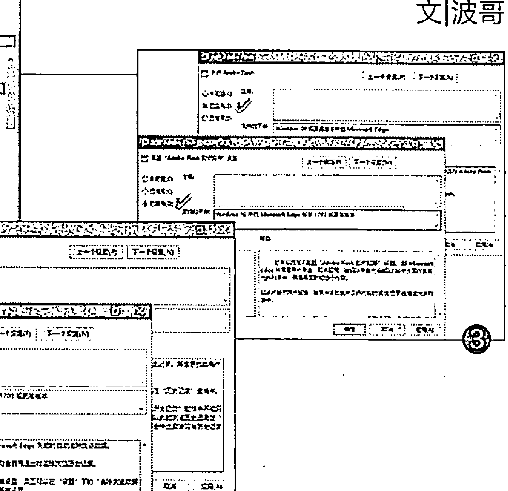

##### 1 无法安装扩展怎么办

如果不能为Microsoft Edge添加下载的扩展，定位到组策略的Microsoft Edge分支下，找到并双击“允许扩展”项，选择启用即可。

##### 2 F11启动全屏浏览失效

如果用F11控制键切换Edge全屏显示失效，可尝试在组策略的Microsoft Edge分支下，将“允许全屏模式”选项设置为“已启用”。

##### 3 私密模式访问失败

Microsoft Edge的私密浏览模式（InPrivate）允许不留痕浏览网页。若使用中发现无法切换到这一环境，可将组策略中上述分支下的“允许InPrivate浏览”项设置为开启状态。

##### 4 无法保存历史记录

如果发现Edge无法留下访问历史记录以便回溯，可到组策略窗口中查看“允许保存历史记录”是否被禁用，启用即可。如果发现在开启了“允许保存历史记录”选项后，下次启动Microsoft Edge，仍有浏览历史记录完全丢失的情况发生，可以查看组策略中的另一个选项“允许退出时清除浏览数据”是否处于开启状态，若为开启则将其禁用即可（图2）。

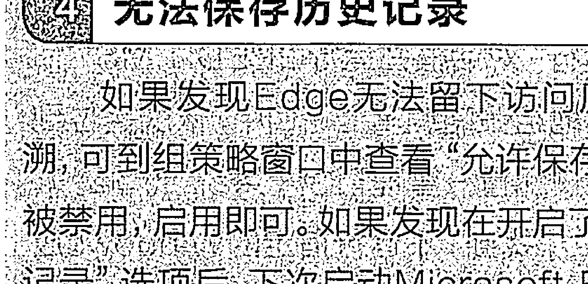

##### 5 不能自定义搜索引擎

Edge允许用户更改默认的搜索引擎地址，还可以添加新的搜索引擎并随意切换。如果发现这一功能不能发生作用，可检查组策略“允许自定义搜索引擎”选项是否被禁用，将其开启即可。

##### 6 无法开启开发人员设置页

如果遇到在按下F12键后不能访问开发人员选项的情况，可通过组策略的“阻止访问Microsoft Edge中的about:flags页”项，将其设置为“已禁用”或“未配置”状态。

##### 7 收藏夹无法编辑或添加新内容

在组策略中将“阻止更改Microsoft Edge上的收藏夹”设置为“禁用”状态，可解除对收藏夹的禁用。

##### 8 拒绝麻烦的Adobe Flash确认

如果在播放某些网页视频时，每次需要点击确认Adobe Flash“即点即用”按钮，在Edge设置中开启Flash设置也如此。这时，除了在组策略中检查“允许Adobe Flash”选项是否开启外，还需要检查“配置Adobe Flash即点即用设置”是否处于禁用状态，若不是禁用状态，将其禁用即可（图3）。


#### 正确处理软件放行与禁用的矛盾

文/吕梁

有时，我们讨厌一些程序运行，但它们偏偏会自动弹出，我们希望禁止其运行。而还有的时候，因为某种原因使用了比较复杂的“软件限制策略”，造成某些软件无法运行，这时我们希望将其解禁。虽然我们可以用修改注册表的办法禁止和解禁软件运行，但使用组策略编辑器，实现起来更容易操作。

在多人共用的电脑上，也可以为不同的人设置程序运行的限制。详情参见《电脑爱好者》网站的文章《不用组策略也能限制程序运行》（http://www.cfan.com.cn/2015/0714/120460.shtml）。

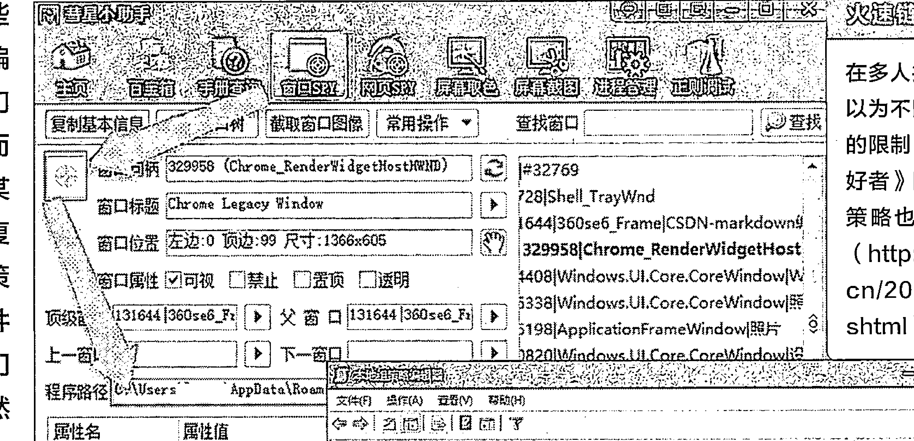

##### 阻止某些可执行程序运行

如果我们发现一个讨厌的弹出窗口，那就说明一定有一个程序在后台偷偷运行并执行了某个小动作。那么如何才能知道这个程序是什么？又如何才能阻止它的运行呢？

###### 获得弹出程序的真实路径

首先，在发现弹窗出现之后，我们先不要关闭此弹出窗口。这时，需要运行一个弹窗程序检测的小软件“彗星助手”，打开彗星助手之后，点击窗口上方工具栏中的“窗口SPY”按钮；然后点击软件界面中类似于光盘形状的图标，按下鼠标，将此图标拖动到要监测的弹出窗口之上；之后，在软件“程序路径”一栏中，就会发现该弹窗程序的路径（图1）。

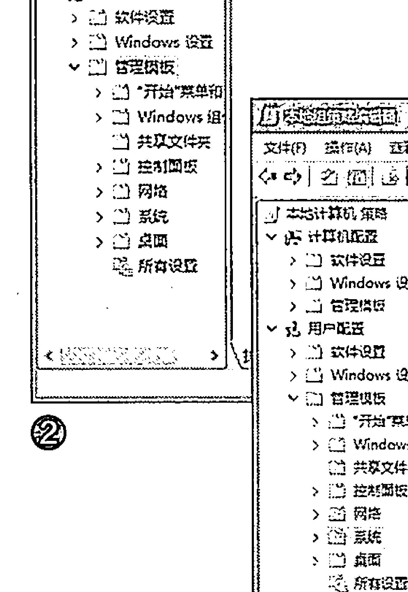

###### 用组策略添加程序禁止运行

知道了弹窗程序的真实路径之后，我们就可以很容易地通过组策略的程序禁用策略，禁止该程序的运行了。具体方法如下：按下Win+R组合键打开“运行”对话框并运行GPEDIT.MSC命令，启动本地组策略编辑器。在本地组策略编辑器窗口中，依次定位到如下分支：“本地计算机策略→用户配置→管理模板→系统”（图2）。双击“系统”分支，在打开的窗格中，找到“不运行指定的Windows应用程序”一项并双击（图3）。在随后打开的窗口中，选择“已启用”选项，点击“不允许的应用程序列表”后的“显示”按钮，在显示内容窗口中双击空白值区域，然后右键单击并粘贴此前复制的弹窗路径（图4）。最后确定并应用修改。

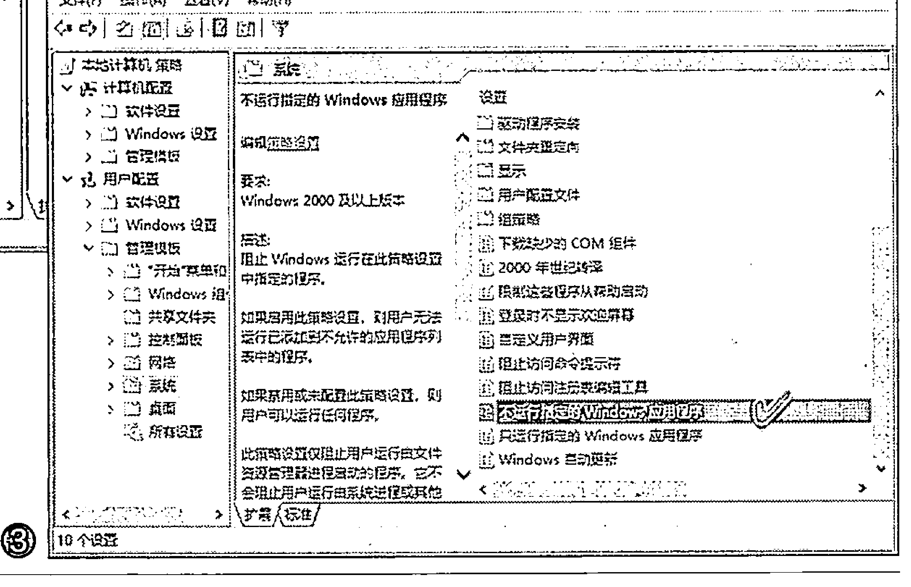

##### 放行被“软件限制策略”禁止的程序

用“不运行指定的Windows应用程序”策略禁止的程序同样可以从相同位置设置为放行。如果一些软件被禁止运行，而我们从上述位置又找不到这些程序的痕迹，那么可以检查组策略中“软件限制策略”的位置，看看是否因增加了软件限制策略而使得该软件无法运行。

###### ◎先用组策略解决

首先打开本地组策略编辑器，依次定位到“本地计算机策略→计算机配置→Windows设置→安全设置→软件限制策略→安全级别”（图5）；双击“安全级别”下的“不受限”一项，点击“设为默认”将其设置成默认。如果还不行，就在“软件限制策略→其他规则”中删除现有的散列、路径等。重启电脑后再运行程序（图6）。

###### ◎进一步修改注册表

如果上面的方法无效，接下来在“运行”中执行REGEDIT命令，启动注册表编辑器。然后依次定位到“HKEY_LOCAL_MACHINE\SOFTWARE\Policies\Microsoft\Windows\Safer\CodeIdentifiers”，把下属分支中涉及Hashes和Paths下面的项全部删除（图7）。重启电脑，再尝试运行要放行的程序。

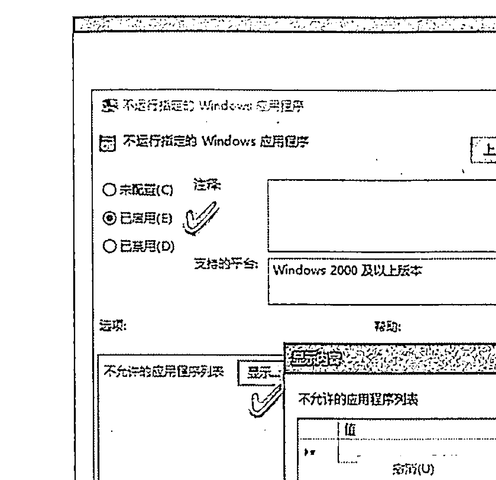

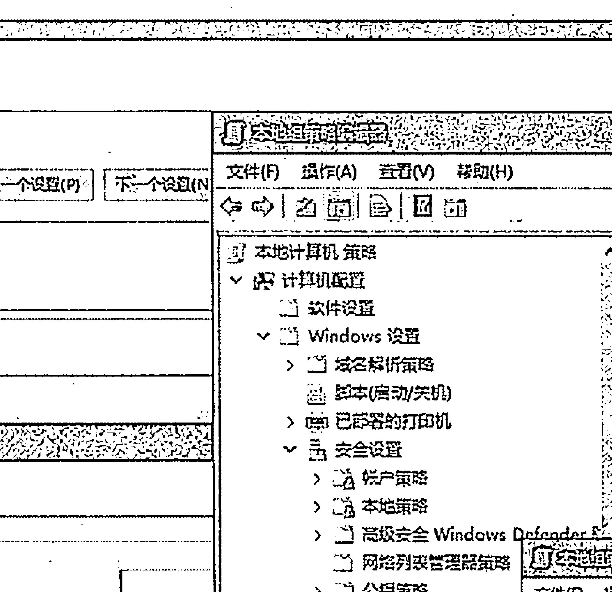

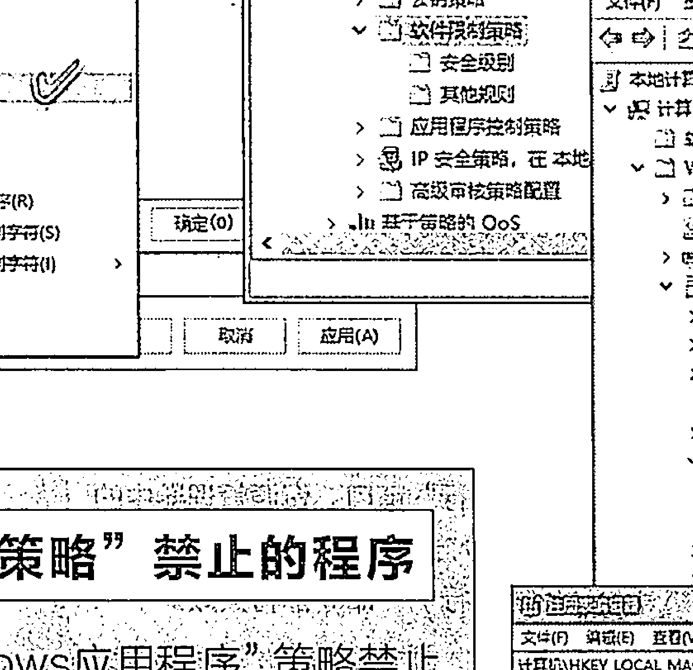

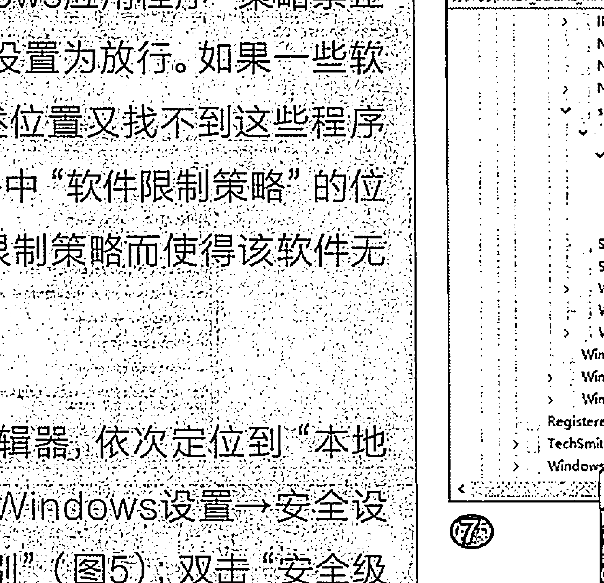

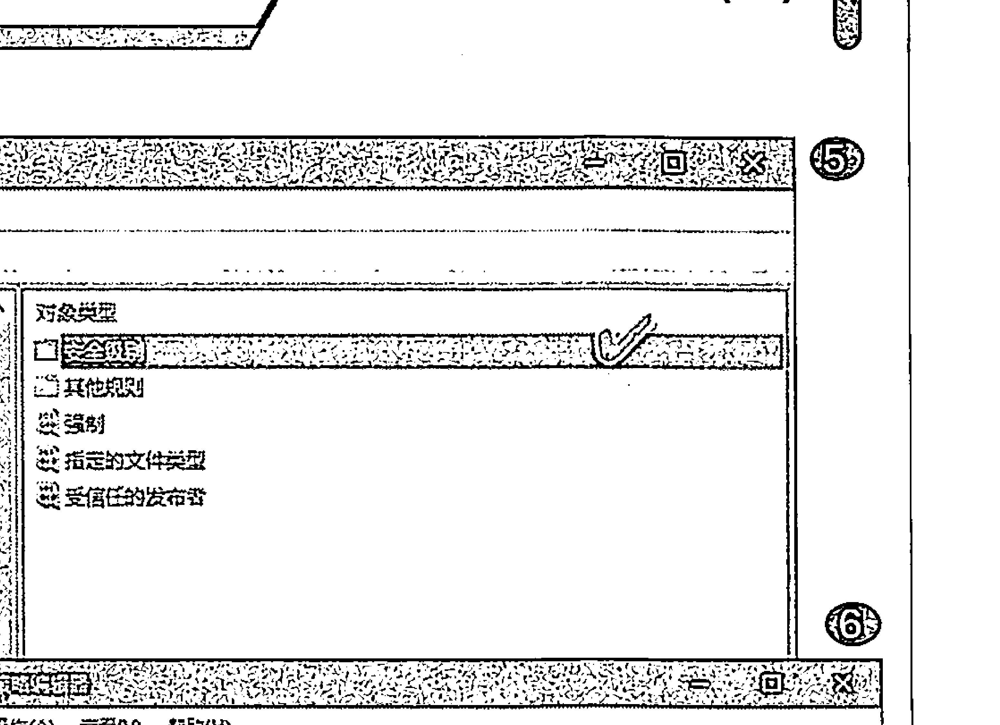

> **小技巧**
> 如果因限制的软件造成系统无法启动到桌面，可通过带命令提示的安全模式启动组策略后处理。开机时按下F8进入安全模式，选择“带命令行提示的安全模式”启动，系统会自动运行命令窗口，在提示符下输入“mmc c:\windows\system32\gpedit.msc”打开组策略进行修改即可（图8）。

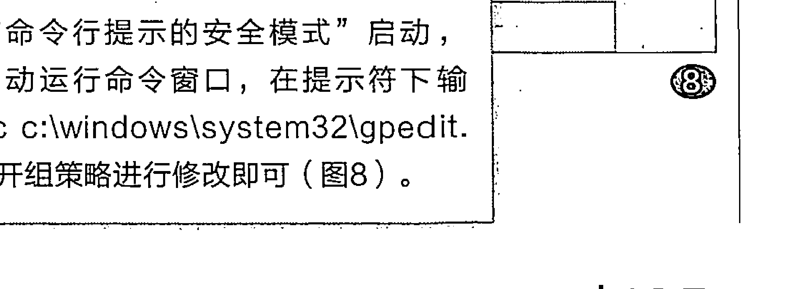

#### 藏起“开始”菜单与任务栏的危险选项

文/童乐安

有时，学校或社区会在公用的Windows 10电脑上展示一些内容。但是，由于系统桌面的“开始”菜单和任务栏上包含了许多可以控制系统的命令选项，这样用户可能会随意关闭或重启电脑，或者对系统进行某种设置更改。利用组策略编辑器，我们可以将这些危险的按钮或命令都藏起来，防止用户随意更改或误操作。

> 小提示
> 如果启用该策略设置，“关机”、“重启”、“睡眠”和“休眠”命令将从“开始”菜单删除，电源按钮也会从Windows登录屏幕和安全登录屏幕（在按Ctrl+Alt+Delete时出现）删除。

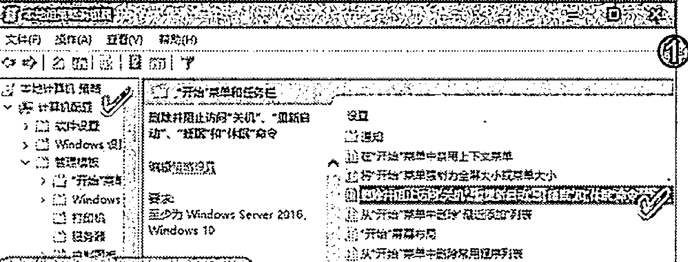

必看链接
用组策略阻止从“开始”菜单卸载程序的具体方法，请参见2019年第22期文章《“开始”和任务栏问题巧解决》中的有关内容。

> 小提示
> 启用该设置后，不但无法从“开始”菜单中访问“运行”命令，而且无法通过Win+R组合键启动“运行”窗口。资源管理器中的地址栏运行命令方式，和任务管理器中的“新建任务（运行）”命令都将失效。

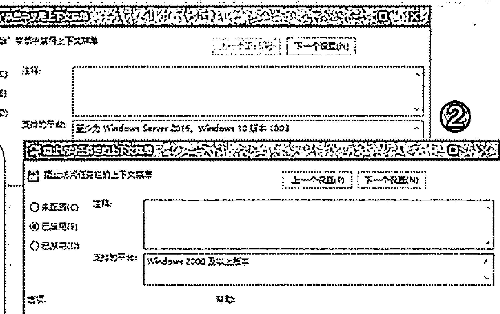

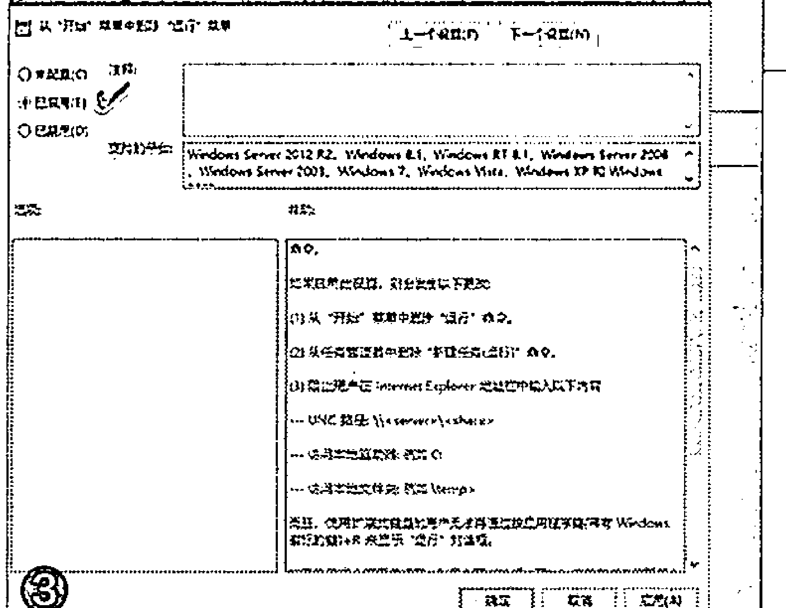

> 小提示
> 还要在上述“计算机配置”路径下的“开始菜单和任务栏”中，开启“在开始菜单中禁用上下文菜单”选项设置。这对于有多个账号的Windows 10来说，可以保证无论用哪个账号登录，都可以起到屏蔽作用。

首先，按下Win+R组合键开启“运行”对话框，输入GPEDIT.MSC命令并回车，打开组策略编辑器。本文涉及到的“开始”菜单和任务栏组策略修改项目，将涉及到如下两条路径：“本地组策略→计算机配置→管理模板→开始菜单和任务栏”；“本地组策略→用户配置→管理模板→开始菜单和任务栏”。

##### 1 阻止意外关机和重启等操作

为了防止公用展示电脑被用户随意进行关机、重启、注销等电源管理操作，在组策略编辑器中定位到上述“计算机配置”路径下的“开始菜单和任务栏”，找到“删除并阻止访问关机、重新启动、睡眠和休眠命令”的项目，双击该项目并将其设置为启用（图1）。这样，便可以将一切电源控制按钮屏蔽掉。

##### 2 阻止随意卸载应用程序

为了防止用户通过“开始”菜单随意卸载应用程序，可禁用从“开始”菜单中卸载程序的功能。

##### 3 屏蔽右键菜单防止无关操作

为了防止用户通过右键菜单控制“开始”菜单或任务栏，可通过上述组策略“用户配置”路径下的“开始菜单和任务栏”，开启“阻止访问任务栏的上下文菜单”；然后再开启“在开始菜单中禁用上下文菜单”设置（图2）。

##### 4 藏起“运行”防止执行命令

除了屏蔽或禁止一些必要的按钮或选项，藏起“运行”选项也很必要，它可以防止用户随意运行一些危险的系统命令。为此，需要在上述组策略“用户配置”路径的“开始菜单和任务栏”设置中，启用“从开始菜单中删除运行菜单”设置（图3）。

#### 自己动手解决网络共享失效难题

文/阿木

为了节约资源、提高效率，很多公司都采用了网络共享办公的方式，不过在日常使用中，这些网络共享经常会遇到一些问题，导致共享失败。下面我们就以Windows 10为例，介绍如何解决常见的网络共享问题。

> ### 火速链接
> 如果Windows 10电脑无法看到网络组件，请开启相应的“FDResPub”服务。这一类型的问题，可参阅本刊2020年第2期《自己动手，找回不见的“网络计算机”》一文的介绍。

##### 1 Windows 10扫描不到共享资源

某公司已经在电脑A上设置了打印机共享，局域网里安装Windows 7的电脑可以发现共享打印机(说明A电脑共享设置是正确的)，但是一些安装了Windows 10的电脑却搜索不到共享的打印机。

因为其他电脑可以搜索到共享打印机，这说明A电脑共享设置是正确的。Windows 10电脑无法找到，原因大多是由于故障电脑缺失SMB1.0组件所致，解决方法是重新安装SMB1.0。在搜索框直接输入“启用或关闭Windows功能”，在打开的窗口找到并安装“SMB 1.0/CIFS File Sharing Support”即可(图1)。

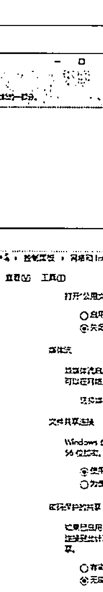


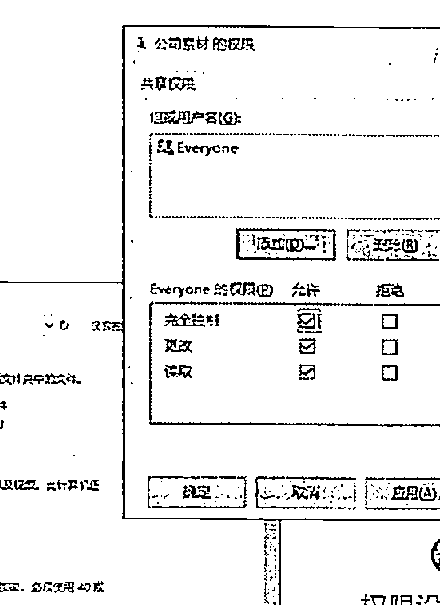

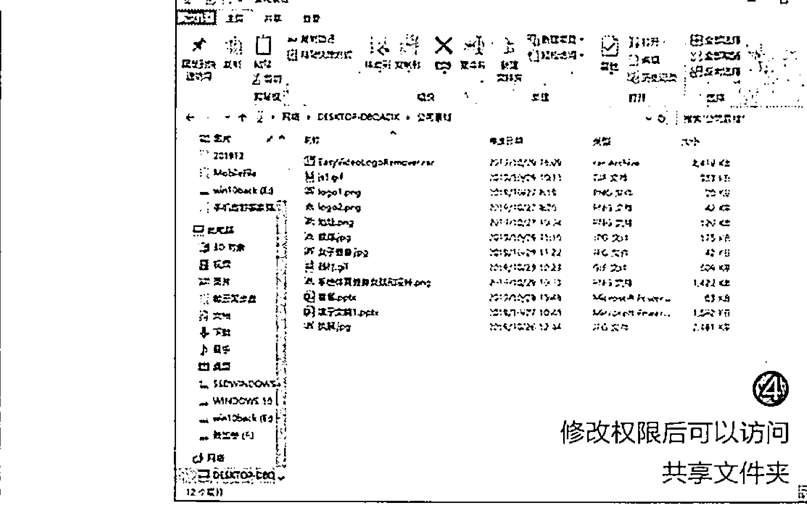

##### 2 访问共享资源提示需要输入密码

默认情况下诸如打印机、扫描仪的共享是无需输入密码，如果你在访问网络共享资源的时候系统提示需要输入密码，原因是由于提供共享设备的电脑开启了“密码保护共享”导致，解决方法是关闭密码共享。在搜索框直接输入“高级共享设置”，在搜索列表点击“管理高级共享设置”，接着在打开的窗口找到“密码保护的共享”，单选其下的“无密码保护的共享”，点击“保存更改”即可(图2)。

##### 3 访问共享资源提示拒绝访问

某公司电脑A设置好文件夹的共享，打开网络计算机也可以看到共享资源，但是需要访问时系统却提示“没有权限拒绝访问”。这个原因是由于权限不足导致，解决的方法是重新为共享文件夹添加账户和权限，这里建议将“Everyone”账户作为共享账户。在电脑A上找到共享文件夹，右击选择“属性→共享→高级共享”，在打开的窗口点击“权限”。接着在打开的窗口点击“添加”，在打开的窗口将“Everyone”账户”添加到“组和用户名列表”(图3)。

依次点击“确定”退出，现在同事们再次打开网络共享文件夹就可以完全访问了(图4)。

#### 用好Windows 10的“专注助手”

文/波哥

Windows 10中新增了“专注助手”工具。那么，这个工具为何物？如何使用？使用过程中遇到的一些问题又该如何解决？

小提示：如果没有看到“专注助手”磁贴，点击“展开”即可。

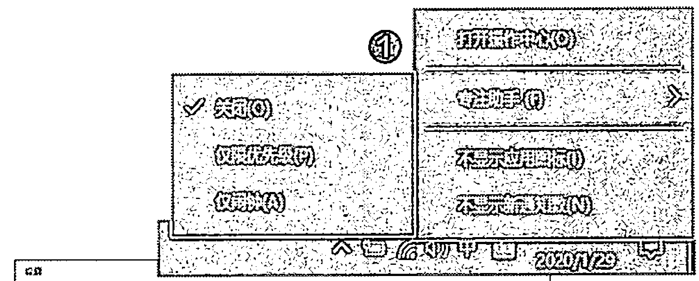

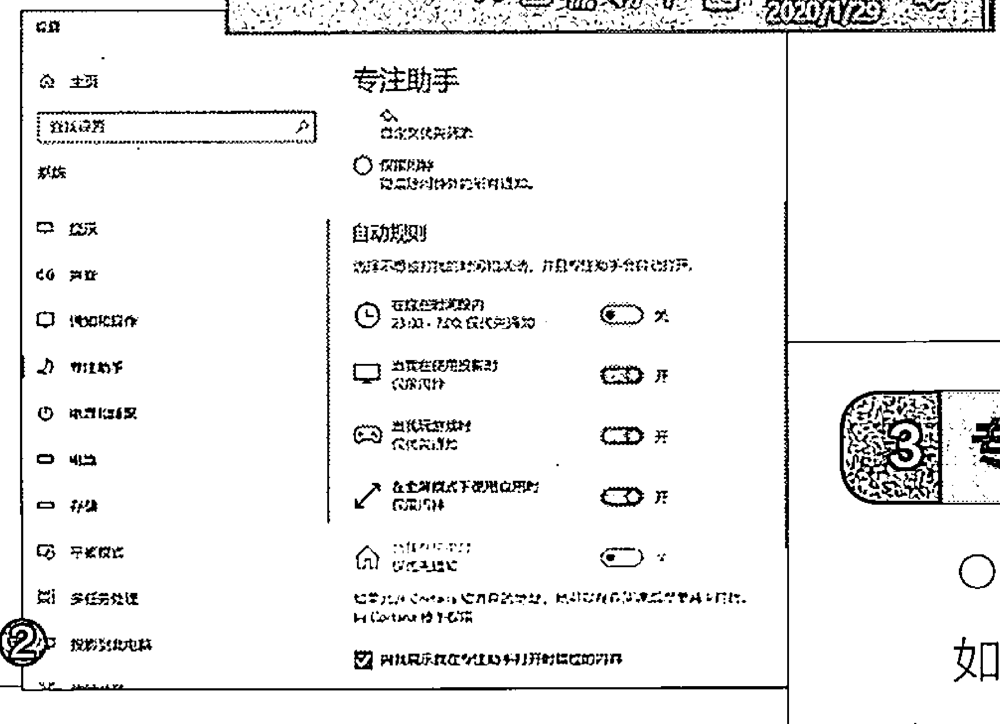

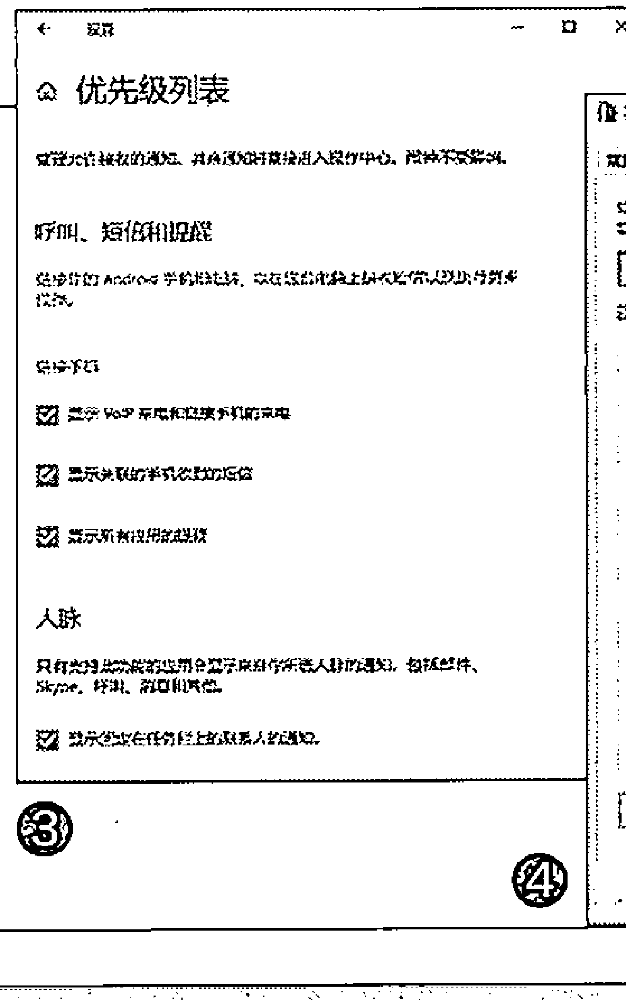

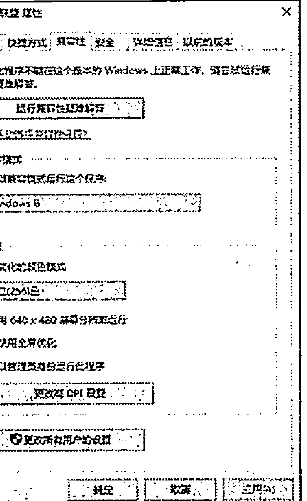

##### 1 认识Windows新成员“专注助手”

每天使用手机，我们应该对它的免打扰模式并不陌生。其实，Windows 10的专注助手有点像手机的免打扰模式，它能够让我们自由控制通知消息，确定是否开启通知消息，以便可以在安静工作和有效提醒这两件事上取得合理的平衡。

##### 2 专注助手的开关与自动控制设置

开关和控制专注助手最为简单的方法是在系统托盘的通知图标上单击右键并选择“专注助手”选项，然后在下级菜单中选择“仅闹钟”、“仅限优先级”、“关闭”等选项（图1）。此外，我们也可以在通知面板中找到“专注助手”磁贴并点击，切换上述选项。

###### 专注助手的设置控制

点击“开始”按钮，依次选择“设置→系统→专注助手”，或直接在系统搜索栏中键入“专注助手”，然后选择“专注助手设置”，打开专注助手设置页面，在列表中选择专注助手的项目，还可以选择不想被打扰的时间和活动项目（图2）。例如，在哪个时间段玩游戏，使用投影或在全屏幕下使用程序时是否进行提醒等。

##### 3 专注助手使用中的问题解决

###### 为何专注助手未能发挥作用

如果在使用电脑的过程中，发现经常还是有通知消息自动弹出，影响了正在进行的工作或娱乐项目，只需按上面提到的设置方法，检查和修正专注助手设置中的自动规则，或者自定义优先列表（图3）。这样，相关的通知消息就不再自动弹出，会自动进入操作中心，待用户随时主动查看。

###### 专注助手引起的玩游戏黑屏

个别情况下，在Windows 10中玩游戏进行屏幕切换时，会出现长时间黑屏，这也可能是专注助手发生作用的结果。这时需要查看专注助手的设置项目，打开“自动规则”下的“当我玩游戏时”开关即可。

###### 专注助手引起程序快速闪退

若是在开启专注助手后，遭遇程序闪退的情况，可尝试通过如下办法解决：

首先排除程序不兼容的情况。右键单击要运行的程序，然后在属性窗口中选择以兼容模式运行（图4）。

此外，也可能是Windows 10系统受损引起的。可用如下SFC及DISM系列命令，扫描并修复系统文件：

```
SFC /SCANNOW
DISM /Online /Cleanup-image /RestoreHealth
```

若上述方法均无法解决，可先尝试升级系统到最新版，或者进行系统重置。

#### 再解决文件资源管理器的一些问题

文/波哥

我们在使用Windows文件资源管理器时遇到的问题，有的通过文件资源管理器本身不容易解决。此时，如果借助于组策略编辑器，就可能比较容易解决。此前，本刊曾介绍过一些用组策略解决文件资源管理器问题的方法，下面我再补充一些实用案例。

> > 火速链接
> > 用组策略解决文件资源管理器使用问题的更多技巧，可参阅本刊2019年第17期文章《组策略出马助力资源管理提升》。

在组策略编辑器中修改文件资源管理器功能的路径是：“本地计算机策略→用户配置→管理模板→Windows组件→文件资源管理器”。下文修改中所涉及到的选项，均从这一路径开始(图1)。

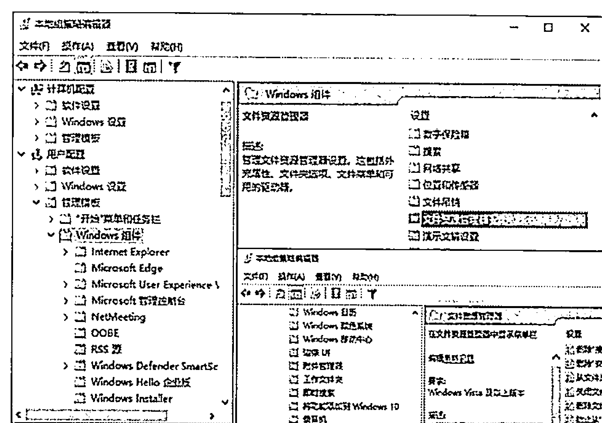

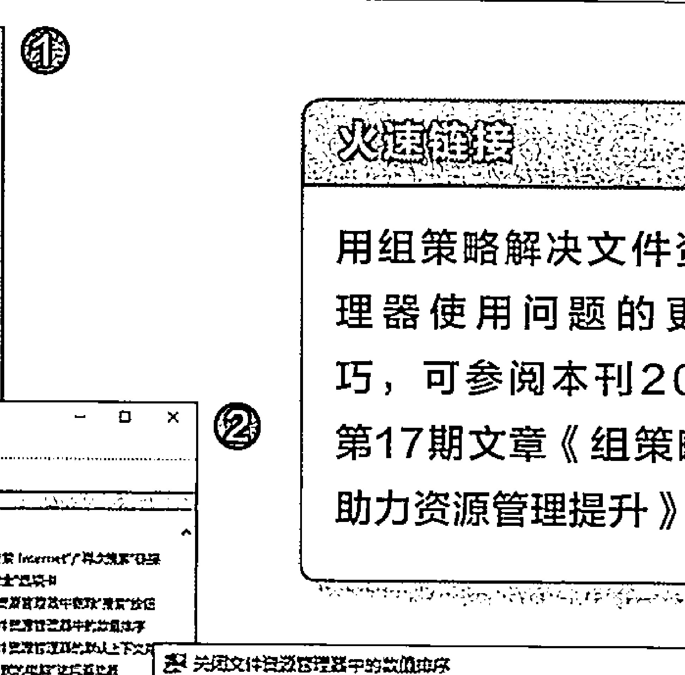

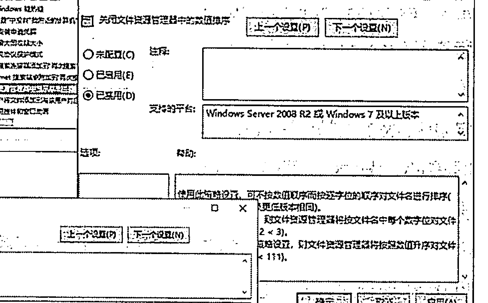

##### ① 文件资源管理器菜单栏丢失找回

菜单栏是文件资源管理器中操作的常用入口，如果发现文件资源管理器中的菜单栏丢失，无法进行文件操作，可以先在上述组策略的路径中找到“在文件资源管理器中显示菜单栏”项，然后双击并将其设置为启用即可(图2)。

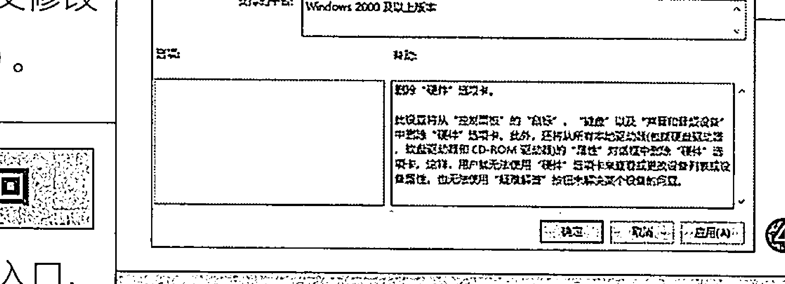

##### ② 数字编号文件名无法正常排序显示

通常情况下，文件资源管理器对以数字为文件名的文件，是以数值从小到大或从大到小的顺序排列的，例如“4<52<123”。如果我们发现文件名无法按照数字大小进行排序，而是只能按照数字位对比排序，例如“123<4<52”这样的顺序，这时需要检查组策略上述路径中的“关闭文件资源管理器中的数值排序”选项设置，只需将其设置为“未配置”或“已禁用”即可(图3)。

##### ③ 禁止生成缩略图缓存以保证隐私安全

即便是删除了图片，缩略图的存在还可能泄露图片的大概内容。因此，为了避免隐私泄露，我们有必要将缩略图缓存关闭。具体方法：定位到上述组策略路径，找到“关闭缩略图的缓存”选项，将其设置为启用即可。

##### ④ 找回丢失的设备“属性→硬件”选项卡

如果在“硬件”设备（例如硬盘、鼠标、键盘、声音设备等）的“属性”窗口，选择“硬件”选项卡，我们可以获知硬件的一些基本属性和参数信息。但有时因为软件修改或优化、故障等原因，这一选项卡可能会丢失。如果遇到这种情况，我们可以通过上述组策略路径，找到“删除硬件选项卡”选项，然后将其设置为“未配置”或“已禁用”即可(图4)。

### 如何阻止系统原有版本的Edge

文/吕梁

2020年1月中旬，微软发布了最新的Chromium内核Edge浏览器，并在之后的数周之内逐步分批推送。虽然新旧Edge浏览器可以通过编辑注册表的方式达到共存，但该新内核的浏览器默认是以自动升级的方式安装在Windows 10 RS4（1803）以上版本中，自动升级方式默认会替换旧核心浏览器。那么，对于还想继续使用原内核Edge的用户，如何才能阻止系统部署新的Edge浏览器呢？

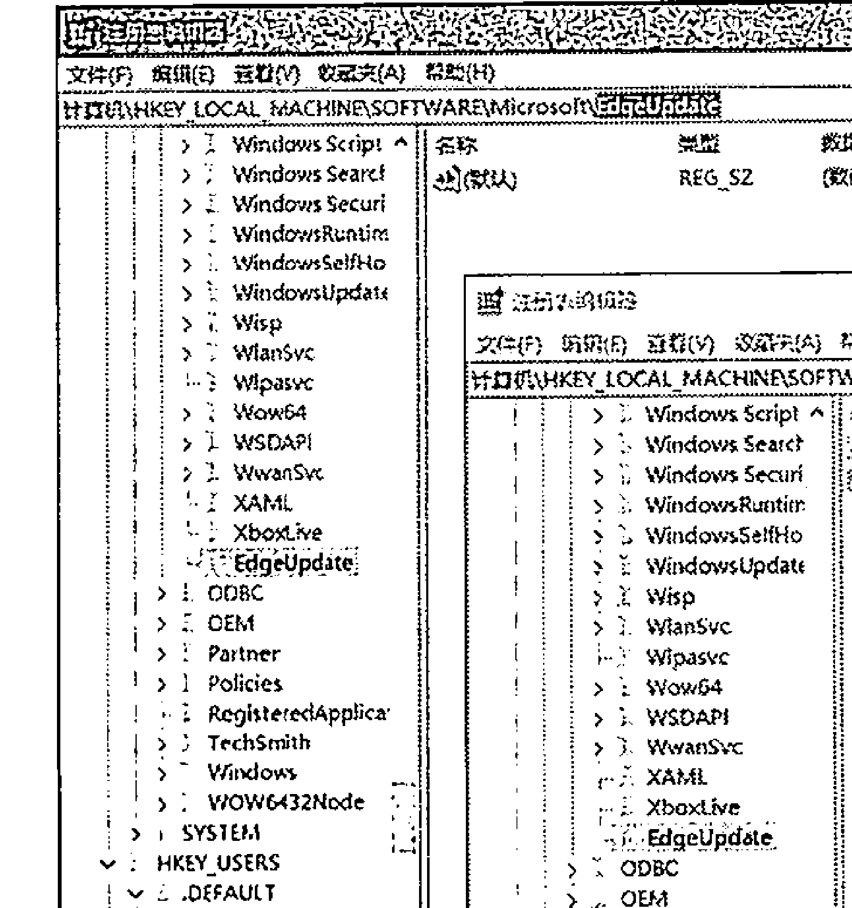

> 小提示
Blocker Toolkit只阻止通过自动更新接收基于Chromium的Edge更新安装，但不会阻止用户通过网络下载后直接安装该软件。

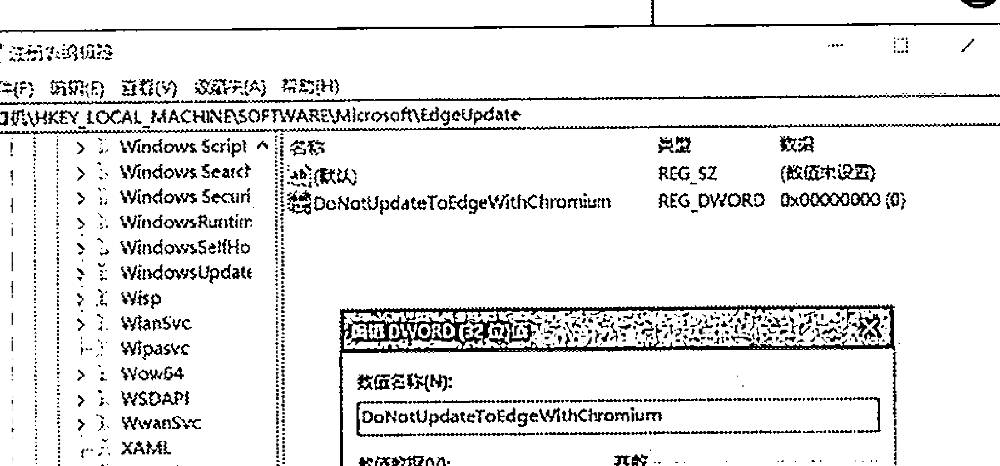

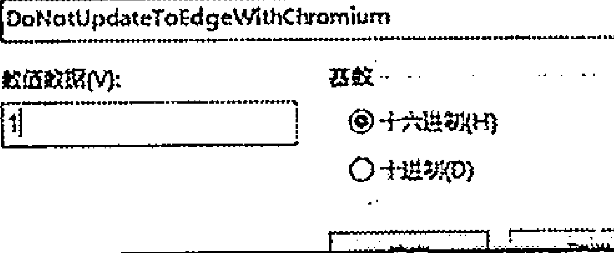

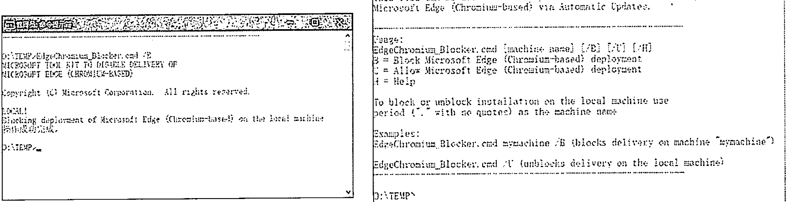

### 1 直接通过注册表进行修改

运行REGEDIT命令打开注册表编辑器，依次定位到“HKEY_LOCAL_MACHINE\SOFTWARE\Microsoft”，查找下面是否有EdgeUpdate分支项，若没有，新建一个(图1)。

### 2 使用微软专用工具包进行控制

我们也可以直接用Microsoft Edge based Chromium Blocker Toolkit工具包中提供的批处理工具EdgeChromium_Blocker.cmd进行控制，自动创建注册表值。该工具可从微软https://docs.microsoft.com/en-us/deployedge/microsoft-edge-blocker-toolkit下载。下载后解压，可从解压文件夹中获取EdgeChromium_Blocker.cmd文件。

随后，在该分支项下新建一个DWORD(32位)值，并将其命名为DoNotUpdateToEdgeWithChromium。将该值的数值数据设置为1，系统将会阻止通过Windows Update升级安装新版Edge(图2)。若设置为0，或当不存在该值时，系统会开启自动升级安装新版Edge。

先在该文件所在位置打开管理员命令提示符，然后直接执行EdgeChromium_Blocker.cmd脚本，可以查看到有关该命令的使用帮助信息(图3)。

根据帮助信息，要阻止Microsoft Edge的自动安装，执行“EdgeChromium_Blocker.cmd /B”命令即可(图4)。
要取消阻止Microsoft Edge的安装，执行“EdgeChromium_Blocker.cmd /U”命令。

### 重启Windows 10诊断策略服务

文/樱子

“诊断策略服务”简称DPS ( Diagnostic Policy Service )，在Windows 10中，诊断策略服务负责系统问题的通知、排除和解决。如果这一服务因故而关闭，当系统出现问题时，我们就不会知道到底发生了什么以及问题出现在哪里。下面的一些方法可以帮助我们重启被关闭的诊断策略服务。

> 火速连接
有关利用系统“服务”应用程序或系统配置实用程序开启系统诊断策略服务的具体操作方法，可参阅本刊2019年第20期文章《禁用无用服务 提高Windows 10性能》，按照该文介绍的方法进行反向操作即可。

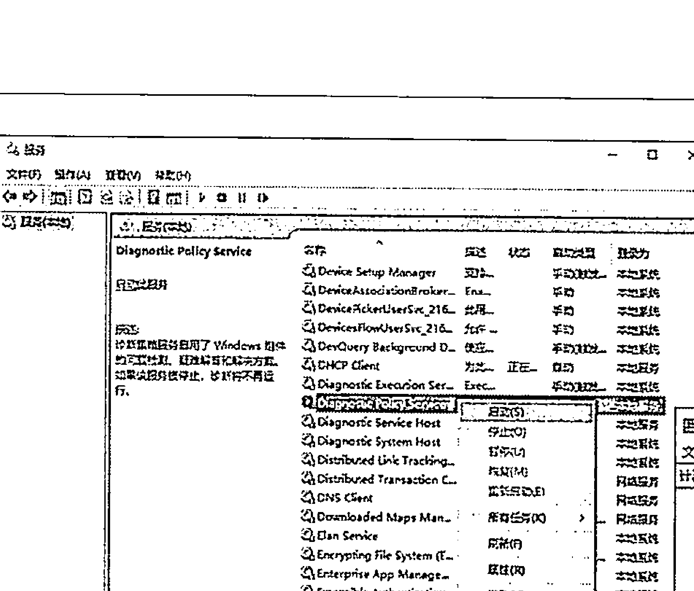

- 利用服务应用程序或系统配置程序
首先，我们可以利用Windows 10系统的“服务”应用程序，开启诊断策略服务（图1）；或者也可以通过系统配置实用程序中的“服务”选项卡，开启诊断策略服务。

- 通过对注册表项进行细微调整实现
启动注册表编辑器，然后在注册表编辑器窗口中，依次导航至以下路径：

```
HKEY_LOCAL_MACHINE\SYSTEM\CurrentControlSet\Services\DPS
```

接下来，在窗口的右侧窗格中，找到名为“Start”的REG_DWORD项。双击该项，按下表的启动类型所对应的数据，修改对应的数值数据。最后单击“确定”按钮（图2）。

| 启动类型 | 数值数据 |
| :--- | :--- |
| 自动 | 2 |
| 手动 | 3 |
| 禁用 | 4 |
| 自动（延迟启动） | 2 |

注意：如果更改为“自动（延迟启动）”类型，还需要同时另建一个新的项DelayedAutoStart，并将其值设置为1（图3）。

- 在管理员命令提示符窗口中解决
要控制诊断策略服务，在管理员命令提示符窗口中执行如下命令，以便自动启动诊断策略服务：

```
REG add "HKLM\SYSTEM\CurrentControlSet\Services\DPS" /v Start /t REG_DWORD /d 2 /f
```

如果要手动启动诊断策略服务，只需将上述命令中的参数2改为3即可；如果要禁用诊断策略服务，则改为4；要设为自动（延迟启动）诊断策略服务，则改为2，同时还要用如下命令创建一个数值数据为1的DelayedAutostart项：

```
REG add "HKLM\SYSTEM\CurrentControlSet\services\DPS" /v DelayedAutostart /t REG_DWORD /d 1 /f
```

当要从“自动（延迟启动）”更改为“自动”时，将DelayedAutostart值更改为0即可。

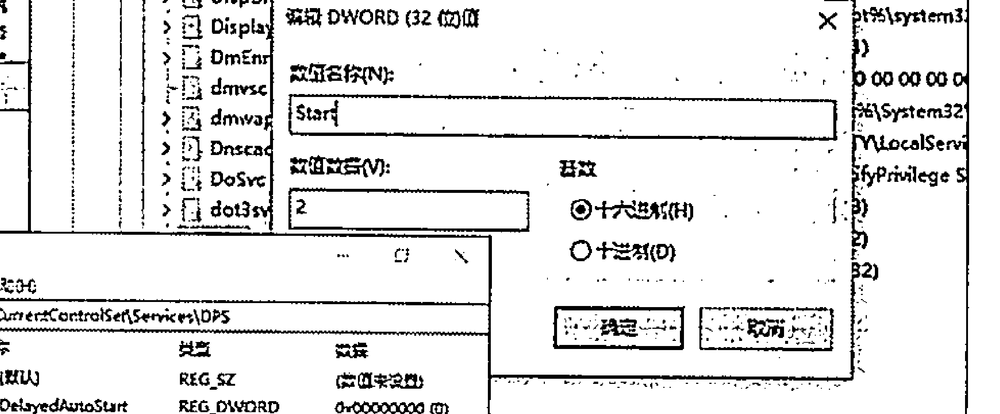

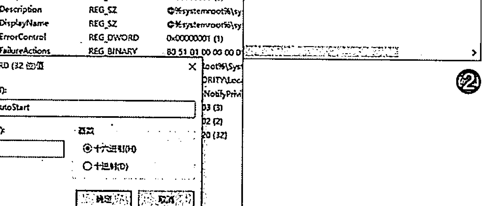

### 深入用好Windows 10的磁盘管理工具

文/波哥

Windows 10的磁盘管理工具一般用于磁盘的初始化和分区、格式化等操作。除了这些基本功能之外，我们还可以挖掘出许多其他实用功能。

> 启动磁盘管理工具的方法很多，其中较为方便的方法是右键单击“开始”按钮，从弹出的超级控制菜单中选择“磁盘管理”（图1）。

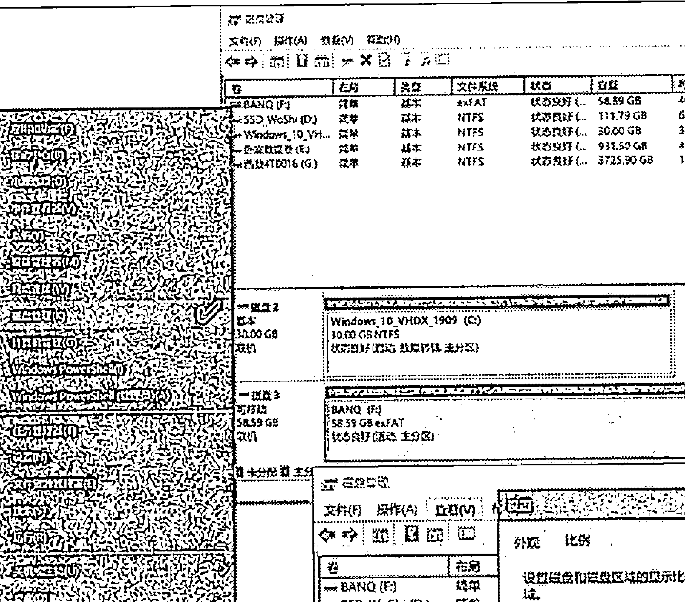

> 更多为虚拟系统扩容的方法，可参见本刊2017年第14期文章《Windows 10 VHDX虚拟系统扩容方法多》。

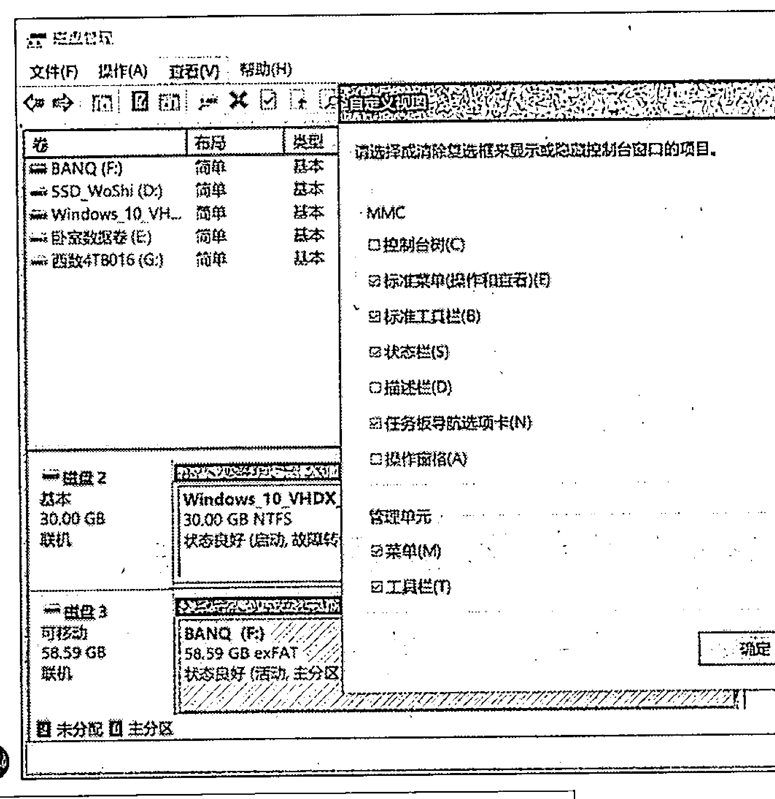

### 1 显示更详尽的操作信息

磁盘管理器的初始界面只有菜单、工具栏和两个列表。通过执行“查看→自定义”菜单命令，在弹出的“自定义视图”窗口中，我们还可以将隐藏的“控制台树”、“描述栏”、“操作窗格”等项目，根据需要有选择地显示出来（图2）。这样，就会让所有操作的动作和与之相关的信息，能够更加明确地显示出来。

> 分区借用的条件是两个分区必须位于同一块物理硬盘上，且为同种格式、相邻分区。

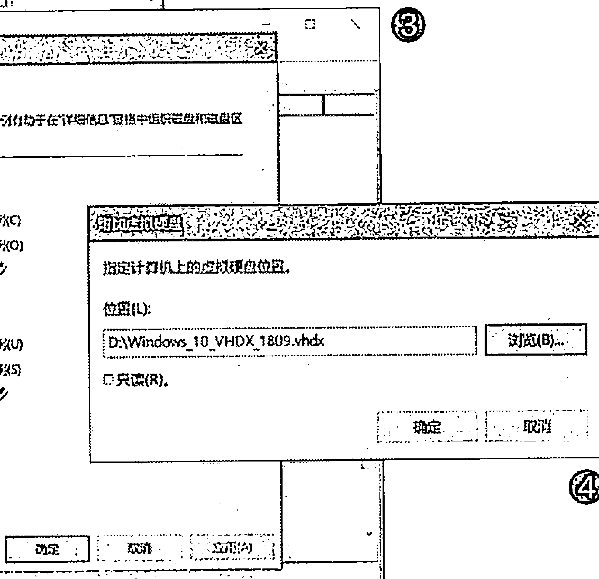

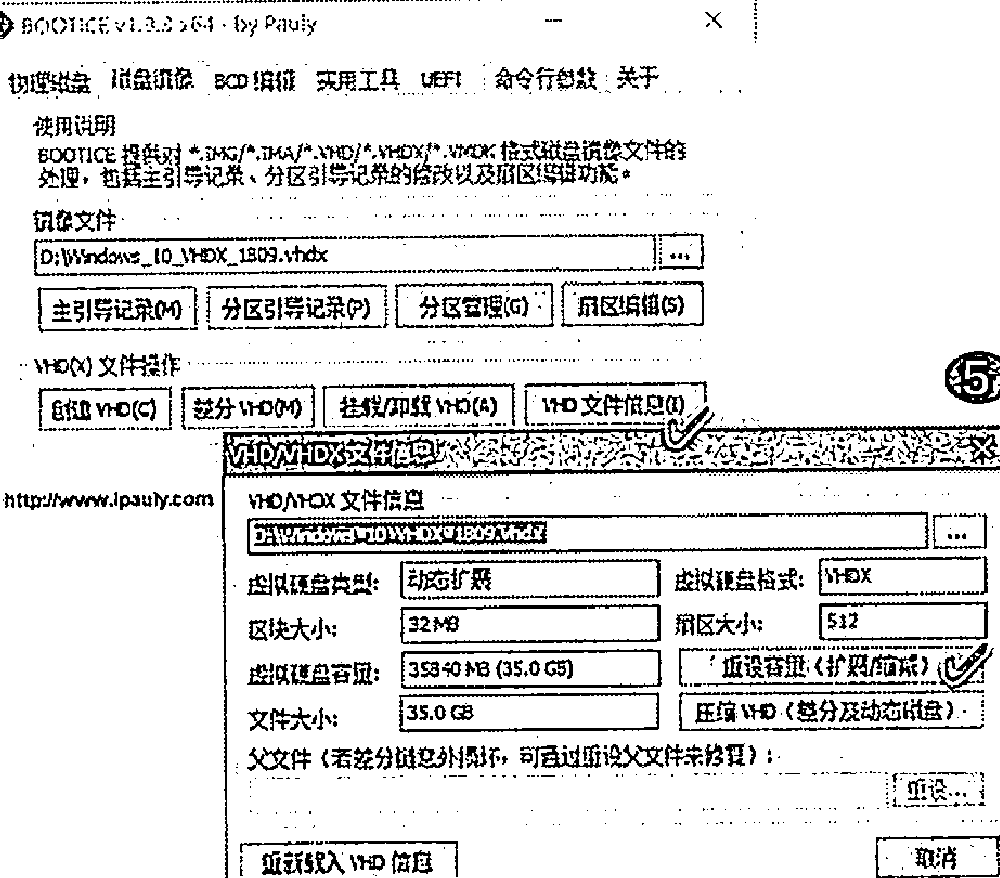

### 2 纠正分区占比显示“错误”

某些时候，我们可能会发现，明明自己给一块磁盘分了不同容量的几个分区，但在磁盘管理器中看到的示意图长度却是一样的长短。其实，这不是什么“错误”，只是一个设置上的小问题，只需依次点击“查看→设置→比例”菜单命令，在出现的设置窗口中取消对“都按相同大小”显示选项的选择即可（图3）。

### 3 从系统虚拟映像中提取文件

Windows 10 原生建立的虚拟系统文件一般是扩展名为.VHD或.VHDX的文件。如果要从虚拟系统的映像文件中提取出一些文件，我们没有必要启动该虚拟系统，然后再提取。其实，通过执行磁盘管理工具的“操作→附加VHD”命令，然后浏览到该虚拟系统的虚拟映像文件，即可将其打开为一个盘符，从中复制所需的文件即可（图4）。

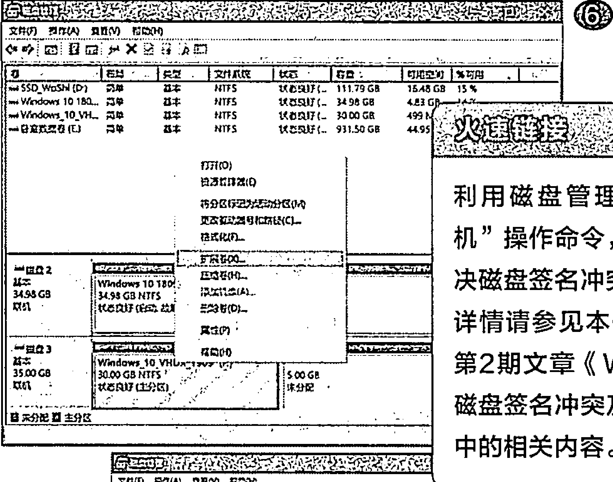

> 利用磁盘管理器的“联机”操作命令，还可以解决磁盘签名冲突的问题。详情请参见本刊2019年第2期文章《Windows磁盘签名冲突及其解决》中的相关内容。

### 4 调整虚拟系统的分区空间

VHD虚拟系统，其实最终归结到物理磁盘分区中的一个文件，当虚拟系统分区空间不足时，只需用BOOTICE工具重设VHD文件的容量为更大（图5）；然后，在磁盘管理器中加载该虚拟卷，并右键单击VHD磁盘，执行“扩展卷”命令，即可扩大分区空间（图6）。

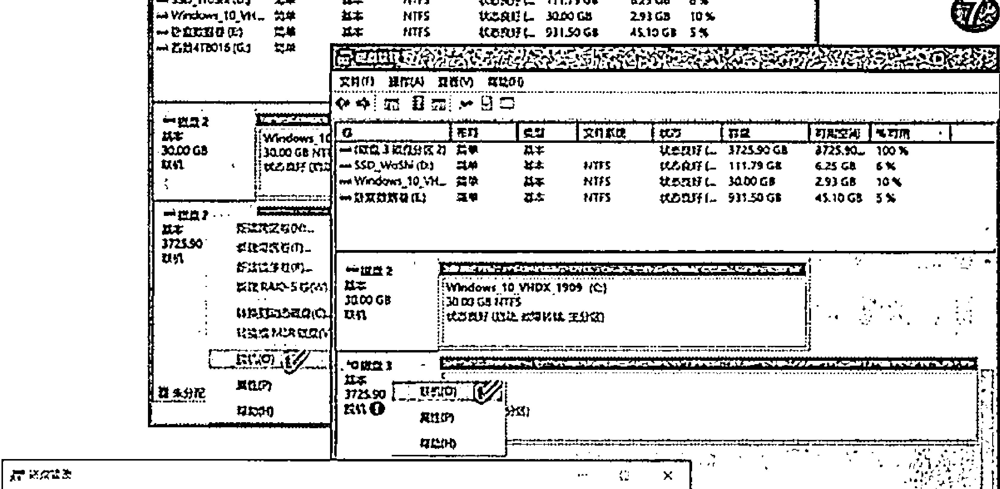

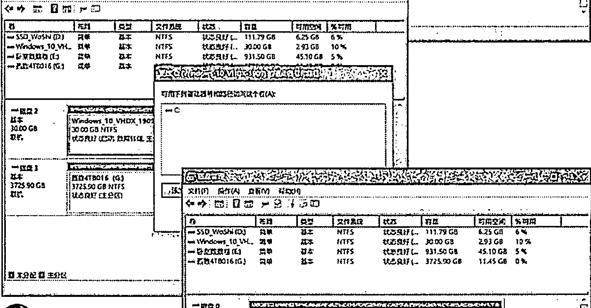

### 5 不拔插 激活移动硬盘

如果在本地工作，当移动硬盘假死后（资源管理器内有盘符可见，但点击出现错误，无法访问），拔下来重插一下即可。但如果不想拔插硬盘，还可以打开磁盘管理工具，然后在移动硬盘盘符上点击右键，选择“脱机”；接着再执行右键菜单“联机”命令，就能将假死的移动硬盘激活了（图7）。这种方法对激活远程移动硬盘更实用，因为对于远程硬盘来说，我们鞭长莫及，不可能用拔插法来解决。

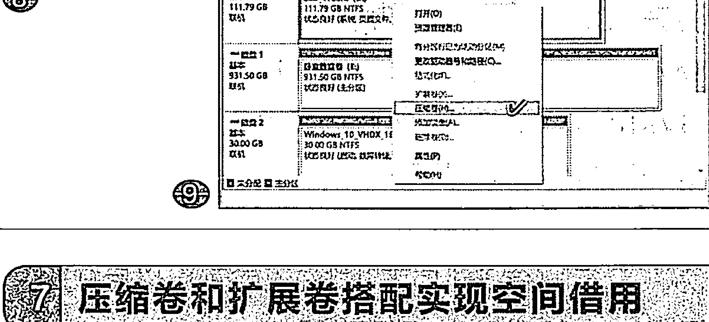

### 6 找回安装多系统后丢失的分区

在安装了多个系统之后，当通过多系统菜单启动到某个系统之后，有时你可能会发现原来保存系统重要启动文件的分区丢失不见了。其实这是Windows自我保护的一种机制，目的是防止人们轻易删除或修改多系统的重要启动文件。如果需要显示丢失的盘符，或者从中存取文件，可在磁盘管理器中选择该设备，然后从其右键菜单中选择“更改驱动器号和路径”命令，为该磁盘分区指定一个盘符即可（图8）。


### 7 压缩卷和扩展卷搭配实现空间借用

有时候我们会遇到硬盘的某个实体分区空间不足，而另一个分区空间有余的情况。这时，我们可以通过磁盘管理工具的“压缩卷”与“扩展卷”操作相结合，实现分区空间的借用。具体方法：先在空间充足的分区上右键单击，执行“压缩卷”命令，将一些空间腾出来作为未划分的空间备用（图9）；接下来，在空间不足的分区上，执行右键菜单“扩展卷”命令，将前述未划分的空间合并过来，即可实现磁盘分区空间的借用。


#### 改造Windows 10找回熟悉的“Windows 7”

文/愚人

随着Windows 7正式退役，迫使许多人不得不升级到Windows 10，但不少人仍然习惯Windows 7的界面和操作。其实对于这类用户，我们可以自己将Windows 10 “改造”为Windows 7，从而继续在熟悉的界面下工作。

> 在http://www.cfan.com.cn/2016/0115/124643.shtml一文中，介绍了如何在资源管理器中显示Windows 7常用的“库”图标，大家可以参考。

##### 1 改造开始菜单

Windows 10和Windows 7开始菜单最大的区别就是前者引入了磁贴，现在只要在开始菜单上右击任意磁贴选择“从开始取消固定”，即可取消这些磁贴的显示（图1）。

此外Windows 7常用的“运行”菜单被隐藏到“开始菜单→所有程序→Windows 系统”下面，为了方便使用可以将其添加到开始菜单的主菜单中。打开“C:\Users\当前用户\AppData\Roaming\Microsoft\Windows\Start Menu\Programs\System Tools”，然后将其中的“运行”移动到“C:\Users\当前用户\AppData\Roaming\Microsoft\Windows\Start Menu”中，并将其改为“0运行”（字母排序可以排在更前面），以后打开开始菜单就可以直接运行了（图2）。

##### 2 任务栏改造

默认情况下，Windows 10的任务栏会自动显示Windows 7没有的Cortana和应用商店图标，前者可以在Cortana图标上右击，选择“搜索→隐藏”即可（图3）。后者只要右击它，选择“从在任务栏取消固定”即可。

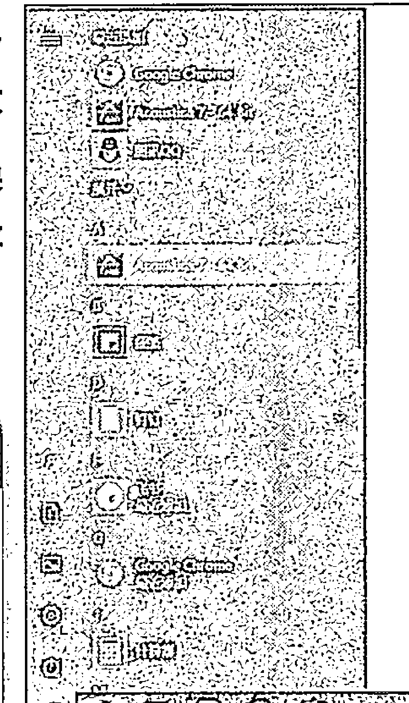

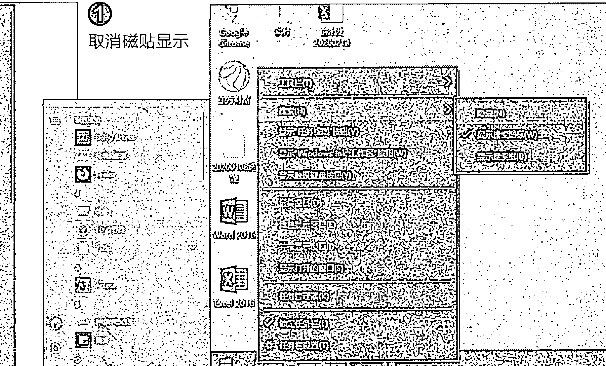

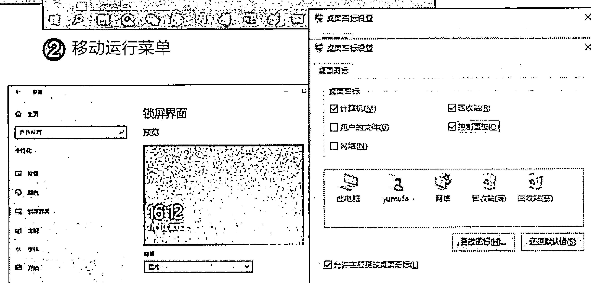

##### 3 更改登录界面

如果要在登录时更换回经典的Windows 7界面，可以进入“设置→个性化→锁屏界面”，接着准备好Windows 7登录图片，在右侧设置窗口，将背景设置为“图片”，点击“浏览”选择上述准备好的图片，同时开启“在登录界面显示锁屏界面的图片”即可（图4）。

##### 4 控制面板优化

Windows 10引入“设置”菜单，弱化“控制面板”的存在，控制面板启动被隐藏到了“开始菜单→所有程序→Windows 系统”下面。为了能够像Windows 7那样快捷启动控制面板，可以在桌面右击选择“个性化→主题→桌面图标设置”，勾选“控制面板”，即可在桌面启动它了（图5）。

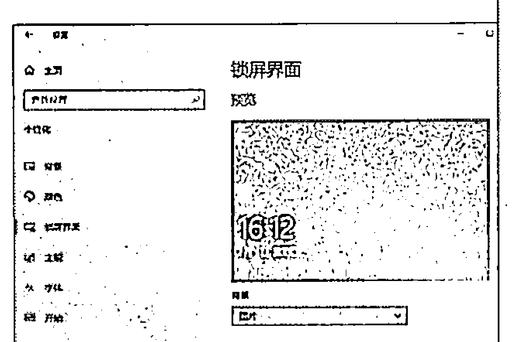

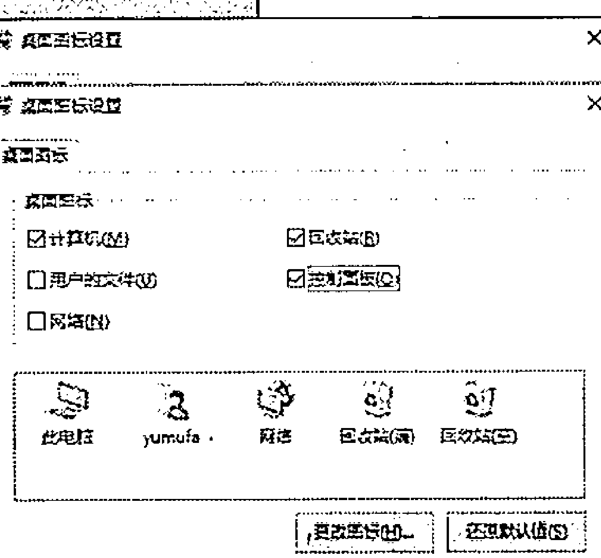

### 删除Windows 10应用新保存位置的隐藏文件夹

文/平淡

Windows 10用户一般都从其自身集成的应用商店中下载安装应用，不过安装的应用一多，很容易造成C盘容量紧张，因此有不少人会将应用保存位置设置到非系统分区（如E盘）。这样虽然省事，但是在系统重装或者更换硬盘恢复默认的应用设置后，我们将无法直接删除应用产生的文件夹（如“E:\WindowsApps”等），因为这些文件夹默认受到系统保护。下面为大家介绍的方法可以解决这一问题。

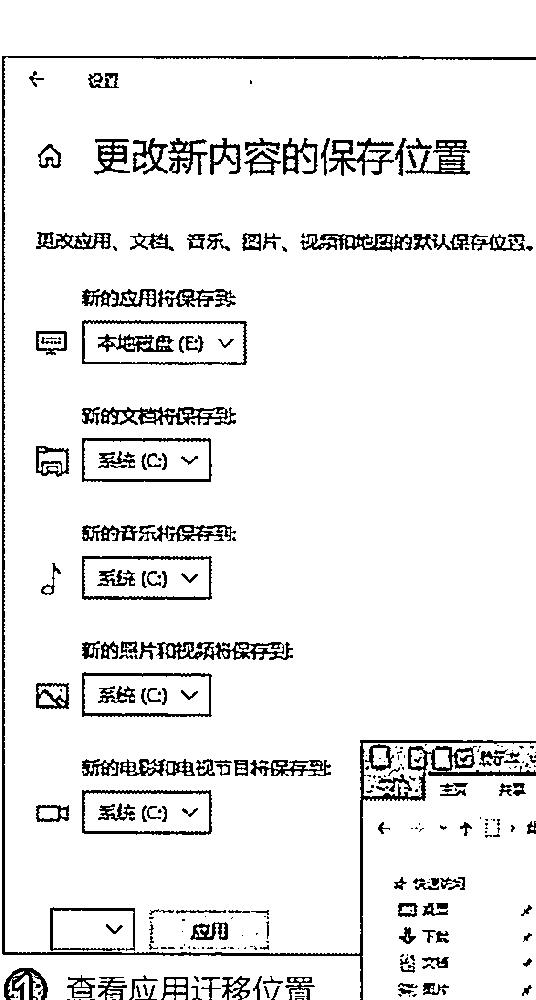

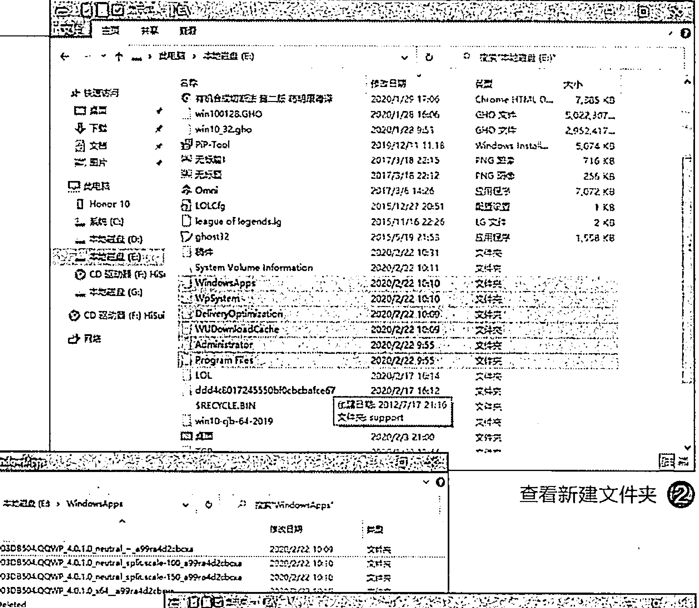

首先我们要查看应用保存位置设置到了哪个分区，在桌面搜索框输入“存储设置”，打开设置窗口后点击“更改新内容的保存位置”，接着在打开的窗口中查看“新的应用将保存到”的实际位置，比如笔者这里是E盘（图1）。

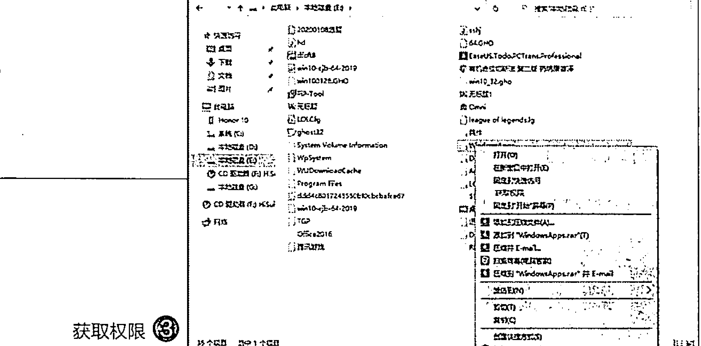

完成上述操作后就要确定更改应用保存位置后系统会生成哪些文件夹。比如笔者的例子，应用保存位置设置到E盘后，默认情况下会在E盘根目录下产生“Administrator”（即当前登录用户名同名文件夹）、“WpSystem”、“DeliveryOptimization”、“WUDownloadCache”、“Program Files”、“WindowsApps”等文件夹（大家可以按文件夹的创建时间排序，查看同一时间的创建即可）（图2）。

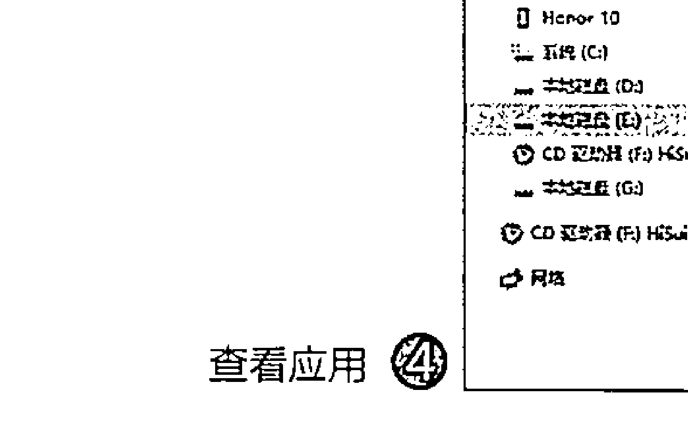

这些文件夹之所以无法直接删除，主要是由于当前账户的权限不足，因此解决方法是提升用户权限。另外要删除这些文件夹，还要确保将保存在“E:\WindowsApps”里的应用先卸载。

为了方便获得该文件夹的完全管理员权限，可以打开https://www.cnblogs.com/freeweb/p/4381367.html，将其中的代码复制到记事本中并保存为“aa.reg”文件导入注册表，这样在“E:\WindowsApps”上右击就可以选择“获取权限”了（图3）。获取权限后就可以进行删除操作了。

以笔者自己的电脑为例，打开上述文件夹后，看到保存在这里的是QQ应用（图4）。在开始菜单上找到QQ并将其卸载，操作同上，依次获取上述文件夹的完全控制权限，再使用右键菜单中的删除命令将它们依次删除即可。

当然了，上述操作比较繁琐，假如你重装Windows 10后直接使用系统默认设置，那么可以打开资源管理器，直接使用格式化E盘的方法将所有文件夹全部删除，只是在格式化之前一定要注意备份相关资料。

### 善用“文件夹选项”解决实际问题

文/波哥

此前本刊曾介绍过Windows 8 “文件夹选项”的一些使用技巧以及“文件夹选项”丢失的找回办法。其实，在Windows 10中，利用“文件夹选项”，还可以解决更多实际问题。

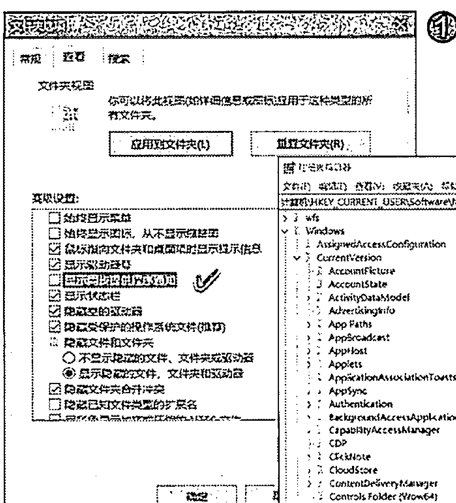

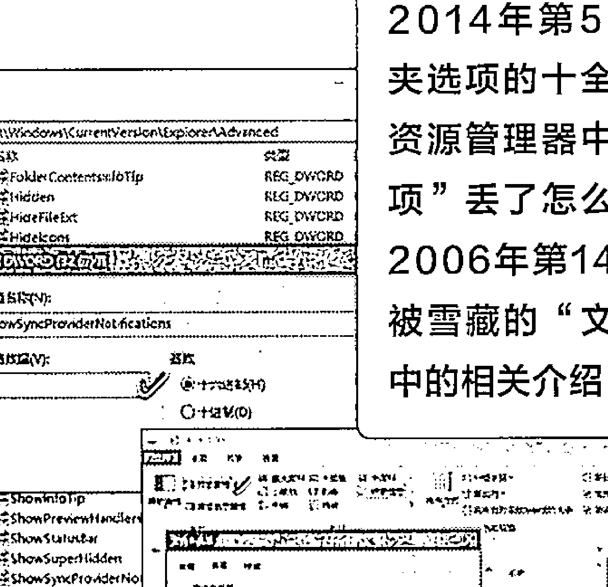

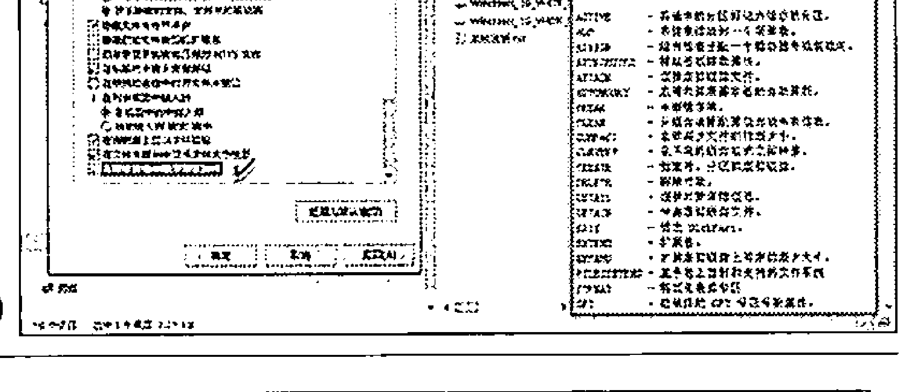

> 火速追击
更多关于“文件夹选项”的使用技巧，还可以参看本刊2014年第5期文章《文件夹选项的十全用途》。如果资源管理器中的“文件夹选项”丢了怎么办？请看本刊2006年第14期文章《挖掘被雪藏的“文件夹选项”》中的相关介绍。

### 1 找回丢失的“文件共享”向导

如果在某文件夹的右键“属性”窗口中，点击“共享”选项卡，“共享”按钮变为灰色不可选状态，在文件资源管理器中点击“查看→选项”按钮，然后在“文件夹选项”窗口中点击“查看”选项卡，通过“高级设置”列表找到“使用共享向导（推荐）”选项，选中并确定，即可让“共享”功能恢复正常。

### 2 禁止文件管理器中广告推广

在Windows 10文件资源管理器中工作，很可能会受到来自“同步提供程序通知”的打扰，对于大多数用户来说，这些信息没有多大用处，反而分散人的注意力。为避免此类消息的出现，可在“文件夹选项”窗口的“高级设置”列表中，将“显示同步提供程序通知”的选择去掉（图1）。

- 永久关闭同步提供程序通知
在注册表编辑器中依次导航到“HKEY_CURRENT_USER\Software\Microsoft\Windows\CurrentVersion\Explorer\Advanced”，在右侧窗格中单击右键并选择“新建→DWORD（32位）”，新建名为ShowSyncProviderNotifications的值。最后，将其值更改为0（图2）。

### 3 更正图片无法显示缩略图的问题

如果我们发现在Windows 10中的图片目录下，只能显示图片的图标，而无法显示其缩略图。这时，可以启动“文件夹选项”窗口，在“查看→高级设置”列表中找到“始终显示图标，从不显示缩略图”选项，将其前面的勾选去掉。

### 4 让文件详细路径的获取更加直观

我们可以让文件路径直接显示在文件夹窗口的标题栏上。只需在文件夹选项的“高级设置”列表中，将“在标题栏中显示完整路径”选中即可。

### 5 预览窗格开启后仍无法预览文件的问题

当我们从Windows 10文件资源管理器的左侧导航栏设置列表中选择了“预览窗格”之后，右侧预览窗格内却无法看到TXT文本或图片的预览信息，只需在文件夹选项的高级设置列表中，将“在预览窗格中显示预览控件”选项选中，TXT文本和图片就可以正常显示了（图3）。

#### 藏起驱动器号 确保数据安全

文|樱子

对于一些保存有重要资料或者经过加密处理的驱动器，在使用的过程中，我们有时可能会遇到系统提示格式不对，需要格式化的情况。这时，如果误以为格式出了问题，不小心执行了格式化操作，那么其中的重要数据或加密数据便会荡然无存。如何才能更好地保护此类驱动器呢？我们可以采用一种另类的方法——删除驱动器号来隐藏驱动器，以达到防止误操作的目的。

> 除了可以将已有驱动器隐藏起来实现安保外，我们还可以采用创建虚拟隐含驱动器的办法实现数据保密。具体方法可参阅本刊2019年第22期文章《创建不可见的机密“磁盘”》的介绍。两种方法的不同点在于，一个是针对实体驱动器进行隐藏，一个是需要创建文件型虚拟驱动器并进行隐藏。

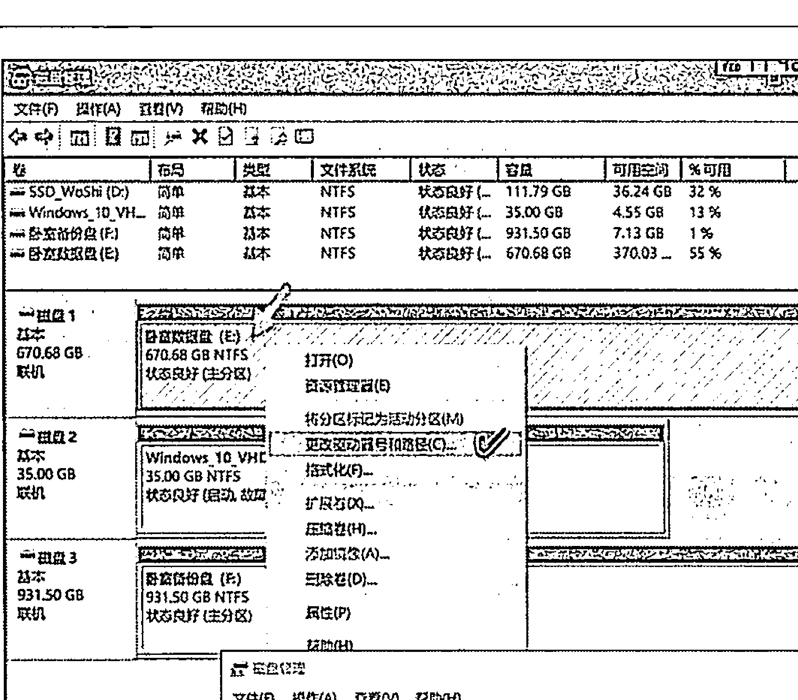

> 上述方法不仅限于对加密驱动器的保护，同样适用于未进行加密的重要数据驱动器的保护。即便是不出现格式不对的提示或要求格式化的信息，我们同样可以用这种方法来藏起任意驱动器号。这样，对于外来使用者来说，就感觉不到它们的存在，因此可以避免因误操作而删除数据的可能。

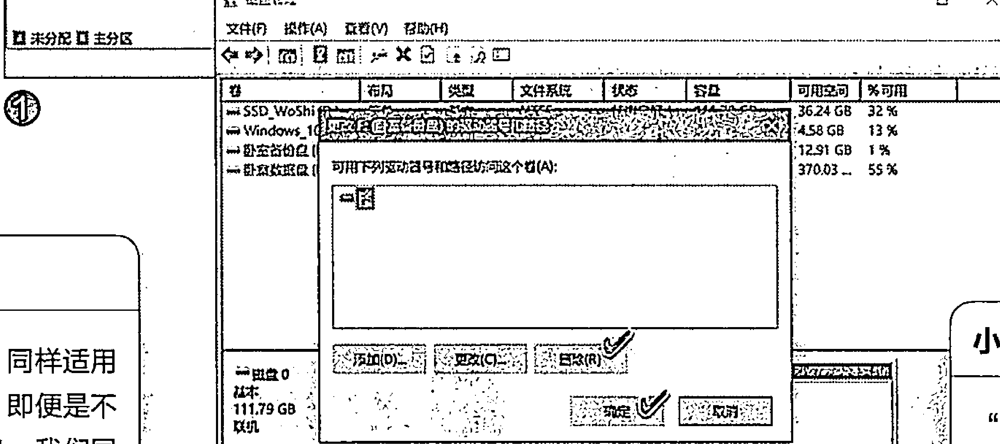

##### 1 直接用磁盘管理器实现隐藏

为避免因误操作而无意中格式化加密驱动器，我们可以采取如下方法：

- 右键单击“开始”按钮并选择“磁盘管理”，启动到磁盘管理窗口。
- 在磁盘管理窗口中，右键单击需要保护的驱动器，然后点选“更改驱动器号和路径”（图1）；
- 随后，在弹出的窗口中，点击“删除”按钮，然后点击“确定”（图2）。

这样，在下次打开文件资源管理器后，便不会再看到该驱动器号了。注意，删除驱动器号并不会删除驱动器中存储的任何文件或数据。

当自己需要使用该驱动器时，只需用同样的方法，给驱动器分配一个驱动器号即可。

> "SETID=12"命令中的12表示将驱动器类型设置为隐藏。如果要改为显示，则将12改为07即可。

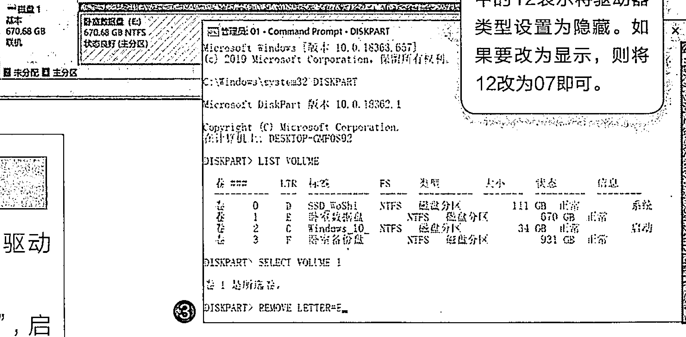

##### 2 在命令提示符窗口中用命令解决

我们还可以利用命令的方式藏起某个驱动器。首先在管理员命令提示符窗口中执行DISKPART命令，然后执行LIST VOLUME命令列出所有驱动器的列表；随后，执行“SELECT VOLUME <驱动器号>”命令选择某驱动器，再用“REMOVE LETTER=<希望移除的驱动器号>”命令移除驱动器号（图3）；最后，执行“SET ID=12”命令，隐藏该驱动器，执行Exit命令退出。

#### 关闭从Windows获取更多信息提示

文|波哥

Windows 10中的“从Windows获取更多信息提示”功能突出显示由Microsoft账户提供支持的一些服务。这些提示可能在设备第一次启动时显示，也可能会随机显示，内容主要包括设置Windows Hello、将手机和电脑进行连接、跨设备执行更多操作、准备Office 365、使用OneDrive保护文件等。这些消息我们可能根本不需要，或相关功能已经在使用，再来提示就显得多余。其实，我们可以通过两种方法将其关闭。

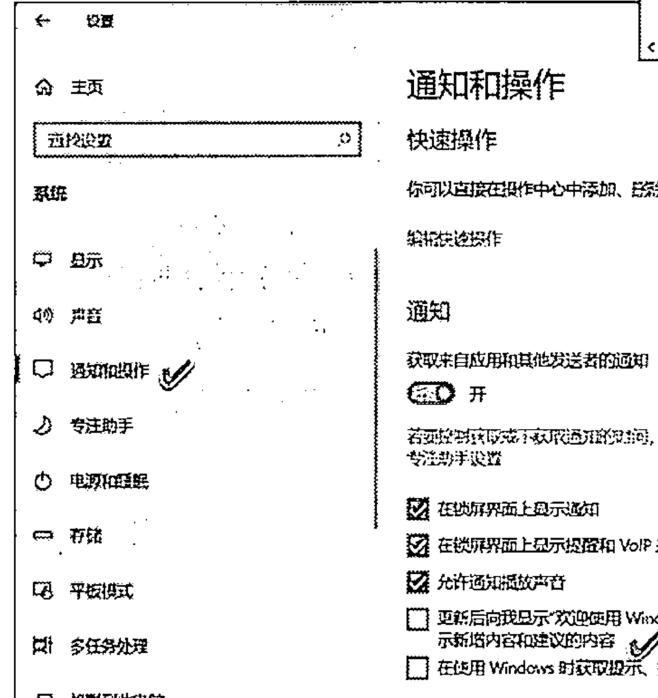

##### 1 通过系统“设置”应用进行设置

右键单击“开始”按钮并选择“设置”，然后在设置窗口中依次选择“系统→通知和操作”。随后在“通知”下找到“更新后向我显示欢迎使用Windows体验，并在我登录时突出显示新增内容和建议的内容”和“在使用Windows时获取提示、技巧和建议”两个选项，取消对这些选项的选择，即可禁用获取更多信息的提示（图1）。

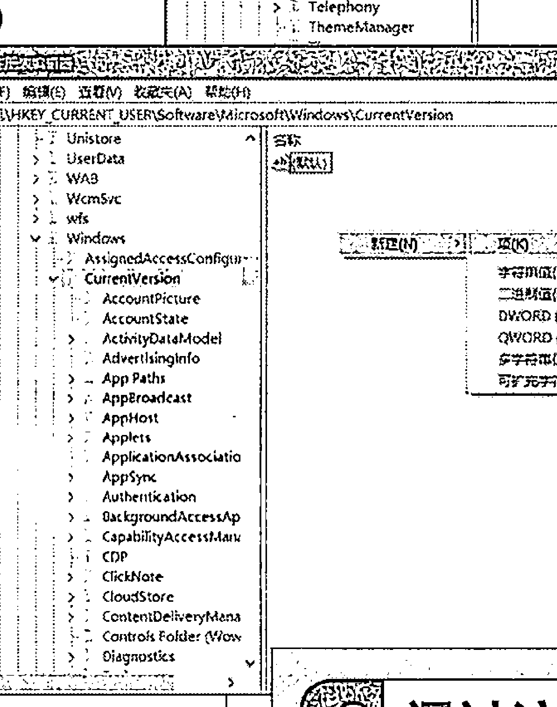

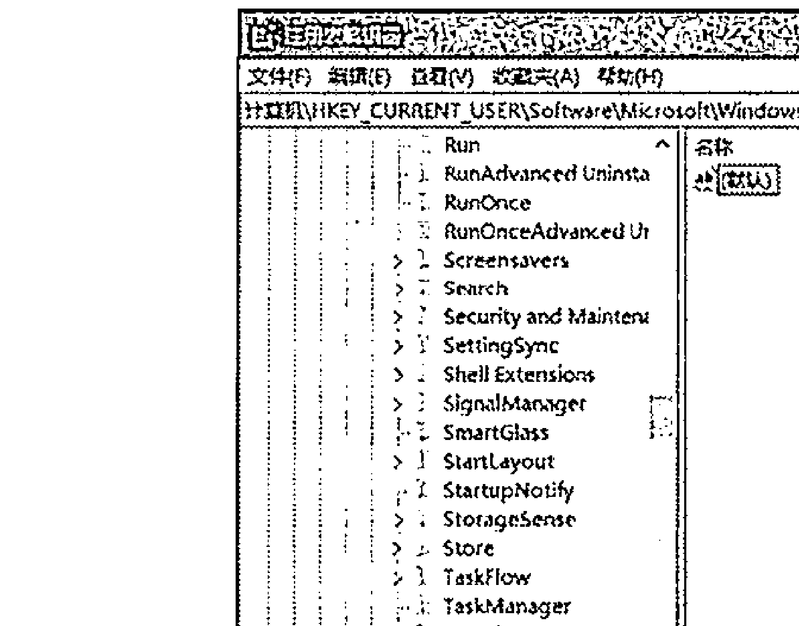

##### 2 通过注册表编辑器进行修改

虽然用系统“设置”取消提示比较方便，但有时我们会发现“设置”窗口中的这两个选项为灰色不可选状态，无法修改（例如，笔者在安装教育版并以个人用户身份登录后，这两项即为灰色状态）。在这种情况下，我们可以用修改注册表的办法加以解决。

首先，在Windows“运行”框中输入并执行regedit命令，启动注册表编辑器。依次定位到“计算机\HKEY_CURRENT_USER\Software\Microsoft\Windows\CurrentVersion\UserProfileEngagement”。如果不存在UserProfileEngagement分支项，先创建该项目（图2）。

然后，右键单击UserProfileEngagement分支右侧窗格的空白处，选择“新建→DWORD（32位）值”，将新建值命名为ScoobeSystemSettingEnabled（图3）。

接着，双击ScoobeSystemSettingEnabled，将其数值数据设置为0，即表示禁用了提示信息显示功能。若将值设为1，则表示启用该功能（图4）。

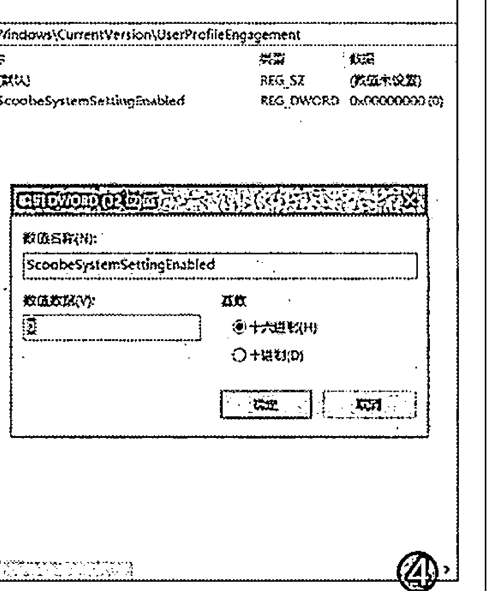

修改完成之后，重新启动Windows使修改生效。

> > 小提示
> 如果觉得手动修改注册表比较麻烦，也可以利用现成的注册表脚本来禁用或启用该功能。下载地址：https://www.ghacks.net/download/153745

#### 格式化磁盘 五种方法任你选

文|吕梁

格式化磁盘的方法有很多，每种方法都有其自身的优势和特点。我们最常使用的磁盘格式化操作是在资源管理器或磁盘管理器中进行的，除此之外的一些方法也值得我们去了解和掌握。

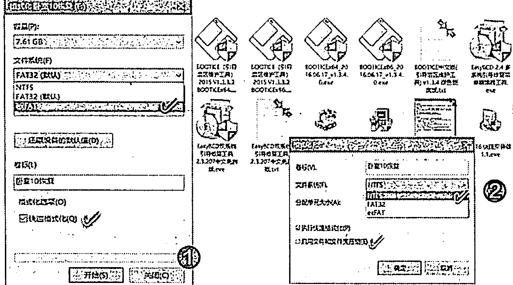

##### 1 文件资源管理器中的格式化选项

在文件资源管理器中，使用右键菜单“格式化”命令要注意两点：一是在保存大于4GB的单文件时，除了选择NTFS格式外，还可以选择exFAT格式，这对于新式移动设备或单反、微单相机存储超大型高清视频文件很有用。另外，如果希望在格式化的同时检查有没有坏道或坏扇区，要取消对“快速格式化”的选择（图1）。

##### 2 磁盘管理器中的“压缩式”格式化

磁盘管理器中的格式化功能提供了一个压缩选项。要启用压缩式格式化，只能在选中NTFS格式的情况下进行，其余格式均不支持压缩功能。在执行了压缩式格式化后，再向磁盘中保存文件，一些文件上便会出现蓝色对向箭头图标，表示存入的文件被自动压缩（图2）。压缩式格式化能节省磁盘存储空间，而文件打开速度会比以标准格式化存储文件要慢，但在高配设备上使用，我们可能感觉不出来速度的差异。磁盘管理器更适合于对新购置的磁盘进行初始化后，顺带进行格式化操作。

##### 3 一箭三雕的Windows 10命令行格式化

在Windows 10命令提示符窗口中进行磁盘格式化操作，可只用一条命令完成对磁盘的文件系统格式、卷标、格式化方法的选择。磁盘快速格式化的命令如下：

```
Format fs=<FileSystem> label="<VolumeLabel>" quick
```

实际使用时，要将<FileSystem>替换为NTFS或FAT32、exFAT等格式之一，将<VolumeLabel>替换为新起的卷标名。

如果要进行磁盘的完整格式化，去掉上述命令中的quick即可。

##### 4 新式Windows PowerShell命令格式化

除了使用命令提示符窗口外，我们还可以利用管理员Windows PowerShell命令窗口完成磁盘格式化操作。磁盘快速格式化的PowerShell命令如下：

```
Format-Volume -DriveLetter "<DriveLetter>" -FileSystem <FileSystem> -NewFileSystemLabel "<VolumeLabel>"
```

实际使用时，要将命令中的<DriveLetter>替换为具体盘符，将<FileSystem>替换为磁盘类型，将<VolumeLabel>替换为卷标名称。

如果需要执行完整格式化，只需在上述快速格式化命令后加上“-Full”参数即可。

##### 5 针对数据安全保密的第三方格式化工具

上述方法有一个共同缺点，格式化后数据并非永久被擦除。如果需要进行不可恢复的格式化操作，我们可以用O&O系列工具中的老软件O&O PartitionManager v3.0，选择不同的安全级别进行安全格式化。此外，还可以用其同门新软件O&O SafeErase 15 Professional Edition进行操作，选择主界面上的最后一个模块Hard disk/partitions，对硬盘、分区甚至整个计算机中的所有数据进行安全擦除。

#### 借助第三方工具高效编辑注册表

文|波哥

通过Windows注册表可以控制系统的方方面面，但单靠系统自带的注册表编辑器，操作比较复杂，且有的功能也不容易实现。借助于第三方的注册表管理工具，就可以让注册表的编辑管理更加容易掌控。

##### 1. 不开注册表编辑器 轻松设定项权限

一般来说，如果要更改某个注册表项的访问权限，需要先打开注册表编辑器，逐步展开到相应的分支项，然后右键单击该项，通过“安全”选项卡中的权限列表，才能进行授权操作。其实，如果我们使用RegOwnit软件，在不打开注册表编辑器的情况下，就可以对指定的项目执行授权操作。

首先确定要授权的注册表分支的路径，可先复制已知路径；若不方便复制，需要在软件中照单输入。打开RegOwnit软件，在Registry Location列表中选择键值的类别，然后在下面的Registry Address地址栏中输入要操作的注册表路径；随后，从User Accounts用户账户类型列表中选择用户类别（管理员、家庭用户或当前登录用户）；接下来，从Permissions列表中选择允许的权限类别（只读或完全控制）。设置完毕后，点击Apply按钮应用授权（图1）。

##### 2. 注册表编辑器的替代与功能增强

系统自带的注册表编辑器对注册表的操作控制功能比较简单，如果用Registry Workshop软件来替代它，在保留Regedit全部功能的基础上，可以获得更为强大的编辑功能和更为良好的使用体验。

以注册表项目搜索为例，按下Ctrl+F组合键之后，我们可以更加细致地通过设定条件，灵活地控制自定义搜索范围（图2）。

我们还可以用该软件来比较注册表的变化或不同。先将系统的注册表或注册表分支加以保存，然后再开启本软件，打开两个不同的注册表文件，执行“工具→比较注册表”命令，指定要比较的路径，即可以对两个注册表文件进行比较（图3）。

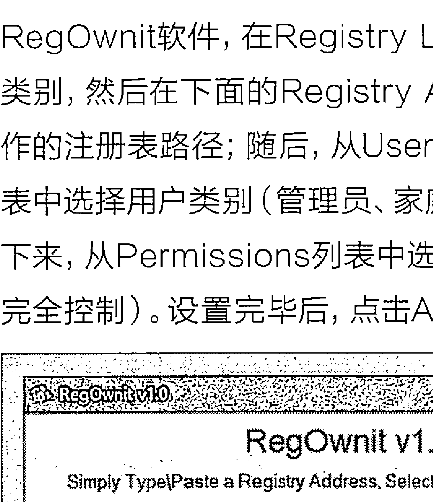

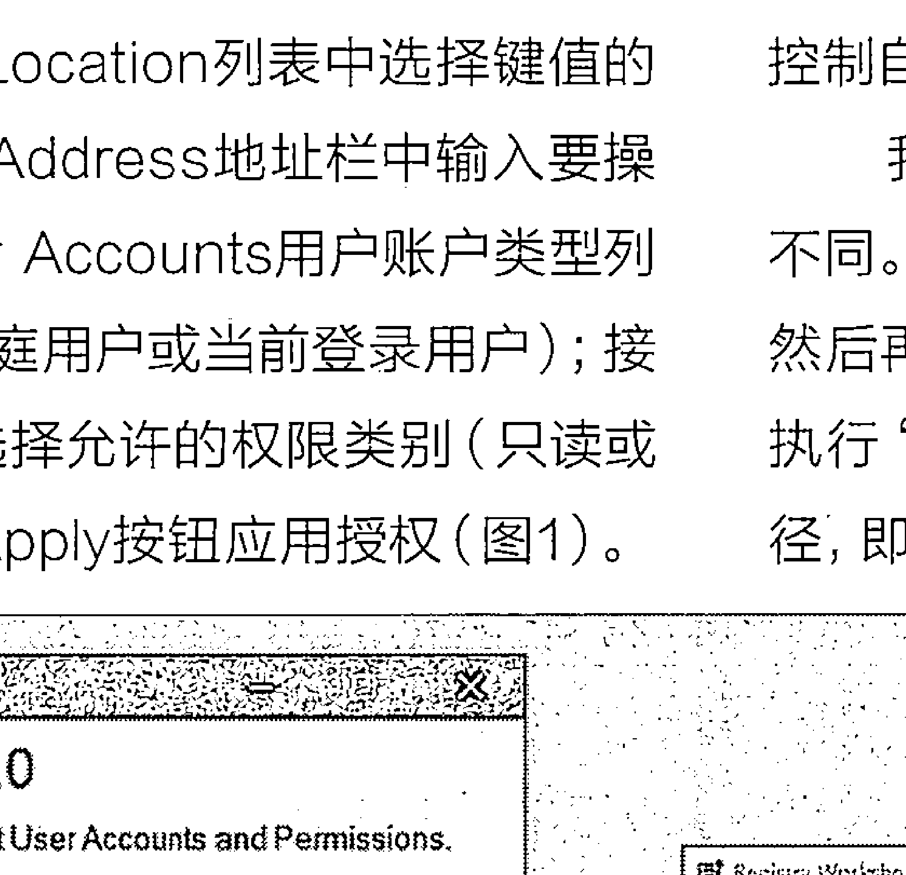

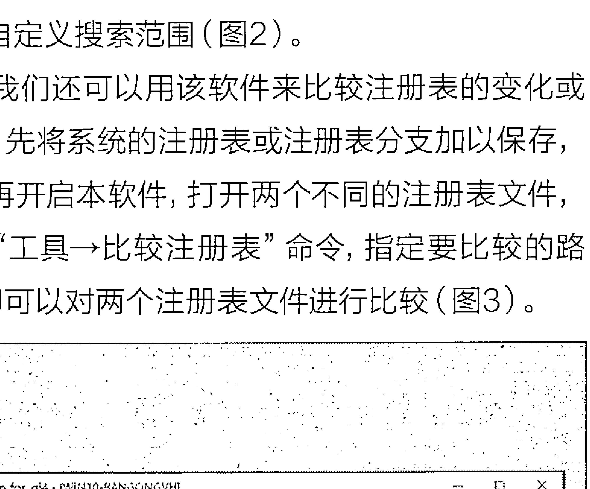

查找或比较注册表之后，查找与比较结果会以标签的形式列于软件窗口的底部，点击标签即可切换查看。此外，在软件中我们还可以利用Alt+0到Alt+9等10组快捷键设置键值书签，并用F6或Shift+F6进行快速切换。通过“文件→整理注册表”命令，还可以执行注册表的自动整理优化。

Registry Workshop软件提供30天全功能免费试用，过期后需要付费使用。如果不愿付费使用，还可以选择另一个功能类似的软件Registrar Registry Manager。该软件的家庭版对个人用户完全免费，它以友好的界面和多标签多任务的方式，为我们提供了更加强大的注册表管理功能。

打开软件之后，我们首先可以看到类似于系统内置注册表编辑器中看到的基本分支编辑窗口，但有所不同的是，这里我们可以使用更丰富的工具按钮和菜单命令，对注册表项目进行更为高效的编辑和管理。在编辑过程中，可以使用撤销按钮，对编辑过的步骤予以回退，这样只要不退出该注册表编辑器，便可以恢复之前的操作步骤，给用户更多的修改机会（图4）。如果要查找注册表项目，按下Ctrl+F组合键，开启一个名为Advanced Registry Search的标签，在该标签页的Type of search列表下选定搜索的类型，然后输入要搜索的关键词，在Where to search中指定搜索范围，还可以在What to look for列表中选择要搜索键值名称还是数值等。此外，用Include Filter或Exclude Filter选项，还可以指定包含或不包含的过滤条件，以加快搜索速度（图5）。在此图中我们可以看到，Registrar Registry Manager是用多标签的方式管理开启的任务，当前开启了基本注册表编辑（Registry）、注册表搜索(Advanced Registry Search)、注册表比较(Advanced Registry Compare)等多个标签。如果要切换不同的项目，只需点击标签即可。关闭标签用右键菜单命令进行。我们还可以用Registrar Registry Manager软件自带的注册表压缩工具来压缩优化注册表。点击Tools菜单下的Registry Defragmentation Tool选项，启动注册表压缩优化工具，然后点击Defragment按钮，即可自动对注册表的碎片进行整理，实现注册表的自动压缩优化，从而提高系统性能（图6）。除此之外，我们还可以通过Bookmarks菜单，将一些常用的注册表项目添加为标签；利用Tools菜单下的Advanced Compare命令对注册表键值进行比较；还可以利用Registry Monitor (Ctrl+M)命令进行注册表的监视，了解系统或其他软件对注册表的更改情况。■

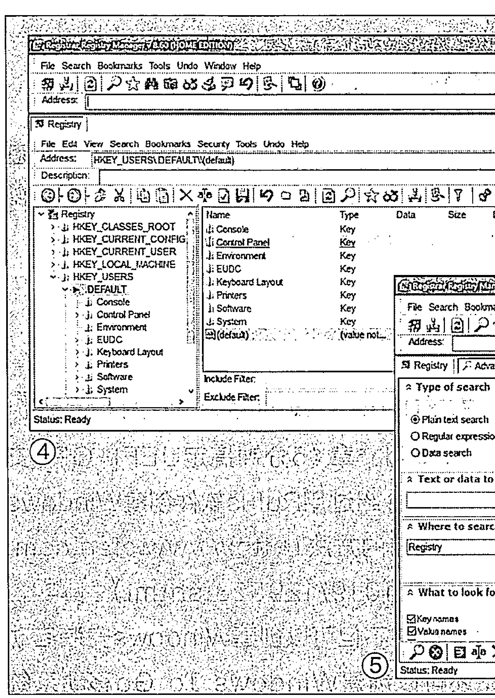

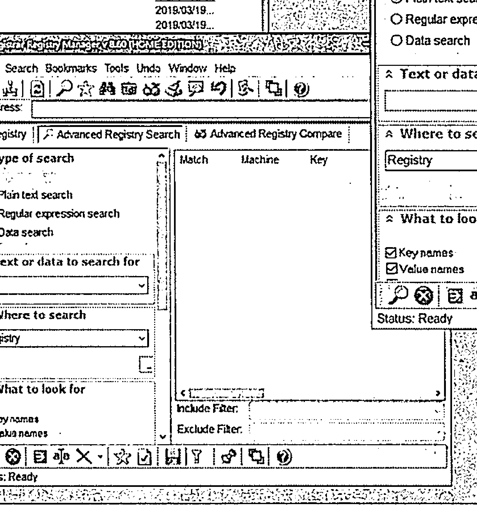

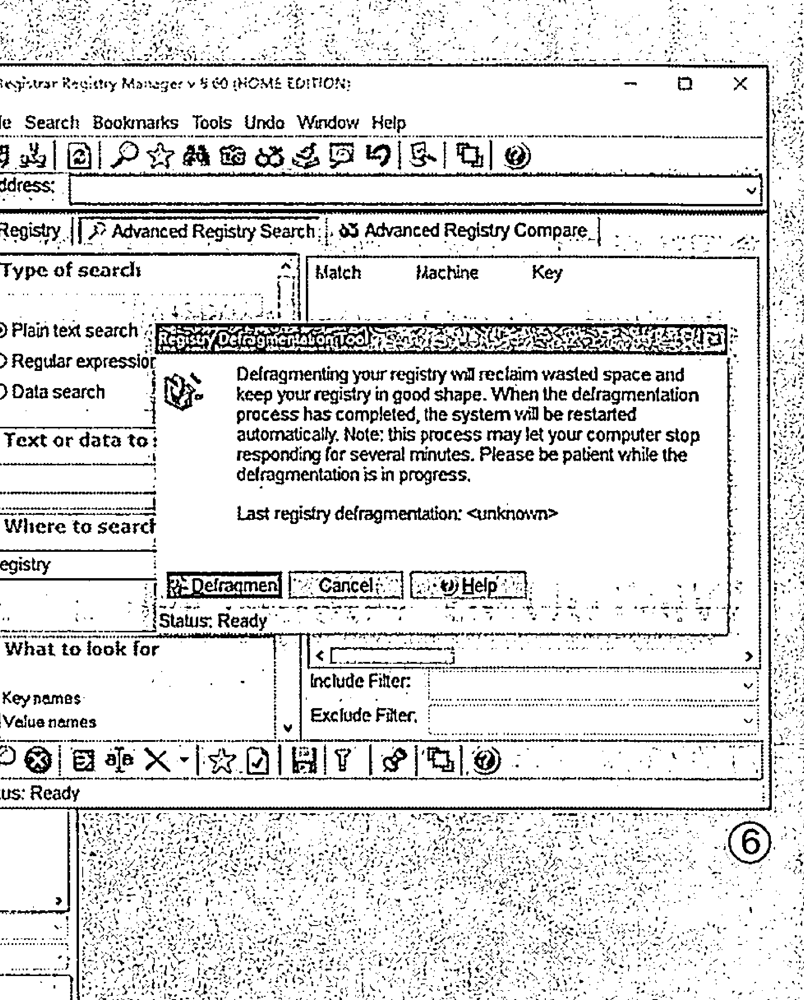

#### 创建移动版Windows 10

文|樱子

通常，我们的Windows 10系统是装到机内硬盘中使用的。为了应急维护或移动工作，有时也需要创建安装在移动盘（含闪存盘或USB移动硬盘）中能够随身携带的Windows 10系统。大家知道，专业版以上的Windows 10才具有创建Windows To Go移动系统盘的功能，那么，对于不具有此功能的Windows 10系统，如何创建移动系统呢？

##### 1. WinToUSB 创建移动Windows的“元老”

在WinToUSB软件发布之前，Windows用户没有第三方软件来创建Windows To Go移动系统盘。也就是说，WinToUSB是第一个可以通过Windows操作系统的映像创建Windows To Go移动系统盘的软件。该软件支持Windows 7、Windows 8/8.1和Windows 10的所有版本。

使用WinToUSB创建Windows To Go移动系统盘相当简单，我们只需要浏览到已经准备好的Windows ISO文件，然后选择目标USB驱动器，开始创建Windows To Go移动系统盘即可（图1）。

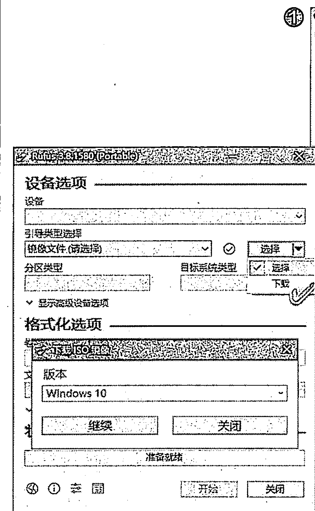

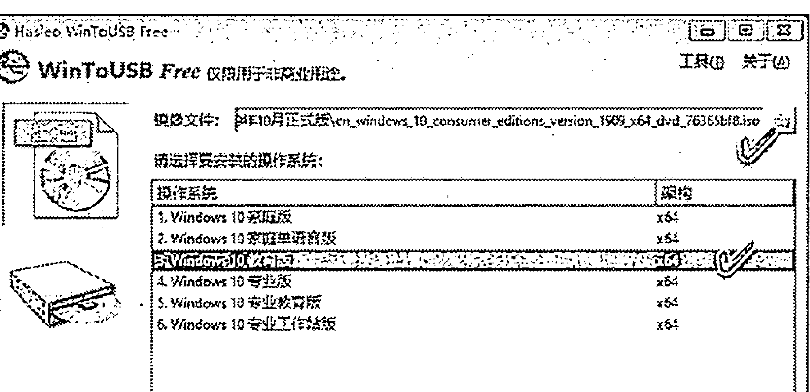

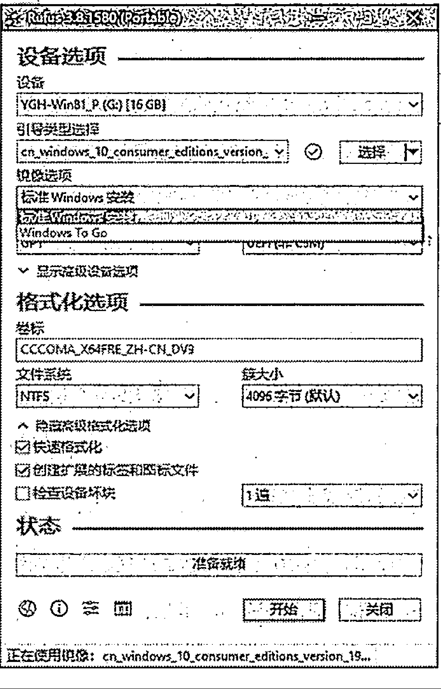

##### 2. 用Rufus下载镜像并创建移动系统

在本刊文章《5分钟搞定UEFI+GPT安装》中，曾介绍过用Rufus软件创建Windows安装启动盘的方法（http://www.cfan.com.cn/2017/1019/129528.shtml）。其实，Rufus软件不但可以创建Windows安装启动盘，还可以创建Windows To Go移动系统盘。如果使用较高版本的Rufus（如3.8版），甚至还可以直接用该软件下载微软网站上的Windows 10或Windows 8的ISO安装映像文件。我们知道，此前如果用Rufus软件或其他创建工具创建Windows安装启动盘，都需要提前准备好Windows的ISO安装映像文件，而这些文件要么需要用微软账号登录到微软网站下载，要么需要通过其他授权的开发者网站下载，而现在我们用Rufus软件，就可以免去这些麻烦。

使用Rufus 3.8获取Windows的ISO安装映像文件，要先在该软件“引导类型选择”框右侧的“选择”框上点选“下载”选项。接下来，软件会自动检查微软官网Windows 10和Windows 8的最新ISO映像文件的有效性，然后会给出下载选择对话框，从中选择自己需要的Windows版本，点击“继续”执行下载操作（图2）。

下载了Windows ISO安装包之后，在引导类型选择框中选择下载的ISO安装包，然后通过“镜像选项”列表，选择Windows To Go。同时，要在“设备”列表中，选择要成为移动Windows系统的USB设备盘符。最后，点击“开始”按钮，就可以制作通过移动盘启动并使用的Windows了（图3）。

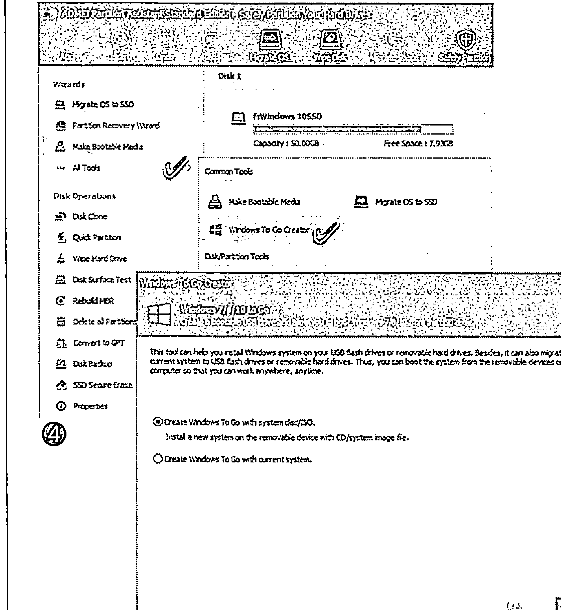

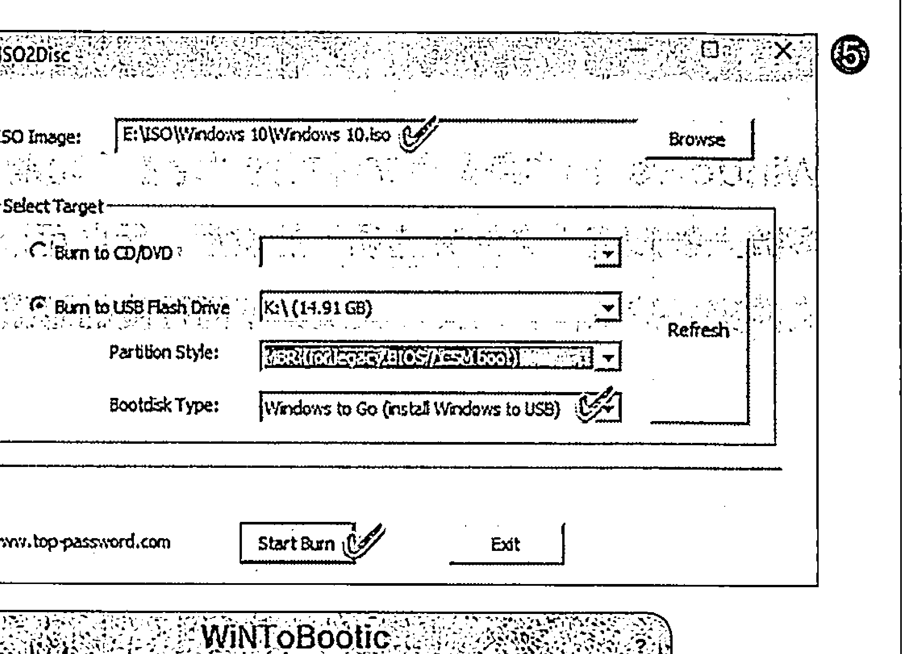

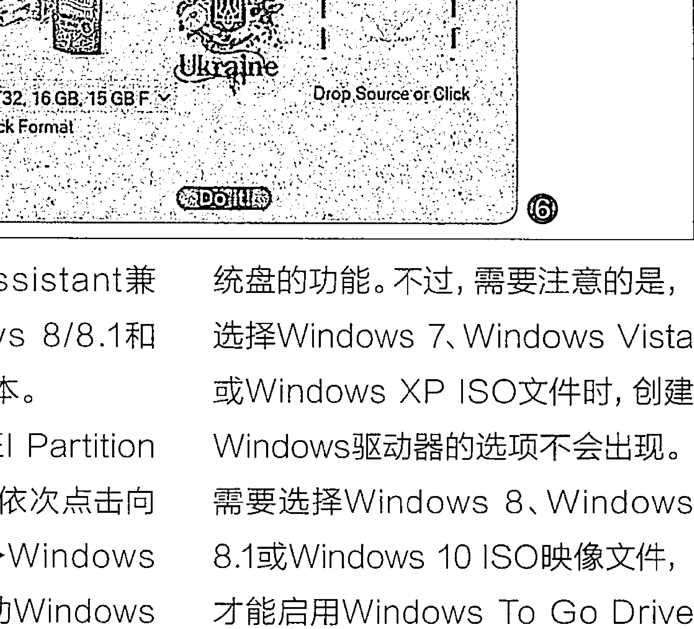

##### 3. 分区工具“兼职”创建移动系统盘

AOMEI Partition Assistant标准版(免费)是目前众多的管理Windows 10磁盘分区的免费实用程序之一。除了磁盘管理工具外，该软件还提供了一个名为Windows To Go Creator的工具，可以轻松创建Windows To Go移动系统盘。与WinToUSB和Rufus一样，AOMEI Partition Assistant兼容目前流行的Windows 8/8.1和Windows 10的所有版本。

安装并启动AOMEI Partition Assistant Free 8.4，依次点击向导栏中的“All Tools→Windows To Go Creator”，启动Windows To Go制作窗口。随后，选择通过映像文件盘或ISO创建，还是通过现有系统创建，按照向导选择目标磁盘，执行创建操作即可(图4)。

##### 4. ISO2Disc 简洁的Windows移动系统创建者

如果你更喜欢简洁的创建工具，那么ISO2Disc软件是另一个好选择，它没有上述的Rufus软件那么多的选项，除了选择USB驱动器、Windows ISO文件，然后选择分区类型(GPT或MBR)开始创建USB启动盘外，还有一个选项就是启用创建Windows To Go移动系统盘的功能。不过，需要注意的是，选择Windows 7、Windows Vista或Windows XP ISO文件时，创建Windows驱动器的选项不会出现。需要选择Windows 8、Windows 8.1或Windows 10 ISO映像文件，才能启用Windows To Go Drive选项(图5)。

##### 5. 一拖即得 用WiNTo Bootic创建移动系统

Wintobootic是另一个免费软件，最初也是为了创建可引导的Windows USB启动盘而发布的，但最新的2.2.1版也允许创建Windows To Go移动系统盘。使用时，只需先将ISO源文件拖动到软件界面的绿色箭头处，选择目标磁盘盘符，最后点击“Do it!”按钮，按照提示选择Windows To Go选项，即可建立移动Windows系统(图6)。

#### 五款小软 不同程度隐藏文件夹

文|童乐安

尽管Windows 10本身具有文件夹的“隐藏”功能，但由于每个文件夹都需要通过“属性”设置隐藏，比较繁琐，且大多数人都知道“文件夹选项”的设置，因此可以认为此功能对文件的隐藏作用并不大。其实，我们可以用多款免费的文件夹保护软件，对文件夹实施不同程度的隐藏保护。

#### 1. HiddenDIR——管理隐藏文件夹的好助手

如果觉得通过系统的“属性”来设置文件夹隐藏比较麻烦，我们可以利用一个HiddenDIR软件来实现文件夹的快速隐藏，并集中管理隐藏的文件夹。

HiddenDIR具有非常友好的界面，也非常易于操作。首先，准备好要隐藏的文件夹，启动上述软件后，点击工具栏上的第一个按钮Hide，添加要处理的文件夹，文件夹随即从资源管理器中隐藏（图1）。不过，这一功能依赖于系统自身的文件夹隐藏属性设置开关，只有当文件夹选项设置中为默认的隐藏选项时，文件才不会被看到。

如果在不同路径下有许多文件夹需要隐藏管理，用上述方法比较简单易行和显而易见。解除文件夹隐藏的方法也很简单，只需在软件窗口的隐藏文件列表中，点选需要解除隐藏的所有文件，然后点击Unhide按钮，文件夹隐藏属性就被批量去除，同时文件夹也会从软件列表中消失。

该软件相对于系统自身的文件隐藏功能来说，主要优势在于管理的便利性，隐藏功能本身没有质的提升。

#### 2. Lock-A-Folder——实现真正意义上的文件夹隐藏

如果觉得HiddenDIR软件在真正隐藏文件夹的功能上没有进步，那么，我们可以用另一个同样简单易用的软件Lock-A-Folder来弥补这一缺憾。

在首次运行Lock-A-Folder时，软件会弹出提示框，要求设置软件主控密码。在设置了主控密码之后，进入软件的主界面。如果要隐藏一个文件夹，点击Lock A Folder按钮，选择要隐藏的文件夹，之后该文件夹的路径便出现在软件的列表中。切换到资源管理器中查看，该文件夹已经被隐藏，即便是开启文件夹选项的显示隐藏文件选项，也无法看到此文件夹，从而实现了真正意义上的隐藏(图2)。若需要解除对某隐藏文件的隐藏，因为此时资源管理器中已经无法找到隐藏的文件夹，因此首先需要用密码开启Lock-A-Folder软件，然后从列表中选中要解除隐藏的文件夹，点击UnLock Selected Folder按钮，该文件夹将从软件窗口列表中消失，随即会出现在资源管理器窗口原来的位置。点击Change Master Password按钮，可以修改软件的主密码。就像以前介绍过的Secretfolder软件一样，如果没有主密码，就无法卸载Lock-A-Folder。这意味着即便是有权访问此电脑的人，也无法卸载并访问受保护的Lock-A-folder和文件夹。

> 小提示
为了阻止无关人员操作本软件，可通过工具栏上的Password按钮，设置软件的保护密码。不拥有此密码的用户将无法看到隐藏文件夹的列表。

> 为安全起见，加密文件夹之后，点击软件的Backup按钮对加密信息进行备份（备份文件的格式为*.fhf）。备份操作只备份软件的加密信息，不备份加密文件夹或文件的具体内容。若加密文件夹出现问题，可通过“Edit→Restore Data”命令恢复。此外，在系统升级之前，最好先对隐藏的加密文件夹进行解除隐藏操作（图5）。

> 本刊此前的一篇文章《保密！给文件夹上个密码锁》（见2019年第24期），曾介绍过另一个为文件夹提供隐藏和加密保护的软件SecretFolder。

#### 3. Free Hide Folder——选项更多的隐藏加密工具

能够隐藏并锁定文件夹的另一个软件是Free Hide Folder，该软提供更多的隐藏加密选项。运行此软件之初，同样需要设定软件的管理密码。该软件是免费软件(Freeware)，但也可以注册后获取注册码使用，若不想获取注册码，直接点击Skip按钮跳过后使用(图3)。注册与捐赠只表示对作者的支持，不影响软件的功能和使用。在需要隐藏加密一个文件夹时，只需点击软件工具栏上的Add按钮添加文件夹，即可实现隐藏并加密。解密并消除隐藏时，点击Unhide按钮即可。若是担心忘记退出软件时锁定使用过的加密文件夹，可选中File菜单中的Hide all folders on exit命令。如果希望在软件打开之后，便自动显示所有被隐藏的文件夹，则选中Files菜单命令Show all folders on opening(图4)。

#### 4. Anvi Folder Locker——右键菜单调用更方便

上面的软件尽管操作都非常简单，但还有比这些操作更为方便的软件，那就是Anvi Folder Locker。该免费软件功能类似于上面提到的这些工具，并且具有更好的用户界面，它在资源管理器文件夹右键菜单中添加了“Lock with Anvi Folder Locker”选项，这样我们就可以快速轻松地锁定文件夹了(图6)。

#### IOBIT UNINSTALLER卸载Windows 10程序

文|俞木发

为了完成某些操作我们经常要安装各种软件，在任务完成后又需要卸载这些软件，而通过软件自带的反安装程序或者系统自带的卸载功能，这些方法都很难实现软件的完全卸载，而留下各种垃圾文件。现在借助IOBIT UNINSTALLER 8（以下简称IU8）可以彻底卸载软件，并且它还有软件安装记录、卸载内置应用等功能。

#### 软件卸载将垃圾文件一网打尽

很多软件在卸载时会留下大量的垃圾文件，比如一款远程控制软件Anydesk，默认情况下使用系统卸载功能进行卸载，将会提示有些项目无法删除（当然更多的应用软件卸载时是不会如此“良心”提示的）（图1）。

通过实际查看可以发现，不仅仅是上述提示的“*.anydesk”无法删除，在Anydesk提示完成卸载后，打开“C:\ProgramData”可以明显地看到其中带有“Anydesk”字样的文件夹仍然存在，同时在注册表[计算机\HKEY_LOCAL_MACHINE\SOFTWARE\Clients\Media\AnyDesk]中也存在明显的残余键值（图2）。

查找根本无法完全清除。现在让我们看看IU8的卸载结果如何，先重新安装被卸载的Anydesk，然后启动IU8，切换到“设置→用户界面→简体中文”，切换到中文版，接着在“所有程序列表”选中“Anydesk”，最后点击“卸载”（图3）。

可以看到，IU8完成卸载后还会自动分析，找出Anydesk残留的大量文件和相应的注册表垃圾键值。按提示勾选“全选”，然后点击“删除”即可完成干净的卸载（图4）。

#### 全程记录为卸载准备好档案

测试危险软件时，我们要在安装后查看该软件在系统中写入了哪些文件和注册表键值，以便后续分析。对于在安装IU8之后再安装的其他软件，IU8会自动进行记录。

> 在IU8卸载之前，它还提供建立系统还原点功能，这样如果误删软件，通过系统还原可以自动恢复。此外还可以根据软件的占用空间、使用频率这些要素来选择性地删除不需要的软件。

> **火速连接**
注册表监控也可以借助Regshot软件来实现，具体使用请参考http://www.cfan.com.cn/2019/0322/132143.shtml中的介绍。

> **小提示**
有些软件卸载时，我们可能想保留它曾经下载过的一些文件（比如系统补丁或驱动程序等），这时可以在IU8分析窗口中右击相应的文件，选择“打开文件位置”直接定位到资源管理器，打开后确认需要保留的文件，再在上述窗口取消相应的勾选即可。

##### 内置应用轻松卸载

在IU8主界面中切换到“安装监视器”，将“自动监测所有新软件的安装和记录”设置为“开启”，这样在每次完成新软件的安装后就会打开IU8的监视器，可以看到安装软件后写入的所有文件和键值数据（图5）。

此外，在所有的软件列表中，凡是被IU8自动记录的软件后面都会出现“LOGGET”的提示，我们可以在任意时候打开IU8，然后点击记录软件后的“LOGGET”打开监视记录查看（图6）。

从Windows 8开始，系统会默认安装很多应用，有些应用可能是我们并不需要的，但是这些内置应用Windows 10并没有提供图形化卸载工具，现在也可以利用IU8对其进行完全卸载。同上在程序主界面切换到“系统应用管理器”，接着在右侧窗格选中不需要的应用卸载即可，比如没有Xbox的用户，这类应用都可以直接卸载。如果不知道该卸载哪些应用，IU8还提供了用户投票排序，这是一个不错的参考（图7）。

> **火速连接**
系统应用也可以使用Windows 10内置的PowerShell命令卸载，参见http://www.cfan.com.cn/2016/0708/126761.shtml中的介绍。

> **小提示**
在系统中还有一类特殊的插件，这些插件一般不会出现在“安装/卸载”列表中，常规方法根本无法直接卸载。在IU8主窗口中切换到“工具栏→插件”，这里会将本机安装的所有插件全部列出，比如很多在线网银插件，如果不再使用该银行的服务，只要在插件列表中选中它进行删除即可（图8）。

#### 巧用功能扩展完成上网难题

文|阿立

由于每个浏览器的功能有限，遇到有些问题，仅利用其自身的功能往往无法解决。比如将网页内容快速保存到多个不同的笔记云存储中，或者清除网页转向时网址后面多出的追踪字符等，这时我们就需要安装功能扩展来弥补这些不足。

##### 将信息保存到多个云笔记

网上有些信息对用户非常有用，因此我们会将它们剪辑到云笔记中进行保存，从而在需要的时候调用。不过每一个云笔记厂商推出的剪辑功能，只能针对自家的云笔记软件起作用，这样用户想将剪辑的内容同时保存到不同的地方时就无法完成。

要想解决这一问题，首先通过浏览器访问https://clipper.website并安装名为“Web Clipper”的功能扩展。安装完成以后点击工具栏中的扩展图标，在弹出的页面中点击“添加账户”按钮(图1)，在弹出对话框的“类型”列表中选择云笔记服务的名称，其中包括Bear、GitHub、Notion、OneNote、有道云笔记等等。比如我们想和自己的有道云笔记账户进行捆绑，那么首先登录有道云笔记的网页版，接下来在“添加账户”对话框中选择“类型”列表中的“有道云笔记”，最后点击下面的“Add”按钮，就可以完成这个账户的绑定了(图2)。按照类似的方式，我们可以捆绑多个不同的云笔记服务账户。

以后当我们要想对某些网页内容进行剪辑保存时，点击工具栏中的“Web Clipper”扩展图标，就会弹出一个保存对话框，它会自动提取当前网页的标题作为笔记的标题。同时我们可以在“剪藏扩展”列表中选择自己要剪辑的方式，这里建议大家选择“智能提取”方式，因为它会将网页中的正文部分自动提取，而将其他不相关的广告内容进行屏蔽(图3)。然后在“知识库”列表中选择该笔记存储的位置，最后点击“保存内容”按钮就可以了。保存完成以后我们可以看到一个提示框，点击它即可切换到云笔记里面进行内容查看(图4)。

##### 对追踪字符串进行清除

我们有时上网点击一个链接后，会发现弹出的新页面链接非常的长，其中包括了很多莫名其妙的字符信息，而且整个页面的打开速度也显得非常慢。

其实这些网站添加的字符串，主要是为了对用户的身份以及设备信息进行跟踪，从而更好地了解用户的浏览行为。如果用户比较在意自己的个人隐私，或者需要更快地完成相关网页的跳转打开，就必须想办法将这些追踪字符串删除。

我们可通过所用浏览器的应用商店，下载安装“ClearURLs”功能扩展。安装完成以后不需要任何的设置，它会自动检测打开的网页链接，如果发现有链接追踪字符串，就会自动将它们清除。用户通过点击该功能扩展的图标，就可以详细查看到该扩展对追踪字符串的拦截次数(图5)。

另外为了更加准确地对追踪字符串进行拦截，我们需要定时点击扩展图标，在弹出的对话框中对规则进行更新操作。

#### “文叔叔” 帮你传送文件更便捷

文|阿立

日常生活和工作中，有时我们需要向他人进行文件分享，对于熟人来说利用QQ等即时通讯软件即可完成，而对于一般网友更多是通过网盘来进行。不过现在很多网盘都针对普通用户进行各种限制，其中最让人恼火的就是限制下载速度。现在我们有了“文叔叔”网盘，就可以很好地突破这一瓶颈，快速便捷地分享文件了。

#### 文件批量上传与分享

通过浏览器打开“文叔叔”网盘的官方地址(https://www.wenshushu.cn) 接着点击网页中的“选择文件”按钮（图1），在弹出的对话框中选择要进行上传的文件，这时会弹出一个文件列表，用于确认是否是需要进行上传的文件。在列表的下方可以输入收件人的邮箱以及手机号码，最后点击“发送”按钮，就可以将它们上传到网盘的存储空间了。当文件上传完成后会自动生成分享链接，并且将分享链接通过电子邮件或者手机短信的方式告知用户，用户点击该链接后就可以在没有任何速度限制的情况下完成文件的下载（图2）。不过需要提醒大家的是，上传的文件针对临时用户只可以存储三天的时间，三天后将自动被“文叔叔”删除。如果用户想长期进行文件的存储，那么点击网页上方的“文小盘”按钮，在弹出的页面中用QQ账号或者微信账号进行登录，这样就可以拥有一个属于自己的网盘空间。

- 小提示：如果用户有大量的文件需要批量上传，那么就点击“选择文件”旁边的按钮，在弹出的菜单中点击“选择整个文件夹”命令，就可以将整个文件夹中的文件进行上传，无需对多个文件进行压缩打包。

当每个月月底需要接收文件的时候，领导只需要点击网页上方的“收集文件”按钮，在弹出对话框的第一个输入框中，设置自己同事的邮箱地址。当我们输入完第一个电子邮箱地址后按下回车键，再在输入框中输入第二个电子邮箱地址，以此类推完成同事电子邮箱地址的输入操作。接下来我们在对话框的第二个输入框中，设置自己的电子邮箱地址，设置完成以后点击下面的“收集文件”按钮。这样“文叔叔”就会自动生成一个文件收集的网页地址，当同事们打开这个地址以后，按照网页中的提示，点击“选择文件”按钮，在弹出的对话框中选择要进行上传的文件。接着在文件列表的下方输入自己的名称或者昵称，然后点击“发送”按钮就可以上传到网盘空间了（图3）。当“文叔叔”接收到我们上传的文件后，就会自动向领导设置的邮箱地址发送一封电子邮件。领导打开邮件并点击邮件中的“下载文件”按钮后，即可很方便地完成文件的收集操作（图4）。

#### 创建链接进行文件收集

假设单位要求我们在每个月的月底，向领导提交相应的文档和报表，但是由于领导经常出差、开会等原因，提交文件时领导常常不在，这种情况下就可以利用“文叔叔”的“收集文件”功能了。

#### Windows 10下快速修改文件名

文|平淡

日常操作中我们经常需要对文件（夹）进行批量重命名，比如从手机拍摄文件夹中导入PC的照片，很多是形如img_20191108_001.jpg、img_20191108_002.jpg的格式，为了方便对照片进行管理，我们就需要对这些照片重命名。

在资源管理器中打开保存照片的文件夹，全选需要重命名的照片，右击选择“重命名”，然后选中第一个文件，将其重命名为类似“西湖(1)”的格式，回车后其他文件即可自动重命名为“西湖(2)”、“西湖(3)”等形式（图1）。

不过资源管理器自带的重命名功能较弱，只能重命名为“XX(n)”的形式，如果要进行更多个性的重命名，可以借助免费的PowerRename来实现。

首先到https://github.com/microsoft/PowerToys/releases下载PowerRename，安装后它会自动集成到资源管理器的右键菜单。比如上述示例，现在需要将照片全部重命名为类似“西湖2019110801.jpg”、“西湖2019110802.jpg”的格式。同上全选需要重命名的照片，右击选择“PowerRename”，在打开窗口的“Search for”框中输入“img_20191108_00”，在“Replace with”框中输入“西湖201911080”，这样即可快速完成所有文件的重命名操作。如果需要撤销重命名，只要按Ctrl+Z键即可（图2）。

PowerRename是使用类似Word的“查找与替换”工具实现重命名的，它同样支持常见的正则表达式来进行更多高效的重命名操作。比如一些手机播放器不支持中文字符的显示，现在需要将所有歌曲名中的汉字去除。同上先选中所有歌曲，在上图所示的窗口中，在“Search for”框中输入“[一-龥]”，表示查找所有中文汉字（CJK统一字符）。“Replace with”框中置空，勾选“Option”下方的“Use Regular Expressions”（使用正则表达式），点击“Rename”即可完成（图3）。其他表达式的使用类似。

此外我们还可以使用各种变量实现更多的替换，比如使用“$1.txt”替换“(.*)”，实现将“.txt”扩展名追加到现有文件名的后面。更多语法大家可以参考https://github.com/microsoft/PowerToys/tree/master/src/modules/powerrename中的提示。

#### 合二为一 视频合并有高招

文|俞木发

平时我们经常需要对拍摄的一些视频进行合并，比如微信只能拍摄15秒视频，如果拍摄了多段视频，为了方便播放就需要对这些视频进行合并。

如果需要合并的视频是AVI或者MPEG格式，那么借助Windows 10自带的命令行工具就可以完成合并。很多电脑摄像头拍摄的就是AVI视频，这里假设视频为D:\1.avi和D:\2.avi，现在启动命令提示符后输入并执行“copy /b d:\1.avi+d:\2.avi d:\3.avi”命令（不含外侧引号），这两个视频即可自动合并为3.avi了（图1）。

```
copy /b d:\1.avi+d:\2.avi d:\3.avi
```

不过命令行合并的视频格式有限，如果是其他格式的视频，我们可以借助免费的Video Combiner来完成。首先到http://www.saosaochuan.cn/shipinhebingqi.html下载安装Video Combiner，启动后将需要合并的视频依次拖到列表中。对于64位系统，用户可以勾选“启用CPU全速测试模式”，这样可以大大加快合并速度，最后点击“立刻开始合并”即可（图2）。

对于不同尺寸的视频，Video Combiner还支持合并为多种自适应屏幕尺寸的选项。比如在朋友圈下载的视频有的为464×960（指视频的帧宽度×帧高度，可以在视频的“属性→详细信息”中获取，下同），有的则为544×960。同上将这些视频导入处理列表，然后在视频屏幕尺寸中选择“自定义尺寸”，定义为“464×960”再进行合并，合并后视频的帧宽度和帧高度即可统一为464×960（图3）。

此外我们还可以利用它来更改视频的“帧宽度/帧高度”的比值，比如笔者的手机横屏拍摄的视频是“960×464”，这种视频在16:9设备上全屏播放容易出现黑边。现在可以借助Video Combiner进行转换。先用手机随便录制一个1秒的空白视频，然后将它和需要处理的视频一起导入处理列表。同上在视频屏幕尺寸选择“自定义尺寸”，定义为“960×540”（960/540=16/9），然后进行合并即可。

对于不方便在电脑上安装软件的朋友，或者需要在手机上合并视频，那么可以试试免费的在线服务Aconvert.com(https://www.aconvert.com/video/merge/#)。在PC或手机浏览器中打开上述页面，点击“Merge”，然后依次上传需要合并的视频并点击“Submit”提交。接着点击下方“Output results”后的“下载”按钮，这样网站会自动进行视频合并并提供下载地址，合并文件下载还有二维码，非常方便手机用户的使用（图4）。

#### 自己动手DIY手影视频

文|平淡

我们经常在抖音、快手、优酷等视频网站上看到介绍各种知识的手影动画视频，这些视频有各种特效，看起来生动有趣。现在借助“万彩手影大师”，我们也可以轻松地制作这类视频。

万彩手影大师（下载地址：http://www.animiz.cn/hand，目前参与活动可以免费获得一年使用权）内置了很多模板，对于初学者，在模板基础上进行手影的创作比较简单，比如下面我们将要制作的《这四种人不可深交》的手影视频。

启动万彩手影大师后，在“所有模板”中找到“带团队就带这四种人”，使用这个模板作为视频制作基础（图1）。

选中相应的模板后会自动加载，在打开的页面中我们可以根据自己的实际需要进行修改。首先是片头文字修改，在下方时间线窗口拖动进度条，在出现片头文字的场景中，双击选中片头文字，将其改为自己需要的片名即可（图2）。

选中上述动作后返回主窗口，拖动播放进度条即可预览到效果。继续拖动进度条，这里可以将那些和视频主题不符的素材删除。比如原来的模板中是介绍团队的，我们的视频则是介绍四种人，因此可以在时间线上的团队对象上右击，选择“删除对象”，去除这个不符合要求的对象。

继续拖动进度条，根据自己的需要增加对象。原来的模板是介绍“第一类型人员是千里马型”，这里我们需要更改为“不懂得礼数的人”，同时增加一个对应的不懂礼貌对象。对象可以通过自定义图像设置，先到百度搜索一些表示“不讲礼貌”的动画人物图片，在右侧窗格切换到“图片→添加本地图片”，导入图片后，系统自带的手型会对导入的图片添加手绘动作（图4）。

这里每个元素都可以增加动作和特效，为了更好地吸引观众的目光，我们可以为片头文字添加手写动作。点击上图右侧窗格“进场动作”后的编辑按钮，在打开的窗口中切换到“其他→文字手势”，在右侧窗格可以预览手势效果，片头文字会像我们写字动作那样慢慢展开，这里还可以选择不同的手型（图3）。

小提示：因为这里是手影手绘，为了获得更好的展示效果，自行添加对象（如人物图像、各种形状）的线条要尽量简单。

> 对于软件没有内置的形状，大家可以使用PowerPoint的“插入→形状”制作，然后复制粘贴为图片导入使用。比如使用PowerPoint插入心形（同时将形状和轮廓都填充为红色），或者使用“任意多边形:自由曲线”工具，自行绘制各种个性的形状在这些场景中使用。

我们还可以根据实际场景选择程序自带的矢量SVG图形，这种图形的展示效果更好。比如可以在接下来的场景中插入两个系统自带的人形图片并排（分别表示不讲究礼尚往来），同时点击时间线下的“字幕”，在字幕中添加这个场景的字幕说明（字幕文件可以移动到合适的位置）。这样在展示上述图片时，在下方就可以显示说明字幕（图5）。

继续拖动时间线，我们也可以为视频场景添加各种特效。如本例介绍的第二种人是“喜欢抱怨的人”，插入相应的对象后，我们就可以为对象添加一个发怒的特效。在时间线点击“添加特效”，再在打开的特效窗口中切换到“表情”，选择其中的“等待发牢骚”，就可以在人物头上添加这个表情特效了，其他特效场景的添加方法类似（图6）。

我们还可以切换到“装饰”，选择自己喜欢的装饰元素添加到人物场景中。比如在短视频APP里经常看到表达爱意时，会在屏幕上的人物表面添加不断闪现的爱心。在右侧窗格切换到“场景特效→爱心飞扬”，然后将其添加到指定的场景中即可（图7）（注意：表情库中没有标注“个人版”的特效全部可以免费使用）。

此外我们还可以为视频添加画外音提示，我们只要在时间线指定场景中插入音频即可。而且软件使用讯飞语音转换技术，我们可以将任意文字转换为各种语言，点击“语音合成”，在打开的窗口中输入需要合成的文字（比如可以输入各种网络热词），在右侧选择人物，点击“确定”即可将这个作为视频配音插入到相应的场景中（图8）。

操作同上，将模板中的所有元素（包括对象、语音、文字）都更改为自己需要的场景后，点击“发布”，导出格式选择MP4，就可以将自己制作的视频发布到抖音、快手和朋友们分享了。这里以快手为例，将视频传输到手机上后选择视频，点击“分享→快手”，启动快手后进行发布即可（图9）。当然对于动手能力强的朋友，可以自行新建项目，使用各种自定义场景来制作手影视频。

#### 双管齐下不同需求选择不同的截图方案

文|剑侠

微软Windows系统自带的“截图与草图”，只具备基本的截图功能，一般情况下虽然够用了，但对于较复杂的截图要求就很难满足。因此遇到有特殊要求的截图时，我们就需要选择不同的工具进行操作。下面要给大家介绍的，一个是软件WinSnap，一个是浏览器扩展Nimbus。

##### WinSnap截图编辑一应俱全

如果用户经常要进行一些较复杂的截图操作，那么一款专业的截图软件是不可或缺的，而WinSnap这款软件就是专业截图软件的一个代表。我们首先下载安装它的最新版本(https://www.ntwind.com)，在弹出的操作界面中点击“Options”菜单中的“Preferences”命令，接着在弹出的对话框中选择“Language”列表中的“Chinese (Simplified)”选项，从而将操作界面切换成我们熟悉的简体中文状态(图1)。

当需要进行截图的时候，首先在软件界面右侧的“来源”列表处点击一下，按实际需求从中选择全屏、应用程序、窗口、对象或区域等截图选项，选择完成后点击“捕捉”按钮，就可以进行相关区域的截图操作了。截取成功的图像会加载到操作界面中，利用下方的工具就可以对图像进行各种处理，包括裁剪、添加文字、标注等等(图2)。比如我们要想对一张图片进行标识，那么点击工具栏中的“箭头工具”，然后移动鼠标在图像上要标注箭头的地方进行拖拽，就可以画出一个重点标识的箭头符号。

##### 自定义设置更方便

对于某些用户来说，可能觉得利用鼠标进行截图操作太过繁琐，或者觉得在截图以后跳转到编辑窗口没有必要。这时我们可以根据自己的实际使用情况，在软件的设置对话框里面进行相应的设置。

首先点击“选项”菜单中的“首选项”命令，在弹出的对话框中选择左侧的“热键”按钮，在右侧窗口中根据自己的需要自定义相应的快捷键命令。比如我们将鼠标移动到“窗口”选项的输入框中，将默认的快捷键命令进行删除，然后按下键盘中自己需要的快捷键，这样就可以完成快捷键的自定义操作(图3)。以此类推，我们可以对其他的截图快捷键进行修改设置。

现在点击左侧列表中的“保存”按钮，在右侧窗口中选中“自动保存和复制模式保持WinSnap最小化”选项。再点击“文件夹”后的“浏览”按钮，选择一个自动保存截图的存放文件夹(图4)。然后在“图像格式”中选择截图的保存格式，最后点击“确定”按钮并选择“选项”菜单中的“自动保存”命令。以后当我们通过快捷键进行截图操作后，截取的图片就会自动保存到我们设定的文件夹目录中。

##### Nimbus扩展自动截取网页正文

虽然现在不少浏览器都增加了网页截图功能，但是火狐、谷歌浏览器等流行的浏览器反倒没有提供，对于使用这类浏览器的用户，我们可以通过云笔记Nimbus提供的功能来解决。

首先打开云笔记Nimbus的官方首页(https://nimbusweb.me)，在其中找到“Nimbus capture”区域后点击下面的按钮，在弹出的网页中根据自己的浏览器类型进行选择，进而就可以安装上对应的浏览器扩展。安装完成后可以在浏览器的工具栏中看到对应的扩展图标，点击该图标，从弹出的菜单里面即可显示各种类型的截图方式。

比如以前我们需要对浏览的整个页面进行截图，就需要用到专业截图软件中的滚动截图功能，而现在我们只需要选择“整个页面”命令，就可以自动完成对整个页面的截取操作。由于整个页面是由正文以及其他的内容组成的，所以用户如果不想截取其他内容，那么可以选择“捕捉片断”命令。接下来将鼠标移动到正文的部分，这时就会弹出一个蓝色的选择框将正文部分进行自动的框选，用户只需要点击选择框下方的对钩按钮，就可以完成正文部分的截取了(图5)。

##### 不装专业软件也可以花样截图

Nimbus扩展除了可以对网页进行方便快捷的截图以外，还可以对浏览器之外的内容进行截图操作，比如操作系统的桌面以及软件程序的窗口等等。也就是说，即使我们没有安装WinSnap这类专业的截图软件，也可以轻松完成各种截图操作。

我们首先点击扩展菜单中的“空白的屏幕”命令，在弹出的页面中点击“捕捉桌面”按钮，这时在弹出的“共享你的屏幕”对话框中，包括有浏览器标签页、系统桌面以及软件程序窗口等多个标签(图6)。

比如我们要对某一个软件程序的窗口进行截图，那么首先点击“应用程序窗口”标签，这样就可以在列表中，看到所有软件程序窗口的缩略图。用户只需要选择要截取图片的缩略图，再点击下面的“共享”按钮就可以完成对它的截图操作。截取完成的图片会在新的网页标签中进行显示，用户通过上方的功能按钮还可以对图片进行文字输入、箭头指向、调整大小、裁剪等编辑操作，编辑完成后点击“完成”按钮即可保存到本地硬盘里面。

##### 屏幕录像也精通

有时我们在操作网页时会将相应的步骤记录下来，这样就可以更好地对其他人进行讲解。但是要进行这样的操作，往往需要使用第三方的屏幕录制软件。而现在通过Nimbus扩展也可实现。

首先点击Nimbus菜单中的“录制视频”命令，如果用户的电脑连接有麦克风等设备，可以根据自己的实际需求在弹出的选项中进行设定。设置完成以后点击下方的“开始录制”按钮，这样就可以对我们屏幕上的所有操作进行录制了(图7)。

录制完成以后再次点击扩展图标，在弹出的对话框中点击“停止录制”按钮。此时在弹出的页面中不仅可以对视频进行预览，点击“Video editor”按钮后还可以对其进行编辑，或者点击“Convert to MP4 or Gif”按钮对其进行转换操作(图8)。最后点击“保存视频”按钮，就可以将这个视频保存到本地硬盘里面了。

#### PowerToys为系统操作提效

文|阿立

用过微软早期操作系统的用户都知道，系统里面自带一个名为PowerToys的官方工具集，它包括了很多非常实用的增强小工具，从而可以有效地帮助用户提高系统的操作效率。但是后来随着系统版本的不断更新，这个工具集也被微软所放弃。而在最近，微软又开始重新更新该工具集了，今天就让我们一起来看看它的一些独特功能。

##### 1. 自定义窗口的布局方式

通常情况下我们利用鼠标将一个窗口拖拽到系统桌面的两侧，这时系统就会按照平分的方式来对窗口进行平铺显示。但是随着显示器屏幕越来越大，传统的布局方式已经不能满足很多用户的需求，这时我们就可以利用PowerToys来根据自己的意愿进行布局设置。

首先下载安装最新版本的PowerToys (https://github.com/microsoft/PowerToys)，安装完成后双击系统托盘中的软件图标，在弹出的窗口中选择左侧列表中的FancyZones选项。接着在右侧窗口中点击“Edit zones”按钮，这样我们就可以根据自己的需要来配置一个窗口的布局方式（图1）。软件默认提供了一些模板参数，其中设置有窗口的个数以及布局的方式，用户可以根据自己的需要进行选择。当然也可以点击数字前后的符号，对窗口的个数进行调整（图2）。

如果用户觉得软件默认的模板不符合自己的要求，那么可以切换到“Custom”标签，然后点击“Create new custom”按钮，接着点击下面的“Edit selected layout”按钮，然后在弹出的对话框中点击“+”号按钮，这时在系统桌面就会出现一个灰色的框（图3）。这个框的大小及位置代表以后一个窗口的布局，所以我们需要根据自己的想法，对这个框的位置及大小进行调整。当第一个框的布局设置完成以后，再点击对话框中的“+”号，对第二个框进行相应的布局调整。当自定义的布局完成以后，在“Name”输入框中自定义一个名称，最后点击“Save and apply”按钮进行保存。以后当我们要想对桌面窗口进行调整时，首先按住键盘中的Shift键并通过鼠标进行窗口移动，就可以快速完成窗口的布局了。

##### 2. 特殊要求的文件批量重命名

当我们想要进行比较复杂的文件批量重命名操作，比如想把某一些文件名中的关键词替换掉，这时仅靠系统自带的功能就不够使用了，这时我们可以借助PowerToys来实现。

首先通过鼠标选中要重命名的文件，接着点击鼠标右键，选择菜单中的“Powerrename”，在弹出的对话框中首先勾选上“Use Regular Expressions”选项，这样在重命名的时候就可以使用正则表达式了。接下来在“Search for”输入框里面设置查找的信息，然后在“Replace with”输入框里面设置要替换的文字信息，再勾选上“Item Name Only”选项，这样就可以在窗口的列表中看到文件原名以及重命名后的对比效果（图4）。检查后如果没有问题，点击“Rename”按钮就可以完成批量重命名操作了。

#### 系统垃圾与隐私 Wipe一擦即净

文|童乐安

每天使用Windows，我们不得不面对和经常感到困扰的是不断产生的系统垃圾文件的清理以及隐私信息的安全问题。要处理这两个方面的问题，选择一个得心应手的工具非常重要。PrivacyRoot.com旗下的免费数据清理软件Wipe可以满足我们的这些需求，它不仅可以一键清理垃圾，还可以用各种安全的算法清理隐私信息。

##### 1. 恢复可用空间 一键清除各种垃圾

如果仅仅是因为空间紧张，可利用Wipe的一键清理功能来解决问题。软件运行后，首先会自动扫描系统垃圾，并给出能释放的空间大小。这时，只需点击Delete按钮，就可以一次性地清理扫描出的所有垃圾文件，赢得更多系统空间资源（图1）。

##### 2. 选择性地清理有关个人隐私项目

如果我们需要有选择性地删除系统中有关个人活动的某些记录或临时文件，点击软件主界面底部中间的Details按钮，接下来从弹出的窗口中进行项目选择（图2）。可以删除的内容包括：
- 各类浏览器的历史记录和缓存
- index.dat文件
- 注册表添加项目
- Internet cookie文件
- 自动完成历史记录
- Internet临时文件
- 许多其他项目

我们只需在隐私项目清理选择列表中的大类前面进行勾选，然后选择其下的具体项目，待所有要清理的项目选择好之后，点击Delete按钮进行清理即可。

##### 3. 选择安全算法进行防恢复性清理

为了防止删除的数据被恢复，我们可以选择使用程序提供的多种安全删除方法，包括：1次、3次、7次相同或不同随机块填充删除；DDoD 5220.22-M、Peter Gutmann、Russian GOST等国际高级安全删除方案。只需点击程序主界面的Settings按钮，然后点击Secure delete选项卡，在安全删除方案列表中选择需要使用的安全删除方案即可（图3）。

##### 4. 自定义清理特定的项目

考虑到个人使用习惯的不同，我们还可以利用软件提供的自定义清理功能，定义清理过程中要删除的文件类型。首先点击Settings按钮，进入设置窗口后点击Custom items选项卡，然后点击Add folder或Add file，添加需要删除的文件夹或文件类型（图4）。如此设置之后，在进行自动清理或手动选择清理时，会自动应用用户的特殊设定（User specified items）。

揪出利用NTFS漏洞的隐形文件 文|童乐安

交换数据流（Alternate Data Streams，简称ADS）是NTFS磁盘文件系统的一个特性。通俗地来理解，就是其他文件可以利用这一技术，“寄宿”在某个文件中，而我们在资源管理器中只能看到宿主文件，却看不到寄宿的文件，每个文件可以存在多个ADS。正是因为这一技术，也给黑客留下了可钻的空子，黑客可以利用这一技术隐藏文件、存储配置文件、提供有效负载，或让磁盘空间膨胀等。不过，我们可以通过ADS Revealer这样的实用软件，发现利用NTFS文件系统ADS数据流技术的隐形文件。

#### 1. 查找含有ADS数据流的文件

首先，安装并运行ADS Revealer软件。如果要对整个系统进行查找，依次点击“Run Scan → Scan Full System (NTFS Only)”（图1）。随后，在弹出的扫描设置窗口中，可指定搜索过滤条件，例如，若只想对某类文件如“*.EXE”进行扫描，则在Search Filter搜索框中输入“*.EXE”。最后，点击Valid按钮进行扫描（图2）。如果仅仅需要查找某个分区，只需在Run Scan菜单下点击Scan Target NTFS Drive子菜单，然后选择需要扫描的分区即可。此外，我们也可以仅仅对某个或某些文件夹进行扫描，在Run Scan菜单下点击Scan Target Folder之后，指定需要扫描的文件夹，然后再按上述办法执行扫描即可。

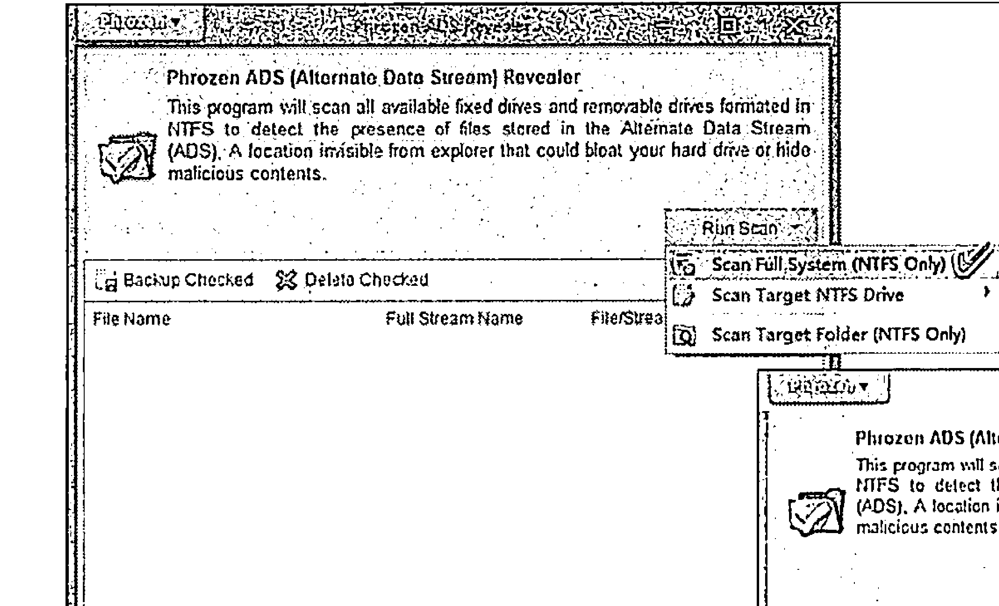

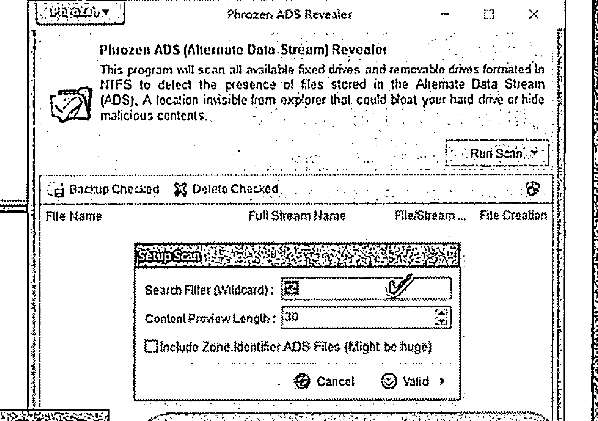

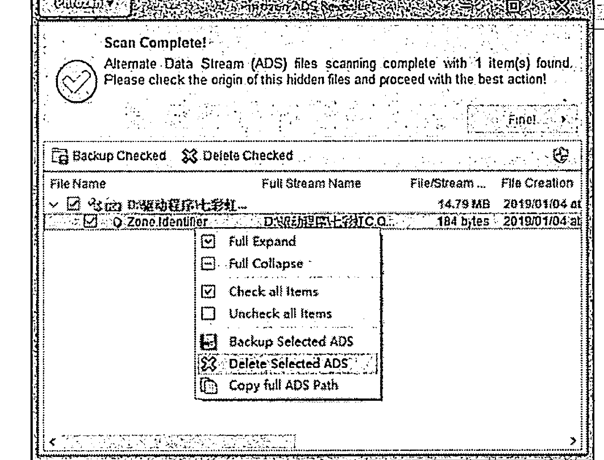

- 扩展阅读
ADS数据流文件有三种删除方式。一是直接删除宿主文件；二是将宿主文件移到FAT32等非NTFS分区中；三是利用工具软件，如使用本文所述的工具，或者使用IceSword等软件来删除。
我们还可以使用另一个软件AlternateStreamView，扫描NTFS驱动器，在文件系统中查找到所有隐藏的ADS数据流文件。找到ADS数据流文件后，同样可以将不必要的文件删除掉。

#### 2. 删除含有ADS数据流的文件

在整个扫描过程结束后，窗口中会列出含有ADS文件的条目，选择需要处理的条目后，点击Delete Checked按钮可以进行删除。若有必要，还可以在删除之前，用Backup Checked按钮对条目进行备份。此外，还可以用右键菜单进行操作（图3）。

文件自动生成分类报告 文|童乐安

是否想了解硬盘某分区中各种文件的分布情况？是否想知道仓储移动盘中收藏的各类文件的占比？光靠Windows 10自身的简单统计功能，恐怕不能让你满意。那么，就借用DiskSorter软件，为磁盘文件进行自动分类统计吧！

#### 1. 预备设置

首先，安装并运行DiskSorter。首次运行软件会弹出初始化配置窗口。如果我们不打算处理系统文件，则需将Process System Files的选择取消；若是要连同磁盘中的链接文件或文件快捷方式也包含在内，选择Process Directory Links and Junctions即可；如果选中Show Directory and File Scanning Errors选项，则可以显示扫描目录和文件过程中发现的错误。设置好之后，点击Save按钮保存(图1)。

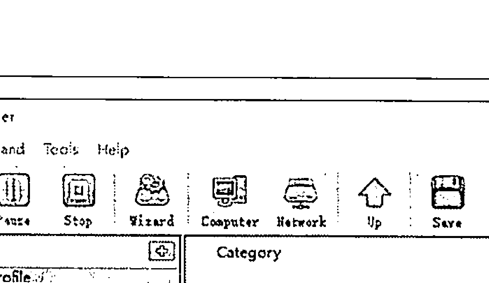

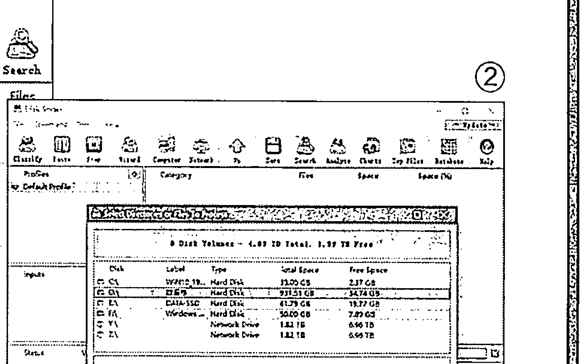

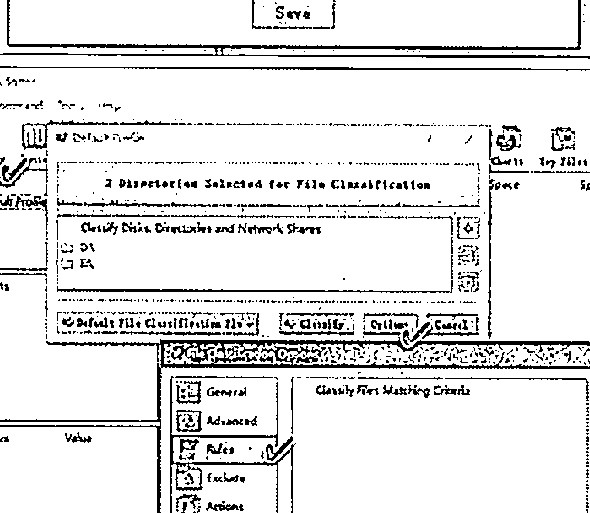

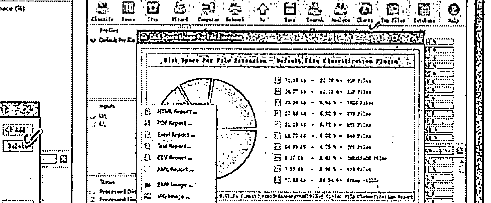

#### 2. 选择磁盘

接下来，添加要统计的磁盘。点击软件左侧栏中部Input按钮右侧的加号按钮，弹出添加目标选择菜单，选择其中的Add Mutiple Directories项，在弹出的Select Directories or Files To Process窗口中，选择磁盘项目(可用Shift或Ctrl键配合鼠标点击，进行连续或不连续的多重选择)。选好之后，点击Select按钮继续(图2)。

#### 3. 设置分析

选好磁盘之后，自动回到软件主窗口。点击工具栏上的第一个按钮Classify，随后，在弹出的Default Profile配置窗口中，若要设置过滤条件，可点击Options按钮进行设定，其中Rules是规则添加，可通过该窗口添加自定义的过滤条件。最后，点击Classify按钮进行扫描分析即可(图3)。

#### 4. 输出结果

文件扫描分析完成后，在软件主窗口右下方窗格的分类方法列表中，选择Categorize By Extension选项，然后点击工具栏上的Charts按钮，即可获得所选的所有磁盘上的文件按类分布图(图4)。
最后，点击饼图页面左下角的Save按钮，从菜单中选择报告保存的格式(HTML、PDF、Excel、TXT、CSV和XML等类型的文本)，也可以选择保存为BMP、JPG、PNG等图片文件，将分析结果保存为报告文件。

全面细致 监视系统性能 文|童乐安

说起系统性能监视，我们一定会想到Windows 10任务管理器内置的“性能”选项卡，但该性能监视组件的功能比较简单，且只能通过右键菜单复制粘贴为简单的监视报告文本。如果改用SysGauge软件，我们不但可以用列表、图表的形式，一目了然地了解系统的各项性能，而且还能将分析结果导出为多种格式的报告文件。

#### 1. 查看系统整体性能概览

启动SysGauge软件，点击左侧栏的System Status选项，在右侧窗格中可以查看系统整体性能的概览，其中包括CPU、内存、进程、磁盘传输、网络传输等方面的信息（图1）。点击Extended Status选项，可以显示上述项目的更多扩展信息。

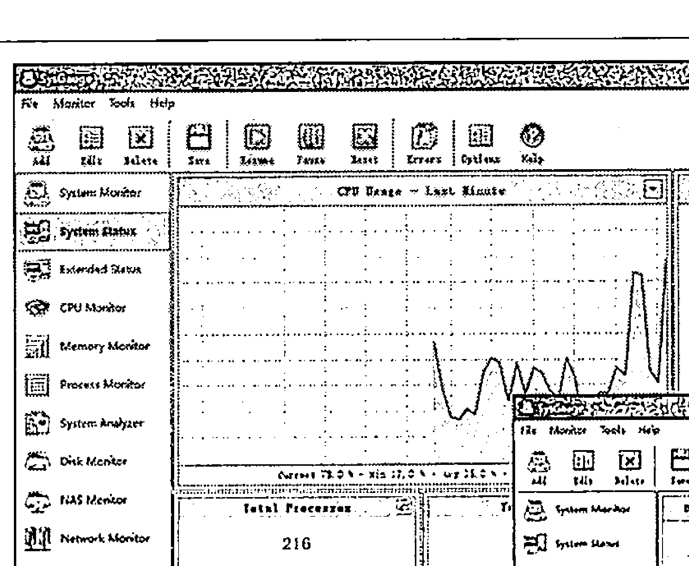

> 小提示
本刊此前曾讲述过多款Flexense旗下的软件，这些软件具有统一的界面设计风格，但实现的功能各不相同，软件之间亦无必然的功能联系或互动。

#### 2. 具体监视某方面的信息

如果要具体监视CPU、内存、进程、磁盘、NAS或网络的情况，只需分别点击软件左侧栏内的相应选项，然后观察右侧窗格中出现的对应图表和参数信息即可。例如，要查看磁盘使用情况的监视信息，点击Disk Monitor即可显示（图2）。

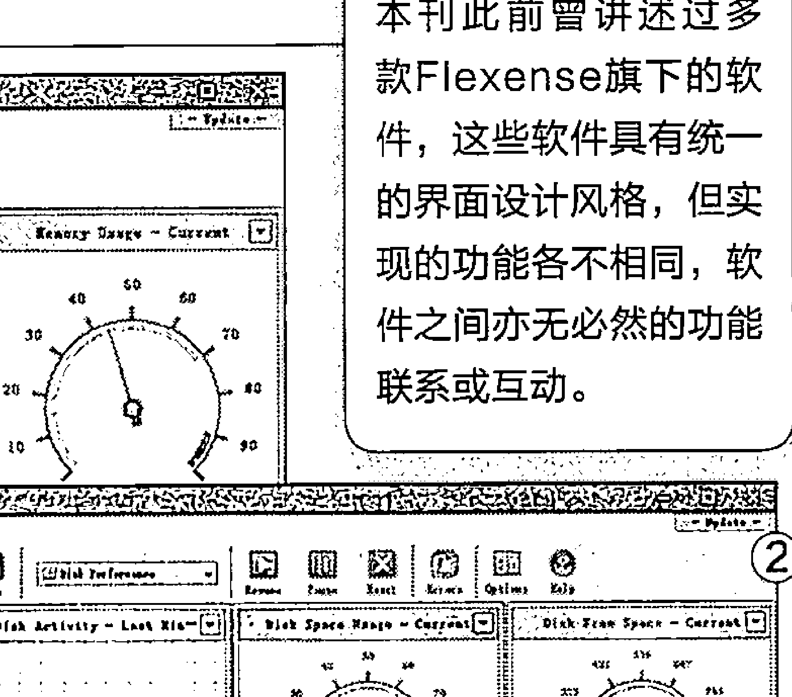

> 小提示
我们还可以在一个窗口中整合显示上述分项目的监视信息。点击左侧栏内的System Monitor项目，右侧窗格的下方便会显示这些项目的文字监视列表。在列表中选中某个监视项目后，上方的窗格会出现其对应的图表形式的信息显示（图3）。

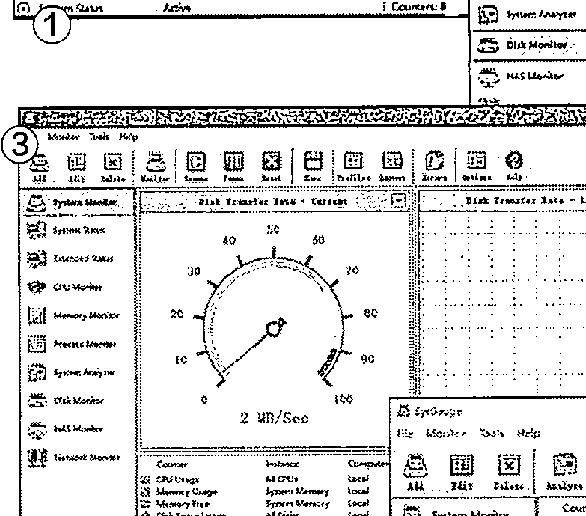

#### 3. 形成各种性能分析报告

利用SysGauge，我们可以生成详尽的系统性能分析报告。
首先从软件左侧栏点击System Analyzer选项，右侧窗格上方会分类显示出各种系统资源占用和性能分析情况，下方窗口会显示所有进程的分析情况。这些分析情况是以文字和数字形式显示的。

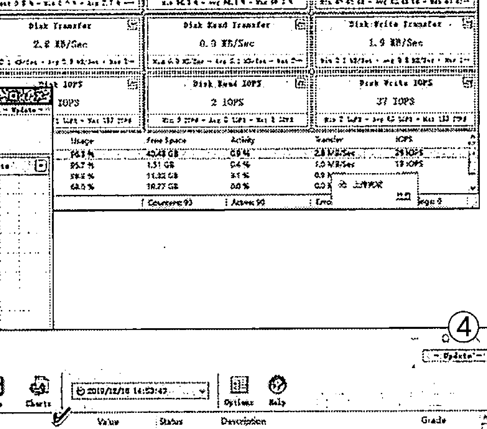

在上述文字、数字分析的基础上，我们还可以通过点击Charts按钮，显示各种类型的系统项目分析监控图表；通过Close按钮左侧的下拉列表，还可以选择以柱状图或饼图的形式呈现（图4）。

最后，点击Save按钮，保存系统监控报告，将系统性能监视结果导出为多种标准格式，其中包括HTML、PDF、Excel、TXT、CSV和XML等格式。

多样化的文件同步解决方案 文|波哥

此前，本刊曾介绍过一些本地或网络文件夹同步的工具或方法。除了我们最常见的本地或网络文件夹同步外，有时我们会希望仅同步指定规则的文件，或者仅在某个时间段执行文件同步操作。为此，我们可以利用一个免费的文件同步软件SyncBreeze实现上述需求。

#### 1. 同步磁盘或目录

如果我们要执行最基本的磁盘或目录同步，SyncBreeze当然不在话下。要同步两个磁盘或目录，点击主工具栏左上角的Sync（同步）按钮，输入源和目标目录，然后点击Sync按钮（图1）。SyncBreeze将扫描指定的源和目标目录，并显示一个预览对话框，其中包含应同步的文件列表。这里，我们可以手动选择或取消特定的同步项目操作。选择完成后，点击Sync按钮执行同步操作（图2）。

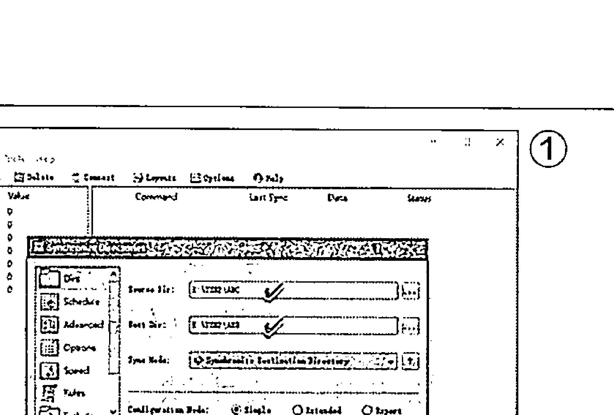

> 本刊文章《文件同步不那么简单》（http://www.cfan.com.cn/2016/0121/124733.shtml），曾讲述过用另一个软件Beyond Compare进行文件夹同步的方法，可参阅。

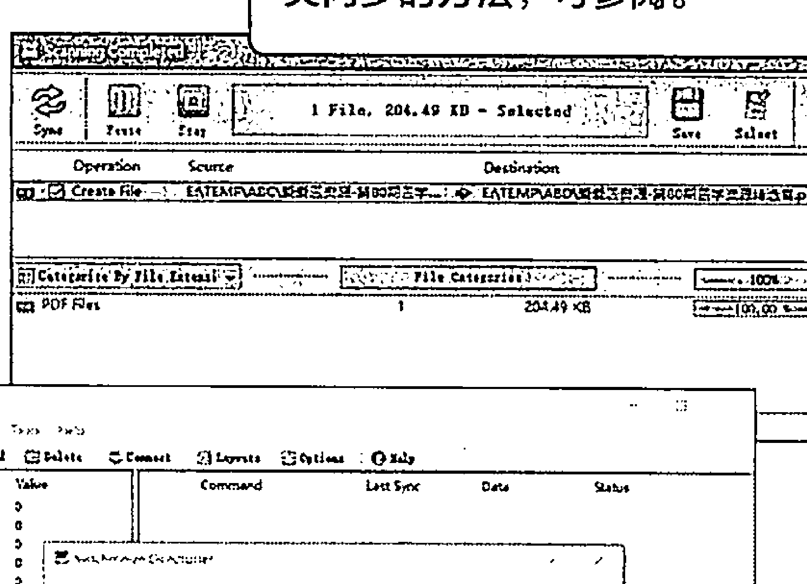

对话框中，选择适当的规则类型并指定必需的参数，然后执行同步操作即可（图3）。SyncBreeze文件同步规则不仅可以设定同步的文件类型，还可以反向设定，即设定不同步的文件类型。例如，配置为排除文件扩展名为TEMP和TMP的所有文件。文件反向匹配规则允许按文件名、扩展名、文件类型、位置、大小、文件属性、文件创建和修改日期等排除文件。

#### 2. 特定规则的文件同步

有时我们只希望同步某些类型的文件。例如，同步所有的文档、图像和音乐文件，同时从文件同步过程中跳过所有其他类型的文件。SyncBreeze提供了使用一个或多个灵活的文件匹配规则同步特定类型的文件或文件组的功能。要为文件同步添加一个或多个文件匹配规则，打开文件同步对话框，选择Rules（规则）选项卡并按Add（添加）按钮。

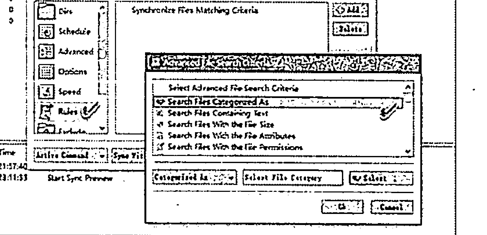

#### 3. 计划定期同步文件

还有的时候，我们对同步的时间有具体要求，SyncBreeze提供的另一个高级选项能够按指定的时间间隔定期执行文件同步命令。此外，还可以安排在一天中的特定时间按每日或每周的周期执行同步操作。该计划在Schedule选项卡下设置（图4）。

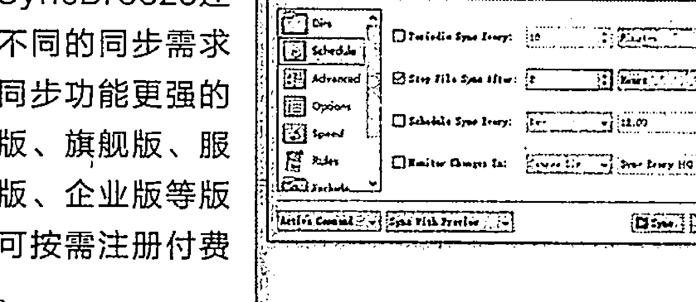

> 除个人用户免费版外，SyncBreeze还针对不同的同步需求提供同步功能更强的专业版、旗舰版、服务器版、企业版等版本，可按需注册付费使用。

定期执行文件同步可用于某些场合，例如将频繁更改的目录与位于外部USB磁盘或NAS存储设备上的备份目录保持按时同步。

多项全能 一个软件搞定系统维护 文|樱子

Windows系统用久了，积累的垃圾和冗余的进程、服务会给系统的高效运行带来影响，清理优化很有必要。要全面维护Windows，单靠系统自带的零碎分散的维护功能不易统一管理和操作，而某些国产的一揽子优化工具又多会带来弹出和捆绑的困扰。如果转而使用一个免费的系统维护工具Advanced SystemCare FREE，我们不但可以方便地进行系统的一键式优化，还可以根据自身所需进行定制式的深度优化，从而实现对系统全面、高效的维护。

#### 1. 一键快速维护系统

##### 自动扫描 手动优化

在“维护”选项卡下，选择需要优化的项目，然后点击“扫描”按钮，即可开始一键快速优化扫描(图1)。

扫描结束后，我们可以看到在扫描结果窗口的左侧栏内，用数字标示了每个项目所发现的问题数量或垃圾文件的容量。最后，点击“修复”按钮，即可完成所有问题的一键自动优化(图2)。

##### 自动扫描 自动优化

如果希望优化过程全自动，不用人工干预，当软件开始扫描时给出“自动修复”选项时，选择该选项并点击其后的下拉菜单，选择在自动修复后可以自动执行的电源管理操作，例如自动修复之后关机、重启、休眠、睡眠等。这适合于在工作之余，需要在离开电脑前对系统进行自动优化的场合(图3)。这样，所有操作均不需要人为干预，扫描过程中软件会自动执行优化操作，优化结束后自动进入所选择的电源管理模式。

#### 2. 四项全能加速系统

一键优化毕竟是软件默认设置好的固定方案，用户可选的余地不大。更多的时候，我们需要按照自己的想法，更深入细致地对系统进行优化。这时，可以通过“加速”选项卡来解决问题。

##### 选好模式 加速运行

我们平常使用电脑的模式不外乎正常的工作模式、游戏模式以及节能模式。在这三种模式下，我们可以根据当前环境，使用合理的优化方案，将系统调整到最佳状态。为此，只需选择软件“加速”功能选项卡下的“Turbo加速”，然后点击“加速”按钮旁的下拉列表，从中选择当前使用的模式，然后点击“加速”按钮进入优化程序（图4）。

如果将鼠标移动到“Turbo加速”一栏上，“加速”按钮之下会出现一个“配置”按钮，此时，点击该按钮可进入加速配置窗口，在该窗口的优化项目选择列表中，可分别对系统服务、非系统服务以及后台程序进行选择性的优化（图5）。

##### 驱动加速 助力系统

过期的驱动程序可能会影响系统的稳定性和运行速度，为此，我们可以通过对这些驱动进行检测并优化，助力电脑的速度提升。点击“加速→驱动加速”模块中的“立即检测”按钮进行检测，检测结束后，“驱动加速”一栏中会显示发现的过期驱动程序的数量，点击“现在安装”按钮，安装Driver Booster组件进行加速处理（图6）。Driver Booster只需安装一次，此组件也作为同一软件商的另一个软件产品单独提供。

> 小提示
要了解具体有哪些驱动项目是过时的，将鼠标移动到“现在安装”上，下方会出现“详细信息”链接，点击即可查看具体的驱动程序项目（图7）。

##### 深度优化 加速提效

我们还可以通过对系统的深度优化，执行对系统性能提升有明显影响的一些优化操作。在“加速→深度优化”模块栏内，系统自动检测结果会显示可以深度优化的项目总数。将鼠标移动到该栏内，“全部优化”按钮下会出现“详细信息”链接，点击该链接，会显示所有可深度优化的项目。勾选要优化的项目或忽略要优化的项目之后，点击“优化”按钮进行深度优化操作（图8）。

> 小提示
执行加速之后，“加速”按钮变为“还原”按钮，点击该按钮，还可以还原到加速前的状态，这样可以避免因优化不当而造成的一些问题。

##### 清理插件 上网加速

上网使用的浏览器如果被插件所拖累，也很影响使用效率。我们可以通过“加速→插件清理”模块，点击“现在安装”按钮，安装IObit Uninstall插件清理工具。该插件为本软件商的另一个小工具，但本软件中默认没有集成，故首次使用也需要安装，安装后才可对网络浏览器中的无用插件进行清理。

> 小提示
软件的Free版已经包含有基本的清理和优化功能。若有需求，还可以付费升级到具有诸如深度注册表清理、终极性能优化、自动内存清理、实时保护等功能的专业版。点击“立即激活”按钮进行升级。

> **火焰图标**
有关IObit Uninstall的更多用法，请参见本刊2020年第1期的文章《IObit Uninstall卸载Windows 10程序》。

Windows 10也用Spotlight风格搜索栏 文|波哥

如果你曾经使用过MacOS系统，想必也会用过Spotlight搜索工具，Spotlight搜索栏具有平滑而简洁的设计界面（图1）。Windows 10系统虽然也内置了任务栏搜索框或Cortana搜索框，但已经习惯了简约搜索栏的用户，可能不喜欢Windows 10默认搜索工具所提供的界面。这时，借助于一个免费的Jarvis软件，便可以实现与Spotlight类似的搜索体验。

#### 1. 搜索栏的启动

首先安装Jarvis搜索栏软件。安装之后，它并不会取代Windows 10内置的开始/任务栏搜索工具，也不会像Windows那样在任务栏上添加新图标，只是在运行之后，会在系统托盘区域驻留一个该程序的小图标。当我们需要用Jarvis搜索时，只需双击系统托盘上的Jarvis图标（或者同时按下Alt和空格组合键），就可以呼出Jarvis搜索栏了（图2）。

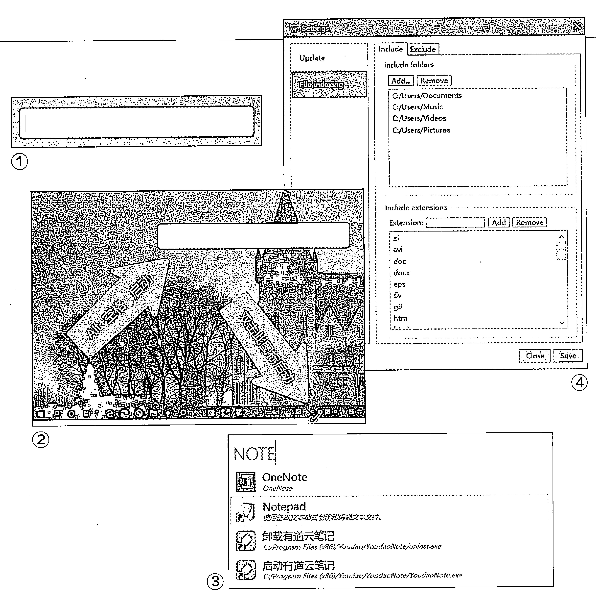

#### 2. 快速执行搜索

如果我们要搜索某个程序，只需在Jarvis搜索栏中键入具体的应用程序名，输入过程中搜索栏将展开以显示智能感知的相关信息，从中挑选合适的条目进行搜索即可（图3）。搜索其他内容的方法也类似。

#### 3. 个性定制搜索

Jarvis搜索的内容具有可定制性。我们可以在该软件中为新的位置建立索引，这样就可以搜索程序之外的文件和文件夹了。具体定制方法：右键单击系统托盘上的Jarvis程序图标，然后单击Settings（设置）；切换到File indexing（文件索引）选项卡，点击Include选项卡，设置搜索需要包括的文件夹（上端窗格）或文件类型（下端窗格）。如果希望在搜索时排除某些文件夹或文件类型，点击Exclude选项进行设置（图4）。

让软件像系统服务一样安静自运行

有些软件程序可能我们每天都会使用，所以希望它能随着系统的启动而自动运行。通常我们都是采用添加到启动文件夹的方式来实现的，但是这种方式在运行后会弹出软件运行窗口，影响到用户的其他操作。其实我们可以利用系统服务的方式，让软件程序在系统后台安静地运行。

#### 配置参数设置启动服务

我们首先从网上下载EasyService这款小工具，它可以为任意一个软件程序创建启动服务。该工具最大的特色在于，在安装启动服务之前，可以帮助用户对配置信息是否正确进行判断，这样就可以避免因为配置错误而造成启动服务无法运行的尴尬。下载完成后对压缩包进行解压，将需要启动运行的软件程序文件夹复制粘贴到EasyService工具的文件夹下面，本例中，笔者将一款内存优化软件Reduce Memory的文件夹复制到其中。接下来用任意一个文本编辑器打开其中的Svc.conf文件，对里面的参数进行设置修改。

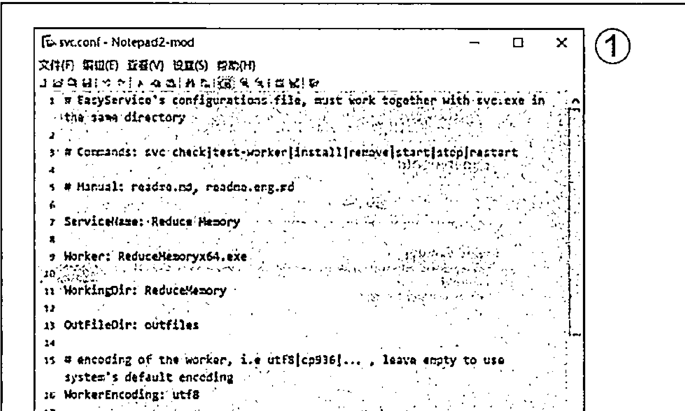

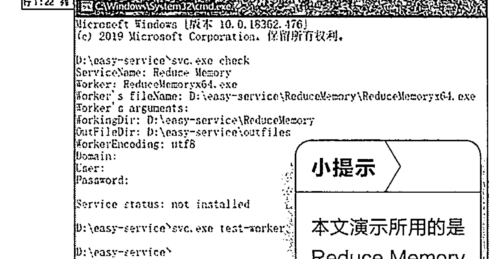

首先在 “ServiceName” 参数后面自定义一个启动服务的名称，这里需要提醒大家的是，启动服务的名称只能使用英文或者数字进行组合。接下来在 “Worker” 参数的后面设置Reduce Memory软件的程序名称，由于我使用的是64位的操作系统，所以选择的是64位的程序文件版本ReduceMemoryx64.exe。接下来在 “WorkingDir” 参数的后面设置Reduce Memory软件的存放文件夹名称。当这三个参数设置完成以后保存配置文件（图1）。

> 小提示：本文演示所用的是Reduce Memory软件，用户可以根据需要将它替换为自己常用的软件程序。

现在通过管理员权限打开命令提示符窗口，并利用“cd”命令进入到EasyService所在的文件夹目录。接下来分别执行 “svc.exe check” 和 “svc.exe test-worker” 命令，检测配置文件是否设置成功，以及检测EasyService能否成功进行软件加载（图2）。如果一切正常，即可执行 “svc.exe install” 命令，就可以新建一个启动服务了。利用这个启动服务，该软件便可以随系统自动运行，并且是在后台悄悄进行的。

#### 图形化界面创建启动服务

如果用户觉得Easy Service这款小工具操作不方便，那么还可以试一试Nssm这款图形化界面的小工具。我们首先按照上面的方法，打开命令提示符窗口并跳转到工具所在的文件夹目录，接下来执行 “nssm.exe install” 命令就可以启动运行该工具。然后在弹出的操作界面中点击 “Path” 选项后的按钮，在弹出的对话框中选择要进行启动的程序文件。接下来在 “service name” 选项中设置一个启动服务的名称，最后点击 “Install service” 按钮就可以完成该启动服务的创建了（图3）。

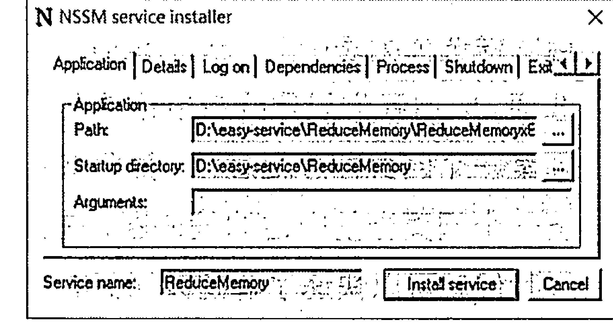## 激活隐藏功能让谷歌浏览器更方便

文/阿立

在我们的印象中，谷歌浏览器的每一次升级，主要都是针对内核而进行的，在功能上并没有太多的更新，所以很多用户只能通过功能扩展的方式来添加自己需要的功能。而实际上，谷歌浏览器只不过是将一些功能进行了隐藏，而我们只需要将这些隐藏的功能进行激活，就可以让浏览器在使用时更加方便顺手。

#### 激活并行提升下载速度

虽然谷歌浏览器自带下载功能，但是很多用户还是习惯性地使用专业的下载软件，主要原因就是专业的下载软件可以利用多线程技术进行文件下载，而谷歌浏览器只能使用一个线程进行下载，所以在速度上没有专业软件下载得快。其实我们如果激活谷歌浏览器的并行下载功能，同样可以提升它的下载速度。

首先在地址栏输入“chrome://flags”并按下回车键，在弹出的功能设置页面上方的搜索框中，输入关键词“Parallel downloading”，查找到这个选项后点击并选择列表中的“Enabled”选项（图1），根据提示重新启动浏览器，以后再下载文件时就可以激活并行下载功能而提速了。

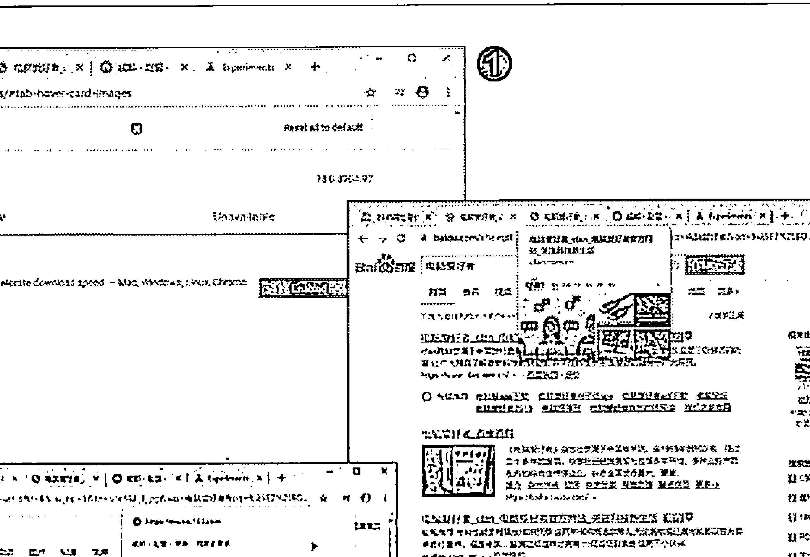

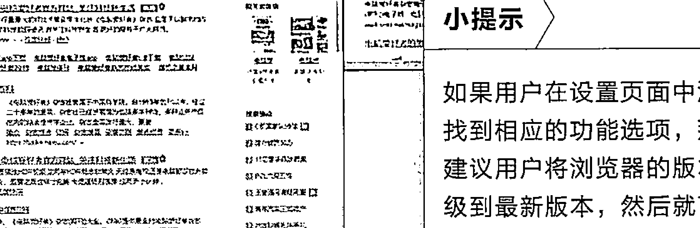

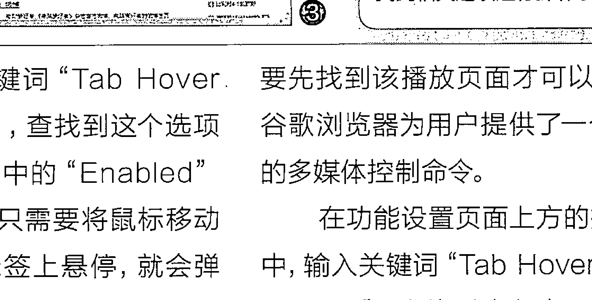

> 如果用户在设置页面中没有找到相应的功能选项，那么建议用户将浏览器的版本升级到最新版本，然后就可以找到相关选项进行操作了。

#### 利用缩略图了解网页内容

由于谷歌浏览器窗口大小的局限性，因此在打开多个浏览器页面以后，浏览器标签的文字就会被挤压，这样要想知道浏览器的内容，就只能切换到该标签进行查看。其实很多浏览器都自带缩略图显示功能，方便用户了解网页内容，而谷歌浏览器也具备类似的功能。

首先在功能设置页面上方的搜索框中，输入关键词“Tab Hover Card Images”，查找到这个选项后同样选择列表中的“Enabled”选项。以后我们只需要将鼠标移动到某一个网页标签上悬停，就会弹出一个网页当前内容的缩略图，这样我们就可以快速了解到该网页的大致信息了（图2）。

#### 专业按钮方便多媒体控制

其实标签页开得过多，除了上面遇到的情况以外，还会遇到其他的问题，比如我们在一个标签页中在线播放音乐，而同时又在对另外一个标签页进行浏览，这时如果想对播放的音乐进行管理操作，就需要先找到该播放页面才可以。其实谷歌浏览器为用户提供了一个专门的多媒体控制命令。

在功能设置页面上方的搜索框中，输入关键词“Tab Hover Card Images”，查找到这个选项后选择列表中的“Enabled”选项。以后当我们在谷歌浏览器中进行在线多媒体播放操作时，就会在工具栏中自动显示出一个名为“控制您的音乐、视频等媒体内容”的功能按钮，点击它以后，在弹出的对话框中就可以看到当前正在播放的多媒体信息名称，通过里面的按钮即可进行暂停、播放等相关的控制操作了（图3）。

#### 视频压缩可以更简单

文/剑侠

一个朋友给笔者拍了一段4K的视频，因为他是利用专业设备拍摄的，所以视频体积较大，无论通过电脑还是移动设备，发送起来都非常的困难。后来笔者通过傻瓜软件Handbrake，在保证画面清晰的情况下对视频进行重新压缩，并导出为适用于移动设备的视频格式，解决了这一难题。

#### 导入要压缩的视频

我们首先从网上下载Handbrake这款跨平台的免费视频压缩软件（https://handbrake.fr），解压后运行文件夹中的可执行文件，接着根据软件界面中的提示来选择要进行处理的视频文件。虽然软件提供了多种不同的导入方式，但是我们建议用户还是点击左侧列表中的“文件夹（批量扫描）”选项，然后在弹出的对话框中选择存放视频文件的文件夹（图1）。

这样软件就会对文件夹中的所有文件进行扫描，然后将扫描出的视频文件添加到处理列表中。这么做的好处是用户既可以处理单一的视频文件，也可以一次性批量处理多个不同的视频文件。当视频扫描完成以后，软件会自动跳转到压缩设置界面，而且在界面的“摘要”标签中可以显示出该视频的详细信息，并且可以对视频的内容进行预览。

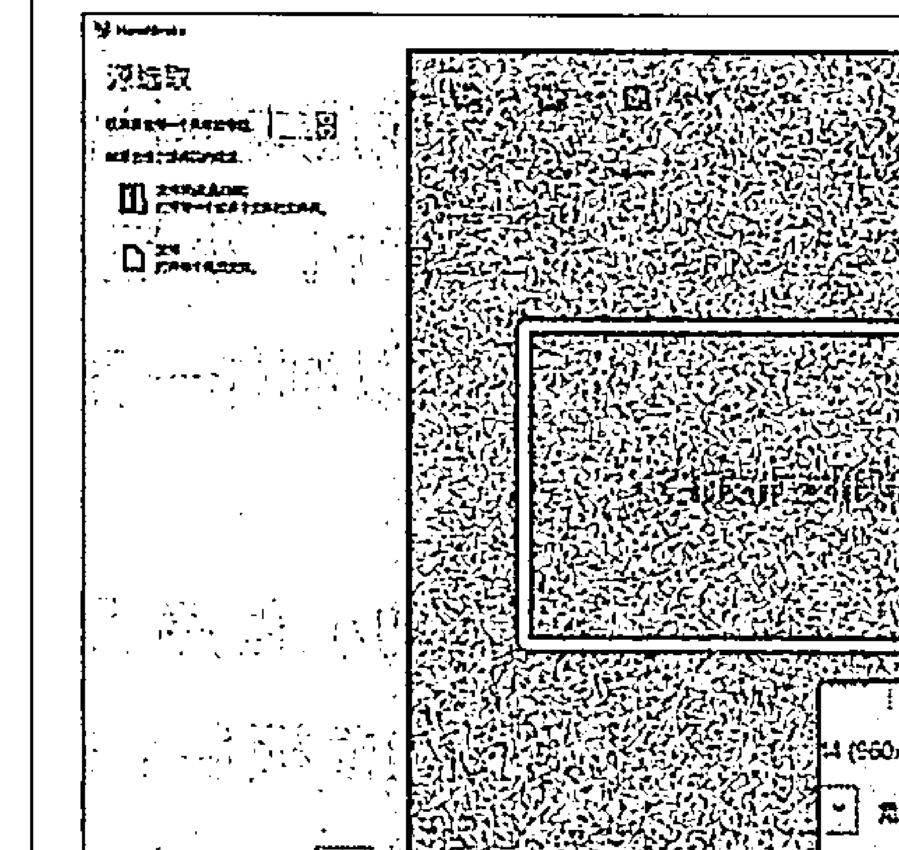

> 小提示
如果用户在压缩时首先考虑速度，那么就在菜单中选择带有“Very Fast”或“Fast”关键字的方案。如果更考虑压缩效果的话，那么就在菜单中选择带有“HQ”或“Super HQ”关键字的方案。

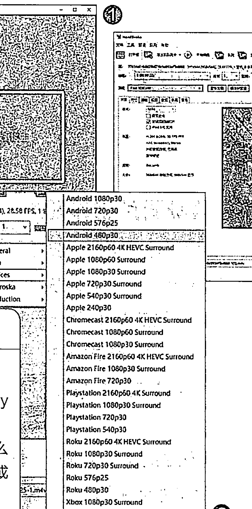

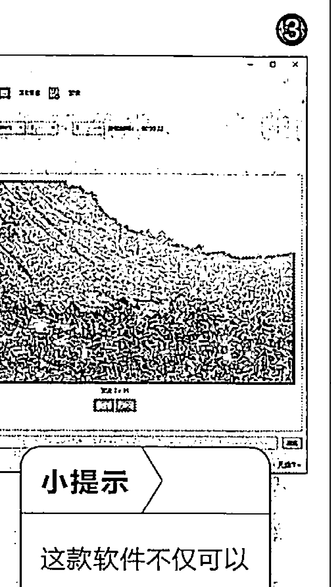

> 小提示
这款软件不仅可以完成视频的压缩，还可以完成视频编码的转换、视频格式的转换，以及添加音频、添加字幕等一系列的编辑操作。

#### 选择相应的压缩方案

Handbrake的特色之一，就是它不仅内置了大量压缩方案，而且还对这些压缩方案进行了相应的分类，包括General、Web、Devices等等，用户可以很方便地找到自己需要的压缩方案。

比如我们想把视频文件放到移动设备上，可以点击“预设”列表后面的三角按钮，在弹出的菜单中点击“Devices”选项，接着在弹出的子菜单中就可以看到针对Android手机以及苹果手机预设的众多视频方案了，这里选择的就是“Android 480P/30”这一视频方案（图2）。

#### 完成视频的压缩操作

接下来在“摘要”标签中找到“格式”选项，在列表中根据需要选择视频压缩后的输出格式。软件默认的格式是MP4，如果是上传到网络中进行传播，也可以选择最新的WebM这种格式。然后再点击“另存为”后面的“浏览”按钮，在弹出的对话框里面设置压缩视频保存的文件夹目录以及名称。当所有的设置完成以后，点击工具栏中的“开始编码”按钮，就可以对相应的视频文件进行压缩（图3）。通过状态栏中的进度条，我们可以了解到压缩的进度。压缩完成以后，在指定的目录中，就可以查看到压缩后的视频文件了。

#### 微信小程序制作趣味电子相册

文/阿木

节日过后，手机上拍摄的照片又多了，将这些照片做成电子相册是个不错的主意。现在无需安装任何软件，借助微信里的小程序就可以轻松完成。

#### 趣味照片快速生成——趣味图片制作器

首先需要说明的是，以下操作虽然是在手机中完成，但因为在电脑上的操作比较便捷，也可以点击小程序右上角的“…”，然后在弹出的菜单中选择“发送给朋友”，并发送给自己的“文件传输助手”，然后在电脑微信中就可以打开下述小程序进行操作了。

启动微信后切换到“发现→小程序”，按提示添加“趣味图片制作器”小程序，这个小程序可以快速制作出各种趣味图片。这里笔者要为自己的相册制作一张发光效果的新年祝福封面图片，在模板中选中发光瓶子模板，按提示输入“新年好”三个字，点击“生成图片”即可（图1）。

当然还可以选择其他模板生成更多有趣的图片，这里笔者要制作一张藏头诗图片作为相册的封底，保存后导入PPT中，裁剪掉广告，同时插入一个文本框，就可以将藏头诗字头提取出来使用了（图2）。

#### 为照片添加动态效果——黑咔相机

完成趣味照片的制作后，接下来我们可以借助“黑咔相机”小程序，为这些照片添加各种动态效果。下面以制作一张祝福大家新年快乐的动态图片为例。

启动小程序后切换到“节日祝福”模板，选择自己喜欢的模板后点击“上传有正脸的照片制作”，导入自己的照片，这样生成的照片会自动去除背景，并且会模仿模板中的人物发出新年的祝福（图3）。

除了使用默认的祝福语外，还可以使用自定义的祝福语。在上图中切换到“配音”，在打开的窗口中就可以使用各种自定义祝福，比如可以点击“录音”，录制自己的语音祝福，或者输入文字，让程序自动转换为语音（图4）。

完成特效图片的制作后，点击“存本地”，这样这些特效照片会以视频格式（.mp4）保存，即可将其导入下面的小程序中制作相册。

小提示 相册背景音乐默认是以视频长度为准的，为了让音乐可以和视频画面吻合，可以导入照片后先制作一个相册，在预览播放窗口查看视频的长度，接着按照这个长度进行音乐的裁剪即可。此外还可以关注“小年糕”公众号，在电脑微信上直接进行相册的制作。


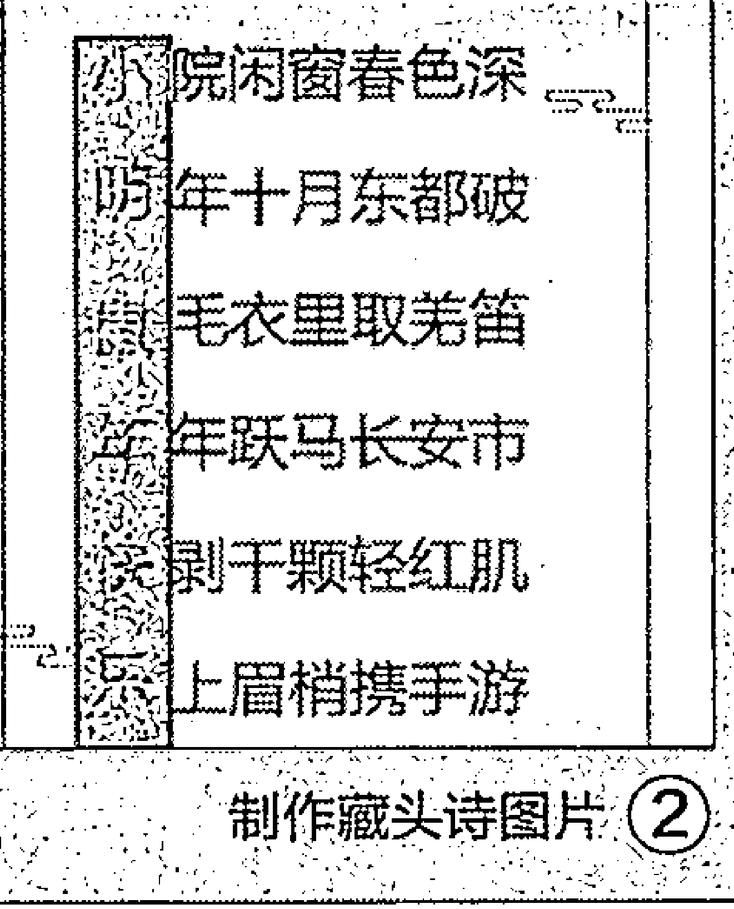


#### 图文并茂电子相册——小年糕

完成上述照片的特效制作后就可以制作精美的电子相册了。操作同上，按提示添加“小年糕”小程序，启动该小程序后点击“制作影集”，选择一种自己喜欢的模板，比如春节相册可以使用“纳福迎春”，选中模板后点击“选择→开始制作”（图5）。

在弹出的菜单中点击“上传照片”，按提示选择需要制作的照片、视频（上述生成各种特效的视频文件）。接着切换到“模板→音乐”，这里可以选择配乐，按提示选择程序内置的音乐或者自己准备的音乐都可以，音乐可以在此进行裁剪选择（图6）。

需要注意的是，模板有“竖版”和“横版”之分，如果在手机上观看建议选择竖版，电脑上观看则建议选择横版。另外程序默认选择第一张照片作为封面，可以点击任意一张照片进入编辑界面，自行调整照片的前后顺序。

继续切换到“字幕”，按提示设置好封面、作者等信息，还可以为每张照片添加字幕，可以根据不同的照片加上相应的解说词（如景点介绍等），最后点击“提交制作”（图7）。

稍等一会，小年糕完成制作后会给出相册的预览播放，如果觉得满意，退出预览界面后返回“我的影集”，点击“保存/下载”，点击“保存到手机”即可。相册默认保存在“文件管理→分类→视频”，现在就可以直接在手机上播放制作的视频，或者将它发送给好友分享了（图8）。

除了上述介绍的程序外，在微信中还有很多类似的小程序，比如“一键动图”（只要选择带水面、白云背景的图片，导入后会自动生成海水涌动、云彩飘扬的动态效果）、“美脸”（导入正面照后可以和模板人脸互换）、“图元素相机”（导入照片即可自动替换背景，方便用来制作“假装旅游”照片）、全景立体相册（只要选择模板，简单替换模板和音乐即可快速形成立体相册），这些小程序都可以即选即用（图9）。

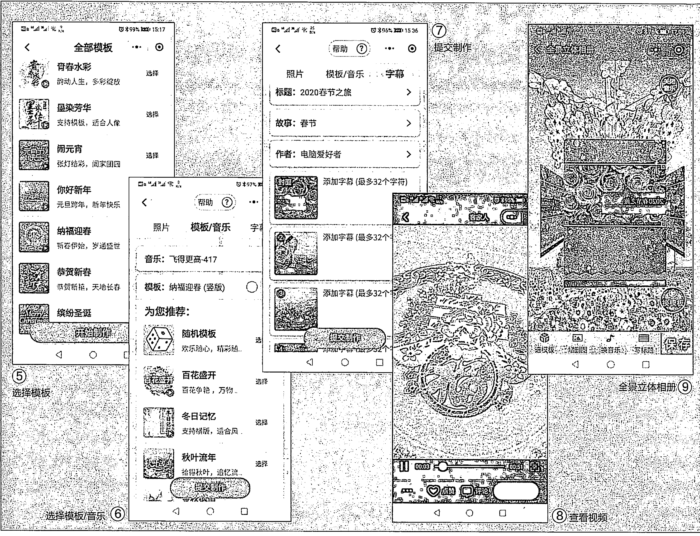

#### 完善功能让MPC播放器更好用

文/剑侠

Media Player Classic (简称MPC) 是一款非常优秀的播放器，它不仅功能强大，而且资源占用也非常少，因此受到不少用户的追捧和喜爱。但是由于这款播放器将重点放到了播放功能上，因此包括文件播放清单、快捷键控制等外围功能都做得非常简陋，受到不少使用者的诟病。今天就让我们利用两款小工具来完善MPC的播放器功能，让它更好用。

> Media Player Hotkeys最大的优势就是支持所有知名的播放器，包括操作系统自带的Windows Media Player，以及第三方的Foobar 2000、KMPlayer、PotPlayer等。因此在这个小工具中进行设置的快捷键，也可以对其他播放器进行统一的控制操作，从而避免多个播放器使用不同的快捷键，这给用户的管理和操作带来了方便。

#### 文件播放清单的编辑

首先打开任意一个版本的MPC播放器，点击工具栏中的“快速打开文件”按钮，在弹出的对话框中选择要进行播放的文件。接着点击“查看”菜单中的“播放列表”命令，在弹出的对话框中就可以看到我们刚刚添加的文件，在对话框中点击鼠标右键，选择菜单中的“另存为”命令，就可以将列表保存为一个播放清单文件。

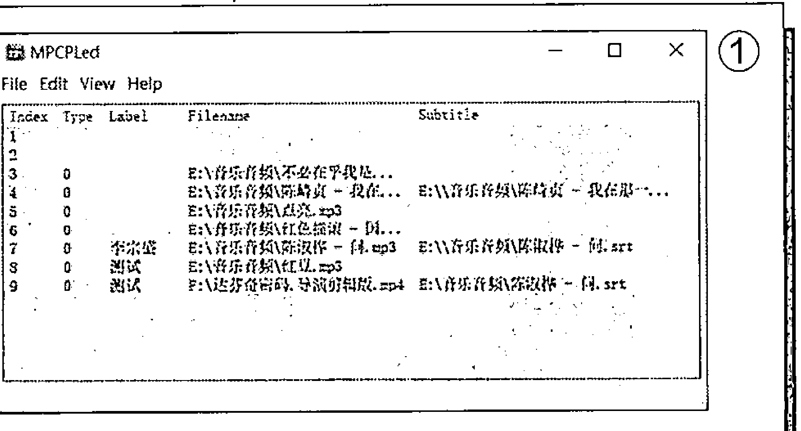

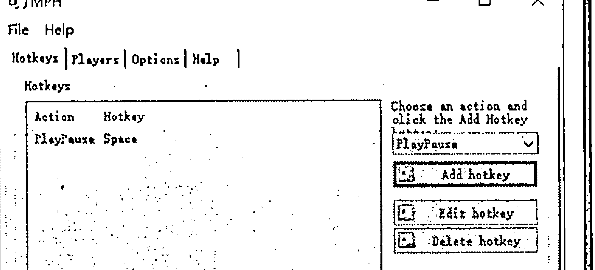

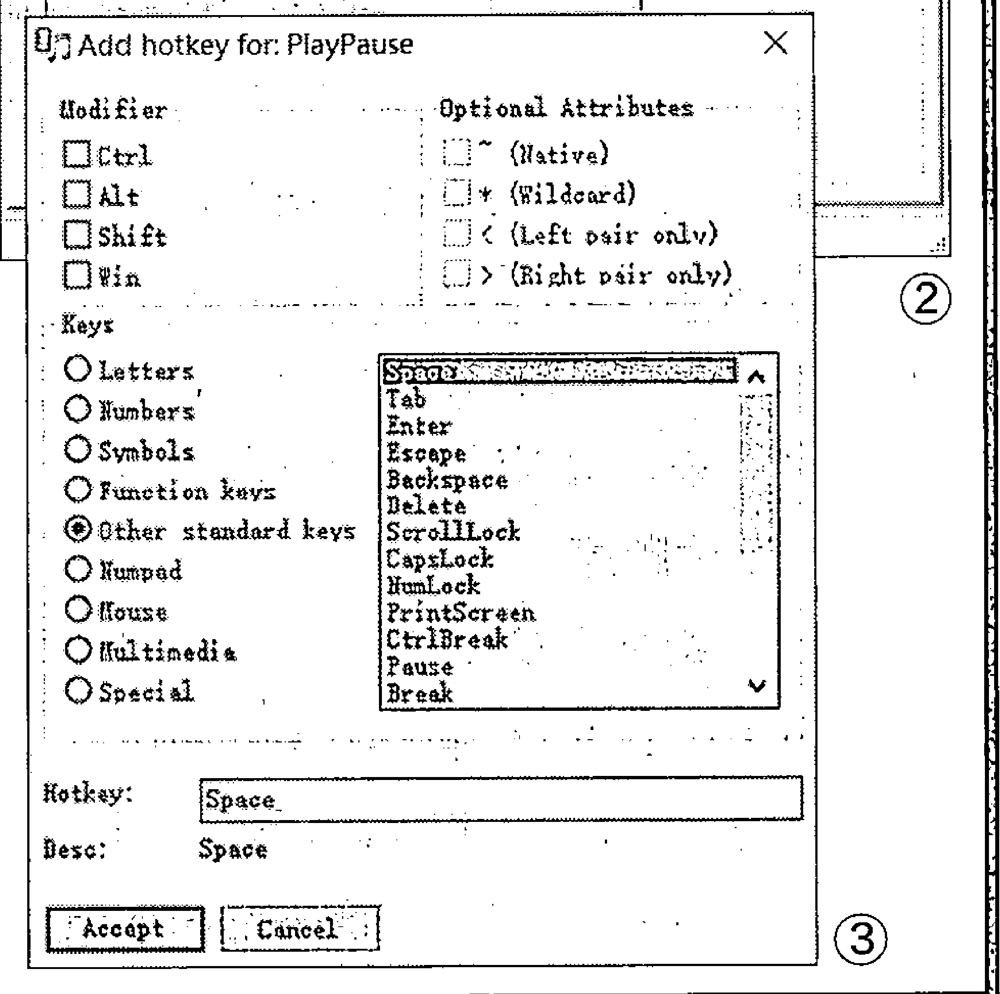

现在下载运行MPCP Led这款小工具，接着点击“File”菜单中的“Open mpc playlist”命令，在弹出的对话框中选择刚刚生成的播放清单文件，清单中的内容就会显示到工具的列表中。在列表中选中要调整的文件后，可以利用鼠标拖拽以及快捷键的方式对它们的位置进行快速移动，从而使得播放清单更适合自己的需求。

#### 快捷控制命令的设定

我们在播放电影时，最常选择的就是全屏播放，而这时利用鼠标进行操作反而不如键盘快捷键来得方便。只是MPC的快捷键设置功能有些不完善，所以这时我们可以借用Media Player Hotkeys来辅助操作。

在弹出的窗口里面首先选择“Hotkeys”标签，接着在“Choose an action and click the Add Hotkey button”列表中选择“PlayPause”选项(图2)。再点击“Add hotkey”按钮，从弹出的对话框里面选择“Other standard keys”列表中的“Space”选项，然后点击“Accept”按钮，就完成了一个快捷键的设置(图3)。这样以后我们通过键盘的空格键，就可以对电影的播放和暂停进行控制操作了。按照类似的步骤，我们还可以创建其他相关的快捷键命令，从而替代软件自带的快捷键命令。

另外在列表中，每个多媒体文件还会自动关联到硬盘中对应的字幕文件，但是如果用户发现字幕文件关联错误或者没有关联，那么可以点击“Edit”菜单中的“Choose subtitle file”命令，在弹出的对话框中选择正确的字幕文件进行关联。当所有的编辑完成以后，点击“File”菜单中的“Save mpc playlist as”命令，将播放清单文件进行重新保存(图1)。现在再通过播放器打开这个播放清单文件，就可以按照新的清单顺序进行播放了。

#### 借助自律自己打造上网防沉迷系统

文/俞木发

很多自律性比较差的朋友，在浏览各种新闻、小说的时候经常会忘记时间的存在，这样上网浏览就会浪费很多的时间。现在借助“你看的时间太长了”插件，我们就可以自行打造一个上网防沉迷系统。

“你看的时间太长了”插件支持火狐及Chrome核心的浏览器，这里以Chrome浏览器为例。首先到http://wd.jb51.net:81/201702/tools/tampermonkey_jb51.rar下载油猴脚本管理器插件，下载后解压得到“油猴最新.crx”，使用7zip将其打开并解压到C:\aa，接着将其中的“C:\aa\_metadata”目录重命名为“metadata”。

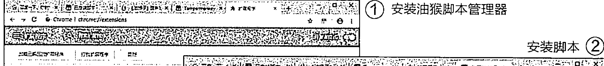

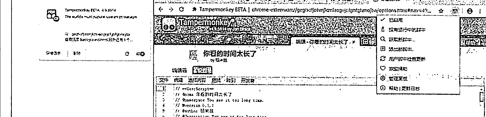

启动Chrome，在地址栏输入“chrome://extensions/”开启开发者模式，点击“加载已解压的扩展程序”，定位到“C:\aa”，完成该插件的安装。成功启用该插件后会在地址栏后面出现一个油猴图标（图1）。


小提示：新版Chrome浏览器在离线安装其他插件时会提示“代码错误”，只要将插件解压并重命名为上述目录即可。

继续到https://greasyfork.org/zh-CN/scripts/389788下载脚本并放置到桌面备用，返回Chrome浏览器点击油猴图标，选择“添加新脚本”，然后使用记事本打开上述下载到的“你看的时间太长了.user.js”脚本，将其全选后复制到新建脚本窗口并保存，完成该插件的安装（图2）。

这个插件默认每个网页最多只能浏览一个小时（包含同一域名下的子网站，比如打开百度新闻，那么所有其他打开的百度新闻页面都是最多1小时浏览时间）。现在重新打开Chrome浏览器浏览网页，在每个网页的标题栏就会出现一个倒计时的提示。当然我们也可以根据自己的实际需要进行设置，比如需要设置浏览网页的时间最多为10分钟，则在浏览器地址栏输入https://www.baidu.com/#max10 (baidu.com可以使用任意网站替代)。这样每个新打开的页面（包括任意网站，这是全局生效的）都会出现10分钟倒计时的提示。当然如果你需要排除页面，点击“油猴图标→你看的时间太长→‘+’→排除指定网站”，该网站就不会倒计时了（图3）。


对于倒计时的页面，在到达指定时间后页面就会自动发白直到消失，最终出现该插件的二维码提示，原来的浏览器内容会全部消失（刷新也没有效果），可以有效地节省你的上网时间（图4）。

#### 激活DoH功能让DNS解析更安全

文/天涯衰草

现在很多网站为了保证数据传输的安全，都采用了加密的HTTPS协议。但是在浏览器打开网页之前，所有的DNS域名解析数据都没有经过加密，这样传输的数据就有可能被篡改或泄露。针对这种隐患，我们通过激活谷歌、火狐等浏览器的DoH（DNS over HTTPS）加密功能，就能很好地解决这个问题。

#### 一、谷歌浏览器激活DoH

如果用户使用的是谷歌浏览器，或者是采用了Chromium内核的浏览器，那么首先在地址栏中输入“chrome://flags”并按下回车键，在弹出的功能设置页面上方的搜索框中，输入关键词“Secure DNS lookups”。查找到这个选项后，将选择列表中的“Default”选项改为“Enabled”（图1），然后根据提示重新启动浏览器即可。设置完这一步后，接下来还需要对系统的DNS服务器地址进行修改。用鼠标右键单击Windows 10系统左下角的“开始”按钮，在弹出的菜单里面点击“网络连接”命令。然后在设置窗口依次点击“更改连接属性→IP设置”，最后点击下面的“编辑”按钮，在弹出的对话框中可以对“首选DNS”和“备用DNS”选项进行修改（图2）。注意并不是所有的DNS服务商都支持加密服务，因此在设置时需要注意选择。当所有的设置完成后，谷歌浏览器发出的域名解析请求就会经过加密处理后再发送到相应的DNS服务器。等DNS服务器解析完成以后，再将解析的数据进行加密并回传到浏览器。

> 如果用户想查询和火狐浏览器相关的DoH加密服务器地址，可以访问https://github.com/curl/curl/wiki/DNS-over-HTTPS。

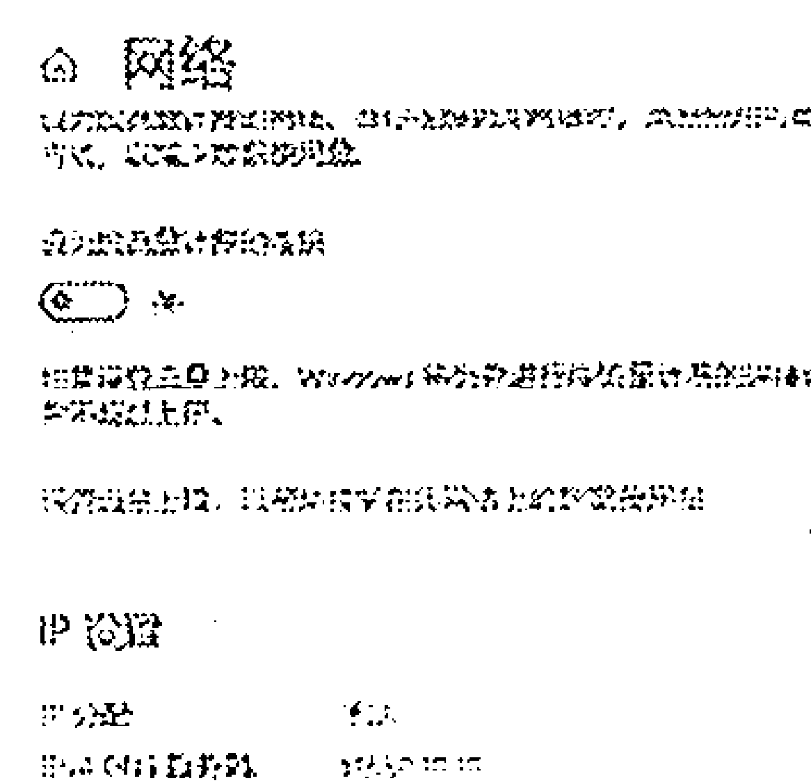

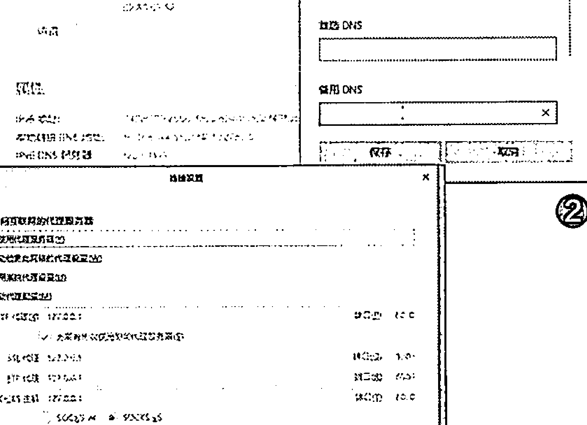

#### 二、火狐浏览器激活DoH

如果用户使用的是火狐浏览器，打开浏览器后，点击首页右上角的“打开菜单”按钮，在弹出的菜单中选择“选项”命令，在选项设置窗口中点击“网络设置”旁边的“设置”按钮，接着在弹出的对话框中勾选最下方的“启用基于HTTPS的DNS”选项。火狐浏览器默认使用的是Cloudflare的DNS服务器，如果用户不喜欢使用默认的服务器，那么可以在“选用提供商”列表中选择“自定义”选项，然后在输入框中输入需要的DNS服务器信息，最后点击“确定”按钮完成相关的设置操作即可（图3）。

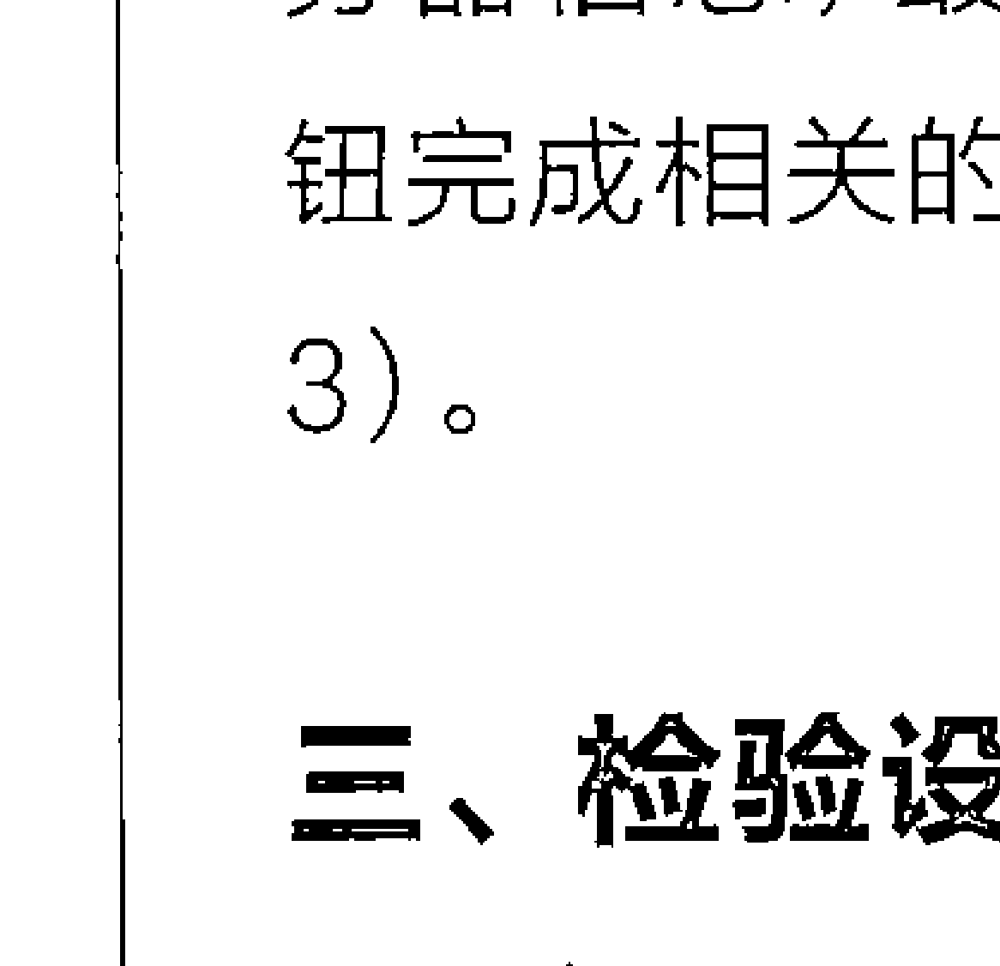

#### 三、检验设置结果

如果用户使用的是Cloudflare的DNS服务器，在浏览器中打开https://www.cloudflare.com/ssl/encrypted-sni链接，点击网页中的“Check My Browser”按钮，然后查看“Secure DNS”选项。如果出现绿色的“√”，就表示刚才的设置成功了，如果是其他颜色就表示需要重新设置（图4）。

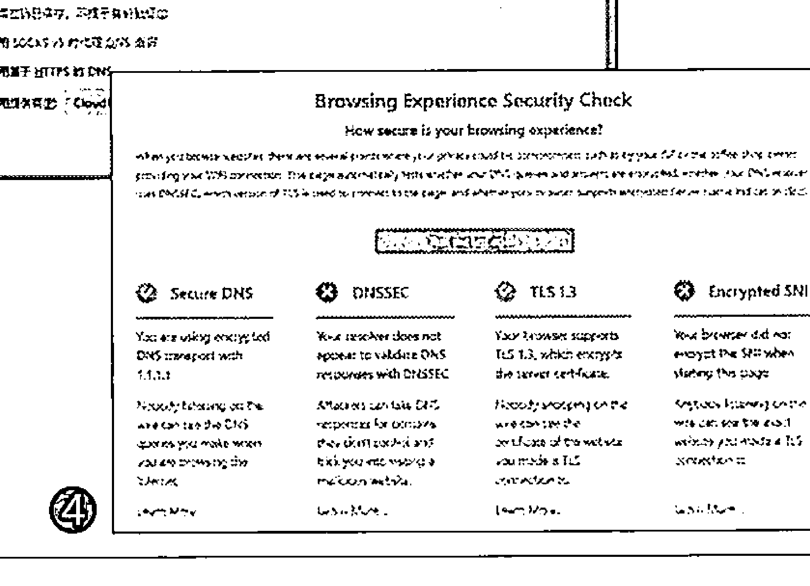## 解放双眼 以听代读 自制音频素材 文|平淡

大家知道长时间阅读很容易引起眼睛疲劳，而且很多场景下（比如上班路上或者平时散步）也不方便使用双眼阅读，每当遇到这种情况，我们不妨借助相关的应用将文本转换为语音，以听代读，从而解放我们的双眼。

#### 网页考题变音频——SpeakIt插件

为了学好英语，很多学生喜欢在网上刷题，时间长了眼睛就受不了。现在通过SpeakIt插件可以将网页考题朗读出来，不仅可以缓解眼睛的疲劳，还可以提高自己的听力水平。

以QQ浏览器为例，首先到https://www.ispeech.org/text.to.speech下载插件，然后切换到“选项→应用中心”，勾选“开发者模式”，将下载到的插件（.crx格式）拖到窗口完成安装。

安装插件后点击其中的“选项”，这里可以对语音引擎进行选择，比如英语朗读选择“Microsoft Zira Desktop- English(United States)”（图1）。

以后打开网页需要朗读时，可以在网页中选中需要朗读的内容，再点击地址栏后的SpeakIt插件图标，即会自动朗读网页内容，这样就可以用耳朵来听题目了，还可以借助其他软件录制为语音发送到手机上再收听（图2）。

> 火速链接：对于其他浏览器的用户，或者不想安装插件的用户，可以参考2017年第19期《自己动手 文章变身语音版》的介绍，使用Excel将文本转换为语音。

#### 微信文章变音频——语音朗读助手

如果你的知识点是在手机上，比如很多朋友喜欢阅读公众号的文章，则可以借助“语音朗读助手”APP（下载地址：http://app.mi.com/details?id=me.zuichu.voiceread），将文章转换为音频。

这里以Android手机为例，在手机上启动APP后切换到“个人中心→复制朗读设置”，在打开的窗口中开启“复制朗读”和“复制后直接朗读”（图3）。

为了获得更好的朗读效果，还可以切换到“发音人相关设置”，自行根据文本的内容选择不同效果的发音人。

现在打开微信公众号的文章，点击右上角的“选项”，在弹出的窗口中点击“复制链接”，软件就会在后台自动播放文章了，手机屏幕关闭后仍可以播放（图4）。

如果是手机网页内容，那么只需复制链接即可自动开始播放，或者直接将复制的文本粘贴到软件窗口中进行朗读。

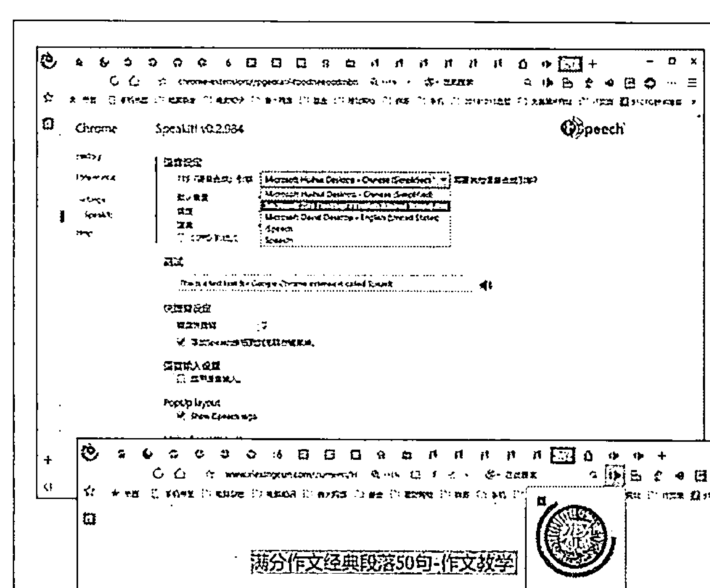

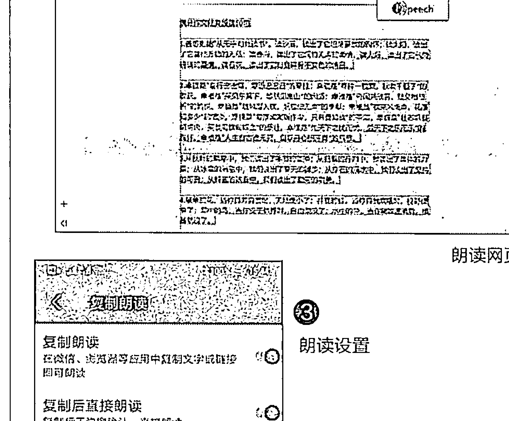

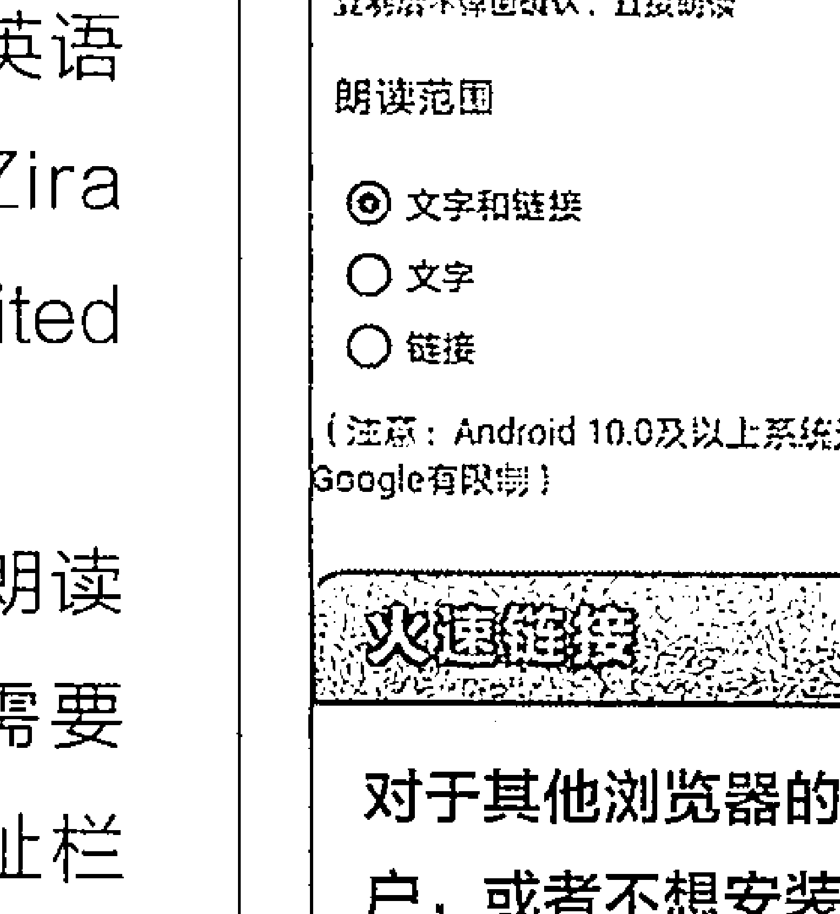

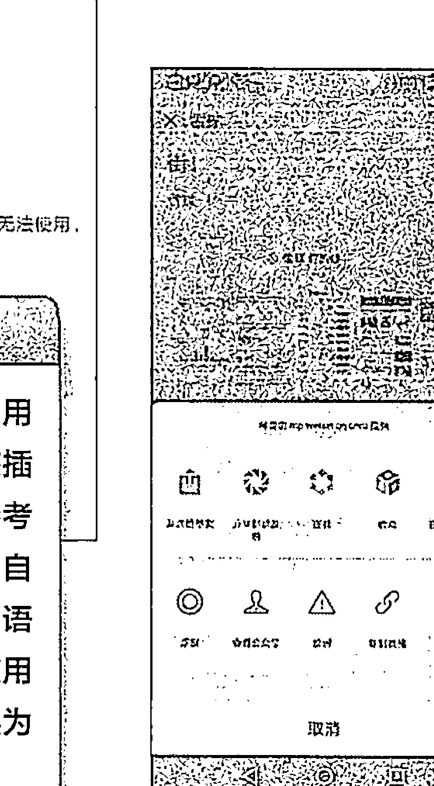

#### 轻松取得文件完全访问权限

**文|樱子**

一般来说，如果我们在访问某个文件夹或文件时，系统弹出“拒绝访问”或“您当前没有访问此文件夹的权限”的提示信息，这时需要通过文件夹或文件“属性”窗口的“安全”选项卡进行用户授权，才能获得对该资源的完全访问权限，但操作过程比较繁琐（图1）。若是使用TakeOwnershipPro软件来操作，则不需要进行繁琐的设置，一键便可获得文件夹或文件的完全访问权限。

##### 1. 在软件窗口内取得所有权

首先启动TakeOwnershipPro程序，单击Add（添加）按钮添加要设置权限的文件夹或文件；也可以从Windows资源管理器中找到要处理的文件夹或文件，然后将其拖动到此程序窗口中（图2）。

> 通过手动设置取得文件夹或文件完全访问权限的具体方法，可参见本刊2019年第10期文章《全面修复文件夹无权访问》的介绍。

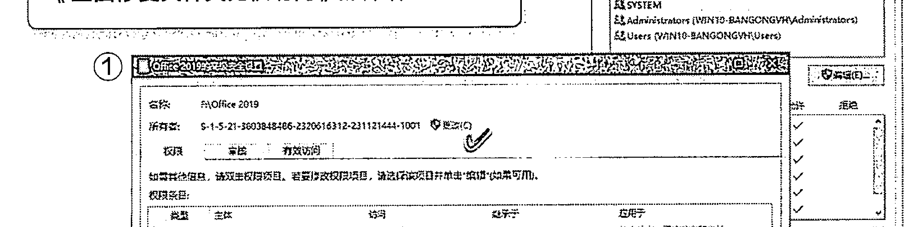

最后，单击Take Ownership（取得所有权）按钮，即可取得文件夹或文件的完全访问权限。

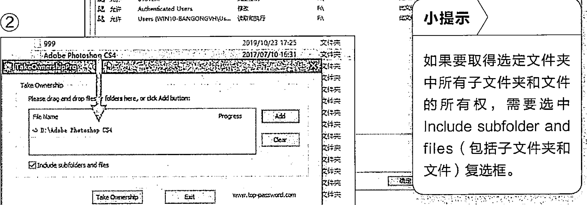

> 小提示
如果要取得选定文件夹中所有子文件夹和文件的所有权，需要选中Include subfolder and files（包括子文件夹和文件）复选框。

##### 2. 用右键菜单命令获取所有权

TakeOwnershipPro程序在安装过程中，还会自动将“TakeOwnershipPro”选项添加到Windows资源管理器的右键菜单中，这使文件授权的过程更简单。

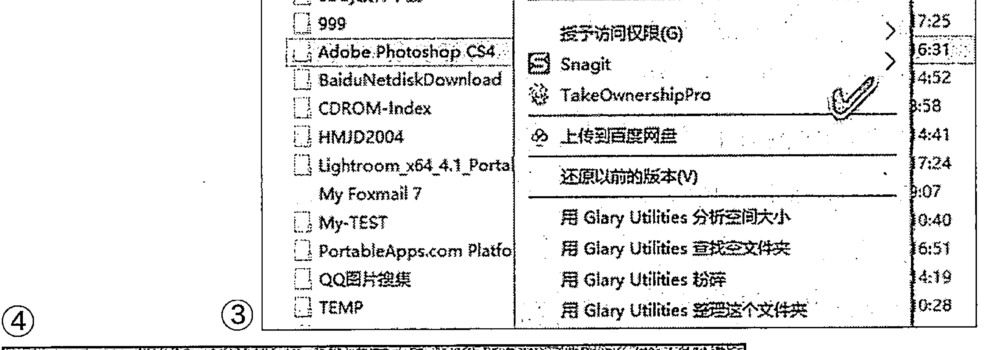

在Windows资源管理器中找到要取得所有权的文件夹或文件。在文件夹或文件上单击鼠标右键，然后从菜单中选择TakeOwnershipPro（图3）。如果出现“用户账户控制”对话框，单击“是”允许TakeOwnershipPro运行并进行更改，随后会出现一个已经授权的确认对话框。

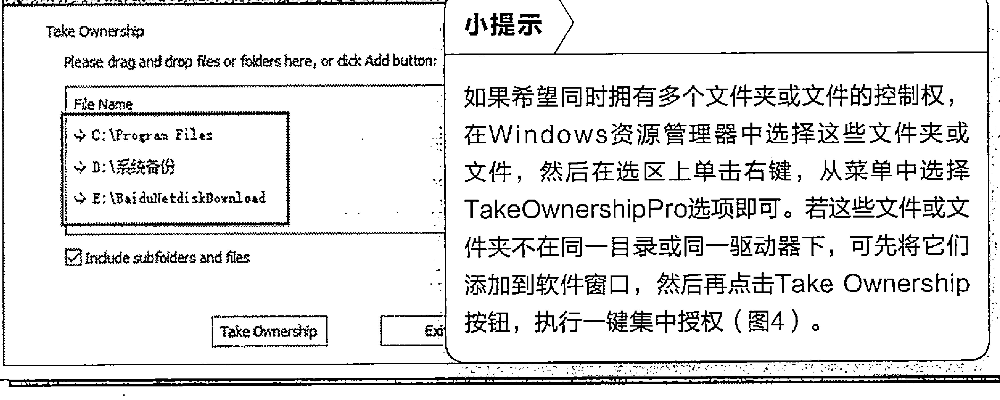

> 小提示
如果希望同时拥有多个文件夹或文件的控制权，在Windows资源管理器中选择这些文件夹或文件，然后在选区上单击右键，从菜单中选择TakeOwnershipPro选项即可。若这些文件或文件夹不在同一目录或同一驱动器下，可先将它们添加到软件窗口，然后再点击Take Ownership按钮，执行一键集中授权（图4）。

#### “软”指示灯 同时监控键盘硬盘网络

大多数键盘配有Num Lock、Scroll Lock和Caps Lock的LED指示灯，然而，一些老电脑可能没有配置，或指示灯所处的位置不便于查看；如果某个指示灯控制键出现问题，则更是无从控制。

除此之外，对于硬盘读写或网络的活动状态，键盘上一般没有专用的指示灯，笔记本机身虽然可能有指示灯，但对于台式机来说，从机箱前后查看就太不方便了。如果使用AddLEDs软件来创建屏幕虚拟指示灯，不但可以监控三个键盘指示灯，还可以对硬盘和网络的活动状态进行监控。

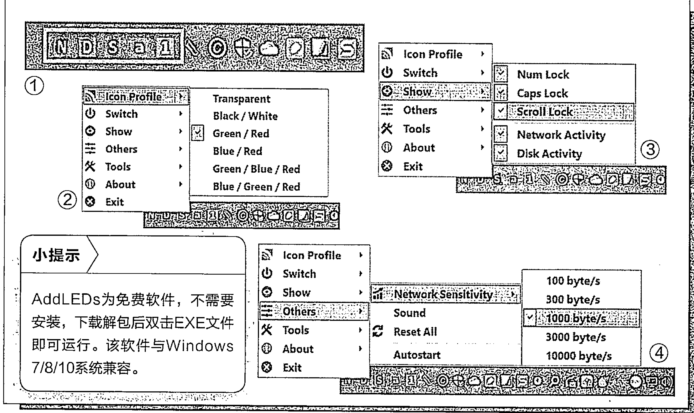

> 小提示
AddLEDs为免费软件，不需要安装，下载解包后双击EXE文件即可运行。该软件与Windows 7/8/10系统兼容。

##### 1. 不用低头 轻松查看五种状态指示

首先，启动AddLEDs软件。软件启动后，默认会在系统托盘上驻留5个小图标。其中N图标代表网络图标（Network），D图标代表硬盘（Disk），S图标代表Scroll Lock键，a图标代表Caps Lock键，I图标代表Num Lock键。这些图标会根据当前状态，默认分别以绿色或红色显示，绿色表示活动状态，红色表示非活动状态（图1）。

##### 2. 以鼠代键 鼠标点击切换键位锁定

现在，我们不仅可以通过这些图标来查看几个具体控制键位的状态，而且可以通过单击这些图标来改变这些控制键的状态。例如，通常我们是按下Caps Lock键来切换大写锁定状态的，若忽一日键盘的Caps Lock损坏，按下不起作用了，这时我们用AddLEDs软件提供的虚拟指示灯a，鼠标点击该指示灯图标，就可以控制大写锁定了。

##### 3. 个性设置 彰显托盘图标指示作用

托盘指示灯图标默认为红绿两色。其实，我们还可以根据需要对指示灯的颜色作自定义设置。右键点击托盘指示灯图标并选择Icon profile，从菜单中可选择以黑白、透明与否、蓝红或两种三色方案来显示指示灯图标（图2）。

指示灯的数量也可以根据需要来定制。如果我们不需要看到5个指示灯中的一个或几个，可通过系统托盘右键菜单Show，选择不需要看到的指示灯项目（图3）。

网络活动与否的指示，与网络传输速度的灵敏度设置有关。点击托盘图标右键菜单命令“Others→Network Sensitivity”，选择激活网络图标的网络速度。此外，如果要用声音来提醒键位开关切换的状态，可选择Sound菜单命令来实现。如果希望该软件开启系统后能自动运行，选中Autostart选项即可（图4）。

#### 多种方法 开启PDF缩略图预览

文|吕梁

如果在升级到Windows 10之前经常使用Windows 7，想必大家会知道Windows 7（仅32位）的Windows资源管理器支持PDF文件的缩略图预览。但不知因为什么原因，即便是目前最新版的Windows 10，也不支持在Windows文件资源管理器中预览PDF文件的缩略图。

虽然我们可以在Edge浏览器中查看PDF文件，并用Microsoft打印到PDF功能将任意文档保存为PDF文件，但它无法在文件资源管理器中显示PDF文件的缩略图预览（图1）。如果我们想在Windows 10中获得PDF文件的缩略图预览，可以通过PDF标准阅读器Acrobat Reader DC、第三方PDF阅读工具，或者安装Windows 10的PDF缩略图插件等多种途径来实现。

缩略图预览功能。与其他程序相比，Adobe Acrobat Reader DC可以生成高质量的预览缩略图。

首先，下载并在Windows 10中安装Acrobat Reader DC。安装后，必须要将Acrobat DC设置为默认的PDF阅读器（图2）。若在软件中错过设置提醒，可到Windows 10“设置”的默认关联设置页面中进行设置。接下来，启动Acrobat Reader DC，导航到“编辑→首选项→一般”，选中“在Windows资源管理器中启用PDF缩略图”选项，单击“确定”按钮保存更改。

##### 1. 用Acrobat Reader DC的选项开启

由于Adobe Acrobat Reader是标准的PDF文档阅读工具，其历史最为悠久，因此，许多用户可能仍习惯于使用Adobe Acrobat Reader软件阅读PDF文档，在Windows 10环境中也不例外。但许多用户可能并不注意，其实Acrobat Reader DC软件可用于在Windows 10文件资源管理器中为PDF文件启用

最后，打开包含PDF文件的文件夹查看PDF文件的缩略图预览（图3）。注意，请确保在文件资源管理器中设置以缩略图方式查看文件列表。

##### 2. 借助第三方PDF文件阅读器实现

此外，我们也可以使用免费版的Nitro Reader软件，在Windows 10文件资源管理器中为PDF文件生成预览缩略图。下载并安装Nitro Reader，使用Windows的“设置”应用程序（或控制面板），通过“设置→应用→默认应用”，将Nitro Reader设置为默认的PDF阅读器（图4）。之后，我们便同样可以在文件资源管理器中查看PDF文件的缩略图预览。

与上述Adobe Acrobat Reader DC软件相比，Nitro Reader不需要在软件中开启什么选项，安装之后便可以在文件资源管理器中预览PDF文件缩略图了（图5）。

##### 3. 安装文件资源管理器的PDF预览插件

除了借助于第三方PDF阅读软件来预览PDF文件缩略图，我们还可以安装Windows 10的PDF插件来实现此功能。PDF Preview for Windows 10便是一个这样的免费插件。

首先下载并安装最新版的PDF Preview for Windows 10插件。运行插件安装程序后，安装程序自动尝试将自身设置为默认的PDF阅读器。同上述两款软件一样，为了生成缩略图，必须设为PDF Preview默认的PDF关联程序，若忽略将无法发挥作用。插件安装成功之后，PDF缩略图预览功能便可以在Windows 10文件资源管理器和桌面上发挥作用了。

除了缩略图预览外，PDF Preview for Windows 10实用程序还允许在Windows 10的文件资源管理器中预览PDF文件。也就是说，当选择一个PDF文件，然后按下Alt+P组合热键，便可以在预览窗格中预览该文件的内容（图6）。

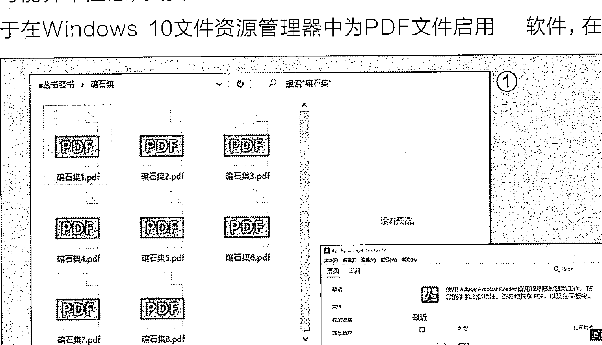

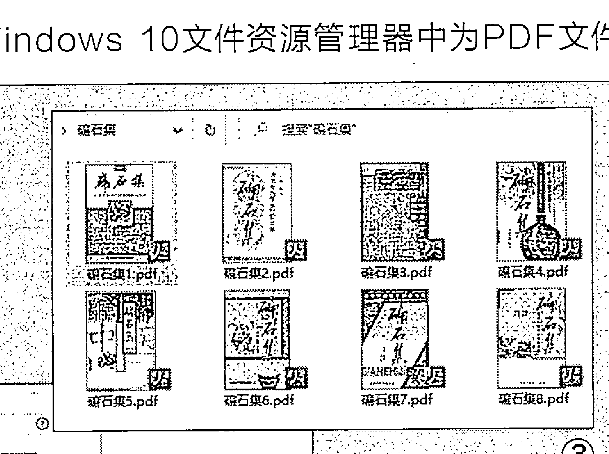

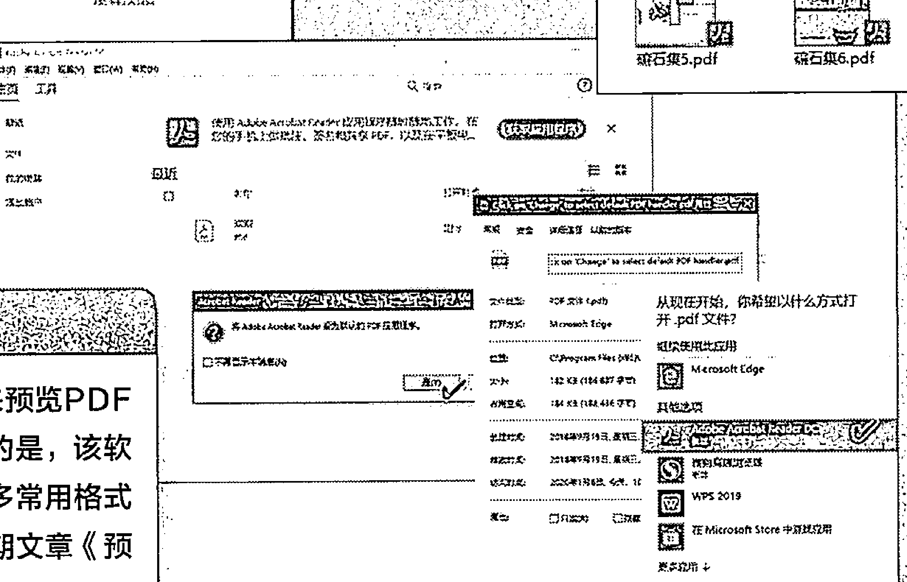

**火速连接**

我们还可以使用另一个软件Seer来预览PDF文件缩略图，而且更为独特和方便的是，该软件可以用空格键操控的方式预览许多常用格式文档。详情可参见本刊2017年第1期文章《预览让文件查询更加方便》。

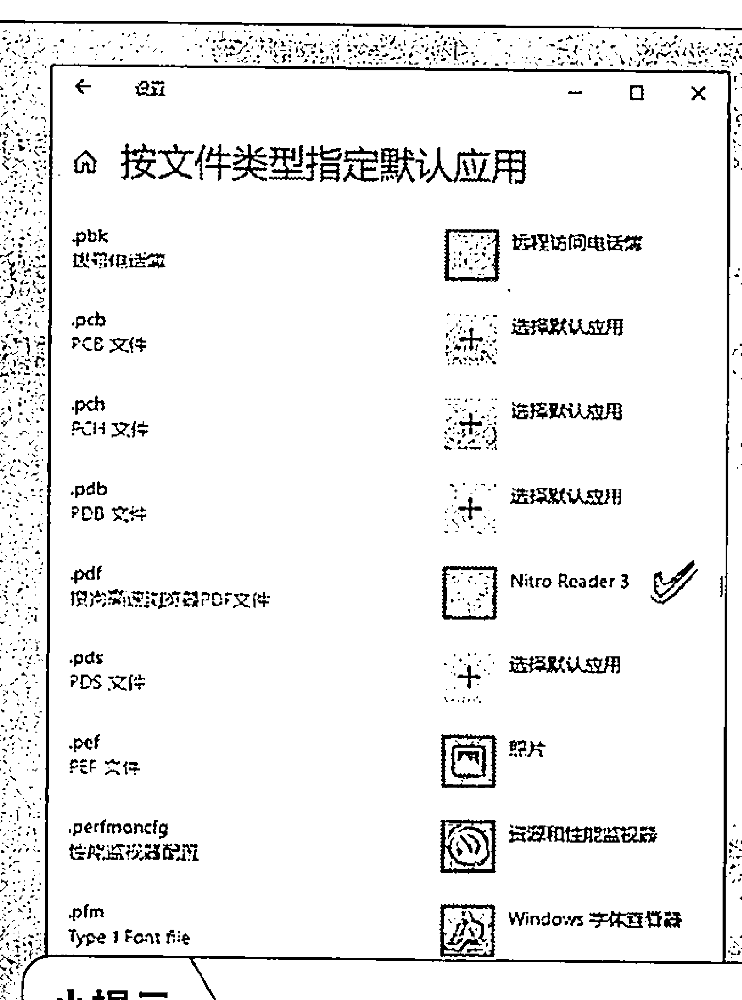


> ### 小提示

PDF Preview for Windows 10程序无法完成受密码保护的PDF文件预览。PDF Preview for Windows 10与32位和64位Windows系统都兼容。但是，它不支持Windows 7和Windows 8等早期版本的Windows。如果对缩略图的预览尚存在问题，可先清除和重置Windows 10中的缩略图缓存，然后再试。

> ### 火速链接

有关视频文件缩略图的预览，参见本刊2017年第1期文章《预览让文件查询更加方便》。有关Office文档缩略图的预览，参见本刊2019年第12期文章《开启Office文档缩略图预览》。

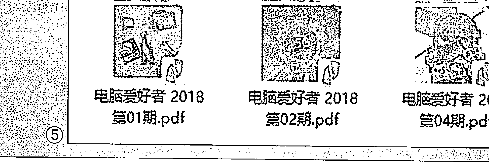

> ### 扩展阅读

Windows 10文件资源管理器默认只支持如图片之类的少部分文件内容的缩略图预览，多数文件类型无法在Windows资源管理器中以理想的缩略图方式进行预览，或者说一些文件的缩略图根本无法显示其内容预览。例如，除了上面提到的PDF文档外，还有视频文件、办公文档的缩略图等。此前，本刊曾介绍过开启视频文件或办公文档缩略图预览的软件或方法，读者朋友们若有需要，可以参考相关文章。

#### 免费DiskBoss 实现磁盘强力管理

文|童乐安

平时，我们一般是用Windows文件资源管理器来管理磁盘内容的，但是，这个内置的工具功能比较有限，因此我们有时不得不使用一些第三方工具，完成诸如文件与空间分析、重复文件搜索清理、文件比较与同步、磁盘检测、临时文件清理等任务。其实，仅仅使用一个免费的DiskBoss磁盘管理工具，即可包揽上述一切磁盘管理任务。

##### 1. 磁盘文件的分析与搜索

运行DiskBoss软件后，会自动扫描系统中所有磁盘分区，并在窗口中列出磁盘的分区类型、总空间、已用空间、剩余空间，以及目前是否已满等状态信息。从左侧导航栏的目录树上点击某个分支，我们便可以在右侧窗格中查看关于分区、文件夹的详细属性信息(图2)。
右键单击磁盘信息列表某项上的Tools图标，然后选择Search Files菜单项目，我们便可以设定搜索条件进行文件搜索(图3)。在搜索条件中有多种搜索选项可选，包括名称或文件扩展名、EXIF标记、文件创建日期等选项。在设定搜索条件时可以组合多个搜索参数，例如可以搜索去年创建的所有MP3文件。

##### 2. 重复文件的查找与清理

如果我们需要搜索某个分区中的重复文件并加以清理，首先在软件中选择分区并单击右键，然后在弹出的菜单中选择Search Duplicate Files命令，接下来定义搜索规则(Rules)或指定排除的文件夹，最后点击Start按钮即可开始搜索(图4)。搜索结束后，在列表中对重复文件进行清理即可。

##### 3. 相似文件的比较与同步

如果仅仅是需要对两个相似的文件夹进行比较，而不需要进行同步，也可以点击工具栏上的Compare按钮，启动文件夹比较窗口进行比较。

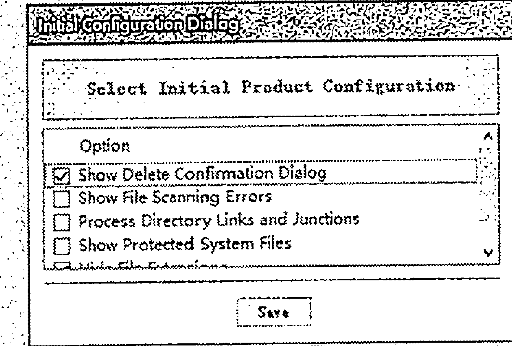

小提示
首次运行DiskBoss软件，会弹出一个初始配置对话框，从中我们可以分别选择是否显示删除确认对话框、文件扫描错误信息，是否处理链接和跳转、是否显示系统保护文件和文件扩展名等选项（图1）。

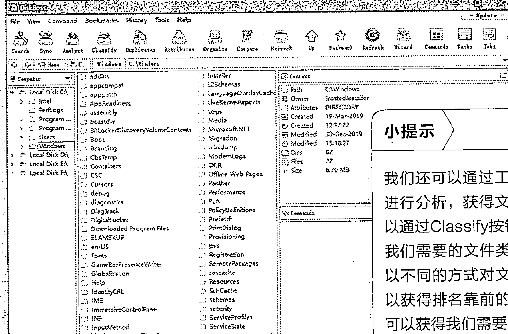

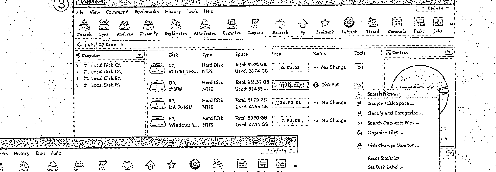

小提示
我们还可以通过工具栏上的Analyze按钮，对磁盘文件进行分析，获得文件夹或文件的占比情况。此外，还可以通过Classify按钮，对磁盘文件进行自动分类，筛选出我们需要的文件类型。这两个模块乍一看相似，但它们以不同的方式对文件进行统计和组织，通过前者我们可以获得排名靠前的一些大文件夹或文件，而通过后者则可以获得我们需要的视频、音频或其他类型的文件。

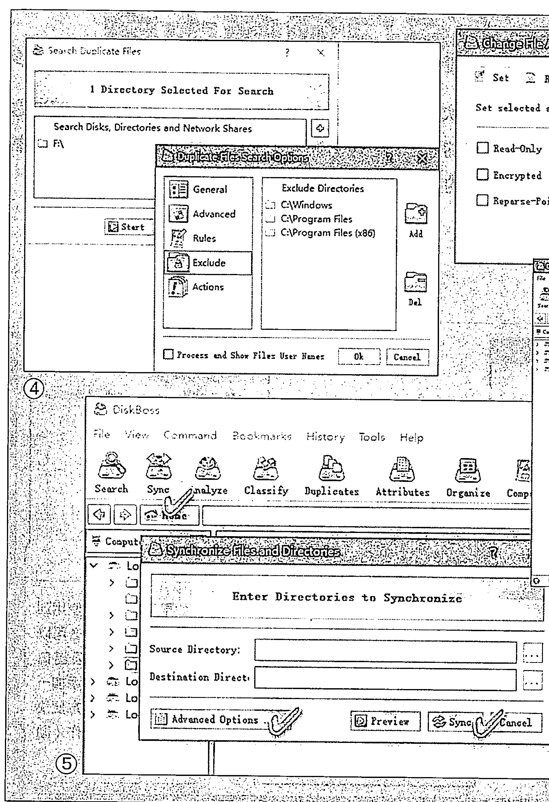

若是对两个文件夹进行同步，点击软件工具栏上的Sync按钮，开启同步设置窗口，然后设定源文件夹和目标文件夹的位置，点击Advance Options按钮设定同步的具体条件。最后，点击Sync按钮，即可执行两个文件夹的同步操作（图5）。

##### 4. 文件属性的批量复合修改

如果我们需要改变某个文件夹甚至整个分区中文件的属性，例如加上或去掉系统属性、隐藏属性、压缩属性等，我们再也不用麻烦地去文件夹选项窗口中设置了，只需在DiskBoss中右键单击分区、文件夹或选择的文件，然后在一个窗口中即可完成文件属性的多项设置操作。

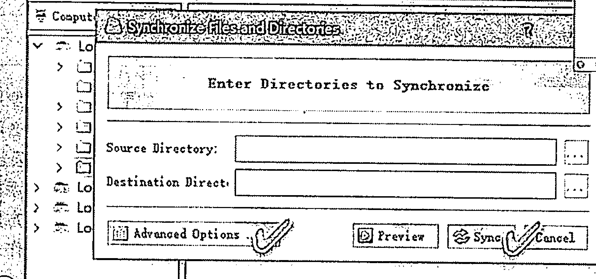

除了基本的选择外，我们还可以通过Rules、Exclude等选项卡，设定自定义规则或排除项目，通过Date选项卡更改文件的多项日期属性（图6）。

##### 5. 磁盘测速与磁盘参数查看

我们还可以在选择了分区之后，通过“Tools→Disk Benchmark”命令，启动磁盘基准测试程序，对磁盘进行速度测试。首先在列表中选择需要测试的读写测试项目，然后点击Start按钮开始测试过程（图7）。最后，软件会给出测试结果的读写数据。点击Save按钮还可以将结果作为报告保存起来。

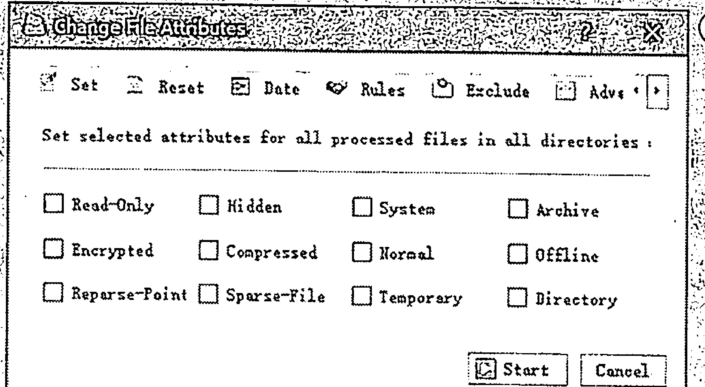

点击“Tools→SMART Viewer”命令，可查看磁盘的类型、固件版本、序列号以及具体的SMART参数等。

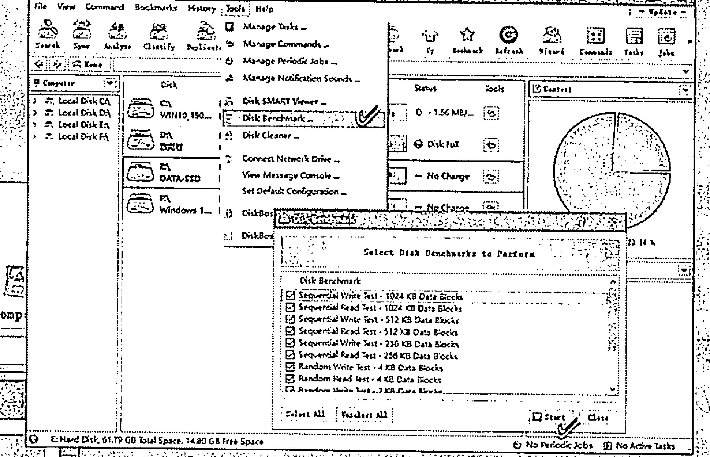

> 小提示
此前本刊在2019年第22期文章《分析磁盘文件 生成分析报告》中，还曾介绍过与DiskBoss出自同门的一个磁盘文件统计分析软件Disk Savvy，其功能相对简单，仅有文件分析统计功能。此外，针对不同需求的用户，DiskBoss也有其对应的专业版、旗舰版、服务器版等商业版本，功能更多更强大。

##### 6. 磁盘临时文件的一键清理

作为文件管理的一个重要环节，文件系统的清理是非常必要的。为此，我们只需先从Tools菜单下选择Disk Cleaner命令，启动Disk Cleaner磁盘清理工具，便可以完成一键清理系统临时文件的任务。

#### 巧用PotPlayer书签标记视频内容

文/剑侠

现在不少播放器都有断点续播的功能，当一个视频没有看完，下次再播放时它会从上次暂停的地方继续进行。不过这功能有一点小缺憾，如果我们隔很长时间再看，可能之前看过的内容已经有点模糊。好在我们利用PotPlayer的书签功能，不仅可以设置视频的暂停时间，还可以设定一些简单的内容，从而帮助我们回想起之前的内容。

##### 为视频添加书签信息

首先通过PotPlayer播放器打开视频并进行暂停，接着点击操作界面左上角的软件名称，在弹出的菜单中选择“播放→章节/书签”选项，然后点击子菜单中的“书签编辑器”命令。接下来开始进行视频的播放，当我们要暂停内容离开电脑的时候，点击书签编辑器中的“添加书签”按钮，在弹出的对话框里面就会自动添加一个书签的时间戳。接下来我们可以在“标题”输入框中设置对应的信息，点击“确定”按钮，一个对应的书签就创建完成了(图1)。

接下来我们勾选“播放”菜单中的“在进度条上显示书签/章节标记”选项，当我们再次打开该视频的时候，播放器的进度条上就可以看到书签的标注。点击任意一个标注后就可以马上跳转到书签对应的位置，这样我们就可以对该重点段落进行查看(图2)。另外，在书签编辑器里面双击某一个书签名称，也可以自动跳转到该书签标注的位置进行查看。除此以外，如果用户设置的书签比较多，还可以在书签管理器的搜索框中输入相应的关键词，按下回车后就可以进行搜索并跳转到该书签所在的位置了。

##### 更好地管理书签信息

虽然书签的创建非常简单，但是我们仍然需要对播放器默认的设置进行一些修改，从而更加符合自己的使用习惯。比如播放器在默认状态下创建书签时，都会对当前的视频内容进行截取，这样就会造成书签信息过于庞大。所以我们再打开书签编辑器时，在列表中选择视频的文件名称，点击下面的“全体编辑”按钮(图4)，在弹出的对话框中用鼠标选中所有的文字信息并复制，然后利用快捷键Ctrl+V进行覆盖粘贴，点击“确定”后就可以将保存的截图信息删除了(图5)。

另外播放器是将书签信息默认保存在配置文件PotPlayerMini.ini里面，但是这样的问题是，如果视频的存放目录发生了改变，那么这个书签就会失去效果。所以这里可以将子菜单中的“将书签保存在视频文件夹内”选项选中，播放器就会创建一个和视频文件名称相同的PDF文件，用于保存我们创建的所有书签信息。以后我们在移动视频文件的同时一起移动该PDF文件，就不会出现书签信息丢失的问题了。

#### 让Foobar2000也能显示歌词

文/阿立

Foobar2000是一款非常优秀的音频播放器，受到了不少网友的喜欢和追捧。但是由于这款播放器把主要的精力都放在了音质的优化上，所以其他的一些功能就显得很薄弱甚至没有，比如很多用户常用的歌词显示功能就没有。今天我们就通过一个播放器的插件，来弥补这个播放器的不足之处。

##### 安装歌词显示插件

我们首先从网上下载由网友开发的一款名为ESLyric的插件，接着运行Foobar2000播放器，点击“文件”菜单中的“参数选项”命令，在弹出的“参数选项”窗口中选择左侧列表的“组件”选项，接下来点击右侧窗口的“安装”按钮，在弹出的对话框中选择刚刚下载的插件压缩包（图1）。点击“打开”按钮后会弹出一个对话框，点击“确定”按钮后会重新启动播放器，这样就完成这款插件的安装操作了。

> 小提示：在github.com网站搜索ESLyric，还可以找到其他网友分享的服务器脚本文件。

现在通过浏览器打开 https://github.com/Robotxm/ESLyric-LyricsSource，接着点击列表中的“qqmusic_plus.js”项（图2），在弹出的页面上点击其中的“Raw”按钮，然后在出现的网页中点击鼠标右键，选择“另存为”命令将其保存为一个脚本文件。

##### 配置服务器的参数

其实之前也有不少的歌词显示插件存在，但是由于这些插件依托的歌词网站纷纷关闭，所以这些插件也就失去了存在的意义。而这款插件最大的优势在于，它可以借助于国内知名的音乐网站，从它们的服务器中获取相应的歌词。比较麻烦的是，这需要用户自己编写相应的脚本文件，好在对于我们普通用户来说，可以下载网友编写好的脚本文件。

接下来打开播放器的安装目录，进入到“user-components”下的“foo_uie_eslyric”文件夹，新建一个文件夹并更名为“Scripts”，然后将下载的脚本文件复制粘贴到其中。再一次打开Foobar2000的“参数选项”窗口，展开左侧列表的“工具”选项，再选择“ESLyric”中的“搜索”选项，然后点击右侧窗口的“更新”按钮。这样就可以让插件获取到脚本文件中的服务器信息，并且在“歌词来源”列表中看到增加了一个名为“QQ音乐”的选项（图3），勾选它以后点击“确定”按钮，就完成了该插件的安装配置操作。以后当我们再播放音乐时，该插件就可以自动从服务器中获取对应的歌词并进行显示了（图4）。

> 小提示：用户在安装插件的时候不需要对插件的压缩包进行解压，但是由于播放器只支持ZIP格式的压缩格式，因此如果用户下载的是其他格式的压缩包，那么首先需要对它进行解压操作，然后再自行压缩成ZIP格式的压缩包才能进行安装，否则安装过程中会出现错误。

#### 自己动手创建个性化字体

文/一帆

不少人可能已经发现，系统自带字体中好看的并不多，而网上各种好看的字体大部分又需要收费。其实借助一些工具软件，我们完全可以打造一款专属于自己的字体，不但无需花钱，而且还会有一种很酷的感觉。

##### FontForge中快速绘制字符

FontForge是一款非常不错的字体制作开源软件，它针对Windows、MacOS和Linux三大平台提供了相应的版本，笔者这里以Windows版为例。打开网页https://fontforge.org/en-US/，点击其中桔色的“Windows Install”按钮，然后根据提示下载安装。

接下来双击启动FontForge，首先弹出打开字体对话框(图1)，选中一个已有字体文件后点击“OK”即可进入软件主界面。如果没有现存的字体文件可用，那么就点击“New”按钮，这同样会进入软件主界面，只不过字符部分都是空白的，需要我们从头来全新造字(图2)。

汉字字库非常庞大，一般个人很难完成，所以我们可以试着从英文字库入手，这样至多绘制出256个字符，就可以形成一款完整的字体了(一些不常用的字形可以空缺)。我们任意点选一个字形名称，比如字母A，就可以在上方看到提示：拉丁字母A，ASCII代码65（16进制为0041）。

双击字母A方框，或者右击它后选择“New Outlines Windows”，将打开字形编辑窗口。窗口中间部分是绘图区域，顶上的水平线是最大上延线，设计的字形不要超出此线。下面的水平线是基线，即字母书写的基准线。最底下则是最大下延线，设计的字形也不能超出此线。左侧工具箱中则提供了多种绘图工具，这里我们选择钢笔工具，通过连续点击的方式画出字母A的轮廓外形，当最后的终点与起点重合时即完成一个闭合图形了(图3)。

字母A的中间有一横，所以需要再绘制一个小的三角形，为了精确绘制，我们可以从标尺上拖出多条参考线作为参考。将小三角形叠加到刚刚的轮廓图形中，然后再点击菜单命令“Element→Correct Direction”制作出镂空效果，一个完整的“A”的轮廓就完成了。最后在工具箱下方的图层面板上，右击当前图层(这里为Fore前景层)，勾选“Fill”，字母A便制作完成了(图4)。

##### 联合其他软件创建美术字体

美术字的英文单词为Art word，顾名思义就是通过美化、装饰等手段进行过艺术加工的文字，一般用在黑板报、墙报、横幅标语等上面，而将它们数字化之后，则可以大大拓展美术字的应用领域，比如海报、书刊、商品包装等等。

建一个长宽都为1000像素的文档，接着参考其他字体绘制出字母A，将此字母复制一份并改为不同的颜色（只是为了便于后面的操作），然后将它们进行错位放置（图5）。最后将红色的A删除一部分，得出初步效果（图6）。初稿设计完毕，关闭背景图层并保存为透明背景的PNG图像。现在回到FontForge的字形编辑器中，点击菜单命令“File→Import”，在打开的对话框中打开刚刚保存的PNG图像。现在我们以此图像为基础，通过FontForge提供的钢笔和曲线工具大致描出字形轮廓，然后再大胆做出一些变化，一个个性化的字形就完成了（图7）。用同样的方法，我们可以一一制作出其他的字母和符号。当所有设计工作完成后，即可点击菜单命令“File→Generate Fonts”，在打开的对话框中为新字体设置一个保存位置及名称，并点击格式按钮选择输入格式。这里笔者选择的是最常见的“TrueType”格式，生成的文件扩展名将是TTF（图8）。设置完毕，点击“Generate”按钮并按提示连续确认，就可以生成字体文件啦。

- ⑤ 将两个同样的字母错位排列
- ⑥ 处理后的艺术字A的初稿
- ⑦ 勾出初稿轮廓并进行大胆的变形操作
- ⑧ 字体生成对话框

#### 注册表搜索可以更加灵活

文/剑侠

由于Windows操作系统将很多重要信息都保存在注册表里面，因此很多时候我们需要对注册表的内容进行搜索和修改。不过Windows系统自带的注册表编辑器功能非常单一，而且搜索效率也很低，如果经常需要进行注册表操作的话，我们可以试试一些第三方注册表工具。

##### 借助RegCool让搜索更快

我们在系统注册表编辑器中设置一个关键词后，编辑器会对整个注册表中的所有关键词信息进行搜索，浪费了大量时间。而利用RegCool(https://kurtzimmermann.com)，则可以缩小搜索内容的范围，从而加快搜索速度。

我们以搜索火狐浏览器相关的项目为例，首先把“搜索值”、“搜索数据”两个选项的对钩去掉，只保留“搜索项”。接下来在搜索位置中点击“在此项中搜索”并点击后面的按钮，然后在弹出的对话框列表中选择要进行搜索的项目名称。通常软件程序的信息都保存在“HKEY_CURRENT_USER”项目中，所以我们这里就选择它并点击“确定”按钮退出。最后点击“查找”按钮，就可以开始快速地在注册表里面进行关键词的搜索了（图1）。

搜索到的结果会显示在主操作界面下方的列表中，我们在列表中选中一个项目后点击鼠标右键，再点击弹出菜单中的“跳转到”命令，编辑器就会自动跳转到对应的注册表项目中，然后我们就可以方便快捷地在右侧窗口进行新建、删除、修改、导出注册表内容等编辑操作了（图2）。

> 小提示：RegCool还支持通配符操作，假设我们想对注册表中火狐浏览器的配置进行修改，就在“搜索内容”输入框里面输入“Firefox”即可。但如果用户一时记不起完整的软件名称，则可以勾选“使用通配符搜索”项，然后在输入框中输入类似“Fir*”的字符即可进行搜索了。

##### 双管齐下：RegScanner灵活搜索

RegCool的搜索功能已经非常强大，但还是略有些不足，比如这款软件每次只能指定在一个项目中进行搜索。如果我们想在两个项目中同时搜索，不妨试试RegScanner(http://www.nirsoft.net)。

运行RegScanner后默认会自动弹出一个扫描选项的对话框，如果没有弹出的话，那么点击工具栏中的“新建扫描”按钮即可。接着在“查找字符框”输入框中输入要查找的关键词，接下来在“扫描以下根项”列表中选择要同时搜索的注册表项目，我们这里就同时选择了“HKEY_CURRENT_USER”和“HKEY_LOCAL_MACHINE”，最后点击“查找”按钮就可以开始进行内容的搜索了（图3）。

搜索到的内容会依次显示到RegScanner窗口列表中，从中选择一个自己要编辑的项目名称后，点击鼠标右键并选择菜单中的“在注册表中打开”命令（图4），这样该工具就会调用系统自带的注册表编辑器并自动跳转到该项目的位置，从而开始进行编辑操作了。

#### 自动去除及更换背景

文/剑侠

有时候我们需要对一些图片元素进行拼接，但是首先需要进行去背景的操作，然后再利用图像编辑软件和其他元素进行合成。这样的操作往往需要多款软件进行配合才能完成。其实我们利用最新的在线云服务，就可以直接在一个平台中完成所有的操作。

##### 上传图片自动去背景

我们首先打开Trace这项云服务的首页(https://www.stickermule.com/trace)，点击其中的“Sign in to get started”按钮，根据提示注册一个账号。当账号注册完成后点击“Upload a photo”按钮，在弹出的对话框中选择要进行去背景的图片。注意，该服务目前只支持JPEG和PNG这两种图片格式，而且上传文件的体积不能大于12MB。

图片成功上传到云端服务器后，我们可以在预览窗口的下方看到四个不同的标签。点击“Original”标签可以看到上传图片的原始模样，切换到“Transparent”标签可以看到去除背景后的效果(图1)。如果用户只需要去除背景后的效果图，那么点击网页右上角的“Download”按钮，接着在弹出的页面中点击“Download full image”按钮，就可以下载该图片了。

###### 火速链接

本刊2019年第3期《零门槛极速抠图技术探秘》一文中介绍的可以去除背景的网站Remove.bg，如今也增加了可替换背景的功能。不过网上其他一些类似网站，还只是提供去除背景的相关操作，要想替换背景，则需要下载后导入图像软件中再处理。

##### 替换背景可以很简单

如果用户想要在去除背景的基础上进一步进行编辑，那么可以点击下面的“Colors”标签，这样就可以为背景添加上需要的颜色。该云服务已经为用户提供了大量可选择的颜色，用户只需要点击一下某一个颜色的选项，就可以马上在预览图上显示出合成的效果。如果该云服务提供的颜色中没有自己喜欢的颜色，那么可以在前面的输入框中输入相应的颜色关键词，比如用户要想查询的颜色属于红色，那么就在输入框里输入“red”，然后就可以显示出一系列和红色相关的颜色供用户选择(图2)。当然最简单的方法还是直接输入颜色代码，这样可以更加准确。

如果用户不喜欢使用某个颜色，而是喜欢使用图片作为背景的话，那么可以选择“Images”标签，这样就可以看到该服务为用户提供的各种背景图片，从中选择某一个自己喜欢的图片并点击它，就可以马上下载该背景图片并和自己抠出来的主体元素进行合成，从而方便地完成图片的背景更换(图3)。如果对合成的效果非常满意的话，那么点击“Download”按钮下载就可以了。接下来点击网页右上角的“Choose new photo”按钮，再选择其他需要更换背景或者去除背景的图片进行操作即可。

#### 映像备份还原 不怕系统出问题

文/吕梁

有的用户用Windows 10内置的备份功能创建了系统备份映像，但当系统出现问题无法启动而又找不到安装盘时，就不知道该如何执行还原操作了。其实，如果觉得系统自带的备份工具不好用，还可以使用免费版的Macrium Reflect Free软件创建系统备份映像和恢复启动盘，轻松搞定系统备份和还原问题。

##### 1. 免费获取安装密钥并安装

首先下载Macrium Reflect Free安装文件并运行，之后会出现版本选择窗口，为了能够免费使用，我们选择Free版，点击Download下载该版本（图1）。Free版本不包含增量备份的功能。下载完毕后，会自动进入安装过程，安装时首先需要输入邮箱名并点击Get My Code获取免费安装激活码。从邮箱中收取激活码后，将其填写到激活码框中，点击Next按钮完成安装（图2）。

> ### 小提示
> 系统备份映像完成之后，在Macrium Reflect窗口中选择映像备份（切换到左窗格中的还原选项卡可查看备份副本），单击其他操作，然后单击有关验证映像的选项进行验证，即可确保系统映像完美无缺且没有问题。

##### 2. 磁盘分区映像备份与恢复

启动Macrium Reflect，在软件的主屏幕上，单击左窗格中的备份选项卡Backup，然后单击“Create an image of the partitions required to backup and restore Windows”选项，启动磁盘映像向导（图3）。
接下来，选择运行Windows 10的磁盘分区，选择保存备份映像的位置，取消对“Use the Image ID as the file name”（使用映像ID作为文件名）的选择，然后键入自定义的映像名称（图4）。
单击对话框左下角的“Advanced Options”（高级选项）链接，可设置映像备份密码和更改压缩级别。
然后单击Next按钮，在随后出现的窗口中定义保留规则，可以选择完整和差异两种备份形式。请注意，增量备份功能在免费版中不存在。最后，单击Finish按钮开始创建Windows 10系统的备份映像。
完成系统映像备份之后，如果需要还原系统，单击软件的Restore选项卡，然后按照屏幕向导进行操作即可。
最后要特别提醒的是，别忘了通过工具栏上的光盘按钮，创建一个Macrium Reflect的USB恢复盘，它可以帮助我们在电脑无法启动时启动系统，并恢复系统。

#### CD音轨提取与格式转换全用它

也许我们都收藏有一些珍贵的 CD 唱片，但现在用 CD 播放机的人越来越少了。那么，是否可以将珍贵的 CD 音轨资料转换成流行的 MP3 格式，装在手机或电脑中欣赏呢？其实，使用一款免费的 Free MP3 CD Ripper 软件，便可以轻松完成音轨的提取和格式转换任务。

#### 1. 将 CD 音轨转换为音频文件

Free MP3 CD Ripper 可以轻松地将音频 CD 曲目提取并转换为 MP3 和其他流行的音频格式，这些格式包括 MPEG、WAV、WMA、OGG、APE、FLAC 等。

![img/ddfffe754b553131cb415155fa72d690_187_0.png]

**小提示**
Free MP3 CD Ripper 不含任何插件，可不注册免费使用，适用于从 Windows XP 到 Windows 10 的各种系统版本。软件的 2.6 版本存在被攻击危险，推荐使用 2.8 Free 版。软件运行时提示输入注册码，若不注册使用，只需点击 Skip 按钮跳过，即可启动到主界面。

首先，将音频 CD 插入光驱中。随后可以在列表中看到 CD 所包含的曲目，如 Track1、Track2……选择要提取的歌曲（默认为全选）；指定输出的目标文件夹；选择输出歌曲的格式（默认为 MP3）。最后，单击工具栏上的 Rip 按钮，启动音频数据的提取（图 1）。

![img/ddfffe754b553131cb415155fa72d690_187_1.png]

**小提示**
提取前可使用内置 CD 播放器，预听 CD 音轨曲目。该软件还支持免费 CDDB 库查询，从 Tools 菜单可调用 CDDB 查询工具，可通过互联网获得 CD 专辑、艺术家、曲目和更多的 CD 信息。

提取结束后，单击工具栏上的 Folder 按钮，可以找到提取的文件。

在默认的提取转换基础上，我们还可以对音频选项和参数进行更细致的调整。点击工具栏上的 Options 按钮，选择某种音乐格式的标签，再选择输出的音乐文件编码类型和参数（图 2）。通过调整音频文件选项，可以获得高质量的音频输出或以更小的文件进行输出。此外，在选项窗口的 Output 选项卡下，选择 Normalize 复选框，并调整后面的百分比，可控制输出的音量（图 3）。

![img/ddfffe754b553131cb415155fa72d690_187_2.png]
![img/ddfffe754b553131cb415155fa72d690_187_3.png]

另外，我们还可以用音轨右键菜单命令，重命名每个曲目的标题，以便让歌曲的名称更匹配。

#### 2. 实现常用音乐格式间的互转

使用软件附带的音频转换器，我们可以将 Wav 文件转换为 MP3、APE 等 5 种常用格式；还可以将 MP3 转换为 WAV 或 WMA，WMA 转换为 MP3 或 WAV。只需通过 File 菜单选择相应的命令，选择文件进行转换即可（图 4）。参数格式与设置窗口→生成文件的位置，参见软件设置窗口 Output 选项卡。

#### 对移动硬盘实施密码保护

文|童乐安

Windows 10 内置的 Bitlocker 可用于对移动硬盘进行加密，但仅适用于专业版、企业版和教育版 Windows 系统。其实，有不少软件可直接用于移动硬盘的加密保护，其中最为妥帖的是利用移动硬盘厂商提供的加密保护软件。此外，我们还可以利用第三方通用加密保护工具。

#### 1. 使用移动硬盘自带的加密保护软件

移动存储厂商自带加密软件一般是自行研制或由第三方厂商专门为其 OEM 定制，作了使用上的限制，只针对本品牌产品可用，对本类产品的兼容性好，其他品牌产品一般无法使用。以西部数据移动硬盘为例，官方提供了 WD Security 密码保护软件（简称 WDS）。首先在电脑中安装 WDS 程序。将西部移动硬盘连接到电脑，运行 WDS 程序，设置密码并牢记。如果不想在每次连接时键入密码，选择“启用此计算机自动解锁功能”。之后，软件提示此驱动器已启用安全功能。

> **注意**
WDS 仅与西数移动设备兼容。其他品牌的移动硬盘请使用该品牌官网提供的安全保护软件，例如闪迪 USB 外置存储设备，可用该品牌提供的 SanDisk SecureAccess 软件来加密。此外，存储厂商大都会提供定制加密软件的服务，有些还可以在质保期内提供一些破解服务。

![img/ddfffe754b553131cb415155fa72d690_188_0.png]

> **注意**
该软件不仅可对移动存储设备进行加密，还可以对本机硬盘加密。点击第一个选项卡，便可选择加密本机硬盘。但需要注意，对本机硬盘加密后，如果系统崩溃或重装系统，加密的分区或文件夹会出现拒绝访问的情况。此外，本机硬盘加密后，在一些软件内部进行数据读写时可能遇到问题。因此，该功能需要谨慎使用。

![img/ddfffe754b553131cb415155fa72d690_188_1.png]
![img/ddfffe754b553131cb415155fa72d690_188_2.png]

加密之后，要访问受保护的移动硬盘时，双击并输入密码，单击“硬盘解锁”进行解锁（图 1）。随后会弹出驱动器已解锁的提示。从电脑上断开或弹出移动硬盘后，移动硬盘将自动锁定。

#### 2. 利用第三方通用加密工具进行加密

我们可以用 GiliSoft Full Disk Encryption 软件，对任何移动存储设备进行加密保护。软件启动后，如果需要对移动硬盘进行加密，只需点击 Removable Disks 选项卡，然后选择移动盘符，点击 Encrypt 按钮（图 2）。

之后，弹出密码设置对话框，设置两次密码后，点击 OK 按钮确认加密。完成加密之后，如果需要解密，点击 Decrypt 按钮并输入密码进行解密。若是要修改密码，需要先完成加密操作，然后点击 Password 按钮才能进行密码重设。

如果给不同的盘设置了不同的密码，觉得不容易记忆，那么，可以点击 Advanced Settings 按钮，在弹出的窗口中添加需要管理的密码。之后，使用软件时可通过这个列表自动输入密码，不再需要人工输入。当然，为了管理这些密码，还需要点击 Password 按钮设置一个管理密码，这样只需一个密码就可以管理多个密码了（图 3）。如果选择了 Not allowed to uninstall the software 选项，则可以防止软件被卸载，更能起到保护的作用。

#### 轻松实现 PDF 与其他格式互转

文/波哥

有时，我们需要在 PDF 与办公文档或电子书之间进行格式互转。此外，还会有将照片或截图制作成 PDF 电子书的需求。面对这些需求，我们不需要找各种不同的工具来解决，其实，只需一个 Icecream PDF Converter 软件就可以解决这些问题。

#### 1. PDF 与办公文档格式互转

如果希望将 Word 文档或 Excel 表格转换为 PDF，先在 PDF Converter 主界面中点击“到 PDF”按钮（图 1）。接下来，点击“添加文件”按钮或采用拖放法，将要转换的办公文档添加到软件窗口中，在“保存到文件夹”框中指定目标输出路径。最后，点击“转换”按钮（图 2）。

**小提示**
与 Icecream PDF Converter 软件出于同门的，还有一个名为 Icecream PDF Editor 的 PDF 编辑器软件，该软件在本刊 2019 年第 6 期文章《免费好用的 PDF 编辑器》中曾有介绍。

![img/ddfffe754b553131cb415155fa72d690_189_0.png]
![img/ddfffe754b553131cb415155fa72d690_189_1.png]

若是需要将现有的 PDF 文档转换为 Word 文档，点击“从 PDF”选项卡，或从主界面点击“从 PDF”按钮，然后添加 PDF 文档。确定输出路径后，点击“转换”按钮进行转换（图 3）。

![img/ddfffe754b553131cb415155fa72d690_189_2.png]

**小提示**
通过在软件设置窗口中设置“图像质量”选项（低级、中级、高级，默认为中级），可指定所涉文档图片的清晰度。

![img/ddfffe754b553131cb415155fa72d690_189_3.png]
![img/ddfffe754b553131cb415155fa72d690_189_4.png]

#### 2. PDF 与流行电子书格式互转

要将 EPUB 格式或 MOBI、FB2 等格式电子书转换为 PDF 格式，首先将这些图书拖动到“到 PDF”窗口列表中。接下来点击齿轮状设置按钮，设定图书的文件名、标题、发布者等信息；如果需要加密，还可以输入密码（图 4）。点击“布局设置”选项卡，调整页面参数。保存设置，最后点击“转换”按钮完成转换。

PDF 格式到电子书格式的转换，方法同上，在“从 PDF”窗口中完成。

#### 3. 将系列图片做成 PDF 电子书

我们还可以将拍摄的照片或截图做成 PDF 电子书，作为产品宣传册、说明书等使用。具体方法：“从 PDF”页面中添加图片并调整顺序，选择“所有合并成一个 PDF 文件”选项，设定好其他具体参数之后进行转换即可（图 5）。

#### “沙漏”出马 灵活指定倒计时
**文/波哥**

早期的 Windows 本身并没有提供倒计时程序。Windows 10 虽然提供了一个可以倒计时的时钟应用，但功能比较弱。如果我们还在使用低版本 Windows，或者对 Windows 10 的这个倒计时程序不满意，那么可以使用一个第三方软件 Hourglass（沙漏），完成更为复杂的可定制倒计时任务。

#### 1. 创建基本的计时任务

首先打开 Hourglass 程序，单击“Click to enter title”框输入计时标题，然后点击写着“5 minutes”的文字，输入从最短 1 分钟到任意所需分钟数的时间。默认格式分钟，例如“10 minutes”。单击“Start”按钮启动计时器（图 1）。之后，计时器动态显示用完设定时间所需要的时长。将鼠标移动到剩余时间之上，这时会看到有 Pause 和 Stop 按钮出现，通过点击这两个按钮，可暂停计时或停止计时（图 2）。计时器在时间用完后会发出几声蜂鸣。软件的提醒声音可以通过界面右键菜单 Sound 来选择和自定义，也可以选择为静音，只用弹窗来提醒。

Hourglass 支持的时间单位不光是分钟，还可以是秒、小时、天、周、月、年，例如“6 months”、“1 year”、“4 weeks”或“1 hour”。还支持短形式，例如 6mo、1y、4w、1h 等。

![img/ddfffe754b553131cb415155fa72d690_190_0.png]

**小提示**
Hourglass 需要 .NET Framework 4.0 组件才能运行。这个程序是开源的。

![img/ddfffe754b553131cb415155fa72d690_190_1.png]
![img/ddfffe754b553131cb415155fa72d690_190_2.png]

**小提示**
默认情况下，沙漏会阻止计算机进入睡眠状态，从而保证长计时任务的持续进行。如果计算机在计时器运行时进入睡眠状态，沙漏会在计时器过期时唤醒计算机，以便播放通知或声音。人为的关机会使计时任务失效。若需要开机自动计时，可以用类似“Hourglass.exe \"5 minutes\"”这样的命令方式创建计时任务的快捷方式，并加入自启动列表中。

![img/ddfffe754b553131cb415155fa72d690_190_3.png]

#### 2. 定制不一样的计时器

Hourglass 的显示界面支持丰富的自定义设置，可右键单击 Hourglass 界面窗口，通过右键菜单来完成。

如果希望以全屏幕显示计时器，选择 Full screen 选项。如果希望其他打开的程序窗口不要遮挡计时器，选择 Always on top 选项，以保证它始终处于最上端。如果不希望计时任务使正在干的活儿分心，可选择 Show in notification area 选项，将计时器最小化到系统托盘（图 3）。此外，还可以灵活设定 Hourglass 的界面风格皮肤，在右键菜单命令 Theme 下，选择明亮模式或黑暗模式，还可以在八种基本颜色之间选择。点击 Manage themes 项可组织和管理界面主题。

#### 3. 创建多个计时任务

利用 Hourglass，我们可以同时运行多个计时任务。只需右键单击界面并选择“New timer”，即可创建新的窗口（图 4）。

#### 文件和文件夹比较与同步只用 Meld

我们有时会遇到在不同文件或文件夹之间进行比较和同步的情况，这些均不能通过简单地查看和比较名称、日期等属性来抉择，更要看其内容有何不同。其实，只需一个 Meld 软件，就可以实现不同的文件或文件夹之间的比较和同步操作。

#### 1. 文件内容的比较和同步

要进行文件的比较，点击软件主界面的 File comparison 按钮，然后在文件载入对话框中，依次点击两个文件载入图标，添加要比较的文件（图 1）。如果要比较三个文件，需要先激活“3-way comparison”复选框，添加第三个要比较的文件。文件添加结束后，点击 Compare 按钮开始比较。

![img/ddfffe754b553131cb415155fa72d690_191_0.png]

随后，会开启文件比较窗口，若有不同，会在窗口侧边栏上以不同的颜色块进行标示。通过点击这些色块，可以快速切换到存在不同的文本段落。我们也可以通过点击工具栏上的上下箭头按钮来切换上一处或下一处的不同点（图 2）。

![img/ddfffe754b553131cb415155fa72d690_191_1.png]

存在差异的文本段落的同步处理，通过 Changes 菜单命令来完成。针对当前段落可用的命令，以激活并可选的形式存在，点击它们完成对存在不同的段落的移动或合并处理（图 3）。这些命令包括推（Push）、拉（Pull）、复制（Copy）、合并（Merge）等。

![img/ddfffe754b553131cb415155fa72d690_191_2.png]

#### 2. 文件夹的比较和同步

如果要比较两个文件夹，在主界面中点击 Directory Comparison 按钮后分别载入两个要比较的文件夹，点击 Compare 进行比较。之后，将显示两个文件列表，我们可以快速地找到某个文件夹中丢失的文件，执行同步操作（图 4）。

![img/ddfffe754b553131cb415155fa72d690_191_3.png]

#### 3. 多重比较同步与复杂设置

利用 Meld，我们可以新建多个比较和同步任务，所有任务会显示在它们自己的独立选项卡中，通过选项卡可以方便地切换和进行任务的比较。

对于大的比较和同步方案，如果一次不能完成，可以保存为方案文件，这样就可以从中断的地方继续进行。另外，通过软件的设置窗口，我们还可以创建文件筛选和文本筛选条件，这样可以用于优化比较过程。

#### TagLyst Next 智能“标签”分类文件
文|阿木

大家知道 Windows 系统主要以文件夹的形式管理文件，如果文件多了以后，管理起来就会非常不便。而 TagLyst Next（下载地址：http://www.taglyst.com/download-next，以下简称为 TN）引入了智能标签概念，可以很好地解决这类问题。

#### 智能给文件打标签

经常管理大量图片的朋友都知道，在 Windows 10 中我们可以给图片文件添加诸如“分级”、“标记”等属性，这样在后续查找中就可以根据这些属性快速进行分类（图 1）。

不过对于这些属性信息的添加，在 Windows 10 中都需要手动进行，而且支持的属性类别不多，自定义功能不强。TN 引入的智能标签与之类似，不过它的功能要比系统自身的属性设置强大得多。

TN 是以资料库的形式聚合整理文件的，这样对于需要添加标签的文件，我们只要将其添加到对应的资料库即可。比如笔者的稿件都是放置在“E:\稿件”目录，启动 TN 后点击左侧面板的“添加资料库”，按提示将上述目录添加到新资料库中（图 2）。

接下来我们就可以通过预设标签为文件加上各种标签，点击左侧的“标签→预设”，打开设置页面后，TN 会根据资料库中文件经常出现的短语给我们建议，大家只要选择合适的高频短语作为标签即可（图 3）。

笔者的稿件经常介绍 Windows 技巧，所以这里选择“Windows”作为标签。进入预设窗口后，在“智能匹配同义词”中输入“Windows 10，Windows 7，Windows XP，操作系统”，把这些同义词作为同一类智能标签（图 4）。

点击“确定”返回 TN 主窗口，选中上述新建的标签，勾选“智能匹配潜在标签”，接着在目录中选中“稿件”，TN 就会对该目录进行扫描，并将所有符合要求的文件（文件名里包含上述同义词的）全部智能地添加上“Windows”标签。TN 还支持对文件使用多个标签，在“全部”列表选中单个文件后，可以自行为其添加更多的标签（图 5）。

##### 小提示
为了充分用好标签功能，我们既可以手动为文件打上多个类型的标签（这样能很快为文件建立不同的自定义分组），也可以在给一个文件夹打标签的同时，选择为其中的子文件夹一次性全部打上相同的标签，省去一个个打标签的麻烦。

![img/ddfffe754b553131cb415155fa72d690_192_0.png]
![img/ddfffe754b553131cb415155fa72d690_192_1.png]
![img/ddfffe754b553131cb415155fa72d690_192_2.png]
![img/ddfffe754b553131cb415155fa72d690_192_3.png]

##### 小提示
TN 的智能标签并不会修改文件名和文件的内容，它只是在当前目录下自动生成“$$TGL.DATA”用来存储标签信息，因此如果要在其他电脑上也使用这些标签信息，我们还可以借助坚果云、百度网盘等网络硬盘同步这些信息文件。比如在 A 电脑上的同步目录 B 中已经使用 TN 生成标签信息文件，那么在 C 电脑上安装 TN 后就可以像上面介绍的那样对同步目录 D（文件要和目录 B 中的一致）进行高效管理了。

##### 智能匹配潜在标签
##### 通过标签筛选文章
##### 灵感流视图

![img/ddfffe754b553131cb415155fa72d690_193_0.png]

##### 多维度搜索文件
#### 用好标签高效管理文件

我们给文件进行标签化管理，最终目的其实就是更准更快地找到需要的文件，提高工作效率。因此完成上述操作后，现在就可以借助 TN 高效进行文件管理了。

比如为“稿件”目录添加“Excel”预设标签后，现在如果要在其中快速找到所有关于 Excel 技巧的稿件，那么只要在左侧窗格切换到“标签→Excel”，在右侧窗格即可看到所有符合要求的文章。而且 TN 支持对常见文档的预览，这样可以快速找到我们需要查找的文章（图 6）。

对于一些经常需要搜索的文档，我们还可以为其添加上星标（这样文件可以直接在“星标”类型下显示，类似资源管理器的收藏夹功能）。对于类似图片、音乐、视频等多媒体文件，在添加预设标签后，我们还可以将视图更改为“灵感流”，这样可以直接预览指定标签的图片，更方便我们查找这类文件（图 7）。

为文件添加多个标签后，在以后的查找中我们就可以进行更多维度的搜索。点击上方的筛选图标切换到“高级筛选”，即可根据标签、目录、类型、日期等多个维度进行筛选。比如现在需要在插画素材中查找最近三个月中风格是清新的图片文件，那么只要在左侧窗格依次点击“插画”、“清新”（需要先预设好标签）和日期下的“最近三个月”，或者直接输入标签关键词（每个关键词使用“，”隔开），即可快速找到符合要求的文件了（图 8）。

#### 浏览器二维码快速传递网址

文|剑侠

现在很多网页中都带有分享功能，利用该功能生成的二维码，我们可以很方便地将网页传递到手机里面。但不是所有的网页都提供分享功能，遇到这种情况而又很想分享该网页时，我们可以借助某些浏览器自带的二维码功能进行弥补。

> 小提示
Edge浏览器已经发布正式版，如果用户在自己当前的Edge中没有找到上述功能，那么需要将该浏览器的版本升级到80.0.361.0以后的版本，然后再按照刚才的步骤进行相应的设置。

#### 360安全浏览器二维码的创建

360安全浏览器自身就具有二维码分享功能。首先打开需要分享的网页链接，接着在地址栏的后面就可以看到二维码分享图标（图1），点击它以后在弹出的对话框里面会显示出一个二维码图片，接下来利用手机对这个二维码图片进行扫描，就可以完成网页地址的传递操作。

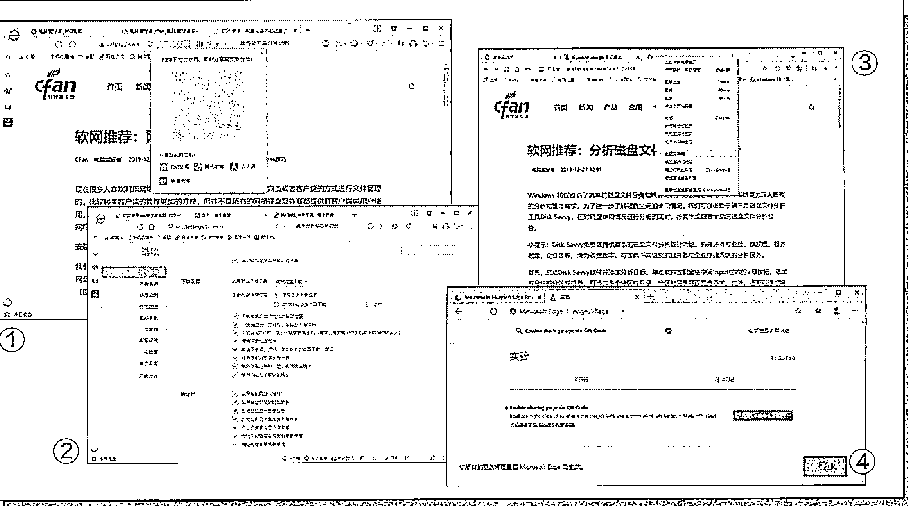

如果用户没有发现这个二维码图标，那么说明用户的配置有一些小的问题。首先点击360安全浏览器右上角的“打开菜单”按钮，在弹出的菜单中选择“设置”，接下来在弹出的设置页面中找到最下方的“在地址栏显示分享按钮”选项并选中它，重新启动浏览器以后，就可以看到这个二维码图标了（图2）。

#### 其他浏览器生成二维码

除360安全浏览器外，QQ浏览器也具有二维码分享功能，两者的操作方法差不多，这里不再重复。还有就是猎豹浏览器，它的二维码生成略有不同，它将分享功能放到了书签栏的末端，用户需要在此点击，也可以生成二维码。

另外有些浏览器的操作步骤比较不同，比如“百分浏览器”将分享功能添加到标签页的菜单里面，所以用户首先在地址栏中打开要分享的网页链接，接着在该网页的标签页上点击鼠标右键，选择菜单中的“生成二维码”命令，这样就可以在浏览器窗口中快速生成一个二维码图片（图3）。

#### 激活测试功能进行使用

由于微软已经正式发布在Chromium内核基础上开发的Edge浏览器，因此现在已经有一些用户开始将该浏览器作为主力浏览器。但是Edge浏览器的二维码分享功能还处于测试阶段，如果要想在该浏览器进行快速的分享操作，那么可以在浏览器的地址栏中输入“edge://flags/”并按下回车键，在弹出页面的搜索框里面输入“Enable sharing page via QR Code”关键词，找到以后在该选项列表中选择“Enabled”选项即可（图4）。

当我们按照要求重新打开浏览器以后，在地址栏的后面就可以看到一个名为“QR码”的图标。以后我们只需要在地址栏中打开要分享的网页链接，点击该图标后，从弹出的菜单里面选择“Generate QR Code for this page”命令，在弹出的对话框中就可以快速创建二维码图片进行分享操作了。

#### 微软爱写作 给英语作文打打分

文|平淡

听、说、读、写是英语学习的四门基本功课，其中前三项的成绩相对还好衡量（比如可以录音进行比较），而写作的好坏个人却很难判断。好在现在借助Microsoft Aim Writing（微软爱写作）在线服务，我们就可以给自己的英语作文打打分了，甚至家长可以用它给孩子辅导英语作文。

首先访问微软爱写作的应用网址（https://app.mtutor.engkoo.com/englishwriting/），打开网页后点击“开始写作”，使用微信扫码登录，按提示先选择自己需要什么级别的服务（支持小学到雅思）。因为笔者的英语还只是初级水平，所以这里选择“中考”。进入网站后就可以上传或者开始撰写作文了（图1）。

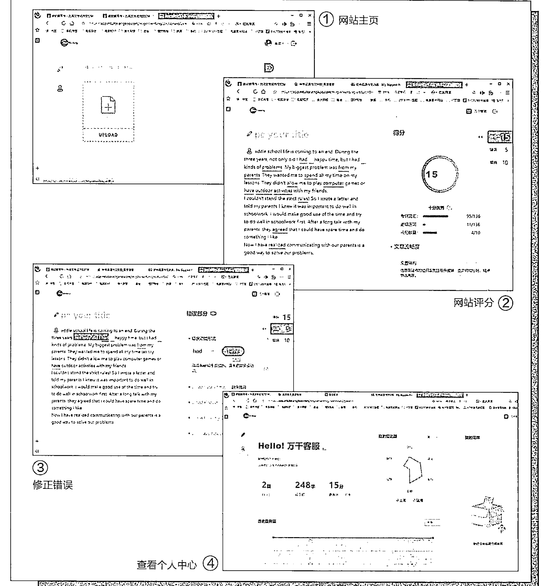

点击“New Article”（新项目），然后开始撰写英语作文，或者直接将孩子的作文粘贴进来（可以直接导入拍摄的作文图片，网站会自动进行扫描识别）。完成作文的撰写后点击下方的“检查”，网站即会对这篇文章进行评分，并且还会对文章常见的单词、语法错误等给出拼写建议。这里笔者选择的是中考作文评分，所以网站根据一般中考试卷满分为15分作为评判基准（图2）。

点击右侧的“错误”选项，展开后网站会根据文章的实际错误给出修改建议。比如在原文中“not only did I had”，这里“had”应该使用原形“have”，我们只要选择后点击正确的答案就可以了，其他错误根据网站的提示修改即可（图3）。

不过需要注意的是，这里一般只是建议改正常见的单词拼写、语法、语态这些典型错误，对于“替换”建议则一定要根据作文的实际情况进行选择，比如文章中“computer games”，网站建议替换为“electronic games”或者“interesting games”并不适用。

对于经常使用这个服务的朋友，网站还提供了一个个人主页。点击左侧面板的人形图标可以进入，这里统计了你的得分、雷达图、词库，以及历史趋势，大家可以根据这些统计结果随时了解自己（或孩子）的写作水平（图4）。

#### 社交媒体中更好地发布长文

文|阿立

在微博和微信朋友圈中，对文字性的内容信息都有字数限制，不少人想要畅所欲言时总是被其限制，面对这样的情况，我们可以利用在线记事本或者图片等方式进行解决。

##### 在线记事本发布

由知名的Linux系统Ubuntu发布的一个免费的在线记事本服务Paste Ubuntu (https://paste.ubuntu.com/)，可以方便我们进行文字信息的分享操作。

打开网页后，按提示在“Poster”输入框中设置发布者的名称信息，接着在“Syntax”列表里面，选择发布内容的样式格式，这里包括各种各样程序语言的样式。如果发布的是普通的文本信息，那么就选择“Plain text”选项即可。然后在“Expiration”列表里面，选择发布内容存在的时间，用户可以选择一天、一周、一个月或者一年。如果想要长期保存的话，那么就选择“None”选项。

接下来我们就可以在“Content”输入框里面，输入自己想要发布的文字信息。由于该输入框没有任何的文字限制，因此用户可以畅所欲言无所顾忌地输入（图1）。当所有的文字输入完成后点击下面的“Pastel”按钮，就会自动跳转到一个新的页面，在该页面中我们就可以看到文字的发布时间以及分享效果（图2）。现在将地址栏中的链接复制下来，再将其粘贴到社交媒体里面进行发布即可。

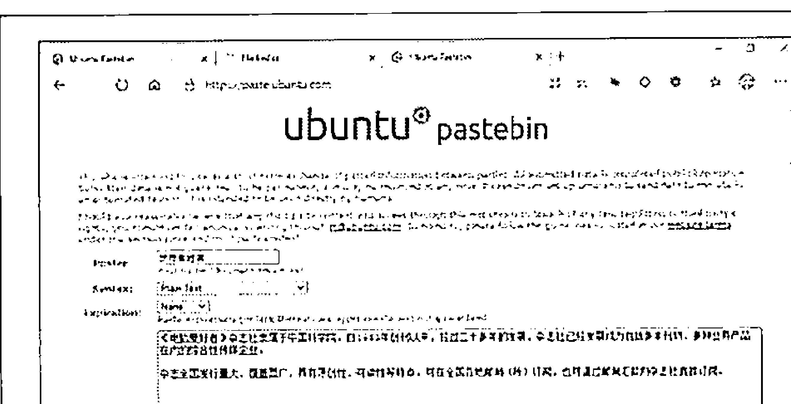

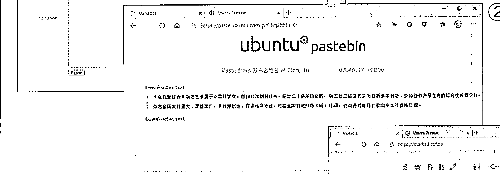

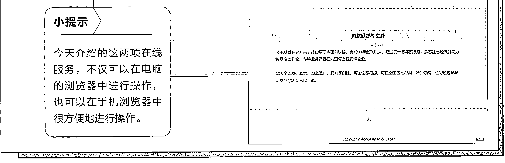

> 由于这项服务所在的服务器并不在国内而是在欧洲，因此它的发布时间比北京时间晚八个小时，如果用户对时间信息比较在意，暂时没有好的方法，只能在文字的末段手工添加发布的北京时间了。好在其时间晚于北京时间，倒也不会出现“神预言”之类的怪象。

> 今天介绍的这两项在线服务，不仅可以在电脑的浏览器中进行操作，也可以在手机浏览器中很方便地进行操作。

##### 在线转换为图片后发布

想要发布长文，还可以通过图片的方式来解决。在浏览器中打开“Marked.cc”这项服务 (https://marked.cc/)，在弹出的网页中点击“Launch”按钮，就可以开始进行发布内容的输入设置。

首先在网页的黄色输入框中输入发布内容的标题，接下来在白色的输入框中输入正文信息。当所有信息输入完成以后，我们可以通过工具栏中的命令，对文字进行对齐、加粗、文字颜色等相关设置。为了让发布的图片看上去更加的舒服，以及在手机屏幕更好地进行显示，我们还可以对文字的间距以及图片的宽度进行设置。

当所有的编辑完成以后，点击下面的“下载”按钮（图3），该服务就会将输入的文字信息转换成图片后进行下载发布。

#### 视频在线剪辑也简单

文|阿立

智能手机的普及使得视频拍摄变得简单，不过这类视频一般需要经过剪辑处理后才能发布。对一般用户来说专业软件太复杂，其实一些简单易用的在线视频剪辑工具，就可以满足普通用户的基本需求。

##### 上传要剪辑的视频文件

我们首先打开在线服务“Online Video Cutter”（https://online-video-cutter.com）（图1），由于该服务的页面是英文的，所以用户可以点击右下角的列表，将其切换到简体中文状态以方便操作。

接下来点击页面上方的“选择文件”按钮，在弹出的对话框中浏览本地电脑，并选择需要剪辑的视频文件上传。或者我们可以直接将视频文件拖放到此页面中，也可以完成上传。不过我们需要注意的是，该在线服务最大只支持500MB的视频，超过这一大小将无法完成上传操作。

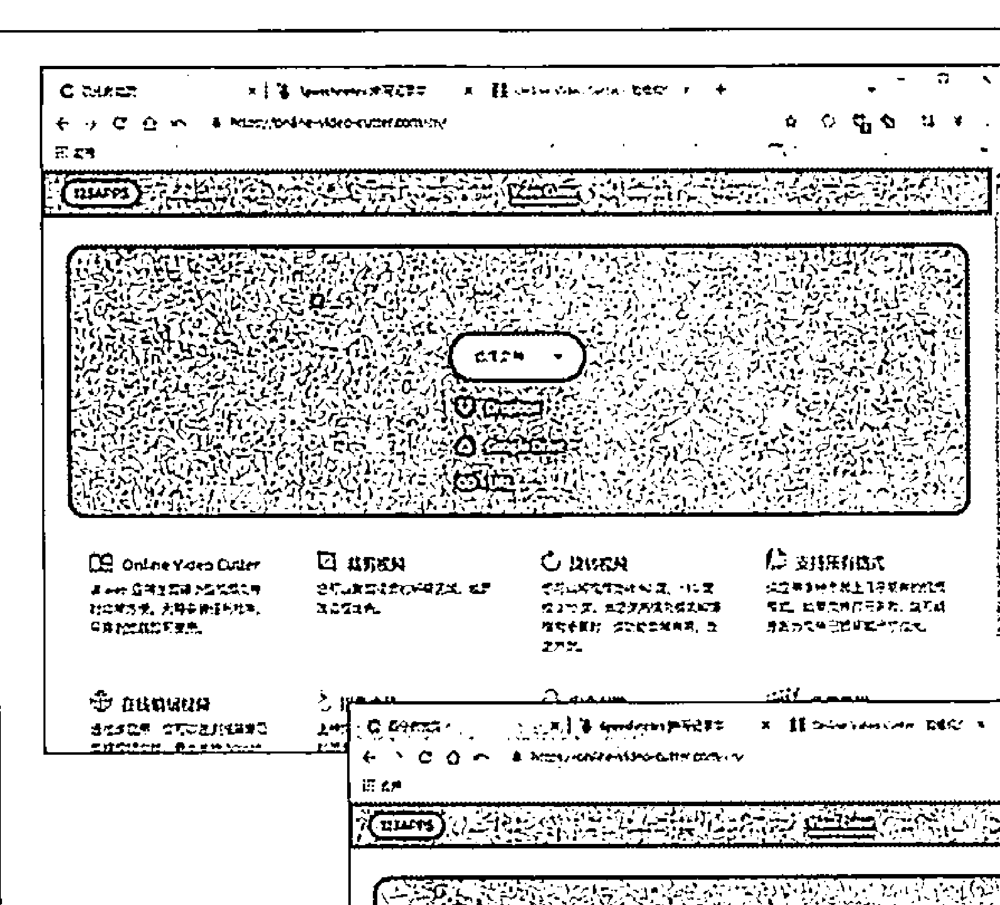

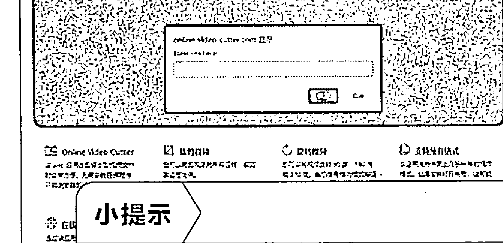

> **小提示**

除上述方法外，我们还可以点击“选择文件”按钮旁边的小三角，在弹出的菜单中选择网盘或“URL”的方式上传。不过因为该网站支持的网盘很不稳定，而其URL又需要直接的链接地址，所以这几种方式并不适合国内用户。当然，如果用户是将视频文件存储在家庭NAS云存储里面，则可以选择“URL”命令，接着在弹出的对话框中粘贴上视频文件的链接，点击“确定”就可以上传视频了（图2）。

##### 视频文件编辑设置

视频上传完成，网页中将显示该视频的预览画面，点击工具栏中的播放按钮即可预览。如果上传的是手机拍摄的视频，那么要注意它们通常是宽屏效果，如果用户想对视频的比例进行调整，首先点击工具栏中的“Corp”按钮，在弹出的菜单中选择某一常见的视频比例，比如1:1、4:3或16:9等，这时预览界面上将多出一个选择框，调整选择框即可选择裁剪的区域（图3）。

在时间轴前后有一个很粗的竖线，分别代表视频的开始时间和结束时间，通过鼠标对其进行调整，可以重置剪辑后的开始时间和结束时间，只有蓝色边框内的内容最后才会被保留。

如果用鼠标无法精准调整的话，那么也可以在下方的“Start”和“End”输入框中，分别设置相应的时间信息。接下来点击“Quality”选项后面的按钮，在弹出的菜单中选择导出视频的分辨率。如果用户要保留当前的分辨率，选择“Same”选项即可。

最后点击“保存”按钮，在线服务将开始对视频进行剪辑处理，完成后弹出一个对话框，点击其中的“下载”按钮，就可以把剪辑好的视频下载到本地了（图4）。

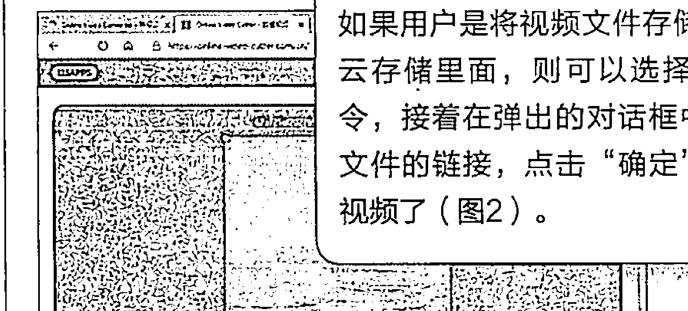

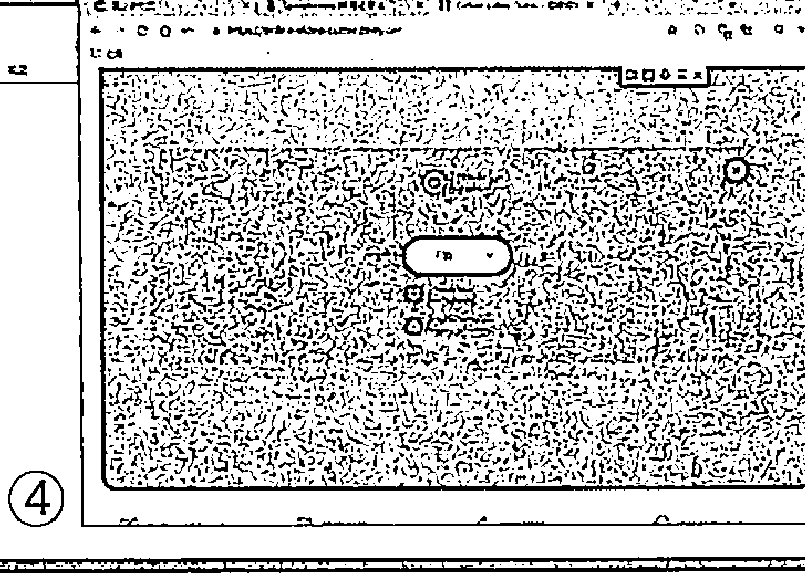

#### 送你上热门——文字、图片和视频都“抖”起来

文|发哥

随着抖音的火热，许多人对抖音风格的文字、图片和视频也喜欢起来，不过这些效果一般要借助抖音APP才能完成，并且最终作品上还会打上抖音水印。其实我们利用一些在线网站和软件，完全可以自己在电脑上制作出抖音风格的作品。

##### 文字抖起来——Nicetool

如果我们希望制作抖音风格的文字，可以试试Nicetool (http://www.nicetool.net/app/glitch.html) 。打开这一网站后，在“文本”选项中输入相应的文字，笔者输入的是“电脑爱好者”，按自己的需要设置好字体大小和抖动幅度即可进行预览 (图1)。

预览效果满意后就可以将其下载下来，Nicetool提供两种图片格式，PNG是静态的透明背景图片，GIF则是具有抖动效果的动态图片，右击相应的图片，选择“图片另存为”即可下载，并在其他文档中应用了 (图2)。

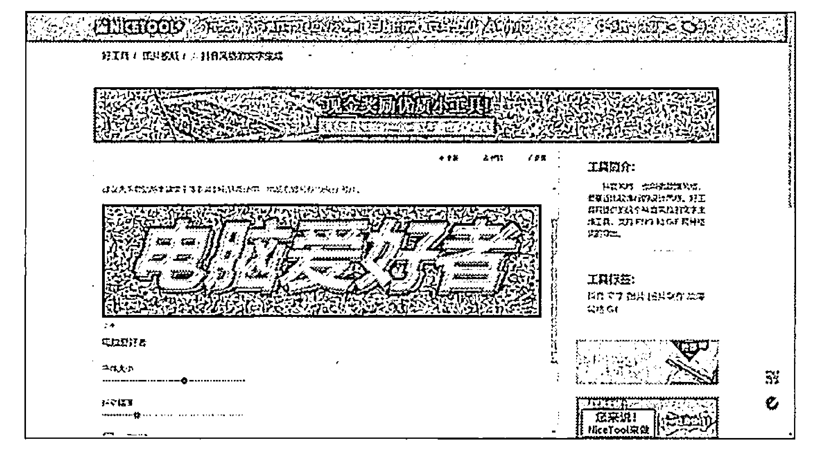


##### 图片抖起来——Photomosh

除了文字之外，图片也可以产生抖动效果，这可以借助Photomosh (https://photomosh.com/) 来实现。

首先准备好一张图片，笔者这里使用的是《电脑爱好者》某期杂志的封面图。接下来打开Photomosh网站，点击页面中的“Load file”，按提示将封面照片上传。接着在网页右侧展开相应的参数设置，比如展开表示抖动效果的“Jitter”选项，再勾选表示开启的“On”，然后拖动其下的“Amount”以设置抖动的幅度，以及调整“Speed”以设置抖动的速度，一边设置一边可以实时预览抖动的效果 (图3)。

Photomosh网站提供JPEG、GIF和WEBM等格式，这里我们以GIF为例，选中GIF选项后点击下方的“Recorder”，即可开始录制动态抖动效果了 (图4)。

预览效果满意后点击“Save”，将图片下载到本地就可以使用了 (图5)。

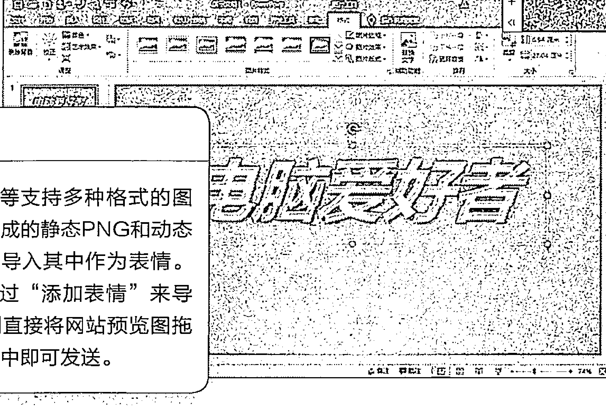


> 小提示
QQ、微信等支持多种格式的图片，上文生成的静态PNG和动态GIF都可以导入其中作为表情。QQ中可通过“添加表情”来导入，微信则直接将网站预览图拖到对话窗口中即可发送。

> 小提示
如果导出为WEBM视频格式，可以获得更为平滑的动态效果，但如果想把这一视频插入到PowerPoint等文档中，需要将其转换为MP4格式。我们可以通过视频播放软件进行转换，也可以试试https://zhuanhuan.supfree.net/ling.asp?e=webm进行在线转换。

##### 视频抖起来——喵影工厂

前面的文字和图片，其素材本身是静态的，而对于本身就是动态的视频来说，同样也可以为其添加抖音风格的效果。

首先我们下载安装一款名为“喵影工厂”的软件（https://www.shencut.com），启动后导入需要处理的视频，接着点击视频中央的“+”，将其添加到下方时间线的视频1标记上（图6）。

切换到“效果”选项，依次展开“所有效果→滤镜→抖动”，可以看到软件已内置了很多抖动效果，选中后点击右侧的播放按钮可以预览。本例中笔者的视频是人物跳舞，所以选择了“抖动1”效果。选择后将其拖到下方时间线上的视频2标记上（注意要将跳舞视频素材放在上方）。接着调整抖动滤镜的播放时间线，使得它的播放长度和视频1一致，然后就可以预览抖动效果了（图7）。

假如对预览效果不满意，还可以直接点击时间线上的抖动效果滤镜，在弹出的窗口中对抖动频率、Position属性（人物三维空间定位信息）进行微调（图8）。

最后我们点击“确认”返回主窗口，再点击菜单栏的“导出→导出到设备”，按提示选择自己使用的设备，即可将导出的视频直接发布到抖音上和好友共享了（图9）。

喵影工厂的视频编辑功能非常强大，比如还可以在跳舞的人物视频上右击，选择“绿幕抠像”，即可制作出换装效果等等，有兴趣的朋友不妨下载尝试。

#### 轻松管理字体 即用即消省资源

一般我们安装过的字体，即便以后再也不用了，它也会一直留在系统字体文件夹中，随系统启动，占用系统资源。今天笔者要给大家介绍的一款字体管理软件FontBase，则可以只在使用的时候激活字体，不用则随时让它从系统中自动“消失”。

> **小提示**

FontBase必须是运行状态时，被它激活的字体才会有效，一旦关闭软件则它激活的所有字体也将被停用，而当下次重新启动FontBase后这些字体又会随之自动重新激活。如果我们希望FontBase能随系统自动启动，则需要手工将其添加到系统的启动项中。

##### 即用即销快捷管理字体

FontBase是一款免费软件，支持Windows、Mac及Linux三大平台，我们可以从网站https://fontba.se/下载，安装启动后，就可以看到它简洁明了的主界面。主界面左侧窗格主要汇集的是管理功能，右侧则是字体预览区域，当预览到某款效果满意的字体时，点击它前面的小方框使其变绿，即表示该字体已经激活，“Active（激活）”文件夹中的数字自动增1，相应的“Inactive（未激活）”文件夹数字自动减1。此时打开Word，就可以看到我们刚刚激活的字体并加以应用了(图1)。

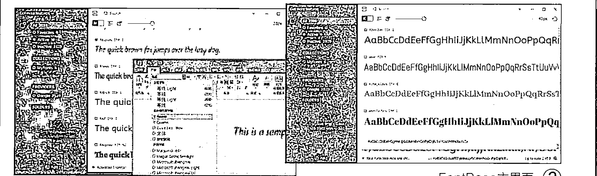

因为被激活的字体文件只存在于FontBase自身目录下，并不会复制到系统字体文件夹中，所以当我们在“Active”下面再次点击相应的字体，取消它前面方框中的绿色以停用它时，该字体将会退出内存。此时我们再在Word中设置字体，就会发现该字体已经消失了。

除了上述特色功能外，FontBase还有其他多项管理功能。比如对于经常使用到的字体，我们可以点击该字体预览右侧的心形图标，将其加入收藏夹中方便以后快速查找。另一方面我们也可以在左侧的“New collection”框中输入创建新的文件夹，并将自己常用的字体拖放到这个文件夹中，效果与收藏夹相似，方便我们查找。

当光标指向某一字体时，会显示出“View details”链接，点击它即可进入详细预览界面（或双击字体进入）。细心的朋友可能已经发现，每个字体名称的后面都有一个“TTF n”的标志，其中数字n表示该项是一个字体家族，其下还有n种字体。在详细预览界面，切换到“Glyphs”项，可以查看单个的字符。如果是包含多个字体的字体家族，则可以通过下拉框分别进行字符查看。

##### 各种形式的字体预览

预览功能是字体管理中的重要一项，可以帮助我们选用正确的字体。FontBase默认的预览样本内容为“The quick brown fox jumps over the lazy dog.”，我们可以点击下方的回车符图标，然后输入任意自定义的样本，比如“AaBbCcDdEeFfGgHhIiJj……”（图2）。

如果想预览字体在不同大小下的效果时，可以左右拖动顶端的滑钮，即可无极变化字体的大小。点击顶端左侧的黑白按钮，还可以从弹出的色彩框中为字体设置不同的颜色（可以输入颜色代码精确取色），从而预览彩色字体效果。

总之FontBase是一款非常好的字体管理器，并且它是免费的，其中还内置了谷歌大量开源免费字体，有需要的朋友不妨试试吧。

> **小提示**

被FontBase激活的字体可以应用于任意的系统、应用软件及办公软件中，不过FontBase并不会自动管理系统已有字体，如果希望通过FontBase对系统字体也加以管理，需要手动拖动系统字体文件夹加入到FontBase主界面中。不过笔者强烈建议大家不要这么做，这很容易造成混乱。我们让FontBase只管理第三方字体就好了。

#### 保存Windows 10锁屏壁纸

文|俞木发

Windows 10的锁屏壁纸质量非常高，很多人都相当喜欢，想要收藏下来。不过它们只显示在锁屏界面，我们无法直接保存这些壁纸图片，系统也没有内置相应的查看、下载工具，缓存目录隐藏又很深，很难直接获取。好在借助一些软件，我们就可以很方便地下载和调取这些美丽的壁纸了。

> “dynamic theme”还可以联机获取在线壁纸，只要点击“图1”的“查看历史”，在打开的窗口可以联机到Windows 10的锁屏壁纸服务器，手动下载所有在本机曾经显示过的壁纸图片。

##### 使用dynamic theme应用自动保存

打开Windows“应用商店”，搜索应用“dynamic theme”并安装。启动该应用后会打开设置窗口，在左侧窗格中点击“Windows聚焦每日壁纸”，然后开启右侧“自动保存”选项下的“将Windows聚焦每日壁纸自动保存至您选择的文件夹”，点击“浏览”，将保存位置设置为“库→图片→保存的图片”（图1）。采用同样的方法还可以将“Bing每日壁纸”、“锁屏界面图片”也设置为自动保存。

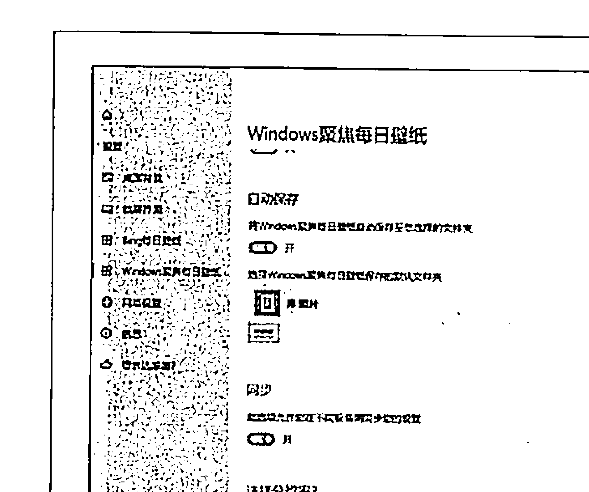

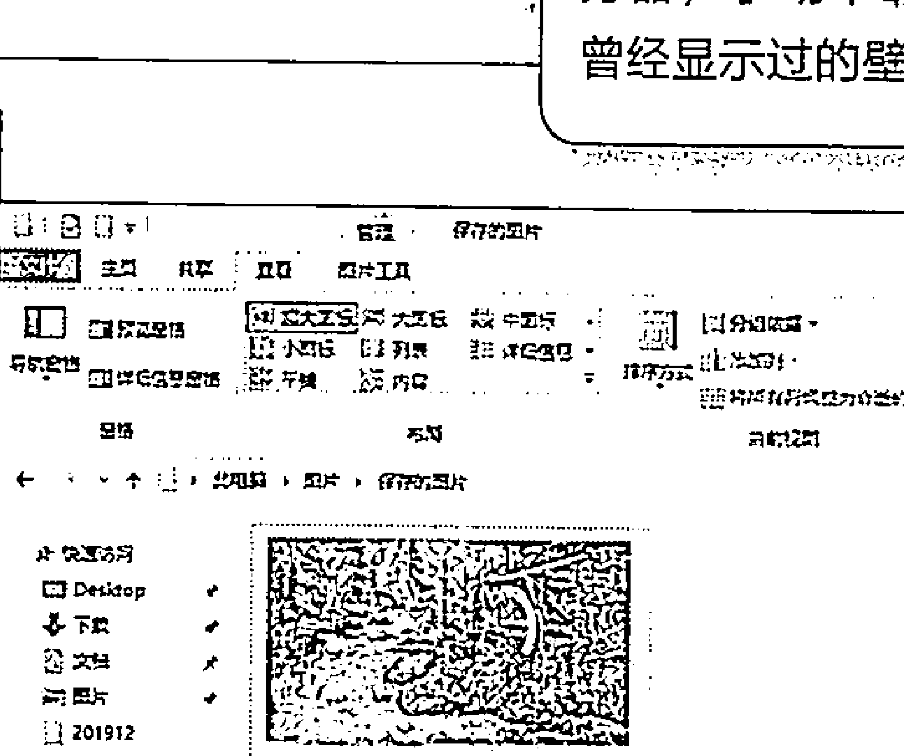

这样聚焦每日壁纸就会自动保存在上述目录下（也可以自定义保存位置），我们只要每天打开上述目录，在其中就可以看到保存的壁纸了（图2）。

##### 使用“win10spot”提取壁纸

如果你的Windows 10“应用商店”由于某种原因无法运行，此时可以借助“win10spot”（下载地址：https://dl.pconline.com.cn/download/2704663.html）进行提取。不过它是个人开发的软件，可能存在一定的风险，功能也远逊于dynamic theme。

> 还可以从本地缓存中手动提取壁纸，具体操作方法请参考http://www.cfan.com.cn/2015/1228/124399.shtml。

Windows 10聚焦每日壁纸实际上已经缓存在本地目录，使用“win10spot”就可以将这些缓存的壁纸提取出来。下载“win10spot”并运行，会于同一文件夹内自动生成“pics”文件夹（图3），存储这些壁纸。这里需要注意的是，如果你使用优化软件做过垃圾文件清理，那么旧图片会被自动删除，无法提取。

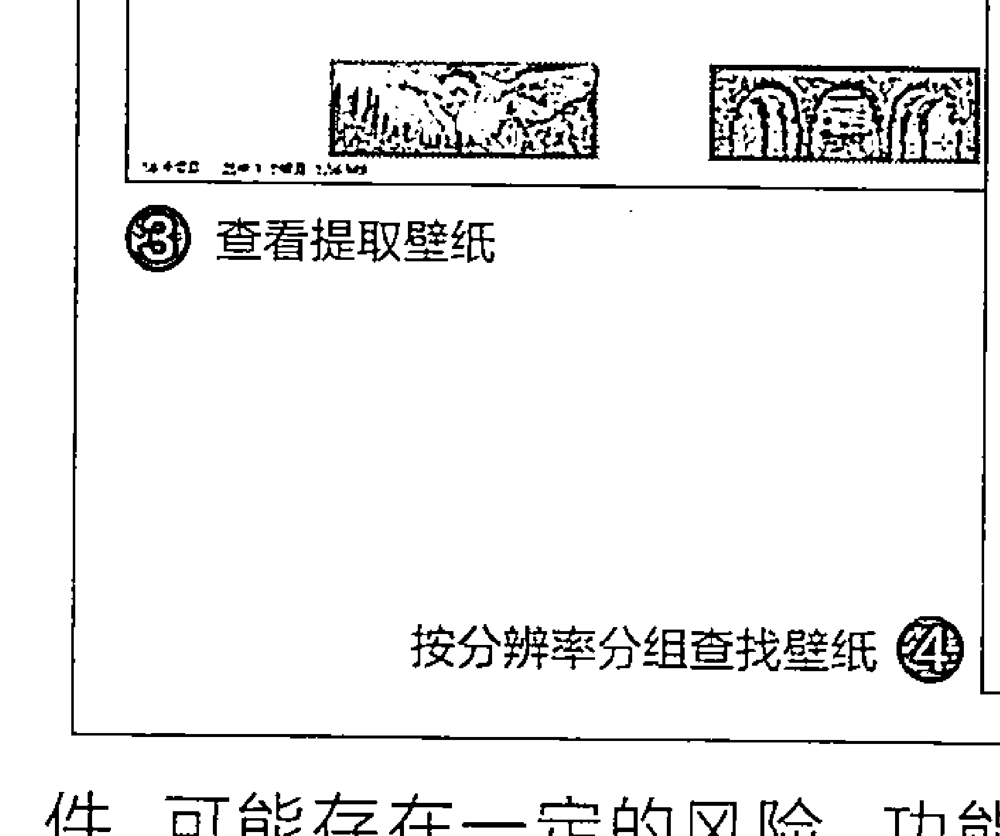

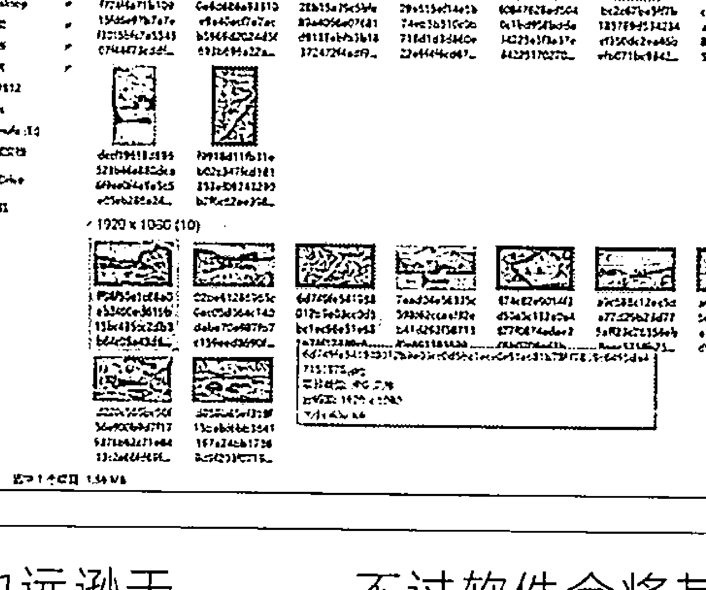

不过软件会将其他无关的图片也提取出来，大家可以根据Windows 10聚焦每日壁纸的特性进行筛选查找。比如笔者使用的是22英寸显示器，默认的壁纸大多是1920×1080的规格，在上述窗口点击菜单栏的“管理→图片工具→分组依据→分辨率”，查找其中1920×1080分辨率的图片即可（图4）。

#### 自己制作个人证件照

文|俞木发

生活中用到个人证件照的地方还是很多的，比如制作员工卡、出入证等。赶上恰巧手里没有而又不方便去专业的照相馆拍照时，我们其实完全可以利用一些软件把自己拍摄的照片制作成需要的证件照。

##### 高效制作—PC端的“证照之星”

如果需要制作的证件照数量比较多，可以使用“证照之星”（http://wm.makeding.com/iclk/?zoneid=28441）在电脑上快速完成。启动软件后导入需要制作的照片，点击“系统设置/证照规格设置”，软件内置很多常见的证件照类型（免费版仅支持制作标准一寸证件照，如要制作更多规格需付费升级到个人版/企业版）。比如很多网上报名都是使用一寸标准照，按提示选择后点击“照片裁切/手动裁切”，然后根据软件提示移动套框到合适的位置双击即可完成裁切（图1）。不同的证件照需要不同的背景颜色，比如蓝色常用于毕业证、工作证等证书上面。如果要将上图的红色背景更换为蓝色，点击“背景处理”，在打开的窗口中软件会自动选中背景区域（如果选取范围不够精确，可以手动使用“涂抹功能”和“清除功能”），最后点击“处理”并添加蓝色背景即可（图2）。另外，还可以进行诸如倾斜矫正、色彩优化等方面的处理，完成这些操作后保存图片即可。


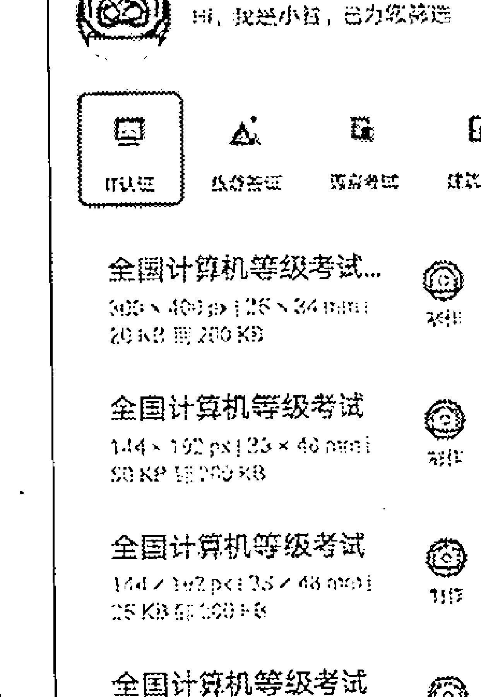


##### 便携制作—移动端的“智能证件照相机”

如果你的照片都是通过手机拍摄的，而又不方便导入到电脑上，那么还可以借助“智能证件照相机”在手机上直接制作。启动APP后在主页上按实际场景选择证件照类型，比如选择“IT认证/全国计算机等级考试”。APP会自动给出对应的相关参数，点击“制作”即可通过拍摄或者导入需要处理的照片进行制作（图3）。它同样支持更换背景，完成照片的预处理后，切换到“背景”选项，在下方的颜色范围中选择需要更换的底色即可。另外，还可以对照片进行美颜、换装等处理，最后点击“保存”即可使用了（图4）。最后，需要提醒大家注意的是，虽然上述证件照的制作方法很简单，但是一般只适用于简历、网上报名、体检表等这些要求相对宽松的场合。对于类似身份证、护照等正规证件照，还是应该严格按照官方需求，在有资质的照相馆或现场拍摄为好。

> 小提示
如果是自行拍摄，为了获得更好的效果，建议选择白色或者黑色的衣服拍照。在拍摄时APP有一个辅助框，根据模特的线条形状进行比对，就能开始拍摄。

#### 笔记本触摸板防误触二法

文|波哥

尽管Windows笔记本都带有触摸板，但由于不少电脑的触摸操作体验不佳，因此许多用户在使用笔记本电脑时会插入鼠标。如果笔记本经常使用外接鼠标来工作，临时闲置的触摸板可能会因误触误碰而让输入发生错误。这时，除了通过BIOS、设备管理器等完全禁用触摸板外，其实，更好的办法是通过软件来实现触摸板的临时停用或防误触设置。

##### 1. 临时拦截停用触摸板

首先，我们可以通过触摸板拦截器TouchPad Blocker软件临时开关触摸板。虽然有几个免费工具可以帮助我们在运行Windows的笔记本电脑上禁用触摸板，但这里我们还是强烈建议使用TouchPad Blocker软件，因为它不仅可以保证尽可能快速准确地输入而不受误触影响（通过在按键后将触摸板输入锁定一小段时间），而且还允许我们使用键盘快捷键启用或禁用触摸板。这样，不至于因无意中设置了禁用后，恰巧手头上没有鼠标而感到手足无措。

TouchPad Blocker启动后驻留于任务栏的系统托盘区域，我们可以通过托盘图标快速访问所有功能和选项（图1）。双击托盘图标（或按下Alt键后单击，也可以右键单击图标后选择Settings选项），启动TouchPad Blocker配置窗口，然后在其中配置开关触摸板的快捷键（默认为Ctrl+F9）（图2）。此后便可用此快捷键开关触摸板。

与此同时，还可以设置存在按键动作或鼠标动作时，暂时冻结触摸板的延迟时间。这样，即便不下达禁用触摸板命令，也可以为防误触提供条件。

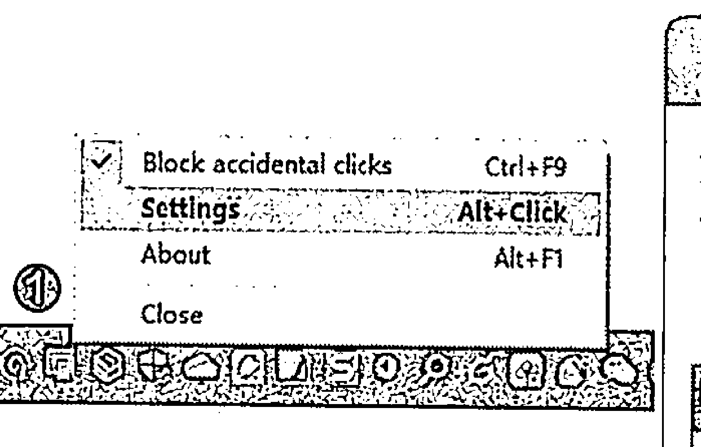

**火速连接**
如果希望在电脑接上鼠标后自动关闭触摸板，可参看本刊2020年第3期文章《鼠标连接时自动关闭触摸板》中介绍的方法。

**小提示**
取消对托盘右键菜单项Block accidental clicks的勾选，等同于再次按下Ctrl+F9解锁触摸板。请记住Ctrl+F9快捷开关，以免在启动触摸板锁定之后，因鼠标不在身边而一时不知该如何解锁。

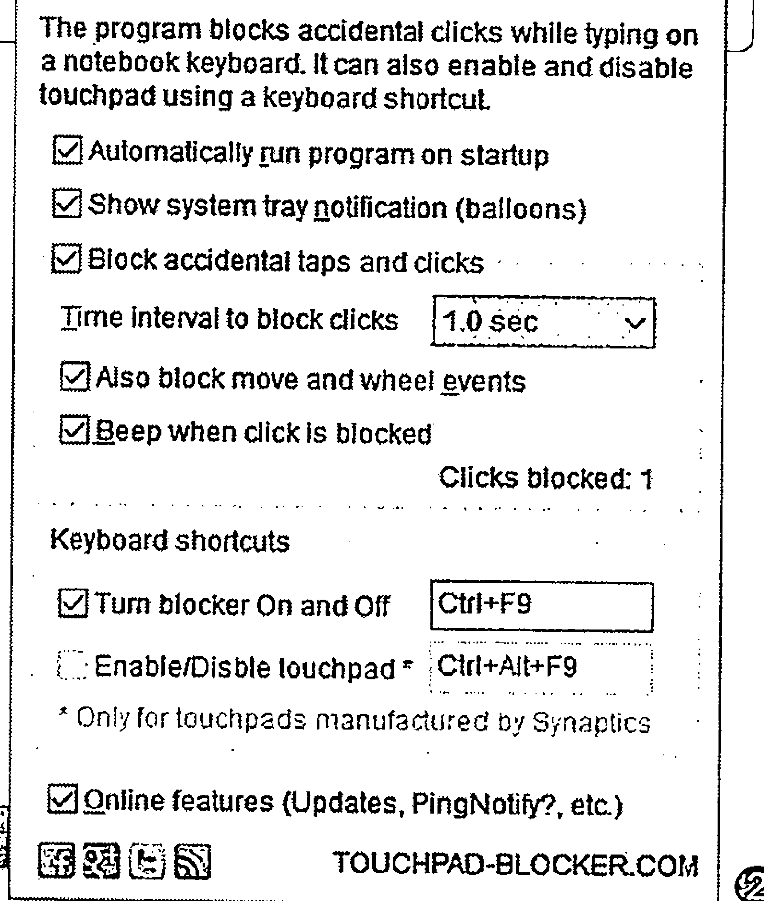

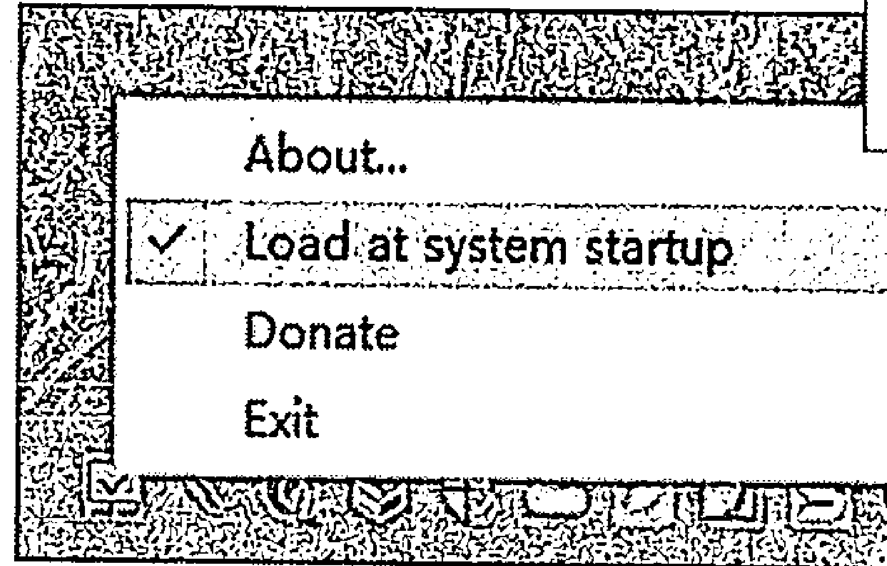

**小提示**
上述方法均适用于Windows 10、Windows 8/8.1和Windows 7。

##### 2. 防止意外误触误碰触摸板

我们也可以不寻求禁用触摸板，而只是防止在输入时手掌或手腕接触触摸板而意外更改鼠标光标位置。使用TouchFreeze软件便可实现这一想法。

与TouchPad Blocker不同，TouchFreeze不包含很多选项，该软件只有一个可操作的选项，在托盘图标的右键菜单中，选择Load at system startup项，让软件随着Windows的启动一同加载（图3）。TouchPad Blocker的运行方式为自动模式，软件运行后，它会在监测到用户按下一个键后将触摸板锁定很小的一段时间，以防误触误碰，用户不需要进行其他操作或干预。


#### 合订本特色 创建与管理系统还原点

文|童乐安

当系统遇到问题一时不能修复时，为了在不重装系统的情况下继续正常使用系统，我们一般会利用提前建立的系统还原点进行系统恢复。但是，由于Windows自带的系统还原点创建和管理操作起来不太方便，因此，我们可以借助各种工具软件来快速创建和管理系统还原点。

##### 1. 快速创建和管理系统还原点

首先，我们可以使用一个名为Restore Point Creator的免费软件，创建和管理系统还原点。

软件启动后，会自动扫描系统当前存在的还原点，并在窗口中将其列出。如果需要创建一个新的系统还原点，只需先在窗口上端的文本框中输入还原点描述文字，然后点击Create System Checkpoint按钮进行创建（图1）。点击窗口下方的Refresh List of System Restore Points按钮，可刷新还原点列表。

如果在创建还原点时显示错误提示，或系统还原点创建功能没有开启，只需执行System Restore Point Utilities菜单下的Manually Fix System Restore命令，修复系统还原点创建错误。修复完成之后，软件会提示重新启动系统，重启后再执行创建操作（图2）。

创建还原点之后，对还原点的管理工作，可通过软件下方的4个按钮或还原点列表右键菜单命令来完成。如果要将系统还原到某个还原点，执行Restore to Selected Restore Point命令；若需要在安全模式下恢复还原点，执行Restore to Selected Restore Point in Safe Mode命令。当需要删除某些还原点时，选择这些还原点，然后执行Delete Selected Restore Point命令即可。注意，最后建立的一个还原点不支持被删除，列表会显示为灰色不可选状态（图3）。

##### 2. 真正的一键点击创建还原点

尽管上面介绍的软件在还原点创建方面已经足够简单，但还有更简单的还原点创建工具值得推介。Single Click Restore Point (SCRP)软件便可以实现真正的一键点击创建还原点。该程序没有用户界面，执行

> **小提示**
本文所用的工具软件均为免费软件，且与Windows 10、Windows 8/8.1和Windows 7操作系统兼容。

> **小提示**
如果希望在系统登录时自动创建还原点，只需在软件Program Option/Settings菜单下选择Create Restore Point at User Logon选项即可（图4）。

后，只需运行一次该程序，便会在当前目录下生成一个SCRPoint.exe可执行文件。以后需要创建还原点时，只需双击运行这个可执行文件即可，没有任何复杂的设置和确认操作（图5）。

如果觉得双击操作还不够方便，可以为该可执行文件创建一个桌面快捷方式。更进一步，还可以将该快捷方式添加到开始菜单，或固定到任务栏，甚至设置为随系统自动启动。这样一来，真正的一键创建还原点就实现了。

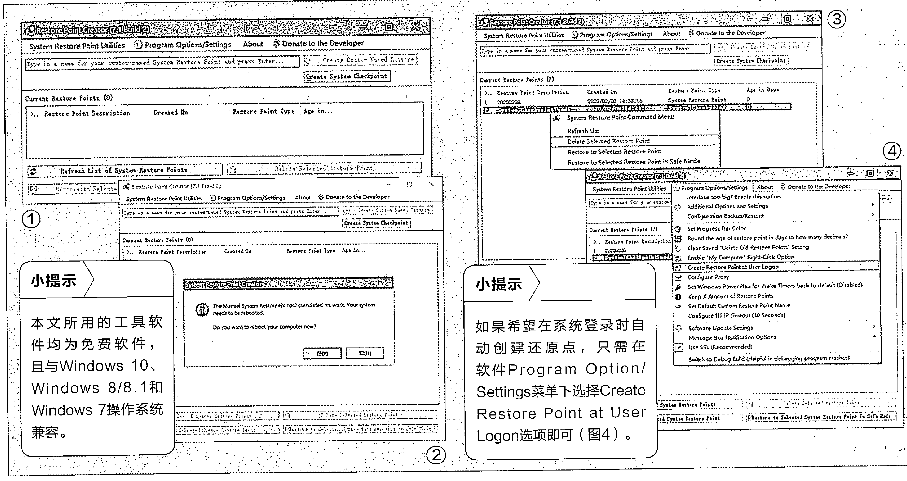

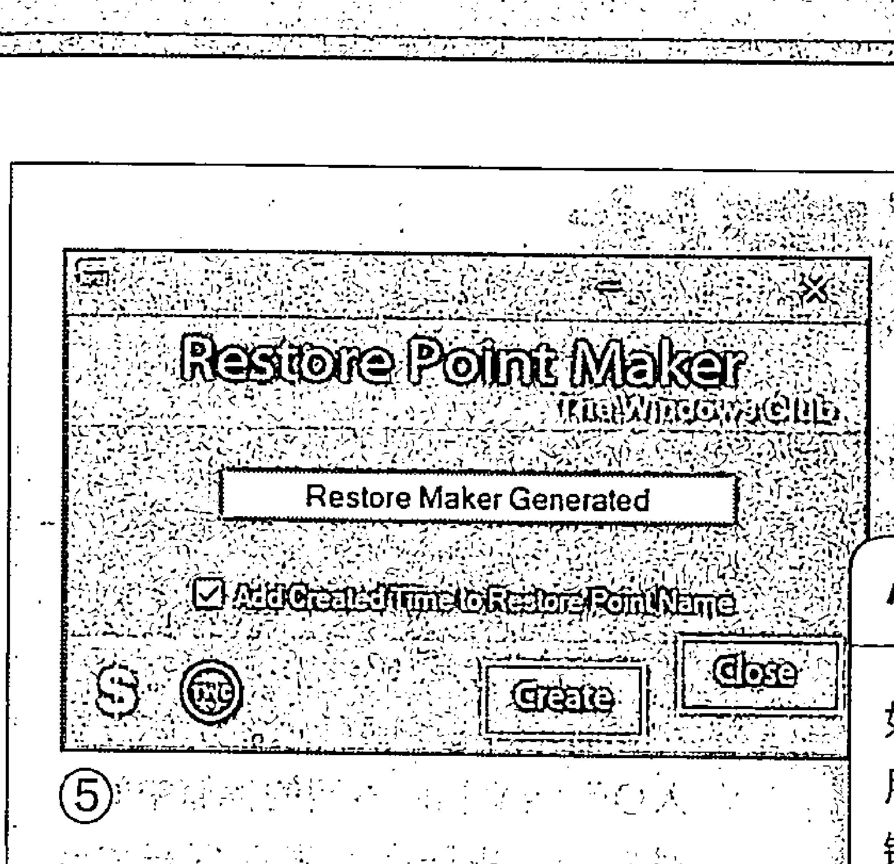

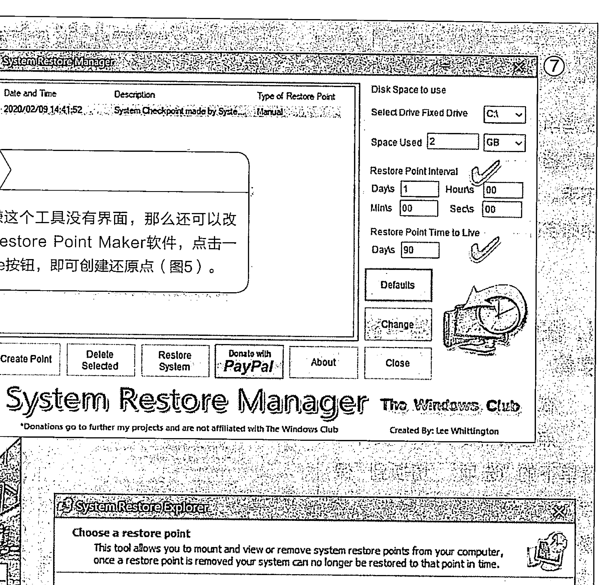

小提示：如果你嫌这个工具没有界面，那么还可以改用一个Restore Point Maker软件，点击一键Create按钮，即可创建还原点（图5）。

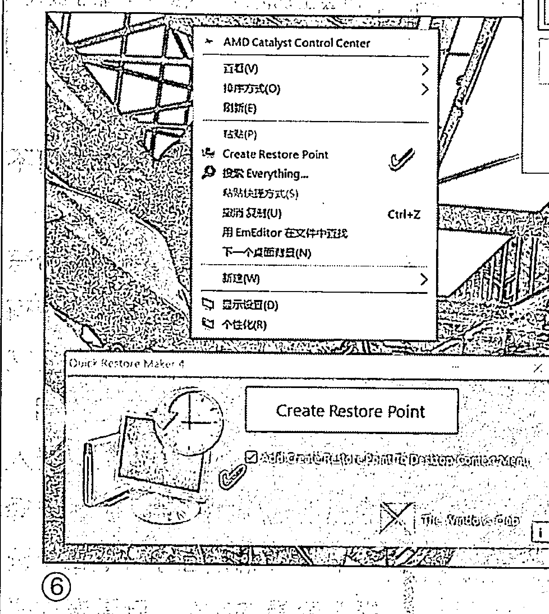

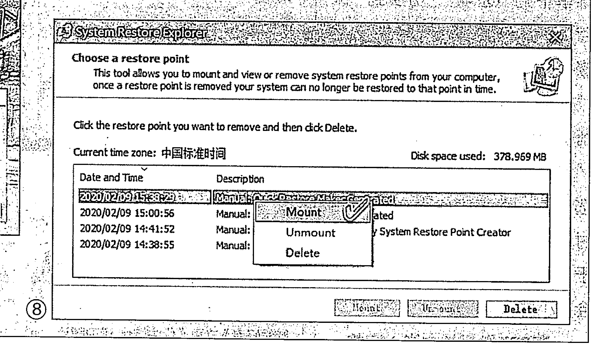

行之后只会在屏幕上看到Restore Point Created（已创建还原点）的消息。这时一个还原点便在后台创建好了。

建议将SCRP程序文件固定到任务栏，这样可以快速启动它。此外，还可为该程序指定键盘快捷方式，需要时按下快捷键即可创建一个还原点。

##### 3. 用桌面右键菜单创建还原点

我们还可以用桌面右键菜单命令的方式创建系统还原点。首先，下载并运行Quick Restore Maker 4.0软件（更低的版本不具有我们所需的功能），然后选中软件界面上唯一的复选框，之后便可以从桌面右键菜单中选择命令创建还原点（图6）。勾选之后，软件会安装常驻右键菜单命令，不需要再启动该软件即可使用。要取消此功能，需再次运行软件并取消复选。

##### 4. 按期自动创建或删除还原点

System Restore Manager软件也可以创建还原点并对创建的还原点进行管理。此外，利用软件的设置选项，可设定在指定的时间间隔自动创建还原点；还可以设定超过指定天数后自动删除还原点（图7）。

##### 5. 装载还原点并进行文件操作

上述软件具有还原点备份或恢复功能，但不具有装载并浏览还原点文件中内容的功能。如果我们需要这样的功能，可利用另一个软件System Restore Explorer来实现，该软件除了同样可以查看、删除还原点外，还可用Mount命令装载还原点文件，并在资源管理器中浏览和复制其中的文件（图8）。

#### 版面防闪失 用好文档内嵌字体

文|吕梁

文档中的字体处理不好，有时会引起如字体丢失或版面走形等问题。此外，若搞不清文档中使用的某字体的类型，在含有该字体的段落文字出现问题时，修改也无从下手。通过在文档中内嵌字体，以及字体提取后识别并修改的技术，可以保证版面中的字体始终合格。

> 小提示
嵌入的字体尽可能使用OpenType（.OTF）或TrueType（.TTF）字体。其中OpenType字体在嵌入Office文档时占用的存储空间相对较少。由于有时候在打开内嵌Postscript字体（.PFB或.PRM）时会出现问题，因此尽可能在嵌入字体时少用Postscript字体。

##### 1. 在Office文档中嵌入字体

###### 在Word文档中嵌入字体

点击Word 2019 “文件”菜单下的“选项”，切换到“保存”设置选项卡，勾选“将文字嵌入文件”即可（图1）。若将“不嵌入常用系统字体”选项留空，则会增加文档大小。选择“仅嵌入文档中使用的字符”选项，可保证其他人编辑文档时保留相同的字体，但同时由于未植入整个字库，因此文件会更小些。

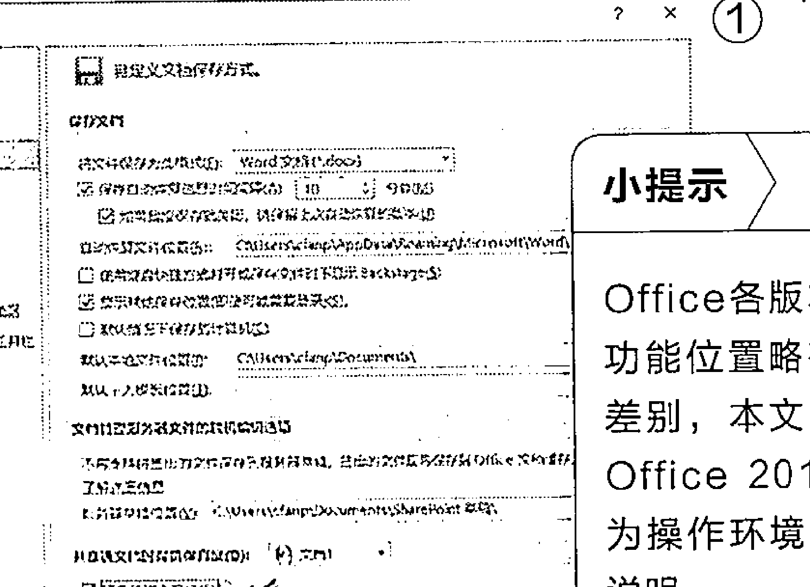

> 小提示
Office各版本功能位置略有差别，本文以Office 2019为操作环境来说明。

> 火速连登
识别图片中字体的方法，可参见《电脑爱好者》文章《优中选优 辨识图片中字体》（http://www.cfan.com.cn/2016/0203/124883.shtml）。

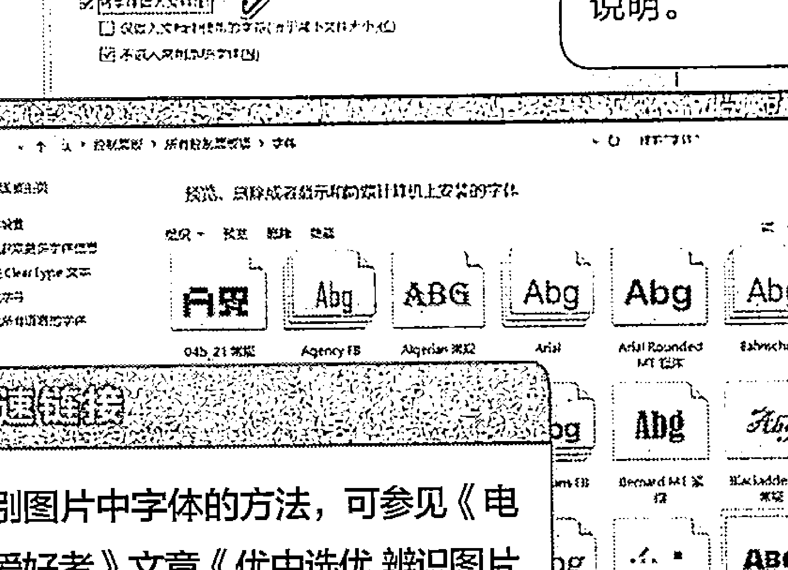

###### 在PPT幻灯片中嵌入字体

PPT幻灯片中嵌入字体的方法，同样是通过在“文件→选项→保存”选项卡下，找到“共享此演示文稿时保留保真度”，选中“将字体嵌入文件”复选框即可。

###### 在Excel表格中嵌入字体

Excel本身没有嵌入字体的功能，我们不能直接在Excel表格中嵌入字体，但可以先将Excel表格中的数据复制到Word或PowerPoint当中，最后在Word或PowerPoint中，将嵌入的字体应用于复制的Excel表格数据。

> 扩展阅读
PDF文档中未知字体的提取，除用上述方法外，还可通过字客网“工具”栏访问“PDF内嵌字体提取器”免费在线软件（https://www.fontke.com/tool/extractpdf/），上传需要提取字体的PDF文件进行提取，识别字体之后再下载并安装使用（图3）。

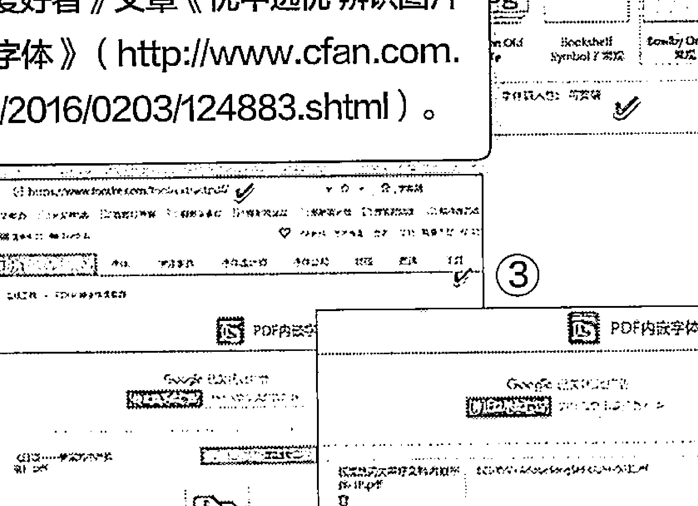

> 问题：嵌入的字体为何不起作用？
这要看字体本身是否带有可嵌入属性。若字体本身带有不可嵌入的属性，则即便在文档中设置了嵌入也不起作用。要查看某字体是否带有可嵌入的属性，启动控制面板后选择“字体”，然后在字体窗口中选择要查看的字体，查看属性栏中的“字体嵌入性”一项，该项参考的可选项为“可安装”“可编辑”“不可嵌入”和“预览/打印”等，是由字体创建者在创建字体时设定的（图2）。

##### 2. 修改文档中内嵌的未知字体

对于我们常见的Office文档中未知字体的重新编辑，可先用版面截图的方法截取包含字体的图片，然后用本刊曾介绍过的识别图片字体的方法进行字体识别。识别成功之后，再通过字客网下载相应的字体，安装并在Office编辑器中进行修改。

#### 背景换花样 视觉不寻常

文|吕梁

> 火速链接
如果希望将软件窗口的背景颜色修改为护眼的颜色，可参看本刊2019年第22期文章《自定软件窗口背景色保护眼睛》中的详细介绍。

每天看着单调的任务栏或文件夹底色，你有没有想过给任务栏背景铺一张底图，或者改变资源管理器或文件夹打开后的窗口背景颜色，让自己的Windows 10有不一样的感觉？其实，通过两个软件，就可以实现这一想法。

##### 给任务栏铺一张背景底图

借助于Classic Shell 软件最新版，我们可以给 Windows 10任务栏铺一张背景底图。该软件的最新版本为4.3.1版，2017年12月之后不再继续开发升级，官网地址: http://www.classicshell.net/。

Classic Shell软件的主要功能是用经典的开始菜单代替Windows 10的开始菜单。我们首先需要隐藏其主要功能，利用其附加功能。先下载并安装最新版本的Classic Shell，之后软件会替代Windows 10系统的“开始”右键菜单。右键单击Windows 10“开始”按钮并选择“设置→控制方式”选项卡，然后将列表中含“打开系统开始菜单”的选项全部选中，这样就可以恢复Windows 10默认的开始菜单操作习惯。

排除了软件对传统Windows 10“开始”菜单操作习惯的干扰之后，在

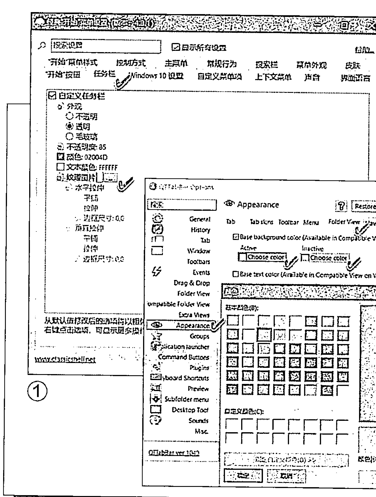

软件设置窗口的‘任务栏’选项卡下点击‘纹理图片’项，就可以添加任务栏背景图片（图1）。

##### 更改资源管理器或文件夹的背景色

如果我们希望在Windows 10中更改文件资源管理器或文件夹的背景颜色，可以使用第三方工具QTTabBar。该软件最新版本为1040版，更新日期为2019年3月24日，官方网址: http://qttabbar.wikidot.com/。

首先，下载并安装QTTabBar之后，打开文件资源管理器“选项”按钮下拉菜单，选择启用QT tab Bar和QT命令栏。再打开文件夹或文件资源管理器时，可以看到QT文件资源管理器工具栏。

其次，单击文件资源管理器中QT工具栏中的设置图标。打开

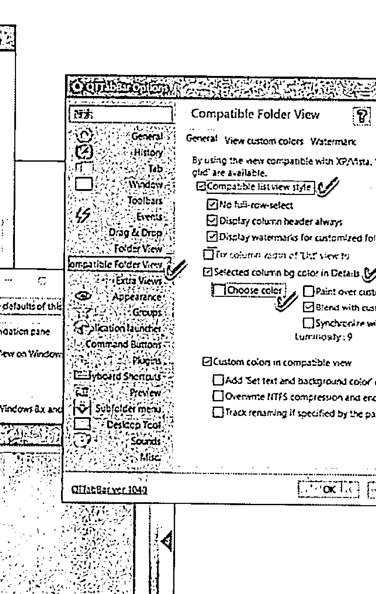

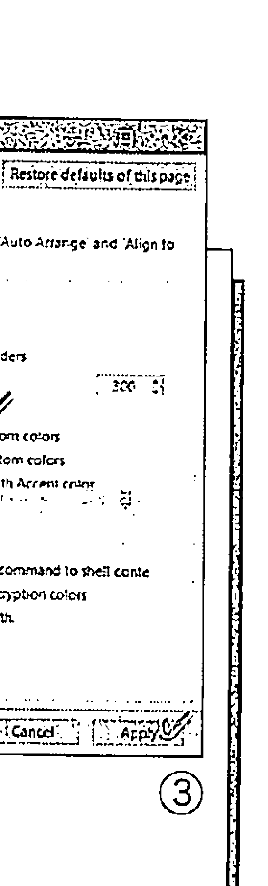

QTTabBar选项窗口。依次选择Appearance→Folder View选项卡，选中Base Background color复选框，为活动（Active）和非活动（Inactive）窗口选择背景色（图2）。

之后，移动到Navigation pane选项卡，选择Back color复选框，为左侧导航窗格选择背景色，并选择文本颜色（如果需要）。然后，依次点击Compatible Folder View→General选项卡，选中Compatible list view style和Selected column bg color in details两个复选框，单击Choose a color选择颜色，再单击Apply按钮（图3）。

最后，打开文件资源管理器，便可以查看到新的文件夹窗口或资源管理器窗口背景色。

#### 为窗口控制菜单添加扩展控制命令
文|童乐安

当我们点击Windows标准窗口（如记事本、资源管理器等）左上角的窗口控制按钮时，会弹出一个含有窗口控制基本命令的菜单，其中包括移动、大小、最小化、最大化、关闭等窗口控制命令。如果我们觉得这些命令不能满足自己对窗口控制的要求，那么，可以利用SmartSystemMenu软件添加更多窗口控制扩展命令（图1）。

##### 1. 轻松显示 窗口相关信息
有时我们希望显示当前窗口属性的更多信息，例如窗口的具体尺寸以及窗口所属程序及其具体路径。这时，只需在窗口控制菜单扩展命令中选择Information，便会弹出信息窗口；随后，在General选项卡的Rectangle一栏中，即可看到该窗口所在的桌面坐标和窗口尺寸。如果我们想快速获知当前窗口所对应的可执行文件，点击Process选项卡，即可看到程序的详细路径和程序名称（图2）。

##### 2. 选择置顶 防止窗口遮挡
置顶窗口是我们经常遇到的另一个需求。如果要将当前窗口置顶显示，选择控制菜单中的Always on Top命令即可。取消置顶只需取消勾选。

##### 3. 窗口大小 重新定义尺寸
有时，我们也许会对窗口大小提出精确的要求。在这种情况下，我们只需选择窗口控制扩展菜单下Resize子菜单中的分辨率列表，便可以精确地控制窗口大小了。如果列表中没有自己想要的尺寸，可点击Custom项进行自定义（图3）。

##### 4. 透明程度 随意调节控制
我们有时还需要调整窗口的透明度。这时，可以通过窗口控制扩展菜单中的Transparency命令选择透明度，也可以使用Custom命令设置自定义的透明度（图4）。

##### 5. 最小窗口 灵活选择控制
一般情况下，窗口最小化之后会退缩到任务栏上，但有时我们希望其退缩至托盘以腾出任务栏空间。这时，只需选择窗口控制菜单命令“System Tray→Minimize To Tray Always”，即可让窗口始终能最小化到系统托盘之上。此外，我们还可以用快捷键“Ctrl+Shift+↓”，将窗口最小化到托盘上。

> 小提示
SmartSystemMenu为绿色开源软件，软件启动后需要驻留系统内存才能发挥作用。由于系统重启后必须手动重新加载该软件，因此，若经常用到它，最好将软件添加到系统自启动列表中。

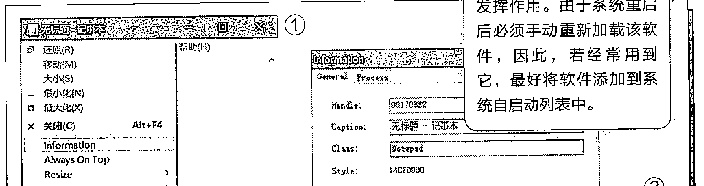

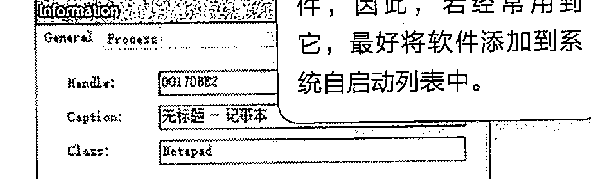

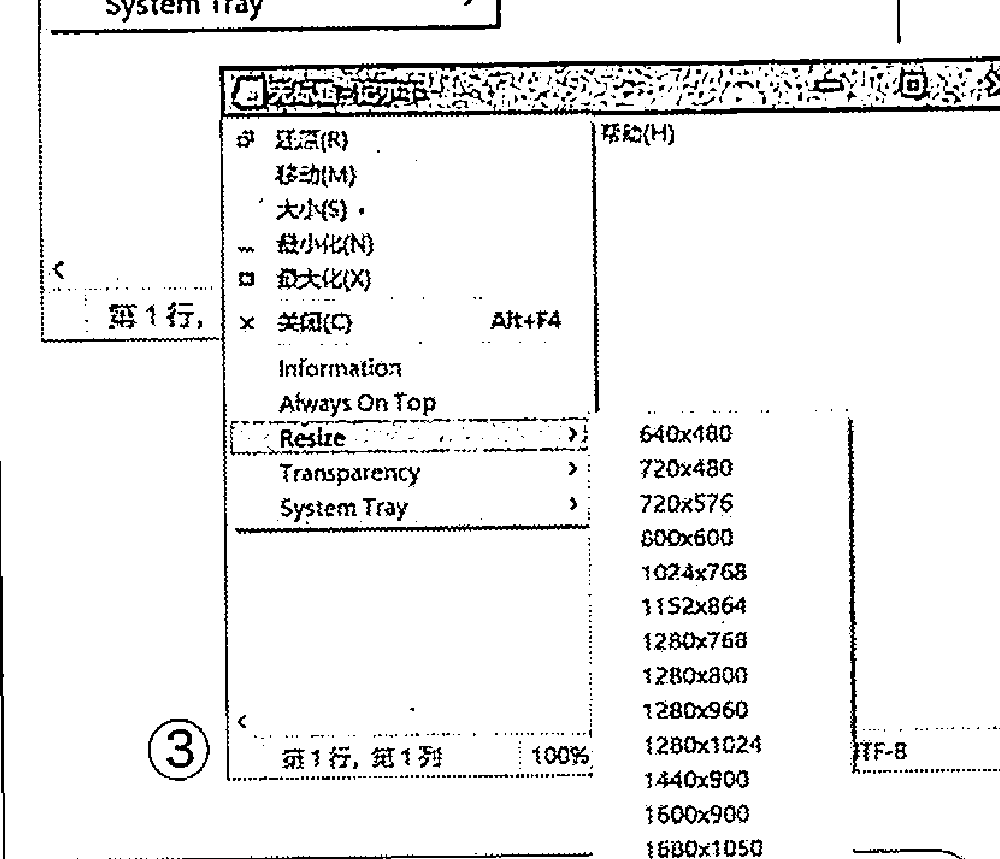

- 640x480
- 720x480
- 720x576
- 800x600
- 1024x768
- 1152x864
- 1280x768
- 1280x800
- 1280x960
- 1280x1024
- 1440x900
- 1600x900
- 1680x1050
- Custom...

> 小提示
我们无法用该软件来自定义更多的窗口控制扩展菜单命令，但使用较高版本的软件会获得比低版本更多的窗口控制菜单扩展命令，包括屏幕截图、复制文本到剪贴板、窗口进程优先级设定等方面的命令。

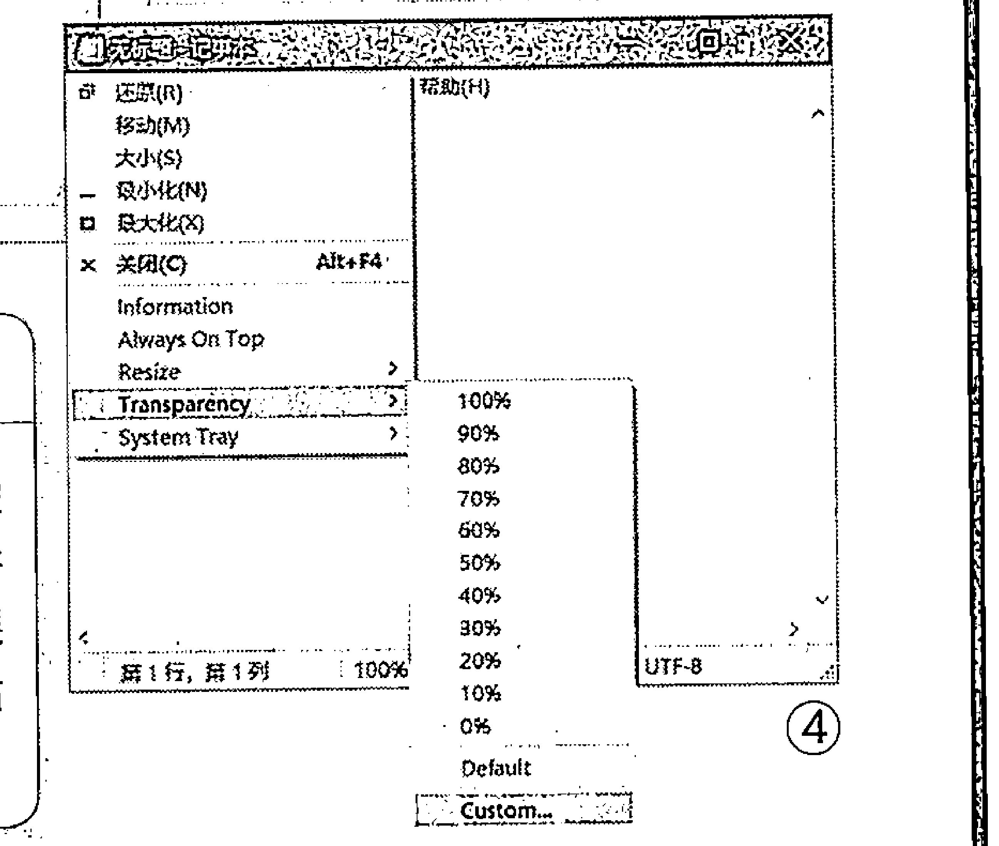

- 100%
- 90%
- 80%
- 70%
- 60%
- 50%
- 40%
- 30%
- 20%
- 10%
- 0%
- Default
- Custom...

#### 快速搭建个人在线知识库
文|平淡

很多朋友喜欢收集资料、制作手账等，平时大多借助第三方软件来完成，不过很多软件无法同步数据，这样不方便在其他电脑上访问。我们其实可以利用Baklib提供的在线服务，无需安装软件，在线即可智能搭建个人站点（如博客、知识库、日记、手账等），而且可以随时撰写和访问。

本文以搭建一个在线知识库为例。首先打开https://www.baklib.com/，按提示注册一个用户就可以使用Baklib的服务了。对于喜欢收集资料的用户，成功登录后进入个人中心，点击“控制台”，在打开的窗口中点击“新建站点”，接着选择“知识库”模板，新建一个“我的资料库”站点，点击“提交”后会自动应用模板（图1）。

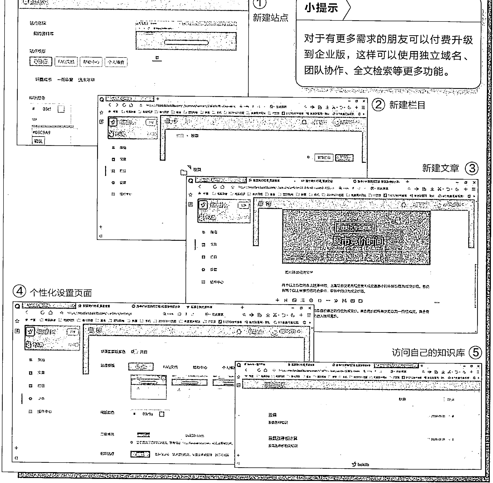

> > 小提示：对于有更多需求的朋友可以付费升级到企业版，这样可以使用独立域名、团队协作、全文检索等更多功能。

在打开的窗口中点击“创建栏目”，这里可以根据自己的实际需要创建多个栏目，每个栏目下归类存放同类型的文档。笔者是个股民，所以这里新建了“股票”栏目专门用于存放在线收集到的各种股票信息文章（图2）。

完成栏目的创建后就可以开始收集文章了。点击“添加文章”，打开的窗口是一个富文本编辑窗口，支持图片、视频、代码、Markdown的插入。当需要在文章中插入图片时，可以在每个新行的开头点击“+”，然后在弹出的菜单中选择“Add→图片”，接着选择本机图片上传即可插入到文章中。其他元素的插入，方法与此类似。最后按提示输入文章的标题、描述和正文内容，点击“发布”即可完成一篇素材的收集了（图3）。

这个资料库还支持个性化设置，进入“设置→通用设置”，可以为自己的站点设置名称、Logo、标语图片，另外在此还可以设置二级域名，在“二级域名”文本框输入自己需要的域名即可，笔者这里设置为“mycfan”（图4）。

可以设置二级域名，在“二级域名”文本框输入自己需要的域名即可，笔者这里设置为“mycfan”（图4）。

以后我们就可以直接以https://mycfan.baklib.com/的形式访问自己的知识库了，既可以快速地在页面中通过栏目查阅文章，也可以通过内置的搜索快速找到自己的文章，并可以将网址分享给好友（图5）。

#### 搜索结果中过滤百度自家信息
文剑侠

百度是国内用户使用最多的搜索引擎，但是大家在用百度搜索一个关键词后，往往发现搜索结果的前面充斥着大量和百度相关的内容，比如百度贴吧、百度百科、百度图片等等，而我们真正需要的内容可能要翻好几页，费时费力。如果你不希望看到百度自家的内容，可以通过下面的方法进行过滤。

##### 利用功能扩展进行过滤
> **小提示**
由于新版本的Edge浏览器是在Chromium内核的基础上开发的，所以该方法不仅适用于谷歌浏览器，同时也适用于其他使用Chromium内核开发的浏览器，比如360浏览器、QQ浏览器、搜狗浏览器等等。

如果用户使用的是火狐浏览器，那么首先点击操作界面右上角的“打开菜单”按钮，在弹出的菜单中点击“附加组件”命令，接着在弹出的页面中点击“查看更多附加组件”按钮，即可进入到火狐浏览器的应用商店。在搜索框中输入关键词“百度”，就可以找到“百度广告屏蔽”这个扩展。

点击扩展链接以后，在弹出的页面中点击“Add to Firefox”按钮，将其安装到火狐浏览器里面（图1）。以后当我们在百度中进行搜索时，首先点击工具栏里面该功能扩展的图标，它就会自动打开百度搜索的首页，在搜索框中输入关键词进行搜索，在出现的搜索结果中不仅会对置顶的广告信息进行屏蔽，也可以对与百度相关的内容链接进行屏蔽。

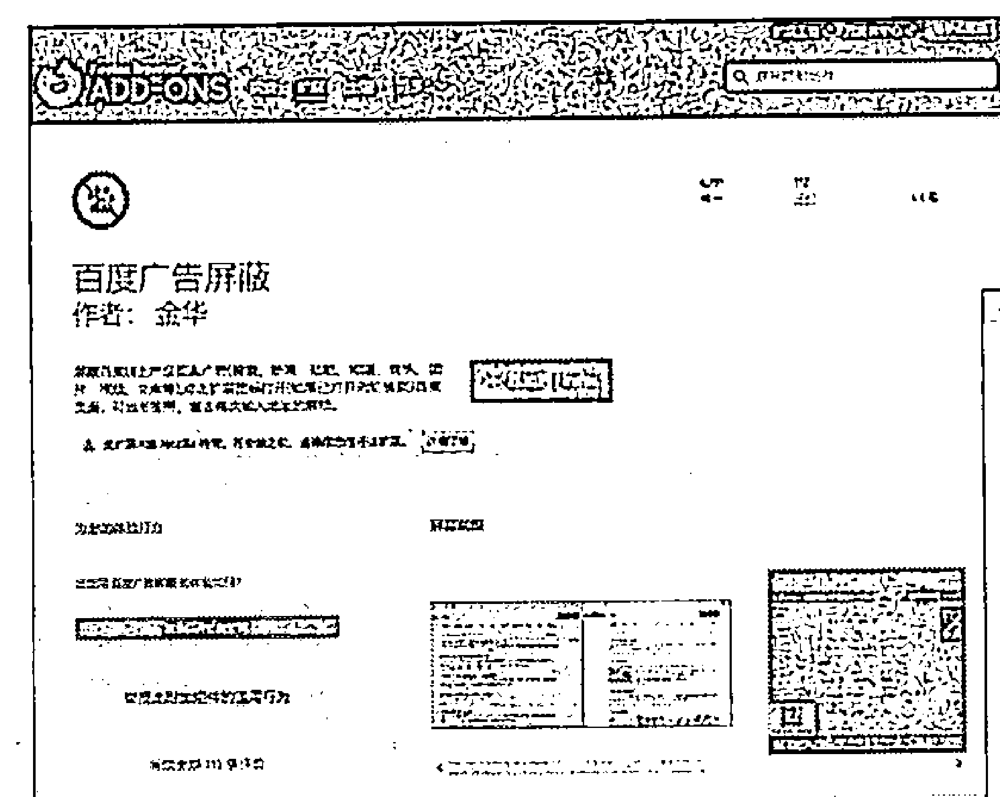

如果用户使用的是其他浏览器，比如最新版本的Edge浏览器，如果想要过滤百度相关的信息，那么首先点击操作界面右上角的“设置及其他”按钮，在弹出的菜单中点击“扩展”命令，接下来在弹出的页面中点击左侧的“从 Microsoft Store获取扩展”链接，从而进入到Edge浏览器的应用商店。将页面拖到最下方，找到一款名为“Tampermonkey”的功能扩展，点击名称链接后，根据提示进行安装（图2）。

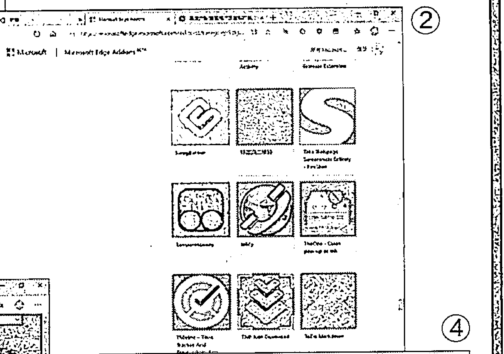

接下来打开Greasy Fork网站（https://greasyfork.org/zh-CN），在网站的搜索框里面输入“百度广告(首尾推广及右侧广告)清理”进行搜索，再在搜索结果中选择一个并点击相关的脚本链接，在打开的页面中点击“安装此脚本”按钮（图3），这时会弹出一个脚本文件的安装提示框，点击“保存”按钮就可以将该脚本安装到浏览器中。以后当我们在百度中进行搜索，当出现相应的搜索结果页面后，该脚本就会对其中的相关信息进行过滤，这样我们就可以直接看到过滤后的搜索内容，从而快速找到自己需要的信息（图4）。

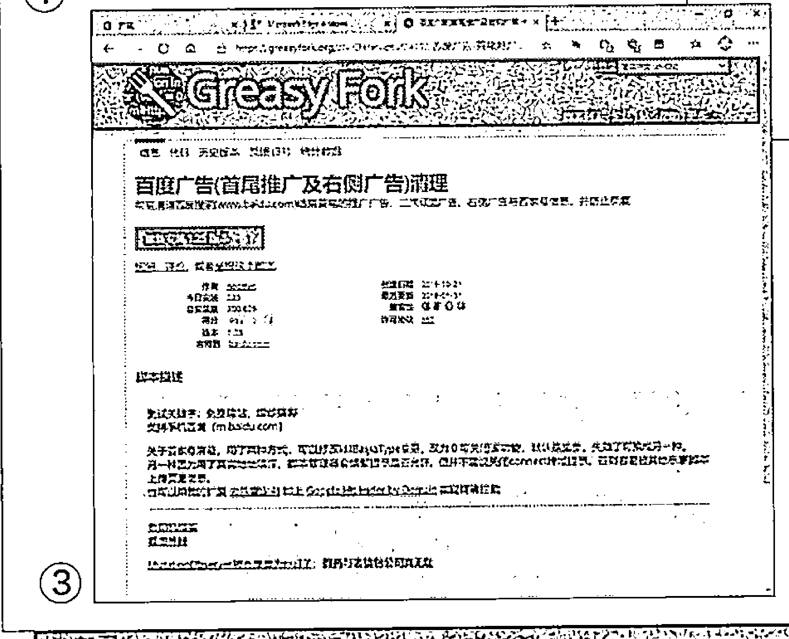

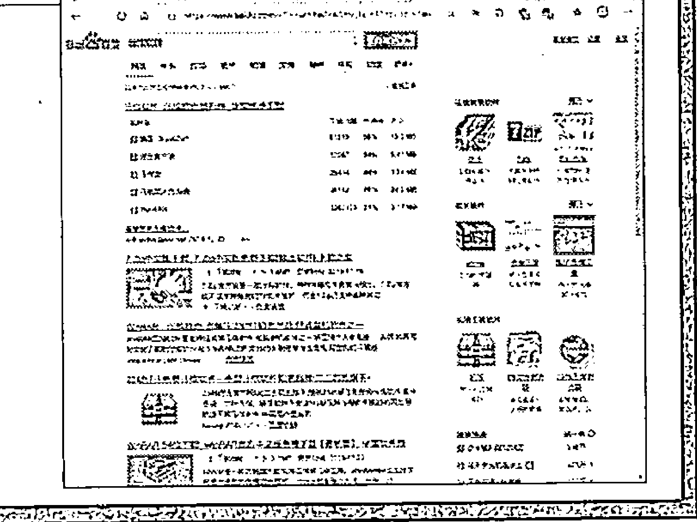

#### 画中画实现屏幕的局部监控
文/愚人

> ### 火热连接
类似的软件还有PiP-Tool（https://github.com/LionelJouin/PiP-Tool），此外本刊在2019年第5期《悬浮画中画——边看电影边工作》中介绍的“画中画”播放器，可以边工作边看视频。

有时我们需要同时做多件事情，比如一边看Word文档一边看股市行情。不过工作时Word大多以全屏方式运行，想看股票行情时就得来回切换窗口。借助OnTopReplica（https://github.com/LorenzCK/OnTopReplica），我们可以将股票行情窗口以浮窗的形式置顶，解决来回切换的不便。

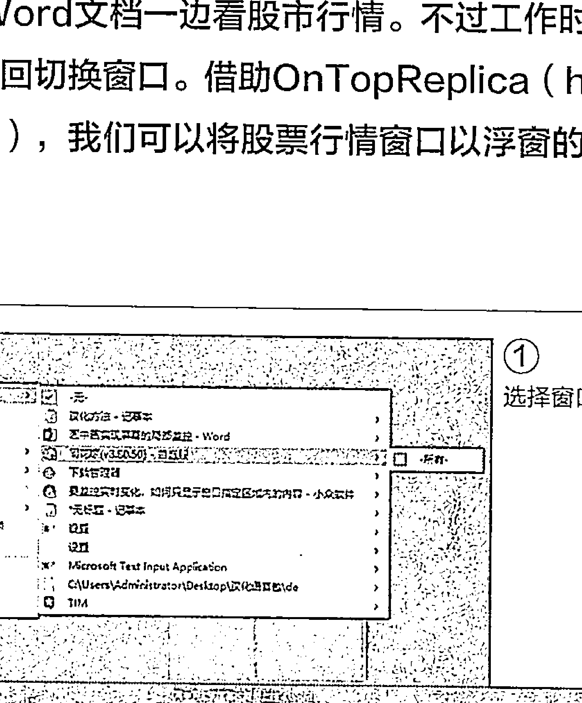

首先启动Word和同花顺炒股软件（同时切换到自选股窗口），接着启动OnTopReplica，并在其主窗口中右击，选择“选择窗口→选中同花顺自选股”（图1）。

经过以上操作，同花顺窗口即会嵌入到OnTopReplica中，并以浮窗的形式运行，我们可以调整浮窗的大小，以及移动它的位置和设置透明度。因为浮窗显示的区域有限，我们还可以对源程序窗口进行设置，尽可能显示所需观看的内容，比如隐藏同花顺的边栏、全屏显示自选股的内容等。这样自选股的行情窗口就可以一直置顶显示在所有程序上方，方便我们随时观看行情数据了（图2）。

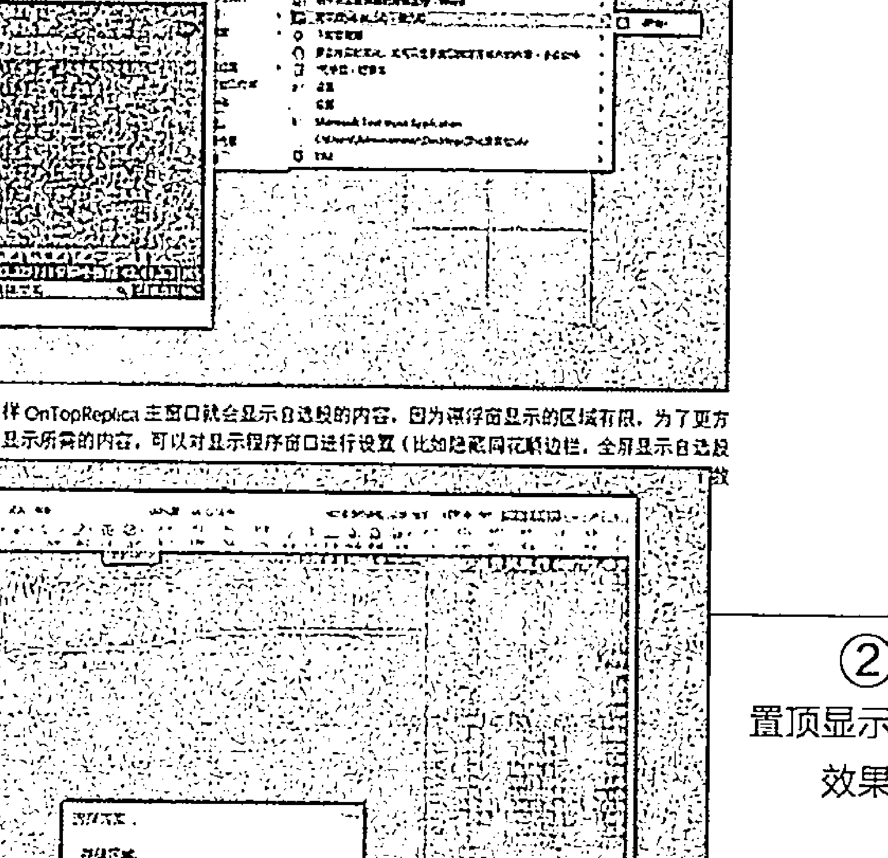

行情时，只要在浮窗中查看分时行情图即可。所以先在OnTopReplica中设置同花顺显示，接着右击选择“选择范围”，然后在OnTopReplica窗口中选择分时行情数据（图3）。

返回OnTopReplica窗口，此时就只是显示分时图数据了。通过这样的方法可以设置显示任意我们关注区域的重要数据，比如只显示应用商店软件的下载数据，只显示某个网站投票数据的变化等（图4）。

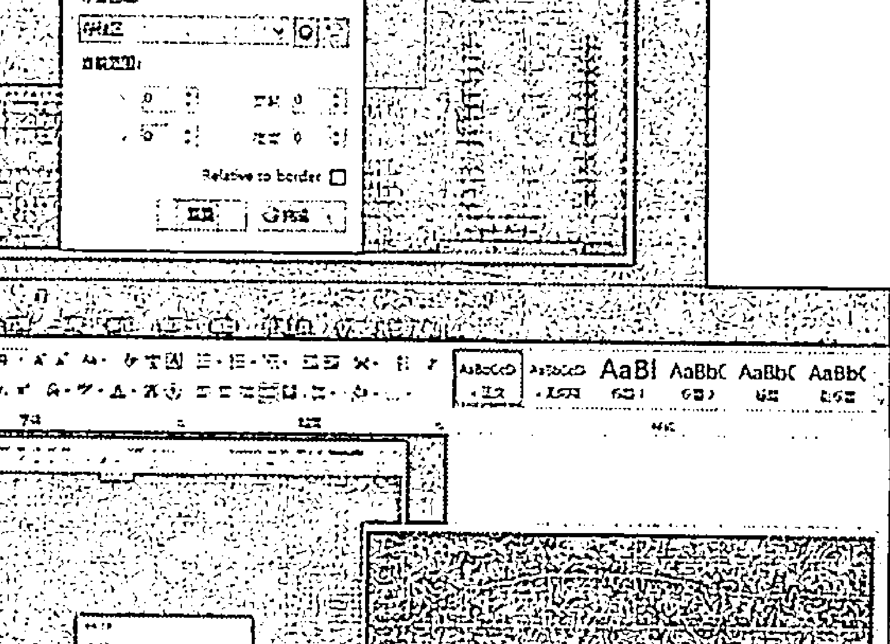

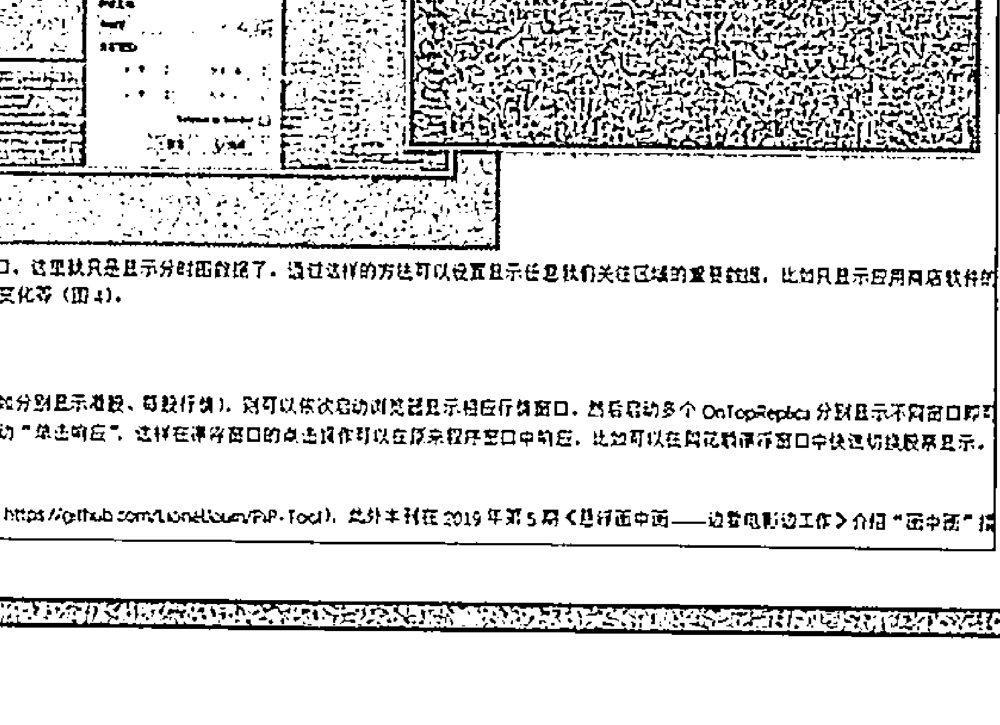

此外对于有多个显示需求的，如分别显示港股、美股行情等，则可以依次启动浏览器显示相应的行情窗口，然后启动多个OnTopReplica分别显示不同的窗口即可。如果需要在浮窗中执行操作，可以启动“单击响应”，在浮窗中的点击操作即可在源程序窗口中响应，笔者即是用此方法在同花顺浮窗中快速切换股票显示的。

OnTopReplica还可以设置只显示某一局部区域，达到“局部监控”的效果。笔者在查看某个个股的行情时，只要在浮窗中查看分时行情图即可。所以先在OnTopReplica中设置同花顺显示，接着右击选择“选择范围”，然后在OnTopReplica窗口中选择分时行情数据（图3）。

#### 不用同步 让OneDrive网盘更方便
文|天涯衰草

OneDrive是微软开发的一个网盘，平时我们只能通过操作系统自带的客户端软件，采用同步的方式将文件上传到服务器。但是这种方式会同时占用云端和电脑硬盘空间并频繁使用网络，而有一些文件我们可能很长时间用不到或者不想共享最新版本，这时通过手工的方式进行独立上传而非随时同步的方式更方便。网友开发的一款名为ODUG的小工具，就可以满足我们的这个要求。

> 小提示：ODUG小工具由图形化操作界面及核心文件构成，其中外壳程序由网友heyzhu开发，核心程序文件由网友萌咖开发。用户可以定时对核心程序文件OneDriveUploader（https://github.com/MoeClub/OneList/tree/master/OneDriveUploader）的版本进行检查并手动升级。

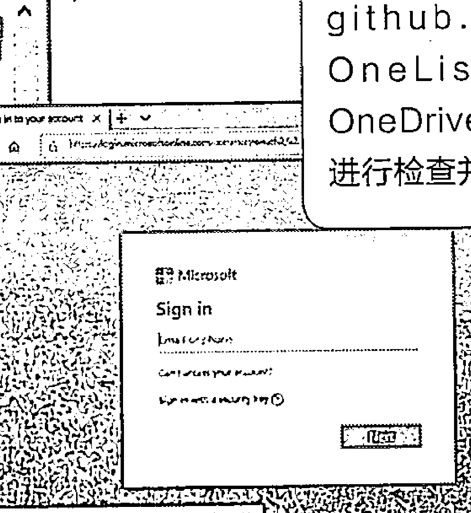

##### 一、初始化上传工具
首先下载ODUG小工具（https://www.heyzhu.com/83.html），运行后点击操作界面中的“关于”按钮，在弹出的对话框中选择左下角的“国际版/个人版/家庭版”（图1），工具会自动调用系统默认的浏览器并链接到一个与微软相关的网页。在网页中输入自己的微软账号，点击“Next”按钮后再输入对应的密码（图2），这时会弹出一个授权提示框，点击“Accept”按钮（图3），接下来会跳转到一个无法进行访问的页面，将页面地址栏中的链接信息完整地复制下来备用。

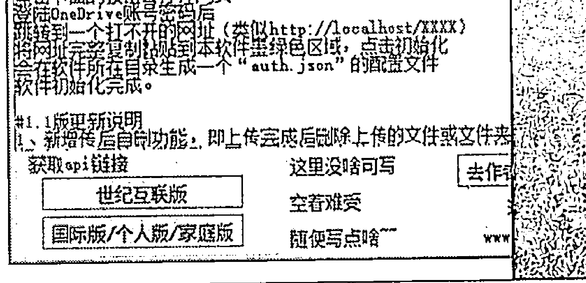

现在返回到ODUG工具的操作界面，在左上角的列表中选择OneDrive网盘对应的版本，然后将下面墨绿色窗口中的内容全部删除，并将刚刚复制的浏览器地址栏内容粘贴到其中。

> 小提示：目前该工具只提供上传功能，下载文件时还需要将其加入同步。

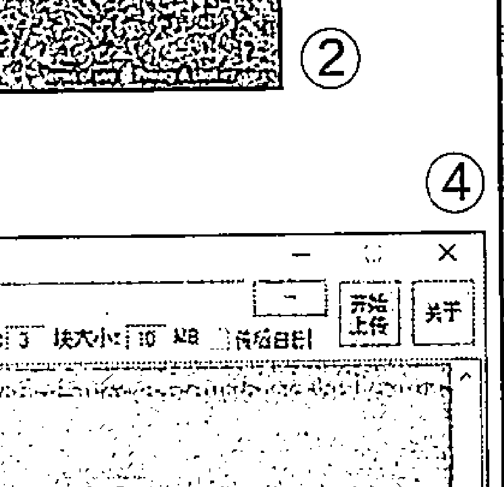

中，最后点击左上角的“初始化”按钮，就会在ODUG工具所在目录生成一个名为“auth.json”的配置文件（图4）。如果初始化操作无法正常完成的话，建议用户把工具文件移到非系统盘中，然后再重新进行操作即可。

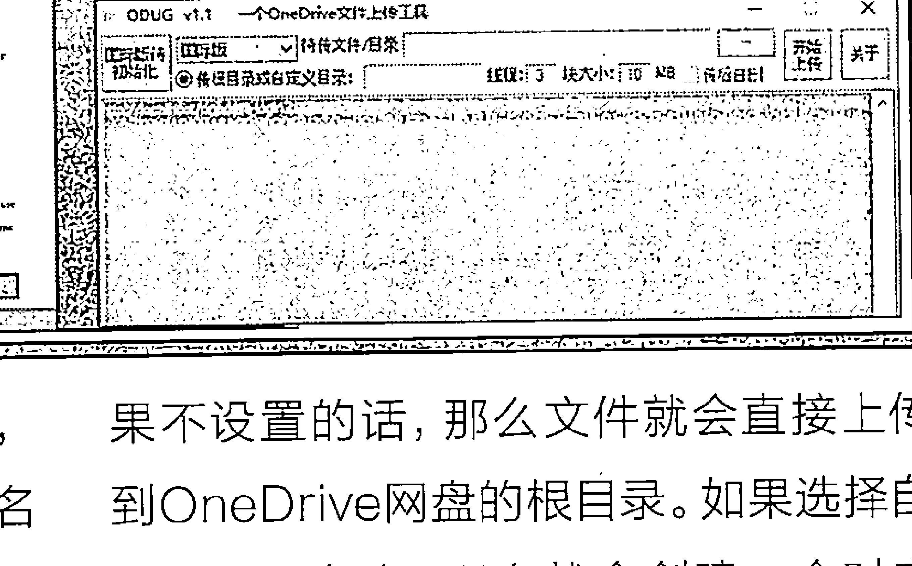

##### 二、设定文件目录
工具初始化完成以后，后面的上传操作就比较简单了。首先点击“待传文件/目录”后的按钮，在弹出的列表中选择存放上传文件的目录。接着在“传根目录或自定义目录”中输入相应的目录名称，如果不设置的话，那么文件就会直接上传到OneDrive网盘的根目录。如果选择自定义目录名称，那么就会创建一个对应的文件夹目录，文件也就会上传到这个目录中。

上传文件目录设置完成后，用户可根据所使用的网络带宽情况，对“线程”以及“块大小”的数字进行修改，这样就可以获得比操作系统自带的同步方式更快的上传速度。当所有的准备工作完成后，点击“开始上传”按钮即可，在文件上传完成后还会弹出一个上传完毕的提示框提示用户。

#### 批量下载自己QQ空间上的相册
文|俞木发

平时大家经常把喜欢的图片上传到QQ空间相册与好朋友分享，但当我们想把空间相册里的图片下载下来的时候，却发现空间本身并不提供批量下载功能。难道就只能一张张保存吗？当然不用这么麻烦，现在可以借助QQ群功能，实现批量下载自己QQ空间上的相册。

##### 下载原理：
腾讯为群空间内的相册提供了“批量下载”功能和共享QQ空间内图片的功能，因此要想批量下载QQ空间内的图片，我们可以先在QQ群空间中建立相册，然后将QQ空间内的图片复制到群相册，最后利用群相册的批量下载功能即可实现这个目标（图1）。


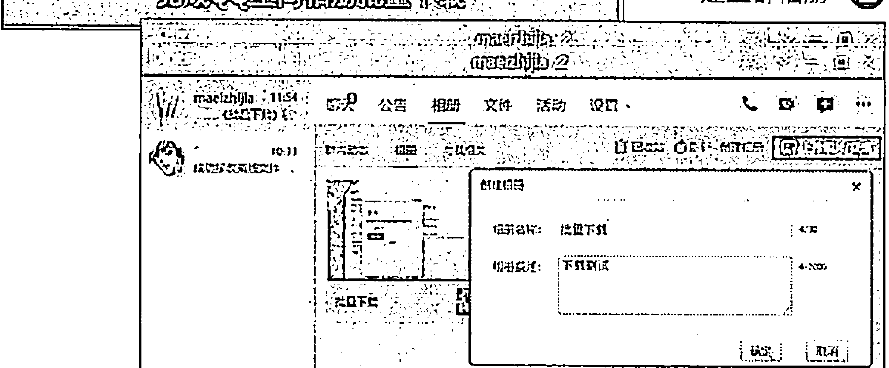

图”，这里可以看到自己QQ空间上的所有相册（包括加密相册也可以查看到）。按提示打开需要批量下载的相册，在打开相册后选择需要下载的照片（可以勾选“全选”选择照片，不过一次最多只能选择500张，如果你的相册图片数量大于500，请重复操作选择），在复制到相册名称列表选择上述新建的QQ群相册（图3）。

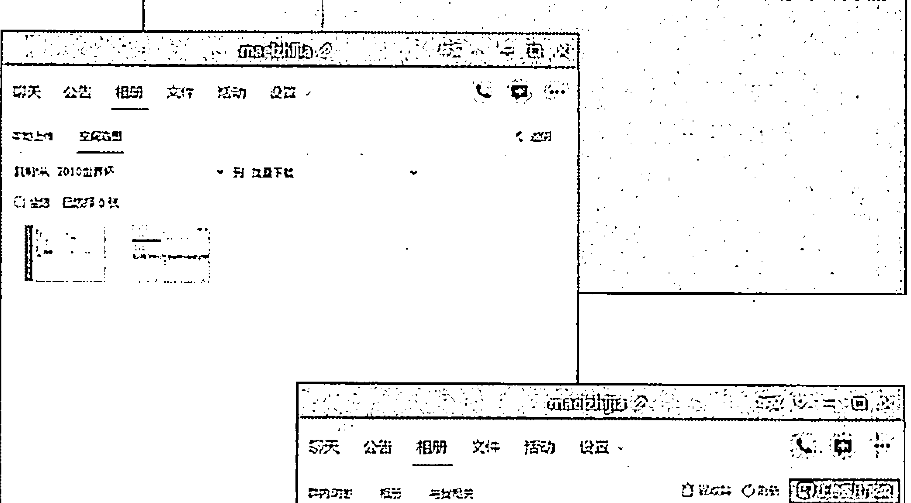

首先建立一个新群（为了避免图片外泄，建议群成员只包括自己的小号），进入后点击“相册”进入群相册。点击“创建相册”，按提示建立一个用于测试批量下载的新相册。为了便于后期管理，也可以先进入自己的QQ空间，创建一个和群相册名称一致的新相册（图2）。

点击“开始复制”，这样被选择的照片就会自动复制到“批量下载”这个群相册内。完成复制操作后继续进入新建的群相册，点击“管理→批量下载”（图4）。

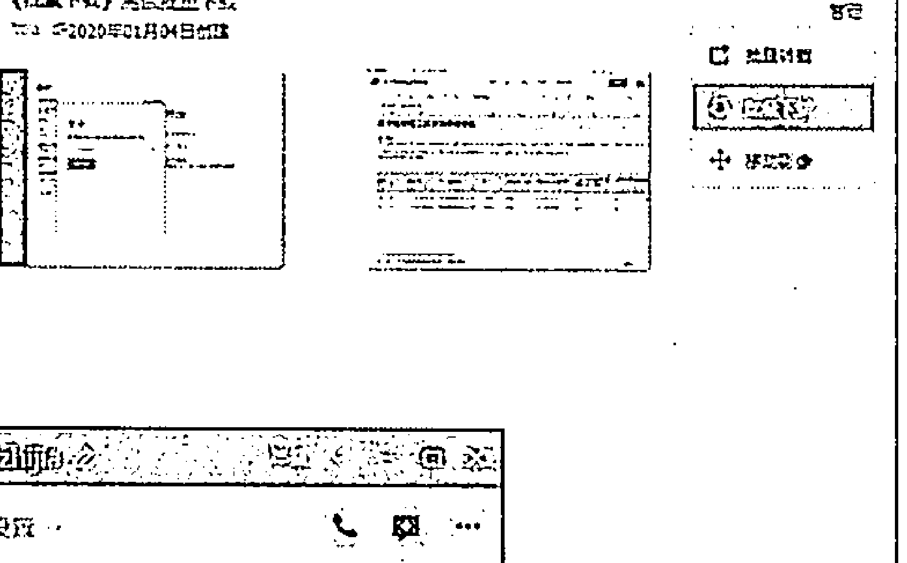

在打开的窗口中全选需要下载的图片，继续在弹出的窗口上点击“本地下载”，这样整个相册就会自动以压缩包的形式下载到本地，下载完成后我们只要解压即可看到QQ空间内的相册图片了（图5）。

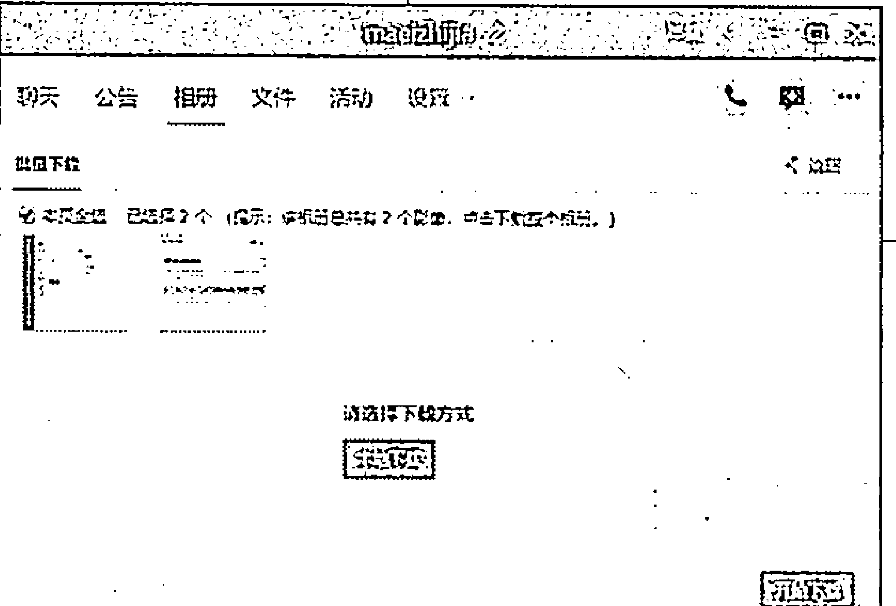

点击进入上述新建相册，然后点击“上传照片/视频”，在打开的窗口中切换到“空间选

#### 利用规则技巧完成文件的归类整理
文|天涯衰草

很多人每天都会在电脑上处理大量的文件，为了使用起来更加方便，常常将这些文件随手存在各个目录中。不过随着时间的积累这些“随手”使用的目录经常已经混乱不堪，在查找文件的时候非常麻烦，这就需要对它们进行归类整理。此时可以使用“File Punter”（http://www.dcmembers.com/skwire/download/file-punter/），它通过灵活的整理规则可以很方便地完成这些操作，比人工整理方便高效得多。

##### 一、创建文件归类规则
安装并运行该工具后，点击工具栏中的“Add entry”按钮，我们可以在弹出的对话框中设置整理规则。点击“ource dir”选项后的按钮，在弹出的对话框中选择要进行整理的文件夹目录，比如本文中需要整理的系统桌面所在的文件夹。如果要同时对子文件夹目录中的文件进行整理，那么就勾选上“Recurse source folder”这个选项。

> **小提示**
对经常进行文件整理操作的用户，建议点击“Pattern”选项后面的按钮，在弹出的对话框中添加经常要处理的文件类型，然后点击下面的“Save”按钮进行保存（图2）。以后只需点击“Pattern”选项的列表，就可以直接选择了。

> **小提示**
用户可点击“Run simulation”按钮，按照设定的条件对相应的文件进行一次虚拟操作，如果配置成功的话，那么在弹出的记事本窗口中就会显示出“执行”的内容（图3）。若配置有误，则记事本窗口显示为空白。

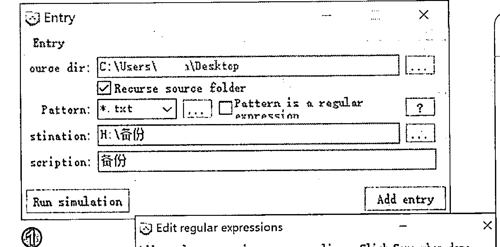


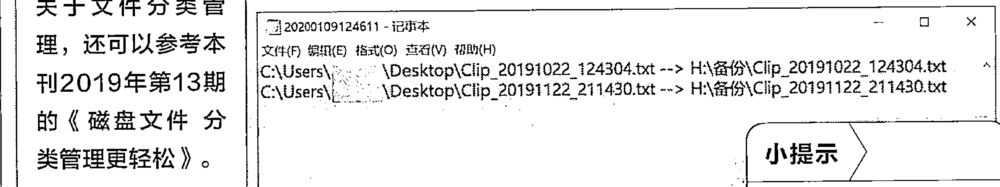

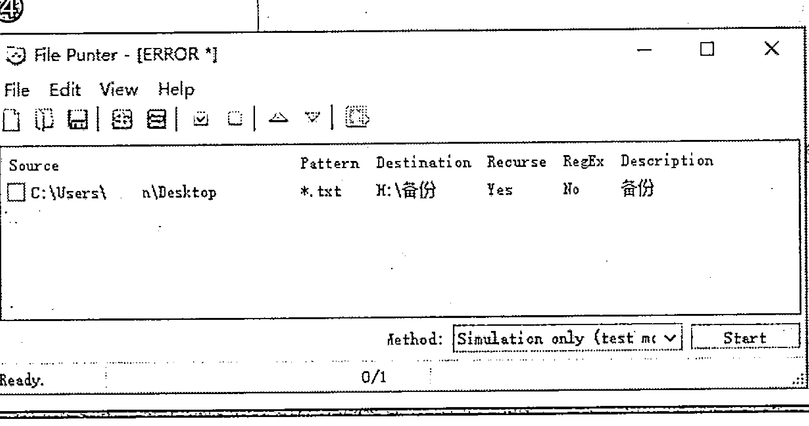

##### 二、利用规则管理文件
以后当我们想要对某个文件夹进行整理时，首先在工具列表中选择相应的规则，然后在下方的“Method”列表中选择“Move files to destination（移动文件到指定目录）”或“Copy files to destination（拷贝文件到指定目录）”选项等，点击“Start”按钮就可以对相关文件进行整理了（图4）。

#### 在新版Edge浏览器中使用经典功能

文|天涯衰草

Windows 10系统首次发布时，里面自带了一款名为Edge的浏览器，但它并没有得到广大用户的认可。所以近期微软就使用Chromium内核重新开发了新版Edge浏览器，并开始推送给取代旧版。虽然据称新版版本Edge会继承旧版本的绝大部分功能，不过目前仍有不少相关功能在新版本中处于被“隐藏”的状态，比如“阻止访问不安全的网站”、“使用全屏效果”等，需要这些功能的用户必须设法将其“激活”才能使用。

##### 一、激活“阻止访问不安全的网站”

在旧版Edge浏览器中，当我们访问任意一个网站时，其域名都会被发送到微软的云端服务器进行安全检测，检测完成后会把结果反馈到浏览器中显示，在用户访问到不安全的网站时还会自动阻止其访问。要启用这一功能，我们需要在新版Edge的地址栏中输入“edge://flags”并按下回车键，在弹出页面的搜索框中输入“Blockable mixed content switch as site setting”。查找到这个选项后，选择列表中的“Enabled”，然后根据提示重新启动浏览器即可（图1）。

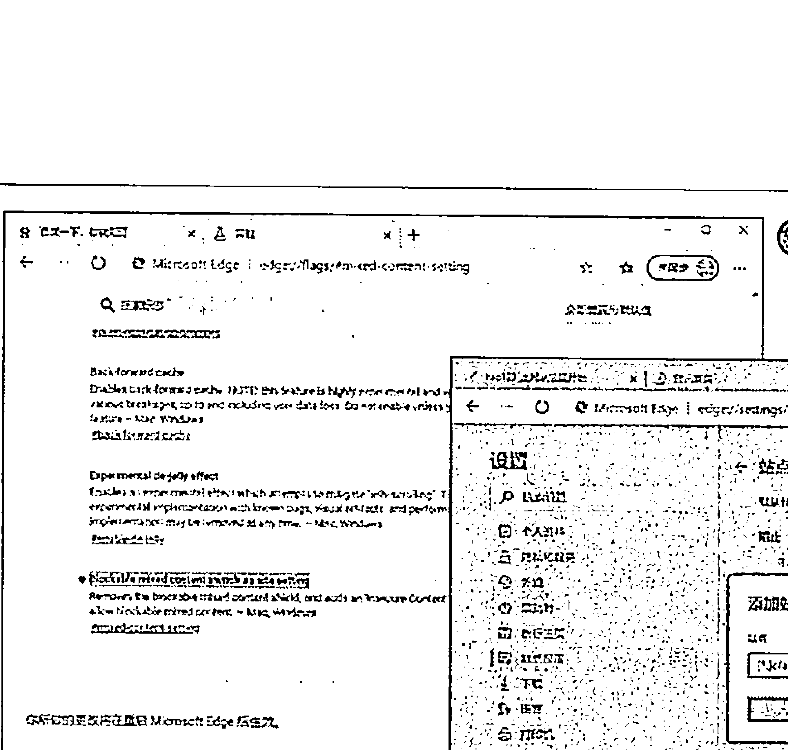

除了云端安全检测方式，我们还可以自定义访问权限。点击新版Edge浏览器右上角的“设置及其他”按钮，在弹出的菜单中选择“设置”命令，在打开的页面中选择左侧列表中的“站点权限”命令。此时在右侧列表最下方新增加了一个“不安全的内容”选项，点击后可以看到有“阻止”和“允许”两个选项。添加到允许列表中的网址无论云端判断它是否安全，浏览器都会允许访问；同理添加到阻止列表中的网址，无论是否安全都会被禁止访问。如果希望允许或阻止访问整个网站，最好使用通配符，如[*].cfan.com.cn（图2）。

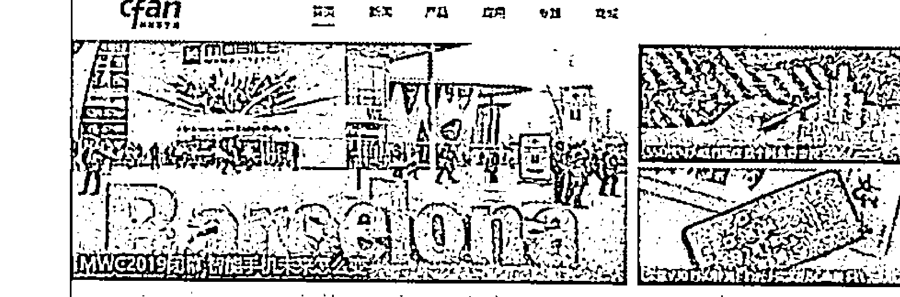

##### 二、激活“使用全屏效果”

老版本的Edge浏览器有一个非常方便的全屏显示功能，想切换到全屏状态时，直接点击键盘上的F11快捷键就可以了（图3）。若想切换到之前的标准状态，再次按下F11快捷键即可恢复。在全屏状态下浏览器的标题栏等相关信息全部被隐藏起来，这样在做某些演示的时候界面会显得更加干净整洁。

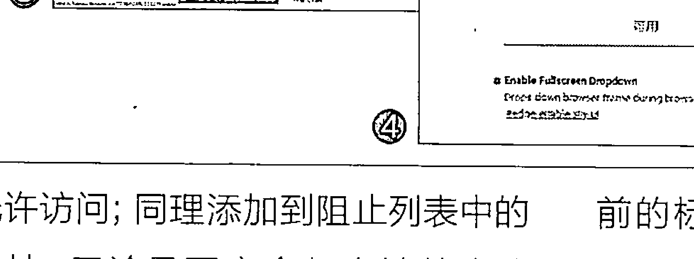

要想在新版本中启用这一功能，我们首先按照上面提到的方法打开设置页面，在搜索框中输入关键词“Enable Fullscreen Dropdown”，查找到后将右侧列表中的选项设为“Enabled”即可（图4）。

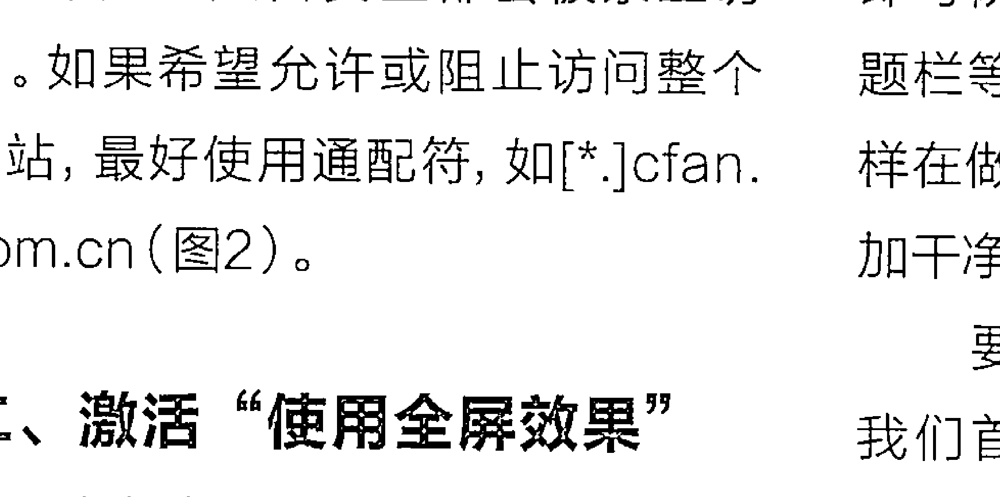

#### 取代并增强资源管理器的复制功能

Windows资源管理器自带的复制功能效率低，复制过程虽然支持暂停，但大文件续传容易出错，更无法一次性定制不同资源的复制队列进行成批复制。其实，如果利用一个开源的软件UltraCopier，取代Windows资源管理器的复制功能，上述问题就会得到解决，Windows的文件复制能力也会得到进一步的增强。

##### 1. 取代并改善Windows自带的复制功能

通过Windows 10自身的文件复制功能复制文件，虽然复制界面上也存在一个暂停按钮，但当我们复制一个很大的文件时，如果中途暂停后再次按下继续按钮，可能会收到文件覆盖的提示。这时若选择“跳过”就无法完成复制任务，而选择“替换”则又从头复制，根本无法做到中途续传（图1）。

此外，有时当我们开启多道复制任务时，如果暂停了其中的一个复制任务，可能会出现有复制任务假死的情况。

如果安装了UltraCopier，它将自动取代Windows资源管理器的复制功能，上述续传问题得到解决（图2）；多任务复制由并行处理改为串行处理，因此假死的情况也不会再发生。

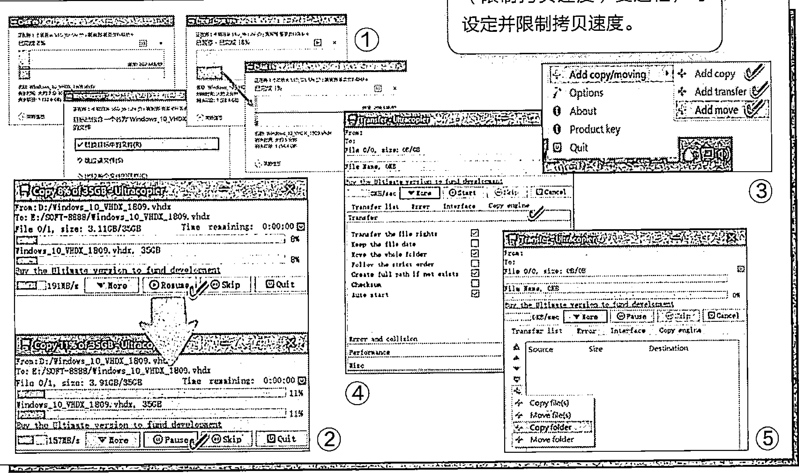

##### 2. 选择复制方式 手动调整复制参数

与Windows 10自带的复制功能相比，UltraCopier的优势之一是提供复制方式的更多选择，通过系统托盘图标的右键菜单Add copy/moving（添加拷贝/移动），我们可以选择Add copy（添加拷贝）、Add tranfer（添加传输）和Add move（添加移动）三种复制方式，其中“拷贝”和“移动”方式好理解，“传输”方式将在第3节中专门讲述（图3）。

除了多种复制方式外，我们还可以自定义多项复制参数。点击More按钮出现扩展窗口，然后点击Copy engine（复制引擎）选项卡，设定诸多选项。例如：Transfer the file rights（传输文件权限）、Keep the file date（保存文件日期）、Move the whole folder（移动整个文件夹）、Follow the strict order（遵循严格的顺序）、Create full path if it doesn't exist（如果不存在则创建完整路径）等（图4）。

> > **小提示**
> 点击Interface（界面）选项卡，选中Limit copy speed to（限制拷贝速度）复选框，可设定并限制拷贝速度。

##### 3. 添加多个复制任务并一次性执行

UltraCopier的最大优势是添加复合复制任务，也就是上面我们提到的Add transfer（添加传输）选项。在添加多个任务时，首先右击托盘软件图标并选择“Add Copy/moving→Add transfer”；然后，在弹出的复制窗口中点击More按钮，再点击“+”号按钮，添加需要复制（或移动）的任务；随后，依次按相同的方法将所有要复制的任务添加到列表中（图5）。最后，点击工具条上的Start按钮开始所有复制任务。

#### 图像批处理 开源利器更轻松

*文|童乐安*

在日常的图像处理过程中，我们有时需要对成批的图像文件进行缩放、旋转、更名、格式转换等操作。如果仅为完成这些简单的日常任务而去安装一个比较大的图像处理软件，没有多大必要。这时，我们可以使用一个仅有600多KB的开源免费软件Flexxi，解决所有问题。

**小提示**
为了更便于操作，我们可以在设置窗口中选中Drag'n Drop activate复选框，这样可以通过拖动操作方便地添加图像。如果选中Send to activated复选框，则还可以在系统的“发送到”菜单中添加此软件的快捷方式命令。

##### 1. 图像尺寸 成批改变

在对图像进行批量操作之前，首先需要将要处理的图片添加到Flexxi软件窗口中。点击Add按钮，添加所有要处理的图像文件。可添加的内容不仅包括图像文件或文件夹，还可以是已经复制到剪贴板中的图像内容。

添加图像后，点击软件右侧面板上的Resize按钮，在弹出的设置面板的Size一栏中选择已有的尺寸或自定义尺寸；在Resize Mode列表中，选择图像缩放的方法（适合、拉伸、充满）；如果需要改变长宽比，在Proportionality下进行选择（图1）。参数设置好之后，点击Start按钮进行转换即可。

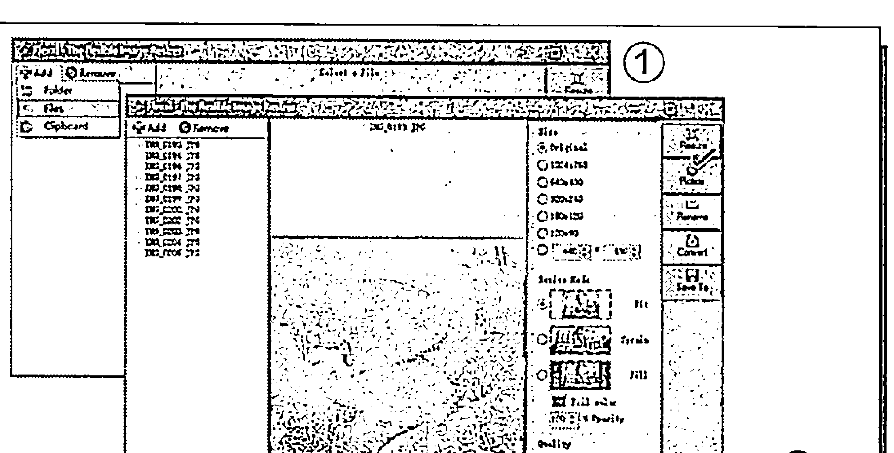

**小提示**
如果需要更改图像保存的目录（原目录、建立子文件夹、使用用户文件夹），只需点击Save To按钮进行设置即可。此外，还可以指定文件或目录重复时的处理方式。

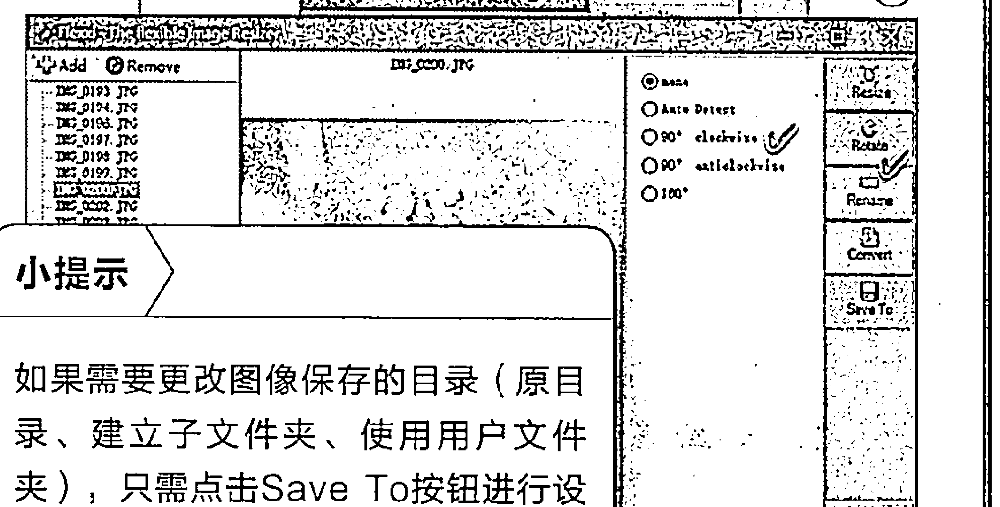

##### 2. 大量图片 一次转正

有时，我们拍摄的照片因拿相机的角度发生改变而造成了照片倾斜90度或头朝下显示。如果遇到这种情况，只需点击Rotate按钮，选择一个更正角度，定义好输出目录，最后点击Start按钮，即可将它们转为正常方向显示（图2）。

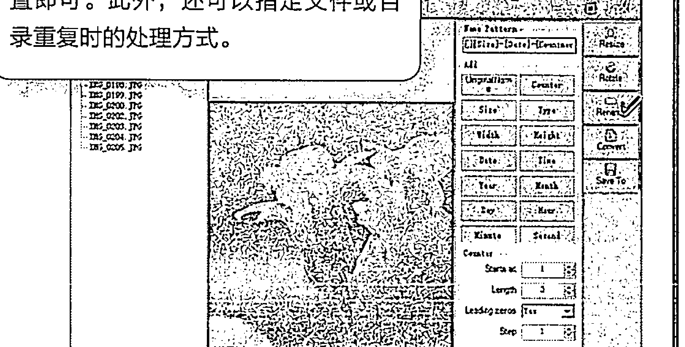

##### 3. 制定规则 统一命名

将一批照片以统一的格式加以命名有助于日后辨识。首先点击软件右侧的Rename按钮；然后通过Add文件名元素面板下的按钮、Counter计数器面板，为Name Pattern框添加文件名模型（例如，我们添加“[我家的花花]-[Size]-[Date]-[Countner]”的形式）；最后，点击Start按钮进行批量更名（图3）。

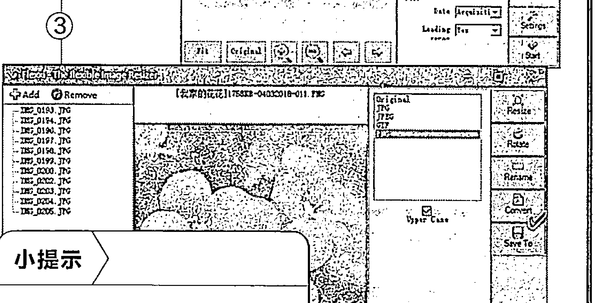

##### 4. 图像格式 批量转换

如果我们需要目标图像文件的格式为常用的JPG、GIF、PNG等三种格式之一，点击Convert命令，然后选择一种常用格式，即可将所选图像转换为目标格式。如果对文件名的大小写有具体要求，选中Upper Case选项，会保留原始文件名中的大小写拼写状态（图4）。

**小提示**
在Date选项下，我们可选择照片日期的类型为系统当前日期或照片原始日期。

#### 简单复古外表 资源管理不平凡
**文|吕梁**

File Commander是一个横跨Windows、Linux、macOS平台的开源免费软件，具有简洁的“复古”风格界面（官方网址：https://github.com/VioletGiraffe/file-commander）。简单的外表背后，却蕴含着不输于Windows资源管理器的许多功能，例如：双窗格对比显示、插件预览、编辑自定义、快速环境切换等。

##### 1. 开启双格窗口 灵活对比与显示文件

File Commander拥有双窗格，这非常有利于我们进行文件夹和文件的比较。假设我们要对两个文件夹进行对比，可在左右两个窗格中分别打开这两个文件夹，然后以相同的方法对两边的文件进行排序，对比结果就一目了然。若需要对其中的两个文件进行比较，选中文件之后，点击Tools菜单中的Compare files by contents命令，即可比较文件内容（图1）。

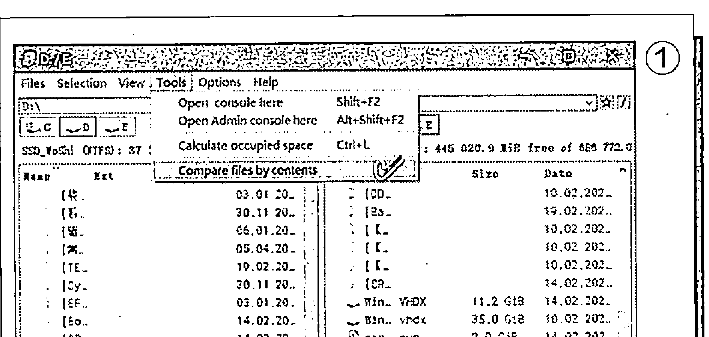

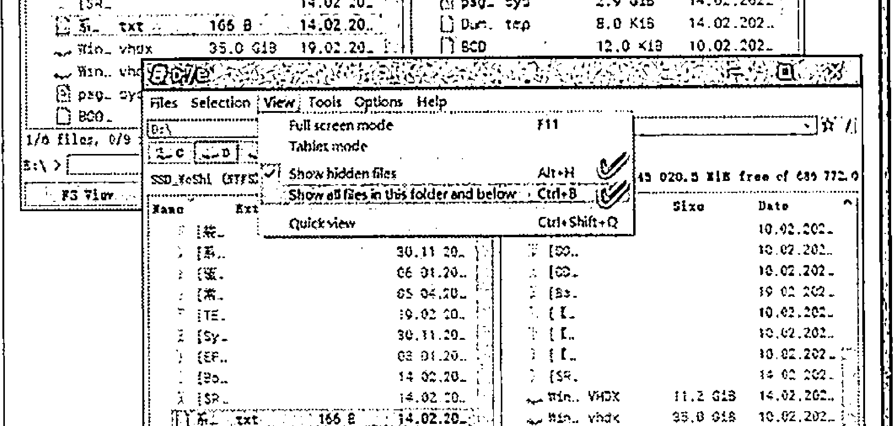

当我们需要显示隐藏文件时，执行“View→Show hidden files”命令（直接按下Alt+H组合键）就可以了。此外，按下Ctrl+B组合键，可实现在一个窗口中显示当前目录下所有子文件中的文件（图2）。

##### 2. 开启预览窗 用内置插件进行图文预览

File Commander内置三个插件，除了前面提到的文件比较工具外，还有图像查看器和text/html查看器。如果希望查看图片或text/html文档，选中文件后执行“View→Quick view”命令，即可将当前文档或图片所在窗格之外的另一个窗格临时替换为预览窗格，在其中显示预览内容（图3）。

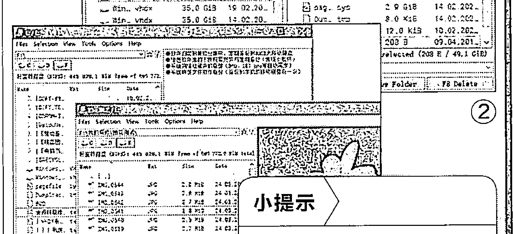

> > **小提示**
> 点击地址栏右侧的“☆”按钮，可将当前文件夹添加为书签，以便今后快捷访问。

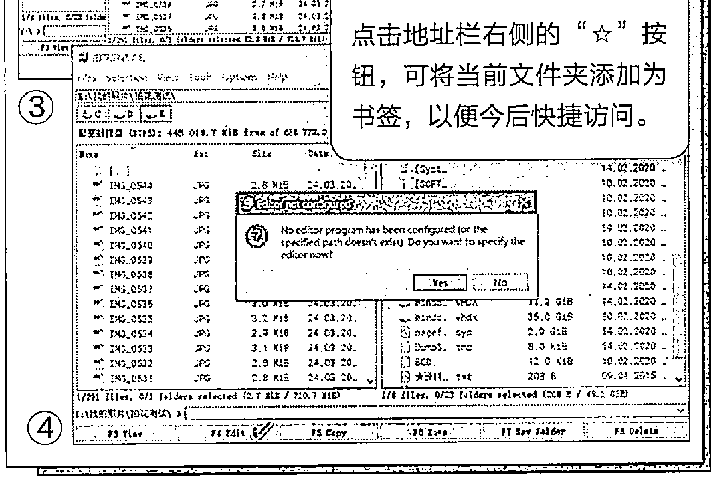

此外，我们还可以通过F3功能键，开启单独的预览窗口，对当前选择的图片或文档进行预览。

##### 3. 编辑自定义 用F4开启指定的编辑器

在File Commander的文件窗口中选择一个文件之后，如果按下F4功能键，会启动相应的软件进行编辑。如果此种格式尚未在File Commander软件中注册，打开程序，则会显示提示窗口，要求指定一个关联程序（图4）。

当然，我们也可以通过按下Ctrl+Alt+P组合键，打开Settings设置窗口，在Edit选项卡下为F4热键指定自定义的编辑器。

##### 4. 环境快速变 一键进入文件夹PowerShell窗

有时我们需要在某个文件夹中立马进入与其对应的Windows PowerShell窗口环境（含管理员窗口），执行一些命令或维护任务。这时，只需按下Shift+F2组合键或Alt+Shift+F2组合键，即可马上进入对应的PowerShell命令窗口。

#### 给Windows添加程序快速切换栏

文|童乐安

虽然我们可以用自定义Windows 10任务栏的方法拉宽任务栏高度，以存放更多打开的程序图标，但扩宽的任务栏会占用有效的桌面空间。如果我们想在不浪费桌面空间的前提下，能够快速切换更多已开启的常用程序，可以使用一个来自GitHub的免费开源软件Switch，向Windows 10添加隐藏式程序快速切换栏。

##### 1. 程序快速切换栏的显示与隐藏

安装Switch后，程序首次运行会出现使用向导提示（图1）。程序运行后，新增的程序快速切换栏默认为隐藏状态，我们只能看到一个系统托盘程序图标。要想让程序快速切换栏出现，有两种办法: 一是按下键盘左侧或右侧的Alt控制键，另一个办法是用鼠标右键单击系统托盘上的Switch图标，然后从菜单中选择Show dock（图2）。

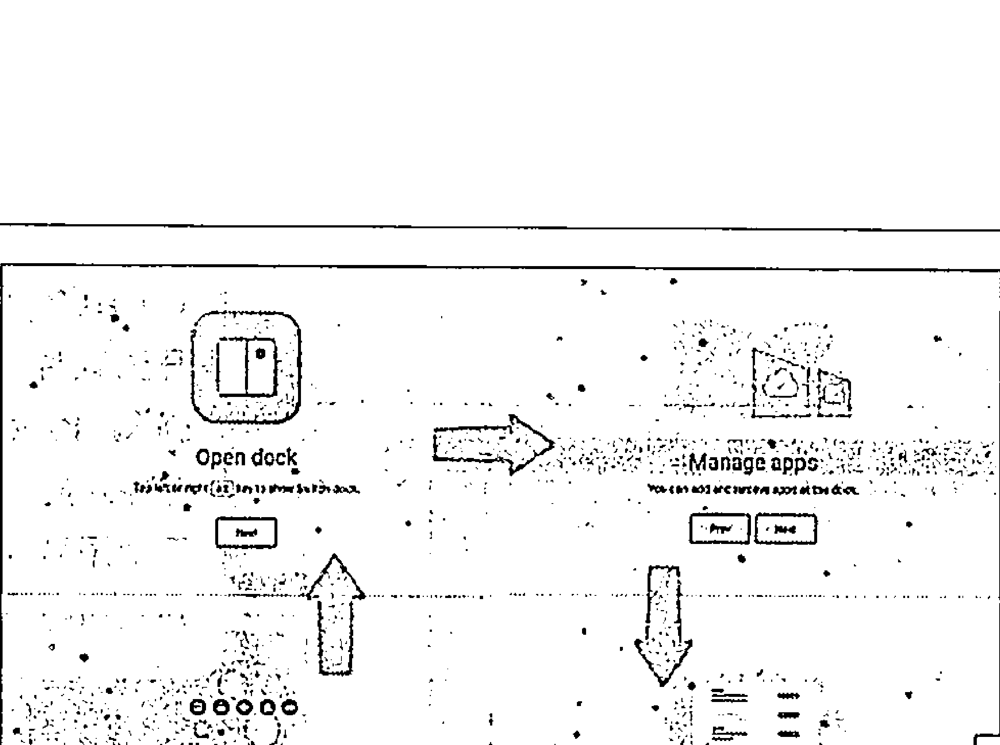

> 小提示: 如果我们希望将程序快捷切换栏置于屏幕的左侧，在Settings窗口中选择“Place dock→Left”即可。

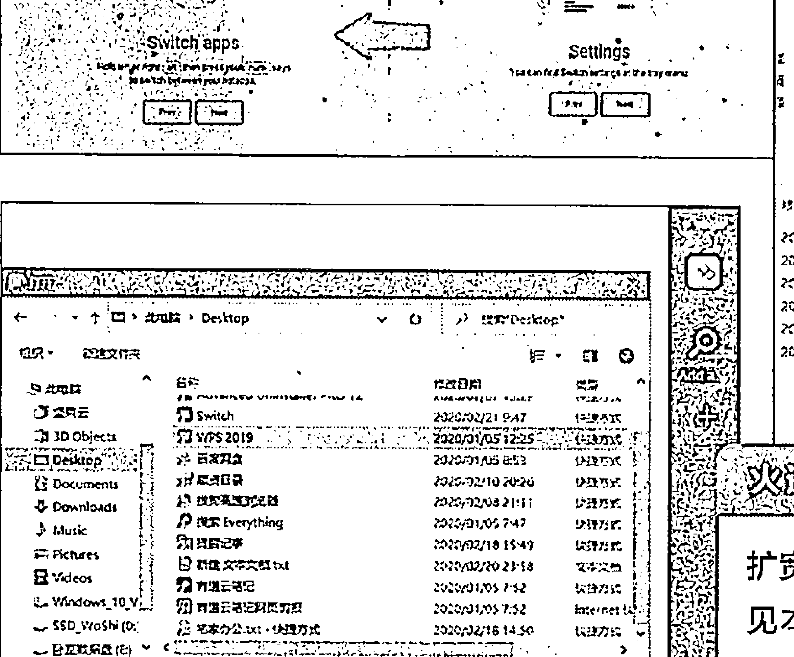

> 扩展链接: 扩宽现有Windows任务栏的方法，参见本刊2020年第3期文章《拒绝平淡 让任务栏用出个性》中的相关内容。

##### 2. 向程序快速切换栏添加程序图标

将鼠标光标悬停在Switch程序快速切换栏上，单击Switch面板上的加号图标，添加程序图标。Switch允许固定9个程序到其切换面板上（图4）。

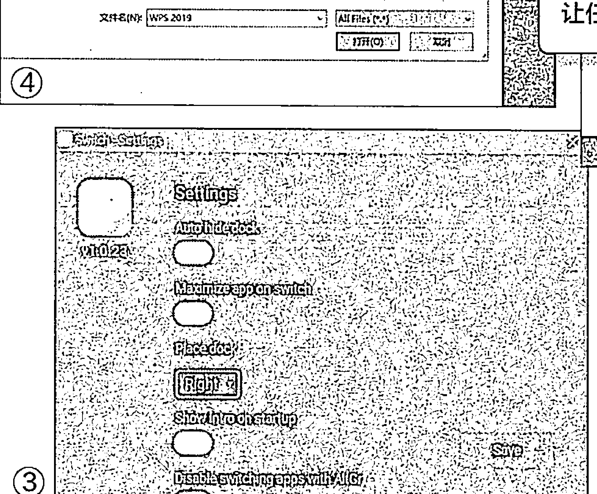

> 小提示: 若是想让Switch程序快速切换栏一直显示在桌面上，可右键单击托盘Switch程序图标并选择Settings，然后在设置窗口中将Auto hide dock开关按钮置于关闭状态（图3）。

##### 3. 用程序快速切换栏切换已开启程序

当程序添加到程序快速切换栏上之后，如果已经开启了这些程序中的一个或几个，我们既可以通过直接点击该快捷程序栏上的图标切换到该程序窗口，也可以使用Alt+1/2/3/4/5/6/7/8/9等键盘快捷键，切换程序快捷栏上固定的程序窗口。

注意，Switch切换的是已开启的程序窗口，不能切换未开启的程序。如果所选的程序没有运行，点击快捷栏上的相应图标或Alt组合快捷键时，Switch软件会提醒当前程序还未运行。

#### 保护数据 按需创建多种加密磁盘

文|樱子

磁盘加密通常分为三种情况：一是对非系统数据分区或移动存储设备进行加密，二是创建文件型的虚拟数据加密盘，三是对系统分区甚至整个系统所在的硬盘进行加密。而涉及到如此多种的磁盘加密任务，往往需要借助于不同的加密软件来完成。实际上，一个VeraCrypt软件就可以统揽上述三项加密任务。

> 用VeraCrypt软件创建文件型虚拟加密磁盘的具体方法参见本刊2016年第1期文章《多管齐下加密文件护隐私》。

##### 1. 加密非系统分区或移动存储设备

首先，我们可以利用VeraCrypt，将硬盘中的某个数据分区或外部存储设备（如闪存盘或移动硬盘）进行加密。

> VeraCrypt是TrueCrypt软件派生出的免费开源软件（https://www.veracrypt.fr/en/Downloads.html），有32位和64位两种运行程序对应于两种不同架构的Windows系统。对于使用Mac OS X和Linux、FreeBSD等操作系统的用户，也有其相应的版本可供选择。

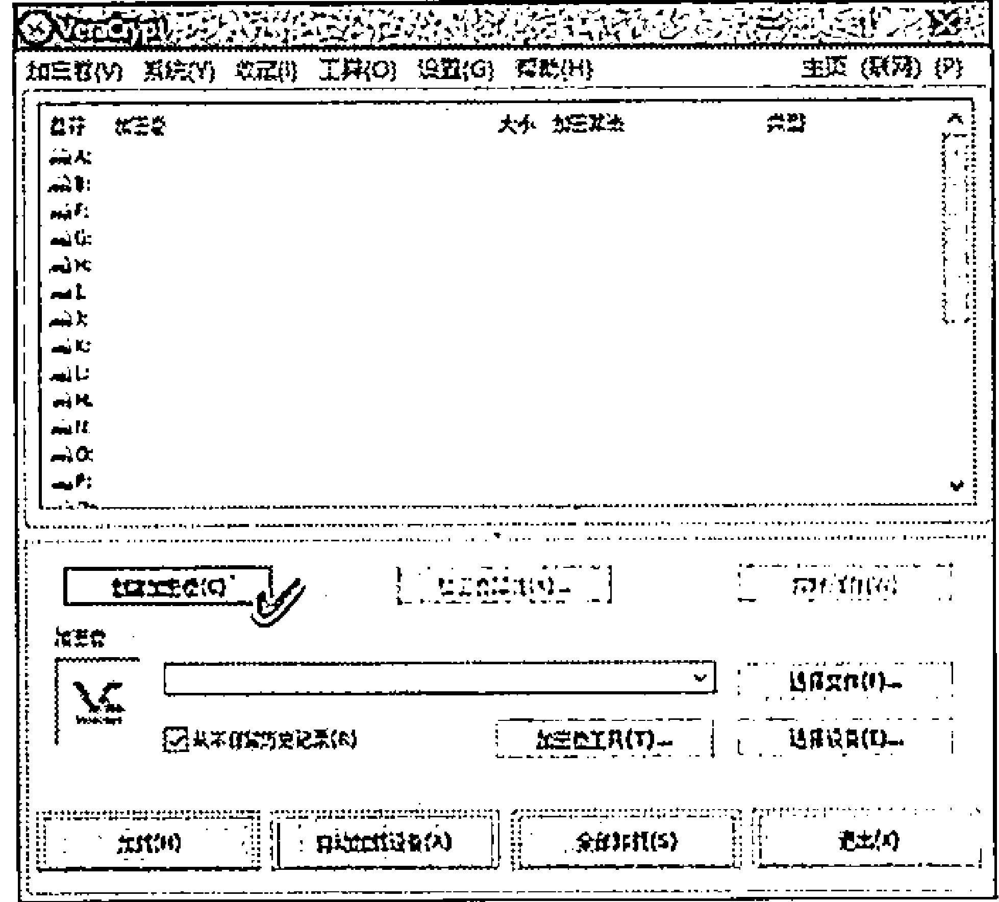

启动VeraCrypt软件，点击屏幕中部的“创建加密卷”按钮（图1）。接下来，在加密卷创建向导窗口中，选中“加密非系统分区/设备”一项，然后点击“下一步”（图2）。

> 如果希望创建一个隐藏的加密卷，在加密卷类型选择窗口中，选择“隐藏的VeraCrypt加密卷”类型即可。

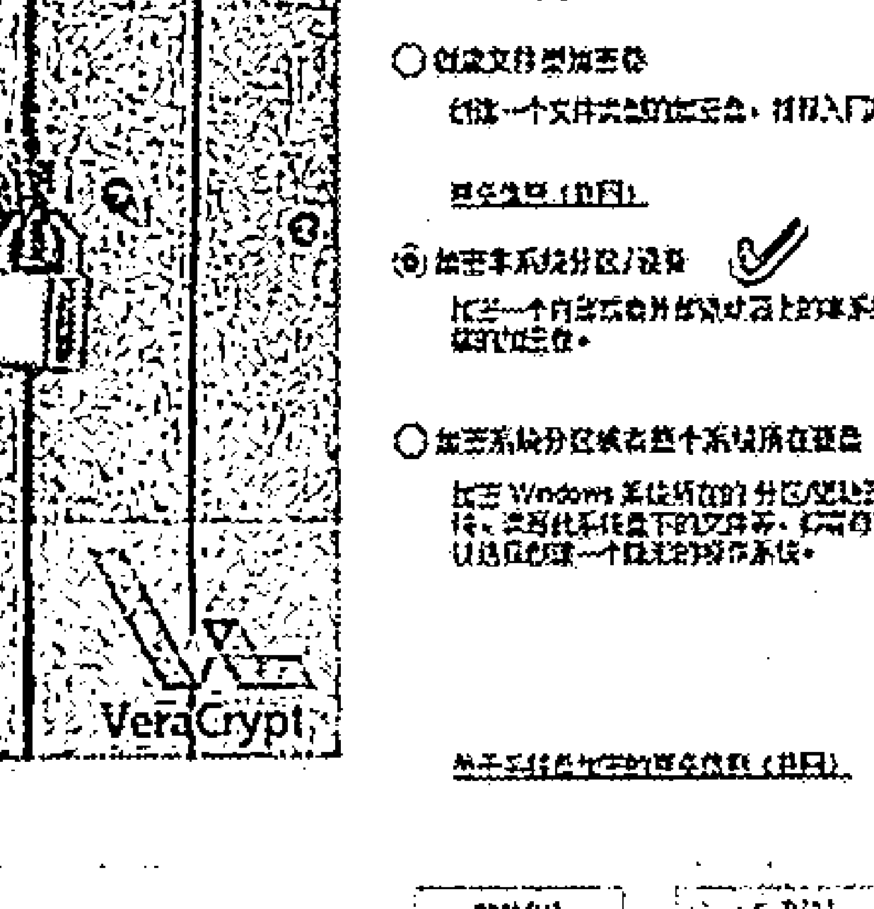

> 使用该功能必须要用VeraCrypt软件的安装版，而不是便携版，便携版不支持此模块的运行。

在随后的步骤中，选择加密卷的类型为“标准加密卷”，选择要加密的数据分区位置（或移动设备盘符），执行加密操作即可。

##### 2. 创建文件型虚拟加密磁盘

我们还可以在现有磁盘中创建一个加密文件，将这个文件虚拟为一个加密的磁盘来使用。这样，数据存入该文件中，需要使用时以加密磁盘的形式加载此“磁盘”，通过密码才能访问。当使用完毕后，关闭“磁盘”，别人便无从访问其中的文件了。

##### 3. 加密系统分区或系统所在硬盘

首先，从VeraCrypt加密向导页中选择“加密系统分区或者整个系统所在硬盘”选项；然后按照向导指引选择要加密的系统分区或所在硬盘，并选择系统加密类型，如果系统加密类型选择为“隐藏”，那么可以创建一个隐形Windows系统，如果不登录系统，分区、盘符、系统文件等均无法看到；最后，执行加密操作即可（图3）。

用此模块加密Windows系统所在的分区或驱动器后，任何人想要访问和使用此加密系统、读写此系统盘中的文件等，每次在Windows启动之前都需要输入正确的密码才能转到系统登录界面。

磁盘加密之后，修改加密卷密码、从加密卷中移除密钥、永久解密等操作，均需要通过点击软件主界面上的“加密卷工具”按钮，然后选择相应的菜单命令来完成（图4）。

#### 方便直观 改善Windows驱动程序管理

文|波哥

使用Windows 10自带的设备管理器管理驱动程序有很大的局限性，它无法在同一个窗口中一目了然地列出所有驱动程序，无法单独显示Windows 10自带驱动之外的驱动程序列表，更无法按需一次性导出驱动程序列表。那么，有何办法使这一现状得到改观呢？

##### 1. 请来助手 突破系统驱动管理局限

在大多数情况下，不需要额外安装任何驱动程序，Windows 10安装完毕后即可开始工作。但有时系统默认的驱动程序可能无法很好地支持甚至不支持某些硬件设备，这种情况下则需要安装专门的驱动程序。另外，许多安全或底层工具，如Sandboxie或VeraCrypt也会在系统中安装驱动程序。这样，系统中就可能存在来自于上述三种途径的驱动程序。但是，我们使用Windows本机自带的设备管理器来管理驱动程序，需要深入各大小分支，查看“设备”右键属性菜单和选项卡，才能看清楚其由来和属性，这在很大程度上不是一种愉快的体验。借助于第三方驱动管理工具DriverView，可改善驱动管理体验。

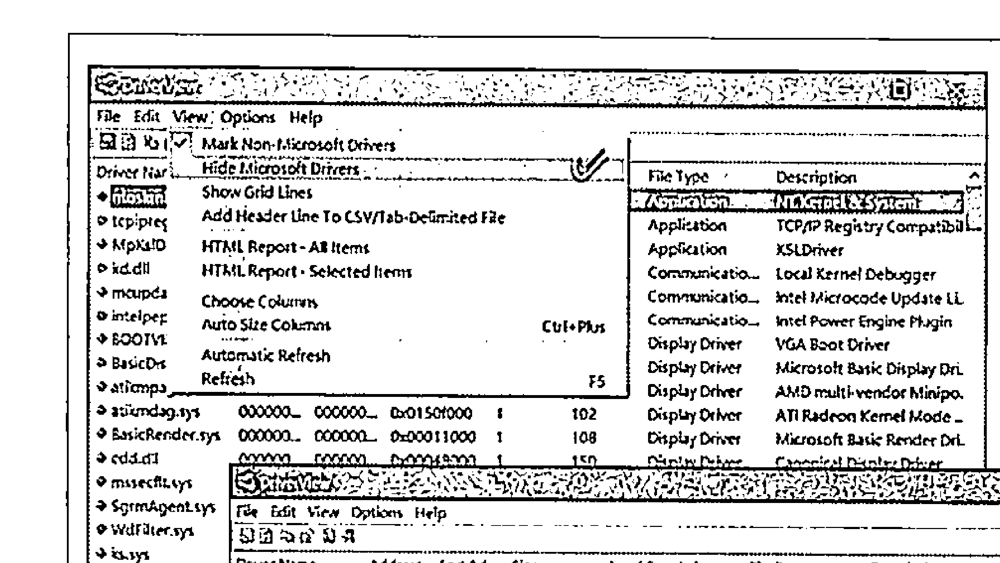

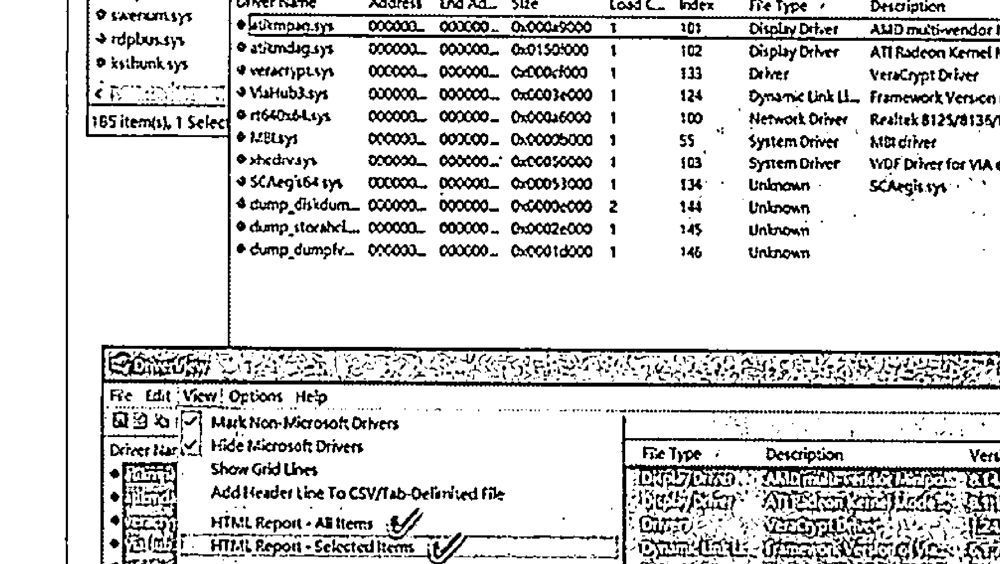

##### 2. 一目了然 列出系统内外驱动信息

启动DriverView软件后，窗口会列出当前系统中所有已安装的驱动程序。点击File Type列标题，按照驱动程序的类别进行排序，就可以看到属于各类设备或组件的驱动程序有哪些（图1）。如果我们仅仅是想查看Windows之外的驱动程序，那么，选择View菜单中的Hide Microsoft Drivers命令，随即便会藏起系统中的所有Microsoft自带驱动程序，只留下外来的驱动程序。通过Description(描述)、Version(版本)、Company(公司)等列，可以一目了然地看到这些驱动程序的具体描述、版本、所属公司等信息（图2）。

##### 3. 两种方式 灵活输出驱动程序列表

我们可以按需将驱动程序的列表输出为HTML网页格式的文件。在软件驱动列表窗口中选择“View→HTML Report – All Items”命令，若是只希望输出选定的某类驱动（例如仅第三方驱动，或者仅网络驱动等），则在选中了这些条目之后，执行“View→HTML Report – Selected Items”命令即可（图3）。

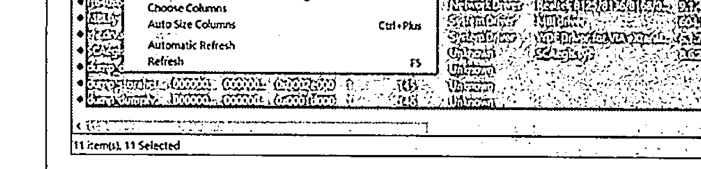

驱动列表输出还有另外一种更加灵活的方法，那就是采用命令行的方式。具体格式例如：

```
DriverView.exe /shtml "f:\temp\drivers.html" /sort "File Type" /sort "Driver Name"
```

该命令会将驱动程序先后以文件类别和驱动名称排序，然后输出到“f:\temp\drivers.html”文件中。

其中，参数“/shtml”表示输出列表为HTML文件，后面紧跟输出的文件名；“/sort”参数为排序方式参数，后面紧跟排序方式关键词。

#### 压缩文件可以更灵活

文/阿立

平时工作中我们经常要和图片以及PDF文件打交道，为了能在网上更顺畅地传输，就需要尽可能减小它们的体积。如果通过压缩软件对图片或PDF文件进行压缩，对方接收后还得重新解压才能使用。其实通过Docsmall这个在线压缩服务，我们不用改变文件格式即可对图片和PDF文件进行压缩。

##### 让表情包变得更小巧

针对图片文件的压缩服务，无论是电脑软件还是在线服务都已经很多了，不过这类服务往往只针对JPG等常见的图片格式进行，对动态的GIF表情图并不支持，而Docsmall则可以弥补这些服务的缺憾。首先打开Docsmall的首页https://docsmall.com，点击其中的“GIF压缩”按钮，进入到GIF文件的压缩操作页面（图1）。

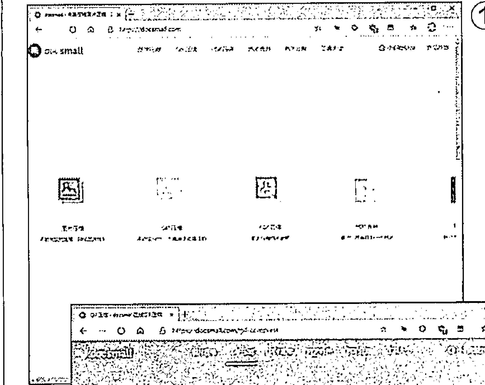

点击网页正中的加号按钮，在弹出的对话框中选择要进行压缩的GIF文件。该服务允许用户一次最多上传30个文件，并且每一个文件的体积不能超过25MB，虽然有一定的限制，但是对于普通用户来说已经足够使用了。接着在出现的压缩参数页面中，选择图片文件使用的压缩强度，用户可以选择轻度、普通、强力、极强等四个选项。另外通过调整“缩放比例”的滑钮，可以对GIF文件的大小进行缩放调整（图2）。

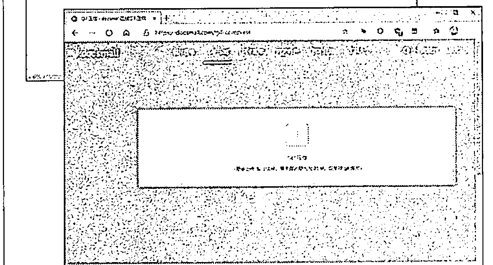

当所有的参数设置完成以后，点击旁边的“开始压缩”按钮，该服务就会对这个文件按照指定的参数进行压缩了。当压缩完成后会在列表中给出图片的相关信息以及压缩的百分比，点击列表最后面的箭头按钮，就可以将该文件下载保存了（图3）。如果用户一次性上传了多个图片文件进行压缩，那么该服务会对压缩后的文件进行打包，从而方便用户一次性下载。

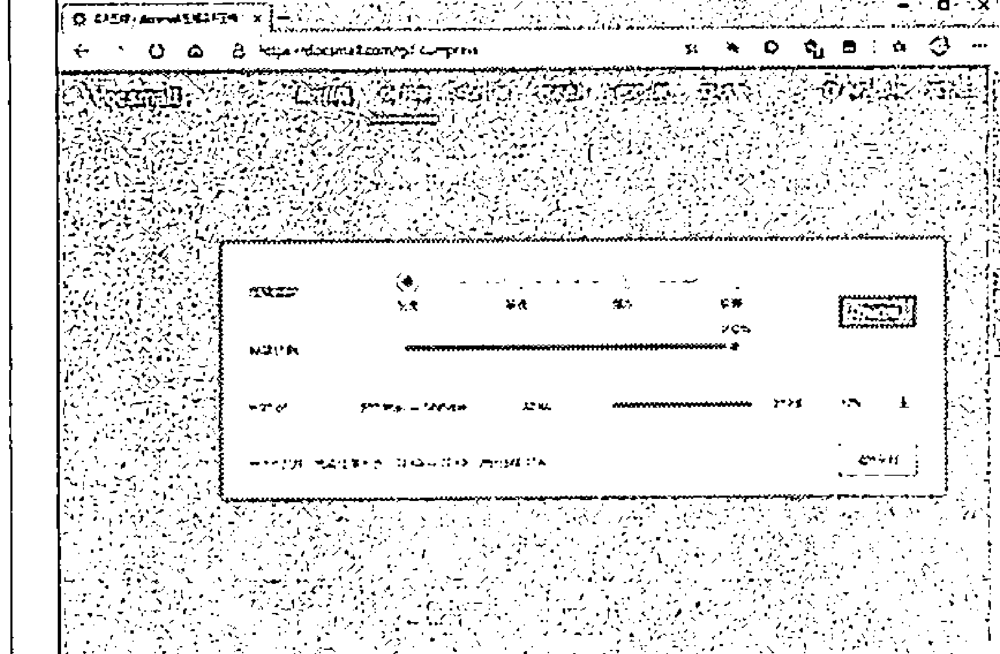

##### 压缩PDF文件也方便

Docsmall不仅能压缩图片，还可以针对PDF文件进行压缩、合并、分割等操作。如果我们想要让PDF文件的体积更小一些，那么首先点击该服务主页中的“PDF压缩”按钮，在打开的页面中同样点击其中的加号按钮，再在弹出的对话框中选择要进行压缩的PDF文件。

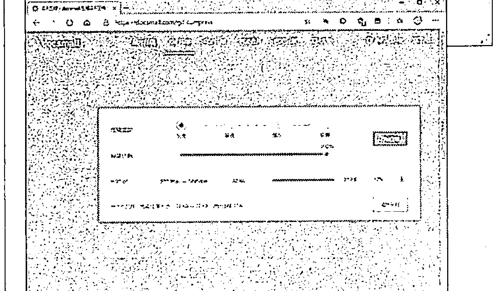

该服务允许用户最多上传五个文件，而且每个文件的体积不能超过200MB（图4）。接下来设置好压缩强度，然后进行压缩就可以了。不过这里需要提醒大家的是，由于PDF文件的格式比较复杂，所以不建议用户选择“强力”以及“极强”两种压缩强度，避免压缩后的文件无法正常打开。

> **小提示**
> Docsmall服务同样支持对JPG和PNG图片进行压缩，用户只需要在主页中选择“图片压缩”按钮进行操作即可。

#### AI在线分离歌曲中的伴奏

文|剑侠

通常我们听到的歌曲都是由人声和伴奏两部分组成，如果我们想保留其中的伴奏部分，就必须通过软件工具将人声部分消除。今天我们为大家介绍的Moises在线服务，它就可以利用AI技术将人声和伴奏分离，从而让我们快速地提取出伴奏。

##### 提交要处理的歌曲

我们首先打开Moises的主页https://moises.ai，然后点击网页下方的“处理您的音乐”按钮（图1），这时它会要求用户注册一个账户。按提示注册完成后，登录自己的账户并进入操作页面（图2）。

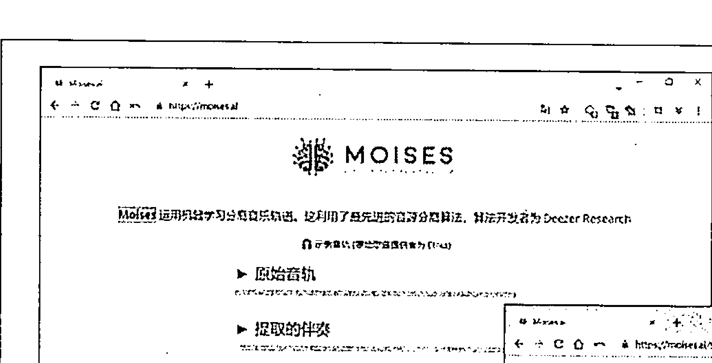

> **小提示**
> 如果按照刚刚的设置处理后的效果不好，那么可以点击“显示高级选项”链接，在接下来的页面中勾选“保留高频”项再进行处理即可。不过该选项并不适用于所有类型的歌曲文件，所以需要酌情选择。

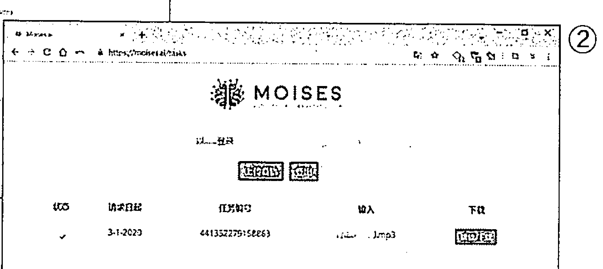

点击“上传音轨”按钮，在接下来的页面中可以看到两种不同的文件上传方式（图3）。如果需要处理的歌曲文件就在本地，则点击“选择文件”按钮将该文件上传。如果是在线文件，则将该文件的链接地址粘贴到下面的输入框中即可。

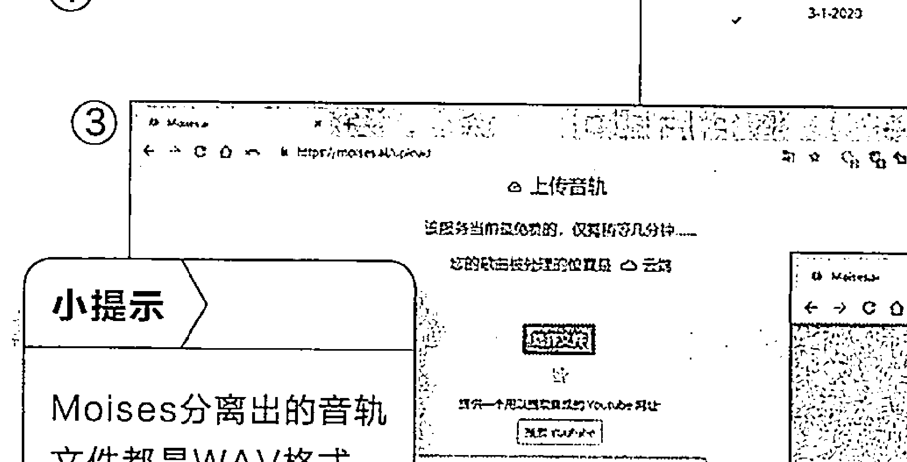

> **小提示**
> Moises分离出的音轨文件都是WAV格式，文件的体积都比较大，所以无论用户选择哪种下载方式，下载的时间都会相对较长。

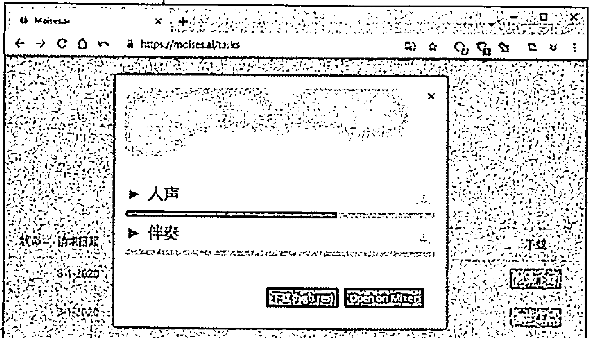

接下来在“该请求的提取类型”列表中选择要提取的类型，默认类型包括人声和伴奏两条音轨。用户可以根据自己的实际需要选择多条音轨，其中除了人声以外还包括贝斯、钢琴、鼓点等等。设置完毕点击“提交”按钮，即可对上传的歌曲文件进行音轨的分离操作。

##### 下载分离后的音轨文件

Moises在对歌曲文件进行处理的时候，将会自动切换到任务处理列表中，如果状态栏显示为旋转的圆圈，表示该任务正在进行中，一旦处理完成就会显示为绿色的对钩号。现在点击任务栏后面的“播放/下载”按钮，将会看到人声和伴奏两条音轨，点击任意一个音轨的播放按钮即可试听，感觉没有问题后可以点击后面的下载按钮分别进行保存。

需要注意的是，现在的浏览器大都支持多媒体文件的在线播放，所以点击下载按钮后并不会弹出保存对话框，而是显示一个在线播放页面。此时我们在页面的媒体控制区域中点击鼠标右键，选择菜单中的“音频另存为”命令，就可以将对应的音轨下载到硬盘里面了。
当然我们也可以直接点击下面的“下载（High-res）”按钮，这样Moises就会把所有分离出的音轨文件进行打包，然后统一供用户进行下载（图4）。

#### 浏览无障碍 在线翻译更简单

文|平淡

平时在浏览一些外文网页的时候，我们经常需要借助浏览器的翻译功能进行在线翻译。不过浏览器默认的功能有很多不足，比如Chrome浏览器自带翻译功能却没有双语对照，这样当感觉翻译的内容不合理时，想查看原文就很不方便。而IE浏览器更是没有自带翻译功能，官方也没有提供相应的翻译插件，每次翻译只能手动打开其他在线网站进行翻译。对于上述问题，我们可以通过一些插件和简单的设置来解决。

##### Chrome和火狐浏览器——“彩云小译”增加双语对照

Chrome没有双语对照翻译，而这可以借助“彩云小译”插件（https://t00y.com/file/15690961-420884868）来实现。进入Chrome浏览器扩展程序安装窗口，开启“开发者模式”，点击“加载已解压的扩展程序”，选择上述插件安装即可。插件成功安装后将在地址栏增加一个按钮，以后访问网页时点击该按钮（或者在空白网页右击选择“启动彩云小译”），激活后即可进行双语翻译（图1）。

对于火狐用户需要借助油猴（Greasemonkey）脚本实现上述功能。在火狐浏览器中打开https://addons.mozilla.org/zh-CN/firefox/addon/greasemonkey/，按提示安装Greasemonkey，成功安装后点击“选项→附加组件”就可以看到该组件了（图3）。
完成Greasemonkey的安装后打开“https://greasyfork.org/zh-CN/scripts/378131--彩云小译”，接着点击“安装此脚本”，此时火狐浏览器会自动调用Greasemonkey安装该脚本（图4）。

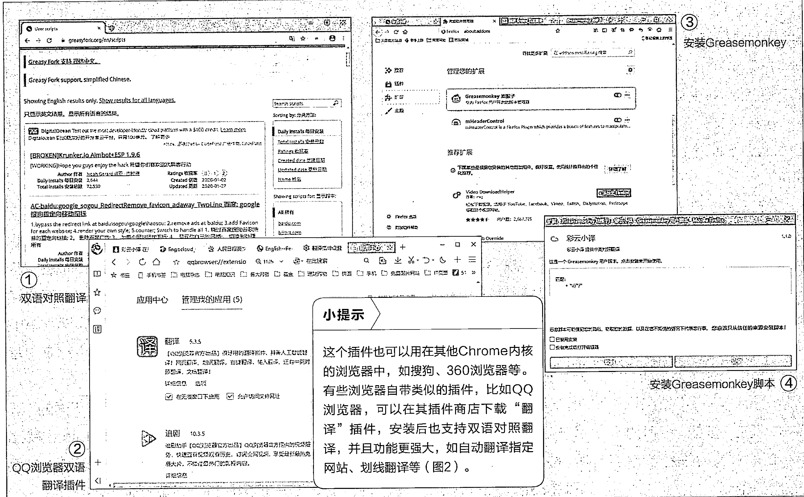

> **小提示**
> 这个插件也可以用在其他Chrome内核的浏览器中，如搜狗、360浏览器等。有些浏览器自带类似的插件，比如QQ浏览器，可以在其插件商店下载“翻译”插件，安装后也支持双语对照翻译，并且功能更强大，如自动翻译指定网站、划线翻译等（图2）。

成功安装后该脚本会自动集成在Greasemonkey中，以后再打开需要翻译的网页时，点击地址栏后的油猴图标，在弹出的菜单中选择“彩云小译”，这个脚本即会对当前页面进行双语对照翻译了（图5）。

如果部分网站无法完成翻译，请到https://addons.mozilla.org/zh-CN/firefox/addon/mheadercontrol/下载“MHeaderControl”插件，启动该插件后将“Content Security Policy(CSP)”全部设置为“Disable”即可（图6）。

##### IE用户——自己动手添加在线翻译功能

因为IE官方并没有提供翻译插件，所以IE用户可以使用“收藏夹”+“在线翻译服务”的方式实现网页的翻译。在IE中打开任意一个网页（如http://www.baidu.com），然后将其添加到收藏夹，接着选中收藏的百度，右击选择“属性”，在“常规”选项下将名称更改为“在线翻译”，切换到“Web文档”，将URL更改为“javascript:(function(){window.open('http://fanyi.baidu.com/transpage?query='+escape(document.location.href)+'&from=auto&to=zh&source=url&render=1')})();”（图7）。

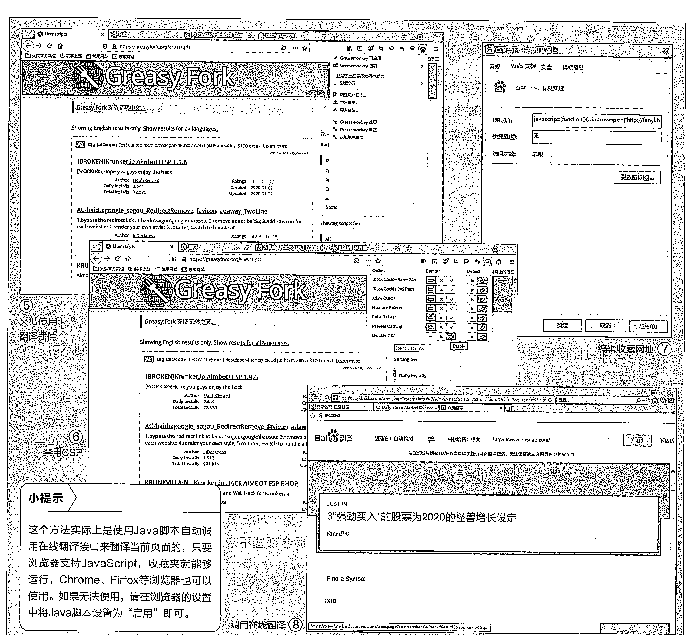

#### 远程办公有高招

很多时候我们不方便到公司上班，或者出门在外一时无法到办公室，那么在这些情况下自己该怎么访问在办公室的文件？如果一些复杂的工作需要和同事之间合作才能完成，此时又该怎样进行工作文档的共享和协作？现在借助一些免费工具即可实现上述操作，并且和那些收费的专业远程办公软件相比，不仅容易获取（比如利用系统自带的工具），而且操作也简单高效（比如“腾讯文档”可令同事之间直接进行协作办公）。

##### 用好系统自带的远程工具

对于Windows 10的用户来说，系统自带的一些工具已经可以很方便地实现对远程文件的访问和彼此协作。

远程访问可以使用远程桌面组件，在桌面搜索框输入“远程桌面设置”，打开设置窗口后将其设置为“开启”，同时点击下方的用户账户，为远程访问设置一个专用访问账户（图1）。

由于办公室电脑大多使用“路由+交换机”组成网络，还需要先在路由器上增加公司电脑的端口映射。完成这些操作后，当我们在家里需要提取办公室电脑的文件时，只要交代公司同事开启公司电脑（如果经常访问则建议一直开启，只将显示器关闭即可）。然后在家里电脑启动远程桌面，在计算机处输入公司电脑外网IP地址（可以通过远程登录路由器查看）和连接账户（图2）。

成功连接到远程电脑上后就可以像操作本地电脑一样，比如需要提取文件，那么只要远程复制到本机，或者使用邮箱、网盘等传输即可。

对于需要协作的文档则可以借助系统自带的OneDrive实现，将文档上传到OneDrive，接着选中文档点击“共享”，然后输入需要共享同事的微软账号（图3）。

同事们登录OneDrive后就可以编辑和查看共享的文档了。这个方法使用的都是Windows 10自带的功能实现，很适合那些不方便在电脑上安装软件的用户使用。

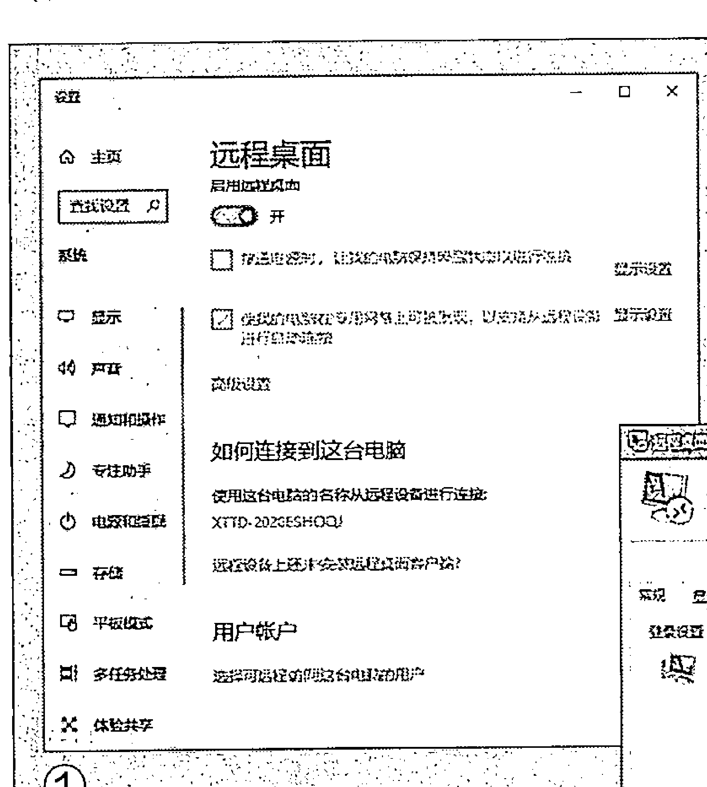

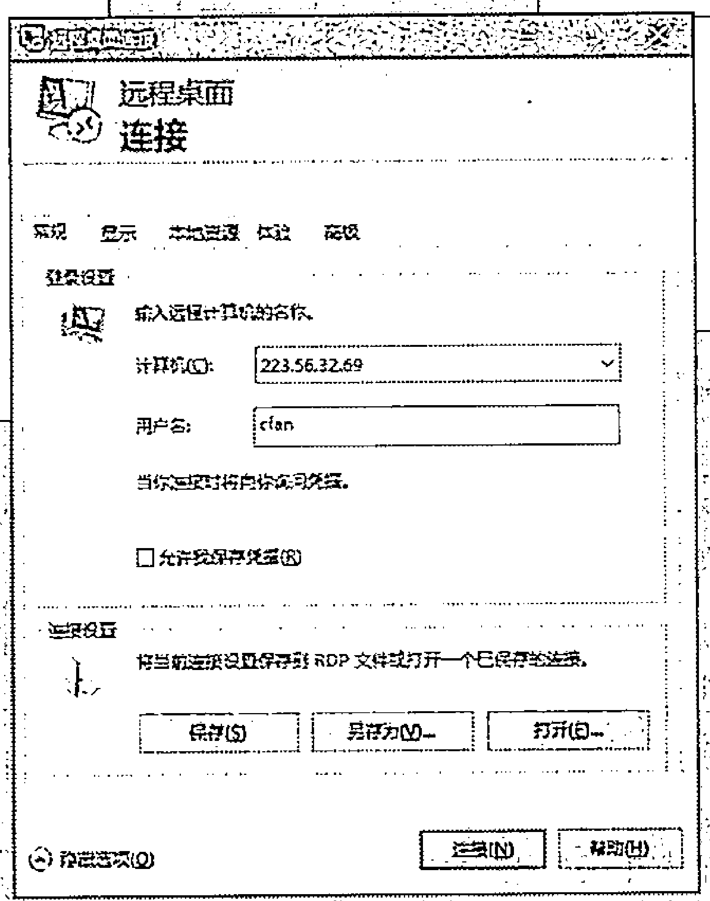

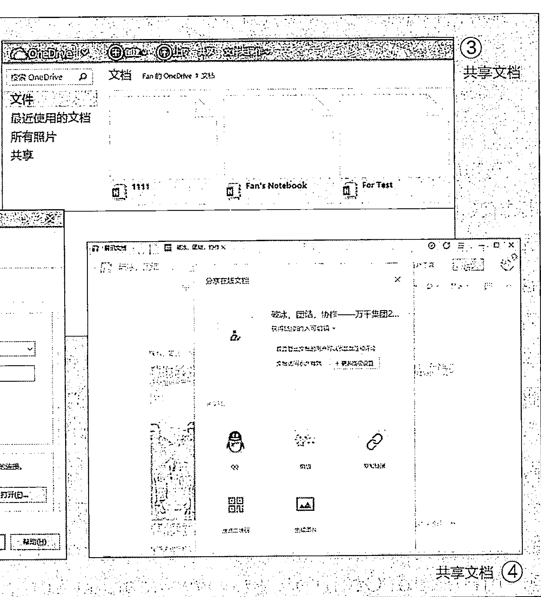

> > **火速链接**
> >
> > 2016年第5期《身在外 公司服务器照样控》详细介绍了TeamViewer的使用。

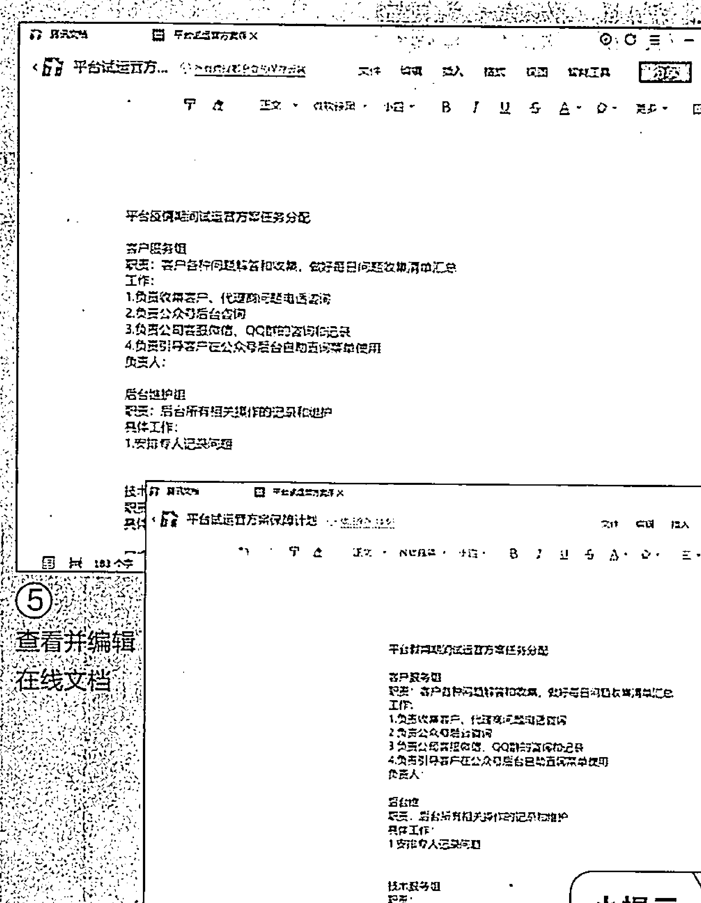

> **小提示**
> 如果只是偶尔使用文档共享协作，还可以使用免费的“会议桌”（https://www.huiyizhuo.com/），打开上述网址（建议使用Chrome浏览器）就可以直接使用思维导图、共享屏幕、语音交流及共享协作等远程办公功能（图9）。

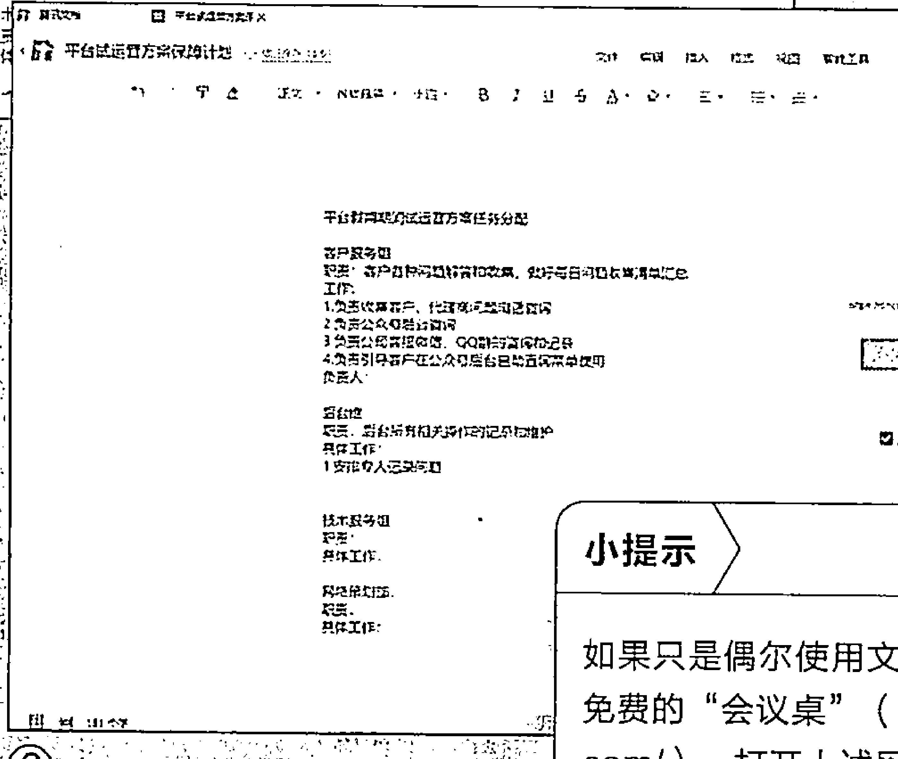


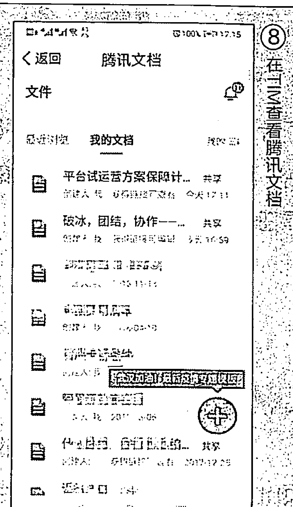

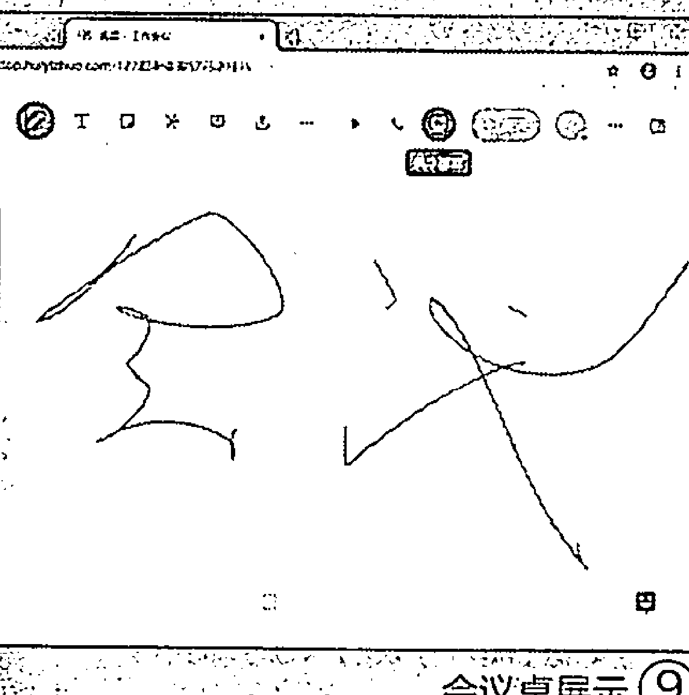

##### 借助外援远程办公与协作

上述方法需要增加端口映射，并且还要知道外网IP才能访问，实际使用起来还是不大方便，现在通过第三方专业软件则可以解决这类问题。

对于远程文件的提取可以使用免费的TeamViewer，只要预先在办公室和家里的电脑都安装上TeamViewer，这样在家里的电脑中使用TeamViewer就可以轻松访问办公室电脑上的任意文件。

对于文件的共享和协作则建议使用“腾讯文档”。将需要协作的文档上传并在线打开后，点击上方的“共享按钮”，在打开的窗口中将共享权限设置为“获得链接的人可编辑”，然后将链接通过QQ、微信、二维码等方式共享给其他同事（图4）。

收到链接的同事打开并登录“腾讯文档”（无需安装客户端，同事们可以直接使用微信或浏览器在线登录），他们打开后可以查看和编辑共享文档，打开的文档在线编辑后会实时保存（图5）。

我们在“腾讯文档”中还可以随时展开侧边栏看到协作者的名称和编辑的权限，以及历史等协作信息。对于一些比较复杂的文档，或者需要多个部门一起在线协作的事情，还可以使用“腾讯文档”的“远程演示”功能。比如在线制作一个工作汇报文档后，点击右上方的“远程演示”功能，点击“邀请好友”，然后将显示的二维码发送给其他员工（图6）。

这样发起者只要点击“开始演示”（演示过程中还可以发起语音通话，让大家一起实时进行语音讨论），其他员工扫码后就可以实时看到演示者电脑上的文档了（图7）。

“腾讯文档”用大家常用的QQ、微信账号就可以直接登录（还支持电脑、手机、WEB端全平台访问），而且它还和TIM、手机QQ浏览器无缝融合。经常在手机上使用TIM的用户，在TIM中切换到“云文件→腾讯文档”，在这里可以直接打开文档进行查看、编辑和共享，每个员工使用手机TIM都可以随时随地进行远程协作（图8）。

#### 同一平台完成多媒体文件编辑

文|剑侠

图片、音频、视频是我们平时最常见的几类多媒体文件，对这些文件进行编辑操作需要使用多种不同的软件或者平台，给大家的操作带来很大的不便。其实现在我们只需要利用Croppio这一个网络平台，就可以完成这几类文件的编辑任务。

##### 图片快速编辑

首先打开Croppio的主页https://croppio.com，点击其中的绿色箭头按钮，在弹出的对话框中选择需要进行编辑的图片文件。如果需要编辑的图片就在网上，则可以切换到“From URL”标签，再将图片的链接粘贴到“Paste your URL here”框中，最后点击“Crop”按钮即可进入到编辑页面了（图1）。

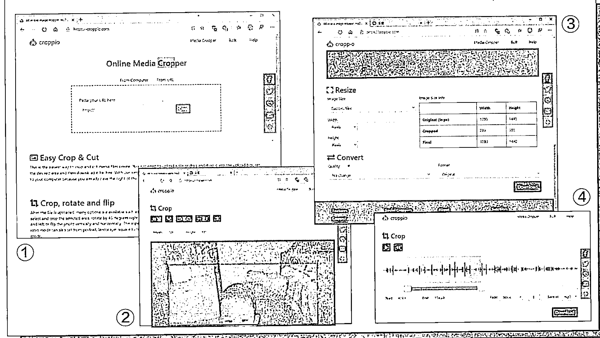

在编辑页面中，利用工具栏中的各种工具，就可以对上传的图片进行剪裁、翻转、旋转等操作了。点击其中的“Crop”按钮，还能选择16:9、4:3、1:1、2:3等常见的剪裁比例。点击“Free”按钮，则可以通过显示出的剪裁框对图片进行自由剪裁。需要注意的是，如果想进行精确的裁剪，那么选择菜单中的“Custom”命令，再在“Width”和“Height”中设置精确的宽和高的数值即可（图2）。

如要想对图片的大小进行调整，那么在“Image Size”列表中，既可以选择调整比例，也可以点击下方的“Custom Size”命令，再分别对“Width”和“Height”进行设置即可。调整的参数可以使用像素单位，也可以使用百分比，操作起来灵活方便（图3）。

##### 音频和视频的编辑

音频和视频的编辑方法，与图片的操作流程基本类似，当通过同样的方法上传音频或视频文件后，就可以通过相应的编辑工具进行操作了。

##### 高级工具简单操作

在编辑页面的下方，可以看到更多高级的工具，比如对图片的大小进行调整，或者对图片的质量进行控制。另外，还可以对图片进行格式转换，从而满足不同场合的需要。

Croppio支持多种媒体文件，音频格式包括mp3、m4a、m4r、flac、wav等，不过对视频文件目前仅支持mp4。与图片的编辑工具相比，针对音频和视频文件多了一些特殊工具，比如除了旋转、裁剪之外，还可以对音频或视频添加淡入淡出之类的特殊效果。同样的，Croppio针对音频文件也提供了多种格式转换功能（图4）。

以上介绍的功能，基本能满足一般用户对多媒体文件的编辑需求了。当所有的编辑完成以后，点击“Download”按钮，Croppio网络平台就可以完成相应的编辑操作，然后将编辑完成的图片或音视频文件下载到本地保存就可以了。

#### 不再烦人 隐藏Windows 10的更新

文|阿木

Windows 10的更新很容易出问题，经常引起许多用户的抱怨，而Windows 10本身对系统更新的控制又非常少，尤其是家庭版，禁用更新非常麻烦。为此微软推出工具Show or hide updates（以下简称为SOHU），帮助Windows 10 Pro和Home版的用户将有问题的更新隐藏起来，避免这类问题更新被下载安装从而引起系统故障，同时又不会影响到正常更新的进行。

首先到https://support.microsoft.com/en-us/help/4026726/windows-10-hide-updates-or-driver-updates下载SOHU，启动程序后会自动进行系统扫描，扫描完成后提示用户是需要隐藏更新还是显示更新，这里我们点击“Hide updates”（隐藏更新）（图1）。如果原来的更新问题已经解决，则这里可以选择显示更新。

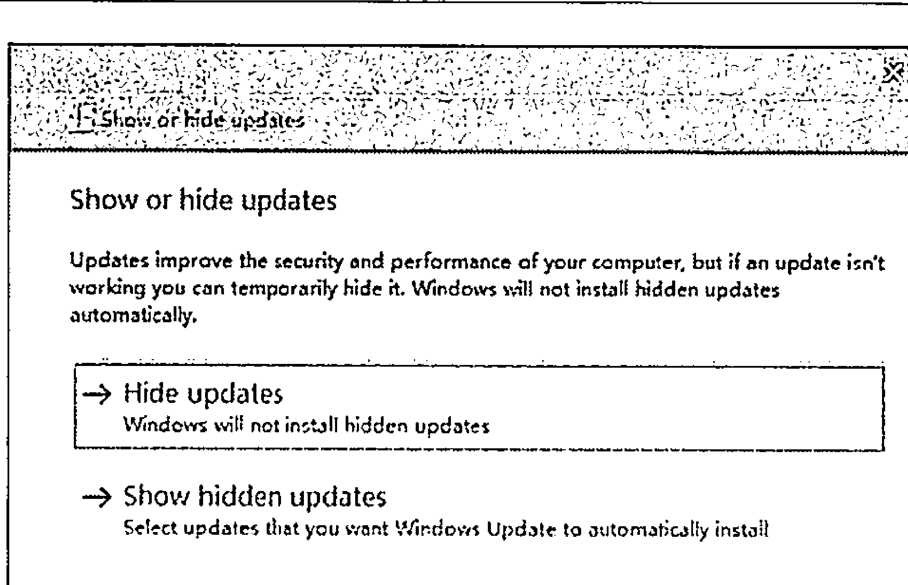

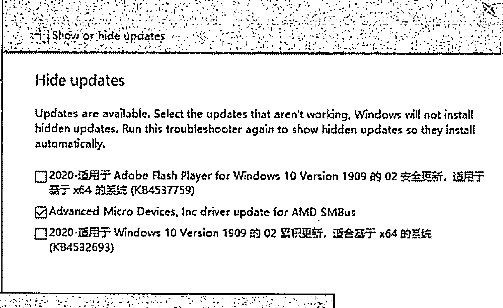

接下来SOHU会对本机所有需要安装的重要更新进行扫描，扫描完成后会列出这些更新。我们可以根据自己的实际情况选择需要隐藏的更新，比如对AMD SMBus后出现死机现象，所以这里可以勾选将其隐藏（图2）。

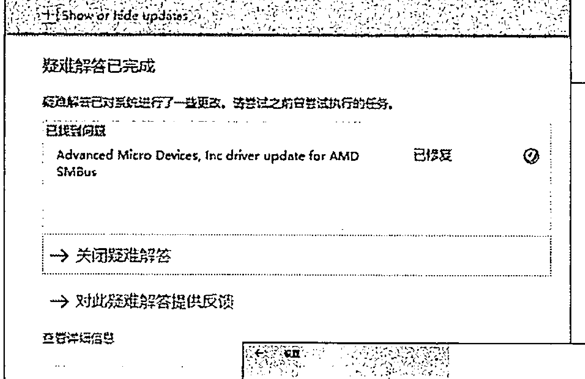

> **小提示**
> 如果在隐藏之前已经下载安装了有问题的更新，可以依次进入“控制面板→程序→程序和功能→已安装的更新”，在更新列表中将其卸载。

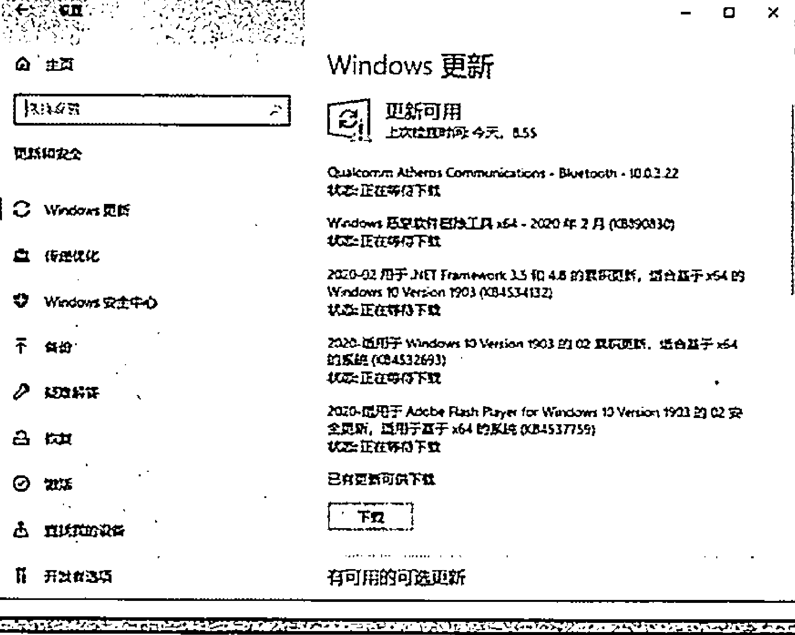

继续点击“下一步”，SOHU会对你选定的更新进行操作，当程序弹出修复完成的提示后就可以了。如此操作的好处就是，往后我们可以继续使用Windows 10的自动更新，而对隐藏了的有问题的更新，系统将会自动忽略（图3）。

完成上述操作后，还可以启动Windows 10自带的系统更新组件，依次点击“设置→更新和安全→Windows更新→检查更新”，这样Windows 10就不会再扫描到上述隐藏的更新了（图4）。

告别点击 关键时刻让键盘替代鼠标

文|阿发

平常使用电脑的过程中，我们经常会遇到一些操作只能通过鼠标点击，或者需要鼠标不断地点击；一些时候则不方便使用鼠标。遇到以上情况时，我们可以使用键盘来完全替代鼠标，从而大大地提高效率。

AHK键盘指令替代鼠标点击

现在很多应用都针对触摸优化没有快捷键，在电脑上我们只能通过鼠标点击完成操作。比如笔者因为工作关系经常要使用TIM远程控制公司同事的电脑，每次公司的TIM接收到控制请求后都需要点击“接受”才能成功连接，有时同事不在电脑边就常常无法连接。现在对于这类需要鼠标点击完成的操作，可以借助Autohotkey（https://www.autohotkey.com/，以下简称为AHK）制作一个自动运行的脚本，借助它实现鼠标自动点击。

AHK支持常见编程代码，旧版（http://www.downcc.com/soft/109337.html）更是支持录制窗口操作自动生成代码。为了方便操作，这里我们以旧版录制操作为例，在同事的电脑上启动“AutoScriptWriter.exe”，点击“录制”按钮。接着启动TIM远程控制操作，当任务栏弹出提示窗口时，点击“接受”，成功连接后点击TIM最小化按钮。停止录制后代码会自动出现在“AutoScriptWriter.exe”窗口（图1）。

点击“Save”保存为“aa.ahk”，放置在桌面备用。上述代码实际上就是一个鼠标的移动和自动点击操作。“网管”表示控制方QQ名称，这样只有本机弹出“网管”发起的远程控制窗口时，脚本才会激活，MouseClick及后续数字表示鼠标的移动位置和点击操作。当然熟悉编程的朋友还可以用它来制作更多运行脚本，如很多游戏点击脚本等。右击“aa.ahk”选择“Run Script”（运行脚本），再次测试一下脚本是否可以成功完成操作（图2）。

上述脚本测试后没有错误，就可以用“Convert .ahk to .exe”组件将其转换为可执行程序。启动上述组件后，在“Source”处选择上述建立的脚本，在“Destination”（目标程序）中选择保存可执行文件的位置和程序名称，点击“Convert”转换即可（图3）。

以上生成的可执行文件“aa.exe”可以直接运行，为了方便使用键盘运行，可以在桌面生成其快捷方式，接着右击选择“属性”，在打开的窗口中设置运行的快捷键为Ctrl+Alt+J，以后直接按下这个快捷键即可运行（图4）。

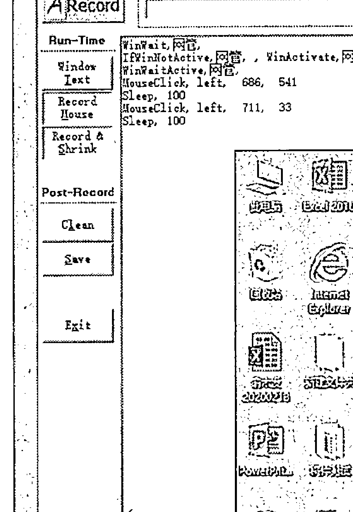
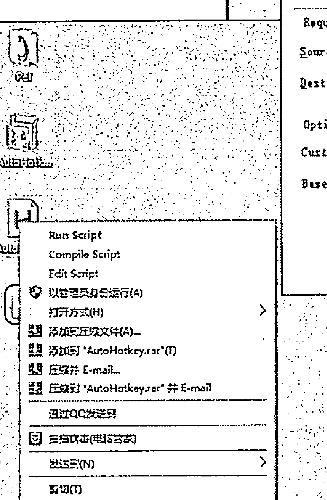
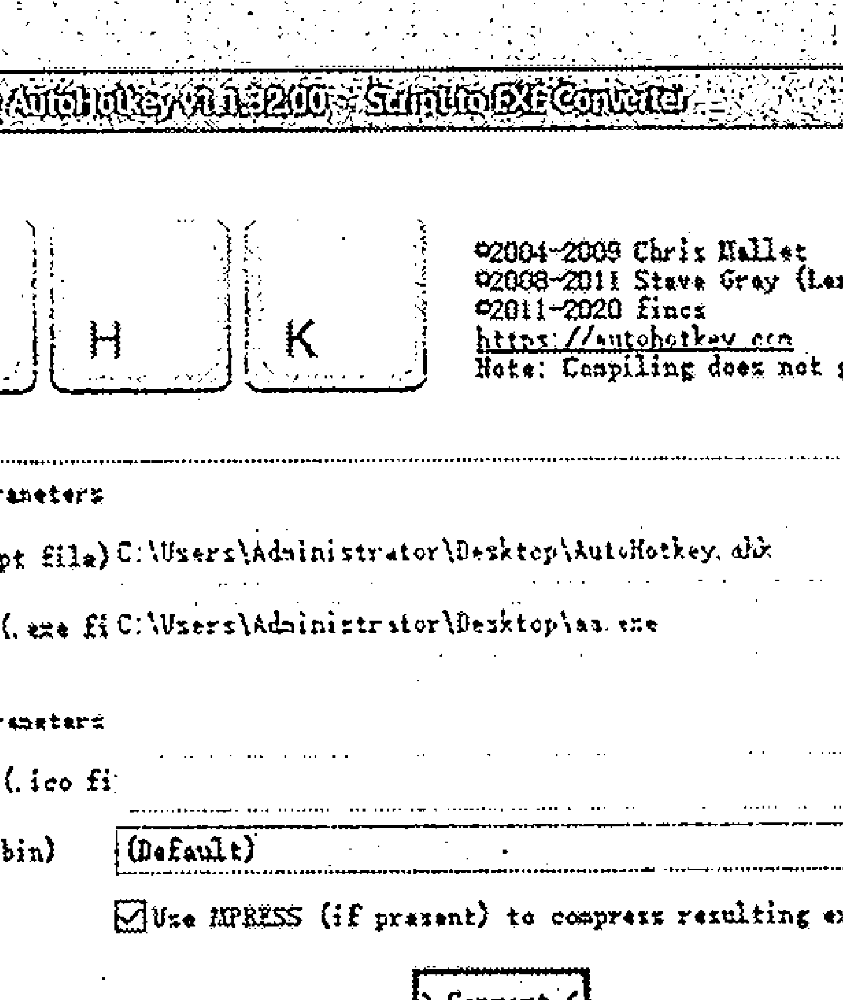
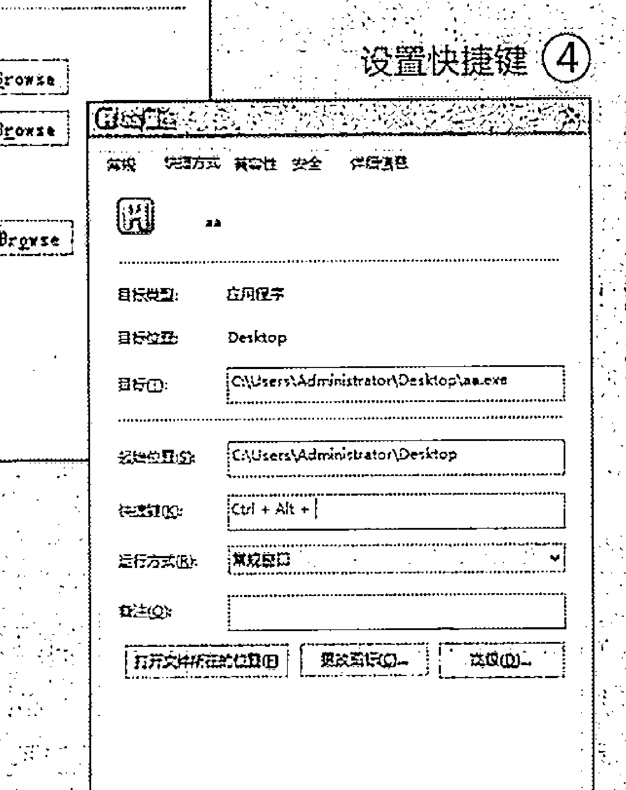
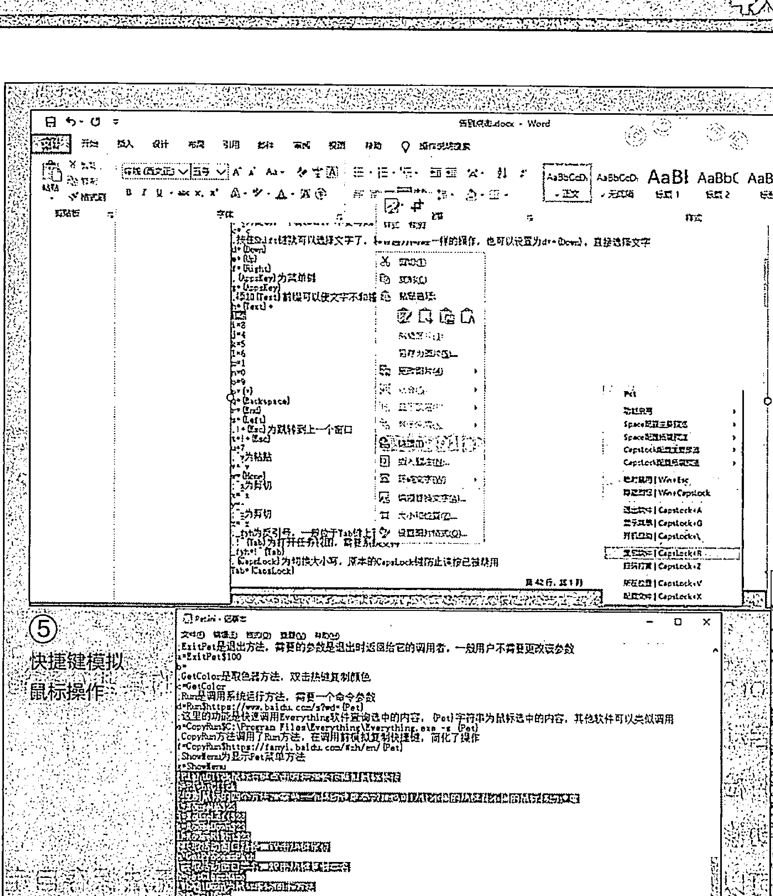
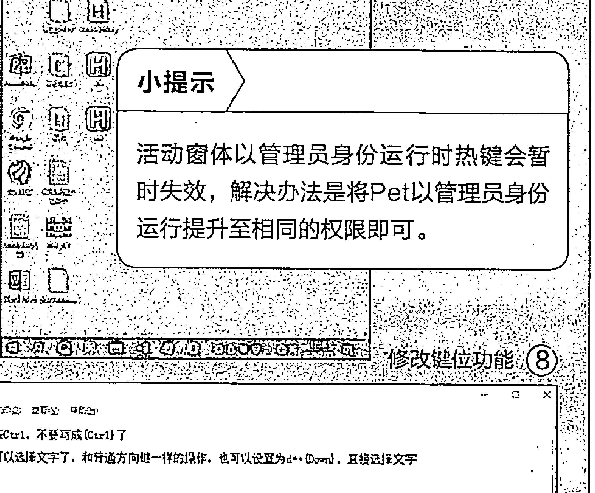


#### 常见操作用Pet来协助

我们在专心撰写文稿的时候可能不方便使用鼠标，这类情况下我们可以使用Pet（https://github.com/majorworld/Pet）来模拟鼠标操作，它就类似我们在笔记本上的触控板，可以替代大部分鼠标的操作。

Pet使用配置的快捷键来模拟鼠标的操作，程序启动后就可以直接使用。比如平时在Word中设置图片格式的时候，我们经常使用鼠标右键的快捷菜单。现在只要按下CapsLock+H就会弹出右键快捷菜单（长按该快捷键则模拟鼠标长按操作，在触摸设备上也会弹出快捷菜单）。按下CapsLock+I则可以将鼠标指针向上移动（+K向下，+J向左，+L向右），选择不同的子菜单，通过这些默认的快捷键可以很方便地实现鼠标的常见操作（图5）。

当然Pet还有很多针对鼠标的常见操作，比如很多台式机键盘都没有调整系统音量的快捷键，该操作默认只能通过鼠标完成。现在按下空格键+Down键可以快速减小系统音量，这样在边听歌边写文档的时候，如果有同事叫你，那么直接按下此快捷键即可调小音量（图6）。

Pet默认还有很多替代鼠标的快捷操作，如模拟鼠标中键、滚轮等，更多配置可以打开安装目录下的“pet.ini”查看。我们也可以根据自己的实际需要自定义快捷键，打开配置窗口按照配置文件的格式添加快捷操作即可（图7）。

比如我们可以使用自定义快捷键来更改某些按键的功能，达到修复损坏键位的目的。以笔者的PC键盘为例，上面的Q键已损坏无法输入字母，现在上述配置文件中“[space]”字段（表示空格键热键）添加一行“1=q”（q使用屏幕键盘输入），保存后按下大写锁定键+R键重启软件，以后需要输入Q字母时，只要按下空格键+1键即可输入Q了（按1键仍然输入数字“1”，其他配置文件的修改类似）（图8）。

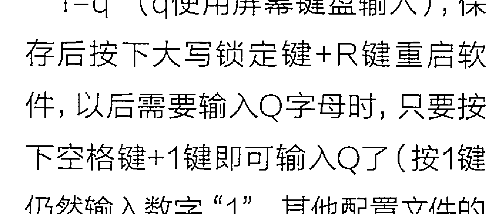

Word “安全模式” 用通透

文|童乐安

大家都知道Windows的安全模式，其实，Word也有安全模式。那么，Word的安全模式又是什么？何时使用这种模式？使用这种模式有何限制？当Word运行中遇到问题需要启用安全模式运行时，如何按照软件给出的提示解决问题？此外，对于安全模式本身的问题，如无法进入或反复进入安全模式，无法返回正常模式，又该怎样处理？

## 1. Word安全模式是怎么回事

安全模式是Word的应急模式。如果我们用Word打开文档时出现问题，这时就可能需要以安全模式启动Word，在此模式的环境中解决问题。当Word启动时检测到问题，会建议进入安全模式，软件要么可以自动修复发现的问题，要么给出错误修复提示建议，我们可以按照提示进行修复。

## 2. 开启Word安全模式的方法

除了软件要求自动进入安全模式外，启动Word安全模式还有两种方法。第一种方法是先按下Ctrl键，然后再双击Word文档，该文档便会以Word安全模式打开。

第二种方法是在“运行”对话框或命令提示符窗口中执行“winword.exe /safe”命令（图1）。也可以在Windows搜索框中键入“winword.exe /safe”命令，启动到Word安全模式窗口（图2）。

## 3. Word安全模式的使用限制

以安全模式启动Word后，Word中的某些功能将会受到限制，这些限制具体包括：

- 无法保存模板；
- 不会自动显示Office助手；
- 不加载工具栏或命令栏自定义项，无法保存自定义项；
- 不加载“自动更正”列表，并且不保存更改；
- 恢复的文档不会自动打开；
- 未加载智能标记，无法保存新标记；
- 除了“/a”和“/n”，所有命令行选项都将被忽略；
- 无法将文件保存到备用启动目录；
- 无法保存首选项；
- 不会自动加载其他功能和程序。

因此，当在该环境下使用上述功能时，若不能发挥作用，请不要感到奇怪，不是软件出了问题，而是环境所限。

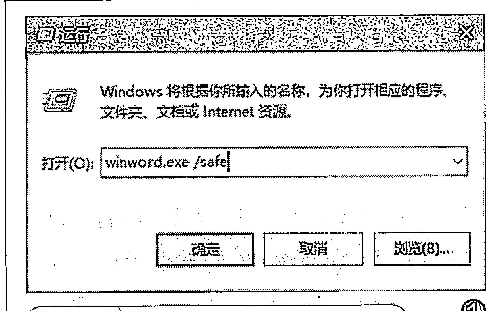
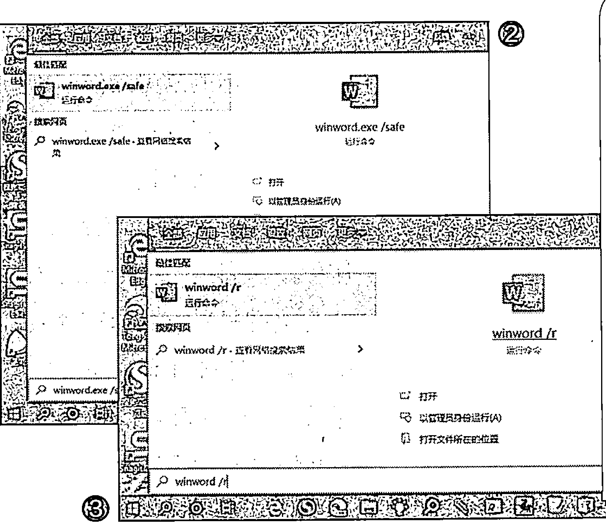

> **小提示**
更多Microsoft Word或其他Office组件程序的命令开关，请参阅微软网站资料（https://dwz.cn/Ngv402bf）。

> **扩展阅读**
如果觉得上述删除的操作步骤较为繁琐，还可以搜索下载一个名为“Word发送错误报告的修复工具”的小软件，运行一下就能解决上述问题。

## 4. 解决Word安全模式提示的问题

在Word启动过程中，Office安全检查程序会检查是否存在诸如外接程序或扩展应用无法启动等问题，还检查资源、文件、注册表或模板等是否存在损坏的情况。若查出问题，启动时会给出相应的提示。对应于不同的提示信息，我们可以用如下办法来解决。

如果提示注册表损坏，只需在Windows 10“搜索”框中键入“winword /r”命令，然后按回车键执行（图3）。这样即可将Word相关的注册表值重置为其默认值。

若是宏相关的问题，要防止Word运行时自动加载宏，只需执行“winword /m”命令即可。

如果提示为Word加载项的问题，则需要阻止Word运行时加载其他加载项，执行“winword /a”命令即可。

## 5. 解决Word安全模式本身的问题

Word安全模式本身还会遇到问题，例如启动Word时出现“Microsoft Office Word遇到问题需要关闭”的提示，选择“不发送”后以“安全模式”启动Word，无法进入正常启动模式，重新启动Word时再次出现上述错误提示。这时，可以用如下办法在安全模式下解决。

在桌面上右键单击并选择新建一个Word文档，按下Ctrl键之后双击该文档，以安全模式打开此空白文档。点击“文件→选项”菜单命令，依次选择“加载项→管理→模板”（图4）。然后，点击“模板”之后的“转到”按钮，当出现“模板和加载项”窗口之后，点击“添加”按钮，选择添加模板（图5）。随后，在弹出的模板选择窗口中，右键单击Normal.dotm文件，选择“删除”即可（图6）。

如果连Word安全模式也不能正常进入，即便是用Office自带的修改工具修改Word，问题依旧，则只能用如下办法解决。首先转到“C:\Users\用户名\AppData\Roaming\Microsoft\Templates\”文件夹下，然后直接将Normal.dotm文件删除即可（图7）。注意：该文件夹具有隐含属性，需要在系统文件夹选项窗口中开启对隐藏文件的显示功能选项。

上述两种情况，第二种不得不使用路径才能进入；而第一种则不用麻烦去设置显示隐藏文件夹，直接在安全模式下就能解决，当然，也可以采用第二种方法来解决，亦无明显优势。删除模板文件后，重启Word时会以软件的默认方式重建全新的模板文件，并以该模板开启新文档。

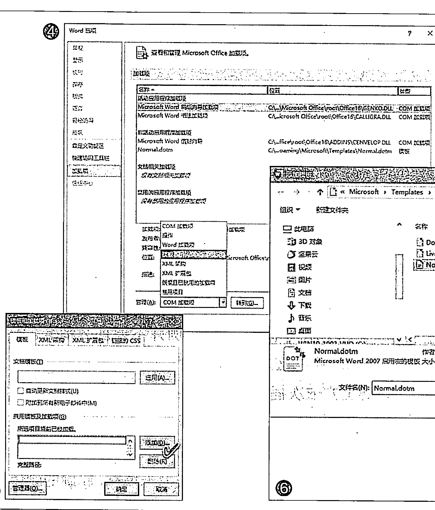
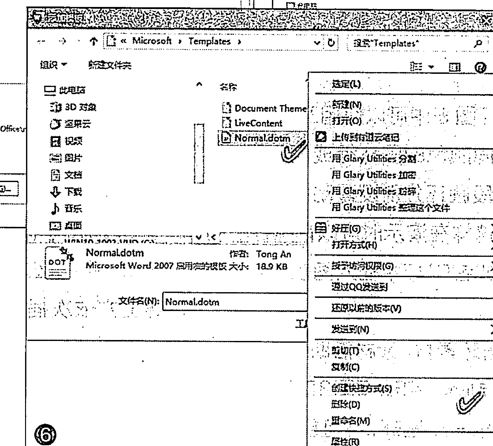
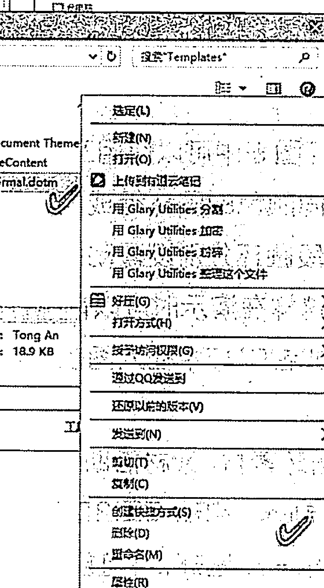
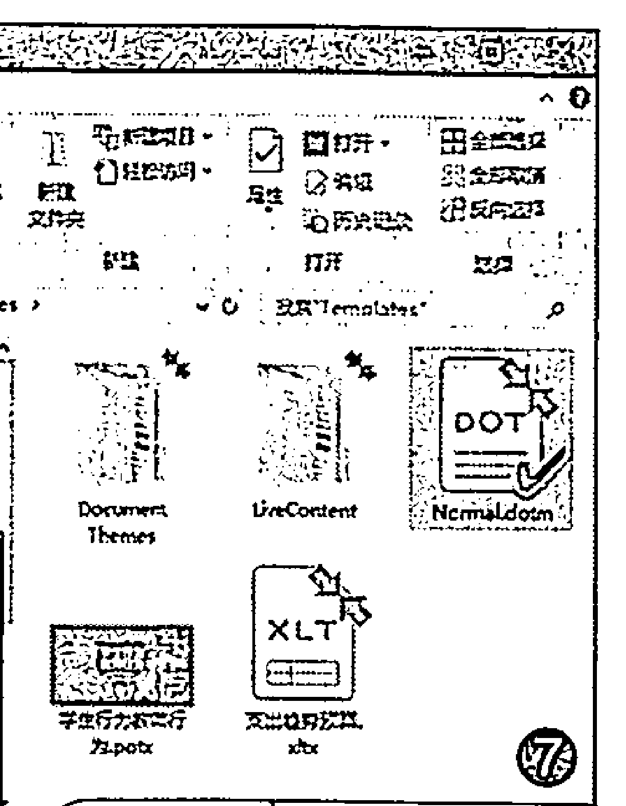
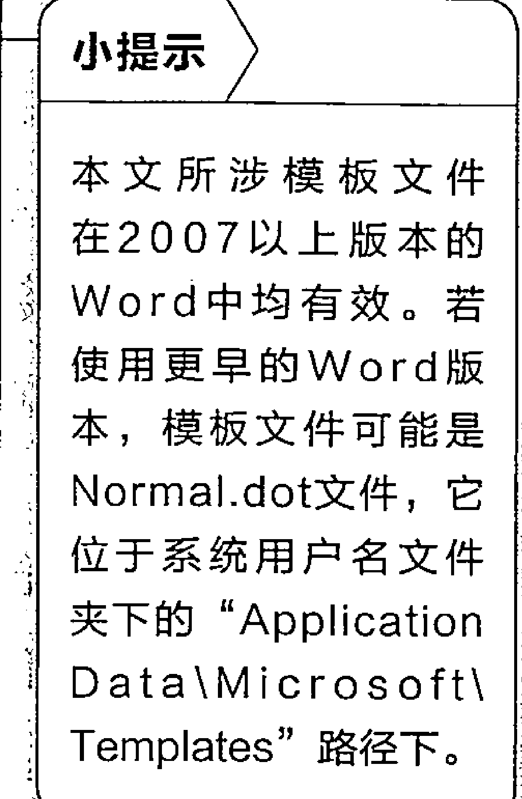

剑走偏锋PPT中打造动态图表

文|俞木发

年底到了少不了又要制作各种总结报表，为了让自己的报表与众不同，我们可以借助PowerPoint动画组件+报表的方式，打造出更为出彩的动态图表。下面以PowerPoint 2016为例，介绍如何使用三维动态圆环图替代Excel默认的平面圆环图（图1）。

从图1可以看出，PPT图表中可以使用三维圆环作为载体，图表是由多段不同颜色的圆环组成的，立体效果更好。另外它可以为每段圆环分别设置动画效果，分别设置三维选项和旋转，这样在演示时可以有更好的动态播放效果，而在Excel或者PPT中插入图表，是无法执行上述操作的。

首先我们准备三维圆环素材，素材借助Windows 10自带的画图3D就可以制作。启动画图3D后切换到“3D图形”，在画布上画出一个圆环，并且旋转到合适的角度。接着点击“颜色”，为圆环填充一种自己喜欢的颜色，还可以切换到“效果→滤镜”，对圆环进行美化（图2）。

完成圆环的制作后，点击“菜单→另存为”，将其保存为PNG图片备用。接着启动PowerPoint，点击“插入→图片”，插入上述圆环图片。在PPT中选中插入的图片，切换到“图片工具→格式→删除背景”，将其背景删除，并且使用裁剪工具裁剪到合适的大小（图3）。

接下来就是要将圆环按照数据的比例进行分割，分割借助绘图工具布尔运算实现。因为在PPT中只是进行展示，所以切割的比例并不要那么精准。先参照Excel中的圆环图表的比例，点击“插入→箭头”，在圆环上方依次插入4个箭头形状作为分割基准，并且将插入形状的起始顶点位置排列在一起（图4）。

继续点击“插入→形状→三角形”，在圆环上方插入一个三角形。设置三角形为无填充，轮廓的颜色设置为红色，接着移动三角形使得三角形的一边和箭头形状平行，然后将这个边移动与箭头重合。右击插入的三角形，选择“编辑顶点”，依次拖动三角形的顶点，使得其两个边可以和插入的箭头形状重合，并且它的外边要在圆环的外部，顶点和箭头的原点重合。复制一个三角形，操作同上，如果其外边无法在圆环外部，可以将外边中间的顶点往外拉伸，使得多边形可以覆盖圆环即可。

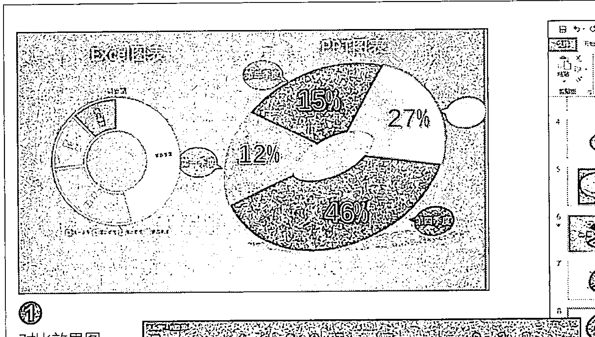
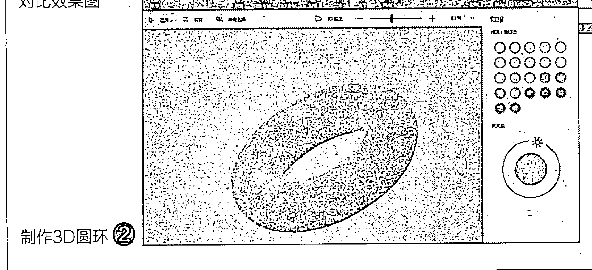

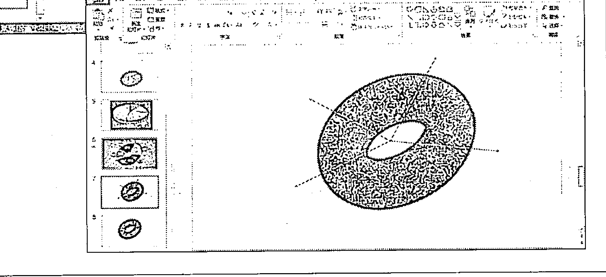
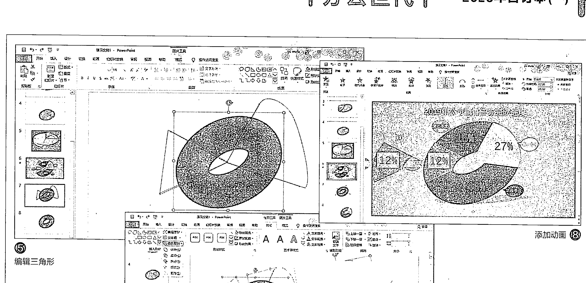
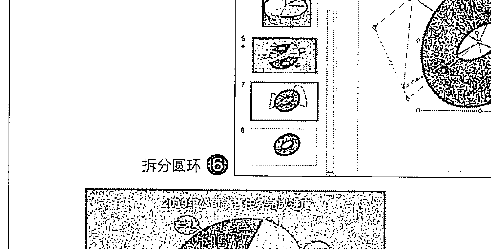
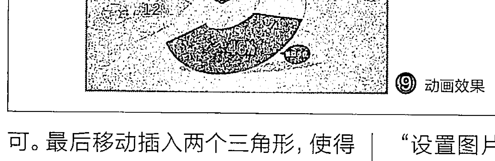
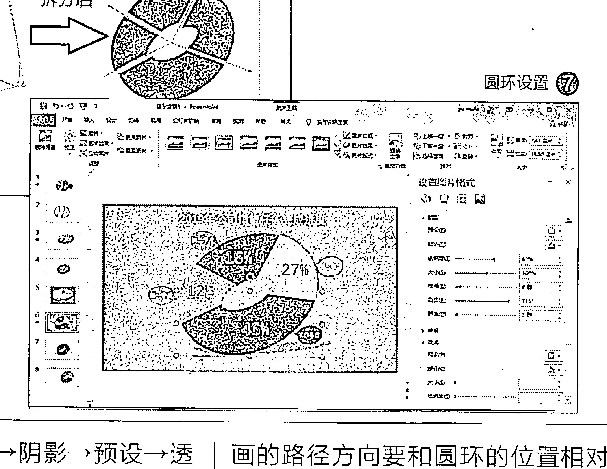

最后移动插入两个三角形，使得它们形状的顶点在圆环内部有部分重叠区域（一定要重叠），这样进行后续的布尔运算才会将圆环完整分离（图5）。

先选中圆环，再依次选中插入的两个三角形，点击“绘图工具→格式→合并形状→拆分”，这样圆环会按比例分割为四部分。依次选中拆分的四部分，将其复制到新建幻灯片中备用（图6）。

选中分割的圆环，点击“图片工具→格式→颜色”，依次将分割的圆环更换为不同的颜色，然后在圆环上添加上数据说明和其他文字说明。选中第四季度圆环，右击选择“设置图片格式→阴影→预设→透视→右下”，为其添加一个阴影设置，这样更有立体感。此外还可以根据自己的需要设置发光、柔化边缘等参数（图7）。

依次选中一季度圆环、文本框，插入文本形状，点击“图片工具→格式→组合→组合”，将其组合在一起作为一个整体。接着选中这个整体，切换到“动画→添加动画→直线”，选中插入的动画，将其路径更改为从右到左，这样在播放PPT的时候，一季度的圆环就会从右边出现往左填充到圆环中。操作同上，继续组合剩余的圆环并且添加相应的动画。这里需要注意的是，每个动画的路径方向要和圆环的位置相对应，比如四季度圆环动画是从下到上进行填充（图8）。

完成上述的设置后，3D动态图表就完成了。这样的图表既好看，又有动态播放效果，在演示时会更容易吸引大家的目光（图9）。

需要注意的是，由于这里的圆环已经分离，如果要调整组合圆环的大小和旋转，一定要先将分离的圆环组合在一起才能正常操作。当然使用同样的方法，我们可以对其他图表进行类似的设置，比如在地图图表演示中，可以设置立方体数据浮出效果，这样数据在三维地图中将会依次出现。

用好Excel特殊日期提醒更智能

文|俞木发

在公司文化建设中，为了提升员工的凝聚力，很多公司都会为员工提供诸如生日福利、入职周年纪念日等活动。不过这些活动需要在指定日子对特定的员工实施，现在我们可以借助Excel快速添加这些特殊日期的提醒。下面以Excel 2016为例，提醒的时间是在某某入职周年日前两天，在提醒单元格中自动添加提醒文字，并且单元格填充为黄色底色（图1）。

范例使用的数据非常多，而实际提醒只要部分的数据即可，因此我们可以先为智能提醒制作一个专门的工作表，新表中的数据借助VLOOKUP函数从原始表中ABCD列的数据提取。按提示新建一个“提醒表”，复制A1~D1表头数据，接着定位到B2，输入公式“=IF(LEN($A2)=0,"",VLOOKUP($A2,Sheet1!$A$1:$D$15,COLUMN(B2),0))”，然后将其向右填充到D列，向下填充到15行（图2）。

> 这里使用COLUMN函数返回值所在的列，通过VLOOKUP函数以A2单元格的值在原始工作表A1:D15区域中查找，最后通过IF函数的嵌套（防止出现N/A提示）来进行判断。

这样我们只要在A2单元格中开始填充员工的工号数据，上述函数就会自动引用原来的表格数据。以后在原始数据表中添加其他员工信息后，我们只要在这里继续填充相应员工的工号即可自动调用数据（图3）。当然这还是个查找器，如果员工很多，只要在A列输入工号即可快速找到该员工的信息。

因为是员工入职周年提醒，我们需要先计算员工的工龄，工龄借助INT函数来计算。定位到E2单元格并输入公式“=INT((TODAY()-D2)/365)”，向下填充后就可以自动显示员工的工龄了（图4）。

示例要求是需要在员工入职周年日前两天进行提醒，周年是按照员工入职月份为准，因此还要计算截至今天为止，员工入职月份和今天日期的时间差。这个时间差通过DAYS函数计算（入职月日-今日的月日），定位到F2单元格并输入公式“=DAYS(TEXT(D2,"mm-dd"),TODAY())”，下拉即可（图5）。

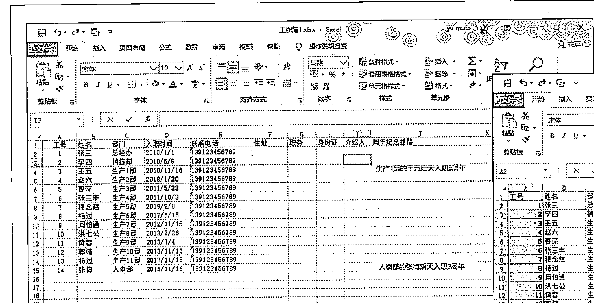
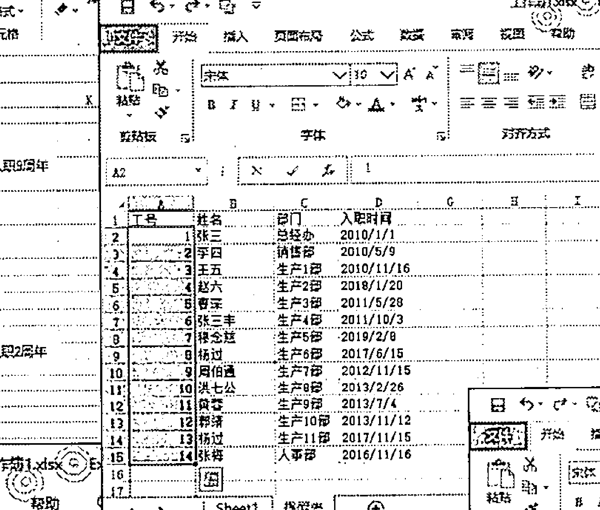
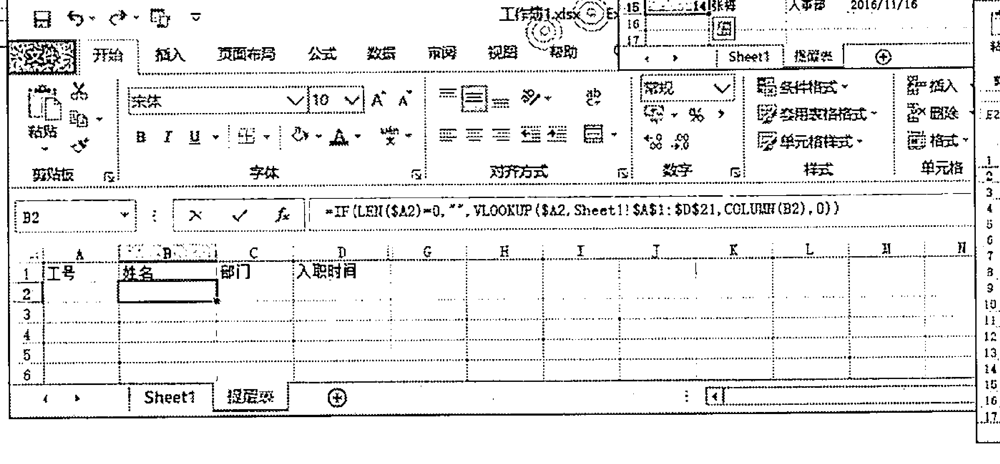
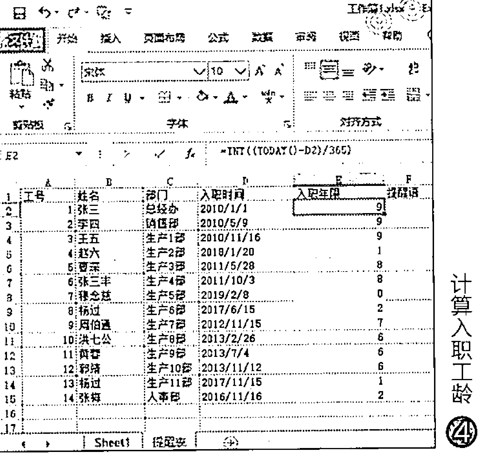

计算今日距入职周年日的天数

| 工号 | 姓名 | 部门 | 入职时间 | 入职年限 | 今日距入职周年日天数 |
|---|---|---|---|---|---|
| 1 | 张三 | 总经办 | 2010/1/1 | 9 | -317 |
| 2 | 李四 | 销售部 | 2010/5/9 | 9 | -189 |
| 3 | 王五 | 生产1部 | 2010/11/16 | 9 | 2 |
| 4 | 赵六 | 生产2部 | 2018/1/20 | 1 | -298 |
| 5 | 曹柒 | 生产3部 | 2011/6/28 | 8 | -170 |
| 6 | 张三丰 | 生产4部 | 2011/10/3 | 8 | -42 |
| 7 | 程念慈 | 生产5部 | 2019/2/8 | 0 | -279 |
| 8 | 杨过 | 生产6部 | 2017/6/15 | 2 | -152 |
| 9 | 周伯通 | 生产7部 | 2012/11/15 | 7 | 1 |
| 10 | 洪七公 | 生产8部 | 2013/2/26 | 6 | -261 |
| 11 | 黄蓉 | 生产9部 | 2013/7/4 | 6 | -133 |
| 12 | 郭靖 | 生产10部 | 2013/11/12 | 6 | -2 |
| 13 | 杨过 | 生产11部 | 2017/11/15 | 1 | 1 |
| 14 | 张梅 | 人中部 | 2016/11/16 | 2 | 2 |

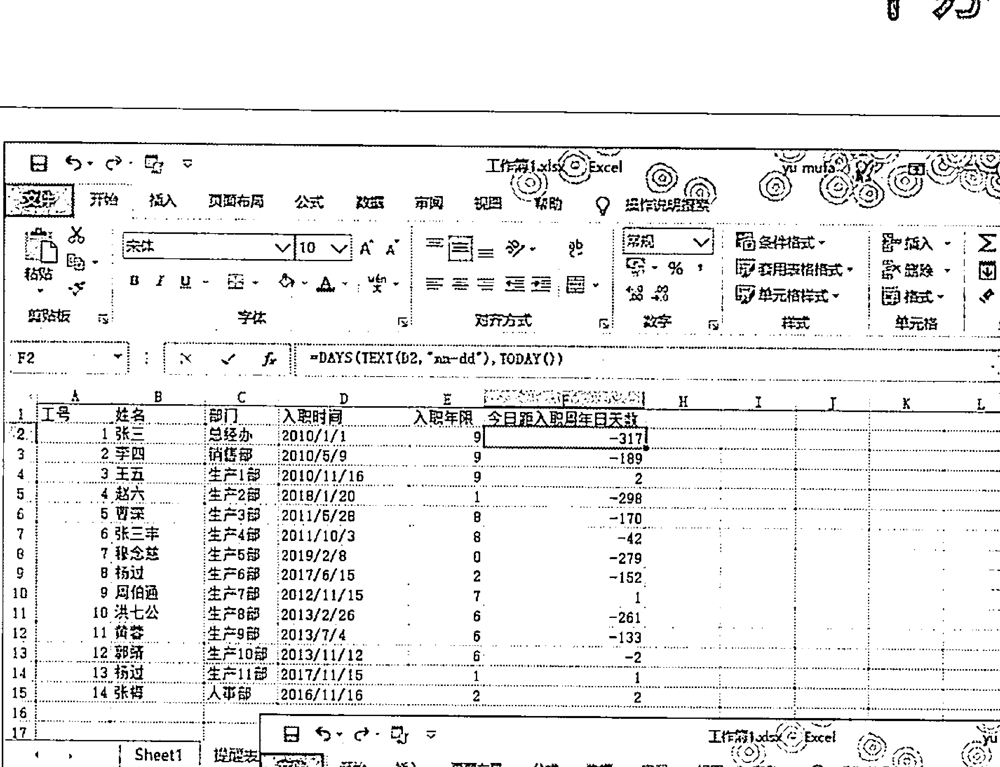

**小提示**

公式先使用TEXT函数提取D2单元格日期的月和日格式，并将其作为DAYS函数的结束日期。使用TODAY()（表示今日的月日）作为DAYS函数的开始日期，然后相减得到两个日期相差的天数。因为在示例中需要提前2天通知，所以相减天数为2则需要进行通知，假设今天是2019/11/14，那么2016/11/16入职的张梅就应该得到提醒（11/16-11/14=2），负数表示比当前月份小，已经过了周年日的天数。

添加提醒语句

| 工号 | 姓名 | 部门 | 入职时间 | 入职年限 | 今日距入职周年日天数 | 提醒语 |
|---|---|---|---|---|---|---|
| 1 | 张三 | 总经办 | 2010/1/1 | 9 | -317 | |
| 2 | 李四 | 销售部 | 2010/5/9 | 9 | -189 | |
| 3 | 王五 | 生产1部 | 2010/11/16 | 9 | 2 | 生产1部的王五后天入职9周年 |
| 4 | 赵六 | 生产2部 | 2018/1/20 | 1 | -298 | |
| 5 | 曹柒 | 生产3部 | 2011/6/28 | 8 | -170 | |
| 6 | 张三丰 | 生产4部 | 2011/10/3 | 8 | -42 | |
| 7 | 程念慈 | 生产5部 | 2019/2/8 | 0 | -279 | |
| 8 | 杨过 | 生产6部 | 2017/6/15 | 2 | -152 | |
| 9 | 周伯通 | 生产7部 | 2012/11/15 | 7 | 1 | |
| 10 | 洪七公 | 生产8部 | 2013/2/26 | 6 | -261 | |
| 11 | 黄蓉 | 生产9部 | 2013/7/4 | 6 | -133 | |
| 12 | 郭靖 | 生产10部 | 2013/11/12 | 6 | -2 | |
| 13 | 杨过 | 生产11部 | 2017/11/15 | 1 | 1 | |
| 14 | 张梅 | 人中部 | 2016/11/16 | 2 | 2 | 人中部的张梅后天入职2周年 |

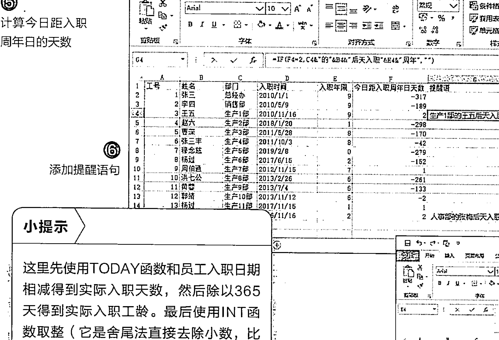

条件格式设置

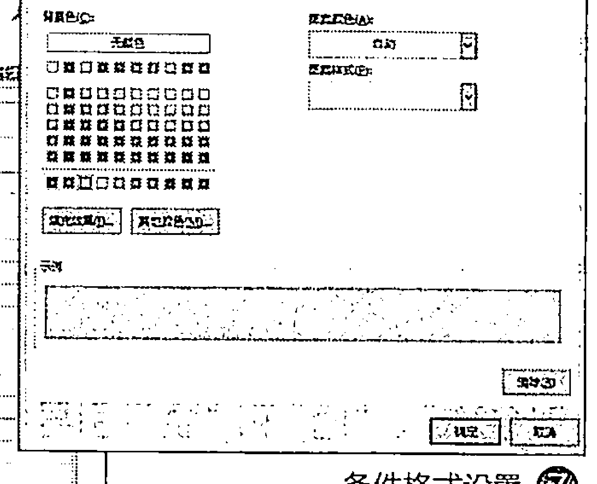

**小提示**

这里先使用TODAY函数和员工入职日期相减得到实际入职天数，然后除以365天得到实际入职工龄。最后使用INT函数取整（它是舍尾法直接去除小数，比如9.1→9.9年工龄都取9），这样就可以获得员工从入职到今天的整数工作年限了。不过需要注意的是，因为有闰年（366天）的存在，如果要精确计算员工的年限就需要考虑这一因素，本文只是为了计算方便，统一以365天为基准。

最终效果

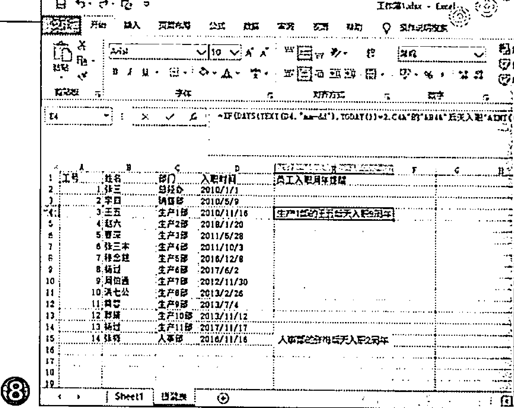

**小提示**

IF函数第一个条件判断时间差是否距离入职时间2天，如果符合那么就根据示例输出提醒语句，语句的组合使用“&”字符将指定的字符显示在G2单元格，否则显示为空。

最后是提醒语句的设置，语句可以借助IF函数设置。定位到G2单元格并输入公式“=IF(F2=2,C2&"的"&B2&"后天入职"&E2&"周年","")”，然后下拉，这样符合条件的员工在G列就会出现提醒语句（图6）。

在示例中还需要为提醒语句填充底色，这里借助条件格式完成。选中G列数据，点击“开始→条件格式→突出显示单元格规则→为包含以下文本的单元格设置格式”，在打开的窗口中包含文本输入“周年”，点击自定义格式，选择填充黄色底色的设置（图7）。

完成上述设置后，以后我们只要每天打开这个文档，如果有符合条件的员工，那么在G列就会自动出现填充黄色底色的提醒语句，根据这个提示安排相应的活动即可。为了方便书写，这里还可以只保留G列提醒并在G2单元格直接使用IF嵌套E、F函数，只要将函数更改为“=IF(DAYS(TEXT(D15,"mm-dd"),TODAY())=2,C15&"的"&B15&"后天入职"&INT((TODAY()-D15)/365)&"周年","")”即可（图8）。

因为TODAY日期是动态变化的，上述提醒借助函数和条件格式可以实现动态计算日期。大家可以举一反三，制作类似员工生日、公司周年庆、高考倒计时等智能提醒。

#### 合二为一 打造Excel组合饼图

文|俞木发

我们经常在Excel中插入图表来增强数据说服力，比如使用饼图表示各个数据的占比等。不过传统饼图只能展示一类数据，如果需要在一个饼图中同时展示多个数据，比如某公司的销售额占比，现在需要同时显示大区和大区所在省份的占比，就可以自行打造双层饼图来实现（图1）。

上述示例，图表是由内外两个饼图组成，内圈是地区，外圈是地区对应的省份。对于类似的组合图表，在Excel中是使用主、次坐标轴分别生成相应的图表组合而成的。因此思路是分别制作省份和地区饼图，然后将它们组合即可。

首先制作外圈主坐标饼图，这个饼图的制作很简单。在Excel中选取D2:D13和F2:F13单元格中的数据，然后点击“插入→图表→饼图”。为了方便将省份和地区对应，先在饼图中右击选择“设置数据标签的格式”，在右侧窗格勾选“类别名称”、“值”和“显示引导线”（图2）。

接着双击任意一个省份，切换到“图表工具→形状填充”，按照每个省份对应地区的扇区填充为同一种颜色，总计将图表填充为三种颜色，分别对应三个地区（图3）。

接下来制作地区饼图，选中上述饼图，点击菜单栏的“图表工具→设计→选择数据”，在打开的窗口中点击“添加”，系列名称选择“=Sheet1!$A$2:$A$13”，系列值选择“=Sheet1!$B$2:$B$13”，点击“确定”将地区数据值添加到饼图中（图4）。

因为这里没有设定主、次坐标轴，因此两个饼图是重合在一起的，接下来就是将两个饼图分离。右击饼图选择“更改图标类型”，在打开的窗口中切换到“所有图表→组合图”，可以看到上述新增的组合饼图。在系列名称选中地区，勾选其后次坐标轴的复选框，将其设置为次坐标轴饼图，这样地区饼图可以和原来的省份饼图区分（图5）。

返回Excel，选中地区饼图，右击选择“设置数据系列格式”，在右侧窗格将饼图分离度设置为96%，同时将饼图颜色填充为红色，这样通过颜色就很容易区分主次饼图(图6)。

接下来将饼图组合到省份饼图的内圈中，双击分离的地区饼图的“华南”部分(只能单个选择)，右击选择“设置数据点格式”，在右侧窗格将“点分离”的百分比设置为“0”。同上，其他地区数据点格式也设置为“0”，这样地区饼图就会自动归集在省份饼图的中心。操作同上，依次选中独立饼图部分，按照对应的省份颜色进行填充(图7)。

最后对饼图美化一下。右击地区饼图为其添加上地区标记和数值，并且将不同地区的轮廓填充为不同的颜色，轮廓加粗显示，设置合适的背景图，并将其他不必要的元素删除，这样一幅组合饼图就完成了。从组合图中可以很直观地看到华南地区销量最大，其中广西省销量又是省份中最大的(图8)。

移动无填充的地区饼图到省份饼图的上方，同时根据地区区域，将其一个扇区的边和省份饼图扇区边重合，接着调整地区饼图的大小，使得其另一边也和对应省份饼图扇区的边重合，最后同上再进行美化即可。使用同样的方法，我们可以将任意图表组合在一起(图10)。不过这种手动组合方法虽然简单，只是每次调整数据后都要重新对齐。

#### 技巧扩展

虽然组合图表一般都是借助主、次坐标进行组合，但是如果只是简单地展示数据，我们还可以使用手动方法对两个图表进行组合。上述组合图表实际上就是两个饼图的叠加，因此我们也可以按提示先在Excel中插入上述两个独立的饼图，同上先将饼图各个扇区按照不同的颜色进行填充，接着选中地区饼图，右击选择“设置图表区格式”，将其背景色设置为“无填充”。继续右击图表选择“置于顶层→置于顶层”，将其显示在最顶层(图9)。

#### 圆环+自选 图表更独特

文|马震安

我们往往采用普通的圆环图表进行完成比例的展示，但单一的圆环图表会显得比较枯燥无味，如果将圆环图与自选图形相结合，不仅能直观地展示出完成比例，而且还能让图表更显得错落有序、美观独特（图1）。接下来，我们就一起看看这样的图表是如何制作的。

##### 1. 绘制图案

首先用Excel打开要制作图表的原始数据表，切换到“插入”选项卡，点击“插图→形状”，分别插入“直线”、“等腰三角形”、“矩形”，填充一种自己喜好的颜色，无线条，然后将三个图形组合起来；选中这个组合，复制，根据需要粘贴出多份，设为不同的颜色，再将直线随机拉长或拉短，最后依次排好，组合起来（图2）。

##### 2. 插入图表

选中B2:C2单元格，切换到“插入”选项卡，依次点击“图表→饼图→圆环图”，在工作表中插入圆环图表；选中图表，切换到“格式”选项卡，将图表区域的“形状填充”、“形状轮廓”设为无颜色，删除标题、图例，调整好大小；选中图表中的“未完成”部分，将“形状填充”设为“灰色”；再选中另一部分“完成率”，设为与之前形状对应的颜色；右击图表，选择“设置数据系列格式”，在右边的面板中将“圆环图内径大小”设为“70%”；复制这个图表，按需要粘贴多份，分别设置好它们的数据源区域及对应的填充色（图3）。

| 姓名 | 完成率 | 未完成率 |
| --- | --- | --- |
| 宋江 | 77% | 23% |
| 吴用 | 53% | 47% |
| 卢俊义 | 69% | 31% |
| 林冲 | 58% | 42% |
| 武松 | 71% | 29% |

##### 3. 排版对齐

将五个不同的图表与之前做好的图形排版对齐，并为圆环图添加标签，删除未完成率的标签。右击完成标签，选择“设置数据标签格式”，将“显示引导线”前面的勾选去掉（图4）。

插入文字描述文本框。当然，如果还想标注一下他们的姓名和一些需要描述的语言，可以依次插入5个文本框，然后右对齐，排版好位置（图5）。

最后，画一个矩形，填充色为白色，置于底层，将其拖动到图表的下方，再利用文本框输入图表标题，将矩形、图表、标题进行组合就可以了。

#### 快速求取最小公倍数或最大公约数

文|樱子

在科研、工作或生活中，有时需要求取不同数之间的最小公倍数或最大公约数。最小公倍数必须能够被所有参与的数据整除，在计算诸如齿轮、行星对准等科研领域会经常用到；而最大公约数则可以去整除所有参与计算的数据，例如在折纸拼合、木匠活等工作生活领域经常会用到。如果用传统的手工求法，参与计算的数据较多时，计算会很复杂。借助于Excel或WPS表格的函数，就可以轻松求得结果。

##### 1. 在Excel中求取最小公倍数或最大公约数

在Excel中求取最小公倍数，可使用LCM函数；而最大公约数的求取则可以使用GCD函数。以求取从A1单元格到A6单元格之间数据的最小公倍数和最大公约数来说明。如果要将这6个数的最小公倍数的求取结果写入C2单元格，点击C2单元格，然后输入公式“=LCM(A1:A6)”，按下回车键便可以看到计算结果为8400(图1)。

同样，如果要将上述6个数据的最大公约数的求取结果写入D2单元格，只需在D2单元格内构造函数“=GCD(A1:A6)”，即可求得计算结果为50(图2)。

> 小提示
一定要注意公式中的括号、分隔号均须为英文半角符号，若输入时误写为全角字符，就会出现错误提示。

那么，如果只需要求取其中几个不连续的数据之间的最小公倍数或最大公约数，又该如何构造公式呢？其实，如果参与计算的数据不多，只需将公式中的范围表达改为用半角逗号间隔的数据罗列即可。例如，要在C2单元格中求取A1、A3、A5这3个数的最小公倍数，只需在C2单元格中写入公式“=LCM(A1,A3,A5)”即可(图3)。

同样，若在D2单元格中求取A2、A3、A6共3个数据的最大公约数，则只需在D2单元格中构造公式“=GCD(A2,A3,A6)”。

##### 2. 在WPS表格中求取最小公倍数或最大公约数

在WPS表格中求取最小公倍数和最大公约数所使用的函数与Excel中的函数基本相同。在WPS表格中，利用插入函数命令，我们可以更直观地实时看到函数的具体用途，从而达到准确套用的目的。

例如，求取上述6个数的最小公倍数，只需定位到结果单元格C2，然后依次点击“公式→插入函数”，在查找函数框中输入LCM，即可看到WPS给出的该函数的使用格式。确定之后，根据向导给出的提示，指定求取的单元格范围，即可求得计算结果(图4)。

#### Excel单元格内容掐头去尾怎么做

文|樱子

有时候我们需要将一批单元格的内容，统统去掉前面或后面的部分内容，抑或是前后内容同时去掉，只留下中间有用的那一段。但是，每个单元格具有不同的内容，要去掉或要保留的内容也都不相同该怎么办？这时，利用几个函数就可以巧妙地解决。

##### 1.删除文本列中的前几个字符

如果有一列数据记录人员信息，从单元格A3到A7中，每个单元格中均包含“性别 姓名 手机号”的信息，我们希望将前面的性别删除之后，结果放在C3到C7单元格（图1）。我们可以利用公式：
=RIGHT(A3, LEN(A3)-2)
把这个公式写在C3单元格中。按回车键，A3的数据就会自动去掉前“男”和空格两个字符，并显示在C3的位置。拖动填充柄填充C3之下的单元格到C7，这样将自动去除所有单元格的性别信息。

> 小提示
从文本列中删除前几个字符，使用RIGHT()函数构造公式，其语法为：
=RIGHT(<原单元格字符串>, LEN(<原单元格字符串>)-<删掉的字符数>)
其中RIGHT可理解为“保留右侧”，“LEN(<原单元格字符串>)”是原单元格字符数，<删掉的字符数>是要从文本左侧删除的字符数。

##### 2.删除文本列中的最后几个字符

如果要从单元格中去掉最后的几位数字，例如，还是上述原始数据，我们要从A3到A7单元格中删除所有手机号，只保留性别和姓名，则可用如下公式：
=LEFT(A3, LEN(A3)-11)
只需在C3单元格中写入上述公式，按下回车键之后，C3中显示的便是不含手机号的记录了。同理向下填充到C7，完成所有单元格的自动处理（图2）。

> 小提示
从单元格中去掉最后的几位数字，要用LEFT()函数来构造公式。具体语法格式是：
=LEFT(<原单元格字符串>, LEN(<原单元格字符串>)-<去掉的字符数>)
在此公式中，LEFT可以理解为“保留左侧”，“LEN(<原单元格字符串>)-<去掉的字符数>”是剩下的字符数。

##### 3.从文本列中同时删除前后几个字符

那么，如果要同时从一个单元格中将前面的几个字符（如性别）和后面的几个字符（如手机号）删除，只保留中间的一些字符（如姓名），需要按上述办法处理两次吗？不用！其实用另一个函数MID()即可一次性解决问题。
我们只需先在C3中构造如下公式并填充到C7单元格即可（图3）：
=MID(A3,3,LEN(A3)-13)
我们发现，姓名及其长度是变化的，两个字、三个字甚至可以更长，11位电话号码内容不定，但最后提取出来的姓名却正确无误。这就是Excel函数的魅力所在。上述方法仅以5个单元格为例，旨在介绍一种基本方法。如果数据很多，这一方法就可以发挥更大的效率。

> 小提示
MID函数的语法格式为：
=MID(<原单元格字符串>,<从左侧移走的字符数>,LEN(<原单元格字符串>)-<该单元格被移走的字符总数>)
其中，MID可理解为“从中间截取”。

#### 挽救失效的Office“自动保存”功能

文|波哥

新版Microsoft Office程序（2016版、2019版或Office 365）中的“自动保存”与早期版本中为编辑的文件丢失后自动恢复而服务的自动保存功能有着不同的含义。新的“自动保存”是为将文件保存到OneDrive而设计的，该“自动保存”功能会在处理文件时每隔几秒钟向云端自动保存一次文档。但许多用户抱怨自动保存被禁用，或无法在Word、Excel和PowerPoint中打开。那么，当遇到这些问题时，该如何解决？

> 小提示
2016或2019等高版本的Office系统，目前不再支持将签出的文件保存到服务器草稿，保存位置变为在本地“C:\Users\用户名\Documents\SharePoint草稿\”临时转存（图1）。

##### 1. 检查“自动保存”选项

以在Word中使用为例，检查“设置”下是否禁用了“自动保存”功能，先导航到“文件→选项”，在开启的对话框中，切换到“保存”选项卡。在“文件管理服务器文件的脱机编辑选项”中，选择另存签出文件为服务器草稿的位置。

##### 2. 检查文件保存到云的状态

只有在处理保存到OneDrive的文件时，“自动保存”功能才能发挥作用。处理保存在计算机上或脱机的文档时，或当文件位于本地OneDrive文件夹中并且同步被暂停或禁用时，“自动保存”会被禁用（图2）。请检查这些状态是否正常。若因忘记登录微软账号造成文件没有自动保存到OneDrive，只需执行一次另存到OneDrive的操作即可。

##### 3. 在Excel中关闭某些安全功能

如果无法在Excel中打开“自动保存”功能，可能是因为文件包含自动保存不支持的功能。这时，需要关闭共享工作簿，从文件中删除密码加密，删除受限制的访问，并在打开时关闭刷新数据。此外，外挂插件程序也可能禁用“自动保存”，为此，需依次定位到“文件→选项→加载项→Excel加载项→转到”，然后取消选中加载项的复选框（图3）。

##### 4. 修复Office，恢复自动保存功能

如果问题仍然存在，可以考虑执行Office安装修复。在控制面板中找到Microsoft Office条目，点击“更改→修复”，进行修复即可（图4）。

#### 化整为零 妙用PPT文本框拆分

文本框可算是PPT中最常见的元素了，不过许多人仅仅用它来显示普通的文本内容，其实巧妙地利用文本框的一些特性，就可以让它在PPT设计中产生出各种令人惊艳的效果。

##### 汉字拆分打造个性海报

我们经常看到一些海报的字体设计得很有个性，比如下面的招聘海报示例，有的将原来的文字分离，有的则将分离的汉字部分和其他符号重新组合(图1)。

其实对于类似的文字效果，现在借助PPT的文本框+形状分离就可以很轻松地实现。为了方便对文本进行分离，先将“形状拆分”菜单添加到主菜单。启动PowerPoint后点击“文件→选项→自定义功能区”，按提示在右侧“开始”菜单下新建一个分组，在左侧窗格展开“常用命令”，找到其中的“拆分”命令，点击“添加”，将其添加到“开始菜单→新建组”下面(图2)。

在PPT中插入一个文本框，输入“招聘”，字体使用一些粗笔画字体，继续在字体上方插入一个矩形覆盖文本框。按住Ctrl+A键全选，点击“开始→新建组→拆分”，这样文本框的汉字就被拆分为多个可编辑的形状了。按提示将其他多余形状删除，并且重新组合为示例中的排列方式(图3)。

按示例在文字中间插入说明文本，最后设置合适的背景即可制作出类似示例的个性招聘文字。这些形状是独立个体，我们还可以将其旋转，或者填充不同的颜色，打造出各种个性招聘字体(图4)。

##### 字组合打造“字中字”效果

除了上述常规的拆分，一些更有创意的拆分可以根据中国汉字的特点打造“字中字”特效。比如在招聘海报中，我们可以将“缺”和“人”字组合在一起，形象地表示缺人的意思。

同上先插入文本框输入“缺”，字体这里建议选择“华文隶书”，因为在PPT字体拆分中，文字的偏旁部首、笔画越松散效果越好。操作同上，先将文字拆分为“缶”、“、”和另外一部分，继续点击“插入→形状→任意多边形：自由曲线”，然后在右侧部分插入自由曲线，使用曲线描绘出“人”的撇。描绘完成后使用顶点编辑工具进行微调，使得插入的多边形可以完全覆盖原来的笔画。最后将其和“、”部分都填充为红色、无边框，并添加其他招聘文字，这样一幅个性的招聘广告就完成了（图5）。

在拆分汉字的时候，对于一些交叉的字符，比如上述“缺”字，在使用宋体、楷体时，其中“人”字是无法分离的。如果要实现类似的分离，除了使用多边形描绘还可以使用插入组合符号（或偏旁部首）实现。比如“人”的组合，先输入一个“）”（注意字体要和原来的“缺”字选择一致，下同），再输入一个“人”字，同上分别分离出撇和捺，然后将其重叠到“缺”字的对应笔画上覆盖即可（图6）。

##### 字图组合打造另类文字效果

因为这里已经将文字拆分了，我们还可以添加各种符号或图片打造出更多效果。比如对“瓜”字和“茶”字进行拆分，接着使用西瓜代替瓜字的“捺”笔画，使用茶叶组合成人字，打造一个一看就懂的字中带图效果。或者使用矩形对“真假”两字进行左右拆分，然后将拆分部分分别剪切后粘贴为图片，接着将图片按照文字的意思分别进行虚化处理，打造出真假难分的文字效果（图7）。

##### 拆分+平滑切换打造汉字动态演变效果

对于使用Office 2019的用户，现在还可以利用文本框+平滑切换打造更多惊艳效果。比如可以制作一个汉字从“甲骨文→繁体字→简体字”的动态演示PPT，这里以“龙”字的变化为例。

到网上下载甲骨文字体，接着在一个文本框中依次输入“龙”的甲骨文、繁体字、简体字。同上进行拆分后将拆分的汉字分别粘贴在三张幻灯片中，调整每个汉字的大小和颜色等参数，并添加上适当的文字说明，选中幻灯片3，点击“切换→平滑”，持续时间设置为“5”秒，点击“应用全部”（图8）。

添加平滑效果后，现在开始播放幻灯片，可以看到在演示效果中，龙字会由甲骨文字体依次无缝平滑变换到繁体字、简体字，非常适合给小朋友们展示汉字的变化历程（图9）。

怎么样，只要对文本框进行简单变换是不是就可以让你的PPT更加与众不同？不过最后要提醒大家注意的是，如果参照上述方法制作海报等商业元素，一定要注意字体的版权。

#### 用好“平滑”切换让PPT更出彩
文|俞木发

PowerPoint 2019在“切换”菜单新增了“平滑”功能，这个功能不仅仅是简单的平滑切换，而且通过简单的设置还可以让幻灯片播放有更神奇的效果，为你的PPT增添光彩！

##### 以小见大凸显细节
为了方便在幻灯片中展示一些产品细节，我们经常要将多个细节部分放大显示，当然只是静态摆放效果并不好，而借助“平滑”效果则可以制作出动态放大展示效果。下面的实例中，我们将在幻灯片中显示iPhone 11左侧的静音键和音量减键的细节放大照片。

启动PowerPoint 2019后，将准备好的图片插入到新建的两张幻灯片中，同时还再复制一份大小、位置完全一致的图片叠放其上（即每张幻灯片都叠放上下两张完全一致的照片）。选中幻灯片1中的第一张照片，切换到“图片工具→格式→裁剪”，对手机上部的静音键部位进行裁剪选择，裁剪区域缩减为一个正方形（图1）。

继续点击“裁剪→裁剪为形状→圆形”，将选择的区域裁剪为一个圆形。调整圆形的大小，并将裁剪后的圆形叠放到原来图片的上方，使之形成放大效果。选中裁剪的圆形，点击“图片工具→格式→校正”，对其亮度、对比度进行调整，同时还可以调整发光和柔滑边缘等参数使得效果更为醒目、自然（图2）。

操作同上，在第二张幻灯片中也进行音量减键的裁剪和修饰，为了保证两张幻灯片中的修饰效果一致，建议使用“格式刷”进行复制设置，同时保证两张幻灯片中的裁剪部分排列方向、大小是一致的。好了，现在选中幻灯片2，点击“切换→平滑”，在预览后就可以看到裁剪的放大区域是从上到下播放的，这样是不是可以更好地显示出放大效果（图3）？

当然如果这里先后裁剪的是平行的物体，那么平滑效果则是左右滑动，播放顺序是依据裁剪部位先后顺序平滑过渡的。可以看到在前后幻灯片中使用“平滑”后就可以产生神奇的效果，我们可以使用类似的方法制作出更多特殊效果，比如为了突出iPhone 11三摄像头，我们可以制作一个三摄像头从机体中分离的效果。

同上先在一张幻灯片中插入两张同样的iPhone 11照片，使用裁剪的方法截取三摄像头区域为圆角矩形，然后将截取的区域剪切到幻灯片2中，同时调整大小、位置和添加说明文字。这样添加平滑效果后，裁剪的区域就会从原来的机体分离出来逐渐放大显示，更方便独立展示一些细节，如果更换幻灯片顺序则可以实现截取区域和机体的融合（图4）。

> 上述照片平滑过渡需要制作多张幻灯片，为了方便集中展示，大家可以在完成预览后使用录制屏幕为GIF的录制软件，将效果录制为一个GIF图片，这样以后只要在PPT中插入一张图片即可展示效果了。

##### 突出重点的追光显示
电视中我们经常看到导演会使用追光灯高亮显示在特定人物或文字上，我们同样可以借助平滑功能在PPT中打造类似的追光效果。在下面的文字云图中，我们需要打造一个灯光效果，将灯光依次打在“青春→故事→读书”，最后落到“生活”的文字上（图5）。

我们首先新建5张幻灯片并依次插入上述照片，操作同上，在1~3张幻灯片使用裁剪的方法依次保留“青春”、“故事”、“读书”字样，第4张则裁剪为圆形，同时设置它们的亮度、发光等参数。在第5张幻灯片中插入一个矩形并填充为灰色，并且调整适当的透明度作为蒙版（降低图片亮度方便和截取的图片进行对比），最后将第4张裁剪的“生活”字样粘贴其上，并作为最终的高亮显示（图6）。

同上选中上述幻灯片并设置为“切换→平滑”，在平滑设置中，去除“换片方式”下“单击鼠标时”的勾选（这样幻灯片在播放时会自动切换效果），勾选“自动换片时间”并设置为“0”（图7）。

完成上述设置后点击“幻灯片放映→从头开始”，这样开始播放幻灯片时平滑效果就会自动应用，屏幕上会在原来的图片上方依次出现上述“青春”、“故事”、“读书”字样，最后落到“生活”文字上，效果和追光灯非常相似（图8）。

同样的，通过上述方法我们可以制作出各种平滑切换的素材效果。比如要在PPT中多角度展示产品，那么只要准备好产品多个角度的拍摄照片并导入幻灯片中（注意导入后的展示顺序），然后同上设置平滑效果，这样在播放幻灯片的时候就会自动按照图片产品的角度顺序旋转播放了。或者可以将某个复杂的步骤分解为多张照片，使用切换效果来展示组装步骤等。更多的应用等待大家自己去挖掘。

当然，用同样的方法还可以将完全不相关的两张图片放置在两张幻灯片中，通过平滑功能实现变形效果等，大家可以自行进行尝试。

#### 封面项目下划线无法对齐有办法
文|马震安

在使用Word软件制作合同或论文封面时，我们可能会在一些项目之后使用下划线。但是，在下划线上输入内容后，发现下划线会随着内容而增长，根本无法与上下相邻行的下划线对齐（图1）。那么，有什么办法可以解决这一问题呢？

其实，我们可以利用表格替代下划线。这样一来，在输入内容时，表格下划线可以很好地保持固定不移位。

首先，将光标放在“论文题目”前面，插入6行、2列的表格（当然可根据需求的行数来插入表格），然后调整好宽度；选中整个表格，点击“居中”按钮，让表格居中；选中整个表格，点击字体大小，使字体大小与“论文题目”文字大小一致（图2）。

接下来，将“论文题目:”、“作者:”等内容剪切粘贴到表格相应的单元格中，如果是需要自己输入的话，每一行的内容可能有4个字或者2个字，这种效果肯定是不好看的。所以，可以先在表格左列单元格输入好内容，选中“作者”两个字，切换到“开始”选项卡，点击“段落→中文版式→调整宽度”，在弹出的窗口输入“4个字符”，其他依此类推；选择左列，将它们全部右对齐（图3）。

然后，选中左半部分的表格，切换到“表格工具→设计”选项卡，点击“边框→无边框”，取消所有边框线；选中右半部分的表格，取消上、右的边框线，这样就完成了“表格式”下划线的制作（图4）。

最后，在表格的相应位置输入所需要的内容，看看最终的效果（图5）。用这种表格做出来的下划线，用起来是不是比直接使用下划线要靠谱得多呢？

#### Word文字对齐就用制表位
文|马震安

在进行Word文档排版时，如果我们只是单纯地使用Word自带的对齐功能，有时并不能满足我们的需求。比如需要将多行文字左右分开一段距离然后对齐，很多人喜欢直接在文字的前方敲空格来对齐，但不管怎样都无法对齐在一条直线上。其实，如果巧妙地利用制表位，就能快速又整齐地对齐文字了（图1）。

首先，选定日用品名称及其价格文字，点击“段落设置”，在弹出窗口的左下角点击“制表位”，然后在新弹出的窗口中，根据需要设置制表位的位置（对齐点的位置）、对齐方式及引导符（连接符），设置好后点击“确定”。本例中，制表位位置处输入“60”，点击“设置”，对齐方式处选择“右对齐”，前导符处选择第3项（图2）。

接下来，光标定位在需要分开的位置，如每个日用品单价的前面，按Tab键即可。我们可以看到很快就大功告成了，又快又整齐（图3）。

其实，上述对齐还可采用“两端对齐”的方法实现。例如要对齐某个目录，将目录选定，点击“两端对齐”，两端对齐后有的行圆点变得稀疏，可以复制粘贴更多的圆点。选中几个连接符，如“…”，按Ctrl+C复制，再将光标定位在每个目录与页码连接符中的任意位置，按Ctrl+V粘贴，直到该行页码与目录刚好占满一行就可以了（图4）。若不小心多粘贴造成换行，用退格键退回即可。

如果在多行的文字列表中，有些是两个字符，有些是三个或四个字符，如何才能实现这些行中的字段两端对齐呢？其实，可以通过“调整宽度”的方法实现所有字段的两端统一齐。只需选中字符数少的字段，切换到“开始”选项卡，点击“段落”处的“中文版式→调整宽度”，在弹出的窗口输入字符数量最多的一行的字段字符数就可以了（图5）。

#### Word文档超链问题全解决
文|波哥

如果Word文档中含有许多超级链接，如何才能快速找出整篇文档中的所有超链，又如何去除所有超链？如果文档中需要使用文字超链之外的各种特殊类型的超链，又该如何制作呢？下面我们一起来看看在Word 2019中解决这些问题的方法。

##### 1. 快速查找所有超链
如果从网上复制到Word文档中的内容存在自动超链内容，需要快速将这些超链接找出来，可先按Ctrl+G组合键打开“查找和替换”对话框，点击“定位”选项卡，在左边的“定位目标”栏内选择“域”，然后在右边“请输入域名”框中选择“HYPERLINK”，通过反复点击“下一处”按钮，就会挨个儿将所有存在于该文档中的超链（包括隐性超链）找出来（图1）。

##### 2. 消除超链带来的烦忧
如果需要去掉Word文档中的超链，除了使用本刊傻博士栏目曾介绍过的方法外，还可以在执行Ctrl+A全选操作后，按下Ctrl+Shift+F9组合键（部分笔记本为Ctrl+Shift+Fn+F9）快速处理。

为了免去复制网络内容时自动带上超链格式，我们可以通过“文件→选项”命令，点击“校对→自动更正选项”（图2）；接下来选择“键入时自动插入格式”选项卡，取消选中“Internet及网络路径替换为超链接”（图3）。

##### 3. 制作特殊类型的超链
除了常见的文字超链外，我们还可以建立一些特殊的超链。

###### 给图像或其他图形目标设立超链
在文件夹中选择一幅图像或其他图形，按下Ctrl+C复制；然后回到Word编辑环境，点击要插入超链的位置，依次点击“开始→粘贴→选择性粘贴”，在弹出的对话框中，选择“粘贴链接”选项，选择要插入的文件快捷方式（图4）。这样，就建立了与源文件的动态链接，源文件的更改也会反映到本文档中。

> 火速链接
去除文档中超链的另一种方法，可参阅本刊2017年第15期“傻博士·办公”栏目的文章《如何去除办公文档中的超级链接》。

###### 给目录中的项目设置与正文超链
首先需要在正文的每个章节处执行“插入→书签”操作，设置好书签标志；接下来，回到目录列表中，选中要插入超链的项目，右键单击并选择“链接”，在随后弹出的“链接到”对话框中，选择“本文档中的位置”，然后选择相应的书签即可（图5）。

###### 链接到另一个文档的特定位置
首先按上述方法在目标文档中设置好书签的位置；接下来回到要建立链接的文档中，选择要建立超链的对象并通过右键菜单“链接”命令，选择“现有文件或网页”，选择目标文件，点击“书签”按钮并选择书签，建立跨文件书签超链（图6）。这样点击链接后，会自动打开目标文件并定位到设定的位置。

###### 用Word制作含有超链接的网页
不需要借助于专用的网页编辑器就可以制作含有超链接的网页。首先打开一个空白的Word文档，输入网页内容，然后选中需要插入网络链接的文字或对象，点击“插入→链接”菜单项，选择链接到“现有文件或网页”选项，在“地址”栏内填入链接地址（图7）。确定之后，选中的文字或对象将具有网络链接属性。所有链接制作完成后，点击保存按钮将文件保存为网页HTML格式。

###### 制作无特殊色和下划线的超链
一般来说，文档中自动插入的文字超链接将具有彩色和下划线的明显标志，但有时为了整体美观，我们希望去掉颜色和下划线，同时保留链接的性质。这时，可以先选中带有链接的文字并单击右键，选择“字体”，在弹出的字体对话框中，选择“下划线线型”为“无”，字体颜色为“自动”（图8）。这样设置之后，带有链接的文字看起来和普通正文没有两样，但其仍具备链接的属性，通过Ctrl+点击（在Word中打开时）或直接点击（在网页中打开时），可立即进入链接的内容。

> ▶小技巧
如果要取消目录超链，点击“引用→目录”菜单命令，然后选择“自定义目录”，在弹出的自定义目录界面中，取消对“使用链接而不使用页码”的选择。

- 如何在文档中查找所有超链接？
- 办公小技巧：换个方式制作多选题课件

#### 图表动态引线巧实现
文|马震安

在Excel中利用饼图展示数据时，往往用到引线标签，通常的做法是图表制作完成后，利用自选图形中的“直线”手动画出来，再添加上标签。这样的做法有个很大的毛病，就是当图表数据发生变化时，引线标签就会与相应的饼图系列不对应，从而导致标识错误。其实，引线标签的添加可以通过散点图来实现，散点图的数据源与饼图数据相关联，这样即使饼图数据发生变化时，引线标签也能随之改变（图1）。这样的效果是如何实现的呢？接下来，我们就一起来制作。

##### 1. 构建下拉菜单
首先，在空白单元格区域（如J2:J7）输入下拉菜单所需要的各个选项；接下来，切换到“开发工具”选项卡（如果没有此选项卡，可以点击“文件→选项”，在弹出的窗口点击“自定义功能区”，在右侧勾选“开发工具”），点击“插入→表单控件→组合框”，在工作表空白处画出一个组合框控件，右击此控件，选择“设置控件格式”，在弹出窗口“控件”选项卡的“数据源区域”处选择下拉菜单各选项所在的单元格区域（即J2:J7），在“单元格链接”处选择一空白单元格（如K2），这样，当点击下拉菜单各选项时，K2单元格的值就会发生不同的变化（图2）。

##### 2. 获取图表数据源
图表的数据源是根据下拉菜单的值进行变化的，因此需要通过函数进行动态获取。在B10输入公式“=OFFSET(A2,0,$K$2,1,1)”，A10输入公式“=$A2&CHAR(10)&$B10”，C10输入公式“=$B10/SUM($B$10:$B$15)”，D10输入公式“=90-ROUND(SUM(OFFSET($C$10,0,0,ROW($C10)-ROW($C$10)+1,1))*360-$C10*180,2)”，E10输入公式“=ROUND(COS(RADIANS($D10))*5,4)”，F10输入公式“=ROUND(COS(RADIANS($D10))*6,4)”，G10输入公式“=IF($D10>-90,8,-8)”，H10输入公式“=ROUND(SIN(RADIANS($D10))*5,4)”，I10输入公式“=ROUND(SIN(RADIANS($D10))*6,4)”，J10输入公式“=$I10”，将每列数据向下填充，并将C10:C15的单元格格式设置成百分比样式（图3）。

##### 3. 插入图表
首先，选中A10:B15数据区域，切换到“插入”选项卡，点击“饼图→圆环图”；右击生成的图表，选择“设置数据系列格式”，将圆环图内径大小调整到50%（当然，这可根据需要自行设置）；添加数据标签，右击数据标签，选择“设置数据标签格式”，在“标签选项”选项卡中，勾选“单元格中的值”，选取C10:C15单元格区域，将“值”、“显示引导线”等勾选去掉；设置好标签字体大小及颜色；删除图例（图4）。

接下来，选中A9:A15，E9:J15数据区域，插入“带直线和数据标记的散点图”，右击散点图，选择“选择数据”，在弹出窗口的右侧选择一图例项（如A产品178），点击“编辑”按钮，在“编辑数据系列”窗口，“X轴系列值”处选择“E10:G10”，“Y轴系列值”处选择“H10:J10”，其他系列的设置依此类推（图5）。

接着，删除图例、网格线、横纵坐标、图表标题；添加数据标签，居中；右击一系列标签，选择“设置数据标签格式”，在“标签选项”处勾选“系列名称”、“显示引导线”，去掉“Y值”的勾选，保留外层标签，删除其他标签；其他系列的标签设置依此类推（图6）。

##### 4. 组合控件与图表
右击散点图空白处，选择“设置图表区格式”，在图表选项的“填充”处选择“无”，无线条；再右击散点图空白处，选择“置于顶层”；双击环形图标题，输入所需内容；右击组合框控件，选择“叠放次序→置于顶层”；拖动散点图与环形图重合，调整两个图表的大小，使环形图的各个系列与散点图各系列相对应；拖动组合框控件到图表的合适位置，选定两个图表和组合框进行组合。这样，不但图表具有动态功能，而且动态引线也随之变化（图7）。

#### 不用Excel在线制作漂亮的3D图表

文|大雨

我们经常需要制作各种报表，如果想要让自己的报表显得更加的“高大上”，现在可以借助很多免费在线工具直接进行制作。

#### 仪表盘图表——图表秀

为了更好地反映预算完成率、收入增长率等指标，高手们经常用一些仪表盘式的图表来简单直观地进行表达。不过Excel并没有内置仪表盘图表，手动制作非常麻烦，现在我们借助图表秀即可轻松制作。

打开https://www.tubiaoxiu.com，按提示注册一个用户，登录后点击“立即体验”，进入“我的资源”页面后点击“新建图表”，在右侧窗格选择“仪表盘”。接着点击“属性”，将仪表盘名称更改为“A产品完成率”，返回仪表盘主界面，点击“编辑数据”，然后按照自己的实际数据输入，即可快速生成仪表盘图表了(图1)。

完成图表的生成后，在图片上右击选择“图片另存为”，将其保存到本地。如果有多个数据需要生成，重复上述操作，然后将下载的图片依次插入到Excel中，即可完成仪表盘图表的制作了(图2)。

当然还可以选择其他在线图表，对于类似饼图、折线图这些常规图表，我们还可以将自己的数据上传到网站，并且网站会使用数据匹配功能自动生成图表，同样更改数据后可以快速获得相应的图表图片。

#### 象形柱图——ECharts

在Excel中为了更直观地表示比例的不同，一些专业的图表经常使用水量这些象形图标来表示，当然这些图表在Excel中手动制作起来太复杂，现在通过ECharts提供的免费服务可以轻松实现。

打开https://echarts.apache.org/examples/zh/index.html#chart-type-pictorialBar，这里可以看到网站已经内置很多图表示例，在左侧列表切换到“象形柱图”，根据自己的实际需要选择合适的象形图。比如现在我们需要制作一份某健身馆女性会员的情况统计表(图3)。

对于这类数据的比较，可以选择其中的“Water Content”图表模板来表示，按提示点击即可选取(图4)。

在打开的页面中可以看到一个美女图

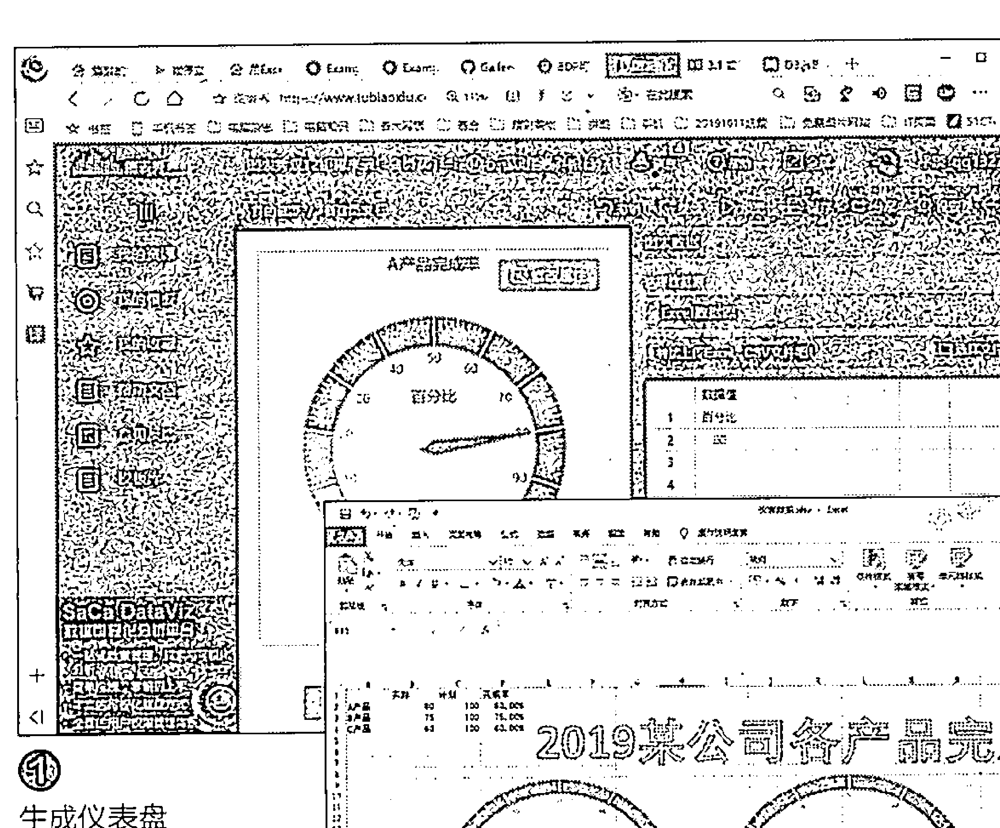

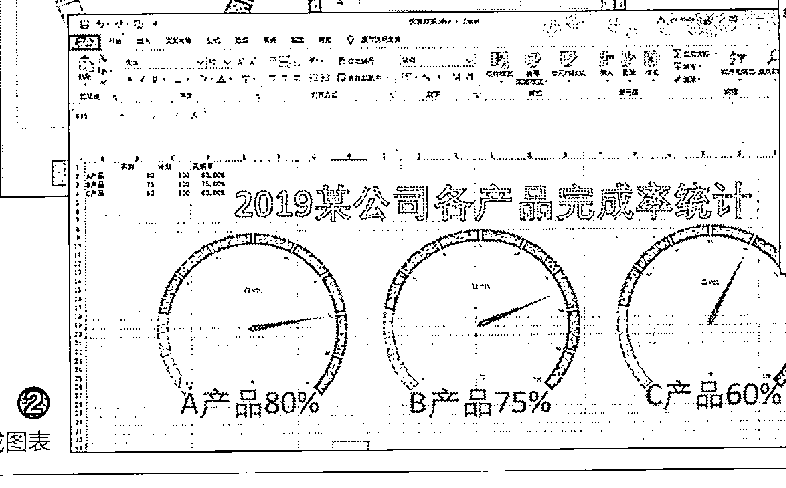

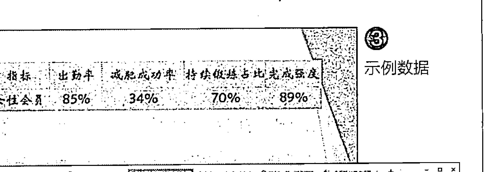

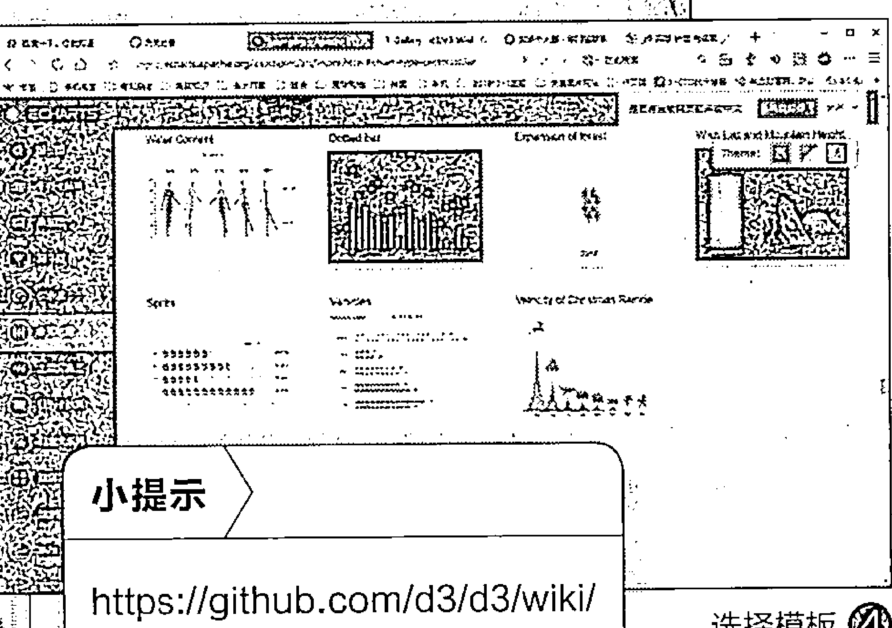

> 小提示
https://github.com/d3/d3/wiki/Gallery也提供类似的服务，熟悉JS代码的朋友可以到这个网站使用类似的模板制作在线图表。

```
ECharts代码截图，包含代码片段如 `var bodyMax = 150;`、`data: ['a', 'b', 'c', 'd', 'e'];`、`value: 34,symbol: symbols[4]` 等
```

示例数据表格，包含日期、用户来源、订单数、订单金额等列（具体数据需参考截图）

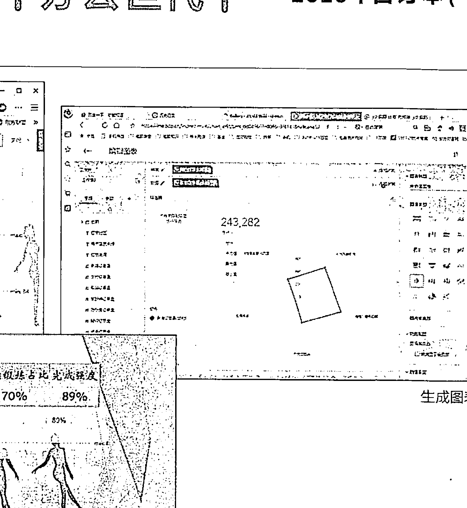

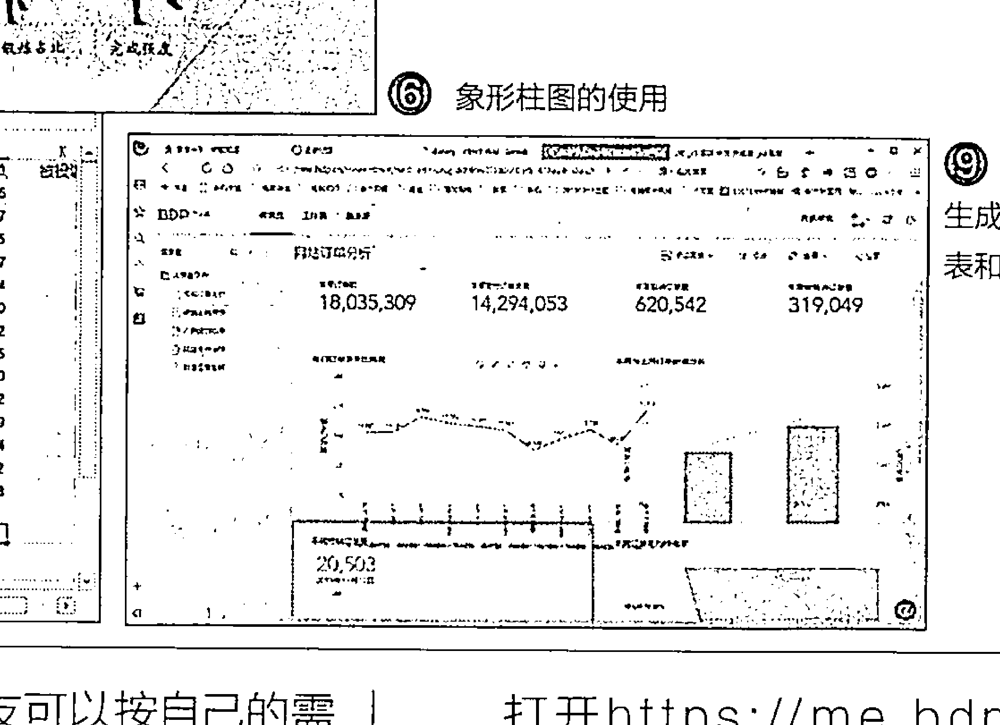

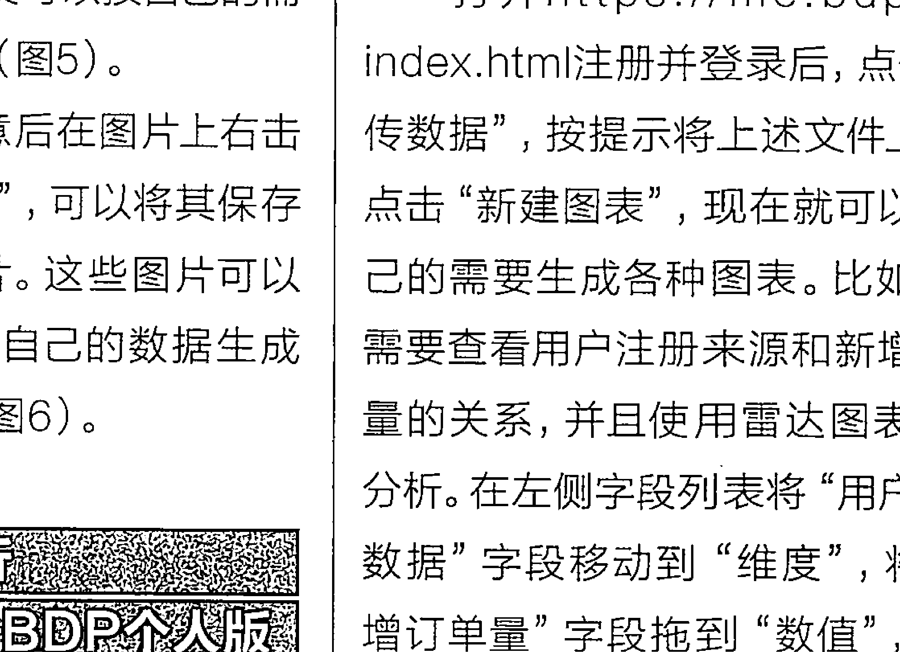

#### 示例数据

#### 生成图表

#### 象形柱图的使用

#### 生成各种图表和分析

标结合水量图标表示的象形柱图，这里根据实际数据修改代码生成需要的图片即可。为了方便图表显示，这里将最大刻度显示为100，在左侧代码窗格找到“var bodyMax = 150;”，将其中的“150”更改为“100”。继续找到“data: ['a', 'b', 'c', 'd', 'e'],”，将其中的“e”去除（代码表示显示的数据有5个，我们这里只需4个数据）。找到“value: 34,symbol: symbols[4]”代码（对应数据e）将其删除，然后根据自己的实际百分比数据，对其中0→3的数据代码中的“value:”值进行更改。最后点击页面的“运行”，这样就可以获得我们需要的象形柱图了。ECharts实际上就是一个HTML5图片库，它是借助JS代码实现图片生成，熟悉代码的朋友可以按自己的需要进行更多的修改（图5）。

如果你在日常工作中除了图表制作还要涉及到数据分析，那么就可以使用BDP个人版，它不仅可以在线生成各种图表，而且还可以对数据进行分析和统计。比如有如下数据统计表，现在将其导入BDP个人版就可以快速生成各种汇总报表（图7）。打开https://me.bdp.cn/index.html注册并登录后，点击“上传数据”，按提示将上述文件上传。点击“新建图表”，现在就可以按自己的需要生成各种图表。比如现在需要查看用户注册来源和新增订单量的关系，并且使用雷达图表进行分析。在左侧字段列表将“用户注册数据”字段移动到“维度”，将“新增订单量”字段拖到“数值”，在右侧面板选择“雷达图”即可（图8）。该网站不仅能快速生成图表，还提供各种统计功能，如极值、平均值等。利用上述方法还可以生成各种自己需要的报表，并且网站会给出数据的详细分析，非常适合需要借助数据运营的公司进行参考（图9）。

#### 不走寻常路 用Excel绘制圆弧图表

文|平淡

我们经常在一些财经杂志上看到圆弧形图表，这些个性化图表使得数据的表达更加形象生动（图1）。虽然Excel并没有内置弧形图，不过我们可以通过对“散点图”进行变形的方法来制作出圆弧图表。

从图表中可以看到，这是由一个下方的圆形和上方的弧形组成的组合图表，所以制作的关键就是根据数据来分别绘制圆形和弧形。在Excel中圆形的绘制可以借助“散点图→带平滑线的散点图”组成，圆形的散点坐标通过SIN()和COS()函数构建。因为在上述图表中，我们是通过弧形的角度来表示市场占有率，所以需要将百分比数值转换为对应的弧度，比如75%就是对应360度*75%=270度的一段弧形，最后借助上述函数分别求出坐标值，这样就可以使用弧形角度来表示这个占比。

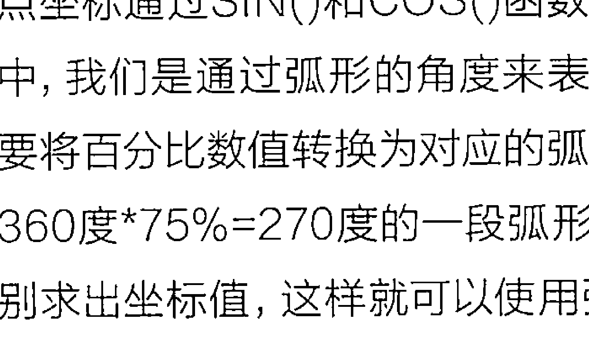

现在假设某公司各个产品的市场占有率如下图所示，下面根据这个数据来进行弧形图表的绘制（图2）。

首先绘制组合图表中的底部圆形，点击Excel菜单栏的“公式→名称管理器”，在打开的窗口中点击“新建”，按提示新建一个名为“A_1”的新公式，引用位置输入公式“=RADIANS(-(ROW(OFFSET(Sheet1!$D$2,,360+2,1))-91))”（图3）。

> 小提示
这里先使用ROW嵌套OFFSET函数来生成由1至360所组成的数组，这些数组散点组成一个圆形。360+2表示行号2（对应D2数据），在公式中减去91，并在结果数组前添加“-”号，是将绘制圆的方向由逆时针改为顺时针，这样绘制方向就和图1的示例一致。最后使用RADIANS函数将其转换为弧度数值，方便后续使用SIN()和COS()函数求坐标值。

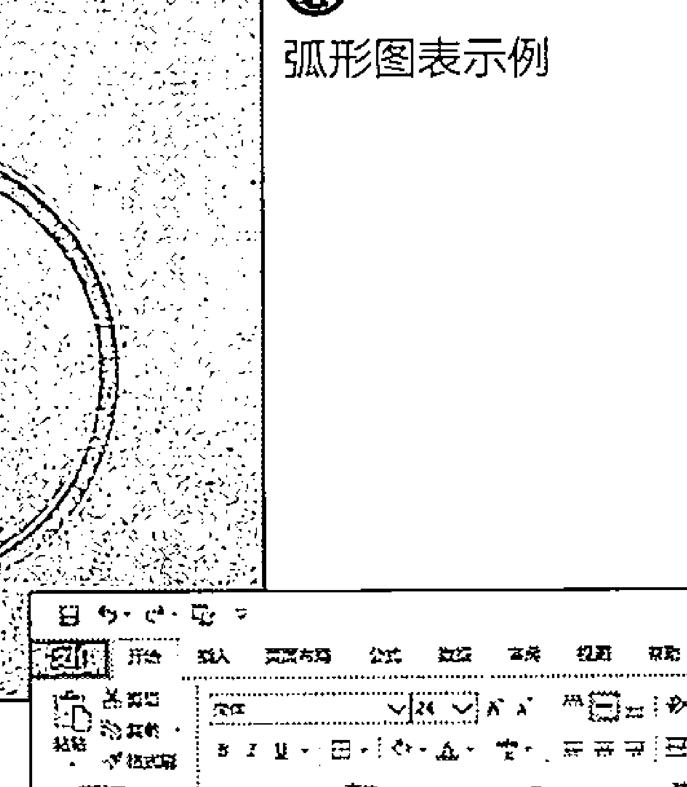

| 产品 | 销量 | 整个市场销量 | 占有率 |
| --- | --- | --- | --- |
| A | 75 | 100 | 75.00% |
| B | 56 | 100 | 56.00% |
| C | 41 | 100 | 41.00% |

操作同上，继续新建名为“_x1”、“_y1”的新公式，引用位置分别输入“=COS(A_1)*10”和“=SIN(A_1)*10”（这里“A_1”就是上述新建的公式名），将这个数据作为散点的坐标值（x1,y1）。其中的“*10”表示这个圆的半径是10个单位（注意：这只是一个标称，并不是指10cm这样的具体数值）。因为在本例中需要根据不同的比值绘制多个弧形，所以这里需要使用不同单位半径的弧形来表示（图4）。

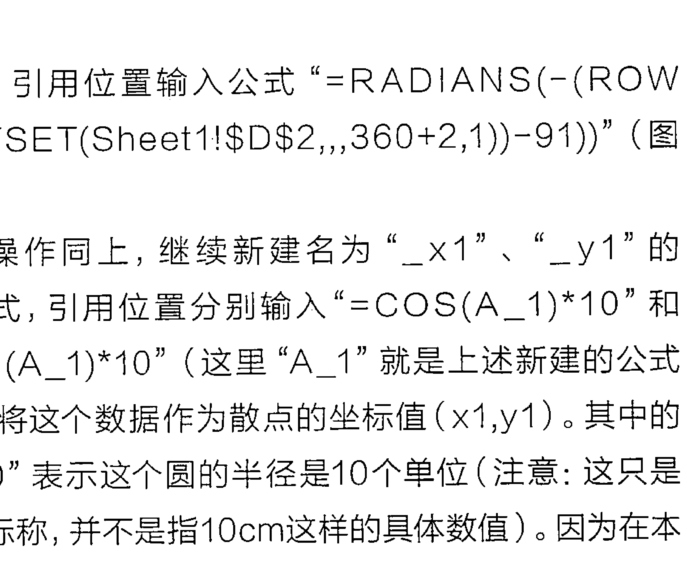

定位到任意一个空白单元格，点击Excel菜单栏的“插入→所有图表→散点图→带平滑线的散点图”，按提示插入一个空白散点图表。在图表处右击选择“选择数据”，在打开的窗口点击“添加”，按提示添加一个名为“底部圆”的新系列，X轴数据为“=工作簿1!_x1”，Y轴数据为“=工作簿1!_y1”，即对应上述新建的公式（图5）。点击“确定”，这样在当前窗口就会自动生成一个圆形的散点图，调整图形大小使之成为一个标准圆形。选中圆形后右击选择“设置数据系列格式”，在右侧窗格切换到“填充与线条”，线条颜色设置为灰色，高度设置为“15磅”，切换到“标记”，将填充设置为“无线条”，边框设置为“无边框”，其他设置为默认，将这个作为组合图表的底部圆形（图6）。继续点击Excel菜单栏的“公式→名称管理器”，同上新建三个名为“A_2”、“_x2”、“_y2”的公式，引用位置分别输入公式“=RADIANS(-(ROW(OFFSET(Sheet1!$D$2,,D2*360+2,1))-91))”、COS(A_2)*10、SIN(A_2)*10。

这里ROW嵌套OFFSET函数中的“D2*360”表示将原来百分比数值转换为对应的弧度，其他参数含义同上。定位到D2，同上右击圆形选择添加数据，添加一个名为“占有率”的新系列，这里X轴数据为“=工作簿1!_x2”，Y轴数据为“=工作簿1!_y2”。这样会在当前圆形上方新建一个弧形图表，这个图表由于使用了“D2*360”（75%*360=270）参数，因此它的弧度是270度。操作同上，进入“设置数据系列格式”，在右侧窗格将线条颜色设置为绿色，高度设置为“15磅”，边框设置为“实线”（注意：在边框设置中选择不同的类型可以实现不同风格的弧形图表），线段类型和链接类型设置为“圆”，开始箭头类型选择“圆型箭头”，结尾箭头类型选择示例中的“箭头形状”，这样就可以画出类似示例中的组合图表了（图7）。

操作同上，继续为其他比例（D2、D3）数据设置公式，为了方便区分弧形，这里“A_4”公式、X、Y轴公式要根据实际单元格确定，比如“A_4”（对应D3数据）公式为“=RADIANS(-(ROW(OFFSET(Sheet1!$D$2,,D2*360+3,1))-91))”（表示填充数列从第三行开始，以此类推），X轴数据公式设置为“=COS(A_1)*8”（表示单位半径为“8”）。同上为弧形设置不同的颜色，最后将不需要的数据（如背景网格线、XY轴数据显示）删除，并进行适当的美化，我们就可以做出精美的弧形组合图表了，这些弧形会根据数据的不同动态地进行调整（图8）。

#### 控制条柱形图表还可以这样制作

文|马震安

用普通柱形图展示数据显得有些太土了，于是有人突发奇想，是否可以将Excel柱形图表做成动感的控制条形式？在普通柱形图上加上控制条之后，演示效果的确会显得与众不同（图1）。那么，如此效果的控制条柱形图表如何制作呢？其实，将菜单、函数、图表等技术结合使用，制作控制条形式的柱形图表也不难。

##### 1. 构建下拉菜单

首先，在原始数据表的一个空白列（F列）连续输入所需要的年份。选择“开发工具”选项卡，点击“插入→表单控件→组合框”，在工作表空白处划出一个组合框。右击此组合框，选择“设置控件格式”，在弹出窗口的“控制”选项卡中，“数据源区域”处选择输入的连续年份单元格，如$F$1:$F$3；“单元格链接”处选择任一空白单元格，如G1。这样，当点击组合框中的下拉菜单时，G1单元格的值就会发生变化（图2）。

##### 2. 构建图表数据

切换到“公式”选项卡，点击“名称管理器”，在弹出的窗口点击“新建”，在新弹出窗口的“名称”处输入“完成”，在“引用位置”处输入“=OFFSET(Sheet1!$B$2,(Sheet1!$G$1-1)*8,1,8,1)”；同样，再新建名称为“未完成”，“引用位置”处输入“=OFFSET(Sheet1!$B$2,(Sheet1!$G$1-1)*8,2,8,1)”。这样，图表所需要的数据就构建完成了（图3）。

##### 3. 构建图表

任选一空白单元格，切换到“插入”选项卡，点击“插入柱形图→二维柱形图→百分比堆积柱形图”，在工作表中插入一个空白百分比堆积柱形图；右击此图表，选择“选择数据”，在弹出窗口的“图例项”处，点击“添加”，在新弹出窗口的“系列名称”处输入“完成”，在“系列值”处输入“=Sheet1!完成”，在“水平（分类）轴标签”处点击“编辑”，在弹出窗口的“轴标签区域”处选择“=Sheet1!$B$2:$B$9”；同样，再点击“添加”，在“系列名称”处输入“未完成”，在“系列值”处输入“=Sheet1!未完成”，轴标签不用更改；再点击“添加”，在“系列名称”处输入“完成”，在“系列值”处输入“=Sheet1!完成”，轴标签不用更改。这样，动态图表就基本上构建成功了（图4）。

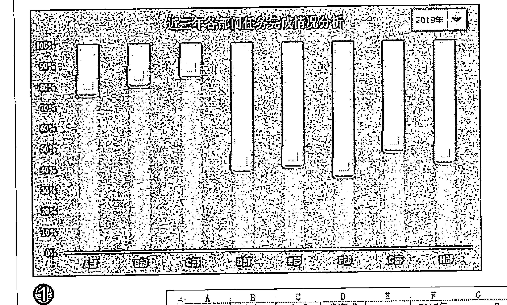

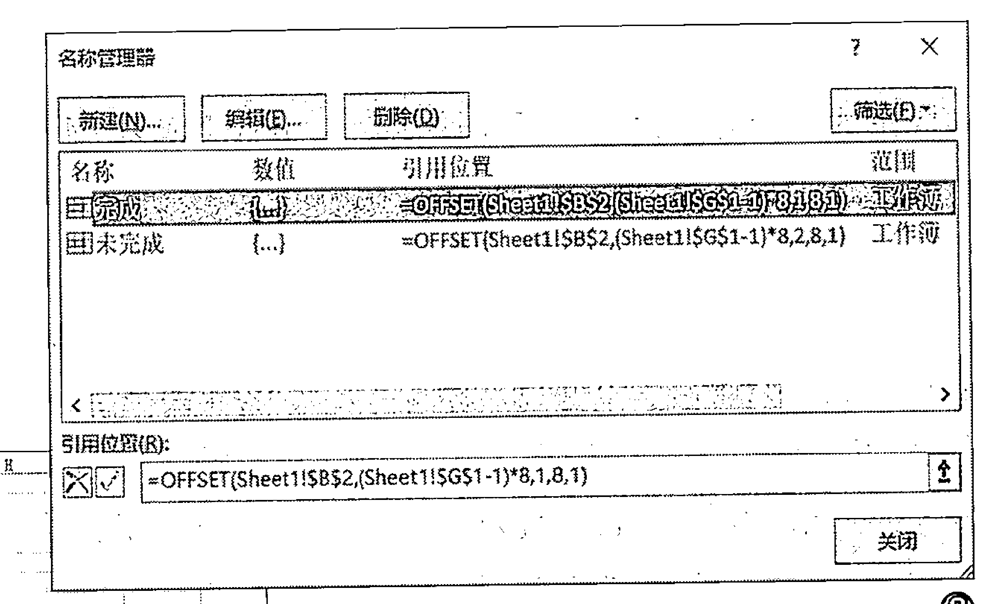

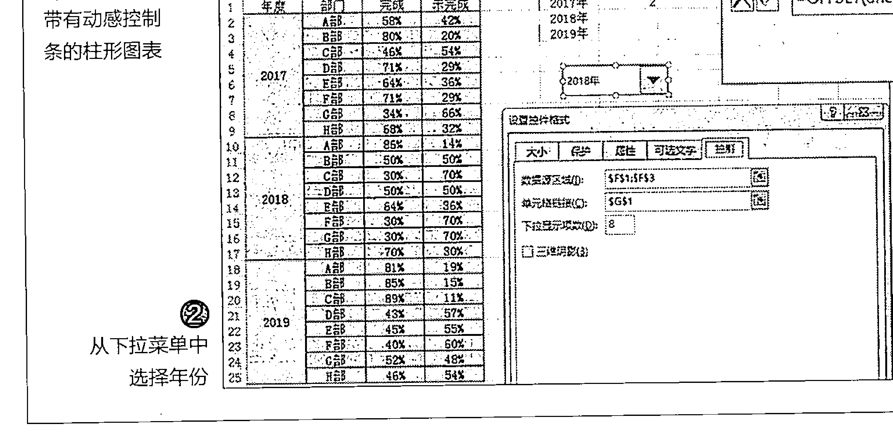

带有动感控制条的柱形图表

从下拉菜单中选择年份

用OFFSET()函数构建图表所需数据

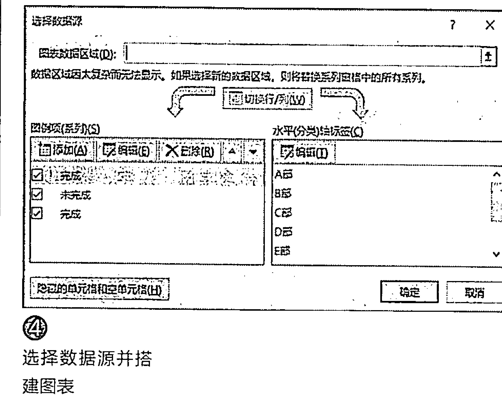

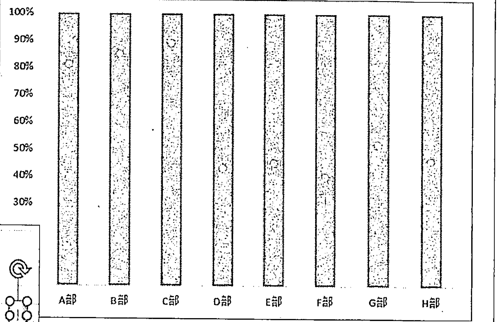

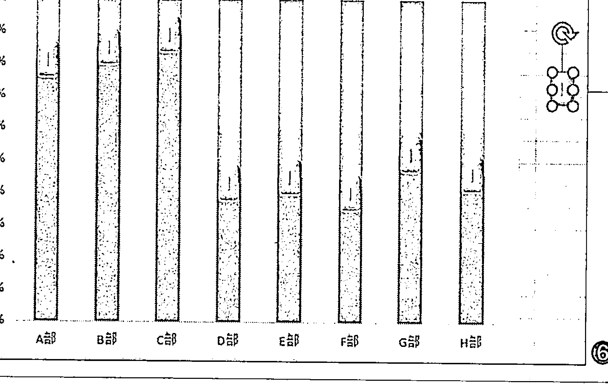

##### 4. 改造图表

右击图表，选择“更改图表类型”，在弹出窗口的“组合→所有图表”选项卡中，将第一和第二项改成“百分比堆积柱形图”，第三项改为“带数据标记的折线图”，并勾选第三项后面的“次坐标轴”。右击图表右侧的“坐标轴”，选择“设置坐标轴格式”，在“坐标轴选项→边界→最大值”处将数据修改为“1”，然后依次删除“右侧坐标轴”、“网格线”等；右击图表中的“折线图”，选择“设置数据系列格式”，在“填充与线条”选项卡中将线条设为“无线条”。此时，“带数据标记的折线图”就只剩下其中的圆点了（图5）。

接下来，画一个圆角矩形，通过它的“形状效果→棱台”设计出按钮效果，然后将其复制，再选中折线图中的圆点，将其粘贴进去。右击图表中“未完成”部分数据图表，选择“设置数据系列格式”，将填充颜色设为“白色”，在“效果”选项卡中，“阴影→预设”处选择“内部：中”效果，然后颜色设置成“深灰色”；再选择图表中的“完成”系列，设置好它的效果，操作和上面一样，颜色根据需要选择（图6）。

##### 5. 组合图表菜单

右击组合框控件，选择“排序→置于顶层”，拖动组合框到图表的合适位置；对图表可以进行细节的调整，美化一下字体、背景等。最后，按住Ctrl键，选中图表及组合框控件进行组合就可以了。

#### 公式之中用名称 调用数据不犯晕

文|童乐安

在Excel表格中，单元格之间的数据相互调用司空见惯。然而，仅凭类似于A1、B108这样的单元格编号来构造公式，看起来就会让人头晕。如果给具有代表性的单元格起上个性化的名称，公式中也随时可使用这些名称而不是单元格编号，那么调用起来就更显人性化了。

##### 1. 做铺垫：先为单元格命名

以一个简单的捐资登记表来说明。如图所示的捐资登记表，A列记录了捐资人的姓名，B列为对应的出资额。如果要在表格其他地方引用某个人的捐资额，记忆或转抄数字不方便甚至容易出错。但若给需要引述的数字单元格取一个有代表性的名称，例如用每个人的姓名第一个字母组合代表捐资额单元格，如：WW代表王五的捐资额，WS代表王三的捐资额，WL代表王六的捐资额，ZL代表赵六的捐资额……引述起来就要方便和容易得多。具体定义方法为：点击某个捐资单元格（如王五的捐资），然后在公式构造栏左侧的名称框中输入其名称（WW）（图1）。以此类推。

之后，假设我们要在某个单元格（如D8）中用到王五的捐资额，只需输入“=WW”即可，就不用再去查看和调用王五捐资的单元格了。按下回车之后，我们便会看到，D8单元格里已经调来王五的捐资数字了（图2）。

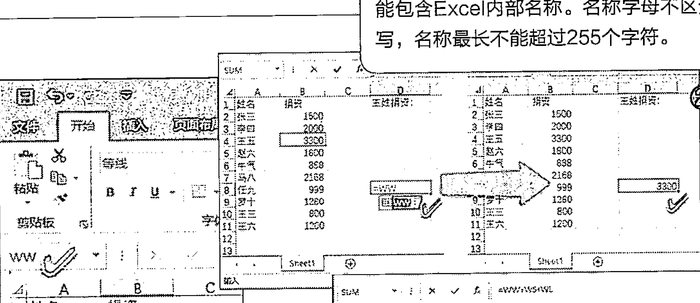

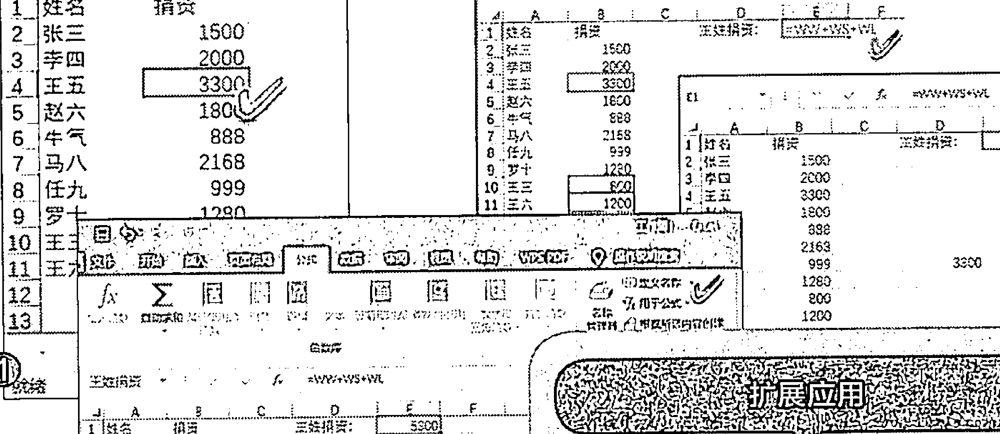

> > 小提示
定义的名称可以包含字母、汉字、数字以及“-”、“_”、“?”、“\”等符号，且开头必须是字母（汉字）或下划线、反斜线，名称中不能带有空格，不能使用纯数字，不能包含Excel内部名称。名称字母不区分大小写，名称最长不能超过255个字符。

##### 2. 易调用：在公式中使用名称

当为单元格定义了名称之后，公式中也可以直接使用这些名称，而不需要具体引用类似A1、B12、C144这样枯燥不形象的单元格编号了。

还以上面这个捐资表为例，假设我们要在E1单元格中自动计算出所有姓王的捐资人捐资的总额，我们可以简单地使用上面命名的单元格名称作为运算的变量，构造一个公式“=WW+WS+WL”。这样就会自动计算出王五、王三、王六等人的捐资总和（图3）。这里只介绍一种方法，复杂的公式构造道理相同。

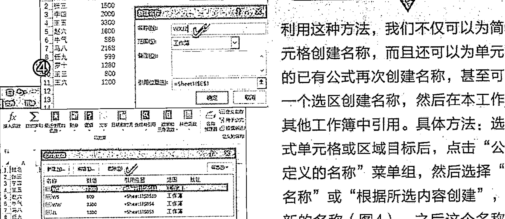

> > 扩展应用
利用这种方法，我们不仅可以为简单单元格创建名称，而且还可以为单元格中的已有公式再次创建名称，甚至可以为一个选区创建名称，然后在本工作簿或其他工作簿中引用。具体方法：选择公式单元格或区域目标后，点击“公式→定义的名称”菜单组，然后选择“定义名称”或“根据所选内容创建”，定义新的名称（图4）。之后这个名称便可以在其他位置被简单地引用了。

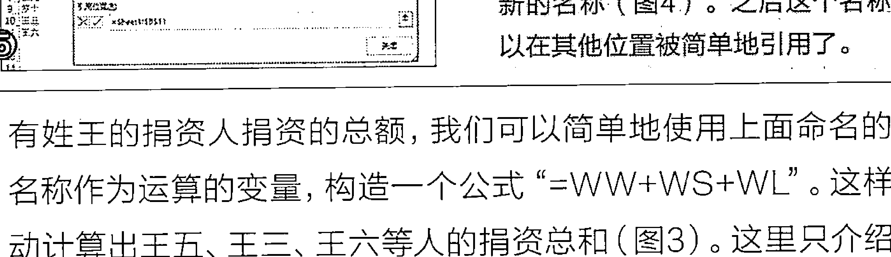

##### 3. 如何删除定义的名称

如果我们不再需要某些已经定义的名称了，首先点击“公式”选项卡，然后在工具栏上选择“名称管理器”；接下来，在弹出的名称管理器窗口中，选中要删除的名称，点击“删除”按钮删除即可（图5）。

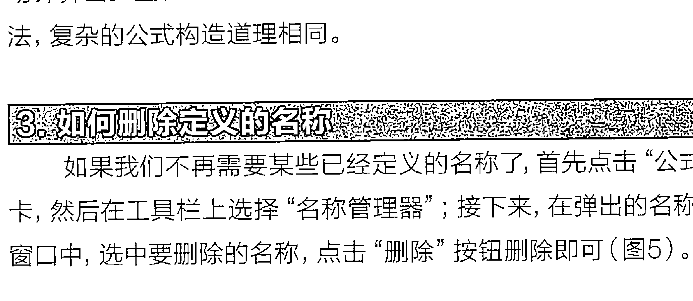

#### 巧用通配符 插入替换事半功倍
文|马震安

当长文档需要批量修改或删除某些内容的时候，我们可以利用Word中的通配符来搞定这一切，比如将某些文字替换成图片、批量插入表格、批量插入文字等。通配符能够随意组合替换或删除我们定义的规则内容，下面我们就看看通配符的强大功能吧！

##### 1. 巧用剪切板通配符

###### ○将成批文字替换成图片

我们想将表格中球员所属的球队的文字替换成图片的形式，如果表格记录比较多的话，一个一个替换是非常费时费力的。这时，利用“通配符”就能轻松解决。

首先，复制某个球队的图片（如上海队图片），打开“查找和替换”窗口，在“查找内容”处输入“上海”，在“替换为”处输入“^c”，点击“更多”，在展开项中勾选“使用通配符”，点击“全部替换”就轻松地完成了文字替换成图片的任务。所有上海队的文字立马变成上海队的图片显示（图1）。

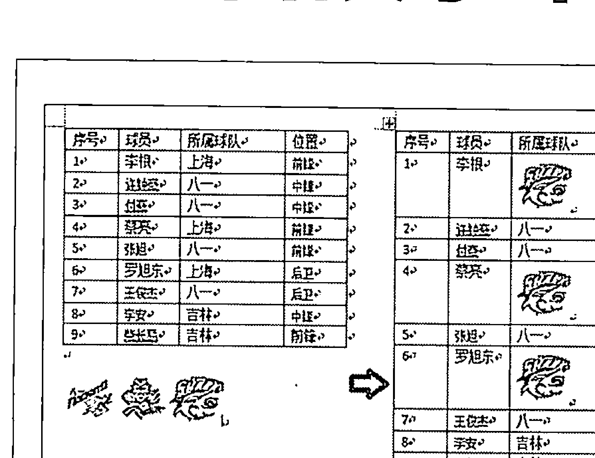

###### ○批量插入相同格式的表格

在某个报告中可能使用多个相同格式的表格，如果采用复制粘贴的办法比较费时，我们用剪贴板“通配符”将其快速搞定。

比如报告中对各地区产品的销售情况统计表的插入，首先，复制已制作好的表格，打开“查找和替换”窗口，在“查找内容”处输入“(表?)(^13)”，在“替换为”处输入“\1^c”，点击“更多”，在展开项中勾选“使用通配符”，点击“全部替换”就轻松地完成了多个表格的自动插入（图2）。

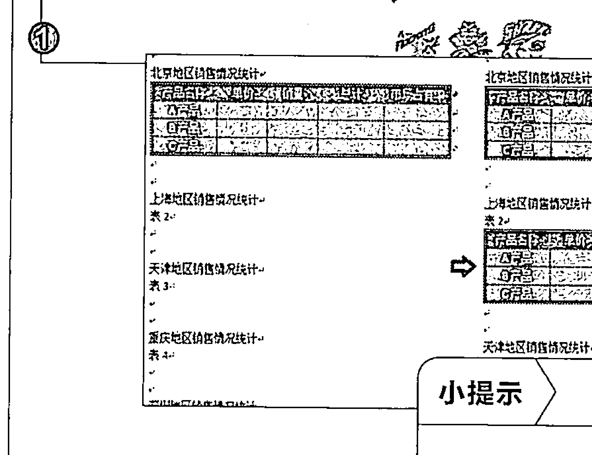

##### 2. 批量添加数字下划线

如果报告中要求将所有的数字都加下划线，那么要一个个地修改是不是就太费力了？好在“通配符”也能够非常快速地解决这个问题。

在“查找和替换”对话框中，“查找内容”处输入“[0-9]{1,}”，“替换为”处输入“^32^&^32”，点击“更多”按钮，勾选“通配符”，将光标定位在“替换为”输入框中，再点击“格式→字体”按钮，在弹出的对话框中选择所需要的一种下划线线型及颜色。设定完成后，点击“全部替换”就可以了（图3）。

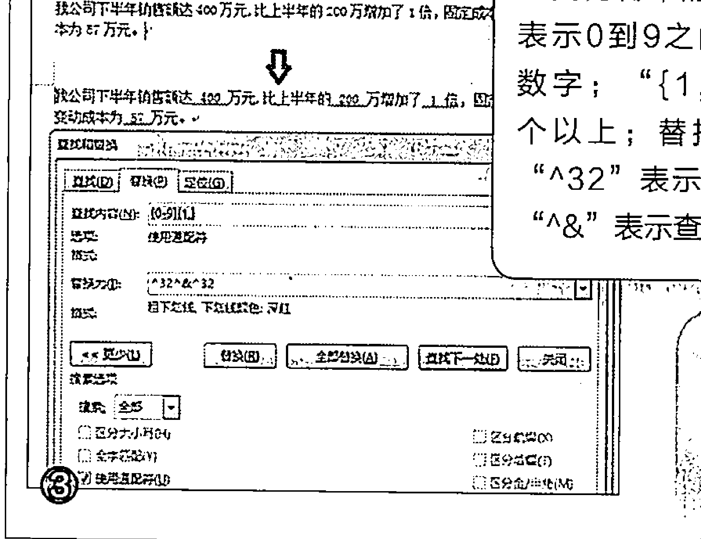

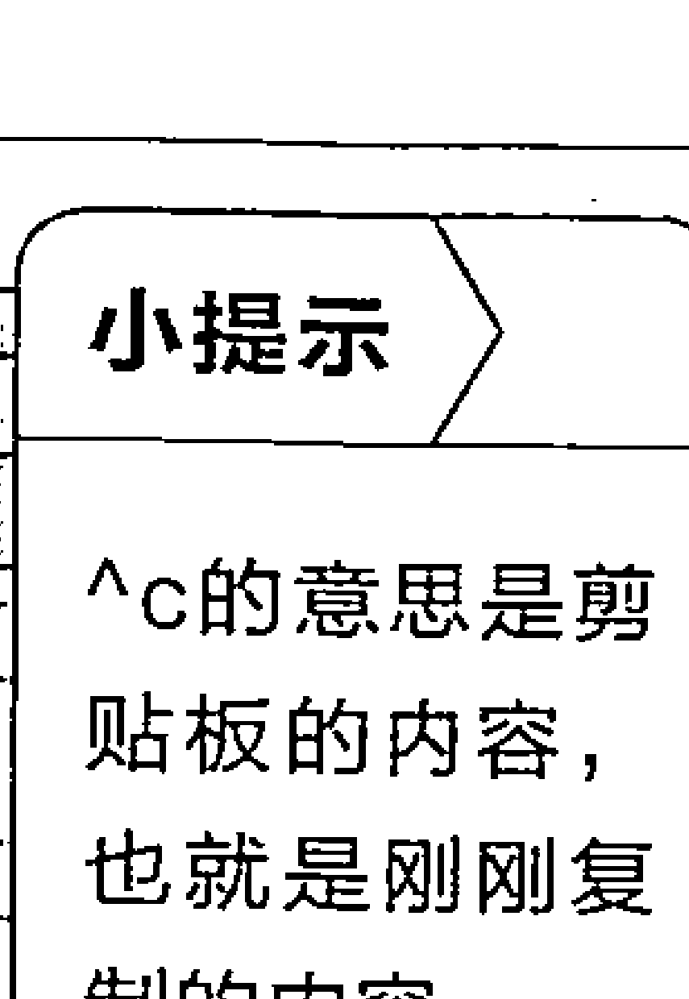

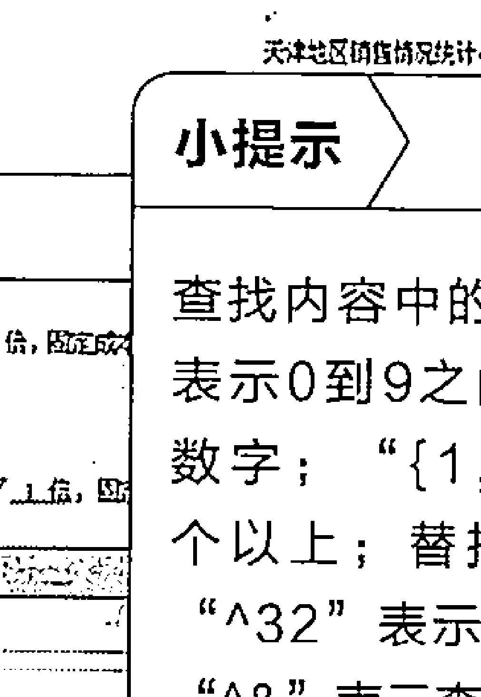

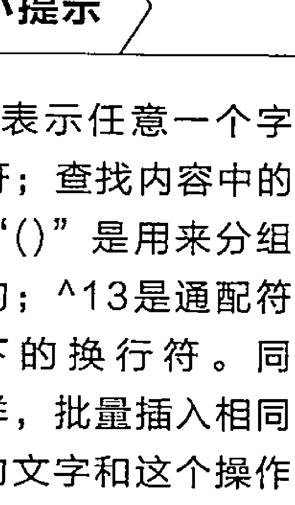

| 序号 | 特殊字符 | 代码 | 特殊字符 | 代码或通配符 |
|---|---|---|---|---|
| 0 | | | 要查找的表达式\n | ^& |
| 1 | 段落标记 | ^p | 段落标记 | ^p |
| 2 | 手动换行符 | ^l | 手动换行符 | ^l |
| 3 | 查找的内容 | ^& | 查找的内容 | ^& |
| 4 | 剪贴板内容 | ^c | 剪贴板内容 | ^c |
| 5 | 省略号 | ^i | 省略号 | ^i |
| 6 | 全角省略号 | ^j | 全角省略号 | ^j |
| 7 | 制表符 | ^t | 制表符 | ^t |
| 8 | 长划线 | ^+ | 长划线 | ^+ |
| 9 | 1/4长划线(—) | ^q | 1/4长划线(—) | ^q |
| 10 | 短划线(-) | ^= | 短划线(-) | ^= |
| 11 | 脱字号 | ^^ | 脱字号 | ^^ |
| 12 | 手动分页符 | ^m or ^12 | 手动分页符/分节符 | ^m |
| 13 | 可选连字符(-) | ^- | 可选连字符(-) | ^- |
| 14 | 不间断连字符(-) | ^~ | 不间断连字符(-) | ^~ |
| 15 | 不间断空格 | ^s | 不间断空格 | ^s |
| 16 | 无宽非分隔符 | ^z | 无宽非分隔符 | ^z |
| 17 | 无宽可选分隔符 | ^x | 无宽可选分隔符 | ^x |
| 18 | 分栏符 | ^n | 分栏符 | ^n |
| 19 | 分节符 | ^% | 分节符 | ^% |
| 20 | 段落符号 | ^v | 段落符号 | ^v |

扩展阅读

有关Word替换中可使用的代码或通配符，请参见附表。

#### Word自动项目符号用法
文|童乐安

Word的自动项目符号不单单可以是系统默认给出的那些数字编号或圆点方块的样式，还可以根据需要定制其他类型样式，如文本或图案。全方位用好Word自动项目符号，需要注意哪些问题呢？

##### 1. 特殊项目符号的制作

###### ○使用特定的文本作为项目符号

项目符号不但可以是，我们常见的1. 2. 3.或圆点、方块等符号，甚至还可以将一个特定的文本关键词作为项目符号，例如以“解说词：”为项目符号。具体实现方法如下：

在Word中选中需要设置项目的文本，依次点击“开始→段落→多级列表→定义新的多级列表”，随后弹出定义新多级列表对话框，选择“此级别的编号样式”为“无”，然后在“输入编号的格式”框中，输入特殊项目符号名称“解说词：”即可（图1）。

###### ○使用特定的图片作为项目符号

我们不但是可以用数字、符号、关键词作为项目符号，还可以用一张小图片作为项目符号。首先选择需要添加项目符号的多个段落，点击Word的“开始”菜单，在“段落”中的“项目符号”上，单击后面的倒三角，然后选择“定义新项目符号”，打开“定义新项目符号”对话框。单击“图片”按钮，打开“插入图片”对话框，选择从文件、必应图片搜索或OneDrive等多渠道插入图片，最后单击“确定”（图2）。

##### 2. 项目符号问题的处理

###### ○项目符号的大小如何调整

有时，我们可能会觉得项目符号中的圆点“圆圆的”，比后面的文字还要大，希望将其缩小一点。这时，可以在选择了所有项目之后，点击“项目符号”右边的小三角，出现下拉菜单。点击“定义新项目符号”，在弹出的窗口中，点击“符号”按钮，下拉符号列表，找到一个更小的项目符号，然后点击“确定”（图3）。

###### ○如何取消自动出现的项目符号

有时，在编辑过程中，随着上文的项目符号，下面本不想要的段落也会自动出现项目符号。如果希望取消不该出现的项目符号，只需依次点击“文件→选项→校对”，然后点击“自动更正选项”，选择

> 小提示
要使用悬挂缩进和制表符对其调整功能，需要先通过“视图”菜单，选择“标尺”复选框，开启标尺显示。

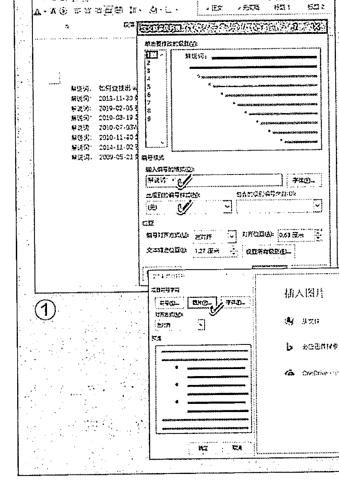

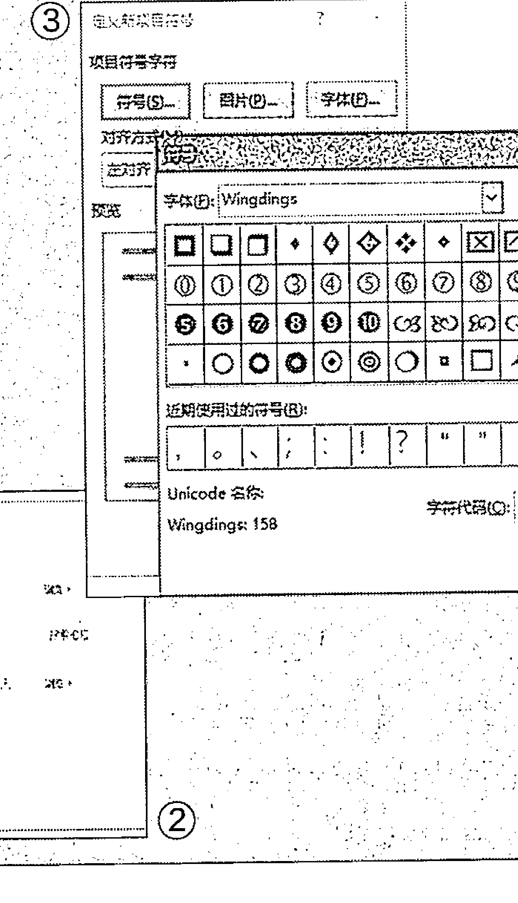


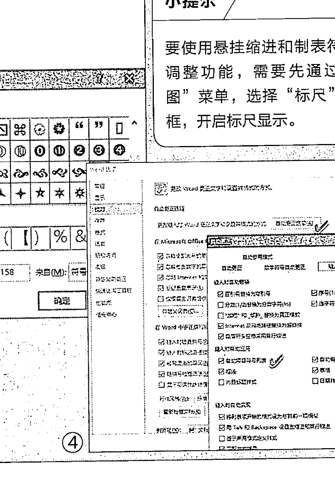

“键入时自动套用格式”选项卡，取消选中“键入时自动应用”下的“自动项目符号列表”和“自动编号列表”（图4）。这样再次输入就不会自动添加项目符号。

###### ○一行中添加多个项目符号

常见的项目符号是一行或一段之首出现一个符号，但有时我们因为版面的需要，希望在一行的两个项目中均出现项目符号，这时，可以用插入表格的方式来实现。首先插入一个三列的表格，然后在每个单元格里输入项目内容；接着将表格线型设置为“无”，这样就形成了一个看不见表线的表格（图5）。最后，我们对每个单元格里的内容再设置项目符号，就可以实现一行两个项目符号了。

###### ○项目符号与其后内容距离太宽怎么调

项目符号与项目内容之间的距离是由软件格式控制自动决定的，有时我们会觉得其间的距离太大。如何缩小其间的距离呢？

首先，用鼠标拖动选择所有项目内容，点击“开始→段落”组右下角的小箭头图标，在弹出窗口的左下角，点击“制表位”，然后，在新弹出的制表位设置窗口中，将“默认制表位”的数字设为“1字符”即可（图6）。

###### ○如何在项目符号的方框里打钩

还有的时候，我们需要在一些项目前面的方框内打上对钩。这时，我们可以依次点击“开始→段落→项目符号→定义新项目符号”，在弹出的符号选择窗口中，选择带钩的方块符号即可（图7）。

- 如何查找出word等文档中的超链接？34
- 2013-11-30如何提取word中的超链接地址出来
- 2010-02-05 在 Word2013 以上，如何选中带有超链接的文本？
- 2010-08-19怎样确定一篇word里面有没有超链接？
- 2010-07-03Word/Excel中可以查找出超级链接中的内容吗，如何搜索
- 2010-11-30怎样操作才能在WORD中建立EXCEL的超级链接
- 2014-11-02在word文档中如何设置网页链接
- 2009-05-21如何查拉出来word文章里面的带有超级链接（跟踪链接）

###### ○项目符号后的文字对不齐怎么办

如果遇到项目符号后的文字不能对齐的情况，可以将光标移动到项目内容的最前面，然后用鼠标移动水平标尺上的“悬挂缩进”对应的“左对齐式制表符”，拖动到合适的位置即可（图8）。

###### ○使用项目符号后字体变大或变小的解决

有时，我们发现对正常的文本应用了项目符号之后，其字体会变大或变小，这不符合我们原来的预期。这时，我们只需将列表的“样式基准”改为“正文”即可（图9）。

#### 巧用Excel散点图绘制时间线

为了直观地展示某件事情的发展进程，我们经常采用时间线的方式来实现。平时大家都习惯使用PowerPoint之类的软件，画好时间线后再手动添加文字标注。这种制作方法比较繁琐，而且修改起来也不方便。其实我们还可以借助Excel的散点图来绘制时间线，这样当数据发生变化时修改起来也很方便。

这里我们以制作某公司的发展时间线为例。打开Excel，准备好时间线数据，按照年份、序号、事件的格式依次输入。选中A1:B7单元格中的数据，然后点击“插入→图表→带平滑曲线和数据标记的散点图”，生成一个散点图（图1）。

因为年份是从2014年开始，所以在图表中选中X轴，再在右侧窗格切换到坐标轴选项，将“边界”的最小值设置为“2014.0”，最大值设置为“2019.0”。这里的数据设置可以根据实际时间线进行设置，比如时间线里有月份数据（如2014.1、2015.2），那么可以将数据设置为201401、201502的形式。如果数值差距较大，还可以对“单位”选项的大小值进行设置，使得曲线看起来更平滑（图2）。

时间线仅仅是一根斜线显然不够美观，对于纵坐标的值（即序号值），我们可以根据实际事件进行不同数值的输入，将斜线变为起伏的波浪线，表示公司的发展势头。比如这里2017年和2019年，对于公司是跳跃式发展，那么就可以将这个事件前后的序号值更改大一些，这样曲线弧度会发生相应的变化，当更改适合的数值后时间线就变得跳跃起伏了（图3）。

接下来为时间线添加事件说明，在图表处右击，选择“添加数据标签→添加数据标签”。接着在右侧窗格切换到“绘图区选项→设置数据标签格式”，在标签选项下勾选“X值”和“单元格中的值”，在弹出的“选择数据标签区域”窗口中，按提示选择C2:C7单元格范围的数据。通过上述的设置后，在时间线上就会添加上事件的描述文字了（图4）。

继续选中时间线，在右侧窗格切换到“系列选项→填充与线条→标记”，将标记点的填充颜色设置为红色，在“边框”中颜色也设置为红色，边框的数值设置为“5”磅，这个对应为年份的显示（图5）。

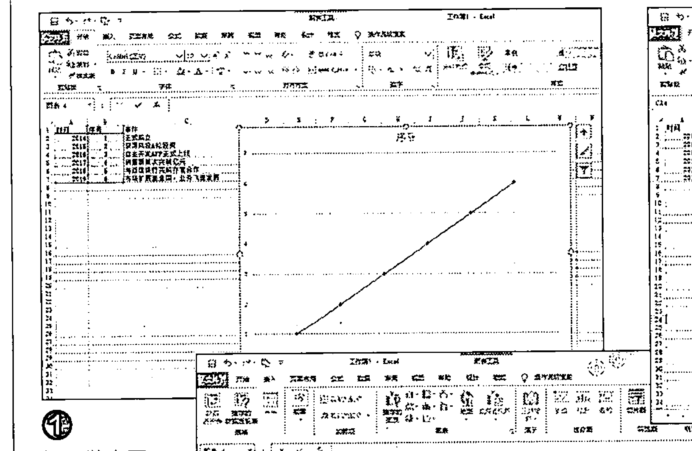

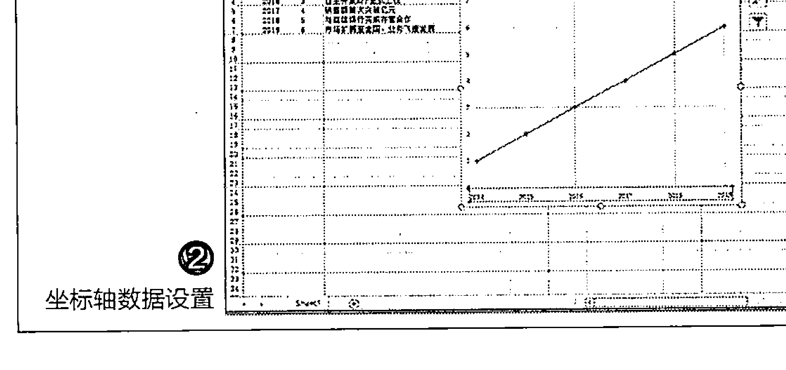

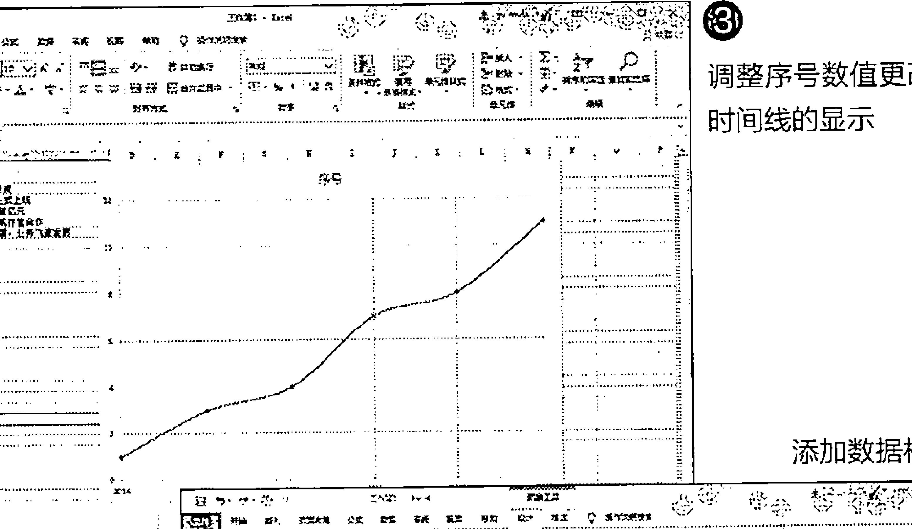

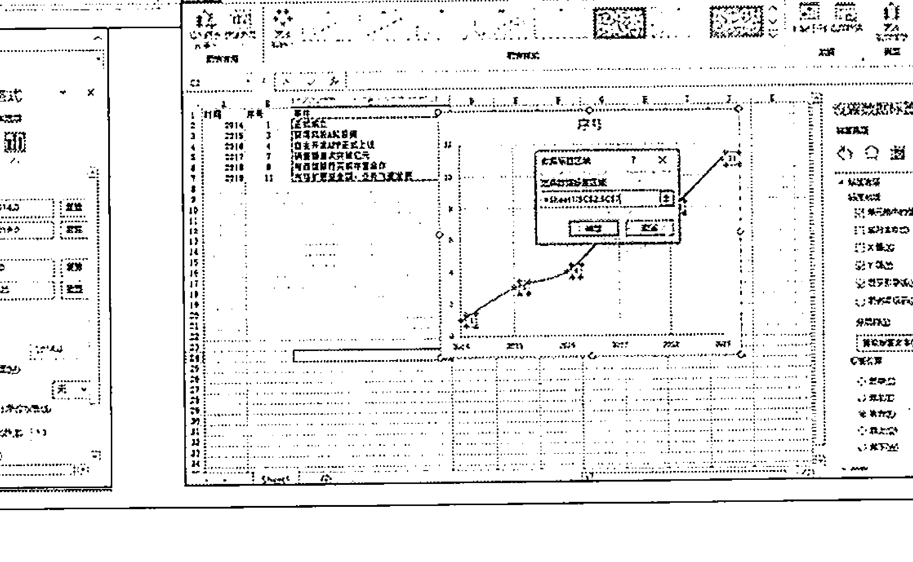

在上图右侧窗格切换到“线条”，边框的宽度设置为“5”磅，短划线类型选择“圆点分割”，结尾箭头类型选择箭头形状和大小，其他保持默认设置，这样时间线会变成一个圆点曲线，结尾箭头表示公司继续发展的势头不止（图6）。

切换到“图表工具→设计→添加图表元素→误差线→标准偏差”，添加完后将X轴偏差线删除。双击Y轴偏差线，在右侧窗格将其方向设置为“负偏差”，末端样式设置为“无线端”，误差量设置为“自定义”，这样可以在图表上添加上偏差线，将其作为年份时间的引导标识线（图7）。

完成上述操作后，添加上其他文字说明，再进行后续的美化，如将图表网格线和Y轴数据线删除，以及为表格填充合适的背景等，一张关于公司发展的时间线就制作完成了（图8）。

> 小提示
大家在此可以根据自己的需要，通过更改线条的复合类型、短划线类型、箭头类型等参数制作成不同风格的时间线。

因为这里我们是使用散点图的方式制作的时间线，所以如果要更改时间线的数据，我们只要在Excel中对单元格的数据进行编辑即可，完成数据的更改后时间线会同步进行改变。

当然我们还可以通过更改图表方式，快速生成其他形式的时间线。比如现在要制作水平方式的时间轴，只要将原来图表的偏差线删除，同时将每个事件的序号数值全部更改为“0”（这样事件就全部分布在水平X轴上），在右侧窗格切换到“系列选项”，将X轴线条设置适当宽度并添加结束箭头，最后调整图表的大小和位置，添加填充背景，即可快速变换为水平方向的时间线了（图9）。同样的，如果要制作垂直方向的时间线，则将序号（数值也设置为0）和时间数据对换，其他同上，保留Y轴数据即可。

#### 制图不求人 自己动手制作桑基图

桑基图是一种数据分析工具，可以很直观地展示数据是如何从左到右流向最后的节点，它常用于流量分析，可以很清楚地看出数据是如何渐渐分流的。下面就让我们看看，如何利用工具软件制作桑基图。

##### 在线制作桑基图——镝数

镝数（https://dydata.io）是一个提供在线图表分析的网站，我们可以自己上传数据快速生成桑基图。

首先使用Excel准备需要制作桑基图的数据，因为桑基图主要用来表示流量分析，它一般由“边”和“节点”组成，边对应原始数据源，然后映射到对应的节点。因此制作桑基图的数据最好是一些表示流量分流的数据，并且预先规划好映射关系。这里我们以某公司回笼货款的区域、省份分布为例，对应关系是“货款→大区→所属省份”，按提示依次在Excel中准备好对应的数据，文件格式注意对应关系（图1）。

在浏览器中打开上述网址，进入网站后点击“做图表→上传数据”，按提示将上述准备好的数据上传到网站，然后按照向导的提示选择“桑基图”模板（图2），这样就可以快速生成桑基图了。

印和Logo显示。预览满意后点击“下载”到本地备用（如果需要在PPT中演示，建议下载为GIF格式，这样会有一个从左到右的动态流向效果），以后将其插入到Excel或者PPT中，就可以通过这个图表清晰地看到回笼资金的来源和分布了（图3）。

##### 本地制作桑基图——Tableau桌面版

在线制作虽然简单，但是免费用户有下载次数的限制，而且网站自带模板较少。如果经常需要制作桑基图，那么还可以借助“Tableau桌面版”（下载地址：https://www.tableau.com/products/desktop）来实现。

Tableau桌面版制作桑基图通过两个工作表链接比较容易实现，因此我们首先需要对数据进行整理，下面依然以某公司各个销售部货款回笼数据为例。为了更精准地实现关系映射，这里先在原始数据后添加“省份ID”（按照序号填充即可，对应具体省份）、“部门ID”（对应实际销售部，四个部门ID分别设置为2、10、18、26）、“link”（全部填充link字样，对应另一张工作表的link字段）等三列信息。同时再建一个新工作表2，在其中将E1、F1分别输入“横坐标”和“link”。因为这里数据总共39行，先在E21输入“0”，E20输入“-1”，E22输入“1”并将步进设置为“1”，依次向上和向下填充到E2和E40（图4）。

完成Tableau桌面版的安装后，双击桌面的“Preferences.tps”启动程序。点击“打开工作簿”，然后导入上述制作好的数据文件，在打开的窗口将导入工作表的“Sheet1”和“Sheet2”依次拖到右侧窗格，并使用内部链接的方式进行连接（图5）。

切换到下方的“工作表2”，在“度量”下右击其中的“记录数”，选择“新建计算字段”。在打开的窗口中按提示新建一个名为“函数”的新字段，字段内容输入“1/(1+exp(1)^-[横坐标])”（不含外侧引号，下同）。这是一个S型生长曲线函数，它的作用是将变量映射到“0,1”之间，生成桑基图中的S型曲线（图6）。

操作同上，继续新建一个名为“纵轴显示”的新字段，字段内容输入“[省份ID]+((部门ID)-[省份ID])*[函数]”。这个字段生成桑基图的左侧边内容，其中字段名称（省份ID、部门ID）要和原始数据中的名称一致，[函数]字段名称与上述新建字段名称一致。

完成上述操作后，将“Sheet2”下的“横坐标”字段拖到右侧窗格的“列”，将新建的“纵轴显示”字段拖到“行”，同时点击“纵轴显示”字段后的下拉按钮，在展开的菜单中将其设置为“维度”（图7）。

继续将左侧窗格“Sheet1”下的“销售部门”和“所辖省份”字段、“Sheet1”下的“销售金额”字段拖到右侧窗格“标记”选项的下方。点击“销售部门”前的按钮，将其设置为“颜色”，点击“总和（销售金额）”前的按钮设置为“大小”（这样每条曲线大小和金额对应，可以在右侧窗格对显示图例、大小进行更多设置），这样一幅桑基图就完成了。在右侧选择不同的销售部门，或者点击其中的任意线条，可以很清晰地看到具体省份货款回笼数字（图8）。

如果需要导出桑基图，只要在图表上右击选择“拷贝→图像”，将其粘贴到Excel、PPT中即可使用了。当然选择不同的字段还可以制作出不同形状的桑基图，或者其他图表，而且借助Tableau还可以对数据进行各种分析，大家不妨自行去下载尝试（图9）。

> **小提示**
桑基图右侧部门之间的间隔就是通过上述部门ID数值决定的，大家可以通过更改原始数据中的值进行调整。

定时提醒不慌张 Excel制作智能提醒器

文|阿木

平时工作或学习中总有许多事情需要提醒，比如参加高考的日子、女友的生日、每周例会等。我们可以利用Excel的函数制作实用的智能提醒器，就不用担心错过这些重要的日子了。

每周例会轻松提醒

公司规定每个月的最后一个周五召开例会，作为行政前台的小王在这个时间都要通知大家参加会议。

首先启动Excel，然后在A2~A13单元格中依次填充输入“2020-1-1”到“2020-12-1”日期，在B2单元格中输入公式“`=EOMONTH(A2,0)-MOD(WEEKDAY(EOMONTH(A2,0))+1,7)`”，下拉后就可以得到2020年所有月份最后一个周五的时间了（图1）。

继续在C2单元格中输入公式“`=DATE(YEAR(NOW()),MONTH(NOW())+1,0)-MOD(WEEKDAY(DATE(YEAR(NOW()),MONTH(NOW())+1,0)),7)`”，在D2中输入“`=TODAY()`”，在E2中输入“`=IF(C2=D2,"注意：今天通知开会","")`”，表示如果开会时间是今天，那么就显示“注意：今天通知开会”字样。

最后选中E2单元格，点击“开始→条件格式→突出显示单元格规则→为包含以下文本的单元格设置格式”，在打开的窗口包含文本中输入“注意：今天通知开会”，设置为“浅红色填充”（图2）。

这样只要小王每天打开这个文档，提醒时间就会自动更新，每次到了开会时间都会自动进行醒目的提醒（图3）。

另外，这里的智能提醒主要是C2、D2、E2函数，所以大家也可以将这个函数粘贴在每天都必须要打开的文档中，比如公司员工考勤表等文件的最上方，就可以在查看考勤文件的时候进行提醒，而不用担心遗忘了。

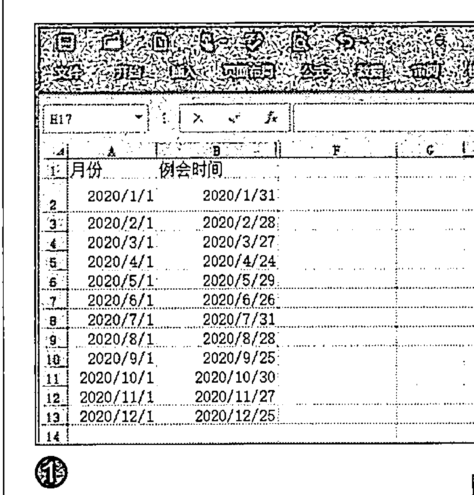

**小提示**
上述公式以A2单元格的日期作为基准，使用EOMONTH(A2,0)求本月最后一天，用WEEKDAY返回周五的数值和使用MOD函数取余数，再用这两个值相减得到最后一个周五的日期。

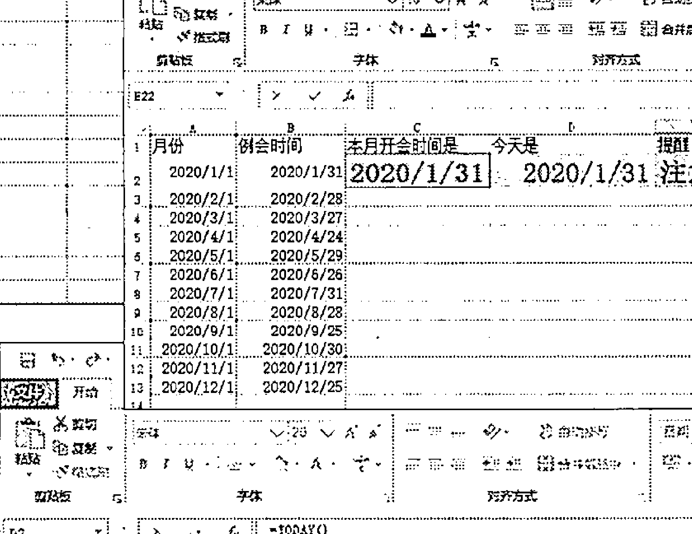

**小提示**
上述公式使用DATE嵌套YEAR、NOW、MONTH函数求取本月最后一天，同上用WEEKDAY返回周五的数值和使用MOD函数取余数，再用这两个值相减得到最后一个周五的日期。因为这里使用了NOW函数，它会在每次打开后自动根据当前月份更改显示数值。


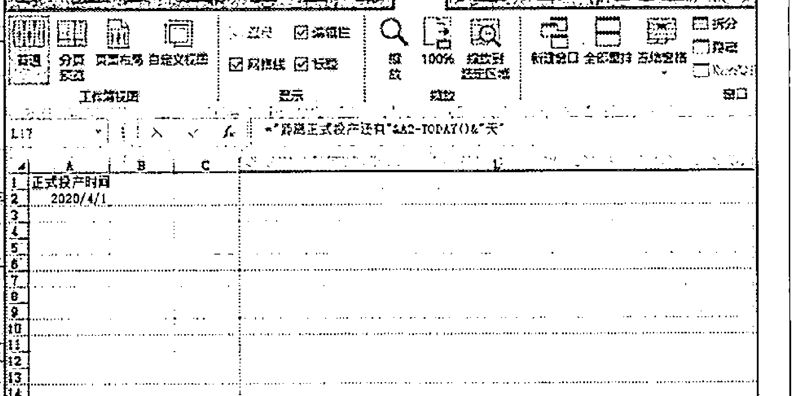

距离正式投产还有89天

倒计时展示

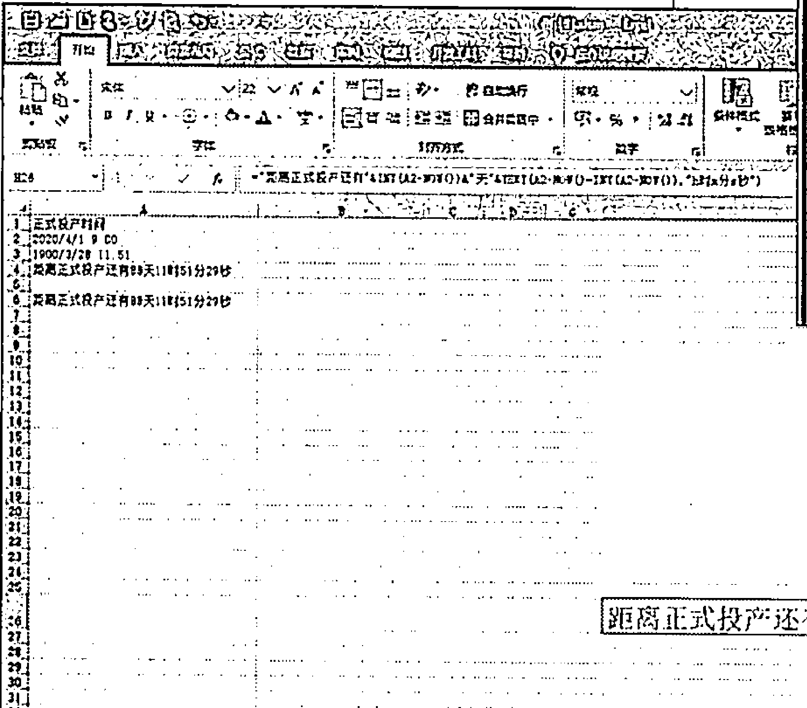

显示精确倒计时

上述公式使用A2单元格中的内容和今天日期相减作为倒计时天数，然后使用“&”将对应的文字相连。最后使用IF进行判断，如果投产日期和当天一致，那么显示“今天正式投产！”，否则显示实际的倒计时天数。

代码设置

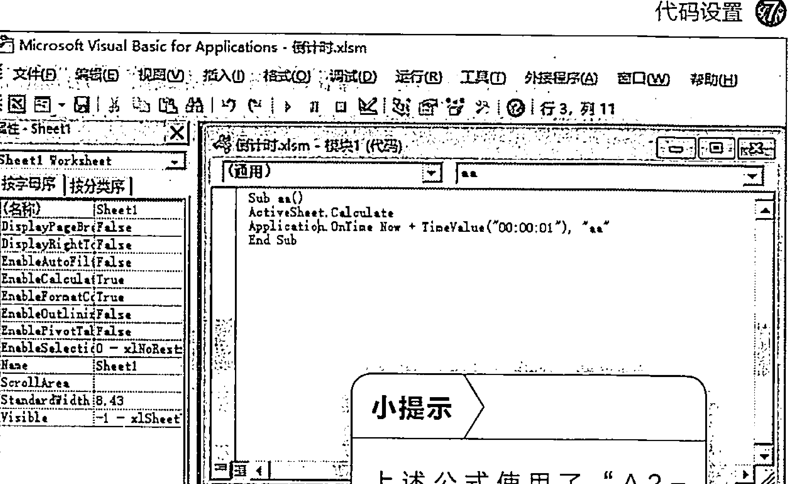

上述公式使用了“A2-NOW()”的差值作为倒计时显示，完成日期的相减后再使用INT函数取整，这样就会显示天、时、分、秒，最后使用“&”连接相应的字符。

精确倒计时显示效果

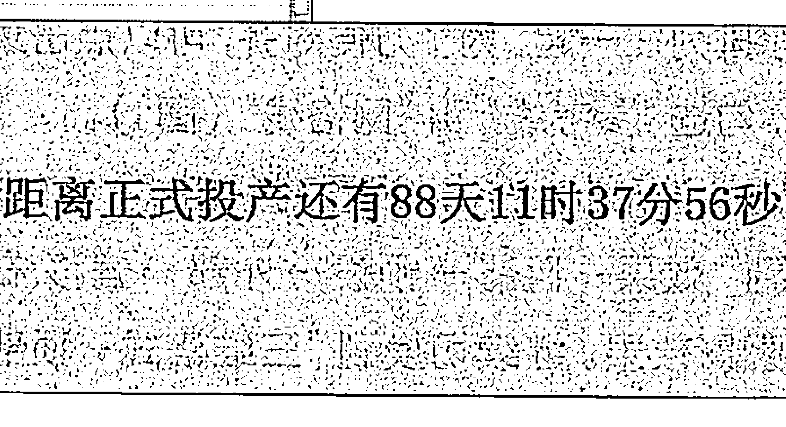

重要日子倒计时提醒

为了迎接一些重要的日子，我们经常使用倒计时的方法来进行提示。比如某公司生产线要在2020年4月1号正式投产，现在需要在公司大屏幕上显示一个倒计时提示。对于这类倒计时提示，借助Excel的日期计算函数即可完成。

首先在A2单元格中输入正式投产日期，接着在L17单元格中(可以任选，这里为了方便居中展示)输入公式“=IF(A2=TODAY(),"今天正式投产!","距离正式投产还有"&A2-TODAY()&"天")”，这样即可在此显示倒计时提示文字(图4)。

为了方便在大屏幕上展示，可以右击A列选择“隐藏”，点击菜单栏中的“视图→去除网格线的勾选”，并将功能区自动隐藏起来，设置合适的字号和字体，将其输出到大屏幕显示即可。因为这里使用了TODAY函数，所以每天打开文档后都会自动计算倒计时天数(图5)。

如果需要倒计时精确显示到时、分、秒，那么A2单元格的日期格式要设置为“2020/4/1 9:00:00”。同上在L17单元格中输入公式“="距离正式投产还有"&INT(A2-NOW())&"天"&TEXT(A2-NOW()-INT(A2-NOW()),"h时m分s秒")，这样会显示精确的倒计时文字(图6)。

不过NOW函数无法在Excel中自动刷新显示，为了可以一直显示倒计时的时间，需要借助VBA脚本来实现。按住Alt+F11键打开VB编辑窗口，新建一个脚本代码如下(图7):

```
Sub aa()
ActiveSheet.Calculate
Application.OnTime Now + TimeValue("00:00:01"), "aa"
End Sub
```

返回Excel窗口，将文件保存为“Excel启用宏的工作簿”。同上取消网格线和功能区自动隐藏，再次打开文件后点击“开发工具→宏→运行名为aa宏”，这个倒计时就会自动刷新显示了(图8)。

不定寻常格 玩转PPT图片个性排版

文|淡然

平时制作PPT时我们经常会使用大量的图片，其实除了常规的排版外，我们还可以借助PowerPoint本身的组件和一些第三方插件让这些图片的排版更有个性，更能吸引观众的目光。

个性图片墙——三维透视排版

在PPT中如果只是简单地将图片平铺显然太平淡，现在可以利用组合形状制作一个三维透视效果。这里以制作某公司团队的介绍为例，就可以使用“矩形+梯形”排列组成三维透视结构。

点击菜单栏“插入→形状”，依次插入一个矩形和梯形，选中梯形向左旋转90度，调整大小并将其和矩形连接在一起。按住Ctrl键移动梯形复制，依次复制四份，并将它们水平对称排列在一起，为了方便对齐，可以点击菜单栏的“视图”，勾选“参考线”和“网格线”（图1）。

按Ctrl+A键全选形状，右击“设置对象格式”，在右侧窗格中切换到“效果→阴影→预设→外部→偏移:右上”，为其设置阴影效果。继续切换到“三维格式→顶部棱台→圆形”，设置三维格式。最后将形状的轮廓设置为“无轮廓”，调整图形排列顺序，矩形置顶，大梯形居中，小梯形置底（图2）。

现在准备好公司团队的头像（建议裁剪为统一尺寸，比例为4:3），接着在幻灯片中选中矩形，切换到“填充→图片或纹理填充→插入”，依次在矩形、梯形中插入公司团队的照片进行填充（如果图片形状不一致，去除填充选项下“与形状一起旋转”的勾选即可）。最后稍加修饰，添加背景、发光效果，并将参考线、网格线去除就可以了（图3）。

通过同样的方法可以制作更多的三维排版，比如可以插入并列的SmartArt图形，在“SmartArt工具→设计”菜单中切换到三维显示后使用填充图片的方法进行排版，还可以对三维的各种参数进行设置，快速生成各种三维效果排版（图4）。

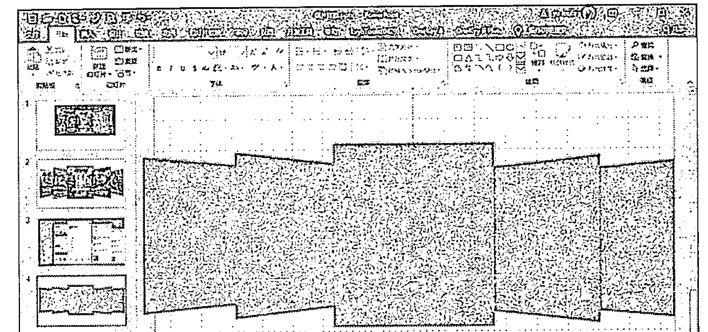

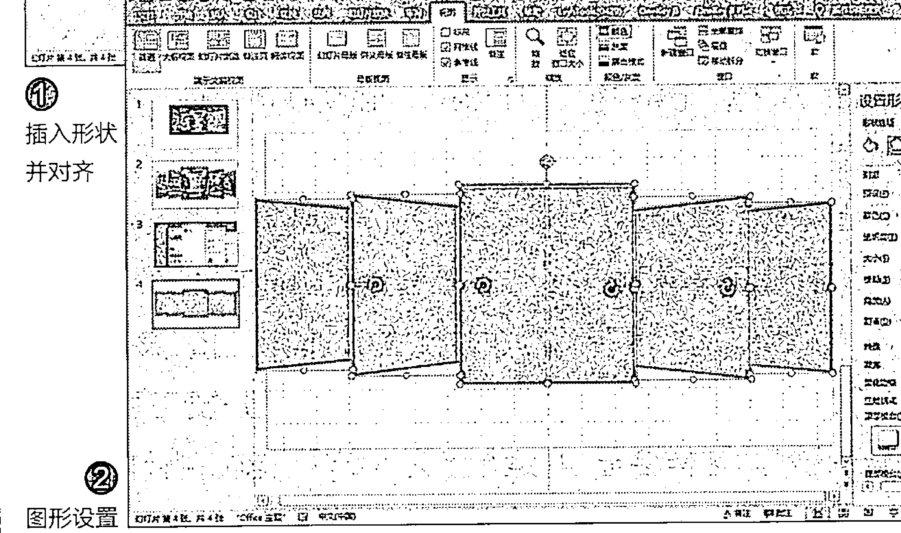


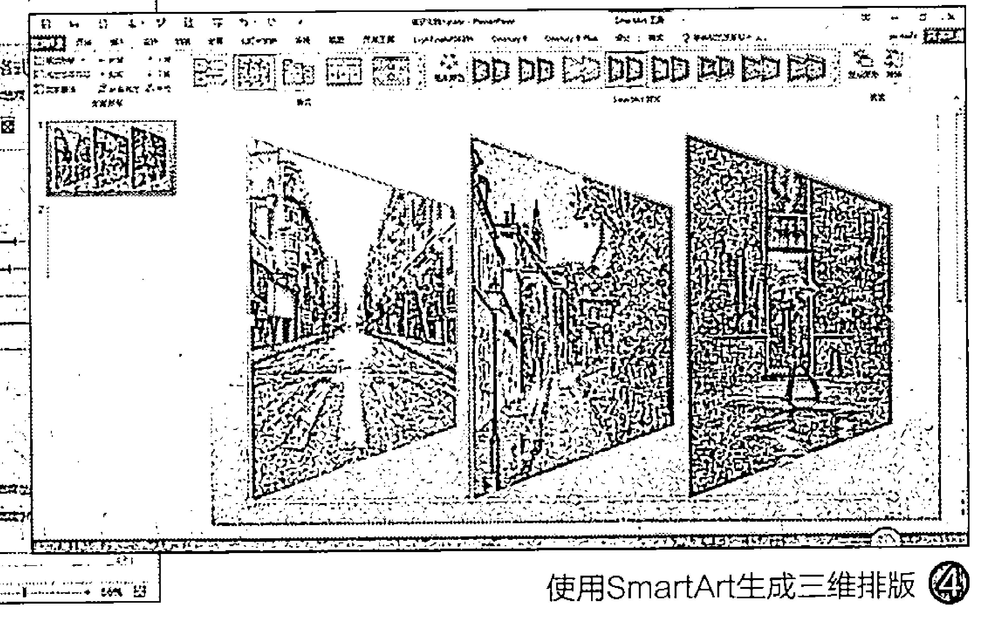

个性排版——第三方插件

如果要让自己的图片排版更有个性，我们还可以借助一些第三方插件，利用这些插件实现更多精美排版。下面介绍的LvyhTools插件（下载地址：https://addins.cn/yhtools/），就可以实现沿线排版，将所有照片按照自定义曲线进行绕排。

这种方式很适合Logo之类的小图片排版，假设现在需要制作一个爱心企业宣传PPT，已经收集了各个爱心企业的Logo，但是由于这些Logo图片较小，而且大小不一，简单排版显得比较凌乱。此时就可以借助“沿线分布”来进行排版。点击菜单栏的“插入→形状”，插入一个爱心图形，并将其设置为“无填充”，线条宽度设置为“25”磅，颜色设置为红色，图层设置为“置于底层”（图5）。

按Ctrl键，依次选中插入的心形、各个Logo图片，接着切换到菜单栏的“LvyhTools→位置分布→沿线分布，保持原角度”，这样Logo图片就会按照这个心形进行排版，最后再稍加修饰即可（图6）。

这种排版方式可以沿着任意一种形状进行分布，比如我们为了更直观地表达产品销量增长趋势，可以插入曲线自制一个增长趋势图，然后将产品图片依曲线排列。同上点击“插入→形状→曲线”，插入一条曲线，在右侧窗格的“形状和格式选项→填充→线条”中，将曲线结尾设置为“箭头”表示销量的增长。接着准备好产品图片，操作同上，依次选中形状和图片后使用沿线分布排版，这样可以让观众一目了然地看到增长趋势（图7）。

另外使用Onekey tool插件（下载地址：http://oktools.xyz/），我们还可以利用其“一键特效”组件实现个性排版。比如可以使用“图片极坐标”，将原来的平面城市照片快速转为类似全景的效果，增加画面立体感。在PPT中插入图片后，点击“Onekey 8→图片组→一键特效→图片极坐标”即可，这样的排版是不是比原来的平铺效果更有视觉冲击力呢（图8）？

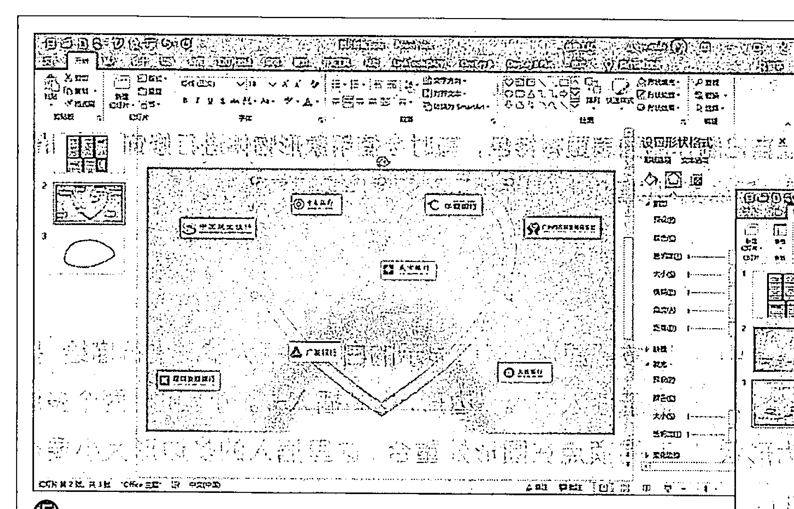

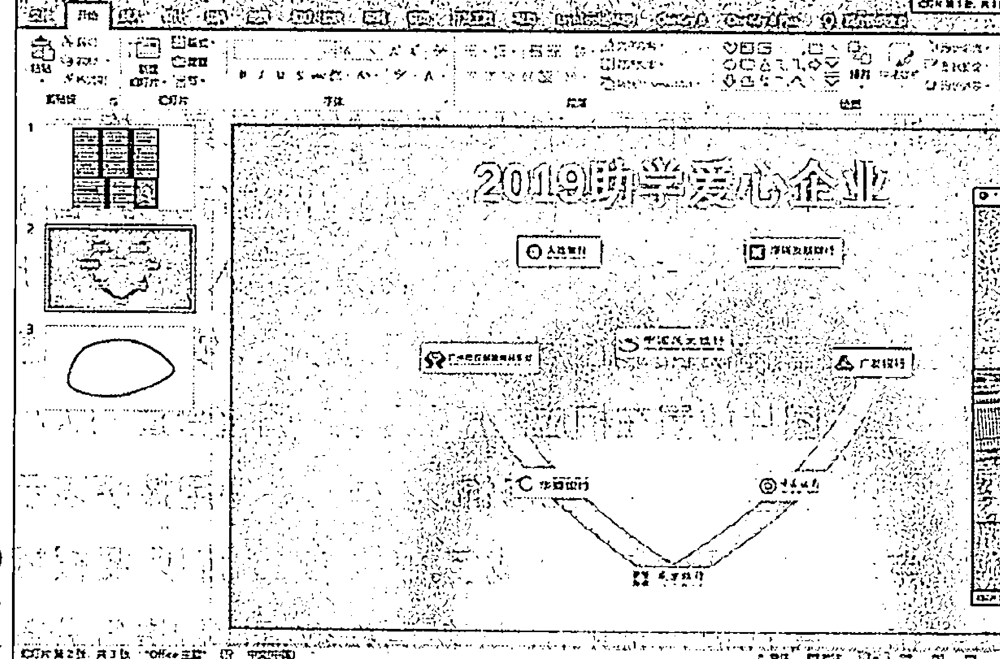

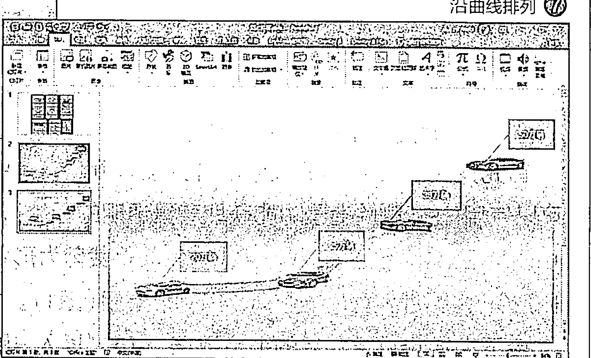


无缝融合 PPT图表制作更酷炫

文|阿木

我们经常需要在PPT中展示一些数据图表，为了能让自己制作的图表更有特色，有时会使用象形物体进行修饰。比如现在需要制作一个某公司各披萨门店销售额占比的饼图，那么就可以直接使用一个切开的披萨来进行展示。

首先找到一张合适的披萨图片并插入到幻灯片中（可以使用PPT删除背景功能获取背景透明的图片），选中图片后点击“图片工具→格式→裁剪→裁剪为形状→圆形”，将图片裁剪为一个标准的圆形备用（图1）。

以按照图片上扇区显示的白色边框为基准进行描绘，按提示插入两个多边形，中间插入一个小圆形，两个多边形的顶点在圆形处重合。这里插入的多边形大小要覆盖披萨区域，插入后还可以使用顶点编辑工具进行微调，使得多边形的边可以和原来饼图比例的边框完全重合，同时将多边形的填充颜色设置为“无填充”。继续选中图片和插入形状，点击“绘图工具→格式→合并→拆分”，将披萨图按照饼图的比例进行拆分（图3）。

接下来准备好各门店的销售数据，点击“插入→图表→饼图”，按提示插入一个饼图。接着将上述制作好的披萨图片粘贴到饼图，将其设置为底层显示。调整饼图的大小和位置，使得饼图形状可以和披萨重合在一起。选中饼图，右击选择“设置形状和格式”，在右侧窗格切换到“系列选项→填充与线条”，将饼图填充设置为“无填充”，边框颜色设置为“白色”，宽度设置为“2磅”（图2）。

返回饼图幻灯片，将原来插入的披萨图片删除，接着将饼图扇区设置为“无填充”，依次将上述分割好的图片放置在相应的扇区下方，调整合适的大小后放置在底层。最后稍加修饰，这样一个使用披萨表示门店销售的饼图就制作完成了。同样的，我们只要根据自己的图表选择合适的图片，然后按数据比例进行分割即可制作出多种效果的图表（图4）。

按住Ctrl+A键全选复制，接着在新建幻灯片中，点击“开始→粘贴→选择性粘贴→图片”，将上述图表转换为图片。点击“插入→形状→多边形”，多边形的边可以


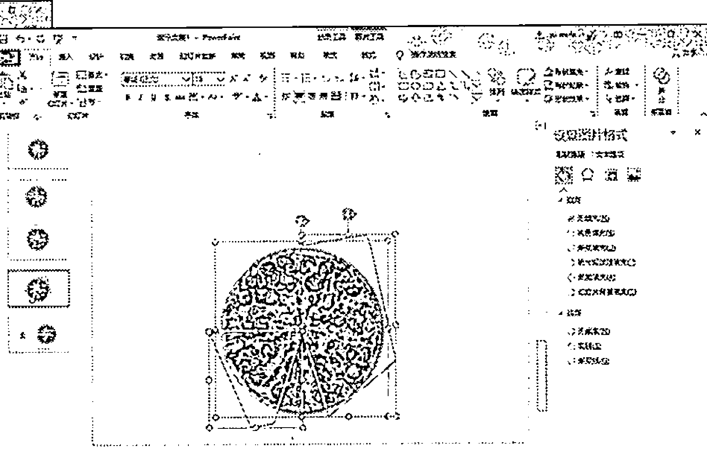

> 进阶技巧
我们可以将分割好的披萨图片依次复制粘贴为图片，裁剪为和对应饼图扇区一样的大小，然后将其填充到对应的扇区，最后再对扇区进行三维显示设置，这样可以做出立体效果来。饼图三维设置请参考2019年第22期的《依葫芦画瓢 PPT快速绘制透视立体图》。

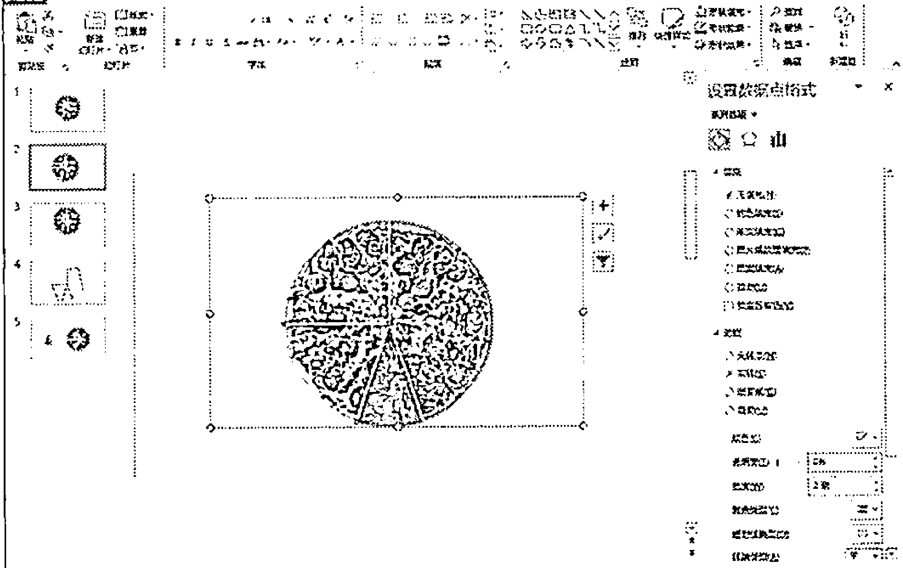


制作简明的工程进度完成表

文|马震安

要制作带有多个环节的工程进度表，我们可以用“√”符号和信号格图标相结合，每选择一组“√”符号，便会自动地对应显示不同样式的信号图标，用信号图标的格数来表示完成状态，这样便可以一目了然（图1）。

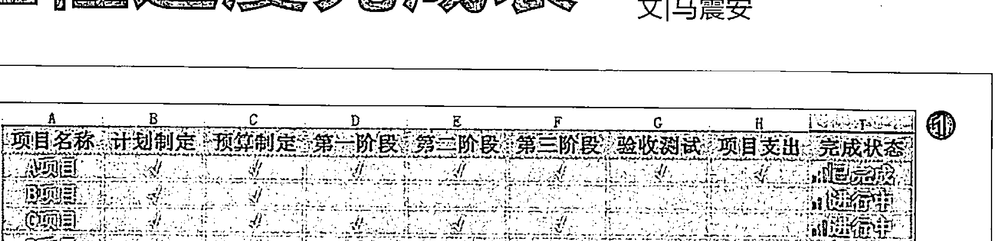

具体到本例的工程进度完成情况表，假设整个工程进度包含如图所示的7个阶段，工程又分为A到F共6个项目。如果7个阶段都表示为“√”，则“完成状态”处会显示“已完成”和满格信号图标；如果7个阶段中有4到6个“√”，则“完成状态”处会显示“进行中”和3格信号图标；如果7个阶段中有1到3个“√”，则“完成状态”处会显示“进行中”和2格信号图标；如果7个阶段单元格中都没有“√”，则“完成状态”处会显示“未开始”和全空格信号图标。下面我们就开始制作。

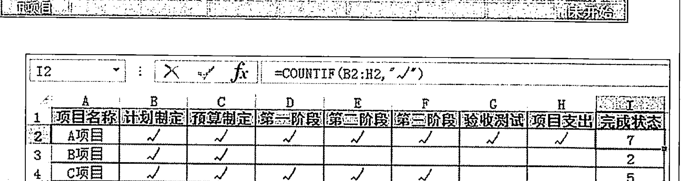

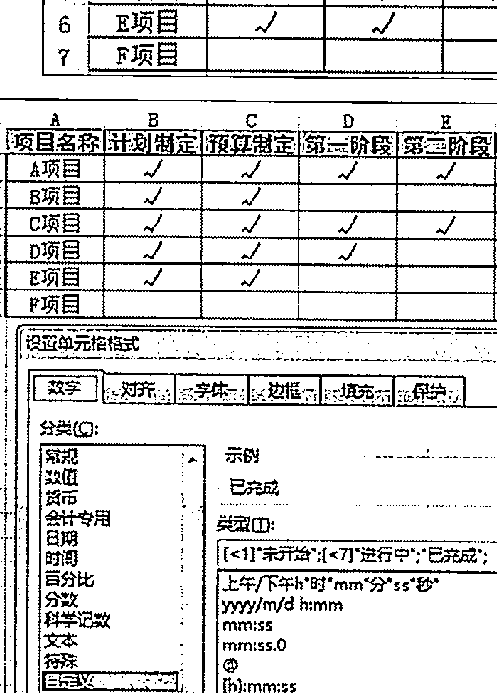

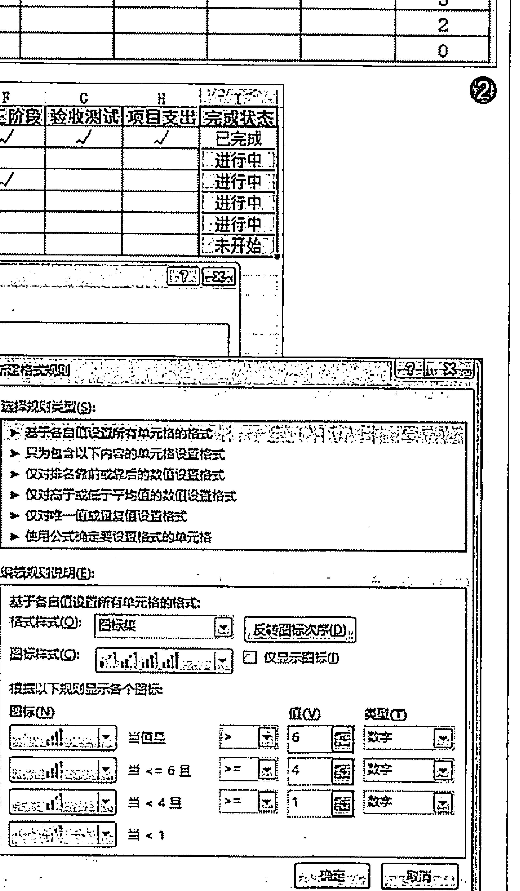

首先，我们在“I2”单元格录入统计公式“=COUNTIF(B2:H2, "√")”，统计“B2:H2”中“√”的数量，然后向下填充，即可统计出前面“√”的数量（图2）。

```
`=COUNTIF(B2:H2, "√")`
```

其次，选中I列数据区域，右击，选择“设置单元格格式”，在弹出窗口“数字”选项卡的“分类”下，选择“自定义”，在类型中输入“[<1]"未开始";[<7]"进行中";"已完成";”。此类型表示：小于1，则显示“未开始”；小于7，则显示“进行中”；否则显示“已完成”（图3）。

接下来设置图标集。选中I列数据区域，切换到“开始”选项卡，点击“样式→条件格式→图标集→其他规则”，在弹出窗口的“图标样式”处选择“四等级”这一组（当然，也可以根据需要选择自己喜欢的样式），将下面的“类型”设均为“数字”，第一组是“>6”，第二组“>=4”，第三组“>=1”，确定即可（图4）。

最后，对表格样式进行必要的设置即可。

制作具有自动计算功能的选购单

文|马震安

当我们在Excel中制作带有自动计算功能的选购单时，不但希望在勾选某种商品时，该商品所在单元格的颜色会发生变化，而且要能够自动计算出所选商品的价格（图1）。要实现这样的效果，只需要利用复选框、格式条件，外加SUM函数，就能够轻松地完成。

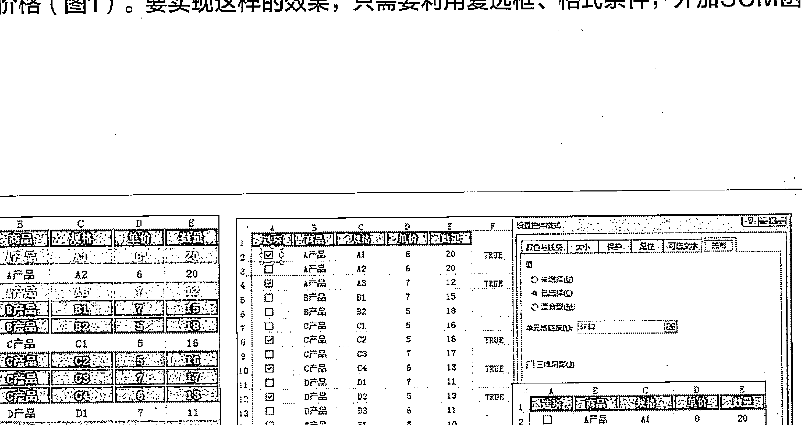

1. 插入复选按钮

首先，对表格的样式进行设置，如单元格的填充色、字体颜色等。然后，选择“开发工具”选项卡，点击“控件→插入→复选框（表单控件）”，分别插入到“选项”各个单元格中，删除其中的文字内容，只保留复选框。接着，将第1个复选框拖放到相应的单元格中间，再将最后一个复选框拖放到相应的单元格中间；选定所有复选框，切换到“格式”选项卡，将所有复选框设为左对齐、水平居中、纵向分布（图2）。

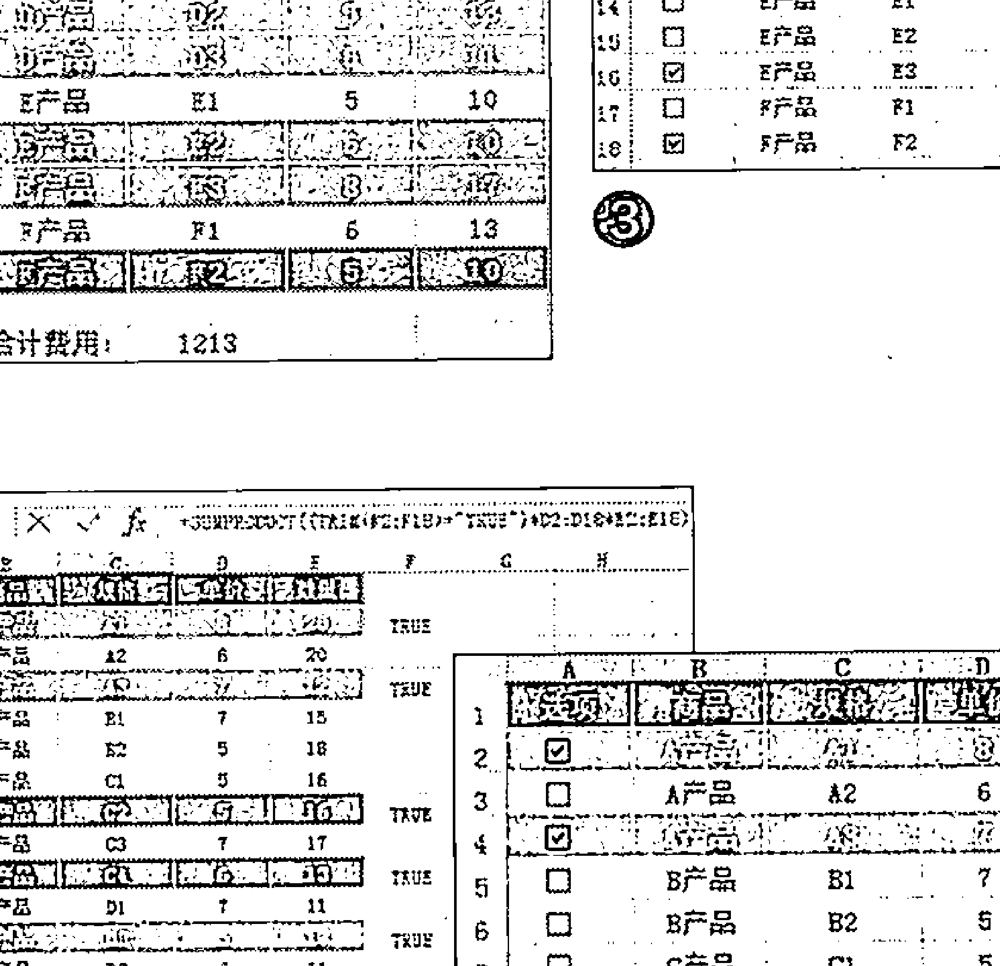

2. 设置复选框

插入F列作为辅助列。右击A列第1个复选框，选择“设置控件格式”，在弹出窗口的“控件”选项卡中，“单元格链接处”选择“$F$2”。这时，当对复选框进行勾选时，F列相应的单元格就会显示值“TRUE”（图3）。其他复选框控件的单元格链接依此类推。

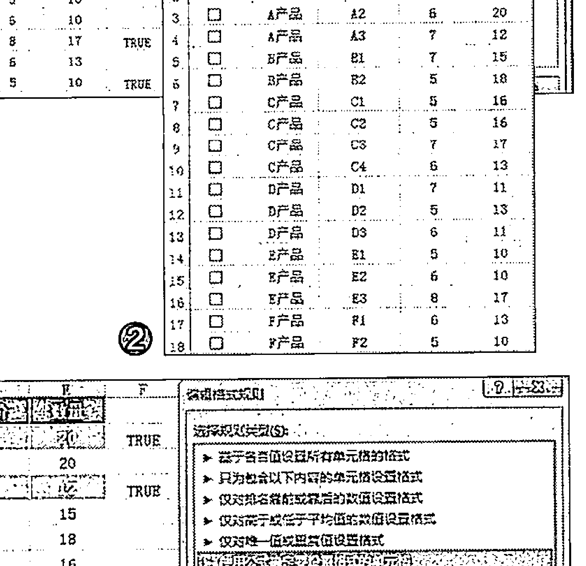

3. 设置单元格填充色

选中A2:E2，切换到“开始”选项卡，点击“样式→条件格式→新建规则”，在弹出的窗口中选择“使用公式确定要设置格式的单元格”，在“为符合此公式的值设置格式”处选择“$F$2”；再点击“格式”，将字体设置为“白色”，填充中设置一种颜色。其他单元格行的设置依此类推。这样，当对复选框进行勾选时，相应行单元格的填充色及字体颜色就会发生变化（图4）。

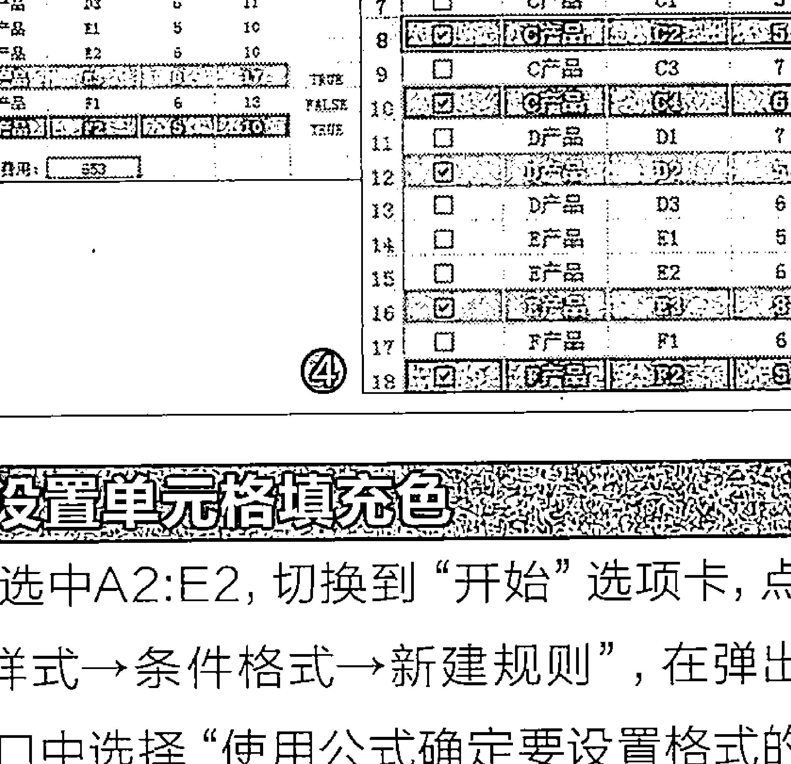

4. 统计计算

在需要显示统计结果的单元格（如C20）中输入公式“=SUMPRODUCT((TRIM(F2:F18)=”TRUE”)*D2:D18*E2:E18)”，就能根据勾选进行统计了（图5）。最后，将辅助列F列隐藏起来。这样，具有自动计算功能的选购单就制作完成了。

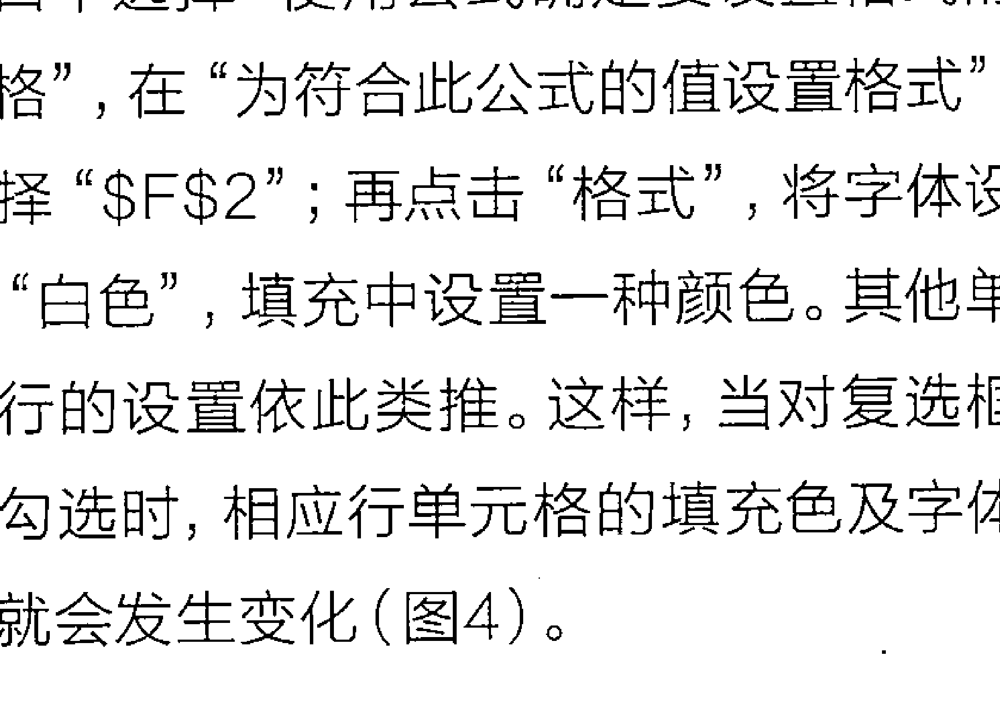

制作自动评分的单选试卷

文|马震安

在学校、工作和生活中，我们经常会遇到电子试卷。那么，对于最简单的单选题电子试卷，该如何制作呢？其实，我们只需使用Excel控件表单中的选项按钮并进行简单的设置，外加2个简单的公式，就能轻松完成单选题电子试卷的制作任务。

> 火焰链接
有关多选题和判断题电子试卷的制作方法，可参见《电脑爱好者》杂志2012年第15期文章《借助Excel 练习试卷轻松做》（http://www.cfan.com.cn/2014/1216/114268.shtml）。

首先，在空白Excel工作表中隔行输入单选题题干；切换到“开发工具”选项卡，点击“插入→表单控件→分组框”，在第1题的下面画出1个分组框；点击“插入→表单控件→选项按钮”，在第1题的分组中合适位置画出一个单选按钮，选中这个单选按钮，复制，在分组框中粘贴出3份；选定这4个按钮，顶端对齐，横向分布；然后将第1题的分组框及4个选项全部选中，复制，粘贴到下面题目的后面(图1)。

其次，隐藏“分组框”。切换到“开始”选项卡，依次点击“编辑→查找和替换→选择窗格”，将列表中所有“Group Box”开头的都隐藏起来；右击第1题的第1个备选项，选择“编辑文字”，输入备选内容，其他选项的设置以此类推(图2)。

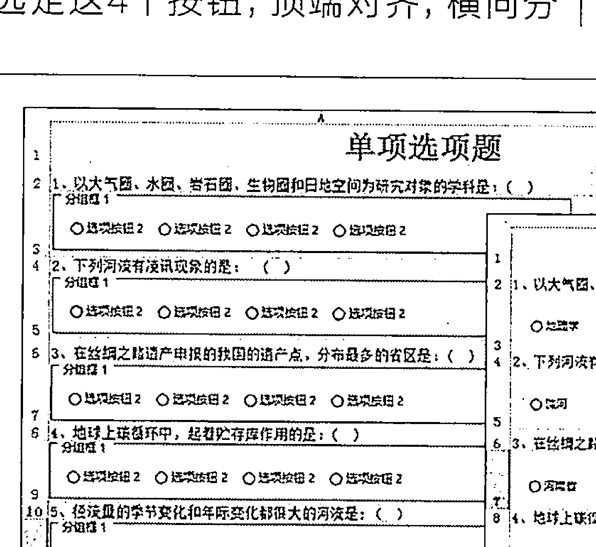

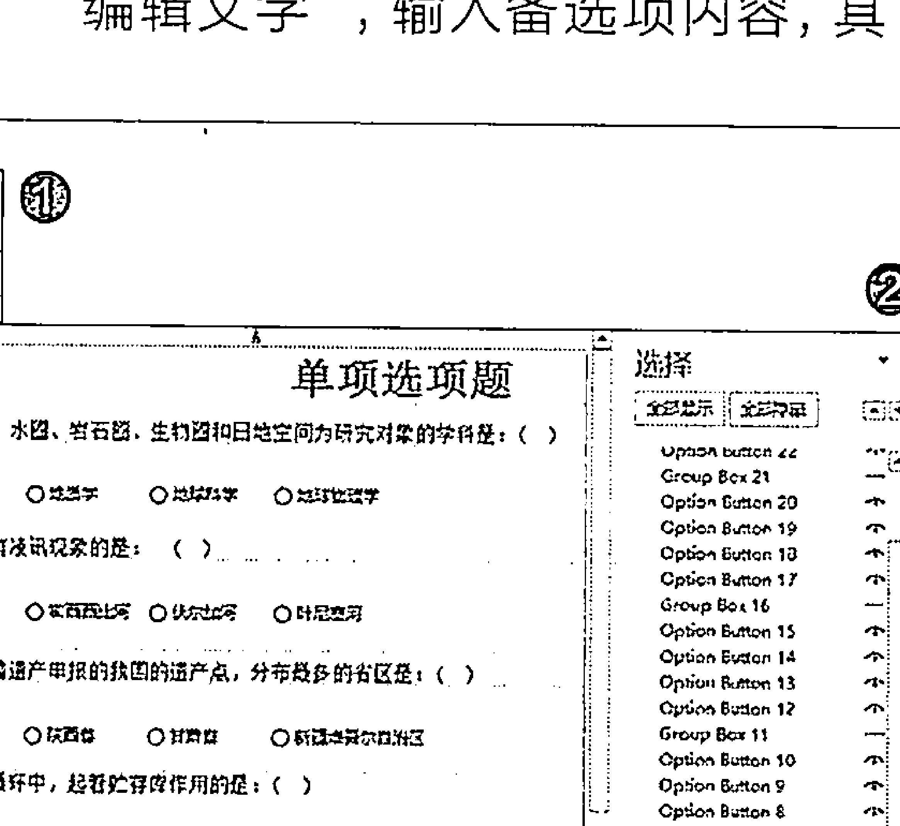

接着，新建一个工作表，标签为“答案”，输入两列标签，第1列标签为“题号”，依次向下输入“第1题”、“第2题”……第2列标签为“所选答案”。右击第1组中的一个选项按钮，选择“设置控件格式”，在弹出窗口的“控制”选项卡中，“单元格链接”处选择“答案”工作表中的B2单元格。后面其他组的设置与之类似，以此类推。这样，每一组中有4个选项按钮，当选择第一个答案，被链接单元格就会显示结果“1”；选择第二个答案，被链接单元格就会显示结果“2”；以此类推，选择4个答案(图3)。

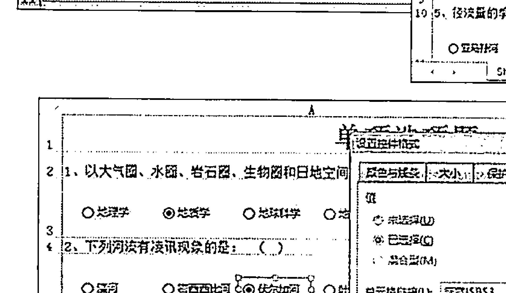

最后，设置得分。由于第1题的正确答案是“C”，即选择时显示“3”，所以在“答案”工作表中C2单元格输入函数“=IF(B2=3,20,0)”，下面的可以自行修改“=IF(B2=正确答案,正确得分,否则0)”；接着，在B8单元格输入公式“=SUM(C2:C6)”就可以了(图4)。

> 小提示
设置未选择状态：当把所有步骤做完后，自己肯定要先试试，试完以后，要将其还原成“未选择”状态。为此，右击已经被点选的选项按钮，选择“设置控件格式”，在控制选项卡中选择“未选择”。

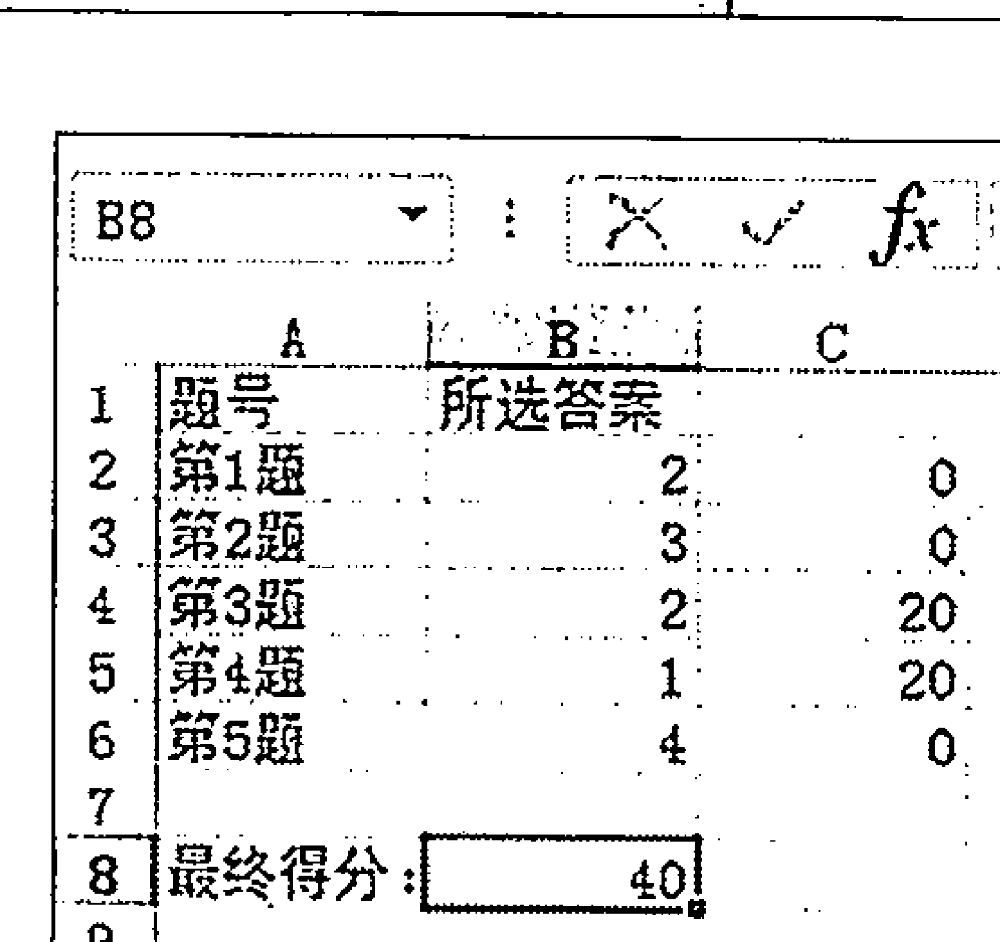# 举一反三简历设计要“对口”

文|一帆

简历是许多人找工作的一块敲门砖，在用人单位还不了解我们的情况下，它往往是我们向对方“推销”自己的绝佳机会。不过因为用人单位对人才的要求各不相同，所以我们在设计简历时最好能与专业对口、投其所好，展示出对方所需要的才能。本文针对看重分析型人才或全能型人才的企业，设计了两种相应的简历模板，大家可以举一反三作为参考。

#### 分析型的信息图简历

金融、电商、教育等多领域的职业需要分析型人才，在应聘这类企业时，我们不妨试试信息图式的简历。从下面的图例可以看出，信息图可以充分体现出我们的概括、分析能力，使招聘者一目了然（图1）。

因为简历一般为纵向的A4纸，所以在启动PowerPoint后（本文以2019版为例），我们首先改变其默认的纸张设置，在“设计”选项卡中点击“幻灯片大小→自定义幻灯片大小”，再在打开的对话框中设置大小为A4纸张，将默认的“横向”变为“纵向”，确定后返回（图2）。

接下来可借助表格功能规划整体版面，本例中的表格分两大列，右列又分为四行（图3）。左列以文字为主，直接输入文字、设置格式并插入相应的装饰图标。右列中第一行的教育经历和第二行的工作经历，本质上都是时间线，不过采用了不同的表现形式。教育时间线的难点是水滴制作，这可以通过一个圆形和等边三角形叠加组合的方式实现。工作经历时间线的尖角五边形就容易得多，绘制矩形后右击，选择“编辑顶点”，然后在右侧边增加一个顶点，简单拖拽就可以了（图4）。

本例中剩下的几项看似复杂，不过有效地利用网上资源及工具的话，实现其实非常简单。技能项中，柱状图直接通过三个矩形叠加即可，其右侧的技能云图，可以进入https://wordart.com网站，点击“Create Now”，再按提示输入技能关键字（如Word、Excel、PowerPoint等等），自动生成云图后，复制到简历中应用就可以了。最底下的地图，可以从网上找些现成的免费图片即可，最终生成本文开始所示的效果图。当然，信息图的设计并没有硬性规定，各人可按照自己的实际情况进行发挥。

#### 全能型的列表式简历

有些行业需要工作者具有多方面的能力，比如许多平面设计的招聘广告中，会列出一大堆的相关专业软件，要求应聘者必须掌握。应聘这类企业的时候，我们不妨在简历中直接了当地列出自己所具有的特长（图5）。

如上例所述，设置纵向A4页面，并首先用表格规划好版面。等简历设计完成后，我们可以直接删掉表格，或者取消掉表格线，即可让表格不露痕迹。

本例是一个假想的平面设计师的简历，没有太多详细说明，只是简洁地列出了应聘者的技能（品牌推广、字体设计、插画等），语言（中、英、法），所会使用的专业软件（Adobe Illustrator、Photoshop、InDesign等），以及兴趣爱好和教育经历等等。其中的制作难点，就是表示技能或软件熟练度的仪表盘和技能条。

仪表盘的制作技巧是，首先绘制两个同样大小的圆并分别填充不同的颜色，然后通过组合裁剪的方法将其中一个圆变成弧形，再把弧形叠加到另一个圆上，弧形的大小代表着熟练度的高低（图6）。技能条的制作方法类似。

#### 快速制作PPT漏斗图

文|包子

巧妙应用图形可以有效地减少PPT上的文本，漏斗图就是一个很好的例子，它形象生动地展示出数据输入输出的过程，将信息和视觉效果完美地结合到一起。想要制作漏斗图，我们可以通过PowerPoint内置的SmartArt功能快速地实现，还可以结合手工方法让漏斗图形式多样、个性十足。

##### SmartArt创建PPT漏斗图

启动PowerPoint（本文以2019版为例，2016版同样可用），切换到“插入”选项卡，点击“SmartArt”，在打开的对话框中切换到“关系”项，在右侧选中漏斗图，点击“确定”，再按提示将默认文本替换成自己需要的内容，一个漏斗图就制作完成了（图1）。

不过大家都能简单应用这一功能，这个图就显得千篇一律了，接下来我们在上述基础上进行个性化处理。首先右击漏斗主体，选择进入“设置形状格式”，将其设置为灰色，并将透明度设置为0（因为透明效果会减弱立体效果）。为了进一步增强立体感，我们还可以绘制一个亮度稍高一点的矩形，通过旋转和“编辑顶点”变形，将它作为漏斗的高光部分（图2）。

最后添加多种色彩的圆形象征收集的多种创意，再配上标题和文字，一个形象又个性化的PPT漏斗图就完成了（图3）。

##### 流程式漏斗图

上面通过SmartArt快速制作了一个数据筛选式的漏斗图，在此基础上我们可以继续改造，将其变成流程式漏斗图。除了保留漏斗主体外，将其他部分全部删除，然后右击下方的箭头图形，点击“更改形状→梯形”（图4），再把梯形拉长作为漏斗嘴与主体拼合为一体。接下来连续绘制多个直角拐弯箭头，拼合组成一个流程线，并设置与漏斗主体不一样的颜色，以示区别。最后输入相应的流程文字内容以及装饰，一个数据经过漏斗筛选再进入流水线处理的示意图就完成了（图5）。

##### 纯手工打造超酷漏斗图

SmartArt绘图虽然方便，不过它的样式毕竟有限，像图中所示的层层筛选式漏斗图（图6），就很难通过SmartArt来实现，这时就需要我们纯手工来打造了。

上面的图例中，每一个筛选层都用到了不同的颜色，而PowerPoint中是无法为同一个图形赋予不同颜色的，所以我们需要将其拆解成多个图形后再进行组合。好在拆解的每个图形都是相似的梯形（带弧线），只是大小有所区别，我们只要制作出一个基本形，再通过复制变形，即可快速完成整个图形。

基本形的制作稍微有些复杂。首先绘制适当大小的一个梯形和椭圆，将它们叠加到一起，再执行“格式→合并形状→剪除”命令，得到一个初始的梯形（图7）。

接下来右击初始图形，选择“编辑顶点”，图形的四边会出现多个节点（黑色小方块），点选节点后再拖动随之出现的锚点（白色小方块），即可任意调整线条的弧度，得到我们想要的基本形（图8）。

把基本形多复制几份，并简单调整一下大小，把它们叠加起来就可以了，如果某个基本形有不合适的地方，可以单独右击它并编辑顶点调整即可。调整完毕，再为每个基本形赋予不同的颜色（图9）。

最后我们添加其他装饰以及相应的文字，即可得到前文所示的层层筛选式的漏斗图了。

#### 巧用圆环制作雷达式记事图表
文|马震安

以前，我们经常见到的记事图表一般都是时间轴样式的。其实，如果将记事图表做成圆环雷达式，不但数据表达会更清晰，占用空间小，样式也更别致（图1）。接下来，就让我们看看这样的图表如何来制作。

##### 1. 绘制圆环图

首先，要添加绘制圆环图所需要的辅助数据。由于所绘制的圆环图各系列的大小均一致，所以圆环图的系列值可都设置为“1”。在D列输入圆环图的标签值，即1-12月份，在E列输入圆环图各月份对应的系列值，即“1”。接下来，选定D2:E13数据区域，切换到“插入”选项卡，插入圆环图（图2）。

##### 2. 设置圆环图

右击插入的圆环图，选择“设置数据系列格式”，在“系列选项”的“圆环图圆环大小”处设置为“50%”；删除图例；右击图表，选择“添加数据标签”，右击图表中的数据标签，选择“设置数据标签格式”，在“标签选项”的“标签包括”处，勾选“单元格中的值”，在弹出的窗口中点击“↑”，然后选择数据表中的D2:D13单元格区域，将“值”、“显示引导线”处的勾选去掉；分别选定圆环图表中的奇数月份系列，在“填充与线条”选项卡下，设置它的填充颜色为“绿色，个性6”，再分别选定偶数月份系列，设置它的填充颜色为“绿色，个性6，淡色40%”（当然，这些颜色也可根据需要自行设定）；选定整个图表系列，设置它的线条颜色为“灰色”；再将数据标签文字的大小、颜色等进行适当的设置（图3）。

##### 3. 设置标签旋转角度

这时，圆环图标签的角度都是一样的，看起来不是太美观，还需要对它们分别进行设置。选定“1月”数据标签，在“设置数据标签格式→文本选项→文本框”选项卡中，“自定义角度”处设置为15度，“2月”标签的自定义角度为45度，“3月”标签的自定义角度为75度，其他标签的自定义角度依此类推。这样，圆环图就显得比较漂亮了（图4）。

##### 4. 绘制雷达图

圆环图是360度，平均分成12份，每份是30度，而原数据中每月最多是5人，即每人平均分得6度，所以雷达图所需要的数据就是360/6=60个数据，根据这个可构造出绘制雷达图所需要的数据。以“1月”为例，1月份有3个人员，所以在I3、I4、I5中分别输入“1”，2月份有2个人员，所以就在I8、I9中分别输入“1”，以此类推；选定I2:I61，复制，选定圆环图，粘贴；右击图表中后插入的圆环图，选择“更改系列图表类型”，在弹出窗口的“系列2”处选择“带数据标记的雷达图”（图5）。

分别选定雷达图的标签、坐标轴、网格线，将其删除；选定雷达图，在“设置数据系列格式→填充与线条→线条”选项卡中，“线条”处选择“无线条”；在“标记”选项卡的“标记选项”下选择“内置”，大小设置为“10”，填充色根据需要进行设置（图6）。

##### 5. 设置雷达图标签

为雷达图添加标签也需要辅助数据。在K列与列的对应单元格中输入原数据的人名作为雷达图的标签，可用复制、粘贴实现。右击雷达图，选择“添加数据标签”，选定雷达图的数据标签，选择“设置数据标签格式”，在“标签选项”的“标签包括”处，勾选“单元格中的值”，在弹出的窗口点击“↑”选择数据表中的K2:K61单元格区域，将“值”、“显示引导线”处的勾选去掉；选定雷达图的第1个数据标签，在“设置数据标签格式→文本选项→文本框”选项卡中，“自定义角度”处通过上、下箭头调整文本框的角度，其他标签的角度也进行类似的调整，这里给出本例的建议角度。这样，雷达图也就显得比较美观了（图7）。

##### 6. 修饰图表

通过以上操作，圆环雷达式记事图表基本上就制作完成了。当然，为了看起来更加美观，对图表的修饰还是必不可少的。在绘图区右击，选择“设置图表区域格式”，设置图表的背景颜色；双击标题，设置好所需要的标题内容；选定图表标签，设置好字体大小及颜色等。这样，一个美观大方的雷达式图表就制作完成了（图8）。

#### 不再辣眼睛 PPT渐变设置有技巧

渐变是PPT设计中经常使用的一种效果，不过直接使用PowerPoint预设的渐变效果并不好，我们应该根据不同的需求自行设计适当的渐变效果。

#### 使用取色器“截取”大师的渐变色

很多大师制作的渐变效果非常好看，对于这些案例中的渐变，我们可以通过PowerPoint（本文以2016版为例）自带的颜色取色器手动提取。在网页https://webkul.github.io/coolhue中，为设计人员在线提供了大量的渐变颜色，不过这些示例都是成型的图片无法修改，要想为己所用还需进行一些处理。首先选择一种自己喜欢的渐变色进行截图，然后将其导入PPT中，接下来插入一个矩形作为参考填充的渐变形状，右击插入的矩形，选择“设置形状和格式→形状选项→填充→渐变填充”，接着在预设渐变、类型和方向中选择一种和示例相同的渐变类型（图1）。

将取色器的吸管光标定位到所下载渐变图案的左上角，设置第一个光圈的颜色（图2）。操作同上，继续使用吸管选择所下载渐变图案的右下角，设置第二个光圈的颜色。为了让颜色过渡更为自然，可以在渐变中间增加一个光圈，最后稍微调整光圈位置。这样使用吸管我们就可以将示例渐变“移植”到插入的形状中了（图3）。不过光圈的滑块调整比较粗糙，如果要获得更为精细的渐变效果，我们还可以借助RGB（R红色，G绿色，B蓝色）数值进行更精确的调整。比如在下面所展示的手机设计示例中，由于手机本身是蓝色，为了让背景的颜色可以和手机主色调相符，我们可以将取色器光标悬停在手机上，得到的RGB（27, 59, 100）即是手机最深的颜色。同上进入光圈的“颜色填充→其他颜色→自定义”，在RGB调整中，将R设置为27，G设置为59，B则设置为90（为了略有区别，故意设置得比手机颜色稍浅），即可获得更自然、协调的渐变效果了（图4）。

此外为了提高渐变过渡的自然性，我们还可以对渐变的HSL，即H（Hue色调）、S（Saturation饱和度）、L（Lightness亮度）进行设置。继续以上述的手机图片为例，为了更好地突出手机，此时可以对背景的渐变色调小亮度。同上进入“其他颜色”设置，在“颜色模式”下选择HSL，拖动亮度滑块调整即可（图5）。

> 小提示
在HSL调整中，建议固定两个要素不动，然后只去修改另一个要素，这样得到的渐变过渡就会看起来更自然。

#### 巧用“虚化工具”打造混合渐变

在日常的设计中，为了获得更好的虚化效果，我们经常在一些设计中看到多种色块、形状的渐变组合。大家熟悉的iPhone X的壁纸就是一个典型的混合渐变，因为这个渐变是多个光圈组成，简单使用取色器无法获得类似的效果（图6）。

对于这类渐变，可以通过PowerPoint自带的虚化工具实现。我们可以看到上述壁纸主要是由多个不同形状的渐变色块组成，点击“插入→形状→自由曲线”，按照原图的颜色分界轮廓依次插入多个封闭的曲线形状，形状大体和原图吻合即可，形状之间不要留白（可使用“顶点编辑”工具进行编辑）。每个形状根据原图的颜色使用取色器进行填充，同时将其设置为“无轮廓”（图7）。

按Ctrl+A健全选插入的形状，新建一张幻灯片，将全选的形状粘贴为图片。选中插入的图片，切换到“图片格式→艺术效果→虚化”，同时切换到“艺术效果选项”，适当调整其半径大小，使得形状之间的分界不明显，这样就完成组合渐变效果图了（图8）。为了获得更好的效果，还可以对图片的阴影、发光、柔化边缘等进行更多的设置。

使用类似的方法，我们可以插入任意的形状，打造出更多魔幻的组合渐变效果。这些制作完成的渐变效果既可以作为幻灯片背景，也可以作为其他形状的渐变效果填充，或者作为图片渐变蒙版来使用（图9）。

#### Excel数据汇报更快捷——即拉即统计
文|平淡

平时我们经常使用Excel统计数据，如果统计的品类较多，在查询统计结果时就需要在列表中费力地进行查找和排序。以下面的表格为例，如果要统计PVC-1产品销售和，因为有多个部门销售，求和就需要先对产品进行排序，然后再求和。重新排序后会破坏原来表格的排列，而且每查询一个产品还需要重新排序、求和，操作起来十分不便。现在我们可以使用“数据验证的下拉列表+统计求和”的方式解决这个问题，这样只要在下拉列表中选择品类即可快速看到统计结果（图1）。

从示例图表可以看到，这个组合主要是由“数据验证”+“求和”组成，因此要实现这一效果，我们需根据原始数据将对应的类别整合在“数据有效性”下拉列表中，同时将对应数值的和统计出来。

首先设置数据有效性下拉列表，因为这里有多个部门销售同一种产品（比如销售一部和销售二部都销售PVC-1）。为了方便进行筛选，先将表转换为动态表格，全选表格内容后，点击“插入→表格”，切换到“表格工具→设计”，勾选其中的“标题行”、“镶边行”、“筛选按钮”（图2）。

接着复制D2:D25单元格中的内容到M2:M25单元格，在M1单元格中输入“序列”，选中M2:M25单元格中的内容，点击菜单栏的“数据→删除重复项”，在打开的窗口中勾选“全选”和“数据包含标题”，点击“确定”（图3）。

经过上面的操作后，重复产品的数据会自动删除，只保留其中唯一的产品值，这些数值就可以作为数据有效性的序列数据了（图4）。

定位到J1单元格中输入“选择查询产品”，K1单元格中输入“销售额”，接着定位到J2单元格，点击菜单栏的“数据→数据验证→设置”，在允许列表中选择“序列”，在“来源”后面点击数据源，接着选择“M2:M6”数据（即上述去重后的序列数据），点击“确定”完成设置（图5）。

##### 多条件求和查询

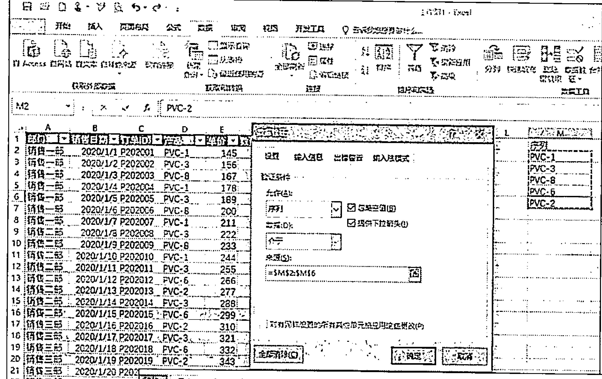

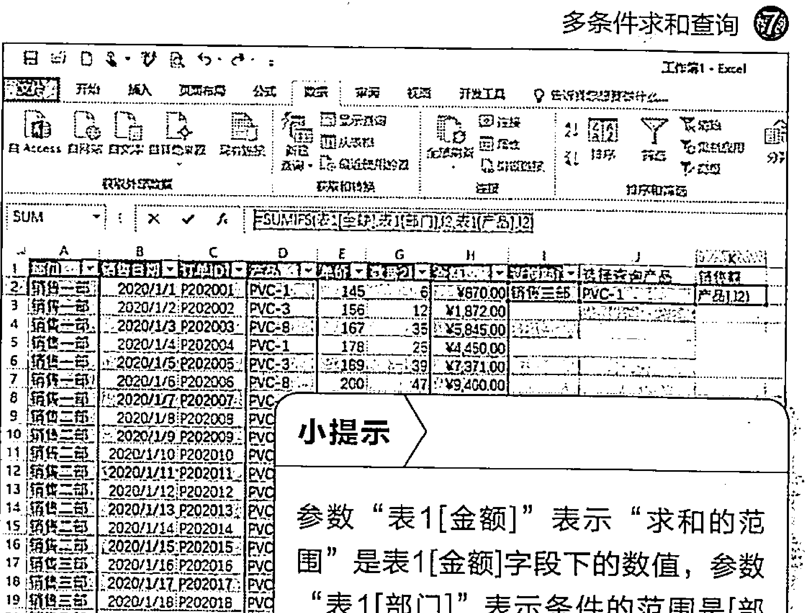

> 小提示
> 参数“表1[金额]”表示“求和的范围”是表1[金额]字段下的数值，参数“表1[部门]”表示条件的范围是[部门]字段，参数“I2”表示求和的条件是单元格显示的具体部门，参数“表1[产品],J2”则分别对应范围是[产品]字段、求和条件是“J2”显示的产品名称。如果有多个条件，继续添加“条件范围”、“条件”参数即可，比如可以添加“表1[订单ID],N2”，增加产品对应的订单ID的查询。

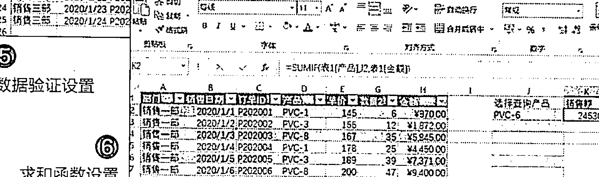

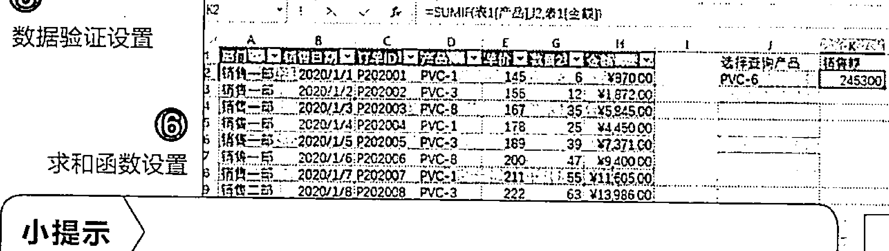

> 小提示
> 上述公式中，“表1[产品]”参数表示的是求和的条件范围是在“表1的产品字段列”，这里的“表1”是上述执行“插入→表格”操作中动态表格默认的名称（切换到“表格工具→设计→表名称”，可以自定义设置）。参数“J2”表示条件，求和的条件是在产品序列里J2显示的指定产品（随着下拉列表的选择会动态地进行变化，求和条件也同步地进行变化）。参数“表1[金额]”求和范围是“表1的产品金额列”，即在J2选择产品后对H列对应产品的金额进行求和。

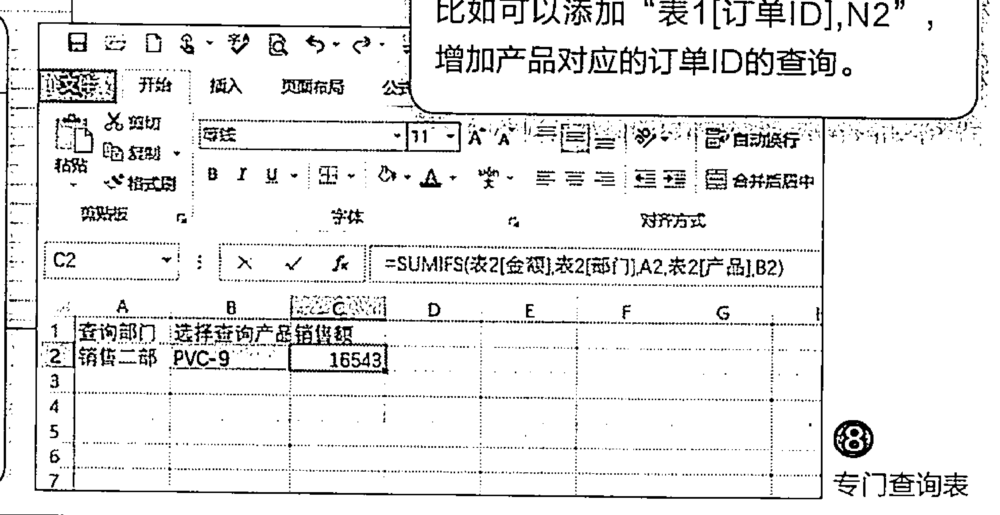

现在从J2单元格展开的下拉列表中就可以依次选择上述的产品内容了。接下来就要在K2单元格中设置求和数值，求和借助SUMIF函数完成。定位到K2单元格中，输入公式“=SUMIF(表1[产品],J2,表1[金额])”，当我们在J2单元格的下拉列表中选择产品时，在K2单元格中就会自动显示对应的金额，这样一来查询数据明显方便了很多（图6）。
因为我们使用的是动态表格（求和条件和范围是通过表格的字段来设置），完成上述设置后，以后如果需要添加数据，比如在A26:H26单元格中增加了PVC-6的销售数据，那么K2单元格中的求和也会同步发生变化。

SUMIF是单条件的求和，如果是多条件的求和，我们还可以借助SUMIFS来完成。假设现在需要同时查询部门和指定产品的销售数据和，如查询销售一部的PVC-1销售数据。同上在I1单元格中输入“部门查询”，在I2单元格中再设置一个数据有效性验证序列（序列的内容为销售一部到销售三部）。定位到K2单元格，输入函数“=SUMIFS(表1[金额],表1[部门],I2,表1[产品],J2)”，即可同时对部门和产品两个条件进行查询（图7）。

如果部门和产品很多，可以进入“数据→数据验证→设置”，在允许列表中选择“任意数值”，这样只要在I2和K2单元格中自行输入部门和产品数值即可进行查询。如果统计的报表很多，我们可以新建一个工作表专门用于查询，同上在每个原来有数据的工作表中插入动态表，比如在Sheet2中插入“表2”，以此类推。

那么只要在“查询表”中的C3单元格中输入公式“=SUMIFS(表2[金额],表2[部门],A3,表2[产品],B3)”（需要查询哪张表格数据，这里就将表名称和字段修改为对应的名称即可），就可以在一张专用表中非常方便地查询其他工作表的所有数据了（图8）。

CFanBoundEdition · 2020 1285

#### 安全基石

##### Android系统的权限管理

文/镜花水月

Android系统的（第三方）APP在安装时都会弹出需要各种权限的提示，有些关键权限如果不被允许APP都无法启动；有些非关键权限若是不被允许则会影响APP的部分功能，合理开放相关权限才能确保手机的正常体验。

Android手机的权限管理功能通常位于“设置→应用→权限管理”（图1），我们可以按照单个应用，或是根据权限类别统一管理（图2）。下面，我们就分别介绍一下不同权限的作用（图3）。

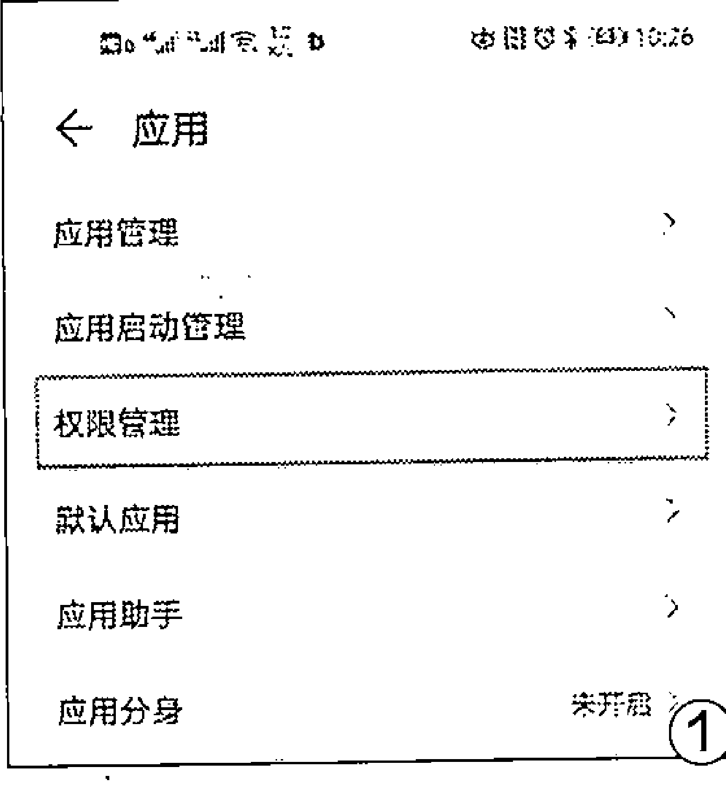

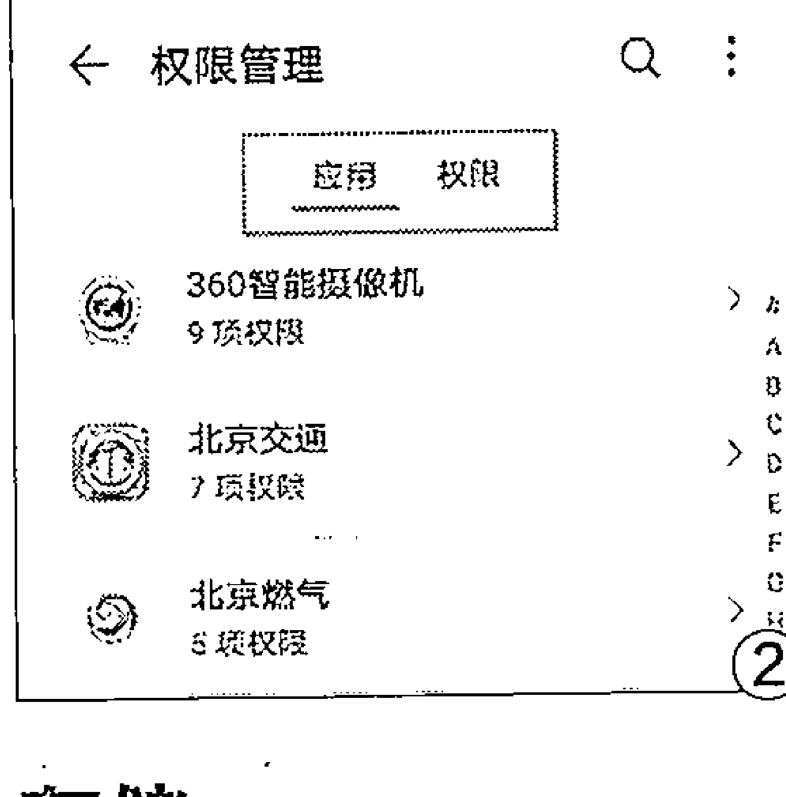

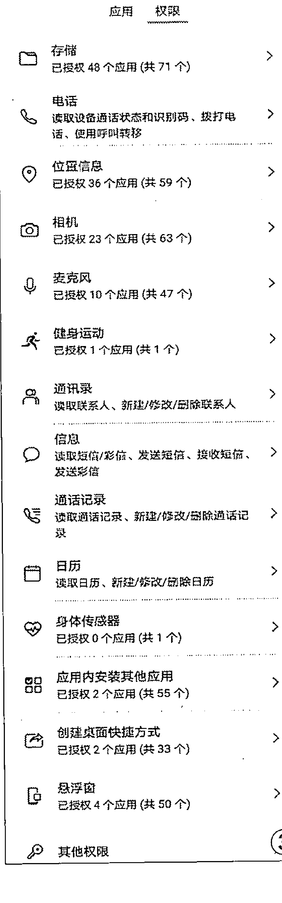

###### 电话

包括“读取设备通话状态和识别码”、“拨打电话”和“使用呼叫转移”（图4），理论上它们都属于非关键权限，但有些交易类APP需要使用电话权限确定设备ID，“读取设备通话状态和识别码”必须处于允许状态才能运行。而其余两个权限则都可设置在禁止状态，以避免有APP在后台自动拨号而产生话费。

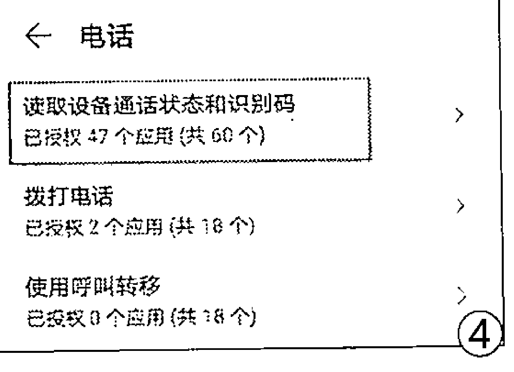

###### 位置信息

非关键权限，但很多APP需要获得位置信息才能正常使用，比如导航类软件；以及美团、携程、途牛等需要LBS的APP，只有赋予它们位置信息的权限才能根据你的当前位置提供服务。为了获得更好的服务，这个权限可以开放给绝大多数APP。

###### 相机

非关键权限，但类似抖音、微信、淘宝、支付宝等涉及到录制视频、视频聊天、拍照扫码、人脸识别安全认证的APP，需要开放相机权限才能使用摄像头。如果你担心某些压根儿就用不上摄像头的APP（如阅读类应用）偷偷调用相机权限偷拍隐私，则可将它们对应的相机权限设置在禁用状态。

###### 麦克风

非关键权限，但类似笔记、输入法、视频类APP需要用这个权限进行录音或语音输入。为了个人隐私的安全，可以禁止其他无关的APP调用这个权限。

###### 健身运动

当微信或其他运动类APP被赋予这个权限后，就能读取手机内置陀螺仪等传感器收集的运动计步数，非运动类APP无法申请这个权限。

###### 通讯录

涉及到读取、新建、修改、删除联系人，如果你非常在意个人隐私，可以禁止所有第三方APP使用该权限。允许APP读取联系人权限的好处，就是给朋友手机充值时可以直接从联系人列表中读取，免去了手动输入的繁琐。

###### 信息

涉及到读取、发送和接收短信/彩信，考虑到很多恶意扣费的行径都是利用短信完成的（图5），所以除非必要，可以禁止所有第三方APP使用信息的权限。

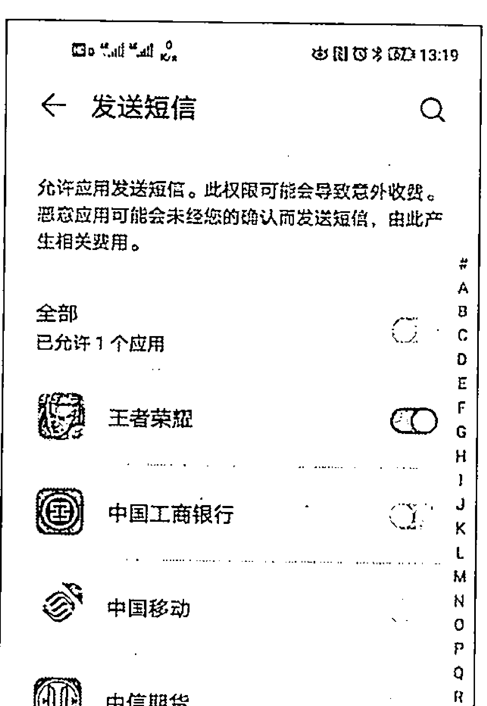

###### 通话记录

同样是非关键权限，随意被第三方APP读取存在隐私泄露的问题，建议全部禁止。

###### 日历

很多人都喜欢在系统自带的日历APP中添加各种事项的提醒，比如哪天开会、哪天出差。当APP被赋予读取日历权限后，可以根据日历中的事项进行高级反馈，比如携程会根据你出差的日期推送当天的特价机票，根据出差地点推送酒店信息。如非必要，这个权限也不必开放给第三方APP。

###### 身体传感器

同“健身运动”，运动类APP通过这个权限可以读取身体状况（如心跳速率）传感器中的数据。

###### 应用内安装其他应用

很多APP在启动时都会弹出广告，点击广告系统就会自动下载APK文件。如果你关闭了“应用内安装其他应用”权限，下载上述APK时就不会被自动安装了。从安全的角度来看，Android系统只有在官方应用商店下载的APP才最安全，所以这个权限最好还是处于全部禁用状态，需要时再临时开启（如使用浏览器下载了某个确认安全的安装程序）。

###### 创建桌面快捷方式

现在Android系统已经取消了“抽屉”概念，所以“创建桌面快捷方式”已经没有太多实际意义。但是，像微博这种可以将指定账号发送到桌面的操作（图6），还必须提前赋予这个权限。

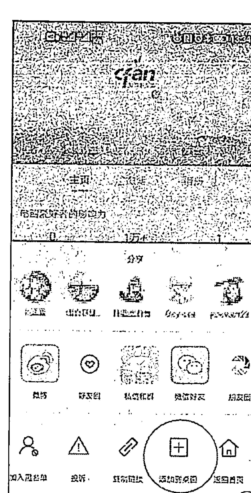

###### 悬浮窗

如果你在电脑上登录微信PC客户端，而手机却没有弹出确认界面，每次都要点进去微信才能确认登录。此时，可以检查微信的悬浮窗权限设置，将其改为“允许”状态就能解决上述问题（图7）。此外，一些视频客户端能以小窗口形式播放的功能，也需要这个权限的支持。

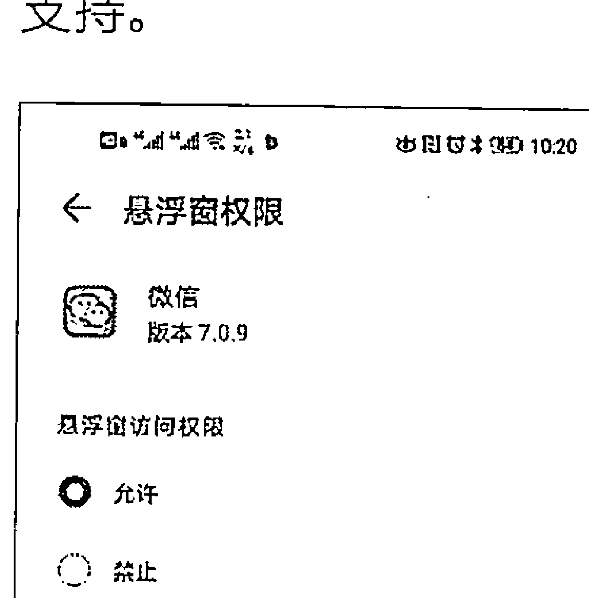

###### 其他权限

不同品牌的手机，在“其他权限”中出现的功能列表可能不尽相同（图8），理论上这个列表中的内容都属于非关键权限，大家可以根据使用习惯按需开启或禁用。

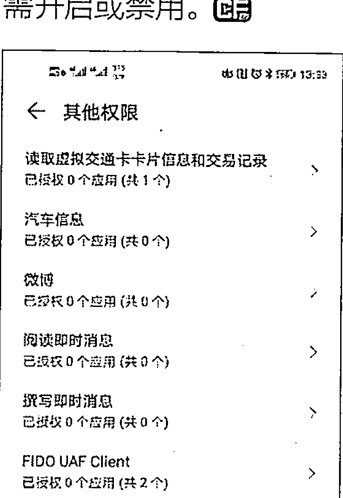

#### 将QQ邮箱客户端变成手持扫描仪
文|天涯衰草

在日常办公时，我们经常会遇到将纸质资料扫描成PDF文档，再通过邮箱发送给客户的情形。然而，使用传统的扫描仪太过繁琐，在手机上安装扫描类的APP也不方便。好消息是，利用最新版的QQ邮箱客户端，就可以方便地解决上述问题。

在QQ邮箱客户端中打开要发送邮件的邮箱，接着点击界面右上角的按钮来创建一封新的邮件。此时，在正文右下角可以看到一个曲别针的图标，点击它，在出现的工具栏中点击第二个按钮。由于该功能会调用手机的摄像头，所以这时会弹出一个权限使用的对话框。选择对话框中的“始终允许”按钮即可（图1）。

将手机摄像头对准纸质资料，该功能会自动对文字所在的范围进行识别和捕捉，并将捕捉到的内容显示到应用界面中。如果你要扫描的纸质资料包括很多页，点击下面的“继续扫描”按钮，按照之前的方法对其他页的内容进行扫描操作即可（图2）。当所有资料扫描完成后，我们可以在应用界面中通过左右滑动的方式，对每一页的扫描内容进行查看。

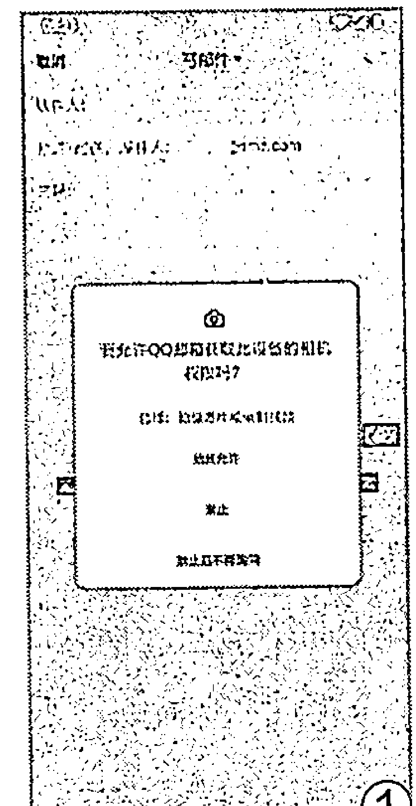

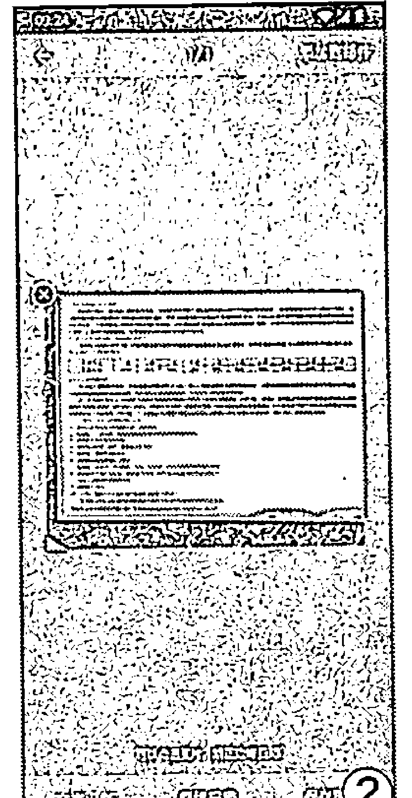


如果某一页的扫描内容有多余的部分，可以对该内容进行点击，并在弹出的界面中对其进行裁剪（图3）。当所有的扫描内容都达到满意效果后，点击界面右上角的“添加到邮件”按钮。在弹出的菜单中选择“PDF文件”命令，该功能就会自动将扫描的页面组合为一个PDF文件，然后添加到新建邮件的附件里面。

> **小提示**
> 点击“文字识别”按钮，可以将扫描内容中的文字识别出来，并添加到邮箱的正文编辑区内。

#### 表情包不够 输入法来凑
文|镜花水月

很多用户都喜欢在社交类APP中“斗图”，或是通过有趣的表情缓和气氛，表达观点。然而，表情的收集并不容易，以微信为代表的APP还存在表情包数量的限制，需要我们定期删除才能添加新的表情。如果你想扩展表情包的来源，也许输入法就能帮到你。

在微信的任意聊天窗口调出输入法界面，我们可以看到2个表情按钮（图1），上面的部分为微信专属的表情包，我们平时在微信群聊中收集的表情都能在这里看到。下面的部分为输入法专属的表情包，点击它就能进入输入法自带的表情专区。

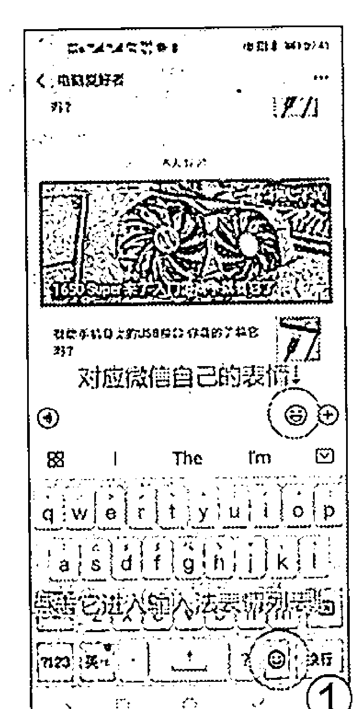


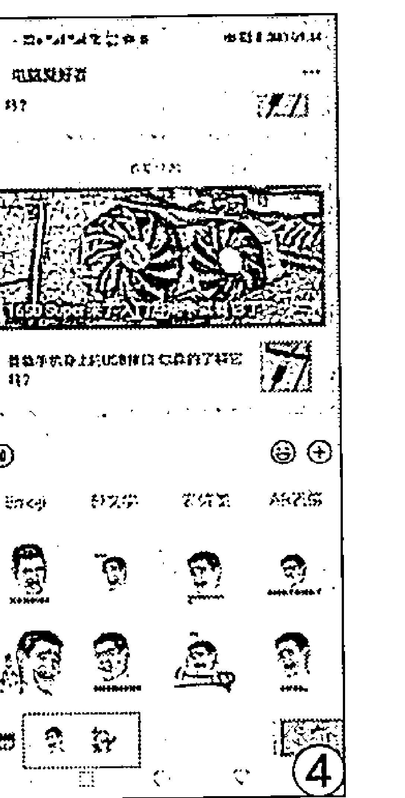

以百度输入法为例，点击表情图标后，切换到“表情图”选项卡，再点击左下角的小房子图标就能进入输入法的表情商店（图2），里面有大量免费的表情套图可供下载（图3），并能直接分享在微信和QQ等聊天软件里，在“表情图”下方可以看到所有已下载套图的切换卡（图4），方便我们随时参与激烈的斗图游戏。

#### 利用微信完成日常的记账操作
文 | 天涯衰草

为了记录和统计日常开销，很多用户都会下载各种专业的记账软件，但手机中安装的应用越多，隐私安全和系统资源（浪费）都会受到挑战。实际上，在最新版本的微信中就已经提供了专属的记账类功能，无需我们再安装任何第三方APP。

点击微信客户端右上角的放大镜按钮，搜索“微信记账本”这个关键词，找到以后点击这个功能选项。第一次使用这个功能时会弹出一个自动同步微信支付账单的提示，点击“确认同步”按钮，以后凡是通过微信钱包进行的交易都可以自动添加到记账本功能的列表里面（图1）。然后再点击“立即使用”按钮，就可以激活微信记账本功能。

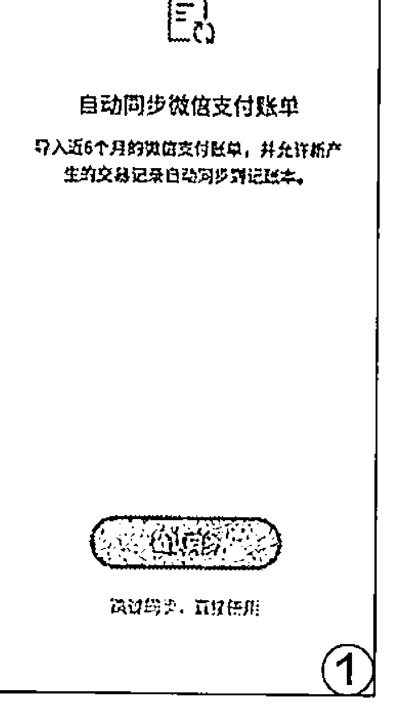

除了微信钱包以外，我们还可能利用支付宝、银行卡、现金等多种方式进行支付。遇到这种情况时，就需要手工进行记账操作了。首先打开微信记账本功能，点击下面的“记账本”按钮，在弹出的界面中点击“记一笔”（图2）。根据实际情况选择支出或者收入，然后分别输入相关的金额以及对应的内容，最后点击确定按钮完成记账操作（图3）。通过“数据分析”列表可以详细地查看到每一个月的支出类别详情，从而更加清楚自己到底把钱花在了什么地方。


> 小提示
> 如果用户有购物小票的话，可以先将其拍摄为照片。接着点击“记一笔”右上角的“识图导入”按钮，选择刚刚拍摄的照片进行上传，这样就可以自动将购物小票中的内容进行记账操作。

#### 酒店防偷拍 揪出隐藏摄像头
文 | 镜花水月

前段时间很多媒体都在报道酒店隐藏的针孔摄像头偷拍曝光客人隐私视频的新闻。那么，我们如何才能最大限度规避此类问题呢？

如今适用于偷拍的摄像头让人防不胜防，小到插座孔、易拉罐、挂衣钩、沐浴露瓶等边边角角，大到电视、空调、洗手间里的梳妆镜，都有可能隐藏着它们的身影。对于其中的某些摄像头，我们可以拉上窗帘进入纯黑环境，打开手机相机对着房间内取景，寻找可疑的红色光源。

还有一类摄像头是通过接入酒店Wi-Fi网络，再通过软件或APP来实现远程监控。对于此类偷拍方式，我们可以在手机上下载安装“360手机卫士”或“百度隐私专版”。以“360手机卫士”为例，在接入酒店Wi-Fi后，运行“工具箱”中的“偷拍检测”功能（图1），这款APP就能通过对联网摄像头的连接特征、通信方式进行特征分析，可有效地识别当前Wi-Fi下是否连接有常见类型的可疑摄像设备，为用户的隐私、居住安全提供有效保障（图2）。“百度隐私专版”的运行原理和前者相同（图3），而且该APP大小不到1MB，对手机系统资源的占用更低。

需要注意的是，此类APP只能检测Wi-Fi摄像头，对于内置SIM卡或通过物联网和离线（存储卡）方式偷拍的摄像头就没有办法了。

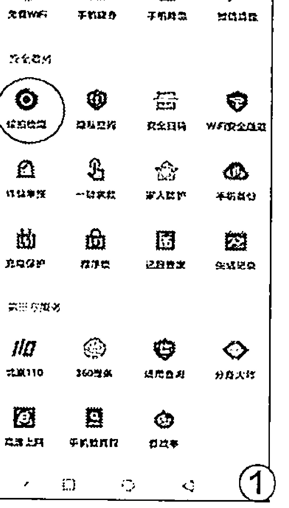


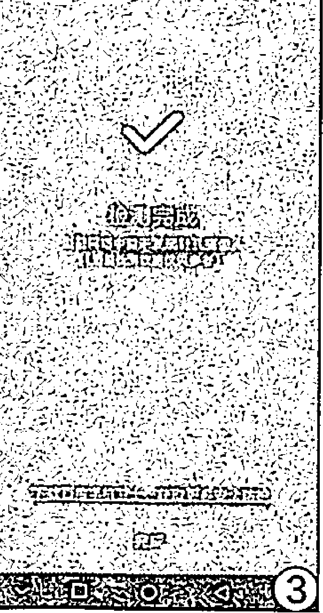

#### 告别打扰 Android系统的通知管理
文|镜花水月

在Android系统手机的设置内容中，“通知”是最容易被我们忽略的选项。实际上，如果你每天休息时都会被各种推送提醒打扰，又或是经常错过微信、邮箱、闲鱼等APP的重要消息，都能通过“通知”设置加以解决。

##### 不同品牌设置有别

不同品牌的Android手机，在通知管理中所提供的功能及其对应的名称也不尽相同。比如OPPO手机将通知和状态栏集中在一项设置之内（图1），而华为/荣耀手机则将通知单独作为一项设置，并提供了桌面图标角标提醒和批量管理等实用功能（图2）。下面，我们先以荣耀手机为例，简单看一下通知管理的思路。

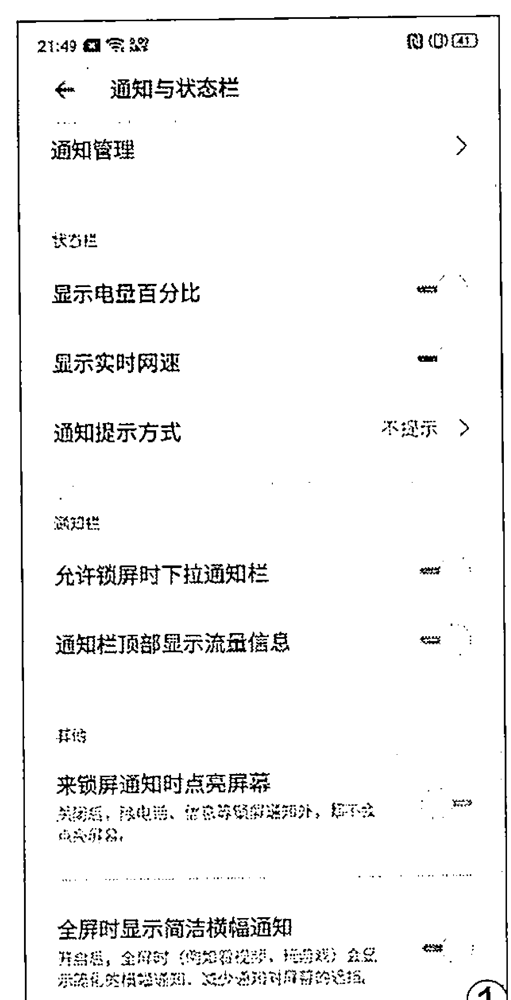

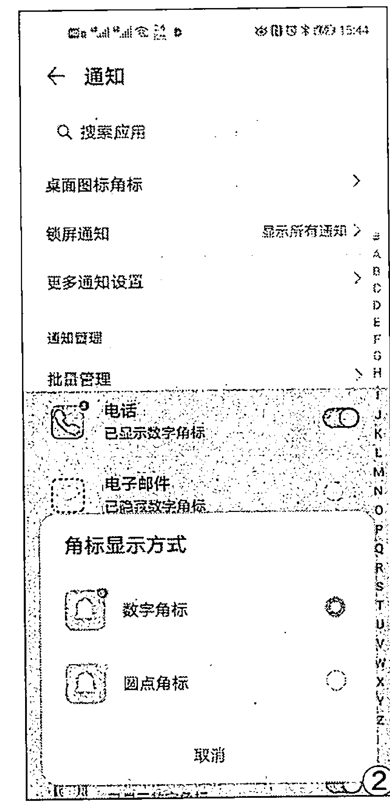

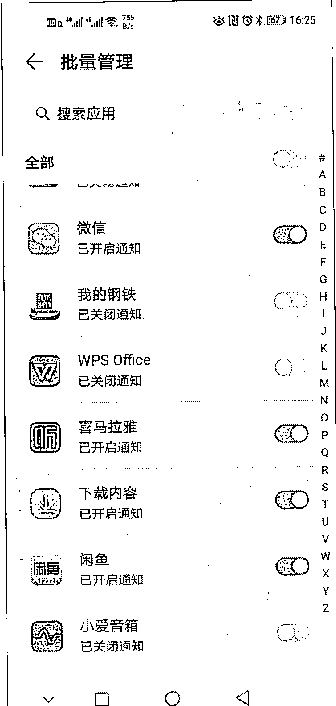

##### 通知太多易卡顿

Android系统可以通过下拉菜单看到各种通知和横幅快捷操作图标，这些内容越多，越容易对系统造成卡顿。通常，下拉菜单里都提供了一键清除的按钮，但点击它清除通知属于“马后炮”，我们首先要做的，应该是阻止那些没必要的、浪费系统资源的无用通知。

具体的操作很简单，在“设置→通知”的所有程序列表中，手动关闭除了微信、QQ、邮箱等需要及时沟通的，以及除了喜马拉雅、音乐播放器等需要在下拉信号栏提供播放、暂停、上一曲/下一曲等快捷按钮以外的其他所有APP启用通知的权限（图3）。

> > 如果系统提供通知批量管理功能，可以加快这项操作的设置效率

除了在系统设置中操作以外，我们还需要进入各个APP的设置界面，关闭不需要的各种广告和新闻等消息提醒（图4），从源头切断不重要的APP主动发起的通知。

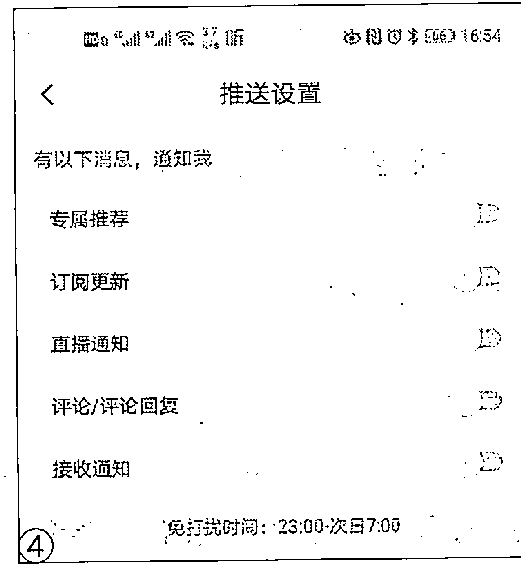

##### 通知也分多种级别

通知包括多种类型和级别，比如微信收到的消息、应用商店正在下载APP的进度信息、音乐播放器的快捷按钮、系统更新的提醒等等，通知的方式有图标、有铃声还有震动。需要注意的是，不同类别的APP在设置通知时需要区别对待。比如，最“干净”的APP只有唯一的通知选项（图5），可以毫无负担地将其关闭。

而有些APP的通知项目则非常复杂。以微信为例，就包含了“其他通知”（如新版本更新）、“新消息通知”（新聊天消息）、“音视频通话邀请通知”（好友通话），分别对应微信常见的消息类型（图6）。如果你平时只拿微信聊天，那就可以关闭其他通知和邀请通知；如果你平时将微信当做电话APP用，那就一定要开启邀请通知的选项。点进上述设置后还能进行更详细的操作，比如选择铃声、开启/关闭振动、在锁屏时也可看到消息内容、当系统进入免打扰模式时也不会错过等等（图7）。

以喜马拉雅为代表的播放类APP要想始终显示下拉快捷操作内容（图8），就必须确保“通知栏”处于开启状态（图9）。如果你不追更新，喜马拉雅除了“通知栏”以外的其他通知类别都可以关闭，这样就能在不影响随时控制播放状态之余还能免去该APP产生的各种推送打扰的问题了。

> 小提示：我们可以将“静默通知”理解为通知里的“免打扰”，关闭下拉通知栏显示以外的其他通知形式。

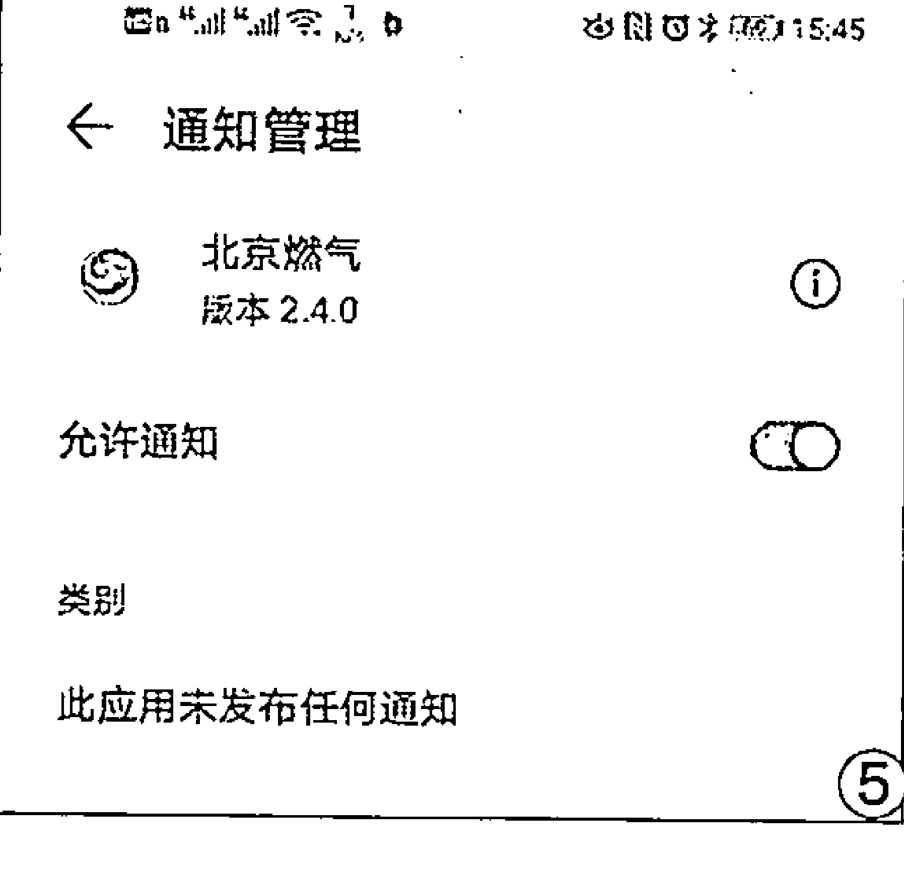

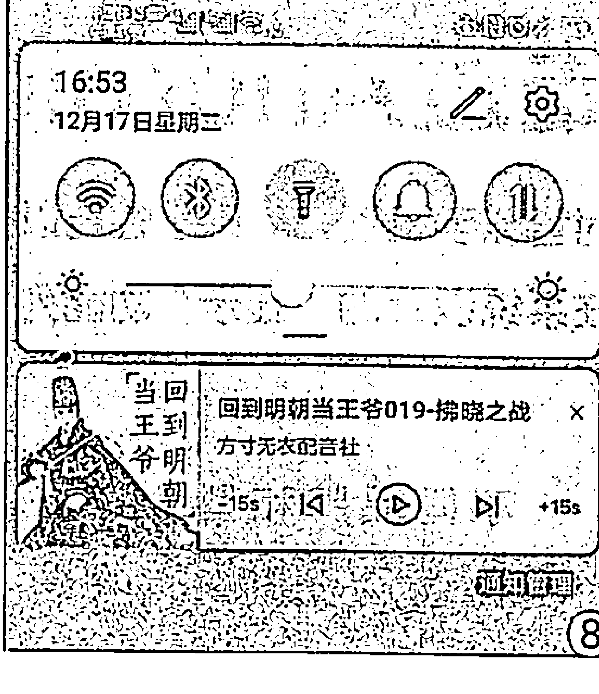

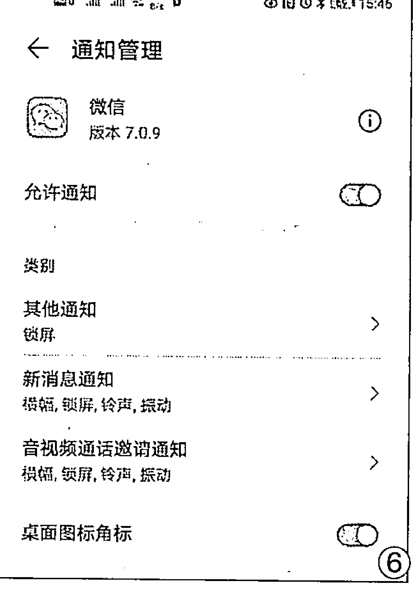

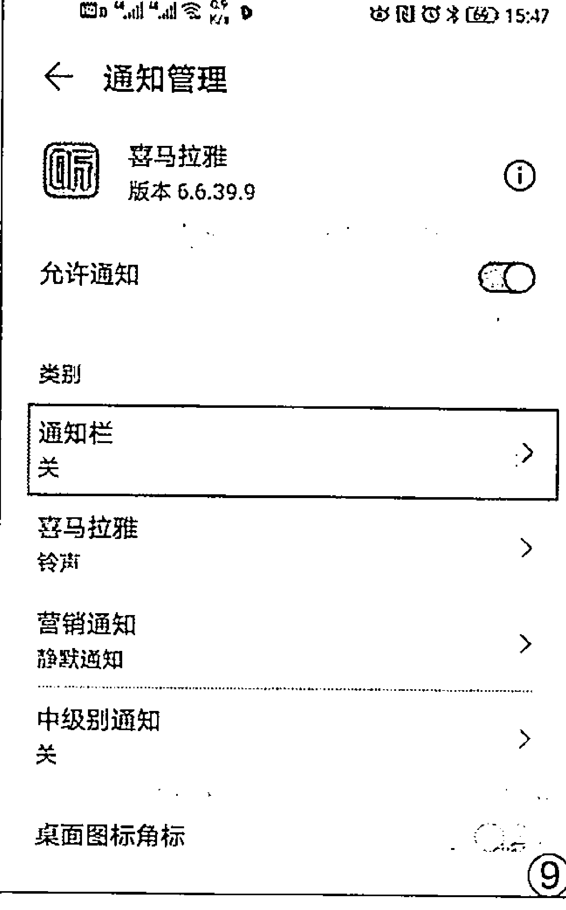

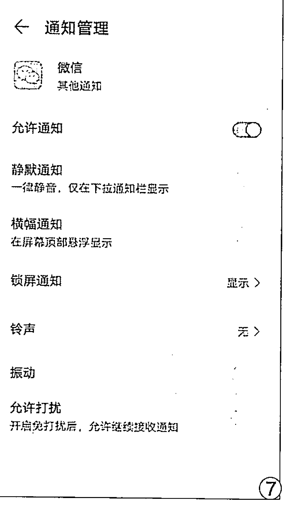

随着APP体量越来越大，其通知功能的类别也在不断增加之中，并能被一些手机系统全部显示出来。以OPPO手机为例，拼多多涉及到的通知类别就包含系统默认通道、云消息、一般消息、其他通知、其他和重要通知等等（图10），反正笔者也搞不清楚其中部分通知的差异在哪里，如果你经常参与拼多多的抢购活动，为了避免错过第一时间的提醒消息，就需要花费时间对这些通知类别进行一番测试，或是选择全部开启的状态，哪怕其中有一些会耗费额外的系统资源。

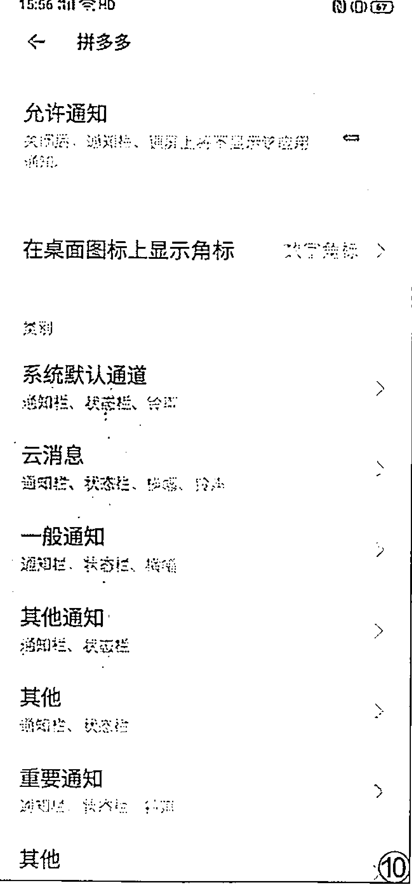

#### 节能护眼 走进Android手机的显示设置

对智能手机而言，除了性能以外，其屏幕的显示效果和续航时间对体验的影响往往更加直观。在系统设置的“显示”功能列表中，我们就能最大限度地挖掘屏幕的显示质量，并降低它对电力的消耗。

不同品牌和型号的手机在显示设置中的功能不尽相同，本文汇总了常见品牌系统中的显示设置，并将其中值得注意的功能加以介绍。为了方便展示，部分截图内容经过了剪辑。

##### 想省电改这里

屏幕是手机中最耗电的硬件之一，想降低它对电池的“压榨”，最基础的操作就是控制亮度和熄屏时间。其中，亮度可以设置在“自动调节”状态（图1），而熄屏时间则建议改为30秒，在不操作时让其尽快熄屏。

OLED（包括AMOLED）材质的屏幕在显示纯黑内容时无需点亮像素点，接近零耗电。因此，对于采用此类材质屏幕的手机，我们尽量选用黑色（或暗色）系的桌面背景，并在显示设置中找到并打开“深色主题/模式”（图2）。部分LCD屏幕手机也有这个功能，但启动与否对续航无影响。

很多OLED屏幕手机还会加入“熄屏时钟”功能，在未点亮屏幕时也能显示时间和通知。如果你想延长续航，该功能最好长期处于关闭状态。以华为/荣耀为代表的手机可切换屏幕分辨率（图3），手动将屏幕调到最低档可以延长续航，只是显示质量会略有降低。

如今很多高端手机的屏幕都主打90Hz或120Hz的刷新率，虽然可以让显示变得更加流畅，但其背后也存在一定的额外耗电问题。当电量低于50%或长途外出时，将刷新率设置为标准的60Hz（或智能切换）可以延长续航（图4）。一些采用3D曲面屏或3.5D瀑布屏的手机，会利用两侧的曲屏部分显示来电或通知灯效，如果你更在意续航，建议还是将它们关闭（图5），至少当手机电量低时就不要再讲究炫酷了。

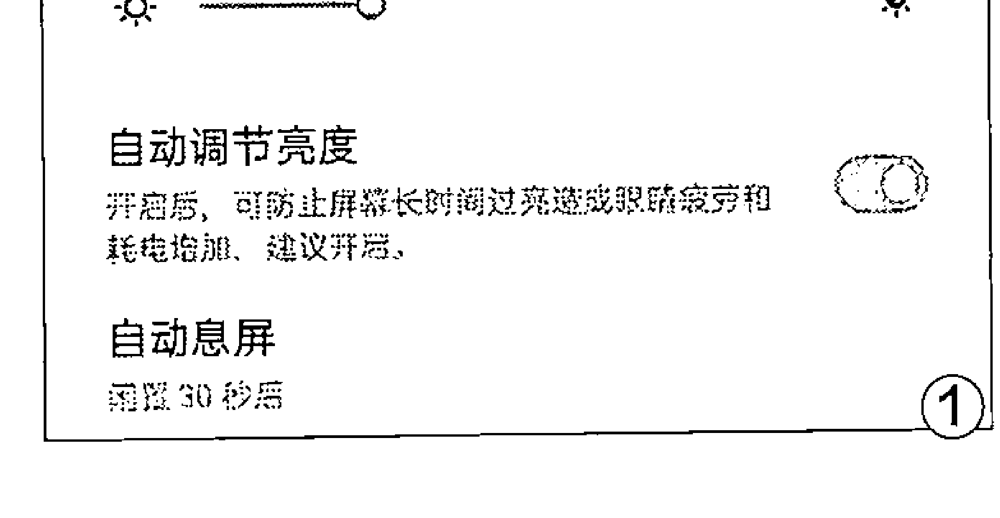

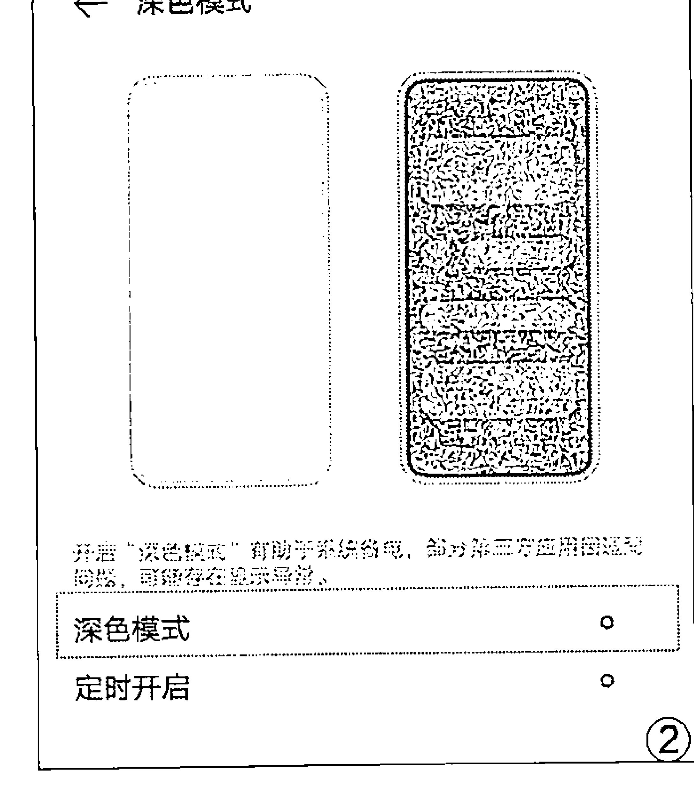

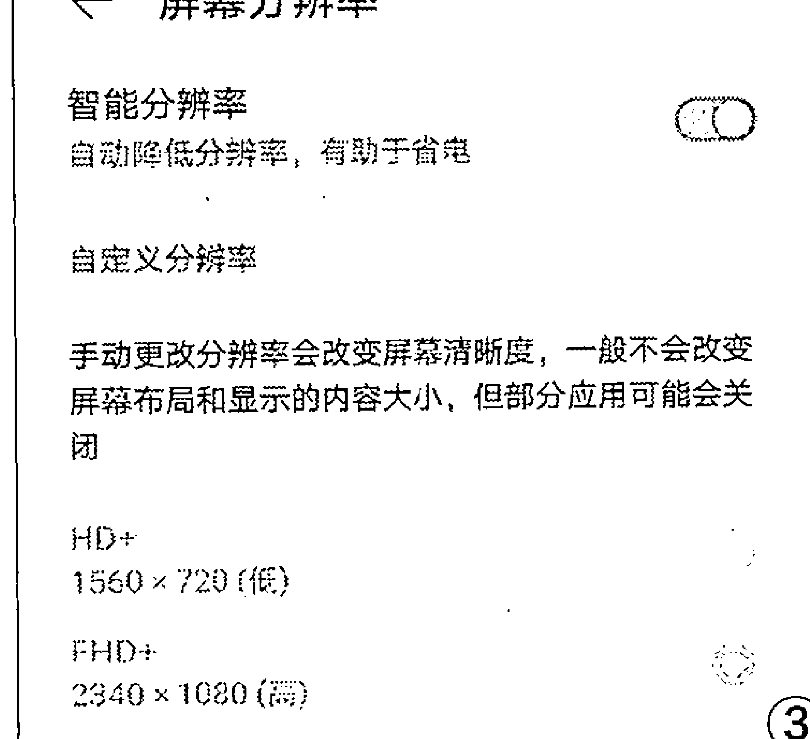

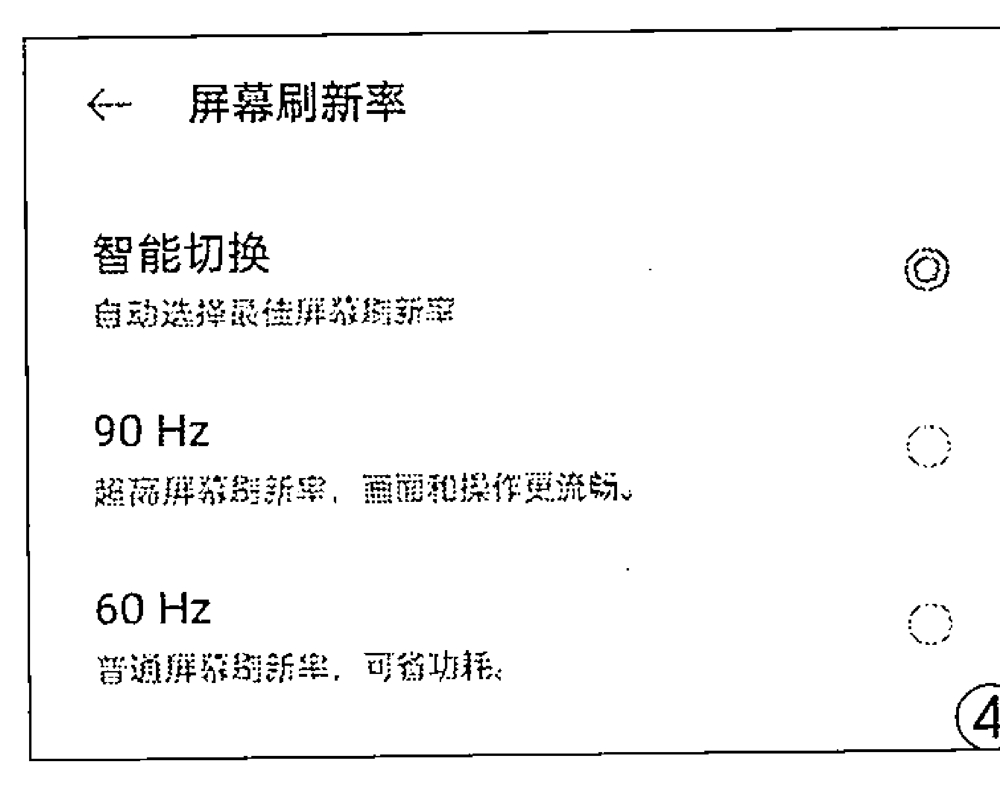

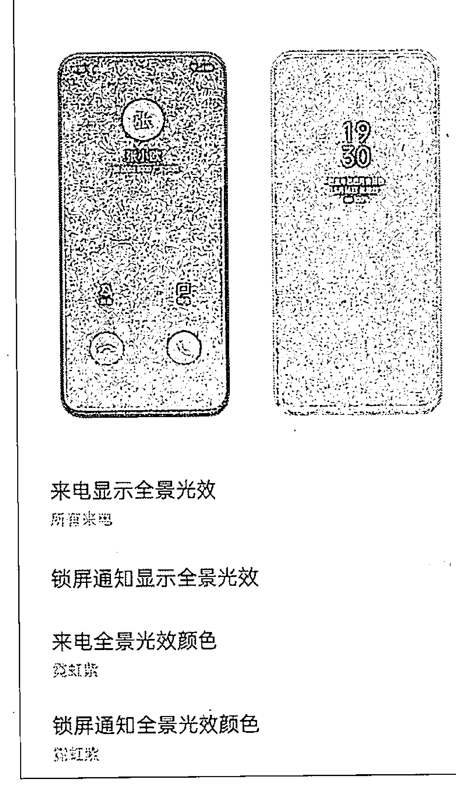

##### 想护眼选这里

如果你每天都抱着手机看视频和小说，一定要想办法规避屏幕蓝光对视力的影响。好消息是，如今几乎所有品牌的手机都引入了“护眼模式”（图6），可以选择手动或定时开启，并微调该模式下的色温（没有统一标准，调到自己看着最舒服的档位即可）。

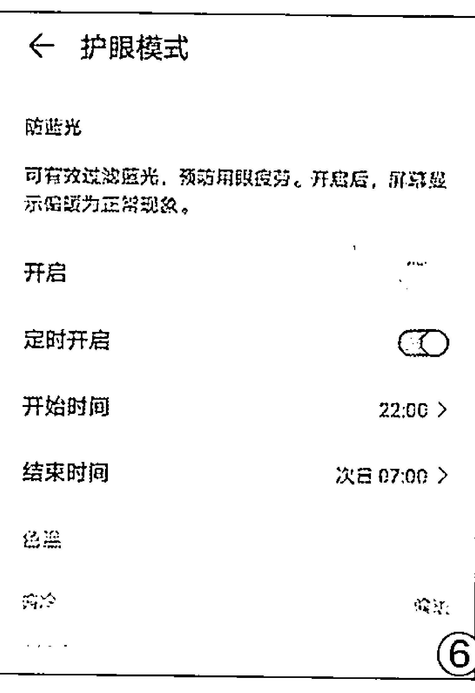

对采用OLED屏幕的手机而言，还需在显示设置中找到类似“DC调光”或“低亮度屏闪”的选项并将其开启。需要注意的是，有些厂商会将该功能挪到其他位置，比如一加手机就将其藏在了工具箱中的一加实验室内（图7）。


##### 讨好眼睛往这看

每个人对色彩的敏感度不同，风格喜好也存在差异。因此，当你拿到一款新机时，最好可以找到显示设置中的色彩调节界面，尝试不同的色域模式和色温，原则就是“怎么看着舒服怎么来”（图8）。

为了追求屏占比，很多手机都采用了“刘海屏”、“水滴屏”和“挖孔屏”等异形切割屏幕设计。如果你不喜欢前置摄像头对屏幕画面整体的割裂感，可以在显示设置中找到类似“屏幕顶部显示”的选项，在这里可以根据全局或指定程序，将前置摄像头所在的整行都以黑色显示，模拟18:9的全面屏效果（图9），看起来是不是更顺眼了？

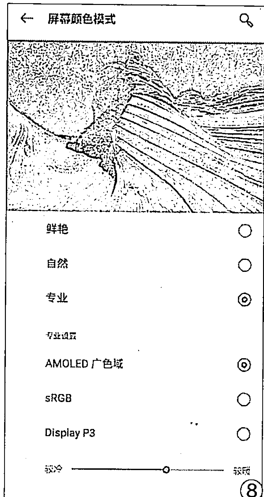

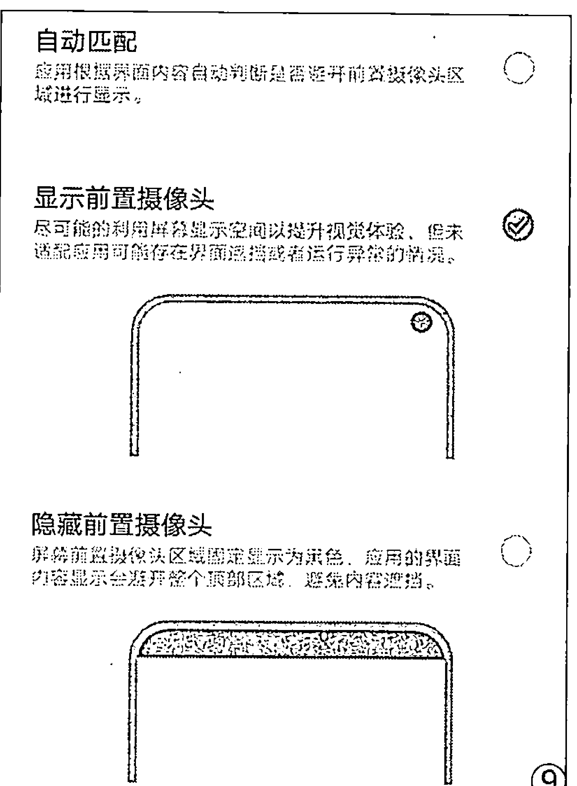

##### 特色功能选择性开启

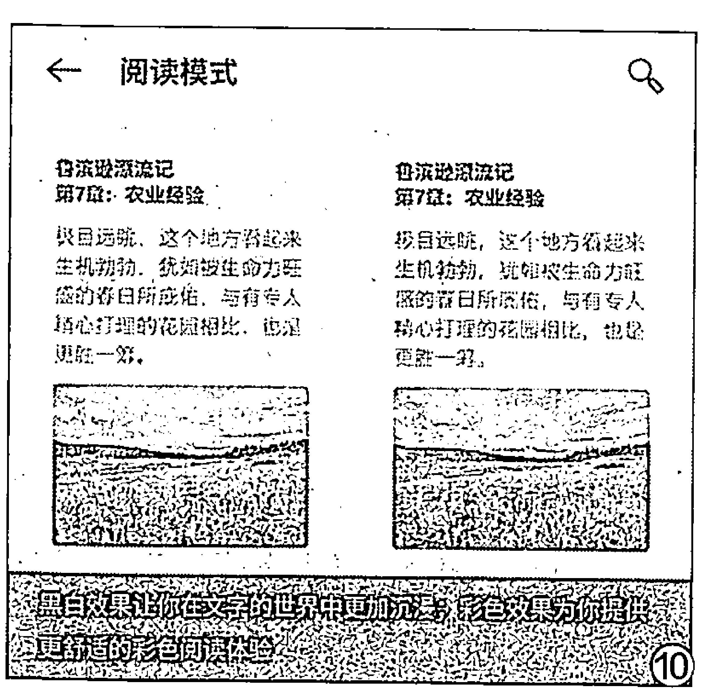

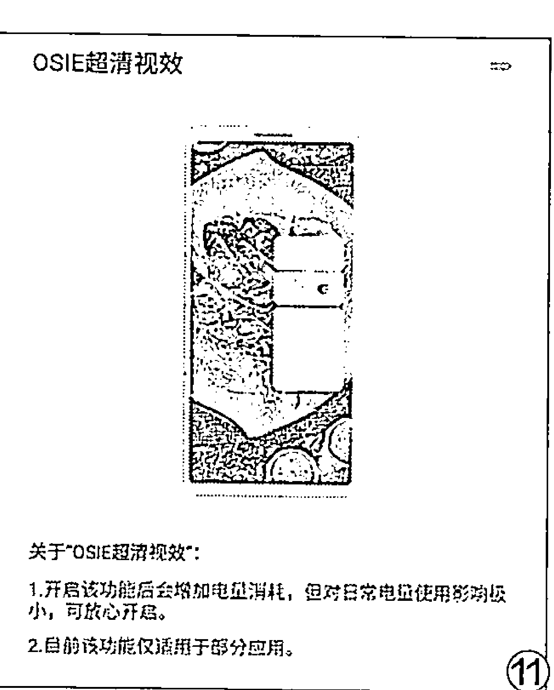

为了实现差异化的竞争，很多手机厂商还会在显示设置中加入更多特色功能，选择性地开启会带来不小的惊喜。比如，一加手机主打特色的“阅读模式”，让手机瞬间变成“墨水屏”，长时间看书更舒服（图10）。OPPO手机支持OSIE超清特效，可提升部分视频类APP的显示质量（图11）。类似的功能还有很多，需要我们自行挖掘。

#### 构筑安全防线
##### 了解Android手机的加密功能

文｜镜花水月

如今几乎所有的Android系统手机都支持面部识别和指纹解锁功能，为了防止因手机丢失而被人盗取隐私和恶意消费，我们首先要做的就是利用系统设置中的安全选项构筑一道防线。

##### 开启云服务

当我们新买Android手机并初次使用时，请先注册/登录品牌会员，找到云服务并开启其中的“查找手机”功能（图1）。一旦手机丢失，我们可以通过厂商提供的网址定位手机位置，还可以发送警示信息或远程删除所有个人数据，属于一道最基础的安全锁。

##### 设定锁屏密码

Android手机的安全功能大多集中在了一起（图2），我们首先要做的就是为手机设定锁屏密码。默认的锁屏密码是6位数字，而我们可以通过点击界面上“其他加密方式”选择图案密码、4位数字、4位~16位的纯数字或数字+字母组合密码（图3）。

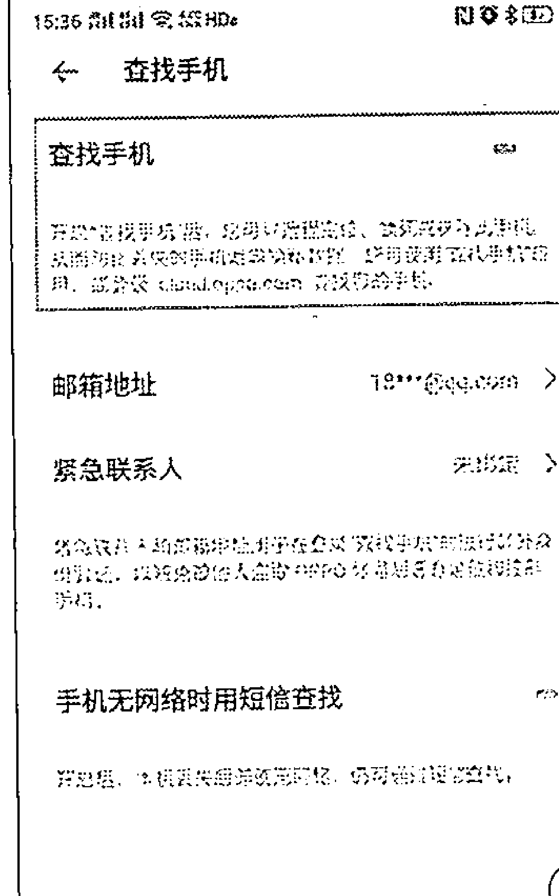

由于锁屏密码可以由关联的指纹和面部信息代替，一般只有重启手机再初次使用时才需要重新输入密码验证，所以这个密码越长越复杂越好。但也千万不要忘记这个密码，否则手机就直接“变砖”了。

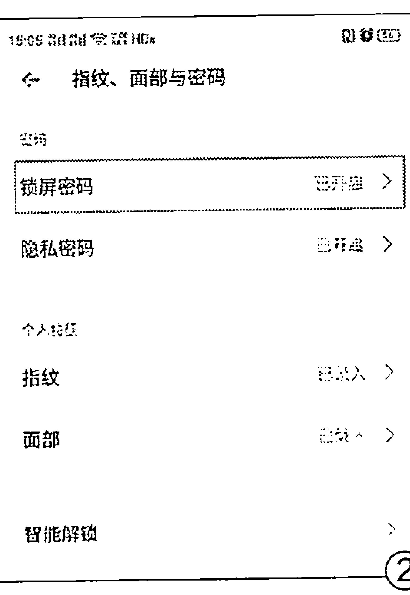

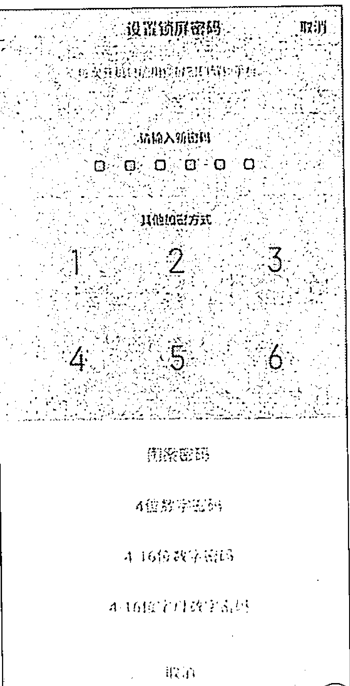

##### 小提示

> 手机丢失并找回无望时，我们应该第一时间拨打运营商电话或赶赴最近的营业厅挂失SIM卡，防止盗窃/捡到手机的人破解密码后用短信验证码的方式重置支付宝等交易类APP的密码，造成更大的财产损失。

##### 录入指纹和人脸

Android手机现已都支持指纹和面部解锁（生物识别），前者分为屏幕指纹、后置指纹和侧置指纹，但在添加指纹时的操作步骤都是一样的。需要注意的是，使用屏幕指纹解锁技术的手机，在更换（撕下）屏幕贴膜时会影响指纹识别率，此时最好可以重新再录入一遍。录入人脸信息时，请保持良好的光线，不要选择逆光的位置。

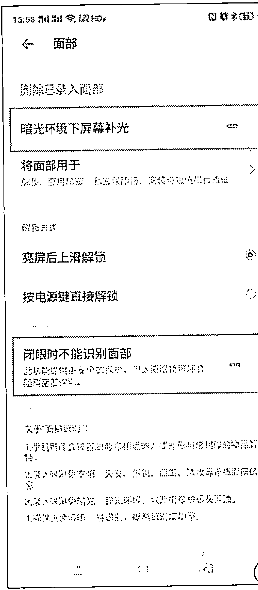

考虑到指纹识别在手指受伤、沾水或某些情况下可能解锁失败，所以同时启动指纹+人脸识别在体验上最趋于完美。而为了提升面部识别的成功率和安全性，如果设置中有类似“屏幕补光”或“闭眼不能识别面部”一类的选项就请打开它们（图4），前者可以提升暗光环境下的解锁成功率，后者可以提供更安全的保护。

294 电脑爱好者 2020年合订本（一）

#### 隐私数据管理

为了保护隐私数据，很多Android手机都提供了文件加密和应用加密一类的功能，在指纹和面部设置的界面中，我们可以将它们与当前的生物识别信息加以关联，以后打开加密的应用或文件时，按一下指纹或刷一下脸即可（图5）。

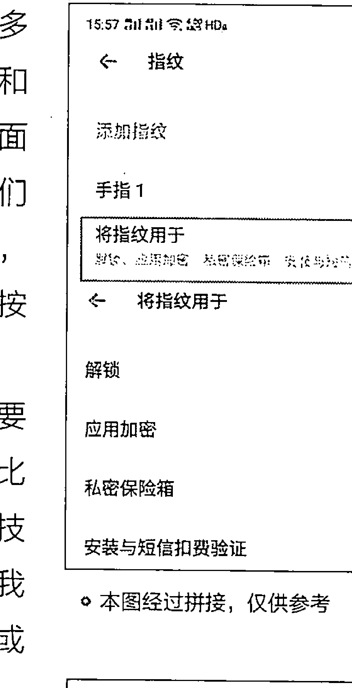

是否关联生物识别信息，主要还得看我们的安全意识和习惯。比如，笔者现在使用屏幕指纹识别技术的手机，识别率不是100%，但我又总觉得人脸识别有可能被照片或长得比较像的人“骗”过去。所以，我的习惯是使用指纹关联全部安全验证，而人脸则不关联锁屏功能（图6），这样一来解锁手机时就只能使用指纹或密码，最大限度提升了安全性；而在运行加密应用或查看加密文件时则可使用人脸，又最大限度提升了便利性。

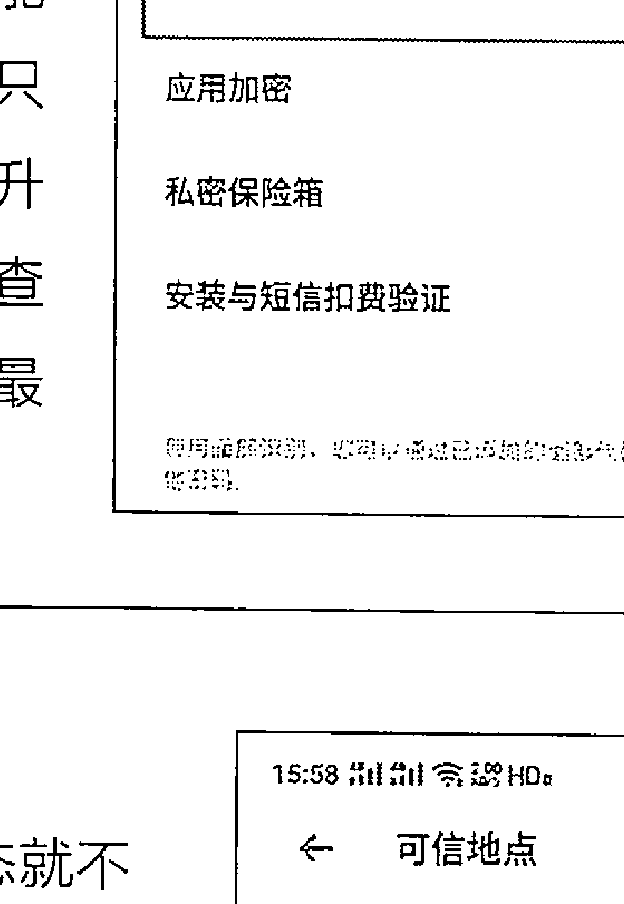

#### 善用智能解锁

从Android 8.0开始，几乎所有品牌手机都在指纹和面部设置中添加了“智能解锁”功能（图7），在这里我们可以让手机以更智慧的方式处理安全解锁机制。以OPPO手机为例，它在智能解锁中提供了贴身检测、可信地点、可信蓝牙设备和可信WLAN网络4种解锁方式（图8）。

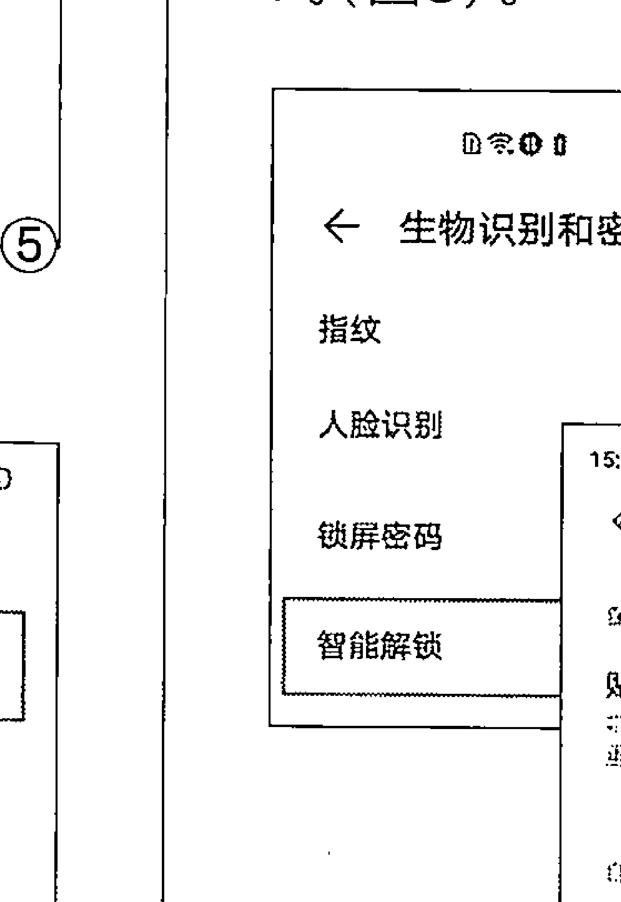

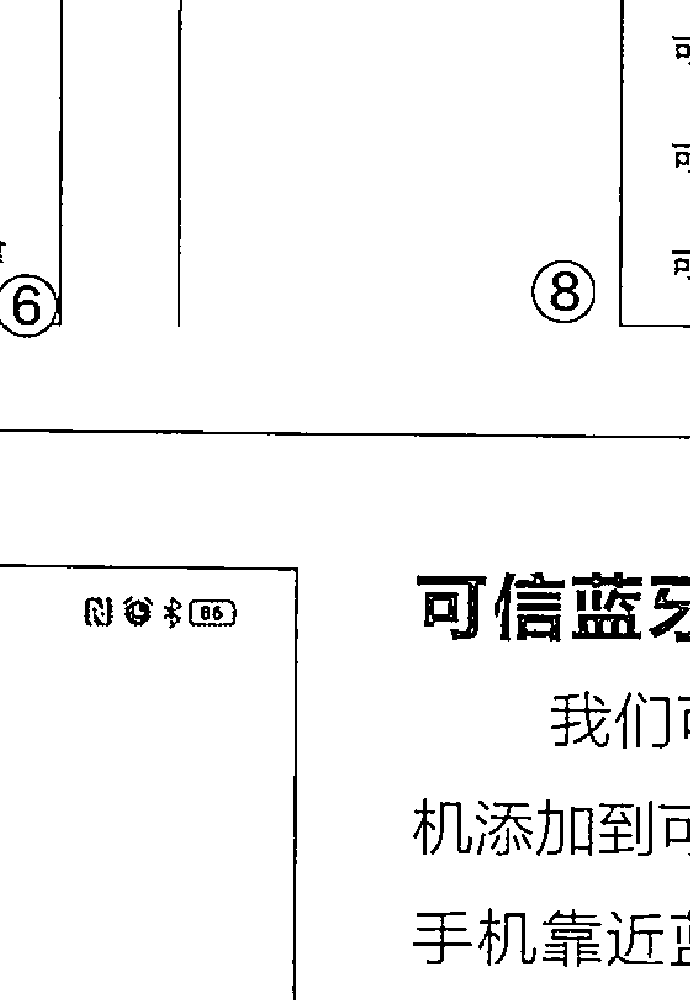

##### 贴身检测

只要手机处于贴身运动状态就不会上锁，适合于健身跑步的过程之中。但是，一旦手机熄屏静置1分钟以上则会自动锁定，防止手机遗失被他人拾起继续使用。

##### 可信地点

可以通过网络定位，将自己家、父母家添加到可信地点。只要手机检测到处于这些地点周边50米范围内就不会锁定。一般来说可以放心开启，手机在家总不会丢吧？当然，如果你担心被家人随意操作手机看到隐私，那就需要谨慎开启了。需要注意的是，在家附近遛弯时，如果手机不幸丢了，也可能会因处于可信位置而无法上锁（图9）。

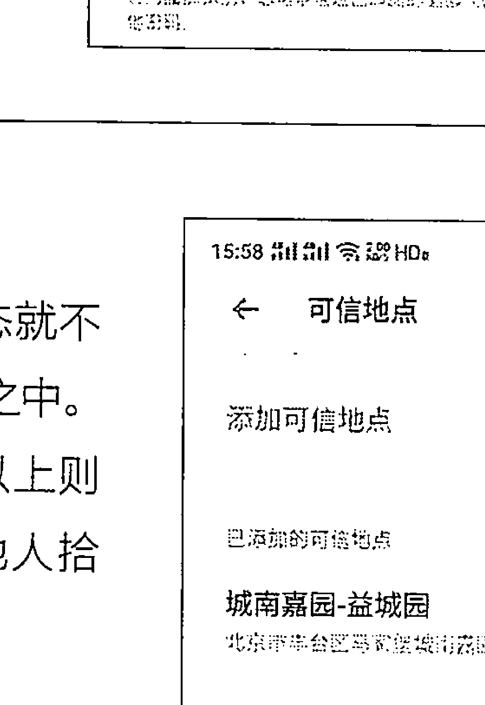

##### 可信蓝牙设备

我们可以将出门必带的蓝牙耳机添加到可信蓝牙设备名单中，只要手机靠近蓝牙设备识别并自动连接后，就能避免每次熄屏都需要重新解锁的麻烦了。

##### 可信WLAN网络

我们可以将家里的Wi-Fi网络添加到可信WLAN网络名单中（图10），个人感觉该功能完全可以取代可信地点，安全性也要更高一些。

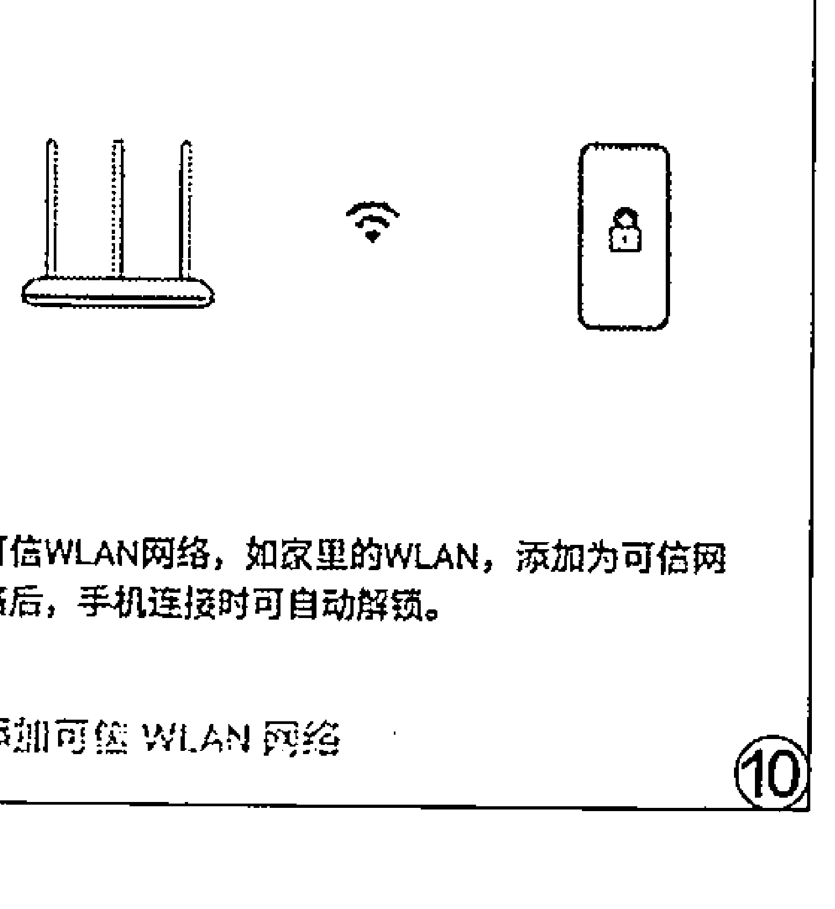

#### 声效设置全在这 了解手机声音和振动选项

**文｜镜花水月**

为了方便用户，Android系统手机大都将与声音和振动相关的选项汇集在了一起。如果你想通过特殊铃声彰显个性，利用振动避免错过提醒，那就需要在“声音和振动”选项中进行一番设置了。

##### 声音类别划分

不同品牌手机的“声音和振动”选项大同小异，本文我们以荣耀V30为例讨论（图1）。Android系统的声音输出主要来自媒体（对应听歌、看视频和玩游戏时的音量）、铃声（来电音量）、闹钟（闹钟或记事本的事件提醒音量）、通话（打电话时的听筒音量）、智慧语音（语音助手的音量），我们可以根据喜好和需求，对不同类别的声音大小进行调节。

当我们在上班、上课或身处图书馆等场所时，可以打开“静音”选项，但为了防止错过重要的来电或通知，建议同时开启“静音时振动”选项。此外，请检查常用APP的通知权限是否开启，确保在“设置→通知管理”中微信、QQ、邮箱等你不希望错过任何提醒的APP都处于“允许通知”的状态（图2）。

“音量键默认控制”很重要，它可以定义当我们按下音量键时，优先增大减小的是媒体音量还是铃声音量（图3）。个人建议将其定义为“媒体音量”最合理（图4），毕竟来电话属于小概率场景，音量键的使用最多还是发生在感觉游戏声音小了、电影声音大了的时候。

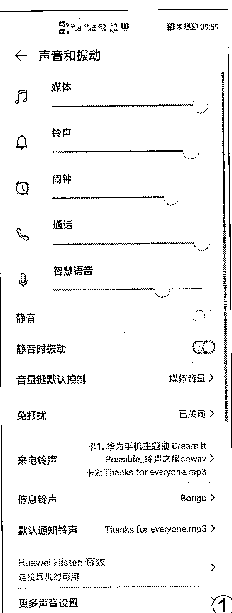

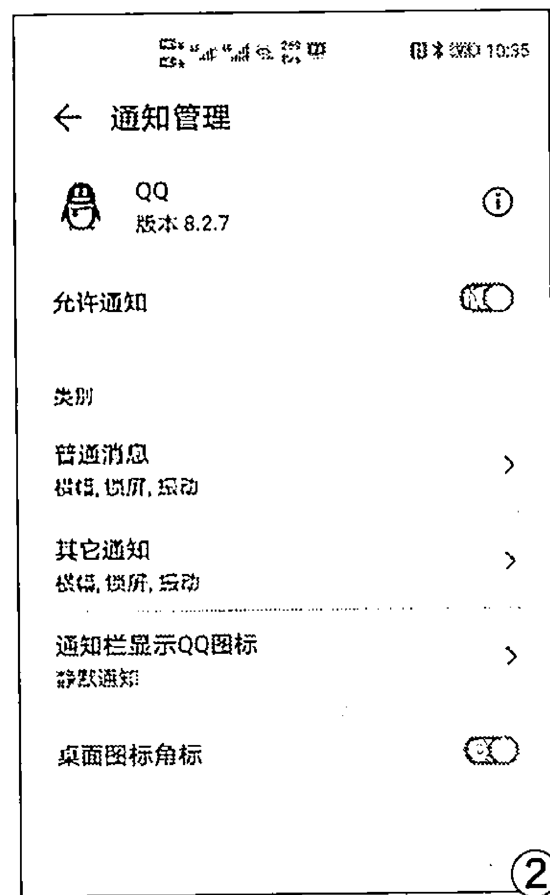

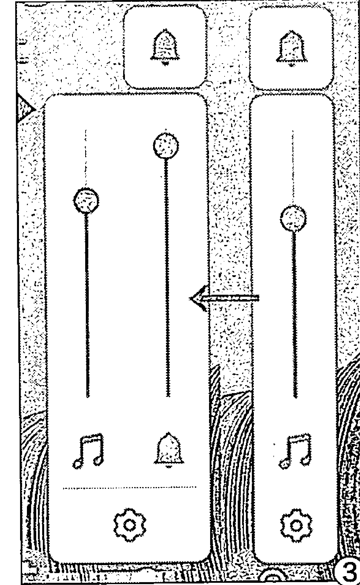


##### 如何添加铃声

修改来电、短信和通知铃声，相信是每次更换新机时大家最优先进行的操作。可惜，手机系统自带的铃声很难让我们满意，往往需要重新下载或通过PC传输我们过去收集的个性铃声文件。问题是，有时我们拷贝进手机的铃声文件，在自定义本地铃声时根本看不到，这些音频文件到底应该放在哪个目录下？

不同品牌手机的铃声文件夹路径可能不一样，最简单的识别方法，就是打开“主题商店”，此类APP除了可以下载

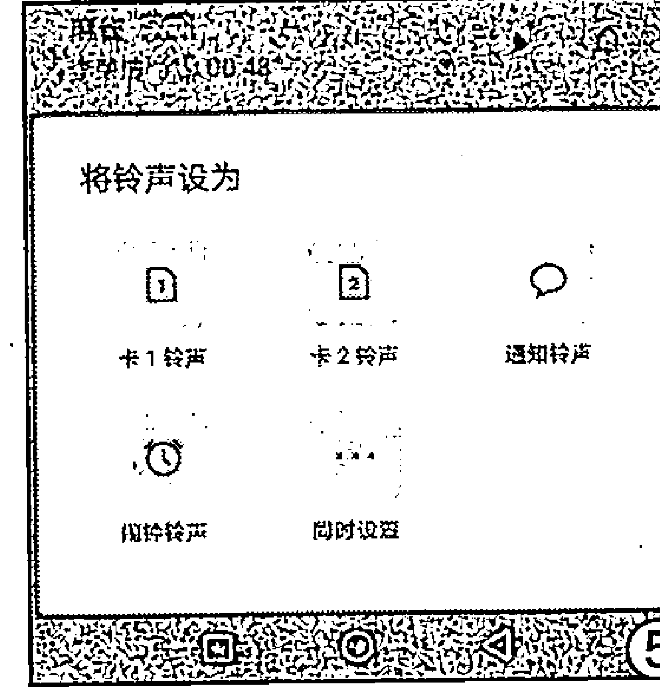

主题、壁纸以外，普遍还能下载铃声（图5）。随便下载一首铃声后，使用“文件管理”APP查看新增的音频文件，找到并长按这个铃声文件，在它的详情界面下就能看到它的保存路径了。比如荣耀V30下载的铃声默认就会保存在“内部存储/music/ringtones”文件夹下（图6），我们只需将铃声文件拷贝进这个路径，就能在铃声自定义的本地铃声列表中看到它们了。

实际上，如今很多音乐类APP已经支持歌曲的剪辑（图7），可以将其中的片段截取出来并直接设置为铃声（图8），较之单独下载铃声要省事和自由许多。

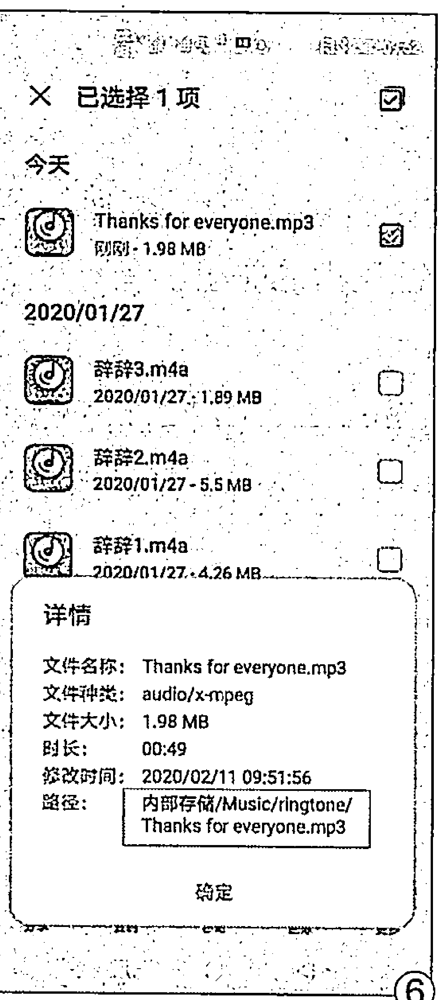

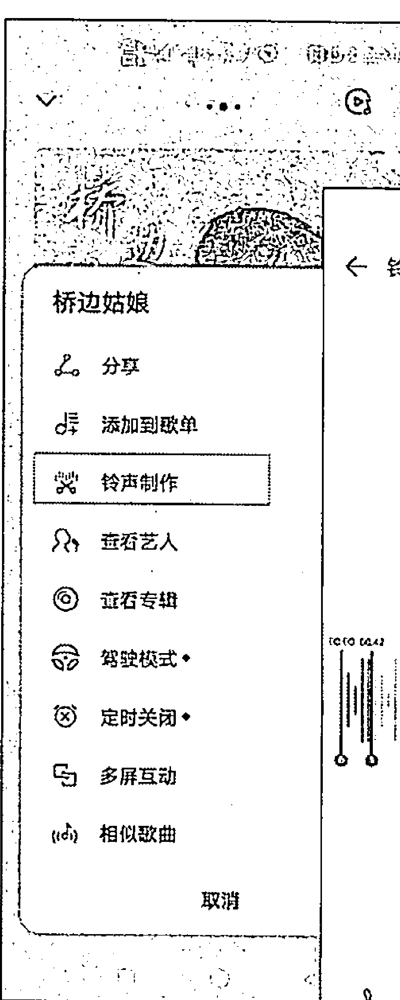

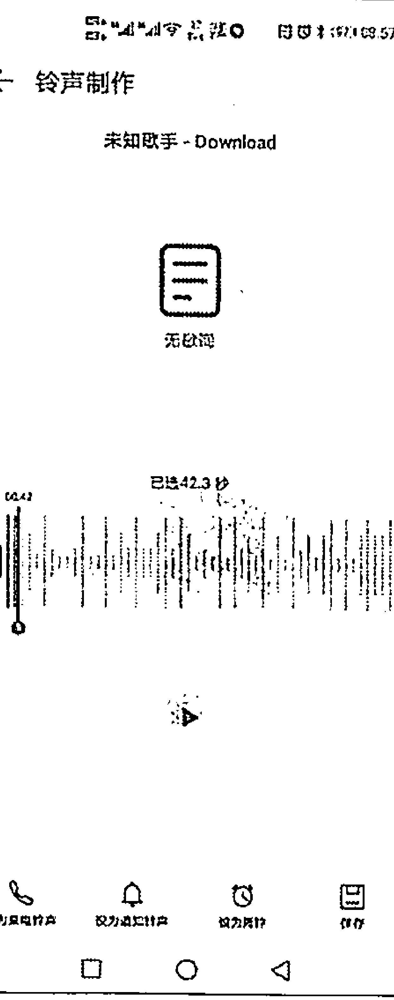

#### 休息时免打扰

我们可以将“免打扰”理解为过去的情景模式，自定义某个时间段内，只允许指定联系人来电和短信才有铃声提醒（避免错过和家人有关的突发事件），非常适合在夜间休息时开启（图9）。

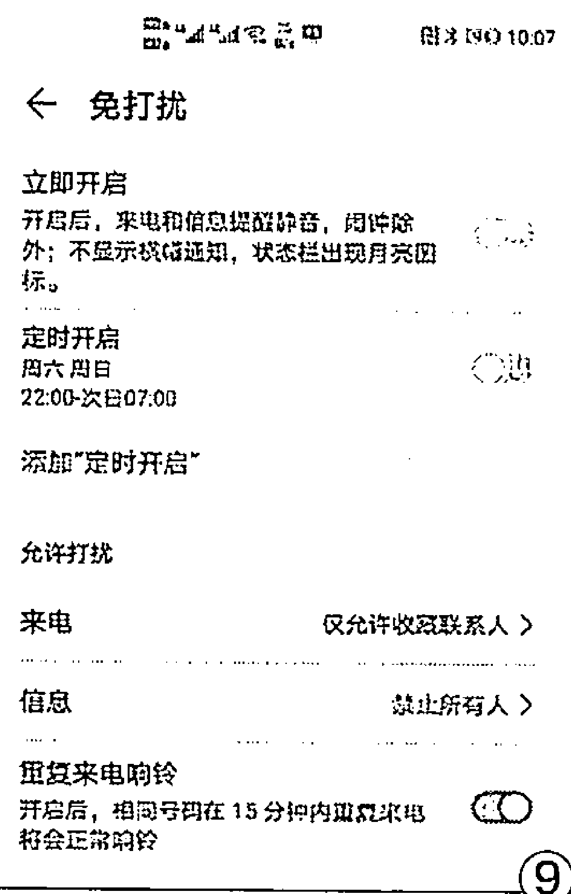

#### 按需振动更合理

在“更多声音设置”中，我们可以定义拨号、锁屏、截屏、触摸时是否同步发出声音，还能选择点击导航键时是否振动（图10）。出于省电的考虑，这些设置平时都可以关闭。

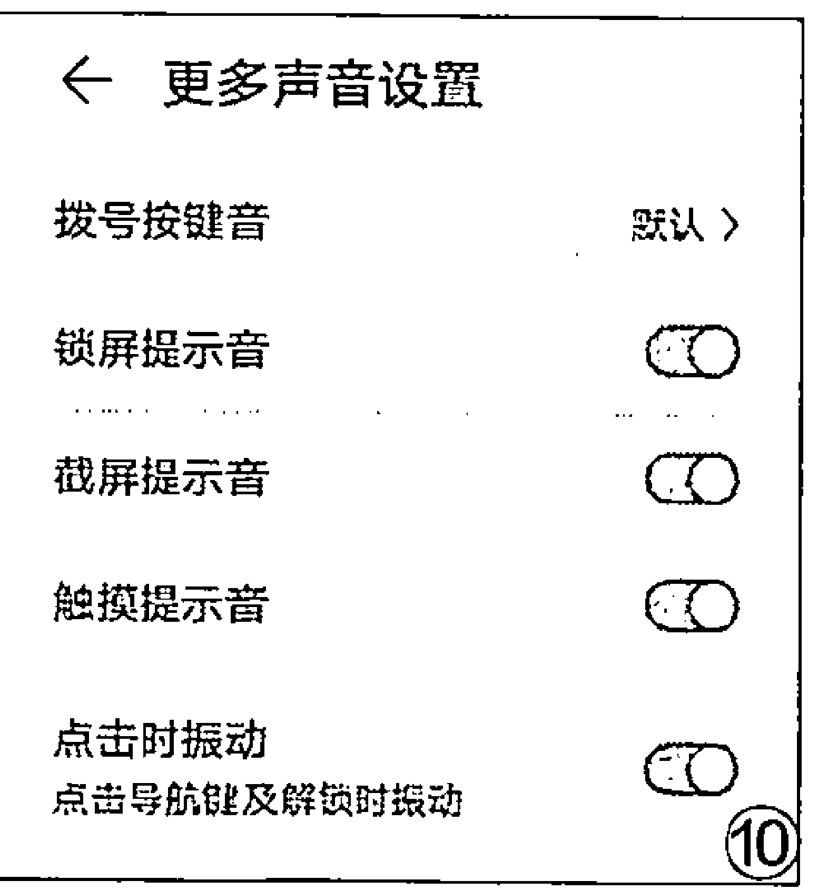

#### 善用特色功能

为了提升竞争力，不同品牌的Android手机会增加额外的音效和振动，比如杜比全景声、4D振感等，我们可以有选择地开启。荣耀/华为系手机主打Histen音效，在连接耳机时该选项才处于可选状态，在这里我们可以选择不同风格的播放模式（图11），根据不同类型的耳机进行优化和均衡器调节（图12）。

总之，如果你希望手机可以传出个性的铃声、更悦耳的音效，不因振动而影响续航时间，那就多多留意“声音和振动”选项中的各项新功能吧。

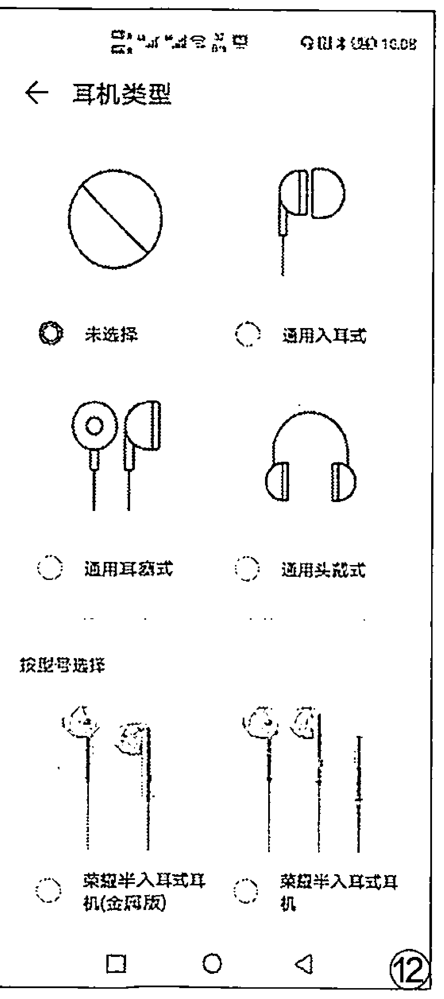

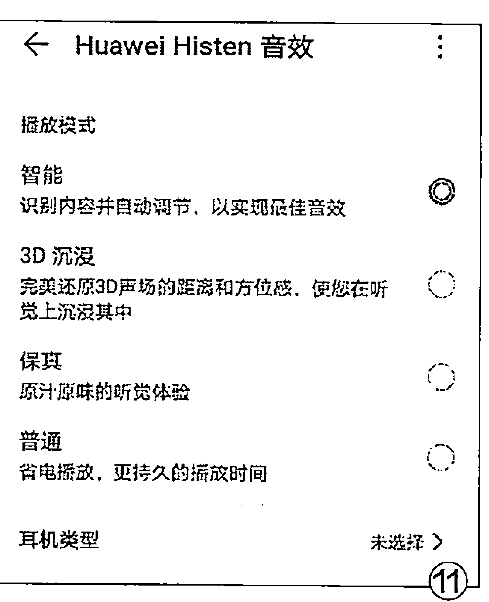

#### 利用关机命令进行系统关机操作

文｜老万

Q：本人喜欢追新，微软发布最新系统的测试版都会马上下载安装，可最近发现这个测试版存在Bug，就是无法进行正常的关机。有什么方法可以解决吗？

A：除了利用开始菜单的电源命令进行关机操作以外，还可以通过管理员权限打开命令提示符窗口，输入“shutdown /s /t 1”命令后按下回车键，也可以达到系统关机的效果。


如果想重新启动操作系统，输入“shutdown /r /t 1”命令即可。

#### 把常用文件夹放在方便打开的地方

Q：在电脑系统中拥有大量的文件夹目录，有一些文件夹目录需要每天打开，比如存放下载文件的目录或者存放文档的目录等。通过什么方法可以将它们固定到一个位置，从而方便用户能快速访问并打开这些文件夹目录？

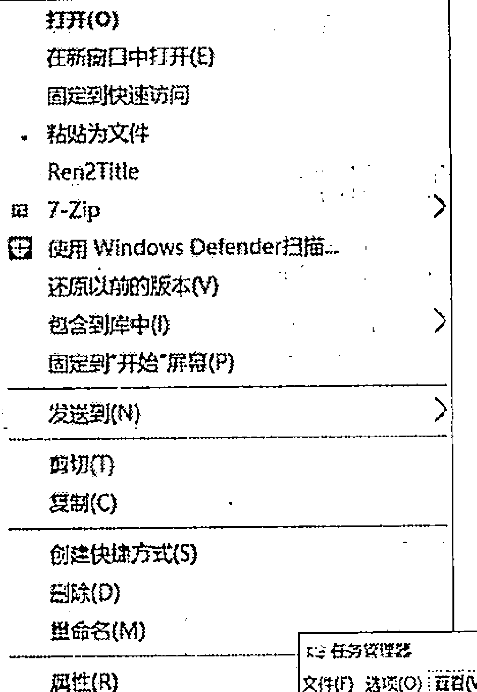

A：在资源管理器中找到需要固定的文件夹目录，在该文件夹目录上点击鼠标右键，可以看到“固定到快速访问”和“固定到开始屏幕”两个命令。选择第一个命令就可以将目录固定到资源管理器的列表中，而选择第二个命令就可以固定到开始屏幕之中。

#### 定义任务管理器监测数据更新速度

Q：遇到系统运行不流畅的时候，我们会打开资源管理器查看处理器、内存、磁盘的占用情况，但是由于任务管理器监测数据刷新太快，往往还没有看清楚就发生了变化。如何自定义监测数据的更新速度？

A：在系统任务栏上点击鼠标右键，选择菜单中的“任务管理器”命令，在弹出的对话框中选择“查看”，在弹出的“更新速度”中选择“低”或者“已暂停”命令即可。

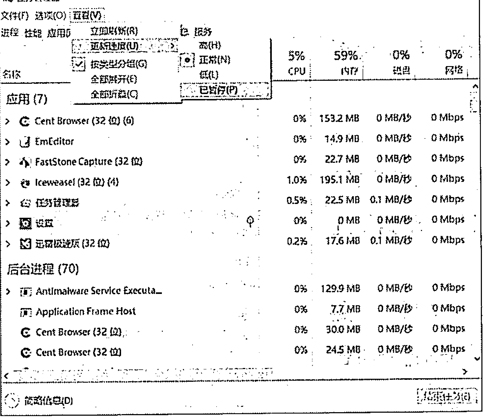

#### 告别NVIDIA显卡驱动的全家桶

Q：不知道从何时开始，NVIDIA显卡的驱动程序也捆绑了大量其他的组件，使得用户系统的磁盘空间被大量占用。通过什么方法可以对驱动程序中的组件进行自定义安装，而对不需要的组件进行屏蔽？

A：下载运行“TechpowerUp NVCleanstall”这款小工具（https://dwz.cn/35dvBoJ9），根据提示在列表中勾选需要使用的组件名称，然后点击下一步按钮，就可从网上下载最新的驱动程序安装包，并对选中的组件进行自定义安装操作。

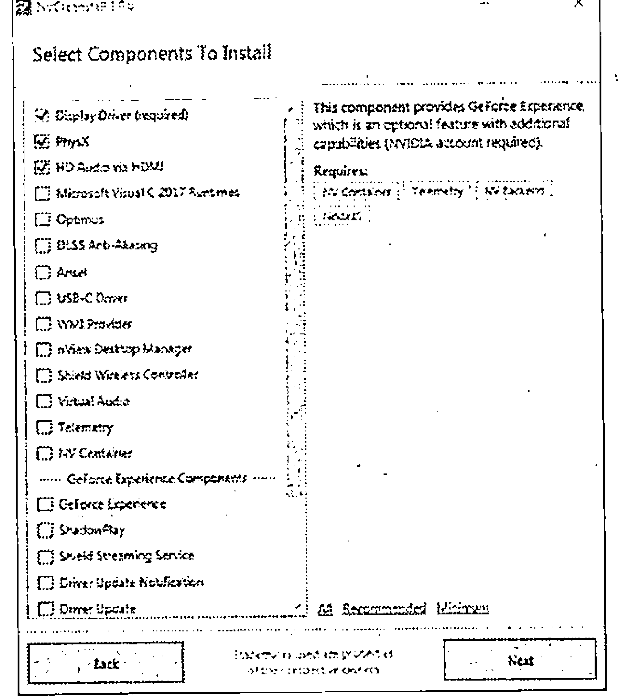

#### 笔记本屏幕忽亮忽暗

Q：最近购买了一台笔记本电脑，使用的时候发现了一个问题，就是电脑屏幕一会亮一会暗。请问这到底属于硬件的问题还是操作系统的问题？

A：其实这是英特尔专门提供的一个功能，如果不喜欢的话，首先打开“Intel Graphics Control Panel”，点击“电源”按钮后找到“显示器节能技术”，将这个选项修改为“禁用”，再进行确认就可以了。

#### 检测酒店房间是否有偷拍设备

文｜老万

Q：最近经常看到新闻里面说，某些地方的酒店房间中安装有偷拍设备，让大家感到非常担心。通过什么方式可以对房间进行检测，从而判断是否存在偷拍设备？

A：下载安装最新版本的“360安全卫士”客户端，点击工具栏中的“工具箱”按钮，在弹出的界面中找到“偷拍检测”选项，然后在弹出的界面中点击下方的“一键检测”按钮，就可以对房间中是否存在摄像头进行扫描检测。

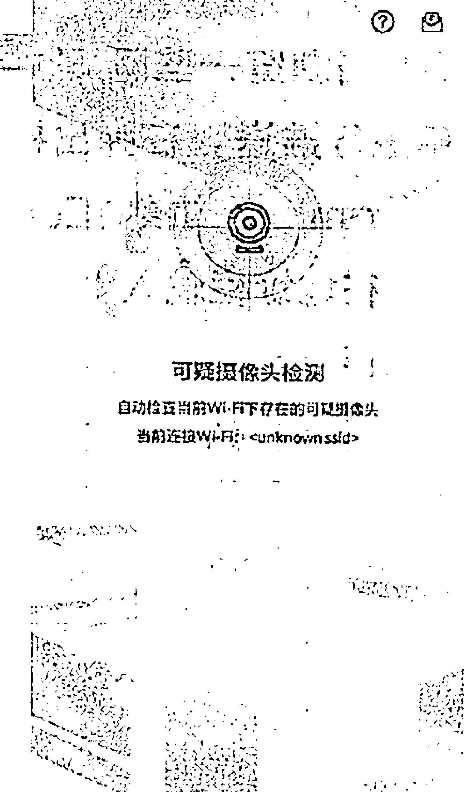

> “360安全卫士”这款应用的分析结果仅供参考，不能保证百分之百扫描出所有的偷拍设备。

#### 根据不同环境自动生成白噪音

Q：无论是在工作还是休息时，白噪音都是一种很好的辅助手段。通常我们使用的白噪音应用都千篇一律，能不能根据当前的实际情况生成与众不同的白噪音？

A：Endel就是这样的一款白噪音应用，它包括放松模式、睡眠模式、专注模式等多种选择。可以根据自己当前的实际情况进行选择，让生成的白噪音可以更好地满足自己的要求。CF

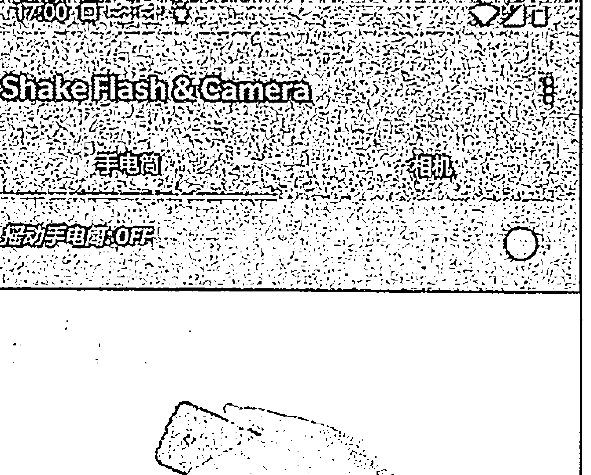

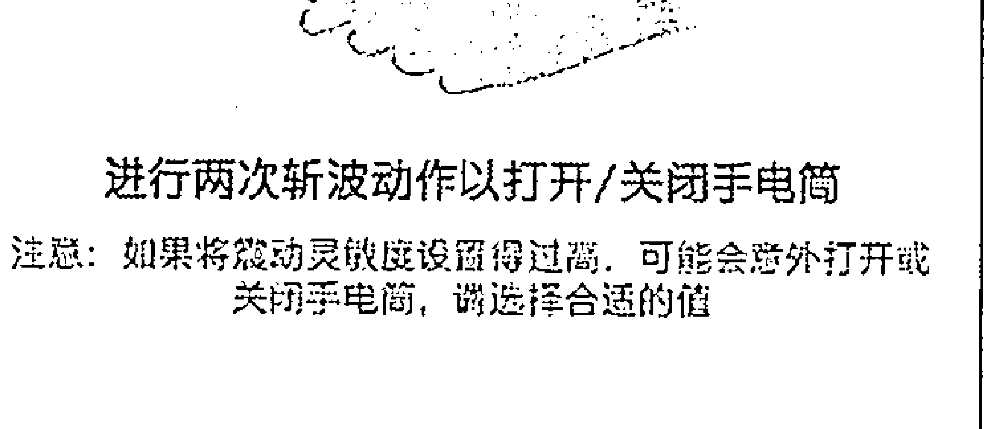

#### 正常使用谷歌相机应用

Q：不久之前Google Pixel 4正式发布，其中的谷歌相机应用也得到了升级，但是我下载最新版本进行安装却出现了无法安装的情况。如何才能正常地使用谷歌相机应用？

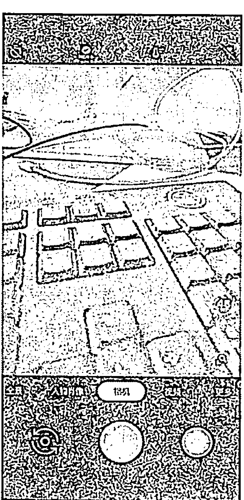

A：通过浏览器打开“Google Camera Port”的页面（https://dwz.cn/XMvnidkM），在其中可以看到很多开发者优化过的版本，从中可以找到针对自己相机型号的版本，下载后就可以进行正常的安装使用。

#### 伪装授予权限骗过手机应用

Q：在打开一个新安装的手机应用时，系统会弹出对话框询问用户是否授予该应用权限，如果拒绝某些应用就无法正常使用。遇到这样的情况，又不想授予权限，应该怎么解决？

A：安装AppOps这款手机应用，当某个手机应用申请权限的时候，AppOps会弹出一个管理窗口。在AppOps的窗口拒绝了权限申请后，系统还会弹出一个权限申请窗口，这时候点击“允许”就可以伪造一个权限信息给手机应用的假象。

#### 摇晃手机快速打开闪光灯

Q：晚上起来上厕所为了避免影响家人，往往我都是通过手机来进行照明，但是一系列的操作又显得比较麻烦。有没有比较快捷的方法，能够打开手机的闪光灯进行照明？

A：下载安装“摇动手电筒和相机”这款应用，打开应用以后点击“手电筒”标签，并且将“摇动手电筒”选项进行激活。以后只需要晃动一下手机，就可以打开手机的闪光灯进行照明。

### 傻博士

#### 将网站通知提示音关闭

文|老万

Q: 当浏览一些网页时会弹出一个提示框，询问是否对相关页面的信息进行推送，在弹出提示框的时候还会伴随着相应的提示音。使用Chromium内核的Edge浏览器时，如何将这些提示音关闭？

A: 在地址栏输入 `edge://flags/` 并按下回车键，在搜索框中输入 `Quieter notification permission prompts` 这个关键词，查找到以后点击列表中的“Enabled”选项即可。

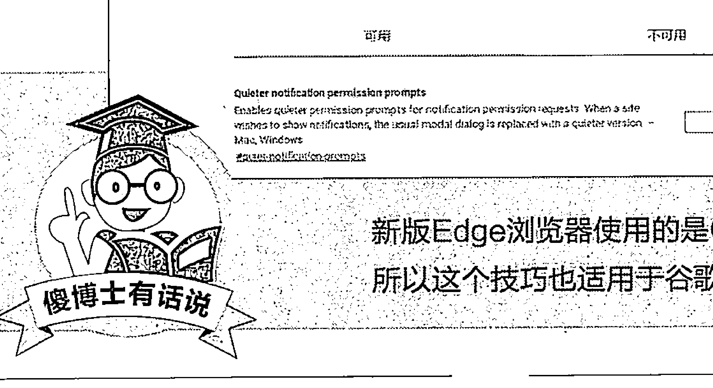

新版Edge浏览器使用的是Chromium内核，所以这个技巧也适用于谷歌浏览器。


#### 一键关闭所有浏览器页面的音量

Q: 在使用浏览器的时候我喜欢一次性打开多个网页链接，如果这些网页链接中有视频内容，它就会自动进行播放，而播放的声音会让人感到受不了。如何才能一键将所有网页标签中的声音关闭？

A: 无论使用的是火狐浏览器、谷歌浏览器还是Chromium内核的浏览器，在浏览器的应用商店里下载安装一个名为“Mute Tab”的功能扩展。以后当打开这些网页链接时，点击工具栏中的扩展图标，就可以一键将所有的声音关闭。

#### 双击Word文档无法打开

Q: 双击打开一个Word文档时，发现无法正常开启，之后又测试了几个类似的文件，还是无法正常地打开。遇到这样的情况该如何解决？

A: 打开Word软件的选项窗口，点击左侧的“信用中心”选项，然后点击右侧的“信用中心设置”按钮，在弹出的窗口中选择左侧的“受保护的视图”选项，将右侧的三个选项全部取消即可。

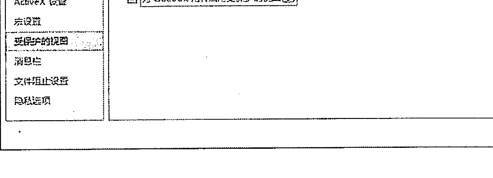

#### 从官方下载完整版谷歌浏览器

Q: 平时喜欢使用谷歌浏览器，而从谷歌官方下载的安装包都是下载器，运行以后需要联网才可以安装。但是这样经常出现安装错误，那么从谷歌官方能不能下载到完整版的安装包呢？

A: 这里给出 https://www.google.cn/chrome/?standalone=1&platform=win64 这个链接，点击以后在页面中就可以在线进行完整版安装包的下载操作。如果使用的是32位版本，将链接中最后的64改成32即可。

#### 火狐浏览器的任务管理器

Q: 系统在运行不流畅的时候，通常我们都会打开任务管理器进行查看，而在使用浏览器的时候也会遇到运行不畅的情况。请问在火狐浏览器中有没有类似的任务管理器功能？

A: 点击右上角的“打开菜单”按钮，在弹出的菜单中选择“更多”中的“任务管理器”命令，在弹出的页面中就能看到当前的所有页面以及功能扩展使用的系统资源等信息，而且在每一个选项的后方可以点击“关闭标签项”命令将其关闭。

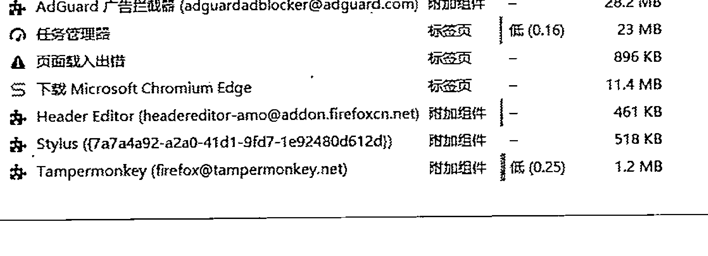

#### 网页文字被禁止复制的解决

文|老万

Q: 现在网络中有一些网页的内容被进行了限制操作，无法进行正常的复制粘贴。遇到有些内容对自己非常重要时，通过什么方法可以解除相应的限制？

A: 通过浏览器打开Greasy Fork网站（https://greasyfork.org/zh-CN），搜索并安装一款名为“网页限制解除(改)”的脚本。以后遇到相应的网页链接时，这个功能脚本就会解除相应的限制，就可以很方便地进行复制粘贴操作了。

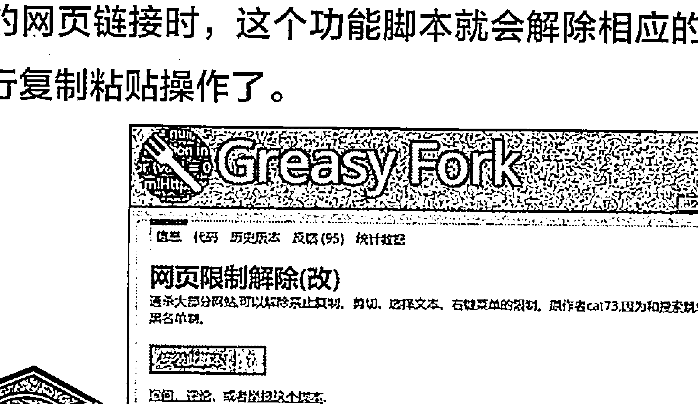


也可以利用截图软件进行内容截图，再通过OCR软件进行文字的识别。

#### 老版本浏览器也能使用阅读模式

Q: 由于工作的需要，我的电脑系统使用的浏览器还比较老，没有自带阅读模式。通过什么方法可以将阅读的网页内容转换成阅读模式的状态进行查看？

A: 在浏览器的地址栏输入https://outline.com/，在弹出网页的输入框中粘贴要查看的网页链接地址，点击后面的按钮，在出现的网页中就可以看到转换成阅读模式的网页内容。

#### 集成了多个功能的在线服务平台

Q: 经常使用一些比较小的服务，比如房贷利率的计算或者网页代码的解码等等，每次使用这些功能时都需要进行搜索查询。有没有什么网站将这些经常用到的小服务集中在一起？

A: “JSON在线工具”就是所需要的这类网站（https://www.sojson.com/）。打开该网站的网页后可以看到，每一个功能用一个图标进行了显示。要使用哪一个功能，只需要点击该图标，在弹出的网页中就可以进行操作。

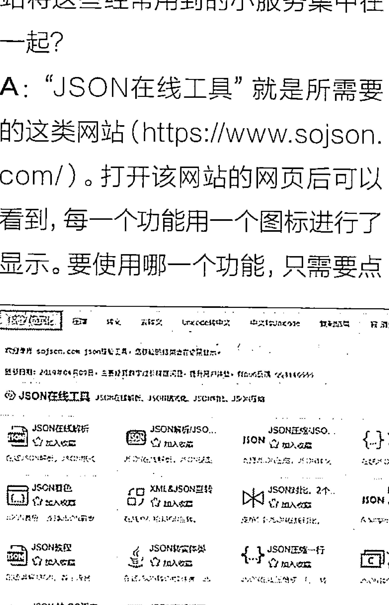

#### 在线进行网页链接安全性检测

Q: 平时使用的是系统自带的浏览器，也没有安装任何的安全扩展和软件，有时在网页中会遇到网友分享的链接，但是不知道这些链接的安全性如何。怎样在线对这些链接进行检测？

A: 打开URLVoid这项服务（https://www.urlvoid.com/），在弹出的输入框中粘贴要检测的链接地址，点击后面的按钮，就可以利用30多个不同的分析系统，对这个网页地址的安全性进行扫描分析。

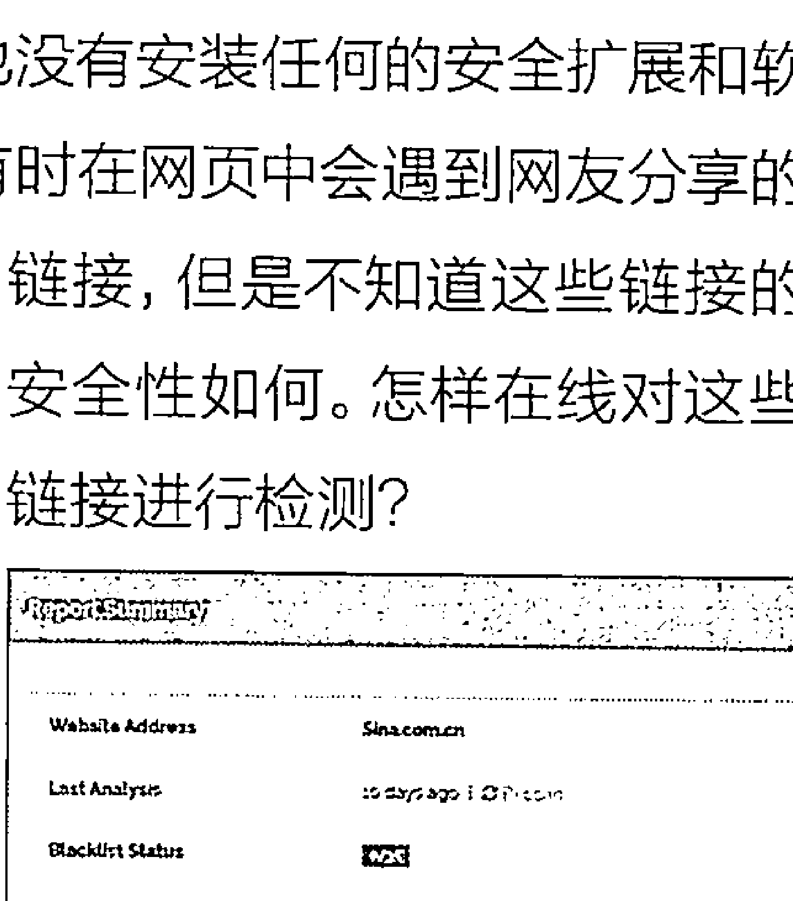

#### 对文本信息进行在线播放

Q: 有的时候看网页累了想休息一会，但是对当前的页面内容又舍不得离开，就想对当前页面的内容进行播放，通过听的方式进行了解。请问通过什么方法可以将文本信息进行播放？

A: 打开https://ttsreader.com/zh/，将要进行阅读的文本粘贴到网页的文本框中，在语言列表中选择“中国的”这一项，点击播放按钮，就可以进行在线播放。

#### 对文档中的表格进行拆分

Q: 在Word中制作了一个表格，完成以后想把这个表格分成两个部分。除了通过剪切表格内容重新创建以外，还有其他更加简单的解决方法吗？

A: 通过鼠标选择要进行拆分的表格区域，然后按下快捷键“Alt+Shift+↓”或“Alt+Shift+↑”，就可以将表格向下或者向上进行拆分操作。

如果在文档中选中了一段文字，通过这两个快捷键也可以将这段文字快速地进行向上或者向下的整体移动。

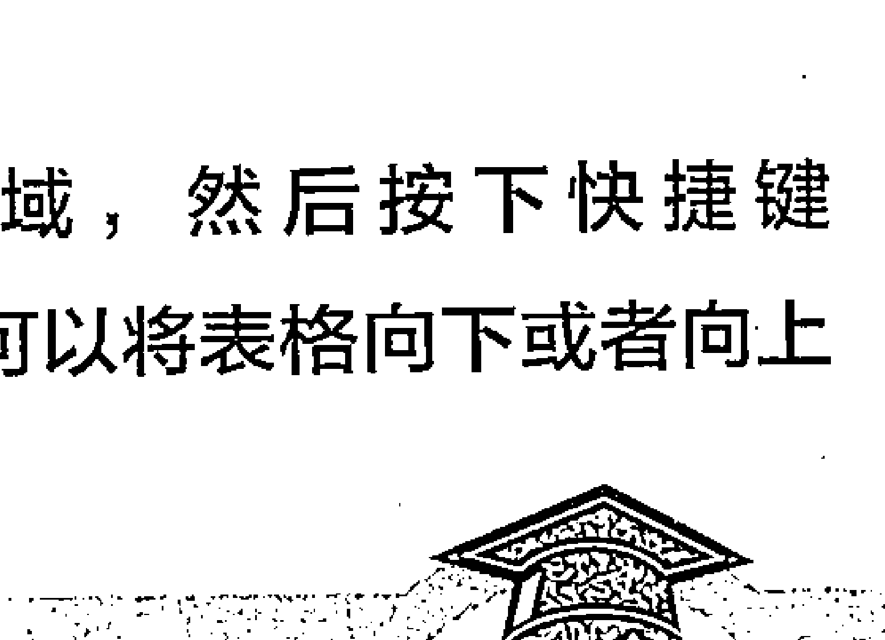

#### 表格跨页标题行的打印

Q: 如果制作的表格内容比较长，为了避免用户搞不清每一栏的具体内容，在打印时需要将每一页的上方都设置一个标题栏。应该怎样解决这个问题？

A: 在Excel中点击“页面布局”中的“打印标题”按钮，在弹出的对话框中选择“工作表”标签，点击“顶端标题行”右侧的按钮，然后用鼠标点击需要重复显示的标题行，设置完成以后就可以在每一页的最上方显示出标题行。

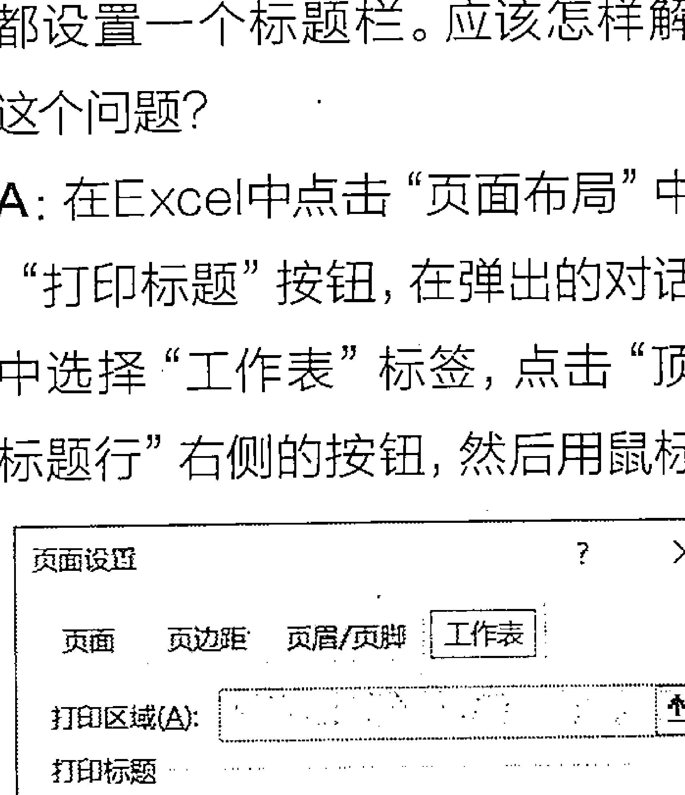

#### 快速输入不认识的生僻字

Q: 现在主要使用的是拼音输入法，遇到一些生僻字的时候，就不知道应该如何输入了。这样的文字在Word中如何能快速地输入？

A: 比如要输入“堃”这个字，首先在Word中输入土，选中它以后点击“插入”标签中的“符号”按钮，在弹出的菜单中选择“其他符号”命令，然后在弹出的对话框中选择“CJK统一汉字”，这样就可以看到一些和土相关的生僻字。


#### 纯数字日期格式的转换

Q: 在制作表格的时候，经常会加入一些日期的内容，Excel默认的输入方式是2019/12/12这样的，可是有时输入的是纯数字的格式。如何将纯数字格式的日期转换成所需要的日期格式？

A: 在Excel中点击上面的“插入函数”按钮，在弹出的对话框中搜索“TEXT”。找到这个函数以后，在弹出的对话框中，在第一个输入框中设置日期所在的区域；在第二个输入框中输入“"00年00月00日"”，就可以完成纯数字日期格式的转换操作。

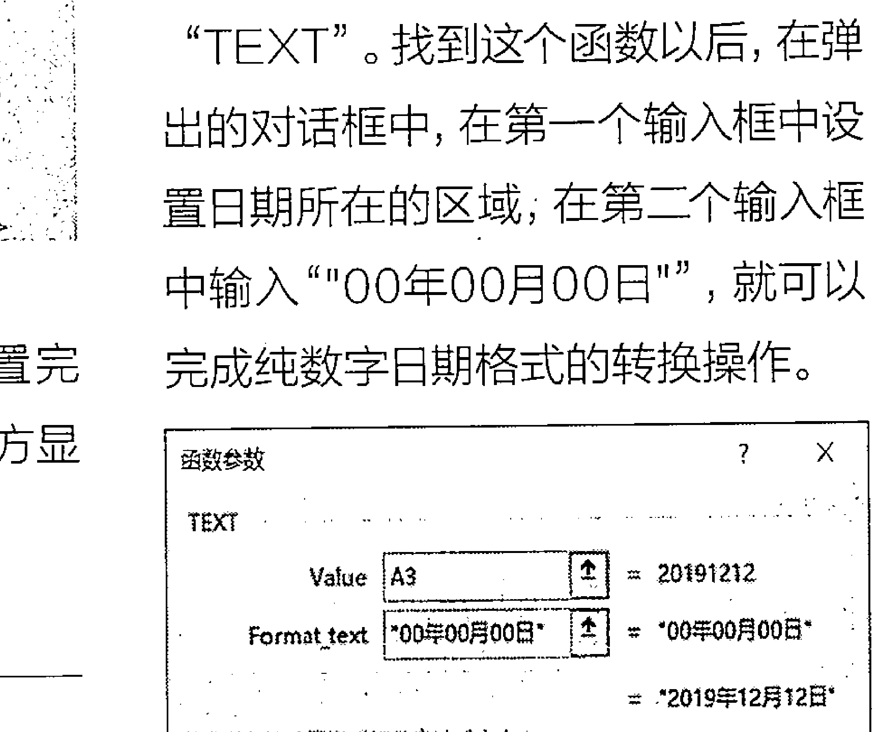

#### 自动维持表格中的连续编号

Q: 在制作Excel表格的时候，经常会为表格添加一个编号，方便用户进行查询，但是有时将某一行删除后，编号就会出现空缺的情况。如何在删除某些内容后让编号自动保持连续性？

A: 选中输入编号的第一个单元格，在公式输入框中输入“=ROW()”，将单元格向下拖动就可以完成编号的排序。有些时候会在表格的第一行输入一些标题，所以编号是从第二行开始的，这时就在公式输入框中输入“=ROW()-1”即可。

#### 手机浏览器能否禁止脚本代码

Q: 电脑中使用的网页浏览器，很多都可以对网页中的脚本代码进行禁止，从而加速网页的加载操作。在手机系统里面，有没有什么浏览器也能执行相应的操作？

A: 下载安装“X浏览器”，点击工具栏正中的按钮，在弹出的窗口中切换到第二页，选择“禁用JS”选项，就可以禁用网页中的脚本代码。


也可以在打开某个网站的链接以后，在“网站设置”选项中对该网站进行单独的禁用设置。

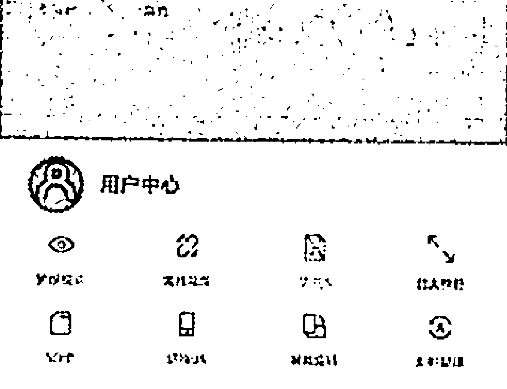

#### 有没有靠谱的手机照片存储服务

Q: 以前网络中有很多手机照片的存储服务，但是随着时间的推移很多服务都关闭了。现在还有没有比较靠谱的手机照片存储服务可以选择，以便更好地保证自己的照片不出问题呢？

A: 相对来说大的网络服务商都比较靠谱，比如百度在不久之前推出了一款名为“一刻相册”的服务，通过它就可以对手机中的照片和视频进行备份。除此之外，通过该应用还可以对上传的图片进行编辑，制作出小视频分享给其他用户观看。

> 该应用不能直接使用百度账号，但可以使用微信账号进行登录。

#### 在微信中也能进行跑分测试

Q: 以前要想了解手机的性能，就需要下载专业的软件对手机进行跑分的测试，但是有的时候觉得下载一个专业的软件没有必要。在常见的软件中有没有类似的功能？

A: 在微信客户端搜索“微信修复工具”这个关键词，找到以后打开它，在操作页面的下方就可以看到一个“性能检测工具”选项，点击它以后就可以开始对手机性能进行检测，也就是常说的跑分操作。

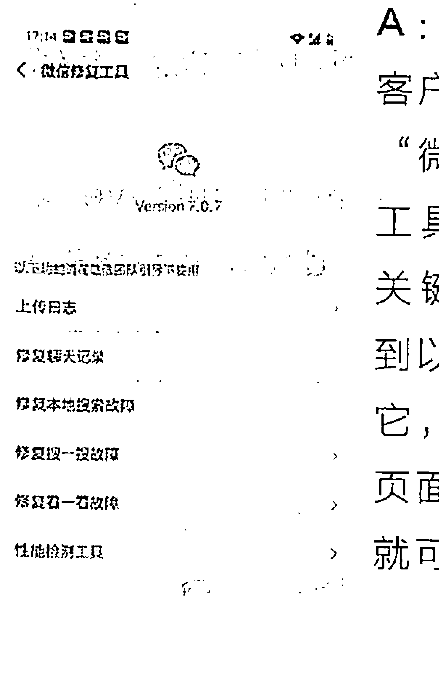

#### 了解国内最新的地震信息

Q: 由于本人经历过512大地震，所以对地震的新闻特别敏感，但是有时只能了解到一些震级比较大的地震信息。如何可以更加全面地了解所有的国内地震信息？

A: 安装或者升级到最新的“高德地图”版本，点击应用右上角的图标，在弹出的菜单中就可以看到“地震地图”选项，点击它以后会显示出一个全国的地图，在地图上就可以看到最近发生地震的相关信息。

#### 关闭QQ邮箱应用中的广告

Q: 平时在手机中使用“QQ邮箱”客户端来对自己使用的电子邮箱进行接收操作，最近发现这个客户端中会莫名其妙地推送一些广告信息。如何才可以将这些广告信息进行关闭？

A: 在广告信息的右上角可以看到“广告”两个字，点击它以后，在弹出的菜单中选择“不感兴趣”，就可以将这个广告关闭。不过这种方法操作一次只能管几天，几天以后可能又会出现其他的广告，到时候又需要进行类似的操作。


#### Powershell重置系统所有内置应用

文|老万

Q: Windows 10系统自带了很多UWP应用，但是今天我连续打开了好几个应用，出现不是闪退就是无法运行的情况。有的朋友让我将它们通通卸载，但是系统自带的应用又无法进行卸载操作。遇到这样的情况应该怎么解决？

A: 在系统的开始图标上点击鼠标右键，在弹出的菜单中选择“Windows PowerShell（管理员）”这个命令，在弹出的对话框中输入“Get-AppxPackage -AllUsers|Foreach {Add-AppxPackage -DisableDevelopmentMode -Register "$($_.InstallLocation)\AppXManifest.xml"}”并按下回车键，就可以将所有的应用进行重置并还原到原始状态。


如果是单个UWP应用无法运行，也可以试着在应用商店中将应用升级到最新版本，再重新运行试一试。

#### 让Windows 7不再弹出升级Windows 10的提醒

Q: 我现在还是使用Windows 7操作系统，由于它的大限将至，微软开始频繁地向用户推送升级Windows 10系统的提示，但是我不想升级，也不想被这个提示框骚扰。有什么方法可以让它不再进行提示？

A: 打开注册表编辑器，展开到HKEY_LOCAL_MACHINE\Software\Policies\Microsoft\Windows\WindowsUpdate，在右侧窗口新建一个名为DisableOSUpgrade的DWORD（32位）项目，将键值设置为1。再展开到HKEY_LOCAL_MACHINE\SOFTWARE\Policies\Microsoft\Windows\WindowsUpdate\AU，新建一个名为NoAutoUpgrade的DWORD（32位）项目，将键值设置为1。

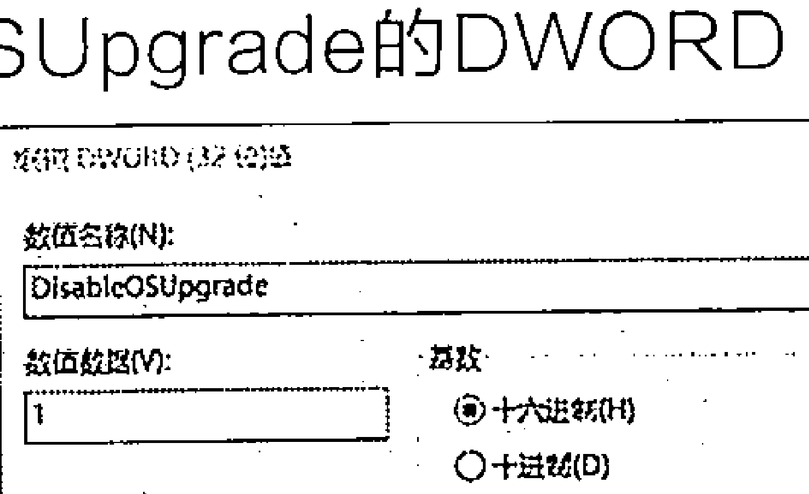

#### Windows 10下如何注册32位OCX控件

Q: 以前都是32位的操作系统，可以很方便地注册OCX或DLL控件，但是64位操作系统好像不行。在64位的Windows 10系统下，应该如何完成控件的注册操作？

A: 把控件文件复制到C:\Windows\SysWOW64，用管理员权限打开命令提示符窗口，输入“regsvr32 控件文件名”后回车，就可以完成这些控件文件的注册操作。

#### 另类安装NET Framework 3.5

Q: 现在很多软件的使用都需要.NET Framework 3.5框架的支持，但是我在下载安装这个框架的安装包时老是出错。除此以外还有什么其他的安装方法吗？

A: 下载.NET Framework 3.5的CAB安装包，将它重命名为Net3，再复制到系统的C:\Windows文件夹中。用管理员权限打开命令提示符窗口，运行“dism /online /Enable-Feature /FeatureName:NetFx3 /Source:"%windir%"/LimitAccess”命令即可安装。

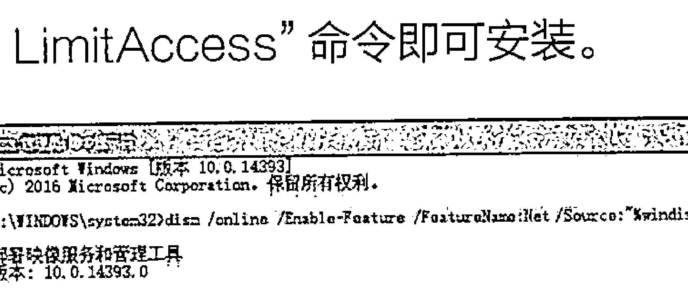

#### 将文件备份到OneDrive功能找不到

Q: 最近在网上看到一篇文章，提到Windows 10系统有一个“将文件备份到OneDrive”的功能，可以将重要的文件自动备份到网盘中，可是我按照其步骤找来找去都没找到这个功能。请问如何才能启用这个功能？

A: “将文件备份到OneDrive”功能只存在于Windows 10系统的企业版中，要想使用该功能必须重新安装企业版。如果不想更换当前的系统版本，可以利用符号链接命令mklink，将系统的重点目录链接到网盘的同步目录即可。

#### 规则数据的快速录入

Q: 在制作Excel表格的时候经常会遇到一些规则数据，如果每次都通过输入法进行输入，还是显得非常麻烦。有没有更加方便的规则数据录入方法？

A: 在Excel表格中按照纵向顺序输入所有的规则数据，选中要录入的区域，点击“数据”标签中的“数据验证”按钮，在弹出对话框的“允许”列表中选择“序列”，然后点击“来源”后的按钮，选择刚刚输入的数据单元格。以后点击每个单元格旁边的三角按钮，就可以在菜单中选择准备好的规则数据。

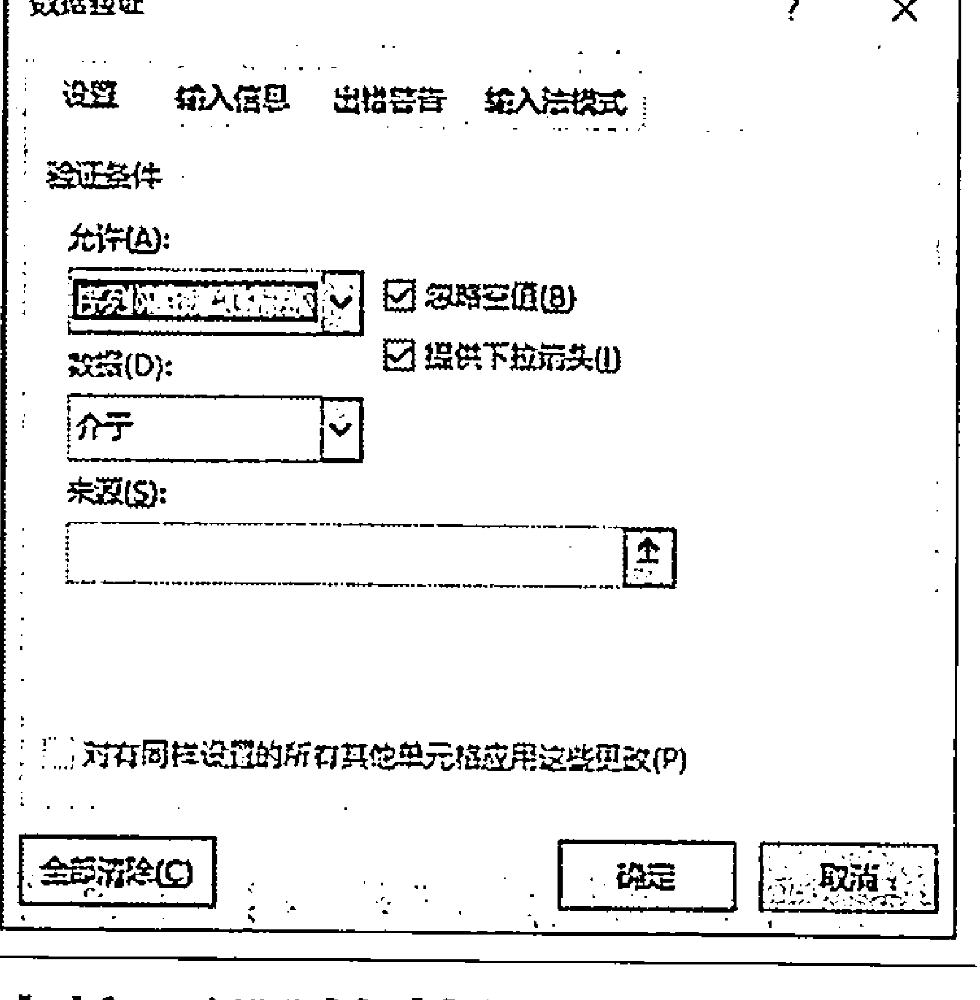

#### 让柱形图的数据更加引人注目

Q: 在Excel中制作柱形图的时候，有的时候数据差异并不大，不注意看很难看出它们的差别。通过什么方法可以让相关的数据更加吸引他人的注意？

A: 在Excel中打开表格和对应的柱形图，并且找到想要特别显示的柱形图，连续两次点击这个柱形图，使得只有这一个柱形图被选中。在该柱形图上点击鼠标右键，在弹出的菜单中选择“填充”命令，将这个柱形图的颜色改成其他的颜色就可以了。

#### 将重要的表格内容进行隐藏

Q: 单位对每个员工的工资都进行严格的保密，偶尔会遇到某些员工要求对工资进行核对的情况。为了不使别人的工资信息被他们看到，如何在Excel中对相关信息进行快速的隐藏？

A: 在Excel中选中工资表的标题行，点击“数据”标签中的“筛选”按钮，标题行旁边就会出现一组箭头按钮。点击箭头按钮后，在输入框中输入查询人的名称，就可以将其他的信息进行过滤，从而起到保护信息的作用。

也可以利用VLOOKUP函数，对查询人的信息进行查找，然后自动过滤其他人的信息。

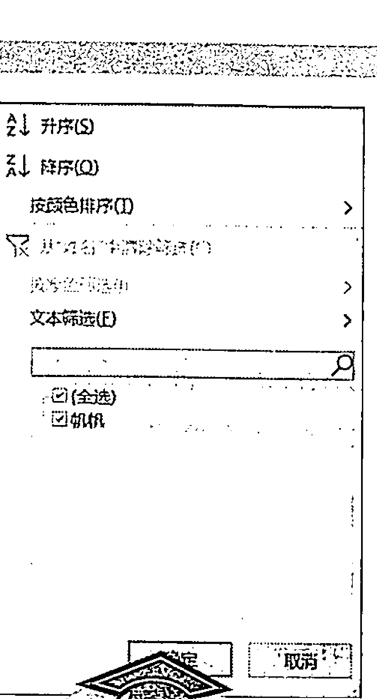


#### 删除Word文档后面的空白页

Q: 在打开一个Word文档后经常发现一个奇怪的现象，就是文档后面有一个空白页，通过什么方法也无法将其删除。遇到这样的问题应该怎样进行有效的解决？

A: 出现这样的问题主要是文档中包含了一些隐藏的符号，所以只需要将这些符号信息删除即可。首先点击Word软件“开始”标签中的“显示/隐藏编辑标记”按钮，这时在文档的最下方就可以看到“……分页符……”，将这些分页符进行删除，空白页也就随之消失了。

#### 自动填满上一栏的内容

Q: 在利用Excel给班级的同学录入成绩等信息的时候，会出现大量相同的内容信息，比如某某年级某某班等等。如何在第一栏输入相关的信息后，让后面的内容自动填充前面的内容？

A: 在Excel中通过鼠标选中要自动填满内容的区域，按快捷键Ctrl+G，在弹出的对话框中点击“定位条件”按钮，选择“空值”选项。将光标定位到编辑栏上，输入上一栏单元格的地址，按下Ctrl+Enter，就可以自动填满上一栏的内容。

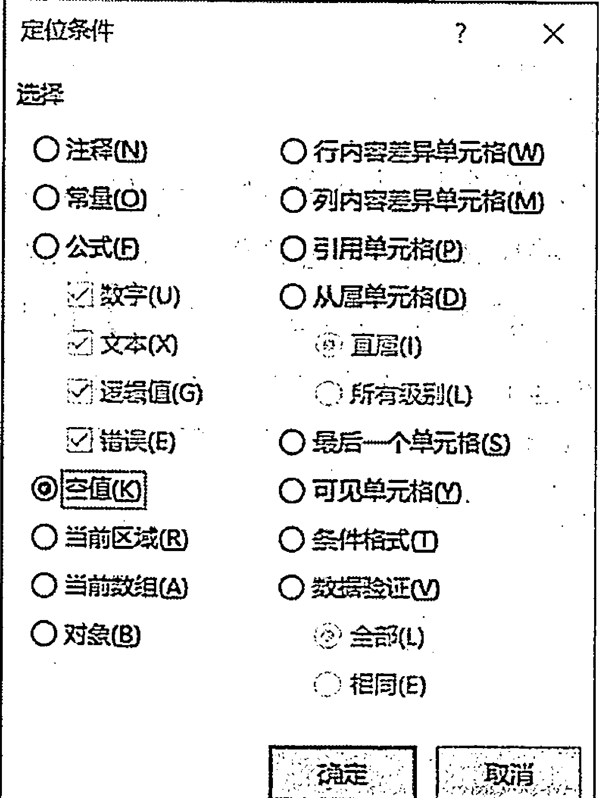

#### 给磁盘目录制作一个详细清单

文|老万

Q: 不久之前为自己的电脑增加了第2个硬盘，这样管理的文件就会越来越多，因此想对一些特定目录中的文件制作一个清单，但是由于这个目录的文件繁杂，制作起来非常困难。请问有什么简单的解决方案吗？

A: 下载运行DirPrintOK这款小工具（http://www.softwareok.com），在窗口的左侧列表中选择要制作文件清单的文件夹目录，然后点击“文件”菜单下的“导出”命令，就可以很方便地完成制作。

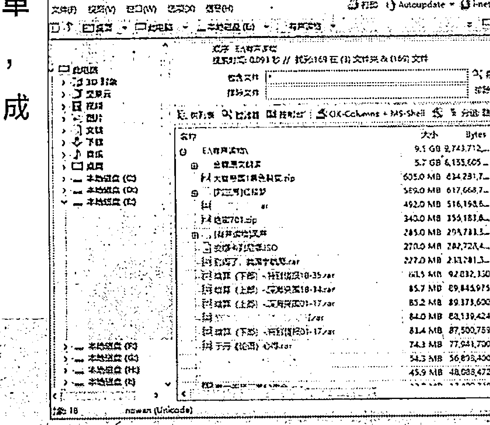

该工具在安装的时候会在右键菜单添加一个命令，这样通过右键菜单也能很方便地制作文件清单。

#### 火狐浏览器保留网站的登录状态

Q: 平时都是使用火狐浏览器进行网站的浏览操作，最近发现在关闭浏览器后，网站的登录状态也就随之消失了，如果想要浏览某一个网站，还需要重新进行登录。如何在关闭浏览器以后仍然保留网站的登录状态？

A: 出现这样的问题应该是浏览器在关闭时，自动清除了一些登录的内容信息。所以首先打开火狐浏览器的选项窗口，选择左侧的“隐私与安全”选项，找到“历史记录”后的“设定”按钮，在弹出的对话框中将“登录状态”前面的对钩去除即可。

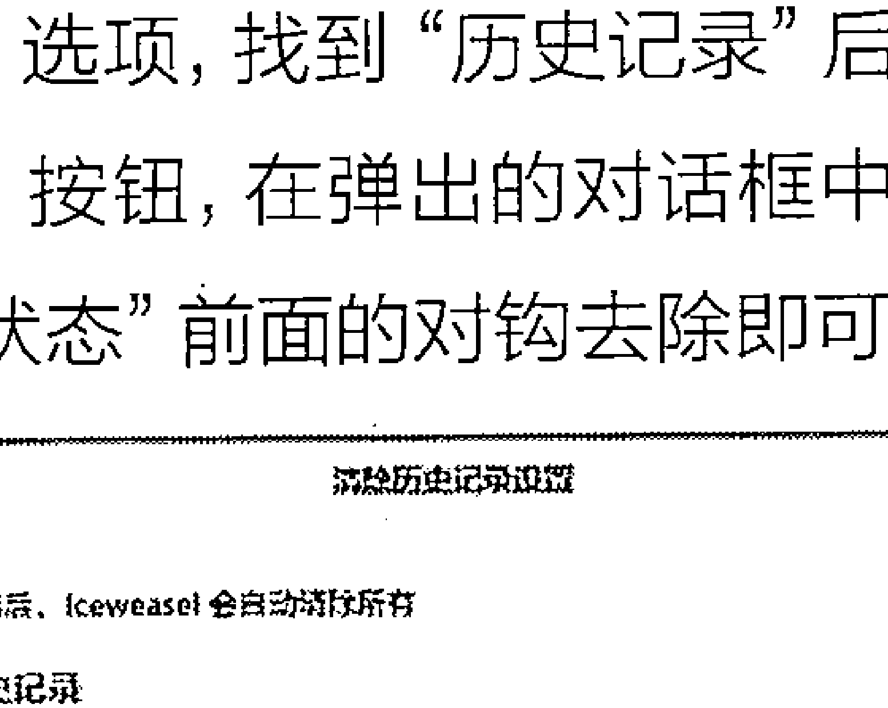

#### 新版Edge浏览器强制开启深色模式

Q: 现在的操作系统有一个深色模式，当系统开启该模式后有些软件就会自动切换到该软件的深色模式。新版Edge浏览器能不能在系统不开启该模式的状态下，强制开启深色模式？

A: 将谷歌浏览器升级到78及以后的版本，在地址栏输入“edge://flags”并按下回车键，在网页的搜索框中输入关键词“dark mode”，查找到这个选项后点击列表中的“Enable”选项，就可以强制让谷歌浏览器开启深色模式。

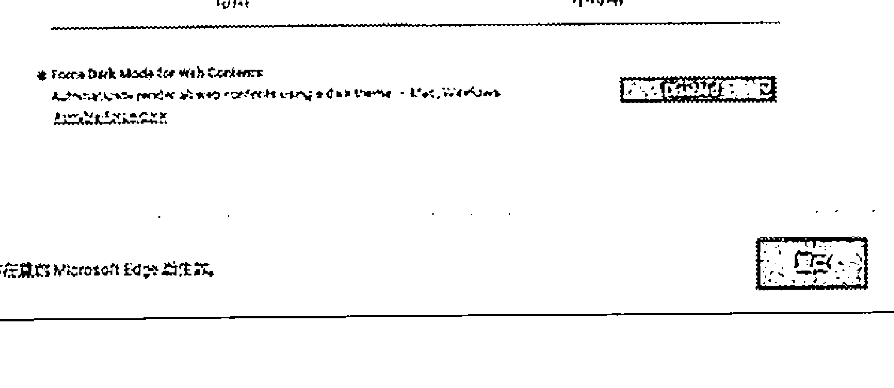

#### MPC如何设置到窗口最前方

Q: 在使用MPC播放器播放电影时，有时会顺带处理一些其他的工作，这样就会将播放器的窗口给覆盖掉。通过什么方法可以让播放器的窗口始终保持在最前方？

A: MPC包括MPC-HC和MPC-BE两个版本。比如点击MPC-HC窗口“查看”菜单中的“前端显示”命令，在弹出的子菜单中选择“当播放时”命令，就可以将播放器置于最前方。而MPC-BE的操作方法也大致如此。

#### 批量完成网页文件的转换操作

Q: 最近从网上下载了一套电子书，发现其中所有的文件都是网页文件，而我想把这些文件转换成纯文本文件，这样就可以很方便地在手机上进行阅读。请问通过什么方法可以批量完成这些文件的转换操作？

A: 下载运行“Html to Text”这款小工具（http://wizbrother.com），点击“add files”或者“add folder”按钮，选择要进行转换的网页文件，然后点击工具栏中的“start converting”按钮，就可以开始批量进行转换操作。

#### 为Windows 10安装DCI-P3配置文件

文|老万

Q: 苹果公司从iPhone 7版本开始，照片的色域就采用DCI-P3标准，但是将拍摄的照片发送到Windows 10系统中，照片的颜色看上去还是要淡很多。到底是显示器的问题还是自己的系统没有设置好的问题？

A: 主要是Windows 10系统不支持DCI-P3标准。首先下载一个配置文件（http://pan.baidu.com/s/1qYbAmV6），并利用右键命令进行安装，然后利用“Windows照片查看器”进行浏览，就可以看到DCI-P3标准显示的照片。

在控制面板的“颜色管理”功能中，可以看到配置信息是否安装成功。

#### 在资源管理器标题栏显示进程ID

Q: 有时在进行电脑操作时会出现资源管理器假死的情况，这时就需要对它进行重启，但是打开任务管理器后发现里面有两个不同的资源管理器进程，就不知道该对哪一个进行操作了。能不能在资源管理器的标题栏中显示出当前进程的相关信息？

A: 在“运行”框输入“regedit”打开注册表编辑器，展开到HKEY_LOCAL_MACHINE\SOFTWARE\Microsoft\Windows\CurrentVersion\Explorer，在右侧窗口中找到一个名为ShowPidInTitle的DWORD（32位）值，将“数值数据”设置为1。

#### 关闭“USB端口上的电涌”提示

Q: 最近我的Windows 10系统在接入移动设备时，系统桌面的右下角老是弹出一个“USB端口上的电涌”的提示框。这个提示框非常烦人，通过什么方法可以将它关闭？

A: 打开Windows 10系统的设置窗口，点击其中的“设备”按钮，选择左侧列表中的“USB”命令，然后将右侧窗口的“如果在连接到USB设备时出现问题，请通知我”选项进行关闭即可。

#### 延长Windows 10锁屏界面的显示时间

Q: Windows 10系统开机以后，首先会看到一个锁屏壁纸，如果在这个阶段用户没有进行任何的操作，一分钟以后就会出现屏幕黑屏的状况。如何延长锁屏界面的显示时间？

A: 首先展开注册表编辑器到HKEY_LOCAL_MACHINE\SYSTEM\CurrentControlSet\Control\Power\PowerSettings\7516b95f-f776-4464-8c53-06167f40cc99\8EC4B3A5-6868-48c2-BE75-4F3044BE88A7，在右侧窗口找到“Attributes”这个选项，双击这个选项后，在对话框中选择“十进制”选项，然后输入自己需要的时间即可。

#### 让两个版本的Edge浏览器同时存在

Q: Windows 10系统自带了一款名为Edge的浏览器，后来微软又开发了另外一个版本的Edge浏览器，并且在最近通过系统升级的方式进行了发布，而新版浏览器安装后会对旧版进行替换。如何才能在系统中同时保存两个版本？

A: 打开注册表编辑器，展开到HKEY_LOCAL_MACHINE\SOFTWARE\Policies\Microsoft\EdgeUpdate，在右侧窗口中新建一个名为Allowsxs的DWORD（32位）值，将“数值数据”设置为1即可。

#### 利用工作组批量完成表格修改

Q: 处理的表格经常有多个不同的标签，修改完一个标签中的内容后，又需要在其他的标签页中重复刚才的操作，让人感到很麻烦。有没有更加简单快捷的处理方法?

A: 按住键盘中的Ctrl或Shift键，在Excel中点击需要同步处理的标签，在软件的标签栏就可以看到一个“组”的提示。这样在任意一个标签页中进行的操作，就会自动同步到其他的标签页中。

#### 快速统一表格中的日期格式

Q: 单位给每位同事发了一个表格文件，要求大家设置自己的入职日期等相关信息，但是收集上来的表格中显示的日期格式五花八门。通过什么方式可以快速地统一日期格式?

A: 在Excel中选中日期所在的列，点击“数据”标签中的“分列”按钮，在弹出的对话框中连续点击两次“下一步”，在“列数据格式”中选择“日期”，这样就可以快速地统一日期格式。

#### 方便提取PPT中的所有图片

文|老万

Q: 一个同事遇到了一个问题，就是在制作完一个PPT文档后，其中的图片素材没有保留，而现在要重新修改，需要把PPT中的图片素材提取出来。通过什么方法可以快速方便地完成这个操作?

A: 在PowerPoint中点击“文件”菜单中的“另存为”命令，在出现的右侧窗口中选择“浏览”按钮，会弹出一个保存对话框，在“保存类型”列表中选择“JPEG”。这时软件会询问保存“全部幻灯片”还是“当前幻灯片”，点击“全部幻灯片”即可。

如果PPT文档的后缀名是pptx，可以将后缀名修改为zip，这样解压后也可以得到图片的素材。

#### 修改Word中默认的字体

Q: 在Word中编辑完一篇文档后，都需要对软件默认的字体进行修改，久而久之觉得这样的修改非常繁琐。通过什么方法可以对软件默认的字体进行修改，将自己常用的字体设为默认字体?

A: Word中好像没有相关的功能，不过可以给常见的字体设置一个快捷键。首先打开软件的“选项”窗口，点击左侧对话框中的“自定义功能区”选项，然后点击“自定义”按钮，在弹出的对话框中选择“类别”中的“字体”，给常见的字体分别设置上快捷键。

#### 利用WPS解决字体缺失问题

Q: 在电脑中打开PPT文档的时候，最常遇到的一个问题就是字体缺失，虽然PowerPoint也有相关的字体批量替换功能，但是手工操作还是比较麻烦的。有没有更加方便的解决方案?

A: 可以通过最新版本的WPS Office软件打开这个PPT文档，这时软件就会提示缺少此文件中使用到的字体。只需要点击提示栏后面的“替换字体”按钮，在弹出的对话框中就可以很方便地一键完成字体的替换操作。

#### 屏蔽系统默认的浏览器

文/老万

Q: 为了限制小孩上网的时间，我专门在Windows 10系统中设置了一个权限较低的账户，但是后来发现系统自带的Edge浏览器并不会受到相应的权限管制，小孩可任意地上网浏览。如何才能将这个浏览器进行屏蔽？

A: 下载运行“Edge Blocker”这款小工具（www.sordum.org），在弹出的窗口中点击“Block”按钮，就可以对系统默认的Edge浏览器进行屏蔽，而将传统的IE浏览器作为系统默认的浏览器，这样利用权限较低的账户也能对它进行限制操作。

也可以下载安装最新版本的Edge浏览器，它在安装时就会自动对系统默认的Edge浏览器进行替换。

#### 纯粹的系统垃圾清理软件

Q: 很多安全软件都有系统垃圾的清理功能，由于这些安全软件的功能非常多，以至于系统运行很缓慢。有没有比较纯粹的系统垃圾软件可以选择？

A: 360刚刚推出了一款名为“360清理大师”的工具，该工具包括“电脑清理”、“电脑加速”以及“软件卸载”这三个常用功能，利用其中的“电脑清理”功能，就可以满足系统垃圾清理的需求。

#### 关闭屏幕最简单实用的方法

Q: 平时工作使用的是笔记本电脑，有时在离开工作岗位的时候，想把电脑屏幕关闭但不关闭系统。除了在电源管理中设置以外，有没有其他更加快捷的方法？

A: 从网上下载ScreenOff这款小工具（https://www.thewindowsclub.com），以后要想快速关闭屏幕时，只需要双击该工具的图标就能马上实现。

#### 有没有好的EPUB阅读器推荐

Q: Windows 10系统自带的Edge浏览器默认支持EPUB格式的电子书，我一直通过它来进行这类电子书的阅读，但是现在微软发布了新版本的Edge浏览器，这个功能被取消了。有没有其他好的阅读器推荐一下？

A: 可以试一试“Sumatra Pdf”这款免费开源的阅读器（https://www.sumtrapdfreader.org）。下载运行该软件后，点击操作界面中的“打开一个文件”链接，在弹出的对话框中选择要阅读的电子书文件，就可以进行阅读操作了。

#### Textify在谷歌浏览器中无法使用

Q: Textify是一款可以复制软件菜单、按钮文字的小工具，但是最近在谷歌浏览器中使用的时候却发现无法完成相应的复制操作。到底是该工具的问题，还是自己的操作有问题？

A: Textify在谷歌浏览器中运行，需要对浏览器进行一些设置。首先在地址栏输入“chrome://accessibility/”并按下回车键，在弹出的页面中找到“Global accessibility mode”区域，将其其中的几个选项进行选中即可解决问题。

#### 使用临时的手机号接收短信

Q: 以前在创建一个网络服务账号时，需要输入自己的邮箱进行注册，为了避免隐私泄露，经常通过临时邮箱进行操作。而现在需要输入手机号码进行注册，有没有类似于临时邮箱这样的服务？

A: “隐私短信”就是这样的一个服务（https://www.yinsiduanxin.com/）。打开这个网站后，在网页的右上角选择需要手机号码的区域，就会在网页中显示出大量的手机号，通过它们就可以完成相关服务账号的注册。不过这个临时服务提供的号码在用户使用以后，其他用户也可能使用到，所以不建议用户在涉及个人隐私或者金融服务的时候使用。

#### 谷歌浏览器应用商店的备份选择

Q: 谷歌浏览器的最大特色就是拥有众多的功能扩展，可以满足不同用户的功能扩展需求，但是谷歌浏览器的应用商店访问起来很困难。有没有其他备份的应用商店可以选择？

A: “扩展迷”就是一个很不错的选择（https://www.extfans.com/）。打开这个网站后，利用分类或者搜索功能就能找到自己需要的功能扩展，点击功能扩展页面中的“下载”按钮，就可以将扩展文件下载到本地硬盘。

> **傻博士有话说**
>
> 将浏览器的“开发者模式”打开，将扩展文件拖拽到扩展程序页面，就可以完成功能扩展的安装操作。

#### 制作自己头像的动态图片

Q: 平时我们使用的一些表情包，都是一些明星头像的动态图片。有没有什么服务可以制作出和自己头像相关的动态图片？

A: 通过浏览器打开“MakeEmoji”这项服务（https://makeemoji.com/），按照网页中的提示上传自己的头像图片，然后在下方就有多个不同的动画效果，选择完成后就可以自动进行合成，并下载自己头像的动画图片。

#### 在网页中复制需要的特殊符号

Q: 虽然现在主流的输入法都可以输入特殊符号，但是由于不同的输入法输入的方式不一样，给用户带来了不少的操作困难。有没有更加简便快捷的输入方式？

A: 通过浏览器打开“Glyphy.”这项服务（https://www.glyphy.io/），在网页的列表中就可以看到大量的特殊符号，从中找到自己需要的特殊符号并进行复制，然后将其粘贴到需要输入的地方即可。

#### 快速了解网站开发的相关知识

Q: 我是一个刚刚进入大学不久的学生，我所学的专业和网站开发有关系。在哪里可以快速了解到相关知识，并且可以有效地将学习的知识和实践相联系？

A: “Free for developers”就是一个针对网站开发人员提供的服务平台（https://free-for.dev/），打开它以后，在左侧列表可以看到包括“APIs, Data and ML”、“BaaS”等在内的多个选项，点击每一个选项后就可以看到多个不同的解决方案和相关产品。

#### 解决微软输入法的兼容性问题

文|老万

Q: 平时会让Windows 10系统自动升级到最新的测试版，但是在安装完成后往往会发现很多的小问题，其中最让我苦恼的就是微软的输入法和一些软件程序不兼容。除了使用第三方的输入法以外，通过什么方法可以对这样的问题进行解决？

A: 打开Windows 10系统的设置窗口，点击“时间和语言”选项，在弹出的窗口中点击左侧的“语言”选项，在右侧窗口中点击“中文简体”的“选项”，选择“微软拼音”中的“常规”选项，将“兼容性”选项进行激活即可。

#### 自动对系统内存进行优化设置

Q: 虽然现在很多优化软件都包括了很多优化功能，但是这些软件自身会占用很多的系统资源，所以本人不太喜欢这种类型的软件。有没有什么小工具可以自动对系统内存进行优化设置？

A: 下载运行“Reduce Memory”这款小工具，点击工具窗口中的“Options”按钮，在弹出的对话框中勾选“Optimize memory every x seconds”并设置一个时间，这样它就会按照设定的时间自动对内存进行优化设置。

#### 在锁屏状态下显示邮件通知

Q: 工作的时候最害怕的就是漏掉客户发送的电子邮件信息，而有的时候电脑在不用时会进入到锁屏的状态。如何在锁屏状态下也能看见新到电子邮件的通知？

A: 打开Windows 10系统的设置窗口，点击窗口中的“系统”按钮，在弹出的窗口中选择左侧的“通知和操作”命令，将“获取来自应用和其他发送者的通知”、“在锁屏界面上显示通知”、“在锁屏界面上显示提醒和VoIP来电”选项激活就可以了。

#### 在Windows 10系统中进行账户切换

Q: 现在使用的是最新版的Windows 10系统，我发现该系统没有账户切换的功能，虽然网上提供了很多方法，但是总的来说比较繁琐。有没有比较简单快捷的方法推荐呢？

A: 下载运行“Shut Down Windows”这款小工具，在弹出界面的列表中选择“Switch user”选项，然后点击OK按钮就可以进行账户切换的操作。

#### 一键卸载Windows 10自带的UWP应用

Q: Windows 10系统最大的特色之一就是自带有很UWP应用，这些应用有的对用户非常有用，但不是每一个应用都有用，所以想把没用的进行卸载，而要想对自带的应用进行卸载却非常困难。有没有什么一键卸载的方法呢？

A: 下载运行“Win10Apps”这款小工具，在弹出的操作界面中就可以看到天气、照片、地图等自带应用的名称。在要卸载的应用上点击鼠标右键，选择其中的“卸载”按钮，就可以很方便地对其进行卸载操作。

#### 老年人看微信文字信息更容易

Q：现在很多老年人都安装有微信，但是由于视力等原因看微信文字信息非常吃力，虽然通过双击的方式可以将文字信息进行放大，但是对于他们来说操作还是不方便。请问有没有什么可以解决的方法？
A：下载安装“简图”这款应用，在弹出的界面中输入要发送的文字信息，选择相应的文字配色，点击确认按钮，该应用就会将编写的文字转换成图片并发送给对方，这样老年人看起来就要方便一些。

#### 支付宝也自带记账本功能

Q：不久之前看到微信钱包推出了一个记账本的功能，可我平时主要还是使用支付宝进行操作。请问支付宝客户端有没有相关的功能可以使用？
A：在支付宝客户端的搜索框中输入“记账本”这个关键词进行搜索，就可以找到其自带的相关功能。该功能会自动导入所有经过支付宝操作的交易记录，除此以外也允许用户点击“记一笔”按钮来手工记录相关的支付操作。

#### 实时了解高铁列车的当前位置

Q：短暂的春节假期已经结束，即将返回工作所在的城市，这个时候正是春运的高峰期，所以等待高铁列车也容易让人非常着急。如何了解某个高铁列车当前的位置？
A：下载安装“高铁通”这款应用，打开应用以后点击下面的“雷达”按钮，这时在地图上就可以看到很多的箭头，每一个箭头就代表某一个高铁列车当前的位置。点击某一个箭头后，不但可以看到该列车的车次，还可以查看到它的发车时间和到站时间。

#### 在支付宝中预测养老金数目
文|老万

Q：之前看到一个新闻说，在人社部的网站中可以对自己的养老金数目进行预测，但是这里登录这个网站非常缓慢。请问在手机里有没有什么方法可实现相应的功能？
A：点击支付宝中的“卡包”按钮，在弹出的列表中选择“电子社保卡”，在弹出的列表中再次选择“电子社保卡”，然后在弹出的界面中点击“国家社会保险公共服务”旁边的“更多”按钮，在弹出的菜单中就可以看到“养老金测算”，点击它以后就可以进行预测操作。

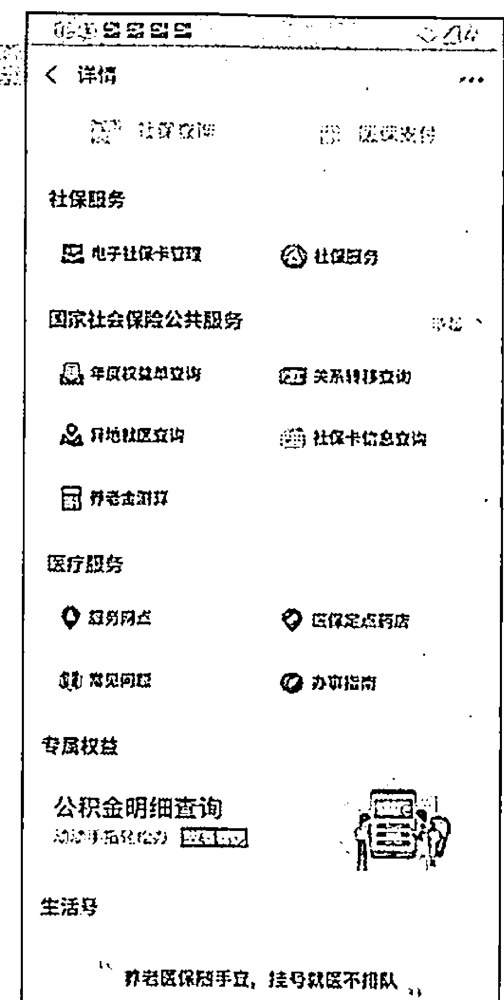

> 要使用该服务，首先需要在支付宝中申请电子社保卡。如果是在微信中申请的电子社保卡，在其中也可以找到相应的功能。


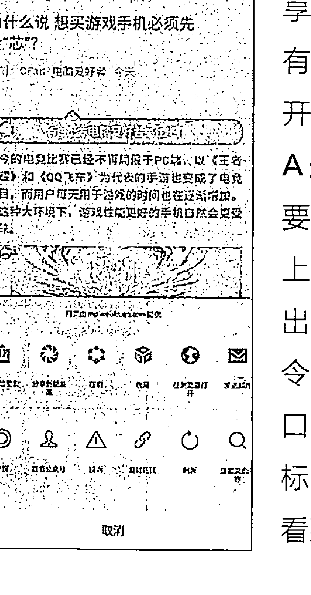

#### 在电脑中快速打开微信浏览页面

Q：以前在电脑中打开微信浏览的页面，主要是通过“文件传输助手”功能来实现的，但是有时在分享链接时会遇到一些问题。有没有更加快捷方便的打开方式？
A：在手机微信客户端打开要同步浏览的网页，点击右上角的“更多”按钮，在弹出的菜单中选择“浮窗”命令。在微信电脑客户端的窗口中，点击左下角的手机图标，在弹出的菜单中就可以看到同步的网页链接。

#### Word表格中快速进行求和
文|老万

Q：在Excel中完成一个单元格的求和操作后，只需要向下进行拖动就可以完成其他单元格的相同操作，但是在Word的表格中进行求和操作时，就无法完成类似的拖动操作。有没有其他方便快捷的解决方法？
A：在Word表格中定位到求和的单元格，点击“布局”标签中的“公式”按钮，在弹出的对话框中点击“确定”，就可以完成对应的求和操作。定位到第二个单元格，按下F4键，就能快速重复刚刚的操作。

其实Word中F4键的作用，就是完成刚刚进行的操作，而不仅仅限于求和操作。


#### 错误的单元格不打印

Q：在Excel中制作表格，有时会出现所谓的“出错单元格”，其实这些错误单元格并不是因为计算错误而存在的，很多是由于其他原因造成的，因此在打印时就会将这些单元格进行特别的标注。能不能在打印时不将错误单元格的内容进行打印？
A：点击“文件”标签中的“打印”选项，选择右侧窗口的“页面设置”命令，在弹出的对话框中选择“工作表”标签，在“错误单元格打印为”列表中选择“空白”选项即可。

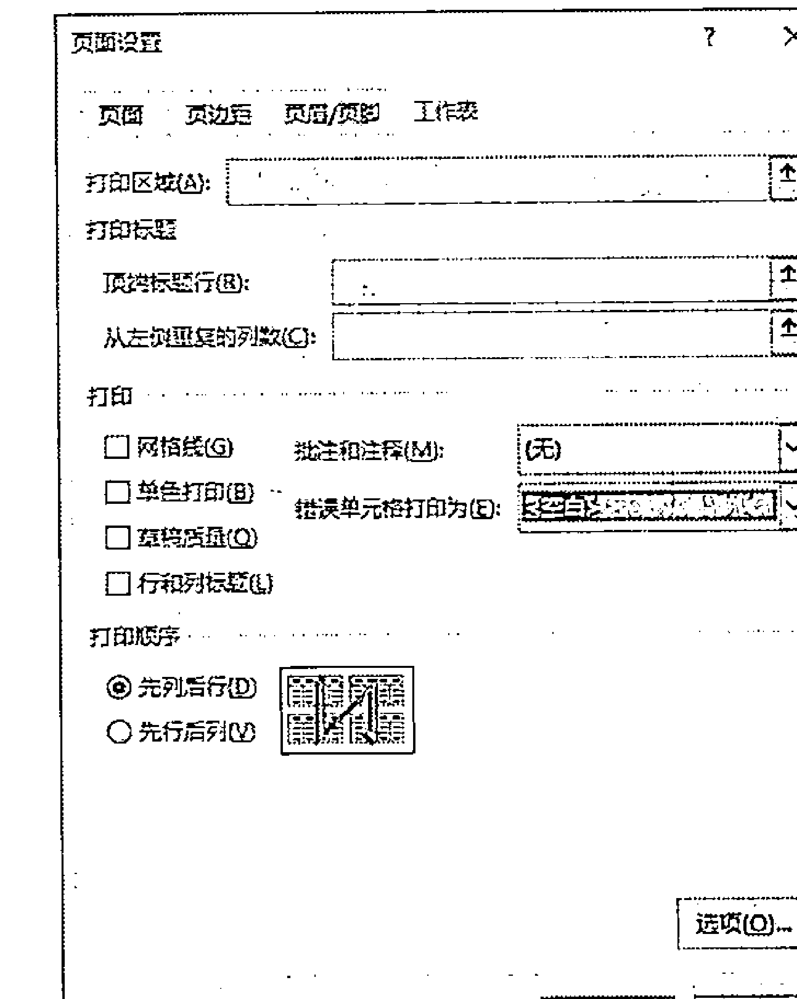

#### 快速统计员工的加班次数

Q：春节期间公司安排不同的员工进行加班，按照国家的规定会对加班的人员给予相应的加班费。在制作好的加班人员表格中，如何快速地统计出不同人员的加班次数？
A：在Excel中点击上面的“插入函数”按钮，在弹出的对话框中搜索“COUNTIF”，找到这个函数以后，在弹出的对话框中，在第一个输入框中设置加班人员的列表，在第二个输入框中设置加班人员的名称，这样就可以统计出不同人员的加班次数。

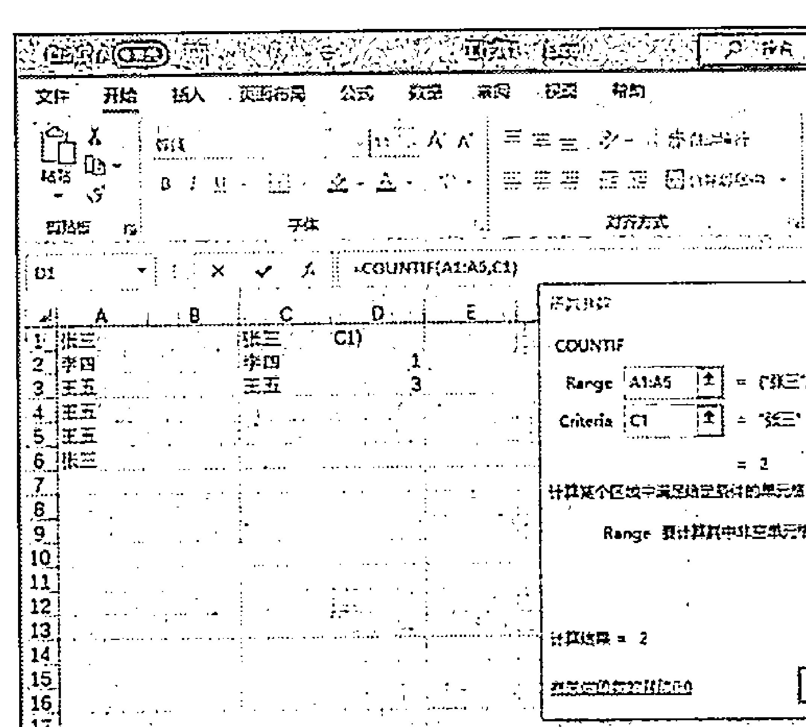

#### 在Excel中找出迟到的员工

Q：不知道是因为刚刚过了长假还是什么原因，很多员工在上班时都会出现迟到的现象，所以公司对上班时间制作了一个表格。如何在表格中快速找到迟到的员工？
A：在Excel中点击“开始”标签中的“条件格式”按钮，在弹出的菜单中选择“新建规则”命令，在弹出的对话框中选择“只为包含以下内容的单元格设置格式”，在下面的列表中选择“介于”并设置规定的上下班时间，点击“确定”按钮后，迟到早退的员工就会被重点标识出来。

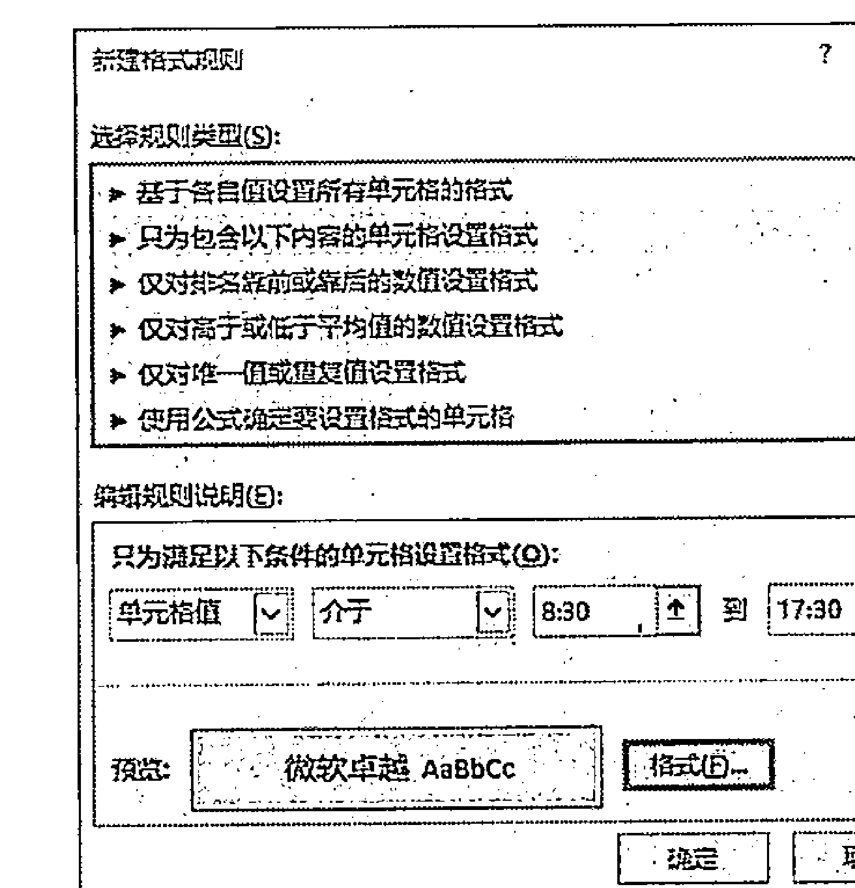

#### 中英文上下行对齐设置

Q：为了更好地对公司的产品进行宣传，我们的宣传资料都是由中英文双语构成的，由于中英文表达的方式不一样，就会出现文字内容长度的差异。如何将中英文的上下文进行对齐设置？
A：首先对中文内容进行设置，点击“插入”标签中的“文本框”按钮，在弹出的菜单中选择“绘制横排文本框”命令，然后在文本框中输入相应的英文信息，最后将文本框的两侧拉到和中文内容对齐即可。

#### 不限速的网络硬盘服务

Q：可能是由于运行成本等很多原因，包括百度网盘、腾讯微云在内的网盘服务都纷纷推出了付费的VIP服务。现在还有没有免费的、不限制速度的网盘服务可以选择呢？
A：其实国内的三大运营商都发布有相关的网盘服务。比如使用的是中国电信的手机号，就下载安装“天翼云盘”这款网盘，安装后利用自己的手机账号进行登录，就可以进行文档、视频、图片、通讯录等相关文件的备份操作。
- 如果是中国联通的用户就选择“沃家云盘”。
- 如果是中国移动的用户就选择“和彩云”。

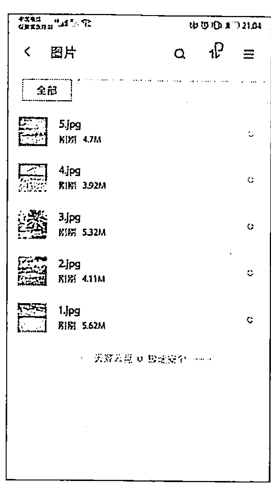


#### 利用讯飞输入法发送密语信息

Q：在和朋友聊天的时候经常会说一些悄悄话，这样就害怕被别人查看到，而现在的输入法发送的都是明文信息。通过什么方法可以对自己发送的信息进行加密？
A：安装最新版本的讯飞输入法，点击菜单界面中的“BiuBiu神器”，在弹出的界面中找到“密语模式”并激活它，这样就会在键盘上多出一个输入框，在其中输入要发送的悄悄话，点击发送后就可以进行加密处理。

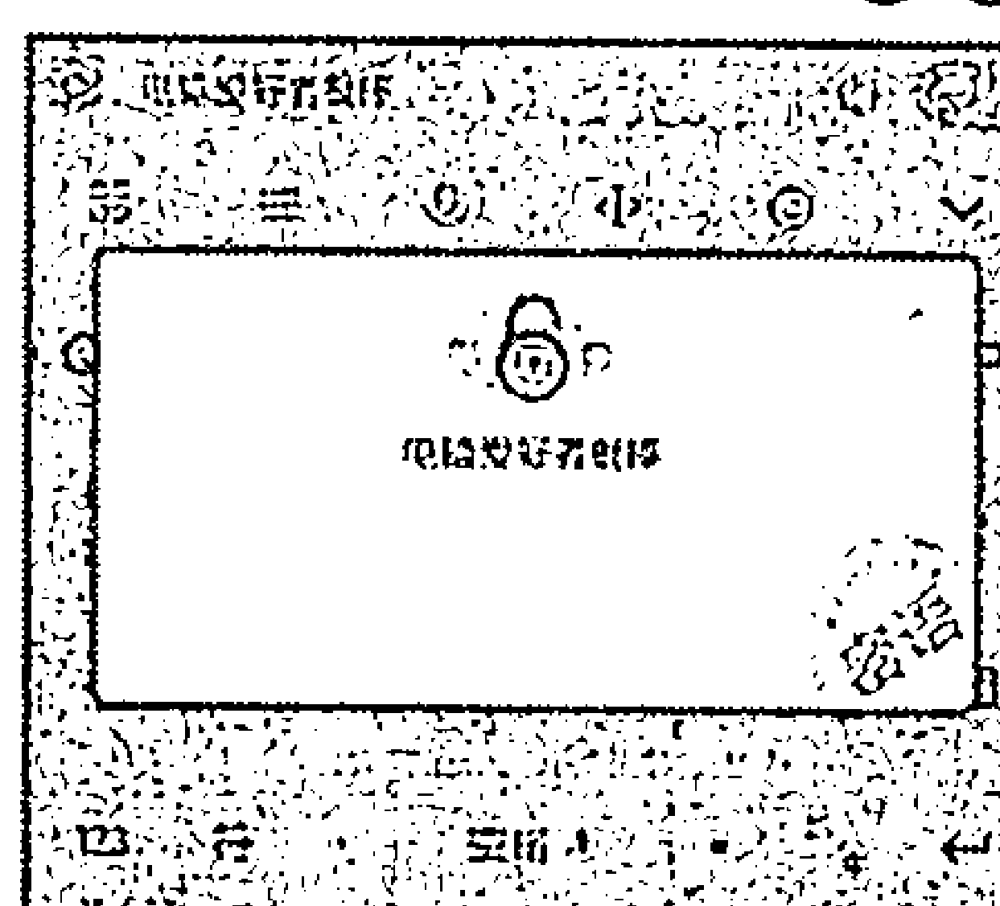

#### 没有广告的手机电视直播应用

Q：以前想在手机上观看电视直播，最常见的方法就是安装一款名为“央视影音”的手机应用，但是这款应用和其他应用一样，充斥着各种各样的广告信息。有没有无广告的手机直播应用呢？
A：最近中央电视台发布了一款名为“央视频”的手机应用，该视频中既可以观看中央电视台以及地方台的电视直播内容，也可以浏览各种各样的短视频，而且最大的特色就是没有任何的广告。但是以后有没有广告内容，傻博士就不敢保证了。


#### 能够进行财经信息提示的日历

Q：常见的日历除了查看日期以外，最多就是可以看看一些节假日的提示。有没有什么日历可以查看一些重要的财经信息提示，比如今天将发布某某重要的财经数据，或者某个上市公司将发布财务报表等信息？
A：安装一款名为“见闻历”的微信小程序，以后只需要打开这款微信小程序并切换到“看日程”标签，就可以看到今天将发布的财经信息提示。而且对于重要的信息，还可以通过微信等方式分享出去。

#### 在小米手机中朗读网页内容

Q：我使用的是小米的手机，平时都是在手机浏览器或者微信中阅读信息的，但是最近眼睛比较干涩，就想通过什么方式对选中的内容进行朗读。请问有什么方法可以实现相关的操作？
A：在“设置”列表中点击“更多设置”，将“无障碍”中的“随选朗读”进行激活。以后要对某些内容进行朗读时，只需要先对要朗读的内容进行选取，然后点击“播放”按钮，就可以进行朗读操作。

#### 暂离电脑避免他人操作
文|老万

Q：经常有人会趁你不在的时候对你的电脑进行操作，虽然他们并无恶意，但是个人比较反感这样的行为。除了对电脑进行锁屏等操作外，还有其他的解决方法吗？
A：通过网页浏览器访问fakeupdate网站（https://fakeupdate.net/），在弹出的页面下方切换为简体中文，就会看到不同版本Windows操作系统的更新界面，选择一个后就可以将电脑伪装成系统升级的样子，从而杜绝他人的操作。

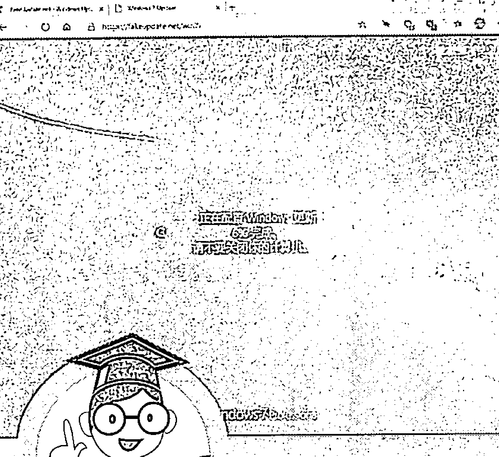

建议将浏览器设置成全屏的状态，这样效果就会更加逼真。


#### 在线完成印章图案的设计

Q：俗话说“私凭文书官凭印”，印章对于中国人来说是非常重要的，虽然现在用的地方很少，但是有时也会用到。如何可以很方便地设计出一个自己喜欢的印章图案？
A：通过浏览器打开“Free Online Chinese Seal Generator”这项服务（https://dwz.cn/j5BIMQ5S），在输入框中输入自己的名字后，在下面选择一个喜欢的样式，就可以在网页右侧看到设计出的图案效果。

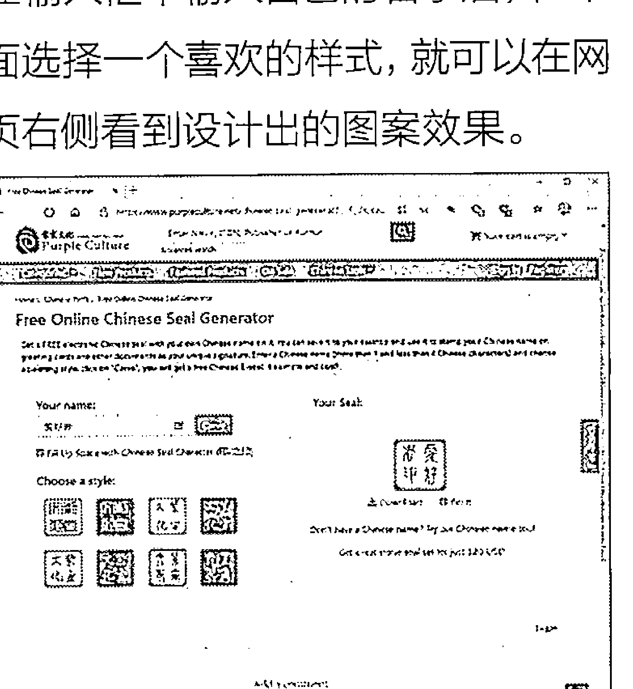

#### 在线完成外文信息的识别

Q：虽然现在网上有很多OCR软件可以使用，但是这些软件主要是针对中文和英文信息的，而我今天遇到的内容主要是俄文。如何可以有效地对其进行识别？
A：通过浏览器打开“EasyScreen OCR”这项服务（http://online.easyscreenocr.com/），在弹出的网页中点击虚线中的范围，就可以选择需要进行文字识别的图片。在“Choose the Language”列表中选择“Russian”，然后点击“Upload and Convert”按钮就可以上传图片进行识别。

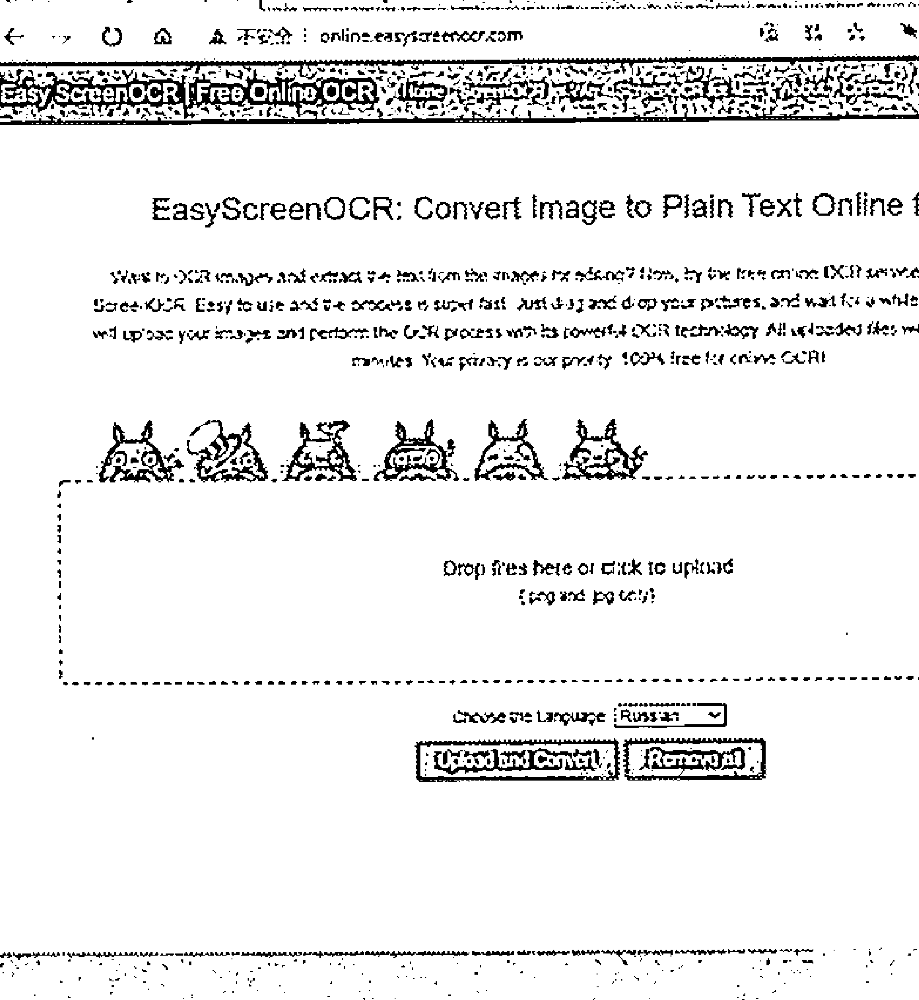

#### 一键创建网页链接的短地址

Q：经常会给大家分享一些有意思的网页链接，但是有些网页链接很长，所以就会用到短地址的相关服务。通过什么方法可以一键完成短地址的创建操作？
A：如果使用的是Chromium内核的浏览器，通过浏览器的应用商店安装一款名为“urlShorter”的功能扩展。以后想创建短地址的时候，点击工具栏中的扩展图标，在弹出的对话框中选择一个短地址服务，就可以马上创建出对应的短地址。

#### 在线了解其他城市的生活费用

Q：春节以后打算到其他的城市去闯一闯，但是对这些城市的收入、房租、物价等又不了解。我想问问通过什么方法可以很方便地在线进行查询？
A：打开“Cost of Living”这项服务（https://costof.live/），在网页的输入框中设置要去闯荡城市的汉语拼音，在网页中就可以显示出该城市的平均薪资、日常花费、租房费用等情况，而且最后还会给出一个简短的评价。

#### OneDrive无法同步文件

Q：OneDrive是Windows 10系统自带的一个网盘，虽然这个网盘的同步速度比较慢，但是之前的运行还是比较稳定的，但是这几天发现出现了无法同步文件的问题。应该怎么解决这个问题？
A：按快捷键“Win+R”打开“运行”框，在“运行”框输入“%localappdata%\Microsoft\OneDrive\onedrive.exe /reset”这行命令并回车，这样网盘程序的托盘图标就会消失。当完成网盘程序的重置操作以后，它会重新启动并开始同步操作。

```
%localappdata%\Microsoft\OneDrive\onedrive.exe /reset
```

#### QuickSearch eXtended 插件怎么用

Q：我现在开始用Total Commander这款文件管理器管理文件，听说它的“QuickSearch eXtended”插件非常好用，所以就进行了安装，但是安装以后发现和之前的状态没有差别。到底是我的操作有误还是什么情况造成的？
A：要使用这个插件，首先需要在Total Commander打开的状态下，按快捷键Ctrl+S，这样就可以在窗口的下方看到一个搜索框，在其中进行关键词的输入后，该插件就可以对当前窗口中的文件进行搜索和过滤。

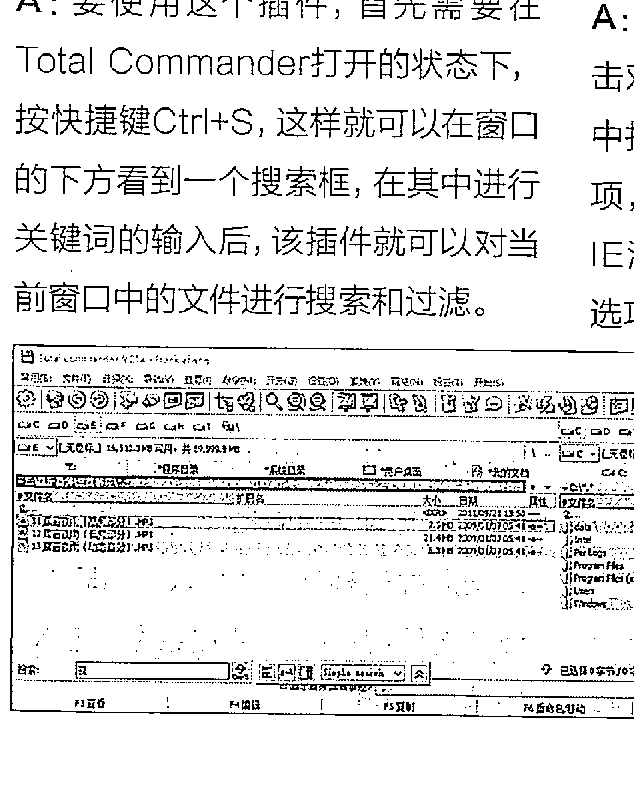

#### 将HTTP链接转到HTTPS链接
文|老万

Q：为了保证网络信息传输的安全，很多网站开始使用HTTPS协议，但是这些网站的旧网页还是使用传统的HTTP协议。如何让HTTP协议的链接强制跳转到HTTPS的链接上？
A：如果使用的是火狐浏览器，首先打开火狐浏览器的应用商店，搜索并安装一款名为HTTPZ的功能扩展。安装完成以后，该扩展在发现用户打开的是HTTP协议的链接时，就会自动帮助网页跳转到HTTPS的协议链接上。

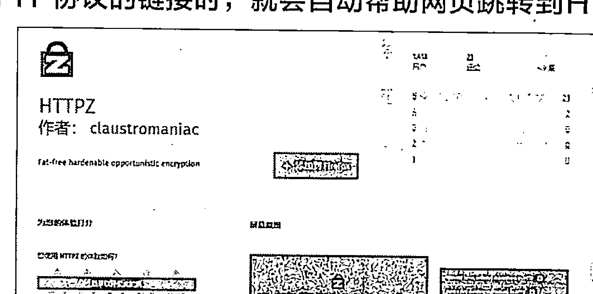


如果使用的是Chromium内核的浏览器，可以考虑安装“HTTPS Everywhere”扩展。

#### IE11浏览器不能新建选项卡

Q：平时主要从事财务工作，因此到现在为止还是主要以IE浏览器为主，但是最近使用IE浏览器时，在点击“新建选项卡”后却出现了无法新建的问题。这种问题应该怎么解决？
A：打开IE浏览器的选项对话框，点击对话框中的“高级”标签，在列表中找到“启用增强保护模式”这个选项，将勾选的对钩去掉并重新启动IE浏览器，就可以正常地进行新建选项卡的操作了。

#### 为指定的图片添加边框效果

Q：手上有一些图片想为它们添加上边框的效果，使之看上去就好像是扫描仪扫出的图片一样。请问通过哪些软件可以快速地完成这样的操作？
A：通过IrfanView打开图片，点击“图像”菜单中的“添加边框”命令，在弹出的对话框列表中选择一个需要的边框效果，然后进行相应的参数设计，点击OK按钮后将图片进行保存即可。

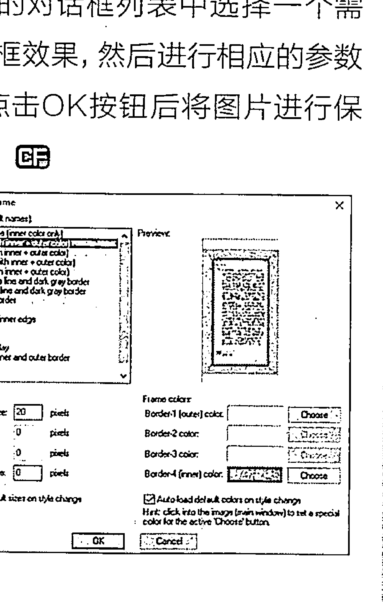

#### 火狐浏览器官方的小号扩展

Q：现在国内很多浏览器都提供了一个小号功能，在同一个网站中可以使用不同的账号。我平时使用的是火狐浏览器，如何才能实现类似的操作？
A：打开火狐浏览器的应用商店，搜索并安装“Firefox Multi-Account Containers”这款功能扩展。点击该扩展后它会自动打开一个新的标签页，在该标签页就能使用其他的账号进行登录。

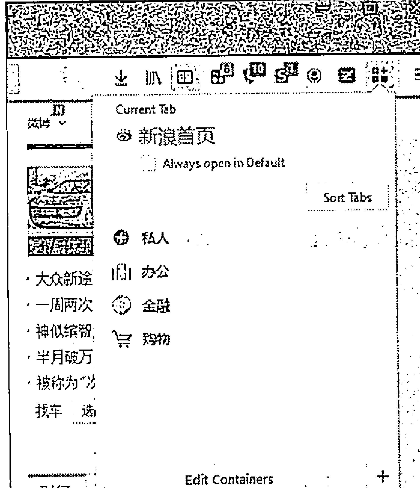

小号打开的标签页会有一个颜色线的提示，这样就可以和其他账号的标签页进行区分。


#### 让谷歌浏览器更加节省系统资源

Q：我平时使用的是谷歌浏览器，这个浏览器最大的问题就是对系统资源的占用非常大。除了通过相应的功能扩展来节省系统资源以外，利用自身的功能可否完成相关的操作？
A：在地址栏输入“chrome://flags”并按下回车键，在搜索框中输入“Tab Freeze”这个关键词，查找到以后点击列表中的“Enabled”选项，浏览器可以在某个标签没有操作五分钟后对其进行自动冻结。

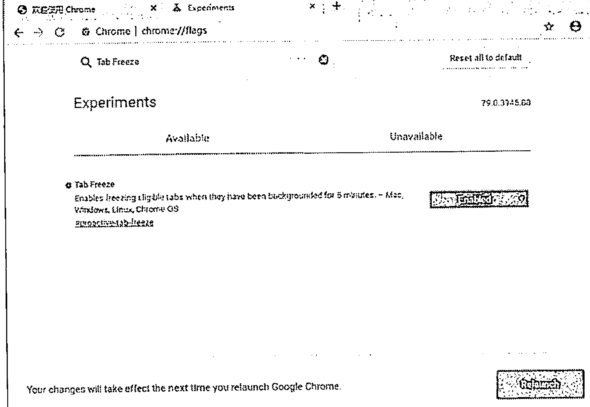

#### 本地的音乐播放器推荐

Q：现在国内很多音乐播放器都是在线播放的，而我自己的硬盘中就有很多的音乐文件，所以还是想找一个本地播放器。能不能推荐一个自带歌词显示且没有广告的音乐播放器呢？
A：可以试一试MusicPlayer2这款由网友开发的音乐播放器 (https://github.com/zhongyang219/MusicPlayer2)，该播放器不仅使用了知名的音频解码器Bass，而且可以自动下载歌词和专辑封面。

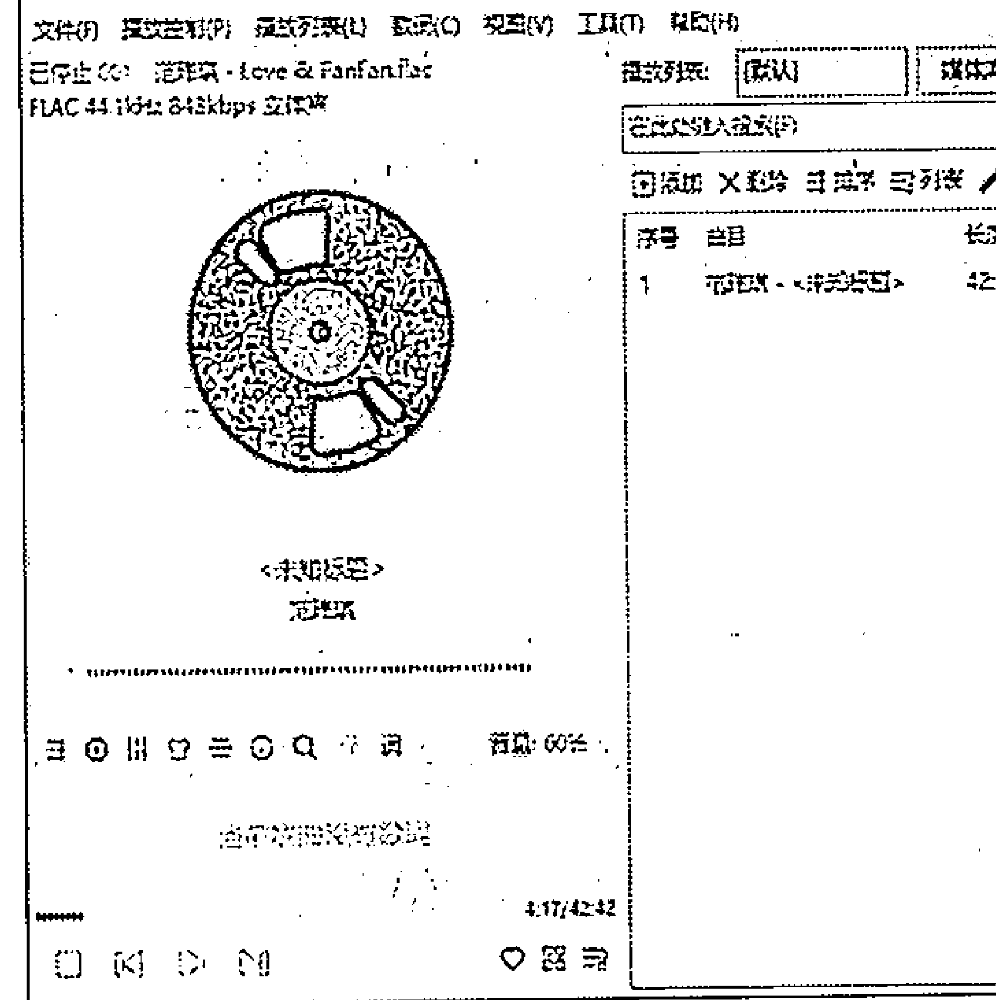

#### 利用鼠标点击完成文字输入

Q：虽然现在的输入法都非常的智能，但是由于父母的年纪比较大，使用传统的拼音输入对他们来说就比较麻烦。除此以外有没有什么更加方便简捷的输入方式？
A：打开搜狗拼音的工具箱，在其中就可以看到一个名为“点点输入”的功能模块。打开它以后选择文字的偏旁部首，就可以看到很多的候选文字，从中选择并进行点击就可以完成文字的输入。

#### 追踪某个网站的路由信息

Q：最近在访问一个国外网站时，经常出现不稳定的状况，所以想对该网站的路由进行分析，判断到底是哪一个环节出现了问题，但是系统自带的命令比较繁琐。有没有更简单直观的追踪方式？
A：下载运行CountryTraceRoute这款小工具，在操作界面的输入框中粘贴上网站的域名或者IP地址，点击后面的按钮，就可以在列表中依次显示出访问该网站要经过的路由信息。

#### 判断网页颜色搭配是否合适

Q：网页除了相关的内容以外，对用户影响最大的就是它的配色以及使用文字的大小，但是对于很多设计者来说，配色却是一个大问题。如何对自己的配色是否合适进行判断？
A：打开“Who Can Use”服务(https://whocanuse.com/)，在弹出的网页分别设置背景以及文字的颜色代码。设置后在线服务就会对其进行判断，如果非常差就会用红色进行提示，如果还可以就会通过不同的A进行提示。

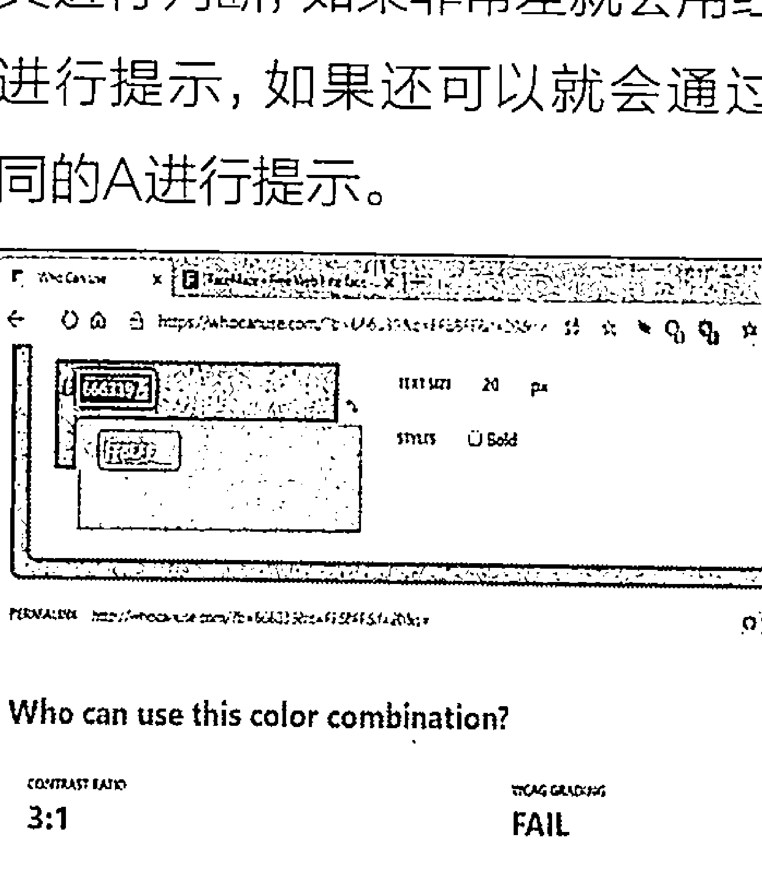

#### 上传图片判断性别和年龄

Q：随着人工智能技术的不断发展，通过它可以完成很多的事情。最近我找到了一些几年前拍的小孩照片，通过这些照片上的人物能否判断出当时的年龄呢？
A：微软的团队推出了一个名为How-Old.net的网站，点击网页中的“Use This Photo”按钮，在弹出的对话框中选择小孩的照片进行上传。上传后就可以对照片中的人物面部进行识别，从而给出一个性别以及年龄的判断结果。


#### 支持五线谱的Markdown服务

Q：平时我都习惯利用Markdown服务进行文字编辑，而最近一个朋友让我编写一个五线谱，这就给了我很大的困难。请问有没有可以编辑五线谱的Markdown服务？
A：Arya就是这样一款免费开源的Markdown编辑器(https://markdown.lovejade.cn)，它支持流程图、甘特图、任务列表以及五线谱的编辑，按照服务中的提示就可以很方便地编辑出需要的五线谱。

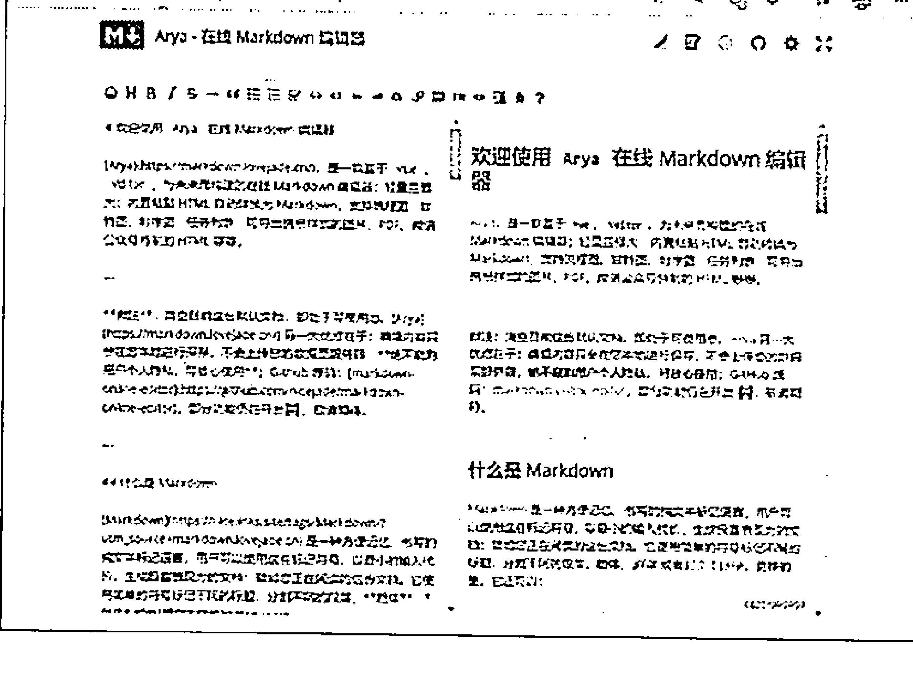

#### 将网页中的图表直接保存

Q：在浏览某些网页的时候经常会看到一些图表信息，但是在复制粘贴以后会发现只有内容而没有表格信息。如何将网页中的图表保存为Excel表格文件？
A：无论使用的是谷歌浏览器还是火狐浏览器，首先通过应用商店安装“Table Capture”这款功能扩展。以后当浏览的网页包括表格时，该扩展图标就会显示出红色进行提示，点击该图标后，在弹出的菜单中就可以选择保存的文件格式。

#### 将网页内容转存为PDF文件

Q：现在有的浏览器可以通过打印功能将网页文件直接输出为PDF文件，但是并不是所有的网页浏览器都具有类似的功能。如果遇到没有该功能的浏览器，如何将网页内容转换成PDF文件？
A：通过浏览器打开“Screenshot Machine”(https://www.screenshotmachine.com/)，在弹出的页面选择PDF选项，在输入框中粘贴上相应的网页链接，点击下面的“Convert to PDF”按钮，就可以进行转换和下载操作。

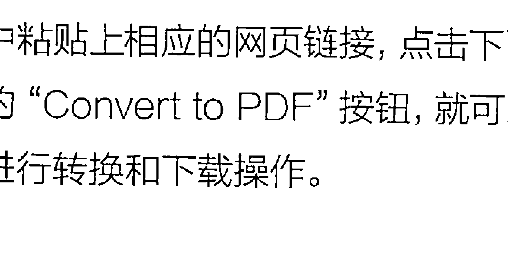

#### 让任务预览窗口更大一些

文/老万

Q: 在操作系统中按下快捷键Alt+Tab，就可以将当前所有任务的窗口显示出来，但是系统默认的预览窗口比较小，有时候并不能看清楚其中的内容。通过什么方式可以尽量让预览窗口变大一些？

A: 下载安装“Alt+Tab Replacer”这款工具，它会自动接管快捷键Alt+Tab。以后当按下快捷键Alt+Tab的时候，在弹出的软件窗口中会通过纵向的方式显示出当前所有的任务窗口名称，并且在右侧就可以对这些窗口的内容进行更好的预览。


在任务窗口名称上点击鼠标右键，还可以对这些窗口进行最大化、最小化、关闭等一系列的管理操作。


#### 还原到经典的资源管理器样式

Q: Windows 10系统的资源管理器使用的是现在流行的Ribbon样式，但是本人对这样的样式不太感冒。通过什么方式可以还原到以前经典的资源管理器样式？

A: 下载运行“OldNewExplorer”这款小工具（https://tihoy.net/files/OldNewExplorer.rar），在弹出的界面中点击“Install”按钮就可以很方便地还原到经典样式。如果想重新使用系统默认的样式，重新运行该工具并点击“Uninstall”按钮即可。

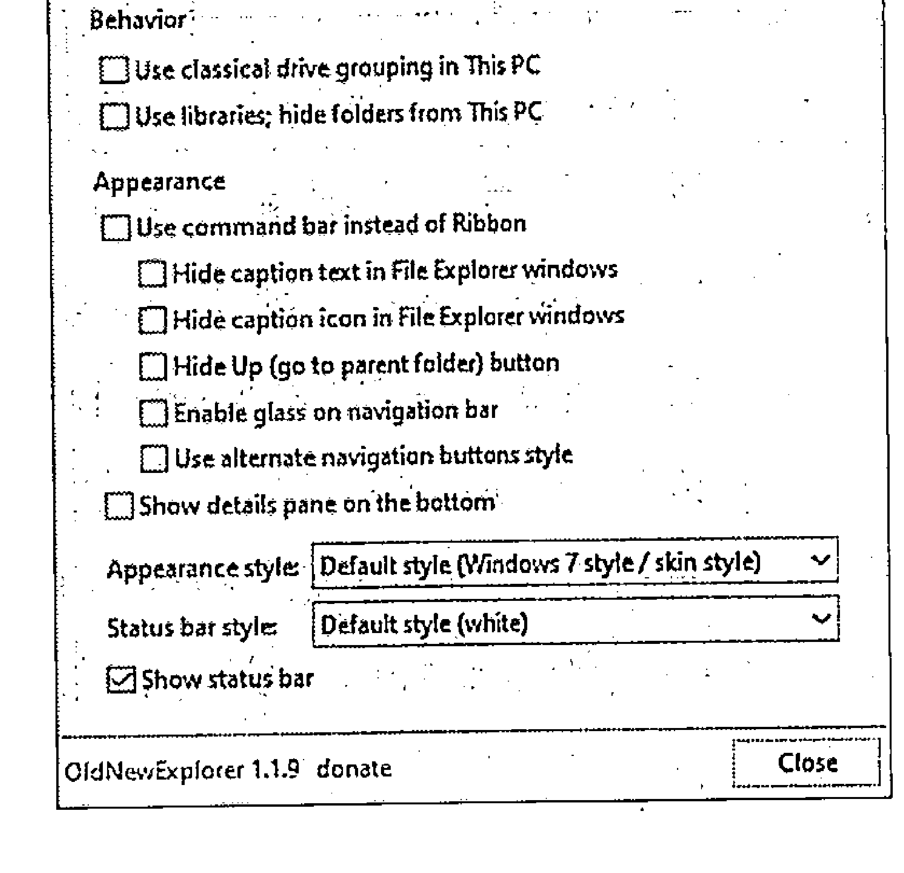

#### 让任务栏根据环境进行显示

Q: 在操作系统的最下方可以看到一个任务栏，通过它能够显示出常用的软件图标等信息，但是在进行全屏操作的时候，这个任务栏就会显得非常碍眼。通过什么方法可以自动让其在全屏状态下隐藏？

A: 在Windows 10系统的应用商店中搜索并安装一款名为“智能任务栏”的应用，安装完成以后它就会自动对系统桌面的情况进行检测，一旦发现有最大化的窗口，就会自动对任务栏进行隐藏设置。

#### 如何使用第三方的桌面主题

Q: 为了让电脑桌面看上去更加个性化，经常会更换各种各样的桌面主题，但是微软的主题都千篇一律，所以只能下载第三方的主题使用，而这些主题在使用的时候会有一些限制。如何解除这些限制？

A: 下载运行“UltraUXTheme Patcher”这款破解工具，根据向导走到“System information and Warning”这一步时，点击下面的“Install”按钮进行破解。当提示破解成功以后，重新启动操作系统，就可以使用第三方主题了。

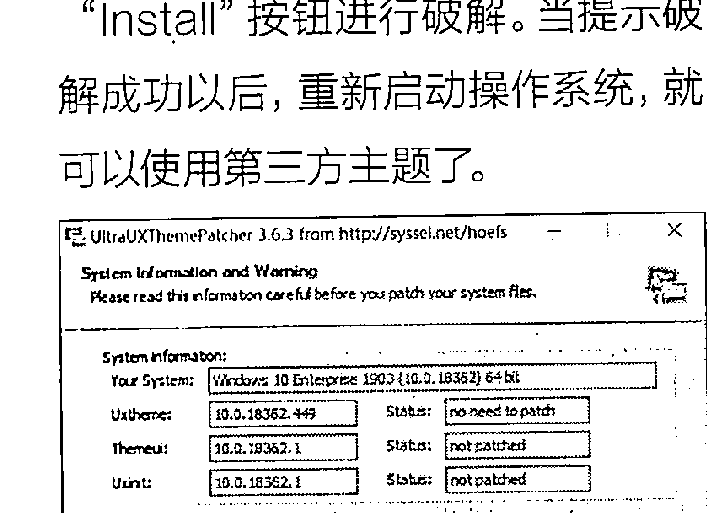

#### 利用组策略禁止手动检查更新

Q: 前段时间安装了最新的Windows 10系统测试版，结果出现了很大的问题，所以现在默认禁止系统自动进行更新检测，但是又担心家人利用手动的方式进行更新检测，所以想将这个功能也禁止掉。请问应该如何进行操作？

A: 按“Win+R”打开“运行”框，在“运行”框中输入“gpedit.msc”启动组策略，依次展开左侧列表的“计算机配置→管理模板→Windows组件→Windows更新”，在右侧窗口找到“删除使用所有Windows更新功能的访问权限”并打开它，选中“已启用”选项即可。

#### 多工作表同时打印

Q: 最近将去年12个月的工作表汇总到一个表格文件中，打印的时候却发现只能对第一个表格中的内容进行打印。请问如何才能将所有的工作表内容进行打印？

A: 按住键盘的Shift键，在Excel中点击最后一个工作表的标签，这样所有的工作表都处于选中的状态，然后点击“文件”菜单中的“打印”按钮，就可以一次性完成所有工作表的打印。

#### 从身份证中提取生日信息

Q: 最近入职的员工提交了一份个人信息的表格，在这个表格中有姓名、身份证等相关信息，但是没有生日的信息，好在身份证中包括有生日信息。在WPS Office中如何完成生日信息的提取？

A: 在WPS Office中点击“公式”标签中的“插入函数”按钮，在弹出的对话框中选择“常用公式”标签，这样就可以在列表中看到“提取身份证生日”的选项，选中它以后再根据提示选择身份证号码所在的单元格，就可以很方便地提取出生日信息。

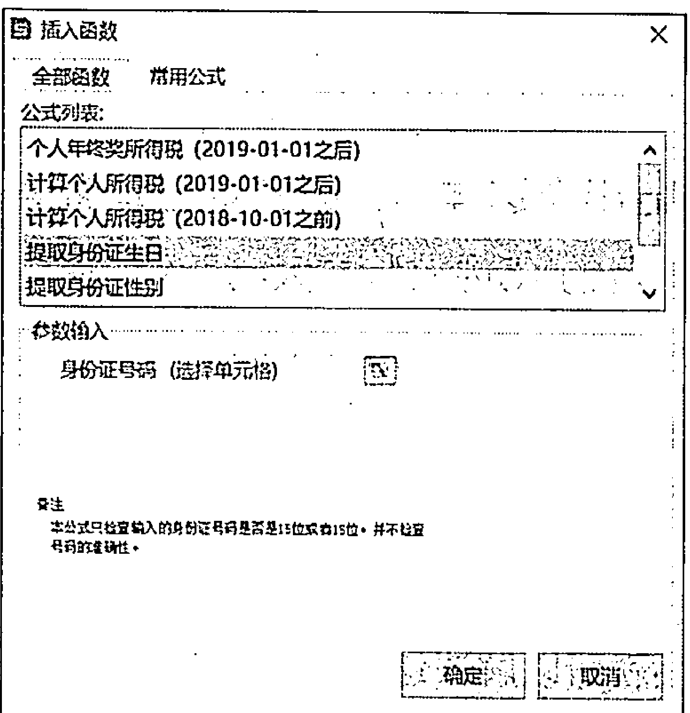

#### 一张打印纸打印所有表格内容

文/老万

Q: 最近在制作完一个表格文件后，打印时发现由于表格中的内容比较多，造成打印纸无法容纳表格内容的情况。遇到这种情况，在Excel中应该如何进行处理？

A: 在Excel中打开打印窗口，在设置列表的最下方可以看到一个“无缩放”的选项，点击它以后在菜单中选择“将所有列调整为一页”命令，表格中的内容就会自动根据打印纸的大小进行缩放设置。

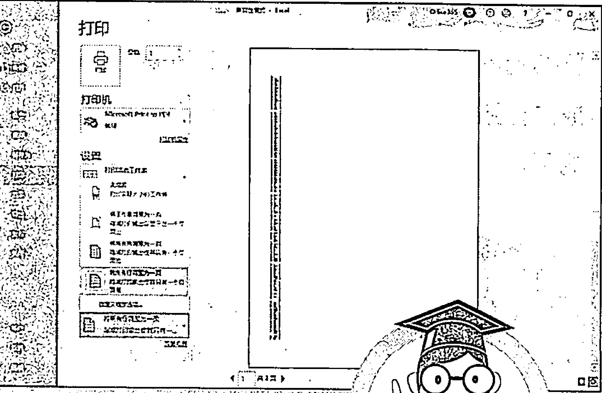

在“无缩放”菜单中还有其他的缩放选项，可以根据实际需要选择使用。


#### 财务报表中将单位修改为万元

Q: 财务报表中的有些数据非常长，查看起来非常麻烦，所以想以“万元”为单位进行数据转换。在WPS Office中，通过什么方法可以完成相关的转换操作？

A: 在WPS Office的表格模块中选中要转换的数据，点击鼠标右键，在菜单中选择“设置单元格格式”命令，在弹出的对话框中选择列表中的“特殊”选项，然后再选择“单位万元”中的“万元”，这样就可以完成转换操作。

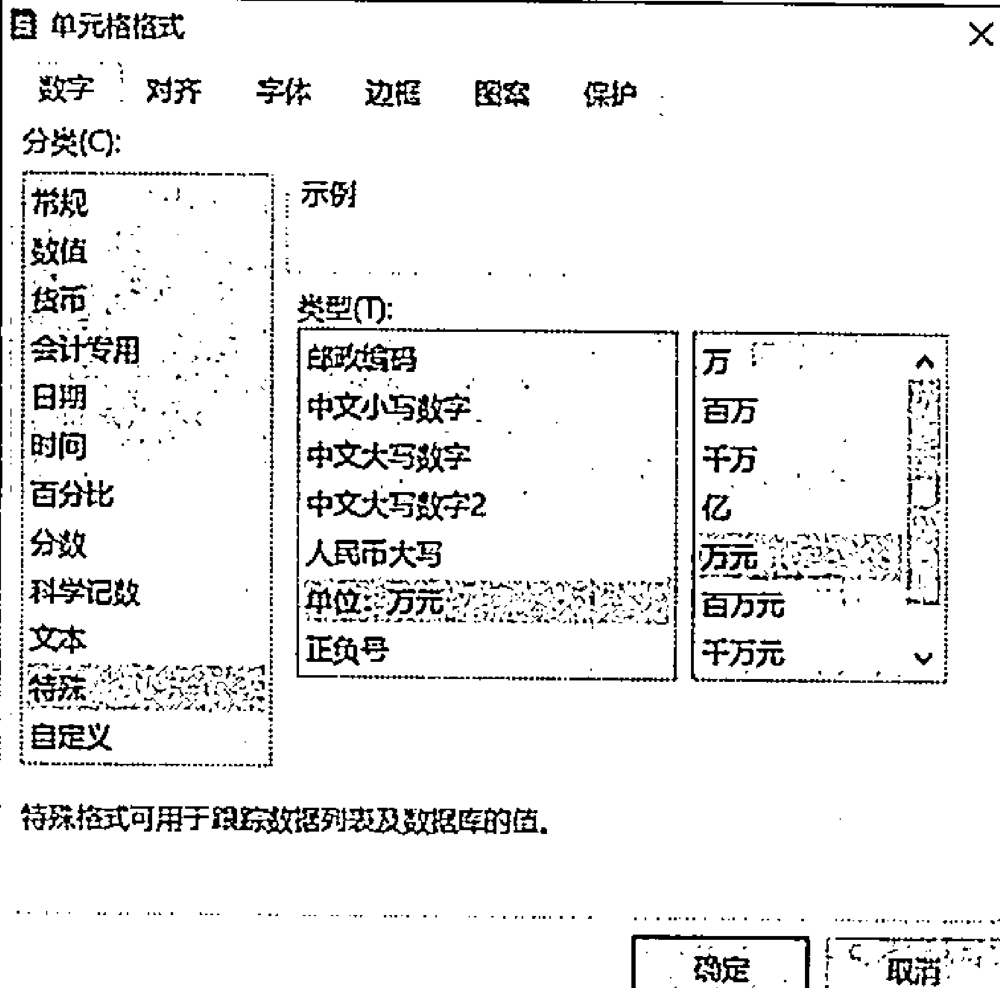

#### 重复之前的操作只需要按下F4键

Q: 办公的时候经常会遇到一些重复性的操作，比如刚刚对第一张图片的大小完成调整，又需要对第二张图片进行类似的调整设置。遇到这样的重复操作，有没有更加快捷的解决方法？

A: 要在Word中完成这样的重复操作，只需要按下F4键就可以很方便地解决。比如在完成第一张图片的调整设置后，选中第二张图片按下F4键就可以一键完成刚刚的操作。以此类推，在完成一行文字的设置后，再选中其他文字并按下F4键就可以重复刚刚的设置。

#### 在拍摄照片时自动进行去背景

文/老万

Q: 平时在拍摄完一个商品后，都需要利用专门的服务进行去背景的操作，然后才可以进行进一步的图片修改。通过什么方法可以在拍摄照片的同时，自动完成去背景的操作？

A: 下载安装“Product Camera”这款应用，将手机的摄像头对准要拍摄的商品，该应用就会自动对商品以及背景进行扫描，并且自动完成去背景后的显示。之后再点击拍摄按钮，一张去背景的图片就拍摄完成了。


如果觉得自动去除背景的效果不太好，还可以利用应用中的编辑功能对照片进行进一步的加工。

#### 解除支付宝捆绑的电子社保卡

Q: 之前我在支付宝里面申请了电子社保卡，而最近发现支付宝里面没有“亲情服务”这个选项，所以就想将这张电子社保卡进行解除。如何能完成相关的解除操作？

A: 在支付宝里面打开电子社保卡的页面，点击其中的“电子社保卡管理”选项，在弹出的列表中就可以看到“解除关联”的选项，点击它以后会弹出一个询问对话框，点击“确定”后就能进行解除操作。

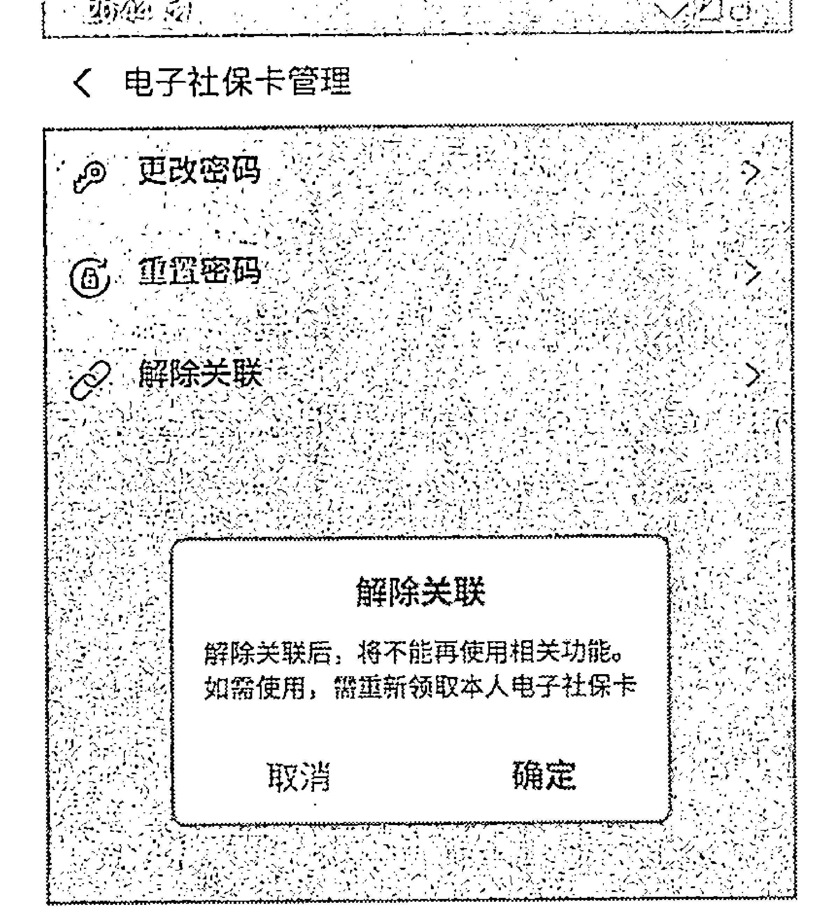

#### 修改夸克浏览器的下载线程

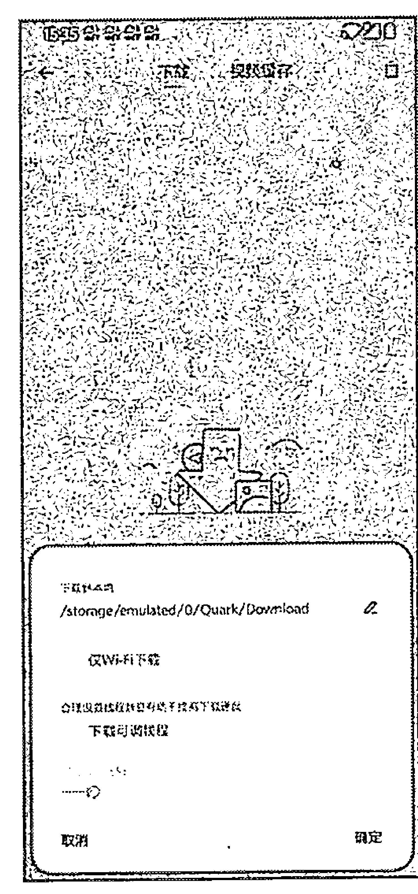

Q: 平时上网使用的是夸克浏览器，这款浏览器默认使用的是五个线程进行下载，但是我发现这样下载会造成文件出错，所以想将线程数进行调整。如何才能进行相应的修改设置？

A: 点击工具栏中的设置按钮，在弹出的对话框中点击“下载”命令，在弹出的窗口中点击右下角的齿轮按钮，就可以进行下载线程的修改操作。

#### 把手机变成视频播放服务器

Q: 通常手机中拍摄的视频文件都是通过微信等方式发送给对方，如果文件体积比较大，发送起来就会很麻烦。有没有什么方式直接将手机变成一个视频播放服务器？

A: 安装“万能联播”这款应用，该应用会对手机中的视频进行扫描。选中要进行发送的视频，点击工具栏中的“零流量分享”，就可以获得一个二维码，然后让对方扫描二维码，就可以进行在线的传输和播放。

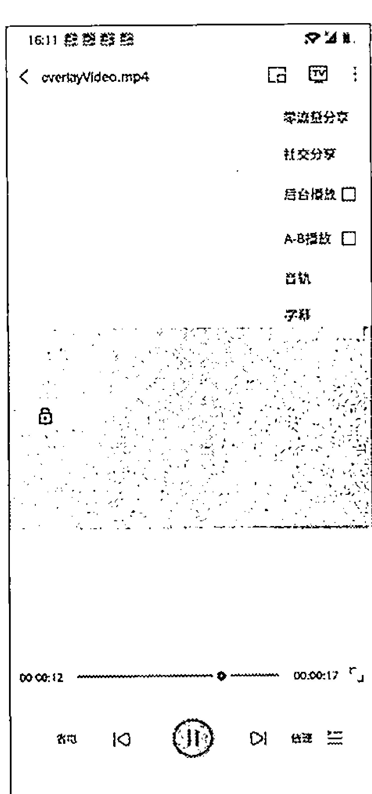

#### 朋友圈视频播放莫名卡顿

Q: 打开朋友圈视频的时候会发现莫名其妙出现卡顿的情况，结果在切换了几个网络环境的情况下依然如此。如何才能有效地解决卡顿的问题，从而保证视频观看的流畅性？

A: 出现这样的问题主要还是微信内置的X5内核版本太老所致。首先在“文件传输助手”里面输入http://debugtbs.qq.com并发送出去，在打开的“tbs调试页面”中点击“安装线上内核”按钮，当新内核安装完成后就可以解决这个问题。

#### 在恶劣天气来临前用微信通知

Q: 虽然现在每个手机都带有天气预报的功能，但是并不是每个功能都可以对恶劣的天气进行推送，即使有这个功能的推送，推送信息也非常简单。利用其他方式能在恶劣天气到来时进行更加详细的推送操作吗？

A: 在微信中关注“简单领域”这个公众号，根据公众号的要求分别设置所在地的区域，然后选中“天气不佳时推送”选项，设置完成后点击“提交”按钮，以后在遇到各种恶劣天气时就可以通过微信进行推送。


#### 用微信发送超过25MB的视频

Q: 按照微信官方的规定，用户发送的视频不能超过25MB，发送的文件不能超过100MB。如何可以突破这个限制而发送一些体积较大的视频文件？

A: 这里有两个解决方法供大家参考。首先就是将视频文件通过压缩软件进行压缩，使它变成一个普通的文件后再进行传输。另外一种方式就是对视频文件的后缀名进行修改，比如将MP4的后缀名修改为m4v再进行发送。由于这两种视频格式的编码都相同，发送后可以直接播放。

#### 检测手机里是否有身份证照片

文/老万

Q: 很多时候在进行实名认证时，需要用户上传身份证的照片，但是这些身份证照片是否存放在手机里用户根本不知道，这样在手机丢失以后可能就会遇到各种各样的麻烦。如何检测手机中是否有身份证照片等文件呢？

A: 打开最新版本的腾讯手机管家，点击操作界面中的“应用安全”选项，选择“隐私风险检测”中的“隐私照片检测”选项，该应用就会对手机中的各种证件照进行扫描。一旦发现它就会提醒用户注意，并且可以很方便地进行删除。

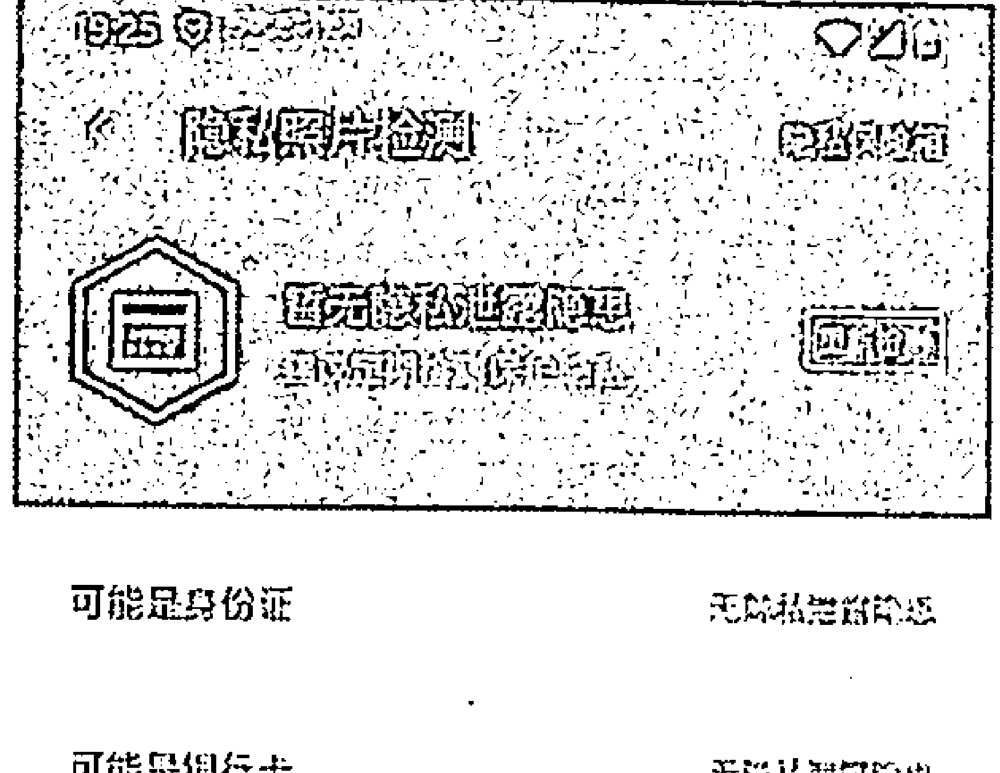


> 如果有些照片用户想继续使用，可以利用加密功能对它们进行加密。

#### 一加手机关闭垃圾短信拦截功能

Q: 我现在使用的是一加手机，发现它的短信拦截功能会将一些有用的信息进行拦截，虽然可以重新移到收件箱里，但是操作起来就很麻烦。请问如何将这个功能关闭？

A: 打开手机的短信收件箱，点击右上角的按钮进入到设置列表中，点击“骚扰拦截设置”选项，将“短信智能拦截”功能关闭，或者及时更新短信拦截的数据库也可以。

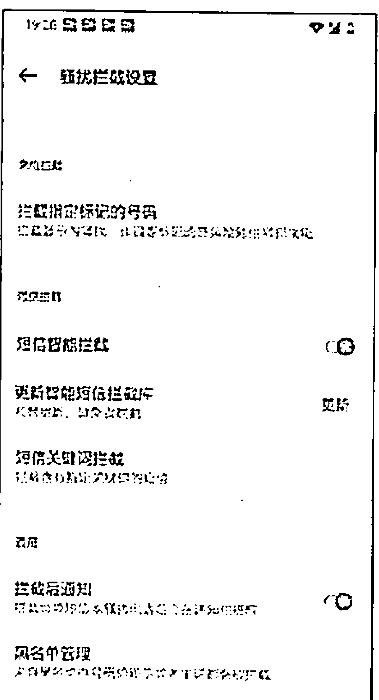

#### 使用腾讯文档统计学生信息

Q: 我们学校打算这个月开始上课，需要对学生放假期间的学习和生活情况进行统计，比如阅读了多少书籍等等，可是无论是打电话还是微信统计都很麻烦。请问通过什么方法可以快速方便地进行操作？

A: 老师可以下载安装“腾讯文档”这款应用，点击右下角的加号按钮，在弹出的对话框中选择“在线表格”，在弹出的页面中选择一个合适的模板。打开模板后，根据实际的统计信息进行修改，然后通过微信发送给学生，这样就可以很方便地完成统计。

#### 在Word中快速对齐多张图片

文/老万

Q: 我想在Word中将手中的一些图片进行排版，但是由于这些图片的大小都不一致，因此排版的效果并不好。通过什么方法可以快速统一图片大小并进行对齐操作？

A: 在Word中插入一个表格，在表格的属性窗口中取消“自动重调尺寸以适应内容”选项的对钩，在每一个表格中插入对应的图片，然后将表格的边框设置为“无框线”，就可以快速达到这个要求。

至于添加表格的行和列的参数，需要按照图片排版的要求进行设置。

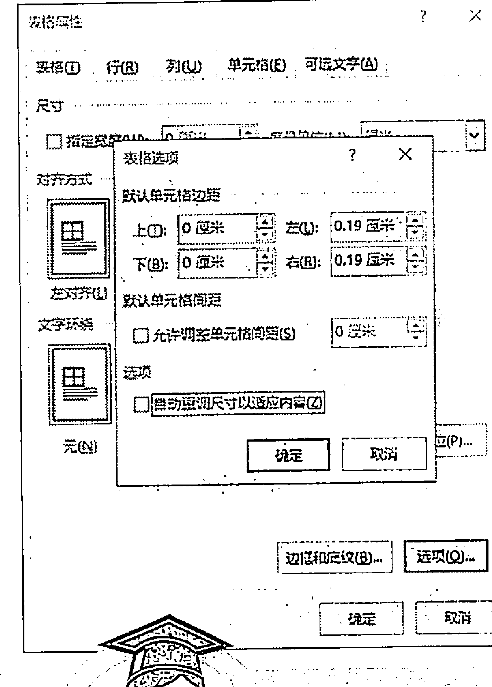


#### 轻松调整不同字体的行间距

Q: 在进行文本排版的时候，往往会使用多种不同的字体，如果仔细观察的话就会发现，不同字体的行间距是不同的，这样在调整的时候就会遇到一些麻烦。有什么方法可以解决这样的问题？

A: 在Word中选中要进行调整的内容，点击“开始”标签中的“行和段落间距”按钮，在弹出的菜单中选择“行距选项”命令，在弹出的对话框中将“如果定义了文档网格，则对齐到网格”的对钩去除即可。

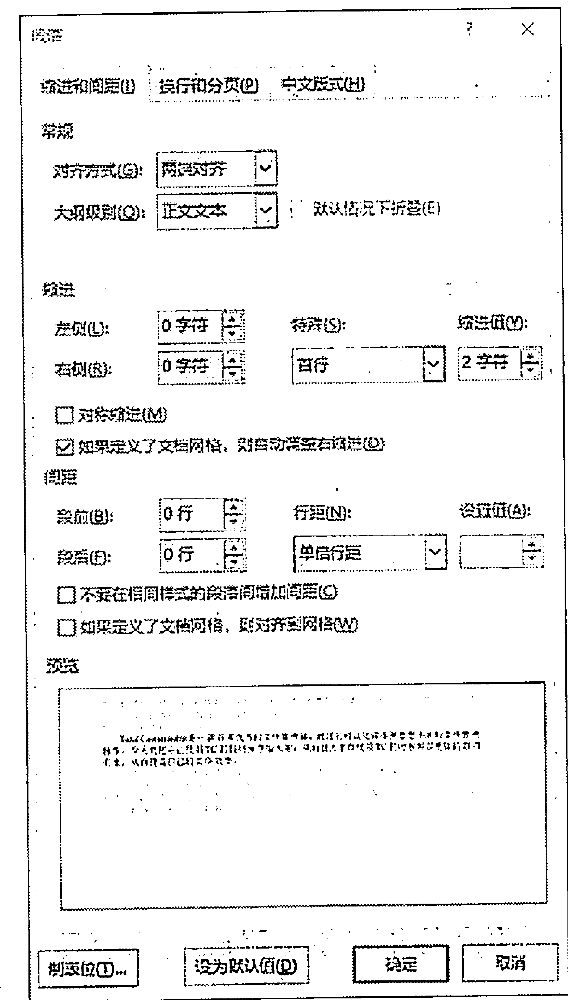

#### 文字的横纵混排如何设置

Q: 通常在制作请柬的时候，文字内容往往采取的是纵向排列的方式，但是其中日期等却需要横向排列。对于这样的情况，在Word中需要通过什么方法进行解决？

A: 在Word中选中要进行横向排列的日期信息，点击“开始”标签中的“中文版式”按钮，在弹出的菜单中选择“纵横混排”命令，在弹出的对话框中，将“适应行宽”选项的对钩去除即可。

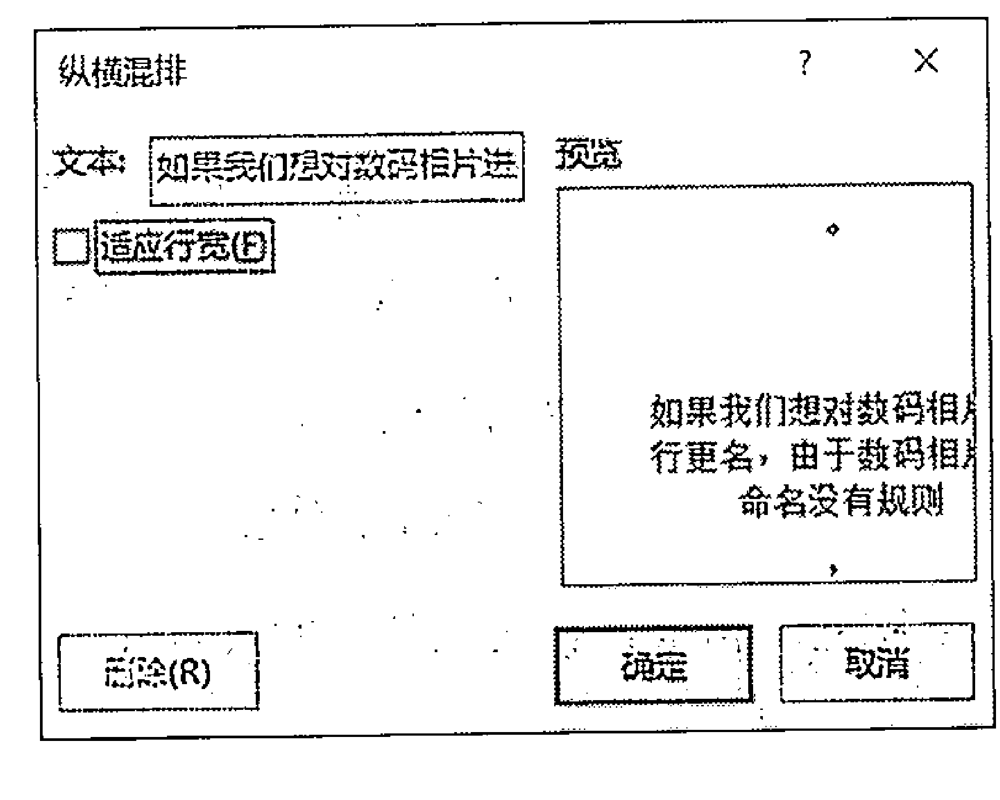

#### 解决下载文档中的混乱格式

Q: 有时从网上下载一些需要的文档，而打开这些文档后会看到它们的格式非常混乱，以致于有的时候根本无法正常地进行阅读。遇到这样的情况应该如何进行解决？

A: 在Word中对文档内容进行全选，点击“开始”标签中的“清除所有格式”按钮，将所有的格式进行清除。再点击“显示/隐藏编辑标记”按钮，查看是否存在不可见的隐藏字符。将这些信息都处理完成以后，再按自己的要求重新进行排版即可。

#### 前文删除不影响后面的内容

Q: 有一些文档是按照段落进行分页的，这样在编辑的时候会遇到一个问题，就是前面的内容如果有删除或者其他修改，后面的内容分页也会发生改变。如何才能避免这样的问题出现？

A: 在Word中打开要处理的文档，将光标定位到需要分页的段落最前方，点击“插入”标签中的“分页”按钮，这样光标后面的内容就会重新进行分页。

#### 激活游戏模式让游戏更流畅

Q: 我平时在玩游戏的时候会同时进行一些BT下载的操作，这样往往会造成游戏的卡顿。利用系统的相关功能可否对其进行一定的优化，从而有效地避免卡顿的情况出现？

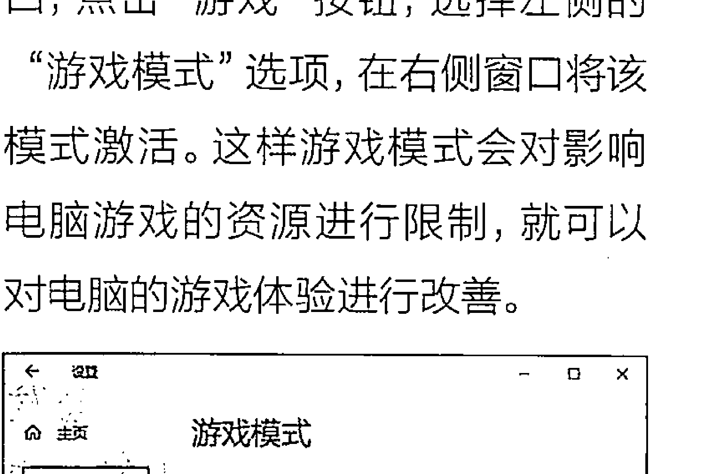

A: 打开Windows 10系统的设置窗口，点击“游戏”按钮，选择左侧的“游戏模式”选项，在右侧窗口将该模式激活。这样游戏模式会对影响电脑游戏的资源进行限制，就可以对电脑的游戏体验进行改善。

#### 安装免费版的卡巴斯基

文/老万

Q: 现在卡巴斯基推出了免费的版本，但是从网上下载的最新版本都是需要付费才可以正常使用。请问如何才能使用到免费的最新版本卡巴斯基杀毒软件？

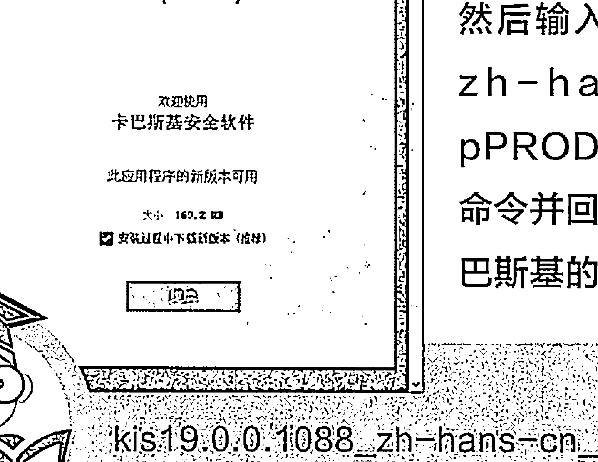

A: 下载最新版本的安装包，通过管理员权限打开命令提示符窗口，切换到安装包所在的文件夹目录，然后输入以下命令并回车，就可以完成免费版卡巴斯基的安装操作。

```
kis19.0.0.1088_zh-hans-cn_full.exe/pPRODUCTTYPE=kfa
```

> kis19.0.0.1088_zh-hans-cn_full.exe是我下载的版本号，用户需要根据自己下载的版本号进行相应的修改。

#### 在任务栏精确显示电池百分比

Q: 在Windows系统的任务栏上，有一个电池图形的指示图标，想要详细地了解电池电量的剩余信息，只能将鼠标移动到该指示图标上才能显示。有没有更加直观的显示方法呢？

A: 下载运行“percentage”这款小工具（https://github.com/kas/percentage），运行以后它就会在系统托盘中显示出一个数字，比如显示的是66就表示还有66%的电量。如果想让它随系统自动运行，将它添加到系统的启动文件夹即可。

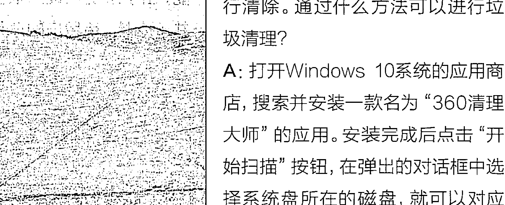

#### 清理UWP应用的垃圾信息

Q: Windows 10系统最大的特色之一，就是拥有很多不错的UWP应用，这些应用和其他的软件程序一样，也会产生不少的垃圾信息，可是常见的清理软件无法对这些信息进行清除。通过什么方法可以进行垃圾清理？

A: 打开Windows 10系统的应用商店，搜索并安装一款名为“360清理大师”的应用。安装完成后点击“开始扫描”按钮，在弹出的对话框中选择系统盘所在的磁盘，就可以对应用缓存等信息进行扫描和清理。


#### 去背景的图片素材直接下载

文/老万

Q：在使用一些图片素材时，经常需要将背景的信息去除再使用，如果图片素材一多，操作起来肯定就比较麻烦。请问在网络中有没有专门提供去背景的图片素材下载网站？

A：Pngtube就是这样一个图片素材下载网站（https://www.pngtube.com/）。打开这个网站以后，可以按照分类或者在搜索框中直接输入关键词的方式来进行检索。当找到需要的素材后，点击旁边的绿色按钮，就可以免费进行下载使用。

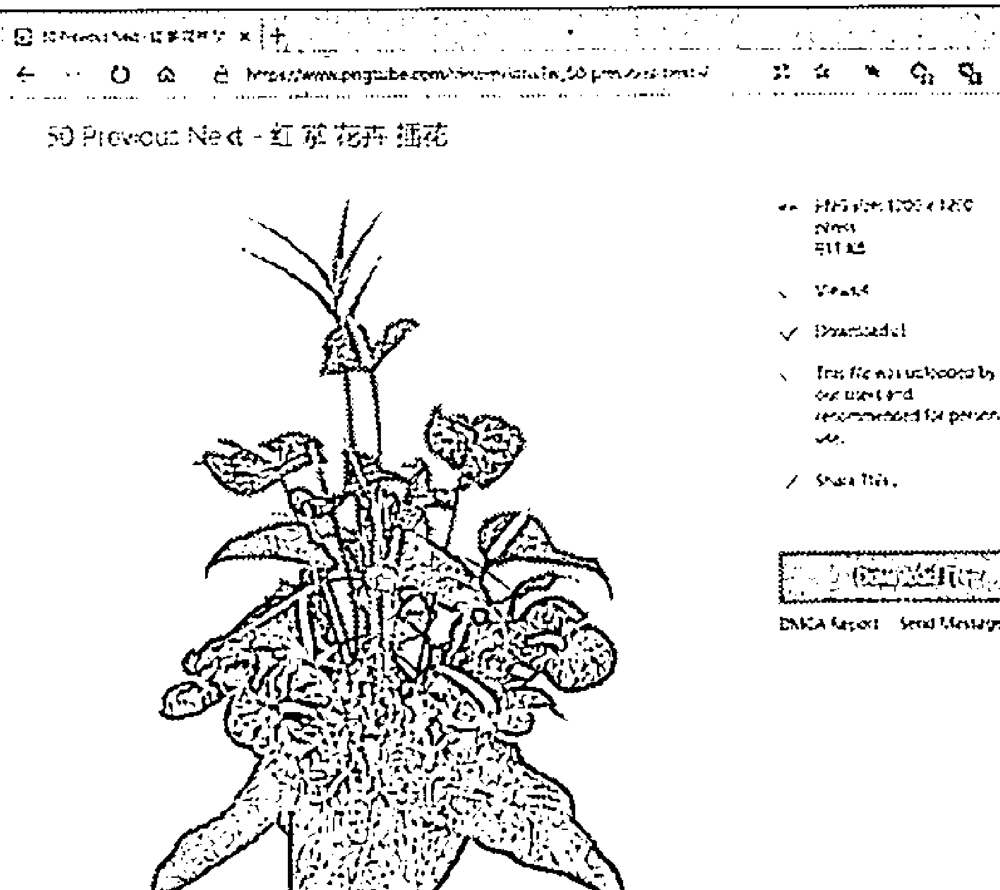

虽然该网站也支持中文关键词的检索，但是还是建议尽量使用英文关键词，可以搜索到更加丰富的内容。

#### 多款杀毒引擎进行文件检测

Q：虽然每次下载的文件都经过杀毒软件对它进行安全检测，但是偶尔对一些文件还是感觉不放心，所以想再换用其他的杀毒软件进行检测。请问通过什么网站可以对文件进行多重检测？

A：打开“Metascan Online”服务（https://metadefender.opswat.com/），在弹出的网页中点击输入框后面的按钮，选择要进行检测的文件。当文件上传到网站以后，就会利用40多款不同的杀毒引擎对它进行检测，并且给出详细的检测报告。

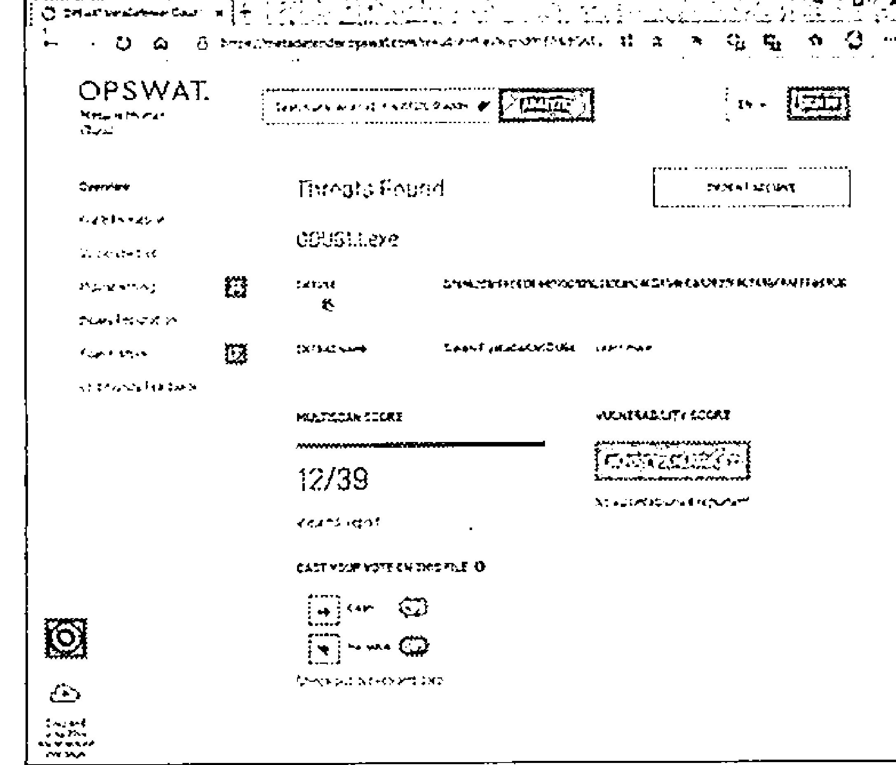

#### 代理设置更方便的网页浏览器

Q：由于现在很多浏览器都是基于Chromium框架开发的，因此它的代理功能都是调用的系统代理功能，由于系统代理对很多代理协议并不支持，给用户的使用造成了极大的不便。有没有可以让代理设置更加灵活方便的浏览器？

A：本刊曾介绍过一款名为“风之影”的浏览器。打开它的“定义工具栏”对话框后，将“代理”选项添加到工具栏中，然后点击代理按钮的图标，根据自己的实际情况进行代理信息的设置即可。

#### QQ发送银行卡信息老是出错

Q：最近到了一个新的单位，财务要求提交银行卡信息以便发工资的时候使用，我通过QQ将银行卡信息发送过去，财务在复制后发现其中的一些信息老是显示为*****。这样的问题该如何解决？

A：出现这样的情况是腾讯公司为了防范网络诈骗而采取的安全措施。在确定对方的身份以后，可以将银行卡信息复制粘贴到一个文本文件中，然后通过发送文本文件的方式给对方，这样就可以很好地解决这个问题。

#### 快速清除谷歌浏览器的缓存信息

Q：平时使用的是谷歌浏览器，虽然这款浏览器也有清除缓存信息的功能，但是操作起来比较复杂。有没有更加方便快捷的清除方式？

A：搜索并下载一款名为“清除缓存Chrome”的功能扩展，将它安装到谷歌浏览器中。以后想清除缓存信息时，点击这个扩展的图标，在弹出的对话框中选择要清除的内容，按下回车键，即可进行快速的清除操作。

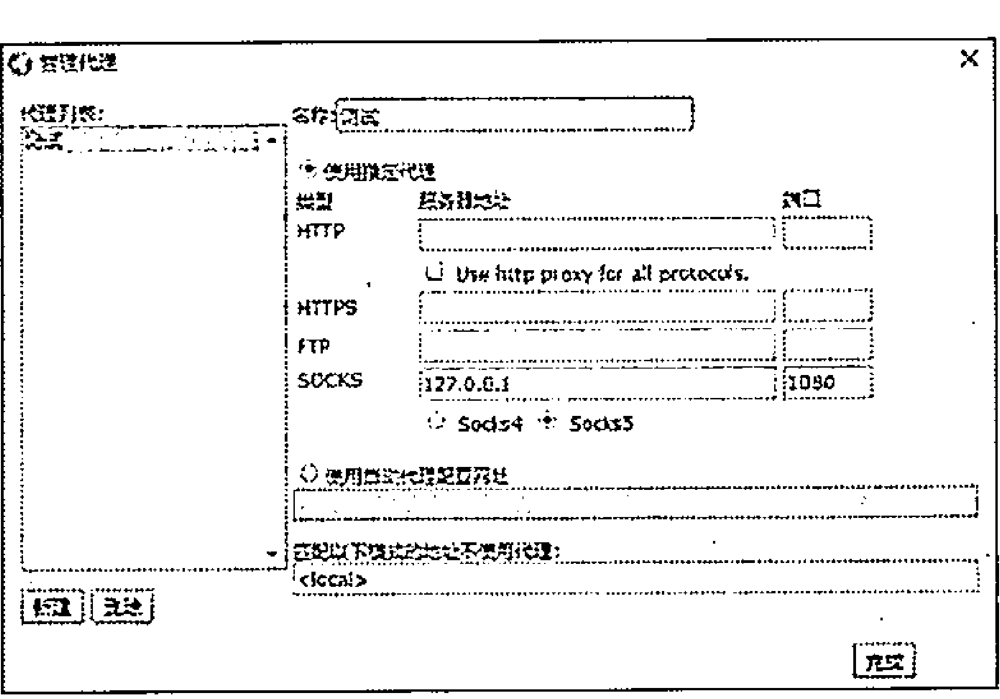

#### 账号密码泄露风险的提醒

Q: 谷歌在不久之前曾经发布了一个安全服务，通过它可以查询用户的账号密码是否被泄露，但是这个服务需要用户登录到该网站后才能进行查询。有没有什么方式可以让它自动告知？

A: 在地址栏输入“chrome://flags”并按下回车键，在搜索框中输入“Password Leak Detection”这个关键词，查找到以后点击列表中的“Enabled”选项。当在网页中输入密码时，谷歌就会对输入的密码进行安全判断。

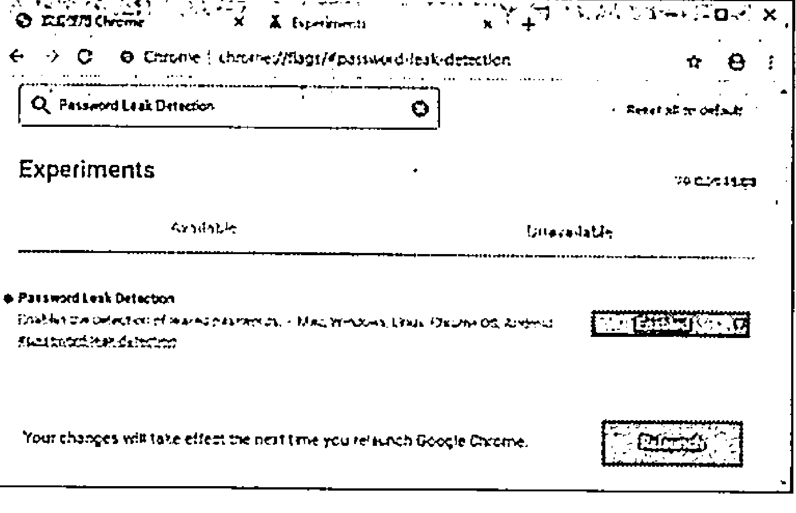

#### 升级新版Edge浏览器为测试版

文|老万

Q: 微软已经正式推送在Chromium内核的基础上开发的Edge浏览器，这款浏览器也分为正式版、测试版、开发版以及金丝雀版。在升级的时候如何升级到它的测试版？

A: 打开注册表编辑器，展开到HKEY_LOCAL_MACHINE\SOFTWARE\Policies\Microsoft\EdgeUpdate，在右侧窗口中新建一个名为Update{2CD8A007-E189-409D-A2C8-9AF4EF3C72AA}的DWORD（32位）值，将“数值数据”设置为1即可。

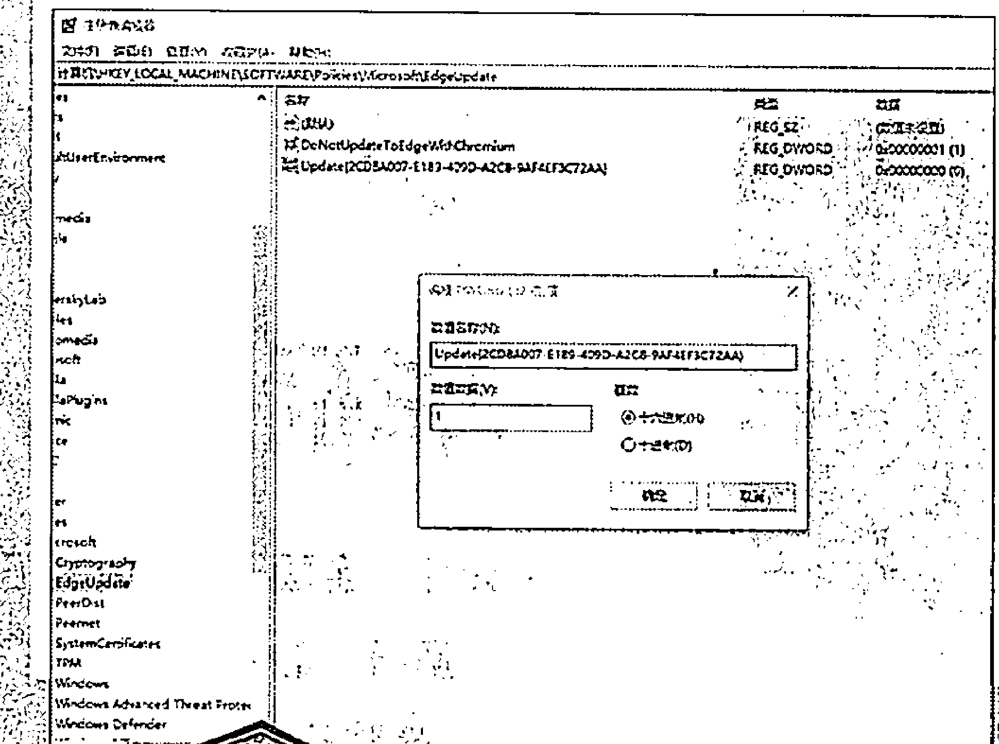

要想升级到开发版就设置为Update{0D50BFEC-CD6A-4F9A-964C-C7416E3ACB10}，金丝雀版就设置为Update{65C35B14-6C1D-4122-AC46-7148CC9D6497}。

#### 百分浏览器中无法完成P2P传输

Q: 一个网友介绍了一个P2P传输文件的服务，之前测试的过程中都没有问题，但是最近在利用百分浏览器操作时却发现无法进行操作，而换一个浏览器就可以操作。请问问题是出在百分浏览器上吗？

A: 无论是哪一款浏览器，在进行P2P文件传输时，都需要用到WebRTC这项功能。打开百分浏览器的设置页面，搜索“WebRTC”这个关键词，将“禁用WebRTC”这项功能关闭就可以了。

#### 判断广告弹窗是哪个软件的

Q: 现在很多免费软件会通过广告弹窗的方式来获取收益，很多时候会出现一些莫名其妙的广告弹窗，而我又搞不清楚是哪一个软件弹的。通过什么方式可以对它进行判断？

A: 打开“Process Explorer”这款工具，在工具栏中可以看到一个类似于瞄准镜的图标。用鼠标按住这个图标并拖到广告弹窗上释放，该工具就会对弹窗的进程进行识别，通过进程就可以知道是哪一个软件弹的了。

#### 最简单的图片文字识别方法

Q: 偶尔我会对图片中的文字内容进行识别，虽然本刊也介绍过一些方法，但是毕竟需要用到一些专门的工具或者云服务。利用现成的常见软件，能不能快速地完成相关的识别操作？

A: 打开任意一个QQ的聊天窗口，通过自带的截图功能对要识别的内容进行截取。在截取后的图片上点击鼠标右键，选择菜单中的“提取图中文字”命令，就可以完成相关的识别操作。

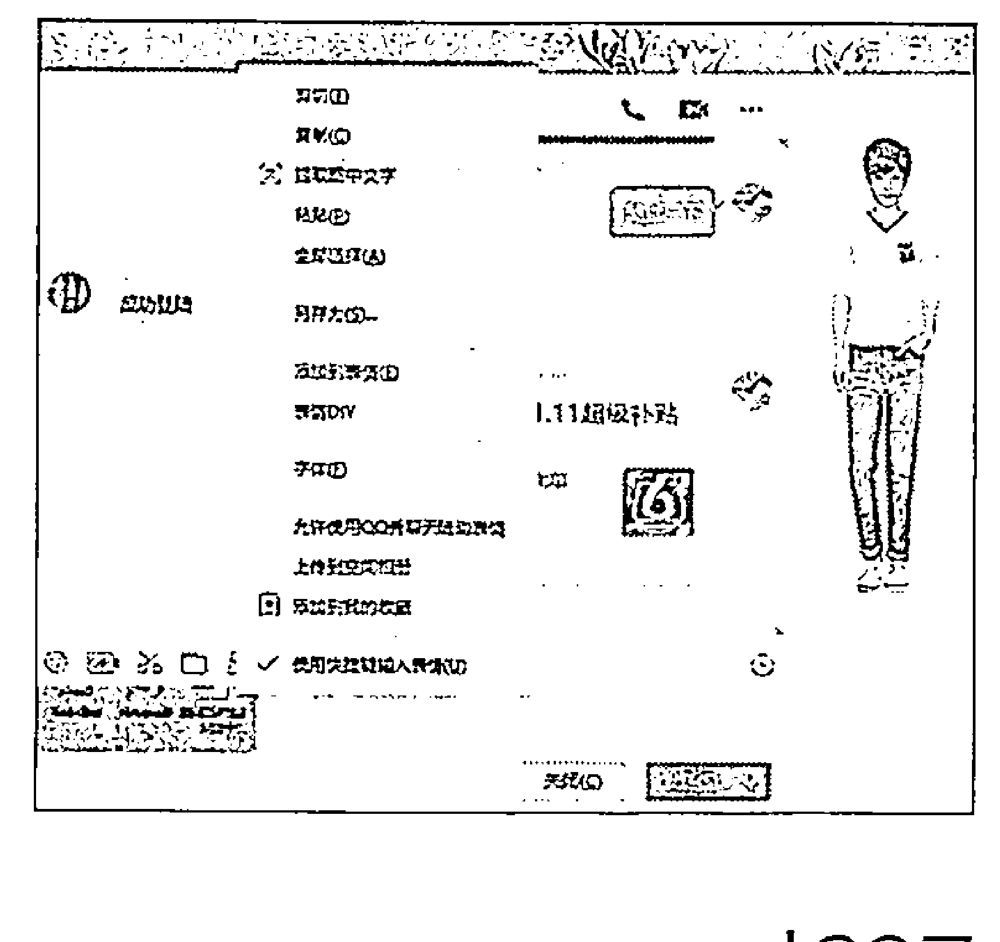

### 窄边诱惑

#### 机械革命S1 Plus


#### 华硕VivoBook 15s

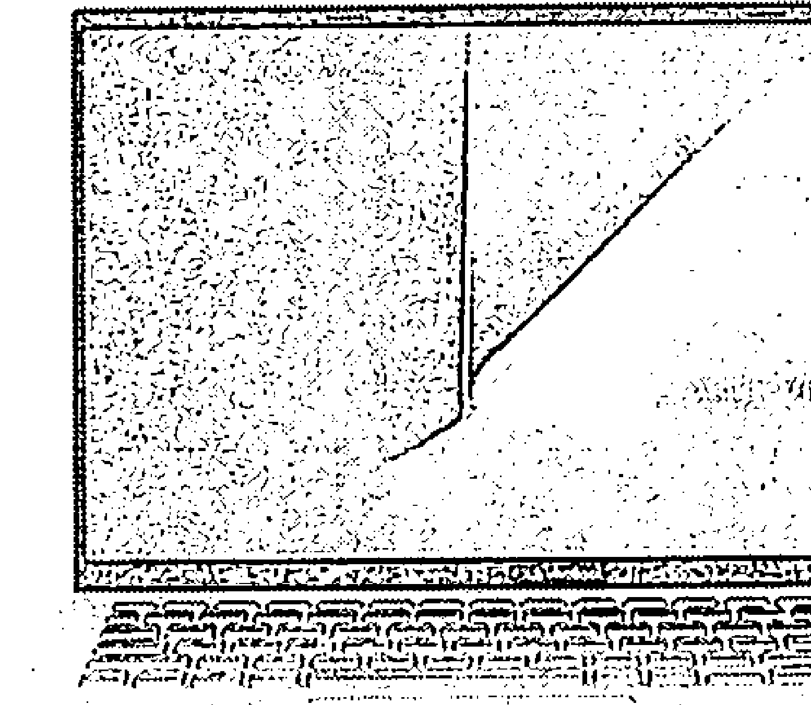

如今“全面屏”的概念已经深入到笔记本领域，通过窄边框得以“瘦身”的新品越来越多，拥有15.6英寸大视野的产品也不再那么臃肿不堪。作为轻薄大屏新品的代表，机械革命S1 Plus和华硕VivoBook 15s各有特色，它们之间谁更适合你？

#### 来自窄边的诱惑

机械革命S1 Plus和华硕VivoBook 15s都采用了15.6英寸屏幕，以及三面窄边框的设计（上边框略宽，中间嵌有摄像头），可以带来更具沉浸感的“视界”。其中，机械革命S1 Plus的屏幕下边框较宽，但它却采用了一套取巧的设计——下边框底部采用了和机身一样的银色，而屏幕面板四周则被一圈黑边包裹，所以可以呈现一种四面都是窄边框的视觉差。S1 Plus的转轴位于机身水平面以上，打开屏幕时不会遮住位于后部的散热通风口，对散热有着更好的增益效果（图1）。

| 参数 | 机械革命S1 Plus | 华硕VivoBook 15s |
| :--- | :--- | :--- |
| 屏幕 | 15.6英寸(1080P,72% NTSC) | 15.6英寸(1080P,45% NTSC) |
| 处理器 | 八代酷睿i5-8265U | 十代酷睿i5-10210U |
| 内存/硬盘 | 8GB/512GB SSD | 8GB/512GB SSD |
| 显卡 | GeForce MX250 | GeForce MX250 |
| 接口 | MicroSD读卡器、USB3.1 Gen1×2、USB2.0、USB Type-C、HDMI、RJ45、音频接口 | MicroSD读卡器、USB3.1 Gen1、USB2.0×2、USB Type-C、HDMI、音频接口 |
| 尺寸 | 356.4mm×233.73mm×16.8mm | 357.2mm×230.4mm×18mm |
| 电池/重量 | 91.24Wh/1.42kg | 37Wh/1.8kg |
| 参考价格 | 4999元 | 5399元 |

华硕VivoBook 15s的机身宽度与机械革命S1 Plus相近，所以它的屏幕下边框理论上和对手是等宽的。然而，这款产品却通过独特的下沉式转轴设计，打开屏幕后边框底部会沉于机身水平线以下，视觉上有一种下边框更窄的错觉。此外，这种特殊的“翘臀”设计，屏幕下边框还能扮演支架的角色撑起机身（图2），带来更好的输入体验并加强底部空气的流通，有利于营造更好的散热环境。

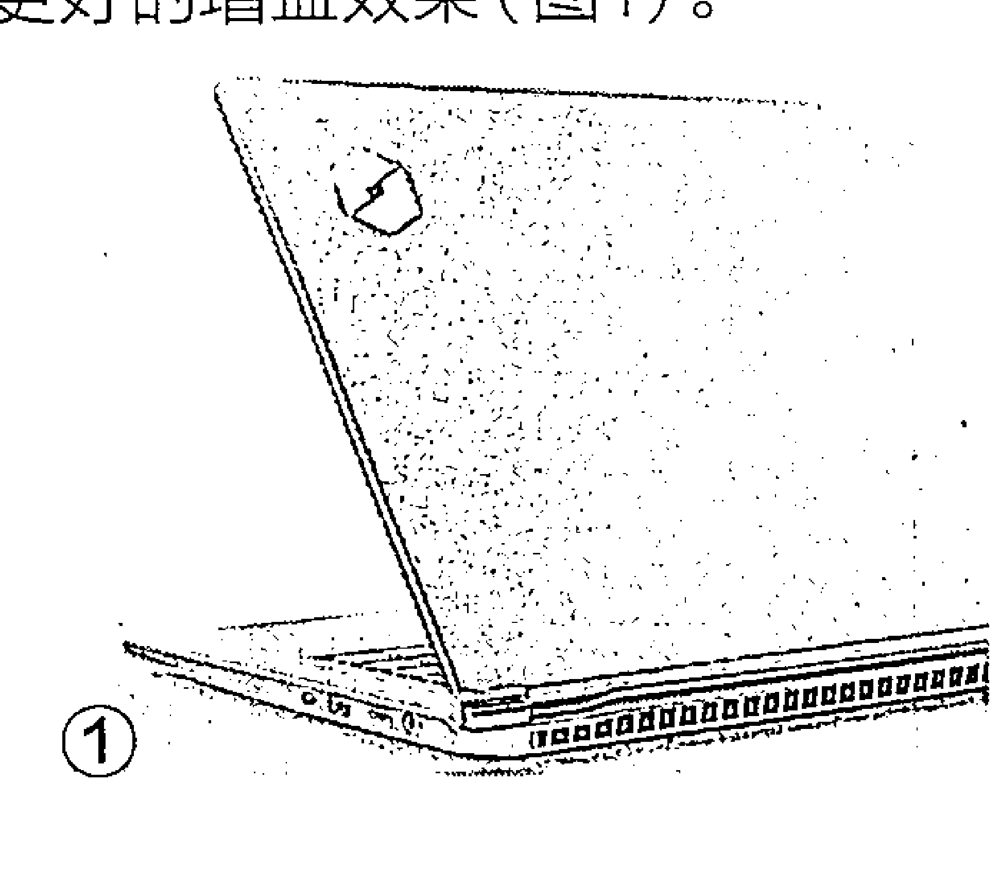

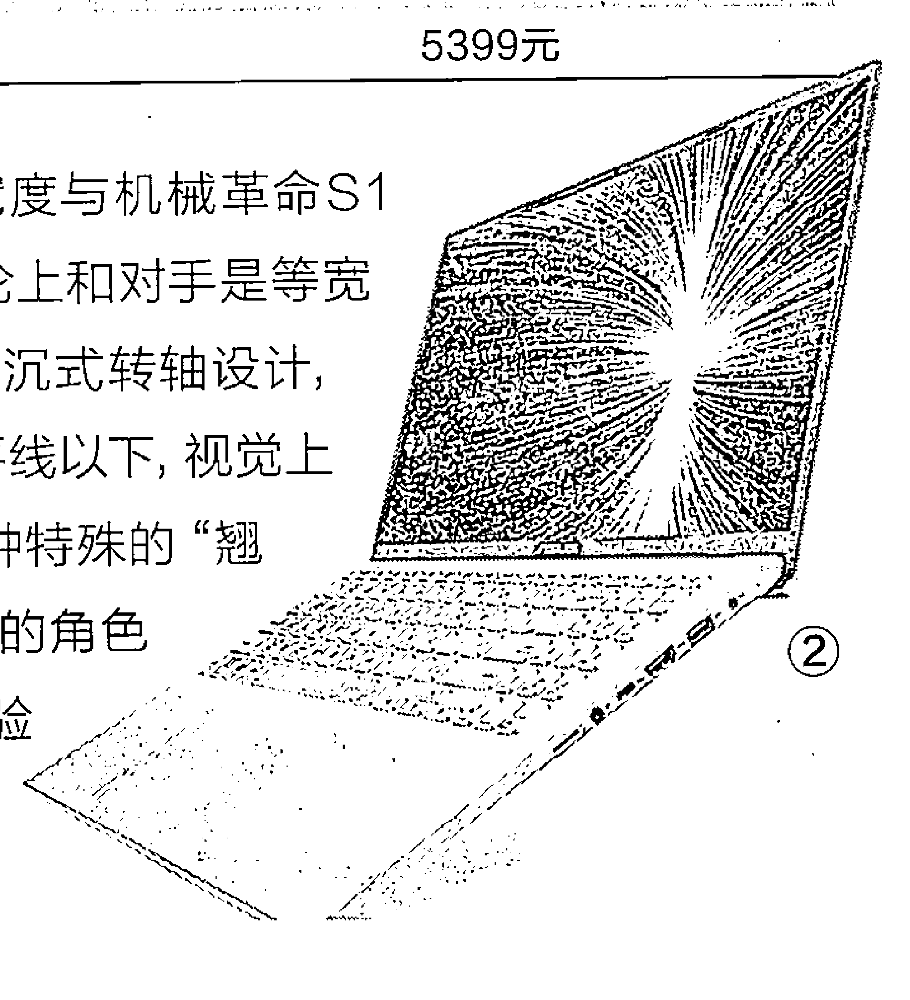

#### 便携和续航的差异

机械革命S1 Plus存在两个版本，2018年初以前的版本采用的是Z2 Air的模具，搭载45W标压处理器和GTX1050独显。而本文涉及的产品为2019年下半年才上市的新品，采用了全新的更轻薄的模具，1.42kg的重量比很多14英寸窄边笔记本还要轻，便携性应该算是同尺寸轻薄本中的一流水准（图3）。最关键的是，新版S1 Plus内置超大的91.24Wh容量电池，可以提供超过10小时的持续办公时间，短途出行忘带电源适配器也毫无压力。

VivoBook 15是华硕旗下的一个庞大家族，存在时尚的撞色版和更具质感的金属版，硬件上也衍生出了英特尔酷睿版和AMD锐龙版，各个版本间在模具和内部散热设计上存在些许差异。本文涉及的VivoBook 15s是最新上市的第十代酷睿版，主打金属拉丝的A面机身和1.8kg的身材（图4），其便携性显然不如机械革命S1 Plus，37Wh的电池容量也显得有些寒酸，并不适合长时间脱电使用。还好，该产品支持华硕快速充电技术，49分钟可以充电约60%，多少可以弥补一些电池容量的不足。

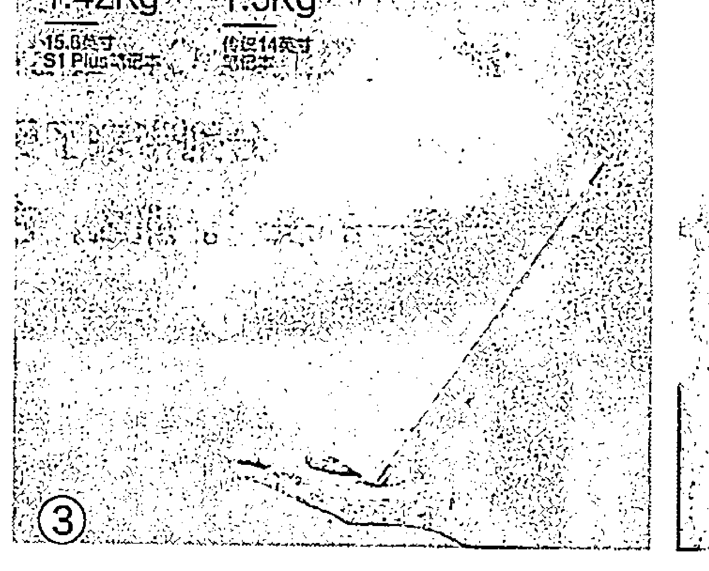

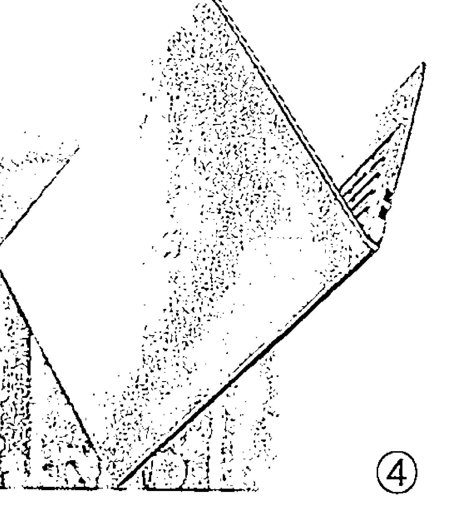

#### 硬件配置的对比

两款大屏轻薄本都采用15.6英寸全高清的IPS屏幕，但机械革命S1 Plus的LCD面板达到了72% NTSC高色域的标准，色彩显示更精准。可惜，这款产品暂时只有搭载第八代酷睿处理器的版本，如果你更加注重性能，可以关注它的第十代酷睿升级版何时上市。机械革命S1 Plus标配8GB内存（只有1个内存插槽）和512GB PCIe SSD，机身内部还提供了第二个M.2插槽，方便用户加装第二块SSD硬盘（图5）。

华硕VivoBook 15s搭载了英特尔最新的第十代酷睿处理器平台（14nm版本），理论性能更好一些。该产品内部采用板载内存颗粒+1个标准内存插槽的设计（图6），并预留了2.5英寸硬盘的扩展位（需要用户自行购买支架和排线）。两款笔记本都内置英伟达GeForce MX250独显，并配备了2GB GDDR5显存，结合八代/十代酷睿i5处理器可以驾驭绝大多数主流3D游戏。

机械革命S1 Plus和华硕VivoBook 15s的差异还表现在周边接口方面，机械革命S1 Plus的USB3.1 Gen1（本质上依旧是USB3.0）接口数量更多，而且还保留了RJ45网线接口，可以通过有线的形式玩游戏，从而避免Wi-Fi网络的延迟问题。

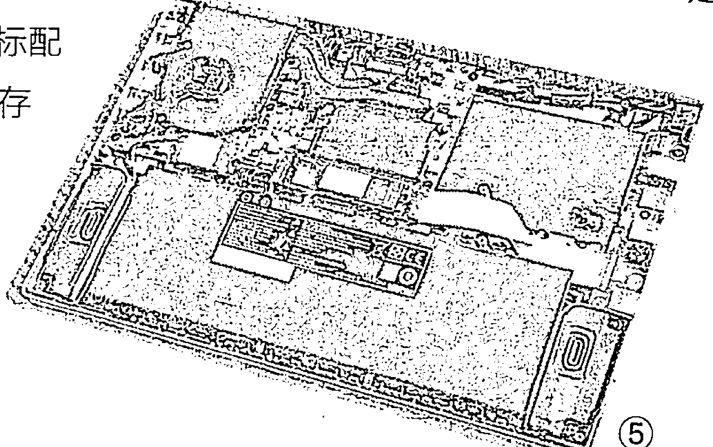

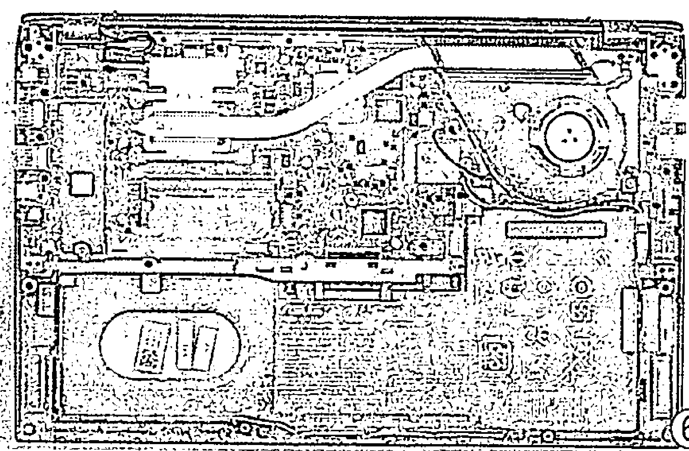

机械革命S1 Plus是一款拥有更轻盈身材和持久续航的高色域大屏轻薄本，除了没能升级到第十代酷睿平台以外，各方面的表现都趋于完美，不足5000元的售价也有着不错的竞争力。华硕VivoBook 15s则是集最新硬件于一身的新品代表，独特的翘臀设计进一步提升了它的辨识度。综合来看，机械革命S1 Plus的性价比更高，更适合追求实用和体验的用户选择。

### 拍照实力派

#### vivo S5 对 小米CC9 Pro

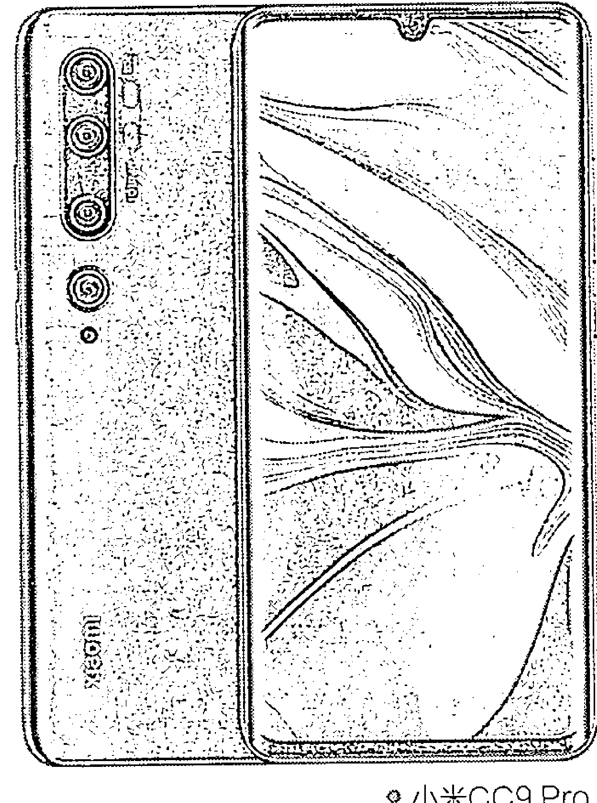

5G网络和更好的拍照表现，就是未来一段时间智能手机们所要追逐的梦想。作为新品，vivo S5和小米CC9 Pro都没有搭载旗舰级的SoC，但它们却都通过优化的相机模组，分别带来了更好的美颜拍照和DxOMark相机评分第一的表现。那么，它们之间谁更适合你？

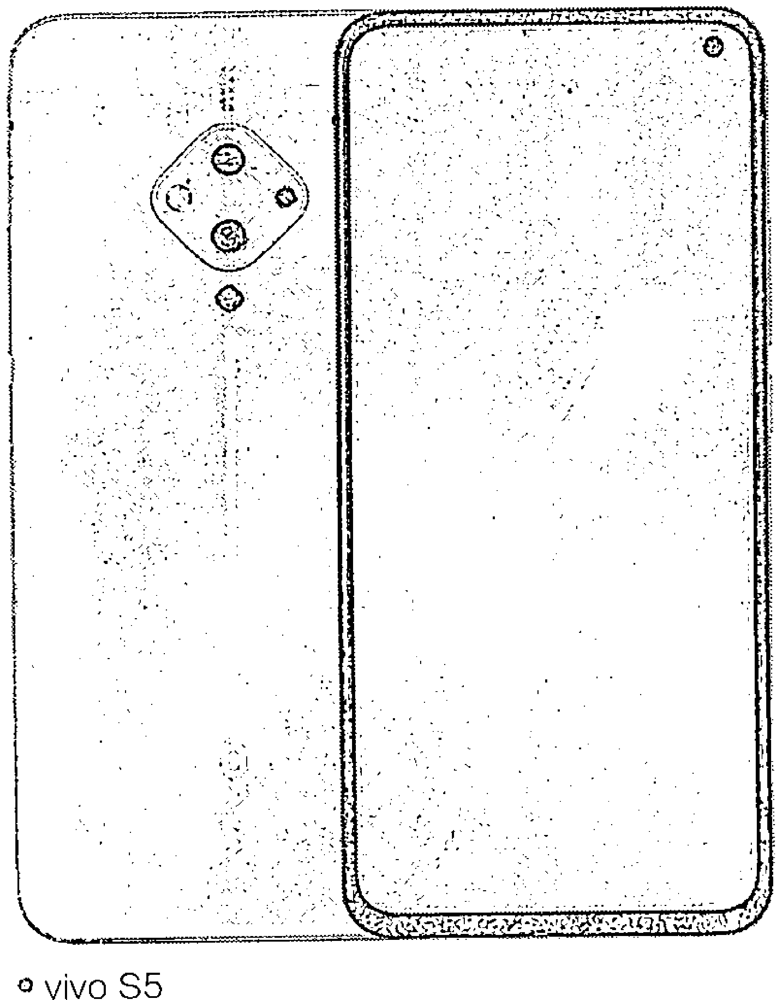

| 参数对比 | vivo S5 | 小米CC9 Pro |
| :--- | :--- | :--- |
| 屏幕 | 6.44英寸AMOLED(2400×1080像素) | 6.47英寸AMOLED(2340×1080像素) |
| 处理器 | 高通骁龙712 | 高通骁龙730G |
| 内存/存储 | 8GB/128GB | 6GB/128GB |
| 前置镜头 | 3200万像素 | 3200万像素 |
| 后置镜头 | 4800万+800万+200万+500万像素 | 1.08亿+2000万+1200万+800万像素+微距镜头 |
| 机身 | 157.90mm×73.92mm×8.64mm | 157.8mm×74.2mm×9.67mm |
| 电池/重量 | 4100mAh(22.5W)/188g | 5260mAh(30W)/208g |
| 参考价格 | 2698元 | 2799元 |

#### 设计上的差异

vivo S5和小米CC9 Pro的屏幕尺寸相近，而且都采用了更高色域的AMOLED屏幕和最新的屏下指纹识别模块，无论是色彩表现还是指纹解锁的效率都处于极高的水准。

其中，vivo S5的屏幕比例为20：9，所以它的机身显得更加修长，并将一枚直径仅有2.98mm的前置摄像头隐藏在屏幕之下（图1），和其他“挖孔屏”手机相比其屏幕视觉更加完整，无论是看视频亦或是玩游戏，都能带给你身临其境的视觉体验。vivo S5提供了冰岛恋歌、幻影蓝和星眸黑三种配色可选，后置四摄模块采用了独特的菱形矩阵排列，它不同于传统的垂直或方圆的排列布局，辨识度极高。

小米CC9 Pro采用了更主流的“水滴屏”设计，并在此基础上引入了双曲面屏（图2），屏幕以优雅的弧度延伸至两侧，美观的同时带来更沉浸的视觉感受，当手指划过曲面时可带来更加顺畅的全面屏操作体验。这款产品可选暗夜魅影、冰雪极光和魔法绿境三种配色，五颗摄像头垂直排列在后盖的左上角。由于CC9 Pro内置更大的电池，所以它的厚度和重量略有超标，持握时存在明显的压手感。

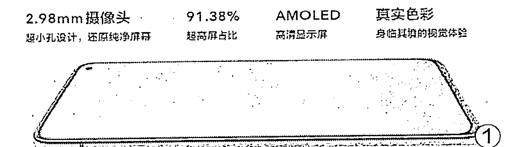


#### 配置上的对比

vivo S5和小米CC9 Pro分别搭载高通骁龙712和骁龙730G移动平台，后者将CPU核心从Kryo 360升级到了Kryo 460，GPU也从Adreno 616换成了Adreno 618，整体性能有显著的提升（图3）。换句话说，小米CC9 Pro凭借骁龙730G有着更好的游戏性能表现。

vivo S5的优势则是一步到位，它标配8GB LPDDR4X内存和128GB UFS2.1闪存，并有着2698元的统一售价。小米CC9 Pro可选6GB+128GB、8GB+128GB和8GB+256GB，三个版本售价分别为2799元、3099元和3499元，较与vivo S5同配置的版本贵了400元左右，入手门槛更高。


但是，小米CC9 Pro相对更高售价的背后则是更丰富的功能，它支持全功能NFC，可以直接刷公交或门禁。手机顶部配有红外端口，可以随时扮演家电遥控器的角色。此外，这款产品还内置更大的5260mAh电池（图4），以及更快的30W充电功率，在续航方面的表现罕有敌手。


#### 影像上的较量

自拍一直都是vivo的传统优势项目，此次S5引入了像素值更高的前置摄像头，并主打5重超质感美颜功能，包含焕颜肤色、质感肌肤、元气美妆、智慧美型和精塑五官，可针对人脸五大区域进行对应的专属优化（图5）。此外，vivo S5还加入了丰富的人像风格和自拍姿势选择，比如为蔡徐坤的粉丝“ikun”们定制的专属蔡徐坤明星pose拍照姿势指引。vivo S5后置则为比较主流的四摄方案，由4800万像素主摄、800万像素超广角、500万像素景深虚化和200万像素的微距镜头组合（图6），自拍之外也能覆盖各种场景的拍摄需求。

小米CC9 Pro此次主打由1.08亿像素镜头领衔的豪华五摄矩阵，HMX传感器拥有1/1.33英寸的超大底，再结合1200万像素的人像镜头、800万像素的超长焦镜头、2000万像素超广角镜头和微距镜头（图7），无论是拍照品质还是适用的场景功能都达到了第一流水准，也因此得以登顶DxOMark排行榜，与华为Mate30 Pro并列成为世界第一。


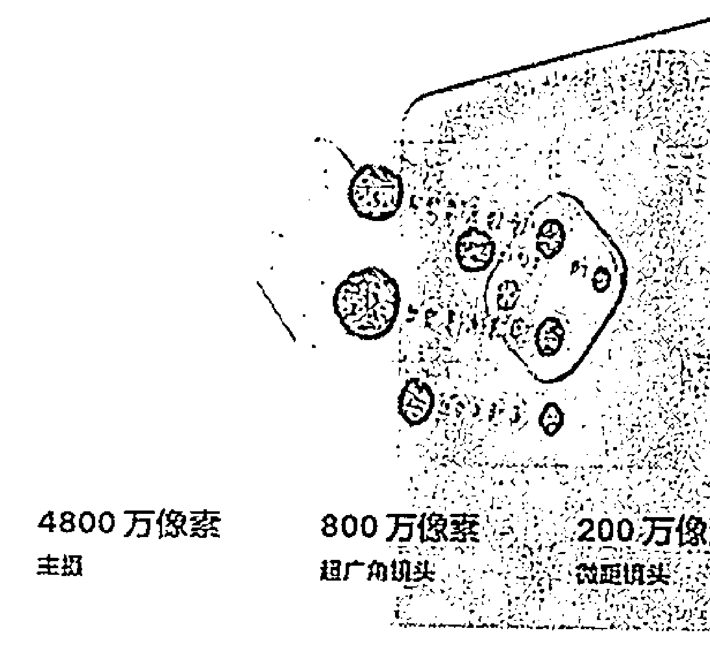

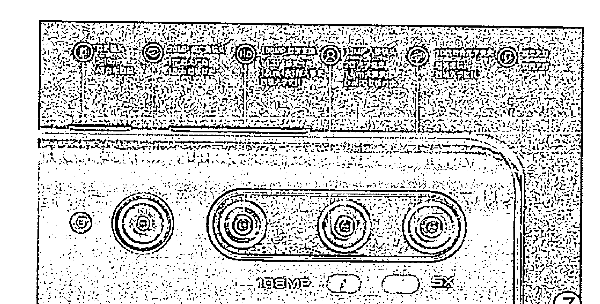

**小结**
作为主打拍照的新品代表，vivo S5的前置屏下摄像头有着全球最小的孔径，后置菱形摄像头也更具辨识度。在美颜自拍方面的功能和体验难逢敌手，188g的体重更轻盈，入手门槛也更低。小米CC9 Pro的优势在于相对更强的性能、双曲面屏带来了细腻手感以及包括NFC、红外遥控、更大电池和充电功率在内的丰富功能，后置五摄矩阵的拍照表现也趋于完美。如果你不追求发烧级别的性能，小米CC9 Pro可以带来一步到位的体验。

### 记录新的风姿

#### 摄像头大升级

文|葬月 知行

早些年，随着计算机和互联网的普及，网络视频聊天曾经是一大潮流。坐在电脑前，人们借助摄像头就能够和远隔千万里的朋友进行面对面聊天，这着实让人们深刻感受到了网络的神奇。


不过如今已步入移动互联网的时代，使用手机进行视频通话成为了我们生活中的一部分，完全脱离了笨重电脑和网线的枷锁，那些昔日的摄像头们似乎也从我们的生活中隐去了身形。

其实这只是表面现象，随着整个互联网以及相关产业的发展与进步，消费级摄像头也在不断地发展，早已转向更多元、更专业的领域，去不断地满足如今拥有更高需求的用户们。

#### 家用摄像头发展新趋势

如果你对摄像头的认识还停留在视频通话的年代，那可就大错特错了，如今的摄像头已经在规格、性能以及外形设计这三个方面走了很远。

在“标准”的电脑摄像头方面，主流的分辨率已经从720P转向1080P，不少产品都自带高音质麦克风，一个摄像头就可以搞定视频通话，不再需要累赘的麦克风；自动对焦与光线校正功能则让用户在视频通话时即便进行移动或环境光线发生变化时，也依然能够保持清晰的人脸并让画面保持明暗恒定。

另一些摄像头更是对拥有创作视频需求的用户提供额外的便利，通过自带的配套软件，用户可以用很简单的操作对视频的录制进行更多、更专业的调节，如多视频源录制、以适用于手机的16:9规格进行视频录制等。

大家已经在手机上习惯的实时美颜功能也被很多电脑摄像头集成，让视频每一帧的画面都如同经过美图秀秀的美化一般。

以主流价位的奥尼剑影摄像头为例，它不仅支持1080P，还带有很多便利功能，可同时兼容电脑与移动设备、自带麦克风等，而价格只有150元左右。即使是更便宜的入门级的720P产品，在帧速、画质、附加功能等方面也有了明显的进步。

监控摄像头则是目前消费级摄像头市场中正在快速升温的一个品类。在节奏越来越快、活动范围越来越广的现代生活中，家庭或店铺的无人值守着实是个大问题，这就是消费级监控摄像头的用武之地。


在入门级产品方面，价格只有


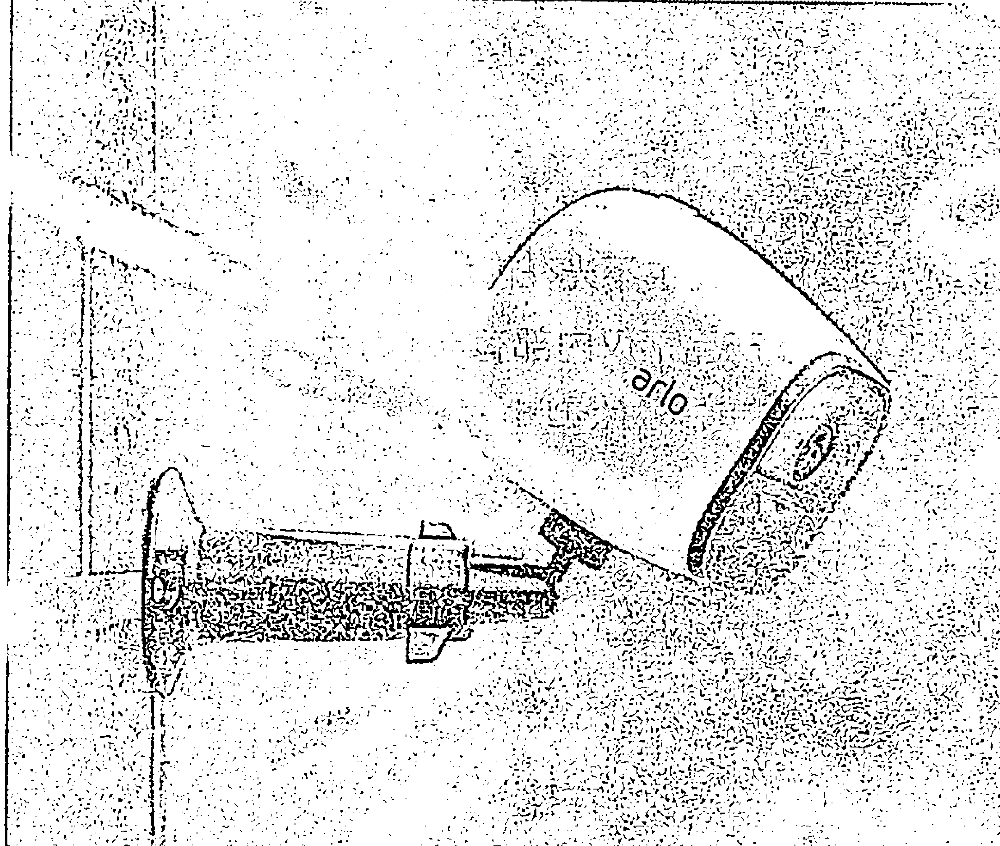

一百元出头的小米小白CMSXJ01C摄像头支持720P，而支持1080P高清的小米小白智能摄像机1080P云台版的价格也只在150元左右。

价格稍高的消费级监控摄像头则功能更强，它们不需要使用电脑，可以直接通过无线网络连接，用内置闪存卡或网络备份，还能用手机APP实时监控甚至操作、具备声音和动作检测报警功能等，即便没法实时监控也能够通过手机收到报警，及时发现异动并妥善处理。目前的很多消费级监控摄像头还具有三防功能，可以安装在室外，用来查看来访者，或者监控放在门口的快递等。例如网件arlo摄像头，它采用内置电池供电，具有三防功能，与控制器使用无线连接，还能同时使用多台进行组网。

考虑到监控摄像头在黑暗环境中的工作需求，支持红外、夜视摄像的摄像头产品也越来越多，不同品牌与型号的红外图像质量不同，夜视距离也各有远近。现在相关厂商们纷纷在此方面发力，力求给用户带来黑暗环境中更加清晰的视频监控体验，新产品不仅能提供越来越清晰的夜视画质，有些甚至还能够让夜视视频拥有色彩。比如华为AV71就采用微光全彩夜视而非红外方式，使其夜视图像具有彩色效果，更清晰明确。

目前的部分消费级监控摄像头还拥有了原先专业产品才具备的转动能力，以往想要监控整个房间，一个摄像头常常是不够的，必须要用多个摄像头才能实现对房间的全覆盖监控。如今一台具备了360°

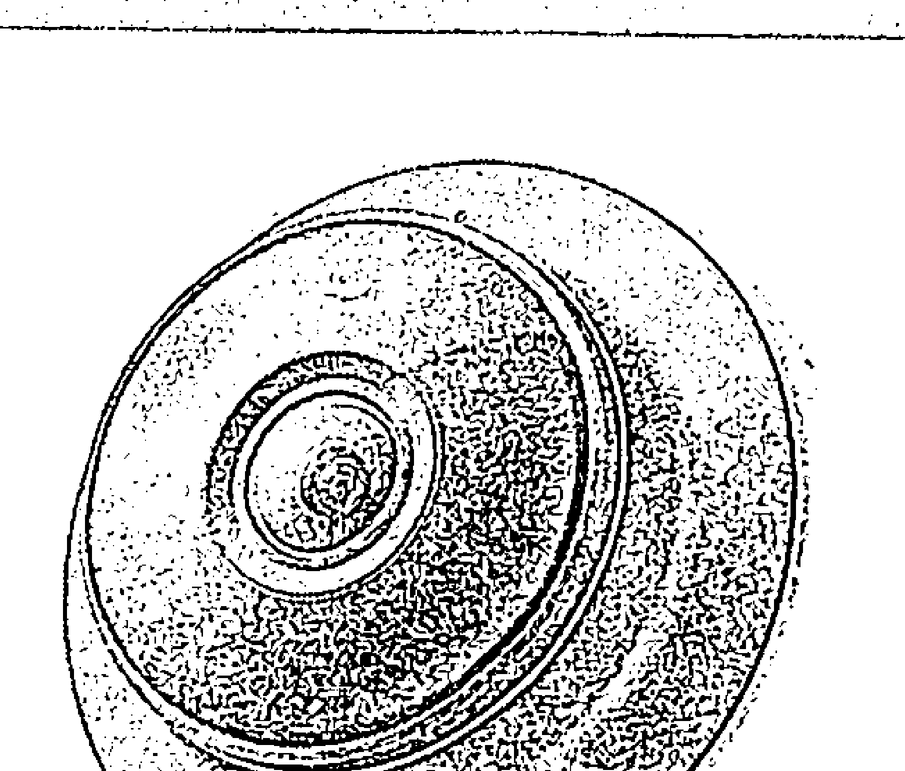

全景功能的消费级摄像头就足以满足要求，比如可进行360°视角转动的360智能摄像机云台版，可以轻松地观察到整个房间。

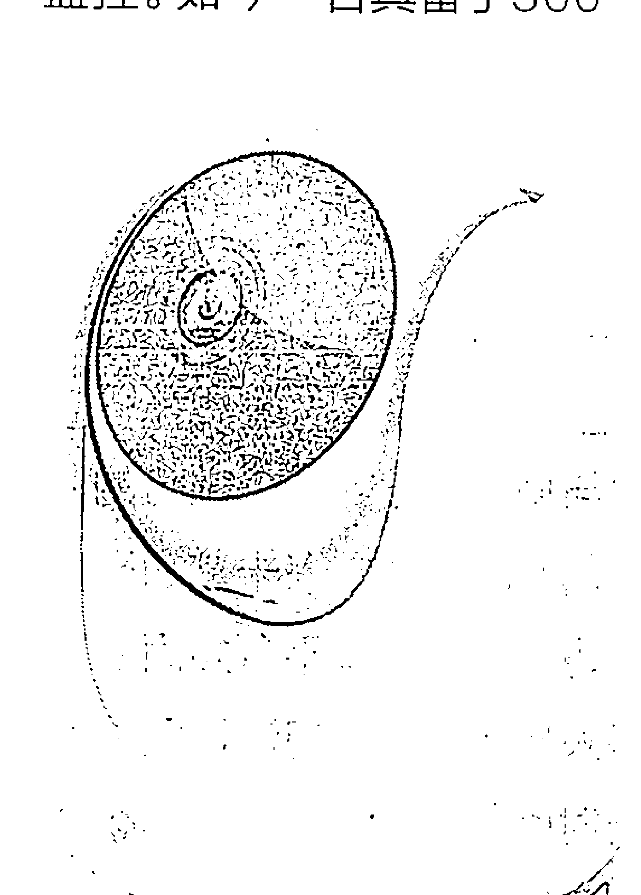

当然，在如今的时代，摄像头的功能和性能也讲求个性化，为用户提供更符合特殊需求的新功能。比如在家用监控摄像头方面，每次通过手机APP手动操控视角移动很麻烦？自定义巡航功能就能够让摄像头按着设置好的巡航路径自动移动视角，让监控巡视更轻松；害怕家里的爱宠发现主人不在马上放飞自我开始拆家？智能追踪观看功能能够捕捉跟踪移动物体，家里的宠物小宝贝们跑得再快也难逃摄像头的法眼；家里有宝宝？哭声侦测功能通过监听哭声随时发现宝宝哭闹并向APP发送报警。这些额外功能都极大地扩展了监控摄像头的能力，让监控摄像头不再是一个只能看的电子眼，而是一个贴心的智能视频监控管家。

在追求颜值的今天，摄像头的变化也不光在内涵方面，很多产品不仅内部有料，而且颜值更高，体型也更加多元化：有的摄像头外形科技感十足，如萤石C6Tc 1080P云台摄像头就拥有如精灵球一样的身体；有些则个性十足，例如华为智选HQ1带有两个猫耳的外形超萌，让摄像头看起来不再冷冰冰，而是亲和度超高的好伙伴；还有一些则强调便携、易用和隐私，罗技B525商务高清摄像头的体型被设计得更加小巧，更加适合外出携带，不使用时折叠也可避免被黑客偷窥。

华为智选HQ1特别适合搭配可爱型电脑

萤石C6Tc很像一个精灵球

罗技B525体积小巧，可以很方便地折叠关闭或携带

#### 新功能更专业

随着如今的远程办公、远程教学等新工作、生活方式的发展和普及，更多的摄像头应用及相应产品走向大众。例如网络远程视频会议能够突破距离的限制，让身处各地的人们通过网络与摄像头进行实时交流；网络讲座能够打破空间的限制，让一场讲座突破演讲厅有限的空间限制，通过网络与摄像头容纳成千上万的听众。还有如今方兴未艾的网络教育，不少网课平台如雨后春笋般出现，让人们通过网络突破时间与地理位置的限制，享受到质量更高的教育资源。这些都绝对离不开摄像头的帮忙，而且对摄像头的性能，如分辨率、镜头能力、光线适应能力等提出了更高的要求。

以网络教育应用为例，它对于摄像头麦克风音质、收音能力等的要求也更加苛刻，室内光线的补偿优化等相关功能也是摄像头所必备的功能。同时，在目前现有的网络速率下，如何把握好画质与延迟之间的关系也是对摄像头的一大挑战。此外，一些特殊网络课程还需要如PPT、白板、课本等内容的视频与授课教师一同出现，支持多视频源功能的摄像头在此时变得格外必要。

罗技CC3500e GROUP是一组设备而非单一的摄像头

罗技Pro C920高清网络摄像头强大的视频美颜功能甚是强大

合下，一些高端家用摄像头也可以勉强应付，但专业的商用摄像头显然更适合，只是价格会相对高昂。例如罗技C1000e，虽然价格已经在千元以上，但仍属入门级商用产品，目前很多高端会议室使用的罗技CC3500e GROUP价格甚至达到了8000元左右，但因为它强大的性能、独特的遥控功能、号码直播能力等，广受商业用户欢迎。

如今直播行业也非常火热，有大量主播投身于这一行业，而且较低的门槛让很多普通用户也可以进行简单的直播，因此能够为直播增色的专用摄像头的需求也更加强烈。

高画质是对直播摄像头最基本的需求，自动对焦、光线校正、降噪麦克、背景自动处理等功能对于直播摄像头来说更是加分项。比如罗技的Pro C920就能进行实时美颜甚至即时背景去除或替换、特殊画面效果、画面滤镜等后期处理，通过摄像头全面呈现出一个最精彩的自己，使其一度成为直播标配摄像头。

在如今的时代，摄像头的生物识别功能也正被充分开发，例如对人脸身份的识别功能，那些具备3D识别功能的摄像头就能够胜任此类应用情境，实现智能家居的刷脸登录、刷脸开锁、智能办公室的刷脸签到、智能零售的刷脸付款等。此外这些摄像头还可以通过AR技术，让用户远程试衣、模拟新发型、自动判断体型进行健身指导等。虽然看起来有些科幻，但这些新型摄像头和相应的应用场景实际上已经在越来越多地进入人们的生活与工作之中了。

功能与性能更强大的摄像头让“未来”应用场景成为现实

> 尽管网络的发展让用户的需求发生了很大的改变，使得旧式摄像头悄然退出了历史舞台，但也正是因为网络的发展，为摄像头打开了面向更专业、更广泛领域发展的大门，前所未有的大升级产生了各种新型摄像头和新型应用。现在的摄像头正在为用户提供更加个性化的服务，记录下用户的全新风采也焕发出了全新的生命力：CF

### RedmiBook 13 对 华为MateBook 13锐龙版

不知不觉间，轻薄本领域已开始追求更加极致的“全面屏”设计，并在轻薄属性上再进一步。华为MateBook 13锐龙版和RedmiBook 13分别是2019年中和年底上市的全面屏代表，它们之间谁更适合你？

#### 屏幕比例的差异

两款轻薄本在设计上的最大差异，主要表现在屏幕的显示比例上。其中，RedmiBook 13采用了标准的13.3英寸16:9屏幕。与市面上其他同规格的竞品相比，这款产品的下边框只有9.96mm。究其原因，是因为RedmiBook 13选用了U型屏幕定制背板（图1），可以将屏幕排线和相关电路折叠到屏幕面板背面，再结合左、右、上三面窄边设计，实现了高达89%的屏占比，呈现更为广阔的无边世界。

华为MateBook 13锐龙版的屏幕为3:2显示比例的13英寸屏幕，这种比例的屏幕面板较16:9比例面板更短更宽，可视面积提升约4.5%，更加适合上网和办公体验。令人欣喜的是，MateBook 13锐龙版的屏幕分辨率达到了2K标准，而且还拥有100% sRGB色域，无需外接显示器也能从事专业的图像设计类工作。这款产品的左右边框宽度只有4.4mm，上下边框略宽，整体屏占比参数为88%。和RedmiBook 13相比，MateBook 13在屏幕上边框内集成了摄像头，方便用户随时进行视频聊天和视频会议。

| 参数对比 | RedmiBook 13 | 华为MateBook 13锐龙版 |
| :--- | :--- | :--- |
| 屏幕 | 13.3英寸 (1920×1080像素) | 13英寸 (2160×1440像素) |
| 处理器 | 第十代酷睿i5-10210U | AMD锐龙5-3500U |
| 内存/硬盘 | 8GB/512GB SATA SSD | 8GB/512GB PCIe SSD |
| 显卡 | GeForce MX250独显 | Radeon Vega 8核显 |
| 接口 | USB3.1 Gen1×2、HDMI、音频接口 | USB Type-C×2、音频接口 |
| 摄像头 | 无 | 有 |
| 体积 | 307.3mm×195mm×17.8mm | 286mm×211mm×14.9mm |
| 电池/重量 | 40Wh/1.23kg | 42Wh/1.3kg |
| 参考价格 | 4799元 | 4399元 |

#### 工业设计的对比

两款轻薄本都采用了全金属的机身设计，但MateBook 13锐龙版的四面采用钻石切割打磨倒角，机身表面引入了细腻的陶瓷喷砂工艺，屏幕面板也贴有专用的保护玻璃盖板，电源键还集成了指纹识别功能（图2），在感官、触感和安全便携层面上较RedmiBook 13更加出色。

#### 硬件配置的碰撞

顾名思义，华为MateBook 13锐龙版搭载的是AMD最新的第二代移动锐龙5-3500U处理器（图3），集成Radeon Vega 8核显。和同家族MateBook 13酷睿独显版相比，售价便宜了1000元左右，入手门槛更低。此外，MateBook 13锐龙版还存在Linux系统的型号，售价更是低至4099元，如果你恰好有正版Windows 10系统，可以选择这一版本进一步降低投入资金。

RedmiBook 13搭载了英特尔最新的第十代酷睿i5-10210U处理器（图4），并与英伟达GeForce MX250独显搭配，整体性能要优于锐龙5-3500U+Radeon Vega 8核显的组合，在常见游戏中可以跑出更高的帧数。值得一提的是，RedmiBook 13可选拿掉了MX250的集显版，售价为4499元，只是i5-10210U集成的UHD620核显性能一般，如果你有一定的游戏需求，请尽量绕过这一版本。

两款轻薄本都标配板载的8GB DDR4内存，以及M.2接口的512GB SSD。其中，华为MateBook 13锐龙版的SSD采用了PCIe通道，读取速度可达3000MB/s，而RedmiBook 13的SSD则采用SATA通道，读取速度约为550MB/s，在存储性能上处于下风。

#### 扩展和散热的较量

两款轻薄本为了追求纤薄设计，提供的接口数量都不多。其中，RedmiBook 13配备了2个标准的USB3.1 Gen1和1个HDMI视频输出接口，想充电需要使用专用的充电端口。该产品支持1C快充技术，35分钟可充电50%。华为MateBook 13锐龙版则配备了2个USB Type-C接口，除了拥有USB3.1 Gen1的传输速度外，它们还分别支持充电和DisplayPort视频输出功能，其标配的电源适配器体积更小且支持给其他智能手机充电。

在内部的散热设计上，RedmiBook 13采用了名为“飓风”的散热系统（图5），由独家定制的羽翼风扇、6mm直径双热管和全铜散热模组组成。华为MateBook 13锐龙版则内置鲨鱼鳍风扇2.0系统（图6），由双风扇双热管组成，风扇扇叶采用仿鲨鱼鳍设计，通过6颗温度传感器可更加智能地协调风量并抑制噪音。

#### 小结

作为可提供“全面屏”视野的轻薄本代表，华为MateBook 13锐龙版和RedmiBook 13无论是颜值还是便携性都非常出色。在性能方面RedmiBook 13领先，而体验方面则是MateBook 13锐龙版表现更好。目前，RedmiBook 13已支持“小米互传”功能，可以像华为Share一碰传那样在手机和笔记本之间高速分享文件，但MateBook 13也带来了手机和笔记本之间多屏协同的能力（图7），在“软实力”方面显然还是后者更优。CF

### “两面派”的较量：华为MatePad Pro和三星Galaxy Tab S5e

和iPad相比，Android系统的平板电脑始终没能形成“战斗力”，一方面源于相关生态的不成熟（很多热门APP都没有针对Pad显示和操作的优化版本），另一方面则受到了更大屏幕的智能手机的挑战。不过，对很多有着轻办公需求的用户而言，手机太小，笔记本又过于笨重，唯有具备一定生产力的平板电脑才能胜任。而华为MatePad Pro和三星Galaxy Tab S5e，就是娱乐和办公两相宜的“两面派”代表。

#### 设计上的差异

华为MatePad Pro和三星Galaxy Tab S5e都采用了一体化的全金属机身和10.x英寸16:9显示比例的屏幕，差异是MatePad Pro引入了智能手机领域流行的“挖孔屏”设计，将前置摄像头嵌入到了屏幕左上角的小孔内。同时，该产品屏幕边框只有4.9mm，屏占比高达90%（图1），堪称平板电脑中的“全面屏”。需要注意的是，为了压缩边框，MatePad Pro取消了指纹识别模块，只能通过前置摄像头进行2D人脸解锁，但结合拿起设备亮屏、双击亮屏、暗光环境下屏幕补光等功能，也能方便快捷地解锁设备。

| 参数对比 | 华为MatePad Pro | 三星Galaxy Tab S5e |
| :--- | :--- | :--- |
| 屏幕 | 10.8英寸IPS (2560×1600像素) | 10.5英寸AMOLED (2560×1600像素) |
| 处理器 | 麒麟990 | 高通骁龙670 |
| 内存/存储 | 6GB/128GB(支持NM存储卡) | 4GB/64GB(支持TF存储卡) |
| 摄像头 | 前置800万/后置1300万像素 | 前置800万/后置1300万像素 |
| 三围 | 246mm×159mm×7.2mm | 245mm×160mm×5.5mm |
| 电池/重量 | 7250mAh/460g | 7040mAh/400g |
| 参考价格 | 3299元起 | 2599元起 |

三星Galaxy Tab S5e采用了传统平板电脑的形态，同样引入了窄边框设计，只是边框较MatePad Pro略宽，屏占比参数方面处于劣势。这款产品的特色是拥有5.5mm厚度和400g的极致轻盈身材（图2），在同尺寸平板电脑中的便携性堪称无敌，同时还巧妙地把指纹识别放置在机身侧面的开机键下面，不仅便于使用，也提高了指纹识别的准确性和识别速度。加上内置的脸部识别技术，为Galaxy Tab S5e提供了双重的安全识别保障。

#### 配置上的对决

在屏幕的显示质量上，三星Galaxy Tab S5e凭借Super AMOLED显示屏，在对比度和色域方面要明显优于IPS材质屏幕的MatePad Pro，而且AMOLED还具备暗色背景下更省电的特性，选择纯黑壁纸和暗色系主题可进一步提升Galaxy Tab S5e的续航时间。华为MatePad Pro的最大特色，是搭载了刚刚在华为Mate 30/nova 6系列手机身上亮相的麒麟990移动平台，这也是华为第一次在平板电脑领域应用最新发布的旗舰级SoC。同时，MatePad Pro还标配6GB内存以及128GB UFS3.0闪存，读写速度更快，文件传输效率更高。这款产品还内置7250mAh电池，而且是全球首款支持双向无线充电的平板电脑，包括40W有线快充以及15W正向无线充电和7.5W反向无线充电。

三星Galaxy Tab S5e搭载了高通骁龙670移动平台，可选4GB+64GB或6GB+128GB两个配置版本，售价分别为2599元和3099元。考虑到这款产品支持存储卡扩充，低配版的性价比更高。就性能而言，骁龙670介于麒麟710和麒麟810之间，属于能被麒麟990“秒杀”的存在，如果你追求最顶级的性能，Galaxy Tab S5e的竞争力显然不如MatePad Pro。Galaxy Tab S5e在5.5mm厚度的机身里塞进了7040mAh容量的电池，但其所支持的快充功率只有15W，充电速度还是偏慢。

坏消息是，两款平板电脑都取消了3.5mm耳机接口，为了不在听歌的同时影响充电功能，建议为它们搭配蓝牙无线耳机使用。好消息是，两款平板电脑都内置了4个扬声器，其中Galaxy Tab S5e采用的是AKG调校的四声道扬声器系统（图3），支持杜比全景声的三维环绕声。MatePad Pro则经由哈曼卡顿调音，同样具备细腻逼真的环绕立体音效。

#### 功能体验的对比

考虑到如今的平板电脑已经不再满足于上网、视频等娱乐体验，移动办公才是它们的发展方向，所以两款平板电脑都在生产力方面进行了诸多优化。除了提供专用的键盘套（装上就是笔记本）和触控笔（完美的原笔迹手绘体验）以外，三星Galaxy Tab S5e可随时激活特色的Dex模式（图4），华为MatePad Pro也能随时切换到电脑模式（图5），获得类似Windows 10系统的显示界面和操作逻辑，结合键盘套和无线鼠标，用起来无限接近传统的笔记本电脑，多窗口显示和大量文字录入以及文档PPT编辑都更具效率。

考虑到Android系统APP鲜有针对性的显示和操作优化，华为MatePad Pro引入了特色的“平行界面”，很多热门APP都能利用该功能实现左右分屏显示，比如左半屏是今日头条的文章列表，右半屏则是点击文章的预览界面（图6）。如果你使用的是华为/荣耀手机，还能通过多屏协同功能，将手机“分身”至平板电脑，实现手机和平板之间协同操作（图7）。

> 华为MatePad Pro和三星Galaxy Tab S5e都是非常精致的轻薄Android平板代表，前者拥有媲美最新旗舰手机的性能，多屏协同功能的引入也带来了更多的玩法。Galaxy Tab S5e虽然性能偏弱，但入手门槛更低，极致轻盈的身材更容易吸引更多女性用户的青睐。CF

### 主流大屏新秀：戴尔灵越15-5593 对 神舟精盾X55A1

随着第十代酷睿成为市场的主流，新一代轻薄本已经较上市初期有了明显的调价。作为武装10nm版十代酷睿的新品代表，戴尔新灵越15-5593和神舟精盾X55A1分别主打独显和锐炬Plus核显，在价位相近时谁更适合我们？

#### 设计上的差异

戴尔新灵越15-5593（下文简称新灵越15）和神舟精盾X55A1都采用了较大的15.6英寸屏幕，并引入了窄边框元素，尺寸和便携性相仿。两款产品在设计上的最大差异就是机身材质，精盾X55A1的外壳采用了铝合金，金属质感更显档次，整机重量也较对手轻了100g左右，机身底部采用了侧置隐藏式的散热孔，整体感更强（图1）。新灵越15的外壳材料都是工程塑料，表面不易出现划痕，但质感就要差了一些。

| 参数对比 | 戴尔新灵越15-5593 | 神舟精盾X55A1 |
| :--- | :--- | :--- |
| 屏幕 | 15.6英寸 (1080P, 45% NTSC色域) | 15.6英寸 (1080P, 72% NTSC色域) |
| 处理器 | 酷睿i5-1035G1 | 酷睿i5-1035G4 |
| 内存/硬盘 | 8GB/512GB SSD | 8GB/512GB SSD |
| 显卡 | GeForce MX230 | 锐炬Plus 48核显 |
| 接口 | SD读卡器、USB3.1 Gen1×2、USB2.0、USB Type-C、HDMI、RJ45、音频接口 | MicroSD读卡器、USB3.1 Gen1×2、USB2.0、雷电3、HDMI、音频接口 |
| 体积 | 364mm×249mm×18mm | 362mm×242mm×17.3mm |
| 电池/重量 | 42Wh/1.83kg | 56.24Wh/1.73kg |
| 参考价格 | 4399元 | 4699元 |

得益于相对宽大的机身，两款轻薄本都配备了标准的全尺寸键盘，电源键也都放在了数字小键盘的右上角（图2），并没有提供独立的快捷键。受制于产品定位，新灵越15和精盾X55A1都不支持指纹识别，缺乏红外传感器的前置摄像头也无法启动Windows Hello的人脸识别功能，在安全性方面的表现一般。

#### 配置上的异同

神舟精盾X55A1的屏幕拥有72% NTSC的高色域，可以呈现更加丰富的色彩，对于从事图形设计类工作的用户而言，无需外接显示器也能获得准确的显示能力。这款产品搭载了英特尔第十代酷睿Ice Lake平台家族中的i5-1035G4，集成有48个EU单元的锐炬Plus 48核显，较之第八代酷睿处理器集成的UHD620核显有着2倍以上的性能提升。如果你追求更高的3D性能，神舟精盾X55家族还提供了搭载i5-1035G7和i7-1065G7处理器的高配版（图3），“G7”代表集成锐炬Plus 64核显，性能较锐炬Plus 48还能再提升30%左右，只是售价分别上浮300元，同价位已经可以买到做工更好的独显轻薄本，因此它们的性价比有所缺失。

戴尔新灵越15的处理器同样隶属于Ice Lake平台，只是换成了集成32个EU单元的UHD核显的i5-1035G1。为了弥补其3D性能不足的缺陷，这款产品还额外武装了英伟达GeForce MX230独显，我们可以将其理解为早期的MX150，性能在锐炬Plus 64核显之上，所以自然也更加领先神舟精盾X55A1集成的锐炬Plus 48核显。

新灵越15系列同样提供了丰富的配置可选，比如没有独显的低配版，以及配备i7-1065G7处理器的高配版（图4），可惜前者3D性能太差，而后者在搭配MX230独显时，更强的核显反而被浪费了，相对而言还是本文涉及型号的性价比最高。

#### 扩展和散热的对比

两款轻薄本都提供了较为丰富的扩展接口，它们的差异在于新灵越15配备的是标准SD读卡器，并保留了RJ45接口，但USB Type-C接口只支持数据传输，不支持充电和视频输出功能。精盾X55的读卡器只支持MicroSD标准的“小卡”，它的USB Type-C为最顶配的雷电3，不仅可以外接桌面显卡的扩展坞，还支持视频输出和充电功能。

在内部设计方面，神舟精盾X55A1的主板布局更紧凑，在有限的机身里塞进了更大的电池和4个扬声器，续航更好且可呈现出声量更足的环绕音效。这款产品采用了单风扇双热管的散热模块，最大的遗憾是无法继续扩充硬盘，想升级更大容量的SSD就必须换下标配的硬盘（图5）。戴尔新灵越15的内部有大量的闲置空间，预留了1个2.5英寸硬盘扩展位，有需要的用户可以自行加装第2块硬盘（图6）。这款产品采用了单风扇单热管的散热模块设计，散热表现相对一般。

> 作为Ice Lake平台的新品，戴尔新灵越15和神舟精盾X55A1的配置很有代表性，一方面是通过独显拔高3D性能，另一方面是利用锐炬Plus核显在提供较高3D性能的同时提升便携能力。如果你的预算有限，更便宜的新灵越15可以帮你省下更多银子；如果你注重体验，更轻薄且配备雷电3的精盾X55A1能给你带来更多惊喜。CF

### 4G时代的最后标杆
OPPO K5 对 Redmi K30

虽然最新款5G手机已经陆续上市，但它们的售价普遍都在2000元以上，还存在一定的入手门槛。如果你觉得5G并非刚需，那就不妨考虑4G时代的最后标杆，搭载骁龙730G的主流悍将们。作为这些标杆中的代表，OPPO K5和Redmi K30 4G版谁更适合你？

#### 设计形态的差异

虽然价格相似，但我们一眼就能看出OPPO K5和Redmi K30的不同，原因就是它们采用了迥异的设计风格。其中，OPPO K5延续了手机圈中经典的“水滴屏”设计，提供了赛博金属、奇幻森林和极地阳光3种配色可选，后置4颗摄像头位于后盖左上角呈竖行排列。

Redmi K30的特色在于引入了挖孔屏，而且还是少见的“双孔全面屏”，在屏幕右上角嵌入了2颗前置摄像头，较之“水滴屏”在感官上的整体性更好。这款产品可选花影惊鸿、深海微光和紫玉幻境3种配色，后置4颗摄像头居中竖行排列，并在镜头模组上增加了圆形CD纹的装饰（图1），很多网友将这一设计称为“投币机”，看起来非常个性。

两款手机除了屏幕尺寸有别以外，Redmi K30还采用了更加修长的20:9显示比例，同时内置的电池容量更大，所以这款产品的长度和重量较之对手增加了不少。就持握体验而言，OPPO K5的表现要更加轻盈一些。

| 参数对比 | OPPO K5 | Redmi K30 4G版 |
| :--- | :--- | :--- |
| 屏幕 | 6.4英寸AMOLED（2340×1080像素） | 6.67英寸（2400×1080像素，120Hz） |
| 处理器 | 高通骁龙730G | 高通骁龙730G |
| 内存/存储 | 6GB/128GB UFS2.1（支持存储卡） | 6GB/128GB UFS2.1（支持存储卡） |
| 前置摄像头 | 3200万像素 | 2000万+200万像素 |
| 后置摄像头 | 6400万+800万+200万+200万像素 | 6400万+800万+200万+200万像素 |
| 尺寸 | 158.7mm×75.16mm×8.55mm | 165.3mm×76.6mm×8.79mm |
| 电池/重量 | 4000mAh（30W）/182g | 4500mAh（27W）/208g |
| 参考价格 | 1799元起 | 1699元起 |

#### 解锁方式的不同

OPPO K5和Redmi K30的差异还表现在解锁方式上。OPPO K5采用了AMOLED材质屏幕，拥有100% NTSC和97% DCI-P3的高色域表现，并在其基础上集成了最新的光感屏幕指纹3.0模组，其采用OPPO自研的补偿式投光方案，对极端环境下的识别率进行了优化，在湿手或强光场景下也能轻松解锁。

Redmi K30的屏幕材质并非AMOLED，所以自然无缘屏幕指纹功能。为了保证手机正面的整体感，这款产品采用侧置指纹设计，将指纹识别和电源键合二为一，掏出手机的瞬间就能一键亮屏解锁。

#### 硬件配置的异同

两款手机都搭载了骁龙730G移动平台（图2），这颗芯片是高通骁龙7系4G SoC中的最强音，性能与麒麟810和联发科Helio G90T处于一个量级，足以确保常见3D游戏都可以满帧运行。OPPO K5和Redmi K30都采用了LPDDR4X内存和UFS2.1材质的闪存，读写速度较之过去的主流价位手机提升很多，而且两款机器还都支持最大256GB的MicroSD存储卡扩充，这意味着喜欢拍照的用户无需一步到位选择内置256GB存储空间的顶配版。

Redmi K30在配置上的优势在于屏幕刷新率达到了120Hz，属于手机领域的“电竞屏”，每秒可显示120张画面，远超目前传统的60Hz屏幕。更高的刷新率，可以让Redmi K30屏幕滑动更加流畅，无论是文字还是游戏都能够降低拖影感。此外，这款产品还在屏幕顶部集成了红外模块，可以随时扮演遥控器的角色。

OPPO K5和Redmi K30分别内置4000mAh和4500mAh电池，在续航的底蕴上后者占优，而OPPO K5则主打VOOC4.0闪充，30W的充电效率要在Redmi K30的27W之上。此外，OPPO K5采用了1拖3的SIM卡托设计（图3），双卡双待和存储卡扩充两不耽误，而Redmi K30则是3选2的SIM卡托，如果你想加装存储卡就只能安装1张SIM卡了。值得一提的是，两款手机都支持全功能NFC，无论是模拟银行卡、公交卡还是门禁卡都不在话下（图4）。

#### 影像层面的对决

得益于“双孔全面屏”，Redmi K30的前置2000万+200万像素双摄可以带来硬件级的背景虚化效果，OPPO K5的前置摄像头则主打更高的3200万像素。在后置的四摄阵列中，Redmi K30的主摄传感器型号是索尼最新的IMX686，OPPO K5的主摄传感器则是三星GW1，两颗CMOS都拥有6400万像素和1/1.7英寸的感光面积，不仅夜拍效果更好，通过裁幅的方式还能获得接近无损的2倍变焦效果（图5）。

两款手机同时还配备了800万像素的超广角镜头和2颗200万像素的辅助摄像头，其中Redmi K30的两颗辅摄分别为微距和景深镜头，而OPPO K5的辅摄则分别为黑白人像和复古人像风格摄像头（图6）。总的来说，两款手机后置四摄镜头的素质相近，拍照的好坏完全取决于相机APP后期的成像算法。

> OPPO K5和Redmi K30是目前最实惠的骁龙730G手机代表，辅以6400万像素四摄矩阵、UFS2.1闪存、全功能NFC以及4000mAh+级别的电池，在同价位手机中并不存在明显的短板。相对来说，Redmi K30主打更高的刷新率和更实用的红外遥控功能，而OPPO K5则具备更快的充电和更好的美颜拍照能力。

### 入门级显卡迎来新架构
### AMD Radeon RX 5500 XT

英伟达发布新的入门级游戏显卡GTX 1650 Super不久，AMD与之对应的显卡Radeon RX 5500 XT（以下简称RX 5500 XT）也正式上市。这意味着千元级显卡再次迎来了激烈的竞争。

其实早在2019年10月，AMD便发布了新的入门级显卡Radeon RX 5500/5500 XT，为苹果电脑准备的Radeon Pro 5500系列更是已经提前上市。而本次官方只发售了RX 5500 XT，另外一个版本的发售日尚未可知。

从拖延了长达两个多月的正式上市、缺席的版本，以及预售时的突然下架和通过满减进行的实际价格调整等都可以看出，这是一款非常“有故事”的产品。下面我们就先从具体规格来了解它吧。

#### RX 5500 XT的规格

RX 5500 XT采用了AMD的Navi核心、RDNA架构，使用7nm工艺制造，支持PCIe 4.0，具体规格如下表。

| 项目 | 值 |
| --- | --- |
| 核心代号 | Navi 14 |
| 流处理器数量 | 1408个 |
| 晶体管数量 | 6.4B |
| 核心频率 | 1845MHz |
| 显存类型 | GDDR6 |
| 显存容量 | 4GB/8GB |
| 显存位宽 | 128bit |
| 显存频率 | 14000MHz |
| 显存带宽 | 224GB/s |
| 辅助供电 | 8Pin |
| 最大功耗 | 130W |

这里需要注意的是，RX 5500 XT采用的Navi 14核心实际上最高能提供24个计算单元、1536个流处理器，因此未来这一系列还有一定的升级空间。而从目前公布的RX 5500 XT同样有4GB显存型号的信息看，RX 5500的定位很可能会比想象中还要更低一些。

从之前的RX 5700系列中，我们已经看到了RDNA架构和7nm工艺制程的威力，据称RX 5500 XT的绝对性能也因此提升了12%，同时功耗降低了30%。那么这款产品的具体性能如何？是否符合AMD的定位呢？

#### RX 5500 XT的性能

我们以首批基于RX 5500 XT的显卡之一，蓝宝石Radeon RX 5500 XT显卡作为测试样卡，其基本规格和设置完全符合RX 5500 XT的官方规格。

#### 3D Mark测试

首先，我们使用3DMark中的FireStrike Extreme以及TimeSpy两项测试对显卡的DX11、DX12综合性能进行考察。这里选取成绩的“显卡分数”一项，可以减少周边配置的影响，更能反映出显卡的实际性能。

| 项目 | FireStrike Extreme | TimeSpy |
|---|---|---|
| RX 5500 XT | 6896 | 4766 |

这个分数对于入门级显卡来说是相当不错的，明显超过了对手同档次显卡的得分。

#### 游戏测试

在游戏实际性能测试中，我们选择了几款具有代表性或者热门的游戏，设置均为Ultra或者极高画质，以尽量避免其他配件的影响，考察显卡的极限能力。考虑到显卡板载8GB显存，因此加入了2K（1440P）分辨率作为参考。

| 项目 | 1080P | 1440P |
|---|---|---|
| 战争机器5 | 82 | 55 |
| 地铁：离去 | 31.85 | 25.59 |
| 古墓丽影：暗影 | 53 | 38 |
| 刺客信条：奥德赛 | 43 | 34 |
| 守望先锋 | 81.7 | 62.4 |

#### 产品推荐

性能略高于竞争对手，实际价格也比竞争对手高100元，这样的定位保持了一个微妙的平衡，我们很难说性价比孰好孰坏，只能建议大家根据喜好来购买最适合自己的显卡。那么，对RX 5500 XT感兴趣的用户，有哪些值得考虑的典型产品呢？

#### 蓝宝石RX 5500 XT 8G白金版

- 最高核心频率：1845MHz
- 尺寸：255mm × 129mm × 46.5 mm
- 接口：DP × 3、HDMI × 1

这是本文的测试显卡，作为AMD的紧密合作伙伴，蓝宝石的A卡还是比较值得信任的，TriXX Boost技术可以为用户带来更加清晰的画质。它采用支持自动启停的双风扇，能够快速散热，低负载时还能完全停转以降低噪声。3个DP接口和1个HDMI接口是RX 5500 XT的标准配置，彻底淘汰了DVI等老式接口。

#### 华硕ROG RX 5500 XT O8G GAMING

- 最高核心频率：1845MHz/1865MHz（OC状态）
- 尺寸：280mm×127mm×58 mm
- 接口：DP×3、HDMI×1

作为华硕旗下的ROG显卡，它当然也为了游戏而生，双轴流风扇设计安静而高效，0dB技术则是在显卡温度低于55℃时可以停转风扇，完全消弭噪声。按照ROG的惯例，RGB信仰灯效绝不能少，它拥有Aura Sync同步灯效技术，可与支持Aura的主板进行联动，展现个人风格。

#### 华硕DUAL RX5500 XT OC EVO

- 最高核心频率：1845MHz/1865MHz（OC状态）
- 尺寸：242mm×130mm×49mm
- 接口：DP×3、HDMI×1

作为面向主流用户的产品，这款显卡的价位略低于ROG同类产品，外形也更加紧凑。它主打散热性能，搭配GPUTweak II智能超频软件，能够提供直观的性能调校与散热控制。另外这张显卡重新设计了风扇尺寸，以便放入更长的扇叶，在低转速下获得较好的散热效果。它采用SAP II超合金供电组件，保证了更好的供电能力，让超频使用更稳定。

#### 盈通AMD RX 5500 XT 8G D6游戏高手OC

- 最高核心频率：1845MHz
- 尺寸：301mm×132mm×49mm
- 接口：DP、HDMI×1、DVI×2

这款显卡的亮点在于外壳的粉色装甲，而且采用了粉紫色的呼吸灯。盈通把这套散热系统称为“女装大佬”，主打粉色少女风，属于当下难得一见的有趣产品。它体型较大，采用3风扇以及纯铜热管、全金属PCB背板，散热能力较好，6+1+1供电则保证了稳定性。喜欢这一类风格的用户，特别是女性玩家们可以考虑一下。此外它还提供了双DVI接口，也特别适合一些需要兼容旧款显示器的玩家。

#### 讯景RX 5500XT黑狼

- 最高核心频率：1845MHz
- 尺寸：290mm×150mm×58mm
- 接口：DP×3、HDMI×1

圆润的外壳是讯景RX 5500XT黑狼的一大特色，它的配置和设置都中规中矩，并无特别之处。不过作为多次A卡降价的急先锋，追求性价比的玩家可以密切关注这块显卡的价格动向。

### 指端感觉自定义
### 键帽高度

文|青岚

要说机械键盘的突出优势是什么？很多用户都会不假思索地说，是“手感”。而机械键盘之所以能让这么多人获得满意的手感，并不是因为本身的设计能适应更多人，而是多样的轴体、键帽提供了非常多的压力、弹力曲线、键程选择，才使它获得了大量用户的认可。不过在大部分情况下，我们都会更关注机械键盘的键轴，而忽略了键帽在个性化、手感里的重要影响。

> > **火速链接**
> 键帽R角的具体内容，请参考本刊2019年第10期的《R键接口有差别 键盘换键需关注》一文。

更有甚者，大部分对键帽有一定了解，甚至是更换过个性键帽的用户，也仅仅是对材质、外形有一定了解，知道各排按键的R角不同、宽度不同而已（图1）。其实很多人并不了解的是，键帽还有一个更个性化，以至于能大幅改变键盘手感的参数——高度。

#### 键帽高度有标准

在如今的大工业时代，所谓的“个性化”产品通常也是有标准的，这样才能毫无阻碍地设计、制造和使用，键帽当然也不例外。一般来说，常见的键帽高度标准主要有OEM和原厂键帽、SA、DSA、XDA、DCS（图2）等，另外不太常见，但已经成为标准的还有MIX、G20等。这些高度标准有些是在市场的变化中逐渐确定的，也有一些是有影响力的键帽大厂专门设计的，例如DSA就是SP（Signature Plastics）的独有产品。

### 键帽高度与手感

键帽的高度不仅影响了键盘表面的高度，而且因为改变了手指敲击时的高度，会间接影响到指尖的键程体验（其实并没有变）以及力度（包括手指姿态改变后的力度和键帽自身重量对键轴实际力度的影响）。

#### OEM和原厂键帽

一般理解中，OEM应该就是对Cherry这一影响力最大的机械键轴的兼容产品，与Cherry原厂键帽应该没什么区别，很多人在购买时也会认为是这样的，但两者的高度是有差别的。一般来说，OEM键帽其实高于真正的原厂键帽，弧度也略大一些，这可能是考虑到使用OEM键帽的兼容键盘厂商希望手感更加清晰。好在既然是偏向仿制的产品，那么在形式上还是要尽量接近的，所以两者的按键R角基本相同（图3）。

相对来说，原厂的键帽因为较矮较轻，所以原厂键盘也就比同样使用Cherry轴或仿Cherry轴，但配有OEM键帽的第三方键盘用起来感觉更轻松，不容易累。不过OEM键帽的应用更广泛，所以基于这一标准的个性化键帽种类更多，是个性化键盘的好选择。

#### SA键帽

SA键帽并不是一种常用键帽，但设计很突出，引人瞩目。这种键帽几乎是全套式键帽中最高的一种，有些使用不同的R角设计，也有统一使用R3弧度的产品，按键侧面均带有饱满的弧形，因此也被叫做高球帽。它的高度让用户必须借助掌托才能比较舒适地使用，而且其顶部也带有堪称“巨大”的下凹弧度（图4），与其他键帽的手感迥异。

由于SA键帽通常重量也较大，所以敲击时会让轴体声音增大、回弹乏力，因此不太适合本就声音比较大、力度呈曲线分布的段落轴。使用线性轴也要注意，一些压力克数很低的轴体可能会被键帽压制得太明显，敲击体验变化太大，会有些怪异的感觉，比如稍微一碰就触发甚至到底。巨大的体积使得SA键帽很适合侧刻工艺，喜欢这种设计的用户可以考虑，此外如站立使用的收银、展示机等设备，希望键盘的键帽大而高，也可以考虑这种键帽（图5）。

#### DSA键帽

DSA又叫球帽或者矮球帽，从名称就可以看与SA有着一定的联系，可以看作是在所有特色上有所收敛的SA键帽。它比SA键帽矮很多，甚至比OEM键帽还要矮，所有的按键为同一高度，顶部有一定的下凹，侧面也带有弧线（图6）。

由于比较矮而薄，因此DSA键帽会让用户感觉键程好像变短了。它适配段落轴或线性轴都可以，而且因为比较常见，可选的色彩、图案等样式更多。

#### XDA键帽

XDA是一种外形与DSA有点类似的键帽，两者最大的差别是XDA顶部更平一些（图7），让手指和键帽的接触面积变大，喜欢这种感觉的用户可以考虑选用。比较麻烦的是这种键帽的种类不如DSA，因此可选范围较小，不容易买到符合自己喜好的产品。

#### DCS键帽

很多人会认为OEM键帽一定是最接近原厂键帽的规格，其实这种理解是错误的。目前市场上的常见键帽中，真正在高度上最接近原厂键帽的是DCS键帽（图8），它在大部分位置上与原厂键帽的高度、R角等都极为相似，只有部分排有些变化，使得整个键面的弧度和原厂略有差别。

DCS键帽目前的人气很高，有很多有趣的产品，如马里奥套装、美国队长套装等。它除了手指导键的感觉会因为键面弧度的变化有一些不同外，在力度、键程等方面的感觉基本与Cherry原厂轴是一样的，特别适合改造原厂或仿原厂设计的键盘。它的产品种类很多，不管是金属边框还是木质边框，各种特色键盘都能很好地适应。

#### 其他

除了以上的几种常见规格外，还有高度只是略小于SA的MIX标准、特别薄的G20等键帽，更小众的产品当然就更多了，比如仿制早期苹果电脑键盘触感的产品就有不止一种。

### 键帽的总体体验与使用建议

至于手感方面，采用树脂材质的键帽规律都是一样的。键帽越高，感觉键轴越长，敲击力度会不自觉地增大。对段落轴来说可能会感觉线性键程更长，对线性轴来说敲击到底部的声响也更大；但因为重量提升，厚度加大，所以回弹力度降低，从手指回馈的力度减小。

而键帽的高度越矮，感觉上键程就越短，较轻的重量与较小的厚度使得轴体声音会随着手指端传出，声音清脆。不过这些矮键帽的R角通常很不明显，使得键盘面缺少人体工学弧度。

一般来说，我们比较建议喜欢青轴等段落轴感觉的用户选择矮键帽，而线性轴用户则可使用原产以上高度的键帽，可以让敲击感更清晰。

### 手腕上的战争

### 小米手表 对 HUAWEI WATCH GT2

○ 小米手表

○ HUAWEI WATCH GT2

随着智能手环的价格不断下探和普及，智能手表面临着极大的竞争压力。为了不被手环这种“小辈”比下去，如今智能手表新品的发展方向均开始看齐Apple Watch，尤其是更倾向于运动与健康检测的工具。作为千元级最热门的智能手表代表，小米手表和HUAWEI WATCH GT2之间谁更适合你？

#### 方圆两种视界

小米手表和HUAWEI WATCH GT2在设计上代表着智能手表的两种风格。其中，小米手表属于向Apple Watch“致敬”的存在，因为它们长得实在是太像了，都是呈矩形设计的屏幕，表框圆润，右侧配备一颗皇冠按钮（图1）。

| 参数对比 | 小米手表（标准版） | HUAWEI WATCH GT2（运动款） |
| :--- | :--- | :--- |
| eSIM | 独立号码/一号双终端 | 不支持 |
| 屏幕 | 1.78英寸AMOLED（448×368像素） | 1.39英寸AMOLED（454×454像素） |
| 处理器 | 高通3100 | 麒麟A1 |
| 内存/存储 | 1GB/8GB | 32MB/4GB |
| 传感器 | A+G传感器、HRM心率传感器、地磁传感器、环境光传感器、气压计、OTS光学位移检测计 | 加速度传感器、陀螺仪传感器、地磁传感器、光学心率传感器、环境光传感器、气压传感器、电容传感器 |
| NFC/GPS | 支持 | 支持 |
| 尺寸 | 44.69mm×36.92mm×12.28mm | 41.8mm×41.8mm×9.4mm |
| 电池/重量 | 570mAh/44g（不含表带） | 455mAh/41g（不含表带） |
| 参考价格 | 1299元 | 1488元 |

*HUAWEI WATCH GT2被细分为46mm和42mm两个版本，后者的屏幕尺寸、厚度和重量都有所减少，但续航时间也被减半，售价较46mm版本便宜100元，本文以46mm运动版为例。

虽然外观相似，但它们在结构上还是有所不同的，除了尺寸、边缘弧度和表带有所区别以外，小米手表的表壳是由陶瓷制成的，而Apple Watch系列则采用了铝合金或钛金属材质。

HUAWEI WATCH GT2在设计上更趋近于传统的机械表，圆形屏幕表面覆盖着一块宝石加工工艺打造的3D曲面玻璃，配合斜面切割的雕塑工艺和金属边框显得更加高档（图2）。

本文涉及的运动款WATCH GT2采用黑色表壳和氟橡胶表带，更显运动风格。如果你喜欢成熟稳重型，则可考虑搭配银色表壳和金属表链的尊享版或银色表壳和真皮材质的时尚款。

#### 两种使用逻辑

小米手表和HUAWEI WATCH GT2同时也代表着智能手表领域的两种使用逻辑。小米手表代表着“脱机”，可以脱离手机独立使用（图3）。这款手表搭载了高通最新的3100芯片，同时搭配1GB内存和8GB存储空间，预装MIUI For Watch操作系统，内置eSIM卡模块。

小米手表可以为eSIM开通独立号码（手表可以独立接打电话、收发短信、使用数据流量），或是开通一号双终端业务（手表手机共用一个号码，共享一个套餐，手表不支持短信业务）。借助更强的软硬件生态，小米手表还能通过小小的1.78英寸屏幕安装并运行Keep、支付宝、QQ音乐等APP，更有航旅纵横让手表秒变登机牌，刷它就能快速登机（图4）。换句话说，开通eSIM业务并联网后，小米手表就是一款手腕上的智能手机，可以独立运行APP、听歌、扫码、支付等程序，短途出门时（如晨跑）再也不必担心忘带手机，或是担心健身时手机放在储物间会漏接电话、放在口袋中手机又会变成累赘的尴尬。至于如何输入文字、进行搜索等问题，交给其内置的小爱同学语音助手即可。

#### HUAWEI WATCH GT2

属于‘联机’代表，脱机使用时它的功能和智能手环差不多，只是更大的屏幕可以显示更多的内容，通过内置2GB左右的内部存储空间可以保存本地音乐，通过蓝牙耳机无线播放。当智能手机在身边并与WATCH GT2保持连接时，在手表屏幕上就能看到推送过来的来电、短信和各种通知消息（图5），无需掏出手机，滑动手表屏幕就能及时查看。就体验而言，小米手表的操作更流畅、功能更强，拓展能力堪称无限。但是，也正是因为它整合了手机功能，所以其续航时间也是以天计算，根据使用频率待机时间只有1天~2天。HUAWEI WATCH GT2虽然功能有所限制，但它的续航却能以周计算，正常使用1个月仅需2次充电，显然更适合长时间户外运动佩戴。

#### 运动健康两相宜

小米手表和HUAWEI WATCH GT2都内置了丰富的传感器，可以带来更精准的运动轨迹、心率检测、睡眠监测和运动模式。但相对而言，WATCH GT2在运动和健康项目下的表现更出色，它不仅支持少见的铁人三项、划船机和椭圆机等运动模式（图6），还支持全天心率监测（图7），并加入了301医院的心脏健康研究计划，对于经常熬夜或者工作压力大的早搏易发人群来说，HUAWEI WATCH GT2新增的‘早搏筛查’功能非常实用。

> 两款智能手表都具备‘越级挑战’的能力，在同价位上难逢敌手。只是，两种使用逻辑注定它们适用于不同的两类人群。如果你想换一块手腕上的全能终端，想体验短途出门无需携带手机的惬意，小米手表就是首选。如果你更注重运动和健康监测的专业性，不喜欢频繁充电，HUAWEI WATCH GT2则能让你忘记还有充电这回事儿。CF

### 5G标杆的较量

### vivo X30 对 OPPO Reno3

OPPO在2019年推出的新系列Reno和vivo持续更新的X系列，可谓各自品牌下的扛鼎之作。步入5G时代后，全新上市的OPPO Reno3和vivo X30谁更值得我们期待呢？

vivo X30家族还有Pro版，和标准版的差别是新增5倍潜望式长焦镜头，支持最大60倍数码变焦且内置热管，售价提升至3998元起；OPPO Reno3也存在Pro版，和标准版的差异是改用骁龙765移动平台，引入90Hz刷新率的曲面屏且摄像头参数有变，售价3999元起。

#### 设计形态的差异

就外观设计而言，OPPO Reno3显得比较保守，它依旧是经典的“水滴屏”，3D曲面的玻璃后盖手感出色，日出印象、月光白、月夜黑和蓝色星夜4种配色各具特色。这款产品的特色在于将重量控制到了181g，压手感较轻，持握体验较之接近200g的vivo X30更轻盈。

vivo X30在设计上的最大特色是采用了“超小孔极点屏”，在屏幕左上角“挖”出了一个直径仅有2.98mm的小孔（图1），里面隐藏着一颗3200万像素的前置摄像头。这款产品提供绯云、曜石和秘银3种配色，在厚度与重量方面处于下风。

| 参数对比 | vivo X30 | OPPO Reno3 |
| :--- | :--- | :--- |
| 屏幕 | 6.44英寸AMOLED (2400×1080像素) | 6.4英寸AMOLED (2400×1080像素) |
| 处理器 | 三星Exynos 980 (2.2GHz) | 联发科天玑1000L (2.4GHz) |
| CPU核心 | 2×Cortex-A77+6×Cortex-A55 | 4×Cortex-A77+4×Cortex-A55 |
| GPU核心 | Mali-G76MP5 | Mali-G77MP7 |
| 内存/存储 | 8GB/128GB UFS2.1 | 8GB/128GB UFS2.1 |
| 前摄像头 | 3200万像素 | 3200万像素 |
| 后摄像头 | 6400万+800万+3200万像素 | 6400万+800万+200万+200万像素 |
| 体积 | 158.45mm×74.10mm×8.8mm | 160.3mm×74.3mm×7.96mm |
| 电池/重量 | 4350mAh (33W)/196.5g | 4025mAh (30W)/181g |
| 参考价格 | 3298元 | 3399元 |

两款手机都将后置摄像头矩阵放在了后盖左上角并呈竖行排列，差异是摄像头的数量和闪光灯的位置。好消息是，Reno3和X30此次都保留了3.5mm耳机孔，只是Reno3将耳机孔放在了手机底部，而X30的耳机孔则位于机身顶部。

#### 配置上的异同

OPPO Reno3和vivo X30都采用了6.4英寸左右、20:9显示比例的AMOLED材质屏幕，并集成有屏下指纹识别模块，轻触屏幕就能完成解锁认证。同时，两款手机都内置全功能NFC，支持虚拟银行卡、公交和门禁卡，在功能层面不留遗憾（图2）。

标配8GB LPDDR4X内存和128GB UFS2.1闪存，在存储性能方面的表现接近。

天玑1000L和Exynos 980都采用了ARM最新的Cortex-A77 CPU核心，但天玑1000L的主频更高。在GPU方面，天玑1000L集成的Mali-G77比Mali-G76更新一代，而且配备了更多的计算核心，所以就性能而言它的表现要在Exynos 980之上。至于两颗SoC的性能到底相差多少，请关注CFan近期的技术殿堂栏目。

OPPO Reno3和vivo X30内置4000mAh+电池，充电功率也都达到了30W级别且支持亮屏快充，续航潜力主要还是看绝对的电池容量，因此配备4350mAh容量电池的vivo X30可以占到更多便宜。

OPPO Reno3搭载了联发科最新的天玑1000L移动平台（图3），而vivo X30则武装了三星Exynos 980芯片（图4），两颗SoC都集成5G基带，支持NSA/SA双模组网，适配国内三大运营商的5G/4G/3G/2G频段，并在系统层面集成了5G+Wi-Fi双通道功能，可以让两个通道叠加网速，进一步提升上网体验。同时，两款手机都

#### 影像层面的对决

为了获得更好的拍照资质，OPPO Reno3和vivo X30的后置主摄都是6400万像素的传感器，它可以记录9280×6944像素的影像，比4800万像素多获得近34%的光学信息，可直出3.6米高的巨幅海报。同时，这颗传感器的尺寸进一步提升到1/1.72英寸，进一步发扬了“底大一级压死人”的精神，再结合四合一像素技术带来的等效1.6μm单位像素面积，其夜拍表现得以进一步提升。

两款产品的差异在于，OPPO Reno3同时配有800万像素超广角镜头，以及200万像素的黑白人像和200万像素的复古人像风格的辅摄镜头（图5）。vivo X30虽然后置镜头只有3颗，但800万像素超广角+3200万像素人像镜头（支持2倍光学变焦）的辅摄组合则更加豪华，支持更多焦段的拍照，在处理远处风景时的表现更加出色（图6）。

需要注意的是，此次vivo X30更加注重人像拍摄，在相机APP中引入了人眼追焦功能，可精确地对拍摄主体进行检测，即使出现画面短暂遮挡、人物走动仍能轻松锁定画面拍摄，快速锁定眼部对焦，提高人像拍照成功率。OPPO Reno3主打视频超级双防抖，视频超级防抖模式可以借助EIS电子防抖算法精准感知抖动的方向和幅度并进行消除，而视频超级防抖Pro模式则可通过超广角镜头进一步提升视频增稳效果，画面视角更广阔，在应对户外运动、越野探险等大幅抖动的挑战时，依然保持清晰稳定，轻松记录精彩场面。

> 小提示
作为5G新标杆，OPPO Reno3和vivo X30都是极具特色的新品，如何选择主要看你的实际需求。如果你喜欢更时尚的“超小孔极点屏”，对续航和拍摄远处风景有着较高的诉求，vivo X30无疑就是首选；而OPPO Reno3的优势则表现在更强悍的性能，以及视频拍摄的稳定性，如果你喜欢玩游戏和分享视频，这款产品更不会让你失望。

### 体验与性能的较量 荣耀MagicBook 15

### 神舟精盾U65A青春版

很多用户的消费态度是“既要……还要……”，反映在笔记本电脑身上就是既希望它们可以呈现更大的视野，同时还要兼顾性能和便携。在4000元价位里，神舟精盾U65A青春版和荣耀MagicBook 15就是满足上述条件的代表，它们分别拥有更强的性能和更好的体验，此时我们又该如何抉择？

#### 外观设计的对比

神舟精盾U65A青春版和荣耀MagicBook 15都采用了IPS材质的15.6英寸大屏幕，拥有较为震撼的视界且不用担心可视角度的问题。可惜，受制于定位，两款产品的屏幕都是标准的45% NTSC色域，如果你从事严谨的图像设计工作，外接高色域显示器还是很有必要的。

| 参数对比 | 荣耀MagicBook 15锐龙版 | 神舟精盾U65A青春版 |
|---|---|---|
| 屏幕 | 15.6英寸 (1080P) | 15.6英寸 (1080P) |
| 处理器 | AMD锐龙7 3700U | 英特尔八代酷睿i5-8265U |
| 内存/存储 | 8GB/512GB PCIe SSD | 8GB/512GB PCIe SSD |
| 显卡 | Radeon RX Vega 10 | GeForce GTX1050 Max-Q |
| 接口 | USB3.0, USB2.0, USB Type-C(支持充电), HDMI, 音频接口 | MicroSD读卡器、USB3.0×2、USB Type-C 3.1 Gen2、HDMI、RJ45、音频接口、电源插孔 |
| 尺寸 | 357.8mm×229.9mm×16.9mm | 361.6mm×243mm×19.9mm |
| 电池/重量 | 42Wh/1.53kg | 52.55Wh/1.85kg |
| 参考价格 | 4199元* | 4299元 |

如果你之前购买过正版的Windows 10系统，可以购买荣耀MagicBook 15 Linux版，和本文配置相同的型号售价只有3799元。

两款笔记本都引入了窄边框设计，只是神舟精盾U65A青春版的边框为8.5mm，而荣耀MagicBook 15则将边框压缩到了5.3mm，所以后者的屏占比更高，沉浸感更强。得益于更窄的屏幕边框，荣耀MagicBook 15机身的长、宽、高分别比精盾U65A减少了4mm、13mm和3mm左右，机身显得更为苗条。可惜，MagicBook 15没有配备数字小键盘，键盘两侧的空间很空。而神舟精盾U65A在数字小键盘的帮助下（图1），在录入大量数字的工作环境下将更具效率。

在外壳材质方面，神舟精盾U65A青春版采用了塑料机身，提供了白色和灰黑色两种颜色版本，前者显得简约干净，后者则沉稳商务。荣耀MagicBook 15采用了全金属机身，在用料上更加讲究，并在机身正面边框处引入了CNC钻切工艺，还添加了蓝色腰线（图2），在视觉上增添了几分灵动的效果。

#### 性能和功能的差异

荣耀MagicBook 15锐龙版在4199元的价位上就武装了AMD第二代移动锐龙3000U系列中的旗舰型号——锐龙7 3700U，它除了主频比同价位锐龙笔记本常用的锐龙5 3500U更高以外，还集成了Radeon RX Vega 10核显（锐龙5 3500U为Vega 8），无论是CPU还是GPU性能都更加理想。

神舟精盾U65A青春版的处理器还停留在第八代酷睿i5-8265U时代，它的运算性能在锐龙7 3700U面前讨不到太多便宜。但是，这款产品却武装了英伟达针对轻薄游戏本定制的GTX1050 Max-Q（4GB GDDR5）独显，锐龙7 3700U集成的RX Vega 10最多就是低功耗版MX150独显的水平，而GTX1050 Max-Q却又能比满血版的MX150再提升60%（图3），这意味着神舟精盾U65A青春版可以驾驭更多3D游戏，跑出更高更稳定的帧数。

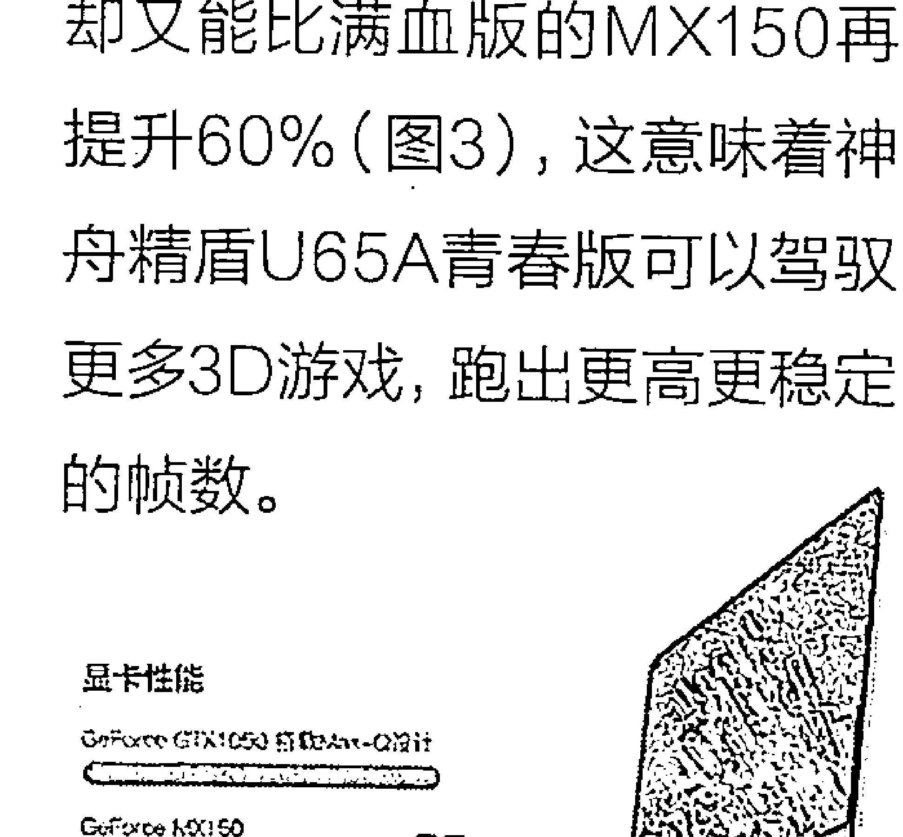

两款笔记本都标配8GB内存和512GB PCIe硬盘。但是，神舟精盾U65A青春版的内存可升级，而MagicBook 15锐龙版的内存则是板载，不具备内存升级能力；精盾U65A青春版的SSD为PCIe 3.0×2，而MagicBook 15锐龙版则是PCIe 3.0×4，后者的磁盘性能更强。

在特色功能方面，神舟精盾U65A青春版的最大优势就是接口数量和种类更多，读卡器和RJ45网线接口都得以保留，而且官方宣传页上注明USB Type-C接口为3.1 Gen2标准（图4），理论读取速率高达10Gbps。MagicBook 15锐龙版的优势则是采用USB Type-C为充电接口，而且将电源键和指纹识别功能合二为一（图5），同时还主打特色的Magic-Link 2.0，支持一碰传和多屏协同功能（图6），搭配华为/荣耀手机时可以带来更多玩法。

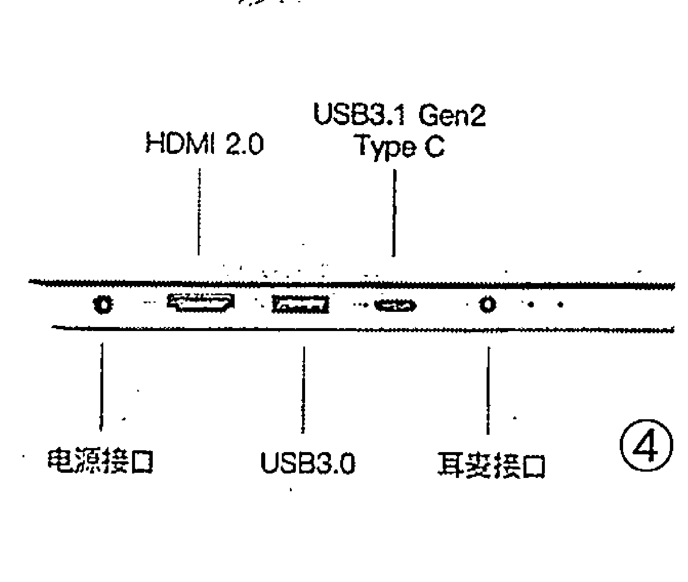

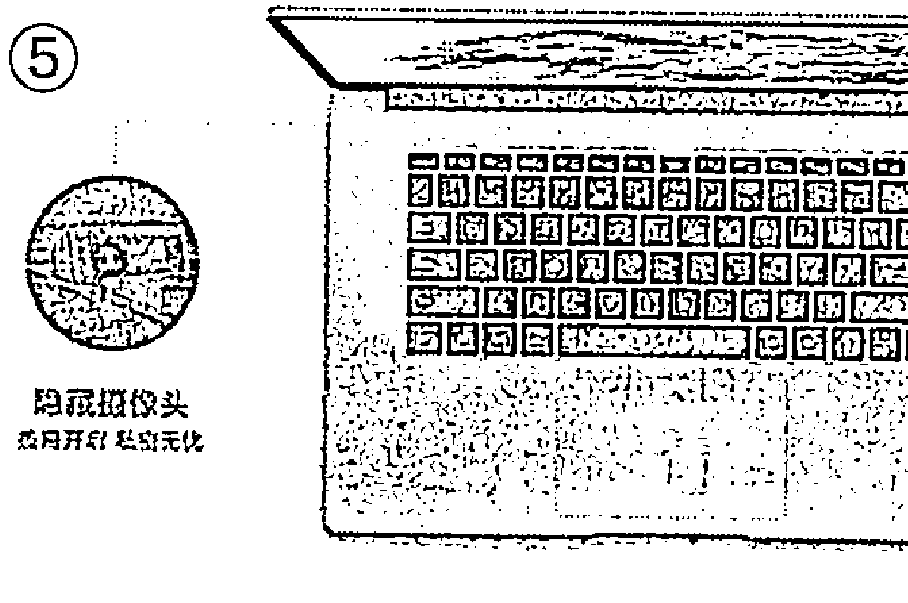

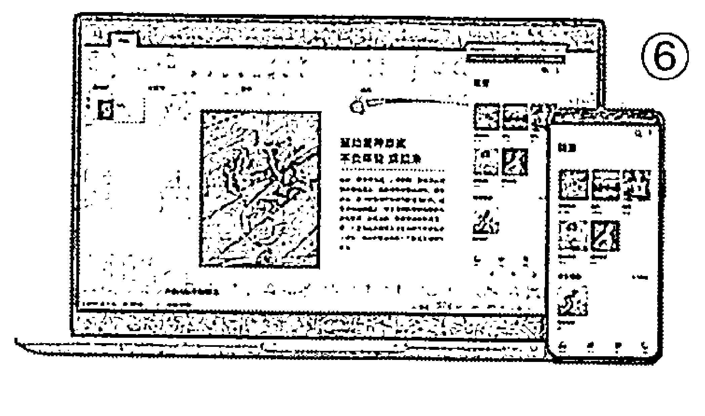

#### 扩展和散热的较量

神舟精盾U65A青春版的电池容量更大，内置2个标准的内存插槽，可以随时替换升级（图7）。同时，该产品还预留了1个2.5英寸SATA硬盘扩展位，有需要的用户可以自行加装第二块硬盘。MagicBook 15锐龙版的内存不可升级，虽然提供了2.5英寸硬盘位，但却没有附带数据排线（图8），想要加装2.5英寸硬盘需要用户自行购买。

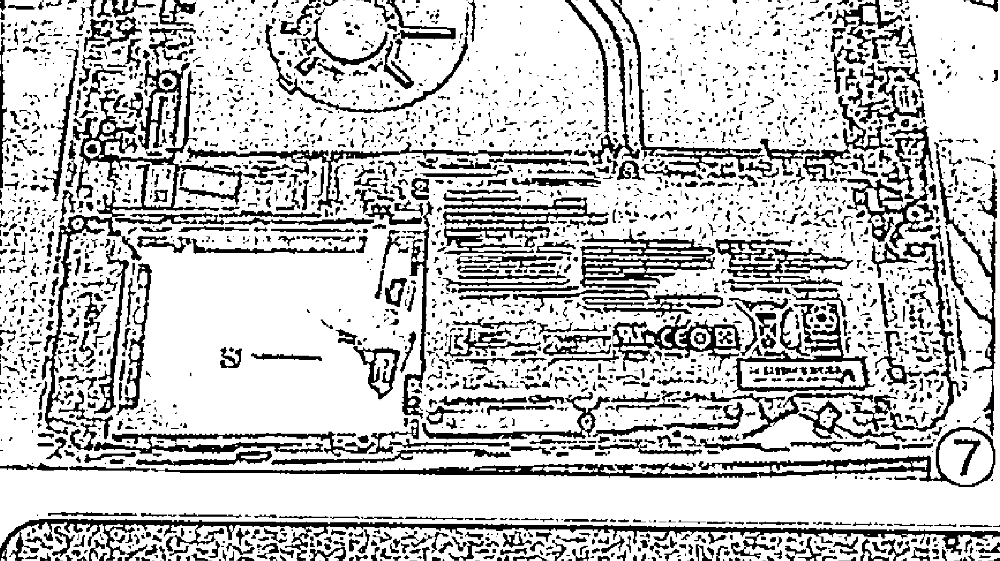

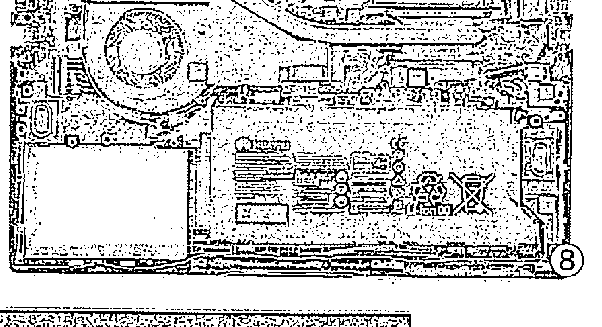

> 两款笔记本虽然价位相似，但所面对的消费人群还是有所区别的。神舟精盾U65A青春版适合追求实用，对3D性能和扩展能力要求更高的理性玩家；而荣耀MagicBook 15锐龙版则凭借更精致的工艺和丰富功能，可以吸引更多追求体验的感性用户。CF

### 大视野的较量

### 惠普战66 Pro G2 vs 清华同方精锐Z1-550

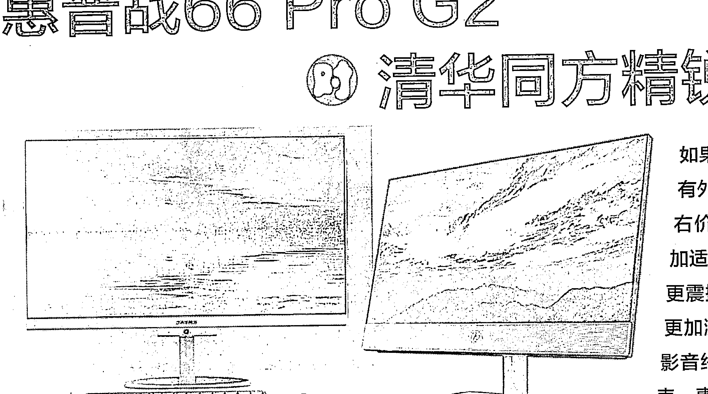

如果你对大型3D游戏不感冒，又没有外出办公的使用需求，5000元左右价位的一体电脑往往比轻薄本更加适合家庭用户选购。前者不仅具备更震撼的视界，在声音的表现力上也更加澎湃，方寸之间就能扮演好家庭影音终端的角色。作为这一价位的代表，惠普战66 Pro G2和清华同方精锐Z1-550谁更适合你?

### 设计上的对比

惠普战66 Pro G2和清华同方精锐Z1-550都是拥有23.8英寸超大视野的一体电脑，显示面积和主流显示器相当。其中，惠普战66 Pro G2的外观更具商务范儿，它采用了沉稳的灰黑色调机身，左、右和上侧三面边框的宽度只有1.8mm，从而实现了更高的屏占比。该产品的下边框很宽，原因是在里面隐藏了扬声器单元，表面的细密网状开孔也可作为装饰点缀，银黑搭配的永不落伍。

清华同方精锐Z1-550采用了白色机身，看起来更加简约时尚，它将左、右和上侧三面边框的宽度压缩到了2mm，由于其下边框更窄，所以屏占比比战66 Pro G2更高，视觉上也更具沉浸感（扬声器位于下边框底侧）。从正面看起来，精锐Z1-550给人的感觉更像是窄边显示器，很难将它与完整的PC划上等号。

| 参数对比 | 惠普战66 Pro G2 | 清华同方精锐Z1-550 |
|----------|-----------------|-------------------|
| 屏幕 | 23.8英寸(1080P, 72% NTSC) | 23.8英寸(1080P, 72% NTSC) |
| 处理器 | 酷睿i5-9500T | 酷睿i5-9400 |
| 内存硬盘 | 8GB/256GB SSD+1TB | 8GB/512GB SSD |
| 显卡 | AMD Radeon 535 | 英伟达GeForce MX150 |
| 接口 | 读卡器、USB3.1 Gen1×4、USB Type-C、DP输出、RJ45、音频接口 | 读卡器、USB3.0×3、USB2.0×2、USB Type-C、HDMI输出、RJ45、音频接口 |
| 摄像头 | 可升降摄像头设计 | 磁吸式摄像头设计 |
| 质保时间 | 4年上门维修(注册5年) | 3年上门维修 |
| 参考价格 | 4999元 | 4699元 |

为了方便视频聊天和直播，两款一体电脑都标配摄像头，只是对它们的安置方面存在较大的差异。惠普战66 Pro G2引入了智能手机领域正流行的“升降摄像头”设计（图1），镜头平时可以隐藏于屏幕顶部之内，使用时才会露出，整体感更强。精锐Z1-550则采用了可分离式的摄像头，而且镜头与机身边框以磁吸式相连，不使用时可以拔下来保护个人隐私（图2）。可惜，精锐Z1-550的磁吸式接口位于下边框正中，视频拍摄时的角度不太理想。

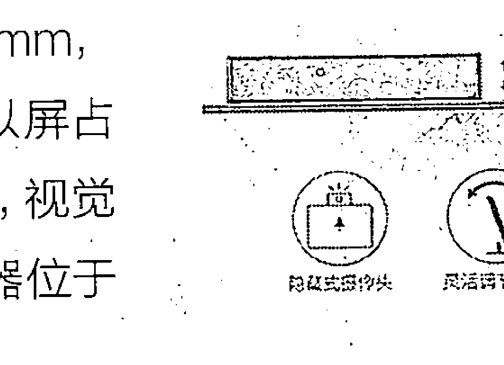

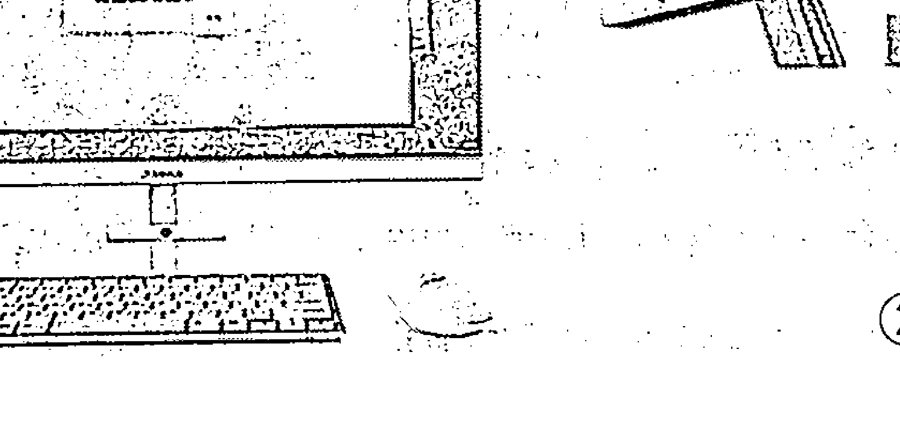

#### 配置上的异同

两款一体电脑屏幕的分辨率都是1080P，而且都拥有72% NTSC高色域，色彩表现更精准，无论看视频还是玩游戏都能呈现一个更真实的视界(图3)。两款产品同时还都搭载了英特尔桌面版的第九代酷睿处理器平台，只是惠普战66 Pro G2的CPU型号为35W TDP的i5-9500T(6核心6线程，默认主频为2.2GHz，睿频加速频率为3.7GHz)。精锐Z1-550的CPU型号为65W TDP的i5-9400(6核心6线程，默认主频为2.9GHz，睿频加速频率为4.1GHz)，就性能而言无疑是后者占优，更高的主频可以换来更高的办公/娱乐效率。惠普战66 Pro G2和清华同方精锐Z1-550都标配8GB DDR4内存，前者内置256GB PCIe SSD和1TB HDD双硬盘，在磁盘容量和性能方面得以兼顾。后者内置512GB PCIe SSD，在容量方面处于下风。为了提升娱乐动力，两款一体电脑都搭配有独立显卡。惠普战66 Pro G2独显型号为AMD Radeon 535，而清华同方精锐Z1-550则搭配了GeForce MX150，就性能而言，MX150较Radeon 535有着30%以上的性能优势，在《英雄联盟》一类游戏中，精锐Z1-550可以跑出更高的帧数(图4)。

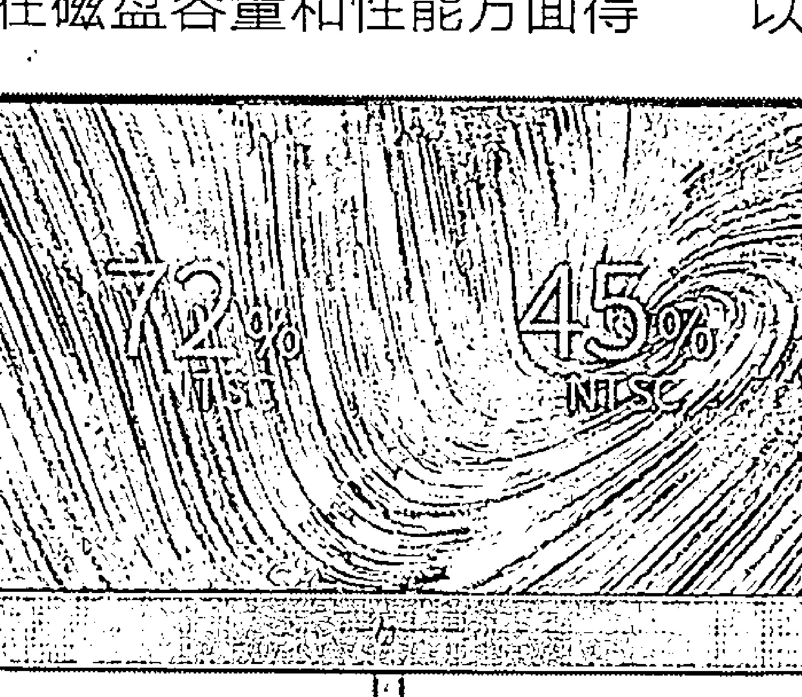


#### 扩展能力的较量

为了方便用户接驳外设，惠普战66 Pro G2和清华同方精锐Z1-550都将接口平均分布在了机身右侧和背部。它们都提供了多合一读卡器，支持包括SD在内的“大卡”读写，清华同方精锐Z1-550的USB接口数量更多，但惠普战66 Pro G2的USB接口速度更快。两款一体电脑分别提供了DP和HDMI两种视频输出接口，可以外接其他显示器组建双屏输出的显示环境。可惜，它们都没能配备HDMI输入接口，无法充当其他设备的显示器之用。精锐Z1-550在侧面增加了亮度设置和关闭显示器的按钮，一键就能调节亮度或进入后台挂机状态，在操作上更加便捷(图5)。

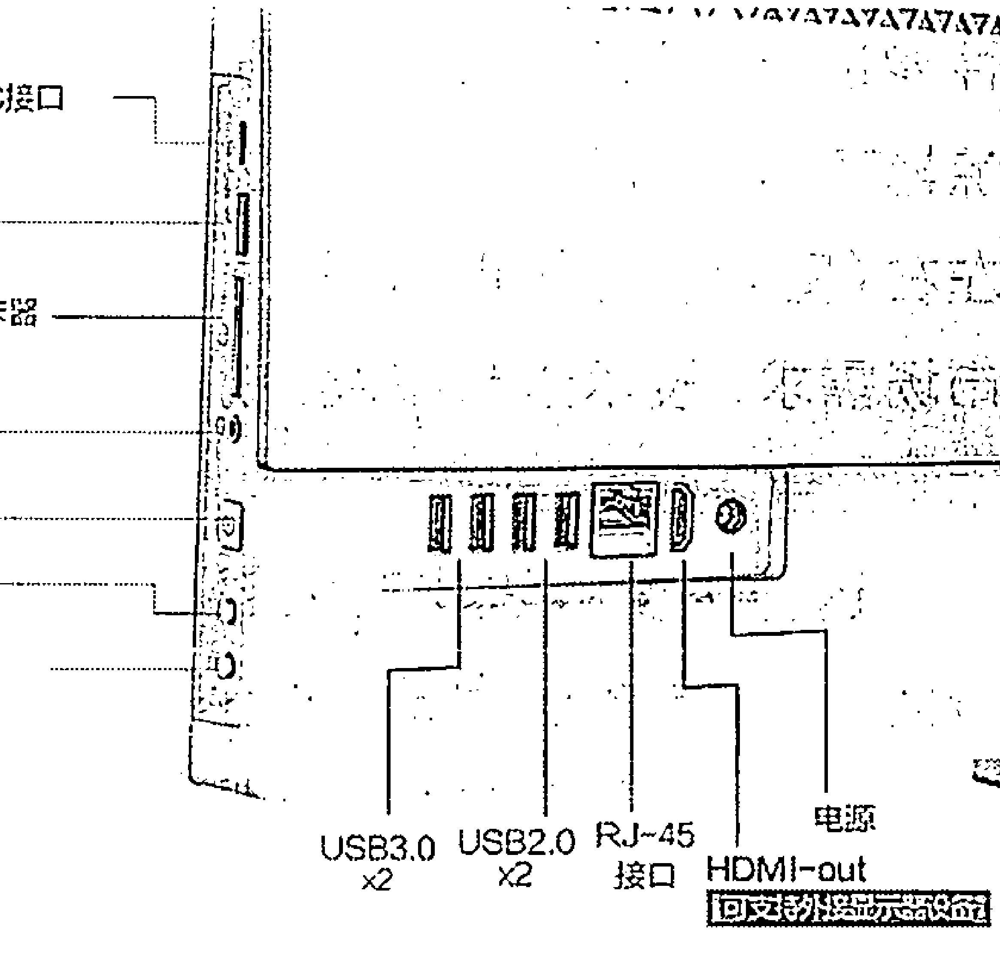

惠普战66 Pro G2和清华同方精锐Z1-550都融合了便捷、高颜值以及灵活易用的特点，非常适合于当下期望打造简约办公/娱乐空间的企业/家庭用户选购使用。精锐Z1-550的最大优势是售价更低，而且CPU和GPU的性能都要强上一个档次；战66 Pro G2则可提供长达4年的上门售后服务，升级注册后更可享受5年上门服务(图6)，购买后更加安心。

| 保修期限 | 部件名称 | 主要部件 (3年有限保修) | 其他部件 (1年有限保修) | 保修方式 |
|----------|----------|------------------------|------------------------|----------|
| 3年      | 整机（不含显示器） | 3年有限保修           | 1年有限保修           | 上门服务 |
| 3年      | 主要部件（CPU、主板、内存、硬盘、电源） | 3年有限保修           | -                     | 上门服务 |
| 1年      | 其他部件（机箱、电源适配器等） | -                     | 1年有限保修           | 送修     |
| 1年      | 软件及随机附件     | -                     | 1年有限保修           | 送修     |

### 显卡升级策略

文|知行

对游戏平台来说，显卡升级带来的助益远高于处理器，这点已经非常明确了，不过实际情况要复杂得多。每逢新显卡推出，到底该不该升级，又该如何升级常常成为很多人最头疼的问题。其实在回答这个问题之前，我们必须了解的是为何升级显卡，以及升级带来的益处。简单地说，升级当然是为了获取更高的性能，这直接体现在游戏帧速上。而另一点则不太明显，那就是对新游戏特效的支持，它会带给大家更好的游戏画面，有时同样也体现在更高的游戏帧速上。

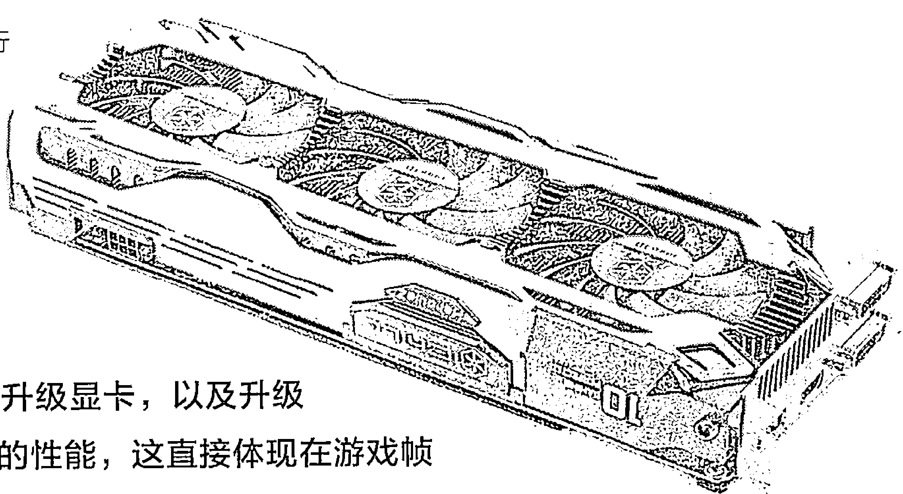

#### 从性能对比看升级时机

首先我们来看性能方面，市场上的显卡评测大都是使用上一代的同档次/同价位显卡进行对比。从软件得分和游戏实际帧速上看，每一代显卡的性能进步达到30%就已经很惊艳了，实际差距大都在20%左右（图1），这也是厂商根据市场需求、技术进步幅度、成本等综合考虑的结果。这种幅度的进步对大部分使用旧显卡的玩家吸引力不足，同时比较接近的上市日期也会让这些玩家考虑到资金问题，更无法下决心来升级。那么，咱们不妨来看一看架构、核心差距更大的几代显卡对比表现，比如同为微星品牌的旗舰级游戏显卡。

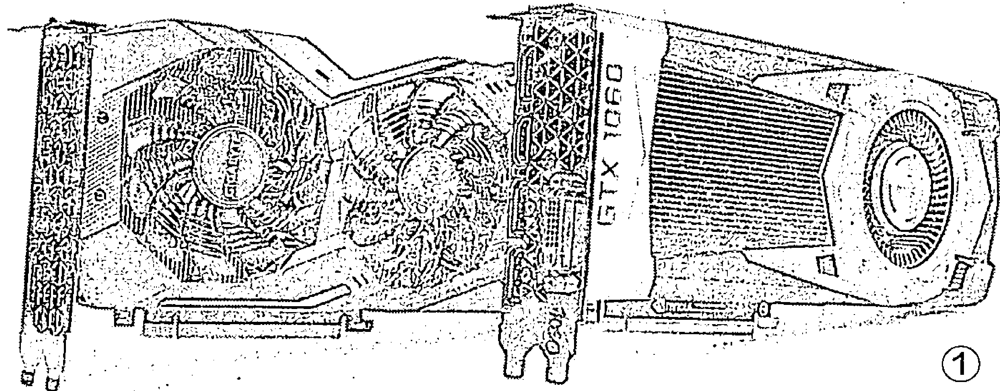

从这些对比中，我们会发现近期的两代显卡游戏性能总是接近，但更“古老”的显卡性能会有断崖式下跌，而且早期的每一代显卡之间还有近1倍的差距，比每一代30%左右的性能提升太多了！这是为什么呢？其实玩家们应该可以发现，我们测试使用的都是比较新的游戏，它们表现出的帧速差距不仅代表了每一代显示核心的性能不断提升，还有新特效、新技术的助益。因为每一代显卡提供的新特效、新技术在经过两年左右的时间后才会在游戏中大规模普及（图2），这时不支持新技术/不能进行优化处理的老显卡或者放弃特效画面，或者靠计算能力“硬算”这些特效，这当然比内置这些特效算法甚至专用电路的新显卡处理器速度慢很多。体现在测试帧速的对比上，就是三年前（一般是隔一代）的显卡，在新游戏中的画面效果、帧速会断崖式下跌。而且随着越来越多新技术、新特效被加入游戏，越老的显卡就越应付不了，性能差距就越来越明显。

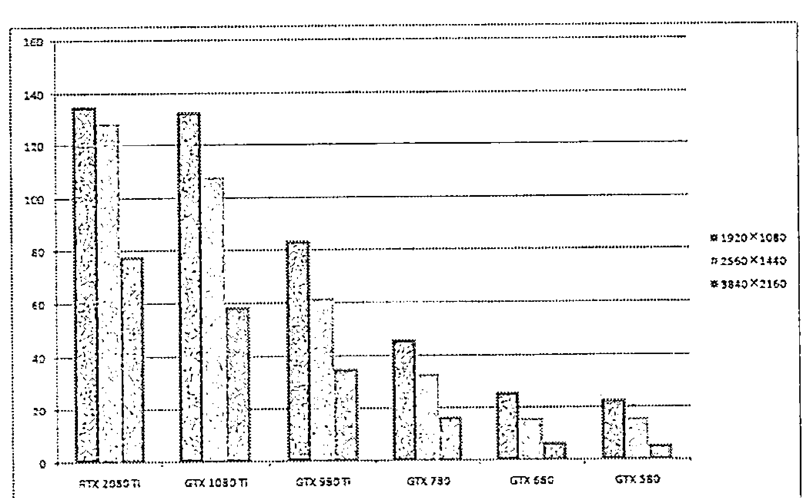

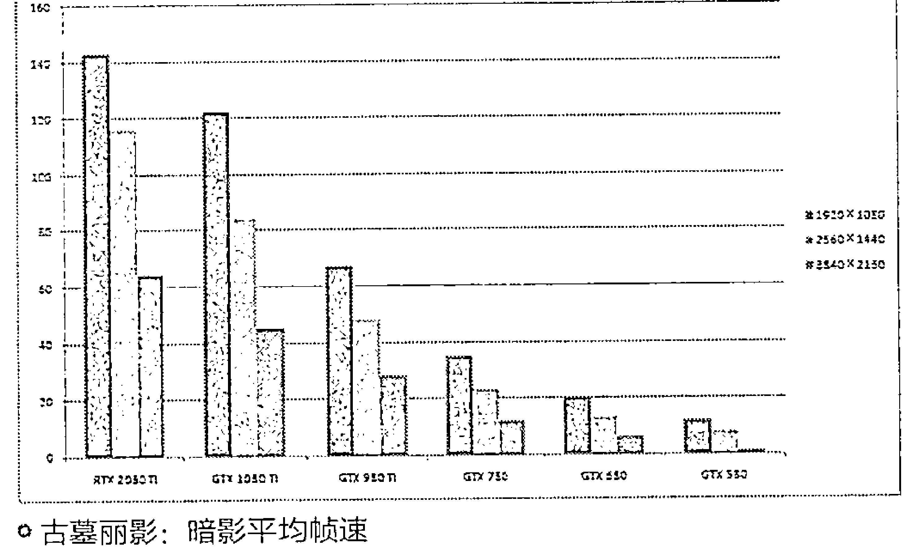

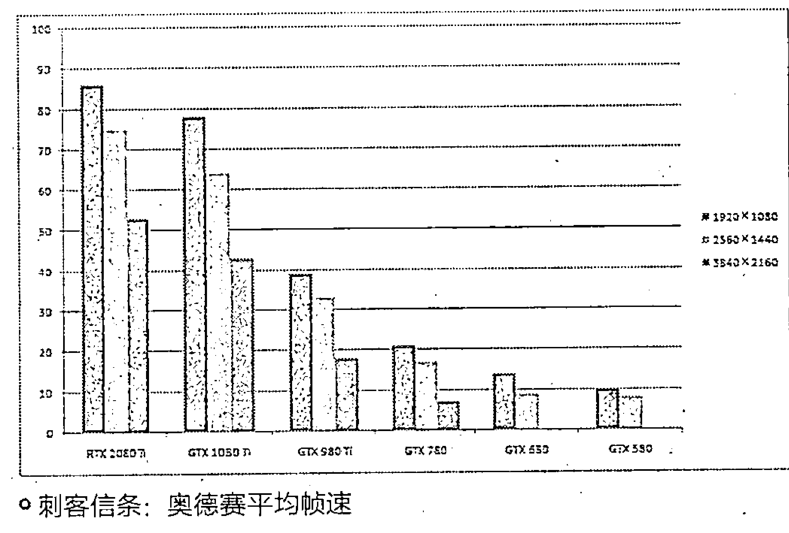


游戏帧速当然最直观地反映了显卡是否需要升级以及升级获得的游戏体验提升，但需要注意的是，有时候速度并不是升级唯一的考虑。比如现在市场上新老显卡混杂在一起，同价位的对比中，旧显卡的游戏帧速看起来也不错（图3），让很多准备升级和购机的用户难以抉择，到底是选择更高端的旧核心显卡还是追新买块价格差不多的新型显卡呢？

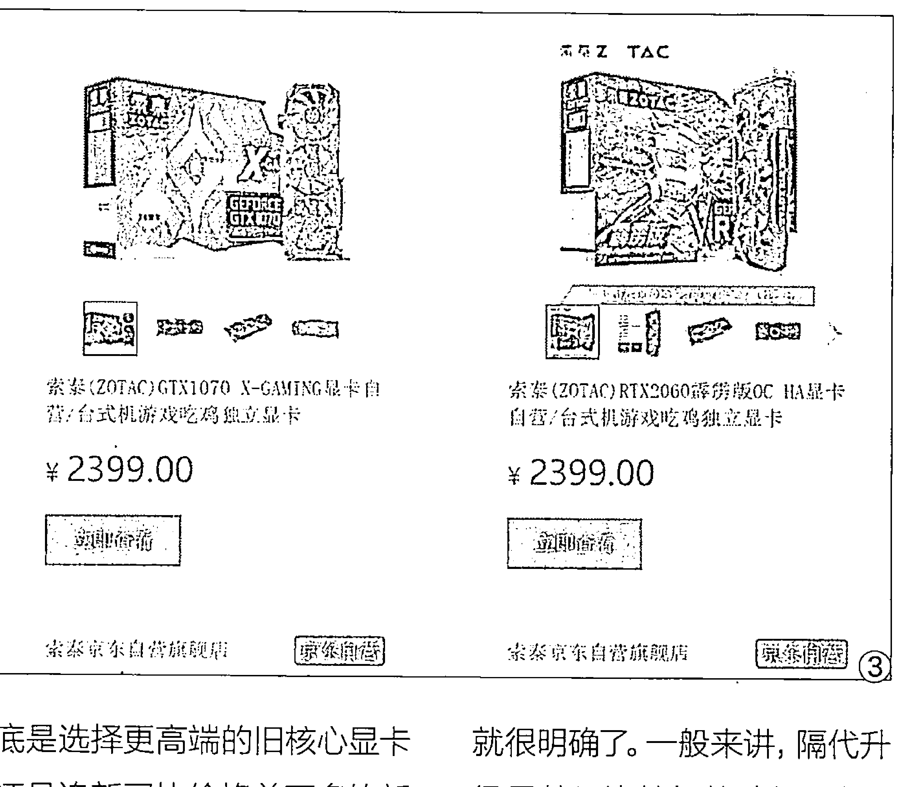

其实前面已经提到，新核心显卡总是会带有一些适应未来游戏需求的新技术，也许在明年的游戏中，现在的同价位新旧核心显卡在游戏中的表现（包括帧速和画面效果）就会逐渐拉开差距了，所以对准备升级的用户，我们坚决推荐新核心显卡。综合考虑速度和画质特效这两方面，我们的升级策略也就非常明确了。一般来讲，隔代升级显然是比较好的选择。比如手头已经在使用英伟达GTX 10系列的显卡，那么升级到RTX 20系列的性能提升并不明显，但花费却不小，同时RTX系列开始推广的光线追踪等特效也没有出现在大多数游戏中。而再等半年左右，预计RTX 30系列就会出现，相对于GTX 10系列的性能会有大幅提升，光线追踪等新特效会得到更好的优化，也能得到更多游戏的支持，显然是更适于升级的时机。

#### 从实际需求看升级选择

在确定了使用最新核心的显卡后，在不同档次、不同价位的大量显卡中，如何才能挑选到最适合自己的一款呢？

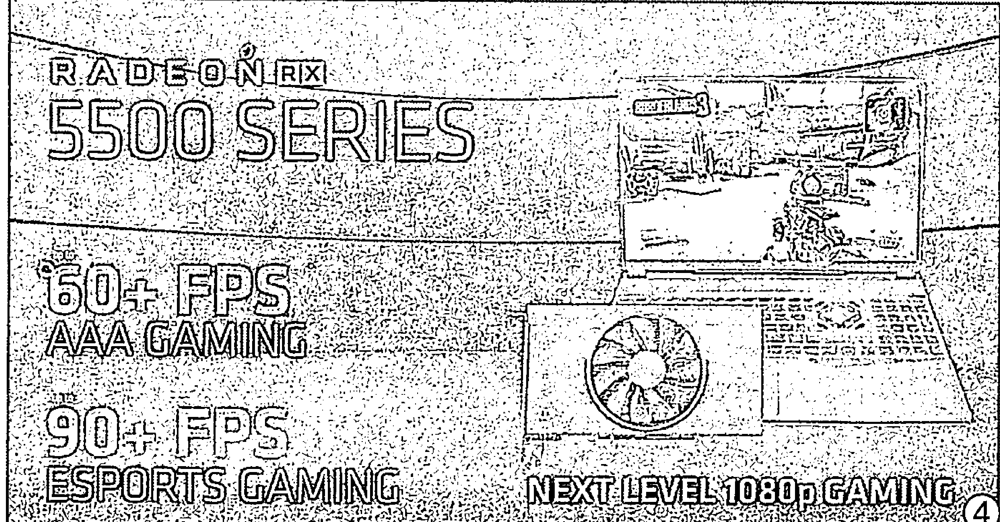

- 根据游戏需求

在如今的显卡市场中，选择适合自己的升级产品首先当然要看需求，比如专精于某款游戏的话，最好的选择还是直接看相关的测试，选择一款可以在自己希望的分辨率、画质下，以自己希望得到的帧速来运行最新版游戏的显卡。例如电竞游戏最好考虑1920×1080分辨率或2560×1440分辨率，最高或次高级画质下，达到90FPS以上的帧速（图4），在最新一代的显卡中，英伟达RTX 2060和AMD RX 5700以上的显卡应该有此能力，定价均在2000元以上。

而喜欢单机大作的话，则最好是能够在2560×1440或3840×2160分辨率下，以最高画质达到60FPS以上的帧速，并且最好能支持光线追踪、“海飞丝”等提升画面质感的特效（图5）。这种情况下，RTX 2060 Super和RX 5700 XT以上显卡是最好的选择。


#### 根据定位/价位

对于处理器依然给力、只想升级显卡的用户，如果对游戏的品味没有变化，那么可以考虑更换同档次或上市价位类似的显卡。例如GTX 960可以更换为GTX 1660 Super，GTX 970则可以考虑更换为同价位的RTX 2060或同档次的RTX 2070；RX 400系列显卡（图6）可根据定位和上市价位升级到RX 5700/5500系列。

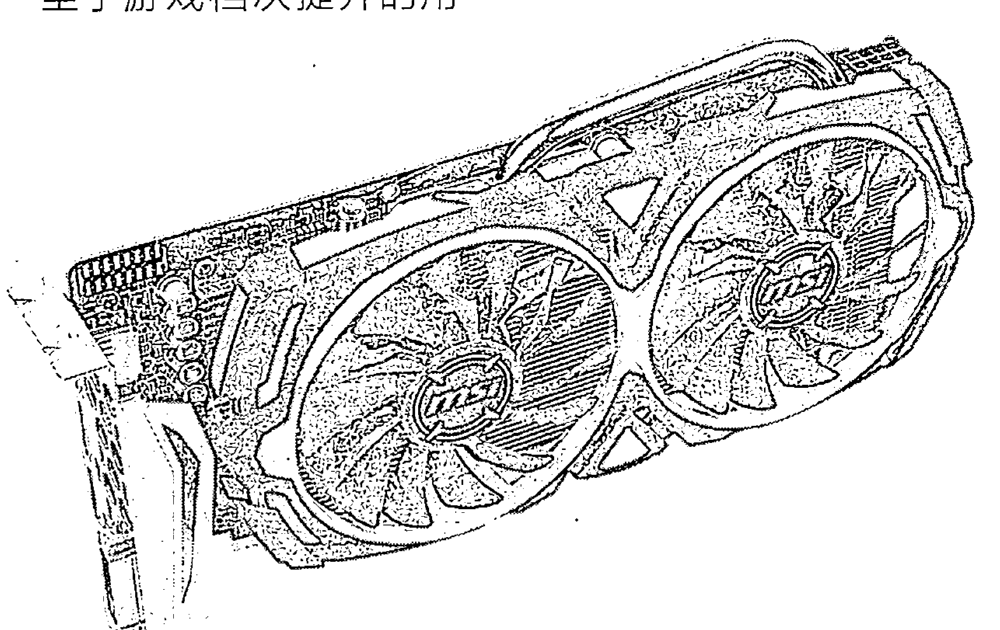

至于品味有变化的用户，例如原本使用高端型号，但不再喜欢追求高端大作，只玩一些网游或趣味小品游戏，那么升级的显卡档次可以下降，升级步伐也可以进一步减缓，隔两代甚至两代半、三代升级，这样定位较低端的新显卡性能才能切实地超过我们手中相对高端的旧显卡。例如新的GTX 1650 Super显卡游戏帧速只是略超过GTX 1060，与曾经的中高端显卡GTX 970/960相差不大，所以这些显卡显然不值得升级为这款入门级显卡。真正值得升级到GTX 1650 Super的中高端显卡应该是相隔两代甚至三代的GTX 770/760和GTX 670。

至于游戏档次提升的用户，老旧的低端显卡能力显然更加不足，所以升级并不需要太多的考虑和比较，参考上文，根据目前喜爱的游戏需求选购即可。

- 全面升级

如果是全面升级，又该怎样选择显卡呢？对游戏没有特定需求的用户，笔者建议根据显卡最可靠的搭档——处理器，来决定选择何种显卡，以获得最好的配置平衡。

所谓的搭配平衡，其实就是让处理器和显卡的性能不要出现互相扯后腿的情况，也就是我们说的能互相“喂饱”。这是因为在游戏中显卡主要负责处理图像，而处理器负责一些逻辑计算，比如NPC的路线、一枪掉多少血等等。任何一方的处理速度不够，都会造成另一方等待，只有两者处理速度匹配时，才能让游戏的发展和画面的产生尽量同步，双方都无需等待，也就不会浪费性能以及花在这些性能上的金钱。一般来说，现在的显卡对游戏影响更大，所以游戏平台的搭配主要看处理器能不能满足显卡的需求，也就是所谓的“喂饱”显卡。那么，我们怎么知道什么档次的处理器能喂饱什么档次的显卡呢？其实厂商们早就在市场上进行了比较好的安排。一般来说，处理器档次和显卡档次相同就是很好的搭配，比如入门级游戏处理器搭配入门级显卡等。

至于对市场划分不太熟悉的用户，只要按照处理器和显卡价格1:1.5左右选择，一般也不会有错。比如1000元的GTX 1650选600元左右的酷睿i3-9100F、锐龙3 1200；1600元的GTX 1660S搭配锐龙5 3500X、i5-9400F（图7）等。拿一个简单的例子来试试，现在一般能玩转所有3A游戏的中端显卡GTX 1660 Super，使用千元级的酷睿i5-9400F是不是有点亏呢？咱们就和更高端的i5-9600KF对比一下吧。

从测试数据可以看到，从酷睿i5-9400F升级到i5-9600KF，多花了200多元，换来的性能提升只有3%多一点。显然i5-9400F已经把GTX 1660 Super喂得比较饱了，说明这样搭配还是挺合适的。

那么，搭配方式确定后，升级方式又变成了根据自己的游戏需求选择显卡，之后再按照显卡价格搭配处理器就好了。

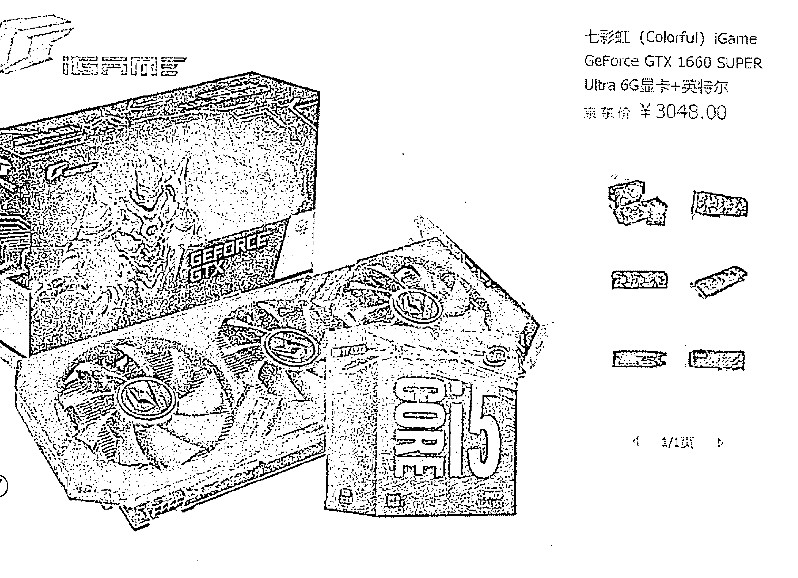

| 1080P最高画质 | i5-9400F | i5-9600KF | 相对性能 |
| :--- | :--- | :--- | :--- |
| 绝地求生 | 80 | 83 | 96.05% |
| 幽灵行动：荒野 | 52.46 | 53.53 | 98.00% |
| 战争机器5 | 72.5 | 74.9 | 96.80% |
| 古墓丽影：暗影 | 77 | 79 | 97.47% |
| 刺客信条：奥德赛 | 51 | 53 | 96.23% |
| 无主之地3 | 50.20 | 51.96 | 96.61% |
| 全境封锁2 | 70 | 71 | 98.59% |
| 综合性能 | 382.8826918 | 395.39 | 96.84% |

需要注意的是，这一比例是根据目前的显卡和无内置显示核心的英特尔酷睿F系列、AMD锐龙系列确定的，如果选择购买内置显示核心的同型号或类似性能的处理器，因为处理器价格更高，所以处理器/显卡价格比例设定为1:1.25或1:1.3更合适。当然，如果未来出现显卡或处理器的大幅价格调整，类似前段时间的酷睿F系列全面大幅降价，那么这种比例也需要进行一些修正。

此外，我们这里提供的主要是根据GPU性能和价格给出的各档次显卡选购建议，其实对于不同的用户，还要考虑价格、易用性、尺寸等方面的问题，比如使用中等或较小尺寸的机箱时，购买中高端显卡就必须注意其长度是否超过了机箱的容纳能力（图8）。

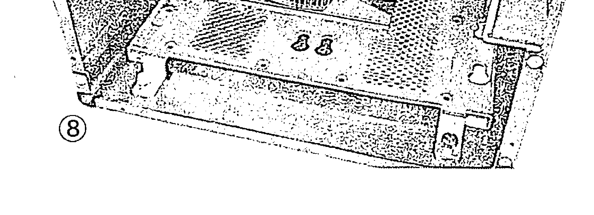

#### 入门之争

### 小米显示器 对 AOC I2490VXH

为了扩展视野，很多家庭用户都青睐于较大尺寸的液晶显示器，同时还希望售价尽可能便宜。好消息是，如今千元以内显示器市场的竞争日趋激烈，哪怕700元价位也不乏值得选购的精品。作为这一价位显示器的代表，小米显示器和AOC I2490VXH/BS谁更适合你？

### 理性看待产品定位

对23.8英寸液晶显示器而言，700元左右属于“入门级”的范畴，所以我们不能指望它们能具备太过完美的表现。请放心，在残酷的市场竞争下，该价位产品应有的显示素质肯定是不缺的，它们和更高价位（如千元级别）产品之间的差异主要表现在设计和功能层面。

| 参数对比 | 小米显示器 | AOC I2490VXH/BS |
| :--- | :--- | :--- |
| 屏幕尺寸 | 23.8英寸 (1080P) | 23.8英寸 (1080P) |
| 面板类型 | IPS硬屏 | IPS硬屏 |
| 亮度 | 250nit | 250nit |
| 对比度 | 1000:1 | 1000:1 |
| 响应时间 | 6ms | 5ms |
| 接口 | HDMI | VGA、HDMI、音频输出 |
| 壁挂 | 不支持 | 支持 |
| 参考价格 | 699元 | 699元 |

比如，更高价位显示器的屏幕高度可以升降，甚至可以旋转，在特殊使用环境下可以达到事半功倍的效果（图1）。此外，此类显示器往往还会配备更多输入接口（比如双HDMI或HDMI+DP），可以同时连接输入设备（如PC和PS4），并随时切换输入信号，一屏二用。小米显示器和AOC I2490VXH/BS的售价只有699元，它们的定位就是“够用”和“好用”，如果你追求更完美的使用体验，也许就需要提高预算选购其他产品了。通过本篇文章，我们将了解入门级显示器的对比和选购思路，大家可以举一反三用于其他型号的比较上。

### 外观设计的差异

小米显示器和AOC I2490VXH/BS都采用了标准的23.8英寸屏幕，以及三面微边框的设计，画幅更大，可以呈现一个更加完整的视界（图2）。两款产品的主要差异在于底座和配色，小米显示器正面以黑色调为主。

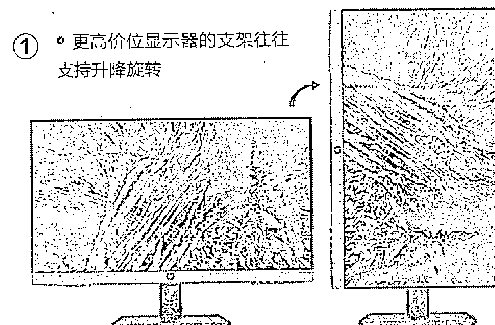

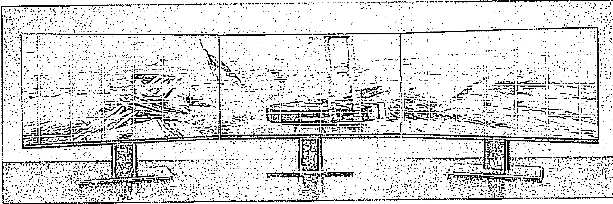

主，具有较浓的商务范儿，方形的底座很规整，平时可以将键盘放置其上以节省桌面空间。

小米显示器的屏幕部分和支架连体无法拆卸，这意味着它不支持壁挂，必须和专用的底座搭档。

该产品的安装比较简单，将底座表面的螺丝插入支架的孔隙后，再反复拧几圈底座底部的螺母扣即可，无需其他拆卸工具。

AOC I2490VXH/BS显示器正面以银色调为主（背部面板为黑色），金属感和科技感更强一些。

这款产品采用了更加方便的快拆支架设计，它的屏幕主机、支架和底座可以分离，支架与主机背部的VESA壁挂孔和底座上的固定孔都内藏锁扣，插入即可自动扣合，无需手动拧紧调节（图3）。

AOC I2490VXH/BS采用了圆形的底座，在支架中间留有理线用的凹槽。如果你使用的是有线键盘和鼠标，可以由此穿过以保持桌面的整洁。通过VESA壁挂孔，这款显示器可以固定在墙体或一拖二的VESA支架上，更加适合办公环境搭建多屏显示（图4）。


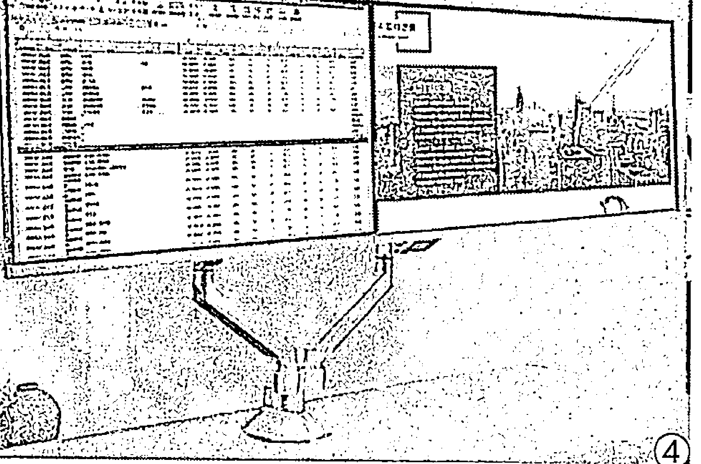

### 输入输出能力对比

小米显示器将接口都放在了支架背后（图5），这个位置非常人性化，插拔都非常方便。可惜，这款显示器只配备了1个HDMI接口，无法同时接驳更多设备。小米显示器采用了专用的电源适配器，通过圆形电源孔与主机相连，包装里附赠1根HDMI线。

AOC I2490VXH/BS的接口都位于屏幕背后的凹槽并朝下设计，这种设计虽然隐藏性更好，但却不利于插拔，不熟悉使用时需要将整个屏幕翻过来才能找到对应的接口（图6）。该产品配备了VGA和HDMI双视频输入接口，并附赠1根HDMI线。可惜如今新款PC（包括台式机显卡和笔记本）大多取消了VGA接口，如果你需要接驳的设备较新，可能需要另配VGA和HDMI转接器。AOC I2490VXH/BS还提供了音频输出接口，但这款显示器内并没有内置扬声器。该产品内置电源模块，采用的是标准的通用电源线，所以不用担心线缆丢失或损坏，随便一根显示器和台式机电源线都能兼容使用。

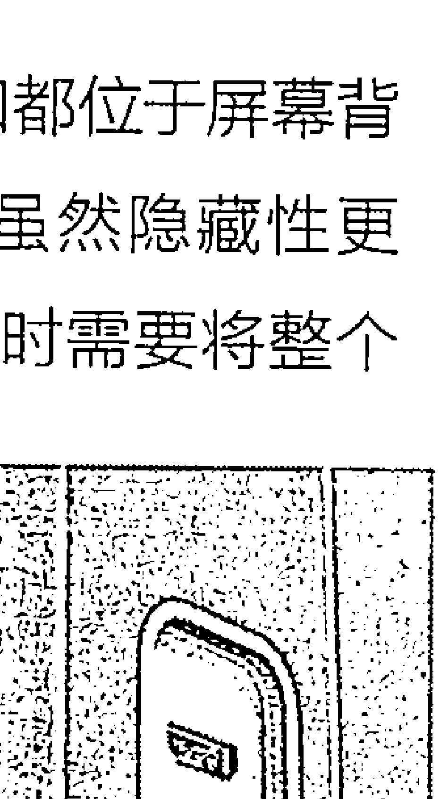

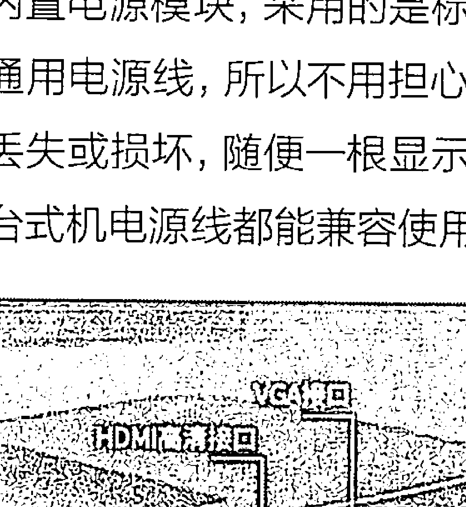

### 显示参数的较量

受制于定位，小米显示器和AOC I2490VXH/BS的显示能力属于中等水准，官方没有标注它们采用IPS屏幕面板的色域，但却都支持不闪屏和过滤蓝光等用户非常关心的功能，长时间使用不伤眼。两款显示器面板的发色数、亮度、对比度和分辨率参数相同，只是AOC I2490VXH/BS屏幕的响应时间比小米显示器少了1ms，理论显示效果处于伯仲之间。

> 作为入门级23.8英寸显示器，小米显示器和AOC I2490VXH/BS都拥有无边的视界，工业设计都属于耐看的类型。其中，小米显示器的观感更具商务范儿，接口插拔更容易。而AOC I2490VXH/BS则拥有更多接口，支持壁挂的设计更符合需要组建多屏环境用户的胃口。

超值5G手机的较量

Redmi K30 5G

对 realme真我X50 5G

和4G手机刚上市时相同，5G手机也正在面临成本飙升的窘况，绝大多数新款手机的售价都是3000元左右起步。如果你不追求顶级性能，不妨将目光投向定位中端的5G新秀身上，比如Redmi K30 5G和realme真我X50 5G，它们就属于当前最超值5G手机的代表。

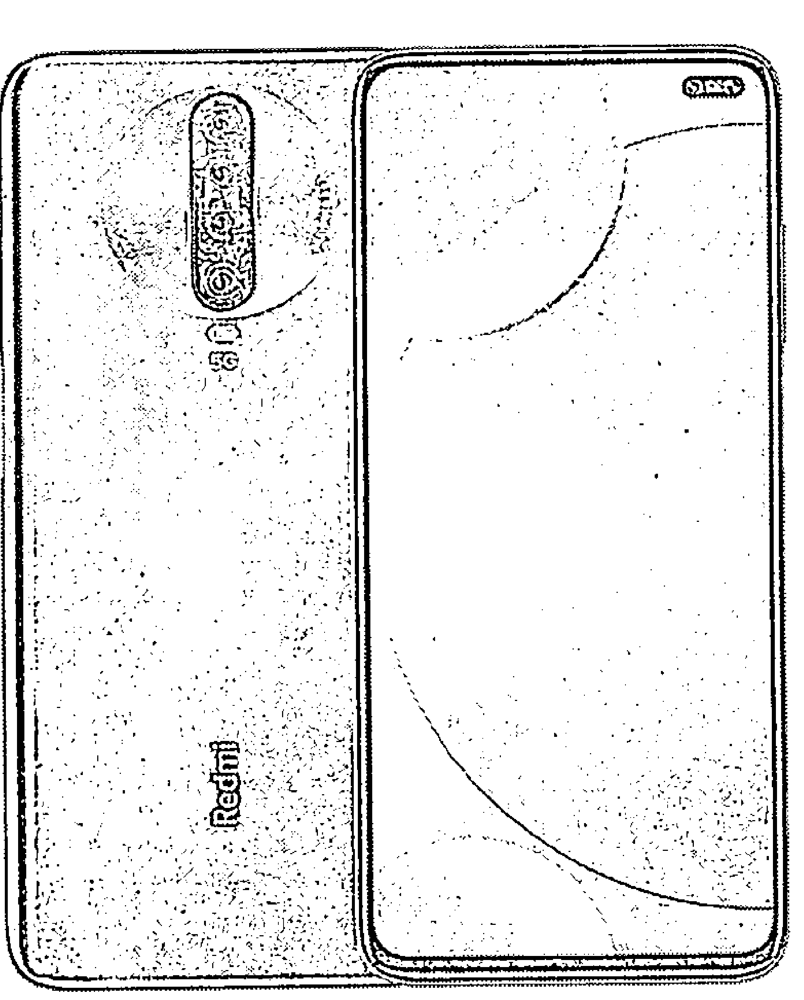

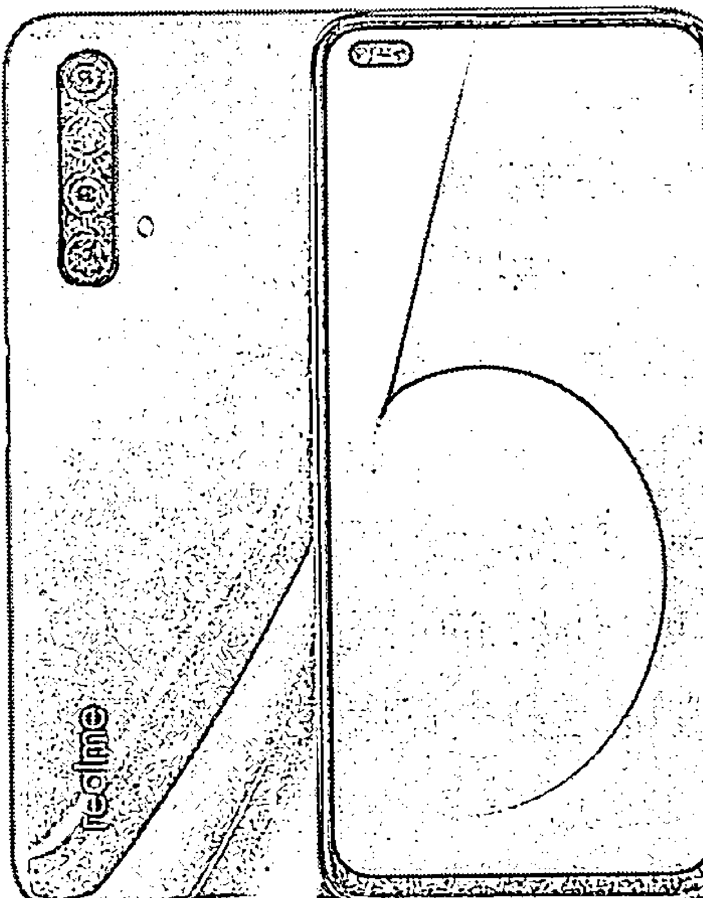

外观设计的差异

Redmi K30 5G和realme真我X50 5G在设计上颇有“血缘”联系，它们的屏幕/机身尺寸和重量相仿，而且都是LCD材质的“双挖孔屏”，符合最新的潮流趋势。不过，两款手机屏幕的挖孔位置不同，Redmi K30 5G的前置镜头开孔位于屏幕右上角，而realme真我X50 5G的开孔则在屏幕左上角。两种设计在使用中的体验差别不大，主要还是看你自身的感观喜好。

| 参数对比 | Redmi K30 5G | realme真我X50 5G |
| :--- | :--- | :--- |
| 5G频段 | n41、n78 | n1、n41、n78、n79 |
| 屏幕 | 6.67英寸<br>(2400×1080像素, 120Hz) | 6.57英寸<br>(2400×1080像素, 120Hz) |
| 处理器 | 高通骁龙765G | 高通骁龙765G |
| 内存/存储 | 8GB/128GB UFS2.1 | 8GB/128GB UFS2.1 |
| 前置镜头 | 2000万+200万像素 | 1600万+800万像素 |
| 后置镜头 | 6400万+800万+500万+200万像素 | 6400万+800万+1200万+200万像素 |
| 三围 | 165.3mm×76.6mm×8.79mm | 163.8mm×75.8mm×8.9mm |
| 电池/重量 | 4500mAh (30W)/208g | 4200mAh (30W)/202g |
| 参考价格 | 2599元 | 2499元 |

由于屏幕并非OLED材质，所以这两款手机无缘最炫的屏幕指纹识别技术。为了保证手机正反面玻璃的整体感，它们都引入了少见的侧置指纹识别设计，将电源键和指纹识别模块合二为一（图1），掏出手机的同时就能顺势解锁，在识别率和体验上不逊于传统的后置指纹设计。

Redmi K30 5G和realme真我X50 5G的外观差异还表现在后盖设计上。Redmi K30 5G可选深海微光、紫玉幻境、时光独白和花影惊鸿四种配色，后置摄像头居中呈竖行排列，并在边缘增加了一个圆形的CD纹光圈，视觉上非常像“投币机”，在5G手机中拥有非常高的辨识度（图2）。realme真我X50 5G可选冰川和极地两种配色，摄像头位于后盖左上角呈竖行排列，属于相对传统的设计。


配置和功能的异同

为了提升游戏和操作体验，两款手机都采用了120Hz刷新率的屏幕，较市面上常见的90Hz刷新率手机更进一步，在画面高速变化的APP中可以减少拖影和画面撕裂的问题，看资讯玩游戏时的体验更流畅。

Redmi K30 5G和realme真我X50 5G的核心硬件相同，都是高通骁龙765G移动平台，内置LPDDR4X内存和UFS2.1闪存。它们的差异在于，Redmi K30 5G可选6GB+64GB和6GB+128GB的低配版，售价分别为1999元和2299元。真我X50 5G还有12GB+256GB的顶配版，售价为2999元，前者入手门槛更低，后者的存储配置更高。

虽然两款手机的SoC相同，集成的基带也支持SA&NSA双模5G，但Redmi K30 5G仅支持n41和n78 5G频段，realme真我X50 5G则增加了对n1和n79 5G频段的支持（图3），这意味着在体育馆等人流密集的区域，后者可以获得更稳定的5G连接。Redmi K30 5G和realme真我X50 5G分别内置4500mAh和4200mAh电池，支持30W功率的快充技术，考虑到二者硬件的耗电量相近，所以Redmi K30 5G的续航潜力要更出色一些。

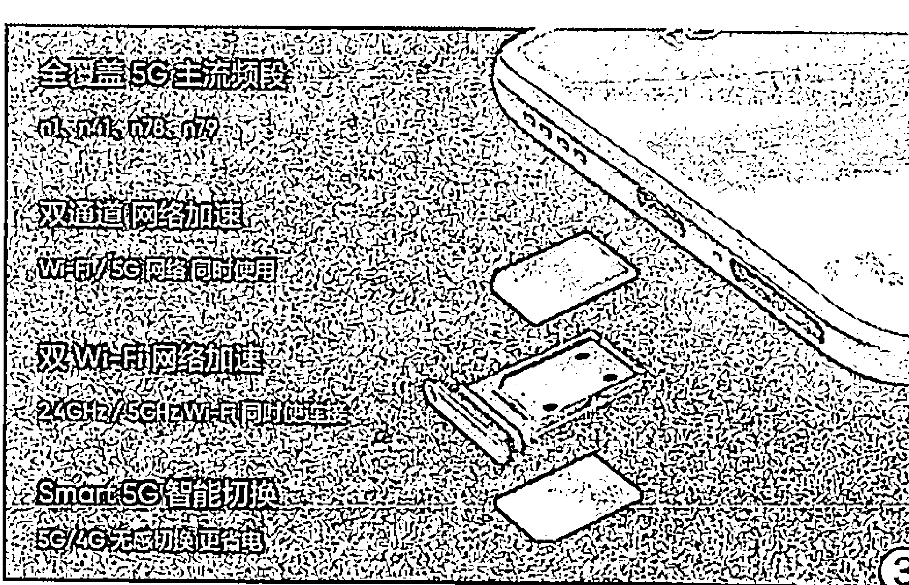


在特色功能方面，两款手机都支持L1+L5双频GPS、双Wi-Fi和5G双通道网络加速功能，内置热管辅助散热，全功能NFC可以模拟公交银行门禁卡。在此基础上，Redmi K30 5G还支持红外遥控功能，有了它，再也不怕找不到家电遥控器或遥控器里的电池没电了(图4)。

影像层面的对比

Redmi K30 5G和realme真我X50 5G都采用了前置双摄，Redmi K30 5G的优势是前置主摄像素更高（图5），但200万像素的人像镜头只能实现背景虚化效果，对成像质量的增益不大。realme真我X50 5G的副摄为800万像素超广角镜头，自拍时视野可以扩大2.5倍，收纳更多风景。


两款手机都采用了后置四摄矩阵，Redmi K30 5G的主摄为6400万像素索尼传感器，并辅以800万像素超广角、500万像素微距和200万像素人像镜头。realme真我X50 5G的6400万像素主摄为三星传感器，辅以1200万像素长焦、800万像素超广角和200万像素微距镜头（图6），还支持UIS超级防抖功能，拍视频更稳定。

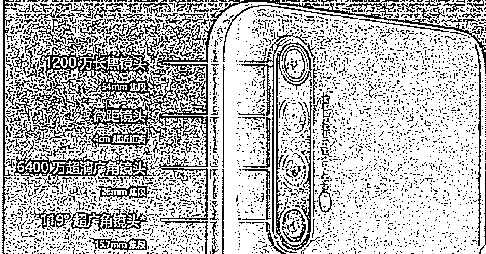

作为当前最实惠的5G手机，Redmi K30 5G和realme真我X50 5G除了性能有所不足以外，在功能层面已经全部向旗舰机型看齐，非常适合追求实用的普通消费者换机升级。其中，K30 5G起价更低，更适合预算不足的用户；而真我X50 5G的摄像头搭配则更合理，更适合喜欢拍摄的用户。CF

无线充电鼠标购买推荐

文|葬月飘零

鼠标是人们操作电脑时最常用的设备之一，其作用不言而喻。目前鼠标分有线和无线两种，有线鼠标没有电池续航问题，但在使用空间上受到一定的限制。装电池的无线鼠标一旦没电了，又恰巧没有备用电池，手上却有紧急工作需要完成，简直令人抓狂。普通的内置电池式无线鼠标不用购买电池，但充电时还是必须接线使用，甩不开这条“尾巴”。如果有一种不用插线，一边使用就能充电的无线鼠标的话，就没有这些问题了，它们当然就是支持无线充电的无线鼠标了。

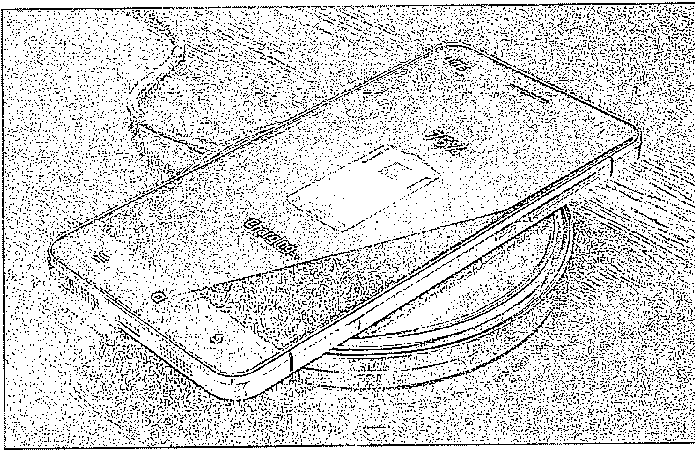

无线充电在手机领域已经不是新鲜事，但无线充电鼠标却只是初露头角

什么是无线充电技术

无线充电技术是基于电生磁、磁生电的原理，只要将充电对象放在无线充电器上即可进行充电，它可以让我们摆脱线材的束缚，也免去了插拔充电线的环节。无线充电技术在手机领域目前已经较为成熟，各大手机厂商先后推出了支持无线充电功能的手机。而无线充电技术在鼠标上的应用可以说才刚刚进入大众视野，不过有了无线充电手机的先一步探索与尝试，无线充电鼠标的相关技术、标准等都可以借鉴现有的设计。

无线充电技术根据其原理的不同可分为四种：电磁感应式、磁场共振式、无线电波式和电场耦合式。无线充电鼠标、手机多采用电磁感应式无线充电技术，具有充电效率高、结构简单、造价低的特点，常用于小功率无线充电。

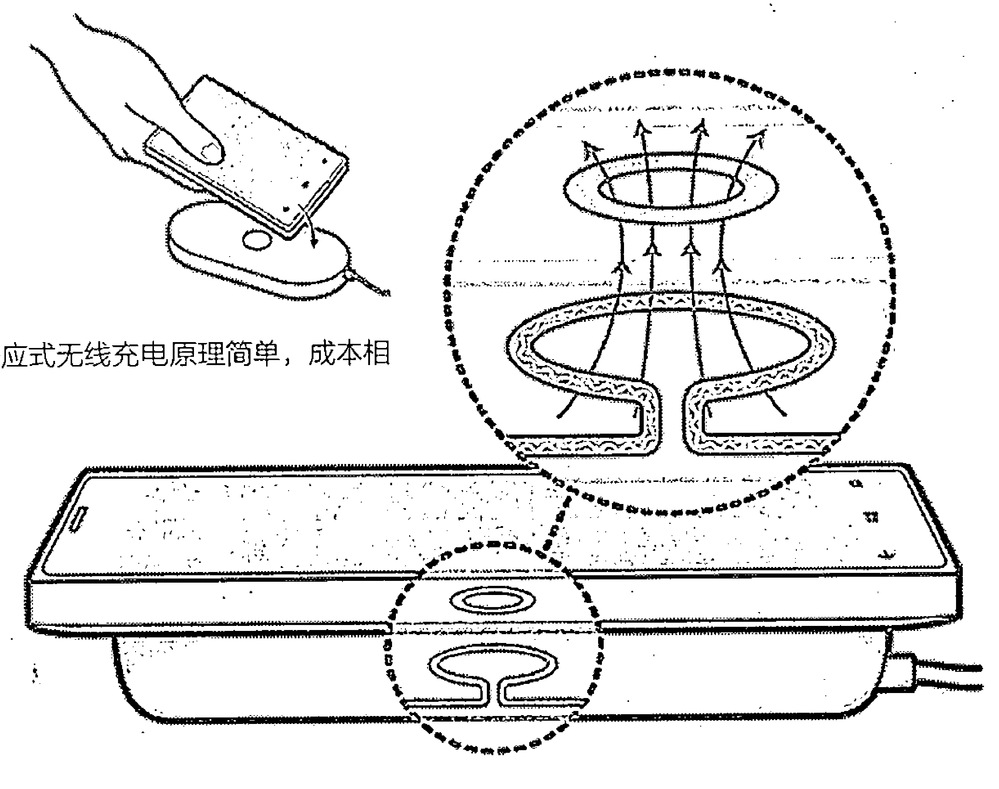

电磁感应式无线充电原理简单，成本相对便宜

无线充电技术标准

目前主流的无线充电技术标准有Qi、PMA和A4WP，Qi与PMA标准属于电磁感应式，而A4WP则属于磁场共振式。Qi标准的兼容性与通用性在三种标准中最强，如果我们拥有一个符合Qi标准的充电器，那么只要是符合Qi标准的设备，无论是手机还是鼠标或者是剃须刀等，基本上都可以使用这个充电器进行无线充电，这也是Qi标准得到广泛应用的一个原因。

### 鼠标垫 无线充电鼠标的最好搭档

和其他无线充电产品一样，目前市面上的无线充电鼠标产品也大多采用Qi标准，无论是无线充电器还是无线充电设备，里面最大的器件就是两个线圈，充电端可以按需做成任意形状。一般为了方便，会采用鼠标垫与无线充电器相融合的方式，在无线充电鼠标垫上使用鼠标时，只要鼠标紧贴鼠标垫，就可以一边充电一边使用了。当然无线充电鼠标目前在技术上还存在一些瓶颈，主要集中在充电距离与充电效率上，与传统的有线充电相比，同等条件下无线充电的充电时间往往会更长一些。此外，我们常用的Qi标准属于电磁感应式，因此需要充电线圈与充电设备之间保持很近的距离，并且有一定的区域限制，比如当鼠标放置在鼠标垫边缘时可能充电效果就比较差。

通电的无线鼠标垫在外观上可以有一些独特的设计，如在接通电源时充电器有规律地闪起酷炫的灯光等，非常适合喜欢彰显个性的用户使用。此外，主流无线充电标准的通用性也允许我们为手机等设备充电，有一些大型充电鼠标垫甚至可以同时为多个设备充电，非常方便。

目前无线充电技术在鼠标领域内主要集中于电竞游戏鼠标，针对办公等其他应用的产品并不多，而且加上必备的无线充电鼠标垫后，它们与传统鼠标相比价格明显较高，因此更适合有更换高端鼠标需求或是不在意价钱的用户选择。

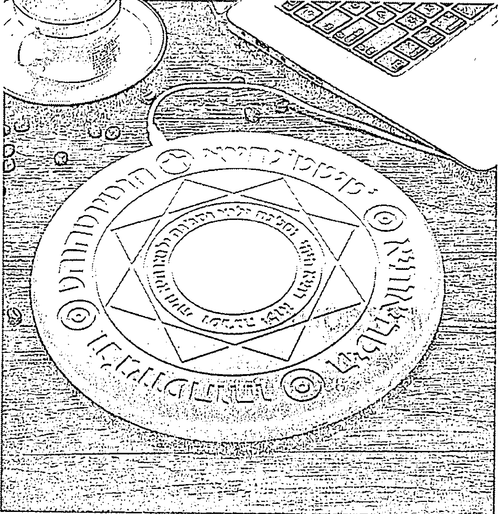

#### 如何选无线充电鼠标

了解了无线充电鼠标的相关知识后，下面我们就来聊聊选择的时候应该注意些什么。首先，我们要注意充电标准，市面上大部分鼠标选用的都是Qi标准，但也有部分产品为追求某方面的性能而选择其他标准的产品，需要选择原厂或专用的兼容充电板/充电鼠标垫。如果希望无线充电鼠标还能给手机等其他设备充电的话，那么选购的时候也要看清鼠标采用的是哪种充电标准。

另外，无线充电板/鼠标垫的接口类型和线材长度，特别是鼠标垫的尺寸、手感等也要注意能否满足使用需要。


#### 典型产品

##### 罗技G903 Hero

罗技G903 Hero采用了自家的Powerplay无线充电技术，需要配合Powerplay充电鼠标垫使用，而无法与其他Qi标准的设备通用，这一点需要注意。它使用了罗技的Lightspeed无线连接技术，可以为玩家带来低延迟的自在游戏体验，最长180小时的持续使用时间可以让玩家在游戏的世界里纵横驰骋。

- 无线充电标准：罗技Powerplay
- 尺寸：130mm × 67mm × 40mm
- 重量：110g

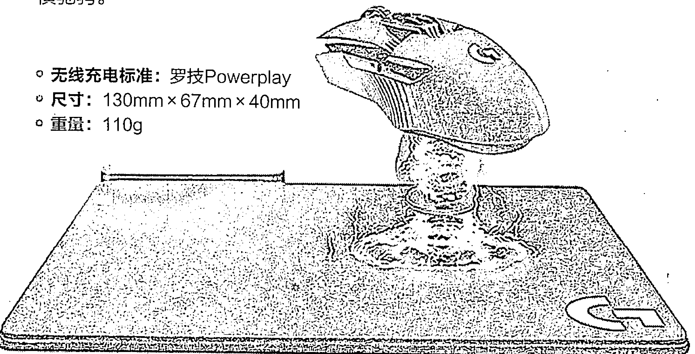

#### 美商海盗船暗影DARK CORE RGB SE无线充电版

- 无线充电标准：Qi
- 尺寸：127mm×89mm×43mm
- 重量：128g

美商海盗船暗影DARK CORE RGB SE无线充电版的速度达到16000DPI，它采用Qi标准充电，其他支持Qi充电的设备都可以为该鼠标充电，这一点对已有Qi无线充电器的用户非常友好。它的外形比较宽大，带有拇指托，非常适合大手型电竞用户选用。

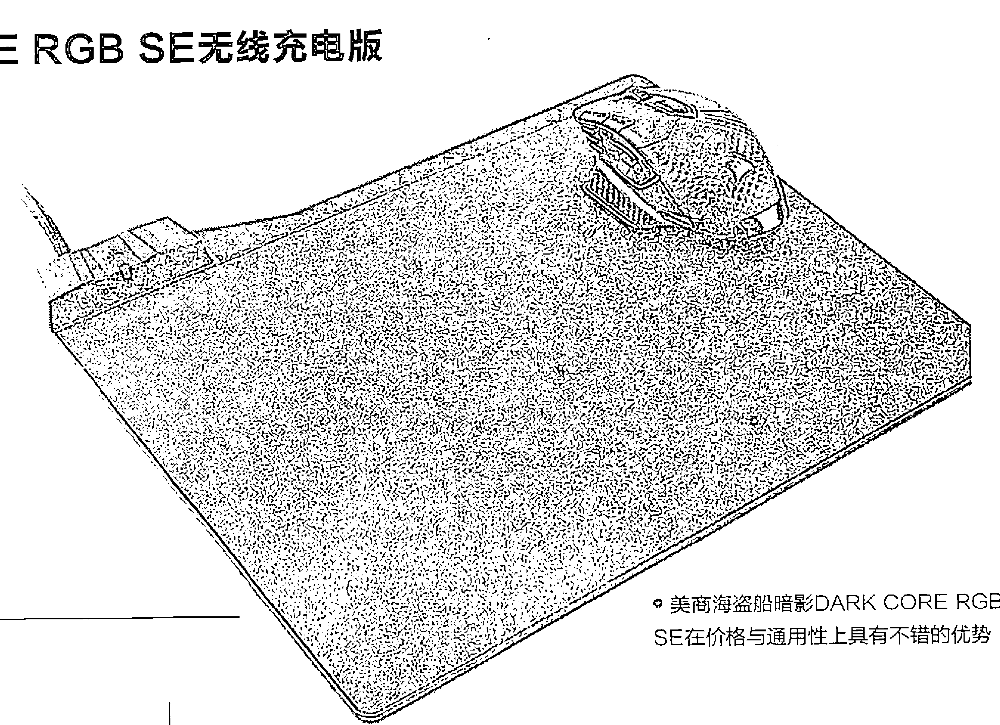

> > ° 美商海盗船暗影DARK CORE RGB SE在价格与通用性上具有不错的优势

#### 雷柏MT750Pro

- 无线充电标准：Qi
- 尺寸：122mm×85mm×49mm
- 重量：116g

雷柏MT750Pro是一款适合办公用户使用的无线充电鼠标，它采用了2.4GHz加蓝牙双模连接方式、Qi无线充电标准，并可通过Micro-USB线缆进行快速的有线充电。它提供了8个可自定义的功能按键，包括鼠标右键、滚轮前后滚动操作、返回等，能够有效地提升日常操作的效率。需要注意的是，它没有标配无线充电设备，用户需要额外购买第三方产品。

> > ° 雷柏MT750Pro更适合办公用户使用，游戏性能稍弱一些

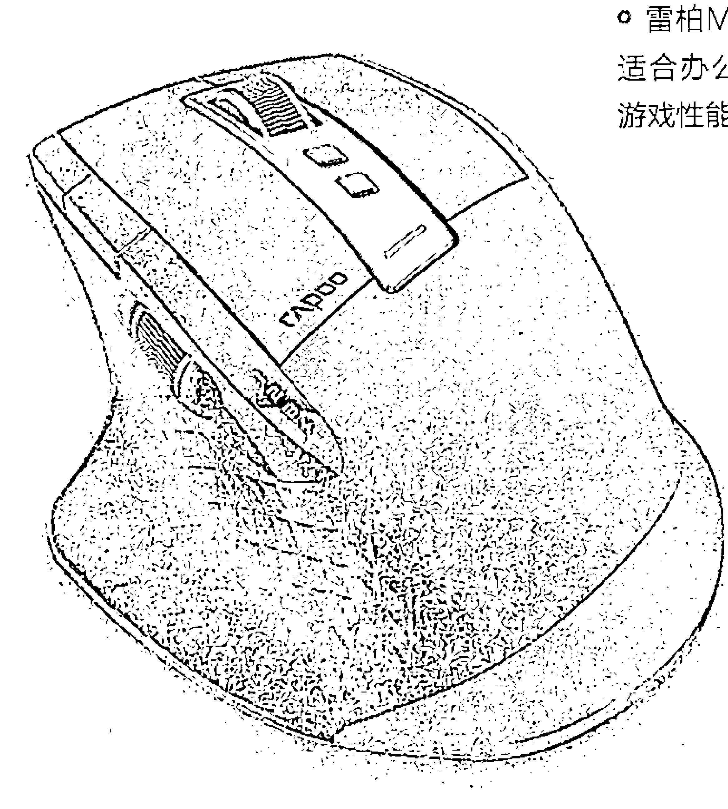

#### 雷柏VT350Q

- 无线充电标准：Qi
- 尺寸：126mm×67mm×42mm
- 重量：120g

雷柏VT350Q是一款游戏向的无线充电鼠标，采用Qi无线充电标准并支持有线充电。它提供最快1ms的响应速度，最高速度可达5000DPI。雷柏VT350Q在外形设计上充分依照人体工学专为右手设计，抓持很舒服，但对左撇子用户就不是很友好了。另外，它提供的约1680万色的背光系统及11个可编程按键等都为这个200元出头的产品增色不少，非常适合“入坑”无线充电鼠标的玩家选用。

> > ° 雷柏VT350Q具备游戏性能之余还有无线充电功能

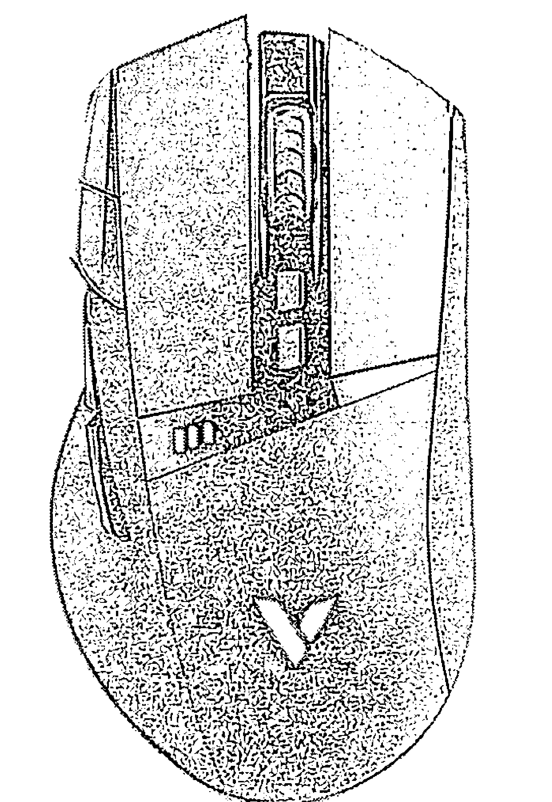

> > 无线充电技术与鼠标的结合诞生了无线充电鼠标，为我们提供了更加便利的操作体验。如果传统鼠标的一些不足正在困扰着你，不妨就以本文为契机选购一款适合自己使用的无线充电鼠标吧。CF