# 电脑爱好者2020合订本（三）

### 2020年13期～18期精华内容集合


精选每期实用技巧文章，收入内容更多更全；栏目归类深度整合，便捷查阅触手可及

# 电脑爱好者

## 2020年合订本（三）

# 《电脑爱好者》2020年合订本(三)

**主管**：中国科学院

**主办**：北京《电脑爱好者》杂志社
中国计算机世界出版服务公司

**编辑出版**：《电脑爱好者》杂志编辑部

**顾问**：郭传杰

**社长**：葛程远

**总编辑**：张博

**出版部**：聂静(主任)

**作者**：《电脑爱好者》编辑部

**发行部**：杨波(发行总监)

**读者服务部(发行)**：手机短信/电话：13801293315
（周一至周五 9:30~11:30 13:30~17:00）

**上门订阅杂志地址**：北京市海淀区翠微中里14号楼5层

**订阅**：全国各地邮局(所)

**编辑部地址**：北京市海淀区翠微中里14号楼5层

**邮编**：100036

**国内发行**：北京报刊发行局

**邮发代号**：82-528

**中国标准连续出版物号**：ISSN1005-0043
CN11-3248/TP

**印刷**：北京新华印刷有限公司

**广告经营许可证号**：京海工商广字20170127号

**出版日期**：2020年9月30日

**法律顾问**：周涛律师
网站：www.zt148.cn
电话：13366185341

本书如有印刷或装订质量问题，我们负责调换。
图文版权所有，未经同意不得转载、翻印
定价：39.8元

# CONTENTS 目录

## 《电脑爱好者》2020年合订本（三）

[邮发代号 82-528]

### 特别话题

- 新工艺遇到新架构 全面解读ARM“三剑客” ....................................... 7
- 学习娱乐两不误 暑期装机正当时 ................................................... 16
- 从墙壁到设备 充电路径的搭配学问 ................................................. 23
- DIY还是品牌机 怎样购机才划算 ..................................................... 31
- “1+4”五核降临 浅析英特尔Lakefield混合酷睿平台 .......................... 38
- 低成本“升级” 提升电脑性能的小手段 ............................................. 46
- 突破百瓦梦想 浅析智能手机的新一代闪充技术 ................................... 52
- 基本需求新选择 入门平台大更新 ................................................... 60
- 移动战场 浅析游戏本的变迁 ....................................................... 67
- 电脑数据最重要的通道 总线技术“古”今谈 ...................................... 76
- 翻天覆地的变化 智能手机的这十年 ................................................. 82
- 又到分岔路口 接口发展与选择的困惑 ............................................. 90

## 系统应用

- “开始”菜单无法应用主题色和透明色 ............................................. 96
- Win10通知“闪现”太短看不清？2个方法搞定 .................................... 97
- 显示太亮想护眼？DIY“开关”切换窗口颜色 ........................................ 98
- Windows 10下应该这样装Ubuntu .................................................. 100
- Windows 10夜间模式调节闪退这么解 ............................................. 102
- 防护更省心 玩转Defender设置 ................................................... 103
- 彻底取消文件与程序的关联 ..................................................... 104
- 无需拔出重插 重新启用USB设备 ................................................ 106
- 为文件添加需要的备注信息 ..................................................... 107
- 云安装Windows 10系统 ......................................................... 108
- 只用命令也能更新Windows 10防护软件 .......................................... 109
- 一条命令恢复Windows开机F8功能 ............................................. 110
- Windows 10 2004自动登录无法设置为哪般 ..................................... 111
- 根据情况选择不同的Windows磁盘检查方式 ...................................... 112
- 为MSI文件添加两个实用右键菜单项 ............................................. 114
- 救活出现未分配空间错误的USB存储器 .......................................... 116
- Windows Defender快速升级扫描二合一 .......................................... 117
- Windows 10控制功能拾遗 ....................................................... 118
- 对症下药 解决Windows 10新版升级常见问题 ................................... 120
- Windows 10进程（应用）备份/比对有妙招 ...................................... 122
- 简单高效 解决图片扩展名不合适的问题 .......................................... 124
- 非请勿下 微软应用商店限制有高招 ............................................. 125
- 关于“安全删除硬件”的有关问题 ................................................ 126
- Windows安装程序无法匹配硬件怎么办 .......................................... 128
- 动动注册表 让系统重新挂接ISO ................................................ 130
- 管理资源管理器的搜索记录 ..................................................... 131
- 开启虚拟化服务 用虚拟机轻松实现多系统 ....................................... 132
- 彻底修复Windows 10更新0x800f0831错误 ...................................... 134
- 消除启动后弹出的无用内容 ..................................................... 135
- 拒绝Windows 10升级 可以这样设置 ............................................. 136
- 实现Windows 10的“最小化”运行方案 ........................................... 137
- 临时修复Windows 10 v2004中的相关问题 ..................................... 138
- Windows 10的隐藏主题你知道吗 ................................................ 140
- 它的好它的坏 详解动态磁盘 ..................................................... 142
- 重要系统组件被恶意禁用 如何解除 ............................................. 144
- 向2004版看齐 自己调整WinRE恢复分区 ........................................ 146
- 非请勿进 为注册表的重要键值上把“锁” ........................................ 148

### 软网生活

- 灵活定制资源管理器导航窗格..........................................................150
- 电脑文档轻松“随身带”..........................................................151
- 全面控制 让Windows 10更安全可靠..........................................................152
- UWP版“我的电脑” 屏幕跨界不是难事..........................................................154
- 电影没字幕？自己来做一个吧！..........................................................155
- 统一管理系统中的解析功能..........................................................156
- 倒数备忘录 让我们更有紧迫感..........................................................158
- 更方便地下载网页中的图片文件..........................................................159
- 用好“宏”工具 自动化执行重复任务..........................................................160
- 压缩文件与映像文件处理的“利器”..........................................................162
- 免费加装Windows 10增强新功能..........................................................163
- 系统活动 用Sysmon全程监控..........................................................164
- 定义魔力关键词 快速打开指定项目..........................................................166
- 这样做 游戏存档绝不会丢..........................................................167
- 修改MAC地址 这样最简单..........................................................168
- 硬件状态全面监控 一个软件轻松搞定..........................................................169
- 效率满满！键盘也能操控鼠标！..........................................................170
- 在线变本地 云音乐脱网也能听..........................................................171
- 随意选择多媒体文件的压缩方式..........................................................172
- 新版谷歌浏览器 管理标签页更方便..........................................................173
- 萌猫记账 满足“少女心”..........................................................174
- 巧用在线翻译将英文字幕变中文..........................................................175
- 对症下药 解决多种乱码难题..........................................................176
- 你的AI能抠图吗..........................................................178
- 灵活生成规整的文件属性列表..........................................................179
- 各具特色 免费整理音乐标签..........................................................180
- 文件无法进行正常的操作？2款工具帮你忙..........................................................182
- 简单几步搭建临时网络空间..........................................................183
- 手机翻译词典哪家强..........................................................184
- 重温经典 手机“变身”Windows 98..........................................................186
- 手机应用就是健身“私教”..........................................................187
- 手机“发烧”怎么办 降温软件来帮忙..........................................................188
- 维护更轻松 用Ventoy制作多ISO启动盘..........................................................190
- 数独游戏玩不过 电脑帮忙算..........................................................192
- 让老视频秒变4K高清..........................................................193
- 浏览网络不耽误正常办公..........................................................194
- 自定义 创建三种自动事件任务..........................................................195
- 远超记事本的小小编辑替代品..........................................................196
- 图片预览与编辑处理“一条龙”..........................................................198
- 软网为媒 助力垃圾分类达标..........................................................200
- 拒绝空间浪费 重复文件管理有高招..........................................................202
- 轻松完成手机录屏与剪辑..........................................................203
- 彰显个性 制作不一样的表情包..........................................................204
- 将网盘文件集中到Office 365网盘..........................................................205
- 归类更智能 给文件打上标签..........................................................206
- 学会原画录屏 你也能当讲师..........................................................208
- 系统“机械师” 优化系统没得说..........................................................210
- 一次性批量设置文件视图模式..........................................................211
- My Commander 我的文件管理利器..........................................................212
- 告别“流氓”和捆绑 用“软件包管理器”下载软件..........................................................214
- 还在手动录入吗 让手机秒变“扫描仪”吧..........................................................215

## 办公世代

- 文件多条件同步 Echosync让文件同步更简单...... 216
- 精彩个性快速展现 Pictor拼图截图更方便...... 217
- 网页打印之前去除不必要的内容...... 218
- 自定义Windows 10搜索框的提示语...... 219
- 用卡片的方式记日记...... 220
- “真伪”立辨 比较文件的哈希值...... 221
- 清理手机垃圾文件更简单...... 222
- 留住记忆 备份新浪微博数据...... 223
- 夜晚来临 强制开启浏览器深色主题...... 224
- 用InfoBar让Windows桌面显示更多的信息...... 225
- 跟踪查看电脑使用情况更方便...... 226
- 超强的免费重命名工具...... 227
- 保护更方便 给视频添加水印...... 228
- qView 实用的极简看图软件...... 230
- 魔术变轻松 人人都是“魔术师”...... 231
- 像云笔记一样管理电脑文件...... 232
- 影视发烧友神器 轻松实现拍摄地巡礼...... 234
- TED Notepad升级记事本功能...... 235
- 不会乐器也能“秀”弹唱“玩”编曲...... 236
- 功能脚本让GitHub的使用更便利...... 237
- 更安全地存储和传输密码...... 238
- 免软件 局域网内快速分享文件...... 240
- 双屏办公游戏 你能让鼠标安心听话吗...... 241
- 让PPT中的公式更好看...... 242
- 对比两列姓名 三种方法任你选...... 244
- 事半功倍 用好MAX函数...... 245
- 三类办公文档 如何添加Logo...... 246
- 分阶柱状图 你会做吗...... 247
- 特殊符号也能高大上！4个Excel图表秘诀...... 248
- 不用公式和VBA 表格中显示批量图片...... 250
- 操作更简单 制作PPT 3D圆环图...... 251
- 保护Excel数据 重要资料轻松上锁...... 252
- 输入更快捷 在Word中高效输入特殊字符...... 254
- 实现表格动态求和与累计求和...... 256
- PPT也能“邮件合并”...... 257
- 让封面高大上 简单设计Word模板...... 258
- 在Excel中更好地输入框式号码...... 260
- Excel数据列无损合并及灵活组合...... 261
- 勾选就变色 Excel复选框可以这样用...... 262
- 一点就破的Excel实用技巧...... 264
- PPT图片分割“三板斧”...... 265
- 智能感知数据改动并添加标记...... 266
- 巧做智能下拉菜单...... 268
- 数据汇报更人性化 快速生成Excel特定格式文本...... 269
- 善用自动图文集 打造自己的Word模板...... 270
- SUBSTITUTE函数的几个妙用...... 272
- 用PPT巧做视频教程...... 273
- PPT多图排版有技巧...... 274
- 让Word同时拥有横向页和纵向页...... 275
- 超级表 Excel这个功能你用好了吗...... 276

## 移动新天地

- 按需定制 玩转Office中的汉字拼音 .......................................................278
- 操作更高效 增强Excel的批量替换功能 ....................................................280
- 用活Text函数 数据变身更高效 ..............................................................282
- Word页码设置 一次给大家讲清楚 ............................................................284

## 移动新天地

- 智能无门槛 使用SuperFreezZ冻结后台程序 ...................................................286
- 如何实现跨品牌零流量高速互传 ..............................................................288
- 闪回键帮你一步返回战场 .................................................................289
- 微信传图 突破9张限制 ....................................................................289
- 不服跑个分 PerfDog测试手机真实性能 ........................................................290
- 手机壁纸找必应 ..........................................................................292
- 如何解除默认应用 ........................................................................292
- 打造个性微信聊天气泡 ....................................................................293
- 玩转华为手机的无线传声 ..................................................................293
- 一划定乾坤 体感手势让手机操作更顺手 ........................................................294
- 修改配置文件 飞行模式不关Wi-Fi ............................................................296
- 无需APP 微信制作趣味图片 ................................................................297
- 找回误删的系统应用 ........................................................................297
- 轻启动让APP启动更快 ....................................................................298
- 两种思路 解决微信快捷回复问题 ............................................................299
- 华为/荣耀手机之间免费通话 ................................................................300
- 如何下载内测版微信 ........................................................................300
- 将健康宝放到桌面 ..........................................................................301
- 给第三方应用安装加把锁 ....................................................................301
- 静心休息 用好手机的“免打扰”功能 ..........................................................302
- 一目了然 全面掌握手机的设备信息 ..........................................................303
- 位置由你定 为照片补加时间水印 ............................................................304
- 品尝免费贴膜服务 ..........................................................................305
- “增强信息”用流量免费发短信 ................................................................305
- 用手机扮演PC的摄像头 ....................................................................306
- 避免手机偷跑数据流量 ......................................................................307
- 解放手机的音量键 ..........................................................................307
- 随时随地查询网络性能 ......................................................................308
- 极限提升手机续航 ..........................................................................308
- 华为/荣耀手机变身POS机 ..................................................................309
- 更灵活的位置权限管理 ......................................................................309

## 傻博士

- 傻博士 ....................................................................................310

## CFan为你选

- 中端5G标杆的较量 荣耀X10 对 Redmi 10X Pro ..................................................340
- 第十代酷睿好搭档 Z490主板一览 ..............................................................342
- 机械革命S2 Air 对 RedmiBook 14 II 锐龙版 ...................................................346
- 生态的较量 微软Surface Go 2 对 荣耀平板V6 ...................................................348
- 锐龙新秀之争 惠普战66三代 对 华硕灵锐14 ....................................................350
- 5G中坚的较量 vivo Y70s 对 荣耀Play4 ........................................................352
- 升级之战 雷神911 Air星战3代 对 机械师T58-V ................................................354
- 千元机的较量 荣耀Play4T 对 Redmi 9 ........................................................356
- 性能级轻薄本的较量 机械革命Code01 对 荣耀MagicBook Pro .........................................358
- 游戏迷的盛宴 ROG游戏手机3 对 拯救者电竞手机Pro .............................................360
- 一体电脑的较量 联想AIO520C 对 惠普星24青春版 ................................................362
- 游戏手机的较量 红魔5S 对 黑鲨3S ............................................................364
- 同芯不同价 高性价比手机差在哪 ..............................................................366


## 新工艺制程加持 全面解锁ARM“三剑客”

策划|《电脑爱好者》编辑部

本刊曾在2020年第2期《火眼金睛 如何快速判断移动芯片的性能》特别话题中详细解读过影响移动芯片（SoC）性能的关键参数——工艺和架构，当这两个参数同步升级时往往意味着SoC将出现性能上的大幅跃迁。2020年5月底，ARM正式发布了Cortex-A78、Cortex-X1和Mali-G78三大核心架构IP，而它们也将第一时间尝鲜即将商业化量产的5nm制程工艺。当5nm与新架构结合后，智能手机会因它们获得怎样的变化？答案就在本期特别话题之中。

### 利剑出鞘ARM一门“三剑客”

**小提示**

ARM同期还发布了全新的Ethos-N78 NPU单元（图1），只是高通、海思、三星和联发科都有自己的AI技术，所以ARM原生NPU一直没能在手机芯片领域打开局面，本文也就不再赘述了。

按照惯例，ARM每年都会推出新一代IP内核，比如我们熟悉的Cortex-A77和Mali-G77“双雄”就发布于2019年5月，而ARM今年却一口气发布了三个新成员，组成了豪华的“三剑客”天团。

### Cortex-A78：常规革新


Cortex-A系列是ARM旗下的CPU内核架构，还被ARM进一步细分为Cortex-A7x和Cortex-A5x，分别隶属于高性能核心和低能耗核心。目前骁龙865、天玑1000和Exynos 980等5G SoC都将Cortex-A77作为CPU中的“大核”，Cortex-A55充当“小核”。

### Cortex-A78:基于DynamIQ技术的第四代高性能CPU

手机主板空间寸土寸金，SoC芯片面积自然是越小越好，图为小米10 Pro官方拆机图，骁龙865芯片和内存芯片采用上下结构的堆叠封装

- 比上代核心面积更小、功耗更低、性能更强
- 与上代核心相同的体系架构，提供无与伦比的可扩展性
- 与Cortex-A55核心兼容，可构成DynamIQ大小核矩阵

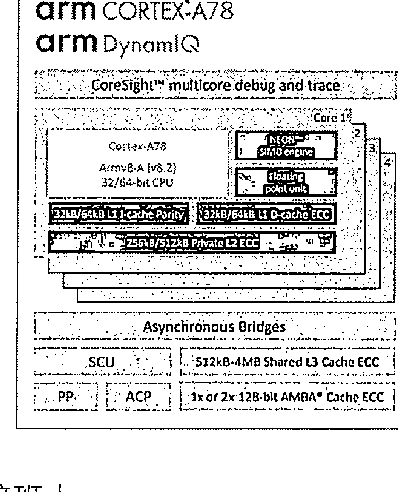

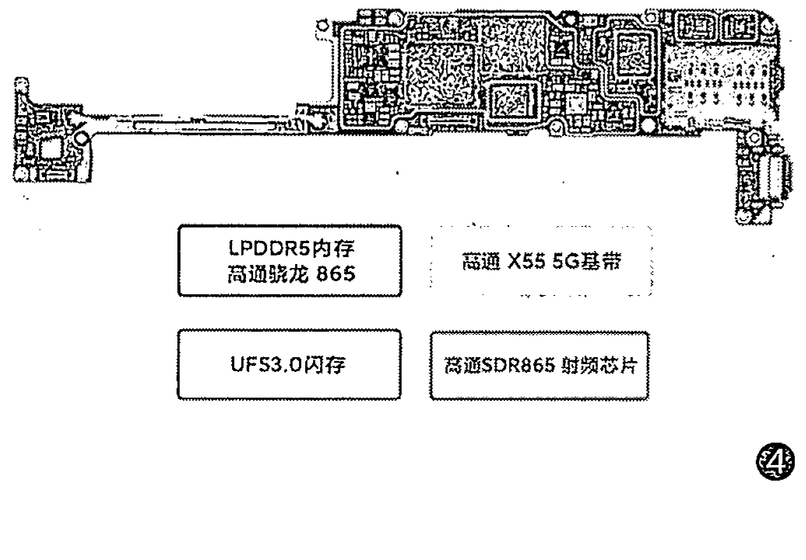

那么，作为Cortex-A77的接班人，全新的Cortex-A78都有了哪些变化？

### 架构不变 细节微调

很遗憾，Cortex-A78沿用了Cortex-A76和Cortex-A77正在使用的Austin微架构（基于ARM v8.2指令集），所以我们不能指望Cortex-A78能带来性能上的质变。还好，ARM每次都会对Austin微架构进行细节上的优化，这一次也不例外（图2）。

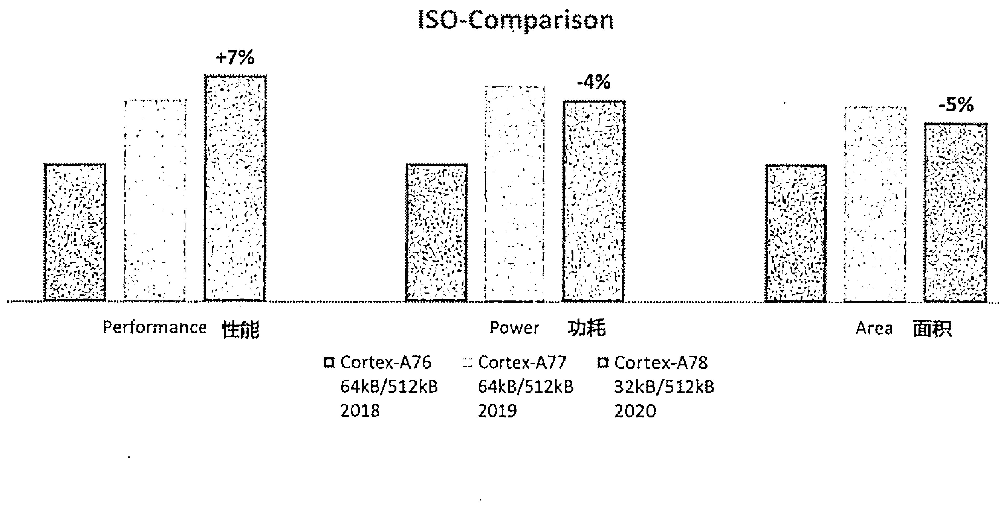

简单来说，Cortex-A78对分支预测器进行了升级，可以在一个时钟周期内处理两个预测（上代Cortex-A77只能处理一个预测），从而提升核心的吞吐量；Cortex-A78增加了指令调度器的宽度，从Cortex-A77的10μops提升到了12μops；Cortex-A78同时还提升了缓存子系统的带宽，L1指令缓存可以从Cortex-A77固定的64KB改为可选32KB或64KB，如果芯片制造商选择32KB容量，可以减少内核的面积。

### 叠加工艺 性能小升

ARM官方数据显示，Cortex-A78相较于Cortex-A77，其IPC（同频率下的架构性能）只提升了7%，功耗降低了4%（图3）。不出意外，这种提升幅度可以用“挤牙膏”来形容，但我们同时也需要注意新架构的闪光点：4个Cortex-A78核心的封装面积较之相同数量的上代Cortex-A77减少了15%，减小的芯片面积可以降低成本，也能将腾出来的空间用于其他组件（图4），比如塞进一个性能更强的Cortex-X1核心。

Cortex-A78对微架构的改进还有很多，限于版面我们就不一一赘述了，ARM对Cortex-A78的定位很明确，尽可能让PPA（Power、Performance and Area，功耗、性能和内核面积）指标变得更加均衡。

Cortex-A78的IPC性能虽然提升不多，但它却有一个最佳搭档——5nm制程工艺，先天就具备更好的能效比底蕴。根据ARM的官方数据，如果将SoC内单个大核满载时的功率设定为1W，此时7nm工艺生产的Cortex-A77可以跑到2.6GHz，而5nm工艺生产的Cortex-A78则可达到3GHz，相当于在相同功耗下获得20%的性能提升。反之，Cortex-A78在2.1GHz频率下的性能就与2.3GHz的Cortex-A77持平，但此时前者的功耗却有着50%的降低（图5）。

说实话，ARM的这种计算方式有失偏颇。如果Cortex-A77也用5nm工艺生产，性能也会比7nm工艺时提升不少，功耗也会明显下降。反之，如果用7nm工艺生产Cortex-A78，其性能和功耗表现也不见得比Cortex-A77好多少。只是，新工艺和新架构搭配是科技发展的趋势，也最经济，还利于宣传，现实中我们也很少看到“新工艺+老架构”或“老工艺+新架构”搭配的案例。

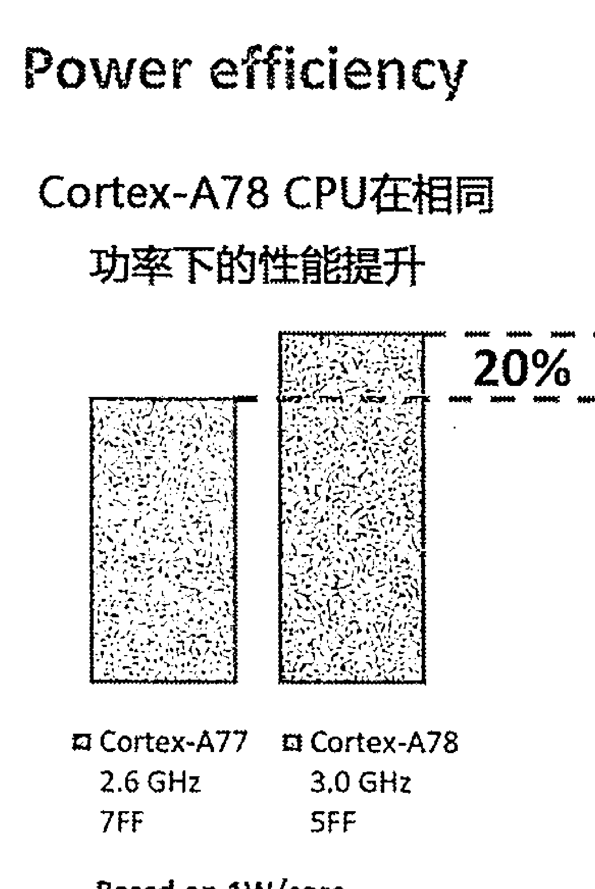

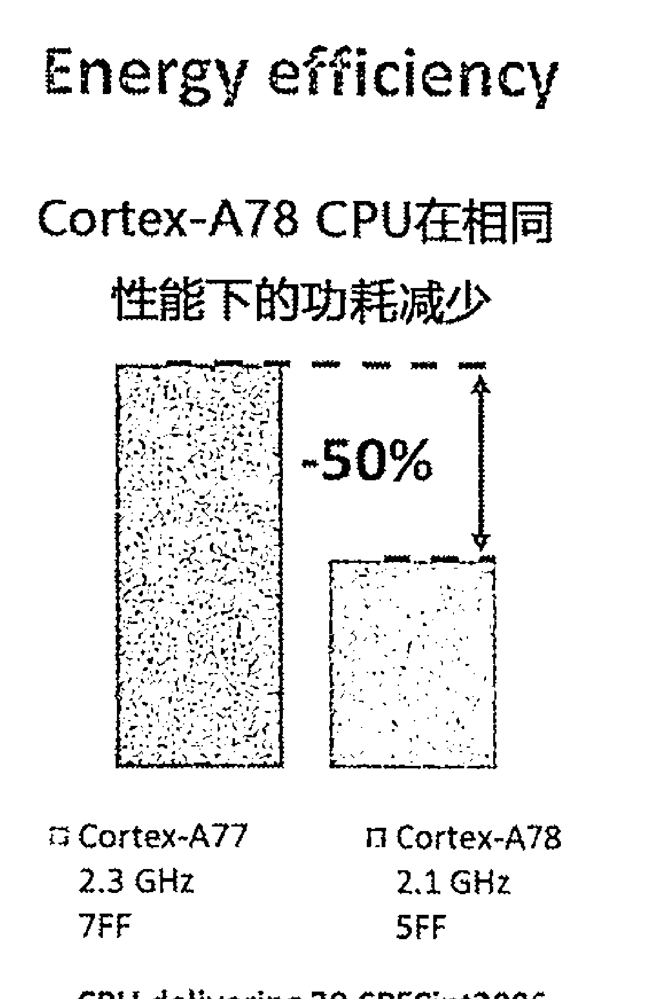

### Cortex-X1：自研的终局

在GeekBench等专业测试软件中，苹果iPhone系列手机总能实现对同期旗舰级Android手机的“屠榜”。究其原因，是苹果从iPhone 5时期开始就展开了A系列处理器的“自研”之旅，凭借强大的研发实力和资金优势，ARM原生的Cortex-A系列核心根本就不是对手。ARM全新Cortex-X1核心IP的出现（图6），给予了Android阵营挑战同期A系列处理器的一线曙光。

### Qualcomm灵活的CPU策略

每一代处理器，我们都根据时间和市场需求选择最合适的CPU

| 810 | 820 | 835 |
| --- | --- | --- |
| 原生ARM | 定制化 | 半定制化：基于ARM Cortex®的技术 |
| 快速部署64位 | 性能强劲 功耗出色 | 更强劲的性能 更极致的能效表现 |
| 有限的系统集成 | 紧密的系统集成 | 紧密的系统集成 |

> **小提示**
所谓的“自研”，就是购买ARM最高级的指令集授权，然后根据自身需要开发兼容ARM的架构，能领先ARM公版的Cortex-A架构多少全看芯片商的技术水平。

### 自研遇阻 魔改当道

除了苹果，高通在骁龙600/800时代曾采用过自研的Krait架构，距离最近的骁龙820核心也隶属于自研的Kyro。只是，高通发现自研架构的能耗比很难领先同期公版Cortex-A7x架构太多，非常不经济。因此，从骁龙835开始就采取了BoC战略，也就是咱们常说的“魔改”，基于现有的公版Cortex-A架构进行定制优化（图7）。

华为从麒麟980开始，也采用了类似的思路，其大核也是基于Cortex-A架构进行了“Based”，同样是一种魔改。需要注意的是，公版Cortex-A架构可以进行“魔改”的地方并不多，大家基本都是拿缓存部分开刀，所以无论是高通还是麒麟，其魔改后的内核与公版架构之间的性能差异并不大，关键还是看主频。

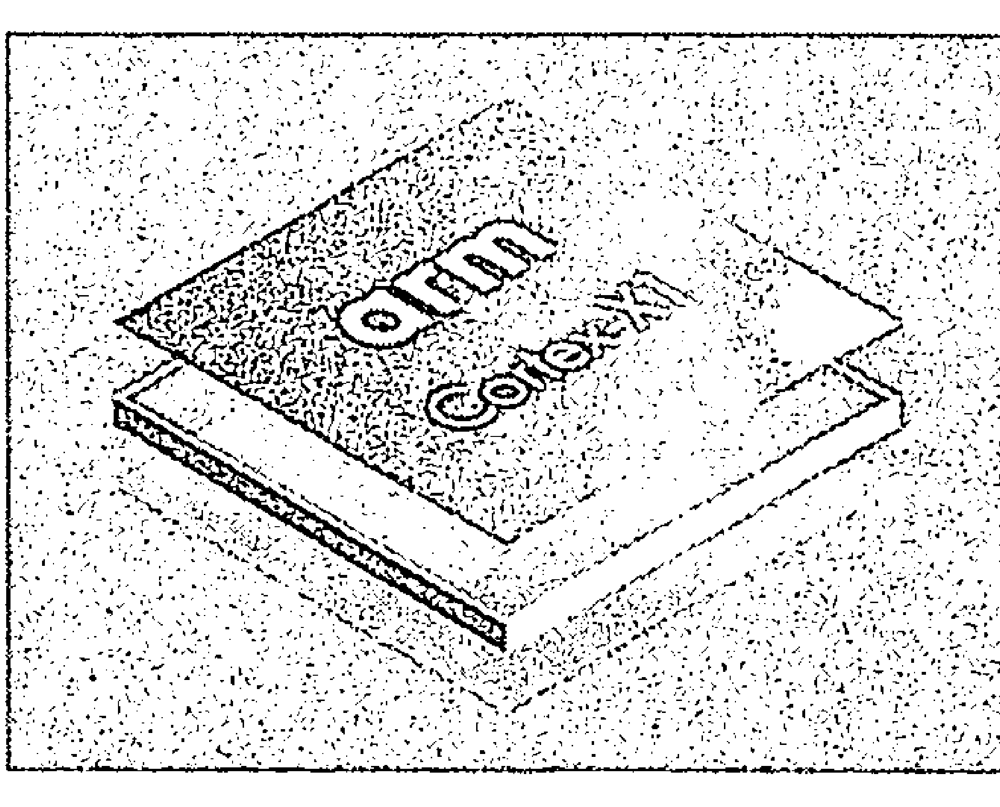

### Samsung Exynos PROCESSOR

三星从Exynos 8890开始也加入到自研大军，并推出了名为猫鼬（Mongoose）的架构核心（图8）。但是，经过四代自主研发后，三星在2019年底已经决定放弃自研的Mongoose内核，并解散了位于德州奥斯汀的整个研发团队，未来将全面使用ARM的公版方案。可见，除了苹果，其他芯片商的自研之路可谓一路荆棘，费力不讨好。

好消息是，ARM此次发布的“三剑客”中的Cortex-X1，其实就是一种允许芯片商在其上进行高度定制的IP内核，可以完全取代辛苦的“自研”之路。

### 特别话题

| Cortex-A78 | Cortex-X1 |
| :--- | :--- |
| Roadmap core | Custom core |
| 4 Insts / 6 Mops | 5 Insts / 8 Mops |
| 2x128b NEON | 4x128b NEON |
| 32kB or 64kB L1 | 64kB L1 |
| Up to 512kB L2 | Up to 1MB L2 |
| Up to 4MB L3 | Up to 8MB L3 |
| Armv8.2 | Armv8.2 |
| DynamIQ cluster support | DynamIQ cluster support |

## 超核降临 排忧解难

如果Cortex-A78的定位是“大核”，那Cortex-X1就相当于“超大核”，它在架构设计上与Cortex-A78如出一辙，但几乎在每个地方都进行了扩展。

比如，Cortex-X1的解码带宽从Cortex-A78的4路提升到5路，增加了25%；NEON浮点从2条128b提升到了4条128b，相当于浮点性能翻倍；缓存方面，Cortex-X1的L1缓存为64KB，L2缓存为1MB，L3缓存最高可达8MB，是Cortex-A78的两倍(图9)。

根据ARM的官方资料显示，在主频相同时（也就是IPC性能），Cortex-X1的峰值性能较Cortex-A77提高了30%，比最新的Cortex-A78也有着22%的性能优势，机器学习能力则是Cortex-A77和A78的两倍(图10)。

按照规划，芯片商未来可以选择1个Cortex-X1“超核”+3个Cortex-A78“大核”+4个Cortex-A55“小核”组成的三丛集DynamIQ集群，以实现性能和功耗的完美平衡。唯一可惜的，就是Cortex-X1内核会占用更大的封装面积。在理论性能方面，4个Cortex-A78核心在搭配4MB L3缓存时，其性能比前代Cortex-A77可提升20%，同时核心面积降低15%；而1个Cortex-X1+3个Cortex-A78核心在搭配8MB L3缓存时，虽然核心面积会增加15%，但峰值性能提升了30%（图11）。

### Cortex-X1: 终极性能

Additional capability for additional performance

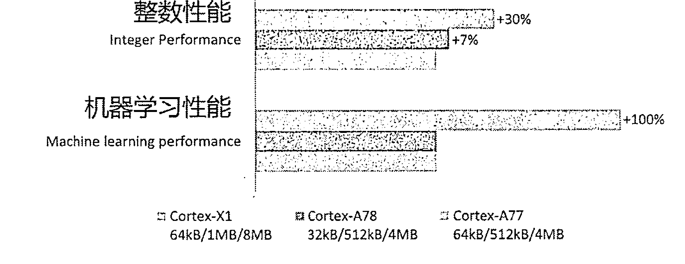

+22%
Integer Performance over Cortex-A78

+30%
Integer Performance over Cortex-A77

2x
ML Performance over Cortex-A77/A78

### 通过更具扩展性能的解决方案满足未来的需求

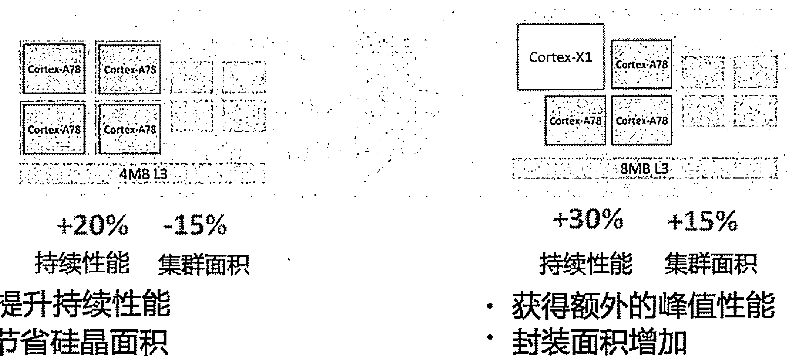

- 提升持续性能
- 节省硅晶面积
- 获得额外的峰值性能
- 封装面积增加

看到这里，大家应该知道ARM为什么将Cortex-A78的L1指令缓存改为32KB或64KB可选项目了吧？选择32KB L1指令缓存后，节省下来的封装空间可以留给Cortex-X1，后者强大的性能足以弥补Cortex-A78缓存的部分缺失。至于为什么Cortex-X1的IPC性能比Cortex-A78增加22%，但1+3+4的组合却只比4+4多提升了10%的性能，是因为Cortex-X1只有单独的1颗应战，被其他3颗Cortex-A78平均了性能。

Comparing Arm single core performance at 1 watt on Cortex-A78 vs Cortex-A77, and Arm single core peak performance on Cortex-X1 vs Cortex-A77. Including architectural and process improvements (compared to 2019 devices)

### Mali-G78: 堆核狂魔

### arm MALI™-G78

在Android领域，ARM公版的Mali系列GPU一枝独秀，昔日的老对手PowerVR已被边缘化。而新一代Mali-G78 GPU的问世，将进一步巩固ARM的“亲儿子”在GPU领域的王者地位（图12）。

也许是没有太大的竞争压力，所以Mali-G78依旧沿用了Mali-G77采用的Valhall图形架构，但它对全局时钟域进行了优化，改为全新的两级结构，实现了上层共享GPU模块与实际着色器核心频率的分离，也就是异步时钟域。这样一来，GPU的核心可以工作在与其他部分不同的频率上，可快可慢，从而解决几何输出与计算、纹理、引擎之间的不平衡问题，还能让GPU运行在不同的电压上，从而降低功耗、提高能效。这也是桌面级CPU、GPU通用的做法。此外，Mali-G78还彻底重写了FMA（融合乘加）引擎，包括新的乘法架构、新的加法架构和FP32/FP16浮点，可以大幅节省功耗。

在Mali-G77时代，最多可以搭配16个计算单元，也就是Mali-G77 MC16，但受制于成本、发热和功耗，哪怕是最激进的Exynos 990也才用了11个计算单元，即Mali-G77 MC11，天玑1000+和天玑1000-L则分别配备了Mali-G77 MC9和Mali-G77 MC7。

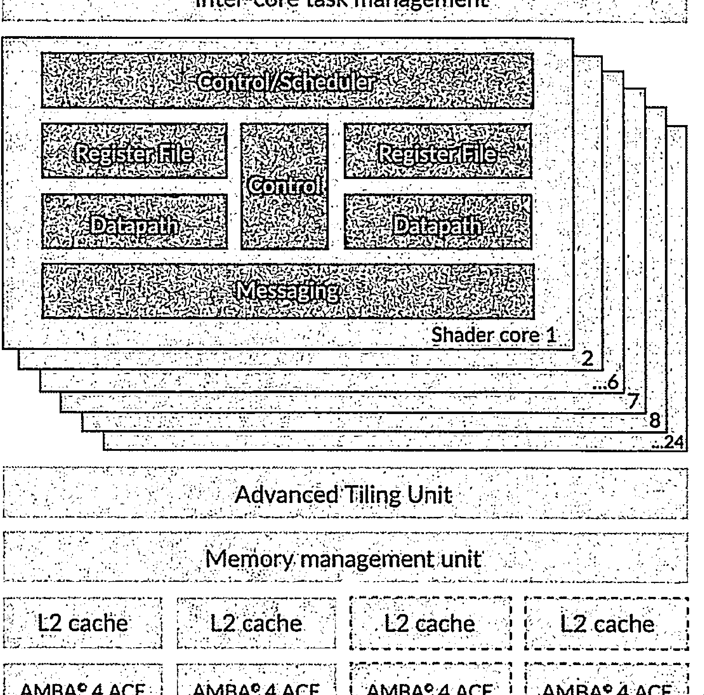

> **小提示**
ARM此次还推出了Mali-G68系列GPU，用于填补Mali-G7系列和Mali-G5系列之间的空白。从现有的资料来看，Mali-G68的架构和参数与Mali-G78一模一样，只是最多仅能搭配6个计算单元。换句话说，搭配1个~6个计算单元的Mali-G78就叫Mali-G68，超过6个计算单元的则是Mali-G78。

这一次，ARM为Mali-G78准备了最多24个计算单元（图13），较之前辈增加了50%。但正如上面提到的原因，哪怕搭配最新的5nm工艺，估计实际商用的最大规模也就是16个左右，再多手机当前的散热设计可能就压不住了。根据ARM的资料显示，得益于综合架构、工艺等各方面的改进，Mali-G78相比于Mali-G77的性能提升幅度可达25%，即便是在同等工艺条件下也可提升15%，同时能效提升10%，机器学习性能提升15%（图14）。

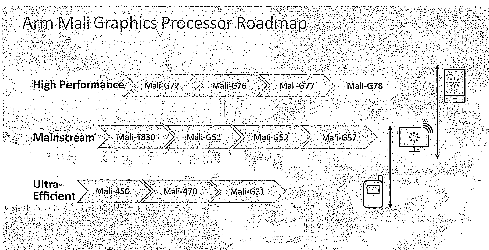

总之，Mali-G78的性能较上代Mali-G77有了小幅提升，在最新5nm工艺的加持下可以进一步减小封装面积，降低功耗，或塞进更多的计算核心。而计算核心数量和频率越高，Mali-G78的性能自然也就越强悍。

### Mali-G78

ARM“三剑客”的基本情况介绍到此为止，接下来我们再来讨论它们能对Android手机的未来产生多少影响。

- *在移动设备上提高游戏质量和电池寿命，原因是：
    - 最多24个计算单元
    - 改变游戏规则的异步时钟域
    - 彻底重写了FMA（融合乘加）引擎
- 全新次旗舰级别的Mali-G68

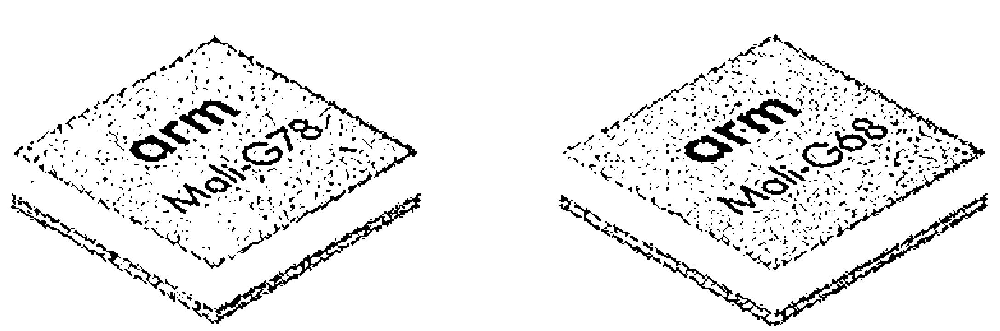

15% 更好的性能

25% 性能最多提升

10% 更好的能效

15% 更好的ML性能

### 市场分层 游戏手机“芯”希望

前文我们提到过，除了苹果，其他芯片商在自研和魔改Cortex-A架构的道路上逐渐力不从心，耗费巨资也难以和竞争对手拉开太大的差距。因此，当ARM提供Cortex-X1这个可选超核后，芯片商们笑了。

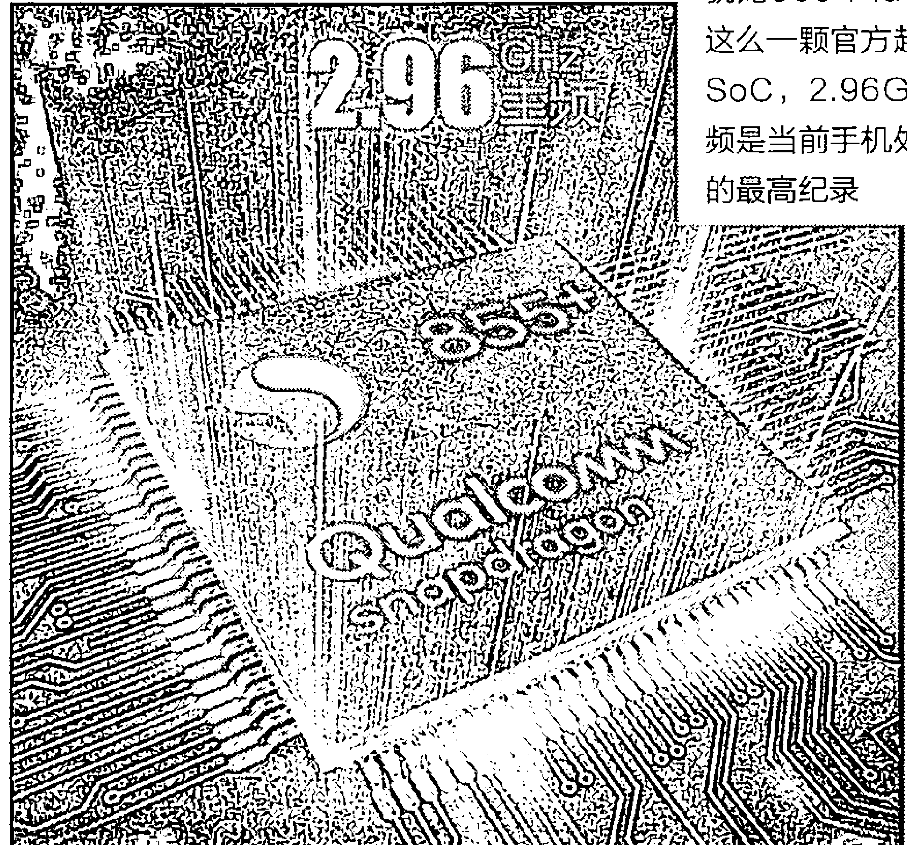

### 性能不够 超核来凑

最近两年手游电竞逐渐升温，并衍生出了ROG、拯救者、黑鲨和红魔这些独立的游戏手机品牌（图1）。但是，无论是这些专业游戏手机还是普通的旗舰手机，搭载的都是高通骁龙8系列SoC，哪怕是ROG也只能通过“超频”的策略小幅拔高性能（图2），但在实际体验上依旧很难拉开差距。

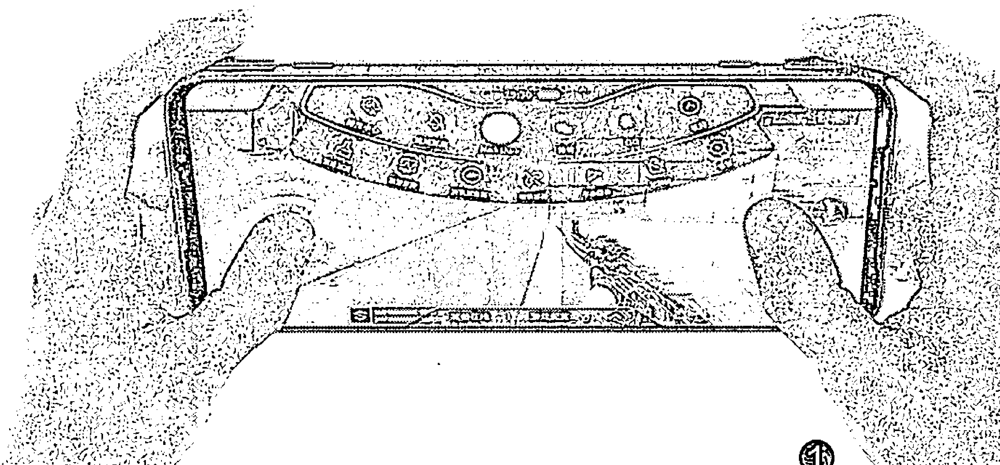

以Cortex-X1为代表的超核的出现，恰好满足了专业游戏手机对更高性能的渴望，进一步拉开与普通旗舰手机之间的差距。换句话说，从2021年开始，没有搭载内藏超核的“心脏”，那它就不是一部合格的游戏手机。

### # E Levating Single Thread Performance
单核性能提升

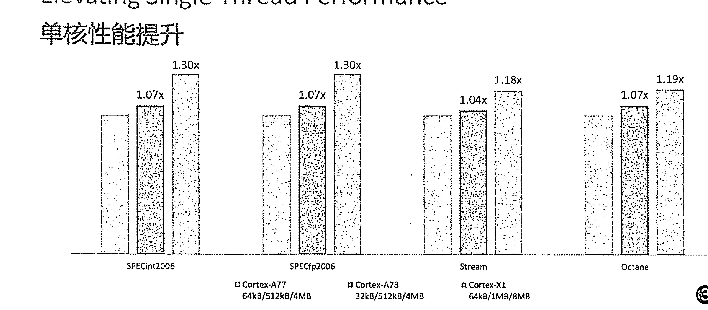

话说说，舍得花钱，或者能通过SoC结构优化，解决Cortex-X1满载温度和功耗偏高问题的芯片性能肯定会更强一些，为了打出Cortex-X1噱头但没有对其进行深度挖掘的芯片性能就会差一些。前文提到的能比Cortex-A77强30%的Cortex-X1属于“满血版”（图3），接下来我们就等着看高通、三星、海思和联发科谁能先一步用上满血版的Cortex-X1核心吧。

### ## 同属超核 性能不一

需要注意的是，ARM对Cortex-X1的定义是“可定制”移动平台，芯片商可以根据预算和需求向ARM提出要求，然后ARM再根据不同的应用场景调整Cortex-X1各个模块的规格设计。

因此，哪怕高通骁龙、三星Exynos、海思麒麟、联发科天玑的下一代旗舰SoC都用上了Cortex-X1内核，但它们之间也会因每时钟周期指令解码数量、L0-BTB容量、宏操作缓存容量、乱序窗口数量、每时钟周期指令发射数量和缓存容量等细节参数的不同，而呈现出不同的性能。

> > **扩展阅读: Cortex-X1效能前瞻**
>
> 外媒www.anandtech.com根据已有产品推算出了Cortex-X1、Cortex-A78和现有旗舰级SoC之间的性能、整数运算功耗和耗费焦耳的对比情况。从结果来看，它们的性能符合预期，Cortex-X1比当下Android领域最强的骁龙865快了37%。在功耗方面Cortex-A78与骁龙865接近甚至更低，Cortex-X1虽然略高但却明显低于Exynos 990和苹果A13（图4），整体看来还不错。

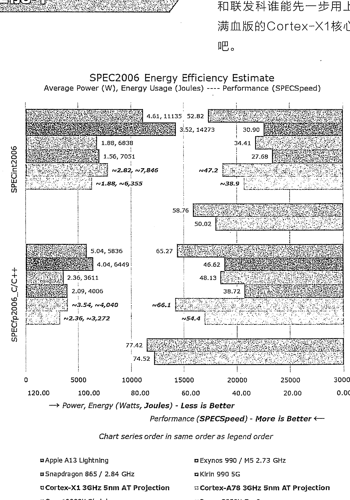

### 特别话题

## 透支性能 散热加码

三星年度旗舰 Exynos 990的表现可以用“翻车”来形容，跑分还行，但功耗较大，过热、降频等问题较为严重，因此哪怕是韩版的Galaxy S20也改用骁龙865移动平台，早前网上还传出“三星员工为Exynos 990感到丢脸”的言论。可见，一颗SoC的性能固然重要，但发热和功耗表现也要均衡。

当 Cortex-X1成为旗舰级SoC三丛集DynamIQ集群中的超核之后，想要100%甚至120%发挥出其全部性能动力，就对手机内部的散热提出了更高的要求和挑战。目前，手机领域的散热设计主要以三个优化方向为主：

暴力堆料流派：通过增加VC均热板面积的思路提升散热效率，比如小米10系列的3000平方毫米（材质为纯铜）（图5），Redmi K30 Pro更是达到了3435平方毫米（材质为不锈钢）。

结构优化流派：改进各种散热单元的布局结构，比如黑鲨3主打的“三明治”液冷散热系统

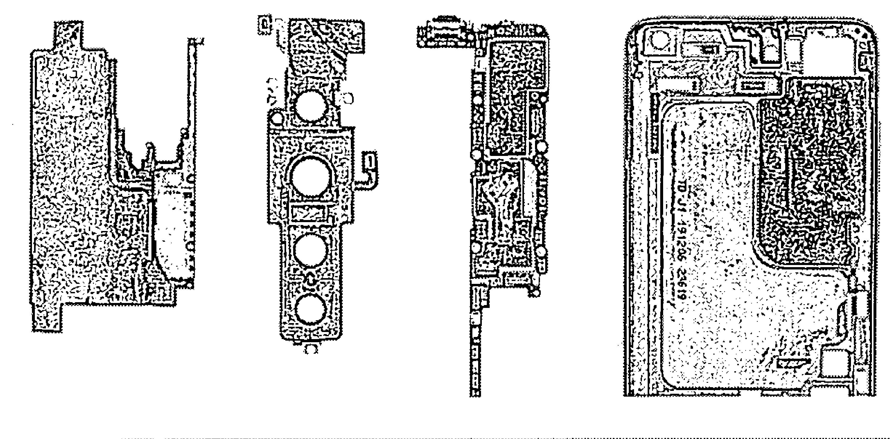

（图6），其PCB主板被夹在电池中间，上下分别覆盖一根热管构成了“三明治”式散热布局，将主板两侧的芯片全部覆盖。

主动散热流派：红魔5G内置一根L型的热管，但却在此基础上增加了一颗高达15000转速的迷你风扇，同时还采用了机身两侧开孔组成的“南北通透”的风道（图7），这种类似PC级的散热设计可以带来更清凉的体验。

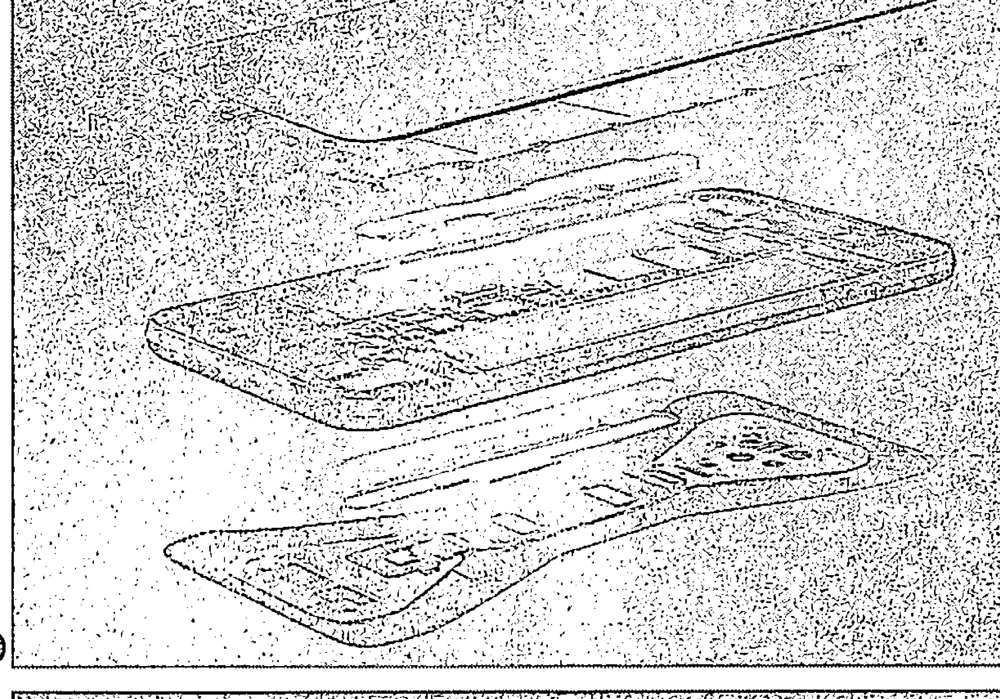

为了完美适配集成Cortex-X1核心的新一代SoC，未来的游戏手机们肯定会在散热设计上再度加码，基于“半导体晶片”的冰封散热背夹等外设也会得到更多的关注（图8）。

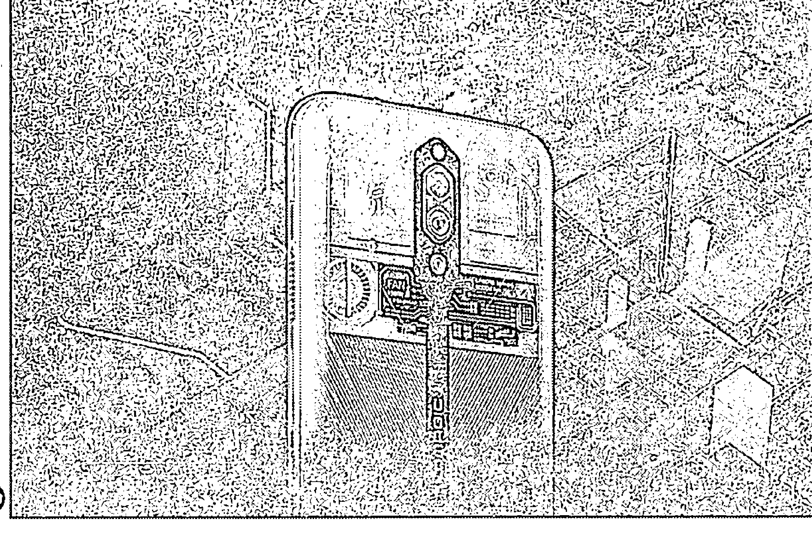

> 对这类设备感兴趣的朋友可以参考本刊2020年第8期《只为更酣畅的游戏 手机散热器怎么选》这篇文章。

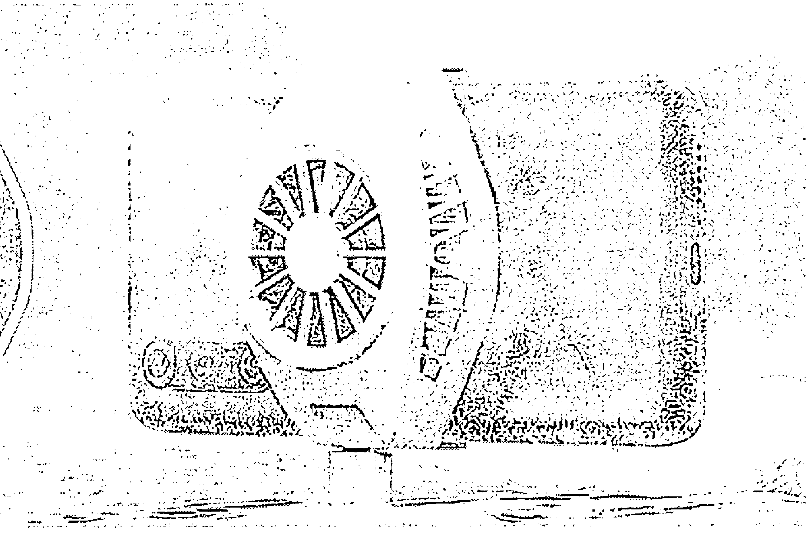

## 木桶原理 小核告急

根据木桶原理，最短的那块板决定了它的容积上限。对手机SoC而言，哪怕是上两代的Cortex-A76都已经很强了，无论是Cortex-A78还是Cortex-X1都是“锦上添花”。真正影响手机体验和性能输出的最短的那块板，其实是SoC内的“小核”，也就是Cortex-A55。

现最好的Cortex家族成员（图9）。但是，历史就是用来突破的，如今都2020年了，“小核”也急需迭代，

才能让手机在低负载时也具备更强的性能输出。希望ARM能在2021年给我们带来好消息吧。

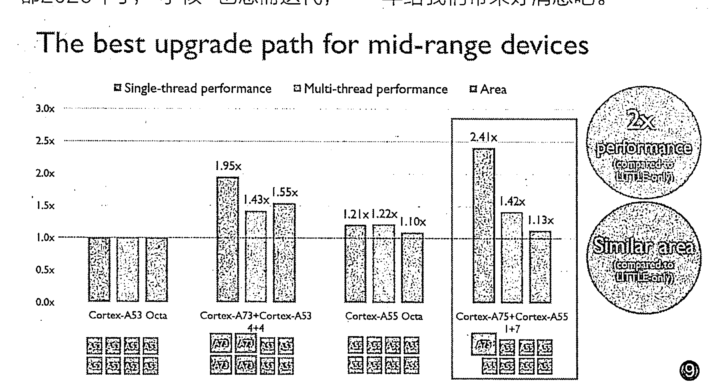

## 巧妇难为无米之炊

如果你细心观察，不难发现如今制约游戏手机发展的并非绝对的性能，而是缺乏类似PC平台的3A游戏大作，也就是我们常说的“硬件杀手游戏”。哪怕是麒麟820和

天玑820这种中端5G SoC，都能以几乎满帧的状态运行最热门的《和平精英》和《崩坏3》等游戏（图10）。

最吃硬件的《方舟：生存进化》、《龙族幻想》、《Hit：我守护的一切》、《明日之后》和《光明山脉BrightRidge》，这些中端5G SoC虽然无法实现满帧运行，但40FPS和60FPS在体验上也都是流畅的，追求帧数的选择搭载骁龙865等旗舰SoC的手机即可。

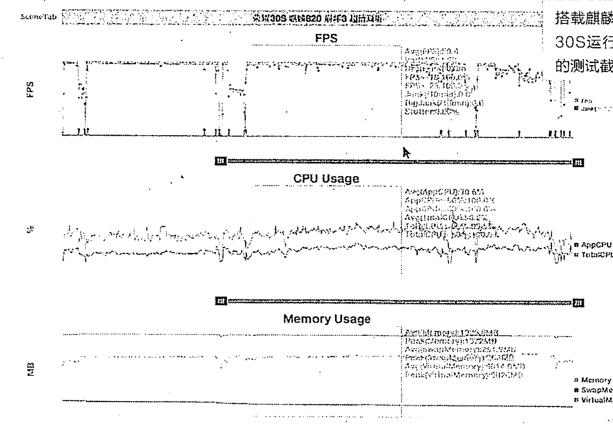

因此，想让ARM和芯片商真正发力更高性能的内核设计（主要体现在GPU规格层面），需要智能手机进入“新游戏现有手机都跑不快→SoC升级流畅驾驭→新硬件杀手游戏出现→SoC再升级”的良性循环的道路上，以免出现Cortex-X1+Cortex-A78+Mali-G78组合手握“屠龙刀”，但眼前最强大的敌人却只有羊驼的尴尬画面。


## # 学习娱乐两不误

## ## 暑期装机正当时

不知不觉间，2020年的暑期又来到了我们的面前。也许很多学生朋友刚刚重回学校没多久，还在挥汗如雨地追赶课程或准备考试，不过在学习的间隙中，想一想长假就在眼前，一定也能提起一些精神吧。

在悠长的暑假中，很多朋友会选择出游、探亲，但同时也有不少朋友会选择在家避暑，用各种数码设备来消磨时间，其中玩电脑游戏肯定是很重要的娱乐方式。特别是一些在这个暑期毕业、升学的学生朋友，更是有了难得的娱乐机会，当然要刷一刷心仪已久的游戏了。不过准备爽玩游戏的时候，肯定也有很多朋友会发现电脑的能力实际上已经过时，难以为我们提供良好的游戏体验了。其实看看电脑市场，就会发现在这个暑期升级装机，为自己打造一个最适合的游戏平台正是时机。

与去年暑期甚至年底的升级装机季相比，目前处理器/主板、内存/固态硬盘、显卡等游戏相关配件的市场都有相当明显的变化，有些甚至出现了大规模的升级换代。但与此同时，一些新技术、新型号、新应用的引入，也带来了不少在购买时必须注意的问题。

## # 处理器/主板

作为深受玩家欢迎的游戏平台，酷睿桌面版平台终于发展到了第十代，数十款处理器、主板已经发布，正在分批登陆市场。其中游戏性能强劲的中高端产品更是急先锋，这些型号的上市几乎是在一个月内就改变了英特尔平台的现状。相对的，AMD的动作则是在入门和主流游戏平台中推出了表现出色的第三代锐龙3与B550芯片组，同时为中高端用户提供了XT系列高频处理器。

## 英特尔平台

第十代酷睿桌面版处理器规格的改变堪称巨大，且处理器和主板的上市价格都较为合理，因此在相应价位上几乎是直接替代了第九代酷睿，成为了最佳选择。

在入门/主流市场中，酷睿i3-10100（图1）采用4核心8线程配置，带有8MB缓存，最高睿频4.3GHz，支持DDR4 2666内存，规格远高于i3-9100，与第九代酷睿i5更相近。其价格则介于i3-9100与i5-9400之间，搭配B460主板性价比出色，完全有替代i5-9400/9400F的能力。


截至发稿时，已经发布的i3-10100F并未正式上市，如果在暑期能正常上市，而且价格更低的话，对标配独显的玩家来说将是更好的选择。

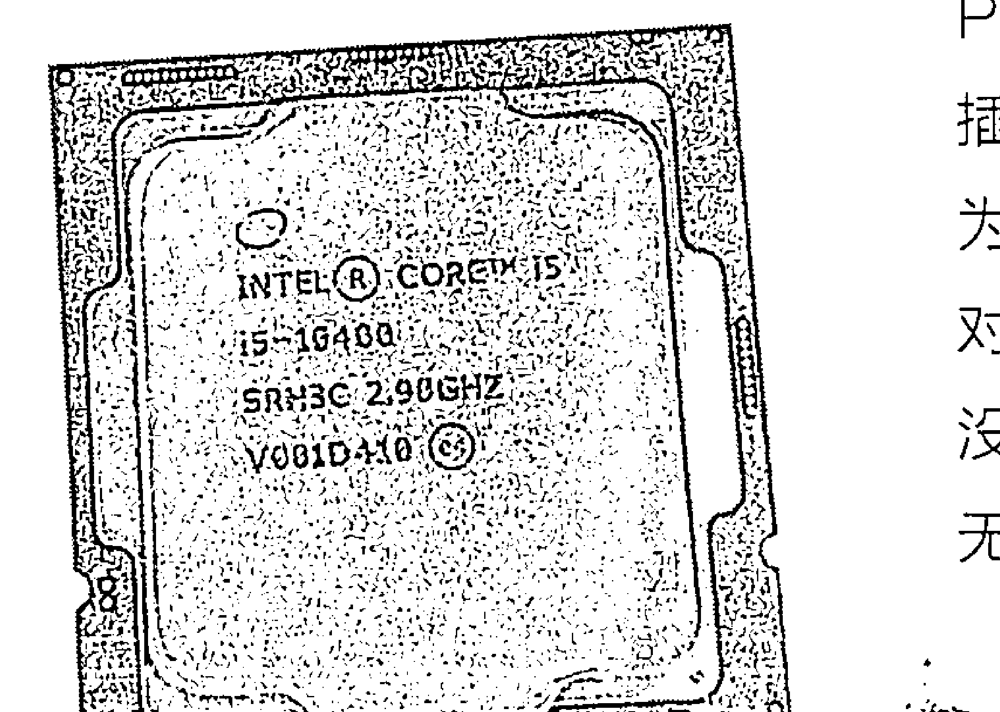

在中端市场中，酷睿i5-10400/10500/10600K（图2）等已经全面上市，使得这一市场显得非常充实。第十代酷睿桌面版i5处理器的改变与i3

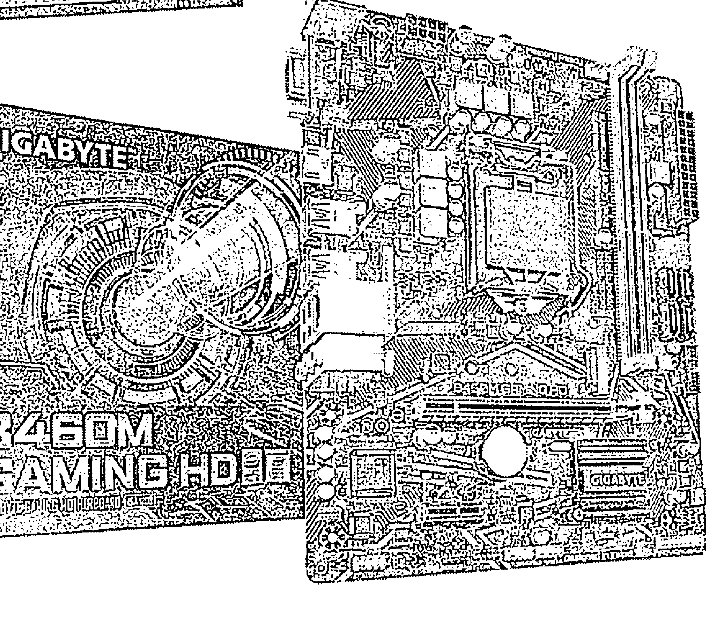

有些类似，开启超线程功能后，它们拥有了6核心12线程的配置，配合12MB缓存，已经达到了不久之前的高端乃至旗舰型酷睿的水平。当然这一市场中的i5-10400F更是玩家最感兴趣的产品。

对入门/主流/中端处理器来说，目前已经上市的B460主板（图3）将是最适合的搭配对象，这款芯片组拥有足够的PCIe通道，可提供足量的板卡插槽、M.2固态硬盘接口或转换为各种实用接口。不过B460相对于B365的功能变化很少，并没有提供USB 3.2 Gen2、内置无线网卡等流行功能。

需要注意的是，H410的规格承袭自H310，尽管有所提升，但仍然不足以支持酷睿i3处理器和我们的游戏应用需求，相关主板也大都以简化、廉价为设计目标，因此笔者并不建议玩家选用。

高端、旗舰市场中的锐龙i7-10700K和i9-10900K则是英特尔争夺高端应用、高端游戏性能桂冠的产品，规格非常强大，频率均突破了5GHz，同时配用更高频率的DDR4 2933内存。在实际测试中，它们的表现都相当不错，i9-10900K凭借超高频率，确实在大部分游戏中压制了对手，同时凭借更少的核心、线程在一些高端专业向测试中接近甚至超越了对手。

在这一市场中，英特尔也投入了F系列处理器——i9-10900KF和i9-10900F（图4），不过相对于第九代产品中的类似型号，其差价要小得多，加上旗舰处理器自身的高价让很多普通玩家知难而退，因此对市场的影响很小。

Z490芯片组是最适合i7-10700K和i9-10900K的配套主板，它在Z390的基础上提供了更强大的网络功能，加上很多主板厂商自身的深度开发，使其可以很好地承担高端、旗舰级平台需求。

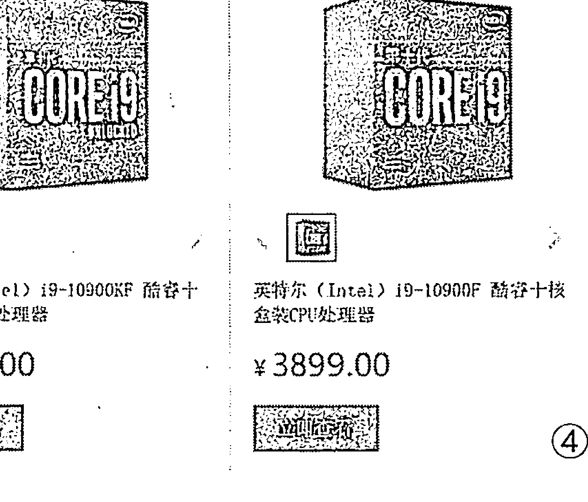

火速链接 B460与H410芯片组和相关主板的介绍，可参考本期的《CFan新视野》栏目。

AMD平台

AMD在近期市场中投放的产品更有特色，其中既有很多玩家心心念念了很久，AMD应该也酝酿了很久的入门/主流处理器——第三代锐龙3以及新一代主流芯片组B550；也有应对第十代酷睿，多少有些临时性措施的高端处理器高频版——锐龙XT系列产品。

随着第三代锐龙核心产品的价位进一步下探，X570主板的高昂价格和B450主板的落伍已经无法忽视，B550芯片组也就应运而生了。在暑期装机中，B550主板（图5）也应该是我们的首选目标。

B550相对于B450的最大变化就是可以正式支持PCIe 4.0通道，处理器直连的显卡插槽和M.2固态硬盘接口得到了官方的确认，可以完美支持新一代显卡和高速固态硬盘，此外还支持第三代锐龙的直连USB 3.2 Gen2接口。不过B550自身仍然仅有PCIe 3.0通道，且与处理器的连接通道也基于PCIe 3.0，因此由芯片组提供的接口速度标准肯定会低一些，不如X570这种“全”PCIe 4.0主板。

锐龙XT系列则是新出现的处理器版本，从目前的消息看仅有锐龙7 3700以上的型号，其特征就是进一步提升了频率。

其实锐龙XT的推出也说明了暑期处理器平台方面的几点问题。首先是在入门/主流市场中，第十代酷睿桌面版处理器虽然规格变化不小，也比第九代酷睿处理器有了较大的提升，但目前的型号与价格对第三代锐龙的入门/主流产品显然构不成威胁。其次则是在高端与旗舰型号中，第十代酷睿桌面版处理器的表现显然已经威胁到了对位的锐龙处理器，而具体影响则主要来自超高的频率。至于具体应用方面，当然就是大家非常关心的游戏能力了。

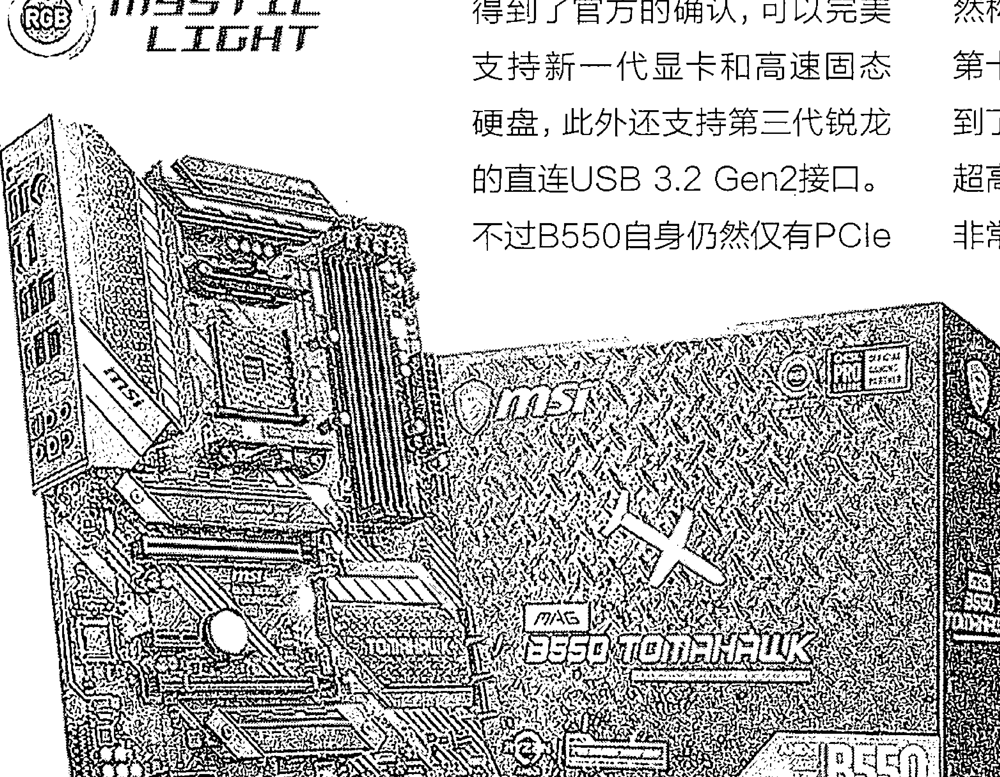

> > **火速链接**
> 关于酷睿i5-10600K和i9-10900K处理器，或者400系列主板的详细情况，可以参考本刊2020年第12期《全线升级 英特尔第十代酷睿桌面版处理器》以及本期的《第十代酷睿好搭档 Z490主板一览》等文。
> 关于第三代锐龙3的具体性能，大家可以参考本刊2020年第11期的《主流市场再洗牌 AMD第三代锐龙3处理器》。

其他

除了这些新品之外，在处理器平台方面还有一些需要关注的问题。比如在第八代酷睿停产退出之时，如果出现清仓低价，那么酷睿i5也是很值得关注的产品。因为第八代和第九代酷睿i5的主要差别只有频率，如果高频的第八代酷睿i5（比如i5-8500）的价格比低频的第九代酷睿i5（比如i5-9400）还低的话，那么当然出手i5-8500更合适了。

这里要注意，第九代酷睿i3的睿频功能和第九代i7处理器放弃超线程增加物理核心，都是为游戏进行了进一步优化的设计，因此即使第八代酷睿的价格类似甚至更低，也不建议玩家朋友选择。另外一点则是AMD最吸引人的升级功能。在B550芯片组发布时AMD芯片组的支持路线图有了新的变化，即只有500系列可以支持未来的Zen3核心（第四代锐龙），而400系列将最高支持到第三代锐龙（图6）。好在AMD随后更正了这一路线图，允许400系列芯片组主板支持Zen3核心处理器，不过支持方式有一定的变化。用户需要向AMD证明已经购买了Zen3处理器并要用在400系列主板上，然后直接从AMD获取升级BIOS。这种方式除了避免厂商任意修改微代码之外，也让升级变得更加稳妥，在确认已购买Zen3处理器后再提供BIOS升级，即使删除了一些前代处理器的代码也没有问题。可以避免刷新BIOS后主板不认旧处理器，没有实际购买新一代处理器的用户无电脑可用的情况。

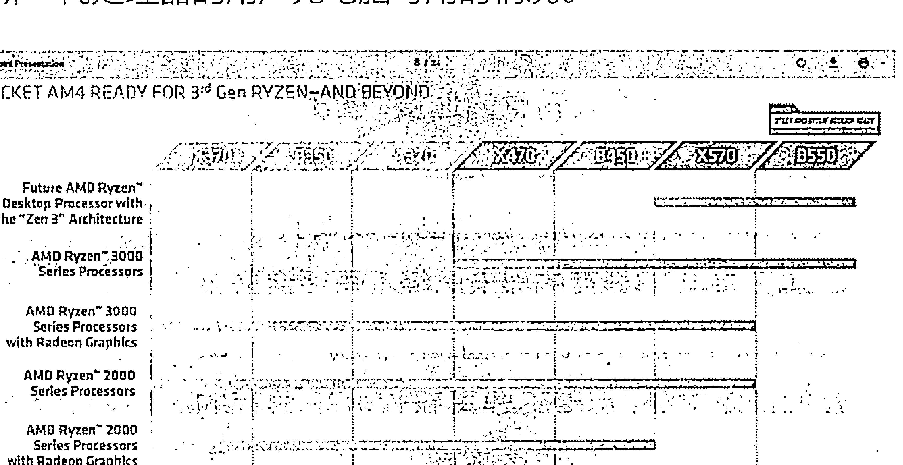

显卡

从去年的暑期至今，显卡市场上并没有出现新核心的产品，一些新型号产品均为已有核心的改进，例如AMD推出了Navi核心的入门/主流显卡RX 5500 XT和RX 5600 XT；英伟达则在GTX 16系列中也增加了SUPER版本，并将GTX 1650转向GDDR 6显存。

新一代显卡与选配原则

由于AMD与英伟达的新一代显卡都有可能在暑期过后到来，因此本次的暑期装机并不考虑高端/旗舰产品，如果确实有需求的话，可以直接根据承受能力购买，也可以等一等再装机或暂时用旧显卡、主流显卡替代。从目前市场中主流显卡的性能、价格以及游戏的实际需求看，GTX 1650/GTX 1650 Super应该是玩家的入门级配置水平。如果选用了第十代酷睿i3、第三代锐龙3这样的新一代“入门级”处理器的话，要想发挥处理器的全部性能，就需要选择1500元以上档次的显卡，如GTX 1660 Super、RX 5600 XT。而新一代中端处理器甚至可以直接“喂饱”目前的旗舰级显卡RTX 2080 Ti，因此在显卡方面已经没有任何限制，根据自己的承受能力尽量追高或者等待新一代显卡就好了。

注意事项

在近期选购显卡时有一些需要特别注意的问题。第一是随着逐步调价而性价比提升的RX 5600 XT，其实还有一个性价比提升的措施，即AMD最新放开的BIOS设置。在新的BIOS中，AMD允许显卡厂商将核心、显存频率都提升到新的高度（图7），使得RX 5600 XT可以达到甚至超过RTX 2060的性能，这样的“满血”产品配合新的定价才是更值得选择的。至于一些因为元件配置等原因无法使用新频率的RX 5600 XT显卡，最好就不要考虑了。

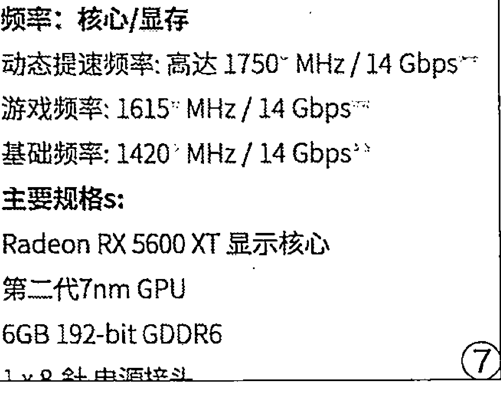

火速链接

关于这些显卡的性能、购买建议，可以参考本刊2020年第1期《Super时代 英伟达GTX 1660 Super显卡》、2020年第2期《GTX 1650 Super 入门显卡升级》、2020年第3期《入门级显卡迎来新架构 AMD Radeon RX 5500 XT》、2020年第6期《主流市场齐备 AMD RX 5600 XT显卡》、2020年第11期《小升级大趋势 英伟达GTX 1650 GDDR6版》等文。

第二则是类似价位的RTX 2060，在之前因为其性能限制，虽然挂着“RTX”之名，一般并不建议在游戏中打开光追特效。但随着DLSS 2.0的到来，RTX 2060终于可以在使用光追等高端特效时获得令人满意的速度（图8），摆脱“更强的GTX 1660”这一定位。这使得中端用户也可以放心体验最新的游戏画面效果了。

第三是4GB显存的显卡已经不再适合未来的应用，除了确定仅玩休闲游戏、主流网络游戏对战的玩家之外，尽量不要再新购4GB显存的显卡如GTX 1650系列了。不可否认的是，对于我们熟悉的一些游戏来说，即便使用4K分辨率和最高画质，显存占用也达不到4GB，这似乎是

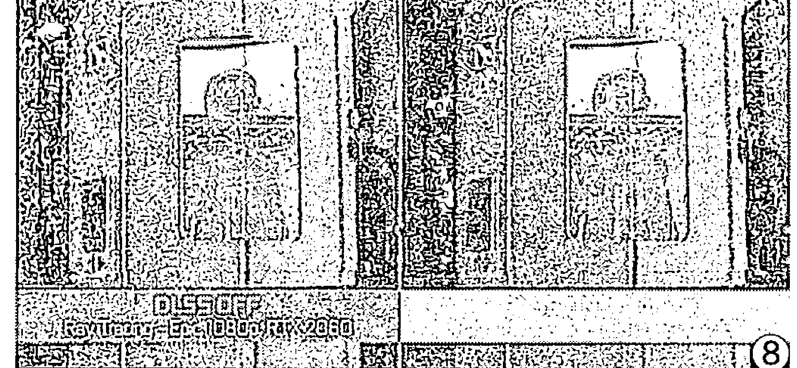

比较安全的选择。但近期HDR、光追等特效得到了越来越多游戏的支持，并且也是下一代游戏主机的基本能力。这些特效需要的数据量相当大，对承载材质贴图和建模数据就已经并不富裕的4GB显存来说，恐怕会频繁出现容量不足、借助内存、拖慢速度的情况。在近期的一些游戏中其实已经有了这种苗头，用GPU规格、频率基本相同，仅仅是内存容量有差别的显卡测试，4GB显存型号的实际帧速已经明显低于8GB型号（图9）。所以在选购显卡时，如果希望显卡多陪伴自己几年，而且喜欢尝鲜新游戏的话，8GB显存才是比较保险的，连6GB显存的GTX 1660系列、RTX 2060、RX 5600 XT都应慎选。

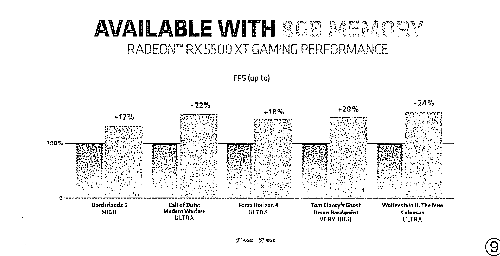

内存与SSD

经历了数个月的高价运行，内存与固态硬盘又迅速回到了更容易被大家接受的价位，甚至还有向下继续突破的趋势。例如目前的一线品牌DDR4内存价位大都在200元～250元/8GB的水平，而一些二线品牌或者濒临淘汰的DDR4 2400内存条则已经降至180元/8GB甚至更低。

随着用户需求的增长，目前的8GB单条内存已经成为了入门之选，而容量价格比最高的选择已经稳稳地落在了16GB单条和8GB×2套装之上，且优势相当明显（图10）。目前的3A甚至准3A游戏对内存的需求大都在8GB以上，因此对玩家来说，只要资金允许，内存容量最好达到16GB或更高。

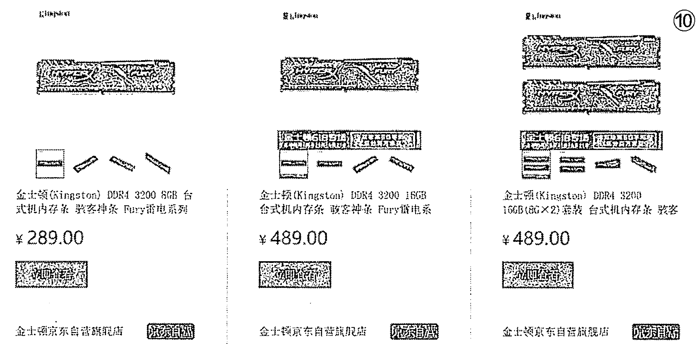

在固态硬盘方面，QLC和多层堆叠的闪存颗粒不断地发展。前者发展到第二代产品后，寿命和性能有了明显的进步，已经是值得考虑的大容量固态存储方案；而后者则让M.2固态硬盘的容量、价格越来越出色，很多同品牌的中速(2000MB/s) M.2固态硬盘已和SATA固态硬盘价格非常接近。

在这种情况下，笔者认为，“系统盘”或“主”硬盘的选择已经只有M.2固态硬盘一种；而数据存储盘的选择则增加了QLC、SATA固态硬盘，对于同时需要大容量和高速度的“集邮型”玩家来说，可以随时从TB级别的固态硬盘上调取自己保存的游戏，体验显然比等待呼呼作响的机械硬盘要好得多。

至于传统的机械硬盘，其价格变化相对于固态硬盘来说几乎是“凝固”的，目前4TB~8TB是容量价格比最好的型号，2TB~3TB以其较好的价格也吸引着不少用户。但近期硬盘厂商将SMR（叠瓦式）存储技术（图11）应用在这些消费级硬盘上，使得它们的性能，特别是大量数据写入性能受到了影响。对玩家来说，将这些硬盘作为大型游戏备份盘时，就可能面临数据写入极慢、等待时间漫长的情况。

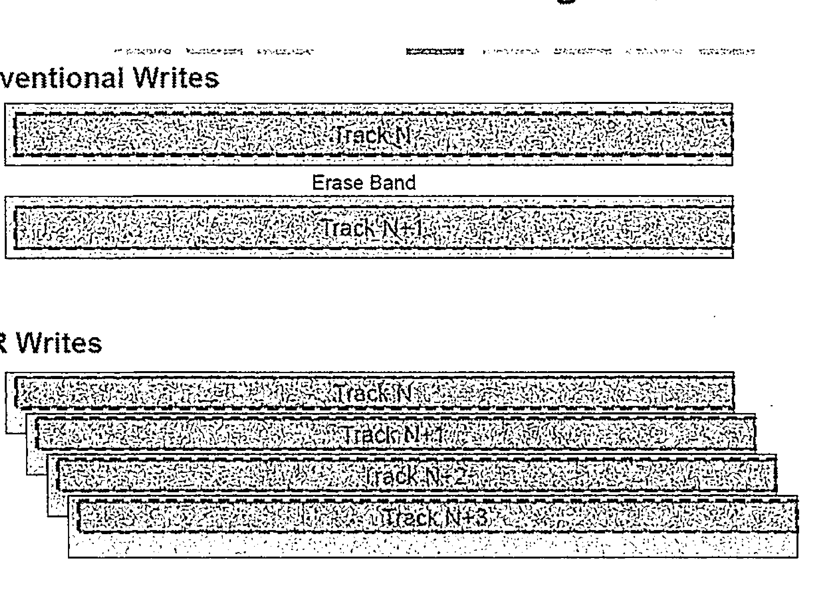

推荐配置

了解了这个暑期主要配件的发展情况和需要注意的问题，我们就可以针对性地选择一些配置了。

入门娱乐型

要保证能玩转一般的3D游戏，用中等画质体验3A游戏的话，入门级或者略高一点的独显是必需的。如果只是日常应用和游戏、娱乐的话，目前价格已经降至极低水平的酷睿i3-9100F配合GTX 1650 SUPER是最好的选择。当然这两款产品的优势主要在价格上，实际架构、性能等可能都会很快过时，如何取舍还要看大家的选择。

| 配件 | 型号 | 价格 |
| --- | --- | --- |
| CPU | 酷睿i3-9100F套装 | 约999元 |
| 主板 | B365主板 | 套内0元 |
| 内存 | DDR4 2666 8GB | 约219元 |
| 显卡 | GTX 1650 SUPER | 约1099元 |
| 散热器 | 盒装自带 | 0元 |
| 硬盘 | M.2中速或SATA固态硬盘 500GB | 约499元 |
| 电源 | 450W | 约200元 |
| 机箱 | MATX或ATX机箱 | 约140元 |
| 总价 | | 约3156元 |

主流游戏型

在千元以下的处理器中，锐龙3 3300X的能力不容小觑，对第九代酷睿来说，它包括游戏性能在内的各项能力，都已经达到了和i5-9400F平起平坐的水平，即使是和第十代酷睿i5-10400相比差距也并不算大，因此是追求性价比的主流玩家目前最好的选择。

| 配件 | 型号 | 价格 |
| --- | --- | --- |
| CPU | 锐龙5 3300X | 899元 |
| 主板 | B450主板 | 约550元 |
| 内存 | DDR4 3200 8GB×2 | 约499元 |
| 显卡 | GTX 1660 SUPER | 1649元 |
| 散热器 | 盒装自带 | 0元 |
| 硬盘 | M.2中速或SATA固态硬盘 500GB | 499元 |
| 电源 | 500W | 230元 |
| 机箱 | MATX或ATX机箱 | 140元 |
| 总价 | | 4466元 |

中端多线程型

要想在玩游戏之余，也让工作能力更进一步，或者想要录制和分享自己的得意战绩录像，那么处理器拥有出色的多线程就很重要了，现在锐龙5 3600X还是这个价位最好的选择。为了满足更高的专业向需求，笔者建议大家选择最新上市的B550主板(图12)。

| 配件 | 型号 | 价格 |
| :--- | :--- | :--- |
| CPU | 锐龙5 3600X | 约1549元 |
| 主板 | B550主板 | 约650元 |
| 内存 | DDR4 3200 8GB×2 | 约499元 |
| 显卡 | GTX 1660 SUPER | 1649元 |
| 散热器 | 盒装自带 | 0元 |
| 硬盘 | M.2中速或SATA固态硬盘 500GB | 499元 |
| 电源 | 500W | 230元 |
| 机箱 | MATX或ATX机箱 | 140元 |
| 总价 | | 5210元 |

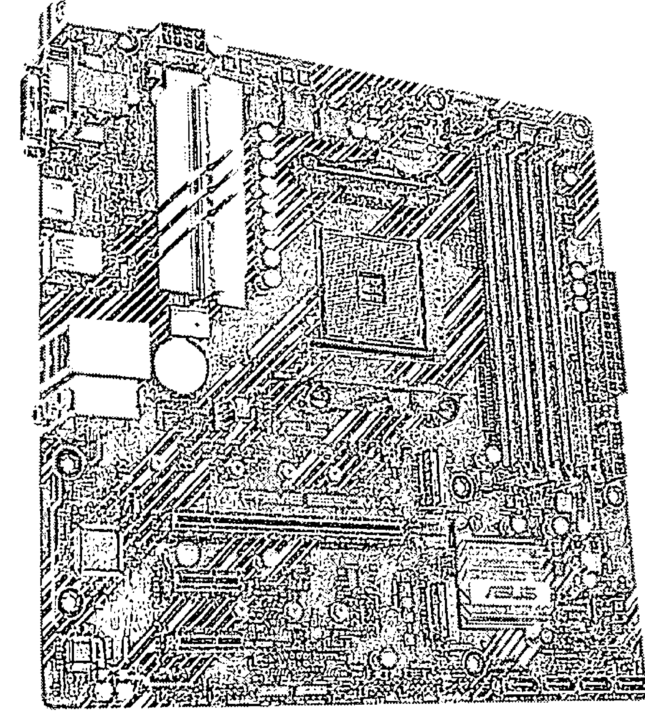

未来电竞型

与专业向配置着重处理器的提升不同，要满足未来游戏新特效的需求，或者想让游戏帧速达到更高的水平，那么显卡的选择更加重要。对画面特效更关注的用户，可以选择RTX 2060 SUPER(图13)显卡，以获得较好的光线追踪等新特效支持，而对速度更在意的电竞玩家，则可选择价格相近的RX 5700 XT显卡。

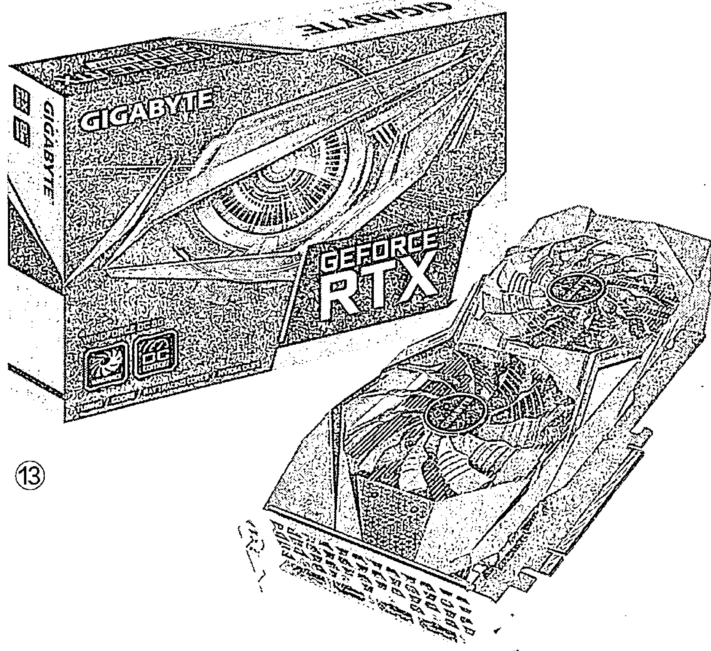

| 配件 | 型号 | 价格 |
| :--- | :--- | :--- |
| CPU | 锐龙5 3600X | 约1549元 |
| 主板 | B550主板 | 约650元 |
| 内存 | DDR4 3200 8GB×2 | 约499元 |
| 显卡 | RTX 2060 SUPER | 2800元 |
| 散热器 | 盒装自带 | 0元 |
| 硬盘 | M.2中速或SATA固态硬盘 500GB | 499元 |
| 电源 | 500W | 230元 |
| 机箱 | MATX或ATX机箱 | 140元 |
| 总价 | | 6367元 |

当然，这里提供的也仅仅是比较适合大多数玩家、价格相对实惠的配置，对于需求更高、资金更充足的用户来说，在处理器平台方面，中高端的第十代酷睿或锐龙XT也是很好的选择；而内存、固态硬盘则可考虑升级至32GB和1TB高速型等。当然笔者提供的配置其实也为未来升级到这些型号，乃至支持即将出现的下一代处理器、显卡（图14）都做好了准备。

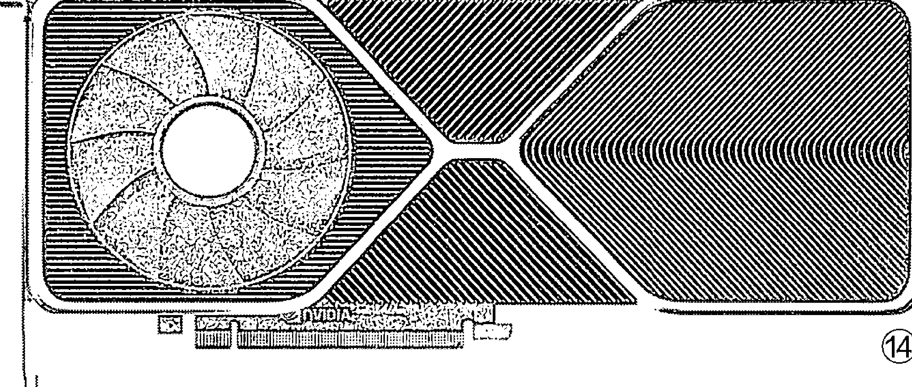

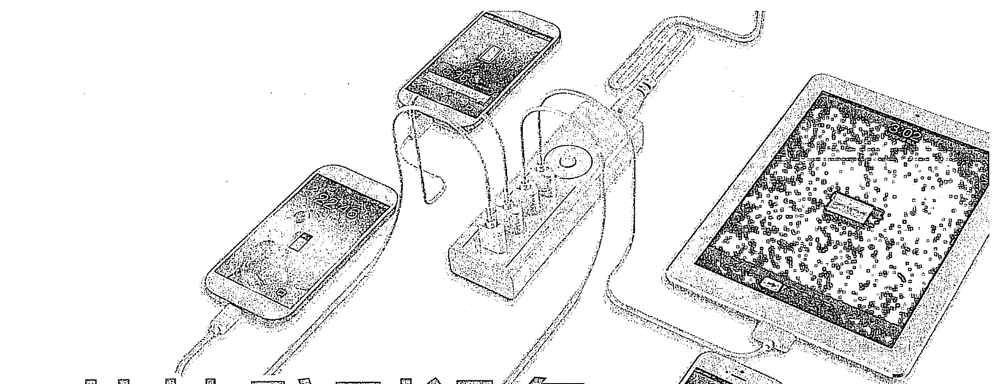

从插座到设备 充电路径的搭配学问

策划《电脑爱好者》编辑部

无论是大到冰箱电视一类的家用电器，还是小到电动牙刷、笔记本和手机一类的数码产品，都需要安全稳定的电力供应才能正常使用。但从墙壁内埋藏的电线到设备端的充电/供电接口之间尚存距离，需要多道供电设备携手才能保证电力流通。本期特别话题，咱们就来简单聊聊这一路径上相关设备的选购。

开关插座：电力传输的神经末梢

嵌入在墙壁之内的开关插座是电力传输过程中的“神经末梢”，它是确保设备在最后一米内用电安全的关键部件，因此在选购时不能有半点马虎。

功率与用料

开关插座主要分为220V/16A和220V/10A两种规格，前者最大额定功率可达3500W，主要用于空调；后者额定功率约为2200W，适用于其他常见的用电设备。需要注意的是，16A和10A插座的插孔间距有别（图1），本文主要讨论10A标准的开关插座，大家只要注意别在同一个插座（包括连接其上的排插）同时接驳和使用电磁炉和热水器等较高功率的电器即可，否则大概率会出现掉闸问题。开关插座的品质主要看内外部的用料。

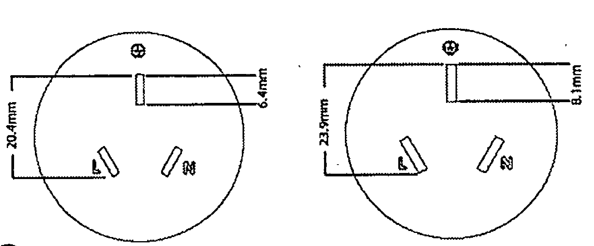

其中，开关插座的面板以PC阻燃材料（需通过750℃灼热丝试验）为宜，插座内的弹片推荐采用锡磷青铜材质（次一点也要选择铜锌合金，也就是我们常说的“黄铜”），触点材料则以银镍合金为佳。如果家里有小孩，一定要选择插孔内配有防误插保护门、单边自锁防止误触的产品（图2）。实际上，所有类型的正规插座产品都要将用料品质放在第一位，最忌贪图便宜选择没有3C认证的廉价产品。

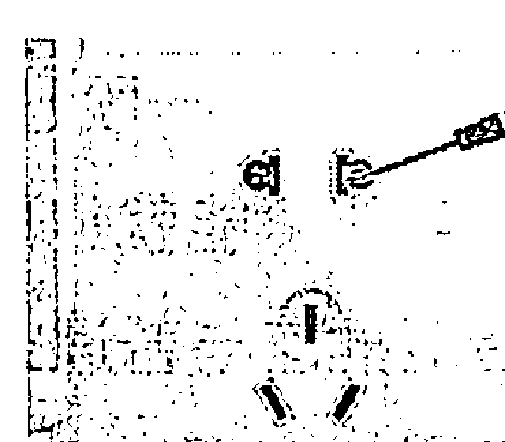

USB是否必要

为了方便给小型数码设备供电，很多开关插座还会直接集成1个~3个USB接口，只是受限于内部空间和发热量的考量，USB模块的总输出功率最高只有5V/3A左右，单个USB接口的最大输出电流为2.4A(图3)，适合在电脑桌、洗手间的墙壁上安装此类产品，直接拿其身上的USB接口给笔记本散热底座、USB小风扇或电动牙刷等数码产品供电。


考虑到新上市的智能手机都已支持至少18W的快充，使用带USB接口的开关插座会拖累充电速度，如果不小心买到了假冒伪劣的开关插座还存在一定的安全隐患。因此，从USB实际功率、性价比和维护难度来看，笔者并不推荐普通家庭用户盲目追求此类USB开关插座。作为电力传输过程中的神经末梢，开关插座的结构还是越简单越好(图4)，稳定性才应该作为第一考量。

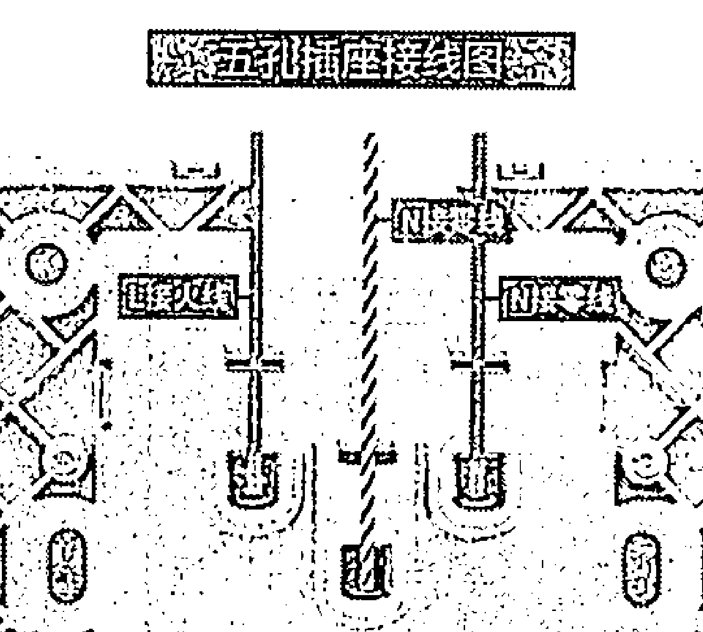

智能插座 理性看待AI赋能

开关插座多以5孔为主，无法同时供电多数电器，所以在多用电设备之间往往还需一道中转，也就是排插(又称拖线板、插线板)。最近几年“智能家居”概念火热，几乎所有的家用电器都在玩所谓的“智能款”。为了对老旧电器赋能，一种名为“智能插座”的产品慢慢兴起(图5)。它们是否值得选择？


真遥控 伪智能

所谓的“智能插座”，就是在普通插座的基础上加入了Wi-Fi模块，可以通过手机APP控制单个或整体插孔供电的开与关，统计一段时间内的用电量。然而，想通过它们为其他老旧电器赋能就纯属忽悠了。就拿最简单的一个需求而言，将智能插座与普通空调相连，理想情况是还没到家就提前启动空调制冷，到家后刚好体验清凉环境。

但现实情况却是，当你下班路上用手机APP远程开启了智能插座的供电功能，普通空调也的确通电了，然后……就没有然后了。因为几乎所有空调在通电后都并不会自动启动，还需要使用遥控器开机并设定制冷模式和温度。真正适合智能插座的电器，是那些通电即启动的电器，比如热水器、加湿器等，但它们也需要你提前加好水并提前按下物理开关，智能插座只能控制它们按时通电启动而已，在体验上也不算完美。

带红外 好伴侣

实际上，在各种老旧电器中最值得赋（智）能的设备还真的就是空调，既然智能插座无法满足我们的要求，那还有其他备选方案吗？大家可以在各大电商平台以“空调伴侣”为关键字进行搜索（图6），它们就是解决上述问题的“特效药”。

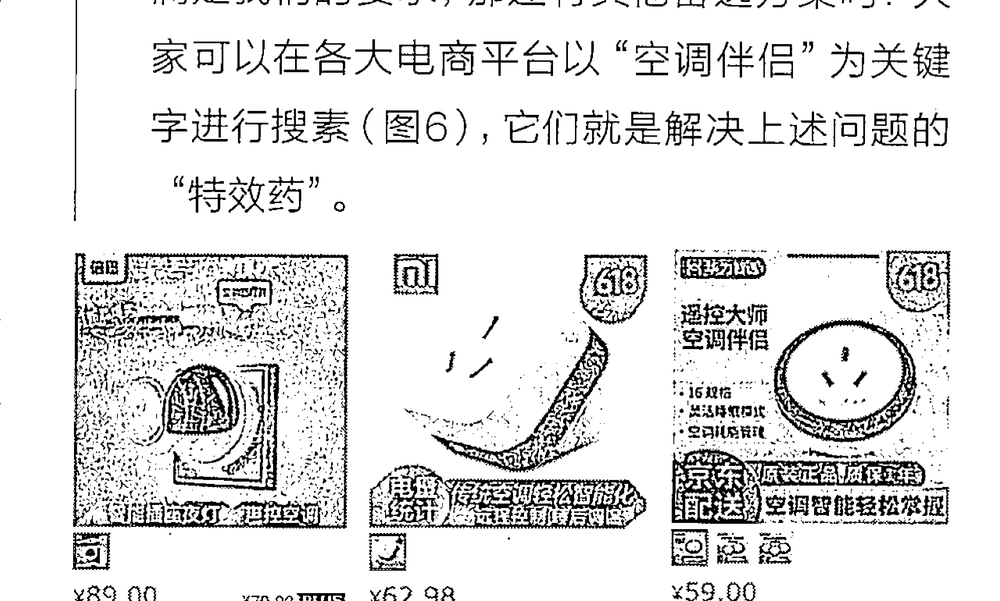目前空调伴侣类的产品主要衍生出了两种发展方向，以倍思空调伴侣AI声控插座夜灯为例，它是在柔和夜灯的基础上增加了红外发射和语音控制模块的产品，在使用的过程中无需联网和APP，首次使用只需对着它说出“匹配空调”，然后将空调遥控器在距离黑色面板10cm~20cm处按下开关键两到三次就能完成红外库的匹配，待产品主动回复“匹配成功”后，就能通过唤醒词(小倍小倍) + “打开空调”、“26度”、“关闭空调”等语音指令声控空调了(图7)。

### 更强的兼容性 适用更多品牌
200+ 空调品牌
10000+ 空调型号


小米空调伴侣2和华为智选遥控大师空调伴侣，则是内置红外发射模块的智能插座，它们可通过Wi-Fi接入家里的无线路由器，而用户则能在任何地方通过手机内安装的APP，远程接通空调伴侣的供电，并对空调下达红外遥控指令(图8)。比如外出忘记关空调，可以拿起手机一键远程关闭空调;下班回家，在路上提前打开空调，一进门就能享受一片清凉。这两款空调伴侣在搭配小爱音箱或华为AI音箱后，也能通过语音发送红外遥控指令。


### 魔方插座 墙壁上的临时工
笔者在前文之所以不太推荐自带USB的开关插座，是因为此类产品有更好的替代方案——魔方插座。顾名思义，此类产品大多采用了四方形的“魔方”造型，在提供足够多的插孔之余非常节省空间，可以随时轻松地在任意墙壁上的开关插座处“打零工”，性价比和实用性理想。

### 有线无线要想好
魔方插座可以分为无线和有线两大分支。无线版自带三相插头，可以直接插在墙壁上的开关插座内(图9)，优点是便携性更好，特别适合出差时拿到入驻的酒店使用。有线版则自带1米~3米长度不等的线缆(线芯越粗越好)，可以将主体甩在远离墙壁插座的电脑桌或床头柜上(图10)，使用位置更自由，但也因累赘的线缆而失去了外出携带的便利性。

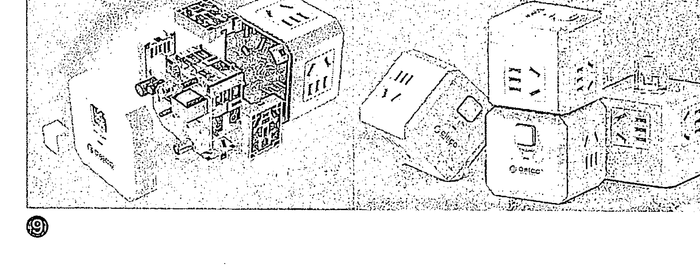

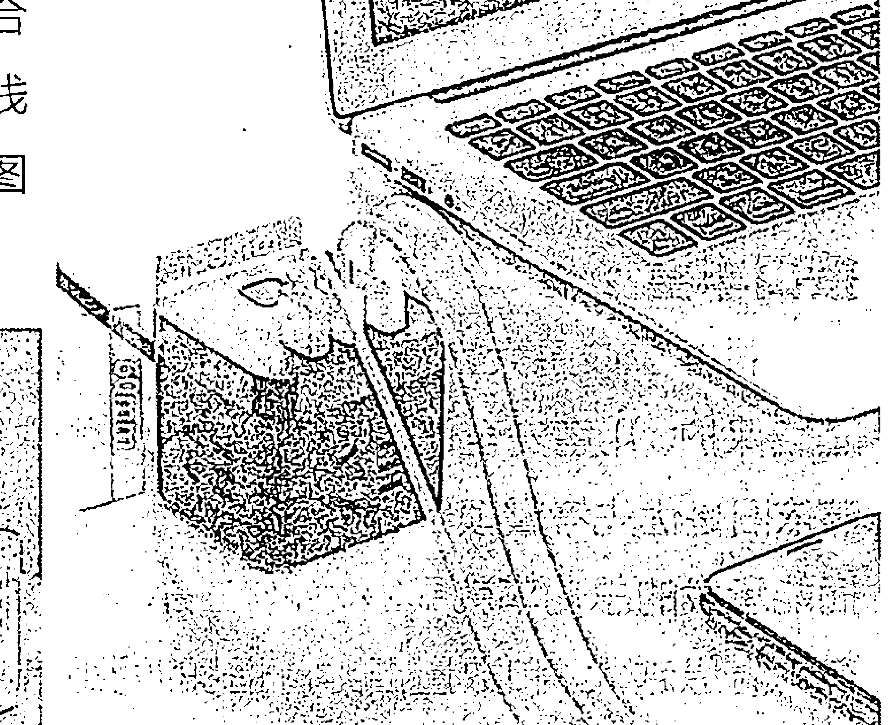

为了迎合不同的需求和使用环境，魔方插座还逐渐衍生出了更多形态，比如楔形、Y型和多层的立柱型，甚至还有配备无线充电模块的产品（图11），它们的设计初衷都是合理利用空间优势，在有限的占地面积里可以同时接驳更多用电设备，而不是像传统排插那般，在一个平面内挤满各种用电设备（图12）。

### USB数量够用就好
魔方插座其实是更适合内置USB接口的设备，由于它们身处墙壁之外，通风性更好，所以不太担心USB模块长时间满载使用时的发热问题。需要注意的是，此类产品无论USB接口有多少，最大的输出功率也多以15W（5V/3A）为主，单个USB接口的输出最高为5V/2.4A，所以USB接口数量有1个~2个就差不多了，我们没有必要追求更多。

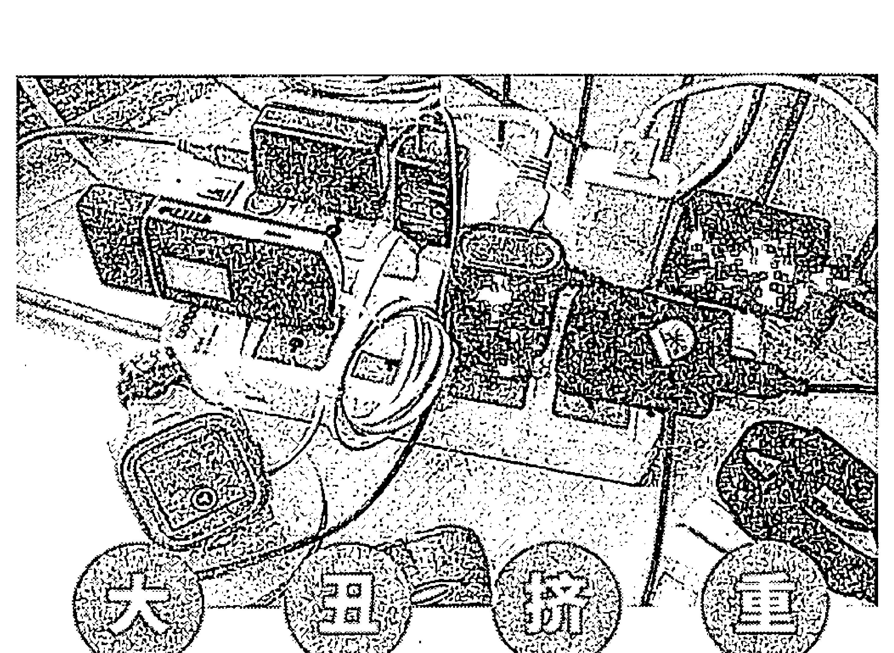

好消息是，现在部分魔方插座的USB模块已经开始支持USB PD、高通QC或华为FCP快充方案，最高可以实现18W快充（图13）。如果你的手机恰好支持这些快充技术，可以优先考虑兼容快充的魔方插座，省去一个专用的手机充电头。


> 传统排插——最经典的充电客栈
魔方插座虽然小巧时尚，但特殊的造型决定它身上的插孔有限，如果你想同时为更多的设备供电，还是需要请出最经典的充电客栈——排插。

### 接口丰富 全能选手
排插应该是大家最为熟悉的电力扩展设备，外壳的阻燃材料、过载保护、儿童安全门、高品质的青铜导体和更粗的线缆铜芯等细节依旧是优先考量项目（图14）。此外，插孔的数量够用即可，因为排插能承载的总功率就是2200W左右，同时接驳的高负载电器越多潜在的隐患越大。和数量相比，插孔的间距其实更加重要（图15），而且笔者还更推荐选择每个插孔都有独立开关的产品。

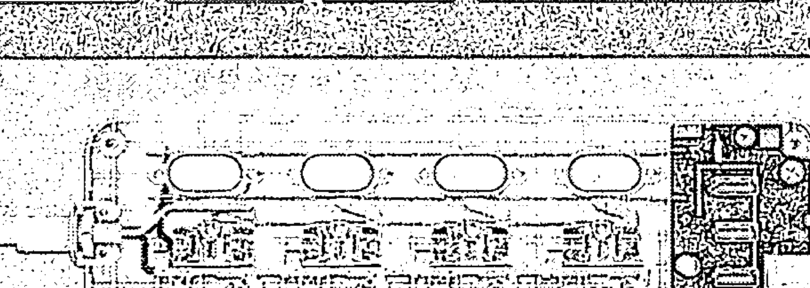

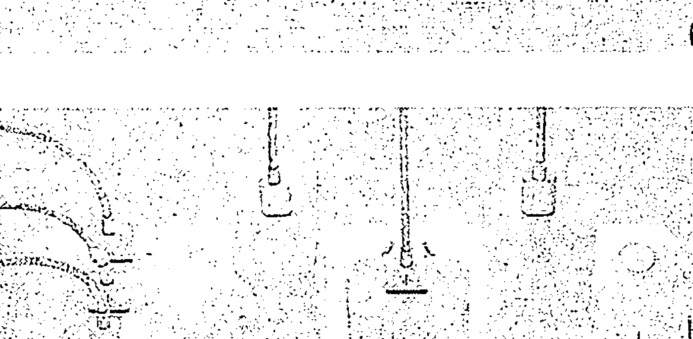

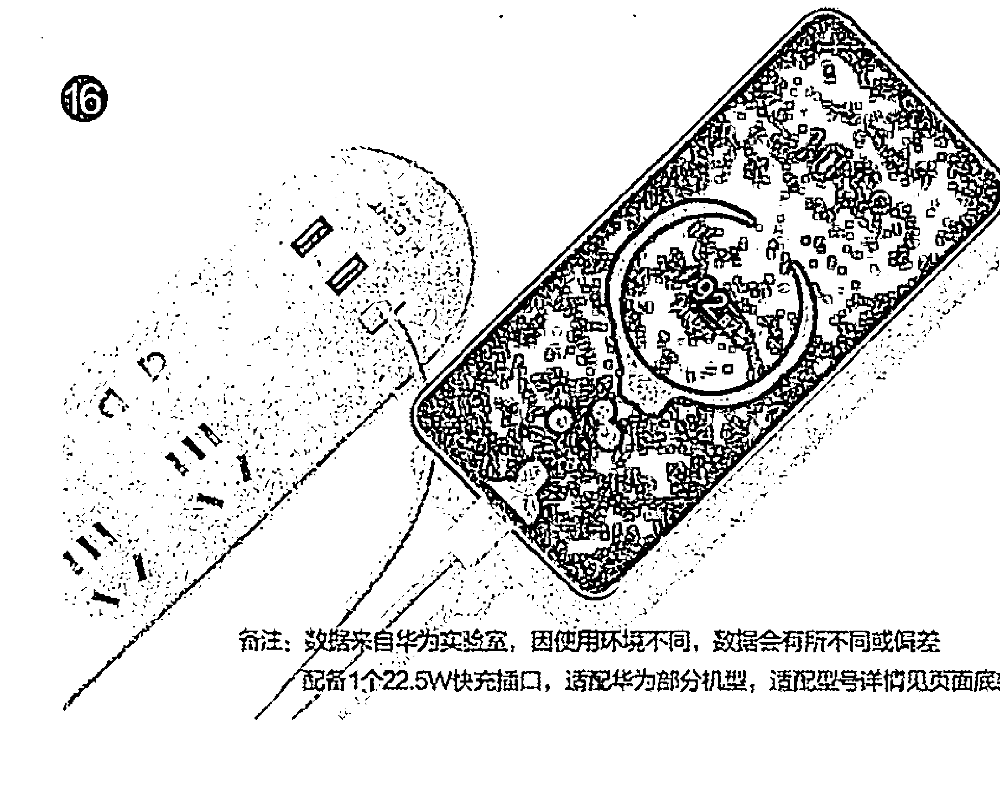

USB模块也已经成为了很多排插的标配。和魔方插座相同，追求更多的USB接口数量不如追求更高的输出功率和更多的快充协议（多以高通QC和华为FCP为主的18W模式为主），让智能手机可以借由排插的USB接口直接高速补电（图16）。

### PD参上 拥抱未来
在各种快充协议中，USB PD无疑是通用性最佳的存在，而且它不仅限于智能手机领域，很多轻薄型笔记本和任天堂Switch游戏掌机等设备也能利用USB Type-C接口进行PD快充，而且功率最高可以达到65W。ZMI（紫米）最新推出的CXP01，应该就是首次在排插上标配USB Type-C接口，而且可以实现单口65W功率输出的产品，可以直接为小米笔记本Pro、戴尔XPS 13、联想小新Air 14 2020锐龙版等最新轻薄本充电（图17）。

由于ZMI CXP01很有代表性，所以我们就以这款产品为例，简单聊一聊排插身上USB模块的输出规则。如果你的手机支持快充，在长时间充电时摸一下充电头，它是不是特别热？一个USB接口输出时尚且如此，当排插身上多个USB接口同时输出时的发热量更是可想而知。

因此，所有排插（包括多USB接口的充电头）都会设定一个总输出功率，比如ZMI CXP01的总输出功率就是65W。

这款产品配备了1个USB Type-C和2个USB-A型接口。当我们单独使用USB Type-C给笔记本充电时，可以享用65W的输出功率上限（视充电设备端的限制，比如有些核显轻薄本最高支持45W功率充电，很多智能手机仅支持18W PD充电），如果你给笔记本充电的同时，还使用USB-A接口给其他设备充电，那USB Type-C接口的输出功率就会降到45W，省下来的功率由USB-A模块分配。

ZMI CXP01单个USB-A接口的最高输出功率为18W，但如果同时使用2个USB-A接口充电时总功率会降到15W，也就是每个接口平均分配7.5W，如果其中包括手机，那它的充电效率将大打折扣（图18）。总之大家需要记住一句话，排插身上的USB只有单独工作时才能“满血输出”。

考虑到排插上接驳的电器普遍较多，满载时的功率更高，所以建议优先挑选电线内线芯加粗到1平方毫米或更粗的产品（图19）。

| 技术参数 | 2500W 10A MAX, 250V~ |
| :--- | :--- |
| USB模块输入 | 100V-240V ~ 50/60HZ 1.6A |
| USB模块输出 | USB-C（单口）：5V⎓3A 9V⎓3A 12V⎓3A 15V⎓3A 20V⎓3.25A 65W MAX |
| | USB-C（多口同时）：5V⎓3A 9V⎓3A 12V⎓3A 15V⎓3A 20V⎓2.25A 45W MAX |
| | USB-A（单口）：5V⎓3A 9V⎓2A 12V⎓1.5A 18W MAX |
| | USB-A（双USB-A同时）：共用5V⎓3.6A 15W MAX |

• ZMI CXP01的参数说明，正规排插产品都能找到相似的参数信息

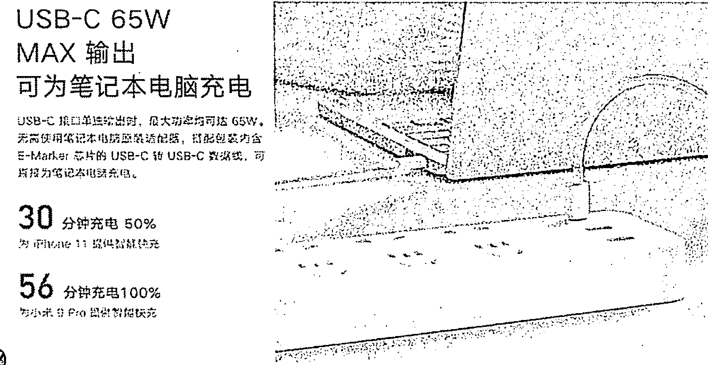

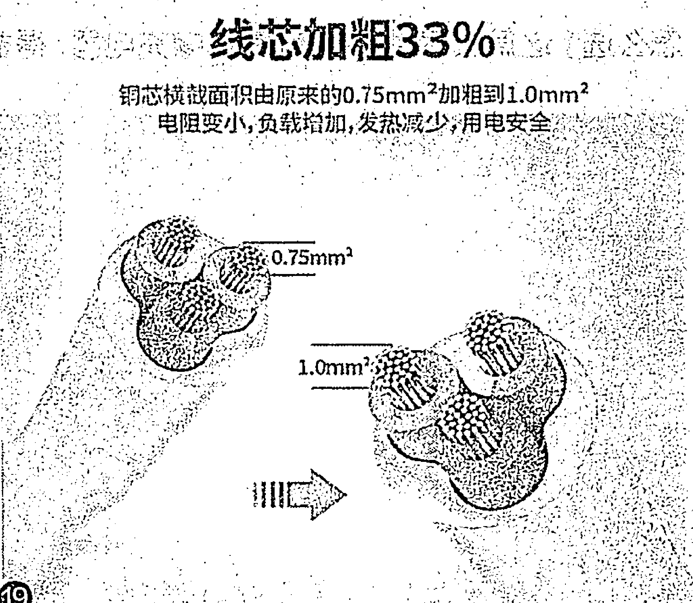

### 充电器 功率体积的反比潮流
虽然现在市面上的USB充电器输出功率已经突破了65W大关，但它们多限于固定使用场景，注定只能是家中的各种桌面之上，无法伴随我们长途外出。因此，无论是笔记本还是智能手机，这些用电设备在补电的过程中依旧离不开充电器的钳制。

### 游戏本的尝试
笔记本的充电器又称“电源适配器”，笔记本配置越高，硬件满载运行时的功耗越高，因此以高端游戏本为代表产品标配的电源适配器普遍都犹如“板砖”一般厚重，在外出时很容易成为肩膀的负担。那么，就没有更便携的高功率适配器了吗？

答案自然是肯定的。6月中旬，联想官方商城就上线了两款全新的拯救者系列方口便携式电源适配器，功率分别为170W和230W，相比上代产品体积都优化减小了约30%（图20），重量也减轻了最多21%（图21）。如果这种功率和体积成反比的潮流能延续下去，游戏本们的“旅行恐惧症”多少也能缓解一下了。

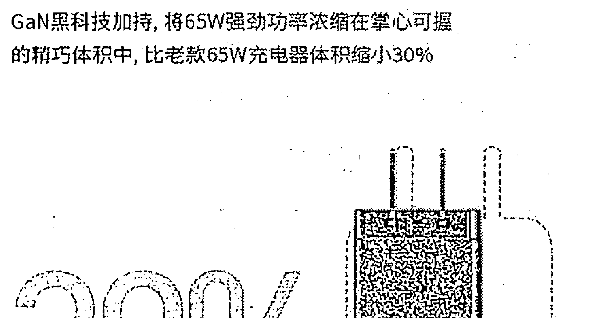

### 氮化镓的通杀
和游戏本相比，轻薄本搭载的处理器多以15W TDP为主，独立显卡最多也就是GeForce MX350（25W TDP左右）级别，因此它们只需搭配65W电源适配器就能“满血”运行。与此同时，很多智能手机品牌主打的30W~65W私有快充技术也是基于USB PD3.0技术新增的PPS协议优化而来，而这就给轻薄本和智能手机共用同款充电器奠定了软硬件的基础。

CFan曾在2020年第9期《瘦身不是梦 超迷你氮化镓充电器怎么选》这篇文章中解读过氮化镓充电器，得益于GaN这种全新的半导体材料，可以将65W充电器压缩到仅有1/3手掌大小的体积（图22），同时还能保持更高的电源转换效率以及更低的发热量。为了兼容更多手机，氮化镓充电器普遍还同时支持华为SCP/FCP、高通QC3.0、三星AFC和USB PD3.0等快充协议，绝大多数新款（支持PD充电的）轻薄本和智能手机都能通过它们快速补电。

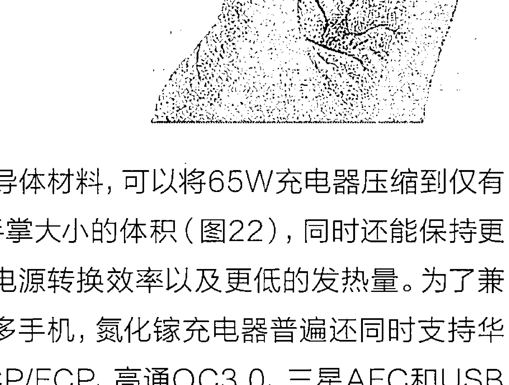

以倍思、Anker、努比亚、360、ROCK、京东京造、闪魔等品牌为代表的氮化镓充电器还同时配备了2个~3个USB接口，可以同时给笔记本和手机等多部设备充电，我们甚至可以将其视为一种更加迷你便携的“USB魔方插座”，而且售价普遍都在100元~150元之间，性价比还是蛮不错的(图23)。当然，哪怕是氮化镓充电器也存在多口同时充电时USB输出功率会被拆分的问题(图24)，如果你追求效率就单口使用，多口使用时就别再苛求效率。

总之，氮化镓充电器将成为未来一段时间内的“充电万金油”，如果你的笔记本支持PD充电，长途出差时只需携带这么一款小巧的充电头，就能确保笔记本、手机以及其他随身携带的数码产品的供电之需。


扩展阅读：
更专业的USB充电器
如果你在某一时间需要同时充电或接电使用大量的数码设备（如电动牙刷、USB风扇、USB台灯、运动手环等），无论是魔方插座、排插还是氮化镓充电器都存在身上的USB接口数量不够用的问题。此时，一种名为“USB充电器”的设备也许可以帮到你，比如小米USB充电器快充版就带有6组USB接口(图25)，同时使用时的最高输出功率可达60W，足以满足多款小型数码产品同时使用和充电。这种USB充电器通常还配有较长的线缆，可以将主体摆放在远离插座、靠近用户的更顺手的位置使用。

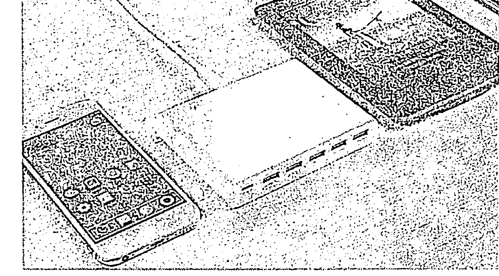

### 线缆 电流与速度的搭配学问
通过前面的文章，大家应该隐隐感觉到了，USB PD充电技术将成为未来中高端排插和充电器的标配。问题来了，USB PD技术必须搭配USB Type-C接口使用(图26)，但你可曾想过，那根不起眼的USB Type-C To USB Type-C线缆，往往会成为影响实际体验的罪魁祸首？


### 不同的电流和速度标准
经常关注CFan的朋友肯定都清楚，USB Type-C接口是史上最混乱的标准，连带着USB Type-C线缆也变得捉摸不透起来。简单来说，USB Type-C线缆可以承载3A或5A两种电流，其中3A没有太多硬件和用料上的要求，但想支持5A电流，线缆接口端就必须搭配额外的E-Marker芯片（图27）。换句话说，常见的3A USB Type-C线缆最多只能用于65W功率的USB PD充电，而5A USB Type-C线缆则可以承担100W的功率。

在传输速度方面，USB Type-C线缆存在USB2.0、USB3.0（包括USB3.1 Gen1和USB3.2 Gen1）、USB3.1 Gen2（包括USB3.2 Gen2）和雷电3四种标准，理论传输速率分别为480Mbps、5Gbps、10Gbps和40Gbps。
绝大多数支持USB PD功能的排插充电器标配的USB Type-C线缆都是3A电流+USB2.0传输速度的组合，足以满足为手机或轻薄本全速充电的要求。但是，如果你拿这根线将移动硬盘和PC相连传输数据时，USB2.0的“龟速”则会让你抓狂。

目前很多以SSD作为存储介质的移动硬盘也采用USB Type-C接口，支持至少10Gbps的传输速度，它们标配的数据线自然支持10Gbps数据传输，但充电电流也多是3A标准。可惜，这类数据线都比较短，而用于充电的USB Type-C线缆则是越长越好（图28）。

### 如何选择USB Type-C线缆
很多支持USB PD充电的排插和氮化镓充电器并没有标配充电线，所以如何选购USB Type-C线缆也是我们必须掌握的一门功课。考虑到轻薄本、智能手机等绝大多数数码设备所支持的USB PD充电功率最高只到65W，所以5A电流就并非线缆的刚需。

此外，如果你的手机支持USB3.0传输（由于USB3.0工作时会干扰通讯信号，所以绝大多数手机仅支持USB2.0），或是身边有很多需要经常读取的移动硬盘或其他采用USB Type-C接口的高速存储设备，此时选购支持5Gbps或更高传输速率的USB Type-C线缆才有用武之地。

换句话说，如果你只有充电需求，选择最普通也是最实惠的3A+USB2.0线缆就足够了（20元以内）。如果你的预算充裕，或是有通过USB Type-C线缆高速传输数据的需求，再考虑5A（可选）或5Gbps/10Gbps（必选，视存储设备的传输速度上限而定）的线缆（30元~100元）（图29）。


> **火速链接**
如果你想了解USB Type-C、雷电4和USB4技术的更多细节，请参考本刊2020年第11期《接口的终极 沐析快似“雷电”的新一代USB》这篇文章。


### DIY 还是品牌机 怎样购机才划算
策划《电脑爱好者》编辑部

今年的6·18年中大促销正逢英特尔处理器全面升级，除了处理器、主板之外，大批新型号的台式机也一起上市了。如果关注过品牌机新品的营销活动，很多有经验的用户应该会发现，这些品牌机真的很便宜……

其实随着个人电脑逐渐走下神坛，各种产品、元件乃至生产过程和服务成本等都已经透明化，很多品牌机必须做到物有所值才能吸引用户。不过这种情况下品牌机不可避免地与传统上更具性价比、更灵活的DIY系统发生冲突。那么在今天的市场上，到底哪一种才是你最好的选择呢？

#### 价格 最重要的考虑
> > 价格，是选择品牌机还是DIY最重要、最常见的考虑因素，也是如今很多用户在品牌机与DIY之间犹豫的最大诱因。

##### 办公日常
办公和日常应用是电脑最常见，也是最容易满足的需求，我们先来看一看这一市场中的情况吧。目前主流品牌可提供的主流办公电脑包括2799元左右的第九代酷睿i3套机、3599元左右的第九代酷睿i5套机，以及3199元左右的第十代酷睿i3套机、4399元左右的第十代酷睿i5套机(图1)。

| 产品 | 描述 | 价格 |
| :--- | :--- | :--- |
| 联想扬天M9000t | 英特尔酷睿i3 商用台式电脑整机(i3-9100 8G...) | ¥2799.00 |
| 戴尔成就3471 | 英特尔酷睿i5商用办公台式电脑整机(九代i5-9400 8G...) | ¥3599.00 |
| 联想天逸510Pro | 英特尔酷睿i3 个人商务台式电脑整机(十代i3-...) | ¥3199.00 |
| 戴尔成就3681 | 商用办公高性能台式电脑整机(十代i5-10400 8G...) | ¥4389.00 |

那么，如果我们自己装一套类似配置的系统会如何呢？我们以最熟悉的酷睿i3-9100平台(图2)为例。

| 配件 | 型号 | 价格 |
| :--- | :--- | :--- |
| CPU | 酷睿i3-9100套装 | 1349元 |
| 主板 | 微星B365M PRO-VH | 套内0元 |
| 内存 | 光威DDR4 2666 8GB | 179元 |
| 显卡 | 处理器自带 | 0元 |
| 散热器 | 盒装自带 | 0元 |
| 硬盘 | 东芝1TB 7200RPM | 299元 |
| 电源 | 长城HOPE-4500DS 350W | 199元 |
| 机箱 | 大水牛商智U2 | 99元 |
| 键鼠 | 联想KM4800键鼠套装 | 59元 |
| 显示器 | 创维22N1 21.5英寸 | 399元 |
| **总价** | | **2583元** |

在不考虑兼容性、稳定性、扩展性和外形的统一性等指标，完全以价格为导向搭配后，我们可以得到一台与品牌机差价仅有200元的DIY电脑。无论从品牌体验还是自行安装需要的精力等方面看，这台DIY电脑都不是很划算，而且其价格是不包括软件的，而品牌机通常会提供的操作系统与Office软件价格就已经有数百元甚至更高，更不要说品牌机还常常会附赠很多应用软件、网站或服务的会员等等。


| 配件 | 型号 | 价格 |
| :--- | :--- | :--- |
| CPU | 酷睿i5-10400套装 | 1849元 |
| 主板 | 华擎B460M-HDV | 套内0元 |
| 内存 | 光威DDR4 2666 8GB | 179元 |
| 显卡 | 处理器自带 | 0元 |
| 散热器 | 盒装自带 | 0元 |
| 硬盘 | 雷克沙NM610 500GB | 399元 |
| 电源 | 长城HOPE-4500DS 350W | 199元 |
| 机箱 | 大水牛商智U2 | 99元 |
| 键鼠 | 戴尔KB216+MS116键鼠套装 | 65元 |
| 显示器 | 戴尔D2421DS 23.8英寸 | 1399元 |
| **总价** | | **3990元** |

类似的情况在配件价格更加坚挺的新平台、价格相对较高的中端配置中表现如何呢？我们就以酷睿i5-10400平台来对比一下吧。


除了根据型号说明（图3）采用了相对高配的显示器之外，我们其实还需要增加90元～150元的预算，购买M.2 Wi-Fi扩展卡（图4）以及天线，以便和戴尔成就3681的配置（图5）对应。这样算下来，整套DIY配置和品牌机价格同样只相差200元左右。

##### 游戏电竞
玩家更关注的游戏、电竞台式机呢？作为结构更复杂、个性化需求更多的产品，这一市场有何不同呢？我们先选择了追求性价比，并且有一定DIY能力的联想拯救者刃7000P。其锐龙5+16GB内存+GTX 1660 Super，以及大容量高速固态硬盘等配置（图6），更符合近期高性价比的主流/中端DIY游戏平台方案。考虑到配合实际需求和接近拯救者刃7000P的配置（图7），我们在相对应的DIY方案中特意选择了DDR4 2666内存和更符合游戏电竞氛围的机箱。这里要特别注意，在实际搭配的时候最好选择符合处理器标准的DDR4 3200内存，价格实际上仅比DDR4## 配置参数

| 型号 | 拯救者刃7000P |
| :--- | :--- |
| CPU | AMD 锐龙5 3600 六核处理器 |
| 显卡 | NVIDIA® GeForce® GTX 1660 SUPER 6GB显卡 |
| 硬盘 | 512GB 固态硬盘 |
| 内存 | 16GB 双通道 DDR4 2666MHz |
| 主板 | B450主板 |
| 网卡 | 802.11AC双频+蓝牙无线网卡 |
| 系统 | Windows10家庭中文版 预装正版Office家庭和学生版 |

2666高10元~20元。此外，仍然是考虑到品牌机拥有无线网络功能，DIY平台还应增加PCIe无线网卡（图8），价格大约为50元（Wi-Fi 5）~150元（Wi-Fi 6）不等。

#### DIY配置列表

| 配件 | 型号 | 价格 |
| :--- | :--- | :--- |
| CPU | 锐龙5 3600套装 | 1699元 |
| 主板 | 微星B450M MORTAR MAX | 套内0元 |
| 内存 | 光威DDR4 2666 8GB×2 | 369元 |
| 显卡 | 耕升GTX 1660 SUPER追风 | 1399元 |
| 散热器 | 盒装自带 | 0元 |
| 硬盘 | 联想SL700拯救者 512GB | 499元 |
| 电源 | 长城HOPE-5000DS 400W | 239元 |
| 机箱 | Tt启航者S3 | 139元 |
| 总价 | | 4344元 |

这次我们终于得到了较大的价格差距，与4999元的联想拯救者刃7000P相比，DIY平台的价格便宜了500元~600元，当然这也是不考虑操作系统、软件，以及联想提供的加强版散热器、专用机箱等方面成本的结论。

需要，价格则接近万元这一玩家心理价位。
与联想等品牌大量使用自主设计的板卡、配件不同，雷神采用的几乎全都是外购配件（图10），因此我们得以更加精确地还原其配置。当然对于雷神旗下的记忆魔人内存、个性化机箱等配件，我们还是只能寻找类似定位的产品来代替。

再看更高端的产品，这次我们选取以十代酷睿高端处理器搭配中高端显卡的雷神911黑武士Ⅲ Z726台式机（图9），这款产品已经完全可以满足高端游戏或电竞的

#### 高端配置列表

| 配件 | 型号 | 价格 |
| :--- | :--- | :--- |
| CPU | 酷睿i7-10700K | 3199元 |
| 主板 | 华擎Z490 Phantom Gaming 4/ax | 1299元 |
| 内存 | 十铨DELTA RGB DDR4 3000 8GB×2 | 459元 |
| 显卡 | 七彩虹iGame GeForce RTX 2060 Ultra | 2299元 |
| 散热器 | 利民Frozen EYE 280 ARGB | 799元 |
| 硬盘 | 金泰克P600 512GB | 459元 |
| | 希捷酷鱼2TB | 389元 |
| 电源 | 长城HOPE-7000DS 600W | 309元 |
| 机箱 | 追风者416PTG | 299元 |
| 总价 | | 9511元 |

有些出乎意料的是，这款昂贵的品牌机也没有从配置上“赚钱”，其价格甚至比DIY配置总价还低，这还是没有考虑到附赠操作系统、无线充电板（图11）等软硬件价格的情况下。

#### 品牌机的价格优势与DIY的应对

从上文中大家也可以看出，如果加上操作系统、软件、特色硬件等我们难以用DIY方式还原的配置，很多品牌机相对于DIY电脑反而有了明显的价格优势。究其原因，除了自身效率的提升之外，新时代的生产、销售方式也让品牌机成本大幅降低，例如减少工厂成本的代工生产方式、减少库存的网络“直购”模式、大数据带来的精准投放和采购等能力，实际上已经将品牌机变成了一种可大规模生产的DIY产品。

此外对于品牌机来说，设计与采购方面也有降低成本的空间。大规模采购可以获得更低的价格，例如在处理器公布首发或阶段价格时，我们常常发现它比市场零售价要低不少，这就是因为厂商公布的是“千颗采购价”，只面向大客户提供这一价格（当然商业税和店铺利润同样影响了最终零售价）。此外整机厂商采购的配件也多以所谓“工包”、“散片”（图12）的模式供货，因为没有外包装和附件，其价格同样比市场中的全包装零售版要低不少。

> 小提示
这里要注意，零售市场中的所谓“工包”、“散片”配件不一定真的是从整机厂商流出，有些可能涉及走私、二手、翻新甚至修改造假等问题，所以笔者并不建议个人购买此类商品。

最高:¥379.00 最低(单件):¥219.00 (2020.06.18)

历史促销明细>

同样在大规模采购的基础上，厂商也可以进行一些“定制化”的精简以降低成本，例如联想、戴尔、惠普等大厂，可以根据台式机设计和定位直接设计板卡，自行生产或下单给代工厂。即使是雷神这种外购配件的厂商，在订货量足够的情况下，也可以要求配件厂商进行一些修改以减低价格，如雷神911黑武士Ⅲ Z726采用的华擎Z490 Phantom Gaming 4/ax主板上，就很明显地取消了一个M.2接口(图13)，在其他不显眼的地方是否有改动就不得而知了。

那么，针对品牌机的这些优势，DIY真的无力反击了吗？答案当然是否定的，要想重新夺回价格优势，在装机时首先应该做到不过度配置。例如仅使用入门级处理器，不使用独显或使用低端独显的办公、家用、学习用户，就可以选择看似比较精简的低价入门级芯片组主板(图14)、300W甚至更低功率的电源等。其实很多低端品牌机的配置就是如此，只要确认可以满足配件的需求，品牌和口碑靠得住，那么在整体性能和稳定性方面不会有太大的问题。

如内存、硬盘、固态硬盘、机箱风扇等可以很方便扩展的配件，大家也可以根据当下的实际需要、资金情况、容量价格比等因素，选择可以满足目前需求的配置，只要留下插槽接口，保留升级能力，无需一下子就配到“面向未来”的程度。

其次就是抓住购买机会，与品牌机不同，DIY的一大优势就是可以化整为零，无需像购买品牌机那样进行一次性投资。这些“零敲碎打”的配件采购还可以更灵活地选择最佳的入手时机(图15)，比如内存在降价的时候可以收一条，冬天水冷优惠时借机升级，夏天电脑清灰时顺便加个风扇等等。

除此之外，DIYer最好也考虑不追新，并尽量不追高。因为品牌机厂商与配件厂商、主要的芯片厂商、核心厂商都有很好的关系，更容易获得最新的产品、最好的折扣，而这些产品因为其稀缺性，在零售市场上总是价格非常坚挺，个人购买的花费远高于品牌机厂商。

这样看来，要想省钱，DIYer需要的不仅是精心配置，还要有足够的耐心，这样才能让DIY电脑的总价更低，提升DIY的价格优势。

#### 体验 应用 能力 分高下

在价格已经不再有明显差别的情况下，品牌机与DIY作品各自的不同体验对用户的选择就更重要了，这两种购机方式在这方面有何不同呢？

#### 外部设计

品牌机的外观胜在统一性，功能设计方面则会对定位人群进行更好的优化。而DIY平台恰好相反，其优势在于外观的多变、个性和针对功能定位的更好扩展性。

中都有串口（图17）以兼容商业外设，有些甚至还提供了古老的并口。但因为销量、利润等问题，带有并口等设计、价格实惠、针对办公商用定制的主板常常不太受经销商的欢迎，因此在零售市场上总是“只闻其声，不见其人”，DIYer不太容易找到它们。

先说外观，对品牌机来说，出自同一厂商，或者可以进行深度定制采购的机箱、键鼠、显示器乃至相关灯效当然可以做到最好的统一，这一点要远远超过DIY平台。

再比如前文提到的雷神911黑武士Ⅲ Z726，它在机箱顶部安装的无线充电板，就是考虑到很多电脑游戏玩家同时也是手游重度发烧友的设计，让用户在玩游戏的时候可以更方便地同时给手机充电。但对于DIYer来说，这样的机箱不太可能直接买到，也难以自行改造，只能选择在机箱顶部或桌面放一个无线充电板，虽然功能可以模拟，但体验显然会大打折扣。

DIYer当然也很希望能做到电脑的外观统一，这并不是做不到，但需要非常精心地选择配置。目前也有一种比较简单的方法，就是尽量采购来自同一厂商的机箱、显示器、键鼠、RGB风扇等产品。现在的配件大厂如华硕、技嘉、微星等确实都可以提供全套的产品，不过比较麻烦的是，这些配件厂商的产品要比品牌机设计更多地考虑扩展性、兼容性，因而品种非常多样，但却不一定搭配得好，比如有些用户就曾经抱怨过华硕ROG的主板和机箱（图16）灯效接口都不匹配。所以即使选择同一品牌甚至同一系列的产品，也要深入了解、用心挑选才行。

至于DIY平台的优势，当然也很容易理解，比如既然难以统一外形和色彩等，那么直接使用撞色、强对比等方式配置产品，其实也是不错的方式，常常可以比品牌机更加彰显个性。此外这样“随性”的配置，也为以后根据兴趣升级配置留下了余地，例如为一台电脑的男女主人分别配置最符合自己手感、应用需求和审美的游戏机械键盘和可爱系键鼠（图18）也就不会让人感觉很奇怪了。

在功能定位方面，品牌机也可以针对性地深度定制，例如几乎所有办公、商用品牌机的背部I/O接口

#### 稳定性与售后服务

电脑的稳定性应该是和性能并列的用户需求，而售后服务能力则是现在选购产品时特别关注的能力，同时也是一些大品牌溢价的重要原因。也许对很多用户来说，进行了专业的兼容性、稳定性测试，配置来源相对单纯的品牌机肯定在两方面都可以取胜。其实这种印象已经有些过时了。

| 类别 | 配置信息 |
| :--- | :--- |
| 处理器 | 第十代英特尔® 酷睿™ i5-10400 |
| 内存 | 8GB(1X8GB) DDR4 2666MHz |
| 硬盘 | 512G PCIe 固态硬盘 |
| 显卡 | Intel® UHD 630 集成显卡 |
| 显示屏 | 23.8英寸 |
| 操作系统 | Windows 10 家庭版 内置正版McAfee杀毒软件15个月 |
| 服务 | 三年整机上门保修服务 |
| 标配 | 有线键鼠 |
| 电源 | 200W EPA 环保电源 |

在质保方面，3年~4年整机或主要配件保修及上门服务是品牌机很常见的标准。但目前的很多配件在质保时间上已经远远超过了品牌机对主要配件的保障，例如处理器也至少有3年质保，一些内存等配件甚至提供了终身质保（图19）。

| 标准型号 | FURY DDR4 超频内存<br>新版设计散热片 支持PNP和XMP超频 | FURY DDR4 RGB 超频内存<br>红外同步炫彩RGB光效 支持PNP和XMP超频 | Predator DDR4 超频内存<br>出色超频性能 支持PNP和XMP超频 | Predator DDR4 RGB 超频内存<br>出色超频性能 红外同步炫彩RGB光效 |
| :--- | :--- | :--- | :--- | :--- |
| 容量 | 4GB/8GB/16GB | 8GB/16GB | 8GB/16GB | 8GB/16GB |
| 频率 | 2400,2666,3000,3200,3466MHz | 2400,2666,3000,3200,3466MHz | 2400,2666,2933,3000,3200,3333,3600,4000,4266,4600MHz | 2933,3000,3200,3600,4000MHz |
| 延时 | CL15,16 | CL15,16 | CL12,13,15,16,17,19 | CL15,16,17,19 |
| PIN脚 | 288 Pin | 288 Pin | 288 Pin | 288 Pin |
| 电压 | 1.2V、1.35V | 1.2V、1.35V | 1.35V、1.4V、1.5V | 1.35V |
| 工作温度 | 0-85℃ | 0-85℃ | 0-85℃ | 0-85℃ |
| 高度 | 34.1mm | 41.24mm | 42.2mm | 42.2mm |
| 宽度 | 133.35mm | 133.35mm | 133.35mm | 133.35mm |
| 厚度 | 7.2mm (Max) | 7mm (Max) | 8.3mm (Max) | 8mm (Max) |
| 保固 | 终身保固 | 终身保固 | 终身保固 | 终身保固 |

另一方面，品牌机确实宣称经过了专业的兼容、稳定性测试，但绝大多数仅限于当前配置，所以能力冗余有时小到令人吃惊的程度，例如一款使用酷睿i5-10400处理器的电脑安装了仅有200W功率的电源（图20），这一点显然会成为稳定性的隐患。要知道这是一款允许自行升级的产品，而增加一块入门级游戏显卡就很可能超过电源的能力。这时DIYer配置中通常会留下的各种“超额”能力，如更强的供电、更多的插槽接口等，当然就在升级时成为了更好的稳定性保障。

#### 总结

其实品牌机与DIY的差别还有很多，例如近期品牌台式机普遍配置的无线网络能力就与DIYer的常见选择有明显的区别，也会造成应用方面的差别等等。不过从本文介绍的这些内容，我们已经可以对大家的疑问做出回答了：对于关注传统应用能力的用户来说，DIY的优势其实已经不太明显，品牌机是更适合的选择；而对于更关注个性化需求的用户来说，DIY方式更具优势，不过其主要优势已不是价格，而是更加灵活的选择、更加个性的展示和更贴近自己需求的独特体验。

那么，你是哪一种电脑用户？又会选择哪一种购机方式呢？CF

## “1+4” 这种搭配 浅析英特尔Lakefield混合酷睿平台

还记得微软联手高通共同打造的“Always Connected PC”吗？这种搭载骁龙移动平台的Windows 10 on ARM笔记本拥有超一流的便携性和低功耗优势，可以满足长途外出时的轻办公和轻娱乐需求。随着高通骁龙8cx Plus即将问世，有望进一步弥补Always Connected PC在性能上的短板，从而对传统X86架构的Windows移动设备造成更大的冲击。实际上，Wintel联盟（微软和英特尔）也正在酝酿着可以媲美Always Connected PC的X86平台，它就是代号为“Lakefield”，采用英特尔混合技术的全新酷睿处理器。本期特别话题，就让我们简单聊聊Lakefield酷睿平台的特色吧。

### 频繁出镜 最熟悉的陌生人

相信大家第一眼看到“Lakefield”这个名字一定感觉既熟悉又陌生。熟悉的原因是它早在2019年初的CES 2019便已曝光（图1），时不时就出现在各种科技新闻中。陌生则是因为缺少官方信息，Lakefield一直都是处于传说中的存在。好消息是，这个犹抱琵琶半遮面的全新酷睿即将与我们正式见面，有关它的详细规格和性能也都已经浮出了水面。

### 天生骄傲 两种创新科技加持

英特尔无疑是处理器领域的“造芯专业户”，但Lakefield和英特尔在过去设计的所有处理器都有所不同。它集英特尔最新的Foveros 3D封装技术和混合CPU架构技术于一身，在超迷你的尺寸内就提供了卓越的性能和全面的Windows兼容性，并致力于在超轻巧的创新外形下为用户提供办公和内容创作体验。Lakefield的实际名称也比较拗口——采用英特尔混合技术的英特尔酷睿处理器，希望日后英特尔可以为其起一个更易上口的中文代号。

### 3D封装 堆叠起来的处理器

在过去，处理器芯片都是单层结构，最多也就是在一层基板上封装多个“Die”（晶圆芯片，包括集成了GPU和缓存等单元的“CPU Die”，以及芯片组和控制器等功能的“I/O Die”等），其中最具代表性的就是AMD锐龙及霄龙处理器，它们可以搭配不同数量的CPU Die，实现更多的物理核心数量和更强的性能（图2）。

英特尔Lakefield最大的特色，就是首次引入了“3D Foveros封装技术”，它可以让不同功能和类型的Die从昔日2D水平方向的平铺变成3D垂直方向的堆叠，在牺牲一点点厚度的前提下就可进一步压缩处理器基板的尺寸。从Lakefield的结构来看，它的最底层是封装基板，上一层是集芯片组和I/O功能于一体的基础逻辑Die，再向上一层则是用于高性能计算的CPU Die，两层Die分别采用22nm和10nm制程工艺，并通过TSV和微凸块（Micro-Bumps）技术实现堆叠连接。在它们的更上层，则是通过PoP封装形式的DRAM Die，最多可以叠加两层DRAM Die，实现8GB的内存容量（图3）。

看到这里可能有朋友会问了，在封装基板上叠加这么多层的Die，那得有多厚啊？

请放心，一颗完整的英特尔Lakefield处理器芯片的体积只有12mm×12mm×1mm。你没有看错，它的厚度真的只有1mm，而12mm的长宽比一枚10美分的硬币还要小（图4）！从英特尔展示的搭载Lakefield芯片的完整主板来看，它的长度和一支签字笔相似（图5），总面积并没比手机主板大多少，但上面却集成了包括Lakefield处理器、无线网卡、读卡器和M.2插槽（可安装NVMe SSD）等一众部件（图6）。

由于Lakefield功耗和发热量较小，所以它可以采用被动散热（无风扇）设计。换句话说，今后的笔记本（包括二合一设备）可以用和智能手机一样迷你的主板，可将身材压缩到极致，或是用节省下来的空间安置更大的电池，灵活性远超现有的PC，助力纤薄设计迈向新高度。

### 混合技术 实现大小核异构计算

当年为了和新兴的平板电脑竞争，英特尔在原有的“酷睿”（Core）性能级核心的基础上，研发出了全新的“凌动”（Atom）低功耗核心（图7）。Atom最早曾被用于上网本，随后则逐渐衍生出了适用于智能手机的Medfield（如Atom Z2610）、Clover Trail+（如Atom Z2560）和Moorefield（如Atom Z3580）平台，以及针对平板二合一设备定制的BayTrail-T（如Atom Z3735D）和Cherry Trail-T（如Atom X5-Z8500）平台，这些基于X86架构打造的Atom处理器不仅可以运行Android系统（图8），在续航方面的表现也不逊于同期的ARM处理器太多。

> 火速链接
如果你想了解更多有关处理器封装技术方面的知识，可参考本刊2019年第24期《功耗性能兼顾 英特尔参与大小核之争》这篇文章。

可惜，Atom系列处理器运行Android系统存在兼容性问题，运行Windows系统又存在性能孱弱的缺陷，最终落了个“姥姥不疼舅舅不爱”的窘境，并最终被英特尔所放弃。需要注意的是，Atom核心并没有就此消失，而是以全新的身份转战奔腾和赛扬平台，在入门级的低功耗计算平台贡献力量（图9）。

英特尔Lakefield的另一大特色，就是通过全新的Intel Hybrid Technology（英特尔混合技术）实现了Core和Atom两种核心的联姻，组成了类似ARM领域的Big.LITTLE大小核结构。

简单来说，Lakefield在高性能计算的CPU Die那一层上，同时整合了1颗性能级的Core核心（大核，类似于ARM Cortex-A78或Cortex-X1），以及4颗超低功耗的Atom核心（小核，类似于ARM Cortex-X55）（图10）。其中，大核部分采用了与第十代酷睿Ice Lake同源的Sunny Cove微架构，而小核部分则采用了全新的Tremont微架构，成为了X86处理器历史上第一颗5核混合异构计算架构的Big.LITTLE处理器。除了这5颗CPU核心外，在这个CPU Die内还集成了图像处理器单元、视频编解码单元、显示输出引擎、内存控制器、L2和L3缓存以及Gen11 GPU等单元（图11），真正诠释了什么叫“麻雀虽小五脏俱全”。

那么，英特尔首发的Lakefield处理器都有谁？它们的具体规格和性能如何？

### 高低搭配 酷睿i3/i5双剑出鞘

英特尔发布的第一批Lakefield处理器只有2款产品，分别为酷睿i3-L13G4和酷睿i5-L16G7，它们都拥有7W的TDP，由1+4大小核组成的5核心，内置4MB高速缓存，主要区别在于默认主频、睿频加速频率和GPU规格。其中，酷睿i3-L13G4集成的核显为集成48个EU执行单元的锐炬Plus G4，而酷睿i5-L16G7则配备了集成64个EU执行单元的锐炬Plus G7，也是英特尔当前已量产的最强核显（表1）。同时，Lakefield原生显示器双内部管道，非常适合可折叠双屏PC的设计需求。

可惜，为了降低Lakefield处理器的功耗，英特尔对其CPU和GPU都进行了一定程度的缩水。比如，虽然Lakefield的CPU大核为Sunny Cove微架构，但却不支持超线程技术，还屏蔽了AVX指令集功能。同时，无论是i3-L13G4还是i5-L16G7，它们集成核显的最高频率只有500MHz，这些都会极大地影响它们实际性能的输出。

表1：英特尔Lakefield和第十代酷睿平台规格对比

| 参数对比 | TDP | 内核/线程 | 高速缓存 | 默认主频 | 睿频加速 | 集成显卡 | EU单元 | 显卡频率 |
| :--- | :--- | :--- | :--- | :--- | :--- | :--- | :--- | :--- |
| **Lakefield平台 (均支持LPDDR4X-4267MHz)** | | | | | | | | |
| i3-L13G4 | 7W | 5C/5T | 4MB | 0.8GHz | 2.8GHz | 锐炬Plus G4 | 48 | 0.5GHz |
| i5-L16G7 | 7W | 5C/5T | 4MB | 1.4GHz | 3.0GHz | 锐炬Plus G7 | 64 | 0.5GHz |
| **第十代Ice Lake-Y平台代表 (均支持DDR4-3200MHz和LPDDR4-3733MHz)** | | | | | | | | |
| i3-1000G4 | 9W | 2C/4T | 4MB | 1.1GHz | 3.2GHz | 锐炬Plus G4 | 48 | 0.90GHz |
| i5-1030G4 | 9W | 4C/8T | 6MB | 0.7GHz | 3.5GHz | 锐炬Plus G4 | 48 | 1.05GHz |
| i5-1000G7 | 9W | 4C/8T | 6MB | 0.8GHz | 3.5GHz | 锐炬Plus G7 | 64 | 1.05GHz |
| i5-1035G7 | 15W | 4C/8T | 6MB | 1.2GHz | 3.7GHz | 锐炬Plus G7 | 64 | 1.05GHz |
| **第八代Amber Lake-Y平台代表 (均支持DDR3L-1600MHz和LPDDR3-1866MHz)** | | | | | | | | |
| i7-8500Y | 5W | 2C/4T | 4MB | 1.5GHz | 4.2GHz | UHD 615 | 24 | 1.05GHz |
| M3-8100Y | 5W | 2C/4T | 4MB | 1.1GHz | 3.4GHz | UHD 615 | 24 | 0.90GHz |

好消息是，Lakefield拥有良好的连接性以及更为喜人的功耗表现。它可以与英特尔自家的Intel XMM 7560 Modem（支持4G联网）和AX200 Wi-Fi 6无线网卡搭配，可带来无缝的视频会议体验和在线流媒体服务（图12）。由于Lakefield的大小核调度机制受制于Windows系统优化很难量化，所以英特尔主要宣传了它在待机情况下的功耗数字——2.5mW，比同样主打超低功耗的第八代酷睿i7-8500Y降低了91%，已经可以媲美ARM架构处理器了。英特尔官方还给出了Lakefield相较于第八代酷睿i7-8500Y在其他性能方面的改善：封装面积减小了56%，单核性能提升了12%，能耗比提升了24%，3D图形性能提升70%，还有了2倍的AI性能提升（图13）。

从英特尔官方列出的数据来看，Lakefield无论是性能还是功耗表现都趋于完美，但事实果真如此吗？

### 性能前沿并没有想象般完美

Lakefield的首发产品代表包括微软Surface Neo、ThinkPad X1 Fold和三星Galaxy Book S（图14），而外媒www.notebookcheck.net已经拿到了三星Galaxy Book S并对其展开了详细的评测（图15），接下来我们就通过该网站的测试数据，看看Lakefield是否真有想象般完美吧。

> 参与对比的处理器有很多，本文只摘取与Lakefield定位相近的型号

| 处理器 | 核显型号 | EU单元数 | 3DMark11-P | 3DMark-FireStrike |
|----------|-------------|----------|------------|------------------|
| i5-1030G7 | 锐炬Plus G7 | 64 | 2924 | 1846 |
| i5-1035G1 | UHD G1 | 32 | 2578 | 1755 |
| i3-1000G4 | 锐炬Plus G4 | 48 | 1941 | 922 |
| i5-10210U | UHD620 | 24 | 1852 | 1280 |
| i5-L16G7 | 锐炬Plus G7 | 64 | 1658 | 1217 |
| i7-8500Y | UHD615 | 24 | 1288 | 943 |

*成绩取GPU子项分数，数据均来自www.notebookcheck.net，测试机型都是和Galaxy Book S相似的极致轻薄型笔记本，受制于散热和功耗墙设定较之普通轻薄本成绩普遍偏低，比如锐炬Plus G7在CFan实测中3DMark11-P和3DMark-Fire Strike分数分别高达4587和2822

#### CPU性能对比

现实是很残酷的。酷睿i5-L16G7在绝大多数CPU基准测试软件中的跑分都落后于第八代酷睿i7-8500Y，从数据来看最多也就是与奔腾5405U和酷睿m3-8100Y同级，和同样采用Sunny Cove微架构的第十代酷睿i3相比更是相距甚远（表2）。究其原因，是因为酷睿i5-L16G7的5个CPU核心都不支持超线程技术，每个核心只能执行一个线程。此外，Lakefield的大小核如何调度，取决于Windows 10操作系统，从Galaxy Book S的评测来看微软显然还没有对Lakefield的混合异构计算架构做好准备。通过CineBench测试截图可见，酷睿i5-L16G7最高只能达到2.4GHz的主频（图16），距离官方标称的最高3.0GHz相差甚远。此外，在高负载测试中，大核无法做到始终满血输出，只是偶尔才全速运行，更多时间占用率只有10%，而其内置的4颗小核则能长时间达到100%的占用率。换句话说，由于酷睿i5-L16G7的大核无法长时间满血运行，所以它的单核性能甚至还不如奔腾5405U和酷睿m3-8100Y。还好，酷睿i5-L16G7在多核测试中实现了对这两颗处理器的反超，甚至可以逼近酷睿i7-8500Y，可见其小核采用的Tremont微架构并没有我们想象的那般孱弱，4个Atom物理核心足以匹敌八代酷睿的2个Core物理核心+2个逻辑核心。

#### GPU性能对比

虽然酷睿i5-L16G7集成了英特尔当前最高端的锐炬Plus G7核显，但受制于500MHz的运行频率，其在3DMark基准测试软件中的成绩却仅和24个执行单元的UHD620相当（表3）。不过，酷睿i5-L16G7核显这种低频率+多执行单元也有着独特的优势，就是在同等性能时要比高频率+少执行单元的核显更为高效和节能。从上述评测来看，英特尔Lakefield还大有潜力可挖，如果能让它的大核承担高负载的单核任务，并同时联合其余4颗小核处理多核任务，也就是在正确的内核上运行正确的应用，其整体性能应该还能再进一步。

| 测试项目/处理器 | 酷睿i5-L16G7 | 奔腾5405U | 酷睿m3-8100Y | 酷睿i7-8500Y | 酷睿i3-1000G4 |
|------------------|--------------|-----------|--------------|--------------|---------------|
| CineBench R10单核 | 4079 | 3490 | 3850 | 5156 | 5771 |
| CineBench R10多核 | 9003 | 7924 | 6055 | 8919 | 9257 |
| CineBench R15单核 | 88.3 | 91.1 | 96.2 | 129 | 141 |
| CineBench R15多核 | 255 | 227 | 162 | 246 | 333 |
| CineBench R20单核 | 182 | 204 | 243 | 304 | 348 |
| CineBench R20多核 | 479 | 513 | 382 | 591 | 587 |
| GeekBench 5.1单核 | 797 | 570 | 809 | 858 | 1096 |
| GeekBench 5.1多核 | 1441 | 1255 | 1178 | 1504 | 2028 |

*CineBench R10测试为32位环境，其他软件均为64位测试，数据均来自www.notebookcheck.net

## 精准狙击 ARM笔记本受挑战

当你拿到本期杂志时，英特尔应该也发布集10nm+工艺、Willow Cove微架构、Gen 12 GPU核显于一身的第十一代酷睿Tiger Lake平台了。如果不出意外，Tiger Lake也将衍生出15W TDP的Tiger Lake-U系列以及9W TDP的Tiger Lake-Y系列，要性能有性能，要省电则省电。在这个大环境下，采用混合技术打造的Lakefield平台位置在哪？

### 开辟全新战场

正如前文所述，Lakefield和我们过去看到的所有X86处理器都不一样，它所服务的对象，其实是面向未来的“创新型PC”。实际上，Galaxy Book S并没有真正达到Lakefield的要求，因为现在重量低于1kg的13英寸轻薄本并不鲜见，真正适合Lakefield发挥的舞台，其实是像微软Surface Neo和ThinkPad X1 Fold那般的双屏笔记本（图17）。

双屏幕这种创新型PC在使用习惯和体验上更趋近于平板电脑，也就是碎片化时间使用居多，而传统X86处理器根本处理不好碎片化使用过程中的待机需求——哪怕你放着不动电池也会被不断地消耗。Lakefield混合酷睿处理器则不同，它利用1个大核运行要求更高的工作负载和前台应用，而4个小核则负责后台任务，可在功耗和性能优化之间取得平衡，拥有比5W TDP的酷睿M还要低91%的待机功耗，简直就是为碎片化使用量身定制。

至于性能，你肯定不指望轻巧如Galaxy Book S、设计如Surface Neo的产品玩大型3D游戏吧？这种极致便携型PC的主要任务，就是在碎片化时间使用时提供足够的生产力以及高速的响应和网络连接能力，而这些也恰好是Lakefield所擅长的。

### ARM PC受挑战

Lakefield的真正敌人，其实是由高通和微软携手打造的Always Connected PC和Windows 10 on ARM生态联盟（图18）。目前，该生态圈最强的处理器就是高通骁龙8cx和刚刚发布的骁龙8cx Plus（图19），它们都采用4颗Kryo 495 CPU大核和4颗Kryo 495 CPU小核构成，集成Adreno 680 GPU，只是后者最高主频可达3.15GHz，并有望被微软新一代Surface Pro首发。

Always Connected PC最大的优势就是可以让笔记本享用和智能手机、平板电脑相似的低功耗和低发热，续航时间可轻松突破15小时（真正的持续使用时间，领先同屏幕尺寸和电池大小的X86设备1/3左右）。但是，这类产品受制于ARM架构的处理器，擅长运行从微软商店下载的UWP应用，虽然也能通过中介编译的方法运行部分EXE程序，但无论是兼容性还是执行效率都有所折扣。

Lakefield的出现，让X86设备也能做到犹如Always Connected PC一般轻薄性感，并在续航时间方面迎头赶上，同时还能做到与32位和64位的Windows应用全面兼容，我们熟悉的EXE程序都能在它们身上运行（只是运行速度无法保证）。有消息称，英特尔已经规划好了Lakefield的后续产品，包括7nm+10nm、7nm+5nm工艺打造的混合酷睿处理器。如果Lakefield最终可以取得成功，现有的Y系列处理器将可能退出江湖。

#### PC风向有所改变

就在英特尔正式发布Lakefield不久，苹果在WWDC大会上也宣布了一件大事——Mac PC系列（包括MacBook）产品线将与X86阵营说拜拜，改用基于ARM架构的自研处理器（图20）。未来，我们能在Mac身上运行iOS和iPad OS上现有的APP，真正做到移动端与PC端的一致性体验。如果基于苹果自研ARM处理器的Mac能取得成功，对Always Connected PC生态联盟来说无疑也是惊天利好。

总之，无论是Always Connected PC、Lakefield还是ARM Mac PC，它们的出现都预示着PC未来的一个发展方向：极致轻薄、长效续航、全时在线、碎片化使用、应用APP化。这种“创新型PC”将逐渐取代现有的PC平板二合一设备，并与轻薄本和游戏本一同构成移动PC的生态江湖（图21）。

就目前来看，Windows系统是决定Always Connected PC和Lakefield成败的关键因素，如何提升前者对Win32程序的兼容性和效率，改进后者大小核的调度机制，这些都是留给微软的作业。此外，将应用APP化可不是仅靠厂商主导就可以完成的，还需要众多软件开发商和用户去迁移使用习惯才能共同实现（图22），而Windows在这条道路上一直走得磕磕绊绊，如果不能像苹果那般打通移动端与PC端的一致性体验，“创新型PC”的未来也将充满变数。

## 低成本“升级”

## 提升电脑性能的小手段

闷热难耐的夏天终于过去了，火热非常的除了天气之外，对很多DIYer来说，应该还有一直关心的电脑市场。似乎是特意跟随着天气的温度曲线，处理器、主板、内存和固态硬盘、显示器、显卡各个非常重要的配件市场同样也不断升温，新产品、新技法以及更诱人的价格不断地映入眼帘。

不过与内心“买买买”的冲动相悖的是，绝大部分的DIYer资金都是很有限的，很难兼顾如此多的方向。是升级处理器？还是显卡？或者增加内存？换块硬盘或换台显示器……内心的煎熬可能比身体承受的高温更加让人难受。

其实除了一些确实落伍的配件外，我们的电脑常常还有不少潜力可挖，而且市场中甚至是我们已经扔在一边的淘汰配件里，就有能用来加速的好东西。不花钱或者花很少的钱，就能让你的电脑能力有所提升，应该多少能降低一些大家对升级的渴望吧。

### 解决问题 硬盘加速

电脑中最缓慢的数据处理设备是还需要使用大量机械结构的机械硬盘（图1），这一点是我们反复提到过的，很遗憾的是，估计这个问题短时间内根本解决不了，我们唯一能做的就是转而使用高速固态硬盘。但想要存储大量数据，TB级别的固态硬盘实在昂贵，使用机械硬盘还是必不可少的。既然它自身的速度很难提高了，咱们就来试试用其他配件给其“加速”吧。

#### ○ AMD StoreMI

AMD 400、500主板的用户在下载、安装驱动软件的时候应该会看到一个叫AMD StoreMI的软件，它一般是在主板软件列表而不是驱动里，所以很多用户也就忽略了，可是前一段时间AMD的动作让它又一次受到关注。这个软件如果拥有AMD X570主板，则可以免费下载AMD StoreMI。预计StoreMI将于2020年第3季度进一步支持AMD B550、400系列，X399和TRX40芯片组。

曾以比较少见的完全下架，并在一段时间后重新上架的方式进行了大更新，截至发稿时，新版的StoreMI仍是为X570准备的，未来才会逐渐支持B550、400系列等芯片组的主板（图2）。

AMD StoreMI技术很容易理解，它将SSD和部分内存与机械硬盘融合为一个整体（图3），辅以智能化的智能数据预测等技术，大幅提升存储部分的读写速度。简单地说，它其实就是让相对高速的SSD、内存作为硬盘的大容量缓存，这样硬盘就有了几GB甚至几十GB的巨大缓存。其中系统认为最常用的程序、文件都会“常驻”在SSD部分中，电脑重启后也不会消失，需要使用时总是能快速载入。而且开机常用文件被加入SSD之后，还能加快开机速度，与每次重启后都清空的一般硬盘缓存显然不同。

新版的StoreMI在构成上略有不同（图4），不再需要划出一部分内存，当然考虑到固态硬盘数据速度仍然和其他配件存在不小的差距，笔者估计它其实还是需要使用内存的，只是改为更灵活的动态占用而已。

相对于有所简化的结构，新版的StoreMI在功能上其实是更加强大而实用了（图5）。例如一些重点数据可使用“镜像”、“只读”等模式，避免在固态硬盘缓存与机械硬盘间转移、使用时误修改或删除；它还能将多个不同容量的硬盘变成统一的大容量“存储池”，比构建Raid更灵活方便，可以让一些原先已经“鸡肋”化的TB以下硬盘重新发挥余热等。

#### 英特尔傲腾

傲腾（Optane）技术同样是用固态存储设备作为机械硬盘的缓存，不过和英特尔自家之前的快速存储技术、对手的StoreMI都不同，它使用了专门的加速设备——基于3DXpoint技术制造的傲腾内存。3DXpoint技术制造的芯片在响应速度等方面接近内存，但存储能力却更像一般固态硬盘使用的NAND Flash闪存芯片，所以使用它加速的特色同样是无惧重启，可以在其中持续保留重要数据，也就可以加速从电脑启动到开机自动载入、临时文件存储的所有数据读写任务。

在第一代傲腾技术进入消费级市场后，我们曾经进行了相应的介绍，大家可以参考本刊2019年第9期的《机械硬盘变成SSD 傲腾内存的魔法》等文。比较常见的第一代傲腾消费级产品外形与基于PCIe通道的M.2固态硬盘类似，考虑到市场的可承受能力，所以最高容量也只有100GB左右，且常见型号为16GB和32GB，64GB以上的型号很少见。但在商用市场上有既可加速系统，又可用于数据存储的大容量傲腾固态硬盘产品（图6）。

近期英特尔开始在商用市场中投入了第二代傲腾产品，这次比较引人瞩目的就是使用内存插槽的型号（图7）。但考虑到消费级主板的实际设置，笔者估计这一代产品引入消费市场后仍然会采用M.2接口的形式。

### 加速效果

也许有些人觉得硬盘加速主要就是专业级的大型应用和文件才用得到，开机嘛，稍微等一等也能忍。真的如此吗？我们就不考虑各种硬盘测试工具，直接用整机性能测试软件和游戏实际运行效果来看一看小小的16GB傲腾能带给我们怎样的改变吧。

从测试中可以看出，傲腾内存对一般用户的实际应用也有明显的加速作用，在日常和工作应用中，也至少相当于升级到了高一个档次的处理器（图8）。另外游戏等应用的等待时间大幅缩减，且不受关机的影响。比如在玩过一段时间的《古墓丽影》后，关闭电脑休息，之后再次开机，再次启动游戏的载入时间从14秒缩短至8秒，而使用机械硬盘的话，重启电脑后，再次启动游戏的载入时间仍为15秒不变，这显然也能够改善使用体验。

### 显卡加速 抵抗新核心的诱惑

新核心的显卡同样是近期非常吸引人的配件，要想抵抗它们的诱惑，就得给玩家一种能实际提升游戏帧速或画质的方法，其实这也是有的。

#### 英伟达DLSS 2.0

RTX显卡是重度玩家已经配置的装备，作为第一代支持光线追踪的显卡，在开启这一功能后的性能损失有些大，让很多玩家有些不满，也是准备升级到RTX 30系列的重要动力。不过随着DLSS技术的成熟，RTX 20系列在开启光线追踪等高画质设置后，游戏帧速与画质都有了明显的提升（图9）。

DLSS是一种英伟达和游戏厂商合作，通过RTX显卡内置的AI单元学习和了解游戏画面，在游戏中自动调校的技术，目的是在尽量不损失画面质量的情况下简化抗锯齿等画质优化功能，当然也就能提升帧速了。所以DLSS需要累积数据，最新的驱动和游戏版本提供的效果远比其初期要好，这就需要我们尽量更新至最新版本的驱动和游戏。

这里需要注意的是，DLSS是一种减轻显卡负担的技术，主要为高画质预备，毕竟低画质下显卡可能根本就没有多少负担，都没有用上“全力”呢。所以在游戏中常常需要使用高分辨率、高画质或者启用光线追踪、抗锯齿等功能后才会发现DLSS设置出现或变成可设置状态（图10、图11）。

#### 蓝宝显卡TRIXX Boost

AMD显卡是否有类似DLSS的加速技术呢？答案是肯定的，不过目前还只在蓝宝显卡中正式启用，这就是TRIXX Boost功能。它的实现原理要简单一些，其实就是用低分辨率处理图像，然后以高分辨率显示。当然它也不是简单地使用低分辨率，而是设定了一些尽量减少画面损失的近似分辨率，同时用锐化技术让画面效果接近原分辨率（图12），比用户自己在高分辨率显示器上设定低分辨率的效果要好得多。

安装并启动、设置TRIXX Boost功能后，再打开游戏，就可以找到刚刚设定的非标准分辨率选项（图13），有些游戏还会直接辨认出TRIXX BOOST支持的所有分辨率，可以更灵活地使用。

相对简单的实现原理让TRIXX Boost可以直接适配大多数游戏，不用像DLSS那样进行针对性的优化。不过它同样也是一种降低显卡负担的技术，所以也是在越高的分辨率、画质下的帧速提升越明显。

另外一点不同就是，TRIXX Boost实际上是蓝宝显卡专用技术，且独立于驱动之外（图14），而不是AMD原厂提供的。不过蓝宝和AMD的关系其实很不寻常，前不久RX 5600 XT显卡全面修改规格，实际上就是AMD官方认可并升级到了蓝宝RX 5600 XT的设置。随着TRIXX Boost技术的成熟，说不定什么时候就进入AMD官方驱动了。

### 显示器优化画质新感受

显示器是升级相对较慢的配件，加上目前一些显示器的升级方向是提升刷新率而非分辨率，这就使得很多人目前仍在使用1920×1080分辨率的显示器。看到纤毫毕现的2K、4K画面，是不是有些妒忌呢？其实如果资金不足或已经选择了高刷新率这个升级方向的话，我们也可以用软件方法体验近似于更高分辨率的画面，暂时无需去购买新显示器。

英伟达显卡用户可以在驱动程序里选择“管理3D设置”，相应界面中的“DSR”因子选项均为倍数，可以理解为目前分辨率的倍数，建议大家选择整倍数，比如2.0×、4.0×（图15）。除了DSR因子外，我们还可以在下面的选项中选择“DSR-平滑度”，这就是将高分辨率画面“缩小”显示的时候，显卡对画面自动进行的平滑处理，一般33%就足够用了。

DSR全称是Dynamic Super Resolution（动态超级分辨率），就是使用更高分辨率处理画面，因为高分辨率画面中会有更多细节，图形也更圆滑平整，即使放到低分辨率显示器上效果也会变得更好（图16）。而我们选择的2.0×、4.0×就是DSR画面相对于原始分辨率的倍数。

在开启DSR之后，我们可以在显示器设置中看到多出了更高分辨率的选项，比如在带宽最多能支持到2K级别分辨率的DVI接口上，我们也能使用“4K”分辨率了（图17）。再打开游戏也会发现，一些原本被显示器分辨率限制，只能选择1920×1080分辨率的游戏也可以选择更高的分辨率了。赶紧用更高分辨率玩一玩，看看效果吧。

当然以高分辨率处理游戏的DSR也是很消耗性能的，在老游戏和轻量级游戏中，确实可以让最高画质的效果再上一层楼，但对于新游戏和3A游戏，恐怕带来的就是幻灯片效果了。另外它毕竟是“虚拟”分辨率，目前只能在全屏状态下使用，不支持窗口游戏模式。

其实AMD驱动也同样带有虚拟分辨率选项，但并没有DSR的优化技术，所以无论是性能损耗还是画质表现甚至是兼容性方面都存在问题，体验一下高分辨率尚可，笔者并不推荐长时间使用。

### 为CPU减负 Windows 10新版本的福利

Windows 10 2004版已经推送了一段时间，应该有不少用户已经更新了，如果没有遇上兼容问题，那么新版本用起来还是相当不错的，其中一些功能升级更是非常实用，例如GPU加速能力。

与之前的浏览器、视频播放器等软件的GPU加速不同，本次的GPU加速不仅是帮助处理图形视频，而且是系统级的加速。它是让GPU直接访向内存，“插手”管理其中原本由CPU负责的计算，比如视频处理和游戏数据，可以优化过程、加快处理速度，有些像曾经流行的异构计算。

如果拥有英伟达GTX 10系列或更新显卡、AMD RX 5600 XT（图18）及更新显卡，以及英特尔HD630以上的核显，并安装了GeForce 451.48和Adrenalin 20.5.1 Optional版等最新驱动，我们就可以打开GPU加速功能了。

开启过程很简单，在开始图标上点击鼠标右键，选择“系统”，点击左侧的“显示”，将弹出的窗口略微下拉，找到“图形设置”项目（图19），就可以看到新增的“硬件加速GPU计划”选项了。将下方的拨杆点击到“开”的位置（图20），设置完毕后重新启动电脑即可。

从测试来看，GPU加速在GPU和CPU配置不太均衡的电脑上，比如入门级CPU配高端卡或者入门级显卡配高端CPU的时候，优化效果更加明显（图21）。另外从测试中可以看到，GPU更倾向于在处理能力不足的时候介入，提升最低帧速一类的指标，但系统运行越流畅，也就是测试中的帧速越高的时候，加速效果越不明显。这可以实打实地弥补体验方面的缺陷，只是对关注最高帧速的发烧友助益就不是很大了。

作为一项新增功能，目前能从这一功能中获益的应用主要是系统内置的“电影和电视”以及一些游戏，不过已经可以确定，很多流行的影视播放、影音处理软件和游戏等应用未来都会支持这一功能。此外它支持的硬件型号肯定也会逐步扩展，大家可以注意更新最新的应用和驱动，说不定某个版本就会给你一个惊喜呢。

酷睿i9-9900K配GTX 1650这种不均衡的配置下，GPU加速的效果非常明显

### 三、他

其实我们还可以找到不少针对各种配件或电脑整体的优化工具、优化方法，也有一些硬件自身逐渐完善，也能带来不错的性能提升。例如AMD的RX 5600 XT显卡，在发布了一段时间后，宣布将默认的核心显存频率提升至新标准，用户只需自行升级固件就可以得到更强的性能。至于驱动的逐步优化和一些性能优化设置，这里就不再赘述了，有兴趣的读者朋友可以参考本刊2020年第12期《AMD战未来 显卡驱动深度设置》等相关文章。

## 突破百瓦梦想

## 介绍智能手机的新一代闪充技术

策划：《电脑爱好者》编辑部

如今智能手机的性能虽然愈加强悍，但相应的功耗也随之增加。在电池技术没有突破之前，想解决续航方面的隐患就只能加大电池容量，或提升充电功率。同样是4000mAh容量电池，5V/2A（10W）充满大概需要150分钟~180分钟，9V/2A（18W）需要120分钟~150分钟；5V/6A（30W）或40W（10V/4A）需要60分钟，而65W（10V/6.5A）只需30分钟。

你以为65W就是智能手机的极限了吗？就在轻薄型笔记本还在使用45W~65W充电功率的适配器时，智能手机即将武装超过100W大关的新一代闪充（快充）技术，可以轻松地实现“充电5分钟，电影5小时”的梦想。本期特别话题，就让我们了解一下破百（瓦）闪充技术背后的故事吧。

扫一扫，更多精彩内容立现！

### 会心一问：快充伤电池吗

> 早期智能手机的充电功率只有5W（5V/1A），如今则进化到最高125W（20V/6.25A）。在解析新一代闪充背后的原理之前，我们先来看看一个困扰很多小伙伴许久的问题：快充影响电池寿命吗？这个问题的答案需要从理论和现实两个层面加以讨论。

### 谁在影响电池寿命

智能手机内置的锂电池主要由正极材料（如LiCoO2）、电解质（液）、隔离膜和负极材料（如石墨）构成，其工作原理就是锂离子Li+反复在电池正极和负极之间移动（图1）。在充电时，锂离子Li+从正极游离到负极，嵌入负极碳结构内的Li+越多，电池存储的电量也就越多；在放电时，锂离子Li+则会摆脱负极碳结构的束缚，重新从负极游离回正极。

一般来说，有4种情况会导致锂电池的寿命（实际可用电量）缩减。

- 循环次数：任何锂电池都有固定的循环次数限制（从50%充到100%算0.5次循环，反复两次让电池完成一次完全充放电才算1个循环周期），哪怕是昂贵的iPhone，苹果所能保证的也只是500次充放电循环后电量不会低于80%（图2）。
- 过度充电：当锂电池已经充满电力，但依旧长时间保持充电状态属于“过度充电”，长期如此会导致放电时部分嵌入到负极碳结构中的锂离子Li+再也无法被释放出来。
- 过度放电：长时间在低电量下使用手机并玩到0电量而自动关机就属于“过度放电”，长期如此会导致负极碳片层结构出现塌陷，在充电时游离过来的部分锂离子Li+无法再嵌入到负极。
- 工作温度：在低于零摄氏度的低温环境下，锂电池实际的可用电量会降低，当低于某个阈值（如零下-25°C）时手机甚至会无法开机。当环境温度过高，或是在充电、玩游戏时让电池长时间保持较高温度（如高于45°C）则可能导致电池容量永久降低（图3）。

### 检查iPhone的电池健康

所有可充电电池都是消耗品，寿命有限，这意味着这些电池的容量和性能最终都会下降，因而需要更换。要进一步了解iPhone的电池健康以及需不需要更换电池，请前往“设置”>“电池”>“电池健康”。

如果您iPhone性能受到电池老化的影响，并且您需要更换电池获取协助，请联系Apple支持来了解服务选项。

有些手机当监测到电池温度过高时会禁止解锁，需降温后才能继续使用

### 理论上电池损耗可控

在任何负面消息都可能成为微博热搜的今天，手机厂商们可不敢轻易商业化不成熟的快充技术。因此，充电功率在一路走高之余，其安全标准其实也在不断的提升之中。

比如，电荷泵、氮化镓等新材料的引入可以显著降低高功率快充下的发热量（防止高温），而电源控制IC在识别电池满电状态后也能切断电量的继续输入（防止过充），当系统监测到电量过低（3%~5%）状态时会自动关机，让你都没有机会将电量消耗到0（防止过放）。

如果手机出现这个提示，请不要再尝试开机，赶紧充电才是正理

### 现实中不经意的人为耗损

和理论相比，现实生活总是存在摩擦力的。在新闻中我们偶尔可以看到长时间忘记拔掉手机充电线而引起的火灾事故，背后的起因不是购买了高仿伪劣充电器（贪便宜或不小心），就是原装充电器和手机的过充保护线路出现了极小概率的故障（拼人品）。同理，如果手机已经因电量低而自动关机，但你却频频尝试长按电源键开机（此时屏幕通常会亮一下提醒你赶紧充电），继续消耗那不足3%的电量就可能触发电池的过放状态（图4）。

随着充电功率的不断提升，充电耗时也不短缩短，这就导致很多用户已经没有了“省着点用”的概念，一天两充甚至三充渐成常态。

可能一天就消耗2次~3次锂电池的循环寿命。此外，很多用户还喜欢一边充电一边追剧或玩游戏，长时间保持这种状态会显著提升电池工作温度，容易导致其容量永久降低（图5）。总之，成熟的快充技术大都已经考虑到了过充、过放和温度等问题并加以优化，只要你保持良好的使用习惯（充满电及时拔下充电线，充电时不运行高负载的应用，不频繁玩到自动关机），正常使用对电池寿命的影响其实并不大，主要的耗损还是来自循环次数的累积。


> 充电时尽量不要玩手机，至少不要运行游戏一类的高负载应用，防止处理器升温叠加到电池温度

## 比快更快 破百快充是如何炼成的

从最早的“五福一安”（5V/1A），智能手机的充电功率在最近十年间翻了25倍，充满一部4000mAh容量电池的耗时从4个小时缩短到了15分钟（图6）。那么，充电功率是如何实现如此升级的呢？


> vivo Super FlashCharge 120W超快闪充充电实测，较之55W闪充快了1倍有余

## 快速充电的历史

想提高充电功率，根据“功率=电流×电压”的公式，只需提高电压和电流即可。但是，现实中想不断提升手机充电功率的难度却远超我们的想象。

### 科普时间

手机充电需要经历4个环节：充电器、数据线、电源管理芯片（IC）以及电池——充电头和手机内置的电源管理芯片负责协调输入/输出电压和电流的大小及分配，通过充电线进行传输并最终充入电池。为了降低中途的耗损，充电线（包括接口）最先经历了革新。电源管理芯片是一个比较宽泛的概念，它指的是一类IC芯片集群，包括负责升压降压的充电IC、锂电池保护IC、负责和各种快充协议握手的认证IC等。

### 突破电流限制的充电线

在智能手机诞生初期，USB IF协会主打的USB BC1.2标准（发布于2010年）仅支持1.5A的充电电流，因此当年几乎所有手机都仅支持5V/1A充电，多余的0.5A则作为安全冗余量。

为了实现更高的充电功率，高通率先打破僵局，于2013年推出了QuickCharge（QC1.0）标准，可以让当时主流的MicroUSB接口充电线传输2A的电流，从而可以让手机实现5V/2A共计10W的（相对那个时代）“快充”能力（图7）。

2014年，OPPO发布了自研的VOOC闪充技术，它通过增加MicroUSB接口的针脚和加多加粗的铜缆（图8），让这种“古董级”的充电线也能传输5A的电流，达到了和今天最新USB Type-C充电线一个等级的电流标准。

## Rapid evolution of Quick Charge


2015年，USB Type-C标准诞生，USB IF协会还基于这种全新的接口定制了全新的USB Power Delivery (USB PD, 下文简称PD)充电协议，支持5V、12V和20V三档电压以及1.5A、2A、3A和5A多档电流，最高可以实现100W的充电功率(图9)。目前PD充电协议已经进化到了3.0版，并引入了可编程电源PPS技术，兼容苹果快充、高通QC、华为SCP/FCP、联发科PE和OPPO VOOC协议——凡是支持后面提到的快充技术的手机，都能使用USB PD充电器进行快充，只是功率会降到最高18W的级别上。


但是，以小米9 Pro和小米10 Pro为代表的手机，其标配的45W/65W充电器（最高支持11V/6A）却对USB-A接口进行了魔改，两侧电流触点加宽处理，正前方中间还增加了额外的用来通讯USB PD的CC触点(图11)，搭配原装特殊的USB-A to USB Type-C充电线就能为USB PD设备充电了。


理论上，只有两头都是USB Type-C接口的充电线才能进行PD协议的快充，而这种线缆还分为普通型和认证型，前者最高只能传输3A的电流，后者则可传输5A的电流，需要加粗的线缆和内置额外的E-Marker认证芯片 (图10)。


因此你会发现，充电线能传输多大的电流和接口的关系不大，只要线缆足够粗即可。实际上，现在支持40W~65W快充手机标配的充电线都是USB-A to USB Type-C接口，但它们同样支持5A~6.5A的大电流，比USB PD 3.0的标准还要高。只是为了提升USB-A型接口的供电能力，这些充电线USB-A接口的金手指都需要进行加宽加厚(图12)。


> 小提示：手机历史上荣耀Magic曾打破过USB Type-C充电线所支持的电流记录，它通过大幅增加线材直径，用以承受最高8A的电流。

## 两类快充方案的碰撞

既然充电线不会影响“功率=电流×电压”的定义，想提升充电功率只需想办法增加电流或电压即可。但是，优先提升哪个更靠谱？

在快充技术诞生初期，衍生出了“高压低电流”和“低压高电流”两类快充方案。其中，“高压低电流”快充方案的代表以高通QC(QC3.0或更早)、联发科PE(PE2.0或更早)和华为FCP为主，支持9V/2A(18W)和12V/2A(24W)充电功率。这类方案的优点是兼容性好，不挑充电线，但缺点则是充电头输出9V或12V的电压后，需要由手机内部的降压模块承担从9V/12V降压到5V的发热量(图13)，既影响持握手感(烫手)，如果散热处理不好对电池寿命也有一定的影响。

“低压高电流”快充方案的代表以OPPO VOOC和华为SCP为主，支持5V/4.5A(22.5W)、4.5V/5A(22.5W)或5V/4A(20W)充电功率。这类方案的优点是在充电头端的第一次降压就完成了从220V到5V的转换，省却了手机端的二次降压步骤，发热量全都集中在充电头端，手机端的发热量更低、效率更高，甚至还能实现亮屏快充(图14)。


随着时间的推移，哪怕是口碑较好的“低压高电流”快充方案，充满4000mAh电池也需要90分钟左右，这种速度已经无法满足喜欢玩游戏和追剧用户的胃口了。那么，如何才能将充电时间缩短至60分钟以内呢？

没错，此时就轮到“电荷泵”登场了。


> 知识补充时间：在手机的充电过程中，充电头的作用是将220V交流电降压到5V~20V直流电，无论充电头实际的输出电压有多大，通过充电线传入手机后，都需要由电源管理芯片二次降压到4.2V~5V才能安全地充入电池。在充电IC转换率一定时，二次降压的幅度越高，发热量也就越大，比如从9V降到5V的耗损和发热量就远低于从12V降到5V。

## 来自电荷泵的突破

从小米9的27W Charge Turbo，无论是华为的40W SuperCharge、vivo的44W/55W Super FlashCharge，还是OPPO 50W/65W SuperVOOC快充技术都是建立在电荷泵的基础上实现的(图15)。

> 知识补充时间：手机端内置的用于电路降压的传统充电IC转换率大多只有89%左右，这意味着18W功率的快充就会产生2W的热量。电荷泵是一种直流转换器，它利用电容器作为储能元件，是更高效充电IC的组成部分，可以将充电IC的转换效率从89%提升到97%~98%，哪怕是40W功率的快充也仅产生1W热量。换句话说，有了电荷泵，可彻底扭转高压快充在手机端二次降压发热高的弊端。


> 火速链接：如果你想了解更多与电荷泵有关的技术和产品，请参考本刊2019年第8期《突破24W限制 手机快充功率缘何越来越高》这篇文章。

以华为/荣耀的40W快充方案为例，其原装充电器将10V/4A的输出电压/电流通过USB Type-C接口送进手机，再由手机内部的电荷泵将充电电压降到5V，同时还将充电电流从4A提升到8A，最终在手机内部将10V/4A高压(相对)小电流信号转换成了电池最喜欢的5V/8A低压大电流的充电环境(图16)。vivo的Super FlashCharge快充方案与其类似，只是vivo在手机内部内置了2颗并联的电荷泵，可将原装充电器输出的11V/5A电压和电流在手机内部转换为5.5V/10A的充电环境。

OPPO的SuperVOOC有点特殊，它的充电头可以输出10V/5A或10V/6.5A的电压/电流，但当它们通过充电线进入手机后，会被特殊设计的两颗串联的电芯分压，每个电芯可以分配到不超过5V/5A或5V/6.5A的安全充电功率(图17)，依旧属于“低压高电流”，充电时不存在二次降压的发热问题。


但是，由于两个电芯串联会导致整套锂电池模组的输出电压翻倍，而手机锂电池的正常输出电压应该是5V左右，因此OPPO把电荷泵放在了锂电池放电端的降压电路里，在放电的过程中利用电荷泵将双电芯的电压减半(电荷泵降压发热更低)，达到能够给手机供电的5V安全电压。

问题来了，虽然65W快充就能将手机充电时间缩短到60分钟以内，但对发烧级玩家而言这还不够。毕竟，没有最快、只有更快才是技术发展的趋势。那么，可将充电时长控制到30分钟以内的破百瓦极速闪充又该如何实现？

## 超百瓦快充背后的秘密

有了上文提到的技术积累，想让智能手机实现充电功率破百的梦想其实已经成熟，那就是将vivo Super FlashCharge和OPPO SuperVOOC这两类快充方案合二为一。但想实现这个目标，需要对充电头、电源管理芯片和电池进行全方位的改造。

### 充电头需继续瘦身

得益于氮化镓，如今65W功率的充电头已经可以做到以前30W甚至18W产品的大小(图18)。但是，当充电头的输出功率超过100W时，又该如何控制它的体型和发热？如果为了随时享用15分钟充满电的协议就需要随身携带一个厚重的充电头，这无疑是件大煞风景的事情。


> 火速链接
如果你对氮化镓感兴趣，请参考本刊2020年第8期《未来之星浅析GaN(氮化镓)技术》这篇文章。

目前OPPO已经公开展示了125W超级闪充的充电头，从图片来看它的尺寸应该不大于现有的65W

### 电池大改造

本刊曾在2020年第9期《双电芯好在哪 浅析智能手机的电池系统》这篇文章中分析过，在现有的材料技术水平下，想超过60W的快速充电功率就必须将锂电池一分为二，采用串联的双电芯设计 (图20)。

我们都知道，串联双电芯在充电时，每个电芯承受的电流不变，电压减半。这意味着当充电功率达到120W时，每个电芯都需要承受5V/12A的电压和电流。问题来了，锂电池都存在内阻，通过的电流越高发热量也就越大，常见的充电倍率在3C以下的锂电池在通过12A电流时100%会出现因过热而引起的电池寿命骤减等问题。因此，想让充电功率破百，首先要解决的就是降低电池内阻，从而可以安全承载更大的通过电流。

此时，就轮到MTW阵列式极耳结构 (多极耳) 的电池登场了，该技术能在电芯的每一个卷绕层中都探出极耳 (相当于给电芯内部做了多次并联)，将电荷的运动路径成倍地缩短，从而有效地降低整个电芯的阻抗，从源头抑制发热现象的产生 (图21)。与此同时，通过优化电池安装结构，比如将电池倒装并改用BTB接口，缩短电芯与USB Type-C接口之间的电流路径，也能达到减少发热源的效果 (图22)。
在MTW结构的帮助下，

每个电芯都能获得5倍~6倍的充电倍率 (充/放电电流大小的比率)，以2000mAh电芯为例，它们的充电倍率就是12A÷2000mAh=6C (对应120W左右) 和10A÷2000mAh=5C (对应100W左右)。因此，你会发现所有支持100W以上充电功率的闪充技术都会主打武装“6C”电池 (图23)。


### 并联多组电荷泵

100W、120W和125W功率的超级闪充，对应（从充电头输入到手机USB Type-C接口）的充电电压/电流分别为20V/5A、20V/6A和20V/6.5A，在多极耳结构和6C电池的帮助下，两个电芯承受10A~12A的电流已经不是问题，但手机内部的降压电路也将承受更大的压力。哪怕是转换效率高达98.5%的最强电荷泵，在转换120W功率下（20V/6A转换为10V/12A）的发热量也是60W（10V/6A转换为5V/6A）功率时的1.5倍左右，降压电路温度的骤升会影响峰值功率的持续时间，还会增加安全风险。

因此，所有主打破百充电功率的闪充方案，都会采用多颗电荷泵并联的设计，提升整套降压电路的转换效率。比如vivo推出的120W超快闪充就延续了两颗电荷泵充电IC的设计（图24），每个电荷泵转换20V/3A大约60W的功率。而OPPO新一代125W超级闪充更是采用了并联三电荷泵的方案，将充电头传输过来的20V/6.25A经过三电荷泵降压转换成10V/12.5A进入电池（两个电芯平均分配5V/12.5A），每个电荷泵只需转换20V/2.1A大约42W左右的功率，有效地避免了大电流造成的电荷泵过载、过热（图25）。

当然，要想尽可能提升破百充电功率的稳定性，并减少对电池的损耗，还需采用更多的优化手段。比如在手机和充电头端加入更多的温度传感器，全方位监测充电过程中的温度变化，动态调节充电头端的输出和手机端的充电功率。再比如，进一步强化手机内部散热，增加VC均热板面积，帮助充电时堆积的热量及时散发出去。


## 小结：全设备闪充时代来临

随着手机充电功率突破100W大关，可进一步提升碎片化时间充电的效率——5分钟充进50%，15分钟完全充满，让我们早上趁着洗漱的时间就能帮助晚间忘记充电的手机原地满血复活。更令人期待的是，主打破百充电方案的手机厂商，标配的充电头都采用USB Type-C接口，兼容更主流的65W USB PD协议充电（图26），这意味着未来支持PD充电的轻薄型笔记本也能用它们随时补电，今后出差携带一个充电头就能安心“闯天涯”！

- 兼容 65W PD协议快充
- 兼容 36W QC协议快充

采用双Type-C接口充电线，支持更多快充协议，可以为笔记本电脑等大功率设备进行快速充电，一个充电器，全部能快充。向下兼容 VOOC、Dart、Warp、SuperVOOC、SuperVOOC 2.0、SuperDart快充协议，最高支持125W PPS协议快充，65W PD协议快充以及36W QC协议快充。


## 深入游戏处理器 入门平台大更新

策划《电脑爱好者》编辑部

随着最炙热的盛夏逐渐过去，热度不断的DIY市场也慢慢冷却了下来，这不仅是因为厂商的需要酝酿从秋季到冬季的多款重磅型的重磅产品，也是因为年中的一系列重点产品的发布和市场变化终于告一段落了。现在回望看一看这些产品的市场变化，会发现因为它们而改变最大的并非高端或主流平台，而是大家平时可能不太关注的入门级配置。

其实在暑期即将结束的今天，入门级配置恰好也是市场非常需要的，例如很多学生朋友要为步入新学年甚至新学校作准备，也有很多朋友会走向社会，将要走上工作岗位。为了迎接新的学习、工作和生活状态，这些用户肯定需要最基本的工具——电脑。而对电脑学习、初级办公来说，以最新发布和价格最好的配件为主，组建最新的高性价比入门级平台是很好的选择。

### 入门级处理器 惊喜与遗憾共存

作为决定平台能力和定位的配件，入门级处理器产品对入门级平台的影响非常重要。在这一市场中，不仅有新奔腾、新赛扬、新锐龙APU和新速龙，也有盼而不得的产品——酷睿i3-10100F（图1），它们共同影响着从基础入门级配置到入门级多功能、游戏配置的巨大市场板块。

那么，最近的入门级市场到底有哪些需要关注的新产品和新变化？又该如何根据自己的需求来选择和搭配呢？

| 型号 | 核心/线程 | 基础频率 | Turbo Boost 2.0 | 全核最高频率 | 缓存 | TDP | 支持内存频率 |
| :--- | :--- | :--- | :--- | :--- | :--- | :--- | :--- |
| i3-10320 | 4C / 8T | 3.8 GHz | 4.6 GHz | 4.4 GHz | 8MB | 65W | DDR4 2666 |
| i3-10300 | 4C / 8T | 3.7 GHz | 4.4 GHz | 4.2 GHz | 8MB | 65W | DDR4 2666 |
| i3-10100 | 4C / 8T | 3.6 GHz | 4.3 GHz | 4.1 GHz | 8MB | 65W | DDR4 2666 |
| 奔腾 G6600 | 2C / 4T | 4.2 GHz | NA | NA | 4MB | 58W | DDR4 2666 |
| 奔腾 G6500 | 2C / 4T | 4.1 GHz | NA | NA | 4MB | 58W | DDR4 2666 |
| 奔腾 G6400 | 2C / 4T | 4.0 GHz | NA | NA | 4MB | 58W | DDR4 2666 |
| 赛扬 G5920 | 2C / 2T | 3.5 GHz | NA | NA | 2MB | 58W | DDR4 2666 |
| 赛扬 G5900 | 2C / 2T | 3.4 GHz | NA | NA | 4MB | 58W | DDR4 2666 |

### 英特尔新奔腾和新赛扬

在英特尔第十代酷睿桌面版产品的序列中，新奔腾和新赛扬均位列其中，不过和酷睿i3到酷睿i5均增加了核心/线程配置的升级不同，新奔腾和新赛扬都保持了上一代的核心/线程配置，仅仅提升了频率和外部内存频率。好在这些产品的价格也很实惠，目前奔腾G6400和赛扬G5900已经入驻常见的电商平台，它们比目前在售的前一代产品奔腾G5420和赛扬G4930只贵了20元（图2）。

作为定位最低的消费级桌面处理器，新赛扬仍然使用几乎不变的核心规格，这多少有点落伍，所以近期海外市场中又出现了赛扬G5905和赛扬G5925，它们不光提升了频率，还增加了对办公软件很重要的缓存容量（图3），实用性大增。从目前的产品定位来看，这两个型号的价格应该也不会有明显的变化，毕竟赛扬与奔腾处理器之间的价格空间并不大。

虽然新奔腾和新赛扬的发热量也有所增加，TDP提升至58W，但这一发热量水平仍然比主流处理器的65W要低一些，更适合搭配小机箱、小电源、小风扇装机，装好后塞到宿舍角落、电视机旁、办公桌边、柜台下都没问题，可以大大提升对应用场景的适应能力。

| Processor | Cores/Threads | Clock Speed (GHz) | L3 Cache (MB) | Graphics | TDP (W) |
|-----------|---------------|-------------------|---------------|----------|---------|
| Celeron G5925 | 2/2 | 3.6 | 4 | Intel UHD Graphics 610 | 58 |
| Celeron G5920 | 2/2 | 3.5 | 2 | Intel UHD Graphics 610 | 58 |
| Celeron G5905 | 2/2 | 3.5 | 4 | Intel UHD Graphics 610 | 58 |
| Celeron G5900 | 2/2 | 3.4 | 2 | Intel UHD Graphics 610 | 58 |
| Celeron G5900T | 2/2 | 3.2 | 2 | Intel UHD Graphics 610 | 25 |

### AMD新锐龙APU和新速龙

很多用户期盼了很久的、使用Zen 2核心的新一代锐龙APU在近期才正式发布，不过“好饭不怕晚”，这一代的新锐龙APU绝对值得等待。其中锐龙3 4300G当然是千元以下市场的主力型号之一，随之推出的新速龙处理器也会成为AMD的新基础入门级型号。

| 型号 | 核心/线程 | TDP | 基础频率 | 最大自动加速频率 | GPU核心数量 | 缓存 |
|------|-----------|-----|----------|------------------|-------------|------|
| 锐龙7 4700G | 8C/16T | 65W | 3.6GHz | 4.4GHz | 8 | 12MB |
| 锐龙7 4700GE | 8C/16T | 35W | 3.1GHz | 4.3GHz | 8 | 12MB |
| 锐龙5 4600G | 6C/12T | 65W | 3.7GHz | 4.2GHz | 7 | 11MB |
| 锐龙5 4600GE | 6C/12T | 35W | 3.3GHz | 4.2GHz | 7 | 11MB |
| 锐龙3 4300G | 4C/8T | 65W | 3.8GHz | 4.0GHz | 6 | 6MB |
| 锐龙3 4300GE | 4C/8T | 35W | 3.5GHz | 4.0GHz | 6 | 6MB |
| 速龙 Gold 3150G | 4C/4T | 65W | 3.9GHz | 无 | 3 | 6MB |
| 速龙 Gold 3150GE | 4C/4T | 35W | 3.8GHz | 无 | 3 | 6MB |
| 速龙Silver 3050GE | 2C/4T | 35W | 3.4GHz | 无 | 3 | 5MB |
| 速龙Silver 3050GE | 2C/4T | 35W | 3.4GHz | 无 | 3 | 5MB |

| AMD ATHLON | Cores Threads | Max Clock | Cache | Graphics | TDP |
|------------|---------------|-----------|-------|----------|-----|
| Athlon™ Gold 3150G | 4/4 | 3.9GHz | 6MB | Radeon™ | 65W |
| Athlon™ Gold 3150GE | 4/4 | 3.8GHz | 6MB | Radeon™ | 35W |
| Athlon™ Silver 3050GE | 2/4 | 3.4GHz | 5MB | Radeon™ | 35W |

| Intel Model | Cores Threads | Max Clock | Cache | Graphics | TDP |
|-------------|---------------|-----------|-------|----------|-----|
| Pentium Gold G5600 | 2/4 | 3.9GHz | 4MB | UHD | 54W |
| Pentium Gold G5400 | 2/4 | 3.3GHz | 4MB | UHD | 54W |
| Celeron G4930 | 2/2 | 3.2GHz | 2MB | UHD | 54W |

新的速龙处理器仍使用Zen+核心，型号从3000微升至3050和3150，但能够作为新一代锐龙APU的市场搭档，相信其实力也是不俗的。它更重要的变化则是分为Gold（金）和Silver（银）两种型号，更明确了分别针对对手的奔腾与赛扬的定位（图4）。

新锐龙APU就和新移动版锐龙一样，采用了集成度更高的单一芯片设计（图5），避免了I/O单元外置造成的内存延迟问题，性能强大且功耗表现出色。既然内存延迟大幅降低，那么新锐龙APU也可以放弃原先为弥补这一不足而采用的超大缓存，仅保留够用的1/3左右容量，省下的空间差不多就能容纳GPU单元和内存控制等I/O单元了。

从发布时AMD公布的官方测试对比来看，新锐龙APU的性能非常强大，即使是入门级的锐龙3 4300G，在处理器性能方面也有和酷睿i5-9500对抗的实力（图6）。不过细看配置会发现，新APU的内置显示单元数量不升反降，锐龙3/5/7的显示单元数量是8/7/6，好在其频率也大幅提升，3D性能相对于上一代产品还是稳中有升的（图7、图8）。

至于为何Navi核心迟迟不出现在锐龙APU中，笔者认为应该是因为新一代锐龙APU需要面对的3D软件特效、主流3D网游等需求的变化不大，比如主流网游仍然是《英雄联盟》、《Dota2》等，所以从需求到成本，AMD都确实没有升级的动力。好在下一代APU已经有很大的可能会应用Navi显示核心，据说相应的锐龙4000U（代号VanGogh梵高）已经不远了（图9）。

```
<module_top
    soc_name="VanGogh"
    soc_abbreviation="VN"
    soc_rev="A0"
>
    <component_list>
        <component
            type="p4w"
            name="dcc"
            revision="dcc2, dcc_navi21_release..."
        />
    </component_list>
</module_top>
```

笔者认为它们与对手相比，最大的优势除了更强大的内置显示单元外，还有一点就是低发热量。TDP仅有35W的GE版新速龙和新锐龙APU比新奔腾、新赛扬、第十代酷睿i3都更适合现在正火的小型、微型主机市场，可以组成更小、更冷静的主机，应该会让很多用户爱不释手吧。不过新锐龙APU和新速龙处理器却有一个很大的问题，就是上市日期并不确定，截至发稿时，我们只知道在7月底会有相应的品牌机推出，而零售产品很可能要更晚一些。一些新速龙处理器的型号甚至在官网上被标注为OEM Only，上市日期和零售数量都更没有保障。此外如果希望等待和它们更相配的A520主板以获得最高性价比的话，那么等待时间可能还需要更长一些。

#### 新锐龙3和酷睿i3-10100F

在入门级游戏、多功能平台方面，相对廉价的主流处理器的选择就比较戏剧化了，其中不仅有新品带来的能力升级，也就是新一代酷睿i3和锐龙3同时达到了之前高端处理器的配置水平；同时也有遗憾，也就是预料中的酷睿i3-10100F很可能会在市场中缺席很长的时间，甚至可能不会出现。

由于3A游戏已经开始要求6个~8个核心/线程，超过了酷睿i3-9100F的能力，而i3-10100的价格稳定在千元以上，很难被入门级玩家接受。所以在千元以下市场中，英特尔实际上缺乏应对产品，AMD的第三代锐龙处理器成为了近期入门级游戏平台的最好选择，其中作为地区“特供”产品的锐龙5 3500X虽然有独特的优势，但在实际应用中的性能表现和未来供货能力让人有些不放心，所以笔者更推荐第三代锐龙3。

第三代锐龙3已经具有了4核心8线程配置，基础频率超过3.5GHz，自动加速频率为4GHz左右，应对数年内的3A游戏需求应该不在话下。其中锐龙3 3300X的价格仅比锐龙3 3100贵100元左右，而对游戏能力非常重要的频率却大幅提升（图10），是更适合玩家的选择。

#### 入门主板 配合改变市场

伴随着入门级处理器的变动，相应的平台，也就是主板也必须有所动作，所以近期英特尔的H410和AMD的A520都跟随其入门级处理器第一时间进行了发布。

作为入门级芯片组，H410的DMI总线和PCIe总线升级为3.0版本，算是跟上了潮流。不过其PCIe通道、USB 3.2 Gen1的数量还是6个和4个，且没有内置无线网卡和高速USB，也不支持傲腾内存，甚至只支持两个内存插槽（双通道，每个通道1个DIMM），总体来看，扩展能力和B460的差距非常大（图11）。从目前已上市的H410主板看，它们最大的特色也是尽量精简、便宜，比如同为华硕品牌，H410就仅有PRIME大师系列，且几乎全都是mATX版型（图12）。其中还有些H410主板只提供PCIe ×2通道的M.2接口，甚至不提供M.2接口，这一配置看似有些落伍，但也不奇怪，因为PCIe通道的数量根本就不够用。

A520的情况与H410非常类似，从主板厂商流出的信息看（图13），它屏蔽了PCIe 4.0通道，不支持超频，且PCIe通道、USB接口、SATA接口的数量也都较少，好在它也实现了PCIe通道的全面3.0化，赶上了目前的主流需求。

在主板设计方面，A520就有些复杂了，因为锐龙、锐龙APU和速龙的PCIe通道数量有明显的差别，所以A520主板很可能会留有一些特殊的插槽/接口，仅在使用PCIe通道数较多的锐龙处理器时有效，使用锐龙APU或速龙时则无效。

目前厂商提供的A520主板预估报价多在50美元~75美元之间，所以我们预计其实际购买价大约在350元~500元人民币，比B550和B450都实惠得多，也比H410主板的总体价格便宜一些，是相当诱人的选择。

也许很多用户会感觉这两款入门级芯片组的能力有些过低，但考虑到入门级装机用户对配件档次、主板扩展性、未来升级能力的要求都不是很高，这两款入门级平台的能力其实已经基本可以满足需要，同时又能尽量节约成本，为入门级用户提供最需要的特性——便宜。这样用入门级处理器搭配入门级平台的总价才能和高性价比的主流平台拉开足够的差距，吸引用户。

400系列主板规格对比

| 规格 | Z490 | H470 | B460 | H410 |
| :--- | :--- | :--- | :--- | :--- |
| CPU接口 | LGA 1200 | LGA 1200 | LGA 1200 | LGA 1200 |
| 超频 | √ | × | × | × |
| DMI总线版本 | 3.0 | 3.0 | 3.0 | 3.0 |
| 每通道DIMM数量 | 2 | 2 | 2 | 1 |
| 显示输出数量 | 3 | 3 | 3 | 2 |
| PCI-E 3.0总通道数 | 24 | 20 | 16 | 6 |
| CPU PCI-E配置 | 1x16
2x8
1x8+2x4 | 1x16 | 1x16 | 1x16 |
| USB接口数量 | 14 | 14 | 12 | 10 |
| USB 3.2接口 | 最大6个USB 3.2 Gen 2
最大10个USB 3.2 Gen 1 | 最大4个USB 3.2 Gen 2
最大8个USB 3.2 Gen 1 | 最大8个USB 3.2 Gen 1 | 最大4个USB 3.2 Gen 1 |
| SATA 6Gbps | 6 | 6 | 6 | 4 |
| RAID支持 | 0,1,5,10 | 0,1,5,10 | 0,1,5,10 | N/A |
| 蓝牙/无线网卡 | Wi-Fi 6 | Wi-Fi 6 | N/A | N/A |
| 快速内存支持 | √ | √ | √ | × |
| TDP | 6W | 6W | 6W | 6W |

AMD 400系列芯片组规格对比

| 特性 | 400 Series AMD Chipset | X570 AMD Chipset | B550 AMD Chipset | A520 AMD Chipset |
| :--- | :--- | :--- | :--- | :--- |
| MAX I/O | Up to 8 PCIe Gen3,
2 PCIe Gen3, 6 SATA,
14 USB (2x SuperSpeed) | 16 PCIe Gen4, 12 SATA,
12 USB (8x SuperSpeed) | 10 PCIe Gen3, 6 SATA,
18 USB (2x SuperSpeed) | 6 PCIe Gen3, 4 SATA,
9 USB (1x SuperSpeed) |
| Graphics Support | PCIe Gen 3 | x16 PCIe Gen 4 | x16 PCIe Gen 4 | x16 PCIe Gen 3 |
| Storage Support | PCIe Gen 3 | PCIe Gen 4 | PCIe Gen 4 | PCIe Gen 3 |
| Chipset Uplink | PCIe Gen 3 | x4 PCIe Gen 4 | x4 PCIe Gen 3 | x4 PCIe Gen 3 |
| General Purpose Lanes | PCIe Gen 2 | PCIe Gen 4 | PCIe Gen 3 | PCIe Gen 3 |
| SoC USB Ports | USB 3.1 Gen 1 | USB 3.1 Gen 2 | USB 3.1 Gen 2 | USB 3.1 Gen 2 |
| Overclocking Support | YES | YES | YES | NO |
| Dual Graphics Support | X470 Only | YES | YES | NO |

#### 其他配件

近期内存和SSD的价格调整也在很大程度上影响了入门级配置的选择、价格和能力。在内存方面，新一代入门级平台的标准内存频率空前复杂，包括DDR4 2666（新奔腾和新赛扬、新速龙3050）（图14）、DDR4 2933（新速龙3150）、DDR4 3200（新锐龙APU和新锐龙3），而这些内存的价格体系更是混乱。

DDR4 2666内存的价格早已与DDR4 2400持平甚至更低，这一点可以让新奔腾和新赛扬平台的实际成本更接近上一代产品。不过很多品牌的DDR4 3000内存价格也只比DDR4 2666高10元/8GB甚至10元/16GB，再加10元~20元更可以选择DDR4 3200。因此笔者个人推荐，如果考虑到未来升级内存的话，不妨将内存的频率选择提升一个档次，未来升级时可以再次利用内存，减少浪费；而无此打算的用户则一定要屏蔽这些价格的干扰，选择标准频率内存即可。

然后是容量，目前很多型号的8GB、16GB单条和8GB×2套装容量价格比非常接近，其中的“冠军”常常是每周更换，因此在实际选购时一定要进行同型号对比。至于搭配方式，其实在除了锐龙APU和速龙之外，目前的处理器在使用单/双通道内存时的性能差别不大，而是对容量、频率更加敏感，所以在多数情况下，特别是如H410主板这种只能提供两个内存插槽时，便宜的单条内存其实是不错的选择，未来还能再插一条升级到32GB双通道，满足更高端的学习、办公需求。

由于固态硬盘的价格调整，目前很多大品牌的中速（2000MB/s）M.2固态硬盘价格已经跌入了传统的SATA固态硬盘价位段（图15），因此除非缺乏M.2接口（如一些H410主板），否则都应该认真考虑用中速M.2固态硬盘作为系统盘，不要再选用SATA固态硬盘了。而且随着价格的进一步调整，连3000MB/s级别的高速M.2固态硬盘也可能接近大家的心理价位，在价格相差不大的情况下，也可以优先考虑。

另外要注意的是，在可接受的价格范围内，笔者推荐选择同系列的大容量产品，除了容量价格比更高之外，大容量固态硬盘的性能常常也有优势，特别是IOPS更高（图16）。它决定了小数据的存取速度，大家在打游戏、办公、设计的时候，程序和文件的载入速度看最高存取速度，但后台持续的小数据流存取是否流畅，使用时会不会有小卡顿就得看IOPS了。

火速链接

> 关于新一代平台的内存配置和目前的内存市场，可以参考本期的《DDR4 2666 起步新平台内存的理解与选购》一文。

西部数据SN550 NVMe SSD规格表

| 容量 | 250GB¹ | 500GB¹ | 1TB¹ |
| :--- | :--- | :--- | :--- |
| 型号 | WDS250G2B0C | WDS500G2B0C | WDS100T2B0C |
| 最高顺序读取速度 | 2400MB/s³ | | |
| 最高顺序写入速度 | 950MB/s³ | 1750MB/s³ | 1950MB/s³ |
| 4KB随机读取IOPS | 170K | 300K | 410K |
| 4KB随机写入IOPS | 135K | 240K | 405K |## 参考方案

那么，在了解了近期的入门级市场变化后，我们的装机计划可以作出怎样的调整呢？这里笔者尝试分别为最基础的办公和学习应用以及入门游戏/多功能需求给出两套配置，大家可以根据情况选择或在此基础上进行修改、选择。

#### 入门级办公/学习平台

| 配件 | 具体型号 | 价格 |
| :--- | :--- | :--- |
| CPU | 英特尔 G5900 赛扬双核 | 329元 |
| 主板 | 昂达 H410SD4 | 399元 |
| 内存 | 金士顿 DDR4 2666 8GB | 239元 |
| 显卡 | 处理器自带 | 0元 |
| 散热器 | 盒装自带 | 0元 |
| 硬盘 | 金士顿 A2000 500GB | 459元 |
| 电源 | 350W | 130元 |
| 机箱 | mATX 或 ATX 机箱 | 140元 |
| 总价 | | 1457元 |

对性能，特别是显示性能要求高一些的用户可以考虑等待锐龙3 4300G或新速龙处理器，在搭配A520主板的情况下，预计新速龙配置的总价与这一配置相差不大，新锐龙3 4300G则可能会高300元~400元。如果希望弥补赛扬G5900的短板，还可以等待赛扬G5905或G5925。如果想进一步节约资金，则可以利用升级剩余的DDR4 2400内存、机械硬盘等配件，因为此配置的整体性能并不高，所以这些配件“拖后腿”的感觉也不会很明显。

#### 入门级游戏/多功能平台

| 配件 | 具体型号 | 价格 |
| :--- | :--- | :--- |
| CPU | 锐龙3 3300X | 899元 |
| 主板 | 微星 B450M MORTAR | 599元 |
| 内存 | 芝奇 Aegis DDR4 3200 8GB×2 | 358元 |
| 显卡 | 华擎 RX5600XT Challenger D 6G | 2099元 |
| 散热器 | 盒装自带 | 0元 |
| 硬盘 | WD Blue SN550 | 479元 |
| 电源 | 500W | 250元 |
| 机箱 | ATX机箱 | 140元 |
| 总价 | | 4824元 |

另外，对于H410、A520这样功能较少的芯片组来说，设计ITX主板更加方便，制造成本也较低，价格可能与mATX产品类似，大家可以考虑使用它构建相对廉价而实用的微型主机。

在此配置中显卡的选择范围较大，如果资金不太充裕或者考虑到近期的显卡架构可能会有较大的升级，那么GTX 1660 SUPER也是一款可以坚持到下一代甜点级显卡上市的产品，价格比RX 5600 XT低400元左右。对性能、升级潜力等要求更高的用户，则可以考虑更换为B550主板和高速M.2固态硬盘，价格均比配置中的选择贵200元左右。

喜欢玩游戏的你，在挑选笔记本时肯定会首选“游戏本”，因为冲着这个名号，我们就知道此类产品最擅长在游戏世界驰骋。问题来了，“游戏本”是如何从笔记本这个大的产品分类中衍生而出？从诞生至今出现了哪些变化？在可预见的未来又能给我们带来哪些惊喜呢？本期特别话题，就让我们由内而外，聊一聊游戏本的变迁吧。

## 隐秘的角落 游戏本的内在变化

顾名思义，游戏本就是“适合玩游戏的笔记本”，它最早脱胎于消费类笔记本（有别于商务类笔记本），发展至今已形成与轻薄本（超极本概念的延续）和二合一设备（包含双屏笔记本）三分天下的格局。想了解游戏本的变迁，我们需要从它内部的构成开始谈起。

> 小提示
在移动锐龙4000H系列推出以前，AMD在游戏本市场的存在感很低，所以本文我们主要以英特尔平台的游戏本为例，浅析游戏本的变迁。

### 处理器——游戏本的“心脏”

和人体一样，游戏本的性能动力也来自两个关键的脏器——处理器（心脏）和独立显卡（肾脏），分别是游戏本一切能力的基础和能否表现精彩的关键。那么，游戏本在筛选匹配的“心脏”时曾发生过哪些心路历程呢？

英特尔移动处理器大体沿用了同期桌面处理器的工艺和微架构，只是在物理/逻辑核心数量、主频和高速缓存等方面存在缩水，从而能以更低的TDP功耗和发热量入驻笔记本体内。历史上，英特尔移动处理器曾衍生出过X、T、P、L、U等版本，其中X代表至尊版（如Core 2 Duo Extreme X9000），T为高性能（如Core 2 Duo T7600），P为标准版（如Core2 Duo P9600），L（如Core Duo L2300）和U（如Core 2 Duo U7600）分别代表低功耗和超低功耗，当年的游戏本都以可以武装至尊版处理器为荣，最差也要配备T系列。

其中，H系列就是游戏本们专用的“心脏”，较高的TDP可以让它们长时间稳定运行在更高的主频上，在游戏的过程中不会因CPU算力不足拖后腿。实际上，纵观笔记本发展的历史，适合玩游戏的产品所搭载的处理器功耗普遍都以45W（或更高）为主。至于这个指标在未来能否进一步下降，就得看制程工艺和微架构层面能否有所突破了。

有消息称，英特尔将在2021年Q1发布的第十一代酷睿（H系列高性能版）的TDP就从当前的45W降到了35W，原因就是新平台采用了最新10nm+工艺和Willow Cove微架构的组合，它们的性能相较功耗更高的前辈能有多少提升？就让时间来揭晓答案吧。

从第十代酷睿H系列开始取消了i3产品线。

### 独立显卡——游戏本的“脊柱”

和处理器相比，一款合格的游戏本其实更加看重独立显卡。在售价和其他配置相似时，i5+GTX 1660Ti配置的产品在游戏体验上远比i7+GTX 1650配置的产品更出色。接下来，咱们就来聊聊游戏本专用独显（下文简称移动显卡）的变迁。

在很早以前，很多人会将所有配备独显的笔记本都归类到“游戏本”。但是，和处理器一样，移动显卡也分三六九等，并非所有的型号都适合玩大型游戏。历史上，英伟达旗下的GeForce Go（如GeForce Go 7700）和ATI旗下的Mobility Radeon（如Mobility Radeon 9700）都曾喧嚣一时，但它们的3D性能与同期的台式机显卡却有着云泥之别，很难流畅地驾驭当时的最新3D游戏大作。

游戏本概念的真正流行，应该是以英伟达在2009年发布的GeForce 100M系列为契机，比如口碑最好的GeForce GT 130M便成就了联想Y450（小Y）的赫赫威名，让5000元左右的笔记本也可以在720P+中高画质下横扫当年所有的热门3D游戏，基本上算是满足了作为“游戏本”的最下限。在2000年前后，是否武装带“GT”前缀的移动显卡，就是筛选游戏本资格的关键指标，如果移动显卡是以“GTS”或“GTX”为前缀则代表游戏性能更强。

然而，让游戏本真正能对台式机产生威胁的时间节点，则要推迟到2015年GeForce 900M系列显卡的上市。在此之前，2010年上市的Fermi架构最强音——GTX 480M的实际性能只有同期桌面版GTX 480的40%左右，2012年上市的Kepler架构最强音——GTX 680M也只有桌面版GTX 680的60%左右。“（后缀）带个M性能降一半”，这句话很好地诠释了移动显卡背后的辛酸。

反观Maxwell架构的GTX 980M，其已经可以获得GTX980桌面版80%以上的性能，随后从Pascal架构的GTX 1080再到最新Turing架构的RTX 2080也继续保持了这一特性，让游戏本在方寸之间就能获得趋近于顶级台式机的游戏动力。最关键的是，从Maxwell开始，定位中端的其他GTX系列移动显卡（如GTX 960M、GTX 1060和RTX 2060移动版）也从中受益，它们都有着同级别桌面显卡80%~90%的实力。换句话说，RTX 2060台式机能流畅玩的游戏，RTX 2060游戏本也能玩，而RTX 2060游戏本跑不动的游戏，RTX 2060台式机也别想太过流畅。

如今，H系列高性能处理器+GTX级别的独显已然成为游戏本的标准装备，5000元以内的最佳CP就是锐龙5 4600H+GTX 1650。如果你的预算超过6000元，则建议挑选配备GTX 1660 Ti独显的型号，在价格相似时首选锐龙平台，其次是英特尔第十代酷睿。如果你需要足以取代台式机的游戏本，那就认准酷睿i7-10875H+RTX 2070S或更高级别独显的产品吧。

### 散热模块——游戏本的“空调”

游戏本的性能之所以可以不断地提升，除了处理器和移动显卡的规格愈加趋近于桌面平台型号以外，散热模块用料和设计的改善也是功不可没。因为CPU和GPU的性能（规格）与功耗和发热量成正比，散热模块就好似空调，如果不足以镇压这两颗芯片的“热情”，那一切都将无从谈起。

早期的高端游戏本无一不是“傻大黑粗”，都是动辄3kg起步的巨无霸。没办法，作为游戏本，你必须有光驱吧（安装游戏）？必须有2个硬盘位吧（在M.2和mSATA SSD普及前只能用2.5英寸扩展位）？电池还必须得拆卸吧？VGA接口也得留一个吧？当一款产品被迫满足上述条件时，你觉得它能小得了？

2011年上市的Alienware M14x应该是当年最强的14英寸游戏本代表，它搭载第三代酷睿处理器（i7-3720QM），武装GT 650M独显，合理利用了内部每一分空间，巧妙地将无线网卡和mSATA SSD藏在了电池下面。

随着技术和设计理念的进步，更扁平的锂聚合物电池、NVMe SSD、双风扇+4组散热鳍片+连体式的多热管组合、更高集成度的PCB主板、全能型的USB Type-C接口，它们都能帮游戏本打破笨重呆板印象的枷锁。此外，现在还有不少顶级游戏本开始使用VC均热板取代传统的热管，在有限的空间里可以实现更高效的导热。

需要注意的是，并不是说现在新款游戏本的散热模块一定比早期游戏本的更高效，毕竟当年那些厚重产品的风扇尺寸更厚，散热鳍片的面积更大，只是说散热模块的改良为游戏本的轻薄化奠定了基础，让20mm厚度游戏本的散热效果不逊于昔日40mm厚的游戏本。

### 直连/Max-Q——游戏本的“绝招”

游戏本是一个非常矛盾的个体，它既希望性能可以变得更强，同时还需要尽可能延长续航时间。为了解决上述矛盾，游戏本尝试过很多软硬件协同的功能，其中最成功的就要数“独显直连”以及“Max-Q”技术了。

我们都知道，从第一代酷睿开始，英特尔就采取了“买一赠一”的策略，即买处理器送核芯显卡，而英伟达也同时推出了Optimus双显卡自动切换技术，让笔记本可以根据当前运行的应用和负载，在更省电的核显或更高性能的独显之间随时切换。

然而，随着GTX级别高端独显性能的不断提升，Optimus技术的后遗症也开始显露出来了——笔记本默认都是核显与屏幕直连，在玩游戏时，独显渲染的画面需要绕道核显才能输出到屏幕上，从而出现10%~40%的性能耗损。为了解决这个问题，少数游戏本会直接屏蔽处理器内集成的核显，直接采用独显与屏幕直连的设计，但这种方案又会因核显的缺失而影响续航。

好消息是，最近两年游戏本领域出现了升级版的双显卡切换技术，其中做得比较好的如联想主打的Dual-Direct GFX双模增强显示功能，通过随机软件就能一键在核显直连(屏幕)和独显直连(屏幕)状态间切换。还有一些品牌则可以进入BIOS，在Advance中找到Switchable Graphics选项，并将其设置为dGPU only，就能屏蔽核显进入独显直连的状态，保存退出即可生效。总之，独显直连可以进一步释放GTX级别高端独显的性能，可以进一步缩短游戏本与台式机之间的距离。

为了让GTX级别的高端独显可以入住更多轻薄型游戏本的体内，英伟达还推出了名为“Max-Q”的设计方案，它可以将GPU频率控制到一个最佳能耗比的节点上，获得降低40%功耗而性能却依然可以保持90%水平的能力。英伟达在2020年还对Max-Q进行了一番升级，一口气收录了动态加速技术、高级优驰技术、下一代能效调节技术、深度学习抗锯齿2.0和低电压显存五大功能。考虑到游戏玩家对更极致3D性能的苛求，英伟达近期又针对搭载Max-Q版独显的游戏本研发出了“Max-Q动态增强技术”，在NVIDIA控制面板的全局设置选项里就能开启Max-Q动态增强功能，可以让Max-Q显卡性能提升10%~15%，无限接近非Max-Q标准版显卡的性能。

需要注意的是，使用Max-Q动态增强技术挖掘独显潜力并非没有代价，它通过智能平衡GPU和CPU之间的每一帧功耗来自动提升游戏性能，背后的原理是将CPU的功耗分一部分给GPU，当GPU成为关键性能瓶颈时就能通过拔高功耗来满足高负载时的渲染需求。对不吃CPU性能的游戏来说，这项技术可以显著提升游戏帧数，但对那些对CPU性能要求较高的游戏，GPU部分性能的提升则会因CPU性能的下降而抵消，帧数提升可能就不那么明显了。

## 形象大转折 游戏本的外在变化

在过去的很长一段时间，游戏都是笔记本的“副业”，特别是2015年GeForce 900M系列独显发布之前，高端游戏本不仅价格昂贵，性能也远逊于同价格的台式机，非常不经济。随着移动处理器和移动显卡性能的不断提升，以及电子竞技和各种直播、解说职业的流行，高性能游戏本不再是不断贬值的消耗品，而是可以提升生产力和盈利率的工具，从而迎来了一波爆发。

### 化繁为简——游戏本的“形象”

游戏本诞生初期都非常臃肿，为了弥补“肥胖”对形象的影响，早期游戏本大都采用了各种超个性的外观设计，其中最具代表性的就是华硕从2006年推出的VX兰博基尼主题游戏本系列（从VX1一直迭代到VX7）。有了Lamborghini超级跑车棱角分明的流线造型加持，该系列产品的卖相远超同期的Alienware，在随后诞生的ROG系列游戏本身上我们也能找到很多VX系列的经典元素。时至今日，跑车和太空战舰依旧是游戏本们最喜欢的设计风格，只是随着各种有利于轻薄化技术的崛起（如更低功耗的Max-Q显卡、先进工艺和微架构带来的能效比更高的处理器、窄边框设计等），游戏本在追求“性感身材”的道路上很难再装备夸张的跑车尾翼或太空船推进器式的散热尾孔，机身顶盖也无法保持凹凸有致的多层结构，流行起在配置相似时谁越轻薄谁越尊贵的风尚。

以华硕ROG幻14为例，这款14英寸的游戏本就在18mm厚、1.6kg重的身材内塞进了AMD顶级的锐龙9 4900HS+RTX 2060 Max-Q独显的组合。这种风潮还同样影响到了Alienware，该品牌最新的M15x/M17x也主打相对轻薄的设计，只是利用独特的散热尾孔和无处不在的炫酷灯效彰显自己高贵的身份。

当然，游戏本也存在越变越厚重的分支，比如宏碁Predator Helios 700（战斧700）就是一款41.7mm厚、4.73kg重的“巨无霸”，主打独特的HyperDrift滑动式键盘，搭载酷睿i9+RTX 2080顶级配置，通过放弃移动性获得了超过100%的性能释放，在方寸之间就能提供不逊于同配置台式机的游戏动力。

总之，更轻薄、更强悍，这就是当前游戏本的主流共识，可以陪伴主人长途征战，出现在各大赛场（家、酒店、宿舍、办公室等）。虽然轻薄化无法重现夸张的造型，但依靠RGB全彩键盘和信仰呼吸灯等元素依旧可以带来有别于传统笔记本的观感，可以让玩家快速进入游戏状态。

站在笔者的角度，并不建议普通用户刻意追求极致轻薄和特别炫酷的型号，只要质量过硬、便携性良好且散热设计优良即可，如果嫌外观不时尚，可以通过笔记本个性贴纸弥补，用省下来的真金白银升级更大的内存或更高速的SSD才是王道。

### 体验至上——游戏本的“绝招”

游戏本可以选择的处理器和显卡就那么几个型号，所以OEM厂商很难在配置上玩出花样，想在一众竞品之中突围成功，自然需要练就一些“人无我有，人有我优”的绝招。

### 屏幕素养

首先就是屏幕，早期的游戏本只要拥有1080P的分辨率就算良心了，而如今只有同时满足IPS、高色域（100%sRGB或72% NTSC）、DC调光、HDR认证、144Hz刷新率的屏幕面板才算完美（图6）。特别是对于喜欢将游戏本当设计本来用的用户来说，色域、色准和位深等参数更为重要。如果你对笔记本屏幕技术感兴趣，请参考本刊2020年第16期《读懂笔记本屏幕的参数》这篇文章。


### 扩展能力

和轻薄本相比，游戏本在扩展能力方面始终占优，比如提供更多的USB、保留RJ45网线接口等。但是，游戏本在接口标准方面的进化速度却远不如同期的台式电脑，比如绝大多数游戏本的USB还停留在USB3.0的“马甲”上（如USB3.1 Gen1、USB3.2 Gen1），只有少数高端型号才配有10Gbps速度的USB（如USB3.1 Gen2、USB3.2 Gen2），或是皇帝级的雷电3接口。

此外，游戏本身上的HDMI和DP视频输出接口的标准很容易缩水，如果你想外接4K分辨率的显示器，需要HDMI 2.0接口，如果想体验8K显示器就需要DP1.4或雷电接口了（图7）。如果你对视频接口感兴趣，请参考本期技术殿堂栏目的《视频输出的秘密 浅析最新的雷电、HDMI和DP接口》这篇文章。

如果你有接驳高速SSD移动硬盘和4K显示器的需求，在选购游戏本时要格外关注它身上各个接口的具体标准。


### 安全属性

游戏本从诞生以来就不是特别在意数据安全属性，鲜有产品会配备指纹识别模块。因此，如果你除了游戏，硬盘内还会保存大量私密数据，而且免不了要在公共场所使用，那就需要优先挑选支持指纹或人脸识别功能的型号，一键开机+验证的登录体验安全又便捷。

### 特殊音效

为了营造震撼的游戏环境，游戏本内置扬声器的音腔普遍更大，所以音质普遍优于轻薄本，早期产品甚至还有内置独立低音炮单元的（图8），无需连接耳机就能体验到颇为震撼的音效。如今游戏本都在追求轻薄化设计，所以不可能再有空间去安置低音炮单元，扬声器尺寸也被不断地压缩，因此建议大家将是否支持杜比全景声等音效技术纳入优先选购的加分项。


现在还能保留低音炮的只有雷神911绝地武士等极少数新品，本图来自快科技。

### 电源变化

虽然游戏本的身材越来越“性感”，但绝大多数产品标配的电源适配器却依旧形如板砖，特别是采用RTX 2060或更高端独显的产品，需要搭配200W起步的电源适配器（不低于1kg），无形中增加了旅行重量。好消息是，现在有不少品牌已经意识到了这个问题，开始搭配相对迷你一些的电源适配器了，而且还支持快速充电功能，在一定程度上缓解了游戏本电源笨重、续航不佳的缺陷。

如今智能手机领域的充电头已经可以输出125W的功率了，真心希望游戏本领域也能引入类似的技术，将电源适配器的体型进一步压缩，并采取统一的充电接口以提升跨品牌的兼容性。

### 小结

作为笔记本领域的一个重要分支，游戏本概念早已深入人心，随着硬件技术的迭代，游戏本轻薄化+炫酷灯光成为了新的发展趋势，也是OEM厂商和广大玩家们所期待的；搭配标压处理器和RTX高端独显，辅以强效的散热模块，以及高功率但更小巧的电源适配器，确保硬件性能满血释放；高刷新率、高色域电竞屏也成为标配，以满足电竞玩家和设计类用户对高画质的需求。相对来说，ROG幻14、荣耀猎人游戏本等新品就是新一代游戏本的代表。未来，随着英特尔第11代酷睿Tiger Lake-H的到来，届时处理器的能耗比将进一步提高，玩家有机会购买到性能更强、更轻薄便携的游戏本。除了硬件方面的更新以外，像全场景协同、互联互通等功能也有希望逐步普及，游戏本也将变得愈发智能化。

在近期的平台升级中，我们看到了很多总线技术的名称，比如英特尔的H410升级为DMI 3.0总线，B550自身提供PCIe 3.0但可以支持处理器的PCIe 4.0总线等等。它们到底是什么？又有什么区别呢？


## 何为总线

如果仅就总线这个名称来说，它其实就是将数据、信号从一个或多个源部件传送到一个或多个目的部件的一组传输线，即部件间的一种公用线路。它兼容性高，有共同的标准规范，与某些部件之间的特殊、专用通信线路相对应，所以被称为“总线”。

总线这个概念的范围很广，并不仅仅局限于我们常见的个人电脑中，各种高性能电脑如服务器、工作站中，以及一些特种电脑如军用电脑、汽车电脑、工控电脑（图1）中也均有总线。不过在本文中，我们仅涉及与个人电脑相关的各种总线。

总线的类型则更加多样，在个人电脑的发展过程中，总线标准在不断地变化，而且除了处理器总线外，其实还存在着存储、外部接口等多种总线的并行发展。


## 早期总线

从PC/AT个人电脑开始，PC机逐渐成为了个人电脑市场的主力架构，同时期虽然还有苹果的APPLE II、IBM退出PC机联盟后设计的PS/2电脑以及王安电脑等多种构型，但最终成功的还是英特尔/微软及众多兼容机厂商组成的PC机联盟。在1980年代到90年代，正是PC电脑向大众普及，同时自身在摸索中发展的关键时期，也是总线这一概念在PC上逐渐成熟的时期。

## 系统总线

与最早期个人电脑几乎一个型号一种设计不同，在80286、80386处理器时期，电脑开始进入普通家庭，为了降低成本、提升兼容性，此时处理器和主板、扩展卡、外部设备已经尝试标准化数据传输，在标准的PC/AT平台上，就出现了ISA (Industry Standard Architecture，工业标准体系结构)总线。它有8bit和16bit两种模式，时钟频率为8MHz，总线带宽为8bit×8MHz=64Mbps=8MB/s或16bit×8MHz=128Mbps=16MB/s。

ISA总线对于当时的电脑已经完全够用了，例如当时的主要存储设备还是5.25英寸、3.5英寸软盘（图2），容量仅有数百KB~数MB，读写速度只有十几KB/s~上百KB/s；内存则是FP(Fast Page)RAM（图3），位宽同样为8bit，速度也不高。


比较麻烦的是，从这一时期开始，就出现了插槽与总线混淆的问题，因为其时最常见的插槽同样也叫ISA（图4），同样有8bit和16bit之分。

随着处理器性能和配件能力的提升，ISA总线逐渐变得力不从心，例如硬盘很快成为了个人电脑的标配，其速度远超软盘。同时PC/AT阵营的竞争对手也推出了一些新的总线标准，1987年IBM公司为其PS/2个人电脑平台（图5）推出的32位MAC(Micro Channel Architecture)总线，带宽就达到了40MB/s。

Compaq、AST、Epson、HP等9家公司于1988年9月联合推出EISA(Extended ISA)总线，EISA总线仍然保持ISA总线的8MHz频率，与ISA总线完全兼容，但总线位宽提高到32位，因此带宽为32bit×8MHz =256Mbps=32MB/s。但这种简单的补丁很快就满足不了要求了。

1991年下半年，英特尔公司提出了PCI总线的概念，并与IBM、Compaq、AST、HP、DEC等100多家公司成立PCISIG组织，联合推出了PCI总线。


PCI总线的位宽达到32bit和64bit，时钟频率为33MHz，因此带宽为32bit×33MHz=1056Mbps=132MB/s或64bit×33MHz=2112Mbps=264MB/s。作为总线来说，PCI的提升幅度很大，但处理器和周边配件的发展也极快，因此生命周期并不算长。然而基于这一总线的插槽却非常长寿，近期的一些主板为了兼容升级缓慢的商业、工控板卡，仍会提供PCI插槽（图6）。


为了满足日益提升的需求，PCI总线又发展到PCI-X时代，与PCI总线相比，PCI-X总线的位宽未改变，而是将时钟频率进行了提高。PCI-X 1.0的时钟频率为66MHz/100MHz/133MHz，总线带宽分别为32bit的264MB/s、400MB/s、532MB/s和64bit的528MB/s、800MB/s、1064MB/s。PCI-X 2.0的时钟频率进一步提升，达到266MHz/533MHz/1066MHz，总线带宽分别为32bit的1064MB/s、2132MB/s、4264MB/s和64bit的2128MB/s、4264MB/s、8512MB/s，PCI-X与PCI总线在硬件结构上完全兼容。

不过在实际上，PCI-X只是看起来很美，并没有成为处理器和主板的总线标准，只是发展出了相应的插槽连接方式，且实际兼容板卡很少见。不过其发展型非常重要，就是目前大家最常见的PCIe (PCI-Express)，这是后话，我们在后面会详细说明。

总体来说，PCI总线是一种非常成功的设计，但也带有比较“原始”的理念。它采用树型结构，独立于CPU总线，可以和CPU总线并行操作。PCI总线上只允许有一个主设备，其他的均为PCI从设备，而且读写操作只能在主从设备之间进行，从设备之间的数据交换需要通过主设备中转。这种结构虽然有利于降低复杂度，但明显降低了效率。

## 处理器总线

作为需要和所有配件通信的设备，处理器自身肯定也需要一种标准化的数据传输线路，当然也可以叫做“总线”。在80286、80386时代，处理器并不需要特别的总线，但到了486时代，因为需要和大量的兼容厂商处理器以及主板上已经成型的芯片组配合，就出现了FSB (Front Side Bus, 前端总线)，负责与芯片组的北桥通信。


由于北桥芯片负责联系内存、显卡等数据吞吐量最大的部件以及和南桥芯片连接，而处理器就是通过FSB连接到北桥芯片，进而通过它和内存、显卡交换数据。因此FSB就成了处理器和外界交换数据的最主要通道，其数据传输能力也对计算机整体性能作用很大，如果没有足够快的前端总线，再强的处理器也不能明显提高计算机的整体速度。

在进入21世纪前，总线继续发展，还出现了IDE (Integrated Drive Electronics, 集成设备电路)与AGP (Accelerated Graphics Port，加速图形接口）等类型，它们也有一些区别。其中IDE标准规范（图7）基本统一了外部存储设备，不管是硬盘还是光驱，都基于类似的传输标准规范，只是会有一些针对性的改进，且有不同的版本，如ATA33、ATA66等，所以完全可以叫做总线，只不过和ISA、PCI后期的命运类似，只应用于部分设备，实际上只能叫做“局部总线”。

而AGP虽然也被叫做“总线”，但它只是特异化的PCI总线通道，引入了点对点连接，提升了速度，但实际上只能做到一点对一点，也就是处理器与显卡间的单一通道。这使得消费级主板上只能有一个专用的AGP插槽（图8），连接一块AGP显卡，其实是一种专用的特殊化连接，不应叫做总线。


## 总线的高速发展

上世纪90年代末到本世纪初，处理器总线成为了市场的焦点。在数年的时间内，随着架构的升级不断地变化，处理器总线的发展速度远超同时出现和普及的PCIe、SATA等总线技术，而它们共同发展，成为了今天电脑内主要的处理器总线与区域总线。

## 处理器总线之争

作为英特尔处理器兼容厂商，AMD有一定的创新精神，在奔腾处理器架构不再开放后，以K5、K6系列处理器以及3DNow!指令集等吸引了一些用户，但竞争力还是远远不够，直到K7出现。理论上讲，K7可以看做是AMD得到了DEC的Alpha服务器处理器（图9）技术后，在其基础上开发的，不过Alpha是一种面向不同应用的RISC架构处理器。作为面向消费系统的x86架构处理器，K7内部结构的可借鉴之处并不多，对其表现影响最大的其实是来自Alpha处理器的EV6总线。


从一般用户的角度来看，K7处理器似乎也使用了前端总线技术，只是前端总线的等效频率为200MHz。但实际上这更像是“虚拟频率”，因为其每个指令周期能处理24个系统指令请求，远多于同时期英特尔处理器的6个，此外其内存和芯片组也是不依赖于EV6总线速度的，所以能继续使用100MHz的SDRAM。

借助更先进的总线技术开创了与英特尔竞争的新时代后，很快AMD又拿出了真正的“杀手锏”，更多地借鉴了Alpha处理器技术的64位处理器——K8。其总线技术升级为HyperTransport（图10），简称“HT总线”。HyperTransport 1.0的运行频率为800MHz，数据传输率为12.8GB/s，HyperTransport 2.0则达到最高1.4GHz，最高数据传输率为22.4GB/s。


这一总线下的内存和芯片组同样也是不依赖于总线速度的，且可以很好地支持当时已经逐渐成熟的PCIe传输技术。

另外HyperTransport还有两个特殊技能。首先，作为从服务器处理器上发展而来的技术，它“天生”就适合连接多个处理器核心，这一点在消费级处理器开始走入双核（图11）乃至多核时代时，为AMD处理器提供了重大帮助。


其次，HyperTransport是一种可以组合的数据通道，比如处理器两个核心之间和与北桥的连接都是16条16bit的HyperTransport通道，而南北桥之间则可以使用8条8bit的HyperTransport通道。内核间灵活、高速的数据传输能力也为其内置内存控制器提供了可能，两个或多个内核都可以高速访问内存控制器。

EV6和HyperTransport总线在现在已经不算先进，但它们的基本理念却被AMD和英特尔继承，目前的处理器总线基本都与内存、芯片组和外部设备“脱钩”，或者可以灵活设置频率比例的，不再像FSB时代那样联系紧密了。当然在多核处理器已经成为绝对主力的今天，HyperTransport开辟的多核间高速总线连接方式也被继承了下來，随之而来的还有处理器内置内存控制器的设计。

相对来说，与K7和K8对抗的英特尔奔腾2、奔腾3、奔腾4处理器（图12）仍然采用FSB总线，只是为了提升频率，在奔腾4中采用QDR（4倍频）方式，即FSB频率达到主板提供的外频的4倍。相对保守的总线限制了这一时期的英特尔处理器性能。

## 开始启动的PCIe总线

在这段时期，目前如日中天的PCIe总线还是一种AGP的替代品，初期只是考虑到显卡的需求，所以只有16通道、1个插槽。而其后通道、插槽逐渐增加，仍然是显卡的需求，即提供SLI、Crossfire多显卡并联能力（图13）。毕竟PCIe 1.0/1.1版本的带宽表现实在一般（图14），PCI插槽仍然堪用，市场上也很少见其他的PCIe设备。此时用于显卡的PCIe ×16插槽几乎可以看做是AGP 8×插槽的自然提升——另一种“AGP 16×”而已。


| PCIe Architecture | Raw Bit Rate | Interconnect Bandwidth | Bandwidth Lane (Direction) | Total Bandwidth (x16 link) |
|-------------------|--------------|------------------------|----------------------------|----------------------------|
| PCIe 1.1          | 2.5 GT/s     | 2 Gb/s                 | ~250 MB/s                  | ~8 GB/s                    |
| PCIe 2.0          | 5.0 GT/s     | 4 Gb/s                 | ~500 MB/s                  | ~16 GB/s                   |
| PCIe 3.0          | 8.0 GT/s     | 8 Gb/s                 | ~1 GB/s                    | ~32 GB/s                   |
| PCIe 4.0          | 16.0 GT/s    | 16 Gb/s                | ~2 GB/s                    | ~64 GB/s                   |
| PCIe 5.0          | 32.0 GT/s    | 32 Gb/s                | ~4 GB/s                    | ~128 GB/s                  |

## 其他总线

目前在我们的电脑中常见的SATA、USB等接口及其总线标准，同样在这个时期发端和发展，并为今天的广泛应用打下了基础。例如在SATA接口发展到2.0版本时，其3Gbps（约合300MB/s）的带宽就可以充分满足机械硬盘（实际传输速率在250MB/s以下）的需求了，而SATA 3.0（6Gbps）现在看来就是提前为固态存储打下了基础。

## 现代与未来的总线

随着为显卡准备的大量PCIe数据通道被更多类型的PCIe插槽、板卡以及衍生接口和相应设备充分利用，它在主板上逐渐形成了一统天下的态势，而在这种情况下，新的总线结构也出现在我们面前。无论是英特尔的DMI还是AMD的Infinity Fabric，实质都是利用或兼容PCIe的架构。

## 英特尔平台

在英特尔平台上，进入智能酷睿，也就是目前我们熟悉的酷睿i系列时代后，同样将内存控制器集成到处理器内部，就不再需要FSB总线了，而是用QPI（QuickPath Interconnect，快速通道互联）总线与外部设备（主要是内存）以及内部核心通信（图15）。QPI的频率为3.2GHz，一个时钟周期可传输两次数据，实际速率为6.4GT/s（每秒传输64亿次），有效位宽为16bit（共20bit，其中4bit用于控制、冗余、检验等数据），因此单向传输速度为16bit×6.4GT/s=102.4Gbps=12.8GB/s，因为它可以支持双向同时传输，总带宽为25.6GB/s。

不过很快，PCIe控制器也被整合到了处理器内部，此时北桥芯片彻底消失，处理器直接与残存的南桥芯片通信，它们之间的连接通道就是目前仍在使用的DMI。由于南桥目前整合的功能大都是相对低速的，如USB外设接口、SATA硬盘接口等，因此处理器的DMI总线频率、带宽的意义已经不大了，它一般就是直接使用4条PCIe通道。要保持基本的能力，它至少应该和PCIe的发展同步，这就是DMI和PCIe的版本基本相同的原因（图16）。

## 小知识

> QPI总线会随着处理器频率变化，所以改动处理器频率的时候会影响到内存频率，造成不稳定，从二代智能酷睿开始普遍配置的核芯显卡频率也会受到处理器频率的影响，可能造成不稳定。这两大硬件的限制，加上对市场的考虑，就造成了目前英特尔对超频严格限制的情况。


## AMD平台

在锐龙处理器上，AMD使用了一种新的总线技术——Infinity Fabric，同样被用于内部多个核心之间以及核心与I/O控制器之间的沟通（图17），而它之所以非常重要，就是因为锐龙处理器的核心数量、多核心效能是非常重要的竞争优势。这一点在采用多芯片封装的锐龙3000系列处理器中更为重要。

Infinity Fabric技术的具体内容虽然严格保密，不过在AMD平台上，它其实是来自处理器内部和PCIe通道“同源”的I/O通道，加上处理器与芯片之间直接采用PCIe通道连接，所以Infinity Fabric通道也极有可能是与PCIe通道的速度、标准非常相似的。


## 未来总线 仍然基于PCIe

从目前来看，英特尔主导的CXL（Compute EXpress Link）方案（图18）很可能是下一代英特尔的处理器总线。而且因为CXL联盟中也包括了对消费级电脑极为重要的戴尔、微软等厂商（图19），加上方案本身基于主要厂商都认可和支持的PCIe 5.0规范，因此它也有很大的机会进入AMD未来的处理器中。


至于未来另一种可能会有较大变化的总线就是外设接口，USB 4虽然和雷电4标准分分合合，还看不清最终的结局，但有一点是肯定的，就是它们同样会与PCIe通道进行更深的“捆绑”。未来通过雷电3接口连接外置显卡这样的任务应该不再会是特例，外设可以借此获得近似于内置设备的性能，甚至是直接连接到PCIe通道上。

从处理器内部总线到与芯片组的连接，再到各个配件乃至外设产品，PCIe高速通道有望贯通个人电脑的所有方面。这一目标如果实现的话，必将带给我们一个完全不同的电脑应用模式，引领个人电脑应用进入新天地。


## 翻天覆地的变化：智能手机的这十年

策划|《电脑爱好者》编辑部

在本刊2020年第17期《移动战场 浅析游戏本的变迁》特别话题中，我们简单地回顾过游戏本的发展史，了解了这种可以在方寸之间便能营造一个不逊于台式PC游戏环境的设备是如何炼成的。在游戏本的迭代期间，平时藏在我们口袋中的智能手机同样经历了精彩的“人生”，从单一的通讯工具转变为足以胜任工作、学习、娱乐、支付、健康等你所能想象得到的几乎有功能领域的全能终端。从时间线来看，现代意义的智能手机诞生于2007年，爆发于2010年。本期特别话题，就让我们聊一聊智能手机全面爆发的这十余年来所历经的沧海桑田吧。


扫一扫，更多精彩内容立现！

### 系统：智能领域的绝代双骄

俗话说：工欲善其事，必先利其器。对智能手机而言，它的“器”就是操作系统。现在如日中天的iOS和Android，原本都属于智能移动系统中的“小学生”，但它们最终却迈向了“人生巅峰”，成为了手机系统中的绝代双骄。

### 前·智能手机时代

每个时代，都有着对“智能手机”概念的独特理解，而微软和诺基亚，都曾是前·智能手机时代的领军者。

2001年，微软发布了脱胎于Windows CE（1996年发布）的Pocket PC 2002和Smart Phone系统，并将这套类似Windows XP风格的智能化系统装在了手机身上。2003年，Pocket PC和Smart Phone统一改名为“Windows Mobile 2003”，至此“Windows Mobile”系统（下文简称WM）便登上了历史舞台，经过WM 5.0（2005）、WM 6.0（2007）、WM 6.1（2008）、WM 6.5（2009）的多次迭代而逐渐走向成熟（图1）。

为了对抗Windows CE，诺基亚、Psion、爱立信和摩托罗拉等公司于1998年联合打造了Symbian（塞班）开放式平台，并成功地吸引了ARM、德州仪器、松下、西门子、三星、联想等厂商先后加盟。塞班系统的智能化则始于2001年基于Symbian 6.0系统（支持GPRS、WAP1.2浏览器、蓝牙、可运行基于C++和J2ME开发的程序）打造出来的Series 60第一版用户界面（S60v1）（图2），并通过S60v2和S60v3逐渐奠定了诺基亚在前·智能手机时代的领导地位。


### 狼来了

2007年，就在消费者还在争论微软WM6.0和塞班S60v3两种系统谁更智能更好用之际，苹果高调发布了第一代iPhone（预装iPhone OS系统，直到2010年iPhone 4时才改名为iOS），随着第二年App Store的正式上线，更大的屏幕、多点触控的交互、简洁的UI以及可随时获取APP的方式彻底颠覆了智能手机的游戏规则（图3）。

除了苹果，谷歌也虎视移动市场的蛋糕很久了。2008年，谷歌正式发布了Android 1.0系统，而来自HTC代工的T-Mobile G1则是世界上第一款为Android设计的手机（图4）。为了与同期的iPhone抗衡，Android系统展开了快速的迭代，截至2010年，Android系统从1.0、1.5、1.6、2.0、2.1、2.2一路进化到2.3，在功能和体验方面逐渐趋于成熟。

作为智能手机领域的老将，诺基亚和微软自然不能眼睁睁看着新崛起的小弟胡来，前者于2008年发布了全新的S60v5版塞班系统，可以像iPhone一样触控操作（图5）。可惜，S60v5在体验上远不如同期的iOS和Android，所以诺基亚在2010年还曾试图以预装Symbian 3系统的Nokia N8扳回一局，结果又以失败告终，2012年上市的Nokia 808 PureView手机也成为了塞班系统的绝唱（图6）。


由于WM6.x系统表现不佳，微软在2010年发布了全新的Windows Phone 7系统（下文简称WP），简洁高效的磁贴界面令人印象深刻。2011年2月11日，微软携手同样失意的诺基亚（2013年诺基亚手机业务正式被微软收购），联手打造出了Lumia系列，凭借优秀的工业设计和流畅的系统，WP曾一度与iOS和Android并列为第三大智能手机系统（图7）。可惜，WP系统手机无法跨代升级（WP7.5不可升级WP 8.0），功能落后，相关的软件生态也不完善，很快就被市场抛弃。


Lumia系列手机在设计上非常出色，只是受限于系统没能真正崛起

### 绝代双骄

时至今日，iOS和Android已然成为了智能手机系统中的“绝代双骄”（图8）。不过，iOS在功能上却逐渐从引领者变成了跟随者，最新iOS14系统的很多功能都是参考Android系统而来。

Android系统自7.0开始大版本升级的意义也被逐渐淡化了，因为原生Android很多所谓新功能，其实早就被其他手机厂商深度定制的系统所集成。比如Android 10新增的屏幕录像、Android 11新增的滚动截屏/长截图，都是国产手机品牌厂商们玩剩下的功能了。


未来，智能手机系统将更加专注于细节和体验上的提升，比如更合理的省电机制、可以榨干硬件潜力的游戏模式、不浪费每一分网络资源的多通道加速技术、更强大的广告屏蔽和隐私管理、在更多功能方面融入AI算法提速等。

### 设计：材料与技术的进化之旅

在新一代智能手机的诞生初期可谓“百家争鸣”，滑盖全键盘、不对称式的设计、略带弯曲的屏幕、丰富的物理按键、独立的HDMI输出接口、可以拆卸的锂电池、加入PSP游戏掌机等元素（图9）……个性与实用兼顾。如今，智能手机在设计上已经趋于同质化，如果不看手机背面的Logo，你很难分清手机品牌。那么，是什么原因导致智能手机在设计上变得千机一面呢？


### 不断成熟的系统

早期的Android系统并不成熟，APP开发规范也不严格，所以需要类似全键盘或更多独立的快捷键才能确保操作效率。随着语音输入、智能助手、手势控制、单手模式和应用分屏等功能的引入（图10），全部操作都能透过屏幕上的虚拟按键或手势实现，又或是动口不动手的君子之交，从而为智能手机的简约化设计奠定了软件层面的基础。


### 信号优化的考量

早期区分智能手机档次的方法简单粗暴，如果后盖是塑料（聚碳酸酯）那就是中低端，如果能用上金属那就是中高端。当金属机身趋于主流之际，它们又被细分为冲压、压铸与一体化CNC工艺，为了彰显更高档的用料，某品牌甚至还开启了“一块钢板的艺术之旅”。

然而，随着4G+和5G网络的普及，金属对信号的屏蔽效果愈加明显，为了实现更快的网速，降低游戏过程中的延迟，金属中框+玻璃材质的后盖逐渐统一中高端市场的江湖，也因此导致了手机陷入了同质化的困局。厂商们能做的只是改变颜色和玻璃表面涂层光影特效，一些游戏手机则通过多材质的拼接和呼吸灯效彰显个性（图11）。


为了自拍摄像头而不断妥协和进化的全面屏设计，屏占比越高，正面的辨识度越低。

### 审美和技术的升级

当系统的操作逻辑趋于成熟之际，扩展视野的边界就成为了手机厂商们比拼的重点（图12）。然而，受制于屏幕的封装工艺，以及向iPhone致敬（抄袭）的正面指纹识别设计，Android手机长期以来都有着硕大的“额头”和“下巴”（图13）。直至2016年底“全面屏”概念的出现、2017年“异形屏幕”切割技术（包括刘海、水滴、挖孔屏）的成熟、2018年屏下指纹识别技术和升降式摄像头模块的量产，以及COP封装工艺的普及，智能手机才大批量达成了超90%屏占比的设计目标，让消费者获得满眼全是屏的沉浸式体验（图14）。


为了降低更大视野对手感的影响，智能手机在这些年还展开了一轮又一轮的瘦身之旅，并进行了无数次的取舍：取消可换电池的设计以削减厚度并集成更大容量的电池，通过更高的充电功率弥补续航方面的短板；手机卡槽从标准SIM升级为Nano SIM标准，并牺牲对存储卡的支持以节省内部空间；取消3.5mm耳机孔和独立的HDMI输出接口，改用全能型的USB Type-C，并引入无线投屏功能；屏幕和后盖玻璃从2D逐渐向2.5D、3D曲面和3.5D瀑布屏进化等等。

### 来自未来的呼唤

在可预见的未来，智能手机在形态上还将呈现两种发展潮流。其一是屏下摄像头技术，可以带来正面无刘海、无挖孔的全面屏设计，前置摄像头平时隐没于正常显示的屏幕之内，启动相机APP后才会临时显露出来。9月初发布的中兴AXON 20 5G就是业内首款量产屏下摄像头技术的手机（图15），而类似的设计也将逐渐被更多高端新品所引入。

智能手机的另一个发展潮流就是折叠屏设计，继华为Mate X、三星Galaxy Fold/Z Flip、摩托罗拉Razr 5G等手机之后，我们还将看到更多亦手机亦平板的新品（图16），它们会在屏幕的折叠方向、副屏的搭配和操作体验上实现差异化竞争。


火速链接
如果你对屏下摄像头技术感兴趣，可以参考本刊2019年第17期《“真·全面屏”降临 浅析屏下摄像头技术》这篇文章。

### 体验：性能与功能的双重进化

前文我们提到过，2010算是现代智能手机崛起的关键年份。在这一年，谷歌通过Android 2.x版本的迭代，以及自主品牌Nexus One和Nexus S手机的标杆效应，逐渐拉开了与Symbian 3和WP7系统之间的距离。通过对十年前后的硬件和功能对比，可以让我们更加感叹于智能手机的高速进化过程。

### 从2G到5G的质变

10年前国内智能手机市场正好处于从2G网络向3G网络的转型初期，TD-SCDMA、WCDMA和CDMA三种制式的手机应该如何选购曾困扰了无数消费者。哪怕是其中速度最快的HSDPA+(WCDMA加强版，即3.75G)理论下行传输速率也只有42Mbps（图17）。


• 联通3G在巅峰时期的实测速度能达到13Mbps左右

如今，5G手机即将全面入驻千元级市场，以骁龙865为代表的旗舰级5G SoC更是支持7.5Gbps的下行速率。即便三大运营商都采用了500Mbps（299元及以下5G套餐）或1Gbps的限速机制（请放心，哪怕是最低端的5G芯片也能达到这一指标），它们较之10年前的3G网络也有着质的提升（图18）。10年前的智能手机只能看看新闻播报的彩信和贴吧，如今的5G手机却能随便追高清综艺和电视剧，下载一部1GB容量的高清视频最快也仅需10秒不到。

网络性能的提升，也不断地扩展着手机功能的边界。10年前我们玩的几乎都是本地游戏，聊天用的都是文字，智能手机无非就是一个迷你MP3+MP4+PSP模拟器+能上网查资料和导航的终端设备（图19）。如今的5G智能手机，网络游戏已经基本告别了延迟，还能用于移动支付、刷公交、门禁和银行卡（部分功能需支持NFC），少数手机还能遥控家电（需红外模块），随时在各种社交APP上传新鲜拍摄的音频、照片和视频，全面取代电视和PC的角色，无论追剧办公都是一把好手（图20）。


### 刷新视网膜的极限

在智能手机的发展历程中，iPhone 4扮演了非常关键的角色，因为从它开始“Retina 视网膜”概念开始深入人心（图21）。在 iPhone 4之前，历代iPhone屏幕的分辨率只有480×320像素，同期的Android手机分辨率也多以480×320像素、854/800×480像素为主。iPhone 4在屏幕大小不变的情况下将分辨率提升了4倍，达到960×640像素，326PPI的像素密度超越了肉眼300PPI的极限。如今，iPhone 11系列的分辨率已经提升到了2436×1125像素，Android领域更是出现了3200×1440像素（如Galaxy S20 Ultra）甚至3840×1644像素（索尼XPERIA 1Ⅱ）的超高清屏幕（图22），后者的PPI更是高达643，拿着放大镜都很难发现字体边缘的锯齿了。

实际上，哪怕是千元价位的5G新机，它们的屏幕也大都达到了FHD+级别（2400×1080像素左右），PPI接近400，远超当年iPhone 4制定的Retina标准。更细腻的屏幕，也为智能手机的视觉体验提升奠定了坚实的基础，而不同型号手机间所比拼的则是色域、对比度、刷新率、采样率等参数，以及是否支持莱茵护眼或杜比视界等认证标准。


> 小提示
智能手机的硬件变化还表现在更多细节层面。比如扬声器从普通的喇叭变成了带有独立音腔的超线性扬声器，甚至一些中高端型号会一口气配备2组实现立体声环绕效果；为了呈现更真实的振感，马达也从普通的转子马达进化到了X轴的横向线性马达；充电速度也从早期的5V/1A升级到了最高125W，可以将充电时间缩短到15分钟以内等等。

### 从量变到质变的配置

还记得10年前智能手机的硬件是什么水平吗？以谷歌的“亲儿子”Nexus One为例（图23），它搭载了高通QSD8250（单核1GHz）处理器，内置512MB内存和512MB闪存（需要搭配存储卡扩展额外的空间）。手机处理器“脱单”的时间还要推迟到2011年LG Optimus 2X和Atrix 4G的上市，它们都搭载了英伟达Tegra 2双核处理器，并将运行内存提升到了1GB标准。而真正对国产智能手机影响深远的小米手机1则诞生于2011年8月，它搭载了高通MSM8260双核处理器，顶配版内置1GB内存和8GB闪存的组合。随后互联网品牌手机顺势崛起，性能价格比成为了众多品牌的首选卖点，而摩托罗拉、HTC、LG、三星和索尼等国际品牌则因没能适应国内市场的变化而逐渐淡出了历史舞台。

翻回头再来看看如今的智能手机，处理器不仅全部增加到物理八核，制程工艺从65nm一路升级到5nm，核心架构也从ARM v7（Cortex-A8的前身）指令集进化到了Cortex-A78和Cortex-X1，并通过Big.Little大小核技术解决了性能和功耗之间的矛盾，集成的GPU模块更是足以带来媲美桌面级的游戏画质（图24），并可实现4K超高清视频的录制。

如果以Nexus One当年那512MB内存和512MB闪存为基准，如今顶配的旗舰手机大多可选16GB内存和512GB闪存，较之10年前分别提升了32倍和1000倍。不仅容量大幅提升，LPDDR5和UFS3.1标准的搭配更是带来了速度和性能层面的质变（图25），为智能手机的全场景通吃奠定了硬件上的基础。


## 卡片机的噩梦

除了形态和性能，智能手机在影像方面的进步同样令人振奋。现在的你能否想象10年前绝大多数智能手机都没有配备前置摄像头吗？为了方便用户自拍，当年甚至一度流行贴在手机后置镜头旁边的自拍镜。随着美颜自拍功能的流行，前置摄像头才展开了从无到有、从有到优的迭代之旅，从追求更高像素，到加入补光灯、组成前置双摄的硬件升级，再到人脸识别、背景虚化、超级夜景和视频慢动作等软件功能，不断地刷新着用户的体验（图26）。

智能手机后置摄像头的进化更是令卡片相机欲哭无泪，也逐渐抢走了不少原本属于单反相机的饭碗。10年前智能手机背后只有一颗孤零零的500万~800万像素摄像头，支持自动对焦就是它的最大卖点。随后，手机后置镜头模块又进入了拼数量和质量的军备竞赛，从双摄、三摄再到四摄甚至五摄，并支持包括手持超级夜景、超级防抖、超级慢动作和4K录制等全新功能。

从实际效果来看，智能手机的成像质量主要还是取决于传感器的品质（图27），最优的搭配组合是广角主摄+超广角镜头（兼容微距）+潜望式的长焦镜头，从而实现更多焦段的物理覆盖（图28）。目前，手机圈口碑最好的主摄传感器包括三星ISOCELL Bright HMX（1.08亿像素，1/1.33英寸）、ISOCELL GN1（5000万像素，1/1.3英寸）、索尼IMX700（5000万像素、1/1.28英寸）、IMX689（4800万像素、1/1.4英寸）以及OV48C（4800万像素、1/1.32英寸）等，凡是武装上述传感器的手机都具备非常强大的成像潜力。如果你对手机的长焦镜头感兴趣，可参考本刊2020年第11期《远方风景独好 手机如何变身“望远镜”》这篇文章。


### 小结

随着技术的进步，智能手机无论高低贵贱，总能提供最基础的体验品质。10年前高端机和千元机有着云泥之别，后者就是卡顿和低效的代名词。如今的千元机除了跑分相对低了点，绝大多数游戏依旧可以流畅运行，拍照效果也不差，只是在NFC等功能层面有所欠缺。总之，智能手机的进化永无止境，在不远的将来，它极有可能抢走本属于平板电脑和笔记本电脑等大屏生产力设备的部分市场，在我们的生活中扮演愈加重要的角色。GB

2020年的秋季已经降临，即将登场的英伟达和AMD的新一代消费级显卡、英特尔与AMD的新一代处理器，或者微软与索尼的新一代游戏主机，都具有改变未来市场的巨大能量。在它们不断增强性能、增加功能、扩展应用能力的同时，为了配合它们，一些对很多人来说并不起眼，但却非常重要的技术也在更新换代，这就是外部接口。

### 外部接口发展与选择的思考

在2020年第17期的《电脑数据最重要的通道 总线技术“古”今谈》一文中，我们已经涉及到了当前的一些外部接口总线，例如USB (Universal Serial BUS) 的名字就是“通用串行总线”，一统外设接口的雄心显露无遗，而与不断发展的PCIe总线关系更紧密的雷电接口同样逐渐成熟，潜力无限。再加上新一代显示系统亟待解决的更大带宽问题、外部数据与内部数据不断拉大的速度差等等，都使得外部接口和总线一样，即将迎来重大而快速的变革。

在这样的情况下我们应该如何理解、利用这些变革，尽量让自己和手头的设备跟上时代而不是被时代淘汰，避免走错方向，浪费时间、金钱和精力呢？这就需要对市场、技术以及未来的发展有一个比较清晰的认识了。

### USB4呼之欲出 USB版本乱象的终结

在最近两年，每次涉及到USB接口的标准，我们都不得不非常麻烦地反复说明，例如俗称的USB 3.0就是USB 3.2 Gen1，也曾经叫USB 3.1 Gen1，而标注则有USB3.0（图1）、USB 3.1、USB 3.2（图2）、SS（图3）、SS 5、5Gbps等多种可能性……这还只是一个接口，再加上后来俗称的USB 3.1、USB 3.2以及更早的USB 2.0，其接口版本名称、标识、接口类型、需要的线缆（图4）等都非常混乱。


在混乱的USB 3.0/3.1/3.2时代之后，大家都期待性能更强大，但从名称到接口都更为简洁的USB4登场后彻底结束这一混乱的情况。不过在标准公布很长时间后，仍没有面向消费市场的产品出现，直到近期，作为USB标准的主要推动者，英特尔的USB4控制器才终于露出了端倪，让我们可以一睹USB4的风采。


> 火速链接
关于目前的USB版本、速度等信息，可以参考本期的《USB接口速度排行》一文。

作为核心平台厂商，这次英特尔带来的并不是位于芯片组或处理器的内置USB控制器，而是和雷电控制器一样的独立芯片，从目前的信息来看，恐怕在下一代酷睿平台中也不会内置USB4控制功能。不过这些独立芯片也让其他平台（主要就是AMD平台）搭载USB4的前景更加明朗了。要知道USB4的技术来源之一——雷电3，就因为过于依赖英特尔的独家技术，所有相关产品都需要英特尔技术人员参与调校，因而无法在日益受到欢迎的AMD主板上找到，甚至连最适合雷电3发挥的高端、专业向X570主板上都鲜有露面，所以很多人不得不购买雷电3扩展卡（图5）使用。而作为更加开放的标准，USB4就不会在AMD平台上缺席了。当然，AMD将这一标准集成进芯片组和处理器也不会很快，预计近期大家还是只能使用USB4扩展卡或搭载独立芯片的主板来体验USB4。


从目前的信息看，USB4将彻底放弃Type-A接口，仅有Type-C一种构型，也只有这样才能支持DP 1.4和PD 3.0充电协议；其理论文件传输速率有20Gbps和40Gbps两个档次，且完全兼容雷电3。从这些信息中，大家是否会发现一些问题？没错，USB4的两个速度档次与USB 3.2 (USB 3.2 Gen2x2)标准和雷电3的标准（图6）完全一致，且完全兼容雷电3，这几乎可以直接说明USB4实际上是两个标准的混合产物。

速度 PERFORMANCE
| 速度 | USB 3.2 Gen2x2 | Thunderbolt 3 | Thunderbolt 4 |
|---|---|---|---|
| 速度 (Gbps) | 20 | 40 | 40 |

## 雷电4定型 新的发展新的机会

雷电4接口的连接能力、兼容性、可靠性及安全性有了明显的提升。它仍然使用USB Type-C物理接口，可以兼容最新的USB4，直接提供了PCIe通道外联，当然也仍然支持DisplayPort视频标准，而且据称可以完全兼容前代雷电和USB产品。


相比雷电3，雷电4的传输能力其实还是有了明显的提升，比如它可在2米线缆上实现40Gbps的全速传输能力，未来传输长度还有望达到5米甚至50米（图8）。它还可支持多达4个雷电4端口的坞站，支持电脑唤醒，支持基于英特尔VT-d的直接内存访问（DMA）保护，支持本机为至少一个其他电脑充电（受电方为充电功率小于100W的轻薄本）等等（图9）。

那么为何雷电4的传输能力有了提升，却并没有体现在速度上呢？其实这从雷电4的最高性能规范就可以看出来了。在使用PCIe通道模式时，雷电4已经达到了PCIe 3.0 ×4（PCIe 32Gbps）的水平，这对于目前的英特尔平台已经是极限，毕竟显卡、M.2接口等都需要PCIe通道，再分出4个通道给外部接口已经很勉强，确实也难以提供更高的速度了。

近期英特尔还发布了雷电4控制器8000系列，包括面向计算机制造商的JHL8540、JHL8340主机控制器和面向配件制造商的JHL8440设备控制器，支持4个雷电4接口（图7）。雷电4也会集成在最新的英特尔移动处理器平台（Tiger Lake）上。

不过雷电4没有任何可以支持其开源的协会组织，而是完全由英特尔自主控制。它仍然保持了40Gbps的带宽，但是规格全面增强，支持双4K输出及4口雷电4扩展坞。当然40Gbps的带宽其实已经很高，这相当于4通道PCIe 3.0总线，理论上可以让目前的PCIe 3.0 ×4固态硬盘跑到满速。

| 特性分类 | 特性 | Thunderbolt™ 4 | Thunderbolt™ 3 | USB4 | USB3/DP |
| :--- | :--- | :--- | :--- | :--- | :--- |
| 易用性 | 通用接口 | * | * | * | * |
| | 可在2米线长支持40Gbps速度 | * | | | |
| | 支持4接口 | * | | | |
| 最高性能 | PC端速度支持能力 | 40Gb/s | 40Gb/s | 20Gb/s | 10Gb/s |
| | PC端视频支持能力 | Two 4K displays | One 4K display | One display (No Minimum) | One display (No Minimum) |
| | PC端数据支持能力 | PCIe 32 Gb/s<br>USB 3.2 - 10Gb/s | PCIe 16 Gb/s<br>USB 3.2 - 10Gb/s | USB 3.2 - 10Gb/s | USB 3.2 - 5Gb/s |
| | 至少一个接口支持PC充电 | * | | | |
| | 支持从雷电扩展坞唤醒电脑 | * | | | |
| | 外设最低功率 | 15W | 15W | 7.5W | 4.5W |
| 可信赖的连接 | Thunderbolt Networking | * | * | | |
| | Mandatory certification for all shipping computers, accessories and cables | * | * | | |
| | Cable testing and cable quality audits for Thunderbolt cable manufacturers | * | * | | |
| | 支持基于英特尔VT-d的DMA保护 | * | | | |
| | 兼容USB4 | Compliant | Compatible | Compliant | Compatible |

## USB4与雷电4 让位易主不容易

从速度、兼容性等方面来看，雷电4似乎与USB4非常相似，而且从市场规划来看，我们会发现在新一代通用数字接口中，雷电4将更早地成为主流平台的标配。难道它将替代USB，成为新一代的通用接口吗？恐怕并没有那么简单。

这里我们必须说明的是，对旧标准的兼容性仍然是雷电系列接口的明显短板，它对USB标准的兼容性很可能仅限于USB4（因为这一协议包含了雷电3技术），目前最常见的USB 3.x/2.0标准则均不在兼容之列。在这种情况下，USB4的作用就有些不同了，能够全面兼顾旧产品是它的最大优势。不管是刚刚开始在一些高端外设中使用的USB 3.2 Gen2×2设备（图10），还是已经被很多高端、专业用户接受的雷电3设备，或是更早的USB 3.0甚至USB 2.0设备，应该都可以直接用在USB4接口上，最多只需要加一个USB Type-A转Type-C接口的转接头/转接线而已。


另外，从现在的实际需求看，雷电3/4接口与PCIe通道相连的设计有些过于超前了，这虽然带来了直接支持外置显卡等优势，但也明显限制了它的发展。估计目前的设备只能提供1个~2个雷电4接口，而独立芯片提供的4个雷电4接口应该只能存在于PCIe ×16扩展卡上，对只有20个~40个PCIe通道的消费级电脑来说，不仅无力提供更多的支持能力，甚至在提供这样的4个雷电4接口（相当于4个PCIe ×4通道）时也必须牺牲一部分内部的接口，例如显卡插槽减速、M.2或SATA接口失效等。如果需要更多的雷电4接口，就只能选择半专业级的酷睿X（图11）、线程撕裂者等PCIe通道超多的平台了。


相对来说，USB4接口的数量更自由一些，如今的中高端平台普遍能提供4个~8个USB 3.2，这应该也是未来USB4的配置水平。

此外在对比中我们还会发现雷电3/4接口与USB4标准的设备的最小供电需求不同，这一点看似并不起眼，但很可能决定了两个接口的发展方向。比如键鼠、闪存盘、摄像头、无线网卡等低功耗设备仍将以USB接口为主，主要强调更多的同时连接数量；而雷电4应该会主要以大容量外置硬盘（图12）、外置显卡、显示器等高功耗外设为连接对象，而且更强调对外设的通用性。比如用户的另一台轻薄本需要充电、临时连接到显示器上等需求都可以使用雷电4接口，这样在功能上“一个顶十个”但数量并不多的接口，在很多电脑，特别是笔记本电脑上还是非常需要的。


从这些信息看，在选择外设时，我们应该可以放心地选择价格虽然有一定松动，但仍然相对比较昂贵的USB 3.2 Gen2×2与雷电3设备，它们未来的兼容性还是有一定保障的。而在选择未来的平台时，已经拥有前述高端、高速设备的用户则应该特别关注USB4接口，它很可能会快速取代分立的两种接口，成为最适合这些外部设备的接口。而面向未来应用的用户则可将重点放在雷电4接口的支持能力上，因为它内置多种标准、支持多种外设的能力很可能是未来“通用接口”的发展方向。


其实在主机平台上，我们还发现了另一个具有高速数据传输能力的接口，即Xbox Series X采用的Storage Expansion接口，它的速度估计在PCIe ×2~PCIe ×4之间，基于直连处理器的PCIe通道（图13），可以插入一块1TB的高速SSD（图14），从设计到能力都非常像雷电3/4。考虑到这款主机使用的AMD平台很可能仍然无法搭载雷电4接口，那么Storage Expansion的意义就很大了，它是否会发展为AMD平台上的“雷电”接口呢？也许在之后的一两代平台上就会看到答案了。

## 4K高刷新率视频接口的选择


**火速链接**

关于这两种新版本视频接口，本文更多的是其应用能力、购买选择方面的讨论，它们的具体发展、对比，以及和雷电接口的关系等，可参考本刊2020年第17期《视频输出的秘密 浅析最新的雷电、HDMI和DP接口》一文。

如果说USB4和雷电4主要解决的是外设的数据传输速度与电脑内部计算、存储速度不匹配的问题，那么新的视频接口就是专门解决显卡处理能力和输出能力的不匹配。

从目前的趋势来看，中高端游戏为4K优化已成为一种潮流，连《帝国时代2：决定版》这样炒冷饭的游戏都可以凭借4K画面（图15）带来的冲击力再次大卖，可见其优势。但在显卡日益强大、4K画面处理已经不是梦的今天，4K与高刷新率却不可兼得，这对于已经被高刷新率的超稳定画面宠坏了眼睛的高端玩家有些难以接受。

当然4K高刷新率的实现，主要基于显卡的强大计算能力和4K高刷新率显示器的支持，但在两者早已达到标准时，我们会发现目前的瓶颈出现在接口上。现在消费市场上的最强视频传输标准——HDMI 2.0和DisplayPort（以下简称DP）1.4，都是为2K游戏和4K视频设计的，并不适合即将到来的4K游戏/8K视频时代。

至于解决方案，当然就是早已正式公布的HDMI 2.1和DP 2.0两个新视频接口标准。其中HDMI 2.1因为得到了新一代游戏主机PS5（图16）和Xbox Series X的支持，应该会更早地来到我们面前。


HDMI 2.1相对于HDMI 2.0的带宽升级非常惊人，甚至超过了从HDMI 1.x到HDMI 2.0的变化。同时它在很多重要功能上也有大幅改进，比如现在越来越常见的HDR图像，因为多了亮度数据，所以在HDMI 2.0标准里要挤占带宽，在HDMI 2.1里就干脆给它加了一条单独的通道，可以更好地传输动态HDR数据等等（图17）。另外其音频通道也提升了带宽，可以直接传输无损5.1声道和7.1声道音频，无论是玩游戏还是欣赏大片，都能获得更好的听觉享受。

在纯粹的游戏能力方面，HDMI 2.1的VRR刷新同步功能（图18）目前已经被RTX 20显卡兼容，不会再出现HDMI 2.0刷新虽快，却不能开启画面同步，只能接受碎裂画面的尴尬。此外，HDMI 2.1的自动低延迟模式ALLM等新技术也能提升游戏画面的刷新和响应速度。


| 参数 | HDMI 2.0 | HDMI 2.1 |
| :--- | :--- | :--- |
| **带宽** | 18 Gbps (with High Speed cable) | 48 Gbps (with 48G cable) |
| **最高分辨率** | 4K (4096×2160) @ 60 Hz (4:4:4) | 4K (4096×2160) @ 120 Hz (4:4:4)<br>8K (7680×4320) @ 60Hz (4:4:4)<br>8K (7680×4320) @ 120Hz (4:2:0)<br>10K @ 120Hz (?) |
| **最高色彩精度** | 48 bits (at 4K) | 48 bits (at 8K+) |
| **HDR** | 静态 | 动态 |相关的需求同样也被电视和显示器厂商注意到，目前各大厂商已经发布了不少支持HDMI 2.1的电视和显示器（图19），预计在新一代游戏主机正式开卖前后，就能很容易地从市场上买到这些匹配的电视和显示器了。

不过作为HDMI家族的一员，HDMI 2.1仍然是偏向于家电标准，在电脑上使用存在一些限制，例如支持的高刷新率是120Hz、HDMI接口相对庞大，以及很可能是普及的最大限制——价格高昂的线缆。

相对来说，虽然DP 2.0接口肯定会来得更晚一些，但它对电脑需求、设计的适应性远高于HDMI 2.1。比如DP 2.0兼容Type-C接口，这一接口形态很可能是未来笔记本甚至台式机和显示器的主流外部接口，可以更好地支持144Hz等显示器规格的能力就更不在话下了。至于线缆的价格，目前来看，DP 2.0兼容线缆必然也会更贵一些，但因为DP标准、USB Type-C接口设计的前瞻性（图20），估计其价格还是会比HDMI 2.1线缆便宜一些。

那么，在下一代游戏和显卡、显示器眼看就要出场的情况下，我们到底应该偏向于哪一种标准呢？笔者的建议是：已经确定会入手新一代游戏主机的话，应该优先更换HDMI 2.1电视机；而电脑玩家则必须考虑未来一段时间的升级需求，所以在不增加成本的情况下可以考虑选择支持HDMI 2.1的显示器，因为这一标准应该也会更早出现在显卡中；但有机会得到DP 2.0的支持能力的话，那么宁可略微加点钱也要选择DP 2.0显示器，如果是同时支持HDMI 2.1和DP 2.0就更好了。在未来升级显卡后，DP 2.0显示器能展现出更适合电脑平台的高分辨率、高刷新率游戏画面。

**小知识**
也许有些读者觉得奇怪，4K高刷新率显示器早已出现，在没有HDMI 2.1和DP 2.0的时代，它们是如何工作的呢？我们以Predator X27为例，即使使用它要求的DP 1.4接口，因为带宽的限制，在启用4K高刷新率时实际上也是靠牺牲色彩的方式来节约带宽运行的，也就是用4:2:2的色度抽样显示游戏画面（图21）；色彩表现无法达到面板的最佳状态。

### Specifications of Acer Predator X27 G-Sync Gaming Monitor
| Specification | Value |
|---------------|-------|
| Panel | 27” IPS (AHVA) |
| Resolution | 3840 × 2160 |
| Refresh Rate | 144Hz (w/4:2:2 Chroma Subsampling) |
| Variable Refresh Rate | NVIDIA G-Sync HDR |
| Response Time | 4ms |
| Brightness | 1000 cd/m² |

## “开始”菜单无法应用主题色和透明色

文|剑波

通常，Windows 10的“开始”菜单可以设置为随系统主题色改变的方案，还可设置为透明效果。但是，有的用户遇到“开始”菜单无法应用主题色或透明色，或选项变得不可选的情况。这时，该如何解决呢？

### 1 正常情况下如何套用两种效果

在正常情况下，要在“开始”菜单应用现有系统主题颜色效果，只需通过“设置→个性化”，选择“颜色”方案下的“在以下区域显示主题色”选项即可（图1）。而要开启透明效果，只需打开“透明效果”开关即可。

### 2 无法设置的情况及原因分析

系统“设置”中“开始”菜单应用主题的颜色选项变得无法选择，一定是注册表中涉及该项目的值被更改所致（人为或软件更改）（图2）。经询问获知，该用户是在使用Auto Dark Mode软件并卸载该软件之后，出现上述现象。而Auto Dark Mode是修改系统明暗颜色相关的软件，因此，极有可能是这一软件对注册表修改所致。当然，能够修改注册表此处设置的软件也不唯一，如果你遇到这个问题，有可能是别的软件更改造成的。

### 3 通过修改注册表解决问题

首先按下Win+R组合键，启动“运行”对话框，然后执行REGEDIT命令，打开注册表编辑器。在注册表编辑器窗口中，依次定位到“HKEY_CURRENT_USER\ Software\Microsoft\Windows\CurrentVersion\Themes\Personalize”（图3）。在右侧的窗格中，查找“EnableBlurBehind”，若没有该条，右键单击空白处，新建一个类型为DWORD(32位)的值，并将其命名为“EnableBlurBehind”，双击该值，设定其数值数据为1（图4）。

接下来，使用同样的方法，在同一分支下建立另一个DWORD(32位)值“EnableTransparency”，并将其数值数据也设置为1。最后，关闭注册表编辑器，重新登录Windows即可。

## Win10通知“闪现”太短看不清？2个方法搞定

文|超载

Windows 10的通知功能真有点食之无味，一闪而过的通知还没来得及看清楚就消失不见了。默认情况下这个通知只有五秒钟的显示时间，听起来不短，但是通知中的大致内容通常文字较多，显示区域又很小，所以常常是把视线聚焦到通知内容上，刚看几个字，这个通知的停留时间就到了。想要仔细看清通知内容？点击右下角的系统通知区域“通知和操作中心”按钮，然后在弹出的边栏中查看才可以，总之就是需要额外操作了。

那么如何才能延长这个通知框的停留时间呢（图1）？

第一种方法是直接在Windows下修改，首先点击开始菜单，然后在左侧图标中点击齿轮状按钮，打开“Windows设置”（图2）。

接下来，依次进入“轻松使用→显示”设置界面（图3）。

在“显示”页面中，向下拉动右侧滚动条，找到“在对Windows进行简化和个性化设置”区域，然后在下方“通知的显示时间”处，单击下拉菜单，分别有5秒、7秒、15秒、30秒、1分钟、5分钟可选，默认为5秒，根据自己的喜好设置即可，笔者在这里设置的是30秒（图4）。

这样以后Windows 10屏幕右下角通知的显示时间就能延长至30秒，你也可以从容地查看通知了。

当然了，这是系统给与的时间选项。如果你想要的通知显示的时间不在这预置中，比如想通知停留20秒之类，那么就需要使用注册表编辑器来“自定义”显示时间了。

现在点击开始菜单，输入“regedit”然后点击确认，就会弹出注册表编辑器（图5）。

在注册表编辑器内定位到HKEY_CURRENT_USER\Control Panel\Accessibility项处（图6）。

这时在右侧栏内，找到“MessageDuration”项，双击打开对话框编辑修改DWORD（32位）值。注意，这里首先要在“基数”处，点击选中“十进制”然后才能修改。

设置好十进制后，在“数值数据”中填写你想要通知停留显示的时间，比如20秒，单击确定后关闭注册表编辑器。注销或者重启电脑后，通知停留就会被延长至你设置的时间了（图7）。

## 显示太亮想护眼？DIY‘开关’切换窗口颜色

文|超载

随着不断的更新，Windows 10的易用性越来越好，但是，窗口颜色除了套用不同主题风格才能改变之外，再无它法。以前还没有注意到这个问题，随着手机功能的丰富，夜间的深色模式已逐步让用户接受——护眼不仅仅是亮度调节、窗口颜色的改变，也可以在夜间降低屏幕亮度对人眼的刺激。

其实，Windows 10一样可以拥有类似手机那样的‘深色模式’，只需要一段代码，就能让右键菜单增加‘深色模式、亮色模式’切换功能。相对来讲，各种桌面设置小工具虽然更方便些，但因为要对系统进行一些不在我们监控内的修改，所以比自己修改要危险不少。那么下面我们来看看如何安全自主地增加深色护眼模式吧。

首先，点击开始菜单输入‘Regedit’，然后点击‘注册表编辑器’。在注册表编辑器内，定位到‘计算机\HKEY_CLASSES_ROOT\DesktopBackground\Shell’处（图1）。

在Shell上单击鼠标右键，选择弹出菜单中的‘新建→项’，并将其命名为‘AppMode’，这里要注意大小写（图2、图3）。

单击左键选中‘AppMode’，然后移动鼠标到右侧空白处，单击鼠标右键，选择‘新建→字符串值’，注意，在这里要重复新建四个字符串，并分别命名为Icon、MUIVerb、Position和SubCommands。同样的，也需要注意字符串名称的大小写（图4）。

建立好四个字符串后，先双击Icon，在弹出的编辑字符串窗口中，填写数值数据为“themecpl.dll,-1”；双击MUIVerb，填写数值数据为“应用模式”；双击Position，填写数值数据为“Bottom”（图5）。

接下来，右键单击‘AppMode’选择‘新建一项’并命名为‘Shell’，在Shell下右键单击‘新建一项’并命名为‘001flyout’，然后再重复一次，在Shell下新建一个‘002flyout’项。注意，这一步是在AppMode→Shell位置下新建两个项，不要与操作刚开始时的DesktopBackground\Shell位置混淆（图6、图7）。

然后在001flyout及002flyout下，同样需要右键单击“新建→字符串值”，并且分别命名为Icon、MUIVerb。然后还要分别在二者下右键单击“新建→项”并命名为commands，同样也要留意大小写的区别（图8、图9）。

建好后，顺序应该与如图所示的一致（图10）。

现在我们要对001flyout下的字符串值进行修改，双击001flyout下的“Icon”，数值数据处填写“imageres.dll,-5411”；双击MUIVerb，数值数据处填写“亮色模式”（图11）。

然后单击001flyout下的command项，双击右侧默认的字符串值，数值数据中填写“Reg Add HKCU\SOFTWARE\Microsoft\Windows\CurrentVersion\Themes\Personalize /v AppsUseLightTheme /t REG_DWORD /d 1 /f”（图12）。

在002flyout处，同样要修改字符串值，双击002flyout下的“Icon”，数值数据处填写“imageres.dll,-5412”；双击MUIVerb，数值数据处填写“深色模式”（图13）。

单击002flyout下的command项，双击右侧默认的字符串值，数值数据中填写“Reg Add HKCU\SOFTWARE\Microsoft\Windows\CurrentVersion\Themes\Personalize /v AppsUseLightTheme /t REG_DWORD /d 0 /f”（图14）。

修改完毕后关闭注册表编辑器，对着桌面空白处单击鼠标右键，可以发现右键菜单中已经包含了一个“应用模式”项，光标移动到这里会自动展示子菜单，分别为“亮色模式”和“深色模式”，不妨选择“深色模式”看一下效果。这样一来，我们就可以根据实际光线的强弱，方便快捷地调整Windows 10的颜色模式了（图15）。

## Windows 10下应该这样装Ubuntu

文|超载

Windows用户想体验Linux有什么方法？双系统还是虚拟机？双系统之间最大的麻烦就是互相访问文件麻烦，虚拟机性能损失较大。其实，Windows 10提供了一个更好的方式——子系统。而且，这个子系统的运行效能非常高，访问文件也极为方便。今天笔者就和大家分享一下Ubuntu子系统的安装使用方法（图1）。

首先点击开始菜单，然后点击齿轮图标进入设置（图2）。

然后再点击进入“更新和安全”页面（图3）。

在“更新和安全”页面的左侧，滚动下拉找到“开发者选项”并点击进入（图4）。

在“开发者选项”中，单击选中“开发人员模式”，并依据提示点击“是”开启，此时会提示“正在搜索开发人员模式程序包”，这个过程会比较慢，要耐心等待（图5）。

返回设置界面，点击选择“应用”（图6）。

在应用界面，下拉右侧的“应用和功能”到底部，点击“相关设置”的“程序和功能”（图7）。

在“程序和功能”中，点击左侧的“启用或关闭Windows功能”，在弹出的菜单里下拉滚动条，找到“适用于Linux的Windows子系统”，勾选该项并点击确定。安装结束后，会提示要求重启系统（图8）。

重启电脑后进入系统，点击开始菜单，输入PowerShell，并右键单击搜索到的程序图标，选择“以管理员身份运行”（图9）。

在PowerShell中输入命令Enable-WindowsOptionalFeature -Online -FeatureName Microsoft-Windows-Subsystem-Linux，回车执行，然后关闭窗口（图10）。

```
Enable-WindowsOptionalFeature -Online -FeatureName Microsoft-Windows-Subsystem-Linux
```

然后点击开始菜单，进入Microsoft Store（微软商店），搜索Ubuntu并下载（图11）。

下载完毕后点击运行Ubuntu，会弹出一个类似命令提示符的窗口，首次安装会提示输入用户名密码，依据自己的喜好并按照提示进行修改即可（图12）。

100 电脑爱好者 2020年合订本(三)

## 系统应用

## 电脑爱好者 2020年合订本(三)

此时的Ubuntu还是一个纯字符界面的子系统，我们还需要安装一个图形界面，这里推荐VcXsrv，下载地址为：https://sourceforge.net/projects/vcxsrv/。下载并安装后，会有两个程序，分别为XLaunch和VcXsrv，它们可以用来远程访问Linux，选择XLaunch并运行，单击选中“One large window”，Display number设置成0，其他默认就可以了（图13）。

回到Ubuntu的字符界面（如关闭从开始菜单重新进入），依次输入以下命令，并逐行回车确认执行：

```
sudo apt-get install ubuntu-desktop
sudo apt-get install unity
sudo apt-get install compizconfig-settings-manager
export DISPLAY=localhost:0
ccsm
```

这时，切换到X-windows中（刚刚XLaunch的配置应用设置），依照下面两图进行设置（图14、图15）。

最后，切换回Ubuntu的字符窗口输入sudo compiz并回车执行，如此一来你就会拥有一个完整的、基于Windows 10图形界面的Ubuntu系统了，这要比虚拟机、双系统来得方便许多。当你不需用使用这个Ubuntu的时候，卸载也极为方便，下面笔者也给大家简要说明一下。

同样点击菜单键然后点选齿轮图标进入设置，这时，在设置界面选择应用进入。

进入应用和功能页面，下拉找到“Ubuntu”单击选中，然后点击“卸载”即可完成操作，这要比安装容易许多。

Windows 10夜间模式调节闪退这么解决

文|剑波

Windows 10夜间模式是一个非常实用的功能，但是，有个别用户在Windows 10 1909系统自动升级之后，发现夜间模式的调节功能不起作用，而且夜间模式拨动开关出现闪退现象。如何解决这个问题呢？

> 小提示
读者若按照网络上流传的一些媒体文章，误将上述路径引用为“HKEY_CURRENT_USER\Software\Microsoft\Windows\CurrentVersion\CloudStore\Store\Cache\DefaultAccount\”，其中多了一层“\Cache\”，少了一层“\Current”，显然无法获得正确的结果。


## 现象描述

右键单击桌面空白处并选择“显示设置”，进入系统“显示”设置页面，看到夜间模式开关已处于开启状态(图1)；这时，点击“夜间模式设置”文字链接，进入夜间模式调节窗口，可看到“立即禁用”按钮呈现不正常的加黑状态。正常情况下，点击该按钮就可禁用夜间模式；同时，通过下面的滑块也能调节当前屏幕的亮度和色调。但现在情况出现异常，任凭如何滑动下面的滑块，都不见屏幕色温和亮度的变化；点击“立即禁用”按钮，设置窗口又出现闪退现象(图2)。


## 解决问题

按下Win+R启动“运行”对话框，输入REGEDIT后回车，启动注册表编辑器。在注册表编辑器窗口中，依次定位到“HKEY_CURRENT_USER\Software\Microsoft\Windows\CurrentVersion\CloudStore\Store\DefaultAccount\Current”路径(图3)。

紧接着，展开“Current”分支项，找到含有“bluelight”（意为蓝光）的两个子项“default$windows.data.bluelightreduction.bluelightreductionstate”和“default$windows.data.bluelightreduction.settings”，然后分别在这两个子项上单击鼠标右键，选择“删除”(图4)。

最后，重启Windows。这样，夜间模式开关以及调节功能均可以恢复正常。

## 系统应用

## 防护更省心 玩转Defender设置

文/平淡

很多朋友在使用Windows 10自带的Defender安全软件，不过，Defender的不少设置无法直接在安全中心完成。为了更方便地使用Defender，可以利用组策略和第三方免费的“ConfigureDefender”（https://github.com/AndyFul/ConfigureDefender）软件进行快速设置。


很多朋友都喜欢使用系统管理员账户登录系统，这样任何使用我们电脑的用户遇到Defender报警，都可以很轻易地打开Windows安全中心设置，将Defender的“实时保护”、“云提供的保护”等安全组件关闭（图1）。

显然这样操作会极大地降低系统的安全性，为了确保其他人不能随意关闭这些组件，可以借助组策略屏蔽这个组件的显示。启动组策略编辑器后定位到“计算机配置→管理模板→Windows组件→Windows Defender防病毒→客户端界面”，接着在右侧窗口将“无头UI模式”设置为“已启用”（图2）。

这样，以后再打开安全中心就看不到“病毒和威胁防护”组件，当前登录用户自然也无法进入该组件设置关闭安全组件了。

组策略的设置操作比较复杂，ConfigureDefender则将Defender常见的设置都集成在一个页面，操作也更为便捷，而且可以用它来禁用Windows 10原来的安全中心设置（这样将ConfigureDefender隐藏起来后就可以更好地防止其他人使用安全中心设置）。比如，默认Defender并没有为用户提供保护级别的设置，现在借助此软件可以一键设置保护级别。只要在程序界面点击“MAX”即可切换到最高保护级别（图3）。


这个级别支持所有的高级Windows保护功能，同时会隐藏Windows安全中心。完成上述设置后，以后用户试图打开“安全中心”时，系统会提示由于IT管理员禁用无法打开，所有配置更改只能使用ConfigureDefender完成，可以更好地保护系统的安全（图4）。

当然我们也可以根据自己的实际需要进行设置，比如一些电脑配置较低的用户，在使用Defender进行扫描时，会占用大量的CPU资源，导致无法执行其他操作，现在只要在图3中切换到“Average CPU load while scanning”，将百分比设置为20%，这样就可以有效地降低扫描时的CPU占用。其他设置类似。

## 彻底取消文件与程序的关联

文|波哥

通常，我们双击一个文件，便可以自动运行或打开关联程序，这本来是一件好事，但有时当我们错误地将一个“无用”的文件类型与某个程序关联后，双击该文件后就会呼出不相干的程序并试图打开此文件，这当然是我们不想要的。要重建文件与程序的关联很容易，但要将这种无用关联完全取消，该怎么做呢？


### 1 用命令方式验证并取消关联

点击“开始”按钮并输入“CMD”，然后选择“以管理员身份运行”。在命令提示符（管理员）窗口中，最好首先用“assoc .extension”命令（使用时将.extension替换为你要检查的扩展名）检查一下文件扩展名的关联情况。确认要取消此扩展名文件的程序关联后，执行“assoc .extension=”命令即可（同样，.extension扩展名要根据实际替换）（图1）。

### 2 使用假文件类型关联来“蒙混”

这种想法有点怪，但也的确有效。方法是随便找一个EXE程序，复制一个副本，先将要处理的扩展名与该副本程序关联，然后删除该副本程序。这样，由于打开的程序没了，双击该扩展名文件时自然就又无法打开了。


### 3 从注册表中取消关联文件类型

首先打开注册表编辑器，定位到“HKEY_CLASSES_ROOT\”。然后找到要处理的扩展名分支，双击右侧窗格中的“默认”名称，并清空弹出窗口中的“数值数据”值，确定即可（图2）。


### 利用多种第三方软件进行解决

如果觉得上面的方法复杂，也可以通过第三方软件来处理。可用的第三方软件很多，如果你仍在使用Windows 7，那么可以使用一个专为该系统设计的软件Unassoc（下载地址：https://www.winhelponline.com/blog/wp-content/uploads/unassoc_1_4.zip）。用法也非常简单，只需在列表中选择文件扩展名，然后点击“Delete file type”即可删除关联。

该程序是便携程序，解压缩后不用安装即可使用，仅有100KB大小。但遗憾的是，它仅能在Windows 7上工作，不支持Windows 8或Windows 10。

不过，我们找到了适合在Windows 8或Windows 10中使用的另一个软件FileTypesMan（FileTypesMan分为x86和x64版本，可根据需要下载，x64版本的下载地址：http://www.nirsoft.net/utils/filetypesman-x64.zip，x32版本的下载地址为上述地址去掉“-x64”）。该软件同样是便携软件。启动该软件后，在窗口列表中找到要处理的扩展名，这时在下方的窗口中可以看到与该扩展名关联的程序。如果要删除该扩展名的程序关联，只需点击Edit菜单，并从中选择“Delete Selected Extensions”选项即可。我们也可以在直接选中扩展名之后，按下Ctrl+Del组合键执行删除操作（图3）。

此外，我们还可以使用“Default Programs Editor”软件来解除程序关联（下载地址：https://raymondcc.rworldssl.net/TypesSetup-3757.zip）。该软件尽管是较早的2010版，但目前仍可在Windows 10上运行，需要安装.NET Framework 3.5。

程序运行之后，先从主菜单中选择“File Type Settings”（文件类型设置）（图4）；然后在弹出窗口的右下角，选择“Delete an Extension”（图5）；最后，从列表中选择要删除关联的程序扩展名，点击“Delete Extension”按钮即可解除关联（图6）。


单击删除按钮之后的下拉列表，可以看到一个可将操作保存到.REG文件的选项“Save to .reg file”。如果是清除一些常见的文件关联，就可以考虑保存一个REG文件，只要在其他Windows电脑上点击该文件就能快速取消该扩展名与程序之间的关联，无需使用其他工具。

另外，我们还可以使用一个简单的文件类型编辑器Types（下载地址：https://raymondcc.rworldssl.net/Types-Setup-3757.zip）。安装该软件时，可根据需要选择将程序选项添加到控制面板、右键菜单等（图7）。

如果要取消某文件扩展名的程序关联，只需启动Types，在窗口中找到文件扩展名并单击，然后点击齿轮状“属性”按钮（或双击该类文件），在Class选项卡下，取消对“Use linked class”的选择即可（图8）。

## 无需拔出重启 重新启用USB设备

文|思琪

通常，当USB设备停止响应后，我们习惯于拔出该设备并重新插入，才能再次启用该设备。若是人在本地还好说，对于远程电脑，若机旁无人协助，就鞭长莫及了。遇到这种情况，该怎么办呢？其实，即便不手动拔出重插，仍有办法可以重新启用设备。


### 1 禁用并重启“USB大容量存储设备”

首先，用远程控制软件控制远程电脑。右键单击远程电脑的“开始”按钮，从弹出的系统控制菜单中选择“设备管理器”。启动设备管理器之后，打开“通用串行总线控制器”分支，找到“USB大容量存储设备”一项，然后在该项上右键单击，选择“卸载设备”(图1)。

执行完上述操作后，在“通用串行总线控制器”上单击右键并选择“扫描检查硬件改动”，这样该USB设备将会重新启用(图2)。

### 2 卸载“USB Root Hub”并重新扫描

如果执行上述操作无效，可在“通用串行总线控制器”分支下找到“USB Root Hub”，用同样的方法进行卸载，然后再重新扫描硬件的改动，便可以重启USB设备了(图3)。

### 3 用工具软件实现设备重新启用

我们还可以用一些小工具软件来实现USB设备的重新启用。

以DevEject软件为例，启动该软件后，如果USB设备连接正常，则可以点击Eject按钮弹出。若当前连接不正常，则会有Replug按钮出现，点击该按钮即重新连接设备(图4)。

另一个软件是USB Safely Remove，它提供了“弹出”与重新自动加载的按钮。点击左下角的双箭头按钮，可停用移动设备；点击双曲箭头按钮，则可以重新扫描和加载该设备(图5)。该软件为共享软件，试用期为30天，但过期后只是有一个30秒倒计时注册提示，并不影响正常使用。

Zentimo是USB Safely Remove开发者的另一个产品，只需在设备列表中单击右键并选择“Return device back”，即可让失去连接的USB设备“起死回生”。该软件同样是共享软件，过期后也能正常使用。

## 为文件添加需要的备注信息

每个人的电脑中都保存了大量的文件，但是时间一长的话就很难通过文件名称了解到文件的具体内容，所以不得不重新打开文件来了解。其实我们完全可以通过一些小工具在文件的属性中添加一段备注信息，从而在需要时能够通过备注信息快速地了解到文件的具体内容。


> **小提示**
显示备注信息、标题等内容需要 “File Meta” 工具的支持，如果用户卸载了该工具，那么添加进去的内容也会随之消失。

### 一、为指定文件添加更多属性

首先下载 “File Meta” 这款小工具 (https://github.com/Dijji/FileMeta/ releases)，安装完成后点击开始菜单中的 “File Meta Association Manager” 命令，在弹出的窗口中即可对要添加备注信息的文件格式进行设置。在 “File Extensions” 列表中选中要操作的文件格式，比如我们这里选择的是txt格式。然后在 “Choose a profile of editable properties” 下拉列表中选择 “Office DSOfile”，再点击下面的 “Add File Meta Handler” 按钮，这样就在txt格式文件的属性中增加了备注信息的区域。最后点击 “Restart Explorer” 按钮，重新启动资源管理器即可完成刚刚设置操作的确认(图1)。我们也可以参考上述方法，对其他格式的文件进行类似的设置。


### 二、添加备注信息

接下来我们在要添加备注信息的文本文件上点击鼠标右键，在弹出的菜单中点击“属性”，在打开的窗口中切换到“详细信息”标签，可以看到里边所包含的内容比没有安装“File Meta”之前要丰富了很多。点击“说明”区域中的“备注”，在弹出的输入框中输入想要添加的备注信息(图2)，之后点击“确认”按钮，即可完成备注信息的最终添加。另外，我们还可以根据自己的实际需求，对标题、主题、类别等选项进行设置。

添加完备注信息后，我们肯定不希望每次查看文件备注时都要打开“属性”窗口，那么就需要在资源管理器中进行相应的设置。首先打开资源管理器，点击“查看”标签中的“详细信息”选项，用鼠标右键点击列表中的“名称”并选择“其他”命令，然后在弹出的对话框列表中找到“备注”选项(图3)，勾选后点击“确定”按钮关闭该对话框，这样在资源管理器的窗口列表中就会增加一个“备注”的显示项目。如果在某个文件的属性中添加了备注信息，那么在该列表中就会显示出来，方便用户查看(图4)。


## 云安装Windows 10系统

文|天涯衰草

在线安装操作系统的好处是不但可以丢掉系统安装盘，而且每次安装的系统都是最新版本。这一功能在一些平台上早已成为常态，微软在最近推出的Windows 10 v2004正式版中也推出了类似的功能，让用户可以更方便地在线安装。


### 一 升级到最新版

使用在线云安装功能的前提是已经升级到最新的正式版本Windows 10。未升级到最新版的用户需要点击“开始”按钮，在弹出的菜单中依次点击“设置→更新和安全→Windows更新”选项，然后按提示将当前的系统升级到最新版。

### 二 检测系统是否满足条件

以后，每当系统出现问题想重新安装时，可以打开“设置→更新和安全”，点击左侧列表中的“恢复”选项(图1)。接着点击“重置此电脑”下的“开始”按钮，系统会弹出一个对话框，给用户提供了两个不同的选项(图2)。如果想全新安装，就选择“删除所有内容”选项；如果需要保留“我的文档”等目录中的个人文件，那就选择“保留我的文件”。


选择完后，在弹出的对话框中可以看到一个名为“云下载”的选项(图3)，点击它系统会提示用户，云下载可能会消耗4GB以上的数据流量。接着点击“下一步”按钮，系统会提醒用户经过该操作后无法退回到以前的Windows版本。继续点击“下一步”，系统开始云下载的准备工作，同时检测用户的电脑是否满足云下载的条件。检测后如果无法满足云下载的条件，就会自动退出相关的操作。

### 三 通过云下载完成安装

如果用户的电脑能够满足云下载的要求，它会先将当前的系统设置全部改回默认值，然后自动下载安装文件并重装操作系统，最后删除所有已经安装的应用和程序(图4)。这时系统已经安装好了微软提供的最新硬件驱动程序，配件大都能正常运行(要完美地发挥性能，最好还是下载并安装原厂驱动)，大家要做的只是安装需要的UWP应用和软件程序。


与传统的操作系统安装方式相比，云安装消耗的时间一般会稍长一些。具体长多少，主要由用户的网络带宽、硬件性能等决定。安装完毕后，系统会使用重装前的微软账号自动登录。如果该账号已经激活成功，则无需再次激活。

## 只用命令也能更新Windows 10防护软件

曾几何时，防护病毒软件一度为兵家必争之地，但随着免费潮流的兴起，防病毒软件似乎已经不再受关注了。不过笔者认为，让杀毒软件日渐沉寂的原因还有一个——“Windows 10自带的Windows Defender”，因为它提供的检测功能足够防范一般的潜在威胁，用户当然懒得再去找其他的软件使用了。


不仅如此，Windows Defender还是Windows Security的核心功能之一。而Windows Security相当于Windows 10的安全中心，还包括防火墙设置、父母控制等等其他工具，将各种安全需求进行了高度整合（图1）。

在这种情况下，别看Windows Defender只是Windows 10的一个功能，实际上它已经是一个高等级的安全应用程序，能力几乎囊括了实时扫描、云分析、勒索软件防护等等，一点儿也不输于第三方的专业防护软件。

当然了，同其他防护软件一样，微软也会为Windows Defender定期发布病毒更新定义，从而实现系统最大限度的防范保护。而且它的病毒库更新也极为方便——全部集成在Windows 10的Windows Update中——毕竟已经是系统级的功能之一，通过Windows Update更新也就不奇怪了（图2）。

不过，偶尔也有一些病毒、木马会以防护软件为攻击对象，强制停止防护软件的功能，也可能会停用Windows Defender的病毒库更新，以防止自己被删除，方便自己在电脑中“繁衍生息”。所谓魔高一尺道高一丈，即便遇到了类似的情况，我们依然有办法通过命令的形式，跳过Windows Update强制更新Windows Defender的病毒库，用来应对最新的病毒、木马。

首先，单击开始菜单，输入“CMD”，注意这时要右键单击匹配到的“命令提示符”，在菜单中选择“以管理员身份运行”（图3）。


输入命令`"%ProgramFiles%\Windows Defender\MpCmdRun.exe" -removeDefinitions -dynamicsignatures`回车执行，强制删除更新缓存（图4）。


然后，输入命令`"%ProgramFiles%\Windows Defender\MpCmdRun.exe" -SignatureUpdate`回车执行，用来检查更新病毒定义并下载（图5）。

命令成功运行后，关闭命令提示符窗口即可，甚至不需要重新启动，Windows Defender的病毒库就会更新为最新版本，可以防范最新的病毒、木马了。

## 一条命令恢复Windows开机F8功能

文|超载

Windows 10的安全模式固然先进许多，但是对很多老用户而言，要进入安全模式真是相当麻烦。很多人都依旧怀念Windows 7开机按下F8即可进入安全模式选单的时代。其实，在Windows 10之下，我们依旧有办法用上这种“古老”而又简单的方式——只需要一条命令，就可以让Windows 10恢复以前的操作方式（图1）。


- 重启以更改 Windows 选项，例如:
- 启用低分辨率视频模式
- 启用调试模式
- 启用启动日志
- 启用安全模式
- 禁用驱动程序强制签名
- 禁用预启动反恶意软件保护
- 禁用系统失败时自动重新启动


```
Microsoft Windows [版本 10.0.18363.900]
(c) 2019 Microsoft Corporation。保留所有权利。

C:\Windows\system32>bcdedit /set {default} bootmenupolicy legacy
操作成功完成。

C:\Windows\system32>
```


```
Microsoft Windows [版本 10.0.18363.900]
(c) 2019 Microsoft Corporation。保留所有权利。

C:\Windows\system32>bcdedit /set {default} bootmenupolicy standard
操作成功完成。

C:\Windows\system32>
```


首先，单击开始菜单，然后输入“CMD”，匹配到命令提示符模式，注意，这时候要对命令提示符选项单击右键，在弹出菜单中选择“以管理员身份运行”（图2）。

打开管理员模式下的命令提示符，输入以下命令：bcdedit /set {default} bootmenupolicy legacy，回车执行，正确的话会提示“操作成功完成”（图3）。

这时，如果你重启电脑，在引导之前按下F8键（因为难以掌握最好的时机，所以建议快速连续点击F8键），电脑就会显示如图所示的“高级启动选项”界面，选择“安全模式”即可进入，一切都是那么熟悉（图4）。

如果你不需要这个功能，亦可恢复原本的Windows 10安全模式。这里同样是需要使用管理员模式的命令提示符，然后输入命令bcdedit /set {default} bootmenupolicy standard，回车即可（图5）。

有人会说，这个方法固然是好用，但是如果临时遇到了问题，没有来得及在系统中执行命令就需要安全模式呢？笔者这里也提供一个方法。首先，使用USB闪存盘一类的Windows 10系统安装盘启动引导系统，然后来到系统安装欢迎界面。

此时，按下Shift+F10组合键，呼出命令提示符界面，然后输入bcdedit /set {default} bootmenupolicy legacy回车。这样再退出安装界面，重启按下F8就可以了（图6）。

## Windows 10 2004自动登录无法设置为哪般

文|波哥

目前，Windows 10 2004已经向硬件厂商和部分用户开放升级。大家知道，在此前的Windows中，有一个让人很省事的自动登录功能——通过设置之后，可由电脑替用户选择登录帐户并输入预先设置的登录密码，实现系统自动登录。但在2004版中，该功能似乎失效了，该怎么办？


### 1. “自动登录”设置失效详情描述

以往，我们在Windows中运行“netplwiz”命令、“Control Userpasswords2”命令或“rundll32 netplwiz.dll,UsersRunDll”命令三者之一之后，会弹出一个含有“要登录本计算机，用户必须输入用户名和密码”选项的设置窗口（图1）。通过取消对该选项的选择，可实现如上所述的自动登录。然而，当系统升级为Windows 10 2004版之后，同样用上述命令进行设置时，发现对话窗口中已经取消了这一选项（图2）。看样子，在新版Windows 2004中，用户想走这条道是行不通了？

### 2. 通过系统“设置”迂回解决

实际上，通过调整Windows帐户登录选项，可以解决问题。首先进入Windows 10 2004的“设置”窗口，依次选择“帐户→登录选项”，然后在右侧窗格中找到“需要通过Windows Hello登录Microsoft帐户”，在其下面将“为了提高安全性，仅允许对此设备上的Microsoft帐户使用Windows Hello登录”开关拨动到“关”的状态（图3）。之后，再执行上述三种命令之一，即可进入免密登录设置页面。这样，老办法又能起死回生了。


### 3. 验证注册表修改法是否有效

除了上述方法外，之前进入“免密”设置的老办法中，还可以用注册表修改法来实现。现在我们尝试一下这一老方法是否还能管用。在Windows 10中打开注册表编辑器。依次定位到“HKEY_LOCAL_MACHINE\SOFTWARE\Microsoft\Windows NT\CurrentVersion\Winlogon”，检查是否存在字符串值项目AutoAdminLogon，如果没有该值，创建该字符串值，并将其数值数据设置为1（图4）。然后新建一个名为DefaultUserName的字符串值，并将其值设置为自动登录的用户名。接着再创建一个名为DefaultPassword的字符串值，并将其值设置为帐户对应的密码（图5）。修改之后，关闭注册表编辑器，再执行上述三条命令之一，发现设置窗口中的选项仍未出现。但当我们重启系统后，发现已经不用输入密码，系统能自动登录到桌面了。


## 根据情况选择不同的Windows磁盘检查方式

文|金牛

磁盘状态良好是保证系统能够流畅运行的前提之一，为了保证磁盘的正常状态，我们需要对磁盘进行必要的检查，发现问题及时修复。在Windows 10系统中，根据使用条件的不同，我们也可以通过多种不同的方式，对磁盘进行检查和修复。


### 1 从Windows资源管理器中进行检查

如果Windows尚可以运行，通过资源管理器进行磁盘检查最为方便。右键单击要检查的驱动器，在弹出的菜单中选择“属性”；然后，选择磁盘属性窗口的“工具”选项卡，点击“查错”栏中的“检查”按钮，开始检查（图1）。

由于Windows 10磁盘检测程序有所改进，它会在后台自动扫描磁盘。当我们执行了检查操作之后，系统会根据自动检测的结果显示扫描提示。若磁盘一切正常，系统会给出“不需要扫描此驱动器”的提示。如仍不放心，我们可以点击“扫描驱动器”，强行进行检查（图2）。若在对当前使用的系统分区进行扫描的过程中发现了问题，下次启动系统时要执行自动修复。


### 2 利用第三方磁盘检查工具

由于Windows自带的磁盘检查功能比较简单，比如需要检查多个驱动器时就不太方便。此时，我们可以利用第三方软件CheckDiskGUI（下载地址：https://raymondcc.r.worldssl.net/CheckDiskGUI-2140.zip），完成对多个磁盘的检查任务。

启动CheckDiskGUI，在DirtyBit一列，可查看磁盘目前的状况。先从驱动器列表中选择要扫描的磁盘，然后根据情况选择Read Only对磁盘进行检查，选择Fix进行修复，选择Fix and Recover则会通过覆盖等方式恢复损坏的存储空间（图3）。

通过软件的Options菜单，可以选择重新扫描磁盘所有簇和启动时读取扫描日志等。此外，我们还可以通过File菜单下的相应命令，保存和打印扫描日志。这些都是系统自带的磁盘扫描工具所不具备的功能。

此外，我们还可以使用BartPE救援启动盘的微软插件工具Microsoft Check Disk来检查磁盘（下载地址：http://www.chall.plus.com/winpe/）。下载chkdsk-gui.zip后解包，直接运行chkdsk-gui.exe文件启动该软件（图4），先从驱动器列表中选择要检查的磁盘，然后选择扫描或修复方式，点击OK按钮即可进行扫描或修复。相对于在资源管理器中层层打开窗口来进行磁盘检查，使用该软件会更加方便。

还有一个名为Check Disk的软件，听起来很像系统自带的磁盘检查工具。它有32位和64位两种版本（下载地址：http://www.paehl.de/checkdisk），均为不用安装的便携版，但要注意必须以管理员身份运行。

启动软件后，通过窗口左侧的驱动器列表选择要扫描的磁盘，从下方的选项列表中选择检查方式，接着选择是否自动修正错误，然后点击左下角的按钮进行扫描或修复即可（图5）。


### 3 利用命令提示符或PowerShell检查

如果需要进行更深入的检查，或者需要在自己设计的程序中引用磁盘检测功能，我们可以使用ChkDsk命令。

ChkDsk命令有着非常丰富的参数可供选择，使用更灵活，功能更加强大。例如用“Chkdsk C:/f”或“Chkdsk C:/r”命令可分别扫描坏扇区和修复错误，用“/x”选项可在修复前卸除驱动器。我们此前曾多次介绍过该命令的其他用法，这里不再赘述。更多参数的用法，也可以通过“ChkDsk /?”命令来获取帮助（图6）。

```
C:\Windows\system32>Chkdsk /?
检查磁盘并显示状态报告。

CHKDSK [volume[[path]filename]]] [/F] [/V] [/R] [/X] [/I] [/C] [/L[:size]] [/B] [/scan] [/spotfix]

 volume          指定驱动器号（后面跟一个冒号）、
                 装入点或卷名。
 filename        仅 FAT/FAT32: 指定要检查
                 碎片的文件。
 /F              修复磁盘上的错误。
 /V              在 FAT/FAT32 上: 显示磁盘上每个文件的
                 完整路径和名称。
                 在 NTFS 上: 显示清理消息（如果有）。
 /R              查找坏扇区并恢复可读信息
                 （未指定 /scan 时，隐含 /F）。
 /L:size         仅 NTFS: 将日志文件大小更改为指定
                 的 KB 数。如果未指定大小，则显示
                 当前大小。
 /X              如果必要，则先强制卸除卷。
                 该卷的所有打开的句柄都将无效
                 （隐含 /F）。
 /I              仅 NTFS: 对索引项进行强度较小的
                 检查。
 /C              仅 NTFS: 跳过文件夹结构内的
                 循环检查。
 /B              仅 NTFS: 重新评估该卷上的坏簇
                 （隐含 /R）
 /scan           仅 NTFS: 在卷上运行联机扫描
 /forceofflinefix 仅 NTFS: （必须与 “/scan” 一起使用）
                 跳过所有联机修复；找到的所有故障都
                 排队等待脱机修复（即 “chkdsk /spotfix”）。
 /perf           仅 NTFS: （必须与 “/scan” 一起使用）
                 使用更多系统资源尽快完成
                 扫描。这可能会对系统中运行的其他任务的性能
                 造成负面影响。
 /spotfix        仅 NTFS: 在卷上运行点修复
 /sdcleanup      仅 NTFS: 回收不用的安全描述符
                 数据（隐含 /F）。
 /offlinescanandfix 在卷上运行脱机扫描并进行修复。
 /freeorphanedchains 仅 FAT/FAT32/exFAT: 释放所有孤立的簇链
```

### 4 从Windows光盘或闪存盘中运行

如果Windows遇到问题无法启动，我们也常常需要先确定是否是磁盘问题，此时可以借助Windows安装光盘或闪存盘进行扫描检查。在启动Windows前，首先将安装光盘或闪存盘设置为第一启动盘；然后启动电脑，当显示语言和键盘选择屏幕时，按下Shift+F10组合键（图7）就会自动打开命令提示符窗口，这样，在这里我们可以使用Chkdsk磁盘检测程序。


### 5 从可引导Windows恢复盘中运行

如果系统已经无法启动，而这时手头上又没有Windows安装盘，那么可引导恢复盘如Hiren's BootCD (https://www.hirensbootcd.org/old-versions/)、Hiren's BootCD PE x64 (https://www.hirensbootcd.org/download/)，或者常用的各种其他Windows PE启动盘也可以应急。此类启动盘中一般都集成有磁盘检测工具（如Hiren's BootCD PE x64集成有图3同款CheckDiskGUI软件），启动后调用此类软件并进行磁盘检查即可。

## 为MSI文件添加两个实用右键菜单项

文|思琪

MSI是微软Windows Install数据包文件格式，许多程序的安装文件以这种格式提供。如果我们需要使用MSI文件中所包含的一些有用文件（例如图片、图标文件、说明文件等），不执行该文件的安装过程能否提取所需文件？此外，如果某个MSI程序需要以管理员身份安装以获得软件的高级功能，我们如何才能像使用EXE程序的右键菜单命令那样，选择以管理员身份运行？其实，只需给MSI文件添加两个实用的右键菜单项即可。

### 添加MSI文件的“提取”选项

我们知道，Windows通过msiexec应用程序处理MSI包，msiexec应用程序是Windows安装程序的一部分，它是一个内置工具，支持许多命令行开关。我们可以利用该命令及其相关的文件提取开关，为MSI文件添加右键提取文件的选项。

基于上述程序命令，我们可以通过注册表编辑器，将该命令以一个Extract选项的形式，添加到MSI文件的右键菜单中。具体方法如下：

首先，启动注册表编辑器，依次定位到“HKEY_CLASSES_ROOT\Msi.Package\shell”；然后，在shell下创建一个名为“Extract”的新子项，并将其“（默认）”值改为“提取”（图2）。

接下来，在Extract项下再新建一个名为Command的子项，并将其“（默认）”值设为如下命令串（图3）：


### 小知识：关于msiexec命令

首先，我们可以通过运行“msiexec /?”命令来了解msiexec应用程序及其选项的使用方法。在“运行”对话框中执行此命令后，即可打开msiexec命令的使用帮助信息窗口（图1）。其中，与我们所需内容相关的选项是/a。尽管它被程序的帮助系统描述为“管理安装 - 在网络上安装产品”，但它可以用于将单个MSI包的内容提取出来。具体使用的命令格式如下：

```
msiexec /a "path\to\package.msi" /qb TARGETDIR="path\to\the\destination\folder"
```

在上述命令中，TARGETDIR=是每个MSI包的公共属性关键词，用来指定MSI包内容的目标文件夹。开关“/qb”告诉Windows安装程序在执行过程中显示基本界面，它将显示一个带有“取消”按钮和进度条的对话框。


```
msiexec.exe /a "%1" /qb TARGETDIR="%1 Contents"
```

之后，关闭注册表编辑器。在文件资源管理器中右键单击一个MSI包，在右键菜单中将会发现“提取”项目（图4）。选择它之后，就会在当前文件夹中创建一个新的目录“包名称.msi Contents”，其中存储有提取MSI包的内容（图5）。


> 如果觉得上述注册表操作的步骤比较麻烦，或初学者担心操作注册表的安全问题，也可以使用我们为您准备的注册表文件（压缩包中有两个文件，下载链接：https://pan.baidu.com/s/1jQGIBBSZ_zd6VvsPpb_Ygg，提取码：gjhk），下载后执行“Add Extract Command to MSI Context Menu.reg”文件，导入到注册表中，即可自动生成提取文件的MSI右键菜单Extract选项。若需要取消MSI右键菜单Extract选项，只需执行“Remove Extract Command to MSI Context Menu.reg”注册表文件即可。


### 添加“以管理员身份运行”选项

如果需要给MSI添加以管理员身份运行的右键选项，可以先在注册表编辑器中定位到上述同一分支，然后右键点击shell，选择“新建→项”，把新建的项重命名为“runas”。选中runas项，然后在右侧窗口中双击“默认”字符串值，在弹出的“编辑字符串”窗口中，把数值数据修改成“以管理员身份运行”，确定（图6）。接下来，在“runas”项下再新建一个“command”项，将其“默认”字符串值的数值数据修改成 `msiexec /i "%1"`（图7）。最后关闭注册表编辑器。


这样，再在MSI安装包上点击右键，就会发现右键菜单中已经出现“以管理员身份运行”的选项了（图8）。

> 上述技巧适用于Windows 10、Windows 8和Windows 7。

## 救活出现未分配空间错误的USB存储器

文|吕梁

在使用USB存储器的过程中，有一种比较常见的问题，就是插入设备后出现未分配空间的错误提示，设备中的数据全部消失，也变得无法读写了，这种情况在Windows 10中该如何处理呢？


> **小提示**
出现此问题后，首先换一台电脑尝试该存储设备是否可被识别，以排除当前系统的问题。若问题依旧，再执行下列操作。需要特别提醒的是，这时存储设备中的数据基本恢复无望，若的确有非常重要的数据，请勿轻举妄动，拿去找专业数据恢复机构尝试恢复。

### 出现未分配空间错误的原因

未分配空间错误一般是由于用户意外地删除了USB设备或SD卡上的分区，或者恶意软件“帮”你干了这些事情所致。此外，另类的操作系统改变移动设备的分区类型，也会引起Windows识别问题。还有，某些第三方软件使用不当或格式化不成功，可能会导致此问题。


### 在Windows磁盘管理器中修复

通过系统控制菜单，启动磁盘管理器程序（图1）。在磁盘管理器中找到USB驱动器所在的磁盘号，右键单击该区域并选择“新建简单卷”，然后按照屏幕提示完成后台新建分区和格式化的操作。最后，再测试该驱动器是否可以读写数据。

### 用第三方专用工具来解决

如果用Windows磁盘管理工具无法解决，可尝试用HP USB Disk Format Tool软件进行格式化处理，该工具专门可用来格式化和修复损坏的USB存储设备（下载地址：https://filehippo.com/download_hp_usb_disk_storage_format_tool/）。

下载之后，右键单击EXE文件并选择“以管理员身份运行”，即可启动该程序。之后，插入USB存储设备，从Device菜单中选择该移动存储设备，从File system列表中选择文件系统，点击Start按钮开始格式化（图2）。

### 使用DiskPart命令来解决

如果用上述方法仍未能解决问题，可以尝试使用Windows自带的DiskPart命令来解决。由于此命令具有一定的危险性，请谨慎操作！

首先，按下Win+R组合键启动“运行”框，在运行对话框中输入diskpart，然后按下Ctrl+Shift+Enter组合键，以管理员模式执行diskpart。

```
list disk
select disk n
clean
create partition primary
```

键入“list disk”并回车列出驱动器，然后键入Select disk n（这里的n代表插入的USB驱动器号。注意！不要选错数字，以免误删硬盘数据）。接下来，键入clean并回车删除所选USB驱动器上的所有卷和分区（图3）。

随后，输入“create partition primary”并按回车创建一个主分区。成功创建分区后，即可按第2条中提到的方法正常使用了。

## Windows Defender快速升级扫描二合一

文|剑波

一般情况下，Windows 10 会自动定期更新病毒库，并在电脑使用过程中自动进行安全查杀。但遇到特殊情况，用户需要进行手动检查的时候，肯定希望确认升级到最新病毒库再执行快速查杀，这就需要先进入安全中心，再查看病毒库信息，可能需要手动升级，然后执行查杀操作，过程相当麻烦。其实对经常需要手动查杀的用户，还有一种更为便捷的办法——创建升级与快速扫描二合一快捷键方式。

> > 有关以命令方式调用Windows Defender的另外一些案例，请参见本刊2019年第23期文章《使用命令 快速调用Windows Defender》。


### 创建升级与快速扫描二合一快捷方式

首先，右击桌面空白处，创建一个快捷方式。在“请键入对象的位置”框中，输入以下命令（图1）：

```
"C:\Program Files\Windows Defender\MpCmdRun.exe" /SignatureUpdateAndQuickScan
```

注意，命令中的引号为半角双引号，它与后面的参数间用半角空格分隔。

接下来输入快捷方式的名称，如“自动更新并快速查杀”。点击“完成”按钮，创建桌面快捷方式（图2）。

之后，桌面上出现盾牌图标，双击该图标即可进行自动更新和快速扫描（图3）。

将上述桌面快捷方式固定到Windows任务栏，以后便可以随时点击该图标，非常方便地进行病毒库的升级和自动快速扫描（图4）。


### 查看快速扫描记录以发现问题

完成快速扫描之后，会自动弹出扫描结果提示框，点击查看扫描结果（图5）。或者也可以打开事件查看器，在“Microsoft\Windows\Windows Defender\Operational”下，查看有关扫描结果的更多信息（图6）。

> > 小提示
> 上述技巧适用于Windows 10 和Windows 8。

## Windows 10控制功能拾遗

文|思琪

大家知道，Windows 10的绝大多数控制功能被移植到了新型的“设置”应用中，但在实际使用过程中，还有一些功能无法直接通过“设置”来访问或实现。这时，我们可以“请”出“控制面板”，利用它来找回“设置”应用中无法获得的一些功能。


> > 在任务栏搜索框中搜索“控制面板”，即可快速获得控制面板的入口。

### 1 制作移动版Windows 10

使用Windows 10专业版或企业版的用户，可以在当前系统的基础上，制作USB移动Windows 10，用来维护系统甚至进行工作。

在“控制面板”窗口中选择“Windows To Go”（图1）。随后会进入创建Windows To Go工作区的窗口。如果这时USB存储设备已经插入电脑，则窗口中会出现此设备的名称，选择该设备并点击“下一步”，按照向导操作会很容易地创建一份可启动的移动Windows 10。如果设备未插好或不符合要求，系统会根据自动检测情况给出提示（图2）。

### 2 “以前的版本”让文件更安全

不知你是否注意到，在某个文件的“属性”窗口中，会有一个“以前的版本”的选项卡，点进去可能发现空空如也。这个东西有啥用？其实，如果我们在“控制面板”中启用了“文件历史记录”功能，这里便会出现文件不同版本的备份，便可以此来恢复文件（图3）。

要创建“文件历史记录”，只需在“控制面板”窗口中选择“文件历史记录”选项，进入文件历史记录设置窗口，选择存放文件备份版本的驱动器，并点击“启用”按钮，即可将该驱动器设置为文件版本的备份磁盘（图4）。开启了文件历史记录功能之后，文件“属性”窗口中，就会有文件的备份版本了。

### 3 安全地拓展硬盘存储空间

如果在使用Windows 10的过程中，突然发现系统空间不足以安装更多的软件了，或者连存储数据的分区也不够用了，怎么办？其实，这时除了清理优化外，我们可以利用手头上闲置的一些存储设备，在“存储空间”组件的作用下，为系统或数据分区拓展空间。

进入“控制面板”，选择“存储空间”选项，启动存储空间管理窗口，然后将闲置存储设备插入电脑，点击“创建新的池和存储空间”，根据向导进行操作（图5）。

首先选择用来创建存储空间的新添加驱动器，然后选择复原类型，选择“简单”类型无复原功能，选择其他类型有复原功能（图6）。简单和双向功能至少需要两个驱动器，而三向功能至少需要五个驱动器。其中双向镜像在一个驱动器出故障时可恢复数据，而三向镜像允许两个驱动器出故障的情况下恢复数据。出现故障后，从无故障的驱动器恢复备份数据即可。

### 4 深入定制Windows的功能

Windows系统某些功能的增减，也可以通过“控制面板”来完成。在控制面板窗口中，依次点击“程序和功能→启用或关闭Windows功能”，在随后出现的功能定制窗口中，我们可以启用或禁用.NET Framework组件，启用虚拟系统功能，启用Windows沙盒组件，找回丢失的Microsoft Print to PDF功能，启用或禁用打印和文件服务，启用或禁用Windows Media Player等。对一些已经安装的功能，可以通过取消选择来进行精简(图7)。

> 小提示
Windows To Go需要至少32GB的空间，且对USB存储设备读写速度有较高的要求，建议使用较新的符合微软认证标准的闪存盘以及移动硬盘。


### 5 调用字符映射表查找字符

如果我们需要一些特殊字符，也可以求助于“控制面板”。在“控制面板”窗口中，依次点击“字体→查找字符”，调出字符映射表，然后通过“字体”下拉列表选择一种含有特殊字符的字体(例如三种Wingdings字体之一)，从中挑选自己需要的特殊字符，点击“选择→复制”，可直接复制利用该字符(图8)。

### 6 管理Windows登录密码和上网密码

“凭据”是Windows管理本地共享资源权限或网络登录权限的用户名和密码的数据。我们使用Windows内网共享资源的密码以及上网时保存下来的Web密码，可以通过“控制面板”进行凭据管理。在控制面板窗口中，选择“凭据管理”选项，然后在管理器窗口中分别选择“Windows凭据”或“Web凭据”，即可对这些密码执行查看、删除、更新等管理操作(图9)。


### 7 进行打印机和显示器的颜色方案管理

“颜色方案”是Windows中保存显示器或打印机等设备颜色数据的配置文件。如果我们对显示器或打印机的默认颜色方案不满意，可以通过控制面板中的“颜色管理”选项，启动颜色管理窗口，在其中对设备的颜色方案进行自定义并加以保存，或者调用一种现成的其他颜色方案(图10)。


## 对症下药 解决Windows 10新版升级常见问题

文|俞木发

相信很多Windows 10用户已经收到了升级2004版的推送通知或者已经升级，但是，2004版作为Windows 10的一个新版本，在升级过程中和升级后可能会遇到各种问题。为此，我们收集了一些典型问题，分析其中的原因并给出相应的解决方案。


### 升级进程一直停在99%

Windows 10在更新的时候会自动联机到微软服务器下载升级文件，这些文件是以本地缓冲文件的形式保存在“C:\WINDOWS\SoftwareDistribution\Download”，因此缓冲文件如果出错就会导致升级进程一直停在99%（或某个百分比）的状态（图1）。

解决的方法，首先是检查自己的电脑网络（查看是否由于网络问题导致下载停顿），确保网络没有问题后打开服务设置，先将“Windows Update Service”服务“停止”，继续打开上述文件夹将其中的文件全部删除，重启后再次执行升级操作即可（图2）。


### 提示未知错误 无法完成升级

一些用户反馈，虽然可以成功下载升级文件，但是在安装升级文件时系统提示“无法安装更新”，多次尝试都出现类似的错误提示，导致Windows 10无法完成升级（图3）。

根据错误代码查询和微软官方的解释，上述错误的原因是由于2004版和Windows 10安全中心的内存完整性组件不兼容导致。解决方法是关闭该组件，依次打开“设置→更新和安全→设备安全性→内核隔离”，在打开的窗口中将“内存完整性”设置为关闭，重启后再进行升级即可（图4）。

### 3 安装更新后遭遇蓝屏

一些用户反馈，在更新到新版后遭遇蓝屏问题。这个问题主要是由于升级电脑的显卡驱动和新系统不兼容导致，比如根据微软通告，如果用户的NVIDIA显卡驱动程序版本低于358.00（含358.00），那么电脑在升级2004期间或之后就很容易蓝屏死机。不过目前用户在扫描升级时，Windows 10会自动检测当前电脑显卡驱动（如果安装的是N卡）的版本，如果不符合上述版本要求，微软不会自动推送升级提示。这类用户遭遇蓝屏的原因大多是用户主动下载“Media Creation Tool”（Windows 10正式版升级官方工具）进行手动升级所致（图5）。

解决的方法是进入安全模式，启动设备管理器，展开到显示适配器后打开NVIDIA显卡属性窗口，查看其版本是否低于358.00，是则尝试升级显卡驱动到最新版（图6）。如果无法升级到358.00以上版本，那么就需要先进入控制面板，卸载安装的更新并恢复到旧版，等到微软解决这个问题后再尝试升级系统。


### 4 升级后USB打印机无法使用

一些用户反馈，升级后系统无法识别到插入的USB打印机，这个原因是由于部分USB打印机的驱动程序包含语言监视器，新版系统不会调用语言监视器的OpenPortEx回调函数，导致开机后无法识别打印机，具体表现是在打印服务器属性中不会显示USB打印端口（图7）。

解决的方法是在Windows 10启动之前先打开打印机的电源，这样再启动电脑进入系统后就可以识别打印机了。遇到这种问题的用户，在使用打印机时注意这个顺序即可。


### 5 升级后提示网络未连接

一些用户反馈，升级到新版后任务栏托盘上的网络连接显示无法连接到Internet，但IE浏览器可以打开网页、QQ可以连接，系统一些组件如OneDrive无法连接到服务器，邮件应用无法收发邮件。这个原因是由于2004版网络状态监测组件存在一个Bug，导致无法对当前电脑联机状态作出准确的检测所致。

解决方法是编辑注册表，对检测组件进行手动设置。启动注册表编辑器后展开到“HKEY_LOCAL_MACHINE\SYSTEM\CurrentControlSet\Services\NlaSvc\Parameters\Internet”，双击右侧窗格的“EnableActiveProbing”，在打开的窗口中将其值设置为“1”，重启后即可解决问题（图8）。

当然，由于2004版发布时间并不长，还有一些问题暂时无法解决，如Conexant/Synaptics音频导致的蓝屏死机、雷电扩展坞引起的蓝屏死机、Realtek驱动程序的电脑系统更新后蓝牙无法连接，这些问题微软正在联合厂商进行解决，使用这类设备的用户请等待问题解决后再更新系统。


## Windows 10进程（应用）备份/比对有妙招

文|俞木发

在系统出现异常的时候，我们经常要检查本机最近安装的应用或新增的进程，但是由于之前没有备份进程列表，导致出现问题时很难找出这些新增的元素。其实Windows 10已经考虑到了这个问题，自带对进程（应用）进行备份的程序，便于系统出现问题时进行比对和查找。下面我们来介绍一下这个命令——Tasklist。


我们首先以管理员身份启动命令提示符，输入下列代码，将当前进程列表备份到E:\process.csv中完成初始备份(图1)：

```
echo %date:~0,10%,%time%(备份)>e:\process.csv
TASKLIST /FI "STATUS eq RUNNING" /FO CSV >>e:\process.csv
```

代码解释：
“%date:~0,10%”表示在屏幕上显示当前日期，并且只截取日期中的前10位字符（默认格式是“2020/06/05 周五”，截取字符后显示的是“2020/06/05”，方便后续筛选）。“%time%(备份)”表示显示当前时间+备份，然后使用Echo命令显示并输出到“E:\process.csv”中保存。
“TASKLIST /FI "STATUS eq RUNNING" /FO CSV >>e:\process.csv”表示使用参数/FI (Filter) 筛选进程，"STATUS eq RUNNING"即为筛选正在运行的进程，/FO (Fomat)为指定输出格式参数，后面的CSV即为指定的输出格式，这样就会显示当前正在运行的所有进程，同时将内容追加输出到“E:\process.csv”中。


小提示
大家也可以根据自己的实际需要设置触发器，如选择“登录时”，这样用户每天登录Windows 10后都会自动备份进程，只是备份的文件过多，不太方便后续比对。


执行完上述代码后使用Excel打开“E:\process.csv”，在列表中我们可以看到当前运行的所有进程，并且还会显示备份的日期和时间(图2)。
其他数据可以结合系统的“任务计划程序”实现自动备份。我们首先启动“记事本”输入上述代码（第一行代码要改为“echo %date:~0,10%,%time%(备份)>>e:\process.csv”），接着将其保存为“E:\bf.bat”备用。启动“任务计划程序”后新建一个名为“备份开机进程”的新任务，依次切换到“触发器→新建触发器”，建立一个每周一到周五，开始时间为9:05（对应工作日上班开电脑的时间）的任务(图3)。

接着依次切换到“操作→新建操作→启动程序”，在“程序或脚本”处输入“E:\bf.bat”，这样在工作日期间到了设定时间就会自动备份进程了（图4）。


好了，现在如果系统出现异常，我们就可以通过数据比对来发现新增的进程了。比如6月9日觉得开机速度明显变慢，通过任务管理器发现系统资源占用极大。这时我们可以使用Excel打开“E:\process.csv”，选中A列，依次点击“开始→条件格式→发生日期”，选择最近7天的数据填充为浅红色，这样在列表中可以醒目地显示最近7天备份的数据（图5）。


我们可以先对比距离异常最接近的日期，如6月8日的数据。新建一个工作表，将6月8日的A列进程数据复制到新表的A列，依次点击“开始→数据→删除重复值→确定”，仅保留不重复的进程。同上，把6月9日的进程数据复制到新表的B列，也执行删除重复值的操作。操作完成后选中A、B列数据，依次点击“条件格式→重复值→唯一值”，这样就能快速地找到6月9日比6月8日新增的两个进程“qq.exe”和“svch0st.exe”（图6）。


打开任务管理器，切换到“详细信息”，找到新增的“svch0st.exe”进程并右击选择“打开文件所在的位置”（图7）。


在打开的窗口中可以看到，该进程位于“C:\Users\当前用户\AppData\Local\{6A896522-C181-40E4-A1C6-CCE7795E10D3}”，保存的位置极为可疑，按提示结束该进程并删除后系统恢复正常（图8）。

通过备份进程的方法可以在系统出现异常时很快地找出可疑进程，效率非常高。同理，我们也可以通过“wmic /output:C:\InstallList.txt product get name,version >1.csv”命令备份当前系统安装的软件，然后通过数据比对找出最近安装的新软件，以此来确定是不是因为新安装的软件导致的系统异常。■

## 简单高效 解决图片扩展名不合适的问题

文|童乐安

由于对图片格式缺乏必要的认识，不少用户在完成一些基本操作，比如打开图片、上传头像等任务时，都会遇到一些图片格式不对的情况。有些人觉得既然有提示，那就根据提示修改图片扩展名好了，但这种方式修改后，常常还是不能用。那么，到底如何才能快速获得符合它们“格式”要求的图片文件呢？这里介绍几种简单的快速解决方法。


> 小提示：不少人的Windows系统中一般会安装有不同的看图软件，这些软件也大都包含有图片格式的转换功能，一般是使用位于菜单或右键菜单中的“另存为”选项。

### 1 利用系统自身功能转换单一图片

首先，我们可以利用系统自带的“画图”或“照片”软件，它们可以兼容大部分常见的图片格式。打开现有图片并执行“另存为”命令，选择目标图片需要的扩展名(类型)保存，基本上就可以符合要求，直接使用了(图1)。


> 小提示：图片格式是图片的内在编码形式，而扩展名只是图片格式的一种外在表现形式。图片格式的改变往往会以扩展名来表示，但这并不是说扩展名变了图片格式就一定也变了，我们在文章开始提到的手动更改扩展名的方法，其实就并没有改变图片文件的格式。而我们用上述软件或网络转换图片文件的扩展名，实质是对文件格式的转换。

### 2 使用第三方软件进行批量图片转换

如果要进行成批图片的扩展名转换，用看图工具就显得效率低下了，这时可以借助于专用的第三方工具来转换。例如，可以使用免费的图片批处理工具ImagesMixer(下载地址：https://www.zapwallpaper.fr/accueil/imagesmixer/)。


启动软件后，点击左侧的加号大按钮添加要转换的图片，然后勾选“Convert(转换)”选项，并在其后的列表中选择要转换到的目标扩展名。最后，点击左侧下方的“Start processing”按钮进行转换处理即可(图2)。

如果电脑中已安装有经典抓图软件Snagit的较新版本(如2018、2019或2020版)，那么，图片文件的右键菜单中就集成有强大的“批量转换图像”功能，在转换向导的第三步中，就可以选择文件的扩展名(图3)。用之即可批量转换图片文件的扩展名。

### 3 利用网络在线服务进行转换

如果只是临时转换一些图片，不想安装什么软件，也可以选择网络在线转换服务，例如使用“我拉网”(http://pic.55.la/)。点击上传按钮选择上传文件(或直接拖动要转换的文件到虚线框)，然后选择目标文件扩展名类型，进行在线转换即可(图4)。该网络服务一次可免费转换的单文件限制在50MB以内，每次可同时转换4个文件。


## 非请勿下 微软应用商店限制有高招

文|俞木发

我们知道，Windows 10可以设置系统仅安装微软应用商店的应用，通过这个方法，可以保护电脑不被胡乱安装各种软件。那么，为达到某种限制目的，能否反过来限制用户从微软应用商店下载应用呢？

#### 小提示

Microsoft.WindowsStore_12006.1001.1.0_x64__8wekyb3d8bbwe中的“12006.1001.1.0”表示的是微软应用商店的版本号，不同版本电脑上显示的版本数字是不同的。启动微软应用商店后点击右上方的“...”，在打开的页面中滚动到“关于此应用”，按这里显示的版本号打开“C:\Program Files\WindowsApps\”下对应版本的文件夹，可以定位到实际的“WinStore.App.exe”程序。

### 简单设置 阻止下载应用

微软应用商店需要使用微软账户登录才能下载应用，因此，如果当前电脑需要禁止下载应用，那么打开微软应用商店后注销当前登录账户即可（图1）。此外，我们还可以使用本地账户登录Windows 10，可以实现同样的目的。


### 釜底抽薪 权限阻止应用商店启动

上述方法虽然简单，但由于没有阻止微软应用商店的运行，如果使用我们电脑的用户自行注册一个微软账户就无法限制了。此时可以通过系统自带的权限来阻止微软应用商店的运行。

由于微软应用商店位于“C:\Program Files\WindowsApps”，默认当前用户没有访问权限，需要先以管理员身份启动命令提示符，输入下列命令获取权限：

```
takeown /f "C:\Program Files\WindowsApps"
```

接着启动微软应用商店，打开任务管理器找到“Windows Store”进程，右击选择“打开文件所在位置”，可以看到微软应用商店对应的就是“C:\Program Files\WindowsApps\Microsoft.WindowsStore_12006.1001.1.0_x64__8wekyb3d8bbwe\WinStore.App.exe”这个程序（图2）。

```
cacls "C:\Program Files\WindowsApps" /g administrators:f
```

同上，使用上述命令获取该文件的权限，接着在权限设置窗口将所有用户删除，这样就没有任何用户可以运行微软应用商店了（图3）。


完成上述设置后，当用户试图启动微软应用商店时，只能看到程序界面一闪而过，无法启动微软应用商店，而进入上述窗口运行“WinStore.App.exe”，系统同样提示权限不足无法运行（图4）。


如果以后确实需要运行，那么用上面的方法添加当前用户完全控制权限即可。

## 关于“安全删除硬件”的有关问题

文|童乐安

当我们将闪存盘或移动硬盘插入电脑时，Windows 10任务栏托盘处就会出现一个“安全删除硬件”图标。该图标能为我们快速断开和弹出移动设备提供方便。但是，在使用“安全删除硬件”的过程中，我们也可能会遇到与此相关的各种问题。掌握正确的处理方法，可以避免出问题时的尴尬，或者能为操作提供方便。


> **小提示**
如果为了之后便于使用，还可以将上述命令建为一个批处理文件，或者创建一个快捷方式，放置在桌面或其他方便使用之处，随时可以双击运行弹出USB设备。

### 恢复丢失的“安全删除硬件”图标

有时，当我们插入USB存储设备后，发现位于托盘处的“安全删除硬件”图标没有出现，而此时如果贸然直接拔出该设备，会存在风险，弄不好会丢失其中的数据甚至造成设备损坏。那么，在这种情况下，该如何安全地弹出此设备呢？

首先，最明显的办法是确保任务栏上“安全删除硬件”图标未被设置为“总是隐藏”。如果使用Windows 7，通过任务栏上的“自定义”检查列表中的图标状态，确保“Windows资源管理器→安全删除硬件并弹出媒体”未设置为“隐藏图标和通知”。如果使用Windows 8或Windows 10，确保在任务栏“通知区域”设置中，将“打开或关闭系统图标”和“选择哪些图标显示在任务栏上”中有关安全删除硬件的图标设置为显示状态（图1）。

如果上述操作无效，可以用手动执行命令的方法来恢复。首先按下Win+R组合键打开“运行”对话框，然后输入并执行如下命令行：

```
rundll32.exe shell32.dll,Control_RunDLL hotplug.dll
```

> **友情链接**
本刊2020年第11期的《从此以后弹出USB设备更方便》一文，介绍了通过桌面右键菜单弹出USB设备的方法。


执行上述命令后，会弹出“安全删除硬件”对话框，这样便可以使用对话框来选择要弹出的设备了（图2）。

此外，还有一种解决办法，就是在“磁盘管理”窗口中，右击USB设备所在磁盘并选择进入“属性”窗口，将“策略”选项卡中的“快速删除”更改为“更好的性能”，然后点击“确定”。待托盘图标恢复之后，再将其重设为快速删除（图3）。

如果觉得上面的修改和设置比较麻烦，那么还可以在平时准备好一个名为USB Disk Ejector的小工具（下载链接：https://pan.baidu.com/s/1N8OYsNbmJ7SVRk9z1mlw8w，提取码：zh5s），当需要弹出设备时，只需运行一下这个小工具，然后在软件窗口中选择要弹出的设备并双击或回车，即可弹出该设备（图4）。

### 永久删除“安全删除硬件”图标

反过来，如果我们觉得系统托盘多出的“安全删除硬件”图标比较碍眼或占地方，还可以让其永久不出现在托盘上。为此，只需使用一个Icon Remover小软件，即可将其请出系统托盘（下载地址：https://www.softpedia.com/get/Security/Security-Related/Icon-Remover.shtml）。解包下载的软件后，运行其中的systray.exe程序，便会隐藏“安全删除硬件”图标。
图标隐藏之后，我们可以用驱动器右键菜单的“弹出”命令，或通过在桌面右键菜单中添加“弹出”命令来执行弹出操作，桌面右键菜单命令的具体添加方法本刊曾有过介绍。


> 机内硬盘热拔插一般用在服务器中，由于作为服务器的电脑一般是不关机连续运行的，因此，为了不影响其他服务的使用，系统一般需要开启硬盘热拔插功能，取下硬盘时不用关机，弹出后拔除即可。而新主板BIOS中的硬盘热拔插选项，一般默认为关闭状态，因此多数普通用户一般不会遇到这个问题。但如果是装机用户改动了BIOS设置，或用户优化电脑时，在BIOS设置中改动了其中的热拔插选项，便会出现本例中所说的现象。

### 不管“安全删除硬件” 意外拔出也不丢数据

有时候，我们在挂接了移动硬盘传输大量的数据或较长时间下载网络上的文件时，为了传输速度或性能的考虑，会将移动硬盘的删除策略设置为“更好的性能”，然而，由于忽然“断开”硬盘（包括突然拔出移动设备或使用过程中忽然断电、发生意外），可能会造成正在读写的数据丢失甚至硬盘损坏。为了保护移动硬盘和数据，我们可以在其“属性”设置窗口，将移动硬盘的删除策略修改为“快速删除”。这样，在上述特殊“断开”的情况发生时，就可以避免数据丢失了。


> 此设置可以有效地避免数据丢失和设备损伤，但因为瞬间电流变化和静电等问题，直接快速拔出设备仍可能存在损坏设备的风险。


### 没有移动设备 为何显示“安全删除硬件”图标

有的网友在装机后发现，电脑中挂接了多块硬盘，外部并无连接移动存储设备，但启动Windows 10后发现系统托盘上出现“安全删除硬件”图标，而这些可弹出的设备正是系统中挂接的硬盘的图标。这是何故？如何解决呢？
发生这个问题，主要是因为SATA接口的硬盘支持热拔插功能，如果在系统主板BIOS中开启了SATA硬盘热拔插选项，那么就会在Windows系统托盘中出现“安全删除硬件”图标。这时，只需关机后重启进入BIOS设置，将SATA热拔插选项关闭即可（图5）。注意，各种主板此选项的位置和名称可能会有所不同。

## Windows安装程序无法配置硬件怎么办

文|樱子

有些用户在完全安装、重装或进行Windows 10功能更新时，会收到“Windows安装程序无法将Windows配置为在此计算机的硬件上运行”的提示信息，安装或升级无法进行下去。那么，遇到此类问题，该如何解决？首先，这一问题产生的原因有很多，如BIOS参数配置与超频不当、Windows更新的安装文件损坏（特别是重要更新，如Windows 10功能更新期间）、Windows更新服务的未知错误、Windows激活错误（如果正在升级安装Windows 10）、操作系统文件错误等。然后，就可以分情况尝试解决。


**小提示**
在计算机上成功安装Windows 10后，请记住将设置改回其原始状态。


### 全新安装Windows 10时遇到该问题

#### 1 系统BIOS配置及超频引起的问题

BIOS中的某些设置对于较旧版本的Windows操作系统非常有用，但在Windows 10上的执行效果很差，这通常会导致上述错误。为此，我们需要重启电脑并用特定键引导进入BIOS设置界面。在BIOS设置界面中，找到SATA模式选项（SATA Mode Selection）（根据制造商的不同，此项可以位于不同的选项卡下，通常为Advanced或Integrated Peripherals等），修改其模式为SATA、AHCI或Enhanced模式（若是要兼容旧系统，则改为IDE模式或Compatibility模式）（图1）。最后保存设置并重启系统。

超频也可能会引发上述问题。在这种情况下，请将CPU的速率和频率恢复到其原始状态。一般用哪个软件来超频的，最好再用这个软件将其改回去。

#### 2 在安装过程中需要加载驱动的问题

如果Windows安装盘中自带的驱动程序与系统中的某个设备不兼容，会造成上述问题。在这种情况下，当安装程序弹出“选择要安装的驱动程序”选项，如果显示USB驱动错误，则请尝试将安装盘换个USB口插入。如果显示类似以下这样的消息：“缺少计算机所需的<某>（可能是芯片、显示或其他设备）驱动程序。要继续安装，请使用加载驱动程序选项安装32位和签名的64位驱动程序。不支持安装未签名的64位设备驱动程序，否则可能会无法使用Windows安装程序。”遇到这种情况，需要按照出问题的设备类型，从设备制造商网站下载驱动程序，将驱动程序保存到USB闪存盘或移动硬盘，然后插到要安装Windows的电脑中。最后再回到Windows安装程序，到加载驱动程序的选项处，从该外接驱动器加载缺少的驱动程序，继续进行Windows的安装。

### 升级安装或重装Windows时出现问题

如果是在原有系统的基础上升级安装或重装Windows 10时出现上述问题，则可能是因为激活问题所致。这时，可以尝试在运行Windows 10安装程序时，当错误提示出现后，按下Shift+F10组合键进入命令提示符窗口，键入如下命令并回车(用已安装的Windows所在的实际驱动器号替换命令中的盘符C:)：

```
CD C:\windows\system32\oobe
```

接下来，键入msoobe命令并回车(图2)。

随后可能会提示创建账户名和密码，并设置时间和日期。如果是Windows 10的零售版本，也可能会提示输入产品密钥。输入产品密钥后，即可继续完成安装过程。


### Windows更新期间遇到该问题的解决

如果在Windows功能更新期间遇到上述错误，可以尝试以下解决方案。

#### 1 运行Windows更新疑难解答

对于遇到的任何与Windows 10相关的问题，首先应该运行Windows 10内置的疑难解答。此时，我们应该首先尝试运行Windows 10 “更新疑难解答”(图3)。

如果Windows疑难解答不能自动解决问题，可尝试下述方法。

#### 2 清理更新文件夹 重新运行Windows更新

Windows功能更新期间出现的上述问题，可能是因为之前下载的一些安装文件已损坏或丢失所造成。

在重新运行Windows更新之前，请转到文件夹 “C:\Windows\SoftwareDistribution”，将所有文件移到另一个文件夹中，或删除该文件夹(图4)。

一般来说，在删除上述文件夹中的文件后，当再次运行Windows更新时，将重新下载所需的文件。

最后，重启电脑并重新运行Windows更新。

#### 3 运行SFC/DISM 执行系统完整性扫描

如果上面的方法无法解决，也不排除因为系统文件缺失或损坏所引起。这时，可使用系统自带的SFC和DISM工具执行系统文件完整性扫描检查和修复。为了方便起见，可以创建如下内容的批处理文件DISM-SFC-scan.bat(图5)：

```
@echo off
Dism /Online /Cleanup-Image /StartComponentCleanup
Dism /Online /Cleanup-Image /RestoreHealth
SFC /scannow
pause
```

右键单击保存的BAT文件并从菜单中选择以管理员身份运行)，直到其中的命令执行完毕。最后，可以重新启动Windows，查看问题是否得到解决。

## 动动注册表 让系统重新挂载ISO

文|思琪

在Windows 10文件资源管理器中，默认双击ISO文件（或通过右键菜单的装载命令），可以直接将ISO文件作为一个虚拟光驱打开，但有时我们可能会遇到双击无效或右键菜单中打开ISO文件选项丢失的情况。遇到这种问题，该如何解决？


> > **小提示**
>
> 如果觉得上述修改方法比较麻烦，或担心无意中改错注册表，也可以直接下载REG脚本文件（图3），运行一下即可恢复（脚本下载地址：https://pan.baidu.com/s/1vy9mMl4U1U1UkbZxJyawCA，提取码：rqcb）。


首先，我们需要明确上述问题产生的原因。一般来说，当我们安装了某款会与ISO相关联的软件或修改了相关服务之后，可能会屏蔽系统自有的ISO打开功能。这时，若卸载相关软件或恢复相关服务，系统自带功能可能会得到恢复。另外，一些系统更新也可能导致此问题。如果在屏蔽了近期新装的软件、服务之后，上述问题未见改善，且无法确定原因时，我们可以通过修改注册表来解决问题。

在Windows 10任务栏的搜索框中输入“注册表编辑器”，在系统自动匹配的搜索结果中点击“注册表编辑器”应用启动注册表编辑器。然后，在注册表编辑器窗口中，依次定位到“HKEY_CLASSES_ROOT\.iso\OpenWithProgids”，双击右侧窗格中的“Windows.IsoFile”字符串值，将其数值数据设置为空（图1）。

接下来，再依次定位到“HKEY_CURRENT_USER\Software\Microsoft\Windows\CurrentVersion\Explorer\FileExts\.iso”，右击该.iso分支，从弹出的菜单中选择“删除”选项（图2）。

执行完上述操作后，关闭注册表编辑器，完成修改。重启Windows系统后，上述ISO默认功能将得到恢复。

> > 有关ImDisk虚拟磁盘的使用，详见本刊2020年第12期文章《创建虚拟磁盘的多合一“利器”》的介绍。
>
> 本刊2020年第10期《对症下药 修复Windows 10中镜像装载功能》一文，还曾介绍过ISO“装载”选项丢失和装载时出现错误的其他解决办法。

其实，除了使用系统自带的功能外，我们还可以使用第三方软件ImDisk Toolkit，安装后内置于文件资源管理器的右键菜单命令“挂载为ImDisk虚拟磁盘”可直接打开ISO文件（图4）。而且，通过对软件的设置，我们还可以直接编辑该虚拟磁盘中的内容，并对编辑后的ISO映像文件加以保存。


## 管理资源管理器的搜索记录

文|天涯衰草

我们使用Windows 10资源管理器的搜索功能时，系统默认会记录下所有的搜索信息，但是和网页浏览一样，有些搜索记录是不希望被他人看到的。这时我们就可以借助系统的注册表及组策略功能，清除搜索记录或者关闭搜索记录保存功能，从而更好地保护个人隐私。


### 清除搜索关键词

我们首先打开资源管理器，在搜索框中任意输入一个关键词进行搜索。这时在资源管理器窗口就会增加一个“搜索”的标签，点击“最近的搜索内容”按钮，在弹出的菜单中即可看到最近搜索过的关键词。点击最下方的“清除搜索历史记录”命令，就能将这些关键词全部清除(图1)。

不过这种清除方式痕迹有点明显，我们可以选择只清除某一条或某几条搜索记录，借助注册表即可完成。打开注册表编辑器，依次展开HKEY_CURRENT_USER\Software\Microsoft\Windows\CurrentVersion\Explorer\WordWheelQuery，右侧窗口中的每一个条目都代表一个搜索关键词，其中编号最大的条目就是最新搜索过的关键词，用户可以根据顺序来判断是哪一个关键词（图2）。在相应的条目上点击鼠标右键，在弹出的菜单中选择“删除”，即可删除该关键词。


### 关闭搜索记录保存功能

如果不想保存搜索记录，我们可以彻底将该功能关闭。在“运行”对话框中输入“gpedit.msc”并回车，在打开的组策略编辑器窗口中依次选择“用户配置→管理模板→Windows组件→文件资源管理器”，接着在右侧的窗口中双击“在文件资源管理器搜索框中关闭最近搜索条目的显示”选项(图3)。在打开的配置窗口中勾选“已启用”选项，然后按“确定”按钮退出即可。


组策略功能设置相对比较安全，但如果使用家庭版等不支持组策略设置的Windows 10，就只能用注册表编辑器来关闭该功能了。我们需要依次展开HKEY_CURRENT_USER\Software\Policies\Microsoft\Windows\Explorer，在右侧的窗口中点击鼠标右键，在弹出的菜单中依次选择“新建→DWORD (32位)值”，将名称命名为DisableSearchBoxSuggestions。双击打开刚刚新建的DWORD值，将“数值数据”修改为1(图4)。然后关闭注册表编辑器，重新启动系统即可。


## 开启虚拟化服务 用虚拟机轻松实现多系统

文|超载

很多人都有使用多系统的迫切需求，虚拟机无疑是最为方便的一种实现方式。不过，安装虚拟机系统还是有一定门槛的。比如首先处理器要支持虚拟化功能（英特尔和AMD目前的主流处理器均支持），但是光支持虚拟化功能还不够，使用者必须正确打开处理器的虚拟化功能。这之后，我们才能选择一个虚拟机系统进行安装使用，否则就会报告错误。今天，笔者就以英特尔处理器和Vmware相关软件为例，和大家分享一下使用虚拟机的全过程（图1）。


在确定处理器支持虚拟化功能后，我们可以在电脑启动过程中按下Del（或者F1等键，具体参考各厂商主板的默认设置）进入BIOS进行调整。在BIOS主界面，选择Advanced（或者“高级”），再选择CPU Configuration（或类似选项）并按下回车键进入子菜单（图2）。

| Intel(R) Core(TM) i5-2310 CPU @ 2.90GHz | |
| :--- | :--- |
| Processor Stepping | 206a7 |
| Microcode Revision | 25 |
| Max Processor Speed | 2900 MHz |
| Min Processor Speed | 1600 MHz |
| Processor Speed | 2900 MHz |
| Processor Cores | 4 |
| Intel HT Technology | Not Supported |
| EMT64 | Supported |
| Active Processor Cores | [All] |
| Limit CPUID Maximum | [Enabled] |
| Execute Disable Bit | [Enabled] |
| Hardware Prefetcher | [Enabled] |
| Adjacent Cache Line Prefetch | [Enabled] |
| Power Technology | [Energy Efficient] |


在CPU Configuration子菜单中，找到Intel(R) Virtualization Technology一项，按下回车键，将其调整为“Enabled”。然后按下F10按键并依照提示保存重启即可（图3）。


通过https://www.vmware.com/products/player/playerpro-evaluation.html下载VMware Workstation（百度搜索Vmware Player+下载也可以找到），该软件对个人非商业用途是免费的。下载后运行，根据每一步的安装向导就能很容易地安装了（图4）。


运行Vmware Player，点击“创建新虚拟机”。如果是已有虚拟机，可以选择“打开虚拟机”导入（推荐大家考虑网络上网友制作的一些好用的虚拟机文件，可以省去自己安装、调试的麻烦）（图5）。


我们这里是全新安装，那么就鼠标左键单击“安装程序光盘映像文件(ISO)”，点击“浏览”选中要安装的系统ISO文件，比如Windows 7 X64（图6）。


点击确定安装后，下面的流程和安装普通电脑系统时基本一致，比如可以选择输入Windows安装密钥，但这里不是强制要求的；然后像计算机用户名定制、密码定制等等，可以根据自己的实际情况修改（图7）。


如果不输入序列号，Vmware Player向导会提示，这里不用管它，我们继续（图8）。
之后继续进行虚拟机设置，给这个虚拟机起个名字，包括存储位置，这个根据自己的需求设置即可（图9）。
设置磁盘大小，虚拟机会根据你选择要安装的系统自动推荐一个容量，这个根据自己的需求也可以调整。不过对于Windows或者是Ubuntu，建议不低于最少30GB的容量。然后就是虚拟机的文件存储方式，笔者推荐选择“将虚拟磁盘存储为单个文件”（图10）。
到这一步，虚拟机会罗列当前的设置项，让使用者可以很好地了解当前的虚拟机配置。注意，这里不要着急点击“完成”，可以单击“自定义硬件”进一步设置系统硬件资源（图11）。

这部分最重要的是内存设置，Windows 7及以上的系统应该分配至少2GB内存，最好配置4GB（注：使用虚拟机的电脑内存最好不低于8GB内存容量）。CPU部分根据自己的需求设置即可（图12）。
还有就是网络部分，点击切换到“网络适配器”，勾选“启动时连接”，然后选中“NAT模式”即可（图13）。
设置完毕后就会自动开始安装系统，这里就和普通的系统安装没什么区别了，不过这都建立在你正在使用的系统之上，是不是方便很多（图14）？
在虚拟机主界面上，还可以选择电源功能，以模拟替代实际的电源设置。最后注意，如选择“关闭客户机”，实际等于在系统上直接“断电”，并不是正常的系统关机选项，会造成虚拟机上一些正在运行的程序数据丢失（图15）。


## 彻底修复Windows 10更新0x800f0831错误

文/吕梁

在安装Windows 10累积更新时，有时我们可能会遇到系统提示0x800f0831错误，无法完成系统更新的情况。这到底是什么原因？当遇到这一问题时，又该如何解决呢？

> 小提示
如果用上述方法均无效，则可以首先尝试用本刊之前介绍的方法，执行SFC和DISM命令，扫描系统文件的完整性并进行修复。若修复无效，则只能执行系统还原甚至重置系统来解决。注意，系统还原和系统重置是不得已而为之的下策，因为它以牺牲还原点建立后的文件，或重新安装应用、丢失很多设置等为代价，不建议轻易使用。

### 原因分析

出现上述错误最常见的原因是缺少之前的更新包清单，Windows Update组件无法判定上次安装的是什么组件，因此拒绝安装新的更新包。另一个可能的原因是Windows 10无法与Windows更新服务通信，这多是由于系统文件损坏或VPN连接、代理服务器造成的。此外，如果禁用了Windows更新服务或缺少.NET 3.5框架，也可能会遇到此问题。

### 解决办法

首先尝试通过系统内置的“更新疑难解答”来解决。打开Windows 10的“设置”窗口，依次选择“更新和安全→疑难解答”，然后选择“启动并运行”分组下的“Windows更新”，根据系统的提示向导进行操作即可(图1)。

如果“疑难解答”无法解决，可尝试手动安装累积更新。首先根据更新窗口的提示获得更新包的编号，然后通过Windows在线更新包下载网页(http://www.catalog.update.microsoft.com/home.aspx)，依据编号下载累积更新安装文件(图2)。最后直接运行下载的累积更新文件，完成Windows 10的更新。

如果电脑中使用了VPN客户端或代理服务器软件，可通过Windows 10的“程序和功能”模块卸载VPN或代理服务器软件，然后再检查是否可以更新系统。

如果第三方优化软件禁用了Windows更新服务，这时，可以在服务窗口中找到Windows Update服务，双击该条目，将“启动类型”设置为“自动”(图3)。

最后检查.NET Framework 3.5是否已启用。从控制面板的“程序和功能→启用或关闭Windows功能”进入“Windows功能”选择窗口，在其中选择启用.NET Framework 3.5即可(图4)。


## 消除启动后弹出的无用内容

文/剑波

Windows 10启动时，如果自动弹出一些我们不需要的内容，例如某个帮助网页、特定文件夹或上次关机前正在使用的应用等，这时若不能确定启动这些内容的程序来源，那么如何才能去除这些自动弹出的内容呢？

> 小提示

对于Windows启动后出现的一些顽固弹窗，若能轻易通过上述常规方法进行解决，建议备份系统后马上杀毒清理，甚至可以考虑重装系统，因为继续勉强使用，可能会使得病毒进一步扩散到本机和网内的其他电脑中。

首先，在Windows 10的“启动应用”系统设置中，将不用的应用关掉，检查是否还有无关的应用弹出信息（图1）。然后，按照本刊此前曾介绍的方法，利用系统配置实用程序，隐藏所有Microsoft服务后禁用余下的全部服务。再通过任务管理器禁用全部启动项目。最后重启电脑，如果弹出系统配置信息，选中对话框中的“不再显示这条信息”即可。

如果启动系统后自动打开的是一个帮助网页，可尝试进入“Internet选项”窗口，点击“隐私”选项卡，将“弹出窗口阻止程序”组中的“启用弹出窗口阻止程序”选项选中，并可以进一步点击“设置”按钮，选择提升阻止自动弹出的级别（图2）。


> 火速连接

有关系统配置实用程序与禁用服务的具体用法，请参见本刊2019年第20期文章《禁用无用服务提高Windows 10性能》。

如果启动系统后总是自动打开特定的文件夹，可在“文件夹选项”设置窗口中，切换到“查看”选项卡下，将“登录时还原上一个文件夹窗口”选项的勾选去掉（图3）。

若在启动系统后总是自动恢复并打开关机前的应用，可先从电源管理中关闭“启用快速启动”选项，然后在Windows 10的“设置”中，依次选择“账户→登录选项”，将“更新或重启后，使用我的登录信息自动完成设备设置并重新打开我的应用”一项下的开关关闭即可（图4）。

## 拒绝Windows 10升级 可以这样设置

文/俞木发

微软Windows的每一次重大升级，在升级初期很可能会出现各种各样的问题。比如最近的2004升级，很多用户反馈升级后出现蓝牙无法连接、USB打印机无法识别等。如果个人使用稍早的版本已经很稳定，不想因自动升级新版给使用带来诸多麻烦，那么，可以提前通过组策略进行设置，以便让电脑只能升级到指定的版本（比如目前只升级到稳定的1909版，而不是升级到2004）。

> **小提示**
当前系统版本可以在上述窗口中切换到“关于→Windows规格→版本号”查看，当前微软推出的最新版本信息则可以打开https://docs.microsoft.com/en-us/windows/release-information/查看。


启动组策略编辑器后，依次展开“计算机配置→管理模板→Windows组件→Windows更新→适用于企业的Windows更新”，接着在右侧窗口双击“选择目标功能更新版本”（图1）。

在打开的窗口中将配置设为“已启用”，在“目标更新的目标版本”下的文本框中输入“1909”，点击“确定”退出（图2）。


这样，在当前低版本的Windows 10系统（若已升级到2004，需要先回滚到旧版再设置，回滚时注意做好数据备份）下，使用“设置→更新和安全→Windows更新→检查更新”，扫描到的最新版本就是1909（图3）。


注意：虽然目前在组策略可以设置当前系统只能升级到指定版本，但由于微软曾多次封禁类似的防更新设置，这个功能也可能会在后续升级中关闭，因此，大家在完成升级后要及时检查该功能是否已被取消。后续版本是否也支持此修改，例如2009版发行升级时限制只能升级到2004版，也有待新版发布后验证。
当然，这样的电脑并非不能升级到2004，上述设置会在微软停止对1909版本的支持后失效（当然这时2004版也已经成熟了）。
对于Windows 10家庭版用户，如果要阻止自己的电脑自动升级到2004，可以通过修改注册表实现。启动注册表编辑器后依次展开到“HKEY_LOCAL_MACHINE\SOFTWARE\Policies\Microsoft\Windows”，在其下新建一个名为“WindowsUpdate”的新项，选中新建项，在右侧窗格新建一个Dword(32位)值，并命名为“TargetReleaseVersion”，双击打开后将其值设置为“1”。继续右击选择新建一个“字符串”值，命名为“TargetReleaseVersionInfo”，将其值设置为“1909”即可（图4）。

## 实现Windows 10的“最小化”运行方案

文/剑波

Windows 10启动后会自动加载一些进程和服务，加载项目数量的多寡，直接决定着系统运行效率的高下。如果我们能够根据个人的实际情况，将系统进程或服务进行“最小化”定制，必将有效地提高系统运行效率。此外，当系统出现故障时，利用最小化服务运行方式，也可以排查问题之所在。


> 小知识拓展
关于Puran Utilities套件及Minimal PC的使用，参见本刊2019年第12期文章《一站式完成系统“删除”性维护》。

### 一、利用系统内置功能“最小化”运行系统

首先，从“开始”右键菜单选择“运行”，打开“运行”对话框，输入MSCONFIG命令并回车，启动系统配置程序。


在系统配置窗口的“常规”选项卡下，选择“选择性启动”项，并对其下的三个选项仅选择“加载系统服务”一项，系统启动时就不会加载各种启动项，仅以默认的系统服务来运行Windows 10（图1）。这是系统默认的“最小化”运行方案，可作为排除外部软件影响的判定方法。


但是，用户心目中可能有不同于系统默认的“最小化”运行方案。如果有的启动项还要使用，那么，在选中上述“加载启动项”的同时，切换到“启动”选项卡，点击“打开任务管理器”；随后，进入到任务管理器窗口中，将自己不用的项目统统禁用，剩下个别需要用的项目（图2）。


此外，还有另一种极端的“最小化”情形，那就是在系统默认的“最小化”方案的基础上再行优化，也就是说关闭所有非Microsoft服务，同时还要关掉Microsoft服务中我们用不到的一些服务。首先，在系统配置程序的“服务”选项卡下，将所有Microsoft服务隐藏起来，然后禁用Microsoft自身服务之外的所有其他服务（图3）；随后，取消隐藏所有Microsoft服务的设置，让所有Microsoft服务再度显示出来，并从中挑选一些自己所不用的服务，加以禁用即可（注意，某些Microsoft安全服务可能无法禁用，只能保留）。

### 二、利用专业软件Minimal PC最小化系统

除了使用系统自带的功能最小化系统服务外，我们还可以使用第三方专用软件来实现。例如，用Puran Utilities套件中的Minimal PC组件，就可以选择自己不需要的服务并实现一键清除（图4）。


此外，我们还可以利用Dism++ x64系统优化工具的“系统优化→服务优化”命令，更方便地对一些不用的服务进行一键优化（图5）。

## 抢先修复Windows 10 v2004中的相关问题

文/天涯衰草

本刊之前介绍了更新Windows 10 2004版过程中及更新后遇到的一些问题，而随着大面积的更新，新版又暴露出了更多的问题，其中一些对软件甚至硬件的影响还比较大。本文就来介绍一些新发现的重要问题，并给出相应的解决方法。


**小提示**
目前很多浏览器是基于谷歌浏览器的Chromium核心基础开发的，如果在更新到2004版后也遇到类似的问题，可以尝试使用此方法来解决。

## 避免系统漏洞对固态硬盘的“破坏”

目前Windows 10 2004版的“优化驱动器”功能存在一些小瑕疵，无法正常记录优化磁盘的时间，导致每次启动系统时都会对磁盘分区进行优化处理。这样会明显地影响启动速度，对固态硬盘的寿命影响也较大，因此在解决方案出现前，建议暂时关闭优化功能。

我们首先打开“资源管理器”，用鼠标右键点击系统盘符并选择“属性”命令，在弹出的窗口中依次点击“工具→优化→更改设置”按钮(图1)。如果用户只加装了固态硬盘，建议直接将默认的“按计划运行”选项前的对钩去掉；如果只有启动盘是固态硬盘，而且希望保留对机械硬盘的优化，那么可以点击“驱动器”选项后的“选择”按钮，在弹出的磁盘列表中将固态硬盘的勾选去掉即可(图2)。

## 延长暂停更新日期为365天

有些用户出于稳定性或使用习惯等方面的考虑，在Windows 10系统推送新版本时选择暂停更新。但是在最新的2004版中“暂停更新”的最长时间只有35天，而在以前的版本中可以设为365天，对需要长时间开机的商用电脑来说，一个月勿打扰的运行时长肯定不够。要想解决此问题，可以利用系统的组策略功能。

我们首先打开组策略编辑器，依次展开“计算机配置→管理模板→Windows组件→Windows更新→适用于企业的Windows更新”，在右侧的窗口中双击打开“选择何时接收预览版和功能更新”选项(图3)。

在弹出的对话框中首先勾选“已启用”，在“选择要接收更新的Windows就绪级别”列表中选择“半年频道”。接着在“在预览版或功能更新发布后，延迟以下天数后再予以接收”输入框中将时间设为365，然后在“开始暂停预览版或功能更新”输入框中设置当前日期(图4)。完成所有的设置后点击“确定”按钮，重启系统后就会从设置的日期开始算起，365天内不会接收到任何新版本的推送。

### 三 避免谷歌浏览器重复登录

有些谷歌浏览器用户在更新到最新的2004版后，发现每次打开浏览器时都会自动退出已登录账号，并要求再次登录。而在关闭浏览器后再次打开时，还会出现同样的问题，这样周而复始的操作令人非常“恼火”。对此问题，我们可以通过结束进程的方式来解决。首先启动系统的“任务管理器”，切换到“进程”标签，在进程列表中选中所有和“Google Chrome”相关的进程，点击“结束任务”按钮将其全部关闭（图5）。接下来按“Windows+L”快捷键锁定当前系统，然后点击锁定界面中的账户图标，根据提示输入密码或用Windows Hello登录系统。再次打开谷歌浏览器，即可成功登录自己的用户账号。


关于Windows 10 v2004版的其他问题，还可以参考本刊2020年第15期的《对症下药 解决Windows 10新版问题》。

### 四 找回隐藏的“Fresh Start”功能

老版本的Windows 10中有一个“Fresh Start”功能，它允许用户安装系统时保留个人文件和部分Windows设置，而且还支持删除一些不需要的UWP应用。但是在2004版中该功能被隐藏，无法直接使用，我们可以按如下操作访问此功能：依次打开“开始→设置→更新和安全→恢复”，接着点击“重置此电脑”下的“开始”按钮，在弹出的对话框中选择“保留我的文件”。这时就能看到“云下载”和“本地重新安装”两个选项，任选其一，在出现的对话框中点击“更改设置”（图6），将里面的选项设置为“否”，然后点击“确认”按钮（图7），最后点击“下一步”，即可使用“Fresh Start”功能了。


### 五 正确制作闪存安装盘

在Windows 10系统中制作闪存安装盘非常方便，只需将镜像文件解压后全部拷贝到闪存盘中即可，但用户按此方法制作新版本的安装盘时，却出现问题，出现问题的主要原因就是install.wim文件的容量大于4GB。虽然将闪存盘格式化为NTFS格式也能解决此问题，但会影响到安装盘的兼容性，我们可以通过执行下述命令解决此问题。

首先以管理员身份打开“命令提示符”窗口，

```
Dism/Split-Image /ImageFile:"G:\win10\sources\install.wim" /SWMFile:D:\install.swm /FileSize:4000
```

输入上述命令（其中G代表Windows 10镜像文件的解压盘符，D代表分割后文件的存放磁盘盘符）（图8），这样就可以将install.wim文件切割成两个文件，然后用切割后的文件替换sources目录中的install.wim文件，最后再将所有的文件拷贝到闪存盘中，即可解决制作安装盘时遇到的问题。

## Windows 10的隐藏主题你知道吗

文/超载

在早期的版本Windows系统中都内置了一些主题，可以让Windows界面“从头到尾”焕然一新，再加一些自家的小设置，绝对够个性。不过到了Windows 10时代，内置的主题可选样式很少，即便在主题商店里，许多所谓的主题也仅仅是更换壁纸而已。如果想要完整地更换一套合适的主题，有时候还必须借助第三方工具才能实现。其实Windows 10还是提供了一些“特殊”主题的，它们隐藏在系统之内，今天笔者就分享将这些主题“挖掘”出来的方法。

首先，我们要了解一下Windows 10的主题究竟是怎样构成的。Windows所有的主题文件扩展名一律为*.themes，而Windows系统的视觉样式文件扩展名为*.msstyles，注意，这是两个完全不同的东西，不可混为一谈。

其中*.theme 文件不是必需的，.msstyles风格文件才是。因此，有些主题只有*.msstyles文件，没有*.theme文件，一样可以照常使用。只是*.msstyles文件在显示属性主题列表中无法看到，必须到“外观”中才可能看到。

现在打开“C:\Windows\Resources\Themes\aero”文件夹，我们可以发现两个视觉样式文件，“aero.msstyles”和“aerolite.msstyles”，也就是说，理论上Windows 10的Aero主题拥有两个不同的视觉样式，其中一个视觉样式是“闲置”的，根本没有呈现出来供用户选择设置。那么，我们需要做的就是研究一下如何将其“变出来”（图1）。


返回上一级文件夹，让我们看看都有哪些文件，这里可以看到“aero.theme”，对应的就是Aero文件夹内的主题文件。此时我们不妨试着看看“aero.theme”究竟是怎样构成的吧。右键单击“aero.theme”文件，选择“打开方式”，然后点击“更多应用”的下拉箭头找到“记事本”，确认点击（图2~图4）。

在*.theme文件内，文件格式是有一个统一结构的，我们需要先了解一下这个主题结构中比较重要的部分（图5）：

```
[Theme]
; Windows - IDS_THEME_DISPLAYNAME_AERO
DisplayName=@%SystemRoot%\System32\themeui.dll,-2013
SetLogonBackground=0

; Computer - SHIDI_SERVER
[CLSID\{20D04FE0-3AEA-1069-A2D8-08002B30309D}\DefaultIcon]
DefaultValue=%SystemRoot%\System32\imageres.dll,-109

; UsersFiles - SHIDI_USERFILES
[CLSID\{59031A47-3F72-44A7-89C5-5595FE6B30EE}\DefaultIcon]
DefaultValue=%SystemRoot%\System32\imageres.dll,-123

; Network - SHIDI_MYNETWORK
[CLSID\{F02C1A0D-BE21-4350-8B80-7367FC96EF3C}\DefaultIcon]
DefaultValue=%SystemRoot%\System32\imageres.dll,-25

; Recycle Bin - SHIDI_RECYCLERFULL SHIDI_RECYCLER
[CLSID\{645FF040-5081-101B-9F08-00AA002F954E}\DefaultIcon]
Full=%SystemRoot%\System32\imageres.dll,-54
Empty=%SystemRoot%\System32\imageres.dll,-55
```

[Theme] 部分是定义此电脑、文档、网络邻居以及回收站这几个主要部件的图标，如Computer - SHIDI_SERVER就是定义此电脑的，这里既可以指向*.exe程序文件，也可以指向*.dll文件或者图标文件；

[Control Panel\Colors] 部分定义的是各个Windows部件如标题栏、窗口背景、文字等的颜色，这里定义的颜色大部分时候是无关紧要的，因为系统会优先按照色彩方案中的配色显示；

[Control Panel\Cursors] 定义的就是鼠标指针了，每一行定义一个指针文件，例如Arrow定义箭头光标，Wait定义等待光标。这里的定义必须是具体的.cur光标文件或者.ani动画光标文件；

[Control Panel\Desktop] 定义桌面的显示，包括壁纸图片的位置、显示方式，以及是否激活屏保。Wallpaper=%SystemRoot%\web\wallpaper\Windows\img0.jpg就是默认的Windows 10主题背景了；

[VisualStyles] 是最关键的部分，这里指向的就是一个桌面主题的核心部分：.msstyles可视化外观风格文件，Path=%ResourceDir%\Themes\Aero\Aero.msstyles，注意看最后指向定位的是“Aero.msstyles”，也就是说，刚才我们看到的“aerolite.msstyles”是被隐藏的那个。

既然知道了哪个是隐藏的，我们不妨进行一些修改：将主题文件中的“Aero.msstyles”替换成“AeroLite.msstyles”，并将主题文件使用“另存为”生成一个新的主题。注意这个部分修改后，要选择“另存为”方式保存，选择“保存类型”修改为“所有文件(*.*)”，而且要保存到其他位置，因为在默认的C盘位置需要权限才能保存文件，无法直接存储(图6、图7)。

保存好新的、修改好后的主题文件，双击运行，即可套用全新的主题——这个隐藏的主题界面看起来有点像Windows 8时代的风格，是不是很有趣(图8)？

另外，Windows 10在处理非活动窗口的标题栏上，一直就是简单的白色处理，看起来十分单调，其实只需要修改文件名，我们也能让它看起来色彩更丰富。


具体做法是：

- 1. 复制“aero.msstyles”到桌面（原始位置C:\Windows\Resources\Themes\aero）；
- 2. 复制“aero.msstyles.mui”到桌面（原始位置C:\Windows\Resources\Themes\aero\zh-CN）；
- 3. 把桌面上的“aero.msstyles”随意重命名，如“sc.msstyles”；
- 4. 把桌面上的“aero.msstyles.mui”随之重命名为“sc.msstyles.mui”；
- 5. 把桌面上的“sc.msstyles”移动到“C:\Windows\Resources\Themes\aero”；
- 6. 把桌面上的“sc.msstyles.mui”移动到“C:\Windows\Resources\Themes\aero\zh-CN”；
- 7. 右键点击“aero.theme”文件（原始位置C:\Windows\Resources\Themes\），选择“用记事本打开”（打开过一次后就可以快捷方式找到该选择）；
- 8. 将文本中的“aero.msstyles”替换为“sc.msstyles”，并将主题文件另存为“sc.theme”，保存到适当的位置即可。

最后，双击这个sc.theme再看看，非活动窗口的标题栏颜色也会跟随着主题，不再是惨白一片了。

### 它的好它的坏 详解动态磁盘 文|OverLord

微软推出动态磁盘很多年了，但大家基本上还是习惯使用基本磁盘这种形态，毕竟动态磁盘不能安装系统。但它有哪些优势和劣势，大家从来没有体验过当然也就说不清楚了。今天笔者就来详细介绍一下动态磁盘的用处和好处，以及和基本磁盘相互之间的转换方法。


| 卷 | 布局 | 类型 | 文件系统 |
|---|---|---|---|
| (C:) | 简单 | 基本 | NTFS |
| (D:) | 简单 | 基本 | NTFS |
| (E:) | 简单 | 基本 | NTFS |
| (磁盘 0 磁盘分区 1) | 简单 | 基本 | |
| (磁盘 0 磁盘分区 2) | 简单 | 基本 | |
| (磁盘 2 磁盘分区 1) | 简单 | 基本 | |
| (磁盘 2 磁盘分区 2) | 简单 | 基本 | |


大家可能都会遇到一个情况，如果某个软件必须安装到指定的盘符分区，而恰好这个时候分区的可用存储空间不够了，你会怎么处理？很多人可能会选择两种方式：第一种就是删除分区内安装的软件或保存的文件，清理删除；第二种就是使用第三方软件对磁盘分区进行调整。当然了，这种方法操作需要一定技巧，并不是非常方便。其实笔者的建议就是在系统制作之初就使用“动态磁盘”（图1）。

#### 什么是“动态磁盘”？

磁盘的使用方式可以分为两类：一类是“基本磁盘”。它很常见，我们平时使用的磁盘类型其实几乎都是基本磁盘——毕竟这是默认的系统分区设置。其特性是受26个英文字母的限制，也就是说磁盘的盘符只能是26个英文字母中的一个。因为A、B已经被软驱占用（“上古”时期的设置），实际上磁盘的可用盘符就只剩下C~Z这24个了。不仅如此，基本磁盘只能建立四个主分区，其他都只能是扩展分区，也就是系统的存在必须是这四个分区之一，再多就不可以。

另一种磁盘类型就是“动态磁盘”了：动态磁盘的特点是不受26个英文字母的限制，它是用“卷”来命名的。它的最大优点是可以将磁盘容量扩展到非邻近的磁盘空间，自由调整，正是这个特点可以帮助我们解决前面所说的问题。

那么怎样知道自己的磁盘属于哪种类型呢？其实方法很简单，右键单击Windows 10的开始按钮，在弹出的菜单中点击“磁盘管理”（或者按下Win+R键并输入“diskmgmt.msc”亦可）（图2）。

注意看各个盘符分区的“类型”一项，“基本”就是基本磁盘了（图3）。

说了它们各自的优缺点，不妨我们再看看基本磁盘和动态磁盘之间的关系，如果你的电脑中磁盘是基本磁盘，那么就可以升级到动态磁盘。

想要升级成动态磁盘方法也非常简单，选中要升级成动态磁盘的磁盘（注意不是分区），右键单击，在弹出的菜单选择“转换到动态磁盘”就行。需要注意的是，从“基本磁盘”升级到“动态磁盘”，磁盘数据是不会改变的，但是从“动态磁盘”返回到“基本磁盘”，磁盘中的数据会全部丢失（图4）。

升级到动态磁盘后，就可以开始着手解决我们开始提到的问题了。比如我们要为D盘扩展空间，可在电脑安装一个新的硬盘后开机，在磁盘管理器中同样将新硬盘设置为动态磁盘，然后回到要扩容的D盘右键单击，在弹出的菜单选择“扩展卷”（图5、图6）。

在新界面下，可以看到左侧有刚刚新安装进电脑的硬盘，单击选中，然后点击中间的“添加”按钮（图7）。

这时候新安装硬盘的全部磁盘空间都到了右侧，在“选择容量”处，填写需要为D盘扩容的容量即可。注意，最好填写整数，并注意1GB=1024MB这个换算方式，确认无误后单击“下一步”（图8）。

最后就是确认信息界面，我们以20480MB为例，可以看到为D盘扩展的容量为2GB，并非整个新硬盘的容量。为D盘扩容完成后，新硬盘的剩余空间，依然可以为其他分区扩容，或者是在新添加的硬盘上再分一个新的分区。显然，动态磁盘比基本磁盘方便多了（图9）。


## 重要系统组件被恶意禁用 如何解除 文|波哥

一些病毒感染计算机之后，即使经过查杀，Windows 10中的“命令提示符”窗口、文件夹选项、任务管理器、注册表编辑器等重要功能也会因此失效，用户在访问时会收到被管理员禁用的提示。遇到这种情况，许多人直接选择了重装系统。其实，我们可以先尝试借助于修改组策略、注册表或用工具软件来解除禁用，这样或许可以免除重装系统、丢失设置等麻烦。


> 小提示
> 为防止解禁之后再次被禁用，首先要用最新杀毒软件对系统进行整体扫描查杀，然后再执行操作。


### 解除对组策略的禁用

如果使用家庭版Windows 10，系统本身未开放组策略功能，并非恶意软件所为，但可参考文章《功能不缺失——找回Windows家庭的组策略》(http://www.cfan.com.cn/2017/0510/128415.shtml)的介绍，解除系统对组策略的禁用。

其他版本的Windows 10若组策略被禁用，可进入带命令提示符的安全模式，输入“reg add HKCU\Software\Microsoft\Windows\CurrentVersion\Policies\Explorer /v RestrictRun /t reg_dword /d 0”命令解禁组策略。

### 解除对注册表编辑器的禁用

如果注册表编辑器被禁用，可以在本地组策略编辑器内，依次展开到“用户配置→管理模板→系统”分支，在右侧窗格内找到“阻止访问注册表编辑工具”，双击并将其配置为“已禁用”(图1)。

此外，也可以直接下载一个REG注册表文件，然后运行来解禁注册表(下载链接：https://pan.baidu.com/s/1BVB0nl-VbTnY2hzCn0xusQ，提取码：h9hk)。


### 解除对“命令提示符”的禁用

打开注册表编辑器，依次定位到“HKEY_CURRENT_USER\Software\Policies\Microsoft\Windows\System”分支；在右侧窗口找到Disable CMD选项(为字符串类型或DWORD类型，若不存在，可新建之)，双击DisableCMD将其数值数据设为0(图2)。最后，关闭注册表编辑器，回到系统中就可以打开命令提示符窗口了。

如果不习惯于手动修改注册表，也可以创建含有如图所示代码的.REG扩展名文件(图3)，运行它即可自动解除禁用。代码文件下载链接：https://pan.baidu.com/s/1sMV0zWK_d3rgT8CKHMIC7A，提取码：nxu1。

### 解除对“文件夹选项”的禁用

如果Windows 10的“文件夹选项”被禁用，可先从同一版本的另一台电脑的Windows 10系统（例如同为64位的Windows 10 1909专业版）中导出有关的注册表信息，然后再导入到被禁用的系统中。

首先在正常的Windows 10电脑中打开注册表编辑器，依次定位到“HKEY_LOCAL_MACHINE\SOFTWARE\Microsoft\Windows\CurrentVersion\Explorer\Advanced\Folder”，右击Folder分支并选择“导出”，将信息保存为REG文件（如：Windows 10文件夹选项注册表信息.REG）（图4）。然后将该REG文件拷贝到文件夹选项被禁用的电脑中并运行，即可解除对文件夹选项的禁用。如果你使用Windows 10专业版，也可以直接下载这里的REG文件（下载链接：https://pan.baidu.com/s/1nWn9CUS4YrmhgKLoexVhUg，提取码：595v）。

此外，还可以使用另一个对Windows 10各版本通用的注册表文件来解除禁用（图5）。REG文件下载链接：https://pan.baidu.com/s/1FLfUmC_LqHHCXyDbbxSYqQ，提取码：y9by。


### 解除对任务管理器的禁用

如果任务管理器被禁用，Windows专业版用户可通过修改组策略来解决。运行GPEDIT.MSC启动本地组策略编辑器，然后依次展开到“本地计算机策略→用户配置→管理模板→系统→Ctrl+Alt+Del”，双击右侧窗口中的“删除任务管理器”项，将其配置选择为“未配置”或“已禁用”即可（图6）。

使用家庭版Windows 10的用户，可以打开注册表编辑器，依次展开“HKEY_CURRENT_USER\Software\Microsoft\Windows\CurrentVersion\Policies\”，找到System项（若不存在，可建立），在该项下创建名为DisableTaskMgr的“字符串值”，将数值数据设置为0，则可解除对任务管理器的禁用（图7）。

若不愿手动修改注册表，还可以直接下载一个REG文件（下载链接：https://pan.baidu.com/s/1Lkbg_BUkgETnT4BXno_PDg，提取码：73u2），运行此文件后自动导入注册表信息解禁任务管理器。

除上述方法外，我们还可以尝试通过系统优化软件来恢复被禁用的系统项目。例如，使用Tweaking.com的Windows Repair 2019免费版的系统自动修复功能，自动扫描并修复被非法软件篡改的系统设置，例如文件夹选项被禁用、注册表被禁用等。


## 向2004版看齐 自己调整WinRE恢复分区 文|俞木发

在系统遇到问题的时候，我们经常使用Windows 10自带的WinRE修复系统进行修复，在较早的版本中，该组件默认保存在硬盘前部恢复分区，比如笔者的电脑上该分区大小是450MB（图1）（注：不同版本的分区大小是不同的）。每个版本中恢复分区的主体文件WinRE.wim文件的大小也不同，而且版本越新体积越大（因为功能更多）。这样在后续升级时如果该恢复分区空间不足，新版本会在硬盘后部自动划出新的分区存放WinRE.wim文件，这会导致硬盘多出不必要的恢复分区。那么，怎么解决这个问题？


> **小提示**
> 系统文件的移动可能会给系统带来不可预知的损坏，在操作之前，建议做好重要数据备份，并强烈建议准备好启动闪存盘备用。

2004版的Windows 10在执行全新安装时，安装程序默认创建的恢复分区已经位于硬盘最后部（大小则是900MB），这样不仅为后续新版本WinRE.wim预留了足够的空间，而且也方便手动进行扩展。如图就是最新Surface GO 2的分区结构图，可以看到WinRE分区已经位于硬盘的最后部（图2）。正在使用的低版本Windows 10系统硬盘后部如果尚未自动划出分区，我们可以参照2004版的方法，手动将恢复分区功能移动到硬盘的后部空间。下面介绍具体的操作方法。


首先确认系统当前的恢复分区位于什么位置，以管理员身份启动命令提示符并输入“reagentc /info”，在下面显示的“Windows RE位置”就是恢复分区，比如笔者的电脑是“harddisk0\partition2\Recovery\WindowsRE”（即第一块硬盘的第2个分区“\Recovery\WindowsRE”目录下）（图3）。

```
reagentc /info
```


> **注意：** 如上所述，默认恢复分区空间不足时，新版系统会自动在硬盘后部划出分区存放WinRE.wim，所以通过上述方法查看恢复分区已经在硬盘后部就不要再执行迁移操作，只需按照文章最后的介绍删除多余的恢复分区即可。

确定恢复系统的位置后，右击桌面的“此电脑”并选择“管理→磁盘管理”，接着定位到右侧第一块硬盘的最后一个分区，右击并选择“压缩卷”，在打开的窗口“输入压缩空间量（MB）”后输入“1024”，即在当前分区下扩展出1GB新空间作为恢复分区使用（图4）。


接着选中扩展出来的未分配空间并新建简单卷，格式化并为其分配盘符G:，卷标命名为“WinRE”。接下来将原来的恢复分区的文件移动到此，注意由于原来的恢复分区默认无法直接访问，需要借助bootice.exe (http://suo.im/6dybMF，提取码: xbas) 为其分配盘符。启动bootice.exe后在目标磁盘选中磁盘0，点击“分区管理”，在打开的窗口中选中序号1分区（即第二分区），点击“显现”，取消其隐藏属性；继续点击“分配盘符”，为其添加一个访问盘符H:（图5）。


继续在命令提示符窗口中输入“takeown /f h:\recovery /a /r /d y”和“cacls h:\recovery /T /E /G administrators:F”命令，获得文件夹所有权，现在打开资源管理器就可以访问“H:\recovery\windowsre”，其中保存的就是恢复系统所需的文件。按提示将“H:\recovery”剪切到“G:\”备用（图6）。


返回命令提示符窗口，继续输入下列命令重新配置WinRE（rem为注释语句，无需输入）：

```
rem 先关闭修复环境
reagentc /disable

rem 重新指定恢复分区位置为G:
reagentc /setreimage /path G:\Recovery\WindowsRE
rem 再次开启修复环境
reagentc /enable

reagentc /info
```

在命令提示符下输入“reagentc /info”，确保这里显示的Windows RE位置是“harddisk0\partition5\Recovery\WindowsRE”（即G:\Recovery\WindowsRE），表示已经将恢复分区移动到了指定分区（图7）。


> 关于如何使用Diskpart命令来删除多余的恢复分区，请参见文章《好几个恢复分区是什么鬼？新版Win10来解决》（https://www.cfan.com.cn/2020/0714/134064.shtml）的介绍。


现在按住Shift键，接着点击“开始→重启”，这样重启后会自动进入高级启动，在启动界面点击“疑难解答→高级选项→命令提示符”（图8），如果可以成功地进入命令提示符界面，说明上述移动已经成功生效。

通过上述方法成功地将恢复分区功能移动到硬盘最后的部分，以后如果需要调整空间，只要先将“G:\Recovery”目录复制到其他分区保存。同上在磁盘管理中选中E盘（即G盘前一个分区）进行空间扩展，扩展出空间后和G盘合并，然后再将“Recovery”目录复制回来。

对于已经完成上述迁移操作的用户（也包括升级时已经在磁盘后部划分出了新恢复分区的用户），原来多余的恢复分区则可以使用Diskpart命令进行删除（注意删除分区之前一定要选对多余分区的卷标，切勿选错！）。

## 非请勿进 为注册表的重要键值上把“锁”

文|俞木发

在默认情况下，注册表的键值是没有什么保护的，因此很多不安全甚至恶意的软件会修改相关的设置，比如强行更改浏览器的主页、对系统的重要键值进行更改等。为了更好地保护系统，我们最好对一些重要的键值设置保护，避免其被随意修改。

小提示

> 如果默认当前用户没有某一键值的“读取”权限，也可以执行添加权限的操作。还可以考虑增加一个允许“完全控制”的高权限用户，用这一账户安装那些希望能开机启动的软件。

### 就地取材 为键值设置权限保护

我们可以通过设置“只读”权限来限制用户对某些文件的更改，同样也可以利用该方法实现对注册表键值的保护。比如很多软件在安装时会在[HKEY_CURRENT_USER\Software\Microsoft\Windows\CurrentVersion\Run]中写入自启动键值，这样每次开机都会启动一堆无关的软件。下面我们就使用权限工具为该键值设置“只读”权限。注意修改注册表有一定的风险，可能会导致系统受损，因此建议提前进行备份，或者利用“系统还原”创建一个还原点。

以管理员身份启动注册表编辑器，展开上述键值，右击[Run]键值并选择“权限”，在打开的窗口中依次点击“高级→禁用继承→从此对象中删除所有已继承的权限”，删除所有用户的权限（图1）。

接着切换到“所有者”，将其更改为当前登录的用户。返回“权限”设置窗口，在“组或用户名”列表中仅将当前用户对键值的“读取”权限设为“允许”（图2），点击“确定”退出。

以后当有软件试图在其中创建新的键值或删除某一键值时，系统都会弹出“无法创建值：写入注册表时出错”的提示，原因是没有“写入”权限。这样既可以读取该键值中的数据（不影响当前的自启动设置），同时又能阻止安装程序在里面添加新的自启动项目（图3）。

使用同样的方法可以按照自己的实际需求对其他键值进行权限设置，比如[HKEY_CURRENT_USER\SOFTWARE\Microsoft\Internet Explorer\MenuExt]是IE的右键菜单内容，可以设置为[MenuExt]任何账户都没有写入权限，这样IE右键就不会被随意地添加上各种菜单了。总之只要找到对应选项的键值，然后通过权限设置保护即可。

### 简单高效 使用命令行设置键值权限

除了上述方法外，也可以借助Windows 10自带的“regini.exe”命令行完成设置。比如要对系统账户进行诸如克隆、隐藏等操作时，需要展开[HKEY_LOCAL_MACHINE\SAM\SAM\Domains\Account]键值进行修改。不过它是一个重要的系统键值，默认当前用户是没有[HKEY_LOCAL_MACHINE\SAM\SAM]的“读取”权限，也就无法展开上述键值进行修改(图4)。

此时我们就可以使用“regini.exe”命令行快速地完成设置(命令格式：“regini.exe 指定路径的regini.ini文件”)。首先设置“regini.ini”文件，更改权限的设置包含在其中。启动记事本，输入“HKEY_LOCAL_MACHINE\SAM\SAM [1]”，将其保存为“regini.ini”，放置在“F:\”盘备用。注意代码中的键值SAM和数字[1]之间使用一个半角的空格隔开，数字“[1]”表示授予当前的系统管理员组账户(Administrators)对该键值拥有“完全控制”的权限；“[2]”代表授予当前的系统管理员组账户“只读”权限。其他权限的数字设置大家可以在命令提示符窗口中输入“regini /?”进行查看(图5)。

接着在命令提示符窗口中输入“regini f:\regini.ini”，执行完操作后返回注册表编辑器窗口，按F5键进行刷新。再次打开上述键值，可以看到Administrators已经拥有对它的“完全控制”权限了(图6)。

如果当前账户属于Administrators组，现在我们就可以展开上述键值，查看其下的子项内容并进行所需的编辑操作了(图7)。其他键值的设置操作类似，大家可以自行摸索。

觉得上述操作麻烦的朋友也可以借助Registry Protector工具，它通过GUI界面对注册表权限进行更快捷的设置，操作起来简单直观，并且可以随时撤销权限的更改。

## 灵活定制资源管理器导航窗格

文|建波

打开Windows 10文件资源管理器之后，我们所看到的资源导航栏为系统默认的设置项目；偶尔因安装软件，也会添加一些新的项目（例如WPS网盘、坚果云等）。在所有导航栏项目中，有些项目可能是我们几乎不用的，而自己常用的一些项目在导航栏中又没有出现。那么，如何才能根据自己的需要，定制导航栏项目呢？

### 1. 通过系统本身的设置精简项目

我们可以通过Windows 10本身的导航栏选项或“设置”应用，精简资源管理器导航窗格中的内容。在资源管理器中点击“查看”菜单，然后点击“导航窗格”下拉列表，可选择是否开启导航窗格以及是否显示“库”项目等。点击“查看→选项”，进入文件夹选项窗口，通过“查看→高级设置→导航窗格”，同样能定制左侧导航栏中显示的项目。通过“常规→隐私→在快速访问中显示常用文件夹”，可确定导航栏内是否出现常用文件夹（图1）。

找到“Navigation Pane - Custom Items”选项，然后选择该项并点击“Add custom folder”，便可添加用户文件夹，每次可添加一个文件夹，若需要添加多个文件夹，执行多次操作即可；点击“Add shell”，可以选择一次性添加所有控制面板项目，或分别添加控制面板项目以及其他系统项目（如收藏夹、搜索项等）。在添加自定义的文件夹项目时，填入“Display as”框的项目将在导航栏中显示，而“Folder Icon”则指定文件夹的图标样式（图2）。设置之后，点击“Add Folder”按钮，资源管理器导航栏将显示添加的结果（图3）。

### 2. 通过第三方软件添加自定义项目

如果我们需要将一些自定义的文件夹或控制面板项目以及系统其他项目添加到导航窗格中，可以借助于第三方软件Winaero Tweaker来完成。

首先，在该软件左侧的“File Explorer”类别下，

在添加控制面板组件时，我们既可以选择将所有控制面板项目作为一个子菜单添加进去，也可以选择几个自己需要的项目进行添加，使其能够在导航栏内显示（图4）。

## 电脑文档轻松“随身带”
文|葬月飘零

随着电脑与互联网技术的不断发展与完善，电子信息化已经成为社会的大趋势。如今电子化办公已经被很多行业所采用，各种方便快捷的电子文档逐渐取代了传统的纸质文档，办公效率也随之大大提升。

相信大家在工作中或多或少都遇到过这样的情况：在单位中做了一半的文档还需要带回家继续完成，但回到家后才发现完全忘记了把文档拷回来；再或者人不在办公室，却急需将办公室电脑里的某一个文档发给老板或客户。出现这种情况，对很多人来说简直是天大的“灾难”。其实用电脑端的“最近文档”软件配合手机端的“最近文档随身”微信小程序的“组合拳”，就能轻松地避开上述的尴尬情况。我们只需几步设置就能把某一台电脑上最近使用过的所有文档类文件随身“携带”。

> 火速链接
关于文件同步的更多介绍，还可以参考本刊2020年第2期的《多样化的文件同步解决方案》、2020年第10期的《快速实现文件与文件夹同步》、2020年第12期的《比Raid好用 文件夹同步备份这样做》等文。

“最近文档”软件集成在腾讯电脑管家的“工具箱”组件中（图1），安装后它会在系统桌面的右侧分类列出最近30天我们编辑使用过的所有文档类文件，查找起来很方便（图2）。

> 小提示
没有安装腾讯电脑管家的用户，也可以从网上下载独立的“最近文档”软件，一样可以享受它方便的功能。

“最近文档”使用起来非常简单，一次绑定之后一般就无需再次操作。我们首先运行电脑端软件，接着点击程序界面左下角的头像图标并选择“安全绑定”，然后通过“最近文档随身”微信小程序扫一扫完成绑定。绑定之后，在这台绑定的电脑上30天内进行的新建、编辑、保存文档等操作都会实时自动上传，打开手机端小程序就能实时看到同步的文档列表（只能阅读文档，但不支持编辑功能）。

大家在使用时要注意的是，“最近文档”仅支持一台电脑端同步备份，不支持“双电脑端”。同时它也不支持手机端文档的同步备份，即在手机上使用其他办公软件编辑过的文档类文件是无法同步备份的。此外，如果解除绑定的话，尽管电脑里还会保留文档文件，但是小程序内的文档会全部消失，无法查看（图3）。

虽然它不支持“双电脑端”自动同步，但我们可以通过小程序把文档发送到另外一台电脑上或分享给其他微信好友。在小程序中点击文档后面的分享图标，选择“发送到电脑”，接着使用任意电脑浏览器打开“https://wd.qq.com/”链接，然后用这个分享的微信账号扫码登录（图4），即可获得该文档的下载页面，下载后即可得到该文档。或者也可以直接发送给手机微信的“文件传输助手”，然后再使用电脑端微信接收文件即可。

## 全面控制 让Windows 10更安全可靠

文|思琪

虽然Windows 10本身就包含隐私及其他项目的控制选项，但这些控制项目相对不够集中，操作也不太方便。如果我们借助于一些专用的第三方系统控制工具，便能够更加快速方便地控制Windows的各种隐私或其他项目。

### 1. 集中统一 分类项目极简控制

如果希望获得更加简明的控制体验，我们可以选用O&O ShutUp10软件。它是完全免费的（下载地址：https://dl5.oo-software.com/files/ooshutup10/OOSU10.exe），且不需要安装，下载解包之后，直接运行其可执行文件即可启动程序。该软件也无额外的插件或捆绑。

软件启动后，我们可以看到所有控制项目被分配到不同的类别中，其中包括：隐私、应用隐私、Cortana私人助理、Microsoft Edge Web浏览器、Windows反病毒和Microsoft SpyNet、Windows系统更新、Windows资源管理器、安全、定位服务、活动历史记录和剪贴板、锁屏、同步窗口设置、用户行为、杂项等（图1）。

O&O ShutUp10的设置对系统影响较大，在实际使用前，建议大家先进行一次系统备份，至少也应该先点击“快捷操作”菜单，然后选择“创建系统还原点”；如果直接拨动项目控制开关，软件也会弹出要求创建系统还原点的提示框，点击“好的”按钮创建系统还原点，随后再执行控制。

除了独立控制某个项目外，我们还可以通过“快捷操作”菜单，对系统中的所有项目进行整体的快速设置和控制。可以选择的快速操作方式有：应用所有推荐设置、应用所有建议和部分推荐设置、应用所有设置。如果要对前面所设的项目执行反悔操作，只需选择“撤销所有更改（恢复设置）”即可（图2）。

如果要保留当前已经设置好的系统项目控制方案，只需执行“菜单→导出配置中”命令，即可将配置方案写入一个文件中。这样，当以后需要再次利用这一方面时，执行“菜单→导入设置中”，调入先前保存的配置文件即可。

此外，通过“视图”菜单中的相应命令项，我们可以将项目列表切换为非分组显示模式，还可以选择蓝灰色显示界面。

> **小提示**
如果对列表中某个控制项目的作用还不够了解，只需将鼠标移动到该项目上，当光标变为一个小问号图标时，点击鼠标即可出现解释该项目的文本框，据此可详细地了解该项目的作用。

### 2. 实现更为细致的防火墙控制

Private Win10是另一个免费的系统控制软件（下载地址：https://github.com/DavidXanatos/priv10/releases/download/v0.60/PrivateWin10_v0.60.zip）。利用该软件，我们不但可以获得对系统隐私项目和其他常见项目的控制，还能对防火墙进行更为细致、方便的控制。首次运行下载的Private Win10程序文件，软件会弹出主要配置窗口，选中前面的选项“Install Service (priv 10)”为安装隐私控制服务，后面的选项“Manage Windows Firewall”为管理Windows防火墙（图3）。

进入软件主窗口之后，点击左侧栏内的第二个图标选择控制类别，然后就可以进行隐私或其他常见项目的控制。例如要控制隐私或广告项目，先选择“Privacy & Advertisement”（隐私和广告），然后通过右侧列表项目的开关按钮，即可方便地进行设置（图4）。

如果要控制防火墙项目，可以先点击左侧栏内的防火墙图标，然后通过右侧窗格查看和设置防火墙项目。例如点击“View Filter”选项卡就可以筛选显示内容；点击Rules选项卡，可以按一定的规则显示和设置防火墙内容；点击Program选项卡，则可以按程序来显示和设置防火墙项目（如显示上传和下载流量、打开的进程或块的情况等）。此外，软件还会以浮动窗口的方式显示程序受防火墙控制的动态信息，只要程序访问网络，该窗口中的提示信息就会不断地更新（图5）。

### 3. 用专业软件实现特殊项目控制

我们还可以使用Privacy Protector for Windows 10软件来进行更为专业的控制（https://www.softorbits.com/windows-10-privacy-protector/）。该软件除了可以利用更加傻瓜化的操作方式对常见的一些系统设置项目进行控制外，还可以对一些特殊项目进行控制，例如禁用Windows更新、禁用UAC、编辑Hosts等（图6）。

> 小提示

该软件为共享软件，未注册版有10天试用期，我们还可以输入邮箱地址，获取延长20天试用期的使用权限，软件在试用期内可全功能使用。

## UWP版“我的电脑” 屏幕跨屏不再是难事

从Windows 10开始，“我的电脑”变成了“此电脑”，那么“我的电脑”究竟哪儿去了？从Windows 10起微软就强力推广UWP版应用，这也让电脑的使用方式发生了些许改变。我们今天使用的这款UWP软件主要功能正是替代“此电脑”的基本功能，而且因为借用了“我的电脑”名称，实际上就是让这个消失了很久的图标再次回到桌面上。

> 小知识
UWP即Universal Windows Platform (Windows通用应用平台)的简称，在Windows 10 Mobile/Surface (Windows平板电脑) /PC/Xbox/HoloLens等平台上运行。它不同于传统PC上的exe应用，也跟只适用于手机端的APP有本质区别，并不是为某一个终端而设计，而是可以在所有Windows 10设备上运行。

“我的电脑”这款应用也继承了UWP对触摸屏的友好操作方式，且更为好用，比如它能手机扫码看本地视频、支持多标签页、触屏设备优化适配，还有侧栏快速定位、文件夹搜索等功能，非常方便(图1)。

首先，用浏览器打开链接: https://www.microsoft.com/zh-cn/p/my-computer/9nrnmhnhm4wc?activetab=pivot:overviewtab，当你点击“获取”时，将自动跳转打开Windows 10的应用商店，继续点击获取，稍后点击安装即可。

安装完毕后，你会在开始菜单看到“我的电脑”，这里推荐单击右键，选择“更多→固定到任务栏”，方便未来调用(图2)。

运行“我的电脑”后，主界面如下图。“我的电脑”其实特别像个浏览器，比如采用了Chrome、FireFox等浏览器的标签页方式，切换速度、使用效率都比“此电脑”简单的分栏设计高许多(图3)。

除了这些，UWP版“我的电脑”最大的功能其实是扫描传输文件以及手机远程播放电脑视频！举例来说，当你需要分享文件到手机上，日常我们的操作就是再打开一个手机管理软件，手机还要用数据线连接到电脑，一顿操作后才可以复制。而使用“我的电脑”就简单太多了，找到要分享的文件单击鼠标右键，弹出菜单时选择“详情&分享”，“我的电脑”会自动生成一个二维码&内网连接地址，这时候拿出自己的手机或者平板，使用可以扫描二维码的摄像应用扫描一下就可以了，极为方便。

可以看到，原始的“我的电脑”中，“系统盘”只有外接设备的盘符，并没有系统盘盘符。我们需要自行添加设置一次，点击“Add”，然后弹出窗口，点选系统盘盘符即可添加(图4)。

接下来，我们就要对“我的电脑”中最直观的左侧边栏进行自定义了，在这里你可以置顶一些每天都要用到的“常用文件夹”，也可以自行定制更符合自己需求的功能，比如文件类型检索、常用应用启动、常用网站导航等等。设置侧边栏的方法也极为简单，分别在“常用应用”或者“热门网站”中，单击点选“新建”，然后分别选择要设置的应用、网址就可以了。这样一来，“我的电脑”功能易用性就远远超过了“此电脑”。

而如果你的视频文件是MP4格式(也是目前主流的视频格式之一)，还可以实现手机在线播放电脑视频的功能。同样的，在要分享的视频文件上单击鼠标右键点击“详情&分享”，手机或者平板扫描后，就可以直接在线观看视频了，这要比手动导出方便多了。

## 电影没字幕？自己来做一个吧！

很多影片、剧集，乃至部分公开课，刚刚出新的时候，最着急的是什么？一定是字幕！不过一直等字幕组的贡献真是让人焦虑不已。有没有办法快速得到一份堪用的字幕呢？答案其实是有的！今天笔者就分享一个自己生成字幕的方法。

### 注册讯飞开发者

首先注册登录讯飞开发者平台(https://www.xfyun.cn/)，需要实名认证，输入姓名和身份证号即可。


### 开启语音转写服务

注册登录后，选择进入控制台或直接进入我的应用，选择创建新应用，随意填入应用名称、分类和描述，创建完成后回到平台首页，在顶部导航栏选择产品—语音转写，点击进入后选择免费试用—立即领取，在弹出的窗口中选择刚刚创建的应用并确认（图1）。


### 获取接口ID和KEY

领取成功后即会跳转至服务页面，如未跳转，可从控制台—我的应用—语音转写进入，在该页面服务接口认证信息处即为我们需要的接口，将ID和KEY分别复制到SubtitlesView对应窗口即可（图2）。


### 注册百度翻译

接下来，注册百度翻译开发者，注意是实名认证，免费的标准版即可。百度翻译是可以将讯飞语音识别出来的英文翻译成简体中文字幕。注册后保留API接口信息（图3）。


然后，开始下载今天的主角Subtitles-View，这是一款开源应用，下载地址：https://appinn.lanzous.com/iby5v4f。下载解压后，运行Subtitles-View，在设置中，

填写刚刚申请到的讯飞开发者ID和KEY以及百度翻译的API接口信息。注意，讯飞免费用户的使用权利在30天内可以使用累计5小时，对一般临时处理一个视频足够了。此时，点击新建按钮，然后选择视频文件（亦可拖拽视频到软件中），然后将语言设置为英语（目前只支持英语），然后点击转换按钮，软件将自动听写语音内容，并转换成文字（图4）。


听写完毕，会看到罗列在软件界面，拥有时间轴的听写结果。这个听写结果是纯英文的，我们还需要将它转换为中文字幕。此时，点击Subtitles-View左侧“译”字的图标按钮，自动检测处选择“英文”，转换文字在列表菜单中选择“简体中文”，然后点击“开始翻译”即可。注意，百度翻译的标准版只是翻译的每秒访问量小一些，并不影响我们一般使用（图5）。

翻译完成后，大家还可以手动编辑具体的细节错误，笔者粗略地试了一下，非专业词汇、俚语较少的影片语音内容，准确率还是相当高的。如此一来，你就拥有了可以第一时间尝鲜的视频了，不需要再坐等字幕更新了！

## 统一管理系统中的解析功能

文|天涯衰草

大家在上网操作的时候，操作系统首先要做的就是域名解析，在解析时会涉及到系统的DNS功能和Hosts文件。但是管理这两项功能需要使用不同的方法，这就难免带来一些操作上的不便。其实利用一款名为“TS-DNS”的小工具，我们就可以对这两项功能进行统一管理。

### 一、管理Hosts文件以及规则

首先下载“TS-DNS”的最新版本(https://github.com/wolf-joe/ts-dns)，解压后在文件夹中可以看到ts-dns.toml和ts-dns-full.toml这两个配置文件。其默认使用的是ts-dns.toml这个配置文件，但是由于该文件中的配置参数较少，所以我们还是先使用文本编辑器打开更全面的配置文件——ts-dns-full.toml，来修改一下。

以前大家在管理Hosts文件时，都是对系统目录中的Hosts文件进行操作，而现在我们只需在配置文件中找到“hosts_files”这个参数，然后在参数后面的方括号中依次设置不同的Hosts文件的路径地址，即可设置多个可以更方便编辑的Hosts文件，比如 ["/etc/hosts","hosts1.txt", "hosts2.txt"]等等。当然，用户也可以在[hosts]参数的下方直接输入规则，比如为了方便后续的“DNS over HTTPS”域名解析，我们在这里自定义添加了一个比较可信的DNS服务器，即"dns.adguard.com" = "176.103.130.130"(图1)。

```
# Telescope DNS Configure file
# https://github.com/wolf-joe/ts-dns

listen = ":53" # 监听端口
chroot = "/opt/tls"

hosts_files = ["/etc/hosts"]

[hosts]
"example.com" = "8.8.8.8"
"cloudflare-dns.com" = "1.0.0.1"
"dns.adguard.com" = "176.103.130.130"

[cache] # dns缓存配置
size = 4096 # 缓存大小，为负数时禁用缓存
min_ttl = 60 # 最小ttl，单位为秒
max_ttl = 86400 # 最大ttl，单位为秒
```

> 关联链接
> 关于“DNS-over-HTTPS”的相关介绍，还可以参考本刊2020年第2期的《激活DoH加密让DNS解析更安全》一文。

```
# dns.adguard.com = "176.103.130.130"

[cache] # dns缓存配置
size = 4096 # 缓存大小，为负数时禁用缓存
min_ttl = 60 # 最小ttl，单位为秒
max_ttl = 86400 # 最大ttl，单位为秒

[groups]

[groups.clean]
dns = ["176.103.130.130", "119.29.29.29:53", "223.5.5.5:53", "114.114.114.114"]
rules = ["qq.com", "*.baidu.com", "*.taobao.com"]

[groups.dirty]
socks5 = "127.0.0.1:1080"
dns = ["8.8.8.8", "1.1.1.1"]
dot = ["1.0.0.1:853@cloudflare-dns.com"]
doh = ["https://dns.adguard.com/dns-query"]
```

### 二、修改或添加DNS服务器

一个好的DNS服务器对域名解析来说尤为重要，TS-DNS的最大优势就是不仅可以设置多个不同的DNS服务器，而且还可以根据不同的域名来指定不同的DNS服务器。

在配置文件的[groups.clean]参数下面，我们可以看到它已经默认添加了腾讯、阿里、114等不同的DNS服务器，大家可以根据自己的使用习惯添加或者修改默认的DNS服务器。而在rules参数中设置的域名，则表示强制使用其设置的DNS服务器（图2）。


> > **火速插件**
> > “TS-DNS”小工具无法随系统自动运行，如果大家想把它设置成系统服务，并在系统启动时就能自动运行，可以参考本刊2020年第2期的《让软件像系统服务一样安静自运行》一文。


> > **小提示**
> > 如果在DNS服务器地址后面加上“/tcp”参数，则表示域名解析使用的是TCP协议，其数据包传输将更加稳定且不容易受到干扰。不过由于域名解析默认都是使用UDP协议，所以并不代表所有的DNS服务器都支持添加该参数。


### 三、选择多种加密解析服务

一般情况下域名解析操作都能顺利地完成，不过偶尔也会受到运营商等某些因素的干扰，造成无法正常进行网页以及相关服务的操作。这时我们就需要使用加密技术来完成域名解析操作，但这却又无法在Windows操作系统中直接完成。而“TS-DNS”小工具在[groups.dirty]参数中提供了多种不同的加密服务选项，其中包括DNS以及“DNS-over-TLS”、“DNS-over-HTTPS”等加密解析服务。这样当域名解析遇到困难时，它就会采用不同的方式依次解析，直到得到正确的解析结果为止。

同理，用户既可以采用工具默认的配置信息，也可以根据自己的个人喜好更换为其他的DNS服务器。不过大家在使用DNS参数时，建议配合浏览器的SOCKS5协议代理来操作，这样会更可靠一些。比如使用火狐浏览器的用户，首先打开设置选项，然后依次点击“网络设置→设置→手工代理配置”，在“SOCKS主机”选项输入框中输入相应的地址，并将端口设置为1080。接着勾选下方的“使用SOCKS v5 时代理DNS查询”选项，这样就能通过代理来更好地进行域名解析，进而避免解析过程受到干扰（图3）。

### 四、配置系统功能完成操作

由于域名解析是通过系统的相关功能来操作的，所以我们还需要在系统中进行相应的配置才行。我们首先用鼠标右键点击Windows 10系统左下角的“开始”按钮，在弹出的菜单中依次选择“网络连接→网络和共享中心→更改适配器设置”命令（图4），用鼠标右键点击当前系统正在使用的网络连接并选择“属性”命令，接着在弹出的窗口中双击“Internet协议版本4(TCP/IPv4)”选项，将“首选DNS服务器”设置为“127.0.0.1”，然后点击“确定”按钮完成系统功能的配置（图5）。

接下来将ts-dns-full.toml配置文件中的配置信息全部复制下来，粘贴到ts-dns.toml里面保存，接着运行文件夹中的ts-dns.exe文件即可让工具开始运行。在运行后系统会弹出一个类似于命令提示符的窗口，不要关闭窗口，先打开常用的浏览器访问一些网页，如果能在命令提示符窗口中不停地看到工具进行域名解析的信息反馈，那就说明它已经可以正常工作了（图6）。而如果在运行后出现一闪而过的情况，那就说明刚才的配置信息有问题，需要重新设置。

## 倒数备忘录 让我们更有紧迫感

文|葬月飘零

倒数在很多的重大场合经常被用到，比如火箭发射以及重大体育赛事活动（如足球世界杯、奥运会）的倒计时等。不断减少的数字会时刻提醒我们距离目标时间越来越近，而且在倒数时随着数字的不断减小，紧张感和压迫感也会大大提升。其实倒数并不只是用于重大时刻，对于很多普通人来说，同样可以利用倒数给自己制造一种时间上的紧迫感，或者提供实现目标的压力与动力。我们完全可以将倒数用于备忘录提醒，或者制定与时间相关的计划，如一个月背完2000个单词等等。

火速推荐
如果你有更多时间管理方面的需求，可以参考本刊2020年第13期的《管好你的时间 时间管理类APP推荐》。

“倒数日”（图1）就是一款以倒数的形式定时提醒用户的备忘录手机APP，大家在设立一个提醒目标以及提醒时间后，它就能够提示我们距离目标结束还剩下多少天的时间（图2）。“倒数日”的界面简洁干净，使用起来也非常简单。打开APP之后直接点击右上角的加号输入目标内容，比如亲人的生日、抢购首发商品、在某日之前要打通关某款游戏等（图3）。接着设定“目标日”时间，也就是此事件未来将会提示的日期，再选择“倒数本”的分类，即该事件是属于生活类的还是工作类的等等。我们也可以在分类设置中自行创建分类，只需设置好“倒数本”的名称、封面与图标即可轻松创建（图4）。


对于周期性的事件，比如“距离周末还有多少天”这个事件每周都需要提醒，那我们就不必重复添加，只需添加一次并开启“重复”开关，这样就能每周都看到距离周末假期还有多少天的倒计时提示了。设置完之后点击“保存”即可获得一条倒数日，我们在APP的主界面上就可以看到所有事件，以及相应的倒数时间还有多少天（图5）。此外，“倒数日”还提供了一个“历史上的今天”的小功能，我们可以通过它随时查看历史上的今天都发生过什么重大的事件（图6），还是很实用的。


“倒数日”APP的免费版可以使用它的主要功能，付费高级版主要是提供了一些额外的功能，比如升级了“倒数日”APP自身的密码保护功能，提供更多的“倒数本”图标等。

## 更方便地下载网页中的图片文件

文|天涯衰草

大家在上网时经常能看到一些有意思的图片，可以点击鼠标右键选择“另存图像为”命令将其保存到电脑中。不过如果网页中的图片比较多时，利用这种方法保存就有些繁琐了。其实我们可以在常用的浏览器中安装一款功能扩展或者功能脚本，就能很方便地完成图片的批量下载操作了。

小提示
由于兼容性问题，“下载所有”命令在部分浏览器中不能使用。我们可以点击“复制所有”命令，将所有图片的链接复制到剪切板中，然后利用下载软件下载即可。

### 一、利用功能扩展下载图片

使用谷歌浏览器或者在Chromium基础上开发的浏览器的用户，打开https://crxdl.com链接，在搜索框中输入关键词“image-picker”，点击“搜索”按钮即可查到对应的功能扩展。点击最新版本的链接将其下载到本地硬盘中，然后在浏览器的“扩展程序”页面中进行安装即可（图1）。


小提示
为了避免保存多张图片时连续点击“保存”按钮，我们可以在谷歌浏览器的“设置”中，将“下载前询问每个文件的保存位置”选项关闭。


### 二、利用功能脚本下载图片

未安装功能扩展或者使用火狐等其他浏览器的用户，也可以通过功能脚本完成类似的操作。我们首先在浏览器的应用商店中安装一款名为“Tampermonkey”的功能扩展，安装完成后打开Greasy Fork网站（https://greasyfork.org/zh-CN），在搜索框中输入关键词“Picviewer CE+”。搜索到后点击脚本名称的链接，然后按提示将其安装到浏览器中即可。

当我们浏览网页发现不错的图片时，首先将鼠标移动到任意一张图片上（图3），这时图片的左上角就会出现一排小图标，点击“查看当前”图标可以看到该图片的完整图像。并且在图片的下方还会将该页面中所有的图片全部展示出来，大家可以点击图片两侧的按钮随意切换查看。想要保存所有的图片，只需点击网页右上角的“命令”按钮，在弹出的菜单中选择“下载所有”，这样所有的图片就会被全部保存下来了（图4）。

## 用好“宏”工具 自动化执行重复任务

文|思琪

在使用电脑的过程中，我们常常需要执行一些重复的操作，如果这些操作全部由手动完成，费时费力。这时，我们可以利用各种免费的宏自动化工具，自动执行重复的任务。

### 1. 开源免费 简单录制 + 高级任务

Pulover's Macro Creator是一个开源的免费软件（下载地址：https://www.macrocreator.com/download/）。虽然程序启动会弹出捐赠窗口，但不捐赠也不会影响程序功能的完整性使用。

使用Pulover's Macro Creator的最简单方法是利用“记录器”录制和应用宏。首先，启动Pulover's Macro Creator。单击工具栏上的“录制”按钮，或者按录制热键（默认为F9）开始录制；接下来，进行鼠标和键盘操作；操作结束后，再次按录制热键F9停止录制。录制过程中，所有动作会在软件中生成操作过程列表并显示（图1）。录制结束后，可以按下“Ctrl+S”，将系列动作保存为一个.PMC文件。

在软件的“设置”窗口中，可以更改录制和回放的选项（图2）。

之后，便可以按下回放热键（默认为F3），重新执行录制的操作了。

“记录器”是快速执行重复任务的最简单选择，适合于希望简单记录和重复操作的普通人群。对于高级用户，如果花时间学习一下该软件的命令，便可以做很多其他高级任务。例如，可以在宏编辑窗口中添加循环和条件、创建变量和数组、在背景窗口上发送文本、搜索图像或像素等等。

### 2. 简单易用 点击按钮完成6项基本任务

如果想要一个快速、简单和易于使用的宏工具，我们建议使用TinyTask软件（下载地址：https://tinytask.en.softonic.com/）。TinyTask的界面非常简单，只有6个按钮，分别用来打开宏、保存宏、录制宏、播放宏、编译宏和对软件进行设置（图3）。


通过“设置”按钮，我们可以选择或设定宏的回放速度、循环播放及其重复次数，还可以设定录制和播放宏的热键（图4）。


### 3. 灵活多样 拥有丰富脚本的免费宏工具

Perfect Automation软件是既适合于初学者，又适合于高级用户使用的开源免费宏工具软件（下载地址：https://www.perfectautomation.com/）。如果要进行最基本的键盘和鼠标操作记录，只需在启动软件后，点击Recorder（记录器）按钮，选择键盘或鼠标录制项目、录制的窗口及其位置，然后指定保存录制文件的路径及文件名，最后点击Record按钮即可开始录制，录制完毕点击Stop按钮停止。之后，可以用Play按钮回放录制的宏（图5）。

录制的宏最终都是以脚本的形式存在的。该软件本身就内置了100多个脚本，支持使用网络、FTP、注册表、文件、文件夹、表单、消息、Internet、剪贴板等各种类别的宏命令，分类在Script Editor选项卡页面下列出。我们既可以在该页面查看或编辑已有的某个宏的脚本，也可以点击“New”按钮，重建一个新的脚本（图6）。

在具体使用时，首先点击“录制”按钮开始录制，之后执行键盘或鼠标操作，要停止录制时，点击“停止”按钮（录制开始时“录制”按钮自动变“停止”按钮）；点击“保存”按钮保存宏；点击“打开”按钮打开之前保存的宏；当宏处于打开状态时，点击“播放”按钮重新执行宏动作；如果要将打开的宏编译为EXE文件，点击“编译”按钮执行编译操作。

如果要执行一个已有的宏，只需点击Launcher选项卡，然后从列表中选择需要执行的宏即可。例如我们选择Calendar宏（日历宏），随后输入年份，即可马上显示出指定年份的日历（图7）。

除了立即执行宏之外，我们还可以按计划时间执行指定的宏。点击Scheduler选项卡，点击New按钮新建宏计划任务。在宏计划任务编辑窗口中，指定计划任务的名称、宏文件名；还可以在Advanced选项卡下设定描述信息、命令行参数、工作目录等；在Scheduler选项卡下指定宏的执行周期。最后点击OK按钮使宏计划任务生效（图8）。

当然，对于高级用户，也可以根据需要编制自己的宏，然后将编制的宏命令文件添加到计划任务中执行。

除了上述软件外，有特色的自动化宏工具软件还有很多。例如，可以使用C#或Visual Basic.Net编写自己插件的Mouse Recorder Pro；能够在播放完成时关闭计算机的GhostMouse等。


## 压缩文件与映像文件处理的“利器”

文——樱子

通常，我们在处理压缩文件、映像文件或由映像文件生成启动盘时，往往需要用到不同的工具软件。其实，要完成这些任务，有PowerISO软件就够了（下载地址：https://getintopc.com/softwares/utilities/poweriso-free-download-9195045/）。

### 1. 制作压缩包和各类映像文件

如果需要将文件夹或文件制作成压缩文件，比如制作一个7z压缩包，首先要在PowerISO窗口中，点击工具栏上“新建”按钮后的小箭头，然后在下拉菜单中选择“7z文件”一项（图1）。接下来，在工具栏上依次点击“增加→增加文件和文件夹”，添加将要压缩的文件或文件夹。最后，点击“保存”按钮，为7z压缩包起名并保存即可。利用“新建”下拉菜单中的其他命令，还可以制作Zip压缩文件以及硬盘映像、数据光盘映像、DVD光盘映像、音乐光盘映像等。


### 2. 压缩、加密、切割各类映像文件

如果要对映像文件进行压缩和加密，点击工具栏上的“压缩”按钮，在弹出的“压缩”窗口中，指定要压缩的源文件和生成的目标文件的名称。源文件可为各类映像文件或压缩文件，目标压缩文件的格式为.daa格式。如果镜像文件需要使用密码保护，选中“使用密码保护”复选框并在下面两次输入相同的密码即可（图2）。


> 小提示：该软件的试用版与完整版的区别在于，试用版限制生成和编辑映像文件的大小为300MB，用于生成和编辑PE映像文件已经足够。完整版则不会对容量等方面进行限制，但需要付费并通过邮箱注册（图5）。


如果生成的文件太大，不适合于进行传输或存储，我们还可以设定更高的压缩级别或执行文件切割。点击“压缩”窗口中的“更多的设置”按钮，设定目标映像文件的压缩方式和分卷压缩方式。压缩方式如果选择“最好（最慢）”，可获得更小的目标压缩文件。选择“切分成多卷”选项，并选择了分卷大小之后，可生成分卷压缩文件（图3）。

### 3. 通过映像文件制作启动盘

当前使用最多的可启动介质为闪存盘。我们可以用PowerISO来制作一个这样的启动盘。首先准备启动盘所需的映像文件，例如WinPE的ISO文件。然后依次选择“工具→制作启动U盘”，随即在弹出的“制作启动U盘”配置窗口中，指定镜像文件，选择目标闪存盘，选择写入方式和文件系统类型。最后，点击“开始”按钮，即可将映像文件写入闪存盘（图4）。

## 免费加装Windows 10增值新功能

文——俞木发

PowerToys软件集合了微软为Windows系统推出的一系列免费实用小工具（https://microsoft-powertoys.en.softonic.com/），这些工具可以增强系统的功能，或者解决一些日常问题。本刊曾介绍过其中的几个小工具，下面我们再介绍几个新的实用工具。

启动PowerToys后，只要在设置窗口中根据自己的需要，将工具设置为开启状态即可使用，而且很多工具可以和系统紧密集成在一起（图1）。


PowerToys中的Image Resizer（图片批量处理）小工具默认集成到资源管理器的右键菜单中，可以方便地处理图片。比方说，要将公众号文章图片调整为900×500尺寸，只要在资源管理器中打开需要处理的图片（可以多选），右击并选择“重设图片大小”，选中定制“适配到”并填入900×500，点击“重设大小”即可（图2）。


> 有关该软件包含的其他工具，可参阅本刊2019年第24期文章《Windows 10下快速修改文件名》和2020年第1期文章《PowerToys为系统操作提速》。


很多朋友在工作时喜欢使用快捷键操作以提高效率，但系统默认的快捷键不好记，Windows Key Shortcut Guide（Win热键快捷键指南）小工具可以实现长按Win键显示系统所有热键，这样需要使用快捷键时，长按Win键后按提示选择键位即可。比如，按下Win时根据提示再按下i键，可以快速打开“设置”菜单（图3）。


Keyboard Manager则是一个实用的键盘键位修改小工具，它既可以将键盘上的某个按键映射为另一个按键，也可以将一组快捷键映射为另一组。比如系统默认的“截图和草图”截图快捷键是“Win+Shift+S”，它不但不好记，而且需要同时按住三键，现在我们可以自定义简单的快捷键替换。在Keyboard Manager中点击“Remap a Shortcut”，然后在“Shortcut”处选择“Win+Z”（注意不要和系统已有的快捷键冲突），在“Mapped To”处选择原来的快捷键，这样以后就可以使用新的快捷键“Win+Z”来截图了（图4）。

PowerToys正在不断地更新中，大家可以及时升级并根据自己的实际需要选择使用实用工具。

## 系统活动 用Sysmon全程监控

文——平淡

在系统发生异常的时候，我们可以通过Windows 10自带的“事件查看器”来查看后台记录。不过，默认情况下不同的组件记录系统不同的活动，这样，在追查一些可疑活动时，需要在不同的记录之间来回切换查看。Sysmon软件则可以在一个组件中进行集中记录，在本机安装Sysmon后，它会在“事件查看器”增加一个“Operational”记录，可以对进程的创建及其终止、网络连接、文件的创建或注册表事件、文件删除等进行全面记录，极大地扩展了“事件查看器”的功能，更便于我们追查系统活动。

### 1. 可疑活动 全面监控

首先到https://docs.microsoft.com/zh-cn/sysinternals/downloads/sysmon下载Sysmon软件，下载后复制到C:\Windows\System32备用。接着以管理员身份启动命令提示符，输入“sysmon -accepteula -i”并回车，完成监控服务的安装（图1）。

安装监控服务后，就可以监视系统活动，比如很多钓鱼邮件都会通过隐藏的链接在后台下载木马，然后窃取电脑中的资料。下面介绍如何使用Sysmon追查这些恶意活动。

由于这里是对包含恶意链接的邮件进行监控，为了系统的安全，建议使用Windows 10自带的虚拟机系统进行测试。同上在虚拟机中安装Sysmon，接着在搜索框输入“事件查看器”，启动程序后依次展开“应用程序和服务日志→Microsoft→Windows→Sysmon→Operational”，这里就可以看到Sysmon的监视记录，每个事件ID代表一类事件，比如ID2代表“File creation time changed”（文件创建时间变化），可以用来查看系统中所有创建的新文件（图2）。

因为这里我们主要是针对钓鱼邮件的链接进行监视，所以需要先点击右侧的“清除日志”，在打开的窗口中点击“清除”，先将无关的监视记录删除，并且将无关的应用程序也关闭（图3）。

我们必须使用虚拟机等比较安全的环境，在其中用Outlook打开钓鱼邮件，按提示点击其中的链接，可以看到桌面会启动QQ浏览器访问一个页面，然后瞬间又自动关闭了。那么这其中发生了什么？同上切换到事件查看器窗口，按F5刷新记录，查看ID1（Process Create，进程创建）的记录，记录显示用户打开了Outlook（邮件客户端程序），在点击链接后激活QQ浏览器访问https://www.xxxx.com/track/f7627l58iazl（图4）。

继续查看ID2事件，可以看到在访问这个网站后，QQ浏览器从其中下载一个名为“8dc6469b-6a53-4d46-b990-8c8e1fdf371b.exe”的可执行程序，文件位于“C:\Users\当前用户\AppData\Local\Tencent\QQBrowser\User Data\Default\”下（图5）。

再查看ID1记录，可以看到系统新建了一个进程，运行的正是上述下载的恶意程序。再结合系统Defender的拦截记录可以知道，这个恶意程序被系统拦截提示为恶意木马。显然这就是钓鱼邮件常用的伎俩，它们通过邮件的链接，诱导用户点击后连接到网站下载恶意软件。借助Sysmon的监控记录可以清晰地看到钓鱼过程。

### 2. 监控功能 个性定制

Sysmon的监控功能很强大，可以借助xml配置文件按需打造适合各种条件下使用的监控环境。比如新版11.0增加了对文件删除的监控，下面就可以通过添加参数的方法来增加这个新的监控功能。

首先到http://suo.im/5SHAim（提取码：2ri4）下载示例配置文件，下载后将其保存在E:\，使用写字板打开后，在“</FileCreateTime>”代码下添加下列的代码（图6）：

```
<FileDelete onmatch="exclude">
</FileDelete>
```

完成代码的编辑后保存，接着再次打开命令提示符窗口输入“Sysmon /c e:\1.xml”，当屏幕提示“Configuration updated”（配置已更新），继续输入“Sysmon /c”，这样可以看到更新的配置了（图7）。

这样，以后系统中任何文件的删除都将自动记录。比如很多黑客入侵我们的系统后会删除黑客工具，我们进入系统事件查看器，对ID为23的事件进行筛选，然后仔细查看被删除的文件，同时结合ID2事件，这样，黑客入侵后，在我们的电脑中增加、删除的文件就一目了然了（图8）。

当然大家也可以自行编辑xml文件，为Sysmon定制更多的系统监视功能。关于配置文件的更多知识，可以打开上述Sysmon下载页面查看帮助文档的介绍。


## 定义魔力关键词 快速打开指定项目

文——樱子

大家知道，在Windows的“运行”框中可以运行系统内置的工具和当前系统环境变量PATH路径中所包含的所有程序，还能直接输入网址打开网页。但是，它无法打开更多用户需要的其他项目，如用户自行安装的其他软件、没有命令方式或记不住命令的系统工具等。而SlickRun软件正好可以满足我们在方面的需求，它除了可以像运行框那样使用外，还可以通过自定义添加的方式，支持打开更多的其他项目。

首先下载SlickRun（下载地址：https://slickrun.en.softonic.com/download）。安装之后运行程序，桌面上会出现一个非常简洁的输入框，其中显示有当前日期、时间信息。输入框的大小可以用鼠标贴近右边框并按下后左右拖动来调整（图1）。


> 小提示：如果对搜索框界面的效果不够满意，可以进入自定义设置窗口的Appearance选项卡，点击Font按钮定义字体，用Opacity框调节透明度，在日期和时间框中改选日期、时间格式，还可以通过Colors框自定义字体和背景的颜色。而在Options选项卡中，我们还可以设置快捷键，设定窗口的各种状态，选择自动完成选项等（图4）。


在默认情况下，我们除了可以在SlickRun的输入框中执行Windows“运行”框所支持的一切命令外，还可以直接通过MagicWord菜单选择运行该软件内置的一些特有命令。比如，选择amazon自动访问亚马逊网站，选择book在亚马逊搜索图书，选择paint打开画图程序，选择player打开媒体播放器，选择hibernate进入休眠状态，选择lock锁定电脑等（其中还有一些命令无法访问，原因是指向一个国外的无效网站，或指向一个当前系统中不包含的组件）（图2）。要调用该软件内置的这些命令，右键单击软件输入框并选择“MagicWords”选项，然后进行选择即可。

由于软件菜单中自带的可打开项目毕竟有限，为了拓宽该软件的搜索范围，我们可以通过自定义更多的MagicWord（魔力关键词），以便打开更多我们自己需要的其他项目。具体定义方法：右键单击搜索框并选择“New MagicWord…”，进入新词配置自定义窗口，添加新的MagicWord。点击自定义窗口中的“Library”选项卡，然后依次输入新的MagicWord和它所对应的程序名（文件名）或URL地址，从Start Mode列表中选择起始窗口的状态，设置起始路径，还可以设定参数、注释等信息。定义完成之后，点击右下角的“Test this MagicWord”按钮测试一下效果，确认没有问题后，点击右上角的“√”按钮，将新词入库（图3）。这样，我们便可以用新添加的关键词，快速呼出添加的程序、文档或网页等项目了。

## 这样做 游戏存档绝不会丢

文——Overlord

游戏存档一直是一件非常麻烦的事情，不同的游戏之间保存的格式、路径、文件都不尽相同，很难做到全面备份，而一旦重新安装系统，或者换一台电脑，再想把备份文件分别存入准确的位置，直接使用宝贵的游戏存档就更不方便了。究竟有没有办法让所有的游戏存档统一保存，而且是可以跨电脑存储，这样一来不就方便多了？

答案当然是有的，这就是游戏存档管理工具Whitecloud。它可以实现游戏存档的统一管理，甚至是云存储本地游戏存档，也就是可以跨电脑使用。更有趣的是它还集成了游戏攻略记录功能，非常方便。


首先，我们要下载Whitecloud（下载地址: https://whitecloud.xyyaya.com/），解压后，运行执行文件whitecloud.exe（图1）。

在Whitecloud主界面，点击上方的+号，弹出对话框，将游戏所在的文件夹直接点击拖拽进入相应的位置；或者，你也可以单击拖拽位置，手动定位游戏所在的文件夹（图2）：

选中游戏所在的文件夹之后，游戏本身会有多个执行程序，选择正确的游戏执行程序，注意不要选择诸如Client（客户端文件）、Setup（执行文件）、Launcher（启动）、Start（开始）之类的通用执行程序名称，尽量选择带有游戏简称的执行程序，比如lol、dota2等，以免混淆。然后单击下一步（图3）。

在这里可以自定义游戏的名称，根据自己的喜好决定是否修改即可。然后就是游戏存档/文件夹位置，手动点击选择，需要大家自行查找自己游戏的存档所在位置（图4）。

设置成功后，会在主界面罗列所添加的游戏。在这里可以点击运行游戏，也可以手动备份存档文件（图5）。

如果需要游戏的云存档功能，点击主界面右上方类似的按钮，然后切换选项卡到注册页面，注册成为用户，成功后就可以立即同步。注意，免费用户可以保存20MB的游戏备份存档（图6）。

如果想查看或是手动云备份存档，点击主界面右侧的“游戏仓库”，然后选中具体的游戏，就会弹出一个详细的游戏统计信息界面，这里可以手动操作管理，非常方便（图7）。

## 修改MAC地址 这样最简单

文——Overlord

有些特殊情况下，某些局域网会针对某些电脑进行针对性的封禁，因为是针对网卡的特征MAC地址，所以大家更换IP也无法正常上网。此时如果我们急需登录网络，一时找不到管理员，就需要修改网卡的MAC地址才能摆脱封禁了。有些人大概觉得，既然是网卡的特征码，要修改MAC地址大概至少也要刷新网卡固件了吧，其实并不是这样，我们在Windows系统内就可以更改MAC地址，非常简单。

### 什么是MAC地址

MAC地址（Media Access Control Address），直译为媒体存取控制位址，也称为局域网地址（LAN Address），MAC地址由网络设备制造商生产时烧录在网卡（Network Interface Card）的EPROM（一种闪存芯片，通常可以通过程序擦写，也就是显卡的固件，与主板的BIOS作用类似）中。

MAC地址的长度为48位（6个字节），通常表示为12个16进制数，只要不更改自己的MAC地址，MAC地址在世界上是唯一的，如同身份证一样。

### 修改MAC地址这样最简单

正如前面所述，正常的修改MAC地址是刷写EPROM才可以，而且刷写也是有一定次数限制的。不过，这对偶尔特殊环境下需要临时更换MAC地址的需求来讲，第一是十分麻烦，第二也没有永久更改MAC地址的必要，所以我们就要另辟蹊径了。

首先，右键单击Windows 10开始菜单，点击其中的“计算机管理”（图1）。


在计算机管理中，单击“设备管理器”，并点击右侧树状列表中的网络适配器。然后，右键单击需要修改MAC地址的网卡设备并选择属性，无论是有线网卡还是无线网卡都可以，注意不要选择错误（图2）。


在网卡属性界面，切换选项卡到高级，不同网卡修改MAC地址的部分名不尽相同，有的是中文网络地址，有的是英文“Network Address”，还有像笔者使用的英特尔网卡名称为“Locally Administered Address”，我们只需要在这里填写一个自定义的MAC地址就可以了。修改的时候，单击“值”即可。

注意，我们也提到过，MAC地址是由6组16进制的两位数组成，所以，我们必须使用16进制数字填写，具体16进制与10进制的换算关系如下（图3）：

| 十进制 | 十六进制 |
| --- | --- |
| 0 | 0 |
| 1 | 1 |
| 2 | 2 |
| 3 | 3 |
| 4 | 4 |
| 5 | 5 |
| 6 | 6 |
| 7 | 7 |
| 8 | 8 |
| 9 | 9 |
| 10 | A |
| 11 | B |
| 12 | C |
| 13 | D |
| 14 | E |
| 15 | F |

注意，虽然MAC地址的标准写法应该是XX:XX:XX:XX:XX:XX，但是在网卡属性处填写时，完全可以忽略掉英文半角冒号这样的格式区分，直接填写16进制数字就可以了，填写完毕单击确定完成操作。

最后，我们需要通过禁用一启用这样的操作，让拥有临时替代MAC地址的网卡重新接入网络，才算完成全部步骤。

还是在计算机管理中，对着右侧栏刚刚修改过的网卡，右键单击选择“禁用设备”，禁用成功后重复这个动作，在右键菜单中选择“启用设备”完成操作，这时网卡会使用刚刚填写的MAC地址接入网络识别，而不是用保存在ERPROM中的原始MAC地址接入网络了。这一地址也并不会永久保留，关机离开网络再次登录时就可能恢复为默认MAC值了。

## 硬件状态全面监控 一个软件轻松搞定

想要在电脑桌面全面监控电脑的运行温度与风扇有两种选择，各家板卡厂商提供的专用管理软件和第三系统测试软件。而不管原厂管理软件还是第三方测试软件，多半都是功能一大堆，我们需要的监控功能只不过是那冰山一角。笔者也为这个问题苦恼，后来有幸找到了Open Hardware Monitor，一下解决了自己的需求。

Open Hardware Monitor是一个免费的开源软件，可以监控电脑上的温度传感器、风扇速度、电压、负载和时钟速度。它支持目前市面上的大多数硬件监控芯片，可以读取英特尔、AMD处理器的核心温度传感器，支持英特尔、AMD及英伟达显卡的传感器，甚至是硬盘SMART信息中的温度信息。另外它还可以读取各处的风扇转速、功耗等信息。

需要注意的是，目前无论是Open Hardware Monitor还是其他什么监控类软件，都更适合监控4针接口的PWM风扇。所谓PWM是由英特尔联合厂商推出的新调速规范，散热风扇的电源线接口变成了4个针脚，在3针基础上又多了一个PWM针脚用于脉宽调变（图1）。

目前PWM接口已成主流，因此很多传感器都为其进行了优化，但也有一些经典的3针老产品仍然在售或在使用中，那么它很可能无法被各类型的监控软件读取到风扇转速，或者能读取到但不准确、不及时，这一点要特别注意（图2）。


首先，下载Open Hardware Monitor，下载地址：https://openhardwaremonitor.org/downloads/。软件无需安装，解压到自己设置的目标盘即可（图3）。


单击解压后文件夹内的OpenHardwareMonitor.exe运行应用，它会驻留在右下角的任务栏中（图4）。

双击图标即可呼出OpenHardwareMonitor主界面。可以看到它能读取、监控的内容非常丰富，包含了主板电压、温度、风扇；处理器频率、温度、占用率甚至功耗；显卡、内存以及硬盘的实时工作情况，内容非常丰富，而且列表十分清晰（图5）。

为了方便使用，让它每次自动随电脑启动运行，点击上方“Options”下拉菜单中的“Run On Windows Startup”即可（图6）。

如果你正在使用的还是Windows 7，还可以在Open Hardware Monitor主界面上点击“View”下拉菜单中的“Show Gadget”，在左面上显示一个小工具窗口，快速预览重要（或自定义）的运行状态信息，十分方便。只可惜这个功能在Windows 10下无法实现（图7）。

## 效率满满！键盘也能操控鼠标！ 文/超载

鼠标是操作电脑必不可少的外设，价格从低到高涵盖了各阶段的消费/应用人群，我们都可以找到适合的产品。但作为能够保护我们手腕健康的人体工学鼠标却少之又少，而且要么价格离谱，要么性能不强，不少读者朋友忍受着常规产品，为肩周炎、腱鞘炎提供了充分的滋生土壤。但你有没有想过，在不更换鼠标的情况下，用软件在日常使用时减少不必要的操作，养护我们的双手呢（图1）？

Pet就是这样一款软件，它通过使用键盘的“空格+快捷键”组合实现了对鼠标的操控，可以实现诸如快速启动、数字键盘、取色器、光标移动、鼠标移动等功能，是一款不错的Windows效率工具。简单地说，它就是在某种程度上替代了鼠标的基本操作，这样双手就不需要从键盘移动到鼠标，频繁地切换工作状态，也很大程度减轻了“鼠标手”的劳损，效率提高很多（图2）。

首先，下载工具（下载地址：https://share.weiyun.com/5KCqeSw），解压缩后是两个文件：Pet.exe和Pet_32.exe，运行其中的Pet.exe即可（图3）。

Pet是没有任何软件主界面的，只有在右下角的任务栏驻留一个图标，需要调整的时候，右键单击该图标即可弹出菜单。


首次运行建议点选其中的“开机启动”（图4）。

它的操作很简单，和所有的效率工具一样，Pet也需要记忆一些快捷键。基础操作是按住空格键+快捷键。一共有三种模式：

- 长按空格键
- 长按Tab键
- 长按单引号，输入命令，然后松开单引号

比如我们想要替代方向键操作光标移动操作，那么快捷键的组合是这样的，注意，这只是光标移动，不是鼠标指针移动：

- 向上移动：长按Space+E
- 向下移动：长按Space+D
- 向左移动：长按Space+S
- 向右移动：长按Space+F
- 回车：长按Space+A
- 菜单键：长按Space+G

如果想使用键盘组合键替代鼠标的移动，就是控制光标指针，那么就需要使用这样的组合键模式：

- 向上移动：长按Space+I
- 向下移动：长按Space+K
- 向左移动：长按Space+J
- 向右移动：长按Space+L

如果嫌指针移动速度太慢或者太快，还能同鼠标调节DPI分辨率一样，调节移动速度：

- 按住Ctrl加速移动
- 按住Shift减速移动

至于鼠标的左键和右键，则可以通过按住Space+;和按住Space+H组合键来替代。

如果你临时不需要这些快捷键，比如说有些操作的快捷键被Pet覆盖了，关闭其实非常简单，按下Win+Esc键就可以禁用所有热键，再按一次就能开启。

## 在线变本地 云音乐脱网也能听 文/超载

现在的音乐几乎已经变成了云在线模式，但是对于很多人来说，音乐在本地还是最方便的。在PC上究竟有什么方法能够快速批量地把在线音乐放在本地呢？笔者推荐使用一个辅助的小工具，可以下载网易云音乐的免费音乐。注意，这个“网易云音乐下载器”只支持128Kbps码率的免费版权音乐，不能下载付费专辑内容。

首先，下载网易云音乐下载器并解压（https://www.lanzous.com/i5612pe），运行执行程序。这时Windows的Microsoft Defender SmartScreen会阻止应用运行（缺少应用签名信息）（图1）。


点击Microsoft Defender SmartScreen提示信息中的“更多信息”，然后单击选择“仍要运行”，这样应用就可以正常使用了（图2）。


主界面非常简洁，没有过多功能。此时，点击目录项后的“选择”，定位一个自己习惯的文件夹或者盘符，软件会自动建立子文件夹。然后就可以通过关键字寻找歌曲了，在“关键词OR链接”中输入你想下载的歌曲、歌手名字，点击确定即可在网易云音乐中搜索，结果会在下方列表中显示（图3）。


如果是批量下载，点击界面右侧中部的“下载全部”就可以了。如果是需要在搜索结果中下载某一个你想要的歌曲，右键点选具体歌曲，在菜单中选择“下载单曲”即可。唯一遗憾的是，软件不支持多选操作（图4）。


下载完毕的文件夹内，每一个MP3文件都会以具体的歌曲-歌手名称命名，比较直观（图5）。


但是，这些歌曲的文件都没有任何的MP3 Tag信息，也就是说唱片名、歌手名等等信息需要自行添加。这里笔者也推荐配合类似MP3-Tag一类的批量软件自动识别填充，这样也免去了手动录入的麻烦（图6）。


## 随意选择多媒体文件的压缩方式 文/天涯衰草

很多用户会通过社交账号或者在论坛上发布、分享一些视频或图片，由于它们一般对上传文件的大小有限制，所以很多时候我们不得不对多媒体文件进行压缩。但是不同的发布、分享方式有不同的文件压缩要求，我们常常不胜其烦。下面笔者就介绍两款网友开发的免费小工具，可以快速简单地完成视频和图片文件的随意压缩操作，给大家减轻不少负担。

### 一、视频文件压缩

MyFFUI工具既提供了“傻瓜”式操作模式，又可以自定义更多的参数。我们首先下载其最新版本（https://lanzous.com/b08lc58af，密码: 58af），运行程序后在操作界面中点击鼠标右键，在弹出的菜单中选择“添加”命令，将要进行压缩的视频文件添加到文件列表中，在列表中可以看到视频的时间长短、分辨率等相关信息。

MyFFUI工具默认把视频文件转换成mkv格式，在视频文件的名称上点击鼠标右键，在弹出菜单的“格式”选项中可以选择MP4等常见格式。大家在压缩视频文件时最常用的方式之一就是降低它的分辨率，我们可以在“分辨率”列表中选择低一些的新分辨率。接下来点击“路径”选项设置压缩后文件保存的目录，完成所有的设置后，点击“开始转换”按钮即可（图1）。


> **小提示**
MyFFUI工具是利用FFmpeg来进行操作的，我们在工具的“当前”列表中可以看到一段命令行，大家可以自定义命令行中的参数信息。对经常使用的自定义参数，可以在参数页面中点击“保存预设”，将参数信息保存到预设列表中，从而方便以后的压缩操作（图2）。

> **小提示**
压缩后的图片会覆盖原图片，建议用户在压缩前进行备份。


### 二、图片文件压缩

大家在压缩图片时，往往都会考虑是进行有损压缩还是无损压缩。常见的压缩工具一般只提供一种压缩方式，而使用Pingo这款工具则可以同时选择两种压缩方式。它拥有命令行和图形化两个版本，为了操作起来更简单直观，建议大家下载带有图形化操作界面的版本（https://tc5.us/file/15690961-430257809）。安装完成后运行该工具，利用鼠标拖拽的方式将要进行压缩的图片或者存放图片的文件夹添加到文件列表中，接着在“compression levels”下拉列表中选择压缩方案。如果想要进行无损压缩，那么就选择“lossless (web)”；要进行有损压缩，则选择以“lossy”开头的选项，通常大家选择“lossy-auto”让工具自动调整设置就可以了。完成所有的设置后，点击右下角的“optimize”按钮即可对图片进行压缩操作（图3）。


## 新版谷歌浏览器管理标签页更方便

现在的网页浏览器几乎都拥有“多标签页”功能，因此很多用户经常一次打开大量的网页链接，这也造成了标签页管理上的困难。而对使用谷歌浏览器的用户来说，其实不用安装相关的功能扩展，只要利用好83版中的“标签页分组”功能，就能在上网时方便地管理标签。

### 一、创建标签页分组

谷歌浏览器83版已经默认开启该功能，大家在操作时如果没有发现此功能，可以在地址栏中输入“chrome://flags/”并回车。在打开的设置页面中输入关键词“Tab Groups”，搜索到后在右侧的列表中选择“Enabled”选项，然后根据提示重新启动浏览器即可（图1）。

> 小提示
目前很多浏览器是基于Chromium基础开发的，当其内核版本升级到83版后，在该浏览器中同样可以使用“标签页分组”功能。


当我们需要管理某标签页时，用鼠标右键点击该标签页，在弹出的菜单中选择“添加到新组”命令。这时谷歌浏览器就会自动创建一个新的分组，并在该标签页的左侧为新创建的分组标记上颜色。我们可以点击颜色图标，在弹出的对话框中为该分组创建一个名称，如电脑爱好者。或者根据自己的个人喜好修改分组的颜色（图2）。同理，我们可以根据实际需求创建多个分组。


### 二、管理标签页分组

当所需的分组创建完后，我们就可以对尚未分组的标签页进行管理了。用鼠标右键点击未分组的标签页，在弹出的菜单中选择“添加到现有组”命令（图3），在子菜单中我们可以看到之前创建的分组，任选其一就可以将该标签页移动到对应的分组里，在管理同一个网站或同一类主题的标签页时非常方便。


对所有的标签页完成分组后，我们通过标签页下方的颜色就能很容易地区分该标签页属于哪个分组，从而便于用户管理。我们使用鼠标左键点击分组的名称，还可以移动该分组中的所有标签页。当用户在某一个分组中输入新的网址后，新打开的标签页就会自动归属于该分组。如果用户想在现有分组中加入新的标签页，只需在分组名称上点击鼠标右键并选择“在群组内添加新标签页”命令即可。另外，子菜单中还有一些其他的命令可以方便大家管理群组。比如“关闭群组”命令就是将该分组中的所有标签页一次性全部关闭，同时对应的分组也随之解散；“将标签页组移至新窗口”是将该分组中的所有标签页一次性转移到一个新打开的浏览器窗口中。

## 萌猫记账满足“少女心” 文/葬月飘零

记账是了解收入、支出的一个绝佳方法，大到跨国公司，小到个体经营者，记账都是不可或缺的内容之一。而在今天，个人以及家庭记账的必要性也越来越明显，只有平时记好账才能更清楚收入及支出的情况，才能明白钱花在了哪里，从而找到更适合自己的消费或储蓄方式。

> 关于记账方面的更多介绍，还可以参考本刊2019年第3期的《不做月光族 手机记账软件帮你忙》。

尽管记账的好处很多，电子记账工具使用起来也很方便，但养成平时记账的习惯对很多人来说还是有点困难，年轻人更是如此。“喵喵记账”手机APP（图1）正是看准了记账需求的这一“痛点”，用“可爱”与“萌”来激励大家坚持记账。


与其他记账软件的极简、清新等风格截然不同，“喵喵记账”走的是中性、卡通、萌系风格，无论是男生还是女生，都能被其独特的画风所吸引。女生用起来那是“少女心”满满，而男生用起来也还是很酷的。

“喵喵记账”使用很简单，它的主界面是一个卡通风格的房间，里面有沙发、桌子、相框等物品，点击界面下方的“+”图标即可打开记账页面。它包含收入、支出两大分类，其中“收入”分类包含工资、理财、租金等8种常见的收入类型（图2）；“支出”分类则包括餐饮、购物、日用等32种支出类型，已经可以满足很多普通用户的需要了（图3）。选择收入或支出的相应类型，再通过下方的软键盘输入金额，“备注”里的内容大家可以按需填写，最后点击“完成”按钮即完成一笔账的记录，效率非常高。此外，点击主界面左下角的“明细”，我们还能随时查看以往记下的账单（图4）。

“喵喵记账”的特色之处并不仅限于卡通风格和快速记账，最有意思的是，我们每记下三笔账，就能随机吸引一只猫咪来到家里。目前猫咪的种类共有32种，我们可以通过不断地记账来吸引更多形态各异的猫咪并解锁图鉴，在获得满足感的同时也能激励我们坚持记账（图5、图6）。

我们可以把吸引来的猫咪根据自己的个人喜好摆放到场景中的不同地方，比如沙发上或桌子上等，让整个房间看起来非常温馨、热闹。另外，长按某一只猫咪并通过拖动还能随时调整它的位置。

“喵喵记账”的记账功能是完全免费的，但是购买虚拟场景等则需要充值才行（图7）。而更换场景对记账功能没有任何的影响，只是主界面里的房间看起来有所不同而已，大家按需选择即可。

## 巧用在线翻译将英文字幕变中文 文/天涯衰草

使用过射手播放器的用户都知道，它里面有一个“智能翻译”功能，可以把英文字幕翻译成中文信息，但是使用此功能需要付费才行。而我们利用百度翻译在线并配合常见的PotPlayer播放器，也能免费体验到同样的效果。

### 一、开通百度翻译接口

我们首先下载并安装最新版本的PotPlayer播放器（https://potplayer.org/），它默认集成了Yandex、谷歌、必应等翻译系统，利用它们就可以完成字幕内容的即时翻译。而为了大家使用时更加方便，我们在这里将百度翻译功能添加进来。不过无论用户选择哪一个翻译系统，都需要申请相应系统的API接口才行。下面我们就以申请百度翻译的API接口为例进行相关说明。


打开“百度翻译开放平台”网站（https://fanyi-api.baidu.com/）并使用百度账号登录，然后点击“通用翻译API”链接，在打开的页面中点击“立即使用”按钮。这时会弹出一个注册成为百度翻译开发者的页面，选择“个人开发者”选项，然后根据提示分别输入姓名、联系邮箱、手机号码等信息（图1），输入完后点击“下一步”。

接着在“请选择您要开通的服务”页面中选择“通用翻译API”选项，在页面中输入使用该在线服务的项目名称以及相关介绍，这样就成功地开通了百度翻译的在线服务功能。申请完成后返回“百度翻译开放平台”的首页，将鼠标移动到页面右上角的用户账户名称上，在弹出的菜单中点击“开发者信息”，在打开的页面中即可看到申请者的ID和密钥等信息（图2）。

### 二、配置信息实现实时翻译字幕

现在下载“PotPlayer百度翻译插件”（https://github.com/fjqingyou/PotPlayer_Subtitle_Translate_Baidu），将文件解压到PotPlayer的安装目录“PotPlayer\Extention\Subtitle\Translate”文件夹中。接下来运行PotPlayer播放器，点击播放器界面左上角的按钮，在弹出的菜单中依次选择“字幕→实时字幕翻译→实时字幕翻译设置”，在“翻译引擎”下拉列表中选择“Bai Du translate”（图3）。

接着点击“账户设置”按钮，在弹出的对话框中输入刚刚注册的ID信息和密钥信息，然后点击“确定”按钮确认即可。为了确保设置无误，我们可以点击窗口下方的“测试”按钮，测试成功则会弹出一个对话框提示用户。至于“使用条件”和“翻译位置”，大家根据自己的使用习惯进行相应的设置即可，完成所有的设置后关闭该窗口。以后当我们观看含有英文字幕的视频时，就可以利用百度翻译实时翻译了（图4）。

最后需要说明一点的是，此方法只能翻译当前显示的字幕信息，从而得到一个双语字幕的效果，并不会改动字幕文件及嵌入到视频中的字幕信息。所以只能供用户自己使用，而无法进行分享操作。同时为了避免引起版权纠纷，也请勿使用其他的方法将翻译后的字幕内容分享到互联网上。

## 对症下药 解决多种乱码难题

在日常的电脑操作中我们经常会遇到乱码问题，比如文件名显示乱码、文档中的字符显示乱码、网址乱码等。那么这些乱码是怎么形成的？我们又该用什么方法进行修正呢？

### 网址乱码 免费在线解码

大家平时使用微信、QQ分享一些页面链接的时候，如果页面地址包含中文或类似“/”的特殊字符，那么直接分享这些网址时，中文和特殊字符很容易变为“乱码”，比如“http%3a%2f%2fwww. dkhkg.com%5c% e8%bd%af%e4%bb%b6”。很多浏览器无法识别这种网址（图1），对方也无法了解网址的具体意义。

这种乱码实际上是Urlencode编码，要正常访问，我们可以借助“http://tool.chinaz.com/Tools/urlencode.aspx”提供的服务进行解码，将其变成大家能识别的信息。打开上述链接后，将乱码网址粘贴在“URL编码/解码”输入框内，点击“UrlDecode解码”，成功后会显示正确的网址，之后打开这个网址就可以正常访问了（解码成功后的网址仅供演示，不代表实际的链接）（图2）。

### 下载文件名乱码 批处理解码

大家在下载文件的时候，有时下载到的文件名显示为乱码。比如使用Edge浏览器从某网盘下载的文件，文件名显示为不可读的乱码（图3）。

这种乱码大多是由于编码不一致所导致的。比如使用苹果电脑的用户，将包含中文文件名的文件上传到网盘中，MAC系统使用UTF-8编码，而很多网盘的中文名称使用GBK编码，由于编码不一致，导致下载时文件名出现乱码。对于这类乱码，我们可以借助批处理命令来实现文件名的转码。

首先安装Python，安装时勾选“Add Python 3.6 to PATH”选项。安装完成后打开http://suo.im/5DDapc（提取码：9srw，网友制作的文件名乱码解码批处理），将下载到的批处理文件放置在需要改名文件的文件夹中。这样以后只要将同文件夹下的乱码文件拖到批处理文件上即可完成解码改名（图4）。


### 邮件正文乱码 更换编码/添加语言包

目前存在各种文字编码方式，如果发送方与接收方的服务器采用的编码方式不同也会造成乱码。这种现象经常在跨平台（如在iPhone上发送邮件到Windows电脑）、跨语言（如日韩客户）的邮件中遇到。这里以Outlook为例，使用Outlook打开邮件后如果显示乱码，我们首先可以尝试更换编码来解决。依次点击“移动→其他动作→编码→Unicode（UTF-8）”，或者根据邮件发送方的地域信息尝试使用其他的编码，一般即可解决问题（图5）。

如果更换多种编码后仍然显示乱码，那么很可能是因为本机中没有安装相应的显示语言所导致。比如收到来自日本客户的邮件，使用“日语（Shift-JIS）”编码后仍然显示乱码，那我们可以在本机中添加日文语言包。点击开始图标，输入“语言设置”，在弹出的窗口中点击“添加首选语言”，在列表中输入“日语”，然后按提示安装所需的语言包即可（图6）。


### Word文件乱码 更换字体显示

Word是大家常用的办公软件，使用它打开文档有时也会遇到乱码问题。比如打开某一文档后，文中一些地方显示方框（图7）。

出现这种情况的原因可能是由于没有选择合适的字体，我们可以尝试更换其他的字体来解决。比如上述例子，我们在字体库中选择“MingLiU_HKSCS”字体就能正确地显示所有的文字了（图8）。大家在遇到类似的字体显示不全的情况时，建议在Word中先选择那些支持扩展的字体尝试，比如方正舒体（方正字体支持KSC、JIS、GB、GBK以及GB18030等编码体系，基本上可以显示全部汉字，包括很多不常见的生僻字）、MingLiU-ExtB（华康细明体扩展）等。

> 每个人的电脑中安装的字体各不相同，为了避免自己发送过去的Word文档在对方的电脑上打开后显示不全，大家在本机保存文档时，可以在保存窗口依次点击“选项→保存”，在打开的界面中勾选“将字体嵌入文件”，同时勾选其下的全部选项，这样文件中的字体也会被保存下来。在把文件发送到其他的电脑后，不管本机有没有安装这种字体，文档内容都可以正确地显示出来（图9）。


## 你的AI会抠图吗 文|Overlord

AI抠图的应用越来越多，但多是免费试用、收费获得结果的，或者能力有限，比如只能抠人物图的Remove.bg等。笔者最近也有这个需求，所以搜索了一下，还真发现了解决之道：能智能抠图、简单处理图片，又完全免费的在线编辑图片网站，还真是好用得很呢。

打开AIPIX网站（网站地址：https://aipix.net），网站本身非常简洁，我们只需要点击“在线抠图”就可以开始处理图片了（图1）。

进入AIPIX的在线图片编辑器，点击“打开图片”就可以选取并加载本地的照片进行编辑（图2）。

注意下方的基本功能按钮，首当其冲的就是“AI抠图”，同诸如后面那些依旧需要手动操作的编辑功能，AI抠图是一键执行的，没有任何操作，比如像Photoshop那样繁琐的操作通通没有，点一下就可以了（图3）。

除了AI抠图，AIPIX的在线编辑器还有很多简化的编辑功能，一样也很好用，比如第二个“滤镜”按钮，可以点选不同的滤镜特效，直接套用到照片上。而且，它还支持多种滤镜套用，非常方便（图4）。

再比如，它的变换功能，点击之后，照片可以根据需求，获得角度调整、水平翻转、垂直翻转的效果，操作直观简便。如果不满意，可以在点击“应用”前，用右上方的撤销按钮回溯上一步操作（图5）。

当然，一些简单的图片特效功能AIPIX也有提供，例如加注文字对话框，点击主界面的“贴图”按钮，然后选择“Bubbles”，根据自己的需求选择不同形状的对话框就行（图6）。

最后就是点击“文字”按钮，添加自己需要加注的问题就行了。这个在线图片编辑器非常方便，使用也极为简单，可以说是一个零基础的图片编辑器了。有兴趣的读者朋友可以尝试一下哦（图7）！


## 灵活生成规整的文件属性列表

文|童乐安

虽然Windows内置的DIR命令也能生成文件列表，但若需要生成像Excel表格那样整齐划一的文件列表也不容易。其实，利用一个命令行实用程序FileList，便可以实现文件属性字段的灵活选择和规整文件列表的输出。

> 火星链接

本刊2018年第22期文章《文件收藏多处 列表导出易查》，介绍过利用可视化的文件列表软件Filelist Creator，来完成列表建立和导出任务的方法，但功能不及上述程序强大。

首先下载FileList程序（https://www.jam-software.com/filelist）。调用该命令程序时，需要在FileList程序所在的文件夹打开命令提示符窗口，然后遵循如下基本格式构造和执行命令：

FILELIST [/OPTION] Path(s) [>list.csv]

其中，FILELIST为命令本身，“[/OPTION]”为参数及选项，“Path(s)”为路径，“[>list.csv]”为重定向输出文件名（可选）。下面我们通过一些具体的实例来进行说明。

### 1. 显示文件的一些高级属性

如果要显示文件的所有者、属性（存档、只读、隐含、系统等）、MD5值，可使用如下命令（图1）：

FileList /USECOLUMNS NAME,OWNERS,ATTRIBUTES, MD5

其中，参数/USECOLUMNS表示指定使用列项目，后面的NAME表示文件名，OWNERS表示文件所有者，ATTRIBUTES表示文件属性（将显示存档属性A、只读属性R、隐藏属性H、系统属性S、文件夹D等等），MD5表示显示文件MD5识别码。注意选定项目的间隔一定要用半角逗号。


> 小提示

Filelist程序更多参数及选项的用法，可通过“Filelist /?”命令来获得（图4）。也可以用“Filelist /? >Help.txt”命令，将输出信息保存为Help.txt帮助文本文件。

### 2. 显示图像文件的分辨率

如果要将当前目录中的JPG图像文件的分辨率列出来，可使用如下命令（图2）：

FileList /USECOLUMNS NAME,System.Image.Dimensions /INCLUDE *.jpg

其中，参数“System.Image.Dimensions”表示图片空间维度（即分辨率），也可以去掉System简化为“Image.Dimensions”。“/INCLUDE”参数指明图像的文件类型，这里指定为JPG图片。

### 3. 将显示的列表输出到文件中

如果需要将显示的文件列表信息输入到文件中保存，只需在上述格式命令的基础上，使用输出重定向符号“>”，后加输出列表文件名称即可（文件类型可以是TXT，也可以是CSV）。例如：

FileList /NOHEADER /ADDITIONALCOLUMNS OWNERS /FULLPATH . > D:\output.csv

该命令表示将文件列表信息输出到“D:\output.csv”文件中。其中参数“/NOHEADER”表示不输出列标题（如图1、图2中未带此参数，则列表中含有列标题）。“/ADDITIONALCOLUMNS”参数表示在默认列的基础上添加附加列（默认只输出基本的文件名、大小、日期、类型等项目），后面的“OWNERS”表示显示文件所有者。“/FULLPATH”表示显示完全路径。

执行该命令之后，通过Excel打开生成的CSV文件，可查看其中的内容（图3）。

## 各具特色 免费整理音乐标签

文|吕梁

音乐文件与其他文件不同，系统可以识别并使用其标签进行管理，但它的标签中难免会有一些不正确或不规范的情况，如拼写错误、信息空缺、乱码等。要让音乐文件的标签更规范，就需要借助于音乐标签工具来进行处理。下面我们介绍一些各具特色的音乐标签处理工具。

### 1. 以表格方式编辑音乐文件标签

为了能够一目了然地显示和编辑音乐标签，我们选择MusicBrainz Picard软件（下载地址：https://www.free-codecs.com/download/musicbrainz_picard.htm），该软件为免费软件，可显示原始的音乐标签，并以表格方式对标签字段进行新旧对照编辑，编辑的过程就像填写电子表格一样方便。软件支持常见的MP3、APE、FLAC、WMA、WAV等格式（图1）。

打开软件后，先添加音乐文件。随后软件自动读取音乐标签信息并加以显示。如果我们发现其中的标签信息有问题，可在“新值”一栏内输入正确的音乐标签信息，最后点击“保存”按钮即可（图2）。

如果音乐文件的名称中含有音乐标签所需的内容，我们还可以按需提取这些内容，作为音乐标签之用。依次选择“工具→根据文件名获取音乐标签”，在弹出的转换窗口中选择标签表达式的样式，然后点击“预览”按钮，确认没问题后点击“确定”按钮完成转换（图3）。

以表格形式处理音乐标签，还可以使用另一个软件TigoTago（下载地址：http://www.tigotago.com/），该软件的最后更新日期为2012年，但支持在Windows 8和Windows 10中使用。软件需要.NET Framework 3.5（包括.NET 2.0和3.0）支持。

先启动TigoTago软件，添加音乐文件（TigoTago支持的文件格式包括MP3、FLAC、M4A、AVI、WAV、WMA、APE、MPC、AAC、OGG等流行格式）。然后会在下方的窗口中以表格形式列出音乐标签的内容，直接进行编辑即可。


### 2. 更多简单易行的编辑标签工具

接在原音乐标签内容的基础上修改即可(图4)。

TigoTago还支持从音乐文件名甚至所在文件夹名到音乐标签内容之间的替换。

除了上面介绍的两款工具外，还有许多简单易行的免费音乐标签编辑工具，它们或以向导方式编辑，或专注于某种常用格式或常见操作方式。

以Taghycardia软件为例，该软件使用建议式三步走的流程，轻松更改音乐标签。使用时，只需先用左上角的三点式小按钮选择要处理的音乐目录(注意下级子目录中的音乐文件将被自动处理)；然后，按下Go按钮(图5)；最后，根据提示框中给出的项目，进行音乐标签内容的修改即可(图6)。

如果我们仅需要修改最常见的MP3格式音乐文件标签，而不涉及其他音乐格式，那么，可以使用Ashkon MP3 Tag Editor这个简单的小软件。启动软件后，只需按下“Add Files”按钮添加音乐文件，然后选中要修改的文件，在右侧输入音乐标签的内容，最后点击磁盘图标保存即可(图7)。

如果希望能以类似于平时操作文件目录的方式管理音乐标签，可使用免费软件My ID3 Editor。

启动该软件后，在类似于资源管理器的窗口中定位要使用的音乐文件夹，选中音乐文件后，点击工具栏上的播放按钮可以收听播放效果。如果要编辑音乐标签，右键单击音乐文件并选择“Edit Tag”，即可进入编辑窗口进行操作。若要修改音乐文件名，除了用F2快捷键外，还可以选择“Rename Presets”菜单下的重命名模板来修改，或者按下Ctrl+F2组合键，根据设定的重命名规则进行自动修改(图8)。

此外，还有一个免费软件Metat OGGer，利用该软件，我们不但可以修改音乐文件的标签，还可以根据标签内容特征，将音乐文件夹的名称自动修改成更加易于识别的分类音乐文件夹。


## 文件无法进行正常操作？2款工具帮你忙

文|天涯衰草

大家每天在电脑中可能会进行很多的文件操作，如文件或文件夹的移动、重命名或删除等，但是有时系统会弹出操作无法完成的提示，理由一般是系统或其他软件正在使用，虽然重启电脑一般就可以解决问题，但有些过于麻烦了。所以这里我们就介绍2款无需重启、一步搞定的小工具，让我们能更轻松地完成文件操作。

### 一、IObit Unlocker

下载并安装“IObit Unlocker”（https://www.iobit.com/en/iobit-unlocker.php），接着在资源管理器中选中无法进行操作的文件或文件夹，点击鼠标右键选择菜单中的“IObit Unlocker”命令，它会自动分析无法完成操作的问题所在。分析完成后，我们可以在列表的“状态”一栏中看到结果。一般都会显示“锁定”，并在下方的列表中显示锁定该文件的进程名称及编号。点击“解锁”按钮，即可解除文件和关联进程之间的锁定状态，并给出“解锁成功”的提示（图1），接下来我们就可以返回资源管理器进行所需要的文件操作了。


> **小提示**
“DeadLock”默认没有集成到系统的右键菜单中，如果想用右键菜单调用，只需要在其设置中将“Windows Explorer integration”选项激活即可（图4）。


此外，我们也可以点击“解锁”按钮旁边的小三角，在弹出的菜单中直接选择完成解锁后的关联操作。比如点击“解锁&重命名”命令，它会弹出一个新的对话框，在下方的“输入新名称”中输入新的文件名称，然后点击“解锁&重命名”按钮，即可在解除锁定状态后自动完成文件的重命名操作（图2）。

### 二、利用DeadLock完成操作

“IObit Unlocker”操作起来还是比较简单的，不过它使用了线程插入技术，有时会造成资源管理器运行的不稳定，引发系统桌面崩溃等问题。如果想避免此类问题的发生，我们可以采用不包含右键操作命令的工具，如“DeadLock”。

下载并安装“DeadLock”（https://github.com/CodeDead/DeadLock/releases），运行程序，把无法进行操作的文件或文件夹拖拽到工具窗口的列表中释放。在列表中选中刚刚添加的文件或文件夹，点击鼠标右键选择“Details”命令，它会对此文件或文件夹的状态进行分析（图3）。如果处于锁定的状态，就会在下方的列表中显示锁定该文件或文件夹的进程名称。接下来只需在锁定的文件或文件夹上再次点击鼠标右键，在弹出的菜单中依次选择“Unlock→Unlock”命令，即可解除文件和进程之间的关联。此外，我们还可以通过右键菜单中的相关命令，在解除文件锁定以后完成文件的移动、复制、删除等操作。

## 简单几步搭建个性化网络空间

文|天涯衰草

社交平台一般都有各自的使用条件限制，如果我们不想受到相应的约束，完全可以搭建一个自己的网络空间，通过网页的形式发布文字、图片、视频等各种信息，从而做到“我的地盘我做主”。或许有些人会觉得很麻烦，其实并不是这样，只要借助一个免费的云服务，通过简单的操作我们就能获得这样的临时空间。

> 小提示
不会使用Word的用户也可以利用“tiiny.host”直接制作网页。在“Create Site”标签中点击下面的“Use our template”选项，这时系统会随机生成一个模板文件，点击“Launch”按钮它就会被直接上传到网络空间中。打开生成的访问地址我们即可看到该模板文件的内容，满意的话，可以将其下载到本地硬盘中，然后再通过编辑软件填充内容就好。

### 一、制作网页文件

我们先要制作网页，接触电脑时间不长的用户可能会觉得制作网页非常的复杂，其实也并非如此，只需借助常用的Word软件就能轻松地制作出简单的网页。运行Word后，大家可以按需添加文字、图片、视频等信息，编辑完成后将内容保存为名为index.html的网页文件即可（图1）。这里需要强调的是，保存时只能选择html格式，不能用htm格式。最后将生成的所有文件压缩成ZIP格式。


> 小提示
“tiiny.host”云服务提供的免费存储时间为7天，超过7天后上传的网页文件会被自动删除。如果大家还想继续发布，则需要重新上传。


### 二、上传到网络空间

接下来打开“tiiny.host”网络服务（https://tiiny.host/），它是一个免费的网络空间临时存储服务，而不是使用它搭建正式的个人网站。我们首先点击网页上的“Create Site”标签，在下面的输入框中可以自定义访问地址的名称，如mywebweb。接着把刚刚压缩好的ZIP文件拖拽到对话框中释放，最后点击“Launch”按钮即可将文件上传到网络空间（图2）。上传完毕后会显示网络空间的访问地址（图3），打开链接就可以看到上传到网络空间的内容了（图4）。

### 三、更新网页文件

目前任何用户都能把网页文件上传到该网络空间，这样有可能出现自己上传的文件被覆盖的情况。为了避免这样的情况发生，我们可以在生成的访问地址对话框下面输入自己的电子邮箱，再点击“Lock”按钮进行锁定。当自己想更新文件时，先点击“Update Site”标签，接着在对话框中输入捆绑的电子邮箱地址，这时系统会向该邮箱发送一个验证码。输入验证码，然后把新的网页文件拖拽到对话框中，最后点击“Update Site”按钮进行上传更新即可。

## 手机翻译词典大家选

文/葬月飘零

大家在学习、工作、生活中需要使用翻译工具的情形还是很多的，如想发纯英文的微博、朋友圈，在发之前一般会检查语法、单词拼写等是否有误；工作中查英文资料时遇到某些专业单词不认识，也需要翻译词典来帮忙；出国旅游时问路却不会当地语言，翻译软件更会成为双方互相沟通的桥梁。总之，在手机中安装一款翻译词典软件，能够解决生活、工作中碰到的各种翻译问题。下面笔者就为大家梳理一下市面上比较流行的5款翻译APP，便于大家找到最适合自己使用的那一款。

### 谷歌翻译

在移动互联网时代还没来临之前，谷歌就以网页的前端形式为全球的用户们提供翻译服务了。经过多年的积累与改进，谷歌翻译可以说是目前支持语种最全的翻译软件之一（图1）。它的语言互译能力已经覆盖了全世界绝大多数人口，比如大家很少听说过的卡纳达语、宿务语、泰米尔语等语种都没问题（图2）。

它提供了4种翻译方式：相机拍照、手写翻译、语音输入及对话翻译。对于外语小说等信息量比较大，不太适合手动输入的内容，可以通过手机拍照的方式进行翻译（图3、图4）；对话翻译则可以将双方交流的内容一句一句地翻译过来，非常适合出国旅游与外国人交流等需要实时翻译的场景使用（图5）。手写翻译、语音输入很好理解，不再详述。它的不足之处就是查询单词时给出的释义内容略显单薄。

### 有道词典

有道词典也是一款老牌的翻译软件，受关注度还是比较高的（图6）。它提供拍照翻译、输入翻译及语音翻译3种翻译方式，只是支持的语种数量有限，目前仅支持英、日、韩、法、德、葡、西、俄语以及我国的藏语。这里要注意的是，它只支持汉语与其他语言互译，而并不支持两个其他语言之间的互译（图7）。

支持桌面小部件功能是有道词典的一项优势，我们可以把小部件放在桌面上随时查词。在联网时，它不仅提供单纯的翻译结果，还能提供网络释义、经典例句、专业释义、英英释义、同义词近义词、同根词、百科等众多内容（图8）。这对于学生族查单词、背单词来说非常有用，因为光把这些额外的释义内容看一遍，该单词出现的频率就足以让我们记住它了，基本上不再需要按字母排列顺序等方式去单独背诵，还能方便我们了解与它相关的词汇与知识。


### 火速链接

很多翻译软件也是帮助我们学习外语的利器，可以和本刊2020年第4期的《手机APP助力你的英语学习》、2020年第11期的《掌上良师 学习辅助类APP推荐》等文介绍的学习APP配合使用。


### 海词词典

海词词典侧重于提供以学习英语、考试等为目的的翻译服务，目前仅支持英语翻译。它把用户分为小学生、中学生、大学生、上班族四大分类，首次运行APP时，我们需要选择其一。而在四大分类下还包含细分分类，如中学生分为初中、高中、托福、雅思；大学生分为四级、六级、考研、托福、雅思；上班族则分商务和职场。它会依据不同的用户群及需求提供各有侧重的翻译结果，比如“小学词典释义精讲”以短句、配图例句等形式呈现，便于小学生记忆与理解（图9）；针对上班族-职场人群时，“词典释义精讲”中的内容则会呈现词语用法、相近释义、同义词辨析及详尽的释义内容，更有利于职场人士学习与运用（图10）。此外，它的每日背单词计划的难度、单词词库和体量也会根据人群及不同的目的而有所区别。

### 百度翻译

百度翻译在使用前需要选择用户身份，在小学生、初中生、高中生、大学生、上班族和其他中选择其一，并选择使用目的，如学习备考、兴趣爱好等（图11）。它支持的语种数量很多，而且支持互译，已经可以与谷歌翻译相媲美。在翻译方式上，它提供了取词、拍照、同传、对话、食物翻译、菜单翻译、人工翻译（付费）等多种方式（图12）。
百度翻译还提供了背单词、学英语小知识、旅游词库等众多便利功能，如在“旅游模式”中就可以很方便地找到“寻找餐厅”分类中的“请问餐厅在哪？”这句话（图13），然后点击“发音”或“大屏呈现”，就可以通过播放的声音或手机屏幕上的文字与外国人进行简单的交流了（图14）。
除此之外，百度翻译还提供了很多外语学习的教学短视频，内容质量还是不错的，只是目前仅限于英语（图15）。

### 金山词霸

金山词霸目前仅支持英语翻译服务。它与海词词典的定位比较类似，除了查词翻译之外更适合英语学习者使用，在使用前同样需要选择学习身份（图16），不同的选择会提供不同的内容。比如选择“考研”，它就会提供听力、双语资讯、名著试题、口语场景等资料（图17）。此外我们还可以通过阅读英语新闻、收听英语广播、学习英语小知识、购买付费课程等系统化地学习英语（图18）。

## 重温经典 手机“变身”Windows 98

文|葬月飘零

目前电脑端的操作系统已经以Windows 10为主，但对很多70后、80后的用户来说，在Windows 98系统中使用3.5英寸软盘拷贝数据、使用光盘安装游戏、纸牌一玩一整天、扫雷一下午，仍然是他们难以忘记的最真切、最美好的回忆。

随着科技的高速发展，现在很多智能手机的性能都已经顶得上过去安装Windows 98系统的电脑了。既然如此，那我们有没有可能在手机上重温经典的Windows 98操作系统呢？答案是肯定的，只需借助“Win98模拟器”APP就行。

模拟Windows 98系统并不是在手机上安装一个Windows 98系统，而是指界面、功能等方面都与Windows 98操作系统非常相像（图1）。虽然如此，我们却也不能小瞧了它，基本上当年Windows 98系统能做的事在这里都能干。我们首先在手机上安装“Win98模拟器”，运行程序后经典的Windows 98系统的开机画面映入我们的眼帘（图2），黑屏几秒之后，伴随着熟悉的开机音乐进入系统桌面。看着熟悉的画面、听着熟悉的音乐，仿佛又回到了当年夏日午后在电脑房中的喧嚣时光。


“Win98模拟器”利用模拟出来的“鼠标”进行相关操作，我们通过按压触屏并移动来控制它的移动。打开某个程序时，将“鼠标”箭头移动到它的上面，然后在屏幕上点击两下进行双击操作。而关闭程序则需要将“鼠标”移到右上角，在屏幕上单击“×”（图3），与真正的Windows 98系统操作方式一模一样。


在“Win98模拟器”的桌面上排列着“画图”、“扫雷”、“记事本”、“计算器”、“DOS”、“Windows媒体播放器”、“我的电脑”、“回收站”等程序，其功能与Windows 98操作系统完全一致。只不过使用某些程序，如“Windows媒体播放器”或“画图”时，需要将视频或图片文件放在手机中的Android\data\com.lr_soft.windows98mulator\files文件夹内（图4）。我们可以玩扫雷、纸牌、空当接龙（图5），使用DOS命令操作电脑（图6）。或者使用复古的“IE浏览器”打开网页（图7），会产生一种独特的“时空错位感”，还是非常有趣的。更神奇的是，当操作不当引起系统崩溃时，还会触发Windows 98系统的经典蓝屏（图8），可以说是“神还原”了。


## 手机应用就是健身“私教”

文|葬月飘零

在如今越来越快的工作节奏下，留给大家的私人时间仿佛越来越少。“不是在上班，就是在去上班的路上”虽然是句玩笑话，多少有些调侃的意味，但也能在一定程度上说明快节奏的生活几乎被工作所填满。

虽然很难抽出整块的时间去健身房一洒汗水，甚至抽不出去健身场所简单放松一下肌肉的时间，我们的健身需求难道就真的被时间与场地限制住了吗？当然不是，在网络如此发达的今天，我们借助相关的手机APP，每天抓住零星的时间，就能足不出户，甚至在工作、学习的同时，在家中轻轻松松地进行健身。


“Try健身减肥”就是一款移动健身APP（图1），主要包括训练、发现、社区三大功能版块。在“训练”版块中，我们可以随时随地进行“一分钟训练”，或者按照“训练计划”来锻炼。“一分钟训练”是从训练库中随机选取一组练习方法，我们可以跟随训练视频内的教练动作同步进行练习（图2、图3），在练习前还可以通过观看动作说明来了解动作要领以及在训练中容易犯的错误（图4）。练习结束后，它还会给出此次练习的相关数据，如训练时长、累计消耗卡路里等。

“训练计划”则是按照已经制定好的计划进行循序渐进的锻炼。最初的训练计划只是一个基础模板，所有的人都一样，不过随着训练过程所积累的数据不同，这个计划也会依照实际数据做出相应的调整。练得越多，训练的内容和强度也就越能贴合自己的实际身体状况（图5），非常人性化。

在“发现”版块中，则是按照不同的健身需求进行分类教学，比如需要燃脂塑形，我们就可以跟随其中的“极速快速燃脂”课程进行练习；需要减压放松，那么就可以选择“肩颈放松”或“腰背放松”等动作课程（图6）。这里的“简单训练”课程一般是可以免费跟练的，已经能够满足普通用户的需求。但如果想获得高级课程，则需要开通VIP会员才行（图7），分为月会员、季会员和年会员，大家按需选择即可。

在训练之余，我们还可以在“社区”中通过图片、文字等形式发布自己的健身动态，也可以“关注”一些健身达人，以便能及时获取他们发的动态。或者通过“附近”功能查看周围人发的动态，找到志同道合的朋友。

总之，利用“Try”，既满足了我们的健身需求，又没有花费太多的时间与金钱成本。只是目前它还不支持可穿戴设备，希望后续版本加入此功能，以获得更准确的锻炼数据。

## 手机“发烧”怎么办 降温软件来帮忙

文|葬月飘零

炎热的夏日又一次来临，我们在关注电脑温度的同时，也不能忽视手机的温度。高温对手机的危害同样很大，轻则减慢手机的运行速度、减少待机时间，重则突然死机、自动关机，甚至无法开机等，既影响手机使用体验，同时也会给我们的学习、工作、生活带来很大的麻烦，比如需要紧急打电话时手机却因为高温开不了机，上班需要用钉钉打卡而手机却突然卡死等。

为手机增加散热器当然是比较简单有效的选择，但除了要花钱之外，它们还会改变手机原本的外形，使手机变得更加厚重，让很多“颜控”用户难以接受。其实目前市面上还有很多手机温度管控方面的APP可以选用，能够辅助我们对手机进行降温，既不用花钱，又完全不会对手机的外观造成影响。下面笔者就为大家介绍几款市面上比较常用的手机温度管控APP，看看哪一款更适合你吧。

### 降温大师

“降温大师”(图1)可以实时监控手机CPU的温度、CPU和内存的占用率，方便大家随时了解手机的运行情况(图2)。另外它还能扫描出在手机后台运行的程序，并询问用户是否可以结束程序，释放CPU、内存等硬件的功耗，从而降低手机的发热量(图3、图4)，非常适合那些希望随时监测数据、手动管控手机温度的读者选择。

### 鲁大师降温神器

“鲁大师降温神器”使用起来非常简便，我们只要打开程序，它就会在进入主界面之前自动检测手机后台中的应用程序，在进入主界面之后随即给出降温建议(图5)，点选“立即降温”即可将其清除。如果觉得每次手动确认降温比较麻烦，还可以选择自动降温模式。我们只要开启“高温防护”选项(图6)，那么当手机达到了一定的温度，即将影响手机的正常使用时，它就会自动进行降温，让用户更轻松地享受清凉。


### 手机降温精灵

“手机降温精灵”是一款以手机降温为主的综合性APP（图7）。它不仅能对手机进行降温，还提供了清理垃圾文件、病毒查杀、清理手机内存、Wi-Fi加速、手机省电、充电保护等一系列功能。用户需要关注它实时显示的手机当前温度，可以点击主界面上的“立即降温”来对手机进行降温（图8）。

大家在使用时需要注意的是，它启用降温功能之后会弹出广告，需要手动关闭。另外它还提供了短视频、小游戏、新闻等内容，对没有此方面需求的用户而言，这些与降温没有多少关联的额外功能就显得有些“多余”了（图9）。


### EaseUS Coolphone

有时候我们更想了解的是手机在一段时间内的运行和温度情况，“EaseUS Coolphone”提供的手机硬件的温度曲线就更加有用了，而且温度过高时我们也可以直接点击“一键降温”清理后台程序（图10）。此外，它还支持用户自主选择降温模式管控手机的温度，有3种可选模式（图11）。“普通模式”、“超级模式”拥有各自的默认参数设置，同时也支持用户进行部分自定义。在“我的模式”中，大家可以按照自己的实际需求进行设置，如设置“锁屏后自动清理后台应用”、“自动关闭Wi-Fi”、“自动关闭移动数据”等，这样在手机自动锁屏后，就会执行相关的操作，从而降低硬件的功耗（图12）。

相对来讲，“EaseUS Coolphone”的温度曲线、精细化设置等都非常适合一些老手使用，但对不太熟悉手机的新手来说有些过于复杂。


### 强力监测

与上述几个“大众化”的手机温度管控APP相比，“强力监测”（图13）要更专业一些。它能全面地监控手机CPU的运行状态，包括CPU的总体频率、CPU的温度曲线，甚至还能实时显示CPU每一个核心的频率曲线。笔者的备用机采用了8核心的高通骁龙625处理器，图中为8个核心的运行频率曲线（图14）。此外，它还能实时显示内存及电池的使用情况（图15、图16），让大家全方位地了解手机的运行情况。

除了监测数据更专业外，“强力监测”还提供了“省电模式”、“内存加速”、“垃圾清理”等多项功能。在“省电模式”中，我们可以按照自己的使用习惯并参照之前采集到的数据，对其相关参数进行详细的设置。比如设置“进入省电模式时间段”、“当关闭屏幕时清理后台进程”等。

“强力监测”的功能强大，非常适合那些对手机的硬件参数、手机的软硬件运行原理等相关专业知识有一定了解的用户选用。


> 关于电脑、手机降温方面的更多内容，还可以参考本刊2020年第8期的《只为更酣畅的游戏 手机散热器怎么选》、2020年第9期的《夏季用电脑 散热最重要》、2020年第12期的《酷暑来临 如何让笔记本清凉一夏》、《AMD战未来 显卡驱动深度设置》、2020年第13期的《夏日炎炎 降温先行——用软件为硬件降温》、2020年第14期的《不再又热又费电 夏日电脑降温节能攻略》等文。

## 维护更轻松 用Ventoy制作多ISO启动盘
文|俞木发

大家在重装或维护系统时可能经常会用到启动闪存盘，普通的启动闪存盘制作起来很简单，只要在Windows 10系统中将安装镜像文件（ISO格式，下同）展开，然后复制到闪存盘中即可。不过此方法只适合制作单系统启动盘，而很多公司的电脑安装了Windows 7+Windows 10双系统，还有32位、64位之分，管理员更希望能有一个多系统、多版本的启动盘。

因为不同版本的Windows等操作系统安装文件常常会使用基本相同的目录接口和文件名，因此不可能在同一个闪存盘中同时展开多个系统安装目录，只能考虑直接调用ISO文件。但要支持UEFI启动，磁盘格式就只能为FAT/FAT32，而这两种格式都不支持大于4GB的文件，有一些系统ISO文件就无法直接放入其中，似乎陷入了两难。好在借助Ventoy工具（https://www.ventoy.net/），我们可以通过双分区、双格式的方式巧妙地解除上述限制，制作多ISO启动盘。

下面以制作“PE+ Windows 7（X64）+Windows 10（X64）”三系统维护盘为例简单介绍一下这款软件的用法。首先我们需要到官方网站下载多个系统的安装镜像文件备用，同时准备一个PE维护镜像和16GB以上的闪存盘。

启动Ventoy后在设备列表里选中准备好的闪存盘，点击“安装”，程序提示需要格式化（提前备份好闪存盘中的数据），按提示进行操作从而完成程序的配置即可（图1）。

配置完成后，闪存盘会被程序分成两个分区。打开“磁盘管理”组件，在右侧的窗格中可以看到，第一个分区被格式化为exFAT格式，主要用来存放安装镜像文件。另一个分区被格式化为FAT格式，主要用来存放Ventoy的启动配置文件。并且它还被设置为EFI系统分区，默认在Windows 10系统中无法访问，可以很好地保护启动文件的安全（图2）。

为了方便对闪存盘中的文件进行管理，笔者在闪存盘的exFAT分区根目录下新建了一个名为“repair”的文件夹用来存放ISO文件（注意：文件夹和文件名中……都不能包含中文或空格），接下来将上述准备的ISO文件依次拷贝到H:\repair（假设闪存盘的盘符为H）中即可。最终的文件结构如图所示，这样就完成了多系统启动盘的构建（图3）。

启动命令提示符，输入“attrib +h /+s H:\ repair”，为该文件夹添加系统、隐藏属性。这样如果闪存盘借给其他人使用，这些镜像文件也不容易被误删除。

现在重启电脑选择从闪存盘启动（Ventoy支持BIOS/UEFI启动），在加载的启动界面中可以看到，Ventoy会遍历闪存盘的根目录和子目录，找出所有的ISO文件，并按照字母排序显示在多重启动菜单中（图4）。

如果需要重装Windows 10系统，那就在菜单中选择“Windows 10.iso”，之后它会自动加载“闪存盘\repair\Windows 10.ISO”文件，加载成功后按屏幕提示进行重装即可（图5）；如果要启动到PE维护系统，则选择“Pe.iso”。

Ventoy采用的是虚拟光驱的方式加载ISO镜像文件，加载的ISO文件能否成功地用于重装或维护系统，取决于文件本身。比如对于只支持UEFI启动的电脑，如果这里加载的是32位的PE.iso，虽然能出现类似图4的多重启动菜单，但最终仍会加载失败，因为32位的PE不支持UEFI启动（图6）。

为了使用时更加方便，我们还可以将多重启动集成到本地硬盘中。我们先要下载“bootice.exe”（http://dwz.win/EDG，提取码9nbj），启动程序后切换到“物理磁盘”，在磁盘列表中选择闪存盘，点击“分区管理”，在打开的窗口中选择卷标为“EFI”的分区，点击“设为可见”（图7）。

接着打开资源管理器，这里的“H:”就是上述闪存盘创建的第二分区，保存的是Ventoy的启动文件，按提示将里边的全部文件复制备用（图8）。

完成复制后打开“磁盘管理”组件，按提示选择一个本地分区进行压缩，并将压缩的分区格式化为FAT格式。接着将上述复制好的文件粘贴到该分区，最后使用“bootice.exe”添加一个新的UEFI启动即可。这样下次从这个UEFI启动，就可以使用保存在本地硬盘中的ISO文件重装系统了。

> 小提示
Ventoy还支持Linux格式镜像启动，如果大家还有维护Linux系统的需求，只要把相应系统的ISO镜像文件复制到闪存盘的指定文件夹中即可。
> 关于如何添加UEFI启动的更多内容，可以参考本刊2020年第13期的《有备无患 打造Windows 10的UEFI启动备份》。

## 数独游戏玩不过 电脑帮你算
文|超载

数独游戏是一种非常锻炼大脑的休闲游戏，不过和扫雷一样，格子越多也就越烧脑，玩不过去怎么办？用软件+电脑帮你算算吧，到时候就是电脑之间的战斗了。

“HoDoKu”一般被认为是全世界最难的数独软件，当然你也可以称它为“数独游戏”。它基于Java环境运行，玩家可以通过鼠标或键盘来填写数字。它功能强大，支持颜色标记，具有强大的提醒功能。

要想烧脑首先要下载HoDoKu，下载地址：http://hodoku.sourceforge.net/en/index.php (图1)。

如果你没有安装JAVA环境，安装完成后运行应用就跳出错误提示 (图2)。

下载JAVA环境并安装，下载地址：https://www.java.com/zh_CN/download/ (图3)。

JAVA环境安装完毕最好重启一下电脑再运行HoDoKu，主界面如图，在HoDoKu界面上方有一排工具按钮，用户可以根据实际需要来进行选择使用。而软件界面的中间就是数独信息 (图4)。

在设置界面，可以选择设置应用的语言（另有汉化版，默认无中文），包括是否显示候选数提示、是否显示无效值、是否显示偏差等等，皆可在设置界面进行修改设置 (图5)。

切换选项卡到“Solver”处，则是挂载解题器的选择设置界面，可以根据需要进行设置修改，此时它就会从烧脑游戏变成解题工具了 (图6)。

除此之外，在“Color”选项卡内，还可以根据自己的使用习惯，使用不同的颜色标识数独的提示信息 (图7)。

总之，通过这个软件，可以让使用者更加方便地进行数独解题，功能十分强大。如果你是想要挑战自己的数独爱好者，也不妨下载HoDoKu来试试看吧！

## 让老视频秒变4K高清
文|超载

很多以前下载保存的电影，想现在拿出来再欣赏一遍的时候，会觉得这些古老作品的分辨率已经低到了无法直视的程度。尤其是在高分屏下，它们不是变成了非常小的窗口就是更显得模糊不堪。有什么方法能让老电影看起来更清晰一些呢？

笔者最近找到了一款开源软件Anime4KCPP，通过它可以将低分辨率、低清晰度的视频通过算法优化，将其生成更高分辨率，比如4K分辨率的视频，而且对动画片的效果奇佳，今天就和大家分享一下。

首先，下载Anime4KCPP（下载地址：https://github.com/TianZerL/Anime4KCPP/releases），下载后解压即可（图1）。

然后，我们需要下载FFMPEG（下载地址：https://ffmpeg.zeranoe.com/builds）并使用解压软件打开，打开“bin”目录并找到“ffmpeg.exe”文件，将其解压缩到Anime4KCPP的目录中（图2）。

运行Anime4KCPP_GUI.exe，不要着急开始使用，先点击软件上方的“Language”，选择“Chinese”将界面更改为中文（图3）。

这时，切换选项卡到“设置”一项上进行设置修改。这里需要重点关注的是“放大倍率”以及“GPU加速”。

“放大倍率”是将视频长宽提升为原来的几倍，例如要将480P放大到1080P分辨率，放大倍率应该设置为“3.00”（长和宽都是原来的3倍，实际像素数为原来的9倍）。而勾选“GPU加速”，则可以加快处理的速度（图4）。

此外还有一个值得关注的就是编码模式，如果你的电脑足够新，尤其是显卡部分规格够新，可以设置编码格式为VP09、HEVC，否则，还是默认的Mp4V就好了（图5）。

切换回“主页”，这里可以设置放大后视频的输出位置，以及处理后视频的文件名等等。直接将想要处理的视频拖入到软件，或者通过按钮开启目录打开文件，点击左下方的“开始处理”，Anime4KCPP就可以开始重新编码视频文件，将其“扩展”成更高分辨率的视频影片。Anime4KCPP也可以处理照片文件，只不过从实际使用结果看，效果没有那么明显罢了，有兴趣的用户可以自行尝试。

## 浏览网络不耽误正常办公
文|Overload

许多人已经习惯在工作、学习中让浏览器永远留在前台，随时上网寻找各种资料，然后再加入到文档中。其实如果在浏览器中直接增加一个随时记录、写作的功能，我们基本上就可以永远在浏览器中随意遨游网络而无需切换出去，同时又不耽误正常的工作、学习节奏了。这次我们介绍的基于Chrome浏览器的OmniboxWriting插件，就是利用了Chrome地址栏搜索功能，只需要在地址栏里输入OW，然后按下Tab键，就可以输入你想要临时保存的内容了。

首先安装OmniboxWriting, 这在Chrome网上应用商店就可以搜到。安装完毕, Chrome会提示安装成功, 并常驻于插件栏(图1、图2)。

现在, 我们来试一试这个OmniboxWriting怎么使用吧! 在Chrome地址栏处输入“OW”, 注意这个时候不要直接回车执行, 而是根据地址栏的提示按下键盘的“Tab”键(图3、图4)。

此时再看地址栏, 标头处已经变更为“OmniboxWriting”了(图5)。

这时, 我们再输入文字内容, 可以看到地址栏分成两个部分, 上半部分是OmniboxWriting的记录区域, 而下半部分则是常规的Chrome搜索提示栏。如果你现在需要切换到搜索, 那么鼠标点击下面的内容, 或者用键盘的“↓”选中并回车即可(图6)。

输入要记录的内容后, Chrome浏览器不会有任何提示, OmniboxWriting只是默默帮你记录了这部分内容。要查看的时候非常简单, 点击Chrome地址栏后方插件区域的OmniboxWriting按钮, 如图所示, 在菜单中选择“选项”(图7)。

进入OmniboxWriting的“选项”, 你就可以看到自己之前记录过的内容了。怎么样, 是不是极为简单方便? 比起临时打开记事本、日程之类的第三方软件要方便许多, 根本不需要任何额外的操作, 一个浏览器地址栏就足够了(图8)。

## 自定义 创建三种自动事件任务
文/思琪

为重要任务设置提醒是个省心的好主意，让程序按计划时间自动运行也是一个省事的好办法，而监视程序窗口的情况并自动执行相应操作的想法更加奇妙。利用System Scheduler一个软件，便可以实现上述三种想法。

System Scheduler有免费版和专业版之分。免费版除了限制事件类型外（有三种事件类型：运行程序、弹出提醒和监视程序窗口），各项功能均无限制（下载地址：https://www.splinterware.com/download/ssfree.exe）。启动软件后，点击+号按钮创建新事件任务，然后在弹出窗口的Event Type下拉列表中选择事件类型（图1）。

### 1. 创建程序事件 自动运行程序

首先，在Event Type列表中选择事件类型为“Run Application”。然后，在Title框中填入事件标题，在Application框中指定程序路径与名称，在Parameters框中指定运行参数，在Working Dir框中设定工作目录，在Sendkeys中输入自动发送的内容，从State列表选择事件窗口的形态（分别为普通、最大、最小或隐藏）。最后，点击工具栏上的磁盘按钮，保存创建的事件（图2）。

如果要让事件按计划时间自动执行，点击Schedule选项卡，在Schedule Type列表中选择计划时间周期类型，然后指定计划时间参数即可。这样，到时便可自动运行指定程序。

#### 小提示

上述所有事件的属性都可以通过在事件列表的右键菜单中选择“Edit”进行修改。定义的事件均可以在软件窗口中用播放按钮立即查看执行效果。

### 2. 创建自动提醒 不用担心忘事

首先，从Event Type列表中选择事件类型“Popup Reminder”。然后，在Title框中填写标题，在Text框中输入提醒文本，之后在Schedule选项卡中指定提醒的计划时间，最后保存提醒事件。这样，计划时间一到，便会弹出窗口进行提醒（图3）。

### 3. 监视程序窗口 自动执行操作

首先，从Event Type列表中选择事件类型“Windows Watcher”。然后，在Title框中输入事件标题，点击放大镜按钮选择监视的进程，在Criteria列表中选择监视窗口的状态（窗口存在、不存在或不响应），从Action列表中选择动作（依次为不执行、发送关键词到窗口或运行另外的事件、发送关闭指令、发送最小化指令、结束应用程序等）（图4）。最后，通过Schedule选项卡指定计划时间，保存事件即可。

## 远超记事本的小小编辑替代品
文|金牛

在我们的印象中，Windows的记事本编辑器永远都是一个长不大的“孩子”，于是我们总要去寻找各种功能更为强大的替代品。今天我们寻到一个界面简单，个头也不算大，而功能远超记事本的第三方编辑工具Jane。下面，就让我们见识一下它的过人之处。

首先，下载并安装Jane软件（下载地址：https://www.kifoth.de/jane/html/download.php）。下载时，可选择安装版或便携版。以可直接运行的便携版为例，当第一次运行主程序时，会弹出文件关联提示，点击Yes会创建软件与.nfo/.diz文件的默认关联，点击No则可以跳过关联（图1），但之后可以在软件中通过“Options→Associate jane”菜单命令进行关联。

Jane启动之后的界面虽然简陋得有点类似于命令提示符窗口，但这并不影响它强大功能的发挥。刚打开之后，如果我们输入或粘贴一段文字进来，发现默认字体很小，且一行到底没有换行，感觉不好的话，这时，我们只需通过“Options→Word Wrap”命令（或Ctrl+W组合键），即可让文字自动换行。选择“Options→Font Schemes→Add a new Font Scheme”，即可自定义一种更大更好看的字体（图2）。

Jane保存文件的格式默认可任意选择.nfo/.txt/.diz等三种之一，当然，也可以先选择“*.*”，然后由用户自定义任何其他扩展名（图3）。

用Jane获取当前文件的相关信息非常方便。如果已经打开一个文件进行编辑，我们可以通过“File→Special”菜单下的命令，获得文件属性，浏览文件所在目录，拷贝文件路径或文件名到剪贴板（图4）。

如果我们要多次使用一些信息，可利用Jane强大的剪贴板历史记录功能来实现。Jane可以将选定的信息自动添加到剪贴板中，然后我们可以通过Edit菜单命令，对复制的信息进行操作和管理。

在我们的印象中，Windows的记事本编辑器永远都是一个长不大的“孩子”，于是总要去寻找各种功能更为强大的替代品。但是，一般的替代品虽然功能强大，但体积总要比记事本大上不少。今天，我们找到另外一个第三方编辑工具Jane，它的功能远远超过记事本，但软件仅有560KB大小，下面就让我们见识一下它的过人之处。


的内容进行操作。利用多重剪贴板（Multiple Clipboard）子菜单，可以选择剪贴历史记录中的条目进行再利用；或者还可以直接用Shift+Alt+n组合键（n用数字代替），调用多重剪贴板中的有关信息（图5）。


如果我们需要对字符或单词进行大小写之间的转换，只需在选择了需要转换的内容后，选择“Edit→Edit Selection”菜单，然后在下级菜单中选择相应的转换命令即可（注意也可以用快捷键）（图6）。


在处理文本的过程中，我们经常会遇到需要删除空格、空行、空字符等操作，这时，我们只需在选中要处理的段落后，选择“Edit→Special”菜单，然后选择该子菜单中的相应命令，即可解决问题（图7）。

此外，如果文本中需要当前日期、时间信息，可通过“Edit→Insert”子菜单下的相应选项进行插入，还可以插入随机数等。


在文本中如果遇到有一个网址，需要上网查看其内容，若是在记事本中操作，需要先复制网址，然后打开网络浏览器粘贴上网查看。而在Jane中，只需直接点击窗口中的网址串，即可自动打开默认的网络浏览器，访问该地址所在的网页（图8）。


最后，我们再提一下Jane的外表定制。Jane这个看似“简陋”的编辑器并非只有黑白的外观，其实我们还可以自定义其界面，其中的界面字体、颜色、背景等均可以自定义。我们可以通过菜单命令或Ctrl+Alt+C和Ctrl+Alt+B组合键切换字体颜色和背景颜色（图9），或者通过“Color Presets”（颜色预设）菜单，直接选择颜色方案。


此外，我们还可以选择“Swap Font&Background Colors”命令，进行文字颜色和背景色的快速调换（图10）。

## 图片预览与编辑处理“一条龙”

文|樱子

在我们日常接触的图片处理任务当中，图片预览、编辑、特效创建、批处理等最常用，要完成这些任务，往往需要借助于一些大型的图像处理软件，或者使用多个小软件来配合方能实现。其实，只需一个开源免费小软件FreeVimage，我们就可以完成从图片预览、编辑到各项处理的“一条龙”式服务。

首先下载FreeVimage软件（下载地址：https://freevimage.en.lo4d.com/windows），解包后即可直接运行。我们看到解包后有两个文件，一个EXE文件和一个说明文件。在程序运行后，还会自动产生一个INI配置文件（图1）。首次运行程序时，会弹出全局设置对话框，在其中可以选择设置文件关联、任务栏图标、任务数和视窗模式等（图2）。

### 图片特色预览与幻灯播放

点击工具栏上的Open按钮（或直接拖放图片到程序窗口中），打开所需图片。该软件支持的图片文件类型有JPEG、BMP、GIF、TIFF、PNG、PCX和EMF等格式。不同于其他图片浏览器，当我们打开多幅图片后，只能看到一幅图片，别的图片哪里去了？这时，其实只需选择“窗口→级联”命令后，马上便可以看到层叠出现的所有图片，点击标题可切换显示（图3）。

图片打开之后，按下Ctrl+U组合键利用默认方案进行预览，我们可以对预览方案进行自定义设置，通过“查看→预览显示设置”菜单进行操作，其中除了平常我们使用的尺寸选择外，该软件还给出了左上方、右上、左下方、右下角等相对位置的选择，以及以透明度方式预览的选择（图4）。

在图片切换显示方面，除了通过空格键、退格键、翻页键翻页外，我们还可以用Ctrl键配合空格键、退格键，进行图片的切换显示。如果使用全屏多监视器预览，可通过右键菜单或Tab键，从一个监视器切换到另一个监视器。

我们也可以通过幻灯片方式进行图片播放，而所有该项目都被安置在一个“玩”的菜单中。点击“玩”菜单，选择设定幻灯片的延迟时间、幻灯片转换效果，并选择无限循环和随机播放等项目，然后执行播放（图6）。

作为一项特别功能，该软件的“玩”菜单还提供了GIF动画的播放器，用“玩动画GIF”命令载入GIF动画，以“停止动画GIF”随时停止GIF的播放，可以此来代替专用的GIF动画播放器。


> 小提示
在预览图片的过程中，我们可以随时按下Ctrl+I组合键，呼出文件信息窗口，查看图片的EXIF数据（图5）。


### 多样化编辑与特效处理

如果我们需要对图像进行常规编辑，例如进行旋转、裁剪、调整大小等，可用我们以前学过的同样方法通过工具栏按钮进行操作。若是要改变图片像素、显示百分比、打印尺寸、图片质量等，要点击“调整”按钮进行操作(图7)；而亮度、对比度、饱和度、色调等参数的调整，则要用“调整亮度”按钮来统一进入(图8)。作为色彩替换编辑的专用方案，我们需要利用“编辑→转换成”命令，呼出并选择执行具体的转换方案才能完成颜色的替换。

此外，通过“编辑”菜单下的高级编辑命令，可方便地实现图片特效的转换，包括改变灰度、进行负片转换、去红眼、锐化、软化等。此外，除了添加边框外，我们还可以选择执行“软边界”命令，实现图片的软边界效果，这是对边框效果的一个多样化的补充。

作为专门用来处理JPG图片的高级需求，我们可以依次点击“编辑→JPEG高级”菜单命令，对JPEG图片进行高级处理，包括无损裁剪、去除EXIF信息等操作。这也是该软件的另一特色。

当图片编辑完成后，可将图片保存为常见的JPG、PNG等格式。此外，还可以保存为PDF标准办公文档，这也是一些图片处理软件所不一定具备的功能。

### 更灵活地进行图片批处理

当我们有对图片的批量处理需求时，可通过“文件→批量处理”菜单命令来进行操作。打开批量处理窗口，首先通过左侧窗格添加图片文件，然后选择图片文件，在右侧窗格中选择处理类型。

如果需要批量改名，在改名分组下选择“启用”，然后按提示的规则构建文件名表达式。该软件提供的批量命名表达式虽然看似简单，但极为实用，它仅由一行自定义框组成，但包括灵活的用户自定义段和编码段，只有两段却可以灵活定义包括原文件名和用户自定义内容以及编号及其位数在内的所有常用情况。

如果需要执行批量转换操作，例如调整图片大小，点击“转变”栏下的“启用”选项，然后选择高级设置下的“收缩”选项卡，进行图片尺寸设置；如果要进行JPG图片转换，点击JPEG选项卡，然后选择图片质量，以及是否由EXIF确定旋转，是否需要保留EXIF等参数项。JPG图片按EXIF的高级批量转换是该软件的又一特色。

当所有选项选好之后，在右侧窗口上端指定输出文件夹的位置，最后点击左下角的“开始”按钮进行转换即可(图9)。

## 数网为媒 助力垃圾分类达标

文/剑波

垃圾分类与我们每一个人的生活都息息相关。相信大家在日常生活中已经潜移默化地掌握了很多关于垃圾分类的知识，也已经应用到了实际生活中。但是，自己对垃圾分类的认识与实践，是否已经达到非常满意的程度？我想，不是每个人都能如此自信。那么，就让我们借助于软件或网络媒介，考量一下自己的垃圾分类知识水平，并让其为我们今后的垃圾分类实践提供更好的指导或帮助吧！

### 看看你得多少分 线上垃圾分类测试

公共场所中摆放的四色垃圾桶，分别代表存放哪类垃圾？具体到每个桶，它能存放哪几种垃圾？也许不用我细说，你已经很自信了，那就让我们来考考自己，看是否真的合格。

首先，让我们访问“爱家物联”给出的一份垃圾分类知识在线试题（https://www.wjx.cn/jq/32578009.aspx）。在这份试题中，有10道单选题、5道多选题、10道判断题，所有题目采用在线选择的方式作答，不用输入一个字符，很快就可完成（图1）。

答题完毕后，网站给出成绩，包括分数以及在当前所有答题者中的排名。点击“查看答题解析”按钮，可以看到对错题的解析（图2）。这份试题的内容主要是大家较少接触和了解，且定位有些模糊而可能归类错误的东西。这样，当做完试题后对照答案，就知道错在哪里，以后再扔这些东西就可以一步到位了。

### 在玩耍中学知识 线上垃圾分类游戏

如果觉得做文字试题有点枯燥，我们还可以选择一些游戏方式的垃圾分类知识普及方式，它们的直观表现形式也特别适合让孩子来学习。例如，可以到4399游戏网站，把玩垃圾分类游戏（http://www.4399.com/flash/4976_2.htm）。先简单地给孩子讲一下游戏规则，然后点击“开始游戏”进入游戏（图3）。游戏时只需...


> 小知识：垃圾分类现状简述
垃圾分类是一项全民性的社会工程，我国虽然有些大城市（如北京、上海、广州、杭州等）早在10年甚至20年前就出台过相关方案，但执行的力度及效果一直不理想。近一两年，北京、上海等大城市（目前试点城市有46个）已经或正在出台新的生活垃圾管理条例，并在紧锣密鼓地相继执行中。而其他中小城市或发达的乡村，即便有的已经实现简单的垃圾分类，但也还处于非常初级的阶段，大多没有走上正规，有待于进一步跟进。


> 扩展阅读 厨余垃圾处理设备
餐厨垃圾处理器是一种安装在厨房水槽口处的环保产品，它可以直接将菜头菜尾、剩菜剩饭等食物性厨余垃圾，粉碎后冲入下水管道，一键操作十分简便。这样可以避免剩饭扔在外面的垃圾桶发出异味、招来蚊蝇，倒垃圾的次数也可以明显减少。

> 小提示
各地的垃圾分类标准名称会有所差异。例如，北京垃圾分为厨余垃圾、其他垃圾、有害垃圾、可回收物等四类，而上海的分类名称为湿垃圾、干垃圾、有害垃圾、可回收物四类，其中干垃圾类似于其他垃圾，湿垃圾类似于厨余垃圾。而杭州垃圾分类中除“易腐垃圾”与北京“厨余垃圾”名称有所差异外，其余名称相同。虽然各地对垃圾分类的规定可能会存在微小差异，但基本类别的内涵相近，我们在操作时，只需以当地的方案为准来执行即可。本文基于北京或上海的垃圾分类新方案来讲说，引述的链接资料内容中也会存在上述差异。

用鼠标抓起垃圾，放入自己认为正确的桶中即可。若拖错了位置，垃圾桶就会“拒收”，垃圾返回原地，需要再次拖动（图4）。另外，我们还可以选择本网页右侧的其他垃圾分类相关游戏，掌握垃圾分类知识或垃圾分类技能。

### 有疑惑随手查 线上垃圾分类查询服务

我们利用支付宝和微信的“城市服务”，可方便地在线使用垃圾分类查询服务（图5）。另外，我们也可以通过PC端，利用Web小工具进行垃圾分类查询（http://www.atoolbox.net/Tool.php?id=804）（图6）。

### 利用好垃圾分类APP或软件资料

垃圾分类软件所涉及到的更多为知识性内容，而手机随时随地都可以用来查询，因此，垃圾分类相关软件更多见于手机APP。我们可以用“学习垃圾分类”这一关键词，通过各种手机应用商店（或通过PC端的手机APP下载网站），搜索并下载与垃圾分类相关的APP（图7）。例如，我们可以通过“学习垃圾分类”APP，掌握垃圾分类的基本知识；利用“快速垃圾分类”APP，快速查询垃圾所属类别；而利用“智能垃圾分类”和“垃圾分类精灵”APP，则更可以通过拍摄扫描识别垃圾所属类别。而在PC端，这样的软件相对较少，但我们可以通过搜索引擎，搜索垃圾分类方面的免费PPT素材，其中不乏关于垃圾分类知识和方法的内容，图文并茂，阅读起来也非常容易（图8）。

> 本刊2019年第17期“傻博士-移动”栏目中，还曾简单介绍过用微信小程序给垃圾拍照并自动识别所属类别的方法。


## 杜绝空间浪费 重复文件管理有高招

文|平淡

电脑用久了总会产生各种重复的文件，这些文件不仅占用磁盘空间，还让本机中的文件显得比较凌乱。那就用免费的“Duplicate & Same Files Searcher”（http://malich.ru/duplicate_searcher#download，以下简称为DSFS）来整理一下吧，它可以找出本机中所有的重复文件、符号链接，并且支持丰富的搜索参数（如可以忽略重复的系统文件）。

启动DSFS后点击“开始查找”，在弹出的窗口中选择需要查找重复文件的分区或文件夹。在右侧的窗口中我们可以自定义查找参数，如勾选“跳过不占用磁盘空间的文件（和常驻文件）”，那些零字节的重复文件就不会被列出，因为其中很多是系统文件，这样就不容易误删它们了；勾选“忽略MP3文件的ID3标签差异”，这样即使MP3文件的ID3标签不同，但如果歌曲内容一致仍会被识别为重复文件（图1）。


> 本刊2019年第8期的《不容重复冗余文件“杀无赦”》介绍了使用“Visual Similarity Duplicate Image Finder”查找和处理重复的图片、使用“Duplicate MP3 Finder”查找重复的音乐文件；2019年第17期的《文件查重清理 缓解空间紧张》介绍了使用“Auslogics Duplicate File Finder”软件跨分区、跨文件夹搜索重复的文件，感兴趣的读者可以参考一下。


设置完后，点击“开始”按钮，程序就会一一列出所选定目录中的所有重复文件（并非只是文件名相同，而是文件内容一致）。对于图片文件，我们可以将鼠标移到图标上进行预览，那些不重要的图片可以在预览后全部删除。如果以管理员身份运行程序，还可以找出那些重复的软、硬链接（图2）。


对于搜索到的重复文件，DSFS提供了多种处理方式，如选择第一个或最后一个文件、选择某个目录等，在“选择”项目中点击相应的功能即可（图3）。

另外，我们还可以通过设置“过滤器”搜索重复文件。比如在很多的系统文件夹中存在重复的系统文件，为了防止误删这些文件，依次点击“选择→选择过滤条件”，在打开的窗口中点击“放弃选择”，同时勾选“路径包含字符串”，然后输入“C:\Windows”，这样该目录下的所有重复文件都会被自动忽略（图4）。


## 轻松完成手机录屏与剪辑

文|葬月飘零

在工作、学习、生活中，大家遇到需要录制手机视频的情况还是很多的，比如录制教学视频、游戏过程，或者通过录制视频请他人帮忙解决问题等。虽然很多手机也自带了录屏软件，但总有功能与操作上的“缺憾”，要么操作不方便，要么录制出来的视频容量很大，不方便发送等。这时我们可以借助一些第三方的录屏APP解决这一问题，比如“超级截图录屏大师”（图1）。

为了能更好地录屏，运行APP后我们先要对以下几个选项进行一下设置：勾选“允许后台运行”选项从而避免录制中断（图2）；修改“视频分辨率”来控制录制视频容量的大小，一般建议选择“手机分辨率”。在“控制设置”里，建议开启“通过摇一摇结束录屏”（图3），这样当我们想停止录屏时，只需摇晃手机而无需手动点击停止按钮（很多手机自带的录屏软件无此功能），非常的方便，而且不会在结尾带入按键画面。其他的选项选择默认设置即可。

“超级截图录屏大师”使用起来非常简单，打开应用后会在手机桌面上出现一个摄像机图标的小浮窗（图4）。当需要录制视频时，点开小浮窗选择“录制”，3秒录制倒计时后就会开始录制（图5），录制过程中可以随时摇晃手机暂停录制。


录制完视频后，我们还可以利用它提供的剪辑工具对内容进行编辑。比如“视频编辑”功能包含了剪裁、添加文本、打上马赛克等（图6）；“添加音乐”功能允许我们为视频添加背景音乐；“视频拼接”功能允许我们将多条视频拼在一起；“视频转GIF”可以将视频转换成动画等。其他的实用功能还有很多，大家可以自行摸索。

该APP的免费版可以使用大部分功能，但必须忍受不可关闭的广告。如果付费18元升级为Pro版，则在永久去掉广告的同时，还能获得“视频配音&变音”、“个性化悬浮球”、“高级水印”等功能（图7）。

## 彰显个性制作不一样的表情包
文|剑侠

如今很多用户都喜欢在社交媒体中发送图片或表情包，为了让这些内容能吸引更多的关注，我们可以借助于一些在线服务，让图片内容或表情包显得更为突出。

> ### 火速链接
> 关于表情包的制作，还可以参考本刊2020年第12期的《斗图新姿势自制表情包》。

### 逐字显示的动画效果

打开Msgif在线服务的主页(https://msgif.net/)，点击下面的“GET STARTED”按钮。在第一步的操作区域中，分别选择文本框的显示尺寸及文字的显示风格(图1)。Msgif提供了2种显示尺寸，一种是长方形，另一种是正方形，在列表中可以看到每一个尺寸对应的具体数值。无论大家选择哪一种显示方式，都会在选择完成后在网页的下方实时显示出对应的效果。Msgif还提供了7种显示风格，大家可以根据需要选择使用。

在第二步的操作区域中点击“Record”按钮，接下来在输入框中设置需要逐字显示的文字信息。需要注意的是，在输入时不要直接粘贴文字，只能通过输入法逐字逐句输入相应的文字，这样才能显示出最终的“打字机”效果。在输入的过程中会在输入框的上方显示两个按钮，点击“Create GIF”按钮，即可制作具有动画效果的GIF图片文件。


制作完成后的图片会显示在网页的下方，点击“DOWNLOAD”按钮即可将其保存到硬盘中(图2)。

### 自定义模板文字信息

虽然“打字机”的效果可以吸引用户的注意，但这种方式的最大缺陷就是没有背景图的支持，看上去显得比较单一。所以很多用户还是更喜欢传统的表情包样式，只是希望在其中添加更符合自己需要的文字。

登录iLoveIMG的主页(https://www.iloveimg.com)，点击网页列表中的“搞笑创意图片生成器”按钮，在弹出的页面中可以看到该服务为用户提供了两种方式。既允许用户自定义上传相关的搞笑图片，也允许用户选择已有的图片模板进行再加工(图3)。比如点击“选择搞笑创意图片的模板”按钮，在弹出的对话框列表中我们就可以看到大量的模板。

从中找到一款自己需要的模板后，点击下面的“使用这张图片”按钮，在弹出的编辑窗口中已经设置了文字输入的位置。点击“在此输入文本”选项，将已有的文字信息删除，替换成自己需要的内容即可。利用编辑框中的各个按钮，我们还可以对文字的各种属性信息进行修改(图4)。如果有多余的文字输入框，可以将其删除；若文字输入框不够的话，可以点击右侧的“添加文本”按钮进行添加。所有的设置完成以后，点击右下角的“生成搞笑创意图片”按钮，就可以创建出与众不同的表情包或图片了。

## 将网盘文件集中到Office 365网盘
文|阿立

Office 365自带的网盘不仅空间大，而且速度也很稳定，但是很多用户之前都是将文件存储到系统自带的OneDrive网盘里面，这就需要将数据迁移到新的网盘中。传统的数据迁移方法太繁琐，其实我们可以利用一个现有的云服务，直接在云端完成文件的迁移操作。

> 小提示
> 当OneDrive网盘中的文件转移完成以后，OneDrive网盘相当于暂时被弃用。为了更好地保护网盘中的文件信息，建议用户删除网盘的授权信息。点击列表中网盘名称后的“Manage”按钮，在弹出的列表中点击“Connect”选项后的三角符号，再在弹出的菜单中点击“Delete”，就能删除该网盘对这个服务的授权了。

### 授权使用自己的网盘

访问MOVER.IO这项服务的主页（https://mover.io），接着点击右上角的“Create Account”按钮，根据提示注册该服务的账号。登录到服务的管理页面后，根据网页中的提示创建一个文件迁移的任务。首先点击“Step 1: Select source”选项下的“Authorize New Connector”按钮，在打开的列表中我们可以看到众多知名网盘的名称（图1）。


找到“OneDrive Consumer”这个网盘名称后，点击旁边的“Authorize”按钮（图2）。在新打开的页面中设置一个用于区分网盘的“Display name”名称，点击下面的“Authorize”按钮（图3），在打开的网页里面分别输入自己的OneDrive网盘的账号和密码，最后点击“是”按钮完成微软对该服务的授权操作，并自动跳转回该服务的管理页面。

如果大家还有一些文件存放在其他的网盘，如坚果云里面，可以再次点击“Authorize New Connector”按钮。由于列表里没有坚果云的选项，我们需要点击WebDAV旁边的“Authorize”按钮，接下来根据提示分别设置坚果云的WebDAV地址以及账号、密码等信息，这样就可以完成坚果云网盘的授权操作。按照类似的方法进行Office 365网盘的授权操作，Office 365网盘需要在列表中选择“Office 365”这一项。

### 在线迁移网盘中的文件

当授权成功的网盘显示到管理页面的列表中后，在“Step 1: Select source”列表中选择“OneDrive Consumer”网盘，接下来再在“Step 2: Select destination”列表中选择接收文件的网盘，我们这里选择的是Office 365自带的网盘。所有的设置完成以后，点击管理页面右侧的“Start copy”按钮，这时会弹出一个新的页面（图4），在页面中可以看到文件迁移的相关信息，其中包括迁移的文件数量、百分比以及进度等等。


由于该服务是通过云端进行文件迁移的，所以我们可以不用刻意关心它的进度。当所有的文件迁移完成后，该服务会向我们注册的邮箱发送一封邮件，提示文件已经迁移完毕。接下来再在“Step 1: Select source”列表中选择坚果云网盘，按照之前的方法进行操作，就可以将其中的文件转移到Office 365的网盘里面进行保存。

## 用标签智能地给文件打上标签
文|超载

在日常工作和学习生活中我们经常需要下载或者生成各种文件，其中肯定有些文件比较重要，需要我们归类和存档。然而对文件进行归类存档是个比较麻烦的事情，如果平时没有归类存档的习惯而想要直接整理文件的话非常耗时耗力。直到笔者发现了一款名为tagLyst 3的标签式文件管理器，才解决了最令人头疼的问题。tagLyst 3以资料库的形式管理文件，我们可以将同一个文件夹下的文件添加到一个资料库内，并针对该资料库进行单独的标签配置。由于每个文件都可以拥有多个标签，这让文件管理变得比传统方式更加灵活、快捷。

### 什么是tagLyst 3

### 导入如此简单

tagLyst 3是一款收费软件，但是它提供了7天的免费试用期，通过试用，你可以确定自己是否真的需要它。tagLyst 3下载地址：http://www.taglyst.com/（图1）。

tagLyst 3拥有强大的「标签」系统，无论什么类型的文件，不仅仅是文字资料，用户都可以用「标签」进行「分拣」以及「提取」，做到效率提升的最大化。

tagLyst 3无需将资料事先转换导入到系统中，只要直接打开文件夹，就能管理里面的资料文件，而且里面的文件在tagLyst以外也能看见，比较放心。

怎么将你的桌面文件导入进去呢？有两种方式——导入现有资料库或新建资料库后导入（图2、图3）。

接着，再给它们打上标签，你可以按照自己的需求打标签。所谓标签，就是一个短语、一个词组，总之是任何一个便于你管理文件、识别文件的关键字。比如可以是日期相关，例如：#2019年, #3月案件, #2019纪念日；或者可以是项目名称相关，例如：#A公司项目, #B社法律咨询案件, #C活动策划方案；再比如是业务状态，例如：#对账中, #已结案, #跟进中，诸如此类（图4）。

标签化可以带来三个好处。一个是可以帮助我们高效地分类文件，分类细则越多越精确，这也打破了传统依靠文件夹的树状分类方式，定位更精准（图5）。


第二就是可以帮助高效聚合文件，快速而精准的关键字筛选让文件的定位更加快捷，而不是依靠文件夹那样层级的分类摸索，也不需要耗费大量系统资源在磁盘上进行搜索操作（图6）。

第三个就是可以帮助我们记录下工作流状态，有些文件处理到一半，需要在下一个环节由下一个协作者处理，到底哪些文件（或文件夹）处在哪种状态，这样的信息连接就非常适合通过「标签」来描述（图7）。

管理筛选秒搞定
文件管理最大的作用就是帮你快速找到所需文件。tagLyst 3提供了强大的标签功能，自然也提供了强大的筛选功能。其筛选功能本身也分为三种，精准筛选、标准筛选和高级筛选，区别主要是筛选维度的数量。以高级筛选模式为例，软件会使用标签、类型、目录、日期四个维度进行筛选（图8）。

高级搜索更方便
如果你真的找不到文件，除了搜索以外，还有最后一个利器，调整展示形式，这样你就能在符合筛选规则的文件中一眼看到真正要找的那份文件（图9）。

除了这些，tagLyst 3的高级功能更是非常优秀，比如文件的标签维护、便捷管理。更神奇的是，tagLyst 3还能够支持局域网，甚至云端的协同操作，着实方便。对文档文件繁多的用户而言，tagLyst 3是一款非常值得尝试的分类标签管理工具（图10）。

## 学会原图录屏 你也能当讲师
文|Overload

很多时候，我们想要给大家解决问题，介绍一些操作技巧，只能尽量用浅显易懂的图+文方式为大家讲解。但当你的小伙伴需要向你求助一些操作技巧的时候，或者你想展现自己精湛的游戏或过硬的知识水平的时候，最好的方式就是直接录屏进行实时全程讲解操作。虽然Windows 10系统或者NVIDIA、AMD显卡都有自己的录屏工具，但在某些功能上均存在一定的缺陷，某些没有显卡限制的第三方软件才能真正帮到我们。

傲软录屏（下载地址：https://www.apowersoft.cn/）是一款专业的录屏软件，它支持Windows、Mac、iOS、Android等多端录制屏幕画面需求，并支持实时编辑。你可以轻松录制摄像头、在线视频、桌面演示操作、各类游戏等等，能完美实现音画同步等功能（图1）。


傲软录屏的界面极为简洁，控制功能一目了然。如果这个时候按下“REC”按钮就可以开始录屏了。不过在这之前，笔者还是推荐先进行基础的设置为宜——单击右上方的“设置”进入功能设置界面（图2）。


第一个设置项目是输出目录，自行定义合适的存放位置即可，这里不多说。在视频设置部分，可以根据自己的实际情况进行调整，尤其是比特率一项，如果要临时发送给别人当做讲解，可以降低一些，设置为1800kbps一般就够了；如果要上传视频到各在线平台，笔者建议设置在3000kbps~5000kbps为宜（图3）。

向下滚动或者点击“截图”，建议勾选“显示鼠标区域”一项，并勾选“记录鼠标点击”，这可以让操作的细节更加直观突出，方便观看者浏览（图4）。

到“录制”一项，首先要勾选的两个选项分别是“使用硬编码提高性能”及“提升画面采集效率（推荐）”，尤其是前一项，可以充分利用电脑的显卡硬件编码功能，提升录制时的编码效率（图5）。

快捷键一项，可以根据自己的使用习惯设置，笔者这里推荐使用组合快捷键方式，例如复合勾选“Ctrl、Shift、Alt”中的某两个，这样不容易与其他预设快捷键冲突（图6）。

如果是单一显示器，推荐勾选“录制时隐藏”，如果是多显示器则可以不考虑。其他设置我们也可以根据实际需求进行调整。


实际情况进行调整，这里就不赘述了(图7)。

回到主界面，在录制之前还需要进一步设置录屏的细节。点击屏幕按钮，在弹出的子菜单中，首先要选择录屏区域，特别是使用多显示器时，务必要明确设置一下要录制的屏幕究竟是哪一个(图8)。

另外，如果你要切换录像选择，除了可以按下返回按键之外，还可以在左上方点击下拉菜单，选择要录制的内容，如切换到录制游戏或者声音(图9)。

回到刚刚的屏幕录制设置部分，除了屏幕选择之外，录制的区域分辨率也可以根据情况设置，固定区域提供了多种分辨率进行设置(图10)。

如果固定分辨率区域没有你想要的，也可以点击“选择区域”，自定义拉伸对话框进行设置，非常方便(图11)。

一切设置完毕，点击“REC”按钮即可开始录像。注意，如果刚刚设置了“录制时隐藏”，其界面会从桌面退出，缩小到系统任务栏的托盘中(图12)。

如果录制时有一些设置部分需要高亮提示，可以按下F4按钮，傲软录屏会显示一个聚焦区域，让观看视频的人能够确认内容重点(图13)。

如果有必要提示用户一些关键信息，我们还可以使用傲软录屏的涂鸦功能，通过文字录入或者直接手写绘画的形式提示用户，这些一并都会被录制下来(图14)。

录制完成的视频，会在视频列表中显示，你可以将其拷贝到其他视频编辑软件中进行二次加工，或者直接发送给别人浏览观看。总体来说，傲软录屏的录制功能十分强大，但是操作却极为简单易用。如果你正在为录屏发愁，不妨来试一试吧(图15)！

## 系统“机械师” 优化系统没得说
文|波哥

本刊在十五年前就曾介绍过System Mechanic（系统机械师）这一系统优化软件，该软件自诞生至今已有20多年的历史，依然存在并保持升级，可见其生命力的强大。究其原因，主要在于它实用的系统维护和优化能力。下面我们就来看看如何用最新版的System Mechanic调整优化Windows 10。

> 小提示
> 系统优化可能会存在不确定的风险，尤其是使用第三方优化软件时情况更是如此。因此，最好在优化前先创建系统还原点，以备不测时恢复系统。

首先，下载并安装System Mechanic（下载地址：https://www.filehorse.com/download-system-mechanic/download/）。启动该软件后，它会自动对当前系统进行扫描。如果不激活软件，扫描结果呈不可选状态，能看到存在的问题，但无法执行优化操作。这时，可以点击软件窗口正中的“Activate now”（立即激活）大按钮进行激活。激活需要输入自己的邮箱地址，未购买激活码，仅能申请试用权限，只需选择“Activate Trial”（激活试用）选项，并点击“Finish activation”（完成激活）按钮即可激活全功能试用版，试用期为一个月。激活之后，便能顺利执行优化操作（图1）。


软件对系统的扫描分“Quick scan”（快速扫描）和“Deep scan”（深度扫描）两种方式，分别点击相应的选项卡可自动执行对应类型的扫描过程。

启动软件后默认自动进行的是快速扫描，自动扫描结束后，下方窗格内将会显示找到问题的名目和数量。如果对某条目的具体含义不太了解，可通过右侧的下拉列表，选择“Show Description”（显示说明），在分类项目的下方显示提示信息。条目右侧的不同按钮代表对应的可执行项目，如“Remove”（移除）、“Optimize”（优化）、“Review”（详细确认）。当然，我们也可以直接点击上方的“Repair all”大按钮，一次性修复所有问题（图2）。

由于快速扫描所能优化的项目有限，若需要进行进一步优化，可以点击“Deep scan”选项卡执行深度扫描。深度扫描在快速扫描的基础上，增加了诸如注册表错误、更多隐私条目、不必要的或危险的自启动项目、无效Internet链接、用户数据与网络共享服务、启动延迟、硬盘驱动器压缩、CPU优化、内存优化等优化项目。这些项目同样可以逐一选择优化，也可以一键优化（图3）。

该软件的默认优化项目不是固定不变的，我们可以点击软件的Settings按钮，进入设置窗口进行定制，经过定制之后，默认扫描将按新的设置自动进行（图4）。

## 一次性批量设置文件夹视图模式

文—童乐安

在Windows 10中，当前文件夹视图模式（如大图标模式、详细信息模式等）可以通过设定应用到所有同类文件夹中，但这种设置是由系统自动识别类型，无法准确地指定文件夹的范围。如果只希望某些特定文件夹显示为此种模式而不是全部系统认为的“同类”文件夹，则无从控制。在这种情况下，我们可以利用ShellBagsView这一免费软件来有选择地设置特定范围文件夹的视图模式，同时还可以保存视图方案以便再利用。

### 1. Windows 10中更改文件夹视图的方法

在Windows 10中更改文件夹的视图模式很简单，首先在文件资源管理器中打开一个文件夹，然后通过“查看”菜单下的“布局”功能面板中的视图命令，设定一种视图模式（如超大图标、大图标、列表等）（图1）。然后打开文件夹选项窗口，切换到“查看”选项卡，点击“应用到文件夹”按钮，最后点击“确定”（图2）。之后，当我们打开同类文件夹时，便会使用相同的视图。注意这里对“同类”文件夹没有任何说明，也没有设置、调整能力。


### 2. 用ShellBagsView更改多个文件夹视图模式

要想更灵活地设定文件夹视图，我们需要首先下载ShellBagsView（下载地址：https://www.nirsoft.net/utils/shell_bags_view.html），解压后可直接双击EXE文件运行。如果希望显示简体中文界面，需要通过上述链接下载简体中文语言包，解压后放入软件所在目录中，重启软件即可看到简体中文界面。启动软件后，软件会列出当前已设定了显示模式的文件夹列表（可随时用F5更新）。如果我们要更改多个文件夹的视图模式，只需选中这些文件夹，然后从“文件”菜单或者右键菜单中选择“设置模式”，再从下级菜单选择一种显示模式，即可一次性将这些文件夹的显示模式设定为所选模式（图3）。


如果我们希望在系统出错恢复后或者重装系统后，仍能用上以前设置的文件夹视图方案，可以在窗口中选中要保留视图的文件夹，然后点击工具栏上的磁盘按钮，最后选择保存为TXT文本、HTML网页文件或CSV表格之一（图4）。这样在需要恢复时，只需通过文件菜单中的导入命令执行导入操作即可。


## My Commander 我的文件管理利器

文—剑波

Windows 10自带的文件资源管理器只能满足最基本的文件管理需求，还有不少日常的文件管理任务，需要我们借助于第三方工具软件才能完成。其实，除了采用“Windows资源管理器 + 第三方工具”的模式外，我们还可以走另外一条路——使用带有文件管理增强功能的第三方文件资源管理器，例如My Commander（以下简称MyCo）就是一款功能齐全的好工具。

MyCo是开源免费的文件管理器，它具有Windows 10资源管理器所不具备的多种功能，例如文件批量命名、校验、多功能压缩解压、文件夹比较和同步等，此外还集成了许多Windows系统内置实用功能或工具的访问入口。MyCo是便携式应用程序，目前的最新版为5.0 beta，软件下载地址：https://myco.yonan.ro。下载软件并解包后，可获得32位和64位版本的可执行程序文件，分别对应于两种架构的Windows系统，64位版的EXE文件大约为2.33MB，内存占用很少（图1）。MyCo支持类似于Web浏览器的多重选项卡，另外还提供有双窗格和底部功能按钮栏，文件管理界面一目了然。MyCo的双窗口、多标签的优势在于能够更加快速地打开、移动、复制文件夹（图2）。

在MyCo浏览器中创建新的选项卡很容易，右击选项卡区域并选择“New tab”（或直接按下热键Ctrl+T），即可开启一个新的选项卡。MyCo内置网络浏览器，同样以选项卡的形式呈现，我们可以用它来直接上网。单击“Tabs（选项卡）”菜单或在任一选项卡上右键单击，然后选择“Browser tab”（或使用热键Ctrl+Alt+B），即可打开一个新的“Browser（浏览器）”选项卡，在其中可以通过可选择的内置搜索引擎进行快速搜索（图3）。

软件顶部的菜单栏和工具栏下是显眼的驱动器栏，它可以让我们非常方便地在电脑上的不同分区和驱动器之间进行跳转。如果要执行各种Windows系统命令，我们还可直接在底部的命令框中输入命令并回车执行。

在MyCo的“File”菜单下，我们可以使用Windows资源管理器所不具有的多种文件处理功能（图4）。


如果要批量命名文件，可以选择“Multi Rename”命令或直接按下Shift+F2组合键，然后在文件批量命名窗口中构建重命名规则（包括文件名、扩展名、文件名内容替换、文件序号计数器等），最后点击Rename按钮执行批量更名操作（图5）。

需要将大文件进行拆分处理，选中文件之后执行“File→Split file”命令，指定目标位置和拆分的大小，点击OK按钮进行处理（图6）；之后，若需要合并拆分的文件，执行“File→Combine files”命令即可。

我们还可以使用各种算法创建文件的校验码。选中文件夹或文件后，选择“File→Create checksum”菜单命令，然后在弹出的对话框中选择校验类型，点击OK创建校验码。该程序允许使用CRC32、SHA1、SHA256、CRC64、MD5等方法创建文件的校验码（图7）。

压缩或解压文件，只需通过“File→Compress”菜单命令即可将选定的文件压缩为自己选定的一种格式（图8）。而在选定一个压缩文件后，只需执行“File→Decompress in place”命令，即可对该文件进行解压。该软件支持的压缩文件格式包括：ZIP、7ZIP、TAR、CPIO、ZEN、ISO、LZ4、GZ、LZMA、XZ、BZ2等。

要设置文件的各种属性或改变文件的三种日期，只需使用MyCo的“File→Set Attributes”菜单命令，即可呼出文件属性设置窗口，从中我们可以任意设置文件的各种属性和日期（图9）。

此外，在MyCo的System、Programs、Tools菜单下，还集成了系统电源管理命令、Windows内置功能、实用程序等诸多功能，我们可以非常方便地访问以往在Windows 10中需要四处点击才能找到的功能。而Net菜单下则集成了与网络FTP传输、网络驱动器映射、网络目录共享、远程桌面等相关的网络功能命令，我们可以方便地进行网络控制和设置。

## 告别“流氓”和捆绑用“软件包管理器”下载软件

文—平淡

在一些下载网站下载软件时，经常会下载到捆绑广告或“后门”的软件，可谓不胜其烦。其实想下载常用软件的话，我们完全可以借助微软发布的“Windows软件包管理器”（https://github.com/microsoft/winget-cli/releases）。它与系统自带的微软应用商店类似，只不过提供的是ZIP、MSI、EXE等常见的安装文件类型，而不是微软应用商店提供的UWP等专用类型文件，因此下载到的软件使用更灵活。

我们先要安装“Windows软件包管理器”，目前它提供的是一个“.appxbundle”格式的安装文件，大家需要在系统左下角的搜索框中输入“开发人员模式”，在打开的窗口中开启该模式。接着以管理员身份启动PowerShell命令行，依次输入下列命令进行安装（图1）：

```
Cd C:\Users\当前用户\desktop（该目录为“.appxbundle”文件所在位置）
add-appxpackage Microsoft.DesktopAppInstaller_8wekyb3d8bbwe.appxbundle
```

完成安装后就可以使用“Winget”命令搜索或安装所需的软件了。比如在PowerShell窗口中输入“winget search”，即可搜索软件库里目前提供的所有软件。或者也可以直接输入“winget search 指定软件的名称”进行搜索，如输入“winget search 7zip”可以找到7zip软件，再输入“winget install 7zip”，即可下载并安装7zip了（图2）。


> 小提示
Windows 10应用商店下载的是安装在C:\Program Files\Windows Apps里的Windows专用格式应用，且默认存储在微软服务器，因此可以保证安全。Windows软件包管理器下载的也是经过审核的软件，能保证这些软件的安全，同样可以杜绝暗藏木马、病毒的情况。

对于体积较大的软件，下载时如果速度较慢，可以输入类似“winget show 7zip”的命令（winget show 指定软件名），这样会在当前窗口显示下载URL、SHA256散列、版本等信息，大家可以复制下载地址，然后利用迅雷等下载工具下载（图3）。


不熟悉命令行的用户也可以直接使用浏览器打开https://winstall.app链接，它是“Windows软件包管理器”的在线GUI服务，操作起来非常直观。打开链接后大家可以搜索需要下载的软件，或者在软件列表中直接查看。点击“Click to view”，然后再点击“Download App”或“Download .msi”下载安装即可（图4）。


## 还在手动录入吗？让手机秒变“扫描仪”吧

文—葬月飘零

在平常的工作中，大家可能都会遇到需要将纸质文字转换为电子版的情况。如果需要转换的文字数量巨大，手动录入显然就不太现实了。想要使用OCR但找不到扫描仪？没关系，其实通过“白描”APP，我们就能随时、高效地完成文字的扫描与转换。

“白描”的界面简洁，免费用户也不会受到广告的骚扰（图1）。它支持图片识别及拍摄照片两种方式将文字转换为电子版，打开APP就会自动识别手机相册里的图片（图2）。打开图片，“白描”就会将照片中的所有文字用绿色的方框圈出，我们只需点击“文字识别”按钮（图3），照片中的所有文字瞬间就会被转换为电子版（图4）。而且它除了能识别中文外，还支持英语、日语、韩语、法语、德语、西班牙语和俄语等，这是很多其他的同类应用所不具备的功能（图5）。


我们还可以对转换后的文字进行简单的编辑与修改，在“识别结果”界面中可以选择让软件自动排版，令版式更加美观。其下部的功能栏内还提供了很多方便的编辑功能：“复制并打开”功能可以自动复制全文并同时打开微信、QQ等应用，方便大家一键发送；“翻译”功能可以将转换后的文字翻译为其他的语言，目前支持英语、日语、韩语、法语、西班牙语、俄语、德语、意大利语等，不过该功能需要付费才能使用（图6）；“校对”功能则会打开原图片并与转换结果进行上下分屏显示，便于大家校对（图7）。

“白描”既可以免费使用，也可以付费升级为会员。普通用户，每日免费识别次数限制为5次，批量识别1次，翻译次数为3次，且每次翻译的字数不超过1000字，对于只是偶尔使用的用户来说免费版已经基本够用了。黄金会员版30元，所有的功能都无使用次数限制（图8），大家按需选择就好。

## 文件多条件同步 Echosync让文件同步更简单

文—俞木发

对于比较重要的文件，大家经常会进行备份，相对于手动复制，使用能自动比较文件、具有多种备份方式的软件显然要方便许多。比如本文介绍的Echosync（http://www.luminescence-software.org/），就能让我们以更简单的操作、更多的选择条件来进行文件的单向精准备份，而且比其他偏向双向同步的工具更适合安全、稳定的备份工作。

假设现在要把保存在“D:\报表”文件夹中的原始数据备份到公司服务器的共享目录“\\Desktop-d8qacik\报表备份”中。安装并启动Echosync后，点击“New”新建一个备份任务，在打开的窗口中按提示输入任务的名称，Source Folder（源目录）选择“D:\报表”，Destination Folder（目标目录）选择“\\Desktop-d8qacik\报表备份”，并输入任务描述，最后点击“OK”即可（图1）。

返回程序主窗口，选中上述新建的任务，点击下方的“SYNC”（同步）按钮，即可完成文件的初始备份（图2）。

完成上述操作后，下次备份时就可以不再勾选“Sync modified items, older in the source”（同步源目录中更旧的项目）选项。这样同步时只会传输原始目录中有变化的文件，比如删除、编辑、重命名的文件等，而且在同步之前可以先点击“Compare”（比较）按钮查看都有哪些文件发生了改变，进行确认后再点击“SYNC”完成同步（当然偷懒的话，直接同步也可以）（图3）。

除了手动备份外，我们还可以把Echosync和系统的“任务计划程序”结合起来实现自动备份。在Echosync的标题栏上点击鼠标右键，在弹出的菜单中选择“Launch Task Scheduler”启动系统任务计划，按提示选择“Echosync.exe”新建计划任务即可。此外还可以在“After sync completes”（同步完成后）设置关机、退出程序等操作（图4）。

当然，大家也可以根据自己的实际需求选择备份选项。比如为了数据安全，在完成初始备份后可以只勾选“Sync modified items, newer in the source”（同步原始目录中更新的文件），这样只有更新的文件才会同步备份，被删除的文件仍然保存在备份中。


火速连接
本刊2017年第21期的《寻找网络同步盘的替代方案》，介绍了使用PathSync进行网络同步（不支持计划任务）；2020年第2期的《多样化的文件同步解决方案》，介绍了利用SyncBreeze工具使用特定的规则同步文件及定期同步文件的方法（不支持计划任务，且备份选项较少，如不支持在备份目录里同步被删除的文件）；2020年第10期的《免费快速文件和文件夹同步》，介绍了借助Bart工具通过使用多个备份任务的方式实现文件夹的快速同步（不支持计划任务）；2020年第11期的《比Raid好用 文件夹同步备份这样做》，介绍了使用Super Flexible File Synchronizer工具同步本地硬盘和网络目录文件的方法（功能更丰富，但是操作比Echosync复杂，不容易上手）。

## 精彩个性快速表现 Pictor拼图裁图更方便

文—俞木发

为了方便展现独有的风采，大家在微信公众号中发布文章、设计PPT等时经常会进行拼图和裁剪。手动拼图不仅操作效率低，版式的美观程度也难以得到保证，那么就让我们借助免费的Pictor（http://www.filefriend.net/#Pictor）的力量吧。

Pictor内置了很多拼图模板，我们可以直接套用这些模板快速地完成拼图。只需要启动程序后依次点击“File→Create new collage image”（创建新的拼图），在打开的窗口中选择所需的拼图模板，比如选择“中间椭圆形+周边方形”的模板作为微信公众号的封面图片。将下面的长×宽设置为“900×500”，然后点击“OK”按钮即可（图1）。


打开拼图模板后，点击“Add→Collage image”（添加拼图图片），然后依次导入需要进行拼图的图片。导入的图片会根据模板的形状自动进行遮盖，大家按提示调整图片的大小和位置，设置最佳的效果即可（图2）。

调整完毕后，点击工具栏上的“√”，接着依次点击“File→Save as”，将其保存为图片并导入微信公众号中即可。

在本例中我们导入的图片都是长方形的，为了能够和拼图模板更好地吻合，还可以在拼图前对图片进行裁剪。比如先把中间的图片裁剪为椭圆形，就要导入需要处理的图片，依次点击“Crop→Mask shapes”（形状遮罩），在弹出的窗口中选择“椭圆”形状，然后在照片上画出相应的形状即可完成裁剪（图3）。

除了拼图功能外，Pictor还支持对图片进行批处理。比如在微信公众号发布的文章中竖版图片的尺寸是1280×1920，现在我们可以使用它把所需的图片批量裁剪成该尺寸。依次点击“Batch→Crop”，在打开的窗口中分别选择源文件夹和输出文件夹，勾选“Resize after crop”选项，宽度和长度的数值分别输入“1280”和“1920”，然后点击“Process”按钮，即可完成批量裁剪（图4）。

## 网页打印之前去除不必要的内容

文|天涯衰草

有时我们需要将网页中的内容打印出来，但是直接选择打印功能通常都是打印整个网页，其中可能会包括许多不必要的内容，不但没有获得期望的打印效果，而且还浪费了很多墨水和纸张。其实我们可以利用一个云服务，在打印之前通过自动或手动的方式对网页进行快速裁剪，保留需要的部分进行打印。

### 一、自动处理打印页面

首先打开“Print Friendly”云服务（https://www.printfriendly.com/），在输入框中粘贴要进行打印的网页链接地址（图1），点击“Preview”按钮，它就会自动加载该链接中的页面内容，保留文章标题、正文内容、发布日期等主要部分，同时屏蔽不重要的内容，包括广告信息、侧边栏、留言板以及其他不必要的链接等（图2）。这样比在浏览器中直接打印的效果要好很多。


处理完所有的内容后，点击工具栏中的“打印”按钮，就可以将处理后的内容打印出来了。或者也可以点击“PDF”按钮将其转换成PDF，通常大家使用的打印纸都是A4规格，在转换PDF设置页面大小时可以选择A4选项，再点击“下载您的PDF”按钮，即可将转换后的PDF文件保存到本地电脑中（图4）。

### 二、手动修改网页内容

“PrintFriendly”已经对网页内容进行了较大的处理，但是保留下来的信息也不一定都是用户需要的，我们还要对其作进一步的处理。用鼠标选取某一个不需要的内容，它会自动呈现颜色反选的效果，点击鼠标左键，该内容就会被直接删除（图3）。如果操作有误的话，点击工具栏中的“复原”按钮，即可恢复被删除的内容。除了对不必要的内容进行处理外，该云服务还可以调整网页中的文字及图片的大小。调整文字大小的话，点击工具栏中的“文字”按钮选项，它提供了从70%到130%等7个不同的选项，大家按需选择即可。同理，点击“图片”按钮选项，可以调整网页中图片的大小，选择“0”选项的话，表示隐藏所有的图片。

### 三、通过功能扩展完成操作

如果经常进行类似的打印，但又不想每次都进入到云服务的网页进行操作，那么还可以点击网页上方的“Extensions”选项。它会自动判断用户当前使用的是哪款浏览器，在打开的网页中直接跳转到该浏览器的标签上。比如笔者使用的是Edge浏览器，就直接点击“Click to Add Edge Extension”按钮，即可完成功能扩展的安装。以后当我们想打印某个网页时，只需点击该功能扩展的按钮图标，然后再按照上文介绍的步骤进行操作就可以了。

## 自定义Windows 10搜索框的提示语

文/天涯衰草

在Windows 10系统的任务栏中有一个搜索框，可以方便用户搜索磁盘文件及网络信息。在搜索框中有一个系统默认的提示语“在这里输入你要搜索的内容”，如果大家觉得这个提示语不够亲切、不够个性化，想改成自己喜欢的语句，可以通过下面两种方法对其进行修改。

### 利用注册表编辑器修改

打开“注册表编辑器”，依次展开HKEY_CURRENT_USER\Software\Microsoft\Windows\CurrentVersion\Search\Flighting，在右侧的窗口中分别双击打开Current和RotateFlight选项，将对话框中的“数值数据”都修改为0（图1）。

继续展开HKEY_CURRENT_USER\Software\Microsoft\Windows\CurrentVersion\Search\Flighting\0\SearchBoxText，在右侧的窗口中双击打开Value选项，将对话框中“数值数据”里面默认的文字信息删除，然后输入自己想要的内容即可，如“兄弟们，加油！！！”（图2）。接下来打开任务管理器，在“进程”列表中选中“Windows资源管理器”，点击右下角的“重新启动”按钮，之后我们就可以在搜索框中看到刚刚设置的文字信息了（图3）。由于修改注册表有一定的风险，建议大家提前备份注册表。


> 通过“软件设置”对话框中的其他命令，我们还可以进行其他的个性化设置，大家可以自行摸索。

### 利用工具修改更方便

如果大家觉得修改注册表有些麻烦的话，那么还可以利用“Cortana Sysdiag Tool”这款小工具来操作（https://www.xiaoyy.org/cort/）。在安装该工具的时候大家需要注意一下，系统会弹出一个“Windows已保护你的电脑”提示框，不用理会，直接点击提示框中的“更多信息”按钮，接着再点击“仍要运行”按钮。这时就会弹出安装界面，点击“立即安装”按钮，即可完成最终的安装。

安装完成后，按提示重新启动操作系统。接着在系统任务栏上点击鼠标右键，在弹出的菜单中依次选择“搜索→Cortana Sysdiag Tool→软件设置”命令，在弹出的设置对话框中切换到“高级”标签，勾选“启用Cortana个性化标签”选项，在“个性化标签”输入框中输入自己需要的文字信息即可，如“没有什么能够阻挡”（图4）。最后重新启动资源管理器，即可在搜索框中显示修改后的内容了。

## 用卡片的方式记日记

文|葬月飘零

记日记其实是一个很好的习惯，它不仅可以记录我们每天做的事情及心情，多年以后翻看一下可以了解自己曾经历了什么，和现在对比也更容易看到自己成长与改变了多少，而且还能锻炼写作能力，提升文笔水平。如今，人与人之间越来越多地借助网络进行联络，文字就是最重要的载体之一，词不达意会带来很多交流阻碍，而良好的文字水平则让沟通变得更顺畅。

尽管记日记的好处不少，但它会占用一些时间和精力，并且有些日记APP的操作也比较复杂，所以很多人难以坚持下去。“卡片日记”手机APP正是看准了记日记的这一“痛点”，用简约清新的UI设计、简单高效的快捷操作来帮助大家坚持记日记。


进入APP的主界面后可以看到一张蓝色的月卡片，卡片上数字“0/30”中的“0”表示本月记了多少篇日记，“30”表示本月的天数（图1）。


记日记非常简单，点击界面中的“+”按钮即可打开撰写界面（图2），可以为日记自定义标签，添加图片、表情、地理位置等（图3）。


该APP的基础功能完全免费，对很多人来说也基本够用了。付费升级为高级版的话（可以按年、按月付费或一次性购买）则能获得更多的高级功能，比如可以增加更多的照片和视频、使用夜间模式、对日记内容进行更精细的标记、添加心情图标等，大家按需选择就好（图4）。


记录下的日记以卡片的形式保存，在卡片的左侧会标明记录日期及当天的天气，在右侧显示内容摘要，看起来一目了然（图5）。

我们还可以对已记录的日记进行管理操作，打开某一天的日记后点击界面左下角的功能栏即可进行编辑、删除等操作（图6）。


“卡片日记”支持云端备份，便于大家在其他设备上随时查看。另外它还支持将日记导出为TXT、PDF格式文件，方便进行打印、修改等后续操作（图7）。

火速衔接
关于手机日记APP的更多介绍，还可以参考本刊2020年第4期的《保存精彩记忆 玩转手机日记》。

## “查杀”立即比较文件哈希值

文|俞木发

在一些比较正规的下载网站上，每个下载文件都会带有哈希值（图1）。这些哈希值都是唯一的，如果下载文件的哈希值和网站提供的原始值不同，那么文件很可能已经损坏，或者被其他人篡改了。要查看和对比下载后的文件哈希值，我们可以借助NirSoft HashMyFiles这款免费工具（http://www.nirsoft.net/utils/hashmyfiles-x64.zip，以下简称为NHM）。


启动NHM后导入下载到的文件，程序会自动地显示该文件的哈希值。有些下载网站提供的是SHA1的哈希值，为了方便比对，避免由于字母大小写（如O和0、I和l）造成识别错误，我们在工具栏上依次点击“选项→以大写字母显示哈希值”，接着在程序窗口中用鼠标右键点击需要核验的文件，在弹出的菜单中选择“复制SHA1校验码”（图2）。


然后将网站提供的哈希值和上述复制的哈希值都粘贴到记事本中进行比对即可。如果想要快速地校验多个文件，还可以使用命令行的方式。

```
D:\HashMyFiles.exe /file "C:\Users\cfan\Downloads\*.*" /stab "C:\Users\cfan\Downloads\myfile.csv"
```

（D:\HashMyFiles.exe为安装路径），这样即可在“myfile.csv”里获得所有文件的哈希值，将此文件也上传到网盘。当我们在B电脑上下载这些文件后，同上再次使用上述命令导出所有文件的哈希值，命名为“myfile1.csv”。接着使用Excel打开“myfile.csv”，然后将“myfile1.csv”的SHA1哈希值复制在D列，选中C、D列数据，依次点击“开始→条件格式→重复值→唯一值”，这样就能快速地找出哈希值不相同的文件了（图3）。


此外，在NHM中可以导入不同文件夹下的文件，它会自动计算每个文件的哈希值，再依次点击“选项→标记效验码相同的文件”，这样NHM就能自动地识别哈希值相同的文件并使用不同的颜色显示。如果文件的相关数值都是完全一样的，也相当于使用此方法准确地找出了本机中的重复文件（图4）。


## 清理手机垃圾文件更简单

文|葬月飘零

手机在使用一段时间后基本都会残留一些垃圾文件，比如卸载APP后的残留数据、APP运行时产生的缓存文件等。一般情况下，删除这些文件不会影响系统的正常运行，但可以释放存储空间，提升手机的运行速度，所以最好还是定期清理。

提供垃圾文件清理功能的手机APP数量非常多，但这类APP要么有广告，要么有很多额外的功能，占用的存储空间较大，而大多数情况我们只用到清理这一项功能，额外的内容就是“累赘”。那么有没有一款体积小巧、垃圾文件清理功能强大的APP呢？答案是肯定的，比如“清浊”（仅占用十几MB存储空间）。

这款APP的界面采用简约风格设计（图1），无内置广告，并且没有附带短视频、新闻等与清理垃圾文件完全无关的内容。它提供了一键清理、应用通用清理、规则管理、卸载残留、空文件夹清理、排除项、存储分类分析、存储大小分析、重复文件扫描等多种清理功能（图2）。“通用应用清理”是指清理应用所产生的垃圾软件；“规则管理”是指管理应用产生垃圾文件的相关规则，如列出某款应用中不合乎规范的缓存目录及不合乎规范的日志目录等（图3），大家可以按需设置规则；“排除项”类似于“白名单”，大家可以通过相关的设置，让软件在扫描时不扫描某些特定的路径或文件（图4）。“卸载残留”、“空文件夹清理”、“APK清理”、“重复文件扫描”等功能很好理解，不再详述。


> 小提示
在清除内容前一定要备份好需要的数据，例如微信和QQ中需要保留的视频、图片、文件等，以免清除功能将整个目录的文件作为临时/垃圾文件清除。

其使用方法非常简单，我们在功能菜单中直接选择相应的功能即可。比如选择“一键清理”，接着在弹出的页面中点击“开始”按钮进行扫描（图5），扫描结束后会给出扫描结果，一般选择默认清理即可，当然也可以根据实际需要自行选择清理项目（图6）。

除了直接使用清理功能外，我们还可以通过“存储分类分析”功能分析手机的存储情况，通过分析报告得知各种文件类型的占比多少（图7），能帮助大家有针对性地清理某些特定类型的文件，或者卸载某些应用程序来释放存储空间。

它的基本文件清理功能是完全免费的，但要想使用“干掉文件夹”、“存储大小分析”等功能，需要付费5元升级为高级版，大家按需选择即可。

## 留住记忆备份新浪微博数据

文|OverLord

微博的备份重要与否，每个人的看法并不相同，笔者曾经遇到过一次账号被盗的情况，包括自己已发的内容几乎被删除殆尽，这对于很多用微博记录生活的人来说是难以接受的。所以，对有这种需求的人，如何能够保存好自己的微博内容就至关重要了。笔者也找了很多工具，最后发现一款名为“稳部落”的备份程序非常简便易用，这里与大家分享。

首先，下载稳部落并安装，下载地址：https://www.yaozeyuan.online/stablog/，这个程序有近300MB的容量，根据自己的带宽情况决定下载时间即可。安装完毕后启动程序，在主界面登录微博。注意，这里只是嵌套的网页，登录链接依然是微博本身，而不是稳部落，所以安全性大可不必担心（图1）。


登录后切换到“系统设置”选项卡，可以看到个人主页位置显示的是自己的微博地址，其下为个人信息，包括用户名、微博数量、待抓取备份的页数以及备份时间等等（图2）。


下拉页面可以看到输出规则部分，我们可以根据自己的备份需求来进行设置。如果你习惯于微博的浏览方式，可以将“微博顺序”更改为“由新到旧”，图片配置建议保留。PDF清晰度，笔者强烈建议设置为90乃至100，保持最大程度的清晰度是必要的。而自动分卷部分，则根据自己的发博数量确定，如果没有把握，不妨就留着预设值。至于时间范围，既然备份，何不一次性备份全呢（图3）？


再向下拉，则是稳部落的“高级功能”部分，主要就是两个功能，一个是“跳过备份过程，直接输出电子书”，简单说就是输出PDF；而后者“只输出网页，不输出PDF文件”则恰恰相反，这就要看自己的需求了。例如笔者为了美观，就选择了“跳过备份过程，直接输出电子书”（图4）。


备份完成后，还可以在稳部落的“管理数据”中翻阅缓存账号的情况、备份的微博数据内容等等，十分方便。有了它，微博内容的备份就再也不是问题了（图5）。

## 夜晚来临 强制开启浏览器深色主题

在互联网上读到的绝大多数文章，都是白底黑字。就算是设计得再美观、再简洁的网站，如果长时间盯着白底黑字和夹杂在文章中的图片，眼睛也会受不了，每个人都有过盯屏幕盯得眼睛又酸又涩的体验。

夜间模式（Dark Mode），也被称为黑暗模式或深色模式，是一种高对比度，或者反色模式的显示模式。这种模式现在越来越流行，因为和传统的白底黑字相比，这种黑底白字的模式通常被认为可以缓解眼疲劳，更易于阅读。不管是为 “不打扰身边熟睡的人” 还是为了“保护视力”，都是让屏幕整体的亮度和夜间环境更接近，从而减小对自己或他人眼睛的刺激。开启夜间模式，即使你在凌晨三点刷网页，也不会觉得特别刺眼。

所以如果能把网页浏览器也启用一个深色模式就更好了，毕竟手机之类的设备早就提供这个功能了。

所幸，在Chrome的实验室功能中，目前已经有了Force Dark Mode for Web Contents功能，即使用深色主题自动渲染所有网页内容（图1）。


在Edge和Chrome上，我们只需要在浏览器地址上输入如下命令即可，输入完毕并重启浏览器之后，就可以打开Force Dark Mode for Web Contents功能了（图2~图4）：

```
Chrome: chrome://flags/#enable-force-dark
```

```
Edge: edge://flags/#enable-force-dark
```

除了最基础的Force Dark Mode for Web Contents，它还有几种配色方案，例如基于HSL、CIELAB、RGB反转等等，效果各不相同，大家可以根据自己的喜好来调整（图5、图6）。

## 用InfoBar让Windows桌面显示更多的信息

有人喜欢让Windows桌面干净清爽，但也有的人喜欢让它像智能手机一样，能够用桌面组件、顶部状态栏、下拉菜单等方式直观地显示更多的系统、网络等信息。我们这里推荐的MiTeC InfoBar可以同时搞定这两种需求，它可以在Windows桌面顶部或底部显示系统状态，包括大小写状态、倒计时、系统资源监控、天气等内容，并且还能滚动显示RSS新消息，功能十分丰富，同时最大限度地减少对桌面空间的占用和影响。

下载MiTeC InfoBar并安装（下载地址：http://mitec.cz/infobar.html），安装完毕运行，MiTeC InfoBar就会默认在屏幕最上端横向占用一条空间（注：图片为示意）（图1）。


其默认的显示内容已经十分丰富，不过我们还是需要进一步去调整它的功能设定才可以更好地使用。首先，点击最左侧带有星标的电脑名称，在弹出的菜单中选择“Preferences”（图2）。


在功能设置界面，首先要设置的就是“General”项。第一个是Edge，软件提供了两个显示位置，第一个是Top，就是在屏幕顶端显示，另一个就是Bottom，在底部任务栏上方显示。笔者为了界面显示统一，选择了Bottom；在Background Color处，可以设置MiTeC InfoBar的颜色，这个可以根据自己的喜好设置；在最底部的“Run at startup”处勾选后生效，这样MiTeC InfoBar就可以随系统启动一并加载，不需要额外手动点击运行了（图3）。


切换到“Shortcuts”处，我们可以设置一些常用的快捷键，这部分可以根据自己的使用喜好进行设置，方法是点击任意一个需要设置快捷键的部分，按下自定义的组合键即可（图4）。


“Weather Forecast”处是天气设置，书写规则是城市英文名+英文半角逗号+国家英文名，注意单位部分保持默认的“Metric”即可（图5）。


RSS订阅处，可以根据自己的需要填写订阅内容地址。不过需要注意，MiTeC InfoBar目前只支持单一RSS源订阅，不可以多个订阅地址。另外，如果你不需要RSS订阅，可以在MiTeC InfoBar主界面星标电脑名称处单击，取消“RSS Ticker”的勾选就可以（图6、图7）。


## 跟踪查看电脑使用情况更方便 作者：文思琪

虽然Windows的日志里会记录下许多东西（例如，使用电脑的时间、开关机情况、各组件的使用情况等），但对于我们普通用户来说，要通过Windows的事件查看器查看自己电脑的详细使用情况记录，需要翻阅层层窗口菜单，不是一件容易的事。而利用SimpleActivityLogger这一免费软件，就可以让事情变得更简单些。

首先，下载并安装SimpleActivityLogger软件（下载地址：https://corusant.co.uk/products/simpleactivitylogger/）。然后启动软件，在顶部的工具栏中，我们可以通过Date栏更改日期的格式，通过User栏更改用户名的格式，通过View栏选择开启状态栏、工具提示和列自动调整大小等功能。点击最后的Event Viewer按钮，还可直接启动Windows事件查看器。


> ### 小提示
有关更多事件的详细说明，可点击软件右上角的Help按钮，然后依次点击“Interface→Filters and display”进行查看（图3）。

将视线转移到窗口下端的事件列表中，我们可以看到软件记录的各种事件。其中的信息包含五列项目，从左到右依次包括：事件编号、事件发生的时间戳、事件的类别、在事件期间登录的用户以及事件的描述等（图1）。依照时间和事件描述，我们就可以查看到发生的事件，例如几点几分开了机，几点几分关机的；何时自动锁屏了，何时又解除锁屏的等等。

对于上述列表中记录的事件类型，我们可以通过点击工具栏左侧的Events按钮，在弹出的列表中通过多重选择进行设定（图2）。例如，可以选择系统启动和关闭（SystemStartup和SystemShutdown）、电源挂起或恢复（PowerSuspend和PowerRestore）、控制台锁定和解锁（ConsoleLock和ConsoleUnlock）、屏幕保护程序启动和停止（ScreenSaverStart和ScreenSaverStop）、显示器电源开关（MonitorPowerOn和MonitorPowerOff）等类型的项目，开启了这些选项，我们便可以查看是不是有人登录过我们的电脑或在什么时间执行了什么操作，或者可以追溯自己之前使用电脑的一些情况。该软件虽然记录用户登录后的活动情况，但在默认的情况下不会在窗口中显示这些信息，因此，如果需要显示用户活动记录，还需要在上述列表中选择PresenceActive和PresenceInactive。

除了按照自己的需要，用上述方法选择需要监视和记录的事件类型项目外，我们还可以在软件窗口底部的信息栏中输入内容，然后点击Log this按钮，添加用户临时记录的事件项目。

这里需要说明一点，我们不必让程序在后台运行。SimpleActivityLogger软件在安装的同时，便安装了它自己的Windows服务，该服务在系统启动时运行，自动记录事件发生的时间。

## 超赞的免费重命名工具 文|波哥

Windows 10的文件资源管理器虽然也具有批量文件重命名的功能，但由于无法满足人们对批量文件命名的多样化需求，因此往往还需要借助于第三方软件来解决问题。在众多的文件批量重命名工具中，Rename Us免费版是一款以简单的选项卡向导式操作和功能全面而见长的产品。

下载并安装Rename Us免费版（下载地址：https://www.vlsoftware.net/files/renamus.zip）。然后启动软件，在“Select files”选项卡的左侧窗格导航栏内定位要处理的文件夹。选中文件夹之后，右侧窗格会出现文件列表，默认窗口太小只露出两三个文件，可拖动窗口中部的“……”图标扩大列表。文件列表上方为文件类型选择，勾选“Include subdirectories”可连同子文件夹中的文件一并处理；勾选“Include read-only files”则包含只读文件。选中一个文件后，点击列表下的单箭头图标，将文件添加到下方的重命名窗格中；若点击双箭头图标，则会将当前目录中的所有文件加入（图1）。


接下来点击“Specify renaming action(rules)”选项卡，制定文件重命名的动作或规则。先在Main action栏中选择动作，Copy表示在原有文件的基础上形成一个副本，而Move（Rename）则表示直接在原文件的基础上重命名。点击Rules for file names下拉列表，选择文件名的命名规则；点击Rules for file Extensions下拉列表，选择文件扩展名的命名规则。可以选择定义用户指定的名称，改变大小写，首字母改为大写，添加（或去掉）特定前缀或后缀，指定用户自定义规则等（图2）。其中，用户Custom rule（自定义规则）中可以使用通配符、正则表达式等高级功能。


> 小提示
“Execute”选项卡下还有一个Undo按钮，用来在执行了文件重命名操作后反悔使用。但这只限于当前的进程，关闭后无效。

随后点击“Choose execution parameters”选项卡选择一些执行参数。在Target location下指定目标文件夹的位置，在Existing files选择重复文件的处理规则，在Excution log下指定重命名日志文件的名称和类型，用以记录重命名的过程（图3）。


当所有的规则制定好之后，点击“Preview”选项卡，再点击Execute按钮进行预览。如果预览效果不佳或不对，则可以返回到前面的步骤进行重新定义。如果预览效果满意，最后就可以点击“Execute”选项卡下的Execute按钮，执行文件批量命名操作了（图4）。


## 保护要方便 给视频添加水印 文|俞木发

现在短视频非常流行，但有的作者会发现，自己拍摄的视频未经许可被人任意转载或者剪辑。那么，如何避免这种情况的发生呢？其实，借助一些免费的APP或软件为视频添加版权水印，我们就可以更好地保护自己的视频作品。下面就来看看具体的操作方法。

### 手机端：快手客户端

对于手机视频，利用快手就可以添加水印了，而且可以制作出更加灵活、另类的水印。

启动快手APP，拍摄视频后进入视频编辑，选择为视频添加文字水印，文字水印可以添加在视频特定的片段，也可以全程添加。点击添加文字工具，选择一种自己喜欢的样式，接着设置文字的位置，拖动下方的滑块设置需要显示的时间，最后点击“完成”即可(图1)。

除了文字外，还可以使用字幕作为水印，对需要快速发布的视频更加方便。比如在录制视频时可以不定时地加入诸如“原版视频、谢绝转载”的语音(注意音量设得尽量小些，并可以为视频添加其他背景音乐遮盖原音)，切换到“字幕→自动识别字幕”，可以将添加的语音转换为水印字幕(要防止盗视频盗图，最好将水印字幕移动到中央部分，但要设置得透明一些，不要遮挡得太厉害)。这样，在视频播放到语音位置时，屏幕上就会自动显示水印字幕了(图2)。

### 电脑端：格式工厂/FFmpeg

对于保存在电脑中或者需要在电脑上发布的视频，借助“格式工厂”(http://www.pcgeshi.com/download.html)和“FFmpeg”(http://ffmpeg.org/)这两款免费软件，均可以为视频添加各种效果的水印。

例如，要添加常见的图片或文字水印，启动“格式工厂”，点击主界面左侧窗格的“—>MP4”图标(也可以是软件支持的其他格式图标)，在打开的窗口中导入需要处理的视频，接着点击右上方的“输出配置”，在弹出的窗口中点击下方的“水印”(图3)。

在打开的窗口中点击“添加文本”(或图片)，输入需要作为水印的版权文字，设置好其颜色、字体、位置、透明度等信息，如果以后都使用同一设置，则勾选“设为默认”(图4)。


> ### 小提示
如果需要下载这些视频，可以借助“袖探”APP。启动该APP后，只要获取自己的视频网址，就可以下载没有快手官方水印但仍有自己设置的水印的视频了。


同样可以使用字幕作为文字水印，先新建一个TXT文档并按照图中的格式制作字幕（因为只是版权保护，这里显示时间可以任意设置），然后将其保存为“aa.srt”（图6）。返回图3界面点击“附加字幕”，选择上述自制的字幕文件即可。

依次点击“确定”并返回“格式工厂”主窗口，点击“开始”，这样完成处理后就会在视频的指定位置加上文字水印了。可以导入多个视频进行批量处理，图片水印的设置类似（图5）。如果需要更有个性的水印，则可以借助FFmpeg，它使用命令行方式添加水印。为了方便操作，这里需要预先建立相应的文件夹，假设FFmpeg安装在“F:\ff”下，新建“F:\ff\input”和“F:\ff\output”两个子目录，分别用来保存源视频和添加水印的视频。假如现在需要在视频右下角添加Logo水印，先将准备好的图片命名为logo.png保存在“F:\ff”下，接着以管理员身份启动命令提示符窗口并输入“f:\ff\ffmpeg -i input\input01.mp4 -vf "movie=logo.png[watermark];[in][watermark]overlay=main_w-overlay_w-10:main_h-overlay_h-10[out]" output\output01.mp4"，这样会在视频上完成水印图片的添加(图7)。

### 代码解释：

```
-i input\input01.mp4:表示需要添加水印的视频，如果有多个视频需要处理，请按input01.mp4、input02.mp4的形式命名，方便制作批处理高效操作。
```

```
-vf : 指定水印方式，这里为png图片，FFmpeg支持很多素材作为水印，比如可以选择动态GIF图片、视频(实现画中画效果)、文字等。
```

overlay=main_w-overlay_w-10:main_h-overlay_h-10:指定水印的位置，main_w-overlay_w-10表示水印在x轴的位置，main_h-overlay_h-10表示水印在y轴的位置，这里参数表示水印在视频画面的右下角。灵活设置这个参数可以实现更多水印效果：如overlay=x='if(gte(t,2)\,((t-2)*80)-w\,NAN)'，可以实现2秒后Logo水印从左到右移动；overlay=x='if(gte(t,2),-w+(t-2)*20, NAN)'y=0，将一个小视频叠加在原视频上作为水印实现跑马灯效果。output\output01.mp4:保存添加水印后的视频，可以通过添加-s参数指定输出视频的大小。完成上述操作后打开视频，可以看到视频的右下角添加了一个图片水印(图8)。如果需要处理的视频很多，我们可以参照上述命令制作一个批处理文件来批量添加各种水印参数。

## qView 实用的极简看图软件 文|金牛

在众多的看图软件中，操作简单且功能实用的软件更受人青睐。本文就为大家介绍一个这样的看图软件qView，它也是一个可以跨越Windows、Linux和macOS等三平台使用的工具，可以让多平台用户获得统一的使用体验。

从qView的官方主页(https://interversehq.com/qview/)下载并安装该软件的Windows版本。注意，安装时有一个“Create file associations”选项，用于建立文件自动关联，选择了该选项后，当软件安装完毕，在资源管理器中双击关联类型的图片文件，即可用该软件自动打开图片。该软件形式虽然简单，但支持20多种常见的图片文件格式。


外观比较简洁的看图软件还有很多，例如qimgv的界面也非常简洁，ImageGlass、FocusOn Image Viewer、Wildbit Viewer等软件次之，但qView相对最简洁。

首次运行qView，可见到该软件的极简界面——只有一个包含软件名称标题栏的空白窗口。空无所有，该如何操作呢？其实留意一下弹出的欢迎窗口中的说明信息，心里就会有底了，其主要功能均集中在右键菜单中。


除了直接双击图片启动qView浏览图片外，我们还可以在软件窗口中通过右键菜单Open命令或直接从资源管理器中拖动图片到软件中快速打开图片。此外，利用右键菜单中的“Open URL…”选项，可以直接打开网络图片链接，而利用“Open Recent”则可以快速打开最近操作过的图片文件（图1）。

当我们想在窗口和全屏浏览模式之间进行切换时，只需在图片上双击即可。在图片上按下鼠标左键并拖动，可将图片安置至当前窗口的任何位置，这对于宽幅或全景照片的查看非常有用。

如果图片有倾斜，可通过右键菜单“View→Rotate”旋转命令将其转正。此外，还可以通过Mirror和Flip命令，执行图片的镜像和翻转操作（图2）。


如果希望以幻灯片模式演示，在右键菜单中选择“Tools→Start Slideshow”即可，选择“Stop Slideshow”停止播放（图3）。幻灯片播放的参数可以在“Tools→Options.”窗口中进行设定。

小提示：要查看图片的属性信息，可通过右键命令“Show File Info”（或快捷键I）完成。软件支持的其他快捷键，可以从Option窗口中查看，当然，我们还可以在此处自定义快捷键（图4）。


## 魔术变轻松 人人都是“魔术师” 文|葬月飘零

魔术很能“欺骗”大家的眼睛，明明知道表演的东西不是真的，但它就是那么“不可思议”地发生在我们的眼前，让人捉摸不透，或许这正是魔术的魅力所在（图1）。魔术的观赏性还是比较强的，在各大春晚、公司年会等很多场合都能见到魔术类的表演节目。同时魔术也能为个人气质增色，一个小小的手法魔术能够拉近人与人之间的距离，一个神奇的近景魔术能够博得众多路人的喝彩。总之，学会一两个魔术对大家还是很有益处的。以往学习魔术并不是一件简单轻松的事，不过在如今的互联网时代，借助一些魔术道具或手机APP，我们就能自学魔术。


这里要注意的是，我们可以借助相关的APP，比如“导魔”（图2），学习的主要是魔术手法和技巧，很多魔术还是必须依靠相关的魔术道具，而不是真的随便找个一般的帽子、手帕、纸牌等就可以表演的。另外了解原理后还必须勤加练习才能“天衣无缝”，千万不要脑子和眼睛说“学会了”就去表演。


打开“导魔”APP进入首页后，可以从“手法”、“道具”、“心灵”三大分类中选择，也可以选择“街头魔术”、“聚会魔术”等不同的表演场合，或者按照不同的魔术导师进行选择。我们可以通过观看视频来了解魔术的表演效果（免费），如果对某个魔术有兴趣，希望继续学习，需要支付一定的费用（图3），价格一般也不是很高。


购买课程有两种方式：一种是单独购买某一特定的课程，如“手法基础课”会介绍表演时用到的各种手法技巧；另一种是成为会员，能够学习到更多的课程，大家按需选择即可。每个魔术课程一般都包含多个章节，每个章节会讲授不同的表演效果或技巧，当全部学会后我们就可以尝试自己编排表演效果更丰富的魔术了。


学习之余，我们还可以在“发现”栏目中欣赏国内外专业的精彩魔术表演或其他用户发布的魔术视频（图4），并通过留言与点赞的方式与视频发布者进行互动交流。如果你对魔术有一定的兴趣，不妨下载“导魔”体验一番吧。

## 像云笔记一样管理电脑文件

文|天涯衰草

每个人的电脑中都存储了大量的文件，为了便于管理，大家通常都是将它们存放在不同的文件夹中，需要时依次打开这些文件夹并调用文件。而有些文件拥有很多的属性，利用传统的方式管理多少有些麻烦。其实我们可以借鉴云笔记标签管理的方式，对其进行全新的管理。

### 一、创建需要的文件标签

我们首先下载并安装最新版的Tabbles管理软件（https://tabbles.net/），首次运行时需要选择语言，选择“中文”后点击“确定”按钮。接着会弹出一个登录窗口，由于我们只是管理本地电脑中的文件，故选择“Tabbles本地”标签，最后点击“走你”即可进入软件的操作界面（图1）。

Tabbles的操作界面和系统的资源管理器非常相似，最主要的区别就是在磁盘列表的下方多了一个“所有标签”区域，我们首先就要对这里的标签进行管理。对于软件已有的标签信息，如果用户觉得不需要的话，可以将其删除，或者重命名。如果想创建新的标签，那就依次点击“文件→新建标签”，在弹出的对话框中输入标签名称，如“漫画”。接下来点击“可选”按钮，从“颜色”中选取一个需要的颜色，便于和其他的标签有所区别（图2）。按照类似的方法，我们可以创建其他需要的标签。

### 二、为文件添加标签

所需的标签创建完后就可以给文件添加标签了，Tabbles提供了两种标签添加方式。一种是先在列表中选中某一个标签，然后在资源管理器里将文件或文件夹直接拖拽到Tabbles窗口中释放（可以为同一个文件打上多个标签，选择另外一个标签，再进行一次文件的拖拽添加即可）。

除此以外，我们也可以直接在资源管理器中为文件添加标签。在文件名称上点击鼠标右键并选择“Tag file”命令（图3），在弹出的对话框中选择需要添加的标签，然后点击“添加标签”按钮即可（图4）。

如果拖拽的是文件夹，还会弹出一个对话框，大家可以从“给文件夹打标签”、“给文件夹及其所有文件打标签”等选项中按需选择。在勾选“给文件夹及其所有文件打标签”选项后，还可以根据自己的实际需求设置筛选条件。比如我们只想为文件夹中所有


> 小提示
Tabbles支持一次性添加多个标签名称（通过英文逗号分隔），但如果关键词中包含中文信息，有时会报错，所以建议还是逐一添加关键词为好。


> **小提示**
选择某一个文件后，还可以为其添加备注信息，方便大家更好地管理文件。

> **火速链接**
关于文件的分类管理，还可以参考本刊2019年第13期的《磁盘文件 分类管理更轻松》、2020年第5期的《利用规则巧妙完成文件的归类整理》、2020年第16期的《归类更智能给文件打上标签》等文章。

文件名带“唐诗”的文件添加标签，那就在“仅文件名称中包含”输入框中输入关键词“唐诗”，然后点击“OK”按钮即可（图5）。

### 三、设置添加标签的规则

如果觉得手动添加标签比较麻烦的话，那我们可以创建相应的规则，让软件根据规则自动地识别拖拽文件的类型并添加对应的标签。依次点击“工具→自动标记规则”命令，在弹出的对话框中点击“新建”按钮创建一个新规则。比如我们要为PDF格式的文件打上“电子书”标签，那么首先勾选“且文件类型为”选项，在后面的输入框中输入“.pdf”。接着选中下面的“对文件标记以下标签”选项，再点击后面的按钮，在弹出的列表中选择“电子书”即可。设置完后返回到编辑窗口，在“命名规则”中输入规则名称，最后点击“确定”按钮，即可完成该条规则的创建（图6）。同理，我们可以按需创建其他的规则。

之后Tabbles就会自动地检测电脑文件的变化情况，并根据创建的规则进行后续的操作。比如大家下载或创建了一个新的PDF文件，它就会自动为该文件添加上“电子书”标签。

### 四、利用标签管理文件

经过上述操作后，我们就可以利用标签管理文件了。比如要寻找本机中的电子书，只需点击左侧列表中的“电子书”标签，就会在窗口列表中显示所有电子书文件的名称及存放目录。在文件上点击鼠标右键，在弹出的菜单中可以选择直接打开该文件，或者选择跳转到文件的存放目录。

如果某一个标签中的文件数量比较多，我们还可以对文件作进一步的筛选，有两种方法可选：一种是在窗口右上角的搜索框中设置文件名关键词，通过文件名称在电子书中进行搜索；另一种则是在左侧列表中选中该文件另外的标签名称，点击鼠标右键并选择“联合标签”命令，这样即可通过两个标签筛选出对应的文件（图7）。

## 影视发烧友神器 轻松实现拍摄地巡礼

文|葬月飘零

影视与文学、音乐、美术等一样也是一种艺术载体，是目前非常受欢迎的娱乐方式之一，拥有大量的忠实粉丝。他们对作品的剧情、主演、导演、编剧等信息如数家珍，其中有些“骨灰级”粉丝已经不满足于此，他们还希望能够到拍摄地进行实地巡礼。比如喜欢《天气之子》的影迷，可能很想去看一看东京都的彩虹大桥；喜欢《情深深雨濛濛》，可能很想看看依萍家的弄堂等。但是这么多影视剧，想了解所有的拍摄地在哪都很难，更别说实地巡礼了。其实我们可以借助手机APP来一场跨越地域的网络巡礼，比如本文介绍的“片场”。


“片场”收集了众多国内外经典影视剧的取景地(图1)，不仅有大家熟悉的热门景点，而且还有很多鲜为人知的取景地。它提供了“电影”、“城市”、“地点”三大分类。如果想查看某部影视剧都有哪些实地拍摄地，可以选择“电影”来查找相关的信息(图2)。比如想了解《天气之子》这部动画里哪些场景在现实中是有对应的，在搜索栏中输入“天气之子”即可打开相关的页面，在页面中会显示目前已经被收录的所有片场，且会随着作品的更新而增加(图3)。另外它还会在地图上用显眼的符号标记出拍摄地的位置，并介绍影片中相对应的片段(图4)。为方便用户快速地查找到自己需要的信息，大家还可以按剧情的先后顺序对已收录的片场进行排序，按照与APP使用者的距离远近来排序(需要打开定位权限)，或者按照影片所涉及的城市进行进一步的分类(图5)。找到感兴趣的片场后，我们可以直接点击它来了解更多的信息。比如点击动画电影《大鱼海棠》中绿意盎然的云水谣古道场景，我们可以得知它实际上是参考了福建省漳州市南靖县云水谣古镇中某条栈道的场景(图6),并且还能获取悉景点的参观方式、简介、实景图、周边地点、动画中出现该场景的故事剧情等一系列内容，非常的全面。如果想了解某座城市都有哪些影视剧进行过拍摄，可以切换到“城市”，输入城市名称，如北京，可以得知《春娇与志明》、《后宫·甄嬛传》、《无问西东》等众多作品的片场地点(图7)。同一地点被多部影片拍摄取景是很常见的事，如果想了解都有哪些影片在此拍摄过，以及该地点对应影片中的哪些场景，可以切换到“地点”进行搜索查找(图8)。

在该APP中查找资料、获取信息是完全免费的，但想要获取别人规划好的巡礼路线一般就需要付费了(也有少量的免费路线)，一般只需几元钱，作为不错的旅游规划线路，相信很多人都能接受(图9、图10)。

## TED Notepad升级记事本功能

文|俞木发

由于TXT文档体积小巧、兼容性强，很多朋友喜欢使用这种格式，编辑工作更可以直接交给Windows系统自带的记事本软件，非常方便。但是系统自带的记事本只提供了最基本的文本功能，要求稍高就无法满足了，所以我们常常还是需要安装一款功能更强的TXT编辑工具，比如免费的TED Notepad（http://jsimlo.sk/notepad/download.php）就提供了更多的快捷工具及文字处理功能，能更好地满足大家的需求。

> 火速链接
本刊2004年第9期的《记事本替换大行动》中还介绍了多款记事本替换软件，如EmEditor（支持语法高亮、查找和替换、Unicode等功能）；EditPlus（拥有无限制的Undo/Redo功能，还支持英文拼写检查、自动换行、列数标记、语法高亮显示等功能）；PSPad（可以保持上一次的编辑状态，还支持通过FTP进行远程编辑，支持多文件的比较、开启超大型的文件等功能）；MetaPadWindows（有显示状态栏及超链接的功能，可以自定义字体颜色，支持自动从头查找等）。感兴趣的读者也可以下载这些软件的最新版试用。

### 文件不丢失 自动保存文档

我们经常遇到由于没有及时保存（如误关窗口、电脑死机等）而导致文件新增内容丢失的情况，利用TED Notepad的自动保存功能就能有效地避免此类事情。启动程序后依次点击“Options→Settings”，在打开的窗口中切换到“Save/Load”，勾选“Backup”选项下的“Create backup files”和“Store backup files in Temp”，“Auto-save”选项下的“Save recovery file every 5 mins”，并设置一个用于保存文件的临时目录（图1）。全部设置完毕后，点击“OK”退出即可。

这样默认每隔5分钟就会自动地保存文档（无论是否执行过保存操作），如果发现有些文档没有被及时保存，还可以打开设置的临时目录，其中有“ted记事本.jg1tzz.$”格式的自动备份文件，按提示使用TED Notepad打开，即可看到最新的文件内容（图2）。


### 整理更简单 复制/替换更高效

由于文本文件不包含格式，很多人喜欢使用它来保存网上收集到的资料，借助TED Notepad提供的多重剪贴板、查找/替换功能，可以快速地整理文件内容。比如现在需要在TED Notepad中复制多篇文章的标题，只要使用鼠标依次选中需要复制的标题文本，然后按下热键“Alt+1”、“Alt+2”（最大支持到Alt+9，仅支持在TED Notepad中使用，下同），接着在需要粘贴的地方点击鼠标右键并选择“Clips→Paste from 1”（最大支持到Paste from 9），就可以依次粘贴刚刚复制的内容了（图3）。

如果要批量删除多余的内容，比如在某些论坛里复制的文本会在文后附带一些乱码英文字符，只需利用它的查找/替换功能即可。先勾选“Regexps”（使用正则表达式），在查找处输入“[a-zA-Z]”（表示所有的英文字母，含大小写），替换处置空，然后进行全部替换即可。此外，它还支持高亮显示当前行、比较文本、反转行、按升序或降序排序文本等功能，大家不妨自行尝试。

## 不会乐器也能“秀”弹唱“玩”编曲

文/葬月飘零

唱歌能为大家的业余生活增添很多乐趣，要是能边弹边唱范儿就更足了。不过掌握一门乐器需要投入一定的时间、精力与金钱成本，可能并不适合所有的人。那么我们就没法进行弹唱了吗？当然不是，借助免费的“弹唱达人”手机APP（图1），即使不会演奏乐器，我们也能轻松地进行弹唱、录音与分享。


与“我爱K歌”等唱歌类软件不同的是，“弹唱达人”支持虚拟和弦按键功能，我们可以点击虚拟和弦按键进行编曲，配合唱歌可以录制一段拥有自己独特风格的弹唱作品。它的使用方法很简单，进入主界面之后点击右上方的“搜索”按钮，然后输入我们想要弹唱的歌曲名称，比如输入“那些花儿”，它会给出两个搜索结果，一个是朴树的，另一个是范玮琪的，点选希望弹唱的版本即可进入其弹唱页面（图2、图3）。


在弹唱页面中我们既可以创作自己的作品，也可以聆听其他用户分享的弹唱作品（图4）。如果要创作自己的作品，直接点击“弹唱”按钮，在页面上方会显示这首歌可弹唱部分的歌词（通常是一首歌的副歌部分）；在页面中部会显示弹唱时用到的所有和弦及演奏和弦的乐器。点击相应的乐器可以一键弹出该和弦，也可以切换乐器获得不同的音色，如尤克里里、电钢琴、吉他等；页面的最下方则是“开始”按钮和“节奏”按钮，点“开始”即可开始录音，点“节奏”可以选择鼓点的节拍（图5）。


歌词上方与和弦颜色相对应的横杠，表示APP针对该首歌预设的伴奏风格，大家在弹唱时可以直接按下歌词所对应的和弦键。当然，大家也可以按照自己的想法自由发挥，只要是一边唱出歌词一边按下和弦键即可。全部录好之后点击“结束”，即可进入编辑页面，我们可以添加心情文字（图6），设置不同的音效，如KTV、留声机、Live现场等（图7）。完成所有的操作后，我们就可以发布录好的弹唱作品供其他用户收听了。

> 如果大家想进一步学习编曲、掌握一门乐器、提升歌唱技能的话，可以参考本刊2020年第9期的《音乐编曲 大家都是音乐人》、第11期的《乐器学习之路 用网络资源来辅助》、第14期的《网络时代让歌声更动听》等文。

## 功能脚本让GitHub的使用更便利

文|天涯衰草

GitHub是一个面向开源及私有软件项目的托管平台，用户可以从上面找到很多不错的免费小工具，但由于多方面的原因，我们在使用时不是很顺手。其实借助几个功能脚本，就能让GitHub的使用更便利。

### 一、加快网站的访问/下载速度

GitHub平台的服务器在访问和下载时存在不稳定的情况。为了解决此问题，我们可以打开Greasy Fork网站(https://greasyfork.org/zh-CN)，在搜索框中输入“GitHub镜像访问，加速下载”进行搜索。在搜索结果中点击脚本名称的链接，在打开的页面中点击“安装此脚本”(图1)，然后按提示进行操作即可将该脚本安装到浏览器里。


> 小提示 如果用户在原始网页中点击Releases链接，该脚本会在文件列表中的每一个文件名称后自动地添加“快速下载1”、“快速下载2”。任点其一，也能在下载文件时加快速度(图2)。


以后当我们访问GitHub平台的某一个软件项目时，在项目主页的上方就会看到“快速克隆1”、“快速克隆2”这两个选项。将其中任意一个的链接地址复制下来，再通过浏览器进行访问，就可以加快该项目主页的访问速度。软件项目的作者一般都会将编译好的程序文件放到Releases页面中供用户下载，在该页面中点击文件名称链接可以加快文件下载的速度，避免文件下载出错等问题。

### 二、预览网页文件的内容

GitHub网站是一个代码分享网站，在项目的文件列表中可以看到很多代码文件，这其中就包括和网页相关的文件。不过在点击网页名称的链接后，通常只能查看到代码的内容而无法预览文件内容，对此我们可以通过安装一款名为“GitHub HTML预览”的功能脚本来解决。安装完成后将鼠标移动到列表中的网页文件上，点击后面的“Preview”按钮，即可预览网页文件中的内容。

文件的代码信息，直接点击网页名称的链接即可。另外点击代码窗口右上角的“Preview”按钮，可以在代码和预览文件之间来回切换(图3)。要提醒大家注意的是，在使用这些脚本前，首先需要通过所使用浏览器的应用商店，安装一款名为Tampermonkey（油猴，主要针对Chromium核心浏览器）或类似的功能扩展。

## 更安全地存储和传输密码

文|天涯衰草

密码是验证用户身份的重要凭证，目前网上有很多密码存储和传输的相关软件，但对很多普通用户来说操作起来还是有些复杂的。下面笔者就介绍几种比较简单的方法，让大家轻松地实现密码的安全存储和传输。

### 一、把密码隐藏到图片中

有些密码管理软件不但操作步骤多，而且软件的名称看上去也很“扎眼”，不太利于隐藏。其实借助一些工具将密码保存在图片中就不失为一种好的方法，比如“Jpg+FileBinder”（https://www.onlinedown.net/soft/974115.htm），既安全又不容易引起他人注意。我们首先将记录密码的文本文件压缩为一个压缩包，然后运行“Jpg+FileBinder”工具，点击“图像”选项，在弹出的对话框中选择用于隐藏密码的图片。接着点击下面的“压缩文件”选项，选择刚刚创建的压缩包。在“输出图像文件”里设置隐藏密码后图片的名称及保存路径等信息（图1）。完成所有的设置后，点击“确定”按钮即可。


> 关于将密码保存在图片中的更多内容，还可以参考本刊2019年第18期的《密码信息巧妙藏身图片中》。

隐藏密码的图片和普通的图片没有任何区别，可以正常浏览和查看。以后需要查看密码时，首先将该图片的后缀名修改为RAR、ZIP等压缩格式，接着用压缩软件进行解压，即可得到密码文件（图2）。查看完密码后，再将其后缀名修改为之前的格式，就能重新将密码隐藏起来了。

### 二、换种方式记录密码

将密码隐藏在图片里，如果换一台电脑就无法查看密码了。而借助在线方式的LessPass密码管理器，我们可以换一种方式记录密码。它和常见的密码管理器最大的不同在于，它自身并不保存任何密码，而是通过特定的算法，按照用户输入的主密码来计算出真实的密码，便于大家随时随地在任何设备上查看密码。

在使用这一服务前，我们需要先用LessPass生成的密码注册或修改登录信息。以新浪网的登录信息为例，首先打开LessPass的首页（https://lesspass.com），在“网站名”输入框中输入想保存密码的网站名称www.sina.com，在“登录名”中设置登录账号，在“主密码”中设置登录的主密码（主密码只是生成密码的一个参考，可以为所有密码使用同一个主密码）。接下来在“高级选项”中设置生成密码所需的字符信息（图3）、密码的长度及计数器，最后## 三、全程不显眼地传递密码

通过文本传输密码是比较常用的方法，但密码暴露的风险性也较大，而借助CopyPaste.me云服务（https://copypaste.me/），则能很好地解决这个问题。它分为“接收方”和“发送方”，“接收方”先在浏览器中打开该云服务网站，在首页中会出现一个二维码图标。如果要分享保存在手机等移动设备中的密码，直接扫描该二维码，即可建立两台设备之间的通信联系；如果想分享保存在另外一台电脑上的密码，则点击“Manually”选项，这时该云服务会自动地生成一个网页链接和验证码（图4），在“发送方”的电脑上打开该链接，正确输入验证码后（有效时间为2分钟）即可完成两台电脑的连接（图5）。

成功连接后，在“发送方”的“Password”输入框中输入需要传输的密码（输入时密码被自动隐藏），确认无误后点击后面的“Send”按钮。这时在“接收方”会显示一个文本框，点击“Copy to clipboard”按钮会将密码内容复制到系统的剪贴板里，然后再通过剪贴板输入密码即可。这种传输方式虽然有些繁琐，但可以保证其过程中密码都没有明文的方式进行显示，因此安全性更高。

在传输成功后，密码的默认存储时间为2分钟，时间一到就会自动销毁，如果想延长时间，可以点击下面的“Extend”。而当密码被复制到剪贴板后，点击下面的“Clear now”可以立即清除存储的密码，在成功使用密码后，最好再点击“Clear clipboard now!”按钮清除剪贴板中的内容（图6）。

CopyPaste.me云服务不仅可以传输密码，还可以切换到“Text”或“File”选项传输文本或文件。此外，点击“接收方”页面下方的“Share from here”，可以实现“接收方”和“发送方”的身份互换。

“网站名”（此处也可以是其他内容，比如“我的手机”、“电脑BIOS”等，但必须统一输入方式，比如网站名是否带“https://”和“www.”等）、“登录名”和“主密码”、生成规则都可以根据需要设置，但是务必牢记这些信息，因为需要通过这几个信息来计算和生成密码。

点击“生成”按钮，即可创建需要的密码，然后将新浪网站的密码修改为刚刚生成的密码就可以了。

以后每次需要在新浪网输入密码时，只要在LessPass的首页填写相关的内容，就可以再次生成这个密码了。由于LessPass只是一个计算引擎，使用输入的信息计算和生成密码，所以不存储任何个人信息，也就不存在密码泄露的问题了。

## 免软件 局域网内快速分享文件

当我们需要在局域网内快速向自己的不同平台（电脑-手机），或者给同处相同网络的人发送文件，不安装软件、不在Windows下进行设置的情况下，哪种方法最快呢？笔者推荐使用Snapdrop来解决这个问题，Snapdrop是一款开源的跨设备传输文件与文本工具，基于WebRTC在局域网内传输内容，属于PWA应用（渐进式网页应用），可以非常方便地在不同设备的浏览器间进行文件与文本的传输，只需要浏览器即可使用，而且它还是个开源工具，可以通过Docker部署成纯粹的私有工具。

如果你想直接使用，懒得重新部署，那么用浏览器打开https://snapdrop.net就可以。Snapdrop的界面非常简单，页面下方是当前设备名字，注意这是随机生成的，与你设置的设备名无关，如（图1）中，电脑端的浏览器中显示的就是“Coral Emu”。再到手机端打开https://snapdrop.net，可以看到手机端页面内除了显示当前设备的名字“Copper Octopus”外，还有名叫“Coral Emu”的设备，也就是你的电脑端（图2）。例如要传输文本，只需要用右键菜单发送到对应的名字即可（手机端操作需要长按文件呼出菜单），接收端会提示忽略（Ignore）或者下载（Download），非常方便（图3）。

以上的操作是基于Snapdrop提供的公共开源页面，其实还可以使用它的开源代码，自行部署到私有设备上。它的部署方式是基于Docker的，你可以在NAS上部署，也可以使用自己的电脑部署，一切皆有可能。这里笔者就以电脑为例，介绍一下部署Docker并安装开源Snapdrop工具的具体方法。

首先浏览访问https://store.docker.com/editions/community/docker-ce-desktop-windows页面，在页面的右侧有一个Please Login To Download按钮（图4），点击后在新页面中，推荐选择“Get Docker CE for Windows (stable)”稳定版（图5）下载。

安装成功后，Docker并不会立即启动，所以需要我们手动启动一下。在开始菜单输入Docker，选择匹配到的Docker for Windows点击执行（图6），运行后在任务栏右下方可以看到Docker的小图标，代表正常运行了。

### 启动Docker后，我们依次输入以下命令（每输入一行回车执行）：

```
git clone https://github.com/RobinLinus/snapdrop.git
cd snapdrop
docker-compose up -d
```

成功开启Snapdrop后，局域网内任意一台电脑或者手机只要运行Docker Snapdrop工具就可以了，这样也不需要再连接https://snapdrop.net这一公共网页，更加安全可控。

## 双屏办公游戏 你能把鼠标安心听话吗

文|Overlord

笔者在使用双显示器扩展显示模式时，虽然显示面积扩大了许多，使用起来非常方便，但也是有烦恼的：例如玩游戏的时候，双屏跨屏鼠标就是个麻烦，办公的时候本来就不起眼的鼠标在更大的区域内也变得不太好找了一般情况下，我们最多是在设置时拖动显示器排列错位，让鼠标可以跨越的“边界”变小，就不容易跨屏移动了。这样确实可以解决游戏中鼠标出屏的问题，但是日常使用的时候就非常不便了（图1）。

其实我们只不过需要在特定情况下将鼠标“锁定”在其中一个屏幕之内，如果系统并没有这样的设置，就需要第三方工具来实现。笔者搜索良久，终于找到了能够解决这个麻烦的应用——Cursor Lock。它是一款专门用于锁定鼠标在某一个区域内的小工具，其主要用途是针对双显示器的游戏玩家，让鼠标不会在游戏、办公等最需要的时候跑到第二块屏幕上。

下载安装Cursor Lock（下载地址：http://www.snakebytestudios.com/projects/apps/cursor-lock/）（图2）。

特别注意，Cursor Lock是依赖于Microsoft .NET Framework 3.5的，所以如果电脑没有Microsoft .NET Framework 3.5，在完成Cursor Lock的安装后，会自动开启Microsoft .NET Framework 3.5的下载，依照提示完成安装即可（图3）。

安装完毕之后在桌面是找不到Cursor Lock图标的，我们需要单击开始菜单，然后输入Cursor Lock搜索匹配，单击找到的运行程序（图4）。

这时如果要将鼠标锁定在屏幕1中不跨越到屏幕2，那么就需要将Cursor Lock拖动到屏幕1中，然后单击“User Strict Mode”，再点击“Test”就可以了（图5）。

那么解锁呢？我们需要点击“Unlock Mode”，然后点击“Test”就能让鼠标恢复正常了。怎么样，是不是非常简单（图6）？

## 让PPT中的公式更好看

文|超载

数学中我们经常要使用函数公式，一般情况下，公式的颜色多是默认颜色，即黑色，看起来十分平淡。如果我们将公式的颜色变成多彩渐变的，会不会让它看起来更美观、更突出主题，提升大家的学习兴趣？今天大家不妨和笔者一起来学习一下如何设置多彩颜色的公式，让它看起来更为立体、更加美观，用来吸引学习者的目光。笔者在这里将通过二项式定理这个函数公式来演示具体的操作方法，其他公式一样可以参照今天分享的方法制作，使其更加生动有趣。

首先切换PPT上边工具栏的“插入”选项卡，然后点击“符号”选项组，单击鼠标左键选择“公式”(图1)。在公式栏界面，单击左上方的“公式”，然后在公式中，找到“二项式定理”，点击确定选择该项(图2)。这个时候，鼠标左键圈选公式本身，然后单击鼠标右键，公式的旁边会出现字体设置框，在这里，将函数公式的字体设置为“Cambria”，字体的大小设置建议在40至50左右为宜，具体根据实际情况调整(图3)。设置完成后，公式可以单击选择，拖动左右或者上下的圆点控制手柄，去调整公式的长度，比如需要不需要在同一行，还是要折行显示(图4)。同样，在调整好位置后，依旧单击鼠标左键选中函数公式，然后单击鼠标右键，在弹出的快捷菜单中点击“设置文字效果格式”（图5）。

接下来，我们要在右侧的弹出工具栏内，点击切换选项卡“文本填充与轮廓”，然后点击“文本填充”项展开，再选中“渐变填充”。这个时候，公式已经有变化了，不过还没有完成，我们继续下一步操作，让它再“多彩”一些（图6）。

还是在“渐变填充”部分，下拉找到“颜色”项，点击弹出颜色选择界面，选中红色（图7）。

设置好颜色后，调整下方透明度部分，推荐设置范围在40%~50%，例如笔者在这里设置的就是42%。这个设置的意思就是让颜色有一个类似渐变的视觉体现（图8）。

继续下拉，找到“文本轮廓”，点击展开这个选项，将文本边框设置为“实线”，然后关闭右侧即可。这个设置的意义在于，让文本具备实线轮廓，而文字内部则具备色彩的过渡与颜色变化，公式看起来会更加立体（图9）。

最后完成，可以看到具体的效果了。公式的上下部分，分别为两种颜色，中间有一个自然过渡，而不是泾渭分明的颜色。而且，通过实线文本边框的“勾勒”，公式的立体感也跃然纸上，效果十分出众（图10）。

## 对比两列姓名 三种方法任你选

文|马震安

在日常办公中，对比两列姓名的异同是经常遇到的，比较笨的方法是分别对这两列姓名进行升序或降序排列后，再一个一个地进行比对，这种方法费时费力。其实，还可以使用函数公式、高级筛选、条件格式等多种方法，轻松实现两列姓名的比对（图1）。

### 1.函数公式法

通过COUNTIF函数和普通筛选实现。在B2单元格输入函数公式“=COUNTIF(C:C,A2)”，向下填充到相应单元格; 同样, 在D2单元格输入函数公式“=COUNTIF(A:A,C2)”，向下填充到相应单元格。选定B1单元格(即“辅助列1”)，点击“排序和筛选→筛选”，点击B1单元格处的下拉箭头, 只勾选“1”，确定后选定筛选出的A列数据单元格, 设置好填充色, 再次点击B1单元格处的下拉箭头, 勾选“全选”; 再点击D1单元格处的下拉箭头, 只勾选“1”，确定后选定筛选出的C列数据单元格, 设置好填充色, 再次点击D1单元格处的下拉箭头, 勾选“全选”。这样, A列和C列中姓名相同的单元格就被标识出来了(图2)。

> 小提示
此方法适用于不固定数目的数据表对比, 在数据表相应列中可任意添加或删除数据。

### 2.高级筛选法

只要将两列在进行高级筛选时互相作为对方列的条件区域进行筛选后, 对筛选结果填充颜色就可以了。选定A列数据区域, 切换到“数据”选项卡, 点击“排序和筛选→高级”, 在弹出的窗口中选择“在原有区域显示筛选结果”, “条件区域”处选择C列数据, 将A列中筛选出的单元格进行颜色填充; 接下来, 选定A列中的任意数据单元格, 在“数据”选项卡中点击“清除”; 选定C列数据区域, 点击“排序和筛选→高级”, 在弹出的窗口中选择“在原有区域显示筛选结果”, “条件区域”处选择A列数据, 将C列中筛选出的单元格进行颜色填充; 最后, 选定C列中的任意数据单元格, 在“数据”选项卡中点击“清除”, A列和C列中姓名相同的单元格就被标识出来了(图3)。

> 小提示
此方法适用于对函数不太熟悉的办公小白, 同样也适用于不固定数目的数据表对比。

### 3.条件格式法

条件格式法非常的简单, 只需要按住Ctrl键选中A列和C列的数据区域, 在“开始”选项卡, 依次点击“条件格式→突出显示单元格显示规则→重复值”, 在弹出的窗口自定义填充颜色。这样, A列和C列中姓名相同的单元格就被标识出来了(图4)。

> 小提示
此方法适用于数据比较少且固定的数据表, 如果数据较多或者需要随时删改数据, 则需要选择其他方式。

## 事半功倍 用好MAX函数

文|马震安

看到MAX函数，不要以为它只是求最大数这么简单。其实它还可以防止计算时出现错误值、隔行输入连续序号、对合并单元格添加序号、执行多条件查找等。如果用好了MAX这个函数，在办公时事半功倍就不是梦了。

### 1. 防止计算时出现错误值

在利用乘法计算数值时，如果单元格的值是非数字，用“*”把数字和非数字乘在一起，那么结果处肯定会显示错误值。但如果使用MAX函数再加上“*”号，就可以避免错误值的出现。操作很简单，只需要将引用的单元格加上MAX函数就可以了（图1）。

### 2. 隔行输入连续序号

如果需要隔行自动填充输入连续序号，只需要在A2单元格中输入公式“=IF(B2<>"", MAX($A$1:A1)+1, "")”，并向下连续填充就可以了（图2）。

公式解释：
先判断B2是否为空，如果不为空，则比较A1与A1的值，并取最大，由于MAX会忽略文本，所以取得最大值为0，然后加1，所以A2的值就变成了1；再比较A1与A2的值，取最大，后加1，A3的值就变成了2；其他依此类推。

### 3. 对合并单元格添加序号

对于合并单元格输入连续序号的情况，先选中所有合并的单元格，在公式编辑栏输入“=MAX($A$1:A1)+1”，然后同时按下Ctrl+Enter就可以了（图3）。

### 4. 多条件查找提取最近业务日期

对于多条件查找，MAX函数也是手到擒来。在F2单元格输入公式“=MAX(($A$2:$A$12=E2)*$B$2:$B$12)”，由于这是一个复合公式，所以需要同时按住Ctrl+Shift+Enter三键，再向下填充（图4）。

公式解释：
首先判断A2:A12中的数据与E2中的值是否相等（相等是1，不相等是0，取最大），即取出A2:A12中与E2相等的值，同时获取这些相等值所对应B列中值的最大值。

同样，按照这个公式，还可以扩展出更多的使用场景，比如按照姓名查找分组，可以依样在相应单元格中输入公式，同时按住Ctrl+Shift+Enter三键，并向下填充（图5）。

## 三类办公文档 如何添加Logo

文|马震安

公司中经常用到的文档是Word、Excel和PPT文档。在公司日常使用的文档中添加公司Logo或产品标识，除了可以作为版权标识，也是一种很好的宣传方式。那么，如何在这三种常用文档中添加Logo呢？

### 1. 在Word文档中添加Logo

在Word文档中添加Logo，可以通过添加页眉或页脚的方式来实现。打开Word文档，切换到“插入”选项卡，点击“页眉”，选择所需要的样式，在“页眉和页脚”的“设计工具”选项卡中，点击“图片”，插入所需要的Logo图片，调整好大小，设置好它的布局方式，再输入公司的名称等信息就可以了（图1）。

> > **小提示**
> 本文中操作均在Office 2019中演示实现。

### 2. 在Excel文档中添加Logo

在Excel文档中添加Logo，可以通过“页面设置”来实现。打开Excel文档，点击“文件→打印”菜单，再点击“页面布局”；在弹出的窗口中，切换到“页眉/页脚”选项卡，点击“自定义页眉”；在弹出的新窗口中，根据需要将光标定位在左部、中部或右部，点击“插入图片”，插入所需要的图片，输入所需要的文字，通过这个窗口中的工具按钮对插入的图片、文字等进行所需要的设置；再切换到“页边距”选项卡，通过对上边距、下边距、页眉的调整来确定Logo的上下位置（图2）。

> > **小提示**
> 打开Word文档后，也可以在文档顶部双击，从而进入页眉的编辑模式。如果想把Logo放在页脚，方法与之类似，这里不再赘述。

### 3. 在PPT文档中添加Logo

在PPT文档中添加Logo，可通过幻灯片的母版来进行。打开PPT文档，切换到“视图”选项卡，点击“幻灯片母版”，在页面的合适位置插入所需要的Logo图片及文字，设置好它们的样式。关闭母版后，此Logo图片和文字就会按照在母版中设定的位置，在各个幻灯片中显示了（图3）。

> > **小提示**
> 以上操作也可切换到“页面布局”选项卡，在“页面设置”区域中点击“页边距→自定义页边距”或“纸张大小→其他纸张大小”或“打印标题”等，在弹出的窗口中切换到“页眉/页脚”选项卡进行操作。把Logo插入页脚的方法也类似。

## 分阶柱状图你会做吗
文|OverLord

柱状图你会做吗？那么难度增加一点点，分阶显示的柱状图该如何制作呢？比如几位员工业绩对比，但又要在有限的空间内分阶表现出不同人、不同月份的成绩，这该如何制作呢？

首先，我们要在形成数据汇总的区域，鼠标点击左键拖拽圈选，然后单击上方的“插入→图表→插入柱形图或者条形图→二维堆积条形图”（图1、图2）。


这时候，数据图表很可能需要行列调整，单击选中图表，然后点击Excel工具栏上方的“设计→更改图表类型”，选择适合的图表类型（对调行列）（图3、图4）。


此时，图表只是用了色阶区分不同时间的数据，我们继续修改。根据需要将每个月的柱形图填充颜色，操作方法：选中柱形图，点击“格式→形状样式→形状填充和轮廓填充”。建议由上至下填充颜色逐渐变浅，但是要保持同一色系（图5）。


注意，最后一组数据，比如范例中的“业绩目标”这部分填充一定要选择为“无填充”（图6）。


接下来，选中条形图，右键单击选择“设置数据系列格式”，将主坐标轴的系列重叠设置为“100%”（参数是固定的），间隙宽度设置为“144%”（该参数可以根据自己的需要来设置）（图7）。


随后选中“目标”（即业绩目标）条形图，将其设置为次坐标，系列重叠设置为“100%”，间隙宽度设置为“60%”（图8）。


最后，右键单击这个业绩目标的条形图，点击“边框”，然后填充上黑色就可以了（图9）。


## 特殊符号也能高大上！4个Excel图表秘诀
文|Overlord

图表一直是Excel表达数据关系的重要表现方式。图表如何更好看？如何更直观？实现的方法有很多，其中不乏一些非常华丽的图表，但是制作难度也比较高。本着节约时间、提高效率，同时还要兼顾直观、美观的需求，我们可以通过使用特殊字符的方式，实现更为生动直观的表现方式。笔者在这里就和大家分享4个你意想不到的图表效果。

### 条形图长短之间一目了然

首先，在我们要实现数据对比的后面，填写函数公式=REPT(“|”，**)，其中**处，选择前值数据即可，例如下面范例中的B2，完整的=REPT(”|”,B2)。

注: REPT函数是Excel中的一种函数，它可以按照定义的次数重复显示文本，相当于复制文本(图1)。

在=REPT(”|”,B2)处，按住Ctrl键，并且鼠标点击单元格右下角下拉，覆盖全部数据单元，复制函数定义(图2)。

此时，所有要对比的数据后，都已经覆盖了充满竖线的内容，形成了有长有短的“条状图”，反映了数据的多少，但是它既不美观也不直观。现在，我们用鼠标左键圈选所有条形图项目，然后，在Excel上方“开始”的字体处选择Playbill字体(图3)。

然后，在这里继续选择字体颜色，调整成你喜欢的颜色，最后看一下效果吧，是不是比单纯线条组成的图像更直观，并且也美观多了(图4、图5)?

### 漏斗图领先者一眼看穿

直观是够直观了，但是现在又有新的想法，想要排序一下谁是最高销售冠军，这个怎么办？依靠REPT函数一样可以轻松实现哦。

还是以刚刚的表格为例，我们先按照销量高低调整好排序，然后，在第一组数据处依旧填写=REPT(”|”，**)数据，但是略有变化，除了选中前一个数据位置比如B2外，我们增加一个/2，简单地说就是为了不要让数据表格太长，这个要根据实际情况调整，如果绝对数字很大，可以考虑/5甚至/10(图6)。

同样，按住Ctrl键，鼠标点击单元格右下角下拉，复制函数定义(图7)。

老样子，圈选全部函数列，修改字体为Playbill，然后设置为自己喜欢的颜色。不同的是，在这一步还要增加一个操作，即点击“开始→对齐方式”，选择“居中”即可，一个漏斗状的图形就显示出来了(图8)。


### 进步还是退步？这样看最明白

有些表格，有正数也有负数，如何能够更直观地显示出此消彼长的态势？依靠REPT函数一样可以实现。

首先在需要表现正数的表格栏内，填写正数公式

```
=IF(B2>0,REPT("I",B2),"")
```

（图9）。

按住Ctrl键，鼠标点击单元格右下角下拉，复制函数定义。这时可以看到，数据列中，所有正数单元的数据，都可以在正数函数的作用下，显示出准图形内容，而负数栏没有（图10）。

这时候，我们就可以填写负数栏了，公式为

```
=IF(B2<0,REPT("I",ABS(B2)),"")
```

（图11）。

按住Ctrl键，鼠标点击单元格右下角下拉，复制函数定义。此时，所有正数数据不会有任何图形产生，数据列中的负数则能够产生准图形（图12）。

圈选全部正数、负数列中的准图形，然后选择字体，依旧设置为Playbill。如果有需要，可以分别设置成自己喜欢的字体颜色（例如负数为绿，正数为红色）（图13）。

此时，分别圈选正数列、负数列，例如图中的左侧为正数列，右侧为负数列，那么需要在“开始→对齐方式”中，分别设置为右对齐和左对齐即可（图14）。

### PK对比 谁胜谁负一目了然

年中总结，两个人或者两个部门的成绩对比究竟怎么样才能更明确地表达出来？不妨用数据图表来一次“直球对决”吧！首先，将数据表格如图在空白处设置格式，方便后面我们进行对比操作（图15）。

此时，分别在两列数据中输入对应的函数公式，如

```
=REPT("I",B2/5)
```

、 

```
=REPT("I",C2/5)
```

。注意，本例中B2、C2的实际位置，需要根据自己的情况修改（图16）。

按住Ctrl键，鼠标点击单元格右下角下拉，左右两侧都是如此操作，复制函数定义（图17）。

分别圈选两列数据，“开始→字体”更改成Playbill字体，并分别设置自己喜欢的颜色（图18）。

最后，分别将左侧列数据圈选设置为右对齐，右侧列数据圈选设置为左对齐，这样的对比图标就可以非常直观地表现出来了（图19）。

## 不用公式和VBA 表格中显示批量图片
文|马震安

当需要在Excel表格中显示大量的图片时，我们往往会采用函数构造公式或编写VBA代码来处理。对于Microsoft Office使用经验不足的大多数用户来说，让其使用函数或编写VBA代码，显然是勉为其难。其实，只需巧妙地利用好文件与字段的排序，以及对象属性调整和排列的技巧，鼠标点击之间就可以快速地让批量图片显示在表格之中。

首先，查看一下文件夹中的图片文件名与需要在表中显示的图片同工作表的哪个字段一致(如在本例中,图片文件是以工作表中的身份证号命名的),在工作表中以该字段为关键字对数据进行排序(升序或降序均可以);切换到“插入”选项卡,点击“图片→此设备”,在弹出的窗口中打开存放图片的文件夹,在此文件夹的空白处右击,点击“排序方式”,选择“名称”、“递增”(排序方式要与工作表中关键字的排序方式一致)(图1)。


选中所有图片,插入到Excel工作表中。接下来,在工作表中选中位于最底层的第1张图片,将它拖放到第1个需要插入图片的单元格中,根据需要调整好它的大小;选中第1张图片,切换到“图片工具→格式”选项卡,记下这个图片的高度、宽度,然后按下Ctrl+A选定所有图片,在图片选取上单击鼠标右键,选择“设置对象格式”,在弹出的“设置图片格式”面板中选择“大小与属性”,去掉“锁定纵横比”前面的勾选,在“高度”、“宽度”处输入第1个图片的尺寸数据。这样所有图片的大小便都调整一致了(图2)。


随后,选中最上面的一张图片,将它拖放到最后一个需要插入图片的相应单元格中,按下Ctrl+A选定所有图片,在“图片工具→格式”选项卡中,点击“对齐→左对齐、纵向分布”。这样,图片就插入到相应的单元格中了(图3)。


最后,我们再将数据表恢复为原先的正常顺序即可。选择“序号”字段进行升序排序,这样,图片也会跟随相应的记录进行变动(图4)。


## 操作更简单 制作PPT 3D圆环图
文|俞木发

本刊2019年第24期《剑走偏锋 PPT中打造动态图表》一文，介绍了使用画图3D+布尔运算的方法打造3D圆环图表的方法。用这种方法制作3D圆环图，在展示数据变化时需要重新进行图片分割，操作起来比较繁琐，如果借助于PPT的“插入形状+形状3D设置”，可以更为简单地实现同样的效果。

首先，在Excel中生成指定数据的圆环图，并在圆环上添加百分比数据标签。接着右击生成的图表选择“复制”，打开PPT新建幻灯片，依次点击“开始→粘贴→粘贴为图片”，将图表变为图片。再依次点击“图片→格式→裁剪”，将图表图片周边多余的部分裁剪掉，最后复制备用。当然，为了操作方便，也可以直接使用截图软件，精确截取圆环图表（图1）。


然后，依次点击“插入→形状→圆环形状”，按住Shift键画出一个圆环，并将圆环放置在上述裁剪好的图片上方，调整圆环（点击内环黄色标记点即可调整内环大小），使得其形状和图表外形完全一致，同时设置形状的轮廓为无。接着右击形状并依次选择“设置形状格式→形状选项→填充→图片或纹理填充→剪贴板”，这样上述截取的图表会填充到插入的形状上。如果数据比例变换了，那只要重新更换填充图片即可。如果需要截取部分显示，则可以插入“空心弧”形状，然后在原图上调整形状到和圆环图上的数据条大小一致即可（图2）。


接着，选中上述插入的圆环形状，点击“绘图工具→格式→形状效果→三维形状”，选择一种合适的三维效果，同时在三维格式中，“深度”设置为50，并根据自己的需要设置合适的材料、光源等参数，同时旋转到合适的角度。最后还可以对图片的发光、阴影等参数进行设置，使得图片展示效果更好（图3）。


最后，为了获得更好的效果，还可以在PPT中插入一个空数据的三维柱形图坐标框架，然后将上述3D圆环图放置在其中，完成三维组合圆环图的制作。同样可以使用上述的方法，先在Excel中设置其他图表部分颜色为无填充，仅保留一个部分颜色，然后依次截图填充到插入形状中，同上将每个形状设置三维效果后生成展示每个独立数据的部分3D圆环图（图4）。这样就完成了3D圆环图表的制作。


## 保护Excel数据 重要资料轻松上锁
文|平淡

在平时的工作中，我们经常要把一些文档交给员工进行登记或核对，比如登记或核对员工的地址、联系电话、身份证等信息。对于类似这种保存隐私信息的文档，为了防止员工在编辑文档时看到其他员工的信息，可以为特定的单元格设置保护密码，确保用户只能查看指定的内容（图1）。

首先新建一个名称为“辅助表”的新工作表，按提示输入员工的地址、电话号码等信息。定位到靠后的某个空白单元格（如B12），建立一个分配给每名员工的打开密码的列表（图2）。

再新建一个名为“初始表”的新表，内容按照图1的格式输入表头数据，定位到C2并输入公式“=IF($A2=辅助表!$C13,辅助表!B2,”（图3）。


作簿”，按提示设置保护密码（密码建议设置成和保护工作表的一致，方便记忆），这里一定要记住这个密码，否则后续操作无法打开隐藏的工作表提取数据。这样两个表就被自动隐藏起来了，避免其他用户查看到在“辅助表”中设置的密码。没有工作簿保护密码无法取消隐藏。


> 本刊2018年第20期《轻松隐藏Excel指定内容》一文介绍了如何隐藏空白单元格和为单元格添加密码的方法。


由于默认每位员工输入密码并编辑完成文档后，当前操作员工输入密码会保存在A列。为了防止下一位操作员工查看到上次编辑员工的密码，可以在文档中添加一个宏来清除A列显示的密码。先启用Excel宏信任，切换到“初始表”后按“Alt+F11”进入Excel VBA环境，双击“ThisWorkbook”，在弹出的窗口中从对象下拉框中选择“WorkBook”，在类型下拉列表框中选择“Open”，然后输入下列的代码生成一个宏。这个宏的作用是用户每次重新打开该文档后，A2:A5的数据都会被自动清空。完成后保存为.xlms文档(图7)。

```
Sub wordkbook_open()
Range("A2:A5").Select
Selection.ClearContents
Range("A2").Select
End Sub
```

现在我们就可以根据“辅助表”中设置的密码，将上述文档发给每位员工，员工打开该文档后，他们就只有在A列输入我们提供的密码才可以看到自己的数据信息，并且只能在F、G列进行修改。没有对应的密码，当前操作者是无法看到其他员工的相关信息的(图8)。

每位员工修改的信息会自动同步到订正表中，该表被隐藏，其他员工也无法查看。而且每次将文档发给另外一个员工打开后，上一位员工保存的密码会自动清零，这样每个打开文档编辑的员工都无法看到其他人的信息数据。完成所有核对工作后，制作者只要点击“审阅→取消保护工作簿”，输入上述密码后取消保护，然后将隐藏“订正表”取消隐藏，将其中的数据提取出来即可。

## 输入更快捷 在Word中高效输入特殊字符
文|俞木发

在日常的工作中，大家免不了需要在Word中输入各种特殊字符，比如类似于m²（平方米）、O₂（氧气）等包含上标、下标字样的字符。那么我们该如何在Word中快速地输入这类字符呢？下面笔者就为大家分享几种方法，便于大家选择，以Word 2019操作为例。

### 自动更正 随输随换

Word自带“自动更正”功能，对经常需要输入的特殊字符，我们可以使用常见字符实现自动替换。依次点击“文件→选项→校对→自动更正”，在打开的窗口中添加需要替换的选项，比如“二氧化硫”替换为“SO₂”，这样以后在Word中输入“二氧化硫”就会自动替换为上述的分子式。同理，我们可以将平时经常需要输入的特殊字符都使用常见字符替换（图1）。

### 快捷键输入特殊字符输入更快速

Word对一些特殊字符的输入已经提供了默认的快捷键组合，依次点击菜单栏中的“插入→符号→其他符号”，在打开的窗口中就可以看到，比如“Alt+Ctrl+T”快捷键对应“TM”这个字符（图2）。

### 化繁为简 用好符号域

如果经常需要在文档中输入各种公式或指定格式的字符，比如带根号的分式，那可以借助Word的符号域快速输入。在需要输入公式或字符的地方按下“Ctrl+F9”快捷键插入一个域符号，在文档中会出现一个{ }的符号，按提示在其中输入指定的域代码即可。如输入“eq \f(\r(3,2),2)”（注意：字符需要在英文半角的状态下输入，eq后有个半角的空格），在域代码中，“\f”表示分数，“\r”表示根号。

有些字符的默认快捷键比较复杂，比如摄氏度符号的默认快捷键是输入2103后按“Alt+X”，不太好记，我们可以根据自己的使用习惯将其修改为新的快捷键。在“其他符号”中选中该符号，点击“快捷键”，在打开窗口中的“请按新快捷键”选项下按下“Ctrl+Shift+C”，这样以后就可以使用这个新的快捷键输入摄氏度符号了（图3）。


### 又能这样

本刊2019年第10期的《巧用Word替换纠正角标跑偏》一文，介绍了使用“查找和替换”方法实现特殊字符的快速替换，感兴趣的读者可以参考一下。

## 批量替换用好VBA脚本

域代码输入

域代码转换

输入代码

运行宏进行批量替换

表示输入分数，‘\r’表示输入根号（图4）。输入完后选中代码并按下‘Shift+F9’，域代码就会自动地转换为带根号的分式（图5）。利用同样的方法，我们还可以输入其他的公式或特殊字符，比如在域中输入‘eq \o(\s\up5(山),\s\do2(鬼))’就可以输入‘嵬’字。关于代码的更多知识，大家可以在微软Office的支持网页中进行查询。

在一篇或多篇文档中如果有很多的特殊字符需要替换，上述介绍的方法都有各自的不足。如Word本身的‘查找和替换’组件只能替换一种字符，而为了书写规范，现在需要将文档中的‘wifi’替换为‘Wi-Fi’、‘win10’替换为‘Windows 10’，使用Word组件需要执行多次替换操作。‘自动更正’则只能对设置之后的文本生效，之前撰写的文档中的字符是无法自动更正的。这时我们可以借助VBA脚本进行批量替换。

依次点击‘文件→选项→自定义功能区’，勾选右侧窗格中的‘开发工具’。再切换到‘信任中心’，将‘宏设置’设置为‘启用所有宏’。最后返回到Word窗口，按下‘Alt+F11’快捷键打开设计窗口，依次点击‘插入→模块’，输入下列代码（图6）：

```
Sub 批量替换()
Set myRange = ActiveDocument.Content
myRange.Find.Execute FindText:="wifi", ReplaceWith:="Wi-Fi", Replace:=wdReplaceAll
Set myRange = ActiveDocument.Content
myRange.Find.Execute FindText:="win10", ReplaceWith:="Windows 10", Replace:=wdReplaceAll
End Sub
```

代码中的‘FindText:’和‘ReplaceWith:’分别指需要查找和替换的字符，大家可以根据自己的实际需要按此格式批量添加。输入完代码后返回文档编辑窗口，依次点击‘开发工具→宏’，在列表中选择‘批量替换’，再点击右侧的‘运行’按钮，这样文档中的指定字符就会被全部替换（图7）。

## 实现表格动态求和与累计求和

文/马震安

在实际办公的过程中，我们常常需要按月份对数据进行动态求和、累计求和。如果能够用好SUM、OFFSET、MATCH等函数，上述任务非常容易实现。

我们以如图所示的按月销售表为例（图1）。首先，制作“姓名”、“起始月”、“截止月”等处的下拉菜单。选定F14单元格，切换到“数据”选项卡，点击“数据验证→数据验证”，在弹出窗口的“设置”选项卡下，在“验证条件”的“允许”处选择“序列”，“来源”处选择A2:A11单元格区域，这样，当点击F14单元格时就会出现关于姓名的下拉菜单。同样，在F15、F16单元格也进行数据验证设置，“来源”处选择B1:M1单元格区域，这样，点击F15、F16单元格时就会出现关于月份的下拉菜单。

> 小提示：以下操作在Excel 2019中完成。

> 小提示：先用SUBSTITUTE函数将单元格中的“月”替换为空，再用INT函数将SUBSTITUTE函数替换后生成的数字转换成数值。

接下来，为了让所选范围在原数据区域显而易见，可对原数据区域进行条件格式设置，用颜色标定出所选区域。选定A2:A11区域，切换到“开始”选项卡，点击“条件格式→突出显示单元格规则→等于”，在弹出“等于”窗口的“为等于以下值的单元格设置格式”处选择F14单元格，再设置好所需要的颜色，这样，在A2:A11单元格区域按所设置颜色突出显示F14单元格所显示的姓名。选定B1:M11单元格区域，点击“条件格式→新建规则”，在弹出的窗口选择“使用公式确定要设置格式的单元格”，在“为符合此公式的值设置格式”处输入“=AND($A2=$F$14,AND(B$1>=$F$15,B$1<=$F$16))”，设置所需要的格式，这样，在B1:M11单元格区域按所设置起、止月份突出显示所对应的销售数据（图2）。

最后，在“合计”对应的单元格中输入公式“=SUM(OFFSET($A$1,MATCH($F$14,$A$2:$A$11,0),MATCH($F$15,$B$1:$M$1,0),1,INT(SUBSTITUTE($F$16,"月",""))-INT(SUBSTITUTE($F$15,"月",""))+1))”，这样就能实现按月份动态求和、累计求和了（图3）。

```
=SUM(OFFSET($A$1,MATCH($F$14,$A$2:$A$11,0),MATCH($F$15,$B$1:$M$1,0),1,INT(SUBSTITUTE($F$16,"月",""))-INT(SUBSTITUTE($F$15,"月",""))+1))
```

```
=AND($A2=$F$14,AND(B$1>=$F$15,B$1<=$F$16))
```

## PPT也能“邮件合并”

文|周建峰

最近接到一个任务，有100张荣誉证书要分页插入到PPT中，这些证书除了获奖者姓名不一样，其他都相同。如果在Word中，我们完全可以通过“邮件合并”来完成，可PPT没有这个功能，难道要一页一页地添加吗？其实，只要用OK插件就能让PPT也完成“邮件合并”。

首先，安装OneKeyTools插件（下载地址：http://oktools.xyz），简称OK插件，该插件所有功能都免费。打开PowerPoint，插入空白证书图片，输入固定的文本内容，这里的姓名是单独的文本框（图1）；选中页面后按下“Ctrl+D”复制出第2页，将该页的姓名（某某某）删除，留着后面自动填充姓名；再选中第2页并按住“Ctrl+D”不放，复制99个页面，这样没有填充姓名的页面是100个，一共是101个页面。

> 小提示
OK插件的版本有很多，这里推荐使用官网最新版OneKey Lite，它比OneKey10功能更全面，而且运行速度更快。建议直接从笔者提供的官网入口下载，获取方便且安全。

然后，回到第1个页面中，将“某某某”修改为获奖者的姓名，不需要把100个姓名分别输入在文本框中，输入一个姓名按回车键换行即可，也就是一个姓名一个段落，也可以直接从其他地方复制粘贴过来；如果姓名是2个字，则中间加上空格（图2）。选中文本框，切换到“Onekey Lite”，选择“拆合文本→按段拆分”，此时会复制出所有姓名并分解在单独的文本框中。

接着，删除整段的姓名文本框，然后选中所有单个文本框中的姓名，切换到“格式”选项卡，使用“对齐”工具中的“顶端对齐”和“左对齐”，将所有姓名重叠在一起，并且移动到姓名位置（图3）。由于有100个姓名，分别选中比较麻烦，可以按“Ctrl+A”全选页面中的所有内容，然后按住“Shift”键不放，单击不需要的内容便会取消选中；也可以借助“选择窗格”选取文本框，这样会比较便捷。

随后，选中第1个页面中的获奖者姓名，切换到“Onekey Lite”，选择“辅助功能→多图统一→选图分页”（图4），此时这里的姓名会自动依次分配到后面的页面中，姓名的顺序是由文本框的上下层次决定的，层次高的排在前面。OK插件在按段拆解文本框时，段落越往后，在页面中的叠放层次则会越往上，因此如果排名有先后，排名在前面的应该放在段落的后面。

最后，删除第1个页面，切换到“视图”选项卡，单击“幻灯片浏览”，便可纵览所有奖状页面（图5）。如果奖状中还有其他选项需要变动的，同样可以采用类似的方法来实现。比如，前50位是优秀教师，后50位是优秀校长，则可以在文本框的前50段输入优秀教师，后50段输入优秀校长，最后用OK插件进行“邮件合并”即可。

## 让封面高大上简单设计Word模板

文/Overlord

一般做报告的时候，Word文档更为合适——毕竟内容涉及的比较详实，需要更多的文字、图片描述，PPT未必能够胜任。但是Word文件一直都没有很好的封面设计，这让报告给人的第一印象总是特别生硬。即便使用Word提供的默认模板，封面依然显得不够美观，这该怎么办？其实，我们完全可以使用Word的图形、图片工具，制作出属于自己风格的前卫封面模板。

首先，新建一个空白的Word文档，然后，点击上方的“插入”选择“插图”，然后依次点击“形状→矩形”，按住键盘上的“Shift”键不放，拖拽出一个方形框。这个时候不需要理会是正方形还是长方形，我们可以在后面进行调整（图1）。

单击鼠标左键，选中刚才拖拽成形的方形画框，点击Word上方的“格式”，然后找到“大小”一项点击，将这个方形画框的宽度和高度都设为10厘米。注意，这里的尺寸大小可以根据自己的实际情况进行调整，只要能保持正方形即可（长宽一致）（图2）。

正方体图形设置完毕后，单击选中它，然后按住键盘上的“Shift”键不要松开，同时左键点住图形上的旋转图标，拖拽图形使其变成菱形（图3）。

拖拽完成后，继续单击鼠标左键选中图形，点击Word上方的“格式”，然后找到类似画笔一样的图标（悬停显示“形状轮廓”），在下拉弹出的菜单中，单击“无轮廓”，去掉图形的轮廓（图4）。

这时候我们就拥有一个设置好的菱形图形了，现在我们需要复制出两个一模一样的菱形，方法是点击鼠标左键选中菱形，注意不要松开鼠标左键，然后按住键盘的“Ctrl”键，此时拖拽鼠标左键，就可以看到复制出了一个完全一致的菱形。我们将这一步操作两次就可以得到三个一样的菱形了（图5）。

此时，我们需要将三个菱形排列好，如图所示。注意两点，第一是角度问题，角度需要微调的菱形，可以单击旋转图标用鼠标左键拖拽调整；第二个是间隙问题，尽量让菱形图形之间的间距保持一致的宽度，这样更为美观（图6）。

设置完成后，再复制两个同样的菱形图标，然后分别点击选中它们，点击Word上方的“格式”，然后找到“大小”项，单击修改尺寸，将其长宽都设置为例如6厘米（尺寸可根据实际情况调整），用来“填补”之前留下的空隙（图7）。

同样的，将这两个小一些的菱形旋转，然后放置在刚刚三个大菱形拼接的图形区域缝隙之间，同样要注意间隙的宽度保持一致（图8）。

这个时候，菱形图形都是没有轮廓的纯色图标而已，我们需要将其填充上好看的照片。单击选中任意菱形，然后对着它点击鼠标右键，选择“设置形状格式”（图9）。

在Word右侧，会弹出一个界面，找到“填充”，然后点击选中“图片或纹理填充”，选择“插入图片来自一文件”，插入需要的图片。这种报告类的Word文档，最好选择一些和主体意境相同的图片，用以体现报告内容。例如商务类报告，尽量选择与办公环境相关的图片即可（图10）。

选中图片之后，不要急着关闭右侧的Word边栏，在下方，要取消勾选“与形状一起旋转”，这样照片才会正视显示（图11）。

图形部分设置完毕，接下来就可以设置封面文字了。单击Word上方的“插入”，然后选择“文本框”（Office版本不同，也可能多一层“文本→文本框”），选择“绘制横排文本框”（或“绘制文本框”）（图12）。

单击拖拽鼠标左键，在适当位置拉出文字框，然后输入文字，并调整字体字号。最后，选择Word上方的“格式”，点击“形状轮廓”选择“无轮廓”就可以了（图13）。

## 在Excel中更好地输入格式号码

文|平淡

在使用Excel制作信息表的过程中，我们有时要输入员工的身份证、银行卡等信息，为了方便查看和核对，通常需要添加方框进行填写。不过这些证件号码位数较长，如果只是使用传统的单元格作为方框，很容易造成上下行数据格式紊乱。借助Excel的“粘贴图片链接”，可以更方便地实现方框填充效果。下面以Excel 2019为例，介绍如何为18位身份证号码制作填充方框。

打开原始文件后新建一个工作表，然后将员工姓名及对应的身份证数据全部输入到新工作表的A、B列中（注意身份证数据要使用文本格式）。接着在C1:T1中填充1:18数据，并调整单元格到合适的大小，这里每个单元格对应身份证号码中的一个数字（图1）。

定位到C2输入公式“=MID(Sheet2!$B2,Sheet2! C$1,1)”，然后向右、向下填充，这样每个员工的身份证数据会依次被填充到C:T列的单元格中（图2）。

**公式解释：**
`MID(Sheet2!$B2, Sheet2! C$1,1)`：表示使用MID函数对$B2（注意列的绝对引用）数字进行提取；`Sheet2!C$1,1`：表示C2显示的数据是按照C1显示的位数作为开始位置，“1”表示从左到右截取B2的1个字符。这里注意`C$1`表示对行的绝对引用，这样左拉填充公式时，在D2:T2就依次填充从B2提取的数字到指定的单元格中。

选中C2:T2数据，右击选择“复制”，接着定位到原来数据表中身份证数据所在的单元格，右击选择“粘贴→选择性粘贴→粘贴图片链接”，这样上述带方框的身份证数据就会以链接图片的形式插入，

按提示调整图片大小和位置即可让身份证数字带方框显示。定位到图片，可以在公式栏看到类似“=Sheet2!$C$2:$T$2”的公式，这个表示图片内容链接到C2:T2数据，当原始数据更改后图片上显示的数据也会同步更改（图3）。

因为需要将文档里所有身份证数据都使用图片替换，这里可以简单录制一个宏来快速生成每位员工的身份证图片链接。启动宏的录制，同上执行复制、粘贴为图片链接的操作，接着打开宏的编辑窗口，按提示更改其中的

## Excel数据列无损合并及灵活组合

文|思琪

当我们在Excel中尝试合并或组合列时，除了最左边的列，其他列中的数据一般都会丢失，造成很多麻烦。其实单元格合并不止一种方式，我们可以使用连接符或连接函数来进行单元格合并，这不仅可以保留原有内容，还可以实现合并内容的灵活组合（如添加自定义间隔符号或其他信息）。

> **小提示**
以上连字符运算符&属于函数关键字范畴，必须为半角字符；而用户自定义字符（如“洗衣机”“电冰箱”等）、自定义连字符或标点符号（如空格、顿号），则没有具体规定，用什么符号都可以，半角的或全角的均可，但用户自定义字符需要用半角双引号引起来，切不能写成全角，否则会出现语法错误。

### 1.用连接运算符与普通标点合并数据列

Excel中的连接符号“&”可以连接多个单元格，如“=A3&B3&C3”可将3个单元格简单地连接起来，但实际使用时因为存在多样化的需求，不光是这样简单地将单元格连接起来就了事，还需要将连接符与分隔符、标点符号等结合使用。

我们以在一个单元格中表述一个部门所有家电的销量为例（图1）。为了将从B到E单元格中的销量数据以文字表述的方式合并到G单元格，我们需要在连接符&的基础上，添加自定义信息，构造公式如下：
="洗衣机"&B2&" 电冰箱"&C2&" 彩电"&D2&" 空调"&E2

注意，为显示分明起见，需在中间的品名前添加空格。当然，也可以将空格改为顿号。

在第一个单元格（G2单元格）中构造公式之后，通过下拉填充，实现本列其他单元格内容的自动合并。

### 2.使用连接函数构造公式合并数据列

除了使用连接符之外，我们还可以使用内容连接函数CONCATENATE实现单元格的连接。

CONCATENATE函数的基本语法格式为：
=CONCATENATE(text1, [text2], ...)
其中，text1, text2可以是文本或数值，可引用单元格内容，最多为255项，注意项与项之间必须用半角逗号隔开。

例如，我们要将多个分地址段自动连接为一个完整的地址，可使用公式“=CONCATENATE(A2,B2,C2,D2,E2)”（图2）。由于A2到E2单元格是同一行的连续单元格，因此该公式也可以简化为“=CONCATENATE(A2:E2)”。

再如，要实现上述例子中家电产品单元格合并表述，可将公式构造为“=CONCATENATE("洗衣机",B2,"、电冰箱",C2,"、彩电",D2,"、空调",E2)”，就能获得与使用连接符&相同的结果（图3），同时还能将空格分隔符替换为更符合汉语习惯的顿号。

## 勾选就变色 Excel复选框可以这样用
文|超载

想要在Excel中处理一些选项的时候，我们常常会用到复选框，其效果也就是打钩、打叉，虽然可以用，但在大量处理或展示的时候常常会觉得有些不够显眼。它还能有什么其他的样子吗？其实只要用好Excel控件的功能，就可以做出勾选后会变色的效果。

首先需要设置自己的表格，让其看起来更美观。用鼠标左键拖拽圈选表格所有项目，然后单击鼠标右键，选择“设置单元格格式”（图1）。

在“设置单元格格式”界面中，切换到“边框”选项卡，点击“外边框”、“内部”两项，让表格具备边框及内框，用以区隔各个单元格。同时，如果有需要，可以选择设置边框颜色（图2）。

设置完毕回到主界面，鼠标左键拖拽圈选需要设置的单元格、文字，比如笔者这里设置表格标头，单元格背景色为灰色，点击Excel上方的“开始”，然后选择“主题颜色”，设置为灰色（图3）。

默认的文字是黑色，如果背景变成深色就不易辨别了，这时候就应该设置文字部分的颜色，点击文字颜色按钮，设置为“白色”或其他浅色即可（图4）。

回到Excel主界面，这时我们需要启用添加控件的功能，点击“文件”，然后选择“选项”（图5）。

在Excel选项中，首先鼠标单击左侧的“自定义功能区”，然后在最右侧“自定义功能区”中，下拉滚动条，找到“开发工具”，勾选以使其生效（图6）。

设置完毕，回到Excel界面，单击上方的“开发工具”，点击其中的“插入”，然后找到“复选框（窗体控件）”点击添加（图7）。

重复这个动作，为表格中每个相同类别的内容添加一个复选框，例如笔者举例使用的表格，一共有四项不同的内容，那么就添加四个即可。注意，设置的四个复选框控件，将其默认添加的文字描述都删除，只留下复选框就可以（图8）。

此时，在表格每一行后面都添加一个“TRUE”（除去标头行）（图9）。


接下来，将第一列中的复选框打上钩，然后右键单击这个打了钩的复选框控件，选择“设置控件格式”（图10）。

在“设置对象格式”中切换到“控制”，点击“单元格链接”，然后点击后面的向上箭头图标，并点选同一行最后的“TRUE”。注意，每一个复选框都要对应同一行的“TRUE”，不可错行（图11）。

设置正确的话，当勾选到对应行的复选框时，后方会变成“TRUE”，如果不勾选，则会变成“FALSE”，具体如图所示（图12）。

这时候，选中要勾选变色显示的行，然后点击Excel上方的“开始”，找到“条件格式”后选择“新建规则”（图13）。

在“选择格式规则”中，点击选中“使用公式确定要设置格式的单元格”，然后点击“为符合此公式的值设置格式”后面的箭头图标（图14）。

接着，点击该行后面的“TRUE”选中回车（图15）。

回到刚刚的界面，点击最下方“预览”后的“格式”，切换选项卡到“填充”项，设置“图案颜色”，切换至“字体”，将文字颜色设置为白色（图16、图17）。

回到Excel表格中试一试，操作正确的话，当你勾选到刚刚设置的行时，单元格底色会有实质的变化。如果成功，依此方法将其他需要勾选变色的内容一一设置，注意不同类别的行要使用不同的颜色区分（图18）。

一切设置完毕，我们还要做最后一步：点击最后一列圈选全部内容，然后单击鼠标右键，选择“隐藏”就可以了。⬛


## 一点就破的Excel实用技巧
文|童乐安

在日常处理Excel表格的过程中，有些需求看似很简单，但实现起来可能一时让人不知该如何下手。例如，在一个单元格中创建多行文本，或者为不相邻的单元格数据创建图表等。其实，若知道了其中的窍门，实现这些需求的操作很简单。

### 1. 不用公式快速进行临时性计算

如果临时需要参考某表格中几个不连续单元格的计算值（如平均值、最大值、最小值或求和、统计个数等），是不是一定要构建一个公式或用计算器程序算一下？不用！

我们只需按下Ctrl键，选择参与计算的单元格。接下来，在Excel工作表底部的状态栏上，便可以看到需要的值。如果所需的值没有出现，可用鼠标右键单击状态栏，然后从弹出的菜单中选择需要的项目，随后状态栏中就会出现所选项目的计算值(图1)。

当然，对于大量的数据汇总和计算，还是使用函数和公式比较方便和高效。


> 小提示
所有技巧均在Excel 2019中操作通过。


### 2. 从不相邻的单元格创建图表

为不相邻的多个单元格数据创建图表，只需利用Ctrl键先选择不相邻的单元格数据，然后选择“插入”图表即可创建(图2)。

### 3. 为经常使用的图表创建模板

为常用的图表创建模板，可大大简化同类图表创建的操作步骤。具体方法如下：

首先在表格中选择所需的数据，并以常规方法插入图表。接下来根据需要对图表进行格式化处理，例如添加或删除网格线、数据标签、趋势线和其他内容。在图表格式化完成之后，选择该图表并右键单击，然后选择“另存为模板”，将图表保存为“.crtx”扩展名的模板文件(图3)。默认的模板保存路径为“C:\Users\Username\AppData\Roaming\Microsoft\Templates\Charts”（注意其中的Username要更换为当前用户名），该路径还可以自定义。

之后，若再需要该样式的图表时，只需选择最新的数据，转到“插入→图表”部分，点击该组右下角的小箭头后选择“所有图表”选项卡，然后单击“模板”并选择所需模板，即可为最新选定的数据创建自定样式的图表(图4)。

## PPT图片分割“三板斧”
文|周建峰

在创作演示文稿时，为了提升设计感，我们经常会将单张图片切割成多张图片。本刊第10期《PPT单图排版有妙招》一文在介绍一张图片的多种修饰技法时，曾涉及到图片分割的技巧，本文将对其进行补充并介绍具体的操作方法。

### 简单分割用“裁剪”

我们知道，在PPT中图片可以从四周进行裁剪，这个裁剪功能就能用来分割图片。比如，我们要将一个足球垂直均分成2份，就可以借助裁剪和参考线来完成。

打开PPT，切换到“视图”选项卡，勾选“网格”和“参考线”以供裁剪时参考。插入篮球图片，切换到“格式”选项卡，选择“对齐”下的“水平居中”和“垂直居中”，让图片居中便于切割。按下“Ctrl+D”，将图片复制一份并重合在一起。切换到“格式”选项卡，单击“裁剪”按钮，先将上层的图片裁剪左半部分，再将下层的图片裁剪掉右半部分，这样就将一张图片分割成两张（图1）。如果要将图片分割成三份，则将图片复制2张，分别裁剪保留需要的部分即可。


### 规则分割用“表格”

裁剪只能用来进行简单的分割，如果是复杂的分割则会比较繁琐。比如，要把图片切割成9宫格，也就是均分成9张（3×3），常规裁剪的方法无法保证均分，可以借助表格进行分割。

先在页面中插入一张图片，然后插入一个3行3列的表格，调节表格尺寸正好覆盖在图片上。选中表格，切换到“布局”选项卡，单击“分布行”和“分布列”按钮，让所有单元格分布成相同尺寸。按“Ctrl+X”组合键剪切图片，然后右击表格选择“设置形状格式”，选择“填充与线条”下的“图片或纹理填充”，再单击“剪贴板”，这样就将图片填充到表格中（图2）。


剪切表格，切换到“开始”选项卡，单击“粘贴”按钮，选择“选择性粘贴”弹出对话框，选择“图片（增强型图元文件）”（图3）。粘贴到页面后，右击该图片并选择“组合→取消组合”，连续取消组合后，即可得到分割的小图片。最后删除多出来的表格框线。


### 创意分割用“拆分”

上面的两种切割方法都比较中规中矩，只能实现矩形切割，而使用“合并形状”功能则可将图片任意分割成不规则的形状。需要注意的是，Office 2013及以上版本才有该功能。

插入图片后，切换到“插入”选项卡，插入几个矩形，调节成细条状，旋转矩形的角度，形成多种不规则的相交形状（图4）。按住Ctrl键不放，先选中图片再选中矩形，切换到“格式”选项卡，单击“合并形状”按钮选择“拆分”。最后将分割后不需要的图形删除，这样图片就会按照矩形摆放的形状分割。


如果图片分割时，不需要完整保留，可以在“拆分”后，不删除图形所在部分，这样就会保留图片与图形相交的部分（图5）。将图片进行不规则切割，这也是不少演示文稿的常用技法。


## 智能感知数据改动并添加标记
文|平淡

我们经常会在Excel表格中进行数据的核对修改，如果要在第一时间知道哪些数据被修改过，通过对修改过的数据做出标记是快速识别这类数据的好方法。利用Excel的有关组件，我们就可以实现被修改数据的标记功能。下面，我们在Excel 2019中操作为例来说明。

### 1. 用好突出显示修订 修改数据轻松标记

对于数据修改，Excel自带突出显示修订功能。不过Excel 2019默认没有显示修订菜单，需要点击“文件→选项→自定义功能区→不在功能区中的命令”，在右侧定位到“审阅”，点击“新建组”，接着定位到“新建组”，然后将左侧的“追踪更改(旧版)”菜单添加到该组中(图1)。

返回Excel窗口，点击“审阅→追踪更改(旧版)→突出显示修订”，勾选“编辑时跟踪修订信息，同时共享工作簿”，时间选择全部，位置选择B2:B7的数据(图2)。

这样，当我们在原始工作簿中对数据进行修改时，在修改的单元格中就会添加三角形标记，鼠标移到修改位置可以看到修改者和原始数据(图3)。

### 2. 设置条件格式 修改更醒目

突出显示修订需要设置工作簿为共享模式，并且对每个修改区域手动选择才能显示修订。借助条件格式设置则可以解决突出显示修订的不足，不仅可以使用醒目的颜色标注修改数据（不是像突出显示修订那样使用三角形标记），而且可以使用单独列显示原始数据（无需手动选择），当然也无需设置工作簿为共享模式。

在原工作簿中新建工作表，然后将数据都复制一份到新表中，点击“开始→条件格式→新建规则”（注意：如果原来的表格数据设置了“突出显示修订”，那么需要取消这个设置才能设置条件格式，否则条件格式菜单不可用）。在打开的窗口中选择“使用公式确定要设置格式的单元格”，在公式栏输入“=B2<>Sheet2!B2”（即两个表格的B2值不相同），点击“格式”，设置符合条件时单元格背景颜色填充为红色显示（图5）。

点击“条件格式→编辑规则”，选中上述新建的规则，在“应用于”选择B2:B7数据区域。如果有多个区块数据，按住Ctrl键进行多选即可。这样上述区域的数据发生变化时，就会应用设置的条件格式（图6）。

为了便于比对修改前后的数据，可以在C1中输入“修改提示”，在C2中输入公式“=IF (B2<>Sheet2!B2,"数据已改,原始数据是"&Sheet2!B2," ")”，表示当表1的B2数据修改后，在C2显示“数据已改，原始数据是表2复制的数据”，将公式下拉填充。接着右击Sheet2选择“隐藏”，这样当我们在原始工作表修改数据后，由于修改后的数据和Sheet2的不同，修改的数据单元格就会自动填充为红色，同时在C列则会提示数据已经修改，并会自动显示原始数据值（图7）。


> **小提示**
如果使用 Word 2019，默认就有修订菜单，若是觉得上述添加菜单操作麻烦，也可以直接将原始工作表粘贴到Word中，接着点击“审阅→修订”，这样在Word中修改的数据会在修改行前添加红色修订标记，点击可以看到修订前后的数据对比(图4)。

### 3.简单高效,使用VBA设置修改为数据上色

如果需要标注的文档很多，或者工作簿包含多个工作表，那么每个表都要重复设置上述条件，操作效率不高。这时，我们还可以借助VBA代码实现数据变动全局自动上色。
选中上述原始工作表，右击选择“查看代码”，在打开的窗口中输入下列代码（图8）：

```
Dim x
Private Sub Worksheet_Change(ByVal Target As Range)
If Target.Value <> x Then Target.Interior.Color = vbRed
End Sub
```

代码解释：这里先使用DIM语句设定一个变量，然后使用代码对变量进行校验，当活动单元格输入新值时就自动填充为红色（代码vbRed，可以自行更改为其他颜色）。
返回Excel窗口，只要我们对数据进行了更改，那么更改数据（当然也包括文字等任何修改）的单元格就会变为红色，默认是对整张工作表生效，也可以设置代码对整个工作簿生效，这样工作簿中任何数据的变动都会自动标红（图9）。


## 巧做智能下拉菜单
文/马震安

> 以下操作均在Excel 2019中完成。

在Excel中，我们经常用到自定义下拉菜单。普通方法制作的自定义下拉菜单有个小缺点，就是下拉菜单无法自动将数据源的列表去重，而且使用的函数也比较复杂。其实，只要用好Power Query，外加INDIRECT函数，即可轻松地制作出能够自动去重的智能下拉菜单（图1）。

首先，选中数据区域中的任意单元格，切换到“数据”选项卡，点击“从表格”，在弹出的对话框中直接点击“确定”后就会出现“Power Query编辑器”窗口。在这个窗口中选中“入库品名”列，在“主页”选项卡下，点击“删除列→删除其他列”，这时窗口中只包含了“入库品名”列，再点击“删除行→删除重复项”，这样，“入库品名”列中就剩下不重复项了。点击“关闭并上载”，这时就会在工作簿中新建一个工作表，这个工作表里面保存的就是没有重复项的“入库品名”列（图2）。


接下来，选择原数据工作表（即Sheet1），切换到“公式”选项卡，点击“名称管理器”，这时就会看到“名称管理器”窗口中有两个名称，其中“表1_2”就是制作下拉菜单所用到的名称（图3）。


点击“关闭”按钮。选中需要显示下拉菜单的单元格（如F2），切换到“数据”选项卡，点击“数据验证→数据验证”，在弹出窗口“设置”选项卡“验证条件”的“允许”处选择“序列”，“来源”处输入“=INDIRECT("表1_2")”，这样，当点击F2单元格时就会出现相应的下拉菜单（图4）。


这时，无论在B列增加或删除入库品名，只需要右击Sheet2中的A列，选择“刷新”，那么在F2处的下拉菜单也会相应地实时更新。

最后，在“合计数量”对应的单元格中输入公式“=SUMIF(B:B,$F$2,D:D)”，就能按下拉菜单选项进行统计了。

## 数据汇报更人性化 快速生成Excel特定格式文本

文|平淡

在Excel里很多数据都是通过表格的方式排列，不过有时为了让数据的可读性更强，需要按照一定的格式重新组织文本。比如为了让领导更方便地查看每日的销售汇报数据，我们在F5单元格中组织如图所示式样的文本（图1）。

可以看到，上述文本的核心内容是A:D列中的数据（每个单元格对应一行内容），然后再加上“每日汇报”和“汇报人：”字样，因此我们可以使用文本连接符“&”进行数据内容的连接。

为了便于展示文本，我们首先建立一个用于“汇报”的新表。接着定位到新表的A2单元格，输入公式“=Sheet1!A2+1”（表示在原来的日期上加1，即今天汇报的内容是昨天的统计数据），定位到B2单元格，输入公式“="每日汇报"&CHAR(10)&"汇报日期："&TEXT(Sheet1!$A2+1,"yyyy年mm月dd日") &CHAR(10)&Sheet1!$B$1&":"&ROUND(Sheet1!B2/10000,2)&"万元，"&CHAR(10)&"其中："&CHAR(10)&Sheet1!$C$1&":"&ROUND(Sheet1!C2/10000,2)&"万元，"&CHAR(10)&Sheet1!$D$1&":"&ROUND(Sheet1!D2/10000,2)&"万元"&CHAR(10)&"汇报人：销售部 张三"（图2）。

公式解释：

"每日汇报"&CHAR(10):
"每日汇报"前添加8个空格是为了让该字符居中显示，然后使用“&”和CHAR函数连接，CHAR(10)表示换行键。

TEXT(Sheet1!$A2+1,"yyyy年mm月dd日"): 使用TEXT函数将A2单元格的日期格式转换为年、月、日显示的文本，$A2表示对A2列的绝对引用。

Sheet1!$B$1&":"&ROUND(Sheet1!B2/10000,2)&"万元: $B$1表示对B1单元格的绝对引用，即始终显示“销售额小计”，$C$1、$D$1引用类似。ROUND用于四舍五入，显示两位小数。


在A2、B2单元格显示引用的文本数据后，我们可以按照实际需要设置背景颜色、字体、字号等内容。接着下拉填充公式，这样后面的所有单元格就会自动使用设置的格式生成指定的文本了，看起来非常直观（图3）。

好了，现在我们只要复制此文本或截图发给领导即可。举一反三，我们也可以制作其他数据的文本，比如员工的考勤信息等（图4）。

## 善用自动图文集 打造自己的Word模板

文|超载

当你想在Word中制作合同、方案、报表，或者和你的日常工作相关的事情，相关的字体、格式等内容是全部重新自定义还是在网络搜索现成的模板下载呢？其实不用这么麻烦，Word中就存储着全套的模板方案，只需要用恰当的方式调取出来就行了。而且只要制作一次，未来打开模板只需要输入名字+F3快捷键即可，简单程度超出想象！

在首次制作模板内容时，我们先要对Word进行必要的设置。首先，点击Word文档的“文件→选项”，然后在选项中切换选项卡到“显示”一栏，找到“始终在屏幕上显示这些格式标记”，勾选其中的“显示所有格式标记”并确定，方便后期我们制作Word文档时的操作（图1、图2）。

接着，在Word主界面中切换到“开始”，点击“样式”组下面的按钮，弹出样式管理器。这时要依次修改标题1至标题4的设定，我们先从标题1开始。右键单击“标题1”，然后在弹出的菜单中选择“修改”打开“修改样式”面板（图3）。

在样式修改里将“样式基准”修改成“无样式”，这是因为正文的行间距、缩进等等要求往往与标题不一样，所以要将它们区分开，避免以后更改了正文样式导致出现问题。其他部分不需要修改，但是要依次修改标题1至标题4，如果细项很多，也可以继续延展，重复以上动作即可（图4）。

接下来就是设置多级列表格式，点击Word开始菜单“段落”分组下的多级列表下拉菜单，选择“定义新的多级列表”（图5）。

在“定义新多级列表”界面中，点击左下角的“更多”按钮（图6）。


这部分, 我们先点击“单击要修改的级别”中的“1”, 左下“文本缩进位置”修改为“0厘米”, 并将列表1链接到“标题1”样式, 然后在“编号之后”内设置为“空格”。同理, 其他级别(2至9)也以同样的方式进行设置(图7)。
这时候, 点击“设置所有级别”, 将“每一级的附加缩进量”设置为0(图8)。
设置好以上的步骤后, 我们在文档中键入标题名称, 就会得到如图中显示的结果。这时候基础工作就完成了, 我们可以开始书写合同范本或者其他要变成模板的内容(图9)。
范本内容制作完成后, 我们按下快捷键Ctrl+A全部选择, 然后点击Word上方的“插入”, 找到“文本”组中的“浏览文档部件”, 点击“自动图文集→将所选内容保存到自动图文集库”(图10)。
到了最后一步, 在“新建构建基块”中修改名称, 例如“合作合同”, 其他默认即可, 确定后关闭(图11)。
未来要使用这个范本的时候, 只需要记得刚刚我们构建的名称, 比如“合作合同”, 方法极为简单, 在新建的Word文档中输入“合作合同”, 然后按下F3快捷键, 带有完整格式的范本内容就直接展现在眼前了, 比使用传统文档模板还要方便(图12)！

## SUBSTITUTE函数的几个妙用

文|马震安

在Excel表格中，如果数值带了单位，直接用SUM函数进行统计的话就会出现错误，因此通常的做法是去掉单位再计算。其实，如果用SUBSTITUTE结合SUMPRODUCT函数，这个问题就可以轻松解决。此外，SUBSTITUTE函数还有其他方面的妙用。

### 1. 规避带单位统计出错问题

以图1为例，要计算带单位数字的合计结果，使用公式“=SUMPRODUCT(SUBSTITUTE(B2:B9,"万元","")*1)&"万元"”，就会规避带单位统计出错的问题，能够顺利完成数据统计（图1）。

公式解释：先用SUBSTITUTE函数把B2:B9单元格区域中的“万元”替换成空，乘以1，将提取出的文本型数字转换成数字型数字，再利用SUMPRODUCT函数进行求和，最后将求出的各和值用“&”连接符加上单位。

当然，这个公式也可换成“=SUM(--SUBSTITUTE(B2:B9,"万元",""))&"万元"”，按下“Ctrl+Shift+Enter”组合键使函数生效（图2）。


### 2. 隐藏数字

在信息发布时，为了保护隐私，有时需要将电话或身份证中某几个数字加以隐藏，这时使用SUBSTITUTE函数就非常方便。例如，使用如图所示的公式“=SUBSTITUTE(B2,MID(B2,12,5),"*****")”，即可实现隐藏身份证号码数字的目的（图3）。

公式解释：用MID函数从身份证号的第12位开始提取5位，再利用SUBSTITUTE函数将身份证号中的这5位数字替换成“*****”。


### 3. 名单人数统计

在登记参会人员时，有可能将多个人名存放在一个单元格中，统计每个单元格中所包含的人数，同样也可以使用SUBSTITUTE函数。如图所示，只需利用公式“=LEN(B2)-LEN(SUBSTITUTE(B2,"、",""))+1”即可完成统计（图4）。

公式解释：先利用LEN函数计算单元格原来值的长度，再用LEN函数计算由SUBSTITUTE函数将单元格中的“、”替换成空格后得到的文本长度，两个长度相减后再加1，得到的结果就是单元格中所包含的人数了。


## 用PPT2019做视频教程

文|周建峰

最近公司用上了一款新软件，很多同事不熟悉如何操作，因此准备录个视频教程让大家学习。要求很简单，只要能录下操作过程和同步讲解声音，并能根据需要添加必要的提示字幕即可。经过一番摸索后，笔者发现用PowerPoint 2019就可以录制，并且可以添加同步字幕。

### 1. 录制屏幕

打开PowerPoint 2019，切换到“插入”选项卡，单击“屏幕录制”按钮弹出录制控制条，单击“选择区域”按钮框选录制范围；单击“录制”按钮会倒计时3秒后开始录制屏幕（图1）。录制完成后按“Win+Shift+Q”组合键，录制的视频会自动插入到页面中。


> 火热链接
录制视频和编辑视频的相关具体操作，可参考本刊2017年第21期《PowerPoint代劳 让专业录屏软件下岗》一文。

在画面中需要提示的地方拖拉绘制气泡，并输入文字（图3）；切换到“动画”选项卡，添加一个“淡化”动画，“开始”设置为“与上一动画同时”，“延迟”设置为添加字幕画面所在时间点（也就是4.15秒）。

### 2. 设置视频裁剪并添加字幕

在PPT中使用标注和动画，可以给视频教程添加同步字幕。视频插入到页面后，右击视频并选择“设置视频格式”，可以裁剪视频（图2）。


字幕显示一会儿应该要自动消失，还是在“动画”选项中设置。单击“添加动画”选择“退出→淡化”（图4），此时字幕就会消失。“开始”设置为“与上一动画同时”，“延迟”的时间设置为出现时间和停留时间的总和，比如，字幕开始时间为4.15秒处，要停留4秒，则将时间设置为8.15秒。使用这种方法可以继续添加其他字幕；也可以复制这个字幕并粘贴到适当的位置，然后修改提示文本和进出场动画的时间，从而快速添加多个字幕。

切换到“动画”选项卡，选择“开始”后的“上一动画之后”，这样视频会自动播放；播放视频，在下方的控制条上会显示当前画面所在的时间。播放视频至需要添加字幕处，记下当前画面的时间点（本例中是4.15秒），然后暂停视频；切换到“插入”选项卡，单击“图形”按钮选择“标注→对话气泡：圆角矩形”，


> 小提示
如果不需要声音，还可以选择“创建动态GIF”，导出为GIF动画，这非常实用，不少技术类网文中的动态演示图片，其实就是一个GIF动画。

### 3. 输出视频教程

录制好的视频教程，可以依次点击“文件→导出”，选择“创建视频”导出为MP4格式视频。

## PPT多图排版有技巧

文|周建峰

本刊今年第10期的《PPT单图排版有妙招》和第16期的《PPT图片分割“三板斧”》两篇文章，都是介绍如何在PPT中用好单一图片的。其实大部分时候我们的图片素材都更多一些，常常需要在一个页面中使用多张图片，这时怎样排版才能更加美观呢？本文就和大家分享一些相关的技巧。

> 延伸阅读
iSlide的详细介绍可参阅本刊2018年第15期《请来iSlide瞬间变PPT高手》一文。

首先，同一页面中的图片要尽量色调统一，甚至尺寸也要相同，这些都可以在“格式”选项卡中设置；也可以使用蒙版，将色调统一起来。另外图片主题也要一致，尽量使用高清图片。

其次，排版时要尽量将图片对齐，这是一条最基本的原则。PPT的对齐工具已经可以满足我们基本的需求。在“视图”选项卡中，“网格线”和“参考线”也可以用来辅助对齐，单击“设置”按钮可以修改网格的间距，在页面空白处右击选择“网格和参考线”，可以添加多根参考线用以对齐素材，将参考线拖出页面则可将其删除。网格和参考线在对齐不同页面中的图片时是相当便捷的（图1）。


借助表格将图片进行对齐，也是很常用的技巧。比如，要将16张图片排成4行4列，则可以插入一个4×4的表格，然后单击某个单元格，在右侧“形状选项”中勾选“图片和纹理填充”，再单击“文件”按钮插入图片，将图片分别插入到单元格中，此时图片会自动适应单元格，并且会随着表格的尺寸自动调整大小。这种对齐方式在调整时非常方便（图2）。

当图片很多时，上述对齐方式就有些低效了，PPT插件iSlide则可以解决繁琐的对齐操作。全选图片后点击“iSlide”选项卡中的“设计排版”，选择“矩阵布局”，将图片按照要求进行对齐，相当便捷（图3）。

再次，当图片的大小不一、形状不一样时，就不一定要中规中矩进行排版，用不同的图形拼接成覆盖整个页面的形状，分别给图形填充图片（图4）。

绘制一个与页面等大的矩形，在上面再绘制几根细条状矩形；全选所有图形，使用“合并形状”下的“拆分”，删除多余的图形；分别为形状填充图片，如果图片不正，可取消选择“与形状一起旋转”，另外通过调节“偏移值”可以修改图片在图形中的位置。此技法和《PPT图片分割“三板斧”》一文的最后一“斧”正好相反，这里是将多图拼接成视觉上的单图，那篇文章中是将单图分割成视觉上的多图，可谓异曲同工。

最后，添加边框也能提升多图页面的“气质”。如图所示，多张聊天记录截图图片，如果直接排列在页面中，感觉就非常单调；如果在页面中插入手机图片，将聊天记录图片调节尺寸，让其正好覆盖在手机屏幕位置处，这样明显提升了整个页面的设计感（图5）。

## 让Word同时拥有横向页和纵向页

文|超载

在某些文档或者文稿中，需要对各部分内容进行尽善尽美的展示，需要混插横向和纵向页面，如何灵活地设置就要考验大家Word的基本功了（图1）。


比如现在有这样一个Word文档，想将其中一页变为横向，而其他页面内容依旧保持纵向，那么我们可以这样去处理（图2）。


例如我们要将第7页变为横向页面，那么鼠标单击上一页，即第6页的末尾，将光标保持于此，然后点击Word上方的“布局”，在“分隔符”处点击“下一页”（Office 2016及过往版本为“布局→页面设置→分隔符→下一页”）。此时，光标会移动到第7页的开头处，再将光标移动到第7页末尾，点击“布局→分隔符→下一页”，它会自动跳至第8页开头。最后将光标重新定位到第7页的开头处，再次点击“布局→纸张方向→横向”就可以了（Office 2016及以前版本为“布局→页面设置→纸张方向→横向”）（图3、图4）。


此时其他页面都是纵向排列，而单独设置的这一页则变为横向显示。注意变成横向的页面可能会出现图文过多的情况，Word就会自动增加一页，而自动增加的一页仍为横向页面（图5）。


如果内容已经编写完成，想将其中某些内容页面设为横向页面，那么可以先选中想要设为横向页的内容，点击Word上方的“布局”，然后点击“页面设置”栏右下的引申设置页面，在弹出的页面中，将纸张方向设置为“横向”，在下方的“应用于”处修改为“所选文字”并确定，这样就可以了（图6、图7）。


除了文字、页面外，其实表格也可以如此设置，以横向页面显示表格内容，无疑可以增加可视检阅的便利性，操作方法也是大同小异，有兴趣的读者不妨参考一二。

## 超级表 Excel这个功能你用好了吗

文|OverLord

超级表是Excel普通表格的一个功能延伸扩展，相比于普通表格，超级表具备更为智能化的功能应用方式，而相对于数就是表，则更为简单明了。显然，超级表的应用，会让表格的设计修改更为方便。而且，开启超级表简直不要太简单——一个快捷键就能搞定一切。

### 从0开始普通表格转超级表

目前我们手中有一个普通表格，如何让它先变成超级表呢？其实方法极为简单，单击表格数据中的任意一格，然后使用Excel的快捷键“Ctrl+T”再单击确定，一下就可以让普通表格变成超级表。当然了，除了用快捷键，还可以用普通的方法让普通表格变成超级表，方法是“开始→样式→套用表格格式”，不过比较起来，显然用快捷键的方式更方便一些（图1、图2）。

### 更漂亮？快来优化超级表

将普通表格转变成超级表以后，虽然表格有了模样，但是还略显简单。我们可以优化一番，点击Excel上方的“设计”选项卡，然后点击“快速样式”，这里有很多预置的表格样式，选择自己喜欢的一个吧（图3）。

### 筛选数据更方便了

超级表自带了筛选功能，方便我们筛选数据。比如单击任意一列的表头三角，可以选择数据的排序等等，非常方便直观（图4）。如果有特殊需求，还可以点击“数字筛选”，可以根据自己对表格的需求，例如统计筛选“大于、等于、小于”等等筛选方式，根据需要自己选择筛选条件就行了（图5、图6）。


想要表格滚动但是又看不清表头内容，整理数据时非常麻烦，是不是常见的问题？单击点选表格任意一个单元格，然后点击 Excel 上方的“视图”，找到“冻结窗格”单击，选中“冻结首行”就行了，是不是非常简单（图7）？

超级表还具备极为便捷但又全面的计算方式。依旧是随意单击任意一个表格中的单元格，然后单击 Excel 上方的“设计”，找到“表格样式选项”，勾选“汇总行”。这个时候，表格底部就会新增一个“汇总”行，汇总行每一个单元格都会出现一个下拉选项，单击可以看到里面有平均值、计数、数值计算、最大值、最小值、求和等等，这样一来，计算功能就不用一列一列地设置了，非常方便（图8、图9）。

想要在表格里增加公式进行更细致的计算，超级表一样可以做到更加简单——它支持自动填充公式。只需在其中一个单元格输入公式，其他单元格就会全部被自动填充好公式（图10、图11）。

在超级表中，我们还可以使用“切片器”功能，生成多个选项按钮，帮助我们筛选数据，让我们更清晰地查看数据。其使用方法也非常简单，单击任意一个表格中的单元格，然后点击 Excel 上方的“设计”（注：不同版本略有不同，Excel 2019 在“插入→切片器”，Excel 2016 等版本则是在“设计→插入切片器”中）。点击“切片器”，在这里可以选择我们目前所有行列的关键信息进行设置，然后会弹出一个或多个切片器卡片，可以根据需要点选其中的任意关键数据进行查看（图12~图14）。超级表的便捷之处绝不止于此，本文不过是打开思维，应当说，超级表是 Excel 表格的进阶设计。对需要使用 Excel 的人来说，掌握它的使用技巧会让你的工作事半功倍，所以，还不快快学起来？

## 按需定制 玩转 Office 中的汉字拼音

文 | 俞木发

我们有时需要为汉字标注上拼音，如果拼音只标注在汉字的上方，可能无法满足大家的多样化需求。比如在一些报名表中需要在姓名的后面添加不带注音的大写汉字拼音，这时我们可以借助 Word 2019、Excel 2019 中的相关功能，制作出满足不同使用场景需求的汉字拼音。

### 使用 Word 制作纯拼音文档

小学语文老师经常制作根据拼音填写汉字的考试题目，如制作考查成语的拼音试题，借助 Word 2019 的“拼音指南”及“查找和替换”功能就能轻松地完成。

我们首先在 Word 中输入成语，如“山清水秀”、“语重心长”、“鸟语花香”等。用鼠标选定，然后依次点击“开始→拼音指南”，在弹出的窗口中可以看到它们被自动地标记上了拼音（图1），点击“确定”按钮即可完成拼音标记。

接着用鼠标选择成语，点击右键选择“复制”，然后依次点击“粘贴→选择性粘贴→无格式文本”，这样拼音就被标注在每个汉字的后面了。如果标记有误，可以手动进行更改，依次点击“插入→符号→其他符号”，“字体”选择“拉丁文本”，“子集”选择“拉丁语扩充-A”，然后选择正确的拼音替换即可（图2）。

继续点击“开始→替换”，在“查找内容”一栏输入“[一-鬱]”（不含外双引号，下同），“替换为”留空，再点击下方的“更多”按钮并勾选“使用通配符”，设置完毕后点击“全部替换”，即可将汉字全部替换掉。最后使用“半角空格”替换“)(”（此时需要去除“使用通配符”的勾选），即可完成最终的试题制作（图3）。

> > **小提示**
>
> 使用搜狗输入法的用户可以直接用鼠标右键点击工具栏，在弹出的菜单中依次选择“表情→符号→特殊符号”，然后再点击“拼音→注音”，即可快速地插入注音。

> > **小提示**
>
> “一和鬱”表示 Unicode 编码里中文编码的第一个字“一”和最后一个字“鬱”（读 yù）；中括号“[]”和“-”连接符是正则表达式，表示选择 Unicode 编码里的所有汉字；勾选“使用通配符”表示替换文档中的所有汉字。

| 姓名     | 数字 |
|----------|------|
| 张三     | 2    |
| 李四     | 4    |
| 王五     | 3    |
| 赵六     | 3    |
| 欧阳小明 | 4    |
| 王大     | 2    |
| 上官婉儿 | 4    |

### 使用 Excel 的“智能填充”制作“姓名+拼音”

上述方法只保留了拼音，如果需要将姓名和拼音全部保留（如在员工花名册后面添加拼音），可以借助 Excel 2019 的“智能填充”功能实现。首先在 Excel 中输入姓名，使用“智能填充”的前提是姓名字符数一致，所以我们需要先使用 LEN 函数截取姓名字符并排序。定位到 B2 单元格，输入公式“=LEN(A2)”，将公式下拉填充到 B8 单元格，这样在 B 列就会添加上和姓名字符数相同的数字（图4）。

选中 B2:B8 的数据，依次点击“数据→排序→扩展选定区域”，这样姓名将按照字符数大小进行排序。复制排序后的姓名并将其粘贴到 Word 中，使用上述方法为其添加上拼音，然后再复制添加完拼音的姓名备用。返回 Excel，在 B 列点击鼠标右键插入 1 个空白列，再将添加完拼音的姓名数据粘贴到 B 列。选中 C1 单元格，依次点击“数据→筛选”，在下拉箭头中勾选“2”（即只显示姓名是 2 个字符的员工）。在 D2 单元格中输入“（zhāng sān）”（拼音标注输入参考上文的介绍即可），接着按“Ctrl+E”，这样所有姓名是 2 个字符的员工都会使用类似的拼音格式进行填充了（图5）。

操作同上，继续对 3 个、4 个字符的姓名进行填充。最后去除 C1 单元格的筛选，定位到 E2 单元格，输入公式“=A2&D2”并下拉填充（即将 A2 单元格中的姓名和 D2 单元格中的拼音连接起来）。选中 E2:E8 的数据，通过“复制→选择性粘贴→数值→值”将其粘贴到 A2:A8，这样在每个员工的姓名后面都会加上拼音标注（图6）。

### 利用插件制作“名字+大写拼音”

上述添加的拼音都带有注音，且全部是小写字母。如果我们想在姓名的后面添加不带注音的大写字母拼音，可以借助 Excel 的插件“方方格子”快速实现。

我们首先下载并安装“方方格子”（http://www.ffcell.com/），启动 Excel 后依次切换到“DIY 工具箱→拼音笔划→汉字转拼音（高级）”，在弹出的设置窗口中“区域”选择 A2:A8，“注音”选择“隐藏注音”，“拼音间隔字符”选择半角空格，转换区域保存位置选择 B2:B8，最后点击“确定”按钮退出（图7）。

这样被选择的汉字就会自动地加上没有注音的汉字拼音了，接着依次切换到“方方格子→Ab 大小写→全部大写”。定位到 C2 单元格，输入“张三（ZHANG SAN）”，按“Ctrl+E”进行填充即可完成任务（图8）。

## 操作更高效 增强 Excel 的批量替换功能

文 | 俞木发

在 Excel 中，对数据进行替换的常规方法是在“查找”和“替换”中依次输入内容进行替换。显然，如果需要替换的不同关键词较多，操作效率就不高。这时，我们可以使用其他方法或工具来增强 Excel 的批量替换功能。

### 用好模糊搜索，指定条件进行批量替换

如果需要替换一组数据，可以借助“*”号进行模糊查找，然后再进行批量替换。比如下表中要将成绩小于 60 的数据全部替换为“需补考”，打开“查找和替换”后在“查找内容”框中输入“*”，点击“查找全部”，然后在下方的窗格中点击“值”，这样表中学生所有科目的成绩会自动排序，按提示选中分数小于 60 的数据，接着在“替换为”中输入“需补考”，最后点击“全部替换”即可（图1）。

利用类似的方法，我们可以很方便地批量选中符合条件的不连续数据，比如现在需要将小于 60 分的数据全部填充为黄色，在选中所有符合条件的数据后，点击“开始→填充颜色→黄色”即可。这样，以后就可以使用“查找→格式→从单元格中选中格式”，快速找到填充色是黄色的单元格，还可以对这些单元格中的数据进行批量替换操作，比如将字体颜色设置为红色，或者添加边框等操作（图2）。

### 多个数据轻松替换

上述方法适合于将多个不同的数据批量替换为一类名称。如果有多个数据需要替换为对应的种类，就不适用了。比如某公司由于技术标准改变，需要将原来文档中的旧标准，如 GX-ZZ-201801 更改为 FJGX-201801CBZZ，即将原来标准中的 GX 替换为 FJGX，ZZ-201801 替换为 201801CBZZ，因为每个标准字符都不相同，利用 Excel 的查找替换效率极低。对于类似格式的字符替换，可以使用智能填充来快速实现。首先在 B1 中按照 A1 的替换格式输入 FJGX-201801CBZZ，接着按下 Ctrl+E，这样 Excel 会根据 A1、B1 的格式对比智能地确定内容，并向下进行填充，最后将 A 列删除即可。这样省去了每个字符都要查找替换的麻烦（图3）。

如果需要替换的多个数据的格式并不相同，比如“FJ-GX01-dzj01”要替换为“FJ-GX01/zj01”（即将代码中的第二个“-”更改为“/”）（图4），因为第二个“-”在原始数据中的位置并不相同，而且代码格式也不同，使用智能填充无法完成快速替换（当然内置替换组件也无法选择指定“-”进行替换），对于类似的替换可以借助于 Replace 函数来实现。在 C1 输入公式“=REPLACE(A1,FIND("-",A1,6),1,"/")”，接着向下填充即可完成替换操作（图5）。

公式解释：先使用 Find 函数查找第二个“-”的位置，这里要注意观察原始数据中第二个“-”的位置特性。比如在数据中第一个“-”的最小位置是在第 3 个字符（即 FJ-），最大位置则为第 5 个字符（即 AGGER-），因此需要使用 FIND("-",A1,6)，表示从 A1 的第 6 个字符开始搜索“-”的位置，这样才能找到第二个“-”的正确位置，同时返回整数值作为 Replace 开始替换的位置。比如“= FIND("-",A1,6)”返回的数字是“8”，REPLACE(A1,8,1,"/")，表示从 A1 的第 8 个字符（即第二个“-”）开始替换，替换 1 个字符，替换符号是“/”。

### 简单高效 使用 VBA 脚本快速替换

上述方法适合于单个文档的替换，如果需要替换的文档很多，比如在某个工作簿中原来有很多中文名称，如“一分部”、“二分部”等，由于录入管理系统无法识别中文，现在需要将所有中文使用相应的拼音替代。这时，使用上述函数替换就不方便，可以借助 VBA 脚本进行快速替换。

首先整理好需要替换的所有字符，在当前工作表的名称上右击并选择“查看代码”，打开 VB 编辑窗口，在第一个下拉框中选择 Worksheet，第二个下拉框中选择 BeforeDoubleClick，在其中输入图中显示的代码（实际使用时请自行替换字符，每个需替换字符一行，代码下载：http://dwz.date/bUE5，提取码：kubg），点击“运行”就可以完成所有替换（图6）。

由于 VB 支持正则表达式，我们可以灵活地使用它来进行各种替换。比如为了便于及时记账，公司食堂采购人员经常使用手机便签，使用诸如“2020.06.03 购买冬瓜 123 元”的格式记账，这些记录导入电脑后，需要使用时间和金额格式进行替换（图7）。为此，先到 http://suo.im/5I0iHg（提取码：pxyf）下载所需的代码，打开 VB 编辑窗口，输入下载到的代码，点击“运行”即可。也可以将其保存为宏工作簿使用，这样以后需要替换类似的数据时，只要点击“开发工具→宏→数据转换”即可（图8）。

## 用活 Text 函数 数据变身更高效

文 | 俞木发

工作中经常需要对数据进行排序、筛选、求和等操作，但有些数据显示不规范，不符合要求，会影响上述操作的顺利进行。活学活用 Text 函数，可以按照实际需要快速地对数据进行格式变换，获得符合自己需要的显示形式。

### 1. 日期格式变身

Excel 中默认使用类似 2020-07-01、2020/07/01 的日期格式，但这种格式在进行筛选操作时却可能会失效。比如下表是某商品 7 月销售的统计，现在需要通过日期筛选找出当月所有周六、周日销售的明细（图1）。

由于默认的日期格式并不会显示星期字样，我们无法直接按照日期进行周六、周日的筛选，这时就可以借助于 Text 函数进行日期格式的转换。在 A 列后插入一个新列，接着在 B2 中输入公式`=TEXT(A3,"aaaa")`（表示将 A3 中的文本转换为“aaaa”格式，即 Excel 默认的中文星期格式），下拉填充即可显示星期。如果要转换为英文星期形式，则可以输入`=TEXT(A3,"dddd")`。现在选中 B 列点击“数据→筛选”，在打开的筛选窗口中勾选“星期六”、“星期天”选项，然后在 C35 中输入公式`=SUBTOTAL(109,C3:C34)`（109 表示只对筛选后的数据求和，忽略隐藏数据），这样即可求出周末销售之和了（图2）。

使用 Text 函数还可以将非标准日期数据转换为标准格式。比如很多朋友会使用类似“20200701”、“20200702”的格式输入日期，这种不规范的日期在 Excel 中会被识别为数字，无法参与正常的运算。现在只要在原来的数据列后插入一列，在 B2 中输入公式`=TEXT(A3,"0年00月00日")`，下拉即可变为类似“2020年07月01日”的标准形式，之后同样可以使用上述函数显示星期等信息（图3）。

公式解释：0 是占位符，使用年月日的形式将 8 位数字分成三段。日期格式是按照从右到左依次划分，最右边 2 位为日，中间 2 位为月，最左边 4 位为年。

如果要将标准日期如“2020年07月01日”转换为“20200701”的形式（比如很多公司的数据库系统的日期使用的就是这样的 8 位数字格式，这样要将 Excel 生成的数据导入数据库就得更改格式）。同上，在 B2 中输入公式“=TEXT(A2,"yyyymmdd")”（表示将 A2 的日期按照年 yyyy、月 mm、日 dd 的形式进行组合），公式下拉后就可以变为 8 位数字的格式（图4）。

### 2. 时间格式变身

在考勤统计中，常常需要对时间进行运算，比如要计算员工加班时间，需要按小时进行统计。但 Excel 默认的时间统计超过 24 小时会自动进位为天，这样统计的数据是不准确的，因为加班费都是按总计小时乘以单价来计算的（图5）。

借助于 Text 函数可以将天转为小时。定位到 C2 并输入公式“=TEXT(SUM(B2:B13),"[h]:mm:ss")”（表示对求和的数值按照时分秒的格式显示），然后下拉，这样就不会按天进位，直接显示为总的加班时间了（图6）。

### 3. 数字格式变身

财务人员经常要对数字进行大小写的转换，如在金额总计里要填写大写金额。如果要将普通数字更改为大写，同样可以借助 Text 函数进行转换。比如上图中需要计算总的加班费（假设每小时加班费为 4.33 元），并且使用大写数字进行表示，只需定位到 B16 并输入公式“=B15*4.33*24”（因为 B15 是时间格式，它和 24 相乘后会显示为实际小时数字），这样得到加班费为 225.16 元。继续在 B17 输入公式“=TEXT(B16*100,"[DBnum2]0佰0拾0圆0角0分")”（因为财务上大写数字没有小数点，这里 B16*100 后就变为整数，[DBnum2]表示使用百圆角分的形式定义数据），这样就可以按照财务圆角分的要求显示加班费了（图7）。

### 4. 运算结果显示为文本

在一些统计汇报中，文字说明可以更直观地表示最终结果，比如下表中直接显示盈利 XX 元、亏损 XX 元或保本。这类文本的显示同样可以使用 Text 函数进行转换，在 C2 中输入公式“=TEXT(B2-A2,"盈利0.00元;亏损-0.00元;保本")”（这里将 B2-A2 的运算结果以盈利、亏损、保本的形式显示），下拉公式，即可显示直观的结果（图8）。

> > **小提示**
> 如果要将转换后的格式变为单元格实际显示的数字如 20200701（而不是公式），可以选中转换后的数字进行复制，然后选择“粘贴→选择性粘贴→数值”即可。

## Word 页码设置——一次给大家讲清楚

Word 页码设置，说难不难，说简单也不简单，像非起始页、隔页设置，或者一些特殊需求的页码设置，不仅仅要在 Word 设置里面找对的设置内容，还要适当地用一些深度的技巧。今天笔者就总结自己的经验和大家分享一番。

### 给每页 Word 文档标页码

日常使用 Word 的时候，给 Word 标注页码是一个基本需求，这样做可以方便打印后装订和排序，避免错乱或者页面丢失。我们只需要点击 Word 上方的“插入”，然后找到“页码”一项（图1）。

在下拉菜单中，依次打开“页面底端”，然后点击“普通数字 2”（图2）。

如果想同时标注总页数，更便于管理，可以将光标移动到页码底端单击，然后按下键盘的 Alt+F9，原本的数字就变成了代码“{PAGE} / {NUMPAGES}”，这里的含义是【第 {PAGE} 页，共 {NUMPAGES} 页】，只需要正确输入对应页码和总页码数即可，然后按下 Alt+F9 结束（图3~图5）。

```
{PAGE} / {NUMPAGES}
```

### 第二页才是开始！

有时候，第一页不过是封面，我们需要从 Word 文档的第二页当做起始页，也就是页码 1，这样的情况我们要怎样设置呢？

首先，双击文档页眉或页脚空白处，Word 会自动调出“页眉和页脚工具”的设计页，然后勾选“首页不同”（图6）。

### 指定位置起始页这样

接下来，拉动滚动条或滚动鼠标来到Word的第二页，也就是我们要设置为首页的Word页面上，点击切换选项卡到“插入”，然后找到“页码→页码底端→加粗显示的数字2”并点击确认（图7）。这时底部显示的是加粗的页码代码，注意，如果页码显示不全（视页面分辨率的区别），我们可以在“设计”栏中，将页脚距离从默认的1.75厘米，修改成和页眉一样的1.5厘米即可（图8）。然后在页脚代码处填写起始页码和总页码就可以了，如图所示，图中为1/10，但实际上作封面的Word文件首页是不会显示页码的，这里已经是Word文件中的第二页了（图9）。

现在相信读者朋友们已经掌握了第一页、第二页当起始页的方法。但是如果遇到特殊的情况，我们要指定其中某一个页面当做第一页，比如除了封面还有目录，都不算在页码内，我们要如何在指定的页面中设置成起始页呢？

举例来说，我们要设置Word中第7页作为起始页，那么要做的就是定位到需要设置为起始页的页面页头，单击第一个字符的位置，然后点击“布局”找到分隔符里的下一页，点击确认（图10）。然后，点击“插入”，找到“页码→页面底端”，选中“普通数字2”，再到底端填写起始页码为1就可以了。如此一来，Word就可以将任意指定页面设置为起始页面了，操作其实比之前就是多了一个步骤，非常容易（图11）。

### 智能无门槛
使用SuperFreezZ冻结后台程序

文/镜花水月

在上期杂志中CFan曾介绍过“小黑屋”，这款可以冻结后台程序的APP虽然不用ROOT，但需要通过PC和ADB指令激活，在使用上依旧存在一定的门槛。如果你喜欢更简易的“流氓APP克星”，这款名为“SuperFreezZ”的APP（下载地址：http://dwz.date/aHeE）也许就能帮到你。

#### 不彻底的冻结

SuperFreezZ是一款免费开源的应用，和其他同类软件相比最大的特色就是无需ADB激活，安装即用。但也因此存在一定的局限性，比如被冻结的APP图标无法隐藏，不小心点击到仍会启动运行，只能起到“不点击就不会自动运行”的既定目标。很多手机系统已经集成了类似的省电功能（图1），此时再安装SuperFreezZ，其作用就会有所折扣。

虽然SuperFreezZ无需ROOT和ADB，但想使用全部功能还是需要赋予其很多关键权限，比如“始终控制您的设备”、“使用情况访问权限”和“修改系统设置”等（图2），当你看到类似的权限申请窗口时全部选项允许或开启即可。

OPPO手机电池设置中的应用速冻

#### 三种冻结模式

SuperFreezZ提供了三种冻结模式，包括智能冻结、始终冻结和永不冻结，在首次运行的欢迎界面中会弹出这些模式的介绍（图3）。其中，“智能冻结”模式是指在一段时间内（默认7天）没有用过该APP就会冻结，但7天的时间有点长，建议点击该APP界面右上角的图标进入“设置→正冻结APP”，将这个模式的时间改为1~3天（图4），同时笔者还建议打开“屏幕关闭时冻结”功能，熄屏后自动处理待冻结的APP。

“始终冻结”模式指的是强制让指定APP始终处于被关闭状态（图5），理论上我们可以将除了微信、支付宝以外的其他第三方APP都设在这个模式下，系统APP中不常用的应用也能如此处理。我们还可以将“永不冻结”模式视为白名单（图6），比如你炒股就可以把交易客户端和财经类APP都设在这个模式下。

出于安全层面的考虑，SuperFreezZ默认是不显示系统APP的，因为某些关键或特殊APP一旦被强制停用会引起系统崩溃。如果你对系统APP和后台进程比较熟悉，可以进入“设置→APP列表→在列表中显示特殊APP”勾选系统APP的选项，让它们出现在应用主界面的列表中（图7）。此外，在默认状态下第三方APP都被预设为智能冻结，系统APP都是从不冻结，在这里我们也能进行全局修改（图8）。

#### 应用生死一念间

接下来我们就能扮演“上帝”的角色了，在SuperFreezZ主界面的应用列表中，每个图标后面都带有智能冻结、始终冻结和永不冻结模式的按钮，我们可以根据实际情况对它们进行一一设定（图9）。

此时，列表中处于“待冻结”状态下的APP，会按照SuperFreezZ的运行规则，在熄屏或者长时间不运行后被自动冻结。如果你想即刻强行将这些APP冻结，可以点击SuperFreezZ右下角的蓝色闪电图标按钮，在每个弹出的界面中都选择“强行停止”（图10）。

总的来说，SuperFreezZ是一款上手难度非常低的冻结类应用，可以有效地杜绝少数流氓APP后台运行偷耗流量和电量的问题，感兴趣的朋友不妨尝试一下。□

## 如何实现跨品牌零流量高速互传

文/镜花水月

当我们想和好友分享照片、文档或安装包时，通常会选择QQ（耗流量）、蓝牙（速度慢）、安装茄子快传一类的APP（很繁琐），都不太完美。那么，有没有更方便高效的一键互传方式呢？

其实在很多手机中已经实现了同品牌手机间的无线直连互传。如今，以小米、OPPO、vivo、黑鲨、魅族、一加和realme为代表的七大手机品牌更组建了“互传联盟”（图1），旨在以系统级的“互通”，打破品牌限制，无需耗费流量、无需安装第三方APP，七大品牌用户就能够轻松地享受到跨品牌手机之间简单、快捷的文件传输体验。

具体的使用方法也非常简单，以OPPO（发送）和小米（接收）手机为例，分别在下拉快捷按钮中找到并开启“OPPO互传”（图2）和“小米互传”（图3），如果是其他品牌手机也选择类似的“互传”按钮。

在手机中长按需要分享的文件（图4），稍等片刻就能检索到周围已开启互传功能的其他用户（图5），点击对应的用户头像就能自动建立连接并发送文件。接收端手机的处理也非常简单，选择接收文件（图6），并允许相关的权限申请即可（图7）。

整个传输过程中的速度相对蓝牙更快，相对Wi-Fi更方便，传输质量相对其他互传APP更高。

## 闪回键帮你一步返回战场

当我们正在玩游戏或导航的过程中如果需要查找资料，需要先按主页键回到桌面，再点击其他APP图标。想重返游戏或导航界面，则需要按下最近任务键选择对应的悬浮窗口，非常麻烦。如果你的手机是最新的OPPO或realme品牌手机，则可借助“闪回键”解决上述问题。

ColorOS 7和realme UI 1.0系统的“设置→便捷辅助”中可以看到一个名为“闪回键”的选项（图1），点击它就能进入闪回键设置界面，该功能暂时仅支持《王者荣耀》、《和平精英》、《百度地图》、《滴滴出行》等应用（图2），打开这些程序对应的开关即可激活该功能。

以《王者荣耀》为例，很多人都习惯趁着阵亡的时间跳出游戏回复微信好友的信息，但一不小心就错过了复活时间，队友团灭你却还在泉水旁“站桩”。开启闪回键后，阵亡时跳出游戏，屏幕上会显示复活时间的悬浮窗（图3），点击它就能一键回到游戏，切换迅速，使用极为方便。

同理，当你在《和平精英》中等待跳伞、百度地图步行骑行导航，或是在滴滴打车等待接驾时，切换到其他界面时应用都会以小窗口的形式自动缩小并悬浮到屏幕最上层，在此期间不影响我们运行其他程序或功能。

## 微信传图 突破9张限制

我们都知道，使用微信传图存在最多9张的限制，哪怕选择从相册APP分享到微信好友的方式也难以避开（图1）。当然，我们还可以选择QQ或蓝牙分享，但如果非要选择微信的渠道，又该如何突破这道封锁呢？

如果你正在使用华为（需要系统版本高于EMUI 10.x）/荣耀（需要系统版本高于Magic UI 3.x）手机，那么恭喜你，你可以通过“智慧分屏”功能解决上述问题。首先，进入“系统设置→辅助功能→智慧分屏”，激活“智慧分屏应用栏”功能，此时使用手指从屏幕边缘往内侧滑动就能调出侧屏应用栏（图2），记得提前将相册APP添加其中。

当你需要给微信好友批量传图时，先进入聊天界面，调出侧屏应用栏并选择相册APP，在弹出的相册悬浮窗内勾选需要分享的图片（图3），然后按住你所勾选的图片拖动至微信的聊天框中即可完成分享（图4）。

## 不服跑个分
PerfDog测试手机真实性能

文/镜花水月

Android手机虽然可以通过安兔兔和鲁大师一类APP测试理论成绩，但一款手机在真实游戏中的表现却还受到系统优化和散热效率的影响。因此，想要横向对比手机在实际游戏中的差异，就需要进行一番深入的测试。

### 全能的测试工具

CFan在过去曾介绍过“GameBench”、“KFMARK”和“腾讯手游加速器”，这3款APP都能用于监测手机在游戏过程中的帧数变化，但却都存在一定的局限性。比如GameBench只能免费用30分钟，KFMARK兼容性一般，腾讯手游加速器仅支持腾讯系游戏。本文我们向大家推荐一款口碑更好的跨iOS和Android平台的性能监测工具——“PerfDog”（中文名称为“性能狗”，下载地址：https://perfdog.qq.com/），在进行下文的操作前需要先通过邮箱注册账号并激活（图1）。

PerfDog最大的特色就是方便，手机无需ROOT/越狱，手机硬件、游戏及应用APP也无需做任何修改，支持游戏、浏览器、小程序、小游戏、H5、后台系统进程等所有APP的帧数监控，即插即用。

### 测试前的准备

通过电脑在官网下载PC客户端，双击PerfDog.exe运行程序，并用之前注册的账号登录。打开手机开发者选项中的“USB调试模式”，并使用数据线将手机与PC相连，手机屏幕内出现调试询问窗口时点击“允许”（图2），就能在PC客户端左上角选择已连接的设备了（图3）。

接下来，选择需要测试的应用，本文以测试《王者荣耀》游戏为例，在这里找到并选中这款游戏的图标即可（图4）。PerfDog主界面右下角的加号可以自定义监测项目，右上角的播放按钮为开始测试（图5）。该软件可以监测统计的项目非常丰富，包括ScreenShot实时截屏、实时帧数、1s内卡顿次数、CPU使用率、内存...

| 项目 | 描述 |
|------|------|
| ScreenShot | The mobile device same screen and synchronous display(仅支持USB模式) |
| FPS | The number of frame rate by the process each second |
| Frame Time | The time between frames to be rendered |
| CPU Usage | The percentage of the CPU used by the process |
| CPU Core Usage | The percentage of the CPU for each core |
| CPU Usage (Normalized) | The percentage of the CPU used by the process |
| CPU Core Usage (Normalized) | The percentage of the CPU for each core |
| CPU Clock | The size of the CPU core frequency speed used by the process |
| Memory Usage | The amount of memory used by the process |
| Memory Detail | The amount of memory detail used by the process |
| GPU Clock | The size of the GPU core frequency speed used by the process |
| CPU Temperature | The size of the CPU temperature |
| Network | The number of bytes read and send by the process each second |
| Battery | The amount of battery energy used by the total process(仅支持WiFi) |

使用率、线程唤醒次数、GPU实时频率、测试目标进程流量等等，对绝大多数普通玩家而言，建议勾选“ScreenShot”、“CPU Usage”、“GPU Usage”、“FPS”和“CTemp”就足够了，其他监测项目意义不大（图6）。

### 直观详尽的统计界面

在手机上运行《王者荣耀》，并在PC客户端上点击开始测试按钮，PerfDog就会监测和统计游戏的实时信息，再次点击客户端右上角的播放按钮可以结束测试，可将结果保存在本地并上传到服务器（图7）。如果你觉得PerfDog客户端的统计界面不够直观（图8），可以点击右上角的“云”按钮，可直接进入PerfDog官网我的数据界面（图9），在这里可以看到当前账号上传的所有测试结果。

点击其中任意一项测试结果，就能查看详情界面（10），以实时帧数变化模块为例，你可以点击帧数偏低的部分，通过ScreenShot检测项目的实时截图就能知道为什么帧数偏低（图11）。

总之，PerfDog是笔者用过的最简单的手机监测工具，强烈推荐大家拿来评测自己的手机。

## 手机壁纸找必应

文/镜花水月

如果你想给手机换壁纸，通常会在哪里找资源？相信绝大多数朋友都会选择手机预装的主题商店。然而，主题商店中的壁纸资源往往不够丰富（图1），内容分类也不一定合理。在PC上，我们可以通过Bing下载无数免费的桌面壁纸，Android手机领域其实也能找它帮忙。

Bing Wallpapers（下载地址：www.cr173.com/soft/1195686.html）是Bing必应壁纸的Android版应用，主要分为“每日图像”、“画廊”和“纯色”三大核心功能区（图2），其中“画廊”是重点，在这里我们可以根据壁纸类别（如风景、动物、体育等）、国家及地区和颜色为大类进行筛选，每一张壁纸资源都有对应的信息，方便用户了解拍摄地点和幕后的故事，非常“涨”知识。

找到喜欢的壁纸后，点击右上角的“Set”按钮（图3），就可以按照锁屏、壁纸或同时设置壁纸（图4）。如果你懒得自行替换，还能将壁纸设置为每周或每月自动更改。

## 如何解除默认应用

文/镜花水月

Android手机在打开某类文件时，都会弹出支持该格式的所有APP供你选择，同时还能设定“仅此一次”（每次都需重新选择）或“总是”（设为默认应用）。如果你不小心选择了“总是”（图1），发现打开此类文件的APP并不好用时，又该如何修改默认应用呢？

Android手机其实都提供了自定义默认应用的选项，只是品牌不同，位置可能存在差异。我们可以进入手机的设置界面，在顶部的搜索框中以“默认”为关键字进行搜索，一般就能找到修改默认应用设置的入口（图2），点进去就能看到所有可以设定默认应用的选项（图3）。

以播放视频文件为例，如果你想设定默认应用，或是将默认应用换成其他APP，只需点击该选项，在设置界面中指定以其他APP运行即可（图4）。

## 打造个性微信聊天气泡

文|镜花水月

CFan在过去曾介绍过制作微信表情的方法，帮我们赢得“斗图”的胜利。实际上，在微信聊天的过程中还有一种可以彰显个性的自定义元素，那就是聊天气泡。

微信和QQ的默认聊天气泡就是一个普通的对话框，只是通过颜色区分发话人。如果你想对这个元素下手，需要在Android手机上下载安装变变微信聊天气泡（下载地址：www.cr173.com/soft/563150.html）。这款APP已经很久没有更新，首次运行时的教程已经不再适用，所以我们可以跳过直接进入软件主界面。

变变微信聊天气泡内置了50多款聊天气泡，包括“推荐、童趣、清新、经典、文字”五大分类（图1），我们可以将喜欢的气泡收藏到独立的列表方便随时快速选择。除了文字以外，其他聊天气泡内的文字都可以通过顶部的输入文字对话框修改编辑（图2），编辑好文字后点击右上角的分享按钮，可以将带有文字的气泡分享给微信、QQ或其他社交软件的好友（图3）。

以微信为例，当别人的聊天气泡还是单色对话框，而你的聊天气泡却能在软萌、趣味、酷炫等风格间任意转换（图4），是不是更具成就感呢？


## 玩转华为手机的无线传声

文|镜花水月

当华为手机的系统更新到EMUI 10.1（132）或更高版本后，在“手机设置→声音和振动”界面下新增了“无线传声”功能，通过它手机和蓝牙设备之间就能玩出更多花样。

简单来说，打开“无线传声”功能后（图1），手机就变成了一个大号的MIC，可以将外界声音通过手机MIC实时传到与其连接着的蓝牙耳机或蓝牙音箱（图2）。目前该功能除了支持华为自家的FreeBuds、FlyPods、FreeLace三个系列的蓝牙外设以外，还兼容JBL和勒姆森等品牌的少数第三方蓝牙耳机。

> 小提示
> 至本文截稿时，荣耀手机的Magic 3.1系统还没有加入无线传声功能，理论上后续的系统更新应该可以加入，感兴趣的荣耀手机用户可以留意一下。


无线传声的用途主要有三个方向：监听器、助听器、扩音器。比如，你因为工作而无法参加隔壁会议室的会议，可以将打开“无线传声”的手机放在会议室，然后你就能在工位或其他办公室听到会议内容。再比如，在面积较大的教室，老师无需随身携带笨重的扩音器，只需要将音箱放在课堂，再打开手机的“无线传声”，就可以实现扩音的目的。

## 一划定乾坤
### 体感手势让手机操作更顺手
文|镜花水月

为了提升用户的操作体验，很多Android手机都带来了“体感手势”功能，找到它们并善加利用，效率和体验都能得以大幅提升。

如今华为、小米、OPPO和vivo的体感手势功能都差不多，主要差异就是入口位置和名称不尽相同。以OPPO手机预装的ColorOS系统为例，其体感手势就隐藏在“设置→便捷辅助”中（图1）。


#### 体感使用更贴心

ColorOS系统在功能层面将“体感”和“手势”概念拆分，其中体感主要影响我们日常的使用体验（图2），它主要依靠的是手机内置的光线距离传感器、重力、加速度和陀螺仪等模块识别手机的动作以及它与用户之间的位置和距离触发相应的功能。

- **锁屏时抬起亮屏**：如果你不希望每次拿起手机想看时间都需要点击一下电源键，那就将这个功能开启，抬手亮屏可以有效延长电源键的使用寿命。
- **来电时贴耳自动接听**：当我们正在下厨或是打扫卫生时，因手指特别脏或沾水，来电时可能无法解锁/滑动屏幕接听电话。打开这一功能，只要拿起手机并将其移至耳边就能自动接听电话，免去了确认通话的操作流程，非常方便。
- **通话时贴耳切换听筒**：当我们正在独处环境（如办公室）使用免提通话时，如果突然来人，我们往往会手忙脚乱地拿起手机找到并关闭免提功能。如果你打开了这一功能，拿起手机到耳边，免提模式就能自动切换听筒模式，是不是更迅捷呢？
- **来电时翻转手机静音**：打开这个功能后，当我们正在开会或是不方便接听电话时，来电时只需将手机翻转一下就能静音，可免去点击音量键的繁琐。

#### 手势使用更便捷

手势功能主要是依靠屏幕来识别手指数量，以及手指划过屏幕时的方向、内容来触发指定的功能，熟练使用后可大幅提升操作效率（图3）。


以“三指截屏”为例，使用三根手指下滑屏幕就能快速截屏，无需同时按“电源+音量减”的繁琐，有些手机还能使用三根手指上滑启动分屏功能，大家可以仔细阅读功能描述并加以练习。“黑屏手势”则是更加实用的功能，当手机在熄屏状态时无需点亮屏幕，只需在屏幕上画出指定的内容就能解锁、打电话给某人或打开指定的APP。

ColorOS系统默认提供了双击屏幕亮屏、画O启用相机、画V启用手电筒，画<、>切歌等黑屏手势（图4），上述手势可跳过指纹、人脸或密码的安全验证，比如画O会直接进入相机的拍照界面，完成第一时间的抓拍任务。但是，当我们拍完照片按返回或主页键时则还会跳转到锁屏界面，所以不用担心它们的安全问题，哪怕手机丢了别人也无法利用黑屏手势绕过安全机制。

如果你觉得系统预设的黑屏手势不够用，则可选择“添加一个黑屏手势”，系统预设了画A、W、M和上下左右滑动屏幕的动作（图5），而我们所要做的就是为任意动作赋予意义，比如解锁、打电话给某人或启动指定的APP。当为某个动作赋予功能后，再次点击进入可以选择删除（图6）。

接下来就是发挥想象力和实际需求的时间了，大家可以将每一个动作都赋予某种功能并记牢它，然后就能享用黑屏手势的便捷了（图7）。需要注意的是，熄屏时通过黑屏手势给别人打电话或启动某个APP之前都会先跳转到指纹和输入密码的界面，在体验上存在割裂感。因此，使用自定义黑屏手势功能时一定要开启人脸识别，如此才能让整套操作变得连贯起来。


## 修改配置文件 飞行模式不关Wi-Fi

文|镜花水月

在默认情况下，当Android手机开启“飞行模式”后，4G/5G网络、Wi-Fi、蓝牙和NFC等网络功能都会被屏蔽。然而，有时我们希望手机进入飞行模式以节省电力，又不希望断开Wi-Fi连接时又该怎么办？

如果你的手机是华为或荣耀品牌，那么恭喜你，通过PC端的“Multi-Tool 8”（下载地址可百度搜索）这个软件就能达成上述目标。在PC上安装并运行这个软件，然后激活手机的开发者选项并打开USB调试模式，通过数据线将手机和PC连接，弹出调试申请提醒窗口时选择允许（图1）。


当软件提示设备已连接后，点击中间圆形的“EMUI Tweaker”图标可以进入二级子界面（图2），然后点击并进入“其他”选项卡，点击下面的授权EMUI调教工具写入全局及安全数据库和授权写入全局及安全数据库至SDE应用程序对应的“提供”按钮，弹出提示框时点击“确定”以完成授权（图3）。


接下来数据库名称选择“global”，操作选择“put”，参数名为“airplane_mode_radios”，我们可以看到该参数默认的内容值为“bluetooth，wifi，nfc，wifi”等，将其中的“wifi”删除，最后点击执行即可（图4）。

上述操作的原理，就是利用USB调试模式授权Multi-Tool 8软件免ROOT修改手机系统配置文件。而global和airplane_mode_radios对应的就是打开飞行模式时要屏蔽的网络功能，我们删除wifi就是在飞行模式下不屏蔽Wi-Fi功能。

如果你的手机并非华为或荣耀就无法使用Multi-Tool 8软件。在破解ROOT权限后，可以在手机端安装“SQLite Editor”和“RE管理器”，利用RE管理器找到“data>data>com.android.providers.settings>databases”目录里的settings.db，再用SQLite Editor打开该配置文件，并将system下“airplane_mode_radios”默认内容值（cell，bluetooth，wifi，nfc）中的“wifi”删除即可（图5）。


> > 小提示
> > Multi-Tool 8的功能非常强大，但也意味着修改错误会导致手机“变砖”，所以在没有研究清楚某项功能前不要随意设置哦。

## 无需APP 微信制作趣味图片
文|镜花水月

随着时间的推移，微信已经上线了很多实用有趣的程序，无需安装独立的APP，简单易用还节省资源。下面，笔者就向大家推荐一个适合制作趣味图片的小程序。

在微信中搜索名为“趣味生成器”的小程序（图1），这款程序内置丰富的静态和动态资源库。比如时下“地摊经济”大热，我们就能通过趣味生成器来制作印有自己宣传标语的小吃车（图2）。在资源库中找到摆地摊生成器，可以自定义横幅上的文字（图3），并将改好文字的图片下载到本地或直接分享到社交平台（图4）。

除了静态图片，我们还能通过它制作GIF动图，将制定的照片或文字添加到素材中去（图5）。首次使用该小程序需要获取你的微信头像与昵称，点击“允许”按钮即可。但在没有开通会员之前，制作的图片内会带有趣味生成器的水印，如果缺少积分还需要看一段完整的广告。


## 找回误删的系统应用
文|镜花水月

Android手机的系统应用包含关键（不可卸载）和非关键（可卸载）两大类，前者以通讯录、相机、应用商店为代表，而后者则以使用说明和一些小工具为主。如果不小心误删了非关键但很常用的系统应用，又该如何找回呢？

如今手机厂商大多已经意识到了这个问题，所以在系统中增加了找回机制。以OPPO手机为例，进入“设置→应用管理”就能看到“系统可卸载应用找回”选项（图1），点击它就能看到已删除的那些非关键系统应用，重新选择安装即可（图2）。


> 如果手机系统没有提供类似的功能，我们也能在手机应用商店里搜索下载。恢复出厂设置或大版本的系统更新后也能自动找回。

## 轻启动让APP启动更快
文|镜花水月

CFan曾在2020年第12期分享过一款名为“自动跳过”的APP，它可以帮我们自动点击应用启动界面内的“跳过”按钮，实现第一时间跳过广告的目的。本文，笔者再向大家推荐一款实用的APP，它也可以让应用启动得更快。

“轻启动”（下载地址：https://wpengapp.com/lightstart）是一款与“自动跳过”相似的APP，但功能较之前者更加丰富。首次运行我们需要先点击“设置”（图1），然后再进入“更多设置→权限设置”（图2），开启界面提示的必要权限，允许该APP后台自动运行，允许后台使用电量，并将其添加到省电机制的后台清理白名单列表中（图3）。相关的设置都有图文教程，操作起来没什么难度。

返回到设置界面，在这里我们还可以切换核心引擎（图4），还能实现PC端的微信和QQ自动登录功能（图5），免去手机端每次的确认步骤，可惜该功能需要解锁完整版，如果你不想花钱，可以通过完成任务获得抽奖解锁的资格。


至此，当我们运行的APP如果有广告就能被自动跳过了，少数APP第一次出现广告时会弹出检测到广告的确认提醒，确认后再次运行时就能自动跳过了。如果还存在无法跳过广告的APP，可以进入“轻启动”的设置界面，找到并进入对应的APP详情界面（图6），点击广告上报即可。


> ### 小提示
> 轻启动支持“自定义规则”，可以通过它实现当指定页面启动时自动执行特殊动作的功能（图7），跳过一些无法被该APP自动跳过的广告。


普通用户选择默认引擎即可

## 两种思路解决微信快捷回复问题
文/镜花水月

现在很多Android手机都在“游戏模式”中增加了微信快速回复的悬浮窗口功能，在团战过程中无需跳出游戏也能查看和回复微信消息。但是，在非游戏模式下，又该如何在不退出当前应用窗口的前提下处理微信消息呢？

### 优先系统自带功能

实际上，很多手机厂商已经考虑到了这个问题，并提供了自己的解决方案。以OPPO（同样适用于realme）手机为例，在“设置→便捷辅助→智能侧边栏”列表中添加微信（图1），在使用其他APP时就能利用该功能调出微信的悬浮窗，并直接进行快捷回复（图2），不影响当前的进程。

如果手机省电设置中有类似应用冻结一类的功能，请将简窗设定在白名单列表，防止它被后台自动的省电机制查杀。当相关权限和功能都被激活后，就能勾选下一个界面中的“启用微信快速回复功能”选项了（图3）。

在安装简窗并开启微信快速回复功能之前，当微信好友发来消息时，我们只能通过下拉菜单看到提醒，无法看到内容，也只能点击提醒进入微信APP界面才能回复（图4）。

现在，当好友发来消息时，微信的下拉菜单提醒下方会出现回复按钮，点击就能直接在对话框内输入文字并直接回复了（图5）。


③ ○ 如果勾选失败，请按照提示重新授予该APP相关的权限或功能

> 小贴士：
> 如果你有使用微信分身功能的需求，请不要使用简窗，否则在开启分身后可能会出现第三方应用无法跳转到微信里的问题！解决方案暂时只有恢复出厂设置，非常麻烦。大家也可以关注该应用的后续版本更新，看看是否能解决这个Bug。

## 华为/荣耀手机之间免费通话
文|镜花水月

为了节省电话费，如今很多用户都喜欢使用微信语音/视频通话。那么，除了微信和QQ等社交软件，还有哪些免费的基于网络的通话服务呢？


为了提升用户黏性，很多手机厂商都针对会员开通了免费的网络通话服务。以华为（EMUI9.1或更高系统版本）/荣耀（Magic UI 3.0或更高系统版本）品牌的手机为例，华为/荣耀账号就是传统意义上的电话号码，打开电话或联系人APP，在界面右下角就能看到“畅联通话”的图标按钮，点击立即开启就能使用（图1）。

在联系人列表中，如果有好友也是华为/荣耀手机用户并开启了“畅联通话”服务，就能在联系人旁边看到特殊的通话图标，点击它就能选择语音或视频通话了（图2），体验上和微信通话相似。由于通话双方都是同品牌手机，所以“畅联通话”还衍生出了更高级的玩法，比如家里的智慧音箱和智慧电视也算独立的联系人（图3），同时还支持屏幕分享，你可以把自己的屏幕分享给对方（图4），非常适合功能上的教学，比如指导父母如何使用健康宝等。


## 如何下载内测版微信
文|镜花水月

微信每隔一段时间都会推出新功能，比如最近一个版本主打的“深色模式”，在正式版推出之前，只有少数内测版用户才能尝鲜。问题来了，内测版的微信在应用商店可下载不到，对于喜欢猎奇的我们，又该如何获取安装包呢？


想获得内测版微信的下载地址有多种渠道，比如一些手机论坛就会有网友分享，本文笔者则向大家推荐一种更便捷的获取方式。在微信中搜索名为“微信时刻”的公众号（图1），关注它之后发送“微信内测”的文字，稍后该公众号就会返回给你最新内测尝鲜版（图2），如果没有则会返回所有微信版本的汇总（图3）。


如果你觉得当前微信版本不好用，可以在微信版本汇总的列表页下载任意版本的安装包后（图4），将现有的微信卸载再安装即可。

## 将健康宝放到桌面

文|镜花水月

受疫情的影响，现在我们出入很多商场、公园都需要出示健康宝，繁琐的操作步骤对很多年长的用户而言非常不友好。那么，如何才能简化出示健康宝的流程呢？

简化出示健康宝流程的思路其实有很多，比如通过微信的搜索按钮，搜索“健康宝”可以实现快速定位。如果你最近使用过该小程序，在微信首页下拉屏幕，也能在最近使用的列表中快速找到并运行它（图1）。

更简单的方法，则是在健康宝界面中点击右上角的分享按钮，选择将其“添加到桌面”（图2），在弹出的确认提醒中同意添加即可（图3）。如果你按照上述操作，桌面却没有出现健康宝的图标，就需要找到设置中的应用权限管理，赋予微信创建桌面快捷方式的权限（图4）。帮助家里的长辈进行上述操作后，一键出示健康宝是不是更方便了？


## 给第三方应用安装加把锁

文|镜花水月

对Android手机来说，除了系统自带的应用商店以外，从其他渠道和方式安装的第三方APP都存在安全风险。如果你非常在意风险，那就需要在安装第三方APP时加把锁了。

现在不同品牌的手机都会在系统层面集成相关的安全选项。以OPPO（包含realme）手机为例，依次进入“设置→其他设置→设备与隐私”，就能看到应用安装的三个功能选项（图1），而它们就是实现本目标的重点。

首先，我们需要取消所有“安装外部来源应用”列表中的勾选，如此当运行这些应用时如果点错了广告或推广按钮，在安装偷摸下载的APP前都会弹出风险提醒（图2），如果是我们主动下载的APP就允许安装，非主动的取消安装即可。

“安装身份验证”是安装前检测该APP内有无木马病毒和修改，是否存在安全风险，建议将其设定在“非软件商店安装进行验证”的模式（图3）。

当系统扫描安装包时发现其内部存在广告病毒等风险，就会弹出提示我们去OPPO软件商店安全安装的提醒，对普通用户而言很有必要，但对一些玩家而言就会显得很麻烦，特别是一些没有被软件商店收录的第三方APP，你提醒我存在安全风险，但跳转到官方软件商店却又无法提供下载，纯属多此一举。因此我们可以根据实际情况，看看是否有必要开启或关闭“安全应用推荐”功能（图4）。


## 静心休息 用好手机的“免打扰”功能

文|镜花水月

在一天繁忙的学习工作之后，我们都希望可以踏踏实实睡个好觉，此时最头痛的就是各种通知消息和骚扰来电等。当我们想静心休息时，如何最大限度告别干扰？还不影响真正重要的紧急来电？


如今几乎所有的Android手机厂商都会在系统中直接集成“免打扰”选项（图1），在这里就能进行全局免打扰的设置，无需任何第三方APP的帮忙。本文我们就以OPPO（包含realme）手机为例，看看免打扰功能的设置思路（图2）。

免打扰功能可以立即开启，也能通过定时的方式启动，除非必要建议大家以定时为主，以自己每天睡眠的习惯设定自动启动和自动关闭的时间段（图3）。“免打扰时静音媒体音”选项如果开启，当我们想在免打扰的时间段内听歌、看视频或玩游戏时需要重新调高音量，比较麻烦，所以该功能平时可以设为关闭状态。


如果你希望在免打扰的时间段内，当微信、钉钉等社交应用有新消息时能在通知栏处加以提示，那就开启“通知栏及其他通知方式”（图4）。

为了避免在休息期间错过家人的重要来电，可以提前将家人添加到联系人的收藏列表，又或是VIP群组（图5），同时将允许以下来电设置到“仅限收藏的联系人”状态（图6）。如果你担心漏接其他重要的来电，还可以打开“重复来电响铃”（相同号码3分钟内重复来电会正常响铃）。


如有必要还能打开有通知时点亮屏幕的提醒方式。


## 一目了然：全面掌握手机的设备信息

文|镜花水月

智能手机是一套非常精密的硬件集合体，内部集成了无数的零部件和传感器，并安装了大大小小数百款应用。那么，如何才能快速获取以上的软硬件信息？

“设备信息”（DeviceInfo, 下载地址：https://soft.shouji.com.cn/down/1569574.html）就是一款可以方便我们全面掌握手机软硬件信息参数的APP（图1）。通过顶部的选项卡，我们可以分别查看设备、系统、芯片、网络、存储、电池、屏幕、摄像头（实测对多摄手机识别不准）、温度、传感器、应用的详细情况。它与其他类似APP相比，设备信息可以显示很多细节。


以温度为例，该APP不仅收录了处理器和电池温度，包括基带、电源管理等几乎所有硬件芯片的温度都能在这里进行监控（图2）。同理，在传感器中我们也能看到包括磁场传感器、游戏旋转矢量传感器在内的所有相关芯片（图3），以及它们对应的品牌型号和当前获取的实时数据（图4）。

设备信息APP除了可以监测几乎所有的软硬件信息，还提供了很多实用的小功能。比如，它能查看系统预装和用户安装的所有APP信息（包括证书、活动、服务、内容提供商、广播接收器和权限等），点击右上角三个点的图标，还能将APP对应的APK安装文件导出到存储卡（图5），方便我们分享给其他手机安装。

此外，这款APP还能对手机的硬件功能进行测试（图6），点击对应的测试项目就会进入相关的功能窗口，没问题就选对钩，有问题就选红叉（图7），直观又简单。


## 位置由你定：为照片补加时间水印

文|镜花水月

在Android手机的相机APP中都有添加时间水印的功能。问题来了，有些照片在拍摄前忘记开启了这项功能，但在使用或分享这些照片时却需要时间水印来证明一些信息（如举证用途），此时我们又该如何方便快捷地补加时间水印呢？

你可以借助第三方APP为手机照片补加时间水印。

笔者向大家推荐“时间水印添加器”（下载地址：http://www.mdpda.com/app/apk4409820.html），这款APP可以自动识别照片Exif数据中的拍摄时间并添加，还能根据每一张照片的尺寸自动选择合适的字体尺寸，无需设置水印字体的大小，非常方便。

时间水印添加器的使用非常容易，运行后点击左上角的“+”号（图1），就能浏览相册，将需要添加水印的单张或批量照片加入操作列表中（图2），然后点击顶部带有APP图标的按钮进行后续操作（图3）。

在设置水印内容的界面里，我们可以对水印的位置（图4）、时间格式（图5）、颜色进行自定义，同时还能在时间水印上方添加自定义的文字（图6），点击底部的“预览水印效果”可以查看水印的效果（图7），点击“添加时间水印”则可以将添加了水印的照片另存到“时间水印添加器”的文件夹中。


> 小提示：如果有图片曾被PS等软件编辑过，导致Exif数据被抹掉，此时再使用本APP时就无法添加时间水印了。

## 品尝免费贴膜服务

文|镜花水月

为了提升用户的认同感，很多厂商都针对使用自家手机品牌的用户提供各种会员专属服务，免费贴膜和免费保养就是其中的主打项目。如果你的手机购买时没有贴膜，这项服务无疑非常适合你。

手机贴膜是易耗品，自己买不仅需要花钱，还存在贴歪、贴坏的风险。华为/荣耀品牌可以打开手机里的“服务”APP，在“服务中心”可以找到距离最近的官方服务点，绝大多数机型在保修期内都能享受2次免费贴膜服务。

对于OPPO手机用户，相关的服务入口则在“OPPO+”APP的会员权益中（图1），点进去就能搜索附近的门店，预约进行免费的贴膜服务（图2）。在OPPO会员界面，还能预约手机保养（图3），在线下门店可以对手机外观进行清洗，对系统进行维护，后者非常适合不会清理内存垃圾，担心误删错删重要文件的用户选择（图4）。


## “增强信息”用流量免费发短信

文|镜花水月

华为/荣耀品牌手机在升级新版系统后，会新增“华为RCS服务”功能，通过它我们就能通过流量免费发短信。

华为RCS服务即增强信息，是基于移动数据的一个即时消息服务。需要注意的是，该功能目前仅支持中国移动号码，而且还必须将移动号设为主卡（否则不会出现该功能的选项），并打开VoLTE功能。

在设置移动号作为主卡后，在信息界面点击右上角的三个点进入设置（图1），就能看到增强信息选项（图2），点击进入后即可开启增强信息功能（图3），之后在短信界面就能通过移动网络或WLAN收发信息，同时支持文本、图片、语音，包括地理位置等多种信息类型。开通增强信息后，在信息输入栏会显示增强信息的提示，此时发出的短信是不收取短信费的。


## 用手机扮演PC的摄像头

文|镜花水月

为了实现瘦身的目标，很多主打超窄边框的笔记本可能会取消摄像头设计，当我们有视频会议、在线课堂或其他需要通过PC平台与人视频沟通的需求时，必须外接USB摄像头才能搞定。那么，作为标配摄像头的手机，有没有随时扮演PC摄像头角色的机会呢？


答案自然是可以，但需要我们借助第三方APP才能实现。本文小编向大家推荐名为“DroidCam”（下载地址：https://www.lanzous.com/b00td6t5i）的软件，它分为PC客户端和手机APP两部分（图1），下载后分别在PC和手机上安装。

在手机上运行DroidCam APP，赋予其调用相机、存储空间和麦克风的权限（图2），按界面提示点击下一步直至出现带有IP地址的界面，记住顶部的Wi-Fi IP地址和端口号（图3）。


接下来在PC上运行DroidCam客户端，先选择最上方左侧带Wi-Fi图标的按钮，在中间的对话框中输入刚刚记下的Wi-Fi IP地址和端口号，然后点击下方的“Start”按钮即可（图4）。

+   *使用DroidCam的无线连接功能，需要手机和PC处于同一个局域网（Wi-Fi）环境下。

如果不出意外，DroidCam客户端窗口就会出现手机摄像头拍摄的画面了（图5）。


在PC的DroidCam客户端上，我们可以通过下方的功能按钮对画面进行放大或缩小、打开手机闪光灯、切换对焦方式或让画面水平翻转或画面旋转等（图6），点击最右侧的三个点的按钮还能修改亮度或音量等参数。


DroidCam虽然支持USB连接的模式，但却需要手机处于媒体设备（MTP）的连接模式。而如今绝大多数手机默认都不提供MTP，所以还需要我们打开USB调试模式以及ADB命令开启相关的服务，操作极为复杂，远没有无线连接的方式好用。

## 避免手机偷跑数据流量

文|镜花水月

如今很多用户都办理了1元/1GB/天的流量卡，理论上只要长期处于Wi-Fi信号覆盖的环境里，一个月只需缴纳基础月租费即可。但是，现实中却是每天或每隔几天手机就会偷跑几KB的数据流量而产生了额外的扣费。那么，我们应该如何避免此类问题？

最简单的方法，就是在Wi-Fi环境下直接关闭数据上网的功能（图1），当我们外出时再临时开启，将1元流量费花在实处。如果你觉得手动开关数据流量太麻烦，那就需要进行如下处理。

以OPPO手机为例，进入WLAN设置界面，关闭WLAN助理中的“自动切换移动网络”功能（图2），关闭“双通道网络加速”功能（图3），防止因Wi-Fi信号弱而自动切换到数据流量上网。华为/荣耀系列手机支持WLAN/移动数据连接切换提示功能，建议将其设定在不使用移动数据或提示使用移动数据的选项上（图4）。

最后，如果你每天都能收到运营商或所在城市地区的免费彩信，记得进入短信设置，将自动下载彩信的功能关闭，并将这些彩信发送人添加到骚扰拦截中（图5）。


## 解放手机的音量键

文|镜花水月

手机的物理音量键都存在一定的使用寿命，如果你担心频繁地使用它会“折寿”，又或者是音量键已经出现了问题，又该如何方便地调节音量呢？

进入设置的声音和振动选项是最麻烦的调节音量的方式，因为这套操作涉及到太多的入口和步骤。以vivo为代表的手机可以通过上滑屏幕调出快捷中心，里面直接就集成了音量控制功能（图1）。问题来了，对于非vivo或没有类似功能的手机又该怎么办？

如果想解放音量键，可以在Android手机上下载名为“媒体音量磁贴”的APP，这个APP安装后不会生成图标，但会在下拉快捷中心中生成多组和媒体音量有关的快捷按钮（图2）。我们可以将其中名为“媒体面板”的图标拖拽到下拉快捷方式的靠前位置，今后想要调节音量时只需下滑屏幕，点击“媒体面板”图标就会出现音量调节的悬浮窗口（图3），然后就能直接用手指上下滑动设置音量了。


## 随时随地查询网络性能

文|镜花水月

手机处理器（SoC）可以通过安兔兔等应用快速检测性能的强弱，但手机网络性能就很难量化了，有时4G/5G或Wi-Fi信号明明是满格但上网却特别卡，有时状态图标显示信号不佳但速度却特别快。那么，如何才能直观地查看手机当前的网络参数？

Cellular-Z（可在手机自带的应用商店里搜索下载）就是一款功能较为丰富的查询软件，它支持查询双卡手机的网络信息（SIM卡信息、服务小区信息/信号质量、相邻小区信息）、Wi-Fi信道、GPS卫星图、设备信息（电池信息、硬件信息、系统信息）、测试轨迹、室内覆盖和速度测试，基本上和网络相关的指标通过它都能直观地掌握。


首次运行需要赋予该APP相关的权限。以查询手机信号强度为例，切换到卡槽1或卡槽2选项卡，观察中间一项名为“RSRP”的数值（图1），它的单位为dBm。由于该数值为负数，所以数字越小代表信号越好，比如-40至-50之间往往意味着你身处基站附近，信号好到爆表；-70就表示信号弱，-90就很难连上网了。同理，Wi-Fi信号也是dBm数值越小越好（图2）。

7月31日北斗三号全球卫星导航系统正式开通，标志着北斗“三步走”发展战略圆满完成，北斗迈进全球服务新时代。如果你想知道头顶有多少北斗卫星，那就切换到“位置”选项卡，带有中国国旗图标的就是北斗卫星（图3），数量是不是所有卫星之最？

## 极限提升手机续航

文|镜花水月

出门在外，最令人揪心的就是手机弹出低电量警告，而我们又没带充电宝。在这种情况下，如何最大限度提升手机的续航？

绝大多数Android手机品牌都提供了低电量下的应急模式，本文我们以realme真我V5为例，简单介绍一下极限提升手机续航的思路。这款手机在“设置→电池”中可以切换屏幕省电模式和性能模式，将前者设定在“强力模式”（图1），后者设为“无性能加速模式”可以延长大约10%的续航时间（图2）。

接下来，我们还能将手机切换到“超级省电模式”（图3），激活后手机将会自动进入暗色主题，主界面也会变成类似极简桌面的风格，只有添加到主页的几款APP可以进行联网以及后台运行，从而最大限度延长续航时间。在这个模式下，哪怕手机只剩6%的电量，也能继续使用将近2个小时（图4），而且不耽误我们使用微信聊天。


## 华为 / 荣耀手机变身 POS 机

如今移动支付越来越流行，而支付的方式则主要以扫码和刷卡为主，前者的代表有微信、支付宝，后者则以POS机为代表。实际上，只要手机支持NFC，那它就有机会模拟POS机。

华为/荣耀系的高端机型都内置NFC模块，当将系统升级到最新版本后，就能在华为钱包APP的“我的服务→更多→商家收款”中进行商户注册（图1、图2），审核通过后就能正式使用了。


作为商家，当顾客选择刷卡结账时，我们只需再次进入华为钱包的“商家收款”，输入收款金额并选择“刷卡”收款的方式即可（图3），接下来只需将手机背面NFC感应区靠近顾客的银行卡。

需要注意的是，和POS机收款一样，使用“商家收款”服务时需要支付一定的费率，其中借记卡为0.5%（封顶20元/笔），贷记卡为0.6%，扫码收款也需要0.38%（图5）。


| 支付银行卡卡种 | 费率 |
| --- | --- |
| 借记卡 | 0.5%（封顶20元/笔） |
| 贷记卡 | 0.6% |
| 扫码 | 0.38% |

## 更灵活的位置权限管理

本刊曾在2020年第2期《Android系统的权限管理》一文中简单介绍过Android手机各项权限的作用。如果你的手机系统已经升级到了Android 10或更高版本，不妨再看看“位置信息”，里面新增了一项更为实用的选项。

在过去，位置信息和其他选项管理一样，只有“允许”和“禁用”，如果你想使用APP基于位置的服务（如外卖、导航），就只能忍受个人实时位置的隐私数据随时都可能被APP读取。如今，位置信息新增了“使用时允许”选项（图1），它代表只有当我们打开APP并使用它的时候，该APP才拥有读取手机位置的权限，当APP被切换至后台时，程序将不再拥有获取位置信息的权限。


以OPPO手机为例，在“设置→应用管理→应用权限（图2）→位置信息”中就能批量设置APP的授权，像计算器、输入法一类的APP直接选择拒绝即可，而像美团、百度地图和微信等APP全都设为“使用时允许”即可（图3）。今后每次启动软件前无需开启位置服务，既简化了位置信息的授权过程，也不必担心软件在后台运行时会读取位置信息。


## 禁止某个磁盘中的程序运行

文|老万

Q：因为担心小孩对电脑中的软件程序乱动，所以将自己办公使用的软件程序和小孩使用的软件程序安装到了不同的磁盘中。如何在平时将自己使用的软件程序进行禁用设置？

A：打开系统的组策略窗口，依次展开“计算机配置→Windows设置→安全设置→软件限制策略→其他原则”，点击鼠标右键选择“新建路径规则”命令，在弹出的对话框中设置自己软件程序安装的磁盘（注意安全级别保持默认的“不允许”），就可以在平时对其中的软件程序进行禁用。


如果没有“其他原则”的选项，在“软件限制策略”上单击鼠标右键，选择“创建软件限制策略”命令即可。


## 双击压缩文件自动进行解压

Q：在进行压缩文件解压操作时，通常都是通过右键菜单中的命令来完成的。利用什么软件可以帮助我们在双击压缩文件时自动完成压缩文件的解压操作？

A：安装Bandizip这款压缩软件，打开它的设置窗口后点击左侧的“上下文菜单”选项，然后在右侧窗口的“双击操作”中选择“自动解压到单独的文件夹”选项，设置完成后就可以通过双击来完成文件的解压操作。


## MacType在百分浏览器中无法渲染

Q：平时我使用MacType工具来进行显示优化，但是发现它和百分浏览器存在兼容性的问题，因为它无法渲染百分浏览器中的网页内容。通过什么方法可以解决这样的问题？

A：出现这样的问题是浏览器内核中的沙箱功能造成的。首先打开百分浏览器的设置页面，点击左侧列表中的“其他设置”选项，然后勾选“启动命令行”选项，输入“--disable-features=RendererCode Integrity”这段命令后即可解决。

## 标签预览窗口底部显示关键词

Q：虽然现在谷歌浏览器有窗口预览的功能，但是很多时候浏览的窗口并不是网站的首页，在打开网页较多的时候，第一时间很难想起该网页的具体内容。通过什么方法可以让浏览器进行相应的提示？

A：将谷歌浏览器升级到83版本，在地址栏中输入“chrome://flags/”并回车，在打开的设置页面中搜索“Tab Grid Layout”，找到以后在后面的列表中选择“Enabled”选项。这样在预览窗口下方就会显示出几个关键词，从而帮助用户了解该网页的具体内容。

## 新版火狐如何添加中文语言包

Q：最近将自己使用的火狐浏览器升级到了最新版本，按照以前的方法添加中文语言包时却出现了错误。请问在新版本中应该如何添加中文语言包？

A：进入火狐浏览器的设置窗口，在“Language”列表中选择“Search for more languages”，在弹出的对话框中选择“Select a language to add”中的“Chinese(China)”，点击“Add”按钮就可以下载安装语言包，最后根据提示重新启动浏览器即可。


## 在家模拟办公室的音效环境

Q：现在单位对我们的要求比较宽松，可以在家完成相关的工作，但是在家工作也有一个问题，就是显得特别的安静。通过什么方法可以模拟出办公室的音效环境？

A：打开“I Miss The Office”服务的网站（https://imisstheoffice.eu/），在网页的右下角可以设置周围同事的数量，然后点击左下角的播放按钮，就可以模拟出办公室的音效环境。


## 在线计算组装电脑所需的电源功率

文|老万

Q：最近想组装一台电脑，所有的部件都已经选好了，就是电源的选择出现了问题，因为不知道应该选一个多大功率的电源，选择大了觉得浪费，选择小了又肯定不行。应该如何解决这个问题？

A：打开 https://www.bequiet.com/en/psucalculator 这个链接，在打开的网页中根据提示分别设置自己选择的CPU、显卡等相关信息，就可以得出一个电源功率的数值，根据这个数值就可以选择一个合适的电源。但是该链接打开速度较慢，需要一点耐心。


考虑到以后电脑升级等情况，建议还是选择功率较大一点的电源。

## 完全免费的在线音乐素材库

Q：随着在线直播的流行，需要很多的音乐素材，而很多音乐素材由于版权的原因不能随意地进行使用。请问在什么地方可以下载到免费的音乐素材？

A：打开“Unminus”这个免费的音乐素材库（https://www.unminus.com/），在打开的页面中根据标签选择需要的音乐风格类型，就可以看到很多的音乐素材，点击播放按钮进行在线试听，如果满意的话就可以进行下载。

## 寻找高清的桌面壁纸下载

Q：要想在Windows 10系统中更换桌面壁纸，往往是通过下载主题的方式来完成的，但是并不是所有的桌面壁纸都令人满意。从哪可以下载到更多的桌面壁纸？

A：打开 https://wall.alphacoders.com/ 这个链接，通过网页上方的语言列表可以切换到中文语言，然后就可以通过网站的推荐、搜索、分类等多种方式查询和下载自己需要的桌面壁纸。


## 在网上图书馆在线看书

Q：平时没事的时候喜欢去当地的图书馆看书，但是最近这个图书馆一直没有开放。在网络中有没有什么图书馆，可以在线进行图书的阅读？

A：通过浏览器访问“广东省立中山图书馆”的网址（http://gdslzstsg.superlib.libso.com/），在首页中不仅可以看到图书馆给大家推荐的图书，通过网页右侧的搜索框也可以搜索查找自己需要阅读的书籍。

## 在Word中完成基本的运算操作

文|老万

Q：有时在Word文档中插入一些表格，这些表格中的数字需要进行基本的运算操作，但是在Word中又不方便使用函数。那么如何在Word中完成这些基本的运算操作呢？

A：在Word 2019中选中要输出结果的单元格，点击“布局”标签中的“公式”按钮，在弹出对话框的“公式”输入框中设置所需要的公式，比如“=C1*B1”就代表将C1和B1中的数字进行相乘，最后点击“确定”按钮就可以完成计算操作。


## 一键完成数字的对齐操作

Q：在制作表格时，往往最后一列都是用于进行数字汇总的操作，由于汇总的数字结果长度不一，就会造成不太美观的效果。如何才能方便地对这些数字内容进行对齐操作？

A：在Excel 2019中选中要进行对齐的列，点击“开始”标签中的“数字格式”列表，在列表中选择“数字”或者“会计专用”选项，就可以在每一个数字后面添加两位小数，这样就可以看到整齐的对齐效果。

## 一键标出不同的数据内容

Q：由于每周需要处理大量的数据内容，为了避免输入的内容有误，单位安排了两个同事分别进行输入，然后再对输入的内容进行对比。如何快速地标出对比后不同的数据内容？

A：在Excel 2019中选中要进行对比的列表，按下键盘中的快捷键“Ctrl+\”，软件就会将对比后不同的内容框选出来，然后对这些单元格的背景色进行修改，就可以方便之后对数据的检查。


## 在Word中添加货币符号

Q：在Excel中为数字添加货币符号，操作步骤是非常简单的，但是在Word中要想添加货币符号则非常麻烦。有没有快捷的批量添加方法？

A：在Word 2019中选中要处理的数字，打开“查找和替换”对话框，点击下面的“更多”按钮，勾选“使用通配符”选项，“查找内容”输入“（<[0-9]）”，“替换为”输入“￥\1”，点击“全部替换”按钮，就可以批量添加了。


## 方便整体移动行或列的方法

Q：平时在制作表格时，有时会对某一行或者某一列的内容进行整体移动，最常见的方法是使用复制粘贴。除此以外还有其他更加方便的方法吗？

A：按住键盘中的Shift键，在Excel中将鼠标停到准备移动的行或列的边缘，然后按住鼠标左键进行移动，这时就可以看到一条十字光标，当十字光标移动到目标位置后松手即可。

## 让电脑屏幕临时保持常亮状态

Q：最近一段时间经常需要在各个单位跑来跑去，有的时候离开时间一长电脑屏幕就处于黑屏的状态。如何才能临时保持屏幕处于常亮的状态？

A：下载运行 “Awake” 这款小工具 （https://daydownloads.com/awake/），该工具运行后不需要进行任何设置，就可以保持屏幕处于常亮的状态。要想关闭常亮状态，只需要在系统托盘中退出该工具即可。

## 在桌面显示磁盘的快捷图标

文|老万

Q：最近看到同事的苹果电脑，在插入闪存盘以后会在系统桌面自动显示出对应的磁盘图标。请问在Windows操作系统中，能不能通过什么方法实现类似的效果？

A：只需要下载安装 “Desktop Media” 这款小工具，安装完成后它会静静地待在系统托盘中。以后当插入闪存盘等移动设备时，就会在系统桌面显示出移动设备的磁盘图标，双击它就可以快速地对移动设备进行访问。

在设置对话框中可以选择磁盘快捷方式的类型，除了移动设备之外还可以选择本地磁盘、光驱等。


## Markdown文件如何进行预览

Q：最近开始学习Markdown，所以在电脑系统中保存有很多的Markdown文件。在Windows操作系统中，如何对Markdown文件的内容进行预览？

A：本刊曾经介绍过一款名为PowerToys的微软小工具，下载安装该工具的最新版本后，在设置窗口中激活“Markdown Previewer”选项，就可以利用Windows系统的预览功能，对文件内容进行预览操作了。


## 去除预览版桌面右下角的水印

Q：由于现在Windows 10系统的更新比较快，为了体验最新的功能我加入了预览体验计划，但是预览版本的桌面右下角会有一个水印。如何才可以将这个水印信息去除掉？

A：下载运行 “Universal Watermark Disabler” 这款小工具，在弹出的窗口中点击“Install”按钮，这时系统会自动注销一次，然后就看不到桌面右下角的水印信息了。


## Windows 10连不上IPMI的L2TP

Q：很多网络服务商提供的IPMI服务，都需要通过L2TP服务才可以进行连接，但是我今天在使用Windows 10系统连接时却没有成功，后来换用其他系统却连接成功了。在Windows 10系统中应该如何解决这个问题？

A：利用管理员权限打开命令提示符窗口，分别执行 “REG ADD HKLM\SYSTEM\CurrentControlSet\Services\PolicyAgent /v AssumeUDPEncapsulationContextOnSendRule /t REG_DWORD /d 0x2 /f” 和 “REG ADD HKLM\SYSTEM\CurrentControlSet\Services\RasMan\Parameters /v ProhibitIpSec /t REG_DWORD /d 0x0 /f” 两行命令，重新启动系统就可以解决这个问题。

## 利用手机更好地管理家中图书

文|老万

Q：前段时间利用618打折的机会，又购买了一大堆打折的图书，自己的书架已经放满，就将图书放在不同的位置，这样查找起来比较麻烦。能不能利用手机来管理这些图书？


A：安装“BookShelf”这款应用，点击应用界面右下角的加号按钮，在弹出的窗口中利用扫描条形码的方式来添加图书。可以在“详情”区域注明保存在家里的位置，需要时就可以方便地进行查找。


保存的书单可以导出为.csv文件，这样在电脑中也能方便地查询。

## 方便导出文本的笔记应用

Q：虽然网上有很多笔记应用，但是由于它们的功能很多，安装体积都比较大，而我只需要将记录的信息导出为纯文本文件就可以了。请傻博士推荐一款相关的笔记应用吧？

A：“卡片日记”这款应用基本上能满足你的要求。打开这款应用后点击下面的加号按钮，就可以进行相关信息的记录操作。当要导出笔记时，点击工具栏上的用户按钮，然后点击右上角的设置按钮，在弹出的菜单中选择“导出”命令即可。


## 批量传输手机中的某一个相册

Q：平时都是通过QQ或者微信来进行图片传输的，但是这样需要在相册中进行相关图片的选择，如果某一个相册中的文件较多，这种方法就很麻烦。有什么方法可以一次性选择某一个相册中的所有文件？

A：安装并打开“文件闪传”这款应用，这时在应用界面中会显示出一个网页链接。在电脑的浏览器中打开这个链接地址，就可以访问手机中的所有文件，找到图库中的某一个相册后选中它，点击“下载”按钮就可以完成它的快速下载。


## 买物品前体验物品摆放效果

Q：最近家里想买一个新的电视机，但是不知道应该买多大尺寸的才合适，所以想通过一些方法来模拟电视机的摆放，提前感受一下效果。不知道通过什么方法来实现，傻博士能不能给出一个建议？

A：通过手机的浏览器打开https://size.link/链接，在打开的网页中设置电视机的尺寸，然后分别点击下面的“Create 3D box”和“View in your space”按钮，就可以利用AR技术在现实空间中模拟出一个电视机的摆放效果。

## 减轻玩手机带来的眼部疲劳

Q：由于手机的功能非常多，很多人通过手机来追剧、看小说、浏览新闻等，如果长时间看手机屏幕，自然会造成眼睛的疲劳。如何减轻这样的状况？

A：可以安装一款名为“20秒健康护眼”的应用，该应用在手机中运行后会对屏幕进行监控，一旦发现屏幕常亮20分钟后，就会弹出一个提示框要求用户休息。通过这种方法可以避免用户浏览时忘掉时间而造成眼睛的疲劳。

## 详细记录手机的使用时间

Q：现在手机的使用非常方便，因此父母使用手机的时间也越来越多，这样会对他们的视力造成很大的危害，而我劝了很多次也劝不住。通过什么方法可以记录他们使用手机的时长，从而要求他们尽量少使用手机呢？

A：下载安装“Qualitytime”这款应用，安装完成后根据提示打开相应的权限，应用就开始在系统后台记录其他应用使用的时间。再次点击该应用的图标，就会通过列表的方式将每天使用应用的时间详细地展现出来。

## 手机GPU驱动可以单独升级

Q：以前手机GPU驱动的升级都是跟随系统升级的方式来完成的，但是去年高通官方声称以后可以单独对手机的GPU驱动进行升级操作。请问如何才能实现这样的目标？

A：现在国产手机中只有小米的部分手机可以通过应用商店的升级查看到“GPU驱动更新”的选项，点击该选项后的“升级”按钮，就可以实现GPU驱动的单独升级。不过随着该项技术的不断完善，应该会有更多的手机厂商加入该功能。

## 效果更好的手机垃圾清理方法

Q：虽然现在很多手机系统都自带有垃圾清理的功能，但是操作后仍然会在系统中留有很多的垃圾文件，以至于占用不少的手机空间。有没有效果更加明显的垃圾清理方式？

A：下载运行“清浊”这款应用，安装后给予该应用相应的权限，这样就可以开始对手机垃圾进行清理操作了。该应用最大的特色在于，它可以定时更新垃圾清理规则，进而对新手机应用或者新版本的手机应用垃圾进行全面的清理。

## 方便地对图书内容进行扫描

文|老万

Q：虽然现在网上很多手机应用都具有OCR扫描的相关功能，但是由于图书封装的各种原因，往往会出现页面弯曲等情况，这样扫描的效果就不是非常理想。有没有什么方法可以更好地解决图书扫描效果的问题？

A：下载安装“vFlat”这款应用，根据提示对要扫描的页面进行拍摄，拍摄完成后会弹出一个向导，通过向导对图片进行校正、增强、手指移开等操作。当所有的操作完成后就会对处理的图片进行扫描，从而更好地获取到扫描的相关信息。


该应用还有一个双页模式，可以同时对图书的左右两页进行扫描。


## 微信号如何进行修改操作

Q：听说现在腾讯已经允许用户对现有的微信账号进行修改，那么请问通过什么方法才可以完成该操作？

A：点击微信工具栏中的“我”按钮，在弹出的菜单中点击最上方的微信账户，然后选择菜单中的“微信号”命令，在进行身份确认以后，根据向导就可以进行修改操作了。需要提醒大家的是，一年只允许用户修改一次微信账号。

## 用Excel获取目录中的文件名
文/老万

Q: 对电脑磁盘进行文件整理时，有时需要将某个文件夹目录中的文件名称提取出来，以前最常见的的方式都是通过批处理文件来操作的。还有其他可以解决的方法吗？

A: 在Excel 2019中点击“公式”标签中的“定义名称”命令，在弹出对话框的“引用位置”中输入“=FILES("C:\abc\*.*")”命令，就可以对C:\abc文件夹目录中的文件名称进行提取操作。

*.*参数也可以根据需要进行修改，比如*.txt就是只提取文本文件的名称。

### 用TEXT函数进行条件的判断

Q: 平时都是通过IF函数来进行条件判断的，但是如果设置的条件内容比较多，整个公式就会显得非常冗长。除此以外还有其他的函数可以帮助我们进行一些简单的条件判断吗？

A: 比如在表格的A列中输入的是某个班学生的成绩，需要在B列中显示该成绩是否及格。在Excel中选中B2这个单元格，输入公式=TEXT(A2,"[>60]及格;[<60]不及格;及格")，就可以进行判断操作了。


### 替代操作系统的打印机调试功能

Q: 前段时间由于孩子需要我买了一个二手的打印机，在测试调试的时候发现老是出现问题。有什么方法可以帮助我更好地实现打印机的调试操作？

A: 下载并运行“Print.Test.Page.OK”这款专业的打印机调试小工具，在列表中可以看到9种不同的调试模式。通过对不同的模式进行调用，就可以解决打印机的调试问题。

### 替换Word中Insert键的功能

Q: 通常情况下Insert键的作用是替代光标位置原来的字，或者在光标位置插入新的信息。这两项功能平时用得很少，能不能将该按键替换成其他的功能？

A: 点击Word操作界面左上角的“文件”，在弹出的菜单中选择“选项”命令，然后在Word选项窗口点击左侧列表中的“高级”标签，在右侧窗口的“剪切、复制和粘贴”区域选中“用Insert键粘贴(W)”复选框，就可以替换为粘贴功能。

### 不规则文件名的批量重命名

Q: 最近一个朋友给了我一些网页文件，这些文件都是一些网络小说，因此每一个文件名的后面都有类似于“【作者XXX】”这样的信息。如何将这些信息进行批量删除？

A: 运行Total Commander，在列表中选择要进行重命名的文件，点击“批量重命名”按钮，在弹出对话框的“查找”选项中输入“【*】”，在“替换为”中选择“清除”选项，点击“开始”，就可以完成重命名操作。

### 直接调节电脑风扇的转速

Q: 最近不知道是什么原因，电脑风扇的转速比较快，经常可以听到一阵嗡嗡声。通过什么方法可以对电脑风扇的转速进行调整？

A: 下载运行“Open Hardware Monitor”这款小工具，在弹出窗口的列表中找到“Controls”下面的Fan选项，通过右键菜单中的“Control”命令就可以对风扇的转速进行调整。

### 增强微软五笔的相关功能

Q: 在Windows操作系统中，自带有微软五笔和微软拼音两种输入法，但是微软五笔的更新一直都比较慢，无法满足用户的使用要求。如何才能对该输入法进行增强？

A: 下载运行wubiLex这款小工具（https://github.com/aardio/wubi-lex），通过该工具不但可以选择不同的码表，而且还可以使用其他五笔输入法的词库，这样就能更好地使用微软五笔进行操作。

### Windows 10夜间模式无法自动关闭
文/老万

Q: Windows 10系统的夜间模式本来是一个很不错的功能，可以对用户的眼睛起到一定的保护作用，但是最近我在使用时发现一个问题，就是该模式在白天的时候无法正常切回到传统模式。是什么问题造成这样的情况发生？

A: 这应该是Windows 10系统的一个Bug。要解决该问题，首先打开注册表编辑器，依次展开HKEY_CURRENT_USER\SOFTWARE\Microsoft\Windows\CurrentVersion\CloudStore\Store\DefaultAccount\Cloud，将default$windows.data.bluelightreduction.bluelightreductionstate和default$windows.data.bluelightreduction.settings项目删除即可。

在删除项目之前最好对注册表进行备份。

### 去除资源管理器的“WPS云文档”

Q: 平时使用的办公软件是WPS Office，这款软件在安装完成以后会在系统的资源管理器列表中添加一个“WPS云文档”的选项，而我不需要使用该选项。能不能将它从系统中删除？

A: 打开系统的注册表编辑器窗口，依次展开HKEY_CURRENT_USER\Software\Microsoft\Windows\CurrentVersion\Explorer\MyComputer\NameSpace，将这个键值下面的“WPS项”删除即可。

### 系统进程是否真的存在病毒

Q: 我使用的是智量杀毒软件，最近每天打开电脑以后，该杀毒软件都会有一个报毒的提示，声称svchost.exe进程是MEMRAY病毒。该系统进程是否真的存在病毒？

A: MEMRAY病毒的提示是告诉用户，svchost.exe进程存在线程插入的行为，而这种行为往往是流氓软件造成的。所以建议将最近安装的软件进行卸载，并且切换到安全模式进行全盘杀毒。

### 让网页内容也支持夜间模式
文/老万

Q: 微软新版本的Edge浏览器虽然也有夜间模式的效果，但是在设置中切换到夜间模式后，网页内容的效果并不会得到转换，晚上看起来就非常刺眼。如何让网页看上去也有夜间模式的效果？

A: 打开Greasy Fork网站（https://greasyfork.org/zh-CN），在搜索框中输入“夜间模式”这个关键词，然后在出现的结果中找到“夜间模式”链接，打开后进行安装，就可以让阅读的网页实现夜间模式的效果。

该方法也适用于很多主流浏览器。

### 有没有类似于PCHunter的工具

Q: 之前使用过PCHunter、PowerTool、冰刃等安全工具，这些工具已经好几年没有更新了，所以在新的操作系统中根本无法正常使用。有没有类似的工具推荐一下？

A: 其实现在也有一些类似的安全工具，比如火绒安全软件开发了一款名为“火绒剑”的工具，而网友也开发有“YDArk”这样的工具（https://github.com/ClownQq/YDArk），可以根据自己的需要进行下载使用。

### 如何在QQ中进行不规则截图

Q: QQ截图是最常使用的一个功能，但是该功能默认只能使用矩形进行截图，而不能像一些专业的截图软件那样进行不规则区域的截图。请问在QQ中能不能实现不规则区域的截图操作？

A: 将QQ升级到最新的版本，然后激活它的截图功能。通过长按鼠标右键的方式进行拖动，就可以实现不规则区域的截图操作。

### Notepad2是否还在开发

Q: 我平时进行文本编辑都是使用Notepad2这款小工具，但是这款工具已经很长时间没有更新了。请问它到底是已经停止更新了，还是更换了新的官方主页？

A: Notepad2之前的作者的确已经停止开发了，但是由于它是一款开放源代码的小工具，所以又有新的作者在继续进行开发（https://github.com/zufeliiu/notepad2/releases），用户可以登录到它的新主页进行下载使用。

### 不再向网络运营商发送搜索关键词

Q: 火狐浏览器存在一个非常大的安全问题，就是在用户进行网络搜索时，会将关键词发送到网络运营商的DNS服务器上。通过什么方法可以杜绝这样的情况发生？

A: 将火狐浏览器升级到78或以后的版本，在地址栏输入命令“about:config”，然后在搜索框分别输入“browser.urlbar.dnsResolveSingleWordsAfterSearch”，找到这个选项以后将其参数修改为0即可。

### 专业免费的矢量图片下载网站

Q: 有一种类型的图片叫做矢量图，在进行图片编辑的时候经常需要用到，虽然网上有很多图片元素的下载网站，但是提供矢量图的网站并不多。有没有免费的矢量图下载网站推荐一下呢？

A: “Stories by Freepik”就是一个专业免费的矢量图片下载网站（https://stories.freepik.com/），该网站既可以按照关键词进行搜索，也可以按照标签分类进行查询。找到后点击网页右侧的“Download SVG”按钮，就可以进行矢量图的下载。

### 将自拍照变成二次元的风格

Q: B站是国内知名的二次元网站，我在注册的时候也想将自己的头像变成二次元的风格。请问如何能将自己拍摄的照片转换成二次元的风格？

A: 打开“Selfie 2 Waifu”这个网站（http://waifu.lofiu.com/），在打开的网页中点击蓝色的按钮，在弹出的对话框中选择自己的自拍照，它就会将图片上传到网站中进行处理，并且在网页下方显示出处理后的二次元图片效果。

### 利用AI无损放大图片
文/老万

Q: 办公的时候有时需要对某一张图片进行放大，但是用传统的技术进行操作会出现图片模糊的情况。有没有什么方法可以杜绝这样的情况发生？

A: 现在在网上有一些利用AI技术的网站，可以做到图片的无损放大操作，比如“Smart upscaler”就是这样的服务（https://icons8.com/upscaler）。用鼠标将要处理的图片拖拽到网页中释放，就可以看到放大到两倍的效果。

点击网页下面的“Enlarge to 4x”，可以看到放大到四倍的图片效果。

### 适合小朋友的涂鸦范本下载

Q: 小朋友平时都喜欢写写画画的，现在却很难买到相应的涂鸦范本。请问在网上能不能下载到相关的涂鸦范本，给小朋友提供更多的涂鸦机会？

A: 打开“kids-nurie”这个网站（http://kids-nurie.com/），打开以后在网页下方可以看到很多分类，通过这些分类就可以找到自己需要的涂鸦范本，点击范本下面的打印按钮将其进行打印，可供小朋友进行涂鸦操作。

### 打发时间的在线猜图游戏

Q: 有时在工作之余想休息一会儿，于是想玩玩游戏来舒缓压力。有没有那种不费脑子，纯属打发时间的在线游戏呢？

A: “Top Shot”就是这样的一个在线游戏（https://www.topshot-game.com/）。打开该网站后它会随机在网页中给出两张图片，而用户要做的就是猜测哪一张图片的下载量最大，选择完成以后马上就可以看到游戏结果。

### 制作Linux相关的多系统启动盘
文/老万

Q: 虽然现在网络中有很多闪存盘系统制作工具，但是能够制作Linux系统启动盘的工具却很少。能不能推荐一个简单易用的制作工具，最好是可以同时制作多个系统的那种？

A: 运行YUMI这款小工具（https://www.pendrivelinux.com/），根据提示选择闪存盘所在的盘符，以及要制作Linux系统的名称和对应的镜像光盘，最后点击“Create”按钮，就可以快速制作Linux系统的启动盘。

当启动盘制作完成后，该工具会提醒用户选择继续创建还是完成操作。如果点击继续创建按钮，就可以在闪存盘中同时创建其他的系统启动盘。

### 在电脑锁屏时实现静音

Q: 电脑平时设置了一个整点报时的功能，而我有时会离开电脑去忙其他的工作，这样电脑在锁屏状态下依然会进行整点报时。除了关闭该功能以外，还有其他让其静音的解决方法吗？

A: 可使用WinMute这款小工具（https://github.com/lx-s/WinMute），运行后它会静静地待在系统托盘里面。在其图标上点击鼠标右键，将菜单中的前三个选项都勾选上，这样在锁屏以及屏幕保护的时候就会实现静音。

### 不用工具就能显示GPU温度

Q: 现在的电脑中除了CPU以外，独立显卡也经常担负着运算的功能，而这段时间天气比较热，需要经常查看显卡的实时温度。除了使用第三方的工具以外，有没有比较方便的查看方法？

A: 将系统升级到最新的Windows 10 v2004版，打开系统的任务管理器，点击其中的“性能”标签，选择GPU的选项，就可以看到显卡的实时温度。

### 晃动鼠标自动放大鼠标指针

Q: 现在的显示器尺寸越来越大，所以经常遇到找不到鼠标指针的情况。听说苹果电脑有一个特点，就是在晃动鼠标后鼠标指针会自动进行放大。在Windows操作系统中，能不能实现相关的功能呢？

A: 下载运行“Shake to Find Cursor”这款小工具（http://suo.im/68a81t），该工具运行以后不需要进行任何的设置。当鼠标移动的时候就会出现自动放大的情况，从而帮助用户更方便地寻找到鼠标指针。

### 可以在PE系统中使用的虚拟键盘

Q: 虽然Windows操作系统中有一个虚拟键盘，但是该功能在Windows PE环境下无法正常使用。那么还有什么其他的途径可以在这个环境下实现虚拟键盘的操作？

A: 下载“Free Virtual Keyboard”这款小工具（https://freevirtualkeyboard.com/），下载后将程序文件添加到PE盘的环境中，然后运行该程序文件就可以实现在PE环境中的虚拟键盘操作。

### 批量删除数据之间的空格

Q: 在制作表格的时候通常会输入大量的数据，但有时会不小心在数据之间插入或多或少的空格。通过什么方法可以将数据之间的空格进行批量删除？

A: 在Excel中选中一个空白的单元格，点击上面的“插入函数”按钮，在弹出的对话框中搜索“trim”。找到这个函数以后，在弹出的对话框中，按照提示选择存在空格的单元格，确定后就可以将空格进行批量删除。

### 解决Excel中莫名其妙的0问题

Q: 在Excel中制作表格时，偶尔会遇到一种莫名其妙的情况，就是表格中会出现很多显示为0的单元格。虽然这些信息对于数据统计来说并没有影响，但还是想问问如何能够解决这个问题？

A: 点击Excel 2019操作界面左上角的“文件”，在弹出的菜单中选择“选项”命令，点击选项窗口左侧列表中的“高级”标签，取消“在具有零值的单元格中显示零”选项的复选框即可。

### 让WPS文本框更漂亮
文/老万

Q: 在WPS中通常只是通过一个简单的文本框来输入文字信息，看上去不但千篇一律，而且也谈不上美观。如何让文本框看上去更加美观大方呢？

A: 在WPS 2019中按照通常的方法创建一个文本框，选中它并点击“绘图工具”中的“更改形状”按钮，从中选择一个需要的形状，然后点击“绘图工具”中的“填充”按钮，选择菜单中的“图片或纹理”命令，从中选择需要作为背景的图片或纹理即可。

既可以选择在线图片；也可以从本地磁盘中选择需要的文本框背景图片。

### 编辑WPS文档时直接截图

Q: 编辑文档时常常需要插入图片，如果硬盘中没有需要的图片，就需要利用截图软件进行截取，这样就需要在两款软件中进行切换。如何在WPS中直接完成截图操作？

A: 在WPS 2019中点击“插入”标签中的“截屏”按钮，利用弹出的截图工具条就可以完成截图操作。不过在截图操作之前，建议点击该功能的下拉菜单，选中“截图时隐藏当前窗口”命令，这样就可以对当前的WPS窗口进行自动隐藏。

### 在Office中实现向上查找

Q: 在Word办公软件中，查找是最常使用的一个功能，但是该软件只有“查找下一个”的按钮，而有的编辑器则有“查找上一个”的功能。在Office中如何实现类似的功能？

A: 在Word中选中要搜索的关键词，按快捷键Shift+F5，就可以很方便地实现向上查找的操作。该方法也适用于Office办公软件中的其他功能模块。

### PDF文件也能进行朗读
文/老万

Q: Edge浏览器有一个非常不错的功能，就是可以对网页内容进行朗读，从而降低眼睛长时间紧盯页面的疲劳感，也可以同时打开其他窗口忙别的事情。通常该功能只能对网页内容进行朗读，那么能不能对PDF文件中的内容进行朗读呢？

A: 将新版Edge浏览器升级到84版本，在地址栏输入“edge://flags”并按下回车键，在网页的搜索框中输入关键词“Read aloud in PDF”。找到这个选项后点击列表中的“Enable”选项，就可以激活PDF文件内容的朗读功能。

以后在浏览器中打开PDF文件，点击右上角的“设置及其他”按钮，在菜单中选择“大声朗读”命令即可。

### 外语视频直接进行翻译

Q: 之前本刊曾经登过一篇文章，是介绍如何将外语字幕翻译成中文信息的。如果手上没有字幕文件，如何直接将视频内容进行翻译？

A: 选择使用“小译同传”这款软件，在弹出的窗口中设置外语的类型，以及声音的来源等选项，然后点击“开始”按钮就会捕捉语音信息，将捕捉的语音转换成文字再进行翻译。但是需要提醒大家的是，该软件虽然有一定的免费体验时间，但如果想长时间使用就需要付费了。另外要注意版权问题，不要记录字幕并上传分享。

### 查询软件安装的所有信息

Q: 通过Windows操作系统的软件安装列表，可以知道软件安装的一部分信息。如果需要了解更多的信息，应该如何进行操作？

A: 下载运行“UninstallView”这款小工具，在窗口列表中就可以显示出软件的名称、版本、安装日期等信息。如果想要获取到更多的信息，选中一款软件后，点击右键菜单中的“属性”命令即可。

### TC在工具栏显示磁盘列表

Q: Total Commander是我经常使用的一款文件管理器，我发现有的用户的工具栏中会出现一个磁盘列表，可以很方便地在多个磁盘中进行切换。请问如何才能在工具栏中显示出系统的磁盘列表？

A: 打开TC工具的选项窗口，点击左侧列表中的“布局”选项，然后将“显示驱动器按钮栏”和下面的两个子选项勾选上，就会看到在操作界面中多出了一个显示磁盘列表的工具栏。

### 关闭火狐地址栏的自动放大

Q: 在火狐浏览器的地址栏输入网址时，该地址栏会自动进行放大显示，当输入完成后就会还原到原始状态。我不太喜欢这样的效果，请问如何才可以将其关闭？

A: 在火狐浏览器的地址栏输入“about:config”并回车，在搜索框中输入“browser.urlbar.update1”这个参数，找到这个参数以后点击后面的按钮，使得设置修改为false就可以了。

### 临时性的待办清单在线服务

Q：虽然我的工作比较单一，但是每个月还是有几天比较忙碌，为了避免遗忘要做的事项，同事建议我创建一个待办事项清单，但因为极少使用，所以并不想为此专门安装软件或申请账户。有没有临时性的服务可以选择？

A：打开“StickyList”服务的网站（https://stickylist.app/），在网页的输入框中输入第一件要办理的事项，点击后面的按钮进行添加。按照类似的步骤再添加其他要办的事项，就可以制作一个临时性的待办事项清单。


### 在线OCR无法完成文字的识别

Q：网络中有很多在线的OCR工具，本刊也介绍过很多次。最近我在对手机滚动截屏的图片进行操作时，却出现了无法进行文字识别的情况。出现这样的情况是什么问题造成的？

A：如果截取的图片体积较大，在电脑上会呈现一种缩小的状态，这样OCR自然就无法识别。所以首先需要将图片调整到正常的比例状态，再通过截图软件将其进行分段截取，最后再分别上传，就可以完成文字的识别。

### 在浏览器中完成网站的Ping操作

Q：通常我们都会利用系统中的Ping命令对一个网站或者服务器的延迟进行测试，但是该命令毕竟需要在命令提示符窗口才可以操作。有没有更加简单的测试方式呢？

A：通过浏览器打开https://ping.calvin.ai/这个链接，点击右上角的“Change Server”命令，在弹出的对话框中输入要检测的网站域名或者IP地址，最后点击下面的蓝色按钮就可以开始测试。


该服务默认使用的是HTTP协议进行测试，用户也可以选择WebSocket协议进行测试。

### 分析网页链接的加载速度

Q：最近单位架设了一个网站，用于宣传自己的产品，虽然经过了很多次的优化设置，但是有的网页链接在打开的时候速度仍然比较慢。通过什么方式可以分析网页链接的加载速度？

A：通过浏览器打开https://imagespeedtest.piloco/链接，在网页正中的输入框中设置要分析的网页链接，点击后面的按钮就可以对该链接进行加载分析，分析完成后会给出一个相关的优化建议报告供用户参考。


### 纯粹的下载软件推荐

Q：现在很多下载软件都增加了一些莫名其妙的功能，而自身的下载功能却变得越来越弱。有没有只提供下载功能的软件可以推荐一下呢？

A：Xdown就是这样一款纯粹的下载软件，它可以支持传统的HTTP多种其他下载方式。第一次运行该软件的时候，它会为电脑的浏览器添加一款功能扩展，在浏览网页时就能快速调用下载软件进行操作。

### 替代Windows 10系统自带的搜索功能

文|老万

Q：虽然现在Windows 10系统自带的搜索功能已经非常强大了，但是我们只能通过任务栏中的搜索框来进行操作，这样使用起来难免有一定的局限性。有没有更好的搜索方式可以替代它呢？

A：安装最新版本的PowerToys工具（https://github.com/microsoft/PowerToys），安装完成以后，当需要进行搜索操作时，只需要按下快捷键“Alt+空格键”，在桌面上的搜索框中就可以进行搜索操作。


这个搜索功能不仅支持文件搜索，还可以进行系统功能、软件程序的搜索。

### 快速完成系统Winsock的修复

Q：最近在上网时遇到一个问题，就是下载软件可以成功地进行文件下载，但是打开浏览器后却无法进行网页浏览。是什么情况造成这样的问题？应该如何进行修复？

A：出现这样的情况可能是系统的Winsock出现了问题。首先下载运行“IP DNS Winsock重置工具”，点击操作界面中的“重置Winsock”按钮，重新启动操作系统，应该就可以解决问题了。

### 检查进程是32位还是64位的

Q：现在多数人的电脑系统都是64位的版本，但是使用的很多软件却还是32位的，因此在系统中会同时存在64位和32位的软件进程。如何区分某一个进程到底是32位还是64位的？

A：打开Windows 10系统的任务管理器，在“详细信息”标签的“名称”列表上点击鼠标右键，选择菜单中的“选择列”命令，在弹出的对话框中勾选“平台”选项并关闭，通过“平台”列表就可以知道是32位还是64位的了。


### 在Windows 10系统中显示FPS

Q：很多网络游戏玩家在玩游戏的时候，都喜欢开启“实时帧率”（FPS）的功能。在不借助于第三方工具的情况下，利用系统自带的功能可否实现该功能？

A：如果使用的是较新的Windows 10系统版本，首先按下快捷键Win+G调出“XBOX Bar”，在“性能”模块中切换到“FPS”标签，点击“请求访问权限”按钮后重新启动系统，再打开“性能”模块就可以使用FPS了。


### 网络连接警告错误的修复

Q：我使用的是Windows 10 v2004的版本，最近在安装了最新的系统补丁以后，系统老是出现“无法连接到网络中”的提示，但是在实际操作中又可以连接到网络。对于这样的错误提示应该如何进行修复？

A：在“运行”框输入“regedit”打开注册表，定位到HKEY_LOCAL_MACHINE/SYSTEM/CurrentControlSet/Services/NlaSvc/Parameters/Internet，在右侧窗口中找到EnableActiveProbing这个选项，双击打开后将默认值修改为1即可。

### 为手机桌面更换必应图片

Q：虽然现在很多手机系统都有更换桌面壁纸的功能，但是有些桌面壁纸需要购买才能使用。有没有简洁实用的桌面壁纸更换应用可以推荐一下？

A：必应搜索引擎每天都会更换一张漂亮的图片，而不久之前微软发布了“Bing Wallpaper”的手机版，通过它就可以将必应搜索引擎每天的图片替换成手机桌面壁纸。当然用户也可以根据自身的习惯，将更新频率修改为每周或者每个月。

### XAPK格式如何进行安装操作

Q：经常会有一些朋友通过网络分享一些好玩的手机应用，最近发现他们很多人分享的应用都是XAPK这种格式，而这种格式直接下载到手机中又无法进行安装。遇到这种格式应该如何进行正常的安装操作？

A：下载安装“XAPK Installer”这款应用，打开它以后就会自动扫描手机中所有的.apk和.xapk文件。从列表中选择要进行安装的文件，点击下面的安装按钮就可以进行安装操作。


### 同时收听QQ音乐和网易云音乐

文|老万

Q：由于音乐版权的原因，很多音乐会分布在不同的音乐平台中，这样就需要安装多个不同的音乐播放应用。有没有什么方法可以同时收听到不同平台的音乐呢？

A：QQ音乐和网易云音乐都开放了自己的API接口，所以有网友通过该接口开发了一款名为“倒带”的手机应用。通过搜索或者分类查找等方式，就可以同时在QQ音乐和网易云音乐中进行查找，找到自己需要的歌曲进行收听。


通过该应用也可以登录自己的音乐平台账号，从而收听到自己收藏的各种音乐。

### 类似快图的简洁图片浏览应用

Q：现在用手机拍摄照片非常方便，所以手机里面会存有大量照片，需要对这些照片进行浏览，而手机自带的图库应用效果非常一般。有没有类似于“快图”这样的应用推荐？

A：“简约图库”就是这样一款图片浏览应用，它不仅没有广告以及多余的使用权限，而且启动和浏览速度都非常快。另外，该应用在布局等很多方面和“快图”都非常相似，用户可以非常容易地上手操作。


### 老系统也能使用微信夜间模式

Q：现在的微信已经支持夜间模式功能，前提系统必须是Android 10，对于目前还使用老版本系统的用户来说，则暂时无法使用该功能。有什么方法可以解决这个问题？

A：将微信升级到7.0.15及以上版本，打开它的设置列表，选择其中的“通用”选项，就可以看到“深色模式”的选项。打开它，将默认的“跟随系统”进行关闭，就可以手工激活夜间模式的选项。

### 快速查看不同设备的呈现效果

文/老万

Q：在制作网页的时候，需要考虑该网页在不同终端设备的呈现效果，因此需要花很大的精力进行测试和调试。有什么方法可以快速显示出不同分辨率设备的呈现效果？

A：访问https://everysize.kibalabs.com/链接，在输入框中设置要进行查看的网页链接，点击后面的按钮就可以立即显示出四个不同终端设备的呈现效果，可以点击每一个设备上方的名称进行设备的修改。


如果列表中没有需要的设备型号，可以通过自定义分辨率来进行设置。

### 在Edge中只保留特定的Cookie

Q：上网浏览的时候，会在浏览器中保留下Cookie信息，虽然有的浏览器允许用户在退出时自动删除这些信息，但是它们是将所有的信息都删除。在Edge中能不能只对不需要的信息进行删除？

A：打开Edge 83及以后版本的设置窗口，点击“隐私和服务”中的“关闭时清除浏览数据”选项，点击“Cookie和其他站点数据”中的“添加”按钮，将不想删除Cookie的网址信息输入即可。


### 全新方法对微博进行备份

Q：以前网络中有很多对微博进行备份的方法，随着时间的推移很多服务或者方法都已经失效了。现在有没有全新的方法可以支持对微博进行备份？

A：打开https://www.yaozeyuan.online/stablog/链接，下载并安装它的客户端软件，登录后点击“系统设置”按钮并输入自己的微博地址，点击“开始备份”按钮就可以进行备份操作了。

### 在浏览器中直接播放白噪音

Q：本刊曾经介绍过不少的白噪音服务，使用起来效果都非常不错，但是也有一个非常大的问题，就是需要登录这些服务的网站。能不能通过浏览器自身的功能或者添加功能扩展来解决这个问题？

A：如果使用的是谷歌浏览器，或者是在Chromium基础上开发的浏览器，首先安装一个名为“Noisli”的功能扩展，以后只需要点击功能扩展的图标，在弹出的界面中选择需要的白噪音效果即可。

### 在线也可以玩猜拳游戏

Q：猜拳游戏是大家最熟悉的一种游戏，也是能快速决定胜负的一种游戏，很多人都非常喜欢玩，但是这种游戏至少需要两个人。一个人的时候能不能玩猜拳游戏呢？

A：通过浏览器访问https://handcramp.lol/，点击下面的“BEGIN”按钮，然后选择“COMPUTER”选项，在下方选择你的出拳动作，就可以在线进行猜拳游戏了。


### 快速复制所有标签页的标题链接

Q：在使用谷歌浏览器的时候，通过一个功能扩展的配合，就可以快速复制当前浏览器中所有标签页的标题和链接。请问在火狐浏览器中通过什么方法可以实现同样的效果？

A：只需要在火狐的应用商店中，搜索并安装一款名为“Copy All Tab Urls”的功能扩展，安装完成以后只需要点击扩展图标，就可以快速地复制所有标签页的链接信息，而且可以在设置窗口对复制的内容进行设置。


### 将火狐记录的账号密码导出到CSV

文|老万

Q：我平时上网使用的是火狐浏览器，所以很多网站的账号密码也保存到浏览器中，但是该浏览器只能查看记录的账号密码信息。通过什么方法可以将账号密码进行导出？

A：将火狐浏览器升级到最新的版本，在地址栏中输入“about:logins”并回车，点击操作界面右上角的“打开菜单”按钮，在弹出的菜单中选择“Export logins”命令，就可以将记录的账号密码导出为CSV文件。


CSV文件可以通过Excel软件进行查看，方便用户对账号密码的信息进行管理。

### 把截图钉在系统桌面上

Q：领导经常通过微信给我们安排工作，为了避免安排的工作出现遗漏，所以我想将工作内容的截图钉在系统桌面上。通过什么方法可以将截图内容钉在系统桌面上呢？

A：下载运行“SETUNA2”这款工具（https://github.com/tylearymf/SETUNA2），点击工具界面中的“截图”按钮进行截图，截图完成以后的图片就会被自动地钉在系统桌面上，而且可以钉多张不同的截图信息。

### 在系统中直接预览EPS格式

Q：EPS格式是一种特殊的图像文件格式，通常只能通过Photoshop这类软件进行操作，所以操作起来就比较麻烦。有没有什么方法可以在操作系统中对该文件格式进行直接的预览？

A：下载安装SageThumbs这款工具，打开它的设置窗口，在左侧勾选“在资源管理器中启用缩略图”选项，然后在右侧列表中勾选对应的文件格式，点击“确定”，就可以直接在资源管理器中进行预览操作了。


### Edge沉浸式阅读器也能翻译

Q：我现在使用的是微软最新的Edge浏览器，虽然这个浏览器自带一个翻译功能，但是在沉浸式阅读环境下却无法使用。有没有什么方法可以解决这个问题？

A：将Edge浏览器升级到最新的版本，点击F9快捷键进入到沉浸式阅读状态下，然后点击工具栏中的“Reading preferences”按钮，在弹出的菜单中就可以选择并进行翻译操作了。

### 利用Excel抓取股票相关数据

Q：我最近开始学习炒股，想对某只股票的数据进行统计，这样就需要获取该股票的相关数据，但是如果手工输入的话肯定比较麻烦。有没有更加简单的处理方法？ A：在Excel 2019中点击“数据”标签中的“自网站”按钮，在弹出的对话框中粘贴上股票数据的网站链接，点击确定按钮后就可以查看到该网页链接的页面，从中选择数据所在的区域就可以对相关的数据进行抓取。


### 从文档最后一页开始打印

Q：在进行打印操作时，通常都是从第一页开始的，但是有时因为一些特别的原因，需要从最后一页开始打印。在WPS中通过什么方法可以实现相关的要求？ A：通过WPS 2019打开文档，点击快捷工具栏中的“打印”按钮，在弹出的对话框中点击“选项”按钮，然后在“打印选项”中勾选上“逆序页打印(R)”，就可以实现这个打印要求。


### Notepad2为何出现乱码

Q：平时文本编辑使用的是Notepad2，虽然这款工具在编辑文本时没有问题，但是保存以后发现其中的内容是乱码，以至于系统的搜索功能无法查找其中的内容。如何解决这个问题？ A：点击Notepad2“文件”菜单中的“编码”命令，在子菜单中选择“默认”选项，然后点击“点击此处选择默认编码”链接，在弹出的列表中选择ANSI选项即可。

### 在Excel中快速转换出星期几

Q：有时需要在表格中输入大量的日期信息，同时还需要输入该日期对应的是星期几，而手工设置很麻烦。在Excel中如何快速实现日期对星期几的转换操作？ A：在Excel中选中日期所在的列，将其复制后粘贴到另外一个新的列中。选中新列后，点击鼠标右键菜单中的“设置单元格格式”命令，在弹出的对话框中选择“日期”中的“星期三”或者“周三”，这样就可以快速地完成转换操作。

### 针对公文进行特殊的页面设置

Q：在进行公文编辑的过程中，常常会有一些特殊的要求，比如每行固定多少文字字数，或者每一页固定多少行数。如何按照自己的需要进行页面设置？ A：在WPS 2019中点击“页面布局”标签中的“页边距”按钮，在弹出的菜单中选择自定义命令，在弹出的对话框中选择“文档网格”标签，选择“指定行和字符网格”选项，分别在“每行”或“每页”中进行设置即可。


### QQ黄钻动态广告的关闭方法

Q：在手机QQ里面的空间中，经常会收到一条好友动态的提醒，但是打开以后却发现是QQ黄钻的广告，经常让人分不清楚是真的好友动态还是广告信息。如何才能将QQ黄钻的广告信息关闭？

A：点击手机QQ工具栏中的“动态”按钮，依次点击“个性化→我的→我的黄钻→我的”，可以看到一个“黄钻活动通知管理”的命令，将该选项进行关闭，就可以杜绝相关的广告信息。


### 在Android系统体验Xposed

文|老万

Q：经常听一些朋友说，要想让Android系统发挥更好的作用，需要安装Xposed这款应用，但是使用该应用的前提是必须对系统进行ROOT操作。有没有更加简单方便的体验方法？

A：可以在系统中安装VMOS这款虚拟机，启动它以后就可以在其中安装一个新的Android系统，并且安装的系统默认经过ROOT设置，这样就可以很方便地在其中体验包括Xposed在内的各种应用的使用效果。


该应用是一款Android系统的虚拟机，所以也可以很方便地实现应用双开的效果。

### 微信提款免手续费的靠谱方法

Q：现在要从微信中提取金额，需要收1%的手续费，虽然网上也有一些相关的方法，但是操作起来感觉都不靠谱。有没有什么靠谱的方法可以免除相应的手续费？

A：最近微信官方提供了一个方法。首先在微信中搜索并安装一款名为“微信支付有优惠”的小程序，安装完成以后小程序会提供一些操作任务，完成指定的任务后就可以获取相应的积分，通过积分就可以完成免费提款额度的获取。


### 手机版必应壁纸如何保存

Q：之前本刊分别介绍过必应壁纸的电脑版和手机版，而在手机版中并没有提供壁纸的保存功能。如何才能将需要的壁纸保存在手机相册中？

A：在必应壁纸手机版中打开要保存的壁纸，点击界面右上角的分享按钮，在弹出的菜单中点击“发送给好友”按钮，在弹出的列表中选择微信中的“文件传输助手”选项，再打开该选项就可以将分享的壁纸进行保存。

### 手机中的本地音乐播放器

Q：以前我都是通过在线音乐播放器来收听歌曲的，但是最近有的播放器出现在播放过程中插播广告的情况，所以我还是决定采用传统的方法来听歌。有没有简单易用的本地音乐播放器推荐呢？

A：Musicolet就是这样的一款播放器，安装完成以后首先会要求用户设置语言类型，然后会对手机存储器的音乐文件进行扫描，扫描出的文件会依次显示在列表中，这样就可以随时随地进行播放。

## 如何完成固定大小的截图操作

文|老万

Q: 平时在完成截图操作后，为了对图片进行统一大小的设定，要么需要进行重新裁剪，要么需要批量进行大小的设置。如何在截图的时候完成固定大小的截取操作？


A: 打开FastStone Capture软件的设置对话框，选择其中的“捕捉”标签，在“固定区域大小”中设置需要的大小参数。设置完成后利用工具栏中的“捕捉固定区域”命令，就可以完成固定大小区域的截图操作。

### EmEditor如何进行过滤搜索

Q: 在最新版本的Word软件中进行查找操作后，软件都会将关键词所在的段落依次显示出来，这样查看起来就非常方便。EmEditor这款文本编辑器能否实现类似的功能？

A: 在EmEditor软件的菜单栏上点击鼠标右键，选择菜单中的“筛选工具栏”选项。在多出的筛选工具栏中输入要查找的关键词，软件就会将和关键词有关的段落显示出来，同时将不相关的段落进行隐藏。


### 选择添加各种不同的箭头符号

Q: 无论是在Word还是在WPS中，编辑文档时经常会加入一些箭头符号，虽然通过软件的功能可以添加，但是选择面非常小。通过什么途径可以选择更多的箭头符号？

A: 通过浏览器打开“Copy Arrow”这项服务（https://copyarrow.com/），打开它以后可以看到各种各样的箭头符号，从中找到自己需要的符号后直接点击，就可以将其复制到系统的剪切板中。


### 又细又长的表格怎么打印

Q: 有时会遇到这样的表格，该表格的项目很少但是内容很多，在打印的时候就会显得又细又长，从而占用大量的纸张。如何充分利用纸张进行打印操作呢？

A: 将表格内容进行全部复制，在Word 2019中按照“使用目标样式”选项进行粘贴。点击粘贴的表格，选择“布局”标签中的“栏”按钮，在弹出的菜单中选择“两栏”，这样就可以充分利用纸张进行打印操作。

### WPS如何修改默认的字体

Q: 我平时使用的办公软件是国产的WPS，每次编辑文档都需要修改为黑体，以及重新设置文字的大小。有没有什么方法可以将自己常用的字体设置为默认字体？

A: 在WPS中创建一个新的文档，按照自己的需求修改字体以及大小。完成后点击左上角的“文件”按钮，在弹出的菜单中选择“另存为”中的“模板文件”，以后调用该模板文件进行文档的创建即可。

### 如何查看品牌机的具体型号

Q: 之前购买了一个笔记本电脑，一时半会想不起它的具体型号，而我想从官方下载最新的驱动程序，则必须知道它的具体型号。通过什么方法可以查到？

A: 按“Win+R”打开“运行”框，在其中输入“msinfo32”启动“系统信息”窗口，在右侧窗口中可以看到“系统制造商”和“系统型号”两个信息，这样就可以很方便地了解到电脑的具体型号。


### 从Windows 10系统找回Wi-Fi密码

Q: 当我们在设备中设好了Wi-Fi密码后，就不会经常使用这个密码了，但是偶尔要使用可能又一时想不起来。如何在Windows 10系统中查看到Wi-Fi密码？

A: 在Windows 10系统的搜索框中输入“网络连接”这个关键词，在搜索结果中点击第1个选项，在打开的对话框中找到常用的网络连接，点击鼠标右键选择“状态”命令，然后点击“无线属性”按钮，就可以看到Wi-Fi密码。

### 离线安装.NET Framework 3.5

文/老万

Q: 在安装某些软件程序的时候，会弹出你的电脑没有.NET Framework 3.5的相关提示，点击“下载并安装此功能”按钮会发现安装速度很慢。有没有其他的安装方法？

A: 如果已有Windows 10系统的镜像文件，将其解压到一个磁盘的根目录。利用管理员权限打开命令提示符窗口，运行“dism.exe /online /enable-feature /featurename:netfx3 /Source:X:\sources\sxs”命令，就可以进行离线安装。


### 在系统桌面创建时间线的快捷图标

Q: 时间线是Windows 10系统中的一个功能，通常要启动它都需要点击任务栏中的按钮，由于它和其他按钮靠在一起，所以经常出现误点击的状况。通过什么方法可以在系统桌面创建一个快捷图标？

A: 在系统桌面点击鼠标右键，选择“新建”菜单中的“快捷方式”命令，在弹出的“创建快捷方式”配置窗口中，输入“explorer shell:::{3080F90E-D7AD-11D9-BD98-0000947B0257}”命令即可。


### 开始菜单如何快速地进行修复

Q: 开始菜单是Windows操作系统一个重要的部件，但是在使用Windows 10系统的时候，有时会发现开始菜单无法正常弹出，后面的操作也就无法继续进行。如何快速地对这个问题进行修复？

A: 下载运行“Windows 10 Start Menu TroubleShooter”这款工具，在弹出的对话框中点击“高级”选项，然后勾选上“自动应用修复措施”选项，再点击“下一步”按钮，即可开始修复操作。


### 将多个网页链接整合到一个链接

文|老万

Q: 之前本刊曾经介绍过一个云服务，可以将多个网页链接整合到一个分享链接中，点击后整合的网页链接会一次性地打开。如果不想这样访问，通过什么方法可让整合的网页链接单个打开访问？

A: 打开BridgeURL这个云服务 (http://bridgeurl.com/) ，在打开的网页中分别设置分享链接的名称，以及要进行分享的原始链接信息，点击下面的“Create Link”按钮，就可以将其整合到一个分享链接中。


### 在网页中也能进行划词翻译

Q: 现在主流的网页浏览器都带有翻译功能，但它们往往都是进行整个网页内容的翻译。有没有什么方法可以像传统的翻译软件那样，只对选取的内容进行翻译？

A: 通过浏览器打开 https://github.com/EdgeTranslate/EdgeTranslate，在网页中根据自己的浏览器类型点击相应的应用商店链接，从而安装对应的功能扩展。以后选中要翻译的文字段落，点击弹出的图标就可以实现翻译。

### 在线易用的番茄时钟管理工具

Q: 虽然现在已经有很多的番茄时钟管理工具，但是很多工具在使用的过程中显得比较麻烦，比如需要注册账户或者安装软件。有没有方便易用的番茄时钟工具推荐一下？

A: 打开“Pomodor”网站 (https://pomodor.app/timer)，该服务已经有工作25分钟休息5分钟的时钟，直接点击开始按钮就可以进行操作。而点击上面的“ADD LABEL”按钮，还可以根据自己的习惯来创建时钟。


### 内容丰富的在线文件转换服务

Q: 网络中有很多文件转换服务，通常一个服务只能对某一个大类的文件进行转换。有没有一个服务能够囊括常见的文件类型？

A: “Zamzar” 就是这样一个综合性的文件转换服务 (https://www.zamzar.com/)。点击网页中的“Add Files”按钮，选择要转换的文件，在列表中选择需要的转换类型，这样就可以实现在线的文件转换操作。

### 还能使用的免费短地址服务

Q: 有的时候为了简化分享的网页地址，我们需要使用短地址的服务，但是现在很多服务已经关闭了，还在使用的也需要用户注册才能用。还有没有免费安全的短地址服务可以选择呢？

A: 打开 https://miny.app/ 这个云服务，在打开的网页中分别设置短地址的后缀，以及需要转换的网页链接信息，然后点击下面的 “Create A Shorten Url” 按钮，就可以马上创建一个对应的短地址。


### 使Windows Terminal更好看

Q: 微软现在发布了一款名为“Windows Terminal”的小工具，通过它可以替代系统的命令提示符以及PowerShell，但是这款工具的界面依然不好看。有没有什么方法可以对其进行美化？

A: 点击该工具标题栏中的下拉按钮，在弹出的菜单中选择“设置”命令，在打开的配置文件窗口中找到“profiles.”，在其下方添加上 "useAcrylic": true,和"acrylicOpacity": 0.6两行代码即可。

### 利用压缩软件进行文件分割

Q: 我的闪存盘使用的是最传统的FAT32格式，这种格式对文件的大小有限制，所以无法存放较大体积的文件。通过什么常见的软件程序可以对这些文件进行分割操作？

A: 要说最常见的软件程序非每个系统都安装有的压缩软件莫属。首先要选择要分割的文件，点击鼠标右键，例如选择“7-Zip”菜单中的“添加到压缩文件”命令，在弹出对话框的“分割为卷、字节”列表中选择“4092M- FAT”这一项，即为FAT32可存放的最大文件尺寸。

### uBlock Origin阻止网页的预加载

Q: 我现在上网使用的是微软最新的Edge浏览器，为了过滤网页广告安装了一款名为“uBlock Origin”的功能扩展，但是安装了这个功能扩展以后浏览器就无法使用网页预加载的功能。如何才能解决这个问题？

### 关闭隐藏链接详细路径的功能

文|老万

Q: 之前谷歌浏览器默认隐藏了网页链接的前缀，最近我发现最新版本的谷歌浏览器中，将网页链接的详细路径也进行了隐藏。如何可以显示出完整的网页链接信息？

A: 在地址栏中输入“chrome://flags/”并回车，在打开的设置页面中搜索“Context menu show full URLs”，找到以后在后面的列表中选择“Enabled”选项，然后根据提示重新启动浏览器。


A: 点击浏览器工具栏中的扩展图标，在弹出的对话框中点击“打开控制面板”按钮，在弹出的设置页面中将“隐私”中的“禁止预读取（拦截对已屏蔽网络请求的任何连接）”选项关闭即可。


### 继续使用经典的“搁置标签页”功能

Q: 现在微软正在将经典版Edge浏览器中的功能慢慢地移植到最新版本的Edge浏览器中，但是以前的浏览器中有一个“搁置标签页”功能一直没有移植过来。在新版本的浏览器中还能不能使用该功能？

A: 打开Edge浏览器的应用商店，搜索并安装一款名为“Tabs Aside”的功能扩展。安装完成以后点击扩展的图标，再点击“Set current tabs aside”，就可以实现所需要的功能。


### EmEditor能否过滤重复内容

文|老万

Q: 我平时使用EmEditor这款工具来编辑文本，今天一个朋友给了我一个很大的文本，打开以后发现里面有很多重复的内容。用这款工具能不能将重复内容进行批量删除？

A: 在EmEditor的操作界面中选中所有的文本信息，点击鼠标右键，在弹出的菜单中选择“高级”中的“删除重复行”命令，这样就可以将重复的内容进行批量删除。要删除的重复内容一定要完全相同，即使是多一个空格也无法完成相关的操作。


### 快速清除数字以外的信息内容

Q: 从网上复制了一段信息，其中既包括常见的文字信息，也包括大量的数据信息，而我只想保留其中的数据信息。如何在Word中将文字信息进行批量删除？

A: 打开Word的“查找和替换”对话框，点击下面的“更多”按钮，勾选“使用通配符”选项，在“查找内容”框输入“[!0-9.]”，“替换为”框留空，然后点击“全部替换”按钮，就可以将数字之外的文字全部替换为无字符，也就是被删除了。


### 在页面的页脚中插入图片

Q: 通过WPS编辑文档时，常常会在文档的页脚处添加一些数字信息，以便更好地对文档进行管理。能不能在页脚处添加上图片，使得文档与众不同呢？

A: 通过WPS 2019打开文档，点击“插入”标签中的“页眉和页脚”命令，然后在新出现的标签中点击“图片”按钮，可以通过本地电脑或者网络选择需要添加的图片文件，这样就可以将图片添加到页脚了。


### 在Word中调整纸张的大小

Q: 我们打印都是通过A4纸来完成的，但是由于工作方面的原因，有的时候可能会遇到其他的打印要求。在编辑文档的时候，如何对纸张的大小进行调整，使得打印的效果更加统一？

A: 在Word操作界面中点击“布局”标签中的“纸张大小”按钮，在弹出的菜单中就可以看到一些常见纸张的格式。如果不能满足要求，那么点击最下方的“其他纸张大小”命令，在弹出的对话框中自定义高度和宽度即可。

### 在PPT中添加汽车相关图标

Q: 在制作PPT文档的时候，为了让文档的内容更加生动有趣，会经常添加一些图标和各种各样的插图。请问通过什么方法可以快速地添加上和汽车相关的插图？

A: 通过PowerPoint 2019打开或创建文档，点击“插入”标签中的“图标”按钮，在弹出对话框的左上角搜索框中设置“汽车”这个关键词，就可以搜索到和汽车相关的插图图标，点击后就可以添加到文档中。

### 从图片中提取所有的颜色

Q: 有时我们会对一张图片中的某些颜色感兴趣，所以需要提取这个颜色对应的色号，这个操作在电脑中可以很方便地完成。如何在手机中快速地完成相关的操作？

A: 下载安装“彩羽”这款应用，打开以后点击工具栏中的图库按钮，就可以从手机图库中选取要提取色号的图片，选择完成后该应用就会对图片中的所有颜色进行提取，并且通过列表的方式将所有的色号一一显示出来。


### 快速查看错过的微信红包

Q: 在微信群里抢红包是很多网友乐此不疲的一件事，为此需要经常向上查看之前的聊天记录，这样的“爬楼”肯定是非常辛苦的。有什么方法可以一键直达红包的那条记录？

A: 点击微信群右上角的“...”按钮，在菜单中点击“查找聊天记录”命令，然后点击窗口中的“交易”选项，就可以将红包的相关记录直接筛选出来。而且已经抢过的红包会显示“已领取”，直接点击没有标识的即可。

### 让自己的手机连上北斗导航

Q: 不久之前北斗导航系统终于完成了部署，我根据网友的提示也安装了“北斗伴”这款应用，但是这款应用在我的手机里老是出现问题。请问还有其他的相关应用可以使用吗？

A: Cellular-Z也是一款非常不错的相关应用，安装完成后根据提示授予该应用相关的权限，在操作界面中点击“位置”选项，就可以接收到包括北斗导航系统在内的众多导航系统的相关信号。建议在室外进行操作，在室内操作接收信号会受到影响。


### 在移动设备中进行拼图游戏

文|老万

Q: 有位朋友给自己的小孩买了很多拼图游戏，但是某一个拼图玩久了就会觉得非常无聊。在移动设备中有没有类似的游戏可以供小孩进行玩耍呢？

A: 在移动设备的浏览器中访问https://www.jigsawplanet.com/链接，就会打开一个在线拼图的网站。在网站的首页中已经列出了不少的拼图选项，点击其中任意一个的缩略图，就可以进入到该拼图的操作界面，利用手指进行移动，就可以开始拼图游戏。


### 智能识别鸟类的名称

Q: 在很多手机应用中，通过AR技术都可以完成对花朵的识别，从而告诉用户该花朵的名称等信息。按照类似的方法，能不能对各种鸟类的名称进行识别呢？

A: 在微信中安装一款名为“懂鸟”的小程序，点击工具栏中的“拍摄识别”按钮，利用手机摄像头对鸟类进行拍摄，拍摄完成后就可以上传到服务器中，从而对鸟类的类型进行分辨和识别。


### 在老版本系统中模拟Windows 10的搜索功能

文|老万

Q: 在Windows 10系统中增加了一个搜索功能，通过它可以对本地文件及互联网的信息进行搜索，而我的电脑配置较低，因此使用的还是老版本的操作系统。通过什么方法可以模拟出类似的功能？

A: 下载运行“运行精灵”这款工具，运行以后在它的运行框中输入软件程序的名称，就可以快速找到软件程序并打开它。比如输入关键词“jsb”，就可以找到并打开系统的记事本程序。


如果下载一些绿色版的软件程序，可以通过自定义的方式在设置窗口中进行添加设置。


### 查看压缩包中的密码信息

Q: 有的网站下载的压缩包需要输入一个密码才能够进行解压，以前利用WinRAR进行操作时，直接在操作界面的右侧注解中就可以看到密码信息。我现在更换了压缩软件，请问通过什么方法可以查看？

A: 下载运行“RAR Reader”这款工具，点击操作界面中的“Open”选项，在对话框中选择要查看密码的压缩包文件。当载入这个压缩包文件后，在下方的“Comment”选项中就可以看到注解信息，其中就包括所需要的密码信息。

### 让GIMP操作更接近Photoshop

Q: GIMP是一款免费的图像编辑软件，该软件的操作界面以及功能与常见的Photoshop有很大的不同。通过什么修改设置，可以让它的操作接近于Photoshop呢？

A: PhotoGIMP就是这样一款扩展工具 (https://github.com/Diolinux/PhotoGIMP)，通过它不仅可以模仿PS的操作界面，而且还额外增加了一些图像编辑功能，使得用户可以更加方便地利用GIMP这款软件进行操作。

### 查看PDF文件中的数字签名

Q: 虽然Edge浏览器针对PDF文件的功能比其他网页浏览器都强大，但是这款浏览器目前还不能实现对PDF文件数字签名的查看以及验证。通过什么方法可以解决这个问题？

A: 在地址栏中输入“edge://flags/”并回车，在设置页面最上方的搜索框中输入“Enable Digital Signature for PDF”这个关键词，找到它以后，在后面的列表中选择“Enabled”选项，即可解决这个问题。


### 去除左侧列表的“WPS网盘”

Q: 之前在本栏目看到一个小技巧，可以将WPS在磁盘列表中的“WPS网盘”选项去除掉，但是我发现在资源管理器左侧列表中还有相同的选项。通过什么方法可以将其也去除？

A: 打开系统的注册表编辑器窗口，依次展开到HKEY_CURRENT_USER\Software\Microsoft\Windows\CurrentVersion\Explorer\Desktop\NameSpace，将这个键值下面和“WPS网盘”相关的项目删除即可。

## 抗日战争文献的快速查询

Q: 经常可以在社交网络中看到一些网友发布的关于抗日战争的文献资料，但是这些资料往往真假难辨。有没有比较可靠的途径可以查询相关的信息？

A: 不久之前国家档案馆等机构联合发布了一个名为“抗战文献数据平台”的平台(www.modernhistory.org.cn)。通过该平台不仅可以用关键字进行资料的检索，而且还可以通过分类的方式进行资料的查询。

### 在线也可以直接玩扫雷游戏

Q: 在以前的Windows操作系统中，有一个名为“扫雷”的小游戏，很多用户都喜欢玩它，但是现在Windows 10系统已经没有这个游戏了。通过什么方法可以继续玩这个小游戏呢？

A: 访问https://minesweeper.online/zh/game/369266246链接，在出现的网页中就可以看到一个在线版本的扫雷游戏。可以根据自己的情况选择“初级”、“中级”、“高级”等难度，然后按照以前的方法就能开始游戏操作了。


> 如果想保留自己的游戏成绩，需要先注册一个相关的账号才行。

### 火狐如何继续体验实验功能

Q: 火狐浏览器以前会经常通过功能扩展的方式来发布一些正在进行实验的功能，但是后来相关的页面被官方删除了。除此以外还有其他什么途径可以体验到它的实验功能？

A: 在地址栏输入“about:config”并回车，在搜索框输入“browser.preferences.experimental”，找到以后点击后面的按钮使得设置修改为True。再打开浏览器的选项窗口，在左侧就可以看到一个“实验”的选项。


### 用AI自动为黑白照片上色

Q: 前几天在网上看了一个纪录片，该纪录片原来是黑白颜色的，后来通过AI技术进行了处理，从而变成了彩色。有没有什么方法可以将黑白照片转换成彩色照片？

A: 其实本刊曾经介绍过相关的服务，今天再介绍一个名为“Image Colorizer”的云服务(https://imagecolorizer.com)。打开它以后上传需要上色的黑白照片，就可以很方便地将其转换为彩色照片。


### 百度网盘这样就能做到不限速

Q: 百度网盘是很多用户喜欢使用的网盘之一，但是该网盘针对普通用户进行了速度限制等设置。除了开通会员功能以外，有没有什么方法可以提升它的速度？

A: 安装最新版本的官方客户端，打开软件的设置窗口，选择左侧列表中的“传输”选项，将右侧的“下载提速”选项进行激活。这样客户端程序就变成了一个拥有P2P功能的软件，从而实现从多个途径同时进行文件的下载。

### 系统设置后仍然自动打开软件程序

文|老万

Q: 之前我按照本栏目的一个技巧对系统进行了设置，在每次重新开机或者启动后，就没有出现软件程序自动打开的情况，但是最近将系统更新到最新的版本后又出现了这样的情况。如何杜绝这种情况继续发生？

A: 之前Windows 10系统的功能，只能针对UWP应用起作用，而无法对Win32软件程序起作用。所以首先升级到Windows 10的最新正式版，打开系统的设置窗口，点击“账户”选项后选择左侧的“登录选项”，将右侧的“注销时自动保存可重启的应用，并在登录后重启这些应用”、“更新或重启后，使用我的登录信息自动完成设备设置”两个选项都关闭。


第一个选项针对的是未关闭的UWP应用，第二个选项针对的是未关闭的Win32软件程序。

### 如何使用PacketMon诊断工具

Q: 在微软的操作系统中，有一个PacketMon网络诊断工具，通过它可以帮助用户进行网络诊断操作，但是我在运行窗口中执行后老是无法成功运行。该工具应该如何进行操作？

A: 通过管理员权限打开命令提示符或者PowerShell的窗口，执行pktmon.exe命令，就可以看到该工具具体的操作命令和参数。按照自己的需要执行命令，很快就可以看到诊断结果。

### 使用微软工具进行文件恢复

Q: 在进行磁盘文件管理时，难免会进行一些误操作，这样就会把需要的文件删除掉，遇到这样的情况就需要进行文件的恢复。通过什么方法操作更加可靠？

A: 不久之前微软刚刚发布了一款文件恢复工具，只需要在应用商店中搜索并安装“Windows File Recovery”，打开它以后按照命令设置恢复文件原有的路径地址，就可以进行文件的恢复操作。

```
Windows File Recovery
Copyright (c) Microsoft Corporation. All rights reserved
Version: 0.0.11761.0

USAGE: winfr source-drive: destination-folder [/switches]

    /r      - Segment mode (NTFS only, recovery using file record segments)
    /n <filter> - Filter search (default or segment mode, wildcards allowed, trailing \ for folder)
    /x      - Signature mode (recovery using file headers)
    /y:<type(s)> - Recover specific extension groups (signature mode only, comma separated)
    /#      - Displays signature mode extension groups and file types
    /?      - Help text
    /!      - Display advanced features

Example usage - winfr C: D:\RecoveryDestination /n Users\<username>\Downloads\n                winfr C: D:\RecoveryDestination /x /y:PDF,JPEG
                winfr C: D:\RecoveryDestination /r /n *.pdf /n *.jpg

Visit https://aka.ms/winfrhelp for user guide
For support, please email winfr@microsoft.com

C:\WINDOWS\system32>
```

### 提前感受Windows 10系统的新开始菜单

Q: 开始菜单是Windows操作系统一个重要的特征，而微软打算在Windows 10系统的新版本中，使用新的开始菜单样式。对于没有接收到测试邀请的用户，如何才可以提前感受新的开始菜单？

A: 下载ViveTool这款工具 (https://github.com/thebookisclosed/ViVe)，将系统升级到Windows 10 Build 20161或以上版本，然后打开命令提示符运行“ViVeTool.exe addconfig 23615618 2”，就可以激活隐藏的开始菜单进行体验。

### 管理系统中所有的声音设备和软件

Q: 系统中有很多和声音相关的设备和软件，虽然通过系统的扬声器可以对设备进行管理，但是却无法对软件程序进行管理。通过什么方法既可以管理声音设备，又可以对相关的软件程序进行管理？

A: 运行SoundVolumeView这款工具 (http://www.nirsoft.net/)，在打开窗口的列表中可以看到所有的声音设备及软件程序。选中一个要管理的项目，通过鼠标右键中的命令就可以进行静音、禁用等操作。


### 手机中的专业下载应用推荐

Q: 在手机中下载文件，最常使用的还是浏览器中的下载功能，但是这种功能肯定没有专业的下载软件好用。在手机中有没有专业的下载应用推荐呢？

A: “Free Download Manager”在电脑中是一款专业的下载软件，现在也推出了Android系统的版本。下载安装它以后，点击操作界面右下角的加号按钮，在弹出的对话框中设置下载链接，可利用它完成各种各样的下载操作。

### 快速查询网络流行语的含义

Q: 经常可以在互联网上看到一些新的名词或者短语，但是很多用户根本不了解这些名词的含义。通过什么方法可以快速进行查询？

A: 下载安装“小鸡词典”这款应用，点击操作界面下方的“搜索”按钮，在搜索框中输入要查询的网络词汇名称，就可以了解到该词汇的具体含义了。


### 让微信在通知栏进行快速回复

文|老万

Q: Android系统从7.0版本开始，就加入了一个通知栏快速回复的功能，但是要使用这个功能，必须让相关的应用也支持才行，可是微信到现在都没有支持该功能。通过什么方法可以实现快速回复？

A: 下载安装“简窗”这款应用，根据提示赋予相应的权限。进入到应用的操作界面后，就可以看到“启动微信快速回复功能”选项，根据提示进行激活设置，就可以进行快速回复操作了。


### 如何关闭微信视频号的项目

Q: 现在微信的版本中加入了一个“视频号”的功能，每当有视频更新时就会通过一个小红点进行提示。个人并不喜欢使用该功能，通过什么方法可以将其关闭？

A: 点击微信工具栏中的“我”按钮，在弹出的菜单中点击“设置”命令，就可以看到“通用”这一项，点击它以后再选择“发现页管理”命令，找到“视频号”，就可以将该项目进行关闭。


### 手机中同时播放两首不同的歌曲

Q: 最近买了一部耳机，常常和女友抢着用来听歌。为了杜绝这样的情况，我们想找一个手机应用，可以利用耳机的左右声道来同时播放不同的音乐歌曲。不知道能不能实现这样的操作？

A: 下载安装SplitCloud这款应用，授予该应用需要的权限后，在它的操作界面中可以看到上下两个不同的部分。通过这两个部分就可以针对不同的音乐进行操作，并且通过耳机的左右声道独立进行播放，这样就解决了你们所遇到的问题。

## CFan 为你选

## 中端5G标杆的较量

### 荣耀X10 vs Redmi 10X Pro


5月份中端5G手机扎堆发布，其中关注度最高的两款产品，无疑就是主打RYYB高感光主摄的荣耀X10，以及首发联发科天玑820的Redmi 10X Pro，它们的配置和定位相似，谁更适合你？


#### 设计上的差异

荣耀X10和Redmi 10X Pro的屏幕和尺寸相仿，它们在设计上的最大差异源于屏幕的形态。其中，荣耀X10采用了无遮挡的升降式全面屏方案，无需在屏幕内开孔，结合更窄的边框实现了高达92%的屏占比参数（图1）。荣耀X10提供了竞速蓝、探速黑、光速银、燃力橙四种配色可选，通过豪华的21层玻璃工艺获得了超时空菱影的3D变幻效果。可惜，该产品的屏幕材质并非OLED、所以无缘屏幕指纹识别功能，而是采用了侧置指纹识别方案，将电源键和指纹识别模块合二为一。

| 参数对比 | 荣耀X10 | Redmi 10X Pro |
| :--- | :--- | :--- |
| 5G频段 | n1、n3、n38、n41、n77、n78、n79、n80、n84（双卡单5G） | n1、n3、n41、n78、n79（双卡双5G） |
| 屏幕 | 6.63英寸<br>（2400×1080像素、90Hz刷新率） | 6.57英寸AMOLED<br>（2400×1080像素） |
| 处理器 | 麒麟820 | 天玑820 |
| 内存/存储 | 8GB+128GB（支持NM存储卡） | 8GB+128GB（不支持存储卡） |
| 前置镜头 | 1600万像素 | 2000万像素 |
| 后置镜头 | 4000万像素主摄+800万像素超广角+200万像素微距 | 4800万像素主摄+800万像素超广角+800万像素长焦+500万像素微距 |
| 尺寸 | 163.7mm×76.5mm×8.8mm | 164.16mm×75.75mm×8.99mm |
| 电池/重量 | 4300mAh (22.5W) /203g | 4520mAh (33W) /208g |
| 参考价格 | 2399元 | 2299元 |

Redmi 10X Pro采用了经典的“水滴屏”，但得益于窄边框设计，其屏占比参数也比较理想。这款产品可选凝夜紫、深海蓝、胧月金、星露白四种配色，后置居中设计的“浴霸”风格摄像头。这款产品的特色在于屏幕来自三星旗下的AMOLED，拥有更高的亮度、对比度和色域表现，支持DC调光、HDR10+显示和光感屏幕指纹识别功能（图2）。


> 三星AMOLED屏
HDR10+认证 支持光感屏幕指纹
6.57" 800nit 4,300,000:1
DC调光 180Hz触控采样率
20:9 2400x1080 钻石
排列 HDR10+


### 配置上的对决

荣耀X10和Redmi 10X Pro分别搭载了麒麟820和天玑820，这两颗SoC都采用7nm工艺，集成5G基带，由Cortex-A76 CPU和Mali-G57 GPU构成。其中，麒麟820的优势是GPU计算单元数量比对手增加一组，还支持n1、n3、n38、n41、n77、n78、n79、n80、n84多达9个5G频段（图3），完全满足未来3年国内三大运营商所有的网络建设需求和海外漫游需求。


天玑820则主打更高的主频，而且还支持双卡双5G待机功能（图4），如果你手头有2张5G SIM卡，搭载天玑820的Redmi 10X Pro可以不浪费每一分资源。就实际性能而言，麒麟820和天玑820的表现在伯仲之间，我们其实在这方面耗费精力，就荣耀X10和Redmi 10X Pro两款产品而言，我们还是应该更加关注其他方面的配置和功能。


比如，荣耀X10屏幕的色彩表现虽然逊色一些，但它却支持90Hz刷新率显示，在日常操作和游戏体验上画面更流畅。Redmi 10X Pro比荣耀X10额外增加了全功能NFC和红外遥控，而它们都是在日常生活中使用率非常高的功能。

### 影像上的对比

两款手机在拍照方面的差异很大。荣耀X10采用了和华为P30 Pro、Mate 30 Pro等去年上市的旗舰手机相同的RYYB高感光主摄（图5），它拥有1/1.7英寸大底，等效单位像素面积高达2.0μm，再结合RYYB颜色滤镜阵列，可以实现更高的动态范围。同时，在猫头鹰算法2.0和AIS手持超级夜景2.0的帮助下，荣耀X10可以还原极暗光环境下的画面细节，在搭配三脚架时更是支持最长30s曝光。

Redmi 10X Pro的主摄参数虽然中规中矩（图6），但它却配备了一颗支持OIS光学防抖的长焦镜头，支持3X光学变焦和30X数码变焦，更加适合拍摄远处的风景。此外，Redmi 10X Pro此次还对相机APP进行了升级，支持六种模式的流光大片，500万像素微距镜头支持2cm超短距离对焦，还能拍摄微距视频。


> 荣耀X10和Redmi 10X Pro是2000元价位最具竞争力的中端手机代表，前者主打源自上代旗舰的RYYB高感光主摄以及截至目前最全的5G频段，6GB+64GB的低配版售价更低，仅1899元。Redmi 10X Pro的亮点是屏幕素质更好，长焦镜头的加盟可以拍得更远，NFC和红外功能适用于更多使用场景。如果你喜欢Redmi 10X Pro的设计但却预算有限，则可考虑取消了长焦镜头和NFC功能的Redmi 10X，其6GB+64GB版起价更是低至1599元，入手门槛更低。

## Z490主板一览

文|青岚


第十代酷睿桌面版处理器已经开始陆续上市，它们的性能表现很出色，而且上市价格也很合理，英特尔平台的装机选择当然也就随着各个型号的上市而转向了这些第十代酷睿桌面版处理器。在早期上市的型号中，包含了不少中高端产品和带有超频能力的K系列产品，因此作为首批配套芯片组的Z490就成了很多用户的首选。

作为最早发布、铺货的产品，Z490主板也是目前型号最多、发展最充分的，那么，要怎样才能选到最适合自己需求、适合自己处理器型号的主板呢？我们还是应该从Z490芯片组和在售主板的设计说起。

### 无愧旗舰 Z490芯片

作为必须满足近期用户高端需求的产品，Z490芯片相对于Z390的变化却并不算大，除了必需的支持新的LGA1200外，最大的进步是提升了内置网络标准，可提供2.5G有线网络和Wi-Fi 6无线网络。

如果和对手的旗舰级芯片组X570相比，Z490的PCIe通道标准较低，但内置CNVi无线网卡、高速有线网卡、SATA、USB 3.2 Gen1接口等均无需PCIe通道转接，使其可用的PCIe数量更多。如果再考虑它基本已经确定能支持下一代处理器、更廉价地实现存储加速(支持傲腾内存)、自带高速网络(只需安装更简单的控制芯片)等功能，那么可以说Z490芯片组与对手的差距其实并不大，甚至可以说是至少打平了。

关于Z490芯片组与第十代酷睿桌面版处理器的具体性能、规格等，可参考本刊2020年第11期《英特尔桌面平台大更新》、2020年第12期《全线升级 英特尔第十代酷睿桌面版处理器》等文。

| 芯片组 | Z390 | Z490 | X570 |
| :--- | :--- | :--- | :--- |
| 针对处理器 | 第八代、第九代酷睿 | 第十代(十一代)酷睿 | 第三代、第四代锐龙 |
| CPU接口 | LGA1151 | LGA1200 | AM4 |
| 超频 | 支持 | 支持 | 支持 |
| 默认内存频率 | 2400MHz/2666MHz | 2666MHz/2933MHz或更高 | 3200MHz或更高 |
| PCIe通道版本 | 3.0 | 3.0 | 4.0 |
| PCIe通道数 | 24 | 24 | 16 |
| USB 3.2 Gen2 | 6 | 6 | 8 |
| USB 3.2 Gen1 | 10 | 10 | 0 |
| USB 2.0 | 14 | 14 | 4 |
| SATA 3.0 | 6 | 6 | 4 (最大可扩展为12个) |
| 磁盘阵列 | 支持 | 支持 | 支持 |
| 傲腾内存 | 支持 | 支持 | 不支持 |
| CNVi无线网卡技术 | 支持Wi-Fi 5 (802.11 ac) | 最高支持Wi-Fi 6 AX201 | 无 |
| 有线网卡 | 1G | 2.5G | 不详 |## 各具特色的Z490主板

由于Z490支撑的市场价位、处理器型号、应用需求非常多，因此Z490主板的设计、配置、价位等也是非常多样的。

在Z490的中高端产品中，不仅会提供足够的功能、接口等，尽量展示Z490芯片组的强大能力，一些高端型号还会增加额外的配置，进一步提升性能与功能。例如将有线网络接口提升至10Gb（万兆）标准，借助足够的PCIe通道转换出Thunderbolt 3（图1）和USB 3.2 Gen 2x2（20Gbps）接口等。当然也会有板载开关、屏幕、灯效等。

对Z490高端主板来说，i9-10900K是无法忽视的重要匹配对象，为了保证这款高耗电、高发热处理器乃至其超频形态能够稳定地运行，这些主板的供电电流可达90A，供电模块则为12相~16相，板面带有强大的散热配置，甚至设计了小风扇来增强散热（图2）。代表产品有华硕的ROG系列；技嘉的AORUS系列中的Master；MSI的MEG系列、GODLIKE（超神板）、ACE（战神板）和UNIFY（暗影板）；华擎的Taichi（太极）等。

与此同时，市场中也有一些Z490主板尽量简化配置，仅提供Z490的“基本”配置，从而降低价格，满足一些追求实惠的用户需求，比如近期对大多数用户来说已经“够用”的千兆级有线网络、Wi-Fi 5无线网络、较简单的散热配置等。其中有些产品还将供电模块都进行了大幅简化（图3），以个位数的供电相数提供50A~60A的供电能力，显然说明它们匹配的处理器型号已经不是i9-10900K这样的高端超频处理器，而是i7-10700这样的高端不超频处理器或者i5-10600K这样的中端超频处理器。这些相对简化的设计与配置如果用于MATX、ITX小型主板更是可以大幅降低设计和生产难度、元件配置需求，进而大幅降低成本及售价。

当然在这些主板中也有一些共同的特性，例如散热配置总体上还是更强了，很多产品会为下一代处理器支持PCIe 4.0做好线路设计准备。此外为了保证高频内存正常运行，Z490主板的设计中引入了一种新的内存线路设计技术——“Tabbed Routing”，它可以降低干扰，从而使信号更好，也因此大幅提升了内存支持频率，使得内存频率可达4600MHz的主板屡见不鲜，高端产品甚至可支持5000MHz内存频率。

### 典型产品

与第十代酷睿桌面版处理器同时发布的Z490主板就有40多款，这些产品既有差异，也有不少共同的特色。选择之前，我们不妨先来看一看其中的典型产品。

### 华硕PRIME Z490M-PLUS

- 内存插槽：4个
- 供电相数：8+1相
- M.2接口数：2个
- 后置USB 3.2 Gen1/Gen2：2个（Type-A+Type-C）/2个
- 板型：Micro ATX

以简洁、实用著称的华硕PRIME系列中，PRIME Z490M-PLUS是非常实惠的选择。虽然装备并不豪华，但除了Wi-Fi功能之外，它基本提供了Z490的所有特色功能，体验高端第十代酷睿桌面版甚至试试超频都没有问题。

### 微星MPG Z490 GAMING PLUS

- 内存插槽：4个
- 供电相数：12+1+1相
- M.2接口数：2个
- 后置USB 3.2 Gen1/Gen2：2个（Type-A+Type-C）/2个
- 板型：ATX

这是一款高配低价的产品，在PCB设计、供电相数、主要接口配置、对高端处理器的支持和超频能力等方面都基本达到了中端型号的水平，而价格却是市场中较低的。当然考虑到实际定位，它也是有一定取舍的，比如没有提供无线网络功能。

### 华擎Z490M-ITX/ac

- 内存插槽：2条
- 供电相数：8相
- M.2接口数：2个
- 后置USB 3.2 Gen1/Gen2：2个（Type-A+Type-C）/4个
- 板型：ITX

通过仅支持802.11ac（Wi-Fi 5）、适当精简供电单元等等设计，华擎Z490M-ITX/ac不仅是Z490主板中少见的廉价“小钢炮”主板，即使与其他板型产品相比，价格也是相当不错的。其局限性就是最高只能支持到125W TDP处理器，供电电流只有50A，因此虽然可以支持高端处理器，但最好不要用于超频。至于其他方面，如M.2接口的数量与散热片、I/O接口配置、加固显卡插槽等对中端用户来说也是完全够用的。

### 微星MEG Z490i UNIFY暗影板

- 内存插槽：2个
- 供电相数：8+1+1相
- M.2接口数：2个
- 后置USB 3.2 Gen1/Gen2：1个/4个
- 板型：ITX

在目前的Z490主板中，以微星MEG Z490i UNIFY为代表的中高端ITX主板设计才是最常见的，它拥有90A供电、强力散热、Wi-Fi 6、2.5G有线网络，甚至雷电3接口等能力，配置与中高端大板型产品相比也毫不逊色，雷电3接口更是在高端Z490主板中才能见到。为了保证在小面积上提供足够的散热能力，它还在散热片间使用了热管连接。

### 技嘉Z490 AORUS PRO AX

- 内存插槽：4个
- 供电相数：12+1相
- M.2接口数：2个
- 后置USB 3.2 Gen1/Gen2：3个 (2Type-A+Type-C) /3个
- 板型：ATX

作为一款中档Z490主板，技嘉Z490 AORUS PRO AX的配置接近中高端型号，如Z490 AORUS MASTER，但价格要低得多。从实际配置看，它提供了所有的Z490芯片组功能，只是在USB接口数量等方面略有缩减。

### 华擎Z490 Phantom Gaming 4

- 内存插槽：4个
- 供电相数：12相
- M.2接口数：1个
- 后置USB 3.2 Gen1/Gen2：2个 (Type-A+Type-C) /2个
- 板型：ITX

华擎Z490 Phantom Gaming 4的报价已经低于很多高端B460主板，不过作为Z490阵营的一员，其配置还是有自己的特色，例如无线网络连接是借由板载M.2 Wi-Fi扩展卡提供的，因此几个不同版本的差别实际上就是附赠的板载M.2 Wi-Fi扩展卡不同，分别为/ax（支持Wi-Fi 6）和/ac（支持Wi-Fi 5），以及不支持Wi-Fi。其供电能力只能说是达到了高端第十代酷睿桌面版处理器的基本需求，但较多的供电模块（相数）应该可以提供更高的稳定性。

### 华硕ROG MAXIMUS XII EXTREME

- 内存插槽：4个
- 供电相数：16相
- M.2接口数：2个
- 后置USB 3.2 Gen1/Gen2：3个 (2Type-A+Type-C) /4个
- 板型：E-ATX

最后再让我们看一看最高端的Z490主板能提供怎样的能力，以华硕ROG MAXIMUS XII EXTREME为例。它采用大板型设计，比ATX更大的面积使其可以充分安排各种接口和扩展针脚、更复杂的供电模块、更强的散热配置、板载开关和屏幕等。即使是在标准的背部I/O接口面板中，它也充分利用了几乎所有的可用空间，提供了尽量多的高速接口，其中包括非Z490标配的USB 3.2 Gen2×2（20Gbps）接口，此外它还通过附赠扩展卡的方式为用户提供了雷电和雷电3接口。

## 机械革命S2 Air对RedmiBook 14 II 锐龙版

如今新一代锐龙笔记本大热，逐渐呈现出与英特尔第十代酷睿笔记本分庭抗礼的态势，给予了消费者更多的选择。而机械革命S2 Air和RedmiBook 14 II 锐龙版，则是锐龙轻薄本阵营中非常典型的代表，前者搭载了45W标压处理器，而后者则主打更低的售价。那么，它们之间谁更适合你？

#### 设计上的差异

机械革命S2 Air和RedmiBook 14 II 锐龙版（下文简称RedmiBook 14）都采用了14英寸屏幕和窄边框设计，将机身长度压缩到了320mm左右，和传统13英寸笔记本相似。好消息是，这两款产品都是同尺寸产品中比较轻薄的，重量分别只有1.13kg和1.2kg，较之很多竞品轻了200g左右，更加利于长途外出携带。

两款机器都采用了金属材质的机身，结构强度问题不大，外观设计都属于简约风，在A面顶盖印有品牌的Logo，C面也是银色机身和黑色键盘的撞色设计。细心的朋友应该已经发现了，RedmiBook 14的机身宽度比机械革命S2 Air短了10mm，由此获得了更窄的屏幕上下边框（图1）。但是，为了实现这一设计，该产品取消了摄像头，将电源键挤在了键盘右上角。而机械革命S2 Air在屏幕上边框正中嵌入了摄像头（图2），电源键独立于键盘区之外。

可惜，由于定位偏低，这两款产品的键盘都没有背光功能，也缺少指纹识别模块这种生物安全技术。

| 参数对比 | 机械革命S2 Air | RedmiBook 14 II 锐龙版 |
| :--- | :--- | :--- |
| 屏幕 | 14英寸IPS (1080P, 72% NTSC) | 14英寸IPS (1080P) |
| 处理器 | AMD锐龙5 4600H | AMD锐龙5 4500U |
| 内存/硬盘 | 16GB/512GB NVMe SSD | 16GB/512GB SATA SSD |
| 显卡 | Radeon Vega 6 | Radeon Vega 6 |
| 接口 | USB3.1 Gen1×2、USB2.0、全功能USB Type-C、HDMI、音频接口、电源插孔 | USB3.1 Gen1、USB2.0、USB Type-C×2（其中1个为全功能型）、HDMI、音频接口 |
| 机身尺寸 | 320.2mm×214.5mm×16.8mm | 320.5mm×203.1mm×16.85mm |
| 电池/重量 | 46Wh/1.13kg | 40Wh/1.2kg |
| 参考价格 | 4599元 (首发价3999元) | 3999元 (首发价3699元) |

### 配置上的对决

机械革命S2 Air和RedmiBook 14虽然都采用了14英寸IPS屏幕，但S2 Air的屏幕色域达到了72% NTSC，色彩表现更真实，而RedmiBook 14的屏幕色域则是标准的45% NTSC（锐龙7 4700U版为高色域）。此外，两款产品搭载的处理器虽然都隶属于移动锐龙4000，但S2 Air选的却是AMD专为游戏本定制的45W TDP的锐龙5 4600H，RedmiBook 14则是15W TDP的锐龙5 4500U。

这两款处理器都拥有6个物理核心，但锐龙5 4600H支持超线程技术，拥有12个逻辑核心，默认的基础频率从2.3GHz提升到了4.0GHz（见表），也因此可以获得更强大的运算动力。在其他配置方面，两款轻薄本都内置16GB内存和512GB SSD，但机械革命S2 Air的SSD为PCIe通道，而RedmiBook 14为SATA通道，读取速度相差至少2倍。

| 型号 | 锐龙5 4500U | 锐龙5 4600H |
| :--- | :--- | :--- |
| 制程工艺 | 7nm | 7nm |
| 默认TDP | 15W | 45W |
| 核心/线程 | 6C/6T | 6C/12T |
| 基础频率 | 2.3GHz | 3.0GHz |
| 加速频率 | 4.0GHz | 4.0GHz |
| 二级缓存 | 3MB | 3MB |
| 三级缓存 | 8MB | 8MB |
| 核芯显卡 | Vega 6 | Vega 6 |
| 显存频率 | 1500MHz | 1500MHz |

### 扩展和散热设计

两款轻薄本的接口数量基本一致，只是机械革命S2 Air多了一个标准的USB3.1 Gen1，而RedmiBook 14则增加了1个USB Type-C（图3），它们都标配支持充电的全功能USB Type-C，同时还兼容DP视频输出功能，结合HDMI可以实现双屏输出的三联屏显示环境。

机械革命S2 Air保留了传统的圆形电源插孔（图4），用于连接标配的电源适配器，有需要的用户可以自行购买USB PD充电器。RedmiBook 14则标配65W迷你USB PD充电器，体型只比手机充电头大一圈，外出携带更方便。

在升级潜力方面，两款机器都仅内置1个M.2插槽，想升级SSD就必须替换标配的。机械革命S2 Air内部配有2个标准的内存插槽，有需要的用户未来可以升级到16GB+16GB。RedmiBook 14的内存则为板载设计，用户无法自行替换。在散热设计方面，机械革命S2 Air采用了双风扇双热管的散热模块（图5），RedmiBook 14为单风扇单热管（图6），足以让它们各自搭载的处理器稳定输出。

> 就性能和体验而言，搭载45W标压锐龙处理器、PCIe SSD和高色域屏幕的机械革命S2 Air显然更具优势。如果你对“生产力”（CPU运算性能）和便携性的要求极高，这款产品应该是同价位的首选代表。RedmiBook 14的优势则表现在更低的售价，标配的迷你65W充电器非常贴心，小米互传（与手机联动）、感应钥匙等特色功能也能吸引更多年轻用户。

### 生态的较量

## 微软Surface Go 2 对 荣耀平板V6

虽然如今手机屏幕越来越大，提升了玩游戏和看视频的爽快感，但如果用于办公等生产力环境，6.x英寸的“视界”还是不够格。因此，平板电脑依旧有着不可替代的作用。作为Windows和Android生态的两个代表，微软Surface Go 2和荣耀平板V6都是各自领域的高性价比代表，它们之间谁更适合你？

### 相似的形态

微软Surface Go 2和荣耀平板V6都是拥有超过10英寸震撼视野的平板电脑，其中Surface Go 2的便携性稍逊一筹，但544g的体重依旧属于轻盈级别，而这款产品厚度超标的原因，是采用了一体化的机身支架（图1），无需外设就能撑起屏幕并按需求改变屏幕倾角，易用性方面更为出色。官方都为两款产品准备了

| 参数对比 | 微软Surface Go 2 | 荣耀平板V6 |
| :--- | :--- | :--- |
| 操作系统 | Windows 10 | Android 10 |
| 屏幕 | 10.5英寸触控屏 (1920×1280像素) | 10.4英寸触控屏 (2000×1200像素) |
| 处理器 | 奔腾4425Y | 麒麟985 |
| 内存/存储 | 4GB/64GB eMMC (支持存储卡) | 6GB/64GB UFS2.1 (支持存储卡) |
| 连接 | Wi-Fi 6, 蓝牙5.0, 可选4G | Wi-Fi 6+, 蓝牙5.0, 可选5G |
| 摄像头 | 500万/800万像素 | 800万/1300万像素 |
| 尺寸 | 245mm×175mm×8.3mm | 245.2mm×154.9mm×7.8mm |
| 电池/重量 | 26.81Wh/544g | 7250mAh/480g |
| 参考价格 | 2988元 | 2199元 |

原装的键盘底座，与屏幕部分结合后就能瞬间变成标准形态的笔记本，满足大量或长时间文字录入的需求。同时，微软Surface Go 2和荣耀平板V6都可选触控笔，结合高灵敏度和高色域的触控屏幕，手绘书写都是一把好手（图2）。

### 迥异的生态

微软Surface Go 2搭载了英特尔奔腾4425Y处理器，标配4GB内存和64GB eMMC存储空间。其中，eMMC闪存的读写速度一般，如果你非常在意磁盘性能，可以选择内置128GB SSD的中配，或武装酷睿M3-8100Y处理器的高配版。

荣耀平板V6采用了麒麟985移动平台，标配6GB内存和64GB UFS2.1闪存。看出了吗？Surface Go 2是基于X86平台打造的Windows 10系统平板，而荣耀平板V6则是基于ARM平台定制的Android 10平板，属于两套独立的软硬生态，所以它们之间在性能层面并没有可比性。但是，奔腾4425Y在X86处理器领域属于非常低档的存在，而麒麟985则属于中高端档次。换句话说，微软Surface Go 2很难流畅驾驭Windows 10系统中的所有软件，也谈不上什么游戏体验，而荣耀平板V6则可以通吃Android系统中的所有APP包括游戏。

由于生态系统不同，所以两款产品的目标人群其实也有着较大的差异。其中，如果你需要一款可以移动的PC，需要运行很多Windows系统专属的软件（图3），那就可以完全不必考虑荣耀平板V6。反之，如果你只是需要一款适合长时间（利用键盘套）打字、上网查资料、处理Office相关套件、收发邮件、影音视频和休闲游戏，那荣耀平板V6在体验上反而要在Surface Go 2之上，毕竟Android应用没有弹窗广告，执行效率更高，界面也更简洁易用。

### 各自的创新

Surface Go 2属于低端PC平板二合一设备中的标杆，就做工而言可秒杀其他对手，同价位最高的屏幕质量和工艺就是这款产品的最大特色。

荣耀平板V6则是Android平板中最具创新精神的代表，它能与华为/荣耀手机实现多屏协同功能（图4），将手机屏幕内容映射到平板电脑的屏幕上，还能脱离手机直接对其操作，还通过“平行视界”功能，让一款应用同时开启两个任务界面（图5），解决了Android系统很多APP横屏显示和操作体验不佳的缺陷。

> 微软Surface Go 2和荣耀平板V6都是各自领域卖相和性价比极佳的选手。Surface Go 2完美实现了PC的小型化，是同价位最值得选择的移动办公平台，只是其64GB存储空间大小而且速度偏低，但选择8GB+128GB SSD高配版的成本还需再加千元，性价比将有所缺失。荣耀平板V6则是性能较强且让更多Android应用可以完美横屏体验的产品，如果你有需求还可以选择支持5G网络的版本，随时畅享高速网络。至于它们之间如何取舍，还是那句话——看你最常使用的软件有没有对应的或可替代的Android应用即可。

## 锐龙新秀之争

### 惠普战66三代 对 华硕灵锐14

最近轻薄本领域正迎来移动锐龙4000系列的大爆发，几乎所有知名笔记本品牌都推出了新一代的锐龙产品线。本文就让我们看看惠普战66三代锐龙版和华硕灵锐14之间的较量吧。


**设计上的对比**

战66是惠普旗下最经典的偏商务系列笔记本之一，其锐龙版从Ryzen 2000、Ryzen 3000再到今天的Ryzen 4000恰好经历了三次迭代，所以本文的主角才被称为“惠普战66三代”。惠普战66三代采用了和前辈相同的模具，所以看起来非常亲切，包括3D一体成型的高强度铝合金机身，两侧窄边框、上下粗边框，配有物理防窥开关的摄像头等元素都被保留了下来。

参数对比 | 惠普战66三代锐龙版 | 华硕灵锐14
---|---|---
屏幕 | 14英寸IPS（1080P，高色域） | 14英寸IPS（1080P）
处理器 | AMD锐龙7 4700U | AMD锐龙7 4700U
内存/硬盘 | 16GB/512GB PCIe SSD | 16GB/512GB PCIe SSD
显卡 | AMD Radeon Vega 7 | AMD Radeon Vega 7
接口 | SD读卡器、USB3.1 Gen1×2、USB2.0、全功能USB Type-C、HDMI、RJ45、音频接口、电源插孔 | MicroSD读卡器、USB3.2 Gen1、USB2.0×2、USB Type-C、HDMI、音频接口、电源插孔
尺寸 | 324.2mm×237.7mm×17.95mm | 324.9mm×213.5mm×15.9mm
电池/重量 | 45Wh/1.6kg | 50Wh/1.4kg
参考价格 | 5199元 | 4999元

在设计上，惠普战66三代的特色还表现在屏幕可以开合到180度（图1），在一些商务演示环境下更为得心应手。同时，这款产品的键盘不仅支持背光，还具备防泼溅功能，哪怕不小心打翻水杯有水流入键盘缝隙也能在很大程度上“保命”。此外，战66还采用了专业级加固机体设计，通过了19项军标测试，可适用于更多户外的严苛使用环境，指纹识别模块的加盟也提升了它的数据安全性。

“灵锐”是华硕2020年新推出的产品线，而灵锐14则是其中的主力军，它采用了三面窄边框设计，机身宽度比同属14英寸的惠普战66短了24mm左右，不足16mm厚和1.4kg的重量更加便携。该产品同样采用一体成型的高强度金属机身，整体设计较之灵耀S2等前辈更精致。该产品的键盘布局更符合人体工学，Enter键四周采用了彩色环绕设计（图2），看起来更加醒目时尚，三档背光调节也非常实用。


**配置上的异同**

惠普战66三代和华硕灵锐14都武装了AMD最新的移动锐龙4000U系列处理器平台，可选锐龙5 4500U和锐龙7 4700U，分别采用6核心和8核心设计，不支持超线程技术是它们的最大遗憾。本文涉及的型号为两款产品中的高配版，搭载锐龙7 4700U（图3），内置16GB双通道DDR4 3200MHz内存和512GB PCIe SSD，都属于“一步到位”的配置。

锐龙7 4700U集成AMD Radeon Vega 7核显，其3D性能略逊于我们熟悉的GeForce MX250，应付主流级别的3D游戏不成问题。别看华硕灵锐14机身更轻薄，但它内置的50Wh电池容量更大，理论续航时间更持久。

两款锐龙笔记本在配置上的差异在于，惠普战66三代采用了400尼特亮度的高色域屏幕，户外阳光下的显示更清晰（图4），色彩表现也更趋于完美。华硕灵锐14的屏幕色域只有标准的45% NTSC，而且从媒体和网友拆机的反馈来看，它标配的SSD型号为英特尔660P，是业界首款量产采用QLC缓存颗粒的SSD，当缓存被写满后存在较为明显的掉速问题。


**扩展能力的比拼**

惠普战66三代和华硕灵锐14的接口都被平均分布在了机身两侧，它们都标配读卡器，但战66的插槽为SD标准，兼容性更好一些（图5）。由于机身偏厚，所以战66得以保留了RJ45网线接口，它身上的USB Type-C为全功能型，不仅支持DP视频输出功能，还可以拿来充电。华硕灵锐14的USB Type-C仅支持数据传输（图6），在外设的扩展能力方面表现得要差一些。

在内部设计上，惠普战66三代内置2个标准的内存插槽，16GB版本即8GB+8GB两根内存条。如果你购买了8GB内存低配版的战66，它内部则是由4GB+4GB组成，未来想要升级需要2条内存一起更换，无形中会增加成本。除了标配的M.2 SSD，该产品还预留了2.5英寸SATA硬盘扩展位，我们可以根据需求添加更大容量的HDD机械硬盘或速度更快的SSD。

华硕灵锐14为了追求轻薄化设计，它的内存采用了板载颗粒的设计，8GB就是8GB，16GB就是16GB，日后无法自行升级，所以选购时必须一步到位。这款产品除了标配的M.2 SSD外还预留了第二个M.2硬盘扩展位，扩展能力也还不错。


> 在已售的锐龙4000系列笔记本中，惠普战66三代和华硕灵锐14都不是最强的，因为它们并没能武装支持超线程技术的处理器。就这两款产品而言，战66拥有更安全可靠的设计、更好的屏幕以及全功能USB Type-C接口，只是价格略高一些。而灵锐14的优势则是机身更轻薄、电池容量更大而且屏占比更高。如果你对战66三代和灵锐14感兴趣，一定要多留意电商平台的促销，本文涉及型号的秒杀价曾低至4599元，如果能赶上促销就更超值了。

## vivo Y70s 对 荣耀Play4

如今5G手机已经奏响了普及的篇章，售价低于2000元的新品扎堆上市，大幅降低了普通用户体验5G网络的门槛。那么，作为超值5G手机的新晋代表，vivo Y70s和荣耀Play4谁更适合你？

**设计的异同**

vivo Y70s和荣耀Play4在设计上有着异曲同工之处，它们都采用了挖孔屏设计，并将前置摄像头的开孔放在了屏幕左上角（图1）。如果只看正面，你很难将它们区别开来。由于定位较低，所以这两款手机对屏幕边框的压缩不够极致，特别是“下巴”与市面上的高端机型相比更宽，而且它们的屏幕材质都不是OLED，所以无缘屏下指纹识别，而是将指纹识别模块与侧面的电源键合二为一。


| 对比项 | vivo Y70s | 荣耀Play4 |
| --- | --- | --- |
| 5G频段 | N1、N41、N78 | N1、N38、N41、N77、N78、N79 |
| 屏幕 | 6.53英寸（2340×1080像素） | 6.81英寸（2400×1080像素） |
| 处理器 | 三星Exynos 880 | 联发科天玑800 |
| 内存/存储 | 6GB/128GB | 6GB/128GB（支持存储卡） |
| 前置摄像头 | 1600万像素 | 1600万像素 |
| 后置摄像头 | 4800万+800万+200万像素 | 6400万+800万+200万+200万像素 |
| 尺寸 | 162.07mm×76.61mm×8.46mm | 170mm×78.5mm×8.9mm |
| 电池/重量 | 4500mAh（18W）/190g | 4300mAh（22.5W）/213g |
| 参考价格 | 1998元 | 1799元 |

两款手机都采用了塑料中框，vivo Y70s提供了雾光幻境、星空蓝和月影黑三种配色，荣耀Play4可选冰岛幻境、幻夜黑和幻影蓝，它们都能呈现出渐变色玻璃的味道。在颜色的搭配上两款手机也很像，雾光幻境和冰岛幻境都是白里透粉，非常适合女性用户使用。

**配置的对比**

vivo Y70s和荣耀Play4的屏幕都是LCD材质，色域和对比度不如其他采用OLED屏幕的竞品，二者的色彩表现处于伯仲之间，差异是荣耀Play4的屏幕尺寸更大一些，再叠加玻璃材质后盖，整体的重量超过了210g大关，略有压手感。vivo Y70s还有一个隐藏的卖点，那就是内置双扬声器，外放时的环绕立体声效果更好。

vivo Y70s此次搭载了三星最新推出的Exynos 880移动平台（图2），我们可以将其视为Exynos 980的降频版，其主要特色是大核采用了Cortex-A77架构，并集成Mali-G76MP5 GPU。可惜，Exynos 880的最高主频只有2.0GHz，对性能的影响较大。荣耀Play4并没有搭载我们熟悉的麒麟移动平台，而是改用了联发科天玑800（图3），这颗芯片采用了Cortex-A76 CPU架构和Mali-G77MC4 GPU，最高主频同样为2.0GHz。就性能而言，Exynos 880的单核性能较强，但多核性能和GPU性能略逊于天玑800，它们在整体上都是当前5G SoC领域垫底的存在。

在其他配置方面，两款手机的起始配置都是6GB LPDDR4X内存和128GB UFS2.1闪存，vivo Y70s还提供了8GB+128GB和8GB+256GB的中配和高配版，荣耀Play4则可选8GB+128GB版本，后者的售价较之同配置的Y70s便宜200元。如果你觉得荣耀Play4标配的128GB存储空间不够大，可以自行加装Micro SD存储卡扩展，最多支持512GB容量。


为了提升游戏体验，vivo Y70s和荣耀Play4分别采用热管（图4）和VC均热板（图5）的散热方案，在玩《王者荣耀》或《和平精英》一类游戏时都能长时间稳定在较高帧数上运行。两款产品分别内置4500mAh和4300mAh电池，vivo Y70s的电池容量更大，而荣耀Play4则支持更高功率的22.5W快充，综合续航表现处于同一个级别。在网络方面，vivo Y70s和荣耀Play4都支持SA和NSA双模组网，但荣耀Play4支持更多的5G频段，在更多国家和地区都能享受稳定的5G网络连接。


**影像的对决**

vivo Y70s和荣耀Play4的前置摄像头都是1600万像素，而后置摄像头则分别为三摄和四摄模组。其中，vivo Y70s的三摄模组分别为4800万像素主摄、800万像素超广角和200万像素景深镜头，支持人眼追踪、4K超清视频录像和EIS视频防抖功能。

荣耀Play4的四摄模组分别为6400万像素主摄、800万像素超广角、200万像素景深和200万像素微距镜头（图6）。这款手机主摄的素质更高，传感器尺寸达1/1.7英寸，微距镜头的加盟也能拍下更多细节，4K超清视频录像和EIS视频防抖等功能也没有缺席。


作为起价不足2000元的5G新品，vivo Y70s和荣耀Play4都有着较高的颜值以及足够用的性能。vivo Y70s的优势在于双扬声器设计和更大的电池容量，190g的重量也相对轻盈一点。荣耀Play4的特色则在于支持更多的5G频段、后置主摄素质更好、支持更高功率的快充，而且售价较之Y70s更实惠。

### 升级之战

#### 雷神911 Air星战3代 vs 机械师T58-V


得益于AMD移动锐龙4000系列的精彩表现，2020年游戏本市场的整体性能价格比较之往年有了明显的提升，比如英特尔对8核心的酷睿i7-10875H处理器降价销售，而搭载标准6核心i7-10750H处理器的游戏本也有很多跌破了6000元大关。本文，咱们就来看看雷神911Air星战3代和机械师T58-V这两款超值i7游戏本谁更适合你。

**设计上的差异**

在游戏本领域，雷神911 Air和机械师T58-V都是比较经典的家族，从诞生至今已经经历了多次迭代更新，而每一代的变化主要来自A面的材质、装饰和内部硬件的升级，模具在整体上的变化不大，所以相信大家第一眼看到它们都会有种熟悉的感觉。

这两款游戏本在设计上非常相似，它们都采用了沉稳的灰黑色色调，A面除了嵌入Logo标签以外还配有2道蓝光灯带，并分别通过双向拉丝工艺（T58）（图1）和脊线（911 Air）（图2）呈现出了更为强烈的立体感。此外，雷神911 Air和机械师T58还都采用了6mm窄边框设计，屏占比超过了80%，整体设计非常紧凑。

| 参数对比 | 雷神911 Air星战3代 | 机械师T58-V |
| :--- | :--- | :--- |
| 屏幕 | 15.6英寸IPS (1080P) | 15.6英寸IPS (1080P) |
| 处理器 | 酷睿i7-10750H | 酷睿i7-10750H |
| 内存/存储 | 8GB/512GB SSD | 8GB/512GB SSD |
| 显卡 | GeForce GTX 1650 | GeForce GTX 1650 |
| 接口 | 读卡器、USB3.1 Gen1×2、USB Type-C 3.1 Gen2（支持DP）、HDMI、RJ45、音频接口、电源插孔 | 读卡器、USB3.2 Gen1、USB3.2 Gen2、USB2.0、USB Type-C 3.1 Gen2（支持DP）、HDMI、miniDP、RJ45、音频接口、电源插孔 |
| 尺寸 | 361.6mm×243.4mm×23mm | 361mm×258mm×24.9mm |
| 电池/重量 | 52Wh/2.0kg | 41Wh/2.2kg |
| 参考价格 | 5999元 | 5999元 |

雷神911 Air在设计上的优势主要表现在更加轻薄，2.0kg的重量在15.6英寸游戏本领域已经算是较为轻盈的存在了。机械师T58-V的特色则在于多彩背光键盘（图3），支持用户自定义，可充分诠释自我张扬个性。


**配置上的对比**

雷神911 Air和机械师T58-V都采用了15.6英寸IPS屏幕，可惜它们的色域都只是标准的45% NTSC，没能达到高色域标准。与同价位的拯救者、暗影精灵等一线品牌竞品相比，这两款产品最大的优势就是能在6000元以内买到武装第十代酷睿i7-10750H处理器的子型号，得益于6核心12线程的先天优势，性能上较之4核心8线程的i5-10300H有了质的提升（图4），8GB内存+512GB SSD+GTX 1650独显的组合也符合主流标准。

为了照顾不同预算的用户，雷神911 Air和机械师T58-V同时还提供了搭载i5-10300H处理器、GTX 1650 Ti和GTX 1660 Ti独显，以及更大容量内存和硬盘组合的子型号。但考虑到GTX 1650 Ti的性能并没有领先GTX 1650太多，所以从性能价格比的角度来看，i5+GTX 1650 Ti的配置版本远不如i7+GTX 1650的配置实在，如果你的预算在7000元左右则可考虑GTX 1660 Ti。


**扩展能力的较量**

在外部接口方面，雷神911 Air和机械师T58-V都标配读卡器和USB Type-C 3.2 Gen2（10Gbps），后者还支持DP视频输出功能，这对经常需要从单反或高速SSD移动硬盘中读取数据的用户而言绝对是个利好消息。雷神911 Air的USB-A接口只有2个，速度都是USB3.2 Gen1（5Gbps），而机械师T58-V有3个USB-A，但标准却分别为USB2.0、USB3.2 Gen1（5Gbps）和USB3.2 Gen2（10Gbps）。相对而言，机械师T58-V身上的超高速USB接口更多，而且它除了HDMI以外还增加了1个miniDP，配合USB Type-C的视频输出功能可以同时外接3款显示器。

在内部设计和扩展能力方面，雷神911 Air采用了双风扇三热管的散热模块设计（图5），由于风扇居中并排排列，所以没有空间在机身后部安排接口，导致它的外部接口有限。该产品除了标配的M.2 SSD以外还预留了1个2.5英寸硬盘扩展位，最多可以加装2块硬盘和2条内存。机械师T58-V的内部结构比较独特，它采用了当前少见的可拆卸锂电池设计，内置双风扇四热管的散热模块（图6），最多可以安装2条内存、2个M.2 SSD和1个2.5英寸硬盘，扩展能力更为出众。


> **小结**
作为第十代酷睿游戏本的代表，雷神911 Air和机械师T58-V的最大特色就是能把i7-10750H卖到其他品牌同配i5的价格，而这也是它们的核心竞争力。就这两款产品而言，雷神911 Air主打更轻薄的设计，大电池也能换来更持久的续航，适合需要经常背着游戏本外出的用户选择。机械师T58-V的优势则源于更出色的扩展能力，适合需要同时接驳更多外设或有较强DIY情结的玩家选择。

## 千元机的较量
荣耀Play4T对Redmi 9

虽然5G时代已来，但这并不代表4G手机就没有了市场，在骁龙6系5G SoC没被“贱卖”之前，千元以内价位的手机市场依然是4G称王。作为近期上市的超值4G新品代表，荣耀Play4T和Redmi 9谁更适合你？

## 设计的差异

荣耀Play4T和Redmi 9在设计上的最大差异就是屏幕形态。其中，荣耀Play4T采用了6.49英寸“魅眼屏”，在屏幕左上角挖孔并塞进了一颗800万像素的前置摄像头（图1），可选幻夜黑、蓝水翡翠和极光蓝三种配色，通过微米级UV工艺可以呈现星光律动的纹理，在光线下流光闪耀。Redmi 9选用了6.53英寸水滴屏，提供霓虹蓝、藕荷粉、墨黛青和碳素黑四种配色，表面涂有纳米级防泼溅镀层（图2），3D全曲面后盖也能带来更好的持握手感。


由于定位较低，两款产品的中框和后盖都是塑料材质，LCD材质的屏幕自然也无法实现屏幕指纹识别功能，所以它们都延续了传统的后置指纹设计，只是荣耀Play4T将圆形的指纹识别模块放在了摄像头的旁边，非常醒目，而Redmi 9则将其融入了摄像头模块的黑色条形装饰中，在视觉上给人的感觉更像是一颗摄像头，让后盖显得更加完整，也更美观。


### 性能的对比

荣耀Play4T的屏幕分辨率比较低，只有HD+，搭载了由中芯国际14nm工艺代工的麒麟710A，支持包括GPU Turbo在内的多项“锐科技”（图3）。这颗芯片最早诞生于2018年，曾由台积电的12nm工艺代工，随后还推出过麒麟710F的衍生版（封装工艺不同）。在具体规格方面，麒麟710A由4颗Cortex-A73（2.0GHz，其他版本为2.2GHz）+4颗Cortex-A53（1.7GHz）构成，集成Mali-G51MP4 GPU。

Redmi 9采用了分辨率更高的FHD+屏幕，搭载了联发科最新发布的Helio G80（图4），这颗芯片由台积电12nm工艺代工，由2颗Cortex-A75（2.0GHz）+6颗Cortex-A55（1.8GHz）构成，集成Mali-G52MP2 GPU。就理论性能而言，Helio G80的表现肯定要在麒麟710A之上，但在绝大多数游戏和应用的实际体验来看，这两颗芯片的综合表现则难分高下，系统优化才是硬道理。


荣耀Play4T提供了6GB+64GB和6GB+128GB两个版本可选，起价999元。Redmi 9拥有4GB+64GB、4GB+128GB和6GB+128GB三个版本可选，起价799元。考虑到它们都支持存储卡扩充，如果你没有双卡双待的需求，选择64GB的存储版本即可。


Redmi 9在续航方面的表现突出，它内置超大的5020mAh容量电池（图5），还支持18W快充功能，可惜该手机标配充电头仅支持5V/2A，想要快充需要单独购买。如果你家里恰好有支持QC充电协议的充电头，则可免去单独购买的开销。此外，Redmi 9还保留了红外遥控功能，可以随时扮演家电遥控器的角色。

| 参数对比 | 荣耀Play4T | Redmi 9 |
|---|---|---|
| 屏幕 | 6.49英寸（1560×720像素） | 6.53英寸（2340×1080像素） |
| 处理器 | 麒麟710A | 联发科Helio G80 |
| 内存/存储 | 6GB/64GB（支持存储卡） | 4GB/64GB（支持存储卡） |
| 前摄像头 | 800万像素 | 800万像素 |
| 后摄像头 | 4800万+200万像素 | 1300万+800万+500万+200万像素 |
| 尺寸 | 159.81mm×76.13mm×8.13mm | 163.3mm×77mm×9.1mm |
| 电池/重量 | 4000mAh（10W）/176g | 5020mAh（18W）/198g |
| 参考价格 | 999元 | 799元 |

### 影像的对决

荣耀Play4T和Redmi 9分别配备2颗和4颗后置摄像头。其中，荣耀Play4T的主摄支持4800万像素直出，拥有1/2.0英寸传感器尺寸和F1.9大光圈，支持四像素合一技术和AIS手持超级夜景。此外，该手机还额外搭配了1颗200万像素的景深镜头，可以实现更自然的背景虚化效果（图6）。


Redmi 9的镜头模组由1300万像素主摄、800万像素超广角、500万像素微距和200万像素景深镜头组成（图7），超广角和微距镜头的加盟较之荣耀Play4T可胜任更多拍照场景，但主摄传感器的素质则落后于荣耀Play4T，特别是在暗光环境下的成像差异较大。


作为千元手机的新人代表，荣耀Play4T和Redmi 9在性能上其实并不如搭载麒麟810和骁龙710等移动平台的4G老将，只是后者大多已经退市，而且在卖相和系统功能上可能不如最新上市的后辈。本着买新不买旧的原则，笔者还是建议大家优先考虑新品。就荣耀Play4T和Redmi 9两款产品而言，前者适合注重持握手感（更轻薄）、喜欢夜拍的用户；而后者则适合预算有限、注重续航、对超广角模式有特别需求的用户。

## 性能级轻薄本的较量
机械革命Code01对荣耀MagicBook Pro


得益于先进的7nm制程工艺，AMD移动锐龙4000系列的能耗比表现更加出色，因此将45W标压版锐龙处理器塞进轻薄本从而实现跨界竞争的产品越来越多。而机械革命Code01和荣耀MagicBook Pro的2020锐龙版就是其中的典型代表，它们之间谁更适合你？


#### 设计上的差异

机械革命Code01沿用了S1 Plus的模具，而荣耀MagicBook Pro较之前辈在设计上也没有变化，所以它们都属于“旧瓶装新酒”之作，只是此次装的“酒”特别香。机械革命Code01是一款15.6英寸的轻薄本，它采用了镁合金材质机身，整个机身（包括键盘）都是以银灰色为主（图1），看起来金属韵味十足，1.47kg的重量也是同类型产品中较为轻盈的存在。

荣耀MagicBook Pro拥有更大的16.1英寸视界，同样是金属材质的机身设计，和Code01的主要差异是键盘为黑色，并将立体声扬声器安置在了键盘左右两侧，看起来更加醒目。和机械革命Code01相比，MagicBook Pro引入了很多更具科技感的功能，比如将指纹识别功能和电源键合二为一（图2），开机的瞬间就能解锁。


| 参数对比 | 机械革命Code01锐龙版 | 荣耀MagicBook Pro 2020锐龙版 |
| :--- | :--- | :--- |
| 屏幕 | 15.6英寸(1080P, 100% sRGB色域) | 16.1英寸(1080P, 100% sRGB色域) |
| 处理器 | AMD锐龙5 4600H | AMD锐龙5 4600H |
| 内存/硬盘 | 8GB DDR4-3200/512GB PCIe SSD | 16GB DDR4-2666/512GB PCIe SSD |
| 显卡 | AMD Radeon Vega 6 | AMD Radeon Vega 6 |
| 接口 | MicroSD读卡器、USB3.1 Gen1×2、USB2.0、USB Type-C（支持充电）、HDMI、RJ45、音频接口、电源插孔 | USB3.2 Gen1×3、全功能USB Type-C（支持充电）、HDMI、音频接口 |
| 体积 | 356.4mm×233.73mm×16.8mm | 369mm×234mm×16.9mm |
| 电池/重量 | 91Wh/1.47kg | 56Wh/1.7kg |
| 参考价格 | 4699元 | 4699元 |

### 配置上的对比

机械革命Code01和荣耀MagicBook Pro都选用了AMD最新的锐龙5 4600H或锐龙7 4800H，和其他轻薄本搭载的15W锐龙处理器不同，这两颗芯片都是TDP高达45W的高性能版，其中锐龙5 4600H的性能就足以媲美英特尔第十代酷睿i7-10750H，而锐龙7 4800H则可以比肩酷睿i9的存在。换句话说，这两款轻薄本都拥有高端游戏本才具备的CPU运算动力。

锐龙5 4600H集成AMD Radeon Vega 6核显，它的性能受制于内存规格。机械革命Code01标配8GB单通道DDR4-3200MHz频率的内存，荣耀MagicBook Pro则配备了16GB双通道DDR4-2666MHz内存，前者通道数量不足，后者内存频率较低，都无法100%释放Vega核显的实力。不过，在默认状态下还是双通道模式比高频率更吃香，也就是MagicBook Pro的3D性能表现要更好一些。

Code01内置超大的91Wh电池（图4），MagicBook Pro为56Wh。因此就无线性能和续航方面的表现则是Code01占优。

### 内外扩展能力

在外部接口设计方面，机械革命Code01的种类更丰富，该产品标配圆孔型90W电源适配器，USB Type-C接口也支持90W的PD充电，更高的功率可以让锐龙处理器长时间以超过50W的状态进行性能输出。荣耀MagicBook Pro的优势是标配USB Type-C接口的65W电源充电头，利于外出携带，还能给智能手机充电。

在内部设计方面，两款产品都采用双风扇双热管的散热模块（图5），足以镇压45W锐龙处理器的“热情”（图6）。机械革命Code01的特色是内置2个标准的内存插槽，建议用户购买后第一时间升级到16GB双通道高频内存，以100%释放Vega核显的性能。MagicBook Pro为板载内存无法升级，两款轻薄本也都只有1个硬盘位，想升级更大容量的SSD就只能替换原有的硬盘。


对搭载标压锐龙处理器的轻薄本而言，机械革命Code01和荣耀MagicBook Pro都拥有巅峰级的运算性能，结合100% sRGB色域屏幕足以胜任各种复杂的专业图形视频类编辑工作。相对而言，机械革命Code01更适合有一定DIY经验、对网络性能（有RJ45接口和Wi-Fi 6）要求更高的玩家；而MagicBook Pro则更适合华为/荣耀手机用户，可免费体验起方便的多屏协同功能。

## 游戏迷的盛宴
ROG游戏手机3对拯救者电竞手机Pro


ROG和拯救者都是游戏本领域的知名品牌，当它们参与到游戏手机市场的竞争后又将碰撞出怎样的火花？全新的ROG游戏手机3和拯救者电竞手机Pro谁更适合你？

| 参数对比 | ROG游戏手机3经典版 | 拯救者电竞手机Pro |
|----------|---------------------|---------------------|
| 屏幕 | 6.59英寸AMOLED (1080P, 144Hz) | 6.65英寸AMOLED (1080P, 144Hz) |
| 处理器 | 高通骁龙865 Plus | 高通骁龙865 Plus |
| 内存 | 12GB LPDDR5 | 12GB LPDDR5 |
| 存储 | 128GB UFS3.1 | 128GB UFS3.1 |
| 前置摄像头 | 2400万像素 | 2000万像素 |
| 后置摄像头 | 6400万+1300万+500万像素 | 6400万+1600万像素 |
| 体积 | 171mm×78mm×9.85mm | 169.17mm×78.48mm×9.9mm |
| 电池/重量 | 6000mAh (30W) /240g | 5000mAh (90W) /239g |
| 参考价格 | 4299元 | 3499元 |

#### 设计上的差异

作为游戏手机，ROG游戏手机3和拯救者电竞手机Pro在设计上较之普通产品有着明显的差异。为了避免横屏持握时的误操作，加入更大尺寸的正向双扬声器单元，它们都保留了较宽的上下边框，差异是ROG游戏手机3将前置摄像头嵌入到了顶部边框内，而拯救者电竞手机Pro则将弹出式摄像头放在了手机左侧边框的中间位置（图1），在玩游戏时也能进行出境直播，较之传统的镜头上置可以拥有更理想的自拍角度。


ROG游戏手机3的背部拥有个性化的“一刀流”切线设计，ROG Logo呼吸灯的颜色可以由用户自行定义。拯救者电竞手机Pro背部的设计则更加复杂，由AG层、炫彩层和UV纹理层糅合而成，赤焰战甲和炫蓝冰刃两个颜色版本各有千秋，Y字Logo也是炫酷非常。两款产品还有一个共性，那就是全都配备了2组充电接口，分别位于机身底部和侧面边框，横屏玩游戏时通过侧边的接口充电不会影响到持握手感（图2），而且中置的Type-C接口还支持DP视频输出功能，可通过有线的形式零延迟地在更大的屏幕内映射画面。

### 增加辨识度的特色

ROG游戏手机3保留了特色的超声波AirTriggers肩键设计，并升级为2×2模块，自带触感反馈，还能在单键和双键间切换（图3），可以带来4个触控快捷键以及通过滑动触发手势功能。拯救者电竞手机Pro同样配备超声侧键，还采用了ATA次世代中置架构（图4），将主要硬件单元居中设计，并采用对称设计的双电池、双X轴线性马达以及正出音双扬声器，玩游戏时听声辨位和震感的还原更趋完美。


### 配置上的对决

两款游戏手机都优化了散热设计，并搭载了高通最新的骁龙865 Plus移动平台，最高主频可达3.1GHz，较之我们熟悉的骁龙865有着10%左右的性能提升，结合LPDDR5内存和UFS3.1闪存，可以满帧畅玩时下流行的几乎所有3D游戏。需要注意的是，3999元的ROG游戏手机3精英版搭载的是骁龙865标准版，如果你追求顶级性能就必须挑选4299元起的经典版或至尊版。这款产品内置超大的6000mAh电池，只是30W的快充技术稍显落伍。

拯救者电竞手机Pro内置5000mAh电池，主打90W超级闪充，10分钟就能充进50%，30分钟充满全部电力（图5）。可惜，只有16GB+512GB的顶配版才标配90W充电器，想体验90W闪充需要搭配90W原装充电器以及双USB Type-C接口同时充电才能达成。

ROG游戏手机3和拯救者电竞手机Pro都采用了AMOLED材质的屏幕，支持144Hz的刷新率、DCI-P3色域和莱茵护眼认证。其中，前者的触控采样率为270Hz（拯救者为240Hz），支持10bit HDR，色准△E<1，显示质量更好一些。


### 影像上的对决

对游戏手机而言，拍照通常不是主打项目，但这两款产品却在镜头的搭配上下了不少功夫。其中，拯救者电竞手机Pro采用了6400万像素主摄和1600万像素超广角镜头，后者不仅支持120°超广角拍摄，还能带来2.5cm超级微距模式。ROG游戏手机3此次配备了后置三摄矩阵，分别为6400万像素主摄、1300万像素超广角以及500万像素微距镜头（图6）。两款手机在拍照底蕴和功能方面处于伯仲之间，和中高端非游戏手机的表现相近。


作为第一批武装骁龙865 Plus移动平台的游戏手机，这两款产品都代表着当前Android手机圈的最强音，在音效、振动、画质和操作手感方面都处于行业中的一流水准，而且它们都集成了功能更丰富的游戏管理中心，支持更多游戏的高帧率模式，非常适合游戏玩家选购尝鲜。拯救者电竞手机Pro的优势是充电更快、入手门槛更低，而ROG游戏手机3的特色则是续航更持久，对腾讯系游戏的优化更好。

## 一体电脑的较量
### 联想AIO520C对惠普星24青春版

如今移动锐龙4000和第十代酷睿的战场已经从笔记本领域转到一体电脑领域，而联想AIO520C和惠普星24青春版就分别是上述平台的代表，它们之间谁更适合你？


#### 设计上的差异

联想AIO520C和惠普星24青春版都是采用了23.8英寸的大屏一体电脑，拥有1080P全高清分辨率和72% NTSC色域，可以在方寸之间营造一个较为震撼且真实的“视界”。为了让这个视界更具沉浸感，两款产品都采用了三面窄边框的设计，堪称一体电脑中的“全面屏”。

需要注意的是，联想AIO520C为了将边框压缩到极致，取消了内置摄像头的设计，如果你有视频聊天/会议的需要，需要使用USB接口的外接摄像头。AIO520C还选用了一根被折弯的C型支架（图1），可以进行-5°~25°的倾角调节，这种不对称的设计带来了更高的辨识度。


惠普星24青春版有着一个“大下巴”，在这里隐藏着2个2W的大功率音响（图2），金属质感的密集网孔看起来颇具科技感。这款产品将摄像头放在了上边框顶部（图3），采用了弹出式设计，不使用时可以隐藏于机身之内，可最大限度避免偷拍的隐患。


| 参数 | 联想AIO520C | 惠普星24青春版 |
| --- | --- | --- |
| 屏幕 | 23.8英寸(1080P, 72% NTSC) | 23.8英寸(1080P, 72% NTSC) |
| 处理器 | AMD锐龙5 4600U | 英特尔酷睿i5-1035G1 |
| 内存/硬盘 | 16GB/512GB SSD | 8GB/512GB SSD |
| 显卡 | Radeon Vega 6核显 | GeForce MX330 |
| 接口 | 读卡器、USB3.1 Gen1、USB3.2 Gen2、USB2.0×2、HDMI输出、RJ45、音频接口、电源插孔 | USB3.0×3、USB2.0×2、HDMI输出、RJ45、音频接口、电源插孔 |
| 售后服务 | 3年上门服务 | 3年上门服务 |
| 参考价格 | 4299元(含无线键鼠) | 4799元(含无线键鼠) |# 配置上的对比

联想AIO520C在配置上的特色是采用了AMD锐龙5 4600U处理器，移动锐龙4000系列应该是近期笔记本领域的香饽饽，拥有6核心12线程的锐龙5 4600U性能略逊于英特尔阵营中45W TDP的酷睿i7-10750H，我们无需怀疑它的“生产力”。AIO520C同时还标配16GB双通道内存，确保处理器集成的Vega 6核显可以“满血”输出，再结合512GB PCIe SSD硬盘，在配置上非常均衡。

惠普星24青春版此次搭载了英特尔第十代酷睿i5-1035G1(4核心8线程)，这颗处理器隶属于10nm Ice Lake平台，采用了全新的Sunny Cove微架构并集成32个执行单元的Gen 11核芯显卡。这款产品标配8GB内存和512GB PCIe SSD，同时还武装了英伟达GeForce MX330独立显卡，虽然在CPU性能方面较之联想AIO520C落后较多，但MX330独显的性能却明显领先于Vega 6核显，在一些热门3D游戏中可以跑出更高的帧数。

### 扩展能力的较量

一体电脑是介于笔记本和传统台式机的中间产物，它具备一定的便携能力，节省桌面空间，拥有更震撼的视野，需要担负起家庭娱乐终端的重任。因此，一体电脑的扩展能力也需要纳入到我们的考察范围中来。

先来看看外部接口。联想AIO520C在机身左侧边框处配备了USB3.2 Gen2高速接口(10Gbps)、读卡器和音频接口，方便随时接驳高速移动硬盘或闪存盘等外设，其他接口则全部集中在机身背部(图4)。惠普星24青春版在屏幕右侧边框配备了1个USB3.2 Gen1接口，其余接口也集中在机身背部(图5)，虽然它的USB数量更多，但USB3.2 Gen1只有5Gbps的传输速度，在规格上有些落伍。

联想AIO520C和惠普星24青春版都配备了HDMI，但该接口仅支持输出，即外接更大尺寸的显示器或电视。但相对而言，家庭用户可能更希望一体电脑可以搭配HDMI输入接口，可以临时当作笔记本、游戏主机或手机的显示器之用吧？

再来看看内部扩展能力。联想AIO520C标配了一步到位的16GB内存，还在机身底部提供了一个免工具拆装的硬盘托架(图6)，可以快速插拔安装2.5英寸的HDD或SSD扩容，使用起来极为方便。惠普星24青春版内部提供了2个内存插槽、1个M.2和1个2.5英寸硬盘扩展仓。但是，这款产品要想升级或替换硬件，需要先拆下正面的扬声器挡板，拧下隐藏在其下的所有螺丝，掀起屏幕面板后才能看到主板再升级，对普通用户而言难度较高。

还好，这两款产品都支持3年上门服务，如果你对自己的动手能力没有信心，可以联系客服让工程师上门帮忙升级，或进行后续的除尘清灰。


> 联想AIO520C和惠普星24青春版是近期颜值较高的一体电脑新品代表，较高的屏占比可以带来极具沉浸感的视觉体验，无论是搞设计、玩游戏还是办公看电影都是一把好手。相对而言，联想AIO520C的入手门槛更低，而且还具备更强的CPU性能，结合USB3.2 Gen2接口更加适合倾向于设计类的专业用户；惠普星24青春版则凭借MX330独立显卡和隐藏摄像头，更倾向于有一定游戏需求的家庭用户。CF

## CFan为你选

## 游戏手机的较量

### 红魔5S

### 黑鲨3S

除了上期介绍过的ROG游戏手机3和拯救者电竞手机Pro，红魔5S和黑鲨3S也是新一代游戏手机的代表，非常适合热爱Game的玩家选择。那么，它们之间谁更适合你？

## 设计的差异

红魔5S和黑鲨3S分别是早前上市的红魔5G和黑鲨3的升级版，所以它们大体延续了前辈的设计风格。其中，红魔5S新增了冰锋银翼配色，并保留了撞色风格的赛博霓虹配色，它与红魔5G最大的差异就是在手机背壳中间新增了镀银散热片(图1)，可帮助背壳与电池之间的大面积导热铜箔迅速散热。这款产品保留了3.5mm耳机孔、2段式拨动开关、炫彩灯和独立游戏肩键(图2)，通过机身侧面的触点还能外接冰风散热魔盒等配件。

| 参数对比 | 红魔游戏手机5S | 黑鲨游戏手机3S |
|----------|----------------|----------------|
| 5G频段 | N41、N78、N79 | N41、N78、N79 |
| 屏幕 | 6.65英寸 AMOLED (2340×1080像素，144Hz刷新率) | 6.67英寸 AMOLED (2400×1080像素, 120Hz刷新率) |
| 处理器 | 高通骁龙865 | 高通骁龙865 |
| 内存/存储 | 8GB LPDDR5/128GB UFS3.1 | 12GB LPDDR5/128GB UFS3.1 |
| 前置摄像头 | 800万像素 | 2000万像素 |
| 后置摄像头 | 6400万+800万+200万像素 | 6400万+1300万+500万像素 |
| 尺寸 | 168.56mm×78mm×9.75mm | 168.72mm×77.33mm×10.42mm |
| 电池/重量 | 4500mAh(55W)/220g | 4720mAh(65W)/222g |
| 参考价格 | 3799元 | 3999元 |


黑鲨3S的外观与黑鲨3无变化，它的后盖是由金属+玻璃拼接而成的X型对称设计，顶部为倒三角形的相机模组，中间为呼吸灯，底部为对称的三角形磁吸式充电接口，金属中框除了常规的电源键和音量键外还保留了独立的Shark键，可选天云黑和水晶蓝两种配色。可惜，黑鲨3依旧没能增加独立的游戏肩键，但官方提供了电竞手游肩键外设(79元)，还兼容其他品牌手机，有需要的玩家可以自行购买(图3)。


### 配置上的较量

与上期介绍的ROG游戏手机3和拯救者电竞手机Pro相比，红魔5S和黑鲨3S都没能武装高通最新的骁龙865 Plus，它们都沿用了标准的骁龙865移动平台，在默认情况下很难与其他骁龙865手机拉开差距。之所以说是默认情况，是因为红魔5S比较特殊，它除了保留内置的独立风扇以外还新增了GPU Boost技术，在搭配冰风散热魔盒后可以对骁龙865进行小幅度的超频，从而获得更接近骁龙865Plus的性能表现。


实际上，骁龙865原本就非常强悍，无论是骁龙865 Plus还是GPU Boost都是锦上添花，除了影响跑分成绩，对游戏的实际体验影响不大。黑鲨3S在搭配冰封散热背夹后也能获得满血的性能输出（图4）。两款手机都采用了AMOLED材质的屏幕以及屏幕指纹识别技术，差异是红魔5S拥有144Hz的刷新率和240Hz的采样率，黑鲨3S的屏幕则为120Hz刷新率和270Hz采样率，显示质量和操作上的跟手性处于伯仲之间。值得一提的是，红魔5S和黑鲨3S都配备了双扬声器，USB Type-C接口也都支持视频输出功能，可以进行超低延迟的有线投屏，在外接的电视屏幕上进行更具视觉冲击力的游戏体验。红魔5S提供了8GB+128GB、12GB+256GB和16GB+256GB三种配置版本，售价分别为3799元、4399元和4999元。黑鲨3S则可选12GB+128GB和12GB+256GB两个版本，售价分别为3999元和4299元。前者起价虽低但内存偏小，后者3999元版本的内存虽大但存储容量却又偏低。

### 影像的对比

市面上几乎所有的游戏手机都比较“偏科”，除了炫酷的外观和灯效、满血的性能输出和良好的散热，其他方面都存在些许不足。以红魔5S和黑鲨3S为例，它们就没能提供NFC功能，5G频段仅支持N41、N78和N79，在摄像头的搭配上也是够用即可。

其中，红魔5S采用了6400万像素主摄、800万像素超广角镜头和200万像素的微距镜头（图5）。黑鲨3S的后置三摄分别为6400万像素的主摄、1300万像素广角镜头和500万像素人像镜头（图6）。看到没有？它们都缺少了时下最热门的长焦镜头，并不擅长拍摄远处的风景。


> 红魔5S和黑鲨3S都算是游戏手机中的颜值担当，虽然它们没能武装骁龙865 Plus，但在其他方面的表现却全都可圈可点。红魔5S主打更高效的散热，结合冰风散热魔盒可触发对骁龙865的超频机制以获取更多性能。黑鲨3S的优势则在于独特的压感屏幕，以及融合了MIUI 12基础功能的JOYUI 12系统，易用性方面表现更好。

## 同芯不同价
### 高性价比手机差在哪

我们都知道，Android手机绝对性能的强弱取决于它搭载的移动平台，比如骁龙865天生就比骁龙765高贵，而搭载相同芯片的手机之间很难在性能层面分出高下（图1）。问题来了，性能相同的手机之间为何也能衍生出“高低贵贱”呢？


## 同芯不同价的怪现象

小米10和Redmi K30 Pro都采用了骁龙865、LPDDR5内存和UFS3.x闪存的组合，但前者3799元起，后者2399元起。荣耀30 Pro和华为P40 Pro都采用了曲面屏并搭载麒麟990 5G，但它们之间依旧有着2000元的价差。

放眼整个手机圈，哪怕是iQOO 3和iQOO Neo3、OPPO Find X2和OPPO Ace 2、vivo X50和vivo Z6等同品牌的产品之间，都存在核心硬件相同但价差巨大的问题，不同品牌之间同芯的产品差距无疑更为明显。那么，是什么原因导致了这种怪现象呢？

抛开品牌溢价的因素不谈，核心硬件相同但售价更低的产品，势必会在某些硬件单元的搭配上来降低成本。而屏幕、指纹、摄像头、马达、喇叭和散热就是其中的“重灾区”（图2）。


### 屏幕 莫陷刷新率误区

在手机的物料成本中，屏幕与处理器（移动平台）同级，也是最容易“省钱”的存在。简单来说，同配高价手机大都会采用OLED（包含AMOLED）材质屏幕，并主打超过100%覆盖DCI-P3和sRGB的高色域，支持HDR10+和莱茵TÜV全局护眼等多种认证（图3）。此外，峰值亮度、色彩数（10bit优于8bit）和分辨率越高，阳光下的可视性和显示效果越出色。


### 指纹 与屏幕深度绑定

而同配低价手机则主要以LCD材质屏幕为主，在色域和对比度等核心指标上有着明显的下降。为了弥补屏幕素质自身的缺陷，很多厂商都开始追求更高的刷新率(包括采样率)。诚然，超过90Hz的高刷新率可以让动态画面更流畅，但高刷新率与显示质量无关，提高刷新率的成本远低于更换更好素质的屏幕面板。因此，如果你追求120Hz或144Hz刷新率而忽视了屏幕真实的色彩表现往往会得不偿失。

如今指纹识别技术已经与屏幕深度绑定:短期内只有采用OLED材质屏幕的手机才能用上屏下指纹识别方案(图4)，而LCD屏幕手机则只能搭配侧置指纹(与电源键合二为一)或后置指纹设计。因此，大家不难发现同配低价手机大多以LCD+侧置指纹设计为主，不仅屏幕面板成本低，指纹模组同样可以省下不少银子。


### 摄像头 素质和搭配的学问

摄像头是最能帮厂商降低成本的所在，都是4800万像素的传感器，索尼IMX689 (1/1.4英寸)和IMX586 (1/2.0英寸)的成像底蕴却相差巨大，能用上IMX700、ISOCELL GN1等旗舰级传感器的手机就没有太便宜的。

此外，挑选手机不能光靠数镜头的数量，作为辅摄的类型和素质至关重要(图5)。比如，如果你喜欢拍摄建筑大场景，就必须挑选搭配有超广角辅摄的手机；如果你喜欢记录远处的风景，就需要优先考虑配备潜望式长焦镜头的机型。市面上绝大多数高性价比的手机，或多或少都存在使用微距、景深和黑白镜头凑数的现象。


### 马达 不起眼的体验升级

随着《和平精英》等射击类手游的兴起，越来越多的中高端手机都引入了“4D振感”的概念，就是通过更高品质的马达，对游戏中使用不同的枪械和动作时反馈出不同的振感，从而大幅提升游戏的代入感。为此，“线性马达”就成为了很多手机的标配。

然而，正如本刊在2020年第7期《嗡嗡嗡 对 哒哒哒 浅析智能手机的马达设计》这篇文章中所述，线性马达可以分为“Z轴线性马达”(又称圆形或纵向线性马达)和“X轴线性马达”(又称方形或横向线性马达)，其中X轴的横向线性马达最为高档，但同样是X轴马达也存在体积和振动效果的差异，真正诠释了什么叫“一分钱一分货”(图6)。很多高性价比手机虽然搭载了旗舰级移动平台，但却依旧选用了更保守的“转子马达”(即圆形、币型或扁平式马达)，无形中自然可以省下更多成本，代价就是失去了更真实的振感。


### 喇叭 不给耳机上岗机会

很多人都喜欢带着耳机听音乐，所以会忽略手机内置喇叭（扬声器单元）的质量。好消息是，如今千元以上价位的手机大都配备了“线性扬声器”，音量和音质都可以接受。但是，更讲究的产品，则会搭配“立体声扬声器”（图7），即同时在手机底部和额头听筒的位置嵌入2组线性扬声器，从而能在游戏中带来“听声辨位”的神奇能力。


然而，绝大多数采用“立体声扬声器”的手机，其听筒部位的扬声器尺寸都小于底部的扬声器，音量和音质并不统一。而有些手机则会同时搭配上下规格完全一致的双扬声器单元，环绕效果更趋完美。

### 散热 减少卡顿问题的关键

细心的朋友可能还发现了一个问题，搭载相同处理器的手机，有些跑分更高一点，而且长时间玩游戏发热降频的问题很轻。这个现象主要反映了手机内部的散热设计存在差异，为了驾驭骁龙865这一级别的发热大户，售价更高的游戏手机们最有发言权，超大面积的VC均热板、三明治结构的分层热管散热模块、额外的散热风扇都不再新鲜（图8）。但是，为了降低成本，一些高性价比手机则会在散热设计上缩水，更容易出现发热降频的问题。

除了上述提到的一些容易被忽略的可以节省成本的物料，高价手机往往还能搭配全功能NFC、无线充电和更高功率的快速充电功能。受版面所限，本文就不再展开赘述。如果你对高性价比手机硬件缩水的现象感兴趣，请关注CFan后续的深入报道。


> **注意**：在智能手机领域，大家需要认清“一分钱一分货”的现实。但是，这并不代表高性价比手机就不值得选购了，只要它的实际表现对得起更实惠的售价就能接受。毕竟不是所有人都能无限量地提高预算。手机在设计和功能上的一些遗憾，可以考虑第三方配件来解决。比如，使用外置长焦镜头实现超远距离的拍照；使用手机散热器缓解发热过高的问题（图9）。CF