# 电脑爱好者2020合订本（二）

# 2020年7期~12期精华内容集合


精选每期实用技巧文章，收入内容更多更全；栏目归类深度整合，便捷查阅触手可及

# 电脑爱好者

# 2020年合订本（二）

电脑爱好者杂志社

# 《电脑爱好者》2020年合订本(二)

- 主管：中国科学院
- 主办：北京《电脑爱好者》杂志社、中国计算机世界出版服务公司
- 编辑出版：《电脑爱好者》杂志编辑部
- 顾问：郭传杰
- 社长：葛程远
- 总编辑：张博
- 出版部：聂静（主任）
- 作者：《电脑爱好者》编辑部
- 发行部：杨波（发行总监）
- 读者服务部(发行)：手机短信/电话：13801293315
（周一至周五 9:30~11:30 13:30~17:00）
- 上门订阅杂志地址：北京市海淀区翠微中里14号楼5层
- 订阅：全国各地邮局（所）
- 编辑部地址：北京市海淀区翠微中里14号楼5层
- 邮编：100036
- 国内发行：北京报刊发行局
- 邮发代号：82-528
- 中国标准连续出版物号：ISSN1005-0043、CN11-3248/TP
- 印刷：北京新华印刷有限公司
- 广告经营许可证号：京海工商广字20170127号
- 出版日期：2020年6月30日
- 法律顾问：周涛律师
- 网站：www.zt148.cn
- 电话：13366185341

本书如有印刷或装订质量问题，我们负责调换。
图文版权所有，未经同意不得转载、翻印
定价：39.8元

# CONTENTS

《电脑爱好者》2020年合订本（二）

[邮发代号 82-528]

### 特别话题

- 由内而外的进化 把脉5G智能手机的未来趋势………………7
- 网络应用新体验 让距离不再是交流的阻碍………………21
- 命名的学问 挖掘笔记本型号背后的秘密………………27
- 酷夏将临 你的电脑准备好了吗………………38
- 十代酷睿遇到SUPER独显 游戏本的饕餮盛宴………………44
- 从主机到电脑 了解下一代游戏平台………………55
- 十年一轮回 浅析AMD锐龙4000系列笔记本………………61
- 看清乱局 硬盘方案新思路………………71
- 远方风景独好 手机如何变身“望远镜”………………78
- 英特尔桌面平台大更新………………87
- 周年回顾 5G手机的这一年………………93
- 挑选主板看档次 最适合我的应该什么样………………101

## 系统应用

- 解决问题 靠Windows 10“可靠性历史记录”………………108
- 尝鲜Windows 10X………………109
- 不能忘掉老内核Edge的那些好………………110
- 用活Windows 10环境下的备份功能………………111
- 借用文件 如何写入ISO镜像中………………112
- 文件夹的事交由右键命令做………………113
- 了解Windows脚本自动运行功能………………114
- 找回“此电脑”和“回收站”丢失的“属性”………………115
- 新版Edge浏览器也能使用双核模式………………116
- Windows无法显示多重剪贴板问题解决………………117
- 快速找到设置 用好Windows 10网络………………118
- 打造适合于编程初学者的资源管理环境………………119
- 修改右键“发送到”菜单项目图标………………120
- 两招轻松释放Windows 10系统分区空间………………121
- 断开Windows 10和微软帐户连接………………122
- 各有优势 快速启用隐私上网模式………………123
- 使Windows 10程序始终以管理员身份运行………………124
- 调取新内核Edge浏览器中文界面………………125
- 建立系统功能项目或特殊文件夹的快捷方式………………126
- 安全第一 用好“个人保管库”………………127
- 禁用Windows“自动完成”建议提示………………128
- 深入用好Windows 10的搜索设置………………129
- 重置系统 微软给你“双料”选择………………130
- 全面控制Windows 10的“通知”………………131
- 解决Windows 10时钟自动同步问题………………132
- 别让Windows 10游戏栏烦到了你………………133
- 应急状态启动磁盘管理器………………134
- 从桌面右键菜单调用环境变量选项………………135
- 自由控制Windows 10的同步项目………………136
- 开启锁屏幻灯片延时控制………………137
- 对症下药 修复Windows 10中镜像装载功能………………138


- 玩好Windows 10自带的特殊字体………………140
- 匹配颜色方案 服务特殊视觉人群………………141
- 不添内存 修复“安装更多内存”错误………………142
- 另辟蹊径 撇开记事本与TXT的强行关联………………144
- 从此以后 弹出USB设备更方便……………………145
- 节省资源 老电脑关掉Windows 10任务栏预览………………146
- 驱逐“开始”菜单自动出现的游戏………………147
- 用好Windows 10设置 服务游戏控制………………148
- 在新Edge浏览器81版中体验更强的经典功能………………150
- 玩游戏就降频？Windows 10这个设置改下就好………………152
- Windows 10默认应用总重置？一分钟搞定………………153

## 软网生活

- 网页浏览器如何激活惰性加载……………………154
- 短网址服务的多重应用……………………155
- 为游戏调整优化系统……………………156
- 监视分析和管理周边的Wi-Fi………………157
- 增强管理 请个高级任务管理器………………158
- 快速调整Windows 10的个性设置………………160
- 复杂项目在线免费管理……………………162
- 网页资料保存无忧……………………164
- 借用小工具完成系统的复杂设置………………166
- 双语翻译 要灵活方便还要全能应对………………168
- 抢占制高点 让窗口保持在最上端………………169
- 请个全能高级磁盘清理“助手”………………170
- 利用硬盘验证器 硬盘损坏早预知………………171
- 在同一程序的不同窗口间快速切换………………172
- 常用应用程序 一键安装升级………………173
- 小工具让全文搜索更便捷……………………174
- 创建链接列表 分享更清楚……………………175
- 微软定制Android——Surface Duo模拟器尝鲜………………176
- 微博快速备份有高招……………………177
- 移动会议 在线支起小画桌……………………178
- 无线投屏 手机电脑互用屏幕………………180
- 直接下载Windows 10的ISO文件………………181
- 网络贴图 图床简单又好用……………………182
- 用浏览器扩展完成以图搜图的聚合操作………………183
- 共享文件有变化 监视报告有办法………………184
- 为浏览器配个全能自由下载器………………185
- 系统清理与注册表维护二合一………………186
- 让任务栏多一些个性化……………………187
- 简单几步制作精美Logo图标………………188
- MouseInc助鼠标提高工作效率………………189
- 自己动手彻底清除McAfee………………190
- Gammy让显示器亮度/色温调节更简单………………191
- 告别不兼容 转换HEIC图像有妙招………………192
- 打造绿色增强版的Edge浏览器………………193
- 找好图 免费商业图片帮你忙………………194
- 快速查看和管理媒体文件属性………………195
- 系统不给力 监视数据流量工具多………………196
- 文件搜索 各具特色……………………198

- Screenpresso让屏幕截图更轻松....................................................200
- WinMouse自定义鼠标的移动和动作....................................................201
- 多面手在线制作思维导图....................................................202
- 可加密文本的文本编辑器....................................................203
- 拆解/合并MP4视频....................................................204
- 快速实现文件与文件夹同步....................................................205
- 为Windows 10的搜索把把脉....................................................206
- 文件管理更高效 用好四窗/双窗格文件管理器....................................................207
- 电脑换新 快速恢复软件环境....................................................208
- 用软件处理Windows沙盒配置文件....................................................209
- 文件夹上色 “换装” 不花钱....................................................210
- 三种方式 监视磁盘空间或文件变化....................................................211
- 图片一条龙 用好“WPS图片”....................................................212
- 批量调图加水印 图片处理一条龙....................................................214
- 非触勿动 秒治键盘误触....................................................215
- 键鼠控制手机 吃鸡再也不怕输了....................................................216
- 让文档更出彩——办公模板网站轻松用....................................................218
- 软件云服务帮忙办公....................................................219
- 不装AutoCAD软件 一样能看CAD图纸....................................................220
- 网页样式有错位 在浏览器中直接改....................................................221
- 弥补Windows 10系统的小“缺憾”....................................................222
- 同时使用多款翻译系统进行翻译....................................................223
- 在Windows 10系统中更好地使用夜间模式....................................................224
- 免费识别图中文字方法多....................................................225
- 全面增强右键“本领”....................................................226
- 创建虚拟磁盘的多合一“利器”....................................................228
- 比Raid好用 文件夹同步备份这样做....................................................230
- RoboIntern助力 创建任务计划更简单....................................................232
- UAC提示太烦 教你做个白名单....................................................234
- USB设备弹不动? 这个工具可以帮助你....................................................235
- 计划任务还能解决硬盘卡顿....................................................236
- 斗图新姿势 自制表情包....................................................238
- 对症下药 Windows 10程序卸载有高招....................................................239
- 日常/生活/阅读三类需求 一个APP全搞定....................................................240
- 干净彻底地卸载电脑驱动程序....................................................241

## 办公世代

- 光标过处 图表交互....................................................242
- 自己动手制作商业策略PPT模板....................................................244
- 使用Word快速实现三折页宣传单....................................................246
- 免装工具 PDF全能在线处理一条龙....................................................248
- 利用QQ完成远程教学....................................................249
- 格式巧复制 完成单元格合并....................................................250
- 处理好排版时的图文关系....................................................251
- “WPS文字”中的表格操作技巧....................................................252
- 如何实现环形图表的二级细化....................................................253
- 一目了然 Excel数据比较更简单....................................................254
- 保护与修饰二合一 玩转PPT水印....................................................256
- 紧跟潮流 用PPT制作弹幕....................................................258
- 告别Photoshop 在PPT中制作正片叠底特效....................................................260
- 幻灯片切换效果自己做....................................................261

# 电脑爱好者
2020年合订本(二)

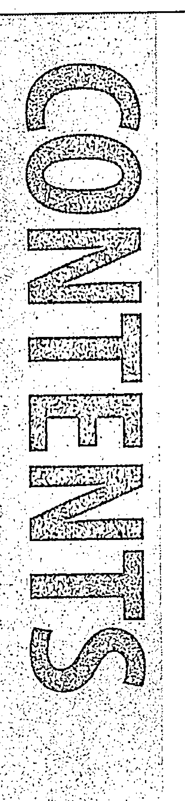

- 等系列玫瑰图表巧制作 .................................................................................. 262
- 用好复选框 Excel条件求和更简单 ..................................................................... 264
- 智能设计 事半功倍做PPT .................................................................................... 266
- 即指即现 PPT巧做“悬停”交互 ......................................................................... 268
- 一个函数巧解合并单元格数据查找 ..................................................................... 269
- 轻型办公 绿色处理文档 ........................................................................................ 270
- Word表格中序号那点事儿 .................................................................................. 271
- 合并列中值相同但数量不同的单元格 ................................................................. 272
- 幻灯片中窗口弹出还能这样实现 ......................................................................... 273
- PPT单图排版有妙招 ............................................................................................. 274
- 神奇高效的Word F8功能键 .................................................................................. 276
- 随我个性 自定义Word 2019界面 ....................................................................... 277
- 掌握WPS 2019的PDF组件 ................................................................................. 278
- 邮件合并 Word秒做个人信息调查表 ................................................................. 280
- Excel玩跨界 Word数据采集录入更容易 ............................................................ 282
- 形象生动 在Excel中打造完成率水位图 .............................................................. 284
- PPT图形更立体 数据关系更直接 ........................................................................ 286
- 实现复杂表格的行列转换 ..................................................................................... 288
- 为Word功能指定快捷键 ...................................................................................... 289
- PPT演示文稿格式大变身 ..................................................................................... 290
- 不走寻常路 在Excel中制作另类瀑布图 ............................................................... 292
- 漂亮又清晰的Word流程图怎么做 ....................................................................... 294

## 移动新天地

- 不怕费眼 微信文章如何语音朗读 ...................................................................... 296
- 要方便还是要隐私 了解Android的权限管理 ..................................................... 298
- 无线投屏 用电脑控制Android手机 .................................................................... 300
- 四种方法 快速备份手机中的APK安装文件 ....................................................... 302
- 电脑控制手机 无线投屏又有新选择 ................................................................... 304
- 详解Adb的用法 将不听话的APP关进“小黑屋” ................................................. 306
- 自动跳过APP的启屏广告 ..................................................................................... 309

## 傻博士

- 傻博士 ................................................................................................................... 310

### CFan为你选

- 设计本的较量 华硕灵耀X2 Duo 对 机械革命Umi Air .......................................... 340
- 骁龙865旗舰之争 小米10 对 iQOO 3 .................................................................. 342
- 来自2020款的魅力 联想小新Air 14 对 华为MateBook 14 ................................... 344
- 游戏手机的较量 黑鲨3 对 红魔5G ....................................................................... 346
- 超便携高分屏的诱惑 联想小新Pro 13 对 宏碁新蜂鸟超能版 .............................. 348
- 超值旗舰之争 真我X50 Pro 5G 对 Redmi K30 Pro .............................................. 350
- 轻薄和性能兼顾 机械师创物者L 对 联想小新15 2020 ........................................ 352
- 中端5G新秀 荣耀30S 对 vivo S6 .......................................................................... 354
- 锐龙酷睿之争 华硕天选 对 机械革命Z3 Air ........................................................ 356
- 影像与性能的较量 荣耀30 Pro 对 OPPO Ace2 ..................................................... 358
- 同室操戈 拯救者R7000 对 拯救者Y7000 ............................................................. 360
- 看准能力选搭档 显卡与电竞显示器 ..................................................................... 362
- 聚焦性能之外 还有谁在影响5G手机的体验 .......................................................... 366# 由内而外都进化
### 把脉5G智能手机的未来趋势

策划|《电脑爱好者》编辑部

虽然备受关注的MWC 2020因疫情取消，但这并没有延误各大厂商在2月底“秀肌肉”的节奏，很多值得关注的新产品、新技术、新功能纷纷亮相。本期特别话题，就让我们网罗一下可能影响5G智能手机在未来一个时期发展走势的存在，看看未来的移动设备将如何实现由内而外的进化。

#### 制程下一站
##### 5nm EUV工艺

我们都知道，对半导体芯片而言，它选用的制程工艺越先进，往往意味着可以解锁更高主频、发热量更低、功耗更低、不易降频、运行更强更稳定（图1）。因此，每一次制程工艺的迭代更新，都将提前引爆下个时间周期的芯片战争。

##### 6nm蓄势待发

如今7nm工艺已经趋于成熟，接下来即将与我们见面的，就是对现有7nm EUV的小幅优化版——6nm EUV。目前，三星位于韩国华城的V1工厂已开始批量生产基于EUV（极紫外）光刻工艺的6nm芯片，而台积电的6nm EUV则更进一步，已经获得了来自紫光展锐的订单，并用于制造“虎贲T7520”移动平台。据悉，台积电的6nm EUV工艺较之7nm工艺（第一代DUV），晶体管密度提升18%，功耗降低了8%（图2），设计与7nm兼容，便于升级迁移，降低成本。

##### 6nm EUV带来更高的密度和更低的功耗

相较于7nm工艺，6nm EUV工艺使得晶体管密度提升18%，功耗降低8%。

##### 持续扩大5G调制解调器及射频系统（5G Modem-RF）的领导力

| 第一代 骁龙X50 | 第二代 骁龙X55 | 第三代 骁龙X60 |
| --- | --- | --- |
| 6GHz以下及毫米波 | 6GHz以下及毫米波<br>全球多SIM卡 | 6GHz以下、毫米波和毫米波-6GHz以下混合 |
| NSA | NSA和SA | Qualcomm® Smart Transmit |
| TDD、FDD | TDD和FDD | Qualcomm® Signal Boost |
| Qualcomm® 5G PowerSave | Qualcomm 5G PowerSave | 全球多SIM卡 |
| Qualcomm® Smart Transmit | Qualcomm Smart Transmit | Qualcomm®动态频谱共享 |
| Qualcomm® Signal Boost | Qualcomm Signal Boost | 集成2G到5G多模 |
| 10纳米制程工艺 | DSS动态频谱共享 | 5纳米制程工艺 |
| 集成2G到5G多模 | 5G/4G载波聚合 | Voice-over-NR |
|  | 7纳米制程工艺 | Qualcomm 5G PowerSave |
|  |  | 第三代毫米波天线模组(QTM535) |

首批5G终端 第二批终端 继续提升性能标杆

##### 5nm一级准备

如果你觉得6nm EUV属于“数字游戏”，那就不妨关注真正意义上的下一代工艺——5nm EUV（未来一个时期的新工艺都将采用极紫外光刻工艺，所以下文简称5nm）。据悉，台积电在今年上半年就已实现了第一代5nm工艺（N5）的量产，下半年的产能更是可以提高到每月7万~8万片晶圆，并斩获了来自苹果（A14）、华为（麒麟1020）和AMD（Zen 4）的大量订单。在性能指标方面，台积电5nm EUV相较于7nm（第一代DUV）能提供1.8倍的逻辑密度，速度增快15%，或者功耗降低30%。2021年，台积电还会带来第二代5nm（N5P），后者在前者的基础上继续性能提升7%、功耗降低15%。在10nm、7nm和7nm EUV等关键制程工艺的节点上，台积电始终领先三星一步。为了在5nm EUV这个关键节点上找回面子，三星找来高通站台，后者的第三代5G调制解调器（基带）——骁龙X60就将采用三星5nm工艺制造（图3），在声势上不再落后于人。但是，还有消息称高通下一代旗舰移动平台骁龙875依旧会交由台积电代工（意味着X60仍是外挂方案），而骁龙X60的量产时间也是2021年初。因此，在2020年中，台积电依然是唯一能够量产5nm工艺的晶圆代工厂，未来也许还能从三星手中抢走部分骁龙X60的代工订单。

总之，2020年是7nm工艺全面普及的年份，它能赋予中低端SoC更好的性能和更低的功耗，显著提升智能手机的续航能力。而2020年下半年，我们将迎来第一批武装5nm EUV工艺的旗舰级SoC，苹果A14受制于iOS封闭的生态环境我们暂且不去管它，当麒麟1020集最新制程工艺和ARM最新CPU/GPU架构于一身时（图4），其性能也有望实现对Android领域现有最强音骁龙865的反超，并让更多的用户可以抢先品尝到最新工艺对实际体验的增益表现。

> 小提示

很多朋友都想了解中芯国际的半导体技术处于哪个阶段，现有资料显示2020年中芯国际将逐步量产14nm和12nm，Q4季度还会小规模生产7nm。有关虎贲T7520移动平台和骁龙X60基带芯片的特色，本期特别话题会在后面的内容中加以详解，感兴趣的朋友请耐心往下看。

##### 5G SoC添新丁
##### 虎贲T7520有多强

在4G时代，紫光展锐只能提供入门级的SoC，所以鲜有玩家关注。2月底，紫光展锐正式发布了旗下首款5G SoC——虎贲T7520，终于与高通、三星、华为（海思）和联发科一道站在了同一条5G跑道上（图5）。那么，和我们熟悉的其他5G SoC相比，虎贲T7520到底处在一个什么水平上？

###### 领先的制程工艺

作为后来者，我们肯定不能指望虎贲T7520一上来就能跟骁龙865、麒麟990、Exyno 990和天玑1000这种定位顶级的前辈比拼，它的实际定位属于中端偏主流，也就是和骁龙765、Exyno 980、天玑800等5G SoC掰一掰手腕的存在。

和上述竞品相比，虎贲T7520最大的优势就是首发台积电最新的6nm+EUV。因此，哪怕虎贲T7520不是最强，但肯定是已知最省电的5G SoC。根据官方的资料显示，在同样搭配4500mAh电池的情况下，虎贲T7520平台听音乐可续航长达180小时，看电影也能坚持32小时，远远领先竞争对手（图6）。

###### 稍显落后的架构

虽然工艺最先进，但虎贲T7520的架构就稍显落伍了（表1）。它的CPU架构选用了ARM在2018年主推的Cortex-A76，由4颗Cortex-A76+4颗Cortex-A55构成，但主频未公布（图7）。这颗SoC集成了拥有4个计算核心的Mali-G57MP4 GPU，这是ARM在2019年10月底最新发布的IP，它虽然隶属于Mali-G5系，但却采用了和最新Mali-G77相同的微架构，相较上一代G52，G57有着1.3倍的性能，能效提升30%，性能密度提升30%，机器学习提升60%。

我们熟悉的麒麟810就集成了6个计算核心的Mali-G52MP6，其性能比同期的骁龙730G和联发科Helio G90T都要强。考虑到在Mali-G57架构层面的升级，在搭配4个核心的情况下其性能应该不逊于6个核心的Mali-G52MP6。

基于已知的参数推测，虎贲T7520的整体性能应该介于天玑800（5G SoC）和麒麟810（4G SoC）之间，它的CPU架构与这两个SoC相同，性能强弱全看主频。虎贲T7520的GPU架构落后于天玑800集成的Mali-G77MP4，但略优于麒麟810集成的Mali-G52MP6，胜负同样看紫光展锐赋予它的GPU主频了。

###### 全场景覆盖增强的基带

虎贲T7520采用了和麒麟990 5G一样的SoC单芯片设计，在一颗芯片内整合了包括CPU、GPU、ISP、NPU和基带等单元。它整合了号称“全球首款全场景覆盖增强5G基带”，支持5G NR TDD+FDD载波聚合，以及上下行解耦技术，可提升超过100%的覆盖范围（图8）。

还是那句话，在国内运营商纷纷采取5G限速的策略下（最高1Gbps），5G SoC基带性能再强也发挥不出来。但是，虎贲T7520得益于低功耗设计架构、基于AI的智能调节技术，再加上SoC多模融合和6nm EUV工艺，在5G数据场景和待机状态下的耗电量无疑会更低一些。

###### 主流的多媒体性能

虎贲T7520将金融级iSE安全单元整合在SoC内部，具备源于底层的安全属性。与此同时，紫光展锐还大幅强化了虎贲T7520的多媒体性能。首先，这颗SoC内集成了独立的NPU单元，支持业界主流ML训练框架，算子库丰富，完整支持Android NN，用户能够体验更加多样化的移动端AI应用。

其次，虎贲T7520支持120Hz刷新率的屏幕，拥有全通路全格式HDR标准渲染能力，多屏显示最高支持4K HDR 10+。同时，该SoC还搭载了第六代影像引擎Vivimagic 6.0、第二代4K HDR技术，具备专用AI加速处理器、全新升级的四核ISP架构，支持1亿像素超高分辨率、多摄像头处理能力，可捕捉4K@60FPS、720P@480FPS，再结合安奇逻辑（ACUTElogic）领先的影像技术，可为拍照和摄像提供出类拔萃的效果（图9）。

换句话说，搭载虎贲T7520的手机，可以用上刷新率更高、分辨率更高的屏幕，搭配1亿像素的摄像头矩阵，在影音拍照方面不留遗憾。

###### 虎贲T7520值得期待吗

从各项指标来看，虎贲T7520是一款很有竞争力的移动平台，它的综合指标领先包括麒麟810、Helio G90和骁龙730G在内的一众4G SoC前辈，在5G SoC领域也能和天玑800打擂。可惜，这颗SoC暂时还处于“PPT阶段”(未量产)，而且在手机圈中没有足够多的重量级朋友也是玩不转的。即使虎贲T7520足够优秀，没有知名品牌的爆品支持，很难提升紫光展锐的品牌影响力。

Exyno和麒麟有三星和华为/荣耀自家品牌手机“兜底”，而且这两个品牌在全球手机的销量也极为可观。高通则是八面玲珑，绝大多数手机品牌都是它的客户和拥趸。联发科也是SoC领域的资深玩家，在中低端市场的声望极高，近期也正在试图以天玑撬开中高端市场的大门。

相对而言，紫光展锐的朋友着实不多，数来数去也仅有海信和TCL等少数终端厂商支持（图10）。根据紫光展锐官方消息称，2020年会有数十款搭载紫光芯片的手机面世，将新增中兴和小米生态链企业以及国外的部分手机品牌。

因此，虎贲T7520能否在5G SoC市场打出声望，全靠紫光展锐的公关能力，以及该芯片最终的采购价格了。要知道，随着高通新一代骁龙6系的问世，5G SoC的成本将被进一步拉低，如果紫光展锐在此之前还不能打开市场，将要面对的就是一众5nm 5G新旗舰和竞争力更强的第三代中低端5G SoC的前后夹击了。

#### 下一代基带 骁龙X60哪变了

在调制解调器领域，高通旗下的骁龙基带一直都属于“标杆”性的存在。那么，作为高通将在2021年主打的新一代旗舰级5G基带，以骁龙X60为代表的新品将会带来怎样的变化呢？

##### 更豪华的套装

面对来自华为巴龙基带的强力挑战，高通非常需要通过一款产品来巩固自己行业第一的地位，骁龙X60就是为此而生。为了提升胜率，高通还为骁龙X60准备了QTM535毫米波天线模组以及ultraSAW射频滤波器，以豪华的“套装”形式迎接未来的挑战（图11）。

### 特别话题

本刊曾在2020年第2期《极致网速全靠它 浅析毫米波频段对5G的影响》一文中介绍过毫米波技术，它能在室内或体育馆等封闭和人流超密集的场所提供媲美光纤的带宽传输潜力。但是，智能手机要想支持毫米波，需要对天线模组进行大刀阔斧的改动，难度巨大。为此，高通针对毫米波推出了专用的QTM系列天线模组，而与骁龙X60搭档的，则是第三代毫米波模组“QTM535”（图12），它支持24GHz、26GHz、28GHz、39GHz等全球毫米波频段，以及毫米波-6GHz以下聚合，在提供更强性能的同时大幅降低了手机端的天线设计难度。

##### Qualcomm® QTM535 毫米波天线模组

##### Qualcomm ultraSAW 薄膜式射频滤波器技术

- 以低成本实现高性能
- 出色的发射、接收和交叉隔离能力
- 高频率选择性
- 品质因数高达5000
- 超低插入损耗
- 出色的温度稳定性——维持在个位数的ppm开尔文范围内的极低温度漂移

我们都知道，RF射频滤波器的作用是提升终端射频性能，保证信号的强度和稳定。与骁龙X60搭档的ultraSAW射频滤波器可以将插入损耗提升整整1分贝(dB)，并且在2.7GHz以下频段范围内，提供比竞品晶体声波(BAW)滤波器更高的性能，并以更低的成本实现更高能效的射频路径（图13）。

当然，骁龙X60“套装”并非强制组合，OEM厂商可以根据产品定位和成本加以取舍。比如，如果未来1年~2年内国内运营商依旧没能开展毫米波频段的部署（图14），此时为国行版手机新品搭配QTM535就有浪费之嫌了。

#### 最广泛的兼容性

目前全球有超过115个国家和地区的340多家运营商在投资5G，虽然5G还处于发展的早期，但全球就已经有超过10000个频段组合，未来还会面临6GHz以下FDD、6GHz以下载波聚合、毫米波、6GHz以下毫米波聚合、SA模式、NSA模式的各种混搭，不同的频谱组合和不同的频段类型，5G部署的复杂程度可谓前所未有（图15）。骁龙X60套装的最大优势，就是能够支持所有已知的主要频段、部署模式、频段的组合，能够有效地提升5G网络的容量，扩大覆盖范围。它还支持Voice over NR，可通过5G新空口提供高质量的语音服务，为语音服务从NSA非独立组网向SA独立组网模式演进做好准备。换句话说，未来的手机只要搭载了骁龙X60基带，走在全球任何有5G信号覆盖的国家和地区，都能享受当地最优的5G信号和网速。

##### 网络制式

- SIM 1 (主卡)
- 5G (NR TDD): n77/n78/n79/n40/n41 (SA 仅支持 n78/n79/n41)
- 5G (NR FDD): n1/n3/n5/n7/n28A
- 4G+ (TD-LTE): B38C/B39C/B40C/B41C/B40D/B41D/B3A+B41A/B8A+B41A/B39A+B41A/B39A+B41C/B39C+B41A
- 4G+ (FDD-LTE): B1C/B2C/B3C/B7C/B1A+B3A/B1A+B5A/B1A+B8A/B3A+B5A/B3A+B8A/B1A+B3A+B5A/B1A+B3A+B8A/B1A+B3C/B3C+B8A
- 4G (TD-LTE): B34/B38/B39/B40/B41 (160M)/B42
- 4G (FDD-LTE): B1/B2/B3/B4/B5/B7/B8/B12/B13/B17/B18/B19/B20/B25/B26/B28/B29/B32/B66
- 3G (WCDMA): B1/B2/B4/B5/B6/B8/B19
- 3G (TD-SCDMA): 1900 (f)/2000 (a) MHz
- 3G (CDMA2000): BCO (800MHz)
- 2G (GSM): 850/900/1800/1900MHz
- 2G (CDMA): BCO (800MHz)

### 小提示

在发布骁龙X60的同时，高通还公布了在“骁龙笔记本”领域的最新进展，目前全球已经有17个移动运营商支持搭载高通骁龙8cx平台的5G PC。同时，高通还展示了支持5G网络的XR（扩展现实）头显，未来还会向合作的OEM厂商提供骁龙XR 2平台的VR/AR参考设计。考虑到这些产品相对小众，本文就不再赘述了。

> 5G手机所支持的频段数量将决定它能否被冠以全球通或全网通的称号

#### 原地踏步的性能

很多消费者都喜欢用理论速度指标论英雄。很遗憾，骁龙X60在搭配毫米波天线模组时的最高下行和上行传输速率依旧是7.5Gbps和3Gbps，与骁龙865搭配的骁龙X55基带相同（表2）。那么，我们如何看待骁龙X60原地踏步的性能？

Qualcomm Snapdragon X60 5G modem-RF system

#### 骁龙X60将5G网络性能提升至全新水平

首先我们需要确定一点，在全球各地运营商5G套餐的限速策略下（国内最高1Gbps），7.5Gbps的下行速率和3Gbps的上行速率，在很长一段时间内都不会是瓶颈，单纯地提高理论速率并无助于实际体验。骁龙X60的最大优势，是基于最新5nm工艺打造而带来的更小尺寸封装的芯片面积，可以进一步降低对手机PCB主板的空间占用，而且还同时具备更小的功耗和发热，对续航时间有着明显的增益效果。除了前文提到的最广泛的兼容性以外，骁龙X60还支持各种频段和频段组合下的载波聚合（图16），可充分利用频谱资源，重新规划LTE频谱，从而提升网络容量、峰值速率。比如它在5G TDD-TDD 6GHz以下频段载波聚合，就能比骁龙X55 5G SA峰值速率翻倍，哪怕未来的新品因成本的顾虑而没有搭配额外的QTM535毫米波天线模组，骁龙X60依旧可以获得超越天玑1000的Sub-6频段的网络性能。

##### 表2: 骁龙X60与现有旗舰级5G基带性能对比

| 参数对比 | 麒麟990 5G | Exynos 990 | 天玑1000 | 骁龙865 | 骁龙875 |
|----------|------------|------------|----------|---------|---------|
| 5G基带   | 集成 巴龙5000 | 外挂 Exynos 5123 | 集成 Helio M70 | 外挂 骁龙X55 | 外挂 骁龙X60 |
| 5G频段   | Sub-6      | Sub-6 毫米波 | Sub-6    | Sub-6 毫米波 | Sub-6 毫米波 |
| 载波聚合 | 不支持     | 有限支持   | 有限支持 | 有限支持 | 几乎全部支持 |
| 最高下行 | 2.3Gbps    | 7.35Gbps   | 4.7Gbps  | 7.5Gbps | 7.5Gbps |
| 最高上行 | 1.2Gbps    | 未公布     | 2.5Gbps  | 3.0Gbps | 3.0Gbps |

*备注：Exyno 980在4G-5G双连接峰值上行/下行速率分别为3.55Gbps和1.38Gbps；天玑1000的最高上下行速率为4.7Gbps和2.5Gbps，暂时还查不到天玑1000L的详细性能参数*## 幕后英雄

#### 手机内部的其他变化

在2020年初密集亮相的新品和技术中，除了前文提及的新工艺、新SoC、新基带对性能有所增益外，智能手机内部还有无数单元得以升级。当一众新元器件被集成在一处时，换来的将是体验层面的全面革新。

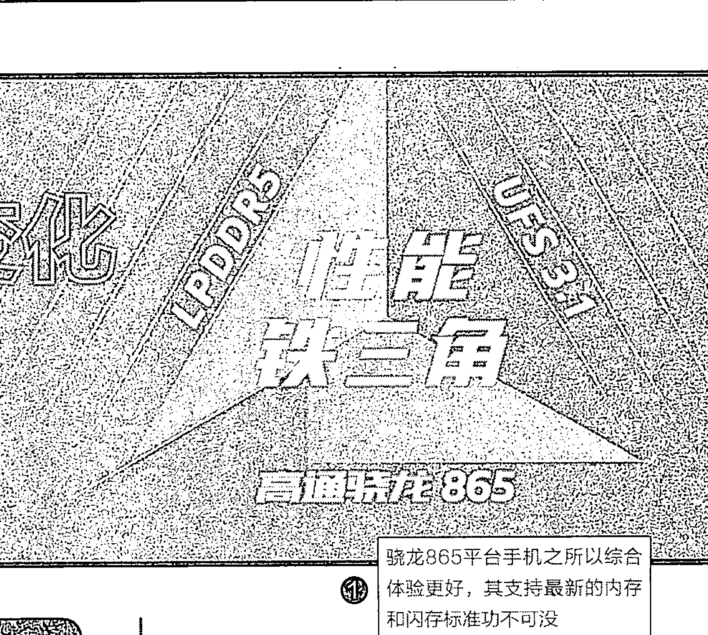

##### 更快的存储单元

智能手机日常操作的流畅度，除了受系统底层的优化影响以外，还取决于SoC的强弱以及存储单元的性能。其中，存储单元包括内存和闪存，2020年LPDDR5将成为旗舰级手机的标准装备，而它与UFS3.1闪存的组合则堪称“梦幻装备”（图1）。有关这两个存储单元的特色，感兴趣的朋友请参考本刊2020年第6期《旗舰的怒吼 浅析高通骁龙865移动平台》这篇文章。

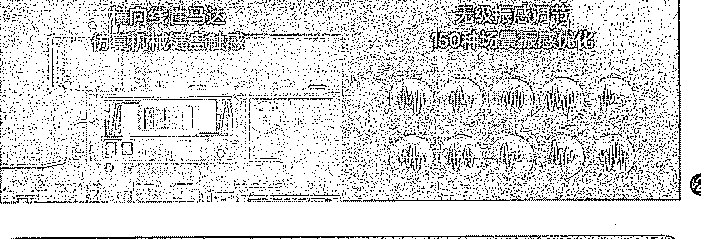

##### 更真实的振动体验

细心的朋友不难发现，2020年初发布的多款旗舰手机都在主打X轴（横向）线性马达，可以还原更为真实的振感（图2），未来更多的中高端新品都会将其纳入标配。如果你对这种马达的原理和发展史感兴趣，可以参考本期技术殿堂栏目的《嗡嗡嗡 对哒哒哒 浅析智能手机的马达设计》这篇文章。

##### 更环绕立体的声音

X轴线性马达在部分游戏中可以带来“4D振感”，但还有很多玩家更关心在不连接耳机时，单靠手机内的喇叭（扬声器）能否带来听声辨位的能力，以及音量和音质的实际表现。

如今，很多主流价位的手机都开始主打昔日只有高端机才会搭配的“超线性扬声器”。普通扬声器只有一组线圈用于驱动振膜，当振动幅度过大时，由于振膜受力不均衡就会产生额外的谐振，影响音量和音质。而超线性扬声器，则通过两个线圈共同驱动振膜来使振膜受力均衡，技术含量更高。扬声器单元通常位于手机底部的USB接口旁边，音量和音质与其尺寸成正比（图3）。

所谓的“听声辨位”，就是要求手机配有2个扬声器单元，一上一下构成3D环绕立体音场。早些年HTC One系列主打的“BoomSound”应该算是手机领域的音质最强，随后联想推出的乐檬X3也塞进了2颗硕大的扬声器单元。实际上，早期的智能手机，只要厂商不计成本，组成高品质的立体声效果毫无难度，因为它们都有着足够大的“额头”和“下巴”（图4）。

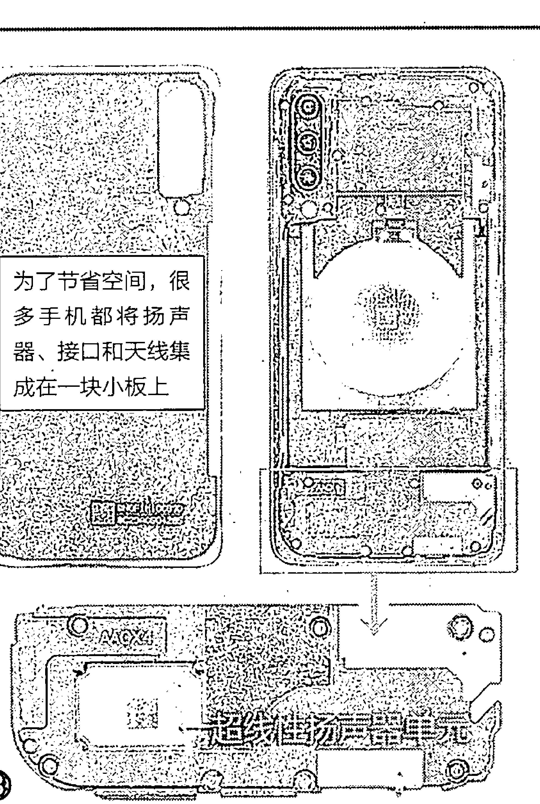

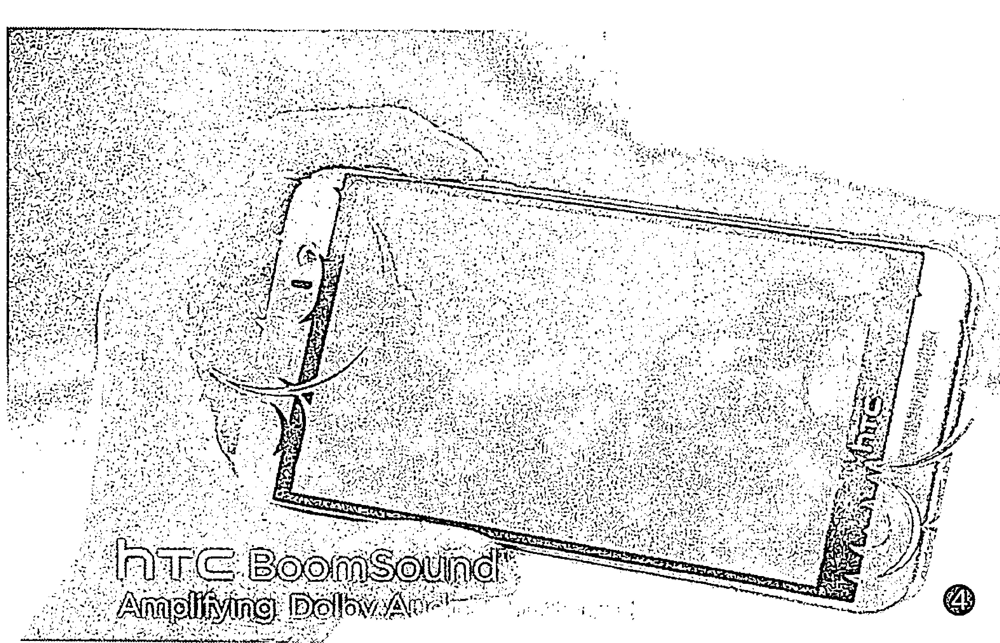

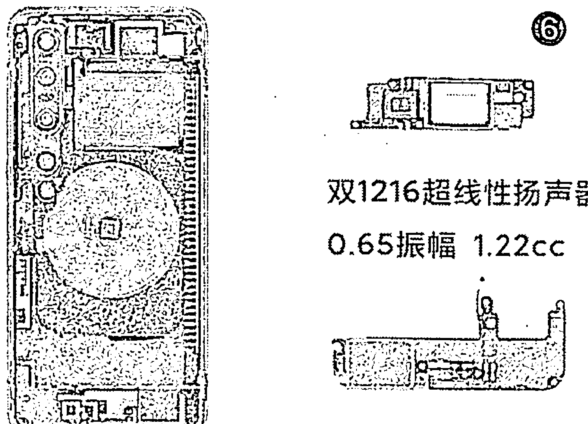

然而，随着智能手机进入了“全面屏”时代，寸土寸金的内部空间很难再同时容纳2颗大尺寸的扬声器。很多主打立体声的手机，其顶部位置的扬声器多是“迷你版”，声音也是借道听筒的开孔传出，音量和音质都要明显弱于底部的扬声器，虽然也能营造立体声场，但却谈不上完美（图5）。

##### 更合理的散热设计

在2019年第23期《热管的替代品 浅析VC均热板》一文中，我们曾介绍过智能手机散热模块的发展史，以及新兴VC均热板和传统热管的区别。那么，都是使用VC散热的手机，如何分出高下？采用传统热管的手机，还有没有进一步优化的空间？

这两个问题可以从小米10和黑鲨3系列手机身上找到答案。小米10系列在石墨烯+石墨+导热凝胶+铜箔的基础上，通过嵌入超过3000平方毫米超大面积的VC实现了散热性能的提升（图7），无形中还掀起了手机间比拼内置VC均热板表面积大小的战役。而黑鲨3系列则更为取巧，它将窄条型电路板放在了两块分离式电池中间，上下分别覆盖100mm长度的热管，呈“三明治”造型，将电路板和液冷单元融为一体，再辅以正反两面的大面积石墨（图8）。这种架构、器件布局以及三维立体的液冷散热系统，不仅可以降低芯片发热量，在双手横向握持手机时，手握区的温度较传统主板布局的手机显著降低（图9）。

那么，如何才能提升手机的外放音量和音质？三星Galaxy S20系列喜欢使用AKG调音的双扬声器（硬件）和杜比全景声效（软件）结合，而小米10和黑鲨3 Pro则采用了另一种思路，那就是塞进2颗一模一样的扬声器，组成“对称式”的立体声场（图6），还为顶部扬声器单独留出了发声孔，实际听感更加震撼。有了这些新品带头，未来的高端手机无疑会更加注重双扬声器的搭配问题，让我们无需佩戴耳机，在游戏过程中也能听到来自身后敌人的脚步声，第一时间予以回击。

可见，手机的散热模块还大有潜力可挖，希望随后陆续发布的高端新秀能为我们带来更加叹为观止的设计。

##### 亿级传感器再升级

三星在去年发布了全球首款手机专用的1.08亿像素传感器——ISOCELL Bright HMX（已被用于小米CC9 Pro和小米10系列），它的传感器尺寸达到了1/1.33英寸，也是以Android/iOS为代表的智能手机历史上的最大值。ISOCELL Bright HMX的单位像素面积只有0.8μm，远远低于传感器领域主流的1.2μm~1.5μm的水准，这意味着它在暗光环境下的拍照表现会非常糟糕。

因此，三星为这颗传感器赋予了“Tetracell”技术（索尼系传感器对应Quad-Bayer），可以将4个相邻像素合并成一个等效于1.6μm的大像素，再结合智能WDR（宽动态范围）功能，后者在一次拍摄中可进行多次曝光，从而让亮区和暗区都呈现更出色的细节，最终让其获得了成为顶级传感器的底蕴。

Galaxy S20 Ultra的后置主摄同样高达1.08亿像素，而且还是三星最新推出的第二代传感器——ISOCELL Bright HM1（图10）。HM1的基本参数和HMX相同，但它却引入了新一代“Nonacell”像素合并技术，能够让相邻的9个0.8μm像素合成模拟2.4μm大像素（9合1），较之上代传感器主打的4合1像素合并技术，在暗光下成像质量更好（图11）。希望“Nonacell”技术可以早日被下放到新一代6400万或4800万像素传感器身上，进一步提升智能手机的夜拍表现。

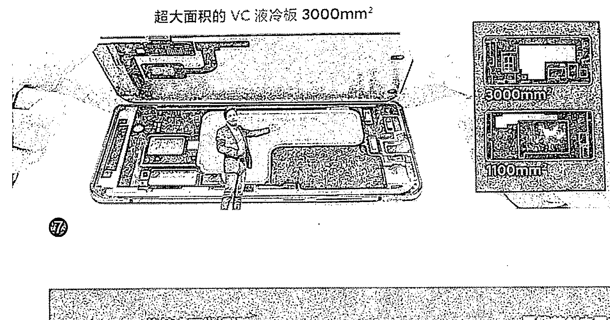

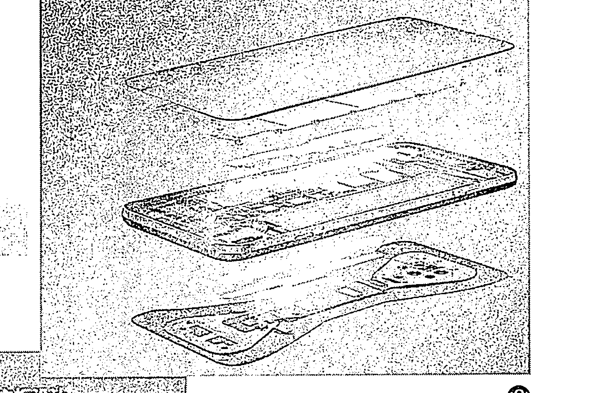

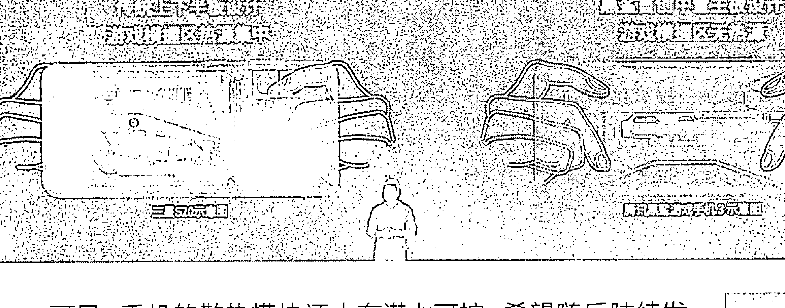

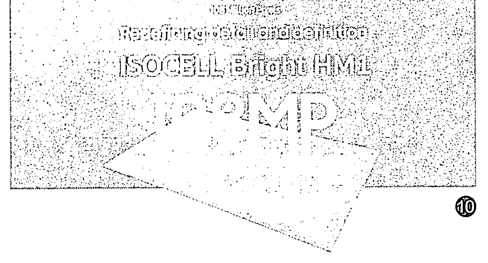

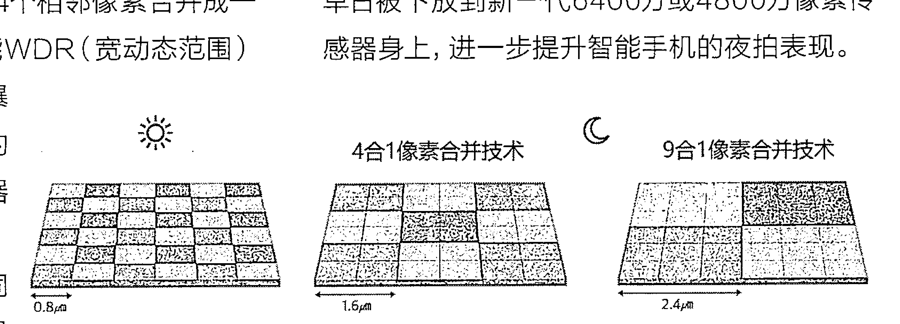

透过Galaxy S20系列的摄像头参数信息，我们还能发现一个有趣的现象（表1）。6400万像素传感器，在其他品牌旗下都是拿来作为“主摄”的首选。然而，S20和S20+却依旧使用1200万像素主摄，而6400万像素镜头却通过定焦的设计，通过裁切（数码变焦）方式成为了一颗支持“3X混合变焦”的长焦镜头。可见，传感器的像素值大小和成像质量并不成绝对的正比，我们依旧不能盲目追求更高像素的摄像头。

##### 表1: 三星Galaxy S20摄像头参数

| 手机型号 | S20 | S20+ | S20 Ultra |
| --- | --- | --- | --- |
| 前置镜头 | 1000万像素 | 1000万像素 | 4000万像素 |
| 后置主摄 | 1200万像素 OIS | 1200万像素 OIS | 1.08亿像素 OIS |
| 副摄1 | 6400万像素 长焦OIS | 6400万像素 长焦OIS | 4800万像素 潜望OIS |
| 副摄2 | 1200万像素 超广角 | 1200万像素 超广角 | 1200万像素 超广角 |
| 副摄3 | ---- | ToF | ToF |
| 混合光变 | 3X | 3X | 10X |
| 数码变焦 | 30X | 30X | 100X |

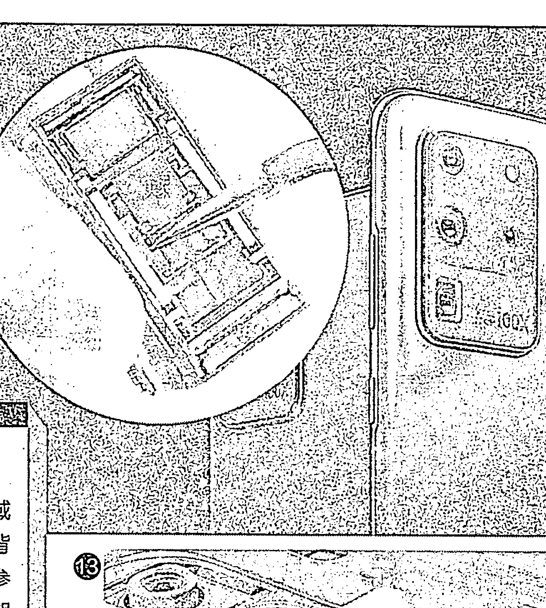

### 火速链接

如果你对手机领域长焦镜头的发展和背后技术感兴趣，请参考本刊2019年第7期《欲穷千里目:智能手机镜头的变焦史》特别话题栏目。

#### 照得更远拍得更稳

三星Galaxy S20 Ultra除了首发ISOCELL Bright HM1传感器，还带来了4800万像素潜望式长焦镜头（图12），类似的潜望式镜头结构还出现在华为P30 Pro、OPPO Reno十倍变焦版、Find X2 Pro和vivo X30 Pro等手机身上。由于S20 Ultra的主摄和长焦镜头像素更高，结合AI算法可以带来10X光学混合变焦以及100X数码变焦，也是目前为止拍得最远的Android手机（表2）。

继去年上市的X30 Pro之后，vivo也在2月底发布了新一代概念手机——vivo APEX 2020，在高端手机纷纷武装三摄和四摄矩阵之际，vivo APEX 2020的后置镜头却只有两颗。但是，数量少并不代表档次低，从技术层面来看，APEX 2020的两颗摄像头足以令竞品“羡慕嫉妒恨”。

vivo APEX 2020此次配备了一颗主摄和一颗潜望式长焦镜头。这款手机的长焦镜头虽然也是潜望式，但在底层结构方面却与X30 Pro、S20 Ultra、P30 Pro和Reno变焦版有着本质上的不同——这些“前辈”采用的潜望式镜头内部的多枚镜片都是固定无法移动的（图13），属于“定焦”镜头，焦距是多少就只能实现多少倍的光学变焦。不同固定倍数之间的变焦需要融合数码算法进行输出，在解析力和画质上存在一定的损失。

vivo APEX 2020的潜望式镜头内采用了特殊的“四群组镜片组合”结构，其中两群组镜片固定，两群组镜片可移动，随着我们的手指在相机APP中放大和缩小取景框，可移动的镜片群组将进行相应的位移（图14），从而在5X~7.5X的范围里进行连续的光学变焦。类似的“潜望连续光学变焦镜头”我们曾在华硕ZenFone Zoom（2015年上市）身上看见过，但ZenFone Zoom只有这么一颗镜头，可以在1X~3X之间进行连续光学变焦，而vivo APEX 2020在1X~5X之间的变焦都是由主摄负责，它的“潜望连续光学变焦镜头”只承担5X~7.5X的高倍率连续光学变焦操作，结合领先的多帧算法，让这款手机可以拍摄更远和更清晰的照片。

##### 表2: 热门手机的潜望式摄像头参数对比

| 手机型号 | 华为P30 Pro | OPPO Reno变焦版 | vivo X30 Pro | Galaxy S20 Ultra | vivo APEX 2020 | OPPO Find X2 Pro |
| --- | --- | --- | --- | --- | --- | --- |
| 像素值 | 800万像素 | 1300万像素 | 1300万像素 | 4800万像素 | 不明 | 1300万像素 |
| 光圈大小 | F3.4 | F3.0 | F3.0 | F3.5 | 不明 | F3.0 |
| 等效焦距 | 125mm | 160mm | 135mm | 102mm | 不明 | 170mm |
| OIS防抖 | 支持 | 支持 | 支持 | 支持 | 支持 | 支持 |
| 等效光学变焦 | 5X | 5X | 5X | 4X | 5X~7.5X | 5X |
| 最大变焦 | 50X | 60X | 60X | 100X | 不明 | 60X |

### 特别话题

> **小提示**
>
> 目前手机电池系统主要包括串充串放（充电快，耗损大）、并充并放（充电慢，续航长久）和串充并放，如果你对相关的技术感兴趣，请关注《电脑爱好者》的后续报道。

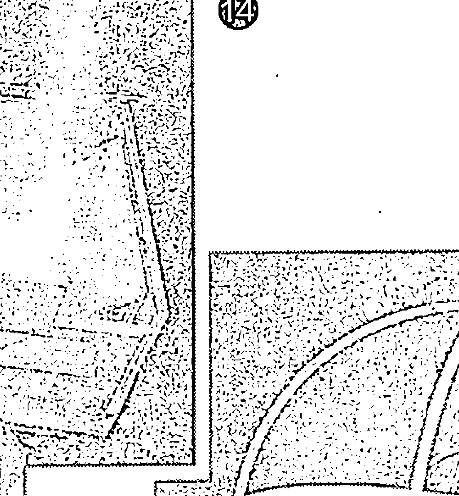

vivo APEX 2020的另一颗镜头虽然只有4800万像素，但却号称“超稳微云台主摄”，它内置机械防抖元件，能够实现前后倾斜和左右倾斜，防抖角度相比常见的OIS光学防抖大幅提升了200%（图15），画面完整性也得到了更大程度的保留。换句话说，拿着vivo APEX 2020录制视频，就好像将手机架在了云台之上，可以秒杀任何现有的EIS+OIS双视频防抖方案。

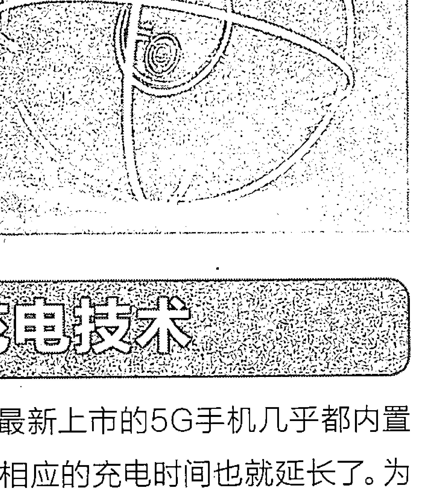

可以预见，照得更远、拍得更稳就是未来智能手机的发展方向，三星Galaxy S20 Ultra和vivo APEX 2020已经抢先一步，下一个可以达成这些目标的产品会是谁呢？

#### 更高功率的充电技术

为了迎合5G手机时代的高能耗特性，最新上市的5G手机几乎都内置4000mAh起步的电池。然而，电池变大了，相应的充电时间也就延长了。为了解决充电耗时的问题，提升充电功率，支持亮屏快充就成为了当务之急。

虽然2019年就出现了超100W的（有线）快充技术，但它们暂时还停留在实验室阶段，距离安全的商业化量产还有一段时间。令人欣慰的是，60W级别的快充技术，即将在手机领域逐渐普及开来。首先是有线快充，继OPPO Reno Ace首发65W超级闪充后，黑鲨3也将充电功率提升到了65W，而且它还采用了独特的串充并放双电池系统（图16），充电速度更快，续航也等效增加了300mAh。近期发布的新款手机和有线快充功率分别为Galaxy S20 Ultra（45W）、小米10 Pro（50W）、realme真我X50 Pro 5G（65W）、iQOO 3（55W）、OPPO Find X2 Pro（65W）。

在无线充电方面，以小米10 Pro为代表的旗舰手机最高支持30W功率，充电速率已经超越了不少有线快充技术。然而，这还不是无线充电的极致，作为概念机的vivo APEX 2020就采用了挑战行业天花板的无线充电解决方案——无线超快闪充功率高达60W，兼顾电池容量、充电温升与兼容性，只需20分钟即可充满2000mAh。它向行业表明无线充电也可以做到有线充电的效率和安全，有助于手机充电从有线向无线的全面过渡（图17）。

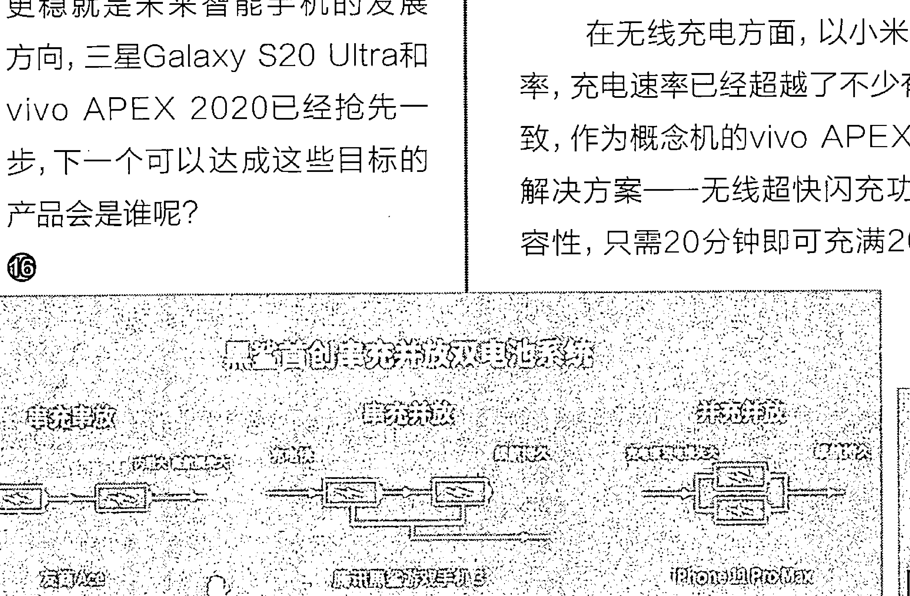

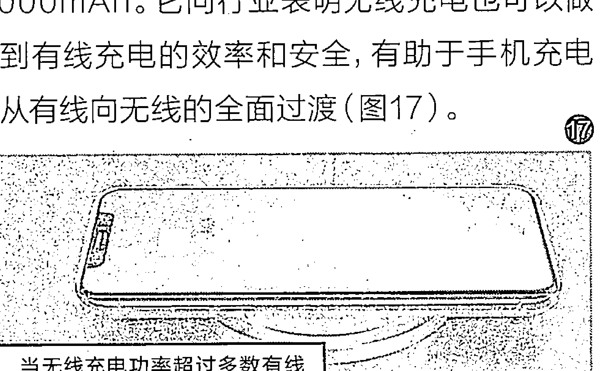

#### 外在的诱惑

#### 全看屏幕的变化

看完了智能手机的内在更新之后，我们再将目光投向它们外在的变化上。作为新品，它们能否在第一时间打动你，靠的就是颜值是否更高，以及呈现在眼前的“视界”是否精彩。限于版面，本章节我们就不展开讨论了，如果你对其中某项技术感兴趣，敬请关注《电脑爱好者》的后续报道。

##### 从90° 到120° 的屏幕


本刊曾在2019年第18期《手机进入3.5D时代 浅析全新的瀑布屏设计》一文中回顾过手机屏幕的发展史，以华为Mate 30 Pro和vivo NEX 3为代表的手机屏幕两侧玻璃的弯曲度达到了接近90°，就好像飞流直下的瀑布水帘，手机屏幕达到了类似卷轴的显示效果（图1），“瀑布屏”也就因此得名。那么，瀑布屏的下一站在哪里？


前文介绍过的vivo APEX 2020不仅拥有潜望连续光学变焦镜头、云台镜头和超快无线闪充，它还主打全新整机无开孔的“120° 全视一体屏”设计（图2）：将一块6.45英寸的屏幕包裹于机身上，左右显示区域弯曲角度高达120°，完全消除了正面视角中的左右黑边和中框，带来无边视野冲击（图3）。同时，该产品还带来了屏下摄像头方案，彻底摆脱了前置摄像头、传感器等元件的束缚，屏占比由此就能做到更高。

##### 能弯曲的玻璃驾到

2月底三星和华为先后发布了新一代折叠屏手机，Galaxy Z Flip和Mate Xs除了拥有更强悍的硬件配置之外，它们还将屏幕盖板材料从PI薄膜换成了可以弯曲折叠的超薄玻璃，从而缓解了屏幕折痕问题并大幅提升了手感（图4）。

与小米MIX Alpha概念机的“环绕屏”设计相比，vivo APEX 2020那120° 全视一体屏的量产难度和成本无疑要更低一些，而它所呈现视界的震撼性和对屏占比的优化又在90° 瀑布屏之上。但它能否普及，还要看Android系统生态能否在解决侧屏区域容易误触问题之余，开发出杀手级的侧屏显示/操作功能，如果只是看着很爽将难成大器。

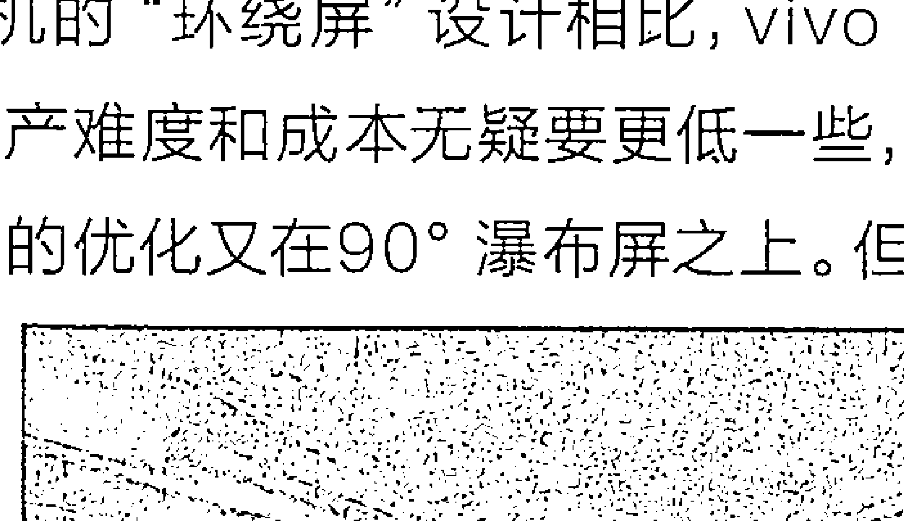

以三星Galaxy Z Flip为例，它采用的超薄玻璃来自韩国Dowoo Insys公司的加工技术，厚度不足100微米（0.1毫米），可折叠多达20万次而不会损坏，如果每天折叠100次，大约可以使用5年。目前正在研发100微米以下超薄玻璃的公司还包括美国康宁、日本AGC、日本NEG和德国Schott，康宁公司曾表示，“对于玻璃解决方案来说，想要缩小弯曲半径就必须尽量做薄，但同时又要追求防摔、防损伤能力的话，真的就是在挑战物理定律。”实际上，虽然折叠屏遇到可弯曲的超薄玻璃获得了“光滑、平整”的质感，但它们的耐用性依然不足。有外媒曾使用莫氏强度测试工具对Galaxy Z Flip的屏幕进行了测试，结果显示该产品的屏幕玻璃只能承受大约莫氏2级左右的刮擦，哪怕是指甲也可以留下痕迹，其实际表现与采用塑料膜的Galaxy Fold和Moto Razer上一代折叠屏手机类似。此外，Galaxy Z Flip屏幕中间依旧存在细微的折痕（图5），超薄玻璃只是减轻但并非消灭了这种惹人厌烦的痕迹。

总的来说，折叠屏手机的屏幕材料还在不断的优化之中，距离完美还有多步之遥。作为普通消费者，也许还是曲面屏更加成熟实在。

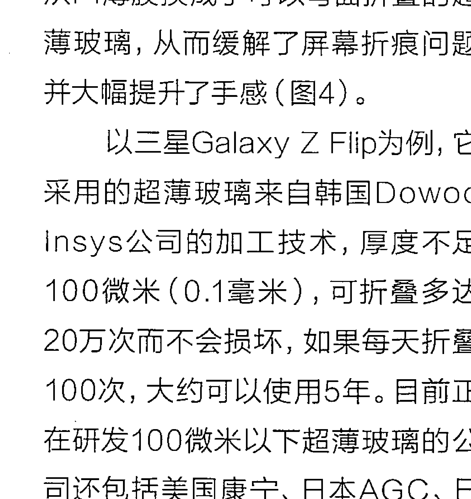

##### 新的屏幕材料和认证

在新款手机的宣传资料中，我们经常可以看到XX手机采用了E3材料OLED屏幕的消息（图6）。E3材料（此前还有E1、E2）的引入，可以大幅提升OLED屏幕的亮度，将典型亮度从400nits提升到500nits，强光下局部亮度甚至可以达到1200nits，同时还能全局减少40%的蓝光。同时，越来越多的新品还为屏幕申请了莱茵低蓝光认证以及HDR10+认证，前者结合E3材料更护眼，后者可以带来更高动态范围显示的视界。2020年的新品中，同时集这三个元素于一身的手机会越来越多，并逐渐成为标配。


##### MEMC运动补偿兴起

如今很多中高端手机都开始配备90Hz或更高刷新率的屏幕，结合更高的屏幕采样率，手机在操作时更为“跟手”，触摸灵敏、细腻流畅。然而，刷新率是越高越好吗？120Hz屏幕就一定比90Hz更流畅吗？
答案当然是否定的。高刷新率的屏幕，只有在支持超过60FPS显示的APP中才能体现出来，比如在微博、微信、头条和相册中快速滚动界面，你会明显地发现超过90Hz刷新率的屏幕显示更流畅和清晰。但是，现实中依旧有很多APP（主要是游戏和视频）用不上90Hz，或是跑不满120Hz，此时手机端可以通过额外的芯片获得MEMC运动补偿功能，将低帧率内容插帧到90FPS或120FPS，与高刷新率屏幕珠联璧合（图7）。目前一加和OPPO Find X2系列已发布了120Hz屏幕对应的MEMC技术，而黑鲨3系列手机则支持90Hz的MEMC，可将低帧率内容提升至最高90FPS~120FPS。
未来，高端智能手机光有90Hz、120Hz或144Hz的屏幕还不够，只有搭配同等级的MEMC运动补偿功能才能谈得上完美。

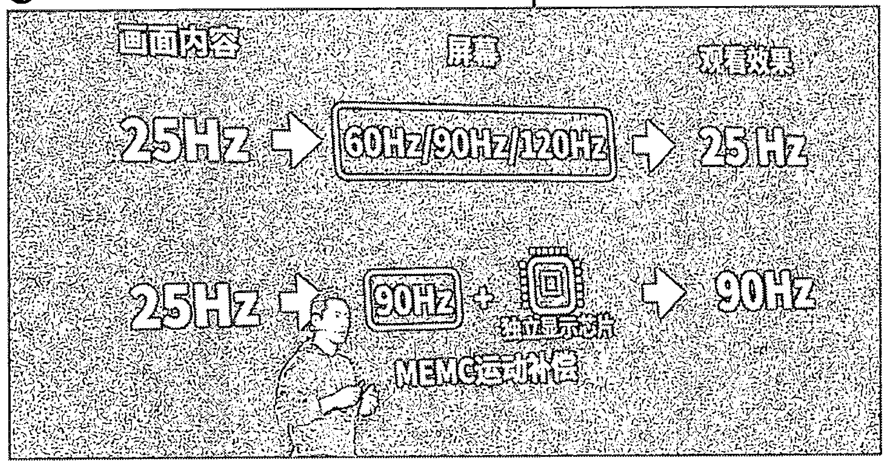

#### 网络应用新体验

##### 让距离不再是交流的阻碍

沟通无界限一类的说法，是互联网发展初期的典型口号，在高速网络，特别是高速移动互联等普及后，个人直播、在线监控、远程协助等新形态应用已经成了现在大家习以为常的新产业。而以视频聊天、会议为代表的“传统”远程交流，在能力上也有了完全不同的表现，超高清晰度影音的实现乃至VR技术的引进，让用户真正实现了无阻碍的全方位交流，让沟通无界限逐渐成为现实。

对大多数人来说，除了最方便的视频通话外，其他的远程交流方式对自己只是一种“传说”中的应用模式。大家可能会偶尔使用一下电话会议、远程协助等应用，但都是基于已构建好的系统，并不用了解相关的需求、构建模式、设置等。对于正急速转变的网络乃至生活、工作形态，其实这已经远远不够，不管是正在兴起的远程办公、网上授课，还是蓬勃发展、吸引着各种人才的直播，都需要大家对这些远程交流技术、设备有基本的了解和准备。

##### 网络准备 所谓的宽带有限制

既然是网络应用新体验，那么网络能力显然是一切的基础，在目前的主要网络服务模式下，也真的有一些需要注意的问题。其中最主要的就是带宽问题，也就是目前很多宽带采用的上下行不对称带宽问题。那么，要实现网络交流，我们需要多大的带宽呢？

其实对视频的观看一方，比如直播的观众、网络授课的学生、电话会议的列席者等，目前主流的全高清分辨率（1920×1080）视频只需要20Mbps的下行速率就已经足够。考虑到大家通常还有一些其他的网络任务要同时进行，那么30Mbps~50Mbps也就足够了，一般的入户宽带、路由器连接等都没问题，甚至目前主流的4G移动网络速度都可以达到要求。

需要注意的是，视频需要的带宽与其采用的压缩标准、压缩码率有关，这里的数据是基于目前网络摄像头主要采用的H.264压缩标准和常用码率，如果提高码率、使用HDR等方式提升画面效果，则带宽需求会有一定的增加。

对需要在视频会议上发言的用户、教授网课的教师、想试试直播的朋友们，上传网络速率才是更大的问题。因为20Mbps~30Mbps是很多宽带服务的默认上传速率(图1)，这只能勉强满足本地压缩后的全高清视频上传，一旦有些别的需求，比如网游直播中要给网游留下足够的数据上行带宽，就很有可能不够用了。

##### 宽带速率说明

公众宽带产品的接入速率均指下行速率。具体上下行速率如下表：

产品速率 | 下行速率 (bps) | 上行速率 (bps) | 接入方式
--- | --- | --- | ---
300M | 300M | 30M | FTTH
500M | 500M | 30M | FTTH
600M | 600M | 30M | FTTH

### 火速链接

关于网络服务和家庭网络的带宽问题，可以参考本刊2019年第19期《网络再整理 近期家用网络的优化》一文中的介绍。

目前这些用户有两种选择。第一是选择上传速率更高的网络服务，但有不少地方只有价格昂贵的商业网络服务或者“主播宽带”服务(图2)才能提供高速上传，除了有商业需求、可承受高价的SOHO用户之外，笔者不建议大家选用。

第二个选择要实际得多，那就是使用支持H.265等新压缩标准，可进行码率、分辨率调整的摄像头、视频采集和会议软件，如果实测发现视频确实卡顿，就可以使用新压缩标准、低码率来降低上传视频的大小。索性降低分辨率当然也能明显地提升流畅度，不过对观看体验的影响很大，比如游戏直播中可能就看不清一些细节了，因此笔者不建议使用高清(720P)以下的分辨率。

##### 摄像头和麦克风‘面对面’交流的基本需求

摄像头和麦克风对目前已经习惯了手机、平板电脑、笔记本电脑的用户来说完全不是问题，在一般的视频通话中使用它们自带的摄像头与麦克风就足够了。不过对使用台式机的用户，或者是对音视频的质量、采集能力有较高要求的用户，独立的摄像头和麦克风更加适用。

##### 摄像头

摄像头的需求主要有普通交流、直播和商用三种选择方向，其中普通交流适用720P摄像头，能保证半身近景比较清晰，较新的产品也有一定的夜景能力，能保证在房间内使用普通照明时也有很好的效果。目前此类产品的价格从数十元到一百多元不等，建议选购比较新的大厂型号。如罗技C270(图3)的RightLight功能特别适合室内、晚间使用，Fluid Crystal技术和More HD技术则能增加画面的色彩、清晰度。它还内置了带降噪功能的麦克风，坐在桌前聊天无需购买麦克风，此外其醒目的指示灯可以避免忘关摄像头的尴尬，可调式底座可以端坐在桌上也能夹在显示器上使用，非常方便。

另外如自带可伸缩支架和手动调焦功能的蓝色妖姬(BLOVELOVER)A1200(图4)、自带独立麦克风和补光灯的炫光M800(图5)等也都是很有特色的产品。

包括网课教师、视频会议用户最好选择广视角、高清清晰度(1080P)、聚焦准确的消费级摄像头，除了视频图像效果更好外，高分辨率和更大、更快的聚焦能力也便于展示白板、图片，或者用户的各种动作。这些产品的价格大都在300元以上，带有更专业的视频软件，支持更换背景等功能。例如目前很多直播用户会选用的C900系列摄像头，其中较新的C925e型号（图6）价格为600余元，可支持1080P@30FPS图像，追求高帧速的话还可选择720P@60FPS模式。它带有蔡司认证的大光圈镜头，视角达到78度，可快速对焦，对焦范围0.5米~5米；内置双降噪麦克风的拾音距离可达3米，安全镜头盖则可直接对镜头进行物理遮挡，进一步确保用户的隐私。使用这款摄像头时，用户可以在稍远的距离上使用较大的白板进行展示说明，需要展示运动状态、全身像来教授体育课、健身课、瑜伽课等也都没有问题，也很适合需要写板书的网课教师、远程技术交流等。

而同系列的另一个型号C922 Pro外形类似，但功能有一定的差别，更适合直播用户。其特色主要是支持抠除和替换背景，可以使用主播的个性背景，也可以将游戏主播的影像融入到直播的游戏画面中（图7）。这款产品还支持脚架，这其实也是一些网课、小型会议室用户可能需要的。

此外市场中还有一些功能、性能方面很有特色的产品，大家都可以根据自己的需要酌情选择。比如奥尼(aoni)C93（图8）支持10米拾音及115度大广角，就更适合运动范围很大的体育直播课的老师选用。

商用摄像头主要是用于小型会议室的产品，有些甚至有用于中型会议室的能力（大型会议室一般使用摄像机）。这类摄像头在基本功能方面应达到直播摄像头的水平，另外还应该有更强大的视频压缩能力、更高帧速的拍摄和传输能力。要特别注意的是，如果希望有突出发言人的效果，则必须选择具有变焦能力（能保证清晰度的数码变焦亦可）的摄像头，否则在转向会议室远端的发言人时就会变成全景拍摄了。

对价格比较敏感的用户来说，其实具有相应功能的摄像头价格与主播摄像头差别不大。例如800元左右就可以买到的奥尼C98（图9）拥有高达4K(3840×2160)@30FPS的拍摄能力、10米拾音距离,它支持5倍数码变焦,可手动调节,配合68°~100°视角实现全景、聚焦的不同拍摄效果。虽然它是使用数码变焦方式,即截取部分图像并放大的方式来“变焦”,但在高达4K分辨率的基础像素数量支持下,最大变焦(最小区域、最大放大倍率)的图像质量也完全可以接受。

如果更在乎性能和兼容性的话,罗技的专业会议摄像头虽然价格达到了数千元,但效果是物有所值的。例如CC2900EP可支持10倍光学变焦,还能使用遥控方式操控其平移、倾斜和变焦,使用更方便。这款摄像头还可以和罗技或兼容的会议系统、配件组合,扩展成为能力更强大的全套音视频远程会议系统(图10)。

需要注意的是,还有很多商用会议室在装修时就会安装网络会议系统,其中高端系统会自带摄像头。但随着摄像头、网络技术的提升,旧型号的性能可能会过时,同时也有很多网络会议系统仅支持音频会议,需要自行配置摄像头。对这些需求来说,市场中常见的USB接口摄像头不一定适用,在升级、增配时最好确认可用的数据、电源、固定接口。

##### 麦克风

麦克风的选择与摄像头的选择类似,一般的家庭用户或者主要是收看方的用户,比如上网课的学生、远程会议中的普通参会者等,使用摄像头自带的麦克风或者普通耳麦就可以应付,一般无需另外购买。

对于上网课的教师、远程会议的主讲人、主播等用户,效果较好的麦克风就很重要了。如果经常需要活动,比如要在旁边的白板上写写画画,或者要运动的体育教师,那么定向效果好的麦克风或者无线佩戴式麦克风更合适,这些产品的价格并不贵,一百多元就够用了。

比如漫步者IU1头戴式无线麦克风(图11),其接收端可选标准3.5mm或6.35mm接口,既能接入电脑,也能直接接入随身或固定扩音器,不仅可用于网课,也可用于大型课堂。

如果觉得头戴式麦克风不够稳重,功能也较少,那么也可选联想BM30手持式无线麦克风(图12),价格略贵一些,但功能更多样,可支持变音等效果,更自带喇叭,在线下可直接作为扩音器使用。

对远程会议主讲人来说，为语音优化而且外形比较稳重的麦克风显然适合，建议使用比较专业的桌面式麦克风，支架最好有一定的适应能力。一般百元级的产品就可以，例如FIFINE FM730（图13），它的外形简洁大气，两段式支架调节方便且不易变形，拾音器采用电容咪芯，人声效果出色，而底座上自带的开关和音量调节更是便于在会议中快速开关，比软件或遥控方式更方便。

主播用户则有两种选择，比较简单的语音需求，如游戏主播可选择与会议主持类似的产品。而喜欢唱歌的主播和需要较好配音效果的UP主则应该选择更好的产品，例如好牧人V8声卡套装（图14），它不仅采用了更适合唱歌、录音的麦克风设计，还提供了带有调音和趣味声效开关的外置声卡，可以大大提升主播和录音效果。此外它兼容电脑和手机，可满足不同使用习惯和传播方式的主播。

在购买麦克风时要特别注意接口（图15），需要与电脑连接的应选择3.5mm、USB等接口产品，而需要连接会议设备、外置声卡的，则要根据相应的接口选择。

##### 效果增强小配件

良好的网络、适合的摄像头与麦克风，当然还有联网设备如电脑或远程会议系统，就可以满足基本的远程交流需求。不过要增强使用效果，提升使用体验，还需要考虑一些其他的设备。

##### 支架

在摄像头与麦克风的选购中，都已经提到了支架，其中大部分产品自身并没有好用的支架，大家需要自行购买。其实除了专业支架外，很多时候我们可以使用一些廉价产品，例如比较简易的麦克风和手机直播支架（图16），甚至是手机用户使用的懒人支架，它们的价格通常仅有几十元到一百多元，但在长度、可调节范围等方面都不逊于专业支架。当然这些支架也有一些问题，比如设计的承重量不大，最好不要将笔记本电脑、较大的外置声卡等设备放在上面，而且因为其外形一般不够稳重，在网课、远程会议等场合最好不要让它们露出在对方的可视范围内。

### 特别话题

##### 灯光

在家庭中参与远程会议、直播或录制网课时，经常会出现光线不足的问题，因为一般家庭的窗口采光能力、灯光设置的强度都远不如办公室或课堂，因此需要对用户或环境补光才能获得较好的拍摄效果。目前比较专业的方案是使用环形补光灯，可以获得很好的脸部照明效果，有些还能调节不同的亮度甚至色温，不过它们的照明范围较小，而且价格较贵，需要专门的支架，因此更适合专业主播。其他用户则可以考虑将目前室内照明使用的荧光灯或节能灯更换为LED灯，亮度会有大幅提升，而且LED灯泡的形状更自由，只要在螺口灯头台灯、落地灯上安装平面型灯泡(图17)就能变身为很不错的大型补光灯，提供更大面积、亮度更平均的照明。

##### 音箱

在远程会议、直播网课，以及一些直播节目中，我们希望其他参与者的语音，如其他发言人的讲话、学生和观众们的提问等也能分享出来，此时就需要使用音箱。对个人用户或未配置内部音箱的小型会议室，建议直接采用普通2.0音箱(图18)，特别注意无需追求所谓的低音效果，因为这反而会降低人声的真实感，影响麦克风拾音效果。此外在正式开始会议、直播前，一定要对音箱和麦克风进行测试，确定在多远距离、什么位置上会出现啸音，以及是否会出现延迟回声效果，进而在摆放位置等方面进行调整，或者在系统中设置防回音效果。目前虽然也有一些防啸音的音频前级设备，但价格比较昂贵，不适于普通用户使用。

##### 手写板

在一些网课、远程会议中，常常需要做实时的板书或绘图示意，我们其实可以使用电脑调出绘图界面来进行演示，此时一块手写板就比用鼠标来书写、绘图更方便了。目前一些入门级手写板已经具有较好的性能，例如150元左右的高漫1060 PRO(图19)采用254mm×152mm大面板、8192级压感，带有28个智能快捷键，其中12个板面物理按键。它可支持多种专业和非专业绘图软件，还支持手机与平板电脑。100元左右的13.5英寸小米液晶首页板(图20)则更类似于小型白板，可在其上直接手写并展示各种信息，不过因为只有单一色彩，而且需要使用摄像头拍摄展示，信息展示能力和使用便捷度稍差一些。

##### 其他

最后要提醒大家注意的是，进行远程交流时，我们采购的硬件需要与软件匹配才能发挥作用，例如公司规定的远程会议软件、学校规定的网课软件、平台使用的直播软件，是否能加入手写板支持的软件、是否支持背景替换等都要在采购设备前确定。而在自己可选择的情况下，哪些软件最符合自己的需求当然也是很重要的。

随着网络速度的提升和全景摄制、VR显示技术的成熟，VR正成为让人更加身临其境的远程展示和交流方式。虽然它对网络与设备有着更多、更高的要求，但成为下一代远程交流方式的趋势已经很明显，感兴趣的读者可以更加关注这一领域，也许下一次我们讨论远程交流时，就会是基于VR技术了呢。

策划《电脑爱好者》编辑部

每当提到笔记本，你首先会想起什么？不是知名的笔记本厂商，就是当前市面上最热门的笔记本型号吧？面对数百款在售机型，普通消费者根本没有精力和时间对所有产品进行了解，所以能否快速锁定最符合自己心意的笔记本家族系列，将成为提升我们选本效率的关键。和处理器、板卡等硬件一样，在笔记本电脑的型号以及后缀中，往往就隐藏着无数我们所需的密码。本期特别话题，就让我们来聊一聊如何对笔记本的型号进行解密。

##### 型号与平台的关系

在笔记本领域，英特尔和AMD是最主要的核心平台供应商，而它们还面临着来自高通骁龙平台的袭扰。这三大硬件平台差异较大，所以我们在挑选笔记本前首先要做的就是学会区分它们（图1）。

##### 大众与小众

在笔记本的三大硬件平台中，英特尔无疑是市占率最高的存在，80%以上的轻薄本、95%以上的游戏本都是它的客户，可谓大众典范。至于AMD和高通，则属于小众和极小众的代表。只是，步入2020年后，英特尔的霸主地位将受到严峻的挑战，AMD最新的移动锐龙4000系列、高通最新的骁龙8cx将分别从性能价格比和全时联网的角度加以逆袭。

##### 从命名辨平台

一款笔记本，如果在型号上没有做特殊说明，那它几乎就注定搭载了英特尔平台。当你拿到本期杂志时，英特尔平台应该已经全面过渡到了第十代酷睿，包括针对轻薄本定制的Ice Lake-U/Y（10nm，如i5-10210U）和Comet Lake-U/Y（14nm，如i5-1035G7），以及专供游戏本的Comet Lake-H（14nm，如i5-10300H）。为了与第八/第九代酷睿老将加以区别，这些十代酷睿的新品们大多会添加"2020版"、"增强版"、"S"、"Pro"、"Plus"的后缀（图2），又或是增加尾数，比如机械革命S1→S1 Pro→S2、惠普暗影精灵5→暗影精灵6等等。

AMD自2017年度发布移动锐龙平台以来，在过去的2年间赢得了不少好评，2019年问世的锐龙3000系列堪比第八代酷睿，而刚刚量产上市的锐龙4000系列在性能层面甚至超越了同级别的第十代酷睿。可惜，在过去鲜有OEM厂商会为AMD平台单独开模，它们大多都是直接套用英特尔平台模具的换"心"之作，为了与英特尔平台的"兄弟"加以区别，此平台的笔记本大多会在型号后面增加"锐龙版"的后缀（图3）。不知道今年能否有更多搭载锐龙4000平台的"新面孔"出现。

需要注意的是，在低于3000元价位的入门级笔记本市场我们还经常可以看到"AMD版"的笔记本，但它们搭载的处理器几乎都是AMD定位低端的A4、A6、A8 APU，性能很差。因此，从现在起购买AMD平台笔记本，认准"锐龙版"，而且还是锐龙4000系列处理器格外重要（图4）。

高通曾将骁龙835和骁龙850带入笔记本领域，而2020年它将主打全新的骁龙8cx（骁龙855的强化版）、骁龙8c（8cx的精简版）和骁龙7c（骁龙730的强化版）。三星Galaxy Book S和联想YOGA 5G是第一批搭载骁龙8cx的笔记本，分别支持4G和5G网络，并可提供24小时左右的续航时间（图5），差不多是X86平台设备的1.5倍~2倍。未来，会有更多带"骁龙版"或"4G/5G版"后缀的笔记本问世，它们也许不适合玩游戏和大型渲染、设计类任务，但用于轻办公的工作环境，随时随地4G/5G联网、极速响应和超长续航的特性足以令英特尔和AMD平台设备羡慕。

#### 型号与定位的关系

为了满足不同预算和需求的用户，OEM厂商都会针对游戏本和轻薄本市场定制专属的子品牌，再通过用料设计、轻薄程度、硬件配置和特殊功能划出三六九等(图6)。因此，在选购笔记本时，我们可以通过子品牌锁定最匹配自己需求的产品范围，以减轻横向对比的工作量。

#### 子品牌的重要性

市面上在售的笔记本型号有数百款，而它们被划分在数十个子品牌旗下。为了方便用户记忆和认知，很多OEM厂商都会给子品牌起个朗朗上口的中文名字，比如绝影、冲锋坦克、创造者、尊爵、新世代等等(图7)，让普通用户一眼就能了解它们的大概定位。比如“冲锋坦克”肯定是游戏本，“创造者”应该是适合设计类工作的人群，而“尊爵”和“绝影”一定是兼顾轻薄和性能而且特别贵。

于是，我们就看到了在轻薄本领域名声赫赫的小新、星、蜂鸟、灵耀、XPS，在游戏本领域有着偌大声望的拯救者、掠夺者、暗影精灵、暗影骑士、游匣、飞行堡垒和雷神911等。较之苹果MacBook、华为MateBook、ThinkPad X1等命名规则的产品，是不是显得更加与众不同？

| GT系列 |
|:---|
| 绝影 GS系列 |
| GE系列 |
| GP系列 |
| 冲锋坦克 GL系列 |
| GF系列 |
| 创造者 Creator 系列 |
| 尊爵 Prestige 系列 |
| 新世代 Modern 系列 |

|| Lenovo电脑 | ThinkPad电脑 | 手机/通信 | 智能产品 | 平板电脑 | 配件/办公 |
|:---|:---|:---|:---|:---|:---|:---|
| 游戏本 | 拯救者Y7000 | 拯救者Y7000P | 拯救者Y9000K | | | |
| 轻薄本 | 小新 14 | Y9000X | 小新 15 | 小新 青春版 | 小新潮7000-14 | 小新潮7000-15 |
| 便携本 | 小新Air | 小新 Pro 13 | YOGA C940 | YOGA C740 | YOGA S940 | YOGA Book 2 |
| 常规本 | ideapad 340C | ideapad 320C | | | | |
| 台式机 | GeekPro | 游戏台式机 | 一体台式机 | 分体台式机 | 显示器 | |
| 二合一本 | D330系列 | MIIX 520系列 | MIIX 320系列 | | | |
| 子系列 | 小新 | 拯救者 | YOGA | MIIX | | |

#### 为子品牌简单分类

为了方便大家查阅，笔者整理了主要OEM厂商旗下的子品牌名称，以及它们的定位汇总(表1)。需要说明的是，其中不少子品牌是可以“跨界”的，比如采用15.6英寸屏幕、45W处理器和最高RTX2060独显的机械师创物者只有1.7kg重，不逊于很多15.6英寸轻薄本，所以它既属于高端游戏本/设计本，也可以算是顶级的轻薄本。此外，一款笔记本根据配置的不同，高配版和低配版的售价可能相差数千元，可以横跨主流、中端甚至高端价位，表中归类仅供参考，代表其起始售价主要在这个定位区间内。

性能并非笔记本定位分级的唯一指标。一款笔记本，如果它在工艺和轻薄属性上远超同类，哪怕因缺少独显或独显等级差一些而影响了性能，也可以卖出更高的价格。以联想YOGA为例，就性能而言它可能还不如便宜一半的小新系列，但YOGA C系列的屏幕可以触控和360度翻转(YOGA S系列屏幕无法翻转)，在用料工艺方面尽显奢华，适合追求品味和体验的高端用户，而3D性能又恰恰不是后者所追求的(图8)。其他品牌中，如果型号后缀带“二合一”或“360”，那它通常是屏幕可以翻转的设计，如果屏幕支持触控，在型号后面也会增加“触控版”或“Touch”、“Pen”的后缀。

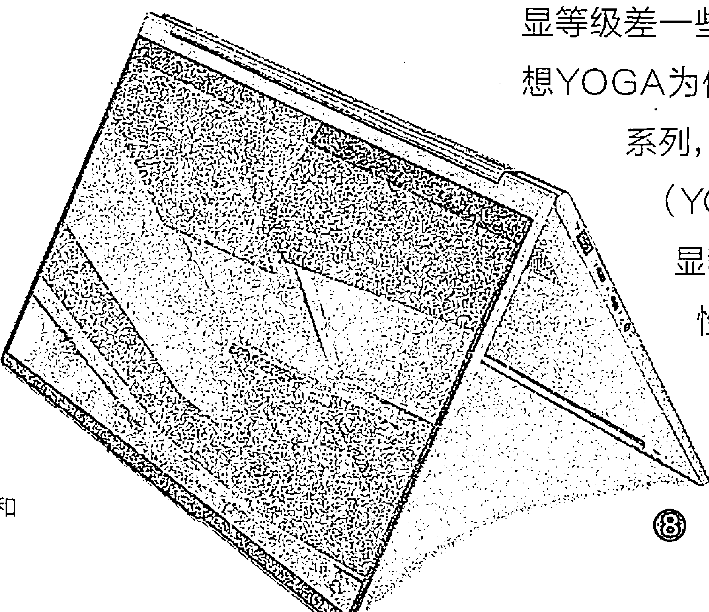

### 特别话题

表1：常见笔记本厂商旗下品牌名称和定位分类表

| 厂商类型 | 笔记本定位 | 轻薄本品牌 | 游戏本品牌（含发烧） |
| :--- | :--- | :--- | :--- |
| 厂商 | 价格范围 | 高端 | 中端 | 主流 | 高端 | 中端 | 主流 |
| 联想 | 7000元以上 | 5000元-7000元 | 5000元以内 | 8000元以上 | 6000元-8000元 | 6000元以内 |
| | YOGA C | 小新Pro、YOGA S | Ideapad、小新、小新Air、小新潮 | 拯救者Y9000K | 拯救者Y7000P | 拯救者Y7000 |
| 惠普 | Spectre幽灵、EliteBook | ENVY、EliteBook、X360 | 畅游人、星、战 | 幻影精灵X、暗影精灵 Air/Plus | 暗影精灵 | 光影精灵 |
| 戴尔 | XPS系列 | 灵越7000、二合一系列 | 灵越3000、灵越5000、成就 | 外星人、游匣G7 | 游匣G5、G3 Pro | G3系列 |
| 宏碁 | 蜂鸟7 | 蜂鸟5 | 蜂鸟Fun、蜂鸟3、翼5、炫6、传奇 | 掠夺者战斧、刀锋、ConceptD7/D5 | ConceptD3 | 威武骑士、暗影骑士 |
| 华硕 | ARTONE、玲珑、灵耀X | 灵耀Deluxe、灵耀U/S | Adol、顽石、VivoBook、破晓 | ROG超神、冰刃、枪神、魔霸 | 飞行堡垒、天选 | Mars |
| 雷神 | 暂无 | 雷神MixBook | 暂无 | 雷神911 Pro、雷神911 GT | 五代新911、Masterbook | 雷神911Air、雷神911M |
| 机械师 | 暂无 | 创物者-L | 暂无 | PX780、F117 Plus、创物者 | F117、T90 | T58 |
| 机械革命 | 暂无 | S1 Plus | S1 Pro、S2 | 钛钽、深海泰坦、Umi Air | 深海泰坦 | 深海幽灵 |
| 华为 | MateBook X Pro | MateBook | MateBook D、荣耀笔记本 | 暂无 | 暂无 | 暂无 |
| 小米 | 暂无 | 小米笔记本Air、小米笔记本Pro | 小米笔记本、RedmiBook | 暂无 | 小米游戏本 | 暂无 |
| ThinkPad | X、T系列 | S系列 | E、R、ThinkBook | P系列 | 暂无 | 暂无 |
| 微星 | Prestige | Modern | 暂无 | GT、GS、GE、GP、创造者 | GL系列 | GF系列 |

*本文截稿时各大品牌厂商还未公布第十代酷睿游戏本的消息，所以表中涉及的游戏本名称都停留在第九代酷睿，十代酷睿新品的型号序列应该会有所递增。

#### 乱花渐欲迷人眼的型号

如果你觉得子品牌就已经很眼晕了，那么品牌再往下细分的子型号，也许会让你更加‘怀疑人生’。在众多OEM厂商中，戴尔旗下的灵越Inspiron品牌最具代表性，如果你将这个品牌搞明白了（图9），研究其他厂商的产品也就不在话下了。

#### 简化的型号不准确

在很多卖场和电商平台，戴尔Inspiron系列笔记本的型号都被标注成灵越13、灵越14或灵越15。然而，从这些型号中我们只能了解它们对应的屏幕尺寸，分别是13英寸、14英寸和15.6英寸，但其他信息就云里雾里了。

实际上，戴尔Inspiron系列完整的叫法应该是“灵越+尺寸+四位具体型号后缀”，比如灵越14-3482、灵越15-5590、灵越13-7391。其中，四位数字的后缀蕴含了丰富的信息，以前面提到的几款型号为例，第一位的3、5、7分别代表它们隶属于灵越3000、灵越5000和灵越7000家族，定位（做工、配置、售价）依次升高；第二位的4、5、3分别对应屏幕尺寸；第三位的8（以AMD和赛扬平台为主）、9（酷睿平台为主）代表硬件平台；最后一位含义较多，可能涉及材质、功能等方面的特色差异，但绝非数字越大越好。

你以为这就很混乱了吗？实际上，每一款灵越笔记本还能根据模具工艺和配置的不同，再向下衍生出无数分支型号，组成“灵越+尺寸+具体型号后缀+配置后缀”即E-Value代码。只是，和配置有关的四位数字没什么规律（图10），而且相同配置的笔记本，戴尔官网和电商的E-Value代码可能还存在不同，在下单前需要我们仔细核实具体配置信息，否则极易买错。

> **小提示**
戴尔笔记本型号的命名规则会随着时间而不断地修订，比如多年前一款具体型号为“灵越15 7000-1528”的笔记本，需要将其灵越7000的身份单独罗列出来，从四位后缀也只能看出它的尺寸信息。此外，灵越5000系列在过去还有一个名为“燃”的外号，只是最近不再以此命名了。

#### —— 灵越5593十代处理器15.6英寸大容量笔记本 ——

| 型号 | 颜色 | 处理器 | 内存 | 硬盘 | 显卡 | 15.6英寸显示屏 | Type-C接口 |
|---|---|---|---|---|---|---|---|
| Ins 15-5593 -1505 | 银色 | i5-1035G1 | 8GB (1x8GB) | 256GB PCIe 固态硬盘 | UHD 集成显卡 | 全高清 防眩光 1920x1080 45%NTSC色域 IPS雾面屏 | 无 |
| Ins 15-5593 -1625 | 银色 | i5-1035G1 | 8GB (1x8GB) | 512GB PCIe 固态硬盘 | MX 230 2GB | 全高清 防眩光 1920x1080 45%NTSC色域 IPS雾面屏 | 有 |
| Ins 15-5593 -1748 | 银色 | i7-1065G7 | 8GB (1x8GB) | 256GB PCIe 固态硬盘 | MX 230 4GB | 全高清 防眩光 1920x1080 45%NTSC色域 IPS雾面屏 | 有 |
| Ins 15-5593 -1745 | 银色 | i7-1065G7 | 8GB (1x8GB) | 512GB PCIe 固态硬盘 | MX 230 4GB | 全高清 防眩光 1920x1080 45%NTSC色域 IPS雾面屏 | 有 |

#### 命名规则实战演习

下面，我们就以“灵越15”笔记本为例，看看市售热门型号之间的主要差异在哪（图11）。如果单以后缀数字大小排序，图中涉及型号看起来应该是灵越15 5585<5590<5593<5598，灵越15 7590<7591，但正如前文所述，这组数字并非越大越好。

灵越15 5585搭载AMD锐龙3000处理器平台，市场实际售价最低，与它定位最接近的型号是灵越15 5593，两款产品的身材相仿，5585在模具上的缺点是没有数字小键盘，但USB Type-C却支持DP视频输出和充电功能，而5593的优势是配备数字小键盘，第十代酷睿结合MX230独显的性能更强，但USB Type-C仅支持数据传输，而且只有独显版才有这个接口。就性价比和体验而言，笔者更加倾向5585以及它的后续机型(锐龙4000升级版)。

灵越15 5590和5598则是一对亲兄弟，和刚刚介绍过的5593相比，这两款产品采用了更精致的模具、更轻薄的金属机身、数字小键盘、全功能USB Type-C接口，结合第十代酷睿和MX250独显的组合，性能更加强悍。可见，虽然5590数字比5593小，但综合实力更出色，为了突出它们的与众不同，戴尔甚至还为其起了一个“灵越5000 fit”的别名。从官网参数来看，两款产品的差异是5598比5590重了50g，其他方面似乎没有任何变化，网上查询的资料称它们是不同渠道对同一产品的不同称呼，所以大家不必过于纠结，配置相似时谁便宜买谁即可。

灵越15 7590和7591都隶属于灵越7000，它们采用了45W处理器和GTX1050或GTX1650独显的组合，既属于轻薄本，又可以承担设计本的角色。两款产品的模具、接口和内部结构完全相同，差异是7590的外壳是镁合金材质，在保证坚固的前提下更加轻盈，整机重量只有1.59kg。而7591的外壳材质为铝合金，重量也因此增加到了1.87kg，但价格便宜1000元。如果你追求实用，显然是7591更超值；如果你注重体验，那轻盈的7590应该更能让你满意。

#### 看花眼的中文名

为了便于推广，很多OEM厂商更喜欢为产品赋予中文名称，较之繁杂的英文数字组合更容易记忆，听起来也更具文艺范儿。比如，宏碁首款搭载AMD移动锐龙5 4500U处理器的新品原本隶属于蜂鸟3 (3C证书上的产品型号为SF314-42)，但官方却称其为“传奇” (图12)；华硕首款搭载AMD移动锐龙7 4800H英文名称是FA506，但官方却以“天选”之名宣传 (图13)。与其类似的，还有暗影精灵 (英文名为OMEN)、掠夺者 (Predator)、创物者 (Machcreator) 等等。

有些笔记本，它们会在型号后面加上中文后缀来区分配置高低，比如用竞速版、旗舰版、进阶版、荣耀版来划分四个档次 (图14)。还有一些厂商，会为一些爆款机型花费更多心思取名。以雷神旗下的911M系列为例，它是定位中端的游戏本家族，根据颜色包含911ME (黑色)和911MT (银色)两个版本，往下还细分为“黑武士2”、“暗杀星进阶版”、“逐影者旗舰版”、“影极星畅玩版”、“暗杀星青春版”等，它们其实都是一款产品 (模具相同且都隶属于911M)，只是分别对应不同的处理器和独显型号、内存和硬盘容量的组合，而我们很难从中文名称和后缀看出配置高低，需要点进产品详情页面对比参数。

##### 配置参数

| 组件 | 描述 | 组件 | 描述 |
| --- | --- | --- | --- |
| 处理器 | 9代i7-9750H(6核12线程) | 显卡 | GTX1660Ti 6G独显 |
| 屏幕 | 15.6英寸全面屏、72%色域、144Hz电竞屏 | 散热 | 360°循环涡轮散热 |
| 特色 | 指纹识别、3D金属A壳、RGB智能氛围灯、RGB炫彩背光键盘 | | |

| 版本 | 内存 | 硬盘 | 到手价 | 推荐套餐 |
| --- | --- | --- | --- | --- |
| 竞速版 | 8G DDR4 | 512G PCI-E高速固态 | ¥8299 | |
| | 16G DDR4 (8G*2双通道) | 512G PCI-E高速固态 | ¥8699 (补贴差价400元) | |
| 旗舰版 | 16G DDR4 (8G*2双通道) | 512G PCI-E固态+1T | ¥9099 | 推荐人气套餐 |
| 进阶版 | 16G DDR4 (8G*2双通道) | 512G PCI-E固态+2T | ¥9499 | |
| 荣耀版 | 32G DDR4 (16G*2双通道) | 512G PCI-E固态+2T | ¥10299 | |


#### 同型号的内在差异

在轻薄本市场，同一款型号可能存在英特尔集显版、英特尔+英伟达独显版以及AMD锐龙集显版；在游戏本领域，同一款型号的低配版独显可能是GTX1050，高配版可以选择RTX2060。在这种情况下，绝大多数厂商都会准备两套散热模块，较差的留给集显版的轻薄本和低配版的游戏本（够用即可，节省成本），较好的则用在卖得更贵、发热更高的型号身上。比如，雷神911M系列中配备GTX1050和GTX1650独显的型号热管都很细，而配备GTX1660Ti或GTX2060独显型号的热管中有3根直径达到了8mm（图15），发热区覆盖更大面积的金属板，散热效果更加出众。同理，戴尔、华硕等品牌旗下的游戏本也经常采取这个措施（图16）。

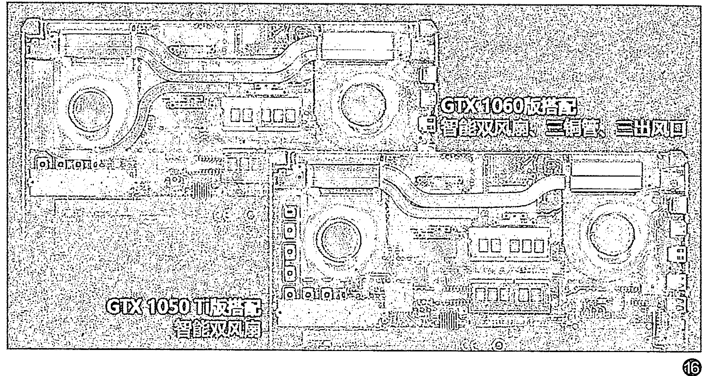

#### 一打多的模具型号

如今“设计本”概念愈加流行，为了追赶潮流，很多OEM厂商也纷纷推出了自家的设计本品牌。只是，其中有一些会采用有别于消费类笔记本的全新模具，而有一些则会“偷懒”，直接套用已有的产品模具，只是在配置上更加贴合设计本的需求而已（如标配高色域屏幕）。其中，前者的代表有联想拯救者Y9000X和华硕灵耀X2 Pro等，而后者的代表则更多一些，比如雷神MasterBook就与雷神911 Air相同，机械革命Umi Air和S1 Plus相同，虽然缺少了独立性，但胜在实际售价更低。

实际上，在游戏本领域，现在很多OEM厂商主打机型采用的都是来自蓝天、微盟或同方国际的“公模”，它们在外观、接口和主板布局方面完全一样。只是，OEM厂商可以根据预算和产品定位，改用更好的材质（金属盖板比塑料盖板强）、更好的屏幕（高色域和高刷新率）、一线品牌旗下的内存和硬盘，至于CPU、GPU和散热模块设计则基本无差异。如果你追求性价比，选择售价偏低的那一款即可，在性能和体验上与同模具同配置的型号差别并不大。

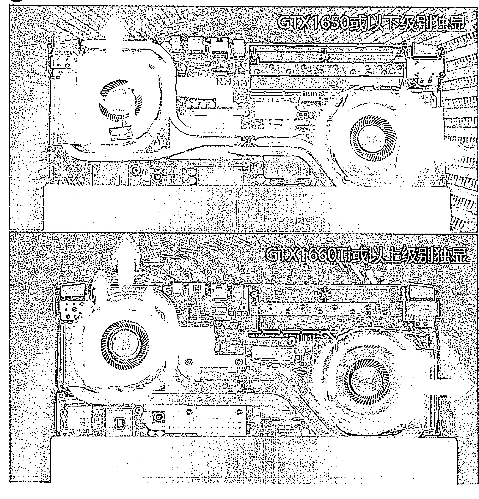

#### 三路出击 巩固学习成果

限于文章篇幅，我们无法将所有OEM厂商的命名规则全部列出，只能为大家提供辨别思路。毕竟，笔记本每年都会随硬件平台的迭代而对模具和配置进行升级，命名规则和型号也会随之变化。只有掌握了方法，才能依靠自己识别新品与家族前辈的变化，看看是否值得入手。下面，我们就通过三个案例，巩固一下学习成果。

##### 联想小新对比思路

“小新”应该是联想旗下出货量最大的子品牌，在轻薄本领域的竞争力十足。以14英寸的小新为例，它还被进一步细分为“青春版”、“标准版”以及“Air版”，其定位和售价依次升高。前不久联想推出了最新的小新Air 14 2020，下面我们就拿这款新品为引子，探讨一下如何在新旧型号间比对的问题（表1）。

顾名思义，“青春版”往往意味着便宜，所以联想为小新14青春版准备的模具也是最糊弄的。比如，它的机身材质都是PC-ABS塑料，只是在A面和C面通过IMR拉丝工艺呈现出一种类似金属的质感。此外，小新14青春版的屏幕为TN材质（可视角度较差），机身较厚，内置的电池容量也严重缩水，续航时间只有其他版本的60%左右。

“标准版”意味着中规中矩，以小新14 2019为例，它采用了金属材质的顶盖，机身厚度和重量较青春版有所下降，增加了USB Type-C接口（仅支持数据传输），为了提升安全性还为摄像头配备了独立的硬开关。但是，总有消费者追求更好的体验，所以联想才会在标准版的基础上带来小新Air 14 2019。

和标准版相比，Air版的A、C、D三面都是金属材质，同时进一步压缩了厚度和重量，对散热模块也进行了同步升级。需要注意的是，为了实现瘦身，小新Air 14 2019取消了标准的SATA硬盘位，但可同时加装2个M.2 SSD的设计依旧具备不错的扩展

> ### 小提示
> USB3.0、USB3.1 Gen1和USB3.2 Gen1的理论传输速率都是5Gbps，互为“马甲”。只有标注“Gen2”的USB3.1或USB3.2才具备10Gbps的高速优势。

##### 表1：小新14系列英特尔平台规格对比

| 型号 | 小新14青春版 | 小新14 2019 | 小新Air 14 2019 | 小新Air 14 2020 |
| :--- | :--- | :--- | :--- | :--- |
| 处理器 | 八代酷睿或赛扬 | 10nm十代酷睿 | 14nm十代酷睿 | 10nm十代酷睿 |
| 内存 | 板载内存+单插槽 | 板载内存+单插槽 | 板载内存+单插槽 | 板载内存 |
| 硬盘 | M.2+SATA双插槽 | M.2+SATA双插槽 | 2个M.2 SSD插槽 | 1个M.2 SSD插槽 |
| 显卡 | MX110 | MX250 | MX250 | MX350 |
| 接口 | 读卡器、USB3.0×2、USB2.0、HDMI、音频接口、电源接口 | 读卡器、USB3.0×2、USB Type-C、HDMI、音频接口、电源接口 | 读卡器、USB3.1 Gen1×2、USB Type-C、HDMI、音频接口、电源接口 | 读卡器、USB3.2 Gen1×2、USB Type-C（全功能）、HDMI、音频接口 |
| 厚度 | 19.9mm | 17.9mm | 15.9mm | 16.9mm |
| 电池 | 35Wh | 52.5Wh | 50Wh | 56.5Wh |
| 重量 | 1.6kg | 1.55kg | 1.5kg | 1.39kg |
| 散热 | 单风扇单热管 | 单风扇单热管 | 双风扇单热管 | 单风扇双热管 |
| 特色 | 价格最低 | 摄像头有物理开关 | 支持指纹识别 | 指纹电源键二合一 |

##### 宏碁传奇对比思路

作为第一款亮相的锐龙4000轻薄本，宏碁传奇应该极受用户关注。和大家一样，笔者也没有条件第一时间拿到这款机器，在它正式发售前网上也没有详细的评测，只能通过网上零星的新闻加以利用。此时，我们又该如何拿它与前辈进行比对呢？

宏碁蜂鸟（Swift）家族包括蜂鸟3、蜂鸟5和蜂鸟7，市面上6000元以内的宏碁轻薄本几乎都隶属于蜂鸟3家族，可以细分为SF313、SF314和SF315，其中“SF”代表Swift，它后面的第一位数字代表3、5、7系，后两位则是屏幕尺寸。目前市面上热门的蜂鸟3系列产品主要有4款，分别是蜂鸟Fun、新蜂鸟3、蜂鸟3锐龙版和传奇。

根据上文的思路，笔者整理了这四款产品的主要规格（表2）。从产品图片、厚度和重量参数来看，蜂鸟Fun和蜂鸟3锐龙版、新蜂鸟3和传奇似乎采用了一种S模具，但如果我们留心接口信息，不难看出它们之间依旧存在差别。比如，蜂鸟Fun比蜂鸟3锐龙版多了1个RJ45网线接口，而后者则配备了1个读卡器插槽，C面也是金属材质，所以更显档次。

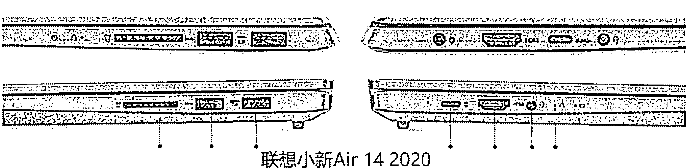

● 从接口设计可以最直观地辨别新旧产品在模具和功能上的变化

| 对比 | 小新 14 2019款 英特尔酷睿i5 14.0英寸轻薄笔记本 退步银款 | 2019 小新 14 英特尔酷睿i5十代 14.0英寸轻薄笔记本 仙女粉款 | 小新 Air 14 2019款 英特尔酷睿i5 14.0英寸超轻薄笔记本 轻奢灰 | 小新 Air 14 2020英特尔酷睿i5 14.0英寸全面屏轻薄笔记本 星月银 |
| :--- | :--- | :--- | :--- | :--- |
| 规格 | 八代英特尔酷睿i5-8265U/Windows 10 家庭中文版/14.0英寸/8G/256 SSD/GeForce | 十代英特尔酷睿i5-1035G1/Windows 10 家庭中文版/14.0英寸/4GB+4GB/512G | 全新十代英特尔酷睿i5-10210U/Windows 10 家庭中文版/14.0英寸/4GB+8GB/512G | 十代英特尔酷睿i5-1035G1/Windows 10 家庭中文版/14.0英寸/8G/256G SSD/GeForce |
| 价格 | ¥4399 | ¥4999 | ¥5299 | ¥5099 |

新蜂鸟3和传奇的主要差别是USB Type-C接口的位置和功能（图3），前者的该接口支持雷电3，拥有40Gbps的传输速度，甚至可外接台式机显卡扩展坞。而后者的USB Type-C为全功能型，虽然也支持视频输出和充电功能，但传输速率只有10Gbps。此外，从网上曝光的传奇拆机图来看，该产品改用单风扇单热管设计，M.2插槽的位置也从电池右侧移到了主板右侧。当然，这些细节对选购的影响不大，毕竟传奇没有独显芯片，7nm工艺的锐龙4000发热量可控，单热管也能压得住。

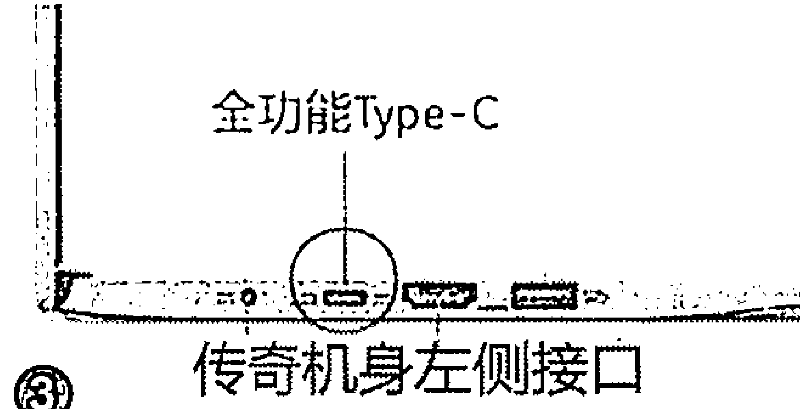

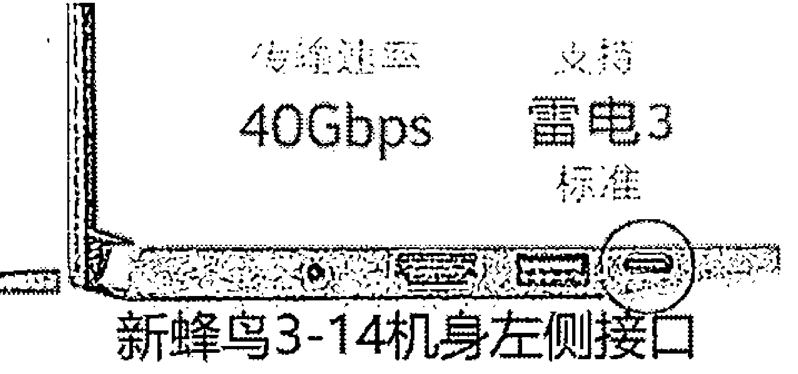

可见，长得像并不意味着一模一样，OEM厂商往往会根据硬件平台以及产品的定位，在接口种类和排序方面加以修改，当然，这种微调其实也是一种讨巧，较之重新开模的成本低了太多。就宏碁蜂鸟SF314家族这4款在售产品而言（图4），传奇的性价比无疑是最高的，至少可以秒杀上代锐龙版的蜂鸟3。至于新蜂鸟3值不值得买，就看你对雷电3接口的需求，以及对屏幕色彩准确度的要求了。

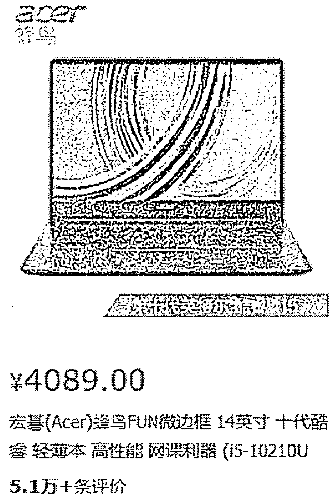

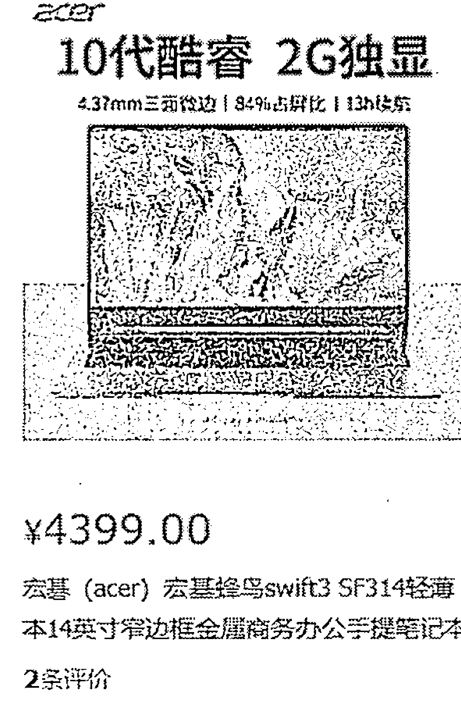

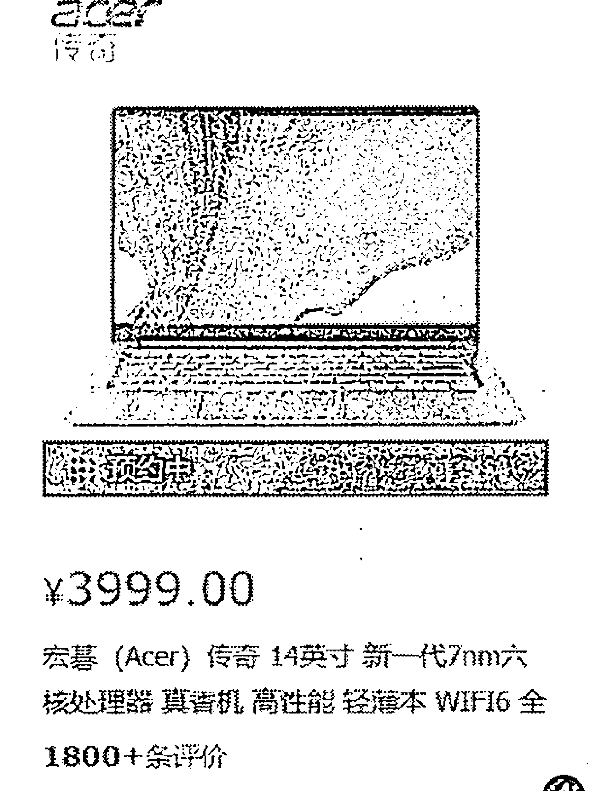

##### 华硕天选对比思路

华硕天选是第一款正式亮相的锐龙4000系列游戏本，隶属于FA506系列，而我们更熟悉的飞行堡垒7则隶属于FX95系列（表3）。之所以将这两款产品放在一起，是因为两款产品在设计上非常接近，天选就是基于飞行堡垒7的模具优化而来。

##### 表3：华硕飞行堡垒7和天选规格对比

| 类型 | 飞行堡垒7 | 天选 |
| :--- | :--- | :--- |
| 处理器 | 第九代酷睿 | AMD锐龙4000H |
| 内存 | 双内存插槽 | 双内存插槽 |
| 硬盘 | M.2+SATA双插槽 | 双M.2+SATA三插槽 |
| 显卡 | GTX1660Ti | GTX1660Ti |
| 接口 | USB3.1 Gen1×2、USB2.0、HDMI、RJ45、音频接口、电源接口 | USB3.2 Gen1×2、USB2.0、USB Type-C 3.2 Gen2（支持DP）、HDMI、RJ45、音频接口、电源接口 |
| 厚度 | 25.8mm | 24.7mm |
| 电池 | 45Wh | 48Wh |
| 重量 | 2.2kg | 2.2kg |
| 散热 | 双风扇三热管 | 双风扇四热管 |
| 特色 | 120Hz屏幕 | 144Hz屏幕 |

从网上可以搜索到的拆机图来看，同样配备GTX1660Ti独显的飞行堡垒7采用双风扇三热管，最多可以安装M.2和SATA双硬盘（图5）；而天选则在前者的基础上增加了一根U型的热管，电池右侧的SATA硬盘位换了个方向，在加宽的主板上增加了第二个M.2插槽，最多可以安装三块硬盘（图6）。同时，作为新品天选还添加了USB Type-C 3.2 Gen2高速接口（10Gbps），顶盖、出风口和底盖风格也出现了变化。

实际上，天选的真正“对手”，应该是华硕新一代的飞行堡垒8（搭载第十代酷睿），只是在本文截稿时第十代酷睿还没解密，所以谁也不知道未来的新品究竟长成什么样子。但根据经验，飞行堡垒8大概率会采用和天选相同或进行细微调整的模具。

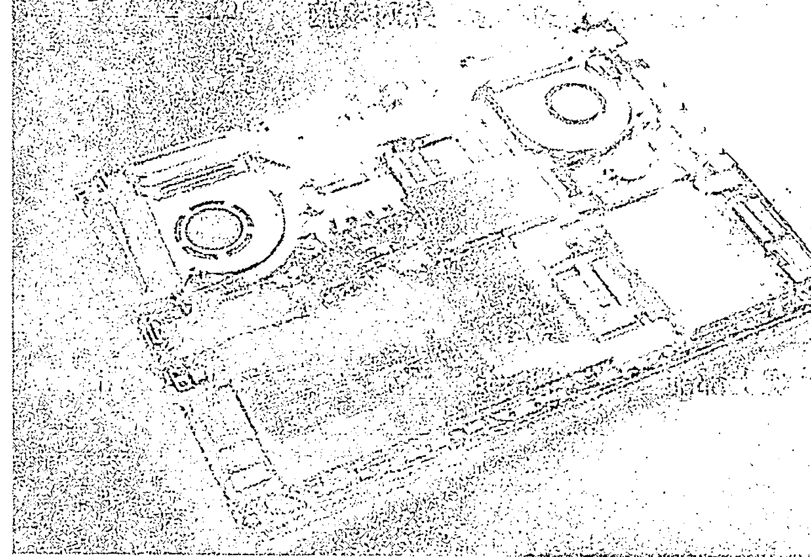

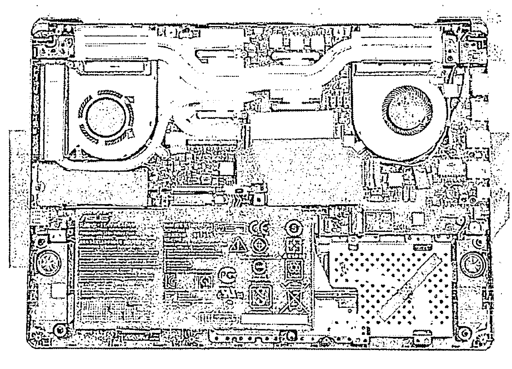

### 小结

本期特别话题并没有太过强调型号和性能的联系，原因很简单，如今笔记本的硬件配置同质化严重，而且作为新品大家的散热设计也都不会太差，相似配置时性能差别并不明显。相对来说，透过型号分析出模具的特色往往更具实际意义，一款好模具可以同时具备轻薄便携、坚固耐用、扩展能力出众的优势，它们同样是在实际使用中可以为你带来更愉悦享受的关键。今后，当我们再看到某款新型号发布时，不妨参考本文的思路，先和同厂商旗下的同宗兄弟比一比，再和其他厂商同定位的竞品较量，如此你才能找到100%匹配自己的计算伙伴。

#### 迎接特别篇 你的电脑准备好了吗

策划|《电脑爱好者》编辑部


从3月、4月份开始的回南天、梅雨天、高温高湿等天气，不仅会让人难受，对电脑也是一种折磨。而与此同时，这些日子又常常是一年中最忙碌的时光，为了应对即将到来的考验，先对电脑进行一次彻底的检修就很有必要了。

#### 外部检查

经过漫长的假期后，再次见到久违了的电脑，我们可能从外观上都能看到它们的沧桑了，其中散热孔、接口部分的积灰和锈迹等更是会影响到未来的使用。

##### ● 外部清洁

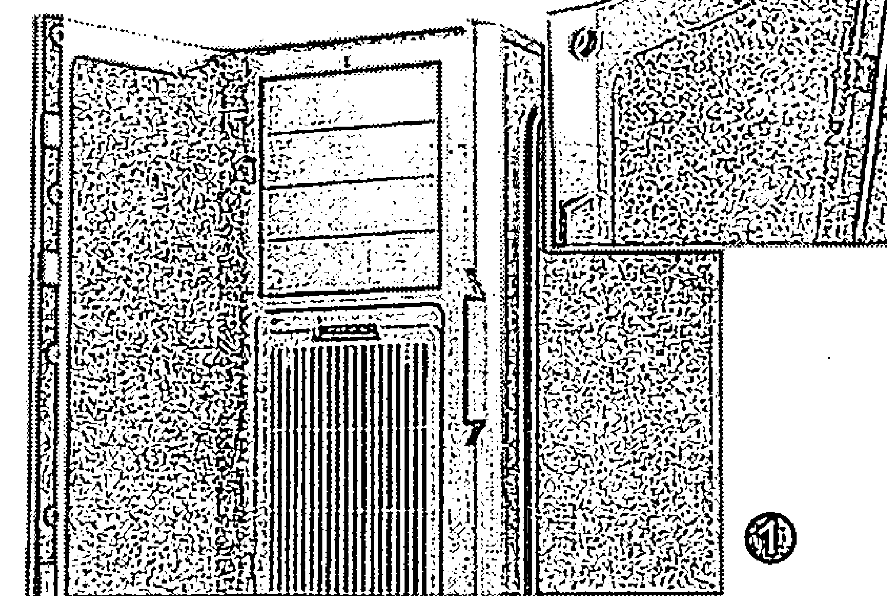

外部清洁很好理解，就是清除机箱、显示器、键鼠、耳机等配件上的积灰甚至积絮。笔者建议使用软质棉布，用清水洗净并尽量拧干后进行擦拭，一些较小的缝隙孔洞可以用吸尘器吸出其中的大团灰絮，或者索性将其中的滤网、滤绵（图1）拆下清洗。

在这方面要注意的主要是防水问题，比如擦拭时一定不能使用含水量过大的棉布，更不要使用不容易沥干水分的海绵、毛巾等物品擦拭，以免有水渗入设备的缝隙中，引起电路板、触点等部位的短路或锈蚀问题。而清洗过的滤网、滤棉也一定要充分晒干后才能装回。


如果外壳不是很脏的话，其实直接用湿纸巾擦拭是一种比较稳妥的方法，而且很多湿纸巾还有消毒杀菌能力，特别适合擦拭键鼠和耳机表面这种直接与用户接触的设备。但这里又要注意，很多湿纸巾采用的是有机溶剂，千万不要用来擦拭显示器的屏幕，以免损伤其上的涂层（图2），也不要过于频繁和用力地擦拭键鼠或耳机的皮质、仿皮质部分，同样会损伤其上的涂层。

如果是键帽比较容易装卸的键盘，我们还可以在启用前对键帽及内部进行一次大清扫（图3），其中键帽可以在盆中揉搓清洗，甚至可以使用洗衣机搅拌，配合洗衣粉/液和消毒液洗去顶部、侧面等处的脏污，为今后的使用提供一个洁净的手底环境。在摘下键帽后，我们也可以利用小刷子、吸尘器等对键盘内部进行一次清理，清除其中的灰尘、毛发、污渍、饭粒等脏物，不仅更加洁净，也能防止这些东西进一步污染触点等重要部位，造成按键失灵。这里要注意的是，在拔取键帽时一定要使用附赠的拔键器或购买的专用拔键器，平稳轻柔地拔出，否则可能造成某些按键的接口损坏；在扫除内部脏物时则需注意，千万不要将其扫入键轴空隙或凹陷中，最好能配合吸尘器直接吸出脏物。


##### ● 外部连线检修

在启用长时间不用的电脑时，最好将所有的连线都拔下重新连接一次，如果是高湿地区，还得检查是否出现了锈蚀的情况。

一般来说，长时间不使用和不通电可能造成的问题包括接触不良、不识别等问题，它们在拔下并认真安装后大都会得到解决。在插拔接口时，最好也整理一下线缆，以免因为线缆缠绕、变形等问题造成拉扯接口的情况。

如果在检查时发现接口存在锈蚀问题就必须要进行进一步的处理了。一般来说，如VGA、DVI、电源这样结构比较“粗犷”的接头/接口，或者USB、HDMI等接头不太精密的金属外层位置出现锈斑的话，用小刀、细砂纸等去除锈点即可。一般来说，USB、HDMI等接口因为有外层金属壳包裹，内部的精密触点、簧片是不容易生锈的，常出现锈蚀问题而且比较麻烦的是网线接头。网线接头端的触点比较细小且处于凹槽中，非常难以打磨。但此处的锈蚀不仅明显影响数据传输，而且电脑端网线接口的设计比较特殊，需要接触点（实际上是个细铜棍）具有很强的弹力（图4），一旦被传染到锈蚀就很容易失效甚至折断。所以笔者建议大家一旦发现网线的接头出现了锈迹，就应该选择直接更换网线头，同时对电脑端的网线接口内部进行细致的检查，快速处理锈斑。

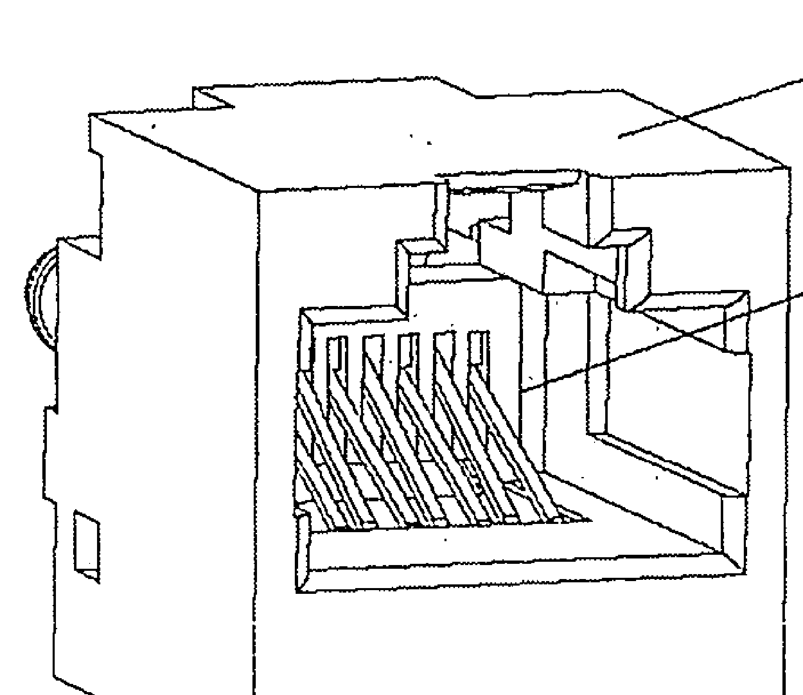

> 火速链接 外部线缆的整理方法请参考本刊2020年第6期《扮美桌面 从这些做起》一文。

### 特别话题

##### 如何防范

长时间不使用时的外部问题，一般都是环境影响造成的，笔者建议大家在长时间不使用电脑主机时，应预先进行一些处理，然后妥善保存。

首先，即使仅仅是一个周末无法关注电脑，也应该断开电源，以免电压波动造成电脑启动或损坏内部的敏感配件。

其次，如果长时间不使用，最好将所有连线都拔下，将主机以及一些容易吸附灰尘的配件如键鼠等装入密封收纳袋，最好使用可抽真空的产品，能尽量缩小占用体积，并且减少周边的潮湿空气。一般来说，用来收纳厚被子的大型或特大型收纳袋完全可以放进大中型机箱，而用来收纳枕头、空调被的大中型收纳袋则可轻松放入键鼠显示器等配件（图5）。

此类产品一般每套至少有2个大型和2个中型袋，价格从40元~100元不等，笔者建议大家购买时选择相对厚实一些的产品，因为机箱和显示器的尖锐棱角很容易刺破或磨破袋子，而柔软的被褥枕头则几乎没有这一问题，所以很多实惠型产品甚至主流产品的厚度、坚韧度其实都不适合收纳电脑。如果不方便使用吸尘器的话，还要特别注意选购附赠手泵的产品（图6）。

##### 内部检查

清理好设备的外部后，就要深入检查一下内部情况了。在条件允许的情况下，笔者同样建议将主要部件、连线都取下进行检查、清理和整理。当然在检查时还是应该有重点、有顺序地进行。

##### 积灰检查和处理

并非封闭的机箱中同样会产生积灰，特别是在风扇、角落中尤为明显。建议大家首先用小刷子、洗耳球（吹尘球）、吸尘器清理明显的积灰，注意在清理板卡表面时动作要轻一些，吸尘器的功率也应适当降低并避免直接碰触板卡，以免造成元件松脱。

之后可将显卡、处理器散热器、机箱风扇等配件移至通风处进行清洁，也可在浴室等较为潮湿的地方处理或者在周围适当喷水，以减少飘散的灰尘。注意在潮湿地区清洁和向周围喷水时不要沾湿这些配件，特别是在处理不方便从显卡上拆下的风扇时，更要注意别让PCB板沾水。另外这些配件也不宜在潮湿地点摆放太长时间，应带入后马上清洁，清洁完马上带出。

##### 接口和接线检查

接下来就是考验目力的时候了，我们要检查板卡接口是否有污染、磨损的情况。如有污迹可使用橡皮或干布轻轻擦拭；而接口的金手指部分出现了过度磨损的话，面积较小时可使用导电膏或铅笔涂抹相应的部位，注意涂抹面积一定要小，不要沾到其他元件、金手指或板卡表面。在安装时也要注意拭去未凝结或过多的导电膏，抖落多余的铅笔粉末（实际主要为石墨），以免它们掉落在插槽中或影响到其他金手指。

##### 重新整理安装

进行仔细的检查后就可以将板卡与线缆安装回去了，这里要注意各个配件之间的位置关系以及与线缆的配合，不要出现互相妨碍的情况。

在安装复位之前，可以先为各处的风扇加油。目前市场中有专为电脑风扇准备的润滑油，提供了小刷子、小喷管（注射器）等附件（图8），更便于为电脑中的风扇注油。一般来说，我们只需要购买一小瓶润滑油就足够多次检修之用了，市场价格一般为10元左右。

电脑风扇也可以使用一些机械用油脂。根据机械运行的工况不同，润滑油的特性差异很大，大家可以根据风扇转速（一般为1000RPM~3000RPM）和使用场合（室内小型机械）来选择。但特别要注意，千万不要选择高速大型机械或一些较低速机械使用的润滑油，前者在常温下甚至可能是膏状的，要在高速、高温、高负载等情况下才会融化，起到润滑作用，但电脑风扇的轴承达不到其融化的条件，所以不能获得润滑效果；后者则过于稀薄，不仅不能给风扇轴承润滑，还可能将内部残存的润滑油耗解析出并快速挥发掉。

在购买导电膏时，应选择导电系数高、耐高温、无腐蚀性的产品，如注明可支持低压、弱电、直流电就更好了（图7）。很多品牌有面向普通用户的小包装产品，价格大都在10元以下。如果用铅笔简单弥补的话，则应尽量选择笔芯为2B或更软的产品，这样的笔芯中石墨含量更高，导电能力更好且更柔软，不易划伤金手指的其他部位。

最后要注意的是，在重新安装处理器、GPU、主板芯片散热器的时候，一定要刮净残余硅脂，再用正确的方式敷上一层新硅脂，然后小心地安装复位，一定要记得插上所有风扇的电源。特别要注意的是，如果拆卸了整体式的显卡散热器进行清洁，那么在安装回去的时候，一定要将显存导热硅胶垫安放就位。这些导热硅胶垫如有损伤可以重新购置，一般套装会提供十多片（图9）或者足够裁剪成十多片的面积，价格仅需几元~20元，千万不要用硅脂来替代，因为散热器与显存间隙过大，硅脂并不适合在这种距离上导热。这种导热硅胶垫也是目前电脑中的新宠——M.2固态硬盘的散热片使用的固定、导热介质，如果检查时发现M.2固态硬盘的原配导热硅胶垫出现了变硬、污染等问题，建议购买整体式硅胶垫，裁剪为合适的长度使用。

线缆检查应更关注位于锋利的机箱边缘、有大角度弯折、贴近高温或风扇区域的部分，观察是否有割裂、过热爆皮、弯曲断裂等情况。如有割裂或爆皮问题，可使用绝缘胶带简单修复，另外注意在割伤线缆的位置安装一些柔性材料。过于弯曲或过于靠近风扇、高温位置的线缆部分应重新理顺，在安装时也要特别注意。

##### 防范和弥补

如果细看我们的内部检修流程和可能的问题，会发现它们大都已经是电脑中的严重隐患，在检查中发现并且还没有引起大麻烦是一种幸运。实际上这些问题应该尽早发现，或者最好就不要出现。
要防止这些问题的出现，首先是在安装时就要注意，所有线缆要进行良好的布线，捆扎和固定散乱的线缆。另外系统为各个配件设置的固定方式千万不要省略，比如有些用户的双槽显卡仅使用了一个螺丝（图10），就可能让显卡对插槽施加大的拉力。或者内存没有完全按下到卡榫完全就位，那么金手指的接触不完全充分，可能造成小面积上的通电电流过大，对接触面造成损伤。

其次是使用时要注意各种噪声，风扇打到电线或者风扇轴承缺乏润滑的声音其实是相当特殊和明显的。不过前者可能是偶尔的一声，而后者则可能是随着使用时间而逐渐提升的噪声，下次使用时可能就会回归安静或再次从低到高逐渐出现，所以如果不注意还是会被忽略，且关机检查也不容易找到源头。小编建议大家一旦听到不正常的声音，就要尽快不关机打开机箱检查。

##### 通电检查

就和我们组装电脑时一样，在正式启用前还是要进行一些通电检查，确认电脑的运行状态正常后，才能开始正常使用，以免在使用过程中出现问题，不仅损伤硬件，也可能丢失重要的工作。

当然，对硬件进行检修与新装机的电脑状态还是有明显不同的，所以通电检查的方式也不尽相同。基本上正常装机后的通电检查过程，检修后都必须要经历一遍，毕竟我们在拆卸检查后，实际上确实进行了重新“装机”。不过除此之外，还有一些特别的检查项目和注意事项。比如对于能进行检修的用户来说，拆装部件已经完全不是问题，那么我们完全可以一件一件地连接电脑上的各个配件，这样一旦出现问题，就更容易找到出自哪个配件了。
我们建议先安装处理器、一根内存、显卡（处理器自带显卡则可先用处理器自带显卡，之后再安装独立显卡）、键盘，即所谓的“最简系统”。注意如果使用了M.2固态硬盘，也可以先安装上以免之后安装比较麻烦。然后清除BIOS，开机进入BIOS的Monitor或类似页面（图11）。

我们要在这一页面中持续观察一段时间，看一看各处的温度、电压、风扇转速等是否正常，听一听是否有杂音。如果用湿布清洁过电脑的话，还要注意是否有“不明”的气味出现。一旦出现异样，最好马上关闭电脑，处理异味或高温区域。当然如果是风扇噪声且一时无法确定位置的话，也可以持续运行以便确定故障风扇。

在确定最简状态没有问题后，再按照处理器和内存的规格调整BIOS设置，并继续观察。确认没问题后逐渐增加配件，安装和设置的顺序一般为剩余内存、独立显卡、声卡等扩展卡、SATA硬盘、光驱、鼠标。在安装了SATA硬盘后，在BIOS中观察无碍即可进入操作系统了。

在进入操作系统的过程中，可以观察载入时间是否正常，进入操作系统后首先应更新驱动程序，安装顺序一般为主板驱动、显卡驱动、网卡和声卡驱动、其他驱动。如果在驱动程序的安装过程中或安装后有报错或无法正常运行（图12），则要考虑相应的配件是否出现了问题，如显卡散热系统是否安装正常、板卡安装是否就位等。

运行一切正常后，再用一些常用的稳定性、性能测试软件进行测试。注意在稳定性测试，也就是对系统施加更大压力的测试中，因为配件温度的大幅提升，散热风扇的转速也会随之提升，有可能出现之前检查中没有出现过的异常噪声，那么也需要查找问题所在。因为此时电脑中的配件、风扇已经很多，打开机箱直接用耳朵寻找问题区域有些困难了，建议大家在运行这些测试软件的同时打开一些能报告温度、风扇转速等信息的监控软件，如AIDA64试用版的“计算机-传感器”项目（图13），或者SpeedFan软件（图14）等。到底是哪些区域的风扇转速异常、是否有温度失控等，从这些软件中就一目了然了。

#### 总结

在这样一次全面的检修后，我们的电脑应该可以很轻松地应对即将到来的酷夏了。其实如笔记本电脑、打印机、NAS等同样面临着夏季考验的设备，我们也可以用类似的方式来进行处理，只是在方法细节方面根据设备的特性、配置有所不同。

#### 十代酷睿遇SUPER显卡

##### 游戏本的饕餮盛宴

编辑/《电脑爱好者》编辑部

每年的这个时节都是游戏本的“饕餮盛宴”。这不，在针对轻薄本定制的第十代酷睿（低功耗版）发布8个月之后，游戏本专用的高性能版处理器（代号为Comet Lake-H平台）也终于贴上了第十代酷睿的标签。与此同时，英伟达移动版GeForce独显也得以同步升级，不仅新增了“SUPER”系列和GTX1650 Ti，全系图灵家族还全部改换GDDR6显存，为游戏本赋予了更强的性能底蕴。本期特别话题，就让我们来聊一聊英特尔和英伟达旗下新品的结合将会为游戏本市场带来哪些变化吧。

##### 打破5GHz之饕餮

##### 全面解读第十代酷睿

如果按照原有的Tick-Tock策略，英特尔酷睿平台平均不到3年就会经历从工艺到微架构层面的质变。然而，自从2015年发布第六代酷睿以来，几乎所有的新平台都没能跳出14nm制程工艺和Skylake微架构的圈子（图1）。那么，全新高性能版的第十代酷睿能否给我们带来惊喜？

##### 酷睿家族回顾

英特尔历代移动酷睿都是一个庞大的家族。以最新的第十代酷睿为例就包含14nm工艺的Comet Lake和10nm工艺的Ice Lake，而这两个平台根据TDP还能进一步细分（表1）。本文的主角就是表中加红的“Comet Lake-H”，其后缀的“H”代表高性能，专为设计本和游戏本而生。

实际上，历代游戏本“心脏”对应的平台代号都是以H为后缀，比如第九代酷睿对应的Coffee Lake Refresh-H平台、第八代酷睿对应的Coffee Lake-H平台、第七代酷睿对应的Kaby Lake-H平台、第六代酷睿对应的Skylake-H平台。之所以在介绍新品时还列出这些“老将”，是因为它们都存在共性——都是14nm制程工艺，微架构都是Skylake。换句话说，它们都有着一脉相承的血缘关系。

> **小提示**
>
> 在第八代酷睿中还存在一个名为“Kaby Lake-G”的高性能分支平台，它沿用了第七代酷睿Kaby Lake-H平台的CPU核心，而集成的核显则换成了AMD定制的Radeon RX Vega M GH/G，3D性能堪比GTX1050Ti独显，但TDP也达到了65W和100W。

##### 一门“三剑客”

从第八代酷睿开始，H系列高性能酷睿家族就将i3扫地出门，并同时将i9引入到了移动平台。因此，第十代酷睿Comet Lake-H依旧是一门“三剑客”，i5、i7和i9分别剑指主流级、高端级和发烧级游戏本市场（图2）。当你看到14nm工艺、4核心~8核心、8MB~16MB三级缓存和UHD核芯显卡等参数时是不是感觉无比熟悉？

**表1：英特尔第十代酷睿家族列表**

| 平台代号 | 制程工艺 | 微架构 | TDP | 代表型号 | 发布时间 |
| :--- | :--- | :--- | :--- | :--- | :--- |
| Comet Lake-Y系列 | 14nm | Skylake | 9W | i5-10210Y | 2019-08 |
| Comet Lake-U系列 | 14nm | Skylake | 15W | i5-10210U | 2019-08 |
| Comet Lake-H系列 | 14nm | Skylake | 45W | i5-10300H | 2020-04 |
| Ice Lake-Y系列 | 10nm | Sunny Cove | 9W | i5-1030G7 | 2019-08 |
| Ice Lake-U系列 | 10nm | Sunny Cove | 15W | i5-1035G7 | 2019-08 |

没错，Comet Lake-H的这些参数与第九代酷睿Coffee Lake Refresh-H几乎一模一样。没办法，它们之间的血缘关系太近。还好，英特尔肯定不会做“砸招牌”的事情，Comet Lake-H要是没有一些独到的卖点，它又怎敢被冠以“第十代酷睿”的称号？

| 处理器型号 | 基础频率 (GHz) | 最大单核睿频频率 (GHz) | 核心/线程 | 热设计功耗 (W) | 英特尔® 热速度加速 (TVB) | 不锁频 | 英特尔® 智能缓存 | 英特尔® 傲腾™ 内存支持 |
| :--- | :--- | :--- | :--- | :--- | :--- | :--- | :--- | :--- |
| Intel® Core™ i9-10980HK | 2.4 | 5.3 | 8/16 | 45 | ✔ | ✔ | 16 MB | ✔ |
| Intel® Core™ i7-10875H | 2.3 | 5.1 | 8/16 | 45 | ✔ | | 16 MB | ✔ |
| Intel® Core™ i7-10850H | 2.7 | 5.1 | 6/12 | 45 | ✔ | 部分 | 12 MB | ✔ |
| Intel® Core™ i7-10750H | 2.6 | 5.0 | 6/12 | 45 | ✔ | | 12 MB | ✔ |
| Intel® Core™ i5-10400H | 2.6 | 4.6 | 4/8 | 45 | | | 8 MB | ✔ |
| Intel® Core™ i5-10300H | 2.5 | 4.5 | 4/8 | 45 | | | 8 MB | ✔ |

##### 十代酷睿规格总览

Comet Lake-H此次一共发布了6款型号，从高到低依次为i9-10980HK、i7-10875H、i7-10850H、i7-10750H、i5-10400H和i5-10300H（图3）。为了更直观地展现它们与同工艺、同微架构前辈的差异，笔者将第十代酷睿i9、i7和i5与它们的历代“亲戚”分别进行了汇总对比。

自2018年随第八代酷睿挥师移动战场以来，酷睿i9已经经历了三次迭代，最新的第十代i9-10980HK延续了上代i9-9980HK的8核心16线程设计（表2），但睿频加速频率却达到了破天荒的5.3GHz，属于万元以上发烧级顶配游戏本的梦幻装备。

首先，咱们得先了解一下高性能酷睿处理器的命名规则，以Core i7-10750H为例，“Core i7”代表它隶属于高端的酷睿i7系列；随后紧跟的“10”代表第十代酷睿，如果这个数字是“9”、“8”、“7”、“6”就代表它属于第九、第八、第七、第六代酷睿；“750”是它的等级，这组数字越高代表同级别性能越强；作为后缀的“H”代表高性能（图4），是游戏本专用的处理器。

**表2：旗舰i9与前辈规格对比**

| 处理器型号 | i9-10980HK | i9-9980HK | i9-8950HK | i9-8850H |
| :--- | :--- | :--- | :--- | :--- |
| 核心/线程 | 8C/16T | 8C/16T | 8C/16T | 6C/12T |
| 基础频率 | 2.4GHz | 2.4GHz | 2.3GHz | 2.9GHz |
| 最大睿频 | 5.3GHz | 5.0GHz | 4.8GHz | 4.8GHz |
| 睿频Max 3.0 | 5.1GHz | 不支持 | 不支持 | 不支持 |
| TVB技术 | 支持 | 支持 | 支持 | 支持 |
| 高速缓存 | 16MB | 16MB | 16MB | 12MB |
| TDP功耗 | 45W~65W | 45W | 45W | 45W |
| 内存规格 | DDR4-2933 | DDR4-2666 | DDR4-2666 | DDR4-2666 |
| 核芯显卡 | UHD Graphics | UHD630 | UHD630 | UHD630 |
| GPU基本频率 | 350MHz | 350MHz | 350MHz | 350MHz |
| GPU加速频率 | 1.25GHz | 1.25GHz | 1.20GHz | 1.20GHz |

虽然从第六代到第十代酷睿都是基于14nm工艺和Skylake微架构的缝缝补补，但这并不代表英特尔始终原地踏步。以历代酷睿i7为例(表3),在TDP保持不变的基础上,物理核心实现了从4核到6核再到8核的跨越,最高主频也从最早的3.5GHz提升到了5.1GHz,从而实现了性能层面的质变。

从基本参数来看,十代酷睿i7-10750H几乎和八代酷睿i9-8950HK不相上下,而最高端的十代酷睿i7-10875H则好似九代酷睿i9-9980HK的翻版,这种越级挑战的能力可以帮我们省下不少咬牙购买i9游戏本的银子。

| 处理器型号 | i7-10875H | i7-10850H | i7-10750H | i7-9750H | i7-8750H | i7-7700HQ | i7-6700HQ |
|------------|-----------|-----------|-----------|----------|----------|-----------|-----------|
| 核心/线程  | 8C/16T    | 6C/12T    | 6C/12T    | 6C/12T   | 6C/12T   | 4C/8T     | 4C/8T     |
| 基础频率   | 2.3GHz    | 2.7GHz    | 2.6GHz    | 2.6GHz   | 2.2GHz   | 2.8GHz    | 2.6GHz    |
| 最大睿频   | 5.1GHz    | 5.1GHz    | 5.0GHz    | 4.5GHz   | 4.1GHz   | 3.8GHz    | 3.5GHz    |
| 睿频Max3.0 | 4.9GHz    | 4.9GHz    | 4.8GHz    | 不支持   | 不支持   | 不支持    | 不支持    |
| TVB技术    | 支持      | 支持      | 支持      | 不支持   | 不支持   | 不支持    | 不支持    |
| 高速缓存   | 16MB      | 12MB      | 12MB      | 12MB     | 9MB      | 6MB       | 6MB       |
| TDP功耗    | 45W       | 45W       | 45W       | 45W      | 45W      | 45W       | 45W       |
| 内存规格   | DDR4-2933 | DDR4-2933 | DDR4-2933 | DDR4-2666| DDR4-2666| DDR4-2400 | DDR4-2133 |
| 核芯显卡   | UHD Graphics | UHD Graphics | UHD Graphics | UHD630 | UHD630 | HD630 | HD530 |
| GPU基础频率 | 350MHz | 350MHz | 350MHz | 350MHz | 350MHz | 350MHz | 350MHz |
| GPU加速频率 | 1.20GHz | 1.15GHz | 1.15GHz | 1.15GHz | 1.10GHz | 1.10GHz | 1.05GHz |

i5是从第八代酷睿时期获得的越级挑战能力,支持超线程技术后,八代酷睿i5-8300H的整体性能甚至要在七代酷睿i7-7700HQ之上。可惜,第九和第十代酷睿却失去了“进取精神”,只是通过常规提升主频的手段换取性能上的小幅改进(表4)。

| 处理器型号 | i5-10400H | i5-10300H | i5-9300H | i5-8300H | i5-7300HQ | i5-6300HQ |
|------------|-----------|-----------|----------|----------|-----------|-----------|
| 核心/线程  | 4C/8T     | 4C/8T     | 4C/8T    | 4C/8T    | 4C/4T     | 4C/4T     |
| 基础频率   | 2.6GHz    | 2.5GHz    | 2.4GHz   | 2.3GHz   | 2.5GHz    | 2.3GHz    |
| 最大睿频   | 4.6GHz    | 4.5GHz    | 4.1GHz   | 4.0GHz   | 3.5GHz    | 3.2GHz    |
| 睿频Max3.0 | 不支持    | 不支持    | 不支持   | 不支持   | 不支持    | 不支持    |
| TVB技术    | 不支持    | 不支持    | 不支持   | 不支持   | 不支持    | 不支持    |
| 高速缓存   | 8MB       | 8MB       | 8MB      | 8MB      | 6MB       | 6MB       |
| TDP功耗    | 45W       | 45W       | 45W      | 45W      | 45W       | 45W       |
| 内存规格   | DDR4-2933 | DDR4-2933 | DDR4-2666| DDR4-2666| DDR4-2400 | DDR4-2133 |
| 核芯显卡   | UHD Graphics | UHD Graphics | UHD630 | UHD630 | HD630 | HD530 |
| GPU基本频率 | 350MHz | 350MHz | 350MHz | 350MHz | 350MHz | 350MHz |
| GPU加速频率 | 1.10GHz | 1.05GHz | 1.05GHz | 1.00GHz | 1.00GHz | 950MHz |

可见，第十代酷睿最大的看点在于i7和i9，它们都跨过了5GHz的门槛，赋予了游戏本更强悍的CPU运算动力，部分未锁频型号还具备一键超频能力。同时，Comet Lake-H平台还支持更高频率的DDR4-2933内存，原生集成Wi-Fi 6 AX201 (Gig+)控制器，可选配雷电3功能，从而为用户带来更高速和低延迟的联网体验以及更强的扩展能力(图5)。

#### 5GHz是怎么炼成的

如果大家仔细对比表2和表3中的数据，不难发现第十代酷睿i7和i9都支持“睿频加速Max技术3.0”（Turbo Boost Max Technology 3.0，下文简称睿频Max 3.0）和“TVB”热速度加速技术（Thermal Velocity Boost）（图6），再结合一项名为“Adaptix”的动态调优技术（Dynamic Tuning），终于让这些成员全部跨越了5GHz主频门槛。

睿频Max 3.0并不会取代现有的睿频2.0技术，它属于后者的增强版。

俗话说“龙生九子，各有不同”，多核处理器内每一个物理核心的体质也是存在差异的，在相同的工作电压下，有些可以稳定运行在最高主频上，有些核心跑在相同主频时则存在不稳定的缺陷。

睿频Max 3.0可以识别一颗处理器内体质最好的1个~2个物理核心，在需要的时候可以尽可能提升它们的频率，英特尔表示该技术可以将单线程性能提升15%以上（图7）。

它原本是桌面发烧旗舰X299平台的专属技术，如今终于被移动端的第十代酷睿i7和i9尝鲜。

| Performance | |
| :--- | :--- |
| # of Cores | 6 |
| # of Threads | 12 |
| Processor Base Frequency | 2.60 GHz |
| Max Turbo Frequency | 5.00 GHz |
| Intel® Thermal Velocity Boost Frequency | 5.00 GHz |
| Cache | 12 MB Intel® Smart Cache |
| Bus Speed | 8 GT/s |
| Intel® Turbo Boost Max Technology 3.0 Frequency | 4.80 GHz |
| TDP | 45 W |
| Configurable TDP-down | 35 W |

### 特别话题

##### TVB热速度加速技术

根据英特尔给出的官方资料显示，如果处理器的当前温度不高于65℃，而且还有足够用于超频的功率冗余，TVB可以自动将主频提高200MHz（图8）。

##### Adaptix动态调优技术

Adaptix技术最早出现在英特尔与AMD联合打造的第八代酷睿Kaby Lake-G平台，用于智能调度CPU、GPU核心显和独立显卡这三个特定单元的性能与功耗分配。

如今，Adaptix技术已经升级为一个功能强大的软件工具包，可以根据温度、风扇转速、电源模式和负载情况，对CPU的功率进行阶梯式的调节，从而压榨出更多剩余性能（图9）。

#### 十代酷睿的性能初探

作为第九代酷睿的“超频版”，第十代酷睿Comet Lake-H平台到底有多强？

##### 官方数据对比

很遗憾，英特尔官方并没有给出其与上代前辈之间的性能差异，而是列出了Comet Lake-H与3年前上市的第七代酷睿平台间的对比。其中，i9-10980HK对比i7-7820HK，游戏性能可以提升最多54%，整体综合性能可以提升最多44%，4K视频渲染导出最多可以提速2倍（图10）。i7-10750H对比i7-7820HK，游戏性能可以提升最多44%，内容创作性能可以提升最多70%，整体综合性能可以提升最多33%（图11）。

##### 第三方性能实测

www.notebookcheck.net网站曾在第一时间放出了第十代酷睿、第九代酷睿和AMD移动锐龙4000（都是H系列）的对比评测，接下来就让我们看看这三套热门平台的实测分数排行情况。

| 测试项目 | Cinebench R15 单核 | Cinebench R15 多核 | Cinebench R20 单核 | Cinebench R20 多核 | 3DMark CPU Time Spy | 3DMark CPU Fire Strike |
|----------|-------------------|-------------------|-------------------|-------------------|---------------------|-----------------------|
| i9-9980HK | 213 | 1930 | 505 | 4150 | 10162 | 22463 |
| 锐龙7 4800H | 189 | 1854 | 467 | 4192 | 8360 | 21660 |
| i9-10880H* | 214 | 1797 | 508 | 3380 | 9015 | 21658 |
| i9-9880H | 198 | 1721 | 474 | 3712 | 8613 | 19971 |
| i7-10750H | 213 | 1418 | 504 | 2968 | 7419 | 18769 |
| i7-9750H | 194 | 1306 | 468 | 3110 | 7171 | 17788 |
| i5-10300H | 194 | 921 | 470 | 2154 | 5043 | 12998 |
| i5-9300H | 176 | 850 | 427 | 1877 | 4861 | 12349 |

*i9-10880H不在Comet Lake-H平台的首发名单中，从notebookcheck网站显示的规格来看，它的参数与i7-10875H一模一样，所以我们可以将它作为i7-10875H的性能参考。

Cinebench R20 - CPU (Single Core)

| 处理器 | 分数 |
|--------|------|
| Intel Core i9-10880H | 508 Points ~100% |
| Intel Core i7-10750H | 504 Points ~99% |
| Average AMD Ryzen 9 4900HS | 495 Points ~97% |
| Average Intel Core i9-9980HK (445 - 505, n=8) | 472 Points ~93% |
| Intel Core i5-10300H | 470 Points ~93% |
| Average Intel Core i9-9880H (441 - 474, n=6) | 457 Points ~90% |
| Average Intel Core i7-9750H (416 - 468, n=49) | 440 Points ~87% (440为49部机器的平均分数) |

注释：i7-9750H处理器对应分数，最低分，最高分，49部评测机样本

需要注意的是，由于notebookcheck网站收录的新平台测试机还不多，所以它们对应的分数都是单一机型的实测成绩。但由于第九代酷睿测试机较多，所以notebookcheck在这里取的是平均分数（图12），而笔者则以其中的最高分数为准进行制表汇总（表5）。

> > 由于不同游戏本的散热设计存在差异，标配的电源适配器功率也有高有低，同一款处理器在散热好、功率高的机器身上往往可以跑出更高的分数

通过对比可见，第十代酷睿i5/i7较之上代产品有了小幅提升，但并没有拉开太大的距离，在Cinebench R20的多核测试项目中，i7-10750H甚至还要落后于i7-9750H。但考虑到i7-9750H的分数取自49部机器中的最高分，而i7-10750H还没有足够多的评测样本，当后者与散热模块更豪华的游戏本搭配时跑分数据应该还有进一步提升的空间。i9-10880H（i7-10875H）也同样如此，现在它的性能数据就已经超越了上代i9-9880H，有望成为万元内高端游戏本眼中的香饽饽。

和第十代酷睿相比，AMD最新的锐龙7 4800H成为了此番最大的黑马，它还不是锐龙4000H系列中的顶级型号，但其多核性能却能媲美i9-9980HK。按照AMD田忌赛马的策略，锐龙7 4800H的成本应该和六核的i7-10750H相同或更低一些，但却提供了与八核的i7-10875H相似的性能，未来“钱景”可期。

#### 大军压境 英伟达移动显卡全线升级

为了配合第十代高性能酷睿平台的发售，英伟达也同步更新了GeForce系列移动显卡产品线（图1）。可惜，它们并非传说中的“安培”（Ampere），核心架构依旧是我们熟悉的“图灵”（Turing），和Comet Lake-H一样都有些“旧瓶装新酒”的味道。但是，英伟达此次更新的移动显卡仍然有不少闪光点，并让今年的游戏本市场出现新的变化。

##### 帕斯卡正式退休

在第九代酷睿时代，4500元~7000元价位的游戏本市场还被GTX 1050 3GB、GTX 1060等“帕斯卡”（Pascal）架构的显卡占据小半江山。随着游戏本跨入第十代酷睿时代，这些上代显卡将正式退休，而英伟达也顺势推出了全新的RTX 2080 SUPER、RTX 2070 SUPER和GTX 1650 Ti，用于填补空缺出来的“编制”，原有的RTX 20系列显卡小幅提升了频率，同时GTX 16系列还全线换装GDDR6显存，在性能方面有所提升。

#### 2020版显卡规格一览

移动版本的RTX 2080 SUPER、RTX 2070 SUPER规格与桌面版基本一致，只是为了降低TDP调低了基础频率和加速频率(表1)。移动版GTX 1650的CUDA单元数量依旧比桌面版GTX 1650的896个更多，但新出现的GTX 1650 Ti规格却不如桌面版新上市的GTX 1650 SUPER，后者的CUDA单元数量为1280个(表2)。

在上述表格中，基础频率、加速频率和TDP都各有两组参数，其中较低的对应MAX-Q设计版本，而较高的则对应标准版，笔记本厂商也能根据产品的散热设计和定位在这个范围内进行微调。

按照英伟达的规划，2020年游戏本的显卡规格将全面往上拔高一截。在699美元（约合人民币4956元）的市场，将用GTX 1650全面取代GTX 1050，而原本留给GTX 1650的市场将交给定位更高的GTX 1650 Ti和GTX 1660 Ti，RTX 2060将全面下放到699美元（约合人民币7083元）市场(图2)。

##### 表2：新一代GTX 16系列移动版显卡规格对比

| 型号 | GTX 1660 Ti | GTX 1650 Ti | GTX 1650 |
| :--- | :--- | :--- | :--- |
| CUDA数量 | 1536 | 1024 | 1024 |
| 基础频率 | 1140MHz<br>1455MHz | 1035MHz<br>1350MHz | 930MHz<br>1395MHz |
| 加速频率 | 1335MHz<br>1590MHz | 1200MHz<br>1485MHz | 1125MHz<br>1560MHz |
| TDP | 60W~80W | 35W~55W | 30W~50W |
| 显存容量 | 6GB GDDR6 | 4GB GDDR6 | 4GB GDDR6 |
| 显存位宽 | 192bit | 128bit | 128bit |
| 显存速率 | 12Gbps | 12Gbps | 12Gbps |

##### 表1：新一代RTX 20系列移动版显卡规格对比

| 型号 | RTX 2080 SUPER | RTX 2080 | RTX 2070 SUPER | RTX 2070 | RTX 2060 |
| :--- | :--- | :--- | :--- | :--- | :--- |
| CUDA数量 | 3072 | 2944 | 2560 | 2304 | 1920 |
| RTX-OPS | 38~55T | 37~53T | 34~40T | 31~38T | 26T |
| 十亿光线/秒 | 5~7 | 5~7 | 4~5 | 4~5 | 3.5 |
| 基础频率 | 735MHz<br>1365MHz | 735MHz<br>1380MHz | 930MHz<br>1140MHz | 885MHz<br>1215MHz | 960MHz |
| 加速频率 | 1080MHz<br>1560MHz | 1095MHz<br>1590MHz | 1155MHz<br>1380MHz | 1125MHz<br>1455MHz | 1185MHz<br>1200MHz |
| TDP | 80W~150W+ | 80W~150W+ | 80W~115W | 80W~115W | 65W~90W |
| 显存容量 | 8GB GDDR6 | 8GB GDDR6 | 8GB GDDR6 | 8GB GDDR6 | 6GB GDDR6 |
| 显存位宽 | 256bit | 256bit | 256bit | 256bit | 192bit |
| 显存速率 | 14Gbps | 14Gbps | 14Gbps | 14Gbps | 14Gbps |

> *有消息称英伟达未来还会推出RTX 2060 SUPER，2176个CUDA单元，基础/加速频率分别为1305MHz和1485MHz，配备8GB GDDR6显存。

#### 亮点源于软件层面

在硬件层面，哪怕是“SUPER”系列新显卡，其在硬件层面的革新也谈不上质变，较同级别显卡有着大约10%左右的性能提升。实际上，英伟达2020年主打移动显卡的亮点更多还是源于软件层面的优化。

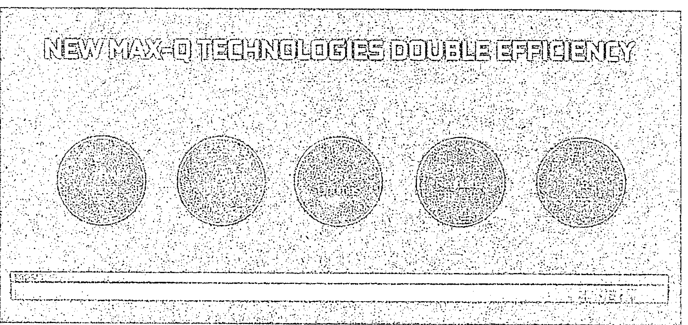

简单来说，英伟达针对MAX-Q技术进行了升级，一口气收录了动态加速技术（Dynamic Boost）、高级优驰技术（Advanced Optimus）、下一代能效调节技术（Next Gen Regulator Efficiency）、深度学习抗锯齿2.0（DLSS 2.0）和低电压显存（GDDR6）五大功能（图3）。

> 英伟达宣称开启动态加速技术可以获得最多10%的游戏性能提升

其中，动态加速技术可以在每一帧的画面上，智能地自动调节GPU和CPU之间的功耗分配，在不增加系统功耗的前提下提供更高的性能。比如在某个更消耗GPU资源的游戏中，Dynamic Boost可以将CPU功耗降低15W，同时将GPU功耗提升15W，在总功耗不变的情况下提升了显卡性能（图4）。

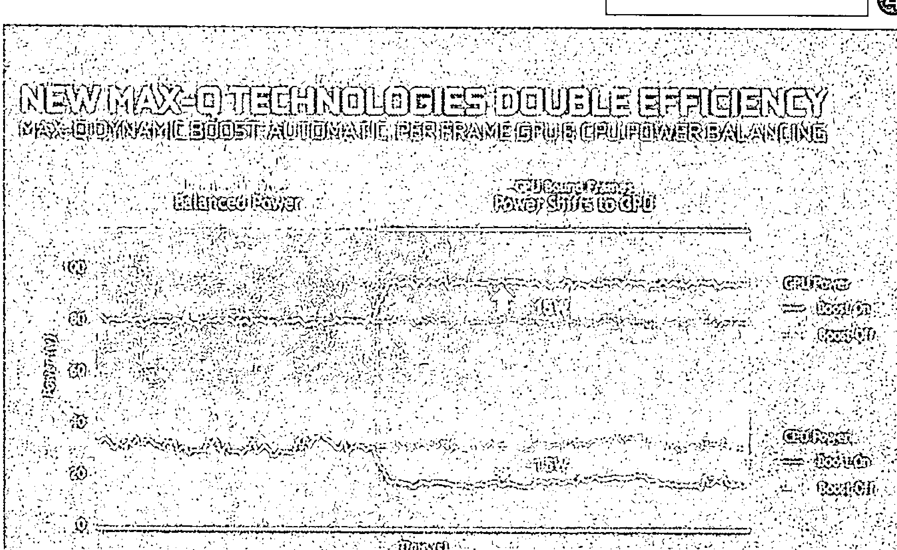

Advanced Optimus技术能根据当前负载智能判断使用集成GPU还是独立GPU。以前的Optimus技术只能实现独显与核显的自动“软切换”，在使用独显时仍需依靠核显进行画面输出，存在一定的性能耗损。而Advanced Optimus则支持独显与核显的自动“硬切换”，独显工作时可以直连屏幕彻底关掉核显，既节省了电力还提升了性能，而且无需重启系统。

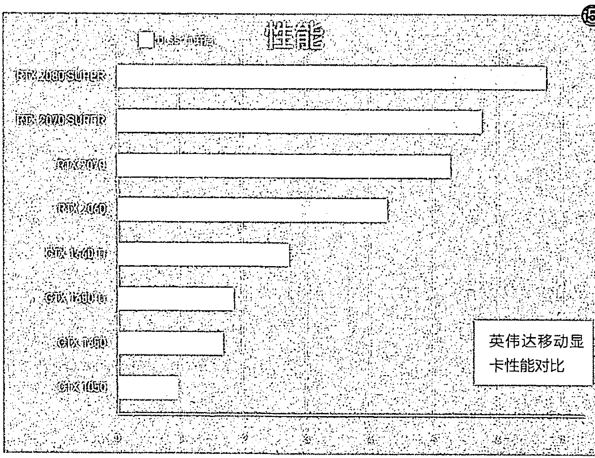

下一代能效调节技术有助于优化系统设计，让GPU高效运行的同时提供更出色的整体性能表现；DLSS 2.0技术基于经过优化的深度学习神经网络，可以在游戏生成精美、清晰游戏画面的同时提升帧率，搭配光线追踪技术相得益彰，甚至还可以帮助延长20%的电池续航时间；GDDR6显存的工作电压更低，性能更强，更省电。

总的来说，英伟达现在的目标就是实现图灵架构在游戏本领域的全面普及，全新升级的MAX-Q技术能带来双倍能效和一系列提高性能和电池续航的重大改进。换句话说就是花更少的钱就能获得更好的能效体验（图5）。

#### 新一代游戏本值得期待吗

当你拿到本期杂志时，采用第十代酷睿+英伟达新图灵显卡的游戏本应该已经批量上市了（图6）。如果你正在使用第八或第九代酷睿+GTX 1050 Ti或更高级别独显的游戏本，今年的新品也许缺乏足够的诱惑力。但是，对正在使用第七代酷睿或更早游戏本的玩家，今年的新品就很有看头了。新一代酷睿i5-10300H就可以轻松秒杀昔日旗舰i7-7700HQ，定位最低的GTX 1650性能也可秒杀当年最热门的GTX960M独显，无论是CPU还是GPU性能都实现了质变。

同时，为了配合第十代酷睿和新独显的推广，各大品牌都会推出采用全新或改进模具的游戏本，比如边框更窄、更高色域的屏幕，机身更轻薄，加入USB3.2 Gen2高速接口，雷电3也有望在高端机型中得以普及（图7）。

另一方面，今年游戏本的独显不仅性能更强，入手门槛也有所降低。比如，2019年5000元左右的游戏本都是GTX 1050 3GB，今年同价格可以买到GTX 1650 Ti；2019年GTX 1660 Ti游戏本多在6500元以上，如今6000元左右就能买到武装GDDR6显存的GTX 1660 Ti甚至RTX2060独显的游戏本。因此，如果你感觉家里游戏本的性能已经不够用了，第十代酷睿游戏本可谓入手正当时。

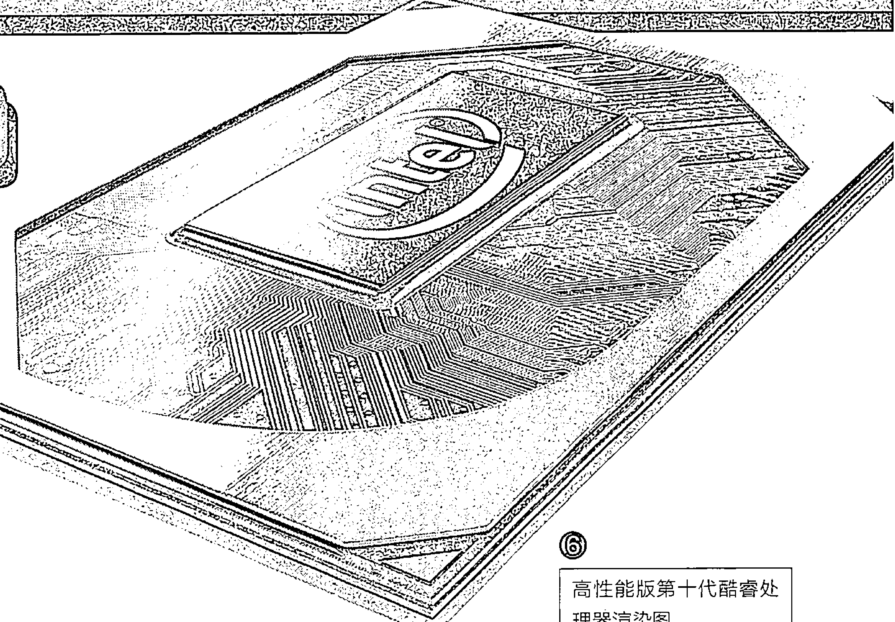

但我们也需注意到，第十代酷睿游戏本正面临AMD锐龙4000H系列的狙击，如果今年的AMD锐龙游戏本也能用上最新的模具、英伟达或AMD最新的独显，对英特尔来说会造成非常大的冲击。至于锐龙游戏本值不值得选，这又是新的故事了，感兴趣的朋友可以关注CFan的后续报道。

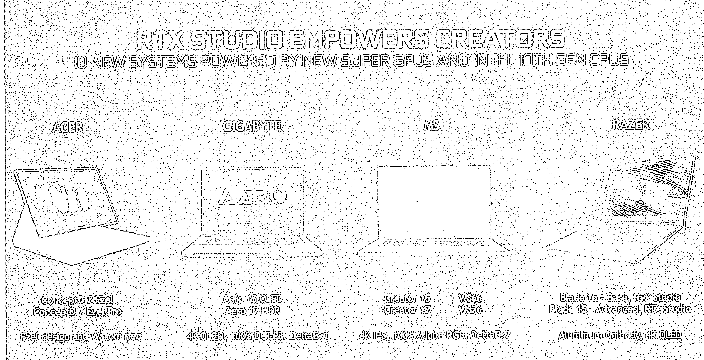

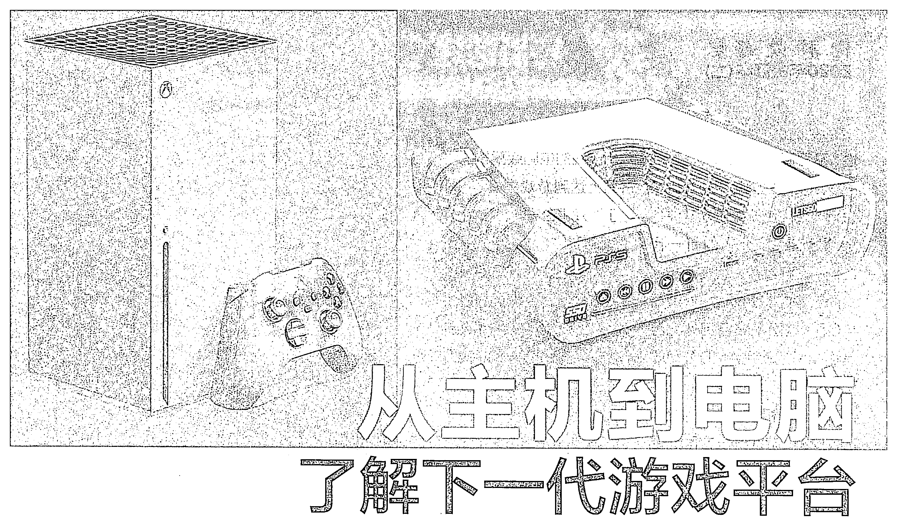

#### 从主机到电脑 了解下一代游戏平台

在刚刚过去的3月份，两大游戏主机厂商相继公布了自己的下一代主机配置方案，虽然它们最重要的处理器、GPU基于同样的AMD的核心，但分别展现出了自己对游戏硬件的独特理解，以及对未来游戏技术的考虑。更强大的新一代游戏主机必然会推动新一代游戏展现出更绚丽、更真实、更自然的风姿。

与此同时，又一次和电脑同架构的游戏主机也会进一步推动跨平台游戏的发展，想要不损失画质就爽玩大量的跨平台3A大作，电脑的性能必须能达到甚至超过这些主机才行。那么现在和年底新主机上市之时，我们对应的电脑会是什么样？能应付新一代的跨平台3A大作吗？

#### 主机配置与下一代游戏

也许从前言中大家就会发现一个问题，为什么笔者会将游戏主机而不是游戏电脑作为下一代跨平台游戏的基础呢？其实很简单，因为电脑玩家在性能不足的情况下可以升级配件，但游戏主机没有这个能力。在这种情况下，游戏主机的配置和性能，显然将成为游戏开发最重要的参考。另外对开发者来说，硬件配置“单纯”，更容易匹配和优化的游戏主机也是更容易开发的平台，所以大部分游戏开发者会选择在主机平台上开发完成，或者至少完成基本框架后，再在此基础上修改为电脑版。这也是为什么跨平台作品经常会先发售游戏主机版本，之后再推出电脑版。当然，开发商相对更重视主机平台的游戏版本还与经济利益等有关，这里就不赘述了。以游戏主机为基础开发游戏也有一些难点，例如系统封闭、开发难度较大、需要长时间适应等。所以我们常常会发现一些游戏主机的早期与晚期游戏，在画质等方面的表现几乎就像是使用了不同的两代硬件（图1、图2）。这点在电脑平台上恰恰相反，因为硬件具有开放性、继承

> 注：索尼并未公布新一代游戏主机的实际外形，本文使用的均为第三方概念图，最终请以官方发布为准。

性，不管硬件怎么升级，熟练的程序员几乎都可以快速上手为新一代电脑开发游戏软件。
不过目前公布的新一代主机都是连续第二代使用与电脑同架构的主要配件，处理器与GPU这两个关键配件甚至是连续两代使用AMD公司的产品（图3）。这使得它们在硬件方面具有和电脑类似的继承性，那么在游戏开发方面是否也和电脑一样具有继承性，可以避免早期“吃不透”硬件的问题呢？这点仍难以确定。
这里笔者必须说明，初期的游戏无法发挥游戏主机的全部效能，其实对电脑玩家来说反而是个好消息，因为这说明游戏的电脑版配置需求不用马上达到游戏主机的水平，给了游戏平台一个逐步升级的时间。相应的，这也给了早期游戏开发者逐步适应硬件变化，学会充分利用硬件能力的时间。
那么，具体到新的游戏主机上，它们对下一代游戏的针对性配置又能说明哪些问题呢？


FIFA 2015与FIFA 2019两款PS4游戏的画面，从球员的神态、皮肤细节，到光影、看台都有着明显的差别

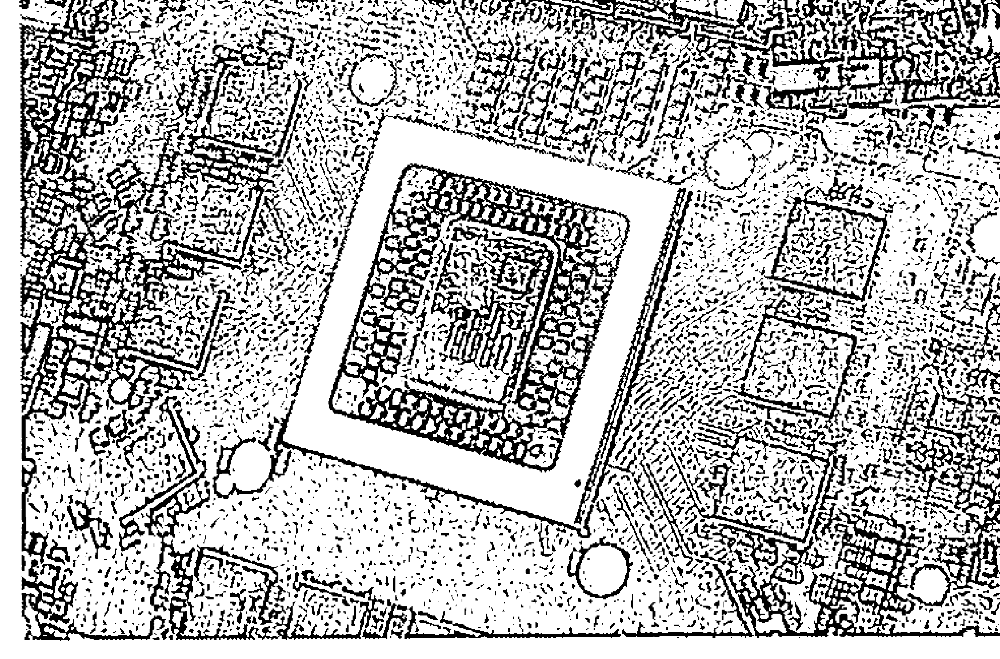

Xbox One使用的AMD处理器+GPU核心

#### 主机间的配置对比

虽然采用了同一家公司、同样架构的处理器与GPU，但Xbox Series X（以下简称新Xbox）与PlayStation 5（以下简称PS5）分别选择了不同的配置路线。
在对游戏性能最重要的处理器和GPU两个项目上，新Xbox显然更加强势，但PS5在硬盘速率、3D音效（图4）等方面也有自己独特的配置。

| 配件 | Xbox Series X | PlayStation 5 |
| :--- | :--- | :--- |
| CPU | 8核Zen 2定制处理器 (3.8GHz，超线程状态3.6GHz) | 8核Zen 2定制处理器 (3.5GHz) |
| GPU | 52个集群的定制RDNA 2核心，1.825GHz，12 TFLOPS | 36个集群的定制RDNA 2核心，2.23GHz，10.28 TFLOPS |
| 核心面积 | 360.45平方毫米 | 不详 |
| 制程 | 7nm增强型 | 不详 |
| 内存/显存 | 320bit 16GB GDDR6 | 256bit 16GB GDDR6 |
| 内存带宽 | 896GB/s | 448GB/s |
| 硬盘 | 1TB定制NVMe SSD | 825GB定制NVMe SSD |
| 硬盘速率 | 2.4GB/s (硬件数据压缩后可达4.8GB/s) | 5.5GB/s (硬件数据压缩后可达8GB/s ~ 9GB/s) |
| 扩展存储 | 1TB扩展卡 | NVMe接口 |
| 外置存储 | 支持USB 3.2移动硬盘 | 支持USB移动硬盘 |
| 光驱 | 4K蓝光光驱 | 4K蓝光光驱 |
| 性能目标 | 4K@60FPS，最高120FPS | 支持4K 120FPS、8K电视 |
| 其他 | 内存分为10GB@560GB/s、6GB@336GB/s两部分 | “Tempest” 3D AudioTech |


#### 从主机配置看下一代游戏的特色

从下一代主机的配置和技术说明、游戏展示中，我们可以确定的下一代游戏和游戏平台信息则大概有以下几个方面。

##### 光追特效成为主流

从目前新Xbox放出的游戏展示画面看，光追特效将成为非常重要，而且很普遍使用的画面效果，甚至连《我的世界》这种像素游戏中都会采用光追特效(图5)。这应该说明AMD的RDNA 2核心对这一特效的优化非常出色。

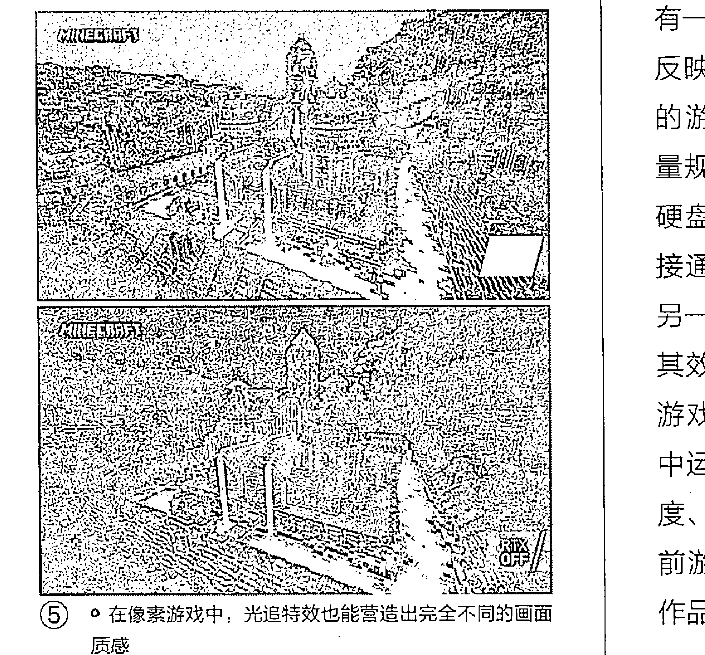

##### 充分利用多线程能力

两款新主机都选择了8核心/16线程处理器，这虽然是AMD高端处理器的标准，但要知道Zen 2核心也有6核心和不带超线程的产品，因此绝对不是唯一的选择。很显然，对下一代游戏来说，8个核心甚至16个线程都可能成为流畅运行的基础需求。而且新Xbox更是直接表明在超线程状态下可以“牺牲”频率，可能会鼓励游戏充分利用多线程而不是单核心高频率。

##### 4K高帧速成为主流 8K分辨率在望

至于下一代游戏的分辨率，4K应该已经是基础，PS5更明确了对8K电视的支持，虽然并未直接说明游戏会使用8K分辨率，但至少是做好了准备。另外新Xbox的规格中特别说明将重视刷新率，超过60Hz，达到120Hz甚至更高的帧速可能会成为很多高端游戏的选择，这一点会让游戏的体验与电脑平台更接近，而且具有了作为电竞游戏的潜力。

##### 可以期待的超宏大场景

两款主机的配置当然也有一些差别，其中有些可能会反映到游戏开发上，形成不同的游戏体验。比如PS5中容量规格特殊、带宽巨大的固态硬盘，在设计上可以与内存直接通话(图6)，很可能是作为另一种形态的内存使用，如果其效果足够好的话，可能会让游戏在百GB级别的“内存”中运行，创造出在场面宏大程度、NPC数量等方面远超目前游戏甚至远超玩家想象的作品。

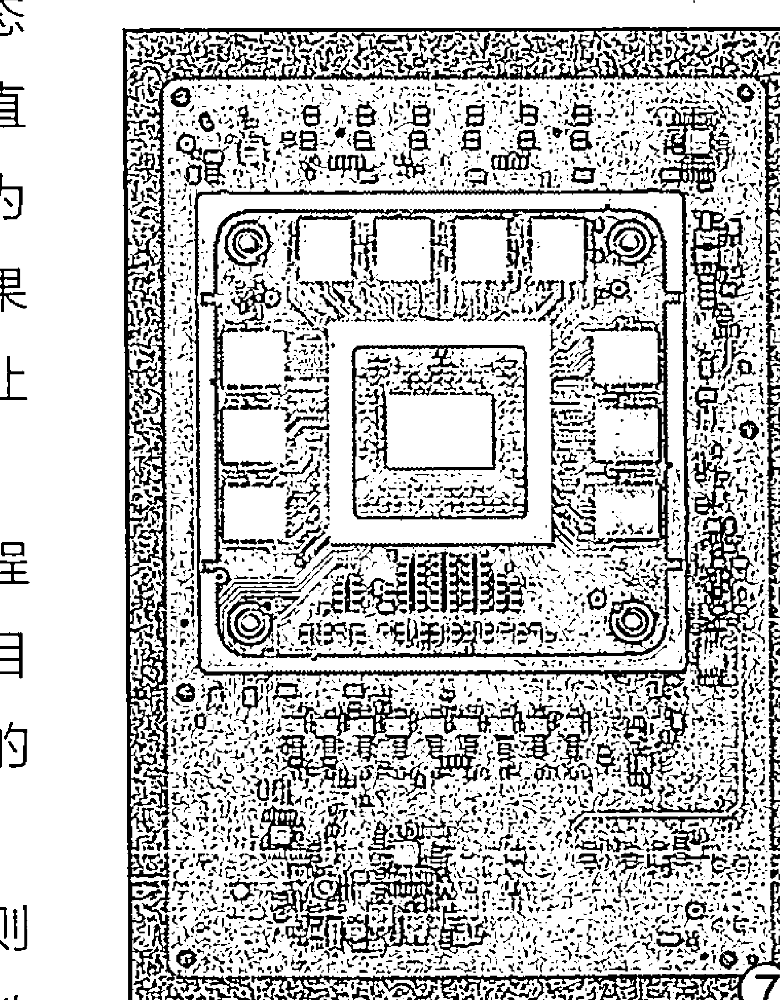

新Xbox的内存、显存则以带宽取胜(图7)，更高的数据更新速度，同样可以为更庞大的场景、更多的NPC提供支持，显然也是为更宏大的游戏场景做足了准备。

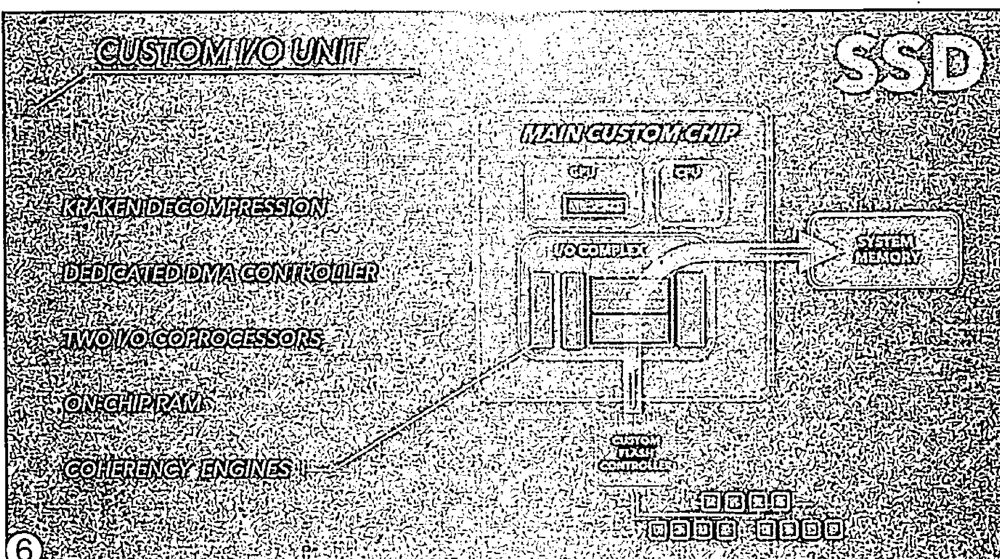

#### 与新主机对应的电脑配置

那么，与两款新游戏主机规格类似的电脑是什么样的呢？我们可以先看一看目前可以对应的产品。

首先是Zen 2核心处理器，它其实就是现在主流的第三代锐龙处理器。从核心数量和频率看，新Xbox的处理器大致介于锐龙7 3700X（3.6GHz）和3800X（3.9GHz）之间（图8），而PS5的处理器则比锐龙7 3700X频率略低一些。

基于RDNA 2显示核心的电脑GPU及相应显卡现在还没有发布，预计会是AMD的RX 6000系列（图9）。如果从两款新主机的GPU支持光线追踪技术这一点看，目前只有RTX 20系列可以与之对应。其中新Xbox的浮点计算能力达到12 TFLOPS，在英伟达RTX 2080 Super（11.15 TFLOPS）和RTX 2080 Ti（13.45 TFLOPS）之间。其浮点计算能力接近RTX 2080 SUPER，但其显存容量达到10GB，带宽达到560GB/s，更类似于RTX 2080 Ti的配置。

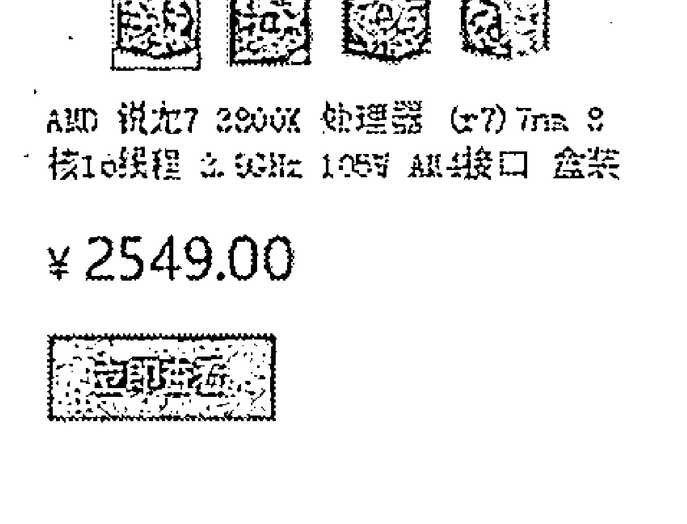

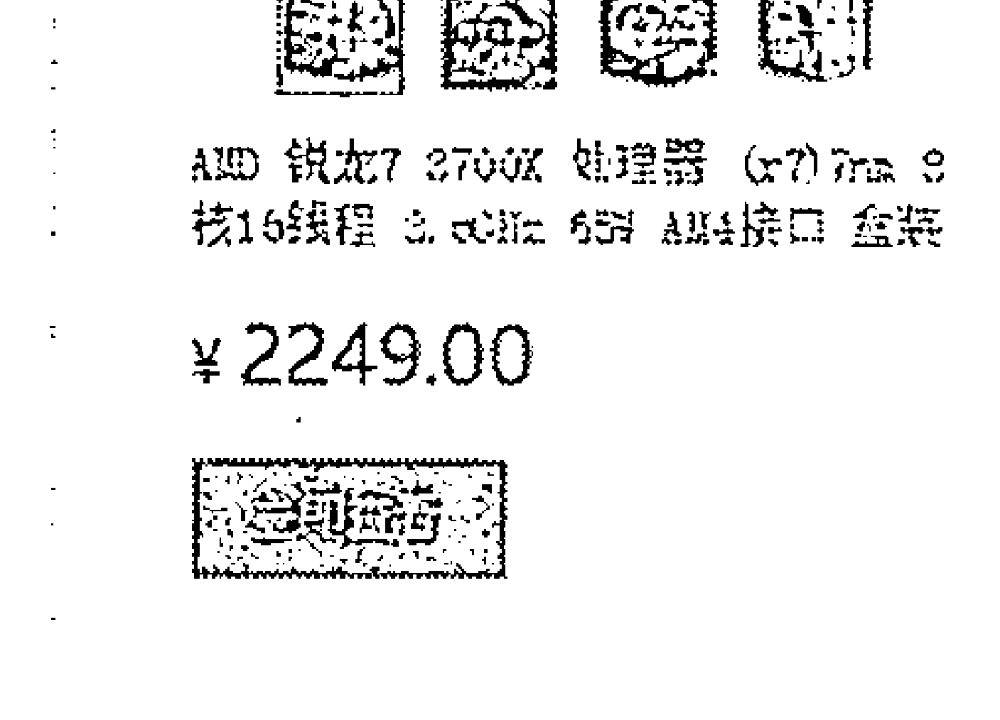

PS5的GPU（图10）浮点计算能力为10.28 TFLOPS，仅仅略高于公版RTX 2080，而且显存配置也非常类似，选用这款显卡作为对应就可以了。

其他的配置就比较好对比了，新Xbox的1TB NVMe固态硬盘，从速度看是采用了PCIe 4.0×2通道，不采用×4通道应该是为了降低布线的复杂度和发热量，毕竟它采用的主板尺寸比ITX主板还要小（图11），却要集成如此复杂、强大的硬件配置，散热系统更是无法兼顾其他了。

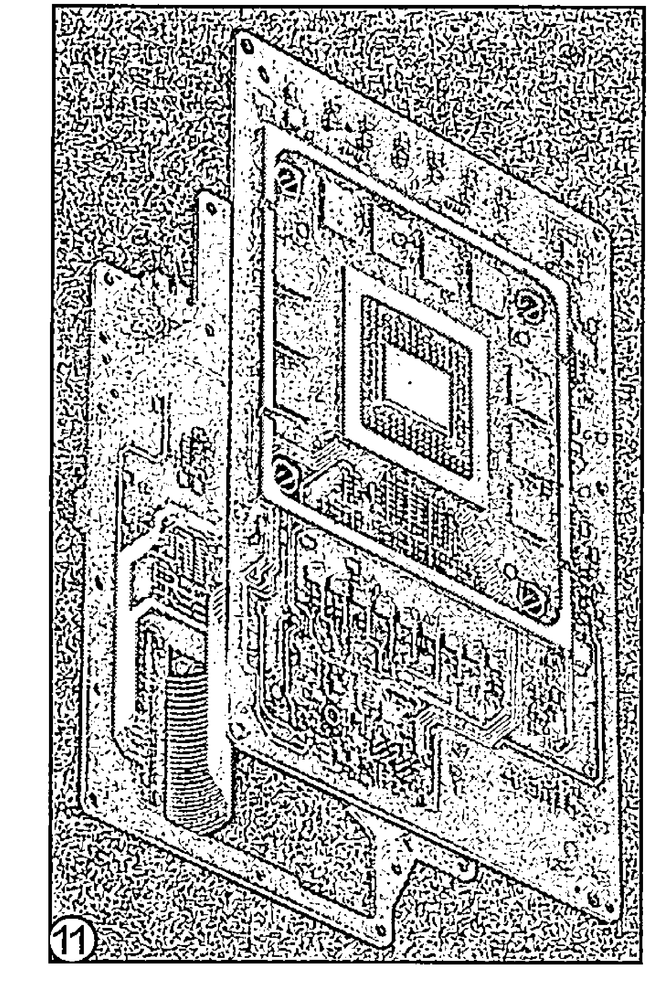

PS5的固态硬盘则有些另类，除了PCIe 4.0×4通道的高带宽外，还有与内存配合的功能，这有点像英特尔傲腾技术，不过因为AMD平台上暂时不支持傲腾技术，也不再支持相似的StoreMI功能，所以只能放弃对应的配置了。此外PS5的3D音效，两者的高带宽内存都与目前的电脑配置有一定的差别，我们同样只能尽量模拟，不可能做到完全一致。

如果要装一套类似性能的游戏电脑，考虑到主机系统比较纯净等因素，电脑的配置实际上还需要更高一些，比如新Xbox的处理器介于锐龙7 3700X和锐龙7 3800X之间，那么选锐龙7 3800X更为稳妥。另外内存也必须高配以容纳PC系统中较多的后台程序，所以16GB系统内存+8GB/11GB显存是必需的。

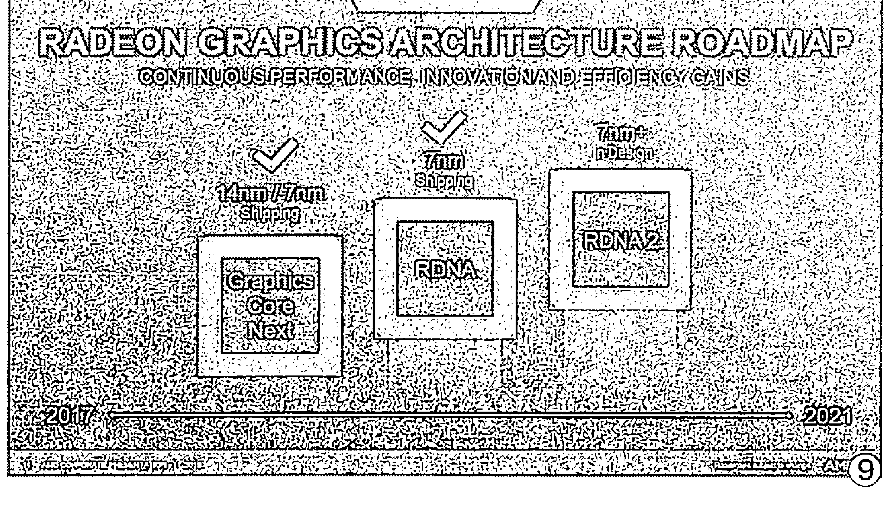

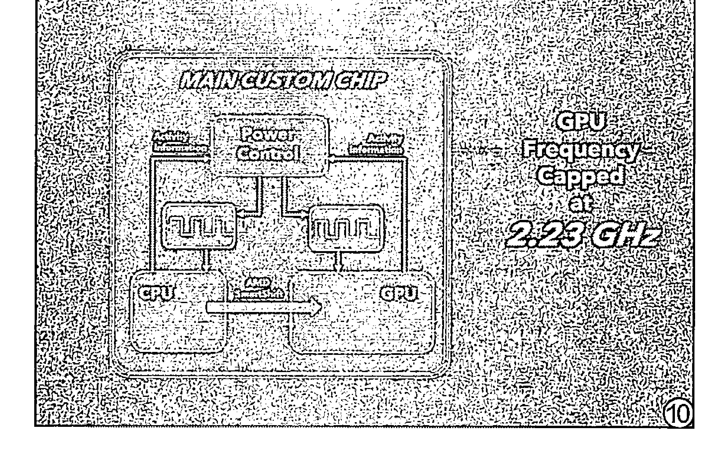

当然，因为距离Xbox真正上市的日期还很遥远，所以现在进行价格对比的意义不大。这里只给大家一个预估价，目前类似新Xbox的配置大概需要15000元左右，类似PS5的配置也需要10000元左右。不过到2020年底或2021年初两款新主机上市时，电脑的处理器和显卡可能会有比较大的变化。比如8核处理器可能只是中端产品，带有光追功能的10 TFLOPS级别显卡也可能不再是价格昂贵的旗舰级型号，PCIe 4.0通道则应该会扩展到主流主板芯片上，仅仅这三个方面的变化，就能让电脑价格降低至目前的2/3甚至更低。另

| 配置 | 对应Xbox | 对应PlayStation 5 |
|------|----------|---------------------|
| CPU | 锐龙7 3800X | 锐龙7 3700X |
| 主板 | X570主板 | X570主板 |
| 内存 | DDR4 3200 16GB | DDR4 3200 16GB |
| 显卡 | RTX 2080 Ti 11GB | RTX 2080 |
| 散热器 | 盒装自带 | 盒装自带 |
| 硬盘 | 1TB PCIe 3.0 × 4或PCIe 4.0 SSD | PCIe 4.0 × 4 SSD |
| 光驱 | 蓝光光驱 | 蓝光光驱 |
| 电源 | 650W | 600W |
| 机箱 | ATX或MATX机箱 | ATX或MATX机箱 |

外大容量PCIe 4.0固态硬盘、内存等配件也有较大的降价空间。在最好的情况下，预计与新主机能力类似的电脑价格可下降至7000元~10000元，虽然比游戏主机还是要贵一些，但已经进入中高端玩家可以承受的价格区间。

#### 下一代游戏电脑与配件的猜想

反过来，新游戏主机带来的硬件信息以及新一代游戏的形态，也为我们提供了下一代游戏电脑的想象空间。

首先是超高频率，除了在新主机规格表中可以看到的高达2.23GHz的GPU核心，其实还有一个隐藏的超高频率配件——Xbox的GDDR6内存。从320bit带宽就有89.6GB/s（560GB/s+336GB/s）带宽这一数据看来，其等效频率达到了22.4GHz（即22.4Gbps），远超过PS5的14GHz等效频率，而后者才是目前比较常见的GDDR6显存频率。虽然目前没有切实可靠的消息说明如此高频率的颗粒出自哪个厂商，但既然被游戏主机选中，应该已经是可量产的产品了，那么出现在下一代高端显卡中也不存在问题。

其次是对RDNA 2显卡的期待，从两款新主机的配置看，RDNA 2的性能相当强大，其中配置比较高的新Xbox使用了56个集群的配置，可以获得目前旗舰级显卡的性能。但从一般的芯片设计规律看，它应该仍不是“满血”形态，估计会有64个集群产品，虽然这种最高端的型号可能会专供利润率更高的商用市场，我们也至少还有60个集群的型号可以期待，它显然也会是非常强大的显卡。另外，与处理器集成的RDNA 2显卡芯片（图12）都能达到1.8GHz乃至2.2GHz以上的频率，那么在GPU可以独享PCB、供电单元和散热系统的独立显卡上，它应该有更高的频率空间，也就能够提供更高的性能。

从定位上看，新Xbox的GPU至少也是次旗舰级的产品，而PS5使用的36个集群的型号就应该已经进入了中端、主流市场，预计价格会接近目前的RTX 2060系列，但其浮点计算性能却是RTX 2080级别的，这对主流玩家来说当然是个相当好的消息。

还有比较容易忽略的一点，即存储方面的革新。结合PS5的高速固态硬盘用法和AMD近期取消StoreMI技术，宣称会推出新的存储加速技术的情况，笔者有理由相信AMD的新一代存储加速技术已经离我们很近了。与此同时，英特尔的新一代3DXpoint技术，即傲腾内存（图13）也正式宣布将继续发展。这些存储加速技术可以让大型游戏中恼

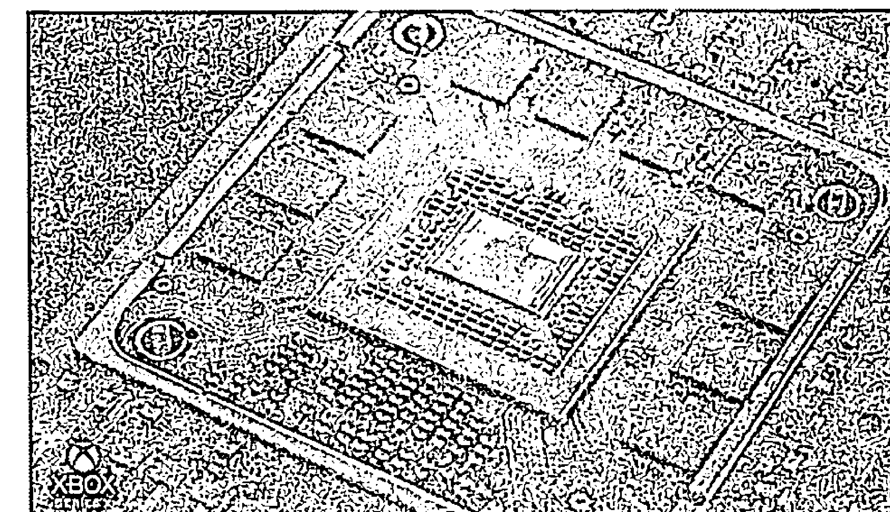

#### 主机还是电脑，这是一个问题

从价格上看，两款游戏主机即使价格比上一代明显上涨，预计也就在499美元~599美元，约合人民币3500元~4250元。而在2020年底，即使是与配置略低的PS5对应的电脑，总价应该也会远超两款游戏主机，难道电脑的性价比如此之低吗？我们是否还需要选择游戏电脑呢？

这里必须说明，相对于游戏主机只能玩游戏或提供一些游戏相关功能，游戏电脑的能力就要全面得多了。比如它可以用来管理家庭中的各种事物、处理工作上的各种任务、轻松上网、观看视频等。对游戏电脑来说，游戏能力只是其实际能力的一部分，游戏时长只是使用时长的一半也很正常。其实我们完全可以说，大部分玩家的游戏电脑只有一半的价格是完全用来玩游戏的，这时再看性价比，大家是不是就平衡得多了？

另外游戏电脑还可以根据实际需求来调整游戏画质，或者升级更强大的配件来满足游戏的更高性能需求等，即使是目前游戏主机已经支持的视频录制、分享等方面，也有使用更灵活、可以深度地处理视频、便于直播等优势。

至于游戏主机，除了价格更好之外，还有开机即玩、良好的操控手感(手柄)、家电化设计等优势。仅仅是从基础设计上进行的小型化设计，就使其体积可以远远小于类似性能的电脑(图17)。另外对于已经在电脑前坐了很久，休息时希望不再摸着键鼠、盯着电脑屏幕的用户来说，游戏主机也绝对是个更加易用，也更加放松的娱乐方式，这些同样是电脑游戏所无法取代的。

那么，在电脑平台和游戏主机都将大幅更新的游戏新时代中，你的选择又是什么呢？

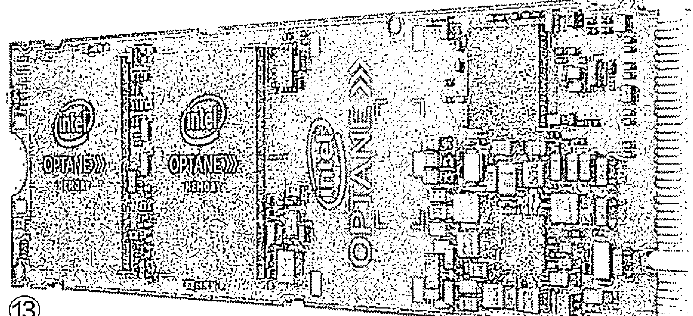

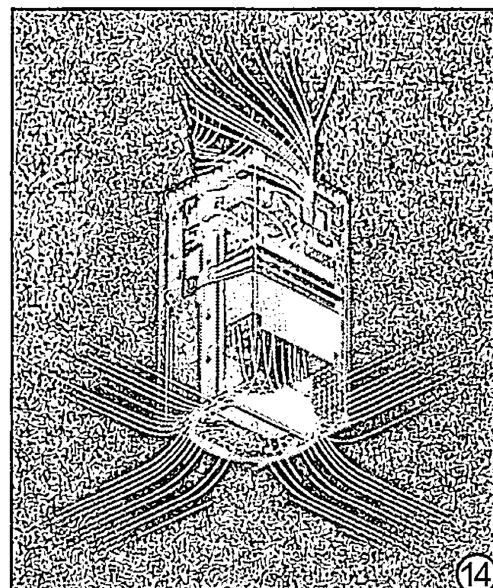


## 技术盛宴

##### 浅析AMD锐龙4000系列笔记本

策划《电脑爱好者》编辑部

在过去的很长一段时间里，英特尔一直是笔记本领域的绝对霸主，虽然AMD旗下的移动APU也历经迭代，却始终难以改写这一格局，贴有AMD标签的产品很难登上“大雅之堂”。而这一切，都随着2017年底AMD推出“Ryzen 锐龙”品牌而得以改变，并在轻薄本战场给予了英特尔迎头痛击。如今，AMD全新的移动锐龙4000系列移动平台已经蓄势待发，经由轻薄本和游戏本两路战场出击。那么，AMD此次能否全面逆袭？我们又该如何看待新一代锐龙笔记本呢？


扫一扫，更多精彩内容立现！

###### 融合的力量APU家族回顾

英特尔和AMD无愧是一对“宿敌”，2020年英特尔酷睿家族全面进化到第十代，而AMD移动锐龙4000系列不仅隶属于“第三代锐龙”，还有着“第十代APU”的隐藏身份。在正式解读移动锐龙4000之前，咱们先来简单回顾一下APU的发展史吧。

###### APU困局

也许你不了解“锐龙”，但你一定听说过“APU”（Accelerated Processing Units）。简单来说，APU是AMD在收购ATI之后所提出的Fusion融聚理念的战略级产物(图1)。它最早诞生于2011年，将CPU、GPU和北桥芯片融合进了一颗芯片内，并在2015年进一步将南桥芯片整合其中，成为了一颗名副其实的X86 Full SoC(图2)。


可惜，AMD的制程工艺技术始终落后于英特尔，而APU早期采用的CPU微架构（K10→Bulldozer推土机→Piledriver打桩机→Steamroller压路机→Excavator挖掘机）也远不如同期的对手，所以它们在性能和续航方面长期处于被英特尔压制的状态，最终导致APU在笔记本领域的知名度和影响力逐年下降。

###### 锐龙腾飞

2017年10月，AMD正式发布了代号为“Raven Ridge”的第八代APU平台，并有了全新的“锐龙”之名，而它也是AMD在移动领域翻身的转折点。Raven Ridge APU最大的特色，就是采用了Zen CPU和Vega GPU两套最新微架构的组合（图3），再结合主流的14nm制程工艺，在性能层面足以媲美英特尔同期的第八代酷睿处理器。
2019年1月，AMD推出了第九代Picasso APU平台，12nm工艺和Zen+微架构，让其在性能小幅提升的同时还降低了功耗，在续航方面也开始对同期的第八代酷睿产生威胁（表1）。2020年1月，本文的主角，第十代Renoir APU重磅登场，它采用了时下最先进的7nm工艺，叠加Zen 2微架构，在整体性能和续航层面实现了对第十代酷睿的全面（包括轻薄本和游戏本市场）反超。


如果不出意外，AMD笔记本的崛起就在今朝。

表1：AMD历代APU平台汇总

| APU代号 | 发布时间 | 制程工艺 | 代表型号 | 特色 |
| :--- | :--- | :--- | :--- | :--- |
| Llano | 2011年6月 | 40nm | A8-3500M | CPU/GPU物理整合 |
| Trinity | 2012年6月 | 32nm | A10-4600M | CPU/GPU互联增强 |
| Richland Kabini | 2013年5月 | 32nm 28nm | A10-5750M A6-5200 | 高端型号引入了“至尊”称号 |
| Kaveri | 2014年1月 | 28nm | FX-7500 | CPU/GPU统一寻址 |
| Beema | 2014年5月 | 28nm | A6-6210 | 整合ARM硬件加密安全模块 |
| Carrizo | 2015年5月 | 28nm | FX-8800P | CPU/GPU/FCH物理融合 |
| Bristol Ridge Stoney Ridge | 2016年5月 | 28nm | FX-9800P A9-9410 | 改善游戏、视频、文件压缩性能 |
| Raven Ridge | 2017年10月 | 14nm | 锐龙7 2700U | Zen CPU遇到了Vega GPU |
| Picasso | 2019年1月 | 12nm | 锐龙7 3700U | CPU微架构升级为Zen+ |
| Renoir | 2020年1月 | 7nm | 锐龙7 4800U | 最新工艺，CPU升级为Zen 2 |

如果不出意外，AMD笔记本的崛起就在今朝。

###### 排队点名移动锐龙4000成员梳理

本刊曾在2020年第4期特别话题《全面开战 AMD移动锐龙4000系列问世》一节中着重介绍过Renoir APU家族的首发成员以及部分技术特色。随着移动锐龙4000系列的正式量产，我们还需掌握关于它们的更多细节。

###### 熟悉的命名规则

AMD锐龙的命名规则与英特尔旗下的酷睿非常像，比如锐龙3、锐龙5、锐龙7和锐龙9分别对应酷睿i3、酷睿i5、酷睿i7和酷睿i9，而U或H的后缀则分别代表低功耗版和高性能版。此外，我们还能从它们之间的4位数字，看出它们属于第几世代以及大概的等级定位(图4)。


目前，AMD移动锐龙4000系列一共包含11款型号，其中低功耗版（U系列）5款，分别是锐龙3 4300U、锐龙5 4500U、锐龙5 4600U、锐龙7 4700U和锐龙7 4800U（表2）；高性能版（H、HS系列）6款，分别是锐龙5 4600H、锐龙5 4600HS、锐龙7 4800H、锐龙7 4800HS、锐龙7 4900H和锐龙7 4900HS（表3）。

###### 没能普及的多线程

在英特尔第十代酷睿家族中，超线程（HT, Hyper-Threading）是所有成员的标配，哪怕是i3-10110U和i3-1005G1这两款入门级型号也能享用该技术的增益效果。AMD也有类似的同步多线程技术（SMT, Simultaneous Multi-Threading），其原理与HT技术相同，都是在一个CPU核心上可同时执行多个线程，进一步压榨出CPU的空闲资源。

可惜，同步多线程技术并没能在移动锐龙4000系列的低功耗版中普及，锐龙3 4300U、锐龙5 4500U和锐龙7 4700U这种后缀第二位为“单数”的型号就不支持该技术(图5)，只有锐龙5 4600U和锐龙7 4800U的“双数”型号才得以列装(图6)。

考虑到如今越来越多的软件和游戏都针对多核多线程进行了优化，而Windows 10系统对多线程的调度器设置也更为科学。打开任务管理器，你会发现不论物理核心还是逻辑核心的负载都相当平衡(图7)，很少出现之前Windows 7时代“单核负载多核围观”的惨状了。因此，在售价和其他配置相似时，我们可以调高搭载锐龙5 4600U和锐龙7 4800U处理器的轻薄本的选购优先级，就好像联想小新笔记本在官微上表示的那样——“没超线程，不够高能!”(图8)。


###### 基于功耗的分级

细心的朋友不难发现，低功耗锐龙4000U和高性能锐龙4000H在规格上似乎并没有太大的差异，锐龙5 4600U和锐龙5 4600H/HS、锐龙7 4800U和锐龙7 4800H/HS，它们的核心/线程、二级/三级缓存一模一样，几乎就是同一颗处理器。

实际上，这也是当前笔记本处理器的“潜规则”。以英特尔第十代酷睿旗下的Comet Lake-U（15W TDP，轻薄本专用）和Comet Lake-H（45W TDP，游戏本专用）平台中的6核i7为例，它们来自相同的生产线，i7-10710U和i7-10750H在本质上其实就是同一颗处理器（表4）。只是，i7-10710U为了照顾轻薄本的“小身板”，强行将默认TDP限制到15W，代价就是基础频率从2.6GHz降到了1.1GHz，在“火力全开”时主频也只能稳定在2.8GHz左右（图9），而此时它的实际功耗其实也已经达到了极限的30W左右。反观i7-10750H，它实际可以稳定运行在60W甚至更高的功耗上，通过更高的主频换取更强的性能。AMD锐龙4000系列也是如此，低功耗版的TDP被强行降到了15W（比如锐龙5 4600U），而高性能版则以45W为主（比如锐龙5 4600H），一些体质比较好的型号在35W TDP时也能获得接近45W时的性能，所以它们还被冠以HS的后缀（比如锐龙5 4600HS）。

###### 影响性能的隐藏指标

细心的朋友可能还发现一个问题，相同的处理器，在两款不同型号的笔记本之间性能可能相差20%甚至更高。CFan曾经分析过英特尔酷睿平台出现上述问题的原因，笔记本厂商可以根据产品的散热模块设计和定位，自定义“短时睿频功耗最大值”（PL2）和“长时睿频功耗最大值”（PL1），这两项参数的具体数值可以通过AIDA64软件查看（图10），还能借助Intel Extreme Tuning Utility工具修改（图11）。其运行机理是，当处理器进入高负载时，CPU的功耗必然会超过默认的TDP数值。此时，CPU将优先进入PL2状态（俗称“鸡血模式”），然后开始倒计时（通常是28秒~56秒）之后进入PL1状态，如果在此期间实际功耗没有超过PL1值，那CPU则能保持当前频率直至高负载状态结束。相对来说，PL2值的高低对跑分影响很大，而PL1值对实际体验的影响更大，因为它将决定处理器可以稳定运行的最高频率，也是我们经常念叨的“功耗墙”。AMD锐龙处理器同样存在类似的概念，只是HWiNFO和AIDA64等软件很难准确监测，所以推荐大家安装AMD推出的官方工具“AMD μProf”（下载地址：https://developer.amd.com/amd-uprof/），在“Timechart”选项卡界面就能看到CPU当前功耗的显示窗口（图12），其中包含如下几个选项：

| 属性 | 值 |
|---|---|
| Processor Name | Intel Core i7-9750H |
| Original Processor Frequency | 2600.0 MHz |
| CPU ID | 000906EA |
| CPU Brand Name | Intel(R) Core(TM) i7-9750H CPU @ 2.60GHz |
| CPU Vendor | GenuineIntel |
| CPU Stepping | U0 |
| CPU Code Name | Coffee Lake-H |
| CPU Technology | 14 nm |
| CPU QDF | QRR2 (QS) |
| CPU Thermal Design Power (TDP) | 45.0 W |
| CPU Power Limit 4 (PL4) | 110.0 W |
| CPU Power Limits (Max) | Power = Unlimited, Time = Unlimited |
| CPU Power Limit 1 - Long Duration | (60.00 W) (56.00 sec) [Unlocked] |
| CPU Power Limit 2 - Short Duration | (75.00 W) (2.44 ms) [Unlocked] |
| Configurable TDP Level 1 (Down) | 35.00 W (Unlinked range), 2200 MHz |
| Current Configurable TDP Level | Nominal [Unlocked] |
| CPU Max. Junction Temperature (Tj,max) | 100 °C |


STAPM Limit: 代表触发温度限制后的稳定功耗
STAPM Power: 代表从监测开始到目前的平均功耗
PPT Fast Limit: 代表未触发温度限制时短时间睿频功耗
PPT Slow Limit: 代表未触发温度限制时长时间睿频功耗

| Counter | Value |
| :--- | :--- |
| ☑️ Socket0 STAPM Limit | 25.00 |
| ☑️ Socket0 STAPM Power | 13.05 |
| ☑️ Socket0 PPT Fast Limit | 35.00 |
| ☑️ Socket0 PPT Slow Limit | 30.00 |

其中，我们可以将PPT Fast Limit (fPPT) 和PPT Slow Limit (sPPT) 理解为英特尔酷睿处理器的PL2状态，也就是“鸡血模式”，而STAPM Limit则对应PL1状态，也就是“功耗墙”（图13）。其运行机制是，当处理器进入高负载状态时，CPU的功耗首先会上涨到fPPT的设定值，然后开始倒计时，进入sPPT设定值后再次开始倒计时，最后将会稳定运行在STAPM Limit的设定值，直至高负载状态结束。

很多笔记本会预装电源管理软件，比如联想笔记本就能通过“Fn+Q”在节能、智能和野兽模式间切换（图14），而这三档状态，则分别对应不同的PL1、PL2或fPPT、sPPT、STAPM Limit设定值的组合。一些散热模块用料一般，思想“保守”的笔记本，其PL1或STAPM Limit设定值就是处理器标准的TDP，比如锐龙5 4600U对应15W，锐龙7 4800H对应45W。而一些散热模块用料豪华、主打更高性能体验的产品，其PL1或STAPM Limit设定值则高于标准TDP，比如将锐龙5 4600U的STAPM Limit设为25W，锐龙7 4800H设为55W，此时这些笔记本的实际性能表现将远胜于保守的机型。

###### 扩展阅读：影响频率的两堵墙

除了功耗墙，处理器频率还受“温度墙”的影响，在PL1或PL2状态时，无论功耗还是温度超过阈值都会导致降频或睿频失效。和台式机相比，笔记本的散热模块存在先天不足，在现实中很难达到标称的最高睿频频率。以第十代酷睿i7-10750H为例，它最大的特色就是睿频加速频率可达5GHz。然而，市面上所有搭载i7-10750H的游戏本，只有部分机型在高负载下可以跑到这个频率，而且只能坚持几秒钟，CPU拷机测试时的实际频率大多只能稳定在3.2GHz~4.0GHz之间。


换句话说，那些跑分更高的笔记本，其功耗墙的设定值一定远远高于默认的TDP。以锐龙5 4600U为例，绝大多数产品默认的功耗墙都在15W~20W左右，如果有产品可以提供35W的高性能模式，此时后者的实际性能已经无限接近锐龙5 4600HS。新浪微博数码博主@孤独凤凰战士就曾分享过锐龙4000系列在不同TDP模式下对应的持续最高CPU主频和Cinebench R15跑分成绩，差距一目了然（图15）。

| Power | Ryzen 7 4800H | | Ryzen 7 4700U | | Ryzen 5 4600H | | Ryzen 5 4600U | | Ryzen 5 4500U | |
| :--- | :--- | :--- | :--- | :--- | :--- | :--- | :--- | :--- | :--- | :--- |
| | Clock | Score | Clock | Score | Clock | Score | Clock | Score | Clock | Score |
| 15W | 2.04GHz | 1050cb | 2.48GHz | 1250cb | 2.75GHz | 951cb | 2.43GHz | 937cb | 2.59GHz | 991cb |
| 25W | 2.93GHz | 1475cb | 3.05GHz | 1508cb | 3.34GHz | 1137cb | 3.09GHz | 1172cb | 3.14GHz | 1182cb |
| 35W | 3.29GHz | 1634cb | 3.36GHz | 1670cb | 3.75GHz | 1261cb | 3.57GHz | 1336cb | 3.56GHz | 1303cb |
| 45W | 3.61GHz | 1785cb | 3.74GHz | 1802cb | 4.00GHz | 1331cb | 3.87GHz | 1444cb | 3.77GHz | 1407cb |
| 55W | 3.83GHz | 1889cb | 3.94GHz | 忘截图 | 4.18GHz | 1393cb | 3.98GHz(50W) | 1477cb | 3.94GHz(55.6W) | 1460cb |
| 65W | 3.99GHz | 1950cb | 4.07GHz | 1946cb | | | | | 3.98GHz(36.2W) | 1022cb |
| 75W | 4.09GHz | 1995cb | 4.18GHz | 1971cb | | | | | | |
| 85W | 4.13GHz(81W) | 2019cb | 4.23GHz(78.4W) | 1983cb | | | | | | |## 移动锐龙4000性能前瞻和选购思路

和英特尔最新的第十代酷睿相比，AMD移动锐龙4000系列采用了“以多打少”的竞争策略。下面，我们就看看影响新锐龙性能的主要因素，以及它能对轻薄本和游戏本/设计本市场造成多大的影响。

##### 谁会影响新锐龙的性能

为了提升在笔记本领域的影响力，AMD对移动锐龙4000系列寄予厚望，它不仅将CPU架构升级到了最新的Zen 2，集成的Vega GPU和I/O单元也全部由当前最先进的7nm工艺打造，并将它们全部封装进一个“Die”之中（桌面版I/O单元为12nm，还额外占用了一个Die），集成度较之3000系列桌面平台高出许多。我们可以将移动锐龙4000理解为桌面版的工艺和结构优化版，各个单元依旧通过Infinity Fabric总线进行通讯(图1)。


有关移动锐龙4000的更多技术细节，感兴趣的朋友可以参考2020年第4期的特别话题。本章节我们要讨论的重点，是除了上个章节中提到的功耗墙的设定，还有哪些因素会影响新锐龙的性能呢？

##### 缓存和总线

首先就是缓存容量的降低。为了减小高集成度Die的芯片面积，AMD将移动锐龙4000的L3缓存较桌面版本砍掉了3/4，哪怕是锐龙9也只有8MB的L3缓存，这对游戏性能的影响比较大。此外，由于Infinity Fabric总线的特殊性，它也会对移动锐龙4000的性能带来一些不确定性。

简单来说，在默认情况下，AMD锐龙处理器的Infinity Fabric总线频率与内存频率是按1:1比例绑定的，DDR4-3200MHz内存的实际运行频率为1600MHz，此时它对应的Infinity Fabric总线频率也是1600MHz，可以保持最理想的性能输出环境。

问题来了，移动锐龙4000系列还支持LPDDR4X-4266MHz内存(图2)，而这也是采用板载内存设计的轻薄本可以选用的标准。由于Infinity Fabric总线频率存在上限(1800MHz左右)，当内存频率超过3600MHz(笔记本平台)或3733MHz(桌面平台)就会触发内存和Infinity Fabric总线以2:1比例分频的机制(图3)。因此，高频内存虽然可以获得更高的带宽(有利于GPU性能的提升)，但同时也会增加内存延迟(CPU性能会略有小降)。


##### 留意内存规格

在未来一段时间，搭载移动锐龙4000系列处理器的笔记本多会采用4种规格的内存设计：

- 内置2个SO-DIMM内存插槽；
- 内置1个SO-DIMM内存插槽，同时板载4GB或8GB DDR4-3200MHz内存颗粒；
- 板载DDR4-3200MHz（双通道）标准的内存颗粒；
- 板载LPDDR4X-4266MHz（双通道）标准的内存颗粒。

采用第1种内存设计的多为游戏本，采用第2种内存设计的则是不追求极致便携的轻薄本，它们的共性是具备一定的内存容量升级空间。但是，当我们更换或升级内存条时，一定要购买DDR4-3200MHz或更高标准的内存条，而且还要组成“双通道”模式（图4）！因为锐龙4000系列集成了性能非常出色的Vega核显，它们的性能主要就受制于内存规格。比如，双通道较单通道模式可提升最多90%的性能，而DDR4-3200MHz则比DDR4-2666MHz提高20%~40%（图5、图6）！

##### Final Fantasy XV (1080p Standard)
Frames Per Second (Higher is Better)

| 配置 | FPS |
| :--- | :--- |
| ASUS Zephyrus G14 (R9 4900HS IGP, DDR4-3200) | 20.64 |
| ASUS Zephyrus G14 (R9 4900HS IGP, DDR4-2666) | 15.38 |

##### Civilization 6 (1080p Max No MSAA)
Frames Per Second (Higher is Better)

| 配置 | FPS |
| :--- | :--- |
| ASUS Zephyrus G14 (R9 4900HS IGP, DDR4-3200) | 31.3 |
| ASUS Zephyrus G14 (R9 4900HS IGP, DDR4-2666) | 22.2 |

- 锐龙9 4900HS集成核显在搭配DDR4-2666和DDR4-3200两种频率内存时，运行《文明6》和《最终幻想XV》游戏时的差异

采用第3和第4种内存设计的多是轻薄本，理论上在搭配LPDDR4X内存颗粒时Vega核显的性能要更强一些。之所以强调“理论上”，是因为板载内存颗粒存在DDP（Dual Die Package）和SDP（Single Die Package）两种封装技术，我们可以将DDP理解为双核内存颗粒，其内存带宽较单核的SDP颗粒提升20%。在都是双通道且内存频率相同时，DDP还会让Vega核显的性能在SDP的基础上再提升10%左右。

可惜，DDP内存的成本比SDP略高，现阶段轻薄本领域的LPDDR4X-4266MHz颗粒几乎都是SDP，而DDR4-3200MHz颗粒也多是采用DDP和SDP混搭，这意味着在其他规格（包括散热模块和功耗墙设置）一模一样时，有些轻薄本凭借DDP内存就能额外增加10%的3D性能（图7）。因此，以后当你发现有些搭载锐龙5 4600U（集成 Vega 6核显）轻薄本的核显性能竟然和武装锐龙7 4800U（集成Vega 8核显）的产品差不多时就不要大惊小怪了。


##### 新锐龙和十代酷睿的性能对比

在过去，AMD经常使用“田忌赛马”的策略与英特尔抗衡。比如，将第一代和第二代移动锐龙7卖到和酷睿i5相同的价钱，通过错位竞争换取性能上的优势。随着第三代移动锐龙4000的出现，AMD不再含蓄，凭借更先进的工艺和更多物理核心的优势，直接向同期的第十代酷睿碾压而来。

##### CPU性能对比

没错，AMD移动锐龙4000系列最大的优势就是“以多打少”，锐龙5就拥有6个物理核心，而同级别的酷睿i5则只有4个物理核心；锐龙7拥有8个物理核心，而酷睿i7的核心数量为4个（低功耗版）、6个（高性能版或i7-10710U）或8个（i7-10875H或i9系列）。

本文我们不讨论少见且昂贵的锐龙9、i7-10710U、i7-10875H和i9等处理器，只对比常见于7000元以内笔记本常用的处理器型号。

CineBench R20是知名度最高的专业处理器跑分工具，它拥有复杂的测试场景，能够帮助用户准确测试自己电脑的CPU性能。在CineBench R20的单核测试项目中（图8），英特尔第十代酷睿处理器略占优势，但我们也需注意到，哪怕是定位较低的锐龙5 4500U的分数距离酷睿i7-10510U也只有个位数的差异，在英特尔传统优势项目中新锐龙可以取得如此成绩可谓超出预期。


在CineBench R20的多核测试项目中，新锐龙实现了全面的逆袭，锐龙5 4500U就能反超10nm工艺的i7-1065G7，它的性能甚至已经非常接近45W TDP的i5-10300H。此外，支持SMT多线程技术的锐龙5 4600U的表现比i5-10300H还好，锐龙7 4800U可轻松地将45W的i7-10750H“斩于马下”（图9）。要知道，后缀为“U”的锐龙TDP只有15W。

在3DMark Fire Strike的测试中（取物理子项分数），锐龙7 4800H依旧冠绝群雄，i7-10750H的成绩与锐龙7 4800U相仿。在这里我们发现了一个比较奇怪的地方，6核心12线程的锐龙5 4600U竟然比8核心8线程的锐龙7 4700U还要强（图10）！可见，在挑选锐龙轻薄本时，大家还是应该优先挑选后缀为双数的支持SMT技术的型号。

15W的酷睿i7，15W的锐龙7可以掀翻45W的酷睿i5，45W的锐龙5（本文尚未涉及）就能媲美45W的酷睿i7，而45W的锐龙7不逊于皇帝级的酷睿i9。

总的来看，AMD移动锐龙4000此次具备了越级挑战的能力，15W的锐龙5可以挑战

> 小提示
> 本文涉及的跑分数据收集于网络，同款CPU/GPU在不同的散热模块和功耗墙设计下性能存在一定的波动，所以数据仅供参考。
> 一般来说，散热设计越好的机型跑分往往越高。

##### GPU性能对比

考虑到45W的高性能版锐龙和酷睿处理器都专供游戏本，而这些产品还会标配GTX1650或更高级别的独显，核显性能再强也没有太大的意义。因此，GPU对比的环节我们只关注15W的低功耗处理器战场。

锐龙5 4500U/4600U、锐龙7 4700U和锐龙7 4800U分别集成Vega 6、Vega 7和Vega 8核显，从表面来看它们的计算单元似乎还没有上代锐龙3000系列的高（锐龙7 3700U集成Vega 10），但新锐龙的GPU核显部分却经过7nm工艺光环加持，并大幅提升了核心频率，所以它们的性能反而更高。英特尔第十代酷睿i7-1065G7集成Iris Plus G7，而它也是英特尔当前的最强核显。下面我们就来看看这几款GPU在3DMark软件测试中的成绩对比（图11）。

3DMark测试（核GPU子项分数）

从对比数据来看，Vega 6就具备媲美Iris Plus G7核显的性能，在3DMark11（P档）和Fire Strike测试中互有胜负，基本属于同一级别的GPU。Vega 7的性能非常抢眼，它甚至具备挑战英伟达早前热门的GeForce MX150独显的实力，注意是标准版而不是低功耗版的MX150哦。至于Vega 8，它的性能处于MX230~MX250独显之间，流畅运行《守望先锋》级别的游戏压力不大。

##### 新锐龙笔记本值得期待吗

随着第十代APU移动锐龙4000系列的量产，英特尔和AMD在移动战场上终于开始攻守互换了，在轻薄本领域的锐龙5堪比酷睿i7，在游戏本领域的锐龙7等同酷睿i9，最关键的是锐龙5和锐龙7的售价却分别向酷睿i5和i7看齐，这一（性能）升一（价格）降之间商机满满。

当然，英特尔也有很多AMD不具备的优势。比如，第十代酷睿（10nm版）支持AVX512指令集，而锐龙4000才刚刚补全了AVX2指令集，在一些针对AVX512优化的软件中处于绝对的劣势。此外，英特尔第十代酷睿在端侧AI运算、扩展功能（如雷电3）方面也占据优势，笔记本厂商也更愿意将最新的模具和更好的屏幕用在英特尔平台。

此外，在出货量最大的轻薄本市场，英特尔第十代酷睿和英伟达GeForce MX350独显可谓珠联璧合，而AMD锐龙4000却面临着“单打独斗”的窘境（只有极少数产品会同时配备英伟达MX350独显）。如果你注重便携，还有玩《生化危机3重置版》等游戏的需求，有着MX350独显加持的轻薄本无疑更加流畅。在游戏本领域，AMD的局面前所未有的好，华硕、联想、戴尔、惠普、宏碁等头部厂商今年都会推出武装移动锐龙4000的产品，而且大都与英特尔平台共享模具，也同时搭配有英伟达GeForce GTX16或RTX20系列独显，在价格方面还有不小的惊喜。

总之，如果你注重性能价格比，即将大批量上市的锐龙笔记本中绝对有适合你的那盘菜。在具体的选购过程中，建议大家优先挑选散热设计更豪华（图12），且支持类似“野兽模式”（解锁更高功耗墙）的产品，只有它们才可以将7nm和Zen 2架构的优势发挥得淋漓尽致。


每一年的春季，电脑的发展总是会进入一段相对沉寂的时期，因为成熟的产品大都会趁着CES推出，而不太成熟的技术与产品则仍需一段时间的酝酿。不过这段时间的电脑市场却仍然是风起云涌，厂商与厂商、厂商与用户的博弈从未停止，反映到产品的上市、供应、价格等方面，这段时间的变动都绝对不容忽视。

#### 面对用户 硬盘方案新思路


在2020年的春天，硬盘存储市场的大幅波动（图1）绝对是让用户印象最为深刻的，固态硬盘大幅涨价、机械硬盘技术变动、存储扩展方式的进展等，都使得用户在装机、升级，乃至日常使用方面要面临一些新抉择、新问题。在本文中我们收集了一些比较成熟的方案和一些新鲜而有前途的技术，希望能带给大家一些思路和启发，帮助我们应对当前的这些问题，在大变动中保持较好的体验，并对未来的应用做好准备。


#### 新问题旧方案 机械硬盘八面图

在固态硬盘价格虽然稳定但仍保持高位运行的情况下，很多用户不得不重新考虑自己的固态硬盘选择，选择不外乎有两种，减小容量或放弃固态硬盘。如果是减小选用的机械硬盘容量，那么入门和主流装机用户受到的影响是最大的。这两种用户通常会选择250GB和500GB级别的容量，如果减小容量，前者只能选择濒临淘汰、容量价格比很差的120GB级别固态硬盘，后者则要选择容量、性能同时缩水的250GB级别固态硬盘（图2），显然都会让使用体验大幅下降。

| 项目 | 250GB | 500GB | 1TB |
|------|-------|-------|-----|
| 连续读/写速度(MB/s) - 读取 | 540 | 540 | 540 |
| 连续读/写速度(MB/s) - 写入 | 500 | 520 | 530 |
| MAX 4K读写速度(IOPS) - 读取 | 40000 | 45000 | 50000 |
| MAX 4K读写速度(IOPS) - 写入 | 35000 | 40000 | 45000 |

目前很多主流固态硬盘在500GB甚至更高容量下才能展现出最佳性能

对于这两种用户来说，固态硬盘的容量有限，本来就只能作为系统盘使用，还需要另购机械硬盘来补充，那么不如先购入机械硬盘，暂时作为系统盘使用。等到固态硬盘降价后再选择一块合适的产品来升级，将机械硬盘作为纯粹的数据仓库，花费要比一次到位低得多。

不过因为消费级机械硬盘市场已经有很长时间波澜不惊，所以无论是消费者还是配套厂商，对硬盘的选择、支持等方面都已经有点“陌生”了，难免产生很多问题。


#### 容量与配置 硬盘规格这样选

在选择硬盘时，很希望它未来能作为数据存储设备，那么大家首先肯定希望在有限的资金下，获得最大的容量，其次才考虑更好的性能。目前的机械硬盘市场上，各个厂商的消费级硬盘技术差距不大，类似规格的产品价格很相近，所以我们可以总结出一个价格与容量的对应关系。


| 容量 | 价位 |
| :--- | :--- |
| 1TB | 260元~290元 |
| 2TB | 359元~380元 |
| 3TB | 499元~509元 |
| 4TB | 599元~729元 |
| 6TB | 1059元~1299元 |
| 8TB | 1699元以上（商用硬盘）<br>2000元以上（消费级硬盘） |

很显然，目前4TB产品拥有最好的容量价格比，然后依次是6TB/3TB、8TB、2TB、1TB容量产品。而在6TB及更高容量的硬盘市场中，还出现了商用硬盘价格低于消费级硬盘的情况（图3）。

笔者建议原先准备采购2TB、1TB硬盘的用户，可以考虑加入原先准备的固态硬盘资金，升级至4TB硬盘。而原本准备直接上8TB大容量硬盘的话，如果空间和接口允许，可以考虑使用两个4TB硬盘来替代，价格比直接买大容量盘划算很多，如果组个RAID则性能更是强得多了。若机箱容量不足，只能选择一块大硬盘的话，那么考虑一下商用级硬盘，如希捷的银河Exos、西数的金盘等，注意商用产品有一些特殊接口，普通用户一定要选择SATA接口的型号。

同规格的硬盘中，比较明显的性能差别主要来自转速，现在很多消费级硬盘把转速降到了5400RPM~5900RPM，以降低成本和功耗。在1TB、2TB、3TB容量下，这些产品与7200RPM两种转速硬盘的差价并不大（图4），但在更大的容量中价格就有明显差别了。此外比较明显的性能影响因素就是缓存了，常见的缓存配置在64MB~256MB之间。

一般来说，仅作数据存储的话，5400RPM转速已经足够，不过小容量型号中，价格基本相同的7200RPM产品也可以考虑。至于缓存，当然是越大越好了，只是大缓存硬盘使用叠瓦式（SMR）技术的可能性也随之增加。

#### SMR消费级硬盘也中招

那么，SMR技术到底是什么呢？这就得从机械硬盘的基本结构说起了，在机械硬盘的盘片上紧密分布着很多磁性小颗粒，通过N极S极的差别来表现0或1的数据，读数据就是用磁头接近存储区域，记录磁性数据，写入时就是磁头加电改变某些小颗粒的极性方向。

为了尽量提升存储密度（同样面积上的存储容量），厂商会采用缩小磁性颗粒、减小间距的方法。不过现在磁性颗粒尺寸、间距都已经很小，很难改变了，怎么办呢？干脆让一个个磁性单元相互重叠吧，这就是SMR模式了。因为有点像瓦片一样一层叠一层，所以它也叫“叠瓦”模式，可以让存储密度提升25%左右。


而仅仅将磁性单元尽量紧靠在一起，并不重叠的模式叫做PMR或者CMR(图5)。

在SMR模式下，因为颗粒大小并没有变，所以存储数据的能力、磁信号的强度等都不会有太大变化，因为数据密度比较高，读取可能还会快一些。不过写入数据就有点麻烦了，就像是要在某一片瓦片上写字一样，难免影响周边的瓦片，所以写入就变得更复杂、更慢了(图6)。

为了解决写入速度慢的问题，大部分SMR硬盘会配置更多的缓存，让需要写入的数据先尽量存在缓存里，之后再慢慢写入磁盘。这就是为什么配置了大容量缓存的硬盘有可能采用了SMR技术。


SMR本来主要用于10TB或更高容量的硬盘中，不过随着产量的提升，SMR盘片的成本不断下降，进入主流容量的硬盘也就很正常了。而且使用大容量的SMR盘片，可能会让主流硬盘减少一个盘片，不管是成本还是体型都更诱人了。所以希捷、西数和东芝都有一些主流容量的SMR硬盘，其中一部分还是目前非常受欢迎的型号(图7)。

至于能不能选择SMR型号，这就要分情况了。虽然SMR硬盘更大的缓存和专用写入技术能提高一定的写入性能，但耗尽了缓存之后写入速度仍会大幅降低，这点暂时是没办法的，所以想替代固态硬盘做系统盘最好不要选用SMR硬盘。而要做纯粹的数据存储盘，数据写入不多也不急的话，SMR硬盘更轻薄、更省电，还可能读取更快，价格更便宜的优势也都更实用，写入速度则影响不大，是完全可以选择的。

#### 数量与高度：机箱安装新问题

小型机箱是很多新装机用户的首选，不过它们有个很麻烦的问题就是空间不足，特别是机械硬盘的位置不足，常常只能装一两块3.5英寸硬盘，有些还采用2.5英寸/3.5英寸硬盘共享一个扩展位的设计。如果先选购一块机械硬盘，那么机箱未来的扩展能力将大受限制，似乎只能选择昂贵的M.2固态硬盘了。其实也不尽然，因为在这些机箱中还真有一块可利用的空间，那就是很少有人使用的PCIe扩展插槽位置(图8)。


很多ITX机箱会在显卡插槽旁边留下一个PCIe 1×/4×插槽的位置，mATX机箱会留下更大的空间。这一空间足以安装一块2.5英寸硬盘，使用3.5英寸硬盘占用了唯一的硬盘安装位的话，未来升级时至少还可以在这里安装相对廉价的2.5英寸固态/机械硬盘。

主板上的SATA接口富裕的话，我们只需要搜索选购“PCI位2.5英寸硬盘托架/扩展架/抽取架”就好了，因为它们常常是比较老的型号，所以大都沿用了“PCI位”的名称。

其价格一般在几十元到100多元不等。安装很简单，把底部的卡片夹在插槽上，用螺丝固定挡板就好，如果是插入PCI插槽的设计，则需要修整一下接头部分以适应PCIe插槽。这种托架一般会提供免工具抽取设计，带有一个可开关的金属挡板，将硬盘滑入后扣紧挡板，然后连接SATA电源与数据线就好了(图9)。


如果空间紧张，SATA线不好连，或者是SATA接口不够用的小主板，我们还可以选择PCIe转接SATA口的扩展托架。它自带一块电路板(图10)，因此比纯粹的扩展托架贵了不少。如果不安装显卡的话，用这种方法至少可以给ITX机箱增加两个硬盘位，MATX机箱则可增加3个~4个硬盘位，特别是可以把2.5英寸/3.5英寸共享的安装位让给我们现在选择的3.5英寸大容量硬盘，非常实用(图11)。


在小机箱中无法安装多个硬盘还好理解，很多用户可能没有注意到，一些新的中塔机箱其实也常常无法支持多个3.5英寸硬盘了。这是由于新一代中塔式机箱大多放弃了内部支架，并在前面板上布置散热孔、安装风扇，因此大幅压缩了3.5英寸硬盘的安装位置。


对于这些机箱，如果3.5英寸或2.5英寸扩展位上方有可用空间的话，我们可以考虑采用拓展托架的方式提升机械硬盘的可承载数量。这些托架一般可同时兼容2.5英寸和3.5英寸安装位/硬盘，而且在安装后还会提供硬盘滑动插入/卡锁功能，让硬盘扩展更方便(图12)。


另外，如果准备采购4TB或更大容量的机械硬盘，还得考虑安装架的高度。目前大容量硬盘主要有20mm左右和26mm左右两种厚度（图13），而8TB硬盘的厚度几乎全在26mm以上。如果机箱提供的是比较低矮的硬盘支架，就可能难以安装26mm厚的硬盘。


#### 共度时难：充分利用固态硬盘

在被固态硬盘高价所困的消费者中，也有不少是已经拥有了固态硬盘，但容量、速度都已经不够用，急需升级的用户。除了采购机械硬盘来应急之外，整理固态硬盘（主要是系统盘）以提供更多的容量、提升性能也是很重要的。

这里必须要说明的是，对很多固态硬盘来说，更多空闲容量和性能提升其实是同步的，这主要与固态硬盘的读写机制有关。此外还有些产品是会在空闲容量内划拨出缓存（图14），空闲容量不足就会造成缓存不足，当然影响性能。

要想避免空闲容量不足造成性能下降，需要频繁进行读写的系统盘最好只使用2/3左右的空间，或者至少留下50GB的剩余空间。要想在系统盘中腾出如此数量的容量，对很多已经使用了很久的电脑来说确实是个不小的难题。这里有一些比较立竿见影的方法，大家可以根据自己的情况参考。

> 火速链接
关于固态硬盘的读写机制和相关优化，可参考本刊2019年第24期《固态硬盘大降价 杂牌值得买吗》一文中的相关介绍。

##### 删除旧系统目录

很多比较老的固态硬盘经历了从Windows 7升级到Windows 10的过程，会留下一个旧系统的备份目录，也就是Windows.old文件夹。在使用过一段时间以后，所有的配置、软件基本都转移到了Windows 10系统，这个目录也就可以删了。

需要注意的是，如果选择直接删除这个目录可能会有需要大量确认甚至无法删除的情况，正确的方法是在设置中进行卸除操作。我们可以右键点击Windows菜单键，打开“设置→系统→存储”，点击右侧面板中的“配置存储感知或立即运行”。将弹出页拉至最下方，勾选其中的“删除以前版本的Windows”，再点击“立即清理”就可以了（图15）。这个操作大概可以清理出4GB~10GB的空间。


##### 删除临时文件

在这一界面中，还会看到一个自动清理文件的按键，点击后稍微等待，系统会清除一些临时文件，一般能提供1GB~2GB的空间。

退回到存储管理界面中，稍微等待，系统就会整理出本地磁盘的使用情况，其中容量不小的“临时文件”也可以删除掉（图16），只需左键点击它，然后在弹出的界面中选择希望清除的文件即可。这一操作大约也能提供数GB的空间。


##### 清理桌面和默认文档、图片目录

最后，桌面和“我的文档”、“我的图片”等目录都是默认位于系统盘上的，长时间使用后体积也都很庞大。笔者建议首先将桌面上的大型目录、文件都放到其他硬盘上，在桌面上建立快捷方式连接即可。然后右键点击“文档”、“图片”等目录，选择“位置”页面，输入一个新的目录并点击“转移”，这些文件会自动移动到新目录中。之后将“下载”目录中的文件也分门别类，移动到数据存储盘上的相应文件夹内。这些数据移动完毕后，系统盘上至少又能多出几GB的空间。

##### 清除QQ、微信临时文件

这两个大家几乎必装的软件有个共同的问题，就是把看过的图片、视频、文档、表情统统存起来，所以体积也常常很庞大，几GB甚至十几GB都是很常见的。这些信息当然可以快速删除，不过为了避免删除有用信息，还是建议大家手动清理。微信在“更多→通用设置”中可以看到存储目录（图17），QQ则可点击“主菜单→设置→文件管理”看到存储目录（图18），进入相应的目录进行处理即可。

##### 这些操作不建议

C盘上还有一些并不直接使用的文件，比如虚拟内存、Windows休眠文件、“保留的存储”等，有些文章会建议把这些功能也关闭或移动到速度更慢的数据存储盘上。但它们对硬盘的速度很敏感，放到低速的存储盘上可能影响系统的整体性能，所以除非系统盘实在不够用了，笔者并不建议进行这种操作。


#### 憧憬未来
##### 并不遥远的美丽前景

我们重新了解机械硬盘的现状，调整好老旧的固态硬盘，并不是就准备这样凑合，而是为以后更好地利用硬盘存储系统做好准备。所以在如今固态硬盘涨势逐渐平息，降价压力逐渐积累的时候，对固态硬盘市场的关注仍然是不可或缺的。

在接口类型方面，尽管近期内置式固态硬盘的价格一路上升，但另一种大容量闪存存储设备——外置存储产品的类型、价格却变得更加吸引人了。希捷酷玩游戏扩展坞（Seagate Firecuda Gaming Dock）同时提供了高速接口扩展和一个速率不打折的外置M.2固态硬盘安装位（图19），可以说是目前将Thunderbolt 3接口利用得最好的一种设备。而微软公布的未来Xbox主机更是设计了专门的外接存储扩展接口，无需拆机就可以直接获得大容量存储扩展。

而在本次的涨价行情过后，还可以预见到两种新固态硬盘会进入主流。其一是随着涨价而彰显出成本优势，同时进化到了第二代的QLC闪存产品（图20），随着性能的提升、寿命的延长，它对用户的吸引力日渐提升。第二则是PCIe 4.0固态硬盘，其成本逐渐接近PCIe 3.0产品，而且将获得AMD B550主流芯片组、部分英特尔中高端主板、未来主流游戏主机的支持，应用范围大幅提升，实用性也日渐增强。

至于没有PCIe 4.0通道的电脑，目前一些从商用市场流向消费市场的高速固态硬盘也是不错的选择，它们利用PCIe 3.0 ×8插槽，同样可以为用户提供高达5GB/s的高速存储读取能力（图21）。

| Intel* SSD 665p Series (1.0TB, M.2 80mm PCIe 3.0 x4, 3D3, QLC) | Intel* SSD 660p Series (1.0TB, M.2 80mm PCIe 3.0 x4, 3D2, QLC) |
|-------------------------------------------------------------|-------------------------------------------------------------|
| 2000 MB/s | 1800 MB/s |
| 1925 MB/s | 1800 MB/s |
| 160000 IOPS | 150000 IOPS |
| 250000 IOPS | 220000 IOPS |
| 300 TBW | 200 TBW |


#### 总结

在目前的硬盘存储乱局中，其实蕴藏着未来的存储应用新契机。我们需要做的就是稳住当下、放眼未来，相信在不久的将来，更强大、更稳定、更实用的各种存储产品和存储技术，将会大幅拉升硬盘这一电脑中最短的短板，给我们带来更完美的电脑、更出色的使用体验。


#### 远方风景独好
##### 手机如何变身“望远镜”

随着CMOS传感器尺寸的不断增加，以及多摄系统和AI算法参与到最终的成像，智能手机在“随手拍”时的效果已经无限趋近于传统数码相机，特别是“手持超级夜景”功能的普及，往往可以记录下数码相机+三脚架+长曝光才能取得的明亮画面。

然而，记录远处风景依旧是智能手机的短板，随便一款数码相机都能具备10X光学变焦能力，而专业的单反相机更是可以轻松突破视野的边际。

好消息是，随着潜望式长焦镜头的出现，智能手机远距离拍摄的能力得到了长足的进步，本期特别话题，就让我们来聊一聊可以让手机变身“望远镜”的这种神奇的镜头吧。

#### 手机与相机的关系

智能手机拍照的理念是随手一拍就是好照片，而各种AI算法的初衷也是让照片的色彩更加讨好眼球，特别考验手机厂商（相机部分）软硬研发团队的技术水平。

专业数码相机和单反的拍照理念则是尽量还原真实的场景，所见即所得，并保留更多细节供用户使用PS软件进行后期的调教，对用户在前期构图、光影运用及后期技术有着更高的要求。因此，手机很难取代专业相机的地位，而专业相机复杂的操作和后期也注定它难以在普通大众领域得到普及。

#### 全场景+全焦段：手机相机的发展趋势

单反相机深受摄影爱好者的追捧，因为它们可以通过搭配不同焦距的镜头，完美地记录任何时间、任何地点和任何场景（图1），多远的距离都有对应的解决方案。这种让手机羡慕嫉妒恨的特质，也让了让后者奋发向上的最大动力。

#### 梦碎变焦镜头

早期的智能手机只有一颗后置摄像头，想实现数码相机的那种全场景覆盖的拍摄能力，就只能选择“变焦镜头”（焦距在一定范围内可以变化的镜头，如24mm~70mm、70mm~200mm等）。历史上最具代表性的产品就是三星Galaxy Zoom系列和华硕ZenFone Zoom，前者采用了和数码相机相同的外伸缩式镜头（图2），支持1X~10X光学变焦；后者采用了内伸缩式的潜望式变焦镜头（图3），支持1X~3X光学变焦。

> **火速链接**
如果你想了解数码变焦和光学变焦的区别，对手机相机的发展和早期的潜望式镜头结构感兴趣，请参考本刊2019年第9期《欲穷千里目 智能手机镜头的变焦史》这篇文章。


可惜，Galaxy Zoom和ZenFone Zoom的惨淡退市证明，变焦镜头似乎并不适合手机市场，因为这种复杂物理结构成本高、占空间，并不具备普及的潜质。随着智能手机进入多摄时代，让我们看到了让其追赶上专业相机的机会。


看到这里，估计不少朋友都会发出疑问：停！你老挂在嘴边的“焦距”到底是个啥？

##### 定焦多摄的希望

智能手机的“小身板”，注定它们只能采用“定焦镜头”（焦距固定无法改变的镜头，如16mm、28mm、56mm等），无法改变取景视野的大小，想拍摄更远处的风景就只能使用数码变焦，即对照片局部剪裁，并对剪裁下来的画面进行放大显示。随着数码变焦倍数的增加，哪怕搭配最先进的AI算法也会“磕碜”到不忍直视的地步。

为了提升智能手机的拍照体验，多摄时代就此来临，而“全场景”和“全焦段”则是2020年开始的5G手机的“最终幻想”，即同时搭配至少由超广角、主摄、长焦组成的，覆盖16mm~超过100mm焦距的多摄矩阵。其中，长焦镜头的规格将决定手机拍照的“眼界”，而潜望式长焦镜头（图4），就是让手机能随时变身“望远镜”的最核心硬件单元。

##### 读懂焦距：你就懂了眼界大小的秘密

提到手机摄像头，相信大家最关心的总是传感器尺寸、像素值和光圈的大小。虽然这些参数可以影响一颗镜头的成像底蕴，但能决定镜头可以拍摄多远的距离、收录多少画面内容，则是一项名为“焦距”的参数。


##### 什么是焦距

打开手机的相机APP，屏幕取景框内呈现的画面就是镜头所收录的视界。但是，任何镜头都无法显示出我们用眼睛看到的全部画面（图5）。此时，我们可以通过移动手机镜头正对的位置来改变视角。如果需要给镜头一组数字来代表视角，那就是“焦距”。

在专业相机领域，焦距作为一项重要参数会印在镜头最显眼的位置上（图6）。在手机领域，有关镜头焦距的信息一般不会印在手机身上，我们只能登录官网的详细参数页进行尝试性的查询（图7）。

##### 焦距的意义

如今无论是专业相机还是手机，它们镜头的成像原理都是基于小孔成像模型。当我们进行拍摄时，镜头焦距决定了对焦内容在照片中能被放到多大——焦距越短，视角越大，可以在一张照片内记录更丰富的内容；焦距越长，视角越窄，视觉上就是显著地拉近了与拍摄主体间的距离，可以放大局部的画面（图8）。


##### 超广角镜头

一般来说，焦距在6mm~16mm之间的镜头就是我们常说的“鱼眼镜头”，这是一种非常极端的超广角镜头，视角多在180度以上，有些甚至可以达到230度，娱乐性大于实用性。在智能手机领域的“超广角摄像头”，其实就是一颗焦距约为16mm的镜头，由于它的焦距多是主摄焦距的0.6倍，所以相机APP中的超广角拍照模式又称“0.6X变焦”，非常适合拍摄高大建筑物和风景（图9），通过优化还能扮演“超级微距镜头”的角色。


##### 广角镜头

一般来说，焦距在24mm~35mm之间的镜头属于“广角镜头”，它们具有较小的焦距和较宽的视角，可以收录更广阔的空间，因此常被业内誉为“大师镜头”。在智能手机领域主摄的焦距通常在25mm~28mm，所以还经常被称为“广角主摄”。

##### 人像镜头

焦距在35mm~70mm之间的镜头属于“标准镜头”，记录的图像与肉眼看到的内容大致相符，其中效果最好的是50mm焦距，拍摄人物肖像时几乎没有任何失真，而且背景虚化效果非常好，可以更完美地突出人物主体，因此还被冠以了专业“人像镜头”的称号。在智能手机领域，50mm焦距约是广角主摄的2倍，所以它们既可以叫做人像镜头，还属于等效的2X长焦镜头。


##### 长焦镜头

一般来说，焦距在70mm以上才算“长焦镜头”，但智能手机对这一标准的定义比较低，只要大于50mm就算长焦。一颗镜头要想获得更长的焦距，需要增加传感器与镜片之间的距离，翻译过来就是整套镜头模组需要变得更厚。

问题来了，现在95%以上手机的后置镜头模组已经凸出后盖表面2mm~3mm了（图10），总不能为了实现更长的焦距而让镜头再加厚几个毫米吧？现阶段传统结构的手机长焦镜头焦距最多只能达到90mm左右，也就是等效3X左右的长焦镜头，如果想进一步扩展眼界，就又回到我们今天的主题，潜望式长焦镜头的身上了。

#### 放眼天下
##### 长焦镜头如何分出高下

在“全场景”和“全焦段”多摄矩阵中，长焦镜头通常是最大的短板。那么，如何才能提高这个短板所覆盖的焦距范围呢？

##### 了解手机的“变焦”

由于当前智能手机的摄像头都属于“定焦镜头”，严格意义上讲，我们在相机APP界面内所有的放大缩小过程都是“数码变焦”，只是在0.6X、1X、2X、3X、5X等关键焦距位置可以切换到指定摄像头，获得等同于“光学变焦”的成像效果而已。

以小米10青春版为例，这款产品配备了800万像素超广角镜头、4800万像素广角主摄、800万像素潜望式长焦镜头和微距镜头（图11）。其中，超广角、主摄和长焦镜头的焦距分别为15mm（0.6X）、28mm（1X）和122mm（等效5X），因此官方才会用“15mm~122mm全场景、全焦段覆盖”加以宣传。

**小提示**
在超出混合变焦的最大倍数之前，受环境光线偏暗或长焦镜头被遮挡的影响，相机APP通常会切换回主摄进行数码变焦，这属于正常现象。

在实际拍照的过程中，15mm焦距（0.6X）位置由超广角镜头本色出演，而0.7X~0.9X之间则是由超广角镜头进行“数码变焦”；28mm焦距（1X）由主摄本色出演，1.1X~4.9X之间则是由主摄进行“数码变焦”；当我们放大到5X模式时，将自动切换到潜望式长焦镜头进行等同于5X光学变焦的拍照，而5.1X~10X由长焦（联合其他）镜头进行混合变焦，10.1X~50X则是让长焦镜头进行“数码变焦”，最终实现“接力棒”式的变焦流程（图12）。

#### 1个不够2个来凑

前文我们提过，50mm焦距是最适合拍人像的镜头。然而，提高眼界又是手机圈的发展趋势，为了同时兼顾人像和更远距离的拍摄能力，现在有不少手机同时配备了2颗长焦镜头，其中最具代表性的产品就是小米10 Pro、vivo X30 Pro和华为P40 Pro+。

先来看看小米10 Pro，它除了16mm焦距的超广角（负责0.6X~0.9X）和25mm焦距的主摄（1X~1.9X）以外，还包括50mm的人像镜头（2X~3.76X）和94mm的长焦镜头（3.76X~50X）。其中，人像镜头的焦距刚好是主摄的2倍，所以它除了记录虚化纷繁世界、倾显人像之美之余，还能承担2X光学变焦模式的重任。小米10 Pro的长焦镜头比较特殊，它的等效焦距为94mm，是主摄的3.76X，在这个倍数下可以拍出800万像素的完整照片。而小米10 Pro相机系统的逻辑却是让这颗镜头用于5X光学变焦模式（代价是需要将照片裁剪为500万像素左右），最高可以实现10X的混合光学变焦和50X的数码变焦（图13）。

随着CMOS传感器品质的不断提升，再结合AI成像算法的优化辅助，一颗镜头在放大2倍左右时都能获得较好的效果，所以这个倍数又常被称为“无损变焦”。因此，有些智能手机虽然没有配备长焦镜头，但也主打2X无损变焦拍照功能；有些手机标配2X长焦镜头，但却主打5X无损变焦。如果在镜头拍照的同时，还能有其他镜头参与辅助成像，那手机厂商通常会将该功能称为“混合无损变焦”或“混合光学变焦”。

在小米10 Pro发布的2个月之前，vivo X30 Pro就想到了人像+长焦的搭配思路。这款产品采用了16mm焦段的超广角、2xmm（具体数值不详）焦距的主摄、50mm的人像镜头和135mm的潜望式长焦镜头组成的四摄模组，支持2X和5X的光学变焦、10X的混合变焦和最高60X的数码变焦（图14）。

华为P40 Pro+就更厉害了，它选用了80mm焦距和240mm焦距双长焦镜头设计，虽然80mm焦距已经不太适合人像拍摄，但却打破了智能手机的“望远纪录”。

精心搭载1300万潜望式长焦镜头*+6400万高清主摄+3200万人像镜头+800万广角镜头组合。四颗镜头接力式实现16-135mm的全焦段覆盖*，无论远拍还是近摄，质感大片，触手可得。

- **1300万潜望式镜头** 5倍光学变焦 135mm焦段*
- **800万广角镜头** 16mm焦段 112°超广角* 2.5cm超级微距
- **6400万高清主摄** 光圈F1.8 传感器尺寸1/1.7"
- **3200万人像镜头** 2倍光学变焦 50mm焦段 光圈F2.0

#### 长焦镜头比什么

当我们认识到长焦镜头的重要性后，下一个问题就很关键了，这种镜头如何区分高下？影响长焦镜头表现的因素有很多，但其中最关键的要素则是镜头结构以及传感器自身的素质。

#### 长焦镜头的结构

目前，长焦镜头的结构主要包括传统垂直结构以及潜望式结构，前者的CMOS传感器和PCB主板位于最下层，垂直往上则是数量不等的滤光镜片（越多越好）、对焦马达、镜头和保护装置等（图15）。和采用相同结构的主摄相比，长焦镜头为了实现更长的焦距，传感器尺寸通常都比较小，意味着它们的进光量偏小，不适合暗光环境。同时，焦距越长，拍摄时的抖动问题就越明显，一颗合格的长焦镜头，通常还必须搭配OIS光学防抖功能。

正如前文所述，手机厚度是有限的，对垂直结构的长焦镜头来说，华为P40配备的80mm焦距和小米10 Pro选用的94mm焦距的长焦镜头就是极限了。如果想让手机随时扮演“望远镜”，就轮到潜望式结构的长焦镜头出马了。

潜望式长焦镜头的结构类似潜水艇身上的那种潜望镜，其最大特色就是将CMOS传感器呈90度侧置，并在横向方向上加装滤光片、镜头组、音圈马达等单元，最终通过最边缘的反射棱镜组“取景”（图16）。其外部特征是镜头孔为方形（参考前文中的图4和图14），而内部特征则是一块硕大的长方体（图17）。

潜望式长焦镜头可以轻松实现100mm以上的焦距，而这一参数则受整套镜头模组的长度、镜片的间距、镜片的曲率等因素影响（表1）。比如如三星Galaxy S20 Ultra身上的潜望式镜头焦距最短只有102mm，而OPPO Find X2 Pro却高达170mm。

需要注意的是，无论是传统垂直结构还是潜望式结构的长焦镜头，它们在进行光学变焦时的倍数都是“等效值”，比如125mm焦距的华为P40 Pro支持等效5X光学变焦，而170mm的OPPO Find X2 Pro也是等效5X光学变焦，它们之间的差异在于，在同一地点使用5X模式拍摄相同的内容，焦距更大的OPPO Find X2 Pro可以记录下更多的画面内容。

华为P40 Pro+的潜望式长焦镜头比较特殊，其他手机的潜望式镜头里面只有1组棱镜参与了1次反射（图18），而这款手机的潜望式镜头里却塞进了3组棱镜，在取景拍照过程中出现了5次光路反射（图19），从而让焦距得以翻番，获得了240mm的等效10X光学变焦、20X混合变焦以及100X数码变焦的能力。为了解决多路反射衍生的更容易抖动的问题，华为还为这颗潜望式镜头添加了双轴OIS防抖模块，能够实现实时的稳定效果，从而提高用户的拍摄成片率。

**表1：热门智能手机潜望式长焦镜头参数对比**

| 手机型号 | Galaxy S20 Ultra | 小米10青春版 | 荣耀30 Pro | 华为nova 7 Pro | 华为P40 Pro | vivo X30 Pro | OPPO Find X2 Pro | 华为P40 Pro+ |
|---|---|---|---|---|---|---|---|---|
| 像素值 | 4800万 | 800万 | 800万 | 800万 | 1200万 | 1300万 | 1300万 | 800万 |
| 传感器尺寸 | 1/2.0英寸 | 不明 | 不明 | 不明 | 不明 | 1/2.8英寸 | 不明 | 不明 |
| 光圈大小 | F3.5 | 不明 | F3.4 | F3.4 | F3.4 | F3.0 | F3.0 | F4.4 |
| 等效焦距 | 102mm | 122mm | 125mm | 125mm | 125mm | 135mm | 170mm | 240mm |
| OIS防抖 | 支持 | 支持 | 支持 | 支持 | 支持 | 支持 | 支持 | 支持 |
| 光学变焦 | 4X | 5X | 5X | 5X | 5X | 5X | 5X | 10X |
| 混合变焦 | 10X | 10X | 10X | 10X | 10X | 10X | 10X | 20X |
| 数码变焦 | 100X | 50X | 50X | 50X | 50X | 60X | 60X | 100X |

##### 扩展阅读：潜望式“变焦”镜头的回归

vivo在年初展示过APEX 2020概念手机，这款产品主打特殊“四群组镜片组合”结构的潜望式长焦镜头（图20），内部的镜片群组可以随着相机APP界面的放大和缩小进行相应的位移，可以在5X~7.5X的范围里进行连续的光学变焦，和早期华硕ZenFone Zoom的摄像头有着异曲同工之处。未来，这种潜望式“变焦”镜头和华为P40 Pro+采用的10X潜望式“定焦”镜头会成为旗舰级手机可选的两种设计思路，但谁能走到最后就让我们拭目以待吧。

#### 传感器的素质

细心的朋友可能发现了，长焦镜头的像素值普遍只有800万~1300万像素，而且它们的传感器尺寸不大，光圈也比较小，唯一的优势就是“拍得远”。另一方面，当前中高端手机的主摄传感器尺寸都超过了1/2.0英寸，像素值也是4800万像素起步，结合AI成像算法，进行2X或3X模式拍照时的成像有时比专业的长焦镜头还要好，特别是在光线不太好的环境下。

因此，提升长焦镜头的素质就成为了手机厂商接下来的重心所在。vivo X30 Pro和小米10 Pro的2X人像镜头就很有代表性。

vivo X30 Pro的人像镜头采用了三星ISOCELL Bright GD1传感器（3200万像素，1/2.8英寸），它和经典GM1传感器同源（图21），支持ISOCELL Plus增强版像素隔离技术和Tetracell四像素合一技术，是一颗等效800万像素和1.6μm大像素的CMOS元件。小米10 Pro的人像镜头则是三星S5K2L7传感器（1200万像素，1/2.6英寸），拥有1.4μm大像素，支持2PD双核对焦技术并采用了较大的F2.0光圈。从参数来看，这两颗2X长焦镜头的素质都与索尼早期的高端IMX363传感器接近，相当于vivo和小米拿2年前的主摄用于长焦，多少有点“田忌赛马”的意思。

潜望式长焦镜头的境遇更尴尬，由于它需要侧着装进手机，对传感器尺寸的要求无疑会更加苛刻。此外，反射棱镜的存在也会影响光线的射入量，光路反射时还存在一定的衰减，在暗光下的表现更加堪忧。

#### 没有长焦镜头怎么办

好消息是，华为P40 Pro和三星Galaxy S20 Ultra分别提供了行之有效的解决思路。其中，华为P40 Pro（包括Pro+）在宣传潜望式长焦镜头时主打“超感光”概念，它将传感器的拜耳滤镜从传统的RGGB改为了全新的RYYB结构，将2个绿色像素（G）用黄色像素（Y）替代，可以让进光量提升高达40%（图22），从而弥补了潜望式结构感光性能偏弱的缺陷。

Galaxy S20 Ultra属于“暴力流”，它将被很多厂商用于主摄的、拥有1/2.0英寸“大底”的传感器（理论上应该是ISOCELL Bright GM1，但网上查不到相关资料）塞进了潜望式长焦镜头模块内（图23），由于这颗传感器支持Tetracell四像素合一技术，有着等效1.6µm大像素，在光线较暗时也能获得良好的光学变焦成像效果。

随着小米10青春版将潜望式长焦镜头带入到2099元价位，让我们看到了这种可以大展眼界的硬件单元普及的契机。要知道，在此之前只有3500元起步的高端手机才有这种待遇。可以预见，未来5X光学变焦将成为兵家必争之地，而当潜望式长焦镜头趋于普及时，还会进一步鞭策厂商对其内部结构、传感器品质进行优化升级，拉开与竞品间的差距。也许用不了多久，1xxx元价位的主流手机也能过一把“望远镜”的瘾。

更现实的问题是，我们现在正用的手机别说潜望式了，连普通的长焦镜头都没有，拍照时放大2X以后画面就一塌糊涂。难道为了清晰地记录远处的风景，我们就必须更换新机了吗？

答案自然是否定的，大家可以在淘宝、京东或拼多多等电商平台搜索“手机长焦镜头”，就会发现一大波类似望远镜的外设。它们通常是由方便固定在手机上的支架、用于弥补光学防抖功能缺失而稳定拍摄的三脚架，以及自带变焦轮、调焦轮、遮光罩和防尘罩的镜头组成的“套装”（图24）。这种外设间的差异在于最大焦距（放大倍数）、镜片质量、镜头做工、固定方式等，一般来说焦距越大价格越贵。

对绝大多数普通用户而言，选择100元~200元之间，支持20X~30X变焦的产品就足够了，毕竟它也只能提供娱乐级的变焦拍摄功能。如果你追求专业效果，不如投资数码相机，比如支持35X光学变焦的索尼DSC-H300也才千元出头的价格（图25）。

第十代酷睿处理器早就不是一个新鲜的名词了，在笔记本电脑市场中，它已成为了新产品中的常见配置。不过对台式机用户和DIY用户来说，第九代酷睿已经用了太长的时间，再加上对手的竞争和平台拖沓的落伍，早到了该升级的时候。

在这种情况下，尽管有很多不利因素的影响，英特尔还是赶在4月份的尾巴上，正式推出了第十代酷睿桌面版平台。作为一个经历了无数曲折才诞生的产品，它为我们带来了哪些更新的技术，有哪些值得关注的热点呢？

#### 英特尔桌面平台大更新

#### 酷睿处理器潜力挖掘到极限

第十代桌面版酷睿在架构与制程方面的变化很小，这一点是让很多用户有些不满的地方。不过作为Comet Lake S新架构产品，它还是应用了一些相当重要的新技术，预计性能提升应该还是可以让人满意的。

##### 核心线程

英特尔的近几代酷睿处理器一直在各种核心/线程配置方式中摇摆，在第十代酷睿桌面版中，它终于实现了全线超线程配置。在这种配置方式下，入门级、主流级的酷睿i3处理器就直接达到了接近酷睿i7-7700K（四核八线程、4.2GHz~4.5GHz）的水平。酷睿i5、i7处理器也在核心不减的情况下直接增加超线程能力，这使得酷睿i7的规格也达到了第九代酷睿i9的水平。

旗舰级的酷睿i9当然也不能落伍，它增加了两个核心（图1），首次在英特尔消费级产品中提供十核心二十线程的超强配置，达到了不久前的半专业、工作站处理器——酷睿X的水平。

##### 频率设置

第十代酷睿仍采用14nm工艺制造，但在深度挖掘制造工艺与设计潜力后，频率也有了进一步的提升。酷睿i3/i5的普通型号，大部分在睿频方面提升了100MHz~200MHz，同时提升了全核睿频频率。

在酷睿i7/i9这两种高端产品上，英特尔首先通过Turbo Boost Max 3.0技术使其睿频频率再提升100MHz，让酷睿i7-10700K/KF也全面突破了5GHz大关；其次则是为酷睿i9提供了独享的Therm.Velocity技术，在更加精密地控制发热量的情况下，进一步提升全核与睿频频率，最终使得酷睿i9-10900K/KF的全核/睿频频率达到了“恐怖”的4.9GHz/5.3GHz。

在第十代酷睿的可超频处理器中还开放了更多细调功能，比如可以开关单个核心的超线程、支持PEG/DMI总线的超频、加强了频率-电压曲线控制功能等。而且尽管没能用上10nm制程，但近期英特尔在其他产品上使用的新制造技术、新封装方式等显然也会给Comet Lake-S核心的制造提供一定的借鉴，因此其硅片封装（Die）实际上比第九代处理器（Coffee Lake核心）更薄了一些，应该可以快速将核心内部热量导出，有利于超频。当然这些热量排放到处理器外部后，我们还是需要有一个足够强大的散热器才能将其快速排放出去。

在发布会上，英特尔表示其官方超频工具Extreme Turning Utility (XTU) 也将进行升级，充分利用第十代酷睿的新核心设计、出色的体质和超频优化功能等，为超频玩家提供更好的超频能力和使用体验。

**第十代酷睿主要产品规格表**

| 型号 | 核心/线程 | 基础频率 | Turbo Boost 2.0 | Turbo Boost Max 3.0 | 全核最高频率 | Therm.Velocity 频率最高/全核 | TDP | 官方参考价格 |
| :--- | :--- | :--- | :--- | :--- | :--- | :--- | :--- | :--- |
| i9-10900K | 10C / 20T | 3.7 GHz | 5.1 GHz | 5.2 GHz | 4.8 GHz | 5.3 / 4.9 GHz | 125W | 488美元 |
| i9-10900KF | 10C / 20T | 3.7 GHz | 5.1 GHz | 5.2 GHz | 4.8 GHz | 5.3 / 4.9 GHz | 125W | 472美元 |
| i9-10900 | 10C / 20T | 2.8 GHz | 5.0 GHz | 5.1 GHz | 4.5 GHz | 5.2 / 4.6 GHz | 65W | 439美元 |
| i9-10900F | 10C / 20T | 2.8 GHz | 5.0 GHz | 5.1 GHz | 4.5 GHz | 5.2 / 4.6 GHz | 65W | 422美元 |
| i7-10700K | 8C / 16T | 3.8 GHz | 5.0 GHz | 5.1 GHz | 4.7 GHz | NA | 125W | 374美元 |
| i7-10700KF | 8C / 16T | 3.8 GHz | 5.0 GHz | 5.1 GHz | 4.7 GHz | NA | 125W | 349美元 |
| i7-10700 | 8C / 16T | 2.9 GHz | 4.7 GHz | 4.8 GHz | 4.6 GHz | NA | 65W | 323美元 |
| i7-10700F | 8C / 16T | 2.9 GHz | 4.7 GHz | 4.8 GHz | 4.6 GHz | NA | 65W | 298美元 |
| i5-10600K | 6C / 12T | 4.1 GHz | 4.8 GHz | NA | 4.5 GHz | NA | 125W | 262美元 |
| i5-10600KF | 6C / 12T | 4.1 GHz | 4.8 GHz | NA | 4.5 GHz | NA | 125W | 237美元 |
| i5-10600 | 6C / 12T | 3.3 GHz | 4.8 GHz | NA | 4.4 GHz | NA | 65W | 213美元 |
| i5-10500 | 6C / 12T | 3.1 GHz | 4.5 GHz | NA | 4.2 GHz | NA | 65W | 192美元 |
| i5-10400 | 6C / 12T | 2.9 GHz | 4.3 GHz | NA | 4.0 GHz | NA | 65W | 182美元 |
| i5-10400F | 6C / 12T | 2.9 GHz | 4.3 GHz | NA | 4.0 GHz | NA | 65W | 157美元 |
| i3-10320 | 4C / 8T | 3.8 GHz | 4.6 GHz | NA | 4.4 GHz | NA | 65W | 154美元 |
| i3-10300 | 4C / 8T | 3.7 GHz | 4.4 GHz | NA | 4.2 GHz | NA | 65W | 143美元 |
| i3-10100 | 4C / 8T | 3.6 GHz | 4.3 GHz | NA | 4.1 GHz | NA | 65W | 122美元 |
| G-6600 | 2C / 4T | 4.2 GHz | NA | NA | NA | NA | 58W | 86美元 |
| G-6500 | 2C / 4T | 4.1 GHz | NA | NA | NA | NA | 58W | 75美元 |
| G-6400 | 2C / 4T | 4.0 GHz | NA | NA | NA | NA | 58W | 64美元 |
| G-5920 | 2C / 2T | 3.5 GHz | NA | NA | NA | NA | 58W | 52美元 |
| G-5900 | 2C / 2T | 3.4 GHz | NA | NA | NA | NA | 58W | 42美元 |# 内存配置

这还没有完，强大的处理器在工作时也需要巨大的数据量做支持，因此对内存能力的要求很高。在第十代酷睿桌面版处理器中，缓存容量有了大幅提升，而且从赛扬到酷睿i5的入门到中端处理器，标配内存频率全部统一到了DDR4 2666，而酷睿i7/i9这两种高端和旗舰产品则采用DDR4 2933内存。内存配置的升级使得第十代酷睿中的大部分型号可用内存带宽都明显超过了第九代酷睿，可以提升日常应用、游戏、办公等方面的能力。

此外还有一个不太引人注意的变化，就是入门/主流处理器不仅提升了内存频率，同时也将可用内存容量增加到了128GB（图2），在这一档次的电脑中当然很少会用到128GB内存，不过这种支持能力转换到单条内存上，其实就是可以更好地支持32GB内存条，用户在选购32GB内存条时应该无需再考虑单/双Bank的问题了。

| Max Memory Size (dependent on memory type) | 128 GB | 64 GB |
| :--- | :--- | :--- |
| Memory Types | DDR4-2666 | DDR4-2400 |
| Max # of Memory Channels | 2 | 2 |
| Max Memory Bandwidth | 41.6 GB/s | 37.5 GB/s |
| ECC Memory Supported | No | Yes |

#### 新一代平台赶上潮流的保障

处理器虽然是每一代计算平台的核心，但要发挥其全部能力，还需要各个配件的共同合作，而每一代处理器与相应主板芯片的配合，当然是这些合作关系中最为重要的。而且由于第十代酷睿桌面版处理器换用了新的LGA1200接口（图3），所以新的芯片组与主板就成了必须同步更新的平台配置。

#### 主板芯片

仅从芯片组的功能变化上看，第十代酷睿桌面版使用的400系列芯片组与第九代酷睿桌面版对应的300系列芯片组相比变化不大。比如Z490和H470，相对于Z390和H370最大的变化都是支持更高速的网络，即2.5G有线网络和Wi-Fi 6无线网络（图4）。两者还都可提供CNVio模式的无线网络，即通过主板芯片直连处理器中的无线网络模块，只要再加上天线等周边配套元件就能轻松实现高速无线网络，无需占用宝贵的PCIe通道。

#### 典型主板

如果看到芯片组的功能变化不大，就认为主板的变化也不大，那么大家就错了。无论是为了满足第十代酷睿的更高要求，还是追赶各个配件和应用方面的新需求，厂商们都在400系列主板中用尽了心思，为我们带来了很多或先进或实用，又或者是有趣，甚至有些让人惊奇的产品。

也许是为了配合首批推出的处理器产品，各个厂商在B460、H410主板已经就绪（图5）的情况下，实际只发布了Z490和H470主板，而首批发售的更是只有Z490型号。不过在这些公开的主板设计上，我们已经可以了解到第十代酷睿桌面版平台的很多特色了。

##### 1. 供电能力

十几相供电在前几代主板中还是高端产品值得炫耀的配置，但在Z490主板上已经成为了“标配”。其实前两代的旗舰处理器酷睿i9-9900K和i7-8700K，在满载/超频时就已经需要200W~300W的供电，核心、频率更高的酷睿i9-10900K当然功耗更高，目前主板厂商透露出的信息是需要高达90A的电流（图6）。90A是什么概念呢？笔者估计对大多数人来说，家里所有电器需要的电流之和也没有这么高，比如在烤箱、空调、大功率接线板上，我们应该能见到家庭中最大的标称电流，而它们通常也只有10A~20A（图7）。

虽然主板上的电流都是基于较低的电压，实际功率、发热量要低一些，但即使这样，澎湃的90A电流也需要大量并行的转换电路和传输电路，才能稳定地传输而不是直接“击破”电路或元件。在这种情况下，10相供电就需要每组转换/供给9A的电流，对元件和散热要求过高，而18相供电则可降至每相5A，对元件、散热、线路的要求就要低得多了。也正是因为对供电能力的“渴求”，在Z490主板中还出现了尝鲜使用ATX12VO标准供电的主板——华擎Z490 Phantom Gaming 4SR(图8)。它在外形上最大的变化就是传统的24Pin主板接口变成了10Pin供电，不过在它旁边多了一个6Pin和两个4Pin辅助供电，这可能是为了方便一些设备的独立供电，但更大的可能还是为了保险，特别是为了与旧规格电源兼容而搞出的“备份”设计。

实际上ATX12VO主板供电接口有3个Pin用于传输12V1供电(图9)，而且每Pin可传输的电流达到8A，因而主板供电的总功率可达216W~288W，虽然低于24Pin供电接口，但也足够用了。这里要注意的是，目前处理器的耗电已经不可能全部来自主板供电接口，必须连接辅助供电接口，否则主板供电接口的全部功率也是不够用的。而对于效率更高的ATX12VO电源来说，处理器辅助供电接口同样可以受益，因此处理器的总供电能力其实同样得到了显著加强。

至于主板上越来越强的M.2 SSD、内存，主板芯片、板载音频和网络芯片等设备，则可以享受更强大稳定的纯12V主板供电了，这对于中高端的Z490主板来说同样重要。

| H410 | B460 | H470 | Z490 |
|------|------|------|------|
| H410 D3 | B460 HD3 | H470 HD3 | Z490 AORUS ELITE |
| H410M A | B460M AORUS PRO | H470M D3H | Z490 D |
| H410M D2VX SI | B460M D2V | H470M DS3H | Z490 GAMING X |
| H410M DS2 | B460M D2VX SI | Q470M D3H | Z490 UD |
| H410M DS2V | B460M D3H | | Z490 WHITE |
| H410M H | B460M D3P | | Z490M |
| H410M HD3 | B460M D3V | | Z490M DS3H |
| H410M S2 | B460M DS3H | | Z490M GAMING X |
| H410M S2H | B460M GAMING HD | | |
| H410M S2P | B460M HD3 | | |
| H410M S2V | B460M POWER | | |
| H410N | | | |

| Pin | Signal | Color | Pin | Signal | Color |
| :-- | :--- | :--- | :-- | :--- | :--- |
| 1 | PS_ON# | Green | 6 | PWR_OK | Gray |
| 2 | COM | Black | 7 | +12VSB | Purple |
| 3 | COM | Black | 8 | +12V1 DC | Yellow |
| 4 | COM | Black | 9 | +12V1 DC | Yellow |
| 5 | Reserved | TBD | 10 | +12V1 DC Voltage Sensing Pin | Yellow |

##### 2. 主板层数

6层主板基本是目前所有品牌Z490主板的起步配置，而一些高端产品更使用了高达10层的PCB(图10)。从比较“传统”的设计思路上看，其实用较少的层数构建够用的电路是最好的，既节约成本，又可以减少过长线路造成的信号延迟问题。不过在针对供电电流可能高达90W，中端型号就有高达125W TDP的第十代酷睿桌面版时，最重要的需求就不是这样的了。

Z490主板的层数增加主要是利用更多的线路来分担过高的电流，同时更多的铜制线路实际上也可以作为“散热片”，可将大电流电路和高频、高耗电元件产生的热量快速地发散出去。

##### 3. 散热能力

同样是因为大电流、大发热量的影响，加上英特尔目前没有公布，但可能TDP也比较高的Z490芯片组的需求，从入门级游戏到高端电竞、设计师Z490主板，全都覆盖着大面积的散热片。与此同时，因为要转换更大的电流而变得更大更复杂的供电电路也需要使用更大的散热片，实际上在一些高端Z490主板上，除了各个插槽的上方，整个主板几乎都被散热片所覆盖，形成了特殊的“封闭式”主板(图11)。

#### 特殊功能

相对于架构变化不大的第十代酷睿桌面版和400系列芯片，很多主板厂商自己的“加戏”实际上更加精彩。

##### 1. PCIe 4.0

在英特尔因为制程等问题而延误的时间里，对手的主板和配件已经有了巨大的发展，要跟上市场的脚步，仅凭变化不大的十代酷睿处理器和400系列芯片组是不够的。比如目前配件市场上最大的变化之一就是PCIe 4.0设备的崛起，特别是PCIe 4.0固态硬盘，初代产品就达到了5GB/s传输率，新一代产品更拥有7GB/s以上的传输率（图12），达到了PCIe 3.0固态硬盘的两倍，成为高端用户非常关注的产品。

这一代处理器和芯片组缺失的PCIe 4.0就成为了自增功能的重点，在很多主板的宣传页面中，我们可以看到类似“PCIe 4.0 Ready”的字样（图13）。这里要注意的是，大多数400系列主板只是在电路设计和元件配置上为PCIe 4.0通道做好了准备，需要升级到预计支持PCIe 4.0的下一代处理器才能提供相应的速度。但据称也会有部分产品内置相应的控制芯片，可提供一个PCIe 4.0插槽和M.2固态硬盘接口。

##### 2. 超频破解

相对于对手几乎完全放开处理器频率的政策，英特尔的政策仍然是提供专门的K系列超频处理器以及支持超频的Z系列主板芯片，必须同时满足这两个条件才能超频，这也推走了一些用户。不过从目前得到的信息看，不止一家主板厂商“破解”了新酷睿处理器的超频能力，而这种破解也来自两个方向，一种是让非“K”系列处理器也可以进行超频，让Z系列芯片组更加超值；另一种则是在B460主板上搭载超频按键（图14），为可超频的i5等处理器提供价格更低的平台。

两种超频破解虽然方式不同，但都可以在超频配置方面拉近与对手的距离，无疑会增强第十代酷睿桌面版平台的吸引力。

#### 总结

尽管受到了架构、制程的限制，第十代酷睿桌面版平台仍然在努力地提供超越第九代酷睿桌面版平台的能力。也许对已经拥有了中高端第八、第九代酷睿的用户来说，它的能力还不足以吸引人升级，但对Coffee Lake核心之前的第七代酷睿或更早的平台来说，第十代酷睿桌面版绝对是值得升级的新平台，拥有大幅提升的性能和更加全面的功能。

## 周年回顾 - 手机的这一年

策划《电脑爱好者》编辑部

2019年6月初，工信部正式向中国移动、中国电信、中国联通和中国广电发放了5G商用牌照，至此5G终端设备终于在国内有了“户口”。如今，5G网络和5G手机即将迎来自己的“周岁”，它们在这一年中的表现是否符合我们的预期，未来还会出现哪些变化呢？本期特别话题，就让我们聊一聊5G手机的这一年，以及它们的未来趋势。

### 运营商5G体验的基石

每一次通信网络的迭代都有一个循序渐进的过程，2G→3G如此，4G→5G也是如此（图1）。
那么，从5G商用牌照发放至今，一共有多少用户加入了5G大家庭？

#### 5000万数字的背后

2020年4月23日，在国务院新闻办公室举行的新闻发布会上，工信部发布了一组数据：截至3月底，全国已建成5G基站19.8万个，5G套餐用户5000多万，2000多万个5G终端真正连上了5G网络（图2）。

严格来讲，这个成绩并不喜人。同样截至3月底，国内5G手机的出货量仅为2600多万部，刚好对应“2000多万个5G终端真正连上了5G网络”，多出来的2000多万用户则源于开通了5G套餐或相关服务的4G手机用户。作为对比，目前我国4G用户已达12.8亿，哪怕按照开通5G套餐的用户量计算也没能达到4G用户的零头。

导致这一结果的原因有很多，比如3月底之前上市的5G手机都定位中高端或旗舰，现有的5G套餐资费也不便宜，入手门槛太高；现在尚缺乏杀手级的5G应用，对消费者的需求刺激不足；在新冠疫情的阴影下，供给和需求端都被抑制，进一步拖累了5G普及的进度和步伐。

> > **火速链接**
> 如果你对5G网络的历史以及背后的技术感兴趣，请参考本刊2019年第15期《解锁未来 5G已来》和第23期《辞旧迎新 理性分析5G套餐和手机》特别话题报道。

### 5G时代不打价格战

在5月17日的电信日中，中国移动、中国电信和中国联通三大运营商公布了年度计划——2020年底前要实现全国所有地级市覆盖5G网络。

而就大家最关心的5G费用问题，三大运营商的态度也非常明确——5G套餐不打价格战，全行业共同推进共建共享，共同维护行业生态，共同繁荣5G产业。

由于4G时代存在很多花样套餐，比如各种流量卡和王卡，每月20元~30元就能获得用不完的流量（图3）。

作为对比，运营商官方提供的5G套餐（30GB流量）起步都是120元左右，哪怕是腾讯王卡这种昔日高性价比的代表，也只是有着7折的限时优惠而已（图4）。

因此，当前5G套餐的现状是又贵而流量还不够用，因此很多消费者哪怕购买了5G手机，但却依旧在沿用更超值的4G套餐。

需要注意的是，5G手机沿用4G套餐是有代价的——最高下行速率会被限制到300Mbps（下载速度约为37.5MB/s）。反观5G，300元以内套餐的最高下行速度为500Mbps（62.5MB/s），而300元以上套餐则是1Gbps（125MB/s）。但考虑到300Mbps和500Mbps相差不算太大，这无疑更坚定了普通用户继续使用4G套餐的决心。

那么，谁更适合办理5G套餐？答案是手机号与家庭宽带绑定（图5），以及有需要为家人办理流量副卡的用户，基本上200元就能办下足够全家使用的流量以及500M宽带的5G家庭套餐了。

### 智慧沃家全家福5G版资费

| 套餐 | 合约价 | 月费 | 宽带 | 流量 | 语音 | 副卡 | 其他 |
|------|--------|------|------|------|------|------|------|
| 599 | 509 | 1条1000M | 流量150G 语音3000分钟 | 0-1GB按国内流量按0.02元/MB计费，累计至150MB（3元）后，按3元/GB计费，流量超过1GB后仍按上述标准计费，以此类推。 | 2张（10元/月/张） | 初装费200元，全家福基础套餐已包含首部IPTV月功能费10元/月 | 活动期间办理全家福套餐，可得价值290元/年WiFi测压业务，套餐生效后次月，用户可得50元，关注“中国联通”官微，输入关键字“WiFi测压”领取。 |
| 499 | 399 | 1条1000M | 流量100G 语音3000分钟 | 同上 | 同上 | 同上 | 同上 |
| 399 | 299 | 2条1000M（+30元/月500M宽带1条） | 流量60G 语音3000分钟 | 同上 | 同上 | 同上 | 同上 |
| 299 | 239 | 1条500M | 流量60G 语音3000分钟 | 同上 | 同上 | 同上 | 同上 |
| 199 | 166 | 1条500M | 流量40G 语音1500分钟 | 0-1GB按国内流量按0.02元/MB计费，累计至250MB（5元）后，按5元/GB计费，流量超过1GB后仍按上述标准计费，以此类推。 | 同上 | 同上 | 同上 |

小提示
很多流量卡包含通用流量和定向（专属）流量，但其中只有“通用流量”才有实际意义。

### 寻找杀手级5G应用

为了推广5G，中国移动、中国电信、中国联通在4月8日联合举行线上发布会，共同发布了《5G消息白皮书》，这被外界认为是抛弃传统短信的重要一步。我们可以将“5G消息”视作彩信的升级版，它的很多功能都与微信有所重叠，比如都支持发送文本、图片、语音、视频、位置等内容。5G消息以手机号为ID，三大运营商互通，完美继承了传统短信免注册登录、免安装应用等特性，与采用私有协议的APP应用“孤岛”相比，5G消息在互联互通上拥有优势(图6)。

此外，5G消息可与商户的聊天机器人进行交互，获取7×24小时的智能服务，在企业用户层面也有着不错的商用前景。中国移动是第一家推出5G消息APP(未来将直接集成在系统短信中，无需单独安装APP)的运营商，只是在本文截稿时该APP仍处于内测阶段。从功能介绍界面来看，5G消息APP包含“会话”和“发现”两大功能板块，后者集成有“苏宁易购”、“火车票预订”、“违章代缴”等常用小程序(图7)。5G消息可以视为运营商层面打造杀手级5G应用的一次试水，但它是否取得成功还得看后期的盈利模式和生态建设。毕竟当前用户和微信绑定得太深了，除非5G消息能采取用APP免流量费的“奇谋”，否则又该如何赢得用户和市场呢？让我们拭目以待吧。

### 第四家运营商入局

虽然中国广电在去年六月就拿到了5G牌照，但该运营商的5G建设却刚刚进入发力阶段，直到2020年5月17日中兴才展示了首款接入中国广电5G网络的手机(图8)，在700MHz+4.9GHz双载波聚合展示中其下行数据吞吐率为1.68Gbps。

5G牌照之间存在着频段上的差异，比如中国移动获得的5G频段为2515MHz~2675MHz和4800MHz~4900MHz；中国联通为3500MHz~3600MHz；中国电信为3400MHz~3500MHz。和这三大运营商相比，中国广电不仅拿到了主流的4900MHz高频段，还是目前全世界唯一一家获得了700MHz低频段并用于5G建网的运营商。700MHz频段一直都被认为是移动通信发展中的黄金频段，它具有信号传播损耗低、覆盖广、穿透力强、组网成本低等优势，而且适合5G底层网络，建设更少的基站就可以获得更大的覆盖范围(图9)。中国广电总经理梁晓涛曾经表示，由于我国欠发达地区地域面积大、人口密度低，单基站接入终端数量相对较少，5G的700MHz频段可以满足其带宽升级需求，还能通过CPE方式代替光纤接入，迅速打通偏远地区网络基础设施“最后一公里”。

### 特别话题

需要注意的是，低频确实有低频的优势，穿透强、覆盖好。但是，低频段却很难实现高速率，特别是用户拥挤时的高速率。因此，700MHz频段可以帮助中国广电实现5G“村村通”的梦想，但要想获得远超于4G网络的高速体验，还得看4900MHz高频段的建设情况。

当三大运营商变成四大运营商之后，希望5G市场的竞争可以再激烈一些，让5G套餐的资费早日降到当前4G的水平，从而彻底“引爆”5G。

在本文截稿前，中国移动公布了截至2020年5月17日最新的5G套餐客户数量：超5000万，已经成为了全球5G网络覆盖最广、5G客户规模最大的通信运营商(图11)。中国电信公布了截至4月的5G套餐用户数量共计2170万，而中国联通则一直没能公布相关数据。


### 扩展阅读：

#### 5G频段段号

每一个范围的5G频段都有自己专属的段号(图10)，在不考虑中国广电的情况下，在国内同时支持n1、n41、n78、n79四个频段的手机才能被称为“5G全网通”。而中国广电主打的700MHz频段理论上对应n12、n28(见表)，未来运营商开启超级上行加速功能时还需要使用n80和n84频段。总之，支持的5G频段越多，一款手机就能顺利接入更多国家或地区的5G网络。

支持频段
5G：n1 / n3 / n41 / n78 / n79
注：实际网络和频段使用情况取决于当地运营商部署，n1、n3 需运营商发布后通过软件升级支持。
4G：FDD-LTE：B1 / B2 / B3 / B4 / B5 / B7 / B8 / B12 / B17
TDD-LTE：B34 / B38 / B39 / B40 / B41
注：LTE B41(2496-2690 194MHz)
3G：WCDMA：B1 / B2 / B4 / B5 / B8
2G：GSM：B2 / B3 / B5 / B8
支持 4x4 MIMO天线技术 | HPUE | HO RxD

国内5G频段对照表
| 5G频段范围 | 5G频段段号 | 支持运营商 |
| :--- | :--- | :--- |
| 700MHz | n12、n28 | 中国广电 |
| 1710MHz~1785MHz | n3 | 无强制要求 |
| 1920MHz~1980MHz | n1 | 所有运营商 |
| 2515MHz~2675MHz | n41 | 中国移动 |
| 4800MHz~4900MHz | n79 | 中国移动、中国广电 |
| 3400MHz~3600MHz | n78 | 中国电信、中国联通 |

### SoC芯片-5G性能的保障

手机性能的强弱，取决于它搭载的SoC芯片型号(图1)。从去年底开始，CFan先后在技术殿堂栏目解析了麒麟990、麒麟820、骁龙765、骁龙865、Exynos 980和天玑1000L等5G SoC的规格特色。如今，这一领域再度涌现出了骁龙768G、麒麟985、天玑1000+和天玑820等新面孔，5G手机想在下半年得以普及，就需要这些芯片共同努力了。


### 众人拾柴火焰高

在过去的很长时间里，影响5G手机普及的最大因素就是可选范围不大，而且入手成本太高。随着更多5G SoC入局，这两个问题都能得到有效的解决，比如天玑1000+（又称天玑1000 Plus）和麒麟985为中高端手机领域注入了新鲜的血液，而天玑800和天玑820的出现则在确保性能的同时进一步降低了5G手机的入手门槛(表1)。

正所谓“众人拾柴火焰高”，下半年我们还将看到首发5nm工艺、ARM最新Cortex-A78和Mali-G78架构的麒麟1000，刷新旗舰级5G SoC的性能纪录。还能迎来高通骁龙6以及三星Exynos 880，它们将与天玑800争夺千元级5G手机市场的蛋糕。好消息是，即将或刚刚亮相的5G SoC都有着全新的技术或功能加持，可以为我们带来更好的使用体验。

接下来，我们就依次认识一下这些全新的5G SoC吧。

### 麒麟985：集齐三大神兽

继麒麟990系列和麒麟820之后，海思再度推出了麒麟985，与前面两个家族兄弟组成了“三大5G神兽”（图2），它们都采用了“1+3+4”的三丛集架构，CPU核心也都是基于ARM Cortex-A76优化而来。只是，麒麟985在主频的设定上介于麒麟990和麒麟820之间，并集成ARM Mali-G77 MC8 GPU和一大一小双核NPU，综合性能介于麒麟820和麒麟990 4G版之间，已被华为Nova 7和荣耀30列装，主打3000元左右的市场。

麒麟985最大的特色其实并非性能，而是首发“5G超级上行”技术。荣耀业务部副总裁@荣耀老熊曾做过相关科普，5G超级上行技术就是通过上下行通道的TDD（时分双工）与FDD（频分双工）协同，高频和低频互补、时域和频域聚合，可充分发挥3.5G大带宽能力和FDD频段低、穿透能力强的特点，既提升了上行带宽，又提升了上行覆盖（图3）。换句话说，该技术可以弥补车库、室内等5G上行覆盖较差区域的网络覆盖，让你的操作指令能以更低延迟加以执行。


> 小提示
5G超级上行技术不仅需要SoC硬件端支持，也需要运营商端开放5G超级上行网络。荣耀高层表示，搭载麒麟985的手机会视运营商5G超级上行网络开通情况，第一时间推出系统更新以支持该功能。

表1：5G SoC基本规格对比，理论性能从左到右依次降低

| 参数对比 | 骁龙865 | 天玑1000+ | Exynos 990 | 麒麟990 5G | 麒麟985 | 天玑1000L |
| :--- | :--- | :--- | :--- | :--- | :--- | :--- |
| 制程工艺 | 台积电7nm | 台积电7nm | 三星7nm+EUV | 台积电7nm+EUV | 台积电7nm | 台积电7nm |
| CPU大核 | 1×Kryo 585 (2.84GHz) | 4×A77 (2.6GHz) | 2×M5 (2.73GHz) | 2×A76 Based (2.86GHz) | 2×A76 Based (2.58GHz) | 4×A77 (2.2GHz) |
| CPU中核 | 3×Kryo 585 (2.42GHz) | - | 2×A76 (2.6GHz) | 2×A76 Based (2.36GHz) | 2×A76 Based (2.4GHz) | - |
| CPU小核 | 4×Kryo 585 (1.8GHz) | 4×A75 (2.0GHz) | 4×A55 (2.0GHz) | 4×A55 (1.95GHz) | 4×A55 (1.84GHz) | 4×A75 (2.0GHz) |
| GPU型号 | Adreno 650 | Mali-G77 MC9 | Mali-G77 MC11 | Mali-G76 MP16 | Mali-G77 MC8 | Mali-G77 MC7 |
| 5G基带 | 外挂 | 集成 | 外挂 | 集成 | 集成 | 集成 |
| 5G频段 | Sub-6、毫米波 | Sub-6 | Sub-6、毫米波 | Sub-6 | Sub-6 | Sub-6 |
| 相关介绍 | 2020-第6期 | 本期 | 2020-第6期 | 2019-第23期 | 本期 | 2020-第5期 |

*紫光展锐旗下还有一款型号为虎贲T7510的5G SoC，并被海信F50首发（2199元），只是这颗芯片规格较低（12nm工艺，Cortex-A75+IMG PowerVR GM 9446 GPU，外挂5G基带），体验一般，本文就不再赘述了。

### 天玑1000+：回炉重造的旗舰

天玑1000是第一批曝光的旗舰级5G SoC，但长期以来一直处于“PPT阶段”。5月初，联发科发布了这颗SoC的优化升级版——天玑1000+。我们可以将其视为天玑1000的“重新发布”，它们在硬件层面完全一致，只是在功能层面进行了增强(图4)，比如支持144Hz刷新率屏幕，再有就是引入了全新的“联发科5G UltraSave省电技术”。


简单来说，UltraSave省电技术可根据网络环境及数据传输情况，动态调整调制解调器的工作模式，包括电源配置和工作频率等，结合BWP动态带宽调控、C-DRX节能管理，全面降低终端的5G功耗，从而实现节能省电，带来更长效的5G续航(图5)。联发科表示，在该技术的帮助下，天玑1000+平均功耗较同级竞品低48%，5G功耗表现堪称全球第一！

由于天玑1000+“起个大早却赶了晚集”，所以它没能吃上旗舰级5G SoC应有的利润红利。虽然它的性能仅次于骁龙865，但却依旧被iQOO Z1直接打入到了2198元的主流价位(图6)，开始与麒麟820这些中端5G SoC抢生意，也算是一种“降维打击”吧。


| 麒麟820 | 天玑820 | 骁龙768G | 骁龙765G | 天玑800 | 灵通T7520 | Exynos980 | Exynos880 |
| :--- | :--- | :--- | :--- | :--- | :--- | :--- | :--- |
| 台积电7nm | 台积电7nm | 三星7nm+EUV | 三星7nm+EUV | 台积电7nm | 台积电6nm+EUV | 三星8nm | 三星8nm |
| 1×A76 Based (2.36GHz) | 4×A76 (2.6GHz) | 1×Kryo 475 (2.8GHz) | 1×Kryo 475 (2.4GHz) | 4×A76 (2.0GHz) | 4×A76 (未公布) | 2×A77 (2.2GHz) | 2×A77 (2.0GHz) |
| 3×A76 Based (2.2GHz) | | 1×Kryo 475 (2.4GHz) | 1×Kryo 475 (2.2GHz) | | | | |
| 4×A55 (1.84GHz) | 4×A55 (2.0GHz) | 6×Kryo 475 (1.9GHz) | 6×Kryo 475 (1.9GHz) | 4×A55 (2.0GHz) | 4×A55 (未公布) | 6×A55 (1.8GHz) | 6×A55 (1.8GHz) |
| Mali-G57 MC6 | Mali-G57 MC5 | Adreno 620 | Adreno 620 | Mali-G57 MC4 | Mali-G57 MC4 | Mali-G76 MP5 | Mali-G76 |
| 集成 | 集成 | 集成 | 集成 | 集成 | 集成 | 集成 | 集成 |
| Sub-6 | Sub-6 | Sub-6、毫米波 | Sub-6、毫米波 | Sub-6 | Sub-6 | Sub-6 | Sub-6 |
| 2020-第10期 | 本期 | 本期 | 2020-第3期 | 本期 | 2020-第7期 | 2020-第4期 | 本期 |

### 天玑800系列：高低搭配抢市场

天玑800应该算是老面孔，它早在2020年1月初就已发布，但直到4月底才被OPPO旗下的A92s首发（2199元）。联发科也感觉到天玑800在骁龙765G等竞品面前讨不到便宜，所以在5月份又祭出了这颗SoC的升级版——天玑820（图7）。

天玑800系列在工艺和CPU架构方面完全相同，它们都采用了ARM原生4核Cortex-A76+4核Cortex-A55的双丛集CPU架构，只是天玑820的大核主频较天玑800提升了整整600MHz，2.6GHz的主频已经属于高端SoC的设定标准。同时，天玑820虽然依旧集成Mali-G57 GPU，但MC计算单元却比天玑800增加了一组，也因此获得了更出色的3D性能。


此外，天玑820还采用了和天玑1000+相同的APU架构，支持NSA/SA组网、5G双载波聚合、MediaTek 5G UltraSave省电技术、MediaTek Imagiq 5.0图像处理技术和HyperEngine 2.0游戏优化引擎，无论是性能还是体验都更加接近中端5G SoC中的标杆麒麟820（图8）。有意思的是，最新上市的搭载天玑820的Redmi 10X和搭载麒麟820的荣耀X10命名接近，还同时搞起了低价竞赛，从这个时间节点开始，未来中端5G手机只会更强、更便宜。


### 骁龙768G：超频换性能

再来看看高通，其5G SoC家族除了骁龙865和骁龙765系列以外，最近还迎来了一个名为“骁龙768G”的成员，并被1999元起的Redmi K30 5G极速版首发（图9）。

骁龙768G在本质上属于骁龙765G的超频版，它们都采用7nm EUV工艺、Kryo 475 CPU+Adreno 620 GPU，集成骁龙X52基带，只是骁龙768G的CPU大核和CPU中核分别从2.4GHz和2.2GHz提升到了2.8GHz和2.4GHz，GPU频率也从625MHz提升到了750MHz，理论性能可以提升10%左右。但即便如此，就综合性能而言，骁龙768G仍然落后于麒麟820和天玑820，所以它的竞争力完全取决于终端的定价。


### Exynos 880：降级换市场

作为最早量产上市的中端5G SoC，Exynos 980即将迎来它的“小兄弟”——Exynos 880（图10）。这两颗芯片都采用2核Cortex-A77+6核Cortex-A55的双丛集CPU架构，只是Exynos 880的大核主频从Exynos 980的2.2GHz降到了2.0GHz，定位更低。现在还不清楚Exynos 880集成的Mali-G76 GPU拥有多少计算核心，但既然三星将新品归类到


Exynos 8系列，估计GPU模块也会有所弱化，可能降到Mali-G76MP4，用来狙击高通还未上市的骁龙6系5G SoC。

vivo Y70s应该会是首发Exynos 880的5G手机，考虑到搭载骁龙765G的Z6已经被vivo卖到了2298元起，在现有5G SoC中性能垫底的Exynos 880自然也不会卖出太高的价格。预计Y70s很有可能会冲击不足2000元价位市场，进一步降低vivo品牌5G手机的入手门槛。

### 展望未来：下代旗舰在路上

在首发7nm+EUV工艺之后，台积电最新的6nm和5nm制程工艺也做好了量产前的准备，前者属于过渡性的工艺，大家简单了解一下即可，而后者则是未来1年~2年内最重要的制程节点，还会被台积电细分为5nm(N5)和5nm+(N5+)。

其中，今年就会有基于5nm工艺的5G SoC芯片量产，比如苹果A14/A14X和麒麟1000。2021年，苹果A15、华为麒麟1100、骁龙875+X60 5G基带和联发科天玑2000等也将加入进来（图11）。三星从2020年开始也会陆续导入6nm LPP、5nm LPE和4nm LPE，并于3nm节点开始引入闸极全环场效应晶体管（GAAFET）来取代现有的FinFET（鳍式场效应晶体管）。

当你拿到本期杂志时，ARM下一代CPU内核Cortex-A78以及下一代GPU内核Mali-G78应该已经发布了，当它们与5nm工艺结合后将带来前所未有的性能改善。而麒麟1000系列应该是首款将上述元素集于一身的SoC，并有望在9月份发布，10月份随华为Mate 40系列量产。

在不远的将来，我们还将迎来高通骁龙875和三星Exynos 1000，其中Exynos 1000值得重点关注，有消息称它会集成AMD为其量身定制的RDNA架构GPU单元，也就是和我们熟悉的Radeon RX 5x00显卡同源（图12）。

在网上曝光的3D基准测试工具GFXBench中，Exynos 1000在曼哈顿3.1中可以拿到181.8FPS，阿兹特克废墟常规138.25FPS，阿兹特克废墟高级别58FPS。和当前Android领域最强的骁龙865（集成Adreno 650）相比，Exynos 1000的3D性能分别提高了116%、162%和190%！

### 台积电5nm投资计划一览

| 制程 | 台积电5nm N5、及加强版N5+ |
| :--- | :--- |
| 产能总规模 | 2022年全产能投片，年度产能逾100万片 |
| 2020年量产 | 2020年量产：<br>苹果：A14/A14X应用处理器<br>华为海思：麒麟1000及网络处理器 |
| 主要客户群及产品线 | 2021~2022年量产：<br>超微：Zen 4架构CPU及RDNA 3架构GPU<br>博通：高速网络处理器<br>高通：骁龙875及X60等5G芯片<br>辉达：Hopper架构绘图芯片<br>联发科：天玑2000系列5G芯片<br>英特尔：Xe架构GPU或FPGA<br>苹果：A15应用处理器<br>华为海思：麒麟1100、AI及服务器处理器 |


### 小结

随着5G SoC芯片的不断更新迭代，可供我们选择的5G手机终端也愈加丰富，价格门槛也是不断走低。2020年下半年，高通还会推出定位更低的骁龙6系5G SoC，届时千元级5G手机也将全面爆发，并有望倒逼运营商推出更实惠的5G套餐，犹如两架马车载着用户朝向5G时代高速狂奔。

## 挑选主板没有档次之分

### 最适合我们的应该什么样

随着新一代酷睿桌面版处理器的上市和第三代锐龙产品线的完整，相应的主板产品也逐渐丰富起来。这些主板不仅以内置的不同芯片组来区别基本能力，还因为设计、配置、做工，甚至附件搭配的不同而分出了无数的价位。对于正准备装机升级的用户来说，这些不同的主板档次真的让人眼花缭乱，到底我需要的主板是什么样子的？主板间的差别又在什么地方？我花在主板上的钱真的值吗？各种相关问题总是围绕着用户，找不到头绪。

如果要对整个主板市场进行相应的盘点说明，估计我们用几倍于本文的篇幅也难以说清，不过如果只限于目前市场中的主流产品和大家今后会主要考虑购买的一些型号，那么还是比较容易说清的，所以我们这就开始吧。

### 首要选项主板芯片组

目前英特尔与AMD的芯片组都处于新老交替之际，不同的芯片组在基本功能、对处理器等配件的支持能力等方面有明显的区别。在本刊上市时，英特尔最新的B460、H410，AMD的B550芯片组也都已经或即将上市，这使得两代芯片组、各个档次定位同时存在的主板市场更有些混乱了（图1）。

这里要先说明一下，在目前的消费级桌面市场中，所谓的主板“芯片组”其实已经从两颗甚至更多的芯片简化为单独的一颗芯片了。我们直接说它是主板芯片也可以，因为它主要是从原先的南桥（ICH）芯片发展而来，还有些老用户会习惯地叫它“南桥”。

#### 英特尔芯片组

目前市面上常见的英特尔芯片组主要是300系列和400系列。400系列芯片组仍然是分为高端的Z490、主流的B460、入门的H410（图2），300系列芯片组与之类似，为Z390、B365、H310。此外还有中高端的H470/H370和商务端的Q470/Q370，不过从100系列开始，这两类芯片组的最高光时刻就是在发布时，之后在消费级市场上常常就无| 规格 | Z490 | H470 | B460 | H410 |
| :--- | :--- | :--- | :--- | :--- |
| CPU接口 | LGA 1200 | LGA 1200 | LGA 1200 | LGA 1200 |
| 超频 | √ | × | × | × |
| DMI总线版本 | 3.0 | 3.0 | 3.0 | 3.0 |
| 双通道DIMM数量 | 2 | 2 | 2 | 1 |
| 显示输出数量 | 3 | 3 | 3 | 2 |
| PCI-E 3.0通道数 | 24 | 20 | 16 | 6 |
| CPU PCI-E配置 | 1x16 2x8 1x8+2x4 | 1x16 | 1x16 | 1x16 |
| USB接口数量 | 14 | 14 | 12 | 10 |
| USB 3.2接口 | 最大6个USB 3.2 Gen 2 最大10个USB 3.2 Gen 1 | 最大4个USB 3.2 Gen 2 最大8个USB 3.2 Gen 1 | 最大8个USB 3.2 Gen 1 | 最大4个USB 3.2 Gen 1 |
| SATA 6Gbps | 6 | 6 | 6 | 4 |
| RAID支持 | 0,1,5,10 | 0,1,5,10 | 0,1,5,10 | N/A |
| 平台无线网卡 | Wi-Fi 6 | Wi-Fi 6 | Wi-Fi 6 | N/A |
| 傲腾内存支持 | √ | √ | √ | × |
| TDP | 6W | 6W | 6W | 6W |

> **火速链接**
关于首批发布的第十代酷睿桌面版平台，即Z490的情况，可以参考本刊2020年第11期《英特尔桌面平台大更新》一文。

声无息了，估计本次的H470和Q470也是如此，所以本文并不关注。此外Z370、B360芯片组虽然更常见些，但受到市场策略的影响，实际上已经被替代，并逐渐边缘化，如需选择可以参考类似的Z390、B365。

H270，所以PCIe总线的数量达到16个（图3）。

供PCIe × 2通道的M.2接口，甚至不提供M.2接口；USB 3.2 Gen1数量仅有4个，连自带的I/O接口都难以做到全高速化；它也不提供内置无线网卡，且不支持傲腾内存。

从功能上看，400系列芯片组与300系列最大的变化就是支持第十代酷睿桌面版处理器的LGA1200接口。其中高端的Z490和H470带有更高速的网络功能，其他方面则差别不大。

近两代的英特尔入门级芯片组都有些过分简化，这次的H410也不例外（图4），除了DMI总线和PCIe总线均升级为3.0版本，算是跟上了潮流之外，其他几乎什么都没有变，例如PCIe通道数量还是可怜的6个，因此有些主板只能提供PCIe × 2通道的M.2接口，甚至不提供M.2接口；USB 3.2 Gen1数量仅有4个，连自带的I/O接口都难以做到全高速化；它也不提供内置无线网卡，且不支持傲腾内存。

从目前第九代、第十代酷睿处理器的价格、性能上看，第十代酷睿处理器有了完全替代第九代酷睿处理器的能力，应该是新装机或全面升级需求的首选。不过我们也必须考虑到第九代酷睿可能降价，补充第十代酷睿桌面版处理器的价格和性能空档，因此还是应该对第九代酷睿及其主板平台保留一定的关注。当我们选好心仪的第九、第十代酷睿处理器或者有一些特定需求时，可选的芯片组其实也就比较确定了。一般来说，我们可以根据高端、主流、入门级处理器的划分，分别适配Z490/390、B460/365、H410/310芯片组主板。不过前面已经提到，H410的功能有些过于简化，同时酷睿i3也过于强大，这就使得H410/310其实并不适合与酷睿i3搭档，有成为奔腾、赛扬处理器“专用”搭档和配置固化的OEM专用主板的趋势。而选择酷睿i3、高速M.2固态硬盘的用户，最好也考虑使用B460/B365主板。

至于更新的B460和H410芯片组就有一些不同了，比如B460实际上是从B365改进而来，因此没有原生USB 3.2 Gen1(10Gbps)和内置网卡，但因为最早的起源来自H系列的

> **火速链接**
关于B365芯片组的来源和技术等信息，可以参考本刊2019年第17期《浅谈B365 小众实用型主板》一文。

此外因为需要高速USB和Wi-Fi而选择高端B460的用户也要注意，B460主板通过第三方芯片提供的这些配置和Z490主板的原生高速USB、Wi-Fi 6是有差距的，比如USB数量较少、使用更低的Wi-Fi 5 (802.11 ac)标准等（图5）。如果对价格不是特别敏感，笔者建议增加一些预算，直接选择Z490主板为好。Z系列芯片组主板则是唯一的官方超频选择，即使是i3-9350KF这样价格相对较低的处理器，如果要超频也只能选择Z390/Z370。虽然在400系列主板中出现了一些破解超频的产品，可玩性不错，但它们随时面临英特尔的“封杀”，并不适合作为超频爱好者的主力主板。

#### AMD芯片组

AMD处理器已经连续几代使用完全兼容的AM4接口，但每一代也推出了专门的芯片组，因此情况更为复杂一些。好在从市场的实际产品来看，有些芯片组也已经因为种种原因被逐步边缘化了，例如成本较高的X370、X470，以及比较老旧的B350和A320等。目前购买锐龙处理器时，对应的主板主要是基于X570、B550、B450芯片组的产品（图6）。其中B450和X570主板的相关技术与选择我们之前的文章已经多次涉及，这里就不赘述了，有兴趣的朋友可以参考本刊2019年第22期《主流座驾 适合第三代锐龙的B450主板》、2019年第21期《龙之新巢 X570主板》等文。至于新的主流芯片组B550，它虽然与新锐龙3同时发布，但上市日期要晚得多。而且从规格就可以看出，它的实际能力更接近高端的X570，比前一代对位产品B450要强得多。这也使其虽然立足主流，但却被很多主板厂商用来“向上”发展。华硕ROG STRIX、技嘉AORUS这样的高端电竞主板占了本品牌B550主板型号的三分之一甚至接近半壁江山(图7)。
当然，华硕TUF GAMING、PRIME；技嘉GAMING；微星军火库系列这样的主流B550主板同样不少。它们一般也带有更高速的2.5G有线网络、更多的USB 3.2 Gen2(USB 3.1)，而且USB Type-C、Wi-Fi 6、大型散热片等配置也更常见。
PCIe 4.0、支持下一代锐龙、更多更高速的USB接口等，B550的提升确实不少，不过也有一点小“坑”，比如芯片本身仅支持PCIe 3.0（图8）。这对扩展能力其实没有太大影响，因为大多数用户一般只会使用一块显卡和一个高速M.2固态硬盘，处理器的PCIe 4.0通道就够用了。但芯片组与处理器间的连接也变成了比X570慢得多的PCIe 3.0，那么没有直接和处理器连接的PCIe板卡、SATA和M.2固态硬盘、USB外设性能就有可能会受到影响。
由于B550提供的是与B450同价位的选择，而同时各种功能全面超越，还有更好地适配下一代锐龙的潜力，笔者建议大家索性全面放弃B450主板。
至于具体选择上，未来不考虑升级锐龙7、锐龙9等高端、旗舰级处理器的用户选择华硕PRIME、微星PRO或军火库、技嘉S3H和GAMING一类的主流价位产品就好，其功能已经足够，不会影响目前和未来主流锐龙处理器的发挥。至于正准备选择或未来希望升级到高端甚至旗舰级锐龙处理器的用户，华硕ROG、技嘉AORUS等型号提供的更强供电和散热配置，使它们更适合这些处理器。
这里也要注意，考虑到B550芯片组与处理器、其他设备的连接速度相对保守，所以有更多扩展需求的用户，X570主板才是装机和升级的首选，这一点与前面提到的英特尔B460高端主板和Z490主板的选择有些类似。X570全面PCIe 4.0化的插槽更适合高端设备和外设。同时X570主板的价格已经很平稳，有些型号只要千元出头，并不比高端定位的B550主板贵很多。

| Feature | B450 AMD Chipset | B550 AMD Chipset | X570 AMD Chipset |
|---------|------------------|------------------|------------------|
| PCIe Graphics Support | x16 PCIe Gen 3 | x16 PCIe Gen 4 | x16 PCIe Gen 4 |
| CPU Storage Support | PCIe Gen 3 | PCIe Gen 4 | PCIe Gen 4 |
| GbE USB Ports | USB 3.2 Gen 2 | USB 3.2 Gen 2 | USB 3.2 Gen 2 |
| PCIe Graphics Support | No | YES | YES |
| General Purpose Lanes | PCIe Gen 2 | PCIe Gen 4 | PCIe Gen 4 |
| CPU PCIe Uplink | PCIe Gen 3 | PCIe Gen 3 | PCIe Gen 4 |
| Overclocking Support | YES | YES | YES |

> 参考本刊2019年第22期《主流座驾 适合第三代锐龙的B450主板》、2019年第21期《龙之新巢 X570主板》等文。

| 项目 | 规格 |
|------|------|
| 无线通信模块 | Intel® Wi-Fi 9260<br>1. Wi-Fi 802.11a/b/g/n/ac， 支持2.4/5 GHz无线双频<br>2. BLUETOOTH 5.0<br>3. 支持11ac 160MHz无线通信标准·支持高达1.73 Gbps<br>*实际传输速度将因使用环境及设备而有所差异· |
| USB | 内建于芯片组+ASMedia® USB 3.2 Gen 2控制器:<br>1. 1个USB Type-C™接口在后面板·支持USB 3.2 Gen 2<br>2. 1个USB 3.2 Gen 2 Type-A接口(红色)在后面板<br><br>内建于芯片组:<br>1. 6个USB 3.2 Gen 1接口(4个在后面板·2个需经由排线从主板内USB插座接出)<br>2. 4个USB 2.0/1.1接口·需经由排线从主板内USB插座接出<br><br>内建于芯片组+USB 2.0 Hub:<br>1. 2个USB 2.0/1.1接口在后面板 |

### 价位与功能品牌定位要高清

在前文芯片组的介绍中，我们多次提到了品牌下的不同主板系列，或者说是一些子品牌型号。在基于同一款芯片组的情况下，不同系列的主板价格、功能、附件等常常会有巨大的差别。

目前主板的复杂分类其实不仅是为了不同需求的用户和市场价格划分，也和芯片组，特别是中高端芯片组的功能日益强大有关。目前中高端芯片组常常可提供8个以上的高速USB接口、十多个USB 2.0接口、大量SATA通道、内置无线网络、非常充足的PCIe通道等配置。将这些配置全都表现在主板上几乎是不可能的，例如大量的USB接口就不太可能全都放在背部I/O接口和板载扩展针脚中。因此主板也只能选择划分出不同的档次来体现不同的配置，例如低端型号以少量的高速USB搭配USB 2.0接口，PCIe相关接口对一般用户来说够用即可；而高端型号则会在背部I/O接口和板载扩展针脚中，尽量将全部的高速USB都展现出来（图9），同时用更多的PCIe插槽、M.2接口、雷电3接口等充分“消耗”PCIe通道，而这些设计显然都需要更多的成本，带来更高的售价。

我们就以目前市场中最重要的三大主板厂商为主，来简单说明一下吧。

#### 华硕

在华硕主板（图10）中最高端的就是ROG（玩家国度）系列了，它们主要基于中高端芯片组，而且又分为多个系列，比如ROG STRIX就是相对中规中矩、价格略低的一种，MAXIMUS则定位更高，甚至是旗舰级产品，常常为了追求特色而增加额外的高端板载功能甚至赠送功能型附件。

新增的Pro系列则可以看作是ROG系列的“朴实”版产品，去掉了个性化和破坏稳定性的功能，比如灯效同步、超频优化，但保留了增强稳定性的大部分设计，如多相供电等。它们主要是给追求稳定和扩展性的设计师用户准备的，因此价格也比较高。

华硕主板的主流产品主要是偏向游戏的TUF GAMING（电竞特工）和主打稳定耐用的PRIME大师，其中TUF GAMING大都有灯效、高速网卡、高端声卡等游戏向的配置，当然价格也就更高一些。

#### 技嘉

目前技嘉主板（图11）比较重要的子品牌是AORUS系列，它是面向电竞、游戏的产品，也有多个系列，具体定位从高到低是XTREME > MASTER > ULTRA > PRO > ELITE。此外技嘉也有面向设计的主板——DESIGNARE系列，它们同样是朴实化的高端主板，即使有点灯效也是实用化的，绝不是发烧级和游戏向主板那种“炫”光设计。

技嘉的主流主板也一些系列产品，比如GAMING系列，从名称就可以看出带有游戏优化配置，更基础一点的就是Ultra Durable（简称UD）系列。这些系列在官方主板页面上有相应的入口，但在型号中会将系列名置于最后，且没有特别的规律，并非真正作为子品牌来运营。

#### 微星

微星现在的主板主要是MEG、MPG、MAG和PRO系列，看着更简单，但是前三个名字有些过于相似，不太好分别。其实它们的差别主要是中间字母的含义，E、P、A分别代表Enthusiast（发烧友），即功能最多最强的主板；Performance（性能），主要关注高性能应用，比如游戏电竞主板；Arsenal（兵工厂），包括MORTAR迫击炮和TOMAHAWK战斧（图12）等型号，是最主流的主板产品。要注意的是，微星PRO系列（图13）虽然也有面向专业应用的意味，但却并不追求高端配置，因此有些型号的价格可能比MAG系列主板更低，特别关注装机成本、对主板的附加能力并不在意的用户也可以考虑。

#### 其他品牌

在其他品牌的主板中也有标志着定位的子品牌或系列型号，例如华擎的太极（TAICHI）系列（图14）、七彩虹iGame系列等，也都是高端定位的产品。

### 细节配置简易辨别

主板在其他方面的差异其实还有很多，例如加强型插槽（图15）、板载开关或Debug灯甚至屏幕、同步灯效等等，也在彰显着不同型号之间的区别和定位差异，好在这些配置都比较容易分辨和比较。而在近期的主板中，我们经常提到的xx相供电和近期主板宣传中开始强调的散热能力变得愈发重要，大家就需要更认真地对待了。

#### 供电相数

在面向第十代酷睿桌面版处理器的英特尔400系列芯片组主板和面向第四代锐龙的AMD 500系列芯片组主板上，因为供电负担都变得特别大，因此供电单元也有了一个很明显的变化，即使是追求低价格的型号，也会在供电单元上覆盖一层散热片，这使得我们之前介绍过的元件分组辨认方式已经不再适用。
在这种情况下，笔者推荐的方式是直接从侧面观察露出的供电模块元件。一般来说，供电模块都会有一组电感和电容非常靠近处理器接口，因为位置和高度等原因，难以被散热片完全覆盖。我们只要数一数露出的大型电感和电容，就基本能确定供电相数了。例如一块主板露出了排列整齐的14个同规格电感和15个同规格电容（图16），那么应按照较少的一种供电电路基本元件计算，可以确定至少为14相供电。一个多出的电容可能是来自某个设计不规则的供电电路，也可能是用于其他目的，并不影响基本判断。

#### 散热能力

其实总体来说，新一代主板的基本散热配置还是明显且容易比较的，高端主板除了插槽位置几乎全部覆盖散热片，定位更低的产品散热片面积明显小一些。不过还是有一些需要仔细观察的地方，比如一些主板会使用热管将多处散热片连接起来（图17），将供电单元、主板芯片组等高温区域的热量传导至其他散热负担较轻的部位，可以明显地提升散热效果；此外还有一些高端主板会在背部部署大型散热片，同样可以分担正面的散热压力，这样的设计显然更符合追求稳定的用户。

类似这样的细节设计效果不错，但我们在简单的宣传或不太细心的评测中一般是看不到的。所以在可能的情况下，笔者非常建议大家在选购前去品牌展示店里贴近观察，或者找到比较详细的评测来了解心仪的主板。毕竟具有这些配置的主板一般也都是高端产品，价格相当昂贵，入手前多花些心思和时间还是很值得的。

### 解决问题靠Windows 10“可靠性历史记录”

文|平淡

我们在进行系统更新、驱动安装及程序卸载时经常会遇到各种问题，很多时候系统并没有给出明确的错误提示，这时往往让人很抓狂。其实对于很多错误，Windows 10自带的“可靠性历史记录”已经进行了详细的记录，我们只要打开查看即可找到解决问题的方法。

笔者近日在安装惠普打印机驱动时，每次在安装到一半进度时系统就会弹出错误提示，重复几次仍然如此（图1）。但是在另外一台Windows 10电脑上安装时却很顺利，说明驱动程序本身是没有错误的。

其实对于这类错误，Windows 10的“查看可靠性历史记录”在后台都会自动进行记录。依次点击“控制面板→系统和安全→安全和维护→展开维护选项卡→查看可靠性历史记录”，启动程序后可以看到只要系统遇到运行错误，在程序窗口中都可以看到红色的“×”标记，点击即可查看（图2）。

根据打印机驱动安装提示错误的时间打开其中的记录，然后点击“查看技术详细信息”，在打开的窗口中可以看到导致安装错误的模块是“QQpinyinTSF.dll”（位于C:\windows\system32\IME\QQpinyinTSF，实际为QQ拼音的一个运行库）（图3）。

> 小提示
在“可靠性监视程序”窗口里，我们还可以一目了然地看到当前这台电脑出现故障的几率如何。这里图表的上半部分用曲线表示稳定性指数，指数的取值范围是1到10，通过该值可评估系统的总体稳定性。比如你的电脑在近一个月都没有提示错误，那么系统稳定性显然是很好的，否则就要仔细查看系统错误，找到不稳定的原因。

那么为什么QQ拼音的组件会导致打印机的驱动安装失败？经过仔细分析，错误的原因可能是激活安装程序时调用了QQ拼音，而该输入法的“QQpinyinTSF.dll”文件和安装程序不兼容导致安装失败。找到问题的原因后，只要依次进入“设置→语言”，点击“始终选择默认的输入法”，然后将“微软拼音”设置为默认，重新启动安装程序，即可顺利地完成安装（图4）。

# # 尝鲜Windows 10X
文|平淡

Windows 10X是微软推出的一款适用于双屏设备的操作系统，当然该系统也可用于传统笔记本电脑（不过双屏体验效果不佳）。虽然目前该系统并没有正式推出，不过微软已经推出Windows 10X模拟器，它可以让我们在Windows 10电脑上尝鲜这个新系统。


- CPU Intel四核及以上处理器（支持Intel虚拟化），暂不支持AMD平台；
- 内存 8GB以上，建议16GB，因为模拟器默认会占用4GB大内存；
- 显示 支持DirectX 11.0及以上版本，WDDM 2.4及以上模型构建的驱动；
- 硬盘 空闲空间15GB以上（Windows 10X镜像约占用5GB）；
- 系统 支持Windows 10 x64专业版/企业版/教育版，版本号需要在10.0.19500.0及以上。目前Windows 10用户需要开启“Windows预览体验计划”才能升级到19500.0版本。


确认你的电脑符合上述要求后，在搜索框输入“启用或关闭Windows功能”，然后开启hyper-V功能。重启后继续在搜索框输入“区域设置”，将当前区域设置为“美国”，因为目前模拟器需要在美国应用商店下载（图1）。

启动应用商店，输入“Microsoft Emulator”搜索，按提示依次下载其中的“Microsoft Emulator”（模拟器客户端）和“Windows 10X Emulator Image”（模拟器镜像）这两个应用（图2）。

启动Microsoft Emulator，它会自动识别本机已经安装的镜像，点击“Start”就可以直接启动模拟器了（图3）。

成功启动Windows 10X后可以看到双桌面，具体的使用和Windows 10系统大同小异。由于Windows 10X没有窗口概念，因此运行的所有应用都是全屏的。此外，Windows 10X的开始菜单可以从任何一个屏幕调出（模拟器默认给出两块屏幕），取消了磁贴，搜索栏与Cortana被调整到顶端，关机菜单则被移到快速操作栏。更多的新特性，大家安装后可以尽情尝试（图4）。

# # 不能忘记老内核Edge的用处
文|吕梁

目前微软已经发布了通用性更强的Chromium内核Edge浏览器（以下简称新内核版，为正式版的最新版本），但不是说EdgeHTML老内核的Edge（以下简称老内核版）就一无是处，应该丢弃了。其实，老内核版的Edge有许多优良特性，而它们目前不一定能在新内核版Edge中直接实现。如果在意这些功能，建议暂时保留老内核版的Edge继续使用，虽然目前最新的测试版已开始搭载一些类似功能，但最好待新内核版的功能完善并推出正式版后再完全升级不迟。


### 火速链接
如果不希望在系统更新时自动升级为新内核版的Edge，可参照本刊2019年第5期文章《如何留住系统原有版本的Edge》中介绍的方法，设置保留老内核版的Edge。


### 1 阅览PDF电子书时标注和朗读
新旧两种内核的Edge，默认均能够直接打开PDF文档。在开启PDF文档之后，旧内核版的Edge可以实现文本朗读、单双页面视图切换阅读、添加自定义线条和底色批注等（图1）。但新内核的Edge暂未提供这些功能。

### 2 阅读列表、纯净阅读与做笔记
Edge阅读列表不同于收藏夹，它不仅能够记住阅读的页面链接，还能够记住阅读的位置。当文章没有读完时，依次选择“添加到收藏夹或阅读列表→阅读列表→添加”，之后从任意相同账号登录的设备的阅读列表中可以选择继续阅读。此外，在Web页面上开启“阅读视图”，可以屏蔽闲杂信息，纯净阅读。在阅读纯净页面的同时，可更改阅读视图样式，与此同时还可以对页面进行批注并分享批注的页面（图2）。

### 3 用好页面选项卡内容预览功能
当鼠标悬停在开启的Edge页面标签上时，不需点击就可以看到该页的内容预览。如果预览功能失灵了，可通过注册表编辑器定位到“HKEY_CURRENT_USER\SOFTWARE\Classes\Local Settings\Software\Microsoft\Windows\CurrentVersion\AppContainer\Storage\microsoft.microsoftedge_8wekyb3d8bbwe\MicrosoftEdge\TabbedBrowsing”路径，找到名为TabPeekEnabled的DWORD（32位）值，将其值设定为1（如果没有该值，需要新建）。

如果想更改信息显示悬停延迟时间，需再新建DWORD（32位）值，命名为TabPeekShowDelay，更改其十进制值：延迟1秒设为1000，每增加延迟1秒数值增加1000（图3）。


### 4 跨平台同步历史记录与插件
在笔记本、台式机等多台电脑之间切换使用，浏览历史记录和浏览插件同步功能会提供很大的方便。同步历史记录与插件，需要在Edge设置中开启同步“其他设置”开关，在Windows同步设置中开启同步“其他Windows设置”开关。

# 用活Windows 10环境下的备份功能
文|樱子

在Windows 10环境下的数据备份方式多种多样，根据不同的需要，充分利用好各种备份工具和方法，能够最大限度地保证系统和用户数据的安全。


用第三方软件灵活创建和管理系统还原点，可参见本刊2020年第5期文章《各具特色 灵活创建与管理系统还原点》。


有关文件历史记录的详细用法，可参看本刊2016年第14期文章《用好Windows 10文件历史记录》。

同步你的设置

我们还可以将文件备份到任意远程文件服务器，具体方法可参阅本刊2017年第22期文章《远程备份电脑中的重要文件》。

### 1 添加额外驱动器形成文件历史记录
利用Windows 10“备份”中提供的“使用文件历史记录进行备份”选项，可以添加另一块硬盘、移动硬盘甚至网盘作为文件备份目标（图1）。这种备份方式非常适合于用户数据的备份。

### 2 利用内置备份工具备份还原系统映像
在Windows 10控制面板窗口中找到“备份和还原（Windows 7）”，即可使用这一传统的系统映像备份和还原功能（图2）。这种方法适合于对整个系统（含用户配置数据）的备份。

### 3 利用系统还原点备份近期更新局部数据
我们还可利用系统还原点备份功能记录某个时点系统变化的情况。还原点备份所占用的磁盘空间较系统映像备份要小，而且可以按需灵活地生成多个还原点。针对系统自带的还原点备份管理功能不足的情况，我们还可以选择第三方软件来管理还原点。

### 4 实现重要数据本地与“云”同步
我们可以通过开启系统“同步你的设置”中的“同步设置”开关，在OneDrive的备份管理选项卡中设置“重要电脑文件夹”，实现本地重要数据与OneDrive网盘同步（图3）。这种方法非常适合于同一用户使用多台电脑的情况，可以省去拷贝资料的麻烦。

如果不愿意使用OneDrive，或嫌其免费空间太小，可选择YandexDisk、坚果云等第三方免费同步方案，它们提供更大的免费同步空间。使用第三方同步盘，即便是关闭了Windows 10的网络账户，依然能够执行数据同步任务。

### 5 创建虚拟工作空间并快速自动备份
我们也可以通过创建备份虚拟磁盘VHDX文件的方法实现快速自动备份。首先，在磁盘管理器中创建一个VHDX动态虚拟磁盘，并挂载该磁盘；然后，将工作资料保存在该磁盘中。与此同时，在后台开启某个文件备份工具，设置定时自动备份，将该VHDX文件定时备份到目标位置。这样备份的好处是：只备份一个VHDX文件，备份速度要比拷贝大量小文件快得多。

# # 借用文件如何写入ISO镜像中
文|波哥

如果我们有两个ISO映像文件（Windows或Office的安装映像ISO文件，或其他资料的ISO映像文件），其中的一个ISO需要使用另一个ISO中的某些文件，如何将ISO镜像中的文件提取出来，并添加到另一个ISO中呢？


### 从ISO文件中提取文件
在Windows 8之前，从ISO文件中提取文件，一般还需要借助于WinISO或软碟通之类的工具来实现。而到了Windows 8之后，Windows资源管理器本身就可以直接打开ISO文件，并将其作为一个虚拟驱动器来读取。直接在ISO文件上单击右键并选择“装载”，或者依次选择“打开方式→Windows资源管理器”，就可以打开该ISO文件。文件打开之后，在资源管理器窗口中，可以看到多出了一个盘符，这就是由该ISO文件虚拟出来的DVD驱动器（图1）。这样，从ISO中提取文件的操作就简单多了。

### 小提示
如果所处理的ISO映像包不具有启动功能，或启动功能失效，可以通过ImgBurn软件给ISO文件添加启动功能。只需在ISO写入窗口中点击Advanced→Bootable Disc选项卡，然后选中Make Image Bootable选项，在Boot Image处指定启动映像文件（图4）。之后，点击Build执行写入操作。


### 向ISO文件中写入新文件
首先，用上述办法将原始ISO文件虚拟为一个虚拟DVD驱动器备用。接下来，用7-Zip或WinRAR将目标ISO文件解压到硬盘中指定的一个文件夹中。然后，切换到上述虚拟DVD驱动器中，拷贝需要借用的文件；再切换到目标ISO解压文件夹，将要借用的文件粘贴进去。

接下来，用ImgBurn软件将更新之后的ISO解压文件夹写为ISO文件。在ImgBurn软件中，点击主界面的Create Image file from files/folders项（图2）。在随后弹出的窗口左侧栏上端Source处，添加处理后的ISO解压文件夹的位置；在Destination处指定目标ISO写入位置；最后点击左下方的Build大按钮，写入新的ISO文件（图3）。

# 文件夹的专属右键命令集
文|波哥

在Windows 10环境下进行的文件夹操作，最方便的莫过于使用右键菜单命令。除了调用系统自带的文件夹右键菜单命令外，利用第三方软件添加的实用文件夹右键菜单命令，可以大大延伸文件夹操作的空间，增强文件夹操作的实用性和快捷性。


> 关于更多Windows 10右键菜单的用法，还可以参见本刊2014年第19期文章《右键菜单 自做主张》、2017年第24期文章《右键菜单做“手术” 越简单越好》。


### 1 系统内置的文件夹右键菜单命令
**向手机直接传输文件**

如果电脑中带有蓝牙适配器，通过文件夹右键菜单命令“发送到→蓝牙文件传输”，可以将文件快速传输到手机上。电脑与手机间蓝牙配对按提示操作即可。

**成批设置快速访问链接**

如果日常工作涉及到多个固定的文件夹，可将它们一次性设置为“快速访问”，只需选中这些文件夹并在选区上单击右键，然后选择“固定到快速访问”即可。

**为系统“搜索”提供原料**

如果希望能用系统搜索功能搜索到任意文件夹中的文件，例如搜索某照片文件夹中的文件，在该图片文件夹上单击鼠标右键，然后选择“包含到库→图片”，之后就可以搜索到这里的照片了（图1）。


### 2 软件集成在文件夹右键菜单的命令
**从文件夹中搜索特定文件或内容**

如果我们只想用Everything软件从特定文件夹内搜索文件，在该软件中选中“集成到资源管理器右键菜单”选项，即可在文件夹的右键菜单中用“搜索Everything…”，快速地从文件夹中搜索文件。

如果需要进一步在文件夹中搜索文本或程序代码内容，可利用最新版EmEditor提供的文件夹右键菜单命令“用EmEditor在文件中查找”实现。注意，若要搜索子文件夹中的文件或需要大小写敏感检查，需要选择相应的选项（图2）。

**批量处理文件夹中的图片**

若是要对某个文件夹中的图片文件进行一次性调整或修饰，例如改变其格式，同时改变其分辨率，可在安装Snagit软件后，利用文件夹右键命令“Snagit→批量转换图像”，完成对图片的一次性调整和修饰（图3）。

**文件夹上传云端只需一键**

如果不想被五花八门的“云”搞晕，只需装好各类云应用程序（如用百度网盘备份文件、用有道云笔记存储笔记、用WPS Office在线办公、用坚果云同步工作内容）并设好账户，然后统统记住只用右键操作，便可方便地将数据放在“云”端，简单一键享用多种云服务。当然，不必拘泥于上述软件。

# # 了解Windows脚本自动运行功能
文|樱子

Windows的程序自启动功能为系统和驱动升级后重启继续自动安装，以及开机自动运行特定的任务提供了方便。通常我们是向Windows“启动”程序组添加程序的快捷方式来实现此功能的。除此之外，我们还可以用添加脚本的方式实现程序的自启动运行。但是，用脚本实现自启动功能也有不利的一面，那就是它一旦被恶意程序所利用，便可以暗自运行其添加的恶意脚本。为此，我们也可以通过找到并删除自运行脚本来阻止恶意程序的运行。

> **小提示**
> 在Windows“启动”组添加自启动项目，与利用脚本添加自启动项目最大的不同在于，前者非常容易通过“启动”文件夹或菜单被发现，并将其删除；而后者在上述位置根本看不到，脚本位置由用户定，比较隐秘。


### 添加脚本程序 实现程序自启动
```
DATE >>D:\NOTE.TXT
ECHO 以上为我的电脑开机时间自动记录 >>D:\NOTE.TXT
```

接下来，将这个MY.BAT文件保存到组策略脚本目录“C:\Windows\System32\GroupPolicy\Machine\Scripts\Startup”。

随后，在“运行”框中输入GPEDIT.MSC，启动本地组策略编辑器。依次定位到“计算机配置→Windows设置→脚本（启动/关机）→启动”（图2）。双击“启动”项，在弹出的窗口中点击“脚本→添加”，然后点击“浏览”按钮，添加之前保存的MY.BAT文件。两次按下“确定”之后，便添加好了自动运行程序（图3）。


> **小提示**
> 脚本文件不一定要放在组策略Startup文件夹中。你可以将其放在系统能够调用到的、你自己认为隐蔽的任何位置。


> **火速链接**
> 如果要实现“关机”之前自动运行脚本程序的任务，可参见本刊2019年第21期文章《简单脚本实现关机前自动任务》。

### 关闭自启动功能 防止恶意软件自运行
明白了如何用脚本的方式来添加隐藏式自启动程序后，制止恶意软件用这种方式来自运行程序也变得非常简单。我们在组策略编辑器内，打开上述位置的“启动”项，找到并选择要删除的项目，将其删除即可（图4）。


# 找回“此电脑”和“回收站”丢失的“属性”
文|樱子

“此电脑”和“回收站”是常用的两个Windows组件，通过其右键菜单的“属性”命令，我们可以方便地进行某些设置。但有时由于软件优化不当或软件冲突等原因，会造成其右键菜单“属性”项点击后没反应或干脆丢失找不到，给操作带来不便。那么，如果不幸遇到这种情况，有什么办法可以弥补或找回呢？

### 1 利用其他方法“绕道”解决
如果“此电脑”的右键菜单中的“属性”选项点击后没反应，可点击“开始”按钮并选择“设置”，在系统设置窗口中，选择“系统”，然后选择“关于”，最后在弹出的“关于”窗口中，点击下方的“系统信息”，同样可以进入系统“属性”窗口（图1）。此外，我们还可以使用一组秘密组合键Win+Pause/Break，随时开启系统“属性”窗口。但回收站没有这么幸运，其属性无法通过这种迂回的方法找回。


### 2 利用快捷键访问桌面图标“属性”
用键鼠联合的快捷键操作也可以调用“此电脑”属性。但桌面默认没有“此电脑”图标，因此，首先需要添加“此电脑”桌面图标。在Windows 10系统“设置”窗口中，依次选择“个性化→主题”，然后在开启的“主题”窗口中，点击“桌面图标设置”文字链接，最后选择“计算机”图标项并点击“确定”添加桌面图标（图2）。之后，只需在按下Alt键后双击桌面“此电脑”图标，就可以访问系统“属性”了。回收站图标默认是显示在桌面上，若点击桌面“回收站”右键菜单的“属性”项后没有反应，也可以尝试用上述键鼠联合的快捷方式开启回收站的属性窗口。如果桌面上未出现回收站图标，同样可以用上述“桌面图标设置”的办法找回。

> 小技巧：如果桌面回收站图标丢失，且在“桌面图标设置”窗口中也找不到回收站选项，可以先在桌面上创建一个文件夹，然后将该其更名为“回收站.{645ff040-5081-101b-9f08-00aa002f954e}”，恢复桌面回收站图标。


### 3 利用组策略编辑器找回丢失的右键“属性”
如果“此电脑”右键菜单的“属性”项丢失，在“运行”对话框中执行GPEDIT.MSC命令，打开本地计算机组策略编辑器，然后依次定位到“用户配置→管理模板→桌面”，找到“从计算机图标上下文菜单中删除属性”项，双击该项并将其设置为“已禁用”或“未配置”，即可恢复系统的“属性”选项（图3）。同样，在上述组策略路径下，将“删除回收站上下文菜单的属性”设置为“已禁用”或“未配置”，可找回丢失的回收站“属性”选项（图4）。


## 新版Edge浏览器也能使用双核模式

文|天涯衰草

目前市场上有不少浏览器都是在Chromium的基础上开发的，它们往往具有双核模式，即在通常情况下会使用极速模式，而在需要兼容性的场合则会使用IE模式。目前Edge浏览器最新测试版也采用了双核模式设计（新增功能，Edge正式版尚不支持），我们只需进行简单的设置就可以使用了。


> **小提示**
当切换到IE模式并成功加载网页后，应该能在地址栏前面看到一个圆圈和i的组合图标，在页面上点击鼠标右键，可以看到IE浏览器中所有的右键菜单命令。如果是一个空白的页面，其中还会提示“此标签页中的所有站点都将在Internet Explorer 模式下打开。”（图4）。


### 1 激活浏览器的隐藏参数

首先我们需要安装Chromium核心Edge浏览器的82测试版（正式版为80版），完成后用鼠标右键点击其快捷方式，在弹出的菜单中依次选择“属性→快捷方式→目标”，然后在“目标”选项的默认信息后面加上一个“`--ie-mode-test`”参数（注意在参数前有一个空格），设置完成后点击“确定”按钮退出（图1）。

接着我们要双击快捷方式Edge浏览器，在地址栏中输入“`edge://flags/`”并按下回车键，在打开的参数页面搜索框中输入关键词“`#edge-internet-explorer-integration`”，然后把“Enable IE Integration”选项设为“IE mode”，其他三个选项设为“Enabled”，之后根据提示重新启动浏览器即可（图2）。

### 2 切换浏览模式

现在重新打开Edge浏览器，在地址栏下面会出现一个“你使用的是不受支持的命令行标志：--ie-mode-test。这会带来稳定性和安全风险。”提示，不用理会。接着点击浏览器右上角的“设置及其他”按钮，在弹出的菜单中选择“更多工具”命令，这时就可以看到“在Internet Explorer 模式下打开站点”和“在Microsoft Edge模式下打开站点”这两个选项（图3）。以后当我们使用Edge浏览器打开某一个网页链接时，如果发现无法正常打开网页或者网页内容加载不完整，那么我们就可以选择“在Internet Explorer 模式下打开站点”选项，这样Edge浏览器就会自动切换到兼容性更好的IE模式，而再次点击“在Microsoft Edge模式下打开站点”命令即可重新切换到极速模式。

## Windows无法显示多重剪贴板问题解决

文|樱子

从Windows 10 1903版开始，我们可以利用Windows本身提供的多重剪贴板功能，实现多条历史复制信息的再利用。但如果遇到显示无法打开剪贴板历史记录的问题，该如何处理？退一步讲，若使用的是更低版本的Windows系统，又该如何享用多重剪贴板的功能？


> 小提示
如果担心因剪贴板历史记录在不同设备间同步造成数据泄露，可将“跨设备同步”开关关闭，以禁用剪贴板数据共享。如果担心一些重要项目因清除剪贴板数据而丢失，可将这些项目先在历史记录中固定（固定方法：在剪贴板历史记录窗口中，点击条目右上角的三点式按钮并选择“固定”）（图2）。

### 1 利用系统自身功能处理

如果在复制了内容之后，按下Win+V组合键显示“无法显示历史记录”，说明系统没有打开剪贴板历史记录（即多重剪贴板）功能，只有开启此功能才能使用剪贴板历史记录。这时，只需点击“设置→系统→剪贴板”进入剪贴板设置窗口，将“剪贴板历史记录”条目下的开关打开，这样便开启了多重剪贴板功能（图1）。

> 文萃链接
更多剪贴板增强实用工具的用法，可参阅本刊2018年第8期《Windows剪贴板的增强好“替身”》、2019年第11期《让剪贴操作更上一层楼》等文章。

### 2 利用第三方软件来代替

Windows 10多重剪贴板功能毕竟还是简单了些。遇到系统无法显示剪贴板历史条目的问题，或者正在使用更低版本Windows的用户，也可以转而使用更好用的第三方剪贴板管理工具，例如ClipAngel或CopyQ。

首先，我们可使用免费软件ClipAngel，它不仅能够进行文本的多重复制，而且还能够支持HTML、图像、RTF等常用格式的剪贴。复制的历史记录允许选择性粘贴为原始格式或去格式的纯文本，复制记录可以设置为置顶，还可以加密保存到磁盘文件中（图3）。

其次，我们还可以用CopyQ这一开源免费软件，它具有强大的剪贴板管理功能，可免安装便携使用。除了进行纯文本和格式化文本、HTML代码、图像、URL信息的复制、搜索和编辑外，它甚至可以快速复制一整张电子表格中的每一个单元格的内容，粘贴时会自动识别并切换单元格进行粘贴。此外，我们还可以利用选项卡将复制的项目进行分组，这样可以应对不同的分类项目复制需求，不至于因条目过多而引起混乱（图4）。另外，我们还可以用它快速打开文件夹、批量打开文件夹、快速打开网络地址等。


## 快速找到设置 用好Windows 10网络

文|吕梁

由于Windows 10提供了不同于以往Windows 7的网络管理界面，因此，我们可能会在用网过程中为找不到某些设置入口而忙活半天。熟练掌握下面的一些网络设置方法，会对顺利使用网络提供帮助。

### 切换公用网和专用网

笔记本经常在公共场所与办公室、家庭之间切换使用，通过改变网络配置文件，可决定是否开启网络或文件共享。为此，只需点击“开始→设置”，依次选择“网络和Internet→状态”，点击“属性”按钮，在接下来弹出的窗口中，选择“网络配置文件”为“公用”或“专用”即可（图1）。


### 设置上网流量报警

如果在外利用流量上网，设置一个流量限制提醒很有必要。在网络和Internet的“状态”信息窗口中，点击“数据使用量”按钮，然后再选择网络类型，点击“流量上限”下的“输入限制”按钮，随后指定按流量付费还是按月付费，并选择过期剩余天数，指定流量上限值，最后点击“保存”按钮即可（图2）。


### 一键重置解决断网问题

如果因为网络设置不当引起网络连接不畅或断网等问题，我们可以通过网络“状态”窗口底部的“网络重置”文字链接，进入网络重置设置窗口，点击“立即重置”按钮即可删除所有网络适配器设置并重新安装它们，同时将其他网络组件自动设回原始值。注意，如果先前使用了虚拟交换机或VPN客户端软件等配置，可能需要重新安装。

> 小提示
在“数据使用量”窗口中，我们可以具体查看每个使用网络的应用软件已经使用的流量数值。

### 解决文件或打印机共享问题

在通过其他电脑访问本电脑共享的打印机或文件时，如果无法找到共享的打印机或文件，可通过依次点击“网络和Internet→以太网→更改高级共享设置”，进入高级共享设置窗口，选择“启用文件和打印机共享”（图3）。


### 自定义网络安全通知项目

如果需要按照自己的要求定制一些网络相关的通知项目，可先进入网络“状态”窗口，点击“Windows防火墙”链接，进入防火墙和网络保护设置窗口之后，点击“防火墙通知设置”链接，然后在下级窗口中点击“管理通知”链接，便可以从三大类共8个项目中任意选择开启或关闭网络通知的类型组合（图4）。


## 打造适合于编程初学者的资源管理环境

文|波哥

作为一名电脑爱好者，一般会接触一门或多门编程语言，编程过程中当然少不了进行资源管理。在此之前，打造一个适合于编程的Windows资源管理环境，可以大大提高编程效率。

小提示

本文以目前最流行的Windows 10系统为例进行说明，其中多数操作也适用于Windows 7或Windows 8。


小技巧

如果使用较新版本的Windows 10（如1903版至2004版），我们也可以直接通过系统“设置”窗口，很方便地集中设置上述选项。依次点击“设置→更新和安全→开发者选项”，定位到“文件资源管理器”一栏，根据“应用以下设置使文件资源管理器更适合开发”的提示，选择需要设置的项目，然后点击“应用”按钮使设置生效。也可以直接点击各项目之后的“显示设置”，开启或进入这些设置项目（图3）。

### 1 查明文件类型 显示文件扩展名

开发过程中必须考虑代表文件类型的扩展名，大家常用“文件夹选项”窗口修改文件扩展名的显示与否。其实，在Windows 10资源管理器中，仅通过“查看”菜单下功能面板“显示/隐藏”栏中的“文件扩展名”和“隐藏的项目”复选项，也可以开启文件扩展名显示（图1）。


### 2 不遗漏任何文件 显示受保护的隐藏文件

对于开发者来说，有时需要对一些具有隐藏和保护属性的系统文件进行操作。为此，需要在“文件夹选项”窗口中，取消“隐藏受保护的操作系统文件”并选择“显示隐藏的文件、文件夹和驱动器”选项，才能将其显示出来。

### 3 管理所有设备 让空的隐含设备变得可见

在程序设计过程中，为了不漏掉可能的设备，我们需要让所有空的驱动器也都显示出来，而资源管理器默认会隐含空驱动器。这时，要在“文件夹选项”设置窗口的高级设置列表中，去掉对“隐藏空的驱动器”的选择。

### 4 显示目标位置 快速定位引用程序文件路径

引用程序或文件的路径在程序设计过程中也会被频繁地用到。为此，需在“文件夹选项”的高级设置列表中，选中“在标题栏中显示完整路径”选项，这样在打开的资源窗口标题栏上，便能看到完整的资源路径了。

### 5 变换用户测试 以其他用户身份运行程序

在Windows编程领域，“用户”如同文件和设备一样，作为一种特殊的资源而被列入资源管理的范畴。在程序开发的过程中，可能需要切换不同的用户测试程序。为此，我们在开始菜单右键命令中添加相关项目。

首先运行GPEDIT.MSC打开组策略编辑器，依次展开“用户配置→管理模板→开始菜单和任务栏”，双击打开“在开始中显示以其他用户身份运行”项，设置为“启用”即可。之后，在“开始”菜单的应用程序上单击右键，就可以选择“以其他用户身份运行”了（图2）。

## 修改右键“发送到”菜单项目图标

Windows 10的右键“发送到”菜单为调用软件或打开文档提供了方便。如果我们希望将该菜单下的一些项目图标修改为自定义的样式，或者当图标显示出现问题时需要修复，具体该如何操作呢？

> 在DefaultIcon中定义图标时，也可以不指定具体的.ICO文件，改为引用DLL文件中的图标资源编号，例如：`%SystemRoot%\system32\imageres.dll,-27`。


Windows 10“发送到”菜单默认项目有传真收件人、蓝牙设备、文档、压缩(zipped)文件夹、邮件收件人、桌面快捷方式等项目，而这些快捷项目的图标修改需要利用两种不同的方法才能完成。

### 1 可通过属性进行自定义的项目

通过“属性”可直接修改的项目包括蓝牙设备、传真收件人两项。以修改蓝牙设备项为例，具体方法为：
首先，在文件资源管理器地址栏中或“运行”框中执行“`shell:sendto`”命令，快速启动到“发送到”文件夹（图1）。然后，按住Alt键并双击要修改的蓝牙设备项，启动该项目的“属性”窗口；切换到“快捷方式”选项卡并点击“更改图标”按钮；在接下来的对话框中，查找提前自定义的.ICQ图标文件或从系统“`C:\windows\system32`”下的`imageres.dll`、`shell32.dll`或`moricons.dll`库文件中选择所需的图标，它们包含大多数Windows图标（图2）。
传真收件人项的图标修改和自定义的方法类似。
若图标显示出现问题需要修复，只需从另一台正常显示的系统中查看相同图标的路径，重新设置图标文件路径即可。若未发生变化，可重置系统图标缓存或执行系统文件完整性的检查与修复。

### 2 需通过注册表进行自定义的项目

文档、压缩(zipped)文件夹、邮件收件人、桌面快捷方式等项目无法用上述方法修改，需要通过注册表来解决。

首先打开注册表编辑器，依次定位到“`HKEY_CURRENT_USER\Software\Classes\CLSID`”分支下，然后分别新建如下子项：

- `{888DCA60-FC0A-11CF-8F0F-00C04FD7D062}` 用于压缩(zipped)文件夹
- `{9E56BE61-C50F-11CF-9A2C-00A0C90A90CE}` 用于桌面快捷方式
- `{ECF03A32-103D-11d2-854D-006008059367}` 用于文档
- `{9E56BE60-C50F-11CF-9A2C-00A0C90A90CE}` 用于邮件收件人

接着，在上述四个子项之下，再新建名为DefaultIcon的新子项。在DefaultIcon的右侧窗格内，双击“默认”字符串值，将其数值数据设定为要用作新图标的.ICO文件的完整路径。

待要修改的图标均修改完毕后，注销并重新登录Windows，观察确认要修改的图标已经被修改（图3）。若未发生变化，可重置系统图标缓存。
如果需要恢复图标显示为默认样式，只需删除上述CLSID项及其子项DefaultIcon并重启即可。

## 两招轻松释放Windows 10系统分区空间

文|樱子

当我们遇到系统分区磁盘空间不足的情况时，除了清理垃圾文件、卸载不需要的软件、扩充系统分区外，我们还可以通过对Windows 10系统本身进行挖潜，利用系统或文件压缩技术释放更多的系统分区空间。

```
管理员: 命令提示符
Microsoft Windows [版本 10.0.19041.153]
(c) 2020 Microsoft Corporation。保留所有权利。

C:\Windows\system32>compact /compactos:query
系统不处于压缩状态，但在需要的情况下可能会变成压缩状态。

C:\Windows\system32>
```

> > 小提示
>
> 关闭压缩状态只需执行 “compact /compactos:never” 命令即可。

### 1 对性能影响较小的系统压缩法

Windows 10从Build 10074版开始引入了Compress OS系统压缩技术，通过对整个系统的压缩，达到减少系统分区空间占用的目的。利用上述技术压缩系统后，一般至少可以释放2GB的空间。这种方法对系统运行效率的影响较小，运行Windows不会有明显变慢的感觉。

要开启Compress OS系统压缩，需进入管理员命令提示符窗口，可用“compact /compactos:query”命令查询当前系统是否处于压缩状态（图1），如果提示“系统不处于压缩状态，但在需要的情况下可能会变成压缩状态”，那么，当前系统就可被自动压缩或人为压缩。其中，自动压缩是指在因系统空间紧张可能影响系统运行时，系统自动对Windows分区进行压缩的行为；而人为压缩是指在任何情况下，均可以由用户使用“compact /compactos:always”命令来执行压缩。根据系统硬件配置和驱动器格式数据大小的情况，执行该命令可能需要数十分钟甚至一个多小时才能完成。完成之后，自动检查驱动器属性，给出压缩率以及压缩前后的空间占用量（图2）。


### 2 可灵活选择的文件系统压缩法

除了使用如上所述的压缩方法外，我们还可以使用NTFS文件系统压缩特性来获得更多的磁盘剩余空间。使用该方法的好处是不受系统版本的限制，Windows 7以上的系统均支持。唯一的条件是文件系统必须为NTFS（可右击该驱动器并查看“属性”来确认文件系统）。如果要压缩系统所在的整个分区，右击盘符并选择“属性→压缩此驱动器以节省磁盘空间”，点击“应用”即可。用这种方法压缩系统分区，该分区中的所有文件均会被压缩。而压缩系统文件后，会在一定程度上影响到系统的运行速度。若希望有选择地压缩一些不常用的文件夹或文件，只需选择要压缩的文件夹或文件，然后在选取上单击鼠标右键，选择进入“属性”窗口，点击“常规”选项卡中的“高级”按钮，然后选中“压缩内容以节省磁盘空间”选项，应用其NTFS压缩特性即可（图3）。


## 断开Windows 10和微软帐户连接

文|平淡

很多人的Windows 10默认都是使用微软帐户登录，当自己的电脑不用了（比如出售），则应该立即断开这一链接。因为一方面我们的桌面设置、收藏夹等等已经关联到微软帐户，有可能会造成隐私泄漏。另一方面，如果微软帐户与数字许可证链接，那么在进行重大硬件更改时（比如更换电脑主板或者硬盘），我们还得要重新激活Windows，而重大硬件更改的免费迁移授权是有次数限制的。下面就让我们来看看，如何断开Windows 10和微软帐户的连接。


首先在任务栏搜索框中输入“帐户”，从搜索结果中点击“你的帐户信息”，在打开的窗口中可以看到如果是有“管理我的Microsoft帐户”字样，则表明当前是使用微软帐户登录（图1）。

在搜索栏中输入“激活”，转到激活设置窗口后，在右侧窗格查看激活显示是否为“Windows已使用与Microsoft帐户关联的数字许可证激活”，如果“是”则表示自己的帐户是和激活信息绑定的，这时就需要断开帐户和许可证的连接（图2）。


点击图1所示的“改用本地帐户登录”，然后按向导提示一步一步建立一个本地帐户并登录，此时再次进入激活页面，激活信息就会显示“Windows是用数字许可证激活”，表示激活信息已经与当前帐户解除关联。接着还需进入帐户管理页面删除本机设备（因为从Windows应用商店下载的应用程序最多只能在10台设备上安装，如果出售电脑没有执行删除操作会占用这个安装设备数）。打开https://account.microsoft.com/，按提示使用自己的微软帐户登录，接着切换到“设备”，在此找到与本机计算机名对应的设备，点击上方的设置，在弹出的菜单点击“删除电脑”即可（图3）。


不过要注意的是，使用本地帐户（假设为A）登录后，原来微软帐户的文档、收藏夹等文件并不会删除，大家可以根据自己的需要将这些个人文档删除。为了彻底删除个人数据还可以对电脑进行重置，在任务栏搜索框中输入“重置此电脑”，打开设置窗口后点击“开始”（图4）。重启后进入重置界面，按提示点击“删除所有内容”，剩余的操作按屏幕提示操作即可。

## 各有优势 快速启用隐私上网模式

文|童乐安

Microsoft Edge内置一种保护隐私的上网模式（InPrivate窗口模式），开启隐私上网模式上网，退出后不会在系统中留下上网活动的痕迹。开启隐私上网模式的方法有多种，每种方式均有其优势或短板，我们可以根据需要灵活选择和使用。


> 我们还可以给隐私浏览模式创建一个快捷启动图标。具体方法请参见本刊文章《一键进入 创建隐私浏览快捷模式》（http://www.cfan.com.cn/2019/0826/132912.shtml）。


> 在新内核的Edge中，该快捷键为Ctrl+Shift+N。


> 本文所涉技法基本适用于经典版的Edge和新内核的Edge，个别不同之处会在文中有特别提示。

### 1 在Edge中以传统菜单方式打开

开启隐私浏览窗口最为规矩的方法是通过Edge浏览器内部的“设置”菜单，选择“新建InPrivate窗口”选项来开启。然而，这种方法的麻烦之处在于，为了开启一个隐私的浏览环境，首先需要开启一个不保密的Edge窗口，还需要选择菜单并点击两次（图1）。

### 2 用键盘快捷键组合方式打开

细心的你可能会在上一步的操作中注意到，“新建InPrivate窗口”选项之后有一组Ctrl+Shift+P快捷键，它也可以用来开启隐私浏览窗口。但是，该快捷方式必须要在Edge已经开启并切换到前台时才起作用。

### 3 在Edge图标上单击右键打开

通过“开始”菜单Microsoft Edge图标的右键菜单命令，即可启动隐私浏览窗口（图2）。此外，通过任务栏上Edge图标的右键菜单命令，也能快速地开启隐私浏览窗口（图3）。

### 4 通过搜索直达隐私浏览窗口

在任务栏的搜索框内输入Edge，自动匹配结果中会出现“新建InPrivate窗口”项，点击该项即可快速启动隐私浏览模式窗口（图4）。

## 使Windows 10程序始终以管理员身份运行

文|平淡

> 即使与Windows 10兼容性良好的程序，如果在其图标上右击后打开属性窗口，只要有“兼容性”选项卡，也可以使用上述方法。

默认情况下Windows 10程序都是以非管理员权限运行的，不过一些特殊程序则需要有管理员权限才可以正常运行，如果我们每次都要右击选择“以管理员身份运行”，不但操作麻烦，而且每次还需要在弹出的UAC窗口中点击“是”确认。其实我们有很多方法可以让特定程序默认以管理员身份运行，不用频繁地选择和确认。


为快捷方式设置“以管理员身份运行”

> 2017年第9期《便捷又安全 临时绕开权限限制》一文中，介绍了使用内置管理员账户（Administrator）身份登录后也可以直接以管理员身份运行任何程序，有兴趣的朋友可以参考。

### 1 快捷方式添加管理员启动权限

对于Windows 10自带的“记事本”这类常用程序，如果涉及系统层次的文件编辑，比如为了更改上网参数经常需要编辑“C:\Windows\System32\drivers\etc\hosts”文件，直接启动“记事本”修改上述文件后将会提示无法保存（因为权限不足）。此时我们可以在桌面上右击选择“新建快捷方式”，为“C:\Windows\notepad.exe”建立快捷方式，右击选择“属性”，接着在打开的窗口中点击“高级”，继续在打开的窗口中勾选“以管理员身份运行”（图1）。以后运行桌面这个快捷方式就是直接以管理员身份运行启动“记事本”，在其中打开“hosts”文件进行编辑就可以保存了。

### 2 为兼容性程序设置始终以管理员身份运行

对于一些和Windows 10系统不兼容的老旧程序，如果需要以管理员身份运行，在其快捷方式（或者原程序）上右击，选择“属性”，在打开的窗口中切换到“兼容性”选项卡，选择兼容模式后勾选下方的“以管理员身份运行此程序”就可以了（图2）。


设置字符串的值

### 3 修改注册表添加以管理员身份运行程序

我们首先打开注册表编辑器，定位到[HKEY_CURRENT_USER\Software\Microsoft\Windows NT\CurrentVersion\AppCompatFlags]，右击[AppCompatFlags]，选择“新建→项”，按提示新建一个名为“Layers”的项目。选中新建项目，接着在右侧窗格空白处右击选择“新建→字符串值”，在打开的窗口中将其数值数据设置为“~ RUNASADMIN”（图3）。


返回注册表主窗口，右击上述新建的字符串选择“重命名”，将其命名为需要以管理员身份运行的程序实际路径，如“D:\eastmoney\swc8\mainfree.exe”，这样下次在运行“Mainfree.exe”时就是以管理员身份运行了（图4）。通过这一方法，我们可以同时为多个程序赋予管理员身份运行的权限，同时也便于我们通过脚本对特定程序的管理员身份权限进行灵活掌控。


设置字符串值

## 调试新内核Edge浏览器中文界面

文|波哥

有用户反映在通过官方渠道升级Edge浏览器为新内核版本之后，界面是英文的，无法切换到简体中文界面。另外，在使用一些最新的Edge测试版时也出现切换语言选项无效的情况。那么，正确的切换方法又是怎样的呢？


### ① 正式版升级时遇到的问题

经用户调查和实际测试发现，不是所有用户在升级安装Edge之后默认语言界面均为英文状态。部分用户出现英文界面，是由于用户隐私项目设置差异，安装程序自动访问用户语言列表匹配不当所致。可先按照如下方法进行设置，而后进行安装。

首先，通过“开始按钮→设置→隐私→常规”，关闭“允许网站通过访问我的语言列表来提供本地相关内容”选项，然后再进行升级安装（图1）。这样安装后就会直接进入中文界面。

如果不进行上述设置，也可以在升级安装Edge后，通过在浏览器的Settings窗口内进行语言切换设置。具体方法：在Edge窗口中点击右上角的三点式按钮，从下拉菜单中选择Settings；接下来，在Settings窗口中点击左侧列表栏内的Languages，然后点击右侧窗格内的Add Languages按钮添加语言，注意要选择“Chinese (Simplified) -中文（简体）”，不能看到第一个“Chinese-中文”就选择，否则语言列表选项会为灰色不可选（图2）。之后，返回到语言列表，点开Chinese (Simplified)项之后的菜单列表，选中Display Microsoft Edge in this Language选项，重启浏览器之后，即可看到简体中文界面的Edge（图3）。


### ② 一些测试版中的解决方法

如果是在安装一些新的测试版时遇到这个问题，若用上述方法无法解决，可尝试在Edge地址栏执行 edge://flags/#edge-language-localization，进入设置页面。搜索 Enable language，并将两项结果均设置为 Enabled，点击 Restart 重启浏览器（图4）。然后在设置界面中添加 Chinese (Simplified) 语言，之后选择 Display Microsoft Edge in this Language 即可。

## 建立系统功能项目或特殊文件夹的快捷方式

文/童乐安

如果我们要在Windows 10中为一个普通文件夹或程序创建快捷方式，利用右键菜单命令就可以完成。但要创建系统功能项目或特殊文件夹的快捷方式，就不是那么轻而易举了。这时，我们可以利用Shell命令结合CLSID值，或借助于第三方软件来完成这项工作。


> 小提示
Windows中更多可用的系统功能项目以及特殊文件夹所对应的CLSID列表，可通过Windows和CLSID关键词上网搜索查询。


### 1 Shell命令与CLSID结合的基本方法

Shell命令是Windows的一种特殊命令，利用它可以调用系统的一些功能项目或特殊文件夹。而CLSID（Windows类标识符）本刊此前也曾介绍过，它是Windows设备或组件的一种唯一性标识代码。Shell命令与CLSID代码完美组合，就为调用系统功能项目或特殊文件夹创造了方便的条件。

调用系统功能项目的命令格式如下：
`Shell:::CLSID代码`
例如：运行 “`shell:::{21EC2020-3AEA-1069-A2DD-08002B30309D}`” 这条命令就可以直接调用“所有控制面板项”（图1）。

调用特殊文件夹的命令格式如下（注意上一条是3个半角冒号，本条只有1个）：
`Shell:`代表特殊文件夹的关键词
例如：运行 “`shell:Personal`” 命令可以直接打开“文档”文件夹（图2）。而运行 “`shell:Common Startup`” 命令则可以直接进入埋藏很深的“启动”文件夹。

### 2 创建常用系统功能项目的快捷方式

利用上面学到的知识，我们就可以快速地创建平时需要的一些系统功能项目的快捷方式。
首先，在桌面上创建一个快捷方式，创建过程中只需在“请键入对象的位置”框中输入“Explorer Shell:::CLSID代码”命令，就可以创建所需功能项目的快捷方式了。例如：
`Explorer shell:::{D20EA4E1-3957-11d2-A40B-0C5020524153}`
可以打开管理工具（图3）。
`Explorer shell:::{4234d49b-0245-4df3-b780-3893943456e1}`
可以打开所有应用的列表。
`Explorer shell:::{1206F5F1-0569-412C-8FEC-3204630DFB70}`
可以打开凭据管理器窗口。
`Explorer shell:::{d450a8a1-9568-45c7-9c0e-b4f9fb4537bd}`
可以打开已安装的更新列表。

### 3 利用Winaero Tweaker软件协助完成

除了手动创建快捷方式外，我们还可以借助于Winaero Tweaker软件的 “Shell Folder (CLSID) Shortcut” 功能，快速选择并创建系统功能项目或特殊文件夹的快捷方式。其好处是许多功能不用查找CLSID代码，直接选择项目即可创建。

## 安全第一 用好“个人保管库”

文|童乐安

“云”存储为资料访问和共享提供了极大的方便，然而资料保存在网上，确保安全非常重要。对于Windows 10用户来讲，利用OneDrive的“个人保管库”，可以给重要数据多加一道安全防护。如果仍在使用低版本的Windows，抛开OneDrive的“个人保管库”，也有其他可替代的办法。


> ### 小提示
个人保管库是OneDrive中受保护的特殊文件存储区域，只能通过强身份验证的方法（如指纹、人脸）或二级身份验证（如PIN或通过电子邮件/短信发送的代码）进行访问。对于非Office 365会员的免费用户，个人保管库只能存储不超过3个文件。不过，有个变通的办法，可以先将多个文件打包然后再保存到“个人保管库”。当然，容量仍受OneDrive空间的限制。


> ### 火速接线
上传到网盘的文件加密可利用第三方软件来完成，详情可参见本刊文章《安全至上，加密保护网盘文件》(http://www.cfan.com.cn/2014/0827/110308.shtml)。

### 1 用好OneDrive的“个人保管库”

首先，右键单击系统托盘上的OneDrive图标，在设置菜单中选择“解锁个人保管库”。随后，系统会弹出提示窗口(图1)。点击“下一步”，点击“允许”按钮，然后系统会自动完成14步设置(图2)。接下来，自动进行首次使用OneDrive的准备，当收到已经安装好的提示之后，我们便可以在OneDrive文件夹中使用“个人保管库”了(图3)。


### 2 其他网盘也有“个人保管库”

其他网盘中也有类似“个人保管库”的功能，例如百度网盘的“隐藏空间”。启动百度网盘并进入设置窗口，点击“安全”选项卡，然后点击“开启二级密码”按钮，设置私密密码（不要设成百度网盘登录密码）。之后，点击百度网盘左侧的“隐藏空间”，就可以存放属于自己的私密文件了(图4)。这样一来，即使是百度网盘失窃，只要二级密码没丢，就不会造成其中的资料泄密。


### 3 没有“个人保管库”我们自己做

每个人使用的网盘可能不尽相同，有的网盘本身没有类似于“个人保管库”的功能。若遇到这种情况，我们可以先将文件打包加密，然后再上传到所使用的网盘，这样也能够起到文件的二次安全保护作用。

## 关闭Windows“自动完成”建议提示

文/樱子

当我们在资源管理器的位置栏中键入内容时，Windows将根据在桌面或文件夹中找到的类似名称显示建议列表，这一功能称为“自动完成”。当我们按下Win+R组合键启动“运行”框执行命令时，也会发生同样的情况（图1）。有些用户可能喜欢该功能，因为它很容易能够选择一个合适的选项来节省时间；但另一些用户可能不喜欢它，例如从不使用这些“建议”，或不希望“建议”内容暴露使用踪迹等。那么，如何才能将这些建议内容隐藏起来呢？


### ① 在“Internet选项”中更改设置实现

如果当前使用的是Windows 10，在任务栏的搜索框内输入“Internet选项”，点击搜索结果中的同名选项，打开“Internet属性”窗口（图2）。然后在打开的“Internet属性”窗口中，切换到“高级”选项卡，并向下滚动列表框，找到“在文件资源管理器和运行对话框中使用直接插入自动完成功能”项，点选该项并单击“应用”和“确定”按钮即可（图3）。

如果使用的是Windows 7，则需要先在控制面板或IE浏览器中选择打开“Internet属性”窗口，然后切换到“内容”选项卡，激活“自动完成”旁边的设置，删除“地址栏”中的复选标记，单击“确定”即可。

### ② 利用注册表编辑器更改设置实现

有时，由于受其他软件修改或优化不当的影响，会造成上述选项失效，无法选择或选择后无效。如果遇到这种情况，我们可以通过修改注册表来更改相关设置。

首先，打开注册表编辑器，依次定位到“\HKEY_CURRENT_USER\Software\Microsoft\Windows\CurrentVersion\Explorer\AutoComplete”分支。如果不存在AutoComplete分支项，请右键单击Explorer新建该项。

然后，右键单击AutoComplete，选择“新建→字符串值”，命名新建的字符串为AutoSuggest。双击AutoSuggest并将其数值数据更改为no即可（图4）。

如果不需要“自动完成”功能，只需在AutoComplete下创建另一个字符串，将其命名为Append Completion（中间带空格），并将其数值数据设置为no即可。

修改完成之后，关闭注册表编辑器，然后注销重新登录或重启电脑，使设置生效。


## 深入用好Windows 10的搜索设置

文/波哥

我们一般使用“索引选项”来控制Windows 10内置的文件搜索功能，本刊此前也曾专门讲过Windows搜索和索引选项的基本用法，但在具体使用过程中，仍有可能会遇到一些问题，需要借助于组策略才能解决。

> 火星链接 有关Windows搜索和索引选项的基本操作，请参见本刊2016年第4期文章《解密高效搜索的背后》以及2014年第21期文章《文件搜不到 索引惹的祸》。

> 小提示 如果高级索引选项无法进入，请将“阻止在控制面板中显示Windows Search的高级索引选项”策略设置为禁用。

在Windows 10中，通过组策略设置“搜索”相关项目的具体路径为“本地计算机策略→计算机配置→管理模板→Windows组件→搜索”（图1）。


### 1 解决索引位置“修改”的问题

如果在设置索引选项时，遇到点击“索引选项→修改”无法弹出修改位置对话框的情况，可能是自定义索引位置被别的软件或优化工具阻止所致。这时，只需将“阻止在控制面板中自定义索引位置”策略设置为“已禁用”即可（图2）。


### 2 出于保密或其他原因 藏起路径或某类文件

若我们不愿意被别人搜索到一些文件，除了在Windows设置窗口通过“搜索→搜索Windows→排除的文件”进行设置外，还可以通过“阻止为特定路径建立索引”策略，添加希望排除的路径（图3）。

此外，我们还可以启用“阻止为某些文件类型建立索引”策略，这样便无法在Windows索引设置的“文件类型”中添加受限类型。

如果担心因插入移动设备后会将其中的文件添加到索引库中增加无效的冗余列表信息，可在“索引”组策略中设置“不允许向库中添加可移动驱动器上的位置”。


> 小提示 排除文件还可以在Windows设置窗口中，通过“搜索→搜索Windows→排除的文件”进行设置。

### 3 控制OneDrive和Cortana的搜索

如果我们希望控制OneDrive中的文件能否被搜索，可通过“允许云搜索”策略来实现。注意，这里的“云搜索”仅指与Windows集成的OneDrive，不包含第三方云盘，如百度云等。

若是希望控制Cortana搜索的开启或关闭，只需设置“允许使用Cortana”策略即可。

### 4 不建索引 节省空间的搜索策略

当硬盘空间的利用达到极限时，自动建立索引功能会引起硬盘空间占满并报错。为了预防这种情况的发生，我们可以通过“停止在有限的硬盘空间上建立索引”策略，设定当硬盘剩余空间少于某个指定值时停止建立索引（图4）。


## 重置系统 微软给你‘双料’选择

通常，如果我们要重置Windows 10，一般使用系统“设置”中的重置功能，该工具的使用有一定的局限性，操作起来不够方便。其实，除此之外，我们还可以借助于微软官方提供的一个小工具RefreshWindowsTool来重置系统（http://mrw.so/6xpTy1）。该工具不但能在Windows 10环境下直接运行，还可以在某个可启动的Windows环境下（如Windows PE）运行，重置系统操作会更为简单。


### 1 Windows 10内置系统重置的局限

常规的Windows 10重置，需要依次点击“设置→更新和安全→恢复”，然后在恢复窗口中点击“重置此电脑”下的“开始”按钮，再进行重置项目的选择，才能执行重置操作（图1）。当系统还能正常启动到桌面，且“设置”程序可用时，该功能的调用才有效。若系统无法启动，则需要通过维护菜单历经多次转折，才能进入重置页面，多有不便。


### 2 用RefreshWindowsTool重置系统

利用RefreshWindowsTool软件，可安装最新版本的Windows 10家庭版或Windows 10专业版的原始副本，并删除已在电脑上安装或预安装的应用；同时，可以保留个人文件。但是要注意，RefreshWindowsTool会删除所有非Windows标配的应用，包括电脑制造商安装的大部分应用、各配件的驱动程序等。另外，使用该应用之后，原来拥有数字许可证或与应用程序关联的数字内容、数字权利等也会丢失，会影响到登录各种网上服务。因此在使用之前，需要确认这些权利的备份或重新启用的可能性，否则不要轻易使用该工具（图2）；而且必须先对重要数据进行备份。

在确认安全之后，就可以运行RefreshWindowsTool了。启动该工具，查看并接受软件许可条款。选择要保留的内容：如果需要保留个人文件，一定要选择“仅保留个人文件”选项；如果要删除全部内容，选择“无”即可（图3）。

最后，点击“启动”按钮进行新版Windows 10的下载和安装任务。安装的过程会自动化进行。但是，如果在程序执行完毕之前要反悔，只需直接关闭此工具窗口即可，这时前面的过程将自动撤销，不影响系统正常运行。

## 全面控制Windows 10的“通知”

文|金牛

Windows 10的“通知”信息包含了许多方面的内容，全面掌握通知的内容分类以及设置的具体方法，可为灵活应对日常遇到的一些信息弹出或烦扰提供帮助。下面以Windows 10 1909专业版为例加以说明。

> 火速连接
要详细了解“专注助手”的使用，请关注本刊2020年第5期文章《用好Windows 10“专注助手”》


### 1 从操作中心快速控制系统通知

虽然我们可以通过Windows 10的“设置→系统→通知和操作”，进入通知管理设置界面，为任务栏右下角的通知弹出面板定制可通知的项目，但最快速的进入方法，莫过于直接在操作中心面板的右上角点击“管理通知”（图1）。


> 火速连接
用注册表控制Windows 10建议、提示和技巧的方法，请参见本刊2020年第6期文章《关闭从Windows获取更多信息提示》。

同样，如果要编辑快速操作，也不需要到“通知和操作”设置窗口，直接在操作中心对通知项目进行右键编辑即可。“通知和操作”设置窗口中的“编辑快速操作”文字链接，其实和操作中心是相通的（图2）。


### 2 控制获取或不获取通知的时间

控制的具体项目可以通过操作中心设置，而获取或不获取通知的时间从哪里控制呢？右击任务栏右侧的操作中心图标，并选择“专注助手”，或者在系统“通知和操作”设置窗口中点击“专注助手设置”，就可以实现全面控制了。

- 更新后向我显示“欢迎使用Windows”体验，并在我登录时突出显示新增内容和建议的内容
- 在使用Windows时获取提示、技巧和建议

### 3 控制系统应用和其他发送者的通知

对于来自系统应用和其他发送者的通知，Windows 10设了一个总的控制开关（即“通知”下方的开关）（图3）。当这个开关关闭之后，所有与之相关的“在锁屏界面上显示通知”、“在锁屏界面上显示提醒和VoIP来电”、“允许通知播放声音”等3项内容都将自动关闭。反之，如果这个开关开启之后，我们便可以根据需要控制这3个选项了。

### 4 控制系统本身的建议、提示和技巧

除了系统应用向用户发送各种提醒通知外，系统本身也会在开始菜单、资源管理器、桌面等许多地方，随机地向用户发送一些消息，这其中可能包括新品链接、功能介绍、游戏链接等。如果我们不需要这些信息，可在“通知”设置栏下将对应的两个选项的选择去掉（图4）。这两个选项与上述“通知”总开关是否开启无关。

### 5 控制特殊发送者对系统的通知消息

一些特殊的发送者程序（例如：Cortana、存储设置、安全和维护、自动播放、设置、截图和草图、Microsoft Edge、Skype等），拥有自己的消息控制系统。如果我们希望能够集中控制来自这些应用的通知，需要在系统“通知和操作”设置中，开启“通知”总开关，然后选择开启这些特殊应用的通知开关。

## 解决Windows 10时钟自动同步问题

文|思琪

由于Windows 10默认的时钟自动同步间隔为604800秒（7天），这样，在此期间，如果系统时钟设置不准，会造成某些有时间要求的软件时间记录有误。此外，虽然我们可以在系统“设置”中手动同步时钟，但有时可能会遇到执行时钟同步失败的问题。这些问题该如何解决？


> 注册表同步时钟的方法，可参见本刊文章《系统时间总不对？简易手段让Windows永远正确》（http://www.cfan.com.cn/2017/1227/130028.shtml）。

### 1 设置启动Windows时自动同步时钟

我们可以编写一段小脚本，然后将其添加到系统启动目录和计划任务中，让Windows启动时自动同步时钟。

首先，在记事本中编写简单的脚本文件TongBu.CMD，内容如图所示（图1），（脚本下载链接：https://pan.baidu.com/s/1cQ5f2Q5WivMZMYfznKfj5A，提取码：mmfj）。

然后，打开“运行”框，执行“shell:startup”命令，打开系统的“启动”文件夹，把上述脚本文件保存到该目录下。

最后，启动任务计划程序，点击“创建基本任务”，选择触发器为“计算机启动时”，选择操作为“启动程序”，指定脚本TongBu.CMD所在位置，确认即可（图2）。


### 2 用第三方软件代替繁琐的注册表设置

此前本刊还曾介绍过用注册表添加时钟同步的方法，由于操作注册表比较复杂且具有一定的风险，因此我们还可以利用一些小软件来完成时钟同步设置。

我们可以利用Dimension 4软件来同步时钟。该软件对个人免费，提供庞大的时间服务器列表。在软件中选择“Load Dimension 4 at startup”选项，可在系统启动时自动运行时钟同步（图3）。

此外，我们还可以利用Time-Sync、Neutron等免费软件，实现在Windows启动时自动同步时间（图4）。


### 3 Windows时钟自动同步失败的解决

如果在Windows 10“设置”的“同步时钟”下一直显示“时间同步失败”信息，无法同步时钟，可检查Windows Time服务。

启动Windows 10的“服务”窗口，找到Windows Time服务，将其设置为“手动”或“自动”。若无法选择手动或自动，则将登录身份改为“本地系统账户”，然后再启动Windows Time服务（图5）。这样，便可以使时钟同步功能生效。


## 别让Windows 10游戏栏烦到了你

文|樱子

游戏栏（Xbox Game Bar），是Windows 10的内置功能，用来录制和广播游戏、捕捉截图，或者与其他人互动。然而，在游戏过程中弹出的通知或消息，会分散游戏的注意力，有时很烦人。那么，如何才能根据需要进行设置，消除干扰呢？若遇到无法设置的情况，又该如何处理？


> 火速连接
若希望通过控制“全屏优化”功能获得更好的游戏体验，可参见本刊2019年第4期文章《Windows 10“全屏优化”随心可控》。

### 1 玩游戏时禁止提示和通知信息

首先，按下Win+G组合键打开Windows 10浮动游戏栏，点击工具栏右侧的设置按钮，进入“设置”窗口，在“常规”选项卡下，取消对“当我开始游戏时显示提示”的选择（图1）。然后，点击左侧的“通知”选项卡，选中“在玩全屏游戏时隐藏通知”和“静音通知声音”选项。此外，再禁用Xbox社交设置分组下的4个通知选项（图2）。
配置完后，关闭窗口，将自动保存更改。其后在设备上玩全屏游戏时，将不再收到任何新提示或通知。


### 2 设置应用禁用整个游戏栏功能

只禁用游戏栏提示和通知功能的做法，适合于还要利用游戏栏捕捉屏幕截图、视频或广播的玩家。而那些并不使用该功能的用户，也可以完全禁用这些功能。为此，我们只需进入Windows 10的“设置”，选择“游戏→游戏栏”，然后从右侧窗格中，将“使用游戏栏录制游戏剪辑、屏幕截图和广播”开关置于“关”的状态（图3）。
此外，再在“屏幕截图”下，将“后台录制”开关置于“关”的状态；在“游戏模式”下，将“游戏模式”开关也置于“关”的状态即可。


### 3 禁用游戏栏设置开关无效的解决办法

如果遇到上述游戏栏总开关无法拨动或设置无效的情况，可通过组策略或注册表编辑器来设置禁用。
使用Windows 10专业版或企业版的用户，可直接在本地组策略编辑器中，依次定位到路径“计算机配置→管理模板→Windows组件→Windows游戏录制和广播”，将此策略设置为禁用即可（图4）。
如果使用的是Windows 10家庭版，可在注册表编辑器中定位到“HKEY_LOCAL_MACHINE\SOFTWARE\Policies\Microsoft\Windows\GameDVR”路径（如果不存在GameDVR分支，创建该分支），然后在其下创建名为AllowgameDVR的DWORD（32位）值，并将其数值数据设置为0即可（图5）。此方法也适合于Windows 10的其他版本。


## 应急状态启动磁盘管理器

文|波哥

磁盘管理器在添加新驱动器或格式化磁盘时经常用到。但在我们使用Windows 10的过程中，有时由于系统出现问题或程序产生冲突，会出现开始菜单中“磁盘管理”或“此电脑”右键菜单“管理”项无法使用的情况。在这种紧急情况下，我们如何才能应急启动磁盘管理器呢？


> 要掌握更多关于磁盘管理器的技巧，请参阅本刊2020年第5期文章《深入用好Windows 10的磁盘管理工具》。

### 1 进入传统控制面板启动

首先，我们可以进入传统的控制面板，寻找磁盘管理的入口。在任务栏搜索框中输入“控制面板”，选择并启动到控制面板窗口。在控制面板搜索栏内输入“磁盘管理”进行搜索，然后点击搜索结果中的“创建并格式化硬盘分区”，即可启动磁盘管理器（图1）。

### 2 直接运行磁盘管理命令

按下Win+R（或右键单击“开始”按钮并选择“运行”），启动“运行”对话框，然后输入diskmgmt.msc命令并回车，便可以启动磁盘管理器（图2）。此外，在命令提示符窗口或Windows PowerShell窗口中，输入diskmgmt并回车，同样可以启动磁盘管理器。


### 3 寻找该工具的可执行程序

从根本上来说，磁盘管理器实际上是由位于系统分区“Windows\System32”路径下的diskmgmt.msc文件所控制，只要在该路径下找到这个文件，双击便可以启动磁盘管理器（图3）。如果该程序损坏，可到相同版本的系统中拷贝来覆盖。


### 4 通过任务管理器来应急启动

如果资源管理器也出现问题无法进入，那么，还可以尝试通过任务管理器来应急启动磁盘管理器。首先按下Ctrl+Alt+Del，然后选择“任务管理器”，进入任务管理器窗口，点击“文件→运行新任务”，在弹出的新建任务对话框中，输入diskmgmt.msc，同时选中“以系统管理员权限创建此任务”复选框，点击“确定”按钮启动磁盘管理器（图4）。


### 5 用系统“设置”巧找磁盘管理

虽然在系统的“设置”中没有“磁盘管理器”这个称谓，但我们可以尝试搜索“磁盘管理”，发现也有“创建并格式化硬盘分区”项目，点击便可启动磁盘管理器（图5）。当然，在任务栏的搜索框中搜索“磁盘管理”，同样也能找到“创建并格式化硬盘分区”项，点击该项目也可以启动磁盘管理器。


## 从桌面右键菜单调用环境变量选项

文|汾水

> 环境变量在Windows系统中扮演着非常重要的角色。开发人员会经常用到环境变量，即使你不是开发人员，也应该知道环境变量，因为环境变量中包含着一些关于系统的特定常用信息，如当前登录的用户、操作系统类型、处理器类型等。由于在视窗环境下调用环境变量，要经过“系统属性”窗口，操作不够方便（图1），因此，若能将其加入桌面右键菜单，调用起来就会省事得多。


要了解更多关于环境变量的知识，可参见本刊2019年第16期文章《彻底弄懂Windows 10环境变量》。


### 1 向桌面右键菜单添加环境变量选项

用注册表编辑法，我们可以将调用环境变量的选项添加到桌面右键菜单中。在注册表中添加此项目，主要用到注册表分支 “HKEY_CLASSES_ROOT\DesktopBackground\Shell\EnvVars”。由于添加注册表项需要涉及多个操作步骤，相对比较繁琐，因此，这里直接将修改步骤写成一个REG文件（下载链接: https://pan.baidu.com/s/1gDG4FmGLYRt8-4wpK-j2tA，提取码: ep42），文件内容如图所示（图2）。用该文件进行自动添加。


下载上述REG文件后，在管理员账户下运行。这时，系统给出注册表编辑器用户账户控制提示，点击“是”通过。接着，会收到注册表编辑器添加提示，点击“是”确认。最后，提示添加成功。

之后转到桌面，右键单击空白处，即可看到添加环境变量的新选项（图3）。其中包含添加用户环境变量（User variables）和系统环境变量（System variables）两个子选项。点选这两个选项，即可进入相应的环境变量编辑窗口。

### 2 移除右键菜单中的环境变量选项

如果需要将桌面环境变量右键菜单项移除，只需打开注册表编辑器，定位到 “HKEY_CLASSES_ROOT\DesktopBackground\Shell\EnvVars”，将EnvVars分支删除即可（图4）。

或者也可以直接下载移除专用的REG文件（下载地址：链接: https://pan.baidu.com/s/1h8T_9wGop0Yt8v-9mG0Mw，提取码: 87na），然后运行它，即可自动将此菜单项删除。

## 自由控制Windows 10的同步项目

文|吕梁

> 小提示
Windows 10中控制同步功能的组策略路径为“本地计算机策略→计算机配置→管理模板→Windows组件→同步你的设置”（图1）。

虽然在Windows 10的“设置”中可以设置开启或关闭同步功能，也有几处设置同步的选项，但仍比较分散，访问起来不方便。此外，还有一些同步问题光靠“设置”应用无法解决，这时可使用组策略编辑器来解决。对于组策略无法解决的同步问题，我们也有其他办法。


### 一些实用同步项目的组策略控制

在使用流量上网时，若开启了同步操作会造成不必要的流量消耗。这时可以开启“不在按流量计费的连接上同步”策略，以节省因同步而造成的流量消耗。

有时，出于实际工作的需要（例如一台电脑用于工作，另一台用于私人生活），不希望用相同账号登录的两台电脑的IE或Edge同步历史记录或收藏夹等，这时，可以启用“不同步浏览器设置”策略。

如果要限制应用的同步功能，启用“不同步应用”策略即可。若是只单独控制应用“设置”的同步而不禁用应用的其他同步项目，则只需将“不同步应用设置”策略设为启用即可。

如果担心两台电脑之间除主题、密码、输入法等之外的其他方面的不同设置，因同步操作而覆盖，可启用“不同步其他Windows设置”。


### 用组策略解决同步设置开关失效问题

如果由于优化不当或软件冲突等原因，造成Windows“设置”中的同步项目开关为灰色不可选、选择无效等，这时只需要在组策略的“同步你的设置”中，将“不同步”设置为“已启用”，然后选中“允许用户启用同步”选项即可（图2）。

### 一键装机后“同步”无法使用的问题

许多人为了方便，会使用某些一键重装Windows 10的方法来重装系统。虽然一键装机后自动登录系统也默认使用Administrator管理员账号，但在执行同步设置时，可能会看到“同步不适用于你的账户”的提示（图3）。那么，遇到这种问题又该如何解决呢？

首先，进入管理员命令提示符窗口，然后利用下列命令将你的账户添加到系统中（其中的“用户名”和“密码”要根据自己的情况设置）：

```
net user 用户名 密码 /add
```

接下来，再输入如下命令：

```
net localgroup administrators 用户名 /add
```

同理，这里的“用户名”也需要改成之前所设定的用户名，否则设置无效。

完成上述设置之后，点击电源按钮注销并重新登录Windows。登录之后进入Windows的“设置→账户”窗口，登录你的Microsoft账户。然后再进入管理员命令提示符窗口，执行如下命令：

```
net user Administrator /active:no
```

最后，右击“此电脑”，选择“属性”，点击窗口左侧的“高级系统设置”，在“高级”选项卡下，点击“用户配置文件”后的“设置”按钮，在打开的用户配置文件界面选中Administrator并将其删除即可。

## 开启锁屏幻灯片定时控制

文 | 波哥

Windows 10允许将锁屏界面当作“相框”来使用，当电脑启动后闲置时，锁屏程序会以“幻灯片放映”的方式来展示一组或多组照片。但是，我们无法在Windows 10的“设置”程序中控制幻灯片启动延迟、幻灯片组转场间隔参数，在高级选项窗口中，也没有这样的设置（图1）。那么，如何才能进行延时控制呢？我们可以通过注册表编辑器来实现。

> 火速连接
我们还可以将多集主题中的图片整合到一起，实现一次性演示多组图片，详情可参见本刊2015年第21期文章《用好锁屏与主题 提升视觉效果》的介绍。

首先，按下Win+R组合键打开“运行”对话框，输入`REGEDIT`并回车，启动注册表编辑器。在注册表编辑器窗口中，依次定位到“`HKEY_CURRENT_USER\Software\Microsoft\Windows\CurrentVersion\Lock Screen`”分支项。如果“Lock Screen”项不存在，则在CurrentVersion项下用右键菜单命令“新建→项”，新建一个名为“Lock Screen”的项（图2）。

可调模式开启后，设置幻灯片启动延迟和幻灯片组换场间隔参数。首先创建一个名为“`SlideshowStartDelay`”的DWORD（32位）值，通过设置其数值数据，便可以调整幻灯片启动延迟时间。选择十进制数，输入的数值以毫秒为单位，例如选择5000表示延迟5秒显示（图4）。

接着再创建一个名为“`SlideshowTransitionTimeInterval`”的DWORD(32位)值，然后通过设置其数值数据，便可以调整幻灯片组之间的换场时间间隔(图5)。如果要完全控制幻灯片的开启或禁用，可通过上述“Lock Screen”分支下的“`SlideshowEnabled`”选项进行设置(若该项不存在，需要新创建)，将其数值数据设为0表示完全禁用幻灯片功能，设为1表示启用幻灯片功能。上述参数设置完毕后，点击电源按钮注销当前用户并重新登录，或者重启系统后，设置便可生效。

## 对症下药 修复Windows 10中镜像装载功能

文 | 平淡

Windows 10系统默认支持装载ISO或IMG文件，理论上我们无需借助第三方软件就可以直接读取这类镜像文件。可惜，在日常使用中Windows 10的这个装载功能经常出现各种问题，如果你不想求助第三方软件就需要自己动手进行修复了。

### 小知识：什么是RAP属性

R表示只读，A表示存档，P表示动态扩展，RAP属性的ISO文件无法在Windows 10中成功装载，原因可能是由于系统不支持加载动态扩展的ISO文件所致。

### 情形1 资源管理器右键没有出现“装载”菜单

默认情况下ISO或IMG文件的打开方式是关联到系统的“资源管理器”，如果在资源管理器右击ISO或IMG文件时没有显示“装载”菜单，而是显示类似“打开”菜单（图1）。这个原因是由于你的系统里已经安装类似WinRAR、7-Zip这类软件，并将其打开方式关联到了这些程序导致的，因此解决方法是重新将打开方式恢复到Windows 10默认状态。这里以恢复ISO文件操作为例，在资源管理器右击ISO文件选择“属性”，在打开的窗口可以看到这里ISO文件打开方式是被关联到7-Zip。点击“更改”，在弹出列表的“其他选项”下选择“Windows 资源管理器”，点击确定（图2）。如果在执行上述操作时“其他选项”下列表没有出现“资源管理器”，那么还可以点击“更多应用→在这台电脑上查找其他应用”，在打开的窗口选择“C:\windows\explorer.exe”，这样返回资源管理器窗口后右击ISO文件就可以看到“装载”菜单了（图3）。

### 情形2 装载ISO文件后提示错误

在装载一些ISO文件时，如果一些ISO文件没有错误（比如可以在其他电脑使用WinRAR正常打开），但是在Windows 10的资源管理器装载时却提示无法装载（图4）。这个错误的原因大多是由于ISO文件属性是“RAP”所致。右击ISO文件打开属性设置窗口，切换到“详细信息”，看看其属性是否显示为“RAP”。比如笔者的电脑多次装载ISO失败，其文件属性都是RAP（图5）。因此解决的方法是删除该属性，点击上图的“删除属性和个人信息”，在打开的窗口点击“创建不包含任何可删除属性的副本”，点击“确定”就会创建一个不含属性的副本文件（副本文件的属性会变为RA），这样就可以正常装载了（图6）。

日常操作中还会遇到装载ISO文件时提示错误，但是打开资源管理器又可以看到成功加载的虚拟光驱。这种现象的原因是由于系统误认为没有为虚拟光驱分配盘符所致，解决方法是进入磁盘管理，将虚拟光驱的盘符先删除，然后再重新指定盘符即可。

```
C:\windows\system32>DISM.exe /Online /Cleanup-image /Restorehealth

部署映像服务和管理工具
版本: 10.0.18362.1

映像版本: 10.0.18363.720
[==========================100.0%==========================] 还原操作已成功完成。
操作成功完成。

C:\windows\system32>sfc /scannow

开始系统扫描。此过程将需要一些时间。

开始系统扫描的验证阶段。
验证 100% 已完成。

Windows 资源保护找到了损坏文件并成功修复了它们。
对于联机修复，位于 windir\Logs\CBS\CBS.log 的 CBS 日志文件中有详细信息。例如 C:\Windows\Logs\CBS\CBS.log。对于脱机修复，/OFFLOGFILE 标记提供的日志文件中有详细信息。

C:\windows\system32>_
```

### 情形3 无论装载什么ISO文件系统都提示错误

在装载任何ISO文件时提示一直在装载中，打开设备管理器切换到虚拟光驱，系统提示无法加载这个驱动程序（图7）。这个原因可能是由于对系统进行错误更改导致系统文件损坏所致，比如一些用户反馈Windows 10升级到1909后会出现这个问题。此时可以先尝试在设备管理器中选中虚拟光驱，右击选择“卸载设备”，将其驱动卸载后再重新安装。如果问题仍无法解决，可以使用系统命令行进行系统组件的修复。以管理员身份启动命令提示符，输入“DISM.exe /Online /Cleanup-image /Restorehealth”和“sfc /scannow”对系统进行扫描，当屏幕提示“Windows 资源保护找到了损坏文件并成功修复了它们”，表示该命令提示符已经成功修复系统（图8）。一般通过上面的方法进行修复后就可以解决Windows 10装载ISO文件失败的问题。如果还是无法解决问题，大家还可以使用系统重置方法进行修复，或者使用一些第三方的工具如7zip也可以直接打开ISO和IMG文件。

## 玩好Windows 10自带的特殊字体

文 | 波哥

Windows 10系统自带一些特殊字体，用好这些字体，可以让版面呈现奇特的效果，或省去为获得某些符号而搜索或写写画画的繁琐。

> > **小提示**
>
> 如果无法通过编辑器的字体选择框进行输入，可通过插入特殊符号的方式，在字体映射表中选择字体类型及相应的符号。

### 快速预览字体样式与属性

在任务栏搜索框中输入“字体”，然后点选“字体设置”，启动“字体”窗口。
“可用字体”栏内输入字体名称，可快速预览该字体样式并了解其属性（图1）。

#### ① 实用图标 字体替代

有时，版面文字中需要引用窗口控件符号，这时一种现成的字体Marlett即可代表此类符号。如果我们要在版面中使用各种办公符号，可利用Wingdings 2字体进行插入；而用Wingdings 3字体可插入各种箭头符号；使用MS Outlook字体，可插入诸如钥匙、蛋糕、铃铛、双人照等表达爱的图符（图2）。

Windows 10中引入了一种彩色表情符号字体Segoe UI Emoji，它可以让我们在版面中直接使用文字形式的彩色符号（图3）。这些符号可以直接用“Win+.”或“Win+;”组合键调用。

> > **小提示**
>
> 如果觉得在Word中设置字体每次要展开功能面板选择比较麻烦，可在字体列表中单击右键并选择“将库添加到快速访问工具栏”，这样就可以随时在编辑窗口左上角选择字体了（图6）。

#### ② 特色字体 手到擒来

我们经常会见到一些非常潇洒的手写字体或其他特色字体。在WPS或Word编辑版面中，可通过直接调用这些字体，获得相应的效果（图4）。特色字体不限于图中所示的几种，Viner Hand ITC手写字体、Algerian古典字体等也很有特色。

如果要制作比较庄重的标题，可以在版面中直接使用如图所示的英文字体或黑体、华文琥珀、微软雅黑等比较厚重的中文字体（图5）。

## 几种颜色方案 服务特殊视觉人群

文 | 樱子

在我国，平均每百人中就有几个不同程度的色盲或色弱者。这部分人使用Windows，就可能会遇到视觉上无法识别或识别困难的问题，只有对Windows作一些必要的设置，才能找回正常使用Windows的感觉。

### 1. 我存在色盲或色弱的问题吗

我们大多数人都经历过体检，通过体检的基础视力检查部分，一般可以查出是否有色盲或色弱的情况。不过，我们也可以通过一个“色盲检测”手机APP进行基本的自我检测。该软件可查出色盲或色弱（分重度、中度、轻度），能分辨出红、黄、绿、蓝、紫等类型的色盲，可以利用数字、字母、图形等三种机制交替检测（图1）。

### 2. 利用Windows 10设置进行弥补

#### 采用“高对比度”设置

在Windows 10系统“设置”窗口中，选择“轻松使用”，然后点击“高对比度”选项。随后，在右侧窗格中，将“打开高对比度”开关设置为“开”，选择主题为“高对比黑色”或“高对比白色”，自定义高对比度文本、超链接、失效文本的颜色（图2）。这样定义之后，桌面上显示的颜色将会被替换为几种对比强烈的颜色。这样，原本因色盲或色弱而不可见的窗口部件，通过调整自定义颜色设置，就变得可见了。

#### 启用“颜色滤镜”设置

首先，在“轻松使用”设置下开启“颜色滤镜”开关。为了开启或关闭颜色滤镜更为方便快捷，选中“允许使用快捷键打开或关闭滤镜”复选框，以后便可以随时利用“Win+Ctrl+C”组合键来打开或关闭颜色滤镜（图3）。开启滤镜开关后，我们可以在反转、灰度、反转灰度3个选项之间选择颜色滤镜，还可以选择三种色盲症滤镜。调整这些设置，当看到颜色盘上的九种颜色更为清晰时，说明这种效果便是最适合于你的选择（图4）。

### 3. 使用第三方软件选择调色弥补

除了使用Windows 10内置的调色功能外，我们还可以借助于专用的屏幕调色软件，例如Vision pro软件进行调色，在屏幕上选择一种自己看起来清晰的颜色组合作为Windows的颜色方案。这对于使用更低版本Windows的用户比较有用（图5）。

## 不添内存修复“安装更多内存”错误

文 | 思琪

使用Windows 10的过程中，偶尔会遇到系统显示INSTALL_MORE_MEMORY的蓝屏错误信息（其字面意思为“安装更多的内存”），然后自动重启，重启后一般不影响系统使用，但说不定啥时候又会出现同样的问题。此时，电脑明明安装了足够的内存，运行的程序也不多，显然不是真的内存不够用了。那么，问题出在哪里？如何才能解决呢？出现INSTALL_MORE_MEMORY错误提示，原因可能来自多方面。遇到该问题后，也要尝试通过不同的方面进行解决。由于大多数使用时间内系统是正常的，蓝屏之后一般也能再正常启动，可以进行软件运行、安装或卸载操作，这样降低了修复环境的门槛，也提供了更多可尝试的机会。

### 排除干扰 为故障摸排创造条件

#### 1. 禁用Windows自动重启功能

点击任务栏上的搜索框，输入“高级系统设置”，然后在搜索结果中点击“查看高级系统设置”，进入系统属性设置的“高级”选项卡窗口（图1）。随后，点击“启动和故障恢复”分组下的“设置”按钮，启动系统和故障恢复设置窗口，在“系统失败”分组下，取消对“自动重新启动”选项的选择，然后确定（图2）。
这样，在完成上述设置之后，Windows即便在使用中发现了问题，也将不会随意自行重新启动。

#### 2. 加载基本进程 执行安全引导

在任务栏搜索框中输入msconfig，启动系统配置实用程序。点击“引导”选项卡，在“引导选项”分组中，选择“安全引导”复选框，并在下方的列表中选择“最小”引导，单击“应用”按钮，然后单击“确定”，关闭系统配置程序（图3）。随后，重新启动Windows，便会进入安全模式。若在此模式下使用不出现上述问题，则说明问题不是出在Windows本身，需要从别的方面进行摸排。

#### 3. 查杀恶意软件 排除外部干扰

如果在上网过程中错误地点击了恶意链接，放行了可能会导致系统文件丢失或损坏的恶意程序，系统也可能会出现INSTALL_MORE_MEMORY的错误。为此，唯一的方法是使用Windows安全软件进行查杀。
在任务栏搜索框中输入“安全中心”，然后点击“Windows安全中心”，启动到安全中心窗口；随后，点击“病毒和威胁保护”按钮，选择“完全扫描”，进行全盘查杀。待检测过程完成之后，点击“清除威胁”，删除所有找到的恶意软件（图4）。

### 分别击破 从多个方面尝试解决

#### 1. 运行蓝屏疑难问答

由于INSTALL_MORE_MEMORY信息是以蓝屏形式出现的，因此，我们也可以尝试用蓝屏疑难解答工具来解决。启动Windows 10的“设置”程序，点选“更新和安全”，然后在左侧窗格中选择“疑难解答”，并从右侧窗格中寻找蓝屏相关的项目并根据向导执行。如果未能找到有关项目，可在设置窗口的搜索框中输入“蓝屏”，然后选择“找到并解决蓝屏问题”，根据提示开启蓝屏故障处理服务并进行操作（图5）。

#### 2. 检测并修复硬盘坏块

由于长时间的使用，硬盘中可能会形成不良的区域。在这种情况下，建议运行磁盘检查工具，检查磁盘是否存在坏块，若检查出坏块存在，对其进行修复，可能会有助于上述蓝屏错误的解决。

开启命令提示符（管理员）窗口，输入并执行如下命令：

```
chkdsk C: /f /r /x
```

这样，将会自动完成硬盘的检查和逻辑坏块的修复。扫描和修复结束后，重新启动电脑。

#### 3. 执行内存诊断程序

Windows内存管理问题很有可能会引起INSTALL_MORE_MEMORY错误的出现。为此，我们可以启动内存诊断程序来查找原因。在Windows 10设置窗口中搜索“内存”，然后选择“诊断计算机的内存问题”项。接下来，在Windows内存诊断选择窗口中，选择“立即重新启动并检查问题”（图6）。

之后系统会重启并自动执行内存检查。检查完毕，再次重新启动系统后，在系统托盘的通知区域可以看到诊断输出报告。按照报告中的线索，即可寻找故障产生的位置并加以解决。

#### 4. 软件兼容或冲突的可能

这一故障也可能是由系统后续安装的某个部件或驱动程序不合适引起的。如果将系统及设备驱动均升级为最新状态，问题就有可能得到解决。为此，须先升级系统及设备驱动，再进行尝试。

如果我们在出现上述蓝屏提示之前执行过对系统的修改、优化等操作，从而造成了上述蓝屏故障，那么，可以尝试将系统还原到此前的最近一个还原点，查看问题是否还会出现。

如果故障是在安装了某个程序或补丁之后产生的，那么，我们可以尝试卸载该程序或补丁，再检查问题是否会出现。

此外，软件与系统之间的冲突，或者软件与软件之间的冲突，都有可能产生上述蓝屏问题。为此，我们可以先在任务管理器的“启动”组中禁用所有微软之外的启动程序，然后逐个开启测试。进而再在系统配置实用程序中，只保留Windows自身的服务，将之外的所有服务都禁用，然后尝试逐个开启被禁用的服务，查看问题是否出现，确定冲突产生的根源。

## 另辟蹊径 撇开记事本与TXT的强行关联

文|吕梁

按照正常情况，安装了某个TXT文本编辑器软件（如EmEditor）之后，可自动将其设为TXT文件的关联程序，或者也可以从右键菜单中选择新的打开程序，重新建立关联。如果用上述方法设置无效，那么，还可以尝试通过系统“设置”程序、修改注册表或利用第三方软件来解决。

> 除了TXT文件外，其他常见的文件格式（如图片、视频），使用过程中也可能会遇到此类问题，处理方法与上述TXT文件类似。


### 用系统设置应用设置默认关联

首先，在Windows 10中依次选择“设置→应用→默认应用”，在打开的“默认应用”窗口中，点击“按文件类型指定默认应用”链接（图1）。然后，在“按文件类型指定默认应用”列表窗口中，找到.TXT文件类型，然后将打开它的对应程序设置为EmEditor即可（图2）。


### 直接在注册表中修改有关键值

如果上述设置无效，可通过注册表进行设置。按下Win+R组合键打开“运行”对话框，输入regedit并回车。在随后启动的注册表编辑器窗口中，定位到“HKEY_CLASSES_ROOT”，在该分支下查找“.txt”，找到后双击“默认”名称，记下编辑窗口数值数据中的值“emeditor32.txt”（图3）。接下来，按照数值数据中的值“emeditor32.txt”，继续在“HKEY_CLASSES_ROOT”分支下寻找同名的“emeditor32.txt”分支，找到之后，将位于该分支下“Shell\open\Command”的“默认”名称项的数值数据，修改为EmEditor可执行文件的实际路径，后面还要加一个“%1”参数表示关联任何TXT文件（图4）。关闭注册表后设置生效。


### 利用第三方工具重设文件关联

若不想手动修改注册表，也可以用软件来代替。可利用的第三方软件如Association Manager、FileTypesMan、ExtMan等，均可以修改文件关联。

## 从此以后弹出USB设备更方便

拔除USB设备是不是非常烦人？操作起来步骤繁琐：首先需要移动鼠标到右下角，然后找到并单击USB设备图标，在弹出的菜单里找到设备点击弹出再去拔除设备。其实只要通过修改注册表把这一操作加入右键菜单，我们就只需要在桌面任意空白处单击鼠标右键，即可进行USB设备的移除操作了，要方便很多。


首先，点击开始菜单，输入“regedit”然后点击确认，弹出注册表编辑器；定位到“计算机\HKEY_CLASSES_ROOT\DesktopBackground”处，点击展开，找到“Shell”项右键单击，并选择“新建一项”命名新的这个项为Remove USB（注意空格和大小写）（图1、图2）。


之后用鼠标单击新建的“Remove USB”项，然后在右侧的窗口中单击鼠标右键，在弹出的菜单中选择“字符串值”，然后将此项命名为icon。注意，不要混淆位置在左侧注册表树下新建任何项（图3）。


接下来，双击刚刚建立的icon字符串值，在弹出的编辑菜单中，修改数值数据，填写“hotplug.dll,-100”，然后点击确定。注意，此处为英文半角的逗号“,”而不是中文半角逗号“，”（图4）。

修改好字符串值后，我们需要回到左侧注册表树，右键单击“Remove USB”，选择“新建一项”，并且命名为“command”（图5）。

在command项的右侧窗口中单击鼠标右键，在弹出的菜单中选择“字符串值”并将其也命名为icon（图6）。

最后，同样双击这个icon字符串值，在数值数据处修改为“C:\Windows\System32\control.exe hotplug.dll”，点击确定即可（图7）。

以后我们在桌面空白处单击鼠标右键，就可以在弹出的菜单中看到“Remove USB”，即卸除USB设备选项了（图8）。

## 节省资源 老电脑关掉Windows 10任务栏预览

Windows 10虽然对系统的资源占用低于Windows 8，在老电脑上也能正常使用，但部分功能在设置中无法完全关闭，如对显卡及处理器性能要求较高的后台程序预览功能，这要消耗不少的系统资源。想要完全关闭它们让Windows 10更流畅，就需要从注册表下手了。


> （图1）

首先点击开始菜单，然后输入“regedit”并回车，即可进入注册表编辑器（图2）。


> （图2）

之后在注册表编辑器中定位到“HKEY_CURRENT_USER\Software\Microsoft\Windows\CurrentVersion\Explorer\Advanced”一栏（图3）。


> （图3）

然后点选“Advanced”项，在右侧窗口栏中找到“ExtendedUIHoverTime”，鼠标双击打开，编辑修改DWORD(32位)值为十六进制的“9000”（图4）。


> （图4）

注意，如果所装的Windows 10版本比较新，可能没有该DWORD值，需要手动添加。方法是在“Advanced”项的右侧单击鼠标右键，选择菜单中的“新建→DWORD(32位)值”，然后再进行修改（图5）。


> （图5）

接下来，在注册表编辑器中定位到“HKEY_CURRENT_USER\SOFTWARE\Microsoft\Windows\CurrentVersion\Explorer\Taskband”项上（图6）。


> （图6）

这时在“Taskband”项的右侧窗口内，单击鼠标右键并选择“新建→DWORD(32位)值”，将其命名为“NumThumbnails”（图7）。


> （图7）

“NumThumbnails”项的默认数值应该是0，可以双击鼠标左键打开编辑窗口确认，没有问题的话，保存并关闭注册表编辑器，然后重新启动电脑。以后再将鼠标光标移动到任务栏应用上悬停时，就会发现预览窗口已经没有了，如果电脑配置较低的话，应该还会发现这一过程也不再有卡顿问题了。

## 剔除“开始”菜单自动出现的游戏

文/思琪

Windows 10有时会将一些游戏以链接的形式推送到“开始”菜单中，只要用户点击了这些链接，就会安装这些游戏。但如果我们不喜欢玩游戏或不需要这类游戏，如何才能将其“请走”或禁止其随意添加呢？


- 直接删除或卸载游戏链接

在“开始”菜单中新增的游戏链接上，单击右键并选择“删除”或“卸载”命令，即可将游戏链接或游戏“请出”系统（图1）。注意，为了避免安装游戏，千万不要直接左键单击游戏名称链接。当然，若是不小心点击并安装了游戏，那就只能通过“卸载”命令删除了。


- 编辑组策略 限制添加游戏

上述方法是治标不治本的办法。因为在卸载了游戏之后，说不定哪一时，Windows又会推送游戏链接到“开始”菜单。为此，我们可以通过编辑组策略，禁用Windows自动推送游戏。该方法适用于Windows 10专业版或企业版。

首先，右击“开始”按钮选择并打开“运行”对话框，然后执行GPEDIT.MSC命令，开启本地组策略编辑器。接下来，依次定位到“计算机配置→管理模板→Windows组件→云内容”分支项。点击“云内容”分支项，在右侧窗格中，选择“关闭Microsoft用户体验”，双击该项，将其设置为“已启用”（图2）。关闭组策略编辑器。


- 修改注册表 限制添加游戏

如果使用的是家庭版的Windows 10，由于该版本不能直接调用组策略编辑器，我们可以利用修改注册表的方法来达到上述目的。此方法也通用于Windows 10专业版或企业版。

首先启动注册表编辑器，然后依次定位到“HKEY_LOCAL_MACHINE\SOFTWARE\Policies\Microsoft\Windows”，在该分支下查找“CloudContent”分支项（若无法找到，需右键单击空白处新建该分支项）（图3）。随后，在该分支下新建DWORD(32位)值，并命名为“DisableWindowsConsumerFeatures”。最后，双击该DWORD(32位)值，将其数值数据设置为1（图4）。

关闭注册表编辑器，重新登录Windows使设置生效。

这样，Windows 10就不会再给用户推介游戏了。

## 用好Windows 10设置 服务游戏控制

文/金牛

以往，我们要对游戏进行截图、录制剪辑和广播等操作，往往需要借助于一些工具或插件来完成。现在使用Windows 10的人越来越多，Windows 10专门为游戏玩家准备了可定制的设置，通过直接对与游戏相关的选项进行设置，可以获得更方便的游戏控制。


> 小提示：在Windows 10系统中，依次点击“开始→设置→游戏”即可进入“游戏”设置窗口（图1）。我们也可以直接在任务栏搜索框中输入“游戏设置”启动该设置。


> 火速链接：本刊2019年第4期文章《Win10游戏全屏使用卡顿为哪般》讲述了游戏“全屏优化”的使用方法和技巧，可作参考。

- 用好“游戏栏” 控制更轻松

进入游戏设置应用之后，首先，我们可以利用游戏栏总控开关，控制是否使用游戏栏来录制游戏剪辑、屏幕截图和广播等。此外，可以用“使用控制器上的这个按钮打开游戏栏”选项，开启或关闭游戏控制器上的游戏栏控制功能（图2）。

- 记录游戏 用好游戏截图和剪辑

在“屏幕截图”页面中，提供了游戏截图和剪辑的详尽选择。通过“后台录制”控制开关，可以控制录制功能是否开启；还可以设定录制的时间，最大可将录制时间设置为4小时。

其次，在系统默认游戏快捷键的基础上，我们可以定义个性化的快捷控制键。个性化快捷键的具体定制方法是，在已有项目的“自定义快捷方式”空白框中点击鼠标，然后按下要定义的新组合键。如果定义成功，则空白框中会出现新的组合键；若指定的快捷键已经被占用，则不会出现在框中，需另行指定（图3）。

点击“屏幕截图”选项，在右侧窗格中，可以看到游戏屏幕截图和游戏剪辑记录的默认文件夹路径。通过在“捕获”文件夹的“属性”窗口中点击“位置”选项卡，可以重新指定捕获文件夹的位置（图5）。

游戏音频录制可以具体单独指定是否录制游戏音频、默认是否使用麦克风、录制的音频质量、麦克风或系统音量、是否仅录制游戏音频等。游戏视频录制除了选择视频帧速率外（推介使用30FPS，因为较高的视频捕获可能会影响游戏的质量），还可以选择视频质量，以及是否在录制过程中捕获鼠标光标等（图6）。

- 用音视频进行游戏广播

如果需要控制游戏广播，可以在系统“游戏”设置的“广播”选项卡下，选择是否在广播时开启音频录制、录制的音频质量，是否打开麦克风以及设置音量，是否打开摄像头广播视频等（图7）。只有在此处开启相关设置之后，才可以在游戏时实现广播功能。

> > 小提示
> 
> 在“相关设置”下，点击指向图形设置的链接，该链接能为特定的应用程序自定义图形性能首选项（图4）。


- 查看或修复Xbox网络

微软游戏服务Xbox Live可以在线保存玩家的进度，分享或直播自己的游戏视频，甚至相约一起游戏，不过它的网络和服务状态并不是很稳定。在Windows 10的游戏“设置”页面中，我们可以点击“Xbox网络”选项卡来了解当前Xbox Live的连接状态、性能、多人游戏服务器的连接情况等。如果发现Xbox网络存在问题，可点击“修复”按钮进行修复（图8）。

如果Xbox网络的NAT类型中显示“Teredo无法进行限定”的提示，这意味着当前使用的电脑无法获得Teredo IP地址，就无法在Xbox Live上使用群聊天或进行多人游戏。

具体解决办法是在命令提示符（管理员）窗口中输入

```
reg query HKLM\System\CurrentControlSet\Services\iphlpsvc\Teredo
```

，若输出的信息中包含“Type: REG_DWORD: 0x4”，表示已经禁用了Teredo。然后可以运行

```
netsh interface Teredo set state type=default
```

命令，再次启用,一般就可以了。


## 在新Edge浏览器81版中体验更强的经典功能

文|天涯衰草

基于Chromium内核的新Edge浏览器在不断更新时，一个重要的改变就是逐渐将旧内核版本中的一些经典功能移植过来，并且进行完善和加强。比如在最新的81版正式版中，就将网页摘录、沉浸式阅读、PDF文件批注等功能进行了移植，并且在原有功能的基础上进行了加强，为我们提供了更好的使用体验。


> 小提示
目前沉浸式阅读模式还没有匹配所有的网页内容，所以部分网页可能无法正常地切换到该模式中。

- 快速摘录网页信息

- 管理保存的信息

旧内核的Edge浏览器有一个“添加备注”的功能，我们可以通过它为网页内容增加批注后再添加到OneNote笔记中，在需要的时候可以快速调阅。而在新的81版中加入了一个名为“集锦”的功能，它比“添加备注”支持的功能更多。当我们打开需要保存的网页后，点击浏览器工具栏中的“集锦”按钮，在浏览器右侧就会打开集锦列表面板。若首次使用该功能，首先点击列表中的“启动新集锦”按钮为集锦创建一个名称，比如“电脑技巧”（图1）。为方便管理信息，我们可以创建多个集锦。

接下来我们就可以把想要保存的内容添加到新创建的集锦里面了。添加内容的方法有很多种，比如点击“添加当前页面”按钮就能将当前页面的链接添加到列表中。如果用户只想保存网页中的某一部分内容，那么首先用鼠标选中这部分内容，然后将其拖拽到列表中释放，这样就可以快速地将其添加到列表中了。或者也可以在选中内容后点击鼠标右键，在弹出的菜单中选择“将页面添加集锦”命令，然后从子菜单中选择保存的集锦名称即可（图2）。

在旧内核版本的Edge浏览器中，我们可以通过Web笔记功能将摘录的信息保存在OneNote笔记里面，但需要通过OneNote笔记的客户端来管理操作，在80版中干脆取消了类似的功能。而在81版中，这一功能不仅回归，而且变得更方便了；不仅能在浏览器里直接管理，而且还提供了非常灵活的管理方式。比如管理单条信息，我们可以直接在该信息上点击鼠标右键，在弹出的菜单中即可完成删除、复制等一系列操作（图3）。如果想同时管理多条信息，那么首先将鼠标移动到每条信息的右上角，通过复选框勾选想要管理的信息，然后就可以对其进行批量管理操作了（点击面板中的“共享及更多”按钮，还可以分享所勾选的信息）。

- 沉浸式阅读感受

阅读模式是老核心版本中的一个经典功能，不过在80版中并没有直接支持，而是需要安装插件。好在新的81版中该模式正式加入了这一功能而且增强为“沉浸式阅读”功能，能让用户在阅读时更加专注。我们只需点击地址栏中的“进入沉浸式阅读器”按钮或直接按键盘上的F9键，当前页面就会被自动切换到阅读模式状态中了。进入后在网页上方会出现一个工具栏，我们可以点击工具栏中的“锁定工具栏”按钮让它保持在前端显示，便于操作。


沉浸式阅读模式默认使用的是浅黄色背景和黑色字体的搭配，我们也可以点击工具栏中的“文本首选项”按钮，在打开的对话框中依次展开“页面主题→更多主题”选项，然后根据自己的喜好选择相应颜色效果的主题。除此以外，我们还可以调整文字的大小、文字的间距等选项（图4）。


为了能更好地进行沉浸式阅读，我们可以打开阅读模式中的“行聚焦”模式，这样可以把网页中正在被阅读的内容突出显示出来，而把其他内容通过遮罩的方式屏蔽下来。只要点击工具栏中的“Reading preferences”按钮，在打开的对话框中激活“行聚焦”选项即可。它默认的突出显示区域为三行，大家可以根据自己的阅读习惯将其修改为一行或者五行（图5）。这样在阅读密集文本时，能够有效地避免读串行的情况。


阅读累了的话，大家还可以使用页面朗读功能来歇一歇眼睛。其实朗读功能在旧核心与新核心的80版中就有，在81版中将它和沉浸式阅读功能进行了整合。也就是说用户在沉浸式阅读的时候，点击工具栏中的朗读功能就可以马上进行朗读。或者也可以按照传统的方法，点击浏览器右上角的“设置及其他”按钮，在打开的菜单中选择“大声朗读”选项，然后当前页面或者被选中的信息就会被朗读出来了（点击工具栏中的相关按钮可以随时暂停朗读）。大家在使用该功能时需要注意的是，如果发现无法正常朗读网页内容，那么可以点击工具栏中的“语音选项”按钮，在打开对话框的“选择语音”列表中选择和中文相关的选项就可以了。

- 批注PDF文件

旧核心Edge在浏览PDF时可以增加批注的功能受到很多用户的欢迎，不过在80版的新核心Edge中却只能浏览PDF。到了81版后，PDF文件批注功能终于回来了。在PDF文件加载完毕后，页面上方会出现一个工具栏，点击工具栏中的“绘制”按钮即可为PDF文件添加批注（图6）。添加完成后点击“保存”按钮即可。

# 玩游戏就降频? Windows 10这个设置改下就好

文|超载

自去年Windows 10升级到了V1909版后，不少网友都会发现，以前玩得好好的游戏，突然会变得比较卡，查看资源管理器会发现CPU自动降频，无论如何调整BIOS设置都无济于事。其实这个麻烦是由于从V1909版开始，Windows 10修改了电源设置的配置，所以才会产生这个问题。

要解决这个问题其实并不困难，首先，单击任务栏右下角的图标，打开通知菜单，然后点选“所有设置”（图1）。
在Windows设置页面，点击进入系统项（图2）。

此时，点击左侧栏中的“电源和睡眠”，然后下拉右侧栏内容，选择“其他电源设置”（图3）。

进入“电源计划”界面，选中自己需要的电源模式（如平衡等），并且点击它右侧的“更改计划设置”（图4）。

进入“更改计划设置”后，单击“更改高级电源设置”（图5）。

在高级电源设置界面中，依次点开“Internet Explorer—JavaScript”的+号，点选设置，更改为“最高性能”（图6）。

然后在“处理器电源管理”中，分别设置“最小处理器状态”为100%， “系统散热方式”为“主动”， “最大处理器状态”为100%（图7）。

最后，是在“‘多媒体’设置—播放视频时”中，将其修改为“优化视频质量”（图8）。

如此一来，系统将以系统最大性能跑满，降频的问题也就迎刃而解了。别担心，此时系统还是会依据温度传感器和PL1、PL2的基础硬件规格上限来运转，不会超过系统最大负荷能力运行的。

## Windows 10默认应用总重置？一分钟搞定

文|超载

不知道各位读者有没遇到类似的问题——系统总是不断地提示“已重置应用默认设置”，即便你近期没有安装新的软件也会发生这个问题。这个麻烦确实非常烦人，不断的提示和总要设置某些文件以什么软件打开。网上搜索多半提示这是由KB3135173补丁引起的，卸载就能恢复正常，然而很多人试过之后会发现问题依旧。笔者也曾深受其扰，这里和广大读者分享一下如何正确解决这个问题（图1）。

首先，点击开始菜单，然后输入PowerShell，注意此时不要按下回车键或者鼠标单击确认执行（图2）。

光标移动到PowerShell上右键单击，弹出菜单后，选择“以管理员身份运行”（图3）。

弹出PowerShell窗口后，输入以下三条命令，注意要顺序输入，每输入一条命令都要按下回车键确认执行，执行完毕后关闭对话窗口即可：

```
powershell
get-appxpackage *zunemusic* | remove-appxpackage
get-appxpackage *zunevideo* | remove-appxpackage
get-appxpackage *photos* | remove-appxpackage
```

接下来，点击桌面右下角图标，然后在弹出的右侧栏中点击“所有设置”（图4）。

在设置界面中，找到“应用和功能”项点击进入，进行重新设置（图5）。

进入“应用和功能”后找到左侧栏的“默认应用”单击，在这里，我们将设置默认的应用、音乐、视频和照片（绝大多数时间被反复重置的文件类型）。依次单击“音乐播放器”、“照片查看器”和“视频播放器”三个，设置你想指定运行的应用程序即可。如果你有特别的文件格式需要单独设置，可以下拉右侧栏，找到“按文件类型指定默认应用”，进一步手动指定具体文件类型的运行程序，当然这也需要多花一些时间了（图6）。

另外为了避免过分频繁的通知事项干扰自己，还可以返回到“设置”界面（点击窗口左上的“主页”即可），找到系统点击进入，然后单击左侧栏的“通知和操作”，此时点击右侧栏的“通知”滑块关闭“获取来自应用和其他发送者的通知”就可以了（图7）。

## 网页浏览器如何激活惰性加载
文|剑侠

我们平时浏览网页时，如果其中的图片太多，打开网页就会特别慢。为解决这一问题，不少浏览器增加了“惰性加载”功能，也就是刚开始打开网页时浏览器并不会加载所有图片，只有当浏览到图片位置时再进行加载，从而提高网页打开的速度，并减少系统资源的占用。

> > **小提示**
> >
> > 无论用户使用的是哪一种网页浏览器，即使开启了惰性加载功能也并不代表就一定能使用，因为这一功能还需要网站的配合，必须在网页中加入相应的支持惰性加载的代码才行。

### 谷歌浏览器功能的激活

谷歌浏览器从80版本开始加入惰性加载功能，但是该功能在默认状态下并没有开启，需要我们手动设置。首先在地址栏中输入“chrome://flags/”并按下回车键，在打开的设置页面中搜索关键词“Enable lazy image loading”，找到该选项后将其设置为“Enabled”（图1）。接下来继续搜索“Enable lazy frame loading”，同样设置为“Enabled”，完成后按照提示重启浏览器即可。

我们还可以访问 https://mathiasbynens.be/demo/img-loading-lazy 进行测试，当网页上方提示“'loading' in HTMLImageElement.prototype === true”时，就表明谷歌浏览器的惰性加载功能激活成功了（图2）。

> > **小提示**
> >
> > 包括新版Edge浏览器在内的使用Chromium内核的网页浏览器，都可以按照类似的方法激活惰性加载功能，前提是该浏览器的内核版本为80及以上。

### 火狐浏览器功能的开启

对于使用火狐浏览器的用户来说，因为该浏览器当前的正式版并没有惰性加载功能，需要升级到最新的75测试版本才可以体验到。

首先在火狐浏览器的地址栏中输入“about:config”，按下回车键后直接点击“I’ll be careful, I promise”按钮，进入火狐设置界面。在搜索框中输入“dom.image-lazy-loading.enabled”参数名进行搜索，找到后点击其右侧的按钮，将参数值修改为“True”，最后重启火狐就可以了（图3）。

如果用户没有搜索到上述参数，将会弹出一个提示，选择其中的“布尔”选项，然后点击其后的加号创建该参数，再进行修改设置就可以了。

## 短网址服务的多重应用

文|阿立

许多长网址在分享时相当不便，短网址服务因此应运而生。一般来说，短网址类似于将长网址进行了“缩写”，从而变得容易记忆和转发。不过随着短网址技术的发展，它开始有了更多的附加功能，比如通过它进行文件分享。今天为大家介绍的Risu.io，就既有基本的短网址生成功能，还可以用来快捷分享多媒体文件。

### 快捷创建短地址链接

现在包括百度在内的很多服务商都提供相关的短地址服务，但是这些服务往往在使用时会有一些限制，甚至有的时候需要付费才能使用。这种情况下我们可以试试Risu.io在线服务。首先打开它的首页https://risu.io，接着在网页中点击“网址”选项，然后在下面的输入框中粘贴上要进行转换的长地址，再点击后面的“产生”按钮，就可以马上转换成一个相应的短地址链接了（图1）。点击短地址后面的“Go”按钮，在新打开的浏览器标签中就可以访问该短地址，从而验证是否可以成功跳转到我们设置的长地址。如果没有问题的话，那么就点击后面的“复制到剪贴板”按钮，然后再将其粘贴到其他需要的地方即可。当然我们也可以点击“QR Code”按钮，在弹出的对话框里面生成短地址的二维码进行分享。

> > 对于普通用户来说，无论进行哪一种操作，无需注册就可以直接在Risu.io中进行操作。不过如果注册了一个账户，我们还可以在系统后台对上传的文件进行管理。另外对于网络管理员等特殊用户，在系统后台还可以对所有访问数据进行查看，从而更好地进行流量数据的分析。

### 快捷分享多媒体文件

平时我们要想进行文件的分享，往往都是通过网络硬盘来操作的。但是利用网络硬盘分享的文件只能下载后才能进行操作，而无法直接通过浏览器读取文件中的内容，Risu.io很好地解决了这一问题。在Risu.io的首页点击“图片”选项，接着点击网页中的“选择你的装置上的图片”按钮，在弹出的对话框中选择要分享的图片文件。需要提醒大家的是，每个上传图片文件的体积不能超过8MB。然后在“有效时间”列表中选择“无期限”选项，最后点击“产生”按钮就可以将选中的图片文件上传到服务器空间（图2）。当上传成功以后，在新的页面中就可以产生对应的短地址信息。点击下面的“Copy link”按钮，将短地址发到剪贴板，就可以很方便地分享出去了。当对方打开我们分享的短地址链接后，在页面中就可以直接看到分享的图片文件（图3）。点击图片缩略图后，通过弹出页面右上方的工具条，就可以像幻灯片一样进行放大和浏览。同样的，在上述页面中，选择“短片”或“音档”选项，接下来的操作也和图片相似，就可以方便地分享视频或音频。不过视频文件的体积不能超过15MB，音频文件的体积不能超过10MB（一首歌曲足够了）。

## 为游戏调整优化系统

文|波哥

系统性能会影响游戏的体验。为了获得更好的游戏体验，我们可以利用Gaming PC这一工具，对系统进行必要的优化和调整。

### 1 暂时关闭进程服务 提高游戏性能

我们可以利用Gaming PC，在游戏启动前关闭某些与游戏无关的进程或服务，并将游戏优先级提高到尽可能高的水平，提高游戏的性能。

首先，单击“添加”按钮添加游戏（也可以拖放游戏的可执行文件到窗口中）。点击Add Default Set（添加默认集）按钮，加载软件预定义的优化项目配置。当然，也可以检查这一默认配置并排除可能需要的进程或服务，或者点击Add Process/Service按钮手动添加某些进程或服务。然后，在窗口下方输入游戏名称并点击Save Game保存，添加的游戏将显示在主窗口中，双击它便可以运行该游戏了（图1）。

当游戏关闭后，单击主窗口上的Switch and Run（切换回）按钮，便可以重启所有关闭的进程或服务。

> 小提示
> 如果我们已经针对某个游戏定制了优化方案，可以通过Edit（编辑）窗口，点击Save To File按钮，保存这个方案配置并与好友分享。同样，如果需要使用他人共享的进程或服务配置方案，可用Add From File进行添加（图4）。

### 2 进行高级优化 提升游戏体验

我们可以通过Gaming PC对游戏进行碎片整理，使其所有文件都保持连续存储状态，以提高游戏性能。先选择要优化的游戏，然后单击Defrag（碎片整理）按钮，点击“是”进行整理即可（图2）。

我们还能通过Gaming PC执行Windows的某些调整项目。单击Tweaks and Settings（调整和设置），然后从列出的10个系统调整优化项目中进行选择（可多选）。最后，点击Save按钮保存即可（图3）。

## 监视分析和管理周边的Wi-Fi

文|吕梁

Windows 10自带的Wi-Fi管理功能比较简单，如果我们需要对周边的Wi-Fi进行监视、分析和管理，可以利用WinFi软件来完成。该软件具有Microsoft商店应用和经典桌面应用程序两种版本，这里我们以桌面版为例加以介绍。

WinFi启动后，首先会自动扫描无线网络，并给出发现的网络列表。默认情况下，该列表会自动更新，但我们可以单击位于工具栏左侧的暂停按钮来暂停扫描。在无线网络列表窗口中，每个无线网络都列出了其BSSID、Network Name (网络名称)、RSSI、Beacon (信标)、Rate (速率)、Band (频带)、CH (信道)等参数。将光标悬停到项目标题上，我们可以看到该项目的详细解释 (图1)。

单击网络列表中的任何一个网络，我们会在下面板中看到以分类选项卡的形式显示的网络详细属性信息，包括Spectrum (频谱)、Parameters (参数)、History (历史)、Dashboard (仪表板)、Signals (信号)、Note (注释) 等。其中，Signals和Spectrum提供了与其他网络的比较。Parameters列出了详细的网络参数，如支持的速率、功能信息或时间戳。而Note选项卡可添加自定义文本注释。点击Dashboard选项卡，可以用仪表板的形式显示网络参数 (图2)。

如果我们希望将某个网络的所有参数都保存下来，只需右键单击该网络，然后选择一种文件格式 (TXT、CSV或JSON等) 进行保存即可 (图3)。

我们还可以用筛选的方式来过滤网络列表。比如，如果希望单独列出所有2.4GHz和5GHz的网络，单击窗口标题栏右侧的相应按钮，便可以快速显示或隐藏2.4GHz或5GHz网络。此外，我们还可以构建自定义的筛选条件。点击工具栏上的沙漏按钮，然后在左侧栏内选择Signal Filter (信号筛选) 或Network Filter (网络筛选)，选定条件进行筛选。例如，若只希望看到信号比较好的网络，则在Signal Filter筛选器下选择Signal Quality (信号质量)，然后勾选除Poor之外的选项即可 (图4)。

## 增强管理 请个高级任务管理器

文|波哥

通过Windows 10自带的任务管理器，我们可以对进程、性能、启动、服务等基本项目进行管理。如果需要管理更多的项目，例如分析DLL库调用关系、程序进程执行效率、程序使用网络情况、程序使用文件情况、驱动程序的来源等，我们可以借助于Advanced Task Manager（简称ATM）软件来实现。

首先下载并安装ATM（https://www.innovative-sol.com/）。软件安装即将结束时，会自动分析系统中的进程和驱动程序。之后，会给出版本和注册信息，我们可以看到该软件为共享软件，注册前提供20天全功能免费使用期。点击Continue按钮，便可以免费使用了（图1）。

### 1. 自动扫描进程并进行安全评级

启动ATM后，软件会列出进程和驱动程序的自动扫描结果，同时会给出每个进程的安全风险评估等级标示。注意，安全风险评级高不意味着该进程一定是有威胁的进程，只表示它含有一些通常在间谍软件或病毒程序中能发现的特征，需要用户引起注意。如果觉得某个进程可疑，可按Quarantine（隔离）按钮马上隔离。此外，对于平常通过任务管理器不能结束的进程，可以用此方法进行隔离和关闭（图2）。

### 2. 管理和控制“启动”项目

点击StartUp选项卡进入启动项目管理界面，上部的窗格中显示所有正在运行的启动项，而下部的窗格显示当前已停止的启动项。如果希望终止一个正在运行的启动项，选中该项后点击Disable按钮，终止的项目会出现在下方的窗格内（可通过Enable按钮再次启动）。如果希望将某启动项从系统中彻底剔除，点击Remove按钮，将该项目从列表中删除。如果需要增加新的启动项目，点击Add按钮进行添加（图3）。

### 3. 进行DLL动态链接库调用分析

Windows中的DLL文件（动态链接库，Dynamic Link Library的缩写）包含可由多个程序同时使用的代码和数据。如果我们希望获知哪些程...序调用了某个DLL文件，可点击DLLs选项卡，选择文件列表方式为DLL，再选择需要查看的DLL文件，展开分支后，下面便会列出所有调用该DLL文件的程序了（图4）。如果选择文件列表显示方式为Process（进程），则可以看到每个进程与哪些DLL库文件关联。

### 4. 一目了然 显示系统执行效率

如果我们要了解Windows系统当前的执行效率，先点击Performance选项卡，然后便可以查看到CPU使用历史记录分析图表、程序占用内存由高到低的列表显示、所有使用网络连接的程序，以及下载和上传数据的当前带宽、平均带宽、总带宽、IP和MAC地址等信息（图5）。

### 5. 分析程序使用网络的具体情况

我们可以针对某个具体程序，深入了解其使用网络的具体情况。点击Internet Connections选项卡，上方的窗格中会显示在某个端口上监听外部命令的服务程序，下方的窗格中会显示连接Internet的程序进程。具体到每个进程，我们都可以看到其使用的协议、监听状态、IP地址和端口、PID编号等（图6）。

### 6. 分析程序使用文件的具体情况

如果我们需要了解一个运行中的程序使用了哪些文件，可点击File Use选项卡，上方的窗格中会显示出当前正在运行的程序列表。选择了一个程序之后，下方的窗格中会显示该程序所打开的文件列表（图7）。

### 7. 分析驱动程序使用的具体情况

系统中的驱动程序有哪些？每个程序出自哪里？其对应的文件路径和文件名如何？该程序在系统中的安全系数有多大？我们可以在点击Drivers选项卡后获知答案。首先从列表中找到所需查看的驱动程序，然后通过Description列和屏幕底部的详细信息，便可获知驱动程序的来源（图8）。

## 快速调整Windows 10的个性设置

文/童乐安

Windows 10自带的系统外观、性能设置功能比较简单，如果需要进行更广泛的调整或优化，可使用Winaero Tweaker软件来实现。

### 1. 灵活调整Windows 10系统外观

通过左侧导航栏的Appearance（外观）选项，我们可以定义Windows各组件的外观颜色。

点击Aero Lite→Enable Aero Lite开启类似于Windows 7的玻璃特效。点击Colored Title Bars→Enable Colored Title Bars，开启彩色窗口标题栏显示。点击Inactive Title Bars Color设置非活动窗口标题栏的颜色，注意这项设置需要在系统的‘颜色’设置中选中有关在开始菜单、任务栏和操作中心以及标题栏上显示主题颜色的选项后才能生效。如果要自定义Windows中的颜色方案，先选择Custom Accents，然后定制8组个性化颜色，这些颜色会出现在系统个性化设置的‘颜色’窗口底部（图1）。如果希望系统本身使用黑色主题，而所有应用使用明亮主题，可点击Appearance→Dark Color Scheme，然后取消对System Uses Light Theme的选择，同时选中Apps Use Light Theme，若不选择Apps Use Light Theme，则全部环境均使用黑色主题。

通过Advanced Appearance Settings（高级外观设置）选项，我们可以灵活设置窗口组件的其他属性。

- 点击Icons，可定义桌面和资源管理器图标间距、图标字体；
- 点击Menu，调节亮度滑块并点击菜单字体选择按钮，自定义菜单亮度并选择菜单字体；
- 点击Scrollbars，可调整滚动条的宽度和滑块大小；
- 点击Statusbar Font调整状态栏字体；
- 点击Message Font调整信息对话框字体；
- 点击System Font调整系统桌面组件默认字体；
- 点击Window Borders调整窗口边框宽度和边框填充效果；
- 点击Window Title Bars调整窗口标题条的高度和字体。
如果要将所有高级外观设置恢复为默认值，点击Reset Advanced Appearance即可（图2）。

### 2. 按需优化Windows 10系统性能

通过利用Behavior（性能）分支下的一些Disable（禁用）选项，我们可以禁用一些设置项目，以提高系统性能。

点击Disable Aero Shake，禁用摇移当前激活窗口时最小化其他窗口的功能；点击Disable Aero Snap，禁用通过向边框或四角摇移窗口、自动排列窗口的特性（图3）；点击Disable Timeline，禁用任务视图时间线显示；点击Disable Driver Updates，禁用驱动自动升级；点击Disable Windows Update，禁用系统自动升级；而点击Ads and Unwanted Apps选项，然后选择相应的下级项目，可禁用一些系统组件中弹出广告的项目（图4）。

小提示
我们还可以通过Boot and Logon（引导和登录）、Desktop and Taskbar（桌面和任务栏）、Context Menu（右键菜单）、File Explorer（文件资源管理器）等选项，执行一些其他方面的系统优化。

小技巧
由于Winaero Tweaker的功能十分庞杂，项目定位比较费时，我们可以将自己经常优化或调整的项目，通过软件工具栏上的Bookmark this Tweak按钮（带加号的五星图标）进行收藏；之后，通过工具栏上的收藏按钮即可实现快速访问。

### 3. 实现Windows 10的一些个性化设置

如果要开启Windows 1803之后版本的注册表自动备份功能，点击Behavior→Automatic Registry Backup选项，选择Enable Automatic Registry Backup复选框即可。

如果需要改变按下Alt+F4后的关机选择方式，点击Behavior→Default Action for Shutdown Dialog，选择相应的动作（图5）。

如果担心有人通过USB驱动器拷走系统内的资料，可通过Behavior→USB Write Protection，选择Enable USB Write Protection选项，开启USB写保护功能，让USB设备变得只读。

如果系统中的图标发生了错乱，选择Tools→Reset Icon Cache，然后点击Reset Icon Cache按钮重置图标缓存，可恢复图标正常显示。

如果因不恰当的组策略修改而造成系统混乱，可以选择Tools→Reset Local Group Policy，点击Reset All Local Group Policy Settings按钮，让组策略配置恢复到初始状态。

## 复杂项目在线免费管理

工作中一些比较复杂的项目，往往需要多个同事进行协作，这就少不了需要对项目进行分解，同时还要对子项目进行人员分配，并且要随时查看项目完成进度等。如果仅靠人工进行管理费时费力，其实我们可以借助一些免费的在线服务进行管理。以笔者公司的一个平台推广方案为例，该项目需要多个部门协同完成，下面就看看这些网站如何对这个项目进行高效的管理。

### 在线甘特图——Wrike.com

平时对于项目的管理很多朋友喜欢使用甘特图，不过自己手动制作甘特图不仅麻烦，而且和同事间的协作也不方便。http://www.wrike.com则提供免费在线的互动甘特图，我们只要填入自己项目的说明即可方便地进行管理。

打开上述网址后注册并登录，在语言项目下切换到“简体中文”就可以开始使用了。进入个人中心后新建任务，接着切换到“表格”，按照预定好的推广任务计划，分别按照不同的完成时间（会自动跳过休息日）依次填写到表格当中。然后点击下方的“添加使用者”，依次输入各个协作负责人的邮箱，发送邀请并要求他们注册用户。这样在“负责人”处就可以自动添加协作者，被添加的协作者会自动参与项目（图1）。

完成表格的创建后切换到“甘特图”项，表格内容将会自动转换为甘特图。在这里我们可以直接拖动图标对任务时间、先后顺序等进行修改，也可以切换查看时间视图（图2）。

对于被添加的协作负责人，他们使用邀请的邮箱登录上述网站后，在个人中心切换到“我的任务”，在右侧窗格就可以看到发起者分配给自己的任务了。

通过上述操作，任务的发起者可以借助网站分配任务给每个协作负责人，同时在甘特图中详细地看到各协作负责人的任务和进度，协作负责人也可以很方便地看到分配给自己的任务（图3）。

### 复杂项目分层管理——Openproject.com

对于一些复杂的项目，我们经常需要将项目分解为一个个子项目，但是如果手动分解，不仅每个子项目的设计耗时耗力，而且后期管理起来很费时间，也不方便同事之间的协作。借助http://www.openproject.com就可以很方便地管理复杂项目。打开上述网站注册并进入个人中心后点击“创建计划”，然后按实际工作创建一个父计划（本例就是平台推广计划方案）。在父计划下我们可以根据实际项目添加详细信息，比如设置推广计划的总体预算、整个计划的完成时间周期、总负责人、每个子计划的任务优先级等信息（图4）。完成任务的创建后打开计划，点击“子项目”，同上按照推广的实际内容创建子计划。这里的子计划就是每个具体的协作任务，同上可以设置负责人、完成周期等详细信息。重复上述步骤，这样就可以将复杂项目分解为“父计划+多个子计划”的形式（图5）。当然完成所有计划的创建后，每个子计划同样可以通过分享功能将其分配给具体的协作者，也可以切换到甘特图查看计划的进程。

### 复杂项目可视化管理——Trello.com

一些复杂的项目管理起来很耗费精力，而http://www.Trello.com提供的服务则可以让我们以可视化看板的方式对项目进行管理。

Trello的可视化管理主要借助看板、列表和卡片进行管理。其中的看板就类似我们在日常工作中的白板，列表则是任务子计划清单，卡片就是每个具体的子计划任务。比如本例的推广计划项目，首先撰写好计划文档，接着进入网站后创建一个Trello团队，同时要求参与计划的同事创建自己的Trello账号并加入团队。

接着项目发起者创建一个看板，这里可以直接使用网站内置的模板。按提示依次将项目文档中的每个子计划填写到“要做的事情”下即可，在右侧就可以预览到看板的内容，同时自动生成看板的结构列表（图6）。

接下来对卡片的内容进行完善，比如在“要做的事情”下就可以根据项目子计划清单，依次将每个子计划实际内容填写到第一个卡片当中，这样就完成了一个项目的看板设计（图7）。

接下来还可以对每个子计划进行更详细的设置。比如进入“文案撰写”子计划，在这里分配具体负责人、设置计划完成时间及子计划的详细工作描述等（图8）。

完成上述操作后每个参与项目的同事登录Trello后就可以看到分配给自己的任务，参与者还可以对自己的任务进行编辑。任务发起者借助看板可以轻松地对整个项目进行查看和管理，比如A同事的“Logo设计任务”已完成，那么就可以在看板中将该任务移动到“已完成”，这样整个项目的参与者、进度就一目了然地显示在看板上（图9）。

借助上述网站我们可以轻松地实现对复杂项目的管理，不过需要大家注意的是，毕竟网站只是提供一个管理手段，并不是在网站建立项目后就可以自动实现对项目的管理。在实际工作中我们还需要发起者、参与者对项目进行实时追踪和修改完善。

## 网页资料保存无忧

文|平淡

平时浏览网页的时候，如果看到一些有用的资料我们经常需要保存，常规的方法是将网页添加到收藏夹中，不过这种方法只是保存一个链接，如果原始网页失效就无法访问了。其实我们可以借助一些浏览器扩展插件，对网页进行在线或离线保存，方便以后查找相关资料。

### 有用资料在线保存

通过Archiveror这款插件，我们可以快速地保存网上资料并随时随地访问，这款插件支持Chrome（及与其相同内核的360、QQ浏览器等）及Firefox。下面我们以Firefox为例，首先打开https://addons.mozilla.org/zh-CN/firefox/addon/archiveror/?src=search，点击“添加到Firefox”即可完成插件的安装，安装完毕将会在地址栏后面添加一个类似保存的图标（图1）。

Archiveror支持将网页保存到Archive.is、Archive.org、Perma.cc、Webcitation.org等在线存储网站中，进入Archiveror插件的选项页面后，按提示勾选需要保存的选项即可（图2）。

在往后的操作中，当我们进入需要保存的网页时，点击地址栏上的保存按钮，接着在弹出的菜单中点击“Archive Now”，就会自动打开上述的设置界面，当前浏览的页面则会自动保存并给出唯一的网址，以后打开该网址即可随时看到自己保存的内容了（图3）。

### 重要资料离线保存

Archiveror保存的网页都在服务器上，如果感觉不保险，那么对于一些比较重要的资料，可以使用SingleFileZ插件将其保存到本地。比起浏览器自身的保存功能，SingleFileZ不仅可以把网页（包括多个标签、选中部分文字等）打包成压缩包存在本地便于管理，而且还可以自动保存指定的网页。

> **小提示**
需要注意的是，上述几个在线存储网站是公开存档，所以最好不要保存涉及自己隐私的页面。

同上在Firefox插件商店搜索“SingleFileZ”并安装，成功安装后会自动在地址栏出现该插件的图标（使用浏览器右键菜单也可以方便调用）。下面以保存电脑爱好者网站上的文章为例，打开需要保存的页面后点击地址栏上的插件图标，此时插件会自动调用浏览器的下载功能保存页面（图4）。

页面默认保存在“C:\Users\当前登录用户\Downloads”下，保存完成后返回Firefox，点击“文件→打开文件”，打开保存的页面即可看到，SingleFileZ不但保存了文字和图片等内容，甚至连框架、样式等特殊元素也保存了下来，所以使用这一工具保存的网页，还可以作为我们的网页设计参考（图5）。

如果需要保存多个标签页面，在打开的任意一个标签页面空白处右击，然后选择“SingleFileZ→保存所有标签页”即可。如果只是保存网页上的某段文字，同上右击后，选择“SingleFileZ→保存选中部分”，这样保存的就只是选择的文本内容（图6）。

对于一些动态变化页面，比如电商的实时销售数据页面及一些投票页面等，或者一些需要经常关注的竞争对手的页面，我们还可以利用SingleFileZ的自动保存功能。

点击Firefox的“设置→附加组件→扩展”，进入SingleFileZ插件的选项页面，勾选“自动保存”选项下的“定期自动保存”，然后设置“自动保存的周期”（默认为10秒），可根据自己的需要修改时间长度，比如更改为“1800”秒（图7）。

这样在需要自动保存的页面上右击，选择“SingleFileZ→自动保存→自动保存此标签页”，SingleFileZ就会每半个小时自动保存指定页面，不同时间保存的页面会以后缀中的时间进行区分，以后按保存时间打开查看即可（图8）。

## 移动串串烧：用QQ实现文件快传

当需要在两部手机之间互传数据时，你会想到什么方法？用微信发送有容量限制，用QQ发送消耗流量、用Wi-Fi直连需要两部手机同时装有类似“茄子快传”一类APP，那么，就没有更简单高效的传输方式了吗？

答案自然是有的，而且非常简单。QQ应该是每个用户手机必装的APP，除了通过聊天窗口使用流量发送文件，QQ软件自身其实也提供了类似“茄子快传”的文件分享功能。点击QQ窗口左上角的头像，在个人设置界面中选择“我的文件”（图1），再点击我的文件界面右上角带双向箭头的文件夹图标，选择“面对面快传（图2）”

## 借助小工具完成系统的复杂设置

为了让操作系统在使用时更加顺手，我们有时需要对它的某些默认设置进行修改。但是有些系统设置可能需要很多步骤，而遇到那些经常需要更改设置的项目更是让人挠头。其实借助一些实用的小工具，我们就能快速地完成系统相关内容的设置操作。

### 一、必应图片自动设置为壁纸

“每日一图”是必应搜索中一个很具特色的功能，很多用户喜欢将其下载下来作为系统的桌面壁纸使用。为了满足这些用户的需求，微软最近发布了一款名为“Bing Wallpaper”的小工具，通过它可以每天定时下载“每日一图”中的图片，并且能自动设置为桌面壁纸。

我们首先打开“Bing Wallpaper”小工具的发布页面（https://www.microsoft.com/en-us/bing/bing-wallpaper），然后点击页面中的“Install now”按钮就会自动下载安装包。这里需要提醒大家的是，它的安装界面中有一个默认选项，会将常见的网页浏览器的搜索引擎改成必应搜索，大家可以根据自己的使用习惯来决定是否取消此选项，之后点击界面下方的“Install now”按钮即可开始安装（图1）。安装完成以后它会自动最小化到系统托盘中，且同时下载当天“每日一图”中的图片并将其设置为系统的桌面壁纸（图2）。点击系统托盘中的工具图标，在弹出菜单的最上方我们可以看到当前图片的详细信息，包括拍摄地点、摄影师名称和图片来源等等。如果想在不同的图片之间进行桌面壁纸切换，我们可以找到菜单中的“Change wallpaper”选项，通过后面的按钮就可以切换到之前“每日一图”中的图片了。

> 小提示
“Bing Wallpaper”小工具只适用于Windows 10操作系统，如果用户使用的是Windows 7等老版本的操作系统，那么可以使用“小恐龙锁屏壁纸保存工具”（https://xkonglong.com/desktop/）。打开工具后首先设置好保存壁纸的文件夹目录，接着点击“开始保存”按钮，即可在每天开机时自动更新桌面壁纸了，桌面壁纸更新完成后它会自动退出系统（图3）。

### 二、修改任务栏中的搜索引擎

Windows 10系统的任务栏具有搜索功能，通过它我们不仅可以检索硬盘中的信息，还可以同时利用必应搜索引擎获取网络中的检索结果。但是有些用户还不太习惯使用必应搜索引擎，希望将其修改为自己常用的搜索工具。我们首先下载并安装“Search Deflector”小工具（https://github.com/spikespaz/search-deflector）。deflector/releases）, 由于会修改系统中的某些参数，所以它可能会被某些杀毒软件判定为电脑病毒，这点应该不用担心，作为开源代码的软件，它的代码经过了很多程序员的检查，不会存在恶意代码。如果大家在下载或安装该工具的时候遇到一些问题，可以暂时关闭防火墙，或者将其添加到白名单中。

运行软件后在设置界面中找到“Preferred Search Engine”选项，在下拉列表中可以选择自己常用的搜索引擎，比如“百度”等；在“Preferred Browser”列表里，我们可以把系统默认的Edge浏览器修改为其他的浏览器，最后点击界面下方的“Apply”按钮即可完成修改（图4）。


> 小提示
大家在修改之前，可以创建一个系统还原点。如果在修改后系统出现不稳定的情况，可以利用还原点还原到修改之前的状态。

### 三、优化系统加速游戏

虽然Windows 10系统提供了游戏模式，但是对于很多资深玩家来说还不够，他们依然会对操作系统以及显卡等设备进行优化，从而保证在游戏时更加畅快。然而这一系列的优化操作对普通玩家来说就有些困难了，好在我们还可以借助“游戏加速工具”来进行优化。

下载并运行“联想服务工具”中的“游戏加速工具”（https://dwz.cn/C7hM3vXY），在弹出的操作界面中，首先将“电源操作”选项激活。该选项实际上就是激活Windows操作系统中隐藏的卓越模式，这样大家在玩游戏的时候可以让硬件的性能得到充分的发挥。接下来激活“显卡操作”选项，这时工具就会自动检测电脑中使用的显卡是NVIDIA显卡还是AMD显卡，然后根据显卡的类型对其进行有针对性的优化设置（图5）。


接着点击操作界面中的“游戏设置”按钮，在弹出的列表中会显示出当前系统已经安装的软件以及游戏的名称。在列表中勾选要加速的游戏，然后点击“游戏优化”按钮，这样被选中的游戏在运行时就会按照之前的设置进行加速了（图6）。也可以点击右侧的“手动添加”按钮，在弹出的对话框中选择游戏所在的文件夹目录，然后再进行对应的优化。它不仅能为游戏加速，也能对Photoshop这样的大型软件进行加速，设置方法与游戏完全一样。


## 双语翻译 要灵活方便还要全能应对

文|波哥

本刊曾讲述过利用插件在浏览器中在线翻译网页的方法。实际上，我们平时翻译的内容不限于网页内容，有时可能来自于外部的一段外文、一个文档，甚至是一张图片中的外文。其实，我们根本不需要安装什么插件或软件，直接用百度在线翻译即可很方便地解决。

### 1. 内外皆适应 灵活对照翻译文本

首先，打开百度在线翻译页面(https://fanyi.baidu.com/)，设置原始语种和目标语种，然后指定内容进行翻译。如果要翻译浏览器中的一个页面，直接将网址粘贴到左侧框中，点击“翻译”按钮，即可获得译后的网页(图1)。


> 原始语种默认检查有时会出错，例如将英文检查为其他语种，造成翻译结果错乱，这时要留意检查并手动更正。

我们也可以直接复制一段文本到左侧框中，然后进行翻译。通过开启右侧窗格下部的“双语对照”开关，可获得两种语言上下对照效果。如果要将翻译结果复制出来，用不着选择，直接点击“复制”按钮即可(图2)。


### 2. 直接传文档 调用外部文档翻译

如果要翻译的内容保存在文档中，可点击“上传文档”按钮或将文档直接拖入左侧框中进行翻译。可翻译的常用文档类型有PDF、DOCX、DOC、PPT、PPTX、XLS、XLSX等格式。如果添加了一个不支持的文件类型，百度翻译会提示其所能支持的格式(图3)。


> 点击翻译页面右上角的“设置”按钮，进入设置面板后可选择是否开启划词翻译、实时翻译，还可以选择单词发音模式、发音偏好和发音速度等(图4)。实时翻译是指在原文框中粘贴了原文之后，目标框中会自动出现翻译结果的行为。

除了能够翻译办公类文档外，百度翻译还能够对图片文件中的文字进行识别和翻译。在翻译窗口的左侧框下点击“上传文档”，上传含有文字的图片(支持JPG、PNG、BMP、JPEG等格式)，即可完成自动识别和翻译。


如果软件或页面某区域内的文字无法复制，不能直接完成翻译，我们可以先用抓图的办法，将要翻译的区域保存为图片文件，然后上传进行识别翻译。

## 抢占制高点 让窗口保持在最上端

文/波哥

如果我们开启了多个不同的程序，而又希望经常关注其中某个或几个窗口中的内容（如小视频、聊天信息、直播等），这样便会为频繁切换不同的窗口而忙活。若能将最常用的窗口作置顶处理，就可以省去反复切换的麻烦。其实，这只需使用一个小软件PinWin即可实现。

PinWin为开源的免费软件。

软件启动后没有主界面，只有驻留于系统托盘上的图标。所有操作均可以通过单击该图标或右键单击该图标，选择相应的命令来完成。


### 1. 多种方法实现窗口置顶

> **小提示**
置顶操作的组合键是可以改变的。在托盘菜单中选择Option选项，开启选项窗口，选中Use a global hot key复选框，点击Change按钮，然后在弹出的对话框中按下新设的组合键，即可将组合键更改为自定义的个性化组合键（图2）。

#### 菜单选择实现窗口置顶

当窗口开启之后，其项目一定会出现在PinWin的托盘菜单中，我们只需从该菜单中选中需要置顶的项目，该项目所对应的程序窗口便会置顶显示。当选择多个窗口同时置顶时，最后选择的程序会出现在最上端的位置（图1）。


> **小技巧**
如果用户将置顶的一个或多个窗口切换为全屏幕，则其会挡住其他窗口，从而无法切换为全屏幕。这时，只需解除窗口固定或将其缩小即可。当然，我们也可以使用Win+D组合键或显示桌面按钮，临时解除对所有窗口的固定。

#### 点选窗口实现窗口置顶

首先需要选择托盘菜单中的Select Window From Screen命令，然后将鼠标移动到桌面中需要置顶的窗口之上，这时窗口颜色发生变化，点击该窗口即可将其设置为置顶显示。


#### 快捷键方式实现窗口置顶

软件默认内置的Ctrl+Alt+V组合键，其功能等同于执行上述Select Window From Screen命令，当按下该快捷键之后，选择桌面上需要置顶的窗口，即可将该窗口置顶。

### 2. 一次性快速解除窗口置顶

当多个窗口的置顶任务完成之后，如果需要解除对这些窗口的置顶状态，虽然可以通过一一点击选择的办法来完成，但这样比较费时。这时，可以通过托盘菜单中的Unpin All Windows命令，快速完成所有置顶窗口的一次性取消操作（图3）。

最后需要注意，如果将一个或多个窗口置顶并关闭PinWin，则置顶的窗口将保持置顶状态。

## 请个全能高级磁盘清理“助手”

文|樱子

Windows自带的磁盘清理工具对临时文件或磁盘垃圾文件的清理范围比较有限。借助于Advanced Disk Cleaner（简称ADC）软件，可全方位地清理包括系统和各类应用软件产生的临时文件或磁盘垃圾。与系统自带的清理功能相比，ADC具有快速和深度两种清理模式，可以按需自定义清理文件类型，可按计划时间进行自动清理。

> 小技巧
如果需要全选某类下的所有项目，只需右键单击该分支并选择Select all即可。

### 1. 快速清理垃圾与临时文件

启动ADC软件。软件启动后会自动扫描并勾选可清理的项目，我们只需选择Fast Cleaner选项卡，然后直接点击Run Cleaner按钮，就可以实现一键清理。也可以点击Analyze按钮重新扫描分析，然后再进行清理（图1）。


我们还可以通过左侧的导航栏，手动选择清理项目。点击System和Windows分支，可对系统和Windows文件夹下的垃圾项目进行选择；点击Internet Explorer、Google Chrome、Mozilla Firefox、Opera、Safari等项目，可选择对网络浏览器的垃圾进行清理；点击Internet，可清理其他网络垃圾。


对于应用软件，更是细分为常用应用软件（Applications）、媒体应用（Multimedia）、实用工具（Utilities）、其他应用（Other Applications）等几大类，各类下面详细罗列了各种应用软件可供选择清理。选择完成之后，点击Run Cleaner进行一次性清理（图2）。

对于正常安装的软件，无论软件是安装在系统分区，还是别的分区，均可以用上述方法来清理。

### 2. 深度进行全方位清理

对于一些未经安装的绿色软件，可通过深度清理来解决。点击Deep Cleaner选项卡，然后选择要清理的驱动器，最后点击Start Scan进行深度分析扫描和清理。深度清理不仅可以清理绿色软件，还可以清理其他不受Windows直接管辖的文件夹，但使用深度清理也会花费更多的时间（图3）。

### 3. 个性化或按计划清理

在默认的情况下，ADC是按照软件内置的一些文件类型来清理磁盘文件的，这些文件类型还可以由用户来自定义。点击Options按钮，然后在左侧的Wildcards栏内指定要清理的文件扩展名，或者点击Add按钮添加更多的扩展名类型（图4）。


如果需要实现定时自动清理计划任务，请先打开设置窗口右侧的Scheduler（自动值守）开关，然后从下方选择自动清理的周期类型（包括每天、每周、每月）以及具体的日期和时间。

## 利用硬盘诊断器 硬盘损坏早预知

文|吕梁

硬盘再贵也有价，数据丢失无处寻。当我们怀疑某个硬盘驱动器可能存在故障时，检查一下很有必要，养成定期检查的好习惯也有益无害。我们可以利用Hard Disk Validator软件完成硬盘检测。与系统自带的硬盘检测功能相比，该软件能够以读写校验及其组合的4种不同方式进行硬盘扇区的测试，并能对非硬件故障引起的问题进行自动修复。

Hard Disk Validator软件便携免费，不用安装，下载解包后可直接运行。但运行时需要较旧的.Net Framework组件支持，在较新版本的Windows系统中可能需要按照提示先进行安装(图1)。


> **小知识**
硬盘驱动器中的数据存储要经历写入数据和数据校验两个环节。如果校验数据时发现不能与写入的数据相匹配，就会给出无法写入的错误提示。造成这种现象的原因一般为意外断电、硬盘驱动器故障等。

程序运行后，在窗口顶部选择已连接到系统中的目标检测驱动器，然后在右侧选择可用的测试方案，即可开始测试工作(图2)。

### 1. 测试读取能力

选择以“读取”模式进行测试，这将测试硬盘的所有扇区以查找坏扇区。这一测试只查找错误，不会修复。


### 2. 擦写读取测试

选择以“读取+擦除损坏+读取”模式进行测试，先进行读取，然后是擦除损坏的数据，最后再读取。与上述模式唯一的区别是程序试图覆盖坏扇区数据，然后再次读取该区域的数据以验证是否正常。如果出现了因为电源故障导致的坏扇区，则用此法测试将是清除坏扇区的最快方法。


> **小提示**
如果要测试当前正在使用的系统硬盘驱动器，建议只进行“读取”测试。如果要进行其他方式的测试，建议将该驱动器作为非启动盘挂接到系统中，或者先通过启动PE盘引导到恢复环境，然后运行测试。测试之前建议先备份硬盘。

### 3. 读写校验恢复测试

选择以“读取+写入+验证+恢复”模式进行测试，首先读取数据，然后写入新数据并校验，最后恢复原始数据。这样全程下来，读取、写入、校验、回写，各种操作都进行了一遍，更能保证检测的可靠性。

### 4. 完全写入并验证模式

选择“写入+验证”模式进行测试，只进行数据写入和验证过程，不会回写原始数据。注意，此模式测试将清除硬盘上的所有数据，请慎重使用。旧盘重新格式化前检查比较适用。

上述4种测试模式需要的执行时间各不相同，每个环节所耗费的时间也不同，其中读取环节速度最快。软件检测后会显示硬盘驱动器的所有扇区，并用颜色代码指示扇区的状态。其中绿色表示一切正常，红色表示扇区损坏。如果有坏的扇区，可在擦除或写入的同时自动修复。上述所有测试都会形成日志，点击“复制日志”可保存日志，供日后使用(图3)。

## 在同一程序的不同窗口间快速切换

在Mac系统中，使用“Command+`”组合键可以在同一应用程序的不同窗口之间方便地进行切换。其实，在Windows中，我们也可以用Easy Window Switcher软件模仿这一功能。当然，正在使用Windows 10的用户，也可以借助于虚拟桌面来“变通”解决。

### 1. 用Easy Window Switcher解决

当我们打开了几个记事本文档之后，如果需要在几个文档窗口之间快速地进行切换，一般用Alt+Tab组合键便可以轻松地做到。但是，如果与此同时还有其他窗口也处于开启状态，那么切换时会将这些窗口也包含在内，这无疑为挑选增添了麻烦。现在，我们用Easy Window Switcher就可以解决这个问题。


下载并安装Easy Window Switcher，安装时会弹出两个选项，选择第一个选项Automatically start Easy Window Switcher，会为当前用户安装该软件并实现自启动；而如果选择第二个选项Run Easy Window Switcher without installing，则表示不安装，直接运行此软件（图1）。但是，不论我们选择哪种运行方式，运行后既不会看到有程序界面出现，也不会在系统托盘看到任何程序图标，感觉上是程序毫无反应。那么，是程序出错了吗？不是。其实程序已经在后台运行了，这时，我们只需在已打开多个窗口的某程序窗口内不断地按动Alt+`组合键，便可以在该程序的不同窗口之间进行切换（图2）。如果我们要反向切换窗口，按下Shift+Alt+`组合键即可。


### 2. 利用虚拟桌面的“变通”之法

首先点击Windows 10任务栏左侧的“任务视图”按钮，开启一个或多个虚拟桌面。接下来，在每一个虚拟桌面中，只开启一种应用的多个窗口。这样，无论我们切换到哪个虚拟桌面，当不断地按下Alt+Tab组合键操作时，都会避开其他应用或文档的窗口，而仅在当前程序的窗口之间进行切换（图3）。

## 常用应用程序 一键安装升级

除了Windows自带的工具外，我们往往还需要另外安装一些常用的第三方软件。如果能用快捷方便的方法一次性定制安装所需的常用工具，并能够实时地检查升级，便可省事不少。利用NeoSetup这一软件便可以实现上述需求。

### 1. 请来个性化一键软件安装器

下载并安装Neo Setup Updater。软件运行时会自动识别当前系统语言，并将当前已安装的软件及版本与该软件提供的软件列表作比较，从而决定安装哪种语言的安装包，以及软件是否需要升级。在软件给出的列表中，软件名称后为Reinstall按钮，表示该软件在系统中已经安装，且当前没有更新的版本，点击该按钮可以重新安装；Install按钮表示在本系统中当前尚未安装该软件，可点击该按钮立即安装；Update按钮表示该软件当前存在升级版本可用，点击该按钮可立即升级为最新版本（图1）。软件安装过程中会自动添加必要的相关注册信息。

在软件左侧的导航栏内，分类列出了各类软件。如果要升级、重装或新安装多款软件，可通过该列表，一次性选择多款软件，然后点击Install apps按钮，自动完成多款软件的安装、升级、重装任务（上述3种类型的软件可单选或混选）。点击Check for updates按钮可以刷新软件升级列表。如果电脑里的软件安装得比较多，可通过软件底部的搜索框输入软件名称，进行快速搜索定位。


我们可以点击软件左上角的齿轮状设置按钮，进行如下自定义设置：是否让软件随系统自动启动；升级应用时，是否在桌面建立软件的快捷方式；软件自动检查升级的时间周期等（图2）。


NeoSetup推荐的软件绝大多数为免费软件，对于个别共享软件（如WinRAR），若为初次安装，则一律安装其试用版本，安装之后由用户自行确定注册与否。

我们也可以通过360软件管理、驱动精灵等工具一次性安装和升级多个软件，但使用这些软件可能会出现弹出广告、捆绑等麻烦。而NeoSetup不存在这些问题，只是其给出的软件数量比较有限。

### 2. 在线定制一键安装常用软件

除了上述方法外，我们还可以选择直接在网络浏览器内访问NeoSetup在线服务（http://www.neosetup.com/），在浏览器的软件列表窗口中选择需要安装的软件，然后点击页面底部的Get Installer按钮下载NeoSetup一站式安装工具，完成软件的一站式安装（图3）。注意，在用此法下载的NeoSetup软件包中，已经包含了先前选中的应用软件，安装时一并进行安装，不再需要进行选择。这更适用于新装机或重新安装系统之后的软件一次性安装。

## 小工具让全文搜索更便捷
文/剑侠

虽然Windows系统本身提供了搜索功能，但是我们在实际操作中仍然会遇到两个问题：首先是模糊搜索会带给我们大量不需要的内容，另外一个问题就是某一些关键词根本无法搜索出来。为了提高搜索效率，我们可以借助第三方全文搜索工具，更加快捷精确地搜索需要的内容。

### 在AnyTXT Searcher中快速搜索
今天我们要使用的工具是AnyTXT Searcher（以下简称为AnyTXT），打开它的官方网站（https://anytxt.net），下载并安装其最新版本，启动后该工具会像搜索工具Everything一样建立一个索引文件。以后我们只需要在搜索框中输入关键词并按回车键，即可在列表中显示出和此关键词相关的搜索结果。如果用户想让搜索的结果更准确，那么还可以在搜索框的后面设置搜索的磁盘分区以及文件类型。

当光标指向某一搜索结果时，将显示出该文件的名称、路径、类型、大小等多方面的信息，而将光标移到文件名称上时，则会弹出悬浮框，其中显示关键词所在段落的信息，方便我们在不打开文件的情况下即可对文件内容进行预览（图1）。当确认其就是自己需要的文件时，直接双击打开就可以了。

> 小提示：AnyTXT的运行需要微软Office办公软件的支持，如果用户没有安装Office办公软件，那么可以安装Office 2010 Filter Pack进行支持（https://dwz.cn/PtBW16cm）。

### 更多AnyTXT Searcher搜索设置
AnyTXT默认使用的是模糊搜索，当搜索“蓝屏”时，就有可能会出现“屏幕”和“蓝色”这样的模糊搜索结果，显然不是我们所需要的。为了更加准确地进行全文搜索，我们需要对它的默认设置进行一定的调整。点击AnyTXT的“工具”菜单，将默认的“模糊匹配”切换成“全字匹配”选项即可。

为了让AnyTXT能搜索出更多文件中的内容，需要让它支持更多的文件类型。首先点击“工具”菜单中的“索引管理”命令，在弹出的对话框中可以看到默认支持的文件类型，其中除了常见的纯文本文件以外，还包括PDF及微软的Office文档等等（图2）。不过这里没有包括网页文件等类型，所以现在点击对话框中的“添加”按钮，在弹出的菜单中选择“文件类型”选项，然后从弹出的对话框里面选择一个网页文件，选中后AnyTXT会自动识别出该文件的类型。

在“规则类型”对话框中，我们则可以限定搜索的范围，可以设置为搜索整个硬盘，也可以仅搜索某一些文件夹。比如我们习惯将文档保存到系统桌面或者“我的文档”中，那么就选择“仅包含如下目录”选项，然后点击“添加”按钮，在弹出的对话框中，分别选择系统桌面以及“我的文档”，点击“确定”即可（图3）。或者我们也可以反其道而行，将硬盘中的某些文件夹排除在搜索之外。

经过以上设置，重启AnyTXT让刚刚的修改生效，即可使用这些新参数进行精确的搜索了。

## 创建链接列表 分享更清楚
文/剑侠

平时遇到有价值的网页时，我们可以通过即时通讯软件、邮件等多种方式将网页链接分享出去，不过在分享过程中会遇到一个问题，即一次发送多个链接很容易混淆在一起，接收者打开时往往发生遗漏。其实我们可以将要分享的链接创建成一个分享列表，这样就可以让接收者看得清清楚楚、一目了然。

### 创建链接列表进行分享
打开Links List的主页(https://www.linkslist.app)，接下来在输入框中粘贴上要分享的链接，点击后面的“Add”按钮就可以将其添加到列表当中。这个在线服务将会自动抓取该链接的图标、文章标题以及网页导语等信息，可以方便用户更加快捷地了解网页链接的内容(图1)。接下来按照同样的方式继续操作，将其他的分享链接依次添加到列表中。

为了让列表看上去更加正式和美观，我们可以将鼠标移动到网页上方的“Links List”处，点击弹出的编辑按钮后就可以为该列表创建一个列表的名称。按照同样的方式对“Simply create a list of links. Then share it!”选项进行修改，以便介绍这个列表的主要用途。再点击“Theme”选项后的按钮，可以为列表选择一个喜欢的颜色。最后点击“Get Link”按钮，就可以为这个列表创建一个分享链接了。

将创建的分享链接发送出去，当对方打开这个链接以后，即可看到我们分享的所有链接内容。

### 添加访问密码保护隐私
Links List服务的使用非常简单，但是无法为列表创建一个访问密码，列表如果被其他人看到，就可能会造成隐私信息的泄露。Linkstore.app (https://www.linkstore.app) 则可以很好地解决这个问题。

首先打开Linkstore服务的主页，接下来在“Link collection name”中为链接集合取个易懂的名称，这一名称支持中文，将出现在分享链接地址的最后面。再接下来在“Password”中设置一个访问密码，完成后点击“Create collection/login”按钮进入列表的编辑页面(图2)。

在网页最上方的输入框中，粘贴上要分享的网页链接地址，点击“Save”按钮就可以添加到列表中。为了让大家更好地进行管理，在链接缩略图的“Comma separated tags”中设置需要的标签，设置完一个标签后按下回车，就可以完成该标签的添加操作，接下来再设置其他的标签(图3)。以后我们只需要将分享链接和访问密码发送给好友，对方只要拥有密码，就可以方便地进行访问了。而不知道密码的人，即使得到这个链接也无法查看。

## 微软也搞Android——Surface Duo模拟器尝鲜
文|阿木

大家知道Surface Duo是微软推出的一款配备Android系统的Surface Phone手机，它使用了类似Windows 10X那样的双屏显示。而微软近日又推出了可以在Windows 10运行的Surface Duo模拟器，下面就让我们一起来尝尝鲜。

Surface Duo模拟系统需要Visual Studio 2019（以下简称为VS2019）开发环境的支持，首先我们按提示到https://visualstudio.microsoft.com/下载VS2019安装程序，激活安装后，在“工作负载”部分下，点击“使用.NET包进行移动开发”进行下载安装（图1）。

安装完成后我们按提示重启电脑，接着在开始菜单中启动VS2019，在打开的启动界面点击“开始使用”下方的“继续但无需代码”（图2）。

接下来点击VS2019菜单栏的“工具→Android→Android SDK Manager”，在弹出的窗口中会提示本机没有安装Android模拟器，我们按提示点击“Repair”，继续在打开的窗口中选择“Android Emulator”，然后点击“接受”，并按提示下载所需的Android模拟器（图3）。

完成上述操作后，我们即可到http://dwz.date/Unp下载“SurfaceDuoSDK预览版”的安装文件（SurfaceDuoEmulatorPreview_2020.217.2.zip），下载完成后将其解压安装，默认会在当前桌面生成“Surface Duo Emulator”快捷方式。接下来打开“C:\Users\当前用户\SurfaceDuoEmulator\artifacts”（默认安装目录），右击其中的“Run.bat”并选择“编辑”，在打开的窗口中将第二行代码更改为“set ANDROID_SDK_LOCATION=C:\Program Files (x86)\Android\android-sdk”，这是上述Android模拟器的默认安装目录，修改完毕保存。

当我们返回桌面后，启动上述安装的“Surface Duo Emulator”，此时会运行一个命令行开始加载Surface Duo预览版，打开后是一个类似Windows 10X的双桌面系统，现在就可以开始体验啦（图4）。

## 微博快速备份有高招
很多人喜欢用新浪微博记录生活中的点点滴滴，日积月累留下了成百上千的微博，如果我们想把这些“人生足迹”保存下来，仅凭自己手动操作是非常繁琐的。新浪微博虽然没有提供导出工具，不过我们还是可以借助Octoman插件以及有道云等工具，将这些微博快速导出并保存。

当前许多浏览器都是以Chromium为内核开发的，这类浏览器可以安装Octoman插件来辅助微博的导出。以QQ浏览器为例，到http://blog.liuguofeng.com/file/OctoWeiboBackup.zip下载该插件离线安装包，然后进入QQ浏览器的“应用中心→管理我的应用”，勾选“开发者模式”，然后将插件拖到窗口中完成安装。以后只要登录自己的新浪微博，然后点击浏览器状态栏的Octoman插件图标，点击“保存”（图1）。

此时会自动激活该插件开始读取选定的微博记录。默认情况下每500条微博存为一个HTML文件，也可以单击“选项”进入自定义设置，不过笔者不建议选择过多，同时注意不要同时下载保存多个微博文章，否则容易被微博官方封IP。每完成500条微博记录的读取，Octoman就会弹出下载提示窗口，按提示设置好下载的名称和保存位置，点击“确定”下载（图2）。

使用浏览器打开下载到的HTML文件，我们就可以离线看到微博记录按照时间顺序（最新的在前面）全部排列在一个HTML文件中，通过这个方法就可以保存自己或者好友的微博记录了。

对于非Chromium内核的浏览器则可以借助“有道云收藏+同步功能”曲线实现微博文章的离线保存。登录自己的微博，打开需要下载的微博消息，点击下方的收藏添加到“我的收藏”。完成所有微博消息的收藏后，点击页面上方的“导出收藏夹到有道云笔记”（图3）。

接着下载“有道云笔记”，启动后使用自己的新浪微博账号登录，成功登录后点击“同步”，接着展开“我的文件夹→我的资源→来自新浪微博”，在这里就可以看到保存在本地的微博文章了，同步成功后这些文章都可以在本地离线阅读（图4）。

## 移动会议在线支起小画桌
文|平平

一些复杂的工作经常需要团队多人协作才能完成，如果遇到特殊原因（如成员出差等）团队人员无法在一起，此时我们可以借助“小画桌”（https://xiaohuazhuo.com/）这样的在线协作白板工具，轻松实现多人异地协作。

### 共享画板协作编辑
假设某公司要制作一个品牌策划PPT，因为整个策划需要公司多个部门的配合，为了方便大家在线沟通、协作，就可以使用“小画桌”服务。首先要求团队每个成员登录上述网站并注册为会员，团队成员在注册时昵称建议使用“XX部XX”格式，并将注册账号报备给团队领导者，这样方便后续邀请和协作。团队领导者登录“小画桌”后点击“设置→管理团队”，在打开的窗口中切换到“邀请成员”，然后输入团队成员注册手机号查找，点击“邀请”，并将成员设置为“编辑者”，让每个成员都有编辑权限（图1）。返回主界面，点击“新建画板”，将画板命名为“品牌策划书”讨论稿，点击左侧面板的“图库”，按照策划书准备好的文档结构，在画板上插入各种形状（还可以插入文字、图片及手写涂鸦等各种元素），就可以完成讨论画板了（图2）。

对于收到邀请的成员，他们登录小画桌后就可以看到团队领导者创建的画板，同时拥有编辑权限。按提示进入该画板后，各个成员就可以根据自己的想法对画板的内容进行编辑和完善，对于画板的任何编辑都可以在线保存，并且每个成员都可以实时同步到画板内容的变化。这样参与协作的成员就像在一个会议室那样，大家随时对画板的内容进行修改和完善（图3）。

因为画板会被参与成员多次修改，如果需要查看某个成员的修改记录，或者某个成员的修改并不被大家认可，需要恢复上一个版本的内容，只要点击网页右侧的“历史记录”，展开后即可看到所有成员的修改记录。如果要恢复到指定的历史版本，定位到指定的修改记录，此时在画板上可以看到这个记录版本的实际内容，点击“还原至此版本”即可撤销之前的更改（图4）。

### 远程演示实时交流
上述介绍的是成员之间共享画板，一个项目通过画板完成相互之间的沟通并确定方案，领导者就可以借助小画桌的远程演示展示给每位成员观看。

通过上述协作完成方案后就可以将其制作为PPT，打开上述网页后点击左侧面板的“上传→上传文件”（支持PPT、Excel、Word文档），文件上传后自动解析为图片（无法再进行编辑，如果需要编辑可以预先将文件发给成员，成员编辑后重新上传即可），只要点击上方的播放按钮即可进行幻灯片的播放（图5）。

继续点击网页上方的“远程演示”按钮，团队内所有成员的眼光都会跟随演示者。在播放PPT的时候，演示者可以使用画笔工具将文档中的重点标注出来，此时演示者在画布上的所有操作都会同步显示在每个协作者的屏幕上，并且指针后面会显示一个“演”的字样（图6）。

在实际使用中，如果遇到一些比较复杂的问题需要及时记录，或者在沟通中需要安排某些部门及时办理某些事情，此时可以使用便签功能。点击便签图标，使用鼠标确定便签的位置后就可以输入需要提醒的文字，比如可以安排XX部门几点做好什么事情。这个便签每个协作者都可以看到，也可以将其作为工作公告（图7）。

因为画板可以根据实际内容设置任意大小，不过对于大尺寸的画板，由于不同设备的显示尺寸不同，比如手机用户的屏幕尺寸就较小，当电脑用户在演示大画板内容的时候，手机用户经常会不知道演示者实际指示的位置在哪里，此时就可以使用小画桌的导航功能。以Android用户为例，使用手机浏览器打开上述网址后点击下方的导航图标“打开导航→显示协作者的位置”，在屏幕上导航窗口显示的将是当前画板的整体结构，其中小黑点会显示当前演示者鼠标的位置，通过导航即可快速地进行定位了（图8）。

### 快捷的语音沟通
为了提高沟通的效率，还可以使用小画桌提供的语音功能（仅支持Chrome核心浏览器，手机用户也需要下载Chrome浏览器），只要点击网页上方的麦克风图标，每个参与协作者就会收到是否需要加入语音的提示，加入语音后协作者之间即可互相通话了，有点类似QQ群聊。对于手机用户来说不方便打字，就可以直接使用语音和团队成员进行语音交流，更增添了大家的“现场”感（图9）。

## 无线投屏 手机电脑互用屏幕
大家知道电脑和手机互补性比较强，比如电脑的屏幕大但是移动性不足，手机则相反。现在我们可以借助免费投屏软件“幕享”，让电脑和手机无缝结合起来。

### 电脑投屏到手机——使用手机控制电脑操作
为了方便客户观看，我们经常使用大屏显示器来播放PPT，常规的方法是使用鼠标控制PPT播放，实际操作多有不便，而且对于一些复杂模块需要添加注释时，PPT自带的荧光笔使用鼠标操作也不方便。现在可以将电脑PPT播放屏幕投放到手机上，利用手机控制电脑PPT。

首先在手机和电脑上都安装上“幕享”，设备连接在同一个Wi-Fi网络。接着在电脑上启动程序，切换到“电脑投屏”，然后在文本框中输入手机“幕享”上显示的“我的投屏码”，点击“连接”（图1）。

这时在手机“幕享”上会收到一个连接请求，点击“允许”。此时电脑屏幕的内容就投屏到手机上了，在电脑上启动PPT的播放，我们在手机上就可以看到并进行控制。比如现在可以拿着手机和客户边讲解边观看，需要切换幻灯片时点击手机屏幕即可。而对于需要添加注释的幻灯片，点击屏幕右侧的笔形图标，则可以使用手机直接在屏幕上涂鸦加注，类似PPT的荧光笔（点击返回可以自动消除笔迹）（图2）。

借助类似的方法我们还可以完成更多操作。电脑上一些无法截图的界面（如锁定界面），在电脑上完成投射后就可以在手机上进行截图。一些视频网站会员电脑和手机设备有区分，现在则可以通过电脑视频投屏到手机上播放等等。

### 手机投屏在电脑上看游戏
为了活跃工作气氛，增加同事之间的了解，公司在周末的时候经常会在会议室组织员工手游比赛。不过由于手机屏幕太小，不方便其他同事观战，现在通过“幕享”将手机屏幕内容投射到大屏显示器上就方便多了。

同上在电脑的“幕享”中切换到“手机投屏”，然后展开投屏码边的二维码，接着在手机上启动“幕享”，扫描电脑上的二维码完成连接（图3）。

成功连接后，在电脑上就可以显示手机屏幕上的内容了（仅观看，无法控制手机操作），只要在手机上启动游戏开始对战，围观的同事们通过大屏幕就可以方便地看到对战的战况了（图4）。

## 直接下载Windows 10的ISO文件
文|阿木

当我们重装或者在新电脑上安装Windows 10系统时，一般优先选择官方的ISO安装文件。虽然微软在https://www.microsoft.com/en-in/software-download/windows10中提供了安装文件的下载，但是对于使用电脑浏览器的用户，打开上述网页显示的则是“Create Windows 10 installation media”（创建Windows 10安装文件）的提示，需要通过微软提供的工具手动创建ISO（图1）。

不过当我们通过手机或者Mac电脑浏览器访问上述页面时，却可以直接显示ISO文件的下载地址，所以通过更改IE浏览器的User-Agent，我们就可以实现直接下载。User-Agent是HTTP协议中的一部分，它是一个特殊字符串头，是一种向访问网站提供访问者所使用的浏览器类型及版本、操作系统及版本、浏览器内核等信息的标识。下面当我们更改IE的User-Agent为手机浏览器的类型时，微软网站就会认为我们是在使用手机访问。

首先通过IE浏览器打开上述页面，接着按下F12键调出开发者菜单，在下方窗口中切换到“仿真”标签，再在浏览配置文件中选择“Windows Phone”，用户代理字符串选择“Microsoft edge-Windows 10 mobile”（图2）。

> 小提示
我们也可以直接使用手机（Android或iPhone皆可）打开上述网址，以Android手机上的QQ浏览器为例，在浏览器中打开上述网址并激活下载后暂停，接着长按下载文件选择“详情”，在打开的窗口中复制“链接”下显示的地址，将其发送到电脑上，也可以获取ISO的下载地址。

选择上述配置文件后页面会自动重新加载，如果没有加载则按F5键手动刷新，此时在刷新页面中显示的就是ISO文件下载链接了，按提示点击“Confirm”（图3）。

继续按提示选择语言（简体中文）和版本（32位或64位），点击“立即下载”，开始下载后点击“查看下载”，在下载窗口中可以看到这里下载到的就是ISO文件了（图4）。下载完成后按提示恢复浏览器的默认配置，然后将ISO中的文件拷入闪存盘，制作成启动安装盘来安装Windows 10系统就可以了。

## 网络贴图 图床简单又好用

大家在上网时总会遇到需要上传图片的情况，比如上论坛交流需要在回帖里展示图片等情况。有些论坛允许直接上传图片就很方便了，但目前大部分论坛出于对服务器流量造成额外费用的考虑是不支持直接上传图片的，仅支持外链。那么面对这类论坛时我们就没办法传图了吗？当然也不是，借助“图床”服务我们就能够在不允许直接上传图片的论坛等网站随时轻松贴图了。

“图床”服务既有收费的也有免费的，对于偶尔需要上传一两张图片的普通用户来说，使用免费服务就足够了。目前提供免费“图床”服务的网络平台并不少，如路过图床（https://imgchr.com/）、SM.MS（https://sm.ms/）、聚合图床（https://www.superbed.cn/）、Postimg（https://postimages.org/）（图1）等，大家按需选择即可。它们的使用方法大同小异，有的需要注册，有的无需注册就可以直接使用。下面我们以无需注册就能使用的“路过图床”为例为大家介绍一下其使用方法。

我们首先打开“路过图床”，首页上有一个“开始上传”按钮（图2），点击之后选择要上传的图片（可以调整图片的大小）（图3），然后点击确定等待图片上传。当上传完成之后网站会自动跳转到另外一个页面，在这个页面中包含了我们上传的图片的相关信息（图4），我们可以按照自己的实际需求复制包含图片地址等相关类型的代码。一般来说，想在论坛回帖中附带一张图片，那我们选择“图片URL链接”，复制里面的代码之后，在论坛回帖里选择插入链接功能，然后粘贴上这段代码，即可在回帖中贴上图片了。另外两个链接则用于开放了HTML语言或者使用BBCode的论坛，我们只要分别选择相应的链接并插入论坛的对话框即可。


> “图床”是一种储存并分享图片的服务器，与图片备份、相册网站等不同，它更强调分享功能，会即时生成上传图片的对外链接，便于分享到其他网站上。

## 用浏览器扩展完成以图搜图的聚合操作

文/天涯衰草

现在很多知名搜索引擎都提供了以图搜图功能，但是由于每个搜索引擎的数据量、侧重点各不相同，因此搜索出的结果也不尽相同。为此我们可能需要在不同的搜索引擎中进行多次操作，这样切换起来还是比较麻烦的。针对这种情况，我们可以借用一款浏览器的扩展，实现一次性地完成以图搜图的聚合操作。

### 一、网页图片右键一键搜索

我们首先通过网页浏览器打开https://ainoob.com/zh/ 这个链接，然后点击网页右上方的“项目”，在弹出的页面中找到“二箱”这个选项，点击它进入后可以下载到一个CRX的扩展文件，我们将其安装到谷歌浏览器或其他在Chromium内核基础上开发的浏览器上即可。安装完成后，当我们对网页中的某一张图片进行以图搜图操作时，只需在这张图片上点击鼠标右键，然后依次选择“二箱以图搜图→搜索这张图片”命令，就可以在Yandex、必应、百度等常见的搜索引擎中进行以图搜图的操作了(图1)。搜索结果会自动显示在一个新的网页标签中，可以从中看到图片的缩略图、对应的分辨率、对应的链接、出自哪个搜索引擎等相关信息(图2)，我们点击缩略图即可预览图片内容，如果没有任何问题的话，点击鼠标右键，选择“图片另存为”命令就可以将其保存到硬盘中了。


关于以图搜图的更多操作，还可以参考本刊2020年第5期的《人性化搜索 不用打字也能做》。

### 二、截图搜索一气呵成

如果我们要搜索的内容只是视频中的某一帧，或者他的一些什么内容，比较常规的操作方法就是先进行截图，然后再利用以图搜图功能进行查找。而有了“二箱”扩展，我们只要在网页的空白区域点击鼠标右键，依次选择“二箱以图搜图→截图搜索”命令，这时鼠标就自动变成了一个截图工具，用户按住鼠标进行拖拽就可以选择要截图的区域范围。选取完成后再点击右下角的放大镜按钮就完成了该区域范围的截取(图3)，之后截图会被自动上传到各个搜索引擎中进行以图搜图的查找操作了。


### 三、本地搜图很方便

如果要对保存在我们自己电脑硬盘里的图片进行搜索操作的话，只需点击浏览器工具栏中的扩展图标，在弹出的对话框中选择“以图搜图”按钮(图4)，接着选取需要查找的图片，选中后就可以将该图片上传到不同的搜索引擎中进行查找操作了。


## 共享文件有变化 检测报告有办法

文|建波

如果多人共享一个文件夹，当我们希望能够及时了解文件夹中文件的添加、删除、修改等情况时，靠Windows自身的功能难以做到实时监视。这时，我们可以根据自己所用的Windows版本，借助于两个第三方专用文件监视工具来解决问题。

如果当前所用的系统是Windows 7或32位的Windows 8、Windows 10，可以利用File Alert Monitor软件来监视。首先启动File Alert Monitor，在窗口中单击右键并选择“Add”，添加要监视的目标共享文件夹（图1）。


随后，设定必要的监视条件。点击“View→Options”进入设置窗口，单击“General”选项卡，在Refresh框中指定自动刷新时间（秒）；在“Monitoring”框中选择监视类别，Creation of new file表示监视新建文件，Updating of existent表示监视有更新的文件，Removing of existent表示监视文件移动情况，三种类型可以单选或组合使用（图2）。


接下来设置提醒方式。点击“Alerts”选项卡，如果希望以弹窗方式提醒，选择“Pop-up a window”；如果需要声音报警提醒，选中“Play notification”并指定声音文件（WAV），选中“Repeat notifications”可重复提醒（图3）。


此外，我们还可以指定需要监视的文件类型。点击“File types”选项卡，选择“All file types”监视所有文件的变化；如果只希望监视某些文件类型，选择“Specified by Start Mon”，然后点击“Customize→Add”，添加要监视的文件类型（图4）。


> 有关Windows File Tools软件的具体用法，请参见本刊2019年第22期文章《动态监视文件变化》的介绍。

所有监视条件设定完成后，当目标文件夹中的文件发生变化，便会以弹窗（或声音）提醒。每个新发生的事件都会弹出一个单独的提示窗口（图5）。

由于File Alert Monitor是一个老软件，目前不再更新，在64位的Windows系统中因兼容问题安装会出错，此时我们可以改用其他工具。

例如，使用Windows File Tools，该软件不能弹窗，但有详细的文件变化记录窗口可供选择。相比之下，File Alert Monitor软件的优势在于能即时自动弹窗提示，无需人为切换监视窗口。二者适用的系统版本不同，但各有优势。

## 为浏览器配个全能自由下载器

文|思琪

虽然常用网络浏览器均内置下载功能，但其下载与管理相对比较简单。其实，我们可以用一个开源的免费软件Free Download Manager（简称FDM），接管常用网络浏览器的下载服务，获得更好的下载体验。

### 1. 高度集成 广泛支持 快速下载

FDM软件运行后显示极其简洁的界面，对于单个下载任务，只需拖放网址或种子到空白窗口即可下载（图1）。

FDM与目前主流的浏览器Google Chrome、Mozilla Firefox、Microsoft Edge、Internet Explorer等兼容，安装后可以通过选择，集成在这些浏览器中（以插件或扩展形式启动），提供体贴的下载服务。点击软件右上角的折叠菜单并选择“设置”，然后在“浏览器集成”下选择要集成的浏览器即可（图2）。

作为对网络浏览器的功能增强，FDM在支持HTTP/HTTPS/FTP协议之外，还能支持BitTorrent协议。多线程下载可以充分利用现有带宽。FDM可以截获剪贴板中的下载地址，也支持用右键菜单命令下载。如果是下载音频或视频，在文件下载过程中，就可以在FDM管理器内预览已下载的片段，不必等到下载完成。


要暂停下载时，可以随时暂停，随时恢复下载。

### 2. 自动组织 超强调度 灵活控制

用FDM可以轻松地按类组织下载文件。在FDM设置窗口中点击“一般”选项卡，在“下载”组选中“根据文件类型建议文件夹”和“基于下载URL建议文件夹”选项，这样在下载时就可以按文件类型或协议类型，分类存储下载的文件（图3）。

我们还可以制定计划下载任务。在网页中添加下载任务时，只需选中“预约器”选项，然后设置启动下载任务的时间即可（图4）。

如果担心后台下载会影响前台的上网浏览，可在设置窗口的“流量限制”中限定下载速度（图5）。

为了防止离人后电脑睡眠使下载任务暂停，可在设置窗口“高级”栏内的“电源管理”分组下，选择“有下载正在进行时阻止计算机睡眠”和“有预约下载任务时阻止计算机睡眠”两个选项。

对于已有的BT种子或磁力链接，如果以非会员身份使用百度网盘或迅雷下载，速度会被限制在某个可怜的范围。这时，把任务交给FDM，它可以开足马力利用现有带宽下载。下载过程发生意外中断时，或受带宽使用限制需要暂停下载时，可以随时暂停，随时恢复下载。

## 系统清理与注册表维护二合一

文|金牛

通常，要清理电脑临时文件和维护注册表，我们可能会用到不同的软件。其实，只用一个免费软件ACleaner（下载地址：http://www.cleanersoft.com/download/ACSetup.exe），即可完成这两项任务。

### 1 系统文件的分类清理

#### 清理Windows临时文件

首先设置清理项目。点击ACleaner软件窗口左侧的Cleaner选项，然后点击Settings按钮（或右击托盘图标并选择Clean Settings），进入Clean Settings设置窗口。点击Windows选项卡，在System、MS Office、Outlook Express等Windows相关二级选项卡下分别设置需要清理的项目（图1）。接下来，点击Test Now按钮模拟显示清理结果。如果有需要排除的项目，利用Remove Item按钮予以移除。最后，点击Clean Now按钮进行清理。


> 若要一次性选中某类的所有选项，右键单击选项卡空白处并选择Select All即可。

#### 清理浏览器相关文件

点击Browses选项卡，根据当前电脑中安装的浏览器选择清理项目，例如在Windows原有浏览器的基础上，又安装了Chrome浏览器，那么此时就需要选择Internet Explorer、Edge和Google Chrome三个选项卡下的内容（图2）。选好之后执行清理即可。


#### 清理应用程序使用轨迹

在ACleaner中集成了能够清理100多个常用软件的插件，通过这些插件，我们可以清理电脑中已安装的应用程序所产生的垃圾或临时文件。点击Applications选项卡，全部选中其中的项目，并进行清理即可（图3）。


> 在Custom Item选项卡下，我们可以自定义要清理的文件夹或文件以及注册表项目。从软件窗口左侧依次点击Options→Schedule，可设定计划清理任务。

### 2 注册表的清理和优化

我们还可以对注册表进行扫描，发现错误或冗余并进行修复或清理。点击软件窗口左侧的Registry按钮，从中部的注册表分支列表中选择要扫描的范围，然后点击Scan registry issue按钮进行扫描。扫描发现无效的或错误的项目之后，点击Repair registry issue按钮进行清理和修复。由于软件会自动备份注册表，因此若出现问题，可点击Restore previous registry按钮进行恢复（图4）。


## 让任务栏多一些个性化

文|童乐安

从Windows 7到Windows 10，任务栏是不是没多大变化？那么，想不想让任务栏图标像排版那样灵活居中或左右对齐，透明度或动画效果也不能少？这在系统设置中靠手动的办法难以实现。那么，就让我们用一个开源软件FalconX来实现吧（下载地址：https://dwz.cn/9mYR0ZLy）！

FalconX软件启动后以一个F形图标驻留在系统托盘上，单击该图标或右击该标图并选择Settings选项可以进入配置窗口，可控效果均要在此窗口中进行设置。选中窗口底部的Run at StarUp复选框，软件会随系统启动驻留发挥作用（图1）。


### 1. 让任务栏图标切换充满动感

在设置窗口的Animation Options（动画选项）下，点击Animation列表选择软件内置的42种动画效果之一，然后在下方Animation Speed滑杆上选择动画切换速度（或输入精确数字，单位是毫秒）（图2）。这样，在任务栏上切换图标时，将会呈现选中的动画效果。


> 小提示：软件设置不会影响任务栏Windows自定义设置，如更改图标大小或启用自动隐藏等。

### 2. 调整任务栏图标左中右对齐

通过滑动Primary Offset Position滑杆，或者在右侧框内输入数字，可调整任务栏图标的偏移量。默认偏移量为0表示居中排布，可根据需要调为正值或负值，实现图标的向左或向右对齐（图3）。如果我们在将图标调整为非居中状态后，希望打开的程序图标快速回到任务栏的中央，可以选中Position Options分组框下的Center between Start, Search etc...and Tray复选框，这样，所有打开的窗口的任务栏图标都会在开始、搜索等按钮与托盘之间区域居中排布。

### 3. 实现任务栏透明或模糊效果

如果我们希望任务栏背景完全透明，露出桌面图片的原样而不被遮挡，只需先将设置窗口中Taskbar Style Options分组下的Enable Taskbar Styling选项选中，然后选择Transparent选项即可，如图3所示。

如果要实现任务栏背景模糊效果，只需在上述选项列表中选择Blur（模糊）即可。而其后的Acrylic选项，表示应用亚克力材料效果。

## 简单几步制作精美Logo图标

精美的Logo可以有效地提高企业形象，不过对于不少普通企业或者初创企业来说，因为没有充足的资金聘请专业人士设计，所以只好自己想办法进行解决。其实我们只需借助一个在线Logo制作网站，即使没有专业学过设计，也能通过它的向导功能快速地制作出与众不同的Logo图标。

### 选择行业类型

我们首先打开Hatchful by Shopify的首页(https://hatchful.shopify.com)，将页面拖拽到最下方，点击其中的“English”，再在弹出的列表中选择“简体中文”项，即可将网站切换到熟悉的简体中文界面。接下来回到网页最上方，点击“开始”按钮进入向导页面。首先根据我们所处的行业，在业务空间中选择适当的类别，该网站为用户提供了十几个不同的类别，包括时尚、科技、游戏、服务等等，点击选中其中的某一项之后，再点击下面的“下一步”按钮。


> 小提示：如果之前我们没有注册Hatchful网站的账号，那么点击“下载”按钮后就会弹出一个对话框，要求注册账号并登录后，才可以进行下载。


再接下来为Logo图标设定一种特定的视觉风格，网站提供有20多个不同的风格可选，如经典、传统、友好、创新、未来感等(图1)。在这里我们可以一次选择多个不同的风格，同样在选择好之后点击下面的“下一步”。

### 设置企业的名称信息

在打开的新的页面中，我们可以根据提示设置企业名称，如果企业还有口号标语的话则将其输入到标语框中（此项可选），设置完成后继续点击“下一步”，然后就是设置Logo图标可能会用到的场所，比如名片、在线商店、社交媒体等等，这里同样可以多选，选好后点击“下一步”，Hatchful就会结合自己已有的模板，创建出一批Logo图标供我们选择(图2)。


挑选自己喜欢的图标，点击选择后就会跳转到编辑页面中，在这里我们可以对自动生成的Logo图标进一步进行编辑。如果我们对Logo的字体不满意，那么就点击左侧列表中的“字体”选项，接着在列表中设置想要使用的字体，可以在装饰、手写、现代、传统等风格中进行选择，字体修改时可以在预览窗口中实时预览效果。按照同样的方法我们还可以对“颜色”、“布局”、“图标”等选项进行修改调整(图3)。


### 下载图标进行使用

所有修改设置完成后，点击“下一步”，就可以生成最终需要的Logo图标了。直接点击下面的“下载”按钮，则可以将所有的Logo图标进行打包，然后一次性下载保存到本地硬盘中(图4)。以后我们就可以根据实际需要，将这些Logo图标应用到各种地方了，比如用作微信、微博的头像，或者印刷到名片、宣传册上等等。

## MouseInc辅助鼠标提高工作效率
文|剑侠

键盘和鼠标是我们操作电脑的两大主要设备，对于有些用户来说鼠标可能用得更多一些。不过由于鼠标控制有它自身的局限性，我们需要通过其他方式来尽量拓展它的控制功能，MouseInc就是这方面的一个极好的小工具，有了它的配合，鼠标操作将更加方便，大大提高我们的工作效率。

> **小提示**
>
> “通用动作”中的鼠标手势可以针对所有的软件程序，而“特定动作”中的鼠标手势只能针对特定的网页浏览器。

### 添加需要的鼠标手势

鼠标手势是提高鼠标工作效率的重要方式，我们可以通过MouseInc进行设置。我们首先下载运行最新版本的MouseInc (https://shuax.com/project/mouseinc/)，然后在系统托盘的该软件图标上点击鼠标右键，选择菜单里面的“打开设置”命令。接着在弹出的窗口中点击“鼠标手势”项目下的“通用动作”和“特定动作”，即可在列表中看到默认的鼠标手势了，利用这些手势动作就可以快速地对电脑进行操作，比如按住鼠标右键画一个C的形态，就可以打开电脑系统中的计算器功能（图1）。


> **小提示**
>
> MouseInc包括的功能还有很多，比如“滚动切换”、“音量调节”、“复制增强”、“滚轮穿透”等等，用户可以根据需要选择使用。


> **火速连接**
>
> 关于音量调节的快捷方法，曾经在2018年第2期的《另类方式调整系统音量大小》一文中介绍过。现在我们利用MouseInc就可以解决很多问题，减少其他工具的使用来节省系统的资源了。

如果用户觉得默认的鼠标手势太少，那么可以点击“通用动作”列表下的“新建”按钮，来创建自己需要的鼠标手势。比如我们想快速打开注册表编辑器，那么首先在“手势”列表中间，选择一个所需要的手势动作，我这里就选择了Z这个手势动作。接着在“名称”中自定义一个鼠标手势的名称，然后在“动作”列表中选击“Execute”项，点击“添加”按钮后在下方的输入框设置Regedit，最后分别点击“确定”和“保存”按钮即可（图2）。以后我们只需要通过鼠标右键画出一个“Z”的动作，就可以马上打开注册表编辑器了。


### 鼠标滚轮调整屏幕亮度

长时间使用电脑会觉得眼睛很疲劳，而造成这一结果的主因之一就是屏幕的亮度。虽然通过显示器自带的按键可以对亮度进行调节，但是相对于软件调整来说有些不便，而且按键还会有磨损等现象。MouseInc则很好地解决了这一问题。首先在设置窗口中点击“其他设置”下的“边缘滚动”，将列表中的“亮度调节”选项进行勾选。保存完成以后将鼠标移动到屏幕的最右侧，接着滚动鼠标滚轮就可以对屏幕的亮度参数进行调整了。为了在调节的过程中更加直观，在进行参数调节的时候会在系统托盘上面弹出一个悬浮框，通过悬浮框中的数值就可以查看到当前亮度的具体信息（图3）。

### 窗口移动的直接操作

通常我们要想进行窗口的移动，需要将鼠标移动到窗口的标题栏，再按住鼠标左键才可以完成。但是有时候窗口标题栏被遮挡，这样的话就不方便进行移动。这时只需要按住键盘中的Alt键，接着在窗口的任意位置按住鼠标左键进行移动，就可以很直接地完成窗口的移动操作了。

## 自己动手彻底清除McAfee
文|平平

很多品牌机（包括笔记本和台式机，特别是戴尔、联想、华硕等很多机型）都预装了McAfee杀毒软件，但是在实际使用中却发现McAfee Scanner Service在后台运行，占用很大内存，也无法停止该进程。如果我们有别的安全软件，那么可以将品牌机中的McAfee彻底卸载。


对于可以正常运行的McAfee，一般使用Windows 10自带的卸载组件即可。在搜索框中输入“添加或删除程序”，在打开的窗口应用列表中依次找到带McAfee字样的程序，点击“卸载”即可（图1）。

不过有时通过上述方法可能无法成功卸载McAfee，或者无法卸载干净，此外一些品牌电脑则通过修改注册表的方法让预装的McAfee不显示在上述列表中。对于这类用户，我们可以借助McAfee推出的官方卸载程序——MCPR.exe (http://download.mcafee.com/molbin/iss-loc/SupportTools/MCPR/MCPR.exe)进行卸载。

重启电脑进入桌面后启动MCPR.exe，接着一直点击“Next”，在程序窗口显示类似下图的验证码时，按提示将其填入下方的文本框，需要注意的是验证码字母是区分大小写的（图2）。

剩余的操作我们按屏幕提示一直点击“Next”，当屏幕提示开始卸载时，等待其完成卸载进度再次重启即可（图3）。

这里我们需要注意的是，对于Windows 10用户，在安装第三方的杀毒软件后系统内置的“Windows 安全中心”会自动停用。默认完成McAfee的卸载后安全中心会自动启用，如果重启后打开安全中心，在安全性概览下的“病毒威胁和保护”中显示未启用标记，我们就需要进行一些设置（图4）。

此时可以切换到左侧边栏的“病毒威胁和保护→管理设置”，在打开的窗口中将其中的“实时保护”和“云提供保护”均设置为“开”即可。这样卸载完McAfee后仍然可以使用Windows 10内置的安全软件保护电脑了（图5）。

## **Gammy让显示器亮度/色温调节更简单**
文|阿发

平时我们在使用显示器时经常需要根据不同的需要对亮度、色温进行调整，不过很多台式机安装的Windows 10并没有提供相应的调整组件。现在我们借助Gammy（https://getgammy.com/），就可以很好地对显示器进行调节。

### **亮度、色温随意调整**

一般来说，我们的工作环境如果亮度较高（比如靠窗位置），那么就可以适当降低显示器亮度，同时将色温调高，这样眼睛看起屏幕来会更舒服。Gammy启动后会自动最小化到任务托盘中并将当前的屏幕调暗，点击该程序图标打开它的设置窗口（始终前置），通过拖动“亮度”和“色温”滑块按自己的需要进行调整即可（图1）。

对于色温的调节还可以将其和时间自动关联。比如很多朋友喜欢在午休期间看视频打发时间，用电脑看视频类节目时建议将电脑的色温调节得偏低一点，这样屏幕的色彩就会更加的干净、亮丽，视频图像也会更加清晰。在Gammy设置窗口中点击“Temperature”后的“…”按钮打开时间设置窗口，将12点色温设置为3400K，13点结束时间色温为6500K，这样到了指定时间色温就会自动进行调节（图2）。


### **智能调节切换更贴心**

平时工作中我们经常需要在不同的程序之间切换，现在使用Gammy的自动设置可以智能的根据屏幕显示的不同内容使用不同的亮度、色温设置。在程序界面勾选“Brightness”和“Temperature”后的“AUTO”选项即可。这样当你访问的程序窗口显示的内容亮度均较低，比如撰写PPT时，如果幻灯片使用黑色背景，此时Gammy会自动提高当前显示器亮度以方便查看，而当你切换到一个亮度较大的页面（如记事本文档窗口），那么亮度就会自动降低（图3）。

当然还可以展开亮度的设置对智能切换参数进行更多的调整，比如“Adaptation Speed”，表示在不同亮度窗口切换时，亮度变化的过程是快还是慢。比如上述例子，在PPT切换到记事本时亮度会从86%、85%、84%一直降低到67%， “Adaptation Speed”的数值越大，表示从86%变换到67%的过程越快，反之则越慢（图4）。除了这些主要参数的调节外，Gammy还有很多不常用的微调功能，大家可以参考其说明或自行摸索。

## 告别不兼容 转换HEIC图像有妙招
文|阿发

HEIC是iOS 11及以上系统、iPhone 7及其后手机拍摄照片时保存的默认图像格式（注：对于iPhone 7之前的手机，如iPhone 5s，即使iOS升级到了最新版，拍摄保存仍然是JPEG图片，这些手机无需转换）。由于HEIC并不是通用格式，比如iPhone 7用户将拍摄照片传给Android手机QQ好友时，Android用户就无法在手机QQ上直接打开（图1）。不过HEIC拥有比JPG更多的优势，因此我们可以在iPhone中继续保持该格式，将其导入电脑或者需要上传到网站时再转换为通用的JPEG格式。

> ### 小知识：HEIF和JPG相比有哪些优势
>
> HEIF图像理论上是JPEG图像文件大小的一半，且具有相同或更好的图像质量。而且用户对HEIC图像进行旋转、裁切和添加标题等编辑操作时，这些操作在存储时不影响基础图像，随时可以撤销这些操作。目前Android 9及以上版本和Windows 10（Build 17123及以上版本）已经支持对HEIC图像的读取，但是目前常见的浏览器、应用（如手机QQ）、一些云服务均还不支持该格式。

HEIC Converter（以下简称为HC）可以免费对HEIC图像进行转换，它可以从 https://www.fonepaw.com/heic-converter 获取。安装完成后，首先将需转换的照片全部传输到电脑上，然后启动HC，点击“添加HEIC文件”（如果需要批量转换则选择“添加HEIC文件夹”，选择整个目录），按提示选择需要转换的照片（图2）。


在打开的窗口中设定转换格式为JPEG，质量为75%（质量越低体积越小，如果是用于网页显示，一般设置为75%即可），点击“转换”（图3）。

转换完成后点击“开启文件夹”，在打开的文件夹中就可以看到HEIC图像被转换为通用的JPEG格式了，现在将其上传到网络或者传输给好友就不会再遇到打不开的尴尬了（图4）。


类似的软件还有iMazing HEIC Converter（https://imazing.com/heic）、HEIF Image Extensions（在Windows 10应用商店直接下载）、CopyTrans HEIC for Windows（https://www.copytrans.net/copytransheic/）等，使用方法大同小异，大家可以自行选择使用。此外 https://www.apowersoft.cn/heic-to-jpg 提供免费在线转换服务。

> ### 小提示
>
> 如果使用“数据线+iTunes”传输iPhone照片到电脑上，iPhone 7及以上用户，进入“设置→相机→格式”，在相机拍摄下方选择“兼容性最好”（iPhone 7以下用户，拍摄的照片默认是JPEG，无需转换，如果需要将收到的HEIC照片传输到电脑，进入“设置→照片→传输到MAC或PC”中勾选“自动”），这样传输时就会自动将HEIC转换为JPEG。

## 打造绿色增强版的Edge浏览器
文|天涯衰草

基于Chromium内核的新Edge浏览器正式版已经发布一段时间了，给大家带来了很多不一样的操作体验。除了可以通过在线方式安装外，其实我们还可以自己动手将其制作成绿色版，这样就可把它拷入到闪存盘等便携设备在其他电脑上随时使用。并且还可以为其增加鼠标手势、标签管理等一些实用功能，从而让浏览器使用起来更加得心应手。

### 一、相关参数的设置

我们首先从卡饭论坛下载由网友申杰修改过的MyChrome工具增强版(https://www.lanzous.com/b0f19ghqf)，接着在系统里创建一个新文件夹并将其命名为“GreenEdge”(也可以命名为其他)，然后将下载的MyChrome工具文件全部解压到该文件夹中。运行主程序文件MyChrome.exe，在弹出的工具界面中进行相关参数的设置，“浏览器来源”选项选择“官方”；在“分支”中分别选择操作系统、浏览器类型以及浏览器版本，比如本文选择的是Win、Edge和Stable；“浏览器位数”和“检查浏览器更新”大家根据实际情况设置即可(图1)。


> 小提示
>
> 我们还可以制作谷歌浏览器、火狐浏览器等的绿色增强版，在“分支”选项中进行相关的选择即可。

> 小提示
>
> 如果用户在使用浏览器时还想同时运行其他程序，可以点击“辅助”标签中“浏览器启动时运行”输入框旁边的“添加”按钮，在弹出的对话框中选择其他软件的主程序文件即可。


### 二、设置浏览器的扩展功能

点击工具界面中的“辅助”标签，勾选“启用TabPlus”选项后，再勾选上“双击关闭标签页”、“滚轮切换标签页”等选项(图2)。接着点击工具界面中的“扩展”标签，然后勾选“MouseInc鼠标手势”选项并点击“注入GreenChrome”按钮(图3)。
另外，新Edge浏览器和谷歌浏览器一样，也可以通过添加各种参数来增强其功能。点击工具界面中的“高级”标签，在“浏览器启动参数”输入框中分别添加上相应的参数即可(图4)。


### 三、制作绿色增强版

当所有的配置完成后点击“应用”，在弹出的对话框中点击“是”按钮，工具就会从服务器中下载浏览器安装包。当下载完成以后它会自动对安装包进行解压，这样就完成了浏览器绿色增强版的制作。制作完成以后将GreenEdge文件夹复制到闪存盘里面，以后我们只需要进入到GreenEdge目录中的App子文件夹，再运行msedge.exe文件就可以启动浏览器进行操作了。

## 找好图 免费商业图片帮你忙
文|葬月飘零

大家在平时的工作、学习、生活中会经常遇到需要使用图片素材的情况，比如美化个人网站、制作商业活动海报或发微信朋友圈等。随着人们版权意识的不断提高，现在很多人都已经知道把从网络上搜索到的图片直接拿来商用会存在一定的侵权风险，然而购买图片的版权却是一笔不小的开销，使用大众化的公版图片素材又觉得缺乏创意，不够个性化，那么就没有什么两全其美的方法吗？当然不是，借助一些免费的商业素材图片网站，我们就不用再纠结版权与付费了，可以轻松地免费使用各色个性化的、高质量的图片素材。

目前提供免费商用素材图片的网站并不少，如Pexels (www.pexels.com/ zh-cn)、Gratisography (gratisography.com)、Textures (www.textures. com)等。Pexels是一个提供海量共享图片、视频素材的网站，每天都会有用户自发上传新素材，可以说是免费图片素材界的“翘楚”了。它支持中文搜索，提供了强大的筛选功能，你可以按搜索热度、颜色等来筛选图片，可以选择下载各种各样的分辨率，包括原图尺寸。

Gratisography的主打是免费高分辨率摄影图片，素材库更新频率不低，使用同一关键字搜索，下一次也许就能找到新更新的素材，下载使用也非常简单方便，能满足各种场合的分辨率要求。不过它是一个英文网站，英语不好的用户需要配合翻译工具使用。

Textures是一个主要提供各种纹理材质图片的网站，包含织物、木材、金属、砖块、塑料等多种分类，非常适合平面设计者、网页设计师和动画师等人群选用，当然我们也可以搜索其他图片而并非仅限于纹理素材。不过下载高质量纹理素材图片是需要支付信用点才行，可以通过每日登录网站等方式赚取信用点。


这几个网站的使用方法大同小异，如果在一个网站上没有找到想要的图片，则可以换另一个网站去试试。下面我们就以Pexels网站为例，为大家简单介绍一下其使用方法及相关注意事项。

我们首先打开Pexels网站（图1），在搜索栏中输入我们所要寻找图片素材的关键字后按下回车键就可以得到搜索结果。找到满意的图片之后点击网站右上角的“免费下载”即可获得这张图片的文件（图2），之后我们就可以对其进行相关的操作了，比如修改图片尺寸或者直接使用等。

大家在使用这些素材时一定要看清权利许可范围，我们需要依照网站的授权说明来进行免费使用，如果超出授权范围使用，依然属于侵权行为。比如Pexels就规定，如果图片是发布到个人网站、博客或者社交网络等是被允许的（图3），但是在使用中做出了冒犯图片或者刻意丑化图片形象的修改、直接出售图片素材等则是不被允许的（图4）。

## 快速查看和管理媒体文件属性
文|吕梁

在设计多媒体作品或软件时，我们往往需要明确所用媒体文件（包括图像、声音、视频等）的属性。如果用右键菜单中的“属性”查看每个媒体文件的属性，或者通过资源管理器的文件列表定制所需的属性项目进行查看，不同类型的文件需要更改不同的设置，都比较麻烦。若用开源软件MediaInfoXP（http://mediaarea.net/en/MediaInfo/Download/Windows）来组织和查看媒体文件的属性，便会省时、省力、高效。

### 1. 分类媒体属性查看

MediaInfoXP软件运行之后，呈现给我们的是极其简洁的用户界面（图1）。与系统右键“属性”查看菜单相比，MediaInfoXP的属性查看可谓“一拖即得”，我们只需将媒体文件拖动到窗口中，即可获得有关属性方面的信息。

如果我们要查看某个图片的属性，将此图片拖动到MediaInfoXP软件窗口后，便可以看到图片的详尽参数。我们还可以通过窗口右键菜单命令或Application菜单命令添加媒体文件（图2上）。

同理，音频文件的属性也是如此查看。在其属性窗口中，上部分组给出音频文件的基本属性，包括文件名、格式、大小、时长、码率等；而下部分组则给出音频方面的详尽参数（图2左下）。

对于视频类媒体文件，则除基本的文件信息外，会分别显示视频和音频的参数信息（图2右下）。

我们不但可以查看单个媒体文件的属性，还可以一次性查看多个媒体文件的属性。只需选择多个文件添加到软件窗口中，即可在属性窗口中，连续显示这些文件的属性。


### 2. 成批输出属性列表

对于窗口中显示的批量属性信息，我们还可以进行复制或保存为文件，加以再利用。在列表窗口中单击右键，选择“Copy to Clipboard”命令，可将属性列表拷贝到剪贴板，然后任意粘贴至目标编辑环境下；或者点击“Save to File”命令，将列表以TXT文件形式保存（图3）。

### 3. 与资源管理器集成

除了在软件中查看媒体文件的属性，我们还可以在不打开软件的情况下，直接从资源管理器中调用并查看媒体文件的属性。

为此，需要提前在软件的Preferences菜单下选中“Enable the Shell Integration”选项，完成软件与资源管理器的集成。之后，在资源管理器中选中一个媒体文件，右键单击并选择“Analyze file with MediainfoXP”，便可查看媒体文件的属性了（图4）。这种方法支持文件多选，一次性显示多个文件的详尽属性。这是使用系统右键菜单“属性”命令所无法企及的。

## 系统不给力 监视数据流量工具多

文|童乐安

我们虽然可以利用Windows 10的任务管理器或资源监视器，获取当前网络数据流量的使用情况，但这些工具无法监视随时间推移的流量使用情况以及更详尽的相关参数。如果我们采用以流量计费的上网方式，为避免流量使用超标，或者希望获得按周期统计的流量使用情况，就需要借助于第三方软件来解决问题。目前，可供我们用来进行流量监视或统计的，有多种各具特色的免费小工具。

### 1. 按不同周期跟踪带宽使用情况

如果我们需要跟踪每日、每周和每月的带宽使用情况，可以使用这个免费带宽计量工具（https://codebox.net/pages/bitmeter2）。

Bitmeter II软件启动后会在桌面上显示一个浮动小窗口，显示上传、下载流量的使用情况。我们可以通过托盘图标的右键菜单设置流量报警，配置有关带宽的ISP限制等。BitMeter II还具有“秒表”功能（按下Ctrl+S启动），可在秒表处于活动状态时跟踪各种网络流量指标（图1）。

此外，我们还可以使用软件内置的“统计”和“统计总览”计算器计算和统计流量，选择托盘图标右键菜单中的“统计”或“统计总览”，便可以图表或表格的形式显示过去几个小时、几天和几月内的流量统计情况（图2）。

### 2. 跟踪显示多种流量相关信息

如果我们需要显示与网络或流量相关的各种参数，可使用GabNetStats（网络流量仪）这一便携软件（https://github.com/gabsoftware/GabNetStats/releases/latest）。

启动GabNetStats后，左键单击系统托盘中的程序图标就会打开流量统计信息和流量图表浮动窗口，该窗口默认在5秒后会自动关闭，在窗口底部可以设置是否自动关闭以及延时，以增加其在桌面上的显示时间。该窗口可跟踪采集接收和发送数据的字节数、平均速度等。单击“高级统计”按钮还可显示大量的网络和流量相关信息，如接收和发送的包总数、路由数和IP地址数，以及有关设备IP配置信息等（图3）。


> **小提示**
若是在Windows 10中运行便携版本时出现问题，请在管理员模式下运行该便携程序。

一些路由器也可以收集流量统计信息，我们可以通过访问路由器的管理仪表板，检查流量的使用情况。


> NetSpeedMonitor虽然已经较老，但非常实用，我们可以通过兼容模式在Windows 10上安装该软件。只要右键单击下载的安装文件，并将兼容性更改为“以前版本的Windows”，即可正常安装和使用该软件（图4）。


> 上述工具均在Windows 7和Windows 10中测试通过。

### 3. 在托盘图标上显示基本流量信息

NetSpeedMonitor是一个托盘管理式的流量管理程序。该软件的官方网站目前已不再可用，但我们可以从第三方存储库（如Softpedia）下载该软件（https://netspeedmonitor64.en.softonic.com/support）。

在默认情况下，软件会在系统托盘区显示上传和下载速率。当我们将鼠标悬停在项目上时，可以看到按日或月显示接收和发送的统计信息。右键单击托盘图标，选择数据流量统计选项“Data Traffic”，在弹出的统计窗口中，可查看随时间变化的流量使用情况（图5）。

### 4. 可自定义窗口部件的流量监视器

如果我们需要自定义监视窗口部件，那么可以选择NetTraffic这一流量监视工具。NetTraffic提供便携式版本和安装程序（https://www.venea.net/web/downloads）。

NetTraffic启动后，会在桌面上显示一个流量直方图，以三种颜色显示发送、接收和总计的数据量。在默认情况下，窗口设置为始终置顶显示。我们可以根据自己的喜好，更改该窗口的图标颜色，右键单击系统托盘图标打开“设置”，修改“图表颜色”即可（图6）。此外，我们还可以设置透明度，选择图表形状类型等。

另外，我们还可以在右键菜单中调用统计数据（提供选定时间段和单位时间，如月、日或年的流量概览），或启动包括ipconfig、netstat和route等在内的一些实用网络工具。

### 5. 提供带宽使用情况的详细报告

如果我们希望能以报告的形式了解网络的使用情况，可选择Networx软件。启动Networx后，它会立即开启流量监视，并在系统托盘上显示程序图标。双击托盘上的程序图标可打开“使用情况”报告，该报告提供了带宽使用情况的详细信息，将每天、每周和每月的统计数据、拨号会话和应用程序使用流量的情况安排到各个选项卡中，便于访问（图7）。

## 文件搜索 各具特色

文|波哥

由于Windows 10自身所携带的文件搜索工具有其使用局限性，因此，许多人会根据具体需求，使用第三方搜索工具来搜索文件。除了知名的Everything文件搜索工具外，还有一些各具特色的文件搜索工具，值得我们去尝试和利用。

### 1. 即输即搜 自动分类检索

即输即搜，是Quick Search这款免费搜索软件的首要特点。当我们在该软件的搜索栏内输入搜索关键词的过程中，软件窗口下方的文件列表中就会动态地显示搜索结果。如果我们对文件类别不作限制，默认搜索到的将是符合搜索条件的所有文件。如果需要框定某一类文件，我们只需先选择Files分类栏中的文件类别，例如快捷方式、文档、音乐、图片、程序、视频等，然后再输入关键词进行搜索即可。当然，我们也可以等全部搜索结果出来之后，再点击文件分类标签进行二次筛选（图1）。

Quick Search所能搜索到的每一类文件，其内部均包含了若干种默认文件类型。我们还可以根据需要，编辑或添加文件种类。只要点击软件设置菜单进入Options窗口，单击Category选项卡，然后点击Modify就能修改当前分类。比如在Documents类文件的窗口内，点击Add按钮，就可以为该类文件添加更多种的文件类型（图2）。

### 2. 通过MFT进行快速搜索

与Windows 10自带的文件搜索引擎的原理有所不同，我们下面要介绍的这款UltraSearch，并不建立索引文件，也不通过后台处理搜索，它是通过直接查看NTFS分区的主文件表（MFT）来实现文件快速搜索的。

在安装该软件时，如果我们选中“Add Ultra Search to the Explorer context menu of folders”选项，将会在文件夹右键菜单中添加搜索的快捷选项，这样不用先启动软件，便可以直接通过文件夹右键菜单命令来启动并搜索了（图3）。软件有两套风格的界面，一套为高级界面，一套为简约界面，我们可以在安装过程中选择，也可以在安装之后通过View菜单随时切换界面（图4）。

UltraSearch也支持即输即搜。如果我们点击搜索结果文件，还可以在右侧窗格中预览文件内容。此外，当我们在软件右上角的搜索框内输入内容关键词，还可以进行内容搜索（图5）。


Select your favourite mode
Advanced
Compact
You can change your favourite mode at any time in the 'View' options.


图5 UltraSearch的文件搜索结果

> **火速链接**
更多关于文件搜索的软件，可参见本刊曾介绍过的文章。如：
2019年第20期文章《VX Search 搜索本地文件更贴心》、
2017年第13期文章《请来“快手” 本地文件快速搜》、2014年第15期文章《FileLocator免索引全文搜索》等。


图6 Find Password Protected ZIP的文件搜索结果

与Everything快速搜索软件一样，UltraSearch也只能支持NTFS磁盘格式，但它不像Everything那样支持HTTP/FTP服务器搜索协议。

### 3. 搜索带密码保护的文档

有的PDF文件或ZIP压缩包含有密码保护，而我们丢失或忘记了它们的打开密码，如果觉得不需要再保留这些文件，需找到并将其删除；或者，如果找到了旧密码，需要搜出这些文件尝试打开，这时，用什么办法从一大推文件中筛选出含有密码的PDF或ZIP文件呢？
我们可以分别使用Find Password Protected PDF和Find Password Protected ZIP软件来成批搜索。使用时，首先通过Browse按钮添加要搜索的文件夹，然后点击“Start analyze”按钮开始分析，经过分析后，程序窗口中将显示所有包含密码的文件列表（图6）。然后，将这些文件移动到他处或删除即可。
如果需要，我们还可以用软件右上角的Export菜单命令，将搜索结果输出为三种格式的列表文件。

### 4. 虚拟资源管理器实现离线搜索

除了搜索本地电脑中的文件，我们还有搜索“离线”文件的需求。例如，我们收藏了不少光盘或移动硬盘，这些资源静静地躺在收藏柜里，电脑怎么才能搜得到里面的文件呢？其实，可以用一个名为“虚拟Windows资源管理器”的软件来管理。
首先启动“虚拟Windows资源管理器”软件，点击“新建”按钮创建媒体库文件。然后插入要管理的光盘或移动硬盘，在软件中定位到要添加的光盘或移动硬盘，将其文件列表信息添加并保存为硬盘中的一个SD格式文件（图7）。最后移除光盘或移动硬盘，收藏起来。这样，以后只需调用该数据库文件，便可搜索有无所需的文件了。当搜索到有所需的文件后，再抽取文件所在的目标介质，接入到电脑中访问即可。

## Screenpresso让屏幕截图更轻松

文|平淡

平时我们撰写文章、制作教程的时候经常需要对屏幕进行截图，虽然Windows 10已经自带截图组件，但是其功能有不足：比如无法滚动截图，这样对于长网页就无法实现完整截图；后期编辑功能也较弱，如无法对截图指定部位（如隐私信息）进行模糊处理；每次截取完图片就得处理，无法同时保存多次截图。现在利用免费的Screenpresso（https://www.screenpresso.com/）则可以弥补上述不足。

比如现在要截取网页长图，启动“Screenpresso”后按下<微软键+Shift+Printscreen>快捷键，此时会弹出滚动截图的操作提示（图1）。


点击上图的“开始”，先将焦点定位到截图的页面，接着按照提示依次点击网页右侧的向下滚动条，这样随着滚动条的移动，程序会自动对滚动的网页依次进行截图，完成后按鼠标右键进行合并，最终得到的就是一张完整的长网页截图了（图2）。

注意：Screenpresso默认会在后台随着滚动条下移截取多张图片，滚动到最下方页面后一定要按鼠标右键，这样程序才会在后台对多张图片进行合并操作得到长网页截图。

我们可以使用Screenpresso进行多次截图后再依次对图片进行处理，每次完成后的截图会自动出现在程序窗口，可以同时保存多次截图文件，过后我们只要按自己的需要选择截图进行编辑即可（图3）。


点击截图可以直接进入编辑窗口，Screenpresso包含丰富的编辑工具，比如可以为截图添加各种指示箭头，点击“马赛克”工具直接对截图上的隐私进行处理，点击“放大镜”工具在截图上添加特定部位截图形状（可以方便用来突出截图指定元素），完成后点击“确定”保存即可。总之，通过Screenpresso我们就可以在一个程序中完成截图、图片处理的所有操作了（图4）。


此外Screenpresso还支持延时截图（默认延迟3秒，可以自定义延迟时间，这样可以方便截取诸如弹出菜单这类动态元素图片）、视频录制（比如可以录制游戏操作教程）等功能。

## WinMouse自定义鼠标的移动和动作

文|平淡

我们日常使用电脑几乎离不开鼠标，而鼠标最常见的操作就是移动。不过有些常规的操作效率较低，比如大屏用户将光标从左移到右侧，需要移动很长的距离。那么我们不妨借助WinMouse（http://www.pazera-software.com/products/winmouse/）这款软件，对鼠标移动和动作进行一些自定义，来获得更高效的鼠标操作能力。

> 火速连接
2020年第9期《MouseInc助鼠标提高工作效率》介绍的MouseInc则可以为鼠标设置多种操作手势和使用鼠标滚轮调整屏幕亮度。

启动WinMouse后进入“screenrap”设置，这里可以对鼠标移动到屏幕边角时的动作做出各种个性化设置。如默认移动到屏幕上（左）侧后就会自动跳转到另一个方向，特别适合那些使用大屏显示器和笔记本触摸板控制鼠标的用户，比如触摸板用户的鼠标在屏幕边侧时，简单地在触摸板上移动鼠标指针就可以快速切换到相反的方向（图1）。


这里我们可以根据自己的实际需要进行修改，比如我们经常需要将鼠标移到网页左下角滚动条位置，用来滚动网页，这时就可以将右下角的“禁用包裹”的值设置大一些，防止自己在移动鼠标到左侧后反射到右侧，完成后点击“预览”可以查看到最终效果，大家可以多次进行尝试设置（图2）。


喜欢使用鼠标玩游戏的朋友都想要更好的精度，系统自带组件虽然可以设置，但是对鼠标只有一个粗略的移动速度设置。在图1窗口切换到“指针”，这里可以对鼠标X、Y值的acceleration（加速度）进行量化的个性设置，比如对于一些低档鼠标，这里将X、Y的阈值均设置为“10”，就可以有效地提高鼠标移动的精度（图3）。


切换到“状态”，这里可以详细地查看到当前鼠标的各种状态，一些热键程序如AutoHotKey制作自动运行脚本时经常要用到鼠标位置数值，利用WinMouse就可以轻松地进行捕捉（图4）。此外我们还可以对鼠标其他部件如滚轮、左键、鼠标轨迹等进行更多的设置。


## 多面手在线制作思维导图

文|平淡

在梳理一些复杂项目，或者整理一些知识点便于自己观看时，我们经常使用思维导图来帮助整理、规划。思维导图平时大家都通过专业软件制作，现在借助一些免费的在线服务，如GitMind（https://gitmind.cn/），也可以实现在线制作。

### 拿来主义 直接套用模板

一些新手可能不知道怎么制作思维导图，那么可以充分利用GitMind内置的众多模板，只要按需套用即可。比如个人简历导图可以很方便地展示自己学习、工作历程，打开上述网址后在搜索框输入“简历”即可找到所需的模板，接着点击“使用模板”进入编辑状态（图1）。


### 自己动手 按需制作思维导图

有一定创作能力的朋友则可以自行制作思维导图，不过在制作之前建议先使用纸和笔将思维导图的主要结构描绘为草图，拍照后将其作为图片导入电脑。接着使用“画图”程序打开草图，在浏览器打开上述网站后点击“新建导图”打开新建导图的创作页面。然后使用Windows 10自带的左右分屏功能，在左右屏幕分别排列上述打开的两个程序，操作同上按照草图的结构和文字，在新页面上添加相应的分支结构和节点，并输入合适的文字即可，完成后即可将其导出保存（图3）。

完成的思维导图也可以通过更改布局实现另外用途，比如可以将上述思维导图快速更改为公司组织架构图。只要点击图3网页上方的“整理布局→组织架构图”，接着根据公司的实际架构进行修改即可（图4）。

此外在GitMind展开左边的侧边栏还可以对导图进行更多的操作，比如更改主题、查看大纲（这样复杂的思维导图可以通过大纲快速切换到指定节点）等，也可以设置为团队协作模式，与同事一起合作完成。

## 可加密文本的文本编辑器

文|平淡

因为纯文本文件不包含任何格式，我们经常用它来保存一些资料，比如存储自己的论坛账号、密码等信息，不过Windows 10自带的记事本无法对其加密，这些重要文件我们一般是通过WinRAR等加密压缩保存，但是加密文件多了，密码的记忆是个麻烦事。其实我们还可以选择“Hekapad”（https://www.hekasoft.com/download.html）这款软件直接对文本进行加密/解密，非常轻松方便，它还内置了一个剪贴板工具，让我们可以管理多条剪贴板上的文字内容，更便于文本编辑。

Hekapad安装后默认会自动关联到.txt、.lst等文本格式文件，并且文件解密也是在Hekapad中完成。为了防止其他人打开文本文件时直接调用Hekapad，首次运行程序时可以切换到“工具→选项→Language→简体中文”，再切换到“类型的文件”，取消全部勾选，这样保持原来文本文件的打开方式，加密/解密操作时才运行Hekapad（图1）。


> 小提示
因为文本的加密/解密都是通过Hekapad完成，因此在使用QQ、微信发送一些重要信息如银行账号、密码等内容时，我们可以直接将加密后的文件发送给好友（或者复制加密文本字符），好友接收后让其使用Hekapad进行解密即可。


现在点击“文件→打开”，打开原来保存密码、账户的文本文件，接着点击“修改→密码学→加密→标准加密”，这样就可以对文本的内容进行加密（图2）。

通过上述方法加密后再次查看文件，可以看到这些文件里的字符都变为字符串了，以后如果需要再次查看，同上使用Hekapad打开文件后选择“修改→密码学→解密→标准解密”（如果是先进加密则还需输入密码才能解密），这样才能看到真正的文件内容（图3）。


> 小提示
Hekapad提供简单、标准和先进的加密三种方式，简单的加密是将原来的文本随机排列，但字符数保持不变，例如将原来的字符“Ghack”变成“klegow”（汉字则变为乱码字符）。标准和先进加密则使用AES-256位加密，字符会变为一些字符串，比如“Ghack”变成了“Kwvo4GD5+VR+N/X4jp7gVQ==”，先进加密则还需要附加密码输入才能进行解密。大家可以按需选择。


如果需要复制/粘贴的内容较多（比如需要将多个文本文件的字符粘贴到一个文件中），那么只要在Hekapad中依次打开需要复制内容的文件，然后在Hekapad中依次复制多个内容，最后切换到需要粘贴的文件窗口，右击选择“Hekasoft Dual Clipboard”，依次粘贴复制的内容即可（图4）。不过这个功能只能在Hekapad中使用。

## 拆解/合并MP4视频

文|平淡

平时我们经常需要对MP4视频进行分割或者合并，比如自己拍摄的视频过长不方便放在短视频平台，需对其进行分割；反之，有些存在关联的短视频则需要合并才方便后期观看。如果使用专业视频编辑软件会非常麻烦，而一些小工具却可以轻松完成，比如mp4tools（https://mp4tools.en.softonic.com/download，安装后包含“MP4Splitter”和“MP4Joiner”两个组件）就可以很轻松地对MP4文件实现合并和分割。

如果现在需要对视频进行分割，启动“MP4Splitter”后点击“打开视频”导入需要处理的视频，这时在程序窗口可以对导入的视频进行预览。在预览过程中选择需要截取视频的起始位置即可，比如快手上一般发布60s的视频，假设需要提取视频起始位置是0:01:20，将进度条定位到初始位置后点击“添加分割点”，继续将进度条定位到0:02:20，再次点击“添加分割点”。此时在右侧窗格可以看到视频默认被分割为三段，这里我们只要勾选第二段视频（总共60s）即可（图1）。

点击“开始分割”，在弹出的窗口选择保存分文件文件夹（文件名默认），选择文件夹后点击“确定”即可完成分割了（图2）。

如果需要合并多个短视频则运行“MP4Joiner”，然后依次将需要合并的视频全部拖到处理列表。为了减小处理后视频的体积，可以点击右上角的选项按钮，在打开的设置窗口可以根据视频的内容选择重新编码。比如合并的是一些类似演讲的课程视频，那么可以勾选“强制重新编码视频”，将CRF（视频的帧速率）设置小一些，如18，音频设置为64kbit/s，这样可以有效地减小合并后的视频体积（图3）。

确认上述合并参数后返回程序窗口，点击左侧窗口的上下调整按钮调整视频合并顺序，使用鼠标定位到第一个视频，最后点击“合并”，在弹出的窗口设置输出文件名和保存位置即可完成合并（图4）。


> > **小提示**
>
> 上述软件分割和合并视频实际上是借助开源的FFmpeg完成的，更多帮助文档可以参考http://ffmpeg.org/的介绍。


## 快速实现文件与文件夹同步

文|平淡

为了文件的安全，我们经常需要对重要文件进行备份。比如公司的日报文件，每天都需要备份到服务器共享文件夹，每周例会的整理也同样如此，而且很多文件还会被反复编辑；比如例会文件整理后需要呈报领导审核，审核完还得修改，无比繁琐。如果你曾被上述问题困扰，不妨尝试使用“Bart”（https://www.zhornsoftware.co.uk/bart/index.html），该软件可通过设置多个备份任务的方式实现文件夹的快速同步。

启动程序后点击“New”，在打开的窗口新建一个任务，按提示输入任务名称，点击“Colour”选择一个醒目颜色。接着在“Source directory/file”选择保存日报文件的文件夹，如“D:\date”，在“Destination directory”选择保存备份文件夹，如“\\MOBILE—PC\back”，这里选择服务器上的共享文件夹（图1）。


同上，可以按照自己的需要创建多个备份任务。完成任务的创建后返回程序窗口，点击“Run All”（运行所有任务），这样创建的任务就会自动执行。可以看到任务运行后，Bart会自动进行复制操作，并可以在窗口中看到详细的备份日志（图2）。


完成任务的创建后打开\\MOBILE —PC\back，可以看到D:\date下的文件都自动复制到这里了（图3）。


默认情况下，每次激活任务后Bart会对源文件夹下的文件进行检测。比如上述例子，如果对“D:\date”下的某个文件进行编辑，或者在其中新增了日报文件，那么再次运行Bart时，这些文件就会被自动复制到备份目录中，我们只要每天在下班时运行一次Bart的所有任务即可（图4）。


> 小提示
这里备份可以按自己需要进行各种设置，比如可以在“Destination directory”下勾选“Safe mode”（安全模式），这样永远不会删除备份文件夹的文件。因为默认任务会自动同步源文件夹下的文件，比如源文件夹下的文件修改后会自动进行同步替换。如果选择该模式则不会对备份文件夹下的文件进行替换。

## 为Windows 10的搜索把把脉

文|平淡

大家知道Windows 10已经将“搜索”组件和系统无缝融合，我们经常使用它来搜索文件和程序。不过在日常的使用中，搜索经常会出现一些问题，造成其无法正常使用，但系统既不会给出明确的提示，使用散布在系统各个角落中的组件来检查和修复又极为麻烦。其实只要借助微软的“Indexer Diagnostics”诊断工具，我们就可以对搜索组件进行快速的检查和修复，非常简单易用。

打开Windows 10应用商店，输入“Indexer Diagnostics”搜索并安装即可使用。启动程序后它会自动检测“搜索”服务状态，比如一些朋友会使用优化软件将Windows 10索引服务关闭，Indexer Diagnostics启动后就会显示“Not running”（没有运行）（图1）。对于这种情况就需要进入系统服务设置，将其中的“Windows Search”服务设置为自动，这样再次启动“Indexer Diagnostics”就会提示搜索服务正常（显示绿色的Running）。


如果在日常使用搜索时出现问题，比如搜索时无论输入什么关键字一直显示空白状态，这种情况同样可以借助“Indexer Diagnostics”快速修复（图2）。在程序窗口切换到“Search is not working”，点击“Restart”重启搜索服务，如果问题还是没有解决，则点击“Reset”对搜索功能进行重置，一般就可以解决问题了（图3）。

为了提高搜索效率，系统默认会为经常搜索的文件夹建立索引文件。在“Indexer Diagnostics”窗口切换到“What is being indexed”，按提示点击“Add”增加（或者点击“Remove”删除）需要建立索引的文件夹即可（图4）。

从上述介绍可以看到，“Indexer Diagnostics”实际上是将Windows 10的搜索各项设置和修复功能都整合在一个应用中，方便我们快捷操作，大家在日常使用中如果遇到搜索问题不妨使用它来解决。

## 文件管理更高效 用好四窗/双窗格文件管理器

文|平淡

我们几乎每天都要使用资源管理器管理各种文件，不过Windows 10自带的资源管理器没有多任务处理功能，有时很不方便。Total Commander之类的多任务文件处理器又过于复杂，且要收费。现在借助免费的Explorer Commander（以下简称为EC, https://www.wintools.info/Download/expcommander.exe），我们可以使用四窗/双窗格方式来管理文件。

EC启动后默认显示一个左右排列的双窗格的管理窗口，这种方式很适合我们日常用来比较文件。比如只要依次在左右窗格打开源文件夹和备份文件夹，左右窗格设置成一样的查看方式（如均设置为“查看→详细信息”），哪些文件没有及时备份就一目了然了（图1）。


> 火热链接
2020年第6期《简单复古外表资源管理不平凡》介绍过File Commander，它也支持双窗格和快捷键一键进入Powershell，还有插件预览功能。

点击“Layout→Vertical”可以将窗格切换到上下排列，选择“Layout→Quad”则可以切换到四窗格显示。这种方式在整理文件时更为方便，比如很多朋友下载的文件默认保存在“C:\Users\当前用户\download”，现在需要将文件按照“文档”、“多媒体”、“应用”分别保存在D:\对应的文件夹中。那么只要在四个窗格依次打开上述四个文件夹，将“C:\Users\当前用户\download”下对应的文件使用Ctrl键多选，然后使用右键菜单“剪切”，最后将文件粘贴到对应的文件夹下即可（图2）。


点击“Proportions”菜单，选择“Coloumns”和“Rows”，还可以对上下、左右窗格的大小进行设置。比如“C:\Users\当前用户\download”文件较多，其他文件夹文件较少，那么可以将“Coloumns”和“Rows”参数分别设置为“70/30”，这样第一个窗格的长宽尺寸最大，可以方便看到更多的文件（图3）。


EC还支持直接在命令提示符（或Powershell）打开当前窗口，这样在启动一些命令行时非常方便。比如安卓开发经常用到的“adb命令行工具”，现在只要在任意窗格打开命令行所在文件夹，点击“Advanced→cmd→panel 1”（假设在第一个窗格打开），在启动的命令提示符窗口直接输入“adb”就可以启动命令行了（图4）。


## 电脑换新 快速恢复软件环境

文|思琪

换了一台新电脑之后，如果不克隆系统，按理说原来我们一直使用的软件都需要重装。那么，能不能在不克隆系统的条件下，将旧电脑中的软件“恢复”到新系统中呢？其实，用360换机助手这款小软件就可以做到。它不仅可以转移软件及其配置，甚至还可以转移用户的任意文件呢。当然了，两台电脑使用的Windows系统的版本最好是相同的，如果不同也可以一试，但不保证能成功。

开启两台电脑，保证让它们处于同一个局域网环境下（使用有线或无线均可）。如果两台电脑连到同一路由器上，那便是在同一局域网中。或者通过网上邻居，通过双方特定的计算机名或共享文件夹访问来查看（图1）。可以为双方的电脑起一个有特色的名字，这样查看起来就比较方便和确定了。


> 小提示
为保证数据传输的安全性，该软件要求在360安全卫士的保护下进行工作，如果电脑中有该软件自不用说，若电脑中无此程序，可暂时安装借用一下，待软件或文档转移之后，若不想用可将其卸载。

首先，在新电脑中下载并安装360换机助手。启动软件后，点击主界面上的“这是新电脑”按钮。之后会进入目录选择窗口，在其中分别选择“文件备份目录”和“应用安装目录”，软件默认会给出一组目录，我们也可以点击“更改”按钮自行指定新的位置（图2）。点击“下一步”之后，会给出一个4位数的使用验证码，记下这个号码，然后转到旧电脑上工作。


### 1. 指定迁移的软件或配置

最后，会进到一个选择迁移对象的界面。在这里，我们选择迁移“应用程序”以及“同步应用配置文件”两个项目，并分别勾选需要迁移的具体软件（图3）。

### 2. 指定迁移的用户文件

如果还有用户文件需要迁移，在迁移内容选择窗口中，滚动列表到“文件资料”选项，勾选这一选项并选择其下级的分类文件夹项目。如果我们要转移的文件夹还包括这5个常用文件夹之外的一些文件夹，则点击“添加指定文件（夹）”链接，然后指定要迁移的用户文件夹或文件（图4）。


> 小提示
在软件迁移之后，新电脑中新添加的软件极个别会出现无法直接使用的情况，不过，只需按照提示，点击“点击安装”按钮，即可马上安装使用，不用另外去寻找安装程序了。

### 3. 执行软件或文件迁移

当选好要迁移的软件和用户文件之后，最后点击“开始迁移”按钮，即可开始软件及用户文件的自动迁移。

在旧电脑上同样安装360换机助手，运行之后选择“这是旧电脑”按钮，等待电脑扫描该网络中的电脑，扫描结束后，在结果列表中选择刚才的那台新电脑图标，点击“链接此电脑”按钮，并输入刚才获得的验证码。

## 用软件处理Windows沙盒配置文件

目前，要在Windows 10中自定义Windows沙盒方案，必须创建XML文件来实现，这对于普通用户来说有点困难。Sandbox Configuration Manager沙盒配置管理器的出现，使得沙盒的配置过程变得更加容易，它能以可视化的方式来创建Windows沙盒配置文件。

首先，从Microsoft's Technet Gallery网站下载最新版本的应用程序（或从如下链接下载：https://pan.baidu.com/s/1mmEI424mCcpwaOU6nO29lg，提取码：nrid），解压后看到程序源代码和两个EXE可执行文件，运行其中任何一个EXE文件均可以启动Sandbox Configuration Manager沙盒配置管理器。启动该应用程序后，窗口中会显示当前所用的Windows版本以及目前是否已经启用了沙盒功能（图1）。这里需要注意，Windows 10默认情况下不启用Windows沙盒，需要先在Windows的“程序和功能”可选列表中启用它，然后才能使用。


当然，我们也可以手动填写字段，选择新沙盒的名称和路径，并根据需要修改如下所述的相关选项，从头开始创建沙盒。具体步骤如下：

首先，在名称和路径框中填写配置文件的名称和路径。然后在Networking statu后选择Enable，表示配置支持网络功能。接着在VGPU status后选择Enable，表示配置支持虚拟GPU，如图1所示。

如果我们手边有现成的沙盒配置文件，点击窗口左侧的Basic infos选项卡，然后单击LOAD EXITING SANDBOX按钮，加载该配置文件，这样将自动填写所有相关字段。这时我们可以修改这些字段，修改完成后，点击SAVE EXISTING SANDBOX按钮保存配置文件。


接下来，点击左侧的Mapped folders选项卡，添加具有只读或读写访问权限的映射文件夹（图2）。


紧接着，点击左侧的Startup commands选项卡，添加自定义命令（包括PS1、VBS、EXE、MSI等类型的文件）。例如，可以添加PS1代码让沙盒自动运行某个脚本（图3）。


完成上述配置后，单击左侧的Overview选项卡，便可以XML格式显示配置文件，以方便进行核对验证（图4）。
最后，点击右下角的绿色按钮，完成沙盒配置文件的创建。

## 文件夹上色“换装”不花钱

文|汾水

你是不是已经厌倦了Windows文件夹的默认金黄，或者希望用不同的颜色来标示不同的文件夹，以便区别对待它们呢？那么，就用一个免费软件Folder Painter，改变一下文件夹的颜色或图标样式吧！

软件解包后，可见到64位版和32位版两种EXE安装文件，我们可以根据自己当前所使用的Windows的架构情况进行选择（图1）。


软件的安装过程不同于常用软件，它并不建立程序组和开始菜单项目，只在文件资源管理器中添加右键菜单项。运行安装程序后，在左侧窗格中选择软件默认内置的多组风格图标（每组均含有14种不同的图标，可多选）。在弹出的界面中点击Install按钮，即可在文件夹右键菜单中添加该软件的彩色图标命令项。要卸载右键菜单项，点击Uninstall按钮即可。点击右下角的Menu按钮，弹出软件菜单，可从中选择语言为Chinese-Simplified，将软件界面简体中文化（图2）。


点击右侧窗格中的“添加新建菜单”按钮，可添加一组自定义的图标。选择某个图标后，在右侧窗格中，可指定图标名称和图标文件的位置。若需要删除某组图标，点击“移除选定菜单”按钮即可。点击“重建Shell图标缓存”按钮，可重建右键菜单图标缓存。如果希望隐藏右键菜单中的文件夹染色命令，可选中“使用Shift键显示右键菜单”，这样，只有按下Shift键后单击右键，才能访问该命令项（图3）。


> 该软件为免费软件，不需要注册即可全功能使用。当然，若想支持软件作者的开发计划，也可以通过软件菜单里的“捐助”按钮，对作者进行资助。

当完成所有设置和安装之后，进入Windows文件资源管理器，用右键选择要变色的文件夹，再从颜色分组菜单下选择相应的颜色项目即可改变文件夹的颜色。如果要改变某个文件夹的图标，从文件夹右键菜单中选择“打开Folder Painter”，然后重新定义图标即可（图4）。

## 三种方式 监视磁盘空间或文件变化

通常，我们对磁盘空间或文件的监视，是出于空间预警、检测文件是否过期或对有变化的文件进行自动复制或转移等目的。那么，要实现这些目标，需要安装不同的软件吗？不用！只要使用Liberty Disk Manager软件，就能解决所有问题。

> **小提示**
> 点击Advanced按钮，可以设置将拷贝或移动文件的列表信息记录到一个文件中。

### 1. 监视磁盘剩余空间并报警

首先，下载并安装Liberty Disk Manager（http://www.libertyrecording.com/download/LDM0260_R02_B627.zip）。启动软件后，在窗口中选择Disk Monitor选项卡，然后点击Settings按钮，在弹出的Disk Monitor Settings窗口中，点击“Add…”按钮，选择添加要监视的磁盘（例如D:盘），同时在“Free space threshold”框中输入磁盘剩余空间的阈值（图1）。

接下来，点击“Alerts…”按钮设置提醒。提醒方式包括：弹窗（Pop-up a window）、声音（Play a sound file）、邮件（Send an e-mail），可按需选择。最后，在“Refresh interval XX minutes”框中指定监视刷新的周期，确定即可（图2）。

### 2. 监视文件夹中的过期文件

在软件窗口中依次点击“Folder Monitor→Settings”，选择要监视的文件，同时可以选择是否包含子文件夹（Include subfolders）、是否删除空文件夹（Delete empty subfolders）。随后，选择文件过期的阈值（Age threshold XX days）。接着，点击“Alerts…”按钮设定提醒，再设置监视刷新周期。如果过期的文件不再使用，需要删除，选择“Automatically delete without notice”选项，这样设置之后，系统在检测到这些文件后便会自动删除（图3）。


### 3. 监视文件变化并拷贝或移动

首先，在软件窗口中选择“Copy/Move”选项卡，点击Settings按钮指定要监视的文件夹，然后选择文件变化后立即执行动作（immediately…），还是按设定的周期来检测并执行动作（at a specific time）。最后选择动作条件，如果动作条件选为“Delete the original file when copied”，则表示移动文件，否则为复制文件（图4）。之后关闭设置窗口，这样软件会在条件满足时，自动拷贝或移动文件到目标位置。

## 图片一条龙 用好“WPS图片”

文|思琪

由于Windows自身在图片处理功能和易用性方面有所欠缺，许多人会安装和使用第三方看图软件和图片处理软件。其实，我们完全可以利用个人版免费办公套件WPS Office 2019附带的“WPS图片”工具，完成包括图片查看、美化修整、图片压缩、格式转换以及与图片实用创作相关的一些常见任务。此外该工具还附带了诸如图片排版、抠图、截图等图片工具，能为日常的图片处理提供更多的方便。

### 1. 图片查看 右键开启“WPS图片”

“WPS图片”随WPS Office 2019套件安装。软件安装后，我们无法从“开始”菜单的程序列表中找到其启动入口，只能通过文件资源管理器的图片右键菜单命令“打开方式→WPS 图片”，启动到看图窗口（图1）。

对于图片的缩放查看和切换，可以直接在看图窗口的下方工具栏上通过按钮进行操控。而幻灯片播放类似于PPT中的控制，直接按下F5功能键即可启动播放。

### 2. 灵活定制 设置个性看图方式

点击软件控制菜单中的“设置”项，进入设置窗口。在“常规习惯”选项卡页面中，我们可以设置常用的看图操作习惯，例如鼠标滚轮的作用、长图浏览模式等（图2）。我们还可以通过“文件关联”选项卡，设置软件可自动关联的图片类型。而通过“快捷键”选项卡，则可以设置每个人不同的看图快捷键组合。“WPS看图”支持幻灯片播放，在“幻灯片”设置的选项卡中，我们可以设置幻灯片的播放顺序、播放速度和过渡效果（图3）。

### 3. 一键查看 获得照片各项参数

在看图窗口中，按下热键I（或通过右键菜单“图片信息”选项），可以显示当前照片的具体参数，包括基本的文件属性信息和照片的EXIF参数信息两大部分（图4）。


> **小提示**
> 为能顺利地使用本文介绍的“WPS图片”有关功能，请下载安装WPS Office 2019个人版11.1.0.9584版本或更高版本，或对已有的WPS Office 2019进行升级，更新到最新版本。

### 4. 图片处理 常用任务右键搞定

选择了一张图片之后，通过右键菜单中的相应命令，可完成一些图片的日常处理任务。例如，选择“格式转换”选项，然后指定目标格式类型，即可完成图片格式的转换任务（图5）。可转换的图片格式中，除了我们最常见的JPG、PNG、BMP格式外，还有TBI、XBM、XPM等格式，均可以进行转换。此外，通过右键还可完成“压缩照片”、“修改尺寸”等，只需按提示操作即可。

### 5. 实用工具 拓展各类图片任务

除了可以在右键菜单中直接使用的图片处理功能外，我们还可以通过右键菜单中的“更多工具”选项，调用更多的图片相关小工具（图7）。图片小工具作为WPS图片的“应用中心”提供给用户，其中包括图片转换、实用工具、图片创作、图片美化、批量处理等工具集合。这里同时也是“WPS图片”的增值服务中心，其中有些工具需要注册VIP会员使用。不过，可不同程度地免费使用的模块和功能也不在少数，例如拼图、抠图、证件照制作、表情包制作、CAD编辑、图片加水印、图片加滤镜等，提供全免费、限时免费或半免费使用服务。

### 6. 快速OCR 提取图片中的文字

如果一幅图片中有文字信息，我们需要利用这些文字，可以利用“WPS图片”中的“金山OCR文字识别”来完成识别任务。首先，在资源管理器中右键单击要处理的图片，选择“提取图中文字”。随后，在开启的OCR文字识别窗口中，点击“提取纯文本”按钮，即可将图中的文字识别出来（图8）。

如果要识别多幅图片中的文字，先点击“添加图片”按钮进行图片添加，然后再进行识别。对于VIP用户来讲，还可以将原来图片中文字的版式保留下来并另存为Word文档格式，或者将原来图片中的表格信息也保留下来，连同表格中的文字，一并保存为Excel表格的形式。


> **小提示**
> 通过“图片批量处理”子菜单下的6个批处理命令，我们可以完成包括图片批量重命名、批量转换、批量旋转、批量压缩、批量改尺寸、批量加水印等任务（图6）。批量任务多为VIP专享任务，若有专业需求，可付费启用。


> **小技巧**
> “WPS看图”还隐藏着一个截图功能。当我们启动该软件后，按下Ctrl+Alt+X，即可执行屏幕截图操作，可选择的截图方式为矩形、椭圆、圆角矩形和自定义等四种之一。


## 批量调图加水印 图片处理一条龙

文|波哥

我们日常进行的图片批量处理任务，无非是看图、裁剪、旋转、缩放、转换格式、加水印、重命名等。那么，有什么软件能够一次性实现上述需求呢？这里，给大家推介一个免费的小软件rEASYze（软件官网：https://www.reasyze.com/reasyze/）。

启动软件后，点击软件窗口右上角的文件夹加号按钮，添加要处理的图片。之后选中列表中的一个图片文件，在中部窗口进行预览，或者在右上角的信息窗格中查看图片的EXIF信息（包括拍摄设备、日期、光圈、快门、ISO等参数）（图1）。点击窗口底部的Preview(all)按钮，也可以启动专用预览窗口。

### 1. 手动或自动调整效果

当我们需要对图片的效果进行调整时，可以使用亮度和对比度按钮(Brightness/ Contrast)，手动设置亮度、对比度、饱和度和RGB颜色参数（图2）。
此外，我们还可以利用滤镜按钮(Image Filter)，为图片应用各种滤镜效果，其中包括灰色、棕褐色、黑白、反转、负片等（图3）。

### 2. 添加文字或图片水印

将光标悬停在图片上，这时在图片的中间或四角会出现铅笔图标，点击其中任意一个图标，会打开rEASYze的内置水印工具。在水印设置窗口中，选择字型并设置颜色，输入水印文字。还可以点击图片加载按钮添加水印图片。最后，调整一下透明度及位置、大小等参数即可（图4）。


小提示：在完成了上述设定之后，单击顶部的Convert选项，设置输出文件夹，成批导出图像。

### 3. 批量重命名图片文件

rEASYze界面的右下角，即侧面板的底部，有一个文本字段，单击它可以输入一个自定义的文件名，以此为基础来批量重命名图像。这里没有高级选项，只会以“自定义名+序号”的方式对图片进行批量命名。

### 4. 图像基本调整与格式转换

与其他图片调整软件类似，我们可以利用软件工具栏上的按钮或图片上的浮动按钮，完成包括翻转、镜像、旋转在内的方向调整，以及裁剪等操作。如果需要调整图片的分辨率，拖动QUICK SIZE滑块即可，调整之后屏幕底部会显示当前的像素变化值。
如果要进行图片格式的转换，点击工具栏上的图片格式(Image format)按钮，从下拉菜单中选择JPG、PNG、GIF、TIF和BMP等目标格式之一，然后进行转换即可。

## 非触勿动 秒治键盘误触

在游戏、办公、创作时，难免会出现常常按错某个按键的问题，有一些按键一旦按下就会造成很麻烦的后果，比如游戏时的Win键。要想使用时不再担心这些问题，很多用户会选择从按键层面进行客制化，不过这样花费不小，也不是所有键盘都支持，那么咱们就只能寻求一些官方软件或小程序的帮助了。

找了很久，笔者终于找到了一个比较方便易用的程序：MapKeyboard。它可以让你重新修改键盘键位定义（即按键映射），根据自身的需要对键盘键位的作用进行更改和替换，当然也能随意禁用某个按键（譬如禁用Win键防止玩游戏跳出桌面）。软件兼容Windows 7至Windows 10的所有版本，并且可以支持包括笔记本键盘在内的几乎所有键盘（图1）。更重要的是，这个软件是完全免费的。


下载并安装MapKeyboard后，首先记住最基本的一个操作，在软件界面的左下角有一个“Reset Keyboard layout”，如果需要恢复成默认设置，只需要点击该按钮并依照提示选择“是”即可恢复默认键盘设置（需要重新登录Windows），不用担心修改错误或者需要恢复时不知所措（图2）。

替换按键的方法非常简单，比如想修改右侧的Alt键，我们需要单击MapKeyboard模拟键盘上的“RAlt”，然后注意左侧下方“Remap selected key to”，此时也会提示“RAlt”（图3）。单击这里，在下拉菜单中选择自己要替换生效的按键。

确认无误后，点击左下角右面的“Save layout”，并依照提示点击“是”，然后注销并重新登录Windows，替换按键就会生效（图4）。此时就会发现右Alt键就会被替换为你指定的按键了。

如果想屏蔽某一个按键，比如游戏玩家比较烦人的误触Win键，那么点选MapKeyboard虚拟键盘上的LWin，然后在“Remap selected key to”处点击下拉菜单，找到如图的“Disabled”并选中（在下拉菜单前1/3处）；同样点击“Save layout”，注销并重新登录Windows就可以生效了（图5）。

## 键鼠控制手游 吃鸡再也不怕坑了

现在手机最大的优势就是触控操作，尤其是多点操控技术的出现，让手机具备了更多使用的便利性，也比电脑上键盘鼠标的操控更为简便。不过，当你在手机上玩游戏，例如射击类游戏的时候，最终还是会发现，触控虚拟按键的操控依然不如键盘鼠标来得精准——这也是为什么很多手机厂商会推出带有特定物理按键的手机来提升手游操作性。而电脑的一大好处就是可塑性强，通过不同的软件可以实现更多意想不到的功能，比如今天提到的QtScrcpy，它可以让我们用电脑的键盘鼠标实现对手机的控制操作（图1）。也就是说，我们可以通过电脑的键鼠来精准地控制射击类手游了！

### 什么是QtScrcpy

QtScrcpy是一款基于Scrcpy开源项目重构的，用电脑控制Android手机的投屏软件（不支持iOS系统），最大的区别是QtScrcpy支持多点触控，这要比Scrcpy的单点触控好了不少（图2）。而且QtScrcpy拥有图形界面以及中文界面，在Windows下可自定义按键映射，在电脑上控制手机游戏，也支持Linux和Mac系统。最重要的是，QtScrcpy不需要任何ROOT访问权限。
QtScrcpy不仅可由用户自定义按键映射，而且自带了和平精英和抖音的键鼠操控映射脚本（图3），在这两个目前很火的游戏与应用中，用户无需再尝试最适合的按键映射方式了。

### QtScrcpy使用方法

首先，从https://gitee.com/Barryda/QtScrcpy（软件开源，但需注册网站才能下载）下载这款软件并解压缩。开发者提供了Windows 32/64位版和Mac OS的可执行程序，下载时要根据自己的操作系统区分下载，而Linux版本还需要自行编译。
然后将要连接投屏的Android手机用数据线连接电脑，打开USB调试模式，不同品牌的手机开启方法不尽相同（大部分都是要在开发者选项中开启），需要大家根据手机品牌的不同自行调整（图4）。打开USB调试模式后，连接手机，并授权允许USB调试（图5）。
之后运行QtScrcpy.exe启动软件。这时候软件内是没有任何设备可供连接的，我们要先点击“刷新设备列表”，让软件“认识”到连接的手机设备，然后单击“启动服务”（图6）。
如果一切正常，QtScrcpy将自动弹出投屏界面，此时手机滑动操作投屏也会一起切换，说明投屏成功（图7）。
一般来说，有线连接投屏操控的操作延迟极低，刷新也十分流畅。但如果你想使用更自由的无线方式连接，那么在有线连接手机并点击“刷新设备列表”后，先点击“获取设备IP”，然后点击“启动adbd”，接着点击“无线连接”。这时候再次点击“刷新设备列表”，点击“设备序列号”处的下拉菜单，会多出一个名称为IP地址的设备，选中这个设备，最后点击“启动服务”即可（图8）。经过一次无线网络连接后，只要手机和电脑在同一个局域网，并且没有更改过IP地址，那么未来连接就不再需要使用手机数据线了。
完成投屏后我们就可以用键盘鼠标操控手机了。如果是玩游戏则需要映射操控，以内置的《和平精英》脚本为例，在QtScrcpy的主界面上，点击“刷新脚本”，然后在下拉菜单中选择“gameforpeace.json”，再点击“应用脚本”就可以了（图9）。如果要自定义映射的话，可以参考http://suo.im/5tvp7F页面的详细说明。
运行手机上的APP后，如果是横屏应用，QtScrcpy还会自动切换为窗口模式运行（图10）。最后，尽情地享用键盘鼠标带来的流畅操作吧！

## 让文档更出彩——办公模板网站轻松用

**文|葬月飘零**

大家在日常的工作、学习、生活中一般都少不了办公软件的帮忙，Word、Excel、PPT等恐怕是接触得最多的了，工作中的大部分内容都可以通过这几个软件来完成。简单地使用这些软件完成任务并不是很难，不过如果想把文档做得比较出彩，在视觉上更加好看，在版式上更加惊艳，不仅需要掌握一定的软件技巧，还需要花费很多的时间与精力来对文档进行精心的设计。那么有没有一种方法可以快速高效地得到排版样式更加精美的文档呢？其实借助各大模板网站上的相关产品就可以轻松实现。

目前提供办公软件模板的网站数量还是很多的。比如微软官方的“Office Plus (www.officeplus.cn)”、“办公资源网 (https://www.bangongziyuan.com/)”、专注PPT的“第一PPT (www.1ppt.com)”和“优品PPT (http://www.ypppt.com/)”等，这些网站的侧重点、特色等各有不同，大家按需选择就好了。


提供上述办公软件模板外，还额外提供了音效模板 (图2)、思维导图、流程图等相关办公辅助工具，我们可以通过这些工具来进一步个性化办公文档。不过该网站提供的模板只有一部分可以免费使用，想要使用全部模板需要付费开通VIP会员才可以。

“第一PPT”专注于PPT模板，无需注册账号就能下载使用，并且大部分模板都提供免费下载服务，只有少部分需要付费，不过免费模板的素材种类已经很丰富了，能满足大多数用户的使用需求 (图3)。

“优品PPT”与“第一PPT”定位类似，下载服务方式也基本一样，无需注册账号就能够下载到海量的PPT模板 (图4)。

这几个网站的使用方法大同小异，如果在一个网站上没有找到心仪的模板，则可以换另一个网站去尝试一下。大家首先在网站上搜索自己所需要的模板，找到后下载下来就可以直接使用了 (有些网站需要登录账号，有一些则直接就能下载)。此外，这类网站上的模板大多都是由其他用户上传而来，一般每天都会进行更新，我们只要经常登录这些网站，基本都能够找到满足自己使用需求的模板。

这里需要提醒大家注意的是，这类网站一般都有相关的版权使用说明，大家在使用前一定要仔细阅读权利许可范围，避免出现版权纠纷 (图5)。

## 软件云服务帮忙办公

文|葬月飘零

大家在工作中难免会遇到急于使用Office系列办公软件完成工作，但是却发现自己电脑里的Office软件不知道为什么无法正常使用了；又或者不想在电脑上安装Photoshop，可是偶尔也需要简单P图。这时我们就可以借助办公软件云服务，即使不在电脑上安装这些软件也照样可以完成正常的工作任务。

“Uzer.me云端超级应用空间”（https://uzer.me/）无需登录就可以使用PPT、PS、Excel和Ai这4款软件的在线版。另外，如果我们使用账号登录的话，还可以在线使用更多的专业软件，如AutoCAD、Matlab等。它使用起来还是很简单的，我们只要通过浏览器打开站点，然后点击软件所对应的按钮就可以在新页面中使用了（图1）。比如我们需要使用PPT制作一个演示幻灯片，那么点选“PPT”模块，之后浏览器就会在新建页面中加载软件（加载时间可能略长），成功加载之后我们就完全可以像在单机上那样在网页上制作演示幻灯片了，软件的界面布局以及功能跟单机版完全一样（图2），上手起来还是非常容易的。


加载速度一般都很快，只需要几秒钟就可以打开。在这里我们既可以新建一个PS文件，也可以打开硬盘内所保存的PSD文档或者其他格式的图片文件进行处理。它的界面布局、快捷键设置等也与单机版Photoshop基本一致，我们完全可以像使用单机版软件那样在线完成图片的编辑与美化工作，对Photoshop操作较为熟练的用户可以轻松上手（图4）。


> 关于免装软件进行办公的内容，还可以参考本刊2020年第10期的《轻型办公 免安装免费处理文档》。


不过需要注意的是，这些在线版软件虽然使用起来比较方便，但毕竟是需要网络支持的，一旦发生断网或者网页崩溃时很有可能造成文件的丢失。所以大家在使用时除了及时保存之外，最好只使用它们进行相对简单的文件处理，比如临时填写一个表格、简单地“P”一张图片等工作，重要的工作还是尽量选择单机版软件，频繁存档比较保险。

## 不装AutoCAD软件 一样能看CAD图纸

文|葬月飘零

AutoCAD是Autodesk公司推出的一款电脑辅助设计软件，它可以绘制各种设计图、工程图、二维图、三维图等，是目前比较主流的图纸设计类专业工具之一。很多行业的设计人员都在利用这款软件进行设计工作，不过对于一些只需要看CAD图的用户来说，安装AutoCAD这款软件就有些“大材小用”和浪费钱了。其实我们完全可以借助第三方的CAD看图软件来轻松完成读图工作，而且这些软件一般对个人用户是可以免费使用的，且体积小巧、功能多样，使用起来非常方便。

这类第三方AutoCAD读图软件有“看图纸(CADSee Plus)”、“浩辰CAD看图王”、“CAD迷你看图”等，大家按需选择即可。它们的使用方法大同小异，下面我们就以“看图纸(CADSee Plus)”为例为大家简单介绍一下其使用方法及注意事项。

“CADSee Plus”既有电脑端的，也有移动端的，我们可以到其官网(http://www.kantuzhi.com/)下载对应的版本。安装后它会自动与AutoCAD相关的图纸文件格式如DWG、DWF、DXF等关联，我们在电脑中直接双击图纸文件就可以打开图纸了(图1)。其操作方式与AutoCAD软件的操作习惯基本一致，如果AutoCAD用得比较熟练的话，那么完全可以轻松上手。此外它还提供了很多辅助工具，比如能够用来测量两点之间距离的“距离”工具(图2)、用来测量面积的“面积”工具等，大家在读图时可以借助这些工具快速获得图纸的相关信息，从而提高读图效率。


除了能够看图纸外，它也有简单的绘图功能和审图功能，我们可以通过鼠标拖拽，利用键盘输入线段长度等参数来绘制直线、曲线等，其绘制方法与AutoCAD基本一致(图3)，在审图时则可以为图纸增加批注或进行简单的修改。

虽然受限于屏幕尺寸及操作方式，“CADSee Plus”的移动版使用起来多少有些不便，但在户外现场就非常有用了，也可以作为应急之用(图4)。

大家在使用这些软件时还要注意一下相关的使用条款，不要进行超出授权范围的使用。此外，普通用户版与注册会员版一般也存在着使用功能上的差异，比如“CADSee Plus”的个人免费版就不提供图纸打印、图纸格式转换等功能，大家还是要按需选择(图5)。

## 网页样式有错位 在浏览器中直接改

现在个人制作一个网页早已不是什么难事了，但是市面上流行的浏览器非常多，因此网页所呈现出的效果也会有所差异，其中网页内容、格式错位是最常见的情况。这些问题在网页编辑软件中改起来比较麻烦，其实对于不严重的问题，我们可以直接在浏览器里进行临时修改，实现真正的“所见即所得”，达到满意的效果后再上传到服务器中进行更新。

### 一、在浏览器里直接编辑

使用谷歌浏览器或者基于Chromium内核基础上开发的360极速浏览器、QQ浏览器等的用户，首先通过Chrome功能扩展商店来安装一款名为“Redesign”的功能扩展（https://www.gugeapps.net）。接下来打开一个链接，可以看出文章的标题并没有居中显示，而是呈现出一种左对齐的效果。为了让标题能够居中显示，我们可以点击工具栏中的“Redesign”扩展图标，当图标上显示出“ON”即表示该页面目前已处于可编辑状态。将鼠标移动到文章标题的最前方，点击鼠标左键将光标的位置定位到此处，接着按下空格键或者“Tab”键就可以看到文章标题居中的效果了（图1）。通过这种方法我们还可以对文章的段落内容、标签等进行修改和位置调整。


> 为了避免所做的修改消失，在没有保存网页之前，请勿点击浏览器中的“刷新”按钮。


需要提醒大家的是，该功能扩展实际上只是修改了浏览器缓存中的页面信息。所以当网页内容修改满意后，需要再次点击“Redesign”扩展图标，当“ON”提示信息消失后，该网页就会退出编辑状态。接着点击谷歌浏览器右上角的“自定义及控制Google Chrome”按钮，在弹出的菜单中依次选择“更多工具/网页另存为”命令，将修改后的页面保存到本地硬盘中（图2），之后再将其上传到服务器，才能完成网页内容的修改操作。

### 二、利用工具条编辑更方便

如果用户使用的是火狐浏览器，那么首先通过浏览器应用商店安装一款名为“Page Hacker”的功能扩展。安装完成以后，我们会在工具栏中看到一个骷髅头一样的扩展图标。点击该图标以后也会在图标上显示出“ON”的提示信息，同时会在网页上出现一个编辑用的工具条。通过该工具条中的按钮，我们可以对所选择的内容进行加粗、斜体、添加下划线、对齐，以及字体的放大、缩小等一系列编辑操作，和平时的文本编辑操作没有任何区别（图3）。把网页内容编辑好以后，点击火狐浏览器右上角的“打开菜单”按钮，在弹出的菜单中选择“另存页面为”命令，即可将编辑后的页面保存为网页文件，然后再将其上传到服务器进行更新即可。

-   加粗
-   斜体
-   添加下划线
-   对齐
-   字体的放大、缩小

## 弥补Windows 10系统的小“缺憾”

文|天涯衰草

Windows 10系统已经发布很多年了，虽然经过多个版本的更新，其功能已经比较完善了，但难免还存在一些小小的“缺憾”。其实我们完全可以自己动手，借助一些小工具来对这些小“缺憾”进行相应的修改操作，让其使用起来更加顺手。

### 一、让UAC功能变得更智能

从Windows Vista开始，微软就在系统中添加了一个名为UAC（用户账户控制）的功能。不过在启动很多软件程序时，该功能都会弹出一个提示框让用户进行确认，让人觉得多少有些麻烦，以至于有些人会选择将其关闭。但是这样又给恶意软件进入系统提供了可乘之机，其实我们可以把自己认为安全可靠的软件添加到白名单中，从而避免在运行它们时再次弹出提示框进行确认。而没有加入到白名单中的软件，则在弹出提示框进行确认后再进行相关的操作。

我们首先需要下载并运行“UAC白名单小工具”（https://www.lanzous.com/b073m0dne），在弹出的对话框中点击“程序位置”右侧的“浏览”按钮，然后选择不想让UAC功能弹出提示框的软件主程序文件。接着在“程序名称”中输入软件的名称，并在“启动参数”和“起始位置”里进行设置。最后点击“添加到UAC白名单”按钮，这时就会在系统桌面上添加一个全新的快捷图标（图1）。以后我们只需双击这个快捷图标，系统就会赋予该软件以管理员权限，从而避免UAC功能提示框出现。


> **小提示**
> 这两款小工具都支持添加到右键菜单功能，激活该功能后我们就可以在软件的右键菜单中进行更快捷的操作了。


> **小提示**
> 当我们想把某个软件从白名单中删除时，只需点击工具下方的“打开任务计划删除白名单”按钮，然后在弹出的“任务计划程序”窗口中，找到和快捷方式同名的选项，点击鼠标右键选择删除命令就可以将其删除了（图2）。


### 二、对“开始”菜单软件磁贴进行美化

Windows 10系统的最大改进之一就是在“开始”菜单里添加了磁贴功能，便于用户查找和打开程序。不过磁贴默认使用的是系统主题的颜色，导致很多磁贴看上去不太好分辨。对此我们可以根据自己的需要对每一个磁贴进行相应的美化，从而更方便分辨和确认。

下载并运行“磁贴美化小工具”（https://www.lanzous.com/b928667），接着选择要添加到磁贴中的主程序文件或者软件图标（将其直接拖拽到工具窗口中释放也行），小工具会自动读取出文件的名称，大家可以根据自己的需要选择“磁贴不显示文字”、“文字的颜色”等选项。然后点击“背景颜色”右侧的“放大镜”按钮，在弹出的对话框中为磁贴设置相应的背景颜色（图3）。确认后即可看到预览效果，满意的话直接点击下面的“添加/更新磁贴”按钮，就可以将其添加到“开始”菜单的磁贴面板里面了（图4）。

## 同时使用多款翻译系统进行翻译

在大家平时的工作、学习和生活中，翻译工具还是会经常用到的。不过目前常见的翻译工具一般只带有一个翻译系统，其翻译结果有时并不能令人完全满意，往往还需要再借助其他的翻译系统来重新翻译。而现在我们只需利用“多译”这款小工具，就可以同时使用有道、谷歌、百度、腾讯等多款翻译系统来翻译，大大提高翻译效率。

用户也可以选择左上角菜单中的“合并换行”命令，这样翻译后的内容就会被自动合并为一个段落，便于查看和阅读。

### 一、多款翻译系统同时工作

我们首先下载最新版“多译”小工具（https://duoyi.io），由于该工具的安装包没有数字签名，因此在安装时会弹出一个“Windows已保护你的电脑”提示框。不用理会，直接点击提示框中的“更多信息”按钮，然后再点击“仍要运行”即可最终完成安装，安装成功后会在系统托盘中显示工具图标。

当我们想要翻译时，只需先复制文本信息，接着双击系统托盘中的工具图标，在弹出的操作界面中点击6个小圆点的按钮，将内容粘贴到输入框中再点击“翻译”即可得到结果。除此之外，用户在选中翻译内容后，也可以直接点击“Ctrl+1”快捷键，它就会被自动传递到工具的输入框中并进行翻译了。


要想方便地对多个翻译系统的结果进行对比和理解，我们可以点击工具界面左上角的按钮，在弹出的菜单中依次选择“设置→高亮译文差异”选项，这样翻译结果的差异就会通过高亮显示的方式展现了（图1）。


如果只想对某个词组或短语进行翻译，在选中内容后，只需点击“Ctrl+2”快捷键，在弹出的对话框中即可查看到翻译结果了（图2）。

### 二、识别翻译图片内容

“多译”还可以识别翻译图片中的文字。我们只要点击工具界面左下角的“截图翻译”按钮（或者按下“Ctrl+3”快捷键），之后把鼠标移动到某一个窗口时，就会自动框选该窗口，接着点击鼠标左键进行确认，会弹出一个类似于QQ截图功能模块的工具条，点击工具条中的“确认”按钮即可完成截图操作（图3）。我们也可以通过鼠标拖拽的方式对窗口中的某一部分进行框选截图。当完成截图操作后，图片就会被自动上传到服务器中完成文字的识别以及翻译了。


## 在Windows 10系统中更好地使用夜间模式

文|天涯衰草

为了让用户能更好地在夜间进行操作，Windows 10系统加入了夜间模式。不过大家要想使用该模式的话，需要在设置窗口中手动激活。如果每天都这样操作的话，多少有些繁琐。其实我们只需借助一些小工具，就可以更好地使用夜间模式了。

### 一、激活夜间模式的自动切换

我们首先从网上下载“Luna”（https://github.com/adrianmteo/Luna），安装完成后运行程序，在弹出的操作界面中勾选“Enable automatic theme”选项，用来激活工具界面中的相关功能按钮（图1）；然后在“Light theme time”和“Dark theme time”选项中，分别设置关闭夜间模式的时间和激活夜间模式的时间。大家在设置时间的时候需要注意一下，它使用的是12小时制而不是常见的24小时制。

接下来我们就可以根据自己的实际需要勾选“Change app theme”和“Change system theme”选项。选中“Change system theme”表示激活系统的深色主题，包括Windows设置窗口、资源管理器窗口等，而选中“Change app theme”选项则表示激活软件和应用窗口的深色主题。


> 小提示
> 如果用户觉得桌面壁纸图案的变化给自己造成了视觉上的不适，也可以将同一张桌面壁纸辅以不同的背景颜色来进行切换。大家可以利用图像编辑软件将当前的桌面壁纸亮度降低或者设置成灰度模式，然后将加工好的壁纸作为夜间模式的桌面壁纸即可（图3）。

### 二、桌面壁纸随之自动切换

虽然Windows 10系统的夜间模式已经设置得很好了，但是“百密一疏”，大家在切换到夜间模式后会发现，系统主题对应的桌面壁纸却并没有随之更改，这样就形成了一个很大的视觉反差。“Luna”也能很好地解决这个问题。
首先我们需要准备两张不同的桌面壁纸，分别用于正常模式以及夜间模式。接下来勾选“Change wallpaper”选项，从而允许小工具能够自动进行桌面壁纸的切换操作。然后点击“Light theme wallpaper”选项后的“Browse”按钮，在弹出的对话框中选择用于正常模式的桌面壁纸，再点击“Dark theme wallpaper”选项后的“Browse”按钮，选择用于夜间模式的桌面壁纸（图2）。完成所有这些设置后关闭退出即可。


## 免费识别图中文字方法多

有时，我们需要的文字信息位于图片中，无法直接复制。这时，需要借助于文字识别技术，将图片中的文字识别出来，才能进行复制和再利用。能识别图片中文字的软件很多，但多数专用软件要付费使用。其实，我们也可以根据实际情况，选择其他一些比较适合自己的免费方法。

### 1. 利用PC软件进行识别

我们可以利用一些手头上的常用工具配合来完成这项任务。例如，用常用办公软件WPS，配合常用阅读工具CAJViewer来完成识别。

首先，将含有文字的图片插入或拖动到WPS空白版面中，然后在WPS中执行“文件→输出为PDF”，这样就将图片转成了PDF文档（图1）。


接下来，在阅读工具CAJViewer中打开上述PDF文档，点击工具栏上的“文字识别”按钮，然后框选要识别的文字，软件会自动识别图片中被选定的文字。


最后，可以点击“复制到剪贴板”，复制识别出的文字；也可以点击“发送到WPS或Word”，将这些文字发往文字编辑软件直接使用（图2）。

### 2. 用网络浏览器加插件识别

在Chrome浏览器中添加一个名为“取字”的插件，可识别图片中的文字。首先，到该插件的主页(http://willingstudio.com/)下载安装此插件（图3）。插件安装之后，在浏览器的工具栏上点击“取字”图标，之后便会弹出一个截屏程序，用它来截取要识别的屏幕区域，识别完成后，文字会显示在浮动窗口中。


### 3. 用手机APP进行识别

手机可识别图片文字的APP很多，有专用的APP，例如涂书笔记、PandaOCR、迅捷文字识别等；有的则是“兼职”识别，例如手机QQ、时光相册、百度APP、迅捷PDF转换器、微信小程序“传图识字”、OneNote等。此类工具使用非常简单，根据向导操作即可完成识别任务。此外，一些手机输入法也带有文字识别功能，例如讯飞输入法的“讯飞键→文字扫描”功能。

### 4. 通过网络在线服务识别

除了上面介绍的方法外，网络在线图片文字识别也很方便。其中也不乏AI识别技术的成分在内。这里列举一些目前可用的网络在线OCR服务，具体的服务名称、网址及基本用法或特点，详见表格中的说明（图4）。

| 在线OCR服务名称 | 服务网址 | 基本用法或特点 |
| :--- | :--- | :--- |
| 拾柒网 | http://shiqi.517w.cn/wenzi.html | 点击上传或拖拽图片，自动进行识别 |
| 96Tool在线传图识字 | https://www.96tool.com/ocr | 拖动图片到网页中的识别框 |
| 图片转文字ImageToTxt | http://www.imagetotxt.com/ | 支持JPG, JPEG, PNG, BMP, TIF五种常用图片格式和图片PDF格式 |
| 微软文字识别 | https://h5.excelkk.com/ocr | 支持识别，图片直接拖拽或复制粘贴到网页中，或拖动图片到识别框内进行识别 |
| OCRMAKER | http://www.ocmaker.com/ | 上传图片，或输入图片URL地址，或拖动图片到网页预览区，选择识别语言，开始识别；然后查看识别结果并核对，最后下载识别结果 |

## 全面增强右键“本领”
文|波哥

关于右键菜单的功能增强，本刊曾经零碎地介绍过不少小软件，而且每种软件都有其独特的应用范围。今天，我们给大家介绍一款更全能的Windows右键菜单增强工具Right Click Enhancer。该软件有免费版和专业版可选，专业版比免费版增加了一些高级功能，如为右键菜单添加子菜单、常用文件夹或常用程序等。

首先，下载并安装Right Click Enhancer免费版（下载地址：https://rbsoft.org/downloads/right-click-enhancer/Right-Click-Enhancer-Setup.exe）。软件运行后，默认的界面为英文界面，点击Language菜单并选择“Chinese Simplified”选项，将软件简体中文化。软件以8大模块的清晰排列方式，将其主要功能展现给用户，我们只需点击相应的按钮，即可启动对应的功能（图1）。

### 1. 为右键菜单添加实用的功能

在桌面、文件或文件夹的右键菜单中，已经包含了常用的实用功能项目，但还有许多功能是无法通过右键菜单访问的，我们可以将这些无法访问的功能变成可以随时能够通过右键菜单调用的选项。

首先，点击软件主界面的Right Click Tweaker模块按钮，弹出添加右键实用功能的对话窗口（图2）。然后，我们只需在列表中选择添加需要在右键菜单中出现的功能即可。注意，如果电脑中安装有安全保护软件，可能会弹出保护提醒，这时，要选择放行对系统的修改，若禁用则无法达到预期的目的。

这里给大家推介几个实用的右键菜单项：“上帝模式”，这是我们熟悉的超级控制命令的集合；“用记事本编辑”，当希望用记事本打开某个另类文件时比较有用；“计算文件Hash”和“比较文件Hash”，这两个选项对生成和核对文件的校验信息非常方便；“打开命令行提示符于此”，为文件夹添加以“命令提示符（管理员）”窗口打开的快捷途径；“创建文件清单”和“打印文件清单”，将当前文件夹下的文件列表保存为文件或从打印机上打印出来。


- Compressed (zipped) Folder
- Desktop (create shortcut)
- Desktop
- Foxmail
- Mail Recipient
- TeamViewer
- 坚果云
- 文档
- 图片文件传送


> **小提示**
也可以通过窗口右键菜单执行“移除”或“添加”操作。此外，还可以选择“在RegEdit中打开”，快速地在注册表编辑器中定位该项目。

### 2. 为右键“发送到”添加新项目

在软件主界面中点选“Send To Manager”模块按钮，启动“发送到”管理窗口。在该窗口中，如果我们要对已有项目进行删除或重命名，只需在项目上右击，然后选择“移除”或“重命名”即可。如果要在右键“发送到”菜单中添加新的目标文件夹，点击工具栏上的添加文件夹按钮即可实现。如果要添加新的目标程序，点击工具栏上的第二个按钮，即添加程序按钮，指定目标程序的位置和程序名即可完成添加（图3）。

### 3. 用右键创建更多类型的新文件

在系统默认的右键“新建”文件中，只有一些固定的文件类别，新安装的某些软件也会添加一些新项目。如果在不安装别的软件的情况下，需要给右键“新建”菜单添加更多新的文件类别，可以用“New Menu Editor”模块来完成。

启动“New Menu Editor”窗口，我们可以看到，窗口中的文件扩展名被分为True和False两大类，其中True为当前可用的新建文件类型项目，而False为当前无法新建的文件类型项目，但这些文件的扩展名已经注册到系统注册表当中了。

这时，如果要将某个尚未注册到右键“新建”菜单中的项目添加为可用的菜单项，只需选择该项目，然后点击“√”按钮即可。如果要将某个新建文件类型从右键“新建”菜单中剔除，只需选中该项目，然后点击“×”按钮即可（图4）。

### 4. 修改或添加某类文件的右键菜单项

对于文件扩展名关联的右键菜单项目，我们可以借助于“File Types Editor”模块进行管理。进入该管理窗口，从左侧列表中点击要管理的文件类型（例如.doc），右侧窗口会出现目前该扩展名可用的命令项目（如编辑、新建、打开、打印等）。选择其中的一个项目并点击右侧窗框上的编辑按钮，即可对该项所对应的程序或脚本进行编辑修改。如果要添加新的命令或脚本参数，点击“+”号按钮进行添加即可（图5）。

### 5. 修改或添加IE窗口的右键菜单项

IE网络浏览器中也有许多我们常用的右键菜单项目，此类项目也可以按需自定义。首先，点击软件主界面的“Right Click Editor IE”模块按钮，启动编辑器窗口，然后进行编辑。如果要精简现有的右键菜单项，只需选中项目，点击“×”按钮即可。若是要添加新的右键菜单项，点击“+”按钮，然后在“添加菜单扩展”窗口中输入菜单名称和命令动作的脚本，点击“接受”按钮即可（图6）。

·CFanBoundEdition · 2020 |227

## 创建虚拟磁盘的多合一“利器”
**文|金牛**

通常，根据实际需要，虚拟磁盘可以用映像文件、压缩文件、虚拟内存、实体内存等来创建。以往我们见到的虚拟磁盘创建工具，同一个软件往往不能囊括上述所有来源的虚拟磁盘的创建。如果这方面的需求较多，其实可以使用免费软件ImDisk Toolkit（下载地址：https://imdisk-toolkit.en.lo4d.com/windows），它可以直接创建和管理上述所有类型的虚拟磁盘，非常方便。

ImDisk Toolkit的安装文件包含一个BAT批处理文件和一个CAB数据包文件。安装时，执行INSTALL.BAT，会出现命令窗口，自动解压安装文件并运行安装程序。在安装界面中，选中全部6个选项，点击“安装”（图1）。安装结束后，在桌面上可以看到3个图标：ImDisk Virtual Disk Driver主程序、RamDisk设置程序、挂载镜像文件程序。

### 1. 由映像文件或压缩包创建虚拟磁盘

我们可以通过ImDisk Toolkit，将已有的ISO映像文件或ZIP、RAR等压缩文件，转换为虚拟磁盘。

首先，双击桌面的“ImDisk Virtual Disk Driver”图标，启动虚拟盘创建程序。然后，点击窗口左下角的“Mount new...”按钮，创建虚拟磁盘（图2）。

在接下来弹出的配置窗口中，点击“Image file”框下的“...”按钮，加载ISO文件或压缩包文件，并在后面指定要创建的虚拟盘盘符。在“Size of virtual disk”框中输入虚拟盘的空间大小，若不指定任何内容，则表示虚拟盘大小沿用映像文件或压缩包的大小。随后，在右侧列表中选择映像文件访问方式：选择“Virtual disk drive accesses image file directly”，表示直接在映像虚拟盘中访问映像文件内容；选择“Copy image file to virtual memory”，表示将映像文件拷贝到虚拟内存中；选择“Copy image file to physical memory”，表示将映像文件拷贝到物理内存中（图3）。由这三种方式创建的虚拟盘，其访问速度依次更快。

参数确定后，点击OK按钮，虚拟盘创建成功。之后，ImDisk Virtual Disk Driver窗口中会出现该虚拟盘条目。与此同时，在文件资源管理器中，便会增加一个虚拟盘符。


> **小提示**
左下角“Device type”的选区，可以指定虚拟磁盘的类型，有硬盘、软盘、CD/DVD-ROM等类型可选。也可以选择“Auto”选项，让软件自行设定。


### 2. 利用虚拟内存创建虚拟磁盘

我们可以从Windows虚拟内存页面文件中，划出一块空间作为虚拟磁盘。为此，只需先点击“Mount new…”按钮，在弹出的窗口右侧选择“Create virtual disk in virtual memory”；然后在左侧指定虚拟盘符，设置虚拟盘的磁盘空间；最后点击OK按钮即可创建（图4）。

### 3. 利用物理内存创建虚拟磁盘

由于用物理内存虚拟磁盘可以获得更快的访问速度，虽然其容量受限，但速度非常快，因此也很有用。比如我们可以创建一个500MB容量的物理内存虚拟盘，只用来存放数万个文本，借助物理内存的高速就能快速查询内容。

在虚拟磁盘创建配置窗口中选择“Create virtual disk in physical memory”，即可用物理内存空间创建虚拟磁盘。之后在ImDisk Virtual Disk Driver软件窗口列表中选中这一磁盘，然后点击底部的Format按钮将其格式化，就可以将文本拷贝到该磁盘中了。如果在使用过程中，随着文本数量的增多，发现磁盘空间划得小容不下了，还可以点击“Extend size”按钮进行扩充。关机或离开前，可以点击“Save image”按钮将这一虚拟磁盘中的内容保存到一个映像文件中以备下次调用，也可设置为自动加载（图5）。

### 4. 虚拟磁盘自启动与内容加载

首先准备要加载的虚拟映像文件（可用上述“Save image”功能创建）；然后，双击桌面上的“挂载镜像文件”图标，在弹出的窗口中指定该映像文件；接着指定要挂载的盘符和设备类型；选择“在Windows启动时装载”选项；最后，点击“确定”按钮（图6）。这样，下次启动Windows后，虚拟磁盘将被自动加载，同时会加载指定的映像文件到该虚拟磁盘中。

### 5. 设置保护型或移动型虚拟磁盘

ImDisk Toolkit可以对已创建的虚拟盘指定不同的属性，设置为不同访问权限的虚拟磁盘。在ImDisk Virtual Disk Driver窗口中选中某个已有的虚拟盘项目，然后右键单击该项目，在弹出的菜单中选择“Set media read-only”即可将该虚拟磁盘设置为只读虚拟盘；选择“Set media writeable”则可以设置为可写虚拟盘；选择“Set media removable”则可设置为移动型虚拟盘，能够像普通移动磁盘那样随意“弹出”卸载（图7）。

## 比Raid好用 文件夹同步备份这样做

数据的价值是毋庸置疑的，但是要保护数据，组建Raid或者使用云盘、NAS之类都需要另外投资，很多人有些舍不得。其实不需要这些专用硬件，我们用软件也可以实现同步和备份数据，而且几乎不花一分钱。比如笔者选用的Super Flexible File Synchronizer，它是一款简单易用的Windows文件同步工具，同步目标可以是同硬盘，也可以是不同硬盘，甚至是局域网上的共享文件夹或互联网上的空间，使用非常方便。

下载并安装Super Flexible File Synchronizer，打开后可以看到其主界面非常精简。

我们要实现将A文件夹备份到B文件夹的数据的同步，同步模式就选择“Perform a synchronization or backup now (create a new profile)”（图1），进入同步向导界面。第一步的Base Paths For Synchronization中的Left-hand Side项，是你要备份的文件夹位置（图2），点击Browse选择要备份的文件夹（图3）。Right-hand Side是备份目的地，同样点击Browse选择目的地硬盘/文件夹即可，然后点击Next继续。注意每个文件夹后面都有一个网络图标，点击即可以设置局域网乃至互联网的位置（图4）。

此时Super Flexible File Synchronizer会要求设置在同步时以谁的文件为准。例如我们刚刚设置了同步文件夹位置，其中Left-hand Side（左侧）为文件夹A，Right-hand Side（右侧）为文件夹B，现在所有的文件修改都在A文件夹中进行，B文件夹为纯粹的备份，那么勾选“Synchronizer / Copying Direction(s):”中的“Left To Right”即可（图5）。这样设置是单向备份，即在A文件夹中有变化的文件都会备份给B文件夹，覆盖B文件夹中的内容。如果两个文件夹中的文件都会有改动，以最新的修改为准，那么就要同时勾选“Left To Right”和“Right To Left”两项。


如果同步文件夹中，有一些固定的大文件是不希望被同步的，那么还可以进一步设置选择要同步的文件/文件夹，排除掉不需要备份的部分（图6）。在同一界面的“Subfolder Selection:”中，点击“Selected Folders And Files”，根据需要详细设置文件夹同步的规则、同步的文件，无误后点击确定回到主界面，点击Next。在同步模式中，推荐设置为“SmartTracking”，然后在“Detect If Files Have Been Moved”处，推荐设置为“Auto”（图7），这样可以让程序自动判断同步文件变动后的备份操作。继续下一步是设置文件类型，这里推荐使用默认即可，不要更改。再之后就是同步时间，可以是定时设置（Schedule This Porfile），也可以是实时设置（Synchronize In Real Time）。如果是想实现网盘、NAS那样的同步备份功能，可以考虑勾选设置为实时设置（图8）。

最后，将你设置的同步规则命名，然后点击“Save & Run”就可以生效了（图9）。如此一来，你就拥有了一个自己架设的同步服务功能，重要的文件备份、同步，都可以完全脱离其他硬件设备、服务商进行，安全也完全掌握在自己手里。当然，笔者推荐最好是进行两个物理硬盘之间的文件夹同步，这样可以实现Raid一样的备份功能，数据的安全性将大大提升。

## RoboIntern助力 创建任务计划更简单
文|平淡

Windows 10系统虽然自带任务计划组件，但它的功能有限，比如触发条件和执行操作都不多，无法完成很多特定计划。所以想要创建各种灵活的任务计划，还得借助RoboIntern（下载地址：https://robointern.tech/download.html）这样的软件。

### 简单计划 创建重要文件备份

在日常工作中我们经常遇到对重要文件进行修改，保存后发现修改错误的话就需要退回原来的版本。对于类似的情况，我们可以制定一个重要文件修改保存前自动复制备份的计划。

点击程序主界面的“+”，新建一个任务。在打开的窗口切换到“Triggers”（触发条件），在“Type”选择“File modified”（文件被修改），“File path”输入被修改的具体文件，开始计划日期选择当前时间（图1）。

继续切换到“Action”标签，新建一个操作，在“Type”下选择“Copy/move/delete folder”，“Operation”选择“Copy”，然后在“Sources”和“Target”分别选择源文件夹和目标文件夹。操作的意思是在设定激活条件下，自动将源文件下的所有文件复制到目标文件夹下备份（图2）。

最后切换到“Misc”标签，依次设置任务名称为“保护文件”，“Action execution type”（操作执行类型）设置为“Serial”（连续运行），Task staus（任务状态）设置为“Active”（活动），完成任务的创建（图3）。

返回RoboIntern窗口，此时在计划列表就可以看到上述创建的新任务。这个任务触发条件是当有用户在我们电脑上对“D:\公司报表\工作簿1.xlsx”进行修改，那么就会激活复制操作，自动将“D:\公司报表”下的所有文件复制到“F:\报表备份”下备份。也就是说，只要用户打开Excel对这个重要文件进行了更改，那么就会在保存之前触发备份。如果过后发现修改错了文件，那么只要打开“F:\报表备份”下的同名文件即可进行恢复（图4）。相比于各个软件自带的备份功能，计划任务可以做到一次设置、一个目录、统一管理，比很多软件自带的备份方式更方便易用。


### 高级计划 自动复制指定数据

RoboIntern支持Office套件中的VB代码、宏等的运行，可以大大简化我们日常的很多重复操作。大家可以根据自己的实际工作需要制定高级任务，比如某商城后台服务器每天都会产生很多新用户的数据，为了便于统计和分析，业务部门每周都需要从数据库中将注册用户的数据导出到Excel中进行整理和分析。之前操作是打开数据库，然后将用户数据复制到Excel，对于这类重复的操作，现在可以使用RoboIntern建立一个自动复制数据的计划。

同上新建一个任务，切换到“Trigger”标签，Type选择“On time”（按时运行），Recurrence（重复周期）选择“Weekly”（每周），Day选择“Monday”，时间选择早上9:00，新建一个每周一9:00运行的任务（图5）。

切换到“Action”标签，在“Type”选择“Transfer Access data to Excel files”（复制数据库文件到Excel文件），Database path（数据库路径）选择保存数据的实际文件，比如“D:\myAccessDB.accdb”，“Source query /SQL”（原始数据查询）输入“SELECT * FROM tblCustomers”（选择数据库中tblCustomers表中的内容）。Target workbook（目标工作簿）选择备份文件，笔者使用的是“D:\myExcel.xlsx”，“Target range”（目标区间）分别设置需要复制数据保存的位置，笔者使用的是“D:\myExcel.xlsx”工作簿中的“AccessImport”工作表，“Range”（单元格）输入A1则表示初始数据复制到A1，其他保持默认（图6）。

这里要注意的是，数据库文件“D:\myAccessDB.accdb”的表名应该是“tblCustomers”，“D:\myExcel.xlsx”则需要预先建立“AccessImport”工作表，只有名称和上图设置一致才会自动执行数据复制计划，在执行前最好打开上述两个文件查看名称是否一致（图7）。

完成上述设置后，以后只要每周一的9点，RoboIntern就会在后台自动运行“MSACCESS”和“Excel”打开相应的文件进行数据复制，复制完后会自动关闭程序。以后我们只要打开“D:\myExcel.xlsx”就可以看到自动复制的内容了，这个操作每周一都会自动执行，当然也可以随时在程序窗口选中这个任务手动运行（图8）。

## UAC提示太烦 教你做个白名单

不知道大家有没有对UAC控制账户频繁的提醒感到烦恼? 笔者有时候运行一些应用软件, 总是提醒“你要允许此应用对你的设备进行更改吗?”(图1), 有没有办法能够关闭它呢?

UAC即User Account Control, 一般指用户账户控制, 是微软在Windows Vista及更高版本操作系统中采用的一种安全控制机制。它的原理是通知用户, 让用户自行决定是否对应用程序使用硬盘驱动器和系统文件授权, 可以防止自启动的恶意程序破坏系统。

解决UAC运行应用时频繁提示, 最直接的方法是关闭UAC账户控制功能。方法也比较简单, 首先打开Windows的系统控制面板, 找到“用户账户”点击进入(图2)。

然后在用户账户中, 点击下方的“更改用户账户控制设置”(图3)。

在新页面中, 拉动滑块到底部“从不通知”(图4), 就可以让UAC不再提示。不过这样做的代价就是安全性大为降低, 系统对恶意应用毫无防范能力。

后来, 笔者终于找到了一个两全其美的办法, 既不关闭UAC账户控制, 也不会让UAC频繁提示——通过“UAC白名单小工具”为常用应用设置一个UAC账户控制白名单, 这样一来运行程序就不会再出现烦人的提示了, 而且对恶意应用的防范功能依旧存在。

首先, 下载UAC白名单小工具(下载地址: https://www.lanzous.com/b073m0dne), 解压缩后运行应用程序, 软件界面极为简洁直观。

使用UAC白名单小工具时, 只需要点选你要运行的应用程序快捷图标, 拖动至“程序位置”处, 如果部分应用没有快捷方式, 也可以使用“浏览”按钮, 手动定位选择应用的执行程序(*.exe), 程序名称处填写自己习惯的任意名称即可(图5)。确认无误后, 点击下方的“添加到UAC白名单”就大功告成了, 日后运行添加了白名单的应用就不会再弹出任何提示了。

## USB设备弹不动？这个工具可以帮助你

闪存盘、移动硬盘一类的外接存储设备平时很常用，拷贝数据、转移资料非常方便。不过使用Windows的人无一例外都会遇到过“弹出USB大容量存储设备时出问题”这样的提示，要么强行拔除面临数据丢失的风险，要么就是注销账户/关机/重启后才能安全拔出，非常麻烦（图1、图2）。

这个问题究竟是怎么产生的呢？简言之，这是由于系统内有应用程序正在对外部存储设备访问，也许是剪贴板，或许是输入法或者某个应用，甚至可能会是系统进程，但是判断起来非常困难。

要想知道是谁“占用”了USB存储设备，可以右键单击任务栏空白处，选择“任务栏管理器”（图3）。

在任务栏管理器中，切换选项卡到“详细信息”处，然后，点击“PID”列排序，找到USB存储设备对应的PID，查看占用程序，就能知道目前USB存储设备被什么应用占用了（图4）。

如果只是应用还好说，右键点击该任务，选择菜单中的“结束任务”即可。但在实际使用中常常是系统进程在占用设备，那就比较麻烦了。再加上我们还得先搜索和记录手头USB存储设备的PID编码，非常麻烦，所以这个办法并不实用（图5）。

好在笔者最终还是找到了一款软件，彻底解决了这个烦恼。首先下载HotSwap!（下载地址：http://dwz.date/aATk），然后解压缩后选择64bit版本执行程序运行。注意，这个软件运行后不会有任何界面，而是在任务栏右下方驻留程序图标，首次运行后，右键单击该程序图标。然后在菜单中选择“设备类型→可移动磁盘设备”，这样才可以正常使用（图6）。

当需要退出USB存储设备的时候，左键单击HotSwap!图标就可以看到系统中可以移除的设备名称并选择操作了，它基本上就相当于替代了Windows本身的弹出功能。最后，如果不想使用这个软件了，右键单击HotSwap!图标选择“卸载”即可，不会对系统造成任何影响。

## 计划任务还能帮你解决硬盘卡顿

固态硬盘的价格越发便宜，很多用户都开始为自己的电脑添置一块固态硬盘作为系统盘，用以提升电脑性能。不过随之而来的麻烦十分恼人——机械硬盘读写时会明显感觉到卡顿。这个症结的根本原因，其实还是固态硬盘和机械硬盘先天设计的差异造成的：固态硬盘拥有一个区别于机械硬盘的节能策略。

当机械硬盘一段时间内没有收到数据读写的指令，系统就会根据固态硬盘的节能策略，认为机械硬盘处于空闲状态，就会向其发出指令，机械硬盘进入低功耗模式。当需要进行读写操作时，机械硬盘会重新启动电机，盘片开始旋转，必然会出现卡顿问题——固态硬盘的节能策略完全是依照自身特点设计的，毕竟电信号的擦写响应要短得多，几乎不会有影响，机械硬盘则有一个机械运转的过程。

而正是这个策略，让Windows系统中的机械硬盘受到波及，影响了机械硬盘的正常工作“思路”。所以，我们必须想办法修改机械硬盘的节能设置才能让二者“和平共处”。

首先搜索CrystalDiskInfo软件，下载并安装，然后运行该程序（图1）。

在主界面的功能菜单上，依次点击“功能→高级特征→AAM/APM控制”（图2）。

在弹出的菜单中，选中自己的机械硬盘，注意，这里是选择机械硬盘，而不是固态硬盘（图3）。

这时，点击最下方“高级电源管理APM”中的“禁用”按钮（图4）。

这样一来，系统将不再混淆固态硬盘和机械硬盘的节能策略，机械硬盘将满血运行。注意，即便是关闭了机械硬盘的节能设置，功耗提升也极为有限，甚至可以忽略不计，所以没有必要纠结于此。

不过这样设置还有一个麻烦，就是每次进入系统都需要手动打开CrystalDiskInfo才能生效。我们必须让CrystalDiskInfo随系统一并启动才能免除这个操作步骤。

点击开始菜单，输入“任务计划程序”，并点击运行该设置（图5）。

在“任务计划程序”中点击右侧的“创建基本任务”。在向导中，填写一个任意名称，如“运行CrystalDiskInfo”，描述为空即可，然后点击下一步（图6）。

在设置运行的触发模式中，点击选中“当计算机启动时”（注：单用户系统亦可选择“当前用户登录时”）（图7）。

下一步“希望该任务执行什么操作”中，点击选择“启动程序”（图8）。

这时，点击“程序和脚本”后的“浏览”，定位选择DiskInfo64/32.exe应用（在默认的CrystalDiskInfo安装目录或者解压目录中寻找）（图9）。

注意，此时向导界面是一个确认设置界面，我们要勾选下方的“当单击‘完成’时，打开此任务属性的对话框”，然后点击“完成”（图10）。

最后一步，在计划任务弹出的对话框中，勾选下方的“使用最高权限运行”后确定即可。此时，系统每一次启动，都将自动运行CrystalDiskInfo程序，机械硬盘禁用节能模式的设置也就随之生效，卡顿问题也就迎刃而解了（图11）。

## 斗图新姿势 自制表情包
文|葬月飘零

利用社交工具互相聊天，这在当今的网络时代里是最常见不过的事情。不过随着时代的发展以及人们需求的不断增加，大家已经不满足于只通过单纯的文字交流来表达心情，更多地会在文字中插入一些图片或动画来表达内心的情感与感受，也由此催生出了表情图文化，更有系列表情图组成的“表情包”。

虽然同一个表情图在不同的语境、不同的话题中或许能表达出多种不同的含义，但在聊天过程中，如果同一组表情包被频繁使用的话，就会发生表情图“撞车”的情况，非常尴尬。有时在QQ群或微信群里突然展开的斗图中，我们也能经常看到很多似曾相识的表情图片，好好的一场斗图大赛很容易就变成了“斗图不可怕，撞图贼尴尬”的“车祸”现场。但如果我们能自己制作表情图甚至表情包的话，那么这些问题就可以迎刃而解了。

“表情王国”就是一款表情包类手机APP，它每天都会更新全新的原创表情包，使用起来非常简单。我们在其首页中可以找到若干组原创表情包（图1），看到自己喜欢的直接点击“下载”按钮，这些表情包就会被全部下载到手机中，随后在聊天软件中选择图片发送就可以了（图2）。

它还提供了表情图制作功能，只需要动动手指就能轻松地制作出属于自己的专属表情图。我们只需要点选界面上的“DIY”栏目，然后选择自己喜欢的模板，即可为表情图添加文字、设置字体颜色、更改字体样式、调整字体位置等（图3）。不过要注意其中的某些功能需要登录后才能使用，比如设置字体颜色中的几个渐变色等。设置完成后点击“保存/分享”按钮即可将制作好的表情图保存下来或者分享给其他用户，点选“DIY”栏目上方的黑色长条并选择“看看别人做了啥→_→”（图4），我们还可以看到其他网友们制作的表情包图片（图5）。我们可以挑选其中喜欢的表情包图片直接下载使用，或者参考该图片素材来丰富自己的表情包图片内容。

## 对症下药 Windows 10程序卸载有高招

对于Windows 10系统中某些用不到的程序（或者应用，以下统称为程序），我们一般可以借助系统内置的“应用和功能”组件进行卸载。但是有些程序却无法通过此方法直接卸载，那我们就没有别的办法了吗？当然不是，下面笔者就跟大家分享一下如何来对付这些“顽固”程序。

### 卸载在列表中没有出现的程序

正常情况下Windows 10系统中的“应用和功能”组件只能卸载在列表中显示的程序，但是一些程序安装后却并没有出现在列表里。比如笔者在电脑上安装iCloud时出现错误没有安装成功，因此在“应用和功能”列表中就没有出现iCloud，使用其自带程序卸载时总是提示错误，而且也无法进行重新安装（图1）。对于这类问题，我们可以借助微软提供的“程序安装和卸载疑难解答程序”来解决。首先打开http://suo.im/6dyS0f链接下载该程序，运行程序后点击“下一步”，接着点击“卸载”，这样它就会扫描本机中的所有安装程序，我们可以在列表中看到未成功安装的iCloud（图2）。点选iCloud，然后按照屏幕提示一步步操作即可完成卸载，成功卸载后再重新安装iCloud就没有遇到问题了。

> 小提示 大家在安装其他程序时如果遇到类似的“安装/卸载”问题，不妨尝试此方法来进行修复。

### 卸载在列表中出现但无法删除的程序

有一些程序安装后虽然会出现在安装列表中，但我们却无法直接将其卸载。比如笔者在“应用和功能”列表中试图卸载某一款软件时，系统却提示找不到文件无法完成卸载（图3）。对于这类程序，我们可以使用免费的GeekUninstaller软件（https://geekuninstaller.com/）来尝试完成卸载。下载后以管理员身份运行GeekUninstaller，它会自动扫描本机上所有的安装程序，扫描完成后在列表中找到希望卸载的软件，然后右击选择“强制删除”，它就会自动扫描该程序的残留文件及注册表中的残留键值，按提示全选后直接删除即可（图4）。

> 小提示 类似的在列表中出现却无法删除的程序，大多是因为源文件的反安装程序已被删除所致。它之所以出现在列表中是由于其在注册表中残留了相关键值，我们可以在上述列表中右击选择“注册表条目”，这样它就会自动定位到相应的键值。常见的程序一般保存在[HKEY_LOCAL_MACHINE\SOFTWARE\WOW6432Node\Microsoft\Windows\CurrentVersion\Uninstall]下，系统应用程序则保存在[HKEY_CURRENT_USER\Software\Classes\Local Settings\Software\Microsoft\Windows\CurrentVersion\AppModel\SystemAppData]下，大家可以将上述键值添加到注册表编辑器的收藏夹里，这样即使不使用GeekUninstaller，也可以手动删除残余键值。

## 日常/生活/阅读三类需求一个APP全搞定
文|葬月飘零

对手机中的小工具类应用大家一般都不会感到陌生，尽管它们的体积不大，但实用性还是很强的，总能在关键时候派上用场。

这些小工具虽然使用起来非常简单，不过一般情况下每一款应用的功能还是比较单一的，我们每次使用不同的功能时都需要找对应的工具才行。而且工具安装多了以后，手机桌面变得比较凌乱不说，着急用某款工具时很快地找到它也是一件难事，那么我们能不能只安装一款应用就可以将众多小工具集合起来呢?当然可以，"口袋工具"就是一款集合了诸多小工具的手机APP,它包含了"日常工具"、"生活服务"、"阅读发现"三大类共40多款小工具。其中"日常工具"类有20多款(图1)，包括镜子功能(利用手机的前置摄像头实现)、万年历功能、记事本和记账本功能、尺子功能(图2)、汇率转换和单位换算功能(图3)等，基本上都是大家日常生活中使用频率比较高的小工具。

"生活服务"类小工具包含地铁线路(图4)、火车车次、电影演出等查询工具，同时还集合了滴滴打车、58同城等互联网服务。"阅读发现"类小工具提供了各种资讯阅读平台的接入入口，如今日头条、笑话精选、星座运势等。除了这三大类工具外，"口袋工具"还提供了"口袋商城"，这里集合了目前人们常用的各种网购平台，如美团、淘宝、当当等，方便大家逛网店。 在个性化使用方面，"口袋工具"允许用户自定义软件的背景，此外，我们还可以通过开启或关闭"按照使用次数排列"选项来调整小工具的排列顺序(图5)，按照自己的使用习惯和工具的使用频率来制定界面功能和排列顺序，非常的方便。 总之，借助"口袋工具"APP,我们不仅免去了一个个安装软件的繁琐，也腾出了一些手机存储空间，让我们的手机使用效率变得更高。

## 干净彻底地卸载电脑驱动程序

文|天涯衰草

安装驱动程序有很多种途径，而有的驱动程序难免会有Bug，有时候直接升级驱动或者驱动卸载不干净会造成故障，喜欢用Beta版或者追新驱动的更容易出这种问题，所以需要将其完全卸载干净。不过驱动程序涉及到系统的底层，有时很难干净彻底地卸载，这时我们可以借助“Universal Windows Drivers”工具来操作。

> 运行“Universal Windows Drivers”工具需要.NET Framework 4.5或更高版本的支持，如果操作系统中没有的话需要先安装该组件。

### 一、快速进入安全模式

我们首先下载并安装最新版本的“Universal Windows Drivers”工具（https://www.wagnardsoft.com/），第一次运行时它会检测当前系统的状态，如果是正常的系统状态就会弹出一个提示框，我们按其要求切换到系统的安全模式即可。以前大家在电脑遇到问题时常常都会按F8键进入系统的安全模式来解决，但在Windows 10系统中进入安全模式要稍微繁琐一些。


为了简化操作步骤，下面我们就借助“Win10故障修复菜单启动工具”（http://suo.im/5R8vsM）来快速地进入安全模式。下载安装完后运行该工具，在弹出的窗口中点击“开始运行”按钮，然后再点击“启动Win10故障修复菜单”，这时会弹出一个提示对话框（图1）。

点击“确定”按钮进入到系统的“疑难解答”操作界面，接着依次点击“高级选项→启动设置”按钮，然后根据提示重新启动系统。重启后在出现的启动菜单中选择“启用安全模式”选项，这样我们就可以进入到Windows 10系统的“安全模式”状态了。


### 二、卸载驱动程序

进入安全模式后再次运行“Universal Windows Drivers”工具，大家首先按照提示设置好系统的还原点，接着在弹出的设置窗口中按需选择卸载的驱动程序项目，同时还可以对NVIDIA和AMD的显卡进行不同的驱动程序卸载设置（图2）。


设置完后关闭该窗口，这时工具就会自动扫描当前系统中的驱动程序，并将扫描结果显示到“日志”列表中。接着在界面右侧列表中选择驱动程序的类型，可以选择“显卡”或者“声卡”，选定后在下面的第二个列表中选择驱动程序所对应的厂商名称，比如笔者安装的是英特尔的显卡驱动程序（图3）。最后我们点击界面左上角的“清除并重启”按钮，它就会自动卸载选中的驱动程序并重启操作系统，之后我们就可以安装新的驱动程序来更好地体验硬件的性能了。如果要更换显卡的话，则可以点击“清除并关机”按钮，等关机后直接安装新显卡。

## 光标过处 图表交互

文|马震安

说起Excel交互式图表的制作，很多人首先会想到利用控件来实现。其实，我们也可以不使用控件，只用3行简短的VBA代码，再加少量函数，就能实现光标过处图表变化的交互效果，这样便可以省去使用控件的繁琐设置过程。在本文中，我们将实现当光标在各部门间移动时，对应图表自动变换的效果（图1）。

### 1. 设置交互代码

打开数据工作表，切换到“开发工具”选项卡（如果没有这个选项卡，点击“文件→选项”，在弹出的“Excel选项”窗口中选择“自定义功能区”，然后勾选“开发工具”就可以了），点击“Visual Basic”，在出现的VBA窗口中，点击“插入→模块”，在代码窗口输入图中所示的3行简单代码（图2）。

### 2. 改造原数据

要想图表具有交互性，还需要对原数据进行一下改造。在A2单元格输入“=IFERROR(HYPERLINK(changetmp(A2)),"A部门")”，在A3单元格输入“=IFERROR(HYPERLINK(changetmp(A3)),"B部门")”，本列单元格的输入内容依此类推（图3）。

### 3. 构造图表数据源

切换到“公式”选项卡，点击“名称管理器”，在弹出的窗口点击“新建”，在新弹出窗口的“名称”处输入“TEMP”，“引用位置”处输入“=OFFSET(Sheet1!$A$1,MATCH(Sheet1!$P$1,Sheet1!$A$2:$A$5,0),1,1,12)”。这样，就为图表构建了数据源（图4）。

### 4. 建立图表

选中一空白单元格，插入一个带数据点的折线图。右击这个空白图表，选择“选择数据”，在“选择数据源”窗口点击“添加”系列，在“系列名称”处输入“图表”，“系列值”处输入“=Sheet1!TEMP”。最后，对图表进行美化即可。


> 小提示：在输入公式的过程中会出现警告提示，这时，直接点击“确定”即可。

> 小提示：这段代码的核心部分是中间一句，其意思是让P1单元格获取tmp这个参数所对应的单元格的值。


```
Function changetmp(tmp As Range)
    Sheet1.[p1] = tmp.Value
End Function
```

公式：`=VLOOKUP($P$1,$A$2:$M$5,COLUMN()-14,FALSE)`


其实，图表数据源的获取还可通过VLOOKUP函数，在Q2单元格中输入“=VLOOKUP($P$1,$A$2:$M$5,COLUMN()-14,FALSE)”，并向右拖动至AA2单元格，这样也可以获得图表所需要的数据源（图9）。

择数据”，在新弹出窗口的“图例项”处点击“添加”，在弹出窗口的“系列值”处输入“=SHEET1!TEMP”，确定；在“水平(分类)轴标签”处点击“编辑”，轴标签区域选择“=Sheet1!$B$1:$M$1”。这样，图表就构建完成了，当鼠标在各部门滑过，图表交互的效果就出现了（图5）。

在Q1单元格输入“=$P$1&"2019年1-12月销售变化情况"”，选中图表标题，在公式编辑栏输入“=Sheet1!$Q$1”（或者将光标点击到公式编辑栏后，用鼠标点取Q1单元格）。这样，图表标题也会随着变化（图6）。

### 5. 美化图表

为了让图表看起来更加漂亮，需要对图表进行进一步的美化处理。删除图表的横向网格线，右击图表的纵坐标轴，选择“设置坐标格式”，在坐标轴选项中，“最大值”处设置为“120”，删除纵坐标轴；切换到“图表设计”选项卡，点击“添加图表元素→数据标签→上方”，设置好标签所需要的字体、颜色及大小；选中图表中的数据点，在右侧的“设置数据系列格式→填充与线条→标记”选项卡中，“标记选项”处选择“内置”，“类型”处选择图片，在弹出的窗口选择所需要的图片，“边框”处选择“无线条”；设置好横坐标轴的字体颜色及大小等（图7）。

### 6. 保存文件

因为交互过程用到了VBA代码，所以需要将文件保存成启用宏的文件。点击“文件→另存为”，在弹出的窗口输入所需文件名，保存类型处选择“Excel启用宏的工作簿”，点击“保存”就可以了（图8）。

## 自己动手制作商业策略PPT模板

文|平淡

在日常招商或者推介活动中，我们经常要制作一些PPT来展示活动的主要内容。下面我们将为大家介绍一些商业策略PPT的制作方法，包括特色封面及目录的制作，构建成一整套的PPT，既可以立即应用到自己的项目中，也可以存为模板供以后的不时之需。

### 大气简洁的首页封面

商业PPT面向的都是客户，因此PPT封面应该尽量做到大气、简洁。封面我们可以使用一张和主题相符的全图，而为了引导观众的注意力，企业名称和PPT题目则可以在右下角通过插入的三角形和圆环组合形状来进行展示（图1）。

### 一目了然的目录结构

因为商业PPT目录是为了向客户展示PPT结构和主要内容，因此要尽量做到简约又清晰。我们可以在幻灯片中插入多个等宽的矩形并水平进行排列，然后将目录文本依次输入形状中即可，这样在展示时客户可以一目了然地看清目录的内容（图2）。

### 可视化元素表达商业策略

如今是读图时代，我们在制作PPT的商业策略展示内容时，应尽量多用可视化元素。比如在展示一些公司商业模式、公司员工属性构成等的时候，经常使用各种等分的圆环图形进行。对于这样的等分圆环，使用插入饼图的方式可以很方便地生成。比如现在需要一个10等分的圆环，使用其中的7个圆环来表示公司商业模式，可以按如下方法制作。

在PowerPoint中（本文以2016版为例），点击“插入→图表→饼图→圆环图”，因为这里是需要10等分的圆环，所以在打开的数据窗口中，在销售额下将B2:B11单元格处全部输入“10”，即会自动给出完成10等分的圆环图案。接下来切换到“图表”中，在系列选项下可以根据自己的需要调整圆环的大小（图3）。

因为本例中我们只需要其中的7个圆环，所以在右侧窗格中切换到“填充”，去除“按扇区着色”前的勾选，接着将上方的圆环3个扇区处设置为“无填充”，其他按照自己的需要依次填充不同的颜色。

接着选中上述饼图，然后在新建幻灯片中将其粘贴为图片，然后进行图片裁剪，将空白部分裁剪。为了更好


### 可任意编辑颜色的圆环比例图

上述方法是通过粘贴图片的方法制作圆环图的，图片将无法在后续为扇区添加不同的颜色，其实我们还可以通过布尔运算自己生成特定的圆环图形，即可方便后续的编辑。这里假设某公司硕士学位以上的男员工及女员工分别占比为60%和50%，这就可以使用相应比例的圆环图进行表示。

同上在B2:C3单元格中依次输入男女比例数据，获得男女比例的圆环图后，同上将其复制为图片粘贴到新建幻灯片中并裁剪掉多余部分。点击“插入→形状→环形”，按住Shift键后插入两个圆环，调整其大小使得和粘贴的图表图片两个环形大小一致。点击“开始→选择→选择窗格”，在右侧窗口中将粘贴的图片放置在最上方(图5)。


继续点击“插入→形状→三角形”，按照圆环图上的扇形分割标记，依次插入三个三角形并将三角形的边和分割标记对齐，这些三角形按照分割标记对插入的环形进行比例分割。在右侧窗格隐藏图片显示，接着依次选中插入的环形和三角形，点击“绘图工具→格式→合并形状→拆分”(图6)。

这样就将原来环形的比例拆分为60%和50%的区域，按提示将多余部分删除，并将拆分的区域分别填充为不同的颜色，同时根据实际数据添加上文本和图标说明即可(图7)。因为这里的圆环构成元素是形状，所以它的颜色可随时进行编辑。


### 画龙点睛制作图标

对于一个完整的PPT模板而言，作为点缀的各种图标必不可少，对于较为复杂的图标我们建议从专业图标网站直接下载导入使用，而对于一些简洁的图标则建议自己制作。

比如我们经常使用灯泡图标表示一些注意事项，灯泡图标的制作，使用圆形+梯形+圆角矩形的组合就可以完成。插入三个圆形和一个梯形，调整梯形大小，使得其上边和下边正好和圆的直径重合，斜边正好穿过圆的相切点(图8)。

同上，选中圆形和梯形，切换到“绘图工具→格式→合并形状→拆分”，然后去除多余的形状，最后再添加圆角矩形和一个弦形组合就可以了。使用类似组合和布尔运算的方法，我们可以制作出大量的图标(图9)。

## 使用Word快速实现三折页宣传单

文|阿木

折页式宣传单在日常生活中有着很多应用，比如产品宣传资料、外卖宣传单、餐厅的菜单等。其实我们无需专业的排版软件，仅使用Word就可以轻松地完成制作。下面就让我们在Word中试试三折页式宣传单的制作。

首先我们要确定三折页的尺寸，一般三折页通常为横向A4纸张(尺寸为297毫米×210毫米)。在Word中(本文以2016版为例)新建文档，单击菜单栏的“布局→纸张大小→A4纸”，继续选择“纸张方向→横向”，将新建文档的纸张设置为横向A4样式(图1)。

接着规划三折页的尺寸，因为三折页是要印刷并折叠起来的，这里四周需要预留一定边距的“出血位”作为裁剪空间(出血位是作为排版裁剪的预留空间)，同时三折正面比反面部分宽度要稍微宽一点，这样才有折叠空间。为了方便计算，这里我们将A(正面)设计为96毫米×200毫米，B(反面)设计为95毫米×200毫米，C(中间页，往左折到B面上)设计为94毫米×200毫米，AB、BC中间(虚线部位)各预留1毫米的折叠空间，上下、左右各预留5毫米的出血位(图2)。

确定上述的设计尺寸后，这里出血位的空间使用Word的“页边距”设置。切换到“布局→页边距→自定义边距设置”，在打开的页面设置窗口中，将上下左右边距都设置为5毫米，“应用于”设置为“整篇文档”(图3)。

三折页的“三折”设计则使用Word的边栏实现。不过由于Word分栏的宽度默认是以“字符”为单位，现在要按上述设计更改为以“厘米”为单位。单击菜单栏的“文件→选项”，在打开的Word选项窗口中，在左侧窗格切换到“高级”选项，在右侧版面切换到“显示”，在“度量单位”选项，选择“厘米”，去除“以字符宽度为度量单位”前的勾选，点击“确定”退出(图4)。

返回Word主窗口，切换到“布局→栏→更多栏”，在打开的“栏”设置窗口中去除“栏宽相等”前的勾选，


勾选“分隔线”，然后按上述设计的数值，依次将一栏、二栏、三栏的宽度分别设置为96毫米、95毫米、94毫米，间距设置为1毫米（图5）。

返回Word主窗口，按提示输入任意字符填满整页，这样就可以看到三栏的页面形式和分隔线了。为了方便后续设计，点击“插入→形状→直线”，按照页面分隔线的位置，依次插入两条红色的线条，右击插入的线条选择“设置形状和格式”，在右侧窗格将其“短划线”的类型设置为“圆点虚线”，这样就可以很清楚地看到分隔线了（图6）。

完成上述的设计后，现在就可以根据三折页的实际内容开始填充版面了。比如本例是设计一个糕点店的宣传彩页，因为现在大家工作生活节奏都很快，因此折页在内容上的设计应该尽量多使用图片。一般图片占比应该占整体的60%~70%左右，这样当消费者浏览折页宣传册的时候，更注意到的是折页上的图片，文字信息过多时会使用户产生厌烦心理。而且文字部分要有鲜明的主标题，帮助用户快速获取重要信息。

这里在内页的设置上我们使用一张店铺招牌糕点作为宣传卖点。点击“插入→图片”，插入准备好的宣传图片，同时右击插入的图片选择“置于顶层→浮于文字上方”，接着根据分隔线的位置，将其大小调整到分隔线2的位置（图7）。

继续根据宣传文档的内容，按提示在页面的合适位置输入相应的宣传文本内容。为了方便阅读，这里文字的版式建议选择居中对齐，如果是宣传语，则建议插入色块，然后在其上插入艺术字的方式撰写，这样就可以完成一个三折页内页内容的设计了（图8）。

因为三折页大多是双面打印，所以我们可以新建新一页的内容，操作同上。继续输入设计图片和文本内容。最后使用打印机的双面打印功能打印出来预览，如果没有问题就可以批量打印了。没有打印机的用户可以直接使用系统内置的虚拟打印机，将文本输出为PDF文件进行预览（图9）。当然如果经常需要设计三折页，那么可以将当前文档另存为模板，以后打开就可以直接设计使用了。

## 免费工具 PDF全能在线处理一条龙

文|童乐安

通常，我们进行PDF文档的简单编辑和页面处理，或PDF与其他格式文档之间的转换，一般需要通过安装专门的软件来进行。其实，不需要安装任何软件，利用一个比较全能的PDF Candy在线服务，便可轻松地完成这些任务（图1）。

使用PDF Candy遵循的统一基本原则：首先访问该服务网站（https://pdfcandy.com/），选择一个基本服务模块，上传需处理的PDF或其他文档（拖动上传更快速），远程服务器按用户需求处理之后，用户下载处理过的文档。


### 1. 文档格式转换

如果我们需要将一些常用的文档格式转换为PDF，可选用综合性转换模块PDF Converter，它可将一些常用格式文档转换为PDF，支持的格式包括Word、Excel、PPT等办公文档，以及JPG、PNG、BMP等图片格式，还有EPUB、MOBI、DJVU、CHM等电子书格式（图2）。

另外，该网站还提供了从PDF到办公文档格式的转换服务。选择PDF to Word或PDF to DOCX模块，可实现从PDF到Word格式的转换（图3）。

> 小提示
反过来，若密码已知的PDF文档不再需要保护了，用Unlock PDF（解锁PDF）上传文档并输入原文档密码，再下载PDF，获得的便是不包含密码的文档。

### 2. 页面拆分调整

如果需要完成PDF文档的拆分，可通过Split PDF模块进行，而Merge PDF则能进行页面的合并。

PDF文档页面中若有躺倒或头朝下的页面，可利用Rotate PDF模块进行旋转。如果在PDF文档中有多余的重复页或广告页，可用Delete pages删除。Rearrange pages可重组页面，而Split PDF可裁剪页面去白边。

### 3. PDF文档保护

如果需要在PDF文档中添加水印标识，可利用Add Watermark（添加水印），然后输入水水印文字或上传水印图片，制作水印版PDF。当需要给PDF加上密码时，可利用Protect PDF上传文档并两次输入相同的密码，下载到的便是加密的PDF文件。

当然，我们也可以有针对性地选择该网站所提供的独立子模块来完成转换任务，其中包括从各种办公文档、常用图片、电子书等格式到PDF的独立转换模块。

### 4. 文档简单修改

如果要对PDF文档进行简单编辑，通过Edit PDF模块即可实现。利用Edit metadata，可修改作者、标题、主题、关键字、日期等PDF文档原数据。用Header and footer、Page numbers，可修改文档的页眉、页脚和页码。

# 利用QQ完成远程教学

文|马震安

QQ作为我们最熟悉的即时通信软件，除了用作聊天、共享文件、收发邮件，还可以进行远程教学。如果我们利用好该软件的有关功能，便能够很轻松地实现远程在线授课、收发作业、批改作业等教学任务。

小提示
在课堂直播时，老师必须提前告诉学生课程的安排时间，提醒学生到时开启班级QQ群聊。以上操作是在电脑端QQ中进行的，当然，学生也可在手机QQ中进行观看。

## 1.开启直播课堂

首先，打开班级QQ群会话窗口，点击会话窗口右上角的“群课堂”按钮，在弹出的窗口点击“开始上课”，这样就开启了直播课堂。老师在上课窗口下方点击“打开摄像头”，开启摄像头窗口与学生实时互动；点击“分享”，分享自己的电脑屏幕及演示PPT课件等；在窗口右侧的群聊窗口，通过文字与学生互动。学生如果需要发言，点击“发言申请”，经老师同意后通过语音进行提问，与老师互动（图1）。
老师还可以通过点击“视频通话”按钮，开启班级的视频通话，在弹出的通话窗口分享屏幕、演示白板等。这样老师只要在自己的电脑上打开演示课件，便可以通过分享屏幕进行教学（图2）。


点击“发布”就可以了（图3）。等到第二次及以后布置作业，无论手机或电脑端就都可以操作了。
学生可在手机端或电脑端的班级QQ群中查看作业内容，把完成的作业答案写在纸上拍照上传或将答案写在Word文档中上传。


## 2.布置与上交作业

远程教学也少不了布置和上交作业。第一次布置作业时，老师需要在手机端进入班级QQ群对话窗口中，点击窗口右上角的“≡”，进入“群聊设置”窗口，在“群应用”处点击“更多”，在出现的“群应用”窗口，点击“作业”，进入“布置作业”窗口，输入作业内容，点击“需学生在线提交”，最后点击“发布”就可以了（图3）。


## 3.在线批改作业

作业批改也是老师必做的工作之一。老师在手机端进入班级的QQ群中查看作业，打开某个学生的作业，点击“去点评”，在作业批改窗的“老师评语”处对作业进行综合评价，点击“红笔点评”，在窗口中通过“涂鸦”、“文字”等按钮，对学生作业进行细致的评价（图4）。


## 4.未完成作业提醒

为了监督学生及时地完成作业，老师要在手机端的班级QQ群的作业应用中打开布置的相应作业，之后窗口中就会出现已完成和未完成作业的成员，窗口最上面会显示多少人未完成作业，点击便可一键提醒学生提交作业（图5）。

# 格式巧复制 完成单元格合并

Excel表中存放了多个部门的大量数据，要求按“部门”分类，并将“部门”所在单元格分别合并。在合并单元格时，如果采用选取相同单元格再点击“合并居中”按钮的方法，由于数据量大，太费时费力。这时，采用“分类汇总+复制格式”的方法就能轻松搞定。

首先，选取“部门”与“成员”（A、B列）数据区域，切换到“插入”选项卡，点击“数据透视表”，在弹出的窗口中选择“现有工作表”，“位置”处点击“↑”，在当前工作表中选取一空白单元格（如D1）；确定后，在“数据透视表字段”面板勾选相应的字段（图1）。


然后，选定D1单元格（即“行标签”所在单元格），切换到“数据透视表工具→设计”选项卡，点击“报表布局→以表格形式显示”，再点击“分类汇总→不显示分类汇总”，让分类汇总单元格不再显示。在数据透视表的“部门”所在单元格上右击，选择“数据透视表选项”，在弹出窗口的“布局和格式”选项卡中，勾选“合并且居中排列带标签的单元格”，这样，数据透视表中的部门列就合并居中了（图2）。


接着，我们用复制格式的方式来合并单元格。选定数据透视表的“部门”所在数据列区域，切换到“开始”选项卡，点击“格式刷”，用格式刷刷到A列数据区域，这样就完成原数据区域的单元格合并了（图3）。


最后，选定数据透视表区域，将其删除即可。

## 扩展应用

利用好格式刷，能给办公带来事半功倍的效果。比如复制数据，就可以利用格式刷轻松搞定：先选中所要复制的数据，双击“格式刷”后选定一空白单元格，再按一下Enter键，就能完成数据的复制。再比如隔行颜色填充，利用“条件格式”的方法，在格式刷面前都显得繁琐：首先，隔行填充表格中一行内容的颜色，然后用鼠标框选填充颜色的行和与其相邻的行（如2-3行），之后再用鼠标点击格式刷按钮，再按住鼠标左键框选表格中其他的行，松开鼠标左键后，这些选中的行就被隔行填充了颜色（图4）。


| 星宿 | 外号 | 姓名 |
|---|---|---|
| 天魁星 | 呼保义 | 宋江 |
| 天罡星 | 玉麒麟 | 卢俊义 |
| 天机星 | 智多星 | 吴用 |
| 天闲星 | 入云龙 | 公孙胜 |
| 天勇星 | 大刀 | 关胜 |
| 天雄星 | 豹子头 | 林冲 |
| 天猛星 | 霹雳火 | 秦明 |
| 天威星 | 双鞭 | 呼延灼 |
| 天英星 | 小李广 | 花荣 |
| 天贵星 | 小旋风 | 柴进 |
| 天富星 | 扑天雕 | 李应 |
| 天满星 | 美髯公 | 朱仝 |
| 天孤星 | 花和尚 | 鲁智深 |
| 天伤星 | 行者 | 武松 |
| 天立星 | 双枪将 | 董平 |

# 处理好排版时的图文关系

文/童乐安

> 火速链接
有关WPS图文排版的技巧，可参阅本刊2018年第4期文章《用好WPS多维度复合排版》。

在处理Word文档中插入的图片时，我们常常会遇到图片移动难，或虽能移动但移动后版面文字错乱的情况。那么，如何才能根据自己的意愿，让Word中插入的图片自由地移动或摆放呢？这就涉及到如何正确处理排版编排过程中文字与图片之间关系的问题。

## 1. 随排
把图片与文字放在同等地位

选择“嵌入型”布局，把一张图片看作一个文字，让图片随着文字走。如果图片比文字大，文字行距会随图片的行高而变。如果版面文字有变，图片也会跟着变化，不会发生图文错乱（图1）。


## 2. 绕排
以图片为中心的文字处理

以图为中心，所有文字听从图片的安排（图2）。绕排有4种不同的方式：上下型环绕，文字只在图片的上方和下方出现；四周型环绕，文字只以矩形方式环绕图片四周，不论图片是否为矩形；紧密型环绕，如果图片不是矩形，则文字也会沿图片周围以非矩形方式环绕；穿越型环绕，文字可以穿越不规则图片的空白区域进行绕排。


## 3. 叠排
图文之间的立体分层布置

将图片和文字分层处理，一般是图片在下，文字在上，图片作为文字的底图或陪衬，或文字作为图片的附注。叠排的图文可以通过调整上下关系改变其位置（图3）。根据需要，也可以将透明图片浮于文字的上方。


## 4. 限排
以图形来限制文字排版走向

如果需要用图形限制文字的排版走向，文字只能排列在给定图形的框架内，可以通过自定义文本框来完成：插入文本框，然后输入文字，通过编辑或选择改变形状，再设置形状格式。

## 5. 文字图形化
将文字提升到图形的地位

通过“艺术字”等手段，将一个或多个文字变成一幅具备图形特征的对象，并通过丰富的图形属性赋予“文字”多变的特性（图4）。这适用于需要更多文字花样（图4）的情形。


## 6. 图符文字化
充分利用文字化的“图形”

有的图案看起来是一幅图形，但其实质上是一个文字，与我们平时看到的文字没什么两样，可以设置字体大小、字体颜色、变斜体、变粗体等。这样的图形化“文字”可以通过插入一些特殊字体来实现。例如，选择Wingdings字体，并输入26个字母时，便可获得这种特殊的“文字”（图5）。使用此法的苛刻前提是，字库中正好有你需要的符号。

## 7. 混合图片
巧用“文字-图片-图片”

将图片与文字结合排版，然后将版面或局部保存或抓取为一张新的图片，再参与到版面制作中。这样反复有何意义呢？在使用了一种非常特殊的字体并发布文档时有用。它可以保证所用字体在任何显示或印刷环境下，均不会出现乱码或变形。对于定版后不需要再修改的版面来说，这是一种安全稳妥的解决方法。


# “WPS文字”中的表格操作技巧

文|童乐安

“WPS表格”和“WPS文字”是WPS Office中的两个独立组件，表格处理任务主要由前者负责完成。其实，“WPS文字”也能执行不俗的表格处理任务，且在美化、个性化定制方面更具特色。此前，本刊曾介绍过一些在“WPS文字”中制作表格的基本方法。除此之外，还有一些使用技巧也值得我们注意。

## 1. 不用全选表格删除很轻松

不少用户在希望删除“WPS文字”版面中的表格时，先执行Ctrl+A选择表格的“全部”，然后按下删除键，但发现删除的只是表格中的内容，表线依然保留。那么，如何才能删除整张表格呢？有如下三种方法可选：

- 第一种：点击表格，在左上角的锚点上单击鼠标右键，选择“删除表格”（图1）。
- 第二种：点击表格后，出现“表格工具”菜单，点击“删除→表格”。
- 第三种：单击表格左上角的锚点，然后从浮动菜单中选择“删除→表格”。


## 2. 快速调整，手动自动任选择

有时候表格的高度或宽度不合适，不少人靠手动一一拖动表线来调到合适的尺度。其实，我们可以根据需要进行自动调整或手动批量调整。

选择“表格工具”菜单下的“自动调整”菜单，然后按需选择平均分布各行、平均分布各列、根据内容调整表格、适应窗口大小等四种方法。若是要手动精确地调整尺寸，只需在“高度”或“宽度”后调整或输入尺寸数据即可（图2）。


> **小提醒**
>
> 关于“WPS文字”表格的基本使用方法，参见本刊2016年第19期文章《WPS文字随心所欲做表格》。

## 3. 快速计算，WPS文字也用公式

计算不是“WPS表格”组件的专利，在“WPS文字”表格中，同样可以进行强大的计算。如果只是简单地求取和、平均值、最大值、最小值，可选择“表格工具”下的“快速计算”菜单命令实现。如果需要进行更复杂的计算，点击“fx公式”按钮，自定义公式进行复杂的计算（图3）。


## 4. 行列不足，如何快速批量插入

如果要插入一个空行或空列很简单，无论是右键或菜单命令都可以轻松实现。但如果要插入多个连续行或列，如何操作呢？其实，我们只需先插入两个空白的行或列，然后选中这两行或两列，在选区中再执行插入行列命令，就会生成4个空行或列；如此反复，即可很快地插入8个、16个、32个行列，如此几次操作就可增加上百行列，比一一插入要高效得多（图4）。


# 如何实现环形图表的二级细化

文|马震安

环形图表经常被用来展示数据，普通的环形图表每个弧段只展示一个数据，但有时根据实际情况，需要对环形图表的每个弧段进行二级细化，显示多个数据，这就需要对普通的环形图表进行改造（图1）。其实，利用组合图表再加上一些巧妙设置，即可实现环形图表的二级细化。

首先，构建图表所需要的数据源（图2）。将原有数据隔行插入空行，在C3、D4中分别输入“1”，选中C3:D4单元格区域，拖动填充柄向下填充到C11:D11；选中C3:D11单元格区域，切换到“开始”选项卡，点击“查找和选择→定位条件”，在弹出的窗口中选择“空值”，确定。这时这个区域中的空值就会被选中，再点击“插入→插入工作行”。这样，就完成了隔行插入空行。

然后，删除C、D列，选中B3:B21单元格区域，同样利用“定位条件”，选中其中的空单元格，在公式编辑栏中输入“=1-B2”，同时按下Ctrl+Enter，这样，每个空单元格就填充好了相应数值，即每人的未完成率。将A2:A3单元格选中，点击“合并后居中”，再点击“格式刷”，一直刷到A21；将C列作为辅助列，在C2单元格输入“0.5”，选中C2:C3,点击“合并后居中”，选中C2:C21，点击“填充→向下”。这样，图表所需要的数据源就构建完成了（图3）。

接着，选中C2:C21单元格区域，切换到“插入”选项卡，点击“饼图→圆环图”，插入一个圆环图，删除图例；再选中A2:B21，复制，选中图表，粘贴，这样，在第1个圆环图的外部又插入了一个圆环图；选中外部圆环图，添加数据标签，分别选中外部圆环图中表示完成率的系列，设置它们的填充色为某种颜色的浅色；再分别选中表示未完成率的系列，将它们的填充色设置为同种颜色的深色，外部圆环图的所有系列都无线条。内圆环图各个系列的填充色都设置为白色，黑色边线（图4）。

随后，右击内层圆环图表，选择“添加数据标签”，右击图表中的数据标签，选择“设置数据标签格式”，在“标签选项”的“标签包括”处，勾选“单元格中的值”，在弹出的窗口点击“↑”后选择数据表中的A2:A21单元格区域，将“值”、“显示引导线”处的勾选去掉；选定“宋江”数据标签，在“设置数据标签格式→文本选项→文本框”选项卡中，“自定义角度”处调整相应的角度，其他标签的自定义角度依此类推；删除外层圆环图不需要的标签。这样，圆环图就显得比较漂亮了（图5）。

最后，调整好图表大小，设置好标签字体样式及图表标题，再根据需要插入所需要的图示就可以了。

| 姓名 | 完成率 |
|------|--------|
| 宋江 | 30% |
| 卢俊义 | 50% |
| 吴用 | 20% |
| 公孙胜 | 80% |
| 关胜 | 40% |
| 林冲 | 35% |
| 秦明 | 70% |
| 呼延灼 | 40% |
| 花荣 | 50% |
| 柴进 | 40% |

| 姓名 | 完成率 | 辅助列 |
|------|--------|--------|
| 宋江 | 30% | |
| | 70% | 0.5 |
| 卢俊义 | 50% | |
| | 50% | 0.5 |
| 吴用 | 20% | |
| | 80% | 0.5 |
| 公孙胜 | 80% | |
| | 20% | 0.5 |
| 关胜 | 40% | |
| | 60% | 0.5 |
| 林冲 | 35% | |
| | 65% | 0.5 |
| 秦明 | 70% | |
| | 30% | 0.5 |
| 呼延灼 | 40% | |
| | 60% | 0.5 |
| 花荣 | 50% | |
| | 50% | 0.5 |
| 柴进 | 40% | |
| | 60% | 0.5 |


小提示
本文以在Excel 2019环境下操作为例，相关操作在不同版本的Excel中有所不同。


# 一目了然 Excel数据比较更简单

文|阿木

我们经常要在工作中对一些数据进行比较，如比较两个销售部门的业绩，或者多个生产部门的任务完成进度等。这种情况下，我们可以通过直观的图表进行比较，孰优孰劣便一目了然了。

## 两部门比较——旋风图表

旋风图表是一种左右对称的二维条形图，在Excel（本文以2019版为例）中我们可以直接利用条件格式生成，这样用于数据对比就非常直观。下面以制作销售一部、销售二部的销售数据对比旋风图表为例。

启动Excel后按提示在单元格中输入销售部门的数据，因为这里需要左右对称显示，所以数据需要左右分别输入，中间单元格输入月份作为隔离。选中包含数据的单元格，点击“开始→格式”，将包含数据的单元格的行高设置为“50”，列宽设置为“40”。接着将左、右侧单元格的文本设置为“左对齐”和“右对齐”（图1）。

选中D3:D5单元格，点击“开始→条件格式→新建格式规则”，在打开的窗口中选择“基于各自值设置所有单元格的格式”，格式样式选择“数据条”，最小值和最大值的类型选择“数字”，最小值设置为“1”，最大值设置为“600”（实际数字请根据文档的数据进行设置），条形图的填充选择“实心填充”，条形图的方向选择“从右到左”（图2）。

选中F3:F5单元格，操作同上，只是这里条形图的颜色选择红色，条形图的方向选择“从左到右”。其他设置同上图。点击“确定”返回后就可以看到一个自动生成的旋风图了（图3）。

为了让图表更加美观，还可以进一步美化。点击“视图”，去除“网格线”前的勾选。选中D1:F5单元格，右击选择“设置单元格的格式→边框→无边框”，还可以对单元格的填充颜色等进行设置。这样进行部门销售数据的比较是不是更直观了（图4）？

## 多部门比较——组合图表

如果需要比较的部门或参数较多，上述旋风图就不方便了，此时可以使用组合图表的方式来进行表述。比如下面制作的各个生产部门本月完成计划的对比图，这里需要


> 如果销售数字叠加在条形图上，一是由于条件格式中的最大值设置过小（比如示例数据最大值是550，如果条件格式中的最大值设置为550就会出现这种情况），按提示调整最大值数字即可；二是由于单元格的列宽设置过小，同上加大列宽数值即可。

### ⑤ 初始柱形对比图


### ⑥ 系列重叠设置


### ⑦ 设置系列图表类型


### 坐标轴设置 ⑧


### 最终效果图 ⑨


比较每个部门完成计划和是否达到合格线的情况。在Excel中输入实际数据后选择“插入→图表→柱形图”，可以看到生成的图表由于合格线数值很小，几乎无法看到，而且计划产量和实际产量的对比也不明显（图5）。

现在先将计划产量和实际产量的对比柱形图融合在一起方便对比，在图表中右击柱形图选择“设置数据系列格式”，将系列重叠设置为“100%”，将实际产量柱形图叠加在计划产量上，同时将计划产量柱形图填充颜色设置为红色。通过叠加的柱形图就可以很清晰地看到哪个部门没有完成计划产量（图6）。

继续右击柱形图，选择“设置系列图表的类型”，在打开的窗口中，将合格线的图表类型设置为“折线图”，同时勾选其后的“次坐标轴”复选框，将合格线类型转换为绘制在次坐标轴上的“折线图”（图7）。

返回Excel主窗口，同上右击左侧主坐标轴进入设置坐标轴格式，在右侧窗格将“边界”下的最小值设置为“0”，最大值设置为“300”，单位的“大”设置为“40”，“小”设置为“8”。这里的具体数值请根据实际数据设置，设置的目的是要让生产计划的值“200”能够显示在左侧坐标轴上。

同上继续选中右侧次坐标轴进入设置坐标轴格式，“边界”下最小值设置为“0”，最大值设置为“1.5”，单位的“大”设置为“0.3”，“小”设置为“0.06”，设置的目的是要让合格线的值“90%”能够显示在右侧坐标轴上，同时100%数值正好对应主坐标轴上的数值“200”（图8）。

选中图表上的折线图，同上进入设置数据系列格式，将其颜色填充为黑色，短划线类型设置为“虚线”，结尾箭头类型设置为“箭头”。同时添加数据标签、文本标签，进行淡化计划产量柱形图颜色等美化操作。如此一来，通过这个组合图表就可以一目了然地看到哪些部门没有完成计划产量，哪些部门没有达到合格线等信息了（图9）。

## 保护与修饰二合一 玩转PPT水印 文|平淡

为了保护版权，很多朋友会在自己的PPT中添加水印，不过这常常会破坏整体的视觉效果。其实用好水印设置，完全可以达到保护与修饰二合一的效果。

### 文字水印——版面填充有高招

文字是最常见的水印载体，如果只是将水印文字简单地叠加在图片上并不是个好方法。现在可以将文字水印作为版面元素的一部分，比如某琴行展示的吉他乐器，为了防止他人盗图，可以使用自己店铺的广告语作为文字水印。

准备好一张透明背景的吉他照片并插入PPT（如果有其他背景则建议使用PowerPoint的“删除背景”功能处理），同时为其设置一个绿色渐变背景（渐变背景可以加大盗图者抠图的难度）。接着点击“插入→文本框”，将店铺的宣传语输入文本框，右击文本框选择“设置形状和格式”。在右侧窗格切换到“文本选项→文本填充→渐变填充”，选择一种和背景色相似的颜色进行填充，这样文字水印和背景就可以融合在一起了（图1）。

右击文本框选择“置于底层→下移一层”，将水印移动到吉他图的下方。接着切换到“绘图工具→格式→文本效果→棱台→圆形”，为文字设置棱台效果。此外还可以设置一定的透明度、降低亮度等，淡化水印效果，这样文字水印就既可以作为保护手段，同时又作为版面填充了。最后将其导出为图片发布即可，这比简单展示一把吉他的效果更好（图2）。

### 图片水印——保护元素做背景

日常水印保护，很多公司是使用Logo、商标这类图片元素。对于这类图片水印，我们可以将其作为幻灯片背景，这样每张幻灯片内容都可以镶嵌保护水印。下面以Logo保护为例。

首先在PPT中导入Logo图片，然后点击“图片工具→格式→颜色→设置透明色”，点击Logo空白区域将其转换为透明背景图片，同时调整Logo图片到合适大小。点击“插入→矩形”，矩形使用类似Logo的颜色进行填充，并将其放置在Logo图片的下方（图3）。

因为这里我们只是将其作为水印背景使用，为了淡化水印的显示，可以在其上再插入一个矩形，将矩形设置为无轮廓，填充为灰色并调整适当的透明度作为蒙版。接着按Ctrl+A键全选图片和矩形，点击“图片工具→格式→组合”，完成组合后再按Ctrl+C键复制，再按Ctrl+V键粘贴为图片使用。切换到“视图→幻灯片母版”，选中正文样式，右击设置背景格式，选择“填充→图片或纹理填充→剪贴板”，将上述复制的图片作为背景（图4）。

在以后的设计中，我们就可以将这个版式作为琴行PPT的保护水印了，每次新建幻灯片都可以显示Logo水印背景，以后只要在其上输入琴行广告语之类的内容即可（图5）。

### 文字墙水印——内容更丰富

因为Logo、商标的图片都比较小，如果觉得这些元素填充的内容较为单薄，我们还可以自行制作文字墙水印。文字墙的生成可以借助https://www.moage.cn免费在线服务实现。先准备一些文字素材，打开上述网站后新建文字云，接着点击下方的“主题字”（这是文字云中主要显示的大文字），可以输入诸如琴行名称、常用广告语等。切换到“吉祥话”（这是文字云中各种角度显示的小文字），在这里输入一些琴行售卖乐器的名字，最后点击“生成文字云”，在生成预览时还可以点击文字进行颜色、透明度的设置，这里突出琴行的名称即可（图6）。

预览满意后点击“保存图片”，将文字云图片下载后作为幻灯片的背景，同上还可以在图片上添加一个矩形蒙版，这样底层水印保护效果将很好，而且版面更为丰富，这类水印建议用在封面中（图7）。

### 数字水印——保护与序号二合一

除了上述水印元素外，我们还可以通过添加一些特殊数字水印来表示版权。我们可以将Logo和数字结合起来，同时将这个水印作为PPT的过渡元素。首先制作一些好看的数字形状，可以借助形状和三维旋转制作，接着将其调整到合适大小，然后将Logo图片粘贴其上。为了使得Logo和数字组合更协调，可以选中Logo，点击“图片工具→格式→颜色→重新着色”，将其颜色调整为和数字一致（图8）。

在上述水印上添加一层矩形蒙版，然后将需要的文字填充到幻灯片中，最后将这个水印作为幻灯片的过渡序号即可（图9）。

## 跟着潮流用PPT制作弹幕 文|平淡

现在很多视频网站，如腾讯视频、哔哩哔哩等，都会在播放视频时弹出各种弹幕，这些弹幕既可以滚动播放出各位观众的观点，同时又不会占用过多的屏幕空间（图1），很受观众的喜欢和追捧。本文就来教大家如何在PPT中制作出类似效果的弹幕。

从图1中可以看出，上述弹幕实际上就是字体颜色有所不同的一段文字，按照一定的速度从屏幕左侧不断地滚动到屏幕右侧。因此我们在PPT中制作类似的效果时，只要在幻灯片中插入视频，然后使用动画效果将准备好的弹幕文字从左到右播放即可。

启动PowerPoint 2019新建一张幻灯片，然后点击“插入→视频→PC上的视频”，导入需要制作弹幕效果的视频，同时调整视频大小使之正好布满整张幻灯片（图2）。

点击“插入→文本框”，依次插入多个文本框，并在其中输入相应的弹幕文本内容，然后对不同的文本框设置不同的字体、颜色和字号。接着依次将文本框拖到左侧幻灯片的外侧，这样在动画效果播放完毕时文本框会自动消失（图3）。

切换到“动画”，点击“动画窗格”，接着选中第一个文本框，按提示为其添加一个“飞入”动画，再点击“效果选项→自右侧”，动画的“开始”设置为“与上一动画同时”，持续时间为2秒，这样就为文本框添加了一个从右侧飞入的动画效果（图4）。

点击“动画刷”，依次为其他文本框添加“飞入”动画，持续时间分别设置为4秒、6秒，其他参数同上。设置完后，点击“预览”，可以看到在视频播放的时候，上述弹幕文本会同时从左侧飞入并滚动到右侧直至消失，效果就如图1所示那样（图5）。

为了操作简单，上文只是使用“动画刷”来添加其他弹幕文本的动画效果。如果要更真实地模仿视频中的弹幕，可以依次为每个文本框设置动画出现的时间。比如在动画窗格选中第二个文本框，接着选择“效果选项→自右侧”，动画的“开始”设置为“与上一动画同时”，持续时间为2秒，这样就为文本框添加了一个从右侧飞入的动画效果（图4）。


> **小提示**
> 通过PowerPoint的“幻灯片录制”功能，我们可以将幻灯片中的所有元素（包括视频播放、插入Flash效果、GIF图片播放、设置动画、幻灯片切换等）全部录制下来，这样导出为视频后可以完整地保存整个PPT效果，如果不经录制直接导出为视频，则原本插入的视频会变为静态图片。


> **小提示**
> 我们也可以使用类似的方法制作强化记忆的PPT，比如在幻灯片中插入一张思维导图的图片，然后将需要记忆的单词以弹幕的方式在屏幕上重复出现，从而帮助自己记忆。

→计时”，把“开始”设置为“上一动画之后”，“延迟”设置为0.5秒后出现。同理可以依次为其他文本框设置不同的延时，使得文本框动画出现的时间是随机的（图6）。

完成上述设置后切换到“幻灯片放映→当前幻灯片开始”，在打开的播放窗口中点击视频播放按钮，此时文本框弹幕就会自动出现了。如果对弹幕效果满意，我们可以将其导出为视频和好友共享，这样好友无需安装PowerPoint也可以直接播放。切换到“幻灯片放映→录制幻灯片演示→从当前幻灯片开始”，在打开的录制窗口中关闭摄像头和麦克风功能，接着点击“录制”，然后点击插入视频播放按钮，在弹幕文本全部显示完毕后点击“停止”并关闭窗口（图7）。

完成上述操作后切换到“文件→导出→创建视频”，在右侧窗格视频类型中选择“使用录制的计时和旁白”（点击下方的“预览计时和旁白”可以预览导出的效果），“放映每张幻灯片的秒数”设置为和录制的视频长度相当，具体时间长度可以在预览窗口看到，最后点击“创建视频”（图8）。

好了，现在我们可以把导出的视频发给好友共享了，它能原汁原味地将弹幕效果全部展示出来。这样使用上述方法，我们自己就可以把一些视频网站一闪即现的弹幕还原出来了。当然，我们还可以在导出时选择“创建动态GIF”，将上述弹幕效果转换为动态GIF图片，将其作为自己的论坛签名或者表情图片和好友共享（图9）。

## 告别Photoshop 在PPT中制作正片叠底特效 文|阿发

正片叠底是一种双重曝光的图片，它将前景后景融合在一起达到一种特殊效果，将其应用到PPT演示中，可以有效提高PPT的视觉冲击力。下文所示的某本书籍封面（图1），其正片叠底效果是通过Photoshop（以下简称为PS）之类的图像编辑软件实现的，其实借助PowerPoint 2019的“Onekey插件”，同样可以完成这一特效。

首先安装Onekey插件，接着准备一张人物抬头的背景图，将其导入PPT中，接着点击“图片工具→删除背景”，按提示将人像的半身背景抠出来备用，并进行适当的裁剪（图2）。


准备一张类似示例中的城市图片作为正片也导入PPT中，将上述抠出的人物图片粘贴到城市背景图上。选中人物图片，右击选择“设置图片格式”，在右侧窗格中切换到“设置图片格式”，将其亮度设置为100%，这样人物图片会变为白色。按Ctrl键不放并依次点击城市图片和人物背景图片，再点击菜单栏的“Onkey lite→图片混合→正片叠底”（图3）。


如上城市背景建筑就会填充到人物身上了，可以看到除了人物的轮廓，其他都是城市背景上的元素（图4）。

不过这个效果默认和原来底层城市背景的亮度、颜色一致，所以无法区分出来，需要对其进行设置。继续选中城市背景，同上进入图片设置，在“图片校正→锐化柔化”中，将其清晰度设置为“-75%”，选中正片叠底的效果图，将其亮度也设置为“-75%”。点击“插入→形状→矩形”，在最上面插入一个填充白色的矩形，同时设置一定的透明度作为蒙版，这样最终效果图就完成了（图5）。

使用上述方法，我们可以将图片填充到另一张图片上，比如很多影片宣传海报，将电影场景直接填充到主演身上，打造出人中有影、影在人中的效果。更多的操作，大家可以自己去尝试。

## 幻灯片切换效果自己做 文|马震安

PowerPoint本身提供了很多幻灯片的切换效果，但有时这些效果在特定的场合下并不能满足我们的需要，这就需要自己动手制作幻灯片的切换效果了。其实，利用自选图形及自定义动画，非常容易实现个性化的幻灯片切换效果。下面我们就在PowerPoint 2019环境下，完成一个简单的自定义方案。

首先，打开PowerPoint，切换到“视图”选项卡，点击“缩放”，调整幻灯片视图缩放比例，调整到能够看全整个幻灯片即可。切换到“插入”选项卡，点击“形状→流程图:延期”，在幻灯片中画出一个流程图，选定它，切换到“格式”选项卡，点击“旋转→向左旋转90度”；再画一个矩形，设置矩形的高度与幻灯片高度一致，设置矩形的宽度与流程图的高度一致（图1）。


> **小提示**
> 上述效果在当前页有效。若需要应用到多个页面，只需将其复制到需要的页面即可。本文的效果在其他版本的PPT中也可实现，操作会略有不同。

然后，选定矩形，将它与流程图上下拼接，将两个图形全选定，左对齐，将两个图形完全对齐，再点击“合并形状→结合”，这样就组成了一个新的图形。选定这个新图形，点击“形状轮廓→无轮廓”，设置好它的填充色（图2）。调整一下这个图形的大小，复制这个图形并执行粘贴，将粘贴出的图形的填充色设置为另一种颜色（比如幻灯片切换后所要显示的颜色）；将这两个图形上下错位叠加，全部选中，并进行组合（图3）。


接着，复制这个组合图形，再执行粘贴操作，把粘贴出的新图形垂直翻转，分别调整两个图形的位置，使它们最后显示的颜色正好在幻灯片中；将两个图形并排放置，拖放到幻灯片左侧；选定方向向上的图形，设置它的动画效果为“飞入”，效果选项为“自底部”；选定方向向下的图形，设置它的动画效果为“飞入”，效果选项为“自顶部”，两个动画的“开始”都设置为“与上一动画同时”（图4）。


最后，再把两个图形全部选定，复制并依次向右粘贴，直到它们覆盖整个幻灯片。这样，播放时就有了动画切换效果（图5）。


该图仅为动画效果中的一帧，实际效果为图形对着走，最后合在一起的栅格动画效果

## 等系列玫瑰图表巧制作 文|马震安

最近流行利用玫瑰图表来表达数据，玫瑰图表不但表达信息清晰，而且还非常漂亮（图1）。这样的图表是如何制作的呢？其实，这样的玫瑰图表是用雷达图演化而来的，只需在原数据的基础上添加辅助列，再通过一些公式生成图表数据源，这种效果的图表就很容易制作出来。

### 1. 构建图表数据

将工作表中的原数据进行升序排序，选中所需要的数据（如A1:B37），复制，点击“粘贴→选择性粘贴”，在弹出的窗口勾选“转置”，确定后，数据就发生了行列转换（图2）。

由于玫瑰图是由雷达图演化而来的，所以还需要对数据进行进一步处理。由于有20个数据（即20个系列），所以每个系列所占圆周的度数就是18度，这就需要在F7单元格输入“0”，在G7单元格输入公式“=F7+18”，并一直填充到Y7单元格；在F8单元格输入“18”，在G8单元格输入“=F8+18”，并一直填充到Y8单元格。

接下来，在E10单元格输入“0”，E11单元格输入“1”，选中E10:E11，向下填充，直到数字显示“359”为止；在F10单元格输入公式“=IF(AND($E10>=F$7,$E10<F$8),F$2,0)”，并向下填充到Y369单元格，这样雷达图所需要的数据源就构建完成了（图3）。

### 2. 创建雷达图

选定F10:Y369数据区域，切换到“插入”选项卡，点击“雷达图→填充雷达图”，这样，就插入了一个雷达图表。分别选中雷达图表的图例、数字标记、网格线及刻度，将它们删除。这样，一个玫瑰图表的雏形基本上就制作完成了（图4）。

### 3. 添加数据标签

玫瑰图表数据标签的添加，还需要借助圆环图来实现。为此，需要添加两个辅助行，在F4单元格输入“1”，并向右填充到Y4；在F5单元格中输入公式“=CONCATENATE(F1,"",F2)”，向右填充到Y5。

右击玫瑰图，选择“选择数据”，在弹出窗口的“图例项”处点击“添加”按钮，在新弹出窗口的“系列值”处选择F4:Y4，确定；右击


图表，选择“更改图表类型”，在弹出的窗口中选择“组合图”，将系列1至系列20的图表类型全部更改为“填充雷达图”，将系列21的图表类型更改为“圆环图”。选中圆环图，切换到“图表设计”选项卡，点击“添加图表元素→数据标签→数据标注”，这样圆环图就添加了数据标签（图5）。

接着，选中添加的圆环图标签，在窗口右侧的“标签选项”的“标签包括”处，勾选“单元格中的值”，在弹出的窗口点击“↑”后选择数据表中的F5:Y5单元格区域，将“类别名”、“百分比”、“显示引导线”处的勾选去掉；删除图表中不需要的元素（图6）。

选中圆环图，在“填充与线条”选项卡中，填充处选择“无填充”，线条处选择“无线条”；选中第1个标签，拖动它到合适位置，在右侧的“文本选项→文本框”中，调整它的自定义角度，拖动它的黄色控制按钮，指向它所对应的玫瑰图相应系列，其他标签的设置以此类推。如果玫瑰图的系列能够放置数据标签，可将标签移动到相应的系列上（图7）。

接下来，选定玫瑰图的第1个图表系列，右击，选择“设置系列格式”，在窗口右侧的“系列选项→填充与线条”选项卡下，“线条”选项卡中选择“无线条”；“标记”选项卡的“填充”项下选择“纯色填充”，颜色处选择所需要的颜色，“标记”选项卡的“边框”项下选择“无线条”；其他系列的颜色设置以此类推（图8）。

最后，更改图表标题，利用文本框为图表加入所需要的说明等，将图表和文本框全选定进行组合就可以了。这样，一个漂亮的玫瑰图表就制作完成了。

## 用好复选框 Excel条件求和更简单

文|阿木

平时我们经常需要对Excel里的多列数据进行求和，比如某公司有生产一部到三部共计三个生产部门，每个部门生产不同的产品，但各部门产品又是互相配套的，如一部的A1、B1单元格中的型号和三部的A3、B3单元格中的型号是配套。因此公司在统计生产总值的时候，除了统计各个生产分部的数值外，还需要将配套产品的产值也统计出来（图1）。

对于类似跨部门求和，现在通过添加复选框（可以自行勾选需要统计的项目）和数组求和公式，我们可以轻松地对指定数据进行求和，并且可以结合条件格式为选择项添加不同的颜色。下面以Excel 2019操作为例。

### 简单高效使用VBA插入复选框

为了方便批量插入复选框和设置复选框单元格链接，可以到http://dwz.win/8bV（提取码：wgjm）下载所需的VBA脚本。接着返回Excel，点击菜单栏“开发工具→Visual Basic”，在打开的窗口中点击“插入→模块”，按提示粘贴上述下载到的代码，然后根据自己的实际表格内容进行修改。比如代码“Const ChkNum = 19”，表示批量插入19个复选框，请根据实际数据选择插入数量。代码“Const ValTo = "$G$"”，表示将复选框的控件格式链接到G列相应的单元格，其他如复选框高度、宽度等参数也请按需修改（图2）。

返回Excel窗口，点击“开发工具→宏”，此时在宏窗口中按提示选择“增加复选框”并运行，这样脚本会自动在A列插入19个复选框，同时每个复选框会自动链接到G列单元格，按提示将不需要的单元格（比如A1就无需插入）复选框删除（图3）。

勾选A2的复选框并右击选择“设置控件格式”，在打开的设置控件格式中切换到“控制”，可以看到A2单元格链接是对应G2列的单元格，这样就通过VBA脚本实现了对复选框的批量设置（图4）。

### 自己动手为选择项添加条件格式

为了便于查看选择的配套型号，这里可以使用条件格式为选中的项目增加填充颜色。勾选A2单元格的复选框，接着选中B2:G6单元格中的数据，点击“开始→条件格式→新建规则”，在打开的窗口中选择“使用公式确定要设置格式的单元格”，在公式文本框中输入“=$G2”（绝对引用），点击“格式→填充”，在打开的窗口中将其填充颜色设置为“黄色”（图5）。以上就将条件格式的激活和G2:G6单元格关联了，也就是当G2:G6单元格中的内容显示为“TRUE”（即对应的A列复选框是勾选状态），此时对应的单元格就会被自动填充为黄色显示。操作同上，继续选中B8:G12单元格及B14:G18单元格，依次为其添加公式“=$G8”、“=$G14”，同时选择填充为不同的颜色，这样在A列单元格选中不同的复选框后，相应的选择项目所在单元格就会被填充为不同的颜色（图6）。

### 设置条件格式

### 统计配套产值

### 条件格式效果

### 数组求和

> 以上是一个数组求和公式，“F2:F6”表示一部各型号产值和区域，“G2:G6”表示和G2:G6单元格中的值相乘，其中G列的单元格显示“TRUE”时值为“1”，显示“FALSE”值为“0”，按下Ctrl+Shift+回车组合键后，F列和G列分别相乘，最后相加就是这个数组的求和值。因为G列显示为FALSE（即复选框没有选中）时值为“0”（不参与计算），所以这里只对复选框选中的项目进行求和。

### 按需统计一目了然

完成上述操作后，借助SUM数组公式就可以按需进行统计了。定位到F7输入公式“=SUM(F2:F6*G2:G6)”，设置后只要我们勾选A2:A6对应单元格的复选框，然后按下Ctrl+Shift+回车组合键，F7就会自动对勾选的产值进行求和（图7）。

同上继续在F13、F19单元格中分别输入“=SUM(F8:F12*G8:G12)”、“=SUM(F14:F18*G14:G18)”进行数组求和，那么每个部门的小计值就是选中项目的和了。完成上述操作后，以后如果我们需要查看配套数据，如A1B1:A3B3单元格中的产值，只要在I2单元格中输入公式“=F7+F19”，同时勾选对应型号的单元格，那么在I2单元格中就会自动显示相应配套产品的产值和，使用起来是不是方便多了（图8）？

## 智能设计 事半功倍做PPT

文|仲勇

PPT做得好，往往是因为版面布局合理以及字体色彩等搭配得好，有时需要耗费不少时间和精力。如果PPT可以智能地完成排版，那我们就省时省力了。本文就和大家分享PPT智能设计排版的一些技巧，相信一定可以让你事半功倍制作PPT。

### 快速做精美页面

PowerPoint 365中提供了“设计灵感”功能，使用这个功能，可以在PPT中快速做出精美的页面，这里我们以制作封面为例。

打开PowerPoint 365，先插入用来制作封面的图片，并且添加封面文字，然后切换到“设计”选项卡，单击“设计灵感”按钮，在右侧会出现“设计理念”预览窗口（图1），会列出自动生成的设计预览图。单击选择合适的预览图，即可应用到当前页面中。

默认情况下，自动生成的版面，文字的大小、字体、颜色等可能不能让人满意，此时可以对自动生成的版面进行微调（图2）。需要说明的是，如果对生成的效果都不满意，可以按Ctrl+Z键撤销还原到初始状态，然后调整图片的大小位置以及文字的属性，再单击“设计灵感”按钮，这样就会再次进行创意设计，生成的效果图会与前一次不完全相同。

我们还可以将图文分离进行创意设计，如先插入图片，然后得到图片的创意，再在上面添加文字。如果是封面没有合适的图片，还可以对纯文本进行灵感设计，它会自动添加一些图形，让封面更有设计感（图3）。

需要说明的是，在Office 2016中也有“设计灵感”，不过名称是“设计创意（设计理念）”。但是Office 2019却无此功能，可能是微软想让Office 365和Office 2019有所差异。使用设计创意时本机必须联网，断网状态无法更新灵感库。

### 多图排版更便捷

有时一页的图片比较多，我们在排版时可能会少一些灵感。只要用好“设计灵感”，在多图排版时也会创意多多，非常给力。

在页面中导入多图（最好不超过4张）后，使用“设计灵感”则可得到各种精彩的效果（图4）。总的来说，设计灵感是一个非常智能的功能，特别适合初学者使用，并且“设计灵感”带有自动更新功能，如果页面中增加了内容，软件会刷新，并重新生成新的设计样式供我们选择。

如果所用的Office不带“设计灵感”功能，还可以使用Office的“图片版式”，此功能对Office版本没有限制。对于多图且配字的版面，强烈推荐用图片版式。选中页面中的所有图片，切换到“格式”选项卡，单击“图片版式”，选择合适的效果图即可（图5）。

### **办公世代**

> > 小提示
> > 除了口袋动画，iSlide插件也提供了大量页面和图表图示模板库，都是可以直接插入到页面修改文本或图片，操作上与口袋动画大同小异，非常方便。

### **口袋动画来帮忙**

对于不少还在用老版Office的朋友来说，是不是就无法享用智能排版大餐呢？答案是否定的，现在有不少PPT插件也能提供智能排版功能，其中的佼佼者当属“口袋动画”（www.papocket.com），它提供的“智能图文”，能基于用户文档内容进行PPT页面的排版创作，绝对是一份不错的设计大餐。

在PPT页面中插入图文后，切换到“口袋动画PA”选项卡，单击“智能图文”选择“智能图文库”，然后单击“智能预览”按钮，它能自动识别当前页面的内容素材，自动分析出标题、副标题等元素，预生成很多排版方案（图6），单击上面的“下载使用”按钮即可，从而满足个性化的排版美化需求。

更为便利的是智能图文可以根据素材自动生成封面、过渡页、目录等版式，也就是说一份PPT可能只要有一张图片或纯文字，就能快速地做出不错的效果（图7），根据一张图片就能自动创作出大量的版面供我们使用，我们只要复制粘贴PPT所用的文本，就能得到一份颜值不错的演示文稿。

配色对于我们大多数人来说都是一个难题，非常考验我们的设计感和审美观。而口袋动画能根据我们编辑好的文字和图片，自动提供合适的配色方案。切换到“口袋动画PA”选项卡，单击“智能配色”选择“传图配色”，单击“所选图形”则会根据页面中所选中的图形，自动生成多种配色。另外“智能配色”中的“美图配色”也有海量的配色方案供我们选用。

模板虽然不是“全智能”的排版利器，但是可以列入“准智能”一类中，不过如果是先上网搜索模板，然后下载到本机再进行选择……这就不能说是智能设计啦，使用口袋动画实时获取版式模板才是最佳的选择。

当我们在一个页面中加入图片文字，使用“设计灵感”或“智能图文”得不到满意的效果，那就可以尝试插件中的版式素材库。比如，要快速生成一份目录，则切换到“口袋动画PA”选项卡，单击“幻灯片库”可以看到大量的版式模板，在“分类”中可以选择页面的类型（如目录），然后单击合适目录右下角的“下载”按钮弹出对话框（图8），再单击“插入至当前文档”，则会自动生成与当前PPT配色一致的目录，最后只要修改目录文本即可。

### **Piti的智能生成**

Piti插件提供了“智能生成”功能，可以按部就班地智能生成不同类型的页面，如封面页、过渡页、目录页、内容页等，从而快速做好一份PPT。

下载安装Piti插件（http://www.piti.fun），打开PPT后切换到“Piti”选项卡；单击“PPT智能生成”弹出对话框（图9），选择所要制作页面的类型，如内文（也就是内容页面），然后输入所需的文本，也可以直接将外部文本拖到输入框或复制粘贴过来，单击“+”按钮可以增加段落，在右侧的“风格选择”中选择合适的版面，最后单击“确认生成”。智能生成的页面，图片可以替换成与内容相符的，文本的属性也可以进行再次修改，直到让我们满意。

## 即指即现 PPT巧做“悬停”交互

文|周建峰

在一些PPT演示文稿中，经常能看到这样一种效果：当光标移动到某个区域或特定对象时，就会出现提示或自动切换到指定页面；有些则是指向时出现提示，单击后将切换页面。我们通常把这种效果称为“悬停交互”，本文就和大家分享这种交互的实现方法及创意应用，我们将以“认识图形”为例，鼠标指针移到哪个图形，黑板上就出现哪个图形，并且这个交互是一直循环的。

首先打开PowerPoint（本文以2016版本为例）插入一张黑板图片，制作好交互界面（图1），黑板下方绘制6个图形（圆、正方形、三角形等），然后切换到“插入”选项卡，单击“新建幻灯片→空白幻灯片”，添加6张空白幻灯片。这6张幻灯片（幻灯片2~幻灯片7）在后面将用来作为内容页，用以展示交互页面的内容。

选中第1页中的圆形，切换到“插入”选项卡，单击“动作”按钮弹出对话框（图2），切换到“鼠标悬停”，然后选择“超链接到”下的“幻灯片”，再选择弹出窗口中的“幻灯片2”，这样就为圆形添加了链接到幻灯片2的交互。用同样的方法，依次将后面5个图形链接到幻灯片3~幻灯片7。按Ctrl+C键复制第1页中所有的素材，然后切换到其他的空白页面中，直接按Ctrl+V键粘贴，这样确保素材的位置不会发生变化。

添加圆形的介绍内容，并且将圆形改变颜色，这样从第1页幻灯片跳转到第2页后圆形会变色，我们甚至还可以添加声音，右击圆形选择“编辑链接”，勾选“播放声音”并选择列表中的声音即可，只要指针移到交互区域就会有声音响应（图3），这样操作时会更加方便。

使用上面的方法，依次为后面的页面（幻灯片3~幻灯片7）添加内容，最后播放幻灯片，就可以测试悬停交互效果。在一个完整的PPT中，如果除了悬停交互还有其他演示内容，就必须在所有的悬停交互页面中添加一个动作，用以跳出循环的悬停交互，链接到其他演示页面，这样幻灯片才不会一直在悬停交互里无限循环。

其实悬停交互的制作很简单，但是它的创意却是无限的，比如，结合图片的“重新着色”功能可以制作出换色效果，鼠标指向某种色块，图片就自动改变成相应的色调，让汽车变色，给模特换装，这些特效都可能做出来。还可以和“鼠标单击”交互方式结合起来使用，比如，制作下拉菜单，当鼠标指向标题时弹出下拉菜单，然后单击下拉菜单上的选项就能跳转到指定的页面。我们甚至可以将“鼠标悬停”与PPT中的动画结合起来，做出各种炫目的交互效果。其实很多时候，技术问题容易解决，更难得的是有创意。

## 一个函数巧解合并单元格数据查找

文|马震安

解决Excel中与查找相关的问题，VLOOKUP和LOOKUP函数基本上可以胜任，但它们也有“犯难”的时候，例如在遇到合并单元格时，这两个函数就显得“为难”了。好在，它们还有个“兄弟”——GETPIVOTDATA函数，这个函数对于合并单元格的查找更在行。

首先，将合并后的表格转换为数据透视表的形式。按需选取数据区域（如A2:C110区域），切换到“插入”选项卡，点击“数据透视表”，在弹出的窗口选择“现有工作表”，“位置”处点击“↑”，在当前工作表中选取一空白单元格（如J2）；确定后，在“数据透视表字段”面板勾选相应的字段（图1）。

然后，选定透视表中的任一单元格，切换到“数据透视表工具→分析”选项卡，点击“选项→选项”，在弹出窗口的“布局和格式”选项卡中，勾选“合并并且居中排列带标签的单元格”；再切换到“数据透视表工具→设计”选项卡，点击“报表布局→以表格形式显示”，再点击“分类汇总→不显示分类汇总”，点击“总计→对行和列禁用”。这样生成的数据透视表就没有了分类汇总及总计。

接着，选定E3单元格，切换到“数据”选项卡，点击“数据验证→数据验证”，在弹出窗口“设置”选项卡的“验证条件→允许”处选择“序列”，在“来源”处输入各个部门名称，要用英文状态下的分号隔开（或者在工作表中某空白列连续输入部门名称，在“来源”处进行选定就可以了）；同样，在F3单元格也进行数据验证设置，“来源”处选择数据透视表“成员”列数据（即K3:K110）。这样，在E3、F3处就形成了下拉菜单，方便选择，当然也可以在E3、F3自己手动输入部门名称及成员（图2）。

最后，在任一空白单元格输入“=”，然后用鼠标在数据透视表的求和项列任一单元格中点击，这样在空白单元格就会自动生成一个公式，如`=GETPIVOTDATA("工资",$J$2,"部门","B部门","成员","柴进")`，将这个公式选定，复制（图3）。选定G3单元格，粘贴，再将粘贴的公式修改为`=GETPIVOTDATA("工资",J2,"部门",E3,"成员",F3)`。这样，当E3、F3的数据发生变化时，G3的值就会相应地发生变化（图4）。

# 轻型办公 绿色处理文档

文 - 童乐安

通常，在办公中我们使用最多的要数微软Word。然而，如果我们平时并不需要非常特殊的文字处理功能，其实也未必需要购买Word软件，用一个免费的AbiWord小软件就可以搞定日常文档处理任务。该软件不但能够处理Word兼容的DOC文档，还兼容许多常见的其他文档格式。

- 小提示
更多关于Abiword的可用插件信息，可通过该软件官网提供的插件列表获得（https://www.abisource.com/wiki/PluginMatrix）。

Abiword为多平台支持的软件，对应主流的Windows和Linux等平台都有相应的版本。我们可以通过软件官网（https://www.abisource.com/）下载该软件进行安装，也可以通过一些便携软件集成平台，如PortableApps Platform，不执行安装程序，直接调用其便携版（本文以便携版为例）。


## 1. 完成常用文档基本处理任务

打开Abiword软件后，我们可以看到与平时所见的文字处理软件很相似的界面。开启一个空白页，除了可以输入文字外，还可以通过“插入”菜单，在版面上添加图片、表格、文本框，以及目录、脚注、尾注、页码等版面基本元素。此外，我们也可以使用类似于Word的邮件合并高级功能（图1）。


- 小提示
Abiword自身默认的文档格式为.abw格式。

令完成一切与字体和段落相关的设置操作；利用“页面背景”添加页面底色或水印图等（图2）。

## 2. 与多种其他常用格式兼容

Abiword除了可以支持常用的TXT格式和Word的DOC格式外，还与大量的常用文档或特殊文档格式兼容。我们只需点击“文件→打开”菜单命令，便可以直接打开各种兼容格式的文档，并进行编辑。

与此同时，我们还可以在当前已经打开的文档中，通过“插入→文件”命令，插入各种兼容的文档内容。


当编辑完一篇文档之后，点击“文件→另存为”，可选择将文档保存为我们需要的其他格式（图3）。

## 3. 通过插件扩展更多实用功能

虽然Abiword本身支持的文档格式已经很丰富了，但如果我们还需要更多的格式支持或功能支持，还可以通过“工具→插件”菜单命令，启动插件管理窗口，在其中选择并启用更多的格式或功能插件。如果软件默认提供的插件不够用，我们还可以通过软件官网下载更多的插件，然后点击“安装新插件”进行安装（图4）。


# Word表格中序号那点事儿

文 - 马震安

很多人都知道，在Excel表格中用“ROW”函数可连续添加序号，并且在删除某个序号后，所有序号还能够连续出现，但如果是在Word表格中，又如何实现上述效果呢？其实，在Word表格中用好“项目编号”，就能很好地解决上述问题。

在Word表格中，选中需要插入序号的列单元格。切换到“开始”选项卡，点击“编号→定义新编号格式”，在弹出窗口的“编号样式”处选择所需要的样式，如“1,2,3,...”，在“编号格式”处将“1.”更改为“1”，“对齐方式”处选择“居中”。确定之后，选定的列表格中就插入了序号(图1)。


- 本文截图是在Word 2019中完成的，该方法在Word 2003至2019各版本中均适用，各版本操作可能会略有不同。

如果想在表格中实现横向序号，怎么办呢？只需要在每列按上述方法插入序号，分别选中每列序号后，右击，选择“继续编号”，这样就实现了横向序号(图3)。


如果需要插入的某列的序号不是从“1”开始的，如实列中第3列插入序号时需要从序号“8”开始，那如何实现呢？这时，选中需要序号的列单元格，利用上述方法插入序号后选中插入的序号，右击，选择“设置编号值”，在弹出窗口的“值设置为”处输入“8”，确定即可(图4)。

- 仔细观察一下，不难发现，插入的序号并没有真正居中，序号后面好像有“空格”，那如何删除这个“空格”，让序号真正居中呢？这时，需要选中插入的序号（这里需要强调一下，不是选中序号所在的单元格，而是只选中插入的序号），右击，选择“调整列表缩进”，在弹出窗口的“编号位置”处设置为“0厘米”，在“文本缩进”处设置为“0厘米”，在“编号之后”处设置为“不特别标注”；再将序号都选中，点击“居中”按钮，这样，序号就真正地居中了（图2）。


利用这种方法插入的序号，即便删除某行或添加新行，序号都会是连续的，不会发生断号现象。

# 合并列中值相同但数量不同的单元格

想将Excel表格数据列中值相同的单元格进行合并，如果各值所包含单元格的数量相同还好说，只需要合并一类后用格式刷连续刷其他单元格即可，但如果各值所包含单元格的数量不同，该怎么办呢？其实，用“分类汇总+定位空值”就能很好地完成这一任务。

首先，根据需要按所需类别进行升序或降序排序。这样，相同类别的数据就放在了一起（图1）。然后切换到“数据”选项卡，点击“分类汇总”，在弹出的窗口中，“分类字段”处设置为“班组”，“汇总方式”处设置为“计数”，“选定汇总项”处勾选“班组”，点击“确定”（图2）。


接下来，选定A2:A17单元格区域，切换到“开始”选项卡，点击“查找和选择→定位条件”，在弹出的窗口中选择“空值”，这样A2:A17单元格区域中的空单元格就被选定了。点击“合并后居中”按钮，再在公式编辑栏中输入“=B2”，同时按下Ctrl+Enter组合键。这样，合并后的单元格就被赋上了类值（图3）。


接着，选定数据区域，切换到“数据”选项卡，点击“分类汇总”，在弹出的窗口点击“全部删除”，这样，汇总项（如计数等）就全部删除了（图4）。

最后，选中合并后的单元格，复制，点击“粘贴→粘贴数值→值”，将合并单元格水平、垂直都居中，“班组”字段移动到合并单元格上，删除原来的班组数据。这样，合并列中值相同但数量不同的单元格的操作就完成了（图5）。


- 小提示
本文截图是在Excel 2019中完成的，该方法在2003至2019各版本中均适用。

# 幻灯片中窗口弹出还能这样实现

在利用幻灯片进行演示时，可能用到窗口弹出效果。此前本刊曾介绍过用PPT的实现方法，其实，如果用Articulate Storyline 3软件，实现起来会更容易。该软件的操作方法与PPT相类似，习惯了操作PPT，使用它也会得心应手。接下来，我们就以介绍太阳的八大行星为例，看看如何用它来实现弹窗效果。

首先，打开Articulate Storyline 3，新建一个项目。在“文章视图”状态，双击“无标题场景”幻灯片进入编辑窗口。在左侧的“场景”窗口双击“1.1无标题幻灯片”，将幻灯片的标题更改为“太阳及其八大行星”。切换到“设计”选项卡，点击“文章大小”，在弹出窗口的“文章大小”处选择“自定义”，将“锁定纵横比”前面的勾选去掉，设定所需要的宽度及高度，并设置好所需要的背景。切换到“插入”选项卡，点击“图片→来自文件的图片”，插入所需要的图片，调整好其位置及大小；并利用文本框插入所需要的标题，设置好标题字体、大小等（图1）。


- 知识连接：要了解如何在PowerPoint中实现仿真窗口弹出效果，请参阅本刊2018年第4期文章《PPT中仿窗口弹出效果制作》。


切换到“开始”选项卡，点击“新建幻灯片→基本布局→空白”，这样就新建了一个空白幻灯片，在左侧“场景”中双击这个空白幻灯片的标题，更改其标题为“水星”，再切换到“插入”选项卡，在这个幻灯片中插入所需要的图片及文字，并设置好它们的样式。其他行星的介绍操作以此类推（图2）。

接下来，选择第1张幻灯片，即标题为“太阳及其八大行星”的幻灯片，切换到“插入”选项卡，点击“热点题→椭圆形”，在幻灯片的图片中水星的位置处画一个圆，在右侧“触发器”面板中，选中“热点题1”对应的触发器，点击“编辑选定触发器”，在弹出窗口的操作处选择“弹出幻灯片”，幻灯片处选择“水星”，时间处为“用户点击”，对象为“热点题1”。这样，当点击图片中的水星时，就会弹出对水星介绍的幻灯片。其他行星的介绍操作以此类推（图3）。


最后，切换到“开始”选项卡，点击“播放器”按钮，在弹出窗口的功能选项卡中，将资源、菜单之类的勾选全部去掉。之后，点击“发布”按钮，在弹出的窗口选择Web选项卡，输入标题，设置好发布文件夹，发布就可以了（图4）。


# PPT单图排版有妙招

在做演示文稿时，我们经常会遇到页面中只有一张图片的情况，其余的都是文字或什么都没有，这种情况下怎样才能把图片排版得好看而有创意呢？本文就和大家分享相关的技法。

## 整铺

整铺就是把一张主题图片拉伸至铺满整个页面，但在实际制作中，可能会遇到图片的大小比例跟页面不符，任意拉伸可能会让图片显得模糊或者变形，这就需要一些小技巧进行补救。

如果图片分辨率低，拉大会变得模糊，可以用渐变色块填充空白部分（图1），渐变色要从图片的相邻边缘中选取。在空白部分绘制一个无边框矩形，然后选择“渐变填充”，类型为“线性”，“渐变光圈”的颜色使用取色笔从图片中选取，这样渐变色块就和图片融合在一起，将整个页面铺满此方法适合图片边缘颜色基本相同。

有时还可以将图片复制一份，然后将边缘部分裁剪下来填充空白部分。复制并粘贴图片，然后切换到“格式”选项卡，单击“裁剪”按钮，将图片右侧部分裁剪保留，大小正好能覆盖页面空白处，再选择“旋转→水平翻转”，这样两张图片就能完美结合，而且效果也比较特别。


- 小提示：本文的方法对PPT软件版本没有特别要求，只要高于2013或以上版本皆可。

## 整铺

整铺的图片还可以与图形和表格图片结合起来（图2），这样整个画面会更有格调。插入一个5×4的表格，调整表格让其不规则（单元格大小有变化），切换到“设计”选项卡，单击“底纹→表格背景”并选择图片，将表格的框线全部设置为白色，然后将单元格填充不同的颜色（颜色可在图片中选取），并且透明度都调整为50%左右；再切换到“布局”选项卡，将一些单元格进行合并，最后在单元格中输入文字，这样一个颇有格调的封面就出炉了。

## 重复

某些场景中，一张图片在页面中显得十分单调，此时可以尝试将1张图片复制出多份并进行艺术化的处理，这种“重复”技法可以让PPT瞬间高大上。

如果图片只是用来给页面中的文字做陪衬，上面的内容并不重要，可以采用复制多份后进行立体化修饰（图3）。选中图片后，连续按“Ctrl+D”组合键3次则会自动复制并粘贴出3张图片。选中所有图片，调整好尺寸，然后右击选择“设置对象格式”，分别修改“阴影”和“三维旋转”的参数，直至满意为止。
如果要聚焦图片的某个区域，则可以将图片复制修饰后作为页面背景，将另一张图片中的聚焦区域与图形进行合并，最后添加文字（图4）。
将图片复制1份，并在格式中进行艺术化处理，然后将该图置于底层。切换到“插入”选项卡，单击“形状→标注→思想气泡：云”，调节尺寸覆盖在图片中需要聚焦的区域，然后选中上面的图片，再选中云图形，切换到“格式”选项卡，单击“合并图形→相交”，则可裁剪出图片的聚焦区域，最后为裁剪后的图片添加“边缘柔化”效果，让其与背景更融合。

## 变形

图文混排时只有一张图片，还可以根据表现需要进行变形处理。比如，将图片裁剪为各种基本形状；将图片填充到文字中；借助“合并形状”裁剪成特殊形状……这些常规的变形方法能综合运用，做出不一样的变形效果。
图片可以变形为文字（图5）。
首先输入文字，并选择较粗且特别的字体，推荐使用书法类字体，然后使用LvyhTools插件（https://addins.cn/yhtools）中的“编辑形状→文本矢量化”将文字转换成矢量图形，再右击文字选择“设置对象格式”，选择“填充→图片或纹理填充”，将图片填充到文字中，通过调节偏移数值，可以控制图片在文字中的显示区域。
此外，口袋动画提供了更便捷的变形途径——创意裁剪，可以快速地对图片进行个性化变形。

## 分割

化整为零，将整张图片分解成多张小图，也是常用的修饰技法。分割有真分割和假分割，下面分别予以解析（图6）。
如图6所示就是真分割，将篮球图片一分为二，然后在中间添加文字，并且为文本填充篮球图片。真分割图片推荐使用LvyhTools的“裁图”工具，选中图片后在“行”和“列”中输入裁剪数量，如横向等分图片，则行为2，列为1，再单击“分割图形”即可将图片等分成两张图片。这里还可以根据需要将图片分割成相等的份数。
比如这张图所示则是假分割（图7），首先将图片设置成幻灯片的页面背景，然后在页面上覆盖矩形，再在矩形上面添加图形和文字，最后将图形和文字的“填充”设置为“幻灯片背景填充”，文字要使用LvyhTools进行矢量化处理才可以填充背景。


# 神奇高效的Word F8功能键

文 - 建波

大家知道，在Windows启动时，F8键可以捕获到Windows“安全模式”。那么在Word中，F8是否也具有这样的功效呢？虽然答案是否定的，但它能让我们进入另一个“高效”的世界——在Word编辑排版过程中，使用F8键，可以延伸出多种非常神奇的快速选择应用。

## 一、F8键的基本用法

通常情况下，我们选择文本时用鼠标一划即可搞定，但这仅限于简单的选择。F8功能键可以让我们更细致地对选择的内容作出抉择。

### 1. 开启或退出扩展模式

在Word文档中，当我们按下F8功能键之后，表示已经开启了扩展选择模式。在接下来的动作中，根据按下F8键次数的不同，以及键鼠联合操作等不同的动作，将可以延伸出许多不同的选择方式。

如果要退出这种扩展模式，只需按下键盘左上角的Esc键即可。

### 2. 如何按需选择不同的内容

当按下F8进入扩展选择模式后，只要在光标所在处再按一下F8，即可选中光标所在处的词（图1）。如果连续再按两次F8，可将光标所在的句子选中（图2）。如果连续按下三次F8，可将光标所在的段落选中。如果连续按下四次F8，可将光标所在文档的全文选中。

Shift键与F8配合，可完成反向过程的选择。例如，如果总共已经按下5次F8键选择了全文，若再按Shift+F8则变为选择当前光标所在的段落（相当于连续按下4次F8的效果），若继续按一次Shift+F8则变为选择当前语句，继续再按一次Shift+F8则变为选择当前词语。

## 二、F8键的扩展用法

### 1. F8与字符联合进行选择

当光标位于文档中的某个位置时，按F8键进入扩展模式。现在，快速按另一个字符，可将文本选择扩展到第一个匹配的位置处。多次按下该字符，可扩展选择到后续符合条件的字符处。例如，我们在文首按下F8之后，连续按三次F键，可依次选择从文首到第一、第二、第三个字符F之间的文字（图3）。

- **小提示**
与鼠标扩展选择有所不同的是，Word的F8扩展选择功能中按下F8键间隔不受限制，不需要在限定时间内连续按下F8。比如，当我们进入F8扩展模式后，连按两次F8，哪怕再等上5秒，再按下F8，仍可选中整个段落。而鼠标的双击或三击就不会这样慢慢地等你了。

### 2. 鼠标也有类似F8的神操作

F8的这种用法也可扩展到鼠标，鼠标选择也有一些类似于F8的小技巧，例如：在段落中双击鼠标可选择光标所在处的一个词，三击鼠标可选择整个段落。

### 3. 键鼠联合实现神奇快选

将F8扩展模式与鼠标单击结合起来，可实现更神奇的快速选择。进入F8扩展模式并单击任意位置，可以突出显示初始光标位置和鼠标选择之间的任何内容。这类似于按下Shift键之后用鼠标进行的选择，所不同的是，Shift需要一直按着直到操作结束，而F8则不用。

此外，如果要选择文本块，可先按Ctrl+Shift再按F8，启动块选择模式，然后便可以用鼠标拖动选择当前光标至任意位置的文本块了（图4）。

| 按下F8键的次数 | 扩展选择的目标 |
| :--- | :--- |
| 1次 | 选中光标所在处的一个词 |
| 2次 | 选中光标所在处的一个句子 |
| 3次 | 选中光标所在处的一个段落 |
| 4次 | 选中整个文档 |
| 5次 | 选中整个节（如果有分节符） |
| 6次 | 选中整个文档（同4次） |


## 随我个性 自定义Word 2019界面

文/童乐安

Word 2019提供的功能极其丰富，然而，对于我们每个人来说，Word默认界面上摆出来的功能不一定全能用到，而自己常用的功能可能又不在显眼处。在这种情况下，如果我们能够根据个人对功能的需求情况，以及对界面颜色图案的喜好，进行自定义设置，那是再好不过的了。

## 1. 将常用功能置于快速访问工具栏

位于窗口左上角的Word 2019快速访问工具栏，其默认仅有保存、撤销和恢复等常用功能按钮。如果我们希望改变这一配置，可点击右侧的下拉菜单按钮，然后从中选择自己需要的项目，或取消选择不需要的项目。如果要添加更多的命令，点击“其他命令”选项，然后从设置窗口进行添加(图1)。


▶小技巧
我们还可以在Word 2019菜单引领的功能面板中，点选需要的功能并单击右键，然后选择“添加到快速访问工具栏”，将常用的功能选项添加到快速访问工具栏。例如为快速访问工具栏添加“字数统计”按钮，如图所示(图2)。


## 2. 利用右键快速自定义功能区

Word主菜单之下的功能选择区也可以根据需要进行精简或添加。我们只需在功能区的空白处单击右键并选择“自定义功能区”，即可进入功能区自定义窗口。随后，在其中添加或删除某些功能类别或项目，即可实现功能区中项目的个性化排列(图3)。


## 3. 通过自定义或插件增加菜单组件

Word的菜单也不是一成不变的，通过在自定义功能区窗口中添加或删除主选项卡项目，可以为Word添加或删除菜单。除此之外，我们还可以通过安装插件来添加更多的菜单。例如，当我们安装完WPS 2019软件之后，便可以为Word 2019自动添加“WPS PDF”菜单，可用来在Word 2019中直接导入或导出PDF文档(图4)。


## 4. 改变Word界面的背景或主题

如果我们对Word 2019默认界面的颜色或图案不太满意，也可以自定义。依次点击“文件→选项→常规”，然后在“对Microsoft Office进行个性化设置”下，选择“Office背景”和“Office主题”，即可实现界面花色的个性化设置(图5)。


## 掌握WPS 2019的PDF组件

文|童乐安

在我们的传统印象中，要建立或处理PDF文档，需要借助于类似Adobe Acrobat这样的专业软件或其他专门的PDF编辑工具。其实，不需要借助于这些专用工具，我们用WPS 2019的PDF免费组件，即可完成PDF文档的创建、编辑和各类日常处理任务。

### 1. 多渠道新建PDF文档

首先，下载并安装WPS 2019免费个人版。启动软件后选择新建文档，在上端的文档类别工具栏中，选择“PDF”选项，然后点击“新建空白页”按钮，再选择“新建PDF文档”，创建一份空白的PDF文档，以便添加内容（图1）。

如果要将手头上现存的传统纸质资料转换为PDF文档，除了拍摄照片后将照片插入到PDF文档外，我们还可以选择“从扫描仪新建”，在将资料扫描为图片后，自动转换为PDF文档。由于拍摄的照片或多或少会因拍摄角度、拍摄者水平、光线环境等条件的影响，造成图片变形失真或光影效果偏差，因此，通过扫描仪创建PDF文档是最理想的方法。对于一些有实物扫描功能的扫描仪，我们甚至可以将苹果蔬菜或其他物品经过扫描，让其立刻变身为PDF文档。

此外，我们还可以通过已有的多种Office文档（含Word、Excel、PPT等常用格式文件）创建PDF文档。只需在新建文档类别选择窗口中，选择“从文件新建PDF”选项，然后选择Office来源文件类型，即可通过这些文档创建对应的PDF文档。

### 2. 全方位编辑PDF文档

在PDF文档页面中，我们可以像编辑Word文档那样，任意使用各种对象来丰富自己的PDF文档内容，或对已有文档进行编辑处理。还可以进行具有特色的个性签名或页面综合处理。

- 利用丰富的对象编辑修改

在WPS PDF编辑器窗口中，点击“插入”菜单并选择“文字”或“文本框”，即可在版面中安排文字资料，文字资料或者输入或者粘贴均可以。与Word有所不同的是，该编辑器中输入或插入的普通文字是以一个可调节位置和大小并可旋转的文本对象存在。而插入的文本框只可以调节位置和大小，不可以旋转（图2）。除了插入文字外，我们可以使用“插入→图片”命令，在版面中插入图片。


如果需要添加一个新的页面，该编辑器不像Word那样一页写满后会自动出现一个新的页面，而必须要由用户通过“插入页面”命令，插入一个新的页面或从别的文件中插入页面(图3)。这一点倒是类似于PPT。

在文档中，我们还可以利用批注工具，插入必要的批注或注解信息。批注可以采用文字批注、形状批注工具来添加，注解信息则可以通过改变信息框的字体颜色，达到更醒目的效果(图4)。

通过形状批注工具，我们可以插入各种规则的几何图形或任意定义的不规则图形。我们还可以利用“随意画”工具，随手绘制出各种线条、颜色和透明度的图案(图5)。

### PDF签名任我创建

我们可以根据需要，在PDF文档中插入签名信息。按下“PDF签名”按钮，选择“图片”、“输入”、“手写”等不同的签名方式，创建PDF文件签名(图6)。手写签名最好用手写板进行，鼠标模拟的方式仿真程度不高。

### PDF页面综合处理

页面作为PDF文档的最大组成“元件”，我们经常会因版面的需要对其进行调整。有时我们需要在中间插入页面或从中抽取一个或多个页面；还有的时候我们需要用一个新的页面替换掉现有的页面；此外我们还可能会根据需要将某些页面进行旋转处理。所有这些，我们均可以通过“页面”菜单下的对应工具来完成(图7)。

如果我们需要将多个章节或分册的PDF文档合并成一个合集文档，点击“PDF合并”按钮，调入PDF合并即可。如果需要将现有的一个大文档拆分成若干PDF小文档，点击“PDF拆分”并进行必要的拆分条件设置，即可完成拆分处理。

### 3. PDF文档的安全保护

给文档加水印进行版权保护，是许多场合的通行做法。为此，可通过“页面→水印”菜单下的相应命令，给文档加上预设的某种版权保护水印，或者自定义更加个性化的水印图案或文字(图8)。

对于涉密的PDF文档，我们还可以根据具体需要，添加密码保护。点击“保护”菜单，进入文档“加密”设置窗口，选择“设置打开密码”或“设置编辑与页面提取密码”，设置相应的密码。

如果同时需要对内容的打印、复制、注释、页面插入和删除、填写表单和注释等项目进行加密限制，可选择这些选项(图9)。


## 邮件合并 Word秒做个人信息调查表

想要做一个Word信息调查表，调查核对公司员工的基础信息，现有的素材仅仅是一个全公司员工的基础信息Excel表格，根据这个Excel怎么才能实现快速摘录信息，分别制作成根据每一个人生成的Word信息调查表呢（图1）？

表格信息其实很简单，麻烦的是每个信息都需要手动录入。难道就不能让Word直接调用Excel的内容吗？当然可以，在Office 2013或更新的版本中，均已提供了这种能力（图2）。

我们需要在Word中做成需要填写信息的基础表格，然后切换Word选项卡到“邮件”，点击“选择收件人→使用现有列表”。在数据源对话框中选择你的Excel信息统计文件（图3、图4）。

选择默认的表单，本例中为“Sheet1”。回到Word文档，切换选项卡到“视图”，单击“大纲视图”（图5、图6）。

之后圈选表格标题，在“大纲”选项卡中，选择“1级”。然后，继续切换选项卡到“邮件”，单击每一个Word表格中的空白项，并在“插入合并域”对话框选择相应的Excel数据项，如姓名、出生日期等，一一对应（图7、图8）。

制作完成后，应该如图例中所示，每个空白表格都有标识内容，如{MERGEFIELD姓名}等等（图9）。


大纲视图
以大纲形式查看您的文档。其中，内容将显示为项目符号。
此视图对于在文档中创建标题和移动整个段落很有用。

信息统计表格

| 姓名 | { MERGEFIELD 姓名 } | 性别 | { MERGEFIELD 性别 } |
| :--- | :--- | :--- | :--- |
| 出生年月 | { MERGEFIELD 出生日期 } | 入职时间 | { MERGEFIELD 入职时间 } |
| 所在部门 | { MERGEFIELD 部门 } | | |
| 居住地 | | | |
| 其他信息 | | | |


信息统计表格

信息统计表格

| 姓名 | 张三 | 性别 |  |
| :--- | :--- | :--- | :--- |
| 出生年月 | 11/23/1987 | 入职时间 |  |
| 所在部门 | 财务部 |  |  |
| 居住地 |  |  |  |
| 其他信息 |  |  |  |


不用理会这些，继续操作，点击“邮件”选项卡“完成并合并”中的“编辑单个文档”，选择默认的“全部”并点击确定（图10、图11）。

这时候，Word文档应该已经自动完成填充，生成与Excel统计信息中对应的姓名表格统计信息，并且变成了一个独立的“信函1”文档。但是这样都是合并在同一个Word文档下，要分发给每个人不仅要继续调整Word文档，还需要打印后再手工裁切，非常麻烦。这就需要最后一个步骤了——按下Ctrl+A全选内容，切换到“大纲”选项卡，点击“显示文档→创建”，然后点击保存，系统就会自动将其拆分成对应人数的Word文档，这样再依次打印就可以了（图12、图13）。

## Excel玩跨界 Word数据采集录入更容易

我们在工作时常常要发放一些基本信息调查表，它们需要用Word制作，但收回来之后又得一个个录入Excel以便处理，工作量十分巨大又容易出错。有没有好的办法能够自动将数据统一录入到一起呢？Office的最大优势就是联动，尤其从2013版本开始，PPT、Word、Excel功能互相融合的趋势更加明显。笔者就以Office 2016为例，分享一个通过Word文件收集信息，使用Excel自动摘录数据的方法（图1）。

首先按照正常的工作要求，用Word制作信息收集表，制作完毕后修改待填信息框，切换到开发模式选项卡，点击“Aa”格式文本内容控件（如果没有开发模式选项卡，需要点击“文件→选项→自定义功能区”，在右侧勾选“开发工具”，即可出现这一选项了）（图2）。

接下来单击信息框，然后在开发工具中点选“设计模式”。在弹出的对话框中输入标题，这就是信息框的信息提示文字，要是有需要还可以修改边框颜色、文本样式等等（图3、图4）。

每个信息框都进行了相应的修改后，点击开发模式中的“限制编辑”，在Word右侧栏中勾选“限制对选定的样式设置格式”和“仅允许在文档中进行此类型的修改”，并选中“填写窗体”，Word部分就设置完毕了，然后只需保存并将文件发送给被收集信息者（图5、图6）。

待调查表返回后，我们开始用Excel批量自动摘录Word填表信息。打开Excel，同样是切换到开发工具选项卡，点选最左侧的“Visual Basic”。双击Sheet1，填写图8中的宏代码（也可从网盘下载，链接：https://pan.baidu.com/s/1tKUQ-llcGKjtPluXshq3Cg，提取码：1iri）（图7、图8）。


```vba
Sub readDoc()
    Dim WordApp As Object
    Dim WordDoc As Object
    Dim filePathArray As Variant
    Dim i As Long, j As Long, n As Long
    Dim cc As Object
    Dim ccSet As Object

    '选择文件
    filePathArray = Application.GetOpenFilename("Word Files (*.docx), *.docx", , "请选择要读取的Word文档", , True)
    If IsArray(filePathArray) Then
        Set WordApp = CreateObject("Word.Application")
        WordApp.Visible = False
        n = UBound(filePathArray)

        For j = 1 To n
            Set WordDoc = WordApp.Documents.Open(filePathArray(j)) '根据filePathArray数组中的路径逐个打开Word文件

            Dim ccSet

            Set ccSet = WordDoc.ContentControls '将ccSet设为打开文档的内容控件集合

            i = 1

            For Each cc In ccSet '遍历所有内容控件
                Application.ActiveSheet.Cells(j, i) = cc.Range.Text
                i = i + 1
            Next

            WordDoc.Close '关闭当前Word文档
        Next

        WordApp.Quit
    End If
End Sub
```


注意，抄录好宏代码后，不要着急关闭，点选当前Visual Basic界面上方工具栏的“工具→引用”，在“可使用的引用”中找到“Microsoft Word 16.0 Object Library”并勾选确定（注：Word 2013等版本中的名称略有不同）（图9、图10）。

之后回到Excel主界面，还是在开发工具选项卡中，点击“宏”，选中刚才编辑的这个宏命令，单击“运行”，这时Excel会自动弹出文件选择框，找到要摘录信息的Word文档，点选打开，Excel就可以开始自动摘录信息了。这样一来数据摘录的工作就完全依靠电脑自动完成了，既大大节省了工作时间，也避免了手工摘录的错误发生（图11、图12）。

## 形象生动在Excel中打造完成率水位图

文 | 俞木发

大家在Excel中展示达标率、完成率等这类指标数值时，比较常规的方法是采用饼图、柱形图等方式。其实我们还可以用多种图形组合，形成“水位图”来进行说明，它能把数据表达得更形象生动（图1）。下文以Excel 2019操作为例。


该图表实际上是由柱形图+2个圆环图形组成，通过插入圆环图来遮盖柱形图实现的，水位高低代表的是柱形图的数值。

首先输入原始销售数据，在B15单元格中插入公式“=B2/C2*100%”，把此作为完成率的计算公式，下拉后完成所有部门的计算公式。接着选中A15:B15单元格数据，依次点击“插入→图表→柱形图”插入销售一部的完成率柱形图（图2）。

|          | 1季度销售 | 1季度销售目标 |
| :--- | :--- | :--- |
| 销售一部 | 25 | 50 |
| 销售二部 | 45 | 65 |
| 销售三部 | 70 | 90 |
| 销售四部 | 90 | 100 |
| 完成率   | 42% |    |

示例图表


插入柱形图

用鼠标右键点击柱形图并选择“设置数据系列格式”，在右侧窗格的“设置数据系列格式→系列选项”下，将其系列的重叠值设为“100%”，间隙宽度设为“0”，这样柱形图就会填满整个图表区。然后切换到“填充选项”，将填充颜色设为绿色，透明度设为15%，边框设为“无线条”（图3）。


系列设置

继续选中图表的纵坐标轴，在右侧的“设置坐标轴格式”中，将边界的最小值设为“0”，最大值设为“1”，其余设置使用默认值即可。这样当完成任务时，纵坐标数值就是100%，而此时水位值也就是最高的（图4）。


设置纵坐标轴

接下来设置图表区，依次选择“设置图表区格式→图表选项→填充→无填充”，边框设为“无线条”；选择“文本选项→文本填充→无填充”，这样图表区中的其他元素就会自动消失，仅保留柱形图备用（图5）。


图表区设置

接着选择“插入→形状”，按住Shift键插入一个“圆:空心”的圆环1，再插入1个矩形和2条直线。将2条直线按照直角的方式排列在Excel单元格的边角，作为参考线使用。移动插入的空心圆，使得插入的直线和圆环的外径相切，用鼠标点击其中内环上的黄色原点来调整内环的大小。再来移动插入的矩形，让圆环的外环和矩形的边相切，这样圆环就可以将矩形遮盖，仅保留水位显示了（图6）。


按提示将B15单元格的值先更改为“100%”，接着把矩形移动到处理好的柱形图的下方，将柱形图设置一定的透明度，这样方便在柱形图下方看到矩形大小，按提示将柱形图大小调整到和矩形一致。再接着把调整好大小的柱形图移动到圆环1的下方，并将插入的直线、矩形删除（图7）。

操作同上，继续插入圆环2，并通过鼠标点击圆环内部的黄点来调整内环的大小，使得圆环2的内圆正好和圆环1的内圆大小一致，同时外环区域则正好覆盖柱形图的四角，这样就只能看到内部的柱形图，也就是水位标记了（图8）。

依次把圆环2的填充颜色设为灰色，边框设为“无线条”，透明度设为0%；圆环1的填充颜色设为绿色，边框也设为“无线条”。再点击“插入→文本→文本框→绘制横排文本框”，定位到文本框，在地址栏中输入公式“=$B$15”（表示文本框所显示的是B15单元格中的内容）。同时设置相应的字体、字号和颜色等参数（图9）。

再继续插入另外一个文本框，在地址栏中输入公式“=$A$15”（表示显示A15单元格中的内容），其他设置同上，然后将设置好的文本框依次移动到组合图表的合适位置。现在恢复B15单元格的完成率公式，这样当B15单元格显示完成率数值时，在组合图表中就会显示对应的水位（实际为柱形图的数值）。按住Ctrl键依次选中插入的文本框、2个圆环、柱形图，再点击“图片工具→格式→组合”，这样就完成销售一部水位图的制作了。

按住Ctrl键复制一份上述组合图，然后把文本框内容依次指向到A16和B16单元格（对应销售二部），接着选中柱形图，点击鼠标右键选择“选择数据”，将图表数据选为A16:B16单元格，这样就完成销售二部的水位图制作了。同理，我们还可以制作其他部门的水位图，以后只要输入原始数据，每个部门的完成率就能以不同的水位来表示了（图10）。

## PPT图形更具立体 数据关系更直接

我们在制作PPT的时候，经常要用到圆形来表达各组数据之间的关系。不过圆形过于单一，所以就要想办法让它多一些变化，让数据的表达更加立体，数据之间的关系更为明确，比如将它切分成一个个的“饼”。不过这些“饼”切起来似乎很方便，而实际上需要很多技巧。

下面的这张图看起来似乎很容易，只要在大圆中间加一个小圆，然后用几条白线将圆均等划分就可以了（图1）。但是请注意，每个切分出来的“饼”是不同的颜色，这个如何解决？PowerPoint毕竟不是Photoshop，解决这个问题还要另辟蹊径。笔者是通过下面的方法解决的。

启动PowerPoint 2016后新建一个空白演示文稿，然后右击空白的幻灯片，从右键菜单中选择“网格和参考线→添加垂直参考线（添加水平参考线）”，添加垂直相交的两条参考线（图2）。

切换到“插入”选项卡，单击“形状”，点选其中的椭圆形，然后按住Shift键不放，用鼠标在幻灯片中绘制一个正圆形，并将圆心与十字参考线的中心对齐，此时圆形被分成了4个饼形。如果你需要切分更小的饼，可以绘制几条直线继续对圆形进行切分（图3）。

接下来绘制任意的图形（比如三角形），以上面所画的那些直线为参考线，遮住圆形的其他部分，仅保留一块饼形（图4）。

选中圆形及遮罩用的三角形，然后切换到“绘图工具-格式”选项卡中，点击“合并形状→剪除”，即可得到一块饼形了（图5）。

按Ctrl+C键复制所得的饼形，然后连续按Ctrl+Z键进行恢复操作，恢复到合并形状之前的状态。此时再按Ctrl+V键粘贴，并将粘贴的饼形拖放到一边。再接下来，继续上面的步骤，用任意形状覆盖圆形其他部分，仅留下另一片饼形，同样经过合并形状得到饼形后，将它复制粘贴（图6）。重复上面的步骤，即可将圆形全部切分开来。此时，我们可以为每个饼形赋予不同的色彩。右击一个饼形，从右键菜单中点击“填充”，再选择不同的色彩即可。设置完毕，重新将它们拼合成一个圆形（图7）。最后，在中间添加小圆装饰，以及添加相应的文字等，就可以得到本文开头所示的效果了。而在这个图形的基础上，我们还可以变化出其他的效果。比如我们删除掉一些饼形，再把中间的小圆形放大，就会得到不一样的结果。而将这个新的图形重新进行复制粘贴，并改变颜色，排列组合，就可以产生一个效果完全不同的PPT了（图8、图9）。


## 实现复杂表格的行列转换

文 | 马震安

如果要在Excel中进行简单二维表格的行列转换，只需利用选择性粘贴中的“转置”选项，就能轻松实现。但是，如果想把一个数据关系更复杂的表格进行行列转换，利用这种方法就行不通了。这时，可以借助于数据透视表来解决问题（图1）。

> **小提示**
如果想让“姓名”在第1列，只需要在“数据透视表字段”窗口的“行”处，将“姓名”字段放在最上面即可。


首先，在工作表中选定所需要的数据，切换到“插入”选项卡，点击“数据透视表”，在弹出窗口的“选择放置数据透视表的位置”处，选择“现有工作表”，在“位置”处点击“↑”，在现有工作表中的合适位置选择一空白单元格，点击“确定”。然后，在窗口右侧的“数据透视表字段”处勾选所有字段（图2）。

随后，将“列”处的“Σ数值”字段拖动到“行”处，并在“行”处拖动“数值”字段到最上面；在数据透视表最上面的“求和项”处右击，选择“删除总计”（图3）。

接下来，在数据透视表的任意位置右击，选择“数据透视表选项”，在弹出窗口的“显示”选项卡中勾选“经典数据透视表布局”。这样，数据透视表的布局就发生了变化（图4）。

关闭窗口右侧的“数据透视表选项”，选中整个数据透视表，复制，在合适的位置选中一空白单元格，执行粘贴，粘贴时选择“数值”，删除原来的数据透视表；选中“值”这列，利用“替换”操作将“求和项:”替换成空格；点击“查找和替换→定位条件”，在弹出的窗口选中“空值”，确定，在公式编辑栏输入“=H2”（当表格内容从H2开始时），并同时按下Ctrl+Enter进行填充；最后，再把表头字段进行相应的更改就可以了（图5）。

## 为Word功能指定快捷键

文 | 童乐安

虽然不少Word菜单项已经拥有默认的访问快捷键，但也许我们会觉得它们用起来或记起来不够方便，希望重新定义属于自己的快捷键。此外，诸如字体、宏等项目，没有默认的快捷键，若能为其指定一组，访问会更方便。下面，我们就以Word 2019为例，说明重新指定或新建快捷键的方法。

### 1. 查看和重新定义快捷键

首先，打开Word 2019编辑环境，按下Alt+F+T组合键快速打开“Word 选项”窗口；然后，点击左侧选项栏内的“自定义功能区”选项，随后点击“键盘快捷方式”后的“自定义”按钮（图1）。


接下来，在弹出的“自定义键盘”窗口中，即可为已有快捷键的功能修改快捷键。例如，我们选择“开始”选项卡，然后选择其中的字体加粗命令Bold，系统已经默认为该命令指定了Ctrl+B和Ctrl+Shift+B快捷键。这时，如果我们希望将该快捷键组合更改为自己指定的其他组合，只需点击“请按新快捷键”输入框，然后按下新的快捷键组合（要以Ctrl开始），最后点击“指定”按钮即可（图2）。


> > 小提示：如果新按下的快捷键组合已经为系统所用，则必须指定另一组未被使用的组合键。

### 2. 为尚无快捷键的功能指定快捷键

假设我们要为已经安装的“方正小标宋简体”字体添加调用的快捷键。首先，在“类别”列表中选中“字体”类别；接下来在右侧的“字体”列表中选择“方正小标宋简体”。这时，我们看到“当前快捷键”框中为空，说明该字体当前未被指定任何快捷键。我们只需点击“请按快捷键”框，然后按下一组快捷键，例如Ctrl+X+B。最后，点击“指定”按钮即可建立该字体与快捷键的关联（图3）。


按照这种方法，我们还可以为常用样式、常用符号以及自定义的宏等项目建立个性化的快捷键。

如果要删除定义的键盘快捷键，只需按上述方法在“自定义键盘”窗口中，依次选择该项目所在的类别、对应命令，然后选中要删除的快捷键组合条目，最后点击“删除”按钮即可。

若要将所有快捷键组合恢复到Word软件的初始默认状态，只需点击窗口下方的“全部重置”按钮即可（图4）。


> > 小提示：Office的其他组件，如Excel、PowerPoint等也可以用上述方法进行项目快捷键的自定义。

## PPT演示文稿格式大变脸

文 | 童乐安

PPT是最常见的演示文稿格式，但有时我们可能需要将其内容保存为指定分辨率的图片，这作为PowerPoint环境下运行PPT文稿遇到问题时的临时替补演示，是一个有益的办法。此外，根据实际需要，我们还可能希望将PPT演示文稿转换为PDF或视频文件格式。那么，如何实现这些格式的转换呢？

### 1. PPT文稿变身指定分辨率图片

虽然我们可以通过PowerPoint窗口的“文件”菜单“另存为”命令，将当前打开的PPT演示文稿保存为某种格式的图片，但是，在“另存为”窗口中，无论是在“工具”菜单下的“保存选项”，还是在“常规选项”中，均无法选择保存图片的分辨率，其分辨率大小只能沿用默认值（图1）。

那么，如果我们需要比默认值更大或更小分辨率的一套图片，该怎么做呢？其实，只需对注册表中相应的位置进行修改，即可改变输出图片的分辨率。具体方法如下：

首先按下Win+R组合键，启动“运行”框，然后在“运行”框中输入REGEDIT，回车后打开注册表编辑器。在注册表编辑器中依次导航到“HKEY_CURRENT_USER\Software\Microsoft\Office\16.0\PowerPoint\Options”（图2）。接下来，右键单击右侧窗格空白处，然后选择“新建→DWORD（32位）值”（图3）。将新创建的DWORD（32位）值命名为ExportBitmapResolution。双击ExportBitmapResolution值，修改其数值数据：先将“基数”类型选择为“十进制”，然后输入数值数据（例如96对应以1280×720像素分辨率导出图像）（图4）。具体可以引用的数值数据以及其所代表的图像分辨率见表格所示。输入所需的数值数据后，单击“确定”。关闭注册表编辑器并重新启动Windows，使更改生效。之后，在PowerPoint中另存的图片，就以注册表中所设值对应的分辨率保存了。


| 数值 | 分辨率 | 全屏像素分辨率 |
|------|--------|----------------|
| 50 | 500 × 375 | 667 × 375 |
| 96（默认） | 960 × 720 | 1280 × 720 |
| 100 | 1000 × 750 | 1333 × 750 |
| 150 | 1500 × 1125 | 2000 × 1125 |
| 200 | 2000 × 1500 | 2667 × 1500 |
| 250 | 2500 × 1875 | 3333 × 1875 |
| 300 | 3000 × 2250 | 4000 × 2250 |

### 2. PPT演示文稿变身PDF文档

如果要将一份PPT演示文稿转换为PDF文档，对于使用Office 2019的用户来说，我们可以使用其“文件”菜单的“另存为→PDF格式”，或“导出为PDF”来轻松解决。但是，如果仍在使用低版本的PowerPoint，无法直接保存或导出PDF文档，我们可以借助于免费办公软件WPS Office 2019个人版的“PDF工具集”插件来完成任务。安装WPS Office 2019个人版之后，会自动在PowerPoint窗口中添加“PDF工具集”菜单，通过该菜单下导出PDF功能面板上的三个选项，可简单地完成导出、播放并分享PDF文档的任务（图5）。


### 3. PPT演示文稿变身视频文件

如果演示目标对象的电脑里没有安装PowerPoint，在将PPT文稿发给对方之后，是不是还需麻烦对方找个演示PPT的软件呢? 其实，我们只需先将PPT转换为一个视频文件，然后发给对方，这样用电脑自带的视频播放器就能演示收到的视频文件了。

将PPT文稿转换为视频文件，可以用PowerPoint的“另存为”命令。但是，当PowerPoint不能满足要求时（例如希望成批转换PPT文件为视频文件），还可以使用第三方免费软件PowerDVD Point Lite来完成转换任务。
PowerDVDPoint Lite (http://www.digitalofficepro.com/powerpoint/ppt-to-dvd-lite.html) 具有将PPT演示文稿转换为标准DVD或视频文件的两个功能。下载并安装PowerDVDPoint Lite，启动软件后，在窗口中点击“Convert to Video Files”（转换为视频文件）功能选项（图6）。接下来，单击“Add presentation”添加演示文稿，选择要转换的PPT演示文稿后，单击Next按钮。在下一屏中，指定保存转换后文件的位置。之后，选择目标视频格式。根据格式的不同，还可以选择视频分辨率、音频模式等（图7）。最后，点击“Start Conversion”按钮开始转换。


> 小提示
安装PowerDVDPoint Lite软件需要系统中有.NET Framework 2.0运行库，若缺少则需要先安装。

## 不走寻常路 在Excel中制作另类瀑布图

文|俞木发

在日常工作中，财务、统计、实验人员经常利用瀑布图来做数据分析，它能展示各个变化的数据对于最终数据结果的影响程度，令数据表达得更清晰。Excel 2016及以上版本中已经内置了瀑布图，比如在如图所示的原始数据（A1:B14）中，只要将支出项目变为负数，即可快速生成瀑布图（图1）。

不过使用Excel内置的功能只能生成纵向排列的瀑布图，并且将实际项目作为横坐标轴，由于项目名称一般都较长，查看起来较为不便。其实我们可以使用堆积条形图的方法生成横向排列的瀑布图，不仅看起来更方便，而且还可以使用可视化图表替代柱形图，更能直观地反映数据的变化情况（图2）。下文以Excel 2019操作为例。

这个横向瀑布图实际上是由多个堆积条形图组合而成的，我们只需对原始数据进行简单处理即可。瀑布图主要由汇总、增加、减少这三类数据来组成图表，以财务统计为例，我们首先按此类别把图1所示的数据按照汇总、收入（对应增加）、支出（对应减少）进行分类，同时为数据单元格添加不同的颜色以方便区分。

接下来新建一个工作表，复制原始数据中的A列内容并粘贴，然后按照上述分类依次将汇总、支出、收入数据分别填充到B、D、E列所对应的单元格。然后在C列输入辅助数据，由于在图表里显示的只是汇总、增加、减少的相关数据，这里添加辅助列的作用就是让“支出+辅助列数据=上一次汇总数据”。按提示在C2单元格中输入数据“5000”，在C3单元格中输入公式“=C2-D3+E3”，并将公式下拉填充到C14单元格备用（图3）。

全选A1:E14中数据，然后依次点击“插入→图表→堆积条形图”插入一个新图表。接着选中插入图表的纵坐标轴并选择“设置坐标轴格式”，在右侧窗格的坐标轴位置下勾选“逆序类别”，这样营业收入才能显示在最上方（图4）。

通过上述图表可以看到，每个条形图实际上是由“汇总”、“辅助”、“支出”和“收入”四项数据组成，但是每个条形图都只包含两项有效数据，比如“营业收入”数据包含“汇总”和“辅助”，“营业成本”包含“辅助”和“支出”。并且上一个条形图中的第一部分数据条是由下一个条形图中的两个有效数据相加而成的（汇总数据则与上一个辅助条数据相等），比如“营业成本”是由“营业税金及附加”的辅助数据+实际支出数据（即C4+D4）组成，所以这里只需将辅助数据条的颜色设置为“无填充”，那么在实际图表上显示的就是实际支出（或收入）数据，这个就是瀑布图的效果。现在按提示选中红色条形图（即辅助列）并右击选择“设置图表格式”，将填充颜色设置为“无填充”，线条设置为“无线条”，这样就初步完成横向瀑布图的构建了（图5）。

接下来为图表显示设置箭头形状，依次点击“插入→形状→箭头”，按提示插入一个黄色、10磅大小的箭头，接着复制此箭头并将其粘贴为图片，然后使用图片裁剪工具裁剪到合适的大小并复制备用（图6）。

在图表中选中绿色的“支出”条形图，再按下Ctrl+V快捷键，这样绿色的条形图就会被上述裁剪好的黄色箭头所替代。继续选中紫色的“营业收入”条形图，操作同上再新建一个红色箭头粘贴，这样原来的堆积条形图就会自动变为类似图2那样的图表了（图7）。

最后我们可以按照图2所示的配色，把图表的背景颜色设置为蓝色，并进行去除网格线、添加数字标签等美化操作，至此我们就制作出漂亮的横向瀑布图了（图8）。

> # 制作堆积柱形样式的比较瀑布图
Excel内置瀑布图无法同时制作出两个比较瀑布图，也不支持组合图表。而借助堆积柱形图，我们则可以突破上述限制。比如下面是某基金的持仓数据，我们现在需要制作出2015、2016两个年度的资产瀑布图对比。同上首先按提示对原始数据进行重新整理，数据构建方法与上文所示的例子类似，如E12=D12+D13。这样将E13单元格数据条填充设置为白色时，E列柱形图效果就和瀑布图一样了（图9）。选中A11:L14中的数据，依次点击“插入→图表→堆积柱形图”，然后将股票A、B下部柱形图填充为白色。这样就完成了一个堆积柱形图+瀑布图的组合，通过图表我们可以很直观地看到资产的变化（图10）。

## 漂亮又清晰的Word流程图怎么做

文|超载

流程图是个好东西，因为千言万语不如一张图。流程图是流经一个系统的信息流、观点流或部件流的图形代表。在企业中，流程图主要用来说明某一过程。这种过程既可以是生产线上的工艺流程，也可以是完成一项任务必需的管理过程。甚至在学生的学习中，流程图也可以成为管理逻辑关系的好帮手。

使用Word绘制流程图是最简单易用的方法之一，只不过流程图的清晰与否、美观与否，就和个人对Word使用的熟悉程度息息相关。当然了，最终的流程逻辑是自己必须掌握的事情，这就不是能够借助工具替代的了。

那么，如何才能绘制一个完整、清晰的流程图，来表达自己的逻辑观点呢？今天笔者就和大家分享一下流程图的基本制作方法。

首先，在Word中添加一块画布用来制作流程图，摆放流程图中的各种元素。依次点击“插入→形状→新建绘图画布”，在Word中插入一块白色的画布。注意，该画布可以通过拖动四周边框的圆形控制点进行大小、长宽比例的调整。这个画布的作用，让使用者可以如同在PPT中那样灵活地控制元素图形（图1）。

做好准备工作以后，笔者推荐在纸上先草略地画一个大致的流程图元素，比如框架、层级、分解的要素，有了这些大致的基本要素，我们就可以有所根据，再到Word中进行详细的绘制作业了。

单击Word任务栏上的“插入→形状”，选择一个合适的图形，比如笔者这里选中的矩形。注意，点击后不会有任何图形出现在刚刚建立的画布上，需要自行用鼠标左键在画布合适的位置上按住拖拽绘制这个矩形。画好后，可以使用鼠标对大小、长宽比例以及位置进行修正、调整（图2、图3）。

当你调整好第一个图形，可以快速复制出很多个保持一致的图形，这样美观且利于按照纸上的草稿绘制流程图。想要复制这个图形，只需要单击选中然后按住Ctrl拖拽即可（图4）。

这个时候你会发现除非手动微调，否则图形很难保持整齐，就需要多使用一个快捷键辅助拖拽了：在点选图形后，同时按下Ctrl+Shift，复制出的新图形会自动保持横平竖直的位置摆放。另外，同时复制多个图标时鼠标点住左键圈选要移动的图标，再按住快捷键拖拽即可（图5）。

刚才提到的如果是按下Ctrl+Shift平移图形时能够保持同间距，但是毕竟还会有些许误差，需要进行对齐的动作时，鼠标左键按住圈选需对齐的图形，然后点击Word上方的“格式→对齐”，再选择需要对齐的方式，比如图中示例的纵向对齐，选择“纵向分布”即可（图6）。

把基本单元布置好以后，我们就需要将所有图形的关系连接起来，这个连接是要参照你纸张上大致的草稿而生，根据自己的需要对各元素图形进行连接。在Word中，推荐使用类似箭头一类的图形，指向性明确，简单易懂。方法是，点击Word上方的“插入→形状→直线箭头”（图7）。

重点来了，这时候不要直接点击鼠标绘制箭头，而是先将鼠标停放在要绘制的图形上（如刚刚制作的矩形图形），这时图形上会出现四个定位点（图8）。

看好自己需要进行连接处理的起始点位，单击按住鼠标左键，然后拖拽箭头连接到你的目标图形点位即可。注意，只有两个图形连接的锚点都是绿色才算连接成功，如果出现了偏差，或者是直接单击左键而非点住左键拖拽绘制，可以点击未对正锚点的箭头另外一端进行调整（图9）。

除了直线箭头，一些需要特殊指向的箭头也依照这个方法操作，比如肘型箭头，也要依照这个方法绘制（图10）。

依照草稿，将图形元素、箭头连接元素调整完毕后，基本就可以看到我们所绘制的流程图全貌了（图11）。

接下来，就是在各图形要素中填写文字，标识流程图的节点信息。双击每个图形会自动进入文字输入模式，输入文字后，鼠标左键圈选文字，然后在Word上方的“开始”中，设置字体字号（图12）。

这时字体还只是单纯的文字，我们可以进一步优化显示效果。鼠标左键圈选文字，点击Word上方的“格式”，选择“快速样式”，然后选择自己喜欢的字体样式即可（图13）。

如此一来，一个相对完整清晰的流程/架构图就制作出来了。其实在Word之外，最重要的工作是自己脑中的逻辑架构、流程推进能够落实到纸上。不要让思维在制作Word流程图时打乱自己，这才是逻辑/架构图制作最基本，也是最重要的事情。

## 不怕费眼 微信文章如何语音朗读

文|镜花水月

为了保护视力，越来越多的用户都喜欢用喜马拉雅一类的APP听书，或是使用电子书的语音合成功能播放电子书中的文字。问题来了，微信公众号内每天都会更新很多优质文章，如何才能实现此类内容的语音朗读呢？

### 利用微信小程序

目前微信APP还没有提供语音朗读功能，所以要想不费眼听取公众号的文章，就需要我们自行寻找办法了。本文笔者将给大家提供两种思路，感兴趣的朋友可以尝试一下。

打开任意一篇你所感兴趣的微信公众号文章，点击右上角的“...”图标，在弹窗内选择“复制链接”（图1）。

返回微信主界面，点击右上角的搜索按钮，搜索名为“讯飞快读”的小程序（图2），点击进入。在讯飞快读小程序的主界面中点击“网页文章朗读”（图3），程序会自动输入你刚刚复制的公众号文章链接，点击“提取文字”按钮（图4）。稍等片刻小程序就会生成链接文章内的所有文字部分，并以语音的形式播放出来，我们可以通过顶部的按钮控制语音朗读的进度（图5）。

需要注意的是，讯飞快读小程序的网页文章朗读是收费服务，需要注册VIP会员才能无限制使用。好消息是，微信小程序中有很多个人开发的免费网页文章朗读工具，只是体验各有差异，大家可以自行筛选，找到最适合自己的那一款。

### 巧用无障碍功能

除了使用微信小程序以外，我们还能借助Android系统的另一项特色功能进行不限于微信文章内容的，屏幕内任意文字的语音朗读。以荣耀手机为例，依次进入“设置→辅助功能→无障碍”界面中，找到并进入“屏幕朗读”功能选项（图6）。在弹出的界面中不要着急激活屏幕朗读功能，而是需要先进入“更多设置”进行配置（图7），找到“摇动手机可开始连续朗读”，建议将其设置为“轻摇”（图8），如果不开启这项功能，在语音朗读时需要我们一段一段地手动选择文字，非常麻烦。在“语音设置”中，可以修改语速和语调，大家可以根据个人喜好进行微调（图9）。现在可以激活屏幕朗读功能了，激活后我们点击屏幕上的任意按钮、程序图标，按下音量和电源键时都会出现语音提示。为了避免误操作，此时需要连续按两次才能激活某项内容，拖动双指才能让屏幕内容滚动，初次使用时非常别扭，需要一定的时间来适应。此时进入微信，打开任意公众号文章（包括浏览器、今日头条等APP内的任意内容），点击屏幕内的文字就能激活语音朗读了，轻摇一下屏幕就能连续朗读整篇文章（图10），非常方便。可惜，当手机进入锁屏状态时屏幕朗读功能会自动停止，所以朗读状态下无法正常熄屏，戴着耳机听语音朗读文章时，手机需要以亮屏状态放进包包里，存在额外的耗电问题。当你想退出语音朗读功能时，需要长按电源键，在弹出关机提示界面时，双指长按屏幕3秒以上即可关闭（图11）。

## 要方便还是要隐私 了解Android的权限管理

文|镜花水月

每当我们运行新安装的APP时，它都会弹出申请权限的窗口（图1），不同APP申请的选项类别和数量也存在很大的差异。问题来了，Android系统下可申请的权限太多了，哪些可以随意开放？哪些则会涉及隐私的安全？

所有Android手机都会提供应用权限的批量管理功能，只是它们的入口可能存在不同。比如OPPO/realme系手机将其放在了“手机管理APP→隐私权限→应用权限”中，而华为/荣耀系手机则直接集成在“系统设置→应用→应用管理”菜单下。本文，我们以OPPO手机为例，简单介绍一下各项应用权限的作用。

### 电话

电话权限下包含“拨打电话”、“使用呼叫转移”和“获取手机识别码”三个子权限（图2）。其中，拨打电话的权限是指如果APP界面存在电话号码信息，点击该号码就能进行快捷拨号。比如京东/淘宝APP显示物流信息的界面，点击快递员联系方式就能直接拨号。理论上，购物、外卖和银行类APP可以开放该权限，但像游戏和工具类APP就没必要开放，避免有恶意程序在后台偷打电话。

由于呼叫转移功能可能涉及到额外的费用，所以“使用呼叫转移”权限建议全部设置在禁用状态。Android手机的设备识别码又称IMEI，很多APP可以通过读取它，将当前账号与IMEI绑定。当账号在其他设备上登录（IMEI识别码出现变化），原来IMEI所对应的手机就会强制下线，起到了安全验证的作用。因此，微信、QQ、支付和银行类APP大多需要“获取手机识别码”授权，否则就无法运行。

### 通话记录

“读取通话记录”和“写入或删除通话记录”涉及到个人隐私（图3），除了系统自带的通讯录一类软件，第三方APP可以全部禁用该权限。

### 通讯录

该权限包括“读取联系人”和“写入或删除联系人”（图4），它们的作用是给朋友充值时无需输入号码直接读取联系人，将通讯录中的朋友都添加到微博好友中，社交类APP可以视情况开放。当然，如果你不希望自己的通讯录被软件开发商获取，这两个权限都可以选择禁用。

### 短信

短信中往往涉及到我们的账号信息、存款余额变化和其他隐私，所以和短信相关的权限请谨慎开放（图5）。笔者的习惯是，禁止一切APP读取短信。当然，合理收集短信内容也有方便的一面，比如有些APP可以通过读取短信中涉及火车、飞机航班的信息，自动设定闹钟和生成行程提醒，所以是否开放取决于你对这些APP的信任度。

| 权限项 | 应用数量 |
| :--- | :--- |
| 读取短信 | 7个应用 |
| 读取彩信 | 7个应用 |
| 发送短信 | 6个应用 |
| 发送彩信 | 63个应用 |
| 写入或删除短信 | 0个应用 |
| 写入或删除彩信 | 0个应用 |
| 接收短信 | 6个应用 |

### 设备

该权限包括“使用摄像头”、“录音或通话录音”和“读取、写入或删除存储空间”(图6)。一般来说，凡是需要使用人脸识别、扫码、拍照翻译/修图功能的APP都必须授予使用摄像头的权限，比如微信、支付宝、淘宝、美图秀秀等。涉及到语音聊天的APP则需要授予“录音或通话录音”选项，如游戏过程中和队友语音交流。如果你觉得某些APP应该用不着上述功能，可手动将其设定在禁用状态，防止它们偷拍或偷录隐私。至于“读取、写入或删除存储空间”则是一个相对底层的权限，几乎所有APP都必须授予才能正常运行。

### 隐私

在隐私权限中(图7),“读取上网记录”、“读取日程表”和“写入或删除日程表”都可能存在敏感信息，所以我们可以禁止一切第三方APP调用这些权限。当然，如果你有信任的行程管理APP，可以单独赋予它使用这些权限的功能。“读取位置信息”是LBS(基于位置的服务)的关键权限，导航、购物、外卖、天气等类别的APP需要授予该权限才能提供完整的服务，其他类别APP可以选择性开放或禁用，并非强制。

### 系统

该权限包括“创建VPN连接”和“创建桌面快捷方式”(图8)，如果你没有访问外网的需求，可以禁止一切APP使用“创建VPN连接”的权限。如今Android手机已经取消了“抽屉”概念，所以“创建桌面快捷方式”权限的意义不大，但如果你想将关注的微信、微博好友发送到桌面图标，必须提前赋予这些APP使用“创建桌面快捷方式”的权限，否则生成图标会失败。

> 小提示：其他手机的权限管理中可能还包括“悬浮窗”设置，很多视频类软件需要赋予该权限才能以小窗口播放视频，微信文章的“浮窗”功能也需要调用这个权限。

### 不常用权限

在“读取应用信息”、“读取应用通知”、“读取应用使用情况”、“修改系统设置”、“读取身体传感器数据”中(图9)，除了“读取应用通知”以外都不是关键权限，可以全部设定在禁用状态。但是，如果你平时喜欢运动，想让运动类APP(如微信运动)正常统计运动信息，需要赋予其“读取身体传感器数据”的权限。以上就是Android手机中常见权限的说明，如果你拿不准某些APP是否必须使用某项权限，可以将其设定为“询问”(图10)，弹出询问的窗口时再选择允许或禁止。

## 无线投屏：用电脑控制Android手机
文|镜花水月

华为/荣耀手机能与自家的笔记本联合实现多屏协同功能，可以将手机画面内容无线投屏到笔记本屏幕上（图1），并用鼠标加以控制。如果你使用的是其他品牌的手机，又该如何实现类似的操作呢？


### 投影到此电脑的限制

Windows 10系统自带“投屏到此电脑”功能，配合Android系统自带的“手机投屏”（某些品牌下又称“多屏互动”或“DLNA”）功能，也可以将手机画面投射到PC屏幕上（需处于同一个无线网络环境）。但是，这种投屏方式不支持窗口显示，投屏过程中我们看不到PC桌面（图2），使用鼠标控制PC屏幕内的手机时延迟很高，体验谈不上友好。如果你希望获得类似华为/荣耀手机和笔记本的多屏协同体验，需要使用第三方软件加以解决，比如安卓投屏、AirDroid、幕享、Spacedesk、乐播投屏、向日葵、ApowerMirror和TC Games等。而本文，笔者则向大家推荐一款免费且功能强大的投屏软件：QTscrcpy（下载地址：https://www.pcsoft.com.cn/soft/188659.html）。和其他投屏软件相比，QTscrcpy支持有线和无线两种投屏模式，延迟较低，还支持电脑鼠标键盘实时控制手机。

### QTscrcpy让投屏更简单

首先，我们需要激活Android手机的开发者模式，打开其中的“USB调试”功能（图3），用数据线将手机与PC相连，在弹出的连接模式中选择“仅充电”即可。


> **小提示**
>
> 如果QTscrcpy无法检索到连接着的手机，或是在下方命令行窗口中显示“list of devices attached”等报错信息，可以切换一下手机的连接模式，比如修改为传输文件，直到PC屏幕弹出允许USB调试的授权申请窗口（图4），并选择允许（确定）。


### 有线投屏

接下来在PC端运行QTscrcpy。QTscrcpy是一款绿色软件，下载解压缩后可以得到X86（32位）和X64（64位）两个文件夹，大家可以根据自己电脑的系统版本，运行对应文件夹中的“QtScrcpy.exe”程序。QtScrcpy主界面的可选设置有很多，第一次看到也许你会以为很复杂。实际上，QtScrcpy软件的默认参数我们完全无需修改，只需点击2个按钮就能实现Android手机与电脑屏幕间的有线投屏功能。

第一个按钮是“刷新设备列表”，点击它后软件将自动检索出（手机的）设备序列号，接下来点击“启动服务”（图5），手机屏幕内容就能以小窗口的形式出现在PC屏幕内了（图6）。在手机屏幕窗口右侧，还悬浮着全屏、下拉通知、触摸显示开关、关闭屏幕、电源键、音量加、音量减、应用切换、菜单、主界面、返回和截屏按钮（图7），通过它们可以更有效率地控制手机。


用PC键盘录入数字和字母（无法切换中文输入法，标点符号按钮无效），操作体验远胜于Windows 10自带的“投屏到此电脑”。你甚至可以直接将PC里的文档、文件拖拽到手机窗口里实现复制（图8），如果是apk格式文件还能自动完成安装，整个操作过程还能通过QtScrcpy的录屏功能进行录制。

### 无线投屏

当手机和PC都接入了同一个无线网络时，QTscrcpy还能进一步实现无线投屏功能，只是这个过程在操作上稍显复杂，需要严格按照如下流程进行。重复有线投屏的步骤，将手机通过数据线与PC相连后：

+   第一步，点击“刷新设备列表”按钮，直到设备序列号中出现手机序列号信息；
+   第二步，点击“获取设备IP”按钮；
+   第三步，点击“启动adbd”按钮；
+   第四步，点击“无线连接”按钮；
+   第五步，再次点击“刷新设备列表”，并在设备序列号选择框中选择带IP地址的设备信息；
+   第六步，点“启动服务”（图9）。


如果一切顺利，手机屏幕内容将再次在PC屏幕内投射出来，此时我们就能拔下数据线了，手机和PC之间的投屏将保持无线连接，但也因此在操作时可能感到明显的延迟（视当前网络质量），远没有有线投屏流畅。

## 四种方法：快速备份手机中的APK安装文件
文/镜花水月

由于Android手机没有统一的应用商店，所以有些冷门APP的下载渠道并不稳定，经常出现因手机丢失或更换而再也找不到资源的尴尬情况。此外，当我们向朋友推荐好用或好玩的APP时，也经常出现短时间找不到下载地址的问题。此时，将手机中已安装的APP提取成APK安装包，再分享给他人无疑就是最佳的解决方案。

### 系统备份

Android手机提取APK安装包主要包含四种思路。第一种就是利用手机系统自带的“备份”功能，以OPPO手机为例，该功能被隐藏在“设置→其他设置→备份与恢复→新建备份”中（图1），在这里我们只需勾选希望提取APP对应的图标，再点击底部的“开始备份”按钮即可（图2）。已备份的安装包会被保存在“手机存储\backup\App”路径中（图3），使用文件管理的分享功能，就能将其通过QQ发给好友安装。


需要注意的是，并非所有的Android手机品牌都具备这种功能，而且系统备份大都仅支持第三方APP（或预装的可以卸载的APP）的备份，如果你希望提取系统APP，就需要使用其他方案了。


### 软件搬家

除了支持备份，很多Android手机还预装“手机搬家”一类的功能（图4），但使用它的前提是两款手机品牌相同，或是在其他品牌手机上也安装对应的手机搬家软件。


此外，像茄子快传、快牙、闪传一类的软件也能实现跨品牌的应用和个人数据的迁移，当然前提也需要两部手机都已安装这些软件（图5），而且要处于相同的无线网络（或A手机接入B手机分享的Wi-Fi热点）环境中。


### 直奔主题

如果你不希望为一个简单的功能就大费周章，可以考虑最单纯的APP提取类应用，比如“APK文件提取器”（下载地址：http://m.itmop.com/downinfo/377370.html）。这个应用的大小不足3MB，而且功能单一，就是单纯用来提取手机内已安装的APP，包括第三方和系统自带的APP。

在手机上运行该应用后，稍等片刻就能弹出所有应用列表，点击任意APP就能弹出提取到SD卡、分享和卸载按钮（图6）。如果你想自己备份供日后使用就选择“提取到SD卡”，默认的备份路径为“手机存储\apks”（图7）；如果你想将安装包直接发给好友，选“分享”即可。


> **小提示**
>
> 有些手机系统预装的APP虽然可以提取出APK文件，但在其他品牌的手机上可能出现安装失败的问题，这属于正常现象。

### 小试牛刀

如果你喜欢钻研，笔者则推荐“ES文件管理器”，这个应用的功能非常丰富，可以管理局域网、网盘、FTP内的文件，并集成了快传功能，无需数据流量就能实现大量数据的快速传输分享。本文我们所需要的APK提取，只是它众多功能的其中之一而已，堪称小试牛刀。

具体的操作也很简单，点击主界面中的“应用”图标（图8），在用户已安装的应用列表中，长按APP图标就能实现多选，然后点击底部的“备份”或“分享”按钮即可（图9）。该应用默认的提取路径为“手机存储\backups\apps”。


> **小提示**
>
> 如果你想在提取APP的同时连个人数据也一同备份下来（如微信和相关的聊天记录），一般只有同品牌手机使用手机搬家功能，或是在ROOT系统后使用“钛备份”一类的APP才能实现。

## 电脑控制手机 无线投屏又有新选择
文/镜花水月

在2020年第9期《无线投屏 用电脑控制Android手机》中CFan介绍了通过“QTscrcpy”软件在电脑端控制手机的方法。不过，QTscrcpy在操作上有些复杂，无线投屏功能的延迟也比较高。如果你更注重多屏协同的体验，可以考虑本文推荐的新方法。

### 多屏协同新选择

继华为/荣耀推出Huawei Share和Magic-link一碰传功能后，多屏协同就成为了很多PC和手机厂商彰显“软实力”的战场，联想、华硕和戴尔等电脑品牌也纷纷推出了类似的多屏协同客户端，可实现跨品牌间的协同作战。下面，我们就来了解一下戴尔Dell Mobile Connect的使用方法。

### 安装客户端

如果你家中的电脑本来就是戴尔品牌，而且是2018年后上市的型号，在Windows 10自带的微软商店就能直接搜索下载Dell Mobile Connect客户端。如果你的电脑品牌并非戴尔，可在http://dwz.date/amU8这个网址下载驱动和老版本的客户端，安装后再通过微软商店更新到最新版本即可使用（图1）。

在电脑上运行最新版Dell Mobile Connect，勾选欢迎界面底部的条款就能点击“开始使用”按钮（图2）。该软件支持Android和iOS系统的智能手机，我们可以根据自己手机的型号选择对应的版本（图3），点击下一步后会弹出带有二维码和对话框的窗口（图4）。

在智能手机端，我们可以通过应用商店或扫图3窗口中的二维码下载Dell Mobile Connect的移动客户端，安装运行后需要允许所有提示权限的申请，不断点击下一步直到出现


> 小提示
>
> 如果电脑和手机总是无法配对成功，请在电脑端进入“设置→更新和安全→开发者选项”，将使用开发人员功能设定在“旁加载应用”或“开发人员模式”下（部分电脑可能需要重启）。

### 无线投屏体验

与电脑客户端配对用的验证代码（图5）。返回到电脑端，将这个代码输入到图4中的对话框并点击下一步，就会看到一组PIN的配对码（图6）。稍等片刻，你的手机上也会弹出申请配对的窗口（图7），确认PIN无误后选择配对，接下来手机上可能会弹出一些权限申请，全部选择允许即可（图8）。


在电脑上，Dell Mobile Connect是以悬浮窗口的形式显示，用户可以自定义窗口大小。功能列表位于窗口最左侧（图9），点击其中的“镜像”功能，就能获得与Huawei Share和Magic-link类似的投屏体验了（图10）。我们可以通过鼠标对电脑屏幕内的手机进行操作，为了保证最低的延迟体验，手机和电脑最好处于同一个Wi-Fi网络。

在Dell Mobile Connect的文件功能中，我们可以通过电脑直接查看保存在手机中的图片、视频、音乐和文档，可以将它们一键下载到电脑本地（图11），将电脑中的文件拖拽到窗口中同样可以无线传输到手机里（图12）。在微信或短信的输入框中，我们还可以利用电脑的键盘输入文字，提高聊天效率（图13），还能在电脑上直接进行拨号，非常方便。


可惜，就体验而言，Dell Mobile Connect较华为/荣耀手机的多屏协同功能还是存在一定的差距，比如通话或播放手机中的音乐时无法使用电脑身上的MIC和音箱，声音还是从手机中传出来。此外，手机和电脑连接时如果手机进入锁屏状态是无法通过电脑屏幕解锁的（看不到输入密码的界面），还是需要我们拿起手机才能完成。因此，在默认状态下，手机和电脑连接后前者会一直保持亮屏状态，对续航会有一些影响。

不过，Dell Mobile Connect的通用性和良好的兼容性却是它的杀手锏，任何品牌的电脑和手机都能实现无线互联，而且操作起来比较简单，这就足够了。

## 详解Adb的用法：将不听话的APP关进“小黑屋”
文|镜花水月

由于当前Android手机破解ROOT权限的难度和风险越来越高，所以更多的普通用户都开始青睐类似“冰箱”和“黑域”一类免ROOT的冻结类软件。CFan以前曾介绍过这两个APP的使用方法，本文我们再来看看另外一款口碑较好的“小黑屋”，并详解PC端使用Adb命令激活的整套流程。

### 手机端安装小黑屋

小黑屋是一款无需ROOT权限就能冻结应用程序的APP，和Android系统层面以“禁止后台运行”机制的省电功能相比，这种“冻结”更像是将不需要的APP模拟成卸载状态（冻结后应用图标会在桌面消失），在省电效果方面更加极致和彻底。

在手机上安装小黑屋，

+   - 设备管理员：适用于没有Root权限的设备，需要将手机连接到电脑，在电脑端执行一段命令行，以激活设备管理员(device owner)。
+   - 麦克斯韦妖：适用于没有Root权限的设备，需要在手机开机后将手机连接到电脑执行一行adb命令。
+   - Root：适用于拥有Root权限的设备。


按照界面提示依次选择下一步，在工作模式界面中选择“麦克斯韦妖”（图1），进入主界面后点击右下角的雪花按钮，会弹出“服务尚未运行”的窗口，里面包含一段需要在PC端使用的激活代码“adb shell sh /storage/emulated/0/Android/data/web1n.stopapp/files/starter.sh”，点击右下角的“复制Adb指令”按钮（图2），可以将这段代码通过微信或QQ发送到PC端对应的软件上，防止手动录入时出错。

```
adb shell sh /storage/emulated/0/Android/data/web1n.stopapp/files/starter.sh
```

在“设置→关于手机”界面连续点击系统版本后激活开发者模式，然后打开其中的“USB调试模式”，使用数据线与PC相连，连接模式选择“仅充电”，在弹出是否允许使用这台计算机进行USB调试的提示窗口中点击确定（图3）。


至此，手机端的操作告一段落，接下来就需要使用PC进行下一步的操作了。

> 小提示
>
> 本文涉及软件和工具的下载地址：
>
> 小黑屋：http://www.coolapk.com/apk/web1n.stopapp
>
> Adb工具包：https://www.onlinedown.net/soft/578131.htm
>
> 秋之盒ADB工具箱：https://atmb.top/

### PC端进行Adb激活

在PC上下载Adb工具包并解压缩后你会看到至少4个文件（图4），其中adb.exe就是我们此次需要运行的程序。但是，如果我们直接双击运行会发现命令提示框一闪而过，系统就再没反应了。

实际上，Adb工具包的正确使用方法，是返回这4个文件的上一级文件夹，鼠标指针对着这个文件夹同时按“Shift+鼠标右键”，在弹出的右键菜单中选择“在此处打开Powershell窗口”（图5），此时你就能看到一个类似命令提示框的窗口了。

很多朋友刚看到这个界面就直接输入Adb指令，但结果却是弹出一大堆红色的错误提示信息（图6）。


在命令提示符窗口中输入之前复制的小黑屋激活Adb指令代码回车，如果返回的是这样一大段代码就代表激活成功（图8），接下来就能拔下数据线，返回手机端正常使用小黑屋APP了。

```
powershell
PS F:\ADB> adb devices
adb : 无法将“adb”项识别为 cmdlet、函数、脚本文件或可运行程序的名称。
请检查名称的拼写，如果包括路径，请确保路径正确，然后再试一次。
所在位置 行:1 字符: 1
+ adb devices
+ ~~~
    + CategoryInfo          : ObjectNotFound: (adb:String) [], CommandNotFoundException
    + FullyQualifiedErrorId : CommandNotFoundException
```


```
powershell
PS F:\ADB> adb devices
List of devices attached
MDX0220120000539    device
```


```
powershell
F:\ADB> adb shell sh '/storage/emulated/0/Android/data/web1n.stopapp/files/starter.sh'
Info: Maxwell Daemon 5 Tith SDK 29. HUAWEI/ELS-AN00/ELS-AN00:10/10.0.1.126SP1C00:user/release-keys.
Info: uid=2000(shell) gid=2000(shell) groups=2000(shell),1004(input),1007(log),1011(adb),1015(sdcard_r),1028(sdcard_rw),3001(net_bt_admin),3002(net_bt),3003(inet),3006(net_bw_stats),3009(readproc),3011(uhid) context=u:r:shell:s0
Info: Try to Start Daemon Process...
Info: Daemon Process Started.
```

> **小提示**
>
> 当手机关机或重启后，小黑屋的冻结模式（麦克斯韦妖服务）便会停止，需要重新连接PC并执行Adb指令进行激活，因此使用小黑屋时尽量避免频繁地关机重启。如果手机系统是Android 8.0或更高版本，连接PC时如果没能将USB选项设置为“仅充电”，麦克斯韦妖服务会在拔掉数据线后自动停止，所以前文才强调大家使用“仅充电”的连接模式。

### 秋之盒简化激活流程

如果你按照上述操作总是报错，或是觉得PC端的操作太过繁琐，笔者则推荐一款名为“秋之盒”（AutumnBox）的Adb工具箱。在PC上下载并解压后，双击“AutumnBox-秋之盒.exe”运行，当手机打开USB调试模式连接PC并允许调试后，秋之盒便能自动检索手机，如果在“针对当前设备”选项卡界面能看到手机的型号和配置信息（图9），就代表连接成功。


秋之盒是一款开源、免费、易用的图形化ADB工具箱，开发者可以通过扩展模块不断增加它的功能（图10）。对绝大多数普通用户来说，这个工具箱最大的特色，就是直接整合了绿色守护、黑域、冰箱、黑洞、太极、激活岛和小黑屋这类免ROOT工具的激活指令，以及包括（通过PC）安装APK、暴力清除所有账号、清除所有用户、修改DPI、解锁系统分区、清除设备管理员等高级控制功能，无需我们输入任何代码，只需双击对应功能的图标即可。


比如，直接双击图9中的“激活小黑屋麦克斯韦妖”按钮，稍等片刻就会弹出激活成功的提示（图11），较之前文的方法是不是容易了很多？


> **小提示**

如果秋之盒中没有集成你所需要的Adb功能模块，可以点击右下角的“ADB命令行”按钮，一键切换到CMD或Powershell窗口（图12），然后就能按照传统方式使用Adb指令控制手机了。

### 将无用APP关进小黑屋

激活小黑屋麦克斯韦妖模式成功后，在手机上点击小黑屋右上角的“+”，就能将第三方或系统预装应用中的任意APP添加到小黑屋列表中了（图13），点击主界面的雪花按钮，或是长按APP图标就能对其进行“冻结”或“解冻”（图14），操作上没什么难度。

除了可以冻结任意APP外，配合小黑屋还能实现很多被禁止的功能。比如，华为/荣耀手机已经不再支持将第三方桌面应用设置为默认桌面，通过小黑屋，我们就能解决这个问题。基本的操作思路是，先退出手机当前的账号，关闭锁屏密码（注意录入的指纹信息也会清空！），通过小黑屋冻结“手机管家”，接下来就能在“设置→应用→默认应用→桌面”中选择第三方桌面了（图15），最后记得再给手机管家解冻。其他品牌手机可以尝试冻结系统桌面再替换第三方桌面的思路。


## 自动跳过APP的启屏广告

文/镜花水月

很多APP出于盈利或推广的目的，启动时都会弹出倒计时的广告界面（图1），非常浪费时间，如果不小心点错按钮还会自动下载进而浪费流量。那么，有什么方法可以自动跳过这些恼人的启屏广告呢？

“自动跳过”（下载地址：https://www.cr173.com/soft/1000629.html）就是一款可以解决上述问题的APP，它的原理是当APP启动时自动识别广告界面中带有“跳过”字样的按钮并去触发它，免去了我们得先看到按钮，才能点击跳过的步骤，每次都能节省2秒~3秒的时间。需要注意的是，如果遇到启屏广告的“跳过”按钮为图片的情况，该APP就没有办法了。


在手机上安装该APP并首次运行时，首先需要点击顶部的“服务已关闭，点击去开启”（图2），软件会自动跳转到“无障碍”设置界面，找到并开启“自动跳过启屏广告”服务（图3）。接下来进入APP的“权限设置”，按照界面提示激活“电池优化”和“自启动”功能（图4），目的是防止这个APP被系统的省电或后台清理机制自动查杀，导致自动跳过广告的服务失效。


以华为手机为例，让APP自启动的方法就是手动管理，并勾选“允许自启动”和“允许后台活动”两个选项（图5）。点击手机的最近任务按钮，再将这个APP设定在“锁定”状态，就能安心使用了。

回到该APP的主界面，点击“关闭首页广告”按钮就可以激活服务，以后运行其他APP时就能自动跳过启屏广告了。在该APP的“设置”界面中还有很多特色功能，比如“不跳过激励视频”，避免用户拿不到相应的奖励（图6）。


> 小提示

安装自动跳过APP后，会自动生成一键开启/关闭跳过启屏广告的下拉快捷工具，我们可以将它拖拽到顺手的位置（图7），今后无需进入APP，直接通过快捷按钮就能开关服务。


## 自动删除不常用的OneDrive文件

文/老万

Q: OneDrive是Windows 10系统自带的一个网络硬盘，平时我都是通过它来同步进行文件管理的，但是该网络硬盘指定的文件夹只能存放在系统盘，因此会占用大量的系统盘空间。如何才能让其不占用过多的磁盘空间？

A: 打开Windows 10系统的设置窗口，点击其中的“系统”选项按钮，在弹出的窗口中点击左侧的“存储”选项，点击“配置存储感知或立即运行”命令，在“OneDrive”选项下设置一个时间，这样超过这个设定的时间后就会对该文件进行自动删除。


想重新使用这个文件时，可以重新从云端下载运行。

## 系统控制面板无法显示

Q: 虽然在Windows 10系统中很多操作都是通过设置窗口来完成的，而有一些操作还是需要用到传统的控制面板，但是打开控制面板却发现显示的是空白内容。这样的情况应该如何解决？

A: 在“运行”框输入“regedit”命令打开注册表，展开到HKEY_LOCAL_MACHINE\SOFTWARE\Microsoft\Windows\CurrentVersion\Explorer\MyComputer，然后将这个项目下的所有子项目删除即可。


## 让软件的删除更加干净

Q: 通常在进行软件删除时，都是利用系统自带的功能完成的，这种操作往往只能对安装的文件进行删除，对于残留在系统注册表的内容则不能完整地删除。如何才能更加干净地进行软件程序的删除？

A: 下载运行“Geek Uninstaller”这款专业的卸载工具，在弹出的列表中找到要进行卸载的软件程序，点击鼠标右键，选择菜单中的“强力删除”命令，就可以对文件以及注册表等内容进行彻底的删除。


## Windows 7系统如何继续进行安全保护

Q: 虽然微软已经宣布不再对Windows 7系统进行任何的技术支持，但是本人还是在继续使用Windows 7系统，而现在最大的问题就是无法进行系统漏洞的修复。请问有没有什么方法可以解决这个问题？

A: 虽然微软已经不再提供系统漏洞的安全补丁，但是“腾讯电脑管家”和“火绒安全软件”等软件都提供了一种类似热补丁的功能，这样就可以在电脑内存中对系统的漏洞进行相应的修复。

## 让系统截图功能从零开始命名

Q: 通过快捷键“Win+Print Screen”截图时，它的截图命名会按照数字的方式不断地累积，这样截图以后还需要重新修改。如何才可以让他从零开始重新命名？

A: 打开系统注册表编辑器，展开到计算机\HKEY_CURRENT_USER\Software\Microsoft\Windows\CurrentVersion\Explorer，在右侧窗口中双击打开“ScreenshotIndex”，将“数据数值”修改为0就可以了。

## 精确移动标尺的位置

Q: 经常在Word中通过标尺符号对段落的位置进行调整，而标尺符号的调整不太顺滑，所以调整的结果往往很不准确。通过什么方法可以准确地移动标尺符号的位置？
A: 其实只需要先按住Alt键，再利用鼠标在Word中标尺符号进行拖动。这样不但调整起来更加顺滑，而且在调整的过程中可以实时看到相应的数字信息，就可以更精准地完成移动操作。

## 快速完成文字信息的纵向对齐

Q: 在制作餐馆菜单的时候，为了看上去更加美观，希望让每一道菜的菜名纵向对齐，但是由于每道菜的菜名字数不一，操作起来就比较麻烦。请问通过什么方法可以解决这样的问题？
A: 按住键盘中的Alt键，在Word中利用鼠标选中要对齐的文字信息，点击“开始”标签中的“中文版式”按钮，在弹出的菜单中选择“调整宽度”命令，然后在弹出的对话框中设置一个宽度，点击“确定”按钮即可。


## 快速输入“√”和“×”符号

Q: 作为学校的一个老师，经常需要给学生出一些试卷，在试卷中需要输入“√”或“×”这样的符号，而通过输入法进行输入比较麻烦。有没有比较快速方便的输入方法呢？

## 多表格打印时表头的编号

文/老万

Q: Excel文件有多个表格，为了更好地区分表格，需要对表格进行编号设置，但是如果手工设置会很麻烦。有没有什么好的解决方法？
A: 在Excel的“页面布局”标签打开“页面设置”对话框，点击“页眉/页脚”标签中的“自定义页眉”按钮，在弹出对话框的“中部”下输入类似于“表格（/）”这样的信息，分别在“/”两侧点击“页码”和“总页数”两个按钮即可。


最好通过“打印预览”功能对设置的效果进行预览，满意后再进行相应的打印操作。


要输入“√”或“×”这样的符号，而通过输入法进行输入比较麻烦。有没有比较快速方便的输入方法呢？
A: 在Word的字体列表选择“Wingdings 2”字体，将使用的输入法状态切换为英文，然后通过分别输入大写英文字母R、P、Q、O，就可以完成两组不同样式“√”和“×”符号的输入设置。

## 小写数字转换成特定的文字

Q: 在Word中编辑文档时，经常会输入一些阿拉伯数字。如何将这些数字快速地转换成一些特定的中文字，比如“甲乙丙丁”或者“子丑寅卯”等等？
A: 在Word中点击“插入”标签中的“编号”按钮，在弹出对话框中的“编号”输入框中输入对应的阿拉伯数字，然后在“编号类型”中选择所需要的类型，点击“确定”按钮，就可以快速地完成转换操作。


## 千千静听如何继续下载歌词

文/老万

Q: 现在我使用的音乐播放软件仍然是知名的千千静听，这款软件已经很长时间没有更新了，所以它的歌词下载功能已经无法使用。请问有没有什么方法可以解决这个问题?

A: 通过浏览器打开http://docs.ttlyrics.com/440690页面，点击其中的“点击这里”链接，就可以下载一个压缩文件包。将文件包的内容解压并且复制到千千静听软件目录中的AddIn文件夹，对其原有的文件进行覆盖即可。


也可以使用MusicPlayer2这类全新且带有歌词显示功能的播放软件。

## 让网页搜索框出现搜索提示

Q: 谷歌浏览器既可以在地址栏中搜索，也可以在网页的搜索框中搜索，但是在搜索框中进行搜索的时候，并不会出现搜索提示的内容。如何让它可以出现搜索提示呢?

A: 在地址栏输入“chrome://flags”并按下回车键，在搜索框输入“Real search box in New Tab Page”这个关键词，查找到以后点击列表中的“Enabled”选项。以后在搜索框中输入一个关键词，就可以显示出相关的搜索提示。


## 在Edge上直接安装主题文件

Q: 新版本的Edge浏览器是在Chromium框架上开发的，因此它可以安装谷歌浏览器的主题文件，但是在安装的时候会收到一个相应的提示信息。如何关闭这个提示信息，直接进行主题文件的安装操作?

A: 打开Edge浏览器快捷方式的属性窗口，在属性窗口的“目标”后面加上一个“-enable-features = msAllowThemeInstallationFromChromeStore”参数，这样就可以直接进行主题文件的安装操作。

## 重装系统后快速还原图标布局

Q: 每个人对电脑的操作都有自己的要求，桌面图标也会按照自己的需要进行排列，但是重装系统以后这些桌面图标的排列都会被打乱。如何快速地还原到之前的状态?

A: 下载运行“DesktopOK”这款小工具，点击工具栏中的“保存”按钮，就可以对当前的桌面图标状态进行保存。重新安装系统以后，再点击工具栏中的“还原”按钮，就可以很方便地完成排序操作。

## BandiZip压缩软件的替代品

Q: 平时使用的压缩软件是BandiZip，最近这个压缩软件也开始弹广告，所以不想再继续使用它。除此以外还有什么免费且没有广告的压缩软件?

A: BandiZip其实是在7-Zip的基础上开发的一款压缩软件，可以循着这个思路进行寻找。比如PeaZip这款压缩软件就可以选择，它除了基本的压缩和解压功能以外，还包括脚本支持、重复文件查找、密码管理等特色功能。


## 在浏览器标签页显示传统古诗

Q: 自从《中国诗词大会》这个栏目火了以后，很多人说话都会引用几句古诗。除了自己翻看书籍或者在网络中查询以外，还有更快的学习古诗的方法吗？

A: 打开https://github.com/unicar9/jizhi这个地址，根据浏览器的类型下载和安装对应的功能扩展版本。安装完成以后，在浏览器的新标签页中，每次就会显示出一行古诗的名篇佳句以及对应的作者等内容。在Chromium框架上开发的浏览器，可以按照网页的介绍安装谷歌浏览器的扩展。

## 可以设置密码的文本分享服务

Q: 虽然之前本刊也介绍过一些文本分享服务，但是这些服务分享的内容信息都是完全公开的，因此不能进行访问密码的设置。那么有没有可以设置访问密码的文本分享服务？

A: 通过网页浏览器访问https://notepin.co/，在弹出的页面下方设置分享链接的信息，确认后进入到编辑页面，点击“You haven't set a password for your account”链接，在设置页面中就可以创建一个访问密码。


## 可以进行同步的网络书签服务

文/老万

Q: 虽然现在很多主流的网页浏览器都有书签同步的功能，但是在更换浏览器的时候这些书签的转换操作还是很麻烦。有没有可以兼容常见网络浏览器的网络书签服务呢？

A: 通过网页浏览器访问Raindrop网站（https://raindrop.io/），根据提示注册一个该服务的账号并安装浏览器对应的功能扩展。以后只需要点击扩展图标，就可以对需要的书签进行同步保存。


在该服务的管理页面中，可以对同步保存的书签进行管理以及分类等操作。


## 聚合各网站的热点信息

Q: 每天打开电脑的第一件事，就是登录到各大网站查看自己需要的信息，这样就需要在各个网站中进行穿梭。有没有什么网站可以将各个网站的热点新闻聚合在一起？

A: AnyKnew就是这样一个类型的网站（www.anyknew.com）。打开该网站后可以看到它将网站分成了综合、财经、科技、视频等不同的分类，点击每一个分类旁边的“展开分类”按钮，就可以看到这类网站中所有的最新信息。

## 根据天气数据选择旅游目的地

Q: 春天是很多人外出旅游的时节，由于每个地方的气候差异都比较大，因此在旅行前需要考虑很多的因素。通过什么网站可以查询到这个季节最适合的旅游目的地呢？

A: 通过网页浏览器访问https://nomadlist.com/climate-finder，在网站的选择框里可以根据自己的习惯设置温度、空气质量、湿度等一系列条件。设置完成以后点击按钮就可以在众多的城市中筛选出符合自己要求的城市，这样就可以根据这个建议来选择自己的旅游目的地。


## Windows 10系统搜索功能不能用

文/老万

Q: Windows 10系统有一个搜索功能，通过它可以帮助用户在搜索引擎中快速进行信息的查询，可前几天该功能无法正常使用了。请问应该如何进行修复和解决？

A: 在“运行”框中输入“regedit”并回车，展开到HKEY_CURRENT_USER\Software\Microsoft\Windows\CurrentVersion\Search，在右侧窗口中双击打开“Bing SearchEnabled”，将“数据数值”修改为0就可以了。


按照同样的方法对“CortanaConsent”参数也进行相应的修改。


## 在Windows系统中设置时间屏保

Q: 见过苹果电脑Mac的用户都知道，苹果电脑的屏幕保护是一个时间显示，看上去非常有个性。在Windows电脑系统中，通过什么方法可以获得相应的效果？

A: 下载运行Fliqlo这款屏幕保护程序(https://fliqlo.com/)，安装完成后，在系统的屏幕保护程序设置窗口中进行设置，就可以获得和苹果电脑一样的效果。


## Windows 10系统开启虚拟环绕声功能

Q: 对于像我这样喜欢听音乐的用户来说，对环绕声还是非常情有独钟的，但是并不是在任何的环境下都可以实现相应的环绕声效果。在Windows 10系统中利用什么方法可以实现虚拟环绕声的操作？

A: 在Windows 10系统的托盘上找到音量图标，点击鼠标右键，选择“空间音效”菜单中的“用于耳机的Windows Sonic”命令，通过这项命令就可以实现虚拟环绕声的操作。

## Windows 7系统无法正常关机

Q: 虽然现在微软已经停止了对Windows 7系统的支持，但是由于工作的原因我还是使用Windows 7系统。最近在升级完最后一次补丁后，发现系统无法正常地进行关机操作。应该如何解决这个问题？

A: 打开注册表编辑器，展开到HKEY_LOCAL_MACHINE\SOFTWARE\Microsoft\Windows\CurrentVersion\Policies\System，在右侧窗口中双击打开“EnableLUA”，将“数据数值”修改为1就可以解决问题。

## 为文件图标添加颜色和标签

Q: 曾看见一个朋友在使用Total Commander的时候，为各种文件添加不同的颜色，这样分辨起来就更加方便。对于不使用这款软件的用户，有没有什么方法为文件图标添加上颜色？

A: 下载运行MultiColorWin这款小工具，安装完成以后在文件或文件夹上点击鼠标右键，在弹出的菜单中选择“彩色文件夹”命令，通过子菜单中的命令就可以为文件图标添加上不同的颜色，以及“完成”、“未完成”、“新增”等状态标签。


## 让AirPods Pro更好地兼容Android系统

> Q: AirPods Pro是苹果公司去年发布的一款无线蓝牙耳机，这款耳机对Android系统的支持并不是太好，有一些功能在Android系统中无法进行操作。如何才能让这款耳机更好地兼容Android系统？

A: 下载安装AndPods这款应用，根据提示开启相应的使用权限。将耳机和手机进行匹配以后，它就会弹出一个对话框，通过对话框就可以更好地了解到当前耳机相应的状态。

## 可以拓展使用功能的浏览器

> Q: 无论是火狐浏览器还是谷歌浏览器，最大的特色就是可以通过功能扩展来添加功能，但是这些浏览器在使用习惯上和国内用户的要求有一定的差距。那么其他浏览器如何拓展自己的功能？

A: 其实有不少浏览器都可以通过各种方式来拓展自己的功能，比如像X浏览器就自带有一些功能插件。点击工具栏中的菜单按钮，在弹出的对话框中点击设置按钮，就可以看到一个“浏览器扩展”选项，点击它以后根据需要进行安装即可。


## 查询个人的收入纳税信息

文|老万

> Q: 每次发工资的时候，公司都说按照规定替自己交纳了一定的个人所得税，但是我也不知道是否真实地进行了交纳。通过什么途径可以对自己交纳的个税信息进行查询？

A: 下载安装最新版本的“个人所得税”，注册完成后点击操作界面中的“我要查询”选项，在弹出的列表中选择要查询的纳税项目，然后点击下面的“查询”按钮，就可以详细地显示出自己相应的纳税信息。


在这款手机应用中，可以在一定的范围内进行退税申请的操作。

## 手机图片直接上传到图库

> Q: 现在移动设备非常发达，通过手机进行办公越来越常见，像我从事的是网站内容管理工作，需要将图片上传到图库，然后将获取的链接粘贴到文章中。如何快速地完成相应的操作？

A: 安装“咕咚云图”这款应用，点击应用正中的按钮，在弹出的对话框中选择要上传的图片。当图片上传成功以后，就可以获得分享链接，这样就可以帮助用户快速地完成文章的编辑操作。


## 解决应用通知过多的问题

> Q: 很多手机应用都会推送各种各样的消息，消息一多难免会影响工作。有一些应用可以通过设置关掉它的推送，但是并不是所有的应用都有类似的功能。遇到这些应用应该如何解决？

A: 可以安装“通知滤盒”这款应用，根据应用提示开启需要的权限，进入到应用的操作界面后，根据需要针对某款应用创建规则。以后该应用就可以根据设置的规则，对手机系统中的通知进行管理和过滤操作。

## 在线查看《中国大百科全书》

Q: 《中国大百科全书》是一套大型的综合性百科全书，它的权威性和可靠性比一些网络百科网站要高很多，但是平时要想查询却非常麻烦。请问利用网络能不能免费进行查询？

A: 通过网页浏览器访问“浙江图书馆”的网站（https://www.zjlib.cn/），在“资源”类别中找到“中国大百科全书【网络版】”，然后点击后面的“登录进入”链接，输入自己的账号密码就可以进行在线查看了。


利用自己的支付宝客户端扫描二维码，就可以很方便地完成该网站的登录操作。

## 检测博客网站是否有安全漏洞

Q: 很多博客网站都是利用WordPress这款程序搭建的，既然是程序自然就会存在各种各样的安全漏洞。如何对这个网站的安全漏洞进行检测？

A: 通过浏览器打开“WordPress Security Scanner”网站（https://dwz.cn/vVLPkLnG），在输入框中设置要检测网站的域名。勾选下面的选项以后，点击“Scan Site”按钮就可以进行安全扫描。


## 简单直观在线体验GPU的性能

Q: 网上有很多测试电脑性能的软件，这些软件往往只是通过一些数值来表明硬件的好坏，让我这样的小白就搞不明白。那么有没有什么方法可以比较直观地体验到电脑显卡的运算性能呢？

A: 打开https://cznull.github.io/vsbm这个地址，在页面中就可以看到一个三维的图形，点击页面左上方的按钮，这时这个三维图形就会自动开始旋转。旋转得越快就证明显卡的运算性能越好，反之就证明性能不好。

## 可以免费使用的无缝背景图库

Q: 在设计网站或者广告信息时，为了让背景不那么单一，最好的方式就是加入一些简单的图片来进行填充。有没有可以直接用到商业上，而且是无缝拼接的图库资源？

A: 访问“Bg-Patterns”网站（http://bg-patterns.com/），通过网站上方的分类找到自己需要的分类。根据向导进行选择，就能筛选出需要的背景图库，然后选择图片的大小以及格式，就可以很方便地进行下载。

## 如何查询苹果产品的资料信息

Q: 每一次苹果产品的发布会，都会给大家眼前一亮的感觉。通过什么途径，可以对已有的苹果产品资料进行查询，从而更好地了解苹果产品的发展历程？

A: “The Apple Archive”是一个苹果爱好者开发的网站（https://www.applearchive.org/），该网站收录了大量苹果产品的影片、广告以及图片等资料。登录这个网站后可以按照时间的方式进行检索，从而找到自己所需产品对应的资料信息。


## 如何更新Imagine插件的版本

Q: Imagine是Total Commander软件中一个重要的看图插件，但是现在TC官方网站提供的插件版本仍然是老版本。如何才能更新到最新的版本？

A: 访问Imagine的官方网站，下载它的最新版本并进行解压，然后将所有文件复制粘贴到TC安装文件夹中存放插件的Imagine目录，这样就可以升级到插件的最新版本。


## 火狐浏览器如何实现页面的缩放

Q: 在访问网页时有时会觉得网页的内容过小，这样就需要对网页进行放大操作，但是我在火狐浏览器中没有找到相关的功能。请问如何才能实现相应的操作？

A: 将火狐浏览器升级到73及以后的版本，点击右上方的“打开菜单”按钮，在弹出的菜单中选择“选项”命令，然后在弹出的页面中找到“全局缩放”选项，就可以按照自己的需要进行调整操作。

## 下载新版Edge浏览器完整安装包

Q: 从网上下载的新版Edge浏览器安装包，都需要在线下载相关的文件后才能进行安装，而这样往往会出现安装失败的情况。通过什么方法可以下载到浏览器的完整安装包？

A: 通过浏览器打开https://dwz.cn/XIXiFQ6I链接，在“Select channel/build”和“Select platform”列表中，分别选择浏览器的版本以及对应的系统版本，然后点击“DOWNLOAD”按钮，就可以下载到浏览器的完整安装包。

## 在火狐浏览器中使用彩云小译

文|老万

Q: 彩云小译是一个非常优秀的在线翻译系统，这个系统默认只开发了针对谷歌浏览器的功能扩展，而我现在已经开始改用火狐浏览器。请问在火狐浏览器中如何使用它呢？

A: 首先给火狐浏览器安装一个Tampermonkey扩展，接着打开greasyfork.org并搜索“彩云小译”关键词，将这个功能脚本安装到浏览器后，就可以在火狐浏览器中使用这个在线翻译系统了。


网友开发有相关的功能扩展，用户也可以进行安装使用。

## 让谷歌浏览器显示完整的地址信息

Q: 现在的谷歌浏览器在地址栏中，将网页链接的前缀部分进行了隐藏，这样要想复制完整的地址信息就非常麻烦。有没有什么方法让它可以显示完整的地址信息？


A: 将谷歌浏览器的版本升级到83版本，在地址栏中输入“chrome://flags/”并按下回车键，在打开的设置页面中搜索关键词“Show full urls”，找到这个选项以后，在后面的列表中选择“Enabled”选项即可。

## 快速查找文档中的其他元素

文|老万

Q: 在制作Word文档时，除了文字信息以外，往往可能还会添加表格、图片等其他内容，但是通过搜索的方式只能快速查找到文字信息。如何才能快速地查找到其他的元素信息？

A: 在Word 2019中按下快捷键Ctrl+F，这时在窗口的左侧会多出一个导航栏的区域，点击搜索框后面的下拉按钮，在弹出的菜单中选择要查找元素的类型。比如点击“图形”按钮就可以筛选出文档中的图形，利用搜索框下面的小三角就可以在图形间快速地切换。


点击搜索框下面的“页面”标签，可以看到图形所在页面的缩略图。

## 多个工作表打印在同一张纸上

Q: 对于一些内容较长的表格，可以通过缩放的方式将其打印在一张纸上。有的时候一个文件中拥有多个不同的工作表，如何将这些工作表打印在同一张纸上？

A: 首先在Excel 2019的选项对话框中，将“照相机”添加到“快速访问工具栏”。打开第二个工作表并选中要复制的内容，点击“照相机”按钮后再粘贴到第一个工作表中。按照同样的方法对其他工作表的内容进行操作，最后利用缩放打印的方式就可以完成操作。

## 在Excel文档中插入PDF文件

Q: 在制作一个Excel文档时，想要在其中插入一个PDF文件，但是找来找去都不知道如何操作。请问如何才能完成相应的插入操作，使得在Excel文档中可以直接打开插入的PDF文档？

A: 在Excel中点击“插入”标签中的“对象”按钮，在弹出的对话框中选择“由文件创建”标签，然后点击“浏览”按钮，选择要插入的PDF文件，再勾选“显示为图标”选项，这样就可以完成相应的操作。


## 不让图片在PPT文档中被压缩

Q: 在制作PPT文档的时候，有时会使用大量的图片文件，但是这些图片文件被添加到文档中以后，PowerPoint软件就会对这些图片进行压缩，这样难免会影响到图片的质量。如何保证图片的质量而不让其被压缩？

A: 打开PowerPoint的选项对话框，点击左侧列表的“高级”选项，然后在右侧窗口中找到“图片大小和质量”区域，将下面的“不压缩文件中的图像”选项进行勾选，在“默认分辨率”中选择“高保真”即可。

## 在表格中添加特定的关键词

Q: 最近在制作一个表格文件时，需要设置大量的公司名称，而这些公司名称很多都是股份有限公司。如何在制作表格时只输入名称的前半部分，然后统一添加“股份有限公司”这个关键词？

A: 在Excel中选择公司名称所在的单元格，选择菜单中的“设置单元格格式”命令，在弹出的对话框中选择“自定义”标签，然后在右侧窗口的输入框中设置“@股份有限公司”。


## 哪些手机浏览器拥有嗅探功能

Q: 在使用手机上网时，有的时候需要对网页中的某些内容进行分析，这样自然就需要用到嗅探功能。请问哪些手机浏览器拥有该功能？

A: 拥有嗅探功能的手机浏览器很多，比如Via浏览器、X浏览器、神奇浏览器等，但还是建议使用“神奇浏览器”。因为它将嗅探出来的内容分为图片、媒体、JS文件、样式文件等等，用户可以根据类别进行分析查找，操作起来就可以更加方便。

## 专业的音乐歌曲手机识别应用

Q: 虽然很多音乐播放软件都有音乐识别的功能，但是这些功能都隐藏得比较深，调用起来很麻烦。有没有专业的音乐识别应用推荐一下，最好有中文的版本可以下载使用？

A: “Q音探歌”就是腾讯推出的一款专业的音乐识别应用，打开这款应用后首先赋予它需要的权限，然后点击应用界面中的应用图标，将话筒尽量靠近声音的音源，该应用就可以开始进行音乐的识别操作。


## 对APP开屏广告进行拦截

Q: 很多手机APP都添加了开屏广告，在打开一个APP的时候就会显示几秒钟的广告信息，然后才能登录到APP的操作界面。通过什么方法可以快速地进行登录操作？

A: 下载安装“轻启动”这款应用，根据应用的提示打开相应的使用权限。以后打开其他的手机应用时，“轻启动”就会自动地帮助用户点击开屏广告的跳过按钮，这样就能直接进入到手机应用的操作界面进行操作。

## 去除手机编辑应用添加的片尾

文|老万

Q: 平时喜欢使用“剪映”这样的手机应用，对手机视频进行剪辑和编辑操作，这些应用在编辑完成后都会自动地在视频的尾部添加一个片尾。请问能不能关掉这个片尾？

A: 如果使用的是“剪映”这款应用，点击操作界面右上角的圆圈按钮，在弹出的对话框中找到“自动添加片尾”选项，将这个选项进行关闭即可。在这个设置窗口列表中，还可以进行一些其他的设置操作。


> 傻博士有话说：其他的应用也可以按照类似的步骤进行操作，从而关掉它们添加的片尾信息内容。

## 没有任何广告的手机投屏应用

Q: 经常需要将手机上的内容投屏到电脑或者电视上显示，但是很多的投屏应用都有广告信息，这样就会影响我们的正常操作。有没有无广告信息的投屏应用？

A: 给手机、电视机或者电脑安装“蓝莓投屏”这款应用(https://fir.im/nlpv)，保证手机和电视等设备处于同一个局域网中。打开手机版就可以看到一个投屏码，再将设备的投屏码进行正常的输入，就可以完成没有任何广告的投屏操作。


## 直接在PPT中进行翻译操作

文|老万

Q: 在制作PPT文档的时候，为了更好地进行宣传，有时需要加入对应的英文信息。除了通过浏览器进行翻译以外，能不能直接在PowerPoint中进行翻译操作呢？

A: 通过PowerPoint 2019打开要进行翻译的PPT文档，利用鼠标选中要进行翻译的文字，然后点击“审阅”标签中的“翻译”按钮，这时会在软件的右侧弹出一个翻译工具的侧边栏，在其中就可以完成相关内容的快速翻译操作。


在进行翻译操作之前需要创建一个文本框，这样翻译后的结果就可以直接插入到文本框中。


## 快速拓展图片素材的高度和宽度

Q: 从网上找的素材有时会发现大小有一些问题，比如高度或者宽度不适合自己的要求。如果直接进行操作的话，可能就会影响到素材的主体内容。如何才能有效地拓展图片的高度或者宽度？

A: 在Photoshop 2020中载入素材，点击裁剪工具并勾选上方的“内容识别”选项，然后按下Ctrl+“-”将整个视图进行缩小，再利用鼠标拖拽裁剪框到满意的大小，最后按下Ctrl+Enter就可以进行自动填充。

## 图片体积压缩到指定的大小

Q: 有时在上传图片到网站时，网站会对图片的大小进行限定，如果超过了设定的大小，就无法完成上传操作。请问如何才能在压缩图片时设定自己指定的大小？

A: 使用Photoshop 2020打开图片，在弹出的对话框中选择“JPEG”，然后点击旁边的按钮，在弹出的菜单中选择“优化文件大小”命令，在弹出的对话框中设置所需文件的大小，这样就可以压缩出自己想要的大小。


## 让超大的PPT文件体积变小

Q: 在制作PPT文档的时候，有的时候会插入一些视频，但是在保存文档以后才发现，有时PPT文档的体积非常巨大，操作时可能就会造成文件运行的缓慢。如何将这些超大的文件体积变小？

A: 通过PowerPoint 2019打开PPT文档，点击“文件”菜单中的“信息”选项，然后在右侧的窗口中点击“媒体大小和性能”按钮，在弹出的菜单中选择“标准（480P）”选项，即可进行压缩操作。


## 在Windows中打开苹果iWork文档

Q: 最近一个朋友发来一个文档，由于他使用的是苹果电脑，发送过来的文档是iWork文档，而我的电脑无法正常打开该格式文档。应该如何解决这个问题？

A: 让朋友打开浏览器进入iCloud网页版并登录，点击页面中的“Pages文稿”按钮，根据提示上传要打开的文档，再点击扳手按钮中的“下载副本”命令，选择Word选项后就可以完成文档的转换，然后再将转换好的文档发过来。

## 禁止Windows 10自动连接Wi-Fi热点

Q: 手机在扫描到周围有Wi-Fi热点后，就会自动对Wi-Fi热点进行连接，同样我们的移动电脑也具有这样的功能，但是很多公共场所的热点并不安全，连接上可能会存在被嗅探的危险。如何在Windows 10系统中禁止设备自动连接到Wi-Fi热点？

A: 打开注册表编辑器，展开到HKEY_LOCAL_MACHINE\SOFTWARE\Microsoft\WcmSvc\wifinetworkmanager\config，在右侧窗口中双击打开“AutoConnectAllowedOEM”，将“数据数值”修改为0就可以了。以后遇到所有的热点都不会自动进行连接，需要在列表中找到要连接的热点名称后，点击“连接”按钮进行手动连接。

## 任务管理器被管理员禁用怎么办

Q: 在Windows电脑系统中有一个非常重要的功能，就是任务管理器，通过该功能不仅可以了解到软件的运行情况，也可以对电脑硬件的运行情况进行了解。如果该功能被管理员执行了禁用，应该如何进行解决？

A: 打开注册表编辑器，展开到HKEY_CURRENT_USER\Software\Microsoft\Windows\CurrentVersion\Policies\System，在右侧窗口中双击打开“DisableTaskmgr”，将“数据数值”修改为0即可。

## 使用权限在Windows 10系统中保护隐私

文|老万

Q: Windows 10系统由于有很多云服务，一直受到很多用户的指责，声称可能会泄露用户的隐私，为此网上有很多的工具，但是这些工具往往会对系统的文件造成破坏。有没有更好的解决方案？

A: 下载运行“O & O ShutUp10”这款工具，在工具的列表中可以看到很多相关的选项，根据自己的需要或者选项后面的提示对这些选项进行开启，就可以有效地杜绝云服务可能造成的隐私泄露。


建议开启系统的“系统保护”功能，这样在系统出现问题后可以很方便地进行恢复。

## 从哪可以找到联想电脑的系统镜像

Q: 我现在使用的是联想电脑，由于搬家的原因，系统自带的恢复光盘已经找不到了。请问从什么地方可以下载到系统恢复光盘，从而可以方便地进行系统重装等操作？

A: 首先准备一个8GB以上的闪存盘，下载运行“联想原厂系统镜像”程序 (https://okr.lenovo.com.cn/help.html)，点击“制作原厂系统盘”按钮，根据向导就可以下载并制作出联想官方的系统启动盘。


## 判断电脑是否支持就近共享功能

Q: 在Windows 10系统中有一个名为“就近共享”的功能，该功能不是利用传统的网络进行数据共享，而是利用电脑所带的蓝牙功能进行文件共享。如何判断自己的电脑是否支持该功能？

A: 要想使用该功能必须满足两个条件，首先是Windows 10系统的版本必须是1803及以上的版本，而且电脑的蓝牙功能也必须满足4.0或更高的版本。在确认系统的版本以后，打开系统的设备管理器并找到电脑中的蓝牙设备，打开设备的属性对话框查看设备名称，如果名称中有“Bluetooth 4.0”及以上版本的关键词才可以支持该功能。

## MPC-BE变速设置后声音变调

文老万

Q: 我现在使用的是MPC-BE这款播放器，有时在观看一些视频时会拖动进度条，视频的声音就会出现变调的情况。如何解决这个问题？

A: 打开MPC-BE的选项窗口，点击左侧列表中的“音频”选项，然后在右侧窗口的“音频渲染器”列表中选择“MPC Audio Renderer”这项，点击“确定”按钮后就可以解决此问题。


如果这个渲染器也出现问题，那么可以改用其他的渲染器。


## Notepad2如何进行自动保存

Q: 平时使用Notepad2进行纯文本编辑，由于这款工具没有自动保存的功能，有时软件出错使得编辑的内容完全消失。通过什么方法可以让它自动进行保存？

A: 下载运行“小小按键精灵”这款工具(https://dwz.cn/jXdsxzOp)，在弹出的工具窗口中设置一个“间隔时间”，再在“键一”输入“Ctrl+S”。这样Notepad2就会按照设定的时间，通过指定的快捷键自动进行保存操作。


## 360安全浏览器下载文件出问题

Q: 平常使用的是360安全浏览器，这款浏览器在下载邮箱附件中的PPT文件后，在打开时老是提醒文件有错误。请问通过什么方法可以解决这个问题？

A: 网上也有网友反映这个问题，要解决这个问题有两个方法。第一就是利用系统自带的浏览器下载邮件附件，第二就是利用WPS将下载的文档打开，然后再进行另存为操作就可以正常运行了。

## IDM下载悬浮条消失的解决

Q: 我的谷歌浏览器使用了GreenChrome这个插件，而下载软件使用的是IDM这款软件，最近发现软件的悬浮框不能正常显示。请问应该如何解决这个问题？

A: 打开谷歌浏览器的书签管理器，点击右上角的“整理”按钮，在弹出的菜单中点击“添加新书签”命令，然后在弹出的对话框中设置一个书签名称，在网址中输入“chrome://restart”。以后当发现下载悬浮框无法显示时，点击该书签重新启动一下浏览器即可。


## 让Chromium浏览器用上IE菜单栏

Q: 现在很多浏览器都是在Chromium内核的基础上开发的，这个内核开发的浏览器往往都没有菜单栏，而用惯了IE浏览器的用户操作起来很不习惯。有什么方法可以给它们添加上菜单栏？

A: 可以打开https://risu.io/Y2g这个链接，在打开的网页中，根据自己的浏览器类型下载和安装一款名为“Proper Menubar”的功能扩展，安装完成以后就可以在浏览器窗口的上方显示出菜单栏了。

## 在哪可以下载免费的休闲游戏

Q: 平时在工作之余喜欢玩一下游戏，但是电脑中的小游戏已经玩过很久，所以有一点玩腻的感觉。请问从哪些地方可以下载到免费的休闲游戏？

A: 打开“BlueMaxima's Flashpoint”网站（https://bluemaxima.org/flashpoint/），这个网站收集了大量的休闲游戏，只需要下载其中的“Flashpoint Ultimate”版本，下载解压以后运行其中的启动器，就可以选择需要的游戏进行娱乐。

## 选择使用国内的DNS加密服务

Q: 之前本刊有一篇介绍DNS加密服务的文章，但是介绍的内容都是国外的一些加密服务器，在连接速度上多多少少会受到一些影响。请问现在国内有没有相关的服务器可以使用？

A: 现在国内支持加密功能的DNS服务并不多，而阿里（https://dns.alidns.com/dns-query）和360（https://doh.360.cn/dns-query）的DNS服务都已经支持了，可以使用它们来进行DNS的解析操作。

## 订阅邮件塞满邮箱的解决

Q: 很多网站都允许用户订阅邮件，从而在特定的时间内给用户发送一些信息，由于邮箱每天都会收到各种乱七八糟的邮件，订阅的邮件就会被淹没在这些邮件中。如何才能解决这个问题？

A: 可以创建一个收件的规则。打开QQ邮箱的设置界面，点击“收信规则”选项，勾选“如果发件人”并输入发件人的邮箱，然后在下面勾选“邮件转发到”并输入自己的另外一个邮箱。这样这些订阅的邮件就可以转发到另外一个邮箱。


## 下载古书籍插图的高清版本

文|老万

Q: 在很多古籍里面会有一些很精美的插图，虽然通过一些搜索引擎也可以找到一些，但是找到的图很多都不清楚。现在需要这些插图的高清版本，请问从什么地方可以下载到呢？

A: 通过网页浏览器访问“Old Book Illustrations”的网站（https://www.oldbookillustrations.com/），在网页输入框中输入要查找的书籍名称，找到该书籍后不仅可以看到它的相关介绍，点击链接以后就可以查看并下载书籍中的插图内容。


所有书籍的名称只能通过英文进行查找。

## 故障艺术图片的快速加工

Q: 在使用电脑的时候，由于某些元器件的故障，可能会造成屏幕的闪烁或者变色等，由这些效果就派生出了一种“故障艺术”。如何快速地将图片加工成这种效果？

A: 通过浏览器打开“ImageGlitcher”网站（https://risu.io/j4X），将网页图片拖拽到网页的上传框中释放，然后点击下面的“Glitch it!”按钮，就可以加工出自己需要的效果。


## 找出磁盘中占用空间较大的文件

文|老万

Q: 现在有一些安全软件的清理模块，可以帮助用户清理出磁盘中占用空间较大的文件，但是本人担心这些软件会出现误操作，所以想手工进行检测。请问有没有什么检测方法？

A: 下载运行MeinPlatz这款工具，运行后点击磁盘列表中的任意一个盘符，在窗口中就可以通过百分比的方式显示出它的磁盘占用空间。在该文件夹上点击鼠标右键，选择扫描命令，就可以继续对该文件夹中的文件进行分析，从而找出占用空间较大的文件。


在搜索框中输入某一类文件的后缀名，就可以只对该类文件的大小进行检测。


## Windows 10操作中心按钮丢失的找回

Q: 在Windows 10系统的右下角有一个操作中心，点击它以后，在弹出的对话框中可以看到很多相关的命令。最近发现这里面的一些命令按钮出现了丢失的情况，如何将这些按钮重新找回？

A: 按“Win+R”打开“运行”框，在“运行”框输入“gpedit.msc”启动组策略，依次展开左侧列表“用户配置→管理模板→‘开始’菜单和任务栏”，在右侧窗口中找到“删除通知和操作中心”并打开它，选中“未配置”选项即可。


## Windows 10鼠标焦点丢失的解决

Q: 最近将电脑系统升级到最新的Windows 10版本，但是在上网的时候发现一个问题，就是利用键盘无法对网页进行任何的控制。这是什么问题造成的？应该如何解决？

A: 出现这种情况是由于鼠标焦点丢失造成的，所以在“运行”框输入“regedit”并回车，展开到HKEY_CURRENT_USER\Control Panel\Desktop，在右侧窗口中双击打开“ForegroundLockTimeout”，将“数据数值”修改为任何的6位数即可。


## 更好地检测电脑硬件的性能

Q: 最近通过网络购买了一些电脑硬件，让朋友帮着组装了一台电脑，电脑组装以后想通过软件对电脑硬件的性能进行检测。通过什么软件可以满足这个要求？

A: 下载由网友制作的“卡硬工具箱”，其中集成有CPU、显卡、内存、显示器等多个硬件的检测工具。想检测一个硬件的具体性能，只需要激活并运行相应的检测工具就可以做到。

## Windows 10中的另一款资源监视器

Q: 这段时间我的Windows 10系统运行很不稳定，所以需要对系统资源进行实时的查看。虽然利用任务管理器可以做到，但是实时查看操作起来并不方便，而我又不想安装第三方工具。请问有更好的解决方法吗？

A: 如果使用的是最新的Windows 10 1909版，那么直接按下快捷键Win+G，就可以在系统桌面看到几个功能模块的面板，其中就包括一个资源监视器的面板。点击资源监视器面板中的图钉按钮将其钉在系统桌面上，然后点击一下系统桌面，这样其他的功模块面板就会消失。

## 时刻检测自己身体的健康指数

Q: 虽然家里有一个家庭版的血压仪，但是这种血压仪除了测试血压以外，只能测试心率的信息。通过什么方法可以测试更多的健康指数，从而了解自己身体的健康程度？

A: 在手机中安装一款名为“体检宝”的手机应用，安装完成后在手机界面中可以看到视力检测、听力检测、血压检测、心率检测等常见内容，点击其中的一项后根据向导进行测定即可。可以在多次检测以后输入一个校准值，使得检测值更加准确。


## 可以和电脑版进行同步的浏览器

Q: 通常工作时间用的是电脑中的浏览器，而平时则使用的是手机等移动设备中的浏览器，这样就涉及到一个跨平台数据同步的问题。傻博士能不能推荐一款各方面都不错的浏览器，可以在多个设备之间进行跨平台的数据同步？


A: 微软全新的Edge浏览器就可以满足这个要求，只需要在电脑以及手机上同时安装该浏览器，并且利用一个微软的账号进行登录，这样就可以完成数据的同步操作。不过需要提醒大家的是，在进行数据同步时会询问是同步到新版Edge还是老版的Edge。

## 电子医保卡如何在微信中申请

文|老万

Q: 现在很多证件都有电子版本，除了常见的社保卡以外，有的省份已经开通了医保卡的电子版本。请问如何在微信客户端中开通自己的电子医保卡，从而在买药或者看病的时候可以更方便地使用？

A: 打开微信客户端的支付界面，点击其中的“医疗健康”选项，再点击下面工具条中的“我的”按钮，就可以在上方看到一个“国家医保电子凭证”按钮，点击该按钮后根据向导就可以开通使用。


如果自己所在的省份暂时不支持申请，可以关注当地的卫生部门公众号进行咨询。

## 分段查看新闻联播中的新闻信息

Q: 平时观看“新闻联播”都是一个整体的信息，要想单独查看某一条新闻，只能不断地拖动进度条。有什么方法可以直接对某一条新闻进行单独查看？

A: 在微信中安装一款名为“新闻联播”的小程序，打开它以后根据时间列表找到要查看的日期，点击该日期后就可以查看当天新闻联播的所有内容，然后点击某一条要查看的信息，就可以单独进行查看。

## 保持Android手机的屏幕常亮

Q: 平时在更新手机系统或者批量更新手机应用时，需要手机保持常亮的状态，但是系统默认会在一段时间后熄屏。如何才能临时性地使手机屏幕常亮呢？

A: 给手机安装“咖啡因”这款应用，在下拉菜单的快速设置中，将“咖啡因”添加到快速启动界面中。以后想让手机屏幕临时保持常亮，只需要点击一下“咖啡因”图标即可。

## 更加直观的时区对比查看网站

Q：有些时候需要查看其他国外城市的时间，虽然通过很多方式都可以解决这个问题，但是给人的感觉并不是很直观。有没有什么更加直观的查看以及对比方式呢？

A：通过浏览器访问Windo网站（https://windo.app/），在搜索框中分别输入当前所在的城市以及要查询城市的名称，该网站就会将两个城市当前的时间以时间轴的方式显示出来，并且在其中以绿色来表示当前的时间。


城市名称需要通过英文或者汉语拼音的方式进行查询。


傻博士有话说

## 在不同环境下使用的去背景服务

Q：本刊曾经介绍过多种不同的去背景服务，但是这些服务中有的只能进行在线操作，而有的只能通过客户端进行操作。有没有支持两种操作的服务？

A：打开“AI BG Eraser”这个网站（http://bgeraser.com/），通过它就可以进行图片的去背景操作。该网站也提供有Win和Mac系统的客户端软件，用户可以下载安装后通过客户端进行图片的处理操作。


## 利用Edge浏览器删除重复书签

Q：平时我会将感兴趣的网址添加到浏览器书签，久而久之就会产生一些重复的书签，这样手工检测和删除就会很麻烦。有什么方法可以快速检测和删除重复的书签？

A：安装Chromium内核的Edge浏览器，将书签导入到浏览器以后，点击工具栏中的“收藏夹”按钮，在弹出的菜单中点击“删除重复的收藏夹”命令，就可以自动地对重复的书签进行检测和删除，操作完成后再将书签导入到自己常用的浏览器即可。

## 对人物面部自动进行遮蔽

Q：在网上发布图片的时候，为了保护个人的隐私，往往会对人物的面部进行遮蔽，但是个人的操作往往不太准确。有没有更加智能的解决方法？

A：通过浏览器打开“Face pixelizer”服务（https://www.facepixelizer.com/），通过拖拽的方式将图片移动到页面右侧的“Drop image files here”区域并释放，选择需要使用的遮蔽样式，点击“Save image”按钮即可。


## 在新版Edge中玩离线小游戏

Q：记得在谷歌浏览器中隐藏了一个离线游戏，而新版Edge浏览器和谷歌浏览器是同一个内核。那么新版Edge浏览器中是否也有类似的游戏？如果有，应该如何进行激活使用？

A：只需要在浏览器的地址栏输入edge://surf/命令并回车，就可以激活隐藏的离线游戏。该游戏内置了几个角色和三种不同的模式，选择以后按下空格键就可以开始游戏，利用键盘键就可以进行控制。

## 开启浏览器JavaScript实验功能

Q: 网页拥有各种各样的功能，主要都是通过JavaScript实现的，不过有些JavaScript还处于测试阶段。在谷歌浏览器中是否可以提前使用这些实验功能?

A: 在地址栏中输入“chrome://flags/”并按下回车键，在打开的设置页面中搜索关键词“Experimental JavaScript”，找到这个选项以后，在后面的列表中选择“Enabled”选项即可。另外，Chromium内核的浏览器也可以照此设置。


## 增强谷歌浏览器的控制能力

Q: 很多软件都会增加一些个性化的功能，可以帮助用户更好地进行操作，比如网页浏览器常见的鼠标手势功能就是如此。而我现在使用的是谷歌浏览器，那么如何实现相关的个性化控制功能？

A: 下载运行TabPlus这款小工具，运行后在系统托盘中可以看到它的图标。在图标上点击鼠标右键，就可以激活双击关闭标签、右键关闭标签、滚轮切换标签、鼠标手势相关的功能，这样就可以为谷歌浏览器添加上这些附加功能。

## 批量导出浏览器保存的密码信息

文/老万

Q: 无论是火狐浏览器、谷歌浏览器还是其他浏览器都有密码保存的功能，虽然通过浏览器自身的功能就可以对密码信息进行管理，但是要想导出却非常困难。有什么方法可以解决这个问题？

A: 下载运行WebBrowserPassView这款小工具，运行后该工具就可以自动读取出浏览器保存的账号和密码，点击鼠标右键就可以将这些密码批量复制下来或者保存为网页文件。


如果浏览器的存储文件不在系统盘，可以在工具的高级选项中进行修改。

## 新版Edge如何防范挖矿代码

Q: 现在有些网页中含有挖矿代码，在访问的时候就会占用大量的系统资源，而有些浏览器有相关的防范功能。请问在Edge浏览器中有没有类似的功能？

A: 打开浏览器的设置窗口，点击左侧列表中的“隐私和服务”选项，将页面拖拽到最下方，就可以看到一个名为“阻止可能不需要的应用”的选项，将该选项激活，就可以对包括挖矿代码在内的恶意信息进行拦截。


## 继续使用火狐浏览器的老内核

Q: 几年前火狐浏览器就已经将使用的老版本内核升级到了全新的量子内核，但是个人觉得新版的内核没有老版本的好用。请问如何才能继续使用老版本的内核？

A: 火狐浏览器是一个开源的浏览器，因此衍生出了很多其他的浏览器，比如Waterfox就是其中的一个代表。该浏览器分为两个不同的版本，其中Waterfox Classic版本使用的就是之前的内核，而该版本会每个月进行安全更新以及问题修复。

## 将网页标题批量替换为文件名

文|老万

Q: 有的时候从一些网站下载网页，偶尔会发现这些网页是以数字命名的方式存在的，查询起来非常麻烦。如何能把网页的标题修改为文件名？

A: 运行ReNamer这款工具，首先创建一条“删除当前名称”的规则，然后在“插入”选项里点击“插入元信息标签”按钮，在弹出的对话框列表中找到“HTML_Title:”选项。利用这两条创建的规则就可以实现批量改名的要求。


傻博士有话说

建议在批量改名之前对原文件进行备份，这样可以在命名错误后重新进行操作。

## 将表格中已有的公式去除

Q: 在制作表格的时候经常会加入一些公式，由于有些同事对办公软件操作不熟，往往会对存在的公式造成一些误操作，所以想把已有的公式去除。通过什么方式可以快速地解决这个问题？

A: 在Excel 2019中选中使用公式的单元格，在这个单元格上双击，这时单元格内的数字就会变成公式的状态，然后按下键盘上的快捷键F9，就可以将单元格中的公式去除。


## 在Excel中找出使用的公式

Q: 有时在网上发现一些非常不错的Excel模板，打开这个模板后输入相关的数据，就可以制作出相应的文件。如果需要查看模板所使用的公式，通过什么方法可以找出呢？

A: 在Excel 2019中打开要查看的模板文件，点击“公式”标签中的“显示公式”按钮，就可以将模板中隐藏的公式显示出来。或者按下快捷键Ctrl+~，也可以达到类似的效果。

## PPT中快速统一图片大小

Q: 有的时候需要将收集到的图片制作成一个图片墙的效果，由于收集的图片大小不一，看上去非常不协调。如何可以快速地将图片剪裁成统一的大小？

A: 在PowerPoint 2019中安装iSlide插件，选中所有要进行操作的图片，点击iSlide标签中的“设计排版”按钮，在弹出的菜单中选择“裁剪图片”命令，然后在弹出的对话框中设置一个尺寸的参数，就可以完成图片的统一剪裁。


## 在表格中提取其中的省份信息

Q: 单位最近新招了一批员工，需要将他们的信息进行统计。应该如何将他们身份证地址中的省份信息快速提取并统计出来？

A: 在Excel 2019中准备好存放省份的单元格，在B2单元格中输入“=LEFT(A2,FIND("省",A2)-1)”，这样就可以提取出A1单元格中的省份信息。然后拖拽B2单元格的边框，就可以将其他单元格中的省份信息提取出来。

## 在泄露的数据库中查询手机号
文|老万

Q: 现在很多网站都需要通过手机号才能进行注册，如果该网站的数据库被泄露的话，自然就会泄露个人的隐私信息。如何查询自己的手机号是否存在于被泄露的数据库中？


A: 打开最新版本的腾讯手机管家，点击工具栏中的“应用安全”按钮，选择列表中的“隐私风险检测”选项，在弹出的列表中点击“账号泄露查询”，输入自己的手机号就可以进行查询。该功能支持查询70个常见网站的账号情况。


> 傻博士有话说
网上还有一些类似的检测服务，可以和该服务进行配合查询。

## 更好地收听广播节目

Q: 平时上班途中喜欢听一些广播节目，虽然很多手机应用中都有类似的频道，但是依然有很多广播节目无法正常收听。通过什么方法可以更好地收听到更多的广播节目？


A: 给手机安装“云听”这款应用，这是中央人民广播电台开发的一款手机应用。打开应用后点击界面上方的“听广播”选项，就可以找到自己想要收听的节目或者频道，点击以后就能很方便地进行收听。

## 手机电脑同时进行电子书阅读

Q: 平时我喜欢通过阅读电子书来打发自己的时间，通常会把电子书存放在手机中，方便自己在外出的时候进行阅读。在不将电子书上传到电脑的情况下，如何实现手机和电脑同时阅读？

A: 下载运行“厚墨”这款阅读应用，在设置窗口中激活“投屏”功能，就可以看到一个网页链接地址。在电脑的浏览器中打开这个网页地址后，就可以对该应用管理的电子书进行同步阅读了。

## 下载64位的微信客户端

Q: 现在的手机处理器和系统都是64位的版本，而我们安装的微信客户端还是32位的，理论上说64位的处理器应该运行64位的应用才比较好。请问从哪里可以下载到64位的微信客户端？

A: 打开微信的官方网站，点击“免费下载”按钮进入到下载页面，点击Android系统的图标，在打开的页面中就可以看到一个“下载64位版本”的链接，点击它就可以进行下载操作。安装完成以后会发现64位的版本运行更加流畅。

## 利用Office完成PDF的转换

Q: 在手机中可以很方便地利用WPS完成PDF文件的阅读，可有时我们却需要将PDF文件转换成Word文件，但是在WPS中需要收费才能完成相关的操作。有没有免费的解决方法呢？

A: 安装新的Office Mobile应用，通过应用打开要处理的PDF文件，在界面右上角点击编辑按钮后再点击菜单命令，就可以看到一个名为“转换为Word”的命令，点击它就可以在线完成文件的转换操作。


## 图像编辑后直接进行在线分享
文|老万

Q：虽然电脑中有很多可以进行图像编辑的软件，但是要想进行分享的话首先需要将它们进行上传。能不能将两个步骤合二为一，在编辑完成后直接进行分享操作？

A：打开“Control V”这个网站（https://ctrl.vi/），通过快捷键 Ctrl + V 将要编辑的图片内容粘贴到网站的编辑框，然后通过工具栏中的按钮对其进行编辑，完成后点击页面右上角的“Share”按钮就可以直接进行分享。


图片文件无法直接进行粘贴，需要打开图像编辑器将图片内容进行复制，才能在网站中进行粘贴。

## 在线设置网页倒计时计数器

Q：有时需要设置一个倒计时计数器，提醒自己去办理一件事情，但是这时去单独安装一款软件又觉得很麻烦。有没有相关的在线服务可以解决这个问题？

A：打开https://timer.onlinealarmkur.com/这个网站，在网页中自定义设置一个倒计时的时间，设置提醒所使用的音乐铃声，然后点击下面的蓝色按钮就开始进行倒计时操作，倒计时的时间一到就会通过声音来提醒用户。


## TC管理器使用WebDAV服务

Q：Total Commander是我平时最常使用的文件管理器，但是这款文件管理器默认只支持FTP协议，而现在主流的服务器都支持WebDAV协议。如何让它支持这种新的协议？

A：从软件的官方网站下载支持WebDAV协议的插件包，安装完成以后点击磁盘列表中的“网络”选项，然后点击网络列表中的WebDAV选项，根据向导设置服务器的相关信息，这样就可以利用这款插件进行管理操作。

## 在线完成视频信息去背景操作

Q：虽然本刊曾经介绍过很多去背景的在线服务，但是这些服务只能对图片文件进行去背景操作。我想问问有没有什么在线服务，可以对视频信息的背景进行去除？

A：打开“Unscreen”服务的网站（https://www.unscreen.com/），点击“Upload Clip”按钮进行视频的上传，就可以自动地对上传的视频进行处理。而且用户可以在背景去除操作后，自定义添加需要的新背景。

## 选择可用的临时文件中转服务

Q：网络中有不少临时文件中转服务，但是由于服务器以及使用线路等问题，使用起来有时会出现不稳定的状况。那么有没有一些类似的临时文件中转服务可以选择呢？


A：通过浏览器打开TMP.LINK服务，在打开的网页中点击“上传文件”按钮，在弹出的对话框中选择文件存储的条件，再点击按钮选择要中转的文件。这样就可以进行临时性的存储，从而分享给其他需要的用户。

## 如何统计某一个软件的数据

Q: 每一个网络软件在和服务器进行连接时，都会发生大量的网络数据包，这样才可以完成相关的通讯连接。通过什么方法可以对这些数据包的数量进行统计？

A: 运行ProcessTCPSummary这款小工具，在列表中就可以看到当前所有网络连接的软件进程，从中找到自己要查看的网络进程，点击鼠标右键，在菜单中选择“属性”命令，就可以看到所有的统计数据。


## EmEditor自动进行文件保存

Q: 最近我的电脑老是在没有任何提示的情况下自动重新启动，很容易就会丢失正在编辑的文档。如何让EmEditor软件自动进行保存操作？

A: 运行EmEditor软件，点击“工具”菜单中的“所有配置的属性”命令，在弹出的对话框中选择左侧列表的“自动保存”选项，然后勾选上“自动保存间隔”并设置需要自动保存的间隔时间即可。

## 谷歌浏览器并排查看两页PDF
文|老万

Q: 在通过PDF阅读器查看文件时，不仅可以对文件的内容进行缩放，还可以并排查看两页的内容。现在很多浏览器已经支持对PDF文件的阅读，那么在谷歌浏览器中能不能实现并排查看PDF呢？

A: 在地址栏中输入“chrome://flags/”并按下回车键，在打开的设置页面中搜索关键词“PDF Two-up View”，找到这个选项以后，在后面的列表中选择“Enabled”选项，重新启动浏览器就可以并排查看PDF文件了。

Chromium内核的浏览器也可以这样做，但是浏览器的内核必须大于82。


## 使用浏览器快速搭建服务器

Q: 以前我都是把电脑上的视频发送到手机中观看，但是现在视频体积越来越大，传输起来很不方便。能否在电脑上快速搭建一个服务器，这样就可以直接进行在线的观看操作？

A: 无论使用的是谷歌浏览器还是火狐浏览器，只需要安装一款名为“Web Server”的功能扩展。安装完成以后打开该扩展设置一个共享目录，再点击“Web Server Stopped”选项，就可以一键完成服务器的搭建操作。


## Everything运行后显示空白页

Q: Everything是我最常使用的一款搜索工具，这款工具运行后会显示出所有磁盘的文件列表，这样不仅会影响运行速度，而且显示文件列表也没有必要。如何让其运行后显示空白页面？

A: 打开Everything工具的选项窗口，点击左侧列表中的“结果”选项，将“搜索关键词为空时不显示搜索结果”选项勾选上，就可以满足这个要求。


## 对电子表格文件进行快速合并
文|老万

Q：有时需要将多个电子表格文件中的内容进行合并，传统的合并方法是将一个表格中的内容复制粘贴到另外一个表格文件中，如果手上有多个这样的文件，这样的操作肯定是很麻烦的。那么有没有更加快捷方便的解决方法呢？

A：下载运行 “Excel Merger” 这款工具，点击工具栏中的加号按钮，选择要合并的表格文件。调整好文件的顺序后，在“合并选项”中选择合并的条件，可以选择合并文件、合并工作表、合并行或者合并列。最后点击“立即开始合并”按钮，就可以完成设定的合并操作。


该工具除了常见的Excel文件以外，还可以对CSV、XML等格式的文件进行操作。

## Excel表格文件如何设置底纹

Q：通常在制作表格文件的时候，只是进行简单的数据填充和编辑，这样看上去就不怎么美观，有的时候为了让这个文件看上去更加美观，需要对它进行一些美化。如何才能更好地设置表格文件的底纹？

A：在Excel 2007及以上版本的表格单元格上点击鼠标右键，选择菜单中的“设置单元格格式”命令，在弹出的对话框中选择“填充”标签，在“图案样式”列表中选择需要的底纹样式即可。


## 在单元格中添加正负号

Q：在制作数学考卷的时候，常常需要添加正负号这样的信息，通常只能通过按键盘的加号和减号来实现。有没有更加方便快捷的解决方法？

A：在最新版WPS Office的表格中选中要转换的数据，点击鼠标右键，在菜单中选择“设置单元格格式”命令，在弹出的对话框中选择列表中的“特殊”选项，再选择“类型”中的“正负号”，这样就可以给所有的数据添加上正负号的符号。

## PS模板缺少字体的解决方法

Q：有的时候从网上下载一些不错的PS模板文件使用，在使用的过程中偶尔会发现缺少文字字体的情况。如果遇到这样的情况，应该如何快速地进行解决？

A：通过Photoshop 2020打开模板文件，在其中修改设置自己需要的文字信息，点击“文字”菜单中的“匹配字体”命令，在弹出的对话框中根据提示选择缺少字体文件的内容，该软件就会自动帮助用户推荐一个字体进行使用。


## 加快PS软件的启动速度

Q：最近将自己常用的Photoshop软件升级到了最新的2020版本，安装以后发现该软件的启动速度比以前慢了很多，有的时候甚至会出现卡顿的情况。有什么方法可以加快软件的启动速度？

A：点击Photoshop 2020“编辑”菜单中的“首选项”命令，在出现的子菜单中点击“常规”命令，在选项窗口中将“自动显示主界面”和“使用旧版‘新建文档’界面”这两个选项勾选上，就可以在PS软件启动时加快启动速度。


## 关闭Windows 10自带的杀毒软件功能

Q: Windows Defender是系统自带的杀毒软件，在以前的Windows 10系统中，只要安装了第三方的杀毒软件，就会自动接管系统的安全防护功能，但是在新版本的操作系统中不起作用。如何可以解决这个问题？

A: 下载运行“关闭或开启Win10 Defender”这款小工具，在弹出的窗口中点击“关闭Defender”按钮，该工具就会在系统后台自动进行操作。操作完成后会弹出一个提示框，点击提示框中的“是”按钮重新启动操作系统即可。

## 如何避免系统自动重启的问题

Q: 最近一段时间不知道是什么问题，我的电脑会在毫无征兆的情况下自动重新启动，查看了系统的事件查看器，给出的错误关键字是70368744177664。请问应该如何解决？

A: 出现这样的问题很大的可能是因为系统配置了双硬盘造成的。首先打开系统的“电源选项”，点击左侧的“选择电源按钮的功能”选项，然后在新弹出的窗口中点击“更改当前不可用的设置”选项，将“启用快速启动”选项默认的对钩去除即可。


## 如何清理微信电脑版中的垃圾
文|老万

Q: 现在很多人已经开始用微信替代QQ进行办公，但是微信和QQ一样，使用一段时间以后就会存在各种各样的垃圾文件，而常见的垃圾清理软件都无法完成相关的操作。如何才可以对电脑版微信的垃圾进行清理？

A: 下载运行“微信客户端数据自动删除工具”，按照工具的提示设置“请输入微信文件的存储路径”等相应的选项信息，然后点击确定按钮，就可以将图片的缓存、视频、文件等相关的垃圾文件进行清理。


文件的存储路径需要到微信客户端的通用设置中进行查找。

## 每次重启自动打开常用程序

Q: 最近在使用Windows 10系统的时候发现一个问题，就是每一次开机或者重新启动系统以后，都会自动运行一些软件程序，这些软件程序都是我经常使用的。如何避免这样的情况发生？

A: 打开Windows 10系统的设置窗口，点击“账户”选项，选择左侧的“登录选项”，然后将右侧的“更新或重启后，使用我的登录信息自动完成设备设置并重新打开我的应用”选项关闭即可。


## Windows 10桌面添加常用图标

Q: 无论是Windows 7系统还是Windows 10系统，刚刚安装好这款操作系统以后，系统桌面上只会存在一个回收站的图标，可是Windows 10系统的添加方式和Windows 7系统完全不一样。有没有更加方便的解决方法？

A: 下载运行“创建桌面常用图标工具”这款小工具，在弹出的窗口中可以看到“我的文档”、“计算机”、“网络”等图标选项。根据自己的需要进行勾选后，点击“确定”按钮，就可以在系统桌面上添加需要的图标。

## 微信直接向QQ钱包进行转账
文|老万

**Q：** 现在利用微信和QQ都可以进行发红包的操作，而我平时都是将钱存放到微信钱包里，要想在QQ中操作就需要通过银行卡进行中转。能不能直接通过微信转到QQ钱包里面？

**A：** 在微信中安装一款名为“微信转账到QQ”的小程序，打开这个小程序并在其中输入自己的QQ号码和姓名，点击“下一步”按钮再输入转账的金额，根据向导就可以完成转账操作了。按照同样的方法也可以转账到其他的QQ账号。


> > **傻博士有话说：** QQ账户必须经过实名认证以后才能收到转账的金额。

## 不用ROOT就能后台冻结APP

**Q：** 现在很多手机应用都会待在系统后台，虽然手机市场有很多的冻结应用可以选择，但是这些应用都需要系统进行ROOT才可以使用。那么有没有不需要ROOT就能进行冻结操作的应用呢？

**A：** 首先下载安装SuperFreezZ这款应用，根据提示开启应用所需要的权限，然后就可以看到应用提供了三种操作模式，建议选择“智能冻结”这种模式，这样就可以根据APP的活跃度来进行冻结操作。


## ES文件浏览器如何用WebDAV

**Q：** 我自己在家里搭建了一个NAS服务器，为了让其他终端进行文件同步更方便，启用了WebDAV这项技术。请问在手机中如何利用这项技术进行文件同步操作？


**A：** 安装并打开“ES文件浏览器”，点击操作界面左上角的按钮，在弹出的菜单中选择“网络”中的“FTP”选项，然后点击界面中的“新建”按钮，在弹出的菜单中选择“WebDAV”这一项，最后输入链接地址等信息即可进行操作。

## 在电脑中为手机进行文字输入

**Q：** 虽然现在手机中的输入法都非常先进，但是如果要完成大量文字输入的话，很多时候也非常麻烦。除了在电脑上编辑完成并粘贴到手机以外，还有没有其他的解决方法？

**A：** 下载运行“远程输入法”这款应用，输入法会给出一个网页链接地址。在电脑的浏览器中打开这个网页链接地址，在网页中就可以直接输入相关的内容，从而显示到手机对应的输入框中。

## 把照片转换成世界名画的效果

**Q：** 现在很多图片处理软件都有一些滤镜，通过它可以帮助用户获得需要的效果，不过这些滤镜使用起来千篇一律，没有特色。能不能把自己选择的照片转换成类似于某些世界名画的效果？

**A：** 下载安装“谷歌艺术与文化”这款应用，点击应用下方的相机按钮，在弹出的对话框中选择或者拍摄一张照片。这时在下方就可以看到很多世界名画的选项，从中选择一个，就可以将当前的照片套用该名画的效果进行处理加工。

## 利用手机帮助解答数学题

Q: 现在对小孩的功课进行辅导是一件非常让人抓狂的事情，因为很多的作业我们根本也不会。对于那些比较复杂的数学题，通过什么方法可以帮助进行解答？

A: 下载安装微软开发的“微软数学”应用（https://math.microsoft.com/zh/），可以通过拍照或者手工输入的方式来设置要解答的数学题内容。这样该应用就可以将输入的内容上传到云端服务器，经过分析后就可以将结果反馈到我们的手机上。

## 一个应用解决常见的生活问题

Q: 在日常的生活和工作中，经常会遇到各种各样的问题，这时最常见的解决方法就是打开搜索引擎进行查找，但是有的时候找到的结果并不十分令人满意。有没有更加简单的解决方法？

A: 下载安装“实用工具箱”这款应用，该应用包括日常、图片、查询、设备、辅助等分类。只需要找到相应的分类，点开它之后找到对应的解决功能，就可以很方便地解决遇到的问题。


## 在手机中进行简单的科学测试

Q: 有时需要对周围的环境进行一些科学测试，比如噪音的大小、气压的大小、磁力的大小等等，但是不知道如何才能很方便地进行操作。请问傻博士能不能提供一个简单的解决方案？


A: 下载运行“科学日志”这款应用，打开它以后点击界面右下角的加号按钮，在弹出的对话框中选择要进行测试的项目，就可以进行相关的测试。测试成功后的数据可以像笔记应用一样，保存到该应用中供用户随时进行查看。

## 微信图片文字直接进行翻译
文|老万

Q: 有的时候好友通过微信发送来的图片，其中含有大量的英文信息，阅读时非常不便。通过什么方法可以快速地将图片中的英文信息进行翻译，从而让阅读更加顺畅？

A: 在微信中点开要翻译的图片，在打开的图片上长按，在弹出的菜单中选择其中的“翻译图片中的文字”命令。这样微信客户端就会对图片中的文字进行扫描，扫描完成后就会自动完成翻译操作。


> > 傻博士有话说
如果图片中没有英文信息，菜单中就不会显示出该命令。

## 微信直接向QQ进行文件分享

Q: QQ和微信是现在的两大即时通讯应用，不同的用户会选择不同的应用来使用，而有时微信用户发送的文件想分享给QQ应用中的用户，操作起来就非常麻烦。有没有更加简单快捷的分享方法？

A: 给手机安装“打开文件分享”这款应用，在要分享的文件中进行长按，在打开的菜单中就可以看到“其他应用打开”这项命令，点击它并选择菜单中的“打开文件分享”选项，就可以非常方便地将文件分享给QQ好友了。

## 利用颜色将重复数据标识出来
文|老万

Q: 在编辑制作表格时，有时会从其他的地方复制粘贴一些数据，但有时候会造成数据重复粘贴的情况。如何能将表格中重复的数据高亮标识出来？

A: 在Excel 2019中点击“开始”标签中的“条件格式”按钮，在“突出显示单元格规则”菜单中选择“重复值”命令。这时会弹出一个对话框，直接点击对话框中的确定按钮，就可以用粉红色的颜色显示出重复的数据。


在对话框列表中可以设置“唯一”和其他颜色，这样也可以和重复的数据进行区分。

## 在数字前添加不同的箭头符号
Q: 领导要求我们在制作表格时，在数据前通过不同的箭头符号来表示，比如增加的数额就用向上的箭头表示，反之则用向下的箭头表示。除了手工设置以外，还有其他的设置方法吗？


A: 在Excel 2019中选中要处理的表格，点击鼠标右键，选择菜单中的“设置单元格格式”命令，在弹出的对话框中选择“自定义”标签，在“类型”输入框中输入“[>0]↑0;[<0]↓0”即可。

## 一键完成表格内容的求和
Q: 在制作表格的时候最常使用的一个操作，就是对指定的信息进行加总求和，通常都是利用相关的函数来完成的。除此以外有没有其他的解决方法？

A: 在Excel 2019中通过鼠标选中要进行求和的行和列，并且分别向左及向下拓展出一行和一列的距离。接下来按下快捷键Alt+“=”，就可以分别得出每一行、每一列以及所有的汇总数据。

## 将PPT文档一键导出GIF格式
Q: PPT文档是最常见的一种文档格式，但是要想运行它必须安装相关的办公软件，而有些电脑中并没有相关的办公软件。为了避免这样的情况出现，能不能将PPT文档转换成常见的GIF文档格式？

A: 启动PowerPoint 2019并打开文档，在“文件”标签中选择“导出”选项，在列表中选择“创建动态GIF”选项，再选择需要的GIF文件质量以及相关信息，最后点击“创建GIF”按钮，就可以进行文件的转换操作。


## 将不连续内容一次性剪切
Q: 在编辑文档的时候，经常会用到剪切功能，由于有些内容并不连续，需要剪切多次才能完成操作。有没有更加简便的方法，可以让用户一次性完成剪切操作？

A: 在Word中通过鼠标和Ctrl键的配合，将要剪切的内容进行选择，按下键盘中的快捷键Ctrl+F3。需要提醒大家的是，剪切的内容分为几部分，就按几次Ctrl+F3。剪接完成后再按快捷键Ctrl+Shift+F3，就可以一次性地将所有剪切内容进行粘贴。

## 如何删除操作系统的PIN码
Q: Windows 10操作系统在安装的时候，会要求用户设置一个PIN码，这样在登录的时候也会使用PIN码进行登录。但感觉六位数的PIN码不太安全，能不能将这个PIN码进行删除？

A: 打开Windows 10系统的设置窗口，点击“账户”选项并选择左侧的“登录选项”，点击右侧窗口的“Windows hello PIN”选项，就可以看到一个“删除”按钮，点击它就可以将系统的PIN码删除。


## 文件内容无法在系统中进行索引
Q: 为了避免系统的索引功能占用过多的系统资源，我只是指定了几个文件夹进行索引操作，最近将几个文件复制粘贴到指定的文件夹，可是系统并没有对它们进行索引操作。是什么问题造成了这样的情况？

A: 出现这样的情况主要是在粘贴完成后并没有对文件的内容进行任何的修改，这样系统就无法对其进行索引。要想解决这个问题也很简单，只需要对文件内容进行简单的修改，哪怕只是修改一个标点符号，保存后就可以马上完成索引操作。

## 快速查看文件的哈希函数
文|老万

Q: 为了避免下载的文件被篡改，需要常常对文件的哈希函数进行验证。通过什么方法可以快速地完成哈希函数的计算，从而对它的安全性进行检测对比？

A: 下载安装一款名为Open HashTab的小工具 ( https://github.com/namazso/OpenHashTable/releases )，安装完成后，在要查看的文件上点击鼠标右键，选择菜单中的“属性”命令打开属性窗口。这样就可以看到多出了一个“Hashes”标签，通过它就可以计算出各种常见的哈希函数。


在“Check against”输入官方提供的哈希函数值，就可以快速地实现函数的对比和验证。

## 资源管理器文件夹的显示管理
Q: 当打开Windows 10系统的资源管理器时，就会在磁盘列表的最上方看到一个“文件夹”的列表，但是这个列表中的有些选项平时用不到。除了修改注册表以外，还有没有其他的管理方法？

A: 下载运行“系统文件夹显示管理工具”这款小工具，在弹出的对话框中就可以看到“视频”、“下载”、“图片”、“音乐”等图标。根据自己的需要进行选择，操作完成以后重新启动操作系统即可。


## 系统文件如何进行快速修复
Q: 有时因为各种莫名其妙的原因，系统的文件会受到一些损坏或者被删除，在系统运行时就会遇到各种各样的问题。除了重装系统以外，有没有什么方便的修复方法？

A: 下载运行“系统文件修复工具”这款小工具，在弹出的新窗口点击“一键修复系统文件”按钮。该工具首先会对系统的本地问题进行修复，然后会利用互联网对系统文件进行修复。

## 开启Windows Defender应用程序防护
文|老万

Q: Windows 10系统中有一个“Windows Defender应用程序防护”功能，该功能在默认状态下只能在Edge浏览器中使用。对于使用火狐浏览器的用户来说，应该如何启用该功能？

A: 通过火狐浏览器访问https://wdage.azurewebsites.net/链接，点击“Add to Firefox”按钮安装一个扩展。安装完成后点击浏览器工具栏中的扩展图标，在弹出的菜单中点击“新应用程序防护窗口”按钮，就可以在火狐浏览器中激活该功能进行操作。


> 傻博士有话说
> 使用谷歌浏览器或Chromium内核浏览器的用户，可以安装“应用程序防护扩展”来进行操作。

## 关闭EmEditor的滚动条提示
Q: 最近将EmEditor软件升级到最新版本，在进行文字编辑时发现一个问题，就是将鼠标移动到滚动条时，会显示出一个和缩略图一样的提示框，很影响编辑操作。如何将这个提示框关闭？

A: 点击“工具”菜单中的“所有配置的属性”命令，在弹出的对话框中选择左侧列表的“滚动”选项，然后将“悬停时显示迷你地图”选项默认的勾选去除，就可以避免该提示框的干扰。


## 视频码率如何换算文件大小
Q: 手里有一个视频想通过云服务进行转换，但是这个云服务并没有提供转换后文件的大小。我想问一下通过什么工具，可以在已知特定的编码率基础上计算出视频文件的大小？

A: 运行“视频码率换算器”这款小工具，根据提示分别输入视频文件的视频编码、音频编码以及视频的长短，点击“计算”按钮，就可以估算出一个大概的视频体积大小。

## 微信电脑版也能语音转文字
Q: 现在很多用户通过微信语音来发送信息，但是这种方式在电脑上不方便进行收听，就需要将它们转换成文字。如何在电脑版的微信中完成相关的操作？

A: 将微信客户端升级到最新的版本，打开客户端的设置窗口，将“通用设置”中的“聊天中的语音消息自动转成文字”选项勾选上，这样就可以自动完成语音信息的转换操作。


## 火狐如何强制启用HTTPS链接
Q: 现在很多网站为了保证数据传输的安全，都启用了HTTPS的传输协议，但是仍然有一些网站使用的是传统的HTTP协议。如何在火狐浏览器中强制网络链接使用HTTPS协议？

A: 运行火狐浏览器76或更高版本，在地址栏输入“about:config”并回车，在搜索框中输入“dom.security.https_only_mode”这个参数，找到这个参数以后，点击后面的按钮使得设置修改为true即可。

## 对短地址链接进行安全分析
Q: 现在很多服务会利用短地址来进行地址发送，由于无法查看到真实的链接地址，可能就会打开钓鱼网站等恶意链接。通过什么方式可以对短地址的安全性进行分析？

A: 打开“ExpandURL”服务的网站(https://www.expandurl.net/)，在网页的输入框中粘贴上短地址链接的内容，点击“EXPAND URL”按钮，在弹出网页的“Long URL:”中就可以看到真实的链接地址。


## 在谷歌浏览器中快速隐藏图片
Q: 使用过IE浏览器的用户都知道，在浏览器的选项中有一个显示图片的选项，通过它就可以对网页中的图片是否显示进行控制。但是在谷歌浏览器中却没有这样的功能，那么如何解决相应的问题？

A: 通过Chrome功能扩展商店安装一款名为“Hide Images/Videos”的功能扩展，安装完成以后就可以在浏览器工具栏中看到它的图标。以后要想隐藏图片等多媒体内容时，点击一下功能扩展的图标即可完成操作。

## 自己生日当天的星空是什么模样
文|老万

Q: 前段时间又出现了“超级月亮”的天文现象，引得不少朋友都在朋友圈里面晒照片。我就想有没有什么方法可以知道在自己生日当天，星空是什么模样的呢？

A: 可以借助哈勃望远镜来帮助实现你的愿望。首先通过浏览器打开http://suo.im/6qkf4D这个链接，接着在网页中设置自己的生日日期，点击“SUBMIT”按钮后，就可以看到当天星空的拍摄效果。


点击“See Full Image”按钮可以查看原图，并且将其保存到电脑硬盘中。

## 利用AI技术完成自己的肖像画创作
Q: 很多知名的艺术家都会给自己画一张肖像画，但对于我们普通的老百姓来说肯定无法完成这样的创作。利用什么方法可以方便地为自己完成一张个性化肖像画的创作呢？

A: 打开“AI 画伯”在线服务(https://AI-art.tokyo/)，在弹出的网页中点击黄色按钮，网页会要求用户上传一张自己的照片。上传完成以后，系统就会利用AI技术，帮助用户完成多张肖像画的创作。


## 在线进行Markdown语法的练习
Q: 最近开始学习Markdown，但是到目前为止还没有找到一款合适的工具。在哪里可以先进行语法的练习和操作？

A: 通过浏览器访问https://tool.oschina.net/markdown这个链接，在网页左侧输入相应的Markdown代码。代码信息在网页的右侧和下方，会分别显示出HTML格式的预览以及显示效果的预览。

## CFan 为你选
### 设计本的较量
#### 华硕灵耀X2 Duo
#### 机械革命 Umi Air

如今笔记本领域除了我们熟悉的“轻薄本”和“游戏本”之外，又衍生出了“设计本”，即专供从事图像、影音、游戏、建筑、创意等设计类职业用户使用的移动平台。本文，我们就将目光投向设计本中最具代表性的两款新品，看看它们谁更适合你。

| 参数对比 | 华硕灵耀X2 Duo | 机械革命Umi Air |
| :--- | :--- | :--- |
| 屏幕 | 14英寸 (1080P, 72% NTSC) 12.6英寸触控屏 (1920×515像素) | 15.6英寸 (1080P, 100% sRGB) |
| 处理器 | 第十代酷睿i5-10210U | 第九代酷睿i7-9750H |
| 内存/硬盘 | 8GB/512GB SSD | 16GB/1TB SSD |
| 显卡 | GeForce MX250 | GeForce GTX1650 |
| 接口 | MicroSD读卡器、USB3.1 Gen1、USB3.1 Gen2、USB Type-C 3.1 Gen2、HDMI、音频接口 | MicroSD读卡器、USB3.1 Gen1×2、USB2.0、USB Type-C 3.1 Gen1、HDMI、RJ45、音频接口 |
| 电池/厚度/重量 | 70Wh/19.9mm/1.5kg | 91.24Wh/16.8mm/1.55kg |
| 参考价格 | 8499元 | 7779元 |

*机械革命旗下的S1 Plus采用了和Umi Air一样的模具，只是配置和售价更低

### 定位上的交叉
“轻薄本”、“游戏本”和“设计本”都是笔记本，在追求纤薄化的大环境下，它们之间的定位难免出现交叉。比如，华硕灵耀X2 Duo和机械革命Umi Air在形态上都属于“轻薄本”，因为它们都拥有非常轻盈的身材，特别是15.6英寸的Umi Air，其整机厚度比14英寸的灵耀X2 Duo还要薄，而且重量也只增加了50g左右。总的来说，这两款产品都非常适合需要经常背着笔记本外出（图1），随时随地处理领导和客户反馈建议的设计师们。

#### 配置上的对决
两款设计本都采用了高色域的屏幕，虽然没有集成指纹识别模块，但却在摄像头旁增加了红外模块，支持弱光下的Windows Hello人脸识别功能（图2），并分别配备了70Wh和91.24Wh超大电池，可以确保长时间外出办公时的续航无忧。

华硕灵耀X2 Duo的配置属于标准的“轻薄本”类型，它搭载了英特尔第十代酷睿i5-10210U，这是一颗15W TDP的低功耗处理器，它采用了4核心8线程，默认/睿频加速频率分别为1.6GHz和4.2GHz。灵耀X2 Duo内置8GB LPDDR3-2133MHz板载内存颗粒（无法升级）和512GB PCIe SSD，并支持802.11ax标准的Wi-Fi 6技术，网络性能非常出色。在显卡的搭配上，华硕灵耀X2 Duo选用了英伟达定位主流的GeForce MX250，这款显卡的TDP为25W，可以满足《守望先锋》级别3D游戏的流畅运行需求。

机械革命Umi Air的配置属于标准的“游戏本”类型，它搭载了英特尔第九代酷睿i7-9750H，这是一颗45W TDP的高性能处理器，它采用了6核心12线程，默认/睿频加速频率分别为2.6GHz和4.6GHz，就性能而言可以秒杀任何15W TDP的低功耗处理器。Umi Air还配备了英伟达GeForce GTX1650独显，它采用了最新的图灵架构，可以在中高画质下流畅运行《绝地求生》级别的3D大作。虽然Umi Air不支持Wi-Fi 6，但结合16GB DDR4-2666MHz内存和1TB容量的PCIe SSD，Umi Air的综合表现可以将灵耀X2 Duo远远甩开。

问题来了，很多人都说只有游戏本的配置才符合设计本的要求，只有更快更强才符合设计本的定义。毕竟，像图像视频渲染等工作（图3），性能差一分，耗时就久一分，对工作效率的影响巨大。在这个前提下，为何配置较低的华硕灵耀X2 Duo售价反而更贵？凭什么还能被归类到设计本领域？

机械革命Umi Air在体验上的优势就是一个字——快。更强的处理器和独立显卡，更大容量的内存和SSD，再结合更大的视野，在处理高负载任务时的效率绝对要在华硕灵耀X2 Duo之上，闲暇时也能流畅驾驭更多3D游戏消磨时间。

华硕灵耀X2 Duo的配置虽然在设计本中垫底，但它主打的却是独一无二的设计——它将C面的键盘区下移，在14英寸屏幕和键盘之间的空隙内嵌入了和屏幕等宽的二级触控屏（ScreenPad Plus），其分辨率为1920×515像素，可与主屏幕无缝交互（图4）。ScreenPad Plus可以通过F8键在四种显示方式间切换，双屏结合可实现多任务同时处理。比如在编辑视频时，可以在副屏上放置浮动工具栏，例如编辑时间轴等操作；也可以在主屏进行游戏的时候副屏用来聊天或者看相关攻略等。

得益于支持触控操作的副屏，华硕灵耀X2 Duo更加适合创意类的设计工作，但体验和效率取决于当前运行软件是否支持工具栏的拖拽，是否针对手写优化等（图5）。

微软计划在2020年推出针对双屏幕设备优化的Windows X，如果灵耀X2 Duo日后可以升级该系统，在使用体验上无疑可以再进一步。

作为设计本的代表，华硕灵耀X2 Duo和机械革命Umi Air属于两个极端的存在。灵耀X2 Duo借助轻薄本硬件实现瘦身，并通过ScreenPad Plus副屏为创意设计类工作带来了无限可能。机械革命Umi Air则是将游戏本身材压缩到极致的代表，在方寸之间就能胜任大型渲染类任务。至于两款产品如何抉择，就得看你从事的工作更加倾向于哪一类任务了。

### 骁龙865旗舰之争 小米10对iQOO 3
随着高通骁龙865移动平台的上市，Android旗舰手机的竞争再度进入白热化阶段。作为第一批量产的新旗舰代表，小米10和iQOO 3都有着不足4000元的售价，它们之间谁更适合你？

### 设计上的差异
小米10和iQOO 3都采用了时下最流行的“挖孔屏”，只是前者将前置摄像头的开孔放在了屏幕左上角，孔径约为3.84mm，而后者则将开孔放在了屏幕右上角，主打更加极致的2.98mm孔径，这意味着iQOO 3呈现的视界更加完整，沉浸感更加出色。需要注意的是，小米10采用的是双曲面AMOLED屏幕(图1)，两侧视野更开阔，手指滑动到屏幕边缘时的手感更好。

小米10可选冰海蓝、钛银黑和蜜桃金三种颜色，后置摄像头成一条直线在后盖左上角竖直排列，取消了3.5mm耳机孔，但在屏幕顶部增加了红外模块，可以随时扮演家电遥控器的角色。iQOO 3提供了驭影黑、流光银和拉力橙三种颜色，后置摄像头模块呈矩形排列在后盖左上角，其特色是保留了3.5mm耳机孔，而且还在机身右侧边框集成了Monster Touch压感按键(图2)，在游戏中可以扮演“L、R”键的作用，极大地提升了游戏过程中的操作效率。


| 参数对比 | 小米10 | iQOO 3 |
| :--- | :--- | :--- |
| 5G频段 | n1、n3、n41、n78、n79 | n1、n3、n41、n77、n78、n79 |
| 屏幕 | 6.67英寸AMOLED (2340×1080像素, 90Hz) | 6.44英寸AMOLED (2400×1080像素) |
| 处理器 | 高通骁龙865 | 高通骁龙865 |
| 内存/存储 | 8GB/128GB UFS3.0 | 8GB/128GB UFS3.1 |
| 前置摄像头 | 2000万像素 | 1600万像素 |
| 后置摄像头 | 1.08亿主摄+1300万超广角+景深镜头+微距镜头 | 4800万主摄+1300万人像镜头+1300万超广角+景深镜头 |
| 尺寸 | 162.6mm×74.8mm×8.96mm | 158.51mm×74.88mm×9.16mm |
| 电池/重量 | 4780mAh (30W)/208g | 4440mAh (55W)/214.5g |
| 参考价格 | 3999元起 | 3798元起 |

> iQOO 3具有独立的DAC解码芯片，提供独立的3.5mm耳机插孔，通过Hi-Res音频认证，具备Hi-Fi音质输出能力。

#### 配置上的对决
两款手机的屏幕都通过了莱茵低蓝光认证，并支持HDR10+高动态范围显示。小米10的屏幕除了拥有双曲面的特色外，还支持DCI-P3色域以及90Hz高刷新率。而iQOO 3则带来了鹰眼显示增强技术，可以实现在无损画质条件下的超清显示增强。

### 对称式立体声

小米10采用了对称式的双1216超线性扬声器和X轴线性马达，在声音的表现力上非常出色。双1216超线性扬声器带来了优秀的立体声效果。

iQOO 3采用了单扬声器，音质表现相对一般。但是，iQOO 3却在X轴线性马达的基础上开发了机械键盘模式，可以提供类茶轴、类青轴、类红轴的输入感受，在部分游戏中还能启动全新的4D振感，体验更逼真，游戏趣味性倍增（图4）。

两款手机的核心配置相似，都搭载了高通骁龙865移动平台，内置LPDDR5内存。需要注意的是，小米10的闪存为UFS3.0，并通过Write Turbo写增强技术提升了读写性能。而iQOO 3则配备了完整的UFS3.1闪存，读写性能更快更稳定，功耗也更低。

为了让骁龙865可以始终满血运行，两款手机都引入了VC液冷散热，只是小米10的VC均热板面积更大，理论散热效果更好。

作为KPL官方比赛用机，iQOO 3打造了全新游戏空间3.0，在平均每分钟温度波动、卡顿次数、Wi-Fi平均延迟、平均每分钟耗电量、平均FPS等方面均有不错的表现。同时，iQOO 3所支持的5G频段比小米10增加了n77，有线快充功率高达55W，在网络和充电速度上占据优势。需要注意的是，小米10支持30W无线充电和10W无线反充，在充电功能层面领先对手。

### 影像层面的较量

在拍照方面，iQOO 3采用了4800万像素全场景AI四摄方案，在保留前作超广角、超级逆光、超级夜景等备受好评功能的同时，还特别定制了一颗拥有50mm焦段的1300万像素人像镜头，拍人更好看（图5）。同时，iQOO 3还支持人眼追焦技术，这种技术可以将焦点牢牢锁定在拍摄主体的眼部，面对多人场景也可以迅速对指定对象进行追踪。

小米10此次武装了三星最新的1.08亿像素传感器（ISOCELL Bright HMX），拥有1/1.33英寸的“大底”，与之前发布的小米CC9 Pro完全相同，得益于骁龙865新一代ISP带来的算力提升和UFS3.0写入性能提升，成像质量和拍照速度更理想。可惜，小米10的副摄搭配相对一般（图6），微距镜头的实用性不如iQOO 3的人像镜头。

总的来说，小米10凭借1.08亿像素主摄，具有更出色的夜拍和成像底蕴，混合变焦效果也将更理想。iQOO 3虽然主摄参数一般，但人像镜头的加盟，使其更加适合喜欢拍人的摄影玩家。

> 小米10是骁龙865旗舰中的“水桶机”，没有明显的偏科，适合喜欢一步到位的用户；而iQOO 3则更加注重游戏体验，无论是4D振感、Monster Touch压感按键还是游戏空间3.0都足以彰显它的游戏个性；再结合其相对更低的售价，适合喜欢长时间和游戏打交道的用户。CF

### 来自2020款的魅力

为了提升竞争力，笔记本厂商每年都会对经典机型进行迭代升级，并冠以“年号”以彰显其新品的地位。比如，联想小新Air 14 2020款和华为MateBook 14 2020款就是近期最热门的高端轻薄本代表，它们之间谁更适合你？

### 2020新在哪

一般来说，只要在外观模具、硬件配置和特殊功能层面有所变化，就都能冠以“新品”的称号。只是，一款新品的变化越多，就显得越有诚意。

联想小新Air 14 2020款无疑是更具诚意的代表，和小新Air 14 2019款相比，它改用了更轻薄的模具，引入了指纹识别模块，用USB Type-C取代了传统的充电接口，还将独立显卡进行了升级。华为MateBook 14 2020款则沿用了上代产品的模具，只是将处理器从第八代酷睿升级到了第十代酷睿，并可选触控屏，性能和体验有所升级。

接下来，我们再来针对文中两款产品(型号默认为2020款)进行更为详尽的对比。

| 参数对比 | 联想小新Air 14 2020 | 华为MateBook 14 2020 |
| :--- | :--- | :--- |
| 屏幕 | 14英寸 (1920×1080像素, 100% sRGB) | 14英寸触控屏 (2160×1440像素, 100% sRGB) |
| 处理器 | 酷睿i5-1035G1 (10nm) | 酷睿i5-10210U (14nm) |
| 内存 | 16GB DDR4-2400MHz | 16GB LPDDR3-2133MHz |
| 硬盘 | 512GB PCIe SSD | 512GB PCIe SSD |
| 显卡 | GeForce MX350 | GeForce MX250 |
| 接口 | 读卡器、USB3.2 Gen1×2、全功能USB Type-C、HDMI、音频接口 | USB3.0、USB2.0、全功能USB Type-C、HDMI、音频接口 |
| 尺寸 | 322mm×212mm×16.9mm | 307.5mm×223.8mm×15.9mm |
| 电池/重量 | 56.5Wh/1.39kg | 56Wh/1.53kg |
| 参考价格 | 5499元 | 6299元 |

### 设计上的差异

顾名思义，小新Air 14和MateBook 14都采用了14英寸屏幕，并通过窄边框设计大幅瘦身，一体化的金属机身在轻薄之余也能确保整机的坚固性。需要注意的是，小新Air 14的屏幕比例为传统的16:9，所以它的机身显得更长一些，并将扬声器单元和开孔放在了键盘两侧正面朝向用户，好声音扑面而来（图1）。

MateBook 14屏幕的显示比例为3:2，所以它的机身则更宽一些，更大面积的触控板在没有搭配鼠标时也能带来更好的点选体验。该产品采用了四面窄边框设计，屏占比更高，看视频玩游戏时的沉浸感更强。MateBook 14将摄像头隐藏在键盘之下（图2），可一键开启或关闭，能有效地保护隐私。

### 配置和性能的对比

两款笔记本屏幕的色域都达到了100% sRGB标准，无需外接显示器也能获得所见即所得的色彩表现。可惜，小新Air 14的屏幕分辨率只有1080P，而MateBook 14则达到了2K标准，所以后者的视界更加细腻，再结合3:2显示比例的先天优势，同屏幕下可以显示更多内容信息。

小新Air 14和MateBook 14都武装了英特尔第十代酷睿平台，只是小新Air 14选用的是10nm工艺版本的Ice Lake平台，而MateBook 14配备的则是14nm工艺的Comet Lake平台。本文涉及型号分别搭载i5-1035G1和i5-10210U处理器，前者的耗电量相对更低一些，后者的性能则相对更强一点。两款产品都内置板载（无法升级）的16GB内存以及512GB PCIe SSD硬盘。需要注意的是，小新Air 14的内存为DDR4-2400MHz，而MateBook 14的内存则是LPDDR3-2133MHz，前者性能更好，后者则更加省电。

在独立显卡的搭配上，小新Air 14用上了英伟达最新的GeForce MX350，而MateBook 14则还停留在上代GeForce MX250时代。本刊曾在2020年第6期《轻薄本的新力量 GeForce MX350独显是否值得期待》一文中解读过MX350的特色，我们可以将其视为GTX1050的缩水版，性能较MX250提升了20%左右（图3），在中大型游戏中可以跑出更高的帧数。

### 功能和扩展的较量

为了提升安全性和便利性，小新Air 14和MateBook 14都支持指纹识别，并将其与电源键合二为一，开机的同时就能完成指纹登录。华为MateBook 14还提供了一项“杀手级”的功能，那就是屏幕支持多点触控操作，结合华为/荣耀手机的“同屏协同”功能（可将手机屏幕无线投屏到笔记本端屏幕上，以小窗口显示），可以在笔记本屏幕上用手指直接控制手机，操作体验趋于完美（图4）。

小新Air 14的特色是可通过“Fn+Q”切换到“野兽模式”，让CPU和GPU分别实现约28W和25W的性能释放（图5），进一步提升游戏体验。同时，该产品还提供了更丰富的接口，包括读卡器和更多数量的高速USB接口（USB3.2 Gen1的速度和USB3.0相同）。两款笔记本都采用了单风扇双热管的散热模块设计（图6），内置802.11ac无线网卡（不支持Wi-Fi 6），只提供1个M.2硬盘插槽，未来想要升级更大容量的SSD就意味着现有的SSD必须“下岗”。

作为2020款笔记本的代表，联想小新Air 14主打更强的性能，新一代处理器和独显的搭配，在轻薄本领域难逢敌手，5499元的售价入手门槛也更低一些。华为MateBook 14与竞品相比最大的优势就是可触控的屏幕以及能与手机同屏协同的能力，在紧张的工作/学习之余可以在屏幕内显示和操作手机，更加适合预算充裕并注重体验的用户。CF

### 游戏手机的较量
#### 黑鲨3对红魔5G

在专业的游戏手机领域，黑鲨和红魔无疑是性价比和知名度最高的代表。借助5G的契机，这两个品牌纷纷推出了武装骁龙865的新一代旗舰游戏手机——黑鲨3和红魔5G，但它们之间谁更适合你？

#### 设计上的对比

作为游戏手机，黑鲨3和红魔5G都采用了无开孔的对称式全面屏设计，摄像头隐藏在屏幕上边框之内，可以呈现更完整的游戏“视界”。黑鲨3的后盖延续了X设计，升级的黑鲨之眼Logo可以呈现交互感更强的灯效，可选闪电黑、盔甲灰和星辰白三种配色。红魔5G此次并未延续之前的金属材质背壳，而是改为磨砂质感的玻璃材质，同样是X设计元素，后盖中间的Logo可呈现呼吸灯效，可选火星红、骇客黑和赛博霓虹三种配色。

黑鲨3和红魔5G都保留了3.5mm耳机孔，手机上下配备了对称式扬声器，哪怕没有耳机也能实现听声辨位的立体声效果。和传统手机相比，两款游戏手机都考虑到了充电时充电线会影响手机持握的问题，所以都提供了磁吸式的金属触点，黑鲨3将其放在了后盖偏下的三角装饰区域内，可搭配支持18W充电的黑鲨磁吸充电线(图1)；红魔5G将其放在了机身左侧，可以接驳红魔电竞魔盒。后者同时支持充电、语音和网线三大功能(图2)，可接驳网线无疑是它的杀手锏，在游戏比赛中可以尽享接近零延迟的上网体验。

| 参数对比 | 黑鲨3游戏手机 | 红魔5G游戏手机 |
| :--- | :--- | :--- |
| 5G频段 | N41、N78、N79 | N41、N78、N79 |
| 屏幕 | 6.67英寸AMOLED (2400×1080像素, 90Hz) | 6.65英寸AMOLED (2340×1080像素, 144Hz) |
| 处理器 | 高通骁龙865 | 高通骁龙865 |
| 内存/存储 | 12GB LPDDR5/128GB UFS3.0 | 8GB LPDDR5/128GB UFS3.0 |
| 前置摄像头 | 2000万像素 | 800万像素 |
| 后置摄像头 | 6400万+1300万+500万像素 | 6400万+800万+200万像素 |
| 尺寸/重量 | 168.72mm×77.33mm×10.42mm | 168.56mm×78mm×9.75mm |
| 电池/功率 | 4720mAh (65W) / 222g | 4500mAh (55W) / 218g |
| 参考价格 | 3799元 | 3799元 |

#### 游戏体验的对决

黑鲨3和红魔5G的硬件规格相似，都搭载了高通最新的骁龙865移动平台，并辅以LPDDR5内存和UFS3.0闪存。需要注意的是，3499元的黑鲨3低配版的内存为LPDDR4X，标配的充电器也仅支持30W，所以如果你追求极致的性能，建议一步到位选择它的中配或高配版。

得益于顶级的硬件平台，两款手机都可以轻松驾驭Android平台的所有大型3D游戏。为了确保长时间稳定运行，黑鲨3和红魔5G在散热设计方面也都花费了不少心思。其中，黑鲨3采用了串充并放的双电池系统，PCB主板被夹在电池中间，上下分别覆盖一根热管构成了“三明治”式散热布局，将主板两侧的芯片全部覆盖（图3）。

红魔5G内置一根L型的热管，但却在此基础上增加了一颗高达15000转速的迷你风扇，同时还采用了机身两侧开孔组成的“南北通透”的风道（图4），这种类似PC级的散热设计可以带来更清凉的体验。就效果而言，有着风扇加持的红魔5G无疑更适合长时间的游戏。

在游戏的操作上，黑鲨3采用了压感屏幕3.0功能，在算法上优化了对四指操控的支持，比如在MOBA类游戏中，在移动攻击时通过压感功能瞬间加血和换装；在FPS类游戏中，在移动瞄准时按压射击，走位射击时按压瞬间趴下，熟练使用后操作更便捷。红魔5G此次带来了更先进的双IC触控游戏肩键解决方案，支持高达300Hz的触控采样率，每个独立IC负责单独的肩键，体验非常出色。

在屏幕的表现力上，两款手机同样出彩。红魔5G配备了刷新率高达144Hz的电竞屏，相比120Hz快20%，相比90Hz快61%。而努比亚也为其开发了TC算法（游戏内帧率补偿技术），目前崩坏3、QQ飞车手游、节奏大师等游戏已支持144Hz模式。黑鲨3屏幕的刷新率为90Hz，但黑鲨却为其添加了独立的显示芯片，支持MEMC运动补偿技术，不仅能给视频插帧，还支持给游戏插帧，可将低帧率内容提升到最高90帧每秒，最大限度挖掘90Hz屏幕的潜力。

#### 影像层面的对决

黑鲨3和红魔5G的前置摄像头分别为2000万像素和800万像素，前者拥有更出色的自拍潜质。在后置摄像头方面，黑鲨3采用了6400万像素主摄（三星GW1传感器）、1300万像素超广角和500万像素景深镜头（图5）。红魔5G则配备了6400万像素主摄（索尼IMX686传感器），800万像素超广角和200万像素微距镜头，就主摄的素质而言红魔5G占优（图6）。可惜，两款手机都没有配备长焦镜头，无论是景深还是微距镜头都有“凑数”的嫌疑，较之主打拍照的骁龙865旗舰手机还是有所不足的。

> **小编寄语**
作为游戏手机，黑鲨3和红魔5G在性能、屏幕响应速度（都是270Hz触控采样率）、刷新率、散热和操控上都表现出了强者风范。和非游戏型旗舰手机相比最大的不足就是没有配备NFC功能。如果你对NFC不感冒，这两款手机都是一时之选，谁有货买谁即可。CF

### 超便携高分屏的诱惑
#### 联想小新Pro 13
#### 宏碁新蜂鸟超能版

如今越来越多的轻薄本都将独显升级到了GeForce MX350，结合第十代酷睿平台获得了更强的游戏性能。然而，相信注重品质的消费者，更希望笔记本在更强之余还能具备更轻盈的身材以及看着更舒服的屏幕，而联想小新Pro 13 2020版和宏碁新蜂鸟移动超能版就是满足上述特点的新品代表，它们之间谁更适合你？

#### 小身材也有大视界

联想小新Pro 13 2020版（下文简称小新Pro 13）和宏碁新蜂鸟移动超能版（下文简称新蜂鸟）最大的特色就是轻薄，它们的厚度不足16mm，重量分别为1.29kg和1.19kg，虽然谈不上极致轻盈，但对于一款配备独显的性能级轻薄本而言，这个成绩已经难能可贵了。

| 参数对比 | 联想小新Pro 13 2020版 | 宏碁新蜂鸟移动超能版 |
| :--- | :--- | :--- |
| 屏幕 | 13.3英寸<br>(2560×1600像素, 100% sRGB) | 13.5英寸<br>(2256×1504像素, 100% sRGB) |
| 处理器 | 十代酷睿i5-10210U (14nm) | 十代酷睿i5-1035G1 (10nm) |
| 内存 | 16GB DDR4-2666MHz | 8GB LPDDR4X |
| 硬盘 | 512GB PCIe SSD | 512GB PCIe SSD |
| 显卡 | GeForce MX350 | GeForce MX350 |
| 接口 | USB3.2 Gen1、全功能USB Type-C×2、音频接口 | USB3.2 Gen1、USB2.0、雷电3、HDMI、音频接口、电源接口 |
| 尺寸 | 296.9mm×208.5mm×15.95mm | 302.5mm×233.8mm×15.95mm |
| 电池/重量 | 56Wh/1.29kg | 56Wh/1.19kg |
| 参考价格 | 5899元 | 5599元 |

小新Pro 13和新蜂鸟都采用了13英寸左右的屏幕，差别是前者屏幕面板的显示比例为16：10，而后者屏幕面板的显示比例则是3：2，就视野面积而言新蜂鸟略大（图①）。好消息是，这两款产品屏幕的分辨率都达到了2K标准，结合超窄边框设计和100% sRGB高色域，在方寸之间就能呈现细腻真实的视界。

#### 硬件配置上的异同

小新Pro 13和新蜂鸟都搭载了英特尔最新的第十代酷睿，只是小新Pro 13选用的是14nm工艺的Comet Lake平台，而新蜂鸟配备的则是10nm工艺版本的Ice Lake平台。i5-10210U和i5-1035G1都是4核心8线程处理器，差别是前者默认/加速频率更高，而后者则采用了更新的微架构和工艺。两款笔记本为了尽可能压缩身材，都采用了无法升级的板载内存设计，小新Pro 13内置的DDR4内存性能更好一些，而新蜂鸟引入的LPDDR4X内存则更省电一些。

两种版本的酷睿i5规格对比

| 型号 | i5-10210U | i5-1035G1 |
| :--- | :--- | :--- |
| 制程工艺 | 14nm | 10nm |
| 隶属平台 | Comet Lake | Ice Lake |
| 核心/线程 | 4C/8T | 4C/8T |
| 默认主频 | 1.6GHz | 1.0GHz |
| 最高睿频 | 4.2GHz | 3.6GHz |
| 集成核显 | Gen9.5 | Gen11 |
| 计算单元 | 24 | 32 |


为了强化3D性能，小新Pro 13和新蜂鸟都武装了英伟达最新推出的GeForce MX350独显，我们可以将其视为GTX1050的弱化版，性能较上代GeForce MX250提升了30%左右，在一些热门3D网游中可以跑出更高的帧数。值得一提的是，这两款产品都标配Wi-Fi 6无线网卡，理论网速是上代Wi-Fi 5的三倍，玩游戏时的延迟更低。在散热设计方面，小新Pro 13采用了双风扇双热管的散热模块（图2），同时还配有大面积的吸热底座和高传导导热材料，散热效率较为出色。而联想也在此基础上增加了“野兽模式”（Fn+Q切换），可以让处理器实现35W的持续功耗释放，较之默认的15W状态性能显著提升。新蜂鸟采用了单风扇双热管（图3），散热效果也不错，可惜没有提供更丰富的电源模式状态。

设计和扩展能力的对比

为了保证轻薄机身的坚固性，两款笔记本都采用了金属材质的机身，用料做工都非常显档次。小新Pro 13将机身宽度压缩得比较厉害，为了容纳一个面积更大的触控板，不得不将电源键挪到了机身右侧边框内，支持人脸识别功能（图4），可以实现开盖即开机和系统登录无缝衔接。这款产品一共配备了2个全功能型的USB Type-C接口（图5），都可以用于充电和DP视频输出，最多可以同时接驳2部显示设备。新蜂鸟将电源放在了键盘右上角，并在右侧的掌托上配备了指纹识别模块（图6），轻触即可秒速登录系统。


这款产品保留了传统的圆形电源插孔，USB Type-C接口还支持雷电3标准（图7），支持PD充电、视频输出，还具备高达40Gbps的传输速率，可以外接台式机显卡扩展坞，进一步提升3D性能。得益于雷电3接口的加盟，新蜂鸟才有资格被冠以“英特尔酷睿移动超能版”的称号，在体验方面趋于完美。

> 小新Pro 13和新蜂鸟都是不可多得的集轻薄、性能和细腻视界于一身的新品。小新Pro 13的优势是更紧凑的机身设计，出色的散热模块和野兽模式的结合更加适合游戏环境。新蜂鸟的特色则是更轻的重量以及配备雷电3接口，具备更出色的扩展潜力。至于如何取舍，就得看你的个人喜好和需求了。CF

真我X50 Pro 5G 对比 Redmi K30 Pro


在智能手机领域，realme和Redmi应该是最具性价比和竞争力的品牌代表，“好用不贵”就是它们旗下产品的标签。如今，这两个品牌的开年旗舰先后问世，将骁龙865手机的起始售价拉入到了更低的战场。那么，真我X50 Pro 5G和Redmi K30 Pro谁更适合你？

设计上的对比

真我X50 Pro 5G和Redmi K30 Pro都采用了屏幕指纹识别方案，在设计上的最大差异就是屏幕形态。其中，X50 Pro 5G采用了AMOLED材质的双盲孔屏，将两颗摄像头安置到了屏幕左上角的条形小孔内（图1），最大限度保证了屏幕的整体性。Redmi K30 Pro则采用了在当前旗舰机中少见的升降摄像头方案（图2），屏占比参数更加极致，摄像头两侧的呼吸灯在升降时也更具仪式感。

| 参数对比 | realme真我X50 Pro 5G | Redmi K30 Pro |
| :--- | :--- | :--- |
| 5G频段 | n1、n3、n41、n78、n79 | n1、n3、n41、n78、n79 |
| 屏幕 | 6.44英寸AMOLED (2400×1080像素, 90Hz) | 6.67英寸AMOLED (2400×1080像素, 60Hz) |
| 处理器 | 高通骁龙865 | 高通骁龙865 |
| 内存/存储 | 8GB LPDDR5/128GB UFS3.0 | 8GB LPDDR5/128GB UFS3.1 |
| 前置摄像头 | 3200万+800万像素 | 2000万像素 |
| 后置摄像头 | 6400万+800万+1200万+200万像素 | 6400万+1300万+500万+200万像素 |
| 尺寸 | 158.96mm×74.24mm×8.9mm | 163.3mm×75.4mm×8.9mm |
| 电池/重量 | 4200mAh (65W) /205g | 4700mAh (33W) /218g |
| 特色功能 | 双1216超线性扬声器、线性马达、全功能NFC | 红外遥控、线性马达、全功能NFC |
| 参考价格 | 3599元 | 3399元 |

真我X50 Pro 5G采用了金属中框和双面玻璃（康宁大猩猩5代）设计，摄像头位于后盖右上角呈竖行排列，可选“青苔”和“红锈”配色，雾面磨砂带来了细腻温润的手感，触摸时轻柔舒爽，手机上下各配备一个1216超线性扬声器，可以带来更震撼的环绕立体声效果。Redmi K30 Pro同样采用了金属中框和前后大猩猩5代玻璃，可选天际蓝、星环紫、月慕白和太空灰四种颜色，后置居中的圆形四摄矩阵，在手机顶部保留了3.5mm耳机孔和红外端口，兼容普通耳机还能扮演家电遥控器的角色。


配置上的异同

两款手机的屏幕素质都很高，包括E3发光材料，支持HDR10+认证，拥有180Hz采样率等。Redmi K30 Pro的优势是对比度和峰值亮度更高，配备360°超光感技术，可智能检测环境光并自动调节亮度，逆光、阳光下都能看清屏幕。而真我X50 Pro 5G的优势则在于支持90Hz刷新率，比标准屏幕的帧率提升了50%，屏幕滑动如丝般流畅，显著降低图像显示时的闪烁和抖动问题，减轻眼睛疲劳感，又不容易引起眼睛酸痛和头晕等问题。

得益于骁龙865，真我X50 Pro 5G和Redmi K30 Pro都拥有最顶级的性能，前者标配8GB起步的LPDDR5内存和128GB起步的UFS3.0闪存（支持Turbo Write+HPB技术，实际读写速度与UFS3.1基本一致）。需要注意的是，Redmi K30 Pro家族中采用6GB+128GB低配版的内存和闪存版本分别是LPDDR4X和UFS3.0，如果你在意存储性能，建议一步到位选择8GB+128GB或更高配置的版本。为了提升影音和游戏体验，真我X50 Pro 5G和Redmi K30 Pro都内置线性马达（Z轴，并非最好的X轴），可以提供更为真实的振感反馈。

在散热设计上，两款手机都引入了VC均热板，只是Redmi K30 Pro的VC均热板面积更大（图3），散热效率更好一些。此外，Redmi K30 Pro内置了更大容量的4700mAh电池，续航潜力也更加出色。真我X50 Pro 5G的电池容量虽然偏低，但却支持65W SuperDart（10V 6.5A）超级闪充（图4），只需35分钟左右就可充满全部电力，通过缩短充电耗时强化了续航体验。


影音层面的对决

在（前置）自拍方面，真我X50 Pro 5G的主摄素质更高，800万像素超广角镜头还能收录更多的画面内容，更加适合多人自拍环境，首次加入的人脸防畸变功能也缓解了镜头边缘面部容易变形的问题。

在后置相机方面，两款手机都采用了四摄矩阵，而且主摄都是6400万像素。它们的差异在于，Redmi K30 Pro的主摄传感器型号为索尼IMX686，而真我X50 Pro 5G则采用了三星GW1传感器，就理论成像素质而言还是IMX686略占优势。但是，在辅摄的搭配上，显然还是真我X50 Pro 5G更合理，长焦、超广角（兼容微距）和黑白人像镜头基本覆盖了日常所有的拍照场景（图5）。Redmi K30 Pro除了常见的超广角镜头和景深镜头以外，还配备了一颗少见的50mm长焦微距镜头，相比普通微距镜头能够放大两倍画面（图6）。如果你更加在意拍摄远处的风景，可以考虑将微距镜头换成3X长焦镜头的Redmi K30 Pro变焦版（3799元起）。


在已上市的骁龙865手机中，真我X50 Pro 5G和Redmi K30 Pro都算是超值派的代表，前者拥有显示更流畅的屏幕、更好的外放音质（量）以及更快的充电速度；而后者则主打更好的散热、红外遥控功能以及更低的起价。如果你没有特殊的需求，相信它们之中的任何一款产品都不会让你失望。

轻薄和性能兼顾
#### 机械师创物者L 对比 联想小新15 2020

在轻薄本领域，很多消费者都喜欢既要、还要，翻译过来就是视野足够大、性能足够强，还需足够的便携和扩展能力。因此，武装第十代酷睿和MX350独显的15.6英寸轻薄本就成为了首选装备。作为性能和便携兼顾的新品代表，机械师创物者L和联想小新15 2020谁更适合你？


设计上的对比

机械师创物者L和联想小新15 2020都是采用了窄边框设计的15.6英寸大屏轻薄本，它们的厚度相同，小新15 2020在长宽和重量方面略占优势。得益于宽大的机身，两款产品都配备了数字小键盘（采用背光键盘），它们在设计上的主要差异来自外壳材质与摄像头的位置。

| 参数对比 | 机械师创物者L | 联想小新15 2020 |
|----------|----------------|------------------|
| 屏幕 | 15.6英寸 (1080P) | 15.6英寸 (1080P, 100% sRGB) |
| 处理器 | 酷睿i5-10210U | 酷睿i5-1035G1 |
| 内存 | 8GB DDR4-2666MHz | 板载16GB DDR4-3200MHz |
| 硬盘 | 512GB PCIe SSD | 512GB PCIe SSD |
| 显卡 | GeForce MX350 | GeForce MX350 |
| 接口 | 读卡器、USB3.1 Gen2×2、USB2.0、全功能USB Type-C、音频接口、电源接口 | 读卡器、USB3.2 Gen1×2、全功能USB Type-C、HDMI、音频接口、电源接口 |
| 尺寸 | 359mm×243mm×17.9mm | 357mm×233mm×17.9mm |
| 电池/重量 | 41Wh/1.8kg | 70Wh/1.76kg |
| 参考价格 | 4999元 | 5099元 |

机械师创物者L的A、C、D面都采用了高强度的铝合金外壳，并在A面增加了两道斜线，给人以更立体和对称的美感。这款产品将左、右、上三面边框压缩到了极致，但屏幕下边框非常宽，并将摄像头和矩阵式MIC嵌入其中（图1）。

联想小新15 2020只有A面采用了金属材质，其他部分均为塑料，通过特殊的涂层在C面掌托上带来了仿绒的质感。这款产品屏幕两侧的边框非常窄，将上下边框平均分配，摄像头则被嵌入到了上边框正中（图2），视频通话时可以找到更好的自拍角度，同时还配有物理结构的防窥盖板，保护隐私更安心。


在细节设计方面，小新15 2020的电源键整合了指纹识别功能，并将扬声器开孔放在了键盘和屏幕中间（图3），结合杜比音效声浪可以扑面而来。创物者L的双扬声器开孔放在了机身底部靠近用户的位置，通过桌面反射呈现立体声效。

配置上的对决

机械师创物者L和联想小新15 2020的屏幕材质都是高可视角度的IPS面板，小新15 2020的屏幕色域高达100% sRGB，无需外接显示器就能获得“所见即所得”的显示效果。两款轻薄本都搭载了第十代酷睿处理器，只是创物者L和小新15 2020分别选用了14nm Comet Lake和10nm Ice Lake平台，标配GeForce MX350独显。为了更合理地配置功耗，它们都能通过快捷键切换电源状态，比如创物者L可以同时按下“Fn+1/3/4数字键”触发一键强冷、办公模式和游戏模式（图4），而小新15 2020则可通过Fn+Q在节能模式、智能模式和野兽模式间切换。


创物者L和小新15 2020在电池规格上的差异较大，前者的容量只有41Wh，而后者则配备了高达70Wh的电池，考虑到小新15 2020搭载的10nm处理器在省电方面更具优势，所以它的续航无疑更为持久。需要注意的是，小新15 2020标配的无线网卡仅支持802.11ac (Wi-Fi 5)，而创物者L则标配802.11ax Wi-Fi 6无线网卡，可以满足云游戏高网速和低延迟的体验要求。

扩展能力的较量

机械师创物者L的电池容量虽小，但它却提供了更充裕的扩展空间，内置2个标准的内存插槽，最大可以升级到32GB(16GB×2)，在标配M.2 SSD的同时还预留了一个2.5英寸SATA硬盘扩展位，可以安装第二块硬盘实现扩容。小新15 2020为了塞进70Wh电池，采用了板载内存颗粒的设计，还好，16GB容量已经算是“一步到位”，但它仅内置1个M.2硬盘位，如果你想升级到1TB SSD，原装的SSD就只能“下岗”。

创物者L和小新15 2020的周边接口都较为丰富，它们都标配多合一读卡器，5Gbps的USB-A型接口（图5），USB Type-C也都是全功能型，可以用来充电和DP视频输出（图6）。可惜，也许是为了控制成本，两款产品都预留了标准的圆形充电接口，标配的电源适配器也都是传统样式，如果你不希望出差时被充电器占据太多包包内的空间，可以考虑另配一个时下正在流行的65W GaN氮化镓迷你除电器。


作为15.6英寸大屏轻薄本，机械师创物者L和联想小新15 2020都实现了视野、性能和便携性的平衡。两款产品的售价接近，小新15 2020适合喜欢“一步到位”的用户，而创物者L则适合有一定DIY情结，喜欢通过后续升级不断提升配置和体验的玩家。

中端5G新秀
#### 荣耀30S 对比 vivo S6

随着5G网络和基站的推进，5G手机也将加快普及进程，促使手机厂商纷纷在中端市场投入更多的“兵力”。而荣耀30S和vivo S6，就是这一波普及型5G手机的新品代表，它们之中谁更适合你？


设计上的差异

荣耀30S和vivo S6在设计上的最大差异首先源于屏幕形态。荣耀30S是荣耀20S的迭代之作，两代产品都采用了LCD材质的“媚眼屏”（图1），只是荣耀30S采用了更大尺寸的屏幕，提供蝶羽红、蝶羽翠、蝶羽白以及幻夜黑四种配色，主打梦幻般的3D蝶羽光效。这款产品依旧延续侧边指纹解锁设计，将传统电源键与指纹解锁按键合二为一，整体感觉更像是荣耀V30系列。

| 参数对比 | 荣耀30S | vivo S6 |
| :--- | :--- | :--- |
| 5G频段 | n1/n3/n41/n78/n79 | n1/n3/n41/n77/n78 |
| 屏幕 | 6.5英寸 (2400×1080像素) | 6.44英寸AMOLED (2400×1080像素) |
| 处理器 | 麒麟820 | 三星Exynos 980 |
| 内存/存储 | 8GB/128GB | 8GB/128GB |
| 前置摄像头 | 1600万像素 | 3200万像素 |
| 后置摄像头 | 6400万+800万+800万+200万像素 | 4800万+800万+200万+200万像素 |
| 机身 | 162.31mm×75.0mm×8.58mm | 161.16mm×74.66mm×8.8mm |
| 电池/重量 | 4000mAh (40W) /190g | 4500mAh (18W) /181g |
| 参考价格 | 2399元 | 2698元 |

vivo S6是vivo S5的升级之作，但它并没有继承前辈的全新超小孔屏幕，而是改回传统的“水滴屏”（图2），屏占比略有降低。这款产品可选天鹅湖、多瑙河和爵士黑三种配色，后置摄像头也从菱形装饰变成了圆形装饰，并在其中加入了黑胶唱片纹路。和定位更高的5G旗舰手机相比，荣耀30S和vivo S6最大的不足就是屏幕两侧和底部边框略宽，屏占比不够极致。


性能上的对比

荣耀30S和vivo S6的屏幕尺寸相近，显示比例也都是更修长的20:9，它们的差异是前者的屏幕材质为LCD，对比度为1500:1，色域也只有96% NTSC；后者的屏幕材质为AMOLED，对比度和色域分别提升至1200000:1和100% NTSC。

103% NTSC，就显示效果而言无疑是S6更加出色。得益于AMOLED屏幕，vivo S6还采用了屏幕指纹识别技术，科技感更强，但识别率不如荣耀30S的侧边指纹解锁。

在硬件配置方面，vivo S6搭载了与vivo X30系列相同的三星Exynos 980移动平台，其最大特色就是采用了ARM新一代Cortex-A77 CPU架构，并集成ARM Mali-G76MP5 GPU。荣耀30S首发麒麟820移动平台，它的CPU架构基于Cortex-A76魔改而来，并集成ARM Mali-G57MP6 GPU。有关麒麟820的具体规格和性能可参考本期技术殿堂栏目，我们只需知道它的性能明显领先于Exynos 980，在中高端5G SoC中仅落后于联发科天玑1000L。

荣耀30S和vivo S6都内置LPDDR4X内存和UFS 2.1闪存，它们都可选8GB+128GB和8GB+256GB两种存储版本。荣耀30S在配置上的优势还表现在支持40W超级快充（图3），能在更短的时间内让手机（电池）原地“满血复活”。而vivo S6的优势则在于内置更大的4500mAh容量电池（图4），在续航时间方面更占便宜。


#### 影像上的较量

荣耀30S此次配备了1600万像素前置摄像头，主打自拍如人像超级夜景功能，在暗光环境下拍人更亮更美。vivo S6的前置摄像头像素值更高，而且还搭配有更大的光圈，配合屏幕柔光环补光技术和超级夜景人像技术，在暗光环境下可以获得更加清晰动人的自拍效果。

两款手机都配备了后置四摄矩阵。荣耀30S的主摄为6400万像素的三星GW1传感器，拥有1/1.72英寸的“大底”，能够输出9248×6936像素分辨率的照片，可打印3.26米的巨幅海报。同时，该产品还搭配有800万像素超广角、800万像素长焦以及200万像素的微距镜头（图5），支持3倍光学变焦、5倍混合变焦以及20倍数码变焦。

vivo S6的主摄为4800万像素的三星GM2传感器，传感器尺寸为1/2.25英寸，并额外搭配800万像素超广角、200万像素景深虚化镜头以及200万像素微距镜头（图6）。两款手机都支持超级夜景，并具备较为出色的视频防抖拍摄能力。值得一提的是，vivo S6支持前后双视野拍摄，能够将前置与后置同框视频录制，并提供了画中画模式和双景模式两种不同样式。而荣耀30S则支持双景录像，能够同时调动主摄、广角、长焦三枚镜头，双视角看世界，带来创意视频玩法。


> 随着荣耀30S和vivo S6的上市，距离5G手机的普及又进一步。如果你更加重视性能，喜欢变焦拍照，荣耀30S的表现无疑更加理想，而且它还拥有便宜300元的价格优势。如果你非常看重屏幕显示质量，对自拍的需求更高一些，vivo S6的表现也不会让你失望。

### 锐龙酷睿之争
#### 华硕天选 对 机械革命Z3 Air

2020年的游戏本战场格外热闹，AMD移动锐龙4000系列正式向英特尔第十代酷睿宣战，而这两大平台也各有拥趸。其中，华硕天选和机械革命Z3 Air就是6000元价位上最具代表性的中端游戏本，它们之间谁更适合你？


#### 锐龙和酷睿的较量

华硕天选和机械革命Z3 Air最大的差异源于硬件平台（图1）。其中，华硕天选家族全部武装AMD锐龙7 4800H，这是一颗拥有8核心16线程的旗舰级处理器，最高主频为4.2GHz。本文涉及型号同时配备了英伟达最新的GeForce GTX 1650 Ti独显，搭配4GB GDDR6显存，性能较去年中低端游戏本常用的GTX 1650 (GDDR5显存)有了明显的提升（见下表）。如果你的预算更充裕，还可以选择GTX 1660 Ti或RTX2060独显的高配版，售价分别约为6999元和7499元。

| 参数对比 | 华硕天选 | 机械革命Z3 Air |
| :--- | :--- | :--- |
| 屏幕 | 15.6英寸 (1080P/144Hz) | 15.6英寸 (1080P/120Hz) |
| 处理器 | AMD锐龙7 4800H | 英特尔酷睿i7-10750H |
| 内存/硬盘 | 8GB/512GB SSD | 16GB/512GB SSD |
| 显卡 | GTX 1650 Ti | GTX 1650 Ti |
| 接口 | USB3.2 Gen1×2、USB2.0、USB Type-C 3.2 Gen2（支持DP）、HDMI、RJ45、音频接口、电源接口 | 读卡器、USB3.1 Gen1×2、USB2.0、USB Type-C、HDMI、miniDP×2、RJ45、音频接口、电源接口 |
| 体积 | 359.8mm×256mm×24.7mm | 360.23mm×244.0mm×20.5mm |
| 电池/重量 | 48Wh/2.3kg | 46Wh/1.96kg |
| 参考价格 | 6099元 | 6499元 |


机械革命Z3 Air选用了英特尔第十代酷睿平台，本文涉及型号搭载i7-10750H处理器（6核心12线程，最高主频5.0GHz），并配备GTX 1650 Ti独显。这款产品的配置更具弹性，往下最低可选i5-10300H+GTX 1650的组合（5499元），往上还有RTX2060的高配版（7299元）。

#### 新一代GTX 16系列移动版显卡规格对比

| 型号 | GTX 1660 Ti | GTX 1650 Ti | GTX 1650 |
| :--- | :--- | :--- | :--- |
| CUDA数量 | 1536 | 1024 | 1024 |
| 基础频率* | 1140MHz<br>1455MHz | 1035MHz<br>1350MHz | 930MHz<br>1395MHz |
| 加速频率* | 1335MHz<br>1590MHz | 1200MHz<br>1485MHz | 1125MHz<br>1560MHz |
| TDP | 60W~80W | 35W~55W | 30W~50W |
| 显存容量 | 6GB GDDR6 | 4GB GDDR6 | 4GB GDDR6 |
| 显存位宽 | 192bit | 128bit | 128bit |
| 显存速率 | 12Gbps | 12Gbps | 12Gbps |

*高频率为标准版，低频率对应各自显卡的Max-Q设计版

在生产力方面，酷睿i7-10750H的单核性能和锐龙7 4800H相差不多，但多核性能的差距则会被大幅拉开。考虑到两款机器的显卡相同，如果你平时不使用针对AVX512指令集进行过优化的软件，显然锐龙7 4800H可以为你带来更为澎湃的计算动力。

#### 其他配置的对比

华硕天选和机械革命Z3 Air都采用了IPS面板的电竞屏，刷新率分别为144Hz和120Hz，在体验上差异不大。可惜这两款游戏本的屏幕面板都只有45% NTSC色域，在没有外接显示器时可能无法满足设计师一类的用户对颜色精准性的苛刻要求。如果大家对屏幕素质很在意，可以关注这两款产品有没有后续更新。

华硕天选标配8GB内存和512GB PCIe SSD，内存容量只能算是基本够用，但它的优势是处理器性能更强，而且价格更便宜。机械革命Z3 Air标配16GB (8GB×2) 双通道内存，在容量上算是一步到位，搭配的512GB SSD也是PCIe高速型号。

在散热设计方面，华硕天选采用了双风扇四热管设计（图2），并提供了3个散热出风口和对应的散热鳍片，在同价位游戏本领域其散热模块属于比较豪华的类型。机械革命Z3 Air同样采用双风扇四热管设计，同时配有4组散热鳍片，照顾到了每一根热管，同样属于豪华型的散热模组（图3）。考虑到华硕天选的主热管更粗，所以这两款游戏本的散热能力应该介于伯仲之间，用来驾驭最高RTX2060级别的独显毫无压力。


#### 再看设计和扩展能力

游戏本的性能固然重要，但源于设计的“眼缘”同样不容忽视。华硕天选在设计上引入了二次元元素，不仅找来了“天选姬”代言，在造型上也更加活泼，元气蓝的配色在笔记本领域非常少见（图4）。可惜，这款产品对身材的压缩不够极致，25mm的厚度和2.3kg的体重，在15.6英寸游戏本领域处于中游水准。

机械革命Z3 Air看起来和上一代Z2 Air似乎一模一样，但它实际上变得更厚更重了。原因也很简单，Z3 Air的外壳不再是塑料框架覆盖一层金属片，而是改用了全金属（铝镁合金）机身框架（图5），边缘还通过CNC工艺提升了质感，在工艺层面提升明显。

在外部扩展接口方面，华硕天选的优势是USB Type-C接口支持USB3.2 Gen2标准，读取速度高达10Gbps。机械革命Z3 Air的特色则在于标配读卡器，而且支持三屏输出环境。在内部扩展潜力方面，两款产品都可安装2条内存，以及2个M.2 SSD和1个2.5英寸SATA硬盘，足够游戏玩家尽情“折腾”了。


> 作为当前比较热门的6000元价位游戏本代表，华硕天选凭借锐龙7 4800H处理器在性能层面有着领先优势，二次元风格的设计也更符合年轻游戏用户的品味。机械革命Z3 Air的特色则源于更轻薄的设计，以及更丰富的可选配置。因此，两款游戏本间应该如何抉择，还要看你在性能和便携属性方面的取舍。

### 影像与性能的较量
#### 荣耀30 Pro对OPPO Ace2

4月份Android旗舰手机扎堆发布，让不少朋友都有一种挑花眼的感觉。在4000元左右价位，荣耀30 Pro和OPPO Ace2都是性价比颇高的旗舰级新品代表，它们之间谁更适合你？


#### 设计上的对比

荣耀30 Pro和OPPO Ace2的定位很像，前者被很多玩家誉为华为P40 Pro的减配版，而后者则像Find X2的廉价版，只是3999元的起价入手门槛相对更低一些。它们在设计上也有不少共性，比如都采用了OLED材质的“挖孔屏”，电池容量、厚度和重量也保持一致等。

| 参数对比 | 荣耀30 Pro | OPPO Ace2 |
| :--- | :--- | :--- |
| 5G频段 | n1/n3/n41/n78/n79 | n1/n3/n41/n78/n79 |
| 屏幕 | 6.57英寸OLED (2340×1080像素) | 6.5英寸OLED (2400×1080像素) |
| 处理器 | 麒麟990 5G | 高通骁龙865 |
| 内存/存储 | 8GB LPDDR4X+128GB UFS3.0 | 8GB LPDDR4X+128GB UFS3.0 |
| 前置镜头 | 3200万像素 | 1600万像素 |
| 后置镜头 | 4000万+1600万+800万像素 | 4800万+800万+200万+200万像素 |
| 尺寸 | 160.32mm×73.61mm×8.63mm | 160mm×75.4mm×8.6mm |
| 电池/重量 | 4000mAh (40W)/186g | 4000mAh (65W有线+40W无线)/185g |
| 参考价格 | 3999元起 | 3999元起 |

OPPO Ace2的特色在于采用了“直屏”设计，一颗1600万像素的摄像头被嵌入到了屏幕左上角的极小孔径内，后置摄像头采用了圆形装饰，看起来非常醒目（图1）。该产品可选月岩灰、梦幻紫、极光银三种配色，在光线下可以呈现出如梦如幻的光影效果。


荣耀30 Pro的特色是采用了70°的“超曲瀑屏”（图2），背面的3D曲面玻璃与正面的飞瀑屏弧面对称，将中框压缩到了1.3mm，可以呈现更广的视野，同时也起到了“收腰”的效果。该产品可选幻夜黑、流光幻境、绿野仙踪、钛空银、霓影紫五种配色，后盖表面采用了细腻的AG磨砂工艺，镜头下方还印有HONOR的Logo，看起来更加个性。可惜，荣耀30 Pro为了配备前置双摄，胶囊式的开孔也比较醒目。


#### 配置上的对决

在具体的配置方面，OPPO Ace2的屏幕支持90Hz刷新率，属于手机领域中的“电竞屏”，更高的屏幕采样率也能带来良好的跟手感（图3）。它搭载了高通骁龙865移动平台，在性能层面比荣耀30 Pro略高一些，而且还支持最新的LPDDR5内存技术。需要注意的是，8GB内存版的Ace2都是LPDDR4X，只有12GB内存版才用上了最新的LPDDR5。所以如果你追求更极致的性能，需要选择4599元的高配版。
荣耀30 Pro搭载了麒麟990 5G芯片，它的特色是更先进的7nm EUV工艺以及直接集成5G基带，在提供高速联网能力的同时还更省电。这款产品在手机顶部还保留了红外发射模块，可以随时扮演家电遥控器的角色。两款手机都内置立体声扬声器，可以实现听声辨位的能力，独立的VC液冷散热系统，在长时间游戏的过程中也不容易出现因过热而降频卡顿的问题。
对于旗舰级手机而言，充电速度也应该是极受关注的比拼环节。荣耀30 Pro支持40W超级快充，而OPPO Ace2不仅支持高达65W的SuperVOOC 2.0有线快充，还首次引入了AirVOOC无线闪充技术，充电功率同样高达40W，结合10W的无线反向充电功能，OPPO Ace2实现了全场景的充电覆盖能力（图4）。


#### 影像上的差异

虽然OPPO Ace2在性能和充电领域优势巨大，但它在摄像头的搭配上却趋于保守，它的主摄传感器为4800万像素的索尼IMX586，辅以800万像素超广角镜头以及复古肖像风格与漏光人像风格镜头，不支持光学防抖，最大的数码变焦倍数为10X。
荣耀30 Pro的主摄传感器为4000万像素的索尼IMX600，CMOS尺寸比IMX586更大，拥有更好的成像底蕴。同时，这款产品还配备了800万像素的潜望式长焦镜头（图5），原生就能实现5X光学变焦，还支持OIS光学防抖功能，配合主摄和1600万像素超广角镜头，可以带来10倍混合变焦和50X数码变焦的拍摄能力。
如果你对拍照有着更高的要求，可以考虑定位更高的荣耀30 Pro+，后者的主摄为顶级的索尼IMX700（图6），拥有当前最大的传感器尺寸，同时还新增90Hz刷新率和27W无线充电功能，在各方面的表现都更趋于完美。


作为旗舰阵营中的新秀，荣耀30 Pro和OPPO Ace2都是特色鲜明的代表。荣耀30 Pro有着更时尚的曲面屏设计、潜望式长焦镜头的加盟，可以让它随时扮演“望远镜”的角色。OPPO Ace2的特色则是针对游戏优化的90Hz刷新率屏幕、骁龙865移动平台以及更快的充电功率，更加适合重度的游戏玩家使用。

### CFan为你选


下半年笔记本市场即将迎来英特尔第十代酷睿和AMD移动锐龙4000系列的“全面战争”，绝大多数厂商也都将面临“同室操戈”的尴尬境遇。比如，联想拯救者2020就同时存在酷睿版和锐龙版，作为其中的代表，R7000和Y7000谁更适合你？

### 相同的模具

拯救者Y7000和拯救者R7000是一对孪生兄弟，采用了相同的模具。具体来说，它们都延续了上代Y7000系列的设计风格，包括模仿金属质感的塑料机身，可以开合到180度的屏幕，C面掌托有着亲肤触感，并在此基础上还对很多细节之处进行了优化升级。

比如，新品为摄像头配备了物理防窥开关，关闭时再也不用担心被黑客恶意劫持的安全问题。此外，拯救者Y7000和R7000将Legion Logo和信仰呼吸灯都放在了A面的左上角（图1），其中Logo在光线下可以呈现渐变色的效果，呼吸灯也能通过Fn+L开关控制。此外，新品的电源开关内也藏有呼吸灯，并能根据系统当前的电源模式变换不同的颜色。

可惜，拯救者Y7000和R7000都没有提供生物安全功能，不支持人脸识别和指纹识别，也许官方觉得游戏本原本就应该踏踏实实放在家里，不存在太多的安全隐患。

| 参数对比 | 拯救者R7000 | 拯救者Y7000 |
| :--- | :--- | :--- |
| 屏幕 | 15.6英寸<br>（1080P，100% sRGB） | 15.6英寸<br>（1080P，100% sRGB） |
| 处理器 | AMD锐龙R5 4600H | 英特尔酷睿i5-10300H |
| 内存/硬盘 | 16GB/512GB | 16GB/512GB |
| 显卡 | GeForce GTX1650<br>（4GB GDDR6） | GeForce GTX1650<br>（4GB GDDR6） |
| 接口 | USB3.2 Gen1×4、USB<br>Type-C（支持DP功能）、<br>HDMI、RJ45、音频接口、电源插孔 | USB3.2 Gen1×4、USB<br>Type-C（支持DP功能）、<br>HDMI、RJ45、音频接口、电源插孔 |
| 厚度 | 23.57mm~26.1mm | 23.57mm~26.1mm |
| 电池/重量 | 60Wh/2.3kg | 60Wh/2.3kg |
| 参考价格 | 5199元起 | 5999元起 |

### 配置的碰撞

拯救者Y7000和R7000都采用了15.6英寸IPS材质的1080P屏幕，拥有100% sRGB色域和300nits亮度，还主打无频闪的DC调光功能。两款产品的起始配置都是16GB双通道内存和512GB PCIe SSD，并配有英伟达最新的升级到GDDR6显存的GeForce GTX1650独显。

两款产品在配置上的最大差异就是处理器平台。其中，拯救者R7000搭载了AMD移动锐龙5 4600H，这是一颗拥有6核心12线程的性能级处理器，基础/加速频率分别为3.0GHz和4.0GHz，并集成Vega 6核显。拯救者Y7000则搭载了英特尔第十代酷睿i5-10300H处理器，它采用4核心8线程设计，基础/加速频率分别为2.5GHz和4.5GHz，并集成UHD核显。


为了充分发挥硬件的全部性能，联想拯救者2020系列都能通过Fn+Q在安静模式、均衡模式和野兽模式之间切换（图2）。借助Dual-Direct# CFan为你选


GFX技术，拯救者2020系列无需重启就切换到独显直连屏幕的模式(图3)，让游戏图像由独显渲染之后直接输出屏幕，无需绕道核显，从而获得更高的理论帧数。

考虑到其他配置相同，所以R7000和Y7000的性能差异全看处理器。在野兽模式的CPU单烤实测中，R7000的锐龙5 4600H可以运行在65W TDP并以4.0GHz满速运行，而Y7000的酷睿i5-10300H则可运行在75W TDP状态，频率稳定在4.11GHz左右。那么，它们之间谁的性能更强？答案显而易见，得益于7nm工艺、Zen 2微架构和6核12线程之威，锐龙5 4600H的理论性能甚至可以媲美更高端的酷睿i7-10750H，i5-10300H根本就不是对手(见下表)。因此，别看本文涉及的R7000售价比Y7000便宜了800元，但就性能而言反而是R7000更占优势。

| 测试软件 | 项目 | i5-10300H | i7-10750H | 锐龙5 4600H | 锐龙7 4800H |
| :--- | :--- | :--- | :--- | :--- | :--- |
| Cinebench R15 | 单核 | 187 | 209 | 176 | 190 |
| | 多核 | 892 | 1357 | 1477 | 1994 |
| Cinebench R20 | 单核 | 450 | 503 | 444 | 485 |
| | 多核 | 2067 | 3302 | 3445 | 4535 |
| CPU-Z | 单核 | 483.3 | 532 | 430.4 | 511.4 |
| | 多核 | 2546.8 | 3847.8 | 3997.1 | 5588.2 |

数据来源：联想官微数据，全部都是“野兽模式”下所取得的成绩

### 选购的思路

目前，拯救者R7000可选锐龙5 4600H和锐龙7 4800H，GTX1650和GTX1650 Ti的搭配组合，首发价格介于5199元~5999元之间；拯救者Y7000则提供了酷睿i5-10300H和酷睿i7-10750H，GTX1650、GTX1650 Ti、GTX1660 Ti和RTX2060的搭配组合，价格横跨5999元~8099元。

如果你追求性价比，本文涉及的低配版R7000应该是拯救者2020家族中最优先的选择，而笔者也不推荐大家购买GTX1650 Ti独显的中配版本，因为GTX1650 Ti和GTX1650的性能差距很小，不如用省下来的钱升级第二块硬盘，无论是2TB的机械硬盘还是512GB的SSD都是不错的主意(图4)。

为了避免同室操戈，联想首发的R7000系列最高仅能搭配GTX1650 Ti独显，很难满足最新3A大作流畅运行的需求，也无法体验到炫酷的光追特效。如果你喜欢在最高画质或外接2K显示器的环境下玩《奥德赛》或更高级别的游戏，现阶段只能挑选Y7000系列中的高配版。

换句话说，第一批上市的拯救者R7000只是“经济适用款”，它们的显卡存在瓶颈，适合用更强大的处理器从事需要更高生产力的专业设计软件；而Y7000系列的高配版才算真正的游戏本，可以“通吃”所有3A大作。


拯救者R7000和Y7000的内部结构图，本图来自联想拯救者官微

> 我们可以将拯救者R7000和Y7000视为一款机器，从性能价格比的角度来看，配备GTX1650或GTX1650 Ti的Y7000系列完全不值得选择，除非你常用的软件必须使用英特尔处理器。否则，同配置的R7000可以帮你省下800元~1200元。但如果你更加注重游戏性能，现阶段就只能挑选配备GTX1660 Ti独显的Y7000了。CF

# 看准能力选搭档
## 显卡与电竞显示器

文|鱼慕言 谨言

随着电竞游戏的兴起，电竞显示器正在成为很多玩家的首选。与传统显示器相比，其高帧率、高清晰度的特色不仅适合电竞游戏和电竞选手，也非常适合各种快节奏的单机、网络游戏，因此正在快速地扩大着自己的市场。

不过很多用户也发现，虽然购买了刷新率100Hz以上的电竞显示器，却并没有感觉到游戏的流畅度有明显的提升，这是为什么呢？答案就是显卡不够给力。而反过来，又不少用户用上了更强的显卡后，也发现游戏的流畅度没有什么变化，其原因又很可能是显示器不够给力。总之，想要让电竞平台充分发挥能力，电竞显示器与显卡之间良好的搭配，对游戏体验是非常重要的。


## 刷新率与帧速 游戏流畅都需要

要想了解电竞显示器与显卡间的关系，首先要明白电竞显示器最大的特点——高刷新率的意义。一般来说，玩射击、动作类游戏的时候，60FPS（每秒60帧）的画面才能得到比较理想的游戏体验，不仅让动作更加连贯，也让玩家的操作、反馈时间基本让人满意。而人与人对抗的电竞游戏更要考虑到网络的延迟、对手的动作等，需要更快更多的画面才能让选手更清晰地看到比赛进程的每一个细节，胜负就在“毫厘之间”，有时1帧画面的延迟都有可能带来决定性的影响，因此一般认为画面的帧速至少应达到90FPS。但需要注意的是，这种速度是指画面“产生”的速度，也就是显卡最终能输出的画面速度，是不是能显示出来就得看显示器的能力了。

对显示器来说，每秒显示的画面帧数（FPS）也被称为刷新率（Hz），即每秒刷新多少次屏幕画面。相应地，电竞级显示器也就是要求刷新率至少达到90Hz。

## 刷新率与帧速的关系 同步技术来帮忙

不过这里就有个问题了，为什么基本没见到过90Hz的显示器，更没有人提到过这个刷新率是入门级电竞显示器的标准呢？这是因为显示器的刷新率与帧数并不是对等的，显示器的刷新率是恒定的，但显卡产生游戏画面的速度却因为画面复杂度不同而不断变化。如果要尽量让每一帧画面都能显示出来，显示器必须有更快的显示能力，否则显卡提供的画面一旦有波动，就可能造成两次刷新之间显卡提供了多幅画面的情况，那就只能抛弃其中的部分画面，既造成画面不连贯，也浪费了显卡性能。因此在实际上，虽然我们希望得到的只是90FPS的画面，也需要显示器拥有120Hz甚至144Hz以上的刷新率，并将其作为电竞显示器的“门槛”。

另外，有时候显示器正在刷新（一般是根据新图像从上到下逐个像素改变颜色）就收到了多幅画面，就会造成屏幕上半部分显示的是上一帧画面，下半部分像素却开始根据下一帧画面改变。其结果就是两帧画面内有变化的部分产生“撕裂”现象。

为了避免这种问题，就产生了画面同步技术。“垂直刷新同步”技术是比较早期的画面同步技术，不过它早已过时，这里就不赘述了。目前比较流行的画面与显示器同步技术主要是英伟达的G-SYNC和AMD的FreeSync技术。它们都可以让显示屏动态地调整刷新率以匹配显卡所输出的帧数，从而避免画面撕裂、拖影等等问题。其中英伟达采用硬件芯片进行同步控制，效果更好一些，但显示器成本也比较高。而FreeSync虽然成本较低，却因为A卡在游戏市场上比较弱势，所以实用性不佳。好在目前两者有融合的趋势，以后大家选择时应该就不需要再苦恼了。

| 品牌 | AOC | SAMSUNG | DELL 戴尔 | PHILIPS | ASUS 华硕 |
| :--- | :--- | :--- | :--- | :--- | :--- |
|  | ViewSonic 优派 | SKYWORTH 创维 | LG | BenQ 明基 | THUNDEROBOT 雷神 |
| 价格: | 0-499 | 500-799 | 800-1299 | 1300-2299 | 2300-5399 | 5400-19999 |
| 尺寸: | 20.7英寸及以下 | 21.5英寸 | 22英寸 | 22.5英寸 | 23英寸 | 23.5英寸 |
| 分辨率: | 5120×2160 | 5120×1440 | 3840×2160 | 3840×1080 | 3440×1440 | 2560×1440 |
| 屏幕刷新率: | 60Hz | 144Hz | 240Hz及以上 |  |  |  |

144Hz、240Hz（及近似刷新率）是目前电竞显示器的两种典型配置


## 谁是最佳拍档 显卡帧速与电竞显示器

那么在不同的分辨率下，不同的显卡在搭配电竞显示屏时的实际效果会如何呢？这里我们选择了从主流到旗舰级的常见N卡作为测试对象。以《守望先锋》、《英雄联盟》等等热门游戏作为测试项目。看看不同分辨率下它们的实际帧速，也就能了解它们最适合什么样的电竞显示器了。

### 1080P分辨率

1080P是现在最基本的游戏分辨率，一般来说，即使是入门级别的游戏显卡也可以在这个分辨率下运行到60帧以上。对于这些主流及以上显卡呢？

对GTX 1080系列和RTX 2080系列这样的旗舰级显卡来说，在1080P分辨率下进行测试实在过于轻松了，动辄200FPS以上的帧速，显然需要240Hz甚至更高刷新率的显示器才能保证不浪费画面。目前性价比比较好的相应产品大都在3000元左右,如LG 27GN750-B、宏碁XV273 X、华硕VG259QM/VG279QM等。 至于中高端显卡,在1080P分辨率下运行热门电竞游戏的帧速大都在100Hz~165Hz,应优选165Hz或更高刷新率的显示器,144Hz刷新率产品也勉强够用。而GTX 1060的速率就比较一般了,144Hz显示器完全够用。相关产品目前已经降至千元左右,比如华硕VG249Q、宏碁暗影骑士VG270、微星PAG241CR等。


| 项目 | 守望先锋 | CS:GO | 绝地求生 | 堡垒之夜 | 使命召唤:黑色行动4 |
|------|----------|-------|----------|----------|---------------------|
| GTX 1060 | 117.2 | 247.5 | 76.7 | 89.4 | 89.8 |
| GTX 1070 | 162.3 | 250 | 97.7 | 129.4 | 122.7 |
| GTX 1080 | 192.7 | 250 | 125.4 | 165.2 | 156.3 |
| GTX 1080Ti | 266.5 | 250 | 177.4 | 186.2 | 164.4 |
| RTX 2070 | 215.7 | 249 | 161.3 | 149.0 | 124 |
| RTX 2080 | 256.4 | 250 | 176.2 | 201.7 | 142.8 |
| RTX 2080Ti | 299 | 250 | 195.4 | 201.8 | 165.8 |
*单位：FPS*

### 2K分辨率

目前2K分辨率正成为很多用户喜爱的游戏分辨率和中端电竞显示器的常见配置,在这一分辨率下,显卡们的游戏帧速会如何呢? 在这次测试中,显卡们的帧速都有了明显的下降,旗舰级显卡在新游戏上也只能达到100+FPS的帧速,虽然没必要选择240Hz这样的超高刷新率,但180Hz以上刷新率还是需要的。实际上市场中极少有180Hz级别刷新率的显示器,可以考虑的主要是200Hz刷新率的产品,比如AOC AGON爱攻AG352QCX、华硕ROG PG35VQ等。 至于主流和中高端显卡,除了最老旧的《CS：GO》之外，帧速都远低于144FPS，所以选择“入门级”或165Hz的产品即可，例如144Hz刷新率的宏碁暗影骑士VG270U、AOC CQ32G2E，165Hz的联想拯救者Y27gq-20、华硕ROG PG278QE等。


| 项目 | 守望先锋 | CS:GO | 绝地求生 | 堡垒之夜 | 使命召唤:黑色行动4 |
|------|----------|-------|----------|----------|---------------------|
| GTX 1060 | 79.5 | 212.5 | 57 | 57.1 | 59 |
| GTX 1070 | 111.6 | 239.1 | 73.2 | 78.7 | 71.2 |
| GTX 1080 | 134.6 | 244.2 | 91.3 | 103.1 | 118 |
| GTX 1080Ti | 183.3 | 248.9 | 123.2 | 129.4 | 92.5 |
| RTX 2070 | 143.4 | 248.6 | 99.7 | 102.6 | 101.4 |
| RTX 2080 | 177.3 | 250 | 127.8 | 131.4 | 125.8 |
| RTX 2080Ti | 218.6 | 250 | 159.4 | 171.6 | 147.1 |
*单位：FPS*


### 4K分辨率

其实从2K分辨率可以看出，主流显卡乃至中高端显卡的帧速已经赶不上电竞级显示器的刷新率了，那么在更高的4K分辨率下呢？

在4K分辨率下，除了《守望先锋》、《CS:GO》这样对硬件要求不高、比较老的游戏外，就只有RTX 2080 Ti能勉强达到电竞需要的90FPS帧速。而除了《CS:GO》之外，更是没有显卡能接近144FPS，显然144Hz的电竞显示器就足以满足需求了。当然相应的显示器价格也相当不菲，都是“旗舰级”的产品，比如宏碁掠夺者X27、华硕ROG STRIX XG27UQ等。

| 项目 | 守望先锋 | CS:GO | 绝地求生 | 堡垒之夜 | 使命召唤：黑色行动4 |
| :--- | :--- | :--- | :--- | :--- | :--- |
| GTX 1060 | 45.7 | 115.5 | 30.1 | 26.1 | 23.5 |
| GTX 1070 | 58.5 | 158.6 | 36.1 | 37.2 | 30.4 |
| GTX 1080 | 72.2 | 194.2 | 51.7 | 46.9 | 60.1 |
| GTX 1080Ti | 97.7 | 236.9 | 63.1 | 61.6 | 52.6 |
| RTX 2070 | 75.6 | 194.2 | 56.3 | 52.2 | 58.9 |
| RTX 2080 | 93 | 239.4 | 66.3 | 65.6 | 69 |
| RTX 2080Ti | 120 | 250 | 87.3 | 114.4 | 91.6 |
单位：FPS


## 从体验选显卡

反过来，很多更专业或更“专情”的玩家，是首先确定游戏、分辨率、刷新率（显示器），然后再根据需要选择显卡的。这时我们又该怎样选择呢？

1.  对塔防类或较老的网游，如《英雄联盟》、《DOTA2》、《CS:GO》、《坦克世界》、《守望先锋》等等，一般只需要使用全高清画质、144帧刷新率就能获得很好的体验了。这种情况下，主流显卡如GTX 1060、GTX 1650 SUPER、RX 5500 XT等就足够了。
    2K分辨率，则需要使用更强的RTX 2060/2070系列和RX 5700系列显卡，才能达到90FPS的电竞级帧速，并与144Hz左右的电竞显示器搭配使用。

    

2.  目前最热的网络竞技类游戏，如《绝地求生》、《堡垒之夜》等，适合使用全高清或2K分辨率，需要144Hz以上刷新率。在这种情况下主流显卡已经性能不足，至少应采用中端显卡，如GTX 1660系列、RX 5600 XT系列显卡。如果希望使用

3.  实际上只有近期的一些3A大作才能表现出4K分辨率的出色画质，目前这些游戏提供电竞模式也正成为一种趋势。在这些游戏中，如果既想体验最高画质，又想得到高帧速，那么昂贵的4K电竞显示器和RTX 2080系列旗舰级显卡就是必需的了。

### 聚焦性能之外
## 还有谁在影响5G手机的体验

在挑选5G手机时，很多用户都会将性能列作第一优先级，也就是只看SoC（处理器）的强弱（图1）。诚然，武装骁龙865、麒麟990等芯片的产品都有着旗舰级的性能，但影响5G手机实际体验的因素却不仅限于性能。本文就让我们将目光投向一些容易被忽视的地方。

### 聚焦性能之外

一般来说，凡是搭载骁龙865或麒麟990芯片的手机都可被归类到“旗舰手机”阵营，因为它们都具备超一流的性能，可以秒杀麒麟820、骁龙765G等第二梯队的芯片。但是，都是搭载骁龙865的旗舰手机，它们之间的价格却能相差2倍~4倍，哪怕是价格相同的骁龙865手机之间，也存在设计、配置和功能上的细微差异，而这些差异，往往就是最能影响体验的关键要素。


### 刷新率以外的屏幕

手机屏幕的素质对体验至关重要，但现在很多玩家都陷入了一个误区，以为刷新率越高的屏幕品质越好。问题来了，现在不到3000元就能买到144Hz刷新率的手机，但不少5000元起步的手机屏幕却只有120Hz甚至90Hz，难道这些更高价位的手机屏幕反而更差？


高刷新率的优势是画面更连贯流畅，结合更高的采样率在操作时更跟手（图2），如果手机能再支持MEMC智能插帧技术则更完美。但是，LCD和OLED材质屏幕面板都能升级更高的刷新率，而就色域和对比度等指标来看，OLED屏幕显然有着先天优势。同时，OLED（包括LCD）屏幕之间，分辨率、亮度、发色数、色彩准确度之间也存在差异，一些更高价位的产品还喜欢配备3D曲面屏或曲率更大的“瀑布屏”来提升卖相。

总之，屏幕刷新率只要不小于90Hz就足够了，我们应该在此基础上，挑选同价位拥有更高色域、亮度和色彩准确度屏幕的产品（图3），如此才能呈现一个尽可能真实艳丽的“视界”，怎么看、看什么都舒服。


### 电池快充必占其一

细心的玩家不难发现，如今最新上市的5G旗舰手机较之它们的前任（同家族4G旗舰），在电池容量方面有了明显的提升：4000mAh是底线，4500mAh成主流（图4），少数产品甚至开始朝着5000mAh“蒙眼狂奔”。问题来了，一款手机好不好用，它的厚度和重量指标非常重要，塞进更大的电池必然会造成这两个指标的叠加，从而影响到持握手感。为什么在5G时代，大家却“偏向虎山行”呢？这就是性能之外的另一个必须引起我们重视的问题：5G手机更耗电，没有更大电池的支撑，续航表示“伤不起”。


小米集团中国区总裁、Redmi品牌总经理卢伟冰就曾在微博上表示，5G旗舰手机如果5G网络全开，功耗大约高于4G手机20%；骁龙8系列处理器的功耗也要比7系列大约高20%。因此，4000mAh 5G手机电池大约等效于4G手机的3200mAh，所以5G时代给旗舰手机配上4500mAh起步的电池容量还是很有必要的（图5）。

如果手机没有标配更大的电池，那就必须通过缩短充电时间来弥补（图7）。以前内置4000mAh电池的手机需要充电90分钟才能“原地满血复活”，当25分钟就能充满5000mAh电池时又将是什么体验？得益于电荷泵和氮化镓技术的普及，如今5G旗舰手机的有线充电功率普遍都超过了40W，65W和90W正在成为下一个潮流趋势。


扩展阅读：5G手机为何费电。5G手机之所以更费电，是因5G的高速率需建立在更多的天线矩阵规模和更高功率的射频芯片上（图6），而它们都需要更多的电力来驱动，这就导致5G手机在硬件层面更加费电。此外，5G的高网速，可以让你在相同的时间内在屏幕上刷新出更多的内容，CPU、内存和闪存之间交互更多的数据，也会造成更多的电量损失。

总之，在其他配置相似时，更大电池+更高充电功率无疑是最完美的组合。如果做不到同时拥有，我们就需要从中挑选至少在其中一项中远超竞争对手的产品了。


### 摄像头的搭配学

5G手机的后置摄像头数量都是最少3个起步，但我们绝对不要陷入“数量越多越好”的陷阱，传感器自身的品质才是决定成像的关键（图8）。就体验层面而言，现阶段最合理的镜头搭配就是主摄+超广角+长焦，主摄决定日常拍照的质量，超广角适合拍摄风景，而长焦则影响3X或更远变焦距离的成像。

很多5G手机为了削减成本，喜欢用200万像素或500万像素的人像、景深、微距镜头“凑数”，虽然不能说这些镜头没用，但它们对日常拍照时的增益效果真的不大。目前主摄镜头最热的传感器是6400万像素的IMX686、4800万像素的IMX689、4000万像素的IMX600、1.08亿像素的ISOCELL Bright HMX/HM1和5000万像素的IMX700，它们的素质依次增强，而这也足以证明“像素不是唯一”。此外，长焦镜头中正在流行原生支持5X光学变焦的潜望式结构，如果你特别喜欢拍摄远处的风景，可以优先挑选配备此类镜头的5G手机。


### 值得投资的特色功能

在性能、显示、续航和拍照之外，5G手机的很多特色功能也值得我们加以“投资”。比如，全功能NFC可以让手机模拟银行、公交和门禁卡；红外遥控可以随时控制电器，再也不怕找不到遥控器或电池没电了。

现阶段值得我们重点关注的特色功能，还包括立体声扬声器，这是玩游戏时听声辨位的必备。如果你特别在意操作细节，配备横向线性马达的手机可以呈现更真实的振感；如果你喜欢K歌听歌，支持实时耳返且内置Hi-Fi芯片的产品显然更具诱惑；如果你平时工作特别忙，需要一直盯着电脑屏幕，支持多屏协同功能的手机可以让你直接在电脑屏幕上随时查阅和操作手机（图9）。类似的特色功能多多益善。

