## 电脑爱好者2020合订本（四）

ISSN 1005-0043
9 771005 004201
24>


邮发代号 82-528
零售价 39.80元

2020年19期~24期精华内容集合


电脑爱好者

2020年合订本（四）

电脑爱好者杂志社

## 《电脑爱好者》2020年合订本(四)

| 项目 | 内容 |
|------|------|
| 主管 | 中国科学院 |
| 主办 | 北京《电脑爱好者》杂志社 |
| 编辑出版 | 《电脑爱好者》杂志编辑部 |
| 顾问 | 郭传杰 |
| 社长 | 葛程远 |
| 总编辑 | 张博 |
| 出版部 | 聂静 (主任) |
| 作者 | 《电脑爱好者》编辑部 |
| 发行部 | 杨波 (发行总监) |
| 读者服务部(发行) | 手机短信/电话：13801293315<br>(周一至周五 9:30~11:30 13:30~17:00) |
| 上门订阅杂志地址 | 北京市海淀区翠微中里14号楼5层 |
| 订阅 | 全国各地邮局 (所) |
| 编辑部地址 | 北京市海淀区翠微中里14号楼5层 |
| 邮编 | 100036 |
| 国内发行 | 北京报刊发行局 |
| 邮发代号 | 82-528 |
| 中国标准连续出版物号 | ISSN1005-0043<br>CN11-3248/TP |
| 印刷 | 北京新华印刷有限公司 |
| 广告经营许可证号 | 京海工商广字20170127号 |
| 出版日期 | 2020年12月30日 |
| 法律顾问 | 周涛律师 |
| 网站 | www.zt148.cn |
| 电话 | 13366185341 |

## CONTENTS 目录
《电脑爱好者》2020年合订本（四）
[邮发代号 82-528]

## 特别话题
- 全面进化 第11代酷睿移动处理器解析 ......7
- 何以论高低 游戏处理器鏖战未休 ......15
- 蜗居口袋的梦想 浅析“口袋笔记本”的进化 ......22
- 无限光辉 GPU诞生20周年回顾 ......31
- 还原更精彩的“视界” 回顾屏幕面板发展历史 ......38
- 数据存储遇到安全难题 自装NAS来解决 ......46
- 绝唱与希望 回顾海思麒麟移动平台 ......53
- 走向2021 DIY热点抢先看 ......61
- 小线缆 大门道 深入了解USB Type-C数据线 ......68
- 满山风雨作龙吟 AMD锐龙5000系列处理器首测 ......76
- ARM与X86攻守互换 看苹果M1芯片如何搅动PC战场 ......82
- 与游戏主机试比高 小型游戏电脑不简单 ......90

# 系统应用
- 按需配置 让Windows 10自启动更智能 ......97
- 删除文件时显示更多实用信息 ......99
- 内存不足？高内存占用进程一键结束 ......100
- 提前感受Windows 10全新的“开始”菜单 ......101
- 空白月历 Windows 10自己就能做 ......102
- Windows 10中设置遇闪退 如何解决 ......103
- 不同途径 快速开关文件和打印机共享 ......104
- 解决Windows 10命令“运行”框的一些问题 ......105
- 快速切换 无线自动连接更轻松 ......106
- 为Windows 10系统PrtSc截屏添加提示音 ......108
- 隐蔽又安全 以服务方式运行程序 ......109
- 拒绝隐患 在Windows 10中彻底删除Adobe Flash插件 ......110
- Windows 10被禁用的服务 这样恢复 ......111
- 安全为上 配置Edge访问策略 ......112
- 关于磁盘管理器的一些常见问题 ......114
- 以命令方式启用或关闭Windows 10功能 ......116
- 先睹为快 尝鲜国产UOS系统 ......118
- 增减由人 Edge浏览器技巧两则 ......120
- 资源管理器导航项目“请出请进” ......121
- 修复更方便 改造Windows 10的WinRE环境 ......122
- 学会用一次性自动运行 ......124
- 激活隐藏的功能 让谷歌浏览器更好用 ......125
- 显卡温度 Windows 10里这样看 ......126
- 按需显示 文件夹查看方式我做主 ......128
- 让特定的安全程序绕过账户控制提示 ......130
- 新版Windows 10 补丁离线安装更简单 ......132
- 实用小技巧 给WinSxS组件存储文件夹“瘦身” ......133
- 对症下药 解决Windows 10无法下载文件的难题 ......134
- 让系统更轻巧 看看谁在占用我的C盘空间 ......135
- 按需打造 为Windows 10添加“任务栏” ......136
- 解决不同原因引起的“相机”应用问题 ......137
- 自己动手 为Edge缓存文件夹“挪窝” ......138
- Windows 10热键我做主 ......139
- 不用全盘重置 局部重置恢复Windows功能 ......140

## 软网生活
- 没有能力部署高价软件 行政管理也可以很专业 ……………… 142
- 改变思维方式 截屏与注释走另类 ……………… 144
- 安全删除未使用的安装数据包文件 ……………… 145
- 让Windows 10清理优化更简单高效 ……………… 146
- 用好Edge小插件 隐私保护更安全 ……………… 148
- 免费后悔药 Windows File Recovery ……………… 149
- 比截图更方便 同时分享网页链接和重点信息 ……………… 150
- 本子类型太多了 打印格子纸更方便 ……………… 151
- 限定标题统一整理 用“坚果云收信箱”快捷收集文件 ……………… 152
- 伪装型加密应用 手机文件加密不尴尬 ……………… 153
- 语音转文字很轻松 ……………… 154
- 实用小技巧 这样在GitHub上找软件 ……………… 155
- 两步验证 这些事你知道吗 ……………… 156
- CAD建模 借助手机APP也可以 ……………… 160
- 浮窗手势 让手机操控更轻松 ……………… 161
- 系统信息查询与工具调用二合一 ……………… 162
- 文件哈希值处理一条龙 ……………… 163
- Windows 10内置应用轻松管理 ……………… 164
- 不装软件 图片在线处理也在行 ……………… 165
- 托盘时钟不好用？换个Windows时钟 ……………… 166
- 一软搞定音乐与图像智能重命名 ……………… 167
- 护眼刻不容缓 借助APP保护视力 ……………… 168
- 简单高效 使用浏览器充当即时通讯工具 ……………… 169
- 好看又好用 5款锁屏APP选谁好 ……………… 170
- 操作更快捷 为浏览器添加快捷键 ……………… 172
- 拒绝垃圾 手机垃圾文件清理APP你选谁 ……………… 174
- Windows 10资源管理器替代者 ……………… 176
- 不用保存再编辑 打印网页保留有效部分 ……………… 177
- 审核和跟踪Windows服务 ……………… 178
- 置顶或居中 快速定位重要窗口 ……………… 179
- 不存云端 无限量直接发送文件 ……………… 180
- ControlUWP 让Windows 10的设置更方便 ……………… 181
- 超大容量文件传输 两款P2P服务可以帮到你 ……………… 182
- 两种方式 帮你快速压缩特殊格式图片 ……………… 183
- 用IrfanView新功能完成图像编辑 ……………… 184
- 看天气 利用手机APP更方便 ……………… 186
- 免费创建带有标注和特效的屏幕截图 ……………… 188
- 按需选择 轻轻松松读漫画 ……………… 189
- 换一双“眼睛”查看Windows 10进程与资源 ……………… 190
- 简单小工具 让普通照片变得有趣 ……………… 192
- 激励型应用 帮你解决手机依赖症 ……………… 194
- 九宫图轻松做 打造个性朋友圈动态 ……………… 195
- 迷路不用怕 手机地图来帮忙 ……………… 196
- 巧用“迅雷云盘”下载和分享文件 ……………… 198
- 酷炫短视频 利用手机APP轻松剪 ……………… 199
- 无缝融合 制作“画中画”视频 ……………… 200
- 收藏你的小记忆 记录美好生活 ……………… 202
- 两种方法 帮你在电脑上打开淘口令中的链接 ……………… 203
- 彻底解决2.4G Wi-Fi掉线离线问题 ……………… 204
- 手机退役 做个下载机可好 ……………… 206
- 灵活又轻松 实现图片查重去重 ……………… 207
- 轻松改变文件的默认保存位置..............................................................208
- 图片查看处理 通吃RAW和PSD格式..............................................................209
- 让软件下载升级管理更省心................................................................210
- 形色俱佳 定制桌面个性化便签..............................................................211
- 简简单单备份恢复磁盘分区................................................................212
- 程序再多也能轻松管理...................................................................213
- 快速呈现 美食照片这么晒................................................................214
- 利用手机APP欣赏诗词歌赋................................................................215
- 强强联合 让两款文件管理软件更好用......................................................216
- 习惯养成并不难 这款APP可以帮到你.......................................................217
- 听到的节目也精彩 听书APP选哪款..........................................................218
- 别人电脑上的应用 本地远程一样用.......................................................220
- 实时观察系统信息 小软件也能做到.......................................................222
- 为了赏心悦目 动态壁纸还能怎么玩.......................................................224
- 轻轻松松 管理Windows服务...............................................................226
- 不用防火墙 限制访问特定网络............................................................227
- 轻松算日子 手头边的轻便月历............................................................228
- 快速打字助手 长句短输有一套............................................................229
- 桌面电子时钟随心定制...................................................................230
- 为系统的“抗压”能力测试创造条件......................................................232
- 用APP给未来的自己写封信...............................................................233
- 游戏玩家必备——小黑盒................................................................234
- 提升英语阅读能力 试试英语读书........................................................235
- 文件智能备份好助手——jaBuT...........................................................236
- 黑白照片更出彩 BlackCam可以帮助你.....................................................237
- 巧用“外援”改变软件的字体..............................................................238
- 文字太单调 体验不一样的视觉小说......................................................239
- 防盗图 这样做万无一失...................................................................240

## 办公世代
- 复制粘贴你真会吗 了解Word里这些神操作.................................................242
- 缩放定位 打造超酷交互特效.............................................................244
- 在Word中创建自定义的可填充表单......................................................246
- Word标题内容提取有高招................................................................247
- 不规范Excel表格这样改..................................................................248
- 汇报更出彩 使用Excel制作热力图........................................................250
- 强强联手 使用Office组件展示最新数据...................................................252
- 分合有道 批量“合并/取消合并”单元格...................................................254
- 在Excel中巧做表中表.....................................................................256
- 就地取材 在Word中将普通文本变为方格作文..............................................257
- 分合无惧 定量重复数据这样拆分合并......................................................258
- PPT中动态蚂蚁线巧制作..................................................................260
- 数据增加 折线图自动延长................................................................261
- Excel文件的密码忘了怎么办.............................................................262
- PPT中制作文字遮罩动画效果............................................................264
- 动感十足 打造滚动数字PPT动画.........................................................266
- 数学训练不发愁 用Excel制作四则运算题..................................................268
- Excel如何实现一键平均值..............................................................270
- Word如何制作规范的三线表.............................................................271
- 巧用文本框实现PPT多图片排版..........................................................272
- 文字图片从纸缝钻出效果巧制作..........................................................273
- 又快又准 数据录入有高招..............................................................274

## 全新设计

## 第11代酷睿移动处理器解析

盼星星盼月亮，英特尔终于在9月初正式发布了代号为“Tiger Lake”的第11代移动版酷睿处理器，为移动市场注入了新的血液，也吹响了全面反击AMD移动锐龙4000系列的号角。与此同时，“雅典娜计划”也迎来了全新升级，基于英特尔Evo平台认证的笔记本将为用户带来更加卓越的计算体验。那么，和第10代酷睿处理器相比，第11代酷睿都有了哪些改进？它们能否力压锐龙4000系列呢？

## 新Logo 新气象

在著名的Tick-Tock (钟摆理论，工艺年-架构年) 战略模式的引领下，英特尔曾远远地将AMD甩在身后。但是，英特尔在14nm→10nm工艺的转型中却遇到了麻烦，Tick-Tock战略宣告失败(图1)。从第6代酷睿开始，第7、第8、第9和第10代酷睿(14nm Comet Lake平台)使用的都是基于14nm工艺和“Skylake”微架构的缝缝补补，这才让AMD有了凭借锐龙平台绝地反击的机会。
虽然第10代酷睿中的Ice Lake平台已经用上了全新的10nm工艺和Sunny Cove微架构，但受制于较低的主频与核心数量，在AMD移动锐龙4000U系列的打击下依旧没有还手之力。

而第11代酷睿的诞生，则有望改变英特尔近些年的颓势，因为它无论是制程工艺、底层架构、多媒体功能、IO控制能力、AI算力还是功耗表现都焕然一新，堪称酷睿家族历史上最大的一次飞跃。因此，为了配合第11代酷睿处理器的发布，英特尔甚至还全新设计了企业相关产品和品牌的Logo(图2)，让你一眼就能发现它们的与众不同。

## 10nm SuperFin工艺

## SuperMIM + Redefined FinFET

2019年8月，英特尔正式量产了基于10nm工艺设计，代号为“Ice Lake”的第10代酷睿处理器。然而，这一版本的10nm并不完美，频率一高功耗和发热就压不住，因此哪怕是定位较高的第10代酷睿i7-1065G7，其基础和单核睿频加速频率也只有1.3GHz和3.9GHz，从而限制了这些10nm处理器的性能输出。

为了提升第11代酷睿的战争潜力，英特尔首先做的就是拿制程工艺“开刀”，在传统FinFET晶体管结构的基础上，引入了全新的“SuperFin”晶体管技术（可以理解为10nm+）（图3），它通过Super MIM（金属-绝缘体-金属）电容器相结合和双环互联设计，可提供增强的外延源极/漏极、改进的栅极工艺和额外的栅极间距。

> > **火速链接**
>
> 如果你对制程工艺感兴趣，可以参考本刊2019年第22期《“芯”希望来自新工艺 浅析EUV和GAAFET技术》这篇文章。

翻译过来，就是10nm SuperFin可以承受更高的电流和电压，从而能让处理器稳定运行在更高的主频上，为第11代酷睿的性能提升奠定了坚实的基础。

英特尔表示，全新的10nm SuperFin工艺较之现有的10nm工艺提升了15%的性能。如果你还不理解，那就只需记住，有着SuperFin技术加持的10nm在性能上基本等效于台积电和三星主打的7nm工艺就可以了。

## Tiger Lake平台全解析

和过去一样，英特尔首发的第11代酷睿处理器依旧是针对轻薄本领域定制的低功耗平台，将处理器芯片和PCH芯片组封装在一块芯片基板之上（图4），通过OPI总线进行互联。在两颗芯片内集成了CPU、GPU、I/O、内存控制器和AI加速器等诸多单元，属于标准的“SoC”。接下来，咱们就来依次分析一下它的内在变化。

## 全新Willow Cove架构

第10代酷睿Ice Lake处理器将CPU的微架构从Skylake升级到Sunny Cove，从而获得了大约18%的IPC性能提升。

第11代酷睿Tiger Lake处理器采用的Willow Cove微架构则是Sunny Cove的升级版，它最大的变化就是改用双环总线设计，并重新设计了缓存体系，L2和L3缓存容量大幅增加（图5）。同时，Willow Cove还引入了英特尔控制流强制技术和英特尔全内存加密技术，进一步提升了数据的安全性。在10nm SuperFin工艺的加持下，Willow Cove不仅可以大幅提升主频，在动态电压频率缩放（DVFS）等技术的协调下还可以维持更低的功耗，具备更好的能效比表现。

在AMD移动锐龙5和锐龙7分别采用6核心12线程和8核心16线程设计的大环境下，Willow Cove的目标很明确，就是继续拔高单核性能，用于弥补Tiger Lake处理器物理/逻辑核心数量不太够的窘境，保持在更看重单核性能的应用环境下的领先优势。

## 首发Xe-LP核显

如果说Willow Cove微架构是依靠更大的缓存和更高的主频拉升性能的话，那第11代酷睿处理器集成的核芯显卡就堪称质变了（图6）。简单来说，第11代酷睿处理器集成了基于Xe架构衍生而来的锐炬Xe LP核芯显卡，“LP”的后缀代表其是低功耗版。锐炬Xe LP最多可以搭配96组EU执行单元，在规模上较上代顶配的锐炬Plus G7（64个）提升了50%，并支持更高的运行频率。与此同时，英特尔还优化了每一个EU单元的执行效率，增大了L3高速缓存容量，在各项指标方面都大幅领先上代核显（图7）。我们都知道，核显的性能受制于内存带宽，为此英特尔改进了内存控制器，不仅支持更高频率的LPDDR4X-4266MHz内存，未来还能加入对LPDDR5-5400MHz内存的支持。此外，第11代酷睿处理器还将内部互联的Ringbus单环状总线改为双环Ringbus，让核显与内存之间可维持高品质画面传输，带宽最高可达64GB/s。全新的锐炬Xe LP核显还强化了显示引擎和媒体引擎。它支持DisplayPort 1.4和HDMI 2.0输出接口，最多可以同时输出四台4K@60Hz的屏幕或单台8K@60Hz屏幕，并支持HDR10、Dolby Vision、12-bit BT2020色域、自适应同步和AV1硬解等技术。据悉，锐炬Xe LP核显采用了全新的DX11路径和优化编译器，可以对驱动进行全方位改进，让GPU获得即时游戏调整、动态捕捉和流媒体图像锐化等功能，甚至支持光线追踪和AI智能加速技术，一改英特尔核显在过去‘软实力’不足的缺陷。

| 项目 | Intel Iris Plus Graphics (ICE Gen11) | Intel Iris Xe Graphics (TGL LP) | Improvement |
|------|--------------------------------------|---------------------------------|-------------|
| EU's | 64 | 96 | 1.5X |
| Frequency (GHz) | 1.10 | 1.35 | 1.23X |
| FP32 (TFLOPS) | 1.13 | 2.07 | 1.84X |
| INT8 (TOPS) | 2.25 | 8.29 | 3.68X* |
| Pixels (Gigapixels/s) | 17.6 | 32.4 | 1.84X |
| Geometry (Gigapixels/s) | 1.10 | 2.7 | 2.45X |
| L3 Cache (KB) | 3072 | 3840 | 1.25X |

## 更强大的连接性能

在第11代酷睿处理器以前，U/Y系列的低功耗版并没有在处理器芯片内部部署PCIe总线，SSD、独显等外围PCIe设备都是先连接到PCH，然后再通过OPI总线与处理器部分进行互连通讯，所以存在一定的性能耗损。这一次，英特尔首次为第11代酷睿准备了直连处理器的PCIe总线（图8），而且还是最新的4.0版本，在搭配PCIe 4.0 SSD和独立显卡（如MX450）时可以释放更强的性能。

除了PCIe 4.0，第11代酷睿还在处理器部分原生支持USB4和雷电4。但大家不要高兴过早，第10代酷睿Ice Lake的处理器部分也原生支持雷电3，但雷电3接口依旧仅被极少数第10代酷睿轻薄本列装。究其原因，是因为想使用雷电接口还需要额外的控制器芯片，这笔开销会将许多主打性价比的产品拒之门外。

在与第11代酷睿搭配的PCH芯片方面，还集成了Gig+ Wi-Fi 6、FIVR（全集成电压稳压器）、DVFS（动态电压与频率调节）、可编程四核音频DSP、第四代CSME（改进加密和侧信道防护）、THC（触摸主控）以及丰富的IO控制器（图9）；支持4个USB 3.0、10个USB 2.0、12条PCIe 3.0总线、2个SATA 6Gbps接口以及8个GPIO，连接能力堪称历代最强。

## 其他方面的改进

第11代酷睿处理器集成了全新的功耗管理单元，IO单元能进行独立的睡眠，还可以根据电压实现频率、电压的动态缩放调节，兼顾高能效与高效能。为了提升端侧AI运算能力，新酷睿集成了神经加速器2.0（GNA 2.0），我们可以将其理解为手机SoC内的NPU，它能以更低的功耗进行高效的神经推理计算，在部分AI测试中甚至可以达到竞品（锐龙7 4800U）的11倍，平均下来则有4倍的领先（图10）！

此外，第11代酷睿处理器内集成了第六代IPU（图像处理单元），类似于手机SoC内的ISP，可以处理4K@30FPS的视频和2700万像素的照片。不过，笔记本领域的摄像头都很寒酸，主要用于视频聊天和会议，所以IPU性能再强普通用户也是无感的。

## Tiger Lake平台大阅兵

正如前文所述，英特尔首发的第11代酷睿处理器包含Tiger Lake-U和Tiger Lake-Y两套子平台。其中，Tiger Lake-U的TDP为12W~28W，主要用于传统型（内置风扇）的游戏本或超薄本。而Tiger Lake-Y的TDP为7W~15W，适用于无需风扇的极致轻薄笔记本或二合一设备（图11）。

## 理性看待TDP的变化

第11代酷睿的TDP不再锁死为某一个静态的功耗级别，而是可以在12W~28W或7W~15W之间根据实际场景作动态调整。以i7-1165G7为例，当它的PL1（可以理解为功耗墙上限）从15W开放到28W状态时，性能最多可以提升37%（图12）。实际上，现在搭载第10代酷睿处理器的轻薄本中，有不少已经可以通过所谓的“高能模式”或“野兽模式”将TDP提升到35W了（图13），所以第11代酷睿的TDP上限也肯定不会止步于28W，35W~40W也是可以预期的。

但是，无论第11代酷睿处理器的体质有多好，它的TDP功耗上限最终还是取决于笔记本端的散热模块设计。比如双风扇+双热管，而且热管特别粗（10mm）的话，别说28W，稳定驾驭35W也毫无压力。而使用单风扇+6mm热管就只能勉强应付15W时的发热量，强行提升到28W也会因更易触发温度墙而降频。

## 新酷睿成员梳理

首发的第11代酷睿处理器共计9款型号。其中，Tiger Lake-U平台包含i7-1185G7、i7-1165G7、i5-1135G7、i3-1125G4和i3-1115G4共计5款型号（数字的最后一位为5），而i3-1125G4的上市时间要推迟到2021年（表1）。除了i3-1115G4是2核心4线程，其他型号都是标准的4核心/8线程，通过集成的核显、缓存、主频以及支持的内存频率区分档次。

Tiger Lake-Y平台包含i7-1160G7、i5-1130G7、i3-1120G4和i3-1110G4（数字最后一位为0）4款型号（表2）。

如果大家仔细观察第11代酷睿处理器的详细参数，可以发现很多有趣的现象。首先，作为第10代酷睿家族的高端型号，i7-1065G7和i7-1060G7的规格（主要是频率）还不如新酷睿i5-1135G7和i5-1130G7，而且后者还有新工艺和新微架构的加持，性能领先幅度会更大。换句话说，第11代酷睿i5“秒”第10代酷睿i7还是毫无压力的，而第11代酷睿i7的性能也只会更强。

| 型号 | i7-1185G7 | i7-1165G7 | i5-1135G7 | i5-1125G4 | i3-1115G4 | i7-1065G7 |
| --- | --- | --- | --- | --- | --- | --- |
| TDP | 12W~28W | 12W~28W | 12W~28W | 12W~28W | 12W~28W | 15W~25W |
| 核心/线程 | 4C/8T | 4C/8T | 4C/8T | 4C/8T | 2C/4T | 4C/8T |
| 高速缓存 | 12MB | 12MB | 8MB | 8MB | 6MB | 8MB |
| 默认主频 | 3.0GHz | 2.8GHz | 2.4GHz | 2.0GHz | 3.0GHz | 1.3GHz |
| 多核睿频 | 4.3GHz | 4.1GHz | 3.8GHz | 3.3GHz | 4.1GHz | 3.5GHz |
| 单核睿频 | 4.8GHz | 4.7GHz | 4.2GHz | 3.7GHz | 4.1GHz | 3.9GHz |
| 核芯显卡 | 锐炬Xe | 锐炬Xe | 锐炬Xe | 超核芯显卡 | 超核芯显卡 | 锐炬Plus |
| 执行单元 | 96 | 96 | 80 | 48 | 48 | 64 |
| 显卡频率 | 1.35GHz | 1.3GHz | 1.3GHz | 1.25GHz | 1.25GHz | 1.1GHz |
| 内存支持 | DDR4-3200 LPDDR4X-4266 | DDR4-3200 LPDDR4X-4266 | DDR4-3200 LPDDR4X-4266 | DDR4-3200 LPDDR4X-3733 | DDR4-3200 LPDDR4X-3733 | DDR4-3200 LPDDR4-3733 |

*注：i3-1125G4的上市时间为2021年，i7-1065G7为第10代酷睿，方便进行参数对比

此外，第11代酷睿还对核显进行了分级，只有i7集成的才是最强的锐炬Xe，拥有完整的96个执行单元。i5虽然集成的核显也叫锐炬Xe，但它的执行单元数量却降到了80个。至于i3，则沿用了上代超核芯显卡的命名，执行单元进一步降为48个，它们的3D性能依次降低。

| 型号 | i7-1160G7 | i5-1130G7 | i3-1120G4 | i3-1110G4 | i7-1060G7 |
| --- | --- | --- | --- | --- | --- |
| TDP | 7W~15W | 7W~15W | 7W~15W | 7W~15W | 9W/12W |
| 核心/线程 | 4C/8T | 4C/8T | 4C/8T | 2C/4T | 4C/8T |
| 高速缓存 | 12MB | 8MB | 8MB | 6MB | 8MB |
| 默认主频 | 1.2GHz | 1.1GHz | 1.1GHz | 1.8GHz | 1.0GHz |
| 多核睿频 | 3.6GHz | 3.4GHz | 3.0GHz | 3.9GHz | 3.4GHz |
| 单核睿频 | 4.4GHz | 4.0GHz | 3.5GHz | 3.9GHz | 3.8GHz |
| 核芯显卡 | 锐炬Xe | 锐炬Xe | 超核芯显卡 | 超核芯显卡 | 锐炬Plus |
| 执行单元 | 96 | 80 | 48 | 48 | 64 |
| 显卡频率 | 1.1GHz | 1.1GHz | 1.1GHz | 1.1GHz | 1.1GHz |
| 内存支持 | LPDDR4X-4266 | LPDDR4X-4266 | LPDDR4X-4266 | LPDDR4X-4266 | LPDDR4-3733 |

*注：i3-1120G4的上市时间为2021年，i7-1060G7为第10代酷睿，方便进行参数对比

据悉，第11代酷睿家族未来还会衍生出奔腾、赛扬以及支持博锐技术的子平台，同时英特尔还有全新的DG1独立显卡有待发布。

## Tiger Lake性能前瞻

至本文截稿时搭载第11代酷睿处理器的笔记本还没有上市，以下相关的性能数据都来自英特尔官方宣传资料。

为了证明Tiger Lake的实力，英特尔进行了多项测试比拼。以第11代酷睿旗舰级的i7-1185G7和AMD锐龙7 4800U的对比为例，前者在Word办公环境下的效率是后者的1.3倍，创作环境下是1.4倍~4.4倍，游戏测试中领先1.49倍~1.82倍，连接能力也是可以领先最多4倍（图14）。

当然，这些测试存在一定的局限性，i7-1185G7的单核性能超越锐龙7 4800U是肯定的，但后者毕竟拥有8核心16线程的先天优势，如果考察多核性能的比拼，结果也许就是相反的答案了。此外，锐龙笔记本其实也能使用Wi-Fi 6无线网卡，以ThinkPad T14和X13锐龙版为代表的笔记本也用上了雷电3接口，两套平台的实际连接能力是不会逊色太多的。相对来说，Tiger Lake集成的锐炬Xe核显无疑是最值得引起我们关注的存在。在1080P分辨率的测试环境下，i7-1185G7（锐炬Xe 96）能以不低于30FPS的帧数运行3A级游戏（如《战地5》），轻量级游戏（如《GTA5》）稳超60FPS，以《英雄联盟》为代表的主流电竞游戏甚至可以超过170FPS（图15），全方位碾压锐龙7 4800U集成的Vega 8核显。哪怕是将锐炬Xe核显与轻薄本领域最流行的GeForce MX350独显作个对比，双方的表现也是互有胜负（图16）。换句话说，下半年搭载i7-1185G7或i7-1165G7的轻薄本要想获得更强的游戏动力，就必须搭配英伟达即将量产的GeForce MX450独显（图灵架构，支持PCIe 4.0，性能媲美GTX1050），如此才能与96个计算核心的锐炬Xe核显拉开足够大的差距。在性能提升之余，i7-1185G7在电源供电时性能损失更小，只有大约5%，而锐龙7 4800U则达到了38%（图17），这意味着前者拥有更好的能效比，在相同电池容量和使用环境下的续航时间更持久。

## 雅典娜计划升级

2019年初，英特尔在CES 2019上首次提出了Project Athena（雅典娜计划），随后还带来了雅典娜计划目标规范1.0（图18），凡是通过这项认证的笔记本就都能贴上英特尔移动超能版笔记本电脑的标签（图19）。在发布第11代酷睿之余，英特尔也带来了2020年的“雅典娜计划”及全新的EVO平台品牌。一款新品要想贴上代表“高大上”的EVO标签，除了必须搭载第11代酷睿i5/i7处理器以外，还需要通过一系列的关键体验指标（KEI）验证（图20），比如更极致的轻薄设计、通过25+项性能及反应时间测试、必须支持雷电4和Wi-Fi 6+网络、支持快速充电（充30分钟可以用4小时）、FHD分辨率下的续航时间不低于9小时等。

总的来说，EVO代表着不打折扣、没有妥协的用户体验（图21），当用户看到贴有EVO标识的笔记本，就意味着它是响应最快的系统，无论是插电还是使用电池。当然这种品质和体验的提升也会反映在售价上，普通消费者简单了解一下即可。

## 小结

第11代酷睿可以为轻薄本带来超预期的性能提升，它虽然在物理/逻辑核心数量上看似不太够，但在全新微架构和更高主频的帮助下，在单核性能以及AI领域的计算力方面可大幅领先AMD旗下的锐龙7 4800U。同时，全新的锐炬Xe核显也具备将GeForce MX350级别独显扫地出门的实力，再加上雷电4和USB4等新一代接口的加盟，综合竞争力要超越现在的第10代酷睿产品。

当前搭载锐龙4000U系列的轻薄本起价不足4000元，还有不少搭载锐龙4000H系列的轻薄本也卖到了5000元以内，性价比远超现有的第10代酷睿竞品。第11代酷睿的上市，在不搭配独显时就获得比竞品更好的单核性能和3D性能，有利于OEM厂商控制成本。总之，第11代酷睿能否迅速击溃AMD锐龙4000U系列，关键还是取决于终端产品的定价（图22）。

## 何以论高低

## 游戏处理器选购战术

文知行

随着架构的进步，特别是核心/线程数量的提升，处理器的性能一路走高，在各项测试中的得分相当炫目。不过这些成绩的背后却总有争议的声音，特别是在游戏能力上，怎么看都更强大的处理器很可能跑出不如更低端处理器的帧速。这是怎么回事？在更偏向于游戏应用的平台上，我们又应该怎样选择处理器呢？

## 性能为何“倒挂”

## 游戏需求探秘

高端处理器的实际表现反而较差，显然可以叫“倒挂”了，比较典型的例子就是AMD的半专业级处理器线程撕裂者（图1），这种昂贵且超多线程的处理器也被戴尔用于游戏电脑，但AMD自己的高管却说想玩游戏的话，并不会选择这款处理器。而近期在这方面争论最多的还有AMD锐龙与英特尔酷睿的“性能”，特别是游戏性能之争。这些说法到底谁对谁错？谁才是真正的游戏最佳处理器呢？咱们还得从游戏的实际需求和处理器的具体情况说起。

## 核心/线程 多少才够

在之前的很多文章中，我们已经提到过游戏对核心/线程的需求在逐渐走高，这也是近期处理器不断提升这一配置的需求基础，不过游戏到底需要多少核心/线程呢？从游戏公开的硬件配置要求上看，6核心/6线程应该已经可以满足目前的3A游戏需求，但实际情况呢？我们不妨还是用实际测试来看一看。

在测试中将处理器的核心屏蔽一部分，分别提供4个、6个、8个、10个核心，在多个常见游戏中得到的结果如图所示（图2）。

综合游戏帧速得分可以看出，从4核到6核的游戏性能提升最为明显，帧速涨幅达到了10%，不过从6核提升到8核、从8核提升到10核的帧速涨幅分别只有2%和1.5%，也就是说，即使从6核直接提升至10核，涨幅也远小于从4核提升到6核。

核心/线程成为了3A大作，特别是一些大战场、多NPC游戏的要求。例如“骑砍2”、《刺客信条：奥德赛》这样NPC自带AI的大作需要同时对多个NPC的行动进行计算，对处理器的推荐配置就分别为6核6线程或6核12线程（酷睿i5-9600K或锐龙5 3600X）、8核或4核8线程（羿龙FX 8350或锐龙5 1400、酷睿i7-3770）（图4、图5）。这样看来，曾经的入门级游戏处理器——仅有4核4线程的第九代酷睿i3已经不能很好地应对新的3A游戏了，好在新的第三代锐龙、第十代酷睿中，锐龙3 3100/酷睿i3-10100这样的最低型号配置都达到了4核8线程，让入门级玩家也不再担心核心和线程不足。

**系统需求**
| 配置 | 最低配置 | 推荐配置 |
|------|----------|----------|
| 操作系统 | Windows 7 (64-bit only) | Windows 10 (64-bit only) |
| 处理器 | Intel® Core™ i3-8100 / AMD Ryzen™ 3 1200 | Intel® Core™ i5-9600K / AMD Ryzen™ 5 3600X |
| 内存 | 6 GB RAM | 8 GB RAM |
| 显卡 | NVIDIA® GeForce® GTX 660 2GB / AMD Radeon™ HD 7850 2GB | NVIDIA® GeForce® GTX 1060 3GB / AMD Radeon™ RX 580 |
| 存储空间 | 需要 60 GB 可用空间 | 需要 60 GB 可用空间 |
| 备注 | 以上仅为预估配置，可能会在游戏正式推出时发生变化 | 以上仅为预估配置，可能会在游戏正式推出时发生变化 |
*标记为图4：骑砍2的配置要求*

**系统需求**
| 配置 | 最低配置 | 推荐配置 |
|------|----------|----------|
| 操作系统 | Windows 7 SP1, Windows 8.1, Windows 10 (64bit versions only) | Windows 7 SP1, Windows 8.1, Windows 10 (64bit versions only) |
| 处理器 | AMD FX-6300 @ 3.8 GHz; Ryzen 3 - 1200; Intel Core i5 2400 @ 3.1 GHz (MORE DETAILS HERE) | AMD FX-8350 @ 4.0 GHz; Ryzen 5 - 1400; Intel Core i7-3770 @ 3.5 GHz or better (MORE DETAILS HERE) |
| 内存 | 8 GB RAM | 8 GB RAM |
| 显卡 | AMD Radeon R9 285; NVIDIA GeForce GTX 660 (2GB VRAM with Shader Model 5.0) (MORE DETAILS HERE) | AMD Radeon R9 290; NVIDIA GeForce GTX 970 (4GB VRAM with Shader Model 5.0) or better (MORE DETAILS HERE) |
| DirectX 版本 | 11 | 11 |
| 存储空间 | 需要 45+ GB 可用空间 | 需要 45+ GB 可用空间 |
| 备注 | Video Preset: Lowest (720p) | Video Preset: High (1080p) |
*标记为图5：刺客信条的配置要求*## 频率设置 相关性如何

那么，处理器的另一个重要参数——频率，对游戏运行速度的影响如何呢？我们在很多游戏的配置要求中会直接看到这个参数（图6），这说明游戏是对处理器频率很敏感的一种应用，毕竟高频率可以保证数据快速处理完毕，对游戏这种数据即时性非常强的应用尤为有用。比如你在路口突然决定不直线冲锋而是来个迂回，那么在你转向新路径的同时，路线上的各种景物、NPC，或者还有迎面而来的子弹就要马上处理、尽快生成，并且计算其影响才行。

在测试中，处理器从最基本的入门频率3.0GHz提升至主流处理器的4.0GHz后，游戏平均帧速提升了20%，继续提升至目前顶级的5.0GHz，平均帧速又提升了10%（图7）。

| 英特尔®睿频加速技术2.0最大单核睿频(GHz) | 英特尔®睿频加速Max技术3.0(GHz) | 英特尔® Thermal Velocity Boost技术单核/全核睿频频率(GHz) | 英特尔® 全核睿频频率(GHz) |
| :--- | :--- | :--- | :--- |
| 最高可达 5.1 | 最高可达 5.2 | 最高可达 5.3/4.9 | 最高可达 4.8 |
| 最高可达 5.1 | 最高可达 5.2 | 最高可达 5.3/4.9 | 最高可达 4.8 |
| 最高可达 5.0 | 最高可达 5.1 | 最高可达 5.2/4.6 | 最高可达 4.5 |
| 最高可达 5.0 | 最高可达 5.1 | 最高可达 5.2/4.6 | 最高可达 4.5 |

在这一测试中还有一点值得注意，那就是所有游戏的帧速都和频率呈现明显的正相关性，有些甚至是完全成正比的提升。很明显，目前游戏性能还是非常依赖频率的，且远没有像核心数量那样接近需求极限。

这里还有一个小插曲，那就是全核、四核、双核、单核最高频率的差别，目前一些处理器不再是呆板地尽量保证一个处理器跑到最高频率，而是会根据应用的需求、处理器的功耗和发热量来调整可用核心数量及频率。因此在处理器的游戏性能中还可能出现核心与频率综合影响的情况，例如两款同架构的处理器分别可在4核心、6核心运行时达到4.8GHz、4.5GHz的频率（图8），那么谁能提供更高的游戏帧速呢？一般来说还是6核心@4.5GHz的这款游戏产品。

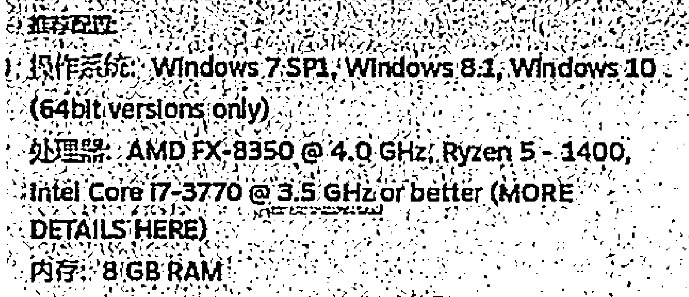

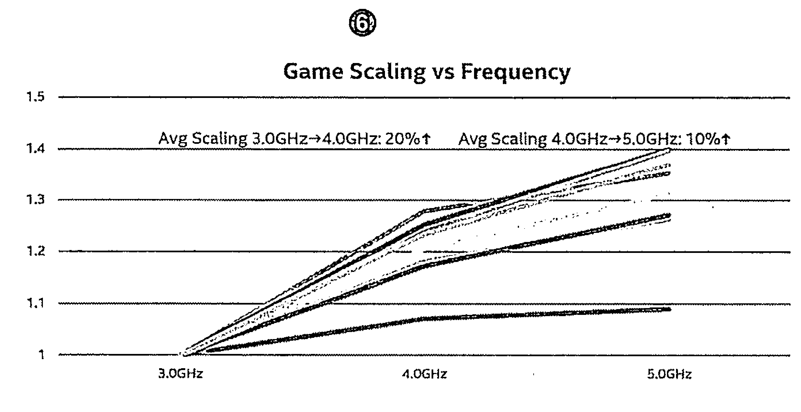

## 架构

在前一段中，我们涉及到了架构的概念，在前述的所有比较中，我们都使用了同样或接近的架构，其实对于英特尔和AMD，以及两家目前的处理器及早期、下一代处理器来说，都会有架构上的差别，其中一些较大的变化可能会明显影响同频率、同核心数量时的性能。

此类例子非常多，例如AMD的FX处理器在很早就达到了8个物理核心和较高频率的配置（图9），但在游戏性能上却远不如仅有4个核心/8个虚拟线程、频率类似的英特尔同时期处理器；而英特尔的奔腾4处理器频率虽高，但在游戏性能方面大幅落后于核心数量相同的低频率酷睿2处理器。


如果对比目前的英特尔、AMD主流处理器，则有一点可能会让大家有点惊讶，也就是同频率和类似核心/线程下，锐龙3处理器与第九代、第十代酷睿处理器的游戏性能其实是非常类似的，例如同为6核心6线程，最高频率4.1GHz的酷睿i5-9400F和锐龙5 3500X，在常见游戏中的帧速差距大都在5%以内，且在不同的游戏中互有胜负，可以认为游戏性能基本相同。

## 不可忽视的其他影响

回到本章的开头，有些人也许会对戴尔在高端游戏电脑中使用线程撕裂者感到非常惊讶，难道这家游戏电脑的巨头会自毁名声？只为了更高的溢价而选择对游戏意义不大的昂贵处理器吗？当然也不是这样，因为线程撕裂者有些一般消费级处理器无法比拟的优势。例如线程撕裂者3990X支持4通道内存，提供了72条可用PCIe通道（CPU提供56条，TRX 40芯片组提供16条）（图10），因此其内存带宽可达到“恐怖”的102.4GB/s，而显卡插槽的实际运行速度则可达到两个×16+两个×8，远超消费级处理器平台的能力。

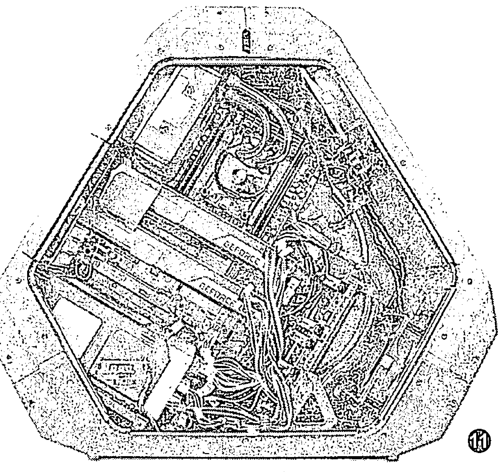

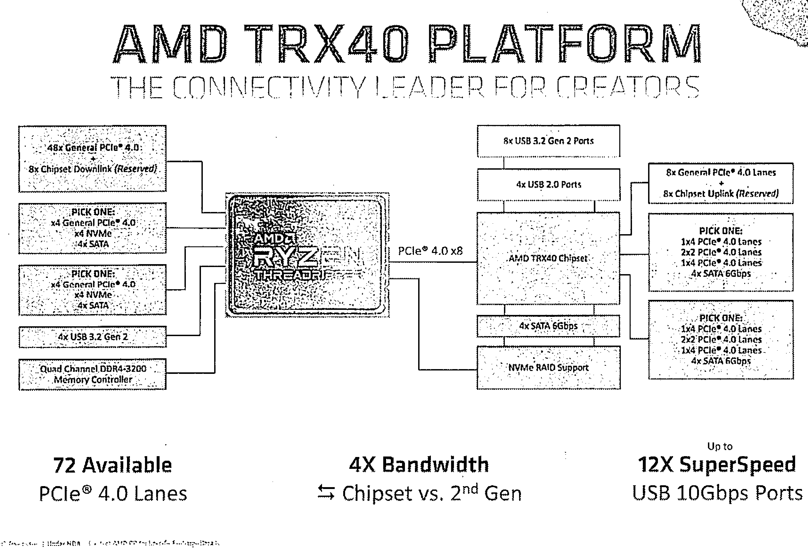

至于Alienware Area-51 R3这款搭载线程撕裂者的游戏主机，卖点除了高端处理器之外，还有四通道内存、高速固态硬盘，以及两块以PCIe ×16全速运行的SLI模式GTX 1080 Ti显卡（图11）等带来的强大游戏性能。

## 游戏处理器选购之道

搞清了游戏处理器的重点和目前处理器的态势后，我们对如何挑选游戏处理器应该也有了更大的把握。也就是在没有可以参考的直接对比时，优先考虑6核心/6线程以上的处理器，频率则是越高越好。我们可以用这一方式来看看几个典型的游戏处理器价位段上，有哪些更值得选择的游戏处理器。

## 典型范例 千元以下
从测试得到的结论看，曾经以超高性价比吸引了很多用户的酷睿i3-9100F，因为只有4核4线程的配置，显然已经不再适合当前的3A游戏了。因此可用的处理器价位直接提升至799元左右的锐龙3 3100，更高价的产品还有锐龙3 3300X、酷睿i5-9400F、锐龙5 3500X，以及酷睿i3-10100。
因为6线程还是8线程对游戏能力的影响非常有限，因此我们预测哪一款处理器游戏性能更好的主要依据是频率较高，即锐龙3 3300X和酷睿i3-10100，其中锐龙3 3300X更有基础主频较高的优势，应该会有较好的游戏表现。至于锐龙3 3100，因为最高主频不到4GHz，和其他型号完全不是一个等级，所以直接就被“淘汰出局”了。
为了验证这一结论，我们使用RTX 2080 Ti显卡、双通道16GB DDR4 3200内存组建的平台进行测试。游戏设置为1080P最高画质，基本可以保证周边配件都不会拖处理器性能的后腿，同时也基本符合当前的主流游戏画质需求。

很显然，综合看来，锐龙3 3300X确实是最强的游戏处理器，不过因为这几款处理器的频率过于接近，除了对频率或线程特别敏感的《刺客信条：奥德赛》和《奇点灰烬》之外，几乎没有出现大于5%的差距。当然作为这一价位几款处理器中最便宜的一款，锐龙3 3300X的性价比仍是更高的，所以很值得优先选购。

在这一价位的处理器选择中，还包含了一些其他要注意的方面，比如截至发稿时，锐龙3 3300X处于持续缺货状态，着急的用户就可以根据前面提到的配置、频率来选择次佳型号。仅从游戏表现上看，酷睿i5-9400F和酷睿i3-10100有些难以决断，那么就需要再加上其他方面的考虑，比如日常应用能力，整体平台如主板、内存的价格和配置等，所以更新、更有升级潜力，同时价格也比较实惠的第十代酷睿处理器——i3-10100就是更好的选择了。

| 型号 | 酷睿i5-9400F | 锐龙5 3500X | 酷睿i3-10100 | 锐龙3 3300X |
|---|---|---|---|---|
| 接口 | LGA1151 | AM4 | LGA1200 | AM4 |
| 核心/线程 | 6/6 | 6/6 | 4/8 | 4/8 |
| 基础频率 | 2.9GHz | 3.6GHz | 3.6GHz | 3.8GHz |
| 最高频率 | 4.1GHz | 4.1GHz | 4.3GHz | 4.3GHz |
| 二级缓存 | 1.5MB | 3MB | 1MB | 2MB |
| 三级缓存 | 9MB | 32MB | 6MB | 16MB |
| TDP | 65W | 65W | 65W | 65W |
| 电商报价 | 949元~999元 | 999元 | 949元~999元 | 899元~949元 |

| 项目（1080P） | 酷睿i5-9400F | 锐龙5 3500X | 酷睿i3-10100 | 锐龙3 3300X |
|---|---|---|---|---|
| 绝地求生 | 150 | 141 | 147 | 148 |
| APEX | 198 | 193 | 200 | 199 |
| 孤岛惊魂5 | 111 | 105 | 109 | 112 |
| 古墓丽影：暗影 | 98 | 97 | 95 | 100 |
| 刺客信条：奥德赛 | 88 | 88 | 96 | 97 |
| 奇点灰烬 | 103 | 108 | 109 | 113 |

## 1000元~1500元
在其他价位上，我们也可以使用相同的方法进行处理，例如资金稍微富裕的玩家会考虑主流处理器更集中的1000元~1500元档次产品，目前的主力产品有锐龙5 3600/3600X、酷睿i5-9600KF、i5-10400F等。其中i5-9600KF（图12）拥有绝对优势的频率和足够的核心数量，且价格很实惠，就是这一价位游戏性能最强也最划算的游戏处理器。

9600KF（图12）拥有绝对优势的频率和足够的核心数量，且价格很实惠，就是这一价位游戏性能最强也最划算的游戏处理器。

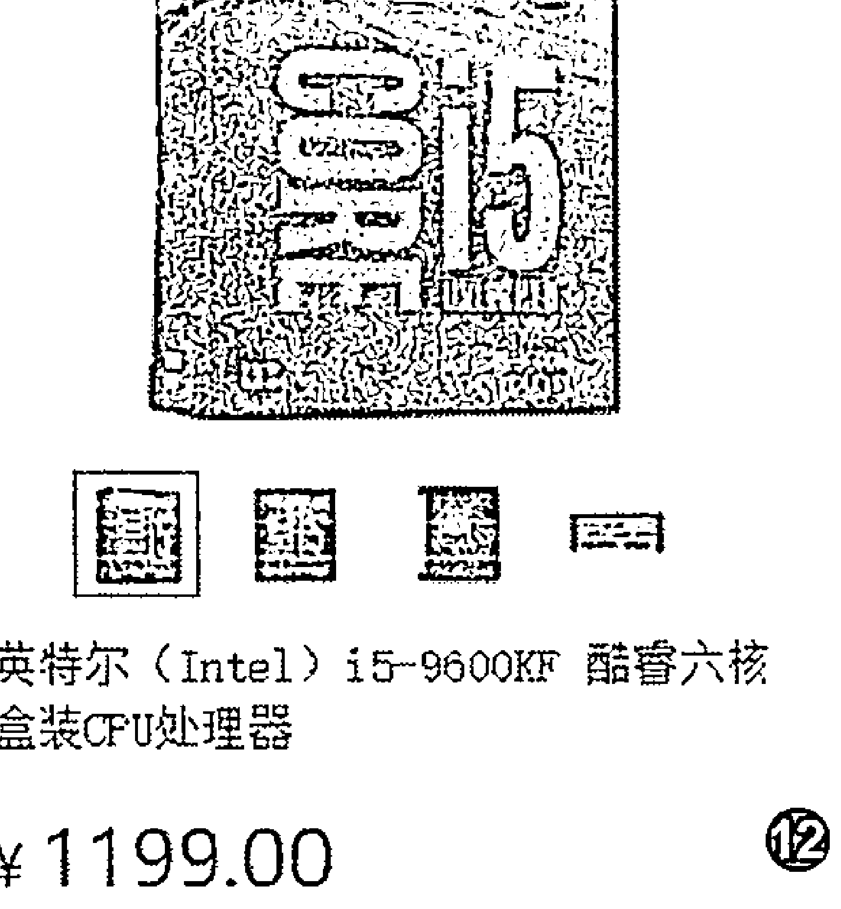

| 型号 | 酷睿i5-10400F | 酷睿i5-9600KF | 锐龙5 3600 | 锐龙5 3600X | 酷睿i5-10400F |
|---|---|---|---|---|---|
| 接口 | LGA1200 | LGA1151 | AM4 | AM4 | LGA1200 |
| 核心/线程 | 6/12 | 6/6 | 6/12 | 6/12 | 6/12 |
| 基础频率 | 2.9GHz | 3.7GHz | 3.6GHz | 3.8GHz | 2.9GHz |
| 最高频率 | 4.3GHz | 4.6GHz | 4.2GHz | 4.4GHz | 4.3GHz |
| 二级缓存 | 1.5MB | 1.5MB | 3MB | 2MB | 1.5MB |
| 三级缓存 | 12MB | 9MB | 32MB | 16MB | 12MB |
| TDP | 65W | 95W | 65W | 95W | 65W |
| 电商报价 | 1149元~1249元 | 1199元~1299元 | 1319元~1399元 | 1529元~1549元 | 1149元~1249元 |

## 1500元~2000元
其实1500元~2000元价位是一个比较尴尬的价格段，酷睿i5和锐龙5的主流型号价格一般更低一些，而代表高端的酷睿i7、锐龙7价格则更高一些。因此这一价位只有“零星”的一些特殊型号，比如酷睿i7-9700F来到这一价位实际上是由于前一代产品的降价“甩货”，酷睿i5-10600K和锐龙5 3600XT之所以比其他同等级产品的价格更高，则是因为它们分别是支持超频的型号以及为超频优化的型号。这一价位的处理器也都达到了6核心以上的配置，因此游戏性能主要看频率比拼。其中锐龙5 3600XT虽然是频率提升版，但最高频率仅提升了100MHz（图13），4.5GHz的最高频率与酷睿i5-10600K的4.8GHz、酷睿i7-9700F的4.7GHz有一定的差距。酷睿家族的“内战”结果则是酷睿i5-10600K更胜一筹，除了略高的睿频频率外，其基础频率远超酷睿i7-9700F，因此可以更长时间以6核12线程全开的模式运行，在一些对线程有要求的游戏中表现更好。如果考虑到超频配置、超频能力，这一价位的处理器游戏能力排行还会有更多的变化。酷睿i5-10600K超频需要搭配比较昂贵的Z490主板，因此平台总价会超过锐龙5 3600XT+超频型B550主板的水平。而在仅使用中高端风冷、液冷散热系统的情况下，酷睿i5-10600K和锐龙5 3600XT的稳定超频频率都在4.8GHz左右，再考虑到完全相同的核心/线程数量和效率，两者的超频游戏能力就非常接近了。因此对有较多DIY经验特别是超频能力的用户来说，游戏能力最强且价格最实惠的选择又变成了锐龙5 3600XT。

| 型号 | 锐龙5 3600X | 酷睿i5-10600K | 酷睿i7-9700F |
|---|---|---|---|
| 接口 | AM4 | LGA1200 | LGA1151 |
| 核心/线程 | 6/12 | 6/12 | 8/8 |
| 基础频率 | 3.8GHz | 4.1GHz | 3.0GHz |
| 最高频率 | 4.5GHz | 4.8GHz | 4.7GHz |
| 二级缓存 | 2MB | 1.5MB | 2MB |
| 三级缓存 | 16MB | 9MB | 12MB |
| TDP | 95W | 125W | 65W |
| 电商报价 | 1799元~1859元 | 1899元~1999元 | 1999元~2099元 |

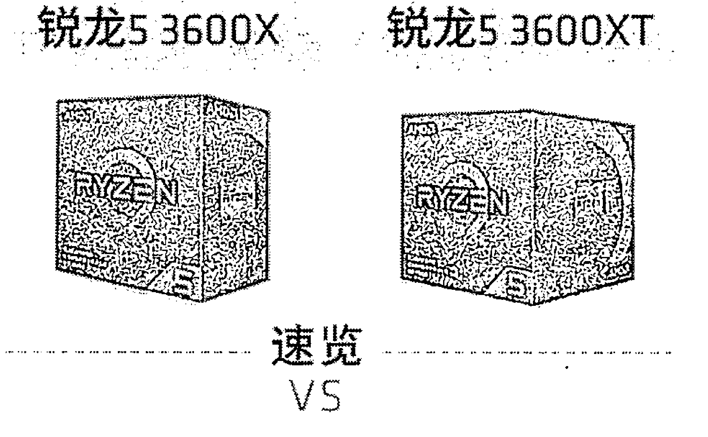

## 2000元以上
至于在性能更加强大，但大部分用户只能远观而难以真正入手的高端、旗舰级消费处理器方面，第九代酷睿的性价比并不突出，因此已经不值得考虑。而在新一代处理器的对比中，第十代酷睿的频率优势就非常明显了，从酷睿i7-10700KF开始，睿频就突破了5GHz。最高端产品的对决上，酷睿i9-10900F/i9-10850K/10900KF在核心/线程配置类似的情况下，频率大幅超过锐龙9。

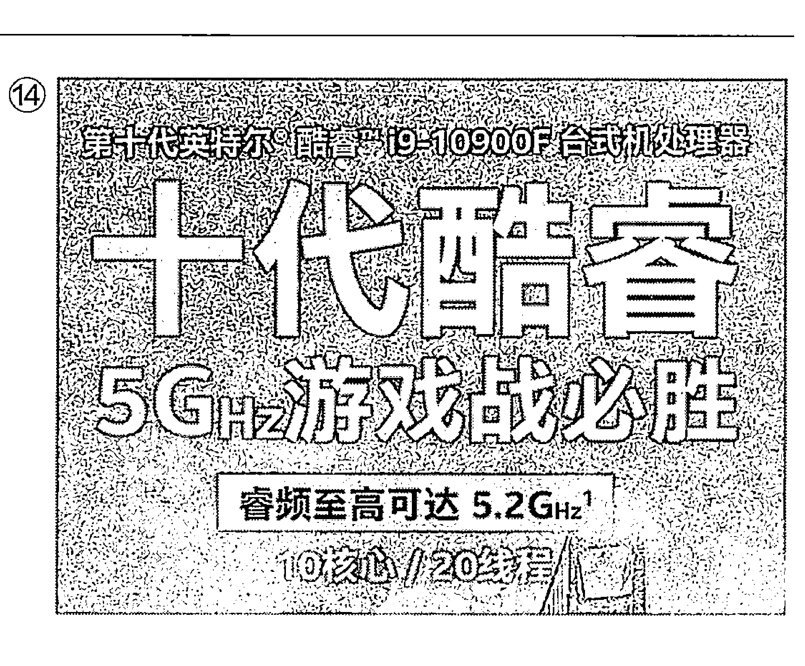

3900X/3900XT，这就是英特尔对5Hz这一卖点大力宣传（图14），并一直称自己拥有最强游戏处理器的原因。对于一般用户来说，这种说法确实没有问题，那么在超频后呢？

对于酷睿i7/i9和锐龙7/9处理器来说，最适合的主板都是采用高端芯片组的型号，即Z490和X570，因此两个平台的总价并不存在明显的差别，在处理器超频极限类似的情况下，两者的性价比也就没有明显的差别。即使对超频比较有经验的用户来说，酷睿i7-10700KF和锐龙7 3800XT、酷睿i9-10900KF/10850K和锐龙9 3900XT也是不分伯仲的，而并不以超频见长的锐龙7 3800X、锐龙9 3900X就要差一些了。

| 型号 | 锐龙7 3700X | 酷睿i7-10700F | 锐龙7 3800X | 酷睿i7-10700KF | 锐龙7 3800XT |
| :--- | :--- | :--- | :--- | :--- | :--- |
| 接口 | AM4 | LGA1200 | AM4 | LGA1200 | AM4 |
| 核心/线程 | 8/16 | 8/16 | 8/16 | 8/16 | 8/16 |
| 基础频率 | 3.6GHz | 2.9GHz | 3.9GHz | 3.8GHz | 3.9GHz |
| 最高频率 | 4.4GHz | 4.8GHz | 4.5GHz | 5.1GHz | 4.7GHz |
| 二级缓存 | 4MB | 2MB | 4MB | 2MB | 4MB |
| 三级缓存 | 32MB | 16MB | 32MB | 16MB | 32MB |
| TDP | 65W | 65W | 105W | 125W | 105W |
| 电商报价 | 2149元~2249元 | 2349元~2399元 | 2499元~2599元 | 2699元~2799元 | 2899元~3049元 |

| 型号 | 酷睿i9-10900F | 锐龙9 3900X | 酷睿i9-10850K | 锐龙9 3900XT | 酷睿i9-10900KF |
| :--- | :--- | :--- | :--- | :--- | :--- |
| 接口 | LGA1200 | AM4 | LGA1200 | AM4 | LGA1200 |
| 核心/线程 | 10/20 | 12/24 | 10/20 | 12/24 | 10/20 |
| 基础频率 | 2.8GHz | 3.8GHz | 3.6GHz | 3.8GHz | 3.7GHz |
| 最高频率 | 5.2GHz | 4.6GHz | 5.2GHz | 4.7GHz | 5.3GHz |
| 二级缓存 | 2.5MB | 6MB | 2.5MB | 6MB | 2.5MB |
| 三级缓存 | 20MB | 64MB | 20MB | 64MB | 20MB |
| TDP | 65W | 105W | 125W | 105W | 125W |
| 电商报价 | 3199元~3299元 | 3349元~3499元 | 3499元~3599元 | 3699元~3899元 | 3999元~4099元 |

## 高端处理器不值得 显卡仍是大阻碍

在本文中我们并没有对高端/旗舰级处理器进行过多的介绍，有一个原因是目前高端处理器常常难以在游戏应用中表现出与其价格相符的速度，原因也很简单——显卡性能存在瓶颈。在之前的测试中，我们发现即使搭配最高端的英伟达RTX 2080 Ti显卡，旗舰机处理器的实际游戏帧速也和酷睿i5-10600K/锐龙5 3600X处理器很接近。这有些类似前文介绍的从8核升级到10核、12核，用成倍的价格入手高端/旗舰级处理器就有些不值得了。
至于新一代显卡会不会突破这一阻碍，不要被酷睿i5、锐龙5这个级别的处理器“喂饱”，截至发稿时仍缺乏直接的证据，我们也就不得而知了。未来大家可以在相应的测试中关注一下测试平台采用的处理器及相应的帧速表现，来确定它们是否值得搭配高端/旗舰级处理器。

## 闯居口袋的梦想 浅析“口袋笔记本”的进化

策划《电脑爱好者》编辑部

笔记本电脑的诞生，寄托了商旅用户的移动梦想。纵观笔记本近40年的发展史，其实就是一部“瘦身史”，在新材料、新技术和新设计的加持下，膝上型电脑（可以放在膝盖上使用）的概念逐渐成为对现代笔记本电脑的定义（图1）。那么，笔记本是否还能更进一步，成为更加迷你便携的全能终端？如果你经常关注笔记本市场，也许会为壹号本和GPD旗下的产品感到惊叹，因为它们似乎实现了从“膝上电脑”向“口袋笔记本”（超迷你PC）的转型。实际上，口袋笔记本并非此类产品首创，它们曾以PDA、MID、UMPC、上网本的身份在历史长河中崭露过头角，随着技术和需求的风云际会，也许“口袋笔记本”的春天又将降临。


## 掌上电脑 将Windows装进口袋

1996年，IBM推出了标志着“超级便携”开始成为移动计算主流的ThinkPad 560（图2），真正让笔记本成为了“膝上电脑”。然而，就在同一时期，Casio和NEC却进一步将Windows放进了口袋，迎来了PPC（Pocket PC）即掌上（口袋）电脑时代。

## 来自Windows CE的契机
微软很早就意识到传统Windows系统很难应用在比膝上电脑还要迷你的设备上，所以在1996年发布了基于Windows 95精简而来的Windows CE系统，其目标是提供友好、易于使用，并且令用户感到熟悉的界面，专供Pocket PC掌上型电脑使用。而Casio Cassiopeia A10和NEC MobilePro 200则是第一批预装Windows CE 1.0的掌上电脑（图3）。

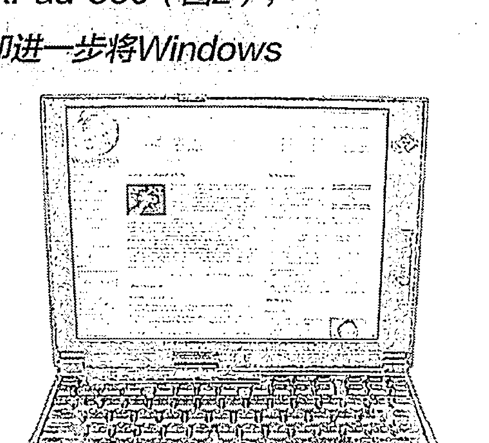## ARM的局限性

问题来了，既然都预装Windows系统，骨骼惊奇的PPC为什么逐渐淡出了历史舞台，相对笨重的笔记本却依旧是移动计算战场的绝对主力呢？原因很简单，Windows CE（包括后来的Windows Mobile）是专为ARM架构处理器开发的精简系统，软硬件生态和X86 PC有着本质上的差异，除了相对省电以外，无论是性能、兼容性、扩展能力等方面都无法满足较高生产力需求的应用场景（图5）。

为此，英特尔随后又进行了多番尝试，力求能将真正的Windows PC塞进口袋，握在手中。

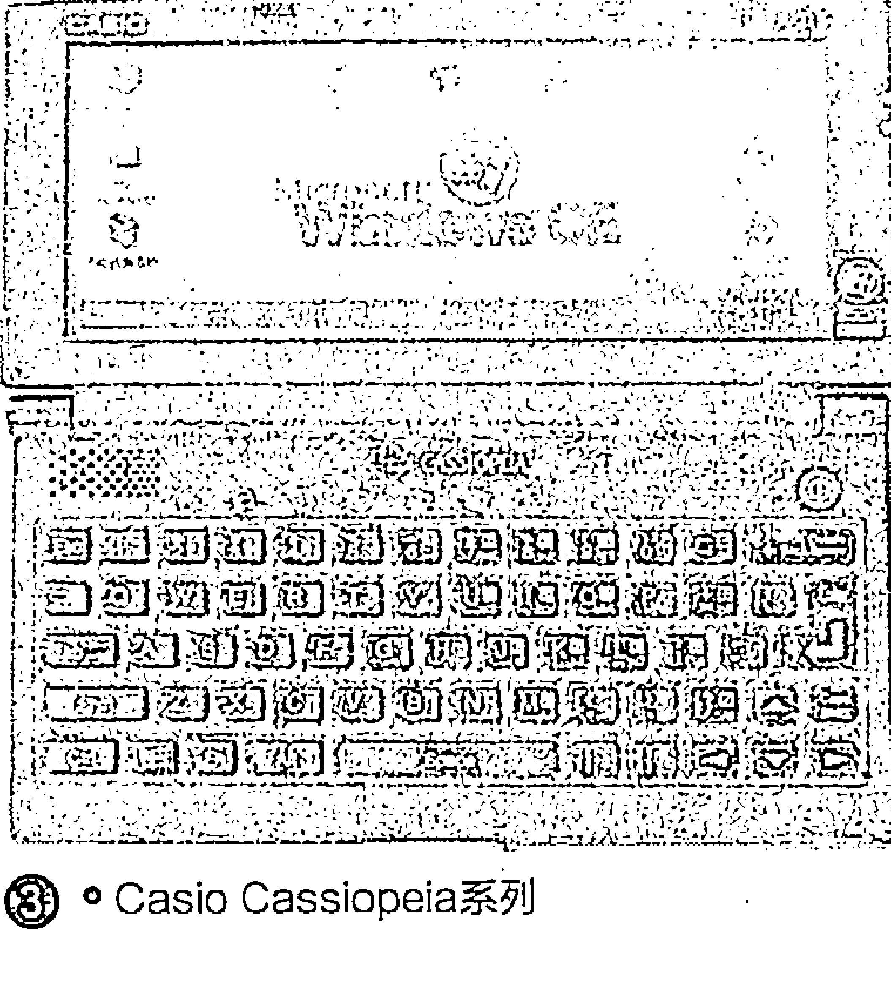

图3 · Casio Cassiopeia系列

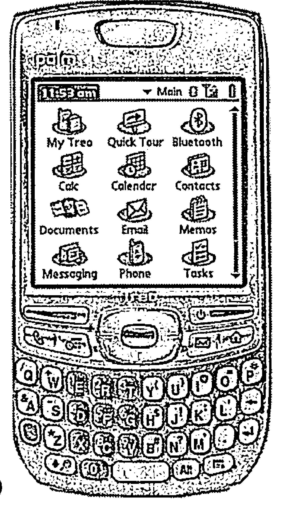

· 早期的智能手机，其很多设计和功能都参考了Palm OS系统

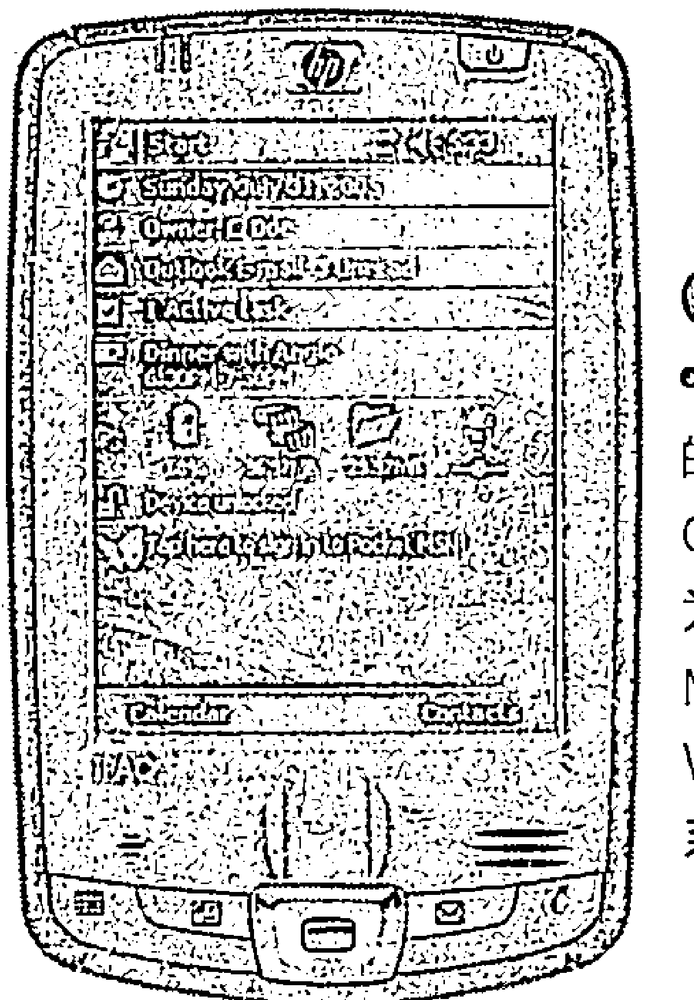

图5 · PDA预装的Windows CE后来进化为Windows Mobile，也就是Windows Phone系统的前身

扩展阅读：
**英特尔也做过ARM处理器**
英特尔曾在1998年获得过StrongARM与ARM架构的完整授权，并推出过适用于PPC设备的“XScale”系列ARM处理器（图6）。可惜，PPC的失利让英特尔做出了一个短视的决定，将XScale及手持设备芯片业务打包出售给了Marvell公司。当真正的移动时代来临后，英特尔才惊醒已经失去了与ARM阵营在智能手机和平板电脑领域抗衡的核心资本。

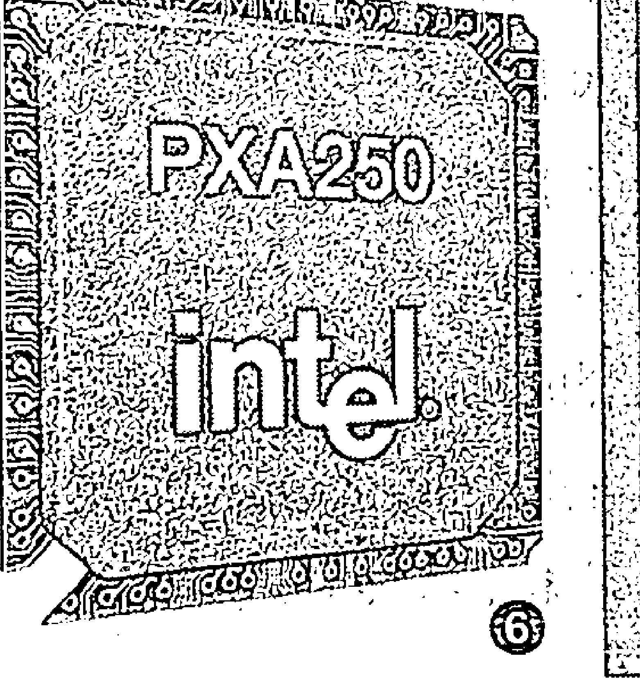

## 你方唱罢我登场
## 英特尔的几番尝试

如今智能手机搭载的都是ARM架构的处理器，性能较之PDA时代的芯片有了质的飞跃，但它们依旧无法取代笔记本进行高强度的计算任务，可见20多年前的ARM处理器自然更是难当大任。为了弥补ARM处理器的先天缺陷，当年的英特尔只有一个选择——将X86处理器的功耗变低，再塞进媲美PPC身材的口袋笔记本里。

## UMPC和MID先后出击

2006年~2008年可谓是现代移动设备的分水岭。比如，第一代iPhone改写了智能手机的定义，谷歌Android强势出击并最终击败了Windows Mobile/Phone和塞班系统，而英特尔也在这两年先后提出了“UMPC”（Ultra Mobile Personal Computer）和“MID”（Mobile Internet Device）的构想，并为它们单独开发了代号为“McCaslin”的90nm Stealey A100（600MHz）和A110（800MHz）超低功耗处理器（衍生于Pentium M，也是Atom的前身），它们与945GU Express芯片组和ICH7U南桥芯片构成了一套完整的X86硬件班底（图7）。

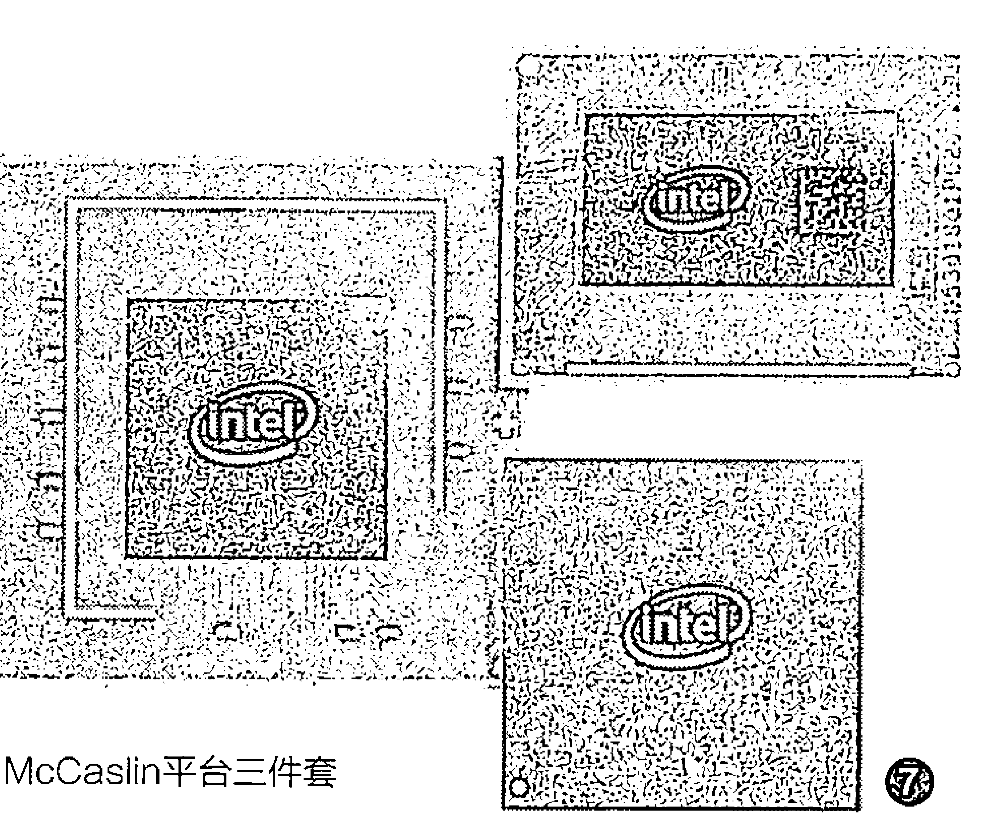

在当年MID和UMPC的概念极易混淆，按照英特尔的定义，UMPC是面向企业用户的商务型设备，预装标准的Windows XP/Vista系统，并针对Word、Excel等办公应用进行了优化。MID则是消费级的时尚型设备，它不仅可以安装Windows XP/Vista系统，还能预装Linux等轻型操作系统，更适合多媒体播放和网络冲浪等应用环境。MID包含UMPC，是比后者定义更为广泛的口袋笔记本。

UMPC的代表产品有索尼VGN-UX系列，它的尺寸和单反相机的主机相近，采用4.5英寸触控屏幕，配备炫酷的滑盖键盘，重量只有500g左右，它的后续机型还曾在2008年上映的007电影《量子危机》中惊艳亮相，科技感爆棚（图8）。MID的代表则是爱国者P8880T，它采用了4.8英寸触控屏幕和滑盖键盘设计（图9），拥有320g的轻盈机身。P8880T搭载Atom Z500处理器，内置512MB内存和8GB硬盘，除了支持Wi-Fi和蓝牙外还能安装中国移动的TD-SCDMA 3G SIM卡，从而获得随时联网的能力。

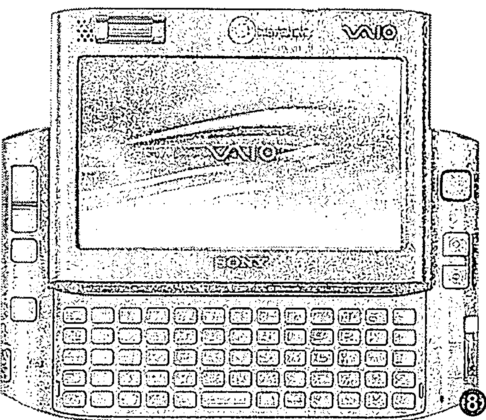

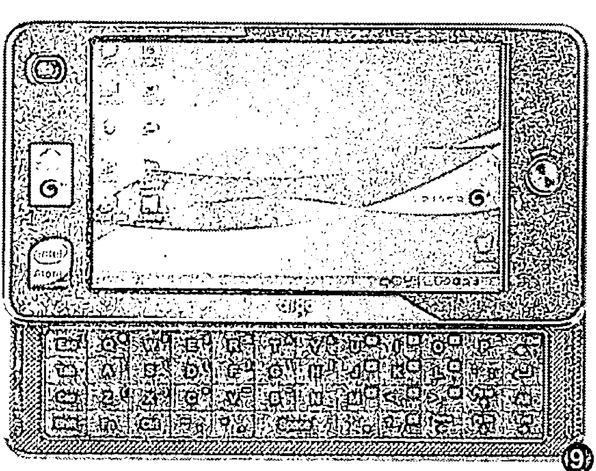

## 后来居上的上网本

2007年，华硕发布了EeePC 700，这款产品采用7英寸屏幕，搭载超低功耗版的赛扬M处理器，内置512MB内存和2GB硬盘，重量不足1kg（图10）。虽然EeePC 700不符合UMPC和MID的定义，但却打出了2999元的超低售价，只有传统中端笔记本的1/2。没错，EeePC 700就是“上网本”的鼻祖，预示着Netbook时代就此来临。

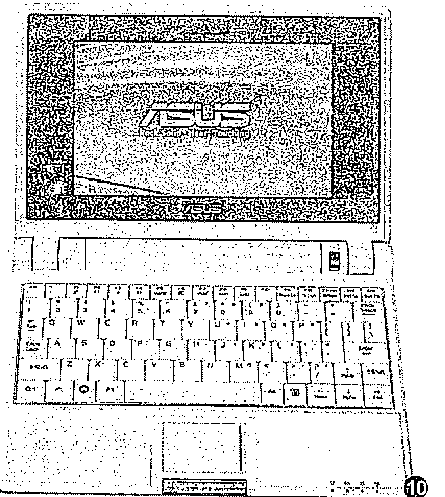

从概念上来看，尺寸更小、支持触控屏幕、可随时联网的MID显然远胜上网本，但MID曲高和寡（定位太高）的气质远没有1999元起步的上网本亲民，一部MID的开销足以同时购买上网本+最新款3G手机，移动办公和随时联网依旧两不耽误。很快，几乎所有的OEM厂商(还包括多彩等外设品牌)都推出了7英寸~11.6英寸不等的上网本产品(图11)，英特尔随即将原计划用于MID设备的凌动（Atom）系列处理器投放到上网本市场，上网本也逐渐变得更加精致，升级双核Atom后性能也有所提升。

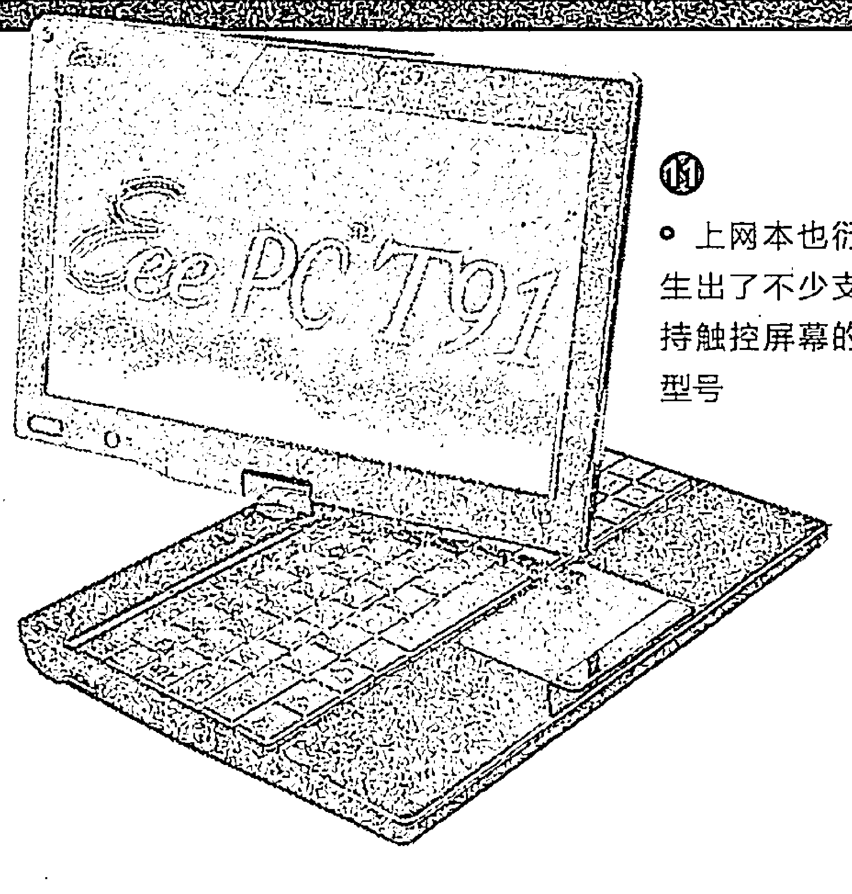

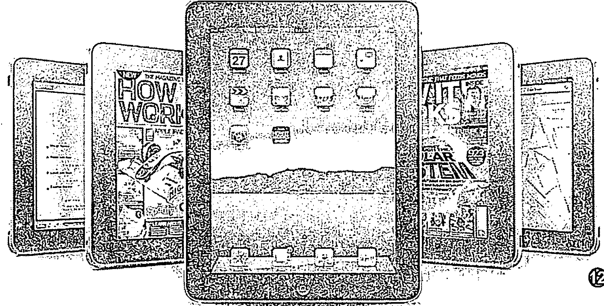

就在上网本不断攻城拔寨之际，它们的噩梦也悄然降临。2010年，苹果iPad诞生(图12)。一年后，谷歌也发布了针对平板类大屏设备优化的Android 3.0 Honeycomb系统(图13)。从体验上来看，以iPad为代表的平板电脑其实更符合MID的定义，超便携、长续航、丰富的办公应用和有趣的游戏，让平板电脑迅速成为了UMPC、MID和上网本的“终结者”，并一直火爆至今。

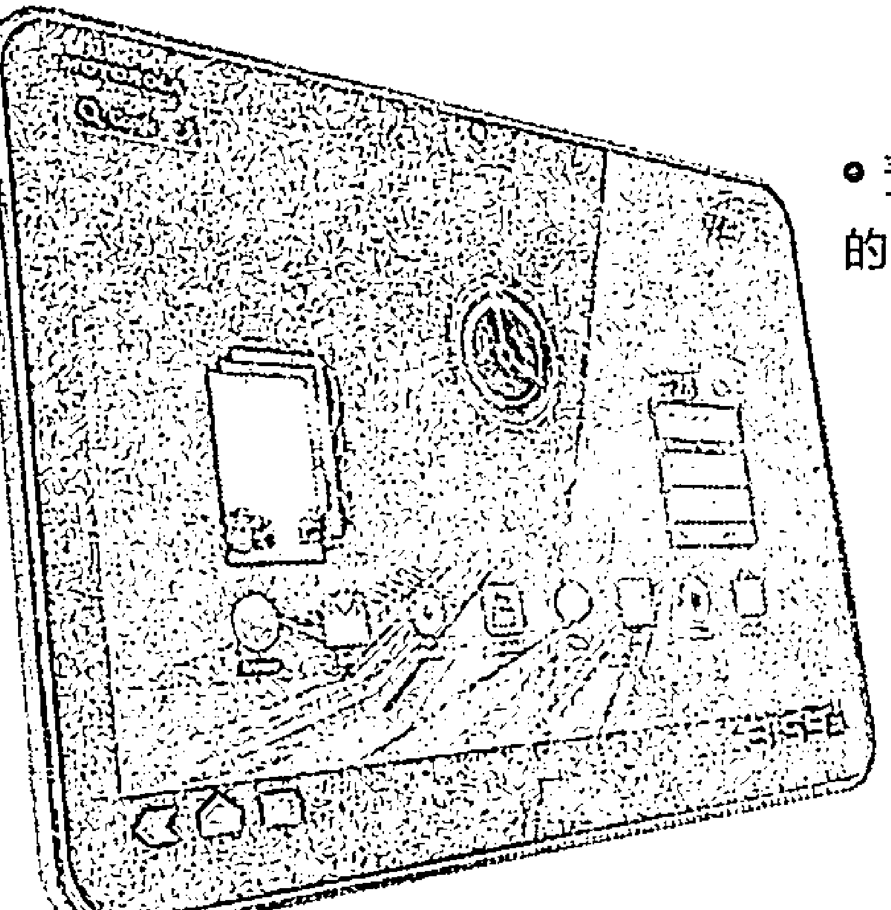

## Atom的口袋绝唱

实际上，除了华硕第一代的EeePC 700，绝大多数上网本都采用了10.1英寸屏幕，虽然便携性尚可，但却很难入驻我们的“口袋”，与定位口袋笔记本的MID和UMPC相差甚远。随着平板电脑的崛起，口袋笔记本也迎来了新契机。

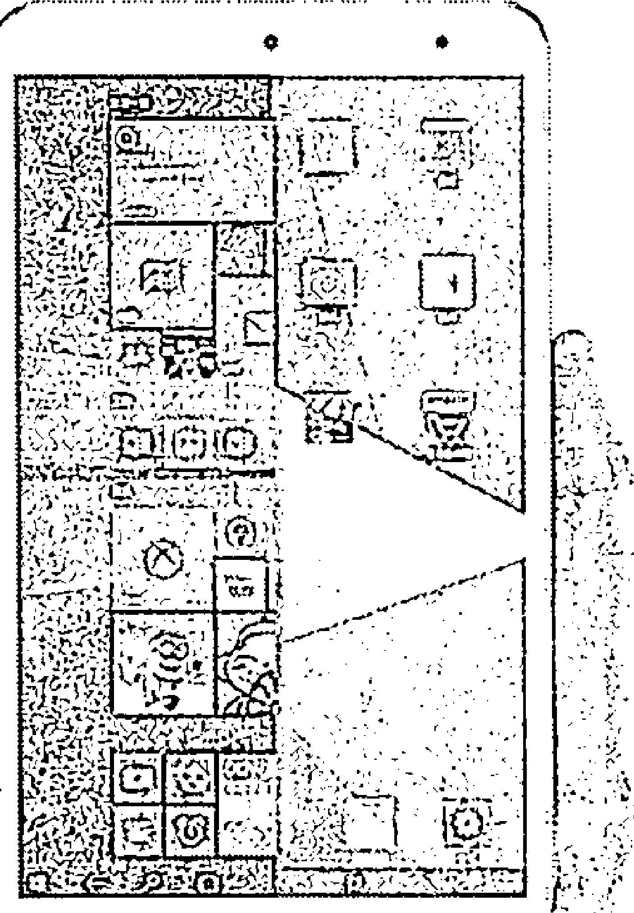

没能帮助英特尔打开平板电脑市场的局面，它的后续产品(Cherry Trail→Apollo Lake→Gemini Lake)的能耗比也普遍不佳，在失去补贴之后大批小厂纷纷关门，时至今日预装Atom的Windows平板电脑已经成为了非常小众的品类，而英特尔也忍痛暂停了Atom处理器的更新。

2014年，英特尔携手微软对深圳的白牌平板企业进行大规模补贴，以极低的成本提供代号为BayTrail-T平台的Atom处理器，以及免费授权的Windows 8操作系统，一时间预装Atom（如Atom Z3735D、Atom X5-Z8300）的国产平板电脑品牌就如同雨后春笋般爆发，其中不乏采用7英寸或8英寸屏幕设计的超迷你型号（图14），结合蓝牙键盘就是一部标准的笔记本电脑。随后，很多品牌还推出了可以在Windows和Android间进行系统切换的功能，让消费者可以在办公（Windows）和娱乐（Android）之间任性转换。可惜，BayTrail-T依旧

从UMPC、MID、上网本再到平板电脑，英特尔为X86 PC的瘦身梦想从未终结。除了Atom以外，酷睿家族也衍生出了TDP低至4.5W的Y系列处理器，可以实现无风扇的被动式散热设计。但是，一线PC品牌似乎始终对口袋PC的设计提不起兴趣，而是不断地通过变轻、变薄来提升产品的便携能力。因此，现在重量低于1kg的笔记本有很多，但13英寸起步的屏幕注定它们与口袋绝缘。


如果你在MID时代就梦想着拥有一部可以塞进口袋里的全能PC，现阶段又有哪些产品可以选择呢(图15)？

## 特别话题
## 第三方力量 口袋笔记本重生

通过前文的分析可见，英特尔曾主导过PPC、MID、UMPC、上网本……但这种定位口袋PC的项目最终都没有太好的结局。好消息是，虽然英特尔官方和一线OEM厂商已经不屑于这个市场，但依旧有第三方力量在砥砺前行，并推出了不少颇受好评的口袋笔记本产品。

## 技术从来不是问题

自从英特尔在第五代酷睿时期引入Y系列超低功耗处理器(Core M)以来，其实就已经为口袋PC铺平了道路。由于Y系列处理器的TDP低至4.5W，可以实现无风扇的被动式散热，再加上更高的集成度和封装，可以将PCB主板压缩到极致(图16)。以苹果12英寸版本的MacBook为例，拆开底盖可见它的主板只占全部内部空间的1/8左右(图17)，其余的空间则都被电池和触控板器件塞满，最终打造出了只有920g重的史上最轻薄的MacBook。

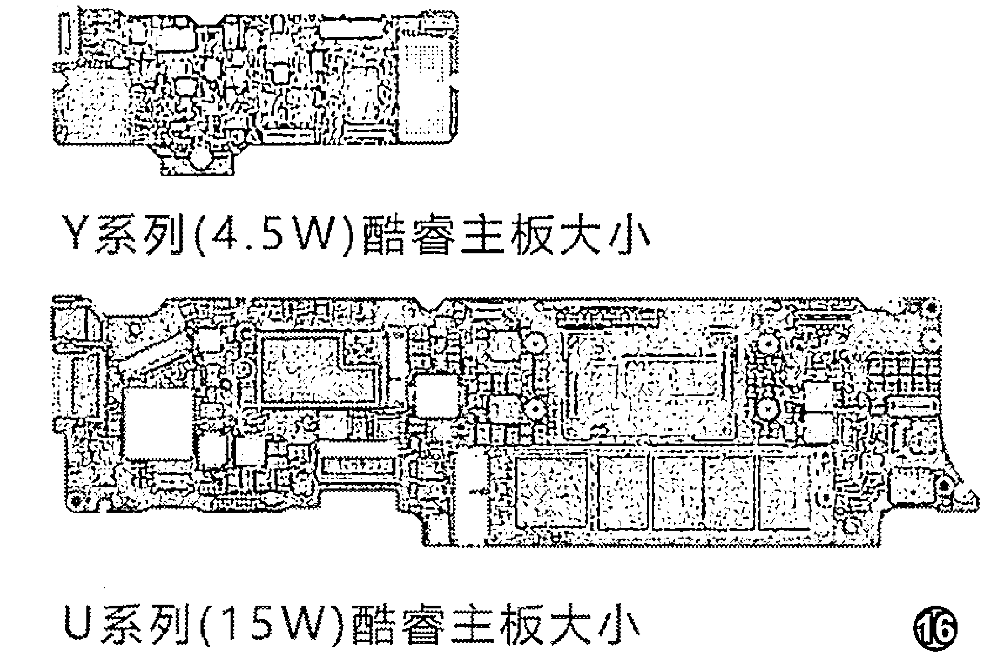

看到没有？如果在MacBook的基础上减小电池，取消触控板，完全能打造出可以塞进口袋中的迷你本。但是，无论是苹果、联想、惠普、戴尔、华硕还是宏碁，所有的知名PC厂商都对更小尺寸的封装不感冒，都在追求全球最薄的13英寸笔记本、全球最轻的14英寸笔记本等称号(图18)。

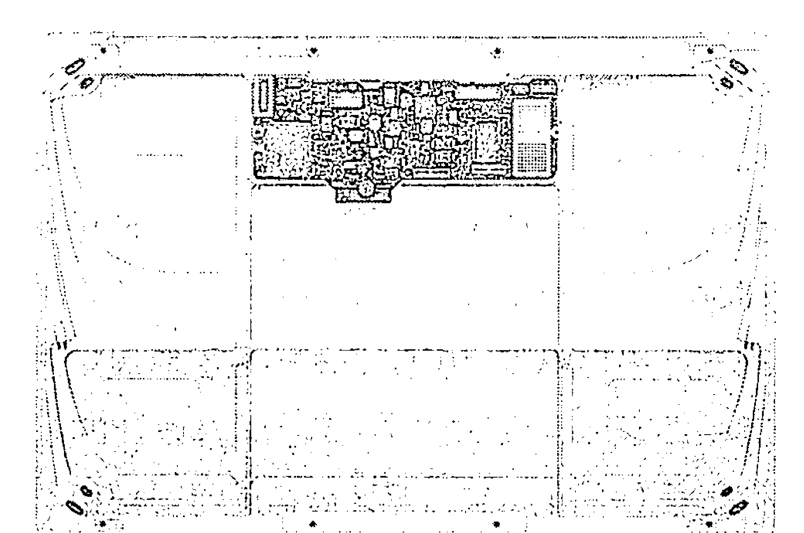

原因很简单，对绝大多数消费者而言，和便携性相比，生产力才是更为核心的诉求，而这里的“生产力”不仅限于绝对的性能，还包含视野(屏幕足够大)、输入效率(全尺寸键盘)和扩展能力(丰富的接口)，想同时满足以上要素至少需要笔记本拥有不小于11.6英寸屏幕的身材，而这种尺寸规格显然已经超出了我们口袋可以容纳的上限。

总之，以当前的硬件技术，将笔记本压缩进口袋的难度不大，但受制于小众的市场需求，知名PC厂商并不愿意投入大量资金进行研发和推广。

但是，正所谓“存在即合理”，英特尔当年提倡的UMPC和MID之所以颇受关注，是因为的确有那么一部分消费者，需要在更小尺寸的空间内获得全部的标准笔记本的性能和体验，比如系统工程师、IT运维人员、媒体从业者，在任何时间任何地点，都有使用电脑修改代码、维护后台、回复邮件和撰写新闻的需求，如果总是随身背着12英寸起步的笔记本，哪怕是以Surface为代表的二合一设备，长途外出时对肩膀也是难以承受的负担。此时，一款继承了UMPC设计理念的口袋笔记本(图19)，无疑就是最好的计算伴侣。

目前致力于口袋笔记本的厂商代表包括壹号本以及GPD。下面，咱们就来分别了解一下这两个厂商旗下的口袋产品线。

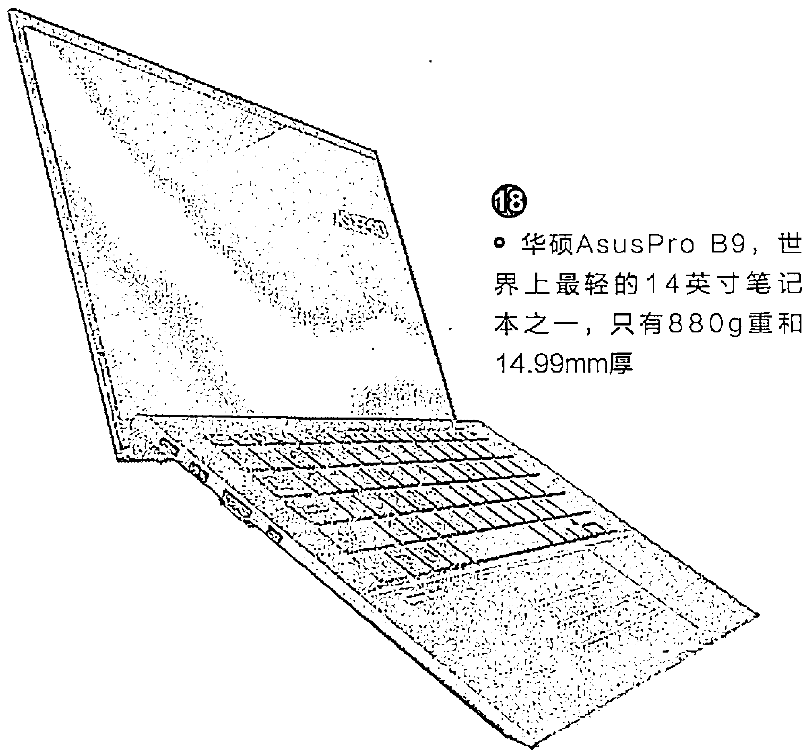

⑧ 华硕AsusPro B9, 世界上最轻的14英寸笔记本之一, 只有880g重和14.99mm厚

## 壹号本产品汇总

壹号本旗下的口袋笔记本包含One 1、One 2、One 3和OneGx四大系列，其中前三款产品还衍生出了后缀带S、Pro、铂金版、锦鲤版和喵星版等子型号(图20)，它们的模具和接口设计基本相同，只是在机身颜色、处理器、内存和硬盘的搭配上略有区别。

| 型号 | One 1系列 | One 2系列 | One 3系列 | OneGx |
| :--- | :--- | :--- | :--- | :--- |
| 屏幕 | 7英寸（1080P） | 7英寸（1080P） | 8.4英寸（2.5K） | 7英寸（1080P） |
| 处理器 | Atom X5<br>赛扬3965Y<br>M3-8100Y | M3-7Y30<br>M3-8100Y<br>i7-8500Y | M3-8100Y<br>i7-8500Y<br>i5-10210Y<br>i7-10510Y | i5-10210Y |
| 内存 | 8GB | 8GB | 8GB/16GB | 8GB/16GB |
| 硬盘 | 128GB/256GB | 256GB | 256GB/512GB | 256GB/512GB |
| 接口 | TF卡槽、USB3.0、USB Type-C、Micro HDMI、音频接口 | TF卡槽、USB3.0、USB Type-C、Micro HDMI、音频接口 | TF卡槽、USB3.0、USB Type-C、Micro HDMI、音频接口 | TF卡槽、USB3.0、USB Type-C、Micro HDMI、音频接口 |
| 尺寸 | 182mm x 110mm x 17mm | 182mm x 110mm x 17mm | 204mm x 129mm x 14.9mm | 173mm x 136mm x 21mm |
| 电池 | 6500mAh | 6500mAh | 8600mAh | 12000mAh |
| 重量 | 515g | 518g | 659g | 620g |
| 特色 | 指纹识别、触控笔、翻转屏幕 | 指纹识别、触控笔、翻转屏幕 | 指纹识别、触控笔、翻转屏幕、低配版带额外硬盘位 | Wi-Fi 6、滑轨手柄、可装SIM卡、RGB键盘 |

## One 1/One 2系列

壹号本One 1/One 2系列都采用了支持360度翻转的7英寸触控屏幕，支持指纹识别和触控笔，键盘布局虽然紧凑，但对付短时间的高强度输入问题不大（图21）。它们以USB Type-C作为充电接口，还能使用支持USB PD协议的充电宝给设备充电，通过Micro HDMI可以将画面输入到更大的显示设备上，属于标准型的口袋笔记本。

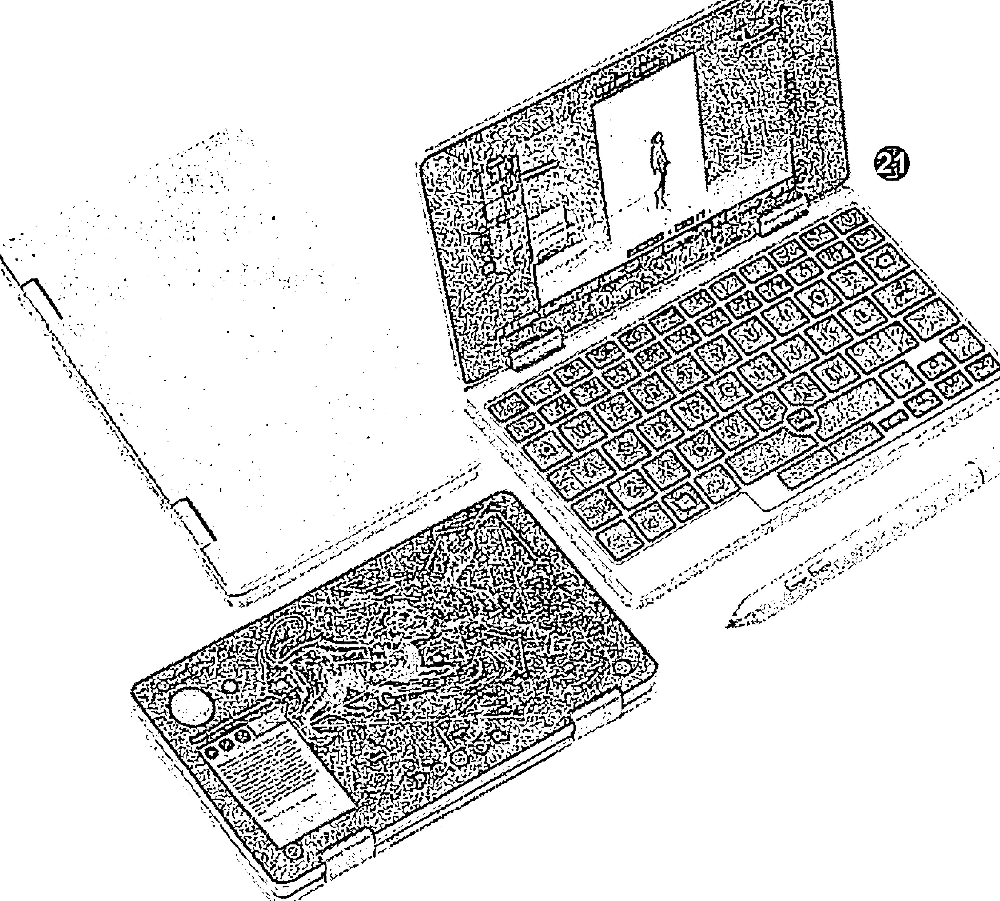

## One 3系列

One 3属于One 1/One 2的放大版，拥有更大的8.4英寸视野，而且分辨率也达到了2.5K标准，显示更细腻（图22）。这款产品的特色是可选第十代酷睿处理器平台，内部除了板载的Micro Pcie固态硬盘颗粒外，低配版预留了额外的M.2插槽（十代酷睿版为了优化散热取消了这个插槽），在性能上的表现更好。当然，更大的尺寸对One 3系列的便携性也造成了一定的影响，比前辈多出了一部手机的重量。

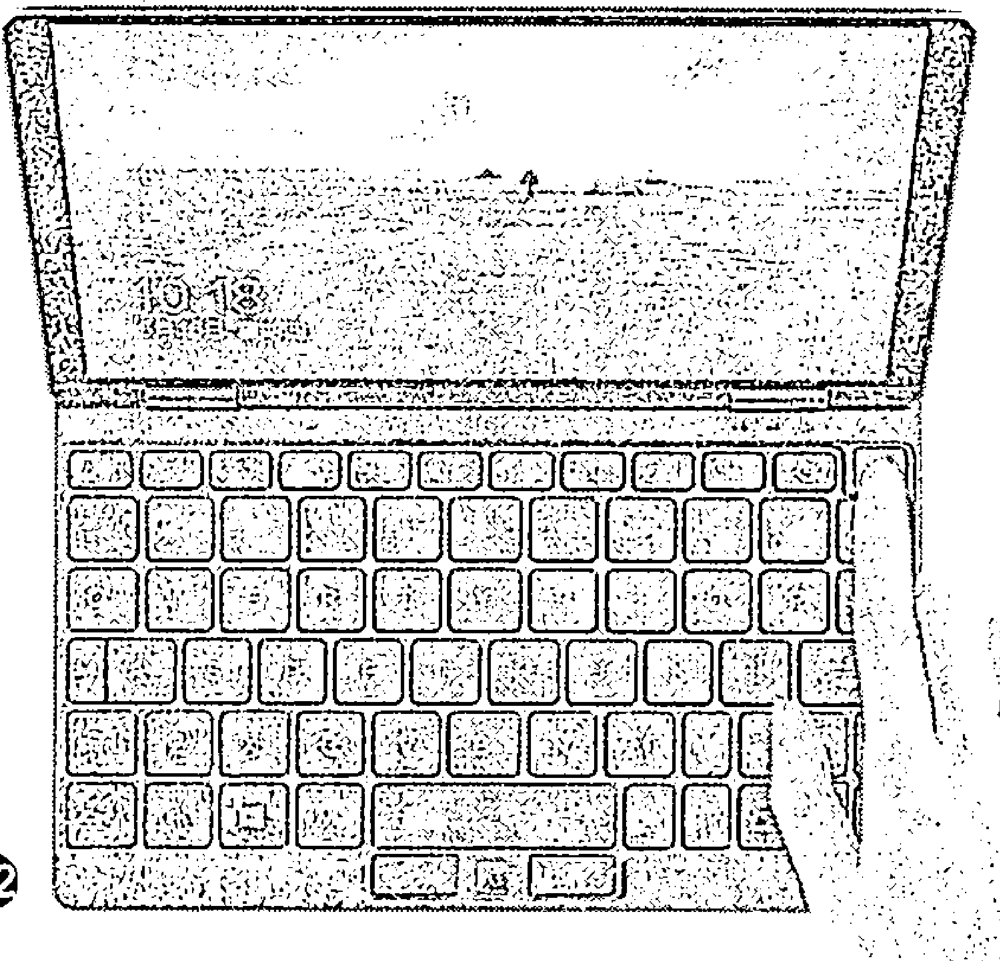

## OneGx系列

OneGx的尺寸和One 1/One 2相同，取消了可以翻转屏幕的设计，融入了类似Alienware游戏本的尾翼和环形尾灯，结合RGB键盘在设计上更加炫酷。这款产品搭载第十代酷睿i5-10210Y，主打更强的性能，支持独特的滑轨手柄随身变身掌上游戏机，可以通过安装SIM卡获得随时联网的能力（图23）。

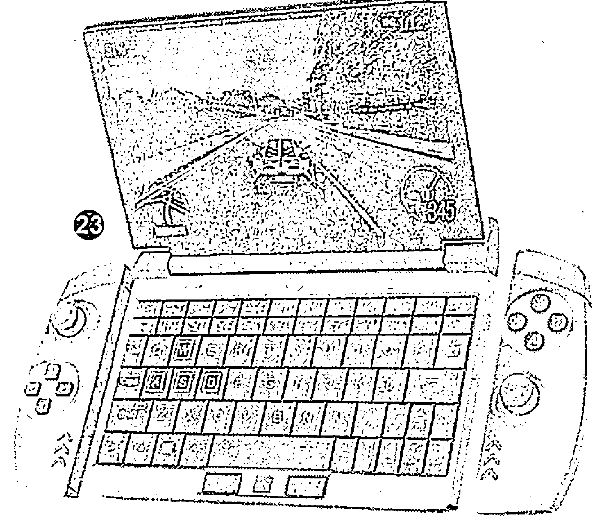

## 选购建议

壹号本口袋笔记本的特色就是提供了类似Yoga系列的变形体验，可以随时在平板电脑和笔记本电脑之间转换角色，可触控的屏幕也弥补了触控板的缺失，操作效率更高。需要注意的是，如果你需要较强的生产力，那就请认准搭载M3-8100Y或更高高端处理器的型号，由于壹号本产品都采用了内置风扇和热管的主动散热系统（图24），所以可以保证较好的性能输出环境。

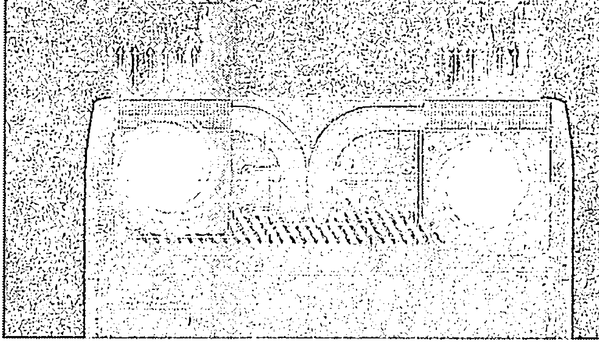

## GPD产品汇总

GPD旗下的口袋笔记本在便携性上和壹号本相似，除了MicroPC以外，其他型号的屏幕也支持触控功能，只是没有360度翻转的能力，在形态上更接近传统笔记本。

表2：GPD旗下口袋笔记本规格对比表
| 型号 | GPD MicroPC | GPD Pocket 2 | GPD WIN 2 | GPD P2 Max | GPD WIN Max |
| :--- | :--- | :--- | :--- | :--- | :--- |
| 屏幕 | 6英寸（HD） | 7英寸（1080P） | 6英寸（HD） | 8.9英寸（2.5K） | 8英寸（HD） |
| 处理器 | 赛扬N4100 | 赛扬3965Y | M3-8100Y | 赛扬3965Y<br>M3-8100Y | i5-1035G7 |
| 内存 | 8GB | 8GB | 8GB | 8GB/16GB | 16GB |
| 硬盘 | 128GB | 256GB | 256GB | 256GB/512GB | 512GB |
| 接口 | TF读卡器、USB3.0×3、USB Type-C、HDMI、RS-232、RJ45、音频接口 | TF卡槽、USB3.0×2、USB Type-C、音频接口 | TF卡槽、USB3.0、USB Type-C、Micro HDMI、音频接口 | USB3.0×2、USB Type-C、Micro HDMI、音频接口 | TF读卡器、USB3.0×2、USB Type-C 3.1 Gen 2、雷电3、HDMI、RJ45、音频接口 |
| 尺寸 | 153mm×113mm×23.5mm | 181mm×113mm×14mm | 162mm×99mm×25mm | 213mm×149.5mm×14.2mm | 207mm×145mm×26mm |
| 电池 | 6200mAh | 6800mAh | 9600mAh | 9200mAh | 15000mAh |
| 重量 | 440g | 515g | 460g | 650g | 790g |
| 特色 | 身材便携、配备RS-232工业串口 | 功能键丰富、支持触控、内置光学手指鼠标 | 自带手柄遥杆、支持触控 | 分辨率高、指纹识别、支持触控 | Wi-Fi 6、自带手柄遥杆按钮、标配65W超迷你充电器、支持触控 |

## GPD MicroPC系列

GPD MicroPC是面向行业工程师和工业自动化的口袋笔记本，它的屏幕无法触摸，所以提供了迷你的触控板（图25），适合在不方便连接鼠标时精准操控。这款产品的配置较低，但提供了RS-232工业串口，可以在一些特殊行业贡献力量。

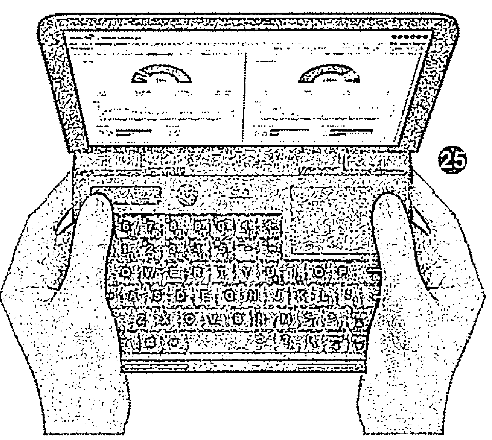

## GPD Pocket 2系列

GPD Pocket 2主打轻巧设计，它内置光学手指鼠标，一个手指即可实现360度旋转及任意位置移动，可取代方向键，效果堪比光电鼠标。这款产品的特色还表现在键盘上方提供了一排快捷功能键（图26），可一键实现强制风扇静音、静音和亮度调节等功能。

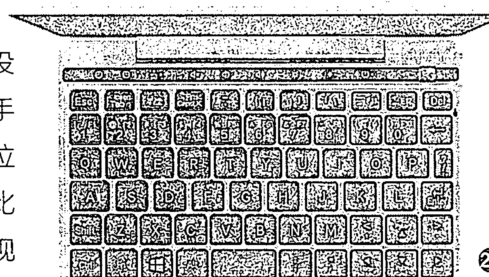

## GPD WIN 2系列

WIN 2是GPD旗下首款掌机型产品，它在键盘上方提供了类似PSP掌机的遥感、方向键和包括LR在内的游戏键，无需外接手柄就能获得良好的操控体验。但是，WIN 2的屏幕分辨率较低，键盘空间被压缩后敲击手感变差，哪怕是M3-8100Y处理器的性能也只能算是勉强够用（图27）。


## GPD P2 Max系列

GPD P2 Max采用了更大的8.9英寸2.5K触控屏幕，键盘和触控板的布局也更倾向于传统笔记本，并将电源键和指纹识别功能合二为一（图28）。相对传统的键盘布局和设计，让P2 Max的上手更容易，但也因此缺少了足够的辨识度，只是更迷你形态的笔记本而已。

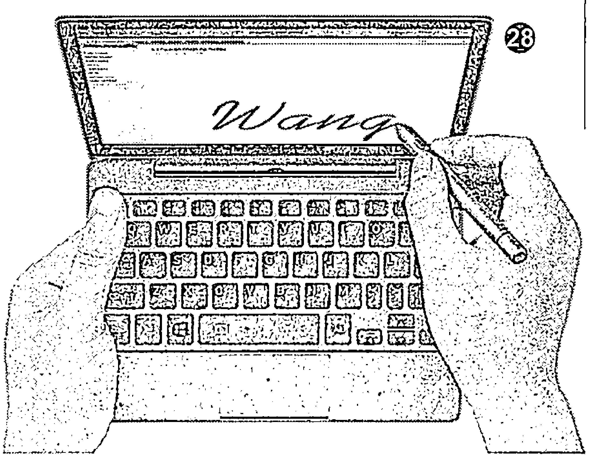

## GPD WIN Max系列

GPD WIN Max应该算是口袋笔记本中的旗舰了，因为它搭载的第十代酷睿i5-1035G7处理器集成了媲美MX150独显的Iris Plus G7核显，优化的双风扇双热管散热模块可以让CPU稳定工作在25W的功率上，性能不逊于搭载同款处理器的传统轻薄本。这款产品同样配备了游戏按键（图29），唯一的缺陷也许就是1280×800像素分辨率的屏幕了。但是，也正是因为分辨率变低，它才能流畅运行更多3D游戏。

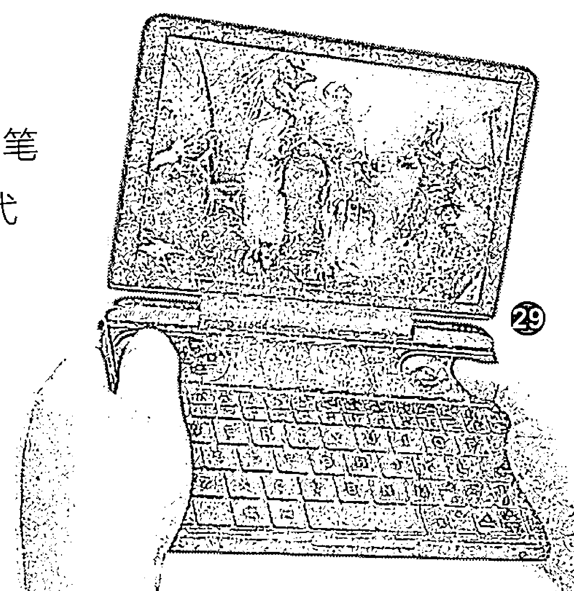

## 选购建议

由于没有翻转屏幕的设计，所以GPD产品的售价要低于配置相似的壹号本。相对来说，笔者更推崇GPD Pocket 2和GPD WIN Max，前者是因为足够便宜，后者则胜在足够强悍，雷电3接口的加盟也带来无限的扩展潜力。

## 口袋笔记本的未来

口袋笔记本胜在轻巧时尚，但也同时存在售价相对高昂的缺陷——相同的预算，我们已经可以买到很多搭载锐龙4000或酷睿i5+MX350独显的轻薄本了，哪怕是GPD WIN Max在这类产品面前也抬不起头。此外，壹号本和GPD都属于新兴品牌，在售后渠道的建设，以及良品率和维修物料的备货方面均有可能存在不足，比如键帽掉了，我们很难在网上配到兼容的键帽，寻求售后可能也无法提供。

因此，口袋笔记本短期内并不适合作为主力办公/娱乐机型，普通用户还是建议选择13英寸起步的轻薄本，它们虽然便携性不够极致，但性能价格比更强（图30）。好消息是，随着英特尔第十一代酷睿（Y系列）和Lakefield混合处理器的出现，它们都能在更迷你的主板上实现更强的性能（图31）。希望日后能有更多一线品牌入局，实现上网本+UMPC概念的“复辟”，让更利于商旅用户和运维人员使用的口袋笔记本重新回到主流视野，倒逼英特尔定制类似Evo的新一代口袋电脑认证标准。

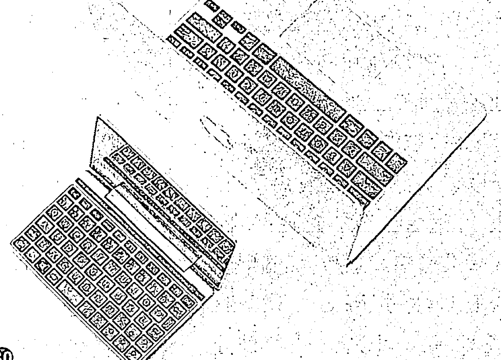

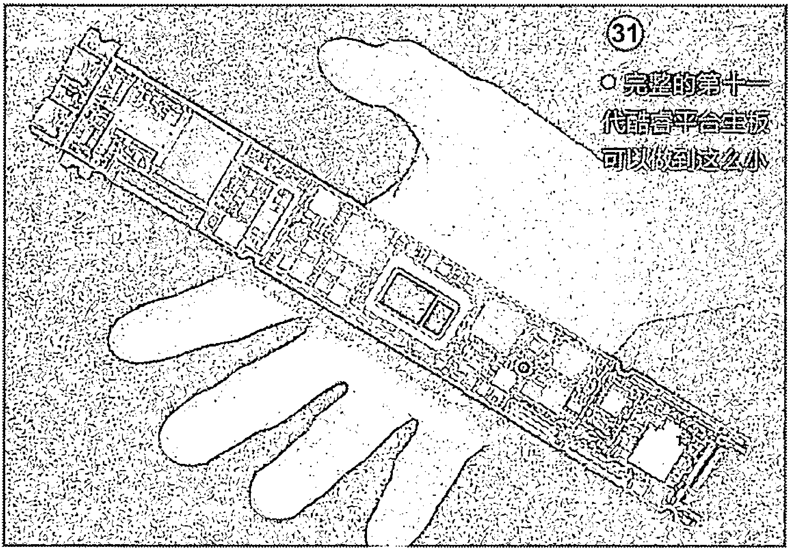

## 纪元纷争
## GPU诞生20周年回顾

2020年9月初，在英伟达创始人兼CEO黄仁勋（Jensen Huang）的“厨房”中，这位GPU领域的传奇人物又一次用经典的方式从操作台、物料架等处为大家取出了大家期盼已久的基于RTX 30系列GPU的显卡。而AMD也紧随其后确认了RDNA 2，也就是传说中的Big Navi核心/RX 6000系列GPU将在近期发布，之后更有重返独立GPU领域的英特尔DG1。对于玩家来说，它们（图1）代表的不仅是一次重大的性能升级，其实也是为GPU诞生20周年的献礼。

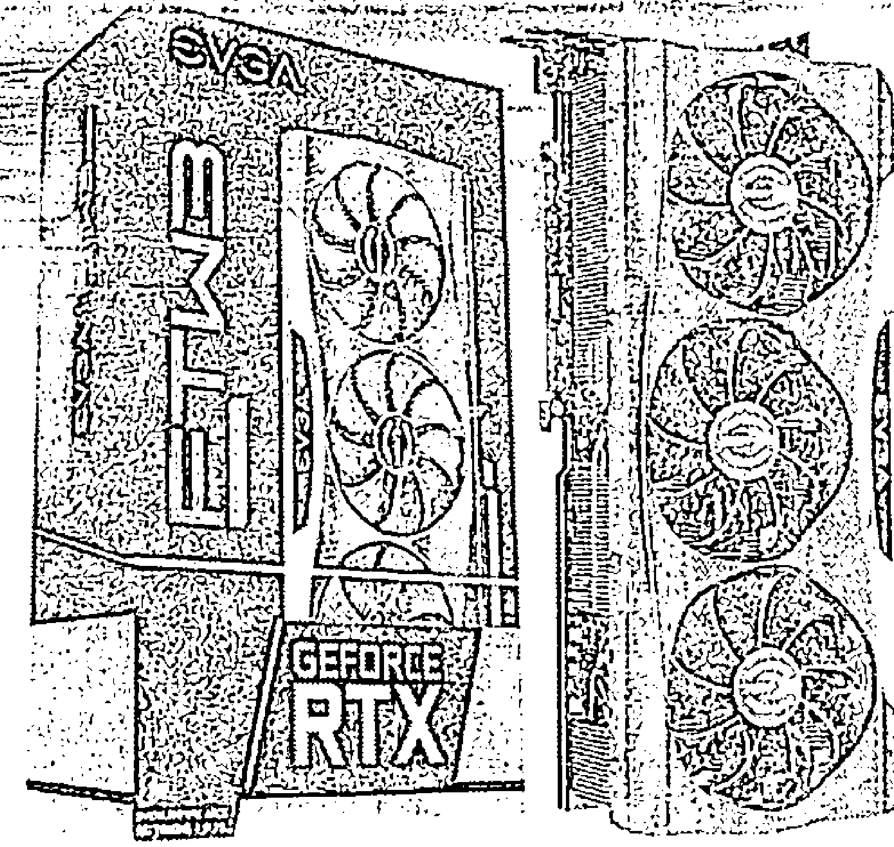

要说21世纪的前20年中，显卡的发展给人最深的印象是什么，那么只有3D！3D！更强的3D！在个人电脑发展初期以色彩表现、视频解压等能力著称的2D芯片与显卡基本上统统消失了，而转折点恰恰就在20年前，即2000年GPU这一概念和相关产品的出现。在这一段时间里，为了强大的3D时代，被“献祭”的不止2D图形处理芯片这个品类，还有3dfx、ATI、PowerVR、3DLabs、Matrox、S3、Trident、SIS等在3D领域摸索过的厂商、品牌。这究竟是怎样一段激荡人心的历程呢？就让我们在这次大升级之前，先来回顾一下GPU发展的历史吧。

## 横空出世 第一代GPU

其实3D图形处理芯片在2000年之前就已经发展到了比较高的水平，不过代表着最高水准的产品是离不开2D显卡支持的3dfx Voodoo系列。英伟达的RIVA系列是唯一在游戏帧速上能够追赶3dfx Voodoo系列的2D/3D结合产品，但图像质量和兼容性都要差一些，其他公司可用于3D游戏的显示芯片或3D加速芯片也有不少，整体水平更是参差不齐。

2000年，英伟达推出了第一款被称为GPU（Graphic Processing Unit，图形处理器）的显示芯片——GeForce 256（图2）。它之所以能被称为“处理器”，最大的原因就是它开始拥有了一定的通用计算能力，而不是只针对图形需求进行设计。在此基础上，这一代产品开始支持硬件T&L（Transforming & Lighting，光影转换）运算能力，这一工作原先由处理器负责，对运算能力的要求非常高。因此使用GPU后，处理器可将光影处理占用的大量计算资源用于建模、路线规划、NPC反应等工作上，游戏开发者则可以利用GPU的专用计算模块创造高效率的光影特效。


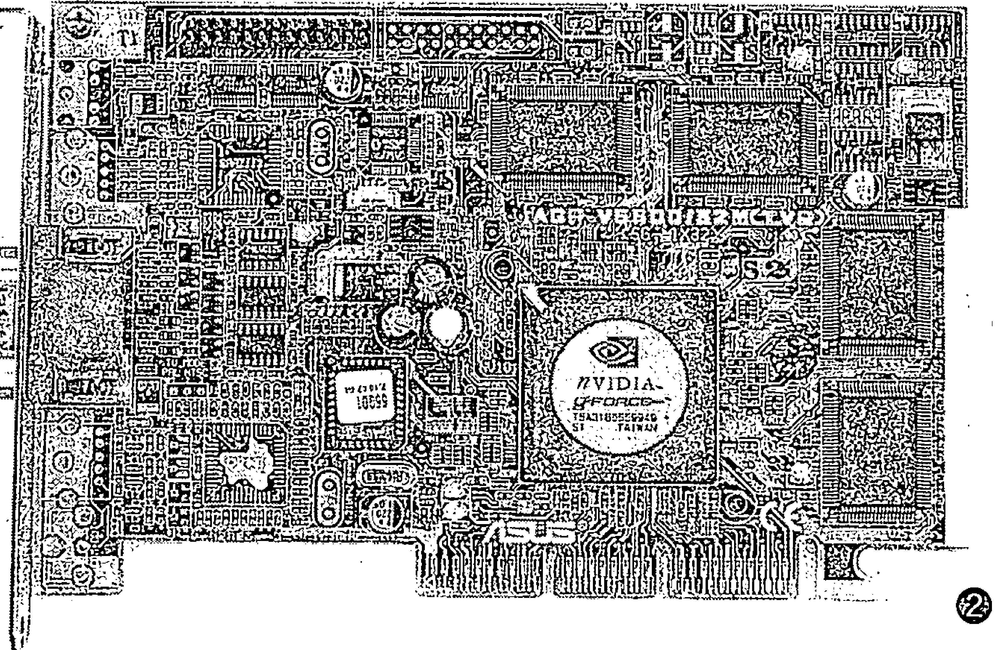

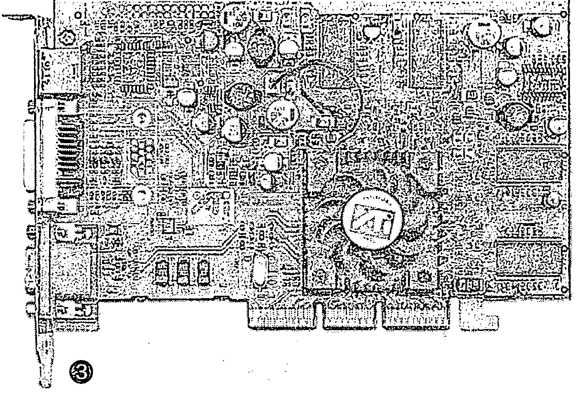

T&L的能力是如此实用且出色，因此很快就出现了支持这一技术的ATI RADEON 256（图3）和S3 Savage 2000，其中前者更标志着两个延续到现在的、最强的显卡系列正式诞生了。有趣的是，英伟达和ATI的GPU都冠以256的称号，表示它们的内部架构达到了256位，而这也说明这些图形处理器的复杂程度开始大幅超越中央处理器。

## GPU之外

2000年的3D图形芯片刚刚走上直通今日的大道，就已经开始展现出了相当强的前瞻性，现在看这些GPU和还不能称为GPU的3D图形芯片，会发现它们已经提供了很多影响至今的技术和设计，如多重纹理贴图（GeForce 256和RADEON 256）、凹凸贴图（MGA G400）（图4）、内存优化（RADEON 256的HyperZ和Savage 2000的S3TC压缩）、低功耗移动版本（GeForce2 Go）等等。

对于很多厂商来说，世纪之交的3D图形芯片市场似乎仍有可为，所以还在争相开发着具有自己特色的芯片，因此2000/2001年的市场中仍是百花齐放，除了前面提到的产品，影响较大的就有SIS315、Voodoo4/5、MGA G450等等。

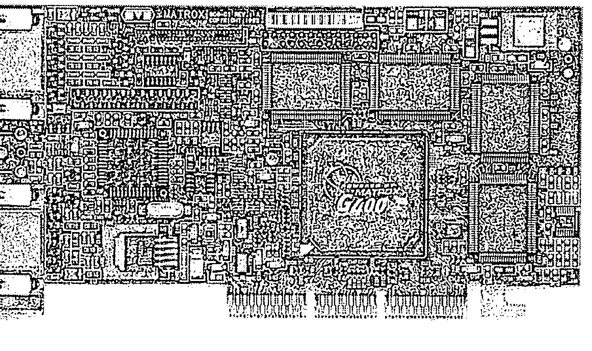

G400的凹凸贴图可提供非常出色的3D图像效果

## 2001~2006 最后的群雄时代

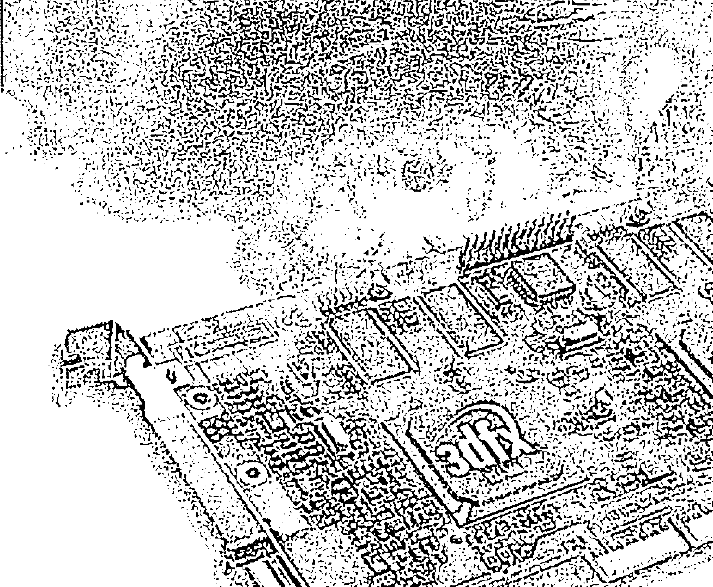

当我们步入21世纪时，带领个人电脑用户进入3D时代的3dfx已经不存在了。使用同一块显示芯片并联、并联、再并联的Voodoo 4000/5000/6000（图5）系列彻底耗尽了玩家甚至粉丝对它的期待，2000年底，已被玩家抛弃的3dfx终于被英伟达收购。这一让玩家震惊的并购案并非结局，而是开启了一个新的时代，几乎全部曾有影响力的显示芯片厂商都在其后的短短几年间倒下了。

2001年英伟达进入Ti（钛的元素代号）和MX时代，分别面向中高端和低端市场，在API支持、渲染单元配置、显存规格等方面有明显的区别，ATI也以RADEON 8000和7000系列应对。这一年DirectX 8（以下简称DX/DX8）正式推出，与支持T&L等新技术，主要目的是提升3D速度的DX 7不同，它的图像质量有了重大提升。英伟达GeForce 3和ATI RADEON 8500是第一批支持DX 8/8.1的GPU，其中RADEON 8500（图6）不仅支持更新的DX 8.1，更在很多测试中的得分/帧速超过了GeForce 3，英伟达不得不推出了极限频率版GeForce 3 Ti 500，尽管其性能确实不错，但高耗电高发热量使其稳定性很成问题。

2002年应该算是真正决定显示芯片厂商命运的一年，在争霸之势已经基本形成的ATI与英伟达之间，英伟达的GeForce 4的强力结束了DX 8时代的争夺，ATI的RADEON 9700（图7）则抢先支持DX 9。英伟达虽然拿出据说带有3dfx Voodoo显示芯片基因的GeForce FX迎战，但旗舰产品FX 5800的功耗和发热量巨大且性能一般，也没有呈现出大家盼望中的高画质。

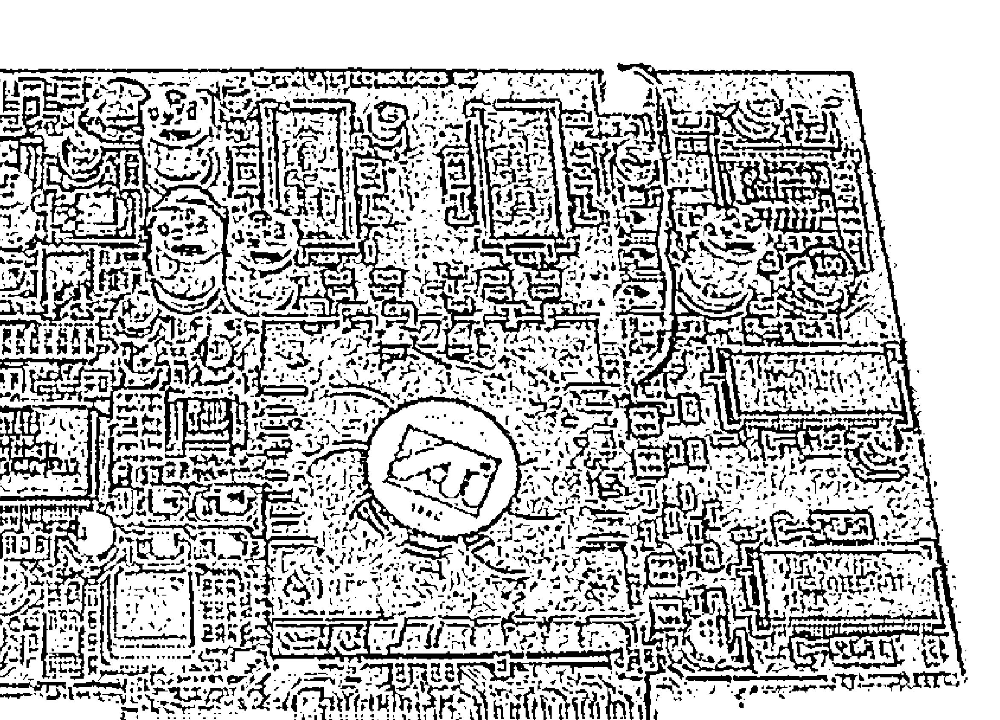

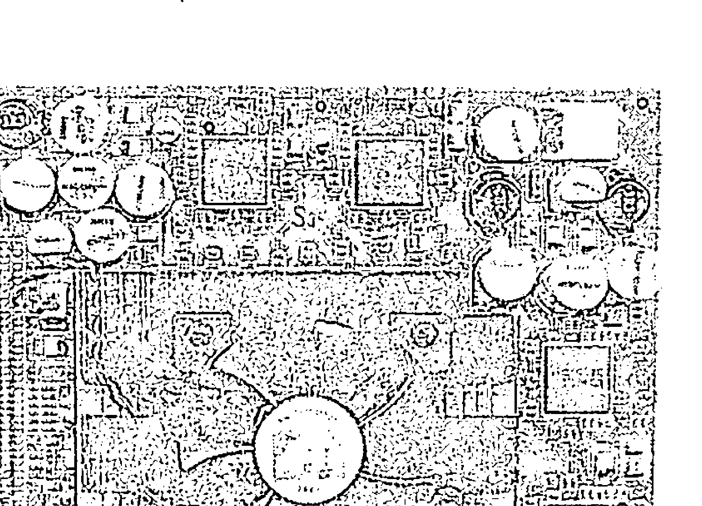

而其他厂商却要悲催得多，很多在这一年发布了最后的绝唱。如SIS的Xabre、Matrox的幻日（Parhelia-512）（图8）等，它们的技术不乏前瞻性，例如Xabre可自动判断场景中不显示的图形部分，不对其进行渲染以节省显存和运算资源，幻日则提供了10bit色深显示和更高效的全屏抗锯齿技术，而且实际上是最早发布的DX9显卡。但它们同样有非常明显的短板，例如Xabre的驱动问题、幻日的速度问题等，因此不得不退出个人电脑市场甚至图形芯片市场。

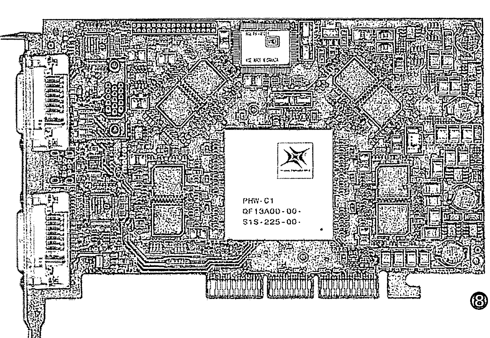

2003年英伟达发布了完善版的GeForce FX系列产品，为了表明并非全新架构，因此只在代号上加了100，例如中端的FX 5700和高端的FX 5900，和近期的Super版有点类似。它们在效能比上有了很大进步，获得了市场支持。同时ATI推出了RADEON 9800系列，整个产品线代号也只升级了100，同样变得更加成熟，其中的RADEON 9600、RADEON 9800SE，以及专门面向内地市场的RADEON 9550等产品，培养了无数的坚定A粉。

这一年另一款广受期待的图形芯片——STMicro的Kyro II终于上市，它虽然有PowerVR系列的光环，却难以掩饰仅支持DX7但不提供硬件T&L功能，且缺乏新3D特效等问题，因此没有被市场接受，不得不宣布退出个人电脑图形领域。同一年S3被VIA收购，Trident被SIS收购，并入其独立的XGI图形部门。

2004年，我们如今习惯的PCIe插槽开始取代AGP，成为显卡的主要接口，也许是为了应对这一巨大变化，这一年英伟达与ATI的新产品GeForce 6000和RADEON HDX00系列都将更多精力放在接口的转换上，在API支持、性能、效能、功能等方面的亮点不多。而双方针对PCIe接口的产品则成了一大奇观，例如英伟达采用原版GPU加板载转换芯片（图9）的方式支持PCIe接口，这块芯片发热量不逊于中低端GPU，而在推出原生PCIe GPU之后，则又为仍使用AGP插槽的用户推出了转换到AGP插槽的显卡，据说差别就是反接转换芯片针脚。

英伟达消化3dfx技术的另一项成果——SLI（Scalable Link Interface，可灵活伸缩的连接接口）渲染在GeForce 6000系列上得到了应用，ATI很快也推出了类似的交火（CrossFire）双卡互联技术。对当时相对贫弱的显卡性能来说，这些技术真的是及时雨，让很多“显卡杀手”级游戏有了流畅运行的机会。

至今为止最后一次对N、A两强的挑战，VIA结合S3技术的DeltaChrome S8（图10）和SIS子公司XGI的双内核DX9产品Volari都在2004年夏秋推出，它们均支持DX9，并在视频处理能力和并行处理等方面有一定的技术创新，虽然后来逐渐发布了一些后续产品，但它们的驱动一直未能完善，市场影响很小，反而说明了其他厂商已经被GPU两强落得太远了。

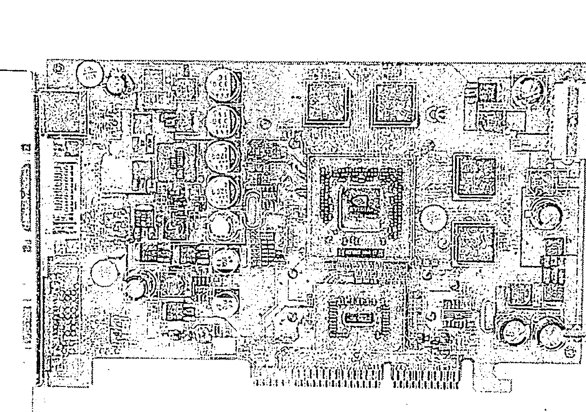

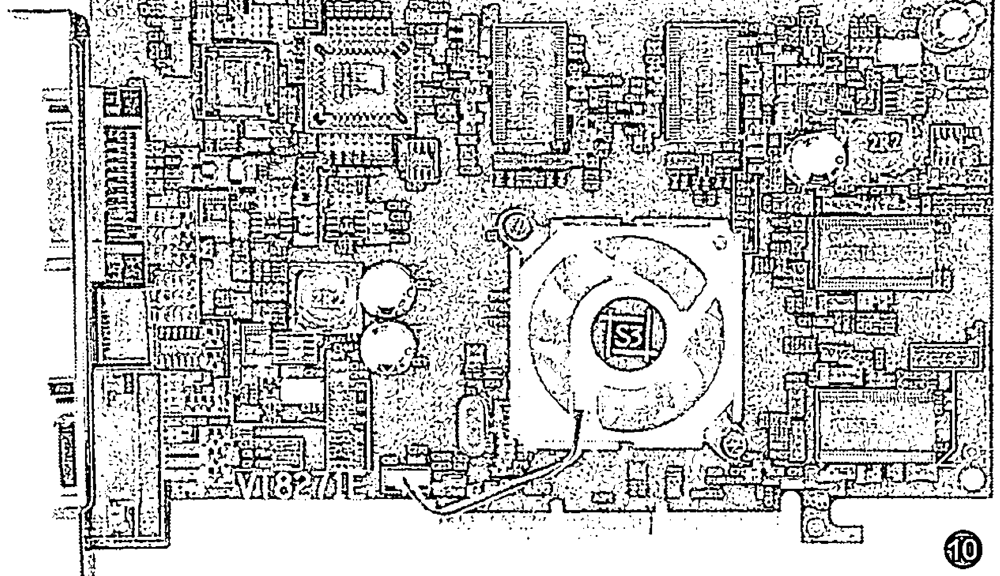

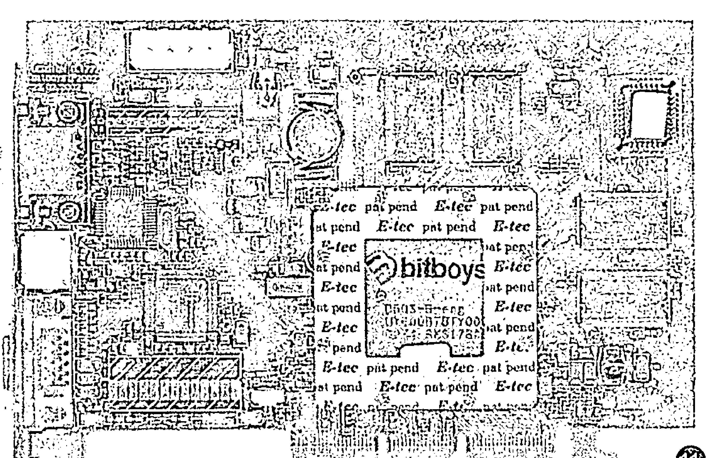

2005年和2006年同样平淡，GeForce 7000与RADEON X1000系列似乎都是前一代的完善版。双方都在积攒力量，为2007年革命性的DX 10做着准备。

2006年3月7日和5月2日，ATI分别收购了XGI和Bitboys，其中Bitboys并没有推出过有影响力的独立3D显示芯片，从Glaze3D到Axe（图11）再到Hammer的独立显卡都只停留在纸面和展示阶段，但其技术相当新颖，一直让人期待。最让人没有想到的是，正通过连续收购而日益强大的ATI却在7月突然被AMD并购。

2006年7月之后，群雄并起的3D市场正式终结了，虽然后来还有Intel的Larrabee（图12）等独立显卡发展计划甚至样品，但事实证明它们已经无法追赶英伟达和ATI/AMD的脚步。

## 2007~2009 两强争霸

2006年底的DX 10成为了至今为止的DX API的基础，它对GPU设计提出了一定的要求，即统一的渲染与像素处理单元和流水线式、模块化的设计。这让GPU拥有了类似CPU的通用处理能力，因此开始借助其强大的并行处理能力向通用计算领域发展，如今英伟达和AMD基于显卡架构的计算芯片已经在AI等很多专业计算领域占据了一席之地。

这一年发布的英伟达 GeForce 8000系列不仅采用了很符合DX10要求的设计（图13），还开发了更适合其工作的CUDA语言，这一语言很快普及到了图形处理之外，成为英伟达计算芯片的应用基础之一。由于AMD与ATI的整合并不顺利，因此其推出的第一代DX10产品RADEON HD2000系列不仅时间较晚（2007年中期），而且性能无法与英伟达产品抗衡，甚至需要祭出双芯片显卡HD2900XTX来对抗英伟达高端产品。好在年底ATI（合并前期仍保留原品牌）就推出了出色的RADEON HD3000系列。

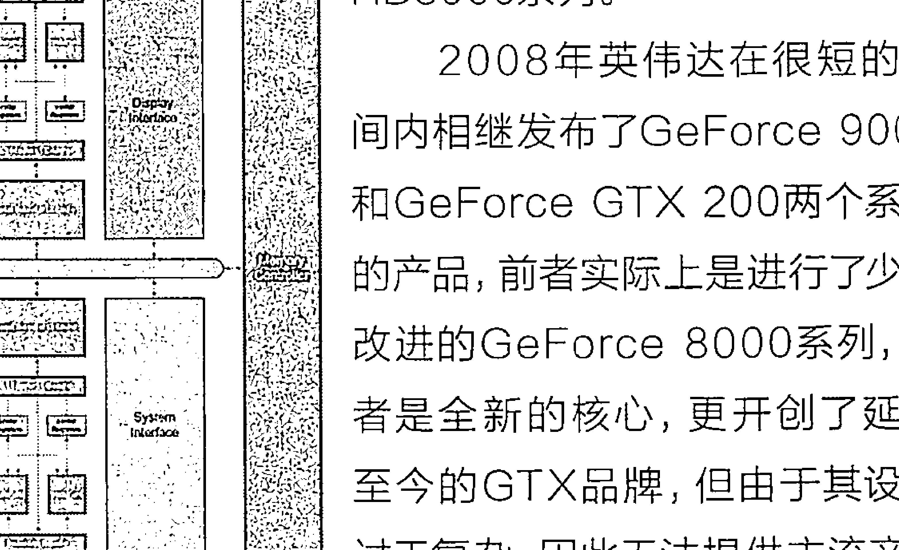

2008年英伟达在很短的时间内相继发布了GeForce 9000和GeForce GTX 200两个系列的产品，前者实际上是进行了少量改进的GeForce 8000系列，后者是全新的核心，更开创了延续至今的GTX品牌，但由于其设计过于复杂，因此无法提供主流产品（图14）。在很长一段时间内，出现了低端主流一直被GeForce 9000系列占据的情况。英伟达为了面子问题，还采用改名方式，推出了一部分G2XX和GT2XX产品，其实除了制造工艺和频率、显存设置外，和GeForce 9600/9800没有什么差别。

这次ATI的RADEON HD4000系列的表现就要好得多，价格、功耗、适应性等全面胜过对手，虽然最高端产品在性能方面各有千秋，但总体效能更出色。而在2009年就早早进入DX11时代的RADEON HD5000系列，更是给了对手非常大的压力。

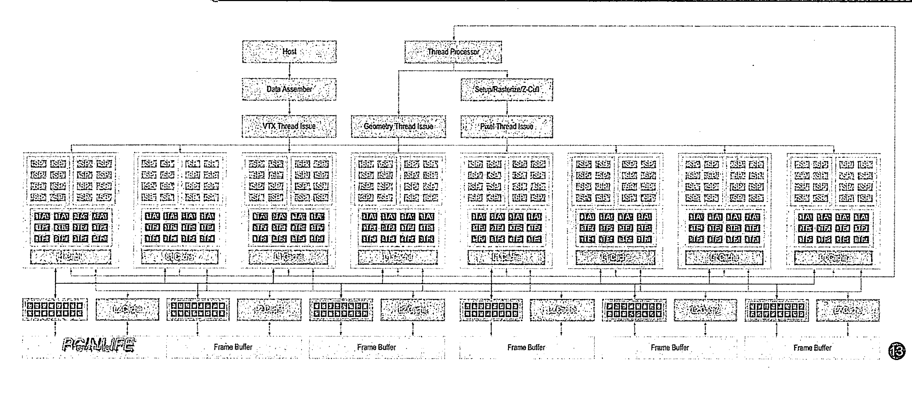

## 2010~2015 走向现代GPU

也许有些人没有注意到，目前仍然极为流行的DX11在2010年就已经推出并拥有了相应的GPU，也就是说，从底层架构来看，现在的最新型GPU相对于10年前，只有过一次较大的改动，所以这时候的GPU已经可以算是“准”现代产品了。

这些准现代产品的第一批代表，就是2010年的英伟达GTX 400和GTX 500系列、AMD的RADEON HD6000系列，它们或性价比喜人，或性能强劲，将3D显卡市场带入了一个新时代。有趣的是，进度略慢的英伟达放弃了原先半年一次的集中发布，以近乎一个月一款的速度将其DX11产品线延伸至市场各个层面，从3月底发布以高发热著称的GTX 480（图15），到10月、11月分别发布了最低端DX11产品GT 430和更成熟的改进版旗舰型号GTX 580，间隔仅有不到7个月。当然这种发布方式我们如今已经习以为常，但在当时看来堪称“疯狂”。

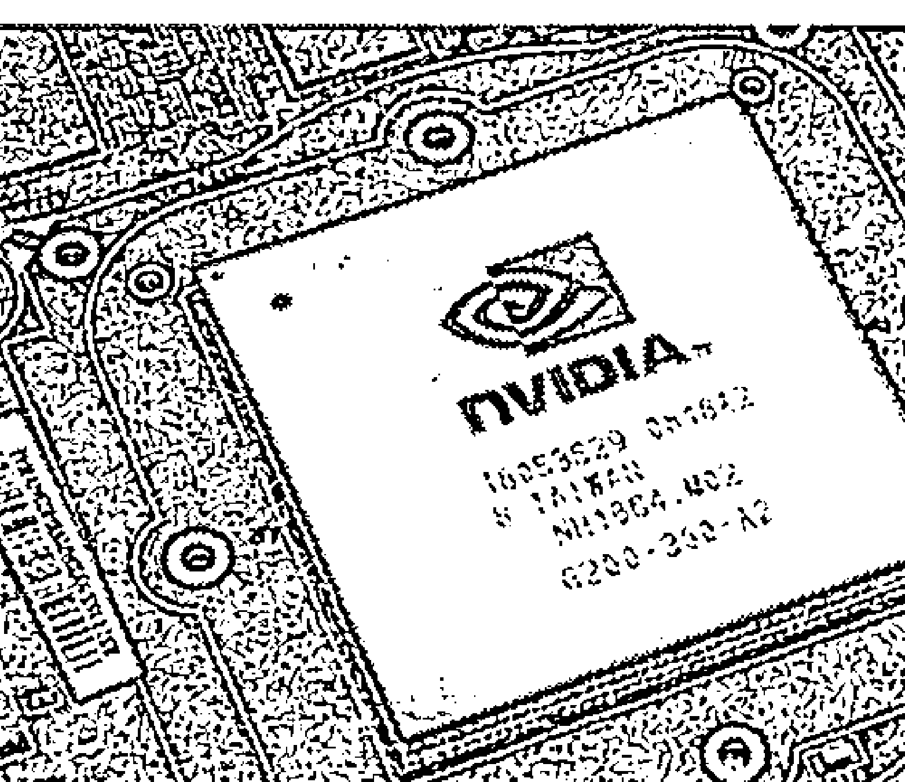

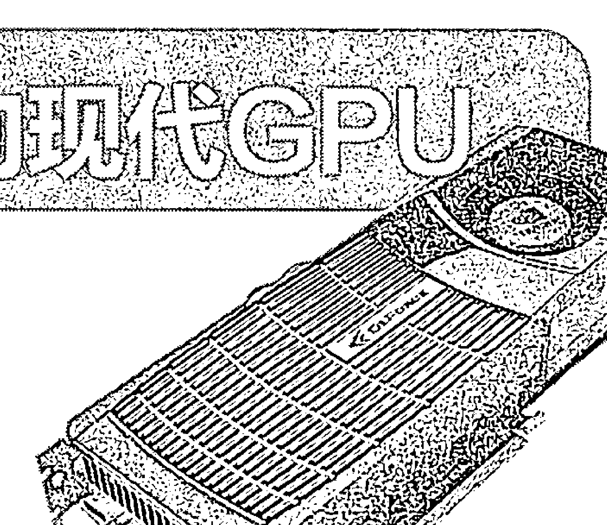

2010年的另一大变化也延续至今，就是集成显卡的再次崛起。英特尔在2010年1月推出的酷睿i系列处理器中集成了效能很高的显示单元——核芯显卡，直接冲击着低端独立显卡市场，其后不断进化的核芯显卡和同样带有内置显示单元的AMD APU逐渐淘汰了入门级的所谓“点亮卡”。而且因为集成显卡的平台拥有更低的整体功耗，可以让系统更精简，因此让纤薄轻巧的笔记本、一体式电脑的成本大幅降低。

从2012年开始，很多大家现在很熟悉的名字逐渐出现在GPU产品中，比如英伟达的开普勒（Kepler）核心——GTX 600系列。AMD则开始使用GCN架构，并以群岛名称如Tahiti（大溪地或塔希提群岛）命名核心，推出了HD7000系列。它们都可以说是终极版DX 11显卡，目前的很多DX11游戏仍将其作为基本配置甚至推荐配置（图16），其中HD7000更是已经开始支持最基础的DX12规范。

随后英伟达和AMD在命名方面都经历了一定的变化，英伟达的GTX 700系列又一次在600系列的基础上进行了完善，并且也许是考虑到偶数系列总是做得不好，索性放弃了GTX 800系列桌面显卡（推出了移动版），直接推出了非常出色的GPU——GTX 900系列。而AMD则相应地没有HD 8000系列，而是推出了存在时间很短的R5/R7/R9系列，如R9 290、R9 390X（图17）等，现在我们大家熟悉的RX这一名称，在一定程度上就代表着高于R9系列的意思。

## 系统需求

| 最低配置 | 推荐配置 |
| --- | --- |
| 需要64位处理器和操作系统 | 需要64位处理器和操作系统 |
| 操作系统: Windows 10 64-bit | 操作系统: Windows 10 64-bit |
| 处理器: Intel Core i5-2550K 3.4GHz / AMD FX-8120 3.1 GHz | 处理器: Intel Core i7-3770 3.4GHz / AMD FX-8350 4.2GHz |
| 内存: 6 GB RAM | 内存: 16 GB RAM |
| 显卡: NVIDIA GeForce GTX 660 / AMD Radeon HD 7870 | 显卡: NVIDIA GeForce GTX 1080 / AMD Radeon RX 5700 |
| DirectX 版本: 11 | DirectX 版本: 11 |
| 存储空间: 需要50 GB可用空间 | 存储空间: 需要50 GB可用空间 |
| 声卡: DirectX Compatible | 声卡: DirectX Compatible |

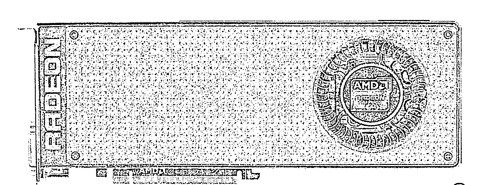

## 2016~2020 欢迎进入新时代

2016年，英伟达和AMD又一次同时更新了命名方式，英伟达推出了千位级显卡——GTX 1000系列，AMD则推出了RX 400和RX Vega系列，它们都是为Windows 10，也就是DX12进行了特别优化的产品，标志着显卡进入了延续至今的新时代。

也正是从这一时期开始，AMD的GPU性能逐渐有些落后了，为了追赶英伟达的最强旗舰而推出的RX Vega成了AMD这边的GTX 200系列，虽然靠新技术的堆砌接近了对手的性能，却因为HBM显存等设计过高的成本（图18）而无法进入主流市场，最终没有形成真正的更新换代。

之后的GPU发展历程相信大家都很熟悉了，从2016年的GTX 1000/RX 400到最近的RX 5000/RTX 20，这些GPU都仍然在为大家的电脑工作着，活跃在游戏的“最前线”。同时也有相当多的玩家们，已经在持币等待着英伟达RTX 30、AMD RX 6000，甚至是英特尔再次重返独显市场的新产品了。

伴随着这些堪称献礼级别的重磅新品，GPU的新时代正在逐步走近我们。我们的未来是4K？8K？还是真正实用化的VR？GPU今后还将带给我们怎样的惊喜，又会有怎样惊心动魄的市场斗争呢？让我们一起期待吧。

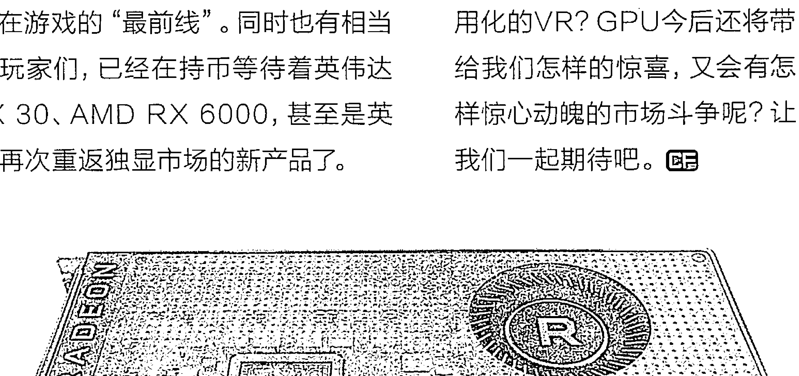

## 回顾屏幕面板发展历史

你还记得20年前电视机、电脑显示器和手机屏幕是什么样子吗？

回顾当年，笔者家里还在使用身材臃肿的CRT电视看《还珠格格》，使用又小又重的CRT显示器玩《星际争霸》，并对身边能用黑白屏手机玩《贪吃蛇》的同学产生羡慕嫉妒恨的心理。

将时间的指针拨到现在，我们已经用上了50英寸起步的液晶电视，笨重的台式机也被轻巧便携且拥有高色域屏幕的笔记本所取代，掌中手机屏幕也能呈现一个更具沉浸感的精彩绚烂的视界，让我们不禁感叹科技的进步。

最重要的是，如今电子产品屏幕面板的国产化进程正在逐步加速，“我的屏幕我做主”的未来就在我们眼前！

本期特别话题，就让我们聊一聊屏幕技术的发展史吧。

## 逝去的历史

## CRT

## Soft copy viewing digital cathode ray tube (CRT)

CRT学名为“阴极射线显像管”，是一种使用阴极射线管(Cathode Ray Tube)的显示设备(图1)，曾经一统电视和电脑屏幕江湖。

## 核心部件显像管

影响CRT显示效果的核心部件就是显像管，如果你曾关注过家用CRT显示器，就一定听说过“特丽珑”(索尼)、“钻石珑”(三菱)、“丹娜管”(三星)和“方管”(LG)等名词。在不同显像管的基础上还衍生出了球面显示器、平面直角显示器和纯平显示器，PC领域的CRT显示器多以15英寸~24英寸为主（图2）。

可惜，CRT显示设备受制于物理特性，既厚又重还费电，需要不定期消磁，球面显示器还需要校准才能防止画面边缘变形。因此，大约从2002年开始，CRT就在新兴液晶显示器（LCD）的攻势下节节败退，并最终被历史淘汰。

## CRT最后的倔强

然而，在LCD液晶显示器强势崛起之初，CRT依旧在某个领域保持着强势地位，那就是电竞显示器。早期LCD因液晶分子排列和本身反应速度的问题，响应速度偏慢，刷新率偏低，在运行FPS类游戏（如CS）时会出现严重的拖影问题。因此，当年不少游戏玩家为了追求更高的刷新率和快速的响应速度会继续坚守CRT（图3），直到液晶显示器在技术层面取得突破。

## 从辉煌到没落的启示

在CRT时代早期，我国的彩色显像管等关键部件都需要进口，相关的技术壁垒直到2000年前后才被逐渐打破，而背后的主要原因则是国外企业淘汰落后产能，全力发展液晶面板技术。

可惜，当年很多国内企业误判了形势，比如2003年前后“八大彩管厂”相继接过国外企业甩掉的包袱，继续扩大CRT产能；河南安彩公司将美国康宁公司的9条CRT显像管玻壳生产线尽数拿下，这些企业看似捡到了一个巨大的便宜，这后面却蕴藏着巨大的危机，即错过了CRT→LCD转型的最关键窗口期，部分企业很快就走向了衰败，逐渐淡出了中国电子信息产业。

**扩展阅读：等离子显示技术**
在CRT淡出历史之初，与LCD竞争的还有一项名为等离子的显示技术（Plasma Display Panel），其具备色彩还原好、几乎无拖影以及可视角度大等优点（图4）。但是，等离子屏幕还同时存在尺寸单一覆盖不全面、分辨率提升乏力、有烧屏隐患等缺点，从始至终也只有松下、先锋、日立、三星和长虹等少数企业参与研发投入，很快就被液晶显示技术打败并退出历史舞台。

## 逐渐倾斜的战场 LCD

LCD的历史其实相当悠久，第一块液晶显示屏诞生于1968年，至今仍是用于电子设备显示屏幕的中坚力量。

## 从单色变真彩

LCD最初只能显示“黑”与“不黑”，以摩托罗拉3200手机为代表的“大哥大”就是因为嵌入了一小块黑白显示屏从而开启了手机可以通过屏幕与用户交互的时代（图5）。随后，LCD逐渐进化到STN（Super Twisted Nematic）以及CSTN（Color STN），前者（STN）虽然依旧隶属于黑白屏，但是因为可以显示灰阶，所以可以呈现更丰富的画面内容；后者（Color STN）在STN的基础上增加了彩色滤光片，可以显示256~65536种色彩，并借由爱立信T68等经典产品将手机推向了彩屏时代（图6）。

需要注意的是，无论STN还是CSTN，它们都存在响应速度偏慢的问题；采用这些屏幕的手机运行起来会感觉特别卡，很多情况下并非性能不够，而是源于屏幕响应速度的迟滞。

现在我们常念叨的LCD全称其实应该是“薄膜晶体管液晶显示器”（Thin Film Transistor LCD, TFT-LCD），在过去它还曾被称为“真彩屏”，因为TFT-LCD在65536种色彩的基础上，还能进一步显示26万色（即6bit面板）、1600万色（8bit面板）和10亿色（10bit面板）。

1996年，索尼制造出了第一台家用液晶电视；2003年，三星发布了全球第一款采用65536色彩TFT-LCD屏幕的SGH-V200手机；1992年，IBM推出了全球第一款使用TFT-LCD屏幕的ThinkPad 700C笔记本电脑（图7）；而这种屏幕也从1998年开始出现在PC显示器的应用领域，并只用了10年左右的时间就将CRT扫地出门。

## TFT-LCD的分类

在PC显示器领域，TFT-LCD衍生出了TN（Twisted Nematic, 扭曲向列型）、IPS（In-Plane-Switching, 平面转换型）、VA（Vertical Alignment, 多象限垂直配向型）等类型的面板，其中TN是早期显示器的标配，其特色是成本低、响应时间迅速，特别适合用于高刷新率的电竞显示器。不过，TN屏幕存在原生色彩少、可视角度较低等缺陷，在综合体验上不如其他几种类型的面板。IPS的优势是可视角度高（图8）、面板硬度较高轻触屏幕画面不会变形，缺点则是很难彻底解决漏光问题。VA的优势是对比度高、色彩艳丽，缺点是响应时间相对偏慢，不太适合游戏玩家。

在手机屏幕领域，TFT-LCD则存在TN、IPS、SLCD和ASV之别，它们都属于基于LCD的显示技术。其中，SLCD曾是HTC手机主打的屏幕技术，ASV则是夏普屏幕专享，都没能成为市场主流。现阶段除了极少数百元手机，IPS屏幕已经一统手机LCD屏幕江湖（与LCD对应的还有OLED屏幕，后者我们会在下文详解）。

细心的朋友可能还会发现一个问题，现在有很多中高端手机或笔记本都在主打一项名为“LTPS LCD”的卖点。实际上，LTPS（低温多晶硅）只是一种制造TFT LCD的材料，与其对应的还有a-Si（非晶硅）材料（图9）。LTPS LCD具备响应速度更快、分辨率更高、功耗更低等优点，可以将外围驱动电路同时制作在玻璃基板上，达到系统整合的目标，节省空间及驱动IC的成本。同时，LTPS不仅可以为LCD提供玻璃基板，还能用于OLED所需的背板，是一种通用性更好的屏幕材料，唯一可惜的就是成本稍高。目前，以京东方、华星光电、天马、信利光电、辉光电、友达和群创为代表的面板企业都加大了LTPS LCD/OLED产线的规模。

| 序号 | 地点 | 产线代数 | 技术 | 产能（K/月） | 良率 | 状态 |
| :--- | :--- | :--- | :--- | :--- | :--- | :--- |
| B1 | 北京 | 5 | a-Si LCD | 110 | 60 | 满产 |
| B2 | 合肥 | 4.5 | a-Si LCD/LTPS LCD | 34 | 45 | 满产 |
| B3 | 合肥 | 6 | a-Si LCD | 175 | 90 | 满产 |
| B4 | 北京 | 8.5 | a-Si LCD | 280 | 90 | 满产 |
| B5 | 合肥 | 8.5 | Oxide LCD | 285 | 90+30 | 满产 |
| B6 | 鄂尔多斯 | 5.5 | LTPS LCD | 220 | 60 | 满产 |
| B8 | 重庆 | 8.5 | a-Si LCD+IGZO LCD | 328 | 90 | 满产 |
| B9 | 合肥 | 10.5 | a-Si LCD | 400 | 120 | 满产 |
| B10 | 福州 | 8.5 | a-Si LCD | 300 | 150 | 满产 |
| B12 | 武汉 | 10.5 | a-Si LCD | 460 | 120 | 1021投产 |
| B7 | 成都 | 6 | AMOLED | 465 | 48 | 量产 |
| B11 | 绵阳 | 6 | AMOLED | 465 | 48 | 量产 |
| B13 | 重庆 | 6 | AMOLED | 465 | 48 | 在建 |
| B14 | 福州 | 6 | AMOLED | 465 | 48 | 在建 |

液晶屏幕应该是最能诠释“三十年河东，三十年河西”的产业（图10）。这项技术最早是由美国公司发明，原本是想用于电视机领域，但却因研发成本与市场回报不成比例而被放弃。20世纪90年代，日本从美国引入了TFT-LCD技术并最终将其产业化（代表企业有夏普、NEC等），但很快就被后来居上的韩国企业（三星、LG等）所赶超。1997年亚洲金融危机期间，日本为了应对韩国的挑战将部分液晶技术和产线迁至中国台湾省，成就了以广达、奇美、群创为代表的液晶面板品牌的腾飞。

中国大陆早在上世纪70年代末就有以原电子工业部七七四厂（北京电子管厂，即京东方的前身）为代表的企业开始涉足LCD技术的研发，但在2000年以前在TFT-LCD领域却还处于基础研究阶段。

国产TFT-LCD的转机出现在2003年，就在“八大彩管厂”接过国外企业的CRT产能之际，京东方却利用亚洲金融危机的机遇，以整体收购的模式成功收购了韩国现代集团的液晶面板业务，拥有完全的独立自主权和生产安排权，并以此为学习基础于2005年在北京建设了第一条5代TFT-LCD生产线（表1）。至此，京东方也成为了中国大陆第一家拥有TFT-LCD核心技术与业务的企业。

受京东方模式的影响，以天马微电子和华星光电为代表的企业先后投入到自主建设TFT-LCD产线的路线中来，并不断创新和扩大产能，结合我国相关政策的扶持，终结了我国“少屏”的历史。截至2019年，中国大陆面板厂商全球出货量已经占据了全球近一半的市场份额，其中京东方更是从2018年开始就蝉联全球显示面板企业出货量第一的桂冠。随着国产面板厂商10.5代线的逐步量产，将进一步拉开与日韩显示企业之间的差距，将LCD之王的身份落实到底。

| 产线代数 | 玻璃基板尺寸(mm) | 适用产品尺寸 |
| :--- | :--- | :--- |
| 1代线 | 320×400 | 6英寸以下 |
| 2代线 | 370×470 | 6英寸以下 |
| 3代线 | 550×650 | 6英寸以下 |
| 4代线 | 680×880 | 6英寸以下 |
| 4.5代线 | 730×920 | 6英寸以下 |
| 5代线 | 1100×1300 | 32英寸以下 |
| 5.5代线 | 1500×1300 | 32英寸以下 |
| 6代线 | 1500×1850 | 32英寸以下 |
| 7代线 | 1950×2250 | 43英寸以下 |
| 8.5代线 | 2200×2500 | 66英寸以下 |
| 10代线 | 2880×3130 | 60英寸 |
| 10.5代线 | 2940×3370 | 65英寸、75英寸 |

*屏幕面板产线代数越先进，生产同样数量屏幕的成本也就越低。比如，6代线玻璃基板的尺寸为1500mm×1850mm，大约可以切割200块5.5英寸屏幕面板。当换成1950mm×2250mm的7代线后，一次就能切割出更多的5.5英寸屏幕面板。

## 国产化带动产业升级

虽然我国在TFT-LCD的产能和出货量方面已经占据了全球市场的半壁江山，但在上游的原材料领域却依旧存在较大的不足，比如TFT液晶原材料的供应商就基本被德国默克（图12）、日本智索、大日本油墨垄断，在背光模组模块中最重要光学膜的原材料光学基膜也被东丽、三菱树脂、帝人、杜邦等国外巨头把控。

## 扩展阅读

为何16:9成标题

细心的用户不难发现，电视和笔记本领域液晶屏幕的显示比例几乎都是16:9，早期的智能手机也是16:9，只是随着全面屏浪潮的来袭，才逐渐进化到18:9~21:9。液晶屏幕的显示比例会影响到切割成本，它将影响一块X代线生产的液晶基板最多可以切割出多少块屏幕（图11）。以16:9为例，它对于16:10屏幕的物理面积就缩小了5%。不要小看这5%，量产后它能为厂商节约下来可观的成本，可将液晶基板的利用率提升到极限。

好消息是，随着TFT-LCD自给率的不断提高，上游原材料的国产化也会因此受益。比如，曾经需要全部依赖进口的偏光片就已被国内三利谱和盛波光电等企业攻克（图13）。诚志永华、江苏和成和八亿液晶旗下的TFT液晶原材料以及乐凯集团、康得新、裕兴股份、南洋科技旗下的光学基膜市场份额也在稳步提升之中。可以预见，随着国产TFT-LCD上下游产业链的不断成熟，能被“卡脖子”的上游材料会越来越少（图14）。

## TFT-LCD CELL制程流程图

## LCD的手机困局已现

在以电视机和笔记本为主的大屏应用领域，以及除手机之外的小屏电子产品（如带屏幕的智能音箱）应用领域，LCD是当之无愧的霸主。之所以强调“除手机”，是因为LCD在智能手机市场受到了最强的对手——OLED的狙击。就好像当年从CRT→LCD的转型一样，如果显示面板企业没能赶上LCD→OLED的最佳转型期，在手机领域也将遭遇生死困局。

还记得日本JDI吗？想当年JDI旗下的TFT-LCD屏幕面板堪称手机领域的“高端货”，很多国产手机在发布时都喜欢将来自JDI的屏幕作为宣传噱头（图15）。由于JDI高度依赖苹果，但苹果却从iPhone 8开始全面倒向OLED，最终导致JDI的LCD面板业务连年巨亏，至今已无力承担高昂的OLED面板研发费用，开始寻求与其他企业合作，以减轻投资负担。昔日的LCD面板巨头落得如此境遇，就是没能抓住未来的契机，一步落后步步落后。

国内面板厂商就很好地吸取了CRT时代的教训，在很早以前就采取了LCD和OLED两手都要抓、两手都要硬的策略，也因此才能在今天与韩系OLED面板厂商实现了分庭抗礼的平衡局面。

扩展阅读：xLED中的x代表什么。除了OLED，市面上还出现了‘QLED’。它们之间的差异是OLED的发光材料为有机物，而QLED则是基于无机物发光。由于无机物的耐热稳定性和化学稳定性等指标普遍高于有机物，所以理论上QLED的光源稳定性和寿命等关键指标要强于OLED。此外，也许你还听说过ULED（Ultra-LED，海信电视上搭载的一种显示技术）、GLED（Geek's LED，创维主推的一种概念）和SLED（SGG-LED，康佳电视的概念），但它们只是在背光上下了一番功夫而已，属于一种概念上的炒作，实际显示效果只是优于普通的LED而已，和OLED、QLED没法比。

## 未来的发展趋势

## OLED

如今OLED (Organic Light-Emitting Diode, 有机发光二极管) 已经是中高端智能手机的标配，并逐渐“入侵”穿戴式设备 (如智能手表) 、电视、笔记本和显示器领域。

## OLED屏幕的特性

小提示：OLED根据驱动方式的不同又可细分为被动式PMOLED与主动式AMOLED。如今OLED屏幕几乎都是主动式，但提起AMOLED很容易让用户想起三星Super AMOLED技术，所以其他面板厂商在宣传时大都直接以OLED称呼旗下的产品。

无论是LCD还是OLED，它们的核心都是薄膜晶体管(TFT)，需要依靠TFT来做像素控制(图16)。它们之间的差异在于，LCD屏幕使用CCFL灯管或LED灯条作为点亮TFT的光源，而OLED屏幕则是在每一个TFT像素表面都涂抹一层细小的三原色或者白色等有机物材料，从而形成密集的独立发光的OLED灯珠阵列。由于OLED等同于像素且无需额外的灯管或灯条光源就能显示，所以又称自发光。

得益于无灯源自发光的特性，OLED屏幕可以做得更薄，还具备广视角、低功耗、高对比度、高反应速率、色彩艳丽等优点，可以显示更纯的黑色，且黑色背景下几乎不耗电。当然，OLED也存在一些缺陷，比如长时间显示相同的画面容易烧屏、Pentile排列在分辨率不足时存在一定的锯齿感、显示纯白或浅色背景时的耗电量更高等等。

## 刚性与柔性OLED

与“宁折不弯”的LCD相比，OLED可谓是“能屈能伸”的代表。简单来说，OLED根据形态还可以细分为刚性OLED以及柔性OLED，前者和LCD一样，用于保护显示面板基板的封装材料是玻璃。柔性OLED则使用PI（聚酰亚胺）作为保护基板，或使用薄膜封装（TFE）代替玻璃封装，从而可以将屏幕弯曲、卷曲甚至折叠（图17）。没错，现在大家看到的3D曲面屏、3.5D瀑布屏以及以华为Mate X为代表的折叠屏手机，都是建立在柔性OLED屏幕基础之上实现的。

## OLED屏幕的国产化

在OLED屏幕领域，三星和LG Display一直都是行业的引领者，三星早期Galaxy S系列手机之所以可以热卖，就是因为它们是极少数有资格用上AMOLED屏幕的机型。我国OLED产业起步较晚，而且早期主要投入的是PMOLED（适用于小屏的MP3、穿戴式设备等）领域的研发（图18），比如维信诺旗下的PMOLED在2009年1月进入国际市场，2012年6月就取得了出货量全球第一的成绩。但在适用于智能手机领域的AMOLED屏幕领域，国产OLED屏幕直到2018年前后才被大批量应用到具体的终端设备上，但扩张速度颇为惊人。比如，2018年华为从Mate20 Pro开始采用京东方OLED屏幕（图19），随后的P30、Mate30和P40等旗舰系列手机的OLED屏幕供应商依旧是京东方。此外，维信诺也斩获了来自荣耀30系列、中兴天机Axon 10Pro、努比亚α和红魔5G等手机和穿戴式手表的OLED屏幕订单（图20）。在大家关注的折叠屏手机领域，华为Mate Xs的折叠屏来自京东方（据悉华为下一代折叠屏手机的供应商是维信诺），摩托罗拉Razr V3的折叠屏来自华星光电和京东方，TCL展示过的折叠屏手机则来自自家的华星光电。目前，京东方、华星光电、和辉光电、维信诺、深天马和长信科技等国内企业的OLED技术都已经具备了相当的竞争力。根据市场研究公司Omdia发布的数据，2019年京东方OLED面板出货量为3910万块，比上年同期暴涨700%。据专家预测，2021年我国OLED产线月产能将超过450kpcs，占全球产能比例26%。到2023年，中国大陆地区的OLED面板总产能占比将近46%，终结OLED屏幕被韩系厂商垄断的历史。

## 汇顶科技屏下光学指纹广泛商用
IN-DISPLAY FINGERPRINT SENSOR™


## 基于OLED之上的创新

虽然我们在OLED屏幕面板的研发层面属于后来者，但在基于OLED屏幕之上的功能创新却是引领者。比如，继密码解锁、电容指纹解锁、人脸识别和虹膜识别之后，第一次将指纹识别模块置于OLED屏幕之下，真正将屏幕指纹识别功能量产的方案就来自国内的汇顶科技（图21）。全球首发屏下摄像头技术的中兴天机Axon 20（图22），其背后的方案商则是国内的维信诺。

## 上游材料和芯片之忧

虽然国产OLED屏幕的产能和市占率越来越高，基于其上的创新越来越酷，但我们依旧不能忽视在OLED上游材料、设备和芯片层面的不足。比如，OLED的关键材料玻璃基板长期由美国、日本和德国的企业垄断，在成膜、曝光、光刻胶涂布和刻蚀等流程中用到的材料和设备的国产化也严重不足。

此外，OLED屏幕的性能不仅取决于面板自身的素质，还需要更强的驱动芯片（DDIC）加持（图23），通过定制AP算法来改善画质，提高亮度和刷新率，消除漂移和MURA等。但是，中国大陆DICC厂商布局较晚，所以该领域依旧被韩系（LSI、Maganachip）和中国台湾省（联咏、瑞鼎）牢牢把持。


好消息是，以上提到的材料、设备和芯片的国产化进程也在逐渐加速，比如东旭光电就已量产了柔性OLED玻璃基板，以华为、汇顶科技、集创北方为代表的企业也开始涉足面板驱动芯片的研发，希望在不久的将来，我们的手机、电视、电脑等所有带屏幕的设备都可以用上真正意义上的国产化的高质量屏幕！[表情]

## 数据存储遇到安全难题 自建NAS来解决

要问时下电脑中最重要的是什么？那必然是数据，它的重要性不需要笔者多赘述。不过如何保护、存储自己的数据才是个大问题。我们当然可以选择云存储，不过一方面容量有限制，另一方面还是不如本地存储来得方便。这个问题，其实通过NAS就可以完美解决——既可以解决数据存储的问题，也不用考虑网速、数据安全的问题。而且，通过NAS可以管理全家的所有数据，更重要的是，多大的容量完全是由你自己决定，扩容就是增加硬盘而已。


## 什么是NAS

NAS的全称为Network Attached Storage（网络附加存储），原本是指一种文件存储方式，即使用一个或多个配备专用磁盘的服务器来存储数据，并与连接网络的大量客户端共享这些数据，不过目前我们也常常直接称这些服务器（图1）为NAS。目前类似的网络存储架构共有三种，即NAS、存储区域网络（SAN）和直接附加存储（DAS）（图2）。但NAS是唯一一种始终连网并对整个网络的存储全权负责的存储架构。你可以将NAS想象成一台超级省电，而且功能单一的个人电脑（普通电脑耗电大约为100W~200W以上，NAS则只有20W~40W左右），而且凡是拥有联网能力的设备都可以通过网络来控制、管理以及存取NAS内部的数据，例如个人电脑或者手机、平板中的数据，皆可通过NAS跨平台存取，更加不用考虑是Windows、Linux、macOS，还是iOS、Android操作系统了。

在数据安全性上，NAS存储位于局域网中，不仅能自行设置、随时修改登录密码，还能随时断开外网以隔绝外部访问；另外我们还可以使用RAID模式等措施保障数据的稳固性（图3），也可以使用JBOD类的模式形成存储池扩大存储空间。在娱乐应用方面，现今的NAS设备可以具备HTPC、音乐存储播放、照片贡献管理等等功能，家庭使用非常方便。

当然，品牌NAS的价格不菲，动辄2000余元以上的价格，还不包括存储用的硬盘费用，看起来使用的门槛比较高。其实，我们通过DIY一样可以制作一个功能不输于品牌NAS，安全性同样有保障的存储设备。

## 基本RAID分类


## NAS操作系统怎么选

DIY NAS本质上也是一台小型的电脑，不同的是它采用了非Windows系统，而是更专注于存储功能的系统。在了解DIY NAS之前，我们有必要选择一款适用的NAS操作系统。

-   FreeNAS
FreeNAS是最老牌的开源NAS操作系统之一，基于以安全和稳定著称的FreeBSD系统开发，由ixsystems公司的技术团队维护。优点是稳定，资源、教程丰富，而且支持Docker，最关键的是它集成了Sun公司的ZFS文件系统，非常适合管理大量可扩展的数据系统。不过它对系统的硬件要求相对高一些，比如需要至少8GB内存，系统资源的消耗也相对大一些，所以需要较好的处理器来配合（图4）。
下载地址：
http://www.freenas.org


-   XigmaNas
XigmaNas原来的名称是Nas4free, 它是基于FreeNAS 0.7开发的一个分支项目, 由原FreeNAS系统的开发者发起创建。其特点是稳定、更新及时, 对硬件的要求也低很多, 能够支持Vbox虚拟机; 缺点是教程比较少, 如果出现问题个人解决起来比较麻烦(图5)。
下载地址: https://www.xigmanas.com


-   OpenMediaVault
OpenMediaVault简称OMV, 是由FreeNAS的前核心成员发起的基于Debian Linux的开源NAS操作系统, 这个系统的特点是面向家庭用户和小型办公环境设计, 而且支持的平台众多, 甚至连树莓派都可以安装使用。它的功能相对比较丰富, 着重于多媒体部分的应用, 功能插件也很多。而缺点在于稳定性略差, 安装出现问题的几率较高(图6)。
下载地址: https://www.openmediavault.org


-   unRAID
unRAID是基于Slackware Linux发行版的NAS系统。它区别于传统NAS系统, 更像一个混合了虚拟机及存储功能的轻量化系统, 甚至一个USB闪存盘就可以装下。它并不采用RAID模式组建硬盘, 而是使用具备一个校验盘的JBOD模式。此外, unRAID比较亮眼的就是虚拟化技术以及硬件直通, 可以在此基础上虚拟化安装各个操作系统以及充分利用硬件接口, 它也是第三方NAS系统里虚拟化技术应用最好的产品。而在多媒体功能上, 它也是这些第三方NAS系统中表现最好的之一, 功能十分丰富。当然了, unRAID也有缺点, 就是它需要收费使用, 不像其他几个NAS系统那样开源免费(图7)。
下载地址: https://unraid.net


-   U-NAS
U-NAS是万由电子推出的一款闭源NAS系统，基于Debian Linux设计，功能十分强大且易用，目前个人用户可免费试用。U-NAS目前的4.0版本功能在易用性上和群辉、QNAP比较接近，操作人性化，而且支持手机APP。除了基础的存储功能，还支持多媒体视频、相册等等功能，也可以支持虚拟机(图8)。
下载地址：https://www.u-nas.cn


综合以上，在选择上，如果是初次使用NAS，追求简单易用，笔者推荐使用U-NAS系统；如果是对存储性能、安全性有要求，FreeNAS是不二的选择；如果是对虚拟化方面的需求更强，或者想体验更多的功能应用，收费的unRAID是最佳选择。这些系统的安装几乎都是向导模式，安装操作门槛极低，区别就在于安装完毕后的调试设置阶段了。

## NAS机箱怎么选

要想DIY NAS，机箱的确定是前提中的前提。最重要的一个问题就在于，我们究竟需要几盘位的机箱。一般来说，NAS最少需要两盘位(以3.5英寸硬盘位计数)的机箱，也可以选择四盘位、六盘位乃至八盘位的机箱，而且盘位设计为热插拔规格。不过，NAS机箱要关注的点可不止这么点。


## 盘位选多少的合适

一般而言，如果需要备份的存储数据较少，也不考虑多媒体资料(视频、音频等)的保存备份，两盘位机箱就足够了；如果是日常家庭使用，存储数据中等，四盘位的机箱明显更加合适。但是要留意，四盘位的机箱应该具备至少一个2.5英寸硬盘的安装位，也就是机箱本身支持五个硬盘的安装才可以(2.5英寸规格硬盘通常为系统盘)。
六盘位及八盘位机箱更有利于庞大的影音数据资料的存储，这里要特别强调，六盘位和八盘位机箱对电源的要求就比较高了，先要搞清楚究竟是FlexATX(即1U规格)还是SFX(SFL-L)规格，亦或者是最传统的ATX规格(NAS机箱鲜有)电源，然后要注意电源的功率、散热噪声问题，这点我们后面还会提到。另外要注意它们是否支持PCIe扩展，因为有可能要使用更高规格的网卡或者磁盘阵列扩展卡等等，机箱如果没有预留插槽空位，就要慎重选择了(图9)。

## 留意风扇预留空间

一般NAS机箱都是紧凑型设计，所以预留的CPU风扇高度空间要特别留意，一般来说，低于45cm预留空间的机箱选择就要慎之又慎，最好是超过60cm的风扇空间，这样我们在选配CPU风扇时余地就大很多(图10)。


## 主板规格要什么

绝大部分NAS机箱支持的主板规格为ITX板型或MATX板型，尤其以前者居多。在确认机箱的其他需求后，板型的选择至关重要，这决定了下一步购置主板时的选择范围。ITX规格机箱多为二盘位至六盘位机箱；M-ATX规格的机箱则是六盘位、八盘位机箱为主(图11)。
目前NAS机箱的价格从200余元至1000元左右的样子，当然一些拆机二手机箱的价格可能会更低，这就要看自己的选择了。这里笔者要特别强调，机箱板材规格最好为1mm的产品，内部也要有足够的支撑，因为4块或更多的硬盘重量还是比较可观的，机箱的承载能力、坚固与否就是必须考虑的要点了。


## NAS电源看哪里

除了我们刚刚谈到的机箱支持电源规格外，最重要的就是电源的功率。这和普通电脑的选购要求是有些许差别的——日常购买电源，最重要的就是查看电源的典型功率，而NAS用电源除了电源典型功率，还需要查看峰值功率。这是由于多块硬盘同时启动的时候比平时大得多，对电源的冲击比较高，所以需要电源本身拥有不错的峰值功率。另外就要看电源的主供电设计是两路还是单路，笔者强烈推荐单路大供电设计，集中功率到一种输出方式，这样可以承受住硬盘同时加电启动的冲击。

除了这些，电源噪音也是必须考虑的问题。绝大部分NAS机箱因为体积问题，都采用FlexATX，即1U规格，这种电源如果是工业用产品，尤其是大功率规格型号，散热风扇转速极高，风噪非常大，根本不适合家用。所以购买的时候，一定要避免采购那些服务器专用的规格。同时要特别注意，不要购买所谓的工包电源，尤其是台达、益衡这些知名品牌的所谓“工包”产品，其中相当一部分都是假冒产品。简而言之，如果采用FlexATX规格电源，四盘位机箱要选择不低于150W、峰值功率200W的静音电源；六至八盘位机箱，推荐使用250W～300W的静音电源，预算方面也不要在这部分吝啬——NAS的主要成本中电源应该占据相当重要的位置(图12)。


## NAS处理器和主板怎么选

在主板部分，前面谈到机箱选择时提到板型问题，这里进一步说明。MATX规格主板一般可以轻松地扩展出8个～10个SATA，通过PCIe扩展卡还可以拥有更多的SATA接口；ITX主板则一般都可以扩展到4个～6个SATA接口(部分主板需要M.2/MINI PCIe扩展卡实现)，但是务必注意，这要对应机箱的规格进行选择。价格方面，例如一块英特尔H110芯片组的MATX/ITX主板，目前300元左右就可以搞定，英特尔300系列芯片组主板略贵，约需500元左右，根据自己的实际需求选择即可。


笔者这里推荐以英特尔100系列芯片组或300系列芯片组的主板为主（200系列芯片组产品的性价比不高），第一是因为开源系统的设计多以英特尔为基准，驱动完备，未知调试问题很少；第二是因为它们对主流市场来说都已经过时，因此非常廉价。

至于处理器配置，笔者强烈推荐采用价格低廉的赛扬处理器：第一也是价格便宜，目前第六代和第八代赛扬只需要200余元就可以购买到；第二是核显规格足够，可以支持完备的硬件编解码功能，多媒体的视频解码播放毫无障碍；第三就是功耗和发热量，不用在意它们标称的54W~65W TDP，那不过是热功耗设计，是为散热器厂商提供的能力参考，在极端条件下大概会接近，但根据实际经验，第六代和第八代赛扬运行NAS应用很轻松，负载较低，功耗和发热量根本不值一提（图13、图14）。

## 不可忽视的配件

除了机箱、主板、CPU这些主要部件之外，我们还需要一些合用的配件，才能将NAS完整地组装起来，包括像如前所述的扩展卡等等，还有就是限定高度的散热器。很多NAS机箱的空间狭小，CPU的原装散热器多半不能使用，建议购买一个百元左右的ITX超薄散热器，尤其注意尺寸不可过大（图15）；还有SATA线缆，因为空间问题，是正弯头还是反弯头，是细线还是粗线，长度等等都要考虑，主板自带的SATA线很可能不好用，这部分的预算在10元/根的水平为宜（图16）；另外就是内存部分，除了FreeNAS之外，其他任意一个NAS系统只需要4GB容量的内存就足够使用。所以一条淘汰下来的DDR3、DDR4内存就足够使用了，只需要在购买主板时确定主板使用的内存规格是第几代，是笔记本内存还是台式机内存即可，预算不会超过150元。最后，就是为NAS系统准备一个USB闪存盘，它将用于引导安装使用或是干脆将系统安装于USB闪存盘之中，容量不低于8GB即可。

NAS系统对性能的要求远远低于普通电脑，500元左右的主板+CPU组合就足够使用了，即便加上内存，也不过600元~700余元，再加上机箱、线缆、散热器等，1000元~1500元就可以DIY一台性能十分优异的NAS系统，比购买品牌产品价格更低，而且搭配更自由。


## NAS安装使用教程

将配件全部安装完毕并成功点亮后，我们就可以着手为NAS安装一个合用的系统了，笔者这里以U-NAS系统为例简单展示一下安装设置方法。首先需要下载U-NAS系统（下载地址：https://www.u-nas.cn/index.php/Home/index/serviceSupport），并下载USB闪存盘写入工具Win32DiskImager备用（下载地址：https://www.jb51.net/softs/202912.html），然后将USB闪存盘插入安装了Windows的电脑，制作安装镜像。

准备完成后，打开Win32DiskImager，然后依照图片操作顺序操作，先选择加载U-NAS镜像，再选择正确的USB闪存盘盘符。注意，这里务必要选对盘符，不要误操作抹除电脑上的其他硬盘分区。确认无误后，最后点击“写”将U-NAS镜像写入USB闪存盘（图17）。

写入完毕将USB闪存盘拔下，安装到NAS主机上（注：NAS要接入局域网），注意，这个时候NAS只需要安装一个系统安装用硬盘，存储数据的热插拔硬盘不要安装。然后，开机按下引导选择菜单选择USB闪存盘启动（图18）。

安装的过程基本是自动进行，不需要过多的人工干预，所需时间一般不会超过10分钟，非常迅速（图19）。


安装完毕后NAS会自动重启并引导到U-NAS系统，然后就可以拔下USB闪存盘了（图20）。

引导完毕后不会看到任何图形界面，而是纯字符界面。在字符提示界面，我们会看到NAS主机的局域网IP地址，我们就是要靠它来访问、设置NAS的（图21）。

U-NAS安装部署完成，我们回到任意一台电脑上，打开浏览器，输入刚刚字符界面提示的IP地址，输入地址栏回车，就可以看到U-NAS的系统界面了。默认的用户名和密码分别是admin、password，正确输入即可登录U-NAS主界面。根据需要设置功能即可，这时候我们就可以将用于存储的硬盘全部插入NAS使用了。这里要注意的是，NAS系统和SATA硬盘虽然支持热插拔，但我们采用的一般消费主板等配件可能对这一功能支持不佳，为了稳妥起见，还是关机装盘比较好（图22）。


## 绝唱与希望

## 回顾海思麒麟移动平台

策划《电脑爱好者》编辑部

如今，活跃在智能手机“SoC”领域的玩家并不多，数来数去也只有苹果、高通、三星、联发科、华为海思以及紫光展锐。即便将时间线拉长，也不过增加英伟达（Tegra）、德州仪器（OMAP）和小米（澎湃）等寥寥几家。作为工业制造层面的“天花板”，芯片设计，特别是手机用的SoC从始至终都是集最尖端科技于一身的存在，能在这一领域做出成绩的都堪称天之骄子。很高兴，我们看到了海思麒麟系列移动平台的崛起，从麒麟950开始该系列就始终位列Android生态的旗舰序列，而最新发布的麒麟9000更是2020年Android生态的最强音。很遗憾，由于美国制裁，在未来的很长一段时间也许我们都看不到麒麟家族的迭代更新。在这个特殊的时期，就让我们简单地回顾一下海思麒麟处理器的发展史吧。

扫一扫，更多精彩内容立现！

## 一切的伊始 麒麟的前身

众所周知，华为技术有限公司创立于1987年。4年后（1991年），华为成立了自己的ASIC（专用集成电路）设计中心，开启了自研IC设计的漫漫征途。2004年，华为在ASIC设计中心的基础上创办了深圳市海思半导体有限公司（英文名为HiSilicon），海思的传奇就此揭幕（图1）。


## 第一颗海思芯K3V1

海思在成立之初并没有参与到手机处理器的竞争中来，而是拿网络设备配套的周边芯片“练手”，积攒经验值。直到2009年，海思旗下第一颗手机处理器才正式诞生，但它并非我们熟悉的“麒麟”，而是一颗名为K3的芯片，内部代号为Hi3611（图2），由于它是第一版，所以江湖人称“K3V1”。


## 特别话题

作为海思手机芯片的处女秀，K3V1采用ARM9内核设计，拥有360MHz~460MHz的主频，它在规格上根本无法与同期的高通和德州仪器等竞争对手抗衡，而且还仅适配小众的微软Windows Mobile系统，落得了一个姥姥不疼舅舅不爱的待遇。好消息是，海思赶上了一个难得的历史机遇——Windows Mobile系统手机热卖的时代！

由于海思K3V1整合了包括电话、EDGE (2.75G)、Wi-Fi、GPS、蓝牙、FM和CMMB在内的诸多功能模块，而且海思可以帮客户搞定手机研发过程后端的一切事宜，留给客户的就是软件差异化开发、用户界面开发以及外观设计。

看起来很熟悉？没错，海思K3V1也采用了类似联发科的“交钥匙”(Turnkey)模式，只需少量工程师和2个月~3个月的时间周期就能完成手机从研发定型到量产（图3）。至此，海思用赚取的利润投入到继续研发，走上了良性的芯片迭代之路。


## 万年不变的K3V2

从2010年开始，智能手机进入了iOS和Android两强时代，在余承东从欧洲回归执掌华为消费者业务并成立2012实验室之后，海思进一步加大了对芯片研发层面的投入，并在2012年的巴塞罗那世界移动通信大会(MWC 2012)发布了号称全球最小的四核Cortex-A9架构处理器K3V2(Hi3620)（图4），以及搭载这颗芯片的Ascend D1系列手机（图5）。

K3V2基于40nm工艺打造，主频为1.4GHz~1.5GHz，使用64bit内存控制器（同期的Tegra 3等四核处理器还是32bit），集成拥有16个计算单元的Vivante GC4000 GPU，规格其实还不赖。可惜，GC4000 GPU在当时存在一定的兼容性问题，发热控制也不太理想，而且竞争对手随后纷纷带来了采用28nm+Cortex-A15架构的四核处理器，K3V2逐渐从暂时领先变为全面落后（图6）。K3V2的生命周期长达2年，从低端的荣耀2再到高端的Mate 1和Ascend P6都搭载这颗芯片，所以在很长一段时间里，大家一看到华为/荣耀手机的处理器信息就会感叹：又是万年不变的K3V2！而K3V2最后也成为制约华为高端机型销量的最大瓶颈。这是所有成长型企业所必须承受之痛，直接采购高通等芯片厂商的方案的确省时省力，但长此以往便会失去核心竞争力，并随时面临被“卡脖子”的风险。而自主研发SoC的成本都是以数亿元甚至数十亿元人民币为单位计算，研发出来如果没能产生足够的销量来摊薄成本就无法撬动迭代更新的齿轮。还好，华为挺过了最困难的时期，K3V2最终实现了千万级商用，而海思也即将迎来属于它的光辉岁月，因为它来了（图7）。

> 小提示
K3V2后期还衍生出了K3V2E，后者主要是加入通信模块和改良GPU，但对性能提升并不明显。


## 麒麟出没处 必有祥瑞

我们熟悉的海思麒麟诞生于2013年，从麒麟910的初试啼声再到麒麟9000的傲视群雄，见证了国产手机行业的崛起与变迁。下面，我们就来先后回顾一下麒麟家族的成员吧（表1）。

## 麒麟910：初试啼声

2013年底，华为正式发布了麒麟910，这颗芯片采用了台积电28nm HPM工艺，解决了K3V2的发热和高功耗隐忧，ARM公版Cortex-A9 CPU和Mali-450MP4 GPU的组合，在性能和兼容性方面的表现也不赖。最关键的是，麒麟910首次集成了自家的巴龙710基带，将华为在通信领域的看家本领展现了出来，并因此成为了全球首颗四核“SoC”（图8）。


麒麟910曾被用于华为Ascend P6s、华为Ascend Mate 2、荣耀X1、荣耀3C LTE版、华为MediaPad M1和荣耀X1，随后衍生出来的麒麟910T（主频提升到1.8GHz）则被用于华为Ascend P7。


## 麒麟920：渐入佳境

如果说麒麟910的首要任务是挽回K3V2时期输掉的口碑，那麒麟920的任务就是帮助华为（荣耀）设备开疆拓土了。麒麟920由荣耀6手机首发，它采用了基于Cortex-A15+Cortex-A7构成的八核big.LITTLE架构，集成Mali-T628MP4 GPU、音频芯片、视频芯片、ISP以及支持LTE Cat.6网络的巴龙720基带，更好地兼顾了性能、功耗和网络性能（图9）。随后麒麟920还衍生出了麒麟925和麒麟928，它们在提升小核频率的同时还集成了独立的i3协处理器，能以更低的功耗调度各种传感器，比如在一直开启计步等功能时的续航更持久。其中，麒麟925曾被华为Mate 7列装（图10），而这款手机的全球出货量超过了750万台，成功地帮助华为推开了迈向高端市场的大门。


## 表1：海思手机芯片编年史

| 型号 | 制程 | CPU架构 | 最高主频 | GPU型号 | 基带 | 主要特色 | 发布时间 |
|------|------|----------|----------|---------|------|----------|----------|
| K3V1 | 110nm | ARM9 | 460MHz | - | 无 | 交钥匙Turnkey方案 | 2009 |
| K3V2 | 40nm | 4×Cortex-A9 | 1.5GHz | GC4000 | 无 | 64bit内存控制器 | 2012 |
| 麒麟910 | 28nm | 4×Cortex-A9 | 1.6GHz | Mali-450MP4 | 巴龙710 | 第一颗麒麟SoC | 2013-12 |
| 麒麟920 | 28nm | 4×Cortex-A15<br>4×Cortex-A7 | 1.7GHz<br>1.3GHz | Mali-T628MP4 | 巴龙720 | 率先支持LTE Cat.6<br>衍生出麒麟925/928 | 2014-6 |
| 麒麟620 | 28nm | 8×Cortex-A53 | 1.5GHz | Mali-450MP4 | 巴龙710 | 首款64位麒麟芯片 | 2014-12 |
| 麒麟930 | 28nm | 4×Cortex-A53<br>4×Cortex-A53 | 2.0GHz<br>1.5GHz | Mali-T628MP4 | 巴龙720 | 支持天际通功能<br>衍生出麒麟935 | 2015-3 |
| 麒麟950 | 16nm | 4×Cortex-A72<br>4×Cortex-A53 | 2.3GHz<br>1.8GHz | Mali-T880MP4 | 巴龙720 | 自研双核ISP<br>衍生出麒麟955 | 2015-11 |
| 麒麟650 | 16nm | 4×Cortex-A53<br>4×Cortex-A53 | 2.0GHz<br>1.7GHz | Mali-T830MP2 | 巴龙720 | 衍生出了麒麟655、658和659 | 2016-5 |
| 麒麟960 | 16nm | 4×Cortex-A73<br>4×Cortex-A53 | 2.4GHz<br>1.84GHz | Mali-G71MP8 | 巴龙750 | 开始支持UFS闪存<br>内置安全引擎 | 2016-10 |
| 麒麟970 | 10nm | 4×Cortex-A73<br>4×Cortex-A53 | 2.4GHz<br>1.8GHz | Mali-G72MP12 | 巴龙750 | 集成NPU | 2017-9 |
| 麒麟710 | 12nm | 4×Cortex-A73<br>4×Cortex-A53 | 2.2GHz<br>1.7GHz | Mali-G51MP4 | 巴龙750 | 内置安全引擎<br>衍生出麒麟710F/A | 2018-7 |
| 麒麟980 | 7nm | 2×Cortex-A76<br>2×Cortex-A76<br>4×Cortex-A55 | 2.6GHz<br>1.92GHz<br>1.8GHz | Mali-G76MP10 | 巴龙765 | 魔改公版架构<br>集成双核NPU<br>可外挂巴龙5000 | 2018-8 |
| 麒麟810 | 7nm | 2×Cortex-A76<br>6×Cortex-A55 | 2.27GHz<br>1.88GHz | Mali-G52MP6 | 巴龙765 | 自研单核NPU | 2019-6 |
| 麒麟990 5G | 7nm+EUV | 2×Cortex-A76<br>2×Cortex-A76<br>4×Cortex-A75 | 2.86GHz<br>2.36GHz<br>1.95GHz | Mali-G76MP16 | 巴龙5000 | 1小+2大核NPU | 2019-10 |
| 麒麟820 | 7nm | 1×Cortex-A76<br>3×Cortex-A76<br>4×Cortex-A55 | 2.36GHz<br>2.2GHz<br>1.84GHz | Mali-G57MC6 | 巴龙5000 | 单大核NPU | 2020-3 |
| 麒麟985 | 7nm | 1×Cortex-A76<br>3×Cortex-A76<br>4×Cortex-A55 | 2.58GHz<br>2.4GHz<br>1.84GHz | Mali-G77MC8 | 巴龙5000 | 双大核NPU | 2020-3 |
| 麒麟990E | 7nm+EUV | 2×Cortex-A76<br>2×Cortex-A76<br>4×Cortex-A55 | 2.86GHz<br>2.36GHz<br>1.95GHz | Mali-G76MP14 | 巴龙5000 | 1小+1大核NPU | 2020-10 |
| 麒麟9000 | 5nm+EUV | 1×Cortex-A77<br>3×Cortex-A77<br>4×Cortex-A55 | 3.13GHz<br>2.54GHz<br>2.04GHz | Mali-G78MC24 | 巴龙5000 | 1小+2大核NPU | 2020-10 |
| 麒麟9000E | 5nm+EUV | 1×Cortex-A77<br>3×Cortex-A77<br>4×Cortex-A55 | 3.13GHz<br>2.54GHz<br>2.04GHz | Mali-G78MC22 | 巴龙5000 | 1小+1大核NPU | 2020-10 |

## 麒麟620：试水中游

在麒麟920站稳高端市场后，海思针对千元级的中低端市场定制了全新的麒麟6系芯片，而麒麟620就是该家族的首秀，其最大的特色就是采用了64位的Cortex-A53八核架构，整体性能已经超越了麒麟910这个老大哥，并首次帮助华为打造出了单款销量破千万的荣耀畅玩4X手机（图11）。


## 麒麟930：承上启下

为了迎合“64位时代”，海思在2015年初发布了麒麟930，我们可以将其视为麒麟920的64位版，其最大的变化就是改用了双丛集的Cortex-A53八核架构，但GPU依旧是Mali-T628MP4，因此这一时期华为/荣耀手机又落得了一个“万年Mali-T628MP4”的称号。


相对来说，麒麟930引入的“天际通”功能对体验的影响更大（图12），而且从这代麒麟开始海思逐渐强化了芯片的信号抗干扰能力和弱信号下的联网体验，提升手机在车库、地下室等信号死角获得更好的信号与通话质量的能力，相同的4G手机但华为品牌的信号更好开始深入人心。

## 麒麟950：站稳高端

麒麟930虽然口碑不错，但在性能层面却谈不上强大，特别是GPU性能与同期竞品相比差距明显。2015年11月，海思麒麟950正式上线，这颗芯片是继苹果A9之后，第二批用上台积电最新16nm FinFET Plus先进工艺的移动处理器，凭借最新的Cortex-A72微架构和Mali-T880MP4 GPU实现了性能上的质变（图13）。同时，麒麟950还将协处理器升级到Cortex-M7架构的i5，集成了自主研发的图像ISP核心，在拍照成像质量上有了明显的提升，芯片级智能定位可以让其在室内导航或高架桥等复杂环境下定位更精准。

麒麟950的发布时间节点选得非常好，正好处于高通骁龙810因发热问题导致口碑崩塌，距离高通下代旗舰骁龙820的发布还有一个季度之久，一度成为这个时间段内综合性能与体验最好的旗舰级芯片。从麒麟950开始，海思随后的产品迭代时间都选在了秋天，也就是高通和三星新旧平台青黄不接之时，并成就了Mate 8和P9（搭载麒麟955，首次与徕卡合作）等年度爆款旗舰，真正在高端市场站稳了脚跟。

## 麒麟650：四世同堂

2016年5月，海思推出了麒麟620的升级版——麒麟650，它采用16nm制程工艺以及双丛集的Cortex-A53八核架构，集成Mali-T830MP2 GPU，并逐渐衍生出了麒麟655、麒麟658和麒麟659，其中麒麟659的最高主频达到了2.36GHz。该系列芯片上市初期的竞争力还是蛮不错的，号称同期市售唯一的千元级16nm制程移动处理器（图14），但随着高通祭出骁龙660这颗“神U”之后，其竞争力便逐渐走向了下坡路。


## 麒麟960：强化3D

2016年10月，随着Mate 9系列的发布，海思麒麟960正式降临，它是业内首款同时商用Cortex-A73 CPU、Mali-G71 GPU以及UFS2.1闪存的移动处理器（图15）。和前辈相比，麒麟960终于摘下了“万年MP4”（最多为GPU配备4个计算单元，如Mali-T880MP4）的帽子，8个计算核心的Mali-G71MP8让其拥有了更出色的3D性能。至此“游戏手机”再也不是高通骁龙8系的专利，让华为/荣耀高端手机进入了游戏爱好者的备选名单。


## 麒麟970：引领时代

诞生于2017年9月随Mate 10系列首发的麒麟970有着重要的历史地位，因为它开创了手机人工智能计算的先河（图16），首次在SoC内集成了独立的采用HiAI移动计算架构的AI硬件处理单元NPU（神经元网络，来自寒武纪），在相机APP中引入了“A场景识别”的概念，可以根据当前的场景及物体自动设置最佳拍摄参数，让小白轻松变身摄影大师，为华为/荣耀手机今后常年制霸DxOMark榜单奠定了坚实的基础。此外，麒麟970继续强化3D性能，它不仅集成了更强大的Mali-G72MP12 GPU，还引入了“吓人的技术”GPU Turbo，游戏帧数的稳定性甚至超过了骁龙835。


## 麒麟980：六项第一

麒麟970通过独立NPU惊艳了世界，而2018年9月随华为Mate 20系列首发的麒麟980，通过“6个世界第一”进一步巩固了其作为旗舰级SoC的身份：世界第一个7nm工艺SoC、世界第一个ARM A76架构CPU、世界第一个Mali-G76 GPU、世界第一个双NPU（依旧来自寒武纪）、世界第一个1.4Gbps Cat.21基带、世界第一个支持LPDDR4X-2133内存（图18）。此外，麒麟980还能外挂巴龙5000基带，赋予手机5G联网的能力。从麒麟980开始，海思点了一个新的“技能点”，那就是拥有了类似高通骁龙“魔改”ARM公版架构的能力，你会发现官方在宣传资料的Cortex-A后面都会加上“Based”的后缀。

## 麒麟710：勉力迎战

2018年7月，海思麒麟710随华为nova 3i手机的发布正式走向前台（图17），它采用了12nm制程工艺，并改用了与麒麟960/970相同大小核架构设计，集成的Mali-G51 GPU也与Mali-G71同宗同源，而且同样主打GPU Turbo技术。可惜，麒麟710的性能至多与骁龙660和Helio P60同级，在它之上还有虎视眈眈的骁龙670和骁龙710，守成有余但进攻性不够。


麒麟710随后还衍生出了麒麟710F和麒麟710A，其中前者采用了倒装型芯片封装工艺，而后者则改由中芯国际的14nm工艺代工，并被用于荣耀Play4T等新款手机上。


## 麒麟810：神U诞生

提到Android手机领域的“神U”，很多人都会联想起骁龙660、骁龙710或骁龙730。没错，这三颗芯片都是同期竞争力最强的存在，但在2019年6月海思发布麒麟810之后，神U的宝座便宣告易主（图19）。麒麟810的厉害之处是采用了最先进的7nm工艺、Based版的Cortex-A76+A55架构、Mali-G52MP6 GPU以及华为自研的达芬奇架构的NPU单元，其性能全面领先定位相似的骁龙730G和联发科Helio G90T，从而大幅提升了华为/荣耀中端手机的市场竞争力。


## 麒麟990：融合5G

2019年10月，Mate 30系列带来了海思真正意义上的5G SoC——麒麟990 5G，这颗芯片是世界上第一颗晶体管数量超过100亿的移动终端芯片，采用业内最先进的7nm+EUV工艺，直接集成巴龙5000基带，同时支持SA/NSA两种5G组网模式。需要注意的是，与其一起发布的还有麒麟990 4G标准版，差异是后者的工艺改为普通的7nm，主频有所降低，集成的NPU规模有所缩水，想支持5G需外挂巴龙5000芯片（图20）。

| 项目 | 麒麟990 5G | 麒麟990 4G |
| :--- | :--- | :--- |
| 工艺 | 7nm+ EUV | 7nm |
| CPU | 2x Cortex-A76 Based@2.86GHz<br>2x Cortex-A76 Based@2.36GHz<br>4x Cortex-A55@1.95GHz | 2x Cortex-A76 Based@2.86GHz<br>2x Cortex-A76 Based@2.09GHz<br>4x Cortex-A55@1.86GHz |
| GPU | 16 Core Mali-G76 | 16 Core Mali-G76 |
| NPU | 2 Big Core + 1 Tiny Core | 1 Big Core + 1 Tiny Core |
| 存储 | UFS 3.0, UFS 2.1 | UFS 3.0, UFS 2.1 |
| Modem | 2G/3G/4G/5G | 2G/3G/4G |


## 麒麟820：保持领先

发布于2020年3月的麒麟820是海思旗下的第二颗5G SoC，它继承了很多源于麒麟990系列的优质基因，比如，Based版的三丛集架构、达芬奇NPU、Kirin ISP 5.0以及巴龙5000基带模块（图21）。就性能而言，麒麟820可全面领先骁龙765G、天玑800和三星Exynos 980等竞品，在中端5G SoC领域唯有联发科与小米定制的天玑820能与其一分高下，没有辜负前辈麒麟810的“神U”称谓。如果你对这颗芯片感兴趣，可参考本刊2020年第10期《巩固中端优势 浅析麒麟820移动平台》这篇文章。


| 项目 | 麒麟820 |
| :--- | :--- |
| 工艺 | 7nm |
| CPU | 1x Cortex-A76 Based@2.36GHz<br>3x Cortex-A76 Based@2.22GHz<br>4x Cortex-A55@1.84GHz |
| GPU | Mali-G57 MC6 |
| NPU | 1 Big Core |
| ISP | Kirin ISP 5.0 |
| Modem | 2G/3G/4G/5G |

## 麒麟985：小众之选

随麒麟820一同问世的还有麒麟985（图22），我们可以将其视为麒麟990 5G的缩水版，它降低了主频、改用 Mali-G77 MC8 GPU、NPU规模变小。这颗芯片的性能与天玑1000L相似，仅比麒麟820和天玑820强点有限，竞争力一般。因此，至今麒麟985只被荣耀30和华为nova 7 5G列装，很多消费者更青睐于价位相似但却武装麒麟990系列的同门兄弟。


## 麒麟9000：2020年的最强音

2020年10月22日，海思麒麟9000系列正式降临，得益于当今世界最先进的5nm制程工艺，使其成为了世界上第一颗晶体管数量超过150亿大关的移动终端芯片（图23）。由于麒麟9000集成了巴龙5000基带，所以是全球第一颗，也是唯一一颗5nm工艺制造的5G SoC（苹果A14外挂基带，所以不满足5G SoC的定义）。

麒麟9000被细分为麒麟9000和麒麟9000E两款型号，它们的主要差异在于GPU和NPU单元的核心数量，在CPU和其他功能模块上的规格完全一致。虽然麒麟9000没能用上ARM最新的Cortex-X1和Cortex-A78架构，但突破3.0GHz频率大关的Cortex-A77依旧不容小觑，结合“满血”的Mali-G78 MC24 GPU，和当前Android领域最强的骁龙865+相比，CPU、NPU（AI）和GPU能效分别提升了25%、150%和50%（图24）！


> 小提示

除了麒麟9000，海思还在10月带来了麒麟990E 5G，我们可以将其视为麒麟990 5G的缩水版，少了2个GPU计算单元和1个NPU大核。限于版面，本文我们只简单地回顾海思麒麟的历史。如果你对麒麟9000系列的具体规格、功能和性能感兴趣，请关注CFan的后续报道。

## 小结

从2004年华为海思成立，再到2014年Mate 7手机的热卖，麒麟芯片花费了整整10年时间才在移动处理器领域闯出名堂，一句“十年磨一剑”根本道不尽海思在芯片研发道路上的辛酸。从麒麟970到麒麟9000，每一代海思芯片都能成为智能手机领域的“芯标杆”，堪称是国产芯片所能取得的最高成就（图25）。

余承东曾公开表示，受美国第二轮制裁的影响，麒麟9000系列很可能就是麒麟芯片的“绝唱”，因为我们目前还无法搭建完全去美化的产线。海思麒麟的未来充满变数，但我们始终相信，中国神兽不会永远蛰伏，随着上下游集成电路制造的材料和设备的国产化，总有一天我们可以告别“卡脖子”，打造出最强的“中国芯”并改变世界的芯片制造格局。


文|青岚

就像在处理器领域的摩尔定律失效一样，整个DIY市场在大尺度上的更新变化也逐渐放缓，比如曾经快至半年就更新一代的GPU也逐渐变成了一年至两年才能更新一代，原先不断变化的内存标准、总线标准等更是几年也不再更新一次。不过综合来说，每隔两到三年，还是会有一次让人比较兴奋的大规模平台更新，而从2020年底到2021年底，就是这样的契机。

PCIe 4.0和PCIe 5.0、DDR4和DDR5、RDNA2和安培（Ampere）、锐龙与酷睿、14nm、10nm、7nm、5nm……在即将到来的一年中，将改变一段时间内电脑生态乃至形态的新产品、新技术将集中爆发，让人眼花缭乱。所以在走入炫目的新时代之前，我们最好还是先整理一下现在的线索，看到更深处的缘由与结果，才不会迷失在全新的世界中。

## 效率还是频率 似乎走上老路的处理器

AMD的锐龙处理器让它的性能又一次追上了英特尔的脚步，而且在锐龙5000系列（图1）推出后，更呈现出了一些资深DIYer曾经见到的情况，即AMD处理器的效率更高，而英特尔处理器频率更高。在第十代酷睿为了冲击5.0GHz以上的频率不得不付出125W TDP代价的情况下，下一代酷睿据称还会继续提升频率。造成这种情况的原因其实也和历史上非常类似，那就是英特尔的架构升级受到了严重的阻碍，因为制程升级的不断推迟，使得第十代甚至可能第十一代酷睿桌面版产品都无法脱离第六代酷睿架构（SkyLake）的桎梏，这种 ①

| 型号 | 核心/线程 | 频率 | 缓存 | TDP | 价格 |
| :--- | :--- | :--- | :--- | :--- | :--- |
| 9 5900X | 12-Core 24-Thread | 4.8 GHz / 3.7 GHz | 70MB Cache | 105W | 4099元 |
| 7 5800X | 8-Core 16-Thread | 4.7 GHz / 3.8 GHz | 36MB Cache | 105W | 3199元 |
| 5 5600X | 6-Core 12-Thread | 4.6 GHz / 3.7 GHz | 35MB Cache | 65W | 2129元 |

>95W/
DIY
Cooling

<65W/
In-Box
Cooler

电脑爱好者 2020年合订本(四)

## 特别话题


来自2015年的架构在效率上当然难以和来自2017年，而且还得到了更先进制程支持的Zen系列架构相抗衡。


在2021年，锐龙5000系列将成为AMD在市场上继续高歌猛进的基础。从性能来说，它们拥有更高的IPC（每时钟周期指令数），而且特别优化了游戏能力，两者提升分别为19%和26%。所以在频率提升并不明显的情况下，它们不仅继续提升了多核多线程应用性能，在办公、并行开发、大型计算等方面提升了“传统”优势，还在游戏测试中战胜了频率更高的第十代酷睿的对应型号（图2）。

## CPU ROADMAP SUSTAINED HIGH-PERFORMANCE LEADERSHIP


由于十一代酷睿可能要等到2021年3月才会发布，并在更晚的时候上市，在零售市场占有率上已经再次接近历史高位的AMD（图3），完全可能借助锐龙5000的性能与低成本升级能力夺得零售市场的半壁江山，甚至有可能取得市占率优势，并在更“顽固”的OEM市场上攻城略地。

从现在的信息来看，2021年的处理器市场很可能会被分为上下两段，在2021年下半年，更新一代的锐龙（图4）和第十二代酷睿桌面版就可能出现在市场上，或者至少正式发布。关于这两款产品的具体架构、性能目标等方面的信息，目前披露得还不多，但仅从已经确定的信息来看，它们也将是又一次巨大的进步。

AMD基于Zen4核心的处理器将采用更新的5nm制造工艺，同时放弃已经延续了4代的AM4接口。即使仅从制程进步考虑，它的晶体管密度应该也能提升80%，并带来15%的整体性能提升。与之相应的是，英特尔也很可能在第十一代酷睿上市不到一年的情况下推出第十二代酷睿桌面版，它也将终于用上新的10nm制程，而且采用新的长方形LGA 1700接口（图5）。

在这两款处理器推出的同时，结合新的接口，我们很可能见到新一代芯片组。它们的任务并不是简单地支持新处理器、新接口，或者按部就班地提升一些周边标准，而是很可能在沉寂多年后，终于开始一些基础总线的升级。

## 不变与大变2021年的芯片组

2020年底到2021年初的处理器对升级用户相当友好。对AMD用户来说，多年不变的AM4接口已经展现出了相当好的升级诚意，不过像本次这样的还是很少见。作为AM4平台的收官之作，锐龙5000干脆没有推出新的配套芯片组，直接搭配已有的500系列芯片组，而不是像之前的各代锐龙处理器一样，只是为了升级用户而“兼容”旧芯片组，同时用新芯片组来“诱惑”新用户和高端用户。在锐龙5000正式发售前，主要的主板厂商就已经确认了自家的相关主板可以支持新一代锐龙，甚至在更早的时候就为500系列主板提供了兼容的BIOS（图6）。

## BIOS 下载

- ⚠️ 在您下载或刷新 BIOS 之前，请阅读下面的信息

系统运行良好时我们不推荐刷新 BIOS。华擎对于下载或刷新 BIOS 过程中由于不适当操作所引起的任何损失概不负责。

⚠️ 升级 BIOS 后，所有设置将恢复默认设置。

| 版本 | 日期 | 大小 | 更新方式 / 如何刷新 | 说明 |
|---|---|---|---|---|
| 1.20 | 2020/8/24 | 18.78MB | Instant Flash | 1. 更新 AMD AGESA Combo-AM4 V2 1.0.8.0 修正A<br>2. 支持 AMD Ryzen™ 5000 Series processors |
| 1.10 | 2020/6/19 | 17.09MB | Instant Flash | 更新 AMD AGESA Combo-AM4 V2 1.0.0.2 |
| 1.00 | 2020/5/26 | 17.05MB | Instant Flash | 初始版本 AMD AGESA Combo-AM4 V2 1.0.0.1 |

更早的X470和B450主板同样可以兼容锐龙5000系列处理器，如果要使用锐龙9 5950X，它们可能会在线路设计和元件配置的冗余量、供电能力等方面有些不足。但要知道锐龙7 2700X的TDP就已经达到了105W（图7），所以这些主板直接升级到锐龙5 5600XT、锐龙7 5800XT乃至锐龙9 5900X都问题不大，最大的限制其实只是BIOS容量。

## AMD 锐龙7 2700X

- CPU核心数量: 8
- 线程数量: 16
- 最大加速时钟频率 ①: 高达 4.3GHz
- 一级缓存: 768KB
- 三级缓存: 16MB
- 不锁频 ①: 是
- 封装: AM4
- PCI Express版本: PCIe 3.0 x16
- 散热解决方案 (MPK): Wraith PRISM
- 默认TDP/TDP: 105W
- *操作系统支持:
  - Windows 10 64-位版本
  - RHEL x86 64-位
  - Ubuntu x86 64-位
- *对操作系统 (OS) 的支持可能会随制造商而有...


容400系列主板。更有趣的是，在第十代酷睿桌面版以及400系列芯片组推出时，其实就已经可以基本确定第十一代酷睿会提升PCIe总线版本，所以有些品牌的产品也就针对性地进行了超前设计（图8）。

然而在2021年下半年到年底，可能会出现的处理器及其配套的新一代芯片组却可能在一年多的风平浪静之后掀起巨大的波澜。在已知的消息中，AMD和英特尔的新一代芯片组都是可以支持“5”时代的，也就是支持DDR5内存以及PCIe 5.0通道。对AMD平台来说，已经持续了数代的PCIe 4.0早已让人有些“审美疲劳”，升级已经是众望所归。但英特尔在2021年3月的第十一代酷睿桌面平台才开始支持PCIe 4.0，2021年的至强处理器就已经确定会支持PCIe 5.0，如果其后的第十二代酷睿平台快速跟进的话，英特尔的PCIe 4.0时代可能仅仅持续一年左右，成了相当短命的总线。

至于第十一代酷睿桌面版处理器，也许我们仍然会见到针对性的芯片组，但从消息更准确的主板厂商的表现看，预计它们应该不会变换接口，而且极有可能会很好地兼容

## 终于更新DDR5内存

如果半年之后再问笔者该如何升级内存，那么得到的答案很可能是“暂时观望”，因为那时DDR5内存很可能已经在跃跃欲试，准备登上主流消费平台了。

作为DDR4内存的接班者和以后处理器的“天然”好搭档，DDR5从2019年年初推出样品到2020年中由JEDEC（固态存储协会）正式确定标准，经历的时间相当长。这虽然让用户和处理器、板卡厂商有些难以适从，但给了内存芯片厂商足够的打磨时间，所以相关产品的商业化生产非常快，标准正式确立后几个月，DDR5内存就实现了量产和商品化（图9）。而处理器的内置内存控制器及相关优化却需要等待标准正式确立才能定型，成了“拖后腿”的一方，因此出现了DDR5量产一年甚至更久之后，才会得到消费级平台支持的情况。

从目前的情况看，DDR5内存理论上讲应该从等效频率3.2GHz起步，但目前公布的实际标准和产品已经将频率直接拉升至4.8GHz，毕竟锐龙5000已经公开宣称可以充分利用到DDR4 4000的能力了，后续产品的内存显然不会再回到更低的等效频率。至于最高频率，目前的信息是会达到6.4GHz（图10），不过从之前的DDR3、DDR4的实际产品线来看，估计会达到8GHz甚至更高。


| Specification | DDR5 | DDR4 | DDR3 | LPDDR5 |
|---|---|---|---|---|
| Max Die Density | 64 Gbit | 16 Gbit | 4 Gbit | 32 Gbit |
| Max UDIMM Size | 128 GB | 32 GB | 8 GB | N/A |
| Max Data Rate | 6.4 Gbps | 3.2 Gbps | 1.6 Gbps | 6.4 Gbps |
| Channels | 2 | 1 | 1 | 1 |
| Width (Non-ECC) | 64-bits (2x32) | 64-bits | 64-bits | 16-bits |
| Banks (Per Group) | 4 | 4 | 8 | 16 |
| Bank Groups | 8/4 | 4/2 | 1 | 4 |
| Burst Length | BL16 | BL8 | BL8 | BL16 |
| Voltage (Vdd) | 1.1v | 1.2v | 1.5v | 1.05v |
| Vddq | 1.1v | 1.2v | 1.5v | 0.5v |


DDR5内存频率翻倍的方法和之前的各代DDR内存一样，利用了每个时钟周期内电平的不同来触发“动作”（图11），这样就可以在保持基础频率的基础上获得数倍的等效运行频率。这种渐进式的发展兼容性、成本控制都更好，是DDR5成为下一代标准的主要原因之一。

当然为了达到这么高的运行速度，并且保证高速运行的稳定性，DDR5内存也增加了一些新模块、电路和算法，比如相位旋转器（Phase Rotator）、注频锁相振荡器（Injection Locked Oscillator）等，另外也会采用更好的芯片制造工艺（图12）。


它还有一些其他改进，例如BANK数量翻倍，也就是增加了内存条自身的位宽、并行传输能力和容量扩展能力，同频率下的带宽就有明显的提升（图13），再加上频率增长，

## 特别话题


可以让处理器的内存带宽大幅提升，翻倍乃至3倍以上都很容易实现。这显然会让相应的处理器性能得到更充分的释放，为显卡等配件提供更好的支持，提升电脑的整体性能。

在频率、带宽提升的同时，它还将电压从DDR4内存的1.2V（实际上高频内存普遍使用1.35V）降低到1.1V，可以更好地控制功耗。目前已经公布的DDR5内存几乎都没有散热片（图14），说明其功耗、发热表现真的不错。此外为了保证稳定性，标准还要求有更高的电压耐受度，大家也不用担心它使用这么低的电压，会不会稍有波动就受损了。

当然，这里要注意的是，DDR5是最适合下一代消费级电脑平台的产品，并不代表它就是最出色的产品。比如近期量产的HBM2e（图15）带宽就远远超过DDR5；傲腾内存速度稍慢，但关闭电脑之后能保留所有数据；游戏主机采用GDDR6作为主内存使用也有不错的效果等等。目前这些内存的成本、架构等方面还存在不少问题，不适合在消费级电脑中作为主内存使用，但其技术前景都不错，也得到了一定的支持，也许下一代的电脑平台中，就会出现一些新形态的主内存，而不再是DDR x代了。

## 玩家的狂欢 显卡大升级

2020年底对玩家来说绝对是一次狂欢式的盛宴，这段时间发布、上市的不仅有英伟达RTX 30和AMD Radeon RX 6000系列显卡，还有两大主机的新型号，钱包几乎是无法守住了。当然在对钱包彻底放手前，还是先了解一下这些游戏设备，特别是显卡的实际情况吧。

虽然英伟达和AMD都在2020年底正式发布新一代GPU（图16），但完成整个市场布局，并且能够充分稳定供货的话，预计要到2021年初了。如果后续还有类似GTX 16系列或者Super系列的产品，那么整个过程持续到2021年中也毫不奇怪。

在选择方面，RTX 30作为RTX 20的后继型号，在口碑、兼容性、特效等方面基本都无可挑剔，性能越级、价格持平的策略更凸显了性价比。例如RTX 3080以5000多元的价格，直接“挑翻”前一代万元级旗舰显卡RTX 2080 Ti（图17），RTX 3070则以不足4000元的价格，提供超越RTX 2080 Super，接近RTX 2080 Ti的性能。预计其后的RTX 3060 Ti等产品也将延续这一表现，将显卡的性价比推向新的高度。

AMD的粉丝则迎来了同样拥有光线追踪特效的Radeon RX


| 组件 | 规格 |
| :--- | :--- |
| CPU | x86-64 AMD Ryzen™ "Zen 2"<br>8 Cores / 16 Threads<br>Variable frequency, up to 3.5 GHz |
| GPU | AMD Radeon™ RDNA 2-based graphics engine<br>Ray Tracing Acceleration<br>Variable frequency, up to 2.23 GHz (10.3 TFLOPS) |
| System Memory | GDDR6 16GB<br>448GB/s Bandwidth |

RX 6000系列，它和新一代游戏主机拥有同样的GPU架构（图18），对目前多采用跨平台策略的游戏大作来说，兼容性方面应该有着天然的优势。另外在英伟达的RTX 30推出并公开了出色的性能后，AMD还对价格进行了调整，进一步提升了性价比。

总体来看，2021年的显卡市场应该会让玩家非常满意，唯一的麻烦大概就是年初可能仍然会持续一段时间的高端缺货问题，好在随着良品率的上升，在年中前应该就会明显地缓解。但由于新一代高端显卡的TDP（热设计功耗）普遍超过了300W，对电源的压力明显提升，升级显卡时更换电源，大概会成为2021年的一个普遍现象。

## 疲于奔命难以“跟上形势”的固态硬盘

在2020年底，能比较充分利用PCIe 4.0通道的固态硬盘终于开始批量出现，7GB/s左右的读写速度与PCIe 3.0固态硬盘彻底拉开了距离，不过留给它们的时间并不多，在它大规模取代高端PCIe 3.0标准固态硬盘之前，PCIe 5.0就会来到面前。

当然，就和PCIe 4.0固态硬盘刚开始出现的时候一样，估计PCIe 5.0固态硬盘在2020年底可能只会有少量品牌型号小规模上市，但它们的上市就会直接取代这些高速PCIe 4.0固态硬盘的旗舰地位。更加麻烦的是，也许在固态硬盘能充分利用PCIe 5.0通道的能力前，PCIe 6.0又会在2022年降临，这使得PCIe 4.0/5.0固态硬盘都会陷入非常尴尬的境地。

与速度上疲于奔命不同，固态硬盘的容量在近期的价格调整中稳步提升。2020年底，一线品牌的1TB固态硬盘已经在799元左右，二三线品牌甚至将2TB产品的价格打入了千元以下（图19），这一容量已经完全可以满足一般用户的全部存储需求。在2021年，QLC颗粒应该会正式进入普及阶段，在这种容量价格比更高的颗粒加持下，预计TB级别的固态硬盘也将拥有更高的容量价格比，从机械硬盘手中抢走大量的存储市场份额。如果主流用户的存储需求没有明显的提升，那么从2021年开始，机械硬盘的定位很可能会快速地发生变化，从主流走向专业、发烧级市场，将1TB~4TB的市场让位给固态硬盘，转而在主流固态硬盘难以企及的10TB级别市场延续生命。


## 外设

如果走出电脑机箱，开阔视野，2021年的变化同样显著，大到显示器，小到各种USB外设，都可能会在新的一年出现明显的变化。

## 洗牌 中高端显示器新时代

2020年的下半年，mini LED面板应该是显示器新闻，特别是高端显示器新闻中最常见到的词了。不过“只听楼梯声，不见人下来”，截至发稿时，我们见到的还是只有华硕PA27UCX(图20)、宏碁Acer CM7321K、苹果Pro Display XDR等2019年的旧面孔，CES 2020上庞大的mini LED显示器阵容并没有真正出现在市场上。随着疫情对全球经济的影响逐渐减缓，笔者估计在双11和圣诞促销季以及CES 2021展会期间，会有大量的型号正式露面，价格应该也会从绝对高端走向相对大众一些。


另一个变化同样是偏向高端显示器市场，随着HDMI 2.1接口的引入和高端显卡性能的提升，原先有些尴尬的4K高刷新率显示器变得实用了起来。此外前述的mini LED面板还可以通过分区亮度控制，在一定程度上提升响应速度、刷新率，也让这些显示器的表现更出色，会成为发烧级玩家和专业电竞选手的好选择。

## 外设USB4一统江湖

在2021年，USB4应该会随着第十一代酷睿快速普及，它速度高、兼容性好，显然会成为新一代外设的最佳选择。当然，和之前各个版本的USB标准一样，USB4的普及不会太快，不过这一标准的设计相当完善，甚至将更早期的USB 3.2 Gen2×2和雷电3直接纳入了自身的体系（图21），所以估计在高端外设中的应用会相当普遍。

相对来讲，雷电3/4虽然性能出色，但无论是配置方式还是技术路线，都不太适合连接大量的低速低功耗设备，对一直在USB路线上行进的设备兼容性也不是很好，更要命的是几乎不支持快速崛起的AMD平台。所以雷电4虽然也有兼容USB4等出色的设计，但笔者个人预计，它仍将是一种相对小众的外设接口。

## 其他

在2021年，还有一些产品或市场会出现相当大的变化，例如很多玩家和办公用户非常关心的机械键盘领域，随着静音、矮轴等键轴逐渐被接受，大量相关产品的推出正在逐渐改变机械键盘的传统形象。而在网络设备方面，Wi-Fi 6不再是各种数码设备着重宣传的卖点，也正说明它已经成了市场主流，因此配套的Wi-Fi 6路由器显然会成为更新的首选。在主机形态方面，大量厂商推出准系统型mini主机，不仅影响了DIY的方式，也吸引着一些DIYer搭建更自由、更个性化的小钢炮系统等等。


21世纪的第三个十年以不断见证历史的2020年开始，在其后的日子里，应该还有更多、更大的跌宕起伏在等待着我们。DIY之路也是如此，在即将到来的2021年中，希望每一位DIYer都能经受住各种考验，以最小的代价收获到自己的“幸福”。

## 从浅入深知
## 深入了解USB Type-C数据线

USB（通用串行总线，Universal Serial Bus）是我们最熟悉的通用型接口，它最早诞生于1996年，并一路从USB1.0标准迭代升级到2019年最新发布的USB4，速度也从最初的1.5Mbps（0.18MB/s）变成了40Gbps（5GB/s），提升了约2.6万倍！如今，USB Type-C型接口已经一统江湖，并收编了包括USB PD在内的充电技术、DP视频传输技术以及雷电3/雷电4等功能。虽然USB接口形态已经一统，但与其配套的线缆却因功能的差异而出现了极大的分化，价格也从几元~数百元不等。那么，就是这根小小的线缆，其背后又隐藏着哪些秘密，为什么它们之间的价差会如此巨大？

## 开山一统
## 全能的USB Type-C


为了满足不同领域设备的扩展所需，USB接口不断“开枝散叶”，并逐渐衍生出包括USB Type-A、USB Type-B、USB Type-C、Mini USB和Micro USB几大系列在内的庞大家族。其中，Mini USB和Micro USB往下可以进一步划分出Mini USB-A、Mini USB-B、Micro USB-A、Micro USB-B，而USB Type-B根据速度的不同，USB2.0和USB3.0标准版本的接口样式也存在差异（图1）。

USB Type-C标准诞生于2013年12月，并于2014年底开始商用。这种接口的尺寸更小，无视插入方向，而且更加“全能”，各项指标参数都远超昔日的USB前辈。

比如，USB Type-C初期的数据传输速度就为20Gbps，现在更是可达40Gbps（表1）；支持USB PD协议，最高可以提供20V/5A（100W）的充电功率；支持音频和视频传输功能，可以任意转换DP或HDMI（需DP转HDMI芯片）接口。


## 表1：USB接口速度对比
| 接口类型 | 最高标准 | 最高速度 |
| :--- | :--- | :--- |
| USB Type-A | USB 3.2 Gen1 | 10Gbps |
| USB Type-B | USB 3.0 | 5Gbps |
| USB Type-C | USB4/雷电4 | 40Gbps |
| Mini USB | USB 2.0 | 480Mbps |
| Micro USB | USB 3.0 | 5Gbps |


USB Type-C之所以可以承担更高的传输速率、更高的充电功率以及更丰富的功能，是因为该接口内部汇集了24组针脚（图2），可以识别各种复杂的通讯协议，也为其未来在功能和性能方面的不断拓展奠定了物理上的基础。

> **扩展阅读：基于标准USB接口的魔改**

> 根据USB-IF协会的标准定义，USB Type-A和Micro USB最多只能传输2A的电流。但是，以OPPO为代表的手机厂商为了实现基于大电流的快充技术，会对标准的USB接口进行魔改（图4），比如将USB Type-A内的VCC和GND触点加宽，增加Micro USB针脚数量以支持超过5A的大电流，后续65W快充线缆还在USB Type-A内部增加额外的PIN脚用于识别VOOC快充协议（图5）。

问题就出现在这里，从台式PC、笔记本、手机、平板电脑、蓝牙耳机再到充电宝，越来越多的数码产品都标配USB Type-C接口，但出于成本和定位的考虑，上述设备为USB Type-C赋予的功能和性能等级也存在极大的差距。


对USB Type-C线缆而言（图3），它数据传输的速度有多快、能承载多大的电流、是否支持视频和音频传输、能否兼容雷电协议、线缆长度有多长，上述指标的排列组合就是导致其价差巨大的原因所在。


下面，我们就来分析一下是谁在影响USB Type-C线缆的性能和功能，以及售价5元和250元的线缆之间到底差在什么地方吧。

首先需要说明的是，本文涉及的线缆指的是如图3的USB Type-C To USB Type-C类型，USB Type-C To USB Type-A就无须考虑E-Marker芯片等复杂设计了，只需加粗电缆直径和USB Type-A接口部分的针脚就能传输5A甚至更高的电流。

## E-Marker芯片 USB Type-C线缆也看脸

前文我们提到了，USB Type-C接口天生就具备数据传输、充电（基于USB PD协议）和音频视频传输能力。但是，上述功能都有强弱之别，并因此衍生出了无数种规格的USB Type-C线缆。

## USB Type-C功能的差异

以数据传输为例，USB Type-C可选USB 2.0、USB 3.0 (USB 3.1 Gen1, 5Gbps)、USB 3.1 Gen2 (10Gbps)、USB 3.2 Gen2x2 (20Gbps)以及USB4/雷电4 (40Gbps)。

USB 3.2 Gen1)、USB 3.1 Gen2 (USB 3.2 Gen2)、USB 3.2 Gen2x2 (USB 4 20) 和USB 4 (雷电3/4) 等多档速度标准，分别对应480Mbps、5Gbps、10Gbps、20Gbps和40Gbps (图6)。以充电为例，USB Type-C线缆虽然都原生支持20V电压，但所支持的电流却存在3A和5A之别。同理，USB Type-C线缆的视频传输能力也是可选项目。

笔者粗略的统计了一下，按照不同功能等级搭配出来的USB Type-C线缆就有13种之多 (表2)，其中仅支持3A电流不支持数据传输和视频输出的线缆成本最低，我们可以将其理解为“乞丐版” (图7)，支持雷电的线缆规格最高售价最贵，而它也是所有USB Type-C线缆中的“皇帝” (图8)。根据表2的数据，从C~M规格的线缆都有一个共性，那就是需要一颗名为“E-Marker”的芯片，那E-Marker到底是什么？


## 档次高低全看E-Marker

USB Type-C应该是史上最乱的线缆，为了规范它们的功能和电气性能，USB-IF设定了一个硬件门槛：1、想支持5A大电流；2、想支持USB 3.0或更高的传输速度；3、想支持视频输出功能，都需要E-Marker芯片的加持。


E-Marker的全称为“Electronically Marked Cable”，我们可以将其理解为USB Type-C线缆的电子身份标签，通过这颗芯片可以读取该线缆的各种属性，包括电源传输能力、数据传输能力、视频传输能力和ID等信息。基于此，输出端 (如充电头、笔记本) 才能根据输出端连接的设备 (如手机或显示器) 调整匹配的电压/电流或音视频信号 (图9)。

表2: USB Type-C线缆规格统计
| 品种 | 充电电流 | 传输速度 | 视频输出 | E-Marker |
| :--- | :--- | :--- | :--- | :--- |
| A | 3A | 不支持 | 不支持 | 不需要 |
| B | 3A | USB 2.0 | 不支持 | 不需要 |
| C | 3A | USB 2.0 | 支持 | 需要 |
| D | 3A | USB 3.1 Gen1 | 不支持 | 需要 |
| E | 3A | USB 3.1 Gen1 | 支持 | 需要 |
| F | 5A | 不支持 | 不支持 | 需要 |
| G | 5A | USB 2.0 | 不支持 | 需要 |
| H | 5A | USB 2.0 | 支持 | 需要 |
| I | 5A | USB 3.1 Gen1 | 不支持 | 需要 |
| J | 5A | USB 3.1 Gen1 | 支持 | 需要 |
| K | 5A | USB 3.1 Gen2 | 不支持 | 需要 |
| L | 5A | USB 3.1 Gen2 | 支持 | 需要 |
| M | 5A | 40Gbps | 雷电 | 需要 |

表2中的A、B线缆之所以不需要E-Marker，是因为它们仅需要通过3A电流，无需考虑视频输出能力，USB 2.0的传输速度对线缆也没有特别的要求。而C~M规格都绕不开1~3中的至少一项，所以都需要搭配E-Marker芯片用于输入/输出端设备的识别。

需要注意的是，E-Marker芯片自身也存在档次之别。有些仅支持视频输出、有些仅支持USB 3.1 Gen1或USB 3.1 Gen2、还有些仅支持5A电流传输，这类仅支持一项特殊功能的E-Marker芯片都属于较低端的存在。中高端E-Marker芯片则拥有更高的集成度，可以支持1~3中的任意2项或全部功能，而支持所有特殊功能的线缆又可以称为“全功能型”。

但正如前文所述，数据传输速度存在5Gbps、10Gbps、20Gbps和40Gbps，视频输出也有支持单4K@60Hz以及双4K@60Hz或8K@60Hz（雷电），因此全功能型的USB Type-C线缆也有强弱之分，规格越高价格自然也就越贵（图10）。

| 属性 | 值 |
| :--- | :--- |
| 品牌 | CableCreation |
| 品名 | 雷电3数据线 |
| 型号 | CC0970 |
| 传输 | 40Gbps |
| 颜色 | 黑色 |
| 包装 | 夹链袋 |
| 支持 | 音视频同步 |
| 支持 | PCI EXPRESS 3.0协议 |
| 电流 | 20V/5A |
| 功率 | 100W |
| 连接 | 菊花链式拓展 |
| 分辨率 | 双屏4K/60Hz/单屏5K/60Hz |
| 芯片 | E-mark芯片 |
| 线身 | TPE |
| 线径 | 4mm |
| 支持 | 双通道，双工数据传输 |


在线缆销售详情界面中，通常都会注明它所支持的各项功能和参数信息

## E-Marker芯片怎么看

虽然USB Type-C线缆前后共有2个接口，一般情况下只需在其中1个接口内嵌入E-Marker芯片即可（图11），但也有极少数线缆会在两头接口上配备2颗E-Marker芯片，双芯片的好处是能让充电器读取芯片的成功率更高，保证稳定的大功率传输，当线缆长度达到2米或者更长时性能更好。E-Marker芯片未来的发展方向是更小的封装，因为它的尺寸越大会增加线缆插头部分的复杂度与成本（图12）。

在过去的很长一段时间，E-Marker芯片都需要引进。好消息是，如今内地生产的E-Marker芯片正在崛起，并被用在了更多品牌的USB Type-C线缆身上。其中的代表有慧能泰（Hynetek）旗下的HUSB330、HUSB332以及威海优微科技旗下的UDP300（图13），它们都通过了USB-IF协会认证，支持最大20V/5A电力传输，HUSB332还支持雷电3 40Gbps高速数据通信（图14）。


根据E-Marker芯片型号，通常可以在网上查找到关于它的详细资讯随着第11代酷睿处理器的发布，代表着USB4标准开始正式商用。2020年10月中旬，易冲半导体推出了内地首颗，全球第5颗通过USB-IF USB4认证的E-Marker芯片CPS8821，对USB4技术的普及和发展具有里程碑的意义。随着E-Marker芯片国产化进程的加速，中高端USB Type-C线缆的售价也将进一步走低。

需要注意的是，E-Marker芯片只是决定USB Type-C线缆功能和性能的要素之一，想支持更高的传输速度和视频输出能力还需要搭配更好的线缆内部用料。因此，很多线缆内置的E-Marker明明支持10Gbps，但却被用在了仅支持USB2.0和5A充电的低端线缆之上。有关线缆用料的说明，我们会在后面的章节中加以详述。

## 如何检测E-Marker性能

一般情况下，我们通过USB Type-C线缆的外观无法透视它的功能，很多网店更是缺少在售线缆的参数信息说明。在不拆解的情况下，我们如何才能快速辨别一根线缆的实际性能呢？
ChargerLAB旗下的测试工具系列品牌POWER-Z就可以实现对USB Type-C线缆的测试分析。以POWER-Z KT001为例，该产品可以通过直插充电器或顶部的Micro USB接口供电，通过拨轮进行快充触发，并切换到“E-Mark Info Reader”模式后，再将任意USB Type-C线缆插入底部的USB Type-C接口就能通过屏幕读取E-Marker芯片记录的信息了（图15）。如果线缆内部没有E-Marker芯片，插入线缆后POWER-Z KT001屏幕内则不会显示线缆的相关信息。
笔者手头的POWER-Z KT001上市时间较早，对雷电线缆的数据部分没有定义（最高只能识别10Gbps），但最新上市的部分POWER-Z测试仪却已经可以正确读取雷电线的40Gbps性能信息了（图16）。如果你是技术控，或是想测试一下家里的USB Type-C线缆到底是什么等级，有没有被商家骗，可以考虑买一个类似的测试仪亲自试试。

## 用料很重要 关注USB Type-C线缆的细节

前文我们已经提到，USB Type-C线缆的实际性能不仅限于E-Marker芯片，还需要匹配的用料。而这个用料，则包括接口（又称公头）以及线缆。

## USB Type-C针脚连接

USB Type-C接口内拥有24组针脚，一根线缆支持多大的电流、多快的数据传输速度和视频输出等功能需要连接不同数量和类别的针脚（图17）。

比如，仅支持5A充电不支持数据传输的线缆只需与USB Type-C接口内VBUS+GND（传输5A电流）、CC+VCONN（用于Type-C通讯）相连接的针脚即可。如果需要USB2.0速度的数据传输功能，还需要再加上D+/D-针脚，实际出线数量需要6根。这种标准的线缆对接口的要求不高，只需采用普通FR4材质的4层PCB材料即可满足5A电流传输等级。

但如果是全功能的线缆，在前者的基础上还需用上对应USB3.1的TX1+/TX1-、RX1+/RX1-、TX2+/TX2-、RX2+/RX2-以及边带信号SBU1/SBU2，实际出线数量至少是16根。此外，这类接口还需要选择高频、高性能的6层PCB板材，高速信号线的走线要非常小心，因为超过5Gbps的高速率已经进入到微波领域，通过连接器和线缆传输如此高的速率必须考虑通道的不连续性引起的失真，为了将失真程度保持在一个可控的水平，需要线缆通过阻抗、延迟、时滞、衰减和串音等一系列测试项目。

| High Speed Data Path (TX for USB, or for DP Alt Mode) | USB 2.0 Interface | High Speed Data Path (RX for USB, or TX for DP Alt Mode) |
| :--- | :--- | :--- |
| A1 GND | A6 D+ | A12 GND |
| A2 TX1+ | A7 D- | A11 RX2+ |
| A3 TX1- | A8 SBU1 | A10 RX2- |
| A4 VBUS | A9 VBUS | |
| A5 CC1 | | |
| B12 GND | B7 D- | B1 GND |
| B11 RX1+ | B6 D+ | B2 TX2+ |
| B10 RX1- | B5 CC2 | B3 TX2- |
| B9 VBUS | B4 VBUS | |
| B8 SBU2 | | |
| 功能区域: | Cable Ground | Cable Bus Power | Secondary Bus | Plug Configuration Detection<br>• One becomes Vconn, cable power<br>• CC is used for USB-PD communication |

## USB Type-C线缆用料

通过连接USB Type-C接口内不同数量的针脚，并搭配相应的E-Marker芯片可以获得不同功能和性能，但这还不够。因为电力、数据和音视频传输最终还需落实到线缆内的数据和电力线芯上，而后者的用料将直接决定各类信号的传输质量。

比如，真正讲究的线缆都需要在内部加入钢套和硬封胶进行保护绝缘，线身内套上金属屏蔽网和屏蔽铝箔防止信号干扰，通过填充铁氟龙绝缘体、凯夫拉线、抗拉线和棉线来增加线缆的柔韧度等等。越高档的线缆直径越粗，但通过上述手段优化后，可显著提升其耐弯折的能力，有效抵抗日常磨损（图18）。而一些不讲究的线缆，要么特别细，摸起来就感觉质量极差，要么就特别硬，弯曲收纳时都怕将其折断。

我们不妨以某知名数据线品牌为例，看看它对旗下不同规格USB Type-C线缆的内部用料说明。以支持5A和USB2.0数据传输的线缆为例，其内部只需4组线芯，并使用普通的加粗镀锡铜芯即可（图19）。

| 项目 | 内容 |
| :--- | :--- |
| 品名 | 雷电3数据线 |
| 型号 | US341 |
| 协议兼容 | 0.5-0.8米兼容USB2.0/3.0/3.1<br>1-2米兼容USB2.0 |
| 功能 | 充电+音视频传输 |
| 外被 | PVC |
| 功率 | 100W (Max) |
| 电流 | 5A (Max) |
| 线芯 | 镀银铜+镀锡铜 |
| 分辨率 | 单屏5K@60Hz,双屏4K@60Hz |

对于支持5A、10Gbps数据传输和音视频输出的线缆，就需要采用10根镀锡铜芯和8根镀银铜芯设计了（图20）。如果是支持40Gbps的雷电线，还需要对镀银铜芯进行加粗。

支持音视频输出的线缆，为了保证信号的稳定大都还需采用同轴电缆结构，每根线都包括独立的绝缘保护套层、外导体屏蔽层、绝缘层和内导体等（图21）。但是，当信号在同轴电缆内传输时，其受到的衰减与传输距离和信号本身的频率有关。对于高频信号，传输距离越远，信号衰减越大。因此，最高端的雷电线长度普遍不超过0.5米，超过0.5米需要搭配额外的芯片对信号进行放大，成本极高。一般0.5米的雷电线售价多在250元以内，而2米长度的售价就需要600元左右了，而且后者在连接非雷电协议的存储外设时，只能以USB2.0的速度进行数据传输（图22）。

## USB Type-C线缆的混乱之源

虽然USB Type-C接口已经拿下了除iPhone之外的几乎所有电子设备，但与之配套的线缆规格之乱也令人眼花缭乱，原因就是不同类型产品对它的要求有高有低。比如，蓝牙耳机身上的USB Type-C接口只要能1A充电就成，支持65W PD快充的移动电源也仅需3A。移动硬盘身上的USB Type-C接口只负责传输数据（图23），市面上那些低价线缆其实都是给上述设备准备的，够用即可。

相对而言，笔记本和手机身上的USB Type-C接口才对线缆有着更高的期待值，但这也需要因具体的型号而定。

以笔记本为例，很多中低端产品身上的USB Type-C接口仅支持5Gbps的数据传输，好一些的支持10Gbps的数据传输(图24)，更好一些的在数据传输之余还支持PD协议的充电和DP视频输出功能，这一类型的USB Type-C就是我们常说的“全功能型”(图25)。在高端笔记本身上，我们还能看到皇帝级的雷电3/4接口(图26)，随着第11代酷睿笔记本的普及，雷电接口逐渐往中端市场下探，比如3999元起的机械革命S3就已标配雷电4。

在手机领域，以华为Mate/P系列和坚果R2为代表产品身上的USB Type-C接口都支持视频输出，相当于全功能型，也能搭配图25中的扩展坞，将画面输出到显示器端，并使用键盘鼠标操作(图27)。可惜，手机圈更多机型的USB Type-C接口仅支持18W PD充电(不包括私有快充协议)和USB2.0的数据传输能力。

从经济性的角度来看，我们应该根据手头上具体设备身上USB Type-C接口的功能搭配够用就好的线缆。但从实用性的角度来讲，笔者还是推荐大家购买至少1根支持5A、10Gbps和DP视频(4K)输出的全功能USB Type-C线缆，品牌数据线的售价多在60元~80元之间，性价比最高，而且足以满足家中各类电子产品的充电、数据传输和外接显示器的需求，无论什么设备都能拿来即用且不影响性能。至于雷电线，除非你想外接超5K分辨率的显示器或外置显卡，而且家里的PC还得配有这种接口，否则没有必要挑选这类皇帝级别的线缆。

北京时间2020年10月8日凌晨，AMD公司正式发布了新一代锐龙桌面版处理器——锐龙5000系列。它采用Zen3核心，而从Zen2核心（锐龙3000）到Zen3核心，是Zen核心历史上第一次制程工艺没有变化的升级，因此对架构本身的优化有更高的要求。那么，作为2020年处理器市场和持续多年的AM4平台上的双重最终“乐章”，它的表现究竟如何呢？

## 汾山又雨乍作龙吟 AMD锐龙5000系列处理器首测

## “小”改动大提升 细看Zen3架构

如果仅从纸面规格来看，锐龙5000系列采用的Zen3核心与Zen2核心非常接近，它仍然采用CCX处理器“集群”、共享大容量三级缓存、IO芯片独立配置的结构（图1）。这种设计应该有利于快速迭代，而且可以更好地使用旧的针脚定义，持续了好几代的AM4接口对升级用户无疑是非常友好的。

不过具体到CCX处理器集群及核心设计，我们就可以看到新一代架构的改变了。在CCX接口中，Zen3核心采用8个核心全部集成在一起的形式（图2）。这样每一个核心可以使用的三级缓存都从Zen2核心的16MB提升至32MB，因为拥有更大的数据缓存空间，可以调入更多临时数据，分立式I/O芯片无法避免的内存延迟问题得到了缓解。

而且每个芯片内的8个核心都更紧密地通过缓存结合在一起，不再有CCX、CCD两级结构，可以大幅降低核心间内部通信的延迟，当然多于8核的型号，位于不同芯片内的核心通讯仍需通过独立的IO芯片。Zen3的核心内部也进行了一定的调整，重点是输入输出能力和调度能力方面。与Zen2的核心架构相比，Zen3在输入端增加了前端调度模块（Dispatch），并增加了输出能力，使得每个时钟周期的载入、输出能力分别增加了50%和一倍。运算部分则对整数与浮点计算部分、内部的队列调度器（Scheduler）部分等进行了重新规划（图3、图4）。从性能提升的来源看，它们的改进对Zen3的性能贡献都相当大，有些甚至超过了在结构变化上最为明显的缓存改进（图5）。

## 压轴AM4接口 锐龙5000处理器

在外部规格上，锐龙5000的变化很小。它们仍然使用AM4接口（图6），标配内存也是DDR4 3200，并采用PCIe 4.0总线等，甚至直接将AMD 500系列芯片组作为标配搭档，并可以兼容部分400系列芯片组主板。

如果说在零售版上有什么变化的话，那么就是105W TDP的高端产品不再提供原厂风扇，用户需要自行购买，而且从官网上的推荐来看，AMD的推荐是双风扇风冷和冷排尺寸在280以上的水冷散热器（图7）。目前高端型号的盒装版暂时只是用纸片替代风扇撑起了包装盒（图8），未来会不会有其他的变化尚未可知。锐龙5000发布时的报价也很有特色，均比锐龙3000的对应型号上市价格提升了约336元人民币（50美元）。但在上市前夕，AMD公布的人民币建议零售价却大幅缩小了价格差距，甚至还有完全持平的型号，性价比进一步提升。

当然，目前锐龙3000系列处理器的价格已经比上市价格低了不少，而从AMD的定价策略和市场需求、生产能力等方面看，在未来一段时间内很可能是锐龙3000与锐龙5000并行，形成更加紧密的市场价位和性能划分，满足不同用户的需求。

| 型号 | 上市价（美元） | 建议零售价（人民币） |
| --- | --- | --- |
| AMD 锐龙5 3600X | 249美元 | 1999元 |
| AMD 锐龙5 5600X | 299美元 | 2129元 |
| AMD 锐龙5 3800X | 399美元 | 3199元 |
| AMD 锐龙7 5800X | 449美元 | 3199元 |
| AMD 锐龙5 3900X | 499美元 | 3999元 |
| AMD 锐龙9 5900X | 549美元 | 4099元 |
| AMD 锐龙5 3950X | 749美元 | 5999元 |
| AMD 锐龙9 5950X | 799美元 | 6049元 |

## 一个好汉三个帮 测试平台详解

作为AM4平台上最后的演员，锐龙5000的周边配置，也就是我们的测试平台也极有特色，实际上代表了锐龙5000的典型配置。

## 主板 B550与X570共舞

在支持锐龙5000处理器的平台中，面向目前发布的几款型号，最适合的当然就是B550和X570两个芯片组，我们的测试也分别采用了两款芯片组的代表型号：微星MEG X570 GODLIKE和技嘉B550 AORUS MASTER。其中MEG X570 GODLIKE是陪伴锐龙3000发布的经典型号，拥有高端主板的几乎一切特性，而技嘉B550 AORUS MASTER（图9）则推出相对较晚，不仅针对当时已经基本确定的Zen3架构进行了更多的优化，而且根据显卡、固态硬盘的实际需求，在设计、配置等方面有些特别的“想法”。

例如细看技嘉B550 AORUS MASTER的3个板载M.2固态硬盘接口标识，会发现它们均标注为“CPU”（图10），这说明它们都可以用到处理器提供的PCIe 4.0通道，获得最高7GB/s以上的传输速度。而代价则是使用M.2B、M.2C接口时PCIe 4.0 ×16插槽的通道数降为×8，这看起来影响很大，但截至11月初，已经上市的消费级显卡在使用PCIe 4.0 ×16通道和PCIe 3.0 ×16通道（带宽相当于PCIe 4.0 ×8通道）时几乎没有任何性能变化，所以降低至PCIe 4.0 ×8通道不会明显影响游戏性能，这显然是一种很聪明的做法。

不过需要注意的是，即将推出的AMD的RX 6000系列显卡带有AMD Smart Access Memory技术（图11），允许锐龙5000系列处理器直接访问、管理显存，可能对PCIe插槽的带宽有更高要求，所以准备上这些显卡的话就不要“投机取巧”了。

这款主板也并非是一款满足于主流定位的产品，它采用了相当豪华的16相供电，每一相的供电能力也高达70A，这已经超过了很多X570主板的配置，完全可以适配锐龙5000系列的高端产品如锐龙7 5800X甚至锐龙9 5900X（图12）。

## ◇ 内存与固态硬盘 不升级的“升级”

从官方确定的规格来看，锐龙5000的内存与固态硬盘支持能力没有什么变化，不过在实际测试中，它对更新规格产品的支持在一定程度上也达到了升级。目前能力较好的主板基本都能配合锐龙5000，使用DDR4 3600正常运行，如果采用较低的北桥分频模式（FCLK），那么使用DDR4 4000也完全没有问题。在实际测试中，我们就采用了海盗船16GB（8GB×2）DDR4 4000内存（图13）。

至于固态内存，目前技嘉AORUS Gen4 SSD（图14）等PCIe 4.0固态硬盘的价格已经非常接近高端PCIe 3.0产品，而且抑制住了第一代产品的高发热等问题，在配合主板自带散热片，持续进行高负载测试时的最高温度仅有48℃。而以三星980 PRO为代表的最新一代PCIe 4.0固态硬盘更开始提供高达7GB/s（图15）甚至更高的传输速度，让AMD平台的存储速度达到了对手的两倍甚至更高。

| 测试项目 | 读取速度 (MB/s) | 写入速度 (MB/s) |
|----------|------------------|------------------|
| SEQ1M Q8T1 | 6684.84 | 4918.20 |
| SEQ1M Q1T1 | 4232.19 | 4330.00 |
| RND4K Q32T16 | 3435.41 | 3161.42 |
| RND4K Q1T1 | 88.37 | 211.34 |

PCIe 4.0高速固态硬盘带来了更流畅的使用体验，比如更大的程序，特别是目前已经动辄数十上百GB的游戏也可以做到秒开。而来自游戏主机的技术还会让一些应用模式发生改变。例如在使用SATA固态硬盘，甚至是PCIe 3.0固态硬盘时，由于存储速度太慢，有些游戏会设置为在内存中预加载30秒的游戏数据，以避免游戏进程中出现卡顿，制造商将其称为“非活动使用”的数据，会占用大量的内存。而采用了高速PCIe 4.0固态硬盘后，内存中只需存储数秒甚至是下一秒的游戏数据即可，即使玩家突然改变主意，走向其他道路，也可以迅速载入相应的场景、NPC等数据。这样内存占用得以大幅降低，将更多空间用于各种临时数据存储，提升各种应用，特别是游戏应用的性能。此外近期的固态内存持续降价也让电脑的配置方式产生了重大变化，例如本次测试还采用了全固态阵容，所有的备用软件、测试数据等也均存储在固态硬盘中，这样可以保证流畅度并降低周边产品对测试速度、平台功耗等方面的影响。

## ◇ 其他配置

与锐龙5000配合的其他配置当然也得有足够的资格，包括技嘉AORUS GeForce RTX 3080 XTREME 10G显卡（图16），750W电源等配件。测试平台安装最新的Windows10 20H2版本操作系统、英伟达公版驱动457.09版、最新主板驱动等，并且将主板BIOS刷新为10月底的最新版本。

## 惊人的最强音 性能实测

## 样品与对比系统

锐龙5000的实力究竟如何，除了自身的测试成绩之外，当然也需要对比。我们的样品为锐龙5 5600X（图17）和锐龙7 5800X（图18），对比产品就选择了英特尔酷睿i5-10600K和i7-10700K，搭配技嘉Z490 AORUS MASTER主板以及同样的内存、固态硬盘，当然内存频率设置为其标准配套频率DDR4 2666/2933。

在实际测试中，我们分别针对日常办公和专业应用以及锐龙5000特别强调的游戏性能进行测试。

## 日常办公和专业应用

日常办公和专业应用，特别是多线程能力一向是AMD锐龙系列的强项。在之前的各代产品中，通过更多的核心/线程和更好的多线程控制能力，即使在单核性能略逊的情况下，锐龙处理器的多线程性能通常也能稳稳地超过对手。而在锐龙5000系列中，单核性能这个限制条件完全不存在了，反而在大部分项目中都以非常大的幅度领先，当然也带动多线程能力进一步与对手拉开了差距。

| 测试项目 | 测试设置/子项 | 锐龙7 5800X | 酷睿i7-10700K | 锐龙5 5600X | 酷睿i5-10600K |
| :--- | :--- | :--- | :--- | :--- | :--- |
| PCMark10 | 总分 | 10789 | 10221 | 10533 | 9193 |
| | 基础 | 10346 | 10162 | 10371 | 9715 |
| | 生产力 | 9024 | 9621 | 8954 | 8314 |
| | 数字内容创建 | 13564 | 12102 | 12604 | 10534 |
| CPU-Z | 单核 | 666.5 | 471.3 | 640.1 | 565.7 |
| | 多核 | 6584.1 | 5573.0 | 5071.3 | 4139.4 |
| 7-zip | 压缩 | 64409 | 49848 | 51776 | 43487 |
| | 解压 | 70899 | 83103 | 56389 | 39370 |
| FritzChess Benchmark | 单核 | 4445 | 3848 | 4342 | 3715 |
| | 多核 | 39300 | 33785 | 32431 | 25561 |
| CINEBench R20 | 单核 | 626 | 512 | 599 | 494 |
| | 多核 | 6006 | 4750 | 4574 | 3542 |

## 游戏应用

在这一测试中，我们已经发现了锐龙5 5600X越级挑战的潜力，在半数以上的项目中，锐龙5 5600X的测试成绩已经接近甚至超过了i7-10700K。但这还没有结束，在发布时宣称提升幅度更大的游戏性能会带给我们怎样的惊喜呢？
AMD的Zen2架构已经可以做到同频率游戏性能基本追平对手，但

| 测试项目 | 测试设置/子项 | 锐龙7 5800X | 酷睿i7-10700K | 锐龙5 5600X | 酷睿i5-10600K |
| :--- | :--- | :--- | :--- | :--- | :--- |
| 3DMark | Time Spy | 16737 | 15416 | 15617 | 12435 |
| | CPU分数 | 11013 | 9730 | 8317 | 8373 |
| | Fire Strike | 34954 | 29448 | 33006 | 24529 |
| | 物理分数 | 30221 | 23900 | 25802 | 20103 |
| 英雄联盟 | 1920×1080 | 314.3 | 172.8 | 330.0 | 149.0 |
| | 2560×1440 | 313.3 | 159.3 | 316.7 | 143.1 |
| CS: GO | 1920×1080 | 633.41 | 499.32 | 631.7 | 404.98 |
| | 2560×1440 | 557.75 | 447.76 | 515.78 | 430.51 |
| 古墓丽影：暗影 | 1920×1080 | 165 | 151 | 115 | 141 |
| 最高画质 (DX12) | 2560×1440 | 144 | 138 | 102 | 130 |
| 彩虹六号：围攻 | 1920×1080 | 389.3 | 327.8 | 375.7 | 300.1 |
| 最高画质 | 2560×1440 | 287.0 | 250.9 | 284.8 | 248.7 |
| 奇点灰烬 | 1920×1080 | 121.3 | 104.5 | 129.0 | 98.5 |
| 最高画质 (DX12) | 2560×1440 | 112.7 | 97.0 | 115.4 | 96.1 |
| 地平线：零之曙光 | 1920×1080 | 150 | 124 | 137 | 133 |
| | 2560×1440 | 128 | 112 | 118 | 116 |
| 光明记忆：无限 | 1920×1080 | 159 | 134 | 159 | 150 |
| 默认光追画质 | 2560×1440 | 112 | 103 | 114 | 108 |

酷睿处理器的更高频率使其在游戏中有着更好的表现。在锐龙5000正式发布前，很多人都认为要弥补游戏能力的短板，AMD的本代产品必然也会选择高频率设计，但事实证明，在更出色的效率下，完全可以用较低的频率实现强大的游戏能力。

从整体上看，锐龙5000的游戏能力获得了压倒性的胜利，只在极少数情况下，可能是由于酷睿处理器的频率优势过大或者游戏本身优化的问题，对位的酷睿处理器才有接近或超过锐龙5000的机会。

特别是在英雄联盟、CS: GO等玩家喜爱的网络电竞类游戏中，因为对3D性能的要求相对较低，所以高端显卡总是可以跑到一个非常惊人的帧速，真正限制游戏速度的反而是需要处理NPC思维、物理效果等任务的处理器。

这是因为如此，在这些游戏中，运算能力出色的锐龙5000成绩甚至有些夸张，比如在英雄联盟的激战场景中，锐龙5000仍能将帧速保持在300帧以上（图19），对高端玩家乃至电竞选手来说，这基本上可以完全消除延迟带来的影响，也让视觉感观更加稳定流畅，甚至可以提升游戏成绩，毕竟在英雄混战的时候一次丢帧卡顿，失去的可能就是宝贵的几十秒（复活等待和跑回战场所需的时间）甚至因此输掉一场比赛。而300FPS以上的帧速也让新一代电竞显示器终于可以充分发挥能力，280Hz乃至360Hz的超高刷新率不再是摆设。

| 对比项目 | 锐龙5 5600X | i5-10600K | 锐龙7 5800X | i7-10700K |
| :--- | :--- | :--- | :--- | :--- |
| 基础频率 | 3.7GHz | 4.1GHz | 3.8GHz | 3.8GHz |
| 最高睿频/扩频 | 4.6GHz | 4.8GHz | 4.7GHz | 5GHz |
| 处理器内核/线程数 | 6/12 | 6/12 | 8/16 | 8/16 |
| 三级缓存 | 32MB | 12MB | 32MB | 16MB |
| 标准内存频率 | DDR4 3200 | DDR4 2933 | DDR4 3200 | DDR4 2933 |
| TDP | 95W | 95W | 95W | 95W |

如果对比一下锐龙5 5600X和酷睿i7-10700K的游戏测试成绩，大家应该会发现另一个让人有点吃惊的情况——在大多数实际游戏测试和3D理论测试项目中，锐龙5 5600X的性能实际已经超过了酷睿i7-10700K，而后者可是拥有更多核心、线程以及高得多的睿频频率。

## 功耗、发热以及操作系统版本

“强大无比”，是测试锐龙5000时笔者的第一印象，从单核性能到多线程能力，从日常应用到高端设计再到游戏，运行一切都是那么酣畅淋漓的锐龙5000处理器，是目前毋庸置疑的最强之选。

在试用过程中，我们还体验到了锐龙5 5000系列出色的功耗与发热控制，在桌面状态下，锐龙5 5600X使用自带风扇就可以将其温度轻松控制在30℃左右，即使是长时间的处理器拷机测试，温度也没有超过70℃（环境温度20℃，风扇转速只达到80%）。其桌面状态与处理器拷机时的整机功率则分别为70W和173W（平台其他配件功耗约为80W~100W），效能比非常高。

在搭配锐龙7 5800X的情况下，平台空闲功耗为86W，处理器温度也只有35℃，拷机测试时的功耗和温度则分别为214W和84℃，明显低于锐龙3000系列的前辈，也明显低于酷睿i7-10700K平台318W的最高功耗。

在测试中还出现了一个小插曲，因为正逢Windows 10推出20H2版更新，我们也在升级系统前后进行了测试对比，结果发现在20H2版本中的CINEBENCH R20等测试成绩都有了明显提升（图20），可见锐龙5000在设计时就面向了未来的操作系统与应用，这与之前的各代锐龙非常类似，所以准备出手的用户一定要准备好最新的Windows版本和驱动。

## ARM与x86攻守互换 看苹果M1芯片如何搅动PC战场

策划《电脑爱好者》编辑部

2020年11月11日，苹果发布了新一代MacBook Air、MacBook Pro和Mac mini。这些新品最大的特色，就是首发苹果自研的Apple M1，内含160亿个晶体管，将CPU、GPU、神经网络引擎、各种连接功能以及其他众多组件，统统集成在同一块小小的芯片上。至此，苹果已经迈出了“抛弃”以英特尔为代表的X86硬件阵营的第一步，也预示着ARM和X86在PC领域有望迎来攻守互换的机遇。本期特别话题，就让我们简单回顾一下ARM架构芯片在PC领域的多番尝试，探讨一下Apple M1能为PC市场带来怎样的改变吧。

## 先从ARM和Windows的故事说起

在讨论苹果新一代Mac设备和M1芯片之前，咱们先来回顾一下ARM芯片在Windows领域磕磕绊绊的旅途。

## 指令集和架构之争

我们经常念叨的“ARM”和“X86”都属于处理器芯片的底层架构（图1），它们分别隶属于“RISC”（精简指令集，主打高能效，适用于iOS、Android等系统）和“CISC”（复杂指令集，主打高性能，适用于采用英特尔芯片的Mac OS、Windows等系统）。

> > **火速链接**
>
> 如果你想了解更多有关RISC和CISC指令集的基础知识，请参考本刊2018年第23期技术殿堂栏目《跳动的“芯” ARM能否取代X86》这篇文章。

ARM架构芯片的代表有苹果M1、A14、麒麟9000、骁龙875等，主要用于手机、平板、智能电视/机顶盒、手表手环和IoT设备等；而X86架构芯片则以英特尔酷睿和AMD锐龙为主，多用于台式机、笔记本、一体电脑等PC类设备（图2）。两种指令集和架构之间泾渭分明，原本应该各安其道，但在移动互联网时代谁都想瓜分走对方市场的利润蛋糕。于是，我们才会看到搭载X86处理器的Android手机和平板电脑，以及内嵌ARM处理器的Windows PC。

## ARM遇到Windows

长久以来，“Wintel联盟”（微软+英特尔）是推动PC产业发展的主要力量。作为X86领域的领军者，英特尔自然缺少推动ARM挥师PC市场的动机，在2013年~2016年反而凭借X86架构的Atom处理器反攻了一波手机和平板市场（图3），只是最终还是以失败告终。

作为Windows系统的主人，微软很早就开始眼馋以iPad为代表的平板新势力在移动市场的影响力，于是在2012年就携手英伟达，推出了搭载ARM架构Tegra 3处理器，预装Windows RT操作系统的Surface RT。2018年初，微软继续联合产业链合作伙伴发布了主打“Always Connected PC”概念，搭载骁龙835处理器且预装Windows 10 S系统的“骁龙笔记本”（图4）。

时至今日，骁龙笔记本已经衍生出骁龙7c、骁龙8c、骁龙8cx、骁龙SQ1和骁龙8cx 5G等诸多芯片方案，而微软也借机推出了新一代的Surface Pro X（图5），堪称是ARM+Windows PC设备的软硬标杆。遗憾的是，哪怕是标杆，Surface Pro X依旧没能解决ARM和Windows软硬生态间的割裂问题，它仅兼容部分Win32程序，很多我们熟悉的exe文件都无法在其上安装运行，只能用于轻办公和部分娱乐场景，毫无“生产力”可言。

> 微软在历史上还曾推出针对ARM架构处理器定制的Windows CE和Windows Mobile、Windows Phone等系统，分别适用于PPC（PDA）和智能手机。

## 苹果携M1吹响ARM反攻号角

iPod是史上最成功的MP3播放器，iPhone和iPad分别重新定义了现代意义上的智能手机和平板电脑。因此，当苹果发布M1芯片后，业内都希望它能够帮助ARM在PC市场站稳脚跟。那么，这颗芯片做得到吗？

## 多次改换门庭

在苹果旗下Mac系列电脑的发展历史上，曾经经历过多次改换门庭。比如1984年，苹果将Mac的处理器从MOS 6502换成了摩托罗拉68K(基于CISC复杂指令集)；1991年，为了抵御Wintel联盟的攻势，苹果、摩托罗拉和IBM也组成了AIM联盟，研发推广基于Power PC架构处理器(基于RISC精简指令集)的Mac设备。可惜，Power PC受制于底层架构在当年根本“打不过”英特尔主导的X86处理器，因此苹果于2005年再次转投英特尔，成功站稳高端PC市场，而这一换就是15个年头(图6)。

在PC时代，X86架构芯片是当之无愧的霸主。当Power PC退出历史舞台后，与其同属精简指令集的ARM却坚持朝着低成本和低功耗的方向“偷摸”发展，最终随智能手机和移动互联网的兴起迎来了属于自己的“光辉岁月”，近些年还不断向PC、服务器和数据中心等市场渗透(图7)。

待天时地利人和之际，苹果终于在2020年11月11日凌晨正式发布了M1芯片，试图将iPhone和iOS的成功复刻到Mac产品线身上，打造出苹果具有完全掌控力的软硬件生态圈，彻底打通PC、手机、平板、电视乃至物联网设备之间的隔阂。

当然，苹果“抛弃”英特尔的原因不限于此，还有业内人士分析称英特尔近些年“挤牙膏”式的产品更新策略已经无法满足苹果Mac设备的迭代需求，为了驱动TouchBar、指纹识别以及Siri等功能和安全性的体验，苹果还不得不自研T1和T2芯片与英特尔处理器搭配使用(图8)。既然英特尔无法满足苹果的需要，后者通过自研搞定一切所需也就在情理之中了。

## 苹果M1芯片全解析

作为ARM的早期股东，苹果一直都是ARM最高等级的授权客户。从2010年的iPhone 4开始苹果便走上了自研之路，从Apple A6往后的芯片更是实现了基于ARM指令集的自主研发，较之高通骁龙基于Cortex-A公版架构魔改而来的Kryo内核技术含量更高。Apple M1，就是苹果新一代自研的成果。

我们可以拆开搭载英特尔X86芯片的Mac电脑，不难发现此类设备的PCB主板上除了处理器，还包含内存芯片、I/O控制器、雷电控制器、Apple T2等外围芯片（图9），“臃肿”的主板势必会占用更多宝贵的内部空间，影响MacBook的瘦身大计和电池容量。

得益于最新的5nm EUV制程工艺，苹果M1在一颗芯片内就塞进了高达160亿个晶体管，这个数量已经超过了麒麟9000的153亿，也是目前晶体管规模最大的SoC。这些晶体管构成了包括CPU、GPU、NPU、雷电/USB4控制器、PCIe 4.0控制器、Secure Enclave安全模块、机器学习加速器、高质量ISP、高性能NVMe存储、高效音频处理器、HDR视频处理器、高级显示引擎、性能控制器、加密加速器和Apple T2在内的诸多功能模块，是一颗超高集成度的SoC芯片（图10）。

为了进一步提升集成度，苹果M1甚至还能在芯片基板右侧直接封装DDR4内存颗粒（图11），可以最大限度减小PCB主板和其身上的芯片规模，帮助Mac设备瘦身，或是塞进更大的电池。此外，苹果M1还采用了统一内存架构，CPU、GPU、神经引擎、缓存、DDR4内存等模块全部通过Fabric高速总线连接在一起，可带来足够高的带宽、足够低的延迟（图12）。

## 自研的CPU和GPU

我们可以将苹果M1视为iPhone 12系列手机搭载的A14芯片（2+4六核CPU，4核GPU）的PC增强版，它的CPU部分采用4个高性能大核心（共享12MB二级缓存）+4个高能效小核心（共享4MB二级缓存），集成8个计算核心的GPU，堪称最强的移动端ARM芯片（图13）。据悉，同样在10W功耗状态下，M1芯片的CPU## 特别话题

性能可以达到其他最新PC芯片的2倍。当达到相同性能时，M1芯片CPU功耗却只有其他PC芯片的1/4。相应的，M1集成的核显性能是其他PC芯片的2倍，功耗则只有竞品的1/3。

笔者根据苹果官网对不同M1芯片版Mac设备的性能描述绘制了表格，从中我们可以直观了解M1芯片相较上代Mac设备处理器在实际应用中的效率差异（表1）。大家先不要被数倍的性能提升数字吓到，因为与之对比的处理器并非英特尔最新推出的第11代酷睿，而是第10代Y系列酷睿（Air）、第8代Y系列酷睿（Pro）和第8代酷睿i3（mini），它们原本就不是主打高性能的产品，只能说明苹果M1比主打能效比的酷睿处理器更具能效比。

这其实很好理解，第10代酷睿Y系列处理器的默认TDP为9W~12W，当功耗降到5W时，它也许只能发挥30%的性能，调高到12W可发挥60%，想要实现100%的满血输出，可能需要高达30W的TDP。反观苹果M1为代表的ARM架构芯片，它们在5W时就能发挥70%的性能，10W就能达到99%，哪怕你将功耗拉到爆也不会再有明显的提升。换句话说，苹果M1在低于10W功耗下的芯片战争中几近无敌，还能大幅提升设备的续航能力。以MacBook Pro为例，其M1版的续航时间提升到了20小时（图15），这个水平可是X86版MacBook Pro的2倍，后者只能提供10小时的续航。


表1：苹果M1相较前代产品处理器和核显性能提升情况

| 和M1对比的处理器 | MacBook Air | MacBook Pro | Mac mini |
| :--- | :--- | :--- | :--- |
| | 四核i7 1.2GHz | 四核i7 1.7GHz | 四核i3 3.6GHz |
| 和M1对比的核显 | 锐炬Plus | 锐炬Plus 645 | UHD630 |
| **CPU性能** | | | |
| Final Cut Pro (ProRes 转码速度) | 3.9倍 | 2.8倍 | 3.4倍 |
| Xcode (项目创建速度) | 3.6倍 | 2.8倍 | 3.0倍 |
| Logic Pro (Amp Designer 插件数量) | 2.5倍 | 1.8倍 | 2.8倍 |
| Adobe Lightroom (图像导出速度) | 2.3倍 | - | - |
| Affinity Photo (多核矢量处理性能) | - | 2倍 | 2.3倍 |
| **GPU性能** | | | |
| Final Cut Pro (3D 字幕渲染速度) | 5.3倍 | 5.9倍 | 6.6倍* |
| 古墓丽影：暗影 (游戏性能) | 3.1倍 | 2.9倍 | 4.0倍 |
| Affinity Photo (栅格处理性能) | 2.7倍 | - | 4.1倍 |
| Shapr3D (实时 3D 性能) | 2.2倍 | 3倍 | 7.2倍 |
| Unity Editor (场景演示速度) | - | 3.5倍 | - |
*为Final Cut Pro的时间线渲染性能对比（数据来自苹果官网汇总）


苹果M1的另一个优势就是支持被动散热，比如MacBook Air就采用了无风扇设计。当然，像MacBook Pro给M1添加风扇后，可以让芯片运行在更高的功耗和主频之上，性能更强，温度更低（也降低了机身表面温度），更适合需要长时间高负荷运行和贴身使用的应用环境。

## NPU和其他改进

苹果M1集成了16核神经网络引擎（NPU），拥有最高达每秒11万亿次的端侧运算能力，可以用来识别照片和视频中的家人和朋友、理解自然的语音来进行听写和实时分离歌曲乐器与人声部分等。此外，M1芯片内还搭载了许多苹果定制的技术，比如最新的ISP图像处理器和安全隔区协处理器，前者可以提升Mac设备的多媒体影音表现力，后者则可提供卓越的加密存储和数据保护能力（图16）。

大家可以这样理解，在极致轻薄的笔记本或迷你电脑领域，在CPU功耗被限定在不超过15W的产品之中，搭载苹果M1芯片的电脑都能在性能和续航方面保持领先。但是，如果你需要的是可以畅玩3A游戏大作或专业电影制作等需要更强渲染能力的电脑，还是需要45W TDP起步的X86处理器+GTX级别独显搭配的传统PC。


图16 苹果M1芯片特色汇总

## 决定胜负的生态

对苹果而言，自研M1芯片并将它塞进Mac设备身上并不难，真正的难题是——然后呢？

一款APP被开发完成后，需要将代码编译成机器指令，只有处理器读懂这些指令，才能按指令顺序一条一条执行，从而实现各种功能。问题是，ARM芯片只能读懂精简指令集，而X86芯片则只认复杂指令集。


从搭载Tegra 3的Surface RT再到升级骁龙SQ1的Surface Pro X，ARM之所以迟迟不能在Windows领域打开局面，就是因为微软迄今也没能完全解决让ARM芯片在Windows 10系统下读懂基于复杂指令集编译的程序，只能通过虚拟机模拟的形式运行部分32位软件（64位程序需要重新经ARM64编译后才能安装，而且可以安装不代表可正常运行），存在一定的效率耗损，实际体验并不理想。

苹果自然从Windows 10 on ARM的窘况中吸取了经验，并为搭载M1芯片的Mac设备定制了全新的MacOS Big Sur操作系统（图17），以及三种解决方案：

## 海量资源直接用

由于M1与iPhone和iPad搭载的A系列芯片一脉相承，所以现有的iOS和iPadOS应用都可以在Mac设备中无缝运行（图18）。而且苹果MacOS Big Sur系统还对M1芯片进行了特别的优化，比如Safari浏览器的响应速度就提升了1.9倍。唯一需要的担心的是，Mac电脑缺少触控屏幕，某些应用在操作上是个问题。


## 从根本上解决问题

目前，苹果开发的全部原生Mac软件都已支持Universal，可以直接在MacOS Big Sur系统中运行。至于第三方应用的开发者，利用Universal花几天功夫重新编译APP，就能得到包含两套不同指令集的程序，分别能在英特尔X86和苹果M1两种硬件平台上以原生形式运行。据悉，Adobe就会在2021年推出Lightroom和Photoshop的Universal APP版。

## 临时性的过渡方案

对于那些还没有被重新编译的软件，通过苹果提供的Rosetta 2工具（图19），就可以在APP安装时将X86指令自动翻译成苹果M1芯片可以听懂和运行的ARM指令。这种方案的机制与在Windows 10 on ARM系统上运行Win32程序相似，理论上存在一定的性能耗损，但苹果则表示部分X86应用在虚拟化状态下的性能甚至比原生状态还要高！需要注意的是，官方的描述也只是部分X86应用。Rosetta 2转换对AVX指令的兼容并不好，如果遇到依赖AVX或AVX2指令集的软件，在ARM平台上运行时效率就会有明显下滑。


简单来说，哪怕你在第一时间就入手M1版本的Mac设备，也不用担心没有APP可用的尴尬，像iPad Pro下的大部分应用都针对键鼠操作进行了优化，在Mac上的体验也能得到基本的保障。

至此，苹果已经打通了3个平台，为iPhone、iPad和Mac运行相同的APP奠定了软硬件的基础。苹果硬件和系统的庞大用户数量会催生出更多优秀的APP，这些APP又能促进硬件销售，吸引更多用户，而新增用户的订阅服务还能变成苹果额外的利润来源，用于软硬件的迭代升级，或是鼓励开发者继续开发优秀的APP，并最终形成良性循环。

## 不容忽视的缺陷

虽然M1版的Mac电脑不愁没有应用可玩，但我们也需要注意此类产品的先天缺陷。比如，根据最新披露的技术文档显示，那些模拟Windows 10环境运行的虚拟化软件均无法使用Rosetta 2进行转译，而Rosetta 2也不支持翻译内核扩展，这意味着消费者无法通过Boot Camp安装Windows系统了。

> 小提示
有消息称，未来M1版的Mac电脑有机会安装Windows 10 on ARM版的系统，即便真有那一天，后者在兼容性方面的缺陷也不会消失，体验存疑。此外，苹果还针对开发者提供了Virtualization软件来方便新Mac电脑运行Linux、Docker等开发环境。

| M1 | Intel |
|---|---|
| **Other Accessories** | **Other Accessories** |
| USB-C to Lightning Cable | USB-C to Lightning Cable |
| USB-C Charge Cable | USB-C Charge Cable |
| 61W USB-C Power Adapter | 61W USB-C Power Adapter |
| 13-inch MacBook Pro Leather Sleeve | 13-inch MacBook Pro Leather Sleeve |
| Magic Keyboard | **Blackmagic eGPU** |
| Magic Keyboard with Numeric Keypad | Magic Keyboard |
| Magic Trackpad 2 | Magic Keyboard with Numeric Keyboard |
| Magic Mouse 2 | Magic Trackpad 2 |
| AppleCare+ for Mac | Magic Mouse 2 |
| | AppleCare+ for Mac |


## 来自未来的战争

随着M1版Mac电脑的上市（图21），它与iPhone 12和下一代iPad Pro将基于相同的硬件架构设计，这意味着它们软件兼容，体验共通，在当下多设备需要频繁联动的万物互联时代，苹果的生态将呈现无穷尽的想象空间（图22）。因此，苹果才会表示：“这对Mac来说不止是下一步，而是下一个纪元。”

如果新Mac电脑在体验上真能像苹果描述那般美好，距离ARM阵营真正挥师PC战场的日子也就不远了。毕竟，现在运行Windows 10系统的骁龙牌笔记本在体验上真的还差点劲儿，需要来自苹果的示范效应和信心。


实际上，除了苹果以外，我们还看到了很多ARM阵营厂商的努力。比如联发科也在11月11日发布了针对Chromebook笔记本设计的MT8195和MT8192芯片（图23），虽然它们的规格远不如M1，但用于入门级的PC类产品问题不大。

ARM在年中发布的Cortex-X1和Mali-G78以及11月初推出的Cortex-A78C则为高性能ARM PC奠定了硬件基础，理论上它们的强强联合可以打造出不逊于M1的芯片，欠缺的就是芯片厂下定挥师PC战场的决心。此外，有消息称华为已经与同方电脑等主机厂商展开合作，计划推出ARM架构的鲲鹏平台的PC，扩展HMS生态范围，从而博得下一个十年的机会。


一般来说，构筑完整的生态闭环，并不是依靠某几个厂商单打独斗就能完成的，但苹果属于科技圈的“异类”，无论是品牌、技术、资金还是用户基数都足以支撑起其构筑生态帝国。微软和谷歌有系统，但缺少芯片；高通和三星有芯片，但没有系统；不同芯片间还存在架构、频率和性能间的差距，开发人员要想进行全面适配，势必牺牲部分运行效率，让APP兼容更多低配置的机型，从而影响其在高性能平台上的表现。

可以说，M1版Mac电脑的成败不仅影响着苹果的利润报表，它还承担着为ARM PC“扫雷”和“筑基”的重任。至于它能否改写未来PC产业的格局，就让子弹再飞一会儿吧。

## 小型游戏电脑不简单

2020年11月，微软Xbox Series X和索尼PlayStation 5（以下简称PS5）如期上市。它们的新架构与强大性能带来的就是游戏形态的大幅改变，4K高分辨率、超高刷新率、光线追踪等特性让出色体验变得愈发容易。除此之外，它们的外形和尺寸也让很多看惯了电脑主机的电脑玩家感到异常羡慕，既小巧又个性而易用。电脑玩家是否也能获得这样的游戏平台呢？其实这也并非不可能，让我们行动起来吧。

在之前的各代游戏主机发布之时，由于电脑配件的集成度等方面存在差距，确实很难做到在体型与性能方面都和游戏主机比肩，但到了今天，这已经不再是困难的事情，除了因为商业方面的原因，难以在价格上达到游戏主机的水平外，在其他方面如性能、易用性，乃至个性化等方面都毫不逊色，更有硬件易于升级、软件价格合理、适合更多类型游戏等诸多优势。

## 硬件架构 “山寨”游戏主机的基础

现在我们能够讨论如何模拟游戏主机来搭配游戏电脑，最基本的原因就是新一代游戏主机全面采用了与电脑平台一致的硬件，或者至少是同架构的配件，比如两台主机的核心都是融合了AMD Zen2处理器与RDNA2 GPU的产品（图1，图2），只是规格略有不同。而Zen2处理器与RDNA2 GPU目前都已经有了同架构的市售电脑配件，甚至还推出了更新的架构，例如锐龙5000系列处理器（Zen3核心）。


至于固态硬盘、内存（显存）等游戏主机配置，在目前的主流电脑上也同样可以看到，甚至在速度、容量方面还有过之而无不及。例如两种游戏主机都采用了显存/内存一体设计，总容量为16GB（图3），这显然低于目前主流游戏电脑平台的显存/内存总容量；而且Xbox Series X采用的固态硬盘更是只有2.4GB/s的速度，估计只是PCIe 4.0 ×2通道的产品，速度甚至还不如目前常见的PCIe 4.0固态硬盘。


| 配件 | Xbox Series X | PlayStation 5 |
|---|---|---|
| 处理器 | 8核Zen 2定制处理器（3.8GHz，超线程状态3.6GHz） | 8核Zen 2定制处理器（3.5GHz） |
| GPU | 52个集群的定制RDNA 2核心，1.825GHz，12TFLOPS | 36个集群的定制RDNA 2核心，2.23GHz，10.28TFLOPS |
| 核心面积 | 360.45平方毫米 | 不详 |
| 制程 | 7nm增强型 | 不详 |
| 内存/显存 | 320bit 16GB GDDR6 | 256bit 16GB GDDR6 |
| 内存带宽 | 896GB/s | 448GB/s |
| 硬盘 | 1TB定制NVMe SSD | 825GB定制NVMe SSD |
| 硬盘速率 | 2.4GB/s（硬件数据压缩后可达4.8GB/s） | 5.5GB/s（硬件数据压缩后可达8GB/s~9GB/s） |
| 扩展存储 | 1TB扩展卡 | NVMe接口 |
| 外置存储 | 支持USB 3.2移动硬盘 | 支持USB移动硬盘 |
| 光驱 | 4K蓝光光驱 | 4K蓝光光驱 |
| 性能目标 | 4K@60FPS，最高120FPS | 支持4K 120FPS，8K电视 |
| 其他 | 内存分为10GB@560GB/s、6GB@336GB/s两部分 | “Tempest” 3D AudioTech |

## 新品与市场变化 性价比与体型的基础

一直关注新一代游戏主机的玩家朋友，应该还记得在3月份两款新主机发布时，我们也设想过与其对应的游戏电脑平台配置，得到的电脑平台价格达到10000元（相当于PS5）~15000元（相当于Xbox Series X）。

| 配件 | 对应Xbox Series X | 对应PS5 |
|---|---|---|
| 处理器 | 锐龙7 3800X | 锐龙7 3700X |
| 主板 | X570主板 | X570主板 |
| 内存 | DDR4 3200 16GB | DDR4 3200 16GB |
| 显卡 | RTX 2080 Ti 11GB | RTX 2080 |
| 散热器 | 盒装自带 | 盒装自带 |
| 硬盘 | 1TB PCIe 3.0 ×4或PCIe 4.0 SSD | PCIe 4.0 ×4 SSD |
| 光驱 | 蓝光光驱 | 蓝光光驱 |
| 电源 | 650W | 600W |
| 机箱 | ATX或MATX机箱 | ATX或MATX机箱 |

## 特别话题


虽然考虑到电脑并非专业游戏平台，因而优化不足，所以略微提升了一些配置，但总体上看，当时类似性能的游戏电脑价格大约就是这个水平。在这一配置中，对价格影响最大的就是显卡，由于从理论性能看，这两款产品配置的支持光追特效的GPU当时只有高端RTX显卡（图4）能与之相比，因此不得不将近一半的资金花费在显卡上。

而在其他方面，当时价格仍相当高昂的中高端锐龙3000处理器与高速固态硬盘、仅有的芯片组选择X570也占用了相当多的资金。而这些配件如今都已经有了新的选择或更好的价格，使得我们的基本配置选择有了新变化。

在显卡方面，随着RTX 30系列和RX 6000系列的发布，我们发现曾经显得极为强大的游戏主机内置显示单元，理论性能已经远低于目前已经上市的最低档次新一代显卡RTX 3070（图5），估计只相当于英伟达RTX 3060 Ti或更低端的显卡，抑或是AMD的RX 6700系列显卡。虽然截稿时它们仍未发布，但基本价位已经确定，预计人民币价格应该在2500元~3199元之间。

在处理器方面，锐龙7 3800X/3700X的价格虽然都较为坚挺，但我们有了更新、更强大、也更便宜的选择，比如近期发布的游戏性能强大的锐龙5 5600X，或者同为8核心16线程，发布较晚且价格快速下调的酷睿i7-10700F（图6）。

京东国际 国内现货 | 英特尔（Intel）i7-10700F 8核16线程 盒装CPU处理器
[游戏5GHz“芯”十代] LGA1200芯片接口，八核十六线程，睿频可至4.8GHz联合购买B46
秒杀价：￥2049.00 [￥2199.00]降价通知
价格下降 暂无商城比价 降价提醒
最高：¥2699.00 最低（单件）：¥1999.00 (2020.11.22)
到手价（单件） 浔单价

而我们可选的主板也扩展到了AMD B550和英特尔B460芯片组，它们都是面向主流的产品，价格当然也比X570主板要便宜不少。


更为重要的是，随着新一代产品的性能、效率提升，原先在高价之外，还需要付出尺寸、功耗等方面代价的电脑平台终于也可以缩减尺寸，在体型上也不输给游戏主机了。比如目前已经推出的RTX 3070显卡中，就出现了华硕DUAL（图7）、微星万图师等产品，它们不再将散热模块长长地伸出## AMD 锐龙 5 5600X

PCB板之外，而是与PCB板长度类似，因此PCB长度本来就只有24cm左右的RTX 3070就被顺利地“改造”成了26cm的短板体型。至于RX 6800系列，则在使用三风扇的情况下，直接提供了26cm左右的长度，可以很容易地装入MATX甚至ITX机箱中。在同样重要的CPU部分，几个备选型号中，锐龙7 3700X/锐龙5 5600X/酷睿i7-10700F都是仅有65W TDP（图8）的产品，只要不进行超频等过分“压榨”的操作，完全可以使用类似于游戏主机，甚至是比游戏主机更小巧的散热风扇来稳定运行。至于另一方面的原因则来自游戏主机，由于Xbox Series X和PS5最终定型后的尺寸有些出乎预料的大（图9），一般的ITX平台，甚至是比较小巧紧凑的MATX系统都可以在体型上不落下风。

降低，2K分辨率120FPS的速度让玩家感觉和目前的主流电脑或上一代游戏主机的差距并不大，配置上从12TFLOPS狂降至4TFLOPS（大约相当于GTX 1060）的显卡以及可以肯定根本不够用的512GB固态硬盘等，更是让玩家不太能接受。而对电脑用户来说，这些配置实际上仅仅是目前主流游戏平台的水平，很多中端游戏本的性能都不逊于Xbox Series S。要想和这款产品对标性能的话，我们的装机选择很多，如果想要更实惠、更小巧，只需要选择入门级型号和小型化产品即可。而且在不久的将来，AMD的Navi、英特尔的Xe集成显卡，以及英伟达的下一代MX移动显卡都有可能达到4TFLOPS的水平，到时候轻薄型笔记本或小巧的miniPC（图11）都有可能拥有类似的性能。

| 配件 | Xbox Series S |
|------|---------------|
| CPU | 8核Zen 2定制处理器 (3.8GHz, 超线程状态3.4GHz) |
| GPU | 20个集群的定制RDNA 2核心 1.565GHz, 4TFLOPS |
| 核心面积 | 不详 |
| 制程 | 7nm增强型 |
| 内存/显存 | 10GB GDDR6 |
| 内存带宽 | 280GB/s |
| 硬盘 | 512GB定制NVMe SSD |
| 硬盘速度 | 2.4GB/s (硬件数据压缩后可达4.8GB/s) |
| 扩展 | 1TB扩展卡 |
| 外接硬盘 | 支持USB 3.2移动硬盘 |
| 光驱 | 无 |
| 性能目标 | 2K@60FPS，最高120FPS |
| 其他 | 内存分为8GB@224GB/s、2GB@56GB/s两部分 |

## 装机选择

在基本确定了对应产品后，我们就可以按照自己的需求进行搭配了，是连外形都模拟的真·山寨游戏主机，还是更具个性的如透明机箱、炫光配件等，选择权都在大家自己的手中。

## 机箱 风格的选择

作为游戏电脑的面子，也是从外部设计方面山寨或超越游戏主机的重要一环，机箱的选择极为重要。比如NZXT H1（图12）就是一款几乎能以假乱真的Xbox Series X机箱。它采用和游戏主机非常相似的长方体外形，不过更加贴近电脑玩家的需求，例如多个侧面密布的散热孔、透明侧板等。

在内部结构设计上，NZXT H1则是在小巧且接近Xbox Series X的外观下，加入了多种实用的设计，例如节省空间的标配水冷散热器（图13）、便于整理线材的下置I/O接口，而且它不仅可以通过立置安装方式配合较长的显卡（图14），更标配650W电源，完全可以满足锐龙7/酷睿7处理器搭配RTX 3070/RX 6800级别显卡的配置需求。此外其易于拆解安装（图15）的设计也让用户可以便捷地装机和维护，在这方面的体验也不逊于游戏主机（图16）。当然，作为创意型厂商，NZXT的产品从来不便宜，再加上标配电源和散热器等原件的成本，使其自身的价格相当可观。

如果考虑到价格因素，我们还可以选择一些更大众化的ITX或MATX机箱，如整体感更强且更小巧的乔思伯（JONSBO）C2（图17），其观感更类似Xbox Series S，而金属质感甚至还更胜一筹。

紧凑型MATX机箱，其体型略大一些，可以更好地支持大型散热风扇和显卡，适合不追求极致小巧的玩家。

此外我们还可以考虑价格更实惠，外形则同样有些“山寨”Xbox Series X的爱国者YOGO S1，它的内部结构有些类似NZXT H1（图19），而且底部炫光和其中的粉色系产品（图20）显然更能撩拨到某些用户的心弦。这款产品的附件没有NZXT H1那么齐全，选择的时候可能会有些麻烦，笔者建议不如就学习友商，重点考虑类似的水冷散热器、电源等产品。

至于如迎广（IN WIN）B1这样的异型超小机箱（图21），虽然很难还原Xbox Series X和PS5的配置，但在不久的将来，直接使用新一代入门级移动版显示芯片或内置显示核心来模拟Xbox Series S的性能应该问题不大，而其外形显然要惹眼得多，应该会让喜爱个性化的电脑玩家更加满意。

## 配置 性能的保证

其实在前文游戏主机与电脑主流配件的对比中，一些比较核心的配置已经呼之欲出了，不过对于主板等产品，我们还是需要考虑到体型、价位、功能等因素。例如对于价格比较敏感的玩家，华擎的B460M-ITX/ac和B550M-ITX/ac齐全的功能与合理的价格就非常诱人（图22）。虽然它采用的是802.11ac（Wi-Fi 5）而非最新的802.11ax（Wi-Fi 6）无线标准，供电、散热等模块也并不出彩，但搭配不超频、低TDP的处理器，支持新一代中高端显卡都完全没有问题。

对于锐龙处理器来说，技嘉B550I AORUS PRO AX（图23）这款高端小板是非常好的“窝”，作为AORUS PRO版产品，它拥有非常出彩的配置，比如装甲加强的内存和显卡插槽、强力供电单元、用热管连接的正面散热系统、802.11ax（Wi-Fi 6）无线网络、背部散热板和M.2插槽（图24）等。

至于其他方面，微星万图师RTX 2060显卡的小巧与相对较低的价格、光追特效能力是买不到新一代显卡时“凑合用”的不错选择；技嘉等廉价版PCIe 4.0固态硬盘与新一代高速PCIe 4.0固态硬盘的能力则实际上已经超越了游戏主机。

## 参考配置1
| 配件 | 型号 | 参考价格（元） |
| :--- | :--- | :--- |
| 处理器 | 锐龙7 3800X | 2599 |
| 主板 | 技嘉B550I AORUS PRO AX | 1598 |
| 内存 | 金士顿DDR4 3200 2×8GB | 479 |
| 显卡 | Radeon RX 6800 | 4599 |
| 散热器 | 盒装自带 | 0 |
| 硬盘 | 技嘉AORUS Gen4 1TB | 1399 |
| 光驱 | 蓝光光驱 | 379 |
| 电源 | 650W | 400 |
| 机箱 | 中高ITX或MATX机箱 | 399 |
| 总价 | | 11852 |

## 参考配置2
| 配件 | 型号 | 参考价格（元） |
| :--- | :--- | :--- |
| 处理器 | 锐龙5 5600X | 2129 |
| 主板 | 华擎B550M-ITX/ac | 1198 |
| 内存 | 金士顿DDR4 3200 2×8GB | 479 |
| 显卡 | Radeon RX 6700 | 2500 |
| 散热器 | 盒装自带 | 0 |
| 硬盘 | 技嘉AORUS Gen4 1TB | 1399 |
| 光驱 | 无 | 0 |
| 电源 | 500W | 250 |
| 机箱 | 中高端ITX或MATX机箱 | 399 |
| 总价 | | 8345 |

## 参考配置

我们分别根据截稿前已经上市的成熟配件和相对较新甚至未上市的配件给出了两套配置，考虑到最好的兼容能力，笔者提供的这两套配置都采用了3A平台，大家也可以根据自己的喜好，根据前文介绍的产品或选择标准将其替换为英特尔平台与英伟达显卡。

由于产品发布的顺序问题，我们可以看到两套平台的价格和能力也略有差别，其中参考配置1更偏向于高性能、高价格，参考配置2则偏向于足够性能与实惠价格，至于以哪套配置作为自己的参考，就要根据自己的喜好和能力来决定了。

当然，最后大家千万别忘了同样根据自己的喜好、手感来选择一只或两只趁手的手柄，才能在我们的游戏电脑上更好地模拟主机游戏的体验。

# 系统应用

## 按需配置 让Windows 10自启动更智能

文|俞木发

为了保证开机就能直接使用某软件，我们往往需要设置程序自启动。不过，简单地将程序的快捷方式放在启动组会带来一些问题，比如：程序在开机后随系统一起启动极易造成系统资源瞬间占用过高，出现卡顿甚至假死；有些需要系统管理员权限启动的程序，会被用户账户控制组件拦截而无法成功启动；一些需要隐蔽运行的自启动程序则容易被用户误删除等。为了解决这些问题，我们可以根据不同的需要配置自启动程序。

## 常规程序 有序启动

要避免同时启动，可以对这些程序的启动顺序进行排序。比如笔者的工作电脑上QQ、微信是每天必用的自启动程序，不希望它们登录时卡死，可以设置为在开机3秒后再启动。首先，打开任务管理器，切换到“启动”选项卡，将所有自启动全部禁用。接着启动记事本输入下列代码（rem为注释无需输入，按命令格式依次添加需要自启的程序即可）：

```
rem 使用ping命令设置延迟时间为3秒
ping 127.0.0.1 -n 3 > nul
"C:\Program Files (x86)\Tencent\QQ\Bin\qq.exe"
ping 127.0.0.1 -n 3 > nul
"C:\Program Files (x86)\Tencent\WeChat\WeChat.exe"
```

完成输入后，将其保存为桌面文件“aa.bat”，测试QQ和微信是否间隔3秒启动了（图1）。

测试没有问题后，复制“aa.bat”到“C:\ProgramData\Microsoft\Windows\Start Menu\Programs\StartUp”。这样每次重启电脑时，批处理中设置的程序就会按照设定的间隔依次启动了（图2）。

> 小提示
对于一些需要在指定组件前启动的项目，如任务栏透明、壁纸更换程序等，在进入桌面之前就得加载完成，这些程序的自启动可以借助于EarlyStart软件（https://github.com/sylveon/EarlyStart/），安装该软件后按提示创建“.EarlyStart”文件，在其中设置程序就会在桌面加载之前启动。

## 提权程序 换个身份启动

上述方法只适合于普通程序，对于一些需要管理员身份才能运行的程序，程序启动后会被系统的用户账户控制组件拦截。这样每次还需要手动点击“是”进行提权才能真正完成启动。对于类似的程序，可以使用系统自带的“runas”命令进行自动提权。

右击“此电脑”并选择“管理→计算机管理”，在打开的页面中展开“本地用户和组”，在右侧窗格选中Administrator账户并右击选择“属性”，在打开的窗口中去除“账户已禁用”前的勾选（图3）。点击“确定”退出后，再次右击Administrator账户并选择“设置密码”，设置其登录密码（请根据自己的实际情况设置较复杂的密码）。
这样，在开机时需要使用管理员权限才能运行的程序，就可以使用上述命令自动启动。比如公司的电脑近期经常要在开机后使用记事本打开Hosts文件，然后根据IT部门的要求添加一些代码屏蔽恶意网页并保存。由于Hosts是重要的系统文件，需要使用管理员身份运行记事本打开才能完成保存（否则提示无权限保存）。打开上述设置批处理“aa.bat”，添加下面的代码：

```
ping 127.0.0.1 -n 3 > nul
rem 使用runas命令以管理员身份启动记事本打开文件，/savecred表示保存密码
runas /user:administrator/savecred "notepad C:\WINDOWS\system32\drivers\etc\hosts"
```

先测试运行上述文件，可以看到运行批处理后首次需要输入Administrator账户密码（后续再次运行无需输入密码），接着直接打开Hosts文件（不会弹出用户账户控制，而是直接以管理员身份启动记事本），在其中可以直接编辑Hosts文件并保存（图4）。
如此，任何需要管理员身份启动的程序，使用上述方法就可以绕过用户账户控制的拦截直接启动。

> 小提示
对于需要以管理员身份启动的程序，可以在“常规”设置选项卡中，勾选下方的“使用最高权限运行”。一些优化软件在优化自启动时可能会禁用任务计划（但是大多会提供选择让用户手动设置）。可以将执行程序放置在C:\windows\system32，并且将计划名称设置为类似“系统维护”的字样，可以有效地避免用户手动停止计划。

## 特殊程序 隐身启动

常规的自启动程序在任务管理器的“启动”选项卡中就可以看到，如果要让启动更为隐蔽，可以使用任务计划方式启动。比如公司开发的一个后台数据同步程序C:\fjgx.exe，该程序要求在公司的每台电脑上启动。为了避免同事优化自启动程序时误关此程序，可以通过建立后台任务的方式实现自启。
在搜索栏中输入“任务计划”，启动任务计划组件后按提示新建一个名称为“sysnc”的任务，触发器是“启动时”，操作是“启动程序”，启动上述同步程序C:\fjgx.exe（图5）。
这样就会在任务计划库中新增一个“sysnc”的任务，它会在系统启动时自动加载。因为是借助任务计划启动，在一般的启动项中查看不到，可以更有效地保证程序的自启动（图6）。

## 删除文件时显示更多实用信息

文|童乐安

Windows 10删除文件的默认对话框只给出有限的几个关于文件的信息项目，虽然不同类型的文件显示的项目有所区别，但都相当简洁，信息量并不多。若能在这里显示一些更具有参考价值的信息（如路径、创建日期、所有者、计算机名等），就可以为判断文件的意义提供更多参考，减小误删的可能。我们可以通过修改注册表来实现这一想法。

> 小提示：是否显示删除确认框，可通过回收站右键“属性”窗口进行设置。

首先，按下Win+R组合键，在打开的“运行”对话框中键入regedit并按回车键，启动注册表编辑器。依次导航到“HKEY_CLASSES_ROOT”，右击该分支下的AllFilesystemObjects，选择“新建→字符串值”（图1）。然后，将新建的字符串值命名为FileOperationPrompt，双击FileOperationPrompt，根据需要设置数值数据。

> 小提示：如果想要添加更多信息，可以参考微软System相关技术文档（https://docs.microsoft.com/en-us/previous-versions//ff521735(v=vs.85)?redirectedfrom=MSDN）给出的列表。

```
reg
prop:System.PropGroup.FileSystem;System.ItemNameDisplay;System.ItemTypeText;System.ItemFolderPathDisplay;System.Size;System.DateCreated;System.DateModified;System.FileAttributes;System.FileOwner;System.ComputerName
```

有关FileOperationPrompt数值数据的内容，我们以一个例子说明。假设我们希望文件的删除对话框显示文件名、类型、路径、大小、创建日期、修改日期、属性、所有者、计算机等信息，需要输入如下值：
最后，单击“确定”按钮，保存更改并关闭注册表编辑器即可（图2）。
之后当我们再次删除文件时，就可以看到按设定项目显示的提示信息。以删除某TXT文件和某EXE文件为例，修改前后的显示结果如图所示（图3）。

内存不足？高内存占用进程一键结束

文|俞木发

在日常使用Windows 10的过程中，我们偶尔会遇到内存不足的提示。如果你的电脑内存配置较低，但是一时又需要较多内存运行程序（如运行Photoshop处理图片），此时该怎么快速找到并结束高内存占用进程？

> **小提示**
为了能够释放更多内存，对一些暂时无需使用的进程如“QQPYClipMonitor.exe”（安装QQ拼音后自带的剪贴板监控程序）、OneDrive.exe（系统自带的OneDrive网盘，如果没有使用可终止），大家可以根据自己的实际情况进行终止。而高内存占用程序如果是常用甚至必用的话，最好先寻找一些低内存占用的类似程序来暂时替代。

对于占用内存高的进程，可以使用系统自带的命令行批量结束。首先我们要知道系统中运行的哪些进程占用内存比较高，只要在电脑运行的时候打开任务管理器，切换到“进程”选项卡，点击标题栏中的“内存”标签，将占用内存的进程从高到低排列（图1）。

其中排在前面的就是占用内存较高的进程，不过这里可以将偶尔运行一次的程序、系统程序排除，这样在电脑正常运行几次并查看后，就基本可以将常见的高占用内存进程固定下来了。比如笔者在电脑中打开任务管理器窗口后，看到QQ浏览器打开多个标签后占用的内存很高，这时选中“QQBrowser（32位）”右击，再选择“打开文件所在的位置”，在打开的窗口中可以看到进程对应的程序名称。比如QQ浏览器是“QQBrowser.exe”，记下该进程的名字备用（图2）。

> **小提示**
本刊2020年第3期《我的电脑还有升级的空间吗》一文介绍了如何升级电脑内存。2018年第21期《不添内存条 电脑性能也提升》一文介绍了如何在不增加内存条的情况下优化系统。2020年第11期《不安装内存修复“安装更多内存”错误》一文介绍了在明明具有充足内存的情况下，系统却报告内存不够用的解决办法。

确定经常占用高内存的进程及其名称后，启动记事本，输入下列代码（每行“find //”代码对应一个需结束的进程）并保存为“kill.bat”，放置在桌面备用。这样下次我们在运行需要较大内存的程序时，只要在桌面上右击上述批处理，选择以管理员身份运行，即可结束QQ浏览器释放内存了（运行前注意保存文件）（图3）。

```
tasklist>e:\a.txt
find /i "QQBrowser.exe" e:\a.txt&&taskkill /f /im QQBrowser.exe
```

如果觉得命令行使用不便，可以下载“进程批量管理”（http://www.uzzf.com/soft/32623.html），以管理员身份启动该程序后，在进程列表中按下Ctrl键多选需要结束的进程（可以根据用户类别筛选，不要结束SYSTEM身份的启动进程），点击“一键结束”即可（图4）。

不过要注意的是，这种方法治标不治本（只适用于临时释放内存给其他程序使用），如果要让内存更充足，更简单的方法是去升级电脑的内存容量。

提前感受Windows 10全新的

微软打算在下一个Windows 10版本中发布经过全新设计的“开始”菜单，目前该功能正在最新的Windows 10 20H2测试版中进行测试，受到了广泛的好评。如果大家也想提前体验一下新菜单，但又不想升级到不稳定的测试版，其实我们还可以借助微软最近发布的功能包来实现这个愿望。

> **小提示**
目前该功能包还带有测试的性质，现点击“开始”按钮后“开始”菜单情况。这时我们可以保存所有的文，点击桌面上的“此电脑”图标，在窗口地址栏中输入cmd并回车。接着输入“shutdown -r -t 15”命令并回车，即15秒后重新启动操作系统。

安装功能包激活新菜单

该功能包以补丁的形式发布，我们首先点击“开始”按钮，在弹出的菜单中依次点击“设置→更新和安全→Windows更新→查看可选更新”（图1），在打开的窗口中点击“其他更新”按钮，在弹出的列表中即可看到一个编号为KB4568831的补丁程序。勾选该补丁，点击下面的“下载并安装”，即可完成该功能包的安装。

接下来还需要修改一下注册表（建议提前备份注册表）。具体的修改内容可参考图中的键值（图2），也可以直接将其写到文本编辑器中，然后另存为KB4568831.reg注册表文件。双击这一文件，在弹出的对话框中点击“是”按钮，接着重新启动操作系统，对刚刚的设置进行确认即可。

感受新菜单的与众不同

重启后按提示完成相关的设置，进入系统后点击“开始”按钮，可以看到新的“开始”菜单在很多细节之处发生了改变（图3）。比如系统自带的软件程序和应用的图标都进行了更换，且所有图标的大小都比之前缩小了一圈；去掉了软件图标和名称后的背景色；“开始”菜单模式也可以随着“亮模式”和“暗模式”的切换进行改变等。

该功能包除了改变“开始”菜单外，还增强了系统的“Alt+Tab”快捷键功能。当按下“Alt+Tab”后，不仅能在不同的窗口间随意切换，还可以在新Edge浏览器的不同标签间切换。不过要想使用此功能，我们需要先进行一下相关的设置：依次点击“系统→多任务处理”，在打开的窗口中可以看到有关“Alt+Tab”的设置选项，根据自己的实际需要在下拉列表中选择即可（图4）。

电脑爱好者 2020年合订本(四)

文|Overlord

打印万年历

文|天涯衰草

一说到制作日历什么的，大家肯定首先想到要么下载个模板，要么就用Office类的工具手动制作。其实呢，只需要使用Windows 10的日历/日期就可以直接让我生成PDF或直接打印出来，这个肯定有很(小)不知道吧？

我们先点击开始菜单，输入文字“日历”，匹配到日历应用，然后单击启动它。当你也可以单击右下角任务栏中常驻的日历时间，然后单击开启日历（图1）。

来到日历主界面，点击右上角的“…”图标，在弹出的菜单中点击“打印”按钮，进入打印功能页面（图2）。

在弹出的打印设置页面，选择要打印的图样式（周历、日历、工作周历、月历），样直接参考对应日历的视图即可，确认后单击“预览”继续（图3）。

预览界面可以直接选择自己的打印机，再点击“打印”按钮就可以了。但如果平时使用Windows 10日历管理自己的日程，就会发现它也会把日程信息一并打印出来，解决的方法简单，直接在侧边栏将不需要的日程取消即可，再次打印时，个人日程就不会出现了（图4）。

最后，我们可以在打印界面选择自己的打印方式，笔者推荐在“方向”处选择“横向”，将其横置在A4纸上，效果更接近传统日历，阅读速查也十分方便（图5）。

如此一来，你根本不需要使用第三方或者其他应用工具，也不需要学习任何制作技巧，包括调整操作等等，就可以快速地制作属于自己的日历，非常简单易用。

Windows 10中设置遇闪退如何解决

文|童乐安

在Windows 10中进行系统控制或功能设置时，有时会出现闪退的现象，根本无法进入该进入的窗口进行操作。而且不管启动“设置”功能还是用右键设置蓝牙（进入设置相关界面）时均可能遇到此问题，这当然是非常麻烦的，我们该怎么办呢？

> **小提示**
家庭版Windows 10用不了组策略？请看文章《家庭版用不了高级技巧？小编帮你找回组策略》（http://www.cfan.com.cn/2017/1205/129871.shtml）。

如果启动系统“设置”应用出现闪退，可能是由于某种原因（如优化软件或其他第三方软件修改了相关设置），“设置”功能被禁所致。这时，使用专业版Windows的用户可以尝试修改组策略来解决。具体方法是，点击任务栏上的搜索框或搜索、开始按键，输入“组策略”，选择启动组策略编辑器（图1）。然后在本地计算机策略编辑器窗口中，依次展开到“用户配置→管理模板→控制面板”。在右侧窗格找到“禁止访问控制面板和PC设置”一项并双击该项。在接下来弹出的窗口中检查配置状态，如果当前配置为“已启用”状态，则请选择“未配置”或“已禁用”项（若为“未配置”，也可以尝试将其改为“已禁用”）。最后点击“应用”按钮并退出组策略编辑器（图2）。测试“设置”应用能否正常开启。

如果按上述方法修改组策略无效，再尝试重置组策略。首先启动管理员命令提示符窗口，然后执行如下命令重置用户策略（执行该命令后无反馈说明信息，注意命令中的符号均为半角，命令和参数间的空格不能省略）：

```
rd /s /q "%windir%\System32\GroupPolicyUsers"
```

接着执行如下命令重置本地组策略（包括计算机配置和用户配置）（同样，执行后不会显示反馈说明信息）（图3）：

```
rd /s /q "%windir%\System32\GroupPolicy"
```

最后再执行如下强制更新命令（执行成功后会有提示），以便让重置操作生效：

```
gpupdate /force
```

重启系统，测试“设置”应用能否正常开启。

如果在进行其他设置时（如上述蓝牙设置）出现闪退，则更可能是软件冲突所致。这时，可通过干净启动来验证并排除。先执行MSCONFIG命令启动系统配置程序，选择“诊断启动”，再隐藏所有Microsoft服务并禁用其他所有的服务，然后尝试启动“设置”（或其他出现该问题的程序）看是否闪退。若可以正常使用，说明它与某个自启动的应用程序或服务有冲突，可一一放行逐个排查寻找。

另外，如果系统比较老旧，还可尝试更新至较新的版本，或许可以解决闪退的问题。

若上述方法均无法解决，则只能重置系统：按下Win+L组合键，然后在按住Shift不放的同时点击右下角的“电源→重启”，重启后依次选择“疑难解答→重置此电脑”进行系统重置。

不同途径 快速开启文件和打印机共享

文|童乐安

对于使用笔记本电脑经常辗转于办公室和公共场所的用户来说，在开启与关闭文件和打印机共享之间进行切换，是再平常不过的事情了，如果通过控制面板或系统设置窗口按部就班地进行设置，操作过程比较繁琐。那么，如何才能快速开启或关闭文件和打印机共享设置呢？下面介绍几种更加方便高效的办法。

## 1 更简单 在图形界面中快速操作

习惯于使用“设置”或“控制面板”菜单进行操作的用户，其实不需要层层点击设置窗口去操作，这里还有两种可以更加快速地进入设置的方法。

在任务栏的搜索框中搜索“高级共享设置”，然后点击“管理高级共享设置”，便可以看到文件和打印机共享的设置开关选项（图1）。

也可以搜索“以太网设置”，然后选择“网络和共享中心”，在现用以太网络上的“属性”窗口中，选中或取消“Microsoft 网络的文件和打印机共享”选项，同样能够控制文件和打印机共享（图2）。

## 2 更快速 用命令的方式进行操作

除了使用图形界面外，其实使用以批处理文件调用的命令方式，操作和运行效率更高。只需先用相应的命令编制简单批处理程序，放到桌面上，右击选择以管理员身份运行即可。具体命令的用法如下所述。

在管理员命令提示符窗口中执行如下命令，可打开文件和打印机共享（图3）：

```
netsh advfirewall firewall set rule group="文件和打印机共享" new enable=Yes
```

反之，将命令中的“Yes”改为“No”即可关闭共享：

如果是在管理员PowerShell窗口中进行操作，打开文件和打印机共享的命令为（图4）：

```
Set-NetFirewallRule -DisplayGroup "文件和打印机共享" -Enabled True -Profile Any
```

而关闭文件和打印共享的命令为将上述命令中的“True”改为“False”即可。

上述设置针对所有网络。若将命令中的“Any”替换为“Domain”，则是针对域网络配置共享设置；若替换为“Private”，则是针对专用网络配置共享设置；若替换为“Public”，则为公用网络配置共享设置。命令中的“Ture”表示打开共享，改为“False”表示关闭共享。

最后，根据上述命令，按需将自己所需的开启和关闭命令各编成一个批处理文件即可。此方法对所有用户都适用，初学者只需用记事本创建扩展名为.BAT的文件，添加内容为自己所需的上述对应命令之一，照单抄写，注意空格和半角双引号，操作简单。开关文件各一，两个文件配套使用，一次创建永久受用。

解决Windows 10命令“运行”框的一些问题

文/波哥

Windows 10的命令“运行”框能够直接运行命令或程序，非常方便。但是，在使用过程中，有时也会遇到一些问题，比如无法保存历史记录、无法打开运行框、无法以管理员身份运行程序等。那么，这些问题该如何解决呢？

快速呼出命令“运行”框的鼠标操作法：右击“开始”按钮并选择“运行”。键盘操作法：直接按下Win+R组合键。

## 1 “运行”框无法保存最近使用过的命令

在默认的情况下，“运行”框中使用过一些命令后，下次点击“运行”框的小箭头，会自动弹出用过的命令列表，常用特定命令的用户可以直接选择使用，非常方便。如果“运行”框中不再显示这些信息了，可依次点击Windows 10的“设置→隐私”，在“常规”选项卡下，将“允许Windows跟踪应用启动，以改进开始和搜索结果”选项开关打开即可（图1）。

## 2 立即删除“运行”框中使用过的命令

如果希望立即删除“运行”框中保留的命令历史记录，除了用上述方法的逆过程，将“允许Windows跟踪应用启动，以改进开始和搜索结果”开关关闭外，还可以使用注册表编辑器来解决。

打开注册表编辑器，依次展开到“HKEY_CURRENT_USER\Software\Microsoft\Windows\CurrentVersion\Explorer\RunMRU”分支，删除右侧窗口中除“（默认）”之外的所有项目，最后关闭注册表编辑器即可（图2）。

## 3 按下Win+R无法打开“运行”框

这种情况常见于游戏键盘，它们通常带有“锁Win键”。首先检查Win键是否被锁死，只要按一下“锁Win键”解锁即可。

否则，可搜索“组策略”并启动组策略编辑器，依次展开“用户配置→管理模板→开始菜单和任务栏”，找到“从开始菜单删除运行菜单”，双击后选择为“已禁用”或“未配置”，设置完后保存退出，再重启Windows即可（图3）。

## 4 “运行”框无法以管理员身份运行程序

如果在“运行”框中运行某程序，提示非管理员身份无法使用该程序，那么，可寻找能以管理员身份执行的运行替代。这时，可以右击任务栏空白处启动任务管理器，然后依次点击“文件→运行新任务”，弹出新建任务框，在“打开”框中输入需要运行的程序名，同时选中“以系统管理员权限创建此任务”，点击“确定”，就可以管理员身份运行程序了（图4）。

快速切换 无线自动连接更轻松

文|俞木发

作为超市总部的员工，小张经常要携带笔记本到各个门店检查工作，很多门店为了避免办公室的热点被无关人员连接，因此使用静态IP连接和隐藏SSID的方式，这样小张用笔记本连接Wi-Fi，每次需要设置网段和热点名称、输入密码才能成功连接，很不方便。那么咱们就借助Windows 10自带的工具，来解决一下类似小张的难题吧。我们的解决思路是将当前电脑的IP设置为和门店路由IP段一致，同时实现自动连接门店的隐藏SSID。下面介绍如何解决这两个问题。

> **小提示**
要设置隐藏的网络，只要进入路由器（以TPLink FC12型号为例）设置界面，切换到“网络设置→基本设置”，然后将“开启SSID广播”前的勾选去除，保存后即可变为“隐藏的网络”。

## 查看门店路由IP信息

在任意门店（假设为门店1）使用笔记本连接该店隐藏的网络，在SSID列表选择“隐藏的网络”，然后依次输入SSID名称、连接密码，成功连接后会自动显示隐藏的SSID名称（图1）。

展开“控制面板→网络和Internet→网络和共享中心”，选中已经连接的Wi-Fi网络，打开WLAN状态显示窗口，继续点击“无线属性”，在打开的窗口中勾选“当此网络在范围内时自动连接”和“即使网络未广播名称也连接（SSID）”（图2）。

点击上图WLAN 3状态窗口的“详细信息”，在打开的窗口中，我们可以看到IPv4地址、IPv4掩码和IPv4默认网关等信息，这些就是电脑静态IP设置所需的信息，按Ctrl+C复制后粘贴到记事本中备用（图3）。

## 导出导入门市店SSID配置文件

要让笔记本能够自动连接每个门店的隐藏SSID，我们可以通过“导出导入门市店SSID配置文件”实现。

以管理员身份启动命令提示符，输入“netsh wlan show profile”（使用netsh命令显示当前接口配置文件），在命令窗口中可以看到当前接口的名称是“wlan 3”（这个是当前无线网卡连接的名称，如果有多个网卡，注意选择正确的接口）。当前连接隐藏SSID的配置文件是“TP-LINK_FC12”，它和当前电脑已连接的SSID名称一致，可以打开Wi-Fi连接窗格查看（图4）。

确定当前连接的SSID配置文件名称后，继续输入下列命令（输入每行命令后按回车确认，rem为注释，无需输入）导出配置文件（图5）：
rem 通过CD命令定位到桌面目录
cd C:\Users\当前登录账户名称\Desktop
rem 将SSID配置文件导出到当前桌面，key=clear表示SSID连接密码使用明文方式导出
netsh wlan export profile key=clear

完成命令的输入后，在当前桌面上就可以看到名为“WLAN 3-TP-LINK_FC12.xml”的配置文件，可以右击并选择“编辑”，使用“写字板”打开查看。其中第4行代码表示的是配置文件名称，第7行表示的是16进制SSID名称（大家可以打开https://www.i7000.com/T-Hex/进行转换），第8行是SSID名称，倒数第9行“<keyMaterial>”之间代码则为SSID连接密码。因此，我们只要在一个门店导出上述配置文件后，其他门店的配置文件参照上述格式进行更改（如更改SSID名称和密码即可），以后便可以通过导入这个配置文件实现自动连接（图6）。

```
C:\Windows\System32>cd c:\Users\...\Desktop

C:\Users\...\Desktop>netsh wlan export profile key=clear
接口配置文件“TP-LINK_FC12”已成功保存在文件“\.\WLAN 3-TP-LINK_FC12.xml”中。
接口配置文件“CHCC-80S”已成功保存在文件“\.\WLAN 3-CHCC-80S.xml”中。
接口配置文件“S#S06”已成功保存在文件“\.\WLAN 3-S#S06.xml”中。
接口配置文件“CHCC-X6XX”已成功保存在文件“\.\WLAN 3-CHCC-X6XX.xml”中。

C:\Users\...\Desktop>
```

小提示
如果自己在家使用的是DHCP自动分配IP方式上网，可以再增加一个代码如下的cmd文件，运行后即可快速恢复默认设置：
netsh interface ip set address name="wlan 3" source=dhcp
netsh interface ip set dns "wlan 3" dhcp


```
@echo off
rem 进入到当前桌面的门店1文件夹，请自行更改“当前登录账户名称”
cd C:\Users\当前登录账户名称\Desktop\门店1

rem 其中addr, mask, gateway分别对应IPv4地址、IPv4掩码和IPv4默认网关，具体数值请参考图3的显示
netsh interface ip set address name="wlan 3" source=static addr=192.168.0.188 mask=255.255.255.0 gateway=192.168.0.1

rem 设置DNS为192.168.0.1
netsh interface ip set dns "wlan 3" static 192.168.0.1 primary

rem 导入上述导出的SSID配置文件，注意每个门店配置文件名称是不一样的
netsh wlan add profile ".\WLAN 3-TP-LINK_FC12.xml"

rem 选择配置文件中名称为“TP-LINK_FC12”热点进行连接
netsh wlan connect name="TP-LINK_FC12"
```

制作批处理 实现自动切换IP和连接


完成上述操作后，在桌面上新建一个“门店1”的新文件夹，将上述导出的“WLAN 3-TP-LINK_FC12.xml”复制到此（因为笔者的电脑存在有线网卡，并且连接过多个热点，所以会导出多个配置文件，这里只保留“WLAN 3-TP-LINK_FC12.xml”即可）。接着到（http://dwz.date/czra, 提取码: na67）下载“1.cmd”，文件内容如图所示（图7），放置在“桌面\门店1”备用。如果还需要制作其他门店的连接配置，同上在桌面新建“门店2”、“门店3”……等文件夹，参照“1.cmd”的代码格式，新建2.cmd、3.cmd……等文件，放置在对应的文件夹中。

这样以后到了对应的门店，只要打开相应的文件夹，如在门店1则以管理员身份运行“C:\users\当前账户\desktop\门店1\1.cmd”文件，即可实现自动连接了。以此类推，到了其他门店则运行对应门店文件夹下的.cmd文件即可（图8）。

## 为Windows 10系统PrtSc截屏添加提示音

文|吕梁

当我们在Windows 10中按下PrtSc键，一幅完整的屏幕截图就会进入系统的剪贴板中（图1）。这种操作虽然简单，但系统却没有任何提示，我们也不知道是否切实地按下了按键，截到了图片，如果我们能给按下PrtSc键的动作添加提示音，当听到提示音后即表示截图完成，这样心里就会更踏实了。获得这样的效果并不难，只要通过注册表编辑器配合系统声音设置，便可以为PrtSc按键添加个性化的提示音。


## 1 用注册表编辑器添加有关项目

右击“开始”按钮并选择“运行”，在“运行”框中输入REGEDIT并回车，启动注册表编辑器。依次定位到“HKEY_CURRENT_USER\AppEvents\Schemes\Apps\.Default”，然后右击“.Default”新建“项”，将其命名为“SnapShot”（图2）。关闭注册表编辑器。


> 我们不光是能给PrtSc截屏动作配音，还可以用这种方法添加其他方面的声音提醒，例如系统注销、登录、解锁等。在注册表中依次定位到“HKEY_CURRENT_USER\AppEvents\EventLabels”，找到WindowsLogon分支项，然后在其右侧窗格中找到ExcludeFromCPL，双击并将其数值数据由1改为0，即可在“声音”窗口中显示出“Windows 登录”选项，然后在“声音”设置中为其指定声音文件即可开启系统登录提示音。同理，找到WindowsLogoff、WindowsUnlock等分支项作相应的操作，便可添加注销、解锁等项目，再添加声音文件即可开启声音提示（图4）。此外，如果要开启或关闭Caps Lock、Num Lock，以及Shift和Alt等控制键的声音提示，可以利用“轻松使用→讲述人”设置里的选项进行设置（图5）。

## 2 在系统声音设置中添加声音提示

在任务栏搜索框中搜索“更改系统声音”并启动搜索到的组件。在接下来打开的声音设置窗口中，滚动“程序事件”列表，找到新添加的SnapShot选项并点选，然后从“声音”下拉列表中挑选一个自己满意的声音文件（图3）。如果想要设置为自定义的声音文件，请将自己的声音文件转换为WAV格式，然后通过“浏览”按钮加载即可。

完成上述操作后，单击“应用”按钮。此后，当按下PrtSc键时，将播放声音，意味着截屏已完成并保存到了所需的位置。

## 隐蔽又安全 以服务方式运行程序

Windows 10的很多系统服务是在后台运行，这样既隐蔽又可以在每个用户登录前就自动运行。如果我们自己的程序想实现类似的效果，比如公司的网站要使用Nginx作为电子邮件代理服务器，为了方便使用，需要将其作为服务启动，借助Srvstart (https://github.com/rozanski/srvstart) 就可以实现。


> **小提示**
如果后续不再使用这个服务，以管理员身份启动 “C:\Windows\svc.exe” 后按提示输入r，回车后再输入nginx（即服务名称），最后输入x退出即可。

Srvstart是绿色软件，下载后将全部4个文件先解压到桌面，接着再将所有文件全部复制到 “C:\Windows” 即可（图1）。

> **小提示**
由于系统服务在后台运行不支持交互界面，因此并不适合于QQ、微信这类程序，否则其仅仅在后台运行而无法查看消息。


启动记事本，按下列格式输入代码，并将其保存为 “1.ini” 文件，放置在D:\备用（其中Nginx 为服务名称，“startup=” 后面输入需要启动的程序的完整路径）：

```
[Nginx]
startup="D:\nginx\nginx.exe"
```

接着以管理员身份启动命令提示符，输入 “SC CREATE Nginx DisplayName= "Nginx" binpath= "srvstart.exe Nginx -c D:\1.ini" start= auto”，屏幕提示 “[SC] CreateService 成功”，表示成功安装了服务（图2）。

> **火速链接**
本刊2020年第19期《按需配置 让Windows 10自启动更智能》一文介绍了使用“任务计划”的方法添加自启动，也可以实现隐蔽运行的效果。


**代码解释：**
CREATE Nginx 和DisplayName= "Nginx"表示创建服务名称和显示名称均为Nginx；“binpath=”后面是使用srvstart.exe程序安装服务，并将服务设置为自动启动。这里注意每个“=”后面都要使用一个半角空格与后面的参数隔开，配置文件路径的写法为“D:\1.ini”，注意不要写为“D:\1.ini”。
现在打开服务设置窗口，在其中就可以看到上面新建的名为Nginx的服务，打开属性窗口可以看到其运行的命令为“srvstart.exe Nginx -c D:\1.ini”。这样在下次启动系统后，会根据这个命令启动nginx.exe（即D:\1.ini配置文件中“startup=”后的程序）。以后在后台就可以使用Nginx服务了，这样既可以隐蔽运行，又可以在服务器需要重启时自动启动（图3）。

## 拒绝隐患 在Windows 10中彻底删除Adobe Flash插件

文|俞木发

由于播放视频、游戏等方面的需求，很多朋友安装了Flash这款插件，该插件经常曝出各种漏洞，而这些漏洞可能会给系统带来一些隐患。更糟糕的是，它的开发公司——Adobe宣布将在2020年12月31日结束对Flash的支持，之后发现的Flash漏洞因为没有更新弥补，可能会对系统带来更严重的危害。加上现在很多浏览器都支持HTML5语言，它比Flash的安全性更高，并且可以实现更好的视频、游戏效果，Flash已经完全可以“退役”卸除了。不过作为捆绑度很高的软件，它常常有卸除不干净的问题，难免带来一些麻烦。下面笔者就为大家介绍一下如何彻底地将其卸载。


## 使用系统自带组件卸载


默认情况下，安装完Flash插件后，它就会自动地出现在“应用和功能”列表里，大家可以在此将它删除。在搜索框中输入“应用和功能”，在打开的列表里找到“Adobe Flash Player 32 PPAPI”，展开后点击“卸载”并按提示进行操作(图1)。

不过这样并不能卸载所有的相关文件，在系统中还会有残留，最好手动彻底删除。打开资源管理器，定位到C:\Windows\system32\Macromed\Flash文件夹并将其删除，如果提示无法删除，请退出浏览器、游戏等程序后再尝试。然后定位到%appdata%\Adobe\Flash Player和%appdata%\Macromedia\Flash Player(在任务管理器地址栏中输入即可，能自动地匹配大家的用户名等目录)，也将其删除，最后重启就可以彻底地删掉Flash插件和它的相关文件了(图2)。


## 利用卸载程序删除

如果在“应用和功能”列表中没有找到Flash插件，那很可能是它的卸载程序已经损坏，这里大家没必要像很多程序那样，通过重装来恢复卸载功能；因为我们可以到Adobe的官网直接找到卸载程序。打开“https://helpx.adobe.com/flash-player/kb/uninstall-flash-player-windows.html”链接下载“Uninstall Flash Player”，运行程序后点击“卸载”并按提示进行操作；之后再按照上文介绍的方法手动删除残留文件即可(图3)。


因为很多浏览器已经内置HTML5语言，所以删除完Flash后，打开常见的视频网站一般都可以正常地播放视频，在播放界面上点击鼠标右键也看不到类似Flash版本信息等内容(图4)。还有些网站和视频会弹出提示，大家拒绝安装Flash并选择HTML5模式即可。

## Windows 10被禁用的服务这样恢复

文|OverLord

为了优化系统，我们有时会尝试修改系统的服务设置，加速系统运行，一旦出现误操作的情况，例如操之过急禁用了某些必需的服务甚至是所有服务，就会导致系统中的很多应用程序无法正常运行。这个时候怎么办？尽管新的Windows 10提供了恢复出厂模式的功能，但是会造成很多设置、数据丢失，所以很少有人愿意这样操作。遇到这种情况千万不要着急，通过一些操作和设置也可以恢复正常的系统服务状态，而且不会造成什么损失。笔者就将这一方法分享给大家，以备不时之需。


先从简单的方法说起。首先，点击Windows 10开始菜单，并且输入“msconfig”，匹配到“系统配置”，点击“以管理员身份运行”（图1）。


然后切换到“服务”选项卡处，单击“全部启用”按钮，再点击确认退出，重启电脑查看是否恢复正常（图2）。

一般情况下，系统都会恢复正常。也有一些特殊情况下，即便使用系统配置功能开启了所有服务，依旧不能正确恢复，这种情况下，我们就需要用另一种方法来操作了。


依旧从单击Windows 10开始菜单做起，输入“dcomcnfg”匹配到“组件服务”上，并点击“以管理员身份运行”（图3）。

在组件服务左侧的树状列表中，依次点击“组件服务→计算机→我的电脑→DCOM配置”（图4）。

这时候在右侧下拉滚动条，定位到“netprofm”上，单击鼠标右键，然后选择“属性”（图5）。

打开netprofm属性后，切换选项卡到“安全”一项上，然后单击“启动和激活权限”下的“自定义”一项右侧的“编辑”按键（图6）。


接着，单击“添加”，然后在“输入对象名称来选择”处，填写“Local Service”并单击确定，回到之前的界面，勾选“本地启动”及“本地激活”两个权限（分别勾选“允许”），确定退出。最后，回到“组件服务”处，点击左侧的“服务”，并定位到“Network List Service”，右键单击选择“启动”，重启电脑后，所有的服务应该就可以恢复正常了（图7）。

## 安全为上 配置Edge访问策略

文/愚人

电脑里的大部分威胁来自于使用浏览器上网时有意无意间的点击，所以Windows 10自带的新版Edge浏览器就提供了很多策略来加强访问的安全性。比如既可以直接通过组策略编辑器对Edge进行设置，也可以到微软网站下载扩展策略导入获得更多功能（对于Windows 10家庭版用户则可以通过修改注册表实现类似的功能）。


> **小提示**
有关如何使用内置的策略保护Edge主页按钮，可以参考本刊2020年第3期《用组策略管理Edge主页按钮配置》一文的介绍。


## 直接使用组策略编辑器配置策略

新版Edge浏览器已经作为Windows 10系统的一个内置组件，我们可以像使用系统其他策略一样，在组策略编辑器中进行设置。启动组策略编辑器后，依次展开“计算机配置→管理模板→Windows组件→Microsoft Edge”，在右侧窗格中选择合适的策略进行设置即可，比如可以对Edge主页按钮进行配置（图1）。


## 导入策略模板配置策略

由于系统内置策略有限，微软Edge开发团队会针对不同版本的Edge不断推出新的策略，我们可以到微软网站手动下载最新的策略模板文件。首先，确定自己安装的Edge版本，依次点击浏览器右上角的“…→帮助和反馈→关于Microsoft Edge”，查看Edge的版本信息，比如笔者的Edge版本是85.0.564.51。


接着打开https://www.microsoft.com/zh-cn/edge/business/download，在“选择频道/版本”选项下选择“稳定85(受支持的最新版)”，选择版本为“85.0.564.51”，选择平台为“Windows 64位”，点击“获取政策文件”（图2）。将下载到的策略模板解压到桌面，提取其中的“Windows”子目录备用。打开组策略编辑器并展开“计算机配置→管理模板”，接着右击“管理模板”并选择“添加/删除模板”。在打开的窗口中点击“添加”按钮，在弹出的文件选择窗口中，定位到上述解压的“Windows子目录→zh_CN→msedge.adm文件”，将下载的策略模板添加到本地策略(图3)。返回组策略编辑器窗口，展开“管理模板→经典管理模板(ADM)”，即可看到导入的策略模板，可以看到这里的策略模板结构设计根据不同的功能分组排列，它比图1显示的内置策略更为清晰，并且策略数量也更为丰富，我们按照自己的需要配置即可(图4)。例如，对于已经稳定使用的工作电脑，为了避免在Edge浏览器中下载文件带来病毒，可以设置策略禁止下载文件。在图4的右侧窗格中打开“允许使用下载限制”策略，将其设置为“禁止所有下载”(如果要安全下载则设置为“阻止可能导致危险或不需要的下载”，这样Microsoft Defender SmartScreen警告的潜在危险或不需要的下载才会被拒绝)，重启Edge即可生效(图5)。如此，当我们试图在Edge下载文件时，Edge不会像之前默认设置那样，打开带下载地址的链接后会自动激活下载，危险文件下载后经Microsoft Defender扫描才会被标识，现在只会在浏览器窗口显示一个无标题页面(不会激活下载)，同时在下载选项页面显示“下载由你的组织管理”的提示(图6)。按照上述方法，我们可以根据自己的需要进行更多的策略设置。


## 家庭版用户：使用注册表配置策略

Edge的很多策略实质上都是通过修改相应的注册表键值实现的，因此，家庭版用户可以通过编辑注册表实现类似的配置。那么对于具体的策略该在注册表中修改哪些键值？这里有两个方法。

方法一是通过参考Windows 10专业版电脑的设置。先在Windows 10专业版电脑上参照上述介绍完成设置，接着启动Edge浏览器，在地址栏输入“edge://policy”并回车，在打开的页面就可以看到当前生效的所有策略，这里策略名称列表下方的DownloadRestrictions对应的就是下载限制策略(图7)。使用鼠标点击DownloadRestrictions策略，这样会自动跳转到Edge策略设置说明页面，在打开的页面可以看到关于该策略的详细说明，在其中就可以看到应该如何修改注册表实现相应的设置(图8)。比如上述下载限制策略，现在只要在Windows 10家庭版的电脑上启动注册表编辑器，然后依次展开到“HKEY_LOCAL_MACHINE\SOFTWARE\Policies\Microsoft\Edge”，在右侧窗格中新建一个名为DownloadRestrictions的字符串值，并将其值设置为3，重启系统后即可生效(图9)。

方法二是直接在Windows 10家庭版的电脑打开Edge策略设置说明页面(http://dwz.date/c75V)，查找自己需要使用的策略，同上在打开的页面参照说明使用注册表编辑器进行修改即可。

## 关于磁盘管理器的一些常见问题

文波哥

Windows 10的磁盘管理器负责整个系统的磁盘管理工作，磁盘、分区出了问题第一时间就会想到找它来解决。但是，有时这些问题不是单靠磁盘管理工具自身就能解决的，需要借助于其他工具或方法，甚至连它自己也会出一些问题。此外，磁盘管理还可能会涉及到远程计算机服务、虚拟磁盘等特殊情况下的一些问题。下面我们就梳理一下这些磁盘管理器常见的问题，并说明其解决办法。


## 1 “磁盘管理”程序无法打开

若遇到磁盘管理器无法打开的情况，可先按下键盘Win+R组合键打开命令“运行”框，输入GPEDIT.MSC并回车，启动组策略编辑器（图1）。

在本地组策略编辑器窗口中，依次点击并展开到“本地计算机策略→用户配置→管理模板→Windows组件→Microsoft管理控制台→受限的/许可的管理单元→磁盘管理”（图2）。

接下来，双击“磁盘管理”项，在随后出现的磁盘管理配置窗口中，选择“禁用”或“未配置”选项并确定即可（图3）。

对于家庭版用户来说，可通过编辑注册表来解决。打开注册表编辑器，依次定位到“HKEY_LOCAL_MACHINE\SYSTEM\CurrentControlSet\Services\DmEnrollmentSvc\Parameters”，将ServiceDll的键值数据修改为“%systemroot%\system32\Windows.Internal.Management.dll”，点击“确定”后重启Windows即可（图4）。


## 2 磁盘管理控制台未能连接到远程计算机

在打开磁盘管理器时，如果Windows提示磁盘管理控制台未能连接到远程计算机，这时可先在任务栏上搜索“服务”，打开“服务”管理窗口，然后找到“DCOM Server Process Launcher”服务（图5）。接下来，双击该服务后，将“启动类型”更改为“自动”，最后点击“确定”即可（图6）。

## 3 虚拟磁盘管理服务无法开启

如果在Windows 10中使用虚拟磁盘时，系统提示无法启动虚拟磁盘管理服务，同上进入“服务”窗口，找到Virtual Disk这一项，然后双击该项服务，并将其属性中的“启动类型”改为“手动”即可（图7）。

## 4 逻辑磁盘管理服务被停用

如果在执行磁盘管理的过程中，遇到“逻辑磁盘管理服务已停用”或“无法连接到逻辑磁盘管理器服务”的错误提示，也是在“服务”窗口中，找到“Logical Disk Manager”和“Logical Disk Manager Administrative Service”两项服务，双击检查其属性，看是否被禁用，若被禁用，将其启用，设为“手动”或“自动”即可。

## 5 无法修改磁盘分区名

有时，当我们在磁盘管理器中修改分区名称时，发现修改后不起作用。若遇到这一问题，可先启动注册表编辑器，然后依次展开到“HKEY_LOCAL_MACHINE\SOFTWARE\Microsoft\Windows\CurrentVersion\Explorer\DriveIcons”，在DriveIcons项的右侧窗格中，如果要为C盘修改分区名，则新建一个名为C的项（如果为D盘，则新建D项，其他分区以此类推）。接着在C项下新建DefaultLabel项，双击DefaultLabel项右侧窗格中的“默认”值，在其“数值数据”中填写自己想要的分区名称，最后关闭注册表即可（图8）。

有关磁盘管理器的其他相关技巧，还可以参见本刊2020年第10期文章《应急启动磁盘管理器》以及2020年第5期文章《深入用好Windows 10的磁盘管理工具》。


## 以命令方式启用或关闭Windows 10功能

文|童乐安

在Windows 10控制面板的“程序和功能”中，包含启用或关闭系统内置功能组件的模块，通常这些模块的开关可以通过手动操作来控制（图1）。但是，如果无法直接开启“程序和功能”时，比如在程序设计中需要控制这些组件的开关，那就需要用命令行的方式来进行相应的控制了。


## 在命令提示符窗口中进行操作

以命令提示符窗口启用或关闭系统功能，或者获取有关功能的信息，需要使用DISM（部署映像服务和管理）工具来实现。DISM工具对应于Windows中的DISM.EXE程序，位于Windows 7/8/10的“C:\Windows\System32”文件夹中。


> **小提示**
> 如果在命令提示符窗口中运行DISM工具时，出现“Error: 740”的错误提示，则说明当前命令提示符窗口并未处于管理员模式。

首先以管理员模式打开命令提示符窗口。这里介绍一种快速进入的方法：点击开始按钮并输入CMD，然后按下Ctrl+Shift+Enter组合键，即可进入管理员命令提示符窗口。

进入管理员命令提示符窗口后，首先使用如下命令获取系统当前可以启用或已经启用的功能完整列表（图2）：

```
DISM /online /get-features /format:table | more
```

在“状态”一栏中，显示“已启用”为当前有效的功能模块，而显示为“已禁用”的功能模块为当前可以开启的功能模块。由于功能比较多，一屏不能完全显示，按下空格键可显示后续内容（图2）。

在上述命令中，“/online”参数表示操作目标为本地系统。“/format:table”可选项表示显示方式列表形式。末尾的“| more”也是可选项，表示信息分页显示。

如果要将列表显示信息输出到一个文本文件中，只需在该命令之后添加“>C:\ dism_Features.txt”即可，这样所有信息都将被保存在dism_Features.txt文件中，该文件名用户可自定义。

如果需要只显示已启用或者已禁用的功能列表，可分别使用如下命令：

```
DISM /online /get-features /format:table /English | find "Enabled" | more
```

```
DISM /online /get-features /format:table /English | find "Disabled" | more
```

注意，命令中的启用关键词Enabled和禁用关键词Disabled，均需要以半角双引号引用，且首字母要大写，否则将不显示任何内容。同时要添加英文格式开关“/English”，否则也无法显示任何结果（图3）。

在获得了功能的名称和状态之后，要启用或关闭其中的某项Windows功能，只需将下面两条命令中的“[feature name]”改为要启动或关闭的相应功能名称，然后执行命令即可：

```
DISM /online /Enable-Feature /FeatureName: [feature name]
```

```
DISM /online /Disable-Feature /FeatureName: [feature name]
```

## 在PowerShell窗口中进行操作

首先右击开始按钮，并选择以管理员身份运行PowerShell。如果要查看系统上已启用或已禁用的所有功能列表，可执行如下命令（图4）：

```
get-windowsoptionalfeature -online | ft | more
```

与DISM一样，online参数告诉命令在本地系统上工作，而可选的ft参数表示以列表的形式显示结果。若有更多的信息则将列表拆分为分页显示。

如果要将列表按筛选的方式以已启用或已禁用的功能列表分别显示，只需使用如下两条命令即可（图5）：

```
get-windowsoptionalfeature -online | where state -like disabled* | ft | more
```

```
get-windowsoptionalfeature -online | where state -like enabled* | ft | more
```

参数说明：where语句检查功能的状态并相应地筛选列表。使用like和*通配符的原因是某些功能与单词不完全匹配。例如，NetFx3的默认状态为DisabledWithPayloadRemoved，这意味着该功能被禁用，其文件不在系统上。因此，只有使用“-like disabled”才不会显示在列表中。

使用PowerShell命令，还可以筛选具有特性关键词的功能列表。例如，下面的示例将显示名称中包括“hyper-v”的功能：

```
get-windowsoptionalfeature -online | where featurename -like *hyper-v* | ft
```

以下命令将获取名称中包含“media”的所有功能的信息：

```
get-windowsoptionalfeature -online -featurename *media*
```

如果要启用或关闭某项Windows功能，只需用功能名称替换如下命令中的“[feature name]”，然后执行该命令即可：

```
enable-windowsoptionalfeature -online -featureName [feature name] -all
```

```
disable-windowsoptionalfeature -online -featureName [feature name]
```

可选的-all参数会自动添加指定功能所属的其他所有子功能。

通过在同一行上使用两个命令，可以同时启用或禁用多个功能。例如：

```
get-windowsoptionalfeature -online -featurename *hyper-v* | enable-windowsoptionalfeature -online -norestart
```

上面的命令首先筛选名称中带有“Hyper-V”的所有功能，然后，这些功能名称通过管道参数“|”传输到后面的enable命令，以便在不重新启动的情况下逐个启用这些功能。使用上述复合命令的效果是可以一次性启用七个Hyper-V功能。


## 先睹为快 品鉴国产UOS系统

文|俞木发

虽然目前Windows系统占据了市场的主流，但国产操作系统的发展脚步从未停止，越来越多的厂商进入这一领域。近日UOS面向公众发布了基于Linux的统信桌面操作系统V20个人版（https://www.chinauos.com/），它对硬件设备和常见的软件做了大量的适配，基本可以满足大家的日常使用需求，很值得体验一下。不过相信大家并没有做好更换操作系统的准备，所以笔者就介绍一下如何在Windows 10电脑上体验UOS。


> **知识簿**
>
> Windows 10家庭版用户可以使用“VMware Workstation”虚拟机软件，具体的安装及使用方法请参考本刊2020年第16期的《开启虚拟化服务 用虚拟机轻松实现多系统》一文。

## 借助虚拟机安装体验

其实我们的方法并不复杂，只需要借助Windows 10系统自带的虚拟机组件“Hyper-V”就可以安装使用UOS了。启动“Hyper-V”后新建一个虚拟机，点击“更改安装源”并选择下载到的UOS安装文件（ISO格式，类似E:\uniontechos-desktop-home-1010-amd64.iso），然后点击“创建虚拟机”（图1）。


完成创建后连接并启动虚拟机，它会自动加载安装程序，按屏幕提示进行安装即可。安装完成后重启系统并按提示进行初始化设置，设定账户、密码、时区等。进入系统后可以看到它的布局和Windows 10比较相似，同样包含桌面、开始菜单、任务栏等组件，操作方式也大同小异，上手很容易（图2）。


UOS预置了很多软件，涵盖办公、多媒体、网络等方面，在“开始菜单→所有分类”下直接启动相应的应用即可，比如启动UOS浏览器进行上网（图3）。

没有预置的应用则可以打开“应用商店”搜索，它提供了很多在Windows系统中经常使用的软件，如微信、QQ、WPS、网易云音乐等，选择自己需要的安装即可（图4）。


以微信为例，我们只需要待其安装完成后启动应用，初始化后扫码登录就可以和好友聊天了，与在Windows中使用微信基本一样（图5）。其他应用的安装和使用方法也大都类似，大家可以自行摸索。

未在“应用商店”里提供的应用，我们可以直接搜索和下载它的Linux版本安装。比如需要安装搜狗输入法，依次点击“设置→通用→开发者模式→进入开发者模式”，接着启动终端并分别输入“sudo apt-cache search sogou”和“sudo apt-get install sogoupinyin”，就会自动搜索和下载安装。过程结束后重启系统并打开“输入法配置器”，即可对安装的搜狗输入法进行配置（图6）。

## Windows 10和UOS双系统体验

上述方法虽然使用简单，不过采用的是虚拟方式，在很多方面如磁盘性能、硬件适配等都和实际体验有所不同。为了获得更全面的体验，我们可以在本地硬盘上用UOS与Windows 10组成双系统。

在Windows 10中打开下载的UOS安装文件并运行“UOS_SYST.EXE”，安装程序首先会评估本机的软、硬件情况，确定符合安装条件后切换到“系统安装”，选择安装磁盘（建议选择空闲的分区）和导入镜像文件（选择下载到的UOS安装文件），最后点击“开始安装”按钮（图7）。

加载完文件后系统会自动重启并进入安装界面，按提示操作即可完成安装。之后在多重启动菜单中就会添加一个“UOS 20”的选项，直接选择即可。进入UOS系统后的使用方法与上文介绍的类似，另外它还会自动加载Windows 10的磁盘分区，可以直接打开访问（图8）。

UOS使用的是类似Ubuntu在Windows 10中的安装方式，它不会在当前的硬盘中单独划出Linux分区，而是以.disk文件的形式封装。打开安装分区，如D:\deepin\disks，其中“root.disk”和“swap.disk”就是UOS系统的主分区和交换分区。如果要卸载UOS系统，只需运行“D:\deepin\uos-tool-uninst.exe”，按提示点击“卸载”即可。


## 增强版Edge浏览器技巧两则

文/天涯衰草

新核心Edge浏览器已经发布一段时间了，在使用过程中不同用户对它的适应程度、反馈等却各不相同，觉得很好用的人只希望它的界面变得更漂亮就好了，而不适应的人甚至会想将其从系统中彻底地删除。下面笔者就针对这两种情况分别介绍一下操作方法，有此需求的朋友可以参考一下。


## 一 添加谷歌浏览器主题

新核心Edge浏览器采用了Chromium内核，与谷歌浏览器可以说是“同根同源”，因此我们可以使用谷歌浏览器主题对其好好地美化一番。安装主题之前，我们先要激活一下相应的功能：在浏览器的地址栏中输入“edge://flags/”并回车，在弹出页面最上方的搜索框中输入关键词“Allow installation of external store themes”，之后在后面的下拉列表中选择“Enabled”，按要求重启浏览器（图1）。接下来打开谷歌浏览器应用商店的镜像网站（https://www.gugeapps.net），点击网站左侧列表中的“主题背景”，在打开的网页中可以看到很多主题。点击自己满意的主题，在弹出的页面中点击“下载”按钮，然后根据提示进行操作即可完成该主题的安装（图2）。

使用一段时间后，如果想删除该主题，可以点击浏览器右上角的“设置及其他”按钮，在弹出的菜单中依次选择“设置→外观”，在窗口右侧的“自定义主题”选项中就能看到当前正在使用的主题，点击后面的“删除”按钮即可（图3）。

## 二 卸载新核心Edge浏览器

虽然微软在全力甚至有些“强迫性”地推广新核心Edge浏览器，但所谓“萝卜青菜各有所爱”，有些用户还是喜欢使用老版本的浏览器。可是目前在Windows 10系统中不提供卸载它的功能，想要完全卸载需要通过一些特殊的方法。

我们需要在桌面上用鼠标右键点击新核心Edge浏览器的图标，在弹出的菜单中选择“打开文件所在的位置”命令，这时会弹出资源管理器窗口。在其中可以看到一个以浏览器的版本号来命名的文件夹，比如笔者这里的版本号是85.0.564.51，进入该文件夹并打开“Installer”子目录，在其中找到名为“setup.exe”的文件。

选中该文件后点击资源管理器右上角的“文件”按钮，在弹出的菜单中依次选择“打开Windows PowerShell→以管理员身份打开Windows PowerShell”选项。接着在打开的窗口中输入“setup.exe --uninstall --system-level --verbose-logging --force-uninstall”命令（不含引号，并需要注意“-”的数量）并回车，即可完成卸载操作（图4）。

## 资源管理器导航项目 “请出请进”

文|思琪

文件资源管理器导航栏中的“快速访问”虽然能给操作带来便利，但若忘记清理使用踪迹便可能会泄露操作隐私。若是通过设置将其彻底去除，虽可防止隐私泄露，但又不利于快速访问。怎么办？其实，我们可以在彻底去除“快速访问”之后，给导航栏添加一个“收藏夹”，然后随时将一些非隐私项目手动添加到“收藏夹”，便可以解决上述矛盾。

## 1 去掉导航窗格中的“快速访问”

不希望导航栏内出现“快速访问”的痕迹好办，只需在“文件资源管理器选项”窗口中进行临时性的屏蔽设置即可（图1）。但是，这只是消除了“快速访问”中的内容，“快速访问”项目还在，我们可以用修改注册表的方法彻底删除“快速访问”项目。

- 在同一窗口中打开每个文件夹(M)
- 在不同窗口中打开不同的文件夹(W)
- 通过单击打开项目(指向时选定)(S)
  - 在此浏览框中显示所有文件夹的树状结构(B)
  - 仅当指向图标时显示下划线(P)
- 通过双击打开项目(单击时选定)(O)


## 2 在导航窗格中添加或删除“收藏夹”

我们可以通过一个REG脚本“添加收藏夹.REG”，自动为资源管理器导航窗格添加“收藏夹”，脚本内容如图所示（图2）。若嫌手动输入脚本麻烦，可下载该REG脚本文件（链接：https://pan.baidu.com/s/1K9wEUf7yz-wx7Wls43XKYw，提取码：jvy8）。下载之后运行该REG文件，通过UAC提示确认，将项目导入到注册表。最后，重启Windows资源管理器并检查导航栏中的图标，看是否有新增的“收藏夹”（图3）。如果要从文件资源管理器的导航窗格中删除收藏夹，可打开注册表编辑器，之后逐个导航到以下路径并删除{323CA680-C24D-4099-B94D-446DD2D7249E}项即可（图4）。


| 名称 | 类型 | 数据 |
|------|------|------|
| (默认) | REG_SZ | (数值未设置) |
| System.IsPinnedToNameSpaceTree | REG_DWORD | 0x00000001 (1) |
| ... | ... | ... |

> 火速连接
有关通过修改注册表彻底删除“快速访问”选项的方法，请参见本刊2019年第16期文章《Windows 10“快速访问”完全控制》。

```
Windows Registry Editor Version 5.00
[HKEY_CURRENT_USER\SOFTWARE\Classes\CLSID\{323CA680-C24D-4099-B94D-446DD2D7249E}]
@="Favorites"
"SortOrderIndex"=dword:00000004
[HKEY_CURRENT_USER\SOFTWARE\Classes\CLSID\{323CA680-C24D-4099-B94D-446DD2D7249E}\DefaultIcon]
@="imageres.dll,-185"
... （更多注册表路径）
```

## 修复更方便 改造Windows 10的WinRE环境

文/淡然

通常，使用Windows 10时若遇到严重问题无法进入系统，我们一般会进入WinRE环境进行修复。不过，在实际使用时有诸多不便，例如：进入修复环境的步骤繁琐，需要输入当前账户密码才能进入；进入后只能使用命令提示符等。为了让WinRE环境使用更方便，我们可以手动对其进行改造。


> 火速连接
有关使用Bootice.exe分配盘符和复制WinRE文件的方法，可参看本刊2020年第18期文章《向2004版看齐 自己调整WinRE恢复分区》中的详细介绍。


## 为啥这么麻烦？了解WinRE那些事

作为系统修复工具，由于在WinRE环境中的操作具备一定的危险性，所以微软从安全考虑，对WinRE的运行作了一定的限制：

- 1. 默认不会在开机的多重启动菜单中出现，只有在开机后的启动菜单界面中点击“更改默认值或其他选项→疑难解答→高级选项”才可以进入（图1）。单系统的用户因为不会出现启动界面，所以进入的方式更复杂。
- 2. WinRE默认启动后加载的是系统修复程序（X:\sources\RecEnv.exe），而不是我们常见的类似PE的桌面形式。
- 3. 为了确保系统的安全性，WinRE修复环境默认启用了强制身份验证，进入时会要求提供登录账户和密码。

## 动手改造 让WinRE使用更简单

## 1. 将WinRE添加到BCD启动菜单

WinRE修复环境的主体文件实际上是“WinRE.wim”文件，因此我们只要在系统的BCD菜单中添加“WinRE.wim”文件对应的启动项即可。下面介绍通过复制WinRE启动文件实现的方法。

启动命令提示符窗口并输入“reagentc /info”，回车后会显示当前系统的“WinRE.wim”文件所在的位置。这里可以看到笔者电脑中的“WinRE.wim”文件位于“harddisk0\partition2\Recovery\WindowsRE”，即“第一块硬盘\第二个分区\Recovery\WindowsRE”下（图2）。


由于WinRE.wim文件所在的分区是隐藏的，默认无法直接访问，因此可使用Bootice.exe为其分配盘符（假设为H:）。接着打开“H:\Recovery\WindowsRE”，将其中的Winre.wim和boot.sdi文件复制到F:\备用（图3）。

返回Bootice.exe主界面，切换到“BCD编辑”选项卡。点击“添加→新建WIM启动项”，启动磁盘和启动分区选择第一块磁盘的F盘。点击“SDI文件”后的BOOT按钮，在打开的窗口中同样选择上述磁盘和分区，将菜单名称设置为“DIY Windows Recovery Environment”，其他设置依默认，点击“保存全局设置”退出（图4）。

## 2. 更改WinRE启动程序

如上所述，进入修复环境需要输入账户、密码且没有图形化操作界面。下面通过对其中的Winre.wim进行编辑解决这些问题。在WinRE修复环境中启动界面程序是通过其中的“winpeshl.ini”文件进行配置，它会在进入系统后加载“AppPath=”后指定的程序，因此我们只要在其后添加指定的GUI程序，这样就可以实现进入WinRE后使用图形化操作界面。不过需要注意的是，这里添加的程序需要符合一定的要求，首先是版本要和当前系统一致（比如x64系统需使用For x64程序），其次是程序一定要能够在WinRE修复环境下正常运行（可以先进入WinRE进行测试）。由于现在大家多使用64位操作系统，这里我们以添加64位的7-Zip管理器作为图形化操作界面为例，它既免费又使用类似资源管理器的界面，用来对文件进行图形化管理很方便。当然也可以选择一些专业的资源管理器软件，如TotalCommand、A43等，选择的程序只要符合上述要求即可。


```

[LaunchApp]
AppPath="C:\Program Files\7-Zip\7zFM.exe"
```


首先在系统中安装64位的7-Zip，接着到http://www.chuyu.me/zh-Hans/下载“dism++”。启动“dism++”后点击“文件→挂载镜像”，镜像文件选择“F:\winre.wim”（即上述复制出来的文件），加载目录为“D:\winre”（请自行先在D盘建立该目录），点击“确定”（图5）。

成功加载镜像文件后，使用记事本打开“D:\winre\Windows\System32\winpeshl.ini”，按照如图所示的格式修改并保存（图6）。

返回Dism++界面，依次点击“文件→保存镜像”和“卸载镜像”。当我们需要使用WinRE修复环境时，重启系统后在多重启动界面中选择“DIY Windows Recovery Environment”菜单（图7）。这样电脑会加载“F:\winre.wim”文件，成功完成文件的加载后会自动打开7-Zip压缩管理器界面。我们可以像使用资源管理器一样进行操作，比如提取文件、复制文件、运行修复程序（在窗口展开“X:\sources\RecEnv.exe”运行即可）等（图8）。

## 学会用一次性自动运行

文|金牛

通常，开机自动运行程序会作用于每次启动Windows时，但还有一种情况例外——就是设置好之后只在下次开机时自动运行一次，以后开机就不再运行了，其最常见的应用是程序更新或系统升级，在系统重启前执行安装，重新启动系统后进行自动配置并使设置生效。如果我们要自行实现一些一次性自动运行的任务，就需要修改注册表或使用第三方工具软件。

> > 我们还可以用添加脚本的方式实现程序的自启动运行，具体方法可参见本刊2020年第7期文章《用好Windows脚本自动运行功能》。

实现开机自动运行的方式很多，我们之前也介绍了不少，比如向Windows“启动”程序组添加程序的快捷方式，在注册表的几处Run项下添加自启动程序项目等（图1），这里就不再赘述了。

一次性自动运行的基本方式与自动运行类似，只是要添加的注册表项变成了“RunOnce”。顾名思义，RunOnce就是指一次性运行，它在注册表的“HKEY_LOCAL_MACHINE\SOFTWARE\Microsoft\Windows\CurrentVersion\RunOnce”，该项下的键值只会在Windows下次启动时运行程序。通常，RunOnce下的键值用于删除系统文件或锁定的文件，某些软件也可以用它在重新启动时执行一些更改操作。


向RunOnce添加一个程序非常简单，只需在上述注册表RunOnce项下创建一个新的字符串值，并提供要为该值运行的程序完整路径即可（图2）。

如果不愿意冒险手动修改注册表，可以使用RunitOnce免费工具（https://www.raymond.cc/blog/download/did/1337/）。运行该软件会打开对话框，选择下次启动时一次性运行的程序（接受.exe、.cmd、.bat文件或Windows快捷方式）（图3）。单击“打开”后，弹出“RunitOnce Succeed for <某程序>”提示，表示一次性自动启动项添加完成。

但是，此工具只能添加，不能编辑或删除RunOnce键值，如果添加有误需要删除，可下载一个注册表REG文件（https://www.raymond.cc/blog/download/did/1336/），运行该文件可删除RunitOnce创建的任何键值。


## 激活隐藏的功能 让谷歌浏览器更好用

文|天涯衰草

谷歌浏览器是用户使用率最高的浏览器之一，占有较大的市场份额，它非常重视对内核的开发，却给人一种在功能应用方面进展缓慢的感觉。实则不然，它其实也自带了很多功能，只不过有些被隐藏了，不被用户熟知。下面笔者就为大家分享一下如何在最新的86正式版中激活一些被隐藏的功能，从而让它变得更好用。


小提示
由于该功能推出时间不长，可能和部分网页还存在兼容性问题，在地址栏的后面不会出现“开启/关闭阅读器模式”按钮。

扩展阅读
还有一些被隐藏的功能也很实用，如“标签页提示及缩略图”功能、“多线程下载”功能、“直接生成分享二维码”功能，具体的激活方法可以参考本刊2020年第2期的《激活隐藏功能让谷歌浏览器更方便》、2020年第4期的《浏览器二维码快递传递网址》这两篇文章。


## 激活阅读器模式

阅读器模式能屏蔽网页中的各种干扰，便于用户进行沉浸式阅读。在地址栏中输入“chrome://flags/”并回车，在打开的页面中以“Enable Reader Mode”为关键词进行搜索(下文所说的搜索关键词均为此页面)，找到后在下拉列表中选择“Enabled”，按提示重新启动浏览器即可(图1)。再次打开浏览器，在地址栏的后面就可以看到一个名为“开启/关闭阅读器模式”的按钮，点击它就能将当前页面直接切换到阅读器模式(图2)。


## 修改保存的密码信息

用户在第一次登录网页输入密码时选择保存相应的账号和密码，以后再打开同一个登录页面时，浏览器就会自动地填充账号和密码，从而实现快速登录。但是它一直不支持对保存的密码进行修改，而在新版本加入了这一全新的功能，用户可以手动更新保存的密码。

搜索关键词“Edit Passwords In Settings”，在下拉列表中选择“Enabled”并重启浏览器。接下来点击浏览器右上角的“自定义及控制Google Chrome”按钮，在弹出的菜单中依次选择“设置→自动填充→密码”，即可看到所有已保存的密码信息列表。若要修改某一条密码，直接点击右侧的“更多操作”按钮并选择“修改密码”，确认用户的身份后就可以修改了(图3)。

## 一键直达无痕模式

为了更好地保护用户上网时的个人隐私，谷歌浏览器提供了一个无痕模式。以往要使用该模式，需要在浏览器中按下快捷键“Ctrl+Shift+N”或者使用设置菜单中的相关命令才可以。而在新版本中，用户可以在桌面上创建该功能的快捷方式，点击它就能实现一键直达无痕模式，而不用先启动浏览器。搜索关键词“Enable Incognito Desktop Shortcut”，激活该功能后先打开一个无痕模式窗口，接着点击右上角的“无痕模式”按钮，在弹出的对话框中选择创建桌面快捷方式命令即可。

## 显卡温度 Windows 10 是这样看

文|超载

经过多次更新，Windows 10在任务管理器中已经能够显示许多和系统主要硬件相关的信息，但除了处理器外，电脑中还有个发热大户——显卡的温度暂时还不能直接看到，但这项功能其实已经集成在系统内部，只需要我们使用特定的命令就可以了。

当然，最好最精确的查看温度方法是安装类似GPU-Z、AIDA64这样的应用软件，不过它的问题在于，第一体积庞大，第二资源占用比较多，第三是查看麻烦，需要在多个页面或树状列表中找到相关的“传感器”项目查看，不够直观。更何况像AIDA64这样的应用本身也是收费软件，为了这么一个小小的使用需求，有点太不划算了吧（图1）。

要直接观看显卡温度，需要使用英伟达显卡的电脑并安装相应的驱动。首先，我们点击开始菜单，然后输入“CMD”，匹配命令提示符并点击运行（图2）。

在命令提示符中，输入“cd C:\Program Files\NVIDIA Corporation\NVSMI”回车执行，注意中间的空格（图3）。

此时，显卡信息的全貌就会以字符形式展示出来了，这实际上是利用了英伟达显卡驱动程序的一个基础功能实现的（图4）。


```
Microsoft Windows [版本 10.0.19041.572]
(c) 2020 Microsoft Corporation. 保留所有权利。

C:\Users>cd C:\Program Files\NVIDIA Corporation\NVSMI
```


```
NVIDIA-SMI 376.51       Driver Version: 376.51
+------------------------------------------------------+
| GPU  Name            Persistence-M| Bus-Id        Disp.A | Volatile Uncorr. ECC |
| Fan  Temp  Perf  Pwr:Usage/Cap|        Memory-Usage | GPU-Util  Compute M. |
+------------------------------------------------------+
|   0  GeForce GTX TIT...  WDDM  | 00000000:01:00.0  On |                  N/A |
| 56%   84C    P2    188W / 250W |   10363MiB / 12288MiB |     96%      Default |
+------------------------------------------------------+

+-----------------------------------------------------------------------------+
| Processes:                                                                  |
|  GPU   PID   Type   Process name                             GPU Memory Usage |
|=============================================================================|
|    0   372    C+G   Insufficient Permissions                   N/A             |
|    0  4160    C+G   C:\Windows\explorer.exe                     N/A             |
|    0  4560    C+G   ...ndows.Cortana_cw5n1h2txyewy\SearchUI.exe N/A             |
|    0  5028    C+G   ...ost_cw5n1h2txyewy\ShellExperienceHost.exe N/A            |
|    0 20708    C+G   ...ocal\Google\Chrome\Application\chrome.exe N/A             |
|    0 21624    C+G   ...60Chrome\Chrome\Application\360chrome.exe N/A             |
|    0 23072    C     ...\envs\python3.5-tensorflow-gpu\python.exe N/A             |
+-----------------------------------------------------------------------------+
```

在字符信息中我们主要关注表格部分，其中包括显卡温度、负载、功耗、内存大小、内存占用情况，后续的字符则详尽地显示出使用显卡资源的各项进程情况（图5）。

这个方法固然详细，但是毕竟有限制，比如只适用于英伟达显卡，而且是字符界面，即便我们自行制作一个bat文件执行也不够方便。有没有更好的方法实现它呢？当然有，这就是Wise System Monitor。

Wise System Monitor是一款绿色小巧、界面简洁的电脑系统进程监测工具，它可以检测诸如CPU、主板、内存、显卡、硬盘、网卡和声卡等等设备。同时Wise System Monitor也能监控并显示硬件设备的即时温度，如CPU温度、显卡温度、主板温度、硬盘温度。

下载并安装Wise System Monitor（下载地址：https://cnd.wisecleaner.com/WSMSetup_1.5.3.127.exe），安装完毕，除了主界面外还有一个条状的监控信息提示栏悬浮窗，保留该悬浮窗，点击关闭主界面即可（图6）。

我们只需要将鼠标悬停在对应的悬浮窗位置上，例如停留在“RAM”部分，可以看到内存的实际占用状况、具体进程，而且这个内存使用状态还会以饼状图的形式显示，非常直观（图7）。

CPU使用记录可以看到主要的应用程序占用情况，这就类似于将任务管理器的资源监控直接“搬到”桌面一般（图8）。

将鼠标悬停于CPU温度处，则可以看到当前电脑主要硬件设备的具体工作温度，右下方可以看到摄氏和华氏温度切换，弹出的主区域内包含有处理器、主板、硬盘乃至我们最想看到的显卡温度。这样一来，你也不需要安装大型的工具软件来实现了——Wise System Monitor安装好的程序总计不到6MB，实在太精巧了（图9）。

```
Microsoft Windows [版本 10.0.14393]
(c) 2016 Microsoft Corporation. 保留所有权利。

C:\\Users\\Administrator>cd C:\\Program Files\\NVIDIA Corporation\\NVSMI

C:\\Program Files\\NVIDIA Corporation\\NVSMI>nvidia-smi.exe
Sat Mar 09 10:40:13 2019
+-----------------------------------------------------------------------------+
| NVIDIA-SMI 376.51       Driver Version: 376.51       |
|-------------------------------+----------------------+----------------------+
| GPU  Name        Persistence-M| Bus-Id        Disp.A | Volatile Uncorr. ECC |
| Fan  Temp  Perf  Pwr:Usage/Cap|        Memory-Usage | GPU-Util  Compute M. |
|===============================+======================+======================|
|   0  GeForce GTX TIT...  WDDM  | 0000:01:00.0     On |                  N/A |
| 56%   84C    P2    188W / 250W |      10363MiB / 12288MiB |     96%      Default |
+-------------------------------+----------------------+----------------------+

+-----------------------------------------------------------------------------+
| Processes:                                                                  |
| GPU   PID   Type   Process name                                         GPU Memory Usage |
|=============================================================================|
|     0    372  C+G    Insufficient Permissions                            N/A |
|     0    4160  C+G    C:\\Windows\\explorer.exe                          N/A |
|     0    4560  C+G    ...ndows.Cortana_cw5n1h2txyewy\\SearchUI.exe     N/A |
|     0    5028  C+G    ...ost_cw5n1h2txyewy\\ShellExperienceHost.exe     N/A |
|     0    20708  C+G    ...ocal\\Google\\Chrome\\Application\\chrome.exe  N/A |
|     0    21624  C+G    ...60Chrome\\Chrome\\Application\\360chrome.exe  N/A |
|     0    29072  C     ...\\envs\\python3.5-tensorflow-gpu\\python.exe   N/A |
+-----------------------------------------------------------------------------+
```

| GPU Name | TCC/WDDM | Bus-Id | Disp.A | Volatile Uncorr. ECC | Fan | Temp | Perf | Pwr:Usage/Cap | Memory-Usage | GPU-Util | Compute M. |
| :--- | :--- | :--- | :--- | :--- | :--- | :--- | :--- | :--- | :--- | :--- | :--- |
| GeForce GTX TIT... | WDDM | 0000:01:00.0 | On | N/A | 56% | 84C | P2 | 188W / 250W | 10363MiB / 12288MiB | 96% | Default |


## 按需显示 文件夹查看方式我做主

文|俞木发

为了便于查看和整理文件，我们经常会对文件夹的查看方式进行专门的设置，比如查看图片文件夹习惯于使用缩略图的方式，查看文档则喜欢使用列表形式，而对于文档、图片混合的文件夹，则还要根据实际需要使用不同的排序方式来显示。但是，Windows 10系统默认并不会按照文件类型设置合适的查看方式，需要我们手动设置更为智能的查看方式。


> > 小提示
> 当我们执行完上述的操作后，这个文件夹的查看方式会被系统写入注册表中保存。如果要导出查看方式的设置，请及时查看和备份相应的键值，具体操作请参考后文“用活注册表，查看方式更有个性”章节的介绍。


## 按需设置 文件查看方式更实用

由于不同的文件类型需要用不同的查看方式，因此我们可以根据需要来专门进行设置。比如为了便于查看和整理数码相机拍摄的JPG格式的照片文件，需要将保存JPG图片文件夹的文件查看方式统一设置为“超大图标”。

打开保存几张JPG图片的文件夹，点击“查看→超大图标”，接着再点击“查看→选项”，在弹出的窗口中点击“应用到文件夹”，当弹出“是否让这种类型的所有文件夹与此文件夹的视图设置匹配？”时，点击“是”（图1）。

这样，电脑中只要是全部保存JPG图片的文件夹（不能含有其他类型的文件），打开后它的查看方式都会自动变为“超大图标”（图2）。


“应用到文件夹”功能是根据文件夹保存的文件类型设置的，因此我们也可以通过对保存多个类型文件的文件夹进行预设置，然后将其应用到后续同一类型的文件夹中。比如笔者在Word中导出图片的方法是将文档另存为“(.htm, .htm)”，然后从html文件夹中提取PNG图片。这样经常需要将文件夹的查看方式设置为“中图标”，分组依据设置为“按类型”，才方便提取其中的PNG文件。现在要让系统中的这类文件夹实现上述指定的查看方式和排序方法，按提示先将一份包含图文的Word文档另存为“1.html”并放置在桌面（图3）。

打开桌面的“1.files”文件夹，按提示将查看方式和分组依据设置为自己需要的样式，然后同上执行“应用到文件夹”。这样以后只要将其他Word文档另存为htm文件后，打开htm文件对应的文件夹，其中的文件都会自动按照设置的样式排序，我们只要复制其中的PNG文件即可提取图片（图4）。

总之，我们只要在某一个文件夹中按照自己的需要保存指定类型的文件，然后执行“应用到文件夹”，这样以后电脑上保存的同类型文件夹的查看方式就会自动套用预先设置好的样式。

## 用活注册表 查看方式更有个性

由于文件夹查看方式设置完成后会自动写入注册表，因此在完成上述的设置后，我们可以通过导出注册表键值的方法实现查看方式的备份，以便于系统重装后的恢复。比如在完成图2的查看设置后，立即启动注册表编辑器，依次展开到“HKEY_CURRENT_USER\SOFTWARE\Classes\Local Settings\Software\Microsoft\Windows\Shell\Bags”，在其下查看位数最大的子键，比如笔者电脑中的是“Bags\468”，即最大三位数的子键是468，这里保存的就是JPG文件夹查看方式的键值，记住这个键值（图5）。


右击“468”子键，按提示将其导出为“html查看468.reg”并保存在“D:\”盘。这样，当重装系统后，只要导入该注册表文件，即可快速恢复文件夹的查看方式。当然，我们也可以为某种类型的文件夹设置多个查看方式，设置完成后分别导出对应的REG键值文件到桌面，这样以后只要随时导入REG，即可实现查看方式的切换了。此外，还可以和系统计划任务相结合，实现定时改变文件夹的查看方式。比如，对于图片文件夹，可设置为白天以“中图标”的方式查看，19:00点以后以“超大图标”的方式查看。


先将图片文件夹的查看方式设置为“中图标”，然后将对应键值导出为“d:\day.reg”。删除键值后再次设置查看方式为“超大图标”，再导出键值为“d:\night.reg”。启动记事本并输入下列代码，保存为“d:\1.reg”：

```
Windows Registry Editor Version 5.00

[-HKEY_CURRENT_USER\SOFTWARE\Classes\Local Settings\Software\Microsoft\Windows\Shell\Bags\471]
```

小提示：借助于ShellBagsView (https://www.nirsoft.net/utils/shell_bags_view.html)，可以读取文件夹的视图信息，并提供一个批量设置模式的选项，便于我们快速设置文件夹的指定查看方式。具体操作可以参考本刊2020年第17期文章《一次性批量设置文件视图模式》的介绍。


代码的意思是删除指定键值，这里假设设置完成后的键值为471。启动任务计划，设置一个每天18:59分和19:00点运行的任务，运行的程序分别是“reg import d:\1.reg”和“reg import d:\night.reg”。这样每天到了指定的时间，图片文件夹的查看方式就变为“超大图标”。而恢复图标设置任务只需导入day.reg即可（图6）。

## 让特定的安全程序绕过账户控制提示
文|思琪

当启动某一个程序时，Windows 10系统可能会弹出用户账户控制提示（UAC），等我们确认通过之后才会运行，这对于检查未知的恶意程序来说比较有用，但对于一些自己经常使用的证实为安全的程序，已经运行了N多次了，还要弹出提示，你不觉得麻烦吗？那么如何才能让系统绕过对这些确认为安全的程序的提示呢？我们可以用多种方法来实现。


## 使用任务计划程序创建

之前本刊曾介绍过一些绕过UAC提示的方法，大多需要借助于安装外部工具软件或使用特殊的命令行来实现，且有的需要依赖于程序本身的管理员属性设置，程序重装后可能就不起作用了。其实不借助于任何外部程序或命令，只用Windows 10的任务计划程序，就可以建立免UAC提示的程序快捷方式。由于这种方法的权限提升是在系统的计划程序中控制的，与软件本身无关，因此更加安全可靠。具体方法如下：


**火速连接**
本刊还曾介绍过利用其他第三方软件或方法绕过UAC提示的不同方案，具体请参看2020年第12期文章《UAC提示太烦 教你做个白名单》、2017年第9期文章《便捷又安全 临时绕开权限限制》。

首先在任务栏搜索框中输入“任务计划程序”，启动任务计划程序。在任务计划程序窗口中，执行“操作→创建任务”菜单命令（图1）。接下来填写任务名称，确保选中“使用最高权限运行”复选框，从“配置”列表中选择“Windows 10”（图2）。

随后，转到“操作”选项卡，点击“新建”按钮创建新操作。在新建操作窗口中，选择“启动程序”，并定位到希望免UAC提示的程序，最后单击“确定”（图3）。

接下来还要检查一下“设置”选项卡中的“允许按需运行任务”框是否已选中，保证选中它。单击“确定”按钮创建任务，任务将被添加到“任务计划程序库”。通过右键菜单命令，手动测试运行一下程序（图4）。

最后，为该任务创建桌面快捷方式。创建桌面快捷方式的过程中，在“位置”框中输入如下内容（注意修改任务名称，本例为“我的任务”）（图5）：

```
schtasks /run /TN "[任务名称]"
```

这样当需要在没有UAC提示的情况下运行上述的程序时，只需双击桌面快捷方式即可。


## 利用多种第三方软件创建

我们还可以利用Winaero Tweaker软件，快速创建免UAC提示运行的程序快捷方式。启动Winaero Tweaker，在左侧的导航栏内定位到“Shortcuts→Elevated Shortcut”，然后在右侧窗格的Target框中，通过浏览定位并输入目标可执行文件，在Shortcut location框中选择要创建快捷方式的目标位置（默认为桌面）。最后单击“Create Elevated Shortcut”按钮，即可创建免UAC提示的程序快捷方式（图6）。


可用来创建免UAC提示的另一个软件是UAC Pass。启动该软件后，首先将要设定的程序拖放到该软件下方的绿色框内，然后通过上方的一些按钮创建不同场景下的快捷方式，如用USB Mode来创建USB驱动器中的快捷方式，用Startup按钮来创建Windows自启动快捷方式，而默认的Default按钮用来创建桌面快捷方式（图7）。由于上述快捷方式是以计划任务的形式写入系统中的，因此即使直接删除建立的快捷方式，计划任务信息仍然留存。为此，在删除快捷方式前，需要将该快捷方式拖放到UAC Pass窗口，该窗口将删除此计划任务。此外，点击软件右上角设置按钮之下的按钮，也会显示删除任务的窗口，点击它可删除所有创建的任务。


另外，我们还可以使用RunAsRob软件来创建免UAC提示的程序快捷方式。RunAsRob的工作原理是将自己安装为一个标准的Windows服务，然后使用它悄悄地启动其他需要UAC提示软件。具体使用时，先运行RunAsAdmin.exe，然后“Install RunasRob”按钮安装服务（否则无法禁用UAC提示），接着点击“Add application”按钮并添加可执行文件。单击刚刚添加的条目，点击“Create shortcut”，即可创建免UAC提示的程序快捷方式（图8）。


## 新版Windows 10补丁离线安装更简单

文/平淡

当在线安装系统补丁出现问题的时候，我们一般会使用离线安装的方法进行补丁的安装。不过在实际安装的过程中，经常会遇到“依赖”问题，例如在安装B补丁之前必须先安装A补丁，否则无法成功完成B补丁的安装。为了避免这类问题的发生，微软从Windows 2004版开始引入一项新特性，也就是在离线补丁包中包含了之前必须的补丁，这样可以解决上述问题，避免不少麻烦。


> 注意：离线安装补丁和在线安装会有一个时间差，对于有重大安全漏洞的补丁，请及时使用在线升级，或者及时下载指定的离线补丁包完成升级。

如果需要搜索2004版以来发布的离线补丁，那么我们只要登录https://www.catalog.update.microsoft.com/，然后输入“servicing stack Windows 10, version 2004 and later”作为关键词进行搜索（如果要搜索其他版本，如目前最新版为2010，那么只要更改version后的字符即可），这样在搜索结果中，可以找到至今为止发布的2004版的所有补丁。微软默认每个月都会发布离线补丁包，我们只要按提示点击Download，即可下载本机未安装的补丁包，下载时注意分清X86和X64版本（图1）。


接着在打开的页面中，右击下载链接并选择“链接另存为”，按提示下载.msu补丁包，下载完成后双击下载的文件，启动安装即可（图2）。对于2020年9月（含）之后的补丁，下载后安装就不会再遇到“依赖”问题了。

通过上述方法可以下载到所有安装的补丁包。为了提高安装效率，我们可以将下载的补丁文件复制到非系统分区，如“d:\build”，接着启动记事本并新建一个名为update.bat的批处理文件，也放置到“d:\build”，代码如下：

```
dism /online /add-package /packagepath:d:\build
```

当然，这个离线安装批处理文件还可以应用在很多地方。比如下载的ISO安装文件大多没有集成最新的补丁包，那么可以在安装时选择跳过在线升级，安装完成后使用离线补丁包快速安装补丁；或者将离线补丁包和批处理文件放置在闪存盘中，对局域网内的电脑进行手动升级等（图3）。

对于使用局域网的用户，还可以借助于WSUSoffline（https://download.wsusoffline.net/）制作离线安装包，这是一个准绿色软件，下载后可以将其解压到任意目录，如D:\。接着启动“d:\wsusoffline\UpdateGenerator.exe”，按提示勾选需要下载的补丁版本，点击Start开始下载补丁包。完成补丁的下载后，可以将“d:\wsusoffline”全部复制到闪存盘或共享服务器，这样在其他电脑上运行其中的“wsusoffline.exe”，选择需要安装的补丁即可完成离线升级（图4）。


## 实用小技巧：给WinSxS组件存储文件夹“瘦身”

文|天涯衰草

WinSxS组件存储文件夹是Windows最重要的文件夹之一，包含了众多系统组件和保证系统稳定运行的文件，伴随着系统使用时间的增加，它所占用的磁盘空间会越来越大。直接删除它会影响系统的正常运行，但是我们可以通过一些方法清理一些暂时不使用的组件文件，或者卸载一些不需要的系统功能达到为其“瘦身”的目的。


## 一、查看WinSxS文件夹的大小

我们当然先要了解WinSxS文件夹的大小，但通过通常的查看“属性”方式无法查看相关的信息，我们需要用鼠标右键点击系统的“开始”按钮并选择“Windows PowerShell（管理员）”命令，在弹出的PowerShell窗口中输入“Dism.exe/Online/Cleanup-Image/AnalyzeComponentStore”命令并回车。系统会自动地扫描WinSxS文件夹并创建检测报告，不仅可以显示该文件夹的实际大小，还会给出是否需要对其进行清理的建议。比如笔者的电脑检测出WinSxS文件夹的大小为5.29GB，建议清理（图1）。

## 二、清理组件

通常情况下我们可以利用系统内置的自动清理WinSxS计划任务来清理组件，不过该计划任务以30天为一个周期，如果想马上进行清理工作，可以在PowerShell窗口中执行“DISM.exe /online/Cleanup-Image/StartComponentCleanup”命令，之后它就会自动地清除该文件夹中的老版本组件文件。分析完成后再执行一次第一步中的命令，可以看到它的容量变成了4.26GB，节省了1GB左右的磁盘空间（图2）。


## 三、卸载/关闭系统功能

如果系统里的某些功能使用频率并不高，我们完全可以将其卸载或关闭，也可以减小WinSxS文件夹对磁盘空间的占用。

用鼠标右键点击“开始”按钮并选择菜单中的“应用和功能”命令，在弹出的窗口中点击“可选功能”选项，即可看到系统默认安装的功能，包括IE浏览器、Windows Media Player等等。选中某一项功能，在弹出的对话框中点击“卸载”按钮就可以将它删除了（图3）。

在“可选功能”窗口继续拖动滚动条到最下方，点击“更多Windows功能”选项，在弹出的对话框里面可以看到更多功能。在这一界面中只要去掉某一项功能前的复选框，再点击“确定”按钮即可将其关闭（图4）。

## 对症下药 解决Windows 10无法下载文件的难题

文|俞木发

日常操作中有些用户发现使用浏览器下载文件或保存邮件中的附件时，有时系统会弹出“安全警报”或“检测到病毒”等消息，导致无法完成下载（图1）。出现问题的原因可能是浏览器的下载设置所致，或者被Windows 10自带的“附件管理器”拦截了，如果你也遇到了类似的困扰，可以尝试使用下面的方法来解决。


> 注意：出于安全性考虑，只有重要的文件或邮件，在绝对安全的环境，如虚拟机中，或者可以绝对确认是误报警的时候，才可以关闭防病毒能力，下载这些文件。

我们先来检查一下浏览器的相关设置，确保其被设置成允许下载文件。在搜索框中输入“inetcpl.cpl”，在打开的“Internet属性”窗口中依次点击“安全→Ineternet→自定义级别”。接着在弹出的“安全设置”窗口中找到“下载→文件下载”，将其设置为“启用”。继续找到“其他→加载应用程序和不安全文件”选项，将其设置为“提示(推荐)”（图2）。

完成上述的操作后重启电脑并再次尝试下载，若系统仍然提示无法下载文件，如弹出“检测到病毒”等信息，那么就需要关闭Windows 10“附件管理器”的保护功能了。


启动注册表编辑器，依次展开[HKEY_CURRENT_USER\Software\Microsoft\Windows\CurrentVersion\Policies\Attachments]（如果没有“Attachments”则新建该项），在右侧窗格的空白处点击鼠标右键并选择“新建→DWORD (32-位)值”，将其命名为“ScanWithAntiVirus”，“数值数据”设置为“1”（图3）。

最后重启电脑再下载，一般就没问题了。这里要注意的是，下载行为本身确实容易触发误报警，但出现警报时，文件本身仍然有很大可能存在问题，所以下载完文件后还是应该将上述键值修改为“3”，让系统启用病毒扫描功能扫描一下该文件，如再次报警则千万不要打开。

使用Windows 10专业版的用户还可以通过组策略关闭下载保护。启动组策略编辑器，依次展开“用户配置→管理模板→Windows组件→附件管理器”，双击右侧窗格中的“文件附件中不保留区域信息”，点选“已启用”即可。下载完文件后再重新将其设置为“未配置”，即可恢复默认的安全设置（图4）。

## 让系统更轻巧 看看谁在占用我的C盘空间

文|OverLord

C盘也就是系统盘我们通常使用的系统分区，它的剩余容量大小是用户非常关心的问题，毕竟休眠文件、运行临时文件、安装临时文件、解压临时文件等都要使用这一空间，容量小了真倒腾不开，但很多大容量的软件，包括Windows自身都无法避免不必要的空间占用，还有几个可怕的软件在用隐匿的方式侵吞C盘容量。为了能让系统盘更加“清洁”，我们就必须想些办法，让它恢复如初。


第一步要做的自然是清理Windows自己“生产”的垃圾文件，打开“此电脑”后，右键单击C盘选择“属性”，新窗口点击“磁盘清理”。弹出窗口点击“清理系统文件”，然后勾选你认为需要删除清理的文件类型，系统会自动将生成的“垃圾文件清除”（图1）。

第二个需要清理的是你可能不太注意的地方——微信、QQ的聊天记录。聊天群里的图片、视频日积月累会留下大量文件，所以清理一下实属必要。打开QQ、微信的设置界面，在“文件管理”中看到默认保存为C盘，可以点击“更改”选择文件的存储位置，如果觉得没有必要保存记录，也可以直接点击“清空聊天记录”（图2）。

第三步是按下快捷键“Win+I”呼出设置，点击“系统”然后点击左侧栏的“存储”，这里可以进一步删除一些无用的临时文件，另外推荐勾选“存储感知”功能，这样以后就可以避免手动删除，系统会自动清理（图3）。

第四个可以调节的部分其实不是删除清理文件，而是压缩减小休眠文件，这样可以有效节约存储空间。首先，按下开始按钮，在菜单中输入CMD并点击匹配的命令提示符（图4）。


```
Microsoft Windows [版本 10.0.14393]
(c) 2016 Microsoft Corporation。保留所有权利。

C:\WINDOWS\system32>powercfg hibernate size 80
已将休眠文件大小设置为: 6620515840 字节。

C:\WINDOWS\system32>powercfg hibernate size 40
已将休眠文件大小设置为: 3410255872 字节。

C:\WINDOWS\system32>
```


然后在命令提示符中输入命令“powercfg hibernate size **”并回车执行即可，注意星号为百分比数字，例如笔者填写80，就是代表压缩到原尺寸的80%。这个范围是40%~80%之间，数字越小则休眠、唤醒的时间可能越长，所以根据自己使用情况来决定就好（图5）。

经过这四个步骤的清理、压缩优化，C盘的存储空间会得到充分释放，从而有效地保证系统的运行效率，有兴趣的读者不放一试。

## 按需打造 为Windows 10添加“任务栏”

文|俞木发

我们经常在任务栏上添加快捷启动图标以便于操作，但是，Windows 10只能使用一个任务栏，放置的程序多了就会显得很拥挤。这时我们可以利用Linkbar软件（https://github.com/ATGH15102AFMLD/Linkbar）为桌面添加多个更灵活的“任务栏”，它可支持多种自定义设置并在扩展桌面使用，非常方便实用。


> **小提示**
Linkbar创建并非和系统任务栏功能完全一致的“任务栏”，它是一种保存快捷方式的文件夹展现方式，主要功能和任务栏快捷启动部分类似（方便用来快速启动各种程序）。不过其外形和任务栏相似，可以放置在桌面边缘，也可以设置为自动隐藏、锁定。为了方便描述，下文中将其先后创建的“任务栏”依次命名为L1任务栏、L2任务栏……

Linkbar启动后会要求选择一个展现的文件夹，先选择用户（为当前用户还是本机所有用户），然后点击“浏览”，选择“桌面”文件夹（也可以选择任意文件夹），完成选择后点击“新建”（图1）。

> **火速连接**
本刊2020年第6期文章《给Windows添加程序快速切换栏》介绍了使用Switch固定其他程序到切换面板上实现快速启动（最多9个程序）的方法。Linkbar的使用则无程序数量的限制。


此时默认会在屏幕上部区域新增一个L1任务栏，其中会显示桌面所有快捷方式和文件，而且它默认的显示方式为“置于顶层”，所以我们在运行任何程序时，L1任务栏都随时可用，能够快速启动桌面的其他程序或者访问其中的文件（图2）。


在L1任务栏右击并选择“设置”，可以根据自己的实际需要进行配置。比如对于触摸屏用户，可以切换到“视图设置”，将图标大小设置为“48”，边框大小设置为12×4，这样L1任务栏图标显示会有更大的间隔，方便触摸选择，完成后点击“应用”即可（图3）。

我们还可以对L1任务栏进行更多的设置，比如对于小屏笔记本用户，为了避免L1任务栏占用桌面空间，可以在L1任务栏右击选择“自动隐藏”，这样只有鼠标移动到L1任务栏位置时才会自动激活弹出。

它还可以在扩展桌面上使用，比如当我们使用桌面扩展（如笔记本连接大屏电视）时，可以先在笔记本桌面上的L1任务栏上右击并选择“新建Linkbar”，链接文件夹选择自己经常需要访问的位置（如“E:\稿件”），将新建的L2任务栏移动到笔记本屏幕桌面的右侧并设置为“自动隐藏”，接着将连接的大屏电视显示方式设置为“扩展”（系统通常默认新接入的扩展屏位于笔记本屏幕右侧）。这样，我们在笔记本中将鼠标移动到桌面右侧时会自动显示L2任务栏，在大屏扩展桌面上将鼠标移动到左侧时也会显示L2任务栏，在任意一个屏幕都可以快速访问链接的文件夹（图4）。

解决不同原因引起的“相机”应用问题

文|俞木发

“相机”是Windows 10自带的应用，我们在日常使用摄像头进行拍照、录像等操作时都会激活该应用，但在实际使用过程中，“相机”应用也会出现一些问题。下面我们就从软件、硬件两方面来介绍如何解决遇到的问题。

> 小提示
如果应用在调用相机时提示没有打开的权限，这是由于我们没有开启相应的权限，此时可将应用的权限重新开启。

软件环境导致的问题

作为系统内置的应用，“相机”可以先对软件环境进行检测，如果检测到问题，会给出提示。比如启动“相机”时系统提示“其他应用正在使用相机”，这就是一个典型的软件故障。

在正常情况下，摄像头（这里实际就是上述提示中的相机硬件）只能被一个应用独占，因此当有其他程序在使用摄像头时，“相机”应用就会出现上述提示。这时可以进入“设置→相机”，查看有哪些应用可以使用相机，先在“选择可以访问摄像头的Microsoft Store应用”下，关闭那些自己没有使用的应用的相机访问权限（图1）。

然后，在任务管理器里再仔细地查找可以使用相机的应用，如QQ、屏幕录像程序等，并将其关闭。如果问题依旧，还可以在上图中将“选择可以访问摄像头的Microsoft Store应用”和“允许桌面应用访问你的相机”中依次保留一个允许使用相机的应用，这样就可以很容易地找出占用相机的应用了。如果执行上述操作后问题依然存在，那么很可能是系统文件出错了，可以尝试使用“DISM.exe /Online /Cleanup-image /Restorehealth”命令进行扫描，这也是系统应用出现类似问题后的一种常用解决方案。

硬件设置的问题

在使用相机时系统提示“找不到你的相机”，出现这个问题的原因大多是由于没有安装相应的驱动程序或者驱动程序出错所致。此时可以先进入设备管理器，查看“照相机”驱动程序是否有问题，如果相机驱动带有黄色的感叹号，可以通过“更新驱动程序”进行修复解决（图2）。

此外，还可以尝试卸载设备驱动后重装，或到官网下载For Windows 10驱动，一般就可以解决这类硬件问题。当然，对于一些疑难问题，大家还可以到微软的官方论坛求助(http://dwz.date/cRFc)，也可以在此查找解决方案（图3）。

# # 电脑爱好者 2020年合订本（四） 系统应用

自己动手 为Edge缓存文件夹“挪窝”

文|愚人

有时，我们要通过Edge浏览器的缓存文件夹提取一些文件，比如自动下载的图片、视频等，但由于该文件夹的位置隐藏得较深，因此提取操作很不方便。不过，我们可以通过对Edge缓存文件夹的位置进行自定义设置，以达到便于提取的目的。

> **小提示**
旧核心Edge浏览器的缓存文件夹位于 “C:\Users\用户名\AppData\Local\Packages\Microsoft.MicrosoftEdge_8\AC\#!001\MicrosoftEdge\Cache”，大家也可以参照下述方法进行自定义指向设置。

启动Edge浏览器，在地址栏中输入“Edge://version”，回车后在打开的窗口中可以看到类似“C:\Users\当前用户\AppData\Local\Microsoft\Edge\User Data\Default”的“用户配置路径”，按图示复制该路径（图1）。

接下来打开资源管理器，在地址栏中粘贴上述复制的地址并回车，在打开的文件夹中看到的Cache就是Edge的缓存文件夹。此时，我们需要先关闭Edge浏览器，然后将上述文件夹删除（图2）。删除缓存文件夹会将Edge缓存的离线内容删除，重新加载网页后会自动恢复这些内容，所以无需备份相关的数据。

接着就可以将缓存文件夹指向自定义的文件夹，比如需要指向到D:\Temp\Cache，打开D盘，新建文件夹“Temp\Cache”，以管理员身份启动命令提示符，然后输入并执行如下命令（图3）：

```
mklink /D "C:\Users\当前用户\AppData\Local\Microsoft\Edge\User Data\Default\cache" "D:\temp\Cache"
```

上述命令执行完成后，对于Edge浏览器来说，它的缓存文件仍然按照系统原有的方法进行保存，但最终结果实际上是被保存在了“D:\Temp\Cache”。这样，我们就可以直接到“D:\Temp\Cache”文件夹中查看缓存的文件了（图4）。

Windows 10热键轻松做主

文|平淡

Windows 10默认支持很多热键（如“Win+D”显示桌面、“Win+E”启动资源管理器等），但有时这些热键也会给我们带来不便。比如，自己想为某款程序设置热键，系统却提示热键冲突。另一方面，Windows 10默认注册了一些不必要的热键，如“Win+S”和“Win+Q”都是打开搜索。那么，如何才能对热键进行更好地管理呢？

首先，我们需要了解系统注册了哪些热键。要查看这些热键，可以借助OpenArk64.exe（https://github.com/BlackINT3/OpenArk）。启动程序后切换到“内核→系统热键”，点击右下角的“进入内核模式”，系统当前所有注册的热键都会被罗列出来（图1）。

这样，当我们注册某个热键，系统提示冲突时，在下方的“过滤器”中直接输入热键进行搜索，便可以找到冲突的热键已经被哪个程序注册使用。比如输入“Ctrl+Q”搜索，可以看到当前该热键已被QQ注册，按提示进行QQ的热键设置，取消该热键注册即可使用了（图2）。

对于系统中功能重复的热键，我们则可以通过修改注册表加以禁用。比如现在需要取消“Win+Q”热键，打开注册表编辑器，依次展开[HKEY_CURRENT_USER\Software\Microsoft\Windows\CurrentVersion\Explorer\Advanced]，接着在右侧的窗格中新建一个名为“DisabledHotkeys”的字符串，将其值设置为“Q”，这样重启系统后就可以将“Win+Q”设置为其他程序的热键了（图3）。

当然，我们也可以通过注册表添加自己需要的热键。比如在系统中默认只能使用“Ctrl+”或者“Ctrl+Shift+指定按键”切换输入法，如果现在需要使用左“Alt+Z”作为QQ拼音输入法的切换热键，首先展开注册表[HKEY_LOCAL_MACHINE\SYSTEM\CurrentControlSet\Control\Keyboard Layouts]，再展开[Keyboard Layouts]下的子项，根据右侧窗格Layout Text显示的值进行查找。比如QQ拼音的值是QQPY，然后记住其对应子项的名称，如笔者电脑中的是[Keyboard Layouts\E0200404]。接着到https://share.weiyun.com/b7XxwW82下载1.reg文件，使用记事本程序打开，其中的代码“04,04,20,E0”对应的就是上述查询到的QQ输入法的键值“E0200404”（在代码中需要按倒写的方式填入，ALT-Z键代码输入也是如此，请参照如图所示的注释进行输入）。不过要注意的是，不同电脑上显示的输入法的键值可能不同，下载后请根据自己的实际情况进行修改。如果要设置其他热键，如“Ctrl+W”，请在按下图的说明查询到实际代码后以倒写的方式填入，其他按键的代码可以到https://www.cr173.com/soft/1067101.html下载“Alternate KeyEvent”进行查询。完成1.reg文件的修改后导入注册表中，重启系统后，即可使用左“Alt+Z”切换到QQ输入法了（图4）。

不用全盘重置 局部重置恢复Windows功能

文|圆圆

重置Windows10的功能大家不会陌生，但如果动不动因某个方面的问题得不到解决就去重置系统，就显得小题大作了。其实，Windows10系统除了整体‘重置’外，许多局部环节都有自己的重置方法，当遇到某方面的问题不能解决时，我们不妨先看看能否对该方面的功能进行单项重置，避免整体重置。

> 重置网络设置的具体步骤，可参见本刊2020年第8期文章《快速找到设置 用好Windows10网络》中‘一键重置解决断网问题’部分的介绍。

手势忘掉不要怕 重置图片密码

在Windows10中设置图片密码相对比较复杂，它需要执行多次手势操作。某些时候我们会记错或忘记设置的手势密码，这时我们可以重置该密码。先通过账户、密码登录Windows10，然后点击‘开始’按钮并依次选择‘设置→账户’，接着从‘账户’设置窗口的左侧点击‘登录选项’，在右侧窗格的‘登录选项’列表中，点击‘图片密码’，会看到‘更改’按钮，点击该按钮即可重置图片密码（图1）。重置图片密码时，仍需要输入Windows10的登录账号和密码。

多次设置网络混乱？重置网络设置

有时为了解决上网问题，我们需要重新设置Wi-Fi，这样可能会造成系统中存在多个没用的网络配置项目，而这些项目我们又不知该如何删除，会引起网络配置的混乱。如果遇到这种情况，我们可以通过执行‘网络重置’来解决（图2）。

锁屏图片不更新？重置‘聚焦锁屏’

Windows10聚焦锁屏是一项实用的壁纸自动化‘尝鲜’功能，如果我们遇到聚焦锁屏图片不能自动更新或其他任何相关的使用问题，可通过重置聚焦锁屏功能来解决。如果锁屏系统设置检查没发现问题，可通过如下办法解决：

首先在Windows“设置”的“个性化”页面中将“锁屏界面”的背景选项设置为“Windows聚焦”之外的任意一项。然后在资源管理器中访问“%USERPROFILE%/AppData/Local/Packages/Microsoft.Windows.ContentDeliveryManager_cw5n1h2txyewy/LocalState/Assets”，将Assets文件夹中的所有文件都删除掉(图3)。

接着再访问“%USERPROFILE%/AppData/Local/Packages/Microsoft.Windows.ContentDeliveryManager_cw5n1h2txyewy/Settings”文件夹，将其中的.DAT文件和.LOCK文件分别添加.BAK后缀(图4)。最后，再将“设置”中的锁屏背景设置为“Windows聚焦”即可。

打印报错 重置后台打印程序

若在使用打印机过程中遇到打印机未激活(错误代码30)，或者打印项目卡在队列中始终显示脱机状态无法工作，这时可用重置打印机来解决。具体方法如下：
在管理员命令提示符窗口中执行“net stop spooler”命令，然后在资源管理器中定位到“C:\Windows\System32\Spool\Printers”，全选并删除该文件夹下的文件，最后再回到命令提示符窗口中执行“net start spooler”命令即可(图5)。
此外，还可以在“服务”窗口中停止Print Spooler服务，然后删除上述Printers文件夹中的文件，最后再开启Print Spooler服务。

手动调整难恢复 重置桌面默认图标间距

Windows 10桌面图标间距支持多种方式调整，但当我们手动调整之后，如果觉得不满意时，可以采用如下办法重置为默认的距离。
进入注册表编辑器，依次定位到[HKEY_CURRENT_USER\Control Panel\Desktop\Window Metrics]，然后在右侧的窗格内找到IconSpacing并双击，将其数值数据改为-1125即可(图6)。注：此数值数据的调整范围是-480到-2730之间的值。

```
C:\Windows\system32>net stop spooler
Print Spooler 服务正在停止。
Print Spooler 服务已成功停止。

C:\Windows\system32>net start spooler
Print Spooler 服务正在启动。
Print Spooler 服务已经启动成功。
```

> 如果需要修改桌面组件字体，可参见本刊2020年第5期文章《随心所欲 更改窗口组件字体大小》。

> 本刊2017年第17期文章《Windows 10聚焦锁屏的那点事》中，讲述了因系统账户设置、网络设置、系统其他设置问题所引起的聚焦锁屏失灵的解决办法。

自行定制变了样 重置任务管理器

任务管理器的界面可能会随着用户的使用而改变样式，那么当我们希望回到其最初的状态时，难道还需要进行反向设置吗？其实，反向回溯设置是不现实的，这时只需启动注册表编辑器，然后依次定位到[HKEY_CURRENT_USER\Software\Microsoft\Windows\CurrentVersion]，找到TaskManager项目，右击并选择“删除”(图7)。
退出注册表编辑器，重启任务管理器，即可让其回到原始状态。

没有能力部署高价软件 行政管理也可以很专业

文|超载

在一些大型企业的内部管理中会涉及一些昂贵的行业性软件，如用友等，但这对于一些中小企业是无法负担的，而且它们对于功能上的需求也没有那么复杂，但用Excel或Word、邮件一类的行政流程又略显简陋，有没有比较好用的内部管理工具呢？当然有，这就是SeaTable。

SeaTable是一款新型的在线协同表格和信息管理工具。它支持“文件”、“图片”、“单选项”、“协作人”、“计算公式”等丰富的数据类型，可以帮助用户以表格的形式来方便地组织和管理各类信息，同时又和专门的软件系统一样强大。它还可以按照需要进行扩展，实现数据处理的自动化和业务流程的自动化。

我们需要先登录https://seatable.cn并使用微信等方式进行注册，注册成功就可以开始使用（图1）。

比如进入主界面，可以点击“我的表格”中的“添加表格”，可以将CSV或者datble格式的Excel文件导入其中，然后我们就可以在线编辑了（图2、图3）。

当然了，自行制作表格是一件多么痛苦的事情不言而喻，既然是为了方便易用，SeaTable提供了诸多基础模板，可以方便使用者，尤其是中小企业、校园的基础行政、运营管理直接采用（图4）。

再以员工信息管理来看，它提供了三个子表格，基本可以涵盖员工（或者成员）管理的方方面面（图5）。

进入员工信息管理，我们可以设置员工的全部个人信息，包括姓名、性别、身份证信息、出生日期、籍贯、毕业院校等等，还可以根据需求修改、添加人员信息（图6）。

此外我们可以根据不同的分组排列方式进行调整，方便管理者进行查阅、修改（图7）。

在收支明细表格部分，这个表格可以简单记录账目信息。当然，小团队或者小型企业的财务数据，笔者推荐还是要使用本地化的Excel为宜。SeaTable上用来记录基础账目信息更适合作为参考(图8)。

可以看到，模板提供了诸多方式的记录明细，而且可以根据日期排序，也可以根据分组显示，我们可以将日常的支出明细进行罗列编辑。SeaTable还提供了协作共享编辑的功能，团队成员可以自行编辑填写自己的支出数据，方便汇总查阅(图9)。

小企业的其他需求呢？比如客户跟进情况管理，SeaTable也提供了相应的模板方便信息管理(图10)。

这一模板里包括客户的项目进展情况、跟进时间、客户信息等等，包括客户跟进的记录，都可以通过SeaTable记录、整理，使用起来非常简洁直观(图11)。

除了这些，员工、成员的请假记录，也可以通过SeaTable来实现。

包括请假事由、部门、请假类型，都可以一一记录，通过共享编辑，员工、成员的请假信息可以非常直观地体现出来，统计十分方便(图12)。

最妙的是，在提供诸多基础协作统计表格的情况下，SeaTable的这些基本功能还可以免费使用，而且是对个人用户和团队用户都免费。当然了，如果你觉得使用顺手，需要更专业的功能，也可以付费开启其高级功能。

改变思维方式 截屏与注释另类用法

文｜思琪

通常，我们使用的屏幕截取方法是先按下截屏按钮或热键，再用鼠标框选截图。其实，截图还可以有另类的方法，现在就让我们认识一个不同寻常的截图软件Draft Notes，它不仅截图方式与众不同，还能快速进行多样化的标注。此外，其透明度的设置也别有用途。

> 小提示
> 通过右键菜单可设置是否置顶（Stay on top）、是否透明（Transparency或F6）（切换为不透明以利于预览和标注时不受背景的影响）、标注时是否自动插入剪贴板内容（Clipboard inserts）等。如果要更改目标截图的保存位置，选择右键菜单的Select destination folder选项。

Draft Notes软件下载后不需要安装（下载地址：https://draft-notes.en.softonic.com/download），解包后直接运行其中的EXE文件即可启动该软件。软件运行后，可以看到窗口只有一个标题栏和右侧的工具栏（窗口内的三行文字分别表示：点击抓取；右击弹出设置菜单；左键拖拽作标注）（图1）。若将光标移出软件窗口，窗口透明度将慢慢增加，直至窗口几乎隐去为止。


下次重新启动该软件。
另外需要注意的是，在第一次设定了截取区域后，即便是将软件窗口移动到别的地方，执行截图操作时仍将截取先前的区域范围。这对于截取一些正在进行的网络视频会议或节目比较有用，因为截取之后可以将软件窗口连同截取的画面移动到视频窗口之外的位置进行处理，不会影响到视频的继续播放，当再次需要截取视频的其他画面时，只需在软件窗口中按下空格键，即可截取到新的画面了。若需要定义新的不同截取区域，将软件窗口移动到新的位置，然后选择右键菜单中的“Set grab area”选项重新设定即可（图2）。

我们来看看Draft Notes的截图方法有何特色。首先，移动该软件的窗口，使其覆盖在要捕获的区域上方，然后调整软件窗口的大小以适应要抓取的区域，此时此刻，该软件窗口的区域就是要抓取的区域范围。这下你就可以明白为什么该软件的界面要做成透明的原因。
当窗口位置及大小调整合适后，在界面内部单击鼠标（或按下空格键）便可以捕获画面。然后，在截获的预览画面上按下鼠标并拖动，这时会自动出现文本框，用来输入标注信息。我们还可以选择右侧工具栏上的各种标注工具，在画面中标注各种图形或颜色。用F5键开启或关闭标注模式，用End键结束本次标注。


> 小提示
> 在使用过程中，软件会在后台弹出类似命令提示符的黑色窗口，请勿关闭该窗口，否则软件也会自动关闭。若嫌碍事，请将其最小化。


注意，每次启动软件后，第一次在软件窗口中点击鼠标左键保存截图时，会弹出保存图像对话窗口，要求确定图像存储的位置和格式、文件名等，截图可以保存为JPG、BMP或PNG格式。后续执行截图操作将自动以此文件名加上递增序号来保存，不会再提问，直至

Draft Notes还可以用来查看或标注其他图片，只需将图片放在保存截图的文件夹中，即可使用软件工具栏上的“前一文件”和“后一文件”按钮查看，然后用标注按键进行标注即可（图3）。

安全删除未使用的安装数据包文件

文｜建波

使用小容量的SSD做系统盘的用户对每GB容量的变化都很敏感，当我们使用TreeSize或SpaceSniffer之类的工具来查看系统分区空间占用情况时，在大文件夹的行列中，可能会看到“C:\Windows\Installer”赫然在列，其中一些MSI和MSP安装数据包文件更占用了上GB的磁盘空间。虽然直接删除这些文件会为SSD腾出更多有效空间，但这些文件中有的在更新、修复或卸载现有应用程序时可能还需要用到，而我们又无法轻易地判断哪些有用。怎么办？其实，我们可以借助于一些免费小软件，自动判断MSI和MSP文件是否有用，并放心地删除无用的文件。

首先下载Patch Cleaner免费软件（最新版为1.4.2.0，有安装版和便携版可选，适用于Windows 7/8/10和Server 2008/2012，但需要.NET Framework 4.5.2或更高版本的支持）（下载地址：https://www.homedev.com.au/free/patchcleaner#tabs-4）。启动软件后会自动对当前的系统进行扫描，并显示仍被使用（still used）和未被使用（orphaned）的MSI和MSP文件的个数以及占用的容量（分别显示为n files still used xxxMb, n files are orphaned xxXB）（图1）。如果设定了过滤条件，则第二行信息会显示n files are excluded by filters xxx B（被筛选器排除的文件数量和容量）信息。可点击右下角的“设置”按钮，在设置窗口中指定筛选条件或指明要排除的软件，例如忽略连接到特定软件（如Acrobat）的MSI或MSP文件。


然后，点击如图所示的details文字链接，调出详细说明窗口，其中上部窗格列出了所有仍被使用的MSI或MSP文件，点击其中的一个文件，下部窗格中会显示有关调用该文件的程序信息（含作者、标题、程序名称、数字签名、文件大小、描述信息等）（图2）。


本例“n files are orphaned, xxx B”一行显示未用MSI或MSP的文件数量和容量为0。如果你的电脑中存在这样的文件，图1窗口下方的两个按钮会亮起，点击Delete按钮即可直接删除无用的MSI或MSP文件。

我们还可以利用另一个软件Windows Installer Clean Up Utility（Msicuu）中包含的一个命令行工具来删除无用的MSI或MSP文件。下载后使用7-Zip或“好压”软件解压EXE文件，提取其中的MsiZapU.exe程序文件。然后在管理员命令提示符窗口中执行“MsiZapU.exe G”命令即可（注意执行结果中可能显示错误信息，但这不影响对无用MSI或MSP文件的删除）（图3）。


为保险起见，也可不删除这些被认为是无用的文件，而是将其转移到另一个磁盘空间宽裕的分区。先在Move Location栏内指明要移动到的目标位置，然后点击Move按钮进行转移。这样一旦发生意外，还可以将其还原。

让Windows 10清理优化更简单高效

文｜俞木发

为了让Windows 10运行得更好、更快，我们经常使用优化工具对系统进行清理和优化。不过，很多优化工具功能单一且优化效果并不明显，我们常常需要在电脑里安装多款优化软件才能进行全面优化，不仅占用更多空间、操作复杂，效果还不一定让人满意。而免费的Tron软件则不同，它在一个软件中整合了多个精选的优化工具，不仅优化效果显著，而且能够实现自动优化，可以让Windows 10的清理优化更简单、高效。

Tron是一些优化工具的组合（https://bmrf.org/repos/tron），它总共包括9个阶段的系统优化措施，各阶段的具体优化内容如图所示（图1）。

> ### 小提示
> 由于优化软件包括病毒扫描清理、系统修复和优化、权限修复、垃圾文件清理、缓存文件删除、注册表清理等多个优化工具，如果选择全部优化，所需的时间可能长达几个小时，因此建议在空闲的时间进行操作。

简单点击 全面优化

下载到的Tron是一个自解压的EXE文件，按提示将所有文件解压到“E:\aa”备用。需要进行全面优化的用户，只要打开“E:\aa\tron”，以管理员身份运行“tron.bat”，在打开的命令提示符界面中，按提示输入“I GREE”（图2）。接着，在打开的页面中按下任意键，这样Tron就会自动运行优化批处理。可以看到在开始之前，Tron会贴心地进行系统还原点的创建，这样，在后续的优化完成后如果出现问题，使用这里创建的还原点进行还原即可（图3）。

在整个优化过程中，我们还可以看到Tron调用了各种组件进行操作，比如使用磁盘管理组件删除多余文件，使用磁盘碎片整理程序整理磁盘，使用PowerShell脚本删除低版本应用等（图4）。这些优化操作除了“阶段3”（该阶段的具体步骤在下文介绍）需要用户手动点击扫描，其余阶段都是自动在后台运行（若未在阶段3手动操作会自动跳过），完成所有的操作后重启电脑即可。

按需选择 自定义优化

由于Tron包含多个阶段优化，并且每个优化组件可以独立运行，因此，我们可以根据自己的实际情况，有选择地进行优化。打开E:\aa\tron\resources，这里的每一个阶段对应于一个文件夹，只要运行文件夹中对应的


```
2020-08-18 17:44:22.58 Done.
2020-08-18 17:44:22.59 Launch job 'TDSS Killer'...
2020-08-18 17:44:35.36 Done.
2020-08-18 17:44:35.37 Launch job 'Purge oldest Shadow Copy set (Win7 and up)'...
...
```

```
2020-08-18 12:49:33.28 stage_3 disinfect begin...
2020-08-18 12:49:33.29 Existing H8AM installation detected. Skipping installation.
2020-08-18 12:49:33.29 Launching H8AM, click 'scan' in the H8AM window.
2020-08-18 12:49:33.30 Done.
...
```


```
2020-08-18 17:24:33.74 stage_2 de-bloat begin...
2020-08-18 17:24:33.75 Attempt junkware removal: Phase 1 (by specific GUID)...
2020-08-18 17:24:33.76 Done.
...
```

> > 运行上述安全扫描后，Windows 10自带的Defender会自动关闭，请在完成优化后删除上述软件并重新开启Defender。Tron全部优化只有这个阶段需要手动操作，执行全面优化的用户，第三阶段优化时可参照上述介绍手动执行。

批处理即可开始优化（图5）。

比如笔者近日总感觉电脑运行一段时间后速度很慢，怀疑系统感染病毒，这里可以直接使用第三阶段优化（病毒扫描和清理）。按提示继续打开“E:\aa\tron\resources\stage_3_disinfect”（对应阶段3），右击其中的“stage_3_disinfect.bat”并选择“以管理员身份运行”，这样会自动打开一个命令提示符窗口并激活内置的安全组件（图6）。

首先激活的是“Malwarebytes Premium”试用版（一款反恶意反间谍软件，可以删除蠕虫、流氓软件、拨号程序、木马、Rootkit、间谍软件、漏洞、僵尸及其他恶意软件）。点击“Scan now”开始扫描电脑，发现恶意软件后勾选扫描结果，点击“Quarantine Selected”（选择隔离）即可（图7）。接着，它会继续启动卡巴斯基杀毒软件扫描，同样按提示进行病毒扫描和查杀即可。

当然，这只是“阶段3”优化功能，我们同样可以通过运行其他阶段的批处理来完成自定义优化。比如我们经常遭遇系统可用空间不足，但又不知道系统中有哪些垃圾文件可以删除。这时，

打开“E:\aa\tron\resources\stage_2_de-bloat”，以管理员身份运行“stage_2_de-bloat.bat”，同样会在打开的命令提示符窗口中开始优化，可以看到此优化会删除多余的软件，比如删除一些内置应用（如OneDrive，删除前会自动检测，如果用户在用则跳过）、删除旧版本应用（应用已经升级但残留旧版本文件）等。其他阶段的优化操作也与之类似（图8）。

用好Edge小插件 隐私保护更安全

文｜俞木发

默认情况下在Chrome内核的浏览器里保存的资料，任何使用我们电脑的人只要打开该浏览器都可以看到。为了保护个人隐私，我们可以借助一些安全插件锁定或隐藏浏览器保存的数据。当然最常见的插件还是基于Chromium核心的浏览器，所以我们就以新版Edge浏览器为例来说。

文本数据加密——Private Notes插件

用Edge的“集锦”组件以文本形式保存的一些网上资料，其他人打开Edge都可以看到。Private Notes插件可以新增类似“集锦”的功能，不同的是它还可以对保存的内容添加密码保护。在完成插件的安装后，点击图标启动该插件，首先设置保护密码。当需要保存网页内容时，复制内容，接着在Private Notes插件上点击“+”，添加一个文本编辑器，输入内容并保存，完成后点击小锁图标即可加密。以后在查看保存的资料时，点击插件后需要输入密码才能查看(图1)。

书签加密——Secure Bookmarks

上网浏览的过程中添加到收藏夹中的页面链接，其他用户同样都可以看到。借助Secure Bookmarks插件，可以新增一个加密收藏夹，其中收藏的内容需要密码才能查看。

启动该插件后，会在地址栏添加一个类似收藏夹的图标，首次启动须设置访问密码。当需要添加加密的收藏夹时，点击该图标后再点击“New Bookmark”完成添加，最后点击登出图标。这样，当下次访问这个收藏夹时，需要输入密码才能打开查看(图2)。

网络账号加密——bitwarden插件

Edge浏览器保存的用户账号和密码也可以被任意查看。bitwarden插件则可以为浏览器新增记住账号、密码的功能，并且加密保存其中的资料。首次启动该插件后先按提示注册一个账户并设置主密码，接着在插件的主界面切换到“我的密码库→添加”，按提示输入需要登录网站的信息，如163邮箱的账号、密码、网址等(图3)。这样下次需要登录163邮箱时，打开登录界面后点击bitwarden插件图标，在插件界面中点击上述设置的项目，即可自动填充账号和密码，实现自动登录(图4)。当然，其中输入的账号信息会在每次关闭Edge浏览器后自动锁定，下次需要使用bitwarden插件时，需要输入上述注册的账号和主密码，才能查看和使用其中保存的信息。


免费后悔药 Windows File Recovery

文｜俞木发

在使用电脑的过程中，难免会遇到误删文件的情况，如果文件删除后又清空了回收站，或者因文件过大无法放入回收站而直接删除了，那么此时就只能借助恢复软件了。Windows File Recovery（以下简称为WFR）就是一款微软推出的免费恢复软件，它只能在2004及以上版本运行，可以用于恢复任何类型的文件。

这里需要提醒注意的是，恢复软件（包括WFR）恢复的原理是根据删除文件的标记（文件删除实际上只是在文件块上添加删除标记）来进行还原，如果在删除文件后又写入了新的文件，这样文件标记会被破坏，也就无法进行完整的恢复了。特别是SSD硬盘会在后台进行持续性的空间优化，也就是读写操作，只要仍在运行就有可能损坏文件标记和文件块。因此大家在发现重要文件被删除后，强烈建议取下当前硬盘挂载到其他电脑上运行WFR进行恢复操作。

在其他电脑上完成硬盘挂载后，启动WFR后会自动打开一个命令提示符窗口（因为WFR是命令行软件），在窗口中会显示关于该程序的使用帮助（图1）。


## 小提示
- WFR支持三种恢复模式，分别是普通模式（默认模式，用于恢复NTFS分区中最近删除过的文件）、分段模式（添加参数“/r”，用于恢复NTFS分区中已删除一段时间的文件，或者对已经格式化过的磁盘执行恢复操作）、签名模式（添加参数“/x”，针对FAT、exFAT、ReFS格式分区中文件的恢复）。大家可以根据自己实际需要恢复的文件使用不同的参数。

确认后，WFR会开始扫描F分区，并将找到的文件保存在上述恢复目录中（图2）。

完成分区的扫描后，WFR开始恢复文件，在恢复文件时，大家可以根据实际情况选择。比如需要恢复被删除的两个同名文件，后一个恢复时它会询问是否要覆盖，为避免文件损失，建议选择N。完成所有的操作后，打开“D:\myrestore\Recovery_20200801_211053\Documents\doc”文件夹，就可以看到其中恢复的文件了（图3）。


假设现在需要恢复F盘（这个为挂载硬盘在电脑上显示的盘符）中被误删的.docx文件，并将恢复的文件保存在“D:\myrestore”（需要预先建立该目录，这个为非挂载硬盘上的分区）。在上述命令提示符窗口中输入“winfr F: D:\myrestore /n *.docx”命令（参数/n表示扫描文件类型），程序会先提示是否继续，输入Y


其中的RecoveryLog.txt文件则记录了详细的扫描日志，大家可以打开查看（图4）。WFR还支持更多的参数（可以输入winfr /!查看），更详细的操作文档可以打开https://support.microsoft.com/zh-cn/help/4538642/windows-10-restore-lost-files 查看。

大家在上网时经常会将不错的网页链接分享给好友，如果想着重强调网页中的某一部分内容，常用的方法就是复制该内容或截图后再发送。但这样非常麻烦，而且常常需要说明大家才能理解分享的目的，更有不少人会要求观看全文，就需要再附上链接。那么咱们就改变一下思路，将目光从即时通讯软件转向浏览器自身，通过它的功能扩展在分享网页链接的同时对重点内容进行特别标注和显示，比截图、说明、加链接的方式要方便得多。

## 一、Link to Text Fragment

使用谷歌浏览器或360极速浏览器、QQ浏览器等在Chromium基础上开发的浏览器的用户，可以通过浏览器的应用商店安装一款名为“Link to Text Fragment”的功能扩展。安装后打开想要分享的网页链接，只需用鼠标选中希望着重强调的内容并点击右键，在弹出的菜单中选择“Copy Link to Selected Text”（图1）。首次使用时会弹出一个提示框，询问用户是否允许该功能扩展获得更多的权限，直接点击“允许”即可（图2）。

接下来再重复一次刚刚的操作，此时该功能扩展就会自动地创建一个分享链接，并加载到系统的剪贴板中，之后我们把该链接发送给好友就可以了。好友直接点击收到的分享链接即可自动地打开网页，并采用黄色反选的方式将着重强调的内容显示出来（图3）。

## 二、Snippyly

“Link to Text Fragment”功能扩展虽然可以着重强调指定的内容，但如果要作进一步的标注或说明就无法完成了，这时我们可以借助“Snippyly”功能扩展来完成（https://snippyly.com/）。安装完后打开需要分享的网页链接，点击工具栏中的功能扩展图标，这时会打开一个新的标签页，并在该标签页中显示抓取到的网页图片，通过工具栏中的功能按钮即可进行相关的编辑操作。比如点击“标记”按钮，可以通过鼠标拖拽的方式框选出要着重强调的内容；点击“箭头”按钮，可以通过箭头指向的方式标注出重点内容；而点击“文本”按钮，则可以在拖拽出的文本框中输入需要的批注信息。

操作过程中如果觉得有误的话，可以点击“清除”按钮删除该操作。如果想一次性清除之前的所有操作，直接点击“Clear all”即可。处理完所有的操作后就可以直接点击右上角的“Share”按钮（图4），在弹出的菜单中选择“Copy View-access Link”创建一个分享链接，之后再将该链接发送给好友。我们还可以点击工具栏中的“下载”按钮，将编辑后的图片下载到电脑中作为资料保存。


## 本子类型太多了打印格子纸更方便

大家在日常的学习、工作、生活中与各种格式的本子“打交道”的机会还是很多的，比如学生写作业要用到各种田字格写字本、横线作业本、方格作文本、稿纸、英语作业本等等；工作中可能要用到记事本、日程本等；还有学音乐要用到五线谱本，做实验要用到绘图纸等等。购买这些五花八门的本子、纸张麻烦不说，有一些特殊格式的本子急需时还很难买到。另外，有时我们可能只是偶尔使用几张，购买整本或整版也有些浪费。其实目前家庭为了学习和工作一般都配有打印机，且打印成本已经比较低，那我们能不能通过打印的方式获得所需的纸张类型呢？答案是肯定的，而纸张格式就可以利用“好多纸”手机APP内置的模板了（图1）。


这款APP提供了5种类型的模板，包括笔记、习惯、书写、画图和创作，默认尺寸均为A4。“笔记”类包含横线纸、直纹笔记纸、读书笔记纸、读书进度纸，以及一些比较少见但也很实用的笔记格式纸，如埃森哲网格笔记等（图2）；“习惯”类包含打卡、记录等养成习惯时所用到的格式纸，如艾宾浩斯遗忘曲线纸、习惯打卡纸、周计划纸以及辅助用户学习英语的单词记忆纸等（图3）；“书写”类包含各类常规的练习本格式纸，如练字时用到的田字格与米字格、练习英文书法的英文ES55°（辅助线）、拼音四线三格纸等（图4）；“画图”类包含设计方面相关的格式纸，如点格纸、网格纸、手机和平板的原型设计图等（图5）；“创作”类则包含创作相关的格式纸，如水墨测试纸、五线谱等（图6）。

选择自己所需的模板后，依次点击“放大镜→打印机”图标，即可打开打印页面。它有两种打印模式可选：一种是手机连接打印机直接打印，简单方便，不过需要打印机支持手机打印功能才行（图7）；另一种是点击“PDF导出”按钮将格式纸保存到手机里（图8），然后再发送到电脑上进行打印。在手机打印或保存为PDF时注意选择需要的尺寸和方向，例如同为田字格，需要学习写字时可以打印为中等尺寸，想要练习毛笔字时可以选择横向较大尺寸，之后根据自己的实际需要数量打印即可。

“好多纸”的部分格式纸，如横线纸等，还可以更改横线格的颜色，点击“调色盘”按钮选择相应的颜色即可（图9）。

## 限定标题统一整理用“坚果云收信箱”快捷收集文件

文|天涯衰草

有时候我们需要大量收取一些文件，比如每当新学期即将开始的时候，班干部要帮助老师收集同学们的作业，统一整理后再转给老师进行批改。比较传统的方法是通过电子邮件进行收集，整个过程需要一个一个地打开邮件、另存文件，不仅耗时而且操作麻烦，也不便于整理。其实利用“坚果云收信箱”功能，就可以很好地解决这些问题。

## 一、创建收集任务

我们首先登录“坚果云收信箱”（https://workspace.jianguoyun.com/inbox/），登录成功后会弹出一个要求用户进行授权的提示框，点击“确认授权”，即可获取“坚果云收件箱”使用网盘数据的权限(图1)。接下来在打开的操作界面中，点击左下角的“创建新的收集”按钮（图2），在弹出的页面中选择“收集文件”，按提示分别设置“标题”、“发布人”、“收集详情”等信息。在“请选择文件回收命名方式”中设置命名方式，默认为“姓名+手机号”。不满意的话，可以点击后面的齿轮按钮，将“姓名”或“手机号”修改为自己需要的名称(图3)。

如果觉得两段式命名方式不能满足需求的话，还可以点击下面的“添加命名项”按钮添加其他的选项(图4)。完成所有的设置后点击“确定”按钮返回设置页面，设置截止时间并点击“下一步”，在弹出的列表中选择收集文件存放的网盘目录。最后点击“完成”按钮，即可看到一个二维码以及一个分享链接，将它们发送给同学就可以了。


> 小提示
> 利用“坚果云收件箱”微信小程序，也可以很方便地完成文件收集的设置和操作。

## 二、提交收集文件

打开文件收集链接，点击“提交文件”按钮。在弹出的对话框中按照之前设定的命名规则输入自己的个人信息，点击“下一步”（图5），接下来点击“文件上传”，在弹出的对话框中选择需要上传的文件即可。在文件上传的同时，系统将自动地按照命名规则对所上传的文件进行重命名。

## 三、汇总收集文件

到了截止日期后，我们就可以登录坚果云网盘（注意不是登录“坚果云收信箱”），在网盘指定的文件夹中查看到收集上来的作业了。通过文件名称可以很方便地获悉哪些同学提交了作业，哪些同学没提交。点击文件后的“查看”按钮，可以在线查看作业内容，以了解其是否满足老师布置的相关要求。最后将所有的作业打包，就可以提交给老师了。

## 伪加密应用 手机文件加密不尴尬

文|葬月飘零

随着手机功能的日益强大，大家在手机上存储的信息越来越多，其中也会涉及一些个人隐私。我们当然不会把手机随意地给陌生人观看，但父母、恋人、好友等可能偶尔会借来一用，这时就不太好拒绝了。而个人隐私还需要保护，那又该怎么办呢？其实借助一些手机加密软件，我们就可以把不希望被他人看到的文件隐藏起来，既保护了隐私，又避免了尴尬，使用也很方便，可谓一举多得。

“第二空间”就是一款这样的手机APP (图1)，它不需要对手机进行ROOT，而且自身的应用图标会伪装成“计算器”，甚至打开后也是一个具备相关计算功能的真正“计算器”，完全能“以假乱真”(图2)。

在首次使用时，我们需要先设置手势密码、密保问题及答案。手势密码是进入APP的钥匙，只有输入正确的手势密码才能查看到隐藏的文件及进行相关的加密操作。密保问题及答案则是忘记手势密码后，找回密码的凭证 (图3)。所以务必牢记这两组密码，至少也要记住密保问题及答案。


设置完密码后退出APP，此时桌面上的应用图标就会变成“计算器”。打开“计算器”，长按位于左上方的“计算器”这三个字，输入手势密码，即可进入真正的“第二空间”APP的主界面。

它按照文件类型进行分类，包括文档、视频、图片、音频等 (图4)，点击“+”选择文件类型，再点选需要加密的文件，接着点击“Move to Vault” (图5)，选择分类目录，从“加密”与“隐藏”这两种方式中任选其一，即可将文件保护起来 (图6)。想要取消加密的话，选中文件，点击上方的解锁图标即可。

## 语音转文字很轻松

文|葬月飘零

在工作、学习、生活中，我们有时需要把语音转换为文字，比如把会议录音、采访录音、教学录音、自己口述的内容等整理成文字。借助一些专业的软件、设备当然能很好地完成转换工作，不过它们往往价格较高，对不经常使用的人群来说显然不太划算。好在现在出现了一些免费又好用的此类手机APP，能让我们以较小的付出获得同样的专业服务，比如“语音转文字大师”。

这款APP提供了4大功能：实时语音转文字、文件导入、录音机、语音文字翻译（图1）。

“实时语音转文字”很简单，点击功能图标打开转换界面，之后点击“开始录音”，APP就开始收集语音，并将其实时地转换成文字（图2）。目前该功能仅支持中文和英文，中文的识别效果比较好，英文则有识别的错误率稍高、转换成文字后单词间无空格等问题，需要手动整理（图3）。转换出来的文字可以“复制”、“翻译”和“导出”。“复制”很好理解；“翻译”是将文字翻译成其他的语言，目前支持中英互译，与外国友人交流时，可以借助这一功能“语音→文字→翻译”一次性完成，辅助沟通；“导出”功能则是将文字直接存为各种文件，有导出音频文件、导出识别文字、导出翻译文字等多种方式，大家按需选择即可（图4）。


“文件导入”功能就是导入音频文件并转换为文字。“录音机”则与手机内置的录音机功能基本一致（图5）。“语音文字翻译”支持录音翻译和文本翻译两种模式，目前也仅限于中英互译（图6）。


我们可以免费使用“语音转文字大师”的全部功能，只是有一些条件限制，如导入的外部音频文件不能大于2MB、时间不能长于一分钟等，需要升级为付费会员才能解除这些限制（图7）。不过这款APP并未限制每天的使用次数，所以只要将大段录音进行分割处理，还是可以进行大篇幅翻译的，这点比很多类似的应用要“厚道”得多。

## 实用小技巧 这样在GitHub上找软件

文|天涯衰草

GitHub是一个免费的软件源代码托管平台，上面有很多非常不错的软件工具，不过很多朋友可能还不太了解如何在该平台上寻找软件。下面笔者就分享一些相关的方法，帮助大家快速地寻找到自己想要的软件。

## 一、通过关键词搜索

打开GitHub的首页(https://github.com/)，右上角有一个搜索框，通过它就可以查找自己需要的软件。如果知道软件的具体名称，直接在此输入即可。不确定名字的话，还可以根据软件的类别或相关的功能来设置关键词。比如我们想查找和播放器相关的软件，就输入“播放器”或“Player”；要查询和系统剪贴板相关的工具，则输入“Paste”。输入关键词后点击“All GitHub”命令即可执行搜索任务，为了能搜索到更多的资源，建议使用英文关键词(图1)。

> 这一网站中的软件也带有标签信息，搜索时只需在关键字前加“#”字符，如“#Bass”，即可搜索到和Bass标签相关的软件。


## 二、增加筛选条件

搜索结果会以列表的方式呈现，每一个结果都包含了众多内容，如软件的名称、简介、标签信息、使用的开发语言及更新时间等。为了能快速地找到自己需要的工具，我们可以对搜索结果作进一步的筛选，从而缩小查找的范围。

比如在Windows系统中运行的软件很多是利用C语言等编写的，可以在网页左侧的“Languages”列表中选择“C”，这样就能把使用其他语言编写的软件全部过滤掉。另外还可以点击网页右上角“Sort options”列表中的“Recently updated”命令，按照软件最近更新的时间顺序进行排序(图2)。


> 如果搜索结果是英文信息，可以借助浏览器的翻译功能，或者使用其他的专业工具进行翻译。

## 三、下载软件

找到想要的软件后，直接点击链接即可进入相关的页面。页面中包含了分享的源代码、软件的官方网站、下载地址等信息。如果没有找到正式的下载地址页面，可以点击网页右侧的“Releases”，即可下载编译好的软件程序(图3)。

## 两步验证 这些事你知道吗

文|OverLord

说到账号安全，大家都知道国内很多网络服务（如淘宝、银行等等），除了正确的账号密码之外，常常还需要额外给你发一条手机短信验证码，以此进一步确认你是账号的真正主人，这就是我们常见的两步验证方式。如果我们浏览的网站或使用的软件没有两步验证的步骤，我们该用什么类似两步验证的方式保护我们的账号密码或者资料呢？

## 两步验证有多重要

我们登录一个网站的时候，使用账号密码登录验证身份，这是我们一贯的操作。但是，这种单纯的账号密码实际上被盗风险颇高。今天要讲到的两步验证，就是进一步提升账号安全的一个有效手段。顾名思义，两步验证就是需要两个步骤，也就是两重身份验证密钥来验证使用者的身份。这样可以给网络提供额外的一层保护机制，因为它可以确保在账号密码被盗的时候，账户依旧安全。

举个例子，一般情况下，无论是朋友还是网站、软件，都会告诉你登录密码要尽可能设得复杂，比如我们极端一些，密码采用数字+字母+特殊字符+大小写区分的交叉组合，C@3f4#5a6!8N&，且不说能否记住这个密码，单就复杂程度而言，似乎很安全了吧？然而事实并不是这样（图1）。

为什么这样说？近年来，密码的失窃，已经发展到了一个全新的阶段——拖库。简单说拖库就是黑客利用网站的漏洞进行攻击并潜入其中，把数据库中的敏感信息窃取出来。比如黑客在A网站成功实施了拖库，从中找到A站的用户账号信息资料，黑客就可以使用这一套去对B网站、C网站……等等进行撞库，也就是试着用A站的用户名密码登录——大部分人都是一套用户名/密码通行天下，所以即便你的密码足够长、足够复杂，但是这些都是存储在网站的数据库中，一旦其中某一个网站被窃，那么看起来再安全的密码也失去意义了（图2）。

就拿安全性较高的APPLE ID为例好了。如果你只是单纯使用了APPLE ID的账号密码，但是没有开启两步验证，那么别人距离你的密码其实也就只有一个生日外加两个问答的距离。突破这一层之后，他能干什么呢？可以重置你的密码，窃取你同步到云端的隐私信息，包含通讯录、照片、邮件、短信、通话记录等等。所以，这就是近年来很多服务提供商都开始推行两步验证的根本原因了（图3）。


## 什么是两步验证

根据验证的机制，现在验证的因素主要是三类。第一类是“你自己(Something you are)”，比如指纹、虹膜和面部识别等；第二类是“你拥有的(Something you have)”难以被复制的实体，如你的手机、实体动态密码器；第三类就是“你知道的(Something you know)”，也就是能够自行记录的，比如密码。

而双因素验证，则使用至少两个验证方式，比如说，一个是“你知道的”密码，另一个是“你拥有的”如验证器，手机或USB密钥。黑客必须通过不同渠道同时盗取两个不同机制的因素才能完成窃取动作，这个难度不言而喻。可以说，双因素验证必然是两步验证，但是，两步验证不一定是双因素验证。区别就在于，两步验证是否使用了三类因素中的两个不同方式类别。但对于使用者来说，无论如何，两步验证也远远比单纯的账号密码要安全许多。如短信验证码和电话语音验证码都是验证你是否持有这个手机或者电话来判断身份。

而使用验证器验证，在手机上安装密码生成应用程序验证器（Authenticator），可以生成一个随着时间变化的一次性密码，用于账户验证，而且这个应用程序不需要连接网络即可工作。验证器使用TOTP(Time-based One-time Password)，也称时间动态口令，是OTP（One-time Password）的一种，由HOTP（HMAC-Based One-Time Password）演变而来，比如网银和网络游戏的实体动态口令牌就是类似原理（图4）。

## Apple ID 的双重认证

双重认证是为 Apple ID 提供的一层额外安全保护，旨在确保只有您可以访问自己的帐户，即使其他人知道您的密码也无法访问。


## 两步验证如何实现的

前面我们提到，使用验证器验证，当用户开启验证服务的时候，服务器就会随机生成一个密钥，举例如“HD45TNF12L655ID79B”，服务器将这个密钥保存在数据库中。然后，你看到的网页会显示一个二维码，内容是这个TOTP的密匙。当用户使用验证器的客户端扫描这个TOTP的二维码密匙时，就会把密钥“HD45TNF12L655ID79B”保存到客户端内，此时，该密匙便离线保存。

存在验证器里了。接下来，当用户需要登录验证的时候，验证器的客户端会每隔一段时间（如30秒）使用密钥“HD45TNF12L655ID79B”和时间戳通过一种特殊的算法生成一次性动态口令，如“160197”，看起来就是一串普通的验证数字。用户此时输入这个动态口令“160197”并点击确认，服务器端就会使用已经保存到数据库中的密钥“HD45TNF12L655ID79B”和时间戳通过一种特殊的算法生成一次性动态口令进行对比校验，如果两个动态口令在服务器验证时一样，则验证成功允许登录。虽然听起来略微拗口，但这就是两步验证的完整运行机制（图5）。

## 两步验证的优点

显然，两步验证的机制看起来颇为复杂，但是它提供了一个额外的安全保护，而这样的安全保护机制效果实际上是1+1>2的。但是，两步验证也不是没有缺点，那就是第二个“钥匙”丢失时，可能会被服务提供商拒之门外，即便你知道这个账号的账户、密码也无计可施（图6）。

因此，在设置两步验证时，需要注意两点。第一，需要至少设置两个“你拥有的”验证方式，如验证码、短信验证码、实体USB密钥中的两个；第二是设置两步验证时，会生成一次性登录码，也是为了有效地避免被锁在账号外。所以务必保存好这个一次性登录码。

目前各网站、服务商的二次验证机制，绝大部分都是基于手机的，银行、证券客户端或者部分网游则会提供USB密钥的可选服务。所以大体上看，手机是其中非常重要的一环。因此这里要请大家，尤其使用Android手机的用户特别注意，保持系统随时更新以避免老版本漏洞，且不要ROOT或越狱，不要随意借给他人使用。同时开启必要的应用锁，如支付宝和微信支付等等。当然手机的锁屏密码也不要采用简单的数字或图案，Android手机和iPhone锁屏密码都应使用复杂密码而不是6位数字或图案，或者干脆使用指纹，这些基础安全措施绝不可以忽略（图7）。

## 两步验证用什么

目前，大部分提供两步验证的网站或者服务有很多，这类两步验证应用/身份验证器的APP都是遵循TOTP协议的同一套加密算法生成验证码的，所以它们完全通用，使用上基本一致。因此，我们也挑选了3个二次验证的APP给读者选择使用。


## Authy

Authy是一款完全免费的两步验证器，而且支持iOS/Android/Windows/macOS多系统，并且提供了Chrome浏览器插件。更为重要的是它可以备份数据，并支持跨设备同步，也就是说这一个APP就能通行全部支持TOTP两步验证的网站了，非常方便。值得注意的是，为了确保安全，Authy在任何新设备上登录，它都要求必须接收短信验证码，输入手机号码和短信验证码才可以授权登录，此外Authy还支持在每次打开应用都需要验证指纹或者是手势及数字密码，安全性毋庸置疑（图8）。


## 1Password

1Password是管理网站登录和敏感信息的最好应用，它拥有友好的用户界面，可以在任何时刻在任何设备上使用，包括笔记本电脑、手机甚至智能手表Apple Watch。1Password是一个独特的密码管理器，可以为用户带来安全和方便。它提供反钓鱼保护功能和卓越的密码管理，并具有自动生成强密码功能。所有的机密资料，包括密码、身份卡和信用卡，都是保存在一个安全的地方。1Password支持大多数Web浏览器，包括Safari、Camino、OmniWeb、DEVONagent、Firefox、Flock、Fluid和NetNewsWire等主流浏览器。所有浏览器扩展都共享一个密码库上的存储数据，这意味着当你从一个浏览器跳到另外一个浏览器的时候再也不需要手动复制你的密码。除了这些，新版本同样也可以支持一次性密码（TOTP两步验证码）（图9、图10）。


## 微软身份验证器

为了让用户能够免密码安全登录微软账户或其他网络账号，微软开发了自己的Microsoft Authenticator（微软身份验证器），类似于“Google Authenticator(谷歌身份验证器)”，既能够通过二次验证安全代码增强账户安全性，又能够实现免密码登录（图11、图12）。


## CAD建模 借助手机APP也可以 文|葬月飘零

电脑建模是一项比较专业的技术，往往需要使用较高配置的电脑及专业的软件才能够进行。不过随着手机硬件性能的日益强大，如今借助一些手机APP也可以随时随地完成建模工作，比如“CAD建模号”（图1）。

打开APP，点击界面右上角的“+”按钮新建任务，或者点击“文件”打开已经创建的任务（图2），即可进入建模界面。界面的左侧排列着很多建模时需要用到的相关工具，如画线段、画圆弧、建立正方体、建立圆环体、建立3D文本模型等；右侧则是功能栏，如网格捕捉功能、视角调整功能、颜色选择功能等，点击相应的按钮即可直接使用。


> 如果只是想在手机上观看一些CAD图纸，可以参考本刊2020年第11期《不装AutoCAD软件一样能看CAD图纸》一文介绍的应用。

建模的方式很简单，从左侧的建模工具中选择想要建立的模型，如圆球，然后在建模台上点击一下屏幕确立模型的圆心位置，随后以该圆心为基准点，点击圆心之外的任意地方确定圆球的半径，即可得到一个圆球形的3D模型（图3）。点击右侧功能栏中从上至下的第5个按钮，可以为模型填充颜色，选定好颜色后可以预览填充后的效果，满意的话，点击“确定”，


即可将所选的颜色应用到模型上（图4）。其他模型的三维立体画法基本类似，限于篇幅，就不一一细说了，大家可以自行摸索。不过要注意一下个别形状模型的画法，比如三角锥形就需要通过3个点来确定模型，即首先确定圆锥底部的圆心位置，其次是确定圆锥的高度，最后确定圆锥的宽度，确定好这3个点后就可以得到一个圆锥体了（图5）。对于稍微有一些CAD建模基础的读者来说，这些操作并不是很难，应该很快就可以上手。


建立好模型后，我们可以将其导出，在电脑上使用专业软件继续进行更为精细的操作。它支持BREP、IGES、STEP、STL、VRML、STEP等格式（图6），大家根据所使用的电脑端软件选择相应的类型即可。


## 悬浮手势让手机操控更轻松 文|葬月飘零

如今的生活节奏越来越快，大家的时间都非常宝贵，因此也越来越希望自己做事情时更有效率，就连使用手机也不例外。虽然手机厂商们已经对操作系统进行了多次升级，优化了很多操作环节，但有些功能还是需要较多的步骤才能打开，无法完全满足用户的使用需求。对此有不少的第三方手机软件公司纷纷推出了有针对性的应用，比如本文介绍的“简悬浮”，就是在一定区域内增加多种手势操控功能的APP，与系统自身提供的手势操控互不冲突，可以用自定义手势实现很多功能的一步到位，提高操作效率。

这款APP操作起来非常简单，在正式使用之前，我们先要花一些时间进行相关功能的设置（图1）：首先是激活悬浮功能，依次打开“设置→系统辅助功能→无障碍→服务→简悬浮”进行设置即可，或者也可以在弹出的提示窗口里直接点“去设置”（图2）。


设置好之后它会在手机的桌面上增加一个浅浅的圆形浮窗（图3），也可以在“外观设置”中更改浮窗的样式，可选种类非常多，而且还可以按照自己的喜好进行自定义，如设置浮窗的大小、透明度等（图4）。


到这一步很多人大概还会觉得和传统的功能浮窗有点像，不过下面的操作就不同了，因为我们需要设置的是手势操控而不是直接添加各种功能。它支持单击、双击、长按、上滑、下滑、左滑、右滑这七种手势，点击其中的一种手势就可以打开下拉列表，从中选择相应的功能，如把双击设置为“返回上一级”（图5）。需要注意的是，如果要把某一种操作手势设置为锁屏功能的话，还需要在APP的“设置”中开启锁屏权限，之后要卸载该应用的话，必须先关闭该权限（图6）。


> 火热链接
关于手势操作APP方面的更多介绍，还可以参考本刊2019年第6期的《全面屏绝配 教你自定义更好用的手势功能》。


设置完所有的手势后，在浮窗上进行相关的操作就可以打开对应的功能了。比如我们把“单击功能”设置成分屏，那么只要点击一下圆形浮窗，即可进入分屏状态。

## 系统信息查询与工具调用三合一 文|吕梁

一般来说，要查看电脑的软硬件配置，需要通过不同的方式；而如果要调用Windows自带的实用工具，也需要从其分布的不同位置去启动。其实，上述所有分散调用的问题，我们只需用一个软件GFXplorer，就能非常方便地集中统一解决。

> > 小提示
> 如果我们需要保存上述某类信息报告，可点击当前页面左下角的Export按钮，起名保存（支持TXT和RTF两种格式）。

GFXplorer软件有免安装的便携版可选（下载地址：http://www.xtreme-lab.net/en/gfxplorer.htm）。软件运行后会自动扫描系统的配置情况，稍候片刻，便会出现主界面（图1）。在默认的Windows选项卡中，我们可以了解到当前Windows系统的情况，包括操作系统的名称、版本号和内部版本号、安装日期、系统位数、当前使用的系统语言，虚拟内存页面文件的情况，还有Windows内置的两项重要应用.NET Framework及DirectX的安装情况和版本，以及Windows系统的安装位置。

要了解一台电脑的硬件配置，首先要查明CPU、RAM、主板和BIOS等核心组件的配置情况。点击“CPU、RAM、MB”选项卡，在上方的一栏中可以看到CPU的信息，如果想获知该CPU的更多信息，可点击该栏右上角的斜箭头按钮，自动上网搜索查看。中间一栏是内存的安装和使用情况，点击下拉列表可查看各个插槽的内存配置情况，选择框下方给出内存总容量以及剩余可用量、已用空间量。最下一栏则是主板与BIOS的情况，分别为主板制造商、型号、BIOS制造商和版本、BIOS刷新日期等（图2）。

三大核心硬件配置之外的主要硬件设备还有视频、音频、存储器等。要查明这些设备的配置情况，可点击“Video、Audio、Drives”选项卡，依次查看显示芯片（GPU）、声卡、显示器、系统所在驱动器的分区类型及容量、其他存储器等情况。注意，这些配置的同一类中均可能存在多个器件，例如多个显卡、多个显示器、多个驱动器或多个系统等，只需从各类下拉列表中切换选择，即可分别查看其相应的配置情况（图3）。

此外，GFXplorer通过一个Tools选项卡，让本来分散的系统工具的调用变得更为方便（图4）。这些功能被分成两组，与系统功能密切相连的被分在System Tools组（主要包括DirectX诊断工具、系统配置程序、注册表编辑器、关于Windows、恶意软件删除工具、任务管理器、步骤记录器、校准显示器颜色工具等）；而一些用户实用工具被分配到另一个组中（主要包括计算机管理、磁盘清理、事件查看器、性能监视器、设备管理器、本地用户和组、共享文件夹、任务计划程序、磁盘管理器、服务等）。

## 文件哈希值处理一条龙 文|童乐安

当我们从网上下载文件的时候，常常使用哈希值来衡量或验证文件的完整性、一致性。反之，当我们要将文件上传到网络供人下载时，提供这样的验证数据也很有必要。要获得文件的哈希值、对比哈希值，都需要用到哈希值工具，Hasher就是一个集查看、生成、比较、记录功能为一体的免费且方便的哈希值工具软件。

> 查看或处理哈希值的便携工具还有HashTools和QuickHash等。此外，本刊2020年第12期“傻博士”栏目中还介绍过一个文件属性的哈希值Shell（扩展程序）OpenHashTab。

Hasher软件分Lite版和Pro版，Lite版供非商业用途免费使用，有安装版和便携版可选（下载地址：https://www.den4b.com/products/hasher）。免费的Lite版与注册的Pro版的主要区别在于每次处理的文件是否有100个的限制。不过，可用Lite版处理完100个文件后，再重启软件处理另100个文件，也不算费事。


启动软件后默认显示的是英文界面，可通过语言菜单转为简体中文界面。要计算文件的哈希值，首先拖动文件或文件夹到软件窗口，软件会自动计算哈希值，窗口中便会显示文件的大小、日期等属性，同时在下方列出CRC32、MD5、SHA256等10种不同类型的哈希值（图1）。


在每种哈希值的右侧，均有两个按钮，第一个按钮可将本条哈希值复制到剪切板上，而第二个按钮能启动哈希值比较窗口，比较窗口中下方的哈希值是软件自动提取的值。在“您的哈希”中输入文件说明资料中给出的哈希值（如下载软件时给出的哈希值），如果右侧的按钮变成绿色对钩状，则说明哈希值一致，若是红色减号按钮，则说明不一致（图2）。


除了按文件生成的哈希值与给出的哈希值对比外，我们还可以直接对比两个文件的哈希值。在Hasher中添加一个文件之后，按住Shift键并添加其他文件，这时会出现“文件对比”窗口，显示两个文件的路径和名称，并在“附加信息”栏中显示对比结果（图3）。还有一种更快速的文件比较方法，那就是在添加文件时使用Ctrl键来直接选择两个文件。

如果要导出哈希值数据，除了用哈希值后的剪贴板按钮外，还可以用“日志”菜单下的“保存日志”选项，将哈希值信息保存为SFV文件或MD5SUM、SHA1SUM文件（图4）。


> 小提示 Hasher有一个内置的日志查看器（通过“日志→查看日志”调用），可用于同时查看所有哈希值，每列显示一个值。软件还附带了一个内置的文本哈希工具（从“文件→文本哈希”菜单调用），作为临时编辑整理从剪贴板或日志文件中复制来的多个哈希值的一个简单工具（类似简易记事本）（图5）。

## Windows 10内置应用轻松管理

Windows 10会默认安装很多内置应用，有些应用我们并不需要，却无法手动直接卸载。我们之前曾介绍过使用Powershell命令来卸载这些应用，不过使用较为复杂。而借助Bloatbox（https://github.com/builtbybel/bloatbox#community-package），不仅可以在图形化的界面中卸载所有内置应用，而且制作者还提供了恢复内置应用的脚本，这样，即使大家误卸载了重要的系统应用，也可以快速地进行恢复。

先要说明的是，系统自带的“应用和功能”组件并没有将Windows 10内置的所有应用都列出来，比如Xbox游戏所需的应用Microsoft.XboxGameOverlay，这个应用在“应用和功能”列表中就没有列出（类似的系统内置应用还有不少），自然这些应用就无法通过这个组件进行卸载（图1）。


而Bloatbox启动后则会列出所有应用，数量远比系统“应用和功能”列出的多，且软件升级后的旧版本如果仍存在也会列出。比如“Microsoft.Jl.Xaml”就有4个版本，我们可以删除旧版仅保留最新版。另外点击“Show system apps”则还可以列出所有内置的系统级应用（不过并不建议卸载这些重要的系统应用）（图2）。


> **小提示**
> Bloatbox默认列出的应用都可以安全删除，即使自己误删除某些应用，我们也可以手动从应用商店下载，比如误删了“microsoft.zunevideo”（“电影和电视”应用），打开应用商店搜索“电影和电视”重新下载即可。

这样，对于自己不需要的应用，我们只需要在左侧窗格中选中（可以按Ctrl多选），点击Add selected（增加选中）按键，将其发送到右侧的Remove apps列表，最后点击Uninstall即可卸载了。这里要注意，在添加到卸载列表前，最好对应用的作用有个了解，确定确实不再需要后再进行操作（图3）。


如果通过上述方法卸载多个应用后觉得给自己的使用带来了不便，现在想要恢复所有内置应用，则可以下载软件作者提供的脚本“Reinstall all built-in apps.ps1”（下载地址：https://github.com/builtbybel/bloatbox/tree/master/marketplace）。运行后就可以恢复到初始状态（图4）。

## 不装软件 图片在线处理也行
文|吕梁

之前我们也曾用过一些网络在线图片处理服务，这些在线服务给我们的印象往往是功能比较简单，无法与传统的图像处理软件相比。其实，在线图像处理服务也有功能很强的。下面我们要介绍的图像在线处理服务LunaPic，就拥有类似于传统图像处理软件的强大功能，而且界面也与传统图像处理软件很像。

打开网络浏览器，访问LunaPic主页(https://www9.lunapic.com/editor/)。我们看到，该网络服务软件的界面与本地图片处理软件非常相似，同样采用顶栏主体菜单结构设计，从文件、编辑、调整、绘制、边框、滤镜、效果、艺术、动画到帮助菜单，一应俱全，各菜单中包含的功能也非常丰富（图1）。

在软件主页中点击Upload按钮或Upload菜单，上传一幅图片，就可以开始编辑了。当图片载入完成后，我们可以直接点击图片上方的蓝色文字链接，对图片进行裁剪（Crop）、缩放（Scale）、旋转（Rotate）、透明化（Transparent）等操作，还可以改变图片的分辨率（Scale Image）、添加相框（Add Frame）、改变文件大小（Set File Size）、改变图片格式（Change Type）、改变JPG图片质量（Change JPG Quality）等（图2）。


> 小提示
> 由于每个修改操作均涉及到图片更改，需要与服务器进行上传下载交互，因此其快慢和延迟与当前使用的网络环境有关。


此外，我们可以直接利用编辑界面左侧的工具栏按钮，对图片进行编辑和标注操作。与此同时，如果需要应用各种特效，通过点击滤镜（Filters）、效果（Effect）和艺术（Art）等菜单，然后选择一种样式类型，便可以立即对当前图片应用所选的特效（图3）。

我们还可以用该软件来制作图片动画。点击动画（Animation）菜单，然后从软件自带的非常丰富的动画制作选项中选择某种动画制作形式，接下来在窗口中添加所需图片，并设置各种相应的动画参数，最后点击Apply按钮应用设置，即可完成图片动画的制作（图4）。

## 托盘时钟不好用？换个Windows时钟

文|思琪

坐在电脑前，系统托盘便是获取时间的最好途径。看着一成不变的系统托盘时钟，你想不想换个新鲜的Windows时钟？下面，我们通过一个小软件，让Windows的时钟现出新花样。

安装好Atomic Alarm Clock软件(下载地址：http://www.drive-software.com/atomicalarmclock.html)。运行软件后，检查一下Windows系统托盘时钟是否已更改了模样。如果是，则单击新的托盘时间图标，可弹出选项窗口。如果没有，点击托盘上的软件图标，在弹出的软件选项窗口中选择“Skins→Enable tray clock”即可开启显示(图1)。


Atomic Alarm Clock软件提供了非常丰富的时钟皮肤，供我们更换托盘时钟的外观。在软件设置窗口的左侧点击“Settings→Skins”选项，然后就可以在选项窗口中部窗格的图形列表中选择自己喜欢的时钟样式了。在右侧的Options一栏，还可以选择时间格式和背景样式(含颜色或透明)(图2)。


为了能让设定好的时钟一直起作用，我们需要切换到设置窗口的Customizations选项，选中靠下的两个复选框，这样该时钟就会随Windows而自启动并保持在最顶端显示。此外，如果要实现正点报时，需选中上方的Hourly time announcement复选框，然后在Sound列表中选择报时音效MP3文件。在When clicking on the clock列表中，可以选择点击时钟图标时弹出的内容，默认为弹出软件的设置窗口，还可选择为日历、日期时间属性、随机皮肤、Windows默认日历等(图3)。


我们还可以在软件中创建自己的事件提醒。点击软件设置主窗口中的All alarms选项，然后点击New按钮添加事件提醒。随后，在Alarm窗口中输入提醒的内容，选择提醒的周期。从Sound选项卡下选择声音。从Actions选项卡下设置到时执行的动作，例如可以运行文件或关闭电脑。如果要从待机或休眠状态中唤醒电脑进行提醒，要选中左下角的Wake PC up from Standby or Hibernate复选框(图4)。

如果我们需要添加不同时区的附加时钟，可通过设置窗口中的Time Zones来添加，最多可添加两个时钟。如果要显示桌面日历，右击托盘图标并选择Calendar选项即可，当然也可以设置为系统默认的点击时钟即可调用日历的模式。另外，通过Atomic Clock选项，我们还可以选择校时服务。

## 一键搞定音乐与图像智能重命名

文|董乐安

通常，根据音乐标签对MP3文件进行批量重命名，需用到支持MP3标签重命名的软件；而根据Exif信息对照片文件进行批量重命名，又需要使用另一种软件。其实，这两项工作可以合而为一，我们只需借助于Right Click Enhancer软件，便可以完成对MP3音乐文件和图片文件的智能批量重命名。

> > 火速链接
> Right Click Enhancer 软件的更多其他功能，请参见本刊2020年第12期文章《全面增强右击“本领”》的介绍。

启动Right Click Enhancer, 点击Smart Renamer进入文件重命名模块(图1)。下面我们先进行按MP3标签更名音乐文件。


点击软件左侧栏的“添加文件夹”或“添加文件”按钮，添加所有要处理的MP3文件。然后，点击“动作”选项卡添加动作(图2)。


在“动作”页面中，点选左侧列表中的动作类型为“Use MP3 IDv3 tag info”，意思是用MP3 IDv3标签作为文件名。然后从右侧的列表中依次点击需要使用的标签字段，构建音乐文件名表达式，其中字段先后顺序任意组合，字段之间可以添加连字符号或自定义的字符。选中下方的“预览结果文件”复选框之后，在“新名称”后可以及时地看到MP3文件更名后的文件名(图3)。这时，点击“文件”选项卡，可以从“预览”一列看到文件更名的预览效果。


最后，点击左侧栏的最后一个按钮(“应用更改”按钮)，实现MP3文件的批量更名。

同样，我们也可以完成照片按Exif信息批量命名。添加照片文件，并在“动作”选项卡中选择“Exif tags”，然后通过右侧窗格的Exif tags字段列表，按需任意组合图片文件名的格式，例如这里我们以“我的照片 分辨率 ISO 拍摄日期时间”这样的格式来命名图片(图4)。最后进行预览与保存，方法与音乐文件类似。


除了在重命名模块中进行命名外，我们还可以利用Right Click Tweaker模块，在软件的右键设置列表中选择“智能重命名”选项，添加新的右键操作选项。之后，回到文件资源管理器，右击音乐或图片文件夹，即可在弹出的菜单中调用“智能重命名”(图5)。随后便进入上述文件重命名窗口，命名的具体操作与前文类似。


## 护眼刻不容缓 借助APP保护视力
文|葬月飘零

如今，手机的重要性越来越高，工作、学习、生活中的很多地方都需要手机的帮助，眼睛盯在手机屏幕上的时间与日俱增，甚至机不离手。如此高强度的用眼，对眼睛无疑是一种极大的负担，出现干涩、酸胀等情况越来越频繁，严重时还可能引起视力的下降。除了尽量减少手机的使用时间外，我们还可以选择一些专用的护眼类APP。它们通过调整颜色、色温等参数让屏幕的光更加柔和，再配合手机自带的亮度调节，在同等条件下能有效地缓解视觉疲劳，在一定程度上起到保护视力的作用。

“纤云护眼”就是一款护眼类手机APP（图1），它的界面非常简洁，目前无论是否付费都可以使用它的全部功能。当然，如果你觉得这款应用还不错，可以通过自愿捐赠的方式支持作者做出更好的产品（图2）。它的使用方法很简单，运行APP后选择“开启护眼”，可以从助眠、阅读、户外和夜间这4种模式中任选其一，每种模式都提供了默认的色调与色温。其中“助眠”模式的色调是偏暗色的暖色调，整体观感更加柔和；“阅读”模式偏向于亮色，适合阅读文字时使用；“户外”模式偏向于暖蓝色，能有效地减少阳光直射到屏幕上造成的反光；而“夜间”模式则更偏向于暗色，亮度最低（图3）。


我们还可以将颜色与色温条手动进行排列组合，生成桔黄色、绿色、白色、黑色等可选的屏幕效果。“纤云护眼”还附带了记录屏幕使用时间的小组件，点击页面右上方的沙漏图标即可下载该组件（图4）。安装后即可记录我们每天的手机屏幕使用时长，这个数据能让我们更加认识到自己花在手机上的时间是多么的可观，更便于我们合理地安排手机使用时间。相对于手机和阅读APP等应用提供的“护眼模式”、“去蓝光模式”等功能，“纤云护眼”有更多的设置方式，可以适应不同的使用习惯和界面。它还“直击”保护视力的最关键问题——降低使用时长，是护眼的真正好伙伴。

## 简单高效使用浏览器充当临时通讯工具

文/天涯衰草

平时我们经常利用微信、QQ、钉钉、腾讯会议等即时通讯工具来分享各种文件和信息，开视频会议等，但有时会出现一些特殊情况，比如使用其他人的电脑或者在网吧上网的时候，看到了想要分享的东西，却又不想登录这些即时通讯工具的账号。这时也不用着急，利用一个云服务，借助浏览器就能轻松地完成上述的操作，不会耽误正常的工作和学习。

## 一、通过浏览器连接

打开“皮皮直连”的首页（https://www.ppzilian.com/），在网页的下方可以看到它提供了多种连接方式，如“通过账号连接”、“通过短码连接”等，这里以“通过短码连接”为例介绍一下操作方法。首先将“我的临时短码”后面的一串数字通过短信、电话或其他的方式告知对方，对方同样在浏览器中打开“皮皮直连”的服务页面，将收到的短码信息添加到下面的输入框中，再点击后面的连接按钮，即可实现双方电脑的点对点连接（图1）。还可以将短码发送给多个用户，相当于通过浏览器组建了一个群。


## 二、信息分享更方便

当出现连接成功的提示后便可以进行相关的操作了，它提供了长文信息、云剪贴板、可视化沟通、文件传送等多项功能。比如要发送信息，首先点击“长文消息”，在文本框中输入要发送的文字，然后点击“发送”按钮即可（图2）。对方接收到信息后，可以直接在文本框里输入要回复的内容，与即时通讯工具的在线聊天模式非常相似。

如果用户想发送图片或带格式的文本信息，就只能借助“云剪贴板”功能了。复制想要发送的图片等内容，接着点击“云剪贴板”，在编辑框中点击鼠标右键并选择粘贴，即可将粘贴的内容自动同步到对方浏览器的“云剪贴板”功能页面中（图3）。点击“云剪贴板”页面每一条信息右上角的复制命令，就可以将其复制到本机的系统剪贴板里面，而点击“历史记录”按钮，可以看到之前大家同步到“云剪贴板”页面中的所有内容。

## 三、开在线视频会议

皮皮直连甚至有视频会议能力，会议参加者不便于使用常见的网络通讯、会议工具时也可以用来救急。依次点击“可视化沟通→开启可视化沟通”按钮，在新打开的网页左侧可以看到视频会议的相关功能，包括屏幕共享、白板等等。比如要讲解工作计划、工作流程等内容时，可以通过“白板”功能来完成。点击“白板”按钮打开其操作界面，当我们在白板上进行书写时，在对方浏览器页面右下角的缩略图中就能实时地看到所书写的内容。另外如果所有的用户都开启了麦克风，还可以在书写时配合语音进行更加详细的讲解（图4）。

## 四、分享文件

该服务还有“文件传送”功能，当某一个用户点击该功能并选择要传递的文件后，其他的所有的用户都会接收到传递过来的文件并可以下载它。该功能使用的是P2P技术，所以传递的文件不会存储在网络空间中。

## 好看又好用 5款锁屏APP选谁好

文|葬月飘零

智能手机基本上都带有锁屏功能，它原本的主要功能是防止其他人随意地翻阅自己的手机。随着手机的进步，取代了手表、导航仪等设备，更成为社交、购物、辅助等多功能的平台后，锁屏界面逐渐成了桌面之外的另一个信息争夺阵地和个性化展现平台。由于系统的锁屏功能较少且选择不自由，因此市场上也出现了很多锁屏APP，它们常常还具有自定义锁屏动画、更换手机壁纸等功能，是彰显用户个性的好选择。

## ○一键锁屏

从名称中就可以感觉到，“一键锁屏”追求的就是简单有效，当需要锁屏时只需按一下桌面上的“一键锁屏”图标即可立即进入锁屏状态。在不方便按电源键或电源键有问题时能很好地替代电源键，比如喜欢一边看手机一边吃饭、刷碗的用户就肯定会喜欢。首次使用时需要赋予其相关的权限(图1)，它没有附带任何广告，也没有其他额外的功能，非常适合仅需要锁屏功能的用户选用。

## ○天天锁屏

“天天锁屏”主打的是视觉效果更佳的锁屏动画(图2)。打开APP后可以从“视频”(各种短视频)和“锁屏”(其实就是静态图片)两大类型中选择我们喜欢的内容，然后点击“下载”(图3)，下载完后点击“应用”，可选择将其设置为锁屏背景或桌面壁纸。值得一提的是，它的图案动画由专业人士精心制作而成，每天都会更新，且完全免费。如果对现有作品不满意的话，还可以在“DIY”栏目中自制，只需上传或直接录制一段视频，即可制作属于自己的独一无二的锁屏图案动画(图4)，非常适合喜欢彰显个性的用户选择。不过华丽的锁屏动画会占用一定的手机存储，配置较低的用户需要多加留意。

## ○锁屏君-铃声壁纸

“锁屏君-铃声壁纸”的定位与“天天锁屏”类似(图5)，也提供了大量由专业设计师制作的锁屏图案动画，不同的是用户DIY的自由度更高一些。用户既可以直接套用喜欢的动画模板，也可以对模板中可修改的部分进行替换，如将自己的个性照片换上去、修改模板中的文字等(图6)。该APP的锁屏图案动画可以免费使用，不过在使用前会播放一段不可关闭的广告。“锁屏君-铃声壁纸”提供了多种解锁方式，包括向右滑动解锁、手势图案密码锁、指纹密码锁等(图7)，基本能满足大家的不同需求。此外还可以将手势图案密码锁上面的“点”替换成其他的图片，从而打造更具个性的图案密码锁。

它还提供了桌面壁纸库，我们可以在其中直接挑选喜欢的壁纸换上去，省去了额外安装其他的壁纸软件。强大的自定义功能、丰富的素材，令其非常适合喜欢追求新鲜感及DIY的用户选用。

## ○熊猫视频壁纸

“熊猫视频壁纸”收录了大量的短视频锁屏动画（图8），包含影视明星、二次元动漫、激萌宠物、卡通表情等多个类型，这些内容由用户分享而来，每天都会更新。当然如果喜欢动手的话，也可以将自己拍摄的生活中的小片段制作成动画上传分享。它的使用方法非常简单，挑选好自己喜欢的动画后，点击“锁屏”、“桌面”、“来电”按钮可以分别将其设置为锁屏动画、桌面背景、来电动画。该APP内的大部分视频都可以免费使用，不过同样需要忍受不可关闭的广告，广告播放完毕之后就可以将其下载到手机相册里了（图9）。

“VR壁纸”和“实景桌面”是该APP中非常新奇有趣的功能（图10）。设置好VR壁纸后，手机的陀螺仪会时刻感应手机的平衡状态，360°无死角地显示具有VR效果的全景壁纸，让大家以一种全新的方式来体验手机桌面。“实景桌面”功能可将摄像头实时拍摄的画面设置成桌面壁纸，效果新颖，不过由于需要一直打开摄像头，稍微有些费电。

## ○锁屏大全

“锁屏大全”提供了多种解锁方式，包含指纹解锁、声控解锁、刷脸解锁、手势解锁、密码解锁等（图11）。所有的解锁方式都共用一个锁屏动画库，我们可以先选择自己习惯的解锁方式，点进去之后再选择喜欢的图案，之后点“启用”按钮即可（图12）。此外它还提供了“应用锁”功能，可以为其他的应用上锁，从而更好地保护用户的个人隐私。该APP的界面简单可爱，美中不足的是其内置广告，好在广告仅位于界面最下方的一小条，对观感与使用体验影响不大。当然如果实在不能忍受的话，也可以另外付费将其去掉。


操作更快捷 为浏览器添加快捷键

现在的很多浏览器都提供了一些快捷键，很多朋友也会借助这些快捷键提高操作效率。不过在实际使用过程中，有时还是觉得浏览器自带的快捷键不够用，而很多浏览器又不支持自定义添加快捷键，我们就需要借助一些浏览器的扩展插件来扩展相关的功能了。

Surfingkeys——让Chrome核心浏览器如虎添翼

Surfingkeys是一款对Chrome核心支持度很好的插件，Chrome、QQ浏览器、新版Edge浏览器等常见的Chrome核心浏览器都可以使用。下文以Windows 10系统自带的新版Edge浏览器为例进行说明。

打开“http://suo.im/5yU7sE”链接下载针对Edge的插件，安装完成后会在地址栏的后方添加该插件的图标，依次点击“插件图标→Settings”，在打开的页面中就可以看到其内置的各种快捷键设置及相关的功能说明（图1）。

在浏览器中直接按下内置的快捷键就会执行相关的操作，比如我们经常会在浏览器中打开下载页面查看所下载的文件，现在直接按下字母“gd”即可。另外在输入快捷键的首字母后，它还会自动地列出所有以该字母开头的快捷键，例如输入字母“g”，在弹出的窗口中可以选择所有以“g”开头的快捷键（图2），非常方便。

有些内置的快捷键记忆起来比较费劲，我们可以根据自己的使用习惯将其修改为新的快捷键。比如下载完成后需要关闭下载完毕的提示框，其默认的快捷键是“;l”，现在想把它改为“X”。选中上述快捷键，在打开的窗口中直接按下“X”键并确认（注意不要与插件自带的其他快捷键冲突），以后就可以直接使用这个新的快捷键执行关闭操作了（图3）。

另外在打开网页后按“f”键，它还会自动地将网页内的所有链接都标注上对应的打开快捷键，根据屏幕上的显示按下相应的按键即可实现快速访问。比如在百度中搜索“电脑爱好者”，输入“SZ”即可打开当前链接，输入“SX”则可以打开贴吧等（图4）。


Saka Key——让火狐浏览器操作更快捷

火狐浏览器用户可以借助“Saka Key”插件来自定义快捷键（https://addons.mozilla.org/zh-CN/firefox/addon/saka-key/）。安装完插件后按“Ctrl+Shift+A”打开附加组件管理器，切换到“扩展→Saka Key”，点击后面的“…”按钮并选择“选项”（图5）。


> 小提示：这里需要注意修改后的热键不要和火狐浏览器内置的快捷键冲突，如果想查看其内置的快捷键，在浏览器中按“Alt”键，点击“帮助→键盘快捷键”即可。

在打开的设置窗口中点击“Keybindings”，就会看到该插件内置的所有快捷键，在浏览网页时可以直接使用。比如在查看一些内容较多的网页时，如果要返回到页面的起始位置，直接按下“gg”即可（图6）。


它同样支持对内置的快捷键进行更改，比如在日常浏览时经常会遇到误关闭的页面需要恢复的情况，其默认的快捷键是“Shift+T”，如果觉得不便于记忆，可以将它改为“hf”（中文“恢复”的拼音首字母缩写）。

在快捷键列表中展开“Restore Tab”，点击“DELETE”删除原来的快捷键，接着点击“ADD BINDING”并按下“hf”键，最后在外侧的空白处点击一下鼠标就完成更改了（图7）。


这样以后在任意一个页面按一下“hf”，即可重新打开上一次关闭的页面，再按一次则打开上上次关闭的页面，以此类推。“Saka-Key”还可以使用Java命令增加快捷键功能，比如要把“a”、“z”分别设置为页面向上和向下滚动的快捷键。

点击图7中的“Export Options To File”，将配置文件导出为“saka_key_config.json”并使用记事本打开，在其中添加如图所示的代码并保存（图8），然后点击“Import Options from File”导入即可。限于篇幅，关于该插件的更多介绍，还可以打开https://key.saka.io/查看相关的内容。

```
json
[
  {
    "code": "KeyJ",
    "key": "j"
  },
  {
    "code": "KeyK",
    "key": "k"
  },
  {
    "code": "KeyS",
    "key": "s",
    "altKey": true
  },
  {
    "code": "KeyG",
    "key": "g",
    "ctrlKey": true
  }
]
```

拒绝垃圾 手机垃圾文件清理APP你选谁

文|葬月飘零

随着手机使用时间的增加，系统内的垃圾文件数量也会逐步增多。这些垃圾文件不仅占用手机的存储空间，还会减慢手机的运行速度，严重时甚至影响手机的正常使用，所以定时清理还是很有必要的，市面上也因此出现了很多垃圾文件清理类APP。从产品简介上看，这些APP有的说占用空间小，有的说清理垃圾文件彻底，有的则说采用了高端技术进行深度挖掘清理等，让人觉得每一款都不错，一时有挑花了眼的感觉。下面笔者就结合自己的实际使用体验，为大家介绍5款市面上比较流行的产品，看看哪一款更适合你。

猎豹清理大师

猎豹清理大师是一款老牌的垃圾文件清理APP，在此领域深耕多年（图1）。其使用方法很简单，打开应用后无需进行任何操作，它就能自动地统计出当前大概有多少容量的垃圾文件（图2），用户以此数据来决定是否进行垃圾清理，非常的贴心方便。此外它还提供了多项细分清理功能，如微信清理、西瓜视频清理、QQ清理等。不过这款软件附带了短视频、新闻资讯、游戏加速、手机降温、省电锁屏等与垃圾清理无关的内容，还包括“去除广告”需要付费的功能，对此没有需求的用户可能觉得有些“累赘”（图3、图4）。

此外，猎豹清理大师还需要获取与清理功能不太相关的权限，如电话权限等（图5）。并且在退出程序之后它会常驻内存，时不时地弹出提示框提醒用户需要清理手机了，多少有些“骚扰”之嫌。

360清理大师

打开360清理大师后会播放几秒的广告，之后它也会自动进行文件扫描，用户无需执行任何操作（图6）。扫描结束后即可统计出可清理的垃圾文件的总容量，同时还提供了垃圾文件的详细分类，一目了然，我们可以结合自己的实际需要来选择清理哪些项目（图7）。它的垃圾文件清理速度非常快，比如笔者的手机有24GB的垃圾文件，点击“清理”按钮后大概只用了五六秒的时间就完成了清理工作。与猎豹清理大师类似，它也有与垃圾清理无关的额外功能，如小游戏、软件管理、免费WiFi等（图8）。

存储空间清理

存储空间清理没有启动广告，也没有“全家桶”套餐，这一点很不错（图9）。其功能基本都围绕着垃圾文件清理，另外在“工具箱”内还附带了一些文件搜索方面的功能，也很实用（图10）。打开应用后它会自动执行扫描工作，扫描速度与前两款产品相比要稍慢一些，不过用户可以看到正在扫描的路径及文件，能随时地了解扫描进度。我们可以免费使用它的基本清理功能，若付费3.5元还能解锁更多的功能，如定期清理(需要为软件设置开机自动启动)，只需设置好文件的路径及清理时间，到了设定的时间后程序就会自动地进行清理(图11)、查找重复文件、查找最新文件等，大家按需选择即可。


手机清理大师

手机清理大师(图12)带有启动广告，并且内置了新闻、小说、音频等与清理无关的内容，好在只要不点击相关的栏目就看不到这些内容。打开应用后它不会自动地扫描文件，我们要手动选择扫描或使用其他的功能(图13)。其扫描和清理的速度还是不错的，而且还提供了很多精细化的清理功能，如微信专清、QQ专清、大文件管理等。

腾讯清理大师

腾讯清理大师由腾讯官方出品(图14)，所以在清理腾讯旗下的相关产品如微信等APP的垃圾文件时非常给力，也是其最大的卖点之一。打开应用后它会自动地执行扫描工作，扫描及清理速度是本文介绍的5款产品中最快的一个，处理笔者手机里的24GB垃圾文件，从扫描到清理总用时不到10秒(图15)。不过需要注意一点，那就是在它扫描和清理期间尽量不要使用其他的应用，否则容易引起卡顿和操作延迟。腾讯清理大师首页的下方带有广告条，操作时注意不要误点，以免下载到自己不需要的应用(图16)。不过它也为用户提供了一些利好，例如完成每日登录、每日签到、每日进行手机扫描等任务可以获得额外的金币奖励。当金币累积到一定的数量时，可以用其兑换商城里的物品，如腾讯视频、微信读书等专享VIP(图17)。

Windows 10资源管理器替代者

文|阿琪

Windows 10资源管理器仍然有许多不尽如人意的地方，例如没有文件标签管理功能就一直为人所诟病。虽然总有传闻说下一代Windows就会对其做出改进，但我们不能总指望这个历经几代都没见太多改观的“传说”。好在我们有了可以暂时代替Windows文件资源管理器的File UWP应用。

File UWP软件的正式版尚未推出，目前的版本为免费的Beta版，在Windows 10应用商店中搜索“File UWP”，即可获得该软件的免费下载链接（图1）。尽管软件Beta版的许多功能有待完善，但这不影响我们对它的体验或使用。


安装之后启动该软件，在短暂显示黄色的文件夹界面之后自动进入主窗口，我们可以看到其简洁的管理界面（图2）。


File UWP软件的最大特色是能以标签页的形式管理文件夹。当需要添加一个标签页时，只需点击窗口标题栏上的+号按钮，即可添加一个新标签页，新标签页不需要重命名，只需定位到某个文件夹，标签的名称就会自动变为当前文件夹的名称（图3）。


软件左侧栏中也有一些类似于Windows 10资源管理器的分类项目，但File UWP的这些项目支持简单方便的自定义。例如，当我们不想要“文档”文件夹时，只需右击它并选择“从侧边栏取消固定”即可将其移除。反过来，如果我们希望将自己常用的某个文件夹添加到左侧边栏，则只需在该文件夹上单击右键，然后选择“固定到侧边栏”即可（图4）。


我们不光可以将一个文件夹作为新的标签打开，还可以在一个新窗口中开启该文件夹，在右键菜单中选择“在新窗口中打开”即可。

File UWP软件有自己的皮肤设置，在软件的“设置”中选择“外观”选项，就可以改变主题和透明效果。此外，在“个性化”选项卡下，还可以设置关于OneDrive、回收站、文件删除确认等项目的开关。另外，在“实验性”一栏下，可自行决定是否开启多任务导航栏、水平标签栏，以及是否开启双击重命名文件、在文件属性中显示所有者等功能（图5）。


不用保存再编辑 打印网页保留有效部分

文|圆圆

有时候我们需要将某个网页打印出来，但由于其中含有与所关注内容无关的成分，因此，如果直接发送打印命令，会连无关的内容也打印出来，显得画蛇添足。为此，常有人先将网页保存为PDF或HTML，然后编辑精简再行打印。其实，我们可以直接通过Printliminator网络在线服务来更方便迅速地解决问题。

火速链接
本刊2011年第20期文章《打印网页 只“剪”你需要的》，介绍过可实现类似功能的网络在线服务PrintWhatYouLike。
2012年第4期文章《省纸省墨 网页先“删”后“打”》和2012年第22期文章《打印网页 快速剔除无用内容》，还介绍过另一个网页在线处理服务PrintFriendly。

Printliminator是一个简单而快速的网页在线处理工具，我们可以利用它先从网页中删除文本、图像或其他页面块状元素，然后再打印出来。其特点是既不需要安装什么软件，也不用将网页保存为PDF，或改变文本大小与字体等额外选项，只通过在浏览器内添加的一个小书签即可进入处理过程。


首先，访问Printliminator网站（https://css-tricks.github.io/The-Printliminator/），在首页中可见简单的英文介绍，然后就是醒目的黑色The Printliminator图标。我们只需将该图标拖到浏览器的收藏栏（有的浏览器称“书签栏”）上，便可为浏览器添加一个名为The Printliminator的书签（图1）。


要选择打印网页时，打开要处理的网页，单击浏览器收藏栏上的The Printliminator书签，随之将在右侧加载一个工具栏浮动窗口。这时，如果要从页面中选择要排除的区域，只需移动鼠标，鼠标会用红色框突出显示选择区块。在框中单击，可从页面中删除选中的组件，逐一点击删除即可（图2）。


如果需要删除当前页面中的所有图像，点击浮动工具栏上的Remove graphics按钮即可。点击Add print styles按钮应用打印特定样式表，会显示优化后的网页样式。点击Undo last按钮执行撤消操作，可以多次点击返回之前的步骤。这样，我们就可以用这三个工具，确定页面上需要保留的打印内容。此外，在按住Alt键的同时单击页面中的一个框，将会保留该框并删除页面上的其他所有内容，这是“去多留一”的最省事办法（图3）。


完成编辑后，按Send to printer按钮发送到打印机。之后便会自动打开浏览器打印选项对话框，按需进行必要的设置，或不经设置直接将经过筛选的网页内容打印出来（图4）。

审核和跟踪Windows服务

文|吕梁

Windows系统中的服务有那么多，是什么软件或哪个用户在什么时候启动、添加或关闭了什么服务，通过Windows的服务管理器查询比较困难。而借助于Windows Service Auditor（Windows服务审核器）这个小软件，便可以让我们轻松管理和审核Windows服务。

Windows Service Auditor软件的主页地址为：https://www.coretechnologies.com/products/WindowsServiceAuditor/。我们可以从这里下载该软件的便携版，直接运行WindowsServiceAuditor.exe文件即可启动该软件。注意如果有用户账户控制提醒，点击“是”通过即可（图1）。


> 火速链接
本刊今年第20期刊发的文章《清晰分类灵活筛选 查看Windows日志》，介绍了以明确的分类和灵活的筛选定制方式查看Windows事件日志的软件Event Log Explorer，其实质也多与系统服务相关，可作为参考。


程序启动后，看到窗口的两个主要部分。上部窗格列出的是计算机上安装的每个服务，下面窗格则显示的是与上面所选服务相关联的事件列表（图2）。例如，这里我们所选择的是Microsoft Edge的更新服务，下方窗格中的所有条目是与Edge更新服务相关联的所有事件记录。

在上方窗格中选择了一个服务（例如选择酷狗音乐软件的服务），然后双击下方窗格中与之相关联的某条事件，我们便会查看到此事件的详细信息，包括是什么时间执行的，通过哪个程序执行的等等（图3）。这样，我们就可以追踪到有关系统或软件更新、软件的安装与卸载等常见事件。


在默认情况下，大多数服务事件都不会显示执行该操作的账户。这是因为Windows在默认情况下不跟踪用户信息，我们必须启用高级安全审核才能捕获该级别的详细信息。为此，需要通过软件的Service菜单，选择Enable Auditing选项，启用审核。之后，系统会提示必须更新计算机的本地审核策略，点击OK确定。开启了高级审核策略之后，当有人试图启动、停止或更新您的服务时，Windows将会捕获详细的审核事件。比如：查看Windows Update服务条目获知，管理员账户在今天下午3:28启动了Windows升级服务。

> 小提示
当第一次为服务启用审核时，Windows服务审核程序将自动更新计算机的本地审核策略。之后事件日志将捕获与当前用户服务相关的详细记录。如果需要禁用高级审核，可以随时通过取消选择Application菜单下的Enable Local Audit Policy项来实现（图4）。

置顶或居中 快速定位重要窗口

文|金牛

为了始终关注某个窗口，我们常常需要将窗口置顶显示。此外，让工作窗口居于屏幕中央也有利于集中注意力，但这常常需要手工拖动调整，比较麻烦。若能实现窗口的一键置顶或居中，岂不更方便？其实，只需几个小软件就能解决这些问题。

1. 利用小工具 让窗口置顶

WindowTop（下载地址：https://windowtop.info/）是一款共享软件，该软件提供30天全功能免费试用。软件运行后，右击托盘图标，可以看到其所有控制命令（图1）。


软件最快速的用法是利用热键来控制。开启多个窗口之后，只需按下Alt+Z组合键即可将当前窗口置顶。


我们还可以选择不设限的免费软件OnTopper（下载地址：https://www.rockybytes.com/ontopper）。软件运行后，当前所有运行中的窗口均显示在软件列表窗口中，当我们需要将其中的某个窗口置顶时，只需先选中该窗口条目，然后点击“Set top”按钮即可置顶。若需解除置顶，点击“Unset top”按钮即可（图2）。


如果需要指定置顶窗口的尺寸和位置，可在列表中选中要设定的窗口并点击Properties按钮，然后对窗口的尺寸（Size）和位置（Position）进行指定，最后点击Apply按钮完成设置（图3）。

2. 让窗口自动置于屏幕中央

通常情况下，程序窗口的位置并不固定。如果希望程序启动时窗口总是位于屏幕中央，可使用Window Centering Helper软件（下载地址：https://kamilszymborski.github.io/）。运行该软件后，默认打开的窗口将自动居中显示。通过托盘图标菜单可打开软件设置面板，在其中用上部的滑块设置居中窗口的宽、高百分比。除了自动居中外，软件默认在手动连按3次Shift键后，可让活动窗口居中。我们还可以通过软件的设置窗口，自定义按下Shift键的次数及延时长短（图4）。


如果希望软件随系统启动，可以为其创建一个快捷方式，然后按下Win+R组合键打开“运行”对话框，执行“shell:startup”命令，打开Windows自启动目录，将快捷方式放入此目录中即可。

> 利用WindowTop，我们还可以将某个窗口作为微缩窗口显示在桌面上。只需在点击某窗口后，按下Alt+Q组合键即可进行微缩。与普通桌面缩略图不同的是，当鼠标移动到桌面微缩窗口图标上时，会显示原始窗口的模样，点击后还原窗口。这对于在桌面上排列许多窗口比较实用。微缩的窗口还可以进一步退缩为任务栏图标。此外，我们还可以用快捷键Alt+A将当前窗口设为透明。

不丢云盘 无限量直接发送文件

文/方片

我们平时共享文件，往往是经过云端服务器中转下载，或者要求双方拥有同一种通信软件。其实，只需在发送端安装 O&O FileDirect 软件，接收端用网络浏览器就能收文件了，不需要再安装什么接收软件。

O&O FileDirect 是免费软件，无需注册即可使用，它具有匿名和安全使用的特性，发送的文件数量不限，收件人数可自由限定或不设限。软件下载地址：https://dl5.oo-software.com/files/oofiledirect/OOFileDirect1ENU.exe

## 1. 基本原理

O&O FileDirect 发送文件是通过 O&O 软件服务器为桥梁进行文件直接传送，所传文件的任何数据都不会在服务器上保留，只有在浏览器请求下载时，才由 O&O FileDirect 直接发送。因此，安装 O&O FileDirect 的发送端计算机必须处于运行状态并保持在线。下载文件可直接在软件支持的浏览器中完成，不需要安装任何附加的浏览器插件或客户端。

目前可支持下载 O&O FileDirect 共享文件的浏览器有：Google Chrome (及任何同内核浏览器，如新版 Edge、搜狗浏览器等)、Mozilla Firefox、Opera 和 Vivaldi。目前不支持 iOS 设备 (由于苹果的技术限制)，以及 Microsoft Internet Explorer 和旧版 Microsoft Edge。

> **小提示**
>
> 如果需要设定共享文件的有效时间和有效链接数量，可单击 O&O FileDirect 窗口右下角的 More settings 按钮，然后在 Max 框中进行设定。此外，还可以设定密码保护，这样下载时需要输入密码才能继续 (图3)。

## 2. 设置文件共享

共享文件的一方首先需要下载并安装 O&O FileDirect。共享文件时，将要共享的文件或文件夹拖动到程序窗口中 (图1)。如果选择了多个文件，软件会先将这些文件自动压缩为一个 multiFiles.zip 文件 (期间窗口中会显示 Compressing... 信息)，压缩完成后会自动生成该文件的共享链接。点击 Copy 按钮可拷贝该链接 (图2)。

## 3. 分享与接收文件

将上述共享链接通过任何渠道发送给授权接收人，并保持自己的计算机处于打开和联网状态。之后，接收人在支持的浏览器内访问上述分享链接，即可下载到共享文件 (图4)。

ControlUWP 让Windows 10的设置更方便

文/愚人

当我们需要对Windows 10系统进行设置时，一般借助其自带的“设置”功能来进行操作，不过“设置”功能包含系统的太多设置选项，它们分布在不同的菜单中，这样在进行一些设置时经常需要在不同的菜单之间来回切换。而免费的ControlUWP软件（https://github.com/builtbybel/control-uwp），则将常用的设置选项都集成在一个界面中，我们使用该软件在一个窗口中点击即可完成很多原本比较麻烦的设置操作。

启动ControlUWP程序，可以看到它将系统中所有的设置按照Apps（应用）、Devices（设备）等项目进行了分类，我们只需根据设置所属的类别，在左侧的窗格中展开相应的项目，从中找到所需的子项目进行设置即可。比如在Apps项里集成了Configure apps permissions（配置应用位置权限）、Uninstall apps（卸载应用）、Check for updates（应用升级）、Change app defaults（设置默认应用）、Configure apps starting Windows（配置应用自启动），把关于应用的所有设置都整合在一起，点击相应的选项即可跳转到“设置”应用对应的界面进行修改（图1）。

同样，对于Privacy（隐私）设置，ControlUWP也将本机所有和隐私相关的设置整合在了一起。Privacy和其他选项设置不同的是，ControlUWP在此提供一键关闭/还原设置，并且很多设置是系统自带的“设置”应用没有提供的功能。切换到Privacy后，在右侧窗格中选择“(All) Disable all privacy settings”，点击上方的“Apply selected settings”（应用全部设置）可以一键完成隐私优化设置，点击“(Undo) Disable all privacy settings”则可以恢复默认设置（图2）。

一些“设置”应用没有提供的功能，如Office 2016默认安装后在后台开启的“用户改善反馈服务”，这个组件会占用后台资源，现在如果需要关闭该服务，在左侧窗格选中“Privacy→Disable Microsoft Office telemetry”，点击上方的“Apply selected settings”即可将其关闭。所有隐私设置，ControlUWP都是通过内置的Powershell脚本来完成的。如果你熟悉脚本代码，那么可以直接打开程序安装目录下的“Setting\Privacy”，其中的子目录内就包含各种设置的脚本，将其提取出来，在其他电脑上手动运行也可以实现同样的效果（图3）。

超大容量文件传输 两款P2P服务可以帮到你

文/天涯衰草

平时大家一般都是通过即时通讯软件或电子邮件来传输文件，但遇到较大容量的文件时，比如现在很多手机拍摄的视频都是720P或1080P的，动辄就几百MB，这些工具往往会受到传输容量的限制而无法完成传输任务。本刊之前也介绍过一些P2P服务，其中有不少同样存在容量限制，所以笔者就再为大家介绍两款P2P服务，它们没有传输文件大小及流量的限制，使用起来非常方便。

一、文件的单向传输

“Blymp”服务操作简单，但其缺点是不支持文件的双向传输。它需要接收文件的一方先在浏览器中打开“https://blymp.io”网页，在“Receive”选项下可以看到一个四位数的验证码（图1），将其发送给分享文件的一方。接着分享方同样打开“https://blymp.io”，在“Send”输入框中输入该验证码，即可建立双方向的文件传输通道。之后分享方点击“Choose files”按钮并选择想要分享的文件，最后点击“Start transfer”即可（图2）。

> 关于文件传输方面的更多介绍，还可以参考本刊2016年第4期的《无需第三方 网页即可P2P》、2019年第3期的《P2P分享文件新选择》、2019年第11期的《替代离线传送 共享文件随时收取》、2020年第7期的《微信文件传输限制的拓展》等文。

该服务使用的这种方式与分享链接或二维码相比要更加方便，只是其一次只能分享一个文件，传输完一个后，点击“Start new transfer”才能继续下一个。而如果要同时分享多个文件，可以将其压缩后再传输，效率更高。在文件传输过程中注意不能关闭浏览器，否则会造成传输失败。

二、文件的双向传输

有双向传输需求的用户可以借助“Fladrop”服务。任何一方都可以点击“https://fladrop.com/”主页上的“Get Started”按钮，在打开的页面中会看到一个二维码，可以使用手机、平板电脑等移动设备扫描该二维码，之后按提示进行操作即可在双方向互传文件。

如果要在两台电脑间互传文件，则点击“copy url”选项后的复制按钮，将获取到的分享链接传递给对方，对方直接打开该链接就可以在双方向建立连接（图3），连接成功后任何一方都可以分享和接收文件。分享方在资源管理器中用鼠标选中要分享的文件（支持多选），再将其拖拽到网页上释放即可。或者也可以点击“Drop or Select Files”按钮，在弹出的对话框里选择。发送成功的文件会在文件名称的后面显示“对钩”，同时会出现在对方的文件列表中并带有“下载”图标，点击“下载”就能将文件保存下来了（图4）。

两种方式帮你快速压缩特殊格式图片

文/天涯衰草

在日常工作中，大家经常对大体积的图片进行压缩，不过很多图片压缩工具一般只支持PNG、JPG等常见格式，而不支持WebP、SVG等特殊格式，要想减小体积就只能借助文件压缩软件进行压缩了。这样操作带来的问题就是使用图片时仍然需要解压，且图片本身的体积也没有实质性的减小。下面笔者就介绍两种方式，既能快速压缩这些特殊格式的图片，并且压缩后可以正常观看使用而不需要额外安装软件。

一、在线压缩

要对WebP、SVG图片格式进行压缩的话，可以利用“Optidash”云服务 (https://optidash.ai/)，它同时还支持JPEG、PNG、APNG、GIF等多种格式。

进入主页后点击“DROP YOUR IMAGES HERE OR CLICK TO UPLOAD”按钮，在弹出的对话框中选择需要压缩的图片（可一次性上传多张不同格式的图片，但每张图片的容量不能超过16MB），图片加载完毕后就会上传到服务器中，并自动地按照最优方式对每一张图片进行不同的压缩。

压缩完成后所有的图片都会显示在下面的列表中，可以看到图片的原始大小、压缩后的大小以及压缩后的百分比等信息。点击某一张图片后的“DOWNLOAD FILE”按钮可以直接下载该图片 (图1)，或者点击下面的“DOWNLOAD ALL IMAGES”将所有的图片打包后批量下载，之后打开压缩包即可看到里边的内容 (图2)。

小提示
首次打开网页时会弹出一个提示条，要求允许该云服务获取浏览器的Cookie信息，点击“Accept”，即表示同意获取，或者不用理会直接进行图片压缩操作。

二、本地压缩

不方便上网时则可以使用“图压”这款专业的图片压缩工具 (https://tuya.xinxiao.tech/) 处理SVG文件，它还支持JPEG、PNG、GIF等格式，但不支持WebP文件。有两种压缩方式可选，即“压缩强度”和“文件大小” (图3)。比如选择“文件大小”，先设定压缩后图片的容量，如100KB，接着点击下面的“显示更多设置”按钮，在弹出的对话框中设置压缩图片的目标格式及保存路径。完成所有的参数设置后添加要压缩的图片，之后该软件就会按照设置好的压缩参数进行处理了。

用IrfanView新功能完成图像编辑

文/天涯衰草

说到图像处理，很多人可能马上会想到Photoshop等专业型的软件，它们的功能的确非常强大，但它们往往操作复杂，上手难度大，而且很多产品价格昂贵。普通用户往往不需要太专业的图像处理、输出功能，而更希望在浏览图片的同时进行简单的处理。IrfanView（http://www.irfanview.com/）就是符合这些要求的图片浏览器，它虽然已经推出较长时间，但更新频率并不低，且不断地添加包括图像编辑等在内的很多新功能，只要使用好这些功能，同样可以快捷地完成一些图像编辑工作。

一、精准裁剪图片

大家在裁剪图片时为了获得更准确的尺寸，一般会借助标尺等功能标记出相关的数据，多少有些繁琐。而利用IrfanView，不用提前画线，通过提示信息就可以精准地完成裁剪。启动最新的4.54版本程序后点击工具栏中的“打开”按钮，在弹出的对话框中选择需要裁剪的图片，图片加载完毕后通过鼠标拖拽来创建一个选择框，这时在软件的标题栏上可以看到两组数据，第一组数据代表鼠标当前所在的坐标位置，第二组数据则代表选择框的尺寸大小，通过这两组数据就能控制选择范围（图1）。

创建完后可以使用鼠标拖拽边框对选择框的尺寸进行微调，同时也可以利用键盘上的方向键移动选择框所在的位置。完成所有的设定后，依次点击“编辑→裁剪选区”，即可将选择框以外的内容裁剪掉，只保留选择框中的内容。最后点击工具栏中的“另存为”按钮，在弹出的对话框中选择保存图片的品质，再点击“保存”按钮即可（图2）。

二、无缝拼图

大家在微信公众号中发文章、设计PPT等时经常会把多张图片拼接在一起，IrfanView提供的自动拼图功能可以让我们远离手动拼图的繁琐，大大提高操作效率。分别打开要进行拼接的图片，从中选择某一张作为拼接的基准，再选择另外一张图片并点击工具栏中的“复制”按钮，切换回基准图的操作界面，依次点击“编辑→特殊粘贴”，从子菜单中按需选择粘贴的位置即可（图3）。之后被粘贴的图片会以基准图为蓝本进行高度或宽度的调整，从而实现等比例的缩小或放大。览窗口，最后点击工具栏中的“另存为”就可以将其保存下来了。

> 关于拼图的更多介绍，还可以参考本刊2020年第17期的《精彩个性快速展现 Pictor拼图裁图更方便》。

三、精确旋转图片的角度

有时我们需要对图片进行旋转，手工操作很难准确地控制旋转的度数。有些看图软件虽然提供了旋转角度设置，但一般只有90度、180度等几种特殊角度可选，IrfanView则支持用户自定义设置旋转度数，控制更准确。点击工具栏中的“图像”，在弹出的菜单中列出了很多与旋转有关的命令。“向左旋转”和“向右旋转”用来完成90度的旋转。如果想自定义旋转角度，就点击下面的“自定义/精确旋转”，这时会弹出一个对话框，在“Angle”选项中输入所需的度数即可。支持范围是-360度到360度，比如输入“-45”，表示逆时针旋转45度；输入“38”，则代表顺时针旋转38度（图4）。每次输入度数后，在对话框右侧的预览窗口中就可以实时地观测到对应的效果，满意的话，点击“OK”按钮即可（图5）。

四、为图片添加颜色边框

为图片添加颜色边框可以令其看上去立体感更强，我们也可以利用这款软件内置的模板，简单几步就能轻松地完成。打开要添加边框的图片，接着依次点击“图像→添加边框”，在弹出的对话框里包括了了大量的边框模板，从中选一个自己喜欢的样式即可。如果边框的尺寸不符合自己的需求，可以修改“Frame size:”下各子选项的相关数值，每修改一次，在对话框的右上角都会实时地显示预览效果，便于用户及时调整；如果想更改边框的颜色，则点击“Frame colors:”下各子选项后的“Choose”按钮，在弹出的对话框中选择相应的颜色即可。我们可以为每一个子选项设置不同的颜色，从而呈现出一种颜色渐变且有层次的效果（图6）。完成所有的操作后，点击“OK”按钮返回到浏览窗口。

五、把图片分割成几行几列后导出

有时我们需要按照一定的比例对图片进行分割，如九宫格、四等分等等，这对操作的精准度提出了很高的要求。而在这款工具中，只需设置分割的数目就能轻松地搞定。打开需要分割的图片，接着依次点击“选项→导出图像拼图(分割图像)”命令，在“拼图块数”中分别输入行列数字（图7）。接下来点击“保存文件夹”后的“浏览”按钮，在弹出的列表中设置一个用于存放分割图片的目录，在“保存为”下拉列表中选择图片的格式，点击后面的“选项”按钮还可以设置图像的属性。设置完所有的参数后，点击“开始”按钮即可。分割后的图片会以1×2、2×3等方式来重命名，比如我们按照九宫格进行分割，那么2×3代表原图里第二行第三列中的那一块图片，用户可以很方便地了解到该图片在原图中的位置。

看天气利用手机APP更方便

文/葬月飘零

出门前看一看天气现在已经成了很多人的生活习惯，以往获取天气情况一般都是通过电视、广播等的天气预报节目，这些节目不但播放时间固定，而且内容也比较固定，无法满足大家的不同需求。随着移动互联网及手机APP的发展，如今手机上涌现出了各种天气预报类应用，它们操作简单、功能丰富，并且一般都采用气象部门的公共天气信息接口，预报的准确性也比较有保证，我们点点手指就能随时随地了解天气动态，比传统方式要方便得多。

## ○墨迹天气

墨迹天气是手机天气预报领域的先行者之一，经过数年的沉淀与积累，目前各方面的功能已经相当丰富（图1）。它不仅可以显示实时天气情况，还会预报未来哪一天会有雨雪、雨雪与当前所在地的距离及其持续时间、降水雷达图等（图2），还有日出和日落时间等信息，对制定出行计划还是很有帮助的。“实景”功能是它的最大特色功能之一，该功能在早期比较简单，就是通过网友拍摄的当地实景照片来了解实际的天气情况。不过随着版本的不断更新，如今此功能已经非常全面了。比如切换到“身边此刻”，可以看到网友上传的距离当前时间最近的照片；选择“观天者计划”，用户可以将身边的极端天气情况（如大风、大雾、沙尘暴等）发布到APP中分享给其他的用户，并且还能获得墨迹天气提供的现金补贴（图3）；“热图日历”则以时间为标签记录了网友拍摄的各种风景照片（图4）。

它还支持桌面小部件功能，大家不必打开应用就能轻松地查看天气情况。它除了启动广告外还带有界面广告，好在数量比较少，使用时注意不要误点就可以了。如果实在不能忍受的话，也可以开通会员将其去除，并且还能同时享受多种VIP特权，如过敏预报、中暑预报、台风预报、樱花开放时间预报等，大家还是根据自己的实际需求选择吧。

## ○知心天气

知心天气的额外功能比墨迹天气要少一些，不过基础功能还是比较齐全的，比如温度、湿度、气压、紫外线指数、语音播报、未来24小时天气、未来15天预报、生活指数等等（图5）。其中气压数据对于患有胸闷气短症状相关疾病的人群、紫外线指数对于患有紫外线过敏等疾病的人群来说还是有一定的参考价值的（图6）。除了通过独特的天气照片显示当前的天气之外，它还提供了一些额外的语句小提示，如“一直在下雨，出门记得带伞哦”，看着让人心里暖暖的。 知心天气带有启动广告，进入主页后也会夹杂一两个广告窗口，操作时注意不要误点。它不支持窗口小部件功能，不便于随时查看天气。

## ○最美天气

最美天气在空气质量信息统计方面做得非常到位，每个整点时间都会发布PM2.5、一氧化碳、二氧化硫、臭氧浓度等的最新数据（图7）。同时它还会提供未来空气质量的相关预测数据，并列出具体的环境监测站位置（图8）。 它支持多种样式的桌面小部件（图9），除了能查看温度、湿度、风力等基本的天气信息以及洗车、感冒、穿衣等生活指数外，还能直接收看中央气象台的天气预报视频，这在同类产品中是不多见的。它也提供了类似墨迹天气的“实景”功能， 可以找到很多网友最近拍摄的照片，此外还有一些与美食、旅游等有关的图片（图10）。

## ○彩云天气

彩云天气没有启动广告，可以快速启动到主界面，这一点还是很不错的，在主页上插有一两个卡片式广告，可以开通会员将其去除。它除了提供最基本的天气信息之外，还提供雨雪天气的专项预报、逐小时天气预报功能，提供未来数小时内的空气质量、风力、温度、降雨和降雪以及大概的持续时间等信息，非常直观方便（图11、图12）。 它同样支持桌面小部件功能，便于用户随时查看天气情况。除了提供感冒、穿衣、紫外线和洗车这四种生活指数外，它还提供了日出和日落的具体时间，以及当前距离日出和日落的时间还有多久，对于想拍摄或观看日出和日落的用户来说非常有用。此外，彩云天气还提供了一些专业的天气数据，包括气压、能见度、云量和短波辐射通量，其中后两项数据在其他的天气应用中是比较少见的（图13）。

## ○天气通

天气通也是一款老牌的天气预报APP（图14），它提供了温度、风力、湿度、体感温度、空气质量、紫外线、气压、能见度等多项天气信息（图15）。另外还有“分钟级降水”及“降水雷达图”，可以让用户直观清晰地查看天气形势变化（图16）。在未来天气预报方面，很多APP提供的最长预报时间为15天，而它的最长时间却是40天（图17）。 除了提供穿衣、洗车、防晒指数及日出和日落等信息外，它还提供了钓鱼指数、交通指数、黄历等多项内容，避免了安装其他APP的繁琐。天气通也支持桌面小部件功能，提供了多种风格的特色插件，支持实时同步最新的天气信息。美中不足的是，它附带启动广告及其他的推送广告，并且无法付费去除。 除此之外，很多日程、日历等软件以及手机厂商的自带UI中也集成了天气功能，它们一般都是借鉴甚至使用主流天气软件的界面、接口，大家也可以在其中查看相关的内容。

## 免费创建带有标注和特效的屏幕截图

文|波哥

在选择截图软件时，除了灵活的区域选择功能外，图片处理和标注功能的强弱也是我们关注的重点。针对这一需求，笔者为大家推荐一个免费的屏幕截图软件SnapDraw，它能够通过多种选择创建带有各种标注或特殊效果的高质量屏幕截图。

首先下载并安装SnapDraw (https://www.snapfiles.com/get/alphascreenshot.html)。启动软件后，首页的绿色向导会有信息提示，默认截图热键为Shift+Print Screen。如果我们需要改变软件的截图热键，选择“Configuration→Capture Key Settings”菜单命令进行自定义即可（图1）。之后即可按下设定的截图热键执行截取操作。用回车键确认，取消操作用Esc键。

SnapDraw截图是以默认设定好的截图范围进行的，默认的截图范围可以通过软件首页右侧窗格中的5个按钮改变，从左到右依次为：截取窗口、截取目标组件、截取透明窗口、截取当前桌面、截取所有桌面。但当软件窗口中载入图像后，上述按钮变得不可见，这时可以通过软件工具栏Capture组中的按钮来执行同样的选择操作（图2）。

截取操作完成后，图片会自动载入到软件窗口，这时可使用窗口左侧Tools面板上的工具，或利用顶端Tools栏上的按钮对图片进行标注。可用项目包括线条、椭圆、矩形、形状、文本、对话框、魔球等。双击分类项目下的具体元件进行标注（图3）。接着，在图片中点击并拖动，将所选元件安排到图片上。注意，元件的四个顶点上有4个不同的图标，其作用分别为：左上角——旋转元件，左下角——呼出右键菜单，右下角——拖动缩放元件，右上角——删除当前元件（图4）。

如果要对刚截取的图片进行编辑或应用特效，只需点击窗口左侧Editing选项卡下的Image子卡，之后可对截图进行裁切、倒影等参数设置，从而获取特定尺寸或倒影效果的图片。也可以点击软件工具栏上的“打开”按钮，载入一张已保存的.Screenshot格式图片进行编辑。如果要设置标注元件的参数，先选择该元件，然后点击Object子选项卡进行设置即可（图5）。点击窗口左侧的Scene选项卡，可以设置旋转、背景、白边、边框、水印、尺寸等参数，以获得各种自定义的图片效果。

## 按需选择 轻轻松松读漫画

文|吕梁

不少朋友喜欢看漫画，而如今看电子漫画最方便。不过电子漫画文件格式多种多样，如CBR、CBZ、PDF等，与之相应的阅读器也五花八门，我们还是得根据自己的需要，选择最合适的阅读器。

## Comical 简简单单看漫画

如果只是简单地阅读漫画，并不需专门的管理功能，一个老软件Comical就能解决问题（下载地址：http://files.snapfiles.com/directdl/Comical-Win32-0.8.exe）。Comical能够读取.CBR和.CBZ格式的漫画文件，还能够直接读取.RAR和.ZIP压缩包中的漫画文件，支持单页和双页显示、全屏查看等阅读方式。阅读时利用下方的控制条翻页，还可以用View菜单下的相应命令实现缩放、旋转、图像过滤等（图1）。

## Honeyview 兼具图片读取和管理

如果需要对漫画文件进行管理，可选择Honeyview（https://dl.bandisoft.com/honeyview/HONEYVIEW-SETUP.EXE）。它除了可以阅读常见的漫画格式外，还可查看图像文件，并能显示照片的EXIF信息（图2），也能直接查看.ZIP或.RAR中的图像而不必先行解包。在阅读时，除了使用下方的控制条，还可以利用顶栏的菜单或页面右键菜单进行操作（图3）。利用控制条上的选择菜单和工具栏上的书签菜单，即可对漫画或图像文件进行管理。

## YACReader热键操作 阅读更专注

如果更喜欢用快捷键来控制漫画阅读，那么推荐使用YACReader软件（https://github.com/YACReader/yacreader/releases/download/9.6.2/YACReader-v9.6.2.1909283-winx64-7z.exe）。YACReader提供了丰富的操控快捷键（图4），这样在阅读漫画时不需要点击工具栏或按钮，免得分散注意力。YACReader支持CBR、CBZ、CB7、TAR、7Z、RAR、ZIP格式，并兼容JPEG、GIF、PNG、TIFF和BMP图像格式，内置图书搜索引擎，支持书签、放大镜等功能。

## 换一双“眼睛”查看Windows 10进程与资源

文|圆圆

大家知道，在Windows 10的任务管理器窗口中，我们可以查看进程并监视系统资源的使用情况。但Windows 10任务管理器只靠一个列表简单地将进程分为“应用”、“后台进程”、“Windows进程”，比较笼统；而监视资源还要切换到“性能”选项卡，进而通过选项卡底部的“打开资源监视器”文字链接，进入“资源监视器”窗口查看，操作不够方便，图形也比较单调死板。鉴于此，我们换用两个第三方小工具来代行系统进程查看和资源监视之功能，实现更为便捷的操作和更加高效、专业的管理。

## 管理进程 就用myProcesses

myProcesses (https://www.wintools.info/index.php/myprocesses)是一款免费软件，它支持Windows 7/8/10操作系统，无需安装，执行主程序即可直接运行。软件的主要特点是功能分组更清晰、更多样化，通过托盘或程序窗口右键操作，简单方便。 软件运行之后，会自动退缩为系统托盘的一个齿轮状图标，并无桌面图标或程序主窗口出现。要进行进程管理，一种方式为利用托盘图标的右键菜单（图1）。在该右键菜单中，软件按照3种方式进行分组：第一组包含All（所有进程）、Program Files（安装的软件进程）、System32（系统的进程）、Custom Path（自定义路径进程）；第二组包含Group（同类分组进程，如一个浏览器打开了多个网页或一个程序开启了多个窗口等）、Apps（应用的进程）、Not Responding（无响应的进程）；第三组包括Added（添加的进程）和Removed（移除的进程）。从任意分组下选择一个进程，便可以打开有关该进程的管理窗口，然后便可以通过菜单或按钮对该进程执行各项管理操作了（图2）。

进程管理的第二种方法是在窗口中进行操作。首先通过托盘软件图标右键菜单选择“Others→Process List”（图3），启动进程列表窗口。在进程列表窗口中，通过类别下拉列表选择进程类别，然后程序会自动按所选类别进行筛选并显示进程。在该列表窗口中，我们既可以双击某个进程启动进程详查窗口，也可以用右键菜单对进程执行各种管理操作（图4）。例如，结束进程或进程树、打开文件所在位置、显示进程属性等。

更进一步，通过系统托盘图标或进程管理窗口的右键菜单，还可以调用其他一些高级进程管理命令。例如：“First 15 Graph”可调出动态显示前15个进程的图形显示，图形的内容范围可通过窗口的Chart Mode菜单选择过滤，其中的过滤项包括：CPU利用率、RAM利用率、CPU+RAM利用率等（图5）。

而通过右键菜单中的“Add to S8 Graph”和“Selected 8 Graph”，则可以将选定的进程添加到图形显示的前8行，或显示最靠前的8个进程的列表（图6）。

## ○ 资源监视 利用myResources

如果需要更专业化的图形监视功能来监视系统资源，可以使用另一个软件myResources（下载地址：https://www.wintools.info/index.php/myprocesses）。它同样为绿色免费软件，直接运行即可。

软件运行后会在系统托盘上生成四个绿色图标，其中纯绿色图标为软件的主界面快捷方式图标，鼠标移动到其上时可显示CPU、内存、磁盘的使用情况；还有三个图标分别标有M/C/D字样，分别表示内存、CPU、磁盘资源。同时，在桌面上会出现一个含有上述三种分类图标的小框，双击三者之一，会显示对应的资源图表（图7）。三种分类图表可以自由移动或组合，如果要将桌面上的这些资源监视图表进行自动组合并对齐显示，只需执行右键菜单中的All Vertical命令或All Horizontal命令，即可立即实现垂直组合对齐或水平组合对齐（图8）。这些图表可以根据需要灵活摆放，随时选择关闭，也可以一直驻留在桌面上供监视之用。

## 简单小工具 让普通照片变得有趣

文|方片

说起照片的特效处理，我们首先会想到Photoshop之类的专用图像处理软件，其中的大量参数设置或调整功能，可以让我们获得所需的照片特效。其实，我们还可以利用一些专门的趣味小工具，通过更为简单的操作方式，让普普通通的照片变得更加有趣。关键的一点是——使用门槛低。

## 1. 普通照片变身有趣的艺术照

Funny Photo Maker (下载地址: http://www.funny-photo-maker.com/setup_funny_photo_maker.exe) 是一个有趣的软件，它能够让我们把普通的照片变成形式各异的艺术作品。该软件自带各种类别的框架效果模板，在导入照片之后，可以自动地将照片插入到某种选定的框架模板中，可用的模板有电影海报、明信片、广告牌以及其他场景。在照片插入到模板的过程中，照片将会根据模板预留空间的大小，自动旋转并贴合到模板中。

打开软件后，可以看到两幅软件自带的照片显示在左侧栏，我们可以在这两幅图片上练手。当然也可以点击工具栏上的“导入图片”或软件中部的“打开图片”按钮，导入自己的图片来进行操作(图1)。我们就以软件自带的图片为例来说明。

首先在左侧栏内点选一幅原图，然后点击“编辑原图片”选项卡(图2)，双击图片或单击工具栏上的“编辑”按钮，可启动图片编辑窗口(图3)。

在编辑图片窗口中，利用工具栏上的4个按钮，我们可以对照片进行双向旋转或翻转。点击右侧窗格中的“信息”选项卡，即可添加图片标题和简单的描述信息。切换到“文本”选项卡，则可设置并添加各种效果的艺术文字。而点击“艺术画”选项卡，然后从下拉列表中选择分类艺术画，再选择艺术图片，就可将艺术图片添加到原图之上。还可以通过“裁剪和滤镜”选项卡选择图片的分辨率或手动设置分辨率，还可以从丰富的滤镜效果模板中选择应用滤镜效果。

原始图片编辑完成后，进入套用模板环节。可以点击“编辑模板”选项卡，然后从右侧窗格中选择模板大类(包括：相框、换脸、艺术效果、拼图等)。

比如选择“相框”选项卡为图片应用相框模板。可选模板有动物、广告牌、日历、游戏、假日、钞票、本子、电影、自然、相框、屏幕、运动、透明、旧模板等子类。选择了模板后，原图将被插入到所选模板中的空白相片位置。注意有的模板上带有黄色箭头，为在线模板，需要下载方可使用（图4）。

切换到“换脸”选项卡，应用换脸模板。可选模板则包括：表情、动物、名人、事件、游戏、电影、杂志、自然、其他等子类。选择了某个换脸模板之后，原图中的人脸将被替换到模板中的人脸或动物脸处（图5）。

那么，此处人脸的范围是如何调整的呢？应用人脸模板后，点击“编辑原图片”选项卡，通过调整人脸的锚点，即可确定人脸的应用范围（图6）。

此外，选择“艺术效果”模板，会将某种特定的艺术效果直接应用到当前图片上；选择“拼图”模板可以实现多图拼贴组合，其效果会直接应用到左侧栏内当前已导入的所有图片。

当所有效果设置完成后，点击工具栏上的“输出”按钮，即可输出成品艺术照了。注意：在输出前还可以选择或设置图片的格式、大小、输出文件夹的位置等（图7）。

## 2. 简单拖动扭曲 创建搞怪图片

我们经常会见到一些变形很夸张的照片，它们也可以不用Photoshop等专业软件来实现吗？实际上，使用Cartoonist这个小软件是更方便的选择（下载地址：http://files.vicman.net/cartinst.exe）。与大多数变形软件不同，该软件实现变形不需要复杂的操作，更不需要懂曲线的专业知识和技术，新手也能立马完成。

首先在Cartoonist中打开一幅照片（支持JPG、PNG、BMP、GIF、TIFF等5种常见图像格式）（图8）。然后只需随意点击要扭曲的区域，将鼠标当作手指，不断涂抹即可。如此反复涂抹，直至获得自己想要的效果（图9）。涂抹所用画笔的大小可通过右下角的Warp radius滑块来调整。最后，点击磁盘按钮保存即可。

## 激励型应用 帮你解决手机依赖症

文|葬月飘零

手机目前已经成为人们的标配数码设备，它就像一个电子助手为我们提供教育、工作、娱乐等方方面面的帮助。然而很多事物都具有两面性，大家通过手机获得便利的同时，对它的依赖也越来越强，一分钟不摸手机心里就难受的情况并不少见，原本的整块时间也被拆成了碎片时间，致使做事情时的效率下降及带来其他的一些问题。对此我们当然不能无视它，现在是时候让我们借助一些手机APP来远离手机的“干扰”，专心地去做一件事情了，比如本文要介绍的“专注海洋”。

> > **友情提示**
>
> 本刊2020年第13期的《管好你的电脑和手机 防“沉迷”有高招》一文也介绍了很多关于排除手机和电脑“干扰”的方法，感兴趣的读者可以参考一下。

它的工作方式非常简单，可以说是计时器的功能扩展，只要选好专注时间并点击“开始专注”按钮，即可开始倒计时。它会根据专注时间的长短给予用户一定的虚拟奖励，进而促使大家保持专注（图1）。

在专注期间它会不停地建造建筑，用户每完成一项任务就会在虚拟的海底城市里建造一栋新建筑，中断专注的话在建的建筑则会变为废墟（图2、图3）。通过相关的数据汇总，如完成建筑多少栋、废弃建筑多少栋等，我们可以及时地了解专注情况（图4）。看着一座座新建筑的“拔地而起”，能获得不小的成就感。

该APP提供了三种专注模式，即普通模式、深度模式和极限模式（图5）。在普通模式中，用户可以使用除自身以外的其他应用，不会造成专注失败；选择深度模式后不能离开该APP或者打开其他的应用，否则专注失败，在建的建筑也会随之倒塌；在极限模式中，让手机的背面向上表示专注开始，而翻转手机令其正面向上表示专注结束，换句话说，专注开始后只要翻转手机就会造成专注失败。大家根据需要的专注程度选择不同的模式即可。

我们还可以为每项专注任务添加标签，如学习、工作、娱乐、运动等（图6），之后就能在记录中看到各自的专注时间。积累的专注时间会显示在“成就墙”上（图7），而且还能以此来积累虚拟货币，在专注商店中购买背景音乐、小鱼按钮、海底建筑等虚拟物品，可以进一步提升用户的使用体验（需要登录账号才能积累虚拟货币）。

如果你还无法放下手机专注地去做一件事情，那么不妨试一试这款应用，或许能得到不错的效果。

## 九宫图轻松做 打造个性朋友圈动态
文/葬月飘零

随手在网络社交平台发动态现在已经成为很多人的生活常态，无论是分享旅行中的美照，工作、学习中取得的一点成绩，还是生活中遇到的一些小幸福等。不过在目前大多数社交平台上发送图片动态时只是把上传的图片以缩略图的模式直接排列，不仅经常出现长短不一的行列，即使排满9张形成的方形预览区也是非常缺乏个性的。如果能把一张完整的图片分割成小块再按照一定的顺序上传上去，最终呈现出带有间隙的九宫图、横排图等效果，形成一幅不用点开就能欣赏的大图，那会给大家带来不一样的视觉感受。想要做到这一点其实并不难，也不需要使用专业的软件及掌握高深的技术，只需借助相关的手机应用就能轻松地完成。


这里我们选择的是一款名叫“九宫图制作”的APP，它是一款“傻瓜化”式的应用，可以快速上手。打开APP，在它的主界面上可以看到四项功能，即“九切图”、“拼九图”、“创意长图”和“我的切图”（图1）。其中“九切图”是指把一张完整的图片切割成若干个小图片，选择该功能后先在手机相册中勾选所需的图片（图2），然后点击右上方的“完成”按钮即可进入切割界面（图3）。我们可以从“网格”、“形状”和“模板”这三种切割类型中进行选择。“网格”包含“3×3”、“2×2”、“1×2”、“2×3”等多种规格；“形状”是把某一物体的外轮廓覆盖在原图片的上一层，由此呈现出一定的形状，如苹果、四叶草等（图4）；“模板”与“形状”类似，它提供了多种外框模板，如卡通猫头鹰外框（图5）、卡通小熊外框、卡通狐狸外框等。

选择好切割类型后，还可以使用“滤镜”和“文字”功能为图片增色。出于方便，上述的这五种功能笔者是分别介绍的，但它们其实是可以互相叠加使用的。比如我们可以先把一张图片用“网格”功能切割成9张小图，再通过“形状”功能添加上四叶草，同时用“模板”功能套上一个狐狸外框，用“滤镜”功能添加上一层淡淡的紫色，最后使用“文字”功能添加文字（图6）。制作完成后点击右上角的“对钩”即可将其保存到手机相册中，也可以直接一键分享到微信朋友圈、微博等平台。注意不同平台的传图顺序不一样，按照屏幕上的提示进行操作即可（图7）。将9张图拼成一张图的“拼九图”功能和将多个图片制作成一张长图的“创意长图”功能效果也相当不错，操作同样不难，而“我的切图”需要用户更多的创意设计，推荐给有一定美术功底的朋友。

## 迷路不用怕 手机地图来帮忙
文|葬月飘零

出门在外，不认识路是在所难免的事情，以往要么查看纸质地图，要么找人询问，不但效率较低，而且还未必能得到准确的结果。在如今的移动互联网时代里，我们当然不需要再用这么“传统”的方法了，通过各种手机地图不但能快速、准确地找到目的地，还能获得多种路线选择，是出行的真正好帮手。不过面对市面上的众多应用，究竟该选哪一款呢？下面笔者就为大家梳理一下目前常用的5款手机地图各自的特点，或许看完之后你的心里就有了答案。

## ○高德地图

高德地图是一款老牌的手机地图APP，基本功能非常全面，如离线地图、路线规划、步行导航等，这些功能也是用户经常使用的，上手比较简单，限于篇幅，不再赘述。这里我们特别说一下它的这项功能“全域旅游信息服务”，进入APP的首页后点击右上方的功能图标，即可打开所定位城市的旅游地图，周边的景区会被一一地标记出来，一目了然（图1）。点击某一景区，还可以查看相关的内容介绍，如开放时间、门票价格、游客评价等，甚至还提供了“全域旅游厕所导航”服务，便于游客快捷地找到周边的厕所（图2）。另外它还提供组队出行服务，多人一起出行时可以在地图上实时地共享自己的当前位置，再也不用担心找不到同伴了（图3）。

导航语音包数量多是高德地图的一大特色，包含明星语音包、温柔女声语音包、游戏语音包、相声语音包、方言语音包等，可谓“应有尽有”（图4）。另外它还有一些非常实用的小工具，如测距、违章查询、地铁地图、公交查询、限行查询等。

## ○百度地图

百度地图特别关注基于当前位置的信息应用，比如很早就引入了限行通知，还会在打开地图后播放一小段当前天气的动画，非常贴心。如果在陌生的地方不知道哪个餐馆好吃不贵而且还比较有特色，可以使用它的“周边”功能快速地搜索（图5），然后在其提供的列表中点击店铺名称还可以获得更详细的信息，如地址、电话、营业时间、平均消费金额、用户评论等（图6），虽然和很多其他地图一样使用了友商的数据，但它使用了更清爽的自有界面，便于出游使用。

它的“出行”功能包含驾车、步行、实时公交、地铁图、组队出行、智行、跑步路线等（图7），其中“智行”功能颇为实用。设定目的地后，它会列出所有的方案供用户选择，如驾车需要多长时间、骑行多长时间、步行多长时间（图8），大家可以以此来决定采取何种出行方式。

它的地图类型很丰富，既有常见的“2D平面图”、“卫星图”，也有高德所不具备的“3D俯视图”、“全景地图”（图9）。其中“全景地图”包含的地点非常广，只是部分街景的更新速度较慢，大家在使用时要注意与实际环境作对比（图10）。

## ○腾讯地图

腾讯地图提供的内容非常精细，小到学校的排球场、篮球场等地点都能在地图的相应位置上准确地标出来（图11），这是本文的其他四款APP所不具备的。在地图的下方可以实时地显示当天的温度、尾号限行等信息（图12），方便用户制定出行计划。

它支持的地图类型与百度地图基本一致，包含“2D平面图”、“3D俯瞰图”、“卫星图”及“街景”（图13），也同样存在街景数据更新不及时的问题，使用时需要多加留意。另外它还会推送当地知名网站有关本地的风土人情、城市发展等方面的信息。在路上如果遇到突发情况，比如某段路上发生了事故、某段路正在采取临时交通管控措施等，可以在APP中将这些信息快速及时地分享给其他用户（图14）。

## ○搜狗地图

搜狗地图的格局相对于有三大互联网厂商背景的地图软件要小一些，比如导航语音包与高德地图、百度地图相比要少多了（图15）。不过它也有自己的特色，比如限行查询功能不仅可以查询各地的尾号限行规则，其“小客车限行”（此处APP的命名显然不准确，其实不限于小客车类型）页面还可以查询一些临时限行、临时单行、针对大型车辆或外地车辆的限行等，对来到陌生地区的司机非常有用（图16）。它还可以在线申请救援服务，会根据待救援车辆的位置及车辆情况就近派出救援人员，其中轻微事故的远程指导、专业救援人员的面对面指导及代步车是免费的，而后续的救援服务则可能牵扯到费用问题，这一点需要注意（图17）。

搜狗地图还集成了滴滴出行功能，方便用户使用网络打车服务。此外它还有雾霾地图功能，我们可以随时通过此功能查询当前所在地及全国其他各地的雾霾情况，以此来采取适当的防护措施，这是其他四款APP所不具备的。

## ○北斗地图

北斗地图与前面几款产品相比功能要少一些，不过定位导航、地图查询、实时路况、电子眼、违章限行、找美食、找酒店、找加油站等基本功能一个也不少（图18、图19），可以满足日常的使用需求。其导航功能简单实用，与同类产品基本一致，只是导航语音包目前只有合成女声这一种，听久了难免会感觉有些单调。

## 巧用“迅雷云盘”下载和分享文件
文|天涯衰草

迅雷是很多用户使用的下载软件，在其最新发布的迅雷11版中不但更新了全新的界面框架、下载详情页，更推出了一项全新的功能——迅雷云盘。这样我们就不用再安装其他的网盘工具，即可快速地完成文件下载、本地文件的上传以及文件分享等多项操作。

## 一、下载文件

运行迅雷11并登录自己的迅雷账号（http://down.sandai.net/thunder11/XunLeiSetup11.1.0.1038 Preview.exe），即可获得2TB的免费云盘空间。接下来点击界面左上角的“新建”按钮，在弹出的对话框中添加下载文件的链接（图1），在下方的“下载到”选项中选择文件的保存路径。如果想保存到本地电脑，就勾选“电脑”选项，想保存到云盘里面，则勾选“云盘”选项，当然也可以同时选中两个选项，最后点击“立即下载”按钮即可。另外如果用户选择保存到“云盘”，还会弹出一个对话框，在“云添加”标签中可以看到该任务的下载进度（图2）。

## 二、上传文件

除了通过下载的方式把文件保存到云盘中外，我们也可以将存储在本地硬盘中的文件上传到迅雷云盘，有两种上传方式可选。如果上传的文件是通过迅雷软件下载的，可以在文件下载列表中选中该文件，接着点击窗口右侧的“立即保存”按钮，在弹出的对话框中选择保存路径，如“我的转存”，最后点击“确定”按钮即可（图3）。或者也可以点击界面左侧列表中的“云盘”按钮，在弹出的窗口中点击“添加”，接着选择“本地上传”命令，在弹出的对话框中勾选想要上传的文件即可。

这里提醒大家注意的是，迅雷云盘对上传操作有一定的限制。比如每天单个文件的容量不能超过1GB，并且在上传多个文件时，一天内上传文件的总容量也不能超过1GB。

## 三、分享文件

独乐乐不如众乐乐，下载到一些好的内容后，我们可能希望与其他的好友共同分享。在云盘列表中勾选希望分享的文件（支持多选），接着点击右侧窗口中的“分享”按钮，在弹出的对话框中按需设置“提取次数”和“提取期限”，最后点击下面的“创建链接”按钮即可建立一个分享链接（图4）。以后好友打开该链接，就可以直接下载了。

## 如何利用手机APP轻松剪辑视频

如今短视频越来越流行，在各大短视频平台上有特色、有趣味的内容比比皆是，它们不仅拥有良好的创意，在剪辑方面也玩出了很多花样，非常吸引眼球。或许有人认为剪辑视频需要高深的技术、专业的软件和设备才可以，实则不然，利用我们手边的手机并配合相关的APP，也能够轻松地剪出具有专业效果的视频。


“剪映”就是一款这样的视频剪辑应用，而且所有的基础功能都是免费的。它提供了两种剪辑模式，即“常规模式”和“剪同款”。运行APP后呈现的主界面就是常规模式，点击上方的“开始创作”按钮可以直接导入手机中的素材，或者从其自带的素材库中选择，比如倒计时、电视台修台时播放的彩色电视信号测试图、电影制作公司的Logo短片等，一应俱全。这些素材都是免费的，大家按需选择即可。

添加完素材后就可以剪辑视频了。其界面简洁明了，上部分是视频画面，下部分是进度栏和功能栏，提供了添加音频、添加文字、添加贴纸、加入视频画中画特效、新增额外特效、修改滤镜、修改比例、修改背景、调节画面的饱和度等诸多功能。这些功能简单易用，稍加摸索一般都能很快地掌握使用方法。

剪辑完后点击右上角的“导出”，设定好需要的分辨率和帧率，最后点击“导出”按钮，即可将视频保存下来。或者我们也可以将其一键分享到抖音上供其他用户观看。这里要注意的是，分辨率越大，视频效果越好；帧率越高，画面则越流畅，但是文件的容量也更大。目前主流视频基本是1080P、30帧/秒的水平，如无特殊需求，选择默认设置即可。

在抖音上我们经常可以看到一些模板相同但内容不同的短视频，比如跟随音乐的节奏和鼓点做一些特定的酷炫动作等，要制作这样的短视频，就要用到“剪同款”模式了。它包含卡点、玩法、情侣、萌娃等多个分类，可以先打开自己喜欢的模板预览一下效果，满意的话，点击右下角的“剪同款”按钮，之后按照提示进行操作即可完成剪辑。

“剪映”还提供了“教程”栏目，里面包含很多与视频剪辑有关的内容，如基础教程、玩法教程、拍摄教程等。如果你还是一个不懂剪辑技巧的新手，或者在剪辑过程中一时没了灵感，那么不妨来此观摩一下，或许可以帮助到你。

## 无缝融合制作“画中画”视频
文|俞木发

在抖音、快手等APP中大家经常可以看到一些“画中画”视频，比如一些广场舞视频画面里同时显示同一个人物的多个跳舞视频，非常吸引眼球。可能有不少人认为只有专业人士通过专业的工具才能制作出来这些内容，实际不然，借助一些免费的APP、软件或在线网站，普通人也能轻松地制作出类似效果的视频。

## ○直接在手机上合成

现在很多朋友的视频都是通过手机拍摄的，安装“快影”APP就很方便。这里以制作同一个人物的多个同步跳舞视频为例介绍一下。启动APP后点击“剪辑”，导入需要处理的视频，接着切换到“动画”，选择“多格斜面Ⅱ”，将“动画时长”拖到和视频的长度一致，这样在上方的画面中就会出现多个同步画面（图1）。

我们还可以为其添加背景音乐、滤镜、蒙版等元素，预览后觉得满意的话，点击上方的“导出”按钮，该APP就会自动地将这些新添加的内容叠加到原来的视频中，完成后直接打开就能看到最终的效果了（图2）。

如果要制作附带小画面的视频效果（类似CCTV新闻联播画面下方的手语播报），操作同上，在“剪辑”页面切换到“画中画”，按提示导入小画面视频，可以按需移动小画面视频的位置，调整窗口的大小和相对大视频播放的起始时间，在上方可以实时预览效果（图3）。调整到满意的效果后，直接将其导出并保存即可。

如果要制作一上一下、一左一右的视频效果（非上文所讲的附带小画面的“画中画”效果），则可以借助“美册”APP。启动应用后点击“拼接视频”，在打开的页面中选择所需的模板，再点击“制作同款”，然后按提示导入需要拼接的视频，预览满意后导出即可（免费用户导出的视频带水印）（图4）。


① 选择动画


② 查看效果


③ 叠加小画面视频


选择模板 ④

## ○在电脑端制作

如果需要处理的视频数量较多、视频的体积比较庞大，或者需要更丰富的效果，那么最好使用电脑端的“爱拍”软件来完成（http://www.aipai.com/）。免费用户可以添加5分钟时长、三段画中画，对普通用户来说也基本够用了。

启动软件后点击“导入”添加所有的视频，接着将大画面视频拖到下方的“视频”时间线上，再选中想要叠加的小画面视频并将其拖到下方的“画中画1”时间线上，同理也可以调整小画面视频的大小、方向和位置等参数（图5）。

为了让小画面视频看起来更自然，可以为其添加滤镜，依次选择“滤镜→晕影”，将它拖到下方的小画面视频上，当鼠标指针变成手形时松开即可。其他滤镜的添加方法与之类似，大家按需选择即可。另外在时间线上点击添加的“滤镜”，还可以对其进行更多的设置（图6）。

我们可以在时间线上裁剪视频，比如小画面视频的时间太长，直接拖动进度条到所需的位置即可。此外还可以在视频中添加图片、文字（组合后可以用来作为视频版权水印使用）、背景音乐等元素。

完成所有的操作后点击“播放”预览一下，满意的话点击“导出”，在打开的窗口中设置视频格式、尺寸、码率等参数（如果视频长度在10秒内，还可以导出为GIF作为动态表情使用），最后点击“立即导出”按钮即可（图7）。

## ○在线合成

如果只是偶尔合成一些视频，又不想在手机或电脑上安装软件，那么借助一些在线服务网站也可以轻松地完成，如“稿定设计”（https://www.gaoding.com/clipper，需要使用Chrome核心的浏览器）。

比如要制作类似上述示例中的叠加小画面的视频效果，打开网页后点击“本地上传”，将需要处理的视频全部上传到网站。接下来先将大画面视频拖到下方的“时间线”上，再将小画面视频拖到右侧的预览播放界面，同时设置小画面视频的大小、位置等参数（图8）。

预览一下效果，满意的话点击“下载”，这时网站服务器就会自动进行合并，完成后按提示将其下载到本地即可（图9）。

## 收藏你的小记忆 记录美好生活

文|葬月飘零

写日记对很多人来说都不陌生，学生时代为了锻炼语言组织能力以及文字表达能力，老师一般会要求学生写日记。而走出象牙塔步入社会后，我们也可以通过日记将日常生活中的所见、所闻、所想、所感等随时记录下来，跟随时间的推移去发酵，多年以后回头再看或许会感触非凡。手机日记的形式丰富多彩，“手帐”就是其中之一，该词源于日本，一般指附有清新可爱手绘插图的记事本。制作“手帐”不光要添加文字，还要会画画，绘画能力稍差的朋友可能会觉得很难，不过在数码时代这些都不是问题，我们可以借助一些手机APP轻松地制作出萌气十足的手帐，比如“念念手帐”（图1）。


> 火速推荐
本刊之前还介绍了一些其他风格的日记APP，如卡片日记、九宫格日记等，感兴趣的读者可以参考2020年第4期的《保存精彩记忆 玩转手机日记》、2020年第17期的《用卡片的方式记日记》等文。

这款APP提供了大量的原创手帐本封面，为你带来真实的手帐制作体验。运行APP，首先会弹出登录界面，我们既可以直接使用（制作好的手帐保存在手机的存储空间），也可以从“QQ登录”、“微信登录”、“手机号登录”这三种方式中任选其一（图2），这样制作的手帐会同步到它的云端服务器中（免费，无容量限制）。当我们换手机或重新安装应用后，可以通过该账号找回之前制作的内容。

它提供两种手帐类型，一种是“公开手帐”，另一种则是“秘密手帐”。这二者的区别在于“秘密手帐”可以添加手势密码，而“公开手帐”只要打开应用任何人都能看到（图3）。为了更便于查看，我们可以建立多个分类，如记事手帐、日常事务手帐、心情感想手帐等，点击主界面中的“+”并按提示进行操作即可。

撰写手帐很简单，点击主界面右下角的“铅笔”图标，即可进入模板选择页面，它提供了多种风格的模板，从中选择一款自己心仪的打开，之后点击对应的模块即可进行文字的输入，以及图片的删除、移动、旋转、复制等操作（图4、图5）。

如果觉得使用内置模板制作的手帐个性化程度不够，还可以为其添加图片、自定义背景、添加文本框、使用个性画笔涂鸦以及增加贴纸，这些功能位于主界面的下方，直接点击即可使用，非常方便（图6）。完成所有的操作后点击界面右上角的“完成”按钮，选择保存路径，同时起一个标题并选择天气和心情，最后点击“OK”按钮即可完成一篇手帐（图7、图8）。制作完成后我们还可以将其保存为图片，或者分享到微信朋友圈、QQ空间等网络社交平台。

## 两种方法 帮你在电脑上打开淘口令中的链接

文/天涯衰草

平时大家在手机中分享淘宝商品的链接，一般都是通过淘口令的方式进行的，但是相关的口令只能被手机APP识别，在电脑端使用浏览器上淘宝的话，收到淘口令也无法识别。我们需要安装相关的解析服务及功能脚本，才能在浏览器中完成淘口令的解析，下面笔者就介绍两种方法。

## 一、在线解析服务

在浏览器中打开“淘口令解析”服务（https://www.taofake.com/tools/tkljm/），复制淘口令中的¥或$字符串信息并将其粘贴到输入框中（图1）。接着点击后面的“解密”按钮，解密后即可看到商品的淘口令标题、淘口令图片地址、淘口令剩余时间等相关信息（图2）。点击“淘口令url地址”后的“复制”按钮，然后将其粘贴到浏览器的地址栏中即可访问商品的销售链接。


## 二、功能脚本

有些用户可能觉得每次操作都要打开“淘口令解析”服务多少有些麻烦，那么可以通过一款名为“淘口令解析”的功能脚本简化操作步骤。不过该脚本不能直接安装在浏览器里；我们要先进行下面的操作：访问“https://violentmonkey.github.io/”链接，点击“GET STARTED”按钮，在打开的页面列表中点击自己当前正在使用的浏览器名称，即可进入所对应的应用商店。比如笔者使用的是Edge浏览器，进入后点击“获取”按钮，然后按提示进行操作即可完成相应功能扩展的安装（图3）。如果用户所使用的浏览器没有出现在该列表中，那么可以点击下面的“GitHub Releases”选项，在打开的网页里下载功能扩展的安装文件并手动安装。

接下来打开“Greasy Fork网站”（https://greasyfork.org/zh-CN），在搜索框里面输入关键词“淘口令解析”并回车，在弹出的搜索结果列表中点击相关的脚本链接，然后点击“安装此脚本”按钮，之后按提示进行操作即可将其安装到浏览器里面（图4）。以后我们只需要打开淘宝网的首页，将淘口令粘贴到搜索框中，然后点击“搜索”按钮，即可完成该条口令信息的解析，同时还会自动地打开所对应商品的链接。

> 小提示
使用谷歌浏览器、火狐浏览器的用户，也可以通过一款名为“淘口令转换”的扩展插件来解析。不过本文提供的功能脚本的通用性更强一些，不受浏览器种类的限制，基本适用于目前常见的浏览器，因此笔者建议大家首选此功能脚本。

## 彻底解决2.4G Wi-Fi断线离线问题

文|OverLord

许多人都遇到过智能硬件设备经常自己掉线的问题，一般重启后就能连上，但时间长了就又离线了。很多人会以为是路由器的问题，其实，很多时候问题出在路由器的设置上，只要正确地设置了路由器的高级项目，那些经常性的断线问题就可以迎刃而解了（图1）。

## 什么是2.4G无线频段

其实，不只是Wi-Fi设备使用2.4G，包括蓝牙、射频设备（键鼠）都使用2.4G无线频段。Wi-Fi与日常生活中的无线广播、蓝牙一样，都是用频率介于3Hz和约300GHz之间的电磁波作为传输载体，也可以称为射频电波或射电。

实际上，2.4G就是2.4GHz的简称，是电磁波工作的一个频段，实际包含了2.4GHz左右的多个频率。在相关规定中，2.4G无线频段有很多是免费频段，不需申请就可以免费使用。但是为了保证大家都可以合理使用，还是要对该频段内的无线收发设备，在不同环境下的使用功率作相应的限制。例如在城市环境下，发射功率不能超过100mW（图2）。

## 干扰来自哪里

虽然各种2.4G设备多拥有自己使用的特定频段，协议也不尽相同，但是因为种种原因，它们会在一个相对聚集的环境内产生互相干扰的影响。不仅如此，有时候有些设备甚至规范都会影响到2.4G设备的无线传输稳定性，例如最著名的例子就是USB 3.0接口产生的电磁波对2.4G无线设备的干扰。

根据英特尔2012年发布的白皮书，USB 3.0的频谱很宽，从直流一直到5GHz都有所涉及。不难想见，USB 3.0的接头处会向外辐射非常广谱的无线电干扰，主要集中在2.4GHz到2.5GHz之间。因为USB 3.0是以NRZ-I方式进行编码的，在一个时钟周期里，随着电平的两次翻转，可以传递出2bit的信息。考虑到USB 3.0的比特率是5Gbps，即每秒传输5Gb数据，因此它的电平周期是2.5GHz。这就是USB 3.0设备产生的射频干扰集中在2.5GHz附近的原因（图3）。


## 如何最大限度解决Wi-Fi掉线

我们首先要从Wi-Fi路由器自身看起。首先，在手机上下载一个Wi-Fi Analyzer，运行该APP，然后查看当前Wi-Fi情况，看看我们自己使用的信号集中在哪些信道（图4）。

然后登录我们自己的Wi-Fi路由器，并且找到Wi-Fi设置页面，先将信道带宽修改为“40MHz”，然后点击信道选单，找到一个刚刚使用Wi-Fi分析仪看到信道占用较少的，选择它，让Wi-Fi“避开拥堵”（图5）。

与此同时，不少路由器中有Airtime Fairness（无线传输公平性）这样一个选项，多在无线网络的高级设置中，我们只要将其修改为“停用”，重启路由器之后便能最大限度解决掉线的困扰（图6）。

这个所谓的“无线传输公平性”，其实初衷是为了优化网络而生：它实际上是通过转移部分慢速设备的服务时间给快速设备使用，借此来提高整个无线局域网的传输速度，优化整体的等待时间，并提高可用性。

简单地理解，它实际上是根据无线设备的信号强度和速度来“调度”，理论上让连接更快的设备速度更快。问题正好就出现在这里，不少数码智能设备受体积所限，天线比较孱弱，连接速度有限，所以在“无线传输公平性”开启后，路由器都会认为它们是低速设备，从而将更多的处理时间分配给笔记本、手机等信号更强速度更快的设备。而我们可怜的智能硬件，可能间隔很久都没能顺利完成它所需要的网络通讯，从而造成设备误认为自己已经“离线”了。所以停用无线传输公平性后，即可解决因此而产生的问题（图7）。

我们再说说USB 3.0设备无线干扰的问题，这种情况多出现在机箱的前置USB接口使用移动硬盘，或者是使用USB 3.0 HUB时。这是因为这些接口或设备缺少一层位于接口处的屏蔽层，从而造成电磁信号的干扰，而主板自带的USB接口一般会进行较好的屏蔽，所以表现要好得多。解决这个问题的方法就是使用金属箔纸（例如厨房用锡箔纸）将USB设备的连接处包裹起来，起到电磁屏蔽的作用，问题就可以解决了。

## 手机退役做个下载机可好

文/超载

手机的更新速度真是不可小觑，几乎一年一代的跃进速度让人眼花缭乱，即便是普通用户，手机用三年左右也到了更换的时候。比如笔者前不久就刚刚淘汰了一部手机。运行速度跟不上使用需求是最大问题，但是好像又有点弃之可惜。其实，这些闲置淘汰的手机完全可以发挥余热，比如用它来“DIY”一个下载机就是个很好的主意。

这种改造说起来也没那么神秘，就是通过在Android手机上安装下载工具，从而实现手机的P2P下载。以往我们对下载的认知都是在台式机、笔记本上，简单说就是在电脑上安装下载软件实现下载。现在，手机也可以做到这一切了——某种程度上说，安装了ADM Pro的手机，其实就是一台功耗极低的下载利器（图1）。


默认情况下，ADM Pro最大可以开启高达9个线程同时进行下载，且能同时进行3个并行下载任务，并且它针对2G/3G/4G移动网络指定了优化算法。当然了，笔者还是建议连接Wi-Fi下载，毕竟使用手机信号的稳定性和绝对速度，还有费用都不如Wi-Fi无线来得更好、费用更低廉（图2）。

ADM Pro除了支持HTTP、HTTPS、FTP等协议的多线程下载外，最大的特点是可以支持BT下载，magnet的磁力链也可以。另外，它还能支持视频下载（需要使用Html5页面的视频播放）。

ADM Pro的全名是Advanced Download Manager Pro（高级下载管理器专业版）。它是基于Android系统的专业强大且好用免费的多线程下载工具和手机BT客户端APP之一，被无数用户誉为是Android版的IDM下载神器。


在使用的时候，记得要开启UPNP及DHT设置，这样才能保证ADM Pro实现满速下载。另外要注意，在路由器端的UPNP功能也必须正确启用（图3）。

ADM Pro可以完美替代Android系统自带的或各种手机浏览器内置的下载器，它拥有更为专业的多线程下载能力，而Android系统内置的下载功能是单线程的。

## 灵活又轻松 实现图片查重去重

文/波哥

拥有大量照片、图片的用户或许会面临这样一个事实：明明知道硬盘中保存的图片存在重复的现象，白白浪费磁盘空间，而自己一时又不知如何去查找和剔除。靠手工去查重？太费事！那么有什么提高效率的好方法呢？其实我们可以使用免费小软件Find.Same.Images.OK，轻松实现图片的查重去重。

Find.Same.Images.OK（下载地址：http://www.softwareok.com/?Download=Find.Same.Images.OK）是一个免费的绿色软件，下载后不需要安装，运行EXE文件，然后选择红旗图标并点击OK，即可开启简体中文界面（图1）。

该软件不但可以搜索和比较完全相同的图片，还可以对包含旋转的、镜像的或负片的图片进行搜索对比。与那些只是以文件名或文件大小进行简单对比的查重程序有所不同，它会生成图形签名并以像素为基础进行比较，因此即使文件大小、图像尺寸发生了变化，也可以进行比较。软件还支持多个文件夹的比较，可以按图像质量和性能相关进行比较，除了支持常见的JPEG、GIF、PNG、BMP、PCX、WMF、TIFF、TGA等格式外，还可以比较RAW等专业格式的数码照片。


我们可以按照软件的默认方案进行图片的查找和比较，也可以自定义比较方案。软件默认按照“性能和质量平衡”方案进行比较，比较的图片相似度为90%，不考虑旋转、翻转或负片等，比较文件时包含子文件夹。如果希望在比较时质量优先或性能优先，需先在性能和质量菜单中选择“质量平衡”或“性能平衡”后再作比较。如果我们希望比较的图片相似度更高或更低，可以点击相似度下拉菜单，选择相应的相似度然后再作比较（图4）。

如果需要将旋转的图像、翻转的图像、负片图像考虑在内，需要分别在这三种设定菜单下进行选择设置。如果不比较子文件夹中的图片，点击“Include subfolders”下拉菜单，选择“否”即可。

首先启动软件，点击窗口中部地址栏右侧的两个按钮，添加要比较的驱动器或文件夹（可以添加多个文件夹），然后点击中间的“开始”按钮，即可按软件的默认设置进行比较。比较结束后，在窗口下部的列表中显示比较结果（图2）。

在比较结果列表中，点击任一条目，窗口上方的预览窗格中便会显示相似图片的预览画面。如果需要编辑图片，点击图片上方的Open按钮，选择相应的软件即可（图3）。

最后，在比较结果窗口中，就可以去掉重复的图片，操作比较简单，只需参照预览结果，选择重复的图片，然后点击图片路径后的小垃圾桶图标即可。


## 轻松改变文件的默认保存位置

文|思琪

在Windows中打开或保存文件，默认会被引导到系统的文档、图片、音乐、视频等目录列表，如果我们不想将文件保存到含有空间紧张的系统分区，可以借助于将文件保存在其他分区的自定义文件夹中。如果不喜欢使用这些文件夹，我们甚至还可以借助于一些小技巧或小软件，轻松修改默认的保存位置。

> 火速链接
关于通过修改注册表，重新设置软件默认安装位置的方法，可参见本刊2015年第11期文章《走出软件安装位置的困惑》。

## 1. 使用系统默认的常用文件夹

既然我们不打算使用Windows系统默认的文档、图片、音乐、视频等常用文件夹，倒不如将它们作重新定向处理，让自己常用的文件夹指向这些默认文件夹。这样一来，看似保存到了原来默认的文件夹中，但实际上是保存到自己设定的目标中。

> 小提示
我们还可以通过将常用文件夹固定到“快速访问”，实现上述需求。只是快速访问记录容易因清空或系统优化而丢失。


## 2. 利用“收藏夹”建立分类目录保存

先在文件资源管理器的“此电脑”同级别目录中创建一个“收藏夹”（具体方法见上期文章），然后给我们常用的文件夹创建快捷方式，最后将这些快捷方式一一拖动到这个“收藏夹”中。

这样，以后要保存或打开文件，就可以直接在“保存”或“打开”对话框中，访问“收藏夹”中的分类文件夹了（图2），总比层层打开驱动器定位文件夹要省事得多。

## 3. 利用第三方小软件实现位置更改

除了使用上述的方法外，我们也可以使用一些小工具来改变常用文件夹的位置。例如Melloworld PlacesBar Editor、Places Bar Tweaker、MadDog PlacesBar Editor等。

例如，假设我们希望将文档保存到“D:\老李文档”文件夹，可以先在资源管理器的“此电脑”下选中“文档”，右键单击并选择“属性”。随后，在“文档属性”窗口中点击“位置”选项卡，通过“查找目标”按钮，将“D:\老李文档”文件夹重新定向到默认的“文档”（图1）。

这样定义之后，以后打开或保存文档时选择“文档”，将会实际使用自定义的“D:\老李文档”。其他类别，如图片、音乐、视频等文件夹，定义方法与之类似。

如果在运行这些工具时遇到意外，无法恢复默认的文件夹位置，请打开注册表编辑器并定位到如下位置，右键单击comdlg32项并将其删除即可（图3）：

```
[HKEY_CURRENT_USER\Software\Microsoft\Windows\CurrentVersion\Policies]
```


## 4. 修改注册表 改变程序的默认安装位置

如果系统分区空间紧张，需要将软件安装到其他分区，但每次安装软件时自定义路径有些麻烦，这时可以通过修改注册表，将软件的默认安装路径改为其他分区（图4）。


> 火速链接
关于在文件资源管理器导航窗格中创建“收藏夹”的方法，可参见本刊2020年第22期系统栏目文章《资源管理器导航项目“请出请进”》。

## 图片查看处理 通吃RAW和PSD格式

文|圆圆

我们常见的一些简易看图软件，不一定支持RAW、PSD等专业图片格式的图片查看和处理，遇到此种格式的图片时，我们往往需要去找专业单反相机自带的图像处理软件或者Photoshop、Lightroom等大型图像处理软件。其实并不一定要用这些“大块头”软件，一个小软件nomacs便可以搞定。nomacs的下载页面（https://www.snapfiles.com/downloads/nomac/dlnomac.html）可选64位安装版和绿色便携版（Portable），这里我们选择绿色便携版。解压后运行软件文件夹中的EXE主程序，会弹出欢迎窗口，选择“简体中文”汉化软件界面。还有两个选项：Register File Associations，表示注册文件关联；Set As Default Viewer，表示设置为默认图片浏览器。这二者可按需选择（图1）。

软件的“工具”菜单中有两个很有用的工具：一个是马赛克图片生成工具，可在一幅图片的基础上生成一张马赛克风格的图片；另一个是从文件中提取图片，可从包括DOCX、PPTX、XLSX等办公文档以及ZIP压缩包在内的文件中提取和观看图片。


如果在安装时选择了文件关联选项，默认会建立与软件支持的所有格式的文件关联。如果未选择该选项，则还可以在安装之后从软件中注册文件关联：点击“编辑→设置”菜单命令开启设置窗口，然后点击“文件关联”选项卡，在右侧的窗格中可找到常见单反或微单相机（如Canon、Sony、Olympus、Sigma等）所支持的RAW格式，以及Photoshop专用PSD格式的选项，勾选“浏览”和“注册”复选框，即可注册这些文件与软件的关联（图2）。

在nomacs软件中打开的设置窗口或图片窗口，均以选项卡的形式呈现。通过“视图”菜单命令，可改变图片的查看方式，还可以使用菜单中所附的快捷键进行更高效的操作（图3）。点击“面板”菜单中的“直方图”和“文件信息”命令，可为图片预览添加直方图或属性浮动窗。另外还可以开启其他窗口预览组件。

在浏览图片的过程中，如果需要对图片进行简单编辑或效果调整，可通过“编辑”菜单与“调整”菜单命令完成（图4）。当需要处理的图片较多时，一一执行上述的操作比较繁琐，这时可以利用该软件提供的批处理功能来完成。点击“工具→批处理”命令呼出批处理窗口，先点击窗口左侧栏上方的Input选项卡，选定要处理的图像，然后点击Adjustments，选择调整项目（可多选），并设置各项调整参数（图5）。点击“变换”选项卡，设定图像调整的大小百分比、旋转角度、裁剪范围等。点击“输出”选项卡，确定输出的路径、文件名、格式、图像质量等。最后，点击窗口左下角的三角形按钮，执行批处理操作。

## 让软件下载升级管理更省心

文|吕梁

为了保持下载路径的固定和便于统一管理，不少可升级的软件或资源的下载地址和文件名维持不变，即便是版本发生了变化，也是如此。但是对于用户来说，如果不同版本的下载文件的文件名相同，就很容易造成版本混淆，为了区分版本还得手动更名，非常麻烦。好在借助于免费的下载管理工具upToDate，可以轻松地管理同名同址软件的下载或更新，对下载文件的版本、日期和校验值等进行自动识别，自动判断并下载同一软件的最新版本，同时自动备份旧版本。

upToDate Downloader 为免费的绿色软件，不需要安装，下载之后点击EXE主文件，可直接运行（下载地址：https://www.wintools.info/Download/uptodatedl.exe）。首次运行该软件时，我们可以看到程序主窗口中仅有菜单栏和工具栏，内容栏为空白，等待我们添加要下载的软件条目（图1）。


下载软件时，点击工具栏上的“+”按钮，弹出添加项目窗口，在该窗口的URL地址栏内粘贴要下载的软件地址，这里我们以下载7-zip软件为例，输入该软件的下载地址，然后点击“Add URL”按钮（图2）。

随后，软件会自动在线扫描并提取出软件的名称、大小、最后更新日期、状态等信息。注意软件名称“File Name”一栏可以手动修改为任意容易识别的名称。最后点击OK按钮完成添加（图3）。

当我们需要更新下载其中的某个软件时，选择该条目，然后点击工具栏的第一个按钮Start，即可开始下载（图4）。开始下载后，程序会将已存储在下载文件夹中的文件数据与下载列表中存储的数据以及包含该文件的服务器的数据进行比较，如果在比较过程中发现某些差异，或者给定的文件还不在下载文件夹中，软件将下载该文件。在下载时将可以获得每个文件的最新版本，并将同名的不同文件版本存储在“old”文件夹中。若发现本地已有最新版数据，则判断后不会执行下载动作，仍保留本地的最新版文件。

如果要了解已下载软件的属性，可右键单击窗口中的具体软件条目，从右键菜单中便可以看到包括文件名、URL地址、文件日期、文件大小、MD5校验值等在内的所有数据（图5）。点击工具栏上的文件夹按钮，可打开存放下载软件的文件夹找到下载的文件。在下载文件夹中，有一个名为Checksum.md5的文本文件，记录了所有软件的MD5值，可用记事本打开查看。

用同样的方法，在该软件的窗口中添加更多需要下载的软件。

## 形色俱佳 定制桌面个性化便签

文/圆圆

Windows 10自带桌面便签应用，但它默认支持的自动同步存在隐私安全问题，因而很多人虽然需要这一功能，却往往用第三方软件来替代。在众多的第三方桌面便签工具中，DesktopNoteOK是一个不错的选择，这是一个可以随机生成标签颜色，支持自定义尺寸、透明度和其他选项的桌面标签小工具。

在下载DesktopNoteOK软件（http://www.softwareok.com/?Download=DesktopNoteOK）的时候要注意，它有安装版和便携版（标有Portable字段的文件）可选，这里我们以使用免安装的便携版为例。

运行软件之后，点击“创建标签”，即可创建一个新的桌面标签，每点击一次“创建标签”，就会生成一个标签，标签的颜色则是随机出现的（图1）。

当然，这只是软件的默认设置，更多的精彩需要通过定制个性化参数开始。首先，点击“主题”菜单后的下拉列表，改变标签的主题样式。点击“便签颜色”和“文本颜色”后的下拉列表，选择便签和文本的颜色方案，其中就包括随机亮色、随机暗色、随机颜色，如果选择了自定义颜色选项后，我们还可以通过右面的颜色面板定义属于自己的颜色（图2）。

在定义“字体”时，除了简单地通过字体下拉列表选择外，还可以通过右侧的三点式按钮定制多种字型和字号（图3）。

除此之外，我们还可以通过“总在最上层”选项定义标签的置顶与否；通过“便签大小”定义默认打开便签的窗口尺寸；通过“透明度”滑块定义标签的显示透明度等。


> 小提示
如果忘记了这个绿色软件的存放位置，点击“程序”菜单下的“路径”命令即可获得。


当我们创建了多个桌面标签之后，可以在桌面上通过点击切换选择标签，较多或重叠的标签还可以通过“创建标签”后面的下拉菜单选择。

如果经常需要使用标签，在软件中选中“随Windows启动”更方便。如果需要更加干净简洁的标签，则点击“创建标签”下拉菜单，选中“自动隐藏工具条”选项即可（图4）。


除了可以在软件设置界面中改变便签的参数外，我们还可以通过便签上的闪电形菜单，选择设置便签及文字的颜色、字体、透明度、置顶等（图5）。


## 简简单单备份恢复磁盘分区

虽然Windows 10自身也包含系统或分区的备份和恢复功能，但由于其操作不够方便、对系统的依赖性强、备份文件相对较大等缺点，许多人还是希望用更方便实用的第三方备份工具来替代。那么，DriveImage XML这款软件就值得一试了。

首先下载DriveImage XML（下载地址：http://www.runtime.org/dixmlsetup.exe）。启动软件后，可以在欢迎界面中看到关于该软件功能的概括介绍（图1）。我们不仅可以用该软件进行硬盘、分区的备份与恢复，还能实现驱动器对拷、映像内文件直接浏览。该软件使用微软的卷影复制服务（VSS）在Windows中创建备份映像，能够在当前正在使用的系统环境下创建备份而无需重新启动。它还可以集成在启动盘（例如BarPE）中单独使用。

当使用DriveImage XML进行分区的完整备份时，先点击Backup选项卡启动备份窗口，选择需要备份的分区，然后点击Next按钮，按向导指示即可完成备份。备份会生成两个文件：一个扩展名为.XML，其中包含驱动器描述信息；另一个扩展名为.DAT，其中包含映像文件的二进制数据（图2）。

需要还原备份的映像文件，点击Restore选项卡，选择还原的目标分区，然后点击Next按钮选择备份文件，按向导进行还原即可。我们还可以选择将映像还原到相同的或不同的分区或驱动器中（图3）。如果是对系统分区进行备份与还原，将会备份与还原整个操作系统以及已安装的程序、用户设置、注册表等。


除了利用该软件进行分区的备份和恢复外，我们还可以直接将某一个驱动器的所有内容完整地复制到另一个驱动器中。点击左侧栏内的Drive to Drive选项卡，然后从右侧选择要复制的原始驱动器，接着点击Next按钮，选择目标驱动器，执行复制操作即可（图4）。

此外，我们还可以利用DriveImage XML软件包含的映像资源管理器，打开以前创建的备份映像并提取文件。点击左侧栏内的Browse选项卡，然后点击Load加载XML文件，软件会自动打开配套的映像DAT文件，之后即可在窗口中执行文件操作。

如果觉得每次手动进行备份比较麻烦，或者担心忘记按时进行备份，那么还可以创建自动备份计划任务。点击Tools菜单下的Task Scheduler，然后按照向导窗口中的说明，套用如图所示的命令行格式进行创建即可（图5）。

## 程序再多也能轻松管理

文|俞木发

由于工作、学习的需要，大家会在电脑上安装各种软件，不过安装的程序一多，在“开始”菜单里查找起来就很麻烦，而把其快捷方式全部放到桌面又显得比较凌乱，那么有没有更简单高效的方式呢？答案是肯定的，借助免费的PopMenu（http://freeware.persoft.ch/popmenu.zip），我们就可以将常用的程序（也可以是文件夹、文件、网址、快捷方式等）添加到同一个分组中，比如将同类程序归类整理，而且所有的程序合在一起，只需占用系统托盘的一个图标位，让系统非常整洁。

我们先启动PopMenu，用鼠标右键点击任务托盘中的程序图标并选择“Settings”，打开设置窗口后在“Menutitel:”选项处填写分类名称，如“办公”（图1）。


接着点击下方的“New”再新建一个“Menutitel:”，将其命名为“Excel”，点击“Command”后的文件夹图标并选择“C:\Program Files (x86)\Microsoft Office\root\Office16\EXCEL.EXE”。同理依次建立PPT、Word选项，将所有的办公软件全部添加到该分组，以后展开该分组就能快速地启动软件了（图2）。


在添加快捷方式时，我们还可以为程序添加参数，比如IE默认带插件启动有时会出现问题，此时就可以通过为其添加参数从而实现无插件启动。同上操作，添加一个IE启动菜单，在“Parameters”选项下输入“-extoff”即可。另外，PopMenu还支持使用相对路径启动绿色程序，比如我们可以将它们同时复制到闪存盘，添加绿色程序的快捷方式后再点击“usb”按钮，这样快捷方式的路径就会从绝对路径变为相对路径，之后无论闪存盘在电脑上的盘符变成什么，都能直接启动（图3）。

类似的软件还有Biniware（www.biniware.com/），它启动后会在桌面上显示一个圆圈，只要将需要的程序拖放到该圆圈内即可创建快捷方式；另一个软件是HotKeyZ，它支持使用默认的快捷命令和自定义快捷键组合来启动各种程序。比如喜欢使用“睡眠”方式的朋友，可以自行添加快捷键实现快速睡眠。感兴趣的读者可以自行下载这些软件的最新版试用。


## 快速呈现美食照片这么酷

文|葬月飘零

如今在很多人的朋友圈、微博等社交平台上除了晒自拍照、旅行照等外，可能最多的就是晒美食了。不论是一桌丰盛的大餐，还是一碟精致的茶点，甚至是自己亲手做的一道美味家常菜，都希望将它们晒出来与好友们分享，不仅自己高兴，也能给其他人带来视觉上的享受。拍美食说起来很简单，但其实是一项技术活，随手一拍可能很难充分地展示食物色香味俱全的诱人感。不过也不用急，笔者就为朋友们介绍一款名为“Foodie”的APP（图1），借助它就能让你拍摄的美食照片更具吸引力，并且还可以将其一键分享到网络社交平台。


这款APP专为拍美食打造，我们只需在手机上点点手指就能完成各种复杂、高难度的食物“PS”操作。打开应用后它会自动开启摄像头，拍摄前点击首页左上方的功能按钮，在弹出的页面中可以选择“网格线”、“延时拍摄”等功能辅助我们进行拍摄（图2）。

拍摄好一张照片后就可以作进一步的美化了。它的编辑功能主要包含两大部分，一部分是“滤镜”，另一部分则是“调整”。通过滤镜可以令拍摄的照片呈现出不一样的色调和光影效果。它提供多种食物滤镜，我们可以任选一种来观看效果，满意的话，直接启用即可（图3）。“调整”功能既包含常规的调整项目，如亮度、对比度、饱和度等，还提供了一些特殊的调整选项。比如能够增加灰尘视觉效果的“灰尘”功能、能够增加局部模糊效果的“模糊”功能，甚至能够做到只有使用单反相机才能呈现出的景深效果（图4）。


编辑完照片之后，我们可以选择“食谱”按钮将之前使用的所有滤镜，以及亮度、对比度、模糊效果等参数保存为模板，以后直接套用对应的模板即可一键完成照片的美化（图5）。我们可以借此建立多个模板，用来拍摄不同的场景、食物类别。

此外该APP还提供了人物、室内、风景等相关拍摄场景的滤镜以及录制视频功能，操作方法也很简单，有这方面需求的读者可以自行尝试使用。


## 利用手机APP欣赏诗词歌赋

文|葬月飘零

唐诗、宋词、元曲、诗经、楚辞等蕴含着丰富的历史及文化，在学生时代这些基本是必须要掌握的内容，而《诗词大会》等一批与古诗词相关的节目受到追捧，更让诵词、品诗成为一种新的时尚。对于现在的年轻人来说，书籍所提供的内容已经无法满足多样化的需求而费用却相当高昂，还会占用大量的储藏空间。好在目前有很多可以辅助欣赏诗词歌赋的APP，它们拥有内容齐全的文库，操作简单，而且大多提供了音视频资料，可以在通勤、休息等零散时间随时欣赏古诗词的美。

笔者为大家介绍的是一款名为“西窗烛”的APP（图1），每次打开该应用都会随机推送一篇古诗词（图2），点开后不仅能够查看到原文，同时还提供“评析”、“注释”、“译文”和“赏析”这四项内容（图3）。在“评析”中会介绍作品的创作背景、作者等信息；“注释”内容会对文内的某些特殊词句进行额外的说明；“译文”就是用现代语言对其进行翻译与解释；“赏析”则是综合性的分析，告诉大家如何更好地理解、感受、体会作品的美（图4）。


如果觉得单调的话，我们还可以朗诵诗文，或者聆听其他用户录制的音频。打开某一篇作品后点击右上方的“音符”图标，在弹出的页面中罗列了各种版本的朗诵音频，收听后可以点击下方的“点赞”、“留言”按钮与发布者互动（图5）。如果觉得自己朗诵得声情并茂，也可以自己录制音频并分享给其他用户。登录账号后点击页面右上角的“羽毛笔”图标，在弹出的选项中选择相应的功能即可。比如选择“语音”，是指单纯地朗诵，而选择“音乐”则是将诗文以一定的旋律唱出来（图6）。

查找某一篇古诗词也很方便，切换到“文库”功能，既可以按“分类”、“作品”、“作者”手动寻找，也可以点击右上角的“搜索”按钮直接输入作品的名称（图7）。

一个人闷头赏析其乐趣显得有些“残缺”，如果能像古人那样对诗赋诗，乐趣才更完整。“西窗烛”APP也提供了类似的功能，它会不定期地举办一些与古诗词相关的活动，如诗词接龙、逆向接龙、答题等，大家可以在这些活动中一展自己的诗词才华，这也是很多读书类APP所不具备的特色（图8）。

## 强强联合 让两款文件管理软件更好用
文|天涯衰草

TotalCMD和Everything是用户使用较多的两款文件管理软件，TotalCMD的强项是磁盘文件管理，Everything则是文件的搜索速度非常快。这两款软件各自的不足正好是对方的优点，因此在它们的最新版本中都增加了与对方的整合，这样我们只需要进行相应的配置就可以取长补短，从而提高操作效率。

## 一、利用Everything的内核提升搜索速度

TotalCMD (https://www.ghisler.com/) 虽然也自带文件搜索功能，但遇到文件较多的情况时，其搜索速度就相对比较缓慢了。而在它的最新版本中支持调用Everything软件的内核，能极大地提升文件的搜索速度。

打开“https://www.voidtools.com/”链接下载Everything的最新版本，将其解压到任意一个文件夹中。接着打开TotalCMD所在的文件夹目录，找到一个名为“wincmd.ini”的配置文件并使用文本编辑器打开，将参数“UseEverything”设置为“1”，“Everything”设置为“Everything软件所在的文件夹路径 -startup”，设置完后保存并退出（图1）。


> **小提示**
如果在配置文件中没有找到“UseEverything”和“Everything”这两个参数，那么可以在[Configuration]区域下面自行添加并进行上述设置。

现在重新运行TotalCMD软件，点击工具栏中的“搜索文件”按钮，在弹出的对话框中输入关键词、设置搜索位置，勾选下面的“Everything”选项后点击“开始搜索”按钮，即可利用Everything的内核对当前选择的文件夹进行快速地搜索（图2）。如果是首次借助Everything的内核进行搜索，会有一个创建数据库的过程，大家稍微等一下就可以了。


## 二、使用TotalCMD访问文件夹目录

Everything的搜索速度很快，不过查找到文件后只能通过系统的资源管理器来访问，而资源管理器的文件管理功能又没有第三方软件多，所以我们需要将默认的资源管理器修改为TotalCMD。

运行Everything，点击“工具”菜单中的“选项”命令。在弹出的设置窗口中依次点击左侧的“常规→上下文菜单”，接着在右侧的窗口中选中“打开（文件夹）”项目，在下方的“命令”选项中输入$exec("TotalCMD主程序路径" /O /S "%1")，比如$exec("D:\Totalcmd\TOTALCMD64.EXE" /O /S "%1")（图3）。接下来选择“打开路径（O）”项目，在下方的“命令”选项中同样输入$exec("TotalCMD主程序路径" /O /S "%1")。完成所有的设置后点击“确定”按钮并退出，以后在使用Everything搜索到所需的文件时，就可以通过TotalCMD打开其所在的目录了。


## 习惯养成并不难 这款APP可以帮到你
文|葬月飘零

大家通常所说的“习惯”一般指通过长时间积累养成的生活方式。良好的习惯能为我们带来很多益处，比如早睡早起不熬夜、坚持体育锻炼非常有利于身体健康。再比如多读书能提高文化修养、陶冶情操、开阔眼界。不过想要养成好的习惯却并不是一件容易的事，需要经过长时间的培养，不可能一蹴而就。好在我们可以借助一些习惯养成类APP辅助自己，比如“小日常”（图1）。在这款应用中我们可以对某一项行为进行每日打卡，直到将其变成习惯。

首次运行APP时需要先选择3个习惯，选择好后点击“确定”。进入首页后依次点击“日常习惯→添加一个自定义习惯”按钮，即可打开习惯定制页面。在“给该习惯命名”选项中可以直接输入一个名字，如夜跑、练字等，或者也可以在“习惯库”内挑选，如拉伸筋骨、做转眼运动、看一部电影等（图2、图3）。


设定完名称后挑选一个图标和颜色（图4），接下来设定打卡日及打卡时段。打卡日提供“固定”、“按周”、“按月”三种方式，打卡时段可以在“任意时间”、“起床之后”、“睡觉之前”等选项中按需选择。“提醒时间”类似于闹钟，可以设定在某一时间提醒用户该进行设置好的活动了，如果怕被“骚扰”也可以不设置（图5）。“是否自动弹出打卡日志”、“写一句话来激励自己”这两个选项根据个人喜好进行选择就可以了。完成所有的设置后点击右上角的“保存”，即可创建一条新的习惯（图6）。

接下来就是实践了，每次完成该行为后打开APP并点击对应的习惯即可完成打卡，在“打卡日志”中还可以写上自己的感想或记录一些事情（图7）。想了解设定习惯的完成情况，我们可以查看打卡记录，在“日常习惯”界面中点击对应的习惯，即可查看相关的数据，如计划打卡的天数、错过打卡的天数、总共坚持打卡的天数、当前连续打卡的天数等（图8）。有了这些数据的激励，养成习惯的过程也就变得不那么“痛苦”了。当我们最终养成这个习惯之后，回头再看打卡记录，就能够感受到自己为之付出的所有努力，真的是成就感满满。

## 听到的节目也精彩 听书APP选哪款

读书有很多益处，如增加谈吐的质量和深度、有助于更好地理解他人的看法和活跃大脑等。以往大家基本都是通过眼睛来阅读，而伴随互联网、人工智能等技术的不断发展，听书这种形式受到了越来越多用户的关注。通过双耳即可便捷地收听到自己喜欢的内容，轻松惬意，还能有效地缓解视觉疲劳，也更适于如今用户在路上、车上、短暂休息时快速零散地“阅读”。本文就为大家介绍几款听书平台，方便有此需求的朋友选用。

## ○喜马拉雅

喜马拉雅是一款老牌的综合性听书平台，资源数量非常多且内容包罗万象，包括小说、广播、相声评书、儿童、英语、畅销书、政务等多项分类，能够满足不同人群的需求（图1）。在该平台内还入驻了很多自媒体人，有讲笑话段子的、有聊电影的、也有说游戏的，可以说无论你喜欢哪一个领域的内容，在这里基本都能找到相关的节目（图2）。

喜马拉雅有付费节目，也有免费内容。付费节目一般由专业的配音团队制作完成，比如某些知名的网络小说或畅销书等。另外还有一些艺人也开设了自己的付费专栏，涵盖相声、唱歌、古代文化等方面。而免费节目就更多了，但要注意的是，由于平台没有进行筛选，所以这部分的内容质量参差不齐，大家在试听时需要仔细鉴别。

该APP提供两种付费方式，一种是购买单个节目的收听权，另一种则是开通VIP。开通VIP后除了个别节目（如限时独占等）无法收听之外，其余的几乎都可以收听，并且还能去掉音频播放前的内置广告（图3）。

不想付费的用户，可以通过参与活动获得相应时间的VIP，如打卡7天即可获得1天的会员特权。此外，收听节目还能获得积分，当累积到一定的数量后可以用积分兑换整月VIP（图4）。

## ○懒人听书

懒人听书之前主打音频网络小说，不过随着业务规模的不断扩大，如今已发展成与喜马拉雅定位类似的综合性听书平台。在保留其网络小说特色的基础上，还提供了畅销书、财经、历史、脱口秀、健康、戏曲等多方面的音频内容（图5）。

除了听音频外，它还提供了阅读功能，切换到“发现”栏目，点击对应的“看书”、“看绘本”、“漫画”等按钮即可（图6）。它的付费模式与喜马拉雅基本一致，不过有一点特别值得一提，即小说类节目的付费部分可以按集付费，觉得不好听或厌倦了不再付费即可（图7）。

此外，懒人听书还推出了限时免费收听活动，不想付费的用户可以多多关注。


## ○蜻蜓FM

蜻蜓FM与前两款平台相比在体量与内容上要单薄一些，其更倾向于休闲娱乐，目前主推网络小说、流行电视剧等类节目（图8）。不过它也有自己的特色，比如有些历史、教育、财经等方面的内容是其独家所有，只是内容占比稍低而已（图9）。另外在戏曲类节目中甚至还有历史级别的珍贵录音，喜欢戏曲的朋友可以多留意一下（图10）。

蜻蜓FM的VIP付费价格略低于前两款平台，同时为了鼓励用户，目前还有免费领取VIP周卡活动，大家可以试听后再决定是否开通会员（图11）。不过要注意开通VIP后也不是所有的内容都是免费的，一些特殊的节目还需要付费。

## ○酷我畅听

酷我畅听以音频网络小说节目为主，小说数量非常之多，在其他听书平台上找不到的一些冷门小说，在这里基本都能找到，是收听音频网络小说节目的绝佳之选（图12）。

由于平台推出的时间较晚，目前与喜马拉雅等相比体量还较小，所以针对新用户的优惠力度也更大一些，比如在“今日福利”栏目中可以免费收听很多付费小说（图13）。它的付费模式与喜马拉雅一样，不过开通VIP的价格更低，并且还会不定时地推出一些特惠活动，比如新用户专享的首月1元，到期后每月3元自动续费活动就相当划算（图14）。

酷我畅听还与酷我音乐推出了联合VIP，开通此会员后除了能免费收听自身的节目外，还能在酷我音乐中免费收听相关的付费歌曲。

## ○微信读书

从严格意义上来说，微信读书应该算数字阅读平台，不过其内置了AI朗读功能（提供男声/女声两种选择），书城内的所有图书均支持通过听的方式“阅读”，实际体验非常接近真人读书，不仔细听很难分辨出是机器合成的声音（图15）。

将图书制作成音频节目需要前期策划、录音配音、修音等一系列工程，所以并不是所有的书籍都有相对应的音频资源。而微信读书提供的AI朗读功能可以直接将文字转化为音频，如果在其他听书平台上找不到某些书籍的音频，不妨来此尝试一下。

微信读书起步较晚，为了吸引新用户，目前只要登录即可免费获得1个月的VIP资格，并且到期之后还可以参加其他的免费领取活动，如12天无限卡等（图16）。而且VIP和无限卡等资格可以阅读平台内的所有资源，没有任何限制。

此外，目前掌阅等读书平台也大都提供了人声朗读功能，在不方便阅读的时候可以直接听书。不过这些产品的语音合成声在质感、句读等方面仍然无法与读书平台的真人朗读节目相比。

## 别人电脑上的应用 本地远程一样用
文|超载

想要使用别人电脑上的软件，最简单的方法莫过于在自己电脑上安装一个了。但是如果你使用过Parallels Desktop虚拟机，一定会对它的“融合模式”印象深刻。它能将虚拟系统里的某款软件单独提取出来，搬到你当前系统桌面上使用，完全就像原生应用一样。现在，就有这么一个应用，可以类似于PD的融合模式，但是它可以将其他电脑上的软件“搬”到自己正在使用的电脑上，而且还是使用其他电脑的资源来运行，这就是RemoteApp了。

需要注意的是，RemoteApp支持Windows 10专业版、旗舰版、商业版、服务器及教育版，但不支持Windows 10家庭版(图1)。首先，在客户端电脑上打开Windows 10的应用商店，搜索“Microsoft Remote Desktop”或者“Microsoft远程桌面”，并点击“获取”安装应用到本地(图1)。

下载安装完毕后暂且不管。我们换到服务端，也就是另外一台安装有需要软件的电脑上，右键单击“此电脑”选择“属性”(图2)。在系统属性面板，单击右侧的“远程设置”(图3)。在弹出的系统属性窗口中，选中“允许远程连接此计算机”。注意，如果出现提示，则需要修改电源规则，将睡眠、休眠功能关闭(图4)。

基本设置完毕，我们还需要在服务端下载一个RemoteApp Tool软件(下载地址：http://www.kimknight.net/remoteapptool)，这个开源软件提供了安装版和解压缩版，笔者推荐后者，解压即用，比较方便(图5)。打开RemoteApp Tool，点击左下角的“+”，添加想要远程运行的应用，比如笔者想要远程运行迅雷，那么就定位到迅雷的安装目录，并选择可执行文件(图6)。

回到RemoteApp Tool主界面，单击选中要远程运行的应用，这时右下角的“Create Client Connection...”按钮就可点击了。


我们单击它进行进一步设置（图7）。

在Create Client Connection设置界面的Remote Server处，分别填写Server address的IP地址（本机）和Alternative Server的主机名（注意一定要填写准确），其他部分不需要修改，点击Create按钮创建.rdp文件备用（图8）。

接着，我们就要将这个配置好的rdp文件拷贝到客户端主机上，推荐直接放在U盘里，这样无论哪台电脑，只要是处于同一个局域网


下，系统安装好Microsoft Remote Desktop就可以使用，非常方便（图9）。

此时在客户端的电脑上双击刚刚的rdp文件，打开方式选择“远程桌面”，亦可勾选“始终使用此应用打开.rdp文件”进行远程连接（图10）。

配置IP、主机名正确无误的话，系统将连接到刚刚的服务端电脑，并运行RemoteApp Tool中配置的远程应用，非常方便（图11）。

RemoteApp Tool是完全基于“RDP 远程桌面”连接的，所以


在同一路由器（相同局域网内）的设备连接很简单。其实，笔者这里只是使用简单的软件应用做了一个演示，如果有必要，例如Photoshop、Office之类的大型软件一样可以使用这种方式远程使用。

这一方式实际上仍然是在服务端电脑上运行相应程序，因此对客户端电脑的性能几乎没有任何要求，当然这也需要对应的服务端电脑必须足够的性能。另外，强烈推荐网络环境为千兆级别，而且最好是有线网络，这样最为稳定可靠，有兴趣的读者不妨也试一试吧！

## 实时观察系统信息 小软件也能做到
文|OverLord

想要系统性的查看电脑当前的硬件资源占用及网速等内容，除了使用诸多管家之类的软件之外，就只有选用一些专业型的软件如AIDA64了。但对于一般用户来说，其实想要的不过是在屏幕上显示最基本的硬件信息，这些需求用一些小巧的开源免费软件就可以很好的完成任务了。TrafficMonitor就是这样一款开源免费的Windows平台实时网速监控软件，可以在任务栏或桌面悬浮窗显示系统资源占用信息等，更有意思的是，它一样可以DIY自己的主界面显示，对一般用户来说，其新版的能力一点也不比庞大的AIDA64来得差。

下载TrafficMonitor（下载地址：http://dwz.date/cZBH）后我们可以解压即用，无需安装。TrafficMonitor默认提供了两个显示界面，第一个是主界面，另一个则位于任务栏右下方。需要注意的是，使用双屏时TrafficMonitor只能在主显示器显示，无法拖动到副屏上显示（图1）。

TrafficMonitor的功能非常全面，能够显示上传、下载的实时网速，支持多个网卡，支持流量统计，还有处理器占用，内存占用信息。在TrafficMonitor的主界面上单击右键，我们就可以看到具体的设置功能信息。

如果我们去掉勾选“显示任务栏窗口”，则右下方任务栏的基础信息显示就不会出现，只保留主界面显示信息，这个可以根据我们自己的使用习惯来确定（图2）。

在右键菜单中，选择“选项”，我们还能够对TrafficMonitor进行设置。在主窗口中可以设置字体、文本颜色，以及显示文本内容，在单位设置处则可以设置网速的单位等（图3）。

然后切换选项卡到“常规设置”，推荐勾选“开机时自动运行”，这样方便TrafficMonitor自动加载。另外就是通知消息处，笔者推荐勾选“内存利用率超过 %时通知”项，并保持默认的“80”即可，这样可以充分了解当前电脑内存占用情况，这在内存紧张（≤8GB）的机型中尤为重要（图4）。

TrafficMonitor简单小巧，但会不会太简陋了？比如AIDA64的监控信息界面就可以定制很多不同的样式。其实TrafficMonitor也支持换肤，甚至是自定义皮肤，可以一定程度上让它变得更符合自己的审美喜好。例如其内置的皮肤就包含了几个不同的方案供用户选择，除此之外我们还可以根据自己的喜好来定制。当然了，毕竟本就是轻量级的应用，所以也不能苛求更多（图5）。


（图5：TrafficMonitor皮肤选择）

TrafficMonitor的皮肤文件放在程序所在目录的skins目录下，每个皮肤被放到单独的文件夹下，文件夹的名字就是皮肤的名称。如果要创建一个新的皮肤，首先在skins目录下新建一个文件夹，命名为皮肤的名字。制作好background.bmp和background_l.bmp两个背景图片放在里面，然后编辑skin.ini文件，text_color是该皮肤对应的文字颜色，它是一个WIN32的COLORREF的值，skin_author是用于显示到更换皮肤界面中的皮肤作者。而且你还可以通过编辑skin.ini中的各个字段来指定悬浮窗的大小、要显示哪些项目，以及每个项目的大小和位置（图6）。


skin.ini中有很多格式化的内容，文件中各项键值的含义不尽相同，只要使用“规定”的键值设置，定制TrafficMonitor界面就不是困难的事情。

[skin]部分定义方式:

| 键 | 含义 | 默认值 |
|---|---|---|
| text_color | 文本颜色 | 0 |
| skin_author | 皮肤作者 | unknow |
| up_string | “上传”项目的显示文本 | 上传: |
| down_string | “下载”项目的显示文本 | 下载: |
| cpu_string | “CPU”项目的显示文本 | CPU: |
| memory_string | “内存”项目的显示文本 | 内存: |

[layout]部分定义方式:

| 键 | 含义 | 默认值 |
|---|---|---|
| text_height | 每个项目的高度 | 20 |
| no_text | 不显示数值前面的“上传” | 0 |
| preview_width | 皮肤预览图的宽度 | 238 |
| preview_height | 皮肤预览图的高度 | 105 |

不勾选“显示更多项目”时的布局定义方式:

| 键 | 含义 | 默认值 |
|---|---|---|
| width_s | 窗口的宽度 | 220 |
| height_s | 窗口的高度 | 28 |
| up_x_s | “上传”的x坐标 | 6 |
| up_y_s | “上传”的y坐标 | 4 |
| up_width_s | “上传”的宽度 | 108 |
| up_align_s | “上传”的对齐方式 | 0 |
| down_x_s | “下载”的x坐标 | 114 |
| down_y_s | “下载”的y坐标 | 4 |
| down_width_s | “下载”的宽度 | 110 |
| down_align_s | “下载”的对齐方式 | 0 |
| cpu_x_s | “CPU”的x坐标 | 0 |
| cpu_y_s | “CPU”的y坐标 | 0 |
| cpu_width_s | “CPU”的宽度 | 0 |
| cpu_align_s | “CPU”的对齐方式 | 0 |
| memory_x_s | “内存”的x坐标 | 0 |
| memory_y_s | “内存”的y坐标 | 0 |
| memory_width_s | “内存”的宽度 | 0 |
| memory_align_s | “内存”的对齐方式 | 0 |
| show_up_s | 是否显示“上传” | 1 |
| show_down_s | 是否显示“下载” | 1 |
| show_cpu_s | 是否显示“CPU” | 0 |
| show_memory_s | 是否显示“内存” | 0 |
| preview_x_s | 在“选择皮肤”界面中预览图的x坐标 | 0 |
| preview_y_s | 在“选择皮肤”界面中预览图的y坐标 | 0 |

勾选“显示更多项目”时的布局定义方式:

| 键 | 含义 | 默认值 |
|---|---|---|
| width_l | 窗口的宽度 | 220 |
| height_l | 窗口的高度 | 43 |
| up_x_l | “上传”的x坐标 | 6 |
| up_y_l | “上传”的y坐标 | 2 |
| up_width_l | “上传”的宽度 | 108 |
| up_align_l | “上传”的对齐方式 | 0 |
| down_x_l | “下载”的x坐标 | 114 |
| down_y_l | “下载”的y坐标 | 2 |
| down_width_l | “下载”的宽度 | 110 |
| down_align_l | “下载”的对齐方式 | 0 |
| cpu_x_l | “CPU”的x坐标 | 6 |
| cpu_y_l | “CPU”的y坐标 | 21 |
| cpu_width_l | “CPU”的宽度 | 108 |
| cpu_align_l | “CPU”的对齐方式 | 0 |
| memory_x_l | “内存”的x坐标 | 114 |
| memory_y_l | “内存”的y坐标 | 21 |
| memory_width_l | “内存”的宽度 | 110 |
| memory_align_l | “内存”的对齐方式 | 0 |
| show_up_l | 是否显示“上传” | 1 |
| show_down_l | 是否显示“下载” | 1 |
| show_cpu_l | 是否显示“CPU” | 1 |
| show_memory_l | 是否显示“内存” | 1 |
| preview_x_l | 在“选择皮肤”界面中预览图的x坐标 | 0 |
| preview_y_l | 在“选择皮肤”界面中预览图的y坐标 | 47 |

需要注意，TrafficMonitor支持Windows 10的高DPI显示方式，以上所有的字段的单位均为DPI设定为100%时的像素值，如果你的电脑的DPI设置大于100%，在显示时所有数据会根据DPI进行等比例缩放，因此不需要为不同的DPI设置而修改任何字段的数值。

另外，背景图片background.bmp和background_l.bmp的尺寸不需要和width_l、height_l以及width_s、height_s的值一致，但是长宽比应该一致，否则会导致拉伸变形。实际上悬浮窗的大小会根据skin.ini中的指定的大小进行DPI缩放后拉伸图片，所以建议实际图片尺寸应该大于skin.ini中的指定的大小，这样可以使程序在高DPI显示器中也能获得清晰的显示效果。

## 为了赏心悦目 动态壁纸还能这么玩
文|超载

桌面壁纸是我们日常看得最多的画面，除了Windows主题和我们自身比较喜欢的图片外，就剩下用软件做的动态壁纸了，现在壁纸软件有很多，不过很多都是付费软件。又能看又能玩小游戏的动态壁纸，关键还是免费的应用你想要吗？Lively Wallpaper就是这样一款软件。

Lively Wallpaper是一款开源免费的软件，基于C#语言开发，运行性能和资源占用情况非常精简，尽管它不如那些付费的专业壁纸应用成熟，但是胜在免费，功能也比较全面。需要注意的是，目前Lively Wallpaper只支持Windows 10 1903及以上版本系统的操作。

Lively Wallpaper自带了十多套预设的动态桌面壁纸，动态桌面的效果非常优质，作为一款免费开源的应用来说十分难得。你也可以在网上找到热心用户自行制作的动态壁纸，甚至直接使用本地视频来作为动态壁纸使用，这就是Lively Wallpaper的优点。Lively Wallpaper还支持GIF动态图片文件，网页文件，甚至是流媒体网站的视频链接来作为壁纸桌面使用，这就比较神奇了。

此外，Lively Wallpaper比较有意思的地方是它还可以支持将一些Unity小游戏、3D 应用、游戏机模拟器等作为动态壁纸使用，无聊的时候可以在桌面上玩玩Game Boy模拟器的马里奥、塞尔达、宝可梦、双截龙等等，非常有意思。

喜欢这款软件的话，需要先下载（下载地址：https://pan.baidu.com/s/1TUkPdGHMk7V5XBUc2N8HMg 提取码: t6dq）并安装。注意它毕竟是个人制作的开源免费软件，有些地方并没有遵循软件设计规范，比如Windows会提示SmartScreen筛选器阻止其运行，这时候我们只需要单击“运行”即可（图1）。

安装过程中会要求使用Runtime，我们需要手动点击安装才可以继续（图2）。

安装结束，跟着向导提示进行设置（图3）。

注意在界面处，笔者推荐选择“正常（Normal）”而不是“精简（Lite）”，这样方便后期我们进行二次设置使用（图4）。


向导设置完毕后，在右下角系统托盘处会有Lively Wallpaper的图标，双击即可呼出其主界面（图5）。

在其主界面中默认提供了几套动态桌面壁纸，可以根据自己的喜好尝试一番。但是我们在使用前，还是应该先看看设置中的具体设定，方法是点击左下角的“齿轮”图标进入（图6）。

在通用一栏，我们可以设置预览的大小，如果显示器分辨率超过2K(2560×1440)，笔者推荐选择“大”，方便预览观看（图7）。

切换选项卡，建议笔记本用户将“当处于电池供电模式时”一项默认的“保持运行”更改为“暂停”或者“停止”；双屏或者多屏用户，则推荐在“播放器暂停规则”处选择“所有屏幕”（图8）。

壁纸选项卡中，比较关键的是“流（Stream）”，如果是屏幕超过1080P分辨率的用户，最好选择“1080P+”，否则，推荐选择“1080P”为宜（图9）。

基础的设置就是这些，现在你就可以选择一套喜欢的动态壁纸看看效果了！如果需要手动关闭动态壁纸，方法也很简单，对着右下角任务栏的Lively Wallpaper常驻图标单击鼠标右键，然后选择“暂停壁纸”就可以了（图10）。

根据实际使用体验，最消耗系统资源的壁纸模式，就是运行小游戏的时候，而播放视频（<1080P画质）时，因为无论集显还是独显都自带视频解码功能，所以系统资源占用不大。不过需要注意，视频壁纸毕竟还是调用了GPU的视频解码，在笔记本电脑上，尤其是使用电池时电力消耗会大一些，这也是为什么笔者推荐在使用电池的时候，将动态壁纸设置为“暂停”或者“停止”的根本原因。

## 轻轻松松管理Windows服务

文|童乐安

当我们启动Windows 10后，会有许多系统“服务”在后台自动运行，我们常常需要对这些服务进行管理，虽然Windows10本身也带有服务管理工具，但使用不够方便直观。为此，我们可以借助于第三方软件ServicesSuite来进行管理。

> 火速链接
ServicesSuite软件侧重于对服务的管理。如果要对Windows服务进行审核和跟踪，以明白是什么软件或哪个用户在什么时候启动、添加或关闭了什么服务，可以使用Windows Service Auditor软件。要了解Windows Service Auditor的使用方法，可参看本刊2020年第21期文章《审核和跟踪Windows服务》。

ServicesSuite是一个免费的Windows服务管理程序(下载地址: https://royalfool.de/ServicesSuite.html), 无需安装即可直接运行。


启动程序后，我们可以看到非常简洁的三个服务列表，从左到右分别表示：自动的、手动的、停用的。在这些项目的上方，有一个复选项“Show running Processes”，选中该项后可显示所有正在运行的服务(图1)。


用鼠标点击列表中的任意一项服务，窗口菜单栏下方的蓝灰色区域就会显示有关该服务的说明信息。当鼠标悬浮于服务条目上时，光标处会显示该服务的注册名称。如果用右键单击该条目，选择弹出菜单中的“Open registry key”命令，还可以打开注册表中的对应项(图2)。

> 小提示
如果在窗口中执行了服务修改操作，点击软件右上角的“对钩”按钮，即可将该修改写入到注册表中。

如果我们开启或停止某项服务，右键单击该服务条目并选择相应的命令进行操作即可。

另外还有一个非常直观和简单易行的切换服务状态的方法——选择窗口中的某项服务并拖动到目标窗格，即可在自动、手动和停止三种状态之间进行切换。例如要将处于手动开启的“家长控制”服务设置为自动开启，则将中间一栏的“家长控制”服务拖动到左侧栏即可。

通过对关键词的过滤，我们可以缩小服务的显示范围。只需点击“Options→Filter Services”菜单命令，便会在列表上方出现一行分类过滤的对话框，在相应的对话框中输入过滤关键词，回车后即可获得符合条件的服务列表(图3)。


我们可以透过该软件在重装系统前备份服务方案，或者将服务方案应用到同一版本的其他系统中：点击“File→Export”菜单命令，然后选择导出服务项目（自动、手动、停止或全部），导出的文件为XML格式。之后在需要导入时，执行“File→Import”命令即可(图4)。


## 不用防火墙 限制访问特定网络

文|樱子

一般来说，如果要限制对某个网页的访问，我们需要设定专门的防火墙项目，而对普通用户来说设置过程又相对比较复杂。其实，在办公室或家里使用Windows，如果需要限制员工或家人对某些网络资源的访问，可以用一个名为URL Blocker的小软件来解决问题。该软件可以在URL级别上独立地限制本地计算机的Internet连接，而无需复杂的防火墙设置或特别的网络知识。

URL Blocker是免费软件（https://www.wintools.info/index.php/url-blocker），它可以工作在Windows 7/8/10等操作系统上，不需要安装，直接运行EXE主程序即可启动。注意，由于软件要修改系统的相关文件，因此需要以管理员身份运行。

> 我们之前限制对于某个网页的访问，往往采用编辑“C:\Windows\System32\drivers\etc\”文件夹中的“hosts”文件的方法来阻止访问相应的URL。实际上，URL Blocker软件就是通过在后台访问和编辑此文件而实现其对网页访问的限制。第一次启动软件时，它会将Windows系统现有“hosts”文件的内容另存为“hosts.urlBlockerSave”，这对于将来的恢复很重要，千万不要删除，这样恢复时只需点击软件右侧的Restore按钮即可。注意Default按钮是用来恢复Windows刚安装后的hosts配置之用，并非是删除限制，而是将安装windows后的所有修改都清空，一定要慎用。


进入程序后，我们发现其主界面字体很细很小，这时点击Font菜单，可以让界面字体自动加粗，而点击Theme菜单可以在白色主题和黑色主题之间进行切换，使得界面更加醒目（图1）。

在用于工作的电脑上，如果我们需要屏蔽一些无关的网页，例如不希望访问新浪网，这时可以在软件的底部栏内输入“www.sina.com.cn”，然后点击其后的Add按钮，这样该URL就会被添加到软件的列表窗口当中，点击Apply按钮完成设置（图2）。用同样的方法还可以添加更多的限制网页地址，也可以用于家庭限制孩子对某些游戏网页或不良网页的访问。


注意，在按下Add按钮后，软件将进行语法检查，如果格式符合要求，任何“https://”和“http://”部分都将被删除，输入的数据将显示在列表中。输入时还需要注意，“*.com”与“www.*.com”的URL有可能是两个不同的网站，输入时需要分辨清楚。


当按下Apply按钮完成设置后，程序会弹出系统注销操作提示。执行注销操作并重新登录系统后，设置被阻止的URL将无法在Internet浏览器中进行访问。

对于当前已经加入到软件限制列表中的URL，我们可以点击Export按钮导出现有的设置，导出的文件将被保存为“Url.Blocker”。重新装机或恢复系统后，可以用软件的Import按钮直接导入，同样在导入后执行系统注销操作并重新登录，限制访问就会再次起作用（图3）。

## 轻松算日子 手头边的轻便月历
文/如云

如果正在热恋的你问了你的那个Ta一个奇怪的问题，然后Ta对你说“等到第999天头上我告诉你答案”，你是不是还要傻傻地去掰着指头算那一天是几月几号？或者开启电脑或手机，打开月历软件翻找目标日期？其实，如果你真地要找到那个日子，还不如请一个小软件Desktop.Calendar.Tray.OK来帮忙更省事。

Desktop.Calendar.Tray.OK软件（下载地址：http://www.softwareok.com/?seite=Microsoft/Desktop.Calendar.Tray.OK），我们只需下载它的便携版（Portable），直接运行仅有的DCT_OK_p.exe文件即可启动（图1）。


> 小提示
如果经常需要计算日期的话，可以通过软件的“设置”菜单选择“开机启动”，免去每次手动运行该软件。如果在“设置”菜单中选择了“关闭到托盘”和“最小化到托盘”，点击软件的“关闭”或最小化按钮后，软件会驻留于系统托盘，可避免无意中被关闭。此外，我们还可以通过“设置→Hotkey”，选择“Use Hotkey”复选框，为软件开启激活它的热键（默认为Win+K）或指定其他热键（图4）。


看到月历底部的状态栏了吗？这才是软件的精华所在。当你随意点击月历中的一个日期之后，状态栏中的信息也会随之发生变化，它更直观地告诉你选择的是哪一年哪一月哪一日、星期几，以及距离现在是多少天，合多少周零多少天。

启动软件后会自动检测当前的语言环境，并用匹配的语言来呈现其界面。如果语言匹配有误，可以通过“语言”菜单随时切换为自己需要的语言界面。该软件给我们的第一印象是没什么特殊的地方，这不就是一个普通的月历嘛！的确，你可以将其当作一个普通的月历来使用，但它的精华不在于看月历的功能（图2）。


是哪一年哪一月哪一日、星期几，以及距离现在是多少天，合多少周零多少天。

如果要计算某个离现在比较久远的日子到今天的时间间隔，比如你出生的那天或之后的某年的某一天到今天的间隔，可通过软件顶栏左右两侧的小三角按钮先切换到那一年，然后定位到具体的日子并点击它，就可以在底部看到距离现在的时间间隔了。其中负数表示过去的天数，正数表示将来的天数（图3）。


那么，如果我们要掐算若干天之后的日子，例如某些地方给孩子过“百岁”，需要推算100天之后是什么日子，这时只需于孩子出生那天在软件左下角的框中输入100并回车，就可以看到目标日期了。我们还可以直接将底部状态栏中的文字信息选中并复制出来使用。

如果要快速回到今天的日期，点击左下角的“今天”标签或通过右键菜单命令“转到今天”即可实现。

## 快速打字助手 长句短输各有一套
文|董乐安

在文字录入的过程中，我们可能会用到一些固定的文字片段，例如在聊天过程中如果经常需要用到一些重复性的话语，每次都重新输入这些内容显然效率不高，而利用常见的多功能剪贴板也稍显麻烦，那么我们可以借助于一个名为AutoText的小软件来提高输入效率。

AutoText是针对个人用户免费的软件（下载地址：https://www.jitbit.com/autotext/）。利用该软件，我们可以用较少的击键自动输入较长的文本片段，可以将其作为是Windows的打字助手来使用。其具体的工作原理是，先为自己常用的文本片段指定关键字代码（由字母缩写构成），之后，当我们在任何程序中键入这些关键字代码后，AutoText软件就会自动键入关键字所代表的文字片段。

首次使用该软件时会要求我们输入注册信息，这是针对注册用户而设的，对于不想注册而只想免费使用的用户来说，什么也不用输入，只需直接点击“Agree & Continue”按钮（图1），即可进入到软件的主界面。

这里首先需要注意的是，软件是否能够监视到用户输入的简短字符，这是由一个监视开关来控制的。具体可以通过软件窗口中工具栏上的第一个按钮来开启或关闭。此外，还可以通过软件中设定的热键来开启或关闭该功能。如果软件


检测到默认的热键与系统中已有的热键相冲突，会给出提示并要求到软件的设置窗口中进行修改，这时我们只需点击工具栏上的Settings按钮，设置一个新的热键即可（图2）。


开启监视之后，我们就可以进入软件的主界面添加自己需要的文本片段和代码了。软件默认给出8类常用文本片段的代码。我们可以右击窗口的空白处并选择“New keyword”命令来创建更多属于自己的文本片段与代码（图3）。


软件给出的默认片段都是英文的，我们也可以创建包含中文的文本片段。例如，我在将自己配制的胶水送给朋友用时，聊天时经常用的一句话是“这个胶水抹上后不用等干，直接将物体覆盖上去压紧即可”。这时，就可以用“胶的回复”四个字的首字母jdht作为输入代码，输入内容为如图所示的代码和文本片段，添加完毕后点击OK即可（图4）。


这之后，当需要回复其他朋友相同的内容时，键入jdht，立即会自动出现上述的常用文本片段（图5）。


> 小提示
我们可以通过Tools菜单下的相应命令，将定义的文本片段导出为文件保存，并在需要的时候再次导入。

## 桌面电子时钟随心定制

文|波哥

Windows 10是自带桌面时钟的，除了在任务栏左下角有一个外，锁屏界面也有时钟，但这些时钟的大小、透明度、背景、字体、颜色、位置、样式等均难以自定义。如果我们想要一个能自我定制的桌面数字时钟，或者更有钟表味的桌面“机械式”时钟，就得使用一些第三方小软件来实现了。

## 1. 去留任选 桌面时钟带日历

我们可以使用免费软件DesktopDigitalClock，它除了提供安装版外，还提供绿色便携版（下载地址：http://www.softwareok.com/?Download=DesktopDigitalClock），我们选择不用安装的便携版，直接双击DesktopDigitalClock_x64_P.exe文件即可运行。

软件运行后，我们第一时间可以在桌面上看到浮动的电子时钟和日历（图1）。鼠标点击时钟并按下拖动，可将其放置在桌面的任何位置。

那么，如果对时钟或日历显示的颜色、字体、大小等不满意怎么办？很简单，我们只需在软件设置窗口的“主题”下拉列表中选择主题，就可以变换界面的方案了。除了使用内置的现成主题外，我们还可以进行方案的自定义：在设置窗口中选择颜色、字体、大小等选项，改变字体的颜色和外观。拖动透明度滑块，可将字体的透明度调整到满意的程度。通过软件窗口下端的格式栏，还可以实现类似Word的文字排版。如果只要桌面浮动时间而不需要日期和星期，点击格式栏上的倒数第二个按钮即可。若是对自定义的颜色不满意，点击格式栏右边的“重置颜色”按钮，即可快速进行颜色重置（图2）。

有时，我们在屏幕上全屏看图或干活也许会觉得浮动时钟碍事，这时可以通过两个办法来解决：一是将软件设置窗口中“置顶显示”前的勾选去掉，这样时钟就不会跑到顶层了；另一种方法是选择“隐藏”复选


小提示
点击系统托盘的该程序图标，弹出软件的设置窗口，选中右下角的“随Windows启动”选项，可让时钟常驻内存自动运行。

小提示
Aero Clock与ClassicDesktopClock的钟表秒针均可选择隐现，通过软件设置中的“Second-Hand (Pointer)”复选框来实现。

小技巧
> 如果希望将桌面打造成一个干净的画屏时钟，先在桌面上用右键命令“查看→显示桌面图标”隐藏所有桌面图标，然后在软件的设置窗口中点击“Center of the screen”按钮，这样一个在纯净的背景画面上居中显示的电子时钟就会呈现在我们的眼前。

框，将时钟隐藏起来，待需要时可以再设置回来。

由于默认的时钟是可移动的，如果需要将时钟固定到屏幕的某个位置不被随意挪动，只需在设置窗口中选择“锁定位置”即可。

## 2. 回归原始 请来桌面“机械表”

如果我们觉得数字时钟缺少钟表的原始味道，那么可以安装一个指针式“机械”时钟。免费时钟软件ClassicDesktopClock（下载地址：http://www.softwareok.com/?seite=Microsoft/ClassicDesktopClock）便可以显示这种样式。该软件同样提供安装版和便携版，以下内容仍以便携版为例。

下载软件并解压到一个文件夹中，然后直接运行文件夹中的CDC_P.exe文件，桌面上便会显示一个机械钟表。用鼠标点击该钟表的指针或整点的位置并拖动，可以在桌面上任意摆放钟表的位置（图3）。

如果我们需要钟表一直运行并显示在桌面上，单击位于任务托盘上的软件图标，然后选择“Start with Windows”即可。如果需要临时隐藏钟表，只需右键单击系统托盘上的该软件图标，然后选择“Disable”即可；若是要再次恢复显示，重复该选择即可（图4）。

若是对钟表的外观样式不满意，可单击系统托盘上的软件图标，进入设置窗口，对时钟的大小、透明度、颜色等进行自定义设置（图5）。

上述的时钟只用基本的RGB颜色定义，太过平淡，不够亮眼，我们还可以使用能够更换时钟纹理的小软件Aero Clock（http://www.softwareok.com/?seite=Freeware/The AeroClock）。该软件同样为免费软件，也有安装版和便携版，我们这里仍旧选择便携版。

启动软件后，一个更具质感的时钟便会自动呈现在桌面上（图6）。Aero Clock与ClassicDesktopClock为同源软件，主要区别在于皮肤设置方面的变化。在软件设置窗口的“Image / Texture”下拉列表中，我们可以选择多达40种现成的皮肤，通过更换皮肤，我们便可以获得看起来更讲究的桌面钟表（图7）。

## # # 为系统的“抗压”能力测试创造条件

文|思琪

在一般情况下，我们不希望自己的电脑超负荷运行。但在某些特殊情况下，将电脑的负荷推到极限位置又很有必要，例如，当测试笔记本电脑或超极本的散热能力或电脑的供电稳定性，或者测试超频后系统的稳定性时。而进行这种极限测试，最好要有一个软件来帮忙，比如StressMyPC就是这样一个测试辅助软件，它能够让硬件达到满负荷的工作状态。

StressMyPC是一个绿色工具(下载地址：http://www.softwareok.com/?seite=Microsoft/StressMyPC)，下载后可以直接点击EXE程序运行。首次运行时会弹出一个语言协议，选择语言并接受协议，点击OK按钮(图1)，便会进入软件的主界面。

创建压力测试环境的操作非常简单，我们可以利用屏幕顶部的四个按钮，创建整机或显卡、处理器、硬盘等的压力测试环境(图2)。其中第一项为整机测试，该项包括了右面三个分项的测试内容，测试过程为后面三项的分时组合。

点击工具条最前端的“StressMyPC”按钮，开始进行整机压力测试，这时可以看到窗口底部的状态条上显示“Stress: ON”，说明正在进行整机拷机，屏幕上显示拷机的内容，而状态条上显示各环节的具体状态(图3)。例如，本图显示的就是进入图形性能压力测试阶段，考核的是显示核心的性能。如果仅需要进行显示压力性能测试，则直接点击“Paint-Stress”按钮即可。处理器、硬盘的压力测试同理。利用整机的压力测试功能，我们可以测试电脑的散热能力或电脑的供电稳定性。

想测试散热器的最大噪声水平吗？那就先将处理器的利用率推高到极致。点击软件工具栏上的“Aggressive CPU-Stress”按钮，开启处理器极限测试。之后，点击软件工具栏上的Task-Manger，启动任务管理器检查一下，发现处理器利用率已经到了100%(图4)。这时，由于处理器温度升高，散热器也会自动加速运行，有无噪声、噪声大小一听便知。

同样，如果要测试硬盘在极限读写状态下的使用情况，也只需点击“HD-Stress”按钮开启硬盘极限压力开关，然后再进行必要的读写测试，就可以体验到硬盘在极限压力状态下的读写情况了。

## # # 用APP给未来的自己写封信

文|葬月飘零

“一寸光阴一寸金，寸金难买寸光阴”这句俗语相信很多人都不陌生，说的是时间的宝贵及它的不可逆性。尽管我们已经无法同过去的岁月沟通交流，却可以对未来的自己说些什么，如果有这样的机会你会怎么做呢？向未来倾诉现在的不如意还是诉说满满的幸福？是不是很想在未来的某一天收到过去寄给自己的信？那么不妨借助“给未来写封信”这款APP来满足我们的这个“跨越时空”的诉求吧（图1）。

它的实现过程很好理解，我们现在写好一封给未来自己的信，然后设定收信地址和发信时间，剩下的一切交给时间来发酵即可。

写信的过程很简单，启动APP，进入首页后先登录账号，之后点击右下角的“羽毛笔”图标即可打开撰写界面，内容不仅限于文字，还可以添加录音和图片（图2）。写好信后点击右上角的“纸飞机”图标，在弹出的页面中设置寄信方式和收信时间。寄信方式有三种可选，即“电子信件”、“纸质信件”和“微信收信”（图3）。比如选择“电子信件”，之后输入自己的电子邮箱地址即可。收信时间可以选择半年、一年、三年等，也可以点击“其他”选项自定义日期（图4）。

至于“允许放入公开信箱”选项，大家根据自己的个人情况选择就可以了。假如不想写给自己的信被所有的人看到，则不勾选此选项。完成所有的设置后点击界面右下角的“寄出”图标，到了设定的发信时间后就会自动地寄出此信了。这里特别提醒一下，信件寄出后将不可撤回，也无法查找，所以寄出前需要认真地检查信件内容及相关的设置。

除了能收到自己写的信外，我们也可以查看到其他用户寄出去的允许放入公开信箱的信件。点击首页左下角的“公开信箱”图标，进入后即可看到系统随机推送的公开信件，可以查看到内容原文和发信时间戳，还可以对其进行点赞、举报等操作（图5）。如果收到的是音频信件，切换到“有声信箱”标签，除了可以直接聆听外，我们还可以将其分享到微信朋友圈、QQ空间等网络社交平台，并且还能看到该封信被分享的次数（图6）。

## 游戏玩家必备——小黑盒

作为一名资深的游戏玩家，不仅要游戏玩得好，对游戏厂商、游戏产品、游戏文化、新闻动态等方面也应该了如指掌。比如哪家公司推出了什么新作品及其发售时间、哪款作品推迟上市时间、某款新游戏使用了什么引擎等。对普通玩家来说，就算不用掌握那么多信息，但也有查询游戏相关的资料，与其他玩家交流心得等方面的需求。而这些我们都可以通过安装一些手机APP轻松地获取，比如本文要为大家介绍的“小黑盒”。

“小黑盒”主要包含三大功能版块，即“首页”、“社区”和“游戏库”。在“首页”中我们可以看到最新鲜的游戏新闻，以及一些其他玩家或自媒体撰写的文章。其按照时间顺序排列，越靠前内容越新，时效性方面还是比较有保证的（图1）。不过默认的排序方式没有对内容作进一步的分类，多少有些“杂乱无章”，筛选起来不太方便，对此我们可以通过偏好设置使得首页仅显示自己关注的内容。点击右上角的标签分类，在弹出的页面中只保留自己感兴趣的标签，如“刺客信条系列”，将不需要的标签直接删掉即可（图2）。

“社区”版块是玩家切磋交流、互通信息的地方，它提供多种分类方式，我们只需要进入自己感兴趣的版块，如“PC游戏”，即可看到各色玩家们发布的信息，形式有点类似于BBS论坛（图3、图4）。大家注册账号并登录之后，不仅可以为文章点赞，还可以在文章下边发表自己的看法，互动性非常不错（图5）。

游戏的打折资讯是很多玩家都非常关注的内容，在这款APP的“游戏库”版块中就能查看到目前主流的游戏平台，如“Steam”、“Epic”等的促销信息（图6），并且还提供了游戏简介、玩家点评以及这款游戏的当前在线人数、峰值在线人数、月平均在线人数等数据，可以作为购买时的参考之用，还是很有价值的（图7）。

另外，该APP账号还可以与Steam账号绑定，直接查询一些Steam平台中的游戏战绩，并且还支持同步“心愿单”、“好友”等相关数据（图8）。

## # # 提升英语阅读能力 试试英语读书

大量阅读对英语学习很有帮助，不但能增强阅读理解能力还能增加词汇量，市场上也有一些APP提供了类似的功能。如果更进一步，想要“原汁原味”地阅读，希望直接看英文原版小说的话，那么“英语读书”这款APP是不错的选择（图1）。

小编选推
> 本刊2020年第4期的《手机APP助力你的英语学习》、2020年第11期的《掌上良师 学习辅助类APP推荐》、2020年第15期的《手机翻译词典哪家强》等文还介绍了一些其他有关英语学习方面的APP，大家可以与之配合使用，效果会更好。

“英语读书”提供的英文原版小说数量非常多，既有《伊索寓言》、《安徒生童话》、《简爱》、《傲慢与偏见》等经典作品（图2），也有一些时髦的现代小说，如《达芬奇密码》等，另外还有一些往年畅销书的英文原版，如《希拉里回忆录》等。作品分免费书籍和VIP书籍，其中免费书籍大多只提供英文原文，而且只有少部分提供阅读音频，在书籍的封面上带有耳机的标志（图3），VIP书籍则很多都带阅读音频。VIP会员分永久、三年、一年这三种，至于是否开通会员以及相应的时长，大家还是按需选择吧（图4）。

打开某一篇小说后，在空白处点击一下屏幕，通过按下顶部菜单里对应功能的图标按钮，即可在中文、英文、中英双语对照这三种阅读模式间随意切换，只是部分作品不支持中文及双语阅读，希望能在后续的版本中改进。阅读时遇到不认识的单词，直接点击它即可获得释义，选择“查句”还能得到整句的翻译（图5、图6）。

此外，它还支持词汇学习功能，阅读时点击空白处，在底部菜单里点击“学习”按钮，即可查看本章内所有的生词和中文释义，便于用户快速地掌握生词（图7、图8）。阅读完某一篇作品后，还可以发表书评与其他书友共同探讨本书的内容或英语学习的方法等。

在它的“发现”版块中提供了各种免费的英文小短文，如“丑小鸭变成了白天鹅”等。打开某一篇短文后可以看到详细的讲解信息，包含内容导读、带着问题看讲解、重点词汇和语句讲解、文章赏析等多项内容，大家要充分利用这些资源。

当然，如果你有更高的需求或想更系统地学习，也可以在它的“课程”版块里选择相应的付费精品阅读课（价格从几十元到千元不等），课程中包含原文阅读、单词学习、品读讲解、巩固专项、每日达标等多项内容。如果按照课程规定完成所有的达标内容，还可以申请全额返还实际的课程购买费用（图9）。

## # # 文件智能备份好助手——jaBuT

文|平淡

为了文件的安全，我们经常会对其进行备份。本刊之前的文章也介绍过一些备份软件，不过很多软件的功能较为单一，不能完全满足用户的个性化需求。所以我们就再为大家介绍一款免费的备份软件jaBuT（https://jabut.de/en/），它支持多种备份选项（如精确压缩备份、镜像拷贝等）及手动、自动两种备份模式，使用起来非常方便。

启动软件后单击主界面上的“Profile-new Profile”创建备份配置文件，按照提示分别选择需要备份的源文件夹及保存备份文件的文件夹，在“Interval”界面选择自动备份的时间间隔，对于一般性的文件选择“Once a day”（每天1次）即可（图1）。而对一些比较重要的文件则建议选择“When Files Change”，即当文件被修改时马上触发备份任务，可以防止其被修改后保存时覆盖原来的数据。

然后在“Mode”（模式）选项中设置备份模式，如果备份文件的体积较大，可以选择“Compress”（压缩模式）或“Exact Compress”（代表精确压缩，这样只会压缩备份修改过的源文件）来减小备份容量。它采用ZIP压缩格式，点击“Show advanced archive options”，还可以对压缩方式、加密算法、压缩后是否设置密码等选项进行设置（图2）。

小提示
> 对于一些已经完成且无需修改的重要文件，如年终财务报表数据，可以选择“Mirror Copy”（镜像复制）实现精准备份。如果需要备份的文件数量很多，为了减小工作量则可以选择“Move Copy”模式，这样就只移动源文件夹中的新文件和修改过的文件到备份文件夹中。

火速链接
> 关于文件备份的更多介绍，还可以参考本刊2017年第21期的《寻找网络同步盘的替代方案》、2020年第2期的《多样化的文件同步解决方案》、2020年第10期的《免费快速文件和文件夹同步》、2020年第11期的《比Raid好用 文件夹同步备份这样做》、2020年第17期的《文件多条件同步 Echosync让文件同步更简单》等文。

剩下的操作按屏幕提示完成即可，这样到了设定条件，程序就会自动压缩源文件夹并将其保存到备份文件夹中。并且在源文件夹中添加新文件后，到了指定的时间同样会自动进行备份，免去用户手动备份的繁琐（图3）。对此我们可以按照上述的介绍制作多种备份配置文件，从而满足不同类型文件的备份需求。

以后如果需要恢复备份，那么只要在备份文件夹中打开相应的压缩文件，解压后将其中的文件复制到源文件夹中即可（图4）。而且它采用的是Windows 10已经支持的标准ZIP压缩格式，所以查看和解压恢复备份文件无需安装此软件或额外的压缩软件，更可以在其他电脑上使用，非常方便。

## 黑白照片更出彩 BlackCam可以帮助你

文|葬月飘零

随着手机摄像头规格和相关算法的不断发展和升级，如今某些拍照手机的性能甚至可以顶得上半个专业的单反相机了，在网络社交平台上充满了网友分享的各种色彩鲜艳的照片。但有时为了展示个性、独特或出于某种艺术效果需求，我们也会拍摄一些黑白照片。然而在黑、白、灰的世界里拍摄出一张优秀的照片并不是特别简单容易的事情，在某种程度上可能比拍摄彩色照片还难。那么不妨试试这款名为“BlackCam”的应用，借助它我们可以轻松地拍摄出各种效果的黑白照片。

虽然这款APP不支持中文，不过常用功能按钮图标非常形象，一看就能明白，基本不影响正常使用（图1）。它的使用方法与其他拍照类应用没有太大的区别，打开APP后会自动开启摄像头，点击屏幕上的功能按钮即可完成拍摄。在拍摄画面中会默认打上网格线辅助用户构图，不习惯的话也可以将其关闭，点击右上角的“…”按钮并选择“井字格”图标即可（图2）。另外，再次点击“闪电”图标可以开关闪光灯，点击“1:1”图标可以选择画面比例，目前支持1:1和3:4。
在拍摄界面的下方排列着“经典”、“冷色调”、“阴影”等约30种黑白效果滤镜，直接点击就能在拍摄界面中看到对应的效果（图3）。如果对当前的效果不满意，还可以对默认选项进行微调，如亮度、对比度、曝光度等，在拍摄界面中可以实时地预览到调整后的效果（图4）。调整到满意的效果后，再设置一下常规的拍摄选项，最后按下“拍摄”键，即可得到一张惊艳的黑白照片。所拍摄的照片会自动地保存在手机相册中，大家打开网络社交平台，如微信朋友圈等，配上相关的文字后上传发布，即可得到一条个性鲜明的朋友圈动态（图5）。
相对于手机和其他拍摄类APP等应用提供的黑白照片功能，“BlackCam”拥有更多的设置方式及实时预览功能，可以满足不同用户的使用习惯及需求，是拍摄黑白照片的真正好帮手。

## 巧用“外援”改变软件的字体

由于工作、学习、生活等方面的需要，大家一般都会在电脑上安装各种软件，在使用过程中，有时会发现部分程序在中文字体的渲染方面存在一些小问题，即使使用高清显示器，显示效果也不是很理想。对此，我们可以通过安装一款名为“FontMod”的免费字体扩展工具，对这些软件的界面字体进行修改，从而得到更好的显示效果。

## 一、下载扩展工具

登录“FontMod”工具的共享网页(https://github.com/ysc3839/FontMod)，点击网页右侧的“Releases”链接下载其最新版。它提供32位和64位两种版本，注意这是对应修改32位和64位版软件的，并非对应不同的系统版本（图1）。


> 小提示：这款软件采用了线程插入技术，会修改系统中的某些参数，因此可能会被某些安全软件判定为不安全而被拦截。不过也不用过于担心，作为一款开源代码的软件，它的代码经过很多程序员的检查，应该不会存在恶意代码。如果大家遇到类似的情况，可以临时关闭安全软件的防火墙，或者将其加入到白名单中。

## 二、创建配置文件

接下来我们就可以修改某一程序的界面字体了，下面以修改翻译工具“QTranslate”为例介绍。用鼠标右键点击其快捷方式图标，在弹出的菜单中选择“打开文件所在的位置”命令进入它的安装目录。接着将下载的字体文件复制到其中，并将其重命名为Winmm.dll或Version.dll。以管理员身份运行“QTranslate”，这时该字体扩展软件会自动创建一个名为FontMod.yaml的配置文件。如果软件安装在系统盘，可能会报错，提示用户没有找到FontMod.yaml文件，这时就需要用户手动创建该配置文件。定位到FontMod网站的“配置文件”区域，


> 小提示：在使用过程中，“FontMod”只能调用系统中已经安装的字体（包括系统自带的字体以及自己安装的第三方字体）。

将下面的所有信息复制并粘贴到记事本中，再将其另存为FontMod.yaml，之后拷贝到安装目录中即可（图2）。继续运行“QTranslate”软件，一般就不会报错了，而且界面字体也被修改为系统常见的微软雅黑，看上去是不是舒服多了（图3）？


## 三、修改配置文件信息

如果不喜欢默认的微软雅黑字体，也可以手动修改。比如喜欢“黑体”，那么就找到系统中这一款字体的名称，然后用文本编辑器打开FontMod.yaml这一配置文件，将“微软雅黑”修改为该名称即可。此外，它还可以对字体大小、字体形状、字体加粗、字体斜体等选项进行自定义，比如要修改字体的大小，定位到“Style”区域，删除“size”参数前面的“#”，然后将后面的“0”修改为需要的字号即可。

## 文字太单调 体验不一样的视觉小说

文|葬月飘零

文字冒险类游戏（AVG）以剧情为核心，以文字为主体，配以图片、动画、声音等元素来讲述故事，它同时兼具电子书与冒险游戏的特点，在游戏圈外又被称为视觉小说或互动电子小说，与传统的文字小说相比，其代入感和剧情感更强。以往“游玩”视觉小说一般只能使用电脑、掌机等设备，而现在借助一些手机APP，我们就可以随时随地进入视觉小说的世界，比如“易次元”（图1）。

这款APP由网易公司出品，提供古风、现代、二次元等题材类型，每一个分类下都拥有大量的作品（图2）。进入APP后既可以直接阅读首页“编辑推荐”栏目中的作品，也可以按类型自己查找，作品上还会标注类似“连载中”、“已完结”等字样方便用户了解其更新情况。直接点击选择好的作品即可进入阅读页面，有两种方式可选，一种是“在线阅读”，另一种则是“下载观看”。“在线阅读”需要一定的加载时间，大量图片也会产生较大的流量消耗，所以最好在Wi-Fi环境下使用（图3）。“下载观看”就是把作品直接下载到手机中，便于在没有网络的时候阅读。


初次阅读作品点击“新的开始”按钮即可，续读则点击“继续剧情→继续看”，它会自动跳转到用户上次的阅读位置（图4、图5）。阅读过程中，角色说的每一句话都会有相对应的“立绘（可以理解为角色的静态人物图，不带背景）”显示出来并配以相关的台词，点击屏幕即可进入到下一段台词（图6）。在对话过程中可以通过不同的选项来决定剧情发展，不同的故事线会带来不一样的结果，还是非常有趣的。


目前该APP里的大部分视觉小说都能免费看完，而部分作品想要观看后续内容或额外的分支内容则需要付费，价格由作者而定，在1元~30元区间大家可按需选择。


如果不满足于只阅读其他人的作品，我们也可以创作自己的小说发布到APP中。不同的是传统网络小说一般由创作者一个人就能完成，而视觉小说由于要添加影音视听等辅助内容，所以需要的人员会多一些，如画师、编曲师等。


此外，它还拥有社区功能，大家可以在这里发自己的动态、观看他人的动态、与创作者及同好们互动交流，或者参加社区举办的各种相关活动来赢取奖品（图7）。

## 防盗图这样做万无一失

文|OverLord

被盗图是件特别烦人的事情，但共享或上传图片是我们免不了要做的，如何防范盗图就成了件最让人头痛的事情（图1）。

## 盗图无道义 这些避坑手段是基础

时下很多APP验证都需要使用实名方式，常常要求上传身份证、银行卡乃至驾照等证件。上传到后台之后固然对于平台而言是验证你的身份，只不过你永远也不清楚是否证件照片会被盗用。所以在上传前，最好能够给照片加上水印或者文字，诸如“XX专用，他用无效”之类的声明，来防止这些不可控的泄露隐患（图2）。

再如一些涉及隐私的照片、日常拍摄的作品，哪怕是自己喜欢的图片，晒出来就有可能被人拿去“消费”，比如用来文图搭配的张冠李戴，有些配文引用甚至还可能给你带来麻烦。所以，加个水印也是十分必要的，这样可以最大限度避免他人盗用你的照片，防止被抄袭转载之类。

加水印，究竟什么工具最好？电脑上的PhotoShop、GIMP等等软件虽然可以加水印，但是一方面操作复杂，另一方面又有点“杀鸡用牛刀”的感觉。更何况我们现在主要是在手机中拍摄、上传、分享照片的，先从手机导入电脑，修改完毕存回手机，只是这一步就很麻烦了。

此外就是很多在线版的网页添加水印网站，以及小程序上的那些工具。看上去它们十分方便，不需要下载，一切在线操作，而且全自动处理，有时候甚至只是一个按钮就可以解决。但事实上，这些工具都是要将原图先传输到对方的服务器上，也就是说，在“享受”便利的添加水印功能时，你其实已经将原图“交给”第三方了，和给一些应用传输照片的隐患相差不大。

现在，笔者就给大家介绍一些好用、实用的手机端APP应用，通过它们可以很方便的在手机上直接处理添加水印、版权信息。而且这些应用都是基于本地操作，没有额外的隐私泄露风险，安全性更高一些（注：所涉及应用在各应用市场即可下载）。


## 水印

这个应用名字极为直白简单，它是Android平台下的一款应用，主要功能是在左下角添加设备信息的水印工具，它不仅内置了各种机型的自带水印，还有许多网友们自己制作的水印，非常有趣。此外，水印设置里面的其他功能还支持自定义Logo和文字，这就可以让用户自行决定水印信息，实现个性化定制（图3、图4）。

## 照片上的水印

照片上的水印是Android系统上的一款照片快速添加水印软件，在这里你可以轻松又快速的为你的图片添加水印，还可以调整水印的大小、透明度等等，照片应用程序中的水印功能可以在网上分享照片前进行品牌或数字签名。使用此应用程序可以轻松地为图片添加水印，为照片添加标题并提供有关照片的信息（图5、图6）。


## 简单水印 (Easy Watermark)

简单水印是Android平台的一款图片加水印应用小工具，它不会请求网络权限，全部离线操作，可以快速给手机中的照片、图片添加文字水印或者图案水印。在这款应用里你可以调节水印文字的大小、间距、颜色，还能够任意角度的旋转调整，甚至可以通过添加马赛克、基础滤镜、裁剪等功能进一步处理图片，使用非常方便。而且这款应用可不止添加水印那么简单，它甚至可以处理视频内容，这就非常实用了（图7）。

## 证件秘盒

证件秘盒是iOS平台上的一款免费证件照扫描+水印应用，它也是全离线操作，官方声明其应用为“三无产品”——无联网、无广告、无推送。这款APP专为身份证和复印件加水印量身定做，可以快速扫描证件照片并加上安全水印。不过它对其他普通图片的加水印操作就不是很方便了（图8、图9）。

## 简易水印

简易水印（全民版）是iOS平台上一款操作非常简单的手机图片水印制作软件，它属于收费软件，免费版也只是带广告而已，不影响实际使用。使用者可以一键为证件照片、各类图片添加水印。它的特色是支持批量加水印（只需制作一次，即可智能自动应用在其他图片上）（图10、图11）。

## 办公世代

## 复制粘贴你真会吗？了解Word里这些神操作

文|超载

Ctrl+C、Ctrl+V是很多人常用的复制、粘贴快捷键，但应用在日常工作生活中，Windows系统自带的快捷键实在是太“基础”了，想要应对每天庞大的资讯和工作需求，学会Word里面的复制粘贴才是王道。举个例子，假如现在有A、B两个Word文档，我们要将A文档中不连续的多段内容拷贝到B文档中，那我们要做的就是不断地复制、粘贴，并且在A、B两个文档中来回切换，是不是很麻烦？再比如，我们在网上收集资料的时候，想将网页上的部分内容拷贝到Word中，基本操作都是复制网页，然后打开Word文档，再次切换回网页……如此反复？其实并不需要！现在，让我们看看Word中的复制、粘贴，究竟能做到什么程度吧（图1）！

## 无限次的复制、粘贴

Word中，复制、粘贴功能可以实现无限次的操作，从而免除了每次切换窗口复制的麻烦，但是这需要一点点设置才可以生效，默认的Word中是不支持这个功能的。方法是，打开Word文档，点击上方的“开始”，然后找到“剪贴板”，点击右下方的角标（图2）。

这时，Word左侧会弹出一个剪贴板的设置栏，点击最下方的“选项”进入设置页面，对剪贴板的功能进行修改（图3）。

在选项界面的弹出菜单中，我们需要做的就是勾选“复制时在任务栏附近显示状态”使之生效，这样一来，以后每一次的复制操作，都会显示状态和次数（图4）。

设置完毕，我们再试试复制功能，当多次圈选要复制的内容并按下快捷键“Ctrl+C”后，可以看到右下角会提示剪贴板的复制次数，也就是说，现在多重复制功能已经实现了。这个时候，我们切换到另一个Word文档中，将多段复制的内容粘贴，可以点击左侧剪贴板栏的“全部粘贴”就行，就不需要每一段内容重复操作“复制—粘贴”了（图5）。


而且只要处于开启Word文件的状态，即便是从网页复制，也可以使用同样的操作，不需要额外任何的设置。需要注意的是，复制自网页的内容，免不了带有格式，例如字体、字号乃至超链接，所以在复制到Word文档之后，我们可以按下“Ctrl+A”全部选择，然后按下快捷键组合“Ctrl+Shift+F9”清除全部链接，然后再按下“Ctrl+Shift+Z”清除所有文本格式，这样就可以根据自己的需要进行加工、修改了。

## 图文场复制这样做

除了多重复制，还有一种情况可能大家都会遇到，在A文档中有几处内容要复制，而且分别是段落中的某一个部分，再将它们粘贴到B文档中，这种情况我们又该如何处理呢？我们分别圈选要复制的文本内容，然后按下快捷键“Ctrl+F3”，每一处要复制的部分都如此操作（图6）。

当A文档内需要复制的内容全部操作完毕后，要粘贴的项目就自动形成了一个排版好的文档，也就是“图文场”。切换到B文档，然后按下快捷键“Ctrl+Shift+F3”，注意不是“Ctrl+V”，可以看到这些内容都已经被“提取”后粘贴到B文档中了，是不是比反复切换复制、粘贴来得方便多了（图7）？


## 复制格式这样操作

复制、粘贴功能在Word中还可以实现复制格式。它的操作也极为简单，选中已应用格式的文字，按下快捷键“Ctrl+Shift+C”，然后再选中要应用格式的文字（选择连续的段落按住Shift键配合鼠标左键选择，不连续的则按住Ctrl键），按下“Ctrl+Shift+V”就可以实现对格式的复制。注意，这个操作复制的只是格式，不是文本内容哦（图8）！

显然，在Word中的复制、粘贴，不只是最基础的“Ctrl+C、Ctrl+V”那么简单，通过功能的变化，可以大大提高Word文档编辑操作的效率，有兴趣的读者不妨也去试试看吧！

## 缩放定位 打造超酷交互特效

文|王祖根

缩放定位是PowerPoint 365/2019新增的功能，它不仅是一种超酷的动画特效，而且简化了老版本中通过繁杂步骤才能实现的特殊交互。本文就通过三个案例，深入探讨缩放定位的多种应用。

## 快速制作局部缩放

在早期版本的PowerPoint中，要实现单击小图片放大到满屏后再返回到初始界面，需要多次使用超链接、自定义动画。而缩放定位可以快速实现局部单击放大，再单击则缩小返回，并且动画效果更加自然流畅。

首先，将图片分别插入到页面中。如果图片比较多，可用“相册”功能快速插入图片。依次点击“插入→相册→新建相册”，在弹出的对话框中，单击“文件/磁盘”按钮选择所需图片，在“图片版式”下选择“适应幻灯片尺寸”，最后单击“创建”按钮插入图片（图1）。

然后，在所有页面的最前面新建一个空白幻灯片。依次点击“插入→缩放定位→摘要缩放定位”，在弹出的对话框中选中所有包含图片的页面，单击“插入”按钮，在首页中添加图片的缩略图（图2）。

接着，切换到缩略图所在页面，选中缩略图，切换到“格式”选项卡，单击“缩放定位背景”按钮去除图片页面的背景，让缩略图背景透明（图3）；在“缩放定位样式”选项中修饰缩略图，在“缩放定位边框”和“缩放定位效果”中给缩略图添加边框、阴影、柔化边缘等效果，在“持续时间”中修改缩放动画的播放时长。

最后，播放幻灯片，单击缩略图就会切换到大图，单击大图又会返回缩略图页面。注意：在单击最后一张缩略图切换到相应的大图后，单击大图不会再返回缩略图页面，而是继续向后播放幻灯片。

## 打造动态交互目录

用常规的超链接或动作命令制作的目录切换效果比较平淡，而且增删页面可能会导致链接页面出错，而用“缩放定位”做成的目录就不存在这些问题。下面我们就来制作一个动态交互式目录。

首先，在封面后插入一个目录页面。在左侧窗口中将幻灯片添加“节”，比如，第3张幻灯片是第1章节的开始，则在第2张和第3张的空白处右击选择“新增节”（图4），输入章节名称即可增加新的章节。用同样的方法在第2章、第3章、第4章增加新节。


然后，返回到目录页，切换到“插入”选项卡，单击“缩放定位”，选择“节缩放定位”弹出对话框，选择手动增加的章节（第1章、第2章……），单击“插入”按钮，将每个章节的首页缩略图添加到目录页中（图5）。

接着，选中章节图片，切换到“格式”选项卡，单击“更改图像”按钮，用其他图片来替代缩略图，比如，使用更加明了的第1章、第2章等，并且可以在后面添加该章节的内容标题，在“持续时间”中修改缩放动画的持续时间（图6）。放映幻灯片至目录页后，单击章节图片则会缩放切换到相应的章节。

“节缩放定位”动画就是定位到节的第一张PPT，并且能继续浏览后面的PPT，直到播放到这个节的最后一张幻灯片，会再次返回到最初的位置。

## ①巧妙实现无限循环

相信很多人都听过“从前有座山，山里有座庙，庙里有个老和尚给小和尚讲故事说：从前有座山……”的循环故事。用缩放定位就能演绎出这个无限循环的故事。

新建一个幻灯片，添加三张空白幻灯片，然后分别在里面插入山、庙和和尚图片，前后顺序不要颠倒（图7）。注意：这里的庙和和尚图片，最好是PNG格式，这样图片的白色背景可以透明，能够更好地和山融合在一起。

用拖动页面的方法实现缩放定位。单击第1页，将第2页（庙图片所在页面）拖放到第1页（山图片所在页面）中，也就是将左侧的第2页拖放到右侧的第1页中（图8）。选中庙图片，切换到“格式”选项卡，单击“缩放定位背景”按钮去除原来的页面的白色背景。

使用上述方法，再将左侧的第3页拖放到右侧的第2页中，将左侧的第1页拖放到右侧的第3页中，第3页中的缩略图选择“缩放定位样式”中的“棱台形椭圆 黑色”，并将“缩放定位边框”修改成较细的线条，形成老和尚在讲故事的视觉效果（图9）。

切换到“幻灯片放映”选项，单击“从头开始”按钮，播放幻灯片，单击庙图片会显示和尚，单击和尚图片会显示山，单击山图片又会显示庙……如此周而复始。我们还可以在最后增加一个不加入循环的页面，然后在各个循环页面中添加一个动作按钮，链接到最后的这个页面，这样单击该按钮就可以随时跳出无限循环了。


## 在Word中创建自定义的可填充表单

文|樱子

如果要创建一份结构复杂的可填充式的表单，我们一般需要编写代码或使用专门的在线创建服务进行，相关的介绍也比较多。其实对于我们日常使用的很多可填充表单都比较简单，根本无需这样麻烦，在Word中就可以创建。下面的介绍均基于Word 2019版。

## 1 为表单选择模板

首先，在Word中依次点击“文件→选项→自定义功能区→主选项卡”，选择“开发工具”，让“开发工具”菜单显示在Word界面中（图1）。然后，点击“文件→新建”创建新文档。在“新建”窗格中，我们既可以直接选择“空白文档”开始工作，也可以从下方给出的联机模板中挑选一个现成的模板，或者还可以通过搜索框输入关键词，获取可供使用的在线模板。这里我们选择“蓝灰色简历”模板（图2）。点选此模板后，点击后续窗口中的“创建”按钮，载入这一模板。

## 2 向表单添加内容

如果我们选择的是空白模板，或者选择的模板中尚有一些欠缺的部件，那么，首先就要添加必要的内容控件。为此，先点击“开发工具”下的“设计模式”按钮，然后用“控件”面板中提供的控件按钮添加内容。例如，点击文本控件按钮添加文本字段，点击日期选择器按钮添加日期控件，点击复选框按钮插入复选框，等等（图3）。

## 3 定义可修改内容控件的属性

当需要的控件添加完毕后，便可以在现有控件的基础上，修改各部分的属性。先选中一个控件，然后点击“控件”栏中的“属性”按钮，在弹出的“内容控件属性”对话框中填写或修改（图4）。在设计模式中，单击要包含说明信息的内容控件，输入说明文本，然后关闭设计功能，保存说明。

## 4 为窗体添加保护

在页面中按下Ctrl+A组合键，然后点击“开发工具”面板中的“限制编辑”按钮，再选择“格式化限制”下的选项，从“格式化限制”对话列表中选择需要限制编辑的格式项目（如能否使用批注文字或引用，能否切换主题或方案等），以决定是否允许使用某些样式或格式。这样做可以防止使用者对文档直接应用格式或样式，保持文档结构不被随意更改（图5）。接着，在“编辑限制”选项列表中选择限制编辑类型，例如，选择“填写窗体”选项，则仅允许在文档中填写窗体，不能修改其他内容。点击“确认”按钮让实施保护生效。最后保存文档，一份可填写式的表单就设计好了。

## Word标题页内容提取有高招

文|俞木发

很多时候，为了让读者能够对较长文档有个大概的了解，我们需要制作一个目录。如果采用手动的办法，一个一个地复制各个章节、段落的名称，显然效率太低，所以我们来介绍两个更高效的提取方法。

## 方法1：自动提取法

如果需要提取的文档编写比较规范，已经在Word中设置了目录，那么利用Word可以自动将目录内容一次性提取出来。

在Word中打开文档后，将鼠标定位到文首的位置，接着依次点击“引用→目录→选择目录列表中查看和文中一致的目录结构”，这样Word会自动将文中的目录结构提取出来，按提示选择并复制出来利用即可（图1）。

该方法默认只能提取三级标题。如果你的文档使用的是更多级的目录结构，那么可以在图1的列表中点击“自定义目录”，在打开的窗口中按实际目录结构进行选择。比如原文是四级目录，可以将显示级别设置为“4”，然后将“打印预览”下的目录结构改为和文中一致，点击“确定”。其他操作同上（图2）。

## 方法2：手动修正法

在实际工作中，很多人编写文档时并没有预先做目录结构，对于这类文档，我们就只能通过手动的方法进行目录制作并提取。

首先，我们对文档标题类型进行观察，比如某篇文章，每个标题行都是由“数字.字符字符字符:”格式组成，因此要提取出目录就需要对所有标题行进行批量处理。这里以加粗标题行内容为例。打开“查找和替换”对话框，在查找处输入“[!^13]@:”（“[!^13]”表示非段落标记的字符，“@:”表示最小匹配到“:”之前的文本，即整行的文本），点击“更多”后勾选“使用通配符”，接着点击“替换为”下方的“格式”（替换为文本框留空），在打开的替换字体窗口中选择“加粗”（图3）。

然后，点击“确定”返回查找和替换窗口，点击“全部替换”，原来标题行的字体就会全部被加粗。继续点击“查找和替换→选择→选择格式相似文本”，这样原来的标题行会被全部自动选中，按提示将其复制到目标环境中即可（图4）。

## 不规范Excel表格这样改

文|OverLord

数据整理是Excel最重要的功能，但我们常常要处理不同来源的表格，其中的格式、表达方式常常差异很大，整理这些数据非常繁琐。如何能够高效率地处理这些Excel文件中不规则的数据、内容，想必也是很多读者想要知道的。这里笔者就和大家分享一些快速处理不规范数据的技巧。

## 不规则日期怎么办

例如我们有一个表格，因为日期格式的不规范，看起来乱糟糟的，也不好整理、不便于浏览（图1）。
要整理这些数据，我们可以先选中要整理的日期数据，然后点击上方的“数据”，找到“数据工具”，单击“分列”（图2）。
在弹出的分列窗口中，向导前两步可以直接单击“下一步”略过，在列数据格式中，单击选中“日期”，然后下拉选中“YMD”即年月日，单击“完成”（图3）。
这时，日期列中的所有不规则数据，都会统一成“YMD”即年月日的显示格式，再也不需要手动一个一个地修改了（图4）。

## 行高列宽怎么统一

还是以刚刚的表格内容为例，假如它的行高、列宽参差不齐，想要快速地将它调整好又该如何处理呢（图5）？
首先，按下Ctrl+A全选表格内容，然后点击上方“开始”，找到“单元格-格式”一项（图6）。
这个时候，分别操作点击其中的“自动调整行高、自动调整列宽”两项，表格的行、列会自动适应表格内容，调整到合适的程度，比手动调整方便得多（图7）。

## 拆分数据更直观

有时候统计上来的数据完全没有格式，放进Excel表格里根本没法整理归类。很多人这时候可能就想手动处理了，其实Excel有办法让这些混杂在一起的数据自动分类（图8）。
要处理这一类数据，我们先按下快捷键Ctrl+A全选表格内容，然后点击上方的“数据”，找到“数据工具”中的“分列”功能（图9）。
分列页面中的向导页面第一页跳过，然后在第二页，也就是“分隔符号”页面中，点击“其他”，然后输入表格数据中的分隔符号“，”，这个要根据表格内分隔符号具体内容来填写，然后单击完成，再对非统一的分隔符号内容手动调整，并调整行列即可，比手工摘取方便许多（图10）。

## 带单位的数字不能计算

有些统计表格需要计算数字之和，但是因为录入表格的时候，很有可能是带着单位一起输入的，比如XX元、XX个等等，这种时候即便填写了计算公式也无法正确计算结果（图11）。
一般遇到这种情况，多是去掉单位，无论是替换法批量替换还是手动删除都很麻烦，其实大可不必。我们只需要在单元格的数字格式中添加对应的单位就可以了。首先，左键拖拽圈选所有要计算的数字，然后右键单击鼠标，弹出菜单选择“设置单元格格式”（图12）。
在“设置单元格格式”中，切换选中“自定义”，然后输入“#元”（注：具体单位如元、个根据情况填写），单击确定（图13）。
经过这样设置，我们再填写计算公式求和就可以了，这样就不需要对单位进行调整（图14）。

## 多余空行这样删除

在Excel表格中，经常会碰到空行的情况，手动一行一行地删除多少还是有些麻烦，我们可以通过一个非常简单的操作解决这个麻烦（图15）。
左键拖拽全选表格内容，然后按下快捷键F5呼出定位表格，并单击“定位条件”。在“定位条件”里单选中“空值”后确定（图16、图17）。
这时表格的空行已经被全部选中，对着其中任意一个空行单击右键，弹出菜单选择删除，一下就可以清除掉这些多余的空行了（图18）。

## 汇报更出彩 使用Excel制作热力图

文|平淡

在Excel中，为了更直观地展示数据分布（如各地的手机销售数量、各地的数据统计等），我们经常使用热力图。Excel 2019支持插入三维地图，并在其中可以直接生成热力图。下面以制作福州市各区市2018人均可支配收入和去年同比增幅示意图为例来说明（注：数据来源于福州统计局的福州统计年鉴2019）。

首先准备数据。因为是制作地图热力图，Excel的三维地图是通过输入的实际地址进行自动识别，而我们获得的数据地址大多是省略了省市的地址（这样全国有同名地址时容易识别错误），所以还需要使用Excel的智能填充补全地址，这样后续的识别才更为精确。在原始数据中插入B列，在B2输入县市的全称（如“福建省福州市鼓楼区”，这样其他城市如郑州也有鼓楼区就不会被识别），完成输入后，定位到E2，按下Ctrl+E完成智能填充（图1）。

删除A列数据，点击“插入→三维地图→打开三维地图”，在打开的三维地图页面中，数据类型选择气泡图，在“位置”下点击“添加字段→县市”，接着点击右侧下拉列表并选择“完整地址”。这样，地图就可以精确识别上述在“县市”列中输入的地址（图2）。

按照上述方法，继续在“大小”下添加“人均可支配收入（求和）字段”。展开“图层选项”，拖动下方的“大小”滑块设置气泡的大小（大小表示各地人均可支配收入的数值，数值越大表示人均可支配收入越高），在“颜色”选项下选择较为醒目的“紫色”。这样，在地图上就可以使用气泡大小表示福州各个区县的人均可支配收入（图3）。

点击“添加图层”，在打开的图层2下，数据类型选择热度地图，在“位置”下添加完整地址的字段，在“值”选项添加“同比（求和）”字段。在“图层选项”下，拖动“色阶”和“影响半径”的滑块，调整热度图的大小和色阶显示，调整的原则是使得色阶显示要清晰，各地热度图的影响半径不要重合（图4）。

这里为了更好地在热力图上显示各地人均收入同比变化的数据，可以对默认的颜色进行更改。在上图“图层选项”下，展开“颜色”右侧的下拉列表，选择“自定义/按百分比”。接着在“低”（0%）选项下选择“灰色”，点击“添加颜色”，依次添加白色（对应最低8%）、浅红色（8.5%）、红色（9%）、深红色（9.3%）。这是一个从灰色到深红色的渐变显示，依次表示人均收入同比数据的增幅（增幅越大，颜色越深），可以在左侧的图层2标签上实时地预览到显示结果（图5）。

完成上述设置后，在当前场景页面就可以通过气泡和热力图来直观地表示每个县市的人均收入和增速信息了。其中紫色的气泡大小表示人均可支配收入的高低，可以看到福州中心4个城区的人均可支配收入是最高的，周边的闽清、连江的则较低。热力图则表示同比增速，可以看到连江的人均收入虽然不高，但是其同比增速还是不错，已经显示为深红色，长乐区的增速则几乎看不到颜色显示（因为其增速只有8.1%）（图6）。

默认的地图数据是在独立的三维地图页面中打开，可以将其窗口调整到合适的大小，叠放在原始数据页面，还可以在地图区域中右击并选择“插入图表→图层1”，选择人均可支配收入数据插入二维柱状图，这样更便于进行二维、三维热力图的同时展示（图7）。

三维地图还支持设置动态三维场景。在地图页面中，点击上方的“场景选项”，在打开的窗口中设置场景持续时间为7.5秒，场景名称随意设置，效果持续时间选择3.5秒，效果选择“推入”。完成后点击“播放演示”，就可以在当前页面中看到一个地球推入的动态场景效果，地图上的地址由大到小推入演示，可以更好地展示地图的热度数据（图8）。

## 小提示 如何添加更小的地点到三维地图

有时候我们需要在地图上标示较小的地点，比如在上述例子中，要显示自己所在的小区、火车站、机场这类位置。当然，这些位置即使输入完整的地址，地图也可能无法识别，此时可以使用经纬度的方法进行设置。同上，先在Excel中输入位置名称，接着打开https://jingweidu.51240.com/，输入实际地址进行搜索，即可得到经纬度数值，按提示在Excel中输入位置的经纬度。同上，在图1中添加地址字段，在下拉列表中选择经度或维度，这样就可以在地球上精确地定位到实际的地址了（图9）。

## 强强联手 使用Office组件展示最新数据

文|俞木发

平时我们经常要展示一些最新数据，比如实时销售数据，实时展示员工业绩用于激励其他员工等。虽然可以直接将Excel表格中的销售数据展示到大屏幕上，但这种方式显得简陋。利用Excel 2019结合PowerPoint 2019，我们可以更直观、生动地进行展示。下面以大屏幕实时地展示某保险公司的员工销售业绩为例来说明（图1）。

对于实时数据，可以借助于Excel的组合函数进行提取。首先打开员工业绩销售统计报表，按提示输入员工实时开单数据。定位到G1，输入公式“=MAX(Sheet1!A:A)”（公式表示在该单元格显示表1的A列数值最大的单元格，即最新输入的日期）；在H2中输入公式“=VLOOKUP($G$1,$A$1:$E$26,COLUMN(B2),FALSE)”，然后向右拖动公式填充到K1，这样即可在G1:K1处显示最新的销售数据（图2）。

## 公式解释：

这里使用VLOOKUP函数提取最新的销售数据，查找的值是以G1显示的时间为准（$G$1表示绝对引用），查找的范围是$A$1:$E$26（表示绝对引用A1:E26区域，即销售数据输入区域），查找的列数是COLUMN(B2)，这里使用COLUMN函数对列的相对引用，右拉时会依次查找C、D、E列，FALSE表示精确查找。这样，只要我们在A1:E26区域输入新的开单数据，就会自动引用到G1:K1。

新建工作表2，将表1的A1:E1内容复制到G13:K13，接着定位到G14（即文档大约中间位置即可）并输入公式“=Sheet1!G1”，向右填充到K14，即在工作表2的位置引用表1的G1:K1的数值。定位到G18并输入公式“="恭喜"&CHAR(10)&H14&I14&"在"&TEXT(G14,"yyyy年mm月dd日")&CHAR(10)&"成功开单"&J14&CHAR(10)&"金额是: "&K14&"元"”，这样在G18就会显示开单的喜报内容。按提示将G18单元格的底色填充为红色，设置合适的字体并选择“居中显示”（图3）。

## 公式解释：

这里主要使用“&”字符将指定的单元格连接起来（注意汉字字符要用半角的双引号标注），其中“CHAR(10)”表示换行，“TEXT(G14,"yyyy年mm月dd日")”表示使用Text函数将日期显示为年月日的形式。因为我们在使用“&”连接单元格后无法再对其中的字符进行单独设置，大家可以根据实际需要自行选择连接的字符，比如可以将“恭喜”单独放置在G17，然后将其设置为其他字体，这样实际展示时更为醒目。

为了更好地展示数据，这里还可以使用“链接图片功能”，将上述链接文本转换为图片，以便于后续进行三维等美化处理。选中G18并复制，定位到I19（不要和原始数据在一行，便于后续图片的调整），选择“开始→粘贴→选择性粘贴→链接的图片”，调整I19的大小，使得图片正好能填满整个单元格。点击“图片工具格式→格式→三维格式”，按提示设置合适的三维参数。当然还可以对其设置发光、阴影、柔化等效果，使展示效果更好（图4）。

选中13、14行并右击，选择“隐藏”，隐藏原来的数据。点击菜单栏的“视图”，去除“网格线”的勾选，这样可以在空白版面上显示喜报图片，便于后续在PPT中进行展示。

完成上述操作后，启动PPT进行数据展示。先新建空白版式幻灯片，依次点击“开始→粘贴→选择性粘贴→粘贴链接→Microsoft Excel工作表对象”，将I19单元格以链接的方式粘贴到幻灯片中（图5）。

选中图片并点击“动画→添加动画”，为其添加一个“翻转式由远及近”的进入动画，将“开始”设置为“与上一动画同时”，持续时间为3秒。切换到“动画窗格→效果选项→计时”，将“重复”设置为“直到幻灯片末尾”（图6）。

点击“幻灯片放映→设置幻灯片放映”，放映类型选择“演讲者放映（全屏幕）”，放映选项勾选“循环放映，按Esc键终止”，放映幻灯片选择从1到1。再准备一张喜报模板图片并置于底层。这样，一份喜报展示幻灯片就制作完成了（图7）。

最后将PPT移动到扩展的大屏幕上进行全屏放映，大屏幕上就会循环播放喜报数据。由于这里图片是链接到Excel中的数据，当我们在Excel中输入新的数据后，幻灯片上也会同步展示最新的数据（如果没有同步显示，右击图片选择“更新链接”即可）。这样，展示的效果就会更好（图8）。

## 分合有道 批量“合并/取消合并”单元格

文|平淡

平时在Excel中整理数据的时候，我们经常会进行单元格的合并或取消合并的操作。比如为了视觉美观、数据综合等需要合并一些单元格，但是合并的单元格又给数据排序、筛选等操作带来很大的不便，因此有时又需要取消合并单元格。那么该如何快速地“合并/取消合并”单元格呢？下面笔者就以在Excel 2019中的操作为例为你一一道来。

## 分类汇总快速合并单元格

数据整理完毕后，如果不用执行类似排序、筛选等操作，为了让表格看起来视觉效果更好，内容看起来更直观，我们可以借助“分类汇总”的方法快速合并单元格。比如为了方便查看每个部门都有哪些员工，现在需要将A列中的部门合并(图1)。选中A1:B10中的数据，依次点击“数据→分类汇总→确定”，在“选定汇总项”下勾选“部门”(即按部门类别分组)，接着点击“确定”完成分组(图2)。继续选中A2:A13中的数据(即需要合并单元格的部门，不含A1)，按F5键打开“定位”窗口，点击“定位条件”，在打开的窗口中点选“空值”，再点击“确定”(图3)。

此时它会将A2:A13数据中的所有空值单元格选中，点击“开始→合并后居中”，即可一次性地将所有空值单元格合并(图4)。接下来就是将已经合并单元格的格式应用到B列。继续选中A1:A13中的数据，点击鼠标右键并选择“复制”，再选中B1:B13中的数据，依次点击“开始→粘贴→选择性粘贴”，在打开的窗口中选择“格式”，点击“确定”后即可将A列单元格的格式粘贴到B列中，这样B列就自动地完成单元格的合并了(图5)。从图中看到它还包含多余的数据单元格，操作同上继续选中B1:B14中的数据，按F5键打开“定位”，点击“定位条件”，依次点选“公式→数字”，即只选中B列中有数字的行，点击“确定”。接着点击鼠标右键并选择“删除→删除整行”，将B列中包含数字的行全部删除，最后再将A列删除即可（图6）。

通过上述操作可以看到，这里我们先使用“分类汇总”和“定位条件”的方法实现A列数据按照部门自动分类，然后再通过“选择性粘贴/格式”的方法将合并格式自动应用到B列完成操作。它和常规的手动点击“开始→合并后居中”的方法不同，常规方法需要根据每个部门的员工数量依次手动选择单元格进行合并，比如A部门有3个人，B部门有50个人，那么需要先后选择A2:A4和A5:A54进行合并，如果部门更多操作起来不仅费时，而且容易出错，上面介绍的方法则可以更快、准确地实现合并操作。

## 用VBA快速取消合并单元格

若取消上述合并单元格，我们可以借助VBA脚本快速地完成。

打开“http://dwz.win/Qrn”链接下载所需的脚本文件（提取码：85kr），接着在当前文档按“Alt+F11”打开VBA编辑窗口，依次点击“插入→模块”，输入下载到的代码（图7）。

代码解释：这里先设置一个单元格变量，然后对当前工作表中的所有单元格进行遍历检查，如果发现有合并单元格则取消合并。

返回Excel窗口，依次点击“开发工具→宏”，在打开的窗口中可以看到一个名为“取消合并单元”的新宏，点击“执行”，即可取消工作表中所有合并的单元格，并且还会自动地填充合并前的数据（图8）。

我们可以将其另存为“Excel启用宏的工作簿”格式备用，这样当我们在进行排序、筛选等操作时，如果Excel提示有合并单元格无法完成操作，那么只要将其复制并粘贴到这个文档中，运行上述宏就可以快速地取消合并了。

```
（VBA代码块，用于取消合并单元格）
```

如上所述，合并单元格会给后续的排序、引用等操作带来不便。在实际工作中，如果确实需要保留合并单元格，那么我们还可以通过变通的方法实现“伪合并”。可以先使用上述介绍的VBA脚本取消合并，接着对需要显示“合并”效果的单元格进行处理。比如对于列的合并（如图9里C1:E1单元格需要合并），先在C1单元格中输入内容，接着选中C1:E1单元格并右击选择“设置单元格格式→对齐→水平对齐→跨列居中”即可。

如果要合并的是A3:A4中的内容，则可以先在新建文档中合并任意上下两行的单元格，如G3:G4，同时输入合并显示的内容。右击G3:G4并选择复制，再定位到A3:A4单元格，依次选择“开始→粘贴→其他粘贴选项→链接的图片”即可。这样既拥有了合并单元格的效果，也不影响计算，因为原来文档中的单元格并没有被合并（图9）。

## 在Excel中巧做表中表

文/马震安

当我们对含有大量数据的表格进行筛选时，如果想将筛选出的数据以更直观醒目的表中表形式与源数据同时显示（图1），以便于对比、处理、演示，应该如何实现呢？其实，只要巧妙地利用筛选函数、图片、组合框等功能，就能够非常容易地制作出这种效果了。

首先制作一个下拉菜单。在空白列连续输入所需要的菜单内容（即实例中的省份），选择“开发工具”选项卡，点击“插入→表单控件→组合框”，在工作表的空白处划出一个组合框，右键单击此组合框，选择“设置控件格式”，在弹出窗口的“控制”选项卡中，“数据源区域”处选择输入的连续省份单元格，如$F$1:$F$4，“单元格链接”处选择任一空白单元格，如G1。这样，当点击组合框中的下拉菜单时，G1单元格的值就会发生变化（图2）。

> 本刊2017年第17期《操作更便捷 学会用好Excel的表中表》一文中也介绍了表中表的制作方法，这篇文章利用“插入→表格”的方法提取表格中的数据从而解决数据同步、定位工作表等系列问题，操作步骤比较繁琐，适合于不懂函数的用户；而本文利用OFFSET函数按条件将筛选出的数据以图片的形式呈现在原有的数据表中，从而形成表中表，自动化程度高，操作起来相对简单，适合于了解函数用法，或者需要进行清晰展示的高级用户。

然后，再构建一个“名称”。切换到“公式”选项卡，点击“名称管理器”，在弹出的窗口中点击“新建”按钮，在新弹出的窗口的“名称”处输入“数据”，在“引用位置”处输入“=OFFSET(Sheet1!$B$2,(Sheet1!$G$1-1)*5,0,5,3)”。这样，表中表所需要的数据就构建完成了，并且这个数据会依据下拉菜单的变化而变化（图3）。

接下来，切换到“插入”选项卡，插入任何一张图片。调整好图片大小，选中图片，在编辑栏中输入“=数据”后，图片已显示为表格。右击这个图片，可对它进行填充色、线条、三维等样式的设置（图4）。

再制作一个表头，根据先前的图片设计好它的样式并进行截图，调整好截图的大小。在G2单元格中输入“=OFFSET($F$1,$G$1-1,0,1,1)”，这样，在G2单元格就获得了所选菜单名称；在G3单元格中输入“=G2&"各月份销量及利润统计"”；插入一个矩形，选中它，在编辑栏输入“=G3”，设置这个矩形所需要的样式。这样，表中表的标题就设计好了。最后，右击下拉菜单，将其置于顶层，将下拉菜单、矩形及先前的两个图片的位置调整好并进行组合就可以了（图5）。

```
=OFFSET(Sheet1!$B$2,(Sheet1!$G$1-1)*5,0,5,3)
```

```
=OFFSET($F$1,$G$1-1,0,1,1)
```

```
=G2&"各月份销量及利润统计"
```

```
=G3
```

小提示

本文所涉及的操作均可在Excel 2013及以上版本中完成，本文的操作与截图以Excel 2019版为例，其他版本的操作界面可能有所差异。

## 就地取材 在Word中将普通文本变为方格作文

文|平淡

语文老师经常会选择网上一些优秀的作文打印出来供学生参考，不过网上下载的文章大多使用常规的Word样式，这种排版方式打印出来不仅阅读效果较差，也不便于学生统计字数。我们可以在Word中将普通的排版样式转换为作文簿的方格样式，查看起来非常直观。

要实现类似于作文簿的方格样式（每个格子为一个字符，包括标点符号），我们可以在原始文章中的每个字符后添加一个分隔符（如制表符），这个借助“查找和替换”功能就可以实现。

点击“开始→替换”，在打开的窗口中定位到“查找内容”，展开下方的“更多”选项，点击“特殊格式→任意字符”（即查找文中的所有字符，包含标点符号）。接着定位到“替换为”，同上点击“特殊格式→查找内容”，再次点击“特殊格式→制表符”（即将查找到的任意字符使用“查找内容+制表符”替换），最后点击“全部替换”即可（图1）。

完成替换后它会在文章中的每个字符后添加一个制表符，不过这样在每一个段落之前也只有一个制表符，仍然不符合段落开头“空两个格”的习惯。同上操作，继续在“查找内容”中输入“^p”，“替换为”中输入“^p^t”，即可在每个段落前再增加一个制表符，从而在每段文字前添加两个空格。

现在选中一个满行的字符行并在下方查看其字数，比如笔者这里显示19个，即表示一行最多能显示19个字符（只能插入19列表格）。选择全文，打开“将文字转换成表格”窗口，“列数”设为“19”，“文字分隔位置”选择“制表符”，最后点击“确定”按钮（图2）。

这样所有的字符都会自动地插入到每一个单元格中且每段的开头都空两个格。为了获得更好的显示效果，我们还可以调整单元格的列宽、行高等参数。另外也可以在每页的最下方插入字数说明，如20×19（表示每页为20行×19列，总计380个字符），便于查看和统计文章的字数（图3）。如果不想打印，而是需要在Word中直接查看，还应设置为不显示段落标记。

## 分合无惧 定量重复数据这样拆分合并

文|淡然

在日常工作中，经常需要进行数据输入格式的定量数字转换。比如，如图所示表中的A列是某商场促销日各个业务员汇总上报的数据，因为是使用手机记录在微信群中的汇报数据，因此汇报格式是按照“品牌+销量”的简单形式，根据公司的要求，现在每种产品需要按销售时间进行汇总，具体格式如表中B、C、D列所示（图1）。那么，如何才能完成格式的转换呢？下面以Excel 2019为例介绍具体操作。

## 用活LOOKUP函数数据简单拆分

我们可以看到，最终数据是要按照原始数据中的销量数字，在C列中定量进行拆分。比如小米电视4台，那么就按照销售时间（开单时间）分为4行排列。对于这样的定量重复数据的整理，可以借助于LOOKUP函数来完成。

定位到B2并输入“小米B48H4K超高清电视”，切换到B3，接着按下Ctrl+E，智能填充会将产品名称数据提取到B2:B4。同样，在C2中输入“4台”，使用智能填充将产品销售数据提取到C2:C4，然后使用查找替换将“台”字替换为空，最终在B、C列得到产品名和销售数量（图2）。

定位到D2输入“1”，D3输入公式“=C2+D2”，表示累加，公式下拉填充到D4后显示累加数字，然后将这个数字作为LOOKUP函数引用实现定量重复填充。定位到E2并输入公式“=LOOKUP(ROW(B1),$D$2:$D$5,$B$2:$B$4)”，然后下拉填充到E10即可（图3）。

公式解释： ROW(B1)：这里先使用ROW函数获取行号，然后将行号数值作为LOOKUP需要查找的值，这样下拉后依次提取1、2、3行号。$B$2:$B$4为要获得的值，$D$2:$D$5则为需要查找的数据区域，因为这里显示的是累加值，所以LOOKUP在提取数据时就会根据累加数值，重复提取B2:B4区域的数据填充到E列，从而实现定量填充。

最后根据图1的示例，插入新列并输入开单时间，并在G2:G10填充数字1，将A、B、C、D列隐藏，最终完成原始数据的整理。当然这里都是公式引用的数据，为了方便使用，可以直接复制E1:G10数据，新建工作表后点击“开始→粘贴→选择性粘贴→值”即可（图4）。

```
=C2+D2
```

```
=LOOKUP(ROW(B1),$D$2:$D$5,$B$2:$B$4)
```

> 小提示：这里注意不要在C2直接输入4，因为型号中也有数字，智能填充会提取错误（会提取成4、5、6）。如果A2:A4的原始数据中没有“台”（如A2原始数据是“小米B48H4K超高清电视4”），那么可以新建一个辅助列B，在B2输入“台”填充，然后在C2输入公式“=A2&B2”。这样再使用上述智能填充方法，就可以在D、E列提取到正确的产品名和销售数字。对于类似文字、数字混杂的数据，大家要善于对原始数据进行加工，从而使用智能填充快速提取需要的数据。

## 用SUM函数数据合并更简单

上述操作是将简单汇总的数据进行拆分，然后使用LOOKUP函数定量重复填充拆解数据。很多时候，我们还可能需要进行反向操作，比如原始数据就是图4显示的格式，现在需要根据销售日期对每种产品的销量进行汇总显示(图5)。

对于此种操作，可以使用SUM函数对销售数据进行汇总求和，然后使用连字符整理数据即可。复制A2:A10数据到C2:C10，选中C2:C10数据，点击“数据→删除重复值→在当前选定的区域排序”，点击“删除重复项”，这样可以在C2:C4获得不重复产品的名称(图6)。

定位到D2，输入公式“=SUMIF(A$2:A$10,C2,B$2:B$10)”，下拉填充公式到D5，这样可以在D2:D4实现对每种产品的销量进行汇总统计(图7)。

公式解释： A$2:A$10是求和的条件区域，求和条件则是C2显示的数据(C列需要通过“删除重复项”的方法剔除重复数据，但是数据要来源于A$2:A$10中)。实际求和区域是B$2:B$10，这样下拉公式后就会根据C2:C4的条件，对A$2:A$10中显示的销售数量进行求和汇总。

最后将A、B列隐藏，然后根据图5的格式插入日期列，这样就完成了数据的整理。如果需要将数据整理为类似图1显示的原始数据格式，那么只要在F2:F4输入“台”，在G2输入公式“=D2&E2&F2”即可。如果需要显示为“x月x日销售xx台”的形式，以便于在微信中汇报给老总，可在H2中输入公式“=TEXT(C2,"yyyy年mm月dd日")&"销售"&D2&E2&F2”，这样复制F列数据后粘贴到微信中即可(图8)。注意，因为使用连字符后无法直接显示日期，这里需要使用TEXT函数设置日期格式。

> 火速连接
有关智能填充提取数据的使用方法，可参见本刊2018年第1期的文章《告别函数 用活Excel的快速填充》。

```
=SUMIF(A$2:A$10,C2,B$2:B$10)
```

```
=D2&E2&F2
```

```
=TEXT(C2,"yyyy年mm月dd日")&"销售"&D2&E2&F2
```

## PPT中动态蚂蚁线巧制作

文/马震安

所谓蚂蚁线就是等距离的虚线不断上下左右运动，形似蚂蚁运动。在幻灯片中展示图片时，给图片加一个方框，并将这个方框做成动态的蚂蚁线效果，会更加引人注目。要制作这样的效果，只需对虚线自定义动画效果并加以设置，就很容易实现（图1）。下面我们以PPT 2016版为例介绍实现这种效果的操作。

首先，新建空白幻灯片，设置好背景色，插入所需要的图片，调整好大小及位置，利用直线工具画出这个图片的四个边，根据需要设置好四个边的粗细，再将其线型设置为虚线（图2）。

接着，再插入四个小线段作为四条边线的起始点。为了能使大家清楚地理解，先将边线与图片分离，再插入各个起始线（图3）。

接下来，就是为四条边线及四个起始点设置相应的动画效果了。选中最上面的边线，切换到“动画”选项卡，设置它的动画效果为“其他动作路径→向右”，调小它的结束位置与起始位置的距离（最好起始点与结束点之间的距离为虚线的一格）。同样，为最右边线添加动画效果为“其他动作路径→向下”，为最下边线添加动画效果为“其他动作路径→向左”，为最左边线添加动画效果为“其他动作路径→向上”，调小各个动画效果的结束位置与起始位置的距离。每个动画的“开始”都设置为“与上一动画同时”，“持续时间”也都设置为“0.3”。

再选中代表最上边线的起始线，设置它的动画效果为“擦除”，“效果选项”处选择“自左侧”。同理，其他起始线的动画效果也都设置为“擦除”，只不过，代表最右边线的效果为“自顶部”，代表最下边线的效果为“自右侧”，代表最左边线的效果为“自底部”，它们的“开始”也都是“与上一动画同时”，“持续时间”也都为“0.3”（图4）。

最后，右击每个边线的直线动画效果，选择“计时”，“重复”处选择“直到幻灯片末尾”，再切换到“效果”选项卡，“平滑开始”、“平滑结束”处都设置为0秒。调整好各个边线、起始线的位置，设置它们为统一颜色。这样，动态蚂蚁线就制作好了。

## 数据增加时，折线图自动延长

文/马震安

在Excel中，很多时候都用折线图来展示数据，数据确定了，折线图基本上也就固定了。那么，当数据增加时，折线图如何自动延长呢？其实，如果把折线图的数据源设置成一个“表”，上述效果就比较容易实现。

首先，将作为图表的数据源区域选中（如图所示的A1:B9），切换到“插入”选项卡，点击“表格”，在弹出的窗口直接点击“确定”（图1）。

这时，所选数据区域的标题就变成筛选状态，数据区域单元格变成蓝白相间的状态。再次选中作为图表的数据源区域，切换到“插入”选项卡，点击“二维折线图→带数据标记的折线图”，在工作表中插入一个折线图。这样，当在数据区域增加内容时，这个折线图就会自动延长（图2）。

> 小提示：COUNTA(Sheet1!$A:$A)用于统计A列有多少个有效单元格，OFFSET用于引用从A1开始的单元格区域。

上述方法虽然比较简单，但它也存在一个缺点，就是破坏了表格原有的样式，将表格进行了颜色填充，而且字段处多了下拉列表。那么，有没有在保留表格原有样式的基础上，也能制作折线图自动延长效果的方法呢？当然有，那就是利用OFFSET+COUNTA函数的方法来获取图表的数据源。

首先，切换到“公式”选项卡，点击“名称管理器”，在弹出的窗口中点击“新建”，在弹出的“新建名称”窗口中，“名称”处输入“data1”，“引用位置”处输入“=OFFSET(Sheet1!$A$1,1,0,COUNTA(Sheet1!$A:$A),1)”；再新建名称，“名称”处输入“data2”，“引用位置”处输入“=OFFSET(Sheet1!$A$1,1,1,COUNTA(Sheet1!$A:$A),1)”（图3）。

`=OFFSET(Sheet1!$A$1,1,0,COUNTA(Sheet1!$A:$A),1)`

`=OFFSET(Sheet1!$A$1,1,1,COUNTA(Sheet1!$A:$A),1)`

接下来，选定一空白单元格，切换到“插入”选项卡，点击“二维折线图→带数据标记的折线图”，在工作表中插入一个空白图表。右击此图表，选择“选择数据”，在弹出的“选择数据源”窗口的左侧点击“添加”，在弹出窗口的“系列名称”处选择B1单元格，在“系列值”处输入“=Sheet1!data2”；点击右侧“水平（分类）轴标签”处的“编辑”，在弹出的轴标签区域处输入“=Sheet1!data1”。这时，图表的数据源就设置好了。这样，在不破坏工作表原有样式的基础上，增加更多的数据时，折线图也会自动延长（图4）。

## Excel文件的密码忘了怎么办

对于自己比较重要的一些表格，如用于记录家庭花销的记账表、记录各网站登录的密码表，我们一般都会用自己的私有密码保护起来，但如果哪天不凑巧连这些密码都忘记了，该怎么办呢（图1）？

提示密码界面，如果没有输入正确的密码，这个Excel表格是无法编辑的。难道要暴力解密？其实根本不需要那么麻烦，我们可以用变通的方法清除掉这个Excel工作表保护密码（图2）。

如图所示，这个Excel文件是没有后缀名的，我们需要先将其后缀名修改一下，然后才能实现清除密码的目的。方法是，点击切换文件夹的选项卡到“查看”项，然后勾选“文件扩展名”，让Excel表格显示后缀名（图3）。

接下来，我们右键单击这个Excel文件，选择“重命名”，修改表格后缀名（图4）。

圈选后缀名“xlsx”，将其修改为例如“zip”或者是“rar”的压缩包文件后缀名，此时会提示“如果改变文件扩展名，可能会导致文件不可用”，不用理会，单击“是”确定即可（图5）。

双击这个被修改成压缩包的文件，打开后依次进入“XL”目录下的“worksheets”，找到sheet1.xml双击，这时会提示如何打开该文件，我们选择其他选项中的“记事本”（图6、图7）。

在记事本中，按下快捷键 Ctrl+F，搜索关键字“protect”，定位到类似如下内容处，鼠标左键拖拽，选中<sheetProtection> 包括括号及括号中的全部内容，将其删除，然后保存退出（图8）。

```
<sheetProtection algorithmName="SHA-512" hashValue="..." saltValue="..." spinCount="100000" sheet="1" objects="1" scenarios="1"/>
```

完成后，我们只需要回到刚刚的文件夹中，将后缀名为.zip的文件重新改回Excel文件后缀名.xlsx(或者.xls)。至此，双击该文件你就会发现，保护密码不见了，是不是很简单？

如果这个方法不能使用，例如最新版的Office Excel就不支持，那么我们还有另一个方法破解——通过宏功能也可以实现相同的目的。要想使用这个方法，还是打开这个带有工作表密码保护的Excel文件，然后点击“文件”选项（图9）。

在Excel选项中，切换到“自定义功能区”，在右侧找到“开发工具”，将其勾选，然后点击确定（图10）。

回到Excel表格，点击上方的“开发工具” 选择“录制宏”（图11）。

在弹出的窗口直接点击确定开始录制宏，然后在开发工具中点击“停止录制”（图12）。

此时，我们就拥有了一个“空白宏”，点击开发工具中的“宏”，弹出窗口点击“编辑”（图13）。

在弹出的宏编辑器中，我们将全部内容（实际上没有内容）删掉，然后下载宏代码（下载地址: https://pan.baidu.com/s/1BdMhmKKXfOIUXAOJV GZ30A， 提取码: tcp0），将全部宏命令复制到当前宏编辑器窗口中，点击关闭。

再次点击开发工具中的“宏”可以看到有一个全新的宏“Password_cracking”，选中该宏点击执行，Excel中的工作表保护密码就被清除掉了（图14）。

## PPT中制作文字遮罩动画效果

文|OverLord

为了生动有效地表现出文字，大家都会选择制作不同的文字动画效果，像今天要介绍给大家的文字遮罩动画效果：一个圆形物体从文字的左侧一直移动到右侧，遮住后方的文字（图1）。

遮罩主要有两种用途：一个作用是用在整个场景或一个特定区域，使场景外的对象或特定区域外的对象不可见；另一个作用是用来遮罩住某一元件的一部分，从而实现一些特殊的效果。在PPT中，遮罩的意思其实和蒙版非常相似，不过遮罩主要是起到“障眼法”的作用。

我们知道，PPT是有图层顺序的，如果在同一个区域，上方图层会把下方图层覆盖，通过菜单栏“开始→选择→选择窗格”我们就可以看到图层的上下关系，排在第一位就表示最顶层，排在最后就表示最底层。

具体到操作上，新建一个PPT页面，然后单击PPT上方的选项卡，切换到“插入”，点击“艺术字”选择一个自己喜欢的艺术字样图（图2）。

输入文字内容，看是否是自己想要的效果，并且调整大小，确定遮罩的具体位置，如居中还是靠上一个角落（图3）。

接着，继续在“插入”中找到“形状”一项，点击，在下拉菜单中，选择“椭圆”（图4）。

在PPT页面中，调整椭圆形的大小（按住Shift键+鼠标左键拖拽调整），然后单击左键拖拽将其对齐之前艺术字体的中心水平线，并且让椭圆形位于艺术字的左侧（图5）。

这时，我们就可以添加遮罩效果了。单击选中调整好的椭圆形，然后切换上方选项卡到“动画”，点击“添加动画”，下拉到最后选择“其他动作路径”（图6）。在“添加动作路径”中，下拉滚动条，找到“向右”点击确定。当然，你也可以选择“向左”，但是椭圆形的起始位置就要放置在文字的最右侧了（图7）。这时椭圆会变成两个，并且中间有个行动轨迹，点击行动轨迹然后不要放开左键，将浅色椭圆（行动轨迹结束点）拖拽到文字的最右侧（图8）。

这时候还可以对行动轨迹的水平高度进行调整，务必与文字保持完全一致的水平高度（图9）。在这个行动轨迹的任意一端双击鼠标左键（分别位于起始及结束椭圆形的中心点），在“向右”的动作路径设置对话框内，切换选项卡到“计时”，“期间”处设置为“非常慢（5秒）”或者填写自定义的时间长度（图10）。回到PPT主界面，点击选中左侧椭圆形，然后单击PPT上方的“格式”，分别设置“形状轮廓”为“无轮廓”，“形状填充”为“白色”，如此一来我们的遮罩效果就算完成了。点击“动画”中的“预览”就能看到遮罩特效，有兴趣的读者不妨自己尝试一番（图11、图12）。

## 动感十足 打造滚动数字PPT动画

在设计PPT时，我们经常会使用一些数字来表达年份、发展历程、业绩的变化等，如果只是简单地在文本框中输入数字来表达，会显得平淡无奇。为了让自己设计的PPT更加充满动感，可以借助于动画组件来打造滚动数字。下面以在PowerPoint 2019中的操作为例。

假设，我们现在需要使用数字展示某品牌创建于1558年。首先准备一张有些历史感的图片作为背景，在PPT中新建一张幻灯片，右击并选择“设置背景格式→填充→插入→来自设备”，将准备好的背景图插入PPT中。点击“插入→文本框→竖排”，按提示插入一个文本框并输入数字，输入的数字只是为了制造动感效果用的，具体数字及位数可随意，字体选择“Bauhaus 93”（选择较粗的字体效果更好），字号设置为72、加粗（图1）。

由于动画效果会显示文本框里的其他数字，这里还需要插入矩形进行遮盖。点击“插入→形状”，插入一个矩形，右击选中的矩形并选择“设置形状和格式”，在右侧窗格切换到“形状选项→填充→幻灯片背景填充”，将线条设置为“无线条”，然后调整大小，使得矩形可以覆盖幻灯片上方显示的数字，并且矩形的上边缘调整到和幻灯片重合。按住Ctrl键复制矩形，并将其移动到幻灯片的下方，同样覆盖下方的文字，这样在幻灯片上就只显示背景和数字0（幻灯片外部数字不需处理）（图4）。

完成上述的设置后，现在开始播放幻灯片，可以看到在幻灯片上会从0000开始不停地滚动数字，最终定格在1558（图5）。

上面我们是使用“竖式文本框+上下直线动画”来展示滚动数字效果。同样，我们还可以使用“图片数字+左右直线动画”，通过影片方式展示发展历程。比如现在需要展示品牌从创办、发展到壮大的历程，可以先准备一张电影胶片的透明背景图片素材，接着依次准备三张表示企业发展历程的图片，可以用花蕾、花朵和绽放花朵来表示，同时在其上插入发展历程文字说明，将图片和文字组合备用（图6）。

将组合图片复制到准备好的胶片素材上，调整大小和间隔，使得第一张“品牌创建”图片正好铺满胶圈空白区域，右击组合图片将其放置在底层。同上，为组合图片添加一个直线动画，动画效果为向左，同时调整动画的路径，使得动画播放完毕后正好在胶卷位置显示最后一张图片。继续插入两个矩形，设置为无轮廓，填充颜色设置为和幻灯片背景一致，分别放置在幻灯片的左右侧用于遮挡图片，注意矩形不要遮挡住胶片的边缘（图7）。

点击“预览”查看动画效果，此时可以看到关于企业品牌的介绍，就会像电影一样从右到左进行播放。预览满意后保存，这样在全屏播放时就可以看到播放效果了（图8）。

当然，我们可以参照上述操作，准备更多企业发展历程介绍的照片，同时设置适当的动画播放时间。点击“幻灯片放映→设置幻灯片放映”，放映幻灯片顺序为始终播放这张动画效果幻灯片，同时勾选“循环放映，按Esc键退出”，把它作为在正式播放整个幻灯片之前的热场元素（图9）。

## 数学训练不发愁 用Excel制作四则运算题

文|平淡

为了提高四则运算的速度与准确度，现在很多小学生家长都会为孩子出一些训练题目，手动出题费时、费力，也不便于查看结果。而借助于我们日常使用的Excel软件，就能快速、批量地制作出各种符合要求的四则运算题目，并且还能直接批改并给出得分。

## 随机生成加法/乘法题

RANDBETWEEN是Excel自带的随机函数，它可以随机地生成指定区间的数字，我们根据这个数字再结合运算法则就能轻松地生成指定区间的数学题。下面以生成10以内的加法/乘法题为例介绍一下。

新建一个工作表，定位到A2单元格并输入公式“`=RANDBETWEEN(1,9)`”（表示生成1到9之间的随机整数），然后将其下拉填充到A11单元格，选中A2:A11中的数据并向右填充到B列。接着定位到C2单元格，输入公式“`=A2&"+"&B2&"="`”（这里使用连字符和“+”、“=”组成加法算式），继续下拉填充到C11单元格，这样就可以批量生成加法题目了（图1）。

不过RANDBETWEEN函数默认单元格数据变化后都会自动刷新生成新的随机数，这样题目会一直变化，不便于练习。这时可以依次点击“文件→Excel选项→公式”，在右侧的“工作簿计算”选项下选择“手动重算”，这样只有当我们保存工作簿或按下“F9”键时题目才会发生变化（图2）。

乘法题目的生成方法与之类似，定位到D2单元格，输入公式“`=A2&"×"&B2&"="`”，然后下拉填充到D11单元格即可（图3）。

## 生成减法训练题

对于加法/乘法题我们并不需要考虑数字的大小问题，但对于小学减法，在设计题目时就要考虑被减数要大于减数，避免出现负数，因此无法直接利用上述函数生成，我们可以按如下方法操作：

新建工作表，定位到A2单元格，输入公式“`=RANDBETWEEN(1,9)`”，接着定位到C2单元格并输入公式“`=RANDBETWEEN(MAX(A2+1,RANDBETWEEN(1,10)),10)`”，然后将公式下拉填充，这样C列生成的随机数都比A列中的大，将其作为被减数即可（图4）。

公式解释：
这里先使用内层RANDBETWEEN(1,10)生成随机数（最大数取10，这样在A列生成9时，C列可以生成最大值10，否则会出现负数情况），接着使用MAX函数在“A2+1”和生成的随机数中取最大值作为外层嵌套RANDBETWEEN函数的最小区间值，这样最终RANDBETWEEN函数生成的随机数就始终比A2的值大。

继续定位到E2单元格，输入公式“=C2&"-"&A2&"=     "”（这里在“=”号后添加空格是为了方便题目格式对齐），下拉填充公式后将该列的文本对齐方式设置为右对齐，这样算式中的“=”可以自动对齐。最后将无关的列隐藏，并将其复制到上述加法/乘法题工作表中即可（图5）。

## 生成除法训练题

对于除法训练题，除了要考虑被除数大于除数，还要考虑能够整除，避免出现余数。操作同上，先在A2单元格中输入公式“=RANDBETWEEN(1,9)”，接着在B2单元格中输入公式“=RANDBETWEEN(1,9)*A2”。

公式解释：
在B2单元格中生成的数字是“RANDBETWEEN(1,9)生成的随机数*A2”，所以B2>A2，并且B2/A2=RANDBETWEEN生成的随机整数，即“B2/A2”是可以实现整除的，这样我们只要将B2作为被除数就可以制作算式了。

继续定位到C2单元格，输入公式“=B2&"÷"&A2&"=     "”，并将对齐方式设置为右对齐，最后将公式下拉即可生成除法算式（图6）。同上将生成的除法算式复制到加法/乘法/减法工作表中，以后只要每次按下“F9”键就能自动地生成加减乘除运算题目了。

## 算式测试自动统计得分

为了便于查看得分，我们还可以使用IF函数对作答结果进行判断和统计。
这里以加法设置为例，在图5选中D列，点击鼠标右键插入两列，将D列、E列，分别作为作答列和得分列，接着在O2单元格中输入公式“=A2+B2”（即使用公式自动计算出答案），然后下拉公式填充。同上操作，依次设置其他算式的答案列，将所有算式的答案全部计算出来（图7）。

按“F9”键生成最新的算式题，接着全选算式题并复制，新建工作表，依次选择“粘贴→选择性粘贴→数值”，这样就可以将随机生成的算式题转换为固定的算式题，在新表中计算即可。继续定位到C2单元格并输入公式“=IF(B2=M2,10,"未得分")”（表示如果作答内容和答案一致得10分，否则显示“未得分”），下拉填充公式，这样只要在作答列输入答题内容就可以直接看到每道题的得分情况了。最后还可以在C12单元格中添加求和公式统计总得分（图8）。

## Excel如何实现一键平均值

文|超载

使用Excel表格的时候，我们经常会遇到求平均值的问题，但是面对这么多数据内容，我们如何能够做到更高效地求其平均值，提高工作效率呢？

比如我们现在要计算表格中每个人的平均分，我们就可以在E2单元格中，输入公式“=average(B2:D2)”。


此时我们得到了第一个人的平均分，鼠标左键点中E2表格的右下角下拉，填充复制公式到每一个人，这样一来我们就可以获得所有人的平均分了。


换个角度，假如我们现在要求每科成绩的平均分，而不是个人的，我们就可以在B8单元格中输入公式“=AVERAGE(B2:B7)”，再拖拽鼠标复制公式到每科单元格，就可以得到所有学科的考试平均成绩了。


以上是第一种方法，如果你觉得输入公式困难，还可以使用鼠标点选操作实现这个功能。方法是鼠标左键圈选要计算平均值结果的单元格，然后切换上方的选项卡到“公式”，点击“自动求和”下的三角，下拉菜单中选择“平均值”，注意不是直接点击“自动求和”。


什么？你还觉得操作太麻烦，还想要更加高效的操作方式？没问题，单击表格中的E2单元格，然后按住键盘上的Alt键，依次分别按下M键、U键、A键，则会自动添加求平均值公式“=average(B2:D2)”，然后依旧是鼠标左键点选下拉填充公式就可以了。这样操作既免去了手动输入公式的麻烦，又不需要鼠标不停地点选，无疑是最方便的操作了，尤其是对键盘键位熟悉的使用者，完全可以实现盲按操作，效率极高。

## Word如何制作规范的三线表

三线表格是现在非常常用的一种Word表格，在进行文章的撰写时，总是少不了一些表格的绘制，当然最标准的表格就是三线表了。三线表，通常包括表头、表身与表注等，第二条线最细，用来作为区分的界限，上下的线较粗。用三线表制作的文档，阅读简单而且容易修改，还可以更直观地表达作者的核心要义。那么三线表怎么用Word制作呢？

首先，新建一个Word页面，并点击上方任务栏中的“插入”选项卡，在插入中选择表格，然后选出三列表格，点击生成即可。


单击选中这个三列的表格，然后选择“表格工具”中的“设计”。


点击右上方的边框线，点击粗细选中1.5磅，然后单击选中一旁的边框刷，用鼠标左键对着表格的第一条线和最后一条线单击绘制成1.5磅粗细。然后再次选择0.75磅，选中表格中间一条线进行绘制。


到这一步它依旧是一个3×4的表格，还看不出三线表的样子，我们需要继续操作，清除不必要的边框。还是单击鼠标左键圈选这个表格，切换选项卡到“设计”处，然后点击“边框”，分别单击“上边框”及“下边框”。


此时，我们单击鼠标，将光标放在表格的第一行，重复刚才的动作，切换选项卡到“设计”处，然后点击“边框”，分别单击“上边框”及“下边框”。这样一来多余的边框线就消失不见了，三线表格制作完成。


## 巧用文本框实现PPT多图片排版

在幻灯片中有时需要显示多张图片，如果图片的排版杂乱无章，幻灯片就会显得平淡无奇。要想让图片排版新颖别致，而且操作起来又简单易行，使用文本框不失为一个好办法。本文以在PPT2019中进行操作为例来说明。

首先，新建空白幻灯片，插入一个横向文本框，将输入法切换到英文状态，输入5个“-”；选定文本框，切换到“格式”选项卡，点击“文本效果→转换→V形：正”，这样就可以得到如图所示的“形状”了。其实现在还是文本框，不是真正的形状。拉大文本框，调整这个“形状”的大小。


在本刊今年第17期的文章《PPT多图排版有技巧》中也介绍过多图排版的技巧，采用了与本文截然不同的方法，也可参考。


接下来，就该进行布尔运算，进行形状的拆分，将文本框转换成真正的形状，然后对每一个形状进行文本图片填充了。在文本框上面绘制一个矩形，使其大于文本框；右击所绘矩形，选择“置于底层”，将其置于文本框下面；同时选中这两个元素，切换到“格式”选项卡，点击“合并形状→拆分”。

这样，就将矩形拆分成若干个形状，删除拆分后的多余元素，就可以得到最终效果的整体形状了。

最后，右击每个形状，选择“设置形状格式”，点击“填充→图片或纹理填充”，选择所需要的图片，根据需要再为幻灯片设置相应的背景就可以了。当然，也可根据需要对每个形状进行样式的设置，如边框、发光、3D效果等。

如果想调整这些字符间的距离，可选中这个文本框，切换到“开始”选项卡，点击“字符间距→其他间距”，在弹出窗口的“字符间距”选项卡，根据需要在间距处选择“紧缩”或“加宽”，度量值根据需要设置。这里的文本框里的形状，上面会有黄色控点，可以调节弧度的大小。

## 文字图片从纸缝钻出效果巧制作

文|马震安

文字或图片在幻灯片中出现效果的好坏，在一定程度上影响着这个幻灯片能否吸引人。摆脱平淡的常规显示方式，可以让你的幻灯片更加引人注目。为此，下面笔者就给大家介绍一种文字或图片在幻灯片中的特殊显示效果——钻出纸缝效果。


首先，新建一张空白幻灯片，用中意的图片作为它的背景；利用文本框插入每一个所需要的文字（例如：电脑爱好者），设置好文字的样式，如字体、大小、渐变填充等，根据需要摆放好每个文字的位置；还可以根据需要插入其他相应的图片，比如Logo之类的图片。


然后，在“电”字处插入一个直角三角形，将该三角形向左旋转90度，调整它的大小，使其大小能遮住相应的文字，并且设置它为无轮廓。同样为其他文字添加直角三角形，调整好它们的大小；利用“置于顶层”菜单，调整好三角形、文字的层次关系。在“电”字所对应三角形的斜边处画一条直线，线条的长度与三角形的斜边相同。同样，在其他三角形斜边处画上相应的直线。在Logo图片下方画一个矩形，无轮廓，调整其大小至能将Logo遮挡。


> 火速链接
>
> 在本刊2017年第22期文章《幻灯片纸面穿出效果制作》中，也介绍过图片钻出效果的制作，但那只是静态效果，而本文实现的是动态效果。


接下来，设置动画效果。选中所有文字及Logo，切换到“动画”选项卡，添加“消失”动画效果，开始处均设置为“与上一动画同时”；选中“电”字，添加动画效果为“出现”，再添加动画效果为“其他路径→向左”，调整这个动画的起始位置在“电”字所对应的三角形的后面，使三角形能大部分遮挡文字，结束位置在这个字的当前显示的位置，开始处设置为“与上一动画同时”，持续时间为“0.5秒”。同理，为其他文字添加相同的动画效果，只不过其他文字的“出现”动画开始处设置为“上一动画之后”。同样，为Logo图片添加“出现”及“向上”动画效果，“向上”动画效果的起始位于矩形后面，结束在当前所显示的位置。

最后，将每个三角形及矩形的填充色设置为“幻灯片背景填充”，每条直线的颜色也可根据需要进行设置。这样，就形成了文字及图片从纸缝钻出的效果。

## 又快又准 数据录入有高招

文|愚人

大家经常会在Excel工作表中录入各种数据，如果需要录入的行列内容较多，很容易看错行列；需要录入的重复数据较多，则会浪费时间。我们可以根据数据类型的不同，选择更合适的方法录入数据。

## 数据行列多 巧用“数据单”录入

对于因行列多而录入数据时容易看错的问题，比如某社区人员统计报表，需要填报的项目很多，在这种情况下，我们可以调出记录单进行数据录入。

点击“文件→选项”，在打开的窗口中切换到“快速访问工具栏”，在右侧的窗格中选择“不在功能区中的命令”，将其中的“记录单”添加进来。

返回Excel界面，选中A1:Q1中的数据，接着点击上述添加的“记录单”，此时会弹出一个纵向排列的记录单，原来长行的项目内容会变为纵向排列，按提示录入需要的内容即可。完成后点击“新建”，即可继续填写。

## 小数数据 输入整数自动添加小数点

很多时候，我们需要录入带小数点的数据，比如财务统计中每笔金额的录入都需要精确到分，常规的方法是输入整数后再按小数点输入，这容易出错。如果文档中需要输入的此类数据很多，可以通过Excel设置自动输入小数点。

点击“文件→选项”，在打开窗口的左侧窗格中选择“高级”选项，在右侧窗格的“编辑选项”栏中勾选“自动输入小数点”复选框，在“小位数”增量框中输入“2”，设置完成后单击“确定”。

这样返回Excel窗口后，当我们需要输入类似￥213.56的数字时，只要直接输入21356并回车，便会自动添加小数点，变为213.56。如果是输入整数，则要在数字后再添加两个0，比如表示100应该输入10000。这里要注意的是，数据录入完毕后，请恢复原来的设置。


> 小提示
>
> 点击“记录单”对话框中的“条件”按钮，还可以对输入的数据进行筛选。比如在上述录入案例中，如果用户的年龄已经预先录入，现在小于16岁的用户无需录入其他信息，只要在记录单的“年龄”字段中输入“>16”，再点击“下一条”时，便会自动跳过年龄小于16岁的用户。


> 小提示
>
> 可以为不同区域的单元格设置不同的自定义格式，比如上述例子中需要设置更多的重复产品名称，那么可以在C1、D1依次设置不同的自定义格式，然后使用“格式刷”的方式快速应用到指定的单元格区域即可。


## 部分重复数据自动填充输入

对于重复数据，比如某商场的4K超高清电视产品统计中，产品名称要统一输入“xx品牌 4K超高清电视”字样，需要重复输入的是“4K超高清电视”，这里可以使用自定义格式的方法实现快速自动输入。例如，需要在A2:A20区域输入的产品名称中都包含上述字样，选中上述区域后右击并选择“设置单元格格式”，在打开的窗口中切换到“自定义”，在右侧的窗格中输入相应的自定义格式，点击“确定”退出。

这样，当我们需要在A2:A20区域输入产品名称，如“夏普H65 4K超高清电视”时，只要输入“夏普H65”并回车，就会自动变为符合要求的数据了。其他品牌产品的输入效果与之类似。

## 不相邻重复数据定位批量输入

日常工作中我们还经常需要在一些不相邻的单元格里输入重复数据。比如在某公司产品的抽检情况表中，对于已经有检查结果的，会标注“合格”或者“不合格”，没有结论的则要统一标注为“待定”，并使用黄色的底色进行填充。

对于这种需要在不相邻的单元格中输入重复字符的情况，可以使用F5键定位批量输入。选中区域，按下F5键并选择“定位条件→空值”，这样会选中所有未输入结果的空单元格，点击填充工具将其底色设置为黄色，选中任意空单元格，在地址栏中输入“待定”，按“Ctrl+Enter”组合键，即可快速完成输入。

## 浏览更方便 制作Word分类目录

文|淡然

Word可以自动生成文章总目录，但在实际工作中可能还需要生成其他目录内容。比如一些子章节的内容很多，为便于阅读，需要在该章节内生成子章节目录；一些技术文档中的图片很多，需要将其中的示意图目录制作出来，让客户能根据需求快速地找到操作示意图等。下面以Word 2019为例，介绍如何生成这些子章节和图片目录。

## 书签+目录域生成子章节目录

对于内容较多的子章节，我们可以为每一个章节创建单独的子目录。打开需要生成目录的章节，比如第一章，使用鼠标选中第一章的所有内容，如果章节的内容较多，可以切换到“视图→大纲”，这样在大纲视图中选择第一章的标题即可全选该章节的内容。点击“插入→书签”，添加一个名为“第一章子目录”的新书签。注意这里书签包含的章节已经按照目录结构设置好了一级标题、二级标题等内容，否则请先按照制作总目录的要求设置好标题文本。

将鼠标定位到第一章的一级标题下方的空白处，按下“Ctrl+F9”插入一个域代码，接着在域代码框中输入“toc \b 第一章子目录”。域代码中的toc表示创建目录，b表示定义的书签，后面加上创建的书签名。这里注意书签名称就是创建的新书签名，toc、\b、书签名之间要使用半角的空格断开。

最后按下“F9”键，将域代码转换为对应的域值，这样就可以在指定位置生成第一章节的子目录了。

按照上述操作，继续创建“第二章子目录”的新书签，使用“toc \b 第二章子目录”，以此类推完成所有章节子目录的创建即可。这样创建的章节子目录和文章总目录功能是一致的，如果后续文章的目录内容发生了改变，只要选中目录并按“F9”键刷新，即可自动同步更改。


> 也可以直接复制总目录的内容到每个章节的下方，接着选中目录内容并按下“Ctrl+Shift+F9”，将目录内容转化为静态文本，然后将其他章节内容删除，仅保留对应章节的目录文本即可，只是这种手动生成目录的方法在后续无法通过“F9”键进行动态刷新。
>
> 与Word目录建立相关的内容，可以参考本刊2017年第12期文章《拒绝敲键盘 在Word快速建立目录》，以及2017年第19期文章《省时省力 规划Word长文写作》。


> 小提示
>
> 这里我们是将第一张图片默认设置为图表1，实际使用的请根据图片的具体编号进行设置，比如需要制作目录的图片为第二章节里的图片，那么可以点击“编号”，在打开的窗口中勾选“包含章节号”，章节起始样式设置为“标题1”，这样题注名称会变为类似“图表II-1”，更便于识别图片。此外，还可以对题注的字体、字号进行更多的设置。


> 小提示
>
> 在撰写一些长文档时，有时我们会先将需要的图片放置在一个目录中，待全部文字完成后再依次插入。由于通过插入题注可以快速定位到图片位置，因此也可以在这类文档需要插入图片的地方插入题注。用上述方法建立的目录，在后续需要插入图片时，点击目录链接就可以快速跳转到插入位置，省去了手动查找位置的不便。


## 题注名称生成图片目录

对于图片很多的技术文档，我们可以借助于题注组件来创建单独的图片目录。打开需要制作目录的章节，选中文档中的第一张图片，点击Word菜单栏的“引用→插入题注”，在打开的题注窗口中，标签类型选择“图表”，其他保持默认设置，然后点击“确定”。操作同上，依次将所有需要制作图表目录的图片均添加上题注，这样在每张图片的下方就会出现“图表1”、“图表2”……而且由于这里使用题注的方法，题注增加或删除后编号也会自动同步更新。

完成所有题注的插入后，定位到需要插入图表目录的区域，接着点击“引用→插入表目录”，在打开的窗口中对图表目录的对齐方式、样式等进行设置，完成后点击“确定”。返回正文窗口，在章节子目录的下方就会自动生成一个图片目录链接，点击即可快速定位到指定图片，非常方便。如果之后对文档的图片进行了增加或删除，那么只要在图片目录处右击并选择“更新域”，即可同步进行目录文本的更新。

用同样的方法还可以制作引文目录。比如在撰写论文的时候，经常会在文中添加各种引用文章，为了便于对引文数据进行查找，可以在文后添加一个引文目录。先在文中需要插入引文的区域点击“引用→插入引文”，完成所有引文的插入后，定位到需要存放目录的区域，接着点击“引用→插入引文目录”，在打开的窗口中选择“全部”，点击“确定”即可生成引文目录。

## 产品对比更直观 制作分离堆积组合图

文|平淡

为了方便展示多个产品的数据及其变化趋势，我们在Excel中经常使用“堆积柱形图+折线图”的组合图。不过采用这种方式每个产品的数据和折线都是堆积在一起的，图表看起来不太美观，可视化效果也较差。对此我们可以通过分离产品数据并通过辅助数据的方法，制作出更形象、可视化效果更好的组合堆积图（图1）。下面笔者就以在Excel 2019中的操作为例介绍一下。

定位到B9单元格并输入公式“=B3”，然后往右填充公式，将B3:G3中的数据填充到第9行。继续定位到B10单元格，输入公式“=MAX($B$3:$G$5)*2-B3”，同上往右填充公式。接下来在B11单元格中输入公式“=B4”、B12单元格中输入公式“=MAX($B$3:$G$5)*2-B4”、B13单元格中输入公式“=B5”、B14单元格中输入公式“=MAX($B$3:$G$5)*2-B5”，最后向右填充公式即可完成数据的整理（图2）。公式“MAX($B$3:$G$5)*2-B3”的解释：先用MAX函数在“B3:G5”中找到最大值（本例是“70”，即G3的数值），然后将其乘以2（倍数的作用是将各个产品的堆积图隔开，可以设置成任意值，数值越大，间隔就越大），最后再将此数值和B3相减，这样可以确保第9行和第10行中的数据相加始终等于140（第11行和第12行、第13和第14行的数据类似）。这样在后续使用第9行和第10行、第11和12行、第13和第14行中的数据制作堆积图时，所有堆积图的长度均保持一致，确保其可实现底端对齐的效果。

通过对分离组合图表的分析可以知道，它主要由“堆积柱形图+带平滑线和数据标记的散点图”组成。不过这里的堆积柱形图和传统的有所不同，它由分段产品图（各个产品的底端是对齐的）组合而成，“带平滑线和数据标记的散点图”也是如此，它和分段柱形图相对应（起始坐标不是传统的从零开始）。我们先来制作分段产品堆积柱形图。为了实现各个产品的底端对齐，这里需要添加辅助数据，然后将辅助数据的柱形图设置为“无填充”即可。

选中A9:G14中的数据，依次点击“插入→图表→柱形图→堆积柱形图”，这样可以得到一个等长的堆积柱形图。按提示选中A、B、C辅助列柱形图，点击鼠标右键并选择“设置数据系列格式→填充与线条→填充→无填充”，同时“柱形”设置为“无线条”，这样各个产品的实际数据柱形图就实现底端对齐了(图3)。

接下来就是为上述的堆积柱形图添加“带平滑线和数据标记的散点图”了。定位到B15单元格并输入公式“=B9/SUM($B9:$G9)”，再往右填充公式，即可计算出A产品的月销售占比(公式中使用“$”表示对列的绝对引用)，以此类推，依次计算出B、C产品的销售占比(图4)。

接下来在生成的柱形图上点击鼠标右键并选择“选择数据”，在打开的窗口中“系列名称”选择A15单元格，“Y轴系列”选择“B15:G15”中的数据，“图表类型”设置为“带平滑线和数据标记的散点图”，这样即可在A产品的堆积图上添加一个散点图(图5)。

不过，由于我们在制作辅助数据时使用了乘以2的倍数设置，因此散点图和堆积图的位置出现了交融的情况(与图1中的示例有所不同)，B、C产品的销售占比散点图也是如此。为了使散点图可以放置在堆积图的上方，在这里我们需要再添加一个辅助数据。比如B产品的起始百分比是140%，C产品为280%，定位到A18单元格，输入公式“=A15*2”，然后往右填充公式，在A19单元格中输入公式“=(B16*2)+1.4”(因为起始百分比为140%)、A20单元格中输入公式“=(B17*2)+2.8”，接着向右填充公式(图6)。

下面将刚添加的A产品的散点图删除，然后在柱形图上点击鼠标右键并选择“选择数据”，在打开的窗口中“系列名称”选择A18单元格，“Y轴系列”选择“B18:G18”中的数据，“图表类型”设置为“带平滑线和数据标记的散点图”，这样即可在A产品的堆积图上添加一个辅助数据散点图。同理再将B、C产品的销售占比辅助散点图依次添加进来。接着选中C产品销售占比辅助散点图，点击鼠标右键并选择“设置数据标签格式”，在右侧的窗格中勾选“单元格的值”，点击“选择范围”，选择“B17:G17”中的数据，这样即可显示出C产品的销售百分比占比数值，同理再设置B、A产品的数据标签(图7)。

完成上述的操作后，最后再美化一下图表就可以了，如添加图表标题、去除网格线、设置背景、去除坐标轴显示等(图8)。

| 产品 | 1月 | 2月 | 3月 | 4月 | 5月 | 6月 |
|------|-----|-----|-----|-----|-----|-----|
| A产品 | 20 | 30 | 50 | 10 | 20 | 70 |
| B产品 | 40 | 50 | 10 | 30 | 40 | 30 |
| C产品 | 20 | 45 | 35 | 25 | 35 | 40 |
| A占比 | 10.00% | 15.00% | 25.00% | 5.00% | 10.00% | 35.00% |
| B占比 | 20.00% | 25.00% | 5.00% | 15.00% | 20.00% | 15.00% |
| C占比 | 10.00% | 22.50% | 17.50% | 12.50% | 17.50% | 20.00% |

> 本刊2020年第13期的《分阶柱状图你会做吗》一文介绍了使用二维堆积条形图制作多个数据的分阶显示柱状图，有此需求的读者可以参考。

| 月份 | 1月 | 2月 | 3月 | 4月 | 5月 | 6月 |
|------|-----|-----|-----|-----|-----|-----|
| A产品 | 20 | 30 | 50 | 10 | 20 | 70 |
| B产品 | 40 | 50 | 10 | 30 | 40 | 30 |
| C产品 | 20 | 45 | 35 | 25 | 35 | 40 |
| A占比 | 10.00% | 15.00% | 25.00% | 5.00% | 10.00% | 35.00% |
| B占比 | 20.00% | 25.00% | 5.00% | 15.00% | 20.00% | 15.00% |
| C占比 | 10.00% | 22.50% | 17.50% | 12.50% | 17.50% | 20.00% |

## Excel中求取极值方法多

文|阿尔发

在分析日常的销售数据时，我们经常需要在汇总表中统计出哪种产品的销量最高，或者找出哪位员工的销售业绩最好等数据。通过这些数据，我们能够合理地制定销售方案。那么，如何在Excel 2019中快速地找出不同类别的极值呢？

## ●用好筛选排序找出极值

某商场在进行冰箱以旧换新的促销，为了介绍销售经验，现在需要在销售统计表中找出哪位员工的冰箱销量最高。查找特定类别的销售数据，可以利用Excel自带的筛选功能。选中B1:B14区域，点击“数据→筛选→勾选“冰箱”，再选择C列数据，点击“数据→排序→降序→扩展选定区域”即可（图1）。

> > **火速链接**
>
> 相关函数的解释请参考本刊2019年23期《用好Excel 2019新函数为办公提速》一文的介绍。

## ●函数加筛选自动找出极值

利用Excel自带的MAXIFS和MINIFS函数，再结合其他的组件，我们可以更方便地对最大值或最小值进行自动筛选。比如下表是某公司销售一部最近四周的销售情况统计，现在需要在其中找出这四周中每种商品的最低销售量，同时找出对应的销售时间，以便进行原因分析，因此需要使用MINIFS函数。具体操作如下：

首先将C1:C29区域的数据复制到C33:C61区域，然后选择C33:C61区域的数据，依次点击“数据→删除重复值→扩展选定的区域”，点击“删除重复项”，即可将所有没有重复项的销售产品显示在C33:C41区域，接着在B34单元格中输入公式“=MINIFS($D$2:$D$29,$C$2:$C$29,$A34)”，下拉填充到B41单元格，即可显示每个品种对应的最低销售量（图2）。

继续选中C1:D19区域中的数据，点击“数据→排序和筛选→高级”，条件区域选择A33:B41，点击“确定”，这样在原始数据中就只显示四周中每种商品的最低销售量及其对应的时间（图3）。

## ●数据透视表快速找出多种极值

除了使用函数，借助于数据透视表求取极值也非常方便。下面仍以上述的筛选最小销售数据的操作为例。

选中B1:D29区域的数据，依次点击“插入→数据透视表→现有工作表→在当前表选择存放透视表的区域”，点击“确定”，这样在选定的区域内就会增加一个透视表。

接着对指定时间段的产品销售量进行筛选，按提示将“产品名称”字段和“时间”字段拖到下方的“行”区域，将销售数量拖到“值”区域，点击“求和项:销售数量→值字段设置”，在打开的窗口中，选择“计算类型”为“最小值”。完成上述的设置后，在透视表中就可以看到指定时间段每种商品的最小销售额了，对应的时间也一目了然（图4）。

## 动静相宜 在PPT中制作局部微动图片

文|俞木发

在QQ、微信中，我们经常可以看到一些微动效果的表情图片，这类图片中只有局部表情是动态的，如其中人物只有眨眼、睁眼的动作，可以更好地表达特定的表情。那么，这样的效果如何制作呢？其实，利用我们所熟悉的PowerPoint 2019，便能做出类似的表情图片。下面我们就以制作一张小猫睁眼、闭眼效果的微动图片为例来说明。

首先准备一段有小猫睁眼、闭眼动作的视频，在PowerPoint中点击“插入→媒体→视频→PC上的视频”，插入准备好的视频并调整到和幻灯片的页面大小一致。接着进行播放，然后在播放的过程中按空格键暂停，依次截取小猫从睁眼、闭眼到完全闭眼的多个片段的截图（注：截图越多，微动效果越好），将截取的图片依次插入到不同的幻灯片中，并调整至与幻灯片的页面大小一致（图1）。

因为这里我们只要小猫眨眼的微动图片，但在视频播放过程中可以看到小猫在睁眼、闭眼时其面部表情是有变化的，比如其脸上的胡须会动，耳朵和面部表情也有轻微的变化，为了实现每张图片都只有睁眼、闭眼的微动效果，这里我们可以将幻灯片1的图片作为主体基准，然后其他图片只裁剪变化的眼睛表情图片，再叠加到第一张幻灯片上。定位到幻灯片2，选中图片后点击“图片→裁剪”，按提示将原来的图片裁剪到只保留眼睛的区域，再次点击“裁剪→裁剪为形状→圆形”（图2）。

选中裁剪后的图片并将其复制到幻灯片1上，调整裁剪图片的位置，使其可以遮盖原来眼睛的区域。右击裁剪图片并设置“图片格式→效果→柔化边缘→5磅”，这样图片遮盖在幻灯片1上后会显示得更为自然（图3）。

按下“Ctrl+A”全选图片，并将图片复制到幻灯片2上。按照上述的操作，依次对其他睁眼、闭眼的表情进行裁剪并叠加在幻灯片1上，然后依次复制，就可以在多张幻灯片上看到小猫睁眼、闭眼动作的图片，小猫的整体背景则都是以幻灯片1的图片作为基准。完成上述的操作后，点击“文件→导出→创建动态GIF”，将每张幻灯片的放映秒数设置为0.05s（这里的数值请根据最终导出效果进行调整，原则是以小猫睁眼、闭眼动作最为协调为准），最后点击“创建GIF”。这样导出的动态图片就只会显示小猫睁眼和闭眼的微动效果（图4）。

可以看到，使用PowerPoint制作微动图片，我们只要准备一个背景变化幅度较小的视频，然后依次截取需要展示的微动场景，最后进行裁剪和叠加即可。同理，大家也可以制作把牛奶倒入到杯中、在桌上翻书等更多微动效果的图片。

## 别具一格 百分比图表玩个性

文|平淡

在日常的数据统计中，我们经常用到百分比图表，如产品的销售占比、各年龄段的人数占比等。通过饼图、圆环图等进行表达最常用，但略显普通，想要更有新意、更具个性的话，我们其实可以用非常规的方法制作两种特殊的百分比图表。

## ①显示更直观——使用填充单元格表示

通过颜色填充单元格可以直观地展示数据占比，只要预先准备100个单元格，然后使用条件格式并根据实际数值填充相应的单元格就可以了，比如图1所示（图1）。

以Excel 2019操作为例，选中F6:O15区域并将单元格的底色填充为灰色，“行高”和“列宽”分别设为12和2.57，字体选择“宋体”，大小为10。定位到F6单元格，点击鼠标右键并选择“设置单元格格式”，切换到“边框”，将“外边框”的颜色设置为白色，然后下拉、向右填充到相应的单元格。接着在F15单元格、G15单元格中分别输入数字1和2，F14单元格、G14单元格中分别输入数字11和12，然后向右、向上填充到F6单元格和O6单元格处完成数据的输入，每个单元格对应1%数值（图2）。

再次进入单元格设置，切换到“自定义”，在右侧窗格“类型”里输入三个“;;;”（半角分号），表示不显示单元格中的数值。选中F6:O15区域并复制，定位到Q6单元格，按“Ctrl+V”快捷键进行粘贴。操作同上，依次完成其他两个区域单元格的粘贴。

继续选中F6:O15区域，点击“开始→条件格式→突出显示单元格规则→介于”，分别输入1和“=$A$3*100”，填充颜色选择黄色。选中Q6:Z15区域，分别输入1和“=$B$3*100”，填充颜色选择红色。以此类推，依次设置另外两个区域单元格的条件格式和填充颜色，这样每个区域就会自动按照A3:D3中的数值使用不同的颜色填充对应数量的单元格（图3）。

最后点击“视图”，去除“网格线”的勾选，同时插入“文本框”，将其链接到对应的单元格文本和实际的百分比数值，再对字体、字号等选项进行设置即可。我们可以将该文件保存为模板，这样更改百分比数据后，对应填充颜色的单元格数量也会随之自动调整（图4）。

## 不走寻常路：使用雷达图表示

我们经常使用雷达图进行多维度数据的综合比较，其实只要对数据稍加变通，还可以制作“雷达”样式的百分比图表，比如图5所示(图5)。

在示例图中使用等边五角形的边来表示完成率占比(每条边代表20%)，内部的小五边形用于装载数据，只要输入5组相同的数据就可以在雷达图中制作出等边五角形。定位到C2:C6和D2:D5区域，在其中输入数字1(D6留空)，接着选中C2:D6中的数据，点击“插入→图表→雷达图”，即可制作出五边形的雷达图(图6)。

选中雷达图，将图表中的图例、网格线、坐标轴、分类标签等多余元素删除，接着在雷达图中选中“完成率”数据，点击鼠标右键并选择“设置数据系列格式”。在右侧的窗格中切换到“系列选项→填充与线条”，“线条”选择“实线”，填充颜色设置为“黄色”，“宽度”设置为“10磅”，“线端类型”选择“方”，这样即可完成“销售一部”的雷达百分比图表(图7)。

继续在L2:L6区域输入数字0.25(此数值用来设置图例中图表内部的小五边形)，接着用鼠标右键点击雷达图并选择“选择数据”，图表数据区域选择“=Sheet1!$C$1:$D$6,Sheet1!$L$1:$L$6”，再点击“确定”按钮，即可完成内部五边形的设置。接下来依次点击“插入→文本→文本框”，在小五边形上插入一个横排文本框，并将其链接到B2单元格。

操作同上，继续在E2:E5区域输入数字1，然后选择C2:C6、E2:E4及L2:L6区域的数据并插入雷达图。其他操作同上，这样即可完成销售二部的雷达百分比图表，之后稍加美化和排列就能实现图5所示的效果。

我们还可以根据自己的实际需要制作更多比例的雷达图，如50%占比(需要选择6组数据)、25%占比(需要选择4组数据)等(图8)。

## 动感十足 用PPT制作扫光效果文字

文|平淡

在一些充满科技感的影片的片头我们经常能看到扫光效果，一束动感的光线在Logo或片头文字上扫过，非常吸引眼球。这种效果并不一定需要专业的图形工具，利用平时使用的PPT软件也能制作出类似的扫光效果，下面就以在PowerPoint 2019中制作幻灯片封面文字的扫光效果为例介绍一下操作方法。

## ①通过“动画叠加”制作扫光效果

在PPT中我们可以为文本添加不同的动画效果，而要制作扫光效果，我们只要对文本进行多层重叠，然后分别为不同层的文本设置播放动画，这样即可实现光束扫描效果。

新建一张空白幻灯片并将背景填充为黑色，依次点击“插入→文本框→绘制横排文本框”，输入文字“电脑爱好者”，字体选择“华文琥珀”，加粗，字号设置为“96”，字体颜色设置为“白色”。接着选中该文本框，按住Ctrl键往下拖动复制两份到相应的位置备用（图1）。

用鼠标右键点击第一个文本框，在弹出的菜单中选择“设置形状格式”，在右侧的窗格中依次点击“文本选项→文本填充→渐变填充”，“类型”选择“线性”，“方向”选择“向右”。接下来添加三个蓝色的“渐变光圈”，“颜色”设置为从左到右依次加深，“亮度”分别设置为10%、20%、30%。然后点击“开始→格式刷”，将此渐变格式应用到第三个文本框（图2）。

选中第一个文本框，点击“动画→添加动画→擦除”，“效果选项”选择“自左侧”，“开始”设置为“与上一动画同时”，“持续时间”设置为“2s”，“延迟”时间设置为“0.5s”。继续选中第一个文本框，点击“动画刷”，将此动画效果应用到第三个文本框，同时将第三个文本框的“延迟”时间设置为“1s”，其他的设置同第一个文本框（图3）。

选中第二个文本框，同上添加一个“淡化”效果的动画，“开始”设置为“与上一动画同时”，“持续时间”设置为“2s”，“延迟”时间设置为“0s”。接着按下“Ctrl+A”快捷键全选文本框，点击“绘图工具→格式→对齐→水平居中”，再次选择“格式→对齐→垂直居中”。

小提示

如果要循环显示扫光效果，在右侧的“动画窗格”中选择“动画→效果选项→计时→重复→直到幻灯片末尾”即可。

办公世代


中”，将三个文本框重合在一起。现在点击“动画→预览”，就可以看到最终效果了。由于每个文本框都设置了不同的动画效果，再加上字体渐变颜色不同，所以最终效果就类似于光束从左到右扫射显示，字体会依次变亮（图4）。

右键点击它并选择“设置形状格式”，在右侧的窗格中切换到“形状选项→填充→纯色填充”，“颜色”（即光源的颜色，可以任意设置）选择紫色。切换到“效果→柔化边缘”，将“大小”设置为“15磅”（数字按实际情况设定，原则就是柔化后的大小正好与字体的长度相当）。继续选中该椭圆，点击鼠标右键并选择“置于底层→下移一层”（图7）。

## 使用“镂空字+底层动画”制作扫光效果

上述方法操作简单，不过效果较为单一，我们可以通过制作镂空字，然后在其下方添加光源动画来实现更多的效果。

新建一张空白幻灯片并输入文字“电脑爱好者”（背景、字体、字号、字体颜色等的设置同上文），点击“插入→形状→椭圆”，在文字的上方插入一个椭圆，调整它的大小和透明度，使其可以覆盖所有的文字。“形状轮廓”设置为“无轮廓”，“形状填充”设置为黄色渐变（图5）。

用鼠标右键点击该椭圆并选择“置于底层→下移一层”，接着按住Ctrl键并依次选中椭圆和文本框，切换到“绘图工具→格式→合并形状→剪除”，即可得到一个背景透明的文本框（图6）。

接下来选中光源形状，依次点击“动画→直线”，“效果选项”设置为“向右”，“开始”设置为“与上一动画同时”，“持续时间”设置为“2s”。接着选中动画，将路径拉伸，使得动画效果可以完整地覆盖全部字符，同时调整光源的大小和位置，使得文本框可以遮盖住柔化后的形状（图8）。

最后点击“预览”，可以看到在文字的下方会有一道紫色的光束在运动。另外，还可以在右侧再添加一个向左运动的“直线”动画，“开始”设置为“上一动画之后”，这样在播放幻灯片时即可看到左右扫描的光束效果。

在操作过程中，我们也可以通过填充不同的背景颜色、将文本框替换为图片、设置其他路径的动画等方式实现不同的扫光效果（图9）。操作方法也不难，大家可以自行尝试，还是很有意思的。□

接着点击“插入→形状”再插入一个椭圆，用鼠标

个性来电视频秀

文 | 镜花水月

在追求个性炫酷的时代，来电铃声的自定义功能已经OUT了，越来越多的用户开始青睐将视频作为来电通知。问题来了，以视频为主的来电秀又该如何实现呢？

## 系统自带功能

一款手机是否支持视频来电秀取决于系统功能，即便支持相关的入口和设置方式也可能存在差异。以华为/荣耀手机为例，升级到最新版系统后，在铃声设置中就能直接选择视频铃声（图1），将各种本机内的短视频作为来电秀的本地资源。


小米手机在升级MIUI10系统后，也可以在主题商店或系统设置中，将保存在“MIUI>.videowallpaper”文件夹内的视频壁纸作为来电秀资源（图2）。将本地视频添加到来电秀资源的方法也很简单，


在动态壁纸界面点击右下角的“+”号，选择本地视频，勾选视频并确定，即可一键添加本地视频至“.videowallpaper”文件夹并去除.mp4后缀。

OPPO手机的来电秀入口位于主题商店的视频铃声里（图3），点进后搜索“免费”可以筛选出免费的视频铃声（图4），其他付费资源需要3可币～5可币，非常不划算。需要注意的是，想将主题商店中的视频作为来电铃声，还需要按照界面提示，赋予主题商店APP勿扰以及读取应用通知的权限（图5）。


## 第三方渠道

如果你的手机系统不支持来电秀功能，或是来电秀资源只能付费购买，此时就可以考虑通过第三方APP加以实现了。


目前支持视频来电设置的APP有很多，以“来电秀秀”为例，这款应用支持将本地和在线短视频作为来电秀的资源（图6），但使用前需要注册，想要随意替换来电秀需要付费升级为会员。


如果你不想花钱，那么每一次设置时都需要看完15秒～30秒的视频广告才能进行下一步（图7），而且新下载的视频铃声会替换原先的来电秀内容，想要切换回去需要重新再看一遍视频广告，这就是免费的代价（其他类似APP都有这种问题，属于行业惯例）。


在来电秀秀中找到喜欢的视频资源时，点击界面右下角的“设为来电秀”即可（图8），但初次设置时需要赋予该APP相关的权限。


还好，当我们按照界面提示，在设置的无障碍中授予其完全控制设备的权限（图9、图10），它就会自动完成其他权限的申请和设置，免去了我们自行设置的繁琐。


来电秀秀还有一个很实用的功能，就是可以将视频铃声设定给指定的联系人（图11），从而与其他普通来电区别开来。

自定义挖孔屏环形电量特效

文 | 镜花水月

如今采用“挖孔屏”设计的手机越来越多，其中部分产品针对开孔位置还引入了环形电量、通知呼吸灯效等等，非常炫酷。如果你的手机采用了挖孔屏却没有提供类似的功能，又该如何借鉴参考呢？

Energy Ring（下载地址请自行搜索）就是一款化腐朽为神奇的APP，它可以将屏幕上的前置摄像头开孔变成炫酷的电量环，而且还支持丰富的自定义功能。


在手机安装Energy Ring后，首次运行需要赋予其悬浮窗管理的权限（图1），为了防止省电机制将后台服务查杀，建议将其设定为锁定状态（图2）。


Energy Ring会根据当前机型的挖孔位置和数量自动适配电量环（图3），如果你的手机比较小众而无法准确地匹配，可以自定义电量环的粗细和颜色，并根据挖孔的样式选择单孔、分离式双孔或椭圆形的双孔风格，并通过调节水平和垂直坐标，让电量环覆盖到手机屏幕的开孔位置（图4）。


在界面下方我们可以自定义不同电量所显示的颜色，组成符合自己品味的RGB炫酷灯效（图5）。点击应用右上角的更多按钮，需要我们勾选“屏幕方向切换自动隐藏”和“全屏自动隐藏”（图6），防止我们在玩游戏或看电影等需要沉浸式体验的环境时，被醒目的电量环打扰心情。


在这里，我们还可以修改颜色模式（纯色渐变、纯色、均匀渐变），还能体验熄屏闪光提醒功能，即有通知消息时开孔位置会闪烁呼吸灯特效，非常醒目和实用。

> 小提示
> 由于Energy Ring会始终在后台运行，所以存在一定的耗电。此外，对于OLED材质屏幕建议不定期修改颜色，防止潜在的烧屏问题。

短信收藏防误删

文 | 镜花水月

随着QQ微信等社交软件的流行，传统的短信功能似乎变得不再那么重要。但是，偶尔我们也能收到类似账单、含注册信息账号一类的短信，清理收件箱很容易误删一些重要的信息。如果你经常误删短信，那就不妨尝试一下本文的方法。

如今几乎所有Android手机厂商都在短信APP中加入了收藏功能，平时将重要的短信收藏，就能实现与其他普通短信分类管理，避免误删。以华为手机为例，长按任意一条短信，在弹出的窗口选择“更多→收藏”即可（图1）。其他品牌手机的操作方法也是如此，比如OPPO手机长按短信就能直接弹出收藏按钮（图2）。

在短信界面，点击右上角的更多图标就能进入我的收藏，查看和管理之前收藏的短信（图3）。当我们在清理短信收件箱时，如果删除的信息中有已收藏的短信，会弹出确认信息，此时只需选择“删除所有通知信息并保留收藏”即可（图4）。


5G网络的正确打开方式

文 | 镜花水月

如今千元以上的新款智能手机都已支持5G，但哪怕你已经开通了SIM卡的5G服务也不代表可以畅享5G网络，往往还需要手动设置一番。

以OPPO手机为例，我们需要进入“设置→SIM卡与流量管理”，点击当前使用的手机卡，确认已经开启了5G功能（图1）。如果你所处地区的5G信号不是特别理想，建议同时开启“智能5G”，可以让手机智能切换5G/4G网络，可以有效地延长续航时间。

接下来，进入“设置→关于手机”，连续点击系统版本号激活开发者模式。找到并进入开发者选项，在网络相关中点击“5G网络模式选择”（图2）。如今几乎所有的5G手机默认都是设定在“NSA”非独立组网模式，需要我们手动切换到“NSA+SA”双模组网模式（图3）。只有这样，当我们身处SA环境中才能享受到独立组网特有的更高网速、低延迟和万物互联等新特性。


用好微信对话框的搜一搜

文 | 镜花水月

在微信聊天时，如果对方谈到了你不了解的产品、技术或事件，你通常会怎么做？复制关键词，返回桌面，打开浏览器再进行搜索？以上流程繁琐，耗时冗长，还可能让聊天对象感觉你在敷衍。那么，有没有在微信聊天中更便利地获取信息的方法？

最新版的微信客户端在对话框中直接集成了搜一搜功能，在聊天窗口中长按文字内容就能在弹出的对话框中看到位于翻译旁边的“搜一搜”（图1）。我们可以将其视为搜一搜的快捷键，支持搜索朋友圈记录、聊天记录、小程序（如搜狗百科和知乎问答）、音乐、表情包、公众号文章等不同类型的内容，方便我们在聊天对话过程中无需跳转其他应用和窗口就能迅速获取信息（图2）。


如果你搜一搜的是一大段文字，也许无法直接得到你想要的搜索结果，自动提取的关键词也不太准确（图3）。此时，点击顶部的搜索内容就能进入关键词提取的界面（图4），选中我们想要搜索的相关内容，再点击右下角的搜索按钮即可找到我们需要的答案（图5），点击相关的文章阅读后，还可以迅速返回之前的聊天界面，所有的操作在微信中就能搞定。

微信对话框的搜一搜功能还有一个隐藏优势，那就是完全无广告骚扰，检索出来的内容都与关键词强相关，只是现阶段还缺少了按时间或按热度筛选的功能，需要我们耗费精力找出最佳答案。

如果你善加利用，微信对话框的搜一搜还能给你带来更多惊喜。比如，当你正在和朋友聊天，商讨假期出游的计划，可以直接在聊天界面输入“飞机票”，然后长按它进入搜一搜界面，就能利用检索出的携程小程序直接查询航班和订票（图6），期间无需跳转到其他应用，在一个窗口内就能全部搞定。


拒绝吸血
关闭不需要的自动扣费服务

文 | 镜花水月

前不久，街头找不到、押金退不了的ofo小黄车仍在自动续费的消息传遍网络，很多用户都成为了这种被偷摸吸血的受害者。作为普通用户，我们应该如何防范和关闭此类自动扣费的服务呢？

## 微信端的操作

在微信的支付设置界面，点击右上角的三个点按钮进入“支付管理”（图1），该界面中的“扣费服务”就是我们的目标（图2）。点击它就能看到微信账号当前所开通的所有自动或免密扣费的服务（图3），点击任意服务就能看到扣费详情以及扣费记录，对于已过期、你不想继续使用，或是已找到更好替代品的服务，选择“关闭服务”即可（图4）。


## 支付宝的操作

支付宝的操作思路和微信相似，依次进入“我的→设置→支付设置”（图5），就能找到“免密支付/自动扣款”的入口（图6），点击进去就能查看支付宝账号当前所开通的所有自动或免密扣费的服务（图7），点击任意服务就能在弹出的界面选择“关闭服务”（图8）。


补全音乐的标签信息

文 | 镜花水月

相信很多朋友的手机中都保存着很多本地音乐，但是，很多本地音乐的标签信息都是残缺不全的，比如缺少了封面、歌词、标题、专辑、年份等内置信息。如果你想补全这些标签，有什么节时省力的好方法？

“音乐标签”（MusicTag）就是一款可以给音乐文件批量添加标签信息的APP。在手机上安装并运行后，它会检索出所有的本地音频文件，点击顶部的“歌曲”选项卡就能看到所有音乐的列表（图1）。

点击列表中的任意歌曲就能进入它的标签详情界面，可以看到里面的信息都是空的（图2）。此时点击中间红色的搜索按钮，这款APP就能通过文件名、标题、歌名、歌手等基础信息自动检索音乐文件的数据信息（图3），点击匹配的信息后就能自动填充到歌曲标签里（图4），点击红色的保存按钮即可保存。

如果你的手机中音乐较多，而你也懒得一首一首地添加标签，可以在歌曲列表界面点击右下角的编辑按钮选择“自动匹配标签”（图5），在弹出的窗口中可以自定义自动匹配的标签内容（图6），点击确定按钮后APP就会自动进行批处理。

等待一段时间后（视音乐数量和网速）你就会看到批处理完成的提示信息（图7），此时你会发现所有歌曲的标签信息全都补全了（图8）。

> 小提示
> 有些歌曲可能会因文件名不标准而无法自动匹配标签信息，遇到这种情况就需要我们手动添加相关信息了。


快速查询网络流行语和热词

文 | 镜花水月

如果你每天都在专心学习和工作，每隔一段时间就会发现很多听不懂的网络热词或梗，往往需要在网络上打听一番才能知晓它们的意义。那么，有没有方便我们随时“补课”，快速查询网络流行语和热词的渠道呢？

“小鸡词典”就像是网络梗的百科全书，是一款可以帮助我们快速查询网络用语、梗、弹幕以及吃瓜事件梳理的APP。当你在上网时看不懂其他网友在说什么的时候，都可以在小鸡词典里进行搜索（图1），还可以向网友进行提问，无聊的时候还能在首页刷一刷比较火的梗等等（图2），非常有意思。

如果你觉得小鸡词典中对某个梗的解释有问题，或是自己还有更好的释义，可以选择自己创建词条。小鸡词典的词条编辑器功能还是很强大的，可以通过方括号进行特殊效果的编辑，比如加粗、加链接、添加下划线等（图3），点击阅览可以查看效果（图4），满意后就能分享给其他人查阅。


手机左右声道独立播放歌曲

文 | 镜花水月

在现实生活中，我们偶尔会遇到如下问题：你和好友之间只有一部手机，但每个人都有想听的歌曲，怎么办？或者，你和好友之间只有一副耳机，又该怎么办？

Android手机用户可以在网上搜索下载名为“Double Music Player”的APP，和传统本地音乐播放器相比，这个APP可以让耳机的左右声道同时播放两首歌，也就是让两只耳朵单独听到不同的歌曲，非常适合你和好友或另一半分享手机中的音乐。

Double Player for Music的界面很简洁，它会自动检索出手机本地的音乐文件，界面顶部的“RIGHT”和“LEFT”选项卡分别对应右耳（右声道）和左耳（左声道）（图1），点击任意声道文件夹中的音乐就能在下面弹出播放按钮，包括上一首、暂停/播放和下一首（图2）。接下来，再进入另一个声道的音乐选择界面，选择另外一首歌曲，耳机的左右声道就能同时播放两首音乐了（图3）。

如今以AirPods为代表的分体式蓝牙耳机越来越流行，结合这个APP可以获得更好的一部手机两人听（不同）歌的分享体验。


## 用电脑为手机远程输入文字
文|镜花水月

无论手机输入法如何优化，在手机上录入大量的文字也是非常不现实的，因此很多商旅用户都会随身携带迷你蓝牙键盘，随时与手机连接待命。那么，还有哪些可以提升手机端文字输入效率的方法？

## 提升手机输入效率的思路

除了选择外接蓝牙键盘以外，提升手机文字输入效率的方法还有很多。比如，在电脑上安装微信、QQ的电脑版聊天，或是将写好的文字通过这类软件发到手机上。再比如，使用无线投屏功能，将手机屏幕映射到电脑屏幕内，就能使用电脑键盘在手机应用窗口上打字了。

但是，有些公司不允许员工在电脑上安装微信、QQ，或是玩不转无线投屏功能。在这些软件、功能受限的环境下，还有没有办法利用电脑键盘在手机上打字？

## 远程输入法来帮忙

“远程输入法”（下载地址：https://www.coolapk.com/apk/241412）就是可以解决上述问题的APP。在手机上安装APP后，首次使用需要点击“启用输入法”，激活远程输入法的使用权限，然后建议将远程输入法添加到后台运行和任务清理白名单中。

现在，你会发现凡是支持文字输入的界面，在手机底部状态栏的右下角都会出现一个键盘图标，点击它就能在当前输入法和远程输入法之间切换了。点击该图标后，选择“远程输入法”，在界面下方就会出现一组IP地址和端口信息。

## PC端的操作

在电脑上打开任意浏览器，在地址栏输入上面的IP地址和端口（需要手机和电脑处于同一个Wi-Fi网络下），回车后就能进入远程输入法的PC端输入界面。在浏览器界面，远程输入法提供了三种输入模式，分别为“标准”、“多行”和“编程”。

其中，在标准模式下，我们在浏览器窗口内输入文字后，只需按一下回车，当前输入的内容就会同步到手机上。在多行模式下，我们可以一次性输入多行内容，然后再一次性同步到手机上。

至于编程模式，大家不要被编程二字唬住，这个模式其实就是实时输入模式，电脑端键盘输入的每个字符都会实时同步到手机，需要我们时刻盯着手机屏幕才能确保输入内容的准确性。当然，这种输入的操作的确更适合输入字母和字符，如果你在手机上安装有JSBox一类的编程工具，就特别适合通过这个模式，使用电脑键盘在手机屏幕上编程。

总的来说，远程输入法是一款非常实用的APP，它解决了使用一台设备在另一台设备上进行输入的需求痛点，非常适合在电脑上不方便安装PC版微信时，依旧可以借助电脑键盘远程输入，也便于用户可以更快地在聊天和工作之间进行切换。此外，这款APP不仅支持PC，你使用另一款手机（包括平板电脑等可以上网设备）的浏览器，输入IP地址和端口信息后，也能通过一款手机的屏幕在另外一款手机上远程输入。

远程输入法其实还特别适合智能电视或电视盒子，这类产品的遥控器只能通过方向键一个字母一个字母地输入。在智能电视或电视盒子上安装这个APP，就能方便地通过手机或PC进行文字录入了。

## 让通知过滤变得更简单
文|镜花水月

很多Android手机用户都特别讨厌来自APP的各种推送通知，虽然系统层面已经集成了通知管理，但相关功能的体验却并不友好。比如你想屏蔽喜马拉雅的推送广告，快捷播放栏也会一并消失。那么，有没有更强大的通知过滤方案呢？

“通知滤盒”就是一款功能强大的可管理Android系统通知过滤的APP，在手机上安装运行时需要赋予其读取应用通知的权限，始终保持后台运行并加入到内存清理的白名单中。这款APP能以时间轴的形式将所有通知进行汇总，最长可以记录30天内的所有通知，其中就衍生出了一个实用技能——如果有微信或QQ好友选择了撤回通知，你也能在这里看到对方撤回的内容。

如果你不小心清除了某个重要通知，都能在通知滤盒保存的通知列表中找回，点击就能打开或者直接恢复到状态栏上。为了方便用户检索，通知滤盒可以通过第三方APP的通知数和过滤数进行分析。

通知滤盒的另一个特色，就是可以自定义丰富的过滤规则，添加或排除某些APP，自定义需要过滤的通知内容，包括包含/不包含某些关键词，只要是符合过滤规则的通知都能被直接消除或静音，这样就不会将播放软件的播放栏和通知一起屏蔽了。

对于初次填写规则的用户而言，看到复杂的设置选项可能会非常头疼。没关系，滤盒提供了一些已经编辑好的过滤规则供用户参考或直接使用，点进去就能看到规则的设置思路和技巧，参考学习后大家也就可以编写符合自己实际需要的过滤规则了。

## 醒目的倒计时日历
文|镜花水月

为了不错过重要的会议和活动，很多人都喜欢在日历里添加日程，待活动前一天或当天指定时间再进行通知提醒。这种方法虽然省心，但突然接到已经忘记的日程，有时也会让我们手忙脚乱起来。那么，有没有更醒目直观的日程提醒方式？

“Hurry”是一款免费的日历倒计时应用，它的设置很简单，运行后点击“即将到来”界面右下角的加号就能添加新事件，按需求填写名称、何事、截止时间、照片、重复和地点后，再点击右下角的“增加事件”即可。

在Hurry APP内，我们可以看到已添加日程的倒计时卡片，非常醒目。

这款APP的核心功能是，可以在桌面添加各种尺寸和风格的插件，选择需要显示的日程后，就能在桌面生成醒目的倒计时卡片了，每天拿起手机就能看到倒计时提醒，你还怕忘记吗？

## 手机也能做实验
文|镜花水月

如今智能手机的功能之所以强大，是因为在它们内部集成了包括光线、声音、加速度、气压、磁力等无数传感器，可以通过监测和采集实时记录触发相应的功能。那么，我们是否可以利用手机集成的各种传感器来进行趣味实验呢？

“科学日志”就是一款能将简单的物理实验室放进手机中的APP。在科学日志中，我们可随时创建一个实验笔记本，然后就能利用手机集成的传感器收集你周围的物理数据，作为实验的注脚。比如，在笔记本跑分时，你可以用手机记录风扇噪音的变化；在汽车或飞机上，你可以用手机测试加速度。

这款APP的使用方法也很简单，点击主界面右下角的加号就能新建实验项目，点击中间圆形的按钮可以切换不同的传感器，查看指定传感器所采集的实时数据，点击下面的加号可以再加入一项传感器用于监测数据。总之，科学日志提供了足够的基础功能，剩下的就是你的实验创意了。

## 实时检测手机卡顿无所遁形
文|镜花水月

CFan早前介绍过很多可以监测手机运行帧数的APP，比如性能狗等。今天，笔者就再和大家分享一款可以实时监测手机性能的应用 “SoloPi”，这款APP不仅可以做到游戏帧数的监测，还能考察 “电竞屏” 到底有没有作用。

## 帧数监测的意义

如今很多新款手机都配备了90Hz~144Hz的高刷新率屏幕，它们看起来更加流畅的原因，是每秒可以显示与刷新率等同数量的画面，而传统60Hz屏幕每秒只能显示60幅画面，流畅度自然不如前者。那么，都有哪些应用可以显示超过60Hz的画面？

此外，手机玩游戏到底卡不卡，光靠感觉是不严谨的，还是需要实时帧数的监测数据，比如默认60FPS的游戏偶尔降至30FPS，那就是出现了细微的卡顿，如果低于24FPS那就非常明显了。通过SoloPi这款APP，我们就能轻松掌握上述信息，可以便于我们更加直观地了解一款手机在具体应用中的真实性能表现。

## 激活SoloPi功能

在手机上安装SoloPi并运行后，需要赋予其使用存储空间和悬浮显示的权限，接下来还需要使用ADB命令将其激活。

使用数据线将手机和PC相连，连续点击“系统设置→关于手机”中的版本号激活开发者选项，打开“USB调试模式”，在弹出是否允许使用这台计算机进行USB调试的提示窗口中点击确定。

CFan曾在2020年第12期文章《详解Adb用法 将不听话的APP关进“小黑屋”》中详解过ADB工具包的使用方法，本文我们仅简单介绍一下激活流程：在PC端找到ADB工具包，同时按“Shift+鼠标右键”，选择对应的文件夹，在弹出的菜单中选择“在此处打开Powershell窗口”。

进入命令提示符窗口后，依次输入“cmd”回车（切换到命令提示符模式），再输入“adb devices”回车（确认是否和手机连接成功），最后再输入“adb tcpip 5555”回车（激活SoloPi应用功能）。

> 小提示
本文所涉及软件和工具的下载地址，SoloPi：https://github.com/alipay/SoloPi/releases；ADB工具包：https://www.onlinedown.net/soft/578131.htm。

## 性能测试模式

SoloPi提供了录制回放、性能测试和一机多控三大功能，其中录制回放并非传统意义上的录屏，而是记录用户一段时间内产生的所有操作记录，并在各个设备上进行回放。而SoloPi的一机多控功能则支持通过操作一台主机设备来控制多台从机设备，不需要在各个设备上分别进行重复冗杂的兼容性测试，可以帮助开发人员提升兼容性测试的效率。不过，这两项功能和普通用户的关系不大，我们今天主要介绍“性能测试”功能的用法。

点击SoloPi主界面的性能测试可进入设置界面，它可以进行全局测试，也能仅测试指定的APP。该应用支持丰富的性能测试模块，但选择的模块越多，其悬浮窗口的面积越大，所以建议只监测CPU、内存、帧率和电池其中的1~2项即可。

以测试《王者荣耀》游戏为例，点击悬浮窗口中绿色的三角箭头进入测试模式，点击变成红色的圆形按钮停止测试，SoloPi就能将测试期间记录的数据整理成为图表并保存在指定目录。在SoloPi性能测试的设置界面，选择录制数据查看便能调取测试信息的折线图，直观地掌握CPU、内存、电池和帧数的变化，是否出现卡顿一眼便知。

同理，使用SoloPi测试微博等APP，你会发现实时帧率已经可以突破60Hz限制，并在屏幕刷新率的最高值之间波动，帧数越高说明该APP对高刷新率屏幕的优化越好，显示效果也更加流畅。

## 一些注意事项

根据不同品牌手机的安全机制，使用SoloPi时可能存在一些额外的操作。比如vivo需要开启开发者选项中的“USB安全操作”，小米手机需要开启SoloPi应用权限中的后台弹出。魅族手机如果想测试支付、金融类应用，需要在手机管家中关闭安全支付功能，否则录制回放与一机多控功能可能会无法正常操作。华为手机需要在“仅充电”模式下允许ADB调试，否则断开USB线后会提示ADB调试中断。对于OPPO设备，系统会10分钟自动断开USB调试，导致SoloPi不可用。因此如果想要保持调试稳定，需要将设备连接到电脑。

## 让Android手机的壁纸动起来
文|镜花水月

动态壁纸深受很多从事直播行业的UP主和追求个性的年轻人喜爱，但手机预装的主题商店内动态壁纸资源往往不够丰富，很多还需要付费，第三方壁纸APP还存在功能臃肿以及一大堆广告问题。此时，我们又该找谁帮忙？

“星空视频壁纸”（下载地址：https://www.coolapk.com/apk/yyc.xk）就是一款纯粹好用的视频壁纸APP，它没有社交功能，也没有太多广告，会不定期更新视频壁纸资源，而且兼容横屏、竖屏、刘海屏等各种形态的屏幕，无需担心视频壁纸拉伸变形的问题。

首次运行该APP需要同意服务和隐私权限，允许其访问本地存储权限，并安装星空壁纸引擎。星空壁纸引擎并非独立的APP，所以安装时可能会弹出安全警示，选择允许安装即可，该引擎的作用是降低视频壁纸的电量和性能消耗，有利于提升续航时间。

星空视频壁纸提供了丰富的视频壁纸资源，并按照推荐、景观、动漫、游戏和其他等分类，我们可以根据个人喜好选择只看其中某些分类便于快速锁定目标。找到喜欢的视频壁纸后，点击它会弹出“下载”和“预览”按钮，我们可以先点击预览查看视频壁纸的效果，如果满意再点击下载，下载后再次点击这张视频壁纸就会出现设为壁纸的按钮了。

和同类应用相比，星空视频壁纸还能将任意本地视频设置成为手机的桌面或者锁屏壁纸，具体方法是点击该APP左上角的三条横向按钮，在弹出的菜单中找到“选择本地视频”，点击它就能看到所有本地视频列表，点击任意视频就能将其设为视频壁纸。

> 建议使用提前下载好的网络短视频作为本地视频壁纸来源，如果是本地电影，由于它们大都是16:9显示比例，设为本地视频壁纸后只能显示中间的部分画面内容。

## 关注手机失窃的隐患 为SIM卡上锁的必要性
文|镜花水月

如果你的手机不慎丢失，你的优先选择是什么？是想办法借助“找回手机”的功能锁定手机位置，还是果断地挂失手机号？如果你选择了前者，有可能面临“鸡飞蛋打”的严重安全隐患。

2020年9月，网上一篇文章《一部手机失窃引发的惊心动魄的战争》引发了广泛的讨论，其大意是某网友手机丢失，没有第一时间挂失，结果被专业的黑客团队利用电信、银行和支付公司风控不严的漏洞盗取透支财产。这条黑色产业链的流程如下：

1.  一线扒手锁定移动支付频率较高的年轻人，并选在运营商营业厅下班后的时间段盗取手机，让失主没有办法当晚立即补卡，给黑客团队预留了一晚上的作案时间；
2.  扒手将失窃手机的SIM卡取出换至其他手机，并送到黑客团队窝点，迅速完成失主的身份证信息获取、电信服务密码和手机厂商服务登录密码的修改，使用技术手段绕过活体人脸识别验证，在各个平台上创建新账号，绑定失主的银行卡；
3.  黑客团队可利用短信验证的方式，重置失主的微信、支付宝以及银行支付类APP密码，将账面资金全部转走；
4.  黑客团队还会选择几家风控不严的支付公司申请在线贷款，贷款到账后通过虚拟卡充值、购买虚拟卡以及银联转账，第一时间将钱转走。同时，黑客团队还会选好保留新建的支付账号权限，如果最终没有被失主发现，后期还可以继续窃取资金。

看到这里，大家有没有一种细思极恐的感觉？如果想防范上述隐患，需要我们做到以下几点：

1.  为手机设定含数字和字母的锁屏密码，让扒手无法解锁手机收发短信；
2.  修改SIM卡的PIN码，当扒手将SIM卡换至新手机后，如果不输入PIN码将无法使用这张SIM卡。

总的来说，绝大多数用户都忽视了为SIM卡“上把锁”的必要性，因此极易成为上述黑客团队的潜在猎物。在这里，笔者强烈建议大家进入手机的系统设置，以“SIM”为关键词搜索，找到并开启“SIM卡锁定”功能，并将PIN码从默认的“1234”改为其他数字组合。

这样一来，如果手机不慎丢失，黑客要想破解PIN码需要从运营商处获取PUK码，但获取PUK码需要提供身份信息进行验证，从而掐断后续的一系列窃取资金的操作。

## 手机3D性能一测便知
文/镜花水月

3DMark是最专业的基准图形测试软件之一，并于近期推出了最新的Wild Life跨平台测试项目，通过它我们可以了解自己手机的3D性能到底有多强，还能实现iOS、Android和Windows平台硬件的横向对比。

建议大家使用手机自带的应用商店安装3DMark，如果未收录可以登录3DMark官网下载（地址：https://benchmarks.ul.com/zh-hans/3dmark-android）。首次运行3DMark需要赋予其使用手机存储空间的权限，并下载数据包（图1）。

- 建议在Wi-Fi环境中下载

- 基准测试 20轮压力测试

Wild Life是3DMark最近更新的测试项目，它提供了普通测试和压力测试两大模式（图2）。其中，普通测试是历时约1分钟的基准测试，可以方便我们获得手头设备在短时间内可输出的性能等级，分数自然是越高越好。

压力测试的图表统计波动越小说明性能和散热越好

压力测试则是连续运行20轮基准测试，考验手机在长时间高负载下的性能输出情况（图3），如果分数波动过大就说明设备的散热可能不过关，出现了因降频而引起的性能波动。同时，3DMark还能检测测试过程中电池电量、温度和帧数的变化（图4），通过这个功能我们还能比较不同设备在高负载测试下的续航能力，耗电越多的续航也就越差。

点击主界面下的“对比”按钮，我们可以查看当前设备在iOS和Android手机领域的排行情况（图6），在3DMark官网或PC版的3DMark软件还能比较X86平台显卡的排行。在这里笔者给大家一些参考值吧，骁龙865在Wild Life离屏测试的跑分约3800，iPhone 11 Pro系列的分数，最高可达8000，这一分数已经超越了移动锐龙7 4800U集成的Vega8核显（6400分左右），但距离游戏本常用的Geforce GTX 1650独显（21000分左右）还有相当大的距离。

> 无论哪种测试项目，3DMark都可选普通测试和离屏测试（图5），后者在测试过程中不受当前设备屏幕的分辨率影响，更具通用性。因此，如果你想公平比较不同设备的3DMark跑分，建议以离屏测试分数为准。

## 手机弹幕的新玩法
很多人观看在线视频时，都会有种弹幕比视频本身更精彩的感觉，可见这种滚动文字的表现力有多吸引眼球了。那么，基于弹幕的表现形式还有哪些有趣的玩法呢？

## 醒目的电子幕牌
最常见的弹幕应用领域就是“电子幕牌”。此类APP在应用商店一搜大一堆，大家只需选择口碑好，广告少的那一款即可。这类APP的功能很简单，可以自定义文字内容和背景颜色（图1），然后就能让手机屏幕变成电子幕牌，非常适合演唱会刷存在感，或是在机场、火车站接人时给予对方醒目的提示。

> ① 本图经过拼接，仅供参考

## 用弹幕加强记忆
本文笔者为大家推荐弹幕的另一种应用方式，那就是背单词。“弹幕记忆”（下载地址：https://www.coolapk.com/apk/cn.mythoi.wordbarrage）就是一款利用Android系统悬浮窗功能实现单词记忆的实用APP。

首次运行该APP时需要赋予其所有文件的管理权限和悬浮窗权限（图2），接下来就是下载词库，点击右上角的加号还能添加本地词库（图3），将希望学习的词库全部下载和添加完毕之后就能进入主界面了。

点击主界面左上角的“计划”可以进入设置界面，在这里我们可以设定发音类型，并自定义弹幕区域的位置、大小范围、弹出模式、展示速度、字体颜色、单词出现频率等等（图4），大家可以根据习惯划定弹幕出现的区域和细节设置（图5）。

返回到主界面，点击右下角的加号按钮，就能选择开启弹幕功能了（图6）。此时，无论我们当前正在聊天、玩游戏还是看文章小说，屏幕上时不时地飘过那些你需要背的单词（图7），就像看弹幕一样玩着玩着就把单词都背下来了，这种学习方法是不是很有趣？

## 缓解微信空间占用问题
文|镜花水月

很多早期智能手机的存储空间只有16GB、32GB或64GB，很容易遇到存储空间告急的提示。纵观我们手机中安装的各种APP，微信绝对是空间占用率排名最靠前的存在（图1），因此管微信要空间就是我们必做的功课了。

微信占用空间的根源，就是因为它承担了社交、娱乐和工作的重任，好友同事间频繁发送图片、视频等大体积文件，如果你没有定期清理聊天记录的习惯，微信的体积自然会愈加臃肿。

但是，很多微信的聊天记录（包括文字、图片和视频）又非常重要，特别是涉及到工作和学习的资料，一旦误删会非常麻烦，像笔者这种懒惰（懒得修改好友备注名称）和记性不好的人，如果不看过往的聊天记录，很容易出现不知道这个好友是谁的窘况，在删除聊天记录时需要更加谨慎。

此时，我们就需要掌握有选择性的删除微信聊天记录以及备份的方法。依次进入微信“我→设置→通用→微信存储空间”（图2），可以看到微信当前空间的占用情况（图3），在这里我们可以安心清理缓存（不会影响聊天记录），释放数百兆的存储空间。

点击聊天记录对应的“管理”按钮，可以看到每一个微信聊天记录所占用的空间情况（图4），点进去还能看到该记录涉及到的所有图片、视频和文档等文件，可以进行有选择性的批量删除（图5），费些功夫就能轻松清理出数GB的空间出来。

如果你还是担心上述操作会误删重要的聊天文件，可以在PC上安装电脑版微信，登录之后点击右下角的按钮就能看到“备份与恢复”（图6），点击它就能将手机端微信的聊天记录全部（或有选择地）备份到PC本地硬盘上，当手机丢失、不小心卸载了微信（所有聊天都会自动删除）或是误删了重要记录，都可以用PC版微信的恢复功能找回。

## 快速识别微信单向好友
文|镜花水月

如今微信已经成为我们最常用的社交软件，面对与日俱增的好友数量，很多人都有定期清理一批好友的意愿。那么，什么样的好友可以安心删除？自然是已偷摸将你拉黑或删除的那些人。问题来了，如何在众多好友中筛选出这些“候选人”呢？

最简单的方法，自然是群发消息，所有显示发送异常或失败自然就是我们的目标。但是，这种方式会打扰到其他关系正常的好友，显然不太友好。因此，笔者在这里向大家推荐另外两种识别方法。

第一种是新建群聊（图1），将大批好友添加进去（图2），如果提示遭到拒绝说明你在对方的黑名单中，如果提示需要发送好友验证说明你已被对方删除，既然人家不拿你当朋友，将他们删除也就没有任何心理负担了。需要注意的是，新建群聊后不要发言，这样该微信群就不存在，鉴别完成后删除群聊即可（图3）。

第二种是向许久未互动的“可疑”好友转账1分钱，如果提示双方关系异常说明你在对方黑名单中，如果提示非好友说明你不在对方好友列表，如果提示账号异常、限制登录等说明对方可能已被封号。在确定转账前钱不会被转走，这种方法适合单独鉴别指定好友，效率可能有点低下。

## 清理QQ聊天记录
文|镜花水月

除了微信，QQ也是会随时间而越变越大的APP，如果你想给手机存储空间减负，也需要定期清理QQ上的聊天记录以及好友间互发的各种文件。

QQ的整理思路和微信很像，它也支持将聊天记录迁移到其他手机或PC端，并自带较为强大的存储空间管理功能。依次进入“设置→通用→存储空间”（图1），我们可以先选择“清理聊天记录”（图2），根据好友列表针对性地进行聊天记录的删除（图3）。

如果你想保留聊天文字，只是希望删除聊天过程中产生的各类文件，点击图2中的“清理聊天文件”，在这里就能按照文件类别进行有针对性的删除操作了（图4）。

## 让朋友圈长文字不折叠
文/镜花水月

很多人都喜欢在朋友圈发表个人动态或心情，又或是将别处看到有趣的段子复制分享。问题来了，根据微信朋友圈的发表机制，如果是原创（手打）内容，可以正常显示6行，后面的内容才被隐藏。如果是复制粘贴过来的多行文字，则只会显示1行内容，阅读体验非常不好（图1）。那么，如何让复制来的段子也按照原创内容显示呢？

“不折叠输入法”（下载地址：http://app.mi.com/details?id=www.buzhedie.com）就是一款可以解决上述问题的APP。在手机上下载安装后，在欢迎窗口选择第一项启用不折叠输入法（图2），系统会自动跳转到管理输入法界面，勾选不折叠输入法，在弹出的提示框中选择使用即可（图3）。为了不影响日常的文字输入，我们不用理会图2中的第二项设置为默认输入法。

现在，当我们在微博、公众号或头条中看到有趣的段子，或是想要分享的大段文字，只需先将这些文字复制，然后跳转到微信朋友圈的发布界面，点击右下角的键盘图标（图4），在弹出的输入法切换窗口中选择不折叠输入法（图5），就能在界面下方输入预览区域看到之前复制的文字内容了。

点击这部分预览文字，它们就会自动录入到朋友圈的发布窗口中（图6），点击发布按钮后，相同的非原创内容是不是可以显示6行内容了（图7）？需要注意的是，使用该APP不折叠效果有小概率失败的问题，届时重新尝试一次即可。

## 给录制视频或截图“套个壳”
文|镜花水月

我们每天都会通过社交平台分享无数的视频和图片，但长期发送直接录制的视频或截取的图片，多少会有些审美疲劳之感。那么，如何才能让这些分享的内容更出彩呢？

“带壳录屏”（下载地址：https://www.coolapk.com/apk/com.sisi.shellvideo）就是一款可以满足我们上述需要的APP，它最大的特色，就是可以将手机中的图片或视频“套个壳”，让百元手机也能分享出以iPhone X为底的影音文件。

首次运行该APP需要授予其访问存储卡的权限，点击左上角的三道杠可以找到设置入口（图1），在里面可以设定视频分辨率和画质，想启动1080P全高清分辨率需要打赏（图2），但默认的720P高清分辨率也已经足够清晰了。

在APP主界面，点击左上角的箭头可以直接进入机型列表，选择套壳的素材。目前该APP提供了小米、三星、谷歌、坚果、华为、索尼、一加、LG和苹果的部分机型素材，我们可以根据个人喜好随意选择（图3）。

在APP主界面，点击右下角可以在给图片套壳或给视频套壳之间切换（图4），点击中间的套壳图可进入素材库，从中挑选本机内的视频或图片文件。

以视频为例，选择需要套壳的视频后，点击预览界面右下角的吸管图标可以自定义背景颜色（图5），选择任意颜色后再点击右上角的对勾图标就能生成套壳视频（图6），耗时视手机性能和视频素材的容量。现在，分享套壳之后的视频，是不是显得更加“高大上”了（图7）？

## 存储空间不够自己来凑
文 镜花水月

智能手机随着使用时间的增加，无论标配多大的存储空间也都有告急的一天。为了清理空间，很多消费者都会下载各种清理类APP（图1），但这些应用的功能不仅相互重叠，还暗藏各种广告和个人数据的收集隐患。实际上，绝大多数手机都已预装了强大的空间清理功能，有了它们根本就不必再寻找其他帮助。

以OPPO手机为例，在手机管家和文件管理APP都能找到清理空间的选项，包含照片清理、视频清理、应用卸载、应用瘦身、云搬迁、音频、文档和应用专清等功能入口（图2）。其中，照片、视频、音频、文档清理没什么可说的，就是不同格式文件的分类管理，可将部分文件备份到云，或直接删除即可。

想要安全高效地整理存储空间，建议大家先从应用卸载开刀，根据应用的使用周期和频率排序，卸载未来可能已经用不上的应用（图3）。接下来就是应用瘦身，很多APP运行时会生成大量的缓存数据和影音文件（图4），都是GB级别的空间占用，点击应用图标就能看到占用详情，以全民K歌为例，除了已下载的伴奏音乐其他皆可删（图5）。

OPPO手机还支持微信和QQ的专项清理，可以直观展示上述APP中各种类型文件的空间占用情况（图6），我们可以根据实际情况有选择性地进行删除处理（图7）。

总之，当大家的手机出现空间预警时，建议先从系统自带的清理功能着手，慎用第三方APP！

## 启动高德地图的AR实景导航
文|镜花水月

在使用地图导航时，最怕遇到复杂的路况或多条进/出口，一不留神就会驶错车道，或是拐错出口。如果你经常自驾，觉得传统导航界面的提示不够清晰，那就不妨试试高德地图推出的“AR实景导航”功能吧。

高德地图在手机端V10.60或更高版本中引入了的AR驾车导航功能，可以为用户带来更加直观的路线、方向和车道级实景导航体验。使用该功能的方法很简单，搜索目的地，进入驾车导航状态后，点击“更多”按钮，在弹出的功能模块中就能找到“AR导航”入口了(图1)。

需要注意的是，AR导航功能需要将手机水平放置，并确保后置摄像头可以透过汽车的挡风玻璃，实现对车头方面路况的取景。首次使用该功能时需要进行水平校准(图2)，根据界面提示微调手机摆放角度，确保水平线与路面平行即可。

AR导航的原理，是智能的图像识别技术以及专业的交通大数据和车道级导航引擎，可直接在拍摄的现实道路画面中，实时呈现直观的3D导航指引(图3)，大幅降低驾驶人对传统2D电子地图的读图成本，辅助用户在转向、岔路口、变换车道等多种关键场景下，更快更准确地做动作决策(图4)。

在AR导航界面，传统的导航画面会被挤到屏幕的最右侧，而主要的画面则显示摄像头的取景内容，系统能自动对过往车辆、行人、车道线、交通标志、交通灯等周边环境进行智能的图像识别(图5)，为驾驶员提供前方车距监测、碰撞预警、行人预警、车道偏离提醒、前车启动提醒、红绿灯提醒等一系列辅助功能。

和传统的2D或2.5D导航界面相比，AR导航显示的是实际的路况，并在其基础上通过虚拟箭头和路况提示，帮助司机在更短的时间内做出精准的决策，在距离前方车辆或行人太近时还会显示画面预警和语音提示，最大限度的确保行车安全。

> **小提示**
> AR导航功能主要适配中端或高端手机，一些千元内的手机可能无法使用该功能。

## 从身份证中分辨出性别信息
文|老万

Q: 最近单位打算把员工的身份信息重新统计一下，而提交的信息中就包括身份证信息等。在统计的时候，如何通过身份证信息快速地分辨出性别信息?

A: 在“WPS表格”中点击“公式”标签中的“插入函数”按钮，在弹出的对话框中选择“常用公式”标签，就可以在列表中看到“提取身份性别”的选项，选中它以后，再根据提示选择身份证号码所在的单元格，就可以很方便地分辨出性别信息。

虽然个别用户的身份证尾数是X，但是判断性别是在17位，因此并不会影响到相关的操作。

## 在腾讯文档对单元格进行保护
Q: 我和同事经常利用“腾讯文档”来进行在线的文档编辑，最近我编辑完了一个表格文件，想发给同事进行确认，但是其中有几组数据不想让他修改。请问如何将其进行锁定保护?

A: 在“腾讯文档”中打开表格文件，用鼠标选中要进行保护的单元格，点击工具栏中的“更多”按钮，在弹出的工具条中点击“保护范围与工作表”按钮，勾选其中的“保护所选范围”选项即可。

## EmEditor修改字体和大小
Q: 在EmEditor软件的“查看”菜单中，有几项默认的字体和大小选项，但是其中的选项并不能满足自己的需要。通过什么方式可以自定义设置需要的字体以及字体大小?

A: 点击“工具”菜单中的“当前配置属性”命令，在弹出的对话框中选择左侧列表中的“显示”选项，然后在右侧窗口中点击“字体”按钮，在弹出的对话框中点击“更改”按钮，就可以选择需要的字体以及字体大小。

## WPS文字如何加入文本填充
Q: 对文本添加合适的图片或纹理进行填充，可以给文档中的内容增加不错的效果。请问在最新版本的WPS文字中，如何完成相关的文本填充操作?

A: 在WPS文字中创建一个文本框，在其中输入要填充的文字信息，然后选中文字信息，点击新出现的“文本工具”标签，再点击其中的“文本填充”选项，从菜单中选择需要的填充效果即可。

## 在Word中把简体转换为繁体
Q: 最近由于公司业务拓展的原因，需要将一些简体中文的宣传资料转换成繁体中文的内容，由于文档中存在大量的图片，按照传统的方法将文字复制到其他工具进行转换后，再将结果复制回去就很麻烦。请问在Word中是否可以完成相关的操作?

A: 通过Word软件打开需要进行转换的文档，点击“审阅”标签中的“简转繁”命令，就可以一键实现将简体中文转换成繁体中文的操作。这一功能还可以选择转换常用词，非常实用。

## 关闭Windows 10开始菜单中的推广信息
Q: 最近在Windows 10系统中安装了一款WPS办公软件，结果点击开始菜单后就在菜单中看到了Office软件的推广信息，这类推广信息很明显就是广告性质的内容。如何才可以关闭这类推广信息？

A: 打开操作系统的“设置”窗口，点击“个性化”按钮，选择“开始”选项，在右侧窗口中可以看到“偶尔在‘开始’菜单中显示建议”选项，将默认的激活状态关闭即可。

## 利用列表直观查看文件大小
Q: 虽然很多垃圾清理软件都可以选择清理“大文件”，但是这些软件并不能具体地显示出该文件在磁盘所占的比重，因此在操作的时候就很不直观。通过什么方法可以通过列表等途径更加直观地查看指定文件的情况？

A: 下载运行“TreeSize”这款工具，点击“目录”按钮，设置要查看的目录。经过一段时间的分析后，不仅可以显示出该目录中文件及文件夹的数量，而且可以通过列表的方式依次查看每一个子目录的具体容量占用信息。

## 从哪可以下载到Windows 10测试版本
文|老万

Q: 和很多软件程序一样，Windows 10系统的测试版本都会提供一些全新的功能，但是系统的升级功能只能提供正式版本的升级。请问通过什么途径可以下载到Windows 10系统的测试版本？

A: 通过浏览器访问微软测试版本的发布地址，为方便用户使用这里设置为一个短链接http://suo.im/5XG000。在右上角用微软账户登录，然后下拉网页，选择需要的测试版本以及对应的语言，就可以获取到该版本的下载链接。

建议在Windows 10正式版本的基础上进行升级，这样当测试版本遇到问题时可以回滚到正式版本。

## 关闭更新后弹出的欢迎提示框
Q: 现在安装或者升级到Windows 10系统后会弹出一个欢迎提示框，通过提示框就可以看到Windows 10系统的一些特性。我个人不喜欢这样的提示框，有没有什么方法将其关闭？

A: 打开操作系统的“设置”窗口，点击“系统”按钮，选择“通知和操作”选项，在右侧窗口中就可以看到“更新后向我显示‘欢迎使用Windows’体验，并在我登录时突出显示新增内容和建议的内容”选项，将这个选项关闭就可以了。

## 桌面文件自动进行分类管理
Q: 和很多用户一样，我喜欢将常用的文件放在系统桌面上，但是文件一多管理起来就很麻烦。有没有更加简洁方便的管理方法，如果可以自动化进行管理就更好？

A: 下载安装一款名为“Fences 3”的软件，该软件会在桌面上建立若干的“虚拟窗格”，通过创建的规则就可以将不同的文件归属到不同的窗格中，这样就可以方便用户更好地进行查找和使用。

## RSS网页阅读器的全新选择
文|老万

Q: RSS之前一直是很多用户首选的网页阅读方式，但是由于谷歌关闭了它的阅读器，使得该阅读方式受到了很大的影响。我个人一直还是喜欢这种阅读方式，有没有好用的阅读器推荐一下呢？

A: “Fluent Reader” 就是一款免费且开源的阅读器（https://github.com/yang991178/fluent-reader），安装完成后根据提示导入或者添加订阅源，就可以在没有广告打扰的情况下完成网页的阅读。

该阅读器还有一个Windows 10特别版，用户在Windows 10系统的应用商店中就可以下载安装。

## 对Basilisk浏览器进行优化
Q: 最近朋友给我推荐了一款名为Basilisk的浏览器，虽然这款浏览器的浏览速度很快，但是往往会出现资源占用过大的问题。能不能通过什么方法进行优化设置？

A: 这款浏览器使用的是火狐之前的内核，在特性上和火狐浏览器很相似。因此可以下载运行“Firemin”这款小工具，点击“浏览”按钮并选择浏览器的可执行文件，保存后该工具就可以定时对浏览器进行内存优化操作。

## 谷歌浏览器标签页查看更方便
Q: 很多用户都使用谷歌浏览器上网，但是当打开多个标签页以后就会发现，标签页排列得密密麻麻的，这样要想查看网页标题等信息都变得很困难。如何更好地查看网页标题等相关信息？

A: 为谷歌浏览器安装一款名为“Tab Menu”的扩展，以后想查看标签页的相关信息时，只需要点击工具栏中的扩展图标，它就会将标签页通过列表的形式进行展示，从而方便用户进行查看以及切换操作。

## 快速查看电脑蓝牙设备的版本号
Q: 现在我们可以通过蓝牙来完成很多操作，由于蓝牙存在很多的版本，它们之间就存在一些兼容性问题，以前都是通过手工的方式来查询蓝牙的版本，但是这种方式非常繁琐。请问有没有简单快捷的查询方法？

A: 下载运行“Bluetooth Version finder”这款工具（www.sordum.org），运行后直接在操作界面中就可以显示出蓝牙的版本。如果电脑中有多个蓝牙设备，通过操作界面下方的列表就可以进行切换。

## 让新版Edge的续航明显增加
Q: 由于工作等原因经常使用笔记本等移动设备，因此更加关注设备的续航能力。在使用新版Edge浏览器的时候，如何让它的续航能力变得更好？

A: 在地址栏中输入“edge://flags/”并回车，在搜索框中输入“Throttle Javascript timers in background”，找到它以后在列表中选择“Enabled”选项，这样当某个标签页闲置超过5分钟，就会限制JavaScript的使用。

## 在线也可以完成语音阅读操作
Q: 在完成一篇文章的创建后，需要对文章的内容进行检查，而有时我们会发现，一篇文章阅读和收听的感觉不太一样。能不能通过语音阅读的方式来了解内容？

A: 打开 https://www.speakreader.com/ 链接，在文本框中粘贴上要进行阅读的内容，在列表中分别选择阅读的声音引擎以及阅读的速度，然后点击播放按钮就可以开始进行在线阅读操作。

## 在线完成时区的转换及查看
Q: 这段时间公司经常外派我公干，有时甚至一下子要去不同时区的多个城市，因此在计划准备阶段就需要进行时间的换算，以便确定旅程、交接等时间。虽然通过搜索引擎也可以完成相关的操作，但是只能完成一个时区时间的查看。如何完成多个时区时间的查看呢？

A: 打开 https://gmtnow.app/ 这项服务，点击网页中的加号按钮，分别添加要公干的城市名称，该服务就会通过时间轴的方式，自动显示出这些城市当前的时间信息。这样就可以了解到不同城市的时差，从而方便自己更好地进行准备工作。

## 免费监控公司网站的运营情况
文|老万

Q: 最近一段时间不知道是什么原因，公司的网站运行一直不稳定，因此造成很多人无法正常地访问。通过什么方法可以对网站进行实时监控，从而在出现问题的时候通知管理员？

A: 访问 https://www.freshworks.com/ 链接，点击“Features”菜单中的“Freshping”项目，在打开的网页中输入公司网站的地址以及管理员的邮箱，点击下面的按钮就可以完成该服务的注册。以后一旦网站出现宕机等情况，就会通过电子邮件的方式通知管理员。

> 傻博士有话说
通过该服务的管理后台，还可以查看到更加详细的监控信息。

## 在线即时完成文本的翻译
Q: 以前要想进行文本的翻译，首先是将文本创建完成后，再利用翻译软件来进行翻译。有没有什么方法，可以在输入文本的同时，即时完成对应的翻译操作？

A: 打开 https://fluently.so/ 这项服务，注册登录该网站以后，就可以在页面中看到左右两个文本框。在左侧输入自己需要的文本信息，就可以在右侧窗口中显示出即时翻译的内容。

## 寻找商业软件的免费替代品
Q: 很多商业软件的售价比较昂贵，因此有些用户会选择使用盗版软件，这样无形中增加了系统安全的风险。通过什么途径可以查找到替代商业软件的免费软件？

A: 通过浏览器打开“Opensource Builders”网站（https://opensource.builders），在网页中既可以通过搜索，也可以通过分类的方式进行查询，从而找到自己需要的商业软件替代品。

## 如何测试自己耳朵的灵敏度
文|老万

Q: 很多时候我们都会用到耳机，耳机的价格也是参差不齐，而每个人对声音的灵敏度肯定有差异。如何测试自己耳朵的灵敏度，从而有针对性地来选择耳机呢？

A: 下载安装 “Hearing Test” 这款应用，在它的设置窗口中选择 “Test Frequencies” 选项，从列表中选择要测试的声音频率。返回到主界面后点击 “New Test” 按钮，这样该应用就会播放不同频率的声音进行测试。

为了避免干扰，建议通过有线耳机来进行测试。

## 能够进行竖排编辑的编辑器
Q: 通常编辑文本都是从左到右横排操作的，但是传统的编辑方式则是从右到左竖排编辑的。有没有什么方法可以实现传统的编辑方式，从而给大家一种与众不同的感觉？

A: 下载安装 “TATEditor” 这款应用，点击操作界面下方的加号按钮，在弹出的菜单中选择创建文档选项，在出现的编辑窗口中就可以进行文本的输入，输入完成后可以对其进行编辑以及分享等操作。

## 第一时间了解地震信息
Q: 最近一段时间世界各地都发生了大大小小的地震，有的震级还特别高。如何在第一时间了解到地震信息，并且可以针对自己周边的地震进行推送？

A: 下载安装“地震助手”这款应用，该应用会对当前位置进行定位，然后打开设置窗口，根据需要对“默认范围”等进行设置。我们这里选择的是500公里，这样当500公里范围内出现地震，就会通过推送的方式提醒用户。

## 关闭微信钱包中的亲属卡
Q: 我在微信钱包中给父母开通了亲属卡的功能，但是最近老爸不小心将手机遗失，由于在外地而无法马上补办手机卡。请问如何关闭这个亲属卡的功能？

A: 首先进入到微信支付，点击“钱包”按钮就可以看到“亲属卡”的选项。点击它以后找到要解除的亲属卡，点击界面右上角的按钮，输入支付密码进行身份确认后，就可以完成该亲属卡的关闭操作。

## Android手机也能用迅雷云盘
Q: 最近迅雷发布了一款名为“迅雷云盘”的产品，通过它就可以帮助用户完成离线下载等相关操作，但是官方只发布了苹果版本的客户端。对于使用Android手机的用户，应该如何进行操作？

A: 打开手机中自己常用的浏览器，访问迅雷云盘的链接地址 pan.xunlei.com，通过自己的迅雷账户进行登录，登录后可以发现它的操作界面和客户端基本相同，这样就能很容易地完成文件的下载操作。

## 不用软件也能替换手机桌面
Q: 虽然手机自带的功能可以进行桌面的替换，但是很多好一点的桌面都需要收费。从什么地方可以下载到比较精美的手机桌面，最好是不用专业的软件就能完成替换操作？

A: 通过手机浏览器打开“Visuals of Earth”的页面（https://visualsofearth.com/），在打开的页面中就可以看到大量精美的手机桌面，下载到手机中后就可以进行替换。另外通过网页右上角的“Collections”命令，还可以按照不同的分类进行查找。

## 查看家里老人的行动轨迹
Q: 随着家里老人的年纪越来越大，我们就害怕出现老人走丢的情况。通过什么方法可以实时监控老人的行动轨迹，从而了解到他当前最新的位置？

A: 下载安装最新版本的“高德地图”，登录以后点击“家人地图”功能，根据提示创建一个家人地图。在老人的手机中也安装上“高德地图”，并且将其加入到家人地图中，这样就可以实时监控到老人的位置和行踪。

## 手机磁盘文件的详细分析
文|老万

Q: 现在很多手机都自带有垃圾清理的功能，但是这些功能除了能清理垃圾外，并不能对磁盘文件进行详细的分析。有没有什么软件可以对手机磁盘文件进行详细的分析呢？

A: 下载安装“磁盘详情”这款应用，根据提示授予存储相关的权限，然后点击“Storage Card”选项，就可以对手机存储器中的文件进行扫描，扫描完成后它会通过列表的方式将文件的详细信息依次显示出来。

> 该应用只能进行磁盘文件的分析，如果要想进行文件管理还是需要借助管理器才行。

## 华为手机天气应用的恢复
Q: 最近给家人购买了一款华为荣耀的手机，家人在操作时不小心将天气预报的功能删除了。通过什么方式可以将其进行恢复设置？

A: 按住系统桌面的空白处向下滑动，这时在桌面上方就会出现一个搜索框，在其中输入“天气”这个关键词，就可以看到系统自带的天气功能选项，点击后面的按钮就可以进行恢复安装。

## 找回被删除的微信支付记录
Q: 支付宝和微信钱包是现在最常用的移动支付手段，但是由于更换手机等原因，可能会遗失掉微信的支付记录信息。请问通过什么方式可以将它重新找回？

A: 进入自己的微信钱包，点击右上角的“账单”按钮，在弹出的列表中点击右上角的“常见问题”按钮，就可以看到一个“下载账单”选项，点击它以后，根据提示就可以下载到相应的账单流水文件。

## 将单元格中的数据放大100倍
文|老万

Q: 今天在创建一个表格时，同事要求将原来默认的数值放大100倍，也就是原来是1，现在需要设置成100。如何将已经输入的数值进行100倍的放大呢？

A: 首先在一个新的单元格中输入100，并且将它复制到系统的剪切板中。选中要进行修改的所有数据单元格，在默认设置为1的单元格上点击鼠标右键，选择菜单中的“选择性粘贴”命令，在弹出的对话框中选择“乘”这一项，点击“确定”按钮后就可以完成设置操作。

通过这种方法还可以进行“加减除”等较为简单的运算。

## Excel如何取消超链接自动生成
Q: 在Excel软件中输入一个网页地址时，软件会自动生成相应的超链接，如果不小心点击了该链接，就会自动跳转到对应的网页地址。如何取消超链接的自动生成操作？

A: 打开Excel的选项窗口，点击左侧列表中的“校对”选项，在右侧窗口中点击“自动更正选项”按钮，在弹出的对话框中选择“输入时自动套用格式”标签，将默认的“Internet及网络路径替换为超链接”对钩去除即可。

## 表格粘贴到Word后超出范围
Q: 经常需要将Excel表格的内容粘贴到Word文档中，但是在粘贴以后常常会发现一个问题，那就是表格的宽度超出了文档的宽度范围。对于这样的情况应该如何进行快速的调整？

A: 在Word 2019软件中点击表格左上角的十字图标，使得整个表格处于选中的状态，找到“布局”标签中的“自动调整”按钮，点击它，选择菜单中的“根据窗口自动调整表格”命令，Word就会根据当前的窗口范围进行调整。

## PPT文档启动时速度慢怎么办？
Q: 每次在启动PPT文档的时候，感觉电脑瞬间就变得非常卡顿，而且加载的时间都特别长，这个问题该怎么解决呢？

A: 启动PPT文档时间长，电脑也随之卡顿可能是由于处理器性能不济所导致的，在不更换硬件的前提下，建议利用显卡加速等功能进行优化。随便打开一个PPT文档，点击左上角的“文件”，随后进入“选项-高级”，在“显示”项目中取消勾选“禁用硬件图形加速”和“禁用幻灯片放映硬件图形加速”这两项，这样以后文档的启动速度就会快很多了。

## Photoshop修改文字行间距
Q: 在使用Photoshop编辑图片的时候，常常会加入一些文字信息，为了让用户更方便地阅读这些文字信息，就需要增大文字之间的间距。在哪里可以修改文字的间距？

A: 在Photoshop 2020的画布上拖动一个文本框，在其中添加上自己需要设置的文字信息。当文字设置完成以后选择它们，在右侧的字符设置面板中找到行间距设置选项，点击它，在菜单中选择所需要的数值即可。

# Windows 10系统时间同步总是出错

Q：在同一个网络下有两台Windows 10系统的电脑，其中一台电脑可以正常地进行时间的同步，而另外一台电脑却怎么也无法进行同步。请问应该如何解决这个问题？

A：在系统时间上点击鼠标右键，选择菜单中的“调整日期时间”命令，在弹出的对话框中必须将“自动设置时间”和“自动设置时区”两个选项都激活，再点击下面的“立即同步”按钮，就可以同步设置时间和日期。


# 快速完成Windows 10系统的设置

Q：在Windows 10系统中，很多操作已经从传统的控制面板转移到全新的设置界面，但是要进行某些操作时，仍然需要很多的步骤才能完成。如何可以更加快捷地完成一些常见的设置操作？

A：下载运行“Control Panel Plus”这款小工具，在弹出的窗口中就可以看到“关于体验”、“关于性能”、“关于安全”的不同区域，在其中就可以很快速地对一些设置进行操作。

# 文件夹属性日期显示不全

文|老万

Q：今天查看一个文件夹属性的时候，发现其中的“创建时间”等信息只显示了年和月，而并不是常见的年月日这样的信息。是什么原因造成的这个问题？应该如何解决？

A：这个日期和右下角的日期是统一的，所以在右下角日期上点击鼠标右键，选择菜单中的“调整日期时间”命令，在弹出的对话框中选择“日期、时间和区域格式设置”命令，然后根据需要对显示日期的格式进行更改即可。


# 利用系统功能拦截广告软件

Q：现在有一些软件为了扩大自己的收入，会经常弹出各种各样的广告信息，所以这类软件往往会被安全厂商标注为广告软件。利用系统自带的功能，能不能对这类软件进行拦截？

A：打开Windows 10 2004版本操作系统的安全中心，点击左侧列表的“应用和浏览器控制”选项，在右侧窗口中点击“基于声誉的保护”链接，将“阻止可能不需要的应用”选项激活就可以进行拦截。


# 在Windows 10系统设置光标速度

Q：最近将操作系统升级到Windows 10的最新正式版，而我想对鼠标光标的移动速度进行设置，但是找了半天都没有找到该功能的设置位置。请问如何才能完成相应的操作？

A：之前这个功能在系统的控制面板里面，现在微软已经将它移到全新的设置窗口中了。首先打开系统的设置窗口，点击其中的“设备”选项，在弹出的窗口中点击左侧的“鼠标”选项，在右侧窗口中找到“光标速度”选项，通过移动滑杆就可以实现设置操作。

# 更加傻瓜化的字幕生成工具

文|老万

Q: 之前本刊曾经介绍过一篇文章，就是教用户如何快速生成需要的视频字幕，但是其中操作的步骤有些繁琐。有没有更加简单傻瓜化的解决方案呢？
A: 通过浏览器打开“字幕酱”的首页（https://www.zimujiang.com/），根据提示将视频文件拖拽到网页正中的虚线框中释放，当文件上传完毕，就可以对视频中的音频进行识别，从而创建所需要的字幕文件。


> 如果上传的视频文件超过1分钟，那么会根据时间长度进行收费。

Q: 最近这段时间不知道怎么回事，我们这里经常出现停电的情况，所以编辑文档时经常出现丢失的情况。有什么服务不需要注册就可以进行在线编辑并且实时保存？
A: 通过浏览器打开“Note”的首页（https://nute.app/），打开网页后直接在其中进行文本的输入即可，输入的文本会实时进行保存。下一次再访问该网站时，就可以看到之前输入的文本信息。

Q: 小时候都玩过纸飞机，但是除此以外就不会更多折纸游戏的玩法。通过网络能不能学习到更多折纸游戏的玩法，这样也可以更好地提高小孩的动手能力和兴趣？
A: 通过浏览器访问https://www.origamiway.com/，这是一个折纸游戏的入门级网站，其中包括了很多基本的动物和植物的造型。点击一个折纸游戏的缩略图后，就可以看到它详细的操作步骤。


Q: 有一些网站害怕遭受到恶意攻击，因此管理员在网站中开启了“我是人类”的验证，只有通过了确认操作以后，才能进行网页服务的正常使用。这样的操作非常繁琐，有没有什么方法可以简化该操作？
A: 在自己常用浏览器的应用商店中，安装一款名为“Privacy Pass”的功能扩展。安装完成以后点击工具栏中的图标，分别点击Cloudflare和hCaptcha命令进行验证，以后就可以通过扩展帮助用户进行验证。

Q: 每天都会处理大量的图片信息，而其中最让人恼火的就是配色。通过什么方法可以给出配色的建议，从而得到一种意想不到的效果？
A: 通过浏览器访问https://palettegenerator.colorion.co/，在打开的网页中就可以看到一组五种不同颜色的配色，在每个颜色的下方可以看到对应的颜色代码。按一下键盘中的空格键，就可以更换另外一组配色。


# 输入的账号老是提示错误

Q: 最近我将输入法换成了百度拼音，而在输入电子邮箱地址时，还是按照老方法在中文状态下进行，可是在登录某些网站服务的时候经常提示错误。是什么原因造成的这个问题？

A: 有些中文输入法会在输入英文单词后，在它们的后面自动添加上一个空格符号，邮箱和网址也常被识别为英文单词，而有些网站服务无法对这个空格符号进行自动过滤，因此就出现错误提示的情况。这时只能手工将该空格进行删除，再进行登录。


# 微软官方发布的颜色提取工具

文/老万

Q: 办公的时候经常会遇到一个问题，就是需要对某一个指定的颜色进行提取，通常遇到这类操作时都需要借助于专业的软件。是否有一些简单好用的工具可以实现类似的操作？

A: 安装微软最新版本的PowerToys工具，按下对应的快捷键Win+Shift+C，移动鼠标找到需要取色的位置，点击鼠标左键，就可以直接将提取到的色号粘贴到系统的剪切板以便使用。


通过滚动鼠标的滑轮可以对当前位置进行放大，从而更准确地对需要的颜色进行提取。

# 为MP3Tag添加数据源插件

Q: 之前本刊介绍过MusicTag这款工具，通过它可以对音乐文件的标签进行更新。我平时使用的是MP3Tag这款小工具，通过它能不能完成类似的操作？

A: 下载“豆瓣标签数据源插件”，根据提示进行插件的安装。安装完成后运行MP3Tag工具，点击“标签数据源”菜单中的“Douban.com”命令，就可以通过它进行标签信息的自动更新。


# 利用搜索查找需要的标签页信息

Q: 虽然现在的谷歌浏览器已经支持标签页的预览操作，但是有时由于打开的标签页太多，以至于标签页的宽度变得很小，这样要想精准地进行预览就很麻烦。除此之外还有其他快捷的标签页查询方式吗？

A: 在地址栏中输入“chrome://flags”并回车，在搜索框中输入“Enable Tab Search”，找到它以后在列表中选择“Enabled”选项重新启动浏览器。以后只需要在地址栏中输入标签页的关键词，就可以从众多的标签页中查找到该标签页。

# 酷狗歌词如何在其他软件中使用

Q: 很多音乐网站的歌词都是网友上传分享的（不存在版权问题），但是在酷狗收听音乐后下载的歌词，只能在它自己的软件中使用，而无法在其他音乐软件中使用。通过什么方法可以让其他软件也能使用该歌词文件？

A: 下载运行“Krc歌词转换工具”（https://github.com/znkzzz/ecdl yzc2），根据提示选择酷狗歌词文件，然后选择转换后文件的名称，最后点击“操作文件”按钮即可完成转换操作。

# 简单易用的硬件检测工具

Q: 最近电脑的运行不是太稳定，因此想借助一款检测工具来对硬件进行检测，而网上有很多类似的工具，有的会有各种广告信息，有的又过于专业或需要收费。有没有一款简单易用的检测工具呢？

A: 运行“LibreHardware”这款开源免费的硬件检测工具(http://suo.im/6gHgF4)，运行后它会把所有硬件的信息一一罗列出来，同时显示出它们的运行状态，比如风扇的转速、温度的高低等等。

Libre Hardware Monitor 表格：

| Sensor | Value | Max |
| :--- | :--- | :--- |
| Voltages | ... | ... |
| Temperatures | ... | ... |
| Fans | ... | ... |
| Controls | ... | ... |
| Clocks | ... | ... |
| Load | ... | ... |
| Powers | ... | ... |


# 为文件夹指定布局与排序方式

Q: 我希望打开“我的文档”文件夹时，按照“大图标”的方式进行显示，而打开其他文件夹的时候，按照“详细信息”的方式进行显示。请问有没有什么方法可以实现这个要求？

A: 下载运行“ShellBagsView”这款工具(http://suo.im/5MxTEJ)，在列表中会显示出磁盘中所有的文件夹目录。在一个文件夹目录上点击鼠标右键，选择菜单中的“设置模式”命令，就可以为这个文件夹设置打开的显示模式。


# 在触控板模拟鼠标中键

Q: 通过笔记本电脑的触控板，可以模拟出鼠标左键以及鼠标右键的功能。有时我们也会用到鼠标的中键，如何利用触控板模拟出鼠标中键的功能？

A: 打开Windows 10系统的设置窗口，点击其中的“设备”选项，在弹出的窗口中点击左侧的“触控板”选项，在右侧窗口的“点击”列表中选择“鼠标中键”，就可以完成相关的设置操作。

# 在Windows 10搜索中禁用必应搜索

Q: Windows 10系统的搜索功能中集成了必应搜索，用户在搜索的时候就会反馈必应搜索的结果，以前在系统中可以关闭必应搜索的结果，但是后来该功能被微软取消了。现在还有没有相关的关闭方法？

A: 打开注册表编辑器，展开到HKEY_CURRENT_USER\SOFTWARE\Policies\Microsoft\Windows\Explorer，在右侧窗口新建一个名为DisableSearchBoxSuggestions的DWORD（32位）值，将“数值数据”设置为1。


# 全屏状态下的快速关机操作

Q: 我平时喜欢利用Total Commander这款文件管理器来进行电脑操作，因此往往将其设置为全屏的状态，但是在这种状态下要想关机就不是那么容易。有没有比较快速有效的关机方法？

A: 下载“Switch OFF”这款小工具，以后要进行关机的时候首先运行它，接着在“动作”列表中选择“关机”选项，然后点击“立即”按钮就可以快速进行关机操作。

# WPS中插入版权所有符号

Q: 现在大家的版权意识越来越强，因此在很多宣传品后面都会加入版权相关的信息，而在制作这些宣传品的时候，首先需要加入一个版权所有 的符号。请问在WPS中如何插入该符号？

A: 打开WPS文字2019，点击“插入”标签中的“符号”按钮，在弹出的菜单中选择“其他符号”命令，然后在弹出的对话框中选择“特殊符号”标签，这样就可以看到“版权所有”这个符号，选择它，点击“插入”按钮即可。


# 快速删除文本中的多余空行

Q: 一个朋友发给我一个文本文件，打开这个文本文件后发现，里面每个段落之间有不同的空行，有的空了一行，有的空了多行。如何将多行缩减为一行？

A: 用Notepad2这个编辑器打开文本文件，对文本文件中的内容进行全选，然后点击“编辑”菜单中的“选中文本”命令，从弹出的子菜单中选择“删除空行”命令，就可以将多余的空行进行批量删除。

# Excel表格如何设置提示颜色

文|老万

Q: 在制作表格的时候经常会加入一些时间。能不能像待办事项软件那样进行提示，比如想让Excel在设定的时间后三天，通过颜色对用户进行信息提示？

A: 在Excel 2019中选中时间所在的列，点击“条件格式”菜单中的“新建规则”命令，在弹出的对话框中选择“使用公式确定要设置格式的单元格”，输入“=AND((A1-TODAY())>=3,(A1-TODAY())<=5)”，再设定一个颜色即可。

`=AND((A1-TODAY())>=3,(A1-TODAY())<=5)`


这条命令以创建时间为基准，对三天后的时间通过颜色标注进行提示，用户可以根据需要对数字进行修改。

# 一键删除表格中的空白行

Q: 最近利用一个模板制作表格时，发现表格中有很多的空行，如果按照手工方式进行删除，会很麻烦。请问有没有更加快捷方便的删除方法？

A: 通过WPS表格2019打开文件，全选内容后按下快捷键Ctrl+G，在弹出的对话框中选择“空值”选项，点击“定位”按钮后就可以将所有空行筛选出来，然后点击鼠标右键中的命令，就可以将它们进行批量删除。


# 在单元格中提取数字信息

Q: 我每天都会在Excel中对当天的花费进行记录，记录以后会定时对其进行统计。我想问一下，如何从“买肉30元”这样的描述中将数字信息进行提取，从而方便后面的统计操作？

A: 比如将“买肉30元”的描述输入到A2单元格，在B2单元格用于显示提取数字的信息。选中B2单元格后，在公式栏输入=-LOOKUP(9^9,-MIDB(A2,MIN(FINDB(LEFT(ROW($1:$11)-2,1),A2&-1/19)),ROW($1:$100)))，确认后就可以完成提取操作。

`=-LOOKUP(9^9,-MIDB(A2,MIN(FINDB(LEFT(ROW($1:$11)-2,1),A2&-1/19)),ROW($1:$100)))`


# 如何关闭迅雷的镜像加速服务功能

文|老万

Q: 迅雷之所以下载速度很快，是因为它采取了镜像加速的功能，但是这个功能的问题是，有些文件在下载后MD5信息会发生变化。如何才能关闭迅雷的镜像加速服务功能？

A: 打开迅雷软件的选项窗口，点击其中的“高级设置”选项，找到“下载加速”这个子选项，将其中默认勾选的“开启镜像服务器加速”等项目去除掉，就可以关闭迅雷的镜像加速服务功能。


> 平时还是建议大家打开这些加速选项，毕竟这样可以有效地提高文件的下载速度。

# MPC-HC窗口大小保持一致

Q: 我平时播放视频使用的是MPC-HC这款播放器，该播放器每次播放一个视频的时候，窗口大小就会随之自动变化，这样每次我都需要手动对其进行调节。能不能将窗口的大小进行统一呢？

A: 打开MPC-HC的设置窗口，选择左侧的“播放器”选项，将右侧窗口的“记住最后的窗口大小”选项选中，选择“回放”选项，然后将默认的“回放”选项去除掉即可完成设置。


# 替换Total Commander中的文本编辑器

Q: Total Commander是一款知名的文件管理器，该管理器在默认状态时利用系统自带的记事本来进行文本编辑。有什么方法将其更换为自己需要的文本编辑器？

A: 打开Total Commander管理器的配置窗口，点击左侧列表中的“编辑查看”选项，在右侧窗口中就可以看到一个“编辑器”选项，点击该选项后的按钮，在弹出的对话框中选择要使用的文本编辑器主程序即可。

# 对图片中的内容直接进行翻译

Q: 很多人喜欢通过QQ来进行信息的分享，而这些信息有的是文字，有的是图片。如果遇到有外文的信息时，如何才可以不借助于翻译软件而直接对这些信息进行翻译操作？

A: 首先将QQ升级到9.3.7及以后的版本，通过鼠标选择要翻译的内容，点击鼠标右键选择菜单中的“翻译”命令，就可以对所选的内容进行识别以及翻译操作，翻译后的信息用户可以将其复制下来进行整理并保存。

# 谷歌浏览器返回老的界面样式

Q: 谷歌浏览器在升级到84版本以后，在操作界面中发生了一些微小的变化，其中最大的变化就是工具栏中增加了一个管理功能扩展的图标。如何将这个图标进行删除，然后返回到以前的界面样式？

A: 在地址栏中输入“chrome://flags”并回车，在搜索框中输入“extensions toolbar menu”，找到它并在列表中选择“Disabled”选项，重新启动浏览器后就可以返回到以前的界面样式。


# GitHub网站其他的加速方法

文|老万

Q: 我喜欢去GitHub网站寻找一些好用的软件工具，但是这个网站的访问速度一直不稳定，虽然本刊介绍过通过脚本加速的方法，但是我的浏览器无法安装脚本。那么还有其他的加速方法吗？
A: 首先访问https://github.com/521xueweihan/GitHub520链接，在网页中可以看到很多的Hosts规则，将它们添加到系统的Hosts文件中，这样就可以实现GitHub网站的加速访问。
通过浏览器的应用商店安装一款名为“GitHub加速”的功能扩展，也可以获得加速的效果。


# 自定义宽度进行图片压缩

Q: 网上有很多图片压缩的在线服务，但是这些服务往往都是利用设置好的参数进行压缩操作的。有没有哪些服务允许用户对图片的大小进行自定义设置后再操作？
A: 打开“图贴士”这个在线服务（https://www.tutieshi.com/），在网页中自定义设置压缩图片的宽度以及压缩质量，将图片拖拽到网页中释放，该在线服务就会按照用户的设置对图片进行压缩。


# 用AI将简笔画变成图像信息

Q: 现在很多网站都使用了AI技术，通过它们可以实现将黑白图片上色等相关操作。能不能将用户随手几笔的画作，转换成比较复杂的图像信息？


A: 打开https://affinelayer.com/pixsrv/这项服务，可以看到该网站包括了四个不同的模型，从中选择一个模型并点击“clear”按钮，将原始内容清除后开始勾画自己需要的内容，完成后点击“process”按钮即可生成对应的图像。

# 在线进行印章的设计和制作

Q: 虽然在现实生活中已经很少有人使用印章了，但是在网络中一些用户的网络头像仍然选择了印章的样式。如何在线进行自己印章的设计和制作？
A: 打开https://yz.mofans.net/这项服务，在网站中就可以看到邮戳、艺术、手势等相关类型。选择一个类型后就能看到对应的样式模板，点击它，将默认的文字删除掉再添加上需要的文字，就可以完成印章的设计和制作。


# 使用有道实现英文的同传操作

Q: 在一些商务活动中，需要实现中文和英文的同传操作，通常这些操作都是通过专业的翻译完成的。通过软件是否能完成相关的工作？
A: 下载安装“有道同传”这款软件（https://tongchuan.youdao.com/），安装完成后根据提示设定使用的要求，比如英文翻译成中文或者中文翻译成英文。开启麦克风功能就可以获取音频信息，然后将其转换成对应的文字信息。

## 双击手机背部进行特定操作

文|老万

Q: 现在的苹果手机系统有一个功能，用户只需要在手机背部连续敲击两下，就可以完成特定的操作。请问在Android系统中，是否可以实现类似的操作？

A: 在手机中安装“Tap, Tap”这款应用（https://github.com/KieronQuinn/TapTap），根据应用的提示开启并授予无障碍服务权限。这样就可以根据自己的需要来设定双击背部启动的手机应用，比如手机相机、网页浏览器等等。


## 一加手机自带垃圾清理吗

Q: 一加手机的系统一直以简洁著称，不像其他的手机那样会添加一些常见的功能在系统中。我想问问这个手机系统中有没有垃圾清理功能？如果有的话在哪里可以找到？

A: 首先点击一加手机系统桌面的“商店”按钮，点击工具栏中的“我的”按钮，就可以看到一个“垃圾清理”的功能图标，点击它以后就可以进行垃圾的清理操作。


## 在线申请手机套餐的副卡

Q: 由于自己的手机套餐流量用不完，因此想办一个副卡给父母使用，而我又不想去营业厅办理。请问能不能在线完成办理操作？

A: 这种服务通常运营商的手机APP就可以完成办理。比如打开中国电信的“电信营业厅”APP，选择下面工具栏中的“查询办理”按钮，然后在搜索框中输入“副卡”进行搜索，就可以找到相关的办理功能，最后根据向导一步步操作即可。


## 在腾讯文档中没有新建的文档

Q: 我在手机中安装了“腾讯文档”的应用，并且在其中创建了一篇文档，但是我在网页版的“腾讯文档”中登录后，却没有发现这篇新的文档。为什么会遇到这样的情况？

A: “腾讯文档”支持微信和QQ账号进行登录，因此可能是使用不同的账号登录造成的。首先点击“腾讯文档”应用右上角的账号图标，在弹出的界面中点击“账号管理”命令，这时就可以同时捆绑自己的微信和QQ账号，从而使得两个账号的文档合并在一起。

## 按照指定的时间进行拍摄

Q: 我们常见的手机相机功能，只能设置一个倒计时进行拍摄。如果我想在某一个指定的时间进行拍摄，应该通过什么方法进行操作？

A: 下载安装一款名为“Timer Camera”的应用，打开它以后在设置列表中找到“定时器”选项，点击它，设定自己要进行拍摄的时间，可以在此分别设置多个不同的时间。设置完成以后，该应用就会在指定的时间自动完成相关的拍摄操作。

## 临时禁用Android手机触摸屏

Q: 虽然我的手机设置了锁屏密码，但是不知道怎么回事，放在兜里有时候也会出现一些误操作。有没有什么方法可以暂时禁用手机的触摸屏，需要的时候再激活它？
A: 下载运行“Touch Protector”这款应用，安装完成以后下拉手机的任务栏，点击该应用的图标就可以暂时禁用手机的触摸屏。想恢复触摸屏的功能时，只需要按一下手机的音量键即可。

## 在手机中为图片批量添加水印

Q: 由于现在很多资料都需要发在网络上，为了避免其他人盗用或者滥用，最好的方式就是加上水印进行保护。除了在电脑中进行操作以外，在手机中能不能快速地对图片进行水印的添加？
A: 下载运行“简单水印”这款应用，该应用提供了文字和图片两种水印添加方式，可以根据自己的需要进行选择和设置，这样就能非常快速地完成图片水印的批量添加。


## 杜绝手机应用的信息推送

Q: 以前的手机应用在设置中都可以关闭信息的推送，但是现在很多手机应用已经取消了该选项。那么现在的手机中，如何杜绝手机应用的信息推送？

## 在微信小程序进行PDF操作

文|老万

Q: PDF是非常流行的一种文档格式，以前我们都是在电脑中完成该格式文件的转换操作，但是现在经常在手机中收到PDF文件。请问通过手机能不能完成文件的转换操作？
A: 在微信中安装一个名为“PDF全能王”的小程序，它会让用户选择一个聊天对话记录，从而自动加载其中的PDF文件进行转换，转换完成后会自动给出一个网页链接，这样就可以将转换后的文档下载到手机中。


> 傻博士有话说
如果想转换手机中的PDF文件，首先将其添加到微信的文件传输助手，再按照之前的方法进行加载转换即可。

A: 点击手机设置窗口中的“应用和通知”选项，在打开的列表中选择“通知”选项，这样就可以看到手机中已经安装的所有应用，根据需要进行信息推送的开启或关闭即可。


## 在百度网盘中进行全文翻译

Q: 我在百度网盘中存放了不少的文档，其中有一些文档是外文信息的，所以有时需要借助翻译软件才能看懂。通过什么方法可以快速地对文档进行全文翻译？
A: 点击百度网盘应用中的“文档”按钮，在弹出的界面中选择“全部工具”，就可以在“文档处理”中看到“全文翻译”的选项。点击它以后根据提示选择要翻译的文件，就可以对该文件进行全文翻译。

## 对摄像头进行快速管理和控制

文|老万

Q: 现在通过互联网进行会议的时间越来越多，但是如果无法管理好摄像头和麦克风，有时就会出现一些不太好的情况。通过什么方法可以管理好自己电脑设备中的摄像头和麦克风呢？

A: 下载运行最新版本的PowerToys工具（https://github.com/microsoft/PowerToys），安装完成以后会在系统桌面的右上角显示一个小工具栏，其中会显示出摄像头以及麦克风的工作状态，点击其中的按钮就可以快速地进行开启或关闭。


通过快捷键也可以很方便地开启或关闭设备。


## Windows沙箱为何无法启动

Q: 在Windows 10系统中有一个Windows沙箱的功能，之前我都是通过它进行相关的测试，但是最近在安装了系统的补丁后，在启动该功能时就会出现错误。怎么解决这个问题？

A: 系统中一个编号为KB4571744的补丁程序和该功能有冲突，因此要想正常使用该功能必须将or hide update工具将该补丁进行拦截，避免它在卸载后又自动进行安装。

## Dism++更好地支持新系统

Q: Dism++是一款非常不错的系统管理软件，但是该软件已经很长时间没有更新了，这样就会和新版本的系统存在兼容性的问题。有什么方法可以让它更好地管理最新版本的操作系统？

A: Dism++虽然主程序没有更新，但是它通过“补丁”的方式在升级。首先通过http://suo.im/5Uw08I下载它的最新补丁，然后进入到该程序安装目录中的Config文件夹，将补丁文件复制粘贴到其中，就可以对主程序进行功能的升级。

## Windows 10 “重置此电脑”失效的解决

Q: 在Windows 10系统中有一个“重置此电脑”的功能，通过它可以将电脑系统恢复到默认的状态，但是最近不知道怎么回事，该功能在我的电脑系统中不起作用。如何才能对该功能进行修复操作？

A: 在系统窗口左下角的开始图标上点击鼠标右键，在弹出的菜单中选择“Windows PowerShell（管理员）”这个命令，在弹出的PowerShell窗口中输入“dism /online /cleanup-image /restorehealth”并按下回车键，重新启动系统就可以完成修复。


## Windows 10回收站损坏的修复

Q: 在使用Windows 10回收站的过程中，有时会遇到回收站已损坏的提示，出现这样的提示后回收站就无法正常地工作。遇到这样的问题，应该如何进行修复？

A: 通过管理员权限打开命令提示符窗口，在其中输入“rd /s c:\recycled”并按下回车键。这时会弹出一个提示信息，根据提示信息按下Y键，重新启动电脑即可完成修复操作。


## 将纸张大小修改为法律专用纸

Q: 平时在编辑以及打印文档时，使用的都是标准的A4规格的纸张，但是对于从事法律专业的人士来说，这时就需要使用专门的法律专用纸规格。请问在WPS中如何设置相关的规格？

A: 通过WPS 2019创建一个新文档，点击“页面布局”标签中的“纸张大小”按钮，在弹出的菜单中选择“法律专用纸”命令。如果使用的WPS版本没有该命令，可以通过“其他页面大小”的方式进行设置。


## 图片大小随单元格大小变化

Q: 偶尔会在表格中插入一些图片，但是图片的大小规格并不一样。如何能使得插入的图片在WPS中随着表格的调整而自动进行大小调整？

A: 通过WPS表格2019打开文件，并且在单元格中插入需要的图片。在该单元格上点击鼠标右键，选择菜单中的“设置对象格式”命令，在弹出的对话框中选择“大小与属性”中的“属性”，勾选“大小和位置随单元格而变”即可。

## 在WPS中直接进行翻译

文|老万

Q: 在编辑文档的时候，有时需要将文档内容翻译成其他语言，按照传统的方式需要借助于在线翻译系统或者翻译软件进行操作。在WPS中是否可以直接完成相关的操作？

A: 通过WPS 2019打开文档，选中要翻译的段落或全文，点击“审阅”标签中的“翻译”按钮，在弹出的菜单中选择“翻译”命令。这时在窗口右侧的翻译对话框中，就可以马上看到翻译的结果。


> > 傻博士有话说

开启菜单中的“划词翻译”命令后，可以只对选中的信息进行快速翻译。

## Excel如何合并不同单元格的文字

Q: 通常在制作表格的时候，首先会将不同的信息输入到不同的单元格，再将这些单元格中的信息进行汇总。在Excel中，如何将不同单元格的文字进行合并？

A: 在Excel 2019中选中所有信息所在的单元格，找到“开始”标签中的“编辑”区域，点击“填充”按钮，选择“内容重排”命令，这样就可以实现所有单元格信息的合并操作。

## 在WPS中添加水印信息

Q: 有时需要将文档分享给其他用户，为了避免文档被其他用户修改，需要在其中添加上属于自己的水印信息。请问在WPS的文档中，如何添加水印信息？

A: 通过WPS文字2019打开文档，点击“插入”标签中的“水印”按钮，在弹出的对话框中点击加号按钮，就可以根据需要选择图片水印或者文字水印。设置完成后点击“确定”按钮，就可以将水印添加到文档中。


## 火狐浏览器字体大小的修改

文|老万

Q: 我平时使用的都是火狐浏览器，之前一直都使用得不错，但是最近不知道怎么回事，发现浏览网页时字体比以前小了不少。如何可以恢复到火狐浏览器以前的字体大小？

A: 点击右上方的“打开菜单”按钮，在弹出的菜单中选择“选项”命令，在弹出的页面中选择“常规”，然后在“字体和颜色”中将大小设置为默认的16，即可恢复到浏览器以前的字体大小。


其实利用“全局缩放”选项进行设置，也可以达到文字大小调节的效果。


## standalone filters有什么用

Q: 在下载MPC-BE的时候，下载目录中有一个名为“standalone filters”的压缩包。请问这个压缩包起什么作用？应该通过什么方法使用？

A: “standalone filters”是MPC-BE的作者开发的一个滤镜包，由于MPC-BE自身已经带有滤镜包，所以不需要再进行安装。如果使用的是其他播放器，就可以配合这个滤镜包，进行多媒体文件解码等相关操作。

## 为新版Edge激活TLS 1.3技术

Q: 现在已经有越来越多的网站服务，开始使用最新的TLS 1.3技术。我平时使用的是最新版本的Edge浏览器，该浏览器如何支持TLS 1.3技术呢？

A: 在地址栏中输入“edge://flags/”并回车，在搜索框中输入“TLS 1.3”这个关键词。找到它以后，在列表中选择“Enabled”选项，重新启动浏览器，就可以强制使用该技术进行访问。


## 迷你且音质好的音频播放器

Q: 虽然Foobar 2000和AIMP都是非常不错的音频播放器，但是这两款播放器的体积越来越大，而且无用的功能也越来越多。有没有一个简单纯粹的音频播放器，最好体积较小同时音质较好的那种？

A: XMPlay是由知名音频解码器BASS的作者开发的一款音频播放器，它最新的3.8.5版本也只有382KB，因此可以满足用户的相关需求。不过该播放器支持的音频格式有限，需要通过安装插件的方式进行拓展。


## 批量清除百度网盘中的空文件夹

Q: 很多人和我一样喜欢使用百度网盘来存储文件，但是时间一长里面可能会存在一些空白的文件夹。通过什么方法可以快速地对这些文件夹进行批量删除？

A: 打开百度网盘的客户端，点击操作界面中的“功能宝箱”按钮，在弹出的界面中点击“垃圾文件清理”按钮，这时就可以看到一个“扫描空文件夹”选项，点击它，就可以扫描出所有空的文件夹。


## 利用呼吸运动减轻自己的压力

Q: 现在由于各种各样的原因，很多人都感到非常大的压力，所以经常通过各种方式来进行调节。有没有简单有效的方法，可以快速地减缓自己的压力呢？

A: 通过深呼吸进行调节就是非常不错的方式。通过浏览器打开“Online Breathing Timer”（http://suo.im/62cf7A），在其中可以看到多种不同的深呼吸方式。选择一种方式后按照步骤进行操作，就可以有效地减缓自己的压力。


## 更加简洁直观的周任务列表

文|老万

Q: 虽然现在网络中有很多任务列表工具，但是这些工具往往都是按天进行任务安排的。有没有什么工具可以像学校课程表那样，按周进行任务的安排？
A: 通过浏览器打开Tweek这项云服务（https://tweek.so），在网页中就可以按“周”为时间周期，进行每一天的任务安排。安排完成后，点击右上角的下载按钮，就可以将任务以文件的形式保存到本地硬盘。


## 在线完成图片的优化处理操作

Q: 在拍摄完一些照片后，如果对拍摄的照片不满意，往往都会通过软件对其进行处理。如果不用软件的话，能不能通过某些云服务完成图片的优化处理？

A: 打开https://imglarger.com/Enhancer这项服务，点击网页中的按钮后选择要处理的图片文件，然后点击下面的“Start”按钮，就可以在线完成这些图片的优化设置，然后将优化后的图片下载保存到本地电脑中。


## 提高Vivaldi的网页浏览速度

Q: 我刚刚在电脑中安装了Vivaldi浏览器，虽然这款浏览器使用了和谷歌浏览器同样的内核，但是在访问网页的时候明显感觉到卡顿。请问这是什么原因造成的？通过什么方法可以解决？

A: 打开Vivaldi浏览器的设置窗口，点击左侧列表中的“隐私”选项，在右侧窗口中找到“第三方服务”的区域，将其中默认勾选的谷歌服务选项都关闭掉，这样就可以提高网页的浏览速度。


## 谷歌浏览器如何进行下载分类

Q: 我平时使用的是谷歌浏览器，虽然该浏览器也有下载功能，但是所有的下载文件都被归在一个下载列表中，这样要想查找文件就比较困难。通过什么方法可以对下载的文件进行分门别类的设置？

A: 利用第三方的谷歌应用商店，搜索并安装一款名为“Recent Download”的功能扩展。以后只需要点击该扩展的图标，在弹出的列表中就会按照文件、图片、应用、其他等类别进行显示。

## 体验Windows10 20H2的“开始”菜单

文|老万

Q: “开始”菜单是Windows操作系统的一个特色，在刚刚发布的Windows10 20H2版本中又对其进行了修改，操作更便利了。但新版本系统可能存在不少问题，能不能不升级系统，只提前感受一下新的“开始”菜单呢？

A: 打开注册表编辑器，依次展开到[HKEY_LOCAL_MACHINE\SYSTEM\CurrentControlSet\Control\FeatureManagement\Overrides\0\2093230218]。在右侧的窗口中新建一个名为“EnabledState”的DWORD（32位）值，将“数值数据”设置为“2”。接着再创建一个名为“EnabledState Options”的DWORD（32位）值，“数值数据”使用默认值即可。


要想体验该功能，系统必须安装有KB4571756和KB4566782这两个补丁。


## 删除系统右键菜单中多余的“打开方式”

Q: 我在某一个Docx文件上点击鼠标右键并选择“打开方式”命令后，居然在列表里看到了“谷歌浏览器”的选项。而谷歌浏览器根本无法打开这类文件，那么如何将它从右键菜单中删除呢？

A: 运行注册表编辑器，依次展开到[HKEY_CURRENT_USER\Software\Microsoft\Windows\CurrentVersion\Explorer\FileExts\.docx\OpenWithList]，在右侧的窗口中将“chrome.exe”选项删除即可。


## 在系统托盘显示更详细的处理器信息

Q: 打开“任务管理器”后，将鼠标指针移动到系统托盘的“任务管理器”图标上，可以随时查看处理器、内存、硬盘等的使用情况。但如果使用的是多核处理器，它无法显示每个核心的使用信息。那么通过什么方法可以解决这个问题呢？

A: 下载“XMeters”工具，安装完成后用鼠标右键点击“任务栏”并勾选它，这样就能实时显示系统状态，包括处理器的每一个核心、内存、网络等相关的信息。


## 禁用鼠标滚轮的滚动功能

Q: 通过鼠标滚轮配合相关的软件可以实现很多功能，如放大或缩小文字等。不过有时我们可能会误触到它，对正常的工作产生一些影响。那么有什么方法可以禁用滚轮呢？

A: 下载“No Mouse Wheel Zoom”工具，运行后不用作任何的设置就可以禁用鼠标的滚轮。如果只是想临时暂停滚轮，那么可以用鼠标右键点击该工具的图标，在弹出的菜单中选择相应的命令即可。

## 只清除系统Temp文件夹中的垃圾

Q: 很多垃圾清理软件的清理范围非常大，在使用它们清理垃圾文件时，有时候可能会将有用的信息清除掉。那么能不能只清除系统中的Temp文件夹，而不对其他文件夹进行操作呢？

A: 借助“Temp Cleaner”这款小工具就可以，它只能清除系统Temp文件夹中的文件。而且它还有判断功能，如果发现想要清除的文件正被使用则不会将其清除。

# Word里插入的图片不能更换位置

Q: 今天在Word里面按照正常的方式插入了一些图片，在编辑时发现一个问题，就是无法调整所插入图片的位置，那如何才能更快速地解决该问题呢？

A: 选中要调整的图片，点击鼠标右键在弹出的菜单中选择“环绕文字”选项。然后在子菜单中选择某一种环绕方式尝试一下，如果不行，再换一种环绕方式一般就没问题了。

# 在Excel里面快速插入多个空行

Q: 我们在Excel里面编辑表格时，有时需要插入多个空行。但是直接使用右键中的“插入”命令每次只能插入一个空行，要想插入多个空行需要反复地进行操作。那么有没有更快更高效的解决方法呢？

A: 在Excel里面选中要开始插入空行的位置，接着向下拖动鼠标到所需要的空行数目。比如要向下插入五个空行，那么就向下拖动五行的位置，然后再点击鼠标右键并选择“插入”，即可一次性插入五个空行。


# 在Excel中如何修改默认字体

Q: 在Excel里面处理数据时，一般使用的都是软件默认的字体，那么能不能把它修改成我喜欢的字体呢？

A: 打开“选项”设置，在弹出的对话框中点击左侧列表中的“常规”。接着在右侧的窗口中依次定位到“新建工作簿时→使用此字体作为默认字体”，然后在下拉列表中选择所需的字体即可，比如黑体。


> 我们还可以在这里设置“字号”、“包含的工作表数”等信息。

# 快速修改图片规格

Q: 我最近要参加一个考试，需要上传一张个人照片。但是网站对图片规格作了限制，要求尺寸为48mm×33mm，分辨率为300DPI。那么如何将现有的照片修改为该规格呢？

A: 利用IrfanView打开要处理的图片，点击“图像”菜单中的“调整尺寸/重采样”命令。在弹出的对话框中定位到“设置新尺寸”选项，直接输入所需的高度和宽度，然后在下面的“DPI”中设置相应的分辨率即可。


# 在WPS PPT里创建曲形时间轴

Q: 我们在创建WPS PPT文档时，可以通过添加各种创意元素为文档增色，比如曲形时间轴，具体怎么操作呢？

A: 在WPS PPT中依次点击“插入→形状→直角三角形”，绘制完成后在三角形上点击鼠标右键并选择“编辑顶点”命令，通过调整图形的曲线即可完成曲形时间轴的创建。

# 如何保存谷歌浏览器的标签信息

文|老万

Q: 在谷歌浏览器里打开多个链接后，有时因为某些原因还没有来得及全部阅读就要关闭浏览器或电脑，那么如何快速地将这些标签页保存下来呢？

A: 为浏览器安装一款名为 “Better OneTab” 的扩展（https://github.com/cnwangjie/better-onetab），以后想要保存标签页时，只需在扩展图标上点击鼠标右键并选择“储存”，然后从子菜单中选择相应的命令即可（图1）。


我们还可以导入保存下来的标签页文件，在该功能扩展的“设置”中进行相应的操作即可。

# Everything只搜索文件名

Q: Everything是一款非常优秀的搜索工具，我们输入某一个关键词时，除了能搜索到文件的名称外，还能检索到同名文件夹等信息，这样就有可能找到一些无关的文件。那么能不能只搜索相应的文件名呢？

A: Everything自带很多参数，借助这些参数就能满足我们的需求。比如在输入框中输入“nopath:电脑爱好者”，这样它就只会搜索文件名带有“电脑爱好者”的文件。


# 谷歌浏览器自动创建标签群组

Q: 谷歌浏览器支持标签群组功能，可以方便用户管理标签，但是在之前的版本中需要用户手动创建，那么能不能自动完成标签群组的创建呢？

A: 首先升级到87或以后的版本，在浏览器的地址栏中输入“chrome://flags”并回车，在搜索框中输入关键词“Tab Groups Auto Create”，找到该选项后在下拉列表中选择“Enabled”，按提示重新启动浏览器即可。

# 华宇拼音输入法导入老词库

Q: 我在使用华宇拼音输入法的最新版时遇到一个问题，就是无法导入之前备份的词库，请问如何解决这个问题呢？

A: 出现这样的问题主要是导入词库的名称和输入法现有词库的名称相冲突造成的，所以只需把任意一个词库的名称修改为另外一个，比如将“user.uwl”修改为“wan.uwl”，然后再进行导入就可以解决了。


# 自定义Edge的新建标签页背景

Q: Edge浏览器允许用户对新建标签页的背景进行设置，但是一般情况下只能设置为空白页或者利用必应搜索的“每日一图”来设置。那么能不能修改为用户所需的背景图片呢？

A: 首先升级到86或以后的版本，启动浏览器后点击“新建标签页”按钮，在打开的页面中点击右上角的“齿轮”图标。接着在弹出的菜单中依次选择“自定义→本地图像→上传”按钮，然后选择自己需要的背景图片即可。

# 可以存储超大体积文件的网盘

Q: 贵刊介绍过很多使用P2P服务来传输超大文件的方法，但是这些方法需要双方同时在线才行。那么我想问问有没有网盘可以用于超大文件的分享操作呢？

A: “SendGB”网盘(https://www.sendgb.com/) 支持上传不超过5GB的文件，上传完成后会得到一个分享链接，将其发送给对方就可以下载了。


# 快速追踪当日网络中的热点信息

Q: 每天在不同的网站都会发布各种各样的热点信息，但是用户需要登录每一个网站才能查询到。那么有没有什么方式可以在一个网站中查询到不同网站的热点信息呢？

A: 在浏览器中打开“今日热榜”(https://tophub.today/)，就可以看到新浪微博、微信、知乎、百度、抖音等众多平台的热点信息。直接点击某一条热点信息的链接，即可阅读具体内容。

# 在线获取Emoji表情符号

Q: 现在很多输入法都自带Emoji表情符号，但是我目前使用的输入法已经停止开发。那么能不能在网上找到这些表情符号，将其复制下来使用呢？

A: 打开“Get Emoji”云服务(http://getemoji.com/)，在搜索框中输出所需表情的关键词。搜索到后点击该表情后面的“Copy”按钮，这样就可以将其复制到系统的剪贴板中使用了。


# WebP在线批量转换为JPEG格式

文|老万

Q: 杂志之前介绍过如何对WebP这种特殊格式的图片进行压缩，我想问一下有没有什么方法可以将该格式转换成JPEG格式，并且最好还支持批量转换？

A: 打开“https://renzhezhilu.gitee.io/webp2jpg-online/”服务，在左上角的“输出格式”列表中选择JPEG。接着点击网页中的“+”按钮并选择需要转换的图片（支持多选），即可自动完成转换操作。


该转换操作其实是在本机中完成的，所以对上传文件的大小以及流量没有任何限制。


# 在线生成信息内容损坏的文件

Q: 我们在使用下载的文件时，有时会出现文件信息错误而无法正常运行的情况。那么有没有什么方法可以直接生成类似的文件，我想用它跟朋友们开开玩笑，搞点小“恶作剧”？

A: 登录“File Destructor”在线服务(http://www.xnet.se/fd/)，在打开的页面中分别设置“文件名”、“文件大小”以及“文件扩展名”，最后点击下面的红色按钮，即可创建一个内容损坏的文件。

# 在常见应用中模拟炒股

文|老万

Q：最近我想炒股，但是股市有风险，所以想先通过模拟的方式练习一下。那么请问有什么软件提供模拟炒股功能，最好是一些常见的手机应用？


A：支付宝就提供相关的功能，在主界面点击“全部”按钮，在弹出的列表中依次选择“财富管理→股票→模拟炒股”，即可获得50万元的模拟资金，之后在其中就可以进行相关的“买卖”操作了。

> 如果想每天进行模拟炒股，将功能图标添加到手机桌面会更方便。

# 实时监控Android手机的运行状态

Q：我们可以利用一些软件对电脑的运行状况进行实时监控，那么请问在Android手机中通过什么方法也能实现类似的操作呢？

A：首先在“开发者模式”中开启USB调试，接着运行SoloPi应用 (https://github.com/alipay/SoloPi)，这里需要授予该应用悬浮窗的权限。进入应用后点击“性能测试”选项，即可在悬浮窗中实时显示处理器、内存、游戏帧数等的相关数据。

# 在手机中如何消除图片的背景

Q：平时我们消除图片的背景，一般都是通过电脑完成的，但是偶尔也需要在手机中完成类似的操作，请问有什么快捷高效的方法吗？

A：本刊之前介绍过一项名为“remove.bg”的图片背景消除服务，现在它推出了Android客户端。安装并打开该APP后，选择需要处理的图片，稍等几秒钟就可以将图片的背景消除。


# 干净整洁的手机浏览器

Q：随着移动互联网的发展，手机浏览器网络传播乱象已经受到越来越多网民的关注，有关部门也开始了专项整治。请问有没有干净整洁的手机浏览器推荐呢？

A：谷歌浏览器、火狐浏览器、Vivaldi浏览器等都是不错的选择，这些产品不仅没有“乱七八糟”的内容，有些还支持通过安装相关的插件拓展其功能。


# 关闭支付宝的手机自动充值功能

Q：我平时都是通过支付宝为手机充值的，但是之前无意中开启了自动充值功能。而我刚刚购买了一个新的手机号码，所以想将这项功能关闭，请问应该如何操作呢？

A：在支付宝的主界面依次选择“全部→便民生活→充值中心→自动充”选项，在弹出的列表中会显示已经设置为自动充值的手机号码，点击该号码后面的按钮，确认身份后即可关闭该功能。

# 在手机中快速完成文件的分享

文|老万

# 在多个应用之间完成文件的转发

Q: 现在很多APP都提供转发功能，但是有些应用只能在其内部进行操作，而不能将文件直接发送给其他应用。那么有什么方法可以在多个不同的应用之间完成文件的转发操作呢？

A: 借助“open2share”这款APP就可以。比如我们想将微信中的文件转发到其他应用中，那么在文件名称上长按，依次选择“其他应用打开→open2share”，再选择要转发到的应用名称即可。


Q: 我之前在手机中分享文件时主要使用火狐的“FireFox Send”服务，但是不久前火狐将该服务关闭了，那么还有什么方便快捷的分享方式吗？

A: 在手机中安装最新版本的迅雷，安装完成后点击工具栏中的“云盘”按钮。接着依次点击“添加→上传文件”命令，将希望分享的文件上传到云盘中，之后把生成的分享链接直接发送给QQ好友、微信好友、新浪微博等即可。


# 新浪微博客户端偶尔黑屏的解决方法

Q: 新浪微博的安卓客户端在升级到最新版本后，有时会出现卡顿甚至黑屏的情况，那么如何才能解决这个问题呢？


A: 在手机中依次进入“设置→应用和通知→微博”，在弹出的界面中点击“存储和缓存”命令。然后再点击“清除缓存”，一般就可以解决这类问题。

# 快速完成手机文件的搜索操作

Q: 我的手机里保存了很多文件，使用手机自带的文件管理器或一些第三方文件管理器搜索文件时，有时发现搜索速度非常慢。那么有没有更快速的搜索方法呢？

A: 这种问题在电脑上其实也经常遇到，解决方法一般就是使用专业的搜索工具。AnySearch就是手机里面一款专业的搜索工具，首次使用该应用时会创建一个索引文件，以后输入关键词后就能快速地完成文件的搜索。

# 手机QQ如何启用简洁模式

Q: 现在手机QQ的功能越来越多，其操作界面也变得越来越复杂。而我使用手机QQ主要是和好友们进行简单的交流，那么能不能让操作界面变得更简洁呢？

A: 首先将QQ升级到最新版本，接着点击主界面左上角的用户头像，在弹出的列表中依次选择“设置→通用”命令，勾选“简洁模式”即可。

# 为系统添加锐龙处理器电源计划

文|老万

Q: 在Windows 10中开启“卓越性能”模式，可以更好地发挥硬件的性能。但是AMD锐龙处理器在开启该模式后表现还是一般，那么通过什么方法可以更好地发挥锐龙处理器的性能呢？

A: 首先从AMD的官方网站下载并安装最新版的芯片组驱动程序，之后打开系统的电源计划管理页面，可以看到增加了“Ryzen电源计划”选项，选择该选项即可。

> 如果在电源计划管理页面没有出现该计划，那么请搜索AMDPBMSettings.exe，运行它即可添加。

**傻博士有话说**


# 在Windows 10中重置缩略图缓存

Q: 在Windows 10的资源管理器中，我一般都使用中等图标显示文件。但是今天切换到大图标或超大图标时，文件缩略图无法正常显示，请问如何解决这个问题呢？

A: 用鼠标右键点击系统盘符并选择“属性”，在弹出的窗口中依次选择“磁盘清理→缩略图”选项，接着点击“确定”按钮，即可将已有的缩略图文件删除。随后再打开资源管理器，就可以创建新的缩略图文件了。


# 能够发出提示的鼠标右键增强工具

Q: 鼠标右键增强工具可以增强鼠标的功能，但是有些工具的动作手势不太好记，请问有什么工具能够在执行鼠标操作时给出相关的提示呢？

A: 运行“Grid”这款小工具 (https://github.com/majorworld/Grid)，当我们按住鼠标右键、移动鼠标或滚动滚轮时，它就会出现动作手势的提示界面。按照提示将鼠标移动到指定的动作名称上，即可快速完成该操作。


# 统一放大系统中的文字

Q: 父母的视力不太好，看电脑上的文字比较吃力。请问有没有什么好的方法可以让系统中的文字统一放大，但是又不会出现窗口变形的情况呢？

A: 打开Windows 10系统的“设置”窗口，在搜索框中输入“字体”，此时在下拉列表中会出现“放大文本大小”的提示。直接点击它，在弹出的页面中拖动“放大文本”选项下的滑块到所需的位置，然后点击“应用”按钮即可（图3）。


# 快速切换电源计划

Q: 我们使用笔记本电脑的时候，一般会根据不同的环境来切换电源计划。但是这种操作通常需要在专门的页面中进行，操作步骤比较多，那么通过什么方法可以快速完成电源计划的切换呢？

A: 安装“PowerPlanSwitcher”小工具，在系统托盘中点击该工具的图标，在弹出的窗口中直接选择所需的电源计划即可。

# 快速压缩PPT中的图片

Q: 最近我在制作一个产品展示的PPT文档，由于添加了大量的图片素材，造成该文档的体积比较大。压缩图片后再重新编辑非常麻烦，那么能不能在PPT文档中直接对图片进行压缩呢？

A: 使用“WPS演示”软件打开该文档，接着选择某一张要压缩的图片。再依次点击“图片工具→压缩图片”按钮，在弹出的对话框中选择“文档中的所有图片”选项即可。


# 为电子表格添加背景图片

Q: 最近在制作一个给客户的数据报表，领导要求将公司的Logo图片设置为该表格的背景。我使用了“插入→图片”的方式，发现该图片显示在表格的上方，那么如何才能将其设置为表格的背景呢？

A: 通过“WPS表格”软件打开该报表，接着依次点击“页面布局→背景图片”，在弹出的对话框中选择所需的图片，最后点击“打开”按钮即可。

# 将Excel单元格设置为正方形

文|老万

Q: 有个朋友问能不能将Excel单元格的形状设置为正方形，我按照常规方法设置了相同数值的行高和列宽，结果发现还是长方形。那么如何才能将其变成正方形呢？

A: 这主要是Excel里面行高和列宽的单位不统一所致，其中行高的单位是“磅”，而列宽的单位是“像素”，只要将这两种单位统一换算成厘米就可以了。先将“磅”转换为厘米，接着再依次点击“视图→页面布局”按钮，这样列宽也会以厘米显示。

> 如果经常进行类似的操作，可以将设置好的表格保存为模板备用。

# 在Word中批量添加括号

Q: 我们在编辑Word文档时，有时会为一些重点内容添加括号等标注。一个一个地添加非常繁琐，那么有没有更简单高效的方法呢？

A: 打开Word的“查找和替换”对话框，在“查找内容”一栏输入关键词，如“李白”，在“替换为”中输入括号并将光标置于括号中间。接着点击下面的“更多”按钮，再依次点击“特殊格式→查找内容”命令，最后点击“全部替换”，即可批量添加上括号。


# 电子表格如何做出聚焦显示效果

Q: 我们在电子表格中有时会输入大量的数据，但是数据一多就有些难于区分。那么通过什么方法可以使当前数据和周围数据形成颜色反差，从而将我们的目光聚焦在该数据上呢？

A: 用“WPS表格”软件打开该表格，接着依次点击“视图→阅读模式”按钮，在弹出的菜单中设置一种颜色。以后当我们选中某一个单元格时，该单元格就会显示刚刚设置好的颜色，从而与周围的单元格形成颜色反差。


## 激活谷歌浏览器的广告拦截功能

文/老万

Q: 听说谷歌浏览器支持广告拦截功能，但是我在“设置”中一直没有找到相关的选项。请问怎样才能激活该功能呢？

A: 这项功能出现在80及以后的版本中，在浏览器的地址栏中输入“chrome://flags”并回车，在搜索框中输入关键词“Heavy Ad Intervention”，找到该选项后在下拉列表中选择“Enabled”，按提示重新启动浏览器即可。


该功能主要拦截影响网页加载的广告，最好再安装一款专业的广告过滤扩展与之配合使用。

## 如何查看指定窗口的句柄信息

Q: 有时我们需要了解某一个窗口的具体信息，比如它所对应的进程、句柄等。那么通过什么方法可以详细地了解与其相关的所有信息呢？

A: 安装并运行“句柄精灵”小工具，用鼠标左键按住“工具”选项中的“靶标”按钮，然后将其拖拽到想要了解的窗口上，之后它就会自动读取该窗口的详细信息，并显示在下方的列表里。


## 激活火狐浏览器全新的脚本引擎

Q: 现在火狐浏览器使用了全新的脚本引擎，可以加快大约10%的网页加载速度，并且内存占用率也变得更低。那么如何才能使用全新的脚本引擎呢？

A: 首先升级到83或以后的版本，在浏览器的地址栏中输入“about:config”并回车，在搜索框中输入关键词“javascript.options.warp”，找到该选项后将其设置为“True”即可。

## 将微信小程序添加到电脑桌面

Q: 为了提高操作效率，很多人将微信小程序添加到手机桌面上。那么请问在电脑中能不能完成类似的操作呢？

A: 将电脑上的微信客户端升级到3.0及以后的版本，点击左侧的“小程序面板”按钮，在弹出的页面中用鼠标右键点击希望添加的小程序名称，选择“添加到桌面”即可。

## 修改Notepad3的文件保存位置

Q: 我经常使用Notepad3编辑器编辑文本文件，但是它在保存文件时默认选择的是程序的安装目录。那么能不能将其修改为自己经常使用的目录呢？

A: 在该编辑器的安装目录中打开配置文件Notepad3.ini，搜索关键词“DefaultDirectory”并将前面的“;”删除。然后在后面输入自己常用的目录地址即可，比如DefaultDirectory=C:\ 。


## 下载Winamp播放器的皮肤文件

Q: Winamp播放器相信很多人都不陌生，最近有个朋友给了我该软件的最新版本。只是它的皮肤我不太喜欢，请问从哪里能下载到好看的皮肤呢？

A: “Winamp皮肤博物馆”(https://skins.webamp.org) 提供了众多好看的皮肤，进入网页后点击自己喜欢的缩略图，然后点击下面的 “Download” 按钮，即可将其下载下来。

## 如何获取真实可靠的数据信息

Q: 我们做研究时往往需要用到各种各样的数据，但是网上的很多信息真假难辨，请问从什么地方可以获取到真实可靠的数据信息呢？

A: 打开由国家统计局官方开发的国家数据平台 (https://data.stats.gov.cn)，在其中就可以通过搜索的方式，或者按照时间、地区、部门等分类来查询所需的信息。


## 免费的节日图片素材

Q: 马上就要到新年了，可能需要制作很多和新年相关的宣传品。虽然有些网站也提供了大量的免费素材，但是和节日相关的内容却很少。那么请问从哪里可以找到和节日相关的免费图片素材呢？

A: 登录 “EVENTs Design” 网站 (https://event-pre.com/)，在首页就可以看到很多与节日相关的图片，如新年、春节、中秋节、七夕节、圣诞节等。点击心仪的图片，在下方选择所需的格式进行下载即可。

## 高清晰度的免费图库

文/老万

Q: 我的朋友新开了一家网店，需要使用一些素材进行产品的宣传。那么从什么地方能下载到免费高清的图片素材呢？

A: 免费的 “Life of Pix” 图库 (https://www.lifeofpix.com/) 应该可以满足其需求。登录网站后可以通过搜索或者按照分类来查找所需的图片，找到后点击下载即可。

> 大家在使用这些素材时一定要看清权利许可范围，需要依照网站的授权说明来进行免费使用。


## 其他可选择的搜索引擎

Q: 平时我们常用的搜索引擎，在输入关键词后会在搜索结果中显示很多信息，想要查找到某些信息会非常麻烦。那么还有没有其他可选择的搜索引擎呢？

A: Magi是一款据称使用了AI技术的搜索引擎 (https://magi.com/)，在搜索框中输入某一个关键词后，在搜索结果中首先显示该关键词的描述和相关的属性，然后才是与之相关的网页链接。


## 真我X7 Pro 对比 Redmi K30至尊版

作为旗舰级5G SoC，联发科旗下的天玑1000+拥有媲美骁龙865的实力，但入手门槛却更低，可以帮消费者省下更多开销。作为搭载这颗芯片的高性价比代表，realme 真我 X7 Pro和Redmi K30至尊纪念版谁更适合你？

## 设计上的区别

realme 真我 X7 Pro、Redmi K30至尊纪念版（下文简称Redmi K30）和售价3000元起步的旗舰手机相比，主要的差异就是并没有配备更高档的3D曲面屏，而是选用了更加传统的AMOLED直屏设计，也因此才能将起价控制到2000元价位的水平上。其中，真我 X7 Pro采用了挖孔屏，将3200万像素摄像头嵌入到了屏幕左上角的小孔内，再结合先进的COP封装工艺，下巴窄至3.05mm，带来91.6%超高屏占比。

Redmi K30延续了家族前辈的弹出式摄像头设计，整个屏幕没有任何开孔，真正做到了满眼全是屏的体验。但这种设计的缺点也很明显，那就是会明显提升重量，213g的体重存在较为明显的压手感。Redmi K30在设计上的特色还表现在手机背面额外多加入一颗感光元件（图1），可以实现更灵敏的自动背光调节，无论夜晚、强光还是逆光，都能让眼睛达到最舒适的阅读状态。


## 配置上的对比

两款手机的屏幕尺寸相近，屏幕材质也都是AMOLED，完美覆盖100% DCI-P3广色域，拥有1200nit的峰值亮度，并支持120Hz的刷新率和240Hz的触控采样率，显示素质处于伯仲之间，游戏画面更流畅，操作起来也更跟手。

| 参数对比 | realme真我X7 Pro | Redmi K30至尊纪念版 |
| --- | --- | --- |
| 5G频段 | n1/n3/n41/n77/n78/n79 | n1/n3/n41/n78/n79 |
| 屏幕 | 6.55英寸AMOLED（2400×1080像素，120Hz） | 6.67英寸AMOLED（2400×1080像素，120Hz） |
| 处理器 | 联发科天玑1000+ | 联发科天玑1000+ |
| 内存/存储 | 6GB/128GB | 6GB/128GB |
| 前置镜头 | 3200万像素 | 2000万像素 |
| 后置镜头 | 6400万+800万+微距+人像镜头 | 6400万+1300万+长焦微距+人像镜头 |
| 机身尺寸 | 160.8mm×75.1mm×8.5mm | 163.3mm×75.4mm×9.1mm |
| 电池/重量 | 4500mAh（65W）/184g | 4500mAh（33W）/213g |
| 参考价格 | 2199元 | 1999元 |


真我 X7 Pro和Redmi K30都搭载了联发科天玑1000+移动平台（图2），这颗SoC是全球首款支持5G双载波聚合的5G单芯片，也是全球首款集成Wi-Fi 6的5G单芯片。和骁龙865、麒麟990相比，天玑1000+采用了传统的“4+4”双丛集架构，由4个Cortex-A77大核（2.6GHz）和4个Cortex A55小核（2.0GHz）组成，并集成Mali-G77 MC9，其综合性能领先麒麟990，略逊于骁龙865，足以玩转未来1年~2年内的任何3D大作。

为了100%释放天玑1000+的性能，两款手机都内置VC均热板，其中Redmi K30的VC均热板面积约为3495平方毫米（图3），真我 X7 Pro则达到了15509平方毫米（图4），从散热的底蕴来看真我 X7 Pro占优。在续航方面，两款手机都内置4500mAh电池，但快充功率分别为33W和65W，真我 X7 Pro可以在更短的时间内补全电力。在其他功能方面，它们都配备双立体声扬声器、线性马达和NFC模块，但Redmi K30还支持额外的红外遥控功能。

真我 X7 Pro可选6GB+ 128GB、8GB+128GB和8GB+256GB三个存储版本，售价分别为2199元、2499元和3199元。Redmi K30提供了6GB+128GB、8GB+128GB和8GB+512GB三个版本，售价分别为1999元、2199元和2499元，从性价比的角度来看，Redmi K30的中配和高配版最为超值。


## 影像上的对决

真我 X7 Pro和Redmi K30都采用了后置四摄矩阵，分别位于手机后盖的左上角和居中偏上的位置。其中，真我 X7 Pro的主摄传感器为索尼IMX686，同时还搭配有800万像素超广角以及200万像素的微距和人像镜头，支持包括超级夜景4.0在内的丰富拍照模式，以及UIS Max视频超级防抖技术（图5）。

Redmi K30至尊纪念版主摄采用的是索尼IMX682传感器，其规格和IMX686相似，只是在视频录制的参数上略有缩水。这款手机同样搭配有超广角、微距和人像镜头（图6），但它的超广角镜头像素更高，微距镜头则是等效50mm焦段的500万像素长焦微距，可以拍出更震撼的微观照片。


> 作为搭载天玑1000+移动平台的新品，真我 X7 Pro和Redmi K30在2000元价位上就提供了旗舰性能，结合120Hz刷新率和240Hz采样率的AMOLED屏幕，无论是显示还是操控也都达到了一流水准。真我 X7 Pro的优势在于更加轻盈的机身设计以及可以迅速回血的65W闪充功能，而Redmi K30的入手门槛更低，长焦微距、红外遥控也是非常好用的功能。如何取舍，就得看你的实际需求了。

## 锐龙轻薄实力派：MateBook 13 对比 小新Pro 13


AMD移动锐龙4000系列的强悍无需赘言，它们可以帮轻薄本获得不逊于游戏本的CPU运算动力。对于追求品质和体验的用户而言，MateBook 13和小新Pro 13都是13英寸锐龙轻薄本中的佼佼者，它们之间谁更适合你？


## 不一样的屏幕比例

| 类别 | 华为MateBook 13 2020锐龙版 | 联想小新Pro 13 2020锐龙版 |
| ---- | ---- | ---- |
| 屏幕 | 13英寸（2160×1440像素） | 13.3英寸（2560×1600像素） |
| 处理器 | AMD锐龙5 4600H | AMD锐龙5 4600U |
| 内存/硬盘 | 16GB DDR4-2666/512GB SSD | 16GB DDR4-3200/512GB SSD |
| 显卡 | Radeon Vega 6 | Radeon Vega 6 |
| 接口 | USB Type-C（全功能）、USB3.2 Gen1、音频接口 | USB Type-C（全功能）×2、USB3.2 Gen1、音频接口 |
| 三围 | 286mm×211mm×14.9mm | 300mm×210mm×15.9mm |
| 电池/重量 | 42Wh/1.3kg | 56Wh/1.28kg |
| 参考价格 | 4599元 | 4599元 |

华为MateBook 13和联想小新Pro 13的身材相似，它们最大的差异是屏幕面板的显示比例。其中，MateBook 13采用了3:2比例的2K屏幕，而小新Pro 13则选用了16:10比例的2.5K屏幕，从视野和画面的细腻程度来看显然是后者占优。好消息是，两款产品的屏幕都支持100% sRGB高色域且支持莱茵护眼认证，无需外接显示器就能获得“所见即所得”的色彩表现。

小新Pro 13的屏幕还有一大卖点，那就是全局DC调光，长时间使用可以减少出现偏头痛的几率。而MateBook 13则可以选择支持触控操作的屏幕版本（5399元），在搭配“多屏协同”功能时（图1），可以通过手指直接控制投屏到笔记本屏幕内的手机界面，操作起来更具效率。

两款产品都属于轻薄本领域偏高端的存在，因此它们都采用了高档的金属机身设计，让纤薄的机身变得更坚固可靠。MateBook 13得益于3:2比例的屏幕，机身长度略窄，14.9mm的厚度也要比小新Pro 13更薄一些，但是该产品内置的电池容量偏低，影响了其理论的续航时间。小新Pro 13虽然三围略大一点点，但它却塞进了更大的56Wh电池，而且重量还比MateBook 13轻了一点点，非常不容易。


## 配置上的异同

MateBook 13和小新Pro 13虽然都选用了AMD移动锐龙4000系列平台，但前者搭载的处理器却是45W的高性能版，也就是后缀带H的锐龙5 4600H或锐龙7 4800H，而后者搭载的处理器则是后缀带U的15W低功耗版。


需要注意的是，小新Pro 13可以一键切换到野兽模式，该模式下CPU可以实现35W的性能释放（图2）。反观MateBook 13，受制于轻薄本特有的散热模块束缚，只能让锐龙H系列处理器实现40W的性能释放，这就导致两款产品在实际性能的表现上不会出现太大的差距，MateBook 13的CPU性能略强一点，而小新Pro 13的GPU性能则更好一些（内存频率更高，因此GPU得到的带宽支持更大）。

两款产品都标配16GB双通道内存以及PCIe通道的512GB SSD硬盘，基本做到了一步到位。MateBook 13的特色表现在将电源和指纹识别功能合二为一（图3），开机时就能完成指纹验证。小新Pro 13则在屏幕上边框摄像头的旁边加装了红外模块，可以实现Windows Hello的人脸识别能力（图4），开机并掀开屏幕的瞬间也能完成安全验证。

## 散热和扩展能力

对轻薄本而言，扩展能力和散热设计非常重要。MateBook 13受制于纤薄的机身，只提供了1个USB-A、1个USB Type-C接口和音频接口，充电和视频输出功能都需要通过唯一的USB Type-C完成。如果你平时的工作或娱乐需要接驳多种外置，支持充电功能的Type-C扩展坞必不可少。小新Pro 13比MateBook 13多了1个全功能的USB Type-C接口，所以腾挪的空间相对更大一些，还可以搭建三联屏的显示环境。

在内部设计方面，两款产品都采用了板载内存，也只有唯一的M.2插槽，想升级SSD就必须替换原装的硬盘。它们的散热模块也都是双风扇双热管，只是MateBook 13风扇位置于两侧（图5），发热源处于机身居中偏上的位置，而小新Pro 13的风扇则连在一起（图6），发热源处于机身右侧偏上的位置。

MateBook 13和小新Pro 13都支持65W的USB PD协议充电，MateBook 13标配的适配器只比智能手机的充电器略大一点，非常便携，还能直接给华为/荣耀手机快充。而小新Pro 13标配的适配器还是传统的样式，不好看，也不利于携带。


> 在锐龙轻薄本中，MateBook 13和小新Pro 13的价格虽然都不是同配置最低，但却在做工、便携性和性能释放等方面都达到较高水平。相对来说，MateBook 13更加适合华为/荣耀手机用户，不仅适配器通用，多屏协同功能也更加实用有趣。小新Pro 13则适合对多屏输出和续航要求更高的用户，可35W输出的U系列锐龙处理器也足够强悍了。 CF

## 真旗舰之争：iQOO 5 Pro 对比 小米10至尊版

如今旗舰手机比拼的不再是单纯的性能，还需要兼顾体验、影像和充电等方面的完美表现。作为2020年下半年旗舰手机的代表，iQOO 5 Pro和小米10至尊版都具备上述特点，它们之间谁更适合你？


## 设计上的差异

iQOO 5 Pro和小米10至尊版的设计非常相似，它们都采用了3D柔性曲面屏，并将前置摄像头嵌入到了屏幕左上角的开孔内，结合先进的COP封装工艺，获得了接近物理极限的屏占比参数，满眼几乎都是屏。由于小米10至尊版的屏幕尺寸略大，所以它的“三围”更大，至于它的重量看起来有些超标，是因为它在内部集成了无线充电模块。

两款手机的差异主要表现在后盖的设计上。其中，iQOO 5 Pro与BMW M Motorsport合作，推出了个性的赛道版与传奇版两种配色版本，前者采用了黑色的碳纤维纹理后盖，两侧渲染渐变蓝光栩栩如生地勾勒出车灯的流光魅影；后者将科技性能的黑色融入三色带设计，以白色为主的色调看起来更清爽时尚（图1）。需要注意的是，传奇版的iQOO 5 Pro机身要略厚一些（9.53mm），但重量则相对更轻一点（196.7g）。

小米10至尊版提供了三种配色，瓷黑来自小米5陶瓷尊享版，200nm类陶瓷镀膜带来陶瓷质感，并通过覆膜增加玻璃强度；亮银版来自小米6亮银探索版，同构蒸发机反复叠加7层约300nm厚度的镀膜，直接复合在玻璃上，反射率高达92%；透明版则来自小米8/9透明版，采用深邃的黑色渐变玻璃（图2）。


| 规格参数 | iQOO 5 Pro | 小米10至尊版 |
| :--- | :--- | :--- |
| 5G频段 | n1/n3/n28/n41/n78/n77/n79 | n1/n3/n41/n78/n79 |
| 屏幕 | 6.56英寸<br>(2376×1080像素，120Hz) | 6.67英寸<br>(2340×1080像素，120Hz) |
| 处理器 | 高通骁龙865 | 高通骁龙865 |
| 内存/存储 | 8GB LPDDR5/256GB UFS3.1 | 8GB LPDDR5/128GB UFS3.1 |
| 前置摄像头 | 1600万像素 | 2000万像素 |
| 后置摄像头 | 5000万(主摄)+1300万(超广角)<br>+800万(潜望式长焦)像素 | 4800万(主摄)+4800万(潜望式长焦)<br>+2000万(超广角)+1200万(人像)像素 |
| 三围 | 159.56mm×73.30mm×8.9mm | 162.38mm×75.04mm×9.45mm |
| 电池/重量 | 4000mAh (120W) /198g | 4500mAh (120W) /221g |
| 参考价格 | 4998元 | 5299元起 |## 配置上的对比

作为后发旗舰，iQOO 5 Pro和小米10至尊版并没有选择高通最新推出的骁龙865 Plus，依旧是标准版的骁龙865+LPDDR5+UFS3.1铁三角的组合，但性能仍稳居Android旗舰手机中的第一梯队。iQOO 5 Pro可选8GB+256GB和12GB+256GB两种配置版本，而小米10至尊版则提供了8GB+128GB、8GB+256GB和12GB+256GB三个版本，同配置的iQOO 5 Pro售价更便宜。两款手机的屏幕都支持120Hz刷新率和240Hz触控采样率，都能带来更加顺畅的游戏体验和更加丝滑的操作体验。从官方的详细参考来看，iQOO 5 Pro屏幕的优势在于峰值亮度和对比度更高，但小米10至尊版采用的10bit面板却拥有更多的发色数 (图3)，色彩过渡更趋完美。


和竞品相比，iQOO 5 Pro和小米10至尊版都拥有一个杀手锏级别的卖点，那就是支持120W的超快闪充，iQOO 5 Pro可以在15分钟充满4000mAh电池(图4)，而小米10至尊版则可以在23分钟内充满全部电量。换句话说，这两款手机只需听2首音乐或喝杯咖啡的时间就能让手机能量满满，而小米10至尊版还支持额外的50W无线快充技术，在搭配小米自家的55W立式风冷无线充电器时只需40分钟就能充满4500mAh的电池。


## 影像上的对决

iQOO 5 Pro和小米10至尊版分别搭配后置三摄和后置四摄矩阵。其中，它们的主摄传感器分别为5000万像素的三星GN1(1/1.3英寸，四合一2.4μm)和4800万像素的豪威OV48C(1/1.32英寸，四合一2.4μm)，它们的性能介于索尼IMX689和IMX700之间，属于准旗舰级别的传感器，可以将“底大一级压死人”的优势贯彻到底。两款手机都搭配有超广角镜头，iQOO 5 Pro还搭配了一颗800万像素的潜望式长焦镜头(图5)，最大支持60X数码变焦。小米10至尊版的辅摄规格比较抢眼，除了4800万像素潜望式长焦镜头以外，还配备了一颗等效50mm焦段的1200万人像镜头(图6)，光学变焦的覆盖范围更广，可以实现最高120X的数码变焦功能。


作为新一代旗舰手机代表，iQOO 5 Pro和小米10至尊版刷新了充电纪录，通过碎片化的时间充电就能原地满血复活。相对来说，iQOO 5 Pro的优势在于支持的5G频段更多，而且入手门槛更低；小米10至尊版的优势则在于支持无线充电功能，摄像头的搭配更加合理，但入手门槛却相对更高一些。

## 亲民的选择：微星侠客GF63 对 小米Redmi G游戏本

最近一段时期很多AMD锐龙游戏本都出现了涨价，这就给了英特尔阵营回旋的余地，而第十代酷睿i5-10200H处理器的上市，则进一步帮助其巩固了入门级游戏本市场的优势地位。作为最超值酷睿游戏本的代表，微星侠客GF63和小米Redmi G谁更适合你？


## 设计上的差异

| 参数对比 | 微星侠客GF63 | 小米Redmi G |
| :--- | :--- | :--- |
| 屏幕 | 15.6英寸 (1080P, 144Hz) | 16.1英寸 (1080P, 100% sRGB) |
| 处理器 | 酷睿i5-10200H | 酷睿i5-10200H |
| 内存/硬盘 | 8GB/512GB SSD | 16GB/512GB SSD |
| 显卡 | GTX 1650Ti Max-Q | GTX 1650 |
| 接口 | USB3.2 Gen1×3、USB Type-C、 HDMI、RJ45、音频接口、电源插孔 | USB 3.2 Gen2×2、USB 2.0、USB Type-C (支持DP)、miniDP、HDMI、 RJ45、音频接口、电源插孔 |
| 尺寸 | 359mm×254mm×21.7mm | 373.44mm×264.47mm×24.35mm |
| 电池/重量 | 51Wh/1.86kg | 55Wh/2.5kg |
| 参考价格 | 5399元 | 4999元 |

微星侠客GF63和小米Redmi G都是引入了窄边框设计的游戏本，它们的差异是微星GF63的屏幕尺寸为标准的15.6英寸，采用了左右两侧窄边框，在上边框中间嵌入了摄像头。由于机身较窄，所以这款产品取消了数字小键盘设计，对经常与数字打交道的用户而言可能不太友好（图1）。

好消息是，微星GF63采用金属材质的A面和C面，“龙盾”型Logo与金属拉丝材质的融合极具质感，而且它还拥有不足22mm厚以及1.86kg的（相对）轻盈身材，在游戏本中的便携性名列前茅。

小米Redmi G采用了比较少见的16.1英寸屏幕，视野更大，而且该产品还采用了左、右、上三面窄边框设计，视界的沉浸感更强，而摄像头则被安置在相对宽大的下边框内。Redmi G的整机都是以塑料为主，但它在A面通过3D激光精雕工艺加入了特色的机甲纹理，机身四周也分布着很多立体分割线条（图2），从而提升了视觉和触感方面的档次感。

得益于相对宽大的机身，Redmi G保留了数字小键盘，但在厚度和重量的指标方面则比较中庸，影响了它的便携性。


## 配置上的对比

微星侠客GF63和小米Redmi G都搭载了英特尔最新推出的酷睿i5-10200H处理器，它属于i5-10300H的降频版，但性能依旧足够给力。本文涉及的GF63为新上市的子型号(10SCSR-870CN)，它采用了拥有144Hz刷新率的电竞屏，但销售详情界面却没有注明屏幕的色域参数（GF63非高刷新率版本的屏幕为接近100% sRGB）(图3)，如果你从事专业的图形影像设计工作，需要和商家确认色域参数。本文涉及型号的小米Redmi G为低配版，屏幕为60Hz的高色域面板，这款产品的电竞屏版本售价高达6299元起(i5-10300H+GTX 1650 Ti)，性价比不高，不推荐选择。

两款游戏本都标配512GB PCIe SSD，内存方面GF63内置单根8GB，而Redmi G则一步到位提供了16GB双通道内存。在独立显卡方面，Redmi G配备了标准版的GeForce GTX 1650，微星GF63武装的是Max-Q版本的GeForce GTX 1650 Ti，通过降低频率获得了更低的功耗和发热，至于性能则基本和GTX 1650持平或略高一点点。


## 扩展能力的较量

在外部接口方面，两款游戏本都提供了3组标准的USB-A型接口，但小米Redmi G身上的2个USB-A的速度却高达10Gbps(3.2 Gen2)，更加适合读取以SSD作为介质的移动硬盘等高速存储外设。此外，Redmi G的USB Type-C还支持视频输出功能，结合HDMI和独立的DP接口最多可以同时接驳3台显示器(图4)。


在内部设计上，两款游戏本都内置2个内存插槽，Redmi G提供了2个M.2插槽，而微星GF63提供了1个M.2和1个2.5英寸硬盘位，前者空间更紧凑，后者则可安装更大容量的机械硬盘。在散热设计上，Redmi G采用了双风扇三热管，并提供了4组散热出风口（图5）。微星GF63采用了单风扇三热管，提供了2组散热出风口（图6），就理论散热效果来看还是Redmi G占优。但是，由于i5-10200H处理器和GF63内置的Max-Q显卡发热量都相对较低，所以二者的实际散热能力差异不大，如果你希望选购i7-10750H的高配版，GF63的散热模块就将面对极大的压力了。


> 作为第一批上市的搭载酷睿i5-10200H处理器的游戏本代表，小米Redmi G的优势就是价格足够实惠，而且还标配16GB内存以及超高速USB接口，综合表现极具诚意。微星GF63的特色则是相对更轻盈的机身，更加适合需要经常背着笔记本外出的用户选择。

## 口袋电脑的较量：GPD WIN Max 对 壹号本OneGx1

在上期特别话题中我们简单回顾了口袋笔记本的发展史，这种可以塞进口袋的超迷你PC在方寸之间就能解决我们日常的办公和娱乐所需，在掌心中就能释放不俗的生产力。那么，作为最新上市的高端口袋笔记本代表，GPD WIN Max和壹号本OneGx1之间谁更适合你？


| 参数对比 | GPD WIN Max | 壹号本OneGx1 |
| :--- | :--- | :--- |
| 屏幕 | 8英寸触控屏 (1280×800像素) | 7英寸触控屏 (1920×1200像素) |
| 处理器 | 酷睿i5-1035G7 | 酷睿i5-10210Y |
| 内存/硬盘 | 16GB板载内存/512GB | 8GB板载内存/256GB板载SSD |
| 显卡 | Iris Plus G7 (64EU) | UHD (24EU) |
| 接口 | TF读卡器、USB3.0×2、USB Type-C 3.1 Gen2、雷电3、HDMI、RJ45、音频接口 | TF卡槽、USB3.0、USB Type-C、Micro HDMI、音频接口 |
| 尺寸 | 207mm×145mm×26mm | 173mm×136mm×21mm |
| 电池 | 15000mAh (57Wh) | 12000mAh (44.4Wh) |
| 重量 | 790g | 623g |
| 参考价格 | 5799元 | 5999元 |

## 设计上的差异

GPD WIN Max和壹号本OneGx1在设计上的最大差异就是尺寸与交互形式。其中，OneGx1采用了更迷你的7英寸屏幕设计，在三围上较WIN Max小了一圈，623g的重量更加轻盈便携。这款产品在设计上参考了Alienware，在机身尾部蜂窝散热孔四周增加环形尾灯（图1），结合四区域的RGB炫彩键盘背光，在昏暗环境下使用时非常炫酷。OneGx1的另一个特色就是配备游戏手柄，隐藏式滑轨可轻松装卸，当手柄分离后，左右手柄可以独立使用，像Switch那般进入“双打模式”（图2），与好友一起驰骋游戏世界。


GPD WIN Max拥有更大的8英寸视界，所以尺寸更大，790g的重量在长时间手持使用时会感到较大的压力。这款产品最大的特色是将键盘区域压缩到了极致，并在键盘和屏幕之间加入了触控板、方向键、Alps原厂双3D摇杆以及ABXYLR等物理按键（图3），将专业游戏手柄与主机完美结合，可随时变身专业的游戏掌机使用（图4）。从用户的实际反馈来看，操作手感也是非常不错的。


## 配置上的对决

GPD WIN Max虽然视界更大，但它屏幕的分辨率却明显偏低，只有1280×800像素，初衷是降低GPU的渲染压力。请放心，8英寸+1280×800分辨率的像素密度(PPI)为189，大于13.3英寸+1920×1080分辨率的165PPI，所以不必担心看到屏幕内的颗粒感。只是，较低的分辨率不适合多任务显示，一些软件还可能存在窗口显示不全的问题。

壹号本OneGx1的分辨率达到了FHD标准，结合更小的屏幕显示效果更为细腻。但是，OneGx1搭载的处理器隶属于第十代酷睿中的Y系列，采用14nm工艺，TDP更低，集成的核显只有24个执行单元。GPD WIN Max搭载的处理器为第十代酷睿中的U系列，采用10nm工艺，TDP更高，核显集成了64个执行单元（见表）。值得一提的是，WIN Max可在BIOS中切换15W、20W和25W三个档位的功耗墙，在25W模式下的性能可以远胜i5-10210Y，Iris Plus G7核显的3D性能也无限接近GeForce MX150独显，再加上较低的分辨率，可以在高画质下流畅运行绝大多数3D大作。

| 参数对比 | i5-1035G7 | i5-10210Y |
| :--- | :--- | :--- |
| 隶属平台 | Ice Lake | Comet Lake |
| 制程工艺 | 10nm | 14nm |
| TDP功耗 | 15W | 7W |
| 核心/线程 | 4C/8T | 4C/8T |
| 默认主频 | 1.2GHz | 1.0GHz |
| 单核睿频 | 3.7GHz | 4.0GHz |
| 集成显卡 | Gen 11 | Gen 9.5 |
| EU 单元 | 64 | 24 |
| 显卡频率 | 1.05GHz | 1.10GHz |
| AVX指令集 | AVX-512 | AVX2 |

## 扩展能力的较量

两款口袋笔记本的差异还表现在扩展能力方面。壹号本OneGx1受制于较小的机身，外部扩展能力处于下风，它提供了2组USB 3.0（其中1个为全功能USB Type-C，可用于充电），结合Micro HDMI可同时外接两部显示器。OneGx1采用了1托2的卡槽（图5），不仅可以加装存储卡，还能安装4G SIM卡获得随时联网的能力。需要注意的是，OneGx1只有在官方活动期间才会附赠4G上网卡模块，非活动期间需要自行购买M.2 2242上网卡并自行拆机安装（图6）。如果你对随时联网不感冒，可以通过这个M.2插槽安装第二块SSD硬盘。


GPD WIN Max的扩展能力比很多标准笔记本还要强大，它的全功能USB Type-C支持10Gbps的传输速率，还搭配有雷电3接口，可以安装外置显卡扩展坞，保留的RJ45接口可以获得更稳定的网络连接能力。这款产品内置的SSD为标准的M.2 2280，如有需要可以自行拆机升级到1TB或更大容量的SSD（图7）。

> 口袋笔记本并不适合所有人，它的潜在客户为家里已有更强的PC，但还需要一部可以24小时贴身、随时处理突发情况的运维、商旅用户。相对而言，壹号本OneGx1的优势是更轻巧的外观设计，而GPD WIN Max则在同价位提供了一个不逊于传统轻薄本性能的生产力环境。如果你喜欢玩游戏，集成锐炬核显和自带游戏控制器的WIN Max在体验上也要远胜于OneGx1。

## 性价比之争：realme 真我X7 对 iQOO Z1x


随着5G普及进程的加速，各大手机厂商都加大了对中端5G手机的投入，而且还进入了差异化的竞争态势。作为2000元价位最具典型意义的5G手机新品代表，realme真我X7和iQOO Z1x谁更适合你？

| 参数对比 | realme 真我X7 | iQOO Z1x |
| :--- | :--- | :--- |
| 5G频段 | n1/n41/n77/n78/n79 | n1/n3/n41/n77/n78 |
| 屏幕 | 6.4英寸AMOLED (2400×1080像素) | 6.57英寸 (2408×1080像素, 120Hz) |
| 处理器 | 联发科天玑800U | 高通骁龙765G |
| 内存/存储 | 6GB/128GB UFS2.1 | 6GB/128GB UFS2.1 |
| 前置摄像头 | 3200万像素 | 1600万像素 |
| 后置摄像头 | 6400万+800万+200万+200万像素 | 4800万+200万+200万像素 |
| 尺寸 | 160.9mm×74.4mm×8.1mm | 164.2mm×76.5mm×9.06mm |
| 电池/重量 | 4300mAh (65W) / 175g | 5000mAh (33W) / 199.5g |
| 参考价格 | 1799元 | 1798元 |

## 设计上的差异

realme真我X7和iQOO Z1x的相似之处是它们都采用了时下最流行的挖孔屏，只是真我X7将前置摄像头的开孔放在了屏幕的左上角，孔径相对较小，而Z1x则将开孔放在了屏幕右上角，孔径相对较大一些。

真我X7将厚度和重量分别控制到了8.1mm和175g，在同尺寸同电池容量的产品中属于绝对的轻盈选手，哪怕是女生长时间单手持握也毫无压力。这款产品支持屏幕指纹识别技术，可选海屿蓝、幻梦白和C位色三种配色版本，其中C位色的版本最为潮美（图1），膜片采用了复杂的PET+UV纹理+镀膜+丝印工艺，随着光线角度的变化后盖可以呈现出类似彩虹般的色彩变幻，炫酷非凡。

iQOO Z1x的后盖材质并非玻璃，但海蔚蓝、锐酷黑、水漾白三种配色依旧时尚，在光线下也能呈现流光溢彩的光影效果，还没有碎屏的隐忧。由于目前基于LCD面板的屏下指纹识别技术还不成熟，所以Z1x采用了侧置指纹识别设计（图2），将指纹传感器与电源键合二为一，虽然缺少了一些科技感，但识别率和解锁速度更快，掏出手机点亮屏幕的瞬间就能完成指纹验证，使用起来其实更便捷。


## 配置上的较量

realme真我X7在配置上的优势是采用了AMOLED材质的屏幕，触控采样率为180Hz，色域和对比度更高，色彩表现更真实，启动深色主题后更省电。这款产品搭载了联发科最新的天玑800U移动平台（图3），我们可以将

其视为天玑720的升级版，CPU性能比天玑800还要强，但GPU性能则略逊于天玑800。

iQOO Z1x采用了LCD屏幕，虽然色域和对比度相对低了一些，但它却支持120Hz的刷新率，在玩游戏、滑动屏幕和切换应用等操作时，能够很明显地感受到更平滑流畅的视觉体验(图4)。Z1x搭载了高通骁龙765G移动平台，其性能和天玑800U处于伯仲之间，像《王者荣耀》和《和平精英》等主流手游都能以接近满帧的状态运行。

两款手机的差异还表现在电池、充电和续航能力方面。iQOO Z1x标配超大的5000mAh容量电池，连续玩3个小时的《王者荣耀》大约消耗20%的电量，看2小时视频也才消耗10%的电量。这款手机支持33W的充电功率，30分钟可以充电50%，60分钟可以充入90%以上的电量。realme真我X7标配的电池容量虽然没有Z1x大，但它却支持65W智慧闪充，33分钟即可完全充满，可以借助碎片化时间充入更多的电量(图5)。


## 影像上的对比

realme真我X7的前置摄像头素质很高，不仅拥有3200万大像素，还支持人像HDR自拍、超级防抖以及慢动作视频录制，自拍视频时能大幅减少抖动，并创作出更加有趣、好玩的慢动作视频。真我X7后置6400万像素广角四摄模块，由6400万像素主摄、800万像素超广角+4cm超级微距镜头+黑白人像镜头组成(图6)。该产品此次还强化了视频录制能力，引入了电影模式和UIS Max超级视频防抖算法，后者运用了EIS数字防抖技术和高精度陀螺仪状态信息，结合AI算法可进行超稳定的视频录制。


iQOO Z1x配备了AI三摄矩阵，其中主摄传感器为4800万像素的三星GM1，拥有1/2.0英寸的大底和1.6μm单位像素面积。该产品还同时搭配了200万像素景深摄像头和200万像素微距摄像头(图7)，前者配合主摄可以带来硬件级的背景虚化效果，后者则可以清晰记录微观世界。没能搭配超广角和长焦镜头是iQOO Z1x的遗憾之处，但这款手机支持的电影人像、Hyper-HDR、短视频2.0等功能依旧带来了不错的可玩性。


作为起价不足1800元的中端5G新秀，realme真我X7和iQOO Z1x都有着较高的颜值和相近的性能。相对来说，真我X7屏幕的色彩表现更好，充电耗时更短，摄像头搭配更合理；iQOO Z1x的优势则在于高刷新率屏幕显示的流畅性更好，5000mAh电池可带来更持久的续航。如何取舍，就要看你的实际需求了。

## 第11代酷睿新品之争

## 华硕灵耀14s vs 雷神IGER S1


英特尔第11代酷睿处理器赋予了轻薄本新的动能，而市面上也涌现出了一大波各具特色的新品。雷神IGER S1和华硕灵耀14s都属于新品中偏高端的存在，它们之间谁更适合你？

| 参数对比 | 雷神IGER S1 | 华硕灵耀14s |
|---|---|---|
| 屏幕 | 14英寸IPS (1080P, 100% SRGB) | 14英寸IPS (1080P, 100% SRGB) |
| 处理器 | 酷睿i7-1165G7 | 酷睿i7-1165G7 |
| 内存 | 16GB DDR4 3200双通道 | 16GB LPDDR4X 4266双通道 |
| 硬盘 | 512GB PCIe SSD | 512GB PCIe SSD |
| 显卡 | GTX 1650 | 锐炬Xe(96) |
| 接口 | SD读卡器、USB3.2 Gen1×2、USB Type-C 3.2 Gen2、USB4、HDMI、RJ45、音频接口、电源插孔 | MicroSD读卡器、USB3.2 Gen1、雷电4×2、HDMI |
| 尺寸 | 324.9mm×225mm×17.6mm | 319mm×208mm×13.5mm |
| 电池/重量 | 49Wh (90W)/1.5kg | 67Wh (65W)/1.1kg |
| 参考价格 | 6999元 | 7299元 |

## 设计上的对比

雷神IGER S1和华硕灵耀14s都是极具特色的第11代酷睿新秀，它们分别代表了轻薄本在设计上的两种发展方向。其中，华硕灵耀14s属于将轻薄化进行到底的代表，它采用了金属机身搭配钻石边缘切割工艺，并将机身厚度和重量分别控制到了13.5mm和1.1kg，在提供轻盈便携的身材之余还通过了MIL-STD-810G军规测试。

华硕灵耀14s的特色还表现在可将机身抬起3度的ErgoLift小翘跟设计，结合1.4mm键程的键盘，在开盖后还能为用户提供一个更符合人体工学的输入环境。此外，这款产品还配备了红外摄像头，支持Windows Hello人脸识别登录，采用磨砂玻璃质感的触控板还能随时切换到数字小键盘模式（图1、图2），让输入更具效率。


雷神IGER S1的屏幕尺寸和灵耀14s相同，都是14英寸，但它的“三围”较之对手却大了一圈，17.6mm的厚度和1.5kg的重量与其他产品相比似乎也毫无优势，表面上的亮点就是金属韵味十足的外观配色（图3）。实际上，雷神IGER S1并不是一款单纯的轻薄本，它在本质上属于轻薄本+游戏本的“二合一”。

## 配置上的差异

两款轻薄本都采用了100% sRGB的高色域屏幕，但灵耀14s支持华硕特色的Splendid靓彩技术和DC混合调光技术，显示效果更加值得期待。灵耀14s可选酷睿i5-1135G7或i7-1165G7两种处理器，它们都采用4核心8线程设计，除了频率有别外，i7-1165G7集成的锐炬Xe核显集成了96个执行单元，而i5-1135G7的锐炬Xe只有80个执行单元。考虑到灵耀14s没有独显加持，所以如果你想在主流游戏中跑出更高的帧数，一步到位挑选搭载i7的高配版还是很有必要的。

雷神IGER S1之所以身材不够极致，是因为它除了搭载酷睿i7-1165G7之外，还额外配有英伟达为游戏本定制的GeForce GTX 1650独显（图4），在性能上可以秒杀处理器集成的锐炬Xe核显，获得足以在1080P+中画质下流畅驾驭《绝地求生》级别大型3D游戏的实力。据悉，雷神IGER S1未来还将提供更实惠的核显版，重量可减轻至1.4kg，但缺少了独显会让IGER S1泯灭于众，所以笔者还是强烈推荐大家选择独显版的IGER S1，并期待雷神可以推出i5+GTX 1650的中配版，尽可能降低玩家的入手门槛。


## 扩展能力的较量

为了追求轻薄，华硕灵耀14s不得不牺牲扩展能力，该产品整机只配备了5个接口，分别是MicroSD读卡器、1个USB3.2 Gen1、2个雷电4和1个HDMI（图5），内部的内存也是板载的LPDDR4X颗粒，连3.5mm耳机孔都没有。雷神IGER S1偏厚重的优势最终换来了更出色的扩展能力，它的接口种类和数量更多，甚至还保留了RJ45网线接口（图6），内置标准的内存插槽可供用户日后升级。

在散热模块设计方面，华硕灵耀14s采用了单风扇+12mm单热管，驾驭单独的酷睿i7-1165G7芯片压力不大。雷神IGER S1则采用了双风扇+三热管（图7），双烤时可以稳定输出在28W+50W的水平，游戏性能值得期待。


作为第11代酷睿的新品代表，华硕灵耀14s代表着极致的轻盈，军工级的工艺和2个皇帝级的雷电4接口，彰显了它的高贵身份；雷神IGER S1则在保持足够轻薄之余武装了更强的GTX 1650独显，让轻薄本也拥有了游戏本的性能；结合由USB4领衔的丰富接口，扩展能力也能向游戏本看齐。

## 5G中坚的较量

## 华为畅享Z 对 realme真我Q2 Pro

随着竞争的日趋激烈，1000元到2000元价位的5G手机市场逐渐迎来了更多经典机型，比如拥有90Hz畅滑屏的华为畅享Z，以及支持65W智慧闪充的realme真我Q2 Pro。那么，在这两款售价相近的5G新机之间，谁更适合你？


| 参数对比 | 华为畅享Z | realme真我Q2 Pro |
| :--- | :--- | :--- |
| 5G频段 | n1/n38/n41/n77/n78/n79 | n1/n41/n77/n78/n79 |
| 屏幕 | 6.5英寸 (2400×1080像素, 90Hz) | 6.4英寸AMOLED (2400×1080像素) |
| 处理器 | 联发科天玑800 | 联发科天玑800U |
| 内存/存储 | 6GB/64GB (支持NM存储卡) | 8GB/128GB |
| 前摄规格 | 1600万像素 | 1600万像素 |
| 后摄规格 | 4800万+800万+200万像素 | 4800万+800万+200万+200万像素 |
| 三围 | 160mm×75.32mm×8.35mm | 160.9mm×74.4mm×8.1mm |
| 电池/重量 | 4000mAh (22.5W) / 182g | 4300mAh (65W) / 175g |
| 参考价格 | 1699元 | 1799元 |

## 设计上的差异

华为畅享Z和realme真我Q2 Pro的屏幕尺寸和身材相近，它们在设计上的最大差异在于屏幕形态。其中，华为畅享Z采用了LCD材质的水滴屏，在屏幕上方正中的位置嵌入了一颗1600万像素的前置摄像头(图1)。由于LCD屏下指纹技术还不成熟，所以这款产品采用了侧置指纹方案，将电源键和指纹识别模块合二为一，轻触就能在点亮屏幕的瞬间完成安全验证。


畅享Z提供了幻夜黑、深海蓝和樱雪晴空颜色版本，后置三摄模块位于后盖左上角。这款产品保留了3.5mm耳机孔，内置3选2的SIM卡托，可以同时安装2张SIM卡，或1张SIM卡+1张NM存储卡(售价比普通TF卡更贵，第三方品牌64GB NM存储卡售价也要120元左右)。

realme真我Q2 Pro采用了AMOLED材质的挖孔屏，将1颗1600万像素的前置摄像头嵌入到了屏幕左上角的小孔内，视觉上较之水滴屏更加完整，并在屏幕内集成了光感屏下指纹模组。真我Q2 Pro拥有轻潮灰和C位色两款个性十足的潮酷配色，其中轻潮灰采用了风靡全球的Vegan Leather环保型素皮材料，C位色的色彩变幻和realme标识也极具辨识度(图2)，可惜该产品没有3.5mm耳机孔，也不支持存储卡扩充。


## 配置上的较量

得益于AMOLED屏幕，realme真我Q2 Pro拥有高达60000:1的对比度，以及600nit的极限峰值亮度，同时还将会采样率提升到了180Hz，操作起来更加跟手。华为畅享Z屏幕的显示素质一般，但它却主打90Hz的刷新率和180Hz的采样率，显示起来画面更流畅。

两款手机都搭载了联发科天玑5G移动平台，其中华为畅享Z选用的是标准的天玑800，而realme真我Q2 Pro则选用了天玑800U（图3）。天玑800和天玑800U都采用7nm制程工艺、Cortex-A76+Cortex-A55的双丛集CPU架构以及Mali-G57系列GPU，它们之间的差异在于天玑800为4大核+4小核，大核主频较低，只有2.0GHz，Mali-G57 GPU拥有4组计算单元即Mali-G57MC4；而天玑800U则是2大核+6小核，大核主频较高，达2.4GHz，集成了拥有3组计算单元的Mali-G57MC3。

| 参数对比 | 天玑720 | 天玑800U | 天玑800 |
| :--- | :--- | :--- | :--- |
| 大核 | 2×A76 2.0GHz | 2×A76 2.4GHz | 4×A76 2.0GHz |
| 小核 | 6×A55 2.0GHz | 6×A55 2.0GHz | 4×A55 2.0GHz |
| GPU | Mali-G57MC3 | Mali-G57MC3 | Mali-G57MC4 |
| 安兔兔 | 290278 | 340928 | 324865 |
| 鲁大师 | 238401 | 321014 | 284245 |
| GeekBench5单核 | 513 | 609 | 523 |
| GeekBench5多核 | 1659 | 1828 | 2176 |
| 3DMark OpenGL | 2666 | 3405 | 3439 |
| 3DMark Vulkan | 2462 | 3066 | 3194 |


从跑分数据来看，天玑800U的综合性能，特别是单核性能甚至还要在天玑800之上，但多核性能和GPU性能还存在一点点差距（见表）。我们可以将天玑800U和天玑800理解为同一个档次的存在，是足以和骁龙765G抗衡的5G中坚力量。

华为畅享Z提供了6GB+64GB（1699元）、6GB+128GB（1899元）和8GB+128GB（2199元）三种配置可选，内置4000mAh电池，支持22.5W快充。真我Q2 Pro可选8GB+128GB（1799元，首发1599元）和8GB+256GB（1999元，首发1799元）两种配置，内置4300mAh电池，支持65W快充，可以在35分钟内充满全部电力，较之畅享Z的充电耗时缩短了1倍有余。

## 影像上的对比

华为畅享Z采用了后置三摄模块，包括4800万像素主摄、800万像素超广角和200万像素微距镜头（图4），支持手持超级夜景和EIS视频防抖功能。realme真我Q2 Pro则选用了由4800万像素主摄、800万像素超广角、200万像素微距和200万像素黑白人像镜头构成的四摄模组（图5），支持超级夜景和UIS Max视频超级防抖功能。两款手机实际的拍照功能和成像质量处于伯仲之间。


小结：作为主流价位的5G手机代表，华为畅享Z的优势在于90Hz畅滑屏，较之对手增加了n38频段，保留耳机孔和支持存储卡的特性也能为其加分不少。realme真我Q2 Pro的特色则是更具科技感的屏幕指纹识别、更有质感的素皮外观以及更加快速的65W闪充，适合对续航要求更高的用户。

## 小尺寸的较量

## 联想天逸510S-Mini vs 攀升迁跃者M


除了笔记本、一体电脑和传统台式机之外，拥有小尺寸和高集成度优势的迷你电脑也是PC领域的一个重要分支，深受职场和家庭用户的欢迎。联想天逸510S-Mini和攀升迁跃者M是两款分别采用酷睿和锐龙平台的迷你电脑新品代表，它们之间谁更适合你？


## 设计上的对比

作为迷你电脑，联想天逸510S-Mini和攀升迁跃者M最大的特色就是身材迷你，而且横着放、竖着放随你心意，可以节省大量的桌面空间。两款产品的高度和长度相近，但天逸510S-Mini的厚度更薄，所以拥有更紧凑的1L体型（图1），哪怕再狭小的空间也能轻松摆放。这款产品的外壳材质为塑料，顶盖采用了特色织物搭配灰色仿绒磨砂纹理，个性时尚的设计更容易融入家居环境。

| 参数对比 | 联想天逸510S-Mini | 攀升迁跃者M |
|---|---|---|
| 处理器 | 酷睿i5-10400 | 锐龙5 Pro 4650G |
| 内存 | 16GB DDR4 | 16GB DDR4 |
| 硬盘 | 256GB SSD+2TB HDD | 512GB SSD |
| 显卡 | UHD630 | Vega 7 (1900MHz) |
| 接口 | USB3.2 Gen1×5、USB Type-C、HDMI、DP、RJ45、音频接口、电源插孔 | USB3.0×2、USB2.0×2、VGA、HDMI、RJ45、音频接口、电源插孔 |
| 体积 | 194mm×182.4mm×43.5mm (1L) | 185mm×178mm×60mm (2L) |
| 参考价格 | 3999元 | 3499元 |

攀升迁跃者M采用了金属材质的黑色机箱，由于其厚度为60mm，所以整机容积达到约2L，设计师将用于散热的进气格栅以及侧边的散热鳍片融入了整机的装饰性语言中，通过斜向的非对称线条在面积不大的机身上巧妙勾勒出了色差分色的区块，使得小主机也具备了简约风的设计感（图2）。

## 配置上的对决

天逸510S-Mini搭载了酷睿i5-10400处理器，这颗芯片采用6核心12线程，默认和最高睿频加速频率分别为2.9GHz和4.3GHz，集成UHD630核显，是英特尔第十代酷睿家族的中坚力量。这款产品标配16GB双通道DDR4内存，256GB SSD以及2TB HDD双硬盘的组合，在配置方面堪称一步到位。

攀升迁跃者M搭载了AMD最新发布的锐龙5 Pro 4650G处理器，它是笔记本领域代号为Renoir APU的桌面版，同样采用6核心12线程设计，默认和最高加速频率分别为3.7GHz和4.2GHz，集成Vega 7核显。其型号中的“PRO”后缀代表它隶属于商用平台专用版，支持更多安全层面的功能和技术。


就性能而言，锐龙5-4650G的CPU性能小幅领先于酷睿i5-10400，其集成的Vega 7核显性能则可秒杀UHD630核显（见表），考虑到两款迷你电脑都无法安装独立显卡，所以就生产力和娱乐性而言攀升跃迁者M占据较大的优势。

| 核心硬件对比 | 酷睿i5-10400 | 锐龙5-4650G |
| :--- | :--- | :--- |
| 制程工艺 | 14nm | 7nm |
| 核心/线程 | 6核/12线程 | 6核/12线程 |
| 默认主频 | 2.9GHz | 3.7GHz |
| 加速频率 | 4.3GHz | 4.2GHz |
| CineBench R20单核 | 432 | 490 |
| CineBench R20多核 | 3203 | 3662 |
| 3DMark TimeSpy | 440 | 1443 |

*测试数据并非两款主机实测，仅供参考

## 扩展和功能的较量

攀升跃迁者M虽然体型更大，但它在接口的布置方面却过于保守：所有接口都位于机身背部，没有最新的USB Type-C接口，还保留了比较古老的VGA，便于接驳早期型号的显示器或电视（图3）。联想天逸510S-Mini的接口设计就比较人性化了，它将常用的USB和音频接口放在了机身前面板，后面也增添了DP（图4），可以同时接驳两部分分辨率更高的显示器。


攀升跃迁者M的内部采用了相当紧凑的多层结构，上层是定制的大尺寸离心式风扇配合双热管CPU散热器、以及通过支架固定的2.5英寸SATA硬盘位（硬盘需要自行加装）；下层则是定制的ITX尺寸主板，CPU、内存和SSD就位于这一层（图5）。


联想天逸510S-Mini的内存和M.2硬盘插槽位于顶部的织物盖板下层，如果你想升级2.5英寸SATA硬盘或是除尘清灰，就需要从底层着手，拧下固定螺丝取下背壳才能看到上述模块。相对来说，天逸510S-Mini升级比较容易，而攀升跃迁者M清灰更加方便。

和攀升跃迁者M相比，联想天逸510S-Mini在功能层面更加出色，它通过预装的联想云软件可以让用户随时随地用手机访问家中天逸小云的共享文件，自动备份手机照片、视频、聊天记录等数据，免去了用户寻找类似软件安装和调试的麻烦。


作为迷你电脑，联想天逸510S-Mini凭借更轻巧的时尚设计以及人性化的接口布局，对普通家庭用户的吸引力极大。攀升跃迁者M的优势则在于更好的性能以及更低廉的售价，可以让企业级用户节省更多开销：如何选择，就看你的实际需求了。

## 新旗舰的较量

## 一加8T 对 坚果R2


在下一代旗舰的5G SoC（如骁龙875）量产之前，手机厂商都暂缓了高端机型的更新节奏，在高通阵营中近期只出现了以一加8T和坚果R2为代表的少数新品。那么，就这两款手机而言谁更适合你？


| 参数对比 | 一加8T | 坚果R2 |
| :--- | :--- | :--- |
| 5G频段 | N1, N3, N41, N78, N79 | N1, N3, N41, N78, N79 |
| 屏幕 | 6.55英寸AMOLED (2400×1080, 120Hz) | 6.67英寸AMOLED (2340×1080, 90Hz) |
| 处理器 | 高通骁龙865 | 高通骁龙865 |
| 内存/存储 | 12GB LPDDR4X+256GB UFS3.1 | 8GB LPDDR5+128GB UFS3.1 |
| 前置摄像头 | 1600万像素 | 2000万像素 |
| 后置摄像头 | 4800万+1600万+500万+200万像素 | 1.08亿+800万+1300万+500万像素 |
| 体积 | 160.7mm×74.1mm×8.4mm | 161.6mm×77.15mm×9.5mm |
| 电池/重量 | 4500mAh (65W) /188g | 4510mAh (55W) /216g |
| 参考价格 | 3699元 | 4499元 |

## 设计上的差异

一加8T和坚果R2都采用了AMOLED面板以及极小孔径的“挖孔屏”，前置摄像头位于屏幕左上角，屏占比都非常之高。它们在正面设计上的差异在于，一加8T为柔性直屏（图1），而坚果R2则为柔性双曲面屏，只是曲率不大。

一加8T采用了金属中框+3D曲面后盖，而且后盖升级到了第六代AG玻璃工艺，可让玻璃呈现陶瓷的釉面质感且不易沾染指纹，持握时亲肤温润，不仅防滑还特别舒服，就像撸猫一样容易上瘾。坚果R2和手机圈常见的传统圆滑的设计造型不同，它采用了双曲面玻璃+金属直中框的组合设计，体现了方正的符号感和微曲面的细腻手感，全新的喷涂工艺使得整个中框一体无断点，最大化保证手机的美观。

## 配置上的对比

一加8T和坚果R2都采用了高素质的AMOLED屏幕，只是刷新率分别为120Hz和90Hz，它们都能呈现更流畅的画面，实际体验的差异不大。两款产品都搭载骁龙865移动平台，并内置UFS3.1标准的闪存，内存方面一加8T全系都是LPDDR4X，而坚果R2则选用了LPDDR5，因此后者的内存性能相对更好一些。两款手机都配备双立体声扬声器，但一加8T支持杜比音效，还内置VC均热板和Haptic振动马达，在音效、散热和振感方面的表现更好。

在细节设计层面，一加8T的电源和音量键分别位于机身两侧，右侧电源键的上方保留了经典的三段式开关，可通过拨动到不同位置在静音、震动和响铃模式间切换。坚果R2的电源和音量键都集中在手机右侧，并在左侧添加了一个快捷按钮以及拨动式的任意开关，后者可以一键实现时间胶囊或是在其他模式间切换。此外，坚果R2在背部左下角嵌入了醒目的红色Logo（图2），辨识度更高。


一加8T和坚果R2都内置4500mAh级别的电池，拥有良好的续航基础，它们的差异在于所支持的快充功率分别为65W和55W，一加8T充电耗时更短，而且它标配的充电头还支持45W的USB PD充电协议，可以给包括轻薄本（使用USB Type-C接口充电）和Switch为在内的移动设备充电（图3）。


## 功能上的特色

一加8T预装氢OS11系统，在隐私保护、通知管理等方面进行了诸多优化，全新的ORM内存管理技术可大幅提升内存利用效率。如果说一加8T的系统讲究的是更高效率，那坚果R2预装的Smartisan OS 8.0系统就更专注于细节体验了，它支持图钉2.0、实时翻译字幕功能、一步3.5版本、大爆炸3.5版本、闪念胶囊3.5版本，以及全新“时间胶囊”功能（图4），再次提升了智能手机的效率和使用体验，使用USB Type-C接口与其他显示设备相连时还能进入TNT系统界面，带来类似Windows风格的操作体验。


## 影像上的对决

一加8T和坚果R2都采用了后置四摄矩阵。其中，一加8T分别为4800万像素主摄（IMX586，支持光学防抖）、1600 万像素超广角镜头、500万像素超微距以及200万像素黑白风格镜头（图5）。坚果R2则选用了1.08亿像素主摄（三星S5KHMX，支持光学防抖）、1300万像素超广角镜头、800万像素（3X）长焦镜头和500万像素微距镜头（图6）。后者主摄的素质更好，长焦镜头的加盟可以拍摄更远处的风景，激光对焦模块还可提升暗光或近距离拍摄时的对焦速度。


> 作为骁龙865旗舰新品，一加8T和坚果R2的性能都处于Android第一梯队序列，我们需要更加关注它们的设计、功能和体验。相对而言，一加8T应有更轻盈的机身、更快的充电速度以及更实惠的售价，适合追求性价比的用户；而坚果R2则拥有更具辨识度的设计、更好的拍照潜力以及Android手机领域最个性的Smartisan OS 8.0系统，适合预算充裕且有着较高玩机需求的用户。CF


## 商务新秀的较量

## 联想ThinkBook 15对惠普战66四代

如今，第11代酷睿处理器已经全面入驻笔记本领域，而且价格也逐渐趋于稳定，竞争力开始显露出来。就拿商务笔记本为例，联想ThinkBook 15和惠普战66四代都在5000元价位提供了第11代酷睿i5和MX450独显的组合，可以释放强大的生产力。那么，就这两款商务本而言谁更适合你？

## 设计上的差异

联想ThinkBook 15和惠普战66四代的机身都由金属材质打造，屏幕可以打开到180度，它们的三围和重量相差不大，前者颜色偏深灰，商务感更强，而后者颜色偏亮银，看起来金属韵味更强。为了保护隐私，两款商务本都为摄像头配备了独立的遮挡开关，平时可以将镜头物理遮蔽（图1），不怕系统被木马病毒劫持而遭遇偷拍的隐患，而且MIC都支持智能降噪功能。两款产品在设计上的差异表现在C面的布局上，惠普战66四代将扬声器放在了键盘和屏幕之间的横排网格中，在键盘右下角集成了指纹识别模块（图2）。此外，这款产品的键盘还采用了防泼溅设计，键帽面积更大，整机通过了美国MIL-STD-810H军标测试，可以应付各种严峻的户外使用环境。


| 参数对比 | 联想ThinkBook 15 | 惠普战66四代-15 |
| :--- | :--- | :--- |
| 屏幕 | 15.6英寸 (1080P, 100% sRGB) | 15.6英寸 (1080P, 100% sRGB) |
| 处理器 | 酷睿i5-1135G7 | 酷睿i5-1135G7 |
| 内存/硬盘 | 16GB/512GB | 16GB/512GB |
| 显卡 | GeForce MX450 (2GB GDDR6) | GeForce MX450 (2GB GDDR5) |
| 接口 | SD读卡器、USB3.2 Gen1×2、全功能USB Type-C、雷电4、HDMI、RJ45、音频接口 | TF读卡器、USB3.2 Gen1×3、全功能USB Type-C 3.2 Gen2、HDMI、RJ45、音频接口 |
| 尺寸 | 357mm×235mm×18.9mm | 359.4mm×233.9mm×19.9mm |
| 电池/重量 | 60Wh/1.7kg | 45Wh/1.74kg |
| 参考价格 | 5499元 | 5299元 |

## 配置上的对比

联想ThinkBook 15和惠普战66四代都采用了IPS面板的15.6英寸全高清屏幕，但惠普战66四代只有标配16GB内存的版本才支持100% sRGB色域，8GB内存版的屏幕色域为45% NTSC标准（图3）。两款产品都搭载酷睿i5-1135G7，在集成锐炬Xe 80核显的同时，还额外搭配了英伟达最新推出的GeForce MX450独显。


| 型号 | 规格 |
| :--- | :--- |
| 【Windows 10 家庭版 - HP推荐使用商用 Windows 10 专业版】14英寸 i5-1135G7/8G/512SSD/MX450 2G/一年上门+意外 2年电池 | |
| 【Windows 10 家庭版 - HP推荐使用商用 Windows 10 专业版】14英寸 i5-1135G7/16G/512SSD/MX450 2G/高色域/一年上门+意外 | |
| 【Windows 10 家庭版 - HP推荐使用商用 Windows 10 专业版】14英寸 i7-1165G7/8G/512SSD/MX450 2G/一年上门+意外 2年电池 | |
| 【Windows 10 家庭版 - HP推荐使用商用 Windows 10 专业版】14英寸 i7-1165G7/16G/1TB SSD/MX450 2G/高色域/一年上门+意外 2年电池 | |
| 【Windows 10 家庭版 - HP推荐使用商用 Windows 10 专业版】15.6英寸 i5-1135G7/8G/512SSD/MX450 2G/高色域/一年上门+意外 2年电池 | |
| 【Windows 10 家庭版 - HP推荐使用商用 Windows 10 专业版】15.6英寸 i5-1135G7/16G/512SSD/MX450 2G/高色域/一年上门+意外 2年电池 | |
| 【Windows 10 家庭版 - HP推荐使用商用 Windows 10 专业版】15.6英寸 i7-1165G7/8G/512SSD/MX450 2G/一年上门+意外 2年电池 | |
| 【Windows 10 家庭版 - HP推荐使用商用 Windows 10 专业版】15.6英寸 i7-1165G7/16G/512SSD/MX450 2G/高色域/一年上门+意外 2年电池 | |
| 【Windows 10 家庭版 - HP推荐使用商用 Windows 10 专业版】15.6英寸 i7-1165G7/16G/1T/MX450 2G/高色域/一年上门+意外 2年电池 | |

需要注意的是，作为商务本，ThinkBook 15和惠普战66在性能释放方面没有消费类产品线那般激进，ThinkBook 15在烤机测试时的CPU功耗约28W，战66四代则不到20W。此外，两款机器内置的MX450分别搭配GDDR6和GDDR5显存，且GPU的功耗同样受限。因此，它们都无法代表第11代酷睿和MX450独显的最强性能。但正如前面所说，商务本追求的是高效和稳定，面向的并非是追求跑分成绩的专业玩家，够用稳定才是真理。

两款产品的主力型号都标配16GB双通道内存和512GB PCIe SSD，基本做到了一步到位。联想ThinkBook 15内置60Wh超大电池，惠普战66四代的电池容量则只有45Wh，就续航潜力而言还是前者占优。

## 扩展质保的较量

在扩展能力上，联想ThinkBook 15具备很大的优势，它除了标配可以用于充电的全功能USB Type-C以外，还武装了“皇帝”级别的雷电4接口，可以外接包括外置显卡扩展坞在内的各种外设（图4）。同时，这款产品板载8GB内存，用户可以将另一根标配的8GB内存条换成最高32GB从而组成40GB不对称式的双通道模式。ThinkBook 15还内置2个M.2插槽，最多可以加装2块SSD硬盘，最多支持2TB容量。

惠普战66四代的USB-A型接口更多，只配备了1个全功能USB Type-C，好消息是这个接口支持10Gbps的传输速率（图5）。这款产品内置2个标准的内存插槽，最多支持32GB容量，唯一的M.2插槽最多可以升级到1TB SSD。

对于商务本，保修问题也需要引起我们的重视。在这方面ThinkBook 15的表现就比较一般了，它仅支持1年上门保修服务。惠普战66四代可享受1年上门维修，2年保修，可付费升级到3年整机+上门服务。此外，战66四代还可以享受1年意外损坏免费保修，其中包括意外进水、意外电击、意外跌落和意外挤压，这种意外情况均可享受保修，相当良心（图6）。


如果你不需要整天背着笔记本外出，15.6英寸的商务本显然可以凭借更大的视野和数字小键盘带来更高的生产力。作为大屏商务本代表，联想ThinkBook 15的性能较惠普战66四代略强，还拥有更出色的续航和扩展能力，而后者则可享受更周到的质保服务，如何取舍就看你的需求了。CF


得益于酷睿处理器“买CPU送核显”的战略，英特尔在集成显卡领域是当之无愧的霸主。显然，英特尔并不满足于此，借着第11代酷睿处理器发售的东风，通过锐炬Xe Max再度回归独显战场。那么，这款来自Intel的独显品牌是否值得我们的期待？

## 22年后再战独显

1998年，英特尔曾经推出过自主品牌的独立显卡——Intel i740（图1），这颗芯片是英特尔以购买Real3D公司20%股权为代价，与其携手合作定制的产品，从而以较小的代价迅速进入了3D图形市场，与同期的3dfx、ATI、 NVIDIA、S3、Trident和Matrox竞争。随后，i740还被英特尔整合进了810/815芯片组（改名为i752），构筑了其一统“集显江湖”的基石。可惜，Real3D公司在1999年时倒闭，英特尔的独显品牌之路也戛然而止。

继i740之后，英特尔其实并没有放弃独显产品的规划，曾计划在2010年推出代号为“Larrabee”的独显品牌（图2）。Larrabee号称是第一款实用级万亿次运算图形处理器，其最大特色是在GPU内引入X86指令，从而使得编程更加简单，同CPU之间的数据交换可以保持一致，大大降低图形应用程序的开发周期和难度。可惜，Larrabee“出师未捷身先死”，由于其性能以及驱动的开发远远落后于原先的计划，最终沦落成为Xeon Phi加速器的项目。


在过去的20余年中，英特尔核显品牌历经了多次迭代，比如去年第10代酷睿Ice Lake集成的核显就隶属于Gen11，而今年第11代酷睿Tiger Lake集成的核显则是Gen12。只是，英特尔对Gen12寄予厚望，后者改用了全新可扩展的向量-矩阵架构，高度可扩展性让它能够针对不同市场推出不同分支的架构和产品，从面向高性能计算市场Xe-HPC，面向数据中心/AI计算的Xe-HP，再到面向游戏玩家的Xe-HPG以及面向移动端的Xe-LP（图3）。


## GPU Architecture Strategy

One Architecture and 4 Micro Architectures

没错，第11代酷睿处理器集成的锐炬Xe(Iris Xe)就是基于Xe LP超低功耗架构打造，而我们今天文章的主角，锐炬Xe Max同样是源于Xe LP定制。从本质上来看，它们其实就是同一颗芯片，可以简单理解为拥有独立显存的锐炬Xe核显超频版。

## 锐炬Xe Max独显解析

根据英特尔的规划，锐炬Xe Max将细分为移动版和桌面版，它们的品牌名称和Logo相同(图4)，第一批上市的则是用于轻薄本市场的移动版。我们不妨先将英特尔常见的Gen11/Gen12核显与锐炬Xe Max独显进行一下对比，寻找它们的共性与差异(表1)。


表1：英特尔热门核显/独显规格对比
| 显卡名称 | 10代锐炬Plus | 11代锐炬Xe80 | 11代锐炬Xe96 | 锐炬Xe Max独显 |
| :--- | :--- | :--- | :--- | :--- |
| GPU代数 | Gen 11 | Gen 12 Xe LP | Gen 12 Xe LP | Gen 12 Xe LP |
| 存在形式 | 10代i5/i7核显 | 11代i5核显 | 11代i7核显 | 独立显卡 |
| 执行单元 | 64 | 80 | 96 | 96 |
| 流处理器 | 512 | 640 | 768 | 768 |
| 纹理单元 | 32 | 48 | 48 | 48 |
| 光栅单元 | 16 | 24 | 24 | 24 |
| 核心频率 | 1.1GHz | 1.3GHz | 1.3GHz/1.35GHz | 1.65GHz |
| 显存规格 | 共享内存 | 共享内存 | 共享内存 | 独立LPDDR4X |
| TDP | 视厂商设定 | 视厂商设定 | 视厂商设定 | 25W |

## 存在形式的差异

虽然锐炬Xe和锐炬Xe Max都是基于Xe-LP架构设计，但它们核显和独显身份，注定了二者在存在形式上有着本质上的差异。其中，锐炬Xe核显被直接整合进了第11代酷睿处理器基板上的芯片中(图5)，通过Ringbus总线与CPU内核连接，并将部分内存虚拟为显存，无需占用PCB主板额外的空间。

作为独显，锐炬Xe Max自然是以独立的芯片形态存在(图6)，需要搭配独立的LPDDR4X显存颗粒，通过PCIe 4.0总线与CPU相连。但也正是因为独立形态存在，它需要占用更多PCB主板的空间(图7)，从而影响轻薄本的集成度。


## 规格参数的变化

正如前文所述，锐炬Xe Max独显在本质上就是第11代酷睿i7集成的锐炬Xe核显的超频版，它们都采用了10nm SuperFin制程工艺打造，内置96个EU执行单元，共计768个流处理器（图8），集成48个纹理单元和24个光栅单元，支持DX12.1、OpenGL 4.6和OpenCL 2.0API接口以及VRS可变刷新率、适应性同步、同步计算、DLBoost DP4A AI加速指令、AV1视频编码、12位端到端数据，以及eDP 1.4b、DP 1.4、HDMI 2.0b、最多四屏显示等功能。

唯一不同的是，锐炬Xe Max独显的核心频率从1.35GHz提升到了1.65GHz（约22%），并可搭配4GB 128bit的LPDDR4X-4266MHz显存，不用担心OEM厂商给第11代酷睿处理器搭配DDR4-2666/3200等低频率内存而影响带宽。

此外，锐炬Xe Max可以独享25W功耗，在性能上发挥稳定。要知道，很多第11代酷睿轻薄本在拷机测试时功耗只能稳定运行在15W~25W，这还是CPU+GPU的整体功耗。换句话说，锐炬Xe Max才能100%发挥出Xe LP架构的真正实力。


## 理论性能的对比

接下来，我们通过3DMark软件对当前热门的核显和主流级别独显进行对比（表2），以96个执行单元的锐炬Xe核显在搭配双通道LPDDR4X-4266内存时的跑分为基准（100%）。作为它的独显版，锐炬Xe Max有着大约18.8%的性能提升，可以进一步拉开与GeForce MX350独显之间的差距，已经无限接近18W TDP版本的GeForce MX450了。但是，3DMark毕竟只是理论测试软件，在实际的游戏中，锐炬Xe Max独显只能达到GeForce MX350的水平，可以在1080P+最低画质下流畅运行早期的3A游戏大作。

需要注意的是，锐炬Xe Max独显的表现还会受到来自英特尔的显卡驱动，以及OEM厂商为笔记本设定的功耗墙和温度墙的影响。宏碁非凡S3X是首发锐炬Xe Max独显的轻薄本，但是从网友的实测反馈来看，它在部分游戏和图像渲染工具中会出现贴图错误，而且在以《绝地求生》为代表的游戏中，锐炬Xe Max独显运行的流畅度还不如屏蔽独显，直接使用锐炬Xe核显运行的状态。

究其原因，是因为以非凡S3X为代表的轻薄本受制于65W电源适配器，可供CPU+GPU使用的最大功耗只有42W左右。在高负载的环境下，系统会优先确保GPU的功耗输出，留给CPU的功耗则会被压制到10W出头（图9），导致CPU频率骤减，遇到《绝地求生》这种比较吃CPU频率的游戏自然会频频卡顿了。至于为什么核显状态玩这个游戏会更流畅，是因为第11代酷睿在协调CPU和核显功耗分配时更灵活，在确保核显稳定输出时还能避免CPU“拉胯”。

表2：主流核显和独显理论性能对比
| 显卡 | 搭配内存 | 3DMark 11-P GPU | Time Spy GPU | 百分比 |
|---|---|---|---|---|
| Vega 8 | LPDDR4X-4266 | 5712 | 1173 | 80.1% |
| 锐炬Xe 80 | LPDDR4X-4266 | 5999 | 1331 | 85.3% |
| MX350 | GDDR5 | 6396 | 1370 | 90% |
| 锐炬Xe 96 | LPDDR4X-4266 | 6977 | 1618 | 100% |
| 锐炬Xe Max | LPDDR4X-4266 | 8337 | 1875 | 118.8% |
| MX450 (18W) | GDDR5 | 8658 | 1917 | 123% |
| GTX1050 3GB | GDDR5 | 8798 | 2099 | 126.8% |
| MX450 (25W) | GDDR6 | 9559 | 2335 | 138.4% |
| GTX 1650 | GDDR6 | 13333 | 3560 | 196.5% |

## Deep Link技术

在英特尔发布锐炬Xe Max独显之前，很多玩家都盼望它能与处理器内集成的锐炬Xe核显组成交叉火力，在玩游戏时能实现1+1≥2的增益效果。

遗憾的是，锐炬独显与核显之间无法“交火”，只能借助Deep Link技术，让锐炬Xe Max独显与锐炬Xe核显并行处理推理和渲染项目，提升内容创作工作效率（图10）。根据官方数据，第11代酷睿i7-1165G7+锐炬Xe Max独显的AI性能较之第10代


酷睿i7-1065G7+MX350提升了7倍；在执行超级视频编码项目时，较之第十代酷睿i9-10980HK+RTX 2080 Super Max-Q独显的组合还要快1.78倍。

此外，由于是通用软硬件架构，锐炬核显与独显间还支持动态功率共享（Dynamic Power Share），一方空闲时可将功耗空间智能地分配给另一方。但正如前文提到的，非凡S3X在“吃鸡”时对CPU功耗的压制太过激进，显然这一功能还有不小的优化空间。

## 理性看待锐炬Xe Max独显

就性能而言，采用独立封装和独立显存，独享更高功耗的锐炬Xe Max独显的确领先锐炬Xe核显不少，但也谈不上质变，换成实际游戏就是个位数的帧数提升而已。因此，当第11代酷睿笔记本已标配LPDDR4-4266内存的情况下，额外增加一个锐炬Xe Max独显的意义真心不大，还会让消费者付出不必要成本。除非你从事AI或图像渲染方面的工作，还需要一款尽可能轻薄的笔记本，第11代酷睿+锐炬Xe Max独显

的组合才有用武之地。

从另一个角度来看，如果英特尔独显可以受到市场认可，未来推出了取消核显的移动处理器，将更多的晶体管用于强化CPU部分性能，此时再搭配自家的独立显卡，说不定可以在英伟达和AMD的独显市场中分一杯羹（图11）。此外，如果英特尔将来可以实现核显与独显在游戏中的交火能力，也是一种差异化竞争的思路。


## 时尚便捷又安全

## 电脑包这样选

文|青岚

笔记本电脑早已替代台式机，成为更多用户的首选电脑平台，而它自身也在向着更加轻薄的方向发展，从便携办公到主流笔记本电脑，甚至是游戏本，20mm以下的厚度和1.5Kg以下的重量几乎成了标准，还有长续航、随时联网等趋势。这使得它们的携带工具——电脑包的理念也发生了一定的变化。更加易用、小巧、多用途、坚固，以及更加时尚，正成为新一代电脑包的设计思想。针对不同的笔记本电脑和不同的需求，我们对电脑包的选择也应该与时俱进了。

在选择电脑包的时候，笔者建议首先确定以下几点，即形态、功能、防护力，其后才是品牌、型号、外形装饰、材质触感等等。下面我们就先来看看这些最重要的选项吧。

## 形态

笔记本电脑包的形态主要就是单肩、双肩两种背包和比较特殊的内胆包三种。很多资深的用户会习惯性的认为双肩包更加省力，其实目前笔记本电脑的重量、体型都大幅缩水，单肩承受已经完全没有问题（图1）。单肩背的方式也更便于随时取出，比如使用翻转屏轻薄本的话就可以随时拿出来当平板使用。单肩背包的缺点主要是承载的负重和体积都不能过大，否则非常不舒服，也极不美观，如果需要同时装上大量其他物品的用户，比如出差的衣物、更舒适的键鼠等，当然还是要选择双肩背包。目前双肩背包有一个新的设计趋势是提供快速取物功能，例如斜拉式的拉链、快速开合口等（图2），有些产品甚至可以单手快速取出放在最内层的电脑，这些也符合目前笔记本电脑更轻薄，适合随时随地使用的特性。双肩背包的缺点则是体积较大和位置不在视线内，比如通勤时需要挤车的用户，双肩包就很有可能无意中妨碍别人，被丢白眼，另外被偷窃时也难以察觉。至于内胆包就比较特殊了，它基本上是专为极致轻薄的中小尺寸笔记本电脑设计，可以说就是轻薄本的“文件夹”。其作用当然也就和文件夹一样，主要是在短途移动及和其他物品混装时提供保护。比如从办公室到会议室，从公司到车上时减少了意外跌落的损伤，与其他办公物品装在一起时则可避免划伤、压伤。为了与这些笔记本更相称，内胆包通常也是外形时尚靓丽的（图3）。至于缺陷，就是单独使用内胆包常常需要占用一个手来握持，因此不利于长途移动，而且其


容积很小，不适合大尺寸产品，甚至常常不适于同时装入充电器等附件。

此外还有一些特殊设计的产品，例如适合长途差旅用户和较重产品的旅行箱形态，与可装入笔记本电脑的旅行箱不同，它们的设计会给电脑及其附件更好的保护，一般也有便于装取笔记本电脑的设计（图4）。

还有一些加大版的内胆包（图5），提供了提手、外兜等配置，较长的行程中，手提比握持更舒适方便，但它们大都没有背带，所以仍然只适合乘车等行程，不适合长时间徒步携带。


## 功能

电脑包的功能主要是能方便安全地携带电脑，不过相信大家还都有一些自己的特殊需求。比如有些人希望容积足够大，可以带上工作或生活用的必需品（图6）；而有些人可能随身携带的“零碎”比较多，希望有更好的分层、分区设计（图7）；还有如经常在低温环境中携带的话，一定的保温能力也是需要的，最好不要将电脑置于电脑包外层。至于前文提到的单肩包更方便取用电脑等，其实也是功能需求的一种。

电脑包还有很多细节设计，例如很多背包的耳机线穿出孔现在看来已经过时了，但它如果开孔较大的话，其实可以作为充电宝的充电线穿出孔（图8），就不用把比手机还沉重的充电宝放在口袋里了。

此外在内部设计方面，有一些为某些型号产品定制的专用包可以更好地携带相应型号的配件，此外还有为携带的数码设备充电而优化的电脑包（图9）、自带太阳能板的电脑包、便于固定在旅行箱上的电脑包（图10）、可以展开成电脑桌的电脑包（图11）等新奇有趣也不失实用性的设计。


## 防护

要放心地携带电脑到各种地方，电脑包的防护能力不可忽视，千万不要为了追求美观、轻巧而忽视这一点。选择电脑包时，如果不是类似内胆包的紧密夹层，则一定要带有固定设计，如粘扣、卡扣等(图12)，可以束紧电脑，减少携带时的晃动。


在放置电脑的这一层至少应该带有海绵夹层以缓冲跌落或磕碰时的冲击，有些高端产品甚至会内置气垫保护。而在外部，则有一些电脑包采用了硬壳或半硬壳(图13)，在遇到磕碰时壳体不变形，对内部的电脑和其他附件都是很好的保护。更有甚者，一些对安全性要求极高的用户还可以选择内置成型泡沫或海绵材质的电脑箱(一般已经不能称为电脑“包”了)，为电脑提供绝对安全的防护，即使遇到恶劣环境、野蛮装卸，甚至是很多事故灾难都不用担心损坏(图14)。


对于经常需要在室外活动的用户，电脑包的防水防尘能力也很重要，比如前面提到的耳机/充电线出线孔就应该有一定的密闭措施，尽量避免下雨或略微浸水时就大量漏水。此外拉链开合部分也应足够密实，好一些的产品更应该具有防水涂层，经历雨雪浸水时也不会从外部渗水。这一功能看似不太直观，其实测试也很简单，找一杯水直接泼到包上，看看水滴的留存和内部漏水情况就可以了。

要想安全地携带，电脑包本身的坚实程度也很重要，如果背带或拉链损坏，外壳磨损，则基本的便携、安全、防护都无从谈起了。所以电脑包的材质与做工质量也很重要，这里要特别提示大家，由于相关产品的品牌、版权保护力度不够，所以仅看品牌的话，很可能会出现看漏眼的情况。如果是现场购买，那么还是要亲自摸一摸、试一试为好，如果是从电商平台购买，则最好选择真正的厂商旗舰店。


## 购买建议

在具体购买时，笔者认为值得选择的除了包具品牌外，很多笔记本、外设品牌也是很不错的，因为对IT用户、笔记本电脑产品更了解，所以产品常常更加实用，如果有可能的话，还可以找到针对其同品牌笔记本电脑，甚至用户手中特定型号优化设计的包具。

价格方面，目前100元左右的产品已经足够大家日常工作、学习、生活使用。如果有特殊要求，比如希望用于差旅、长途或徒步旅行、需要一些特殊功能等，则200元左右的包具也足以应对了(图15)，200元~500元的产品更是在功能、外形、使用体验等方面都能做到相当出色。至于更高价格的产品，一般来说不是品牌溢价就是极为个性化的设计，除非确实需要或对价格并不敏感，否则并不建议选购。

