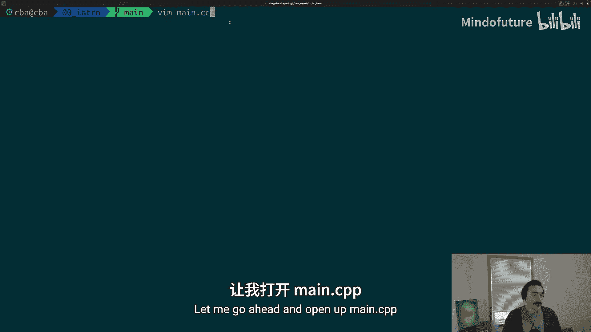
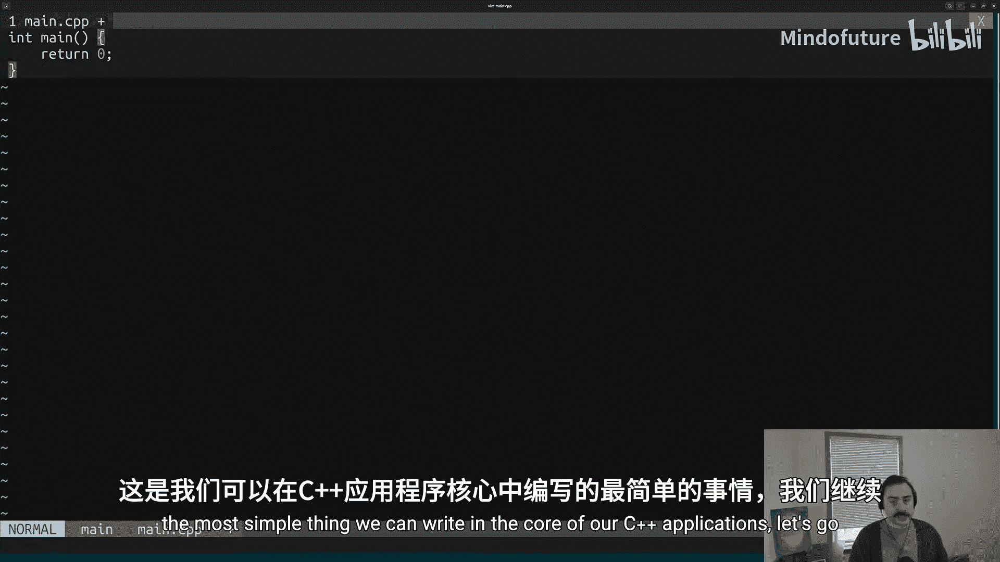
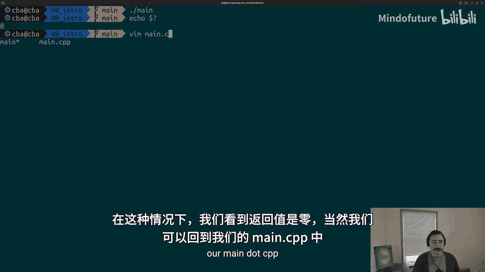
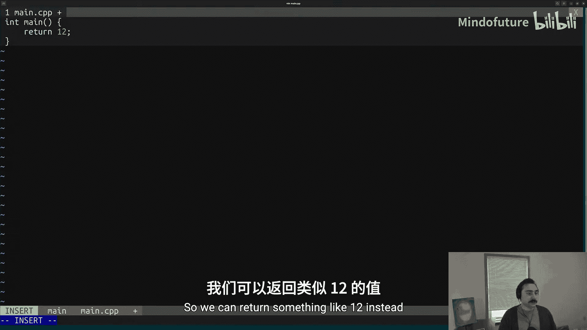
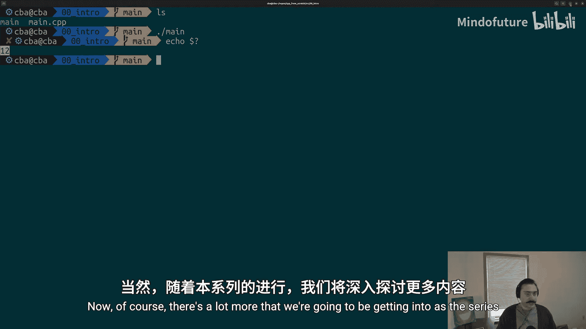
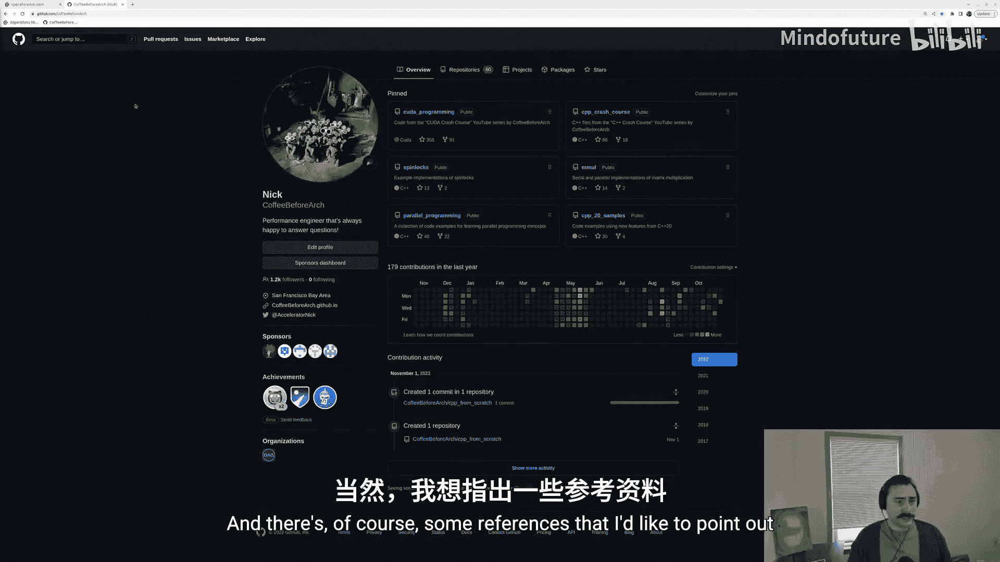
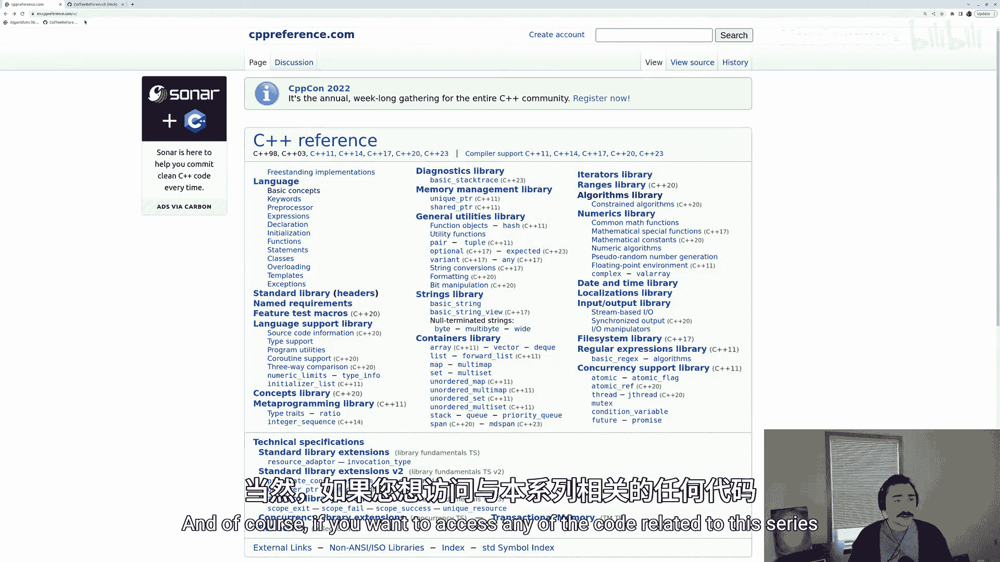
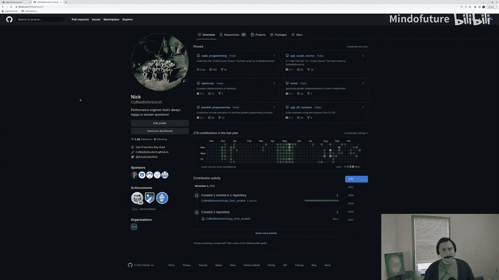

# 001：什么是C++？ 🚀

在本节课中，我们将学习C++语言的基础知识，从最核心的概念开始。我们将了解C++是什么，如何编写一个最基本的C++程序，以及如何编译和运行它。

---

## C++是什么？ 🤔

C++是一门**编译型**且**静态类型**的语言。这句话包含两个核心概念，让我们逐一拆解。

### 编译型语言

编译型语言意味着我们编写的源代码不能直接执行。我们必须使用一个叫做**编译器**的系统软件，将源代码翻译成处理器能够理解的**可执行文件**。

例如，在Linux系统上，我们可以使用GCC编译器套件中的`g++`工具。它会执行预处理、编译、汇编和链接等一系列步骤，最终将`main.cpp`这样的C++源文件转换为可执行的`main`文件。

### 静态类型语言

在程序中，每个值都有一个与之关联的**类型**。类型定义了值是什么（例如，是浮点数、整数还是复杂的数据结构），以及围绕该值的使用规则（例如，可以使用哪些运算符）。

当说一门语言是**静态类型**时，意味着一旦为某个值（如变量或函数返回值）指定了类型，该类型在程序运行时就不能改变。编译器在编译时就必须知道所有值的类型，以便生成正确的代码。

---

## 编写第一个C++程序 ✍️

上一节我们介绍了C++的基本概念，本节中我们来看看如何编写一个最简单的C++程序。几乎所有C++程序的核心都是一个`main`函数。



让我们创建一个名为`main.cpp`的新文件。`.cpp`是C++源文件的常用扩展名。

在文件中，我们写入以下代码：

```cpp
int main() {
    return 0;
}
```

这就是我们能写出的最简单的C++程序。让我们分析一下它的结构。

### 函数基础

一个**函数**是一段被命名的代码块。当我们调用这个函数时，就会执行函数体（即花括号`{}`内的所有代码）中的语句。

以下是函数的基本组成部分：
*   **函数名**：这里是`main`。
*   **返回类型**：在函数名前指定。这里`int`表示该函数返回一个**整数**（正或负的整数）。
*   **参数列表**：位于函数名后的圆括号`()`内。它定义了调用函数时需要传入的值。本例中为空，表示该函数不接受任何参数。
*   **函数体**：花括号`{}`内的所有语句。本例中只有一条`return 0;`语句。`return`是C++的**关键字**（语言保留的具有特殊含义的单词），表示函数结束并返回一个值。在C++中，语句以分号`;`结尾。

### main函数的特殊性

`main`函数在C和C++中是一个特殊的函数，因为它是每个应用程序**逻辑上的执行起点**。当我们运行编译后的可执行文件时，程序就从`main`函数开始执行。虽然程序实际启动时可能涉及全局变量初始化等步骤，但我们可以将`main`视为程序执行的开始。

---



## 编译与运行程序 ⚙️

现在我们已经有了一个基本的程序，接下来看看如何将它变成可以运行的程序。

由于C++是编译型语言，我们需要使用编译器将源代码转换为可执行文件。

以下是编译和运行的步骤：
1.  **编译**：在命令行中，使用`g++`编译器。命令格式为`g++ 源文件名 -o 输出可执行文件名`。例如：`g++ main.cpp -o main`。这条命令会生成一个名为`main`的可执行文件。
2.  **运行**：在命令行中，通过`./可执行文件名`来运行程序。例如：`./main`。运行我们当前的程序，屏幕上不会显示任何输出，因为它只是执行了`return 0;`。

### 理解返回值





你可能会问，`main`函数返回的`0`去了哪里？`main`函数的返回值通常用作程序的**退出码**，用来指示程序是否成功执行。按照惯例，返回`0`表示程序成功执行完毕，没有错误。

我们可以在命令行中查看上一个运行程序的退出码。使用命令`echo $?`，它会显示我们刚刚运行的`main`程序的返回值。

我们可以修改`main.cpp`中的返回值，例如改为`return 12;`。**记住，每次修改源代码后，都必须重新编译**。再次执行`g++ main.cpp -o main`和`./main`，然后使用`echo $?`，就能看到返回值变成了`12`。

---

## 总结与资源 📚

本节课中我们一起学习了C++的基础知识。我们了解到C++是一门**编译型**和**静态类型**的语言。我们编写了第一个C++程序——一个简单的`main`函数，并理解了它是程序的执行起点。最后，我们学会了如何使用`g++`编译器将源代码编译成可执行文件，并运行和查看其返回值。





随着课程的深入，我们将探讨更多C++的特性和现代功能。如果你想深入学习，以下资源非常有用：





*   **cppreference.com**：这是学习C++语言和标准的权威参考网站。C++有多个标准版本（如C++98、C++11、C++17、C++20、C++23等），不同编译器对标准的支持略有不同，我们会在后续课程中讨论。
*   **GitHub代码仓库**：本系列及相关项目的代码可以在 `github.com/coffeebeforearch` 找到。