# 002：打印输出 📝

在本节课中，我们将学习C++中一个非常基础且重要的操作：打印输出。我们将了解如何使用C++标准库中的工具，将信息输出到屏幕上，这对于调试程序或构建日志功能至关重要。

## 概述

打印是程序中的一项基础操作。无论是实现日志记录器，还是为了在编程学习过程中更好地理解程序行为，我们都需要将信息输出到屏幕。幸运的是，C++标准库提供了内置的输入输出功能，我们无需从头开始实现。本节课将重点介绍如何使用 `std::cout` 这个字符输出流对象进行屏幕打印。

## 创建程序文件

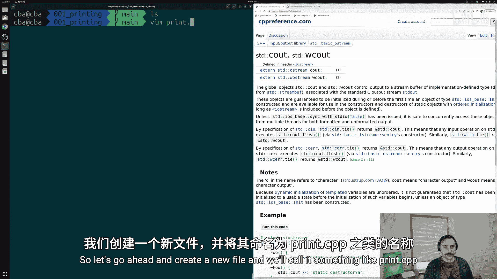

首先，我们需要一个C++源文件。让我们创建一个名为 `print.cpp` 的新文件。

```cpp
// print.cpp
int main() {
    return 0;
}
```

正如上一节所介绍的，`main` 函数是所有C++应用程序的核心，程序从这里开始执行。

## 包含必要的头文件

在使用 `std::cout` 之前，我们需要在源文件中包含其定义。`std::cout` 定义在 `<iostream>` 头文件中。

```cpp
#include <iostream>

int main() {
    return 0;
}
```

`#include` 是一个预处理指令。在编译过程中，预处理器会找到指定的头文件（如 `<iostream>`），并将其内容复制粘贴到我们的源文件中，替换掉 `#include` 语句。这样，编译器在编译 `main` 函数时就能知道 `std::cout` 是什么。

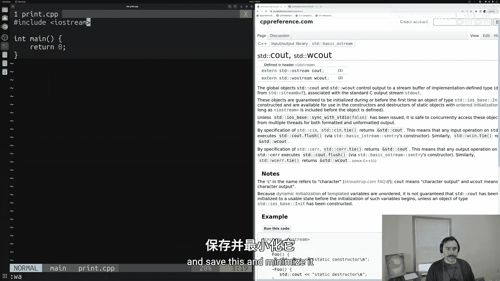

我们可以使用 `g++ -E` 命令来观察预处理后的文件内容，它会展示被插入的头文件代码。

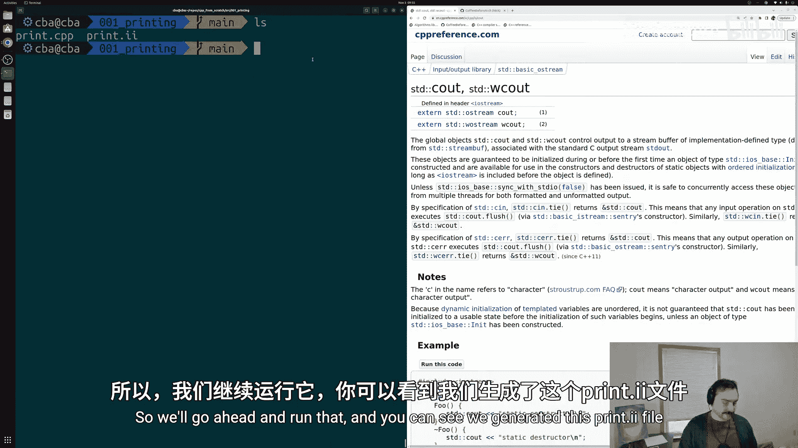

## 使用 std::cout 进行打印

包含头文件后，我们就可以使用 `std::cout` 进行打印了。打印操作使用双小于号 `<<` 运算符。

```cpp
#include <iostream>

int main() {
    std::cout << "Hello, World!\n";
    return 0;
}
```

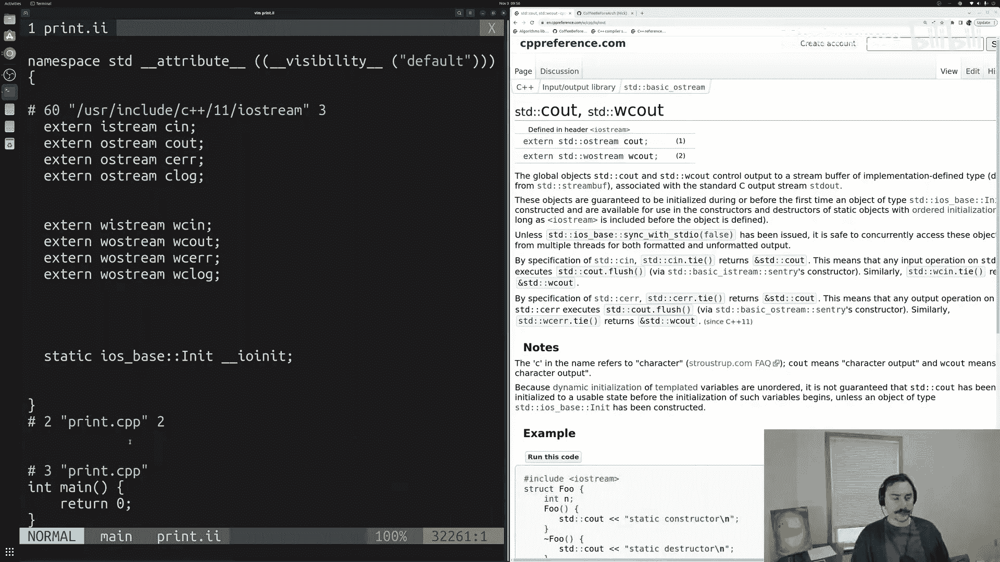

这里的 `<<` 是输出流对象的运算符，它的含义是“将右侧的内容送入左侧的流中”。对于 `std::cout`，就意味着将内容打印到屏幕。`\n` 是一个换行符。

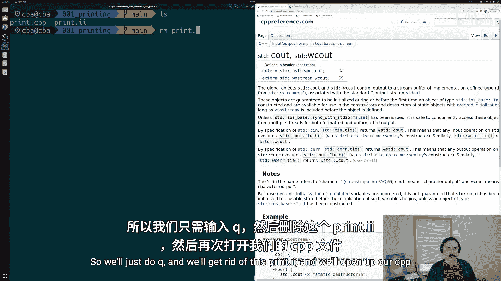

编译并运行这个程序，你将在屏幕上看到 “Hello, World!”。

## 链式打印

我们可以将多个 `<<` 运算符连接起来，一次性打印多个内容。

```cpp
#include <iostream>

int main() {
    std::cout << "Hello, " << "World!\n";
    return 0;
}
```

这行代码与之前的效果相同，但将字符串分成了两部分进行打印。

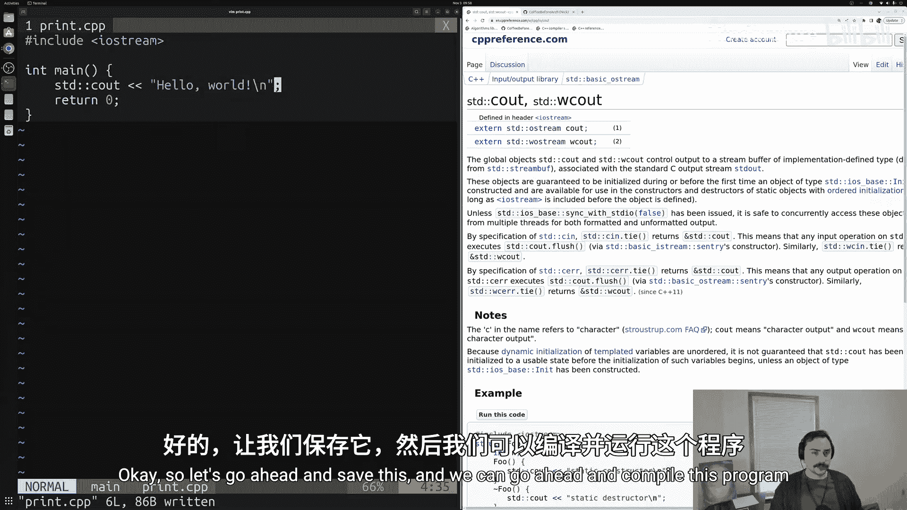

## 打印其他数据类型

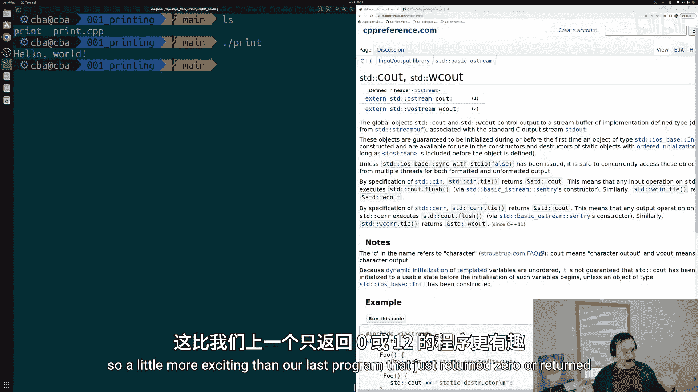

`std::cout` 不仅可以打印字符串，还可以打印整数、浮点数等其他基本数据类型。

```cpp
#include <iostream>

int main() {
    std::cout << 1 << " " << "World!\n";
    return 0;
}
```

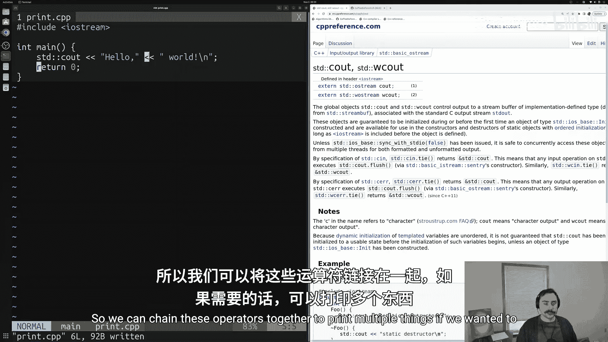

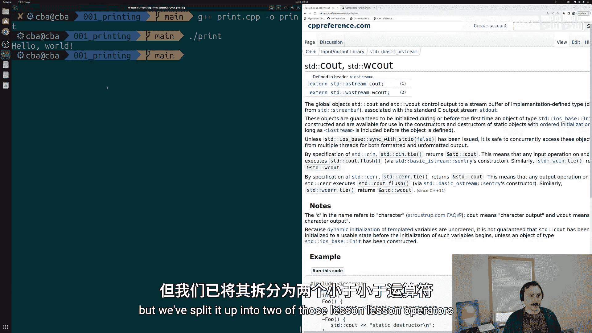

这段代码会输出 “1 World!”，然后换行。

## 关于 std:: 和命名空间

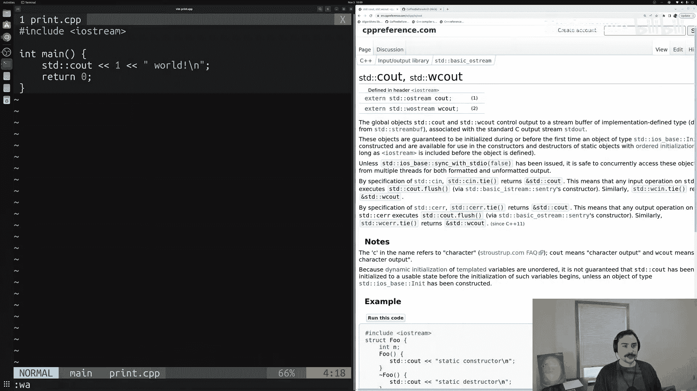

你可能注意到了 `std::` 这个前缀。`std` 是一个命名空间，它包含了C++标准库的所有名称。`::` 是作用域解析运算符，用于指明我们使用的是 `std` 命名空间中的 `cout`。我们将在后续课程中更详细地讨论命名空间。

## 总结

本节课我们一起学习了C++中的打印输出。
*   我们了解到打印是程序的基础功能，可以通过C++标准库实现。
*   我们学会了使用 `#include <iostream>` 来包含必要的头文件定义。
*   我们掌握了使用 `std::cout <<` 将字符串和其他数据类型输出到屏幕的基本方法。
*   我们还看到了如何通过链式 `<<` 运算符进行多次打印。

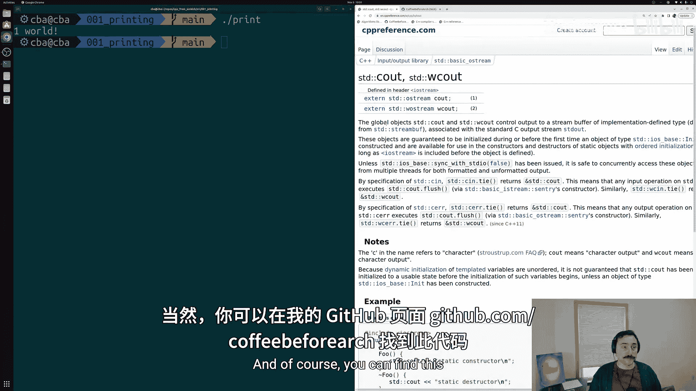

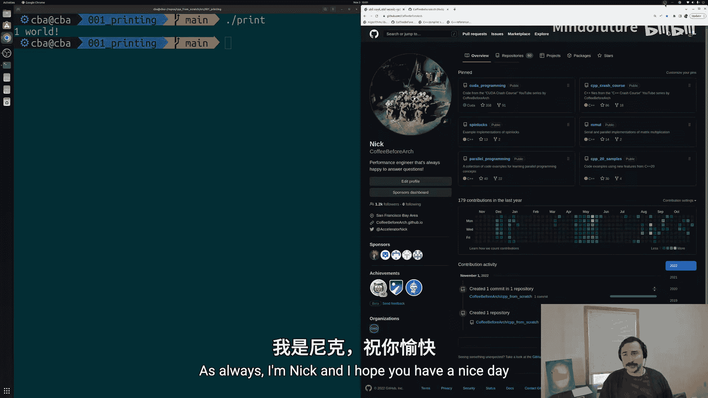

`std::cout` 是输入输出流体系的一部分，未来我们还会学习如何从用户那里获取输入（使用 `std::cin`），以及如何进行文件读写。掌握打印是理解这些更复杂操作的第一步。