# 003：变量 🧮

在本节课中，我们将要学习C++中的变量。变量是编程的基础，它允许我们为值赋予名称，从而使代码更具表达性和可读性。我们将从变量的定义和初始化开始，逐步探索如何使用它们，并介绍一个名为“自动类型推导”的便捷功能。

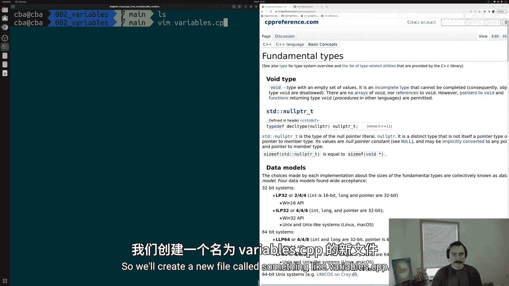

---

## 变量的定义与初始化

上一节我们介绍了程序由值构成。本节中我们来看看如何为这些值命名，即创建变量。

在C++中，变量是值的名称。每个值都有其类型，因此每个变量也必须有一个类型。定义变量时，我们首先指定其类型，然后为其命名。

以下是一个定义并初始化整数变量的例子：
```cpp
int var1 = 10;
```
这行代码告诉编译器：我需要一个整数，并将它命名为 `var1`，同时将其初始化为 `10`。

**最佳实践**：定义变量时应立即初始化。将定义和初始化分开可能导致使用未初始化的变量，从而引发难以察觉的错误。

---

## 使用变量进行计算

定义变量后，我们可以像使用原始值一样使用它们。变量名可以参与各种运算。

以下是使用变量进行计算的示例：
```cpp
int var1 = 10;
int var2 = 20;
int var3 = var1 + var2; // var3 的值为 30
```
这里，`var1` 和 `var2` 只是整数的名称。所有适用于整数的运算符同样适用于这些变量。

---

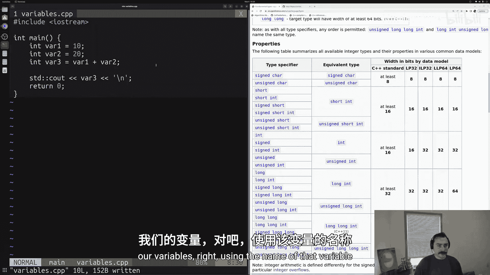

## 打印变量的值

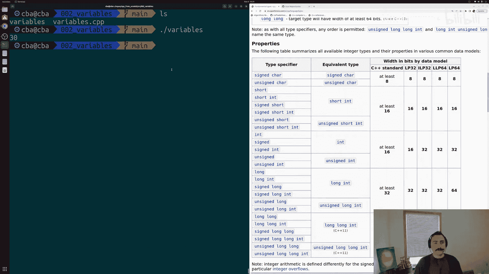

我们可以使用 `std::cout` 来打印变量的值，就像打印直接值一样。

以下是打印变量值的代码：
```cpp
#include <iostream>
int main() {
    int var3 = 30;
    std::cout << var3 << std::endl; // 输出：30
    return 0;
}
```
对于基本类型（如 `int`, `double`），`std::cout` 可以直接处理，无需额外修改。

---

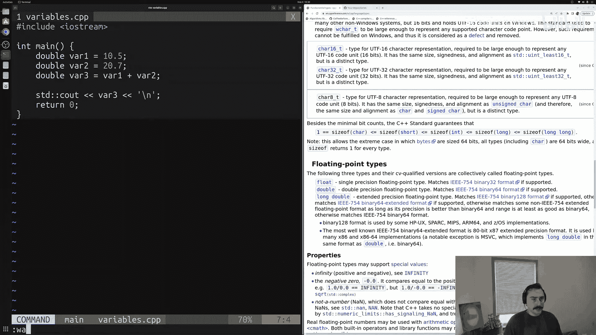

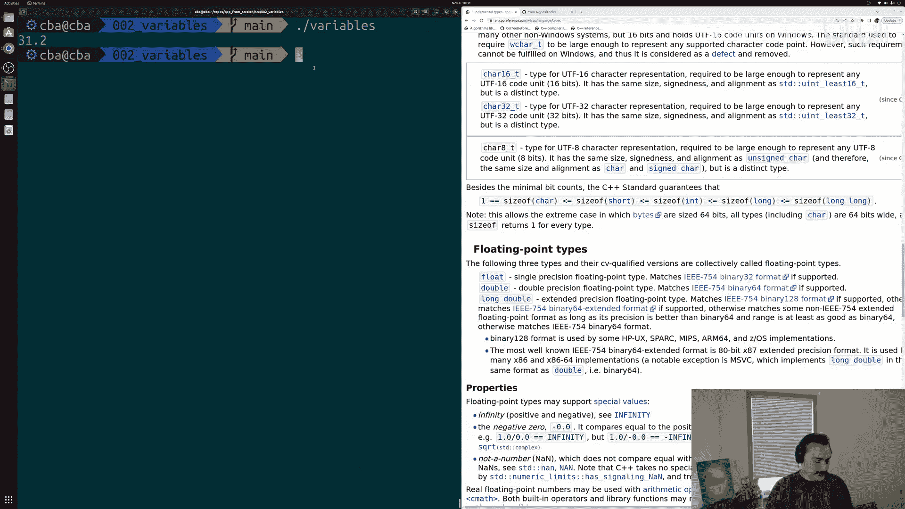

## 探索其他数据类型：浮点数

除了整数，C++还支持浮点数（带小数点的数字），例如 `double` 类型。

以下是使用双精度浮点数的示例：
```cpp
double var1 = 10.5;
double var2 = 20.7;
double var3 = var1 + var2; // var3 的值为 31.2
```
即使将变量类型从 `int` 改为 `double`，打印语句也无需任何更改，这非常方便。

---

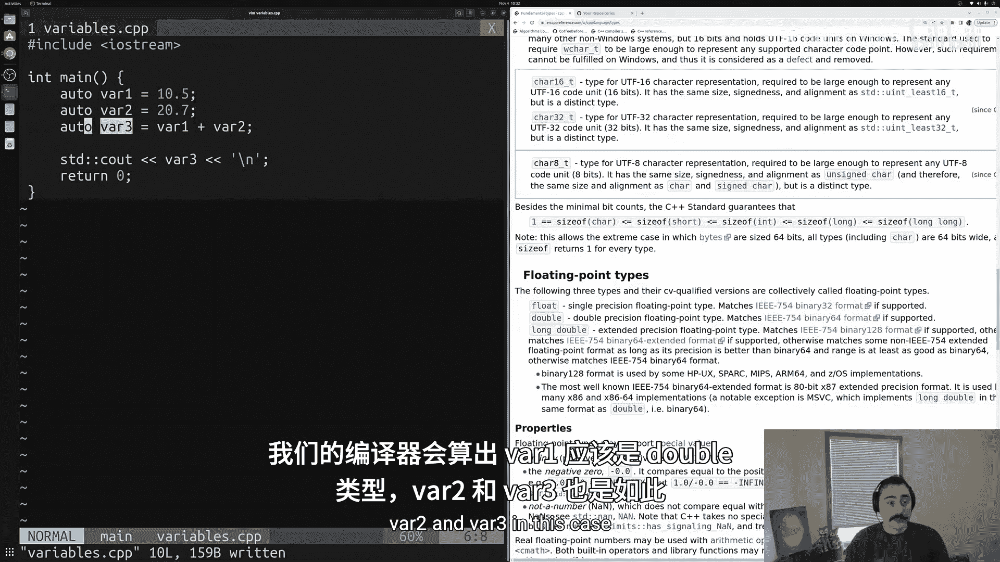

## 自动类型推导：`auto` 关键字

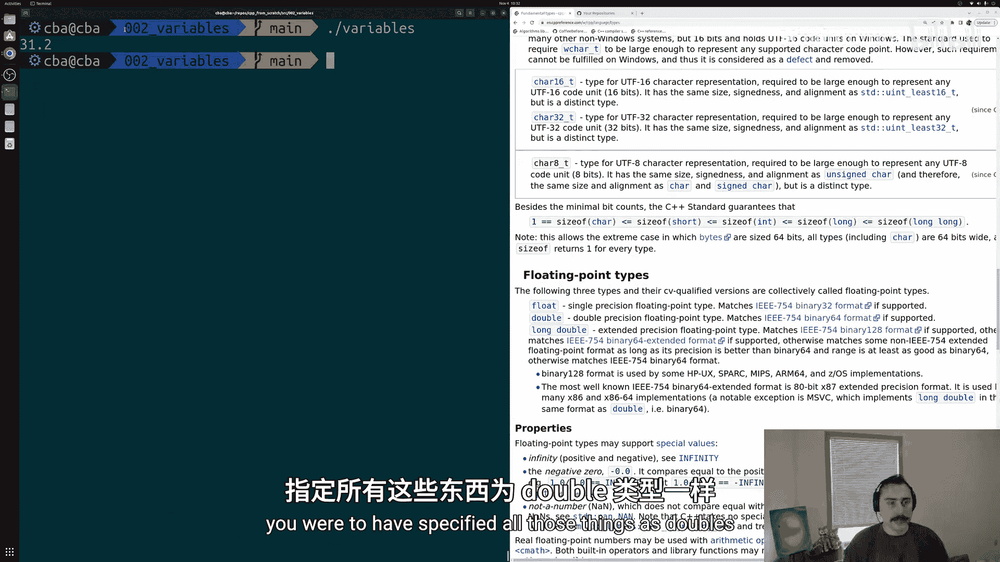

有时，明确指定变量类型是多余的，因为编译器可以从初始化值中推断出类型。为此，C++提供了 `auto` 关键字。

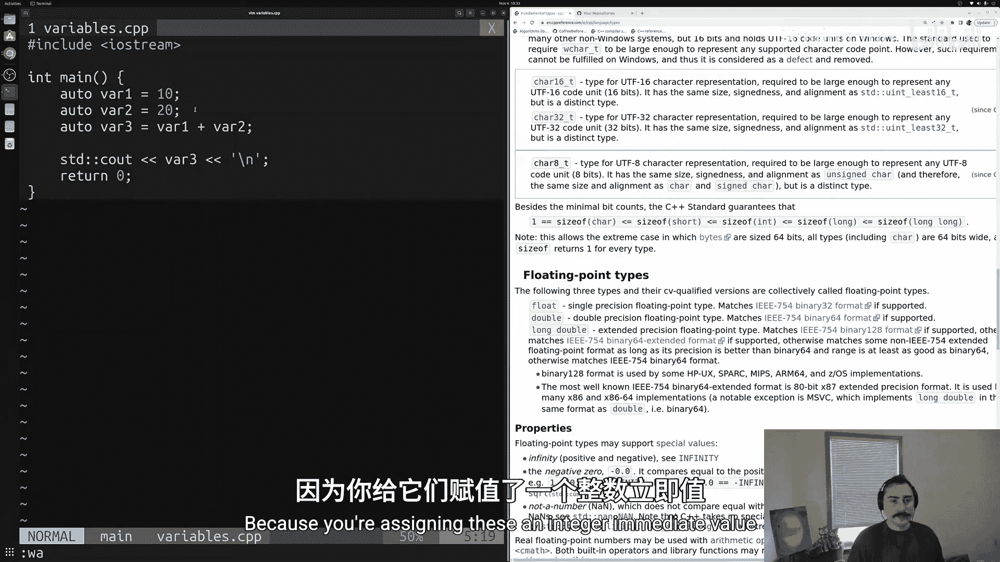

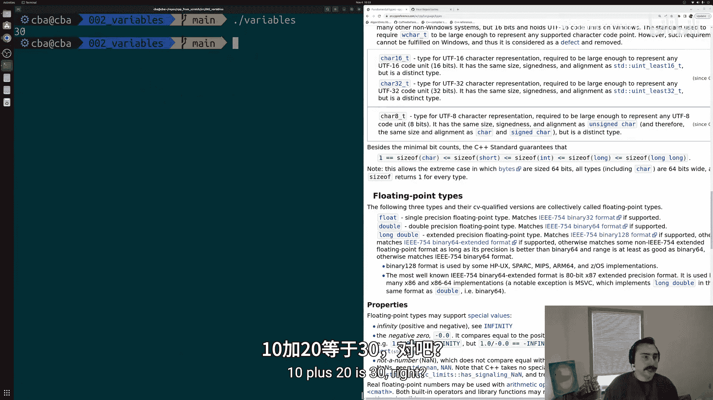

以下是使用 `auto` 的示例：
```cpp
auto var1 = 10.5;   // 编译器推断 var1 为 double
auto var2 = 20.7;   // 编译器推断 var2 为 double
auto var3 = var1 + var2; // 编译器推断 var3 为 double
```
使用 `auto` 时，**必须**在定义时进行初始化，因为编译器需要根据初始值来推断类型。例如，`auto var;` 这样的语句会导致编译错误。

**`auto` 的优势**：在处理复杂类型（如迭代器）时，`auto` 可以显著简化代码，避免书写冗长的类型名称，同时保持程序行为不变。

---

## 核心概念总结

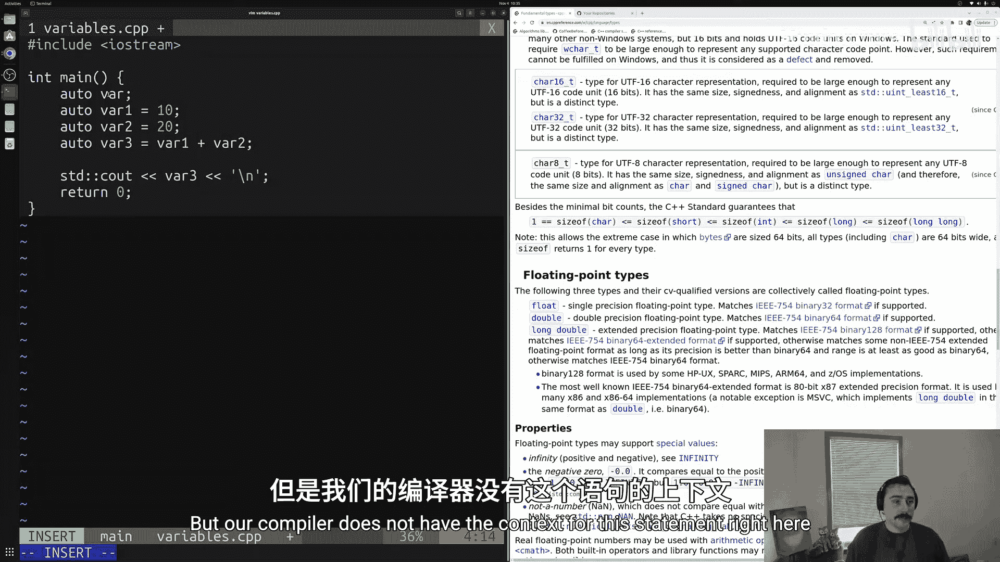

本节课中我们一起学习了C++变量的核心知识：

1.  **定义与初始化**：变量是具名的值，定义时需要指定类型（如 `int`, `double`），并建议立即初始化。
2.  **使用变量**：变量可以像其对应的原始值一样参与运算和打印。
3.  **数据类型**：C++提供了多种基本数据类型，包括整数和浮点数。
4.  **自动类型推导**：使用 `auto` 关键字可以让编译器自动推断变量类型，简化代码，但要求定义时必须初始化。

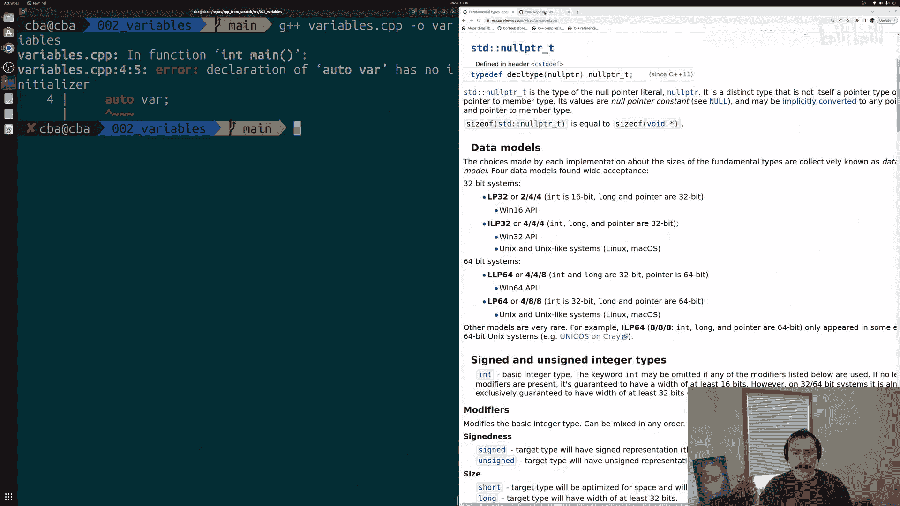

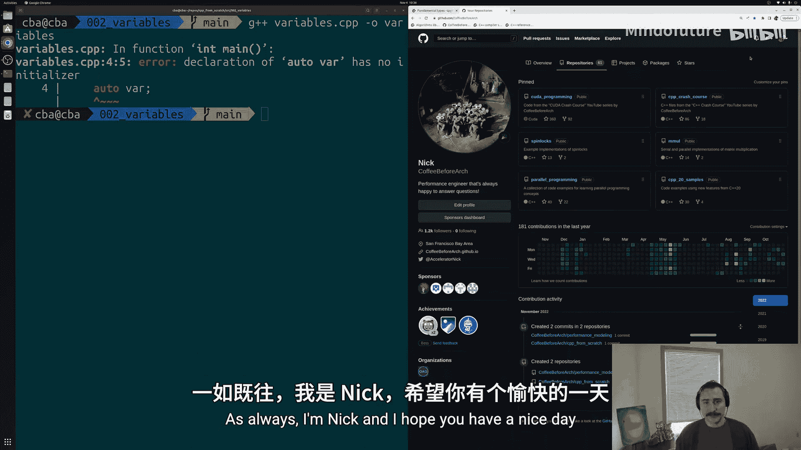

变量是构建更复杂程序的基础。掌握如何有效地使用它们，是学习C++的重要一步。