# 004：条件语句 🧠

在本节课中，我们将要学习C++中的条件语句。条件语句是程序实现决策能力的关键，它允许我们根据特定条件的真假，选择性地执行不同的代码块。我们将重点学习 `if` 和 `else` 关键字的基本用法。

---

## 创建程序文件

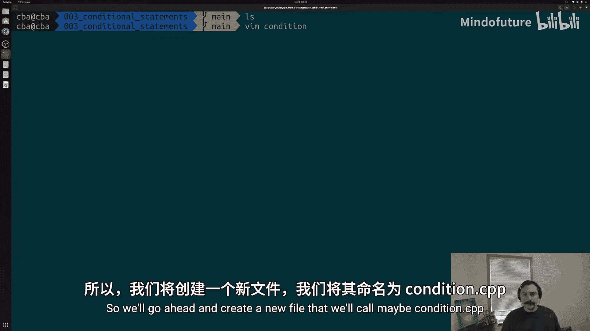

首先，我们需要创建一个新的C++源文件。我们将其命名为 `condition.cpp`。

在文件中，我们从主函数 `main` 开始，这是所有C++程序的执行起点。

```cpp
#include <iostream>

int main() {
    // 程序代码将写在这里
    return 0;
}
```

---

## 使用 `if` 语句

上一节我们创建了程序的基本框架，本节中我们来看看如何使用 `if` 语句。

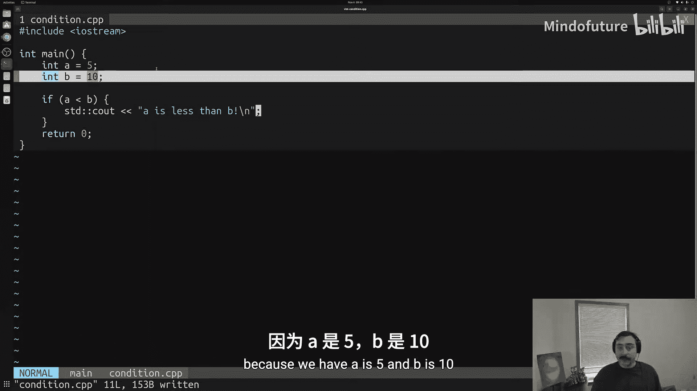

`if` 语句允许我们检查一个条件。如果条件为真（`true`），则执行其后的代码块；如果为假（`false`），则跳过该代码块。

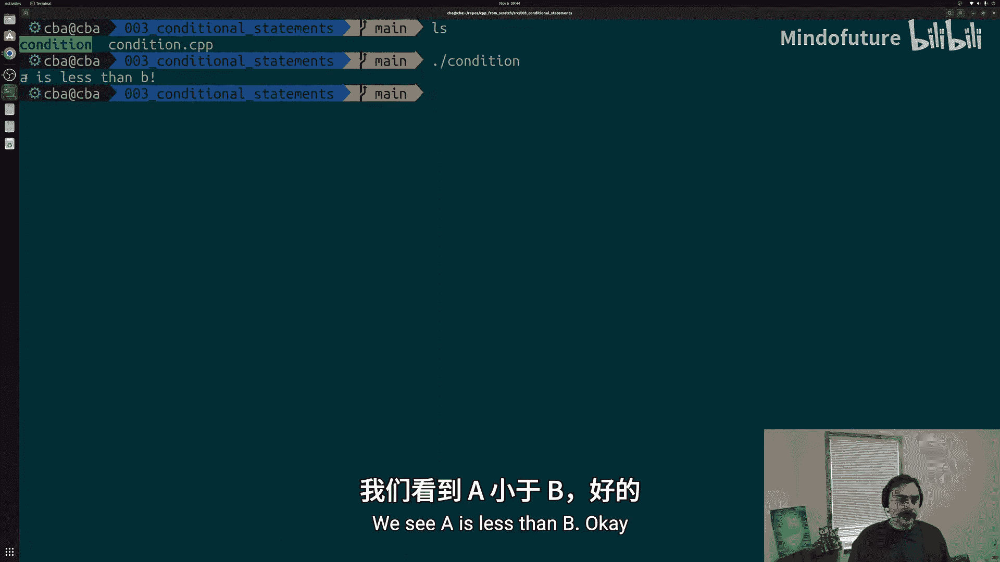

以下是创建变量并使用 `if` 语句进行比较的步骤：

1.  我们创建两个整数变量 `a` 和 `b`。
2.  使用 `if` 关键字检查 `a` 是否小于 `b`。
3.  如果条件为真，则执行花括号 `{}` 内的代码。

```cpp
int a = 5;
int b = 10;

if (a < b) {
    std::cout << "A is less than B\n";
}
```

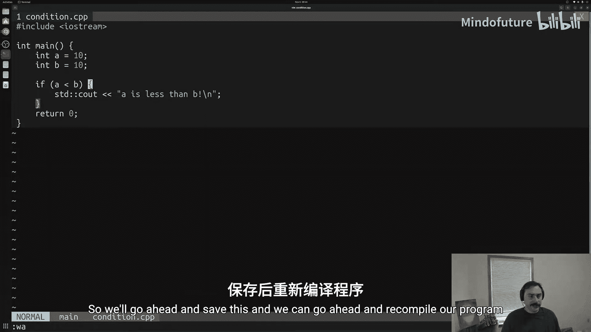

在这个例子中，因为 `a` (5) 确实小于 `b` (10)，所以条件 `a < b` 为真，程序会打印出 “A is less than B”。

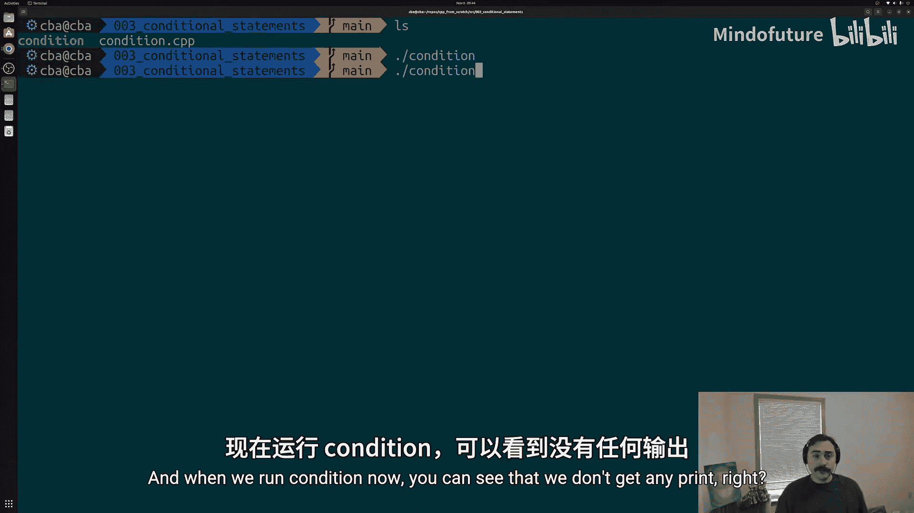

如果我们将 `a` 的值改为 10，使其等于 `b`，那么条件 `a < b` 将变为假。程序会跳过 `if` 语句块内的代码，直接执行 `return 0`，因此不会有任何输出。

---

## 使用 `else` 语句

仅仅使用 `if` 语句，我们只能处理条件为真的情况。为了处理条件为假的情况，我们可以使用 `else` 语句。

`else` 语句不需要指定条件，它自动捕获与之配对的 `if` 语句条件为假的情况。

以下是结合 `if` 和 `else` 的示例：

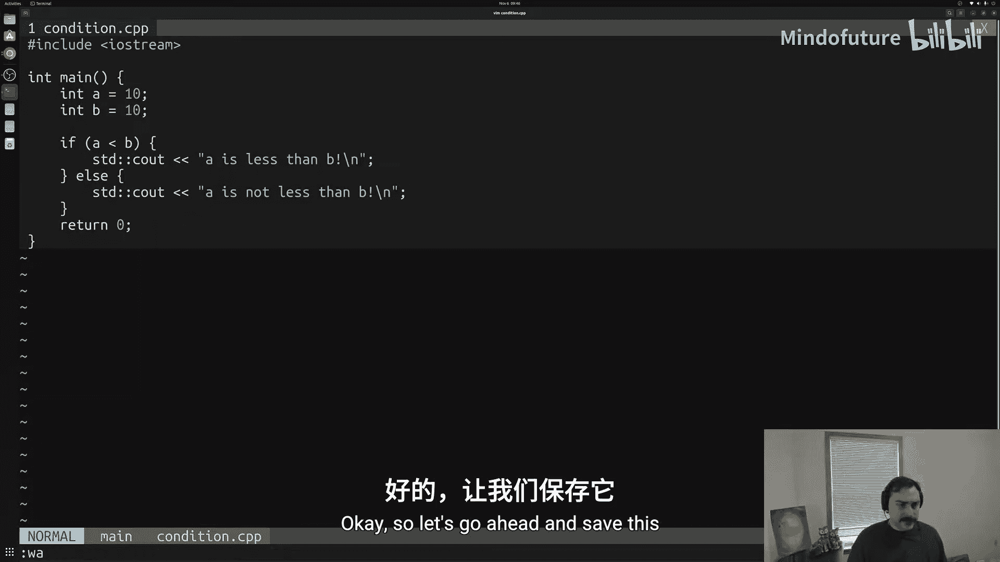

```cpp
int a = 10;
int b = 10;

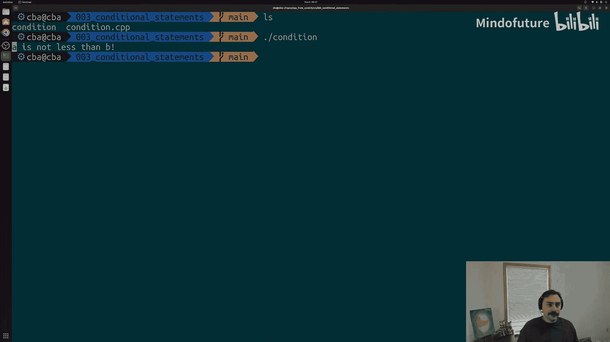

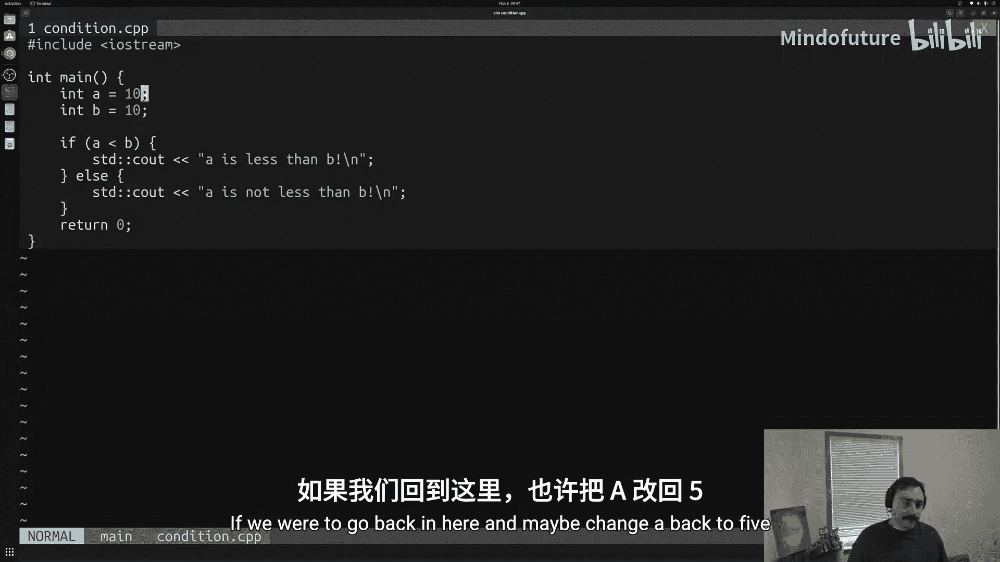

if (a < b) {
    std::cout << "A is less than B\n";
} else {
    std::cout << "A is not less than B\n";
}
```

此时，`a` 等于 `b`，`if` 条件 `a < b` 为假。因此，程序会跳过 `if` 块，转而执行 `else` 块中的代码，打印出 “A is not less than B”。

**重要提示**：使用 `if` 和 `else` 时，最多只会执行其中一个代码块，永远不会同时执行两者。

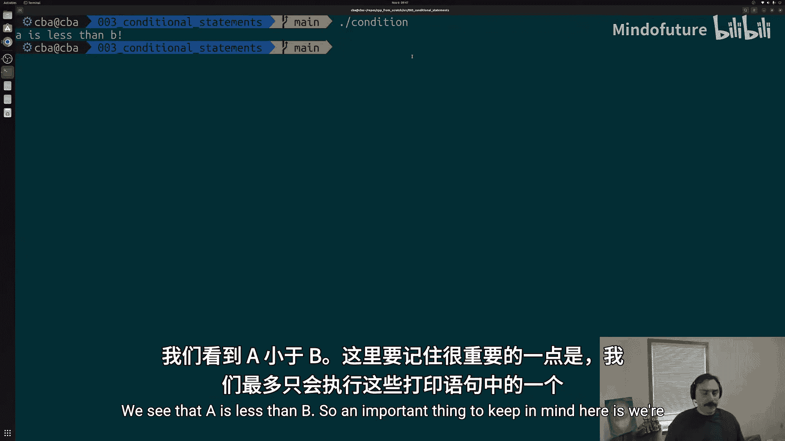

---

## 使用 `else if` 链式判断

有时我们需要检查多个互斥的条件。这时，可以使用 `else if` 将多个条件判断链接起来。

`else if` 允许我们在上一个 `if` 或 `else if` 条件为假时，检查另一个条件。

以下是检查变量 `a` 和 `b` 之间所有可能关系（小于、等于、大于）的示例：

```cpp
int a = 15;
int b = 10;

if (a < b) {
    std::cout << "A is less than B\n";
} else if (a == b) { // 注意：使用双等号 `==` 进行比较
    std::cout << "A is equal to B\n";
} else {
    std::cout << "A is greater than B\n";
}
```

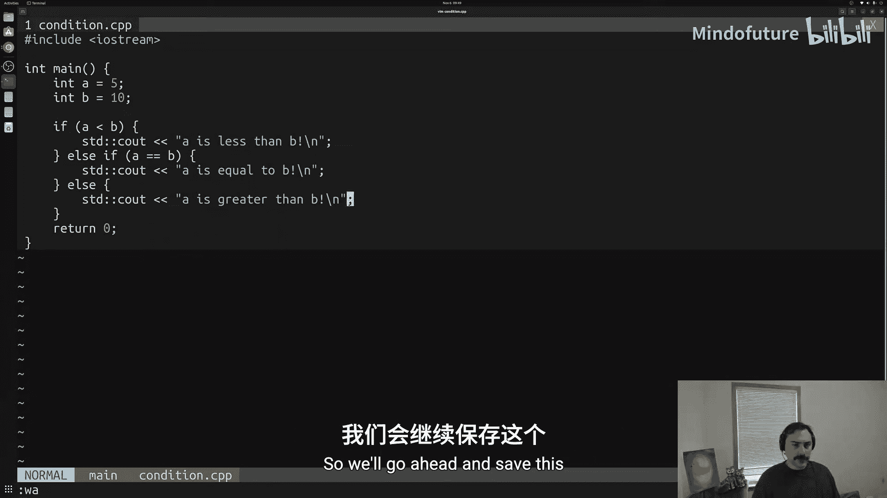

程序会按顺序检查条件：
1.  首先检查 `a < b`，为假。
2.  然后检查 `a == b`，为假。
3.  最后，执行 `else` 块，打印 “A is greater than B”。

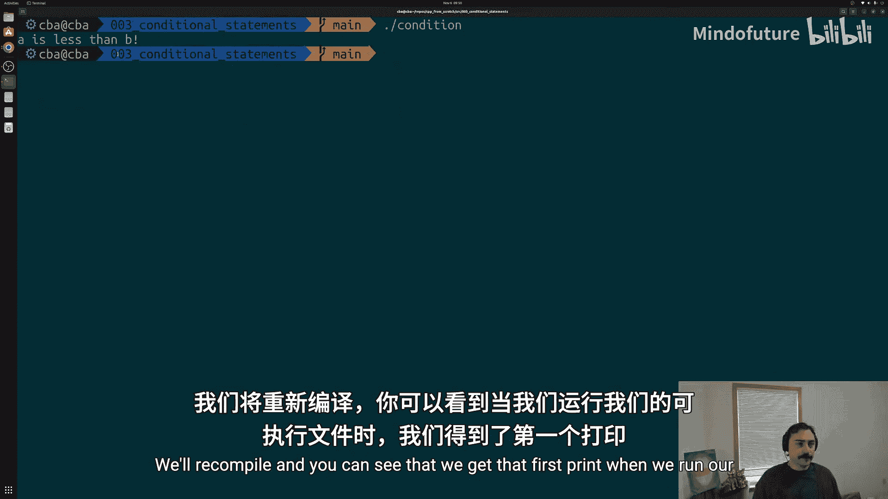

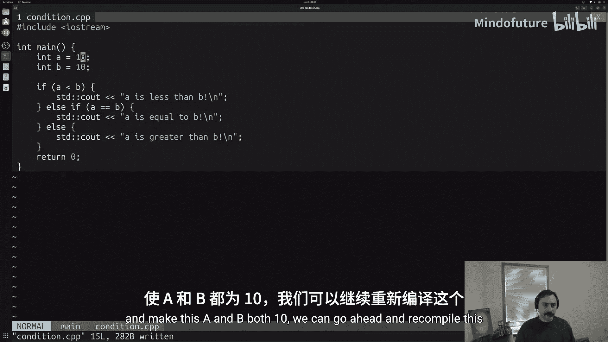

同样，在整个 `if` - `else if` - `else` 链中，最多只有一个代码块会被执行。

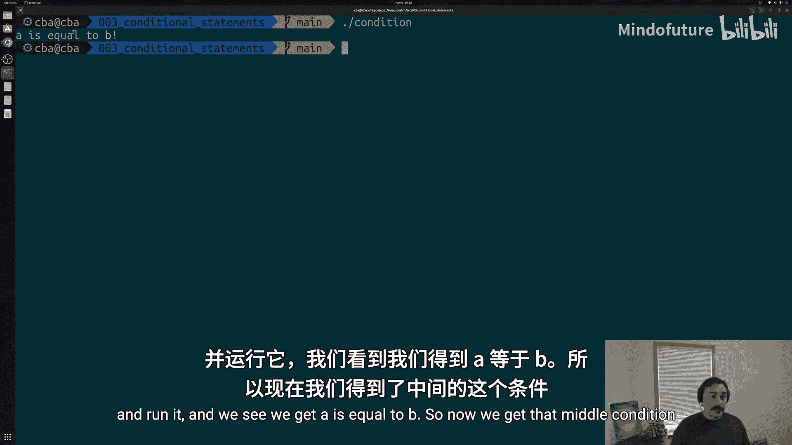

---

## 嵌套条件语句

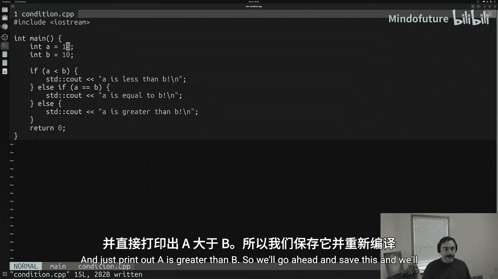

条件语句不仅可以链式排列，还可以相互嵌套。这意味着我们可以在一个 `if` 或 `else` 代码块内部，再放置另一个完整的 `if-else` 语句。

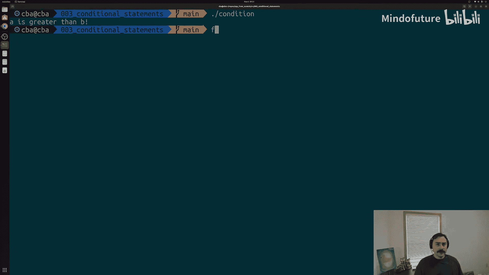

这允许我们进行更复杂、更精细的条件判断。

以下是一个嵌套 `if` 语句的示例，它在 `a` 大于 `b` 的情况下，进一步检查 `a` 是否等于 15：

```cpp
int a = 15;
int b = 10;

if (a < b) {
    std::cout << "A is less than B\n";
} else if (a == b) {
    std::cout << "A is equal to B\n";
} else {
    std::cout << "A is greater than B\n";
    // 嵌套的 if 语句
    if (a == 15) {
        std::cout << "A is equal to 15!\n";
    }
}
```

在这个例子中：
1.  外层条件判断 `a` 大于 `b`，进入 `else` 块，打印 “A is greater than B”。
2.  随后，程序执行嵌套在 `else` 块内的 `if (a == 15)` 语句。
3.  因为 `a` 确实等于 15，所以继续打印 “A is equal to 15!”。

因此，运行此程序会得到两行输出。

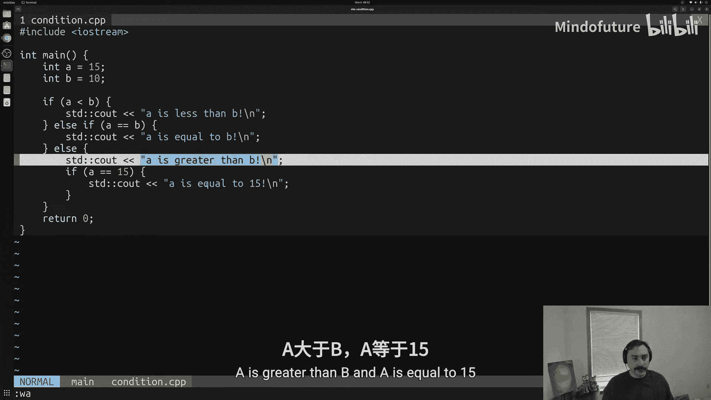

---

## 总结

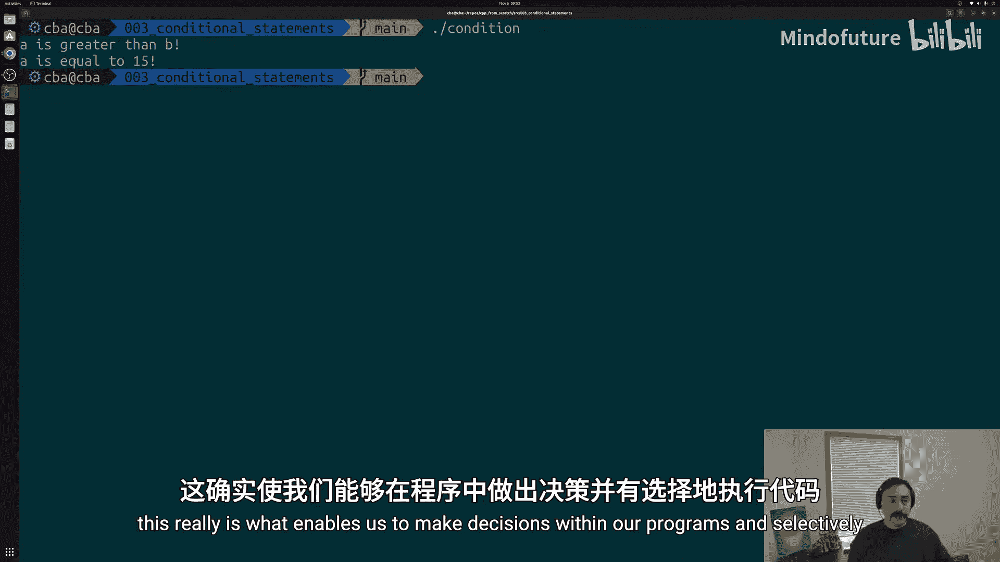

本节课中我们一起学习了C++条件语句的核心概念。我们掌握了如何使用 `if` 语句在条件为真时执行代码，如何使用 `else` 语句处理条件为假的情况，以及如何通过 `else if` 链和嵌套结构来处理多个复杂的条件判断。这些工具是赋予程序逻辑和决策能力的基础。


记住代码中的关键区别：**单等号 `=` 用于赋值**，而**双等号 `==` 用于比较是否相等**。