# 005：std::array

## 概述
在本节课中，我们将要学习C++标准库中的一个重要容器：`std::array`。我们将了解它的基本概念、如何创建和初始化它，以及如何访问和修改其中的元素。

---

## 什么是 `std::array`？ 🤔
在程序中，我们经常需要将多个值组合在一起。例如，我们可能需要收集一年中的温度数据。我们不想为每一个测量值都创建一个独立的变量。理想情况下，我们希望将它们收集到一个单一的变量中，并且能够访问其中的各个部分。

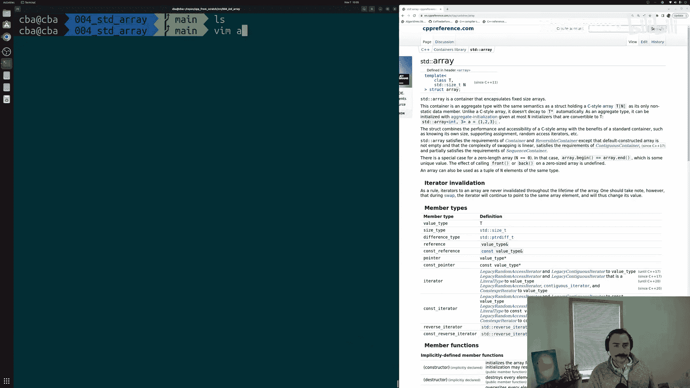

这正是我们可以使用标准库中的容器来实现的。具体来说，今天我们将要了解一个名为 `std::array` 的容器。这个容器封装了固定大小的数组。我们需要指定元素的数量，并且它可以存储特定类型 `T` 的元素。例如，我们可以存储100个整数、75个浮点数或22个双精度浮点数。我们只需要指定想要存储的类型以及在这个数组中想要存储多少个该类型的元素。然后，我们就可以通过这一个数组来访问其内容，而不需要为所有那些独立的数据片段创建75个独立的变量。

---

## 如何使用 `std::array` 🛠️
### 准备工作
在开始使用 `std::array` 之前，我们需要包含它的定义，就像我们需要包含 `<iostream>` 才能使用输入输出流一样。`std::array` 的定义位于 `<array>` 头文件中。

以下是创建和使用 `std::array` 的基本步骤。

### 1. 包含必要的头文件
首先，我们需要在源文件的顶部包含 `<array>` 头文件。同时，为了能够打印数组的内容，我们也需要包含 `<iostream>`。

```cpp
#include <array>
#include <iostream>
```

### 2. 创建 `std::array` 变量
`std::array` 本质上是一个模板，这意味着它不是一个具体的类型。它是一个用于创建各种数组的模板。因此，我们需要提供模板参数来指定我们想要存储的类型以及元素的数量。

我们使用尖括号 `< >` 来提供这些模板参数。

```cpp
std::array<int, 3> my_array;
```

这行代码的意思是：创建一个名为 `my_array` 的 `std::array`，它存储3个整数。

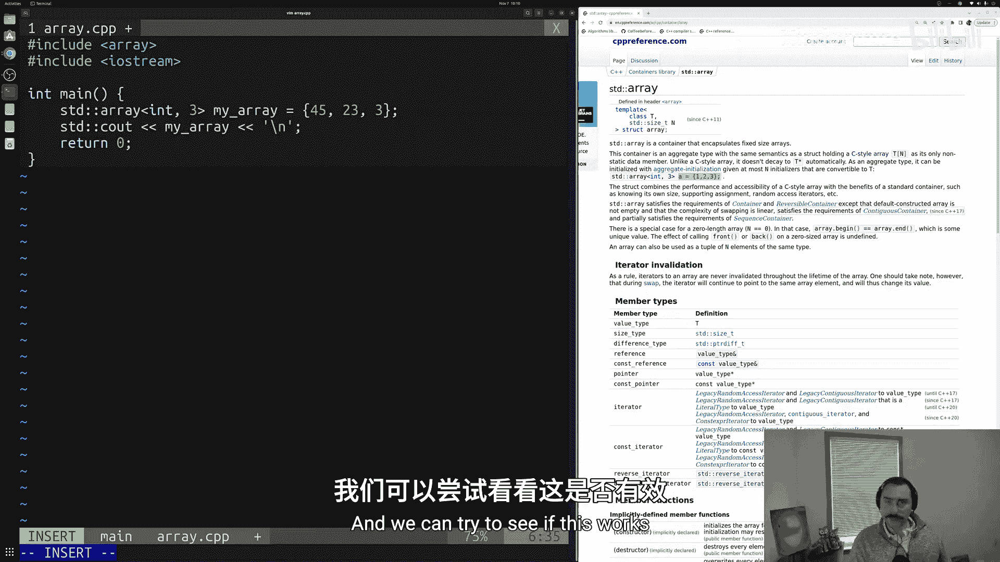

### 3. 初始化 `std::array`
与定义变量一样，我们通常希望对其进行初始化，以防止使用未初始化的变量。我们可以使用一种称为“聚合初始化”的方法来初始化 `std::array`。

```cpp
std::array<int, 3> my_array = {45, 23, 3};
```

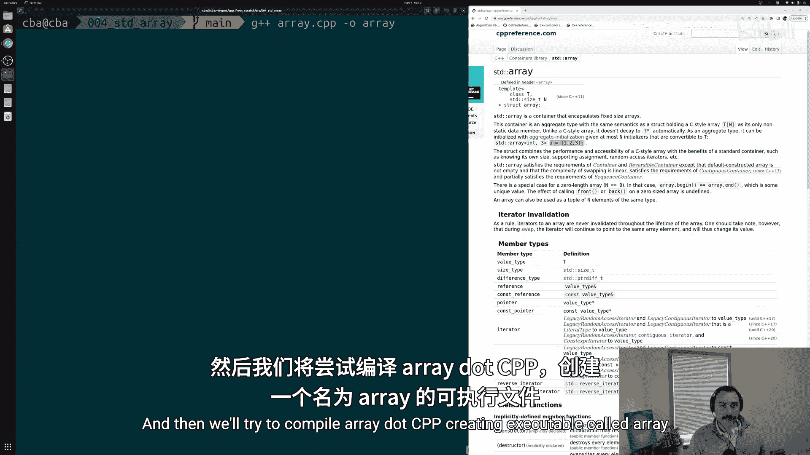

现在，`my_array` 中的三个元素分别被设置为45、23和3。我们也可以省略等号，直接使用花括号。

```cpp
std::array<int, 3> my_array{45, 23, 3};
```

### 4. 访问 `std::array` 的元素
`std::array` 提供了多种方法来访问其元素。以下是一些常用的方法：

#### 使用 `at()` 方法
`at()` 方法可以访问指定位置的元素，并且会进行边界检查。如果尝试访问超出范围的元素，它会抛出异常。

```cpp
std::cout << my_array.at(0) << std::endl; // 输出第一个元素：45
```

#### 使用下标运算符 `[]`
下标运算符 `[]` 也可以用来访问元素，但它不进行边界检查。因此，使用时要确保索引在有效范围内。

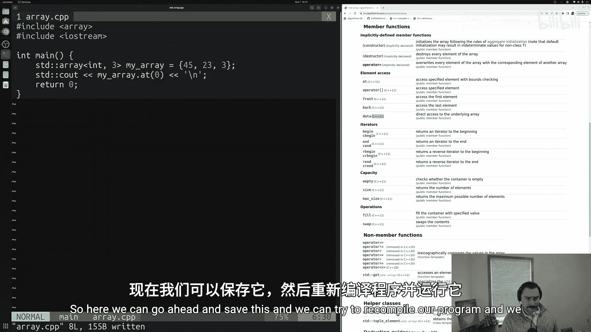

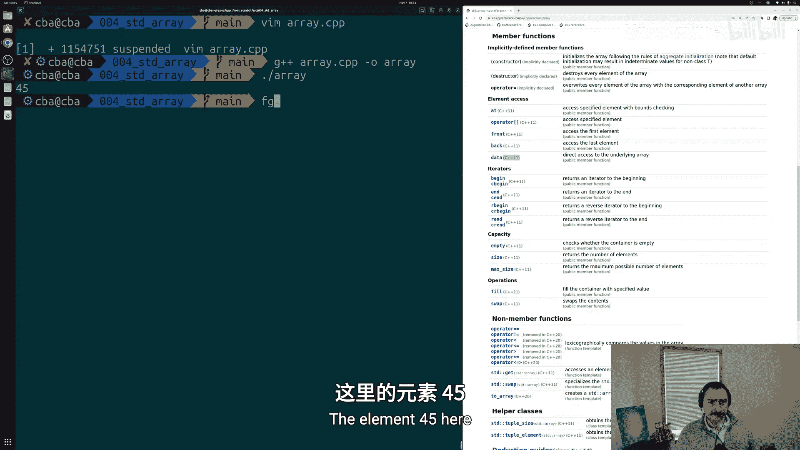

```cpp
std::cout << my_array[1] << std::endl; // 输出第二个元素：23
```

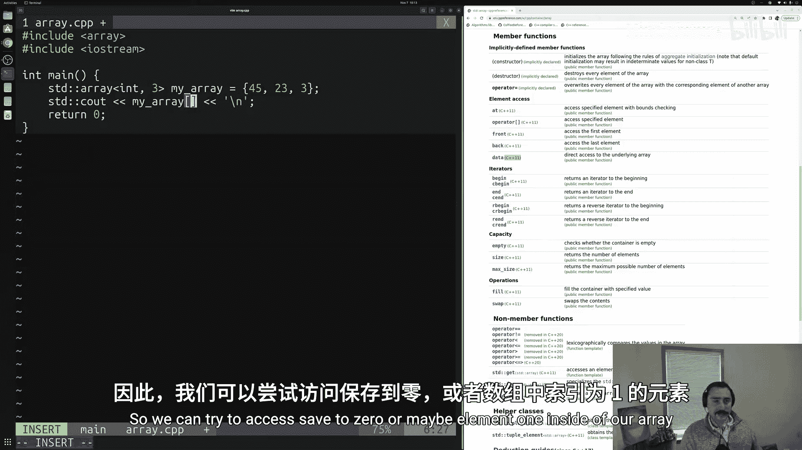

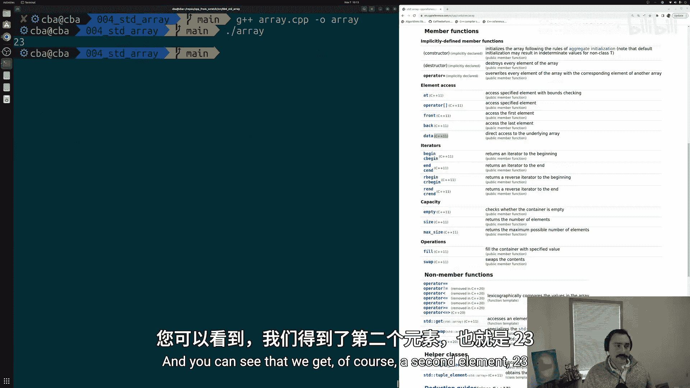

#### 使用 `front()` 和 `back()` 方法
`front()` 方法返回数组的第一个元素，`back()` 方法返回数组的最后一个元素。

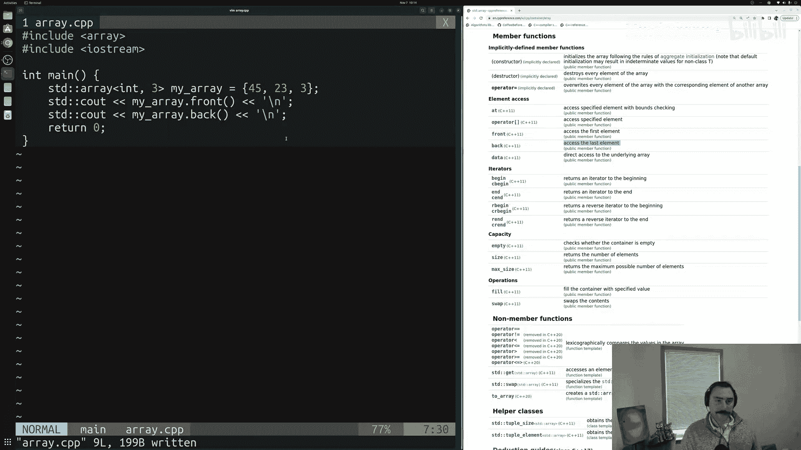

```cpp
std::cout << my_array.front() << std::endl; // 输出第一个元素：45
std::cout << my_array.back() << std::endl;  // 输出最后一个元素：3
```

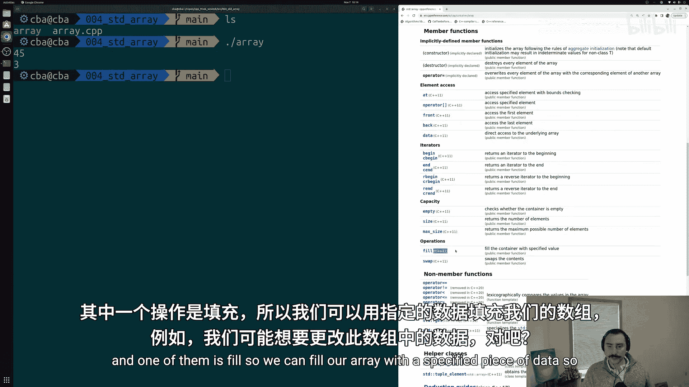

### 5. 修改 `std::array` 的元素
我们可以通过赋值来修改数组中的元素。

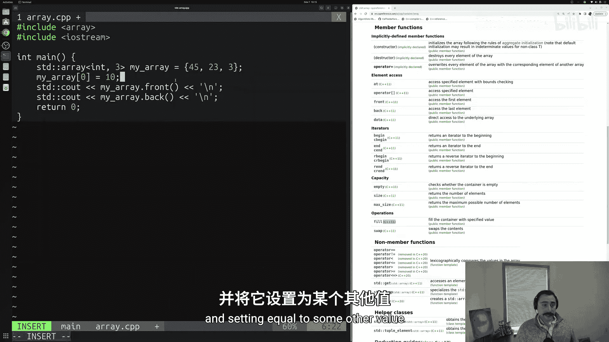

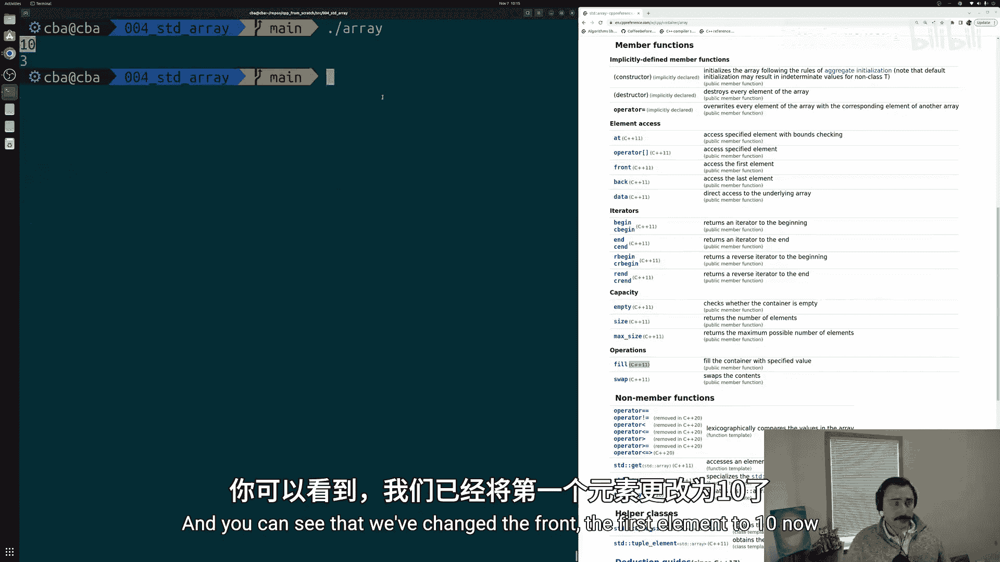

```cpp
my_array[0] = 10; // 将第一个元素修改为10
```

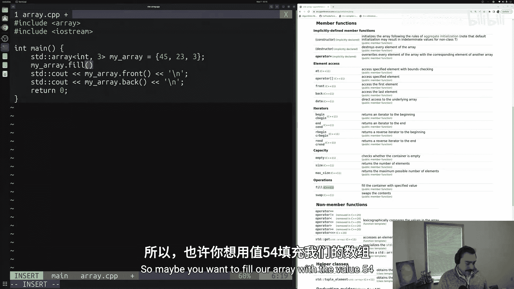

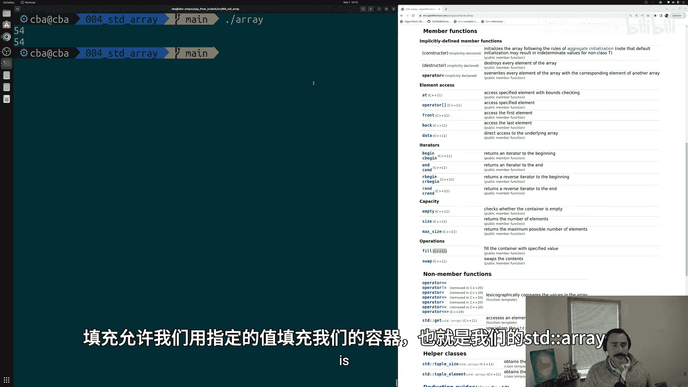

如果我们想要将数组中的所有元素都设置为同一个值，可以使用 `fill()` 方法。

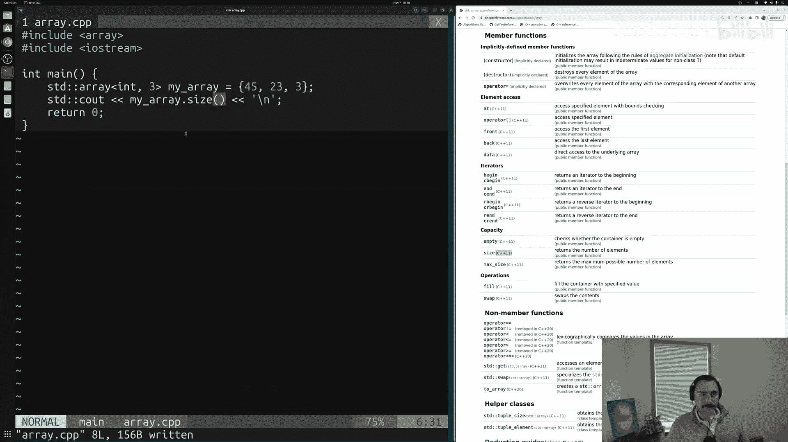

```cpp
my_array.fill(54); // 将所有元素设置为54
```

### 6. 查询 `std::array` 的大小
`std::array` 提供了一个 `size()` 方法，用于返回数组中元素的数量。

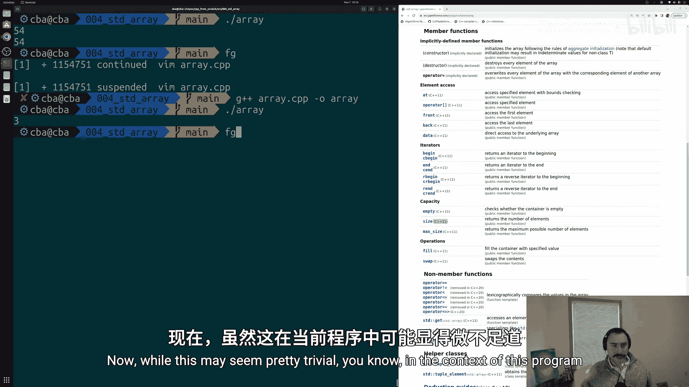

```cpp
std::cout << my_array.size() << std::endl; // 输出数组的大小：3
```

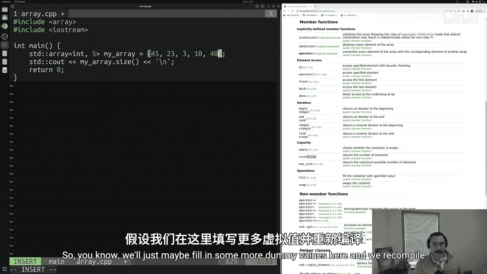

这种方法非常有用，因为它允许我们直接查询容器的大小，而不需要额外维护一个变量来记录元素数量。这使得代码更加简洁和表达性强。

---

## 总结
在本节课中，我们一起学习了 `std::array` 的基本用法。我们了解了如何创建和初始化 `std::array`，以及如何访问和修改其中的元素。我们还学习了如何使用 `size()` 方法查询数组的大小。`std::array` 是一个非常有用的容器，它封装了固定大小的数组，并提供了许多便捷的方法来操作数据。

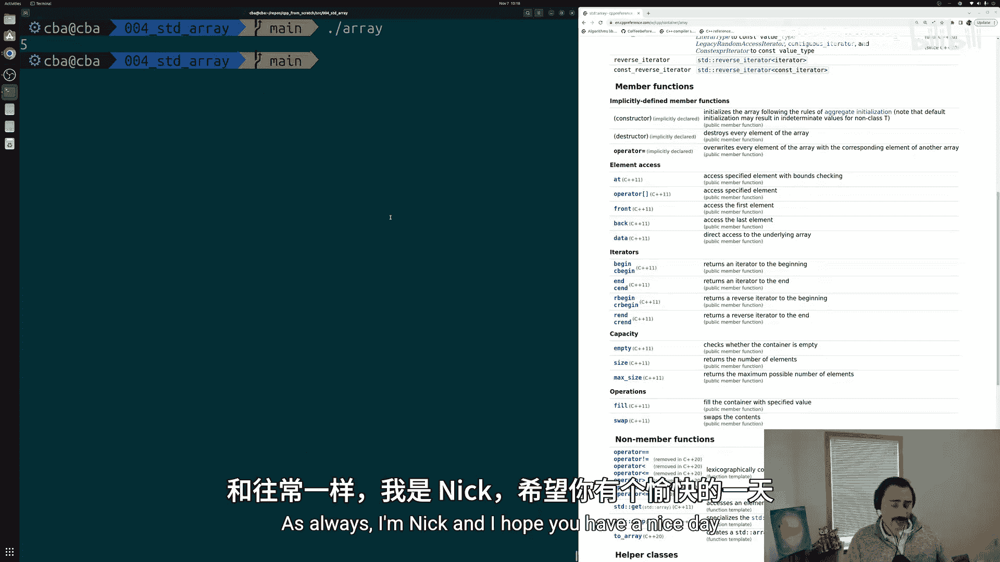

在后续的课程中，当我们学习循环和算法时，还会接触到 `std::array` 的迭代器以及其他更高级的功能。希望这节课对你有所帮助！