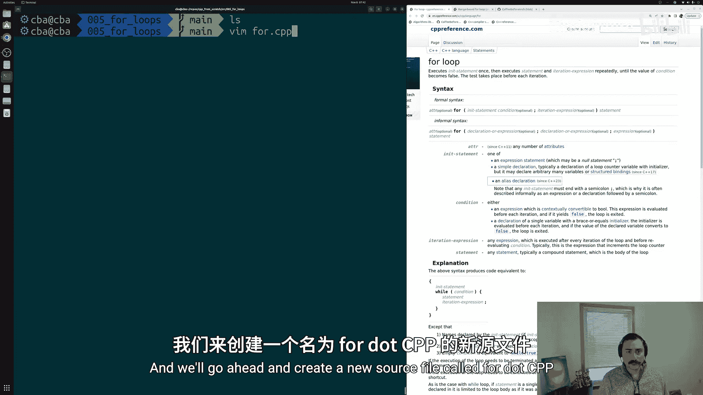
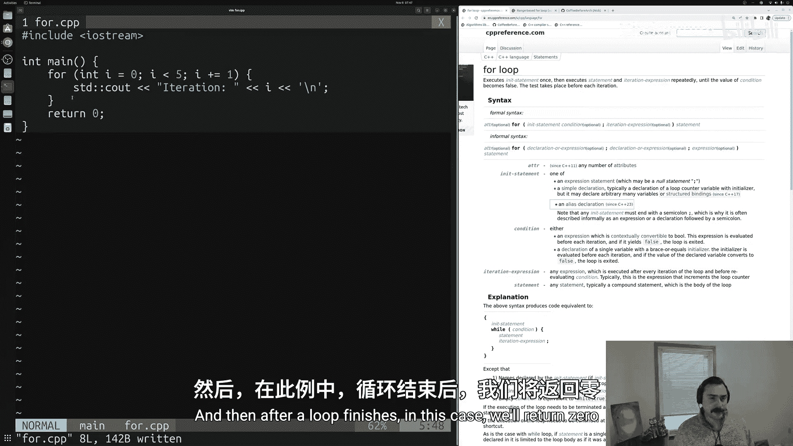
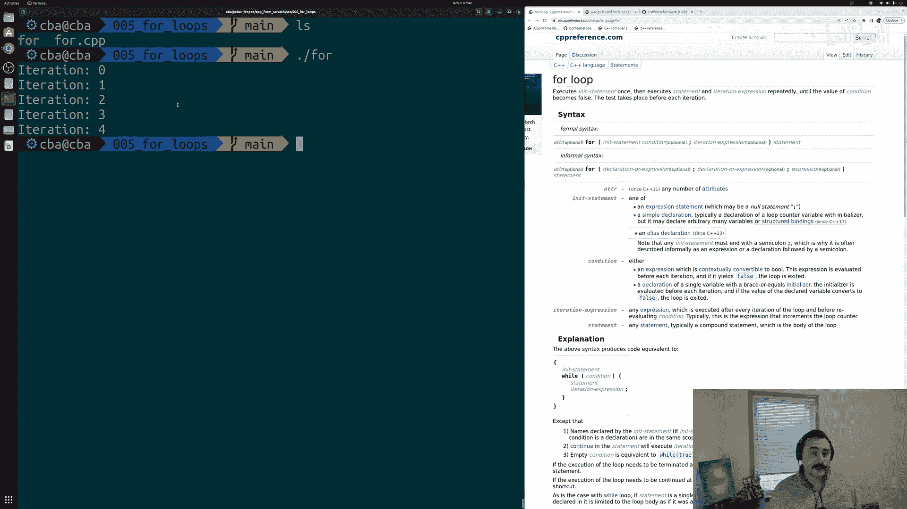
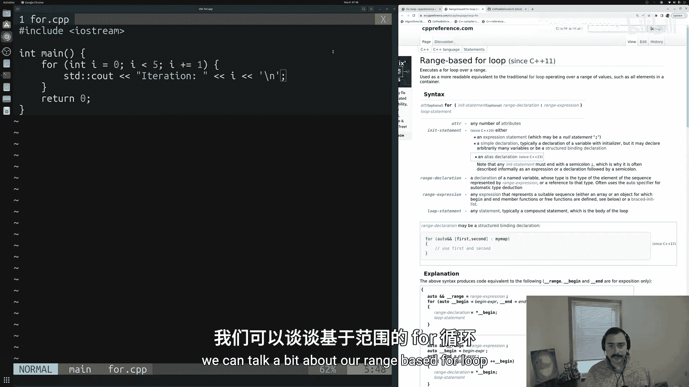
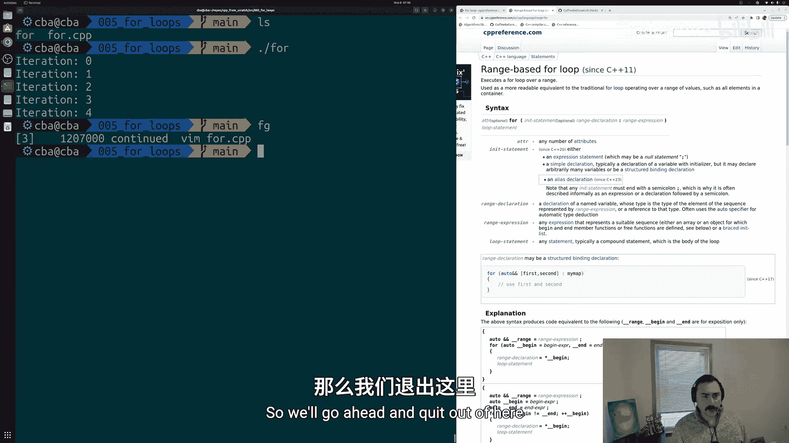
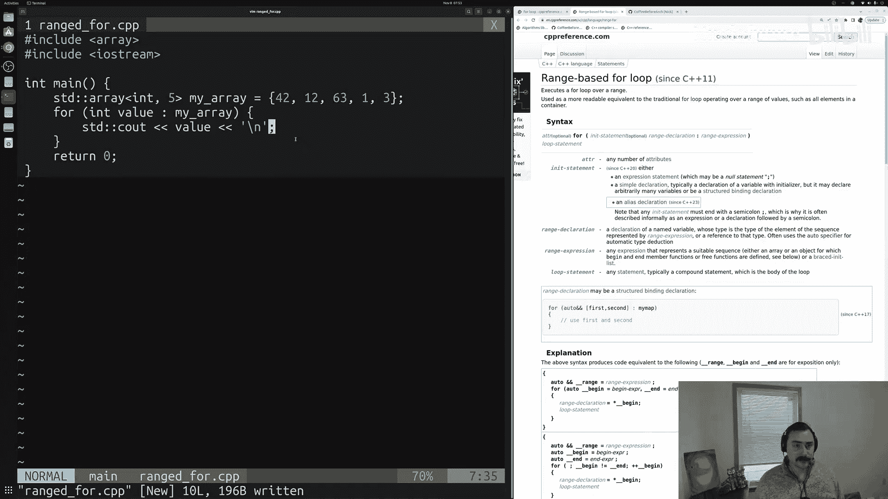
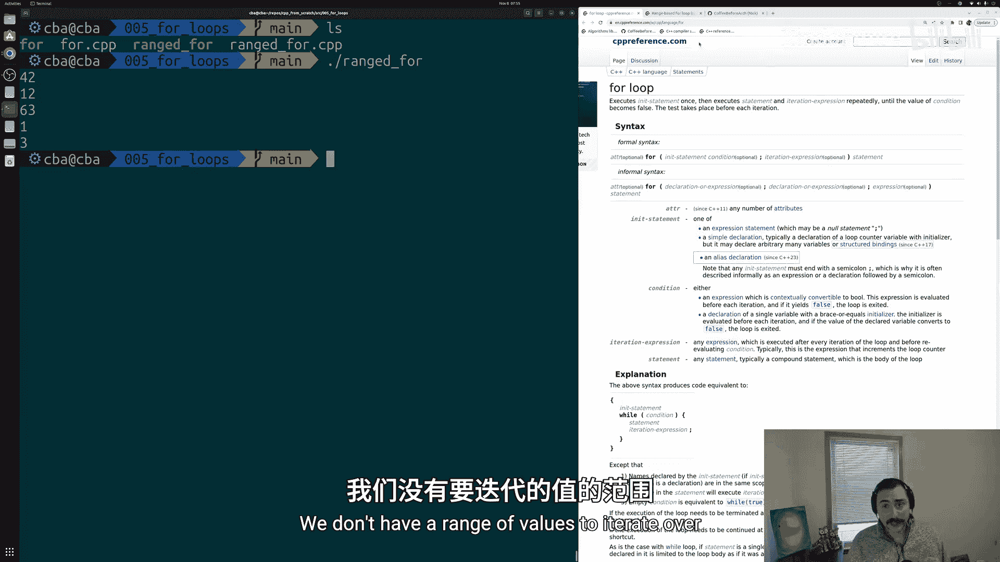
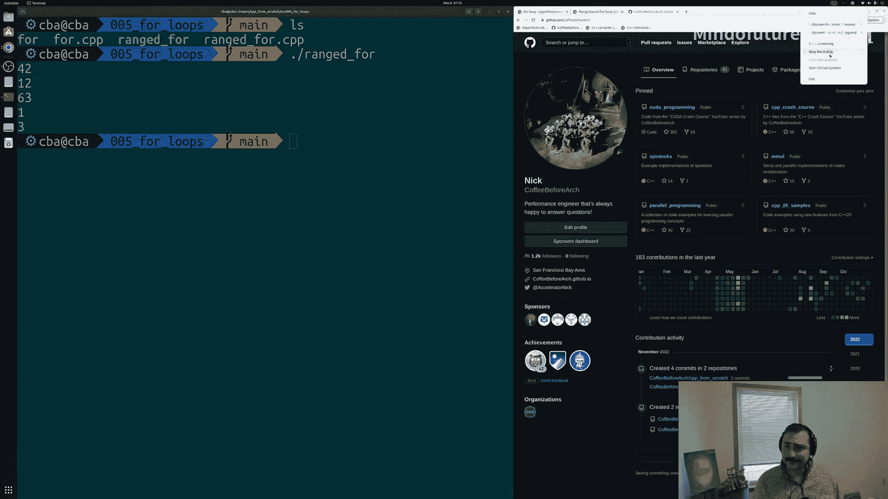

# 006：循环结构

## 概述
在本节课中，我们将要学习C++中的两种循环结构：C风格`for`循环和基于范围的`for`循环。循环是编程中用于重复执行代码块的核心工具，能帮助我们高效地处理重复性任务。



---

## C风格for循环

上一节我们介绍了循环的基本概念，本节中我们来看看最基础的C风格`for`循环。

C风格`for`循环的语法结构如下：
```cpp
for (初始化; 条件; 更新) {
    // 循环体
}
```

以下是`for`循环的三个组成部分：
1.  **初始化**：在循环开始前执行一次，通常用于初始化循环计数器。
2.  **条件**：在每次循环迭代开始前检查。如果条件为真，则执行循环体；如果为假，则退出循环。
3.  **更新**：在每次循环迭代结束后执行，通常用于更新循环计数器。

让我们通过一个简单的例子来理解。假设我们想打印数字0到4：

```cpp
#include <iostream>

int main() {
    for (int i = 0; i < 5; i++) {
        std::cout << "迭代次数: " << i << std::endl;
    }
    return 0;
}
```

程序执行流程如下：
1.  初始化`i`为0。
2.  检查条件`i < 5`是否为真（0<5为真）。
3.  执行循环体，打印“迭代次数: 0”。
4.  执行更新语句`i++`，`i`变为1。
5.  重复步骤2-4，直到`i`变为5，此时条件`i < 5`为假，循环结束。



---



## 基于范围的for循环

了解了传统的C风格循环后，我们来看看C++11引入的、更简洁的基于范围的`for`循环。





基于范围的`for`循环主要用于遍历容器（如数组、向量等）中的所有元素。其语法更简洁，不易出错。

以下是基于范围的`for`循环语法：
```cpp
for (元素类型 变量名 : 容器) {
    // 使用变量名操作当前元素
}
```

让我们用一个例子来打印数组中的所有元素：

```cpp
#include <iostream>
#include <array>

int main() {
    std::array<int, 5> my_array = {42, 12, 63, 1, 3};

    for (int value : my_array) {
        std::cout << value << std::endl;
    }
    return 0;
}
```

这个循环会自动遍历`my_array`中的每个元素。在每次迭代中，变量`value`会被设置为数组中当前元素的值，然后执行循环体中的代码。

基于范围的`for`循环有两个主要优点：
1.  **代码更简洁易读**：无需手动管理循环计数器和索引。
2.  **避免“差一错误”**：由于循环自动处理边界，因此不会出现多循环一次或少循环一次的错误。

---



## 总结
本节课中我们一起学习了C++中的两种循环结构。

我们首先学习了**C风格`for`循环**，它通过`初始化`、`条件`和`更新`三个部分来控制循环的执行次数，适用于需要精确控制迭代过程的场景。

接着，我们学习了**基于范围的`for`循环**，这是一种更现代、更简洁的语法，特别适合遍历容器中的所有元素。它能提高代码的可读性并减少常见错误。





在实际编程中，你可以根据具体需求选择合适的循环类型。两种循环都是C++程序员工具箱中的重要组成部分。