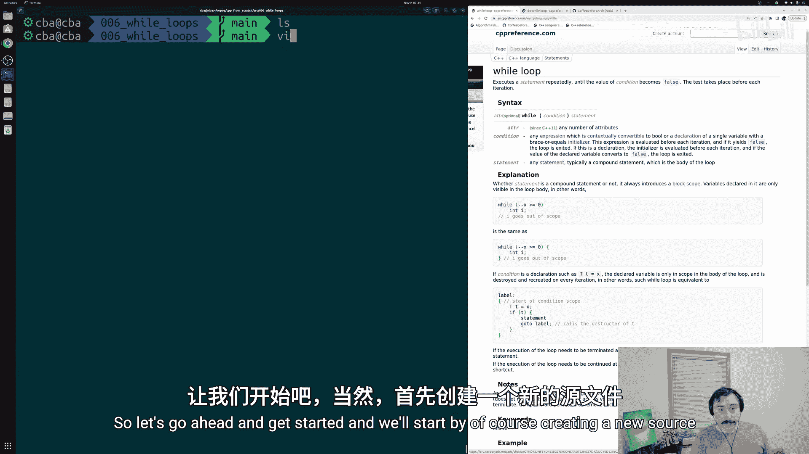
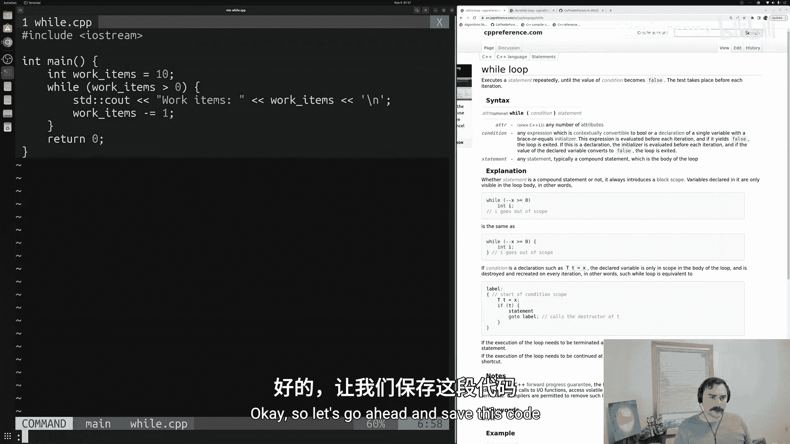
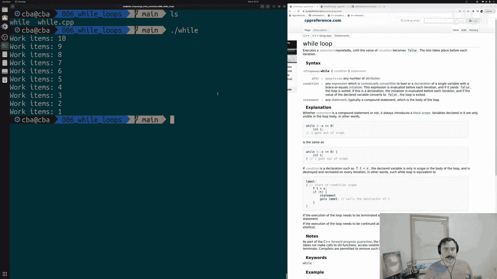
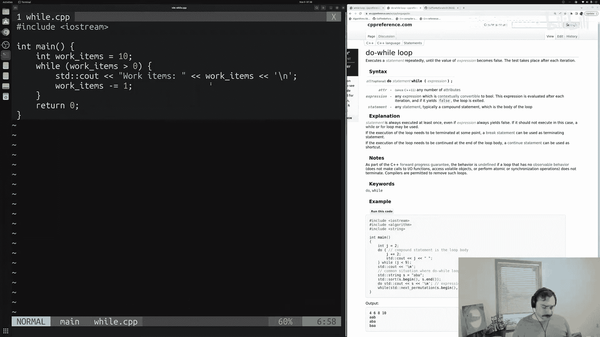
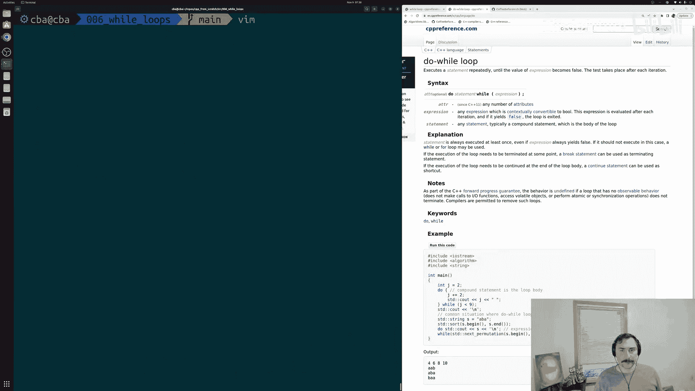
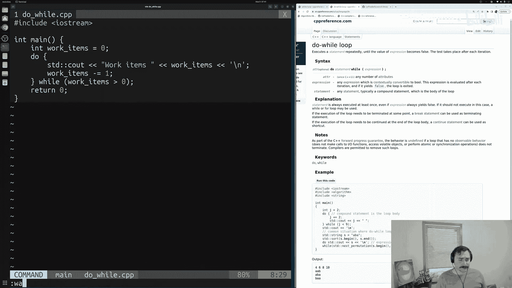
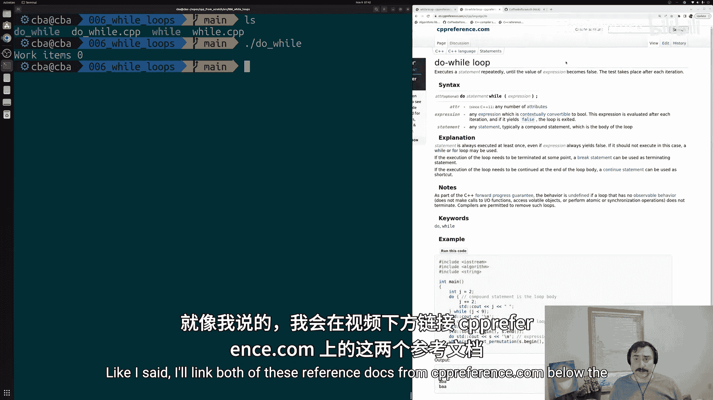
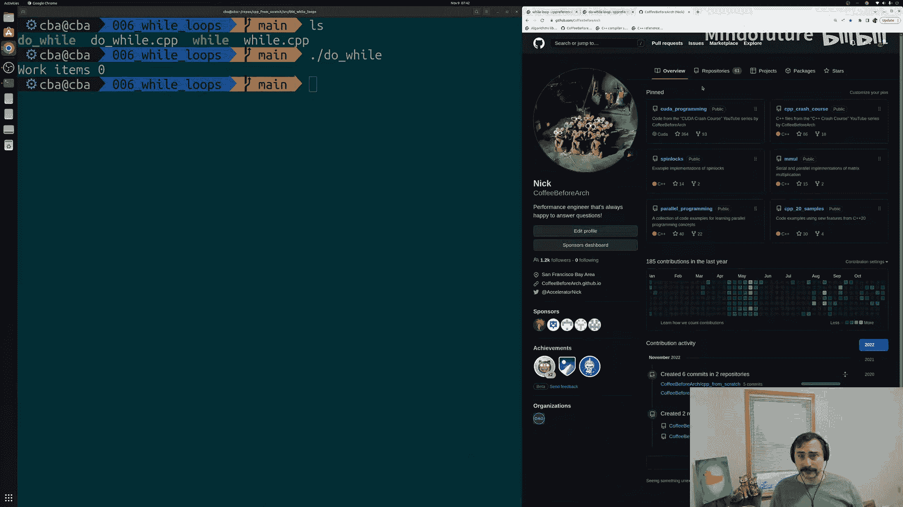

# 007：While循环 🔄

在本节课中，我们将要学习C++中的`while`循环和`do-while`循环。这两种循环结构允许我们在不确定具体迭代次数的情况下，重复执行一段代码，直到某个条件不再满足。

---

## 循环回顾与引入



上一节我们介绍了`for`循环的基础知识，它允许我们遍历一个确定的范围或容器。然而，在编程中，我们并不总是能预先知道需要循环多少次。循环的次数可能依赖于外部输入，或者我们需要持续执行某段代码直到某个特定条件发生。在C和C++中，我们可以使用`while`循环来表达这种逻辑，它还有另一种形式叫做`do-while`循环。本节中我们来看看这两种循环的具体用法。

---

## While循环基础

`while`循环会重复执行一个语句，直到其条件变为假。**关键点在于，条件检查发生在每次迭代之前**。如果条件为真，则执行循环体内的代码；否则，程序将跳过循环继续执行。

以下是`while`循环的基本语法结构：

```cpp
while (condition) {
    // 循环体：当条件为真时执行的代码
}
```

让我们通过一个简单的例子来理解。假设我们有一些工作项需要处理，但数量不确定。

```cpp
#include <iostream>



int main() {
    int work_items = 10; // 初始化工作项数量

    // 当工作项数量大于0时，持续执行循环
    while (work_items > 0) {
        // 模拟处理一个工作项
        work_items -= 1;
        // 打印当前剩余的工作项数量
        std::cout << "工作项数量: " << work_items << std::endl;
    }

    return 0;
}
```



在这个例子中，循环会持续执行，每次迭代减少一个`work_items`，并打印出剩余数量，直到`work_items`不再大于0。当`work_items`变为0时，条件`work_items > 0`变为假，循环终止。

`while`循环非常适用于处理基于外部输入（如从队列中获取任务）或需要迭代至达到某个目标（如求解问题）的场景，因为我们无法预先知道确切的迭代次数。

---

## Do-While循环



`do-while`循环是`while`循环的一个变体。它与`while`循环的主要区别在于：**条件检查发生在每次迭代之后**。这意味着`do-while`循环**至少会执行一次**循环体，然后再判断是否继续。



以下是`do-while`循环的基本语法结构：

```cpp
do {
    // 循环体：至少执行一次的代码
} while (condition);
```

让我们看一个例子，即使初始条件为假，循环体也会执行一次。

```cpp
#include <iostream>

int main() {
    int work_items = 0; // 初始工作项数量为0

    // 先执行一次循环体，再检查条件
    do {
        std::cout << "工作项数量: " << work_items << std::endl;
        work_items -= 1; // 即使没有工作项，也执行一次“处理”
    } while (work_items > 0); // 执行后检查条件

    return 0;
}
```

运行这段代码，你会看到即使`work_items`初始值为0，不满足`work_items > 0`的条件，程序仍然会输出一次“工作项数量: 0”。这是因为代码先执行了`do`块内的语句，然后才进行条件判断。



`do-while`循环的典型应用场景是需要**至少执行一次**操作的情况。例如，在编写命令行菜单或用户交互界面时，程序启动后总是需要先获取一次用户输入，然后再根据输入判断下一步行动，这时`do-while`循环就非常合适。

---

## 总结

本节课中我们一起学习了C++中两种重要的循环结构：

1.  **`while`循环**：在每次迭代**之前**检查条件。只有当条件为真时，才会执行循环体。它适用于迭代次数未知，但需要先判断再执行的场景。
2.  **`do-while`循环**：在每次迭代**之后**检查条件。它**保证循环体至少执行一次**，然后再根据条件决定是否继续。它适用于那些必须至少执行一次操作的场景，例如用户输入处理。





理解这两种循环的区别和适用场景，对于编写灵活、健壮的程序至关重要。你可以根据程序逻辑的具体需求，选择合适的循环结构。