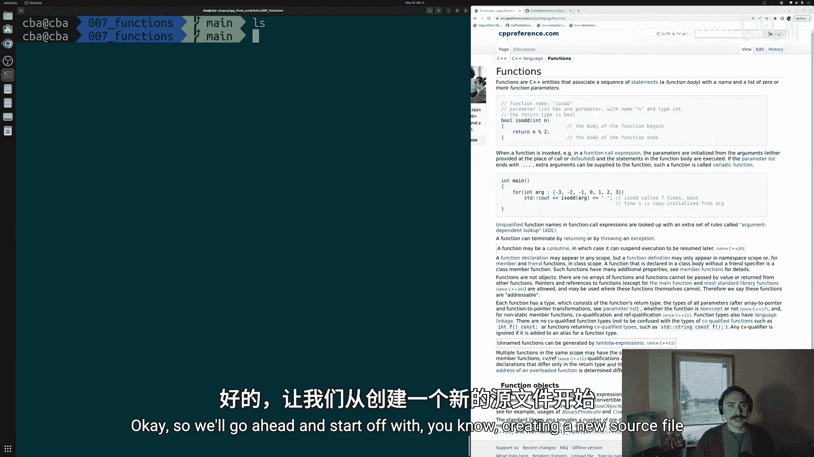
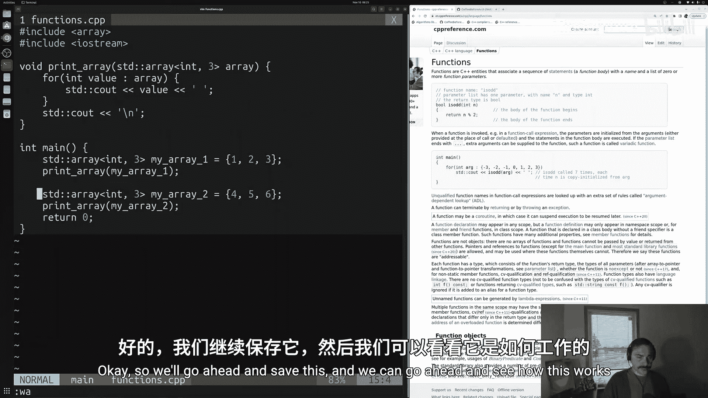
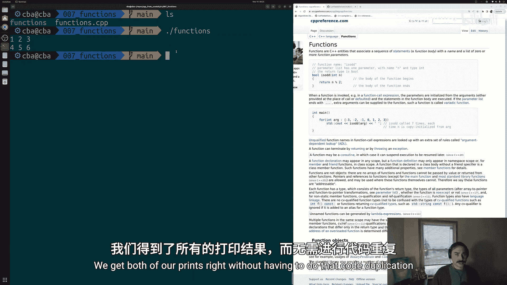
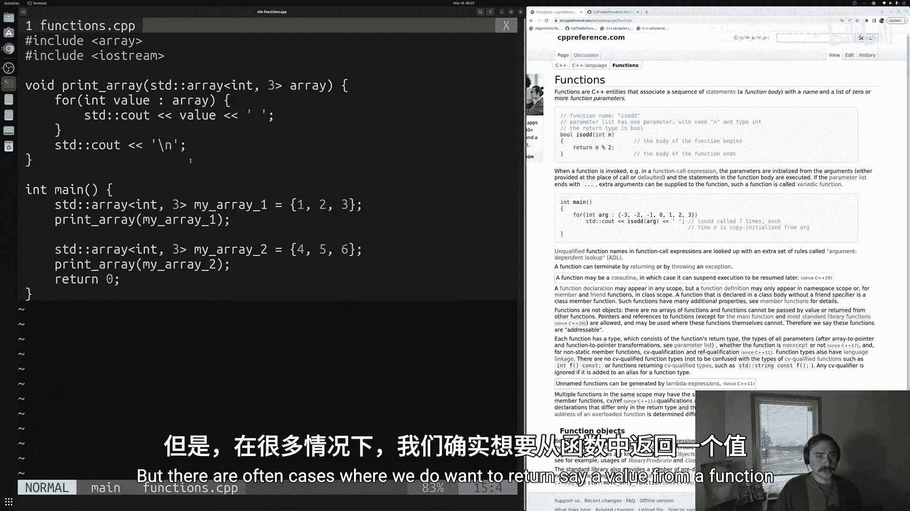
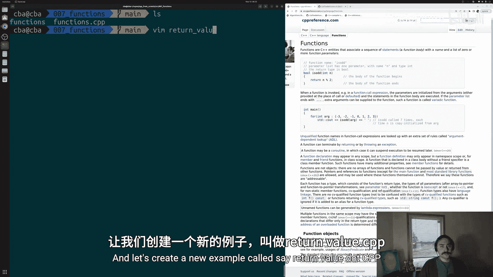
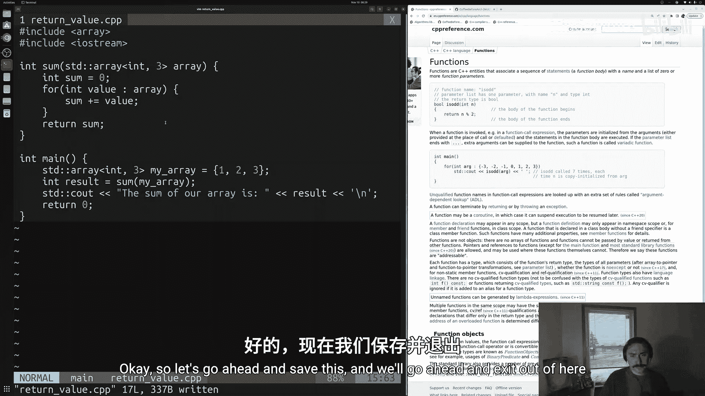
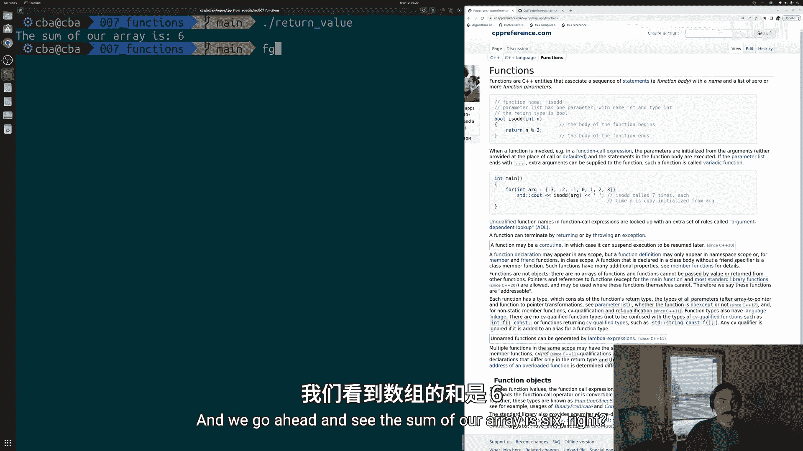
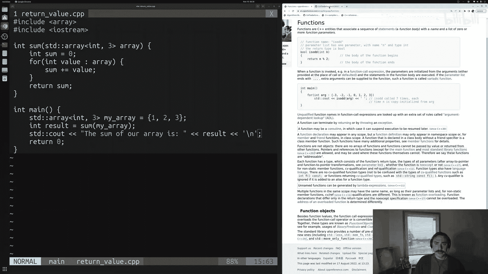
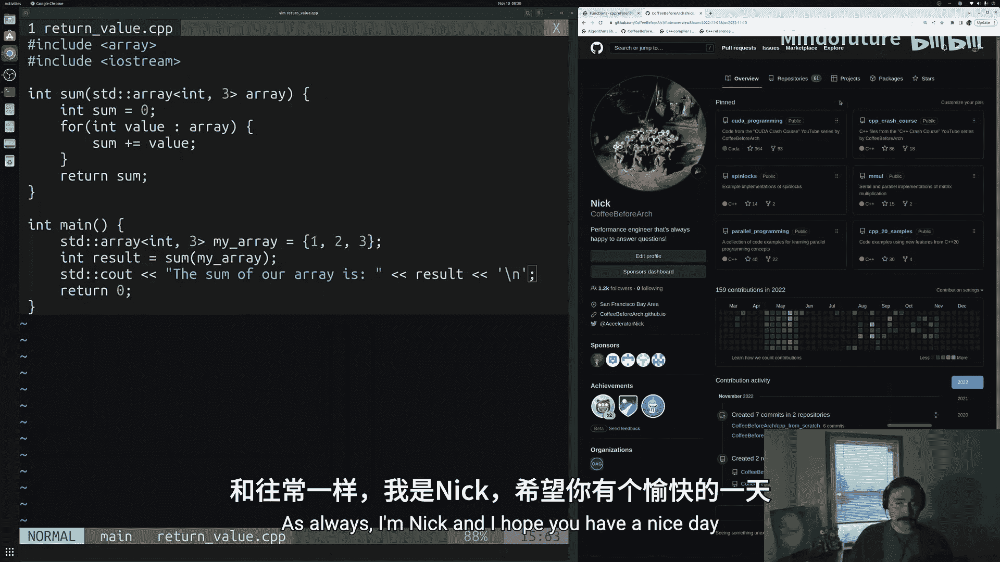

# 008：函数 🧩

在本节课中，我们将要学习C++中的函数。函数是编程中一种重要的控制流工具，它允许我们将一系列语句命名并打包，以便在程序中重复使用，从而避免代码重复，并使代码结构更清晰、更易于维护。

在之前的课程中，我们学习了条件语句和循环，它们分别用于选择性执行和重复执行代码。本节我们将探讨另一种控制流结构——函数。

## 什么是函数？🤔

函数允许我们为一系列想要执行的语句赋予一个名称。这样，每当我们需要执行这些操作时，只需调用该函数名即可，而无需重复编写相同的代码。

### 为什么需要函数？
我们经常需要在程序的不同位置执行相同的操作，但这些操作可能不是连续进行的（例如，在程序开始、中间和结束时各执行一次）。使用循环无法很好地解决这种非连续重复的问题。此外，直接复制粘贴代码会导致代码重复，使得程序冗长且难以维护。通过函数，我们可以将公共代码提取出来，赋予其一个名称，实现代码的复用。



## 函数的基本结构 🏗️

我们已经接触过一个特殊的函数——`main`函数，它是所有C++程序的入口点。实际上，`main`函数的结构与我们自定义的函数结构是相同的。

一个函数的核心组成部分包括：
1.  **返回类型**：函数执行完毕后返回给调用者的值的类型。如果函数不返回任何值，则使用 `void`。
2.  **函数名**：用于标识和调用函数的名称。
3.  **参数列表**：位于函数名后的圆括号 `()` 内，定义了函数可以接收的输入（参数）。可以为空。
4.  **函数体**：由一对花括号 `{}` 包裹，包含了函数要执行的所有语句。

以下是 `main` 函数的结构示例：
```cpp
int main() { // 返回类型为 int，函数名为 main，参数列表为空
    // 函数体
    return 0; // 返回一个整数值
}
```

## 编写一个无返回值的函数 📝

让我们通过一个例子来学习如何编写自己的函数。假设我们有一个常见操作：打印数组的内容。

首先，我们创建一个源文件（例如 `functions.cpp`），并包含必要的头文件，然后定义一个数组。

```cpp
#include <array>
#include <iostream>

int main() {
    // 创建两个数组
    std::array<int, 3> my_array1 = {1, 2, 3};
    std::array<int, 3> my_array2 = {4, 5, 6};

    // 不使用函数时，需要重复编写打印代码
    for (int value : my_array1) {
        std::cout << value << ' ';
    }
    std::cout << '\n';

    for (int value : my_array2) {
        std::cout << value << ' ';
    }
    std::cout << '\n';

    return 0;
}
```

如你所见，打印两个数组需要重复几乎相同的代码块。为了解决这个问题，我们可以编写一个函数。

### 创建 `print_array` 函数

我们将创建一个名为 `print_array` 的函数，它接收一个 `std::array<int, 3>` 类型的参数，并负责打印其内容。由于它只执行打印操作而不返回任何值，其返回类型为 `void`。

```cpp
// 函数定义
void print_array(std::array<int, 3> array) { // 返回类型 void，函数名 print_array，参数为 array
    for (int value : array) {
        std::cout << value << ' ';
    }
    std::cout << '\n';
}
```

现在，我们可以在 `main` 函数中调用这个函数，从而消除代码重复：

```cpp
int main() {
    std::array<int, 3> my_array1 = {1, 2, 3};
    std::array<int, 3> my_array2 = {4, 5, 6};

    // 调用函数来打印数组
    print_array(my_array1); // 将 my_array1 作为参数传递给函数
    print_array(my_array2); // 将 my_array2 作为参数传递给函数

    return 0;
}
```

程序执行时，控制流会跳转到 `print_array` 函数内部执行其语句，执行完毕后返回到 `main` 函数继续执行下一行。这样，代码变得更简洁、更具表达力。

## 编写一个有返回值的函数 🔄





上一节我们介绍了无返回值（`void`）的函数。本节中我们来看看如何编写一个会返回计算结果的函数。



假设我们需要一个函数来计算数组中所有元素的总和。



我们创建一个新的源文件（例如 `returnvalue.cpp`）。首先，定义一个数组，然后编写求和函数。

### 创建 `sum` 函数

这个函数需要接收一个数组作为输入，遍历并累加所有元素，最后将总和返回。因此，它的返回类型应该是 `int`。

```cpp
#include <array>
#include <iostream>

// 函数定义：返回数组元素之和
int sum(std::array<int, 3> array) { // 返回类型为 int
    int result = 0; // 初始化累加器
    for (int value : array) {
        result += value; // 将每个元素加到 result 上
    }
    return result; // 返回最终的计算结果
}

int main() {
    std::array<int, 3> my_array = {1, 2, 3};

    // 调用函数并将返回值存储在一个变量中
    int total = sum(my_array);

    // 打印结果
    std::cout << "The sum of the array is: " << total << '\n';

    return 0;
}
```

当 `sum` 函数被调用时，它执行计算并通过 `return` 语句将结果（一个整数值）传递回调用处。在 `main` 函数中，我们将这个返回值存储在变量 `total` 中，然后将其打印出来。运行程序，输出应为 `The sum of the array is: 6`。

## 总结 📚



本节课中我们一起学习了C++函数的基础知识。



我们首先了解了函数的概念及其在避免代码重复、提高代码可读性和可维护性方面的重要性。接着，我们剖析了函数的基本结构，包括返回类型、函数名、参数列表和函数体。

通过两个具体的例子，我们实践了如何编写函数：
1.  我们编写了一个无返回值（`void`）的 `print_array` 函数，用于打印数组内容，从而消除了重复的打印代码。
2.  我们编写了一个有返回值（`int`）的 `sum` 函数，用于计算数组元素的总和，并学会了如何接收和使用函数的返回值。





函数是构建模块化、高效C++程序的核心工具。掌握函数的定义和使用，是迈向更复杂编程的重要一步。