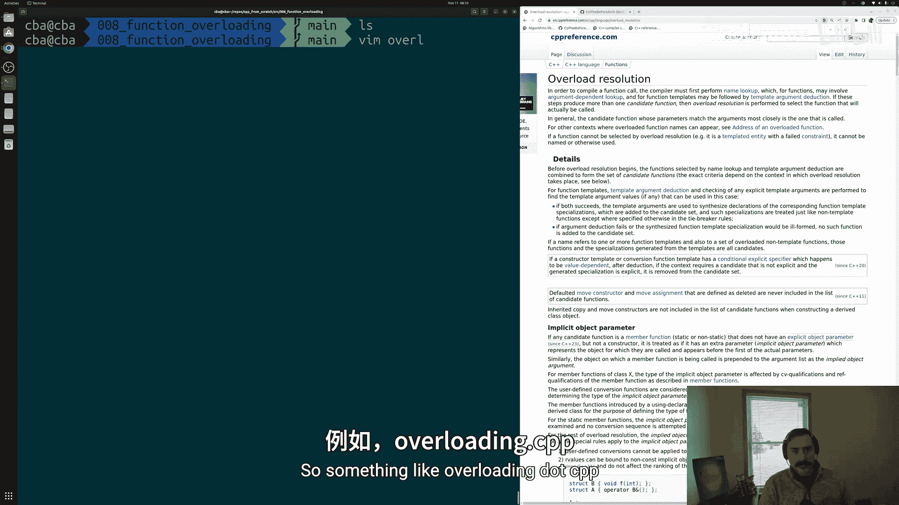
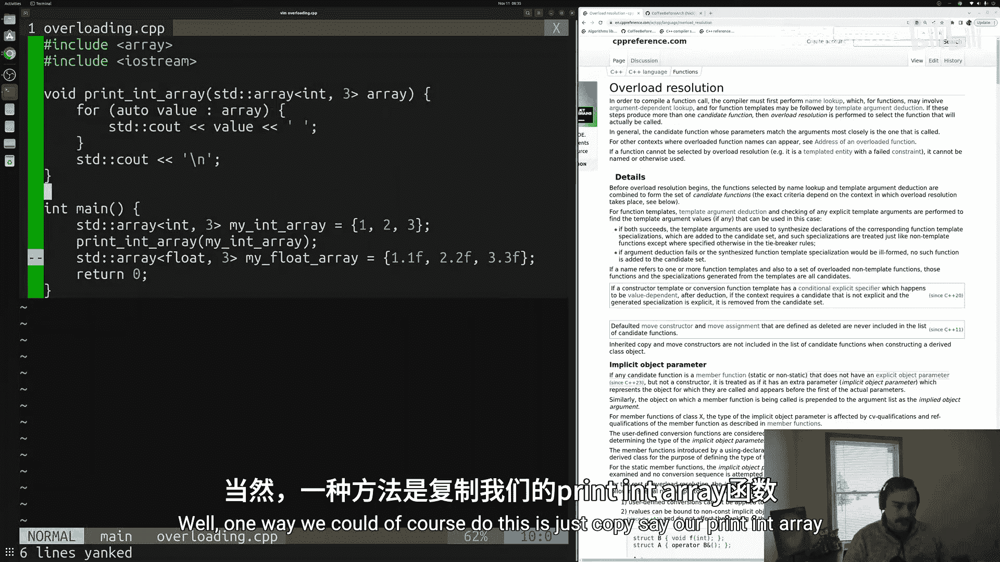
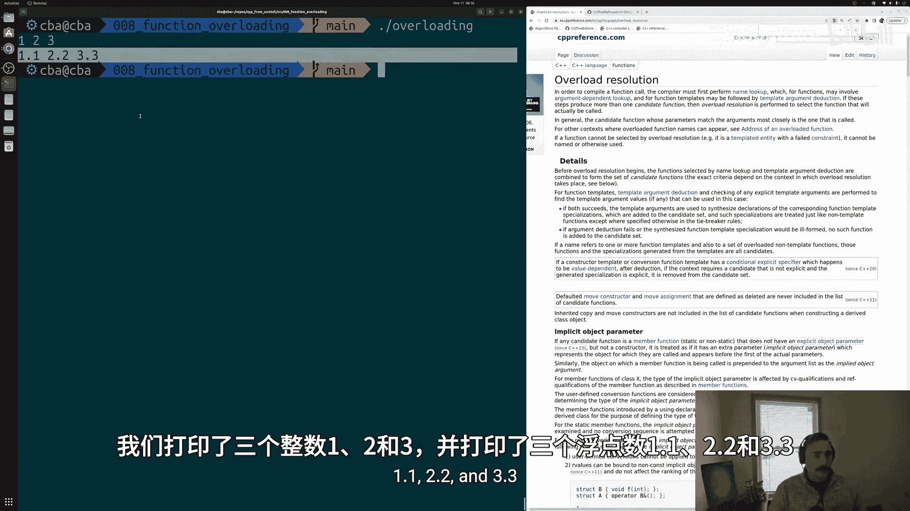
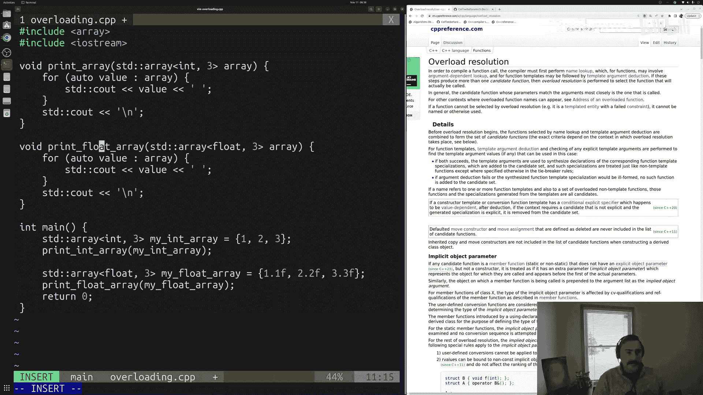
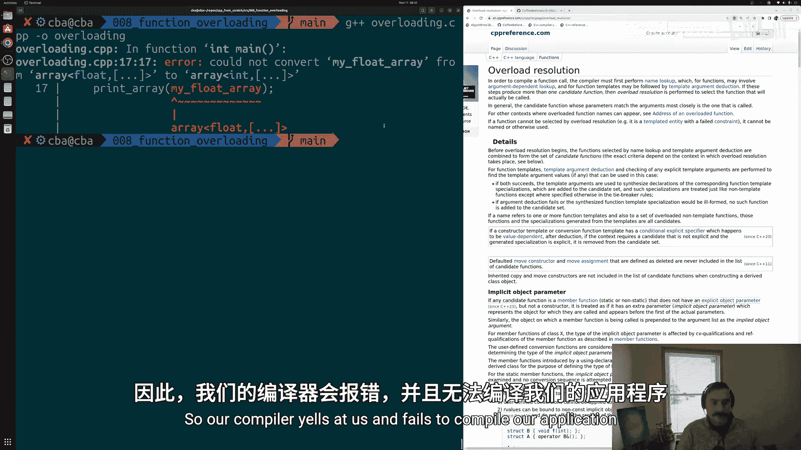
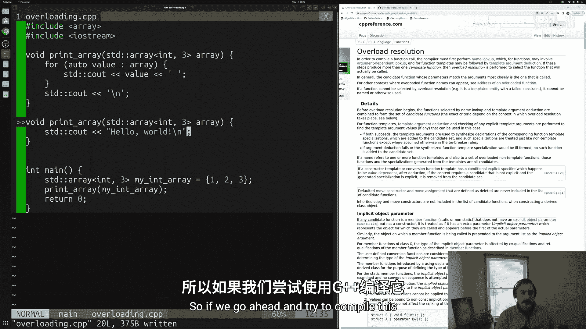
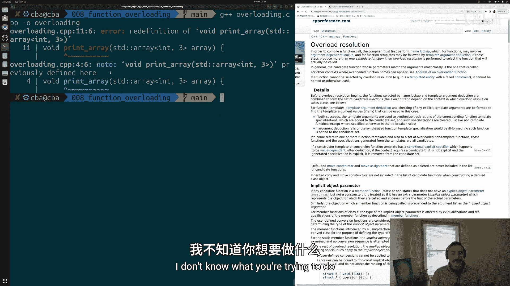
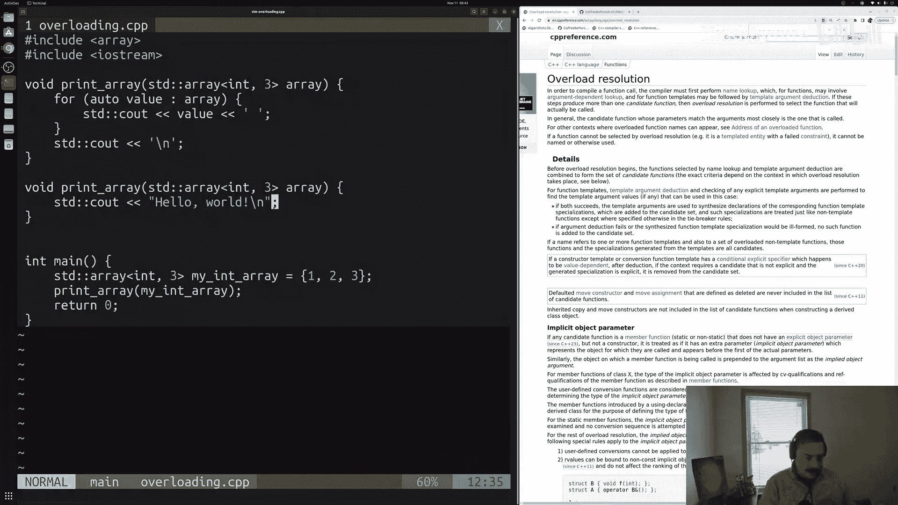
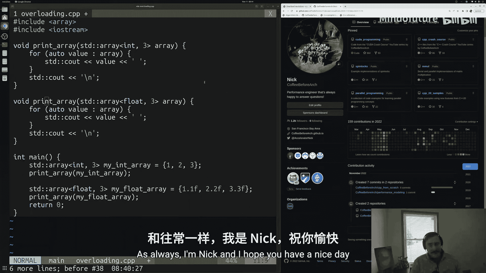

# 009：函数重载与重载决议

在本节课中，我们将要学习C++中的函数重载与重载决议。通过这两个特性，我们可以让多个函数共享同一个名字，而编译器会根据我们调用时提供的参数，自动选择正确的函数版本。

上一节我们介绍了函数的基本形式、编写和使用方法。本节中我们来看看如何处理那些功能相似，但操作不同类型或参数数量不同的函数。



## 概述

函数重载允许我们为多个功能相似的函数使用相同的名称。重载决议是编译器根据函数调用时提供的参数，从所有重载函数中选择最匹配的那个版本的过程。这避免了为每个微小变体创建不同函数名的麻烦。

## 创建示例程序

首先，我们创建一个新的源文件 `overloading.cpp`，并包含必要的头文件。

```cpp
#include <array>
#include <iostream>
```

接着，我们在 `main` 函数中定义两个数组，一个整型数组和一个浮点型数组。

```cpp
int main() {
    std::array<int, 3> my_int_array = {1, 2, 3};
    std::array<float, 3> my_float_array = {1.1f, 2.2f, 3.3f};
    // ... 后续代码
}
```

## 不使用重载的函数



假设我们需要打印这两个数组。一种方法是创建两个名称不同的函数。

以下是打印整型数组的函数：



```cpp
void print_int_array(std::array<int, 3> my_array) {
    for (auto value : my_array) {
        std::cout << value << ' ';
    }
    std::cout << '\n';
}
```

以下是打印浮点型数组的函数：

```cpp
void print_float_array(std::array<float, 3> my_array) {
    for (auto value : my_array) {
        std::cout << value << ' ';
    }
    std::cout << '\n';
}
```

然后在 `main` 函数中分别调用它们：

```cpp
print_int_array(my_int_array);
print_float_array(my_float_array);
```

这种方法可以工作，但要求使用者记住两个不同的函数名，接口设计不够优雅。



## 引入函数重载

利用函数重载，我们可以为这两个函数赋予相同的名字。编译器通过**函数签名**（函数名 + 参数的数量、类型及顺序）来区分它们。

以下是重载后的 `print_array` 函数：

```cpp
// 重载版本1：处理整型数组
void print_array(std::array<int, 3> my_array) {
    for (auto value : my_array) {
        std::cout << value << ' ';
    }
    std::cout << '\n';
}

// 重载版本2：处理浮点型数组
void print_array(std::array<float, 3> my_array) {
    for (auto value : my_array) {
        std::cout << value << ' ';
    }
    std::cout << '\n';
}
```

现在，在 `main` 函数中，我们可以统一使用 `print_array` 这个名称：

```cpp
print_array(my_int_array);   // 调用整型版本
print_array(my_float_array); // 调用浮点型版本
```



编译器会根据传入参数 `my_int_array` 和 `my_float_array` 的类型，自动选择对应的函数版本。这简化了接口，使用者只需记住一个函数名。

## 重载决议失败的情况

编译器必须能够明确区分不同的重载函数。如果两个函数的签名完全相同，即使函数体不同，也会导致编译错误。



例如，以下代码会导致“重定义”错误：

```cpp
void print_array(std::array<int, 3> my_array) {
    for (auto value : my_array) {
        std::cout << value << ' ';
    }
    std::cout << '\n';
}

// 错误：函数签名与上一个函数完全相同
void print_array(std::array<int, 3> my_array) {
    std::cout << "Hello World\n";
}
```

编译器无法判断在调用 `print_array(my_int_array)` 时应该使用哪个函数，因此会报错。重载决议的核心是消除歧义。

## 当前方案的局限性





虽然函数重载解决了命名问题，但我们仍然存在**代码重复**。两个 `print_array` 函数的函数体几乎完全一样，唯一的区别是参数类型。

在下一节中，我们将学习使用**模板**来解决这种代码重复的问题，编写出更通用、更简洁的代码。

## 总结



本节课中我们一起学习了C++的函数重载与重载决议。
*   **函数重载**允许我们为多个功能相似的函数使用相同的名称。
*   **重载决议**是编译器根据函数调用时的实际参数，从所有重载函数中选择最匹配版本的过程。
*   区分重载函数的依据是**函数签名**（函数名 + 参数类型、数量及顺序）。
*   如果多个重载函数的签名完全相同，将导致编译错误，因为编译器无法消除歧义。
*   函数重载提供了清晰的接口，但可能带来代码重复，这可以通过后续学习的模板技术来优化。