# 010：函数模板 🧩

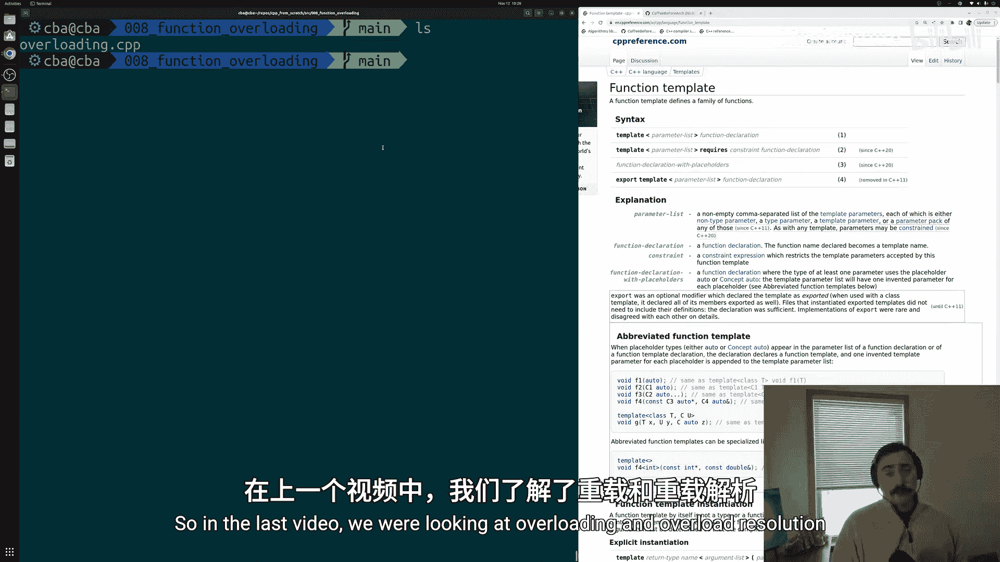

在本节课中，我们将要学习C++中的函数模板。函数模板是解决代码重复问题的强大工具，它允许我们编写一个通用的函数“蓝图”，让编译器根据我们使用的具体类型自动生成对应的函数版本。

上一节我们介绍了函数重载和重载解析，本节中我们来看看如何利用函数模板来避免因重载相似函数而导致的代码重复。

## 概述：为何需要函数模板？

在之前的例子中，我们有两个打印数组的函数：一个处理整数数组，另一个处理浮点数数组。这两个函数的函数体完全相同，唯一的区别是参数类型。手动为每种类型编写一个函数会导致代码冗余和维护困难。

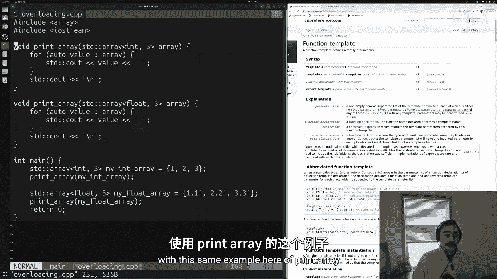

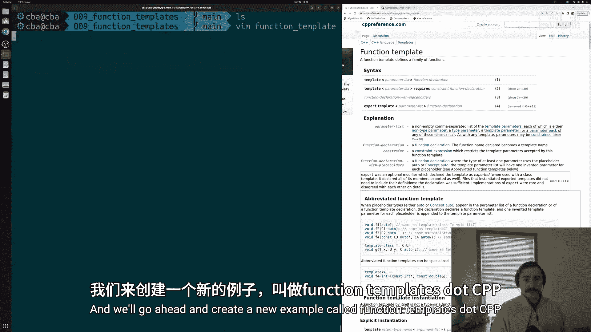

函数模板通过允许我们编写一个“模板”来解决这个问题。我们只需定义一次函数逻辑，并指定一个或多个类型参数（如 `T`）。当我们在代码中使用这个模板时，编译器会根据我们提供的具体类型（如 `int`、`float`）自动生成对应的函数代码。

## 编写第一个函数模板

让我们从一个简单的例子开始，创建一个可以打印任何类型数组的函数模板。

首先，我们需要包含必要的头文件并设置主函数。

```cpp
#include <array>
#include <iostream>

int main() {
    // 创建示例数组
    std::array<int, 3> my_int_array = {1, 2, 3};
    std::array<float, 3> my_float_array = {1.1f, 2.2f, 3.3f};

    // 后续将在这里调用我们的模板函数
    return 0;
}
```

接下来，我们编写函数模板 `print_array`。模板声明使用 `template` 关键字，后跟类型参数列表。

```cpp
// 函数模板声明
template <typename T>
void print_array(const T& arr) {
    for (auto value : arr) {
        std::cout << value << ' ';
    }
    std::cout << '\n';
}
```

**代码解析**：
*   `template <typename T>`：这声明了一个模板，`T` 是一个占位符，代表某种类型。
*   `void print_array(const T& arr)`：函数接受一个类型为 `T` 的常量引用参数 `arr`。`T` 的具体类型将在调用时确定。
*   函数体使用范围 `for` 循环遍历数组并打印每个元素。

## 使用函数模板

有多种方式可以调用函数模板。

### 方法一：显式指定模板参数

我们可以在函数名后的尖括号 `<>` 中明确告诉编译器我们想要哪个版本。

```cpp
int main() {
    std::array<int, 3> my_int_array = {1, 2, 3};
    std::array<float, 3> my_float_array = {1.1f, 2.2f, 3.3f};

    // 显式指定模板参数类型
    print_array<std::array<int, 3>>(my_int_array);
    print_array<std::array<float, 3>>(my_float_array);

    return 0;
}
```

### 方法二：让编译器自动推导类型

在大多数情况下，编译器可以根据传入函数的参数自动推导出模板参数 `T` 的类型。这使得调用模板函数和调用普通函数一样简单。

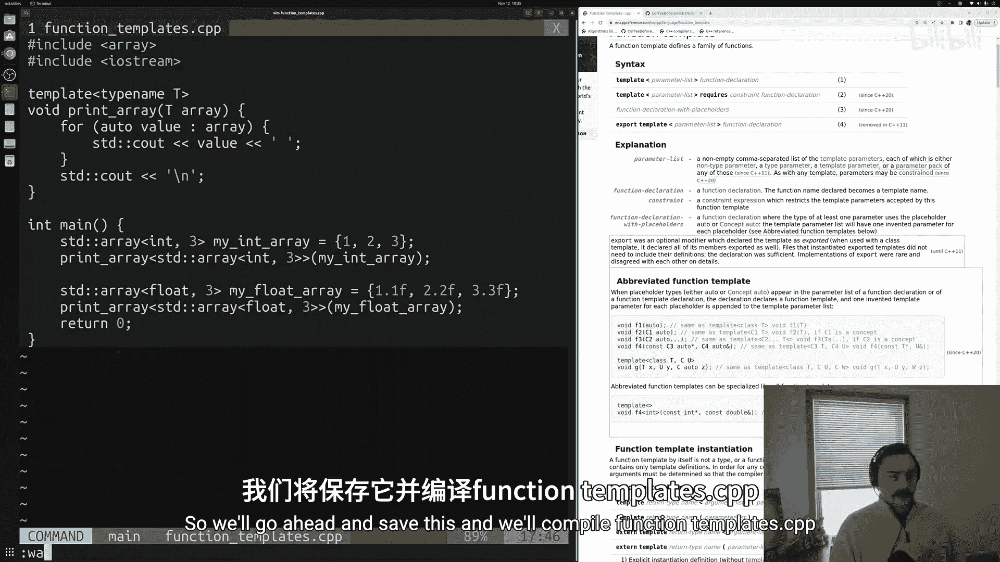

```cpp
int main() {
    std::array<int, 3> my_int_array = {1, 2, 3};
    std::array<float, 3> my_float_array = {1.1f, 2.2f, 3.3f};

    // 编译器自动推导类型
    print_array(my_int_array);   // 编译器推导出 T 是 std::array<int, 3>
    print_array(my_float_array); // 编译器推导出 T 是 std::array<float, 3>

    return 0;
}
```

这种方式更简洁，也是实践中更常用的方法。

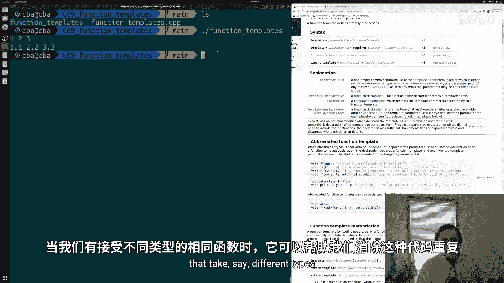

## C++20 中的简写函数模板语法 ✨

C++20 引入了一种更简洁的模板函数定义方式，称为“简写函数模板”（Abbreviated Function Template）。它允许我们使用 `auto` 关键字作为函数参数的类型，编译器会自动将其视为一个模板。

以下是使用简写语法的例子：

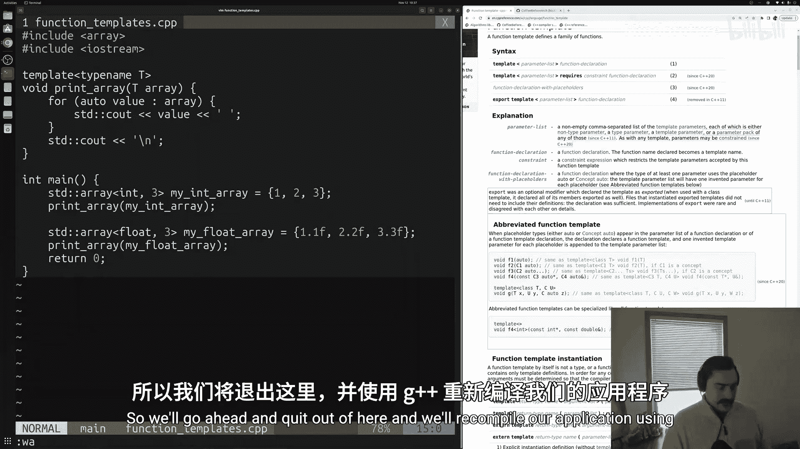

```cpp
// C++20 简写函数模板
void print_array_abbreviated(const auto& arr) {
    for (auto value : arr) {
        std::cout << value << ' ';
    }
    std::cout << '\n';
}

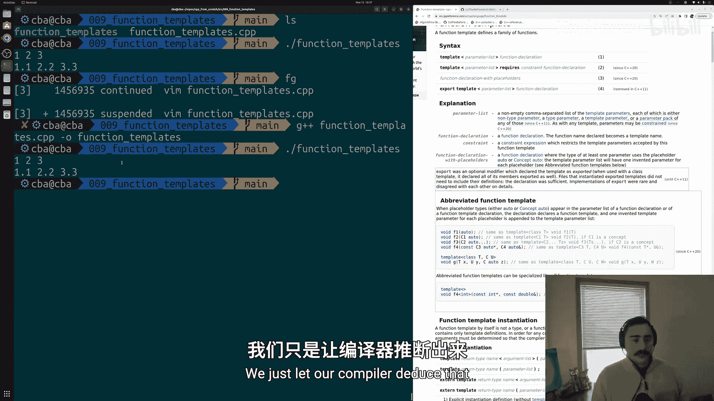

int main() {
    std::array<int, 3> my_int_array = {1, 2, 3};
    std::array<float, 3> my_float_array = {1.1f, 2.2f, 3.3f};

    print_array_abbreviated(my_int_array);
    print_array_abbreviated(my_float_array);

    return 0;
}
```

**注意**：此功能需要编译器支持 C++20 标准。在编译时，你可能需要添加 `-std=c++20` 标志（例如：`g++ -std=c++20 your_file.cpp`）。

## 编译与运行

无论使用哪种定义和调用方式，编译并运行程序后，你都将看到如下输出：

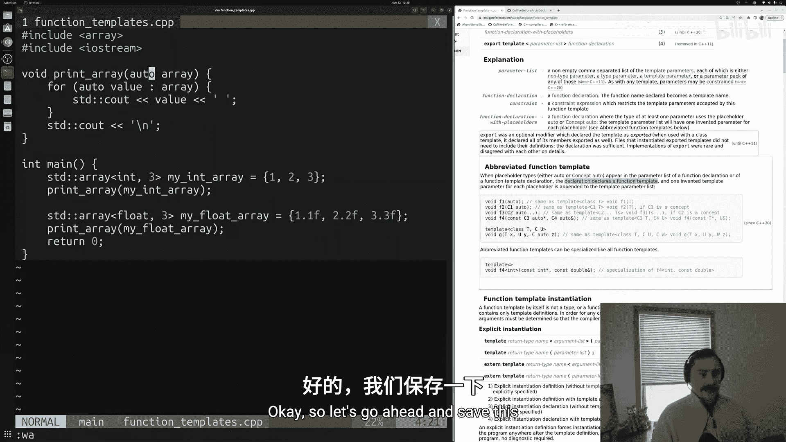

```
1 2 3
1.1 2.2 3.3
```

这证明编译器成功为我们生成了处理 `int` 数组和 `float` 数组的两个不同函数版本。

## 总结

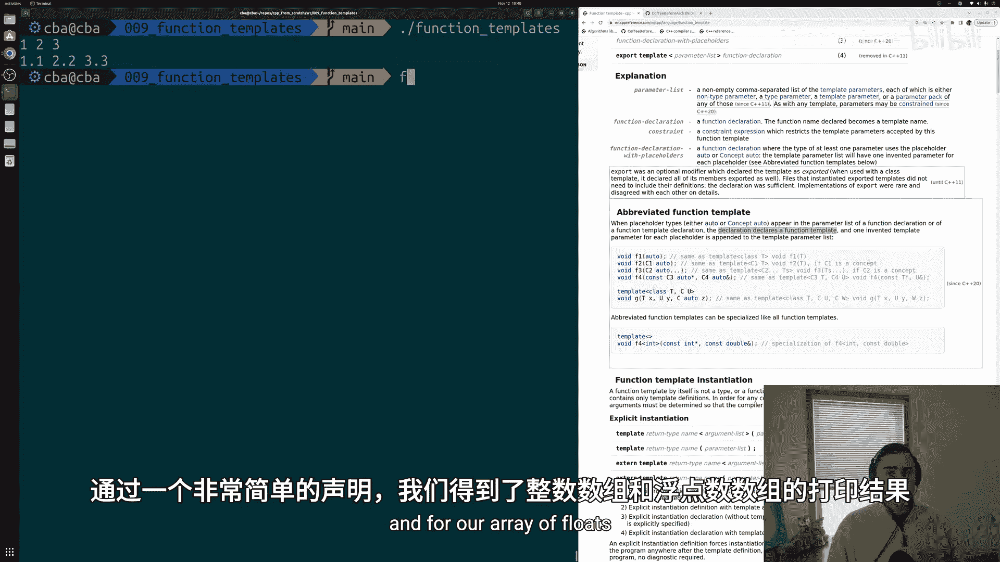

本节课中我们一起学习了C++函数模板的核心概念。我们了解到：

1.  **目的**：函数模板主要用于消除处理不同数据类型的、功能相同的函数之间的代码重复。
2.  **定义**：使用 `template <typename T>` 声明模板，`T` 是类型占位符。
3.  **使用**：
    *   可以显式指定模板参数：`function_name<Type>(arguments)`。
    *   更常见的是让编译器根据函数参数自动推导类型。
4.  **现代语法**：C++20 的简写函数模板允许使用 `auto` 作为参数类型来隐式创建模板，使代码更加简洁。

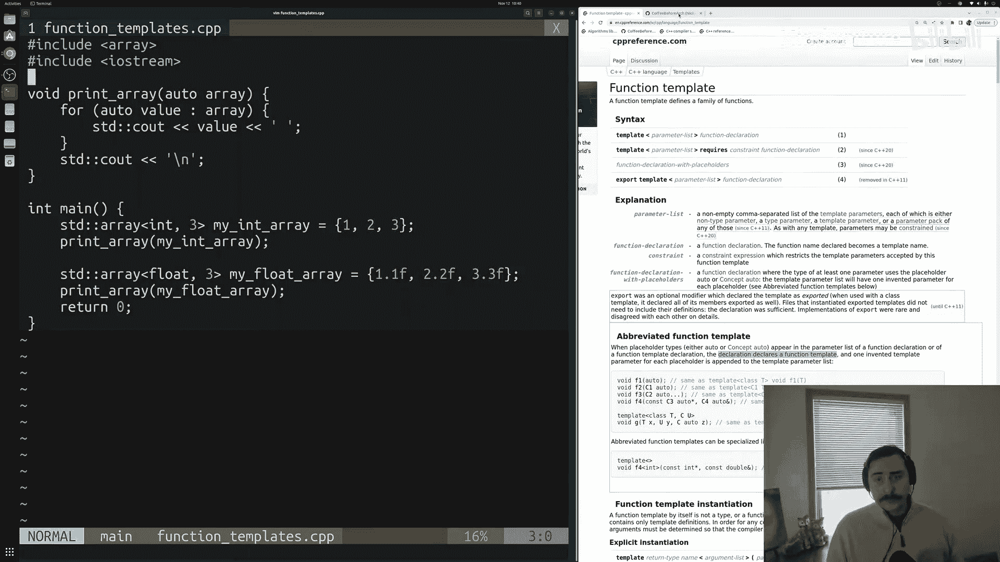

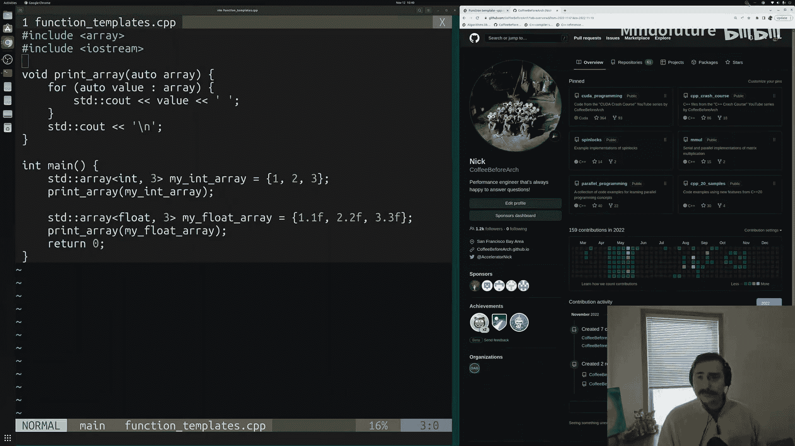

通过将生成具体函数代码的工作交给编译器，函数模板极大地提高了代码的复用性和可维护性。它是C++泛型编程的基石，也是学习标准模板库（STL）的重要前导知识。