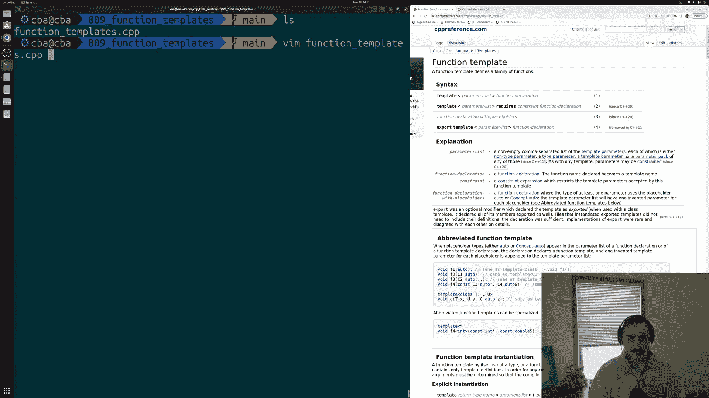
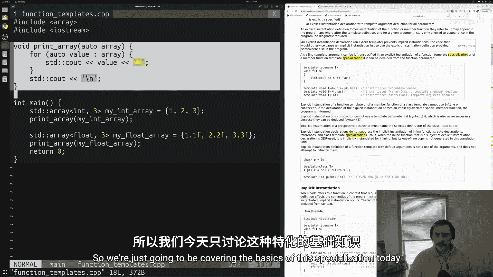
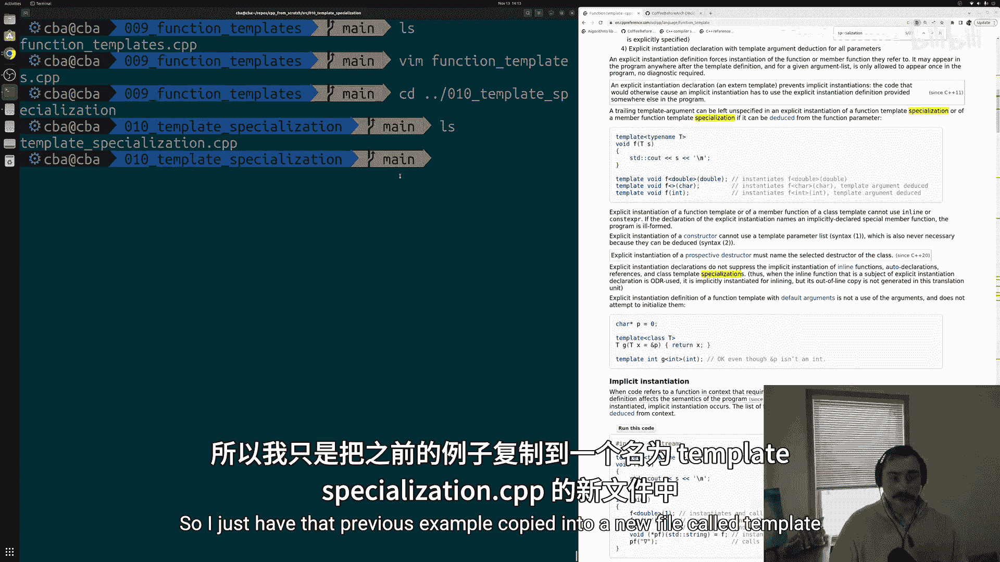
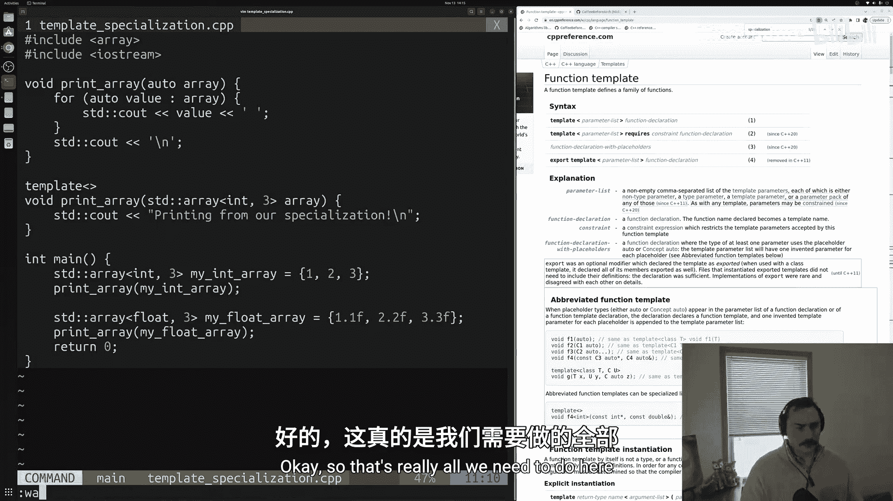
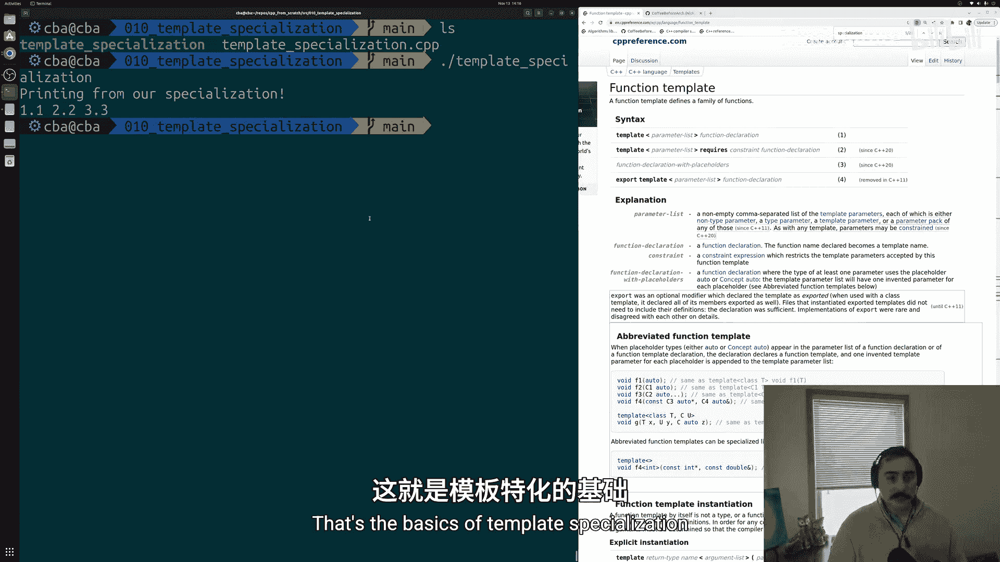
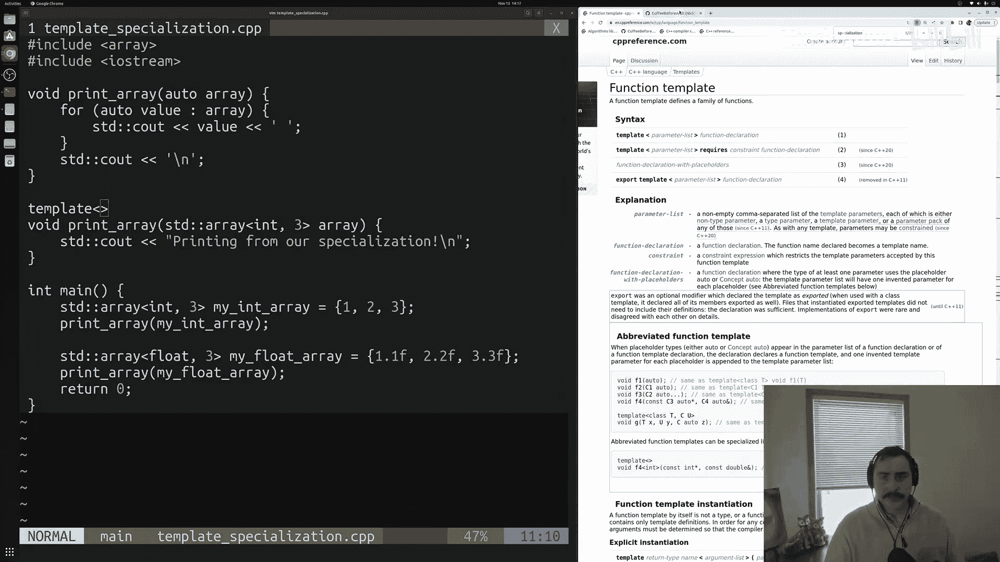
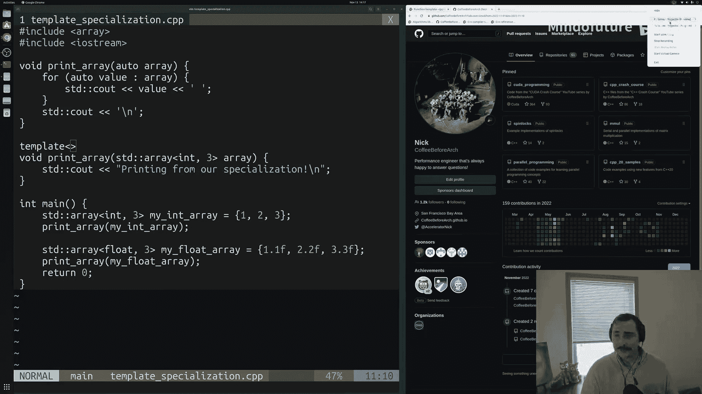

# 011：模板特化



## 概述
在本节课中，我们将要学习C++中的模板特化。模板特化允许我们为特定的类型或值提供模板的特殊版本，从而覆盖通用模板的行为。这对于处理某些需要特殊逻辑的类型非常有用。

在上一节中，我们介绍了函数模板，它帮助我们解决了为不同类型编写重复代码的问题。本节中我们来看看，当通用模板的逻辑不适用于所有类型时，我们该如何处理。

## 从函数模板到模板特化
函数模板通过提供一个代码“蓝图”，让编译器为我们生成针对不同数据类型的函数版本，从而避免了代码重复。



然而，有时我们并不希望所有类型都使用完全相同的函数体。例如，我们可能希望对`std::array<int, 3>`类型的处理方式与其他类型不同。这时，我们就需要使用**模板特化**。



## 模板特化示例
以下是一个基于打印数组概念的模板特化示例。我们有一个通用的`print_array`函数模板，但我们将为`std::array<int, 3>`类型提供一个特化版本。

```cpp
#include <iostream>
#include <array>

// 通用的函数模板（使用C++20的简写函数模板语法）
void print_array(const auto& input_array) {
    for(const auto& element : input_array) {
        std::cout << element << ' ';
    }
    std::cout << '\n';
}

// 为 std::array<int, 3> 类型提供的模板特化
template<>
void print_array(const std::array<int, 3>& input_array) {
    std::cout << "Printing from our specialization.\n";
}

int main() {
    std::array<int, 3> int_array = {1, 2, 3};
    std::array<float, 3> float_array = {1.1f, 2.2f, 3.3f};

    // 调用特化版本
    print_array(int_array);
    // 调用通用模板生成的版本
    print_array(float_array);

    return 0;
}
```

## 代码解析与关键点
以下是上述代码的关键组成部分及其作用：



1.  **通用模板**：`void print_array(const auto& input_array)` 是一个通用模板，适用于任何可以通过范围for循环遍历的类型。
2.  **特化声明**：`template<>` 这行代码告诉编译器，接下来的函数是之前声明的`print_array`模板的一个特化版本。尖括号`<>`为空，表示这是一个完全特化（针对一个具体的类型）。
3.  **特化函数签名**：`void print_array(const std::array<int, 3>& input_array)` 明确指定了此特化版本仅适用于`std::array<int, 3>`类型。
4.  **特化函数体**：在特化版本中，我们并没有打印数组元素，而是输出了一条特定的信息，这演示了如何为特定类型提供完全不同的实现。

## 编译与运行结果
使用支持C++20的编译器（如g++）编译上述代码：
```bash
g++ -std=c++20 template_specialization.cpp -o template_specialization
```
运行生成的可执行文件，输出结果如下：
```
Printing from our specialization.
1.1 2.2 3.3
```
可以看到，对于`int_array`，程序调用了特化版本，打印了特定字符串。而对于`float_array`，程序则使用了通用模板生成的代码，正常打印了数组元素。



## 总结
本节课中我们一起学习了C++模板特化的基本概念和用法。我们了解到，当通用模板的逻辑不能满足所有类型的需求时，可以通过编写**模板特化**来为特定类型提供定制化的实现。其核心步骤是：先声明通用模板，然后使用`template<>`语法声明一个特化版本，并在函数签名中明确指出特化的具体类型。模板特化是C++泛型编程中实现灵活性和特定优化的强大工具。





> 注：本示例使用了C++20的简写函数模板语法（`auto`参数），但模板特化的概念同样适用于传统的`template <typename T>`语法。更多详细信息可参考 [cppreference.com](https://en.cppreference.com/w/cpp/language/template_specialization)。