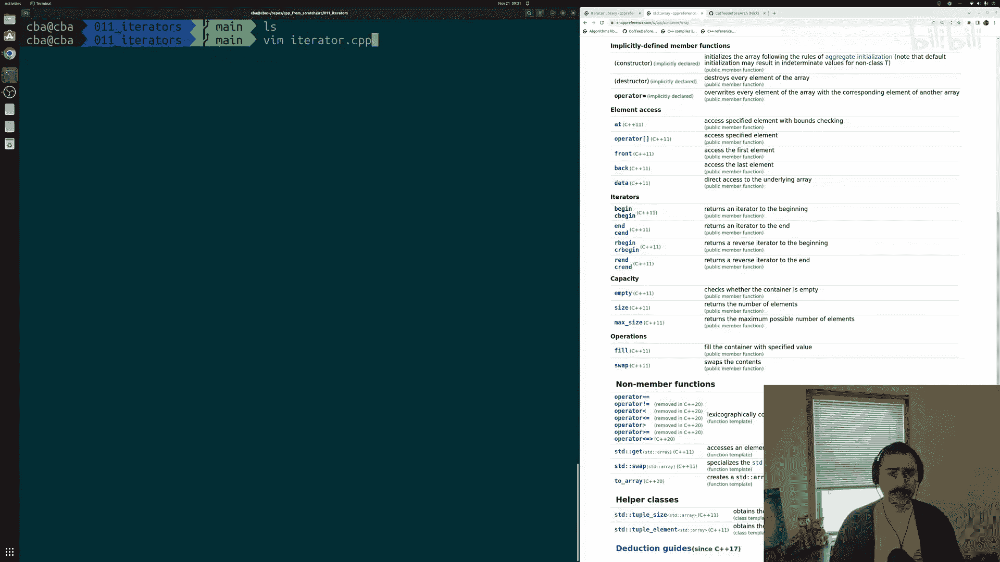
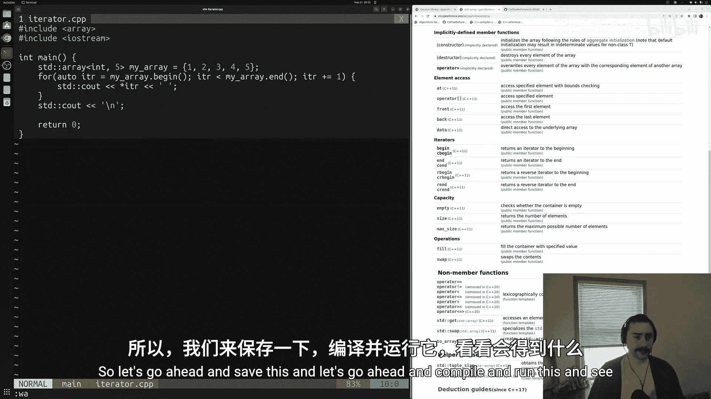
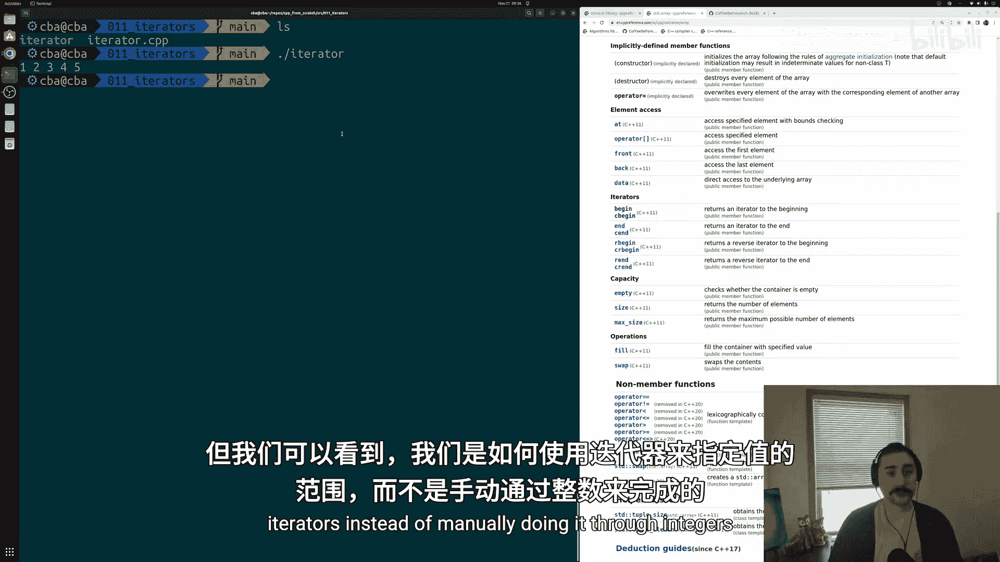
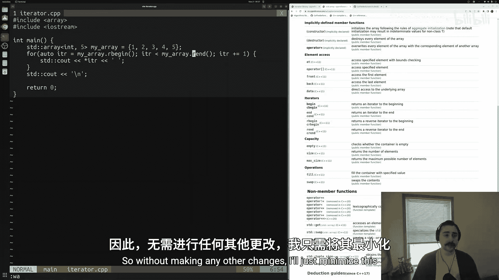
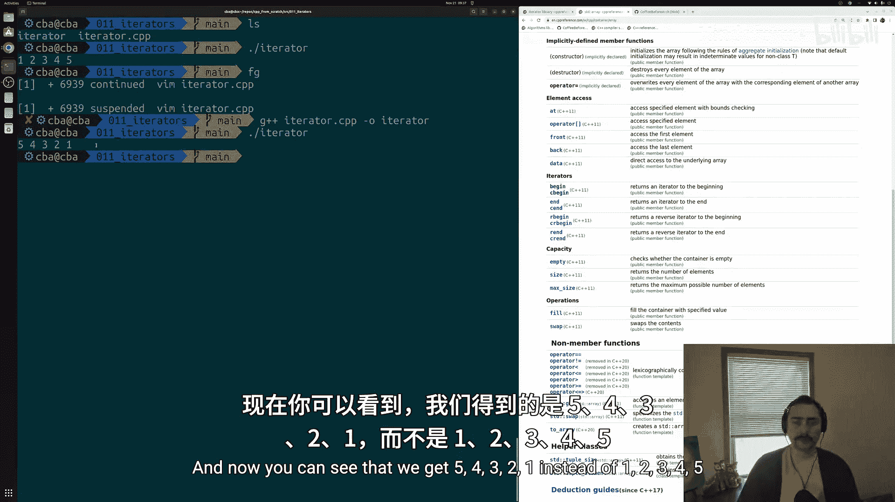
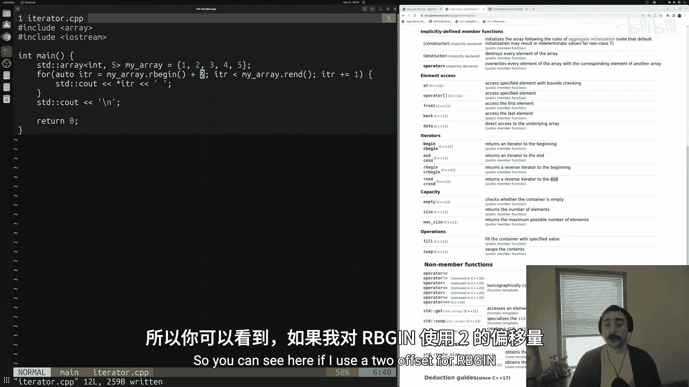
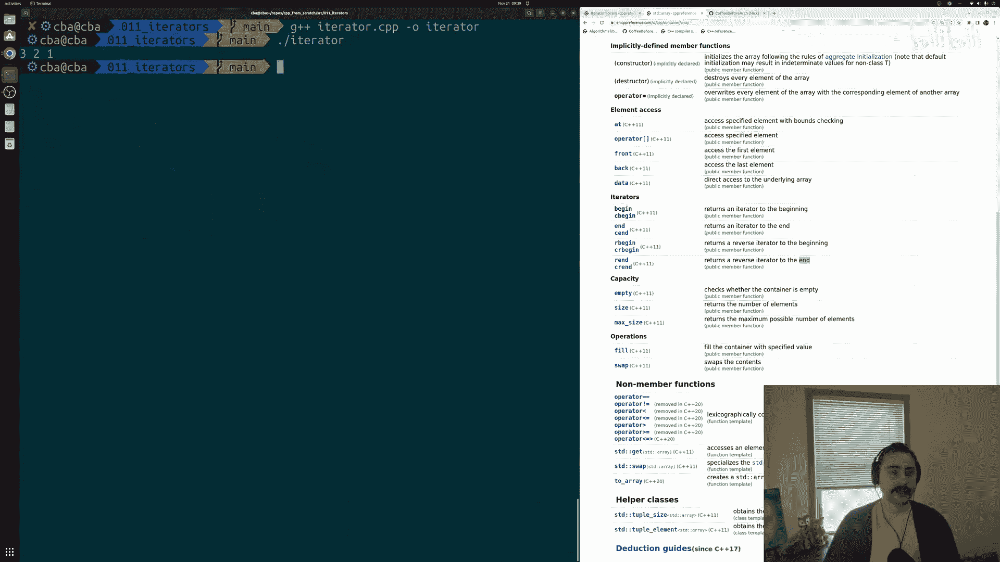
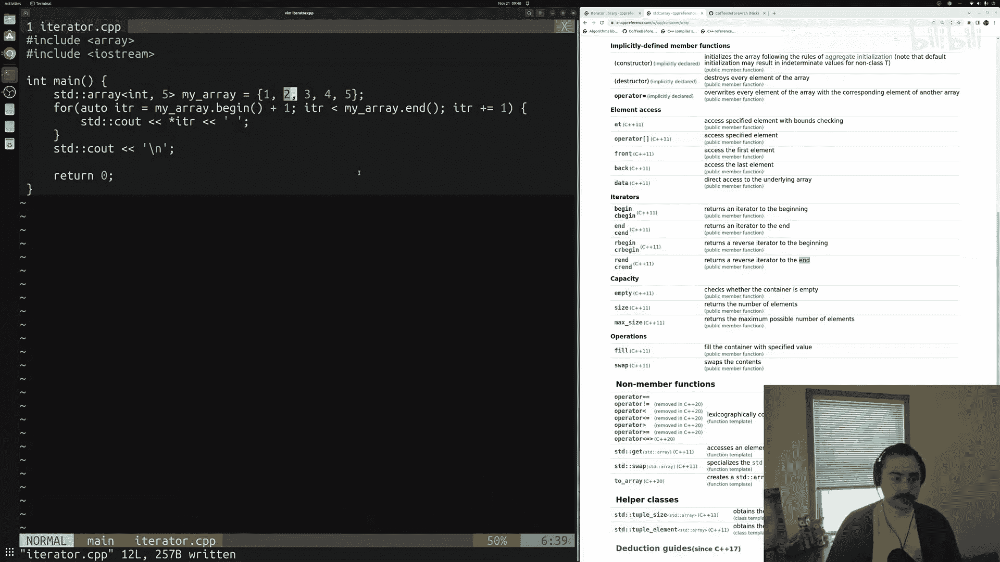
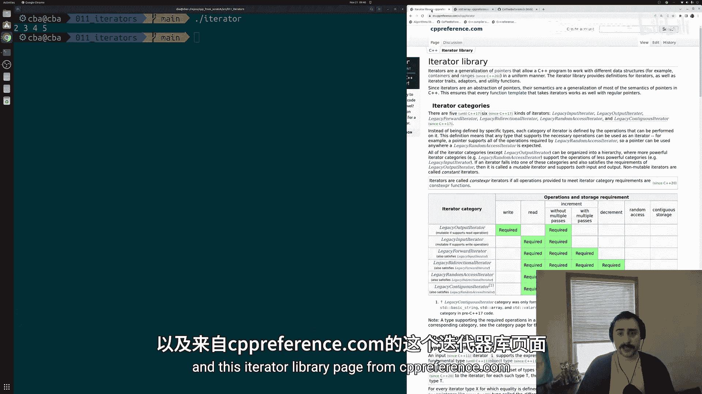
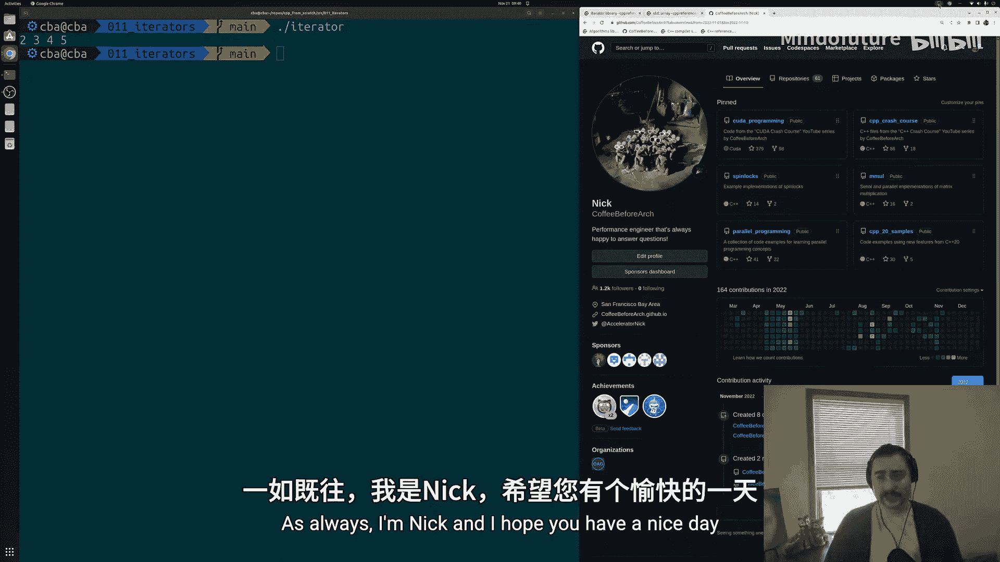

# 012：迭代器 🚀

在本节课中，我们将要学习C++中一个非常重要的概念——迭代器。迭代器为我们提供了一种通用的方式来遍历标准模板库（STL）中的容器。它们是连接容器与STL算法的桥梁，理解迭代器是掌握现代C++编程的关键一步。

## 迭代器是什么？

上一节我们介绍了STL容器的基本概念，本节中我们来看看如何遍历它们。迭代器是一种对象，它能够遍历容器中的元素，并访问这些元素。你可以把迭代器想象成一个智能指针，它指向容器内的某个位置。

迭代器的一个主要用途是与STL算法配合使用。我们可以用迭代器定义一个值的范围，例如从容器的开始到结束，然后将这个范围传递给STL算法，算法会对该范围内的值执行特定操作。



迭代器还定义了一系列要求。并非所有类型的迭代器都能用于每一个STL算法。例如，我们可以对 `std::array` 使用 `std::sort` 排序算法，但不能对 `std::unordered_map` 这样的无序容器使用 `std::sort`。因此，迭代器为我们在不同场景下使用容器和算法奠定了基础。

## 基础迭代操作 🛠️

我们将以老朋友 `std::array` 为例，学习如何使用迭代器遍历容器。之前我们跳过了容器中 `begin`、`end`、`rbegin` 和 `rend` 这些方法，现在我们将详细探讨它们。

首先，创建一个源文件 `iterator.cpp`，并包含必要的头文件。

```cpp
#include <array>
#include <iostream>

int main() {
    // 创建一个包含5个整数的数组
    std::array<int, 5> my_array = {1, 2, 3, 4, 5};
    // ... 后续代码
}
```

## 使用迭代器遍历数组

我们可以使用 `for` 循环和迭代器来手动遍历容器，这比传统的基于下标的循环更具表达性。

以下是使用迭代器的 `for` 循环结构：
```cpp
for (auto itr = my_array.begin(); itr < my_array.end(); itr += 1) {
    std::cout << *itr << " ";
}
std::cout << std::endl;
```

让我们分解这段代码：
*   **初始化**：`auto itr = my_array.begin();` 将迭代器 `itr` 设置为指向数组的起始位置。这比使用 `int i = 0` 更清晰地表达了意图。
*   **条件**：`itr < my_array.end();` 检查迭代器是否尚未到达数组的“末尾之后”的位置。`end()` 返回的迭代器指向最后一个元素**之后**的位置。
*   **递增**：`itr += 1;` 在每次循环后将迭代器向前移动一个位置，指向下一个元素。
*   **访问值**：在循环体内，我们使用解引用运算符 `*` 来获取迭代器当前指向的值：`*itr`。

编译并运行此程序，将按顺序输出 `1 2 3 4 5`。

## 反向迭代器 🔄



有时我们需要反向遍历容器。如果手动使用整数下标实现，需要调整起始值、条件和递减逻辑，比较繁琐。而使用反向迭代器则非常简单。

只需将 `begin()` 和 `end()` 替换为 `rbegin()` 和 `rend()` 即可：
```cpp
for (auto itr = my_array.rbegin(); itr < my_array.rend(); itr += 1) {
    std::cout << *itr << " ";
}
std::cout << std::endl;
```
*   `rbegin()` 返回一个指向容器**最后一个元素**的反向迭代器。
*   `rend()` 返回一个指向容器**第一个元素之前**的反向迭代器。
*   递增操作 `itr += 1` 在反向迭代器中意味着向容器的**前端**移动。



运行修改后的代码，将输出 `5 4 3 2 1`。这展示了使用迭代器如何让代码更简洁、更具表达力。

## 使用迭代器偏移

我们不一定总是需要遍历整个容器。迭代器支持偏移操作，允许我们处理容器的子集。





以下是使用偏移的示例：
```cpp
// 从正向第二个元素开始遍历（偏移1）
for (auto itr = my_array.begin() + 1; itr < my_array.end(); itr += 1) {
    std::cout << *itr << " ";
}
// 输出: 2 3 4 5

// 从反向第三个元素开始遍历（偏移2）
for (auto itr = my_array.rbegin() + 2; itr < my_array.rend(); itr += 1) {
    std::cout << *itr << " ";
}
// 输出: 3 2 1
```
这种能力在需要将容器的一部分传递给STL算法时非常有用。

## 总结 📚

本节课中我们一起学习了C++迭代器的核心概念和基本用法。

我们了解到：
1.  迭代器是遍历STL容器的通用工具，也是使用STL算法的关键。
2.  使用 `begin()` 和 `end()` 可以获取定义范围的正向迭代器。
3.  使用 `rbegin()` 和 `rend()` 可以轻松实现反向遍历。
4.  通过解引用运算符 `*` 可以访问迭代器指向的值。
5.  迭代器支持偏移操作（如 `begin() + 1`），用于处理容器的子范围。





虽然对于遍历整个容器，基于范围的 `for` 循环（`for (auto val : container)`）通常更简洁，但理解并掌握迭代器对于进行更复杂的操作、使用STL算法以及理解C++标准库的设计至关重要。



---

**扩展阅读**：
*   `std::array` 参考：https://en.cppreference.com/w/cpp/container/array
*   迭代器库参考：https://en.cppreference.com/w/cpp/iterator





（注：本教程示例代码可在 Github.com/CoffeeBeforeArch 找到）