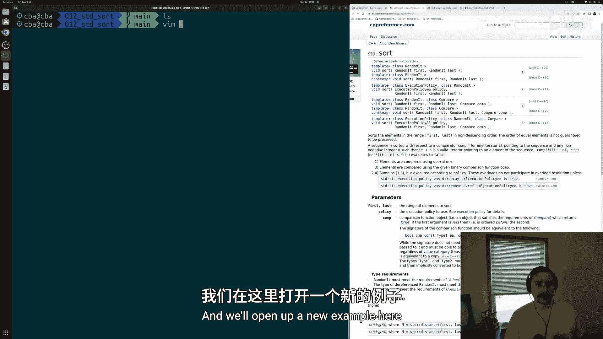
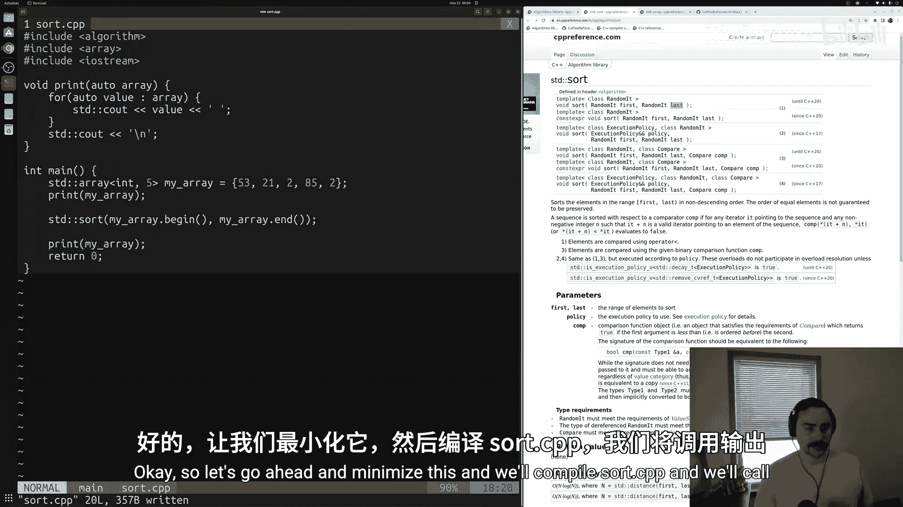
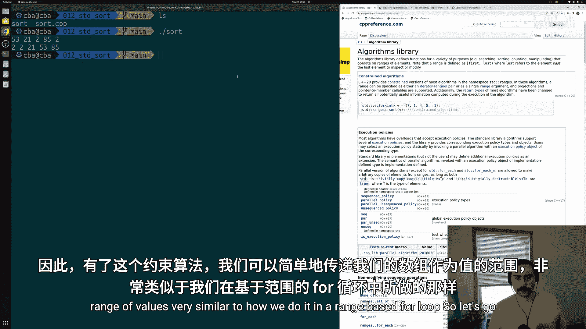
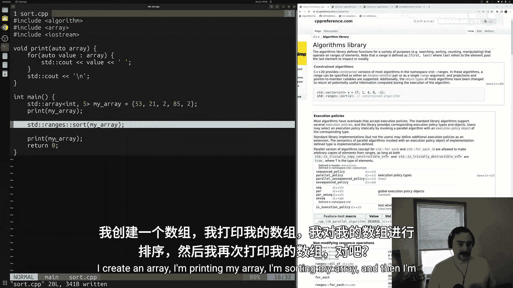
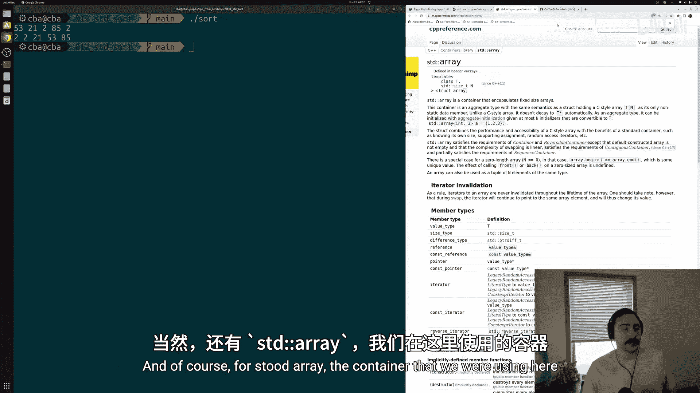
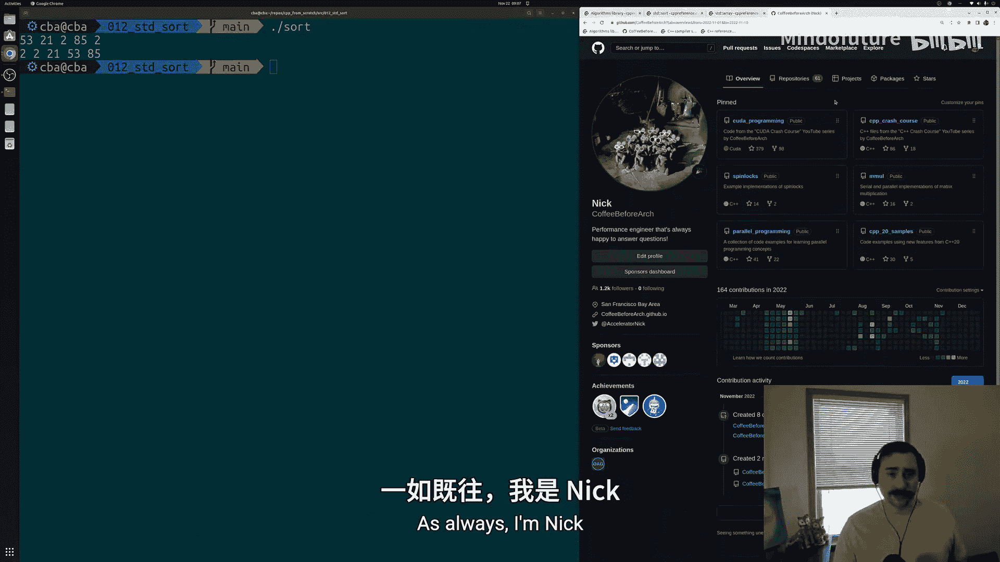

# 013：std::sort 🧮

在本节课中，我们将要学习标准模板库（STL）中的第一个算法：`std::sort`。我们将了解如何使用它来对容器（如 `std::array`）中的元素进行排序，并探索C++20引入的更简洁的“范围”语法。

## 概述

STL算法与标准库容器紧密配合。容器（如 `std::array`）为我们提供了方便的数据表示方式，而算法则允许我们对这些容器执行常见操作，例如排序。使用这些算法的主要好处之一是避免重复造轮子，编译器供应商提供的实现通常已经非常高效。

## 准备工作

首先，我们需要包含必要的头文件，并创建一个待排序的数组。



```cpp
#include <algorithm> // 用于 std::sort
#include <array>     // 用于 std::array
#include <iostream>  // 用于输出

int main() {
    // 创建一个包含5个整数的数组，元素未排序
    std::array<int, 5> my_array = {53, 21, 2, 85, 2};
    // ... 后续代码
}
```

为了在排序前后查看数组内容，我们创建一个辅助打印函数。

```cpp
// 使用C++20的缩写函数模板语法定义打印函数
void print(auto array) {
    for (auto value : array) {
        std::cout << value << ' ';
    }
    std::cout << '\n';
}
```

## 使用 std::sort

`std::sort` 算法的核心是接收一个元素范围（由两个迭代器指定）并对该范围内的元素进行排序。它要求容器提供**随机访问迭代器**，`std::array` 满足此要求。

以下是使用迭代器调用 `std::sort` 的基本方法：

```cpp
// 对 my_array 的全部元素进行排序
std::sort(my_array.begin(), my_array.end());

// 打印排序后的数组
print(my_array);
```

`my_array.begin()` 返回指向数组第一个元素的迭代器，`my_array.end()` 返回指向最后一个元素**之后**的迭代器。这个范围 `[begin, end)` 包含了所有需要排序的元素。你也可以通过调整迭代器来排序数组的子集。

## C++20 范围语法

C++20引入了约束算法和范围库，提供了更简洁的语法。使用 `std::ranges::sort`，你可以直接传递整个容器，而无需显式指定开始和结束迭代器。

```cpp
// 使用C++20的范围语法排序，更简洁
std::ranges::sort(my_array);

// 打印排序后的数组
print(my_array);
```



这种方法让代码意图更加清晰：你只是想排序这个数组。

## 完整代码示例

将以上部分组合起来，得到完整的示例程序：

```cpp
#include <algorithm>
#include <array>
#include <iostream>



// 打印数组的函数
void print(auto array) {
    for (auto value : array) {
        std::cout << value << ' ';
    }
    std::cout << '\n';
}

int main() {
    // 1. 创建并初始化数组
    std::array<int, 5> my_array = {53, 21, 2, 85, 2};

    // 2. 打印原始数组
    std::cout << "原始数组: ";
    print(my_array);

    // 3. 使用传统迭代器方式排序
    // std::sort(my_array.begin(), my_array.end());

    // 4. 使用C++20范围语法排序（二选一）
    std::ranges::sort(my_array);

    // 5. 打印排序后的数组
    std::cout << "排序后数组: ";
    print(my_array);

    return 0;
}
```



编译和运行此程序（需支持C++20），你将看到数组从 `53 21 2 85 2` 被排序为 `2 2 21 53 85`。

## 总结

本节课中我们一起学习了STL算法库的基础知识，重点掌握了 `std::sort` 的使用方法。我们了解到：
1.  `std::sort` 用于对容器内指定范围的元素进行排序。
2.  它需要接收两个迭代器来定义排序范围，并且要求容器支持随机访问迭代器。
3.  从C++20开始，可以使用 `std::ranges::sort` 和范围语法，直接传递容器对象，使代码更加简洁易读。





通过使用这些标准库算法，我们可以更高效、更安全地处理数据，专注于解决更高级别的问题，而非底层实现的细节。