# 014：std::vector 🧮

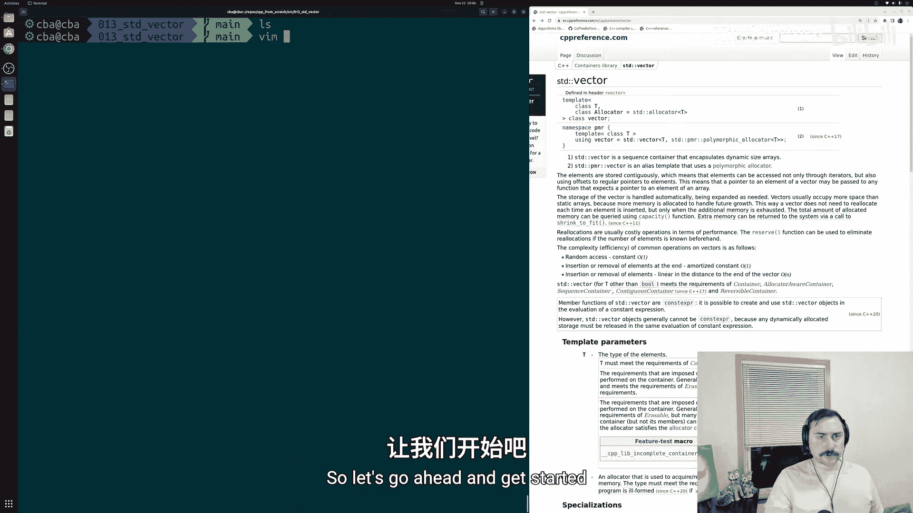

在本节课中，我们将要学习C++标准库中的另一个重要容器：`std::vector`（标准向量）。我们将了解它与之前学过的`std::array`有何不同，以及如何利用其动态增长的特性。

## 概述
在编程中，我们常常无法预先知道需要向容器中放入多少个元素。数据可能来自外部源，其总大小在程序开始时并不明确。这给我们之前学过的`std::array`带来了挑战，因为`std::array`的模板参数之一就是元素数量，且必须在编译时确定。因此，我们需要一个能够根据需要动态增长的容器，这就是`std::vector`。`std::vector`在很多方面与`std::array`相似，但它是一个动态大小的数组。

## 创建与初始化
上一节我们介绍了`std::vector`的基本概念，本节中我们来看看如何创建和使用它。

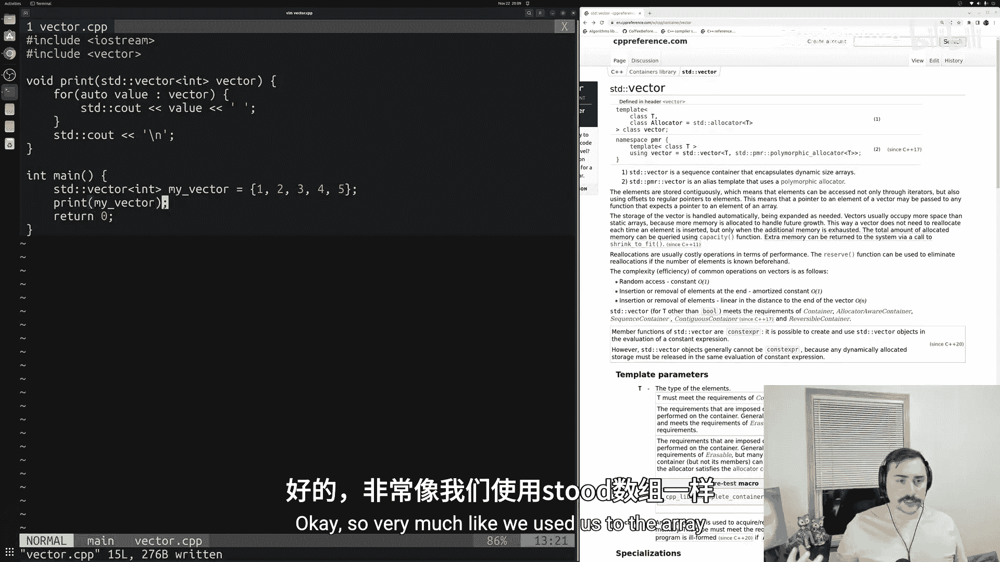

首先，我们需要包含必要的头文件。
```cpp
#include <iostream>
#include <vector>
```
与`std::array`不同，创建`std::vector`时不需要指定元素数量。我们只需指定要存储的数据类型。
```cpp
std::vector<int> my_vector;
```
我们也可以在定义时使用初始化列表来初始化向量。
```cpp
std::vector<int> my_vector = {1, 2, 3, 4, 5};
```
我们可以像处理`std::array`一样，使用一个简单的函数来打印向量的内容。
```cpp
void print(const std::vector<int>& vector) {
    for (auto value : vector) {
        std::cout << value << " ";
    }
    std::cout << "\n";
}
```
编译并运行程序，会输出向量的内容：`1 2 3 4 5`。

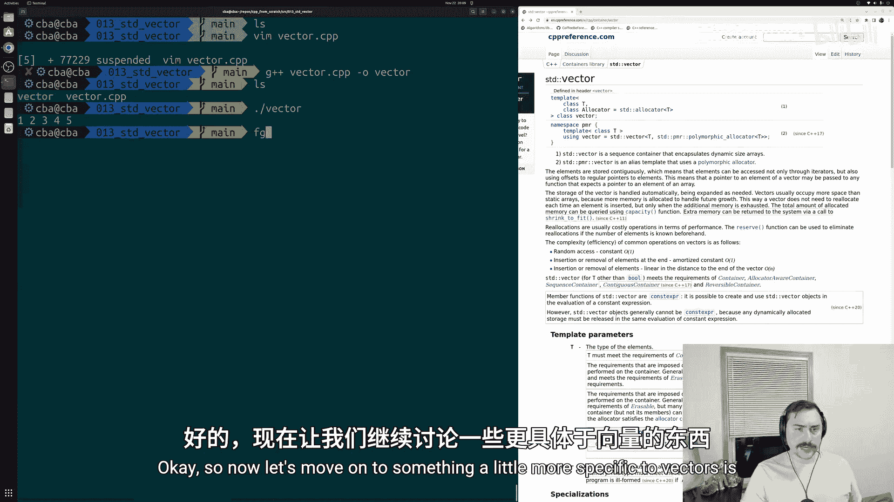

## 修改向量：添加与删除元素
`std::vector`与`std::array`的一个主要区别在于其修改器方法。因为向量的大小可以改变，所以它提供了添加和删除元素的方法。

以下是`std::vector`的一些核心修改器方法：
*   **`push_back`**：在向量末尾添加一个元素。
*   **`pop_back`**：移除向量末尾的元素。
*   **`insert` / `emplace`**：在指定位置插入元素。

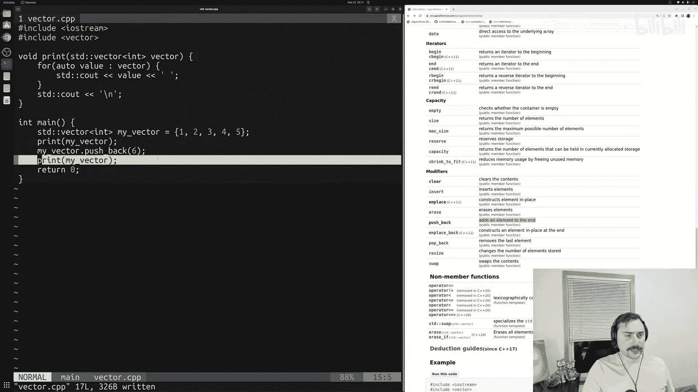

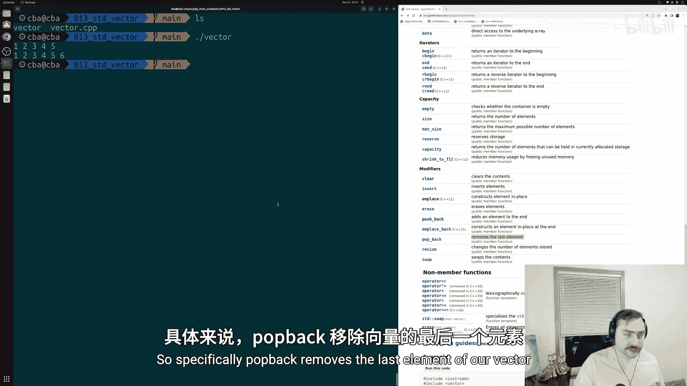

让我们尝试使用`push_back`和`pop_back`。
```cpp
my_vector.push_back(6); // 在末尾添加元素 6
print(my_vector); // 输出: 1 2 3 4 5 6

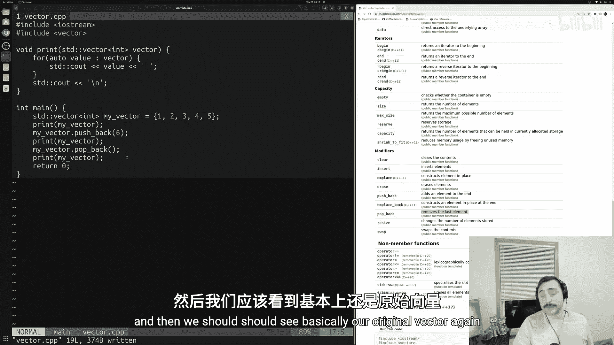

my_vector.pop_back(); // 移除最后一个元素
print(my_vector); // 输出: 1 2 3 4 5
```
运行程序，可以看到向量成功地动态添加和移除了元素。

## 理解容量与大小
当我们动态修改向量时，一个关键问题是内存是如何管理的。这里需要理解两个概念：**大小**和**容量**。

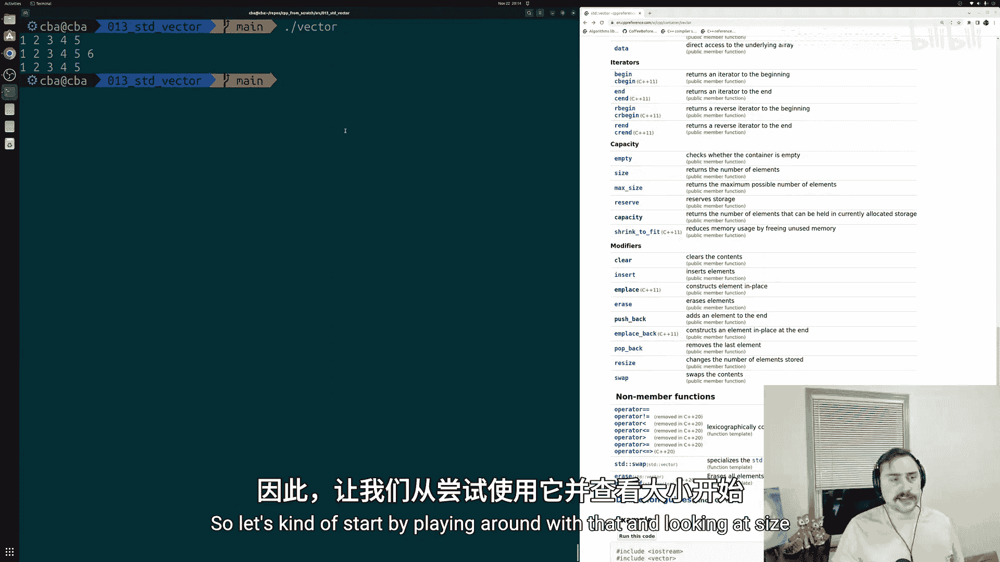

*   **大小**：向量中当前存储的元素数量，通过`size()`方法获取。
*   **容量**：向量底层已分配内存空间所能容纳的元素数量，通过`capacity()`方法获取。

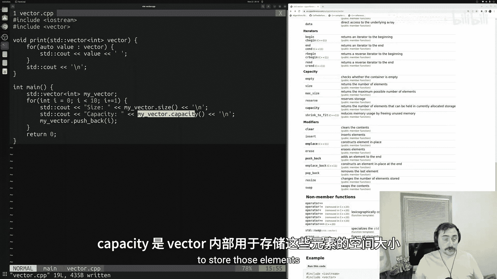

容量可能大于大小。当我们添加新元素时，如果大小即将超过容量，向量就需要在底层执行一次**重新分配**，以找到更大的内存块来存放所有元素。这个过程可能影响性能。

让我们通过一个循环观察大小和容量的变化。
```cpp
std::vector<int> my_vector;
for (int i = 0; i < 10; ++i) {
    std::cout << "Size: " << my_vector.size() << "\n";
    std::cout << "Capacity: " << my_vector.capacity() << "\n";
    my_vector.push_back(i);
}
```
运行结果会显示，容量并非每次`push_back`都增加，而是以近似翻倍的方式增长（具体策略因编译器实现而异）。这是为了减少频繁内存分配的开销。

## 性能优化：预分配内存
频繁的重新分配会影响性能。如果我们能预先知道或将存储的元素数量，可以使用`reserve()`方法提前分配足够的容量，避免运行时的多次分配。

例如，如果我们知道要存储10个元素：
```cpp
std::vector<int> my_vector;
my_vector.reserve(10); // 预先分配容量为10

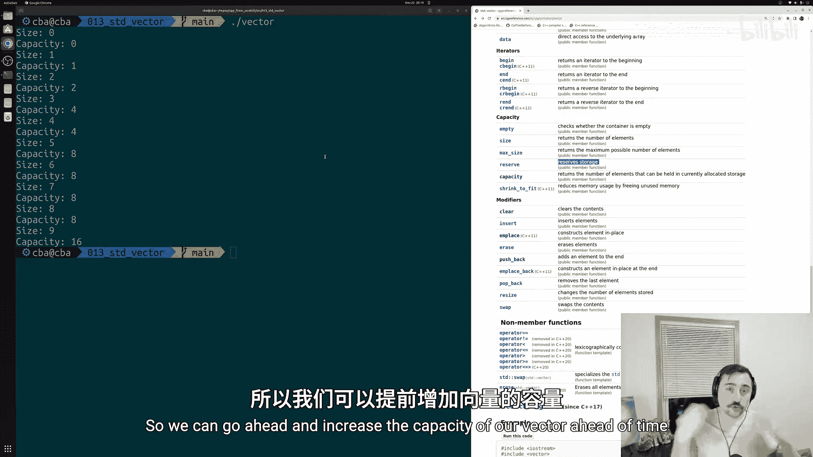

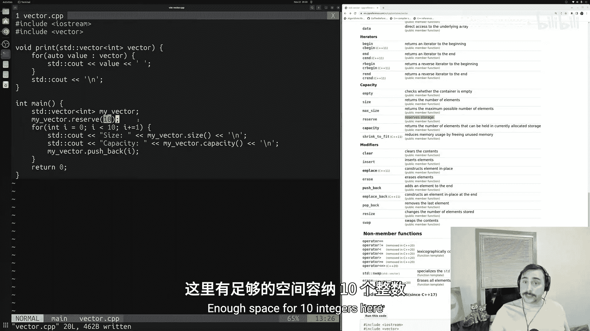

for (int i = 0; i < 10; ++i) {
    std::cout << "Size: " << my_vector.size() << "\n";
    std::cout << "Capacity: " << my_vector.capacity() << "\n";
    my_vector.push_back(i);
}
```
运行后可以看到，容量一开始就是10，之后添加元素时不再需要重新分配内存。

此外，如果向量的容量远大于其当前大小，可以使用`shrink_to_fit()`方法请求释放未使用的内存，使容量减小到与大小匹配。但这只是一个请求，具体实现可能不保证立即执行。

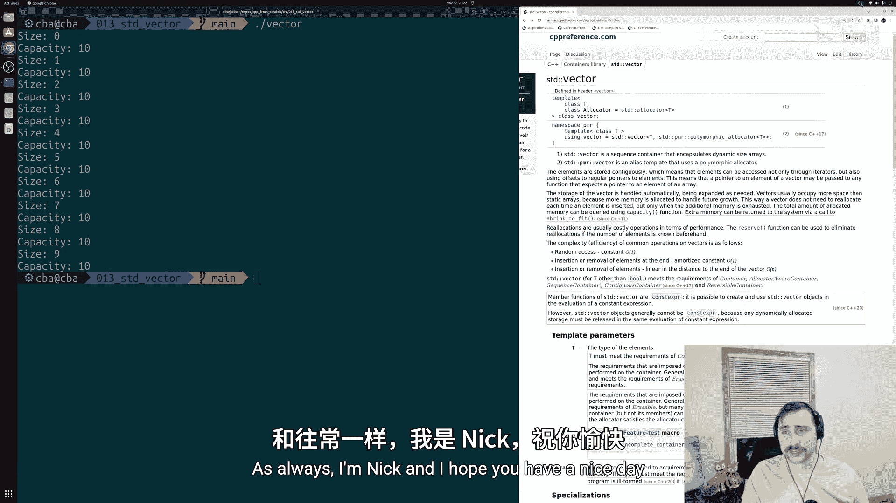

## 总结
本节课中我们一起学习了`std::vector`。我们了解到它是一个可以动态增长和缩小的序列容器，与`std::array`的固定大小不同。我们学习了如何创建、初始化向量，以及使用`push_back`和`pop_back`来修改它。更重要的是，我们探讨了向量底层的内存管理机制，理解了**大小**与**容量**的区别，以及如何通过`reserve()`方法进行性能优化。`std::vector`是C++中最常用、最灵活的容器之一，掌握其基本原理对编写高效程序至关重要。在后续课程中，我们将继续探讨`emplace_back`等其他方法。