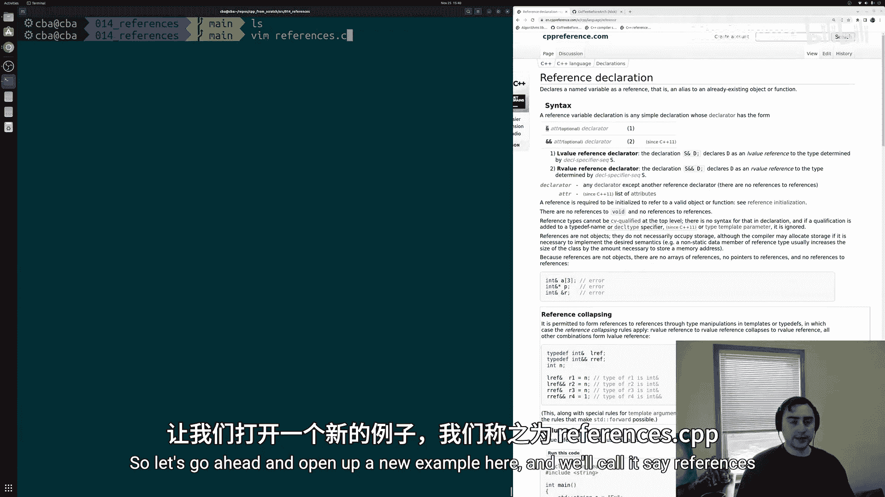
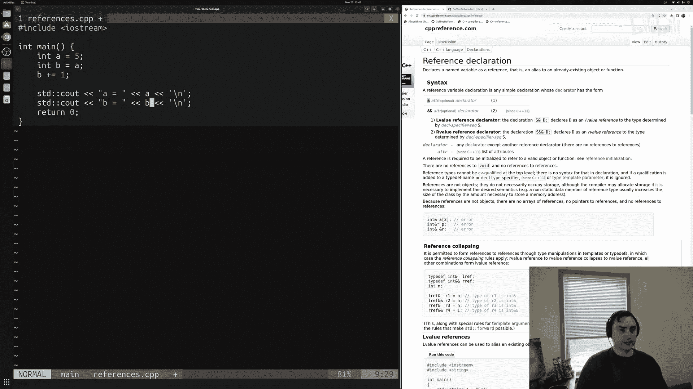
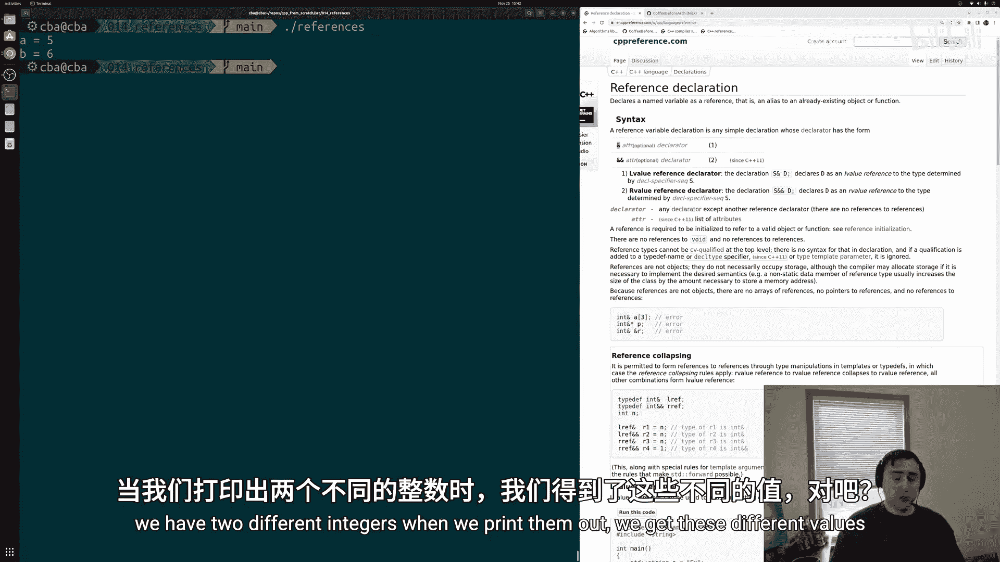
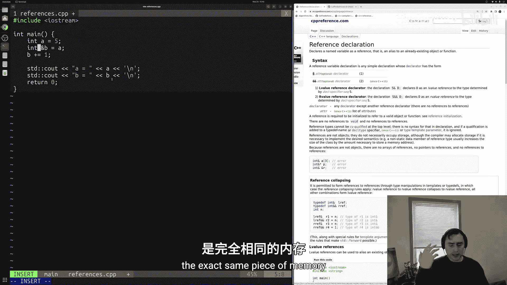
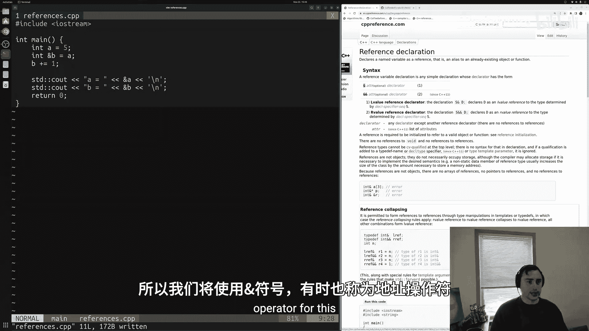
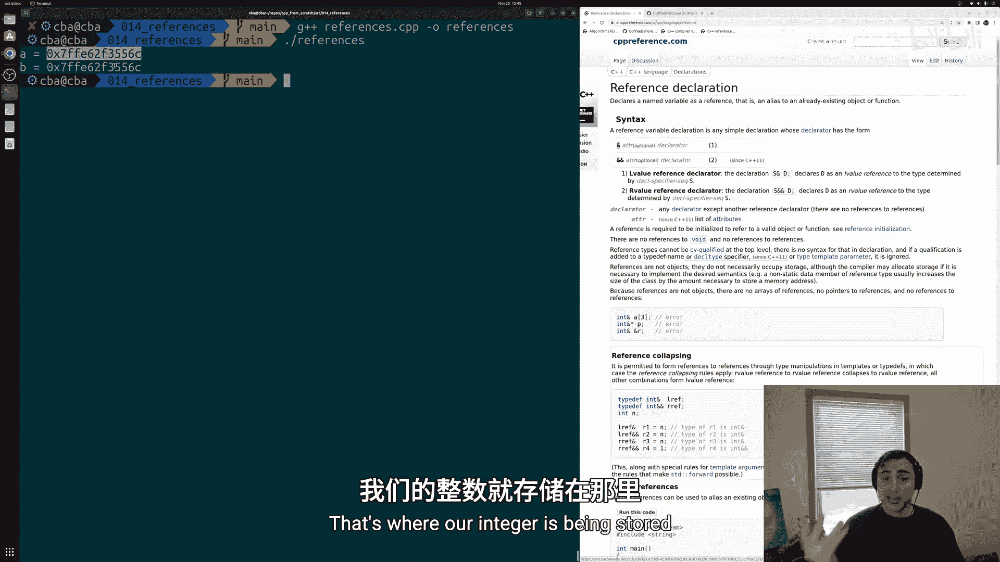
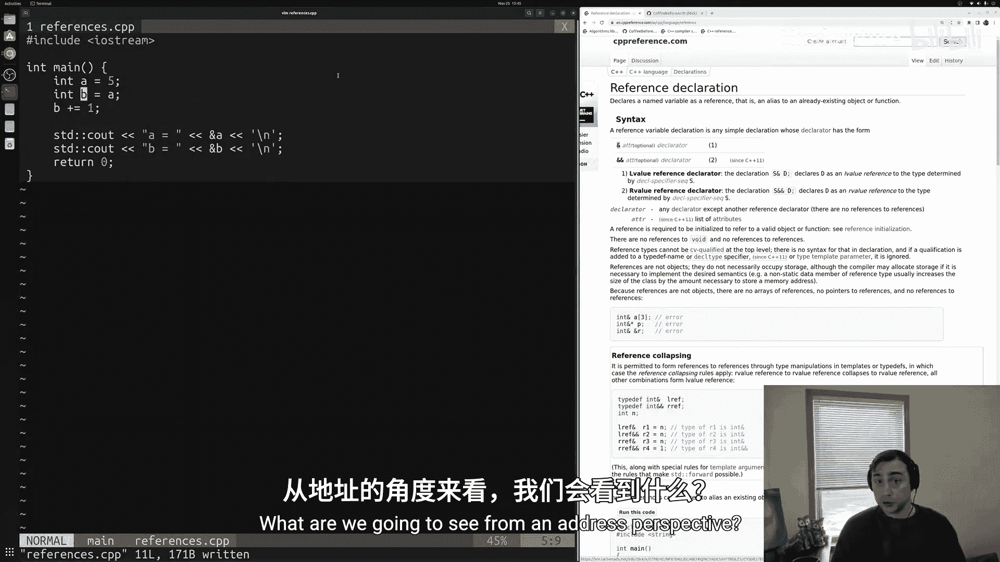
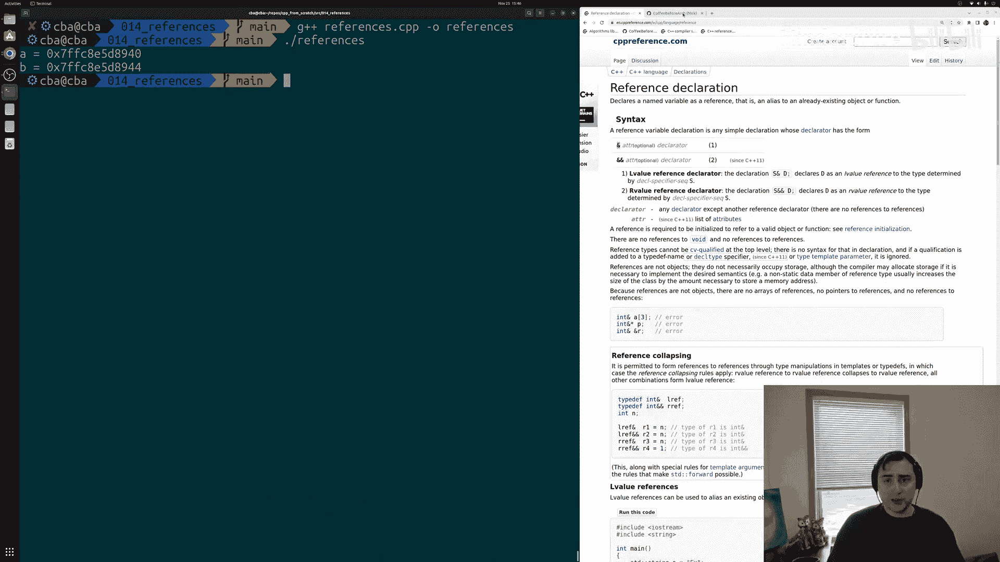

# 015：引用（References）📚

在本节课中，我们将要学习C++中的一个重要概念——**引用**。引用是一种为已存在的变量创建别名的方法，它可以避免不必要的数据拷贝，从而提高程序性能或满足特定功能需求。

---



## 理解变量与拷贝

首先，我们来看一个简单的例子，理解普通变量赋值时发生了什么。

```cpp
#include <iostream>

int main() {
    int a = 5;
    int b = a; // 将a的值拷贝给b
    b += 1;    // 修改b的值

    std::cout << "a is equal to " << a << std::endl;
    std::cout << "b is equal to " << b << std::endl;

    return 0;
}
```

在这段代码中：
*   我们创建了一个名为 `a` 的整数变量，并将其值设为 `5`。
*   接着，我们创建了另一个整数变量 `b`，并将其初始化为 `a` 的值。这实际上是将 `a` 的值（`5`）**拷贝**到为 `b` 新分配的内存中。
*   然后，我们将 `b` 的值增加 `1`。
*   最后打印结果，`a` 的值仍然是 `5`，而 `b` 的值变成了 `6`。

这是因为 `a` 和 `b` 是两块独立的内存空间，对 `b` 的修改不会影响 `a`。

---

## 引入引用



上一节我们介绍了变量的拷贝，本节中我们来看看如何避免拷贝。在C++中，我们可以使用**引用**来为已存在的变量创建一个别名，而不是创建其副本。



声明引用的语法是使用 `&` 符号。以下是修改后的代码：

```cpp
#include <iostream>

int main() {
    int a = 5;
    int &b = a; // b是a的引用（别名）
    b += 1;     // 通过b修改，实际上修改的是a

    std::cout << "a is equal to " << a << std::endl;
    std::cout << "b is equal to " << b << std::endl;

    return 0;
}
```

在这段代码中：
*   `int &b = a;` 声明了 `b` 是整数 `a` 的一个引用。`b` 不是新变量，它只是 `a` 的另一个名字。
*   当我们执行 `b += 1` 时，由于 `b` 指向 `a` 的内存，所以实际上是将 `a` 的值从 `5` 增加到了 `6`。
*   因此，打印出的 `a` 和 `b` 的值都是 `6`。

---

## 验证内存地址



为了更直观地理解引用是别名这一概念，我们可以打印出变量和其引用的内存地址。在C++中，使用 `&` 运算符（取地址运算符）可以获取变量的内存地址。


以下是验证代码：

```cpp
#include <iostream>

int main() {
    int a = 5;
    int &b = a;

    std::cout << "Address of a: " << &a << std::endl;
    std::cout << "Address of b: " << &b << std::endl;

    return 0;
}
```



运行这段代码，你会发现 `a` 和 `b` 的地址是完全相同的。这证明了 `b` 并没有自己独立的内存空间，它和 `a` 共享同一块内存。

作为对比，如果我们回到最初的例子（没有引用，只是两个独立变量），并打印它们的地址：

```cpp
#include <iostream>



int main() {
    int a = 5;
    int b = a; // 拷贝，不是引用

    std::cout << "Address of a: " << &a << std::endl;
    std::cout << "Address of b: " << &b << std::endl;

    return 0;
}
```



你会看到 `a` 和 `b` 的地址是不同的，这表明它们是存储在不同内存位置的两个独立变量。

---

## 总结

本节课中我们一起学习了C++中引用的基础知识：
1.  **引用的定义**：引用是为已存在的变量创建的别名，使用 `&` 符号声明，例如 `int &ref = var;`。
2.  **引用的作用**：通过引用操作数据，实际上是在操作原始变量，避免了数据的拷贝。这在处理大型数据（如包含上万个元素的向量）时能显著提升性能。
3.  **引用的本质**：引用本身不占用额外的存储空间（从程序员视角），它和其引用的变量共享同一内存地址。

引用是C++中实现高效编程的关键工具之一。在下一节中，我们将探讨引用最常用的场景之一：在函数参数传递中使用**按引用传递**。




> 更多关于引用声明的详细信息，可以参考 [cppreference.com](https://en.cppreference.com/w/cpp/language/reference)。本节所有示例代码均可在 [github.com/coffeebeforearch](https://github.com/coffeebeforearch) 找到。