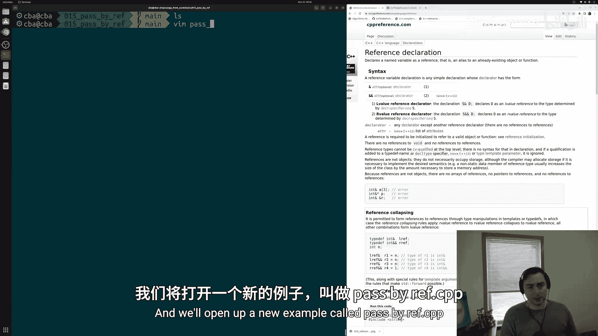
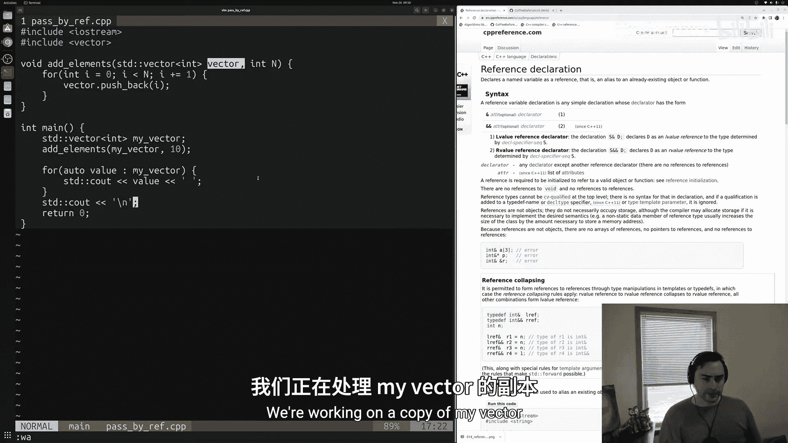
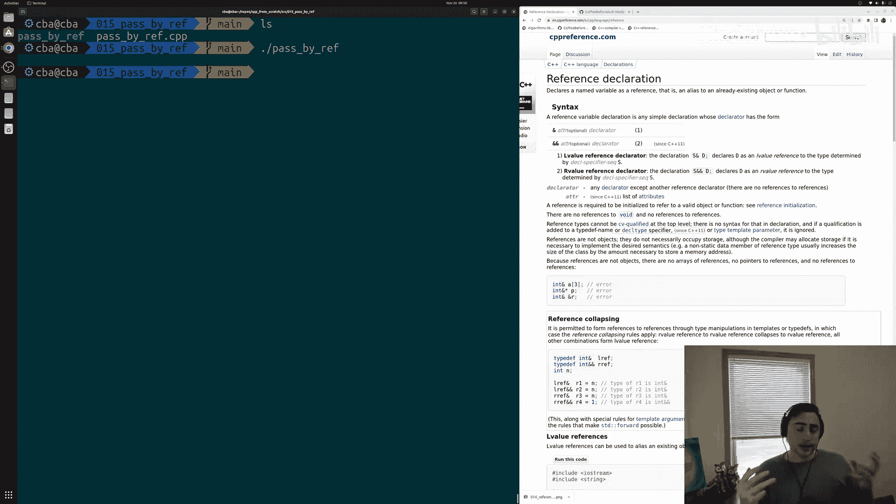
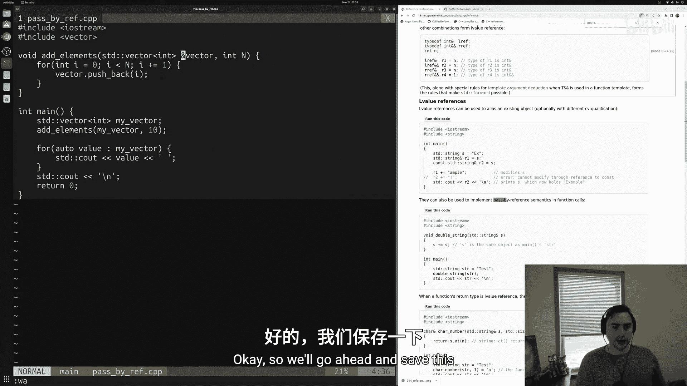
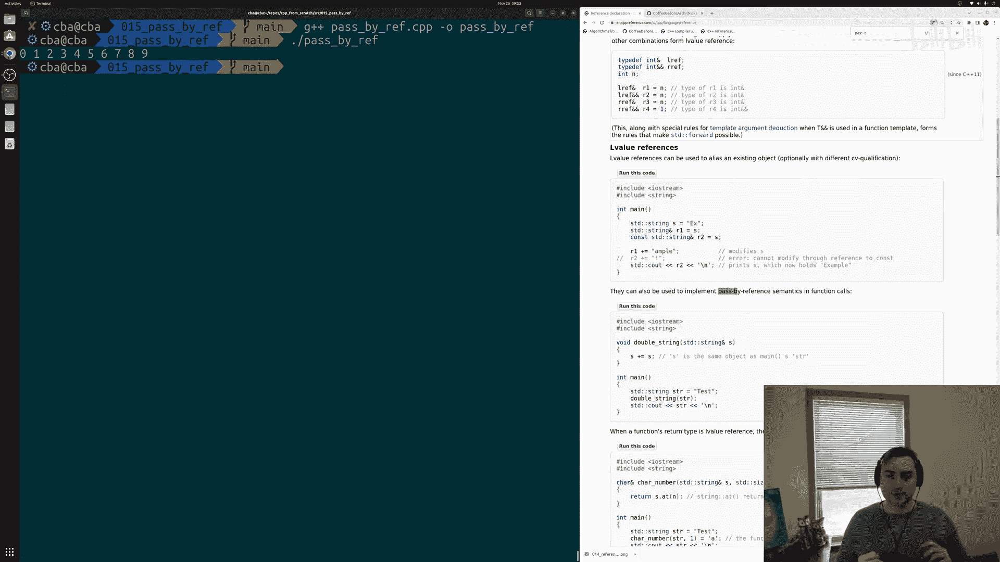
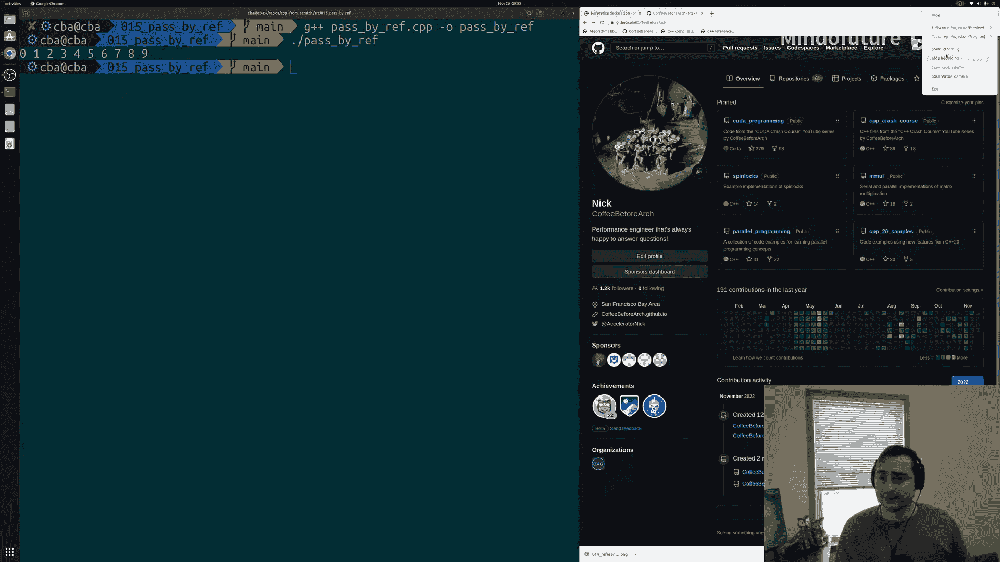

# 016：按引用传递

在本节课中，我们将学习C++中一个非常实用的概念：**按引用传递**。我们将探讨它与默认的“按值传递”有何不同，以及为何在某些情况下使用按引用传递是必要且高效的。

## 概述

默认情况下，C++函数使用**按值传递**。这意味着当我们调用一个函数时，会将实参的值复制到函数的形参中。然而，有时我们可能不希望进行复制，原因可能是功能性的（例如操作一个锁）或性能上的（例如避免复制一个大型数据结构）。本节课，我们将学习如何使用**按引用传递**来直接操作原始数据，而非其副本。



## 准备工作

首先，我们创建一个新的C++源文件，并包含必要的头文件。

```cpp
#include <iostream>
#include <vector>
```

我们包含了 `<iostream>` 用于输入输出，以及 `<vector>` 用于使用向量容器。

## 按值传递的示例

上一节我们提到了按值传递的概念，本节中我们通过一个具体例子来看看它的效果。

假设我们有一个函数，其功能是向一个整数向量中添加一系列元素。以下是该函数的初始实现：

```cpp
void addElements(std::vector<int> vec, int n) {
    for (int i = 0; i < n; ++i) {
        vec.push_back(i);
    }
}
```

这个函数接收一个向量 `vec` 和一个整数 `n`，然后将 `0` 到 `n-1` 的数字添加到向量中。

现在，我们在 `main` 函数中调用它：

```cpp
int main() {
    std::vector<int> myVector;
    addElements(myVector, 10);

    for (auto value : myVector) {
        std::cout << value << " ";
    }
    std::cout << std::endl;
    return 0;
}
```

由于C++默认使用**按值传递**，`addElements` 函数中的 `vec` 是 `myVector` 的一个**副本**。因此，在函数内部对 `vec` 所做的任何修改（如添加元素）都不会影响 `main` 函数中原始的 `myVector`。运行此程序，输出将为空，因为 `myVector` 始终是空的。

## 引入按引用传递



为了直接修改原始的 `myVector`，我们需要使用**按引用传递**。这意味着函数参数将成为原始变量的一个别名，而不是副本。

修改函数签名，将向量参数改为引用类型：

```cpp
void addElements(std::vector<int>& vec, int n) {
    for (int i = 0; i < n; ++i) {
        vec.push_back(i);
    }
}
```

注意，我们只是在参数类型 `std::vector<int>` 后面添加了一个 `&` 符号，使其变为 `std::vector<int>&`。现在，`vec` 是传入向量的一个**引用**。



再次运行相同的 `main` 函数，输出将是 `0 1 2 3 4 5 6 7 8 9`。这是因为 `addElements` 函数现在直接操作 `main` 函数中的 `myVector`，而不是它的副本。

## 核心概念对比

以下是两种传递方式的核心区别：

*   **按值传递**：`void func(Type param)`
    *   创建实参的完整副本。
    *   函数内修改 `param` **不会**影响原始数据。
    *   适用于不需要修改原始数据，或数据很小、复制成本低的情况。

*   **按引用传递**：`void func(Type& param)`
    *   创建实参的一个别名（引用）。
    *   函数内修改 `param` **会**直接影响原始数据。
    *   适用于需要修改原始数据，或数据很大、希望避免复制开销的情况。

## 使用场景



以下是按引用传递的两个主要使用场景：

1.  **功能性需求**：当函数需要修改其调用者提供的变量时，必须使用按引用传递（或指针）。例如，交换两个变量的值，或像我们的例子一样向容器中添加元素。
2.  **性能优化**：当传递大型对象（如包含成千上万个元素的向量、字符串或自定义数据结构）时，复制整个对象的成本很高。使用按引用传递可以避免复制，显著提升程序性能。



## 总结



本节课中我们一起学习了C++中**按引用传递**的用法。我们了解到，通过在函数参数类型后添加 `&` 符号，可以使其成为引用类型，从而实现直接操作原始数据而非其副本。这与默认的**按值传递**有本质区别。按引用传递常用于需要修改实参或避免大型数据复制开销的场景，是编写高效C++程序的重要工具之一。