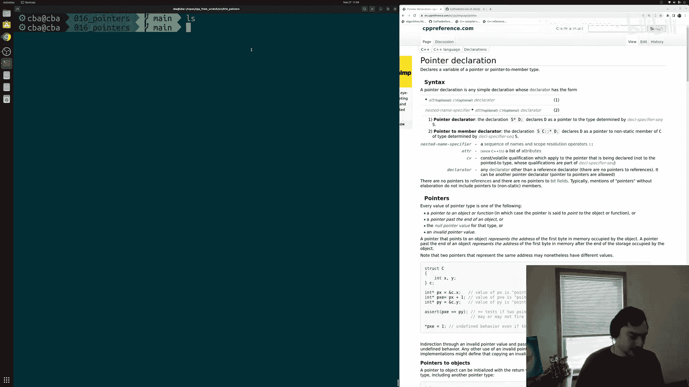
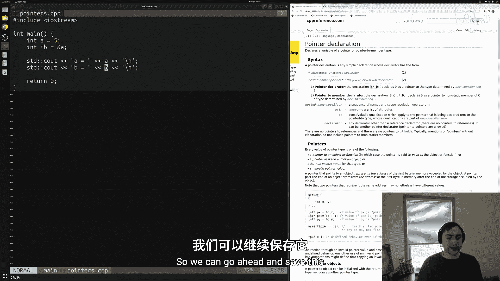
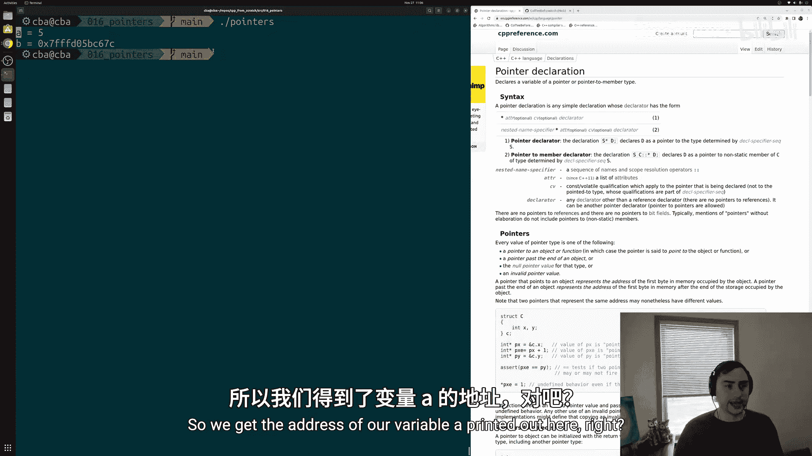
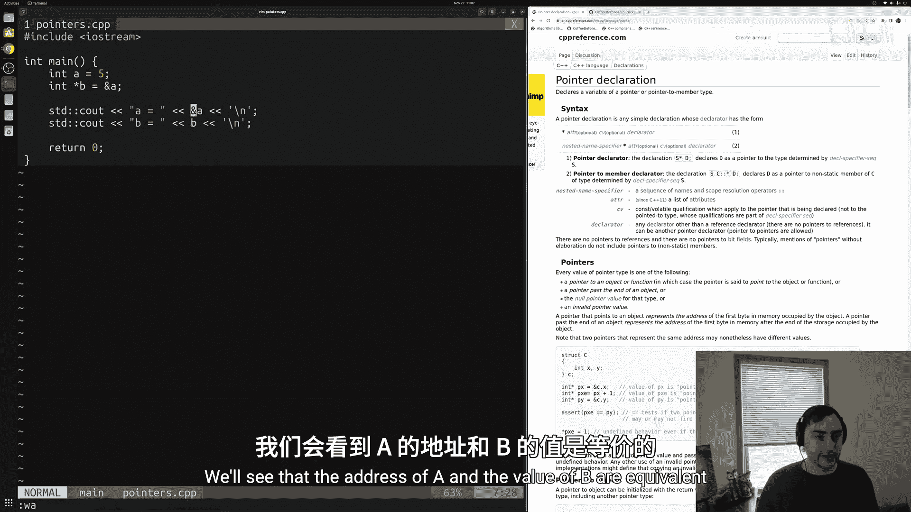
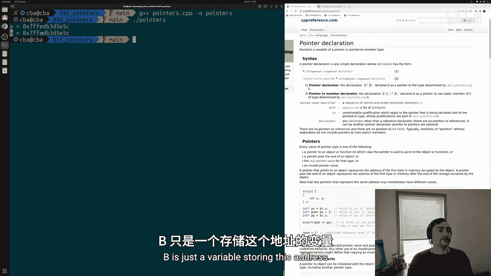
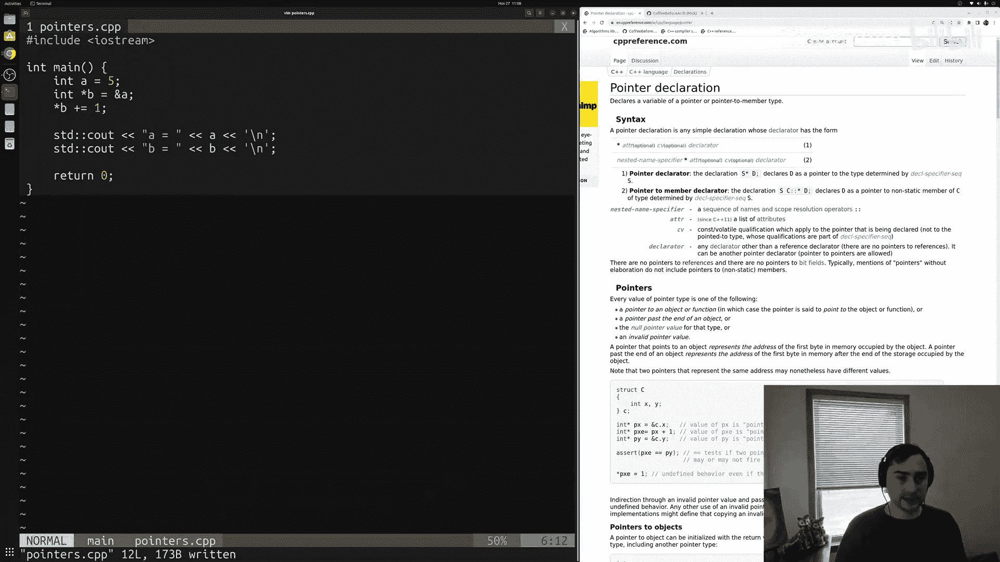
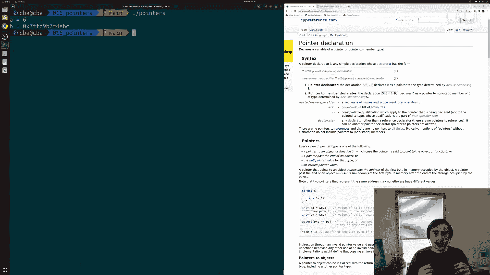
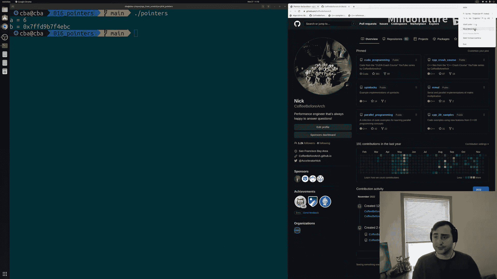

# 017：指针基础

在本节课中，我们将要学习C++中一个核心概念——指针。指针是一种存储内存地址的变量类型，它允许我们直接访问和操作内存中的数据。理解指针是掌握C++内存管理和高级编程技巧的关键一步。

## 概述

在之前的课程中，我们介绍了引用和取地址运算符 `&`。一个自然的问题是：我们能否将某个变量的地址存储起来？答案是肯定的，这种存储地址的类型就是指针。本节课我们将探讨指针的基础知识，包括如何声明、初始化和使用指针来访问内存中的数据。



## 指针的声明与初始化

上一节我们提到了取地址运算符，本节中我们来看看如何将地址存储在一个变量中。

指针的声明使用星号 `*`。例如，一个指向整数的指针类型写作 `int*`。要获取一个变量的地址并将其赋给指针，我们使用取地址运算符 `&`。

以下是声明和初始化指针的步骤：

1.  声明一个普通变量，例如 `int a = 5;`。
2.  声明一个指针变量，例如 `int* b;`。这里的 `int*` 表示 `b` 是一个指向 `int` 类型内存地址的指针。
3.  使用取地址运算符 `&` 获取变量 `a` 的地址，并将其赋值给指针 `b`：`b = &a;`。

此时，指针 `b` 存储的就是变量 `a` 在内存中的地址。

```cpp
int a = 5;       // 定义一个整数变量 a
int* b = &a;     // 定义一个指向整数的指针 b，并让它存储 a 的地址
```



## 访问指针的值与解引用



指针本身存储的是地址。如果我们想访问或修改该地址所指向的实际数据，就需要使用解引用运算符 `*`。



解引用操作 `*b` 表示“获取指针 `b` 所指向地址处的值”。通过这种方式，我们可以像操作原始变量一样操作指针指向的数据。



以下是一个使用指针修改数据的例子：

```cpp
int a = 5;
int* b = &a;     // b 指向 a
*b += 1;         // 解引用 b，并将其指向的值（即 a 的值）加 1
// 现在 a 的值变成了 6
```

通过指针 `b`，我们间接地修改了变量 `a` 的值。

## 指针与引用的对比

理解指针时，将其与之前学过的引用进行对比会很有帮助。引用是变量的别名，而指针是存储地址的变量。引用在初始化后不能更改其绑定对象，而指针可以重新指向不同的地址。



核心区别在于：
*   **引用**：`int& ref = a;` ( `ref` 是 `a` 的别名)
*   **指针**：`int* ptr = &a;` ( `ptr` 存储着 `a` 的地址)

## 关于原始指针的说明

在C++现代编程中，直接使用“原始指针”（即本节课介绍的 `int*` 这类指针）的情况正在减少，因为它们在管理不当（如忘记释放内存）时容易导致错误。然而，理解原始指针的工作原理至关重要，它是学习智能指针（如 `std::unique_ptr`, `std::shared_ptr`）等更安全内存管理工具的基础。在后续课程中，我们将探讨这些更优的替代方案。

## 总结





本节课中我们一起学习了C++指针的基础知识。我们了解了指针是一种存储内存地址的变量类型，学会了如何使用 `*` 声明指针，使用 `&` 获取地址，以及使用 `*` 解引用来访问或修改指针所指向的数据。虽然现代C++推荐使用更安全的工具，但深入理解指针是成为一名熟练C++程序员的必经之路。