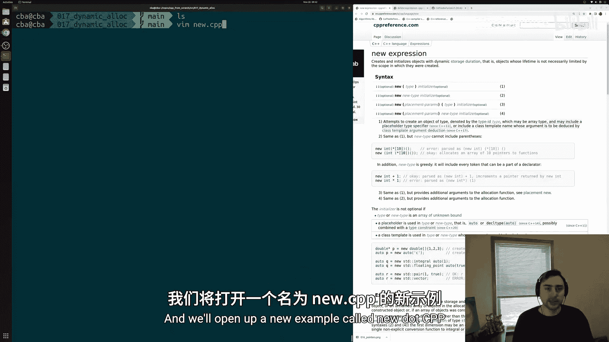
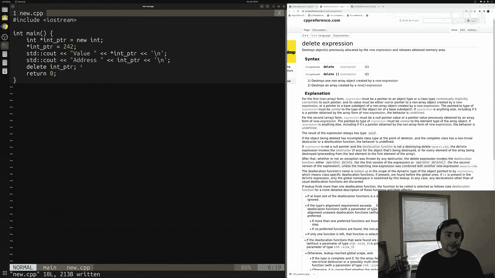
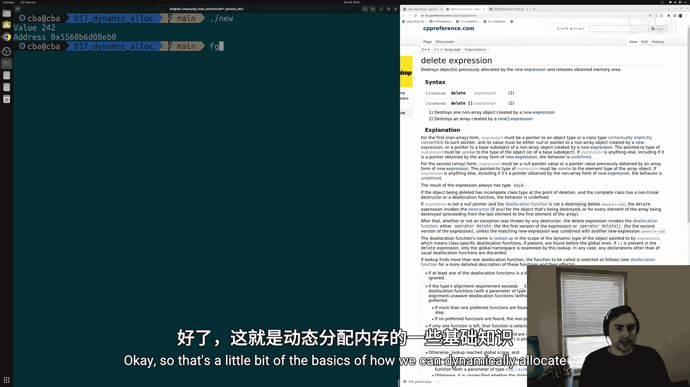
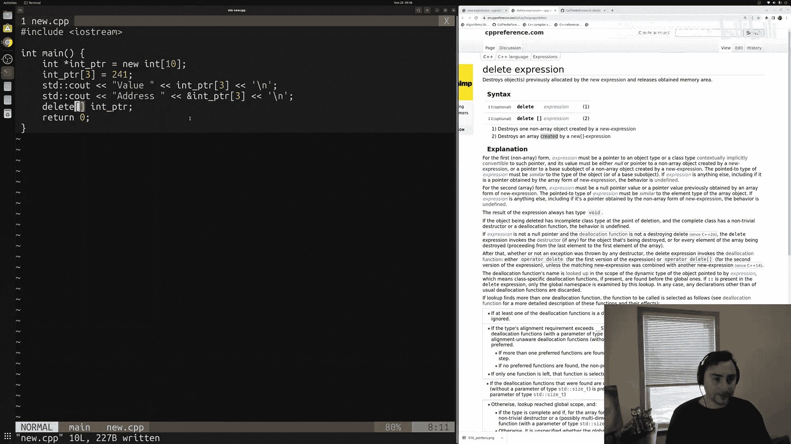
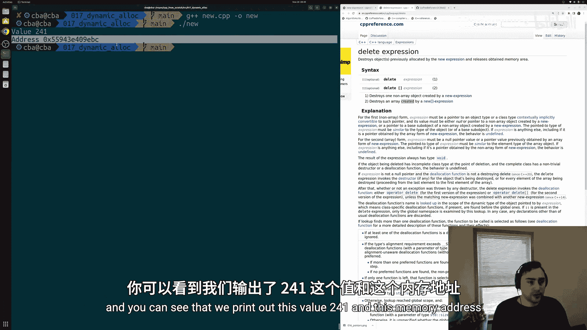
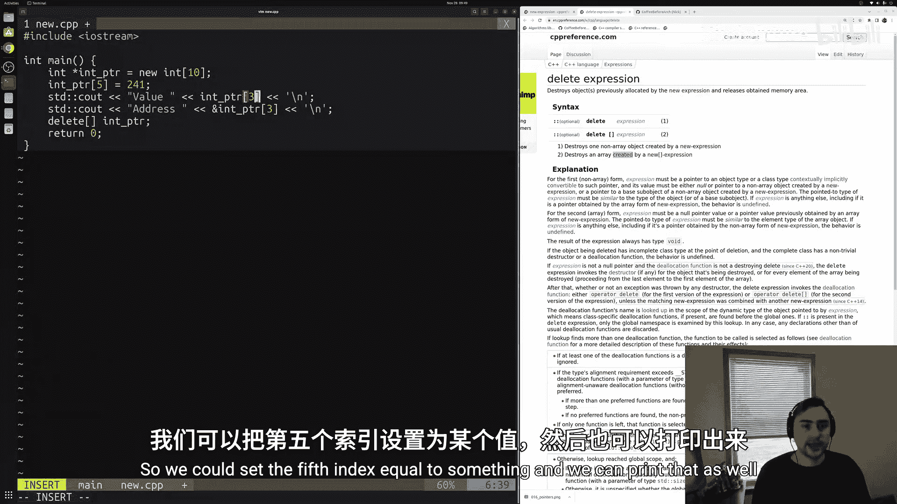
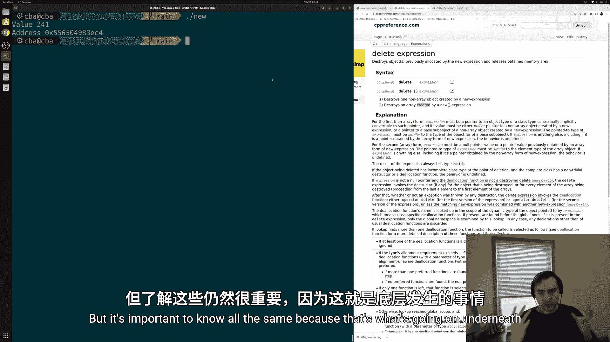

# 018：动态内存分配

在本节课中，我们将要学习C++中的动态内存分配。我们将了解如何使用 `new` 和 `delete` 表达式来手动管理内存，包括为单个对象和数组分配与释放内存。理解这些基础知识对于深入理解标准库容器（如 `std::vector`）的内部工作原理至关重要。



## 动态内存分配基础

上一节我们介绍了指针的基本概念。本节中我们来看看如何使用 `new` 表达式来动态分配内存。`new` 表达式用于在程序运行时请求内存，并返回一个指向该内存地址的指针。

例如，为一个整数分配内存的代码如下：
```cpp
int* intPtr = new int;
```
这段代码执行以下操作：
1.  请求一个整数所需的内存空间。
2.  分配该内存。
3.  返回该内存的地址，并将其存储在指针 `intPtr` 中。

分配内存后，我们可以像操作普通变量一样操作它。例如，我们可以通过解引用指针来设置其值：
```cpp
*intPtr = 242;
```
然后，我们可以打印这个整数的值和地址：
```cpp
std::cout << "Value: " << *intPtr << std::endl;
std::cout << "Address: " << intPtr << std::endl;
```

当我们手动管理动态分配的内存时，必须在使用完毕后释放它，否则会导致内存泄漏。我们使用 `delete` 表达式来释放内存：
```cpp
delete intPtr;
```
释放内存非常重要，因为计算机的内存是有限的。如果程序不断分配内存而不释放，最终将耗尽所有可用内存，导致程序崩溃。

## 动态分配数组

我们不仅可以分配单个对象，还可以分配一个对象数组，这类似于 `std::vector` 的功能。



要为多个整数（例如10个）分配内存，我们使用带有方括号的 `new` 表达式：
```cpp
int* intPtr = new int[10];
```
现在，`intPtr` 指向一个包含10个整数的数组的首元素地址。



操作数组元素的方法如下：
*   设置第一个元素的值：`*intPtr = 242;` 或 `intPtr[0] = 242;`
*   设置其他元素的值，例如第三个元素：`intPtr[2] = 241;`

同样，我们可以打印特定元素的值和地址：
```cpp
std::cout << "Value at index 2: " << intPtr[2] << std::endl;
std::cout << "Address of index 2: " << &intPtr[2] << std::endl;
```

## 释放数组内存

释放数组内存的语法与释放单个对象不同，这一点必须注意。

以下是释放内存的正确方法：
*   释放单个对象：`delete intPtr;`
*   释放数组对象：`delete[] intPtr;`



如果对数组使用 `delete` 而非 `delete[]`，则只会释放数组的第一个元素，造成内存泄漏。因此，必须确保分配和释放的方式匹配。





## 总结




本节课中我们一起学习了C++动态内存分配的核心知识。我们掌握了如何使用 `new` 表达式为单个对象和数组分配内存，以及如何使用 `delete` 和 `delete[]` 表达式正确释放内存。虽然在实际开发中，我们更推荐使用 `std::vector` 等标准库容器来自动管理内存，但理解底层的手动内存管理机制对于成为一名优秀的C++程序员至关重要。