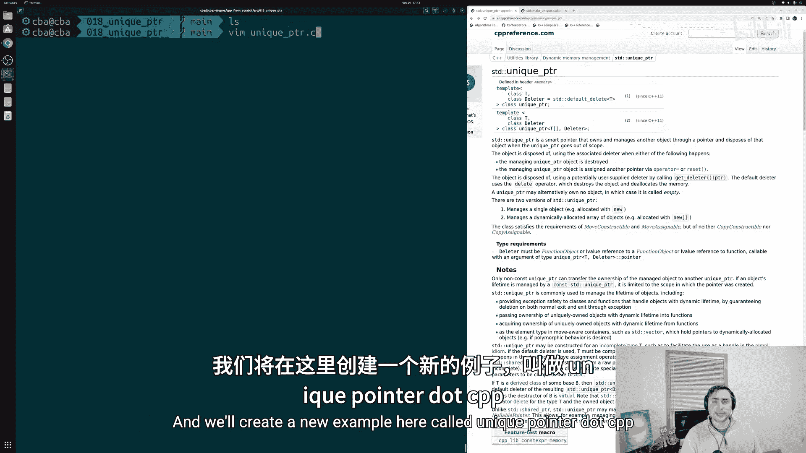
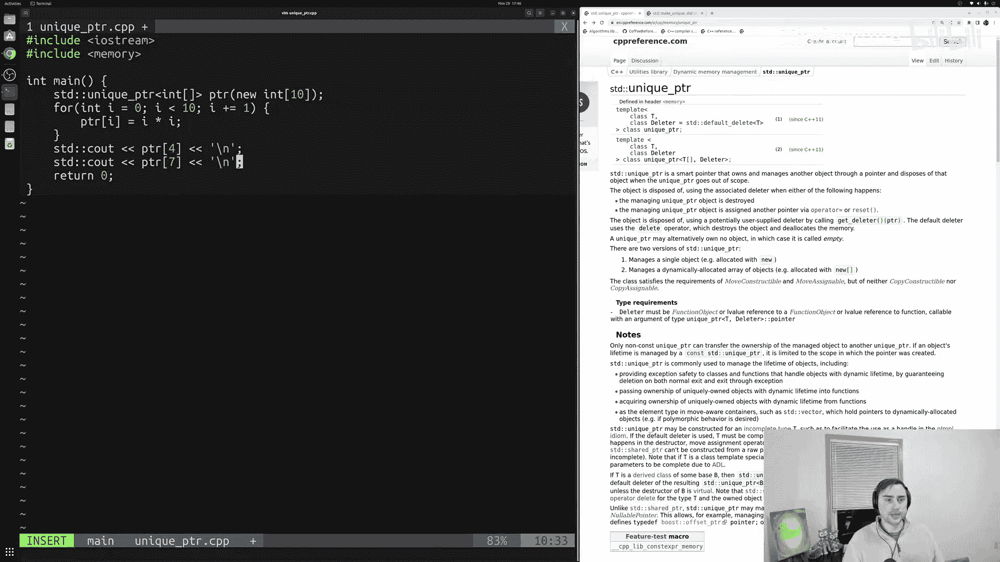
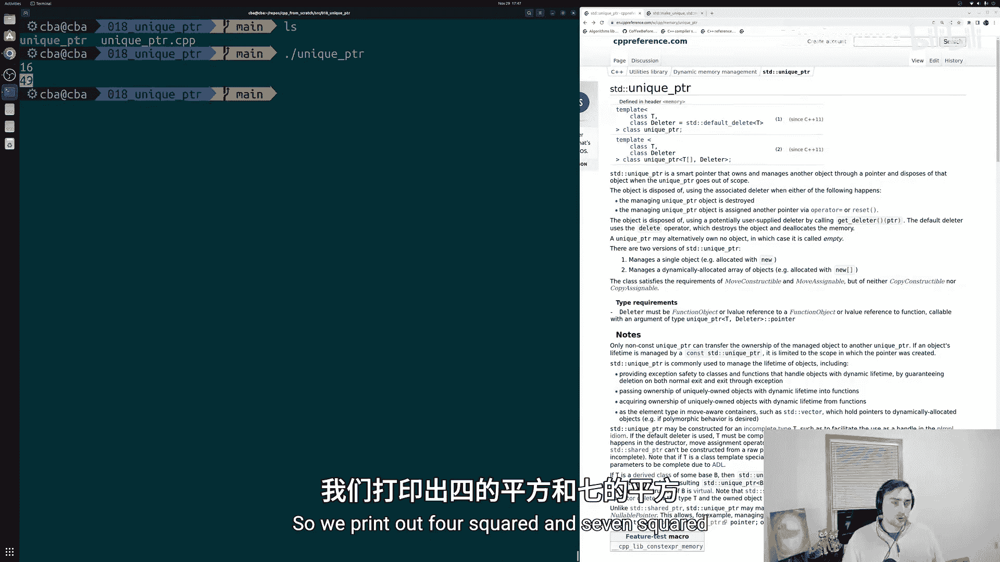
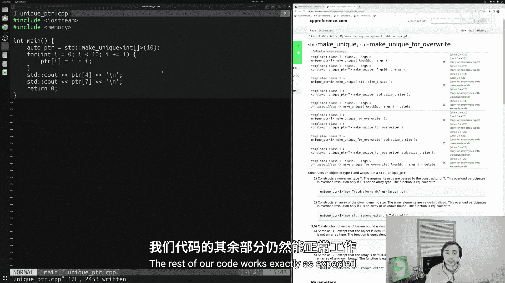
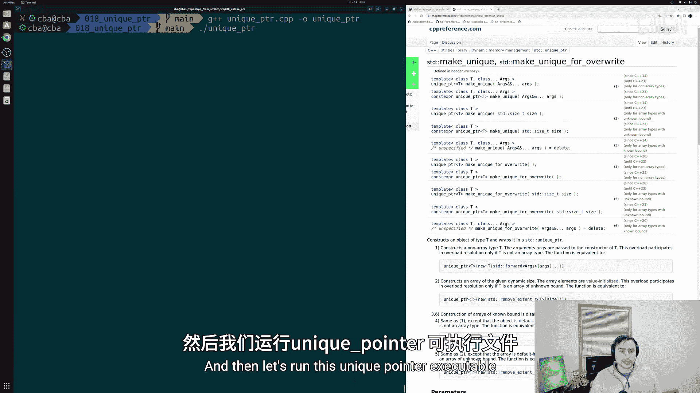
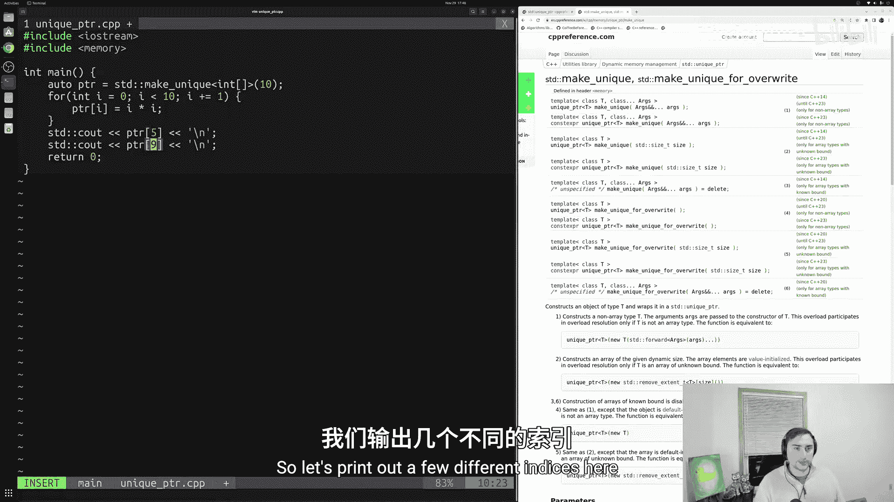
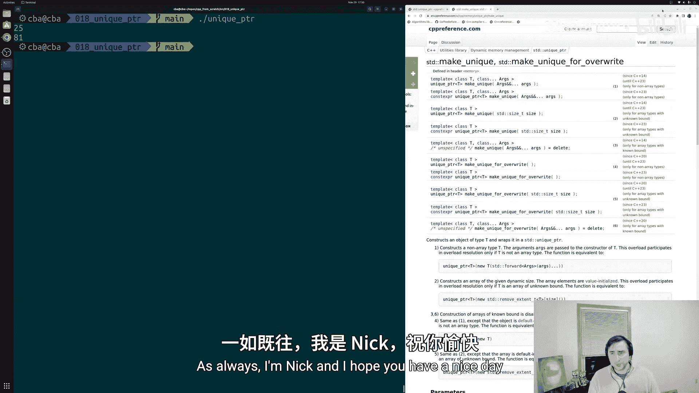

# 019：智能指针之std::unique_ptr 🧠

在本节课中，我们将要学习C++中的智能指针之一：`std::unique_ptr`。我们将了解为何要避免使用原始指针，以及`std::unique_ptr`如何帮助我们自动管理动态分配的内存，从而防止内存泄漏。

上一节我们介绍了动态分配的基础知识，并使用了原始指针。本节中我们来看看如何用更现代、更安全的方式管理内存。

## 为何避免使用原始指针？

在C++中，我们通常不鼓励使用原始指针，主要有两个原因。

1.  **类型表达能力不足**：一个原始指针（例如 `int*`）无法表达它是指向单个元素，还是指向一个包含10个或100个元素的数组。这个信息没有体现在类型本身。
2.  **内存释放不安全**：使用原始指针时，我们无法保证动态分配的内存最终会被释放。除非我们手动在代码中某处写入 `delete`，否则程序可能会不断分配内存而从不释放，最终导致内存耗尽错误。

C++提供了几种方法来解决这个问题。一种方法是使用STL容器（如 `std::vector`），它会自动处理内存的分配和释放。另一种方法就是使用智能指针，例如我们今天要讲的 `std::unique_ptr`。

## 什么是 std::unique_ptr？

`std::unique_ptr` 是一个智能指针，它通过一个指针拥有并管理另一个对象，并在 `unique_ptr` 离开作用域时处置该对象。这意味着我们可以让 `unique_ptr` 来管理我们动态分配的内存，当指针不再需要时（即离开作用域），它会自动释放内存，我们无需手动调用 `delete`。

## 创建和使用 std::unique_ptr



以下是创建和使用 `std::unique_ptr` 的基本步骤。

首先，我们需要包含必要的头文件。

```cpp
#include <iostream>
#include <memory>
```

### 方法一：直接管理 `new` 分配的指针

我们可以创建一个 `std::unique_ptr` 来接管一个由 `new` 分配的指针。

```cpp
std::unique_ptr<int[]> pointer(new int[10]);
```

在这行代码中：
*   `std::unique_ptr<int[]>` 声明了一个管理 `int` 数组的 `unique_ptr`。
*   `pointer` 是变量名。
*   `new int[10]` 动态分配了一个包含10个整数的数组，并将其管理权交给了 `pointer`。

现在，`pointer` 就可以像普通指针一样使用，例如通过索引访问数组元素。



```cpp
for (int i = 0; i < 10; i++) {
    pointer[i] = i * i; // 填充平方数
}
std::cout << pointer[4] << std::endl; // 输出 16
std::cout << pointer[7] << std::endl; // 输出 49
```

当 `pointer` 离开其作用域（例如 `main` 函数结束）时，它会自动释放其管理的数组内存。



### 方法二：使用 std::make_unique（推荐）

更现代、更安全的方式是使用 `std::make_unique` 函数，它可以完全避免直接使用 `new`。

```cpp
auto pointer = std::make_unique<int[]>(10);
```

这行代码使用 `auto` 进行自动类型推导，`std::make_unique<int[]>(10)` 会创建一个管理10个整数数组的 `unique_ptr`。代码的其余部分与之前完全相同。



使用 `std::make_unique` 是更推荐的做法，因为它更安全，能防止某些异常情况下的内存泄漏。





## std::unique_ptr 的其他功能

`std::unique_ptr` 比原始指针功能更丰富。根据C++参考文档，它还有一些有用的成员函数：

*   **`release()`**：返回被管理对象的指针并释放所有权。调用后，`unique_ptr` 不再管理该内存，你需要负责手动释放。
*   **`reset()`**：替换 `unique_ptr` 当前管理的对象（会先释放原对象）。
*   **`swap()`**：交换两个 `unique_ptr` 所管理的对象。
*   **`get()`**：获取指向被管理对象的原始指针（但不释放所有权）。

你可以查阅C++参考文档以获取更详细的信息。

## 总结



本节课中我们一起学习了 `std::unique_ptr` 智能指针。我们了解了原始指针的局限性，以及 `std::unique_ptr` 如何通过**所有权**模型自动管理动态内存的生命周期，从而有效防止内存泄漏。我们学习了两种创建 `unique_ptr` 的方法，并推荐使用 `std::make_unique`。最后，我们简要介绍了 `unique_ptr` 提供的一些额外成员函数。通过使用智能指针，我们可以编写出更安全、更易于维护的现代C++代码。