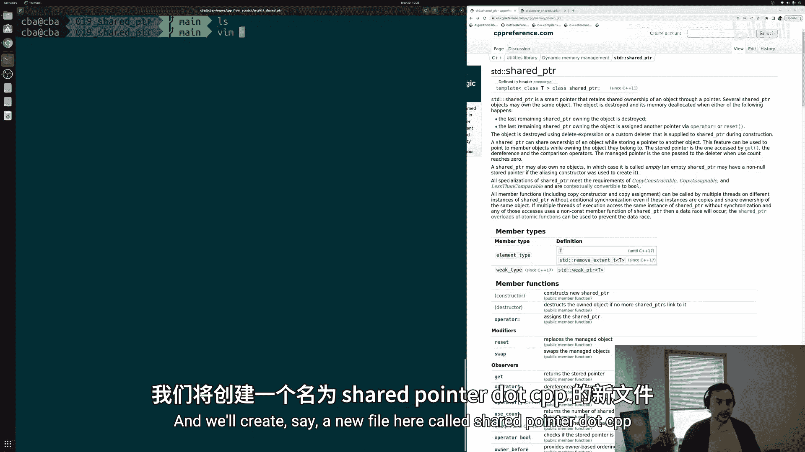
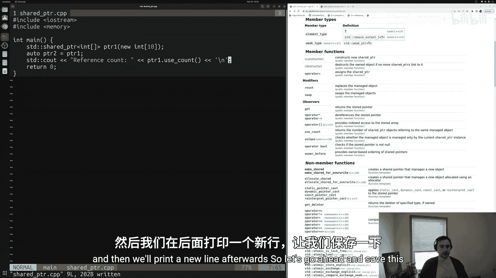
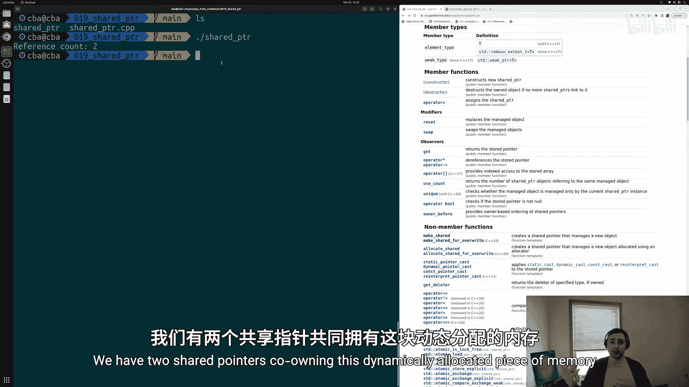
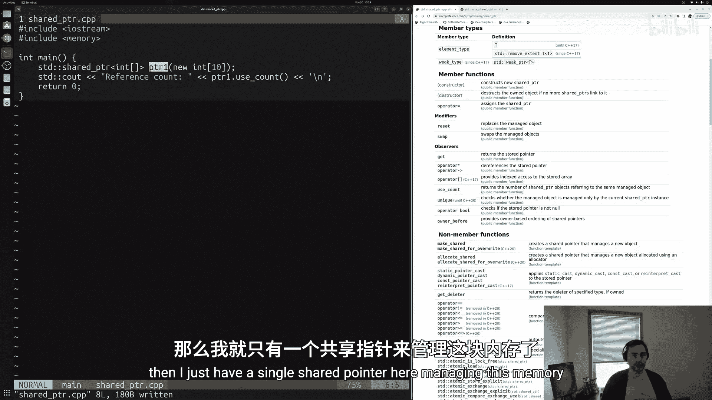
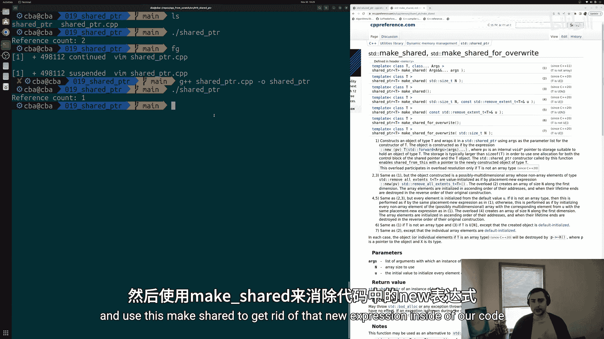
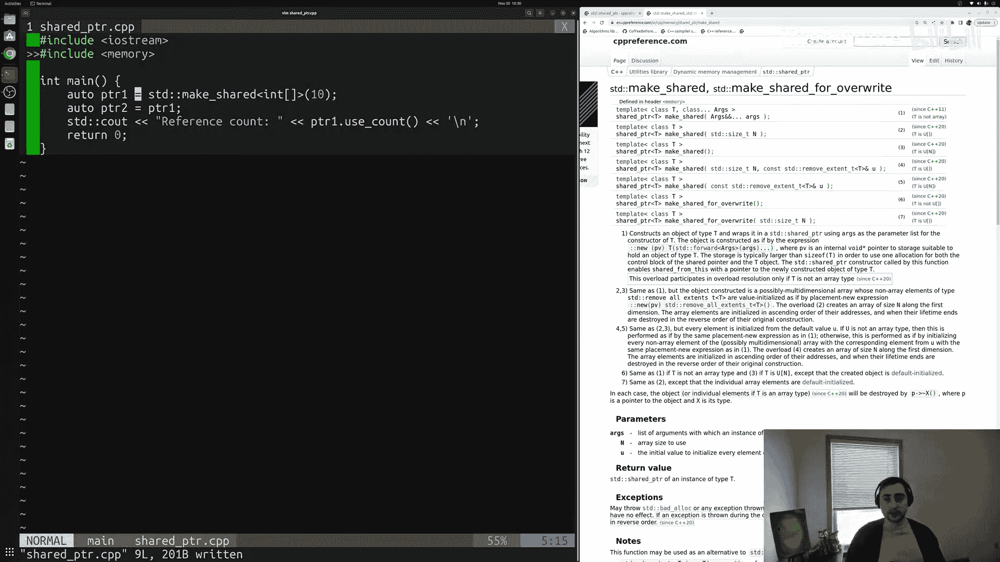
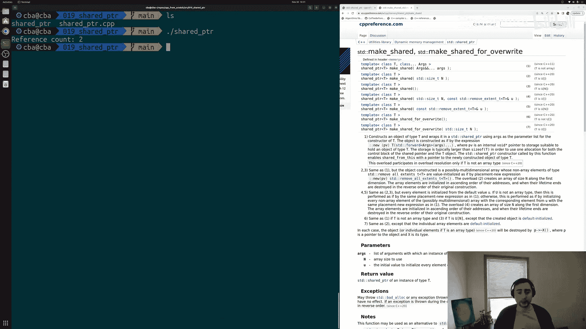
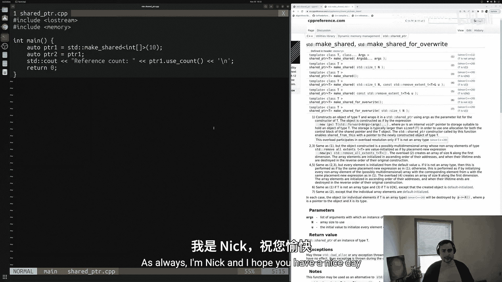

# 020：std::shared_ptr 🧠

在本节课中，我们将学习C++中的另一个智能指针：`std::shared_ptr`。我们将了解它如何实现资源的共享所有权，以及它与`std::unique_ptr`的区别。

上一节我们介绍了用于独占所有权的`std::unique_ptr`。本节中我们来看看用于共享所有权的`std::shared_ptr`。在程序中，我们经常需要多个指针指向同一块内存，即共享某个对象的所有权，并确保在所有引用都消失之前该对象不会被释放。`std::shared_ptr`正是为此设计。

## 创建与使用 std::shared_ptr

与`std::unique_ptr`类似，`std::shared_ptr`也定义在 `<memory>` 头文件中。以下是创建一个`std::shared_ptr`的基本方法。

```cpp
#include <iostream>
#include <memory>



int main() {
    // 创建一个管理10个整数数组的shared_ptr
    std::shared_ptr<int[]> pointer1(new int[10]);
}
```

与`unique_ptr`不同，`shared_ptr`允许多个指针共同管理同一资源。

```cpp
    // 创建第二个shared_ptr，指向同一块内存
    auto pointer2 = pointer1;
```

现在，`pointer1`和`pointer2`共同拥有这个动态分配的10个整数数组。这块内存只有在最后一个引用它的`shared_ptr`离开作用域或被释放时，才会被自动删除。

## 查看引用计数

`std::shared_ptr`提供了一个成员函数`use_count()`，用于查看当前有多少个`shared_ptr`对象共享同一个资源。

以下是查看引用计数的方法。

```cpp
    std::cout << "Reference count: " << pointer1.use_count() << std::endl;
```



当有两个`shared_ptr`共享资源时，`use_count()`会返回2。如果只有一个，则返回1。



## 使用 std::make_shared



类似于`std::make_unique`，C++也提供了`std::make_shared`来更安全、更高效地创建`shared_ptr`。对于数组，此功能需要C++20或更高标准支持。

以下是使用`std::make_shared`创建数组的方法。

```cpp
    // 使用C++20的make_shared创建动态数组（需要支持C++20的编译器）
    auto pointer1 = std::make_shared<int[]>(10);
    auto pointer2 = pointer1;
    std::cout << "Reference count: " << pointer1.use_count() << std::endl;
```



使用`make_shared`可以避免直接使用`new`表达式，使代码更安全、更现代。编译时需指定C++20标准（例如 `-std=c++20`）。

## 其他常用操作

`std::shared_ptr`支持与`std::unique_ptr`类似的操作，例如通过下标访问数组元素、使用`reset()`释放资源、使用`get()`获取原始指针等。



以下是`std::shared_ptr`的一些常用操作。



*   **索引访问**：`pointer1[0] = 42;`
*   **重置指针**：`pointer1.reset();` // 释放所有权，如果它是最后一个所有者，则删除内存
*   **获取原始指针**：`int* raw_ptr = pointer1.get();` // 谨慎使用

本节课中我们一起学习了`std::shared_ptr`的基本概念和用法。我们了解到：
1.  `std::shared_ptr`用于实现资源的共享所有权。
2.  多个`shared_ptr`可以指向同一对象，并通过引用计数管理对象的生命周期。
3.  可以使用`std::make_shared`（C++20起支持数组）来更安全地创建`shared_ptr`。
4.  通过`use_count()`可以查询当前的共享所有者数量。



使用`std::shared_ptr`可以帮助我们更安全地管理动态内存，避免内存泄漏，是编写现代C++程序的重要工具。