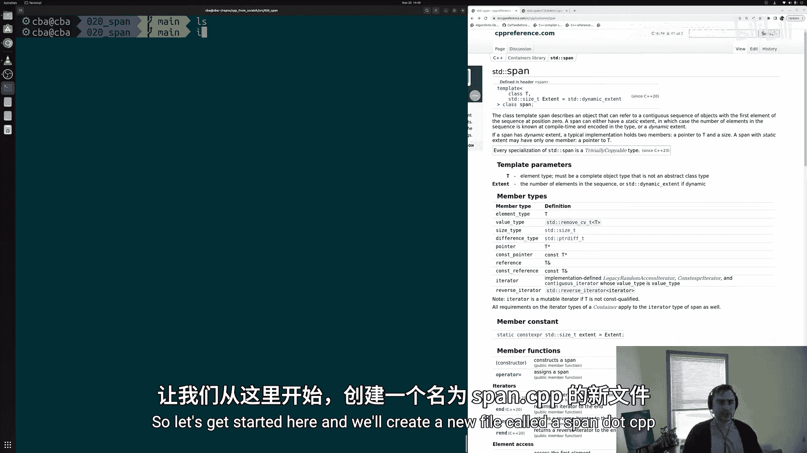
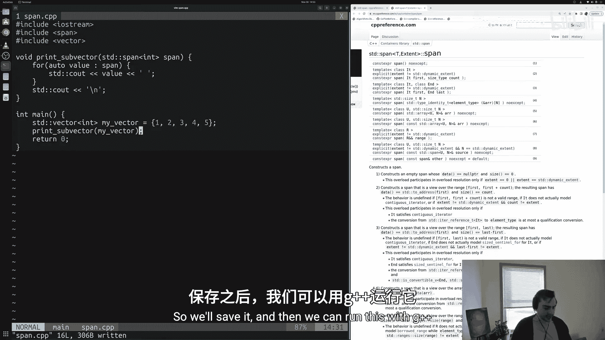
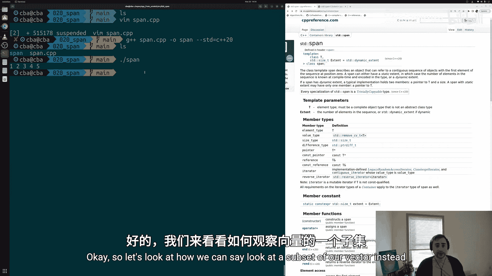
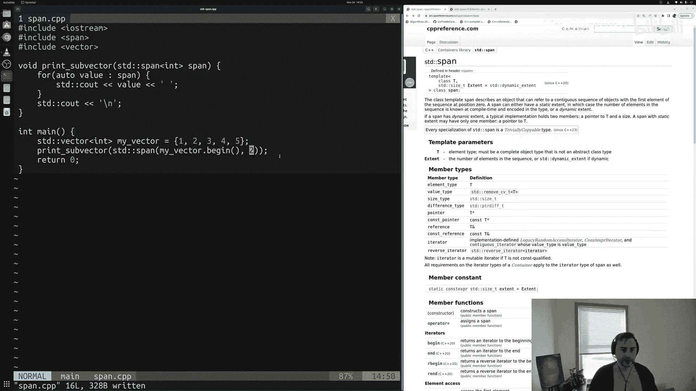
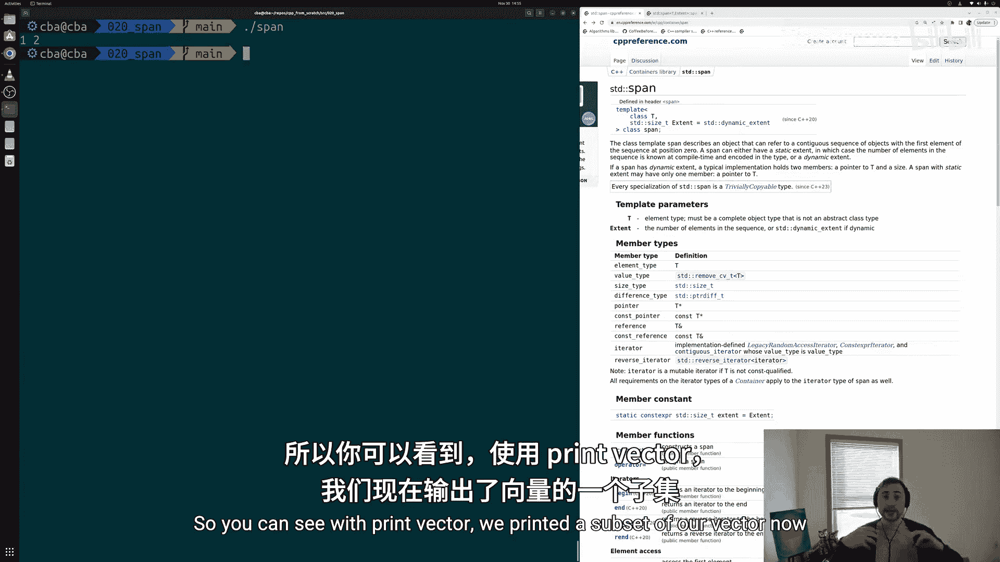
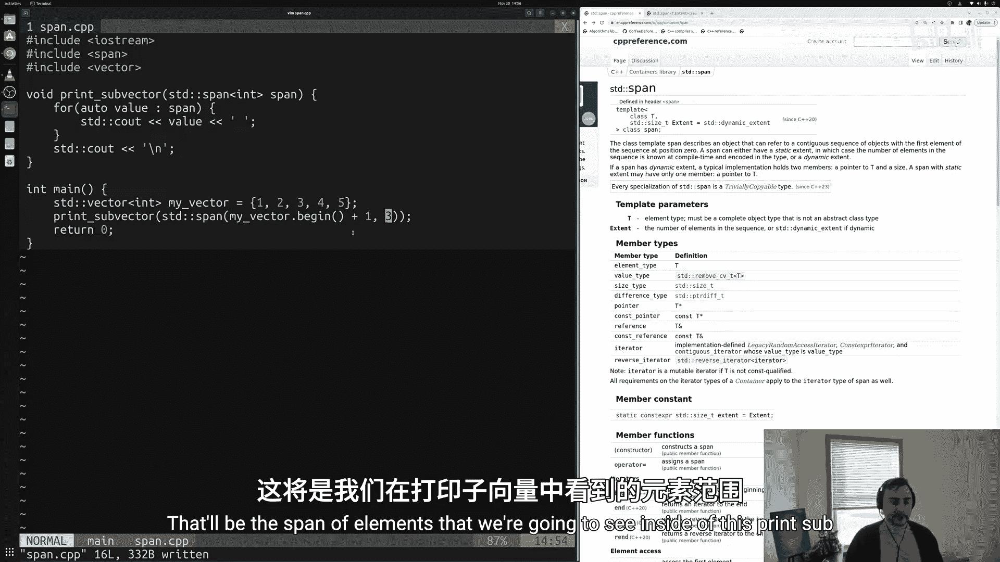
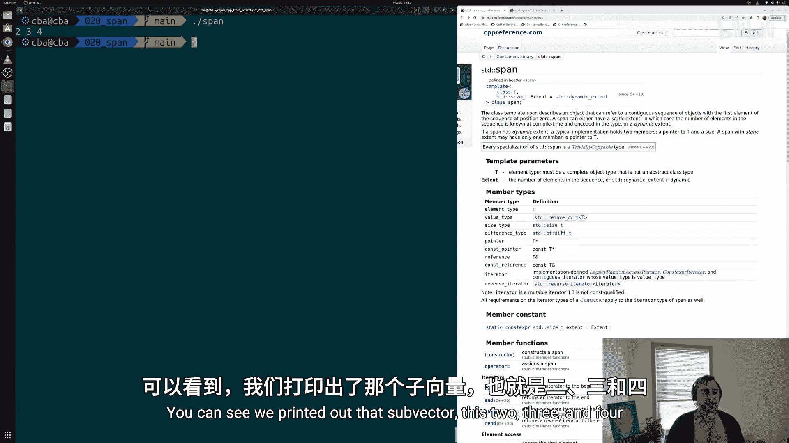
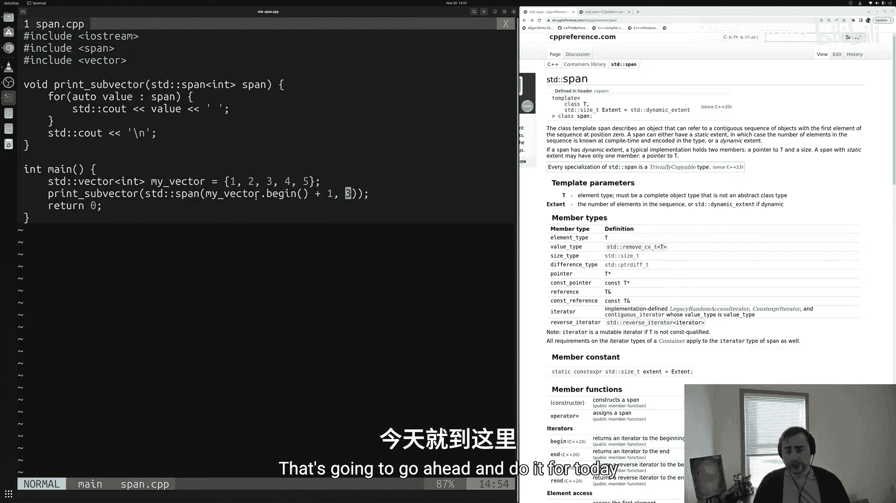

# 021：std::span 🧩

在本节课中，我们将要学习C++标准库中的一个容器——`std::span`。我们将了解它是什么，为什么它很有用，以及如何使用它来查看数据序列而无需拥有其底层内存。

## 概述

到目前为止，我们主要学习了管理底层内存的容器。例如，我们看过像 `std::vector` 这样的容器，它会为我们进行动态内存分配，并在使用完毕后释放内存。我们也学习了几种智能指针，如 `std::unique_ptr` 或 `std::shared_ptr`，它们负责管理我们分配的某块内存的所有权，并在使用完毕后释放内存。

然而，有时我们想要容器的良好抽象，但又不一定想拥有底层内存的所有权。例如，我们可能只想查看一个 `vector` 的子集，而不想在一个新容器中实际拥有那块内存。我们只是想“窥视”一下我们的 `vector`。在现代C++中（至少从C++20开始），我们通过 `std::span` 来实现这一点。

`std::span` 描述了一个可以引用连续对象序列的对象，序列的第一个元素从索引0开始。它可以具有静态范围或动态范围。本质上，`std::span` 为我们提供了一种查看或引用某些对象序列的方式，而无需实际拥有底层内存。因此，我们可以查看 `vector` 的一个子集，而无需拥有我们正在查看的内存。

接下来，让我们看看如何使用 `std::span` 的基础知识，以及它为何有帮助。

## 开始使用



让我们开始创建一个新文件 `span.cpp`。我们需要包含一些头文件：`<iostream>` 用于打印输出，以及 `<span>`。不出所料，`std::span` 定义在 `<span>` 头文件中。我们还可以包含之前见过的 `<vector>`。

```cpp
#include <iostream>
#include <span>
#include <vector>
```

我们将创建一个 `main` 函数，这是C++程序的核心。假设我们想实现一个简单的函数来打印 `vector` 的一个子集。

## 定义一个使用 `std::span` 的函数

让我们先写出这个函数的框架。它的返回类型是 `void`，因为它只是一个打印函数，不需要返回任何内容。我们可以称这个函数为 `print_sub_vector`。

```cpp
void print_sub_vector(std::span<int> span) {
    for (auto value : span) {
        std::cout << value << ' ';
    }
    std::cout << '\n';
}
```

这个函数接受一个 `std::span<int>` 类型的参数。我们可以像使用任何其他容器一样使用 `span`，例如使用基于范围的 `for` 循环来遍历并打印其中的每个整数值，最后输出一个换行符。

`std::span` 的好处在于它不拥有底层内存。它只是表达“我想向这个函数传递一个整数范围”的一种方式。对于这个函数来说，它只是一个要打印的整数范围，不关心这些整数来自哪里，也不拥有任何底层内存。这更好地表达了我们的意图。

## 调用使用 `std::span` 的函数

现在，让我们看看如何调用这个接受 `std::span` 参数的函数。

首先，我们创建一个 `vector`，作为我们想要获取子集的对象。

```cpp
int main() {
    std::vector<int> my_vector = {1, 2, 3, 4, 5};
}
```

现代C++和范围概念的一个优点是，我们可以将 `vector` 视为一个值范围，而这个值范围可以转换为 `span`。这意味着我们不会在函数内部复制 `vector`，而只是通过 `span` 查看其内容。

我们可以直接将整个 `vector` 传递给函数，以打印其全部内容。

```cpp
    // 打印整个vector
    print_sub_vector(my_vector);
```

保存并编译程序。我们需要使用C++20标准进行编译，因为这是一个较新的特性。

```bash
g++ -std=c++20 -o span span.cpp
./span
```



运行后，你会看到打印出了整个 `vector` 的内容：`1 2 3 4 5`。我们没有复制 `vector`，只是通过 `span` 查看了它。

## 查看 `vector` 的子集

如果我们只想查看 `vector` 的一部分呢？我们可以创建一个 `std::span` 来指定我们感兴趣的范围。



例如，我们可以创建一个从 `vector` 开头开始、包含两个元素的 `span`。

```cpp
    // 打印前两个元素
    print_sub_vector(std::span(my_vector.begin(), 2));
```



`std::span` 的构造函数可以接受一个起始迭代器和一个元素数量。这里，我们从 `my_vector.begin()` 开始，取2个元素。运行程序，会打印出 `1 2`。

我们也可以不从开头开始。例如，打印中间三个元素（索引1到3）。



```cpp
    // 打印中间三个元素（索引1, 2, 3）
    print_sub_vector(std::span(my_vector.begin() + 1, 3));
```

运行程序，会打印出 `2 3 4`。



通过使用 `std::span`，我们的 `print_sub_vector` 函数本身不需要知道范围的细节。它只是接收一个抽象的 `span` 并打印它。而在调用函数的地方，我们可以灵活地决定要传递哪一部分元素。



## 总结

本节课中，我们一起学习了 `std::span` 的基本用法及其优势。

*   `std::span` 是一个轻量级的、非拥有的视图，用于表示连续对象序列。
*   它提供了容器级别的抽象（如迭代、获取大小），但**不管理底层内存的所有权**。
*   这在我们需要查看或处理数据的一部分（如 `vector` 的子集），而又不想复制数据或传递复杂的起始/结束索引对时非常有用。
*   使用 `std::span` 可以使函数接口更清晰，表达“我需要一个数据范围”的意图，而不绑定到特定的容器类型。



通过将 `std::span` 集成到你的代码中，你可以编写出更灵活、更高效的函数，特别是在处理数据切片和范围操作时。