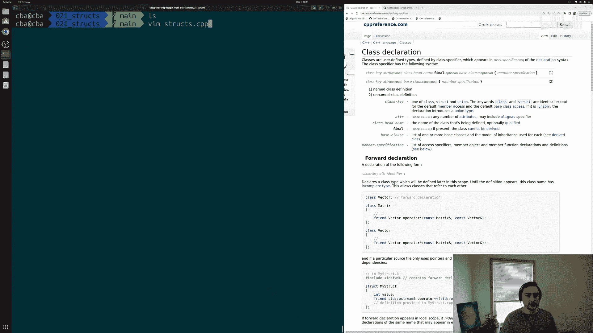
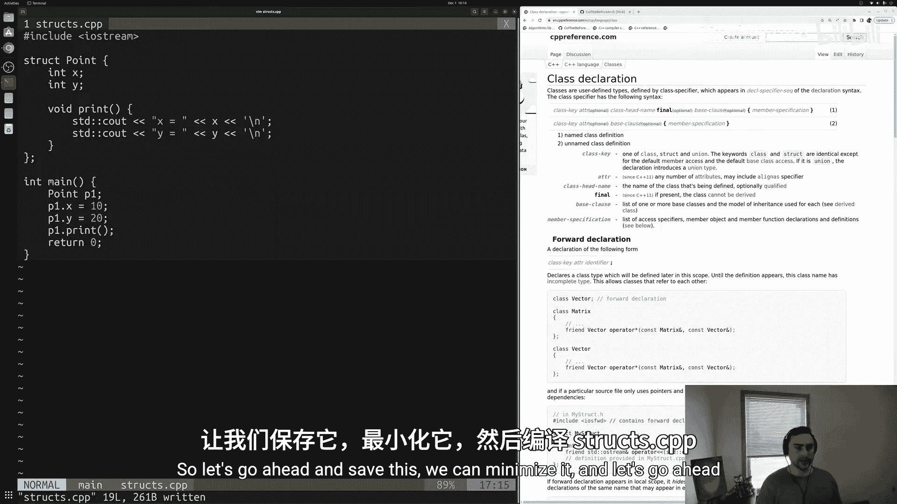
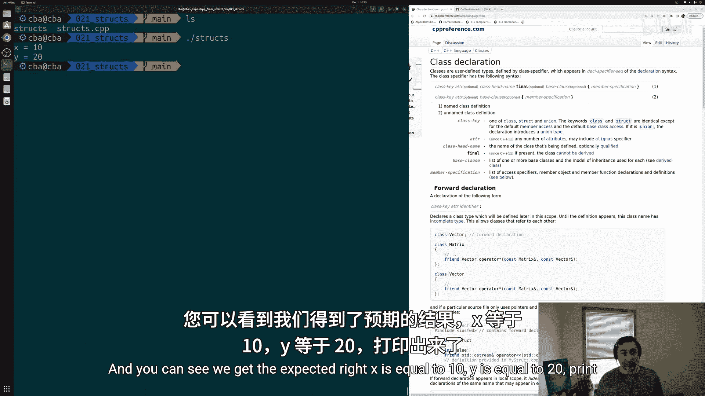
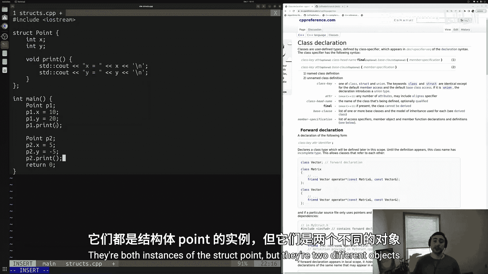
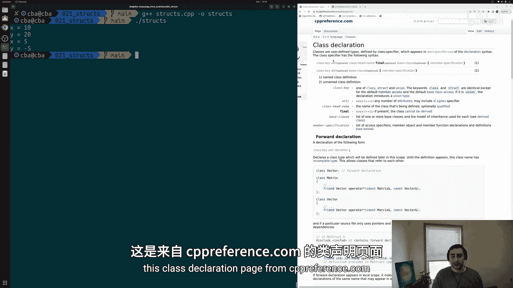
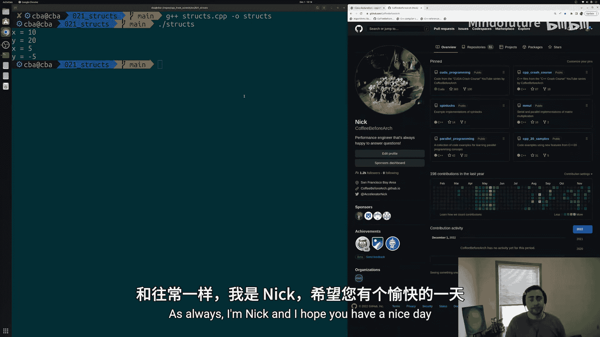

# 022：结构体（Structs）🧱

在本节课中，我们将学习C++中的结构体（`struct`）。结构体是一种强大的工具，它允许我们创建自定义的数据类型，将相关的数据成员和操作这些数据的成员函数组合在一起。



## 概述

在编程中，有时标准库提供的类型无法满足我们的需求。我们可能需要实现具有特定优化的自定义类型，或者创建语言中原本不存在的类型。在C++中，我们通过定义结构体（`struct`）和类（`class`）来实现这一点。本节课，我们将专注于结构体的基础知识。

## 定义结构体

我们通过 `struct` 关键字来定义一个新的类型。以下是一个创建名为 `Point` 的结构体的基本语法：

```cpp
struct Point {
    // 数据成员
    int x;
    int y;

    // 成员函数
    void print() {
        std::cout << "x is equal to " << x << '\n';
        std::cout << "y is equal to " << y << '\n';
    }
};
```

在上面的代码中：
*   `Point` 是我们定义的新类型名称。
*   `x` 和 `y` 是它的数据成员，用于存储坐标值。
*   `print()` 是一个成员函数，用于打印该点的坐标。

## 使用结构体

定义好结构体后，我们就可以像使用其他内置类型（如 `int`）一样使用它来创建变量，这些变量被称为**对象**。

### 创建对象与访问成员

以下是创建 `Point` 对象并访问其成员的示例：





```cpp
int main() {
    // 创建一个Point对象p1
    Point p1;

    // 使用成员访问运算符（.）为数据成员赋值
    p1.x = 10;
    p1.y = 20;

    // 使用成员访问运算符调用成员函数
    p1.print(); // 输出: x is equal to 10
                //        y is equal to 20

    return 0;
}
```

### 多个独立的对象

每个结构体对象都是独立的，拥有自己的数据成员副本。

```cpp
int main() {
    Point p1;
    p1.x = 10;
    p1.y = 20;

    Point p2; // p2是另一个独立的Point对象
    p2.x = 5;
    p2.y = -5;

    p1.print(); // 输出p1的数据: 10, 20
    p2.print(); // 输出p2的数据: 5, -5

    return 0;
}
```



在上面的例子中，`p1` 和 `p2` 是两个完全独立的对象，修改其中一个不会影响另一个。

## 总结

本节课我们一起学习了C++中结构体的基本概念和用法。我们了解到：
1.  **结构体** 允许我们定义自定义类型，将数据（成员变量）和操作（成员函数）封装在一起。
2.  使用 `struct` 关键字定义结构体，并在其中声明数据成员和成员函数。
3.  可以像使用普通变量一样创建结构体的**对象**。
4.  使用**成员访问运算符（`.`）** 来访问或修改对象的数据成员，以及调用其成员函数。
5.  每个对象都是其结构体类型的一个独立实例，拥有自己的数据。





结构体是面向对象编程的基石之一。在后续课程中，我们将深入探讨类的概念、构造函数、析构函数等更高级的主题。