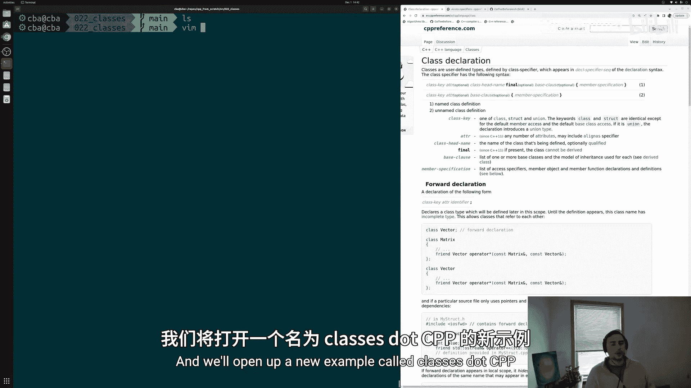
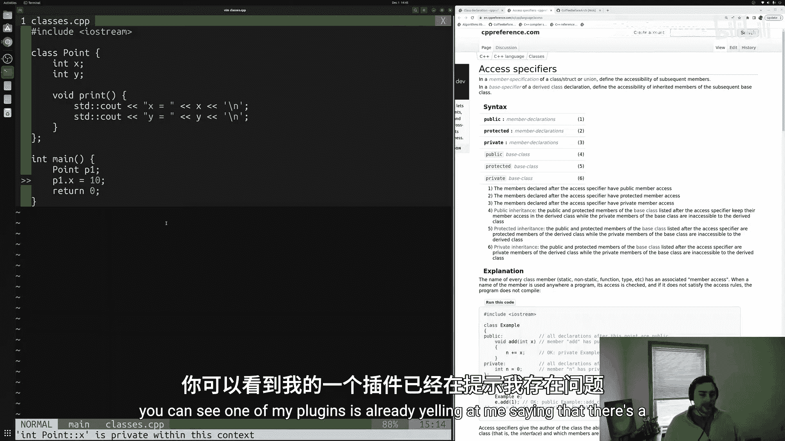
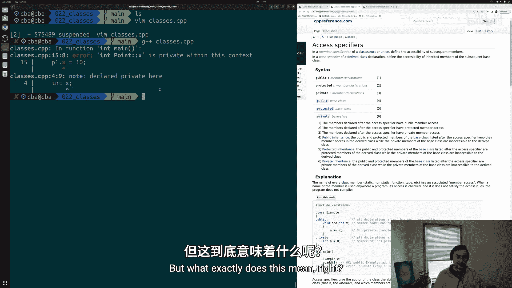
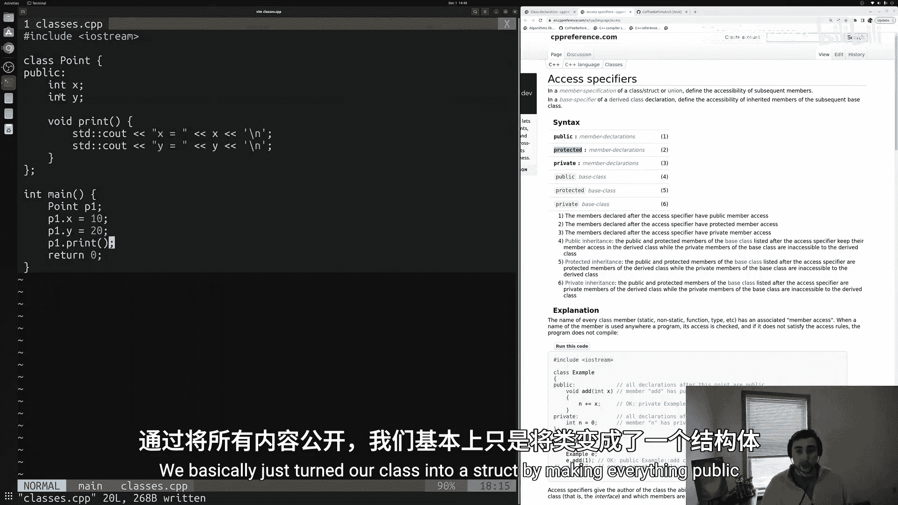
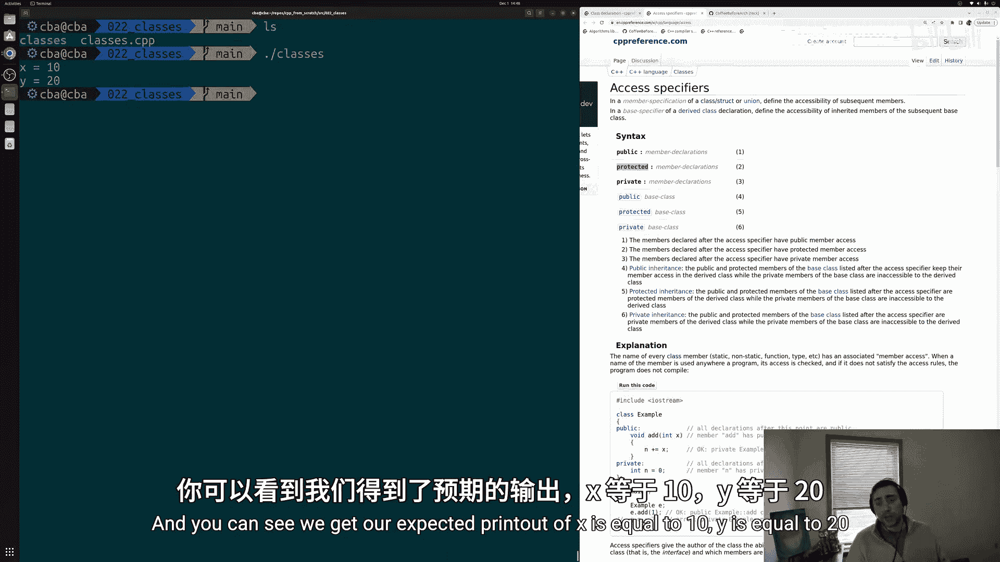
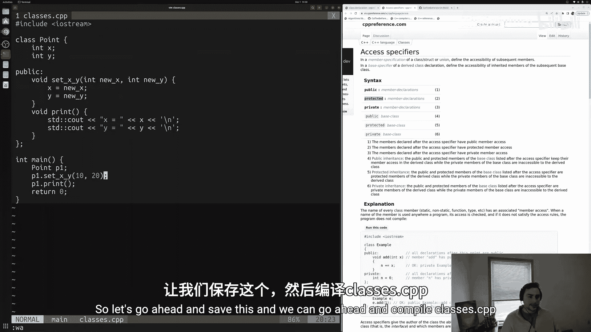
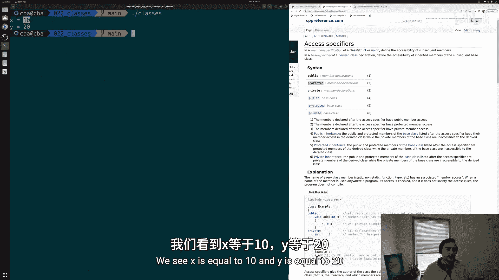
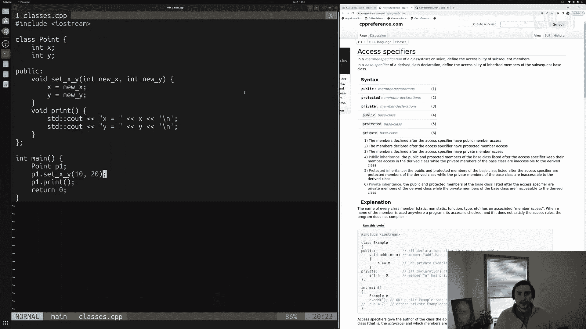
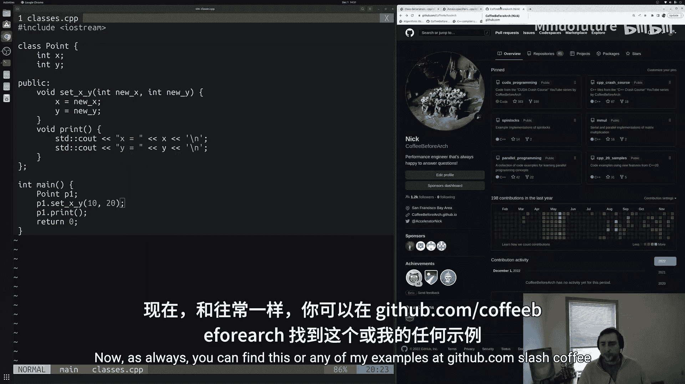
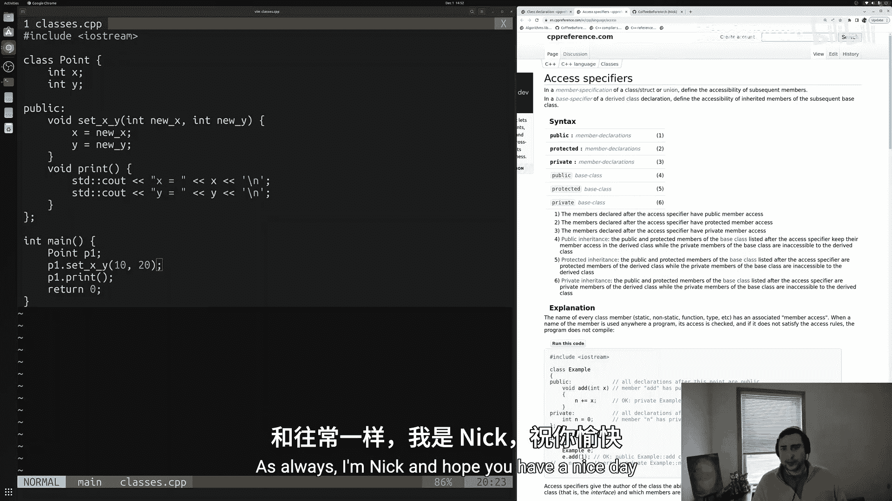

# 023：类与访问控制符

在本节课中，我们将要学习C++中**类**的基本概念，并重点理解**访问控制符**（如 `public` 和 `private`）如何控制对类成员的访问。我们将通过创建一个简单的 `Point` 类来演示这些概念。



## 概述

在上一节中，我们介绍了**结构体**，它允许我们定义自己的复合数据类型。本节中，我们来看看C++中的**类**。类和结构体非常相似，但它们在成员的默认访问权限上存在关键区别。理解这一点是掌握C++面向对象编程的基础。

## 创建类

与定义结构体类似，我们使用 `class` 关键字来定义一个类。我们将创建一个表示二维坐标点的 `Point` 类。

```cpp
#include <iostream>

class Point {
    // 默认情况下，类成员是私有的（private）
    int x;
    int y;
};
```

## 访问控制符：public 与 private





类与结构体的核心区别在于默认的访问控制符。在结构体中，所有成员默认是 **`public`**（公开的），意味着可以从结构体外部直接访问。在类中，所有成员默认是 **`private`**（私有的），意味着只能从类的内部访问。

以下是如何在类中显式指定访问控制符：

```cpp
class Point {
public: // 从这里开始，成员是公开的
    // 成员函数（方法）
    void print() {
        std::cout << "x is " << x << '\n';
        std::cout << "y is " << y << '\n';
    }
    void setXY(int newX, int newY) {
        x = newX;
        y = newY;
    }

private: // 从这里开始，成员是私有的
    // 数据成员
    int x;
    int y;
};
```

## 使用类

定义了类之后，我们可以创建该类的对象（实例）并使用其公开的成员函数。



```cpp
int main() {
    Point p1; // 创建一个Point对象

    // p1.x = 10; // 错误！x是私有成员，不能从外部访问
    // p1.y = 20; // 错误！y是私有成员，不能从外部访问

    p1.setXY(10, 20); // 正确！通过公开的setter函数设置值
    p1.print();       // 正确！调用公开的成员函数

    return 0;
}
```



## 为何使用访问控制符？

将数据成员设为私有，并通过公开的成员函数（如setter和getter）来访问它们，这是一种良好的封装实践。这样做有两大好处：

1.  **数据验证**：在setter函数中，你可以添加逻辑来检查输入值的有效性。
    ```cpp
    void setXY(int newX, int newY) {
        if(newX >= 0 && newY >= 0) { // 示例：确保坐标非负
            x = newX;
            y = newY;
        }
    }
    ```
2.  **实现灵活性**：类的内部实现（如数据如何存储）可以改变，但只要公开的接口（函数）保持不变，使用该类的代码就无需修改。

以下是使用封装后的 `Point` 类的完整示例：



```cpp
#include <iostream>



class Point {
public:
    // 设置坐标的接口
    void setXY(int newX, int newY) {
        // 这里可以添加数据验证逻辑
        x = newX;
        y = newY;
    }
    // 打印坐标的接口
    void print() {
        std::cout << "x is " << x << '\n';
        std::cout << "y is " << y << '\n';
    }

private:
    // 私有的数据成员，外部无法直接访问
    int x;
    int y;
};

int main() {
    Point p1;
    p1.setXY(10, 20); // 通过公共接口设置值
    p1.print();       // 通过公共接口打印值
    return 0;
}
```

## 总结







本节课中我们一起学习了C++中**类**的基本定义和使用。我们理解了**访问控制符** `public` 和 `private` 的核心作用：`public` 成员可以从任何地方访问，而 `private` 成员只能从类内部访问。类的默认私有访问权限鼓励了**封装**的设计理念，即通过公开的成员函数（如setter和getter）来控制和保护内部数据，这提高了代码的安全性、可维护性和灵活性。在后续关于继承的课程中，我们还将接触到另一个访问控制符 `protected`。