# 024：构造函数 🏗️

在本节课中，我们将要学习C++中的构造函数。构造函数是一种特殊的成员函数，用于在创建对象时初始化其数据成员。通过使用构造函数，我们可以避免在对象创建后手动设置每个成员变量，从而使代码更简洁、更安全。

在之前的视频中，我们学习了结构体和类，以及如何使用它们来创建对象。然而，我们还没有讨论如何在不通过成员访问运算符（点运算符）手动访问数据成员的情况下初始化它们。在C++中，我们通过构造函数来实现这一点。构造函数允许我们指定对象应如何被构造。

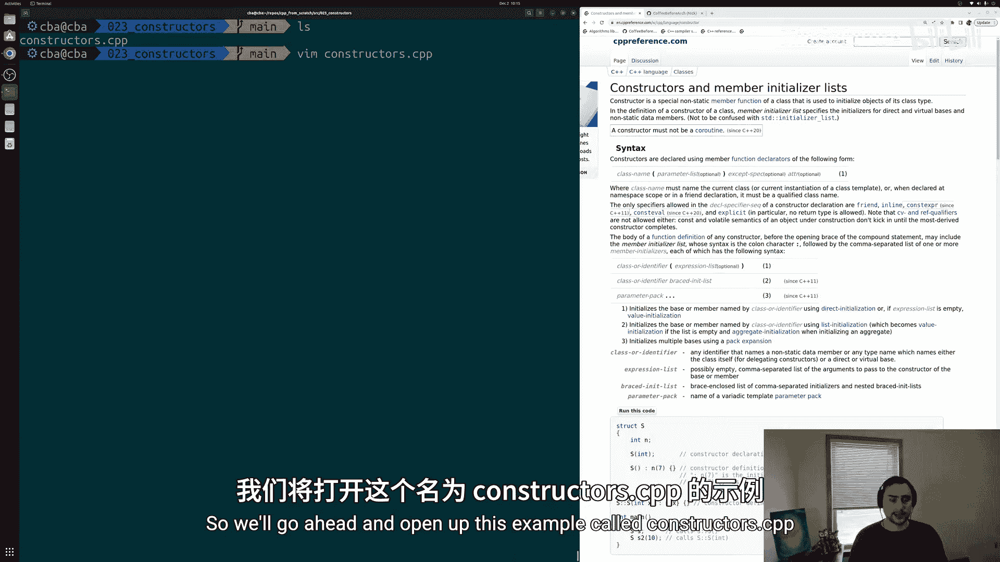

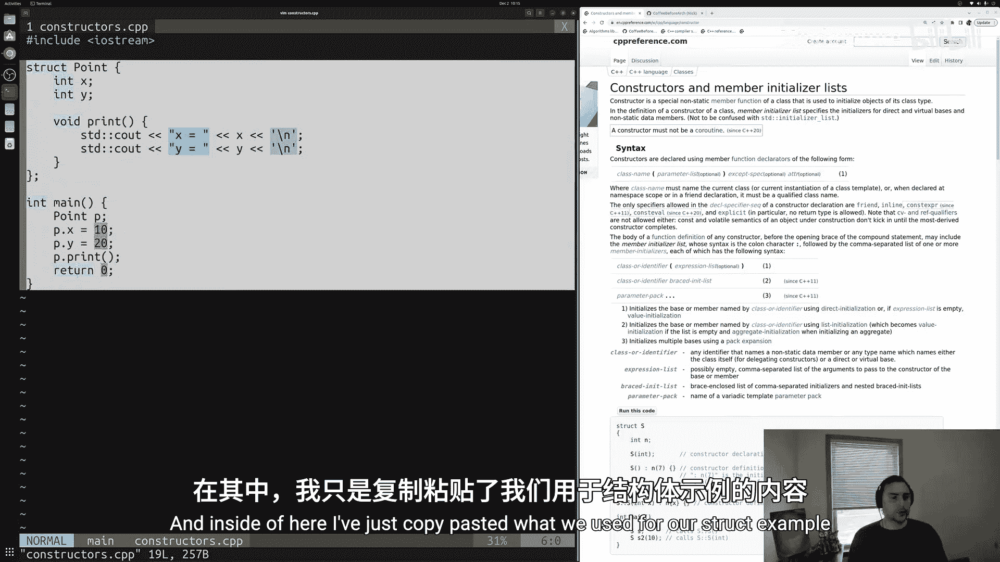

## 默认成员初始化

在深入构造函数之前，我们先看一种简单的初始化方法：默认成员初始化。

以下是一个简单的结构体示例，它有两个整数数据成员 `x` 和 `y`，以及一个打印它们的方法。

```cpp
struct Point {
    int x = 10; // 默认成员初始化
    int y = 20; // 默认成员初始化
    void print() {
        std::cout << "x = " << x << ", y = " << y << std::endl;
    }
};
```

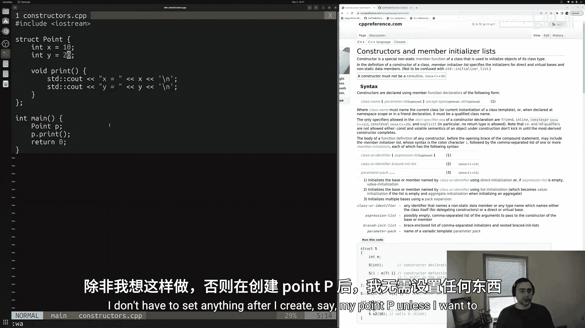

在 `main` 函数中，我们创建一个 `Point` 对象并调用 `print` 方法。

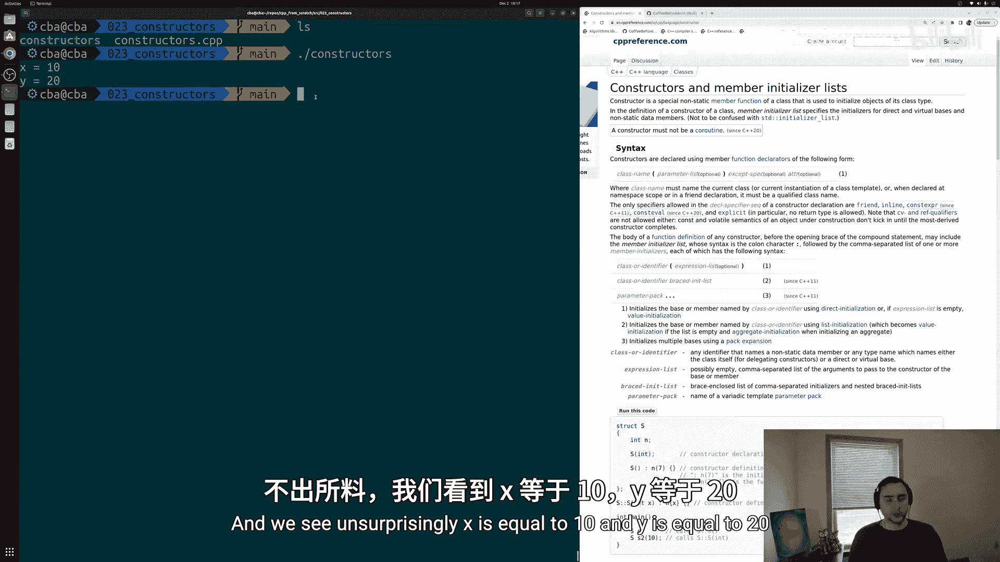

```cpp
int main() {
    Point p;
    p.print(); // 输出: x = 10, y = 20
    return 0;
}
```

使用默认成员初始化，每当创建 `Point` 的实例时，`x` 和 `y` 会自动初始化为10和20，除非我们之后手动修改它们。

## 构造函数基础

构造函数是一种与结构体或类同名的特殊成员函数。它没有返回类型，并且在创建对象时自动调用。

### 无参构造函数

我们可以定义一个无参构造函数来初始化对象。

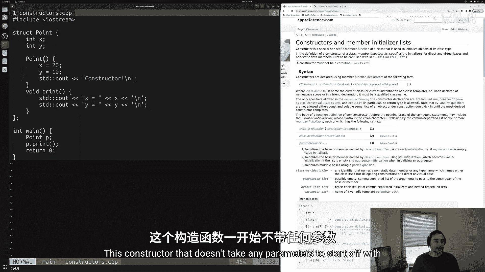

```cpp
struct Point {
    int x;
    int y;

    // 无参构造函数
    Point() {
        x = 20;
        y = 10;
        std::cout << "Constructor called!" << std::endl;
    }

    void print() {
        std::cout << "x = " << x << ", y = " << y << std::endl;
    }
};
```

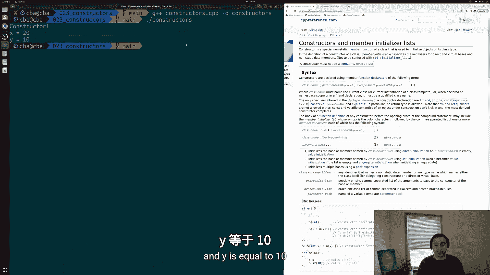

当我们在 `main` 函数中创建 `Point` 对象时，这个构造函数会被调用。

```cpp
int main() {
    Point p; // 输出: Constructor called!
    p.print(); // 输出: x = 20, y = 10
    return 0;
}
```

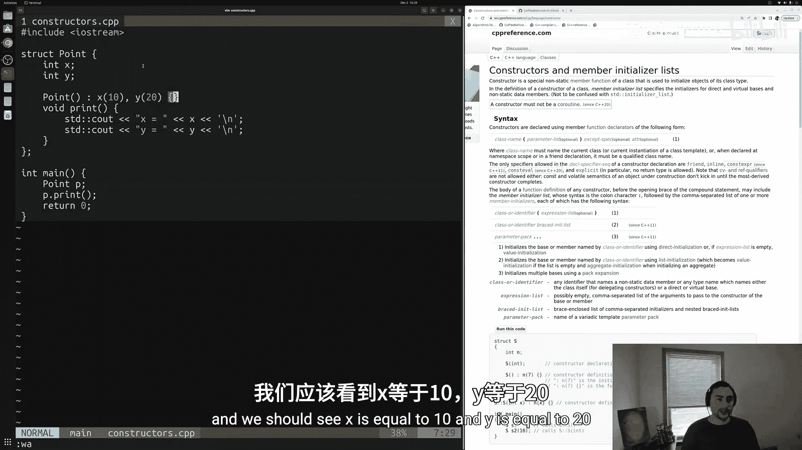

### 成员初始化列表

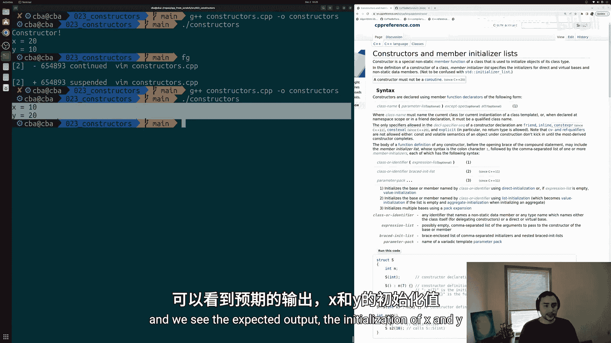

另一种初始化数据成员的方法是使用成员初始化列表。它在构造函数体执行之前进行初始化。

```cpp
struct Point {
    int x;
    int y;

    // 使用成员初始化列表的构造函数
    Point() : x(10), y(20) {
        std::cout << "Constructor called!" << std::endl;
    }

    void print() {
        std::cout << "x = " << x << ", y = " << y << std::endl;
    }
};
```

使用成员初始化列表通常更高效，特别是对于常量成员或对象成员，因为它避免了先默认初始化再赋值的过程。

## 带参数的构造函数

很多时候，我们希望在创建对象时传入特定的值。为此，我们可以定义带参数的构造函数。

```cpp
struct Point {
    int x;
    int y;

    // 带两个整数参数的构造函数
    Point(int newX, int newY) {
        x = newX;
        y = newY;
    }

    void print() {
        std::cout << "x = " << x << ", y = " << y << std::endl;
    }
};
```

在创建对象时，我们可以直接传递初始值。

```cpp
int main() {
    Point p(5, 7); // 使用带参数的构造函数
    p.print(); // 输出: x = 5, y = 7
    return 0;
}
```

我们同样可以使用成员初始化列表来实现带参数的构造函数。

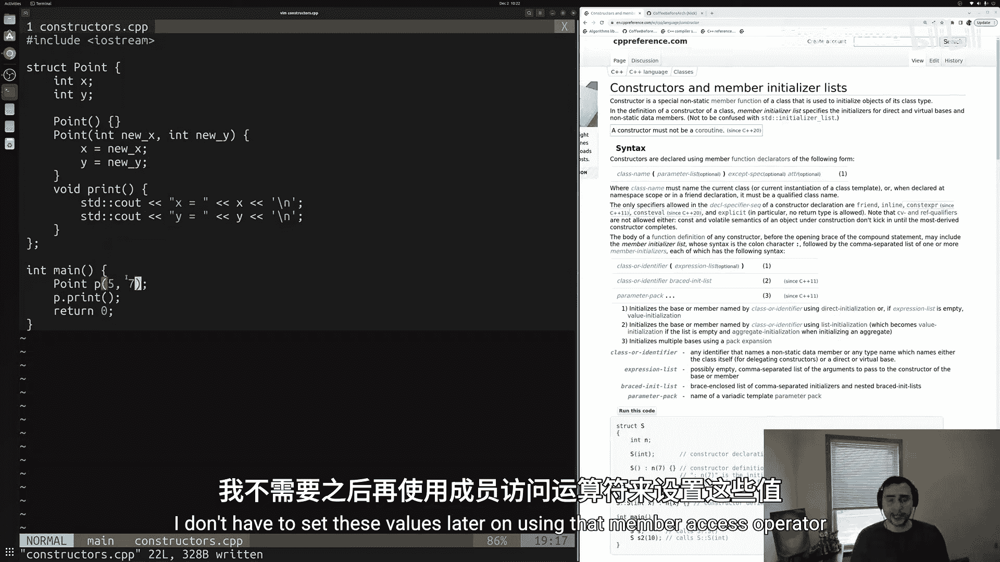

```cpp
Point(int newX, int newY) : x(newX), y(newY) {}
```

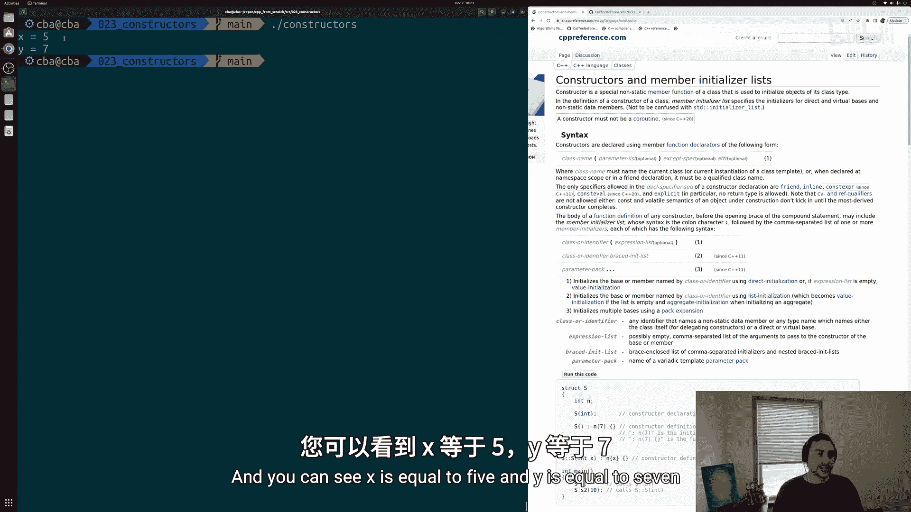

## 默认构造函数与用户定义构造函数

一旦我们定义了任何构造函数，编译器将不再自动生成默认（无参）构造函数。这可能导致错误。

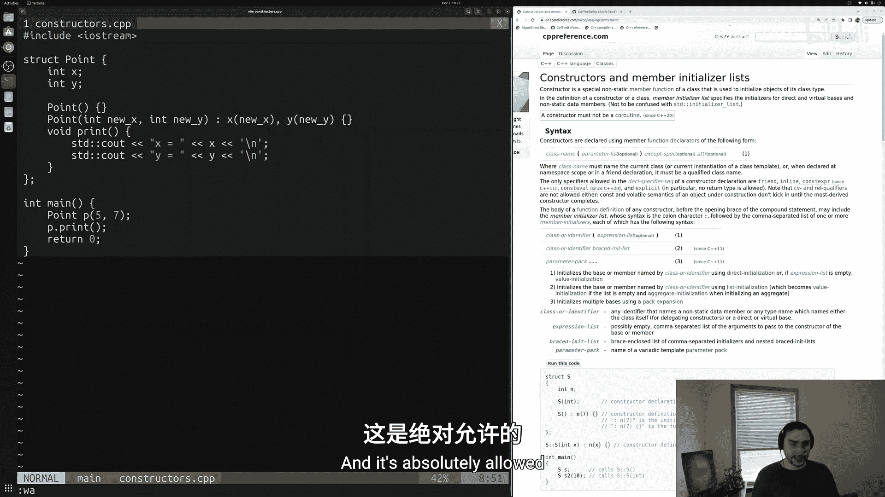

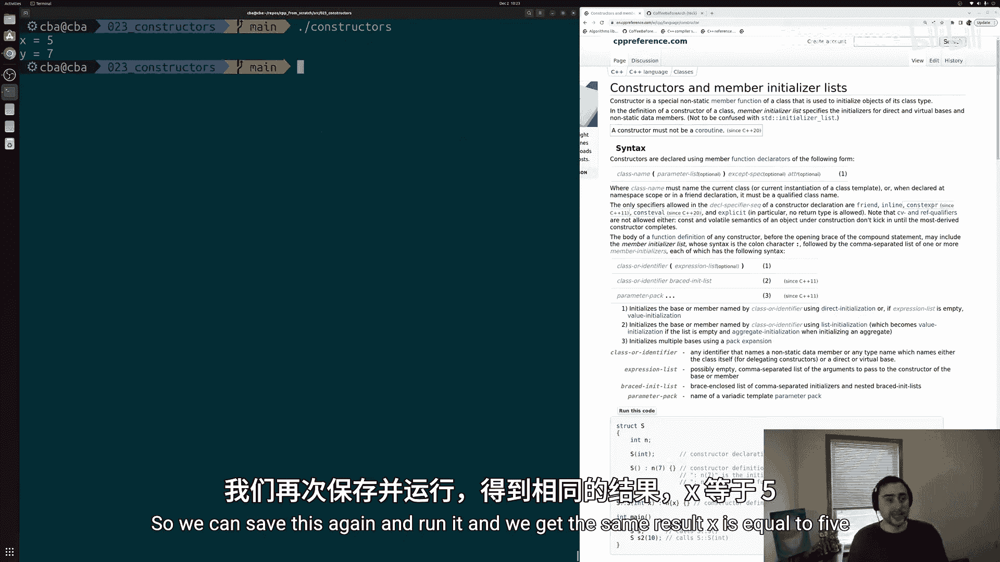

例如，如果我们只定义了带两个参数的构造函数，那么尝试使用无参构造函数创建对象就会出错。

```cpp
int main() {
    Point p; // 错误：没有匹配的构造函数
    return 0;
}
```

为了解决这个问题，我们可以显式地要求编译器生成默认构造函数。

```cpp
struct Point {
    int x;
    int y;

    Point() = default; // 显式默认构造函数
    Point(int newX, int newY) : x(newX), y(newY) {}

    void print() {
        std::cout << "x = " << x << ", y = " << y << std::endl;
    }
};
```

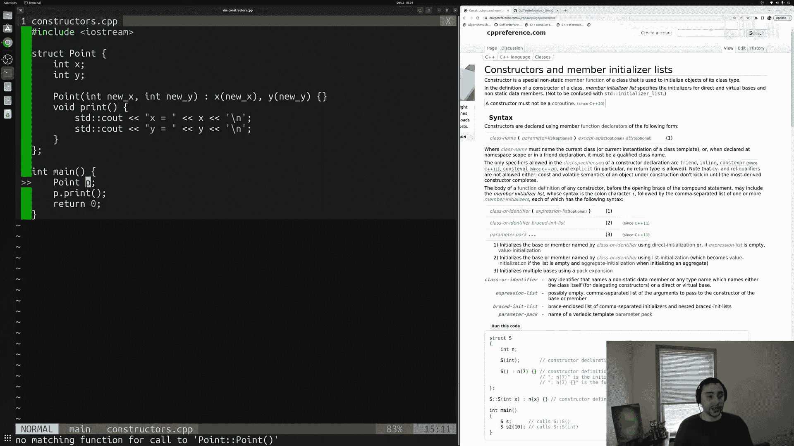

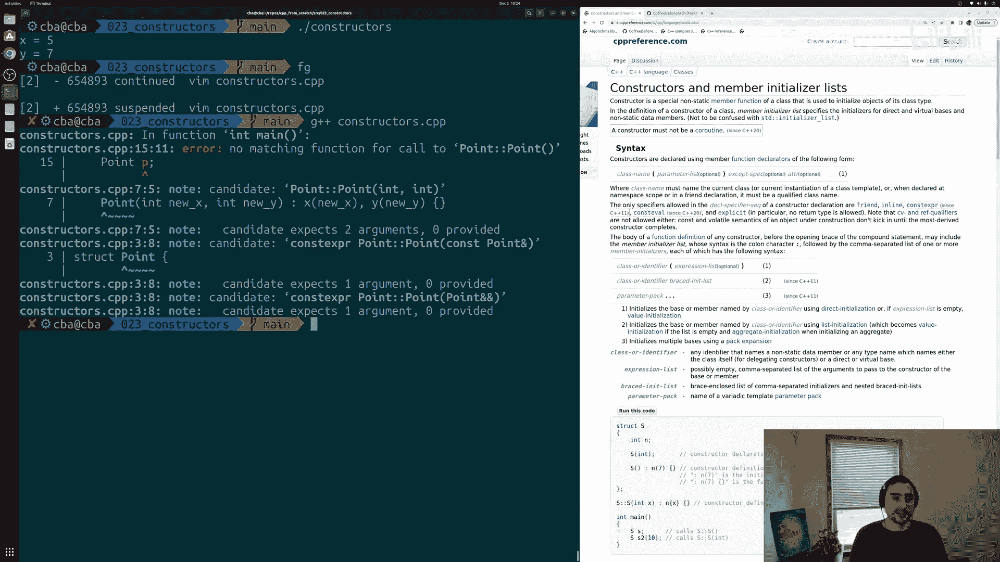

现在，无参构造函数和带参构造函数都可以使用了。

## 总结

本节课中我们一起学习了C++构造函数的核心概念。我们了解了构造函数的作用是在对象创建时初始化其成员。我们探讨了三种初始化方式：默认成员初始化、无参构造函数体初始化以及更高效的成员初始化列表。我们还学习了如何创建带参数的构造函数，以便在创建对象时传入特定值。最后，我们明白了用户定义构造函数会抑制编译器生成默认构造函数，但可以通过 `= default` 来显式请求生成。

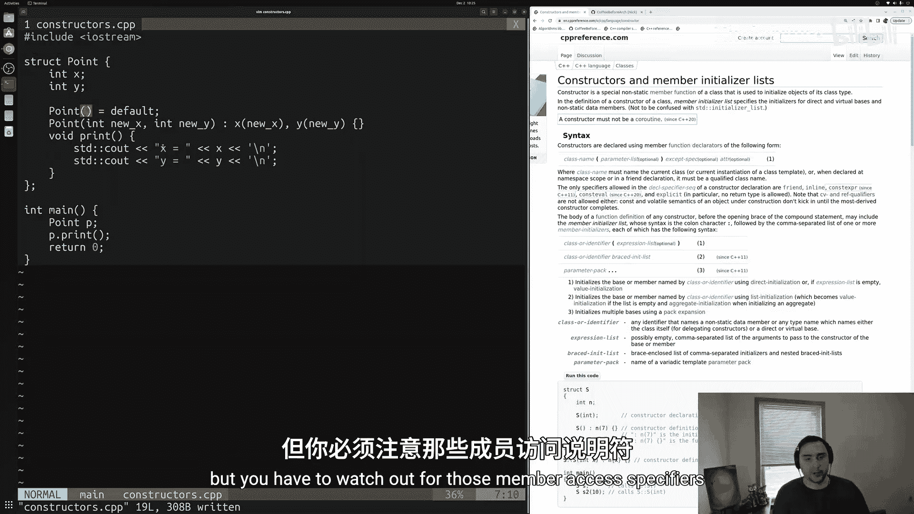

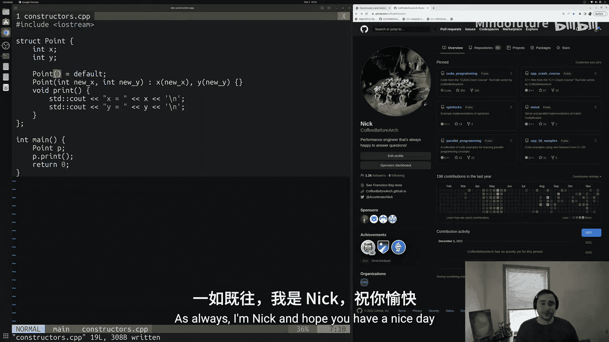

构造函数是面向对象编程中控制对象初始化的强大工具，掌握它们对于编写健壮、清晰的C++代码至关重要。