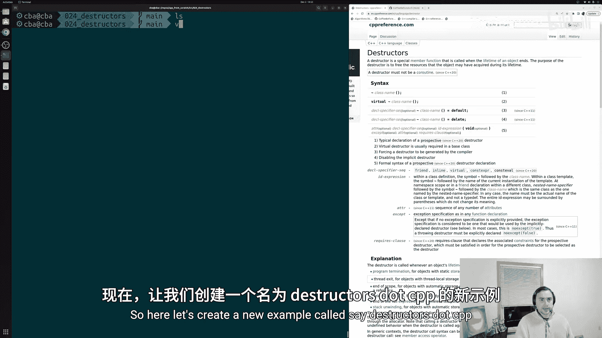
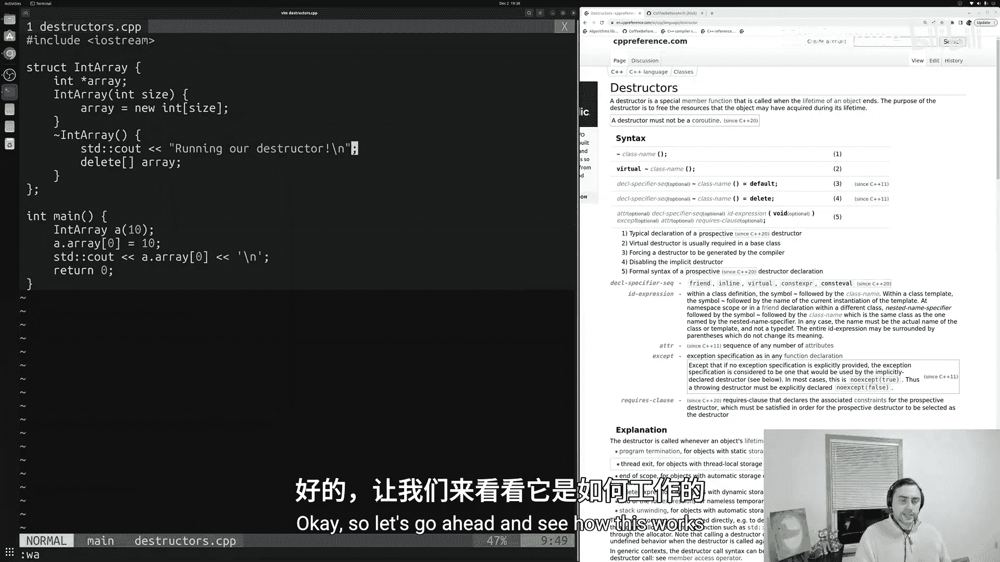
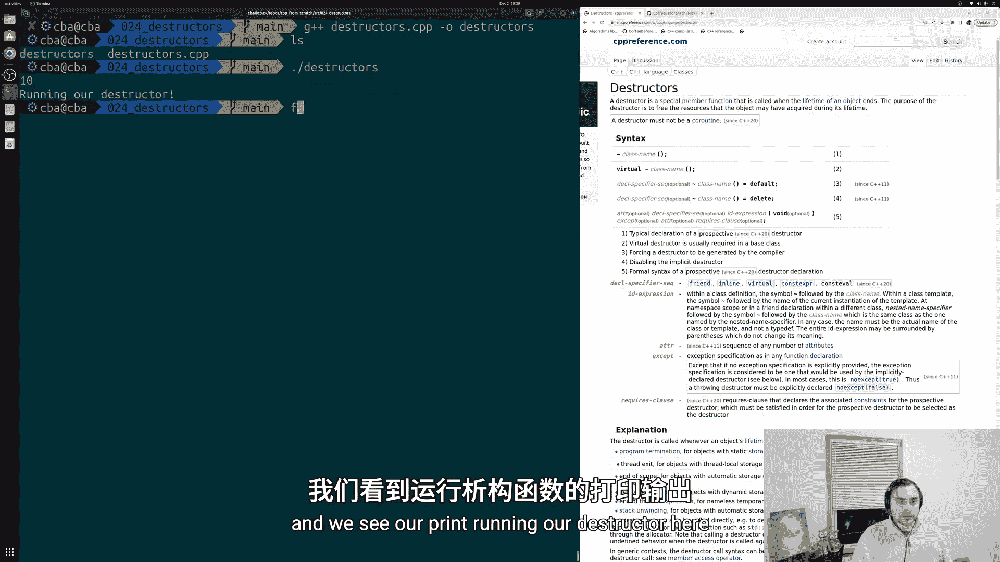
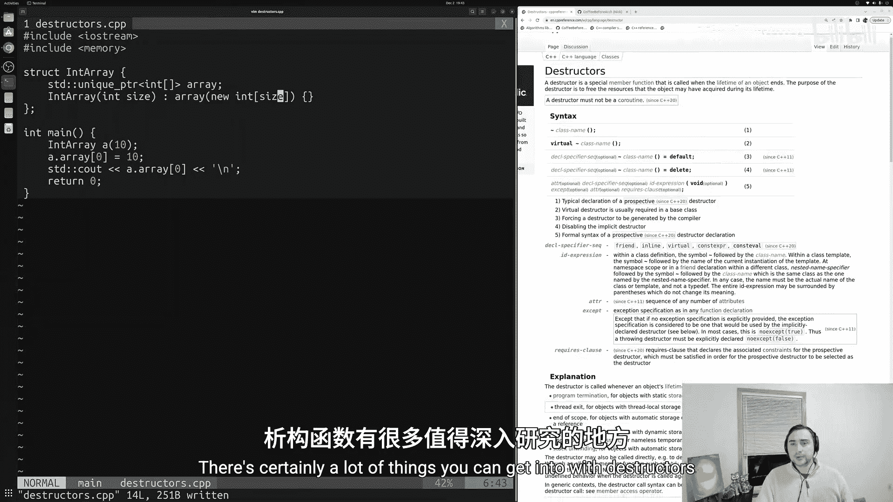
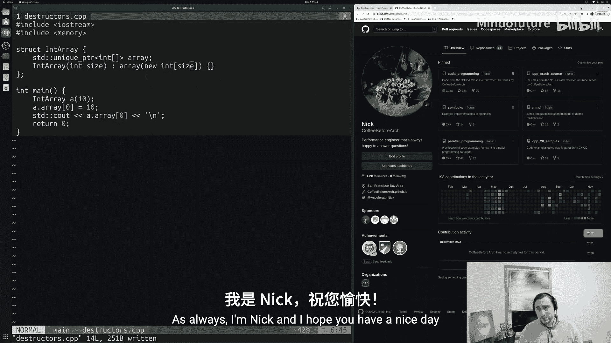

# 025：析构函数 🧹

在本节课中，我们将要学习C++中的析构函数。析构函数是一种特殊的成员函数，它在对象生命周期结束时自动调用，主要用于清理对象占用的资源，例如释放动态分配的内存。

## 概述



上一节我们介绍了构造函数，它用于在创建对象时初始化数据成员。本节中我们来看看析构函数，它用于在销毁对象时执行清理工作。

## 析构函数的基本用法

析构函数在对象被销毁时自动调用。例如，当对象离开其作用域，或者我们使用 `delete` 运算符删除动态分配的对象时，析构函数就会运行。

以下是一个简单的析构函数示例：

```cpp
#include <iostream>

struct IntArray {
    int* array;

    // 构造函数
    IntArray(int size) {
        array = new int[size];
    }

    // 析构函数
    ~IntArray() {
        delete[] array;
        std::cout << "运行析构函数！" << std::endl;
    }
};

int main() {
    IntArray a(10);
    a.array[0] = 10;
    std::cout << a.array[0] << std::endl;
    return 0;
}
```

在这个例子中，`IntArray` 结构体管理一个动态分配的整数数组。构造函数负责分配内存，而析构函数负责释放内存。当 `main` 函数返回，对象 `a` 离开作用域时，析构函数会自动调用，释放 `array` 指向的内存。

## RAII 设计模式

这种在构造函数中获取资源、在析构函数中释放资源的设计模式，通常被称为 **RAII**（Resource Acquisition Is Initialization，资源获取即初始化）。

RAII的核心思想是让对象的生命周期与资源绑定。当对象创建时获取资源，当对象销毁时自动释放资源，用户无需手动管理。C++标准库中的许多容器（如 `std::vector`）都采用了这种模式。

## 现代C++中的资源管理



虽然手动编写析构函数是有效的，但在现代C++中，我们通常可以避免直接管理原始指针，从而减少甚至消除编写析构函数的需要。



例如，我们可以使用智能指针（如 `std::unique_ptr`）来管理动态内存：

```cpp
#include <iostream>
#include <memory>

struct IntArray {
    std::unique_ptr<int[]> array;

    // 构造函数
    IntArray(int size) : array(new int[size]) {}
};

int main() {
    IntArray a(10);
    a.array[0] = 10;
    std::cout << a.array[0] << std::endl;
    return 0;
}
```

在这个改进的版本中，`std::unique_ptr` 拥有动态数组的所有权。当 `IntArray` 对象销毁时，`std::unique_ptr` 的析构函数会自动释放其管理的内存，因此我们无需为 `IntArray` 手动编写析构函数。

## 何时需要编写析构函数

尽管智能指针和标准库容器能处理大多数情况，但在某些场景下，我们仍然需要编写自己的析构函数：

*   管理非内存资源（如文件句柄、网络连接、锁）。
*   实现自定义的、复杂的资源管理逻辑。
*   维护与C语言库或遗留代码的接口。

## 总结





本节课中我们一起学习了C++析构函数。我们了解了析构函数的基本语法和作用，即在对象销毁时执行清理工作。我们探讨了RAII设计模式，它通过将资源生命周期与对象绑定来简化资源管理。最后，我们看到了在现代C++中，利用智能指针等工具可以避免许多手动资源管理的工作，使代码更安全、更简洁。