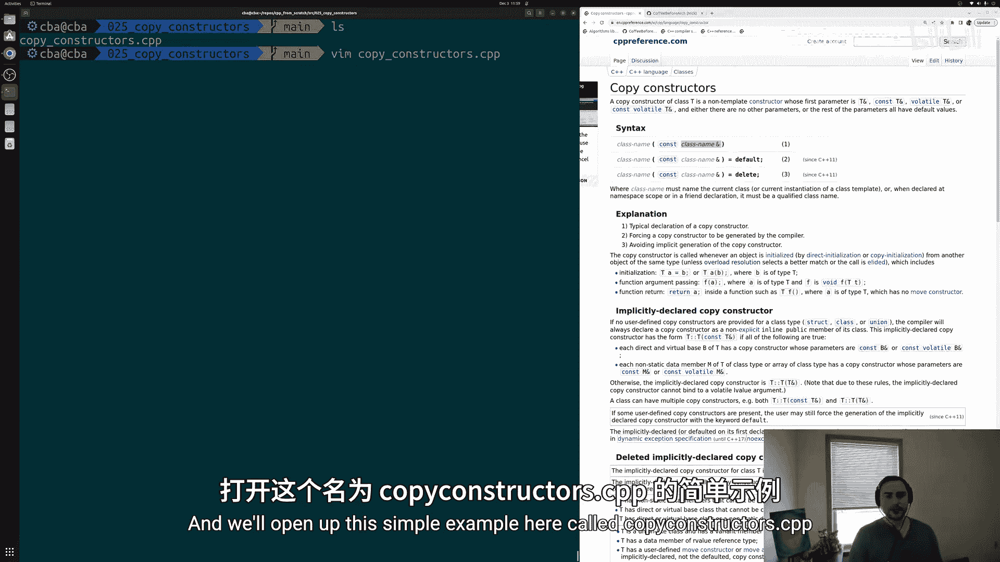
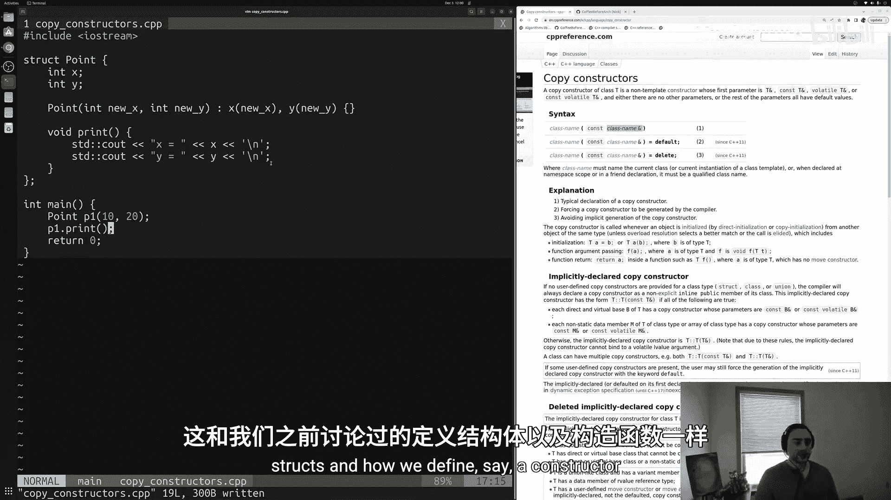
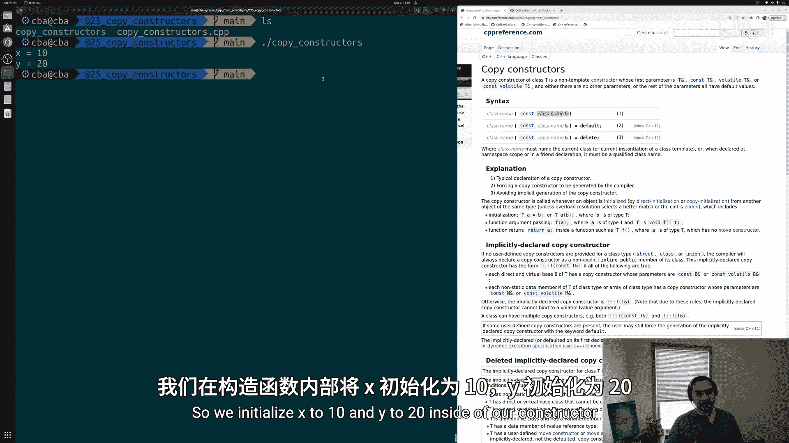
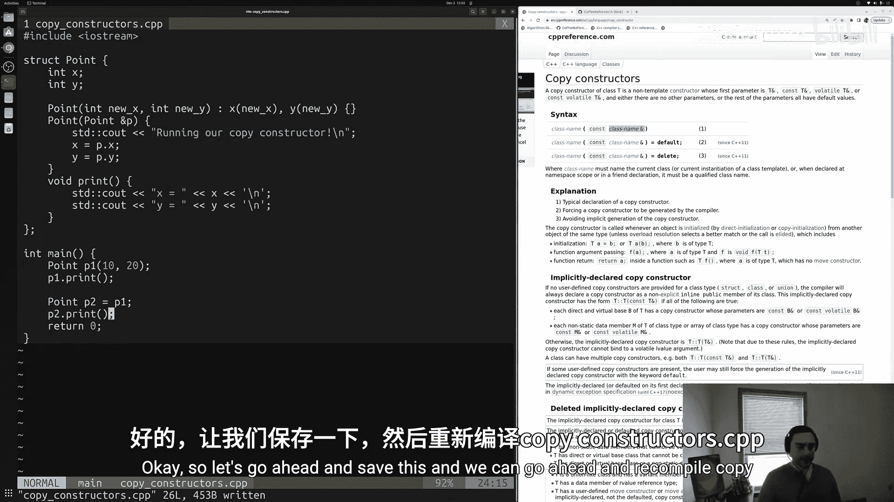
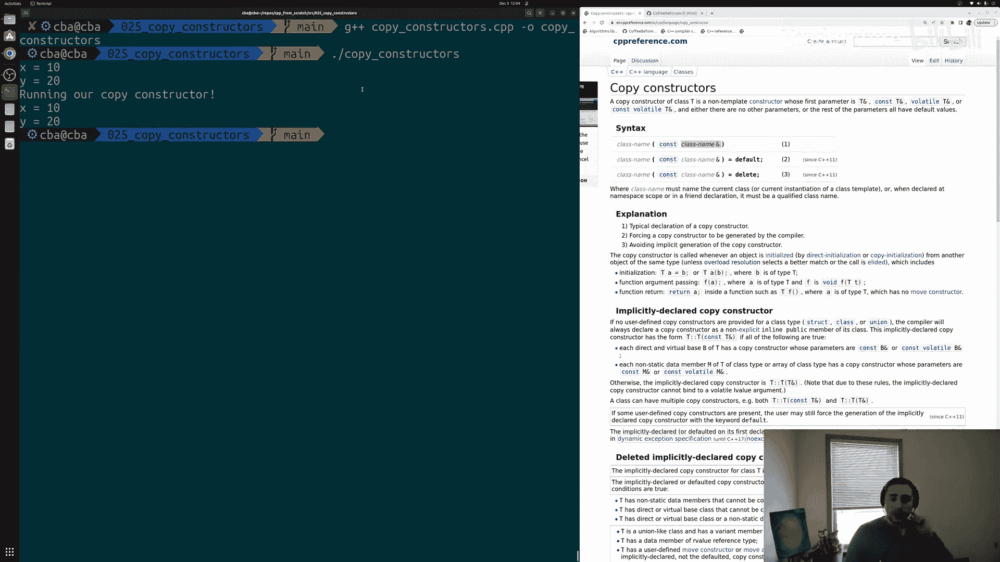
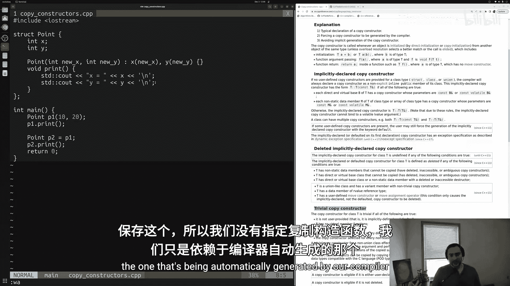
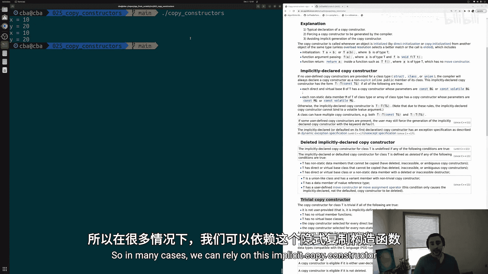
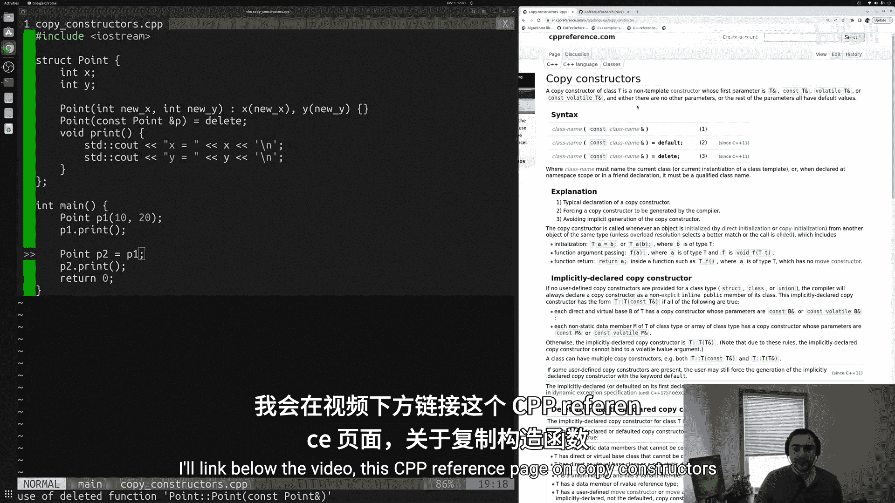
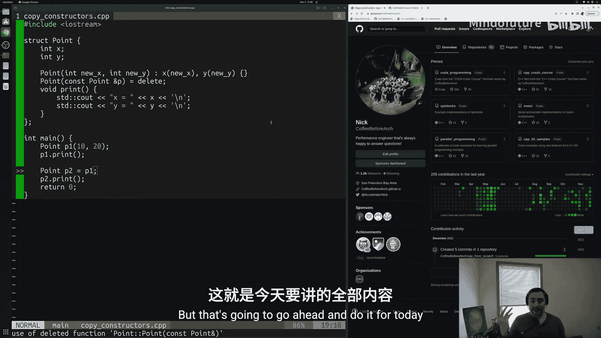

# 026：拷贝构造函数 📝

在本节课中，我们将要学习C++中的拷贝构造函数。拷贝构造函数是一种特殊的成员函数，用于创建一个新对象，并将其初始化为一个已存在对象的副本。我们将探讨如何定义和使用它，以及编译器在何时会为我们自动生成一个。



---

## 回顾构造函数

上一节我们介绍了构造函数的基础知识，它是用于创建和初始化类或结构体对象的成员函数。

现在，我们经常需要在编程中基于一个已存在的对象来创建一个新对象。指定如何实现这一过程的方法就是通过拷贝构造函数。这就是我们今天要学习的内容。

---

## 一个简单的起点

让我们从一个简单的结构体 `Point` 开始，它代表一个二维坐标点。



```cpp
struct Point {
    int x;
    int y;

    // 普通构造函数
    Point(int newX, int newY) : x(newX), y(newY) {}

    void print() {
        std::cout << "x is equal to " << x << " y is equal to " << y << std::endl;
    }
};
```



在 `main` 函数中，我们可以这样使用它：

```cpp
int main() {
    Point p1(10, 20);
    p1.print();
    return 0;
}
```

运行程序会输出：`x is equal to 10 y is equal to 20`。

---

## 引入拷贝构造函数

现在，假设我们想基于已存在的 `p1` 对象创建一个新的 `Point` 对象 `p2`。我们不希望再次手动传递 `x` 和 `y` 的值，而是希望直接复制 `p1`。这时就需要拷贝构造函数。

拷贝构造函数的定义如下：

```cpp
struct Point {
    // ... 其他成员 ...

    // 拷贝构造函数
    Point(const Point& p) {
        x = p.x;
        y = p.y;
        std::cout << "Running our copy constructor!" << std::endl;
    }
};
```

以下是关于拷贝构造函数定义的关键点：
*   它接受一个**常量引用**（`const Point&`）作为参数。这确保了原始对象在拷贝过程中不会被意外修改。
*   在函数体内，我们将参数对象 `p` 的成员值复制到新创建的对象中。
*   我们添加了一行打印语句，以便观察拷贝构造函数何时被调用。

现在，我们可以在 `main` 函数中使用它：

```cpp
int main() {
    Point p1(10, 20);
    p1.print();

    // 使用拷贝构造函数创建 p2
    Point p2 = p1;
    p2.print();

    return 0;
}
```

运行程序，输出如下：
1.  `x is equal to 10 y is equal to 20` （来自 `p1.print()`）
2.  `Running our copy constructor!` （拷贝构造函数被调用）
3.  `x is equal to 10 y is equal to 20` （来自 `p2.print()`）



这表明我们成功地基于 `p1` 创建了一个内容相同的新对象 `p2`。



---

## 编译器的默认拷贝构造函数

对于像我们 `Point` 这样简单的结构体（仅包含基本数据类型），编译器会自动为我们生成一个默认的拷贝构造函数。这个默认的拷贝构造函数会执行“浅拷贝”，即逐个复制每个成员变量的值。

因此，即使我们删除自定义的拷贝构造函数，代码依然可以正常工作：

```cpp
struct Point {
    int x;
    int y;
    Point(int newX, int newY) : x(newX), y(newY) {}
    void print() { ... }
    // 没有定义拷贝构造函数
};

int main() {
    Point p1(10, 20);
    Point p2 = p1; // 使用编译器生成的默认拷贝构造函数
    p2.print(); // 输出: x is equal to 10 y is equal to 20
    return 0;
}
```

输出结果与之前相同，只是没有了“Running our copy constructor!”的提示。在许多简单情况下，依赖编译器的默认实现是完全可行的。

---

## 禁用拷贝构造函数



有时，我们可能希望禁止对象的拷贝行为。例如，`std::unique_ptr` 拥有对内存的独占所有权，因此不允许被拷贝。



我们可以通过将拷贝构造函数标记为 `= delete` 来显式禁止它：

```cpp
struct Point {
    int x;
    int y;
    Point(int newX, int newY) : x(newX), y(newY) {}

    // 删除拷贝构造函数
    Point(const Point& p) = delete;

    void print() { ... }
};

int main() {
    Point p1(10, 20);
    Point p2 = p1; // 错误：尝试使用已删除的函数
    return 0;
}
```

尝试编译这段代码会导致错误，因为拷贝操作不再被允许。这在需要控制对象复制行为的场景中非常有用。

---

## 总结

本节课中我们一起学习了C++中的拷贝构造函数。
*   我们了解到**拷贝构造函数**用于基于现有对象创建新对象，其标准形式为 `ClassName(const ClassName&)`。
*   我们学习了如何**自定义拷贝构造函数**以实现特定的复制逻辑。
*   我们认识到对于简单的类，**编译器会自动生成一个默认的拷贝构造函数**来执行成员间的值复制。
*   最后，我们知道了可以通过 `= delete` 来**显式禁用拷贝构造函数**，以防止对象被复制。





理解拷贝构造函数是掌握C++对象生命周期和资源管理的重要一步。