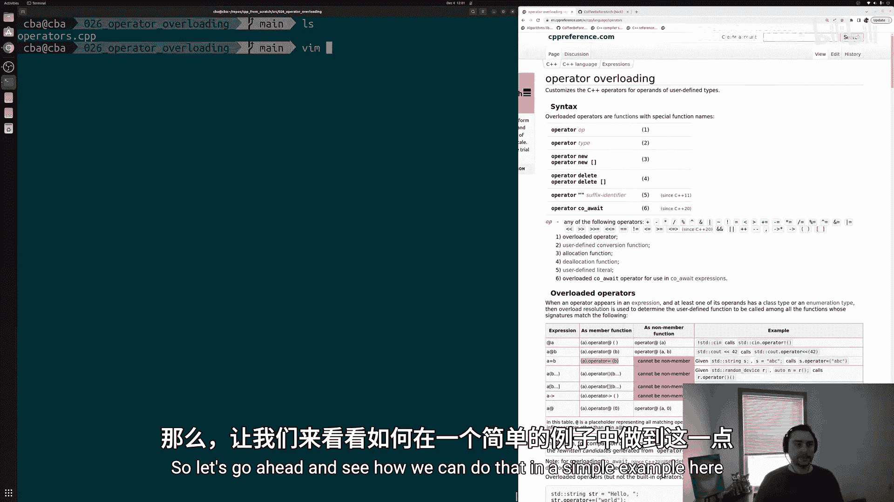
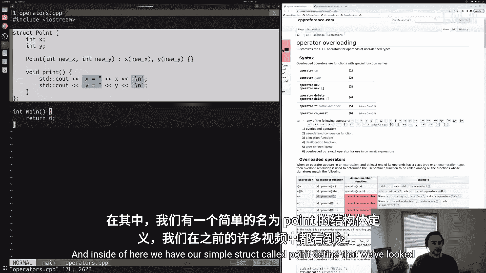
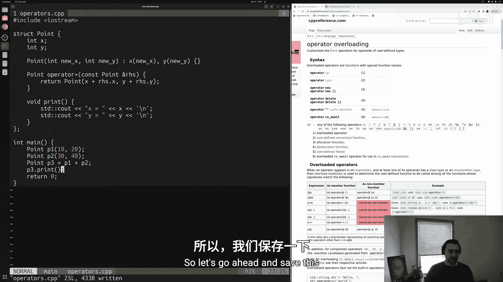
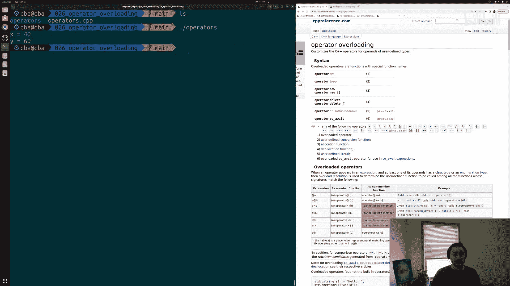
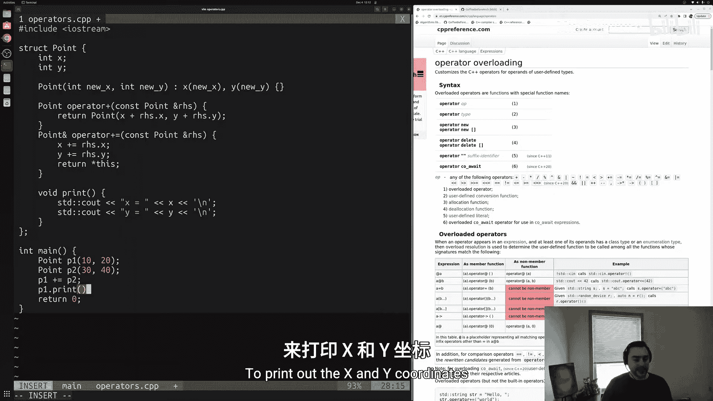
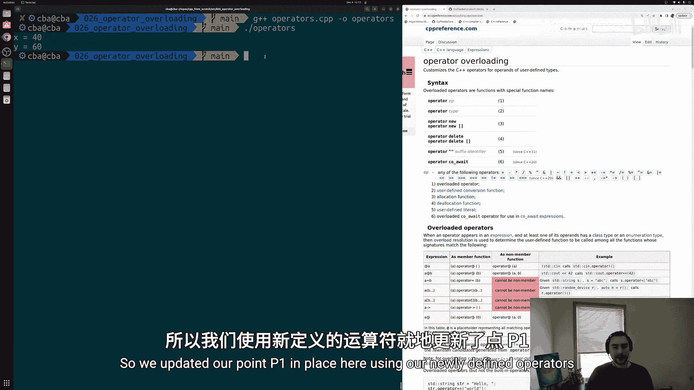
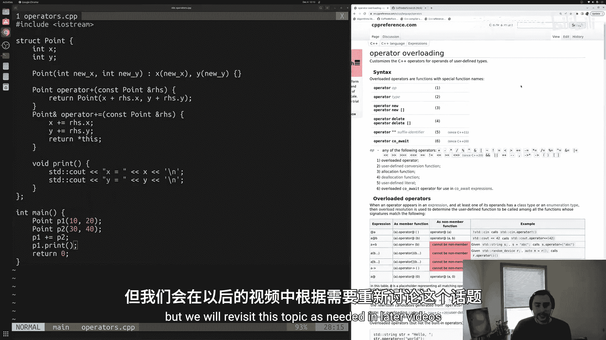
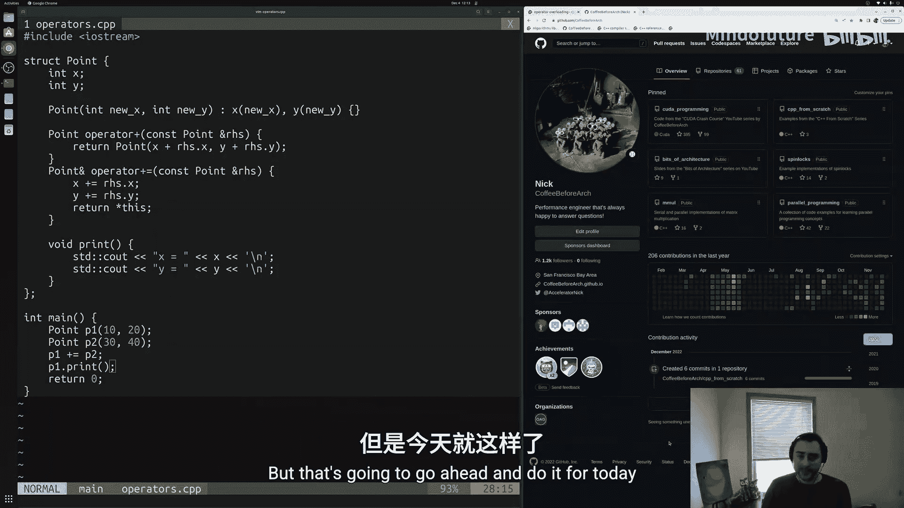

# 027：运算符重载 🧮

在本节课中，我们将要学习C++中一个非常强大的特性——运算符重载。通过运算符重载，我们可以让自定义的类型（如结构体和类）像内置类型（如`int`， `float`）一样，使用`+`、`-`、`+=`等运算符，从而使代码更直观、更易读。





在之前的课程中，我们学习了如何使用`struct`和`class`来定义自己的类型。然而，默认情况下，编译器并不知道如何对这些新类型的对象使用运算符。例如，它不知道如何将两个`Point`对象相加。运算符重载就是教编译器如何处理这些运算符的方法，通过将它们实现为我们类型内部的成员函数。

## 一个简单的例子：`Point`结构体

让我们从一个简单的`Point`结构体开始，它代表一个二维坐标点。

```cpp
struct Point {
    int x;
    int y;

    Point(int x_val, int y_val) : x(x_val), y(y_val) {}

    void print() {
        std::cout << "x: " << x << ", y: " << y << std::endl;
    }
};
```

这个结构体包含两个数据成员`x`和`y`，一个构造函数用于初始化，以及一个打印坐标的成员函数`print`。

## 重载加法运算符 (`+`)

假设我们想实现两个`Point`对象的加法，即新点的`x`坐标是两个点`x`坐标之和，`y`坐标也是两个点`y`坐标之和。

我们希望这样使用：
```cpp
Point p1(10, 20);
Point p2(30, 40);
Point p3 = p1 + p2; // 期望 p3 为 (40, 60)
```

但默认情况下，编译器会报错，因为它不理解`Point`对象之间的`+`操作。我们需要在`Point`结构体中重载`+`运算符。

### 实现 `operator+`

以下是`operator+`成员函数的实现：

```cpp
struct Point {
    // ... 其他成员（x, y, 构造函数, print）

    // 重载 + 运算符
    Point operator+(const Point& rhs) const {
        return Point(x + rhs.x, y + rhs.y);
    }
};
```

让我们分解一下这个实现：
*   **返回类型**：`Point`。因为相加的结果是一个新的点。
*   **函数名**：`operator+`。这是一个特殊的函数名，用于重载`+`运算符。
*   **参数**：`const Point& rhs`。`rhs`代表“右手边”（right-hand side），即`+`运算符右边的对象（例如`p2`）。我们通过常量引用传递它，以避免不必要的复制，并且承诺不修改它。
*   **函数体**：创建并返回一个新的`Point`对象，其`x`和`y`分别是当前对象（`p1`）和参数对象（`p2`）对应坐标的和。
*   **`const`修饰符**：在函数声明的末尾，`const`表示这个成员函数不会修改调用它的对象（即`p1`）。

**关键理解**：表达式`p1 + p2`实际上等价于`p1.operator+(p2)`。`p1`是调用该成员函数的对象，`p2`作为参数传入。



现在，我们可以成功编译并运行代码，`p3.print()`将输出`x: 40, y: 60`。



## 重载复合赋值运算符 (`+=`)

接下来，我们看看如何重载`+=`运算符，它用于修改一个已存在的对象，而不是创建新对象。

我们希望这样使用：
```cpp
Point p1(10, 20);
Point p2(30, 40);
p1 += p2; // 期望 p1 变为 (40, 60)
```

表达式`p1 += p2`可以理解为`p1 = p1 + p2`。

### 实现 `operator+=`

以下是`operator+=`成员函数的实现：

```cpp
struct Point {
    // ... 其他成员

    // 重载 += 运算符
    Point& operator+=(const Point& rhs) {
        x += rhs.x;
        y += rhs.y;
        return *this;
    }
};
```

分解这个实现：
*   **返回类型**：`Point&`（引用）。我们返回当前对象（`p1`）的引用，以支持链式调用（如`a += b += c`）。
*   **函数名**：`operator+=`。
*   **参数**：同样是`const Point& rhs`，代表`+=`右边的对象。
*   **函数体**：直接修改当前对象的`x`和`y`成员，将它们分别与`rhs`的对应坐标相加。
*   **返回值**：`*this`。`this`是一个指向当前对象的指针，`*this`就是对当前对象（`p1`）的解引用。我们返回它的引用。

现在，执行`p1 += p2;`后，`p1.print()`将输出`x: 40, y: 60`。



## 总结



本节课中我们一起学习了C++运算符重载的基础知识：
1.  **目的**：让自定义类型支持C++内置运算符，提升代码的直观性和表达能力。
2.  **实现方式**：在类或结构体内部，以`operator`关键字加上要重载的运算符（如`+`， `+=`）作为函数名，定义成员函数。
3.  **关键区别**：
    *   `operator+` 通常**返回一个新对象**，不修改原对象，函数常声明为`const`。
    *   `operator+=` 通常**修改当前对象**并返回其引用，以支持链式操作。
4.  **参数传递**：通常使用常量引用（`const T&`）来传递运算符右侧的操作数，以提高效率。





运算符重载是一个功能丰富的主题，C++允许重载大部分运算符（除了少数如`::`， `.*`等）。理解其基本原理后，你可以根据需要为你自定义的类型重载其他运算符，如`-`、`*`、`==`、`[]`等，使它们用起来就像内置类型一样自然。