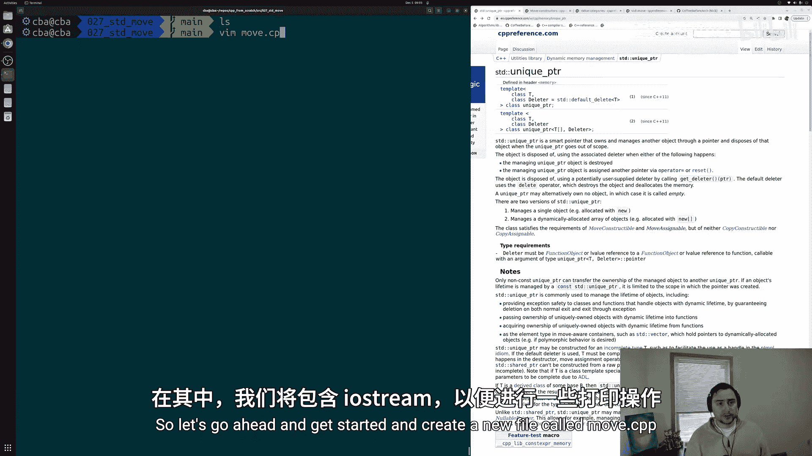
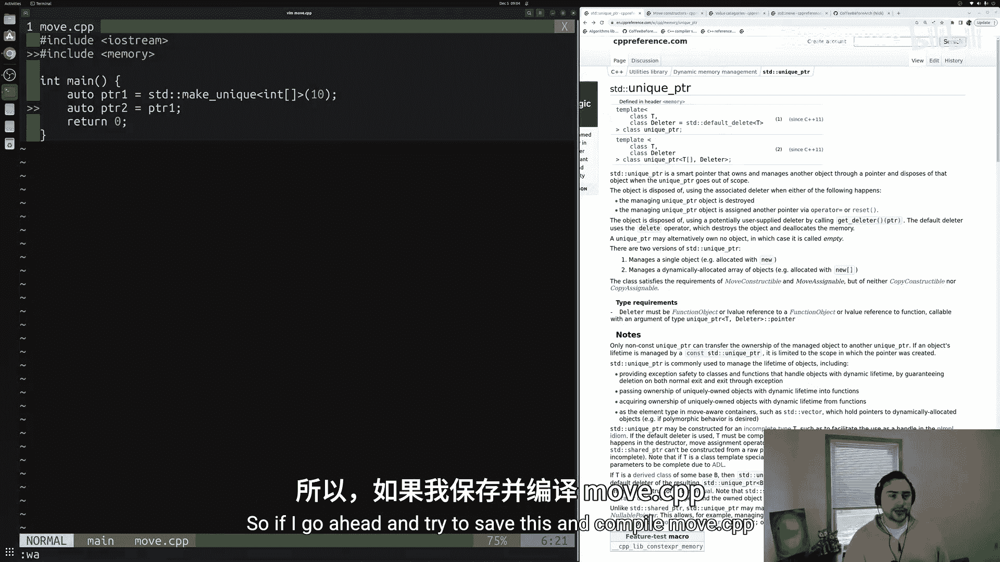
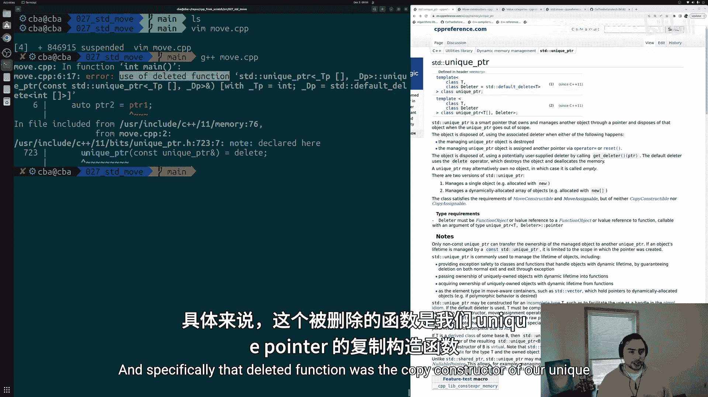
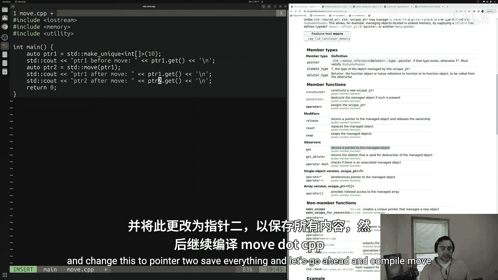
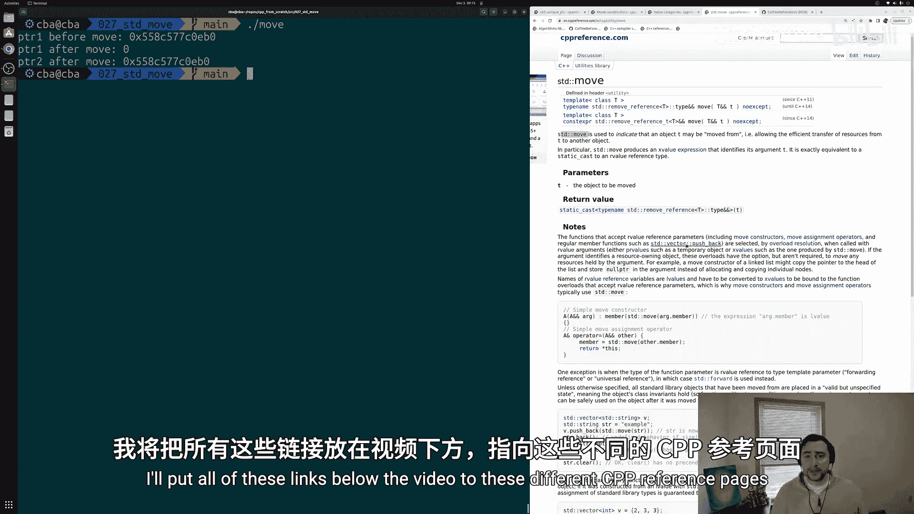
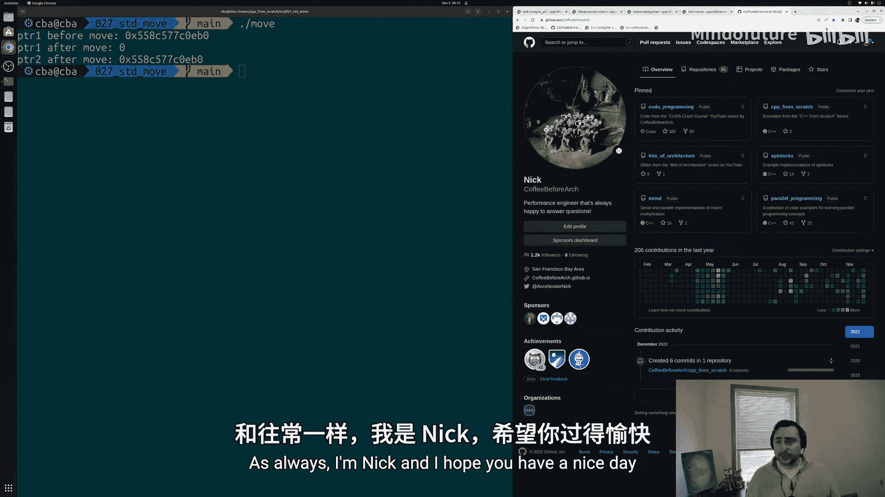

# 028：std::move与移动语义基础 🚀

在本节课中，我们将学习C++中`std::move`和移动语义的基础知识。移动语义是一种避免不必要数据拷贝、提升程序性能的重要机制，尤其适用于管理大型对象或独占资源（如`std::unique_ptr`）的场景。



---

## 为何需要移动语义？

在之前的课程中，我们讨论过有时需要避免程序内的拷贝操作。这可能是出于功能原因，例如`std::unique_ptr`不能被拷贝；也可能是出于性能原因，例如拷贝一个非常大的`std::vector`代价高昂。





C++中绕过拷贝的一种方法是使用移动和移动语义。其核心思想是：与其将资源复制到一个新对象，不如“窃取”底层资源的所有权。这就是我们今天要通过简单示例来探讨的内容。

---

## 从`std::unique_ptr`看拷贝的限制

让我们通过一个具体例子开始。首先，创建一个名为`move.cpp`的文件，并包含必要的头文件。

```cpp
#include <iostream>
#include <memory> // 用于使用std::unique_ptr
#include <utility> // 用于使用std::move

int main() {
    // 创建一个管理10个整数数组的unique_ptr
    auto pointer1 = std::make_unique<int[]>(10);
    // 尝试拷贝pointer1到pointer2 —— 这是不允许的！
    // auto pointer2 = pointer1; // 错误：使用了已删除的函数‘std::unique_ptr<...>的拷贝构造函数’
    return 0;
}
```

如代码所示，`std::unique_ptr`的拷贝构造函数被显式删除，因此尝试拷贝会导致编译错误。这确保了资源的独占所有权。

---

## 理解移动构造函数与移动语义

既然不能拷贝，我们如何转移`unique_ptr`管理的资源呢？答案是通过移动语义。

移动构造函数在形式上与拷贝构造函数相似，但参数类型是**右值引用**（`T&&`）。其核心行为是“窃取”参数对象持有的资源，而非复制。

根据cppreference的说明：
*   **行为**：移动构造函数“窃取”参数持有的资源。例如，`pointer1`管理的数组会被“偷走”并交给`pointer2`。
*   **移动后状态**：被移动的对象（源对象）会处于“有效但未指定”的状态。这意味着你仍然可以安全地析构它或为其赋予新值，但**不应依赖**其移动前的数据内容。对于`std::unique_ptr`，其移动后的状态是**完全指定**的——它会变为`nullptr`。

---

## 值类别：左值(Lvalue)与右值(Rvalue)

要理解如何触发移动，需要了解C++的值类别。我们主要关注两类：
*   **左值 (Lvalue)**：通常有名称，可以取地址，常出现在赋值表达式左侧。例如变量`pointer1`。
*   **右值 (Rvalue)**：通常是临时对象或字面量，没有名称，常出现在赋值表达式右侧。例如函数返回值`std::make_unique<int[]>(10)`或字面量`8`。

默认情况下，**左值倾向于被拷贝，右值倾向于被移动**。但有时我们希望将左值“当作”右值来处理，以允许移动发生。

---

## 使用`std::move`进行移动

`std::move`的作用就是将左值转换为**右值引用**类型，从而“允许”编译器对其进行移动操作。它本身并不执行任何移动，只是改变了值的类别。

让我们修改之前的代码，使用`std::move`来转移`pointer1`的资源：

```cpp
int main() {
    // 创建unique_ptr
    auto pointer1 = std::make_unique<int[]>(10);

    // 打印移动前的指针
    std::cout << "pointer1 before move: " << pointer1.get() << ‘\n’;

    // 使用std::move将pointer1转换为右值，从而调用移动构造函数
    auto pointer2 = std::move(pointer1);

    // 打印移动后的指针状态
    std::cout << "pointer1 after move: " << pointer1.get() << ‘\n’;
    std::cout << "pointer2 after move: " << pointer2.get() << ‘\n’;

    return 0;
}
```

编译并运行此程序，输出将类似于：
```
pointer1 before move: 0x55a0ba5e6e70
pointer1 after move: 0
pointer2 after move: 0x55a0ba5e6e70
```

输出结果清晰地展示了移动语义的效果：
1.  移动前，`pointer1`持有一个有效的内存地址。
2.  移动后，`pointer1`内部的指针变为`nullptr`（即`0`），资源已被“窃取”。
3.  `pointer2`现在持有原本属于`pointer1`的那个内存地址。



---

## 移动语义的应用场景

移动语义在多种场景下非常有用，以下是一些常见例子：
*   **向容器添加元素**：在循环中调用函数获取结果并存入`std::vector`时，使用`std::move`可以避免拷贝，直接转移资源。
*   **函数返回值优化**：编译器经常使用移动语义来优化函数返回局部对象时的效率。
*   **交换两个对象**：`std::swap`的实现通常依赖于移动语义，使其变得高效。

---

## 总结

本节课我们一起学习了C++中移动语义的基础知识：
1.  **移动语义的目的**：通过“窃取”资源而非拷贝，来提升性能并支持不可拷贝类型（如`std::unique_ptr`）的所有权转移。
2.  **核心机制**：移动构造函数和移动赋值运算符负责实现资源的转移。
3.  **值类别**：理解了左值（倾向于拷贝）和右值（倾向于移动）的基本概念。
4.  **`std::move`的作用**：它是一个简单的类型转换工具，将左值转换为右值引用，从而“允许”移动操作发生。它本身不执行任何移动。
5.  **移动后状态**：被移动的对象处于有效但未指定的状态，不应再依赖其原有值。某些标准库类型（如`std::unique_ptr`）有明确指定的移动后状态。





掌握移动语义是编写现代高效C++代码的关键一步。你可以尝试为自定义类实现移动构造函数，或在算法中主动使用`std::move`来优化性能。