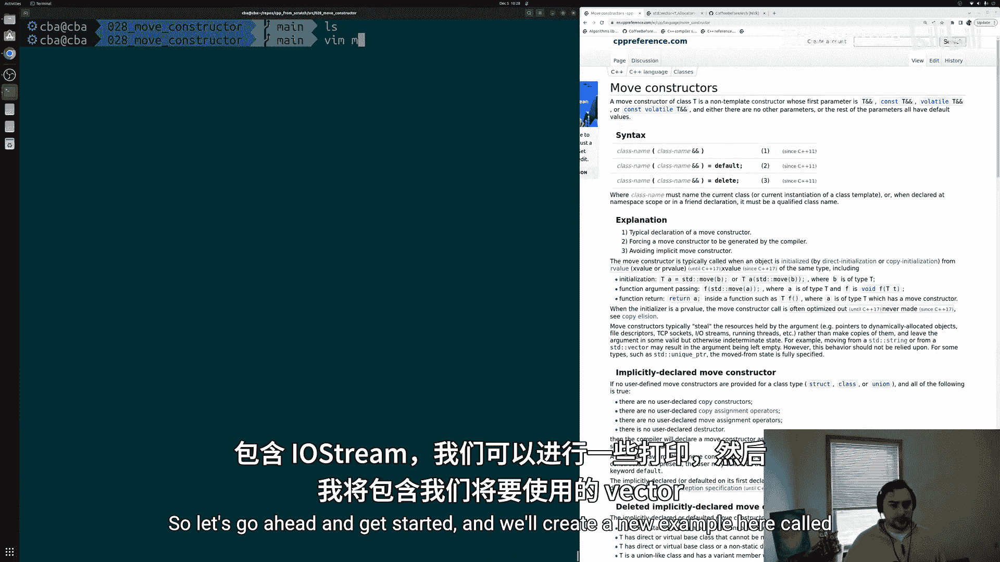
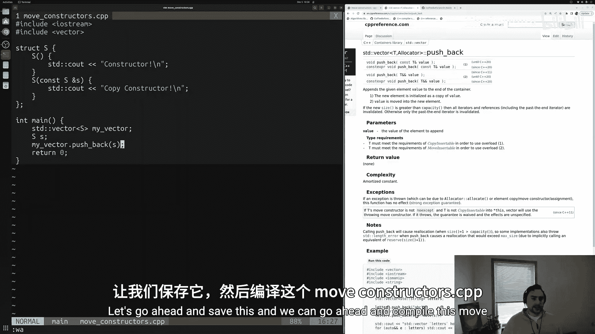
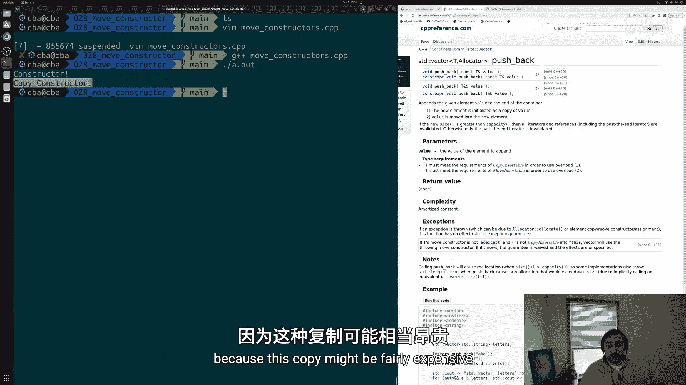
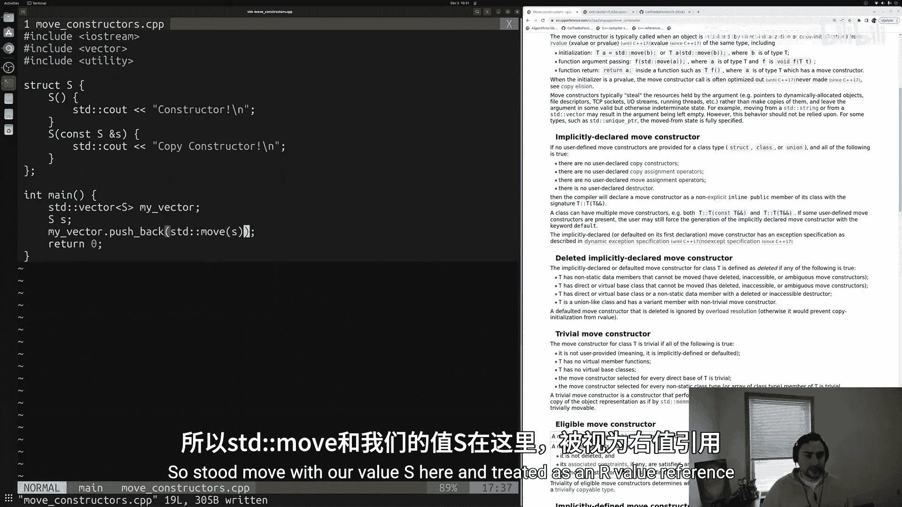
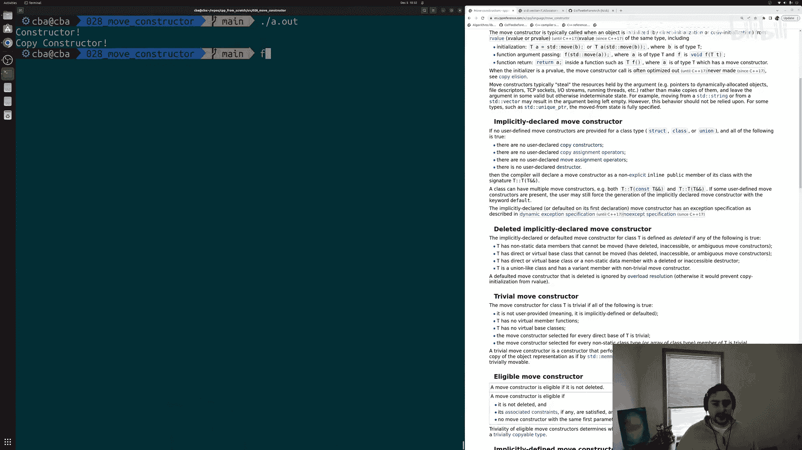
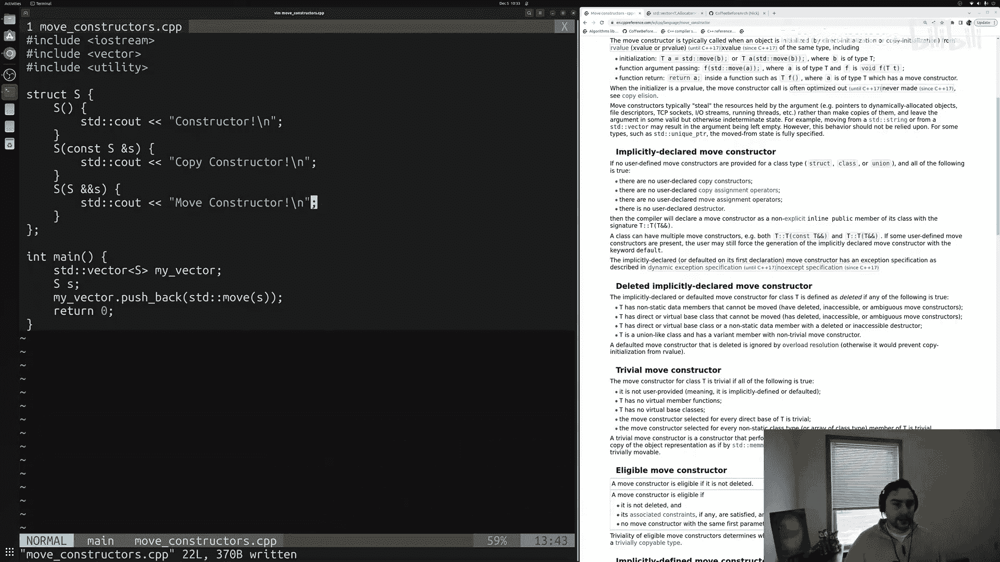
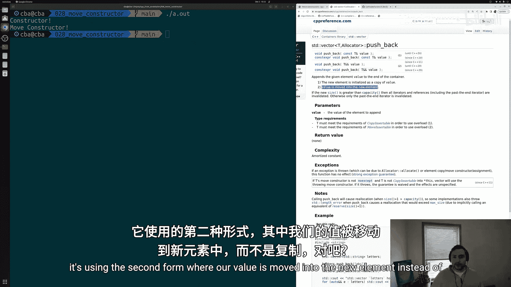
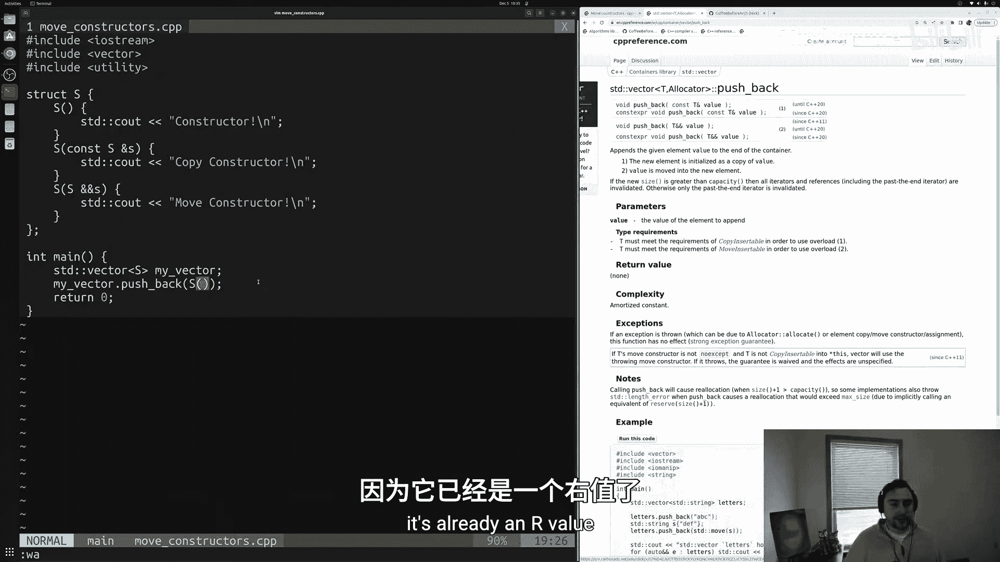
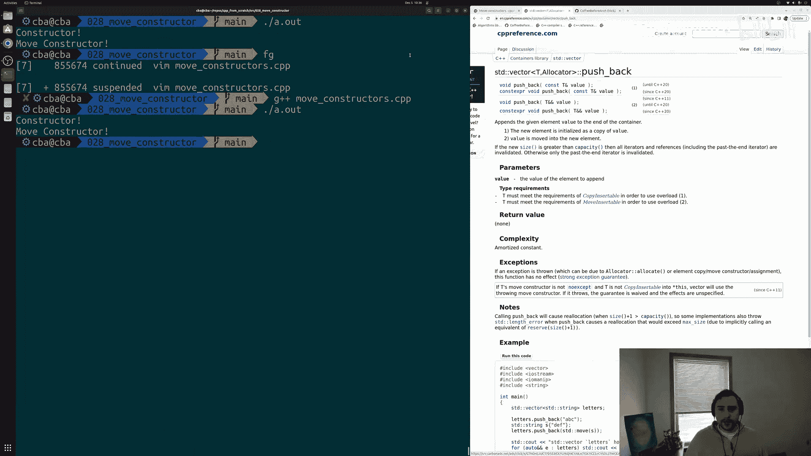

# 029：移动构造函数 🚀

在本节课中，我们将学习移动构造函数的基础知识，以及如何在自定义的结构体和类中定义它们。

上一节我们讨论了移动语义的概念，即不复制值，而是将底层资源从一个对象转移到另一个对象。本节中我们来看看如何为我们自己定义的类或结构体实现这一功能。



## 概述

我们将通过一个简单的例子来学习。很多时候，我们从多个地方获取对象并将它们放入容器（如 `std::vector`）中。但并非所有对象都能被复制（例如 `std::unique_ptr`），并且复制操作可能非常昂贵。因此，我们更希望将底层内容“移动”到容器中，而不是复制。

让我们开始编写代码。

## 代码示例：定义结构体 S

首先，我们创建一个简单的结构体 `S`，它包含一个普通构造函数和一个复制构造函数，以便观察它们何时被调用。

```cpp
#include <iostream>
#include <vector>

struct S {
    // 普通构造函数
    S() {
        std::cout << "constructor!" << std::endl;
    }

    // 复制构造函数
    S(const S&) {
        std::cout << "copy constructor!" << std::endl;
    }
};

int main() {
    std::vector<S> my_vector;
    S s; // 调用普通构造函数
    my_vector.push_back(s); // 尝试将 s 推入向量
    return 0;
}
```



编译并运行此代码，输出如下：
```
constructor!
copy constructor!
```
如我们所见，创建对象 `s` 时调用了普通构造函数，而将其推入 `vector` 时调用了复制构造函数。这是因为 `s` 是一个左值（lvalue），`push_back` 的签名会接受一个常量引用并执行复制。

## 实现移动构造函数



为了避免昂贵的复制，我们需要实现移动构造函数。由于我们已定义了复制构造函数，编译器不会自动生成移动构造函数。

以下是移动构造函数的定义方法：



```cpp
struct S {
    S() {
        std::cout << "constructor!" << std::endl;
    }

    S(const S&) {
        std::cout << "copy constructor!" << std::endl;
    }

    // 移动构造函数
    S(S&&) {
        std::cout << "move constructor!" << std::endl;
    }
};
```



现在，我们可以使用 `std::move` 将左值 `s` 转换为右值引用，从而触发移动操作：

```cpp
int main() {
    std::vector<S> my_vector;
    S s;
    my_vector.push_back(std::move(s)); // 使用 std::move 触发移动
    return 0;
}
```



编译并运行，输出变为：
```
constructor!
move constructor!
```
现在，对象被移动到了 `vector` 中，而不是被复制。

## 右值的自动移动

在某些情况下，即使不使用 `std::move`，也会发生移动。例如，当我们直接创建一个临时对象并将其传递给 `push_back` 时：



```cpp
int main() {
    std::vector<S> my_vector;
    my_vector.push_back(S()); // 传递一个临时对象（右值）
    return 0;
}
```

编译并运行，输出为：
```
constructor!
move constructor!
```
这里，`S()` 创建了一个无名临时对象，它是一个右值。因此，`push_back` 会自动调用移动构造函数，无需显式使用 `std::move`。

## 关键点总结

以下是关于移动构造函数和 `std::vector::push_back` 行为的几个关键点：



1.  **左值与复制**：当传递一个具名对象（左值）给 `push_back` 时，默认会调用复制构造函数。
2.  **移动构造函数**：需要手动定义移动构造函数来启用移动语义。其签名形式为 `ClassName(ClassName&&)`。
3.  **`std::move` 的作用**：`std::move` 本身不执行移动，它只是将左值转换为右值引用，表明该对象可以被移动。
4.  **右值与自动移动**：临时对象（右值）在传递给 `push_back` 时会自动触发移动操作，无需 `std::move`。
5.  **隐式声明规则**：如果用户定义了复制构造函数、复制赋值运算符或析构函数，编译器将不会自动生成移动构造函数。

## 总结



本节课中我们一起学习了移动构造函数的基础知识。我们了解到，通过定义移动构造函数，可以高效地将资源从一个对象转移到另一个对象，避免不必要的复制。我们还探讨了 `std::vector::push_back` 在面对左值和右值时的不同行为，以及如何使用 `std::move` 来强制移动左值。


掌握移动语义对于编写高效的现代 C++ 代码至关重要，尤其是在处理大型对象或不可复制的资源（如文件句柄、网络连接）时。