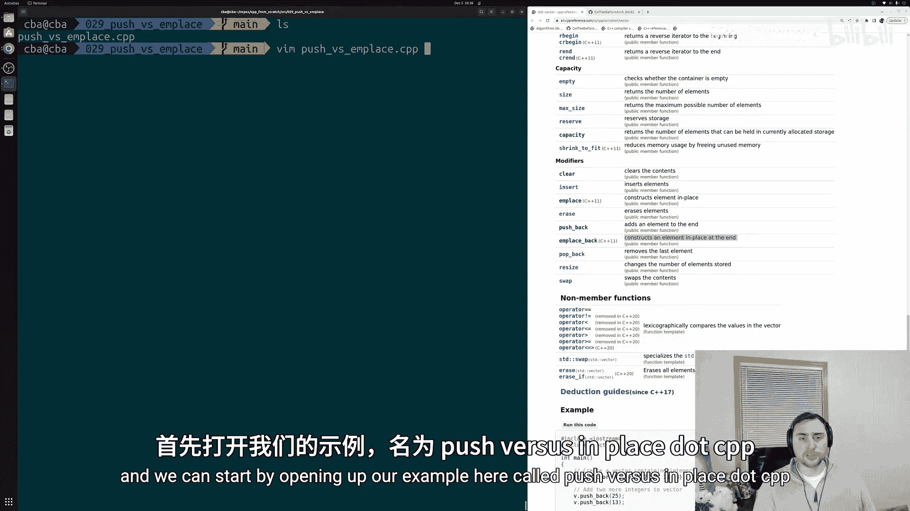
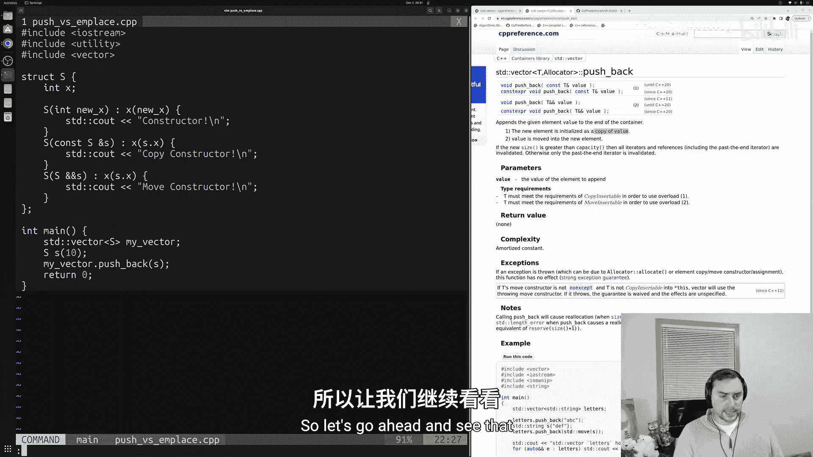
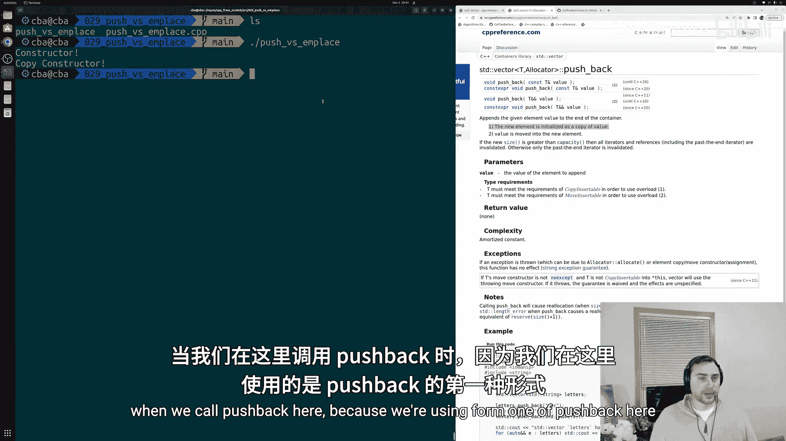
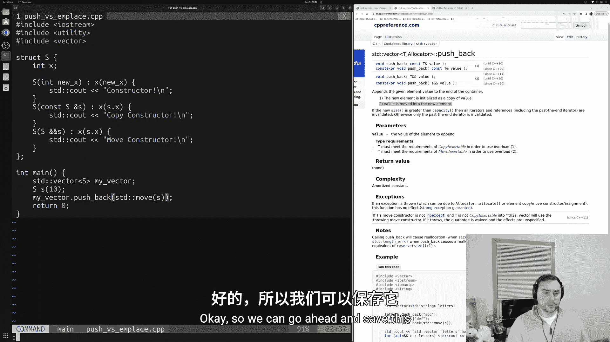
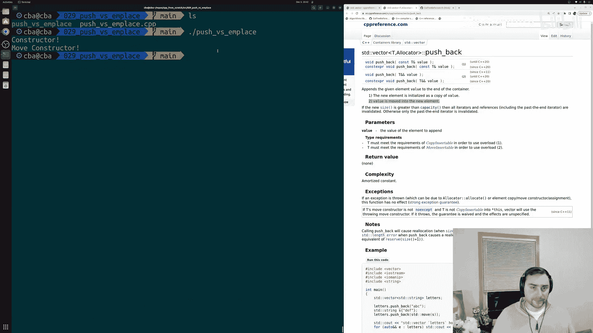
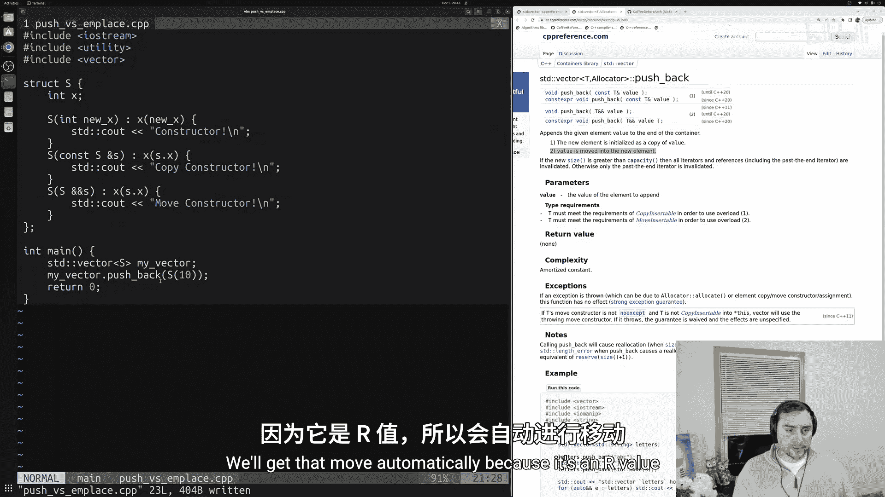
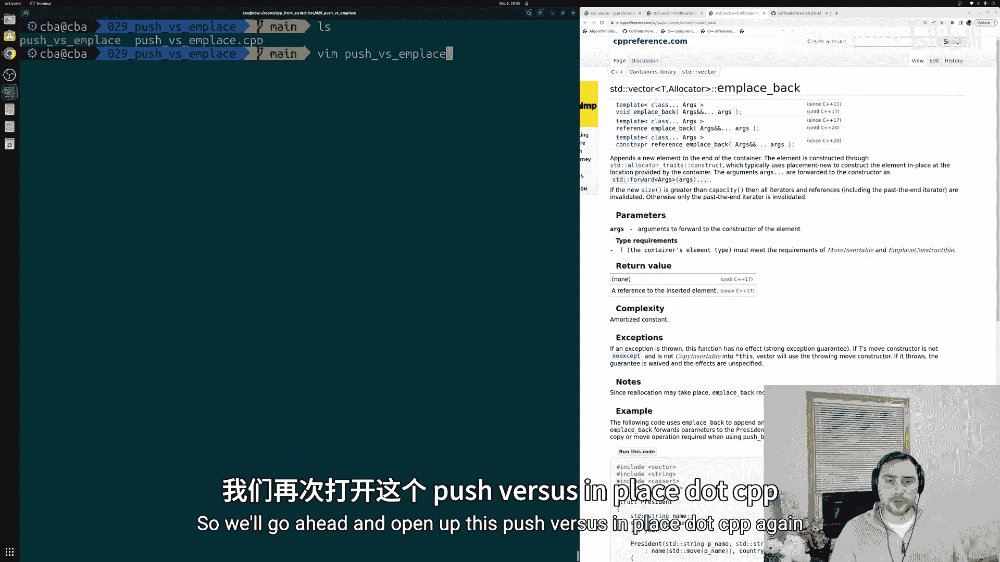
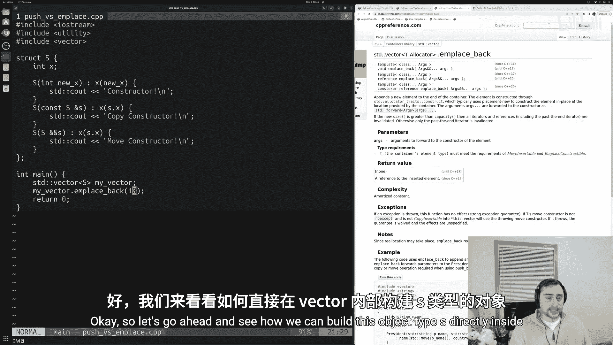
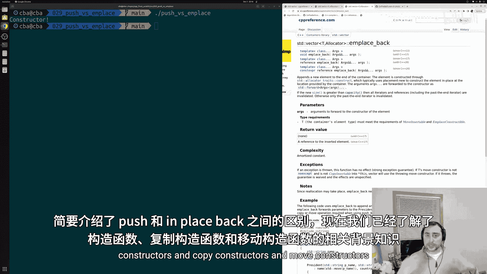
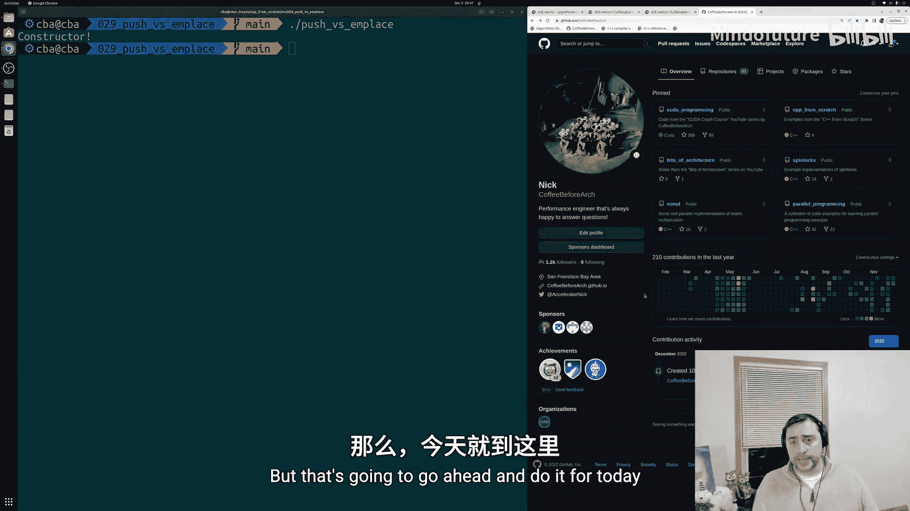

# 030：push_back 与 emplace_back 的区别

## 概述
在本节课中，我们将学习C++标准模板库（STL）中 `std::vector` 容器的两个重要方法：`push_back` 和 `emplace_back`。我们将探讨它们的工作原理、区别以及各自的适用场景，特别是结合我们之前学过的构造函数、拷贝构造函数和移动构造函数的知识。

`std::vector` 是最常用的STL容器之一，它是一个动态大小的数组。理解如何高效地向其中添加元素至关重要。`push_back` 和 `emplace_back` 就是用于此目的的两个方法，但它们在底层实现和性能上存在关键差异。

---



## 准备工作
在深入比较之前，我们先设置一个简单的示例结构体 `S`，以便观察构造函数、拷贝构造函数和移动构造函数的调用情况。

```cpp
#include <iostream>
#include <utility>
#include <vector>

struct S {
    int x;
    // 构造函数
    S(int n) : x(n) { std::cout << "构造函数被调用\n"; }
    // 拷贝构造函数
    S(const S& other) : x(other.x) { std::cout << "拷贝构造函数被调用\n"; }
    // 移动构造函数
    S(S&& other) noexcept : x(std::move(other.x)) { std::cout << "移动构造函数被调用\n"; }
};

int main() {
    std::vector<S> my_vec;
    // 后续实验将在此进行
    return 0;
}
```
这个结构体 `S` 包含一个整数成员 `x`，并定义了三种构造函数，每个被调用时都会打印相应的信息。

---

## 深入理解 push_back
上一节我们介绍了实验环境，本节中我们来看看 `push_back` 方法。`push_back` 用于在 `vector` 的末尾添加一个新元素。它有两种重载形式，分别处理左值（lvalue）和右值（rvalue）。

### 使用左值调用 push_back
当我们传递一个已命名的对象（左值）给 `push_back` 时，它会调用拷贝构造函数，在 `vector` 内部创建该对象的一个副本。

以下是具体步骤：
1.  首先，创建一个 `S` 类型的对象 `s`。
2.  然后，调用 `my_vec.push_back(s)`。
3.  此时，`push_back` 会为 `vector` 分配内存（如果需要），并调用 `S` 的拷贝构造函数，将 `s` 的内容复制到新分配的内存中。



运行代码后，输出将显示“构造函数被调用”（创建`s`）和“拷贝构造函数被调用”（复制到`vector`）。



### 使用 std::move 调用 push_back
如果我们想避免拷贝，可以使用 `std::move` 将左值转换为右值引用，从而触发移动构造函数。

以下是具体步骤：
1.  同样先创建对象 `s`。
2.  调用 `my_vec.push_back(std::move(s))`。
3.  这次，`push_back` 会调用移动构造函数，将 `s` 的资源“移动”到 `vector` 中，这通常比拷贝更高效。



输出将显示“构造函数被调用”和“移动构造函数被调用”。



### 使用临时对象（右值）调用 push_back
我们也可以直接传递一个临时对象（右值）给 `push_back`，这会自动触发移动语义。

以下是具体步骤：
1.  直接调用 `my_vec.push_back(S(10))`。
2.  首先，`S(10)` 调用构造函数创建临时对象。
3.  接着，`push_back` 会调用移动构造函数，将这个临时对象移动到 `vector` 中。

输出同样显示“构造函数被调用”和“移动构造函数被调用”，且无需显式使用 `std::move`。



**总结 `push_back` 的特点**：无论哪种方式，`push_back` 总是涉及**两处内存**：一处是原始对象所在的位置，另一处是 `vector` 内部为新元素分配的位置。操作过程要么是拷贝，要么是移动。

---

## 探索 emplace_back
上一节我们看到了 `push_back` 总是需要构造然后拷贝或移动，本节中我们来看看 `emplace_back` 如何提供一种更高效的替代方案。`emplace_back` 的核心思想是“就地构造”。

与 `push_back` 接收一个**对象**不同，`emplace_back` 接收的是构造该对象所需的**参数**。它会在 `vector` 尾部直接分配的内存中，使用这些参数调用构造函数来创建对象，从而完全避免了额外的拷贝或移动操作。

### 使用 emplace_back
以下是使用 `emplace_back` 的示例：

```cpp
my_vec.emplace_back(10);
```
这行代码的含义是：在 `my_vec` 的末尾，直接使用参数 `10` 调用 `S` 的构造函数 `S(int n)` 来创建一个 `S` 对象。



运行代码，输出将**只显示一次**“构造函数被调用”。没有拷贝构造函数，也没有移动构造函数。对象被直接构造在了 `vector` 为自己管理的内存中。

**`emplace_back` 的优势**：对于构造成本较高的对象（例如包含动态内存或复杂资源管理的类），使用 `emplace_back` 可以避免不必要的拷贝或移动，从而带来显著的性能提升。

---



## 总结
本节课中我们一起学习了 `std::vector` 的 `push_back` 和 `emplace_back` 方法。

*   **`push_back`**：接受一个已构造好的对象（或临时对象），然后将其**拷贝**或**移动**到 `vector` 中。它总是涉及原始对象和容器内目标位置两处内存。
*   **`emplace_back`**：接受构造对象所需的参数，并在 `vector` 内部管理的内存中**直接构造**对象。它避免了额外的拷贝或移动步骤，通常更高效。

**核心选择建议**：
*   当你已经有一个现成的对象需要添加到容器时，使用 `push_back`（配合 `std::move` 来启用移动语义）。
*   当你希望直接使用参数在容器内构造一个新对象时，使用 `emplace_back` 以获得更好的性能。





理解这两个方法的区别，有助于你在编写C++程序时做出更优的选择，尤其是在处理复杂或昂贵的对象时。