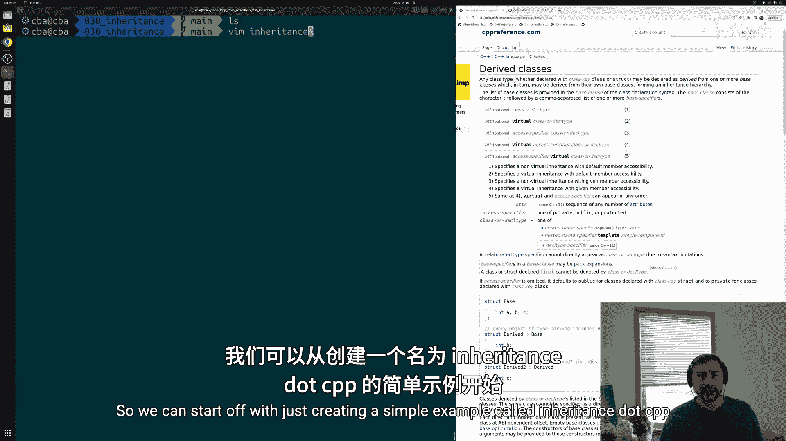
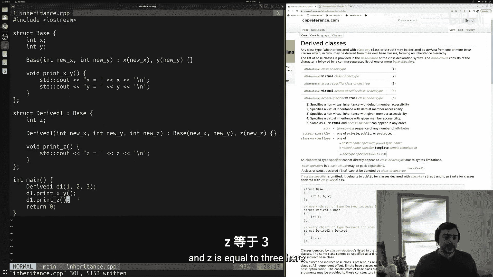
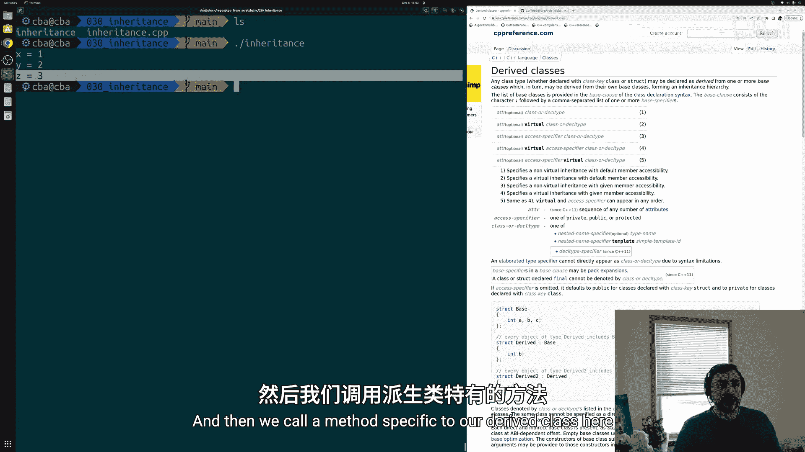
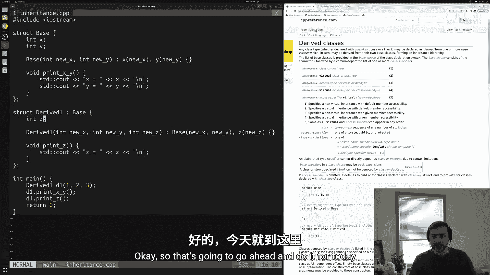
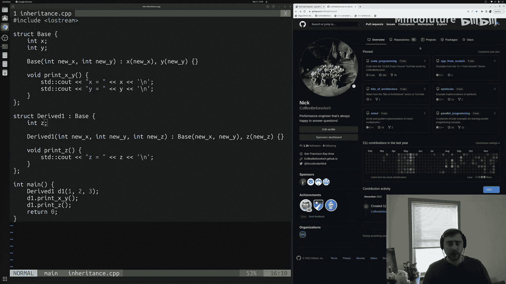

# 031：继承与派生类

在本节课中，我们将要学习C++中的继承与派生类。继承是面向对象编程的核心概念之一，它允许我们创建一个新类（派生类）来继承另一个类（基类）的属性和方法，从而减少代码重复并建立类之间的层次关系。

## 概述



到目前为止，我们一直在C++中定义独立的`struct`和`class`。然而，很多时候我们的结构体或类之间可能存在重叠，无论是在实现的方法上还是在包含的数据上。处理这种代码重复的一种方式就是通过继承和派生类。

我们可以定义一个基类，它实现一组公共的数据成员和方法，然后让其他类从这个基类继承。这些其他类被称为派生类。本节课我们将学习C++中继承的基础知识。

## 定义基类

首先，我们创建一个简单的基类。基类的定义方式与普通类相同，关键在于我们如何使用它。

```cpp
#include <iostream>

struct Base {
    int x;
    int y;

    // 构造函数
    Base(int new_x, int new_y) : x(new_x), y(new_y) {}

    // 成员函数
    void printXY() {
        std::cout << "x is equal to " << x << '\n';
        std::cout << "y is equal to " << y << '\n';
    }
};
```

在上面的代码中，我们定义了一个名为`Base`的结构体，它包含两个整数数据成员`x`和`y`，一个用于初始化这些成员的构造函数，以及一个打印`x`和`y`值的成员函数`printXY`。

## 创建派生类

接下来，我们基于`Base`类创建一个派生类。派生类可以继承基类的数据和方法，并在此基础上添加自己的特有成员。

```cpp
struct Derived1 : public Base {
    int z;

    // 派生类的构造函数
    Derived1(int new_x, int new_y, int new_z) : Base(new_x, new_y), z(new_z) {}

    // 派生类特有的成员函数
    void printZ() {
        std::cout << "z is equal to " << z << '\n';
    }
};
```

让我们来解析一下这段代码：
*   `struct Derived1 : public Base`：这表示`Derived1`类公开继承自`Base`类。这意味着`Derived1`对象将包含`Base`的所有成员。
*   `int z;`：我们为派生类添加了一个新的数据成员`z`。
*   `Derived1(...) : Base(new_x, new_y), z(new_z) {}`：这是派生类的构造函数。在成员初始化列表中，我们首先调用基类`Base`的构造函数来初始化继承来的`x`和`y`，然后初始化派生类自己的成员`z`。
*   `void printZ()`：这是一个派生类特有的新成员函数。

通过继承，`Derived1`类现在拥有了`x`、`y`、`printXY()`（来自基类）以及`z`和`printZ()`（自己添加的）。

## 使用派生类

现在，让我们看看如何使用这个派生类。

```cpp
int main() {
    // 创建派生类对象
    Derived1 d1(1, 2, 3);

    // 调用从基类继承的方法
    d1.printXY();
    // 调用派生类自己的方法
    d1.printZ();

    return 0;
}
```

运行这段代码，输出结果将是：
```
x is equal to 1
y is equal to 2
z is equal to 3
```

正如所见，派生类对象`d1`可以无缝地使用来自基类的方法`printXY`和自己定义的方法`printZ`。

## 继承的灵活性



继承的强大之处在于，我们可以基于同一个基类创建多个不同的派生类，每个派生类可以进行不同的特化和扩展。

例如，我们可以创建另一个派生类`Derived2`，它可能使用不同的数据类型或初始化方式：



```cpp
struct Derived2 : public Base {
    float value;

    Derived2() : Base(10, 20), value(3.14f) {} // 使用常量初始化基类部分
    // ... 可以添加其他成员
};
```

## 访问说明符

在上面的例子中，我们使用了`public`继承（`: public Base`）。C++中还有`private`和`protected`继承，它们控制着基类成员在派生类中的访问权限。此外，`struct`默认的成员访问权限是`public`，而`class`默认是`private`，这在定义继承关系时也会产生影响。这些更深入的主题我们将在后续课程中讨论。

## 总结

本节课中我们一起学习了C++继承与派生类的基础知识。我们了解到：
1.  **继承** 允许派生类获取基类的数据成员和成员函数，是代码复用的重要机制。
2.  使用 **`: public Base`** 语法可以定义一个派生类。
3.  派生类可以在构造函数中通过 **成员初始化列表** 调用基类的构造函数。
4.  派生类可以 **添加新的数据成员和成员函数**，对基类功能进行扩展。
5.  派生类对象可以 **同时使用基类和自身的方法**。
6.  继承的访问控制（`public`、`private`、`protected`）决定了基类成员在派生类中的可见性，这是一个重要的设计考量点。





通过继承，我们可以构建出层次化的类结构，使代码更加模块化、可维护和可扩展。