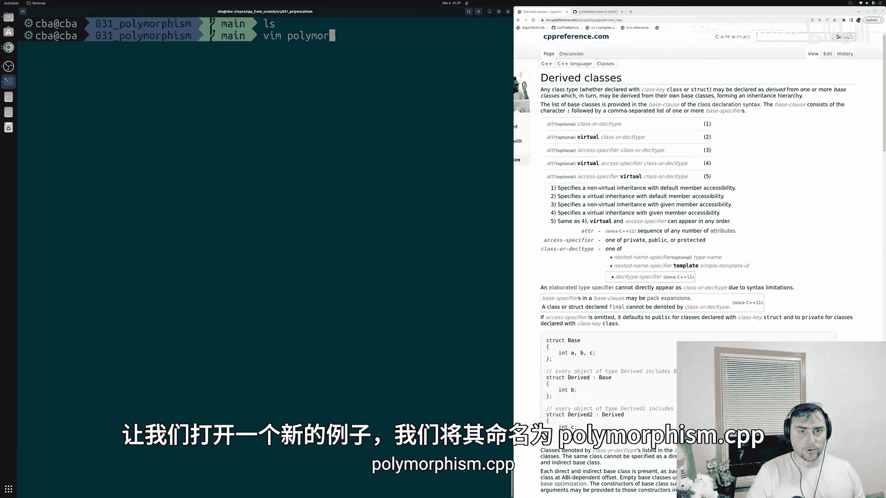
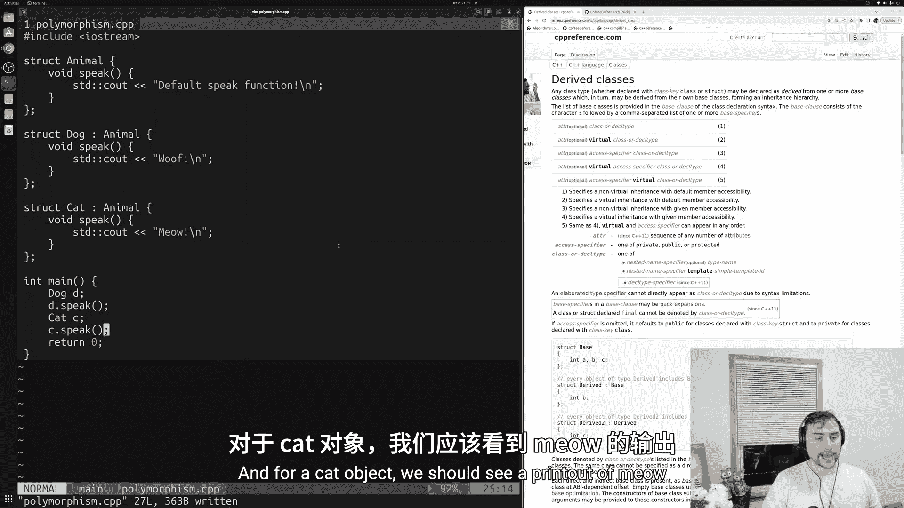
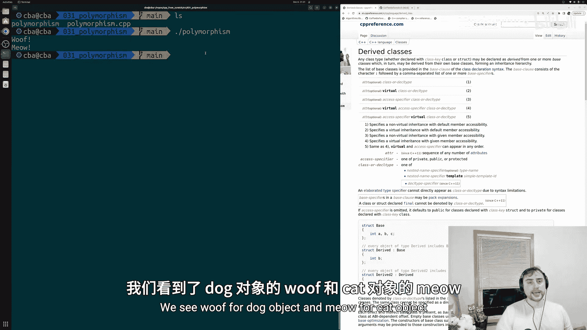
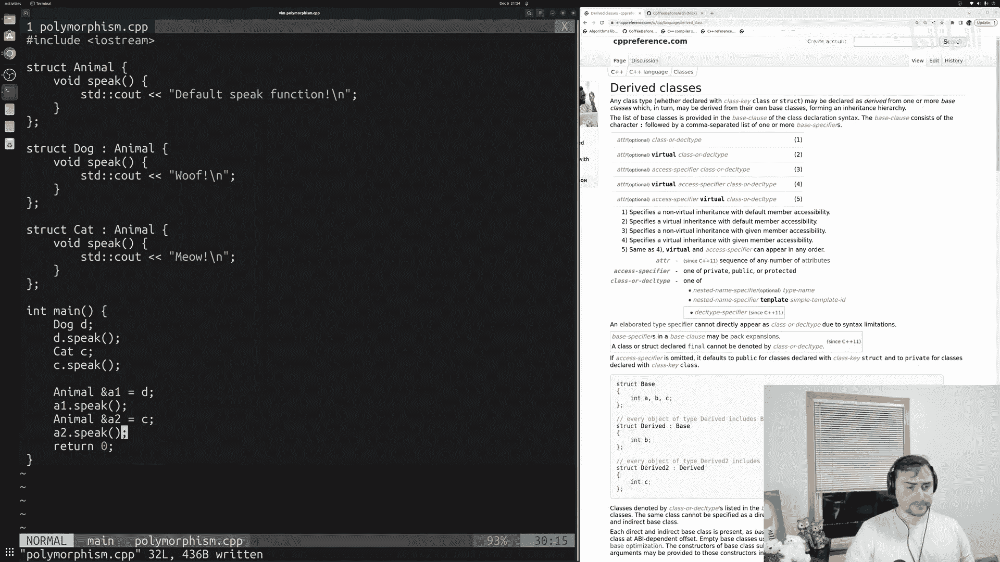
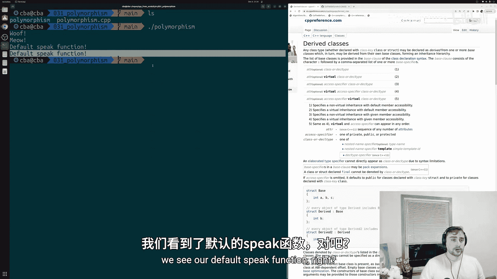
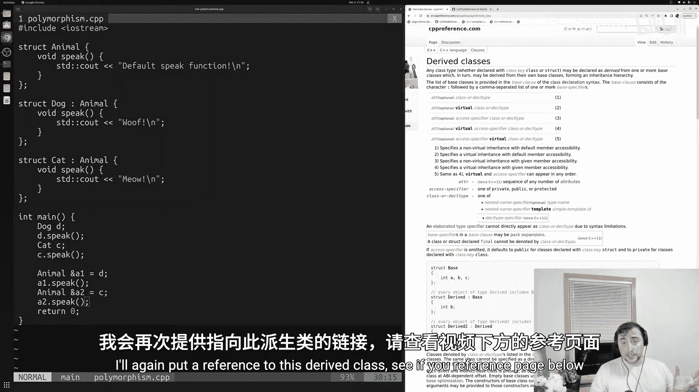
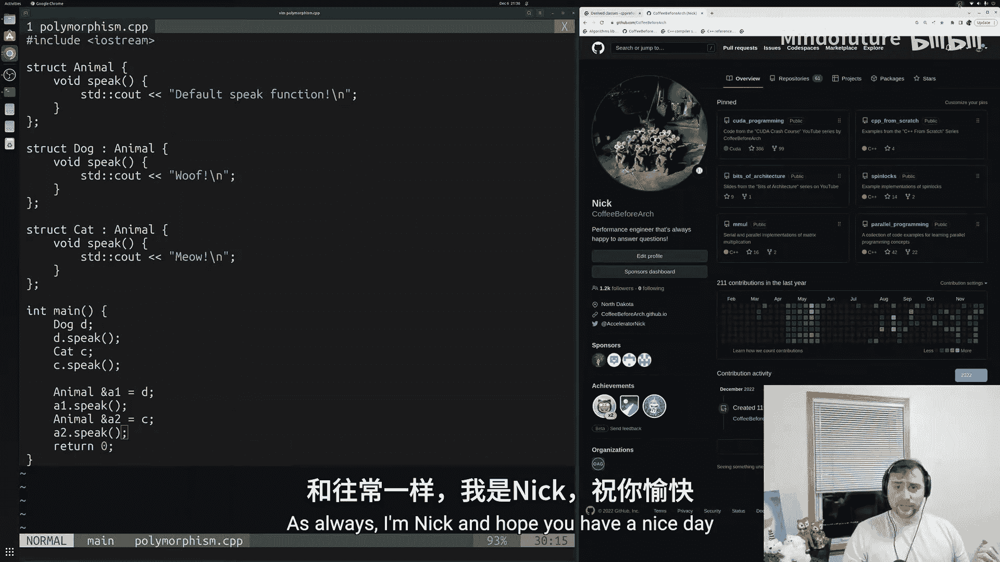

# 032：多态性基础 🧬

在本节课中，我们将要学习C++中多态性的基本概念。多态性允许我们将不同类型的对象视为同一类型，这在处理继承体系时尤其有用，例如将不同种类的动物对象统一管理。

---

## 概述



上一节我们介绍了继承的概念，即派生类可以继承基类的成员。本节中我们来看看**多态性**，它允许我们将派生类对象当作其基类类型来处理。这使得我们可以将具有相同基类的不同派生类对象组合在一起，例如放入同一个容器中。

多态性（Polymorphism）一词意为“多种形态”。在继承的上下文中，它通常指我们可以将不同类型的对象（特别是派生类对象）视为其共同的基类类型。这样做的好处是，我们可以将具有相同基类的对象放入标准模板库（STL）容器中。

## 基础示例：动物类继承体系

我们将使用一个经典的动物继承示例。首先，创建一个基类 `Animal`，然后创建两个派生类 `Dog` 和 `Cat`。

```cpp
#include <iostream>

// 基类 Animal
struct Animal {
    void speak() {
        std::cout << "Default speak function!" << std::endl;
    }
};

// 派生类 Dog
struct Dog : public Animal {
    void speak() {
        std::cout << "Woof!" << std::endl;
    }
};



// 派生类 Cat
struct Cat : public Animal {
    void speak() {
        std::cout << "Meow!" << std::endl;
    }
};
```



在上面的代码中：
*   `Animal` 是基类，有一个 `speak` 成员函数。
*   `Dog` 和 `Cat` 是派生类，它们**重载**了基类的 `speak` 函数，提供了各自特定的实现。

## 创建对象并调用函数

以下是创建派生类对象并调用其成员函数的基本操作。

```cpp
int main() {
    Dog d;
    Cat c;

    d.speak(); // 输出: Woof!
    c.speak(); // 输出: Meow!

    return 0;
}
```

运行此程序，`Dog` 对象输出 “Woof!”，`Cat` 对象输出 “Meow!”，符合预期。

## 将派生类对象视为基类类型

有时，我们希望将 `Dog` 和 `Cat` 这些不同类型的对象统一视为 `Animal` 类型。一个简单的方法是使用**基类类型的引用**指向派生类对象。



```cpp
int main() {
    Dog d;
    Cat c;

    // 创建 Animal 类型的引用，指向 Dog 对象
    Animal& a1 = d;
    // 创建 Animal 类型的引用，指向 Cat 对象
    Animal& a2 = c;

    a1.speak(); // 输出: Default speak function!
    a2.speak(); // 输出: Default speak function!

    return 0;
}
```

**代码解析**：
*   `Animal& a1 = d;`：这行代码创建了一个 `Animal` 类型的引用 `a1`，并将其绑定到 `Dog` 对象 `d` 上。这是合法的，因为 `Dog` 继承自 `Animal`。
*   通过引用 `a1` 和 `a2` 调用 `speak` 函数时，调用的是**基类 `Animal`** 的 `speak` 函数，而不是派生类中重载的版本。



这种行为被称为**向上转型**，即将派生类类型转换为其基类类型。目前我们看到的是一种**静态多态**，因为编译器在编译时就已经决定了调用哪个函数。

## 静态多态与动态多态

*   **静态多态**：函数调用在编译时确定。上面的例子就是静态多态，编译器看到 `a1` 是 `Animal&` 类型，因此直接绑定到 `Animal::speak`。
*   **动态多态**：函数调用在运行时确定。如果我们希望即使通过基类引用调用 `speak`，也能执行派生类特定的版本（例如，通过 `Animal&` 引用调用 `Dog::speak`），就需要使用**虚函数**。这将是下一节视频讨论的内容。

## 总结

本节课中我们一起学习了C++多态性的基础。我们了解到：
1.  多态性允许我们将派生类对象当作基类类型处理。
2.  通过创建基类类型的引用指向派生类对象，可以实现**向上转型**。
3.  在当前的静态多态示例中，通过基类引用调用函数会执行基类的版本。
4.  若要在运行时根据实际对象类型调用函数，需要使用虚函数实现**动态多态**，这将是后续课程的主题。





通过掌握多态性，我们可以更灵活地组织和管理具有继承关系的对象，为构建复杂的程序结构打下基础。