# 033：虚函数 🧬

在本节课中，我们将要学习C++中的虚函数。虚函数是实现多态性的关键机制，它允许我们在运行时根据对象的实际类型来调用正确的成员函数，即使我们使用的是指向基类的指针或引用。

## 概述

在上一节中，我们介绍了多态性的基础知识，并看到了如何使用引用来将派生类对象重新解释为基类对象，这被称为静态多态。然而，编译器在编译时并不总是知道所有对象的类型信息。有时，我们可能有一个指向基类类型的指针或引用，但并不知道其底层实际的派生类类型是什么。尽管如此，我们仍然希望在这些情况下调用底层派生类类型的行为。这正是虚函数发挥作用的地方。

## 虚函数的作用

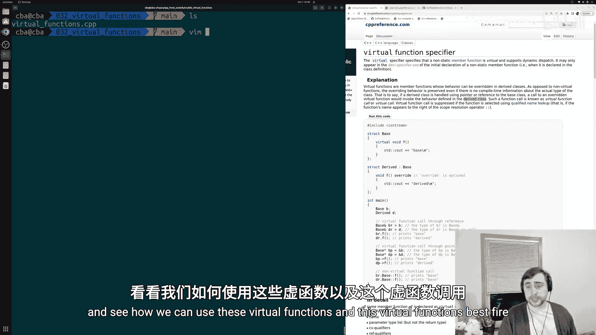

虚函数是可以在派生类中被重写的成员函数。与非虚函数不同，即使没有关于类实际类型的编译时信息，其重写行为也会被保留。这意味着，如果我们有一个被向上转型的派生类对象，并且我们有一个指向基类的指针或引用，当我们通过该指针或引用调用某个被重写的虚函数时，我们仍然会调用派生类的行为。这被称为虚函数调用。

## 代码示例

以下是演示虚函数基本用法的代码示例：

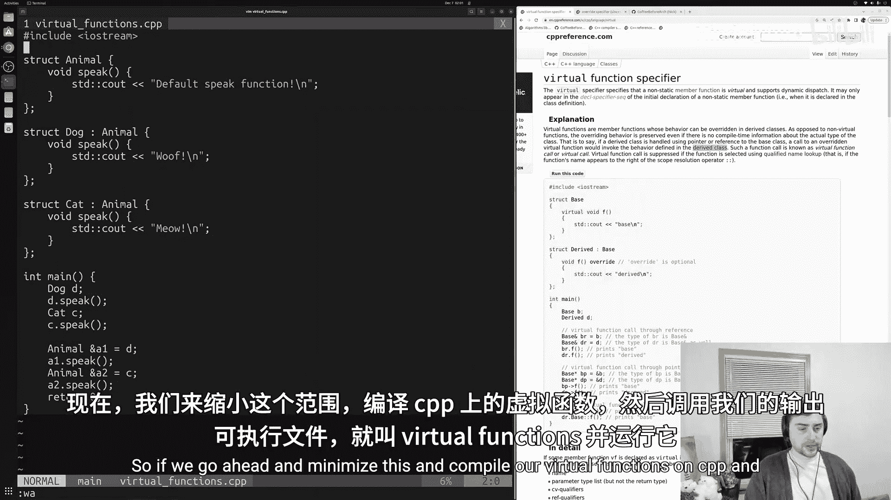

```cpp
#include <iostream>

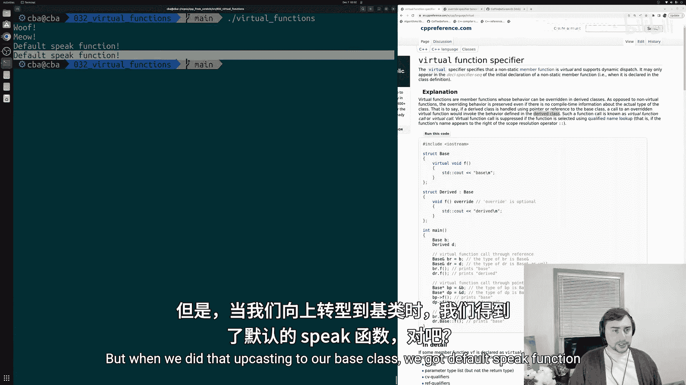

struct Animal {
    // 使用 virtual 关键字声明虚函数
    virtual void speak() {
        std::cout << "Default speak function\n";
    }
};

struct Dog : public Animal {
    // 使用 override 关键字明确表示重写基类虚函数
    void speak() override {
        std::cout << "Woof\n";
    }
};

struct Cat : public Animal {
    void speak() override {
        std::cout << "Meow\n";
    }
};

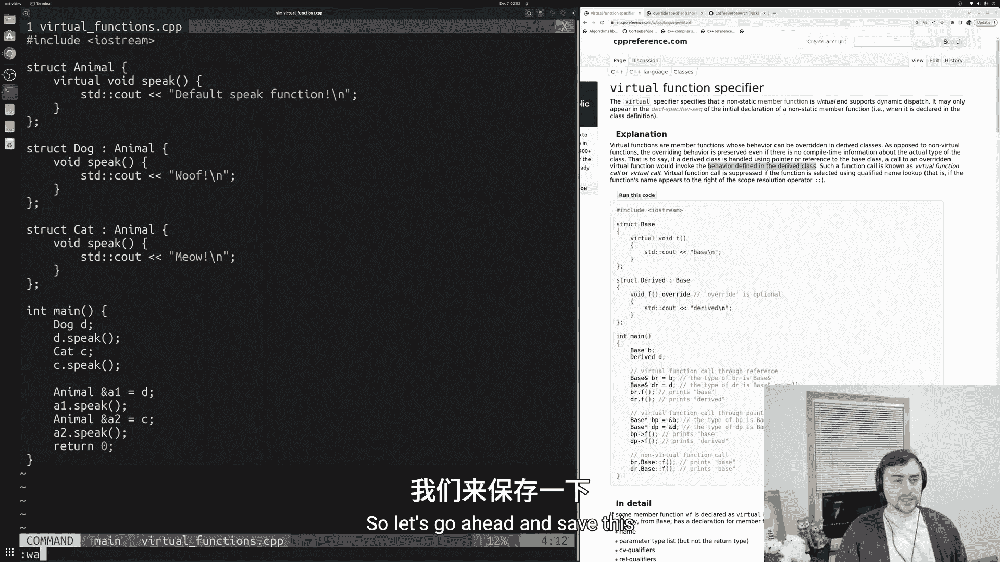

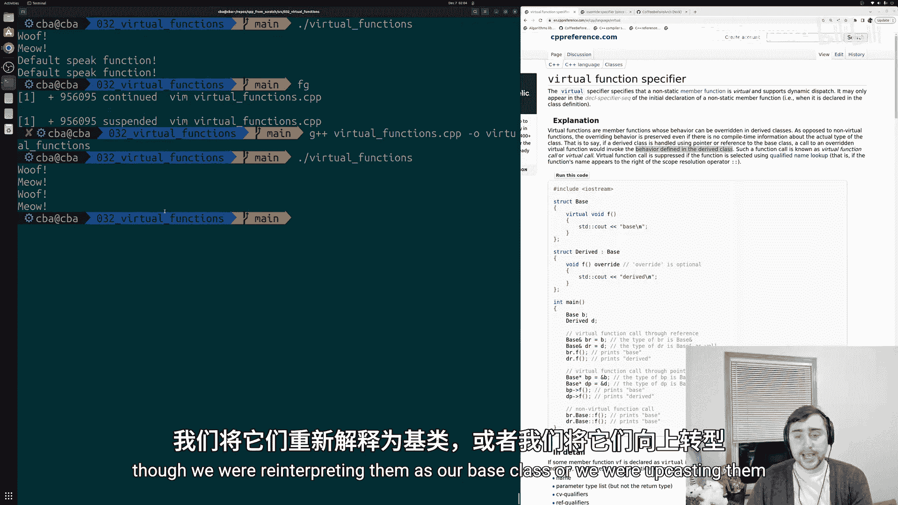

int main() {
    Dog d;
    Cat c;

    // 直接调用派生类对象的函数
    d.speak(); // 输出: Woof
    c.speak(); // 输出: Meow

    // 通过基类引用调用（向上转型）
    Animal& a1 = d;
    Animal& a2 = c;
    a1.speak(); // 输出: Woof (因为 speak 是虚函数)
    a2.speak(); // 输出: Meow (因为 speak 是虚函数)

    return 0;
}
```

## 使用 `override` 关键字

`override` 关键字是C++11引入的一个说明符，用于明确指出某个函数旨在重写基类中的虚函数。这是一个良好的编程实践，因为它可以帮助编译器捕获错误。

以下是使用 `override` 关键字的示例：

```cpp
struct Dog : public Animal {
    // 正确：明确表示重写基类的 speak 函数
    void speak() override {
        std::cout << "Woof\n";
    }
};
```

如果不小心拼错了函数名，而没有使用 `override`，编译器会将其视为一个新的成员函数，而不会报错，这可能导致难以察觉的错误。使用 `override` 后，编译器会检查该函数是否确实重写了基类的虚函数，如果没有，则会报错。

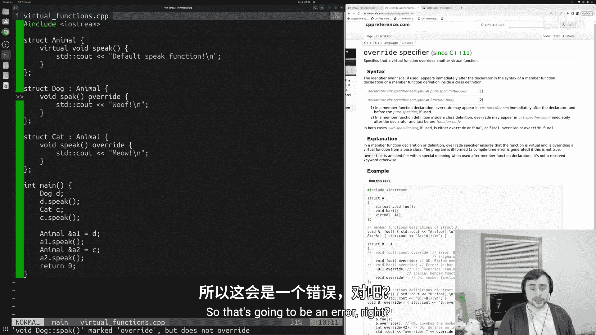

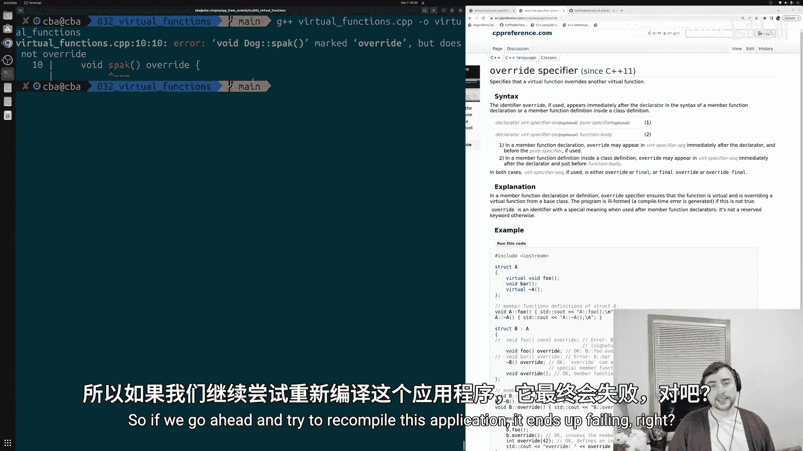

## 虚函数的底层机制

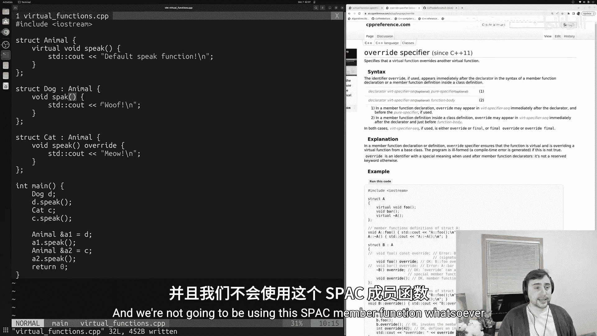

虚函数调用通常涉及一些运行时开销。当通过基类指针或引用调用虚函数时，程序需要在运行时查找并决定应该调用哪个函数（基类的还是某个派生类的）。这个查找过程通常通过一个称为“虚函数表”的机制来实现。我们将在后续更高级的课程中详细讨论这个话题。

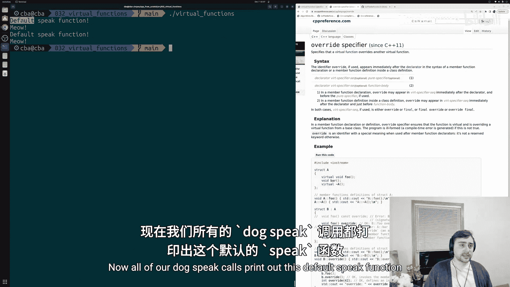

## 总结

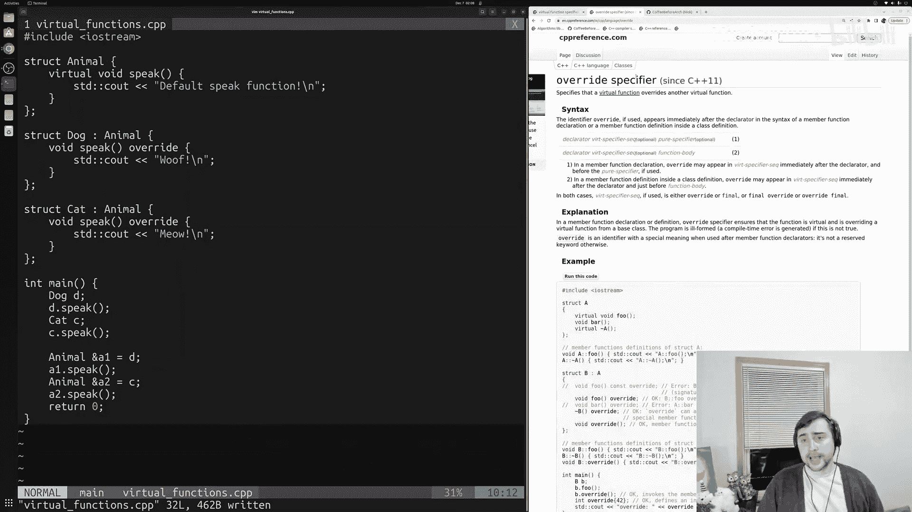

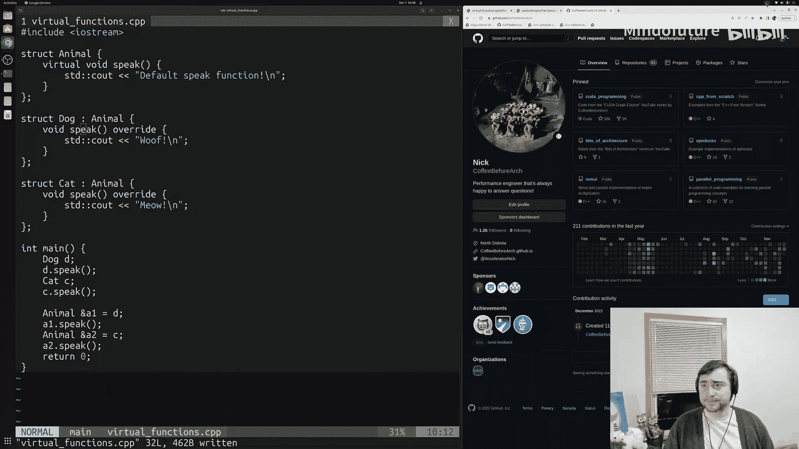

本节课中我们一起学习了C++中虚函数的核心概念。我们了解到，虚函数通过在基类中使用 `virtual` 关键字声明，允许派生类重写其行为，并且即使通过基类指针或引用调用，也能执行派生类的实现。我们还介绍了 `override` 关键字的重要性，它有助于在编译时捕获因拼写错误等导致的潜在错误，是提高代码健壮性的良好实践。通过掌握虚函数，我们可以更灵活地设计和实现具有多态行为的面向对象程序。