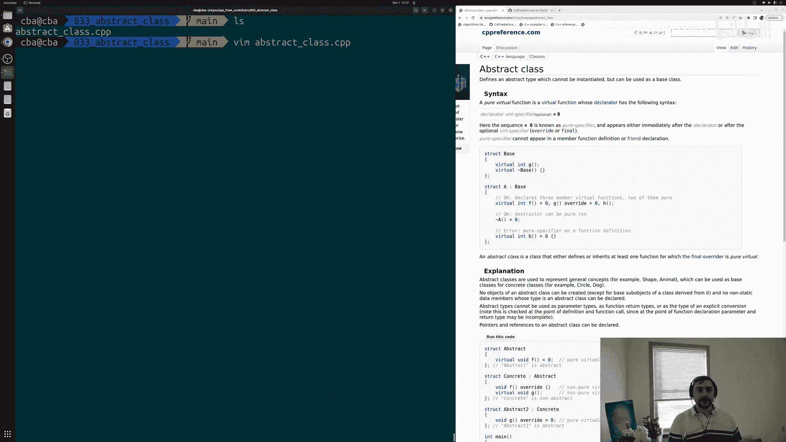
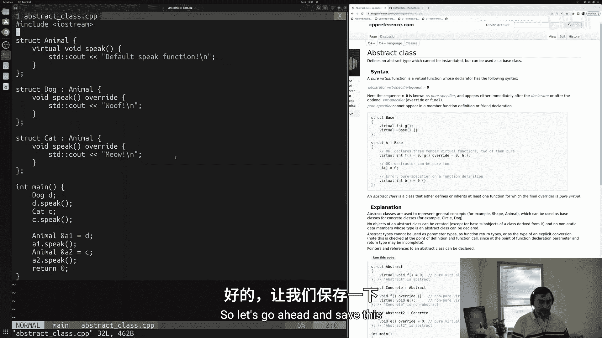
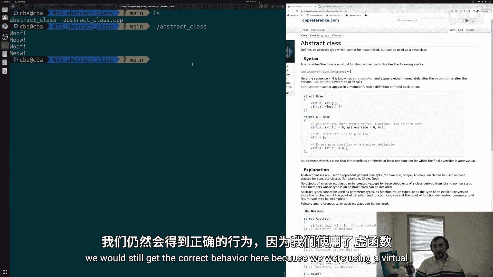
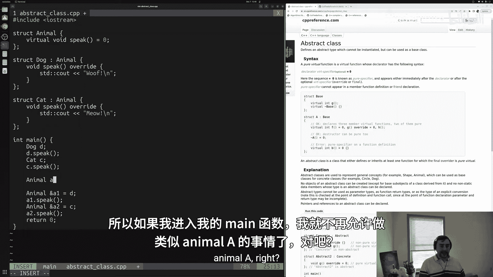
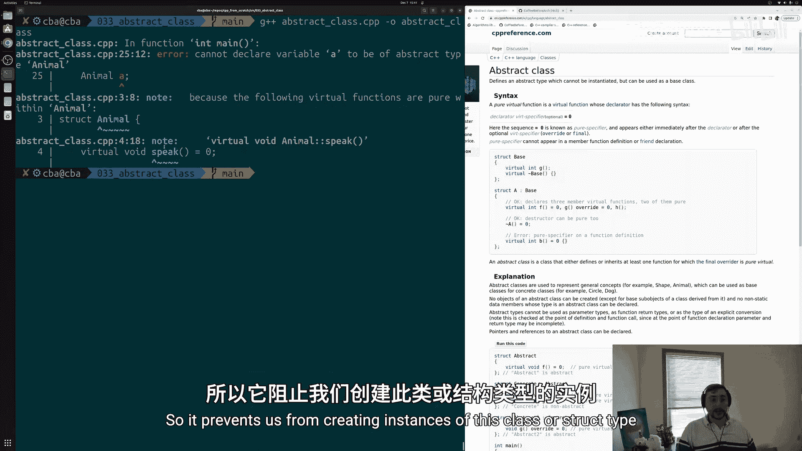
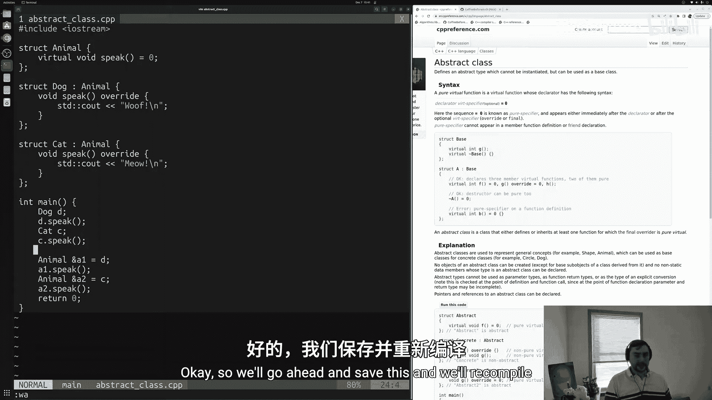
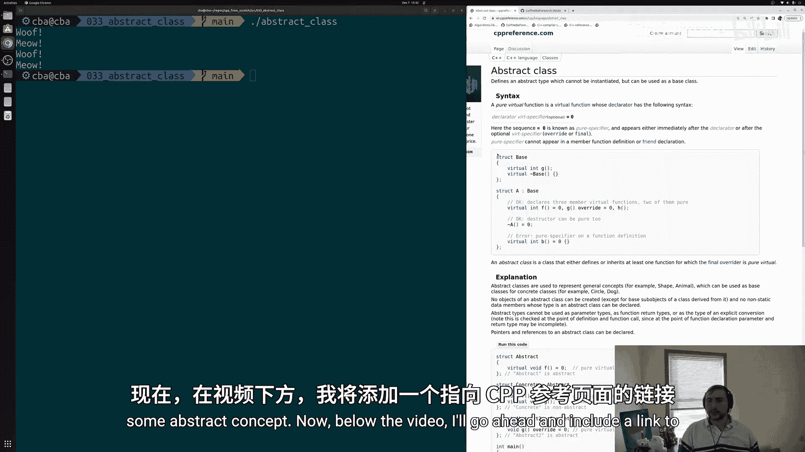
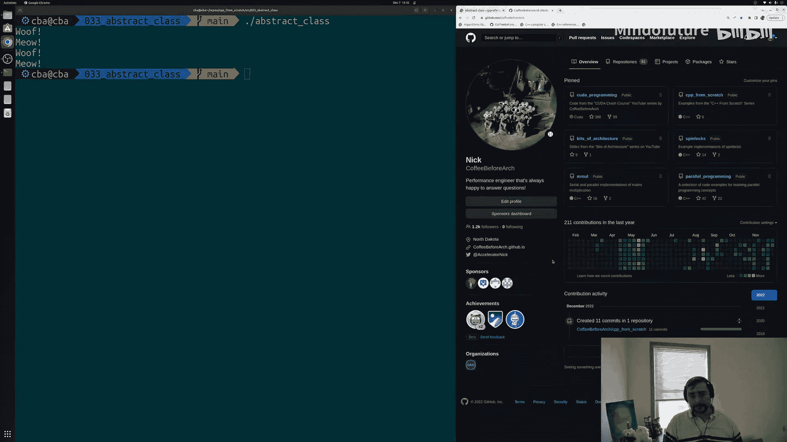

# 034：抽象类 🧩

在本节课中，我们将要学习C++中的抽象类。抽象类是一种特殊的类，它不能被实例化，只能作为其他类的基类使用。通过使用抽象类，我们可以定义一些通用的接口，同时强制要求派生类实现特定的功能。

在之前的几节课程中，我们介绍了继承和多态的基础知识。我们学习了如何创建基类和从基类继承的多个派生类。本节中，我们来看看一种特殊类型的基类——抽象类。

## 什么是抽象类？

抽象类定义了一种抽象类型，这种类型不能被实例化，但可以作为基类使用。这意味着程序员不能（无论是故意还是意外地）创建抽象类的对象，但它仍然可以作为其他类继承和构建的基础。

实现抽象类的关键机制是**纯虚函数**。当一个类或结构体包含至少一个纯虚函数时，它就成为抽象类。纯虚函数的声明方式是在虚函数声明的末尾加上 `= 0`，这表示基类不提供该函数的实现，而要求派生类必须实现它。



以下是纯虚函数的语法示例：
```cpp
virtual void functionName() = 0;
```

## 为何需要抽象类？

考虑一个代表“动物”的基类。动物本身是一个抽象概念，我们只关心具体的动物类型，如“狗”或“猫”。我们不应该能够创建一个通用的“动物”对象。抽象类正是用来防止这种情况发生的工具。

上一节我们介绍了虚函数和覆盖，本节中我们来看看如何通过纯虚函数将基类定义为抽象类。





## 实践示例：从具体类到抽象类

让我们通过一个具体的代码示例来理解抽象类的创建和使用。

以下是一个未使用抽象类的初始代码结构：
```cpp
struct Animal {
    virtual void speak() { std::cout << “Some sound\n”; }
};
struct Dog : public Animal {
    void speak() override { std::cout << “Woof\n”; }
};
struct Cat : public Animal {
    void speak() override { std::cout << “Meow\n”; }
};
```
在这个结构中，可以创建 `Animal` 类型的对象，但这在逻辑上并不合理。

为了将 `Animal` 定义为抽象类，我们需要将其中的 `speak` 函数声明为纯虚函数。

修改后的 `Animal` 结构体如下：
```cpp
struct Animal {
    virtual void speak() = 0; // 纯虚函数
};
```
现在，`Animal` 成为了一个抽象类。尝试创建 `Animal` 的对象会导致编译错误，这正是我们期望的结果。

然而，我们仍然可以：
1.  创建 `Dog` 和 `Cat` 的对象。
2.  使用基类 `Animal` 的指针或引用来指向派生类对象，并实现多态。





以下是演示这些操作的代码：
```cpp
int main() {
    Dog d;
    Cat c;

    d.speak(); // 输出：Woof
    c.speak(); // 输出：Meow

    Animal& a1 = d;
    Animal& a2 = c;

    a1.speak(); // 输出：Woof (多态)
    a2.speak(); // 输出：Meow (多态)

    // Animal a; // 错误！不能实例化抽象类
    return 0;
}
```

## 核心要点总结

本节课中我们一起学习了C++抽象类的核心概念：



*   **定义**：包含至少一个纯虚函数的类称为抽象类。
*   **目的**：抽象类用于定义接口和抽象概念，防止其被直接实例化。
*   **语法**：通过 `virtual ReturnType FunctionName() = 0;` 声明纯虚函数。
*   **作用**：强制要求所有派生类（非抽象类）必须覆盖并实现所有的纯虚函数。
*   **多态**：抽象类虽然不能实例化，但其指针或引用可以用于指向派生类对象，是实现运行时多态的重要基础。





通过使用抽象类，我们可以设计出更清晰、更健壮的类层次结构，确保代码遵循特定的设计契约。