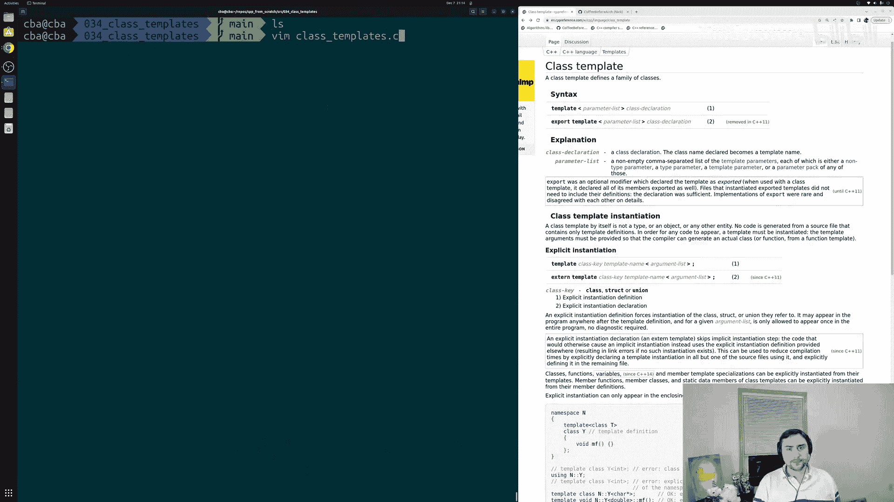
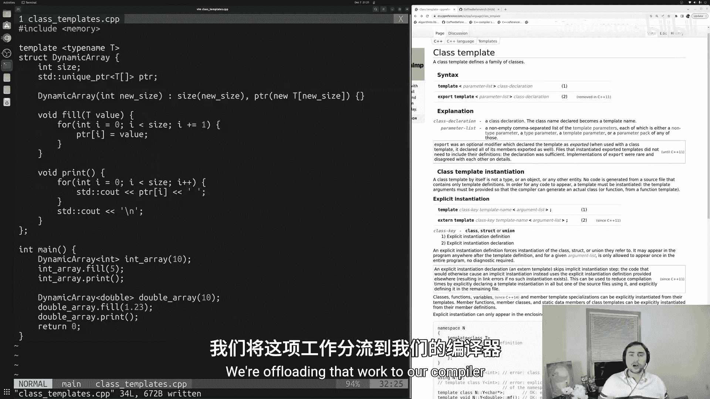
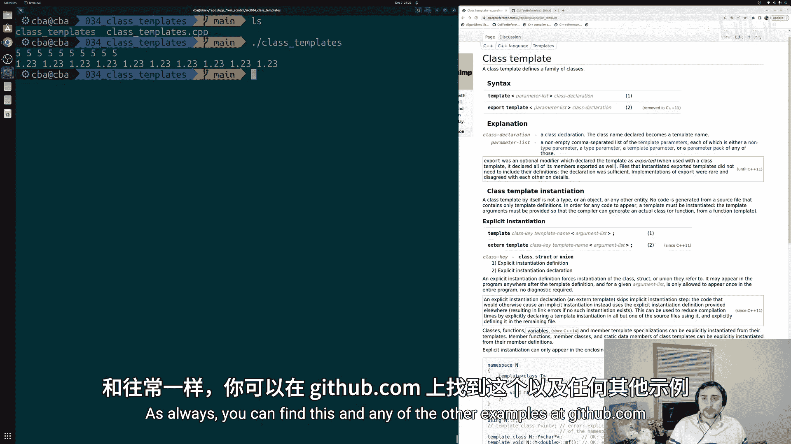
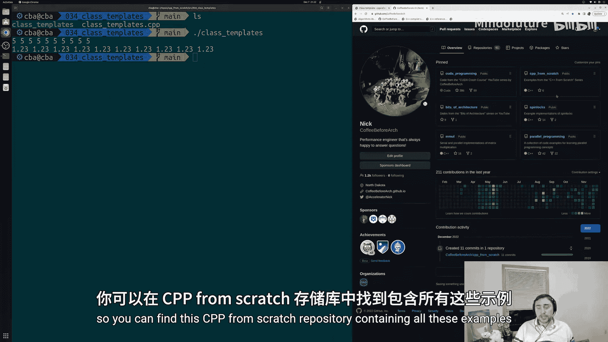
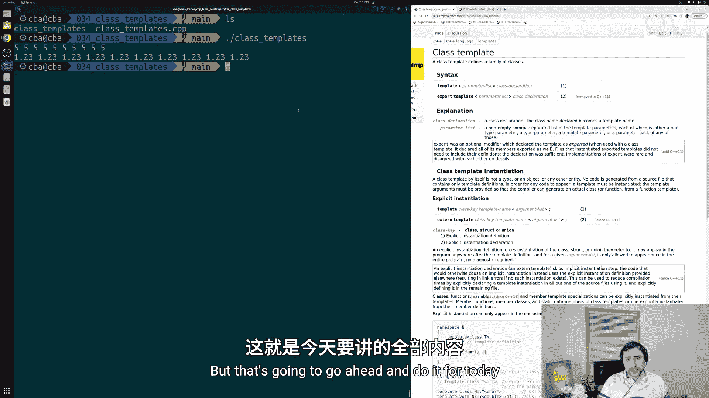

# 035：类模板 🧩

在本节课中，我们将要学习C++中的类模板。类模板允许我们创建通用的类和容器，就像标准模板库（STL）中的`std::vector`一样，它可以容纳任何类型的元素。通过使用类模板，我们可以让编译器为我们生成针对不同数据类型的类版本，从而减少重复代码。



上一节我们介绍了函数模板的基础知识，本节中我们来看看如何将类似的模板概念应用到类上。

## 定义类模板

要定义一个类模板，我们使用`template`关键字，后跟模板参数列表。以下是一个简单的动态数组类模板示例。

```cpp
#include <iostream>
#include <memory>

template <typename T>
struct DynamicArray {
    int size;
    std::unique_ptr<T[]> ptr;

    // 构造函数
    DynamicArray(int new_size) : size(new_size), ptr(new T[new_size]) {}

    // 填充数组的方法
    void fill(const T& value) {
        for (int i = 0; i < size; ++i) {
            ptr[i] = value;
        }
    }

    // 打印数组内容的方法
    void print() const {
        for (int i = 0; i < size; ++i) {
            std::cout << ptr[i] << " ";
        }
        std::cout << std::endl;
    }
};
```

在这个`DynamicArray`类模板中：
*   `template <typename T>` 声明了一个类型模板参数 `T`。
*   类内部使用 `T` 来定义指针管理的数组类型 `std::unique_ptr<T[]>`。
*   构造函数接收一个大小参数，并动态分配一个 `T` 类型的数组。
*   `fill` 方法接收一个 `T` 类型的值，并用它填充整个数组。
*   `print` 方法将数组的所有元素打印到控制台。

## 使用类模板

定义了类模板后，我们可以通过指定具体的类型来实例化它。实例化时，需要在类名后使用尖括号 `<>` 提供模板参数。

以下是使用上述`DynamicArray`类模板的示例：

```cpp
int main() {
    // 实例化一个存储整数的动态数组
    DynamicArray<int> int_array(10);
    int_array.fill(5);
    int_array.print();

    // 实例化一个存储双精度浮点数的动态数组
    DynamicArray<double> double_array(10);
    double_array.fill(1.23);
    double_array.print();

    return 0;
}
```

在这段代码中：
*   `DynamicArray<int>` 告诉编译器生成一个 `T` 被替换为 `int` 的 `DynamicArray` 类版本。
*   `DynamicArray<double>` 则生成一个 `T` 被替换为 `double` 的版本。
*   之后，我们就可以像使用普通类一样，调用其成员方法（如 `fill` 和 `print`）。

## 编译与运行

当你编译并运行上述程序时，输出结果将如下所示：



```
5 5 5 5 5 5 5 5 5 5
1.23 1.23 1.23 1.23 1.23 1.23 1.23 1.23 1.23 1.23
```

这证明了编译器成功为我们生成了两个不同版本的 `DynamicArray` 类：一个用于 `int`，另一个用于 `double`。

## 总结







本节课中我们一起学习了C++类模板的核心概念。我们了解到，类模板通过`template <typename T>`语法定义，允许我们创建可处理多种数据类型的通用类。使用时，通过`ClassName<Type>`的形式进行实例化。这极大地提高了代码的复用性和灵活性，是C++标准库中众多容器（如`vector`, `list`, `map`）的实现基础。虽然类模板还有更多高级特性（如特化），但掌握其基本用法是有效使用现代C++的关键一步。