# 036：默认比较与三路比较运算符 🚀

在本节课中，我们将学习C++20引入的默认比较功能以及三路比较运算符（又称“飞船运算符”）。这些特性可以帮助我们简化自定义类型的比较操作，让编译器自动生成比较运算符，从而减少重复代码。

在之前的课程中，我们学习了如何为自定义的结构体或类重载运算符。然而，如果需要实现多个简单的比较运算符（如等于、不等于、大于、小于等），手动编写每个成员函数会显得繁琐。

幸运的是，C++20通过默认比较和三路比较运算符提供了解决方案。我们可以将这些工作委托给编译器，就像使用模板一样，让编译器为我们生成这些比较运算符。

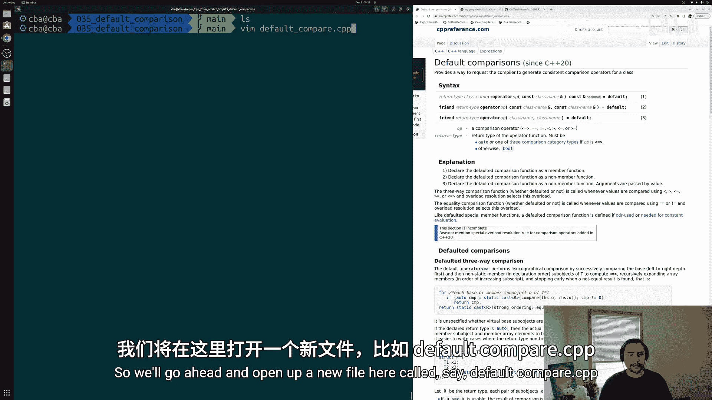

接下来，我们通过一个简单的例子来看看具体如何操作。

## 定义结构体与问题引入

首先，我们创建一个名为 `default_compare.cpp` 的文件，并包含必要的头文件和主函数。

```cpp
#include <iostream>

struct S {
    int a;
    int b;
};

int main() {
    S s1 = {1, 2};
    S s2 = {1, 3};
    std::cout << (s1 == s2) << std::endl;
    return 0;
}
```

如果我们尝试编译上述代码，编译器会报错，提示没有为类型 `S` 找到匹配的 `operator==`。这是因为我们尚未为结构体 `S` 实现相等比较运算符。

我们可以手动实现这个运算符，逐个比较所有数据成员。但如果数据成员很多，这会是一项繁重的工作。更理想的方式是让编译器自动生成这些代码，这正是默认比较功能的用武之地。

## 使用默认相等比较运算符

我们可以通过将运算符设置为 `default` 来让编译器生成它，类似于默认复制构造函数或移动构造函数。

以下是修改后的代码：

```cpp
#include <iostream>

struct S {
    int a;
    int b;
    // 让编译器生成默认的相等比较运算符
    bool operator==(const S&) const = default;
};

int main() {
    S s1 = {1, 2};
    S s2 = {1, 3};
    std::cout << (s1 == s2) << std::endl; // 输出 0 (false)
    return 0;
}
```

编译器生成的 `operator==` 会执行成员级别的逐一比较。它会比较两个对象的所有数据成员（`a` 和 `b`）。如果发现任何一对成员不相等，则返回 `false`；如果全部相等，则返回 `true`。

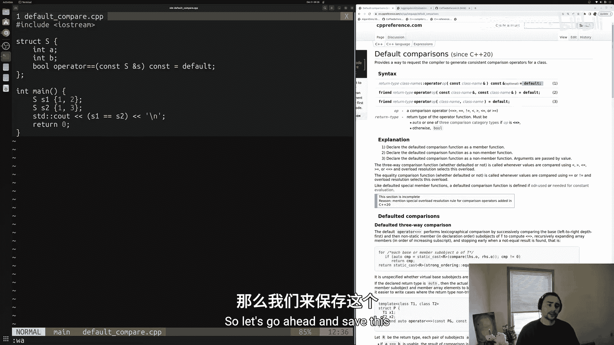

**注意**：要使用C++20的此功能，需要使用支持C++20的编译器（如GCC 10+）并添加编译标志 `-std=c++20`。

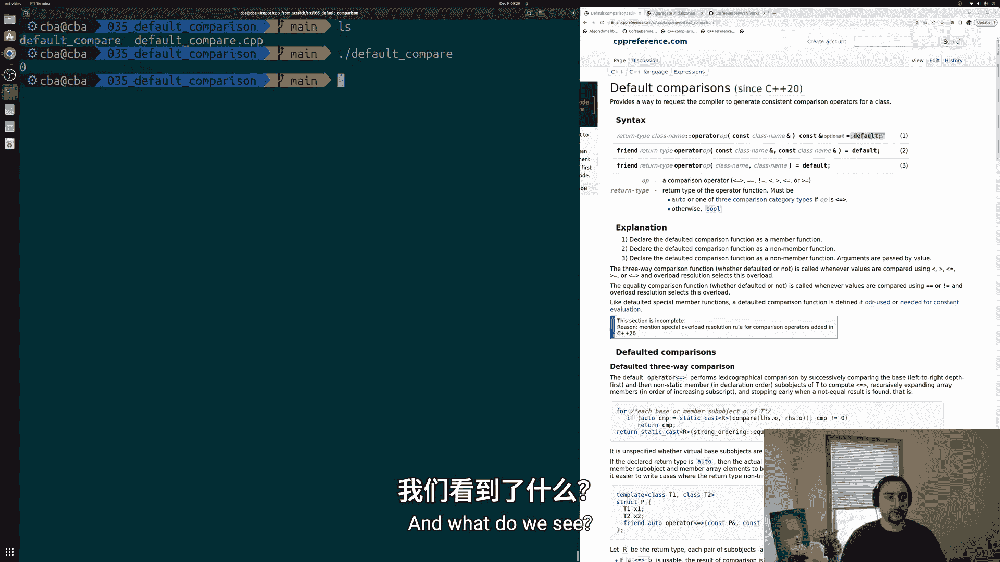

## 引入三路比较运算符

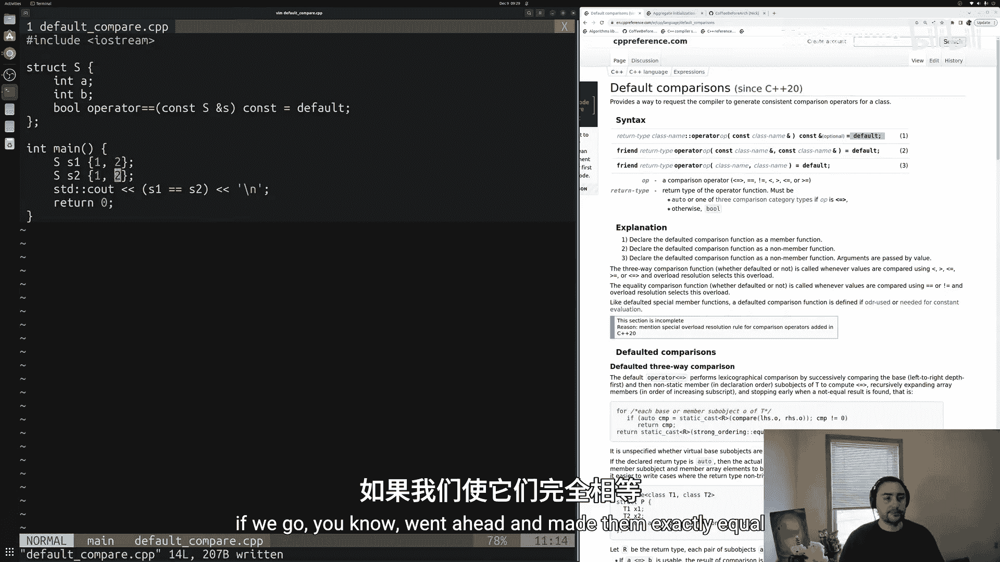

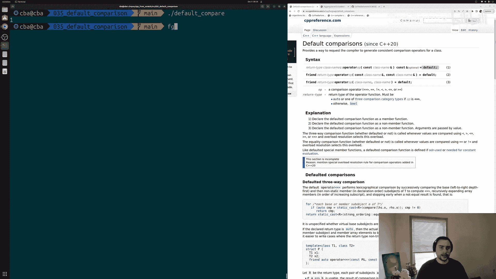

默认 `operator==` 只解决了相等比较。如果我们还需要其他比较操作（如 `>`、`<`、`>=`、`<=`），仍然需要手动实现它们。

为了避免逐个实现所有比较运算符，C++20引入了三路比较运算符 `operator<=>`，它看起来像一艘飞船或飞碟。😊

使用这个运算符，我们可以指示编译器生成**所有**标准的比较运算符。

以下是使用三路比较运算符的示例：

```cpp
#include <iostream>

struct S {
    int a;
    int b;
    // 使用三路比较运算符，让编译器生成所有比较运算符
    auto operator<=>(const S&) const = default;
};

int main() {
    S s1 = {1, 2};
    S s2 = {1, 3};

    std::cout << (s1 == s2) << std::endl;  // 相等比较，输出 0
    std::cout << (s1 > s2) << std::endl;   // 大于比较，输出 0
    std::cout << (s1 < s2) << std::endl;   // 小于比较，输出 1

    return 0;
}
```

现在，`s1 < s2`、`s1 > s2`、`s1 <= s2`、`s1 >= s2` 等所有比较操作都可以正常使用，因为编译器已经通过 `operator<=>` 为它们生成了代码。

编译器生成的比较逻辑也是成员级别的，并且遵循字典序。它会首先比较第一个成员 `a`，如果 `a` 能决定大小关系（例如 `s1.a > s2.a`），则立即返回结果；如果 `a` 相等，则继续比较下一个成员 `b`。

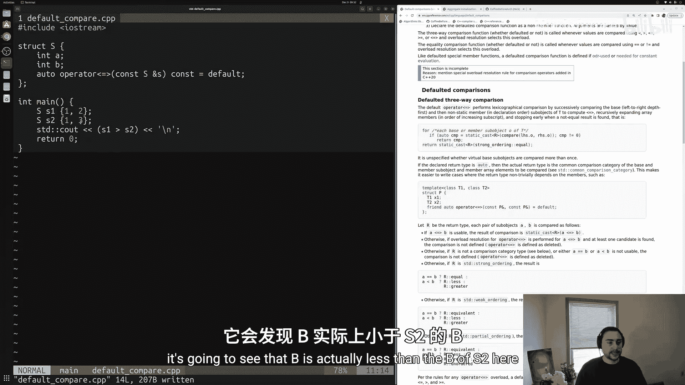

## 编译与运行

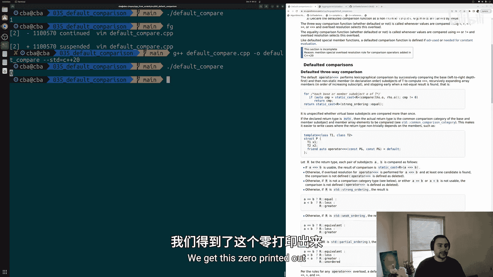

使用以下命令编译代码（确保使用C++20标准）：

```bash
g++ -std=c++20 default_compare.cpp -o default_compare
./default_compare
```

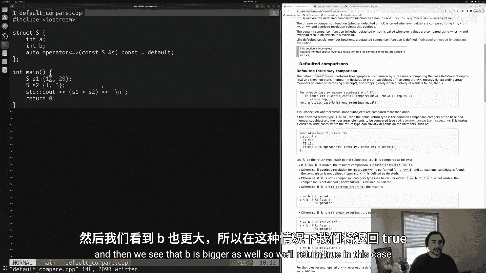

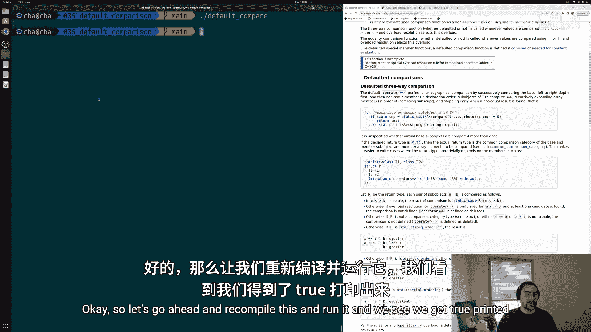

运行程序，你将看到基于成员值比较的正确布尔结果。

## 总结

本节课中我们一起学习了C++20中两个强大的特性：
1.  **默认比较运算符**：通过 `bool operator==(const T&) const = default;` 让编译器自动生成相等比较运算符。
2.  **三路比较运算符（飞船运算符）**：通过 `auto operator<=>(const T&) const = default;` 让编译器自动生成**全套**比较运算符（`==`, `!=`, `<`, `>`, `<=`, `>=`）。

这些特性极大地简化了为自定义类型实现比较逻辑的过程，特别是在只需要简单的成员级比较时。对于更复杂的比较规则（如部分排序、弱排序），你可以选择手动实现 `operator<=>` 来定义更精确的比较语义，但这超出了本入门教程的范围。

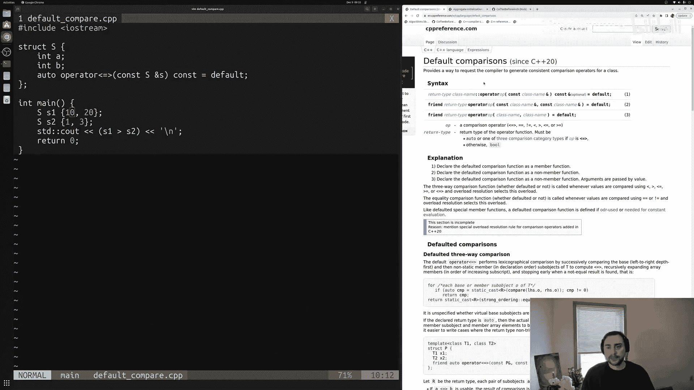

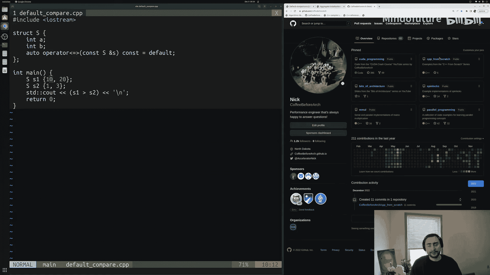

通过将这些繁琐的工作交给编译器，我们可以更专注于程序的核心逻辑。