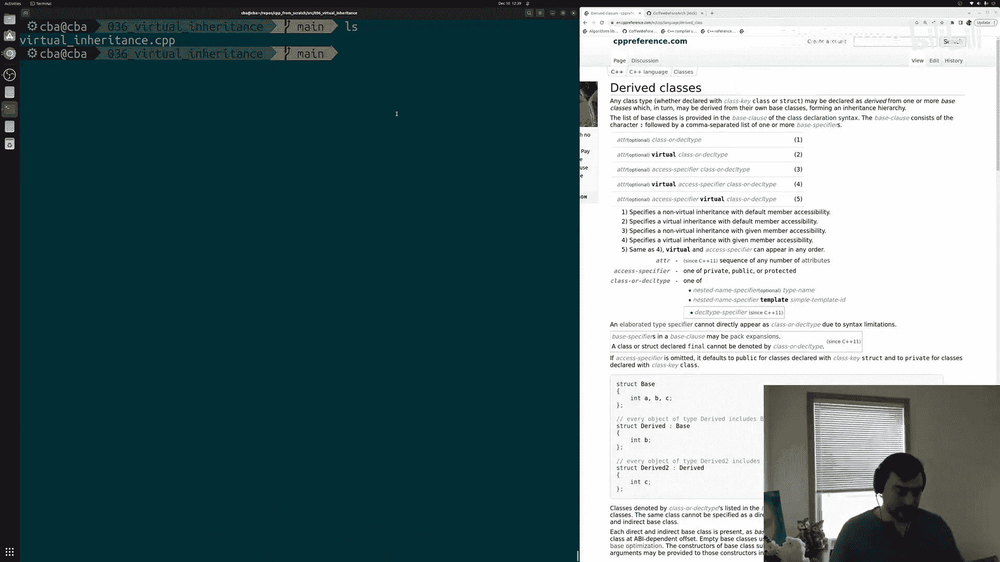
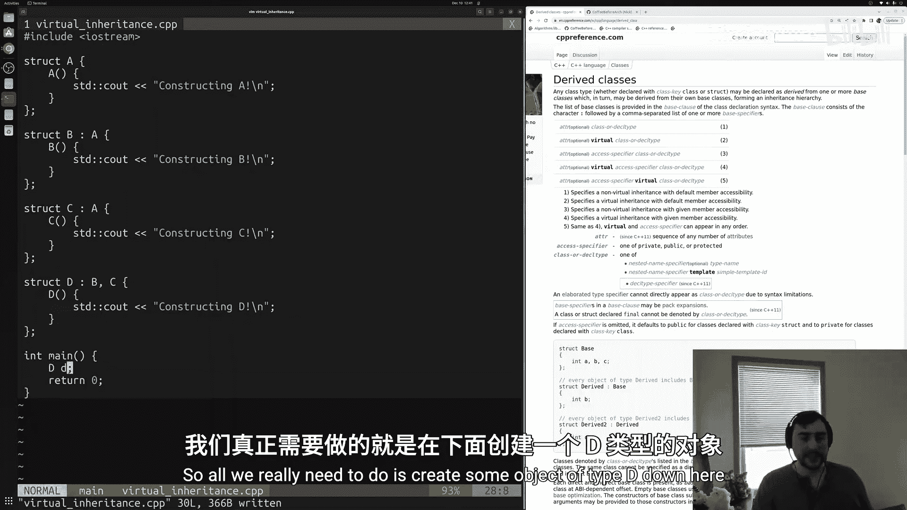
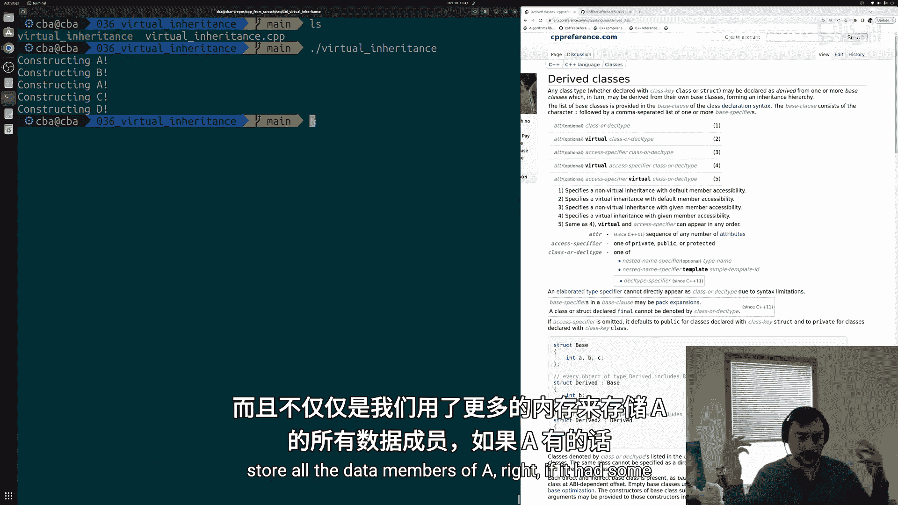
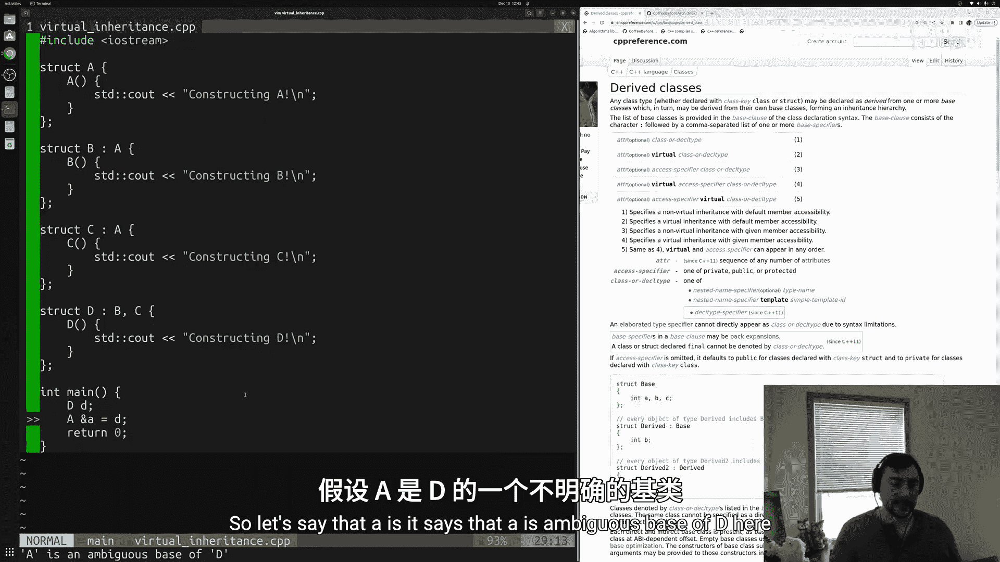
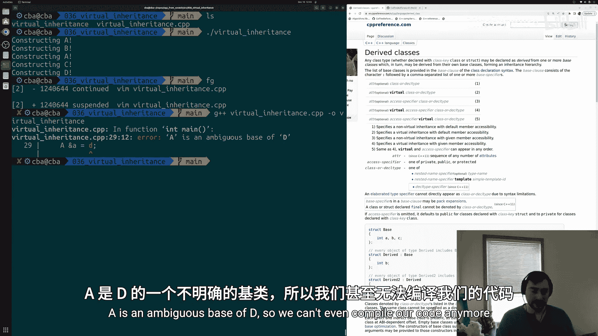
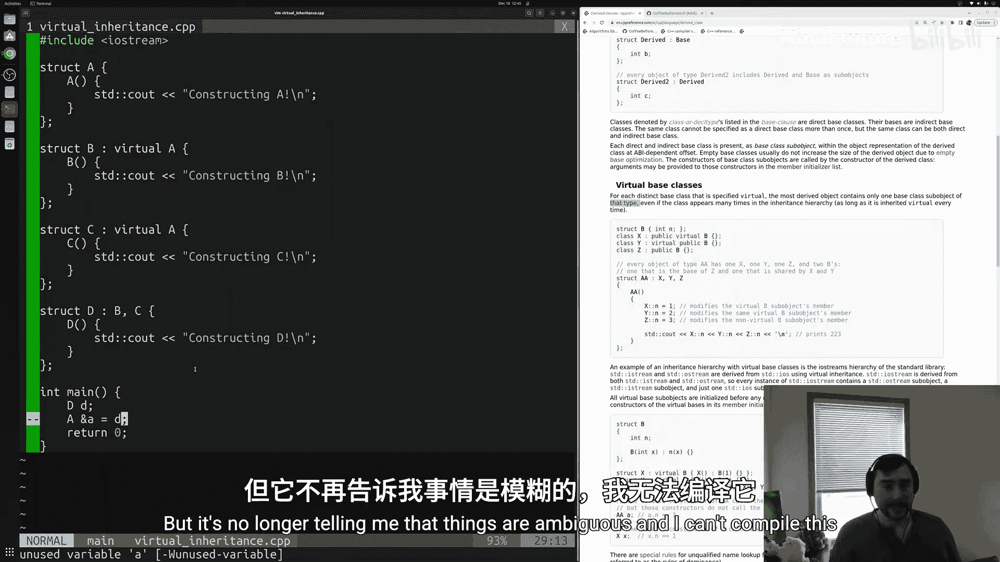
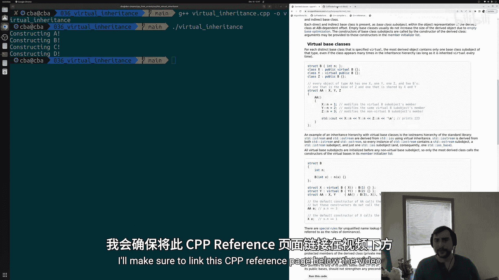
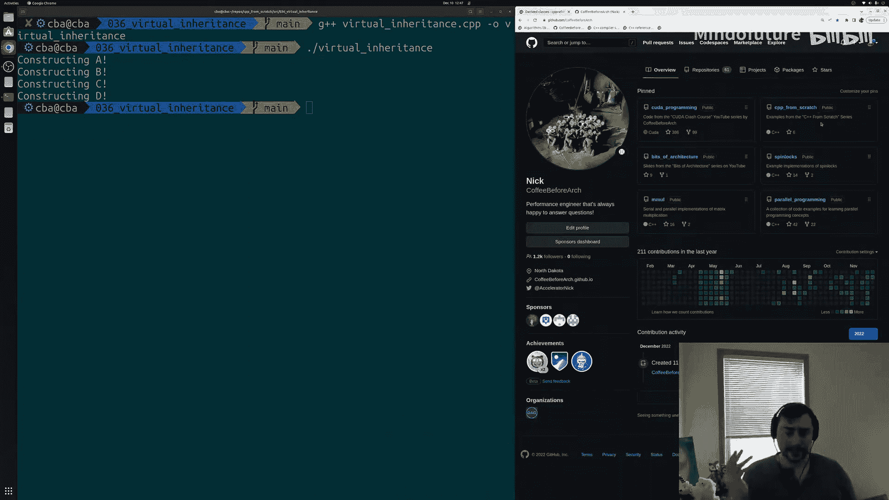

# 037：虚拟继承

## 概述
在本节课中，我们将要学习C++中的虚拟继承。我们将探讨多重继承中可能出现的“菱形继承”问题，并学习如何使用虚拟基类来解决这个问题。

---

## 菱形继承问题



上一节我们介绍了继承和派生类的基础知识，了解了如何从基类继承数据成员和成员函数。本节中我们来看看在复杂的继承层次结构中可能出现的一个特定问题。

在编写代码时，我们可能会遇到具有多层继承关系的复杂层次结构，甚至会有派生类同时继承多个基类的情况。在这个过程中可能出现的一个问题是所谓的“菱形继承”问题。这种情况是指我们无意中从某个基类继承了多次。

以下是菱形继承问题的一个简单示例：

```cpp
struct A {
    A() { std::cout << "Constructing A\n"; }
};

struct B : public A {
    B() { std::cout << "Constructing B\n"; }
};

struct C : public A {
    C() { std::cout << "Constructing C\n"; }
};

struct D : public B, public C {
    D() { std::cout << "Constructing D\n"; }
};
```

在这个例子中，我们定义了四个进行继承的`struct`。基类`A`有一个简单的构造函数。`B`和`C`是`A`的派生类。最底层的派生类`D`同时继承了`B`和`C`。这样就形成了一个菱形继承模式：顶层的基类`A`，向下分支出两个派生类`B`和`C`，最后是同时继承`B`和`C`的最底层派生类`D`。



这里的问题在于，`D`无意中从`A`继承了两次：一次通过`B`，一次通过`C`。我们需要理解继承的含义。当`B`继承自`A`时，意味着我们在基类`A`的基础上构建新对象`B`，`A`将成为`B`的一个子对象。对于`C`也是如此，`A`将成为`C`的一个子对象。当`D`同时继承`B`和`C`时，`B`和`C`都将成为`D`的子对象。由于`B`和`C`各自包含一个`A`子对象，这意味着在`D`对象内部，我们得到了两个`A`类型的子对象。这就是菱形继承问题：我们在最底层的派生类中无意中多次继承了同一个基类。

让我们通过跟踪构造函数调用来观察这种情况。我们只需创建一个`D`类型的对象：

```cpp
int main() {
    D d;
    return 0;
}
```

编译并运行程序后，我们可以看到构造`D`类型对象时的输出。首先会调用`D`的构造函数。由于`D`继承了`C`和`B`，我们也会看到这些构造函数的调用。`C`继承自`A`，`B`也继承自`A`，因此在构造子对象`C`时，我们也在构造一个`A`对象；同样，在构造子对象`B`时，我们也在构造一个`A`对象。最终，我们构造了`A`子对象两次，在`D`对象内部有两个`A`子对象。

这个问题不仅仅是占用了更多内存来存储`A`的数据成员。它还影响了向上转型和多态性。例如，我们无法将`D`向上转型为`A`类型：



```cpp
int main() {
    D d;
    A &a_ref = d; // 编译错误：A是D的模糊基类
    return 0;
}
```



编译器会报错，指出`A`是`D`的模糊基类。这是因为`D`内部有两个`A`子对象，当进行向上转型时，编译器不知道我们实际想要使用哪一个。在模糊的情况下，编译器通常会拒绝编译代码。



---

## 虚拟继承解决方案

那么，我们如何解决这个菱形继承问题呢？一种方法是通过虚拟基类的概念。

根据CPP参考中关于虚拟基类的说明：对于每个被指定为虚拟的基类，最底层的派生对象只包含一个该类型的基类子对象。这意味着，如果我们将`A`声明为虚拟基类，那么在最底层的派生类`D`中，即使通过`B`和`C`继承，我们也只会得到一个`A`子对象。

让我们看看如何实现：

```cpp
struct A {
    A() { std::cout << "Constructing A\n"; }
};



struct B : virtual public A {  // 将A声明为虚拟基类
    B() { std::cout << "Constructing B\n"; }
};

struct C : virtual public A {  // 将A声明为虚拟基类
    C() { std::cout << "Constructing C\n"; }
};

struct D : public B, public C {
    D() { std::cout << "Constructing D\n"; }
};
```

我们只需在继承时使用`virtual`关键字将`A`声明为虚拟基类。现在，当我们尝试向上转型时，不再会出现错误，只会得到一个关于未使用变量的警告，但不再提示模糊性，代码可以正常编译。

重新编译并运行程序后，我们可以看到构造函数调用的变化。当构造继承自`B`和`C`的`D`类型对象时，会创建`C`和`B`类型的对象，但只构造了一个`A`类型的子对象。尽管`B`和`C`都继承自`A`，但由于我们将`A`声明为`B`和`C`中的虚拟基类，根据虚拟基类的定义，我们只得到了一个实例。

虚拟继承在实际的标准库中也有应用。例如，IO流库就是一个使用虚拟基类的继承层次结构实例。`std::istream`和`std::ostream`都通过虚拟继承从基类`std::ios`派生。而`std::iostream`则同时继承`std::istream`和`std::ostream`。这里使用虚拟继承就是为了防止出现两个`std::ios`基类实例。

---

## 总结





本节课中我们一起学习了C++中的虚拟继承。我们探讨了多重继承中出现的菱形继承问题，即派生类无意中多次继承同一个基类的情况。我们学习了如何使用`virtual`关键字将基类声明为虚拟基类，从而确保在最底层的派生类中只存在一个基类子对象。我们还了解了虚拟继承在实际应用中的例子，如C++标准库中的IO流层次结构。掌握虚拟继承有助于我们设计更清晰、更安全的类层次结构。