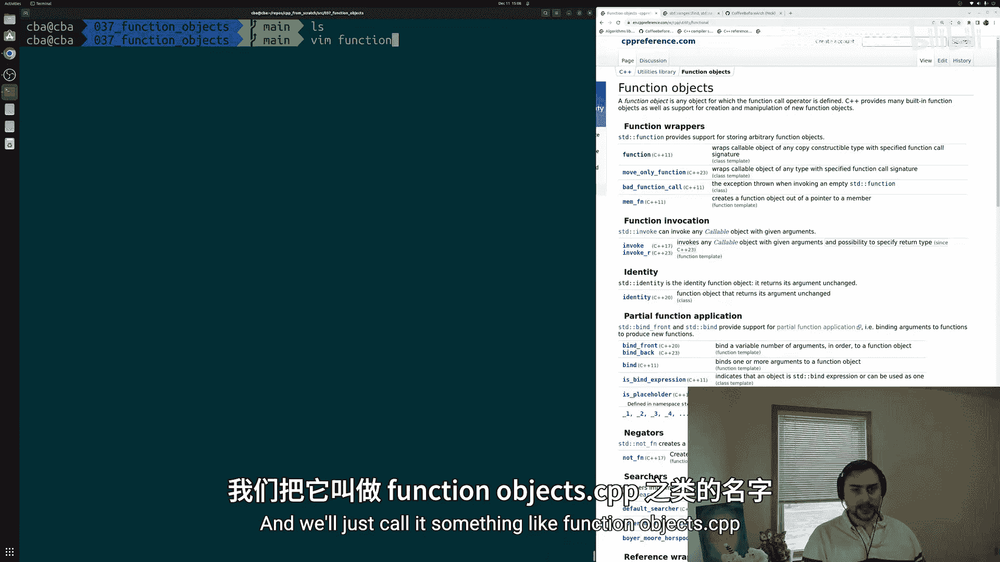
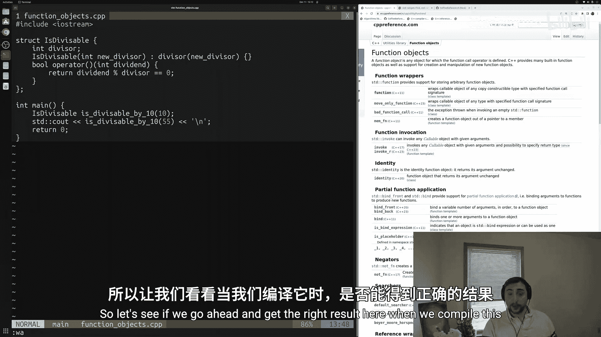
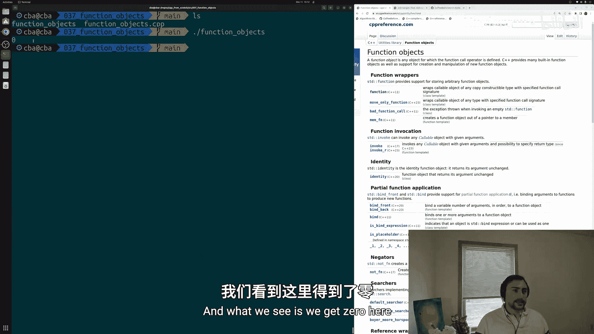
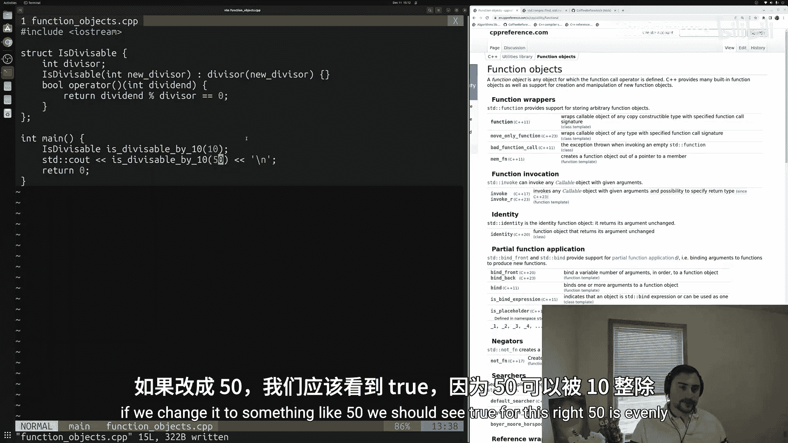
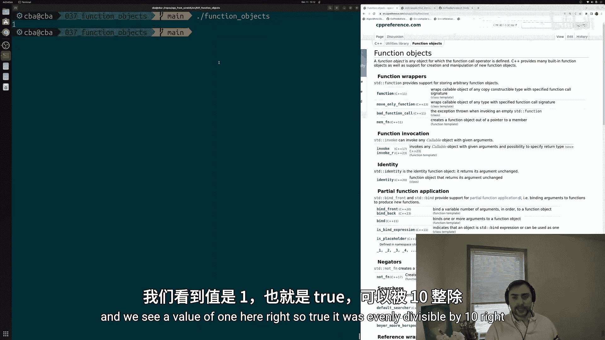
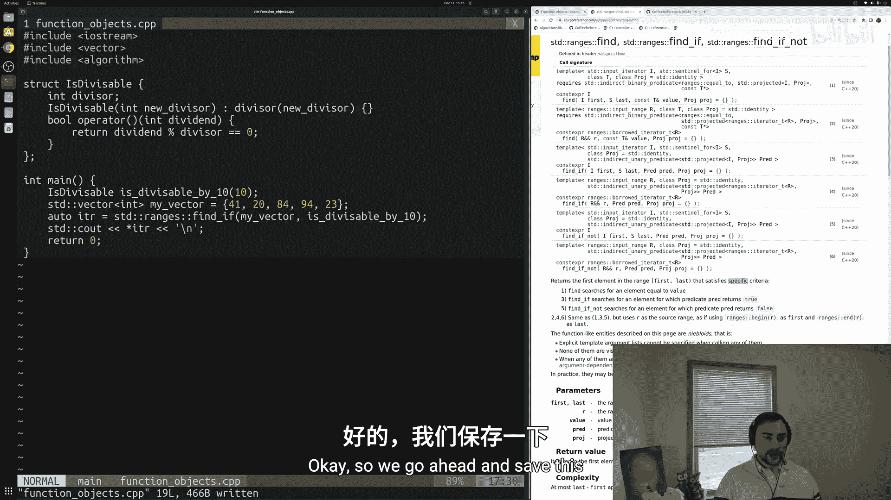
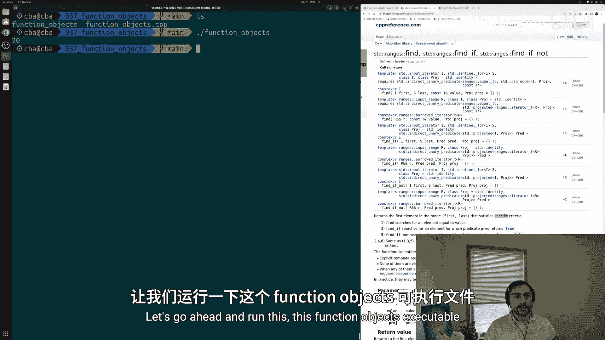
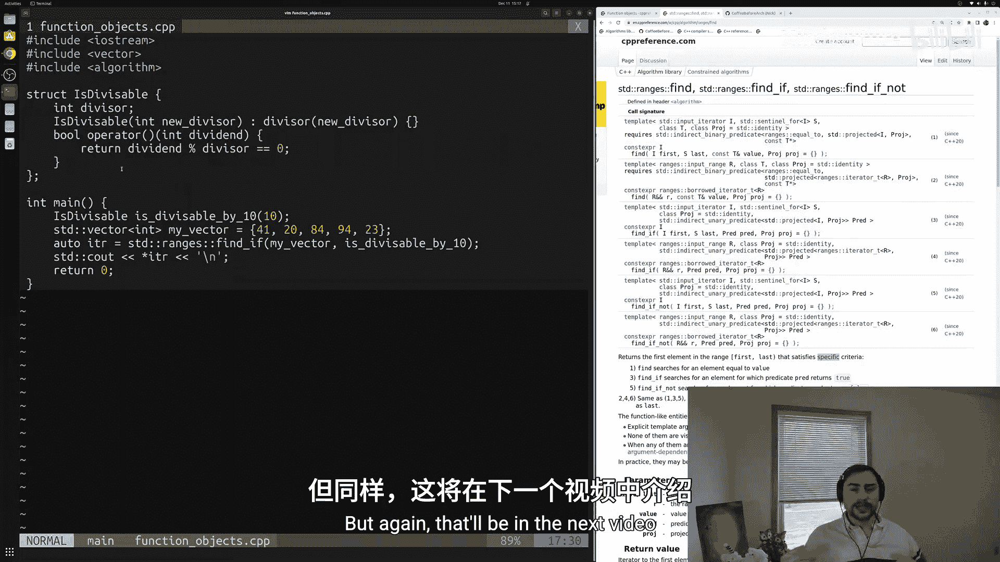
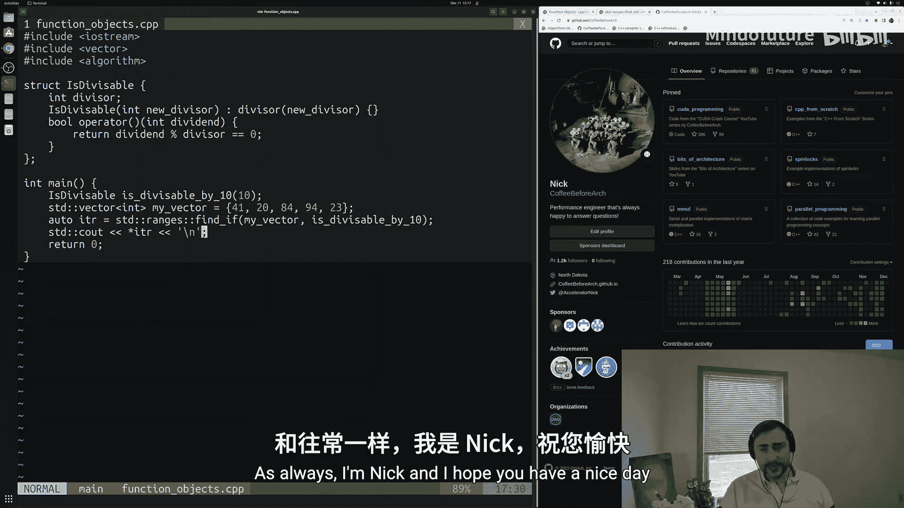

# 038：函数对象 🎯

在本节课中，我们将要学习C++中的函数对象。函数对象是任何定义了函数调用运算符的对象，这意味着我们可以像调用函数一样调用这些对象。函数对象的一个优点是它们可以携带状态，这些状态就是与对象关联的数据成员。我们将学习如何定义和使用函数对象，并了解如何在标准库算法（如 `std::ranges::find_if`）的上下文中应用它们。

---



## 定义函数对象

上一节我们介绍了函数对象的基本概念，本节中我们来看看如何定义一个简单的函数对象。

我们将创建一个名为 `is_divisible` 的结构体，用于检查一个数字是否能被另一个数字整除。这个结构体包含一个数据成员 `divisor`（除数）和一个重载的函数调用运算符。

```cpp
#include <iostream>

struct is_divisible {
    int divisor;
    // 构造函数，用于初始化除数
    is_divisible(int new_divisor) : divisor(new_divisor) {}
    // 重载函数调用运算符
    bool operator()(int dividend) {
        return (dividend % divisor) == 0;
    }
};
```

在上述代码中：
*   `divisor` 是数据成员，存储了我们要检查的除数。
*   构造函数 `is_divisible(int new_divisor)` 用于初始化 `divisor`。
*   `bool operator()(int dividend)` 是重载的函数调用运算符。它接受一个 `dividend`（被除数）作为参数，并返回一个布尔值，表示 `dividend` 是否能被 `divisor` 整除。其核心逻辑是检查余数是否为0，用公式表示为：`dividend % divisor == 0`。

---

## 使用函数对象

定义了函数对象后，我们可以像使用函数一样使用它。以下是创建对象并调用它的示例。



```cpp
int main() {
    // 创建一个检查是否能被10整除的函数对象
    is_divisible is_divisible_by_10(10);

    // 像调用函数一样调用该对象
    std::cout << is_divisible_by_10(55) << '\n'; // 输出 0 (false)
    std::cout << is_divisible_by_10(50) << '\n'; // 输出 1 (true)

    return 0;
}
```



运行此代码，对于55会输出0（假），对于50会输出1（真）。这证明了我们可以像调用函数一样调用 `is_divisible_by_10` 这个对象。



---



## 在STL算法中应用函数对象

函数对象的一个强大用途是作为谓词传递给标准模板库（STL）中的算法。接下来，我们看看如何将函数对象与 `std::ranges::find_if` 算法结合使用。

首先，我们需要包含必要的头文件并创建一个整数向量。

```cpp
#include <vector>
#include <algorithm>

int main() {
    // 创建一个整数向量
    std::vector<int> my_vector = {41, 20, 84, 94, 23};

    // 创建一个检查是否能被10整除的函数对象
    is_divisible is_divisible_by_10(10);

    // 使用 std::ranges::find_if 查找第一个能被10整除的元素
    auto iterator = std::ranges::find_if(my_vector, is_divisible_by_10);

    // 输出找到的元素（注意：实际使用中应检查迭代器是否有效）
    std::cout << *iterator << '\n'; // 输出 20

    return 0;
}
```

以下是关键步骤的说明：
1.  **包含头文件**：`<vector>` 用于使用 `std::vector`，`<algorithm>` 用于使用 `std::ranges::find_if`。
2.  **创建向量**：`my_vector` 包含一些整数。
3.  **使用算法**：`std::ranges::find_if` 接受一个范围（`my_vector`）和一个谓词（`is_divisible_by_10`）。它会返回指向范围内第一个使谓词返回 `true` 的元素的迭代器。
4.  **输出结果**：解引用迭代器 `*iterator` 得到值 `20`，它是向量中第一个能被10整除的数。

> **注意**：`std::ranges::find_if` 是C++20引入的约束算法。编译时需要指定C++20标准，例如使用 `g++ -std=c++20` 进行编译。

---



## 总结



本节课中我们一起学习了C++函数对象的核心概念和应用。

*   **函数对象**是定义了函数调用运算符 `operator()` 的对象，可以像函数一样被调用。
*   **定义方法**：在结构体或类中重载 `operator()`，并实现所需的逻辑（例如，检查整除性：`dividend % divisor == 0`）。
*   **基本使用**：创建函数对象实例后，可以直接用 `对象(参数)` 的语法调用它。
*   **高级应用**：函数对象可以作为谓词传递给STL算法（如 `std::ranges::find_if`），使代码更简洁、更通用。





函数对象为C++编程提供了将状态和行为封装在一起的灵活方式。在下一节课中，我们将探讨Lambda表达式，它是一种创建匿名函数对象的更简洁的语法，可以进一步简化代码。