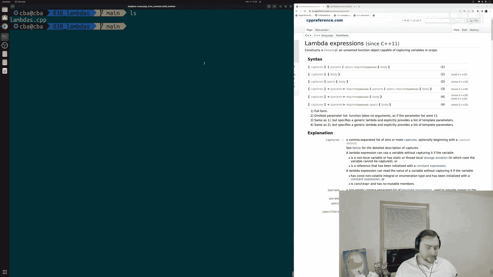
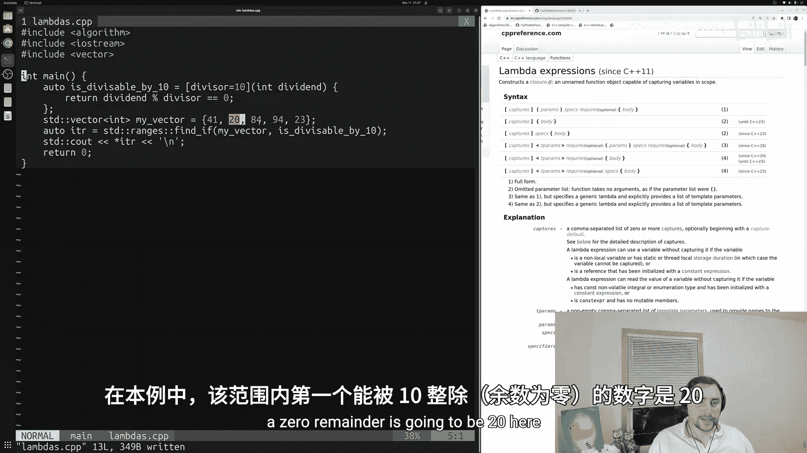
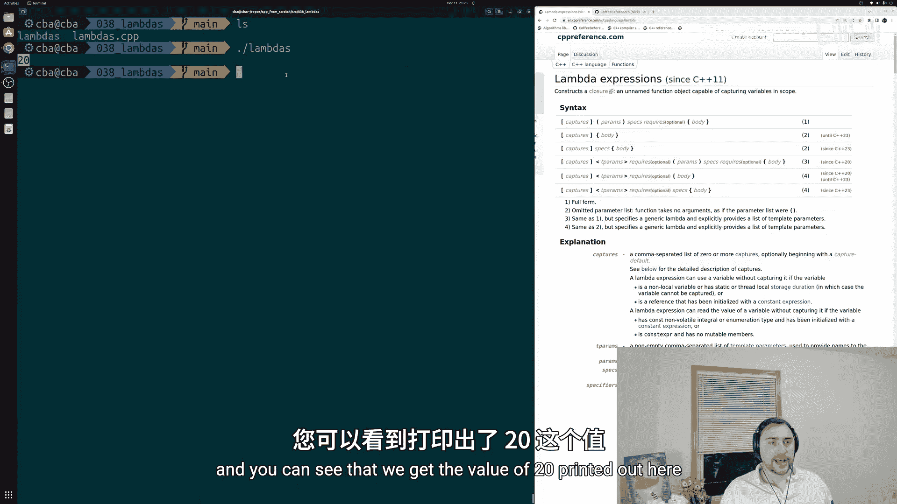
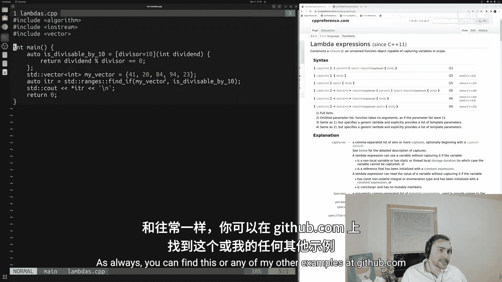
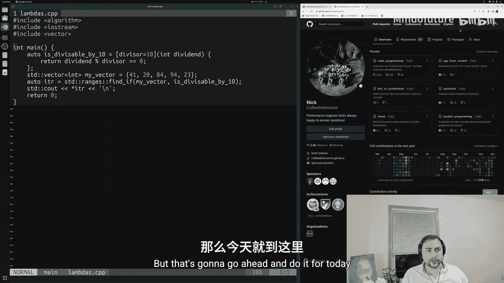

# 039：Lambda表达式 🚀

在本节课中，我们将要学习C++中的Lambda表达式。Lambda表达式是C++11引入的一项强大功能，它允许我们创建匿名的函数对象，从而简化代码并提高可读性。

上一节我们介绍了函数对象的基础知识，了解了如何通过重载结构体或类的函数调用运算符来创建可调用对象。然而，我们也注意到，为了创建一个函数对象，需要编写相当多的样板代码，例如定义结构体、添加数据成员、构造函数以及重载运算符。



## 从函数对象到Lambda表达式

本节中，我们来看看如何使用Lambda表达式来简化这个过程。Lambda表达式允许我们创建一个能够捕获作用域内变量的无名函数对象，而无需显式定义一个结构体或类。

以下是使用Lambda表达式替换之前函数对象的具体步骤：

1.  **移除结构体定义**：我们不再需要定义一个类似 `is_divisible` 的结构体。
2.  **使用 `auto` 关键字**：我们将依赖编译器自动推导Lambda表达式的类型。
3.  **编写Lambda表达式**：Lambda表达式主要由三部分组成：
    *   **捕获列表 `[]`**：指定要从外部作用域捕获哪些变量（按值或按引用），甚至可以在此处创建新变量。
    *   **参数列表 `()`**：与普通函数一样，指定该函数对象接受的参数。
    *   **函数体 `{}`**：定义函数对象要执行的操作。

让我们通过一个具体例子来理解。假设我们有一个函数对象，用于检查一个数是否能被某个除数整除。

**原始函数对象代码：**
```cpp
struct is_divisible {
    int divisor;
    is_divisible(int new_divisor) : divisor(new_divisor) {}
    bool operator()(int dividend) const {
        return dividend % divisor == 0;
    }
};
```

**使用Lambda表达式替换后：**
```cpp
auto is_divisible_by_10 = [divisor = 10](int dividend) {
    return dividend % divisor == 0;
};
```
在这段Lambda表达式中：
*   `[divisor = 10]` 是捕获列表，它创建并初始化了一个名为 `divisor` 的变量，其值为10。
*   `(int dividend)` 是参数列表，表示这个Lambda接受一个整型参数 `dividend`。
*   `{ return dividend % divisor == 0; }` 是函数体，其逻辑与之前结构体中的 `operator()` 完全一致。

可以看到，我们用一行简洁的Lambda表达式完全替代了之前需要多行代码定义的结构体。

## 在算法中使用Lambda表达式

Lambda表达式的一个常见用途是作为参数传递给标准库算法，例如 `std::ranges::find_if`。

以下是一个完整的示例，演示了如何使用Lambda表达式在向量中查找第一个能被10整除的数：



```cpp
#include <iostream>
#include <vector>
#include <algorithm>



int main() {
    std::vector<int> my_vector = {1, 25, 3, 20, 5};

    // 定义Lambda表达式
    auto is_divisible_by_10 = [divisor = 10](int dividend) {
        return dividend % divisor == 0;
    };

    // 使用Lambda表达式作为谓词
    auto it = std::ranges::find_if(my_vector, is_divisible_by_10);

    if (it != my_vector.end()) {
        std::cout << "Found: " << *it << std::endl; // 输出: Found: 20
    }

    return 0;
}
```
编译此代码需要使用支持C++20的编译器，并指定 `-std=c++20` 标志。运行程序后，将成功找到并输出数字20。

## 总结





本节课中我们一起学习了C++ Lambda表达式的核心概念和基本用法。我们了解到，Lambda表达式通过 `[捕获列表](参数列表){函数体}` 的形式，提供了一种创建匿名函数对象的简洁方式。它极大地减少了定义小型、一次性使用的函数对象所需的样板代码，使代码更加清晰和易于维护。通过将其与标准库算法结合使用，我们可以编写出既强大又优雅的C++代码。