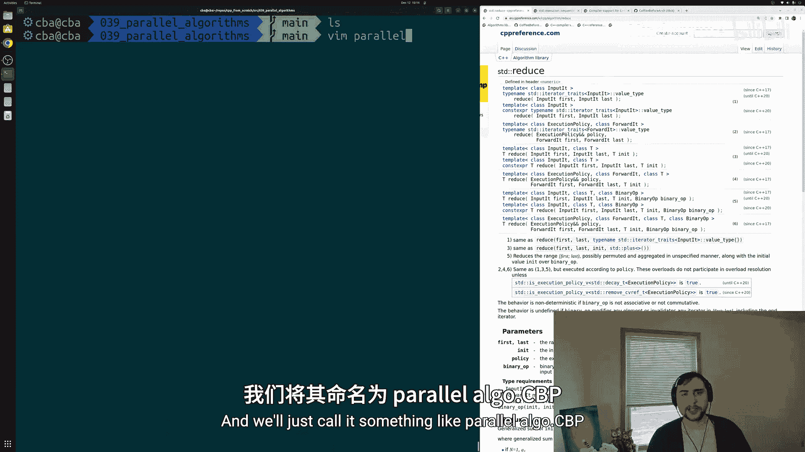
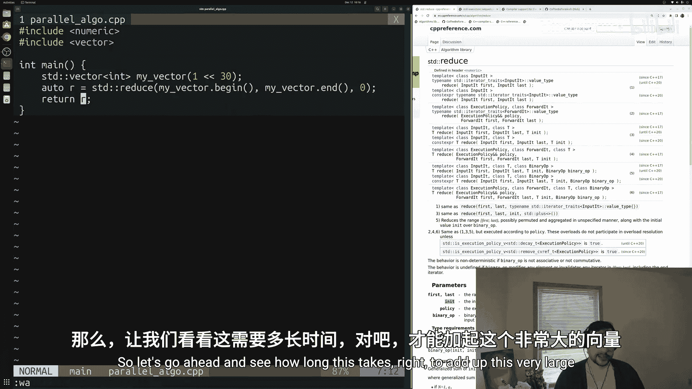
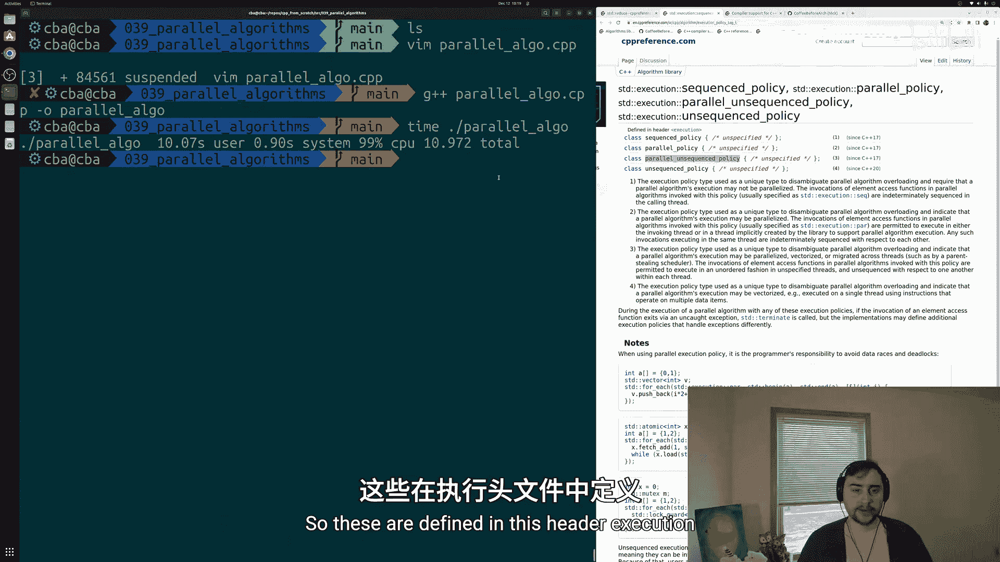
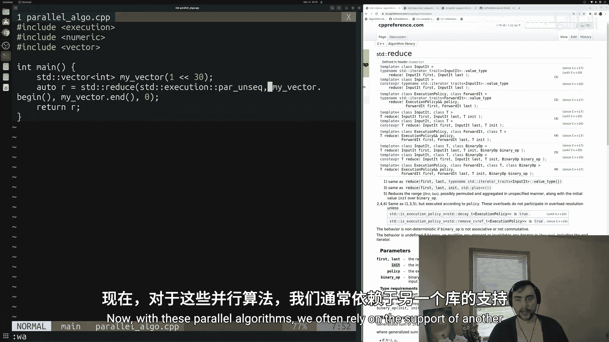
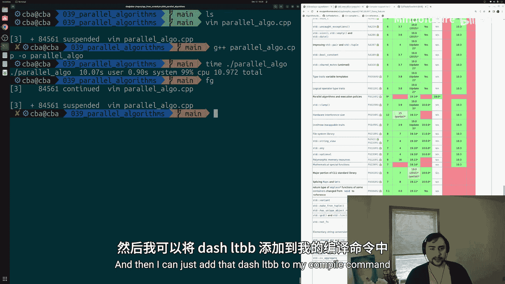
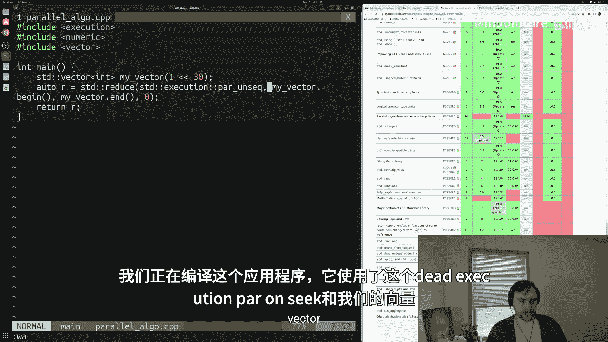
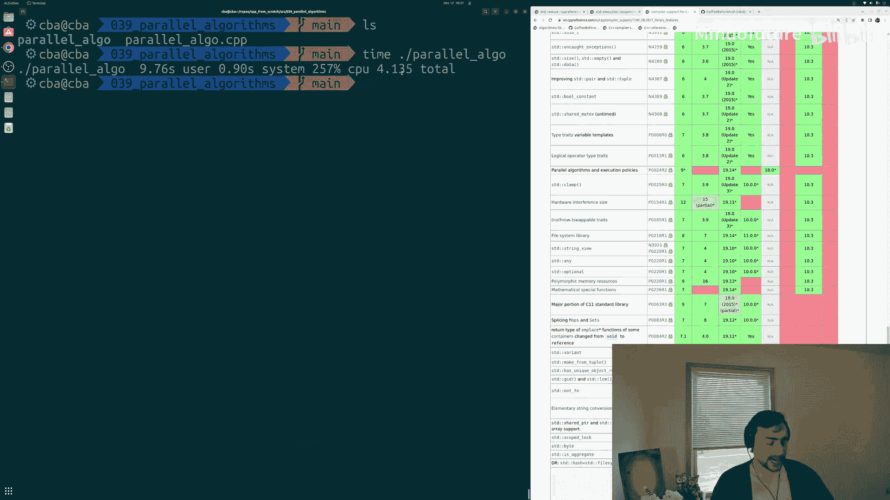
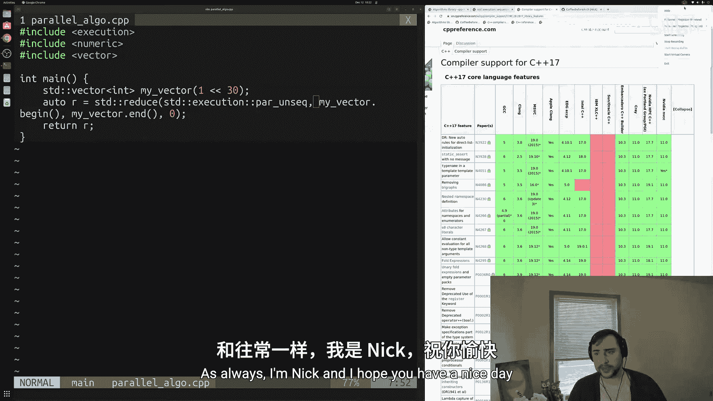

# 040：并行STL算法 🚀

在本节课中，我们将要学习如何使用C++标准模板库（STL）中的并行算法来提升程序性能。我们将通过一个具体的例子，演示如何将一个串行求和操作转换为并行操作，从而显著减少运行时间。

---

## 概述

到目前为止，我们主要关注的是用C++编写功能正确的代码。然而，编程的另一个重要方面是性能。我们不仅关心程序能生成正确的结果，还关心它能在可接受的时间内完成这些计算。性能在编程的各个层面都至关重要。

本节我们将探讨如何通过并行性为程序获取额外性能的基础知识。现代CPU拥有多核并支持SIMD指令，我们希望充分利用这些硬件特性。实现这一目标的方法之一就是使用并行算法。幸运的是，在现代C++版本和一些额外库的帮助下，我们可以获得我们所熟悉的标准STL算法的并行版本。



## 创建示例程序

我们将从一个简单的例子开始：对一个包含大量整数的向量进行求和。我们将使用STL算法中的 `std::reduce` 函数。

首先，创建一个名为 `parallel_algo.cpp` 的新文件。

以下是实现串行求和的代码：

```cpp
#include <numeric>
#include <vector>

int main() {
    // 创建一个包含 2^30 个整数的向量
    std::vector<int> my_vector(1 << 30); // 相当于 2^30，约10亿个整数

    // 使用 std::reduce 对向量中的所有元素求和
    auto result = std::reduce(my_vector.begin(), my_vector.end(), 0);

    return result; // 向量初始化为0，所以结果为0
}
```

在这段代码中，我们创建了一个非常大的向量（约4GB数据），并使用 `std::reduce` 对其所有元素进行求和。向量默认初始化为0，因此最终结果也是0，但程序仍需执行大量的加法运算。

## 测量串行性能



我们可以使用 `time` 命令来测量这个程序的运行时间。在终端中编译并运行：

```bash
g++ -o parallel_algo parallel_algo.cpp
time ./parallel_algo
```

在我的测试中，这个串行版本的程序大约需要 **11秒** 才能完成。这是一个我们希望进行优化的耗时操作。

## 引入并行执行策略

C++17引入了执行策略（Execution Policies），允许我们指示算法使用并行或向量化技术。主要的执行策略有：
*   `std::execution::seq`： 顺序执行（默认，不允许并行化）。
*   `std::execution::par`： 允许并行执行（使用多个线程）。
*   `std::execution::par_unseq`： 允许并行和向量化执行（使用多个线程和SIMD指令）。

为了加速我们的求和操作，我们将使用 `std::execution::par_unseq` 策略。

我们需要包含 `<execution>` 头文件，并将执行策略作为第一个参数传递给 `std::reduce`。

修改后的代码如下：



```cpp
#include <numeric>
#include <vector>
#include <execution> // 引入执行策略头文件

int main() {
    std::vector<int> my_vector(1 << 30);

    // 使用并行且向量化的执行策略
    auto result = std::reduce(std::execution::par_unseq,
                              my_vector.begin(),
                              my_vector.end(),
                              0);

    return result;
}
```

## 链接并行库并测量性能

对于GCC等编译器，并行算法的实现依赖于外部线程库，例如Intel的Threading Building Blocks（TBB）。你需要先安装这个库（例如，在Ubuntu上使用 `sudo apt-get install libtbb-dev`），然后在编译时链接它。



使用以下命令编译并行版本的程序：



```bash
g++ -o parallel_algo_par parallel_algo.cpp -ltbb
time ./parallel_algo_par
```



再次运行程序，你会发现执行时间从大约 **11秒** 减少到了大约 **4秒**，性能提升了接近 **3倍**。我们所做的仅仅是在 `std::reduce` 调用中添加了一个执行策略参数。

## 可用算法与注意事项

并非所有STL算法都支持并行执行策略。CPPReference网站有一个专门的页面列出了所有支持执行策略的算法，例如 `std::sort`， `std::for_each`， `std::transform` 等。在决定并行化之前，请务必查阅文档。



使用并行算法时也需注意：
*   **线程安全性**： 确保传递给算法的函数和操作是线程安全的。
*   **开销**： 对于非常小的数据量，创建和管理线程的开销可能超过并行计算带来的收益。
*   **数据竞争**： 并行算法本身会处理数据划分，但如果你在算法外部操作共享数据，则需要自行管理同步。

## 总结

本节课中我们一起学习了C++并行STL算法的基础知识。我们了解到：
1.  通过使用C++17引入的执行策略（如 `std::execution::par_unseq`），可以轻松地将许多标准算法并行化。
2.  这通常需要链接额外的库（如Intel TBB）。
3.  在我们的求和示例中，仅添加一个参数就获得了近3倍的性能提升，这展示了并行化在处理大规模数据时的强大能力。



并行化是优化程序性能的重要手段，而C++标准库提供的并行算法使其实现变得异常简单。对于计算密集型的任务，考虑使用并行算法是一个很好的起点。