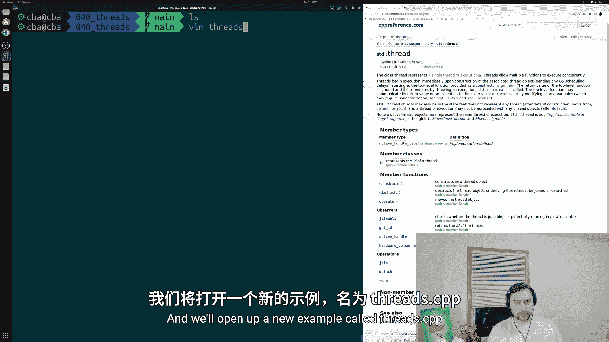
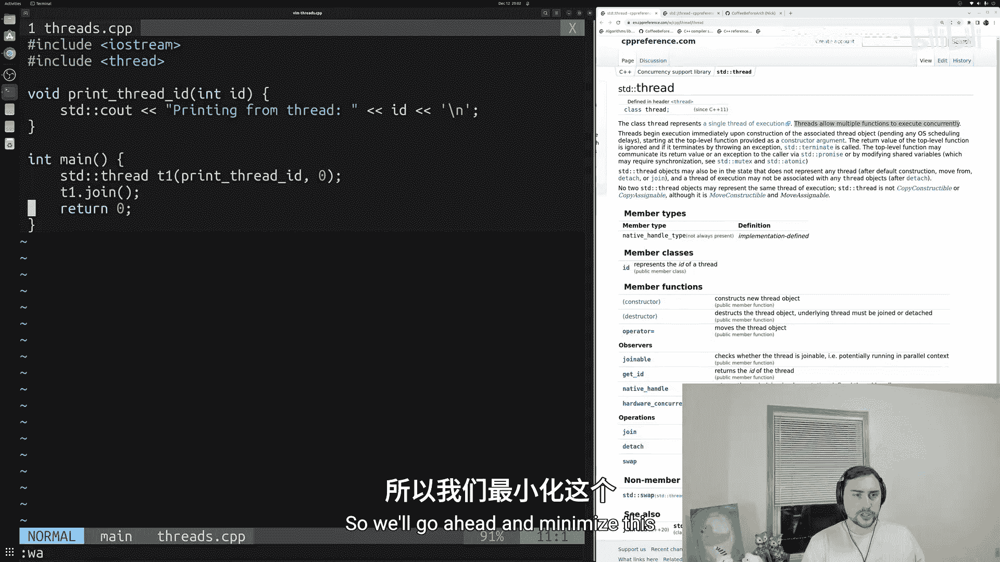
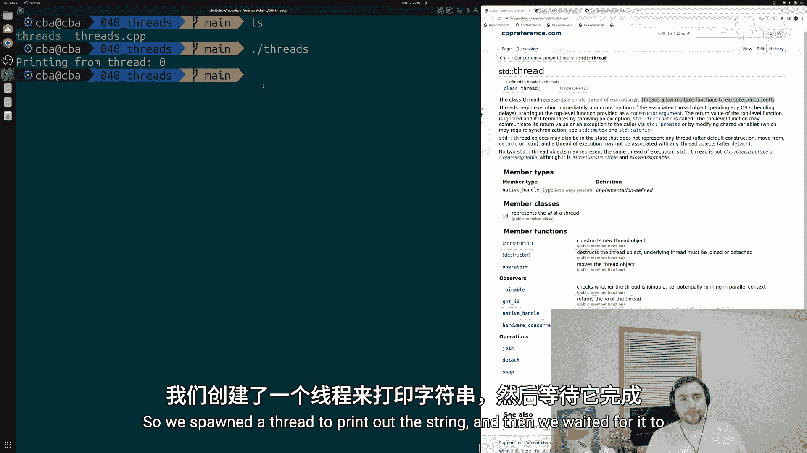
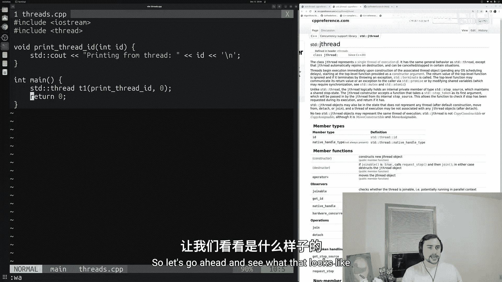
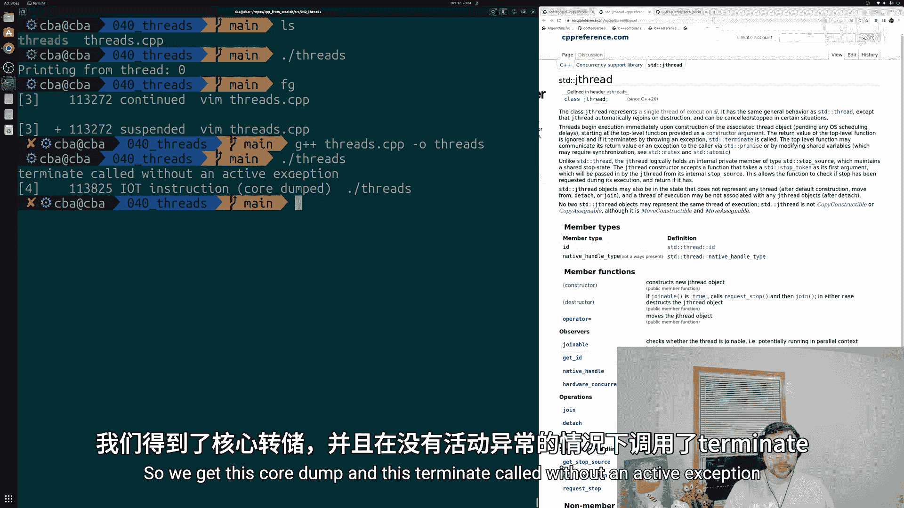
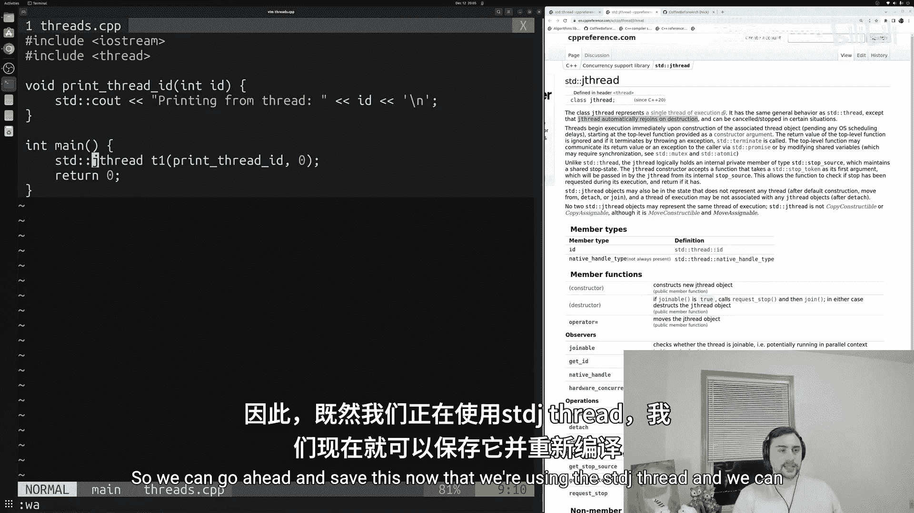
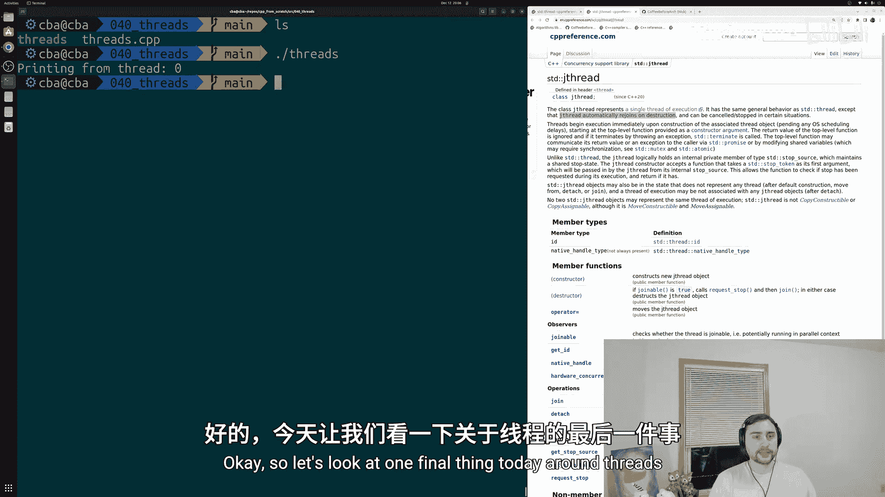
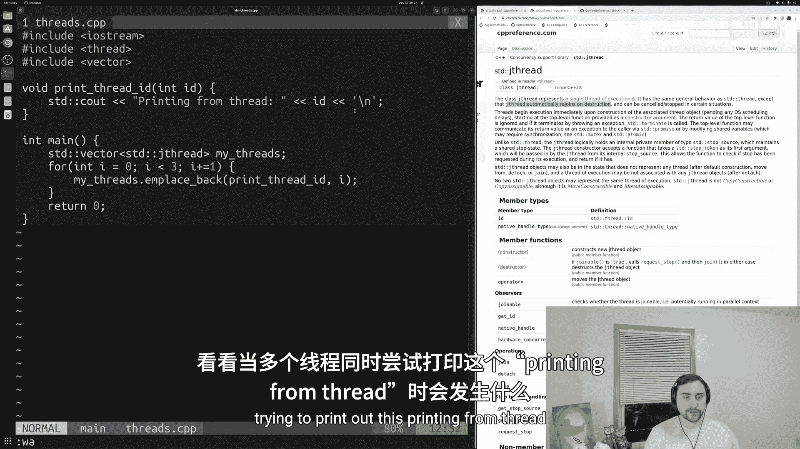
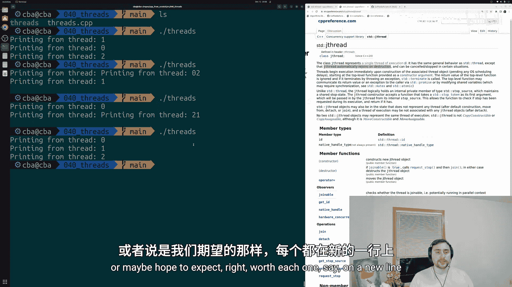

# 041：线程基础

## 概述
在本节课中，我们将要学习C++中线程的基础知识。我们将了解如何创建线程、如何等待线程完成，以及如何使用更现代的`std::jthread`来简化线程管理。



在上一节中，我们探讨了并行STL算法的基础，这些算法非常方便，因为我们无需关心底层的并行化细节。然而，有时我们需要执行的工作并不能完美地匹配某个STL算法。因此，我们可能需要亲自动手实现并行化。在C++中，实现并行化的一种方式就是通过线程。我们可以创建执行线程来获得并行性。今天，我们将学习如何创建和连接这些线程，并初步了解如何使用它们。

## 准备工作
首先，我们需要包含必要的头文件。我们将使用`<iostream>`进行打印输出，并使用`<thread>`头文件来使用线程类。

```cpp
#include <iostream>
#include <thread>
```

## 创建并运行一个线程
`std::thread`类代表一个单独的执行线程。线程允许多个函数并发执行。我们可以创建一个线程，并指定它要执行的函数，该线程将与主线程并行运行。

以下是创建线程的步骤。首先，我们需要定义一个希望线程执行的函数。

```cpp
void print_thread_id(int id) {
    std::cout << "Printing from thread " << id << '\n';
}
```

接下来，在`main`函数中，我们可以创建一个`std::thread`对象来运行这个函数。构造函数接受要执行的函数以及该函数所需的参数。



```cpp
int main() {
    std::thread t1(print_thread_id, 0);
    // ... 其他代码
}
```

## 连接线程
创建线程后，我们必须确保主线程在适当的位置等待该线程完成执行。这是通过调用线程对象的`.join()`方法实现的。



```cpp
int main() {
    std::thread t1(print_thread_id, 0);
    t1.join(); // 主线程在此等待t1完成
    return 0;
}
```

如果不调用`join()`，主线程可能会在子线程完成工作之前就结束并销毁线程对象，这将导致运行时错误。

## 使用 std::jthread 简化管理
从C++20开始，引入了`std::jthread`（joining thread）。它与`std::thread`行为相似，但关键区别在于，`std::jthread`在析构时会自动调用`join()`，从而避免因忘记连接而导致的错误。





以下是使用`std::jthread`的示例：

```cpp
int main() {
    std::jthread t1(print_thread_id, 0);
    // 无需手动调用 t1.join()，析构时会自动连接
    return 0;
}
```

使用`std::jthread`可以使代码更简洁、更安全。



## 创建多个线程
在实际应用中，我们经常需要创建多个线程。我们可以将线程对象存储在容器（如`std::vector`）中，并通过循环来创建它们。

以下是创建多个线程的示例：



```cpp
int main() {
    std::vector<std::jthread> my_threads;

    for (int i = 0; i < 3; ++i) {
        my_threads.emplace_back(print_thread_id, i);
    }
    // 所有jthread在离开作用域时会自动join
    return 0;
}
```

运行此程序时，多个线程会并发执行，打印语句的顺序可能每次运行都不同，甚至可能出现输出内容交错的情况。这是因为线程是异步执行的，没有特定的协调顺序。



## 总结
本节课中我们一起学习了C++线程编程的基础。

我们首先介绍了`std::thread`类，学习了如何创建线程并指定其要执行的函数。我们强调了连接线程（`.join()`）的重要性，以避免主线程提前结束导致的错误。

接着，我们探讨了C++20引入的`std::jthread`，它通过在析构时自动连接，简化了线程的生命周期管理，使代码更健壮。



最后，我们演示了如何创建和管理多个线程，并观察到并发执行时输出顺序的不确定性，这引出了线程间协调与同步的需求，这将是后续课程的主题。

通过掌握这些基础知识，你已经迈出了编写并行C++程序的第一步。在接下来的课程中，我们将学习如何使用互斥锁、条件变量等工具来协调线程间的操作。