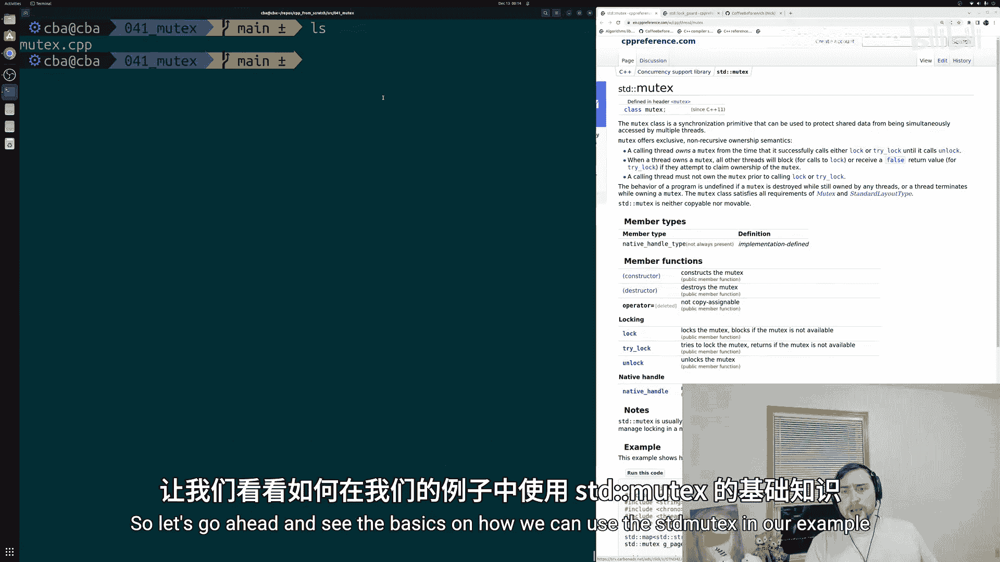
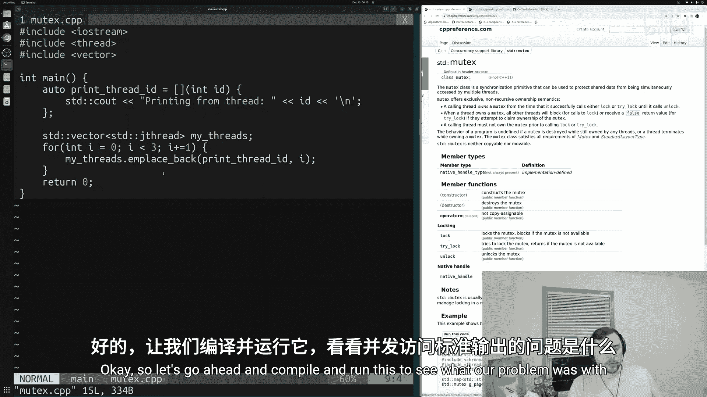
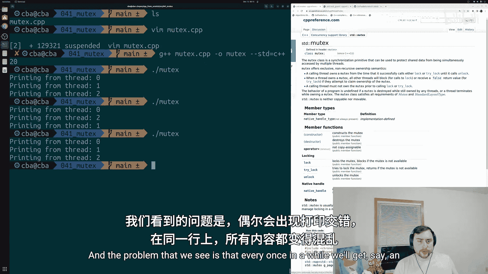
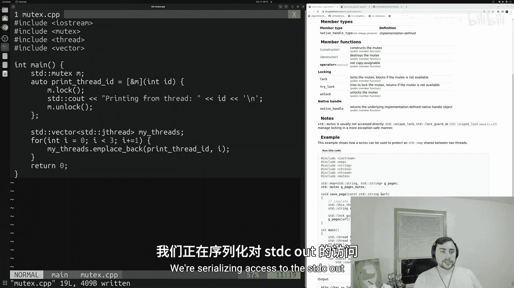
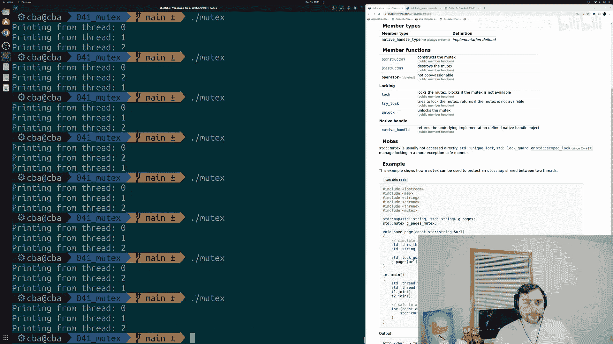
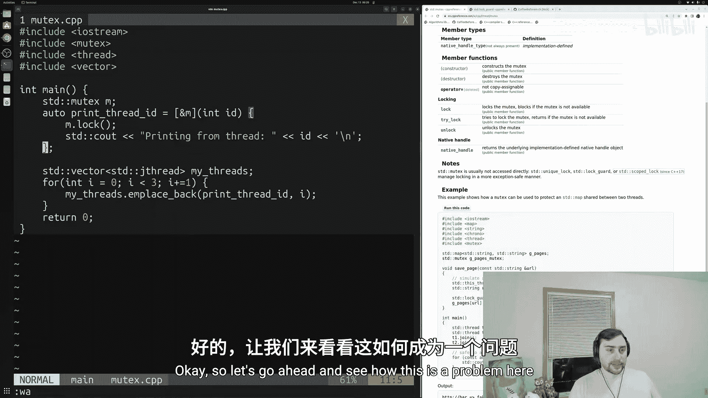
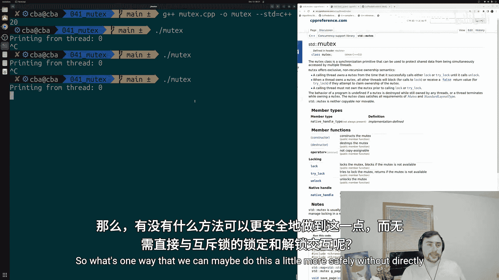
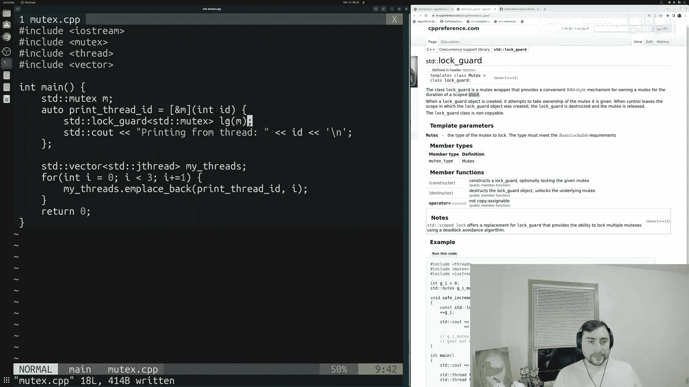
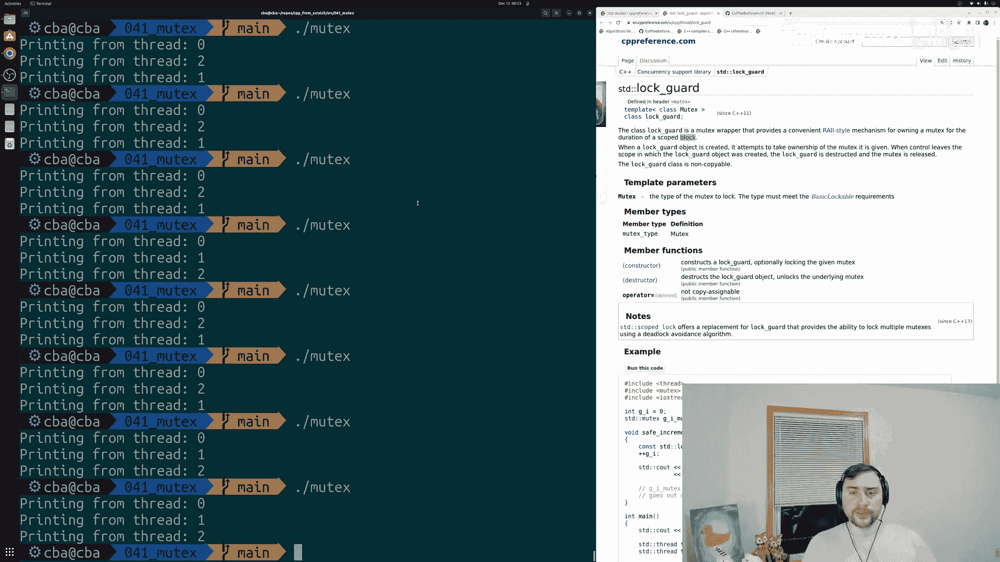

# 042：线程同步与std::mutex 🧵

在本节课中，我们将学习如何使用C++标准库中的`std::mutex`（互斥锁）来实现线程同步。我们将解决多个线程同时访问共享资源（如`std::cout`）时可能出现的输出混乱问题，并介绍更安全的资源管理方式。

---

## 问题背景：并发访问的混乱

在上一节中，我们介绍了使用`std::thread`和`std::jthread`创建与连接线程的基础知识。在那个例子中，我们遇到了一个典型问题：多个线程并发访问某个共享资源。



在我们的案例中，共享资源是`std::cout`流对象。多个线程试图同时使用`std::cout`打印信息，导致输出结果中不同字符串交织在同一行，显得混乱不堪。

我们当时就在寻找一种方法，能够同步这些不同的线程，防止这种并发访问。而`std::mutex`正是我们需要的工具。

根据C++参考文档，`std::mutex`类是一个同步原语，可用于保护共享数据，防止被多个线程同时访问。这听起来完全符合我们的需求。



---

## 基础示例：未使用互斥锁的问题

让我们先看一个没有使用互斥锁的示例程序，以重现问题。



```cpp
#include <iostream>
#include <vector>
#include <thread>

void print_thread_id(int id) {
    std::cout << "Printing from thread " << id << '\n';
}

int main() {
    std::vector<std::jthread> my_threads;
    for (int i = 0; i < 3; ++i) {
        my_threads.emplace_back(print_thread_id, i);
    }
    return 0;
}
```

编译并运行此程序，可能会得到如下混乱的输出：
```
Printing from thread Printing from thread 0
1
Printing from thread 2
```
可以看到，线程0和线程1的输出部分内容被“挤”在了同一行。这是因为多个线程在几乎同一时刻访问了`std::cout`，导致其内部状态被打乱。

---

## 引入 std::mutex

为了解决这个问题，我们需要在访问`std::cout`之前“锁定”一个资源，确保同一时间只有一个线程能执行打印操作。`std::mutex`提供了`lock()`和`unlock()`两个核心方法来实现这一点。

以下是使用`std::mutex`的基本步骤：
1.  在访问共享资源前调用`mutex.lock()`。如果锁已被其他线程持有，当前线程将等待（阻塞）。
2.  执行对共享资源的操作（例如打印）。
3.  操作完成后调用`mutex.unlock()`，释放锁，允许其他线程获取。



让我们修改之前的代码，使用`std::mutex`来保护`std::cout`。

```cpp
#include <iostream>
#include <vector>
#include <thread>
#include <mutex> // 引入mutex头文件

int main() {
    std::mutex m; // 创建一个互斥锁
    std::vector<std::jthread> my_threads;

    auto print_task = [&m](int id) {
        m.lock(); // 进入临界区前加锁
        std::cout << "Printing from thread " << id << '\n';
        m.unlock(); // 离开临界区后解锁
    };

    for (int i = 0; i < 3; ++i) {
        my_threads.emplace_back(print_task, i);
    }
    return 0;
}
```



现在，无论运行程序多少次，输出都不会再出现行间交织的情况。虽然线程的执行顺序可能每次不同（例如 `0, 1, 2` 或 `2, 0, 1`），但每个线程的完整输出都会独占一行。`std::mutex`确保了**互斥访问**，即同一时刻只有一个线程能通过锁的保护区域（临界区）。

---

## 潜在风险：死锁

直接使用`lock()`和`unlock()`管理互斥锁，类似于用`new`和`delete`管理内存，存在忘记释放资源的风险。如果我们忘记调用`unlock()`，就会导致**死锁**。

考虑以下错误代码：
```cpp
auto faulty_task = [&m](int id) {
    m.lock(); // 加锁
    std::cout << "Printing from thread " << id << '\n';
    // 忘记调用 m.unlock()!
};
```
第一个线程加锁后，如果没有解锁就结束，那么后续所有线程在调用`m.lock()`时都会永远等待，因为锁永远不会被释放。程序会卡住，无法正常结束。

---



## 更安全的方案：std::lock_guard 🛡️

为了避免手动管理锁带来的遗忘风险，C++提供了`std::lock_guard`。它是一个基于**RAII**（资源获取即初始化）机制的互斥锁包装器。



**RAII**的核心思想是：在对象的构造函数中获取资源（例如加锁），在析构函数中自动释放资源（例如解锁）。这样，只要`lock_guard`对象离开其作用域，锁就会被自动释放，无需手动调用`unlock`。

以下是使用`std::lock_guard`的代码：

```cpp
#include <iostream>
#include <vector>
#include <thread>
#include <mutex>

int main() {
    std::mutex m;
    std::vector<std::thread> my_threads;

    auto safe_task = [&m](int id) {
        std::lock_guard<std::mutex> lg(m); // 构造时自动锁定m
        std::cout << "Printing from thread " << id << '\n';
        // lg析构时自动解锁m
    };

    for (int i = 0; i < 3; ++i) {
        my_threads.emplace_back(safe_task, i);
    }

    for (auto& t : my_threads) {
        t.join();
    }
    return 0;
}
```
在这段代码中，`std::lock_guard<std::mutex> lg(m);`这一行在创建`lg`对象时，会自动调用`m.lock()`。当`lg`在函数末尾离开作用域被销毁时，其析构函数会自动调用`m.unlock()`。这种方式更安全、更简洁，彻底避免了因忘记解锁而导致的死锁问题。



---

## 总结



本节课中我们一起学习了线程同步的基础知识：
1.  **问题**：多个线程并发访问共享资源（如`std::cout`）会导致数据竞争和输出混乱。
2.  **工具**：引入`std::mutex`（互斥锁）作为同步原语，通过对临界区加锁来实现互斥访问。
3.  **基础用法**：使用`lock()`和`unlock()`方法手动控制锁的获取与释放。
4.  **风险**：手动管理锁可能因忘记解锁而导致程序死锁。
5.  **最佳实践**：使用`std::lock_guard`，利用RAII机制自动管理锁的生命周期，这是更安全、更推荐的写法。

通过使用`std::mutex`和`std::lock_guard`，我们可以有效地协调多个线程，确保它们有序地访问共享资源，从而编写出正确、健壮的多线程程序。