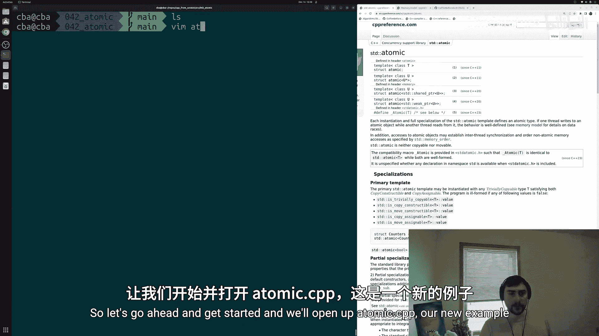
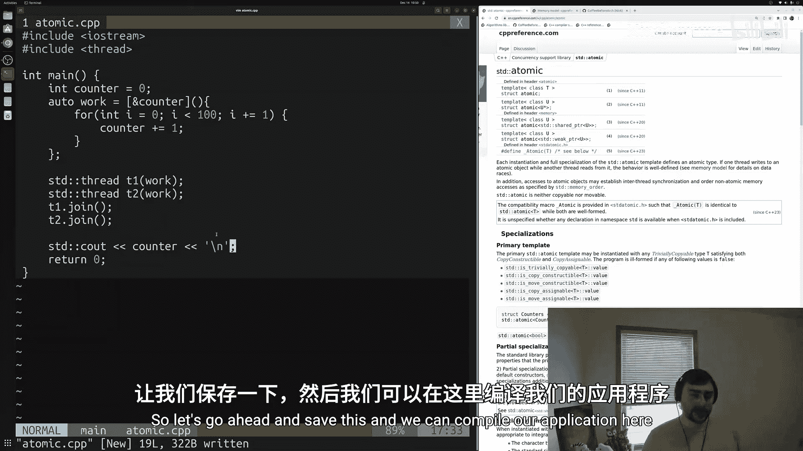
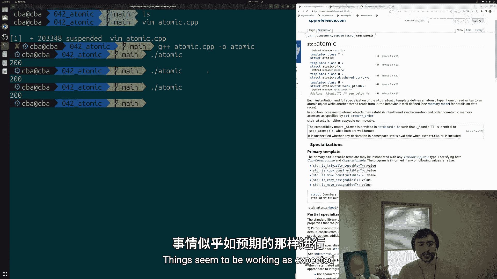
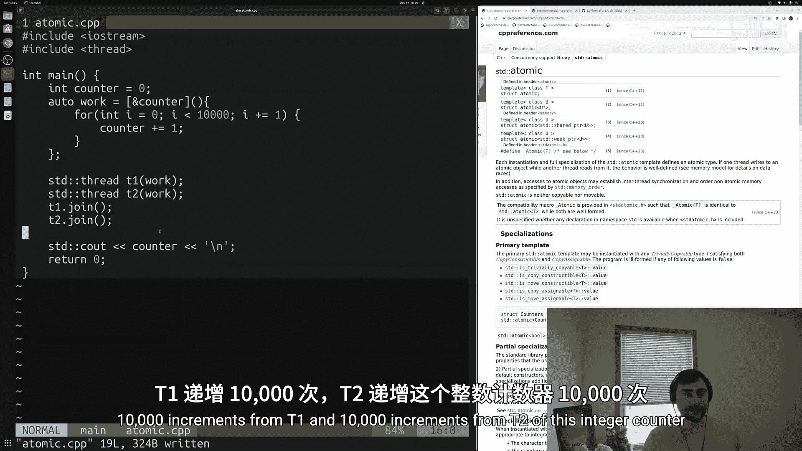
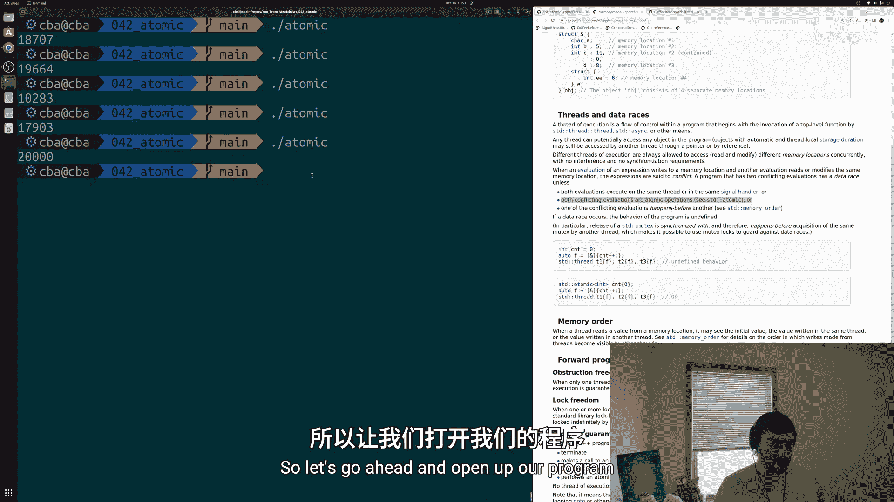
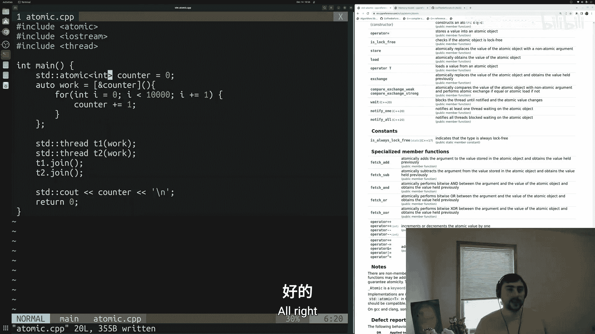
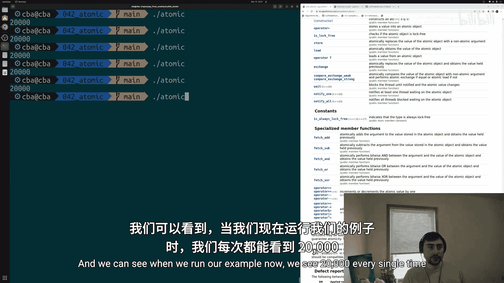

# 043：std::atomic基础

## 概述
在本节课中，我们将要学习C++标准库中的`std::atomic`以及原子操作的基础知识。我们将从一个多线程程序中的常见问题——数据竞争（Data Race）入手，理解其产生的原因，并学习如何使用`std::atomic`来确保操作的原子性，从而避免数据竞争，保证程序行为的正确性。



---

## 多线程共享资源的问题
上一节我们介绍了多线程编程的基本概念。本节中我们来看看当多个线程同时访问和修改同一个共享资源时可能遇到的问题。

一个典型的问题是多个线程同时尝试使用`std::cout`进行打印，这可能导致输出内容混乱交错。解决此类共享资源竞争问题的一种方法是使用`std::mutex`（互斥锁）。然而，C++工具箱中还有另一种强大的工具——`std::atomic`。

## 一个简单的示例：计数器递增
让我们通过一个具体的例子来理解数据竞争。我们将创建两个线程，每个线程都会对一个共享的整数计数器进行多次递增操作。

以下是示例代码的基本结构：
```cpp
#include <iostream>
#include <thread>





int main() {
    int counter = 0; // 共享计数器

    // 定义一个lambda表达式作为线程的工作函数
    auto work = [&counter]() {
        for (int i = 0; i < 100; ++i) {
            counter += 1; // 递增计数器
        }
    };

    // 创建并启动两个线程
    std::thread t1(work);
    std::thread t2(work);

    // 等待线程结束
    t1.join();
    t2.join();

    // 打印最终结果
    std::cout << counter << std::endl;

    return 0;
}
```
当每个线程只循环100次时，程序很可能输出预期的结果`200`。这是因为工作量小，一个线程可能在另一个线程开始前就完成了所有工作。



## 数据竞争的出现
现在，让我们将循环次数增加到10000次，看看会发生什么。

修改循环部分：
```cpp
for (int i = 0; i < 10000; ++i) {
    counter += 1;
}
```
重新编译并多次运行程序，你会发现输出结果不再是稳定的`20000`，而是在`10000`到`20000`之间的一个随机值，例如`18700`、`19600`或`10200`。

为什么会出现这种情况？这源于**数据竞争**。

## 理解数据竞争
根据C++内存模型的定义，当对一个内存位置的**写操作**与另一个线程对**同一内存位置的读或写操作**同时发生时，就产生了冲突。包含两个冲突操作的程序即存在**数据竞争**。

一旦发生数据竞争，程序的**行为是未定义的**。这意味着任何输出结果都是“可接受”的，程序不再具有确定性。

以下是避免数据竞争的几种主要方法：
*   **单线程执行**：所有操作都在同一个线程中完成。
*   **使用原子操作**：确保特定操作（如读-改-写）作为一个不可分割的单元执行。这正是`std::atomic`提供的功能。
*   **使用同步原语**：如`std::mutex`，通过建立“发生在前”（happens-before）的关系来强制顺序执行。



本节课我们将重点探讨第二种方法：原子操作。

## 原子操作的核心概念
要理解为什么`counter += 1`会导致数据竞争，我们需要剖析这个操作在底层做了什么。

`counter += 1`并非一个单一操作，它实际上包含三个步骤：
1.  **读**：从内存中读取`counter`的当前值。
2.  **改**：将读取到的值加1。
3.  **写**：将新的值写回`counter`所在的内存位置。

当两个线程同时执行这个“读-改-写”序列时，它们的步骤可能会**交错执行**。例如：
1.  线程A和线程B都读取到`counter`的值为`0`。
2.  线程A和线程B都在本地将值改为`1`。
3.  线程A和线程B都将`1`写回内存。

最终，尽管两个线程都执行了递增操作，但`counter`的值只增加了`1`，而不是`2`。这就是数据竞争导致结果错误的根本原因。

**原子操作**的意义在于，它将“读-改-写”这样的复合操作打包成一个**不可分割的单一操作**。在执行原子操作期间，不会有其他线程能够介入并修改同一数据。这就从根本上防止了操作步骤的交错，从而消除了数据竞争。

## 使用 std::atomic 解决问题
现在，让我们使用`std::atomic`来修复我们的程序。

首先，需要包含原子操作的头文件：
```cpp
#include <atomic>
```
然后，将普通的`int`类型计数器改为`std::atomic<int>`类型：
```cpp
std::atomic<int> counter(0);
```
`std::atomic<int>`类型重载了`+=`、`++`等运算符。修改后，`counter += 1`就变成了一个**原子性的读-改-写操作**。



以下是修改后的完整代码：
```cpp
#include <iostream>
#include <thread>
#include <atomic> // 包含原子操作头文件



int main() {
    std::atomic<int> counter(0); // 声明为原子整数

    auto work = [&counter]() {
        for (int i = 0; i < 10000; ++i) {
            counter += 1; // 现在这是一个原子操作
        }
    };

    std::thread t1(work);
    std::thread t2(work);

    t1.join();
    t2.join();

    std::cout << counter << std::endl; // 现在总是输出 20000

    return 0;
}
```
重新编译并运行程序，你会发现无论运行多少次，输出结果总是正确的`20000`。我们成功消除了数据竞争，程序行为变得确定且正确。

## 总结
本节课中我们一起学习了`std::atomic`的基础知识：
1.  **数据竞争**：当多个线程无同步地访问同一内存位置，且至少有一个是写操作时，就会发生数据竞争，导致**未定义行为**。
2.  **问题根源**：像`counter += 1`这样的操作不是原子的，它由读、改、写多个步骤组成，在多线程环境下这些步骤可能交错，导致结果错误。
3.  **原子操作**：原子操作是不可分割的最小操作单元。`std::atomic`将特定类型（如`int`）的操作（如递增）转换为原子操作，确保其执行过程不会被其他线程打断。
4.  **使用方法**：通过包含`<atomic>`头文件，并将变量声明为`std::atomic<T>`类型（如`std::atomic<int>`），即可使用其提供的原子运算符和成员函数。

`std::atomic`是编写高效、正确并发程序的重要工具之一，它通常比使用互斥锁（`mutex`）的性能开销更小，适用于保护简单的数据操作。对于更复杂的临界区操作，`std::mutex`仍然是必要的选择。