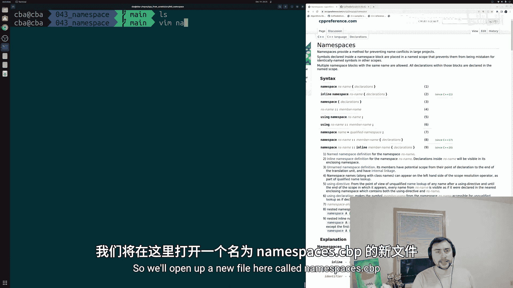
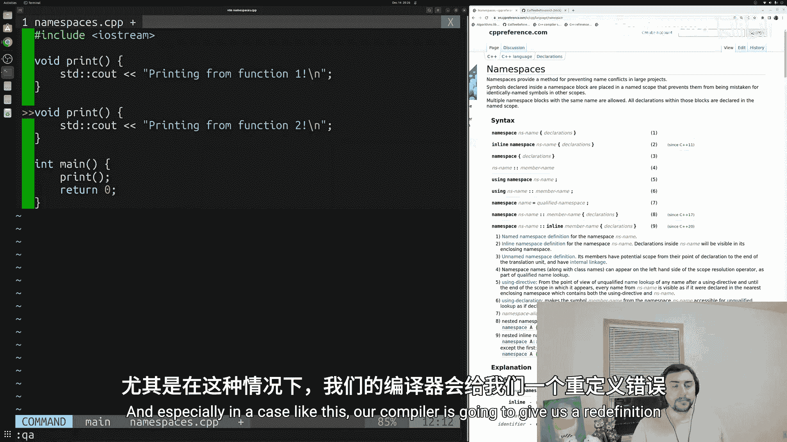
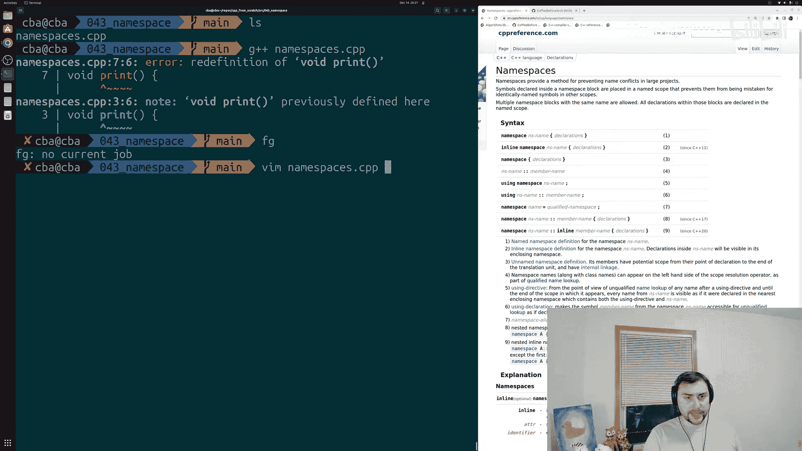
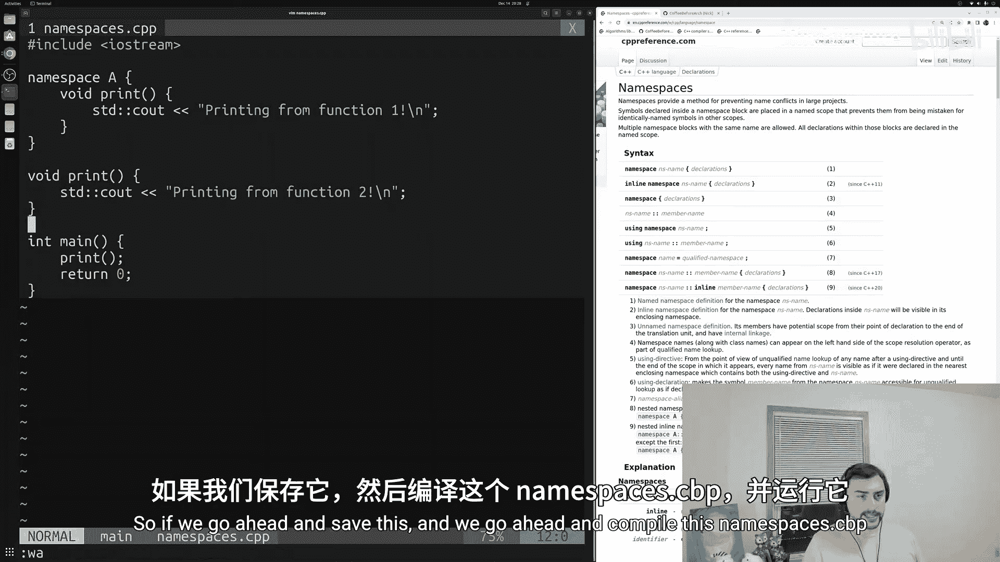
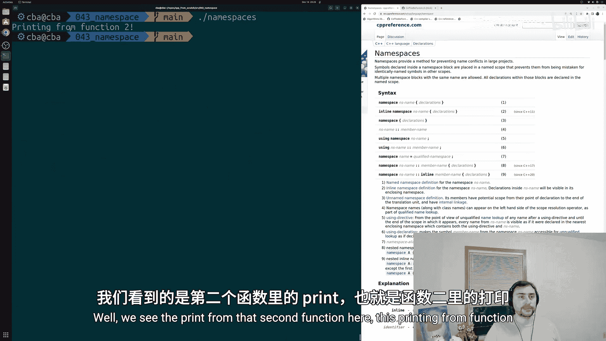
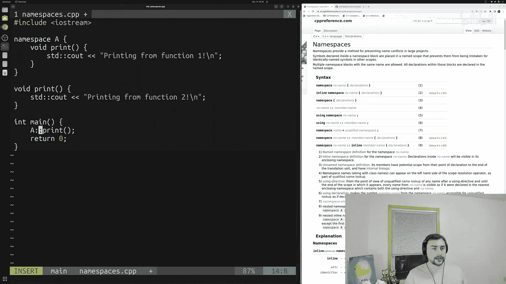
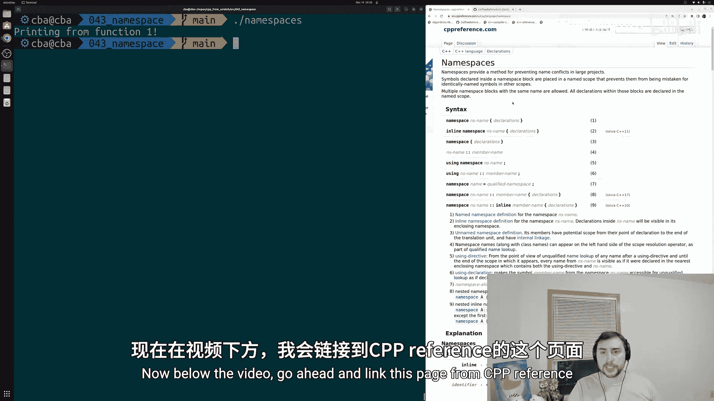
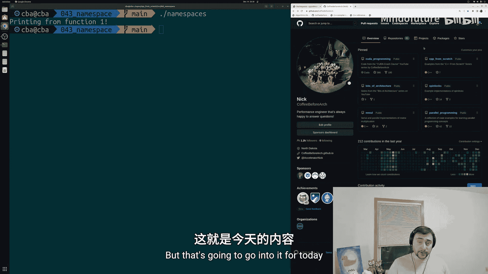

# 044：命名空间 🧭

在本节课中，我们将要学习C++中的**命名空间**。命名空间是解决大型项目中命名冲突问题的重要工具。通过将代码（如函数、类、变量）封装在不同的命名空间中，我们可以避免因名称相同而导致的编译错误。

## 命名冲突问题

上一节我们介绍了函数的基本概念，本节中我们来看看当多个函数拥有相同名称时会发生什么。在大型项目中，确保所有类、结构体、函数都有唯一的名字或函数签名可能很困难。



以下是一个简单的例子，展示了命名冲突：

```cpp
#include <iostream>

void print() {
    std::cout << "Printing from function 1\n";
}

void print() {
    std::cout << "Printing from function 2\n";
}

int main() {
    print();
    return 0;
}
```

在这个例子中，我们定义了两个同名的 `print` 函数。尽管它们的函数体不同，但它们的**函数签名**完全相同。编译器无法区分这两个函数，因此会报“重定义”错误。

## 使用命名空间解决问题

为了解决上述问题，我们可以使用命名空间。命名空间为代码元素提供了一个有作用域的容器，从而将它们与其他作用域中同名的符号区分开来。



以下是使用命名空间修改后的代码：

```cpp
#include <iostream>

namespace A {
    void print() {
        std::cout << "Printing from function 1\n";
    }
}



void print() {
    std::cout << "Printing from function 2\n";
}

int main() {
    // 调用全局命名空间中的 print 函数
    print();
    return 0;
}
```

现在，第一个 `print` 函数被封装在名为 `A` 的命名空间中。当我们在 `main` 函数中调用 `print()` 时，编译器会查找全局命名空间中的 `print` 函数，因此会执行第二个函数。

## 如何访问命名空间中的元素

要访问特定命名空间中的函数或类，我们需要使用**作用域解析运算符** `::`。这与我们使用 `std::cout` 的方式类似，`cout` 就是定义在 `std` 命名空间中的。



以下是访问命名空间 `A` 中 `print` 函数的方法：



```cpp
int main() {
    // 调用命名空间 A 中的 print 函数
    A::print();
    return 0;
}
```

通过使用 `A::print()`，我们明确告诉编译器要使用定义在命名空间 `A` 中的 `print` 函数，而不是全局命名空间中的那个。

## 命名空间的其他用途



命名空间不仅可以用于函数，还可以用于封装类、结构体和变量。这为组织代码和避免命名冲突提供了极大的灵活性。

以下是使用命名空间的一些关键点：

*   命名空间通过 `namespace 名称 { ... }` 语法定义。
*   使用 `命名空间名称::元素名称` 来访问其中的元素。
*   它可以有效隔离不同模块或库中的代码。

## 总结





本节课中我们一起学习了C++中的**命名空间**。我们首先了解了在大型项目中可能出现的命名冲突问题。接着，我们学习了如何使用命名空间将代码封装起来以避免这些冲突。最后，我们掌握了通过作用域解析运算符 `::` 来访问特定命名空间中元素的方法。命名空间是C++中管理代码作用域和避免名称污染的核心机制之一。