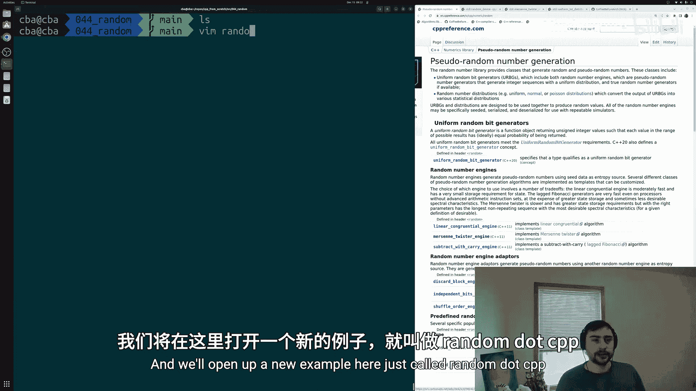
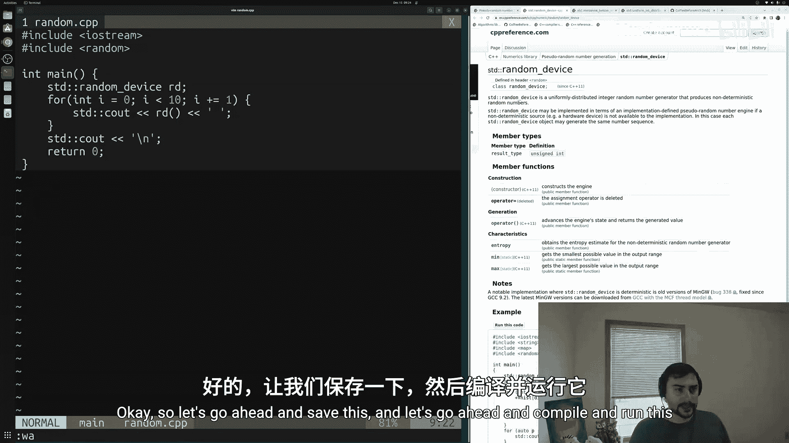
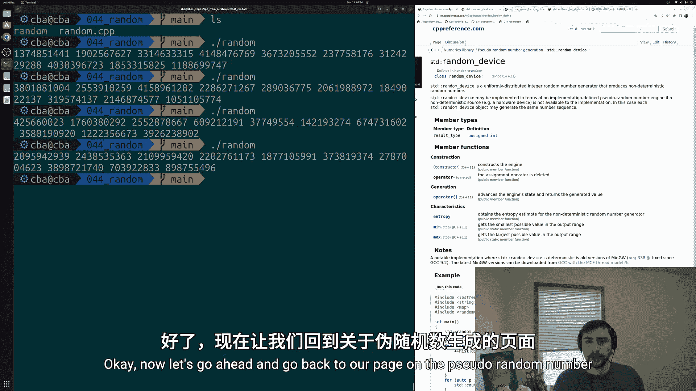
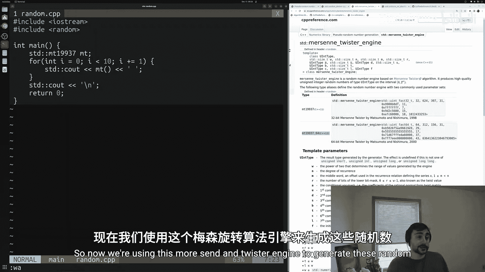
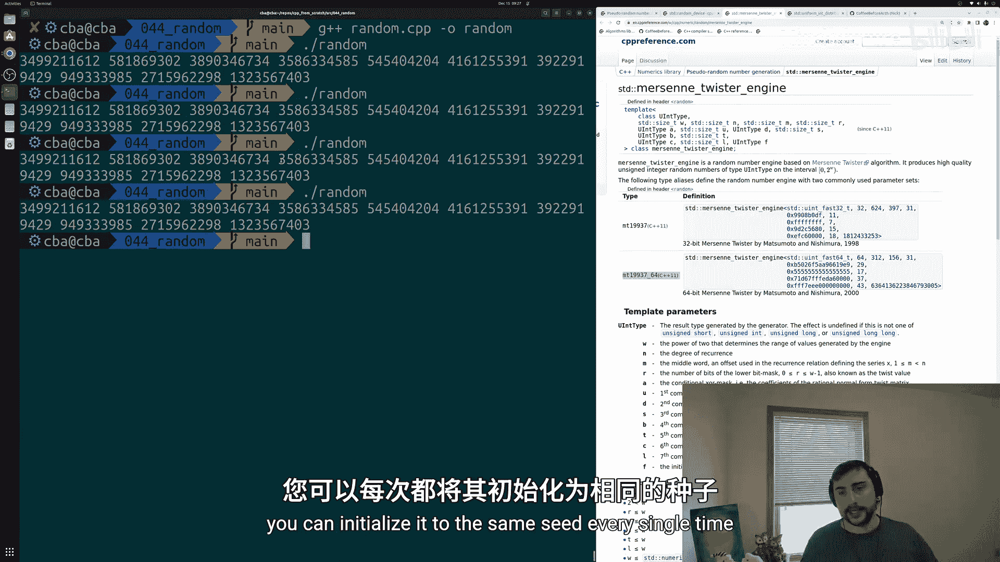
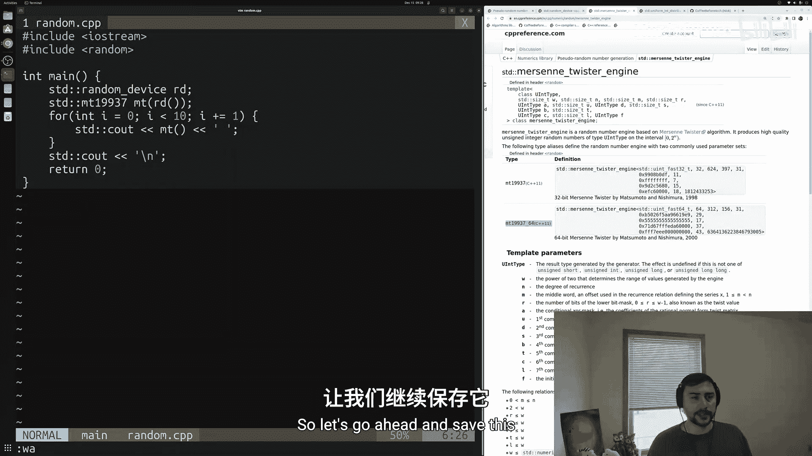
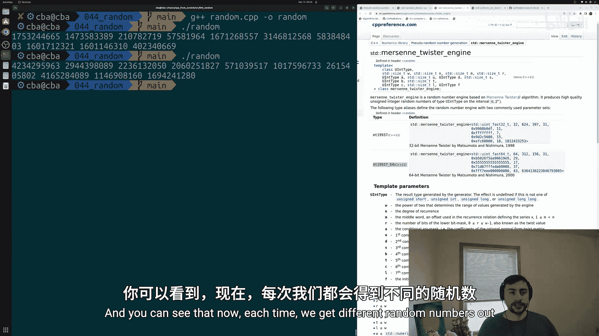
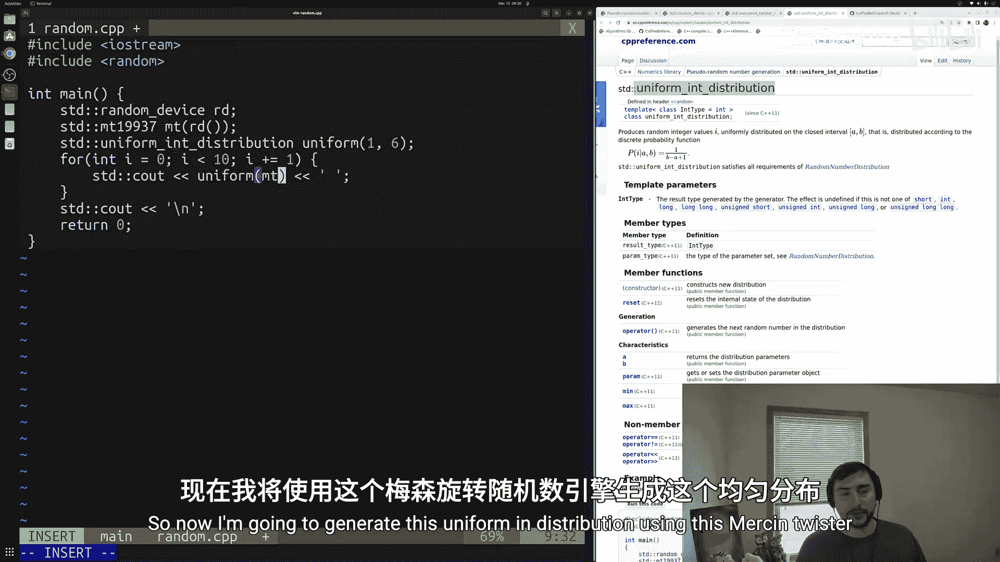
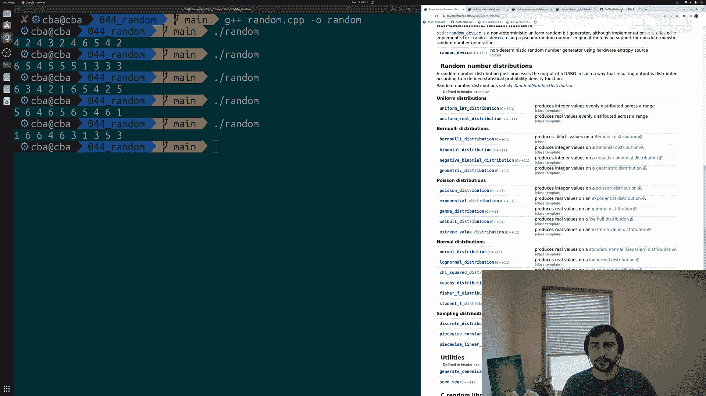
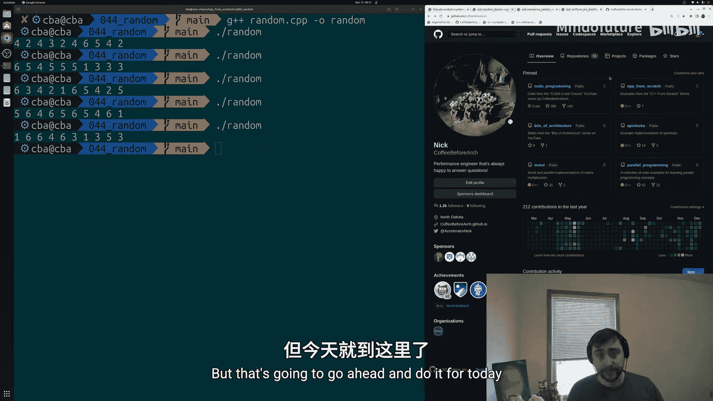

# 045：伪随机数生成

在本节课中，我们将学习如何在C++程序中生成随机数。随机数在模拟随机过程或测试函数时非常有用。C++标准库的 `<random>` 头文件提供了多种生成随机数的方法。我们将从基础开始，学习如何生成随机整数，并了解不同的随机数引擎和分布。



## 生成非确定性随机数

上一节我们介绍了课程概述，本节中我们来看看生成随机数最基本的方法：使用 `std::random_device`。这是一个生成非确定性随机数的均匀分布整数随机数生成器。

以下是使用 `std::random_device` 生成10个随机数的步骤：

1.  包含必要的头文件 `<iostream>` 和 `<random>`。
2.  在 `main` 函数中创建一个 `std::random_device` 对象。
3.  使用循环调用该对象的函数调用运算符 `()` 来生成随机数。



```cpp
#include <iostream>
#include <random>

int main() {
    // 创建随机设备
    std::random_device rd;
    
    // 生成并打印10个随机数
    for (int i = 0; i < 10; ++i) {
        std::cout << rd() << " ";
    }
    std::cout << "\n";
    
    return 0;
}
```



每次运行此程序，你都会得到一组不同的无符号整数。

## 使用伪随机数引擎

上一节我们使用了非确定性随机源，本节中我们来看看伪随机数引擎。C++提供了多种具有不同特性的引擎，例如 `std::mt19937`（梅森旋转算法引擎）。这些引擎在随机数质量、内存占用和性能之间有不同的权衡。

以下是使用 `std::mt19937` 引擎的示例：



```cpp
#include <iostream>
#include <random>

int main() {
    // 创建梅森旋转引擎
    std::mt19937 mt;
    
    // 生成并打印10个随机数
    for (int i = 0; i < 10; ++i) {
        std::cout << mt() << " ";
    }
    std::cout << "\n";
    
    return 0;
}
```



直接使用引擎时，每次程序运行可能会产生相同的随机数序列，因为它需要一个**种子**来初始化其内部状态。

## 控制随机性：种子

为了控制随机数的可重复性或确保其随机性，我们需要管理引擎的种子。给构造函数传递一个固定值（如 `std::mt19937 mt(42);`）会产生确定性的、可重复的序列。为了获得每次运行都不同的随机序列，一个常见的模式是使用 `std::random_device` 来生成一个随机种子。



以下是结合使用 `std::random_device` 和 `std::mt19937` 的示例：



```cpp
#include <iostream>
#include <random>

int main() {
    // 用随机设备生成种子
    std::random_device rd;
    // 用随机种子初始化梅森旋转引擎
    std::mt19937 mt(rd());
    
    // 生成并打印10个随机数
    for (int i = 0; i < 10; ++i) {
        std::cout << mt() << " ";
    }
    std::cout << "\n";
    
    return 0;
}
```

这样，每次程序启动时，引擎都会获得一个不同的随机种子，从而产生不同的随机数序列。

## 应用随机数分布

上一节我们生成了原始随机数，本节中我们来看看如何让这些数字符合特定的统计分布。`<random>` 库提供了多种分布，如均匀分布、正态分布等。我们可以将随机数引擎与分布组合使用。

以下是使用 `std::uniform_int_distribution` 生成指定范围内均匀分布随机数的示例，模拟掷骰子（生成1到6之间的整数）：



```cpp
#include <iostream>
#include <random>

int main() {
    // 设置随机数生成器
    std::random_device rd;
    std::mt19937 mt(rd());
    
    // 定义均匀整数分布，范围[1, 6]
    std::uniform_int_distribution<int> dist(1, 6);
    
    // 模拟掷10次骰子
    for (int i = 0; i < 10; ++i) {
        std::cout << dist(mt) << " ";
    }
    std::cout << "\n";
    
    return 0;
}
```

在这个例子中，`dist(mt)` 会使用 `mt` 引擎生成一个在1到6之间均匀分布的随机整数。





本节课中我们一起学习了C++中生成随机数的基础知识。我们了解了如何使用 `std::random_device` 获取非确定性随机数，如何使用如 `std::mt19937` 这样的伪随机数引擎，以及如何通过设置种子来控制随机序列。最后，我们学习了如何将引擎与 `std::uniform_int_distribution` 这样的分布结合，以生成符合特定范围和统计规律的随机数。掌握这些工具，你就能在程序中有效地模拟随机性了。