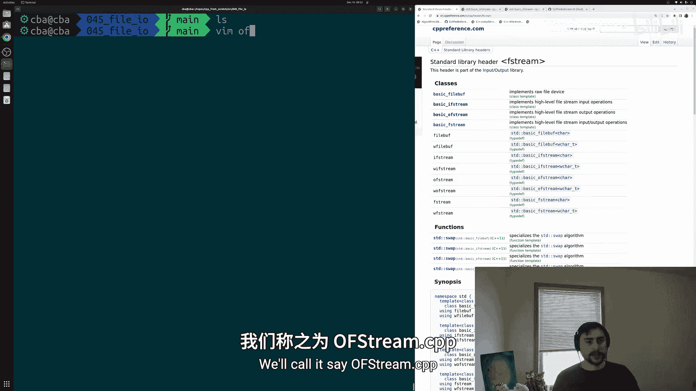
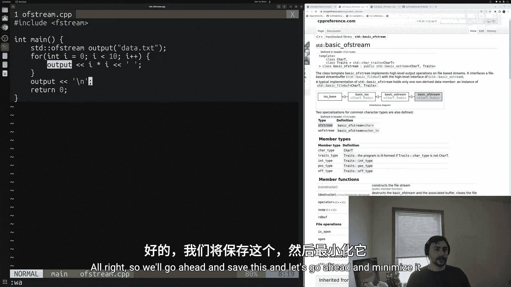
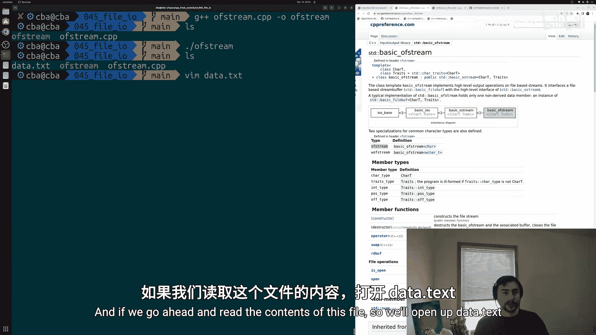
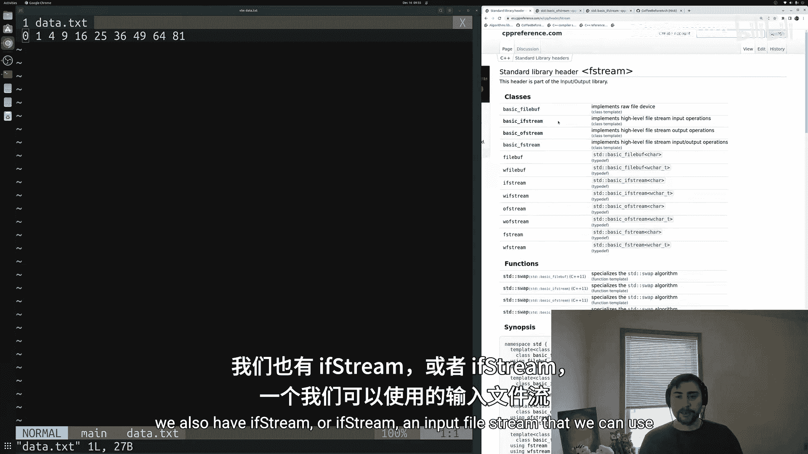
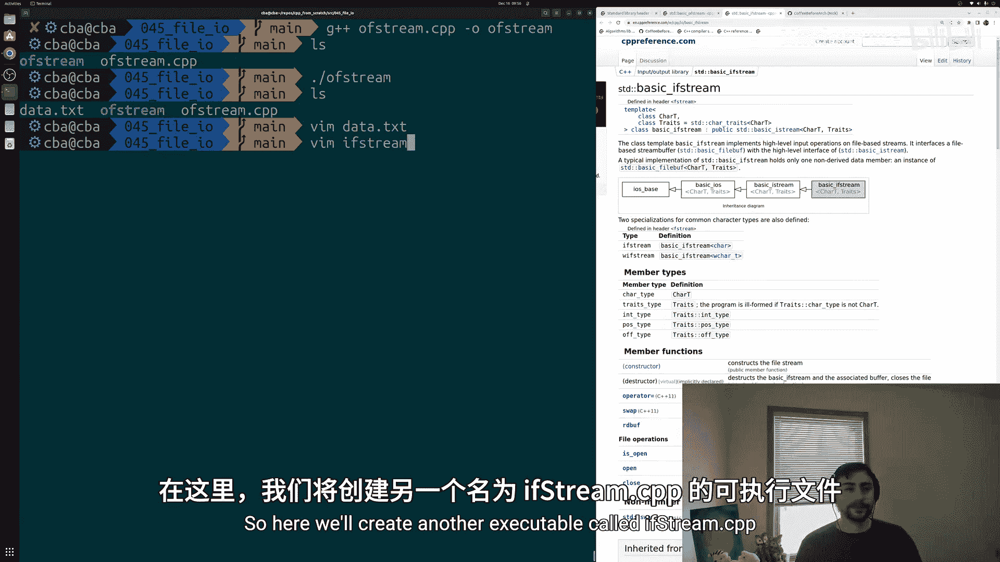
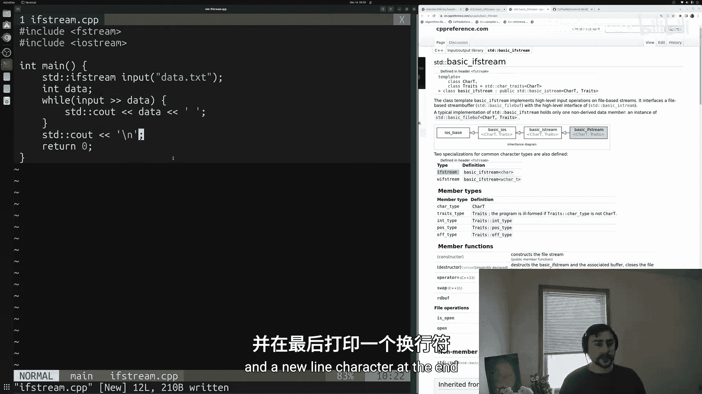
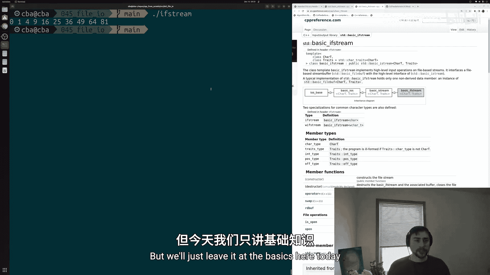
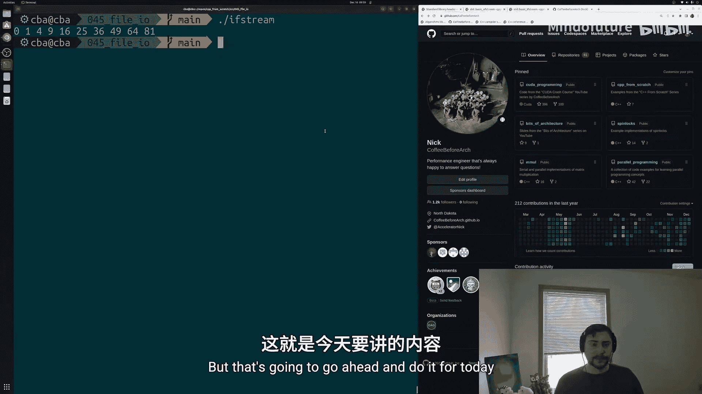

# 046：文件输入输出 📁

在本节课中，我们将学习C++中文件输入输出（File I/O）的基础知识，特别是如何使用标准库中的 `fstream` 来读取和写入文件。我们将通过两个简单的例子来演示如何将数据写入文件，以及如何从文件中读取数据。

## 概述



在编程中，经常需要从外部源读取数据，或者将程序生成的数据（如日志）写入文件。`fstream` 是C++标准输入输出库的一部分，它提供了进行文件操作的高级接口。本节将介绍其基本用法。

## 写入文件：使用 `ofstream`

首先，我们来看如何将数据写入文件。我们将创建一个程序，计算0到9的平方数，并将结果保存到一个文本文件中。

以下是实现此功能的基本步骤：

1.  包含必要的头文件 `fstream`。
2.  创建一个 `ofstream`（输出文件流）对象，并指定要写入的文件名。
3.  像使用 `cout` 一样，使用 `<<` 操作符将数据写入文件流。
4.  完成写入后，程序会自动关闭文件。



以下是具体的代码示例：

```cpp
#include <fstream>



int main() {
    // 创建一个输出文件流对象，并打开名为 "data.txt" 的文件
    std::ofstream output("data.txt");

    // 循环写入0到9的平方数
    for (int i = 0; i < 10; i++) {
        output << i * i << " "; // 将平方数和一个空格写入文件
    }
    output << std::endl; // 在文件末尾写入一个换行符

    return 0;
}
```



运行此程序后，会在当前目录生成一个名为 `data.txt` 的文件，其内容为 `0 1 4 9 16 25 36 49 64 81`。



## 读取文件：使用 `ifstream`

上一节我们介绍了如何将数据写入文件，本节中我们来看看如何从文件中读取数据。我们将使用 `ifstream`（输入文件流）来读取刚才创建的 `data.txt` 文件。

以下是实现此功能的基本步骤：

1.  包含头文件 `fstream` 和 `iostream`（用于在控制台打印）。
2.  创建一个 `ifstream` 对象，并指定要读取的文件路径。
3.  使用 `>>` 操作符从文件流中读取数据到变量中。
4.  在一个循环中持续读取，直到文件末尾。

以下是具体的代码示例：

```cpp
#include <fstream>
#include <iostream>

int main() {
    // 创建一个输入文件流对象，并打开名为 "data.txt" 的文件
    std::ifstream input("data.txt");

    int data; // 用于存储从文件中读取的整数

    // 当还能从文件流中成功读取一个整数到 data 变量时，循环继续
    while (input >> data) {
        std::cout << data << " "; // 将读取的数据打印到控制台
    }
    std::cout << std::endl; // 打印一个换行符

    return 0;
}
```



运行此程序，控制台将输出 `0 1 4 9 16 25 36 49 64 81`，这与我们写入文件的内容完全一致。`ifstream` 会自动处理文件中的空格和换行符，使得读取格式化的数据（如整数）变得非常简单。

## 总结

本节课中我们一起学习了C++文件I/O的基础知识。我们掌握了两个核心类：
*   **`std::ofstream`**：用于向文件写入数据，使用方式类似于 `std::cout`。
*   **`std::ifstream`**：用于从文件读取数据，使用方式类似于 `std::cin`。





通过 `<<` 操作符进行写入，通过 `>>` 操作符进行读取，是操作文件流的基本方法。这只是文件操作的起点，`fstream` 还支持更多高级功能，如以追加模式打开文件、在文件中定位等，但掌握这些基础是进一步学习的关键。